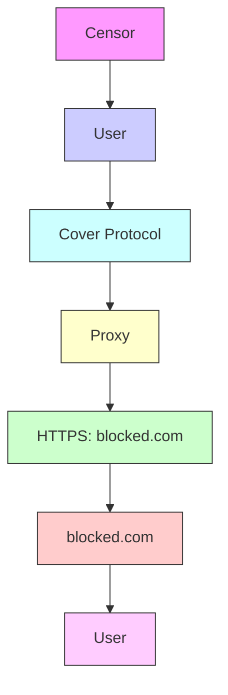
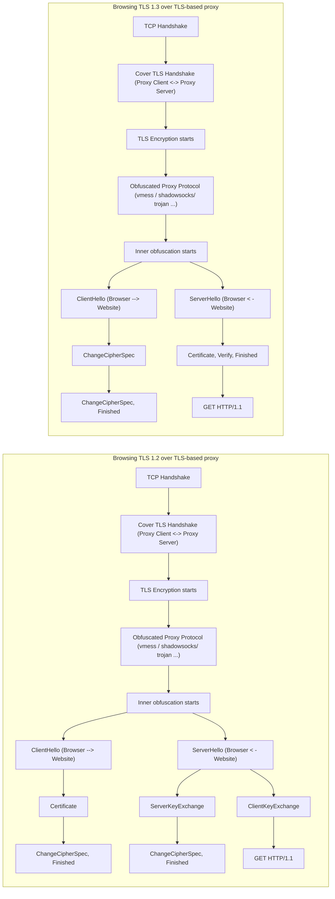
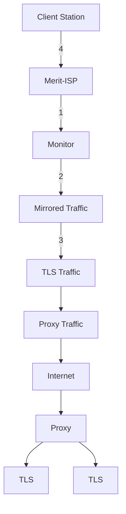
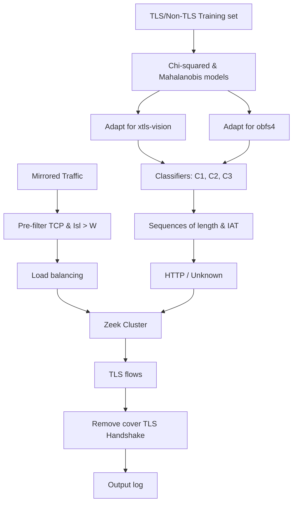

# Fingerprinting Obfuscated Proxy Traffic with Encapsulated TLS Handshakes

Diwen Xue, University of Michigan; Michalis Kallitsis, Merit Network, Inc.; Amir Houmansadr, UMass Amherst; Roya Ensafi, University of Michigan

https://www.usenix.org/conference/usenixsecurity24/presentation/xue-fingerprinting

This paper is included in the Proceedings of the 33rd USENIX Security Symposium.

August 14–16, 2024 • Philadelphia, PA, USA

978-1-939133-44-1

Open access to the Proceedings of the 33rd USENIX Security Symposium is sponsored by USENIX.

# Fingerprinting Obfuscated Proxy Traffic with Encapsulated TLS Handshakes

Diwen Xue∗ Michalis Kallitsis† Amir Houmansadr ‡ Roya Ensafi∗

∗University of Michigan †Merit Network, Inc. ‡ University of Massachusetts Amherst

# Abstract

The global escalation of Internet censorship by nation-state actors has led to an ongoing arms race between censors and obfuscated circumvention proxies. Research over the past decade has extensively examined various fingerprinting attacks against individual proxy protocols and their respective countermeasures. In this paper, however, we demonstrate the feasibility of a protocol-agnostic approach to proxy detection, enabled by the shared characteristic of nested protocol stacks inherent to all forms of proxying and tunneling activities. We showcase the practicality of such an approach by identifying one specific fingerprint–encapsulated TLS handshakes–that results from nested protocol stacks, and building similaritybased classifiers to isolate this unique fingerprint within encrypted traffic streams.

Assuming the role of a censor, we build a detection framework and deploy it within a mid-size ISP serving upwards of one million users. Our evaluation demonstrates that the traffic of obfuscated proxies, even with random padding and multiple layers of encapsulations, can be reliably detected with minimal collateral damage by fingerprinting encapsulated TLS handshakes. While stream multiplexing shows promise as a viable countermeasure, we caution that existing obfuscations based on multiplexing and random padding alone are inherently limited, due to their inability to reduce the size of traffic bursts or the number of round trips within a connection. Proxy developers should be aware of these limitations, anticipate the potential exploitation of encapsulated TLS handshakes by the censors, and equip their tools with proactive countermeasures.

# 1 Introduction

The recent decades have witnessed a global escalation in censorship and surveillance by various nation-state actors [76]. Among the most notorious examples is China, where the Great Firewall (GFW) has been blocking foreign websites, filtering search results, and interfering with private communications [14,28,58,74]. In Iran, the government blocks social media and throttles targeted protocols during periods of political unrest [12, 34, 35]. In Russia, “Sovereign Internet” prevents access to news and media during the Ukraine war, demonstrating how easily censors can create information bubbles and isolate specific regions from the broader Internet [75, 90].

flowchart

Figure 1: Channel-based Circumvention. Users’ traffic is encapsulated within a cover protocol in order to pass through censors without being directly exposed. Figure inspired by [49].⋄

In reaction to such escalating censorship measures, users have resorted to proxying and tunneling tools. As shown in Figure 1, users in censored regions encapsulate their application traffic within a cover (i.e., proxy) protocol and transmit it to a proxy server outside the censor’s jurisdiction, which then forwards the traffic to its destination. The cover protocol encrypts its payload, so that application traffic containing censored keywords does not trigger blocking. This strategy, referred to as “channel-based circumvention” by previous work [78], necessitates obfuscation over the cover protocol – otherwise, the channel itself could be fingerprinted and blocked. Over the past decade, the circumvention community has developed numerous obfuscation approaches, either making the channels look like protocols that are allowed [4, 39, 45, 66], or disguising the channels to ensure they do not resemble protocols that are prohibited [19, 27, 30].

On the other hand, advancements like carrier-grade deep packet inspection (DPI) have enabled censors to evolve from basic IP or keyword filtering to more sophisticated modes of detection. This has led to an ongoing arms race between circumvention proxies, who implement obfuscation mechanisms to avoid detection, and censors, who aim to see through such obfuscation: censors use active probing to identify proxy servers, driving proxies to implement probe-resistance mechanisms [46, 52, 86]. Censors block circumvention proxies by their unique TLS ciphersuites [2, 51, 86], in response to which proxies change their ciphersuites to mimic mainstream browsers [53]. Censors block fully encrypted proxies based on high entropy [89]. Proxy developers then modify the byte patterns to show less entropy [11, 20]. Such back-and-forth interactions represent the current state of the circumvention arms race, with censors exploiting the design and implementation flaws of individual cover protocols, and developers patching the flaws and experimenting with new protocols. A common assumption shared in the community is that each new cover protocol requires its own unique set of features and separate analysis by the censor to block [20].

What we demonstrate in this paper, however, is the feasibility of a protocol-agnostic approach to proxy detection. We observe that, despite the varying designs and implementations of cover protocols, the fundamental concept underpinning all forms of proxying and tunneling is that of nested protocol stacks, where one protocol stack is encapsulated within the payload of another. For example, users’ web browsing traffic (HTTPS) can be encapsulated within another TLS or application-layer protocol, which serves both as a cover and transport for the former, in order to pass through censors without being directly exposed. The near-universal presence of nested protocol stacks in proxied connections, contrasted with the rarity of finding such behavior in direct client-server communications, establishes them as a fingerprinting vulnerability that is shared across various proxy protocols and is orthogonal to existing attacks and countermeasures.

In this paper, we focus on one specific fingerprint of this kind, termed as encapsulated TLS handshakes, and the practicality of exploiting it in detecting obfuscated proxy traffic. Encapsulated TLS handshakes refer to TLS handshakes that take place within an encrypted or obfuscated cover protocol. As shown in Figure 2 (red), these handshakes are generated by user applications (e.g., browsers), and the proxy protocol then encrypts and transports them to the proxy server, which in turn forwards them to the final destination (e.g., web servers). This differentiates them from standard TLS that has plaintext structures and is visible to network intermediaries. We explain how the presence of encapsulated TLS handshakes indicates nested or redundant protocol stacking, which in turn signals that the connection carries proxied traffic. While encapsulated TLS handshakes cannot be easily identified by protocol parsers, we show that the packets exchanged during an (encapsulated) TLS handshake exhibit distinct patterns in their size, timing, and direction. These patterns remain visible even after encryption, enabling a censor to reliably identify encapsulated handshakes without breaking the encryption of the cover protocol.

We evaluate the practicality of fingerprinting obfuscated proxy traffic with encapsulated TLS handshakes, from the perspective of a censor or an adversarial ISP. We aim to answer: How practical is this fingerprinting attack? Can censors deploy it at scale without significant collateral damage? Addressing these questions requires not only identifying a vulnerability but also demonstrating feasible exploits, all while considering the real-world operating constraints of the censors, such as their sensitivity to false positives. To this end, we develop a detection framework using similarity-based classifiers, following a conservative censor capability model informed by empirical studies on real-world censorship events. Next, in collaboration with Merit, we deploy our framework within the ISP’s network, adopting the position of a censor to evaluate the potential impact and collateral damage if the fingerprinting attack were to be widely deployed.

text_image

TLS-over-TLS
(e.g., https-over-vmess-over-ws-over-tls)
# "Cover" TLS
SNI=proxy.com
Web-socket
#
vmess/shadowsocks/trojan
+
Application TLS
SNI=blocked.com
Payload, HTTP
* Host:
blocked.com
TLS-over-HTTP
(e.g., https-over-vmess-over-websocket)
# "Cover" HTTP
Host: proxy.com
Web-socket
#
vmess/shadowsocks/trojan
+
Application TLS
SNI=blocked.com
Payload, HTTP
* Host:
blocked.com
TLS-over-Unknown
(e.g., https-over-vmess)
# vmess/shadowsocks
(fully encrypted)
+
Application TLS
SNI=blocked.com
*
Payload, HTTP
Host: blocked.com
# Layers Targeted in Previous Attacks on Circumvention Tools
Layer Targeted in This Paper
* Layer Targeted in Website Fingerprinting Attacks
(Encapsulated TLS handshakes)

Figure 2: Comparison with previous attacks on circumvention tools. Prior work targeted cover or proxy protocol’s failure to achieve indistinguishability, while this paper exploits fingerprints of the encapsulated layers within, which are agnostic to proxy protocols.⋄

We test 23 obfuscated proxy configurations, including major circumvention protocols used by millions around the world like shadowsocks, vmess, trojan, and vless, and protocols proposed in previous research like httpt [19, 25, 27, 54]. We find that all tested obfuscated proxy protocols, in their standard configurations, are vulnerable to fingerprinting based on encapsulated TLS handshakes, with true positive rates (TPRs) all exceeding 70%. Such TPRs carry significant implications (§ 3), especially as a single detection can result in a censor blocking all subsequent connections to the corresponding proxy server. Even advanced configurations that encapsulate proxy traffic within additional cover layers, such as shadowsocks within websocket within TLS, provide limited defense and only marginally lower the detection rates. Contrary to common belief, we find that random padding slightly increases the fingerprinting difficulty, but not to a degree sufficient to prevent the exploit. Even for more aggressive padding schemes like XTLS-vision and obfs4, we demonstrate that censors could easily adapt their statistical models and rely only on packet order and direction, rather than size, for detection.

During a 30-day evaluation, our deployment within Merit processed over 110 million flows, maintaining an upperbound false positive rate as low as 0.0544%. Such precision positions our fingerprinting attack on par with approaches previously deployed by real censors [89]. Notably, our technique remains fully passive, agnostic to unpadded obfuscated protocols, and can be adapted to identify padded variants.

Obfuscated proxies are essential tools for facilitating unrestricted access to information and resources on the Internet. However, our findings suggest that traffic of obfuscated proxies, even with padding and layers of encapsulation, can be effectively detected by fingerprinting encapsulated TLS handshakes. Our approach shifts the focus from the cover layer to the encapsulated layers within, introducing a new threat dimension that is orthogonal and potentially complementary to existing attacks against circumvention tools. While we show that stream multiplexing could be a viable mitigation, we caution that obfuscations relying solely on padding and multiplexing are inherently limited. Proxy developers should be aware of the limitations of current obfuscation strategies, anticipate the potential exploitation of encapsulated TLS handshakes by censors, and equip their tools with proactive countermeasures.

# 2 Background & Related Work

# 2.1 Internet Censorship and Circumvention

News, anecdotes, and measurement studies collectively suggest that governments have been increasingly censoring the Internet on a global scale [68, 73, 76]. These studies document how governments practice censorship and, in particular, censors’ technical capabilities, ranging from blanket IP-based blocking [24,47,69], content-based blocking [40,58,70,74], to blocking of protocols and circumvention tools [32, 46, 86, 89, 90]. In addition to exposing otherwise covert practices of Internet censorship, these measurement studies contribute to the understanding of real-world censors and assist in approximating a realistic threat model [78]. Developers and researchers rely on this knowledge when building circumvention tools and evaluating the practicality of potential attacks against them.

Users from regions with restrictive censorship policies have been seeking ways to circumvent the censorship using various approaches, which can be roughly classified into strategy-based and channel-based circumvention. Strategybased circumvention [38, 43, 63, 83] involves the client or server implementing custom packet manipulation rules, such as dropping or injecting specially crafted packets, in order to confuse middleboxes into not recognizing censorship triggers. On the other hand, channel-based circumvention [78] involves users establishing channels to forwarders located outside the censored region, which then route the users’ traffic to its final destination. Obfuscated proxies fall into the latter category.

Channel-based circumvention necessitates obfuscation mechanisms. Most obfuscation mechanisms either make channels look like protocols that are allowed (i.e., mimicry), or disguise channels so they don’t look like protocols that are forbidden (e.g., randomization). Mimicry-based obfuscation simulates traffic characteristics of popular, permitted protocols (e.g., HTTP, Skype [45, 66, 85]). Some even take the mimicry approach to the extreme by tunneling circumvention traffic through actual, legitimate network services like cloud storage, email, VoIP, and DNS [4, 39, 60, 93], resulting in more plausible protocol fingerprints [59]. On the other hand, randomization-based obfuscation approaches aim to eliminate all fingerprints by encrypting traffic into bits indistinguishable from random. Examples of these include shadowsocks, vmess, and obfs4 [19, 27, 30], which defeat protocol parsers with the absence of a fixed protocol structure.

# 2.2 Attacks on Obfuscated Circumvention Tools

Previous research has documented several active and passive attacks by real-world censors against obfuscated circumvention tools. Active attacks involve censors sending speciallycrafted probes to suspected endpoints and analyzing their responses. The GFW was able to identify Tor, VPN, and shadowsocks servers by sending connection requests of a targeted protocol and monitoring if the responses conform to the expected protocol behaviors [32, 46, 86]. In response, “proberesistant” proxies were developed, which remain silent when probed by an unauthenticated client [52]. However, recent work shows that it is still possible to identify a server even without explicit server responses, due to application-specific features at the network level, such as how and when a server closes a connection [22, 80, 91].

Passive attacks have been used to detect both mimicry and randomization-based obfuscations. Houmansadr et al. argue that obfuscation by imitation is “fundamentally flawed” as seamlessly simulating all implementation-specific behaviors is too difficult and suggest tunneling as an alternative [59]. However, even when circumvention traffic is tunneled, detection remains possible through fingerprinting implementation discrepancies of the cover protocol. Past examples include the blocking of Tor due to the unique fingerprints in its custom TLS implementation, such as uncommon ciphersuites [23, 53, 86]. Snowflake [21], a Tor obfuscation based on WebRTC, was similarly fingerprinted by its unusual DTLS behaviors [41,51]. Non-content features can also be exploited, such as excessive TCP ACK packets [81] or abnormal packet size distribution [36, 56]. While randomization-based approaches eliminate many of these potential fingerprints, looking like random could itself become a feature. Wang et al. demonstrate that packet length and entropy could identify fully encrypted proxies like obfs4 [81], and more recently, the GFW was found to block fully encrypted traffic using entropy as one of the features [89]. In response, developers have implemented several countermeasures, such as allowing users more fine-grained control over the fingerprints and entropy of the cover protocol [11, 20, 53].

# 2.2.1 Contextualizing Our Fingerprinting Approach

The fingerprinting attack discussed in this paper is orthogonal to all aforementioned attacks that target circumvention protocols. Both active and passive attacks found in previous work exploit implementation flaws in the cover/proxy protocols (depicted in blue in Figure 2). In contrast, this work focuses on the fingerprints generated by encapsulated application traffic (user-generated traffic inside the tunnel, e.g., from browsers), illustrated in red in Figure 2. This means that 1) our attack can potentially complement existing active or passive fingerprinting strategies targeting the cover protocols to further improve accuracy; and 2) existing countermeasures such as utls [53] are not effective against our approach, as they act on the cover protocol rather than the encapsulated layers within. A particular point of emphasis is to distinguish our approach from “TLS fingerprinting” as characterized in previous work [31, 53, 61]. These previous efforts aim to identify TLS implementations by looking at fields within ClientHellos of the cover/surface layer (e.g., distinguishing between TLS flows generated by Tor browsers versus those by Chrome). In contrast, our work looks for patterns that indicate the presence of TLS handshakes that are encapsulated within encrypted/obfuscated protocols.

flowchart

Figure 3: TLS handshakes inside TLS-based proxy. Messages transmitted during the handshake stage are well-specified and exhibit characteristics in their size, timing, and direction.⋄

The works most closely related to ours are those that infer the underlying protocol and protocol semantics from encrypted streams [33,57,72,87], using features that remain visible after encryption, such as packet size, timing, and direction.

# 3 Threat Model

We outline a realistic threat model for the fingerprinting attack evaluated in this paper. Although real-world censorship practices are often covert, we approximate a conservative censor capability model informed by previous work on the arms race between censors and circumvention tools [32, 46, 59, 78, 89]. We assume an on-path censor performing passive traffic fingerprinting attacks on all connections passing through its network. The censor cannot inject, drop, or modify any passing packets, nor actively probe suspected servers. While the censor is stateful, it is bounded by memory and computational resources. This means the censor can maintain only a limited number of states per connection within a limited observation window. The censor is familiar with the targeted obfuscated proxy protocols and can adapt its detection methods as needed. However, it cannot break the encryption or obfuscation of the targeted protocol if standard cryptographic primitives are used. We note that these assumptions align with a weak adversary as defined in previous work [59].

The censor’s reactions to false positives and false negatives are asymmetric. The censor is highly sensitive to collateral damage – the economic costs associated with falsely blocking legitimate traffic during censorship efforts. The censor’s reluctance to cause collateral damage is essentially what enables circumvention to be possible [49]. Furthermore, due to the low base rate of circumvention traffic, even a seemingly low false positive rate (1%) can still be economically impractical [81, 91]. On the other hand, a moderate false negative rate can be considered acceptable. This is because circumvention tools users are likely to use them on a daily basis, generating hundreds of flows for each browsing session, and the censor only needs to detect a single flow to block the proxy server.

# 4 Encapsulated TLS Handshakes

We begin by providing the intuition of how we fingerprint obfuscated proxy traffic. Fundamental to all proxying and tunneling activities is the concept of nested protocol stacks, where one protocol stack is encapsulated within the payload of another, in order to pass through network intermediaries without being directly exposed. This observation forms the basis of the fingerprinting attack we evaluate in this paper and renders the approach agnostic to the choice of proxy protocols. Nested protocol stacks are rare in regular, direct client-server connections. In proxied connections, however, a cover protocol serves as a transport between the client and proxy, while an encapsulated application protocol facilitates end-to-end communication between the client and the final destination server. Nested protocol stacks can result in violations of the layering of the OSI model, such as when the same protocol is encapsulated within itself, as in the case of a TLS-based proxy encapsulating HTTPS traffic (i.e., TLS-over-TLS).

The presence of nested protocol stacks is indicative of proxying. Identifying this behavior, however, can be challenging, as the cover protocol encrypts or obfuscates its payloads. Previous work has approached this problem by modeling nonproxied connections and detecting anomalies by comparing their behaviors to the model [44]. Nevertheless, precisely characterizing “legitimate” traffic can be challenging due to the diversity of traffic and protocols on the Internet. For example, while HTTPS constitutes a significant fraction of TLS traffic, TLS payloads deviating from the expected HTTP behaviors do not always imply a second protocol stack, since there are other protocols that use TLS for encryption.

Instead, our approach focuses on fingerprinting a unique behavior that results from nested protocol stacks, termed Encapsulated TLS Handshakes. Encapsulated TLS handshakes refer to the TLS handshakes of user traffic transmitted within an encrypted or obfuscated cover protocol (including an outer layer of TLS). This contrasts with standard TLS with plaintext headers and structures that are identifiable by protocol parsers, as shown in Figure 2. The rationale for using encapsulated TLS handshakes as indicators of proxying is intuitive: since TLS is designed to provide end-to-end security over an unsecured network, an encapsulated TLS session within an already-encrypted cover channel suggests redundant protocol stacking and implies that the outer encryption is not carried through to the final destination but is instead terminated earlier, e.g., at the forwarding proxy server.

Several aspects of encapsulated TLS handshakes make them an ideal fingerprint for proxy traffic. Distinct: Similar to standard TLS handshakes, encapsulated TLS handshakes are also well-defined, and the packets transmitted during the handshake stage exhibit distinct size, timing, and directional characteristics, as shown in Figure 3. For example, most ClientHello messages typically range from 200 to 550 bytes depending on the TLS version, whereas ServerHello messages with certificates can span several thousand bytes and exhibit a higher degree of variation across flows. Moreover, as each handshake message logically depends on the preceding message transmitted, an on-path adversary can exploit the order in which packets carrying these messages are observed on the wire. These characteristics remain visible even after encryption and thus allow us to identify encapsulated TLS handshakes without breaking the cover protocol. Reliable: TLS is ubiquitous on the Internet, providing a foundation for secure communication across a variety of applications. As such, encapsulated TLS handshakes serve as a reliable fingerprint, as it would be impractical for proxy users to avoid generating such fingerprints by not using TLS. Precise: As described earlier, encapsulated TLS handshakes are indicative of proxied connections. In § 7, we provide empirical evidence to demonstrate that this behavior is fairly unique to the use of proxies. Consequently, using encapsulated TLS handshakes as a fingerprint results in minimal collateral damage for censors.

if is\_obfuscated\_or\_encrypted(flow) : extract: size, timing, direction from flow[payload] if matches\_TLS\_handshake(size, timing, direction) : log\_as\_proxy\_traffic(flow)

The pseudo-method above conceptualizes how censors could exploit encapsulated TLS handshakes for proxy detection. In the following sections, we demonstrate the practicality of this approach by building a detection framework using similarity-based classifiers and evaluating it in a real network.

# 5 Ethical Considerations

Research on censorship and circumvention is inherently sensitive, especially when it involves raw network traffic containing real users’ data. For this, we sought approval from our university’s IRB for our research plan. Although the IRB determined that the work is “Not Regulated”, we take extensive procedural and technical measures to minimize potential risks.

A primary ethical concern relates to the handling of raw network traffic. We access live ISP traffic via our Monitor within Merit to train classifiers and evaluate the proposed fingerprinting attack. Our Monitor deployment is overseen by Merit, who has extensive collaboration experience and wellestablished ethics and privacy guidelines for such projects. The Monitor receives only a mirrored copy of traffic without handling the actual routing, ensuring that Merit’s service remains unaffected. The raw traffic is processed by a Zeek [92] cluster that carries out protocol parsing and feature extraction (§ 6.2). Instead of recording raw traffic, we log only extracted features, consisting of sequences of packet sizes and timing, without including any packet payloads. These logs are stored and processed on a Merit-maintained server, accessible only to select members of the team on a least-privilege basis. We emphasize that at no point during the project’s duration are packet payloads recorded to disk or inspected by humans.

As with all research on attack methodologies, there is a risk that the fingerprinting attack evaluated in this paper could be deployed by real-world adversaries. We are currently disclosing relevant information to the developers of the proxy protocols examined in our study. It is worth noting, however, that there have already been speculations in the community regarding the potential exploitation of TLS handshakes by GFW in its recent attempts to block circumvention tools [13, 37]. As these obfuscated proxies are used by millions of people to circumvent censorship, we believe it is crucial to bring these vulnerabilities to light, especially considering the realistic threat they pose, as evidenced in this paper. Our work intends to provide users with accurate information about the proxy tools they depend on and encourage proxy developers to implement principled countermeasures.

# 6 Similarity-Based Classification

Our objective is to distinguish traffic generated by obfuscated proxies from non-proxied user traffic. At the same time, it’s equally important to identify the specific features that contribute to detection, as this knowledge will inform future developments in obfuscated proxy protocols. For example, although deep learning–based classifiers have been used in previous research to evaluate the distinguishability of proxy/VPN traffic [3, 26, 55, 65, 82], the limited explainability of deep learning models makes them less suitable for investigating specific fingerprinting vulnerabilities, such as the encapsulated TLS handshakes in our study.

We approach our problem as a binary classification problem – determining whether (obfuscated) network traffic flows contain TLS handshake sequences. We explored several options for classification, such as clustering or supervised learning techniques. We found that classifiers constructed with similarity-based metrics achieve a precision level (in terms of false positive rates) that we consider practical for a censor to deploy, while being computationally efficient. In similaritybased classification, similarity scores are derived for each class by applying selected distance metrics to the test sample and training datasets. Next, a class label is estimated for the test sample based on its similarity scores to each class [42].

flowchart

Figure 4: Merit Setup for collecting plain TLS/non-TLS traffic (1– 3:§ 6.1) as well as obfuscated proxy flows (4–5:§ 7.1.2).⋄

In this section, we collect a large training dataset comprising TLS/non-TLS flow records by applying a protocol parser to traffic passing through a major Merit point-of-presence. Next, we build two classifiers using the training datasets and task them with identifying TLS handshakes using only features visible post-encryption, i.e., packet size, direction, and inter-arrival time. We evaluate our classifiers first on plain TLS/non-TLS traffic for both TLS version 1.2 and 1.3. In the following section, we adapt our classifiers to detect encapsulated TLS handshakes from obfuscated proxy traffic.

# 6.1 Data Collection

To compile a training dataset with TLS and non-TLS traffic, we set up our monitoring station within Merit, as shown in Figure 4, which oversees 50 Gbps of ingress and egress traffic mirrored from a backbone router. First, a user inside Merit initiates a TLS connection to an external TLS server (1). As the traffic passes through the monitored router, a copy of the traffic is sent to our Monitor (2). The Monitor operates a cluster of 23 Zeek [92] instances running our custom script (3). Due to the large traffic volume, we optimize our setup with PF\_Ring to enhance packet processing speed [71]. We apply the following filtering rules when creating datasets for training and testing: For both TLS and non-TLS flows, we filter only TCP and require the observation of both a SYN packet and a SYN-ACK packet in the reverse direction. This ensures symmetric routing and that we see the beginning of the connection, where protocol handshakes are expected to occur. We record the first $W _ { o }$ data-carrying TCP packets transmitted in either direction for analysis. We discard short-lived flows with fewer packets than the observation window $W _ { o }$ For TLS flows, we differentiate between version 1.2 and 1.3 based on the Supported Version extension within ServerHello records [17]. We filter out flows with an empty Server Name Indication field and flows where no TLS records with Application Data type are observed (e.g., failed handshake).

Despite the optimizations implemented to improve packet processing speed, handling traffic at 50Gbps on a single server still results in non-negligible packet loss due to CPU bottlenecks. Therefore, we sample only 1/8 of all TCP flows arriving at the Monitor. This sampling is based on IP pairs. A detailed breakdown of the collected datasets is shown in Table 1.

<table><tr><td rowspan="3">TLS flows</td><td>All flows</td><td>26,500,694</td></tr><tr><td>TLS 1.2</td><td>10,851,340 (40.95%)</td></tr><tr><td>TLS 1.3</td><td>15,649,354 (59.05%)</td></tr><tr><td rowspan="2">Non-TLS flows</td><td>All flows</td><td>7,020,287</td></tr><tr><td>Unknown Protocols</td><td>479,982 (6.84%)</td></tr></table>

Table 1: TLS/non-TLS dataset for training and testing classifiers.

# 6.2 Feature Extraction

Each flow is represented as a sequence of integers, where the absolute value of each integer corresponds to the size of the TCP payload, and the sign indicates the packet’s direction. We use SEQ/ACK analysis to establish a total ordering in which the packets should be processed. An example of such a sequence is (+517, −1400, −1400, +80). Additionally, we record the inter-arrival times between packets.

We extract n-grams from these sequences of packet sizes. ngrams have been used in previous work to analyze encrypted DNS and VoIP traffic [64, 77, 88]. In our case, the intuition is that, compared to 1-grams, n-gram representations can better differentiate between bulk transfer and interactive communications, such as protocol handshakes. Moreover, for protocols with well-defined handshake processes like TLS, we anticipate that n-grams can capture patterns in size tuples during state transitions. For example, the first 3-gram extracted from the previous packet sequence is (+517, −1400, −1400), which often signals an outgoing ClientHello followed by a segmented ServerHello. Such patterns would be obscured in a 1-gram representation. We experimented with 2-gram, 3-gram, and 4-gram, and found that 3-gram provides the best balance between performance and memory requirements.

We augment the n-gram representation with “burst” features, which consider packet directions and inter-arrival times. Bursts refer to sequences of consecutive packets traveling in the same direction, often occurring when TCP splits large application layer write() into smaller pieces for transport. Burst sequences are more robust to minor changes at the packet level, as they consider only the aggregated traffic volume and the direction in which it travels. Specifically, given an original TCP flow record and the corresponding inter-arrival times, we first estimate the connection’s RTT as the time elapsed between the observation of the SYN packet and the arrival of the first ACK packet sent from the client at the Monitor. To construct burst sequences, we aggregate the sizes of consecutive packets that 1) travel in the same direction and 2) have an inter-arrival time less than three times the estimated RTT.

# 6.3 Classifiers

To make a classification, we deploy two tests – a Chi-squared $( \chi ^ { 2 } )$ test over the 3-gram representation, and a Mahalanobis distance metric over the burst sequence. We classify a flow as TLS only when both tests are satisfied. The intuition behind this approach is that the former test captures local orders of

Algorithm 1 Chi-squared Test over 3-grams.

T , T :training sets; G:set of all 3-grams; δ:decision threshold s:test sample; M:size mapping; f :dimensionality parameter

Input: $T _ { 0 } , T _ { 1 } , G , \delta , s , M , f$

Training:

$$
\begin{array}{l} T _ {c} = [ M (x) \text {   for   } x \text {   in   } T _ {c} ], c \in \{0, 1 \} \\ P r (c, g) = \frac {1}{\left(\sum_ {t \in T _ {c}} N _ {t}\right)} \sum_ {t \in T _ {c}} \left(N _ {t} \times P r (t, g)\right), c \in \{0, 1 \}, g \in G \\ \operatorname{Distinc} (g) = \left(\sum_ {c \in \{0, 1 \}} \frac {1}{| T _ {c} |} \sum_ {t \in T _ {c}} \left(P r (t, g) - P r (c, g)\right) ^ {2}\right) / \\ \left(\frac {1}{\sum_ {c \in \{0 , 1 \}} | T _ {c} |} \sum_ {c \in \{0, 1 \}} \sum_ {t \in T _ {c}} (P r (t, g) - P r (\bar {c}, g)) ^ {2} + \varepsilon\right), g \in G \\ F = \text { Sorted } (G, \text { key } = \text { Distinc } (g), \text { reverse } = 1, g \in G) [ 0: f ] \\ \end{array}
$$

Testing:

$$
\begin{array}{l} s = M (s) \\ D (s, c) = \sum_ {g \in F} \frac {1}{P r (c , g)} (P r (s, g) - P r (c, g)) ^ {2}, c \in \{0, 1 \} \\ \end{array}
$$

$$
\text { Return } D (s, 1) / (D (s, 0) + \varepsilon) \geq \delta
$$

packet sequences and state-transition patterns, whereas the latter offers a more aggregated view of a flow’s dynamics.

# 6.3.1 Chi-squared Test

Chi-squared test is a statistical method for determining whether the distributions of categorical variables significantly differ from one another, by comparing the observed frequencies with the expectation for each category. Specifically, the expected number of occurrences of each 3-gram can be found given training sets $T _ { 0 }$ and $T _ { 1 }$ for non-TLS and TLS, respectively, as well as a set of all 3-grams G. Next, given a test sample s, Chi-squared distances for each class are derived, and we classify the sample by comparing the ratio of the two distances with a decision threshold δ.

However, using raw packet sizes to generate all possible 3- grams leads to an extremely high-dimensional feature space. For a standard MTU of 1500 bytes, the number of unique 3-gram features would be $3 0 0 0 ^ { \bar { 3 } }$ . We implement two measures to reduce dimensionality. First, raw packet sizes are discretized into groups ∈ L before generating 3-grams. We experimented with different grouping strategies (e.g., equalwidth, equal-frequency) and found that the strongest results are obtained when packets carrying the same semantic meanings (i.e., TLS Record Type) are grouped together. Using Zeek [92], we label handshake packets from the training set according to their TLS handshake types. Next, given group size $| L |$ , we derive a custom mapping that attempts to map sizes associated with the same TLS handshake type into the same group. The mapping function preserves directionality; that is, same packet types in different directions are grouped together, distinguished by their respective polarities. For our analysis, we set $| L | = 4$ to differentiate ClientHello, ServerHello, ChangeCipherSpec, which exhibit the most distinct size patterns, from other packets. We then search for a mapping that separates each of the three handshake types while minimizing the packets deviating from their respective groups. We use the mapping $M = [ L _ { 1 } : 1 - 1 6 0 , L _ { 2 } : 1 6 1 - 6 0 0 , L _ { 3 } : 6 0 1 - 1 2 1 0 , L _ { 4 } : 1 2 1 1 ^ { + } ]$ For example, 99.26% of ClientHellos in our training dataset are mapped into $L _ { 2 }$ . This step reduces the dimensionality to $( 4 * 2 ) ^ { 3 }$ . Furthermore, inspired by [88], we only use 3-grams that provide the best distinguishability by selecting those that exhibit low variance among samples from the same class but high variance among samples from different classes.

The overall training and testing process is outlined in Algorithm 1, where $N _ { t }$ and $P r ( t , g )$ correspond to the number of all 3-grams and the probability of the specific 3-gram g in flow t, respectively. The variables f and δ control the number of 3-gram features considered in the model and the decision threshold. c denotes the opposite class of c. As an example, Table 2 lists the top five 3-gram features ranked by the distinguishability they provide. As expected, we observe that 3-grams most likely representing state-transition patterns are among the top features that offer the best distinguishability.

# 6.3.2 Mahalanobis Distance

The Mahalanobis distance provides a method to measure the multivariate distance between a point and a distribution, incorporating both the variances of each variable and the inter-variable correlations. In our use case, we apply the Mahalanobis distance to the burst representation of a given flow, where each burst is considered as a separate dimension. Our rationale for this approach stems from the observation that each phase of the TLS handshake typically forms its own burst, as successive stages transmit packets in alternating directions. Additionally, while individual packets within different TLS handshakes can exhibit wider variability, the aggregated dynamics of a flow – characterized by traffic volume and direction – are likely more consistent across samples. In contrast to distance metrics like the Euclidean distance, the Mahalanobis distance effectively normalizes for the variance within each dimension by considering the covariance matrix. In other words, it takes into account the relative importance of changes in each dimension based on their expected variability. For example, the Mahalanobis distance computation will inherently recognize and accommodate the fact that the sizes of ServerHello bursts might vary more across samples than the sizes of ClientHello bursts.

Algorithm 2 outlines the process of measuring the Mahalanobis distance, given a TLS training set $T _ { 1 }$ , a test sample s, a burst window $W _ { b }$ , and a detection threshold γ. We set $W _ { b }$ to be $2 \times R T + 1$ , where RT is the minimum number of round trips required for a full TLS handshake. Therefore, for TLS 1.2 and 1.3, $W _ { b }$ is set to 5 and 3, respectively.

# 6.4 Evaluation on plain TLS/non-TLS traffic

We train and test our classifiers using the TLS/non-TLS dataset, which is fully labeled with protocol parsers as described in § 6.1. We partition the TLS class flows based on their respective TLS versions and train a separate classifier for each version. The negative class consists of non-TLS flows, shared between both classifiers. We set the observation window as $W _ { o } = 2 5 ,$ a length that we found to be sufficient for over 99.95% of TLS handshakes in our dataset. Additionally, we set the number of 3-gram features under consideration as f = 100. Upon completing the initial round of training, we compute the Chi-squared distance and Mahalanobis distance for each sample within the training set. Then, we remove outliers exhibiting abnormally large distances from the models and re-derive the models with the remaining samples.

<table><tr><td>3-gram</td><td>Most frequently occurring labels</td><td>Distinct.</td></tr><tr><td> $(L_2, -L_4, L_1)$ </td><td> $(C-H, S-H + S-EX, C-EX + C-CCS)$ </td><td>7.226</td></tr><tr><td> $(-L_4, -L_4, -L_4)$ </td><td> $(S-H, S-H (cont.), S-H (cont.))$ </td><td>5.886</td></tr><tr><td> $(-L_4, L_1, -L_1)$ </td><td> $(S-H, C-EX + C-CCS, S-CCS + S-FIN)$ </td><td>2.879</td></tr><tr><td> $(-L_4, -L_4, -L_3)$ </td><td> $(S-H, S-H (cont.), S-EX)$ </td><td>2.780</td></tr><tr><td> $(L_2, -L_4, -L_4)$ </td><td> $(C-H, S-H, S-H (cont.))$ </td><td>2.416</td></tr></table>

Table 2: Example top 3-grams with TLS labels. C-:Client Sent, S-:Server Sent, H:Hello, EX:KeyExchange, CCS:ChangeCipherSpec.⋄

We evaluate the classifiers under varying Chi-squared and Mahalanobis distance thresholds. Figure 9 shows the performance of both classifiers using the parameter sets that yield the highest TPRs under specific FPR constraints. As expected, the TLS 1.2 classifier outperforms the 1.3 classifier across a range of threshold configurations, especially in terms of minimizing the false positive rate (FPR). This can be intuitively explained by the fact that a full handshake in TLS 1.2 requires one additional round trip compared to version 1.3, which manages to exchange all necessary information in the initial round trip, resulting in shorter handshake sequences. As our Mahalanobis classifier uses a moving window to identify potential handshake sequences, this means that in TLS 1.3, fewer elements need to match consecutively in the stream, increasing the likelihood of coincidental matches. We emphasize that the low FPR of classifying TLS 1.2 traffic makes it a more attractive target for censors, who tend to prioritize minimizing collateral damage. Regarding the source of false negatives, while we couldn’t manually inspect raw traffic due to ethical concerns (§ 5), based on packet labels and sizes, we conjecture that irregular handshakes resulting from optimizations such as TLS Session Resumption and False Start [15,16] may contribute to the majority of false negative instances.

# 7 Detecting Obfuscated Proxy Traffic

In this section, we evaluate the practicality of exploiting encapsulated TLS handshakes to detect traffic belonging to obfuscated proxies. In line with previous studies on censorship and fingerprintability [91], our goal is to conduct our evaluation in a realistic setting while incorporating perspectives on how censors operate in practice. To this end, we adopt the viewpoint of a potential censor by deploying our detection framework within Merit. As illustrated in Figure 4, our framework processes two types of traffic: obfuscated proxy traffic generated from a control machine (4) to a proxy server (5), with our Monitor positioned on-path, as well as legitimate, passing network traffic produced by real users served by Merit. Throughout this section, we aim to address three research questions: (1) How effective is the proposed fingerprinting attack? (2) Can current countermeasures, such as random padding and stream multiplexing, effectively defend against the attack? (3) How practical is it for censors to deploy at scale without causing significant collateral damage?

Algorithm 2 Mahalanobis Distance over Bursts T1:TLS training set; s:test sample; γ: detection threshold $W _ { b } = 5$ for TLS 1.2 and $W _ { b } = 3$ for TLS 1.3   
Input: $T_{1}, s, W_{b}, \gamma$ Training: $T_{1} = [x[0 : W_{b}] \text{ for } x \text{ in } T_{1}]$ $\vec{M} = \text{GetMeanOfBurst}(T_{1})$ $C = \text{GetCovarianceMatrix}(T_{1})$ Testing: $Dis \leftarrow \{\}$ for i in $(0...|s| - W_{b})$ do $Dis.add(\sqrt{(s[i : i + W_{b}] - \vec{M})^{T}C^{-1}(s[i : i + W_{b}] - \vec{M}))}$ end for
Return $min(Dis) \leq \gamma$

# 7.1 Experiment Setup

# 7.1.1 Selection of Proxy Configurations

We compile a list of obfuscated proxy configurations based on previous research [32, 46, 78, 89], online censorship discussion forums [1, 9], and our experience with circumvention tools used in regions with strict information control. We do not include configurations that lack obfuscation, such as plain HTTP/SOCKS proxy or VPN protocols, as they are trivially detectable. We also exclude “stealth VPNs” as marketed by commercial VPN providers, since previous work has shown that most of them do not deploy standard obfuscation mechanisms and can be easily probed and detected [91]. The proxy configurations we examined are shown in Table 3.

Basic Configurations include raw protocols such as vmess, Shadowsocks, Trojan (trojan-go), and vless [19,25,27]. These protocols are specifically designed for censorship circumvention, and as such, obfuscation is among their top priorities. Shadowsocks and vmess are random-looking proxies that use encryption to make their traffic indistinguishable from random bytes. Trojan and vless are TLS-based protocols, encapsulating traffic inside TLS tunnels to avoid detection.

Advanced Configurations build upon raw protocols, adding additional “cover” layers to encapsulate proxy traffic inside popular, legitimate protocols. Examples include vmess-over-tls, vmess-over-websocket, shadowsocks-overwebsocket-over-tls, etc.. This category also includes dedicated pluggable transports like Cloak and shadowTLS [5, 7], which improve the censorship-resistance of Shadowsocks, and httpt and gost [6,54], which are probe-resistant proxy systems that hide proxy traffic inside TLS tunnels.

flowchart

Figure 5: Detection Framework in Merit. For TLS flows, we remove the handshake of the cover TLS layer before feature extraction in order to only identify handshakes that are encapsulated.⋄

MUX Configurations combine multiple application streams within a single TCP connection. Without multiplexing, each TCP stream from local applications arriving at the proxy client would result in a new outgoing TCP connection to the proxy server. With multiplexing enabled, a small number of long-lived connections are maintained between the proxy client and server, with all application streams being multiplexed inside these connections. Although multiplexing is often discussed as a performance optimization, previous work has found that multiplexing can mitigate the effect of traffic analysis attacks [62, 67]. Table 4 in Appendix lists the implementations examined and their multiplexing support.

Random Padding Configurations involve appending dummy data to payloads in order to obscure patterns in packet sizes. For obfuscated proxies, padding is implemented as part of the traffic obfuscation mechanism. The method for choosing a padding length varies across protocols: some select a padding length uniformly at random from a range and append to each packet [8, 27], while other proxies pad all packets to a target range [29] or according to a specific distribution [30].

# 7.1.2 Proxy Traffic Generation

To generate and test on obfuscated proxy traffic, we use the Client Station inside Merit to connect to a server running proxy protocols. As shown in Figure 4, all traffic to/from the Client Station passes through a Merit backbone router, which is configured to send mirrored traffic to the Monitor.

On the Client Station, we run an automated script to generate proxy traffic. For each obfuscated proxy configuration, we connect to the proxy server and use Selenium [18] Firefox to visit the top 1K domains as ranked by Cloudflare [10] while collecting packet captures for reference. We note that the goal of browsing 1K domains is to generate a diverse set of TLS traces on proxy. However, the exploit is not dependent on web browsing – any proxied application using TLS will generate encapsulated TLS handshakes. We configure the Selenium browser to use 1.2 only when negotiating TLS versions. In $\ S 7 . 4$ , we extend the experiment to include TLS 1.3 and show that, at the moment, it is in censors’ interest to focus on TLS $^ { 1 . 2 , }$ due to the higher precision that TLS 1.2 handshake fingerprints offer. For configurations with stream multiplexing, we restart the proxy client between consecutive domain visits. On average, this process generates over 15,000 flows exceeding the observation window $W _ { o } = 2 5$ for non-multiplexed configurations. We note that some of these proxied flows might not be TLS and therefore do not contain an encapsulated TLS handshake, resulting in an underestimated True Positive Rate in our evaluation. However, as shown in § 7.4, we estimate that only 0.39% of flows are non-TLS connections when conducting experiments on Cloudflare’s 1K list; thus, we ignore them when reporting TPRs.

# 7.2 Detection Framework

Our Monitor inside Merit receives up to 50 Gbps of mirrored traffic, which necessitates sampling due to CPU bottleneck in our single-server setup. We use a sampling rate of 1/8 to minimize the effect of packet loss, and we sample traffic based on 4-tuples so that both directions of a flow are either selected for analysis or dropped together. Traffic to/from the Client Station is not subject to sampling. We note that while nationstate censors could potentially scale up their deployment to avoid sampling, a recent work shows that GFW operates under an approximate sampling rate of 1/4, presumably to conserve resources and limit collateral damage [89].

As shown in Figure 5, once mirrored traffic arrives, it is first processed by a cluster of Zeek [92] instances running our custom script. We then use protocol parsers to extract the application-layer protocol for each flow. For flows that parsers cannot identify (e.g., fully encrypted protocols like shadowsocks), we label them as Unknown. Since all our proxy configurations have either Unknown, TLS, or HTTP as their (application-layer) cover protocols, we filter out flows with any other labels, which account for 0.89% of all flows exceeding the observation window $W _ { o } .$ 1 Next, we extract features including TCP payload sizes and inter-arrival times (IAT) of the first $W _ { o }$ TCP data-carrying packets and pass them into our classifiers. Importantly, for TLS flows, we remove packets forming the (cover) TLS handshakes prior to feature extraction so that the classifiers disregard the “cover” TLS and instead only focus on identifying potential TLS handshakes that are encapsulated in the payload of the cover TLS (i.e., TLS-over-TLS).

We follow the process outlined in § 6.3 to derive the statistical models. Notably, the training datasets used here are the same as in § 6.1. This highlights an advantage of the proposed exploit over previous work: censors do not need to generate a synthetic training dataset of proxy traffic. Instead, they can model encapsulated TLS handshakes by observing real TLS traffic in their network. It’s important to clarify that all evaluations in this section are conducted on live and proxy traffic, entirely separate from the training traces. To adapt the classifiers for detecting proxy traffic, we modify the mapping of packet sizes M to reflect the framing overheads introduced by the proxy protocols. Although this overhead varies between proxy protocols, they tend to be small in size (typically ranging between 20 to 60 bytes) due to performance considerations. While adjusting specific framing overheads for each proxy protocol might lead to marginally improved results, for the purpose of evaluation, we choose the median overhead size for all proxy protocols that have fixed framing overheads.

However, for protocols with complex random padding schemes, framing overheads vary across packets, making it challenging to separate packets with different semantic meanings based on sizes. For example, XTLS-vision [29] pads all packets at the beginning of a flow to a range of 900-1400 bytes, effectively nullifying individual packet sizes as a feature. Yet, packet directions can still serve as a feature, although less informative, because proxies we examine only pad payloads from upstream applications and don’t send “dummy” packets when there is nothing to transmit. Thus, for XTLS-vision and obfs4 [29, 30], we use a mapping that groups packets by their directions, regardless of their sizes $( | L | = 1 )$ . Furthermore, we adapt the Mahalanobis model as these padding schemes lead to increased burst sizes and higher variances across flows, which needs to be accounted for when computing distances. Specifically, we apply the padding procedures as implemented by XTLS-vision and obfs4 to each flow in the training dataset, as detailed in Appendix A.1. Then, we derive the new means and covariance matrices based on the padded flow sequences.

# 7.3 Results and Findings

Beginning March 16, 2023, we deploy our detection framework on the Monitor for 30 days to evaluate it on both proxy and ISP traffic. Despite the sampling, the Monitor still processes over 36 terabytes of traffic daily, consisting of 34 billion packets from over 3.9 million flows exceeding the observation window $W _ { o } = 2 5$ . As Merit is located in a country with minimal censorship on network traffic, we expect that the vast majority of traffic seen on Merit does not contain traffic from obfuscated proxies designed for censorship circumvention. For this reason, we consider all ISP flows that our framework labels as proxy traffic to be false positives to derive a conservative upper-bound False Positive Rate (FPR).

We extract distances for each proxy and ISP flow, labeling a flow as “proxy” if both distances fell below specific thresholds. We identify the “optimal” thresholds and their corresponding True Positive Rates (TPRs), contingent upon the network operator’s tolerance to false positives (how aggressive the censor is). Figure 6 presents the results, broken down by configuration groups, under varying FPR constraints. To provide context on the framework’s practicality, we highlight the region where $F P R < 0 . 6 \%$ , aligning with the estimated FPR of the inferred algorithm used by the GFW to block fully encrypted proxies [89]. We highlight that our approach not only captures the majority of non-multiplexed proxy flows but also retains precision comparable to attacks that employ protocol-specific active probing [91], while being applicable to a broader range of circumvention proxies. Table 3 details evaluation results using one set of detection thresholds, grouped by configurations. Note that for $C _ { 3 }$ (obfs4), we used a more permissive FPR constraint, as it applies only to traffic whose application-layer protocol is Unknown, a category that censors have historically approached more aggressively.

scatter

| Method               | False Positive Rate | True Positive Rate |
| -------------------- | ------------------- | ------------------ |
| Basic & Advanced     | 1e-04               | 0.5                |
| Basic & Advanced     | 1e-03               | 0.7                |
| Basic & Advanced     | 1e-02               | 0.9                |
| Multiplexing         | 1e-04               | 0.05               |
| Multiplexing         | 1e-03               | 0.1                |
| Multiplexing         | 1e-02               | 0.3                |
| Padding (XTLS-vision) | 1e-04               | 0.05               |
| Padding (XTLS-vision) | 1e-03               | 0.2                |
| Padding (XTLS-vision) | 1e-02               | 0.7                |
| Padding (obfs4)      | 1e-04               | 0.05               |
| Padding (obfs4)      | 1e-03               | 0.2                |
| Padding (obfs4)      | 1e-02               | 0.6                |
| Padding (obfs4)      | 1e-01               | 0.9                |
| Padding (obfs4)      | 1e+00               | 1.0                |

Figure 6: Results by configurations. Data points are obtained using the parameter set of Chi-squared threshold δ and Mahalanobis threshold γ that yield the highest TPRs under a specific FPR constraint. ⋄

Major obfuscated proxies, in their standard configurations, are vulnerable to fingerprinting based on encapsulated TLS handshakes. We are able to detect over 70% of flows generated by any of the four most widely used obfuscated proxy protocols, specifically vmess, shadowsocks, vless, and trojan. The implication of such detection rates is amplified when considering that a censor only needs to identify a single flow to block the corresponding proxy server. Although vmess features a built-in payload padding scheme, the padding size is drawn from a limited range of 0-63 bytes [27]. While such a scheme may be effective in obscuring values within request header fields, such as the destination URL, our findings has demonstrated that it falls short in obfuscating the size and directional traffic characteristics of (encapsulated) TLS handshakes from even simple statistical models.

Wrapping proxy traffic inside additional cover protocols does not provide an effective defense against traffic analysis. Encapsulating proxy connections within another protocol is a popular strategy to provide extra security that comes with the cover protocol, such as the probe-resistance of

<table><tr><td>Classifier</td><td>Group</td><td colspan="3">Configuration</td><td>Application-layer Protocol</td><td>Random Padding</td><td>Multiplexing</td><td>TPR</td></tr><tr><td> $C_1$ </td><td>Basic</td><td colspan="3">vmess</td><td>Unknown</td><td>Yes</td><td>No</td><td>0.77135</td></tr><tr><td> $C_1$ </td><td>Basic</td><td colspan="3">shadowsocks</td><td>Unknown</td><td>No</td><td>No</td><td>0.85383</td></tr><tr><td> $C_1$ </td><td>Basic</td><td colspan="3">vless over tls</td><td>TLS</td><td>No</td><td>No</td><td>0.74830</td></tr><tr><td> $C_1$ </td><td>Basic</td><td colspan="3">trojan over tls</td><td>TLS</td><td>No</td><td>No</td><td>0.73705</td></tr><tr><td> $C_1$ </td><td>Advanced</td><td colspan="3">vmess over websocket</td><td>HTTP/websocket</td><td>Yes</td><td>No</td><td>0.78454</td></tr><tr><td> $C_1$ </td><td>Advanced</td><td colspan="3">vmess over tls</td><td>TLS</td><td>Yes</td><td>No</td><td>0.74463</td></tr><tr><td> $C_1$ </td><td>Advanced</td><td colspan="3">vmess over tls w/o padding</td><td>TLS</td><td>No</td><td>No</td><td>0.84071</td></tr><tr><td> $C_1$ </td><td>Advanced</td><td colspan="3">vmess over websocket over tls</td><td>TLS</td><td>Yes</td><td>No</td><td>0.68782</td></tr><tr><td> $C_1$ </td><td>Advanced</td><td colspan="3">vmess over websocket over tls w/o padding</td><td>TLS</td><td>No</td><td>No</td><td>0.85907</td></tr><tr><td> $C_1$ </td><td>Advanced</td><td colspan="3">shadowsocks over websocket</td><td>HTTP/websocket</td><td>No</td><td>No</td><td>0.83597</td></tr><tr><td> $C_1$ </td><td>Advanced</td><td colspan="3">shadowsocks over websocket over tls</td><td>TLS</td><td>No</td><td>No</td><td>0.69679</td></tr><tr><td> $C_1$ </td><td>Advanced</td><td colspan="3">shadowsocks over Cloak</td><td>TLS</td><td>No</td><td>No</td><td>0.78748</td></tr><tr><td> $C_1$ </td><td>Advanced</td><td colspan="3">shadowsocks over shadowTLS</td><td>TLS</td><td>No</td><td>No</td><td>0.82857</td></tr><tr><td> $C_1$ </td><td>Advanced</td><td colspan="3">vless over websocket over tls</td><td>TLS</td><td>No</td><td>No</td><td>0.70652</td></tr><tr><td> $C_1$ </td><td>Advanced</td><td colspan="3">httpt</td><td>TLS</td><td>No</td><td>No</td><td>0.87758</td></tr><tr><td> $C_1$ </td><td>Advanced</td><td colspan="3">gost</td><td>TLS</td><td>No</td><td>No</td><td>0.73543</td></tr><tr><td> $C_1$ </td><td>MUX</td><td colspan="3">vmess (concurrency=2)</td><td>Unknown</td><td>Yes</td><td>Yes</td><td>0.22520</td></tr><tr><td> $C_1$ </td><td>MUX</td><td colspan="3">vmess (concurrency=4)</td><td>Unknown</td><td>Yes</td><td>Yes</td><td>0.17635</td></tr><tr><td> $C_1$ </td><td>MUX</td><td colspan="3">vmess (concurrency=8)</td><td>Unknown</td><td>Yes</td><td>Yes</td><td>0.16754</td></tr><tr><td> $C_1$ </td><td>MUX</td><td colspan="3">vmess over tls (concurrency=8)</td><td>TLS</td><td>No</td><td>Yes</td><td>0.14841</td></tr><tr><td> $C_1$ </td><td>MUX</td><td colspan="3">vmess over websocket over tls (concurrency=8)</td><td>TLS</td><td>No</td><td>Yes</td><td>0.12534</td></tr><tr><td> $C_1$ </td><td>MUX</td><td colspan="3">trojan over tls (concurrency=8)</td><td>TLS</td><td>No</td><td>Yes</td><td>0.17943</td></tr><tr><td> $C_1$ </td><td>MUX</td><td colspan="3">shadowsocks</td><td>Unknown</td><td>No</td><td>Yes</td><td>0.18832</td></tr><tr><td> $C_1$ </td><td>MUX</td><td colspan="3">vmess over HTTP/2 over tls</td><td>TLS</td><td>No</td><td>Yes</td><td>0.36772</td></tr><tr><td> $C_1$ </td><td>Padding</td><td colspan="3">naiveproxy</td><td>TLS</td><td>Yes</td><td>Yes</td><td>0.32772</td></tr><tr><td> $C_2$ </td><td>Padding</td><td colspan="3">XTLS-vision</td><td>TLS</td><td>Yes</td><td>No</td><td>0.51281</td></tr><tr><td> $C_3$ </td><td>Padding</td><td colspan="3">SOCKS over obfs4</td><td>Unknown</td><td>Yes</td><td>No</td><td>0.43830</td></tr><tr><td colspan="2">Application-layer Proto.</td><td>Flow Count</td><td>Traffic Share</td><td> $C_1$  False Positive</td><td> $C_2$  False Positive</td><td> $C_3$  False Positive</td><td>Classifier</td><td>Overall FPR</td></tr><tr><td colspan="2">TLS</td><td>105,542,111</td><td>0.8994</td><td>57,464 (0.0544%)</td><td>209,987 (0.1989%)</td><td>N/A</td><td> $C_1$ </td><td>0.0544%</td></tr><tr><td colspan="2">HTTP</td><td>10,021,983</td><td>0.0854</td><td>3,205 (0.0319%)</td><td>N/A</td><td>N/A</td><td> $C_2$ </td><td>0.1989%</td></tr><tr><td colspan="2">Unknown</td><td>731,446</td><td>0.0062</td><td>3,218 (0.4399%)</td><td>N/A</td><td>4,482 (0.6127%)</td><td> $C_3$ </td><td>0.6127%</td></tr></table>

Table 3: Evaluation Results. Top: performance of the detection framework, broken down by proxy configurations. Bottom: False Positive Rates estimated on ISP traffic. We do not include vmess in the Random Padding group, as its padding scheme is limited (0-63 bytes).⋄

TLS. However, such connections can still be accurately distinguished from legitimate sessions running the cover protocols (HTTP, TLS), since TLS handshakes are not expected to occur on top of these cover protocols in their typical use cases. We note that our exploit does not assume implementation flaws and discrepancies in the cover protocols, which could become additional fingerprintable features orthogonal to our attack [52,53,80]. For example, Cloak [5] encapsulates proxy traffic in a cover TLS tunnel, which preserves the syntactic validity of TLS but not its semantics [59] (e.g., the absence of server certificate). A censor could complement the exploit of encapsulated TLS handshakes with discrepancies at the cover

protocol layer to further improve detection accuracy.

Random padding is not the final word when it comes to obfuscating patterns within packet size sequences. Implementing a random padding scheme is often the first step taken by developers of obfuscated proxies to hide patterns in packet sizes. Yet, we show that simple random padding schemes drawing padding sizes from limited ranges (e.g., vmess: [0, 63]), while increasing the challenge, doesn’t render detection infeasible (TPR: 0.859 → 0.687 for vmess-ws-tls after padding). For more aggressive padding schemes e.g., XTLSvision and obfs4, censors could adapt their statistical models by mirroring the padding schemes, training on padded versions of datasets, and leveraging packet directions over sizes for classification. Although doing so substantially increases FPR (0.0544% → 0.6127%), empirical evidence suggests that a motivated censor may be able to tolerate this level of collateral damage during politically sensitive times [89].2

It’s worth emphasizing that the need for dedicated classifiers for protocols like XTLS-vision and obfs4 inherently demands more from censors in terms of resources, efforts, and potential costs from collateral damage. This additional complexity contrasts with configurations from the Basic and Advanced category, which can be fingerprinted in an effectively protocol-agnostic manner.

Multiplexing proves to be a more effective mechanism for masking the fingerprint of encapsulated TLS handshakes. On a positive note, introducing connection multiplexing significantly reduces the detection rate, regardless of the underlying proxy protocol used. Even the most basic form of multiplexing – combining every two application streams in one proxy connection – lowers the TPR by over 70%. Intuitively, when a TLS handshake takes place concurrently with data transmission from another stream sharing the multiplexed connection, individual TLS handshake packets are likely to interleave with other data packets, thus disrupting the size and timing patterns typically expected from a non-multiplexed TLS handshake. We note that the actual impact of multiplexing may be more substantial than the differences in TPR suggest, as there will be significantly fewer proxy connections crossing the censor’s firewall. One caveat to consider is that the effectiveness of multiplexing is limited when there is only one application stream. Without packets from co-existing streams to interleave, patterns in packet sizes remain exposed to fingerprinting in the same way as non-multiplexed flows.

False Positives: It is possible that some of the flows labeled as obfuscated proxies are actually true positives. To investigate this possibility, we look for circumstantial evidence, independent of the encapsulated TLS fingerprint we exploit, to corroborate our detection results. Specifically, we extract 7,100 unique server endpoints from the 63,887 connections labeled by C1 over the 30-day evaluation period. For each endpoint, we then examine the number of unique client IPs (and SNIs, if applicable). Intuitively, we expect endpoints running proxy protocols to have fewer unique client IPs and SNI values. As illustrated in Figure 10, while labeled endpoints indeed connect fewer unique clients, they also tend to have more unique SNIs than average. A closer look at WHOIS and SNIs of the labeled endpoints reveals that streaming, gaming, and CDN services are among the top heavy hitters, suggesting that the majority of labeled endpoints are unlikely to be obfuscated proxies.

scatter

| False Positive Rate | True Positive Rate | TLS 1.2 Classifiers | TLS 1.3 Classifiers |
| ------------------- | ------------------ | ------------------- | ------------------- |
| 10⁻⁴                | 0.1                | 0.005%              | 0.01%               |
| 10⁻³                | 0.4                | 0.025%              | 0.05%               |
| 10⁻²                | 0.6                | 0.25%               | 0.5%                |
| 10⁻¹                | 0.6                | 1%                  | 2.5%                |
| 10⁰                 | 0.6                | 5%                  | -                   |

Figure 7: Performance of classifiers on mixed TLS 1.2/1.3 traffic. TPR is averaged from vmess, shadowsocks, vless, and trojan.⋄

# 7.4 TLS 1.2 vs TLS 1.3

To investigate the effect of the increasing adoption of TLS 1.3 on the proposed fingerprinting attack, we repeat the experiment described in § 7.1.2 using Cloudflare’s 1K domains [10]. This time, instead of forcing the browser to negotiate TLS 1.2, we allow the browser and server to decide on their preferred protocol version. We tested on two classifiers, each trained specifically for a particular version of TLS. For each version, we conducted the experiment five times, using the Basic configurations, and reported the average results in Figure 7.

We find that although most top domains themselves support TLS 1.3, resources loaded on the page (e.g., images, ad trackers) may lag in TLS 1.3 adoption. As a result, on average, when visiting the top 1K domains, TLS 1.2, 1.3, and HTTP represent 38.05%, 61.55%, and 0.39% of all TCP flows, respectively. These figures align with what we observed in Merit traffic (Table 1) and a recent TLS Telemetry Report [84]. Regarding classifier performance, we observe that although the TLS 1.3 classifier offers a relatively higher detection rate, it comes at the expense of a significantly elevated FPR, which can be attributed to its shorter (and thus less specific) handshakes. In contrast, the TLS 1.2 classifier effectively detects the majority of proxied TLS 1.2 flows, despite being limited by the version share, while maintaining a lower FPR which makes it more practical for deployment. As discussed in § 3, a moderate TPR is unlikely to be a major concern for a censor, as a non-multiplexed proxy would generate hundreds of flows during a typical browsing session, and the censor only needs to detect one of them. Considering that TLS 1.2 still represents a significant share of Internet traffic, we believe that, at this moment, the optimal strategy for a perspective censor implementing the proposed exploit would be to exclusively target encapsulated handshakes of TLS 1.2.

# 8 Discussion and Mitigation

Obfuscated proxies play a crucial role in facilitating unrestricted access to information and resources on the Internet, particularly in regions where censorship is prevalent. However, we demonstrate that detecting obfuscated proxy traffic, even with random padding and layers of encapsulation added, is highly effective by exploiting encapsulated TLS handshakes. The ability of censors to identify proxy connections could pose significant risks to users, especially in countries where circumventing censorship is deemed illegal.

Would censors deploy the fingerprinting attack based on encapsulated TLS handshakes? Our evaluation on Merit shows that, with conservative detection thresholds, the proposed fingerprinting attack yields an exceptionally low FPR, while only requiring passive monitoring and remaining largely agnostic to the choice of circumvention protocol. 3 Furthermore, this exploit targets layers encapsulated within the proxy protocol, thereby making it orthogonal and potentially complementary to attacks targeting the proxy protocols themselves [53, 56, 81] as well as host-based network analysis [79]. For this reason, we believe that proxies featuring fully encrypted cover layers, e.g., raw shadowsocks and vmess, are especially vulnerable: given that censors have already demonstrated a willingness to block them based on entropy [89], the additional use of encapsulated TLS handshakes as a complementary feature could further reduce the collateral damage.

However, we note that even with a false positive rate of 1 in 2000 (§ 7.3), due to the sheer volume of traffic passing through a national firewall and the low base rate of circumvention traffic in the wild, our fingerprinting attack would likely still label more legitimate connections as proxied than actual proxied connections [81]. Furthermore, a nation-state censor is not just a traffic classifier, and deploying a new censorship technique involves considerations beyond false positive rates, such as public sentiment and operational costs. As such, we caution against prematurely declaring any of the tested proxies as “broken” based on our findings alone. Rather, proxy developers should anticipate the potential exploitation of encapsulated TLS handshakes as a shared fingerprint of proxy traffic, and proactively equip their tools with mitigation mechanisms.

Mitigation Encapsulated TLS handshakes cannot be easily eliminated from proxy traffic without compromising end-toend security. Hence, the responsibility falls on proxies to implement effective obfuscation mechanisms to hide them from traffic analysis. Our evaluation suggests that multiplexing could be a more viable strategy compared to random padding alone. Intuitively, multiplexing interleaves packets from multiple streams, disrupting traffic patterns not only in packet size but also timing and direction. Different co-existing streams introduce additional unpredictability. However, the effectiveness of multiplexing as an obfuscation mechanism depends on the presence of co-existing flows. In situations where there is only a single flow, or where the co-existing flows are inactive, patterns in packet sequences will remain as exposed as they are with non-multiplexed proxies. One direction for future work could be exploring methods for generating synthetic co-existing flows when they are not naturally present.

line

| Number of round trips within first 15 packets after TLS handshake | TLS flows from ISP traffic | vmess over TLS flows | Round Trip = 2.5 |
| --- | --- | --- | --- |
| 0 | 0.0 | 0.0 | 0.0 |
| 1 | 0.3 | 0.0 | 0.0 |
| 2 | 0.7 | 0.2 | 0.2 |
| 3 | 0.9 | 0.8 | 0.8 |
| 4 | 1.0 | 1.0 | 1.0 |
| 5 | 1.0 | 1.0 | 1.0 |
| 6 | 1.0 | 1.0 | 1.0 |
| 7 | 1.0 | 1.0 | 1.0 |
| 8 | 1.0 | 1.0 | 1.0 |

line

| Size of the first burst after TLS handshake | TLS flows from ISP traffic | vmess over TLS flows |
| ------------------------------------------ | --------------------------- | -------------------- |
| -500                                       | 0.1                         | 0.1                  |
| -250                                       | 0.2                         | 0.2                  |
| 0                                          | 0.3                         | 0.3                  |
| 250                                        | 0.4                         | 0.4                  |
| 500                                        | 0.6                         | 1.0                  |
| 750                                        | 0.7                         | 1.0                  |
| 1000                                       | 0.8                         | 1.0                  |
| 1250                                       | 0.9                         | 1.0                  |
| 1500                                       | 1.0                         | 1.0                  |

Figure 8: Round trip count and size of first burst after TLS handshakes. TLS-over-TLS requires more round trips and a larger initial burst due to a second (encapsulated) handshake. Shaded areas highlight dissimilarities that padding and multiplexing cannot obfuscate.

However, obfuscation mechanisms based on padding and multiplexing alone are subject to fundamental limitations. Specifically, padding can only increase the size of a packet or a burst, not decrease it. Stream multiplexing can only increase the number of round trips in a connection, not decrease them. These limitations become significant when the pattern requiring obfuscation is inherently characterized by larger sizes and more round trips than what might be considered “normal” within the context.

Consider normal HTTPS versus TLS-based proxies. In a typical HTTPS connection, the packets that immediately follow the TLS handshake usually consist of just one round trip: an outgoing GET and an incoming response segmented into multiple packets. In contrast, when accessing HTTPS over a TLS-based proxy (i.e., TLS-over-TLS), what immediately follows the initial TLS handshake is a second (encapsulated) TLS handshake, thereby requiring more round trips and resulting in larger packet sizes due to multiple framing overheads. Figure 8 shows the number of round trips and the size of the first burst following the initial handshake for normal TLS and TLS-over-TLS. Importantly, the shaded areas represent dissimilarities that padding and multiplexing cannot obfuscate. In theory, a censor could combine two simple filtering rules (RT < 2.5, Size < 300) to effectively filter out 82.5% of legitimate and 1.5% of proxied connections. More sophisticated analysis could then be applied to the remaining connections. This example illustrates that, if obfuscated only with padding and multiplexing, traffic of TLS-based proxies can always be distinguished from the majority of genuine HTTPS traffic.

A dedicated obfuscation layer An effective obfuscation mechanism should transform patterns in packet size, timing, and direction such that traffic observable on the wire does not reflect any dynamics of the traffic encapsulated within, thereby hiding fingerprintable features such as encapsulated TLS handshakes. Existing padding and multiplexing schemes, unfortunately, do not meet this criterion. We believe that to achieve this, proxies need to decouple obfuscation from encapsulated application streams, in order to allow maximum flexibility to simulate any given traffic shape [48, 50]. For example, one approach is to implement a traffic scheduler at the obfuscation layer that dictates when, how, and how much traffic should be sent at any given time. Such scheduler goes beyond existing padding schemes as it would require proxies to send dummy packets when there is no application data to send, or buffer application data when the scheduler demands quiet time. Abstracting an obfuscation layer would also allow proxies not only to multiplex but also de-multiplex application streams. For example, the obfuscation layer could use two separate network connections to transmit upstream and downstream application traffic. For each connection, half of the traffic is dummy data that could be arbitrarily interleaved with the uni-directional application streams.

A dedicated obfuscation layer would ensure a more principled and sustainable defense against traffic analysis. However, defining a “legitimate” traffic shape for proxies’ obfuscation to simulate, and balancing obfuscation and performance, remain open questions for future research.

Generalizing to UDP-based Proxies and VPNs While our work primarily focuses on TCP-based proxies, the principles behind our approach are transferable to UDP-based proxies such as MASQUE or vmess/shadowsocks over QUIC. This is because the patterns for fingerprinting are generated by encapsulated layers inside a proxy’s payload, rather than the characteristics of the proxy layer itself. Adapting the classifiers to these contexts would need to consider factors such as the unreliability of UDP and the potential frame padding of QUIC.

Our fingerprinting attack is predicated on the presence of nested protocol stacks – the rarity of finding a TLS layer inside another TLS or application layer in direct connections makes this behavior an ideal fingerprint for proxy flows. While this paper explores one specific attack, it points to broader risks across all proxying and tunneling tools that rely on nested protocol stacks. For example, a layer-3 analogy would be detecting obfuscated VPN flows by considering encapsulated TCP handshakes (and the rarity of finding TCP handshakes inside another transport layer protocol).

# 9 Conclusion

We explore the practicality of exploiting encapsulated TLS handshakes as a fingerprint to detect obfuscated proxy traffic. Our evaluation within an ISP demonstrates that, even with random padding and layers of encapsulation, traffic of obfuscated proxies can still be reliably detected with minimal collateral damage. Considering that users in censored regions depend on obfuscated proxies for access to information, it is critical for proxy developers to anticipate this emerging threat and to design and deploy proactive countermeasures.

# 10 Acknowledgement

The authors are grateful to the anonymous reviewers for their constructive feedback. This material is based upon work supported by the National Science Foundation under Grant Numbers CNS-2237552, CNS-2141512, CNS-1953786, the Defense Advanced Research Projects Agency (DARPA) under Agreement HR00112190127, and the Young Faculty Award program of the Defense Advanced Research Projects Agency (DARPA) under Grant DARPA-RA-21-03-09-YFA9-FP-003.

# References

[1] Censorship circumvention methods software — ntc.party. https://ntc.party/c/censorship-circumventionsoftware/. [Accessed 24-Apr-2023].   
[2] Cyberoam firewall blocks meek by TLS signature — groups.google.com. https://groups.google.com/g/trafficobf/c/BpFSCVgi5rs. [Accessed 05-May-2023].   
[3] Deep packet inspection to classify V2Ray traffic · Issue v2ray/discussion — github.com. https://github.com/ v2ray/discussion/issues/569. [Accessed 19-Apr-2023].   
[4] dnstt; DoH- and DoT-capable DNS tunnel — bamsoftware.com. https://www.bamsoftware.com/software/ dnstt/. [Accessed 05-May-2023].   
[5] GitHub - cbeuw/Cloak: A censorship circumvention tool to evade detection by authoritarian state adversaries — github.com. https://github.com/cbeuw/Cloak. [Accessed 24-Apr-2023].   
[6] GitHub - ginuerzh/gost: GO Simple Tunnel - a simple tunnel written in golang — github.com. https://github. com/ginuerzh/gost. [Accessed 12-May-2023].   
[7] GitHub - ihciah/shadow-tls: A proxy to expose real tls handshake to the firewall — github.com. https://github. com/ihciah/shadow-tls. [Accessed 25-May-2023].   
[8] GitHub - klzgrad/naiveproxy: Make a fortune quietly — github.com. https://github.com/klzgrad/naiveproxy/. [Accessed 24-Apr-2023].   
[9] GitHub - net4people/bbs: Forum for discussing Internet censorship circumvention — github.com. https://github. com/net4people/bbs. [Accessed 24-Apr-2023].   
[10] Goodbye, Alexa. Hello, Cloudflare Radar Domain Rankings — blog.cloudflare.com. https://blog. cloudflare.com/radar-domain-rankings/. [Accessed 24- Apr-2023].   
[11] index/prefixing - outlinevpn — reddit.com. https://www. reddit.com/r/outlinevpn/wiki/index/prefixing/. [Accessed 05-May-2023].   
[12] Iran blocks social media, app stores and encrypted DNS amid Mahsa Amini protests — ooni.org. https://ooni.org/post/2022-iran-blocks-social-mediamahsa-amini-protests/. [Accessed 09-May-2023].

[13] Large scale blocking of TLS-based censorship circumvention tools in China · Issue 129 · net4people/bbs — github.com. https://github.com/net4people/bbs/issues/ 129. [Accessed 08-May-2023].   
[14] Missing Links: A comparison of search censorship in China - The Citizen Lab — citizenlab.ca. https://citizenlab.ca/2023/04/a-comparison-ofsearch-censorship-in-china/. [Accessed 09-May-2023].   
[15] RFC 5077: Transport Layer Security (TLS) Session Resumption without Server-Side State — rfc-editor.org. https://www.rfc-editor.org/rfc/rfc5077. [Accessed 23- Apr-2023].   
[16] RFC 7918: Transport Layer Security (TLS) False Start — rfc-editor.org. https://www.rfc-editor.org/rfc/rfc7918. [Accessed 23-Apr-2023].   
[17] RFC 8446: The Transport Layer Security (TLS) Protocol Version 1.3 — rfc-editor.org. https://www.rfceditor.org/rfc/rfc8446#section-4.2.1. [Accessed 20-Apr-2023].   
[18] Selenium — selenium.dev. https://www.selenium.dev/. [Accessed 24-Apr-2023].   
[19] Shadowsocks | A fast tunnel proxy that helps you bypass firewalls. — shadowsocks.org. https://shadowsocks. org/. [Accessed 24-Apr-2023].   
[20] Sharing a modified Shadowsocks as well as our thoughts on the cat-and-mouse game · Issue 136 · net4people/bbs — github.com. https://github.com/net4people/bbs/issues/ 136. [Accessed 05-May-2023].   
[21] Snowflake — snowflake.torproject.org. https:// snowflake.torproject.org/. [Accessed 06-May-2023].   
[22] Summary on recently discovered v2ray weaknesses. https://gfw.report/blog/v2ray\_weaknesses/en/. [Accessed 04-May-2023].   
[23] TLSHistory · Wiki · The Tor Project / Organization · GitLab — gitlab.torproject.org. https://gitlab.torproject. org/tpo/team/-/wikis/projects/Tor/TLSHistory. [Accessed 05-Jun-2023].   
[24] Tor partially blocked in China | Tor Project — blog.torproject.org. https://blog.torproject.org/torpartially-blocked-china/. [Accessed 04-May-2023].   
[25] Trojan Documentation — trojan-gfw.github.io. https:// trojan-gfw.github.io/trojan/. [Accessed 24-Apr-2023].   
[26] V2ray traffic identification method based on long shortterm memory (lstm) networks · Issue 1898 · v2ray/v2raycore — github.com. https://github.com/v2ray/v2raycore/issues/1898. [Accessed 20-Apr-2023].   
[27] VMess protocol | V2Fly.org — v2fly.org. https://www. v2fly.org/en\_US/developer/protocols/vmess.html. [Accessed 24-Apr-2023].   
[28] We Chat, They Watch: How International Users Unwittingly Build up WeChat’s Chinese Censorship Apparatus - The Citizen Lab — citizenlab.ca. https://

citizenlab.ca/2020/05/we-chat-they-watch/. [Accessed 04-May-2023].   
[29] XTLS Vision, fixes TLS in TLS, to the star and beyond · XTLS/Xray-core · Discussion 1295 — github.com. https://github.com/XTLS/Xray-core/ discussions/1295. [Accessed 24-Apr-2023].   
[30] Yawning Angel / obfs4 · GitLab — gitlab.com. https:// gitlab.com/yawning/obfs4. [Accessed 24-Apr-2023].   
[31] Accurate TLS Fingerprinting using Destination Context and Knowledge Bases, author=Blake Anderson and David A. McGrew. ArXiv, abs/2009.01939, 2020.   
[32] Alice, Bob, Carol, J. Beznazwy, and A. Houmansadr. How China detects and blocks Shadowsocks. In Internet Measurement Conference. ACM, 2020.   
[33] B. Anderson, A. Chi, S. Dunlop, and D. McGrew. Limitless HTTP in an HTTPS World: Inferring the Semantics of the HTTPS Protocol without Decryption, 2018.   
[34] C. Anderson. Dimming the Internet: Detecting throttling as a mechanism of censorship in Iran. Technical report, University of Pennsylvania, 2013.   
[35] S. Aryan, H. Aryan, and J. A. Halderman. Internet censorship in Iran: A first look. In Free and Open Communications on the Internet. USENIX, 2013.   
[36] D. Barradas, N. Santos, and L. Rodrigues. Effective detection of multimedia protocol tunneling using machine learning. In 27th USENIX Security Symposium (USENIX Security 18), pages 169–185, Baltimore, MD, Aug. 2018. USENIX Association.   
[37] M. Bevand. My Experience With the Great Firewall of China — blog.zorinaq.com. https://blog.zorinaq.com/ my-experience-with-the-great-firewall-of-china/, 2016. [Accessed 08-May-2023].   
[38] K. Bock, G. Hughey, X. Qiang, and D. Levin. Geneva: Evolving censorship evasion strategies. In Computer and Communications Security. ACM, 2019.   
[39] C. Brubaker, A. Houmansadr, and V. Shmatikov. Cloud-Transport: Using cloud storage for censorship-resistant networking. In Privacy Enhancing Technologies Symposium. Springer, 2014.   
[40] Z. Chai, A. Ghafari, and A. Houmansadr. On the importance of encrypted-SNI (ESNI) to censorship circumvention. In Free and Open Communications on the Internet. USENIX, 2019.   
[41] J. Chen, G. Cheng, and H. Mei. F-accumul: A protocol fingerprint and accumulative payload length samplebased tor-snowflake traffic-identifying framework. Applied Sciences, 13(1):622, 2023.   
[42] Y. Chen, E. Garcia, M. Gupta, A. Rahimi, and L. Cazzanti. Similarity-based classification: Concepts and algorithms. The Journal of Machine Learning Research, 10:747–776, 03 2009.

[43] R. Clayton, S. J. Murdoch, and R. N. M. Watson. Ignoring the Great Firewall of China. In Privacy Enhancing Technologies, pages 20–35. Springer, 2006.   
[44] M. Dusi, M. Crotti, and L. Salgarelli. Tunnel hunter: Detecting application-layer tunnels with statistical fingerprinting. Computer Networks, pages 81–97, 01 2009.   
[45] K. P. Dyer, S. E. Coull, T. Ristenpart, and T. Shrimpton. Protocol misidentification made easy with Format-Transforming Encryption. In Computer and Communications Security. ACM, 2013.   
[46] R. Ensafi, D. Fifield, P. Winter, N. Feamster, N. Weaver, and V. Paxson. Examining how the Great Firewall discovers hidden circumvention servers. In Internet Measurement Conference. ACM, 2015.   
[47] R. Ensafi, J. Knockel, G. Alexander, and J. R. Crandall. Detecting intentional packet drops on the Internet via TCP/IP side channels. In Passive and Active Measurement Conference. Springer, 2014.   
[48] E. Fenske and A. Johnson. Security notions for fully encrypted protocols. In Free and Open Communications on the Internet, 2023.   
[49] D. Fifield. Threat modeling and circumvention of internet censorship. 2017.   
[50] D. Fifield. Turbo Tunnel, a good way to design censorship circumvention protocols. In Free and Open Communications on the Internet. USENIX, 2020.   
[51] D. Fifield and M. G. Epner. Fingerprintability of webrtc, 2016.   
[52] S. Frolov, J. Wampler, and E. Wustrow. Detecting Probe-resistant Proxies. In Network and Distributed System Security, 2020.   
[53] S. Frolov and E. Wustrow. The Use of TLS in Censorship Circumvention. In Network and Distributed System Security. The Internet Society, 2019.   
[54] S. Frolov and E. Wustrow. HTTPT: A Probe-Resistant proxy. In 10th USENIX Workshop on Free and Open Communications on the Internet (FOCI 20). USENIX Association, Aug. 2020.   
[55] P. Fu, C. Liu, Q. Yang, Z. Li, G. Gou, G. Xiong, and Z. Li. A NetFlow Sequence Attention Network for Virtual Private Network Traffic Detection. In International Conference on Web Information Systems Engineering.   
[56] J. Geddes, M. Schuchard, and N. Hopper. Cover your ACKs: Pitfalls of covert channel censorship circumvention. In Computer and Communications Security. ACM, 2013.   
[57] G. D. Gil, A. H. Lashkari, M. Mamun, and A. A. Ghorbani. Characterization of Encrypted and VPN Traffic Using Time-Related Features. In the 2nd International Conference on Information Systems Security and Privacy(ICISSP), 2016.

[58] N. P. Hoang, A. A. Niaki, J. Dalek, J. Knockel, P. Lin, B. Marczak, M. Crete-Nishihata, P. Gill, and M. Polychronakis. How great is the Great Firewall? Measuring China’s DNS censorship. In USENIX Security Symposium. USENIX, 2021.   
[59] A. Houmansadr, C. Brubaker, and V. Shmatikov. The Parrot Is Dead: Observing Unobservable Network Communications. In 2013 IEEE S&P.   
[60] A. Houmansadr, T. Riedl, N. Borisov, and A. Singer. I want my voice to be heard: IP over voice-over-IP for unobservable censorship circumvention. In Network and Distributed System Security. The Internet Society, 2013.   
[61] M. Husák, M. Cermák, T. Jirsík, and P. ˇ Celeda. HTTPS ˇ traffic analysis and client identification using passive SSL/TLS fingerprinting. EURASIP Journal on Information Security, 2016:1–14, 2016.   
[62] M. Juarez, S. Afroz, G. Acar, C. Diaz, and R. Greenstadt. A critical evaluation of website fingerprinting attacks. In Proceedings of the 2014 ACM SIGSAC Conference on Computer and Communications Security, 2014.   
[63] F. Li, A. Razaghpanah, A. M. Kakhki, A. A. Niaki, D. Choffnes, P. Gill, and A. Mislove. lib·erate, (n): A library for exposing (traffic-classification) rules and avoiding them efficiently. In Internet Measurement Conference. ACM, 2017.   
[64] S. Li, M. Schliep, and N. Hopper. Facet: Streaming over videoconferencing for censorship circumvention. Proceedings of the ACM Conference on Computer and Communications Security, pages 163–172, 11 2014.   
[65] M. Lotfollahi, M. J. Siavoshani, R. S. H. Zade, and M. Saberian. Deep packet: a novel approach for encrypted traffic classification using deep learning. In Soft Comput 24, 2019.   
[66] H. Mohajeri Moghaddam, B. Li, M. Derakhshani, and I. Goldberg. SkypeMorph: Protocol obfuscation for Tor bridges. In Computer and Communications Security. ACM, 2012.   
[67] R. Morla. Effect of pipelining and multiplexing in estimating http/2.0 web object sizes, 2017.   
[68] A. A. Niaki, S. Cho, Z. Weinberg, N. P. Hoang, A. Razaghpanah, N. Christin, and P. Gill. ICLab: A global, longitudinal internet censorship measurement platform. In Symposium on Security & Privacy. IEEE, 2020.   
[69] P. Pearce, R. Ensafi, F. Li, N. Feamster, and V. Paxson. Augur: Internet-wide detection of connectivity disruptions. In Symposium on Security & Privacy. IEEE, 2017.   
[70] P. Pearce, B. Jones, F. Li, R. Ensafi, N. Feamster, N. Weaver, and V. Paxson. Global measurement of DNS manipulation. In USENIX Security Symposium. USENIX, 2017.

[71] PF\_RING ZC (Zero Copy). https://www.ntop.org/ products/packet-capture/pf\_ring/pf\_ring-zc-zerocopy/.   
[72] J. Piet, D. Nwoji, and V. Paxson. GGFAST: Automating Generation of Flexible Network Traffic Classifiers. In Proceedings of the ACM SIGCOMM 2023 Conference, ACM SIGCOMM ’23, page 850–866, New York, NY, USA, 2023. Association for Computing Machinery.   
[73] R. S. Raman, P. Shenoy, K. Kohls, and R. Ensafi. Censored Planet: An Internet-wide, longitudinal censorship observatory. In Computer and Communications Security. ACM, 2020.   
[74] R. Rambert, Z. Weinberg, D. Barradas, and N. Christin. Chinese wall or Swiss cheese? keyword filtering in the Great Firewall of China. In WWW. ACM, 2021.   
[75] R. Ramesh, R. S. Raman, M. Bernhard, V. Ongkowijaya, L. Evdokimov, A. Edmundson, S. Sprecher, M. Ikram, and R. Ensafi. Decentralized Control: A Case Study of Russia. In Network and Distributed System Security, 2020.   
[76] Z. Rosson, F. Anthonio, S. Cheng, C. Tackett, and A. Skok. Internet shutdowns in 2022: the KeepItOn Report — accessnow.org. https://www.accessnow.org/ internet-shutdowns-2022/. [Accessed 04-May-2023].   
[77] S. Siby, M. Juarez, C. Diaz, N. Vallina-Rodriguez, and C. Troncoso. Encrypted dns –> privacy? a traffic analysis perspective, 2019.   
[78] M. C. Tschantz, S. Afroz, Anonymous, and V. Paxson. SoK: Towards Grounding Censorship Circumvention in Empiricism. In 2016 IEEE Symposium on Security and Privacy (SP).   
[79] R. Wails, G. A. Sullivan, M. Sherr, and R. Jansen. On Precisely Detecting Censorship Circumvention in Real-World Networks. In Network and Distributed System Security, 2024.   
[80] G. Wang, Anonymous, J. Sippe, H. Chi, and E. Wustrow. Chasing shadows: A security analysis of the ShadowTLS proxy. In Free and Open Communications on the Internet, 2023.   
[81] L. Wang, K. Dyer, A. Akella, T. Ristenpart, and T. E. Shrimpton. Seeing through network-protocol obfuscation. In Proceedings of the 22nd ACM SIGSAC Conference on Computer and Communications Security, 2015.   
[82] W. Wang, M. Zhu, J. Wang, X. Zeng, and Z. Yang. End-to-end encrypted traffic classification with onedimensional convolution neural networks. In 2017 IEEE International Conference on Intelligence and Security Informatics (ISI).   
[83] Z. Wang, Y. Cao, Z. Qian, C. Song, and S. V. Krishnamurthy. Your state is not mine: A closer look at evading stateful Internet censorship. In Internet Measurement Conference. ACM, 2017.

[84] D. Warburton. The 2021 TLS Telemetry Report | F5 Labs — f5.com. https://www.f5.com/labs/articles/ threat-intelligence/the-2021-tls-telemetry-report. [Accessed 01-May-2023].   
[85] Z. Weinberg, J. Wang, V. Yegneswaran, L. Briesemeister, S. Cheung, F. Wang, and D. Boneh. StegoTorus: A camouflage proxy for the Tor anonymity system. In Computer and Communications Security. ACM, 2012.   
[86] P. Winter and S. Lindskog. How the Great Firewall of China is blocking Tor. In Free and Open Communications on the Internet. USENIX, 2012.   
[87] C. Wright, F. Monrose, and G. Masson. On inferring application protocol behaviors in encrypted network traffic. Journal of Machine Learning Research, 6:2745– 2769, 12 2006.   
[88] C. V. Wright, L. Ballard, F. Monrose, and G. M. Masson. Language identification of encrypted VoIP traffic: Alejandra y roberto or alice and bob? In 16th USENIX Security Symposium (USENIX Security 07), Boston, MA, Aug. 2007. USENIX Association.   
[89] M. Wu, J. Sippe, D. Sivakumar, J. Burg, P. Anderson, X. Wang, K. Bock, A. Houmansadr, D. Levin, and E. Wustrow. How the great firewall of china detects and blocks fully encrypted traffic. In 32th USENIX Security Symposium (USENIX Security 23).   
[90] D. Xue, B. Mixon-Baca, ValdikSS, A. Ablove, B. Kujath, J. R. Crandall, and R. Ensafi. TSPU: Russia’s decentralized censorship system. In Internet Measurement Conference. ACM, 2022.   
[91] D. Xue, R. Ramesh, A. Jain, M. Kallitsis, J. A. Halderman, J. R. Crandall, and R. Ensafi. OpenVPN is open to VPN fingerprinting. In 31st USENIX Security Symposium (USENIX Security 22), Boston, MA, 2022. USENIX Association.   
[92] The Zeek Network Security Monitor. https://zeek.org/.   
[93] W. Zhou, A. Houmansadr, M. Caesar, and N. Borisov. SWEET: Serving the web by exploiting email tunnels. In Hot Topics in Privacy Enhancing Technologies. Springer, 2013.

# A Appendix

# A.1 XTLS-vision and obfs4 Padding Schemes

Algorithm 3 and 4 outlines the padding schemes as implemented by XTLS-vision and obfs4 (iat-mode=0/1). For XTLSvision, TLS handshake packets are padded to a range of 900- 1400 bytes, and the first 7 packets transmitted in either direction are padded with a random size of 0-255 bytes. For obfs4, both the client and server maintain a padding distribution. For each burst in a flow sequence, a padding size is determined by sampling from the sender’s distribution.

scatter

| False Positive Rate | TLS 1.2 Classifiers | TLS 1.3 Classifiers |
| ------------------- | ------------------- | ------------------- |
| 10⁻⁴                | 0.45                | 0.01                |
| 10⁻³                | 0.55                | 0.025               |
| 10⁻²                | 0.70                | 0.05                |
| 10⁻¹                | 0.78                | 0.1                 |
| 10⁰                 | 0.82                | 0.25                |
| 10¹                 | 0.85                | 1                   |
| 10²                 | 0.88                | 2.5                 |
| 10³                 | 0.90                | 5                   |

Figure 9: Performance of classifiers on plain TLS traffic TPR and FPR for classifiers with varying detection thresholds $\delta \in$ $[ 0 . 1 , 0 . 1 5 , . . . 1 . 0 ] , \gamma \in [ 1 , 1 . 2 5 , . . . 5 ]$ . For each given FPR constraint, we select the parameter set that yield the highest TPR.⋄

Algorithm 3 XTLS-vision Padding Scheme   
Input: S
outgoing ← 0, incoming ← 0
for i in (0...|S|) do
    P ← 0
    if i < TLSEstablished then
    if |S[i]| < 900 then
    P = randint(0, 500) + 900 - |S[i]|
    else
    P = randint(0, 255)
    end if
    else if (S[i] > 0 & outgoing < 7) || (S[i] < 0 & incoming < 7) then
    P = randint(0, 255)
    end if
UpdatePacketCount(outgoing, incoming)
    if P > 0 then
    S[i] = sign(S[i])(|S[i]| + P)
    end if
end for

<table><tr><td>Implementation</td><td>Protocol</td><td>Multiplexing</td></tr><tr><td>v2ray/v2fly</td><td>{vmess, vless, trojan} over {raw, TLS, websocket}</td><td>Recommended</td></tr><tr><td>outlineVPN</td><td>shadowsocks</td><td>Not Supported</td></tr><tr><td>shadowTLS</td><td>shadowsocks over shadowTLS</td><td>Default off</td></tr><tr><td>gost</td><td>gost</td><td>Default off</td></tr><tr><td>HTTPPT</td><td>HTTPPT</td><td>Not Supported</td></tr><tr><td>Cloak</td><td>shadowsocks over Cloak</td><td>Default on</td></tr><tr><td>XTLS-vision</td><td>XTLS-vision</td><td>Default off</td></tr><tr><td>naiveproxy</td><td>naiveproxy</td><td>Default on</td></tr></table>

Table 4: Multiplexing support for implementations examined in the paper.⋄

Algorithm 4 obfs4 Padding Scheme   
Input: S
procedure PADPACKET(size,toPadTo)
    tail ← size%1448
    P ← 0
    if toPadTo ≥ tail then
    P = toPadTo - tail
    else
    P = 1448 - tail + toPadTo
    end if
    if P > 21 then
    return size + P - 21
    else if P > 0 then
    return size + P + 1427
    end if
    return size
end procedure
cliDist ← NewDist(newSeed), cliDist ∈ (0, 1448)
serverDist ← NewDist(newSeed), serverDist ∈ (0, 1448)
S ← extractBurst(S)
for i in (0...|S|) do
    if S[i] > 0 then
    S[i] = padPacket(S[i], cliDist.sample())
    else
    S[i] = -padPacket(|S[i]|, serverDist.sample())
    end if
end for

line

| Ratio of connections to unique client IPs | Labeled server endpoints | All server endpoints |
| ----------------------------------------- | ------------------------ | -------------------- |
| 0                                         | 0.0                      | 0.0                  |
| 5                                         | 0.6                      | 0.8                  |
| 10                                        | 0.8                      | 0.9                  |
| 20                                        | 0.9                      | 0.95                 |
| 30                                        | 0.95                     | 0.98                 |
| 40                                        | 0.97                     | 0.99                 |
| 50                                        | 0.98                     | 1.0                  |

line

| Number of unique SNIs | Labeled server endpoints | All server endpoints |
| --------------------- | ----------------------- | ------------------- |
| 0                     | 0.0                     | 0.0                 |
| 5                     | 0.6                     | 0.9                 |
| 10                    | 0.75                    | 0.95                |
| 15                    | 0.8                     | 0.98                |
| 20                    | 0.85                    | 0.99                |
| 25                    | 0.88                    | 0.995               |
| 30                    | 0.9                     | 0.998               |
| 35                    | 0.92                    | 0.999               |
| 40                    | 0.93                    | 0.9995              |
| 45                    | 0.94                    | 0.9998              |
| 50                    | 0.95                    | 0.9999              |

Figure 10: Analysis of server endpoints labeled as proxies Top: CDF for the ratio of number of connections to the number of unique client IPs. Bottom: CDF for the number of unique SNIs.⋄