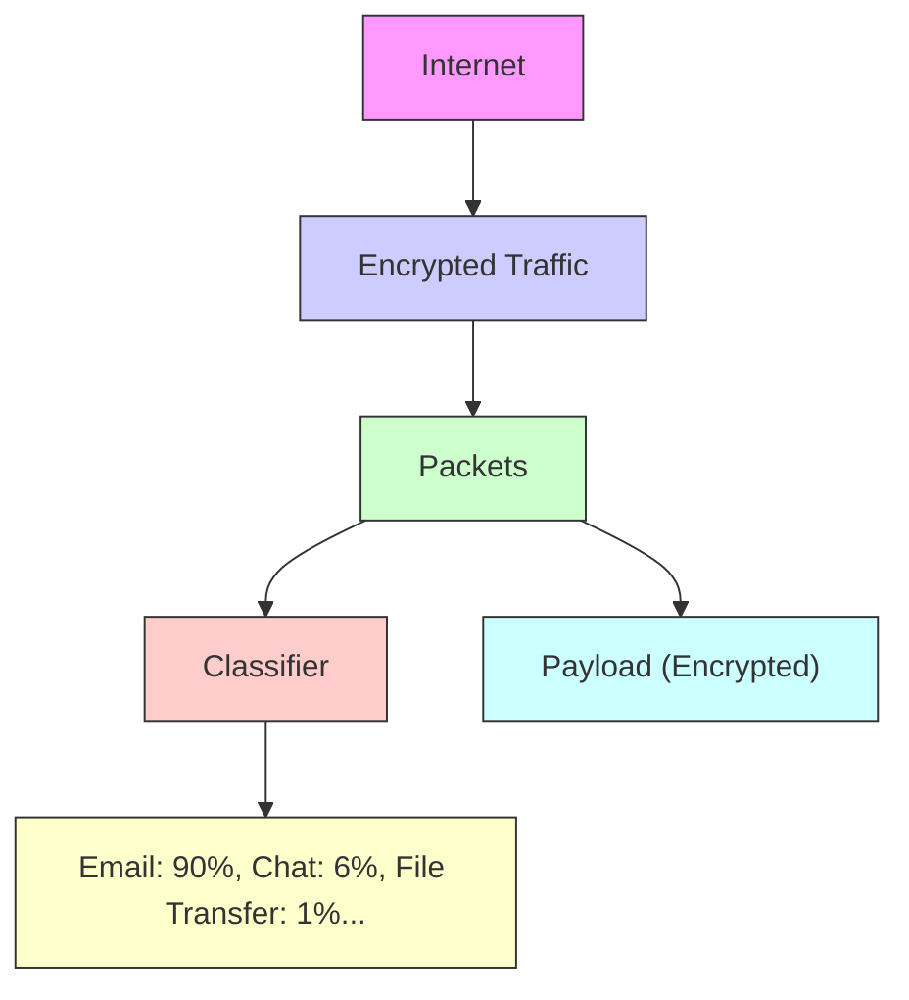
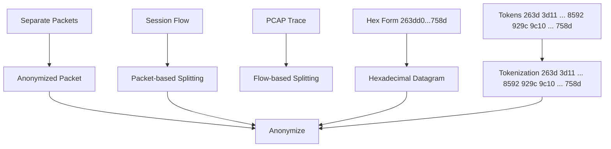
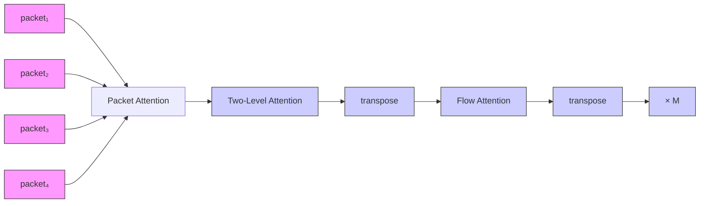
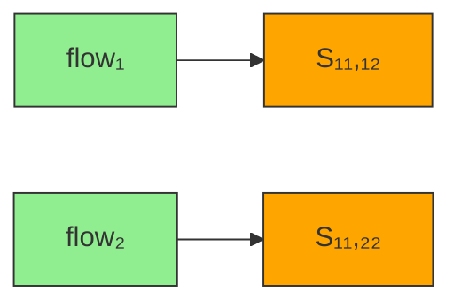

# MIETT: Multi-Instance Encrypted Traffc Transformer for Encrypted Traffc Classifcation

Xu-Yang Chen\*, Lu Han\*, De-Chuan Zhan, Han-Jia Ye†

School of Artifcial Intelligence, Nanjing University, China National Key Laboratory for Novel Software Technology, Nanjing University, China {chenxy, hanlu, zhandc, yehj}@lamda.nju.edu.cn

## Abstract

Network traffc includes data transmitted across a network, such as web browsing and fle transfers, and is organized into packets (small units of data) and fows (sequences of packets exchanged between two endpoints). Classifying encrypted traffc is essential for detecting security threats and optimizing network management. Recent advancements have highlighted the superiority of foundation models in this task, particularly for their ability to leverage large amounts of unlabeled data and demonstrate strong generalization to unseen data. However, existing methods that focus on tokenlevel relationships fail to capture broader fow patterns, as tokens, defned as sequences of hexadecimal digits, typically carry limited semantic information in encrypted traffc. These fow patterns, which are crucial for traffc classifcation, arise from the interactions between packets within a fow, not just their internal structure. To address this limitation, we propose a Multi-Instance Encrypted Traffc Transformer (MI-ETT), which adopts a multi-instance approach where each packet is treated as a distinct instance within a larger bag representing the entire fow. This enables the model to capture both token-level and packet-level relationships more effectively through Two-Level Attention (TLA) layers, improving the model’s ability to learn complex packet dynamics and fow patterns. We further enhance the model’s understanding of temporal and fow-specifc dynamics by introducing two novel pre-training tasks: Packet Relative Position Prediction (PRPP) and Flow Contrastive Learning (FCL). After fne-tuning, MIETT achieves state-of-the-art (SOTA) performance across fve datasets, demonstrating its effectiveness in classifying encrypted traffc and understanding complex network behaviors.

## Introduction

Network traffc refers to the fow of data transmitted between devices over a network, typically structured into packets, which are small units sent across the network, and fows, which are sequences of packets exchanged between two points. Each packet is composed of two parts: the header and the payload. The header contains essential information, such as routing details, source and destination addresses, and packet length, while the payload carries the actual data being transmitted, which may be encrypted for security purposes.

flowchart

Figure 1: Encrypted traffc classifcation task description. Raw traffc is frst divided into session fows, with each fow further segmented into a sequence of packets. A packet typically consists of a header and a payload. The task is to classify the type of a given fow.

Traffc classifcation, the process of identifying and categorizing network traffc, is crucial for both network management and cybersecurity. It allows network administrators to ensure Quality of Service (QoS), optimize bandwidth and detect malicious activities, thus maintaining network security and effciency. The overview of encrypted traffc classifcation task is provided in Figure 1.

However, the increasing prevalence of encryption has made traditional classifcation methods, such as port-based and statistics-based approaches, less effective. The advent of deep learning (DL) brought signifcant improvements, with payload-based methods using models like CNNs to automatically extract features from raw data. Despite their success, these methods rely heavily on large amounts of labeled data, which can be diffcult to obtain.

Recently, foundation models have emerged as a powerful alternative, pre-trained on large volumes of unlabeled data and fne-tuned for specifc tasks. PERT (He, Yang, and Chen 2020) employs a BERT-based model with a Masked Language Modeling (MLM) task to pre-train a packetlevel encoder, but this approach primarily focuses on tokenlevel relationships within individual packets, overlooking the broader context of inter-packet relationships. ET-BERT (Lin et al. 2022) addresses this limitation by introducing the Same-origin BURST Prediction (SBP) task, which determines whether one packet follows another within the same fow. While this method accounts for adjacent packet relationships, it still falls short of capturing the full complexity of fow-level interactions and the broader context across multiple packet segments. YaTC (Zhao et al. 2023) takes a different approach by tokenizing traffc data into patches and using a Masked Auto-Encoder (MAE) for pre-training a token-level encoder within a fow. However, focusing solely on token dependencies is less effective due to the low semantic information in encrypted traffc tokens. This approach tends to overlook the broader patterns and relationships that exist between entire packets within a traffc fow. Instead, learning packet representations that capture these packet patterns proves to be more robust. Given that each packet can be viewed as a distinct instance carrying unique information within a fow, it is crucial to effectively model the relationships between packets to achieve a comprehensive fow representation. To address this, we propose a Multi-Instance Encrypted Traffc Transformer (MIETT) with Two-Level Attention (TLA) layers that capture both token-level and packet-level relationships. To further enhance the model’s ability to capture temporal and fow-specifc dynamics, we introduce two novel pre-training tasks: Packet Relative Position Prediction (PRPP) and Flow Contrastive Learning (FCL). The PRPP task is designed to help the model understand the sequential relationships between packets within a fow by predicting their relative positions, thereby enabling a more accurate representation of the fow’s structure. Meanwhile, the FCL task focuses on distinguishing packets from the same fow and those from different fows by learning robust representations that emphasize intra-fow similarities and inter-fow differences.

Building on the robust representations learned during pretraining, the model is then fully fne-tuned on the specifc classifcation task. During this stage, both the packet encoder and the fow encoder are jointly optimized to adapt the model to the task at hand. Across experiments conducted on fve datasets, MIETT consistently demonstrates competitive or superior performance compared to existing methods. In conclusion, this paper presents several key contributions to the feld of encrypted traffc classifcation:

• We propose a novel Multi-Instance Encrypted Traffc Transformer (MIETT) architecture, which introduces Two-Level Attention (TLA) layers to effectively capture both token-level and packet-level relationships within traffc fows.  
• We introduce two innovative pre-training tasks, Packet Relative Position Prediction (PRPP) and Flow Contrastive Learning (FCL). The PRPP task enhances the model’s understanding of the sequential order of packets within a fow, while the FCL task improves the model’s ability to differentiate between packets from the same fow and those from different fows.  
• We provide extensive empirical validation of the proposed MIETT model on multiple datasets, showing that our approach outperforms existing methods in terms of accuracy and F1-score.

# Related Work

Encrypted traffc classifcation is an essential research area in network security. As encryption becomes more prevalent, traditional traffc analysis methods that inspect packet payloads have become less effective. Researchers now focus on methods to classify encrypted traffc without accessing its content directly. These methods can be divided into three types: port-based methods, statistics-based methods, and payload-based methods.

Port-based Methods. Port-based traffc classifcation, one of the oldest methods, relies on associating port numbers in TCP/UDP headers with well-known IANA port numbers. Although it is fast and simple, the method’s accuracy has declined due to port obfuscation, dynamic port assignments, network address translation (NAT), and other techniques (Moore and Papagiannaki 2005).

Statistics-based Methods. Statistics-based methods for encrypted traffc classifcation leverage features independent of payloads, such as packet sizes, timing, and fow duration, to analyze and categorize traffc. Wang et al. computed entropy from packet payloads to classify eight traffc classes, using an SVM algorithm to select features (Wang et al. 2011). Similarly, Korczynski and Duda focused on packet sizes, timing, and communication patterns for classifying traffc in encrypted tunnels (Korczynski and Duda ´ 2012). However, these methods are based on manually designed features and are now outdated due to advancements in encryption protocols, changes in traffc patterns, and the use of traffc obfuscation techniques.

Payload-based DL Methods. Payload-based methods usually leverage deep learning to analyze raw packet data, eliminating the need for manually designed features. These approaches have signifcantly advanced encrypted traffc classifcation by automatically extracting discriminative features. Deep Packet (Lotfollahi et al. 2020) employs a CNN within a framework that includes a stacked autoencoder and convolutional neural network to classify network traffc. TSCRNN (Lin, Xu, and Gao 2021) utilizes CNN to extract abstract spatial features and introduces a stacked bidirectional LSTM to learn temporal characteristics. BiL-STM ATTN (Yao et al. 2019) combines attention mechanisms with LSTM networks for enhanced encrypted traffc classifcation. Though these methods can automatically extract features, they heavily rely on labeled data, which is often diffcult to obtain in large quantities for training.

Payload-based Foundation Models. In recent years, pretrained foundation models have become popular for addressing this issue. These models are pre-trained on large amounts of unlabeled data and fne-tuned on downstream labeled tasks. PERT (He, Yang, and Chen 2020) and ET-BERT (Lin et al. 2022) tokenize traffc data using a vocabulary. PERT employs a Masked Language Model (MLM) pre-training task, while ET-BERT utilizes a modifed MLM and Next Sentence Prediction (NSP) task. Additionally, YaTC (Zhao et al. 2023), a vision model adaptation, tokenizes traffc data into patches and uses a Mask Auto-Encoder (MAE) for pretraining. However, these approaches do not adequately consider the unique structure of traffc fows and the relationships between packets. To address these limitations, we introduce the Multi-Instance Encrypted Traffc Transformer (MIETT) architecture, which leverages novel Packet Relative Position Prediction (PRPP) and Flow Contrastive Learning (FCL) tasks to better capture the complexities of traffc fows.

flowchart

Figure 2: Data preprocessing. The raw traffc (PCAP trace) is frst split into session fows and then further divided into individual packets. To protect data privacy, each packet is anonymized by masking the source and destination IP addresses and port numbers (replacing them with 0). The packet is then converted to its hexadecimal form, which is tokenized using a bi-gram model.

## Multi-Instance Encrypted Traffc Transformer

In the task of encrypted traffc classifcation, we are provided with raw network traffc (PCAP traces) as input, and the objective is to classify it into categories, such as VPN services (e.g., P2P, streaming, email) and applications. In this section, we frst outline the preprocessing steps that transform the raw data into a multi-instance traffc representation. We then introduce our Multi-Instance Encrypted Traffc Transformer (MIETT) architecture, which is specifcally designed to handle and classify this traffc data effciently.

## MIETT Encoder

This section details the process of representing multiinstance traffc data for use in the Multi-Instance Encrypted Traffc Transformer (MIETT) architecture. The process involves three key steps: tokenization of the raw data, representation of individual packets, and the aggregation of these packet representations into a unifed fow representation.

Tokenization. The hexadecimal sequence of the fow is obtained through the data preprocessing steps outlined in Figure 2. Following ET-BERT (Lin et al. 2022), we encode the hexadecimal sequence using a bi-gram model, where each unit consists of two consecutive bytes. We then utilize Byte-Pair Encoding (BPE) for token representation, with token units ranging from 0 to 65535 and a maximum dictionary size of 65536. For training, we also incorporate special tokens, including [CLS], [PAD], and [MASK].

Packet Representation. Each packet begins with a [CLS] token, followed by tokens extracted from the packet’s content, which includes a header containing meta-features and an encrypted payload. The embedding of each token is obtained by combining two parts: position embedding, which indicates the token’s position within the packet, and value embedding. To ensure effcient information utilization and avoid excessive focus on long packets, the packet length is standardized to a fxed size of 128. Packets shorter than 128 tokens are padded with [PAD] tokens at the end.

Flow Representation. The fow representation consists of multiple packet representations, which are stacked to form a matrix $\dot { \mathbf { X } } \in \mathbb { R } ^ { N \times L \times d } ,$ , where N is the number of packets, L is the packet length, and d is the embedding dimension. This multi-instance representation, as opposed to the previous method employed by ET-BERT of directly concatenating packets, allows for more effective modeling of the relationships between packets and better captures the organizational structure of fows.

## MIETT Architecture

The fow representation, a 2D map of tokens, can be fattened into a 1D sequence for input into a standard transformer, as done in ViT (Dosovitskiy et al. 2021) and YaTC (Zhao et al. 2023) during pre-training and fne-tuning. However, this approach introduces two issues: (1) Flattening the sequence loses temporal information, such as packet order, potentially overlooking important dependencies. While 2D position embeddings could indicate temporal relationships, they are infexible and may fail in scenarios like packet loss. (2) The computational complexity, which is $\hat { O ( N ^ { 2 } L ^ { 2 } d ) }$ , increases signifcantly with the inclusion of more packets due to the extended sequence length. To address these concerns, we introduce the Two-Level Attention (TLA) layer to preserve temporal structure and maintain computational effciency.

Overall Architecture. The Multi-Instance Encrypted Traffc Transformer (MIETT) begins by embedding the tokens as described in the MIETT Encoder section. Following this, the fow representation is processed through M TLA layers. Finally, the embeddings of the [CLS] tokens from all the packets are utilized for pre-training or fne-tuning tasks. The overall architecture of MIETT can be found in Figure 3.

Two-Level Attention (TLA) Layer. The TLA layer captures both intra-packet and inter-packet dependencies to enhance the model’s understanding of complex traffc fows. It operates in two stages: Packet Attention and Flow Attention.

In the Packet Attention stage, Multi-Head Self-Attention (MHSA) is applied within individual packets to identify dependencies between tokens, ensuring the model understands the internal structure of each packet. For MHSA, the key, query, and value are all set to the input sequence, with the output being an enriched sequence representation.

In the Flow Attention stage, MHSA is used across packet representations at each position to capture dependencies between tokens across different packets. This two-stage approach effectively models the hierarchical structure of traffc fows by combining detailed packet-level insights with broader inter-packet relationships.

flowchart

Figure 3: Overall architecture of the Multi-Instance Encrypted Traffc Transformer (MIETT). After passing through the MIETT encoder, the fow representation is processed by M Two-Level Attention (TLA) layers, each comprising a packet attention mechanism and a fow attention mechanism.

This method signifcantly improves the model’s ability to capture complex dependencies but also introduces computational complexity. The MHSA in Packet Attention has a complexity of $O ( \bar { L } ^ { 2 } d )$ per packet, while Flow Attention has a complexity of $\dot { O } ( N ^ { 2 } \dot { d } )$ per position, resulting in an overall complexity of $\dot { O } ( N L ^ { 2 } \dot { d } + \dot { L } N ^ { 2 } d )$ . For default values of $L = 1 2 8$ and $N = 5 ,$ our method is approximately 4.8 times more effcient than fattening the sequence to 1D and feeding it into a standard transformer.

Packet Attention. In the frst stage of the TLA layer, we focus on the intra-packet relationships by performing Multi-Head Self-Attention (MHSA) within individual packets. Let $\mathbf { X } \in \mathbb { R } ^ { N \times L \times d }$ be the fow representation, where N is the number of packets, L is the packet length, and d is the embedding dimension.

For each packet $\mathbf { X } _ { i } ~ \in ~ \mathbb { R } ^ { L \times d }$ , we apply self-attention to capture the dependencies between the tokens within the packet. The process is as follows:

$$
\hat {\mathbf {X}} _ {i} ^ {\mathrm{pkt}} = \text { LayerNorm } (\mathbf {X} _ {i} + \mathbf {M H S A} ^ {\mathrm{pkt}} (\mathbf {X} _ {i})) \tag {1}
$$

$$
\mathbf {X} _ {i} ^ {\mathrm{pkt}} = \text { LayerNorm } (\hat {\mathbf {X}} _ {i} ^ {\mathrm{pkt}} + \text { MLP } (\hat {\mathbf {X}} _ {i} ^ {\mathrm{pkt}})) \tag {2}
$$

Flow Attention. In the second stage of the TLA layer, we focus on the inter-packet relationships by performing multihead self-attention (MHSA) across the packet representations at each position within the packets. Let Xpacket ∈ $\mathbb { R } ^ { N \times L \times d }$ be the updated fow representation after the packet attention stage.

For each position $j$ (where $j \in { 1 , 2 , . . . , L } )$ within the packets, we gather the token representations across all packets, resulting in a matrix $\mathbf { X } _ { \cdot i } ^ { p a c \bar { k } e t } \in \mathbb { R } ^ { N \times d }$ , where N is the number of packets. We apply self-attention to these matrices to capture the dependencies between tokens across different packets. The process is as follows:

$$
\hat {\mathbf {X}} _ {. j} ^ {\text {flow}} = \operatorname{LayerNorm} \left(\mathbf {X} _ {. j} ^ {\mathrm{pkt}} + \mathbf {M H S A} ^ {\text {flow}} \left(\mathbf {X} _ {. j} ^ {\mathrm{pkt}}\right)\right) \tag {3}
$$

$$
\mathbf {X} _ {\cdot j} ^ {\text { flow }} = \text { LayerNorm } (\hat {\mathbf {X}} _ {\cdot j} ^ {\text { flow }} + \text { MLP } (\hat {\mathbf {X}} _ {\cdot j} ^ {\text { flow }})) \tag {4}
$$

## Training Tasks

This section outlines the training tasks designed to improve the model’s ability to classify encrypted network traffc. The pre-training phase includes three tasks: Masked Flow Prediction (MFP), Packet Relative Position Prediction (PRPP), and Flow Contrastive Learning (FCL). These tasks help the model capture fow dependencies, predict packet order, and differentiate fow-level features. After pre-training, the model is fne-tuned for traffc fow classifcation, optimizing it for the fnal task.

## Pre-Training Tasks

The model we propose consists of several Two-Level Attention (TLA) layers, designed to effectively capture both packet-level and fow-level information within traffc fows. During the pre-training stage, We utilize a pre-trained ET-BERT checkpoint for the packet attention, which is kept frozen during training, while the fow attention is trained to learn the overall structure and dependencies within the fows. This design allows our model to leverage established packet-level features while focusing on improving fowlevel understanding. The general view of our proposed 3 pretraining tasks can be found in Figure 4.

Masked Flow Prediction (MFP) Task. The Masked Flow Prediction (MFP) task is aimed at enhancing the model’s ability to handle incomplete information within a traffc fow. In this task, 15% of the tokens within a fow are randomly masked, and the model is tasked with predicting the original content of these masked tokens using the context provided by the unmasked tokens. By training the fow encoder to infer the missing tokens, the model learns to capture the underlying structure and dependencies within the fow.

Packet Relative Position Prediction (PRPP) Task. The Packet Relative Position Prediction (PRPP) task is designed to predict the relative order of packets within a fow, based on the embeddings of the [CLS] tokens extracted from each packet. This task helps the model understand the sequential relationships between packets, which is critical for accurately modeling traffc fows.

Given an output fow representation with N packets, let $\mathbf { O } ^ { \mathrm { p k t } } \in \mathbb { R } ^ { N \times d }$ represent the embeddings of the [CLS] tokens from all packets in the fow, where d is the embedding dimension. The task is to determine, for each pair of packets $( i , j )$ , whether packet i comes before packet j.

Firstly, a linear transformation is applied followed by an

stacked bar chart

| Category | Segment 1 | Segment 2 | Segment 3 |
|---|---|---|---|
| packet₁ | Green | Green | Green |
| packet₂ | Yellow | Hatched | Yellow |
| packet₃ | Orange | Orange | Hatched |
| packet₄ | Blue | Blue | Hatched |
[MASK]

(a)

Masked Flow Prediction (MFP) Task  

```mermaid
graph LR
  A["original order: packet1, packet2, packet3"] --> B["task samples: packet1, packet2, packet3"]
  B --> C{✓}
  C --> D["task1, packet3"]
  D --> E{✓}
  E --> F["task2, packet3"]
  F --> G{✓}
  G --> H["task3, packet2"]
  H --> I{✓}
  I --> J["task1, packet1"]
  J --> K{✗}
  K --> L["task1, packet1"]
  L --> M{✗}
  M --> N["task3, packet1"]
  N --> O{✗}
  O --> P["task2, packet2"]
  P --> Q{✗}
  Q --> R["task3, packet2"]
```

flowchart

Packet Relative Position Prediction (PRPP) Task  
(b)

flowchart

Flow Contrastive Learning (FCL) Task  
(c)  
Figure 4: Overview of pre-training tasks. (a) Masked Flow Prediction (MFP) Task: The model is tasked with predicting the original content of masked tokens using the context provided by the unmasked tokens. (b) Packet Relative Position Prediction (PRPP) Task: The model’s objective is to determine, for each pair of packets (i, j), whether packet i precedes packet j. (c) Flow Contrastive Learning (FCL) Task: The goal is to ensure that packets within the same fow (positive pairs) are more similar in the embedding space, while packets from different fows (negative pairs) are less similar.

activation function and layer normalization to [CLS] tokens:

$$
\mathbf {P} = \text { LayerNorm } (\mathbf {G E L U} (\mathbf {O} ^ {\mathrm{pkt}} \mathbf {W} _ {1} + \mathbf {b} _ {1})) \tag {5}
$$

where $\mathbf { W } _ { 1 } \in \mathbb { R } ^ { d \times d }$ and $\mathbf { b } _ { 1 } \in \mathbb { R } ^ { d }$ are learnable parameters. P ∈ RN×d. $\mathbf { P } \in \mathbb { R } ^ { N \times \bar { d } }$

Then, the predicted relative position of packets $( i , j )$ is computed as follows:

$$
\hat {z} _ {i j} = \text { Softmax } ((\mathbf {P} _ {i} - \mathbf {P} _ {j}) \mathbf {W} _ {2} + \mathbf {b} _ {2}) \tag {6}
$$

where $\mathbf { W } _ { 2 } \in \mathbb { R } ^ { d \times 2 }$ and $\mathbf { b } _ { 2 } \in \mathbb { R } ^ { 2 }$ are learnable parameters, and $\hat { z } _ { i j } \in \mathbb { R } ^ { 2 }$ gives the probability that packet i comes before or after packet $j .$ .

The ground truth labels $z _ { i j } \in \{ 0 , 1 \}$ are based on the original order of packets:

$$
z _ {i j} = \left\{ \begin{array}{l l} 1 & \text { if   packet } i \text { comes   before   packet } j \\ 0 & \text { otherwise } \end{array} \right. \tag {7}
$$

Finally, the PRPP loss $\mathcal { L } _ { \mathrm { P R P P } }$ is calculated using crossentropy between the predicted labels and the ground truth:

$$
\mathcal {L} _ {\mathrm{PRPP}} = - \sum_ {i, j, i \neq j} z _ {i j} \log (\hat {z} _ {i j}) + (1 - z _ {i j}) \log (1 - \hat {z} _ {i j}) \tag {8}
$$

Flow Contrastive Learning (FCL) Task. The Flow Contrastive Learning (FCL) task enhances the model’s ability to differentiate between traffc fows by learning robust representations. The objective is to ensure that packets within the same fow (positive pairs) are more similar in the embedding space, while packets from different fows (negative pairs) are less similar. Notably, both positive and negative pairs are constructed using identical packet positions within their respective fows, maintaining consistency in the comparisons.

Given a batch of output fow representations, let $\mathbf { O } ^ { \mathrm { f l o w } } \in$ $\mathbb { R } ^ { B \bar { S } \times \bar { N } \times d }$ represent the embeddings of the [CLS] tokens from all packets in the fows within the batch, where BS denotes the batch size, N the number of packets per fow, and d the embedding dimension.

First, a multi-layer perceptron (MLP) is applied to each [CLS] token:

$$
\mathbf {C} = \text { LayerNorm } (\mathbf {G E L U} (\mathbf {O} ^ {\text { flow }} \mathbf {W} _ {3} + \mathbf {b} _ {3})) \tag {9}
$$

$$
\mathbf {C} = \mathbf {C W} _ {4} + \mathbf {b} _ {4} \tag {10}
$$

where $\mathbf { W } _ { 3 } \in \mathbb { R } ^ { d \times d } , \mathbf { b } _ { 3 } \in \mathbb { R } ^ { d } , \mathbf { W } _ { 4 } \in \mathbb { R } ^ { d \times d }$ , and $\mathbf { b } _ { 4 } \in \mathbb { R } ^ { d }$ are learnable parameters. C ∈ RBS×N×d. $\mathbf { C } \in \mathbb { R } ^ { B S \times N \times d }$

Next, the similarity between two packets is computed using cosine similarity:

$$
\mathbf {S} _ {i _ {1} j _ {1}, i _ {2} j _ {2}} = \frac {\mathbf {C} _ {i _ {1} j _ {1}} ^ {T} \mathbf {C} _ {i _ {2} j _ {2}}}{\| \mathbf {C} _ {i _ {1} j _ {1}} \| \| \mathbf {C} _ {i _ {2} j _ {2}} \|} \tag {11}
$$

where $i _ { 1 } , i _ { 2 }$ represent the fow IDs within the batch, and $j _ { 1 } , j _ { 2 }$ denote the packet positions within the fow. $\mathbf { C } _ { i j } \in \mathbb { R } ^ { d }$ .

Finally, the contrastive loss is computed using the similarity matrix S:

$$
\mathcal {L} _ {\mathrm{FCL}} = - \sum_ {\substack {i _ {1}, j _ {1}, j _ {2} \\ j _ {1} \neq j _ {2}}} \log \frac {\exp \left(\mathbf {S} _ {i _ {1} j _ {1} , i _ {1} j _ {2}}\right)}{\exp \left(\mathbf {S} _ {i _ {1} j _ {1} , i _ {1} j _ {2}}\right) + \sum_ {i _ {2} \neq i _ {1}} \exp \left(\mathbf {S} _ {i _ {1} j _ {1} , i _ {2} j _ {2}}\right)} \tag{12}
$$

where $i _ { 1 } , i _ { 2 } \in [ 1 , B S ]$ represent the fow IDs in the batch, $j _ { 1 } , j _ { 2 } \in [ 1 , N ]$ denote the packet positions within the fow.

Conclusion. Overall, the fnal loss during the pre-train stage is the weighted sum of the above 3 losses:

$$
\mathcal {L} _ {\mathrm{pt}} = \mathcal {L} _ {\mathrm{MPF}} + \alpha \mathcal {L} _ {\mathrm{PRPP}} + \beta \mathcal {L} _ {\mathrm{FCL}} \tag {13}
$$

where α and β are hyperparameters.

<table><tr><td rowspan="2">Methods</td><td colspan="2">ISCXVPN 2016</td><td colspan="2">ISCXTor 2016</td><td colspan="2">CrossPlatform (Android)</td><td colspan="2">CrossPlatform (iOS)</td><td colspan="2">CICIoT 2023</td></tr><tr><td>AC</td><td>F1</td><td>AC</td><td>F1</td><td>AC</td><td>F1</td><td>AC</td><td>F1</td><td>AC</td><td>F1</td></tr><tr><td>Datanet</td><td>69.18%</td><td>13.63%</td><td>49.81%</td><td>9.50%</td><td>9.45%</td><td>1.53%</td><td>4.81%</td><td>0.05%</td><td>2.50%</td><td>0.81%</td></tr><tr><td>Fs-Net</td><td>29.30%</td><td>33.67%</td><td>82.03%</td><td>63.54%</td><td>7.08%</td><td>4.11%</td><td>10.94%</td><td>6.38%</td><td>66.80%</td><td>54.81%</td></tr><tr><td>BiLSTM_ATTN</td><td>0.57%</td><td>3.13%</td><td>88.33%</td><td>55.54%</td><td>0.45%</td><td>0.04%</td><td>0.29%</td><td>0.01%</td><td>5.79%</td><td>4.66%</td></tr><tr><td>DeepPacket</td><td>69.18%</td><td>13.63%</td><td>49.81%</td><td>9.50%</td><td>4.84%</td><td>0.04%</td><td>4.81%</td><td>0.05%</td><td>34.35%</td><td>8.52%</td></tr><tr><td>TSCRNN</td><td>69.18%</td><td>13.63%</td><td>44.70%</td><td>13.40%</td><td>2.43%</td><td>0.24%</td><td>2.84%</td><td>0.51%</td><td>2.50%</td><td>0.81%</td></tr><tr><td>YaTC</td><td>78.05%</td><td>70.83%</td><td>97.39%</td><td>85.12%</td><td>91.61%</td><td>82.28%</td><td>75.31%</td><td>69.57%</td><td>86.18%</td><td>73.16%</td></tr><tr><td>ET-BERT</td><td>74.62%</td><td>71.10%</td><td>95.71%</td><td>80.29%</td><td>84.63%</td><td>67.70%</td><td>77.05%</td><td>74.26%</td><td>88.09%</td><td>83.29%</td></tr><tr><td>MIETT (ours)</td><td>76.07%</td><td>77.86%</td><td>96.60%</td><td>82.15%</td><td>93.00%</td><td>82.36%</td><td>79.63%</td><td>75.03%</td><td>88.53%</td><td>82.48%</td></tr></table>

Table 1: Performance comparisons on encrypted traffc classifcation tasks. We denote the best and second-best results with bold and underline.

<table><tr><td>Dataset</td><td>#Flow</td><td>Task</td><td>#Label</td></tr><tr><td>ISCXVPN 2016</td><td>311,390</td><td>VPN Service</td><td>6</td></tr><tr><td>ISCXTor 2016</td><td>55,523</td><td>Tor Service</td><td>7</td></tr><tr><td>CrossPlatform (Android)</td><td>66,346</td><td>Application</td><td>212</td></tr><tr><td>Cross Platform (iOS)</td><td>34,912</td><td>Application</td><td>196</td></tr><tr><td>CICIoT Dataset 2023</td><td>1,163,495</td><td>IoT Attack</td><td>7</td></tr></table>

Table 2: The statistical information of 5 different datasets.

## Fine-Tuning Task

The objective of the fne-tuning task is to classify a given fow into a specifc class. After processing the fow through several TLA layers, we obtain a fow representation by extracting the embeddings of the [CLS] tokens from all packets. These embeddings, representing each packet, are then aggregated using mean pooling to form a comprehensive representation of the entire fow. This mean-pooled fow representation is passed through a multi-layer perceptron (MLP) to produce the fnal classifcation output, indicating the predicted class of the traffc fow.

During this stage, the entire model, including both the packet encoder (previously frozen during pre-training) and the fow encoder, is fne-tuned. The fne-tuning process optimizes the model by minimizing the cross-entropy loss:

$$
\mathcal {L} _ {\mathrm{ft}} = - \sum_ {c} y _ {c} \log (\hat {y} _ {c}) \tag {14}
$$

where $y _ { c }$ is the true label, and $\hat { y } _ { c }$ is the predicted probability for class c.

## Experiments

## Experiment Setup

Datasets and Benchmarks. For the encrypted traffc classifcation task, we evaluate our method on fve datasets: ISCXVPN 2016 (Draper-Gil et al. 2016), IS-CXTor 2016 (Lashkari et al. 2017), and the Cross-Platform (Van Ede et al. 2020) dataset, which includes two subsets (Android and iOS), as well as the CIC IoT Dataset 2023 (Neto et al. 2023). We utilize data preprocessed by Netbench (Qian et al. 2024). The data used for pre-training consists of the training sets from all fve datasets in Netbench, without labels. The dataset statistics and descriptions of the fne-tuning tasks are detailed in Table 2. The data is split into training, validation, and test sets with a ratio of 8:1:1.

Compared Methods. We compare our method against 7 payload-based approaches, including deep learning methods such as Datanet (Wang et al. 2018), Fs-Net (Liu et al. 2019), BiLSTM ATTN (Yao et al. 2019), DeepPacket (Lotfollahi et al. 2020), TSCRNN (Lin, Xu, and Gao 2021), as well as foundation models like ET-BERT (Lin et al. 2022) and YaTC (Zhao et al. 2023).

Implementation Details. During the pre-training stage, we set the training steps to 150,000 and randomly select fve of the frst ten packets for training. The masking ratio for the Masked Flow Prediction (MFP) task is set to 15%. The weights for the Packet Relative Position Prediction (PRPP) and MFP tasks are both set to 0.2. In the fne-tuning stage, we train for 30 epochs using the frst fve packets. For both stages, the packet length (L) is set to 128, the number of packets (N ) is set to 5, the embedding dimension (d) is set to 768, and the number of Two-Level Attention (TLA) layers is set to 12. The learning rate is set to $2 \times 1 0 ^ { - 5 }$ , and the AdamW optimizer is used. All experiments are conducted on a server with two NVIDIA RTX A6000 GPUs.

## Main Results

The primary metrics for comparison are Accuracy and F1- Score. Accuracy measures the proportion of correct predictions, while F1-Score balances precision and recall. Table 1 presents the performance comparison of various models on encrypted traffc classifcation tasks, with baseline results sourced from NetBench (Qian et al. 2024). The results clearly indicate that traditional deep learning methods, such as DataNet, DeepPacket, FS-Net, TSCRNN, and BiL-STM ATTN, struggle to generalize effectively to new tasks, particularly on complex datasets. These models frequently exhibit a bias toward dominant classes, resulting in consistently low F1-scores, especially on datasets like CrossPlatform (Android) and CrossPlatform (iOS).

<table><tr><td rowspan="2">Methods</td><td colspan="2">CrossPlatform (Android)</td><td colspan="2">CrossPlatform (iOS)</td></tr><tr><td>AC</td><td>F1</td><td>AC</td><td>F1</td></tr><tr><td>from scratch</td><td>88.08%</td><td>73.62%</td><td>71.63%</td><td>63.43%</td></tr><tr><td>w/o PRPP</td><td>90.79%</td><td>79.02%</td><td>78.96%</td><td>74.35%</td></tr><tr><td>w/o FCL</td><td>91.90%</td><td>81.60%</td><td>79.46%</td><td>74.80%</td></tr><tr><td>Ours</td><td>93.00%</td><td>82.36%</td><td>79.63%</td><td>75.03%</td></tr></table>

Table 3: Impact of Pre-Training Tasks.

<table><tr><td rowspan="2">Methods</td><td colspan="2">CrossPlatform (Android)</td><td colspan="2">CrossPlatform (iOS)</td></tr><tr><td>AC</td><td>F1</td><td>AC</td><td>F1</td></tr><tr><td>w/o pkt attn</td><td>62.19%</td><td>28.59%</td><td>55.58%</td><td>39.93%</td></tr><tr><td>w/o flow attn</td><td>91.85%</td><td>80.77%</td><td>79.11%</td><td>72.46%</td></tr><tr><td>TLA (ours)</td><td>93.00%</td><td>82.36%</td><td>79.63%</td><td>75.03%</td></tr></table>

Table 4: Impact of TLA components, where ’pkt attn’ refers to packet attention and ’fow attn’ refers to fow attention.

In contrast, our MIETT model demonstrates signifcant improvements in both accuracy and F1-scores across the board, showcasing its superior capability to handle the complexities of encrypted traffc. Notably, MIETT consistently achieves competitive or superior performance compared to existing methods. For instance, in the CrossPlatform (Android) dataset, MIETT outperforms ET-BERT with an 8.27% increase in accuracy and a 14.66% increase in F1- score, highlighting the effectiveness of the fow attention.

## Ablation Study

Impact of Pre-Training Tasks. Table 3 presents an ablation study that compares different versions of the pretraining tasks on the CrossPlatform (Android) and Cross-Platform (iOS) datasets to evaluate the contributions of specifc tasks. The baseline model (”from scratch”) shows decent performance, indicating that pre-training is important and can signifcantly enhance the model’s ability to generalize to new tasks. As the results demonstrate, incorporating specifc pre-training tasks such as Packet Relative Position Prediction (PRPP) and Flow Contrastive Learning (FCL) further boosts the model’s performance.

Impact of TLA Components. TLA captures intra- and inter-packet dependencies, effciently handling the challenges of modeling token-to-token relations across packets. Table 1 shows that ET-BERT, using only token-level attention, performs worse. As shown in Table 4, results on Cross-Platform(Android) shows removing fow attention raises error rates by 16.4%, and using token-mean embeddings for packets lowers accuracy to 62.19%, underscoring the importance of both attentions.

Impact of the Number of Packets. Figure 5 shows the impact of packet count. On the left, we observe that as more packets provide additional information, the F1 score increases, confrming our expectations. However, on the CrossPlatform (Android) dataset, using just one packet outperforms using three, with 91.79% accuracy, higher than all baseline models using fve packets. This suggests that in some datasets, the initial packets may contain the most critical information, and adding more packets may not always improve performance. If packet relationships are not effectively modeled, it could even harm performance. In this case, the reason our model did not perform well may be due to the discrepancy between the pre-training stage, where fve packets were used, and the fne-tuning stage, where only three were used, leading to a mismatch in distribution.

line chart

| # of Packets | AC    | F1    |
| ------------ | ----- | ----- |
| 2            | 0.768 | 0.732 |
| 4            | 0.792 | 0.745 |
| 6            | 0.796 | 0.750 |
| 10           | 0.792 | 0.754 |

line chart

| # of Packets | AC    | F1    |
| ------------ | ----- | ----- |
| 0            | 0.92  | 0.80  |
| 2            | 0.91  | 0.79  |
| 4            | 0.93  | 0.82  |
| 6            | 0.93  | 0.82  |
| 10           | 0.93  | 0.82  |

Figure 5: Impact of the Number of Packets.

<table><tr><td rowspan="2">Methods</td><td colspan="2">CrossPlatform (Android)</td><td colspan="2">CrossPlatform (iOS)</td></tr><tr><td>AC</td><td>F1</td><td>AC</td><td>F1</td></tr><tr><td>header only</td><td>78.77%</td><td>64.98%</td><td>52.96%</td><td>41.66%</td></tr><tr><td>payload only</td><td>72.46%</td><td>65.80%</td><td>63.82%</td><td>55.30%</td></tr><tr><td>All</td><td>93.00%</td><td>82.36%</td><td>79.63%</td><td>75.03%</td></tr></table>

Table 5: Impact of the Component of Packets.

Impact of the Component of Packets. Table 5 highlights the advantages of payload-based methods in traffc classifcation. When using only the packet header, the model’s performance is signifcantly lower, showing that the header lacks suffcient information for accurate classifcation. However, when focusing on the payload, which contains the actual data, the model’s F1-scores improve, especially on complex datasets like Cross Platform (iOS). This demonstrates that payload-based methods are more effective in capturing the essential characteristics of traffc, making them superior for encrypted traffc classifcation. Combining both header and payload yields the best results.

## Conclusion

We introduced MIETT to address challenges in encrypted traffc classifcation. Through novel model architecture and pre-training strategies, MIETT effectively learns temporal and fow-specifc dynamics. Experiments show that MI-ETT outperforms existing methods across fve datasets. Future work will explore traffc classifcation in resourceconstrained scenarios (Zhou 2024).

## Acknowledgments

This work is partially supported by the National Science and Technology Major Project (2022ZD0114805), NSFC (62376118), Key Program of Jiangsu Science Foundation (BK20243012), Collaborative Innovation Center of Novel Software Technology and Industrialization.

## References

Dosovitskiy, A.; Beyer, L.; Kolesnikov, A.; Weissenborn, D.; Zhai, X.; Unterthiner, T.; Dehghani, M.; Minderer, M.; Heigold, G.; Gelly, S.; Uszkoreit, J.; and Houlsby, N. 2021. An Image is Worth 16x16 Words: Transformers for Image Recognition at Scale. In 9th International Conference on Learning Representations, ICLR 2021, Virtual Event, Austria, May 3-7, 2021. OpenReview.net.  
Draper-Gil, G.; Lashkari, A. H.; Mamun, M. S. I.; and Ghorbani, A. A. 2016. Characterization of encrypted and vpn traffc using time-related. In Proceedings of the 2nd international conference on information systems security and privacy (ICISSP), 407–414.  
He, H. Y.; Yang, Z. G.; and Chen, X. N. 2020. PERT: Payload Encoding Representation from Transformer for Encrypted Traffc Classifcation. In 2020 ITU Kaleidoscope: Industry-Driven Digital Transformation, Kaleidoscope, Ha Noi, Vietnam, December 7-11, 2020, 1–8. IEEE.  
Korczynski, M.; and Duda, A. 2012. Classifying service ´ fows in the encrypted skype traffc. In 2012 IEEE International Conference on Communications (ICC), 1064–1068. IEEE.  
Lashkari, A. H.; Gil, G. D.; Mamun, M. S. I.; and Ghorbani, A. A. 2017. Characterization of tor traffc using time based features. In International Conference on Information Systems Security and Privacy, volume 2, 253–262. SciTePress.  
Lin, K.; Xu, X.; and Gao, H. 2021. TSCRNN: A novel classifcation scheme of encrypted traffc based on fow spatiotemporal features for effcient management of IIoT. Computer Networks, 190: 107974.  
Lin, X.; Xiong, G.; Gou, G.; Li, Z.; Shi, J.; and Yu, J. 2022. ET-BERT: A Contextualized Datagram Representation with Pre-training Transformers for Encrypted Traffc Classifcation. In WWW ’22: The ACM Web Conference 2022, Virtual Event, Lyon, France, April 25 - 29, 2022, 633–642. ACM.  
Liu, C.; He, L.; Xiong, G.; Cao, Z.; and Li, Z. 2019. Fs-net: A fow sequence network for encrypted traffc classifcation. In IEEE INFOCOM 2019-IEEE Conference On Computer Communications, 1171–1179. IEEE.  
Lotfollahi, M.; Jafari Siavoshani, M.; Shirali Hossein Zade, R.; and Saberian, M. 2020. Deep packet: A novel approach for encrypted traffc classifcation using deep learning. Soft Computing, 24(3): 1999–2012.  
Moore, A. W.; and Papagiannaki, K. 2005. Toward the accurate identifcation of network applications. In International workshop on passive and active network measurement, 41– 54. Springer.  
Neto, E. C. P.; Dadkhah, S.; Ferreira, R.; Zohourian, A.; Lu, R.; and Ghorbani, A. A. 2023. CICIoT2023: A real-time

dataset and benchmark for large-scale attacks in IoT environment. Sensors, 23(13): 5941.

Qian, C.; Li, X.; Wang, Q.; Zhou, G.; and Shao, H. 2024. NetBench: A Large-Scale and Comprehensive Network Traffc Benchmark Dataset for Foundation Models. In 2024 IEEE International Workshop on Foundation Models for Cyber-Physical Systems & Internet of Things (FMSys), 20– 25. IEEE Computer Society.

Van Ede, T.; Bortolameotti, R.; Continella, A.; Ren, J.; Dubois, D. J.; Lindorfer, M.; Choffnes, D.; Van Steen, M.; and Peter, A. 2020. Flowprint: Semi-supervised mobile-app fngerprinting on encrypted network traffc. In Network and distributed system security symposium (NDSS), volume 27.

Wang, P.; Ye, F.; Chen, X.; and Qian, Y. 2018. Datanet: Deep learning based encrypted network traffc classifcation in sdn home gateway. IEEE Access, 6: 55380–55391.

Wang, Y.; Zhang, Z.; Guo, L.; and Li, S. 2011. Using entropy to classify traffc more deeply. In 2011 IEEE Sixth International Conference on Networking, Architecture, and Storage, 45–52. IEEE.

Yao, H.; Liu, C.; Zhang, P.; Wu, S.; Jiang, C.; and Yu, S. 2019. Identifcation of encrypted traffc through attention mechanism based long short term memory. IEEE transactions on big data, 8(1): 241–252.

Zhao, R.; Zhan, M.; Deng, X.; Wang, Y.; Wang, Y.; Gui, G.; and Xue, Z. 2023. Yet Another Traffc Classifer: A Masked Autoencoder Based Traffc Transformer with Multi-Level Flow Representation. In Thirty-Seventh AAAI Conference on Artifcial Intelligence, AAAI 2023, 5420–5427. AAAI Press.

Zhou, Z.-H. 2024. Learnability with time-sharing computational resource concerns. National Science Review, 11(10): nwae204.