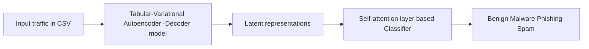
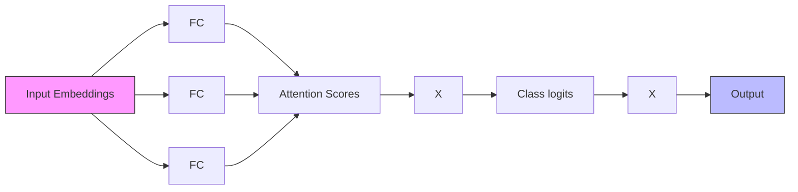

# RESEARCH ARTICLE

# Enhancing DNS-over-HTTPS Traffic Classification in Heterogeneous Networks Through Latent Space Analysis with a Tabular-Variational Autoencoder and Self-Attention Classifier Model

Artificial Intelligence and Applications

2026, Vol. 4(1) 125–138

DOI: 10.47852/bonviewAIA52025552


BON VIEW PUBLISHING

Ravi Veerabhadrappa1,\* and Poornima Athikatte Sampigerayappa1

1 Department of Computer Science and Engineering, Siddaganga Institute of Technology, India

Abstract: Cybersecurity threats and attacks are increasing day by day, bringing real focus on Domain Name System (DNS)–based data exfiltration—a stealth technique used by attackers to steal sensitive information from compromised networks. DNS query exchange is the initial part of any data exchange in the Internet and is the most neglected in traditional monitoring systems. These enable attackers to create covert channels to carry out various advanced persistent threats and unauthorized exfiltration attempts. In this research study, we present a novel detection approach of these DNS patterns through low-dimensional latent representations extracted via a Tabular-Variational AutoEncoder (Tab-VAE), specifically tailored for DNS-over-HTTPS (DoH) traffic. The latent space obtained by the Tab-VAE is subsequently fed into a multi-head selfattention classifier to perform a multi-class classification. We evaluated our experiments using the BCCC-CIC-Bell-DNS-2024 dataset, which provides a realistic snapshot of DoH traffic patterns. Notably, the proposed model demonstrated robust generalization across varying batch sizes and achieved competitive performance metrics with an improved accuracy of 80% and precision score of 75% for a batch size of 128. These findings highlight the potential of advanced machine learning architectures in reinforcing cybersecurity posture. By integrating such techniques, organizations can improve the detection of covert DNS-based attacks and better protect sensitive assets against emerging threats.

Keywords: DNS over HTTPS, Tab-VAE, self-attention classifier, heterogeneous networks

# 1. Introduction

In this age of global connectivity, where the Internet enables almost all aspects of everyday life, stringent and real-time security controls have become more vital now than ever before. As organizations rely on smooth data exchange and low-latency communication, this openness also becomes a profitable target for cybercriminals. Increasingly advanced attacks, such as exfiltration of data through hidden channels such as Domain Name System (DNS) tunneling, underscore the necessity of sophisticated detection mechanisms that function effectively in a wide variety of network landscapes. To enhance privacy, DNS resolutions are increasingly often encrypted and transported using protocols such as DNS over HTTPS (DoH), DNS over TLS (DoT), and DNS over QUIC (DoQ) [1, 2]. Although these protocols increase confidentiality and thwart eavesdropping, they compromise the visibility of network traffic, making it more difficult to detect threats in real time. Malicious users can now blend in with normal encrypted traffic and evade traditional inspection techniques. Furthermore, tools such as iodine and dnscat2 facilitate tunneling over DNS by inserting arbitrary payloads into queries, effectively hiding the attack content [3, 4]. As encrypted DNS protocols are targeted by attackers, detecting these patterns becomes difficult, particularly in contexts with varied device capabilities ranging from Internet-of-Things (IoT) devices to servers.

Traditional security measures, such as blocking malicious domain names and using rule-based approaches to block harmful traffic patterns, are no longer sufficient for encrypted DNS traffic. The lack of sufficient labeled datasets for capturing DNS network traffic has also resulted in poor detection systems. Additionally, attackers employ obfuscation techniques that completely hide their payloads, making it difficult to detect their intentions.

To address these challenges, training Machine Learning (ML) and Deep Learning (DL) models to recognize these patterns in traffic has shown promise in classifying encrypted traffic [5–8]. However, many models face limitations due to the lack of labeled data and poor generalization across different attacks, resulting in the evolving nature of attack strategies. In particular, recent autoencoders and transformerbased models excel at extracting latent patterns from sequential network data, making them particularly effective for anomaly detection in encrypted DNS traffic [9, 10].

In recent years, the emergence of autoencoders and transformerbased models [11–14] has further improved the capacity to capture complex patterns in network traffic. Both models excel at processing sequential data and understanding long-range dependencies, making them particularly suitable for analyzing the latent space of network traffic in DoH, DoT, DoQ, and other encrypted protocols. By learning these latent representations, attention-based transformers can detect subtle anomalies in encrypted traffic, even when explicit patterns are not easily identifiable. These models can adapt to evolving attack strategies, which is crucial as attackers refine their methods to evade detection.

This paper explores the potential of using the Tabular-Variational AutoEncoder (Tab-VAE) to classify encrypted DNS traffic, which proves to be more effective in handling network flow information.

While traditional and ML models have been used for network traffic classification, they struggle with encrypted DNS due to a lack of interpretable features. Traditional models often rely on shallow features that miss the complex patterns in modern encrypted traffic. In contrast, latent representations from autoencoders and VAEs offer a solution by transforming high-dimensional inputs into a compact latent space. This helps capture underlying patterns and improve class separability by reducing noise and redundancy. These enhanced features can assist classifiers, such as self-attention models, in identifying benign versus malicious traffic. Additionally, learning latent spaces is beneficial for sparse or partially labeled data, supporting semi-supervised and unsupervised learning tasks.

This study explores a new approach to classifying DoH traffic in complex, heterogeneous network environments. The main idea is to combine a Tab-VAE with a self-attention-based classifier to better capture the nuanced characteristics of encrypted DNS traffic. One of the key strengths of Tab-VAE is its ability to handle tabular data more effectively than standard autoencoders. This makes it particularly useful for representing the diverse set of features typically found in network traffic, where underlying distribution of input data varies with the traffic capture. This not only improves the reconstruction capabilities of the model but also enhances its ability to recognize deviations from normal behavior, which is crucial for identifying malicious activity. The probabilistic nature of the model helps it generalize well across different types of traffic, making it more resilient to changes and novel attack strategies. Additionally, working with latent space representations allows the model to uncover subtle patterns that might otherwise go unnoticed, especially in encrypted channels such as DoH. By using these latent features, the system becomes better equipped to detect anomalies that traditional methods might miss.

The primary objective of this study is to improve the classification of DoH traffic in heterogeneous networks by utilizing deep latent representations. Specifically, we aim to achieve the following objectives:

1) To design a Tabular-Variational Encoder-Decoder (Tab-VAE) model that learns and generates latent spaces for high-dimensional representations of DoH traffic for downstream classification tasks.   
2) To leverage the latent space derived from high-dimensional DoH traffic to detect anomalies and accurately classify deviations indicative of malicious activities into multiple threat classes.   
3) To design and develop a scalable and efficient self-attention-based classifier trained on the latent space, capable of lightweight and accurate classification of DoH traffic in heterogeneous network environments.   
4) To evaluate the performance of the proposed model using the BCCC-CIC-Bell-DNS-2024 dataset, a widely recognized benchmark in cybersecurity research, across varying batch sizes. The classification performance is statistically validated using a one-way Analysis of Variance (ANOVA) test and shows optimal accuracy improvements at a batch size of 128.

The following sections of this paper provide a comprehensive review of related works on DoH traffic classification in Section 2. Section 3 explains the theoretical framework of the Tab-VAE model for latent space generation. Section 4 discusses the methodology used to design a self-attention-based classifier. Section 5 presents the results and discusses the experiments conducted. Lastly, the conclusion highlights the limitations of the study and outlines the scope for future work.

# 2. Literature Review

Table 1 provides a detailed summary of studies carried out on various datasets related to DNS traffic. This section highlights the approaches of various works using various approaches and methodologies related to the detection and analysis of DoH traffic.

Chhabra et al. [15] analyzed the performance of DoH compared to traditional DNS using data from over 22,000 subscriber in 224 countries. The study shows that performance of DoH varies by geographical location and Internet service providers. Additionally, the researchers demonstrated the security threats posed by DoH exploitations. Vekshin et al. [16] studied and proposed a method to capture and analyze DNS traffic, which was then used as preprocessed input to generate a labeled dataset. The dataset contains 1,128,904 flows, of which approximately 33,000 are labeled as DoH traffic for the classification task using ML models. Lambion et al. [17] created a labeled dataset that captures realtime traffic exhibiting DNS data exfiltration and tunneling behavior and utilized this dataset to train ML models, such as random forest combined with a Convolutional Neural Network (CNN) classifier, to improve the accuracy of detecting DNS tunnels in real-time traffic.

Wang et al. [18] provided a detailed analysis of DNS tunnel detection techniques, which are crucial for identifying malicious activities disguised as normal DNS traffic. They explored rule-based and model-based methods between 2006 and 2020. The work also discussed the strengths and weaknesses of each approach in handling encrypted DNS traffic. Casanova and Lin [19] focused on detecting malicious DoH traffic using DL techniques, emphasizing the need for more generalizable models across different network environments, and used a preprocessed CIRA-CIC-DoHBrw-2020 dataset to address feature selection and data imbalance problems. Long Short-Term Memory (LSTM) and Bidirectional LSTM models are compared for classification task.

Mitsuhashi et al. [20] proposed a novel identification system for malicious DNS tunneling tools using a hierarchical classification method using an ML model. The model was tested on the CIRA-CIC-DoHBrw-2020 dataset and achieved 99% accuracy in detecting suspicious DoH traffic. Monshizadeh et al. [21] proposed combination of Conditional Variational AutoEncoder and Random Forest classifier (CVAEwRF) to improve network traffic anomaly detection. The CVAEwRF architecture improves model and data generalization by reducing overfitting in intrusion detection. By learning most of the similar input features, the CVAE direct RF classifier can efficiently identify various attack types. The model is evaluated against existing methods using the ISCX-2012 and MAWILab-2018 datasets, achieving detection rates over 99.9%.

Khanam et al. [22] presented a DL-based Intrusion Detection System (IDS), which is designed to address data imbalance in IoT networks, and introduced the Class-wise Focal Loss Variational AutoEncoder to generate realistic samples for underrepresented attack types and enhance learning for minority classes through the Classwise Focal Loss function. A deep neural network classifier trained on this balanced dataset achieves 88.08% accuracy, with notable detection rates for rare attacks such as U2R (User to Root, 79.25%) and R2L (Root to Local, 67.5%). The results highlight the importance of addressing data imbalance in an IDS and the effectiveness of deep generative models in improving detection performance. Abu Al-Haija et al. [23] developed a lightweight, double-stage scheme for detecting malicious DoH traffic using a hybrid learning approach. The system first identifies DoH versus non-DoH traffic with random fine trees, then uses AdaBoost trees to classify DoH traffic as benign or malicious. By using principal component analysis and random under-sampling, it increases efficiency with a reduced feature set. Experiments on the CIRA-CIC-DoHBrw-2020 dataset have demonstrated high accuracy and low overhead, surpassing existing models. This study provides a practical solution for enhancing cybersecurity against malicious DoH traffic.

Table 1 Summary of related works carried out in DoH traffic classification 

<table><tr><td>Sl. No</td><td>Author (Year and references)</td><td>Other datasets</td><td>CIRA-CIC-DoHBrw-2020</td><td>CIC-Bell-DNS-2021</td><td>BCCC-CIC-Bell-DNS-2024</td></tr><tr><td>1</td><td>Chhabra et al. [15]</td><td>*</td><td></td><td></td><td></td></tr><tr><td>2</td><td>Vekshin et al. [16]</td><td></td><td>*</td><td></td><td></td></tr><tr><td>3</td><td>Lambion et al. [17]</td><td>*</td><td></td><td></td><td></td></tr><tr><td>4</td><td>Wang et al. [18]</td><td>*</td><td></td><td></td><td></td></tr><tr><td>5</td><td>Casanova and Lin [19]</td><td></td><td>*</td><td></td><td></td></tr><tr><td>6</td><td>Mitsuhashi et al. [20]</td><td>*</td><td></td><td></td><td></td></tr><tr><td>7</td><td>Monshizadeh et al. [21]</td><td>*</td><td></td><td></td><td></td></tr><tr><td>8</td><td>Khanam et al. [22]</td><td>*</td><td></td><td></td><td></td></tr><tr><td>9</td><td>Abu Al-Haija et al. [23]</td><td></td><td>*</td><td></td><td></td></tr><tr><td>10</td><td>Fesl et al. [24]</td><td>*</td><td></td><td></td><td></td></tr><tr><td>11</td><td>Lyu et al. [25]</td><td>*</td><td></td><td></td><td></td></tr><tr><td>12</td><td>Alzighaibi [26]</td><td></td><td></td><td>*</td><td></td></tr><tr><td>13</td><td>Irénée et al. [27]</td><td></td><td></td><td>*</td><td></td></tr><tr><td>14</td><td>Wu et al. [28]</td><td></td><td>*</td><td></td><td></td></tr><tr><td>15</td><td>Niktabe et al. [29]</td><td></td><td></td><td>*</td><td></td></tr><tr><td>16</td><td>Bozkurt et al. [30]</td><td></td><td>*</td><td></td><td></td></tr><tr><td>17</td><td>Demmese et al. [31]</td><td></td><td></td><td>*</td><td></td></tr><tr><td>18</td><td>Huang [32]</td><td></td><td>*</td><td></td><td></td></tr><tr><td>19</td><td>Panigrahi et al. [33]</td><td></td><td></td><td>*</td><td></td></tr><tr><td>20</td><td>Shafi et al. [34]</td><td></td><td></td><td></td><td>*</td></tr><tr><td>21</td><td>Liu et al. [35]</td><td></td><td>*</td><td></td><td></td></tr><tr><td>22</td><td>Kazmi et al. [36]</td><td>*</td><td></td><td></td><td></td></tr><tr><td>23</td><td>Namrita Gummadi et al. [37]</td><td>*</td><td></td><td></td><td></td></tr><tr><td>24</td><td>Kirubavathi et al. [38]</td><td></td><td></td><td></td><td>*</td></tr><tr><td>25</td><td>Proposed Tab-VAE model</td><td></td><td></td><td></td><td>*</td></tr></table>

Fesl et al. [24] proposed a DL method to detect DoH traffic to enhance secure communication between DNS servers and users. They created a DoH dataset from network traffic at the Czech Network Information Center (CZ.NIC) and developed models that accurately identified encrypted DoH traffic, including from Cloudflare, achieving an accuracy of about 95%. The study reviewed existing ML models for DoH detection and described in detail data preprocessing and model optimization techniques. Fesl et al. concluded that their models can effectively generalize and detect DoH connections from various providers. Lyu et al. [25] studied DNS encryption, focusing on its development, advantages, and potential for misuse. The analysis covered various standards, such as DoT, DoH, and DoQ, and examined their adoption, performance, and security flaws. The study showed how malware can misuse DNS encryption for command-and-control communications and data exfiltration, thus evading traditional security measures. It also explored detection techniques for encrypted DNS traffic and user profiling, providing insights for countermeasures against malicious activities and highlighting research directions for enhancing performance and security of DNS encryption.

Alzighaibi [26] investigated methods for detecting DoH traffic using various ML models, including Random Forest, Gaussian Naive Bayes, Logistic Regression, K-Nearest Neighbors (KNN), Support Vector Classifier, Linear Discriminant Analysis, Decision Tree (DT), AdaBoost, Gradient Boosting, and LSTM neural networks. Their study utilized the CIRA-CIC-DoHBrw2020 dataset for the classification task and achieved an impressive detection accuracy of 99.99% for binary classification using the stacking model. Irénée et al. [27] proposed a hybrid approach to reduce the features needed to detect DoH traffic utilizing the XGBoost, Tree SHAP (SHapley Additive exPlanations), and Sequential Forward Evaluation methods. The work was tested on the CIRA-CIC-DoHBrw-2020 dataset with improved detection accuracy. Results showed a prediction efficiency of over 99.9%, even when the number of features was reduced from 33 to less than five. Wu et al. [28] addressed the challenges of detecting malicious DoH traffic, which uses encryption to improve user security and privacy but complicates conventional traffic analysis. The authors proposed a novel DoH-TriCGAN (Tri-Component Conditional Generative Adversarial Network) model that utilizes small sample analysis and Conditional Generative Adversarial Networks (CGANs) to detect malicious DoH traffic. Traditional methods struggle with encrypted DNS traffic under the DoH protocol. Insufficient labeled traffic data and imbalanced datasets hinder accurate detection. The DoH-TriCGAN model showcased remarkable accuracy in its evaluations with training on Small Sample Set-3000: The accuracy was 99.34%, outperforming other models such as Random Forest with 93.07% and the Transformer model with 93.94% accuracy.

Niktabe et al. [29] presented an interpretable ML model using DTs to profile malicious and benign DoH traffic. It introduced a feature engineering technique that enhances accuracy and interpretability while minimizing overfitting. To address data imbalance, a balanced dataset (BCCC-CIRA-CIC-DoHBrw-2020) was created using Synthetic Minority Oversampling Technique (SMOTE). The DT model achieved 93.93% accuracy for malicious traffic and 94.86% for benign traffic, providing a computationally efficient and explainable approach for real-time DoH security monitoring. Bozkurt et al. [30] presented a method for detecting malicious DoH traffic using ML and feature reduction techniques to improve the detection speed. Their approach combined classifiers with correlation analysis and principal component analysis to reduce redundant features. Results showed that feature reduction enhances performance, particularly for the Random Forest classifier, achieving 99% accuracy. The KNN models saw a slight drop of 0.73% in accuracy, while the Stochastic Gradient Descent classifier could also suffer a decrease. This research optimizes the efficiency of IDS for DoH traffic analysis.

Demmese et al. [31] introduced a novel image-based ML approach to classify malicious domains using transfer learning with ResNet-50. By converting DNS traffic data into RGB images, the model identified complex patterns, overcoming the limitations of traditional blacklist detection. Using the CIC-Bell-DNS-2021 dataset, the model achieved an accuracy of 98.67%, outpacing Support Vector Machine (97.99%) and KNN (97.9%). This method automates feature extraction and provides a scalable solution for real-time domain threat detection. Future research can focus on lightweight architecture and diverse datasets to improve model generalization. Huang [32] introduced an interpretable DL model for detecting DoH attacks, which effectively monitors encrypted DNS traffic. Utilizing the CIRA-CIC-DoHBrw-2020 dataset with 672,558 samples, the model achieves over 97% accuracy in distinguishing benign from malicious DoH traffic. Evaluation metrics such as Receiver Operating Characteristic (ROC) curves and F1 scores validate its reliability, although detection of benign traffic needs improvement due to dataset imbalance. SHAP analysis is used to highlight important features such as network flow duration and packet length, thereby enhancing the interpretability of the model.

Panigrahi et al. [33] introduced a hybrid threat detection model for DNS data exfiltration in Security Information and Event Management (SIEM) systems utilizing the CIC-Bell-DNS-EXF-2021 dataset, which evaluates ML algorithms such as Random Forest, KNN, Gradient Boosted Trees (GBT), and DTs within a Multi-Criteria Decision Analysis framework. The Gradient Boosted Trees with VIKOR Multi-Criteria Decision Making (GBT-VIKOR) model achieved the highest accuracy at 99.52% in identifying malicious DNS traffic. By combining stateful and stateless detection techniques, the model improves accuracy and reduces false-positive results. Although this approach enhances the effectiveness of SIEM, challenges in dataset diversity and real-time adaptability persist. Shafi et al. [34] introduced an advanced DNS behavior profiling method to detect and analyze malicious DNS activities, tackling issues such as evasion tactics and URL obfuscation. It features a novel algorithm for feature selection, pattern extraction, and a neural network–based profiling model to improve accuracy. A significant contribution is ALFlowLyzer, a network flow analyzer, and the BCCC-CIC-Bell-DNS-2024 dataset, which extends existing datasets. By employing ML and DL, the study achieved high classification accuracy, with over 95% precision for all attack categories, demonstrating the effectiveness of behavioral profiling for real-time threat detection in cybersecurity.

Liu et al. [35] introduced MFC-DoH, a novel method for detecting DoH tunnels. This method combines Model-Agnostic Meta-Learning (MAML) with a specialized CNN architecture known as Federated Convolutional Neural Network (F-CNN). MFC-DoH improved detection accuracy, particularly in few-shot scenarios, by utilizing frequency domain analysis and multi-head self-attention layers to identify time series and periodic patterns. The model was trained on a large dataset of DoH tunnel traffic and subsequently fine-tuned using limited data, enabling it to outperform traditional detection methods for malicious DoH activity. Experimental validation using public datasets confirmed the effectiveness of MFC-DoH, positioning it as a promising solution for securing encrypted DNS traffic against covert tunnels. Kazmi et al. [36] enhanced Cyber Threat Intelligence in Federated Learning using CVAEs to tackle non–Independent and Identical Distributed data challenges. Their approach generated threat-specific data for each silo, improving model performance in Software-Defined Networking (SDN) and boosting accuracy from 92% to 97% for tasks such as intrusion detection and threat classification. Namrita Gummadi et al. [37] emphasized the use of Explainable Artificial Intelligence techniques such as SHAP, LIME (Local Interpretable Model-Agnostic Explanations), and CEM (Counterfactual Explanation Method) for feature selection in IoT sensor traffic. The proposed framework can be effectively used for anomaly detection in IoT network traffic and can improve explainability, interpretability, and model performance when trained on publicly available datasets such as micro-electromechanical system datasets and botnet traffic.

Rabie et al. [39] introduced a framework for enhancing cyberattack detection using a stacking-based IDS, which combines J48 and ExtraTreeClassifier with an Enhanced Equilibrium Optimizer (EEO) for feature selection and SMOTE-IPF for class balancing. This study tackled challenges such as high-dimensional data, class imbalance, and elevated false-positive rates through optimization techniques such as Fisher score and KNN. Tested on the NSL-KDD and UNSW-NB15 benchmarks, the framework achieved an accuracy of 99.7% and 98.1%, respectively, with high F1 scores. While it provides a scalable, hybrid solution for improved detection accuracy, challenges remain in managing high-dimensional data and potential noise from synthetic oversampling. Pramanick et al. [40] proposed an intrusion detection framework that leverages advanced techniques to address the unique security challenges faced by IoT networks. By utilizing Decisive Red Fox optimization for feature selection, the model enhances the efficiency of the classification process, resulting in shorter training times and reduced error rates. This framework, coupled with Descriptive Back-Propagated Radial Basis Function classification, was designed to significantly improve the accuracy of intrusion detection amid a backdrop of IoT-specific vulnerabilities. Testing against multiple benchmark datasets showed that this innovative approach not only achieves high detection rates but also maintains a low computational burden, establishing it as a viable solution to the challenges of the evolving IoT security landscape.

Deep neural networks and ensemble methods achieved nearly 99% accuracy in multi-class traffic classification. While traditional techniques such as supervised learning and anomaly detection are often applied to DNS and DoH traffic threat identification, the use of Tab-VAE is still largely unexplored. Tab-VAE is crucial for detecting malicious network traffic because it performs both dimensionality reduction and unsupervised feature learning, thus effectively handling mixed data types in network datasets. Its robustness against noise improves detection accuracy, and its generative capabilities can augment training data with limited labeled samples. Additionally, the interpretable latent representations of Tab-VAE provide cybersecurity analysts with valuable insights in identifying threats and vulnerabilities.

# 3. Proposed Tab-VAEs Model for Latent Space Formulation

Figure 1 shows the process diagram of the proposed Tab-VAE Encoder-Decoder model with a self-attention classifier explicitly designed to handle DNS traffic. By leveraging the dimensionality reduction capabilities of tabular autoencoders, this approach aims to generate a low-dimensional latent space that effectively captures the characteristics of both regular DNS activity and various DNS data exfiltration attacks.

Figure 1 Process diagram of Tab-VAE model   


<details>
<summary>flowchart</summary>

```mermaid
graph LR
    A["Data acquisition"] --> B["Preprocessing Module"]
    B --> C["Tabular Variational Autoencoder (TabVAE)"]
    C --> D["Self-Attention-Based Classifier"]
    D --> E["Evaluation Module"]

    subgraph Data acquisition
        F["Data Sources / Input in pcap features in csv format"]
        G["DNS query/response metadata (parsed info)"]
    end

    subgraph Preprocessing Module
        H["Structured tabular representation of flow/session-level features."]
        I["DoH traffic filtering"]
        J["Preprocessed tabular features"]
    end

    subgraph Tabular Variational Autoencoder (TabVAE)
        K["Encoder: Maps input features to latent space."]
        L["Latent Space: Compact representation capturing complex patterns."]
        M["Decoder Used during training for reconstruction loss."]
        N["Latent embeddings."]
    end

    subgraph Self-Attention-Based Classifier
        O["Attention Layer(s): Capture inter-feature or inter-session dependencies."]
        P["Classification Head: Predicts traffic type (e.g., benign, malware, DGA, tunneling)."]
        Q["DoH traffic class labels."] --> R["Classification results"]
        S["Metrics computation (Accuracy, F1-score, etc.)"]
        T["Visualization of attention weights / latent clustering"]
    end
```
</details>

The study utilized a structured pipeline to process DoH traffic captured from various network environments, including enterprise, IoT, and mobile settings. The raw traffic was parsed to create a comprehensive dataset of flow-level and packet-level features. Tab-VAE condensed these features into a compact latent space, preserving the key patterns of DoH flows. This representation was input into a selfattention-based classifier that captured inter-feature dependencies and temporal correlations for effective traffic classification. The model was trained and evaluated on both real-world and synthetic DoH datasets, achieving robust performance in distinguishing benign from malicious traffic using standard metrics such as accuracy, precision, recall, and F1 score. Sections 3.1 to 3.3 discuss the description of the dataset used and the preprocessing of DNS domain features, followed by an ablation study of the proposed implementation details of the VAE model. Section 3.4 gives an ablation study of the model architecture which is necessary to understand it.

# 3.1. Dataset description

The BCCC-CIC-Bell-DNS-2024 dataset [34] is a key resource for analyzing DoH traffic, which secures DNS queries through encryption. This dataset includes both benign traffic and various forms of malicious traffic such as DNS tunneling, amplification attacks, malware, phishing, and spam. In our study, we extracted flow metadata with focus on malicious classes, and also included benign flow records to construct a representative training set. Initial flow-level filtering was applied to isolate DNS-specific traffic; however, this process led to imbalanced class distributions, with certain target classes (e.g., specific attack types) being underrepresented. To address this issue, we used SMOTE to generate synthetic samples for the minority classes. This resulted in a more balanced dataset and mitigated the risk of bias during training. The final training dataset comprises 30,000 flow records distributed across benign and multiple malicious categories. Figure 2 visualizes the class distribution after balancing, highlighting the effectiveness of SMOTE in preparing the dataset for robust model training.

# 3.2. Dataset preprocessing

Data preprocessing is the crucial stage before model training , where features from DNS traffic are extracted by screening all flow

Figure 2 BCCC-CIC-Bell-DNS-2024 dataset Distribution of rows by label   


<details>
<summary>bar</summary>

| Label | Number of rows |
| :--- | :--- |
| Benign | 30000 |
| Malware | 30000 |
| Phishing | 30000 |
| Spam | 30000 |
</details>

metadata with dst\_port=53, which represents DNS traffic with 119 features comprised of integer, text, and categorical features. Before generating the latent embeddings of the domain features, preprocessing of integer, text, and categorical features is carried out using standard transformations as given in Table 2. The output of the preprocessing stage is a set of preprocessed DNS features that can help in DoH traffic classification.

# 3.3. Tab-VAE model

The proposed methodology utilizes a custom-defined Tab-VAE Encoder-Decoder model to use the dimensionality reduction technique of autoencoders to generate a low-dimensional latent space of DNS traffic that includes various types of DNS data exfiltration attacks. The main advantage of the proposed model is the dimensionality reduction achieved by the autoencoder implementation, which reduced the total 119 features in the original dataset to 15 features. The Tab-VAE model consists of several components: a VAE Encoder layer, a Bottleneck layer, a Decoder layer, and a custom loss function that facilitates the creation of efficient latent space representations of the input tabular dataset. Figure 3 illustrates the architecture of the Tab-VAE model, highlighting the said components.

# 3.3.1. Encoder layer

The encoder in Tab-VAE is designed to process various types of input data, such as integers, floating-point values, and categorical variables, which are derived from traffic captures. The primary function of the encoder is to transform this high-dimensional input into a more compact and manageable representation in a lower-dimensional latent space. The encoder consists of two hidden layers h1 and h2, as given in Equations (1) and (2), each of which employing specific transformation functions to facilitate transformation of input to the latent space. The following components explain how VAE works:

Table 2 Preprocessing of DNS features 

<table><tr><td>DNS domain features</td><td>Features</td><td>Transformations applied</td></tr><tr><td>Integer features</td><td>Duration, packets_rate, receiving_packets_rate, sending_packets_rate, packets_len_rate. receiving_packets_len_rate, sending_packets_len_rate, mean_packets_len, median_packets_len, mode_packets_len, ttl_values_mean, ttl_values_mode, ttl_values_variance, ttl_values_standard_deviation, ttl_values_median, ttl_values_skewness, ttl_values_coefficient_of_variation, average_authority_resource_records, average_additional_resource_records, average_answer_resource_records</td><td>Integer values are scaled, and floating-point values are clipped using 5th and 95th percentile values present in the feature values.</td></tr><tr><td>Text features</td><td>Only DNS domain name is used for the proposed model: domain_name</td><td>8-bit hash of the domain_name feature is generated to capture the domain name-related information.</td></tr><tr><td>Categorical features</td><td>Label or target column present in the dataset</td><td>Label encoding is applied for the target class distributions.</td></tr></table>

Figure 3 Tab-VAE architecture   


<details>
<summary>flowchart</summary>


</details>

1) Input handling: The encoder first preprocesses the input data to ensure that it is suitable for the transformation process. This may involve normalizing numeric values or encoding categorical values into a format more suitable for numerical use.   
2) Hidden layer h1: In our model, h1 is the first hidden layer that takes the preprocessed inputs and produces output from a transformation function (e.g., ReLU, sigmoid) and a weighted sum. Hidden layer h1 is the first stage of feature extraction, which begins by capturing the most important patterns and relationships in the preprocessed features. By applying transformation functions, h1 identifies and shows the important features that may be suitable for the output data. The ReLU function helps generate a nonlinear transformation that can help the encoder logic capture important feature relationships that other simple linear transformations may miss.   
3) Hidden layer h2: Similarly, in our model, h2 is the second layer that further processes the output from h1, applying another round of transformation function. This layer is needed to refine the representation created by h1 and helps capture complex patterns in the data. Thus, h2 plays an important role in making the encoded data more compact and informative, focusing on the interactions between the features identified by h1. We use the stacking of these layers to predict the final output.

These are lower-dimensional embeddings that consist of features from the original high-dimensional feature input, while retaining important information. Lastly, the encoder-decoder architecture helps in tasks such as anomaly detection, sample generation, and data reconstruction in the context of DNS traffic analysis.

$$
\mathrm{h} 1 = \operatorname{ReLU} (\text { BatchNorm } (\text { Linear } (\mathrm{x}))) \tag {1}
$$

$$
\mathrm{h} 2 = \operatorname{ReLU} (\text { BatchNorm } (\text { Linear } (\mathrm{h} 1))) \tag {2}
$$

The outputs of the hidden layers h1 and h2 are obtained by applying a linear transformation to the input features:

$$
\operatorname{Linear} (x) = \mathrm{W} (x) + \mathrm{b},
$$

where W ϵ Rdout × din is the weight matrix

b ∈ Rdout is the bias vector

x ∈ Rdin is the input feature vector

din and dout denote the input and output feature dimensions, respectively.

To stabilize the optimization process and improve convergence, the output of the linear transformation is normalized using a BatchNorm layer applied across the mini-batch, as shown in Equation (3). Let denote the normalized value of the i-th feature.

$$
\widehat {x} = \frac {\{x _ {i} - \mu_ {B} \}}{\sqrt {\{\sigma_ {B} ^ {2} + \varepsilon \}}} \cdot \gamma + \beta \tag {3}
$$

Applying ReLU on the parameter helps to learn complex decision boundaries and also improves the model convergence with faster training.

The linear function applies a learned affine transformation using the ReLU function to map the input tabular data to a nonlinear latent space. The combination of h1 and h2 forms a Multi-Layer Perceptron (MLP), which transforms the inputs into high-level feature representations. Given the input feature x, the intermediate output of the MLP gives a nonlinear transformation h1 and h2 incorporating learned feature interactions, normalized values, and nonlinear transformations. The encoder outputs the approximate posterior values of the features which are the mean (μ) and log variance (log σ2 ) of the learned latent distributions given in Equation (4):

$$
\mu = \text { Linear } (\mathrm{h} 2) \text {   and   } \log \sigma^ {2} = \text { Linear } (\mathrm{h} 2) \tag {4}
$$

These two values help the encoder to define probabilistic latent space representations using the reparameterization trick (z) given in Equation (5), which is essential to prevent the Tab-VAE model from blocking learning and avoid the exploding gradient problem. These values are applied during training and further help the decoder minimize the reconstruction loss.

$$
\begin{array}{l} z = \mu + \sigma \times \epsilon , \text {   where   } \sigma = \exp (0. 5 x \log \sigma^ {2}), \tag {5} \\ \text { and } \epsilon \sim \mathrm{N} (0, \mathrm{I}), \text { where } z \sim \mathrm{N} (\mu , \sigma^ {2}) \\ \end{array}
$$

# 3.3.2. Latent space representation

The preprocessed tabular dataset (x) is transformed into latent space (z) using the reparameterization trick that ensures forward and backward computations during training help generate a low-dimensional latent space with a dimension of 15 features. Latent scores for these 15 features are generated using XGBoost and permutation methods to determine the importance of the feature maps. Figure 4 shows the t-distributed Stochastic Neighbor Embedding (t-SNE) visualization of the latent space obtained by the VAE decoder model, which highlights the importance of the proposed technique in showing the class separability of the dataset under low-dimensional space.

# 3.3.3. Decoder layer

The decoder layer mirrors the encoder layer, transforming the input latent space (z) into progressively larger dimensions to reconstruct the original input(x). The decoder follows the same structure as the encoder, which utilizes two hidden layers h1 and h2 for the reconstruction process.

# 3.3.4. Loss function

The Tab-VAE model was trained for 50 epochs, as shown in Figure 5. The convergence of the loss function between reconstruction loss and latent distribution alignment is calculated for each epoch or iteration. The model employs a loss function (L) which is a combination of two loss functions, namely the reconstruction loss (Lrecon) in

Figure 4 t-SNE of latent space obtained by Tab-VAE   


<details>
<summary>scatter</summary>

| t-SNE dimension 1 | t-SNE dimension 2 | Class label |
| ----------------- | ----------------- | ----------- |
| -150              | 150               | Benign      |
| -100              | 100               | Benign      |
| -50               | 50                | Benign      |
| 0                 | 0                 | Benign      |
| 50                | -50               | Benign      |
| 100               | -100              | Benign      |
| 150               | -150              | Benign      |
| -150              | 150               | Phishing    |
| -100              | 100               | Phishing    |
| -50               | 50                | Phishing    |
| 0                 | 0                 | Phishing    |
| 50                | -50               | Phishing    |
| 100               | -100              | Phishing    |
| 150               | -150              | Phishing    |
| -150              | 150               | Malware     |
| -100              | 100               | Malware     |
| -50               | 50                | Malware     |
| 0                 | 0                 | Malware     |
| 50                | -50               | Malware     |
| 100               | -100              | Malware     |
| 150               | -150              | Malware     |
| -150              | 150               | Spam        |
| -100              | 100               | Spam        |
| -50               | 50                | Spam        |
| 0                 | 0                 | Spam        |
| 50                | -50               | Spam        |
| 100               | -100              | Spam        |
| 150               | -150              | Spam        |
</details>

Figure 5 Loss function of Tab-VAE   


<details>
<summary>line</summary>

| Epoch | Loss  |
| ----- | ----- |
| 0     | 10.0  |
| 5     | 8.3   |
| 10    | 8.1   |
| 15    | 8.0   |
| 20    | 7.95  |
| 25    | 7.9   |
| 30    | 7.85  |
| 35    | 7.8   |
| 40    | 7.75  |
| 45    | 7.7   |
| 50    | 7.65  |
</details>

Equation (6) and the Kullback-Leibler divergence loss (LKL) in Equation (7). These two loss functions are necessary because of the presence of continuous and categorical features in the input(x). The Lrecon is a function that represents how well the model can reconstruct the integer and categorical values from the latent space to input(x). For integer values Mean Squared Error (MSE) is used, whereas for categorical values cross-entropy loss is used to form the Lrecon.

Given the prior and approximate prior distributions of the encoder output: $\mathbf { q } ( \mathbf { \hat { z } } | \mathbf { x } ) = \mathbf { N } \big ( \mathbf { z } ; \mathbf { \mu } , \mathbf { \hat { d i a g } } \big ( \mathbf { \sigma } ^ { 2 } \big ) \big )$ and $\mathbf { p } ( \mathbf { z } ) = \mathbf { N } ( 0 , \mathrm { I } )$ . The total loss function for the reconstruction loss can be given by

$$
\text { Lrecon } = \frac {1}{N} \sum_ {i = 1} ^ {N} (X i - X ^ {\prime} i) ^ {2} \quad \text { and   Lrecon } = - \sum x \log (x ^ {\prime}) \tag {6}
$$

$$
\mathrm{L} _ {\mathrm{KL}} = \mathrm{D} _ {\mathrm{KL}} (\mathrm{q} (\mathrm{z} | \mathrm{x}) \| \mathrm{p} (\mathrm{z})) = \frac {1}{2} \sum_ {\mathrm{j} = 1} ^ {\mathrm{d}} \left(1 + \log \sigma \mathrm{j} ^ {2} - \mu \mathrm{j} ^ {2} - \sigma^ {2}\right) \tag {7}
$$

The total loss function is defined as ${ \pmb { L } } = { \pmb { L } } _ { r e c o n } + { \pmb { L } } _ { K L } .$

# 3.4. Ablation study on the Tab-VAE model

This ablation study highlights the changes made to the baseline VAE model considering the input dataset and feature set comprising integer, text, and categorical values in tabular representations. In the experiments on the training and testing set (80:20), the baseline model is optimized using an an encoder, latent space reparameterization trick, and a decoder module. The loss function used to estimate the reconstruction error is optimized using both the MSE and the LKL. Modifying BatchNorm1D in both the encoder and decoder resulted in an increased reconstruction error and potential training stability. Also the activation function ReLU introduces nonlinearity, which is crucial for the model learning rate; removing or changing to other activation functions hinders the performance of the model. Hence, the activation function is retained with the ReLU function for better accuracy. In the same way, modification on the latent space size is determined by different latent dimensions; a smaller latent space results in higher information loss, while a larger latent space may result in redundant information. Table 3 lists the Tab-VAE model parameters used to train the proposed model.

# 4. DoH Traffic Classification Utilizing Latent Space and Self-Attention Layer

The proposed model effectively integrates a two-stage approach combining Tab-VAE with externally implemented self-attention neural network layer to enhance DoH traffic classification. The significant advantage of the proposed approach is enhanced data preprocessing with class-imbalanced datasets, which provide transfer learning capabilities for the VAE model. The model outputs latent representations that can be used for transfer learning in various ways. As illustrated in Figure 6, the proposed model includes a self-attention layer that collaboratively improves the classification of DoH traffic utilizing the latent space. The model can identify patterns and relationships by leveraging the structured feature representations in the low-dimensional latent space, ultimately leading to increased classification accuracy.

Table 3 Model parameters for Tab-VAE 

<table><tr><td>Parameters</td><td>Values</td></tr><tr><td>input_dim</td><td>Input dimension size equal to number of features in the tabular dataset</td></tr><tr><td>Hidden layers</td><td>Two hidden layers h1 and h2 with 64 and 32 neurons</td></tr><tr><td>Activation function</td><td>ReLU</td></tr><tr><td>Latent space parameters</td><td> $\mu$  and  $\log \sigma^{2}$ </td></tr><tr><td>Bottleneck layer</td><td>Encoder compresses the input to encoding dimension=32 and later reduced to output_dim=15 features.</td></tr><tr><td>Epochs</td><td>50</td></tr><tr><td>Optimizer</td><td>Adam optimizer</td></tr><tr><td>Loss function</td><td>MSE</td></tr></table>

To detect and identify DoH traffic, the use of a self-attention layer with the model is essential. This layer enables the model to prioritize and identify the important components within the input data when making predictions. By doing so, it better captures the complex relationships and dependencies among DoH traffic from other types of network activity. In our model, at the initial phase, the process starts by defining a low-dimensional latent space consisting of 15 carefully selected features. These features are selected specifically to help the classifier in identifying DoH traffic and provide a good balance between the model performance and learning rate. To verify the need of these features, we use SHAP scores to rate the features among themselves. As shown in Figure 7, SHAP scores assign a numerical value to each specific feature, indicating the contribution of the feature to the model output. This develops a clear understanding of how each feature influences the final output, enhancing our model transparency and interpretability. The SHAP values obtained in our proposed work use the XGBoost algorithm, which results in good performance in ML tasks. Additionally, other techniques such as permutation-based feature importance methods help to randomize features and analyze the effect on model performance. This process allows for a clear importance of each feature to the final output. By using these methods with the internal attention mechanism, we aim to improve both the accuracy and efficiency of traffic classification.

# 4.1. Self-attention layer for DoH classification

Figure 8 shows the design of a self-attention-based classifier that significantly enhances the analysis of features by transforming each input feature into a higher-dimensional representation through tailored projections. This transformation yields three distinct representations: Query (Q), Key (K), and Value (V). Each of these projections serves to deepen the contextual understanding of the original traffic features, thereby enabling the classifier to achieve improved generalization and adaptability to a diverse range of inputs. The self-attention mechanism is a pivotal component of this architecture, as it allows the model to uncover and capture complex relationships and dependencies among the features.

By learning the important scores among features associated with the input, our model can dynamically focus on the most relevant information, thereby removing unwanted noise and data. This capability is especially needed in cases where the input data may vary significantly, ensuring that the classifier remains effective across different cases. Under our proposed architecture, the internal attention model employs three projections—Query Q, Key K, and Value V, which are extracted from the input data to compute the importance score (Attention Score). These scores play a fundamental role in determining the importance of each feature in the input, resulting in improved model learning rate. As a result, the classifier can utilize the contextual meanings embedded in higher-dimensional feature representations to make predictions using the following projections in our work:

$$
\mathrm{Q} = \mathrm{WQx}, \mathrm{K} = \mathrm{WKx}, \text { and } \mathrm{V} = \mathrm{WVx} \text { and }
$$

$$
\text { Attention   score } (A) \text { is   given   as } A = \operatorname{softmax} \left(Q K ^ {T} / \operatorname{sqrt} (d)\right) \tag {8}
$$

Figure 6 Tab-VAE with self-attention layer   


<details>
<summary>flowchart</summary>


</details>

Figure 7 Latent space feature importance   


<details>
<summary>bar_stacked</summary>

Comparative feature importance
| Features | Permutation importance | XGBoost importance |
|---|---|---|
| Latent_dim_0 | 0.22 | 0.14 |
| Latent_dim_1 | 0.06 | 0.08 |
| Latent_dim_2 | 1.00 | 0.00 |
| Latent_dim_3 | 0.17 | 0.32 |
| Latent_dim_4 | 0.05 | 0.14 |
| Latent_dim_5 | 0.49 | 0.01 |
| Latent_dim_6 | 0.14 | 0.14 |
| Latent_dim_7 | 0.41 | 0.29 |
| Latent_dim_8 | 0.23 | 0.11 |
| Latent_dim_9 | 0.42 | 0.00 |
| Latent_dim_10 | 0.11 | 0.17 |
| Latent_dim_11 | 0.03 | 0.14 |
| Latent_dim_12 | 0.09 | 0.08 |
| Latent_dim_13 | 0.08 | 0.08 |
| Latent_dim_14 | 0.15 | 0.03 |
| Latent_dim_15 | 0.21 | 0.19 |
</details>

where d is the attention dimension.

The attention scores are processed through a Softmax function, which transforms these scores into attention probabilities. These probabilities are then utilized to compute a weighted sum, which forms the input for the fully connected layer responsible for generating class logits.

# 4.2. Ablation study on self-attention layer for DoH classification

This section explains the ablation study of our self-attention layer used as a classifier in our work; we retained the baseline parameters listed in Table 4, which were the standard values needed for the classifier for latent space–based classification. The model was trained on a GPU setup with 50 epochs with varying batch sizes to ensure transparent evaluation. The results obtained from the classifier model are recorded to facilitate a detailed comparative analysis of our work. Furthermore, the model optimization was set to Adam optimizer, with a learning rate of 0.001, our model seems to learn better. These values of learning rate and optimization enhance the learning rate of our model during training, which, in turn, improves reliability.

Figure 8 Self-attention with multi-head attention layer   


<details>
<summary>flowchart</summary>


</details>

Table 4 Self-attention layer parameters for DoH traffic classification 

<table><tr><td>Category</td><td>Self-attention layer parameters</td><td>Value/Description</td></tr><tr><td>Model Architecture</td><td>input_dim, num_classes</td><td>Derived from dataset</td></tr><tr><td>Self-Attention</td><td>attention_dim=64,num_heads=4</td><td>Multi-headself-attention</td></tr><tr><td>Classification Head</td><td>ReLU, Dropout(0.3),BatchNorm</td><td>Two-layer MLP for classification</td></tr><tr><td>Training Settings</td><td>epochs=50,batch_size=64, lr=0.001</td><td>Adam optimizer, Learning Rate Scheduling</td></tr><tr><td>Evaluation</td><td>Classification Report,Confusion Matrix</td><td>Precision, F1 score,Accuracy</td></tr><tr><td>Batch sizes</td><td>{16,32,64,128}</td><td>Batch size of 16 to 128 is chosen formodel training</td></tr></table>

# 5. Results and Discussion

The Tab-VAE model combined with a self-attention layer with a multi-head attention mechanism results in improved performance in the classification of DoH traffic. This improvement is particularly due to model training on the preprocessed dataset BCCC-CIC-BELL-DNS-2024, which is rich in various data distributions. The dataset covers a variety of attack categories, including data exfiltration attacks and numerous instances of malicious DoH traffic. In this study, the proposed model focuses on the samples categorized as malicious in the dataset, which are divided into distinct classes ranging from 0 to 3. These classes are defined by the following labels: Benign (0), Malware (1), Phishing (2), and Spam (3), allowing a comprehensive understanding of their characteristics and behaviors. Figures 9 to 13 depict a clear understanding of the need for latent space–based classification, employing a self-attention layer with a multi-head attention mechanism. The model was trained and evaluated across varying batch sizes, specifically 16, 32, 64, and 128. The results obtained with batch sizes of 16 and 128 demonstrate the improvements in accuracy and efficiency of the model.

Analysis of the results showcases significant improvements in the model generalization property, robustness and adaptability in accurately classifying different types of data within the latent space. These points highlight how the proposed approach addresses the challenges posed by malicious DoH traffic classification. The confusion matrix in Figure 9 illustrates the model learning, as indicated by the high values along the diagonal, which show its good performance in classifying instances. However, the model had difficulty in identifying instances of the Spam class, totaling 1,538. This issue is due to the imbalance of the dataset itself.

The class-wise metrics presented in Figure 10 provide a comprehensive view of the model performance across various input types, highlighting its effectiveness in differentiating among the different classes. Our analysis reveals that the model excels at identifying the Spam class, achieving the highest F1 score across all assessed categories. This indicates a strong balance between precision and recall for this class. In contrast, the model encountered significant challenges when it comes to detecting malware and phishing attempts. Notably, recall for these classes is particularly low, suggesting that the model failed to identify a considerable number of actual malware and phishing threats. This shortcoming highlights a key area for improvement, as both precision and recall illustrate a detrimental trade-off in these categories. The findings point to the necessity of improvements in the model architecture or training methodology to achieve better overall generalization and robustness in detecting these more elusive threats.

Analysis of the batch sizes revealed distinct performance differences across the evaluated configurations. Overall, the model trained with 16, 32, 64, and 128 batch sizes achieved improved accuracy, precision, recall, and F1 score, indicating that varying batch sizes can be a more effective learning parameter. Statistical techniques such as the one-way ANOVA method confirm that the performance variation among the varying batch sizes was improving the model learning rate. The one-way ANOVA method results in an F-statistic value of 0.056 and a p value of 0.98 for an input batch size of 128. These findings suggest that carefully tuning the batch size is crucial for optimizing the performance of the self-attention classifier, as the selected batch size not only improved stability across multiple runs but also contributed

Figure 9 Confusion matrix of model training for batch sizes 16 and 128   


<details>
<summary>heatmap</summary>

Batch size, 16
| True label | 0 | 1 | 2 | 3 |
|---|---|---|---|---|
| 0 | 2582 | 682 | 1753 | 1062 |
| 1 | 541 | 1290 | 4250 | 41 |
| 2 | 626 | 531 | 4685 | 36 |
| 3 | 1524 | 682 | 1605 | 2110 |
</details>


<details>
<summary>heatmap</summary>

| True label \ Predicted label | 0 | 1 | 2 | 3 |
|---|---|---|---|---|
| 0 | 4330 | 131 | 80 | 1538 |
| 1 | 81 | 4901 | 1042 | 98 |
| 2 | 245 | 2221 | 3374 | 38 |
| 3 | 818 | 70 | 13 | 5020 |
</details>

Figure 10   
Class-wise metrics for batch sizes 16 and 128   


<details>
<summary>bar</summary>

Batch size, 16
| Classes | Precision | Recall | F1-score |
| :--- | :--- | :--- | :--- |
| 0 | 0.49 | 0.43 | 0.45 |
| 1 | 0.41 | 0.21 | 0.28 |
| 2 | 0.38 | 0.79 | 0.51 |
| 3 | 0.65 | 0.36 | 0.46 |
</details>


<details>
<summary>bar</summary>

Batch size, 128
| Classes | Blue Bar Score | Orange Bar Score | Green Bar Score |
| :--- | :--- | :--- | :--- |
| 0 | 0.79 | 0.71 | 0.75 |
| 1 | 0.67 | 0.80 | 0.73 |
| 2 | 0.75 | 0.57 | 0.65 |
| 3 | 0.75 | 0.84 | 0.79 |
</details>

Figure 11 Model accuracy and loss function during DoH classification   


<details>
<summary>line</summary>

| Epoch | Training accuracy | Validation accuracy |
|-------|-------------------|---------------------|
| 0     | 0.67              | 0.71                |
| 10    | 0.75              | 0.77                |
| 20    | 0.76              | 0.78                |
| 30    | 0.77              | 0.79                |
| 40    | 0.77              | 0.79                |
| 50    | 0.78              | 0.80                |
</details>


<details>
<summary>line</summary>

| Epoch | Loss (Blue Line) | Loss (Orange Line) |
|-------|------------------|--------------------|
| 0     | 0.78             | 0.67               |
| 10    | 0.58             | 0.52               |
| 20    | 0.53             | 0.49               |
| 30    | 0.51             | 0.48               |
| 40    | 0.50             | 0.47               |
| 50    | 0.49             | 0.46               |
</details>

to the overall robustness of the predictions of the model. Figure 11 illustrates the accuracy and loss metrics of the self-attention classifier after training and testing phase in the latent space over 50 epochs. The results indicate a modest improvement in model accuracy when using a batch size of 128. At the same time, the cross-entropy loss function shows a significant reduction with the progression of epochs. These graphical representations highlight the improvement in classification accuracy and corresponding reduction in loss, which contribute to better generalizability of the model.

Figure 12 compares the accuracy and loss function of different models using varying batch sizes. It shows that a batch size of 128 results in improvements compared to a batch size of 16. For batch sizes of 32 and 64, both achieve higher and more stable accuracy on training and testing sets, which is consistent with the observations from the loss chart. The results show that batch sizes of 32 and 64 are the most suitable for this specific model and dataset, as they provide a good balance between training speed, stability, and generalization performance. In contrast, batch size 16 appears to be too small, leading to noisy updates and a risk of overfitting. The batch size of 128, while stable, may be too large, resulting in slower convergence and slightly reduced performance. The output of the training and testing results of the model are plotted to demonstrate the increase in the model robustness.

In conclusion, the efficiency of the proposed model is assessed by plotting a multi-class ROC curve, providing deeper insights into its performance. Figure 13 shows the ROC curve using the One-vs-Rest approach, showing the various multi-class distributions present in the dataset. This visualization not only highlights the ability of the model to distinguish between classes but also illustrates its effectiveness in the latent space, allowing for a comprehensive understanding of how well the model distinguishes between each category. By evaluating the area under the curve for each class, we can interpret the overall accuracy of the model and its capability in classifying diverse data.

Table 5 shows the analysis of our work with other literary works proposed on various DNS datasets. Autoencoders are good choices for dimensionality reduction on large feature sets compared to different datasets, such as the CIRA-CIC-DoHBrw-2020 and CIC-Bell-DNS 2021 datasets. The proposed model uses the BCCC-CIC-Bell-DNS-2024 dataset, which is advanced compared to the CIC-

Figure 12 Model accuracy for training and testing of varying batch sizes   


<details>
<summary>line</summary>

| Epoch | Train loss (batch size 16) | Test loss (batch size 16) | Train loss (batch size 32) | Test loss (batch size 32) | Train loss (batch size 64) | Test loss (batch size 64) | Train loss (batch size 128) | Test loss (batch size 128) |
|-------|-----------------------------|----------------------------|-----------------------------|----------------------------|-----------------------------|---------------------------|-----------------------------|---------------------------|
| 0     | 8                           | 9                          | 3                           | 4                          | 1                           | 1                         | 1                           | 1                         |
| 2     | 1                           | 10                         | 6                           | 7                          | 1                           | 27                        | 1                           | 1                         |
| 4     | 1                           | 5                          | 1                           | 1                          | 1                           | 5                         | 1                           | 1                         |
| 6     | 1                           | 10                         | 3                           | 5                          | 1                           | 17                        | 1                           | 1                         |
| 8     | 1                           | 5                          | 1                           | 4                          | 1                           | 5                         | 1                           | 1                         |
</details>


<details>
<summary>line</summary>

| Epoch | Train accuracy (batch size 16) | Test accuracy (batch size 16) | Train accuracy (batch size 32) | Test accuracy (batch size 32) | Train accuracy (batch size 64) | Test accuracy (batch size 64) | Train accuracy (batch size 128) | Test accuracy (batch size 128) |
|-------|----------------------------------|-------------------------------|----------------------------------|-------------------------------|----------------------------------|-------------------------------|----------------------------------|-------------------------------|
| 0     | 65                               | 60                            | 50                               | 50                            | 65                               | 50                            | 50                               | 50                            |
| 2     | 70                               | 30                            | 50                               | 50                            | 70                               | 50                            | 50                               | 50                            |
| 4     | 70                               | 55                            | 50                               | 50                            | 70                               | 50                            | 50                               | 50                            |
| 6     | 70                               | 30                            | 50                               | 50                            | 70                               | 50                            | 50                               | 50                            |
| 8     | 70                               | 45                            | 50                               | 50                            | 70                               | 50                            | 50                               | 50                            |
</details>

Bell-DNS-2021 dataset, consisting of behavioral aspects of DNS traffic and attack distributions. Based on the review of literature, our proposed work is the first to utilize latent space–based classification using Tab-VAE and self-attention layer to classify the obtained latent. The proposed model converges well for imbalanced datasets, which highlights the importance of real-time DoH traffic classification.

# 5.1. Discussions

This section revisits the primary objectives of the study. It evaluates how the proposed framework—consisting of a Tab-VAE and a Self-Attention classifier—addresses each of these objectives through empirical evidence and ablation studies.

Objective 1: Tab-VAE for Latent Representation and Classification: The first objective was to design a Tab-VAE Encoder-Decoder to learn meaningful latent space representations from highdimensional DoH traffic data. Our implementation of Tab-VAE successfully achieved this by integrating a structured encoder-decoder architecture with reparameterization, BatchNorm, and ReLU activation functions to manage the mixed-type nature of the tabular input. The model was trained using a hybrid loss function combining MSE for numerical features and cross-entropy loss for categorical features, with a KL divergence regularization to enforce latent space continuity. As shown in Table 5, the Tab-VAE model achieved superior classification performance when the latent embeddings were used to train a downstream classifier, with an accuracy of 80%, F1 score of 0.70, and consistent generalization across test folds.

Objective 2: Latent Space Quality via Visualization: To evaluate whether the Tab-VAE successfully captured meaningful structure in the latent space, we visualized the learned representations using t-SNE, as shown in Figure 4. The embeddings reveal a well-separated clustering of benign and various malicious traffic types, indicating that the model effectively disentangles semantic patterns in encrypted DNS flows. This validates the quality of the compressed representation: malicious samples tend to form distinct sub-clusters, which are aligned with their behavioral similarities (e.g., tunneling, exfiltration). Latent representations not only compress high-dimensional features but also preserve class-discriminative structure, which is essential for downstream classification.

Objective 3: Robust Self-Attention Classifier Across Diverse Traffic: The third objective was to develop a scalable and lightweight self-attention classifier trained on the Tab-VAE-generated latent space. This classifier demonstrated strong performance and robustness in classifying both benign and malicious DoH traffic across multiple batch sizes and training settings. Additionally, an empirical evaluation with varying batch sizes (16, 32, 64, and 128) showed that a batch size of 128 consistently resulted in improved accuracy, precision, recall, and F1 scores. The one-way ANOVA $( \mathrm { F } = 0 . 0 5 6 , \mathrm { p } = 0 . 9 8 )$ confirms the statistical significance and demonstrates the stability and robustness of the model across different configurations. As shown in Figure 11, the decline in cross-entropy loss and the consistent improvement in accuracy over 50 epochs illustrate the effective convergence and training stability of the model, validating its practical utility and adaptability in dynamic DNS environments.

Figure 13 Model performance on various batch sizes of 16 and 128   


<details>
<summary>line</summary>

| False positive rate | True positive rate (class 0) | True positive rate (class 1) | True positive rate (class 2) | True positive rate (class 3) |
| ------------------- | ---------------------------- | ---------------------------- | ---------------------------- | ---------------------------- |
| 0.0                 | 0.0                          | 0.0                          | 0.0                          | 0.0                          |
| 0.2                 | 0.4                          | 0.3                          | 0.5                          | 0.4                          |
| 0.4                 | 0.5                          | 0.4                          | 0.8                          | 0.5                          |
| 0.6                 | 0.6                          | 0.5                          | 0.8                          | 0.6                          |
| 0.8                 | 0.7                          | 0.6                          | 0.9                          | 0.7                          |
| 1.0                 | 1.0                          | 1.0                          | 1.0                          | 1.0                          |
</details>


<details>
<summary>line</summary>

| False positive rate | True positive rate (class 0) | True positive rate (class 1) | True positive rate (class 2) | True positive rate (class 3) |
| ------------------- | ---------------------------- | ---------------------------- | ---------------------------- | ---------------------------- |
| 0.0                 | 0.0                          | 0.0                          | 0.0                          | 0.0                          |
| 0.2                 | 0.75                         | 0.80                         | 0.60                         | 0.85                         |
| 0.4                 | 0.80                         | 0.85                         | 0.65                         | 0.90                         |
| 0.6                 | 0.85                         | 0.90                         | 0.70                         | 0.95                         |
| 0.8                 | 0.90                         | 0.95                         | 0.75                         | 0.98                         |
| 1.0                 | 1.0                          | 1.0                          | 1.0                          | 1.0                          |
</details>

Table 5 Comparative analysis of BCCC-CIC-Bell-DNS-2024 with earlier studies 

<table><tr><td>Sl. No</td><td>References</td><td>Baseline models</td><td>Performance metrics used</td><td>Findings</td></tr><tr><td>1</td><td>Panigrahi et al. [33]</td><td>ML models:RF-AHP (RA), KNN-TOPSIS (KT), GBT-VIKOR (GV), and DT-Entropy-TOPSIS (DET)</td><td>Accuracy, Precision, Recall,F1 score</td><td>GBT-VIKOR model demonstrated the highest accuracy at 99.52%, while the KNN-TOPSIS model had the lowest accuracy at 93.65%, using CIC-Bell-DNS-2021 dataset.</td></tr><tr><td>2</td><td>Shafi et al. [34]</td><td>A multi-layer neural network</td><td>Accuracy, Precision, Recall,F1 score</td><td>The model achieves an accuracy rate exceeding 99% in profiling various DNS activities and proposed BCCC-CIC-Bell-DNS dataset.</td></tr><tr><td>3</td><td>Kirubavathi et al. [38]</td><td>XGBoost with hyperparameter tuning with Optuna</td><td>Accuracy, Precision, Recall,F1 score, Recall, ROC curve</td><td>The baseline accuracy of the XGBoost model was 88.89%, which improved to 93% after hyperparameter optimization framework Optuna with Precision=0.88,Recall=0.91, F1score=0.89, AUC=0.98.</td></tr><tr><td>4</td><td>Proposed Tab-VAE model</td><td>Tab-VAE + Self-attention mechanism-based classifier</td><td>Accuracy, Precision, Recall,F1 score</td><td>An accuracy of 80% for a batch size of 128,with F1 score and Precision equal to 75%.</td></tr></table>

Ablation Analysis: Our ablation study on Tab-VAE (Table 3) showed that replacing ReLU with sigmoid/tanh reduced the learning curve and model efficiency. Also removing BatchNorm1D introduced instability during training and increased the reconstruction error. Varying the dimensionality of the latent space revealed a trade-off: lower dimensions led to loss of feature granularity, while overly large latent spaces introduced redundancy. A bottleneck of 15 latent dimensions proved optimal for balancing reconstruction fidelity and discriminative power.

Our ablation study on the self-attention layer (Table 4) showed that a multi-head self-attention mechanism (4 heads, 64-dimensional keys/values) effectively captured interactions between compressed feature vectors. Using ReLU + BatchNorm + Dropout in the classification head improved generalization and mitigated overfitting. The model achieved optimal performance with a batch size of 128, and a learning rate of 0.001 using the Adam optimizer. The classification robustness of the model across different attack types is confirmed in the confusion matrix (Figure 9) and class-wise classification report, where precision and recall values remained above 0.70 for most classes.

# 6. Conclusion

In summary, the combination of the Tab-VAE with a selfattention layer and multi-head attention mechanism marks a notable advancement in classifying malicious DoH traffic. Using the comprehensive BCCC-CIC-BELL-DNS-2024 dataset, this advanced model demonstrates improved accuracy in differentiating various types of digital traffic, particularly achieving impressive results with batch sizes ranging from 16 to 128. Although the proposed Tab-VAE model, which merges a Tab-VAE with a self-attention-based classifier, achieved an accuracy of 80% and an F1 score of 75% at a batch size of 128, it still falls short when compared to traditional ensemble-based models. The results highlight opportunities for further improvement, including enhancements in manual feature engineering, architectural improvements, and optimization techniques.

The system generates interpretable latent representations and achieves reliable DoH traffic classification across heterogeneous traffic scenarios, making it suitable for real-world deployment in privacypreserving network environments. Future work will aim to improve the performance of the Tab-VAE framework while retaining its generative strengths for robust classification of tabular data. This progress not only enhances the ability of the model to generalize and detect threats across a variety of scenarios but also establishes a solid groundwork for ongoing research in cybersecurity. It opens new directions for creating more efficient detection and response strategies to combat evolving cyber threats. However, challenges exist, such as computational complexity remains a significant consideration. The extensive preprocessing required to generate latent space representations from large traffic datasets demands manual feature engineering. Additionally, the time required to establish these representations and effectively train the classifier tailored for DoH traffic classification highlights the necessity for continuous optimization in the model. In future work, we aim to expand our analysis of computational overhead and performance in real-world IoT contexts by conducting comprehensive benchmarking across various devices in IoT platforms. We will explore the impact of diverse networking conditions and data processing methods on system performance on model outputs.

# Acknowledgement

The authors are grateful to the management of Siddaganga Institute of Technology, Tumkur, Karnataka, India, for their support in the research.

# Conflicts of Interest

The authors declare that they have no conflicts of interest to this work.

# Data Availability Statement

The data supporting the findings of this study are openly available in Behaviour-Centric Cybersecurity Center (BCCC) at https://www. yorku.ca/research/bccc/ucs-technical/cybersecurity-datasets-cds/.

# Author Contribution Statement

Ravi Veerabhadrappa: Conceptualization, Methodology, Software, Formal analysis, Investigation, Resources, Data curation, Writing – original draft, Visualization, Project administration. Poornima Athikatte Sampigerayappa: Validation, Writing – review & editing, Supervision, Project administration.

# References

[1] Kosek, M., Schumann, L., Marx, R., Doan, T. V., & Bajpai, V. (2022). DNS privacy with speed? Evaluating DNS over QUIC and its impact on web performance. In Proceedings of the 22nd ACM Internet Measurement Conference, 44–50. https://doi. org/10.1145/3517745.3561445   
[2] Zhang, X., Jin, S., He, Y., Hassan, A., Mao, Z. M., Qian, F., & Zhang, Z.-L. (2024). QUIC is not quick enough over fast internet. In Proceedings of the ACM Web Conference 2024, 2713–2722. https://doi.org/10.1145/3589334.3645323   
[3] Hynek, K., Vekshin, D., Luxemburk, J., Cejka, T., & Wasicek, A. (2022). Summary of DNS over HTTPS abuse. IEEE Access, 10, 54668–54680. https://doi.org/10.1109/ACCESS.2022.3175497   
[4] Moure-Garrido, M., Garcia-Rubio, C., & Campo, C. (2024). Reducing DNS traffic to enhance home IoT device privacy. Sensors, 24(9), 2690. https://doi.org/10.3390/s24092690   
[5] Schummer, P., del Rio, A., Serrano, J., Jimenez, D., Sánchez, G., & Llorente, Á. (2024). Machine learning-based network anomaly detection: Design, implementation, and evaluation. AI, 5(4), 2967–2983. https://doi.org/10.3390/ai5040143   
[6] MontazeriShatoori, M., Davidson, L., Kaur, G., & Lashkari, A. H. (2020). Detection of DoH tunnels using time-series classification of encrypted traffic. In IEEE International Conference on Dependable, Autonomic and Secure Computing, International Conference on Pervasive Intelligence and Computing, International Conference on Cloud and Big Data Computing, International Conference on Cyber Science and Technology Congress, 63–70. https://doi.org/10.1109/DASC-PICom-CBDCom-CyberSciTech49142.2020.00026   
[7] Sabir, B., Ullah, F., Babar, M. A., & Gaire, R. (2021). Machine learning for detecting data exfiltration: A review. ACM Computing Surveys, 54(3), 50. https://doi.org/10.1145/3442181   
[8] Mitsuhashi, R., Jin, Y., Iida, K., Shinagawa, T., & Takai, Y. (2023). Malicious DNS tunnel tool recognition using persistent DoH traffic analysis. IEEE Transactions on Network and Service Management, 20(2), 2086–2095. https://doi.org/10.1109/ tnsm.2022.3215681   
[9] Marwah, M., & Arlitt, M. (2022). Deep learning for network traffic data. In Proceedings of the 28th ACM SIGKDD Conference on Knowledge Discovery and Data Mining, 4804–4805. https:// doi.org/10.1145/3534678.3542618   
[10] Fu, Y., Du, Y., Cao, Z., Li, Q., & Xiang, W. (2022). A deep learning model for network intrusion detection with imbalanced data. Electronics, 11(6), 898. https://doi.org/10.3390/ electronics11060898   
[11] Li, X., Guo, J., Song, Q., Xie, J., Sang, Y., Zhao, S., & Zhang, Y. (2023). Listen to minority: Encrypted traffic classification for class imbalance with contrastive pre-training. In 20th Annual IEEE International Conference on Sensing, Communication, and Networking, 447–455. https://doi.org/10.1109/ SECON58729.2023.10287449   
[12] Bilot, T., El Madhoun, N., Al Agha, K., & Zouaoui, A. (2023). Graph neural networks for intrusion detection: A survey. IEEE Access, 11, 49114–49139. https://doi.org/10.1109/ ACCESS.2023.3275789   
[13] Luo, X., Liu, C., Gou, G., Xiong, G., Li, Z., & Fang, B. (2024). Identifying malicious traffic under concept drift based

on intraclass consistency enhanced variational autoencoder. Science China Information Sciences, 67(8), 182302. https://doi. org/10.1007/s11432-023-4010-4   
[14] Tazwar, S., Knobbout, M., Quesada, E. H., & Popa, M. (2024). Tab-VAE: A novel VAE for generating synthetic tabular data. In Proceedings of the 13th International Conference on Pattern Recognition Applications and Methods, 1, 17–26. https://doi. org/10.5220/0012302400003654   
[15] Chhabra, R., Murley, P., Kumar, D., Bailey, M., & Wang, G. (2021). Measuring DNS-over-HTTPS performance around the world. In Proceedings of the 21st ACM Internet Measurement Conference, 351–365. https://doi.org/10.1145/3487552.3487849   
[16] Vekshin, D., Hynek, K., & Cejka, T. (2020). DoH Insight: Detecting DNS over HTTPS by machine learning. In Proceedings of the 15th International Conference on Availability, Reliability and Security, 87. https://doi.org/10.1145/3407023.3409192   
[17] Lambion, D., Josten, M., Olumofin, F., & de Cock, M. (2020). Malicious DNS tunneling detection in real-traffic DNS data. In IEEE International Conference on Big Data, 5736–5738. https:// doi.org/10.1109/BigData50022.2020.9378418   
[18] Wang, Y., Zhou, A., Liao, S., Zheng, R., Hu, R., & Zhang, L. (2021). A comprehensive survey on DNS tunnel detection. Computer Networks, 197, 108322. https://doi.org/10.1016/j. comnet.2021.108322   
[19] Casanova, L. F. G., & Lin, P.-C. (2021). Generalized classification of DNS over HTTPS traffic with deep learning. In Asia-Pacific Signal and Information Processing Association Annual Summit and Conference, 1903–1907.   
[20] Mitsuhashi, R., Satoh, A., Jin, Y., Iida, K., Shinagawa, T., & Takai, Y. (2021). Identifying malicious DNS tunnel tools from DoH traffic using hierarchical machine learning classification. In Information Security: 24th International Conference, 238–256. https://doi.org/10.1007/978-3-030-91356-4\_13   
[21] Monshizadeh, M., Khatri, V., Gamdou, M., Kantola, R., & Yan, Z. (2021). Improving data generalization with variational autoencoders for network traffic anomaly detection. IEEE Access, 9, 56893–56907. https://doi.org/10.1109/ACCESS.2021.3072126   
[22] Khanam, S., Ahmedy, I., Idris, M. Y. I., & Jaward, M. H. (2022). Towards an effective intrusion detection model using focal loss variational autoencoder for Internet of Things (IoT). Sensors, 22(15), 5822. https://doi.org/10.3390/s22155822   
[23] Abu Al-Haija, Q., Alohaly, M., & Odeh, A. (2023). A lightweight double-stage scheme to identify malicious DNS over HTTPS traffic using a hybrid learning approach. Sensors, 23(7), 3489. https://doi.org/10.3390/s23073489   
[24] Fesl, J., Konopa, M., & Jelínek, J. (2023). A novel deep-learning based approach to DNS over HTTPS network traffic detection. International Journal of Electrical and Computer Engineering, 13(6), 6691–6700. https://doi.org/10.11591/ijece.v13i6.pp6691- 6700   
[25] Lyu, M., Gharakheili, H. H., & Sivaraman, V. (2023). A survey on DNS encryption: Current development, malware misuse, and inference techniques. ACM Computing Surveys, 55(8), 162. https://doi.org/10.1145/3547331   
[26] Alzighaibi, A. R. (2023). Detection of DoH traffic tunnels using deep learning for encrypted traffic classification. Computers, 12(3), 47. https://doi.org/10.3390/computers12030047   
[27] Irénée, M., Wang, Y., Hei, X., Song, X., Turiho, J. C., & Nyesheja, E. M. (2023). XTS: A hybrid framework to detect DNS-over-HTTPS tunnels based on XGBoost and cooperative game theory. Mathematics, 11(10), 2372. https://doi.org/10.3390/ math11102372

[28] Wu, S., Wang, W., & Ding, Z. (2024). Detecting malicious DoH traffic: Leveraging small sample analysis and adversarial networks for detection. Journal of Information Security and Applications, 84, 103827. https://doi.org/10.1016/j.jisa.2024.103827   
[29] Niktabe, S., Lashkari, A. H., & Roudsari, A. H. (2024). Unveiling DoH tunnel: Toward generating a balanced DoH encrypted traffic dataset and profiling malicious behavior using inherently interpretable machine learning. Peer-to-Peer Networking and Applications, 17(1), 507–531. https://doi.org/10.1007/s12083- 023-01597-4   
[30] Bozkurt, A. K., Sarıkaya, B. S., Aköz, H. E., Taşpınar, A., & Bahtiyar, Ş. (2024). A new method to detect malicious DNS over HTTPS via feature reduction. In 9th International Conference on Computer Science and Engineering, 754–759. https://doi. org/10.1109/UBMK63289.2024.10773501   
[31] Demmese, F. A., Shajarian, S., & Khorsandroo, S. (2024). Transfer learning with ResNet50 for malicious domains classification using image visualization. Discover Artificial Intelligence, 4(1), 52. https://doi.org/10.1007/s44163-024-00154-z   
[32] Huang, R. (2024). A DoH traffic detection system based on interpretable deep learning neural networks. In IEEE 7th International Conference on Information Systems and Computer Aided Education, 802–807. https://doi.org/10.1109/ ICISCAE62304.2024.10761846   
[33] Panigrahi, G. R., Sethy, P. K., Behera, S. K., Gupta, M., Alenizi, F. A., Suanpang, P., & Nanthaamornphong, A. (2024). Analytical validation and integration of CIC-Bell-DNS-EXF-2021 dataset on security information and event management. IEEE Access, 12, 83043–83056. https://doi. org/10.1109/ACCESS.2024.3409413   
[34] Shafi, M., Lashkari, A. H., & Mohanty, H. (2024). Unveiling malicious DNS behavior profiling and generating benchmark dataset through application layer traffic analysis. Computers and Electrical Engineering, 118, 109436. https://doi.org/10.1016/j. compeleceng.2024.109436

[35] Liu, X., Zhang, Y., Yang, X., Gai, W., & Sun, B. (2024). MFC-DoH: DoH tunnel detection based on the fusion of MAML and F-CNN. In Proceedings of the 21st ACM International Conference on Computing Frontiers, 267–275. https://doi. org/10.1145/3649153.3649207   
[36] Kazmi, S. H. A., Hassan, R., Qamar, F., Nisar, K., & Al-Betar, M. A. (2025). Federated conditional variational auto encoders for cyber threat intelligence: Tackling Non-IID data in SDN environments. IEEE Access, 13, 26273–26288. https://doi. org/10.1109/ACCESS.2025.3529894   
[37] Namrita Gummadi, A., Napier, J. C., & Abdallah, M. (2024). XAI-IoT: An explainable AI framework for enhancing anomaly detection in IoT systems. IEEE Access, 12, 71024–71054. https:// doi.org/10.1109/ACCESS.2024.3402446   
[38] Kirubavathi, G., Dhanyatha Shree, C. A., & Nithish Kumar, R. (2024). Enhanced DNS cybersecurity: Optimization of XGBoost using automated hyperparameter tuning via Optuna. In 4th International Conference on Mobile Networks and Wireless Communications, 1–7. https://doi.org/10.1109/ ICMNWC63764.2024.10872404   
[39] Rabie, O. B. J., Selvarajan, S., Hasanin, T., Alshareef, A. M., Yogesh, C. K., & Uddin, M. (2024). A novel IoT intrusion detection framework using Decisive Red Fox optimization and descriptive back propagated radial basis function models. Scientific Reports, 14(1), 386. https://doi.org/10.1038/s41598- 024-51154-z   
[40] Pramanick, N., Mathew, J., Selvarajan, S., & Agarwal, M. (2025). Leveraging stacking machine learning models and optimization for improved cyberattack detection. Scientific Reports, 15(1), 16757. https://doi.org/10.1038/s41598-025-01052-9

How to Cite: Veerabhadrappa, R., & Sampigerayappa, P. A. (2026). Enhancing DNS-over-HTTPS Traffic Classification in Heterogeneous Networks Through Latent Space Analysis with a Tabular-Variational Autoencoder and Self-Attention Classifier Model. Artificial Intelligence and Applications, 4(1), 125–138. https://doi.org/10.47852/bonviewAIA52025552