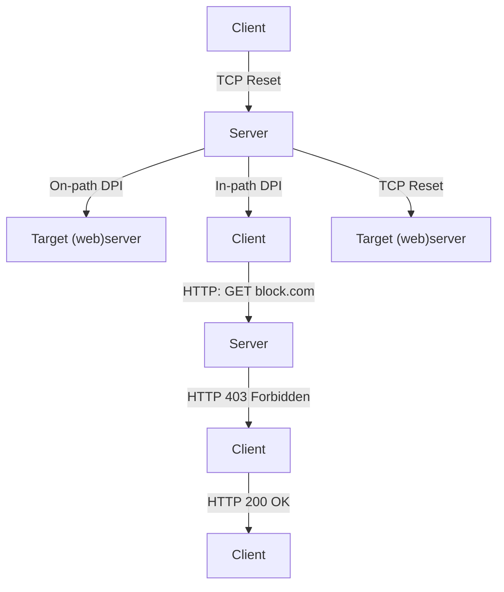
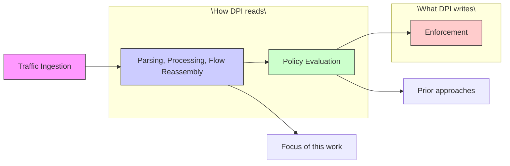
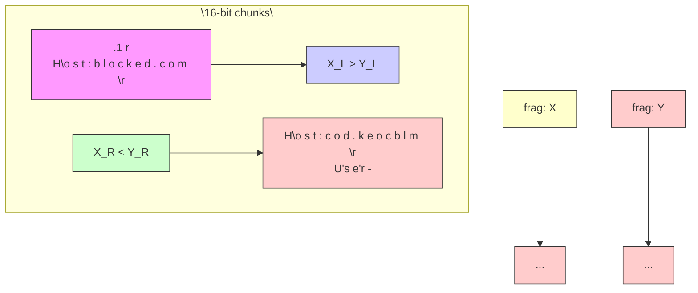

# Fingerprinting Deep Packet Inspection Devices by Their Ambiguities

Diwen Xue

University of Michigan

Ann Arbor, MI, USA

diwenx@umich.edu

Armin Huremagic

University of Michigan

Ann Arbor, MI, USA

agix@umich.edu

Wayne Wang

University of Michigan

Ann Arbor, MI, USA

wswang@umich.edu

Ram Sundara Raman

University of California, Santa Cruz

Santa Cruz, CA, USA

rsundar2@ucsc.edu

Roya Ensafi

University of Michigan

Ann Arbor, MI, USA

ensafi@umich.edu

## Abstract

Users around the world face escalating network interference such as censorship, throttling, and interception, largely driven by the commoditization and growing availability of Deep Packet Inspection (DPI) devices. Once reserved for a few well-resourced nation-state actors, the ability to interfere with traffic at scale is now within reach of nearly any network operator. Despite this proliferation, our understanding of DPIs and their deployments on the Internet remains limited—being network intermediary leaves DPI unresponsive to conventional host-based scanning tools, and DPI vendors actively obscuring their products further complicates measurement efforts.

In this work, we present a remote measurement framework, dMAP (DPI Mapper), that derives behavioral fingerprints for DPIs to differentiate and cluster these otherwise indistinguishable middleboxes at scale, as a first step toward active reconnaissance of DPIs on the Internet. Our key insight is that parsing and interpreting traffic as network intermediaries inherently involves ambiguities—from under-specified protocol behaviors to differing RFC interpretations—forcing DPI vendors into independent implementation choices that create measurable variance among DPIs. Based on differential fuzzing, dMAP systematically discovers, selects, and deploys specialized probes that translate DPI’s internal parsing behaviors into externally observable fingerprints. Applying dMAP to DPI deployments globally, we demonstrate its practical feasibility, showing that even a modest set of 20-40 discriminative probes reliably differentiates a wide range of DPI implementations, including major nation-state censorship infrastructures and commercial DPI products. We discuss how our fingerprinting methodology generalizes beyond censorship to other forms of targeted interference, and we hope our work inspires further measurement efforts toward greater visibility and transparency into DPI devices deployed across the global Internet.

Extended Version. A complete version of this paper, including full appendices and additional experimental results, is available at https://arxiv.org/pdf/2509.09081.


This work is licensed under a Creative Commons Attribution 4.0 International License.

CCS ’25, Taipei, Taiwan

© 2025 Copyright held by the owner/author(s).

ACM ISBN 979-8-4007-1525-9/2025/10

https://doi.org/10.1145/3719027.3765145

## CCS Concepts

• Security and privacy → Firewalls; Social aspects of security and privacy; • Networks → Middle boxes / network appliances.

## Keywords

Deep Packet Inspection; Fingerprinting; Measurement; Censorship

## ACM Reference Format:

Diwen Xue, Armin Huremagic, Wayne Wang, Ram Sundara Raman, and Roya Ensafi. 2025. Fingerprinting Deep Packet Inspection Devices by Their Ambiguities. In Proceedings of the 2025 ACM SIGSAC Conference on Computer and Communications Security (CCS ’25), October 13–17, 2025, Taipei, Taiwan. ACM, New York, NY, USA, 15 pages. https://doi.org/10.1145/3719027.3765145

## 1 Introduction

The recent decades have witnessed a troubling escalation in network interference faced by users around the world [55]—ranging from outright censorship [35, 40, 67] and targeted bandwidth throttling [3, 68] to surreptitious traffic interception or injection of malicious contents [32, 33, 49]. This trend is fueled in large part by the increasing availability of specialized network equipment, particularly Deep Packet Inspection (DPI) devices, which enable monitoring, inspection, and targeted interference with network traffic in real-time. While Internet censorship once limited to a select few well-resourced and motivated nation-state authorities, the commoditization of DPI devices now empowers virtually any ISP or network operator to implement sophisticated filtering and/or interference policies at nearly any network boundary [50, 57].

It is important to acknowledge the dual-use nature of DPI technology: while it serves legitimate functions in network security, its capabilities are also the primary enabler of the network interference we study. Yet, despite their proliferation, our knowledge and visibility into DPI deployments on the Internet remain remarkably limited. For their use as censorship devices, a wealth of literature has measured the effects of censorship—documenting which websites are blocked in specific regions, but has done little to illuminate the devices enabling such blocking. This gap arises in part because DPIs operate as network intermediaries rather than endpoints (Figure 1): they do not often expose open ports on public IPs, nor do they otherwise respond to typical network scanning, making them unsusceptible to standard, host-based scanning tools like Nmap or


<details>
<summary>flowchart</summary>


</details>

Figure 1: DPIs either directly intercept and modify/drop traffic in-path or passively monitor mirrored traffic on-path and inject packets. Target refers to remote endpoint toward which we send probes, with the DPI of interest interfering en route.

ZMap [15, 42]. “On-path” DPIs, which act on mirrored traffic outof-band, may not even be physically inline with routing, so their presence becomes virtually undetectable by standard methods.

Further complicating efforts to measure DPIs is a growing trend among DPI vendors toward obscuring the presence of their devices and avoiding explicit identification. For example, past research often relied on explicit blockpages injected by DPIs—often branded with vendor logos or names—to identify the DPI responsible [50]. However, following a series of controversies and lawsuits exposing the role of certain Western-made DPI products in facilitating nation-state censorship and surveillance [11, 13, 32, 34, 54], many vendors have now shifted to more generic and indistinct censorship methods, such as silent packet drops or injecting standard TCP Resets. This movement is also encouraged by the Internet’s shift towards HTTPS, since DPIs cannot inject blockpages into encrypted traffic. According to public data from Censored Planet [57] (Figure 2), one of the largest censorship observatories, censorship by vendor-labeled blockpages has declined by over 85% over the past six years, replaced by less distinguishable methods.

In this work, we present a remote measurement framework that derives behavioral fingerprints for DPI devices, enabling researchers to map out, differentiate, and cluster these otherwise indistinguishable middleboxes at scale. The core insight behind this reconnaissance method is that ambiguities in how network traffic is read provides a source of variance across DPI implementations. Such ambiguities arise from various factors, such as under-specified corner cases in protocol standards or differing interpretations of RFC guidelines. For example, the IETF specifications do not prescribe a canonical way for reassembling overlapping IP fragments [22], forcing each DPI vendor to independently decide how to handle such scenarios. Our insight is that these implementation-specific decisions, whether explicit or implicit, introduce subtle differences that can be leveraged as behavioral fingerprints for DPIs.

Building on these insights, we design and implement dMAP (DPI Mapper), a framework that systematically discovers, selects, and deploys specialized network probes that convert DPIs’ internal traffic parsing ambiguities into externally measurable fingerprints. dMAP proceeds in three phases: (1) First, we enumerate a broad range of potentially ambiguous packet sequences with deterministic fuzzing, guided by a comprehensive survey of past DPI evasion literature, to generate a large pool of candidate “probes” (§ 3.3). (2) Next, dMAP filters and selects the most discriminative probes—those that best differentiate between different DPI implementations—by applying differential analysis against known DPI products (§ 4.3). (3) Finally, dMAP conducts large-scale remote probing, observes the behaviors elicited by each probe from DPIs along the network path, and then aggregates these observations across multiple probes into a single behavioral fingerprint for each DPI (§ 4.1 & § 4.2).

We apply dMAP for large-scale remote fingerprinting of DPI devices across the Internet. We demonstrate the practical feasibility of our fingerprinting approach, finding that even a modest set of 20- 40 most discriminative probes yields sufficient variance to reliably distinguish among DPI implementations—even when they employ identical censorship actions (e.g., all injecting indistinct RSTs). We observe that DPI fingerprints consistently cluster at the netblock or Autonomous System (AS) level, suggesting that censorship and filtering policies tend to be deployed at these administrative scopes. We identify fingerprint clusters corresponding directly to known nation-state censorship infrastructures (e.g., Iran’s national firewall), as well as globally deployed commercial DPI products such as FortiGate. Perhaps most surprisingly, our results reveal multiple fingerprint clusters within some nation-state censorship infrastructures, challenging the longstanding view of them as singular, homogeneous systems. Lastly, tracking fingerprints longitudinally with open-source DPIs (e.g., Suricata, Zeek), we show that their fingerprints remain remarkably stable over multiple years and major releases, highlighting the long-term utility of these behavioral fingerprints.

Our work represents a meaningful step toward greater visibility into the network intermediaries that interfere with users’ traffic on the Internet. While questions and challenges remain in fully understanding these devices, we demonstrate a practical methodology that allows such middleboxes to be remotely measured and differentiated at scale based on their behavioral fingerprints. Importantly, we anticipate our fingerprinting methodology to be sustainable— we discuss why the underlying protocol ambiguities enabling it are unlikely to vanish or be easily removed by DPI vendors—and generalizable—extending beyond censorship devices to those responsible for other forms of targeted interference such as throttling or MITM attacks. We hope this work inspires further Internet measurement initiatives, collectively advancing the community’s knowledge, transparency, and accountability surrounding these traffic-interfering middleboxes deployed across the global Internet.

## 2 Background & Related Work

## 2.1 Internet Censorship and Interference

News, anecdotes, and measurement studies collectively suggest that users’ Internet traffic is increasingly subject to interference by middleboxes deployed along network paths [35, 40, 55, 57]. Among the most prevalent forms of such interference is Internet censorship, which is increasingly practiced by authorities around the world. For over two decades, researchers have conducted both country-specific case studies [27, 44, 53, 67] and global-scale censorship measurements [16, 40, 57], documenting censorship methods ranging from simple IP-based blocking [45, 58], website filtering [21, 46, 52], and targeted blocking of protocols and circumvention tools [1, 65, 66]. Among these, website blocking over HTTP and HTTPS remains the most prevalent and most studied censorship form, typically enabled by DPI devices that inspect the Host header in HTTP requests or the Server Name Indication (SNI) in TLS Clienthellos [10, 50, 60].


<details>
<summary>stacked bar chart</summary>

| Date | explicit blockpage (%) | tcp.reset (%) |
|---|---|---|
| 2019-01 | 60 | 30 |
| 2020-01 | 60 | 40 |
| 2021-01 | 20 | 70 |
| 2022-01 | 30 | 70 |
| 2023-01 | 10 | 80 |
| 2024-01 | 10 | 80 |
| 2025-01 | 10 | 80 |
</details>

Figure 2: Different censorship actions observed in Censored Planet’s HTTP measurements [57]. Explicit blockpages have increasingly been replaced by less overt RST injections.

Beyond censorship, prior work also documented other forms of interference enabled by DPIs, including targeted bandwidth throttling [3, 68], TLS machine-in-the-middle attacks [49], malicious traffic injection [33] or redirection to malware [32]. This body of research has exposed otherwise covert practices of network interferences and advanced our understanding of adversarial middleboxes in the networks. Yet, relatively few efforts have focused on characterizing and identifying the DPI devices that enable such interference. These DPI devices are the primary focus of our study.

## 2.2 Censorship Devices

Censorship middleboxes can be broadly classified into in-path and on-path devices [33, 40], as shown in Figure 1. In-path devices operate directly on the network path and can inject, modify, or drop packets en route. On-path devices, by contrast, observe a copy of traffic and can inject packets but cannot directly drop or modify them. Our fingerprinting methodology accommodates both device types. These censorship devices conceptually operate using a twostep process [62, 69]. First, the device reads and interprets network traffic, extracting information of each flow (e.g., domain names) and evaluating it against preconfigured firewall policies. Next, if a flow is deemed noncompliant with the policy, the device enforces censorship through active actions such as dropping packets or injecting TCP resets. As we detail in the next section, our approach leverages implementation-specific differences in the parsing stage (step 1), while relying on the externally observable censorship actions (step 2) to detect when these differences arise.

To date, research measuring censorship devices has largely been approached on a case-by-case, ad-hoc basis. Xue et al. identified Russia’s TSPU by focusing on domain blocklists, under the assumption that devices administered by the same authority would share the same censorship policies [67, 68]. This approach, however, effectively fingerprints configurations rather than implementations, since the same device elsewhere could easily load a different set of policies. Dalek et al. and Marczak et al. manually engineered network-level features, such as IPIDs, from injected packets to fingerprint Netsweeper and Sandvine DPIs [13, 14, 32]. However, such methods are labor intensive and not easily generalizable. When DPIs expose external-facing IPs, Dalek et al. also identified them via certain keywords in their banners, but acknowledged these cases might be operator misconfigurations rather than standard practices [14]. In 2020, Raman et al. proposed clustering DPIs by the blockpages they inject [50]. However, this method relies on the DPI actively injecting user-visible blockpages—an increasingly rare behavior, given many devices now favor less overt censorship actions (e.g., generic RST injection), as shown in Figure 2.


<details>
<summary>flowchart</summary>


</details>

Figure 3: Prior fingerprinting efforts focus on installed policies or artifacts from the enforcement step. We instead fingerprint DPIs based on how they parse and interpret traffic.⋄

The work most related to ours are Autosonda and Cenfuzz [24, 51], both of which perform mutations to HTTP or TLS requests to study the rules and triggers of censorship devices. Our primary novelty compared to them lies in a broader and more systematic exploration of fingerprintable ambiguities across network layers. Both [24, 51] exclusively targeted application-layer features (HTTP), while dMAP generalizes across network/transport/application layers, where parsing behavior is less likely to be affected by sitespecific configuration policies. Furthermore, [51] focused on only one geographic region, and [24] performed local measurements within a single city. We extend these work by developing a scalable, generalizable approach spanning the network stack for systematically measuring and fingerprinting DPIs globally.

## 3 Methodology

The goal of this work is to develop a methodology for fingerprinting DPI devices in a way that allows researchers to differentiate different DPI implementations and cluster similar ones. Our methodology is designed under the following constraints and objectives:

Generality: The technique must be universally applicable to any DPI that filters traffic at the network level. Importantly, we do not make assumptions regarding the mechanisms these devices use to enforce censorship—whether through explicit RST injections, blackholing, or other methods. We assume the DPI may not produce self-identifying artifacts (e.g., a blockpage with vendor name).

Black-Box Assumption: We treat DPIs as black boxes, assuming no prior knowledge of their internal logic, configuration, or codebase. Remote fingerprinting must work without physical access to the DPI or its internal states, but rely solely on externally observable feedback (i.e., pass/block of the connection).

Fingerprinting Implementation, Not Deployments: The characteristics leveraged for fingerprinting should reflect inherent aspects of the DPI’s implementation—such as how it parses packets, reassembles fragments, or manages TCP states—rather than its sitespecific configuration or policies (e.g., which domains are blocked). While the latter may differ significantly between deployments of the same DPI product, implementation-specific behaviors tend to remain consistent across deployments.

In § 3.1, we describe the high-level intuition behind exploiting ambiguities in packet parsing and flow reassembly to elicit implementation-specific behavior from different DPIs. Then, in §3.2, we discuss the relationship between these ambiguities and classic DPI evasion attacks, showing how known evasion strategies often hinge on the very same parsing discrepancies that provide a source of variance for fingerprinting. Finally, we survey prior DPI-evasion literature and catalog the ambiguities exploited, which help inform the discovery and selection process of our fingerprinting probes.

## 3.1 Overview: Fingerprinting by Ambiguities

Despite their varying implementations, the high-level intended functionality of DPIs follows a broadly similar workflow, as shown in Figure 3: (1) Traffic Ingestion—capture inline or mirrored traffic; (2) Parsing, Processing, and Content Inspection—analyze packet structures, optionally perform flow reassembly and track connection states; (3) Policy Evaluation—determine whether traffic should be blocked according to predefined rules; and (4) Enforcement— actively implement blocking measures when necessary.

Previous work on fingerprinting DPIs often leveraged either policy information (e.g., domain blocklists) or explicit artifacts from the enforcement step (e.g., identifiable blockpages [50], HTTP headers containing vendor information [14, 34], or signatures of the injected packets like fixed IPIDs [32]). While these artifacts provide straightforward fingerprints, they lack generalizability, as they depend heavily on injections with identifying information that many DPIs increasingly avoid, opting instead for more indistinct methods like simple packet dropping or generic TCP RSTs.

At the core of our approach is to shift the focus from how DPIs write to how they read. Instead of relying on detectable signatures from packet injections, we fingerprint DPIs based on how they parse, inspect, and interpret network traffic. This approach applies universally, as all DPIs by definition must inspect traffic to evaluate policies, regardless of their specific method of enforcement.

For any fingerprinting method to be effective, the behavior it measures must exhibit enough variance across different implementations. Although all DPIs ideally follow the same conceptual process of reading traffic, in practice, traffic parsing and interpretation contain various ambiguities that can lead to inconsistent handling of the same packet sequence among different DPI products [19, 48]. These ambiguities generally arise from three factors: first, many DPIs implement only a subset of the full protocol specifications, often optimizing for throughput or simplicity [19]. For example, while many modern DPI engines track TCP connection states, they may not handle edge cases such as “Simultaneous Open”, where both client and server send SYN packets during the handshake. Previous work has shown that some DPIs fail to properly initialize states when encountering these non-standard handshakes [67]. As another example, some DPIs take shortcuts when parsing packets, such as assuming certain packet header lengths rather than dynamically parsing them [39], leading to divergent behaviors if the header size deviates from those assumptions.

Second, protocol RFCs often leave certain operational details such as resource management under-specified, forcing implementations to make their own design decisions. For example, RFC791 defines IP fragmentation reassembly behaviors but does not specify how to manage buffers and buffer sizes during the process. Different DPI products can adopt different buffer size limits, and these limits in turn provide variability that helps differentiate one implementation from another. Figure 4 shows a motivating example.

Finally, even when RFCs aim to specify behavior, the use of natural language inherently leaves room for varied interpretations, especially under rare edge cases. Prior studies using natural language processing have identified many potential ambiguities in various network protocols [72]. In § 4.3.3, we found that certain leveraged fingerprints were indeed caused by developers’ differing interpretations. Collectively, these ambiguities can lead to divergent implementation choices across different vendors, providing high-variance, measurable differences that form the core of our fingerprinting approach.


<details>
<summary>flowchart</summary>

```mermaid
graph LR
    subgraph Cisco_Secure_Firewall_max_fragments[24]
  A["Client"] --> B["GET / HTTP/1.1"]
  B --> C["frag[0"], MF=T]
  C --> D["frag[1"], MF=T]
  D --> E["......"]
  E --> F["frag[40"], MF=F]
  F --> G["HTTP/1.1 200 OK"]
    end

    subgraph Junos_OS_max_fragments[64]
  H["Client"] --> I["GET / HTTP/1.1"]
  I --> J["frag[0"], MF=T]
  J --> K["frag[1"], MF=T]
  K --> L["......"]
  L --> M["frag[40"], MF=F]
  M --> N["HTTP/1.1 200 OK"]
    end

  A --> O["Client"]
  I --> P["Client"]
  J --> Q["Client"]
  K --> R["Client"]
  L --> S["Client"]
  M --> T["Client"]
  N --> U["Client"]
  O --> V["JUNOS OS"]
  P --> V
  Q --> V
  R --> V
  S --> V
  T --> V
  U --> V
  V --> W["JUNOS OS"]
```
</details>

Figure 4: A motivating example where a fragmentation-based evasion attempt may succeed or fail based on the DPI’s internal reassembly buffer size, making its handling of this ambiguity externally fingerprintable.

## 3.2 Evasion-By-Ambiguities

How do we find these ambiguities? In principle, one could design ambiguity-based probes for DPI fingerprinting through multiple approaches, ranging from exhaustively analyzing RFC languages to brute-force fuzzing of every possible packet-field combination. In this work, however, we choose to ground our probe design in classic DPI evasion attacks. Two considerations motivate this approach:

Higher Likelihood of Divergence: First, evasion attacks highlight precisely those ambiguities in the protocol where real DPI implementations diverge from ideal or reference behaviors. An evasion attempt succeeds when one DPI accepts and reassembles an ambiguous packet sequence that an end host mis-parses or drops; i.e., these attacks exist precisely because implementations diverge under those conditions. Additionally, empirical evidence has shown that at least 86.74% (and up to 100%) of evasion strategies effective against one DPI fail against another [36].

Observable Feedback in a Black-Box Setting: In remote DPI fingerprinting, we treat DPIs as blackboxes and assume no access to its internal states. That means the only feedback we can reliably measure is a binary signal—whether the connection continues or has been blocked. Evasion attacks, by definition, exploit exactly those ambiguities that produce such observable differences when interpreted differently. For example, consider the ambiguity around fragmentation buffer size. An evasion attempt (Figure 4) might split a sensitive request into ?? fragments, succeeding only against DPIs with reassembly buffers smaller than ?? but failing to evade a different DPI with a larger buffer. Observing the differing blocking outcomes indirectly reveals the underlying implementation-specific buffer limit, which can be used for fingerprinting.

Therefore, our approach first surveys existing DPI-evasion literature to identify ambiguities already validated in real-world censorship contexts for causing observable and divergent DPI behaviors.

<table><tr><td>Layer</td><td>Type</td><td>Ambiguity</td><td>Examples/Specifics</td><td>Reference</td></tr><tr><td>IP</td><td>Fragmentation</td><td>IP Fragmentation Reassembly</td><td>- in-order/out-order/overlapping fragments- max timeout / number of fragments in reassembly buffer- max disorder allowed (ipfrag_max_dist)</td><td>[9, 19, 28, 48, 56, 67]</td></tr><tr><td>IP</td><td>Fragmentation</td><td>IP Fragmentation Semantics</td><td>- invalid fragmentation offset; invalid MF/DF flag- min fragment size acceptable for reassembly</td><td>[19, 48, 56]</td></tr><tr><td>IP</td><td>Packet Parsing</td><td>Malformed Header Processing</td><td>- invalid IP options (type/value)- invalid proto; reserved bit</td><td>[19, 31, 48]</td></tr><tr><td>TCP</td><td>Packet Parsing</td><td>TCP Header Processing</td><td>- invalid TCP Flag combination (syn/rst, ack not set, etc.)- invalid window / windowscale; urgent pointer processing</td><td>[2, 5, 6, 8, 19, 28, 31, 48, 56, 63, 64, 73]</td></tr><tr><td>TCP</td><td>Packet Parsing</td><td>TCP Option Processing</td><td>- invalid TCP option type- unsolicited MD5; invalid timestamp; fast open processing</td><td>[2, 9, 19, 39, 48, 56, 63, 64, 73]</td></tr><tr><td>TCP</td><td>Conn Tracking</td><td>TCB Creation</td><td>- packet sequence creating TCB at DPI (single SYN, single ACK, etc.)</td><td>[4, 5, 8, 10, 28, 36, 48, 63, 67]</td></tr><tr><td>TCP</td><td>Conn Tracking</td><td>TCB Re/de-synchronization</td><td>- packet sequences that re-synchronizes/reverses TCB</td><td>[5, 8, 9, 36, 63, 67, 70]</td></tr><tr><td>TCP</td><td>Conn Tracking</td><td>TCB Teardown</td><td>- packet sequences that tears down TCB maintained at DPI- timeouts, or max number of packets examined in a flow</td><td>[2, 4, 6–9, 28, 31, 36, 48, 61, 63, 64, 67, 68, 73]</td></tr><tr><td>TCP</td><td>Conn Tracking</td><td>TCP Stream Reassembly</td><td>- invalid seq/ack number (seq &lt; ISN, premature/duplicate ack, etc.)</td><td>[2, 5, 7, 19, 31, 36, 48, 56, 59, 63, 64, 73]</td></tr><tr><td>TCP</td><td>Fragmentation</td><td>TCP Segmentation</td><td>- overlapping segments (partial/whole, in-order/out-order)- min segment size; max number of segments allowed</td><td>[2, 6, 8–10, 19, 28, 43, 48, 59, 63, 67, 68, 70]</td></tr><tr><td>HTTP</td><td>Request Parsing</td><td>Request Line Parsing</td><td>- invalid HTTP version / method- additional spaces/tabs; alternative delimiters- multiple requests in TCP packet; keyword location within request</td><td>[20, 24, 43, 51, 59, 61, 71]</td></tr><tr><td>HTTP</td><td>Request Parsing</td><td>Host Header Parsing</td><td>- keyword/hostname permutation (capitalize, remove, pad, alternate)</td><td>[20, 24, 26, 28, 43, 59, 71]</td></tr><tr><td>TLS</td><td>TLS Record Parsing</td><td>TLS Record Semantics</td><td>- Prepending CH records with other TLS records</td><td>[67, 68]</td></tr><tr><td>TLS</td><td>Fragmentation</td><td>TLS Record Fragmentation</td><td>- fragment CH record into multiple TLS fragments</td><td>[41, 47]</td></tr><tr><td>TLS</td><td>Clienthello Parsing</td><td>Clienthello Parsing</td><td>- CH fields permutation (ciphersuite, version); SNI permutation</td><td>[51]</td></tr><tr><td>IP/TCP</td><td>Malformed packet</td><td>Checksum</td><td>- invalid IP/TCP checksum</td><td>[2, 5, 9, 19, 31, 48, 56, 63]</td></tr><tr><td>IP/TCP</td><td>Malformed packet</td><td>Length Fields</td><td>- invalid length fields in IP/TCP/TLS headers/options</td><td>[2, 9, 19, 31, 48, 56, 63]</td></tr></table>

Table 1: A Survey of DPI Evasion Attacks. Overview of common ambiguities exploited, categorized by network layer and type. ⋄

## 3.3 A Survey of DPI Evasion Attacks

To systematically identify promising ambiguities for DPI fingerprinting, we surveyed 31 prior works on DPI evasion attacks targeting open-source, commercial, and nation-state DPI systems. Inspired by the seminal work of Handley et al. and Ptacek et al. [19, 48], we adopt a simple taxonomy that catalogs evasions according to the network layer where the ambiguity arises (IP, TCP, or application) and whether the ambiguity is intra-packet (related to the parsing of fields) or inter-packet (connection tracking, reassembly, etc.). It’s important to note that not all DPI evasions are due to ambiguous traffic interpretations. For example, we exclude evasions involving TTL-limited packets, as TTL expiration follows a well-defined protocol behavior that offers little scope for divergent interpretations. Similarly, we exclude evasions based on orthogonal mechanisms such as encrypted tunneling, which bypasses rather than exploits parser discrepancies. Additionally, in line with our measurement scope in § 5, we restrict application-layer evasions to HTTP(S), excluding those targeting other protocols like DNS [20, 43].

Table 1 provides an overview of the ambiguities commonly exploited in previous DPI evasion attacks. From a fingerprinting perspective, this table highlights the aspects of packet sequences most likely to expose divergent DPI behaviors. Specifically, we see recurring emphasis on three main categories of ambiguities: (1) the parsing of malformed or partially invalid packet fields; (2) the handling of fragmentation reassembly (at IP, TCP, and TLS layer), where differences in buffer limits or overlap resolution can cause misalignment in how DPIs see stream contents; and (3) the management of TCP states, especially unusual packet sequences that deviate from the typical TCP handshake/teardown procedures. Within each category, the survey also pinpoints specific fields that appear to be more prone to divergent interpretation (e.g., TCP flags, IP options, and sequence numbers, as opposed to IP addresses or ports). In § 4.3.1, we build on these insights to design a deterministic fuzzing framework that generates candidate fingerprinting probes by permuting the most ambiguity-prone aspects of network traffic.

It’s worth emphasizing that one dimension we do not consider in our survey is the effectiveness of each evasion attack. Although this metric is central to many evasion studies, our goal in this work is not to evade DPIs, but to identify ambiguities that introduce measurable variances across implementations. Indeed, a “perfect” evasion attack that bypasses a broad range of DPIs reveals little information about which DPI a network is actually using.

Lastly, while we do not claim our survey to be exhaustive, the high degree of overlap among prior works leads us to believe that we have captured the classes of ambiguities that are most relevant for our fingerprinting efforts. Because we focus on the underlying ambiguities rather than reusing evasion attacks verbatim, completeness in cataloging every specific evasion sequence is not essential.

For example, no fewer than 16 studies describe attacks tied to TCB teardown ambiguities; even if we missed specific packet sequences proposed in more recent works, those techniques typically rely on the same underlying issues in state management. In the next section, we describe the design of dMAP, our framework that implements this methodology for discovering, selecting, and deploying probes to fingerprint DPIs based on their handling of protocol ambiguities.

## 4 dMAP Architecture and Experimentation

Figure 5 presents an overview of dMAP, our measurement framework for fingerprinting DPI devices. We begin by describing the probing module in § 4.1, which builds packets according to the probe configurations provided and performs parallel measurements against targets. The collected results are then processed by Analyzer (§ 4.2), which interprets the raw responses looking at both the control and test measurements and producing a single verdict for each probe-target pair. We defer our discussion on how specific probes are selected to § 4.3, where we describe how we fuzz candidate probes based on ambiguities identified earlier, and how we select the most discriminative probes with differential analysis.

## 4.1 Prober

Prober is the centerpiece of the dMAP framework, responsible for crafting and sending network probes to measure DPI behaviors. It takes as input a list of probe configurations, each specifying a single measurement (i.e., a single transport-layer connection). Every probe configuration, written in YAML format, defines a precise sequence of packets to be sent, starting from the TCP handshake. For each packet, the configuration allows fine-grained control over fields spanning all protocol layers, from Ethernet to the application layer, including both header fields and payload contents. Additionally, each packet definition may optionally specify whether Prober should wait for a response before sending the next packet (e.g., waiting for a SYN-ACK to learn the server’s ISN). Note that the destination IP and port, as well as the domain name used in the application-layer request, are not fixed within the probe configuration itself but are supplied at runtime, which allows a single probe configuration to be reused across multiple measurements. An example of a probe configuration is provided in the Appendix A.4.

Alongside probe configurations, Prober also takes a list of Targets. It should be noted that for our measurements, the Targets themselves are not the DPI we aim to fingerprint; rather, they are normal web servers situated behind the DPI of interest, which sits upstream of the web server and intercepts and filters traffic between Prober and the Target. For each Target, we specify both a Control Domain (e.g., example.com), expected to pass through the DPI unblocked, and a Test Domain (e.g., blocked.com), which is expected to trigger the DPI’s filtering. The list of Targets can either be measured in an initial discovery phase or sourced from open datasets released by censorship observatories such as Censored Planet [57].

At runtime, Prober parallelizes measurements across Targets, but enforces a strict sequential ordering between consecutive probes. To support large-scale experiments, measurements using the same probe configuration but targeting different Targets may reuse the same source port, provided that no two transport-layer connections within the same measurement run share the same four-tuple. This prevents “residual censorship” (lingering blocking state associated with a particular connection identifier) from affecting subsequent probes. As an additional precaution, we introduce a 120-second delay between consecutive probes (even when their four-tuples are different), a timeout previously found sufficient to clear most residual censorship effects [60]. For each Probe-Target pair, Prober first launches a Control Measurement using the Control Domain in the application-layer request. Next, it runs Test Measurement using the same packet sequence but substituting the Test Domain. For each measurement, Prober dynamically tracks the expected TCP SEQ/ACK numbers, incrementing them based on both outgoing and incoming traffic. This allows us to specify relative SEQ/ACK numbers in probe configurations without having to know the Target’s runtime ISN choice. Finally, for each measurement, Prober logs all packets sent and received (in JSONL or PCAP) for analysis.

Prober represents the most significant engineering effort in dMAP, with over 4000 LOC excluding probe configurations. It is designed to be highly flexible, supporting arbitrary packet sequences and fine-grained mutations across protocol layers. Due to space constraints, we omit a full description of Prober’s implementation but refer interested readers to our open-source repository (§ A.2).

## 4.2 Analyzer

Each entry in Prober’s raw output corresponds to a single measurement, recording the packets exchanged during the measurement. Analyzer begins by parsing these packet traces and performing a minimal sanity check (e.g., discarding any measurement that does not contain a completed TCP handshake). Next, Analyzer annotates each valid measurement by examining the immediate response after sending the application-layer request, such as explicit TCP resets, blackholing (absence of further packets), or, in cases where an application-layer response is present, whether the response body matches any known blockpage signatures .

Once individual measurements have been annotated, Analyzer groups them by the tuple (Target, Probe, isControl), where isControl indicates whether the measurement used the Control Domain (expected not to trigger censorship) or the Test Domain (expected to trigger censorship). Typically, we repeat multiple measurements for each tuple to account for transient network variations. Within each group, Analyzer consolidates individual annotations into a single outcome by prioritizing explicit signals over more ambiguous ones, based on their relative reliability as indicators of DPI interference. For example, explicit responses like matched HTTP blockpages are more conclusive than mere RSTs, which in turn take precedence over blackholing. Likewise, any clear evidence of blocking outweighs “no blocking”, under the assumption that DPIs might occasionally fail to block when they should (e.g., under heavy load), but will rarely produce a conspicuous blockpage by accident.

Next, for each (Target, Probe) pair, Analyzer compares four consolidated measurement results to interpret how the mutation introduced by the Probe affects the DPI’s handling of traffic: R1(Reference Control)—Standard request without any mutation using Control Domain. R2(Reference Test)—Standard request using Test Domain.


<details>
<summary>flowchart</summary>

```mermaid
graph TD
  A["Internet Interference Observatory"] --> B["Target: 1"]
  A --> C["Target: 2"]
  A --> D["Target: n"]
  B --> E["Prober Inputs"]
  C --> E
  D --> E
  E --> F["Asynchronous, concurrent probing"]
  E --> G["Build, Serialize, and send Packets"]
  F --> H["Prober_1"]
  G --> I["Prober_2"]
  H --> J["Prober_n"]
  I --> K["Prober_n"]
  J --> L["Prober_1"]
  K --> M["Prober_2"]
  L --> N["Raw Results JSONL & PCAP"]
  M --> N
  N --> O["Aggregate Results"]
  O --> P["Fingerprint[n"]]
  P --> Q["Differential Analysis"]
  Q --> R["Analyzer §4.2"]
  R --> S["Rank probes based on Variance"]
  S --> T["Baseline Standard HTTP Request / TLS Clienthello"]
  T --> U["Deterministic Fuzzing"]
  U --> V["Enumerating possible mutations"]
  V --> W["Probe: X Probe: Y Probe: Z"]
  W --> X["Deterministic Fuzzing"]
  X --> Y["Probe Selection §4.3"]
  Y --> Z["Measurement Open Dataset TargetIP, Port: Protocol: Triggering Request/Domain"]
  Z --> AA["Lab Testbed (open source DPIs)"]
  AA --> AB["Virtual Private Cloud (commercial firewalls)"]
  AB --> AC["Testbed"]
  AC --> AD["Open Measurement on the Internet"]
```
</details>

Figure 5: dMAP’s Architecture. The framework sources from open measurement datasets for target (web) servers behind DPIs, sends probes that are enumerated and ranked based on differential analysis, and analyzes results to produce DPI fingerprints.

<table><tr><td>Results</td><td>Interpretation</td><td>Verdict</td></tr><tr><td>{R1,R3,R4}{R2}</td><td>Mutation has no effect on endhost but bypasses DPI</td><td>Bypass</td></tr><tr><td>{R1}{R2,R3,R4}</td><td>Reference blocking behavior indistinguishable from how end-host handles mutation, unclear if DPI is triggered in R4</td><td>Inconclusive</td></tr><tr><td>{R1,R3}{R2,R4}</td><td>Mutation has no impact on either the DPI or the endhost</td><td>NoEffect</td></tr><tr><td>{R1,R3}{R2}{R4}</td><td>Mutation does not affect endhost; however, differing blocking behaviors imply possibly two distinct DPIs in the path</td><td>Inconclusive</td></tr><tr><td>{R2,R3}{R1}{R4}</td><td>Possibly two DPIs in path: first drops all packets when triggered (R2), superseding second DPI&#x27;s explicit blockpage. Mutation bypasses the first DPI but not the second.</td><td>Inconclusive</td></tr><tr><td>{R2,R4}{R1}{R3}</td><td>Mutation affects the endhost but the DPI remains triggered.</td><td>NoEffect</td></tr><tr><td>{R3,R4}{R1}{R2}</td><td>Could happen when Mutated Control (R3) and Mutated Test (R4) both yield no response, different from reference behaviors.</td><td>Inconclusive</td></tr><tr><td>{R1}{R2}{R3}{R4}</td><td>Mutation affects both the endhost and potentially multiple DPI implementations in the path that respond differently.</td><td>Inconclusive</td></tr></table>

Table 2: Interpretation of probe outcomes. Each row corresponds to a unique grouping of responses. $\{ a , b \} \{ x , y \}$ } indicates ?? = ?? & ?? = ?? & ?? ≠ ??. Some invalid groupings (e.g., {R1,R2}) are excluded.

R3(Mutated Control)—Mutated packet sequence supplied with Control Domain. R4(Mutated Test)—Mutated packet sequence with Test Domain. Table 2 enumerates common patterns 2 of equivalence or difference among {R1,R2,R3,R4} and the corresponding interpretation on how the introduced mutation affects the DPI. For example, the scenario {R1,R3,R4}{R2} indicates that applying the mutation does not alter the web server’s behavior (since R1=R3=R4), but effectively prevents the DPI from parsing and recognizing the blocked domain, since the censorship behavior is only observed in Reference Test (R2) but not Mutated Test (R4). In that scenario, Analyzer assigns a “Bypass” verdict for the (Target, Probe) pair.

In rare cases, the four results may yield no conclusive verdict. Consider the example where R1 (Reference Control) returns a valid HTTP response, but R2, R3, and R4 all appear blackholed ({R1}{R2,R3,R4}). The apparent similarity between the Reference Test (R2) and the Mutated Control (R3) suggests that the web server itself might be discarding the mutated request, making it indistinguishable from a DPI-induced packet drop. Consequently, we cannot determine if the DPI has been triggered in R4. Analyzer labels such cases as Inconclusive. In Appendix § A.3 we discuss some approaches we take to reduce the fraction of inconclusive results.

Finally, Analyzer outputs a fingerprint for each Target by concatenating verdicts across all evaluated Probes, with 0 indicating the mutation of the current Probe did not affect the DPI and 1 indicating the evaluated mutation disrupted the DPI’s ability to interpret traffic. For inconclusive results, Analyzer marks -1 in the fingerprint and omits that probe from pairwise fingerprinting matching.

## 4.3 Probe Selection

4.3.1 Generate Candidate Probes. To generate candidate probes for fingerprinting, we follow a deterministic, grammar-aware fuzzing approach guided by known parsing ambiguities identified from prior work (§ 3.3). There are two main reasons for this design choice: (1) Randomly mutating packets as raw bytes (i.e., grammar-agnostic fuzzing) often produces packets that fail basic validity checks and are likely discarded by intermediary routers before they ever reach the DPI. By contrast, grammar-aware fuzzing respects the essential format and semantics of its underlying protocols, generating probes that are more likely to trigger meaningful divergences in DPI behaviors rather than being prematurely discarded. (2) We systematically enumerate precisely which fields to mutate, as well as the range of mutating values (inspired by Table 1), such that the same set of candidate probes is deterministically applied across all tested DPIs. This allows feature vectors of the resulting fingerprints to be directly comparable for clustering or differentiation.

We begin with a standard packet sequence that serves as a baseline template, which consists of 1) a client-initiated SYN packet (with typical TCP options expected from a Linux client like windowscale and SACK), 2) a corresponding ACK for the server’s SYN-ACK (with appropriate ACK number), 3) an HTTP GET request or a TLS Clienthello that resembles one produced by cURL, and finally 4) a FIN/ACK and 5) an ACK to gracefully terminate the connection. On top of this baseline, we broadly define three types of mutations:


<details>
<summary>flowchart</summary>


</details>

Figure 6: Overlapping Fragment Reassembly. Nine unique alignments occur based on whether $Y _ { L } / Y _ { R }$ are smaller than, equal to, or greater than $X _ { L } / X _ { R } .$ . Figure inspired by [28].

Insertion is a sequence-level mutation that builds and injects an entirely new packet at a specified point in the baseline sequence. The inserted packet is crafted with systematically varied fields at the IP, TCP, and application layers. For example, we vary TCP flags, SEQ and ACK numbers, checksums, and other header fields. The inserted packet can contain no payload, random bytes, a wellformed application-layer request with the Control Domain, along with others. Each inserted packet can be placed at one of four defined positions: before the initial SYN, before SYN-ACK, before the ACK completing the handshake, or after the handshake but immediately preceding the application-layer request.

Mutation refers to packet-level mutations that affect an individual packet (either header or payload) from the baseline sequence. We define mutations for most of the header fields for the IP and TCP layer, except for the fields that are essential for packet routing and delivery, such as IP addresses or TCP ports. For HTTP, being a more expressive text-based protocol, we leverage previously studied HTTP-specific mutations [20, 43, 51, 59, 71], such as varying the case of HTTP methods (e.g., GET vs. GeT). The full list of IP and TCP fields considered for mutations is included in Appendix A.5.

Fragmentation is a multi-packet mutation that can be applied as IP fragmentation, TCP segmentation or TLS record-layer fragmentation, which we collectively term as “fragmentation”. Fragmentationbased mutations control (1) the exact offset where fragmentation occurs (e.g., splitting a domain name across fragments); (2) the order in which fragments are sent (in-order vs. out-order); (3) the size of individual fragments; (4) the total number of fragments created from the original payload; (5) the time delay between sending consecutive fragments (reassembly timeouts). For IP fragmentation in particular, we also consider “disorder” fragments, where fragments from different reassembly queues become interleaved (i.e., two sets of fragments sharing the same IPs but carrying different IPIDs).

A major source of ambiguity in fragmentation handling relates to overlapping fragments—that is, two fragments containing different data intended for the same (or partially overlapped) offsets in the reassembled packet. For this, we define the following mutation procedure: first, we build and serialize two byte sequences from the same application-layer request, with sequence A using the original domain (i.e., the Control or Test Domain) and sequence B using the same domain but reversed in 16-bit chunks. (Because TCP checksums are calculated using one’s-complement on 16-bit chunks, the second sequence, with only domain reversed and everything else being the same, remains a semantically valid packet with correct checksums.) Note that this reversed domain is likely malformed and therefore unlikely to match any entry in the DPI’s blocklist. Next, we build fragment ?? that span the byte range $[ X _ { L } , X _ { R } ]$ from sequence A, and fragment ?? that span [????, ????] from sequence B. We ensure that the overlapping portion covers the entire domain name region so that the fragments “equivocate” over exactly which domain is used. As shown in Figure 6, we define mutations corresponding to each of the nine possible alignments of fragment boundaries $( X _ { L } , X _ { R } , Y _ { L } , Y _ { R } )$ . Finally, we send the fragments and observe whether the DPI is triggered, which allows us to infer which domain is present in the reassembled packet and, in turn, how the DPI handles overlapping in fragmentation reassembly.

Algorithm 1 Probe Selection with Entropy and Greedy Correlation  
Require: $\mathcal{P}$ : Set of all candidate probes; $\mathcal{D}$ : Set of known DPIs (groups) $f(p,d) \in \{\text{Bypass}, \text{NoEffect}, \text{Inc}\}$ : outcome of probe $p$ on DPI $d$ ; $\theta$ : correlation threshold

Ensure: $\mathcal{S}$ : Final subset of selected probes
    1: for each $p \in \mathcal{P}$ , compute score $[p] \leftarrow \text{GETENTROPY}(p, \mathcal{D}, f)$ 2: $\mathcal{P}_{\text{sorted}} \leftarrow \text{SORT}(\mathcal{P}, \text{by score}[p]\text{ descending})$ ; $\mathcal{S} \leftarrow \emptyset$ 3: for $p$ in $\mathcal{P}_{\text{sorted}}$ do
    4:    keep $\leftarrow$ true
    5:    for $q \in \mathcal{S}$ do
    6:    if $|\text{GETPHICOEFFECTICIENT}(p,q,\mathcal{D},f)| > \theta$ then
    7:    keep $\leftarrow$ false; break
    8:    end if
    9:    end for
    10:    if keep then $\mathcal{S} \leftarrow \mathcal{S} \cup \{p\}$ 11:    end if
    12: end for
    13: return $\mathcal{S}$

During probe generation, we may allow our fuzzer to apply up to ?? mutations per probe. We note that even with $N = 1$ , this process yields 2,621 HTTP-based probes and 2,590 HTTPS-based probes, which, as we show in the next subsection, already introduce substantial variance in DPI behaviors. One-mutation-per-probe also simplifies root-cause analysis (§ 4.3.3) by isolating the effect of an individual mutation. Therefore, in this work, we restrict our probe generation to single-mutation probes $( N = 1 ) .$ . We note that singlemutation already covers the vast majority of known evasion attacks cataloged in our evasion survey.

4.3.2 Filter and Select Probes. From the pool of candidate probes, we aim to filter and select those that are most discriminative—i.e., those that elicit the greatest diversity of behaviors across different DPI implementations. Doing so requires access to a set of known DPIs. Acquiring such a set, however, proved one of the most challenging tasks for this work, as most DPI hardwares are costly and often require separate licenses to enable key filtering features. For this, we ultimately assembled our set of known DPIs from three complementary sources: Open source DPIs (4): We configured four popular open-source DPIs (zeek, nDPI, Suricata, and Snort). Commercial free trials (3): We also deployed three leading commercial firewalls offered as free trials through the AWS Marketplace (Cisco Secure Firewall, Fortinet FortiGate, and Sophos UTM 9) in a Virtual Private Cloud. DPIs with identifying blockpages (11): Finally, we leveraged public measurement data from the Censored Planet Observatory [57]. Over one week in February 2025, Censored Planet recorded measurements to 251 remote endpoint addresses showing injected blockpages, of which 95 contain vendor-identifying information that is attributable to 11 distinct DPI vendors. We then tested the pool of candidate probes on these known DPIs.

Pre-filters. We begin by discarding any probes that consistently yield uniform responses across all tested DPIs. Such probes offer no discriminative power, often because their mutations are either too trivial that have no observable effect (e.g., inserting an empty ACK after handshake) or too disruptive that all DPIs discard them (e.g., mutating the proto field in the IP header). Next, we remove probes whose outcomes frequently (≥ 10%) lead to inconclusive interpretations, as defined earlier in Table 2. These inconclusive probes provide limited discriminative value. Through this pre-filter step, we reduce the pool of candidate probes by around 70% (2,621 to 702 for HTTP, and 2590 to 708 for HTTPS).

Ranking probes by Entropy. From here, our selection of probes conceptually followed a “Maximum Entropy, Minimum Redundancy” approach, as outlined in Algorithm 1. We begin by treating the outcome of each probe as a binary feature, and measure its capacity to separate the known DPIs by calculating the Shannon entropy of each probe’s distribution of Bypass/NoEffect across all distinct DPI groups. Intuitively, a probe that splits distinct DPIs roughly evenly (e.g., half the DPI groups bypassed, half not) has higher entropy and is thus more discriminative. We rank the remaining candidate probes in descending order of their entropy.

Greedy probe selection with correlation check. Next, we apply a greedy selection algorithm (Algorithm 1) in which we iteratively select the highest-entropy probe and compute its phi coefficient with each probe already in the selected set. We only add the new probe if its minimum pairwise correlation with the existing set is below a threshold (we used $\phi = 0 . 8 5 $ , determined empirically). This ensures that each newly added probe contributes new information rather than duplicating the effect of a probe already in the set (e.g., if two mutations are closely related). For example, two probes might both divide the DPIs into two equal halves (thus both having the highest entropy), but if they partition the groups identically, adding both would be redundant. Table A.7 in Appendix lists the top 40 probes selected from this process for HTTP and HTTPS.

Number of probes used. Finally, a decision needs to be made regarding how many of the selected probes to include in real-world measurements. Figure 7 shows that with as few as ten probes, our current DPI set is already fully distinguishable—though the set is limited in its size. As additional probes are added, the minimum and average Hamming distance among DPIs continue rising nearly linearly. With 20 probes, the average pairwise distance is approximately ten bits, meaning about half of the fingerprint bits differ between any two DPIs. Eventually the curve plateaus after 30-40 probes, where the marginal benefit of adding more probes begins to diminish. In practice, the number of probes must balance improved discrimination against the increased measurement overhead: each probe run (including Control & Test, and a conservative wait inbetween) requires around 140 seconds in our setup, so more probes per target constrains the scale of targets can feasibly be tested.


<details>
<summary>line chart</summary>

| Number of Probes Used (N) | Min Pairwise Distance (HTTP min dist) | Avg Hamming Distance (HTTPS min dist) | Avg Hamming Distance (HTTPS avg dist) |
| ------------------------- | -------------------------------------- | ------------------------------------- | -------------------------------------- |
| 0                         | 0                                      | 0                                     | 0                                      |
| 10                        | 1                                      | 2                                     | 2                                      |
| 20                        | 3                                      | 4                                     | 4                                      |
| 30                        | 4                                      | 6                                     | 6                                      |
| 40                        | 6                                      | 8                                     | 8                                      |
| 50                        | 7                                      | 20                                    | 20                                     |
</details>

Figure 7: Minimum and average pairwise Hamming distances among known DPIs from different vendors, plotted against the number of top N probes used.


<details>
<summary>bubble chart</summary>

| Group              | N   |
| ------------------ | --- |
| blockpage: fortinet | 10  |
| blockpage: paloalto | 25  |
| blockpage: cisco   | 17  |
</details>

Figure 8: MDS of 20-probe fingerprints using Hamming distance. Each is an endpoint that, when probed, triggered vendor-identifying blockpages by DPI; colored by vendor.

As an example, Figure 8 presents a two-dimensional Multidimensional Scaling (MDS) plot based on 20-bit fingerprints produced by our top-20 probes. Each point represents one endpoint (from the Censored Planet dataset) for which an in-path DPI injects a vendor-identifying blockpage, with color-coding by vendor. The axes represent a two-dimensional projection whose Euclidean distances approximate the Hamming distances among fingerprints. We observe that endpoints associated with the same blockpage vendor generally cluster together, yet each cluster also exhibits some internal spread. This variation likely reflects the reality of remote measurement where additional in-path network devices (e.g., other middleboxes) may modify traffic before it reaches the DPI. We discuss this limitation further in § 6.2. Despite these noise factors, most endpoints associated with the same vendor’s blockpage still end up meaningfully closer to each other than to endpoints associated with different vendors.

4.3.3 Root Cause Analysis. An advantage of using single-mutation probes is that each probe can often be traced to a specific ambiguity in traffic interpretation. Coupling this with open-source DPIs affords us an opportunity to understand why certain probes discriminate among DPIs. For example, one of our top-ranked probes (listed in Table A.7) mutates the sequence number (??????) of the packet with the triggering request. Specifically, it sets the ?????? to a negative value relative to the client’s initial sequence number, which places the ?????? outside the receiver’s window, but also prepends the payload with padding bytes to align the portion of payload containing the request exactly at the next expected sequence number.

Mutate{layer:TCP;field:seq;option:negativeSeqWithPadding}  
packet0: [SYN (seq=ISNclient, ack=0)]
\\ waiting for incoming ([SYNACK (seq=ISNserver, ack=ISNclient+1)])
packet1: [ACK (seq=ISNclient+1, ack=ISNserver+1)]
packet2: [PSH/ACK (seq=ISNclient-100, ack=ISNserver+1, payload=[0]*101 + request[TestDomain])] packet3-4: [FIN/ACK...], [ACK ...]

This probe triggered a censorship response from Snort (v3.6.0), but failed to trigger a response from Zeek (v7.0.4). Inspecting their source code (Appendix A.6), we found that while both DPIs discard packets with invalid ??????, their definitions of “invalid” diverge. Zeek simply compares the current ?????? to the client’s initial sequence number; if the current ?????? is lower, Zeek labels the packet as “seq\_underflow” and considers its payload invalid for reassembly. In contrast, Snort implements a more nuanced validation: it checks whether the current ?????? falls below the upper boundary of the receiver’s window (?????? ≤ ??????\_???????? + ????????????\_????????), and also whether the last byte of the payload is above the lower boundary of the receiver’s window (?????? + ??????(????????????) ≥ ??????\_????????). Note that there is no lower bound for ?????? to be valid. As such, the part of the payload that is in-window is then processed by Snort for flow reassembly, and eventually triggers its censorship policy. In this case, the subtle mismatch in how Zeek and Snort handle partially out-of-window segments enables a remote prober to distinguish the two implementations.

Mutate{layer:TCP;field:option;option:timestamp}  
packet0: [SYN (timestamp: 1000)]
\\ waiting for incoming ([SYNACK (timestamp: 2000)])
packet1: [ACK (timestamp: 1001)]
packet2: [PSH/ACK (timestamp: 999, payload=request[TestDomain])]
packet3-4: [FIN/ACK...], [ACK ...]

Another example involves mutating the TCP timestamp (??????????) of the request packet. Specifically, the probe selects a ?? ???????? lower than that of the preceding packet. For Zeek and nDPI, this mutation has no impact—both DPIs continue to process the packet, ultimately triggering a censorship response. Snort, however, discards the packet, so no censorship response is observed.

Snort’s behavior stems from its implementation of “Protection Against Wrapped Sequences” (PAWS), a mechanism defined in RFC7323 [23] that discards segments if their ?? ???????? is smaller than timestamps recently observed on the same connection. The fact that Zeek and nDPI do not implement this check allows them to be distinguished from Snort. Interesting, Snort’s implementation (Appendix A.6) also deviates from the RFC’s specification: the RFC states that if a connection has been idle long enough, the result from the PAWS check should be “invalidated” (i.e., the packet should be accepted). Snort developers, however, interpreted “invalidate” to mean invalidating (discarding) the packet itself rather than the PAWS check, resulting in the exact opposite of RFC-intended behavior. We have reported this issue to Snort developers. This example reinforces how, even when implementations strive for RFC compliance, differences in implementers’ interpretations can introduce ambiguities that ultimately enable fingerprinting.

## 5 Measurement

We applied dMAP for large-scale measurements to fingerprint inpath/on-path DPI devices filtering HTTP and HTTPS traffic, based on our methodology developed in the previous sections.

## 5.1 Measurement Setup

All measurements were performed from a dedicated measurement machine hosted in North America, administered by the research department of a regional, education-focused ISP. Because some of our probes mutate IP-layer fields, we took steps to ensure that egress traffic was minimally normalized by the local network environment. For example, we verified that no local middlebox or router was reassembling IP fragments before they leave our network3. We began our measurements in early February 2025.

Input list of Probes We drew on the procedure described in § 4.3 to select the top 40 probes for HTTP and HTTPS. Of the 40, 21 probes were common to both protocols. Table A.7 in Appendix lists these probes along with descriptions of their specific mutations.

Input list of Targets Our fingerprinting measurements incur a non-trivial time overhead—around 140 seconds for each of the 40 selected probes. This makes it infeasible to blindly test the entire IPv4 space with dMAP directly. Instead, we supplied dMAP with a curated list of Targets already known to have DPIs interfering with HTTP/HTTPS traffic along the network path. We gathered these Targets from open measurement data provided by the Censored Planet Observatory from February 2025 [57]. Specifically, we took every IP/port combination where blocking (e.g., RST injection) was detected for at least one domain tested by CP. If multiple domains triggered censorship for the same target, we randomly selected one to be used as the Test Domain for dMAP measurement. In total, this produced 11,467 unique Targets for HTTP and 22,092 for HTTPS, spanning 482 network prefixes (based on the Routeviews [12] dataset from CAIDA), 179 ASes, and 73 countries. We probed each target three times using each of the 40 selected probes, launching over 3 million measurements in total. We describe the ethical considerations in our measurement design in Appendix A.1.

## 5.2 Measurement Results

5.2.1 Fingerprint Clustering at Network, AS, and Country Levels. We first examined the pairwise similarity between targets’ 40-bit DPI fingerprints, focusing on how this varies at different network scopes. Figure 9 shows the distribution of pairwise Hamming distances for all target pairs and compares it with the same distribution for target pairs within the same netblock, Autonomous System (AS), or country. The overall distribution (leftmost) is quite spread, indicating the overall diversity of DPI behaviors elicited by our probes. However, looking at narrower network scopes, targets from the same netblock or AS generally have more similar fingerprints.


<details>
<summary>histogram</summary>

| Category         | HTTP | HTTPS |
| ---------------- | ---- | ----- |
| All Pairs        | 15   | 25    |
| Same Netblock    | 0    | 0     |
| Same ASN         | 5    | 10    |
| Same Country     | 15   | 25    |
</details>

Figure 9: Normalized distribution of pairwise fingerprint distances for all pairs of targets, pairs sharing the same netblock prefix, pairs from the same AS, and pairs in the same country.


<details>
<summary>bar chart</summary>

| Cluster ID | Number of Targets |
| ---------- | ----------------- |
| 46         | 1                 |
| 112        | 2                 |
| 4          | 1                 |
| 8          | 2                 |
| 129        | 5                 |
| 113        | 1                 |
| 178        | 1                 |
| 49         | 1                 |
| 26         | 2                 |
| 141        | 16                |
| 162        | 1                 |
| 121        | 1                 |
| 179        | 1                 |
| 41         | 21                |
| 165        | 6                 |
| 161        | 1                 |
| 123        | 1                 |
| 200        | 2                 |
| 42         | 2                 |
| 38         | 3                 |
| 55         | 1                 |
| 23         | 4                 |
| 37         | 13                |
| 30         | 4                 |
| 15         | 1                 |
| 170        | 13                |
| 63         | 6                 |
| 94         | 1                 |
| 183        | 1                 |
</details>

Figure 10: Distribution of the top clusters on the 40-bit fingerprints. Bar segments colored by country, with the number on top indicate the number of unique countries in that cluster.

For example, only < 1% of all target pairs have a Hamming distance of 0, but this fraction jumps to 44.97% and 36.09% (HTTP/HTTPS) among pairs in the same AS, and to 52.60% and 52.33% among pairs in the same netblock. That means a substantial fraction of pairs sharing the same netblocks also share the exact identical 40-bit fingerprint, suggesting that censorship policies at a given network or AS level are often enforced by the same DPI devices or at least highly similar implementations.

Next, we applied HDBSCAN [30], a hierarchical density-based clustering method, to group targets by their 40-bit DPI fingerprints. Unlike many clustering algorithms, HDBSCAN does not require specifying the number of clusters a priori; instead, it identifies “core” regions of density automatically, an advantage when we do not know the variety of DPI implementations in the wild. In total, we find 203 clusters that have at least 20 targets. Figure 10 shows the top discovered clusters: the majority of clusters indicate localized deployment of a particular DPI product or configuration that is prevalent in just one region, while some span multiple countries— possibly reflecting more globally distributed commercial solutions adopted by different networks. For HTTP measurements returning blockpages, we cross-referenced the responses with Censored Planet’s database of known blockpages to corroborate our results. For example, 100% of targets in clusters #8 and #23 are located in Iran and emit a blockpage identified with Iran’s national firewall [7, 29], while 97% of targets in cluster #63 produce blockpages consistent with FortiGate firewalls. Notably, targets from cluster #63 are spread across 13 different countries, yet they share very similar 40-bit fingerprints due to (presumably) the similarity in their underlying DPI implementations.


<details>
<summary>line chart</summary>

| Hamming Distance (bits) | Random IPs: HTTP vs. HTTP | Same IP: HTTP vs. HTTPS |
| ----------------------- | ------------------------- | ----------------------- |
| 0                       | 0.0                       | 0.5                     |
| 2                       | 0.1                       | 0.8                     |
| 4                       | 0.3                       | 0.9                     |
| 6                       | 0.5                       | 1.0                     |
| 8                       | 0.7                       | 1.0                     |
| 10                      | 0.9                       | 1.0                     |
| 12                      | 1.0                       | 1.0                     |
| 14                      | 1.0                       | 1.0                     |
</details>

Figure 11: Distribution of distances (w/ 21 protocol-agnostic bits) between 1) HTTP and HTTPS fingerprints from same IP vs. 2) randomly paired fingerprints from different IPs.

A more unexpected finding emerged from our measurements in China: instead of forming a single monolithic cluster, Chinese targets split into multiple clusters (e.g., #178, #179, #200, #170, and #183). Although prior research often characterizes the Great Firewall of China (GFW) as highly uniform, our observation indicates some variability among different Chinese ASes. At the netblock level, this separation is even more clear—most CN netblocks appear in only one cluster each. This result suggests that while the effect of censorship (i.e., which sites are blocked) may remain consistent across the country, the implementation of censorship may be less homogeneous than previously assumed. These discrepancies could reflect different versions of the DPI infrastructure colloquially known as the “GFW”, or the existence of additional middleboxes deployed at the regional or provincial levels. Regardless, these observations clearly challenges the conventional view of the GFW as a singular, homogeneous firewall.

5.2.2 HTTP & HTTPS fingerprints. Our fingerprinting probes include 21 TCP/IP-layer probes that are shared across and agnostic to the application-layer protocol. Using these 21 shared probes, we compare the partial fingerprints for targets tested under both protocols. We filtered our results to retain only those target IPs for which we obtained valid fingerprints in both HTTP and HTTPS measurements, and we further restricted our analysis to include only targets measured using the same Test Domain for both protocols to reduce the possibility of triggering different DPIs with different domains. In total, we identified 4,147 unique targets (“common targets”) for which we have paired HTTP and HTTPS fingerprints.

Figure 11 shows the distribution of Hamming distances between HTTP and HTTPS fingerprints across the 4,147 “common targets”, using the 21 shared bits. For comparison, we also plot baseline distribution of distances between randomly paired fingerprints from different IPs. The results reveals that fingerprints at the TCP/IP layer remain highly consistent for the same target across the two protocols: ≥ 50% of “common targets” exhibit identical, protocolagnostic fingerprints, while almost 80% differ by at most one bit. This level of similarity is significantly higher than the baseline random pairing, indicating that the DPI implementations filtering HTTP and HTTPS traffic along the same network path are typically identical (i.e., same device) or, at minimum, share substantial commonality in their TCP/IP-layer processing logic.


<details>
<summary>scatterplot</summary>

| Group | X Range       | Y Range       | Count |
|-------|---------------|---------------|-------|
| 1     | -0.2 to 0.2   | -0.1 to 0.1   | ~50   |
| 3     | -0.2 to 0.2   | -0.1 to 0.1   | ~50   |
| 5     | -0.2 to 0.2   | -0.1 to 0.1   | ~50   |
| 10    | -0.2 to 0.2   | -0.1 to 0.1   | ~50   |
</details>

Figure 12: MDS plots showing DPI fingerprints for CN targets, obtained from single-shot measurements vs. aggregations from 3/5/10 repeated measurements.


<details>
<summary>line chart</summary>

| Date | HTTP Distance (bits) | HTTPS Distance (bits) |
| --- | --- | --- |
| 2019/10/15 | 0.0 | 0.0 |
| 2020/04/28 | 1.0 | 2.0 |
| 2021/03/01 | 1.0 | 0.0 |
| 2021/06/30 | 1.0 | 0.0 |
| 2021/11/18 | 2.0 | 0.0 |
| 2022/04/28 | 2.0 | 0.0 |
| 2022/11/29 | 2.0 | 0.0 |
| 2023/01/31 | 2.0 | 8.0 |
| 2023/11/25 | 2.0 | 8.0 |
| 2024/12/12 | 2.0 | 8.0 |
| 2024/12/12 | 2.0 | 8.0 |
| 2025/01/07 | 2.0 | 8.0 |
| 2025/11/31 | 2.0 | 8.0 |
| 2025/11/31 | 2.0 | 8.0 |
| 2025/11/31 | 2.0 | 8.0 |
| 2025/11/31 | 2.0 | 8.0 |
| 2025/11/34 | 2.0 | 8.0 |
| 2025/11/34 | 2.0 | 8.0 |
| 2025/11/34 | 2.0 | 8.0 |
| 2025/11/34 | 2.0 | 8.0 |
| 2025/11/35 | 2.0 | 8.0 |
| 2025/11/35 | 2.0 | 8.0 |
| 2025/11/35 | 2.0 | 8.0 |
| 2025/11/35 | 2.0 | 8.0 |
| 2025/11/36 | 2.0 | 8.0 |
| 2025/11/36 | 2.0 | 8.0 |
| 2025/11/36 | 2.0 | 8.0 |
| 2025/11/36 | 2.0 | 8.0 |
| 2025/11/37 | 2.0 | 8.0 |
| 2025/11/37 | 2.0 | 8.0 |
| 2025/11/37 | 2.0 | 8.0 |
| 2025/11/37 | 2.0 | 8.0 |
| 2025/11/38 | 2.0 | 8.0 |
| 2025/11/38 | 2.0 | 8.0 |
| 2025/11/38 | 2.0 | 8.0 |
| 2025/11/38 | 2.0 | 8.0 |
| 2025/11/39 | 2.0 | 8.0 |
| 2025/11/39 | 2.0 | 8.0 |
| 2025/11/39 | 2.0 | 8.0 |
| 2025/11/39 | 2.0 | 8.0 |
</details>

Figure 13: Longitudinal changes in their 40-bit fingerprints (hex-encoded) for Suricata and Zeek across version releases.

5.2.3 Fingerprinting in noisy environments. In examining per-country fingerprint clustering, we noticed that targets from China (CN), Turkey (TR), and Cuba (CU) exhibited substantially higher pairwise distances within their clusters compared to other countries. A closer look revealed that censorship in these regions often fails to trigger consistently. Even using the same Test Domain and an otherwise identical packet sequence, repeated measurements found different DPI behaviors (Blocking vs. NoBlocking) 12.20% of the time for targets in CN and 16.49% for TR—compared to a global average of 1.68%. As a result, noise from inconsistent blocking causes “bit-flipping” in the measured fingerprints.

One way to mitigate such inconsistencies is through repeated measurements. Specifically, we can repeat each probe multiple times, and then aggregate the outcomes by prioritizing any observed “blocking” over “no-blocking”, under the assumption that most DPIs fail-open rather than fail-close (refer to § 4.2). Figure 12 visualizes the effect of repeated measurements using MDS plots for CN fingerprints, comparing single-shot measurements versus aggregations from three and ten repeated measurements. Clearly, repeated probing significantly reduces measurement noise from sporadic blocking, resulting in tighter and more coherent fingerprint clusters. These results suggest a practical trade-off: measurements must balance the increased overhead from repeated probing against the noise level of the DPI environment being fingerprinted. Encouragingly, our data indicate that the reliability of DPI blocking in most other countries remains high enough to produce stable fingerprints without requiring extensive repetitions.

5.2.4 The churn rate of fingerprints over time. To better understand how DPI fingerprints change over time, we performed repeated measurements on a selected subset of targets over a span of two weeks. For this measurement, we selected a subset of 1,044 HTTPS targets (excluding CN) that presented Extended Validation (EV) TLS certificates—these targets typically belong to large organizations that are more stable over time for repeated probing, and their administrators likely have more resources to examine inbound traffic if needed (although we note our repeated measurements sent less than 40 Kilobytes of traffic per day per target). Each day for 14 days, we applied the same set of 40 probes and compared the resulting fingerprint to that of day one. Across the two-week period, most targets maintained an identical 40-bit fingerprint, with only 6.5% targets’ changed by more than a single bit, and another 8.1% no longer listening on the probed port.

To examine how DPI fingerprints change over a longer timescale, we examined the fingerprint evolution of two popular open-source DPIs—Zeek and Suricata—across their past docker releases. We tested 43 historical versions of Zeek, from version 4.0.0 through the latest version 7.1.0, covering roughly four years, as well as 37 versions of Suricata, from version 5.0.0 through the latest version 7.0.8, spanning over five years. Figure 13 plots the cumulative bit-differences in each DPI’s fingerprint relative to their earliest tested version. Notably, Zeek’s fingerprint remained remarkably consistent across three major releases, indicating that while new features may have been added, its underlying packet-parsing and flowtracking logic remained largely unchanged. Suricata’s fingerprints underwent two noticeable changes over the five-year span, for both HTTP and HTTPS. These results suggest that DPI fingerprints—at least for these open-source implementations—might not change frequently enough as to demand constant re-measurement.

## 6 Discussion

## 6.1 Long-Term Viability of DPI Fingerprinting

One question we ask ourselves is whether the proposed DPI fingerprinting methodology will remain effective in the long term. Is the variance in DPI behaviors that enables fingerprinting merely a transient phenomenon of buggy implementations, or will this variance persist? Reflecting on lessons learned from the history of TLS fingerprinting [18], we see two potential scenarios under which DPIs could cease being fingerprintable under our methodology, and we discuss why neither is likely to occur in practice.

First, individual DPIs can stop being fingerprintable if they converge on the same, “mainstream” behaviors for parsing and interpreting traffic ambiguities. A parallel example can be found in TLS: certain censorship circumvention tools now try to mimic the clienthello structures (e.g., ciphersuites, extensions, etc.) of popular browsers, effectively converging their fingerprints to the much larger set of browser-generated TLS traffic. For DPIs, however, achieving such convergence appears significantly less feasible. Vendors tend to disagree on how to interpret corner cases left ambiguous by RFCs (which is what enabled our work in the first place), and these differences reflect genuine uncertainty or differing priorities (e.g., fail-open vs. fail-close). Furthermore, the “correct” interpretation of traffic for DPIs can sometimes depend on the behavior of the end-host that ultimately receives the traffic. For example, operating systems vary widely in their handling of overlapping IP fragments [48], so the “correct” DPI behavior—that aligns with the endhost—is inherently context-specific. As such, there is no strong incentive or mechanism for DPI vendors to adopt identical “reference” implementations.

Another scenario involves DPI vendors actively deploying defenses to resist fingerprinting. For example, previous proposals suggest placing “traffic normalizers” upstream of DPIs to resolve ambiguities before the traffic reaches the DPI [19, 56]. Yet, this merely shifts the target: now the normalizer itself becomes the new fingerprinting target. Alternatively, DPIs could introduce randomness into their behaviors, analogous to Chrome’s recent adoption of randomized TLS extension ordering to avoid having one static TLS fingerprint [38]. For example, DPIs might introduce probabilistic blocking when triggered, deliberately adding noise to their fingerprints. Yet, such randomness would directly undermine the reliability of traffic filtering, resulting in occasional failures to block content that should be censored. We believe such proposition— sacrificing reliability to resist fingerprinting—is unlikely to be appealing to vendors given the fundamental goals of DPI deployment.

## 6.2 Limitations

A key limitation of our fingerprinting methodology relates to the inherent constraints of remote measurement. In some cases, there may be a middlebox along the network path that partially or completely alters our probing traffic before it reaches the DPI of interest. For example, if a router en route reassembles IP fragments and sends only the reassembled packets onward, our IP-fragmentation-based probes will be nullified. More challenging still is the presence of multiple DPIs along the network path. If two distinct DPIs enforce overlapping censorship policies, our measured fingerprint will reflect a compound behavior from the two DPIs combined, and it would be hard to isolate and fingerprint either one independently. While we attempt to detect these situations with our Analyzer (Table 2), fundamentally we cannot guarantee that each measured fingerprint corresponds solely to a single DPI deployment.

While remote fingerprinting provides large scale, a limitation is that we cannot measure DPIs that apply censorship policies asymmetrically—DPIs that apply filtering selectively depending on the direction of the traffic. One such example that we are aware of is Russia’s TSPU system [67], which examines and enforces censorship on outbound connections originate from Russian hosts but does not filter inbound connections. In such cases, probing from an external vantage point may not trigger censorship, rendering the DPIs effectively invisible to our fingerprinting. Future work could apply our methodology from in-network vantage points to capture these behaviors.

## 6.3 Fingerprinting Other Targeted Interference

While this work has focused on DPI devices, the underlying fingerprinting approach can naturally extend to other middleboxes that selectively interfere with traffic—such as targeted throttling or TLS man-in-the-middle. Our fingerprinting methodology only requires two essential conditions: 1) the middlebox inspects and interprets packet flows to evaluate the configured policy (i.e., indiscriminate interference, such as complete Internet shutdowns, fall outside the scope); and 2) once triggered, the interference is externally observable (e.g., RST/blockpage injection for censorship, lowered throughput for throttling, or altered TLS certificates for MITM). Future work can adapt this generalizable methodology to characterize and understand other types of interfering middleboxes.

## 6.4 Ethics

The measurement methodology of dMAP, which sends crafted probes containing potentially censored keywords to intentionally trigger DPI responses, requires careful ethical consideration. In line with community best practices, we consulted our institution’s IRB, took measures to minimize the impact on the targeted networks, and clearly identified our measurement infrastructure for transparency. A more detailed discussion of the ethical considerations can be found in Appendix A.1.

## 7 Conclusion

In this paper, we explore the practicality of exploiting the inherent ambiguities in traffic parsing and interpretation to derive behavioral fingerprints for DPI devices. Our experiments demonstrate that even a modest set of 20-40 carefully crafted packet sequences (“probes”) provides sufficient discriminative power to effectively differentiate and cluster black-box DPI implementations. We hope our work expands the community’s visibility into these trafficinterfering middleboxes and encourages broader measurement efforts toward greater transparency and accountability of DPI deployments across the global Internet.

## Acknowledgments

The authors are grateful to the anonymous reviewers for their constructive feedback. We also thank Brian Huang, Ben Wolin, Ethan McKean, Markian Voronovych for helping with testbed DPI measurements, and Jedidiah Crandall, ValdikSS, and Ivan Nardi for their insightful feedback. This material is based upon work supported by the National Science Foundation under Grant Numbers CNS-2237552.

## References

[1] Alice, Bob, Carol, Jan Beznazwy, and Amir Houmansadr. 2020. How China Detects and Blocks Shadowsocks. In Internet Measurement Conference. ACM. https://censorbib.nymity.ch/pdf/Alice2020a.pdf  
[2] Abderrahmen Amich, Birhanu Eshete, Vinod Yegneswaran, and Nguyen Phong Hoang. 2023. {DeResistor}: Toward {Detection-Resistant} Probing for Evasion of Internet Censorship. In 32nd USENIX Security Symposium (USENIX Security 23). 2617–2633.  
[3] Collin Anderson. 2013. Dimming the Internet: Detecting Throttling as a Mechanism of Censorship in Iran. Technical Report. University of Pennsylvania. https://arxiv.org/pdf/1306.4361v1.pdf  
[4] Anonymous. 2009. GFW Technical Report: Intrusion Prevention System Review and Issues. (2009). https://www.chinagfw.org/2009/09/gfw\_21.html  
[5] Dave Levin Kevin Bock, LH Merino, D Fifield, A Housmansadr, and D Levin. 2020. Exposing and circumventing China’s censorship of ESNI.  
[6] Kevin Bock, Yair Fax, and Dave Levin. 2021. Evading SNI Filtering in India with Geneva. https://geneva.cs.umd.edu/posts/india-sni-filtering/  
[7] Kevin Bock, Yair Fax, Kyle Reese, Jasraj Singh, and Dave Levin. 2020. Detecting and evading {Censorship-in-Depth}: A case study of {Iran’s} protocol whitelister. In 10th USENIX Workshop on Free and Open Communications on the Internet (FOCI 20).  
[8] Kevin Bock, George Hughey, Louis-Henri Merino, Tania Arya, Daniel Liscinsky, Regina Pogosian, and Dave Levin. 2020. Come as you are: Helping unmodified clients bypass censorship with server-side evasion. In Proceedings of the Annual conference of the ACM Special Interest Group on Data Communication  
on the applications, technologies, architectures, and protocols for computer communication. 586–598.  
[9] Kevin Bock, George Hughey, Xiao Qiang, and Dave Levin. 2019. Geneva: Evolving censorship evasion strategies. In Proceedings of the 2019 ACM SIGSAC Conference on Computer and Communications Security. 2199–2214.  
[10] Kevin Bock, Gabriel Naval, Kyle Reese, and Dave Levin. 2021. Even censors have a backup: Examining china’s double https censorship middleboxes. In Proceedings of the ACM SIGCOMM 2021 Workshop on Free and Open Communications on the Internet. 1–7.  
[11] Business and Human Rights. 2020. Belarus: Sandvine supplied technology used by the govt. to shut down internet and repress protests; company cancels contract. https://www.business-humanrights.org/en/latest-news/belarusus-company-sandvine-supplied-technology-used-to-shut-down-internet/  
[12] CAIDA. 2010. Routeviews Prefix to AS mappings Dataset (pfx2as) for IPv4 and IPv6. https://www.caida.org/catalog/datasets/routeviews-prefix2as/  
[13] Jakub Dalek, Lex Gill, Bill Marczak, Sarah McKune, Naser Noor, Joshua Oliver, Jon Penney, Adam Senft, and Ron Deibert. 2018. Planet Netsweeper. (2018).  
[14] Jakub Dalek, Bennett Haselton, Helmi Noman, Adam Senft, Masashi Crete-Nishihata, Phillipa Gill, and Ronald J Deibert. 2013. A method for identifying and confirming the use of URL filtering products for censorship. In Proceedings of the 2013 conference on Internet measurement conference. 23–30.  
[15] Zakir Durumeric, Eric Wustrow, and J Alex Halderman. 2013. {ZMap}: Fast internet-wide scanning and its security applications. In 22nd USENIX Security Symposium (USENIX Security 13). 605–620.  
[16] Kathrin Elmenhorst, Bertram Schütz, Nils Aschenbruck, and Simone Basso. 2021. Web censorship measurements of HTTP/3 over QUIC. In Internet Measurement Conference. ACM. https://dl.acm.org/doi/pdf/10.1145/3487552.3487836  
[17] Shencha Fan, Jackson Sippe, Sakamoto San, Jade Sheffey, David Fifield, Amir Houmansadr, Elson Wedwards, and Eric Wustrow. 2025. Wallbleed: A Mem ory Disclosure Vulnerability in the Great Firewall of China. In Network and Distributed System Security. The Internet Society. https://gfw.report/ publications/ndss25/data/paper/wallbleed.pdf  
[18] Sergey Frolov and Eric Wustrow. 2019. The use of TLS in Censorship Circumvention. In Network and Distributed System Security. The Internet Society. https://tlsfingerprint.io/static/frolov2019.pdf  
[19] Mark Handley, Vern Paxson, and Christian Kreibich. 2001. Network Intrusion Detection: Evasion, Traffic Normalization, and {End-to-End} Protocol Semantics. In 10th USENIX Security Symposium (USENIX Security 01).  
[20] Michael Harrity, Kevin Bock, Frederick Sell, and Dave Levin. 2022. {GET}/out: Automated discovery of {Application-Layer} censorship evasion strategies. In 31st USENIX Security Symposium (USENIX Security 22). 465–483.  
[21] Nguyen Phong Hoang, Arian Akhavan Niaki, Jakub Dalek, Jeffrey Knockel, Pellaeon Lin, Bill Marczak, Masashi Crete-Nishihata, Phillipa Gill, and Michalis Polychronakis. 2021. How Great is the Great Firewall? Measuring China’s DNS Censorship. In USENIX Security Symposium. USENIX. https://www.usenix.org/ system/files/sec21-hoang.pdf  
[22] IETF. 2011. Security Assessment of the Internet Protocol Version 4. https: //www.rfc-editor.org/rfc/rfc6274.html.  
[23] IETF. 2014. RFC7323: TCP Extensions for High Performance. https://datatracker. ietf.org/doc/html/rfc7323.  
[24] Jill Jermyn and Nicholas Weaver. 2017. Autosonda: Discovering rules and triggers of censorship devices. In 7th USENIX Workshop on Free and Open Communications on the Internet (FOCI 17).  
[25] Ben Jones, Roya Ensafi, Nick Feamster, Vern Paxson, and Nick Weaver. 2015. Ethical Concerns for Censorship Measurement. In Ethics in Networked Systems Research. ACM. https://www.icir.org/vern/papers/censorship-meas.nsethics15. pdf  
[26] Arash Molavi Kakhki, Fangfan Li, David Choffnes, Ethan Katz-Bassett, and Alan Mislove. 2016. Bingeon under the microscope: Understanding t-mobiles zero-rating implementation. In Proceedings of the 2016 workshop on QoE-based Analysis and Management of Data Communication Networks. 43–48.  
[27] Divyank Katira, Gurshabad Grover, Kushagra Singh, and Varun Bansal. 2023. CensorWatch: On the Implementation of Online Censorship in India. In Free and Open Communications on the Internet. https://www.petsymposium.org/foci/ 2023/foci-2023-0006.pdf  
[28] Sheharbano Khattak, Mobin Javed, Philip D Anderson, and Vern Paxson. 2013. Towards illuminating a censorship monitor’s model to facilitate evasion. In 3rd USENIX Workshop on Free and Open Communications on the Internet (FOCI 13).  
[29] Felix Lange, Niklas Niere, Jonathan von Niessen, Dennis Suermann, Nico Heitmann, and Juraj Somorovsky. 2025. I (ra) nconsistencies: Novel Insights into Iran’s Censorship. Free and Open Communications on the Internet (2025).  
[30] Steve Astels Leland McInnes, John Healy. 2016. How HDBSCAN Works¶. https: //hdbscan.readthedocs.io/en/latest/how\_hdbscan\_works.html  
[31] Fangfan Li, Abbas Razaghpanah, Arash Molavi Kakhki, Arian Akhavan Niaki, David Choffnes, Phillipa Gill, and Alan Mislove. 2017. lib• erate,(n) a library for exposing (traffic-classification) rules and avoiding them efficiently. In Proceedings of the 2017 Internet Measurement Conference. 128–141.  
[32] Bill Marczak, Jakub Dalek, Sarah McKune, Adam Senft, John Scott-Railton, and Ron Deibert. 2018. Bad Traffic: Sandvine’s PacketLogic Devices Used to Deploy Government Spyware in Turkey and Redirect Egyptian Users to Affiliate Ads? (2018).  
[33] Bill Marczak, Nicholas Weaver, Jakub Dalek, Roya Ensafi, David Fifield, Sarah McKune, Arn Rey, John Scott-Railton, Ron Deibert, and Vern Paxson. 2015. An Analysis of China’s Great Cannon”. In 5th USENIX Workshop on Free and Open Communications on the Internet (FOCI 15).  
[34] Morgan Marquis-Boire, Jakub Dalek, Sarah McKune, Matthew Carrieri, Masashi Crete-Nishihata, Ron Deibert, Saad Omar Khan, John Scott-Railton, and Greg Wiseman. 2013. Planet blue coat: Mapping global censorship and surveillance tools. (2013).  
[35] Alexander Master and Christina Garman. 2023. A Worldwide View of Nationstate Internet Censorship. In Free and Open Communications on the Internet. https://www.petsymposium.org/foci/2023/foci-2023-0008.pdf  
[36] Soo-Jin Moon, Milind Srivastava, Yves Bieri, Ruben Martins, and Vyas Sekar. 2024. Pryde: A modular generalizable workflow for uncovering evasion attacks against stateful firewall deployments. In 2024 IEEE Symposium on Security and Privacy (SP). IEEE, 4440–4458.  
[37] Arvind Narayanan and Bendert Zevenbergen. 2015. No Encore for Encore? Ethical Questions for Web-Based Censorship Measurement. Technology Science (2015). https://censorbib.nymity.ch/pdf/Narayanan2015a.pdf  
[38] net4people. 2023. Google Chrome TLS extension permutation. https://github. com/net4people/bbs/issues/220  
[39] net4people. 2024. After enabling TCP Timestamp, GFW’s censorship of obfs4 is rendered ineffective. https://github.com/net4people/bbs/issues/442  
[40] Arian Akhavan Niaki, Shinyoung Cho, Zachary Weinberg, Nguyen Phong Hoang, Abbas Razaghpanah, Nicolas Christin, and Phillipa Gill. 2020. ICLab: A global, longitudinal internet censorship measurement platform. In 2020 IEEE Symposium on Security and Privacy (SP). IEEE, 135–151.  
[41] Niklas Niere, Sven Hebrok, Juraj Somorovsky, and Robert Merget. 2023. Poster: Circumventing the GFW with TLS Record Fragmentation. In Proceedings of the 2023 ACM SIGSAC Conference on Computer and Communications Security. 3528–3530.  
[42] nmap. 1997. Nmap: the Network Mapper. https://nmap.org/  
[43] Sadia Nourin, Van Tran, Xi Jiang, Kevin Bock, Nick Feamster, Nguyen Phong Hoang, and Dave Levin. 2023. Measuring and evading turkmenistan’s internet censorship: A case study in large-scale measurements of a low-penetration country. In Proceedings of the ACM Web Conference 2023. 1969–1979.  
[44] Ramakrishna Padmanabhan, Arturo Filastò, Maria Xynou, Ram Sundara Raman, Kennedy Middleton, Mingwei Zhang, Doug Madory, Molly Roberts, and Alberto Dainotti. 2021. A multi-perspective view of Internet censorship in Myanmar. In Free and Open Communications on the Internet. ACM. https://dl.acm.org/doi/ pdf/10.1145/3473604.3474562  
[45] Paul Pearce, Roya Ensafi, Frank Li, Nick Feamster, and Vern Paxson. 2017. Augur: Internet-Wide Detection of Connectivity Disruptions. In Symposium on Security & Privacy. IEEE. https://www.ieee-security.org/TC/SP2017/papers/586.pdf  
[46] Paul Pearce, Ben Jones, Frank Li, Roya Ensafi, Nick Feamster, Nick Weaver, and Vern Paxson. 2017. Global Measurement of DNS Manipulation. In USENIX Security Symposium. USENIX. https://www.usenix.org/system/files/conference/ usenixsecurity17/sec17-pearce.pdf  
[47] Thomas Pornin. 2014. StackExchange: Identifying SSL traffic? https://security. stackexchange.com/questions/56338/identifying-ssl-traffic  
[48] Thomas H Ptacek and Timothy N Newsham. 1998. Insertion, evasion, and denial of service: Eluding network intrusion detection. Technical Report. Technical report, Secure Networks, Inc.  
[49] Ram Sundara Raman, Leonid Evdokimov, Eric Wustrow, J. Alex Halderman, and Roya Ensafi. 2020. Investigating Large Scale HTTPS Interception in Kazakhstan. In Internet Measurement Conference. ACM. https://dl.acm.org/doi/pdf/10.1145/ 3419394.3423665  
[50] Ram Sundara Raman, Adrian Stoll, Jakub Dalek, Reethika Ramesh, Will Scott, and Roya Ensafi. 2020. Measuring the Deployment of Network Censorship Filters at Global Scale.. In NDSS.  
[51] Ram Sundara Raman, Mona Wang, Jakub Dalek, Jonathan Mayer, and Roya Ensafi. 2022. Network measurement methods for locating and examining censorship devices. In Proceedings of the 18th International Conference on emerging Networking EXperiments and Technologies. 18–34.  
[52] Raymond Rambert, Zachary Weinberg, Diogo Barradas, and Nicolas Christin. 2021. Chinese Wall or Swiss Cheese? Keyword filtering in the Great Firewall of China. In WWW. ACM. https://censorbib.nymity.ch/pdf/Rambert2021a.pdf  
[53] Reethika Ramesh, Ram Sundara Raman, Apurva Virkud, Alexandra Dirksen, Armin Huremagic, David Fifield, Dirk Rodenburg, Rod Hynes, Doug Madory, and Roya Ensafi. 2023. Network Responses to Russia’s Invasion of Ukraine in 2022: A Cautionary Tale for Internet Freedom. In USENIX Security Symposium. USENIX. https://censoredplanet.org/assets/russia-ukraine-invasion.pdf  
[54] Reuters. 2013. Dubai firm fined 2.8 million for shipping Blue Coat monitoring gear to Syria. https://www.reuters.com/article/business/dubai-firm-fined-28- million-for-shipping-blue-coat-monitoring-gear-to-syria-idUSL6N0DC4W1/  
[55] Zach Rosson, Felicia Anthonio, Sage Cheng, Carolyn Tackett, and Alexia Skok. 2025. Lives on hold: internet shutdowns in 2024. https://www.accessnow.org/ internet-shutdowns-2024/.  
[56] Umesh Shankar and Vern Paxson. 2003. Active mapping: Resisting NIDS evasion without altering traffic. In 2003 Symposium on Security and Privacy, 2003. IEEE, 44–61.  
[57] Ram Sundara Raman, Prerana Shenoy, Katharina Kohls, and Roya Ensafi. 2020. Censored planet: An internet-wide, longitudinal censorship observatory. In proceedings of the 2020 ACM SIGSAC conference on computer and communications security. 49–66.  
[58] TorProject. [n. d.]. Tor partially blocked in China. Tor Project — blog.torproject.org. https://blog.torproject.org/tor-partially-blocked-china/.  
[59] ValdikSS. 2018. GoodbyeDPI: Deep Packet Inspection circumvention utility. https://github.com/ValdikSS/GoodbyeDPI  
[60] Benjamin VanderSloot, Allison McDonald, Will Scott, J Alex Halderman, and Roya Ensafi. 2018. Quack: Scalable Remote Measurement of {Application-Layer} Censorship. In 27th USENIX Security Symposium (USENIX Security 18). 187– 202.  
[61] Vasilis Ververis, Tatiana Ermakova, Marios Isaakidis, Simone Basso, Benjamin Fabian, and Stefania Milan. 2021. Understanding internet censorship in europe: The case of spain. In Proceedings of the 13th ACM Web Science Conference 2021. 319–328.  
[62] Ryan Wails, George Arnold Sullivan, Micah Sherr, and Rob Jansen. 2024. On precisely detecting censorship circumvention in real-world networks. In Network and Distributed System Security.  
[63] Zhongjie Wang, Yue Cao, Zhiyun Qian, Chengyu Song, and Srikanth V Krishnamurthy. 2017. Your state is not mine: A closer look at evading stateful internet censorship. In Proceedings of the 2017 Internet Measurement Conference. 114– 127.  
[64] Zhongjie Wang and Shitong Zhu. 2020. SymTCP: Eluding stateful deep packet inspection with automated discrepancy discovery. In Network and Distributed System Security Symposium (NDSS).  
[65] Philipp Winter and Stefan Lindskog. 2012. How the Great Firewall of China is Blocking Tor. In Free and Open Communications on the Internet. USENIX. https://www.usenix.org/system/files/conference/foci12/foci12-final2.pdf  
[66] Mingshi Wu, Jackson Sippe, Danesh Sivakumar, Jack Burg, Peter Anderson, Xiaokang Wang, Kevin Bock, Amir Houmansadr, Dave Levin, and Eric Wustrow. 2023. How the Great Firewall of China Detects and Blocks Fully Encrypted Traffic. In 32th USENIX Security Symposium (USENIX Security 23). https://people.cs. umass.edu/\~amir/papers/UsenixSecurity23\_Encrypted\_Censorship.pdf  
[67] Diwen Xue, Benjamin Mixon-Baca, ValdikSS, Anna Ablove, Beau Kujath, Jedidiah R Crandall, and Roya Ensafi. 2022. TSPU: Russia’s decentralized censorship system. In Proceedings of the 22nd ACM Internet Measurement Conference. 179–194.  
[68] Diwen Xue, Reethika Ramesh, Valdik S S, Leonid Evdokimov, Andrey Viktorov, Arham Jain, Eric Wustrow, Simone Basso, and Roya Ensafi. 2021. Throttling Twitter: an emerging censorship technique in Russia. In Proceedings of the 21st ACM internet measurement conference. 435–443.  
[69] Diwen Xue, Robert Stanley, Piyush Kumar, and Roya Ensafi. 2025. The Discriminative Power of Cross-layer RTTs in Fingerprinting Proxy Traffic. In Network and Distributed System Security. The Internet Society.  
[70] xvzc. 2018. SpoofDPI: A simple and fast software designed to bypass Deep Packet Inspection. https://github.com/xvzc/SpoofDPI  
[71] Tarun Kumar Yadav, Akshat Sinha, Devashish Gosain, Piyush Kumar Sharma, and Sambuddho Chakravarty. 2018. Where the light gets in: Analyzing web censorship mechanisms in india. In Proceedings of the Internet Measurement Conference 2018. 252–264.  
[72] Jane Yen, Tamás Lévai, Qinyuan Ye, Xiang Ren, Ramesh Govindan, and Barath Raghavan. 2021. Semi-automated protocol disambiguation and code generation. In Proceedings of the 2021 ACM SIGCOMM 2021 Conference. 272–286.  
[73] Zhechang Zhang, Bin Yuan, Kehan Yang, Deqing Zou, and Hai Jin. 2022. Statediver: Testing deep packet inspection systems with state-discrepancy guidance. In Proceedings of the 38th Annual Computer Security Applications Conference. 756–768.

## A Appendix

## A.1 Ethics

Our measurements involve sending crafted traffic (with potentially blocked domain name or keywords) to remote endpoints in order to trigger and observe DPI behaviors, which raises ethical considerations regarding potential harms such measurements may cause. In developing this work, we sought guidance from our institution’s

IRB, presenting our research plan and measurement methodology in detail. Consistent with prior measurement studies on similar subjects [17, 51, 66], the IRB determined that our study does not involve human subjects and granted a “Not Regulated” determination. It is important to emphasize, however, that an IRB exemption is not an endorsement or approval of the study’s ethics but merely indicates that the study does not meet the criteria for “human subjects research” and thus falls outside their oversight. Therefore, the responsibility lies with us as researchers to adopt measures to minimize risks and potential harms.

We followed community norms for large-scale Internet measurement [51, 66, 67] by setting up a dedicated webpage and reverse DNS records on our measurement machines to identify ourselves, explain the purpose of our research, and provide contact information. We carefully ensure not to overwhelm endpoints selected as measurement targets by running measurements one probe at a time for each target—with probes averaging less than 1 kilobyte—and spacing probes 120 seconds apart to avoid straining the network resources of the targets.

We also note that half of our probes (non-Control ones) intentionally include a potentially blocked domain name or censored keyword to elicit DPI responses. While the potential risks involved in censorship measurements remain an area of debate within the measurement community [25, 37], we emphasize that all our measurements are fully remote, meaning that all connections are initiated exclusively from our measurement machines located on the “external/public” side of the DPI devices, with targeted web servers merely accepting inbound connection requests on their listening ports. We consider it highly unlikely that receiving unsolicited traffic with censored keywords could implicate these web servers, given that such servers, publicly accessible on the Internet, inherently have no control over the types of traffic they receive.

## A.2 Open Science

The source code of dMAP can be found at https://github.com/ censoredplanet/CenDPI.

## A.3 Reduce Inconclusive Measurements

Due to the page limit of the CCS proceedings, the detailed appendix cannot be included here. The complete appendix, containing additional measurements and extended discussion, is available in the arXiv version of this paper: https://arxiv.org/pdf/2509.09081.

## A.4 Example Probe Configuration

Please refer to the extended version of the paper.

## A.5 TCP&IP Mutations

Please refer to the extended version of the paper.

## A.6 Root Cause Analysis

Please refer to the extended version of the paper.

## A.7 Full List of Probes

Please refer to the extended version of the paper.