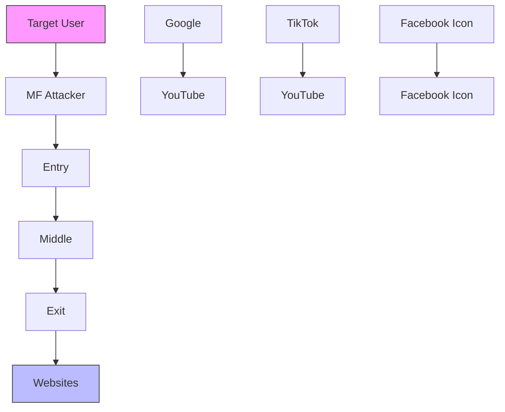
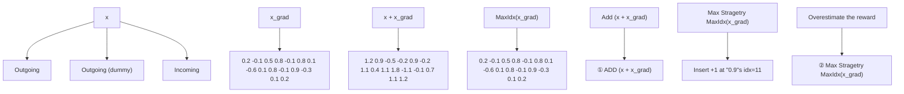
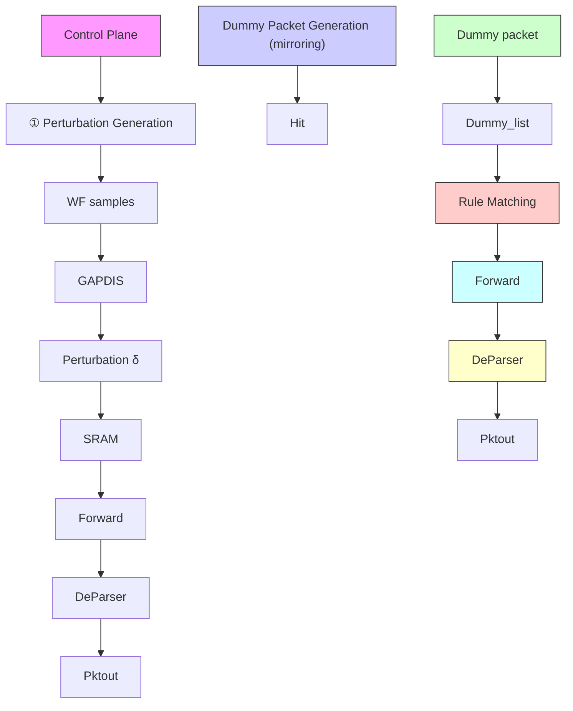

# GAPDiS: Gradient-Assisted Perturbation Design via Sequence Editing for Website Fingerprinting Defense

Ruotian Xie

Kun Xie∗

bysky@hnu.edu.com

xiekun@hnu.edu.cn

Hunan University

Changsha, China

Ministry of Education Key Laboratory

of Fusion Computing of

Supercomputing and Artificial

Intelligence

Changsha, China

Yong Xie∗

yongxie@njupt.edu.cn

Nanjing University of Posts and

Telecommunications

Nanjing, China

Pengcheng Zhao

Jiajun He

Xin Zeng

hadouken@hnu.edu.cn

jiajunhe@hnu.edu.cn

xinzeng@hnu.edu.cn

Hunan University

Changsha, China

Jigang Wen

wenjigang@hnust.edu.cn

Hunan University of Science and

Technology

Xiangtan, China

Wei Liang

wliang@hnust.edu.cn

Hunan University of Science and

Technology

Xiangtan, China

Gaogang Xie

xie@cnic.cn

Computer Network Information

Center, CAS

Beijing, China

## Abstract

As deep learning-based website fingerprinting (WF) attacks become increasingly accurate, user privacy faces mounting risks. Existing defenses struggle with the discrete nature of packet direction sequences, rendering gradient-based optimization infeasible and leading to inefficient, heuristic-based perturbation solutions. We propose a novel defense framework that bridges this gap by introducing gradient—aligned offset vectors and a cosine similarity— based reward to evaluate and select perturbation candidates aligned with the gradient direction. We further design a parallel reward computation algorithm to improve efficiency and integrate it into GAPDiS, a universal perturbation generation method that combines gradient guidance with improved tabu search for global optimization. For practical deployment, GAPDiS supports both PT bridge and P4 switch implementations. Experiments on the AWF dataset show that GAPDiS reduces the classification accuracy of WF models from over 98% to below 7% with only 2.56% bandwidth overhead— achieving a 68.1% improvement over state-of-the-art methods.

## CCS Concepts

• Security and privacy → Security protocols; • Networks → Network privacy and anonymity.

## Keywords

Tor, Network Privacy, Website Fingerprints, Adversarial Example.

## ACM Reference Format:

Ruotian Xie, Kun Xie, Pengcheng Zhao, Jiajun He, Xin Zeng, Jigang Wen, Yong Xie, Wei Liang, and Gaogang Xie. 2025. GAPDiS: Gradient-Assisted Perturbation Design via Sequence Editing for Website Fingerprinting Defense. In Proceedings of the 2025 ACM SIGSAC Conference on Computer and Communications Security (CCS ’25), October 13–17, 2025, Taipei. ACM, New York, NY, USA, 15 pages. https://doi.org/10.1145/3719027.3765084

1 Introduction  


<details>
<summary>flowchart</summary>


</details>

Figure 1: The WF threat model.

Tor [7], a widely adopted anonymous communication tool, protects users’ online privacy through multi-layer encryption and random routing, preventing intermediate nodes from simultaneously identifying both the user and the server. However, despite effectively safeguarding communication content, Tor’s network traffic patterns can still expose users’ browsing behavior.

Website Fingerprinting (WF) attacks [14] exploit this vulnerability by analyzing side-channel information such as timing and direction of encrypted traffic on the user’s access network to infer the websites visited by the user (as shown in Fig.1). In recent years, WF attack methods based on DNNs [10, 32] have significantly surpassed traditional methods [13, 24] in terms of accuracy and robustness, becoming the mainstream technology for WF attacks.

These methods typically convert captured user traffic into direction sequences [27], as illustrated in Fig.2(a). In the figure, red bars represent packets sent from the user to the server, while green bars denote received packets, with equal lengths indicating that Tor sends and receives packets of the same size. By training a DNN-based model on direction sequences and their corresponding website labels, WF recognition accuracy can exceed 98% [27, 32], significantly compromising Tor’s anonymity.

  
Figure 2: Direction sequence.

To counter WF attacks, researchers have explored methods like injecting dummy packets to alter traffic patterns (Fig. 2(b), dashed bars). However, traditional defenses such as WTF-PAD [16] often fail against DNN-based attacks. Recent work embeds adversarial perturbations into traffic via dummy packet patches [17, 29, 30], where each patch is defined by an insertion index and packet count. Thus, the key challenge is to determine the optimal insertion index and packet count to maximize disruption with WF models.

In computer vision (CV), adversarial attacks generate perturbations by computing classification loss, backpropagating gradients to the input, and modifying the input to increase loss, thereby inducing misclassification [11]. Gradient guidance enables efficient discovery of such perturbations. However, this approach is not directly applicable to direction sequences, as it assumes input data elements are continuous, while direction sequences are discrete and must maintain fixed packet sizes (as shown in Fig.2(a)). Directly adding gradients to the sequence will face the "Gradient Incompatibility Problem" that yields infeasible non-integer numbers.

Due to this challenge, the community has explored various approaches [17, 19]. For instance, the work [19] proposes a heuristic insertion max strategy. However, we argue that this simple strategy overestimates the reward due to ignoring the downstream sequence shift caused by each insertion. Our experiments (Appendix A) demonstrate its limited effectiveness in generating perturbation. Meanwhile, [17] abandons gradient-based perturbation generation, instead using heuristic algorithms to search for feasible solutions through randomized operations. However, without gradient assistance, this method relies on random searches for neighborhood solutions, resulting in low efficiency and unstable performance.

To address these challenges, we propose GAPDiS (Gradient-Assisted Perturbation Design via Sequence Editing), which frames the WF perturbation generation task as a sequence editing problem over direction sequences, using two basic operations: inserting and deleting dummy packet patches. We define the reward of an editing solution as the cosine similarity between the perturbation-induced offset vector (Sec. 3.3.1) and the gradient from the substitution model—a higher similarity indicates greater alignment with the gradient direction and thus a more promising solution.

Our key innovation lies in breaking through the long-standing gradient bottleneck in direction sequence, and in proposing a linearly complex parallel reward algorithm. This enables the integration of advanced adversarial techniques (e.g., transferability optimization [18]) into this domain, unlocking a previously infeasible design space for WF defenses on direction sequence.

The GAPDiS workflow proceeds as follows: First, the algorithm inputs the direction sequence into the WF attack model (substitution model), computes the loss for unsuccessfully perturbed samples, and obtains the gradient. Based on the gradient, it calculates the reward for each sequence editing solution and selects the top-k solutions with the highest reward as candidates. A roulette wheel strategy is then used to select and execute one solution from the candidates, generating a new perturbed direction sequence for iterative optimization. To enhance global search capability, we integrate an improved tabu search algorithm with three replacement operations: best solution segment replacement, gene mutation, and critical index replacement, effectively avoiding local optima. In summary, our contributions are as follows:

(1) A Novel Perspective on Direction Sequence Processing: To the best of our knowledge, this is the first study to bridge the gap between gradients and direction sequences. To address the Gradient Incompatibility Problem, we introduce the concept of an offset vector (Sec 3.3.1) and use its cosine similarity with the gradient as the reward. A higher similarity (closer to 1) means the perturbation better follows the gradient direction, making it more effective. Compared to heuristic methods that rely on random searches or empirical rules, our approach achieves higher search efficiency and better solution quality.  
(2) Efficient Reward Computation Based on Sequence Editing Operations: We propose two basic sequence editing operations (insertion and deletion of dummy packet patch) and develop two efficient parallel algorithms respectively to compute the reward of thousands of editing solutions simultaneously. This reduces the time complexity from O(D2) to O(D), where Dis the length of the direction sequence, allowing us to evaluate thousands of perturbation solutions in parallel and significantly accelerating the search process.  
(3) Universal Perturbation Generation Based on Improved Tabu Search: Building on the reward computation framework, we propose a novel perturbation generation algorithm, GAPDiS, as an application example. GAPDiS combines the global search capability of tabu search with the local optimization of gradient assistance, enabling efficient generation of universal perturbations effective across all trained website categories—aligning with prior works [25, 28]—and reducing generation costs.  
(4) Unidirectional Insertion Design for Practical Deployment: Unlike existing methods requiring bidirectional client-server collaboration, our method adopts a unidirectional insertion strategy, where only the client sends dummy packets. This design lowers deployment barriers and enhances practicality.

Extensive experiments have shown that GAPDiS has the following characteristics: High-quality: Utilizing gradient information to assist perturbation generation ensures that the perturbation direction aligns with the loss increase direction, producing high-quality perturbation. For instance, on the DF dataset, GAPDiS reduces the ACC from the original 98%+ to under 7% with only 2.56% bandwidth overhead. Efficiency: By evaluating the expected reward of thousands of perturbation operations in parallel, the search efficiency is significantly improved. For a sequence length of 50,000, GAPDiS computes rewards for all indices in 0.07 seconds, compared to 380 seconds for sequential algorithms. Universality: Generating universal perturbation for all trained website categories reduces the cost of perturbation generation. Ease of Deployment: Our approach requires only that the client send dummy packets, without any server-side operations.

## 2 Background and Problem Definition

## 2.1 Threat Model

In this paper, we assume the following attack scenario [20]: the target user connects to a Tor entry node via the Tor browser and then traverses the Tor network to reach a designated web application, achieving anonymous access (as illustrated in Fig.1). At this point, a local passive adversary identifies the target user’s IP address and monitors the traffic initiated by the target user. This adversary could be an ISP, an AS operator, or a campus network administrator located in the user’s vicinity. The term "passive" implies that the adversary is restricted to passively observing the target user’s traffic without any altering or attempting to decrypt it.

Furthermore, we assume that the adversary maintains a pretrained WF classification model, typically a DNN-based model. The adversary can use traffic from common websites collected over the Tor network to train this model. These training websites are called monitored websites. Subsequently, by collecting communication traffic from the target user as input to the WF model, the adversary can identify the websites visited by the target user.

## 2.2 Problem Definition

Numerous studies have shown that high-accuracy WF can be achieved using only packet direction information [20, 27, 32], as it is computationally efficient and easy to implement compared to features like packet timing. As a result, WF attacks based on packet direction have become a promising approach in adversarial research.

Typically, attacker represent network traffic as a direction sequence [27], as shown in Fig.2. Outgoing packets are denoted by a red bar (value "1"), while incoming packets are represented by a green bar (value "-1"). By recording user traffic, a direction sequence vector  composed o $\mathbf { f } " 1 "$ and $" - 1 "$ is constructed. Publicly xavailable datasets typically use a fixed vector length of 5000 (denoted as D), as the first few seconds of each sample leaks the most discriminative features for WF classification [9]. If  exceeds D, it xis truncated; if shorter, it is padded with "0". Each vector is labeled with its corresponding website .

yAttackers use publicly available datasets to train DNN-based models  for WF classification. The process can be formalized as:

$$
\hat {y} = f (x, w), \tag {1}
$$

where  is the model parameters, and $\hat { y }$ is the predicted label.

w yDespite their high accuracy, DNN-based WF models are vulnerable to adversarial attacks. By adding a small perturbation  to the input $x ,$ δ the model’s output can be manipulated. In our scenario, we define $\pmb { \delta }$ to consist of  patches:

$$
\boldsymbol {\delta} = \{\delta_ {1}, \delta_ {2}, \dots , \delta_ {K} \}, \tag {2}
$$

where each patch $\delta _ { k } ~ = ~ [ I d x _ { k } , m _ { k } ]$ represents inserting a ones vector of length $m _ { k }$ δ Iat index $I d x _ { k }$ min the sample vector $x _ { i }$ . Since only m Idx xoutgoing packets (value 1) are inserted, our perturbation method is unidirectional, enabling easy deployment without server-side modifications.

Given a large set of WF samples $X = \{ x _ { 1 } , x _ { 2 } , \dots , x _ { N } \}$ and corresponding labels $Y = \{ y _ { 1 } , y _ { 2 } , . . . , y _ { N } \}$ x , x , . . . , x, our goal is to find a universal Y y , y , . . . , yperturbation  that maximizes the number of misclassified samples δunder a constraint on the perturbation length L. Formally, this can be expressed as the following optimization problem:

$$
\arg \max _ {\boldsymbol {\delta}} \sum_ {i = 1} ^ {N} \mathbb {I} (f (x _ {i} ^ {\prime}) \neq y _ {i}),
$$

(3)

$\begin{array} { l } { \mathrm { w h e r e } \quad x _ { i } ^ { \prime } = \mathcal { P } ( x _ { i } , \delta ) , } \\ { \mathrm { s u b j e c t : o } \quad \displaystyle \sum _ { k = 1 } ^ { K } m _ { k } \le \mathrm { L } , } \end{array}$

where I(·) is the indicator function, which equals 1 when the condition is true and 0 otherwise, and $\mathcal { P }$ is the perturbation application function.

## 3 Design of GAPDiS

## 3.1 Motivation

In CV, adversarial attacks typically compute the loss $L o s s ( \hat { y } , y )$ be-Loss y,ytween the model’s output and the true label, followed by backpropagation to obtain the input gradient $x _ { \mathrm { g r a d } }$ . The adversarial sample is then constructed as $x + \epsilon \cdot x _ { \mathrm { g r a d } } .$ x, where  is the step size.

x ϵ x ϵHowever, this approach is not directly applicable to WF. As shown in Fig.3,  represents the numerical form of the direction xsequence in Fig.2(b), where light red dashed cells indicate inserted dummy packets. $x _ { \mathrm { g r a d } }$ is the gradient obtained by inputting  into the WF model $f$ xand computing the loss. Traditional gradientfbased methods would add $x _ { \mathrm { g r a d } }$ to $( \mathrm { F i g } . 3 . \textcircled { 1 } x + x _ { \mathrm { g r a d } } )$ to generate x x x xadversarial samples. However, direction sequences can only take values of $1 , - 1 ,$ or 0. Directly adding the gradient would result in noninteger numbers, violating the definition of direction sequences, that is "Gradient Incompatibility Problem".


<details>
<summary>flowchart</summary>


</details>

Figure 3: Difficulties in Applying Gradients to Direction Sequences.

Recent work [19] introduces a heuristic insertion max strategy for perturbation generation. For example, in Fig. 3.②, it selects the index with the largest gradient value (0.9 at index 11 in $x _ { \mathrm { g r a d } } )$ xand inserts +1 at that index. While the high gradient suggests that increasing that position raises loss, inserting at that point shifts every subsequent packet one slot toward the tail—overestimating insertion reward by ignoring this shift, which breaks the assumed one-to-one link between gradient magnitude and actual effect and misaligns the overall sequence change with the gradient direction. Our experiments (Appendix A) demonstrate that the perturbation generated by this approach exhibit poor effectiveness.

  
Figure 4: (a) The main processing of GAPDiS. (b) The two base sequence editing operation.

Other direction sequence-based methods [5, 17, 23] adopt heuristic algorithms to search for perturbation. However, the lack of gradient assistance forces these heuristic algorithms to rely on random searches or empirical rules to find neighborhood solutions. With lots of solutions available, most do not improve perturbation effectiveness, resulting in unstable perturbation search.

To address this challenge, we model the perturbation generation problem as a sequence editing task, leveraging the unique properties of direction sequences. We define two basic editing operations: insertion and deletion, shown in Fig.4(b). The InsertOP [idx = $5 , m = 2 ]$ inserts two dummy packets (light red) at index 5, shifting , mthe following packets two steps back (light gray area), as indicated by the rightward blue arrow. The DeleteOP $[ i d x = 8 , m = - 1 ]$ removes a dummy packet (light red area) at index 8, shifting later packets one step forward (light gray area), as shown by the leftward blue arrow. Deletion applies only to dummy packets, not originals, and will restore any packet displaced by insertion (e.g., green bar at the end). Through the iterative use of these two operations, we aim to find an optimal perturbation set to disrupt all WF samples.

Unlike existing heuristic methods that rely on randomly generated neighborhood solutions, we leverage gradients to measure the reward of each sequence editing solution. Specifically, we compute the cosine similarity between all feasible indices (i.e., feasible solutions) and the current gradient, selecting candidate solutions that align most closely with the gradient direction. This approach provides gradient assistance while ensuring accuracy. Additionally, we propose an efficient parallel algorithm to simultaneously compute the reward of thousands of perturbation solutions, significantly improving efficiency.

Although our proposed gradient-assisted perturbation generation method can produce effective perturbation, the sequence perturbation search task is highly non-convex and prone to local optima. To address this, we combine gradient assistance with the global search capability of tabu search, yielding GAPDiS. GAPDiS integrates gradient assistance for local optimization and tabu search for global exploration, effectively avoiding local optima and achieving more efficient global optimization.

## 3.2 Overview

The GAPDiS consists of two main components:

(1) Gradient-Assisted Reward Assessment Algorithm: We assess the reward of editing solutions by computing the cosine similarity between the gradient and the perturbation offset vector, ensuring each selected neighborhood solution is effective. By decomposing the cosine similarity into multiple components, we achieve parallel computation of rewards for thousands of editing solutions. This algorithm is general-purpose and can be integrated into any direction sequence-based perturbation generation model.

(2) Improved Tabu Search: We enhance tabu search with three randomized replacement strategies: current best solution segment replacement, gene mutation, and critical index replacement. This improves global search capabilities.

The workflow of GAPDiS is illustrated in Fig.4. First, WF data is input into the WF substitution model to obtain classification results (Step ①). If the ACC is greater than a threshold $\tau \left( \mathrm { e . g . , } \tau = 0 \right.$ requires all classifications to deviate from correct labels), meaning the stopping condition is not met, the loss for unsuccessfully perturbed WF samples is computed, and the gradient is obtained (Step ②). The gradient is represented by gray vertical arrows in Fig.4(a). Next, the WF samples and gradients are passed to GAPDiS, which generates feasible editing solutions, computes their rewards in parallel, selects the top-k solutions (Step ③). Therefore, it uses a roulette wheel strategy to perturb the WF samples (Step ④). This process iterates until ACC falls below  or the maximum iterations τare reached, outputting the final perturbation (Step ⑤).

## 3.3 Reward Value Algorithm for Sequence Editing

In this subsection, we introduce the method for computing the reward of sequence editing solutions. By evaluating insertions and deletions that modify the direction sequence, we select those that better align with the gradient direction, producing stronger perturbation effects. We also propose an efficient parallel algorithm that decomposes cosine similarity into multiple components, enabling parallel computation of thousands of editing solutions.

3.3.1 Definition of Reward. The reward of an editing solution is defined as the cosine similarity between the offset vector $x ^ { \prime } - x$ and the gradient:

$$
\cos (x ^ {\prime} - x, x _ {\text { grad }}) = \frac {(x ^ {\prime} - x) \cdot x _ {\text { grad }}}{\| x ^ {\prime} - x \| _ {2} \cdot \| x _ {\text { grad }} \| _ {2}}, \tag {4}
$$

where $x _ { \mathrm { g r a d } }$ is the gradient vector corresponding to the input . xNote that $x ^ { \prime }$ x always has the same length as  by truncating excess x xelements when exceeding D, and restoring them if the length later falls below D. A reward closer to 1 indicates the solution alignment with the gradient direction, closer to -1 implies opposition, and a reward of 0 signifies orthogonality—suggesting limited contribution to loss reduction

For example, consider the InsertOP $\delta [ i d x = 5 , m = 2 ]$ in Fig. $4 ( \mathrm { b } )$ δ ,m. The direction sequences before and after insertion are converted into vectors  and $x _ { \mathrm { i n s } } ^ { \prime }$ (Fig. 5(a)). The offset vector ${ x _ { \mathrm { i n s } } ^ { \prime } - x }$ is x xcomputed, and its cosine similarity with $x _ { \mathrm { g r a d } }$ x xis 0 5186. Similarly, the DeleteOP $\delta [ i d x = 8 , m = - 1 ]$ x produces $x _ { \mathrm { { d e l } } } ^ { \prime }$ .with a similarity ${ \mathrm { o f } } - 0 . 0 3 0 6 \ ( { \mathrm { F i g } } . \ 5 ( { \mathrm { b } } ) )$ $" - 1 "$ $x _ { \mathrm { { d e l } } } ^ { \prime }$ indicates that the packet was overflowed due to the previous insertion operation. Such deletions are essential for gradient directions dynamically shift during iterative editing. Earlier insertions may become suboptimal as the sequence evolves; deletions remove these misaligned perturbations, enabling refinement toward the current gradient— analogous to backtracking in numerical optimization.


<details>
<summary>stacked bar chart</summary>

| Category       | Outgoing | Outgoing (dummy) | Incoming |
| -------------- | -------- | ---------------- | -------- |
| x              | 1        | 1                | -1       |
| x'ins          | 1        | 1                | -1       |
| x'ins - x     | 0        | 0                | 0        |
| x_grad         | 0.2      | -0.1             | 0.5      |
| Cos(x'ins - x, x_grad) | 0.5186   |                  |          |
</details>

(a) An example of InsertOP $\delta [ I d x = 5 , m = 2 ]$ reward  


<details>
<summary>text_image</summary>

x
1 1 -1 -1 1 -1 1 1 1 1 -1 -1 1 1 1 -1
x'del
1 1 -1 -1 1 -1 1 1 1 -1 1 1 1 -1
x'del - x
0 0 0 0 0 0 0 0 0 -2 0 2 0 0 -2
x_grad
0.2 -0.1 0.5 0.8 -0.1 0.8 0.1 -0.6 0.1 0.8 -0.1 0.9 -0.3 0.1 0.2
Cos(x'del - x, x_grad) = -0.0306
</details>

(b) An example of DeleteOP $\delta [ I d x = 8 , m = - 1 ]$ reward  
Figure 5: The rewards computation demo.

Unlike traditional heuristic algorithms that randomly generate neighborhood solutions and evaluate their effects through the model $f ,$ , our reward function directly evaluates alignment with fthe gradient, ensuring stronger and more efficient perturbations.

3.3.2 The Proposed Parallel Algorithm. Although the reward for each editing solution is defined, finding the optimal one is challenging due to the vast solution space.

Taking the InsertOP [idx ] as an example, in a sequence δ ,m xof length D = 5000, when the total length L of allowed dummy packets is fixed, there are thousands of feasible insertion indices idx within [1 D − L] (index 0 represents the first packet). Indices in ,[4999 − L 4999] are infeasible, as inserting L dummy packets would push these packets out of the sequence.

Similarly, DeleteOP has multiple feasible solutions but are restricted to removing previously inserted dummy packets. For instance, the deletion example in Fig.4(b) has four possible solutions: $\delta _ { 1 } [ i d x = 1 , m = - 1 ] , \delta _ { 2 } [ i d x = 8 , m = - 1 ] , \delta _ { 3 } [ i d x = 9 , m = - 1 ]$ , and $\delta _ { 4 } [ i d x = 8 , m = - 2 ]$ .

, mComputing rewards for all feasible insertion/deletion solutions incurs high time complexity. The cosine similarity computation has O(D) complexity, and evaluating all possible indices for [idx ] yields O(D· $( \mathrm { D - L } - 1 ) ) \approx \mathrm { O } ( \mathrm { D } ^ { 2 } )$ δ ,m complexity. When is dynamically madjustable (with upper bound ), complexity escalates to $\mathrm { O } ( \mathrm { D } ^ { 2 } \mathrm { M } )$ , Mbecoming computationally prohibitive.

To address this, we propose a decomposition algorithm enabling parallel reward computation. Observing Eq.4, the main obstacle is that each idx corresponds to a different $x ^ { \prime } { \mathrm { . } }$ while  and $x _ { \mathrm { g r a d } }$ remain constant. Thus, once the offset vector $x ^ { \prime } - x$ can be computed in x xparallel, the reward parallelization becomes feasible.

Considering InsertOP $\delta [ i d x , m ]$ with a fixed , we observe that the offset vector ${ x _ { \mathrm { i n s } } ^ { \prime } - x }$ δ ,m mfor any idx can be combined through a x xgather operation from three constant parts corresponding to the left, middle, and right for the current :

$$
\begin{array}{l} x _ {\text { ins }} ^ {\prime} - x = \text { Gather } (\text { LeftPart }, \text { MiddlePart }, \text { RightPart }, i d x, m) \\ = \text { LeftPart } [: i d x ] \oplus \text { MiddlePart } [ i d x: i d x + m ] \tag {5} \\ \oplus \operatorname{RightPart} [ i d x + m: ], \\ \end{array}
$$

where the left, middle, and right parts for the current  defined as:

$$
\text { LeftPart } = x - x = 0 _ {D}, \tag {6}
$$

$$
\text { MiddlePart } = 1 _ {D} - x, \tag {7}
$$

$$
\text { RightPart } = x _ {[ \rightarrow m ]} - x, \tag {8}
$$

where $0 _ { D }$ is a zero vector of length , corresponding to the changes Din elements before the insertion position $i d x ; 1 _ { D }$ is a vector of ones, corresponding to the inserted outgoing dummy packets; $x _ { [  m ] }$ is x shifted right by  positions (padded with zeros); [: idx] is the x m xsubsequence from position 0 to idx, and ⊕ denotes vector concatenation.


<details>
<summary>flowchart</summary>

```mermaid
graph TD
  A["Direction sequence length D"] --> B["x"]
  A --> C["x_{[→2"]}]
  A --> D["x_{[→2"]} - x]
  A --> E["1 - x"]
  A --> F["x - x"]
  A --> G["x'_ins - x"]
    
  H["Right part"] --> I["1 1 1 -1 1 -1 1 1 1 1 1 -1 1 1 1 1"]
  J["Middle part"] --> K["- 2 2 -2 0 0 -2 0 0 2 2 -2 -2 0"]
  L["Left part"] --> M["0 0 2 2 0 2 0 0 0 0 2 2 0 0 0"]
    
  N["Gather result for δ[idx=5, m=2"]] --> O["-2 0 0 2 2 -2 -2 0"]
    
    style H fill:#f9f,stroke:#333
    style J fill:#f9f,stroke:#333
    style L fill:#bbf,stroke:#333
    style N fill:#bfb,stroke:#333
```
</details>

Figure 6: The cos decomposition of InsertOP.

Taking the insertion solution $\delta [ i d x = 5 , m = 2 ]$ as an example δ ,m(as shown in Fig.6), we obtain the right-shifted sequence $^ { x } [  2 ] \ ,$ the RightPart $x _ { [  2 ] } - x ,$ the MiddlePart $1 - x ,$ and the LeftPart $x - x$ x x x. Through the gather operation (blue, orange, and green arx xrows), the vector slices LeftPart[: 5], MiddlePart[5 : 5 + 2] (i.e., MiddlePart[idx : idx + ] in $\operatorname { E q } . 5 )$ , and RightPart[5 + 2 :] are commbined to form the offset vector $x _ { \mathrm { i n s } } ^ { \prime } - x$ corresponding to $\delta [ i d x =$ $5 , m = 2 ]$ x x δ (note that the result matches the offset vector in Fig.5(a)).

Based on the property that the offset vector for any idx can be constructed by concatenating the same Left, Middle, and Right parts, we decompose the numerator term $( x _ { \mathrm { i n s } } ^ { \prime } - x ) \cdot x _ { \mathrm { g r a d } }$ in Eq.4 into parallelizable forms according to Eq.5:

$$
\begin{array}{l} \left(x _ {\text { ins }} ^ {\prime} - x\right) \cdot \mathrm{x} _ {\text { grad }} = \text { MiddlePart } [ i d x: i d x + m ] \cdot \mathrm{x} _ {\text { grad }} [ i d x: i d x + m ] \\ + \text { RightPart } [ i d x + m: ] \cdot \mathrm{x} _ {\text { grad }} [ i d x + m: ], \tag {9} \\ \end{array}
$$

where MiddlePar $[ i d x : i d x + m ] \cdot x _ { \mathrm { g r a d } } [ i d x : i d x + m ]$ is computed m x min parallel using a 1D convolution operation Conv1D with kernal vector $1 _ { m } .$ , and RightPart[idx + $: \boldsymbol { \mathrm { J } } \cdot \boldsymbol { x } _ { \mathrm { g r a d } }$ [idx +  :] is computed m x min parallel using a tail cumulative sum function CumsumTail.

We decompose the term $\| x _ { \mathrm { i n s } } ^ { \prime } - x \| _ { 2 }$ in the denominator of Eq.4 x xinto parallelizable forms according to Eq.5:

$$
\left\| x _ {\text {ins}} ^ {\prime} - x \right\| _ {2} = \operatorname{Sqrt} \left(\left\| \text {MiddlePart} [ i d x: i d x + m ] \right\| ^ {2} \right. \tag {10}
$$

$$
+ \left\| \text { RightPart } [ i d x + m: ] \right\| ^ {2}),
$$

Algorithm 1: Parallel Computation of Cosine Similarity for InsertOP (ParaCos4Insert)  
Data: Current sequence x, Gradient $x_{grad}$ , insert amount m
Result: Rewards list $R_{m}$ 1 $x_{right} = RightShift(x, m) - x$ // Get RightPart
2 $x_{middle} = 1 - x$ // Get MiddlePart
3 $x_{left} = x - x$ // Get LeftPart, 0, not needed later
// Compute cos numerator term list per Idx
4 $numeList_{r} = CumsumTail(x_{right} \cdot x_{grad})$ // RightPart
5 $numeList_{m} = Conv1D(x_{middle} \cdot x_{grad}, kernel = 1_{m})$ // MiddlePart
6 $numeList = numeList_{r} + numeList_{m}$ // Get the cos numerator list per Idx (LeftPart is 0)
// Compute cos denominator term list per Idx
7 $temp_{right} = x_{right}^{2}$ // Temporary variable of right
8 $denomList_{r} = Sqrt(CumsumTail(temp_{right}))$ // RightPart of cos denominator list per Idx
9 $temp_{middle} = x_{middle}^{2}$ // Temporary variable of middle
10 $denomList_{m} = Sqrt(Conv1D(temp_{middle}, kernel = 1_{m}))$ // MiddlePart of cos denominator list per Idx
11 $denomList_{x} = Sqrt(denomList_{m}^{2} + denomList_{r}^{2})$ ;
12 $norm_{grad} = \left\|x_{grad}\right\|_{2}$ // $x_{grad}$ 2-norm
13 $denomList = denomList_{x} \cdot norm_{grad}$ // Get denominator
14 $R_{m} = numeList / denomList$ // Get cos per Idx

Since the remained denominator term $\| x _ { \mathrm { g r a d } } \| _ { 2 }$ in $\mathrm { E q . 4 }$ is identical xfor all idx, the parallel computation of the cosine similarity is fully decomposed. The specific algorithm is shown in Algorithm 1.

Here, RightShift( ) shifts  right by positions, CumsumTail x,m x mcomputes the cumulative sum for the vector tail, and Conv1D denotes 1D convolution with a kernel $1 _ { m }$ (a vector of ones of length ). By implementing the above algorithm on platforms such as mTensorFlow or PyTorch, it is evident that the time complexity of RightShift(), CumsumTail, and Conv1D() is O(D), resulting in an overall time complexity of O(D). The implementation details are in ‘GAPDiS\_tf.py’ under ‘get\_cos\_similarity\_when\_insert\_m\_1’.

$x _ { \mathrm { d e l } } ^ { \prime } - x$ x xinto Left and Right parts, combined through a gather operation $( x _ { [  m ] }$ is  shifted left by  positions):

$$
\begin{array}{l} x _ {\text {ins}} ^ {\prime} - x = \text {Gather} (\text {LeftPart}, \text {MiddlePart}, \text {RightPart}, i d x) \tag {11} \\ = \text { LeftPart } [: i d x ] \oplus \text { RightPart } [ i d x: ], \\ \end{array}
$$

where the left and right parts for the current  defined as:

$$
\text { LeftPart } = x - x = 0 _ {D}, \tag {12}
$$

$$
\text { RightPart } = x _ {[ \leftarrow m ]} - x. \tag {13}
$$

Taking the DeleteOP $\delta [ i d x = 8 , m = - 1 ]$ as an example (Fig.7), δ ,mwe can obtain the left-shifted sequence $x _ {  1 } ,$ the RightPart $x _ {  1 } - x ,$ x x xand the LeftPart. Finally, through the gather operation (blue and green arrows), the vector slices LeftPart[: 8] and RightPart[8 :] are combined to obtain the offset vector $x _ { \mathrm { d e l } } ^ { \prime } - x$ corresponding to $\delta [ i d x = 8 , m = - 1 ]$ .

,mWe further decompose the numerator term $( x _ { \mathrm { d e l } } ^ { \prime } - x ) \cdot x _ { \mathrm { g r a d } }$ in Eq.4 into parallelizable forms:

$$
\left(x _ {\text { del }} ^ {\prime} - x\right) \cdot \mathrm{x} _ {\text { grad }} = \text { RightPart } [ i d x: ] \cdot \mathrm{x} _ {\text { grad }} [ i d x: ], \tag {14}
$$


<details>
<summary>text_image</summary>

Direction sequence length D
x	1 1 -1 -1 1 -1 1 1 1 1 -1 -1 1 1 1
x[←1]	1 1 -1 -1 1 -1 1 1 1 1 -1 -1 1 1 1 -1
x[←-1] = x	0 -2 0 2 -2 2 0 0 0 -2 0 2 0 0 -2
x = x	0 0 0 0 0 0 0 0 0 0 0 0 0 0 0
x'del = x	0 0 0 0 0 0 0 0 0 -2 0 2 0 0 -2
Right part
Left part
Gather result for δ[Idx=8, m=-1]
</details>

Figure 7: The cosine decomposition of DeleteOP.

$\| \boldsymbol { x } _ { \mathrm { d e l } } ^ { \prime } - \boldsymbol { x } \| _ { 2 }$ in the denominator of Eq.4 into parallelizable forms:

$$
\left\| x _ {\text { del }} ^ {\prime} - x \right\| _ {2} = \operatorname{Sqrt} \left(\left\| \text { RightPart } [ i d x: ] \right\| ^ {2}\right) \tag {15}
$$

Similar to Algorithm 1, we compute the reward for all indices in parallel using batch-supported functions as Algorithm 2 shows.

Here, LeftShift( origin ) represents shifting  to the left by x, m, x x positions, where origin is used to retrieve the elements apm xpended to the tail of the vector when deleting dummy packets. CheckDummyMask generates a mask indicating feasible deletion indices based on the currently implemented perturbation solutions . The time complexity of common functions such as LeftShift() Pand CumsumTail is O(D). Therefore, the overall time complexity of the algorithm is O(D). The implementation details are in ‘GAPDiS\_tf.py’ under ‘get\_cos\_similarity\_when\_delete\_m\_1’.

Algorithm 2: Parallel Computation of Cosine Similarity for DeleteOP(ParaCos4Delete)  
Data: Current sequence x, Original sequence $x_{origin}$ , Gradient $x_{grad}$ , Current perturbation list P, delete amount m
Result: Rewards list $R_{m}$ 1 $x_{right} = \text{LeftShift}(x, m, x_{\text{origin}}) - x$ // Get RightPart
// Compute cos numerator term list per Idx

2 numeList = CumsumTail( $x_{right} \cdot x_{grad}$ ) // RightPart
// Compute cos denominator term list per Idx

3 $temp_{right} = x_{right}^{2}$ // Temporary variable of right

4 $denomList_{x} = \text{Sqrt}(CumsumTail(temp_{right}))$ // RightPart of cos denominator list per Idx

5 $norm_{grad} = \left\| x_{grad} \right\|_{2}$ // $x_{grad}$ 2-norm

6 $denomList = denomList_{x} \cdot norm_{grad}$ // Get denominator

7 $R_{m} = numeList / denomList$ // Get cos per Idx

8 Mask = CheckDummyMask(P) // Get feasible Idx MASK

9 $R_{m} = R_{m} \cdot Mask$ // $\text{len}(R_{m}) = D - m$

## 3.4 GAPDiS

Although leveraging gradient information can effectively assess the expected reward of editing solutions, thereby enabling more efficient perturbation search, this approach still has some limitations. Due to the highly non-convex nature of the perturbation problem for direction sequences, relying solely on gradient can easily trap the algorithm in local optima. To address these issues, we propose an improved algorithm, GAPDiS, which combines gradient assistance with tabu search and introduces multiple replacement operations to achieve efficient global perturbation search.

Tabu search [8] is a heuristic optimization method that initializes a starting solution and generates neighboring solutions based on this solution. Through multiple iterations, tabu search gradually improves the quality of the solution. While generating neighboring solutions, tabu search records visited solutions in a tabu list, forcing the algorithm to explore new solution spaces to update the optimal solution.

The original tabu search algorithm typically generates neighboring solutions randomly, resulting in low efficiency. We propose guiding the generation of neighboring solutions using the reward of sequence editing solutions, introducing a roulette wheel selection based on the top-k reward values to add randomness. Editing solutions with higher reward have a higher probability of being selected. Additionally, to further expand the search space and enhance the global search capability of the algorithm, we introduce three randomized replacement operations: best solution segment replacement, gene mutation, and critical index replacement.

Combining the above improvements, the overall workflow of the GAPDiS algorithm is shown in Algorithm 3, which consists of five main parts:

• Initialization: The algorithm first initializes the best solution tracker (BestSolutionTracker), the tabu list (TabuTable), the candidate solution list (SolutionList), and the critical index manager (CriticalIdxManager). These components are used to record the optimal solution, avoid revisiting solutions, store candidate solutions, and manage critical index positions, respectively. Second, it randomly generates an InsertOP [idx = = 8] as the initial solution.  
• Iterative Optimization: In each iteration, the algorithm selects a current solution from the candidate solution list based on probability and performs one of the following operations according to predefined probabilities:

– Best Solution Segment Replacement (replace\_by\_best): This operation replaces a segment i in the current solution with a segment j from the global best solution to accelerate convergence.  
– Gene Mutation (gene\_mutation): This operation randomly changes the idx value of a perturbation element i in the current solution to increase population diversity.  
– Critical Index Replacement (cim.sample): We maintain a list of critical indices— [idx ] entries that significantly reduce δ ,mACC—and sample a j from the CriticalIdxManager to append δto the current solution, improving perturbation targeting.  
• Solution Evaluation and Update: The algorithm generates perturbed sequences based on the current perturbation using the function P. It then evaluates the accuracy of these perturbed sequences using the classification model  through the function ACC\_func. Based on the accuracy of the current solution \_ , the algorithm updates the best solution tracker and curr accthe CriticalIdxManager. It also checks whether the target accuracy ( ) has been achieved or if early stopping conditions are τmet. If \_ exceeds the tolerance threshold (i.e., \_ \_ + \_ ), the algorithm skips the reward computation and moves directly to the next iteration.  
• Candidate Solution Generation and Update: To optimize efficiency, the algorithm calculates the loss and gradient only for samples that were not successfully perturbed, using the function FailedLoss. Then the algorithm generates a list of reward values

Algorithm 3: GAPDiS  
Data: Original sequence X, Classification model f, Maximum perturbation length L, Maximum iterations max_iter, Target accuracy τ, Top K candidate top_k, upper limit of one editing OP M, Accuracy threshold acc_threshold, Best replace rate best_repl_rate, Gene mutation rate muta_rate, Sample rate from cortical Index smp_cim_rate.

Result: Optimal perturbation list $P_{best}$ .

1 best_sol ← BestSolutionTracker()

2 tabu_table ← TabuTable() // Store visited solutions

3 candidate_sol ← SolutionList() // Candidate solutions

4 cim ← CriticalIdxManager() // Manage critical Idxs

5 for iter ← 1 to max_iter do

6 sol ← candidate_sol.prob_pop()

7 δ ← sol.perturbations or None // Perturbation

8 if random() < best_repl_rate then

9    δ ← replace_by_best(δ, best_sol.global_best())

10 end

11 else if random() < muta_rate then

12    δ ← gene_mutation(δ)

13 end

14 else if random() < smp_cim_rate then

15    δ ← cim.sample(δ) // Sample a critical Idxs

16 end

17 $X' \leftarrow \mathcal{P}(X, \delta)$ 18 $\hat{Y} = f(X')$ // Evaluate

19 curr_acc = ACC_func( $\hat{Y}, Y$ )

20 cim.update(curr_acc, sol.pre_acc)

21 if curr_acc ≥ sol.pre_acc + acc_threshold then

22    Continue // Current acc exceed threshold

23 end

24 best_sol.update(curr_acc, δ) // Update best sol

25 if curr_acc ≤ τ or best_sol.early_stop then

26    Break

27 end

28 $X_{grad} = FailedLoss(\hat{Y}, Y).backward()$ // Failed WFs Only

29 rewardsi = None // record editing OP rewards

30 for m ← 1 to min(M, L - len(δ)) do

31    ins_rewardsm = ParaCos4Insert(X, X $_{grad}$ , m)

32    rewardsi.update(ins_rewardsm) // shape=[M, D-L]

33 end

34 for m ← 1 to M do

35    del_rewardsm = ParaCos4Delete(X', X $_{grad}$ , X $_{origin}$ , m, P)

36    rewardsi.update(del_rewardsm)

37 end

38 candidate_lst ← Topk_tabu(rewardsi, top_k, tabu_label)

39 candidate_sol.add_solution(candidate_lst)

40 tabu_table.insert(candidate_lst)

41 end

42 $P_{best} = best\_sol.global\_best()$

of feasible indices for insertion and deletion operations through parallel computation (ParaCos4Insert and ParaCos4Delete). It then filters out unvisited top-k candidate solutions using the tabu list (Topk\_tabu) and adds them to the candidate solution list and tabu list.

• Result Output: Outputs the optimal solution and corresponding perturbation when either the target accuracy is achieved or the iteration limit is reached.

In summary, GAPDiS provides high-quality neighborhood solutions by leveraging gradient information for reward evaluation. Moreover, GAPDiS improves computational efficiency through our proposed parallel algorithm, which computes the reward for thousands of feasible indices simultaneously.

## 3.5 Deployment

GAPDiS can be deployed through two ways: 1) Tor pluggabletransport (PT) [35] bridge, and 2) programmable switches [33].

## • Tor PT Implementation

Similar to prior work [22, 31], we develop an obfs4 based realworld Tor bridge: GAPDiS. Users only need to: (1) convert the perturbation  into a dummy packet list (e.g., dummy\_list[0]=43 indicates inserting a dummy packet at the 43rd packet of the Tor flow), and (2) configure it as a ‘perturbations’ parameter in the torrc file or as a custom bridge parameter in the Tor browser (assuming the GAPDiS server is already running by user). During data transmission, the PT auto inserts outgoing dummy packets at predefined indices through the gapdisConn.ReadFrom dummy goroutine. The packet counter is created in ClientFactory and incremented in both gapdisConn.ReadFrom and readPackets, and our PT code is included in the GAPDiS codebase.

Note that our perturbation is universal, requiring only one-time configuration. In contrast, existing plugins that generate websitespecific perturbations [31] often rely on additional developer-defined interfaces. Users must launch defenses for each website individually by accessing specific local URLs set by the plugin developers. This requires manually inputting the website ID and perturbation configuration. We argue that this process poses significant security risks, especially if users forget whether a defense has been activated for the current website.

## • P4 Data Plane Implementation

We implement our perturbation mechanism on a Tofino P4 programmable switch, achieving line-rate traffic perturbation directly in the data plane. Initially, the control plane compiles pre-computed perturbation rules, represented by a dummy\_list, and uses them to populate match-action table entries within the switch’s highspeed SRAM. These entries precisely map packet sequence numbers within identified traffic flows to the quantity of dummy packets to be inserted at those specific points.

During runtime, the P4 switch maintains state for each active flow. Flows are uniquely identified by their 5-tuple, and the switch associates a counter with each flow to track its packet sequence number. Upon packet ingress, the system identifies the packet’s flow, retrieves the current sequence number for lookup, and subsequently increments the counter for that flow. Using the flow identifier (5-tuple) and the retrieved sequence number, a query is performed against the perturbation rule table stored in SRAM. A successful match (hit) indicates that the current packet at its sequence number is targeted for perturbation, triggering the dummy packet generation stage.

Upon a successful rule match, the dummy packet generation stage is initiated. The quantity of dummy packets to insert is directly specified by the matched rule. We utilize the switch’s packet


<details>
<summary>flowchart</summary>


</details>

Figure 8: The process of deploying perturbation on P4. mirroring mechanism rather than the P4 Packet\_Generator primitive to generate dummy packets, as the latter typically requires control plane intervention, introducing significant latency and overhead unsuitable for line-rate operation. In our design, the required dummy packet quantity specified by the rule is conveyed via packet metadata to the egress pipeline. The egress pipeline reads this count from the metadata and iteratively generates the required number of dummy packets, for instance, using looped mirroring, precisely inserting them into the flow to realize the rule-defined perturbation effect.

Our deployment approach has two key features: universality and unidirectional perturbation.

• Universality: Since our perturbations are generated based on all WF samples in the training set, they are effective for all contained websites. As a result, only a single dummy\_list needs to be stored on the PT bridge or P4 switch, and it can be applied to all traffic flows. In contrast, existing methods [17, 31] that generate separate perturbations for each website cannot be deployed on P4 switches due to insufficient storage space and bring security risks when users forget to launch the defense for the current website in the PT bridge mentioned previously.

• Unidirectional Perturbation: Our dummy\_list only generates outgoing dummy packets at specified indices, meaning it can be deployed solely on the client-side P4 switch to achieve WF defense. This design is easy to deploy. In contrast, existing methods [10, 22] that produce bidirectional perturbation require not only the client-side to send dummy packets but also the server-side to send dummy packets for full deployment, resulting in significantly higher deployment costs.

## 4 Evaluation

In this section, we validate the effectiveness of GAPDiS through the following experiments:

(1) Time Complexity Verification: We plot the time growth curve as the vector length increases, confirming that the reward algorithm has a time complexity of O( ). Results show that our Dmethod efficiently handles large-scale sequence data, significantly reducing computational overhead (Sec 4.2).  
(2) Comparative Experiment: We compare GAPDiS with six representative defense algorithms in both closed-world and openworld scenarios. In closed-world (all dataset samples are monitored websites), GAPDiS outperforms baselines and significantly decreases WF attack accuracy. In open-world where some samples in the dataset are unmonitored websites, it achieves classification AUC near 0.5 (Sec 4.3).

(3) Ablation Experiment: We validate the effectiveness of gradientassisted perturbation generation and the contributions of three replacement operations: best solution segment replacement, gene mutation, and critical index replacement. Results show these components significantly improve perturbation effectiveness (Sec 4.4).  
(4) Transferability Experiment: We apply perturbation generation based on the DF, AWF, and VarCNN models to the other two models for cross-validation, and introduce adversarial training the substitution model to enhance perturbation transferability, demonstrating that our generated perturbation exhibits strong transferability (Sec 4.5).  
(5) Hyper-parameters and Validation Experiments: We conduct experiments on two key hyperparameters—the maximum perturbation length  and the maximum number of single packet insertions —and show that our perturbations are efficient and robust across hyperparameter variations. We also verify that perturbations generated by the insertion-max strategy are much less effective compared to GAPDiS (Appendix A).  
(6) P4 Switch Implementation and Time Overhead Experiments: We evaluate the impact of different bandwidths and perturbation lengths on communication in a P4 switch. Results show that our one-way packet insertion approach introduces negligible latency to the data flow (Appendix B).  
(7) Exploratory Experiments: We conduct additional exploratory experiments, including the defense robustness experiment (Appendix C) and the imbalanced open-world experiment (Appendix D), to evaluate the limitations of our method.

## 4.1 Evaluation Setting

4.1.1 Datasets. We use two popular WF datasets, AWF [27] and DF [32], for experimental validation. The AWF dataset contains 250,000 direction sequences from 103 websites, while the DF dataset contains 95,000 direction sequences from 95 websites. For each dataset, we extract 200 WF samples per website category as the training set for the perturbation generation model (approximately 20,000 samples in total). Additionally, we extract 100 WF samples per category from the remaining samples as the test set for evaluating perturbation effectiveness (approximately 10,000 samples in total). The remaining samples are used as training data for the WF attack (classification) model. The partitioned datasets are saved as three separate files to ensure no overlap between the training sets of the WF attack model and the perturbation generation model.

4.1.2 WF Attack Model. We train three popular WF attack models on the specific training sets: • AWF [27]: AWF is a DNN-based automated WF attack method with high accuracy in open-world scenarios and strong robustness to dynamically changing network content. • DF [32]: DF is a CNN-based WF attack method that automatically adapts to dynamically changing network traffic by extracting features from direction sequences. • VarCNN [4]: Var-CNN is an attack method based on ResNet and dilated causal convolutions. It effectively captures global relationships in direction sequences and performs particularly well in low-data scenarios.

Once the WF attack models are trained, their parameters are fixed. The same models are used for both perturbation generation and final evaluation of perturbation performance, ensuring fairness in the experiments.

4.1.3 Baseline. We compare our method with six popular defense algorithms as baselines: • DFD [2]: DFD is a defense mechanism that operates by injecting dummy packets per burst to disrupt DNNbased WF attacks; the number of inserted packets is proportional to each burst’s size, making the overall bandwidth overhead difficult to control. • FRONT [9]: FRONT is a zero-delay lightweight defense that injects Rayleigh-distributed dummy bursts at the trace front and introduces trace-to-trace randomness to disrupt WF attacks. • Walkie-Talkie [38]: Walkie-Talkie is a defense mechanism that uses half-duplex communication to group packets into bursts and molds these bursts to match non-sensitive page patterns via dummy injection, disrupting fingerprinting. • BLANKET [22]: BLANKET is a GAN-based perturbation generation method that trains a perturbation generator using random noise as input. BLANKET uses bidirectional traffic injection. • Minipatch [17]: Minipatch is a heuristic perturbation generation method based on dual simulated annealing. It reduces bandwidth overhead by introducing perturbation only in local parts of the input traffic. Minipatch also uses bidirectional patch injection. • WFGuard [19]: WFGuard is a neurons fuzz testing-based method that generates perturbations by heuristic insertion max strategy (Fig. 3.②).

Baselines Configuration: For DFD, we adopt the client-side injection mode and set the perturbation rate to $P \ = \ 1 5 0 \%$ . For PFRONT, since the AWF and DF datasets lack timing information, we replace the value of $W _ { m i n } / W _ { m a x }$ from a timestamp-based measure to one based on the direction sequence index. Specifically, we set $W _ { m i n } ~ = ~ i n t ( 0 . 1 \cdot D ) , W _ { m a x } ~ = ~ i n t ( 0 . 1 \cdot D )$ for AWF and $W _ { m i n } = i n t ( 0 . 1 \cdot D ) , W _ { m a x } = i n t ( 0 . 2 \cdot D )$ for DF, which represents W int . D W int . Dthe best performance configuration determined through our tuning. For Walkie-Talkie, as the AWF and DF datasets do not contain both sensitive and non-sensitive pages for the same website, we randomly select a WF sample from a different website category to serve as the non-sensitive page for each sample. For BLANKET, due to the absence of timing information, we generate perturbations (i.e., packet sizes) using its original code and replace the binary classification loss with a multi-class loss to align with the dataset labels. For Minipatch, we set patches = 8, inbound/outbound = 16, and maxiter = 50 to generate universal perturbations, keeping other settings consistent with the original implementation. For WFGuard, we set  = 0 3, maxiter = 500, adopt Strategy 0 for client-side perturbation generation, and retain the remaining hyperparameters as in the original paper.

4.1.4 GAPDiS Setting. For the baseline mentioned above, to find the optimal perturbation solution under a given perturbation length $L ,$ we set the parameters of GAPDiS as follows: the maximum pertur-Lbation length  = 128, meaning a maximum of 128 dummy packets Lare allowed to be inserted. The maximum number of iterations, \_ , is dynamically adjusted based on $L ,$ with \_ = 8× . The target accuracy  = 0. The early stop patience is set to 150, L τmeaning the algorithm exits if the optimal solution does not update for 100 iterations. The accuracy threshold \_ = 0 3, so a solution is accepted if its accuracy does not exceed the \_ +0 3. The top-k candidate size is \_ = 10, and the maximum numtop kber of packets inserted in a single editing operation is  = 8.

The tabu list length is $5 \times t o p _ { - }$ \_ , the candidate solution amount is $4 \times t o p _ { - }$ top k\_ , and the critical index storage limit is $L / 2 .$ The best solutop ktion replacement rate is \_ $_ { r a t e } = 0 . 1$ L/1, the gene mutation probability is $\begin{array} { r } { r a t e = 0 . 2 , } \end{array}$ repl rate ., and the critical index sampling rate is \_ $_ { - } r a t e = 0 . 2$ t.

4.1.5 Metrics. To comprehensively evaluate the performance of the classification model, we employ two key metrics: Overall Accuracy (ACC) and Average F1 Score (AvgF1). The metrics are defined as follows:

$$
\begin{array}{l} \mathrm{ACC} = \frac {\sum_ {i = 1} ^ {C} \mathrm{TP} _ {i}}{\sum_ {i = 1} ^ {C} \left(\mathrm{TP} _ {i} + \mathrm{FP} _ {i}\right)}, (16) \\ \mathrm{AvgF1} = \frac {1}{C} \sum_ {i = 1} ^ {C} \frac {2 \cdot \mathrm{PPV} _ {i} \cdot \mathrm{TPR} _ {i}}{\mathrm{PPV} _ {i} + \mathrm{TPR} _ {i} + \epsilon}, \\ \text { where } \quad \mathrm{PPV} _ {i} = \frac {\mathrm{TP} _ {i}}{\mathrm{TP} _ {i} + \mathrm{FP} _ {i} + \epsilon}, (17) \\ \mathrm{TPR} _ {i} = \frac {\mathrm{TP} _ {i}}{\mathrm{TP} _ {i} + \mathrm{FN} _ {i} + \epsilon}, \\ \mathrm{FPR} _ {i} = \frac {\mathrm{FP} _ {i}}{\mathrm{FP} _ {i} + \mathrm{TN} _ {i} + \epsilon}, \\ \end{array}
$$

$$
\begin{array}{l} \mathrm{AvgF1} = \frac {1}{C} \sum_ {i = 1} ^ {C} \frac {2 \cdot \mathrm{PPV} _ {i} \cdot \mathrm{TPR} _ {i}}{\mathrm{PPV} _ {i} + \mathrm{TPR} _ {i} + \epsilon}, \\ \text { where } \quad \mathrm{PPV} _ {i} = \frac {\mathrm{TP} _ {i}}{\mathrm{TP} _ {i} + \mathrm{FP} _ {i} + \epsilon}, \tag {17} \\ \mathrm{TPR} _ {i} = \frac {\mathrm{TP} _ {i}}{\mathrm{TP} _ {i} + \mathrm{FN} _ {i} + \epsilon}, \\ \mathrm{FPR} _ {i} = \frac {\mathrm{FP} _ {i}}{\mathrm{FP} _ {i} + \mathrm{TN} _ {i} + \epsilon}, \\ \end{array}
$$

where  is the total number of classes, $\mathrm { T P } _ { i } , \mathrm { F P } _ { i } , \mathrm { T N } _ { i }$ and $\mathrm { F N } _ { i }$ denote the true positives, false positives, true negatives, and false negatives for class , respectively, and $\epsilon = 1 0 ^ { - 8 }$ is a small constant iadded to avoid division by zero.

## 4.2 Time Complexity Verification

To validate the time complexity of our proposed parallel algorithms, ParaCos4Insert (Algorithm 1) and ParaCos4Delete (Algorithm 2), we conducted experiments on direction sequences with varying lengths. Specifically, we generated sequences with lengths  ranging from 5,000 to 50,000, incremented by 5,000, resulting in 10 different lengths. For each length, we tested the algorithms with a batch size of 512 (i.e., input data shape=[512 ]), a dummy packet patch length of $m = 3 2 ,$ , D, and repeated the experiments 500 times mto obtain the average running time. All methods (including subsequent experiments) used the same setup: batch size 512, evaluated on a Xeon Gold 6330 CPU and an RTX 3090 GPU (24 GB).

The results are shown in Fig.9. As illustrated in Fig. 9(right), the runtime of both insertion and deletion algorithms grows linearly with sequence length, confirming their low computational overhead and O( ) time complexity. Even at a length of 50,000, the Daverage time to compute insertion rewards for all indices is only 0.07 seconds, compared to 380 seconds for the sequential version— demonstrating the high efficiency of our parallel design.


<details>
<summary>line chart</summary>

| Direction sequence length | Insert Method (Sequential) | Delete Method (Sequential) |
| -------------------------- | -------------------------- | -------------------------- |
| 10000                      | 10                         | 5                          |
| 20000                      | 40                         | 5                          |
| 30000                      | 80                         | 5                          |
| 40000                      | 160                        | 5                          |
| 50000                      | 370                        | 5                          |
</details>


<details>
<summary>line chart</summary>

| Direction sequence length | Insert Method (Parallel) | Delete Method (Parallel) |
| ------------------------- | ------------------------ | ------------------------ |
| 10000                     | 0.008                    | 0.006                    |
| 20000                     | 0.025                    | 0.010                    |
| 30000                     | 0.040                    | 0.015                    |
| 40000                     | 0.055                    | 0.020                    |
| 50000                     | 0.070                    | 0.028                    |
</details>

Figure 9: Time cost comparison between sequential (left) and parallel (right) algorithms.

To assess hardware utilization, we measured the 95th percentile CPU and GPU usage under $D = 5 0 { , } 0 0 0 { \mathrm { ; } }$ , batch\_size = 512 (right-D ,most point on the X-axis), and 50 batches, averaged over 100 runs. The sequential insertion algorithm used 25.4% CPU and 28.0% GPU, while the parallel version used 24.9% CPU and 46.0% GPU. Leveraging GPU parallelism, our algorithm reduces runtime from 380 seconds to 0.07 seconds, while keeping CPU usage unchanged and increasing GPU usage by only 64.2%.

## 4.3 Comparison Experiments

To ensure fairness, all defense methods were constrained to 128 dummy packets $\left( L \ = \ 1 2 8 \right)$ , resulting in a Bandwidth Overhead (BWO)—as defined in prior works [22, 26]—of $1 2 8 / 5 0 0 0 = 2 . 5 6 \%$ for sequences of length 5,000. For methods where BWO is difficult to control precisely, we set DFD’s perturbation rate to $P = 1 5 0 \%$ , yield-Ping an average perturbation length close to 128 (approximately 150), and do not constrain Walkie-Talkie’s BWO due to the unpredictable overhead introduced by its burst-molding process.

4.3.1 Closed-world Scenario. We conducted experiments on two datasets (AWF and DF) and three WF models (AWF, DF, VarCNN), forming six schemes to assess perturbation effectiveness. As mentioned in Sec 4.1, defense methods and WF models are trained on different data, simulating a black-box setup where the perturbation generator lacks WF models’ training data.

Results appear in Table 1. "Origin" shows WF model performance on unperturbed test data. Bold indicates best result; underline second-best. "Time" is training time (minutes) for perturbation generation. A dash ‘-’ means no training time: "Origin" involves no perturbation, while DFD, FRONT, and Walkie-Talkie generate perturbations without training.

Across all six schemes, our GAPDiS not only demonstrates significant performance advantages over the baselines but also exhibits high efficiency with relatively low computational time requirements. The reduction in ACC achieved by GAPDiS is significantly greater than that of all baselines. For instance, on the AWF dataset with the AWF model, GAPDiS reduces the ACC from the original 0 98199 to 0 07218, outperforming the second-best method, Walkie-. .Talkie, which only reduces ACC to 0 22631 (a 68.1% improvement) .while incurring a significantly higher BWO of 32.93%. Moreover, GAPDiS achieves this with substantially lower computational time (60 9 minutes vs. 385 7 minutes for Minipatch), demonstrating the . .high efficiency of GAPDiS in searching for perturbation. Specifically, on four of the six schemes, GAPDiS reduces the ACC of WF models from 95%+ to below 8% with only 2.56% perturbation overhead, which is a very low cost.

Since the initial seconds of WF samples are known to leak the most discriminative features for classification [9], at the same BWO, FRONT is more effective than DFD because it inserts dummy cells at earlier positions in the sequence, while DFD distributes them uniformly. As for BLANKET, our evaluation uses only 200 traces per site (less than 20% of the original data), which makes training its DNN-based generator more difficult and leads to degraded performance.

Surprisingly, WFGuard’s perturbation performed worse than Minipatch, despite utilizing the gradient, while also being significantly slower in generation speed. Its poor results stem from overestimating insertion rewards by ignoring sequence shift, as validated in later experiments (Appendix A). The high time cost comes from generating  perturbations per website and mixing the top-2, limitqing parallelism. From the BWO perspective, all methods except DFD and Walkie-Talkie can be precisely configured to a 2.56% overhead. Among these, their defense effectiveness can be roughly ranked as: GAPDiS, Minipatch, FRONT, WFGuard, and BLANKET. Among remain methods, DFD exhibits the weakest defense performance despite a higher BWO than 2.56%. Walkie-Talkie achieves performance close to Minipatch, but at the cost of more than ten times the BWO.

Table 1: Performance of defense methods on two datasets under DF, AWF, and VarCNN models (Closed-world).

<table><tr><td rowspan="2" colspan="2">Dataset\WF model</td><td colspan="4">AWF</td><td colspan="4">DF</td><td colspan="4">VarCNN</td></tr><tr><td>ACC</td><td>AvgF1</td><td>BWO</td><td>Time</td><td>ACC</td><td>AvgF1</td><td>BWO</td><td>Time</td><td>ACC</td><td>AvgF1</td><td>BWO</td><td>Time</td></tr><tr><td rowspan="8">AWF</td><td>Origin</td><td>0.98199</td><td>0.98199</td><td>-</td><td>-</td><td>0.99572</td><td>0.99573</td><td>-</td><td>-</td><td>0.99699</td><td>0.99699</td><td>-</td><td>-</td></tr><tr><td>DFD [2]</td><td>0.79446</td><td>0.79236</td><td>3.09%</td><td>-</td><td>0.93961</td><td>0.94042</td><td>3.09%</td><td>-</td><td>0.80805</td><td>0.81376</td><td>3.09%</td><td>-</td></tr><tr><td>FRONT [9]</td><td>0.25543</td><td>0.23686</td><td>2.56%</td><td>-</td><td>0.57834</td><td>0.57795</td><td>2.56%</td><td>-</td><td>0.50106</td><td>0.49190</td><td>2.56%</td><td>-</td></tr><tr><td>Walkie-Talkie [38]</td><td>0.22631</td><td>0.22338</td><td>32.93%</td><td>-</td><td>0.32951</td><td>0.32300</td><td>32.70%</td><td>-</td><td>0.34961</td><td>0.35197</td><td>32.58%</td><td>-</td></tr><tr><td>BLANKET [22]</td><td>0.7150</td><td>0.7100</td><td>2.56%</td><td>3.0</td><td>0.8878</td><td>0.8856</td><td>2.56%</td><td>9.9</td><td>0.6995</td><td>0.6957</td><td>2.56%</td><td>27.6</td></tr><tr><td>WFGuard [19]</td><td>0.61009</td><td>0.57568</td><td>2.56%</td><td>113.9</td><td>0.53805</td><td>0.52104</td><td>2.56%</td><td>843.7</td><td>0.53786</td><td>0.52285</td><td>2.56%</td><td>3358.9</td></tr><tr><td>Minipatch [17]</td><td>0.23563</td><td>0.20002</td><td>2.56%</td><td>385.7</td><td>0.37504</td><td>0.35333</td><td>2.56%</td><td>533.6</td><td>0.32218</td><td>0.27482</td><td>2.56%</td><td>681.3</td></tr><tr><td>GAPDiS</td><td>0.07218</td><td>0.06094</td><td>2.56%</td><td>60.9</td><td>0.24800</td><td>0.21402</td><td>2.56%</td><td>131.3</td><td>0.13150</td><td>0.10050</td><td>2.56%</td><td>151.1</td></tr><tr><td rowspan="8">DF</td><td>Origin</td><td>0.951</td><td>0.95104</td><td>-</td><td>-</td><td>0.98463</td><td>0.98484</td><td>-</td><td>-</td><td>0.96863</td><td>0.96864</td><td>-</td><td>-</td></tr><tr><td>DFD [2]</td><td>0.53873</td><td>0.55526</td><td>2.90%</td><td>-</td><td>0.56010</td><td>0.59510</td><td>2.90%</td><td>-</td><td>0.47347</td><td>0.50245</td><td>2.90%</td><td>-</td></tr><tr><td>FRONT [9]</td><td>0.20621</td><td>0.15784</td><td>2.56%</td><td>-</td><td>0.31221</td><td>0.30120</td><td>2.56%</td><td>-</td><td>0.31368</td><td>0.30476</td><td>2.56%</td><td>-</td></tr><tr><td>Walkie-Talkie [38]</td><td>0.17136</td><td>0.18504</td><td>26.06%</td><td>-</td><td>0.24884</td><td>0.27310</td><td>25.78%</td><td>-</td><td>0.24757</td><td>0.27833</td><td>25.70%</td><td>-</td></tr><tr><td>BLANKET [22]</td><td>0.6019</td><td>0.5967</td><td>2.56%</td><td>2.8</td><td>0.829</td><td>0.8246</td><td>2.56%</td><td>9.1</td><td>0.5174</td><td>0.5309</td><td>2.56%</td><td>25.4</td></tr><tr><td>WFGuard [19]</td><td>0.22294</td><td>0.18238</td><td>2.56%</td><td>82.3</td><td>0.22557</td><td>0.19317</td><td>2.56%</td><td>573.2</td><td>0.18873</td><td>0.16553</td><td>2.56%</td><td>2740.0</td></tr><tr><td>Minipatch [17]</td><td>0.10573</td><td>0.07678</td><td>2.56%</td><td>203.4</td><td>0.08226</td><td>0.07834</td><td>2.56%</td><td>242.5</td><td>0.15710</td><td>0.13516</td><td>2.56%</td><td>379.8</td></tr><tr><td>GAPDiS</td><td>0.06094</td><td>0.04059</td><td>2.56%</td><td>51.5</td><td>0.06189</td><td>0.05301</td><td>2.56%</td><td>198.5</td><td>0.05136</td><td>0.04098</td><td>2.56%</td><td>203.0</td></tr></table>


<details>
<summary>line chart</summary>

| Model          | AUC     |
| -------------- | ------- |
| Origin         | 0.9503  |
| DFD            | 0.6327  |
| BLANKET        | 0.6857  |
| MiniPatch      | 0.522   |
| WFGuard        | 0.6573  |
| WalkieTalkie   | 0.5869  |
| FRONT          | 0.5432  |
| GAPDIS         | 0.522   |
</details>


<details>
<summary>line chart</summary>

| Method       | AUC     |
| ------------ | ------- |
| Origin       | 0.9896  |
| DFD          | 0.74    |
| BLANKET      | 0.8747  |
| MiniPatch    | 0.5211  |
| WFGuard      | 0.6935  |
| WalkieTalkie | 0.6101  |
| FRONT       | 0.672   |
| GAPDIS       | 0.5796  |
</details>


<details>
<summary>line chart</summary>

| Method       | AUC     |
| ------------ | ------- |
| Origin       | 0.9891  |
| DFD          | 0.6296  |
| BLANKET      | 0.7547  |
| MiniPatch    | 0.5476  |
| WFGuard      | 0.6276  |
| WalkieTalkie | 0.6198  |
| FRONT        | 0.6374  |
| GAPDIS       | 0.5735  |
</details>


<details>
<summary>line chart</summary>

| Model       | AUC     |
|-------------|---------|
| Origin      | 0.8899  |
| DFD         | 0.6275  |
| BLANKET     | 0.6509  |
| MiniPatch   | 0.5257  |
| WFGuard     | 0.5302  |
| WalkieTalkie| 0.546   |
| FRONT      | 0.5465  |
| GAPDIS      | 0.4831  |
</details>


<details>
<summary>line chart</summary>

| Method       | AUC     |
| ------------ | ------- |
| Origin       | 0.9709  |
| DFD          | 0.6657  |
| BLANKET      | 0.8354  |
| MiniPatch    | 0.5297  |
| WFGuard      | 0.548   |
| WalkieTalkie | 0.6158  |
| FRONT        | 0.6194  |
| GAPDIS       | 0.4972  |
</details>


<details>
<summary>line chart</summary>

| Method       | AUC     |
| ------------ | ------- |
| Origin       | 0.9472  |
| DFD          | 0.6432  |
| BLANKET      | 0.7084  |
| MiniPatch    | 0.6062  |
| WFGuard      | 0.525   |
| WalkieTalkie | 0.5953  |
| FRONT       | 0.5714  |
| GAPDIS       | 0.5829  |
</details>

Figure 10: The ROC and AUC of defense methods under open-world scenario.

From a latency standpoint, all methods except DFD and Walkie-Talkie have the same BWO ( = 128), implying similar insertion counts and thus comparable latency characteristics. FRONT and WFGuard can directly reuse our PT plugin or P4 implementation for their unidirectional insertions—matching GAPDiS—yielding nearzero added hardware delay (Appendix B). Minipatch, which uses bidirectional patch injections, cannot leverage this implementation but incurs similar software-based per-packet costs to GAPDiS’s PT prototype. In contrast, DFD’s burst-proportional injection results in a higher dummy packet counts (approximately 150) with a greater delay, and Walkie-Talkie’s half-duplex design combined with its much larger BWO produces the highest per-page latency.

4.3.2 Open-world Scenario. In open-world scenarios, unmonitored websites are excluded from WF model and defense method training, classified using a loss entropy threshold [27]. This avoids distortion, as including unmonitored data during training—like the Standard model does—can artificially inflate accuracy by exposing models to open-world distributions early [27]. This gives more realistic evaluation, turning the problem into binary classification.

We use a 1:1 ratio of monitored to unmonitored websites, with six schemes matching the closed-world scenario. All defense methods are tested under all schemes’ ROC and AUC by adjusting the entropy threshold (Fig. 10). Curves closer to the bottom right corner show the WF model struggles more to identify monitored websites.

As shown in Fig. 10, GAPDiS achieves AUC scores close to 0.5 across all six schemes, even reaching 0.4831 in the bottom-left subplot. This indicates that the WF model cannot distinguish whether a sample comes from a monitored website, demonstrating GAPDiS’s exceptional perturbation effectiveness. Compared to the baselines, GAPDiS achieves the lowest AUC in three of the six schemes. In the remaining three, it ranks second-lowest, with scores still very close to the best.

Closed-world and open-world performance show strong correlation. From an overall perspective across the six schemes, the defense methods generally follow the same effectiveness ranking as in closed-world: GAPDiS, Minipatch, FRONT, WFGuard, Walkie-Talkie, DFD, and BLANKET. And there is an interesting exception: in the

bottom-right subplot, WFGuard—despite its normal closed-world performance—achieves the lowest AUC in this particular scheme.

## 4.4 Ablation Experiments

To validate the effectiveness of each component in our proposed method, we conducted ablation experiments with four variants of GAPDiS, while keeping other experimental settings unchanged:

• Del Grad: Instead of the gradient-assisted evaluation of edit operation rewards, it adopts the insertion max strategy (Fig. 3.②).  
• Del BestReplace: Removes the best solution replacement strategy for optimal solution segments.  
• Del GeneMutation: Removes the gene mutation strategy.  
• Del CriticalIdx: Removes the critical index replacement.

Table 2: Performance comparison of GAPDiS against its ablation variants

<table><tr><td rowspan="2" colspan="2">Dataset\WF model</td><td colspan="3">DF</td></tr><tr><td>ACC</td><td>AvgF1</td><td>Time</td></tr><tr><td rowspan="6">AWF</td><td>Origin</td><td>0.99572</td><td>0.99573</td><td>-</td></tr><tr><td>Del Grad</td><td>0.48490</td><td>0.46899</td><td>41.8</td></tr><tr><td>Del BestReplace</td><td>0.41883</td><td>0.36182</td><td>116.3</td></tr><tr><td>Del GeneMutation</td><td>0.36767</td><td>0.31922</td><td>97.8</td></tr><tr><td>Del CriticalIdx</td><td>0.35063</td><td>0.30270</td><td>89.7</td></tr><tr><td>GAPDiS</td><td>0.24800</td><td>0.21402</td><td>131.3</td></tr><tr><td rowspan="6">DF</td><td>Origin</td><td>0.98463</td><td>0.98484</td><td>-</td></tr><tr><td>Del Grad</td><td>0.14900</td><td>0.14299</td><td>38.5</td></tr><tr><td>Del BestReplace</td><td>0.10378</td><td>0.06810</td><td>120.6</td></tr><tr><td>Del GeneMutation</td><td>0.08073</td><td>0.06758</td><td>225.9</td></tr><tr><td>Del CriticalIdx</td><td>0.089</td><td>0.06753</td><td>122.4</td></tr><tr><td>GAPDiS</td><td>0.06189</td><td>0.05301</td><td>198.5</td></tr></table>

We evaluated the performance of these variants and the full GAPDiS on the AWF and DF datasets under the DF model, as shown in Table 2. The full GAPDiS consistently outperforms all ablation variants in terms of both ACC and AvgF1, demonstrating the effectiveness of each proposed component.

Moreover, the removal of gradient guidance ("Del Grad") results in the most significant performance degradation, highlighting the critical role of gradient-guided search in identifying effective perturbation. For instance, on the AWF dataset, removing gradient guidance ("Del Grad") results in an ACC of only 0.48490, which is between methods Minipatch (0.37504) and WFGuard (0.53805) under the same conditions. This highlights the importance of gradientassisted search for effective neighborhood solutions.

## 4.5 Transferability Experiments

Transferability measures whether perturbation generated from one WF attack model remain effective on others. Higher transferability indicates better generalization of the perturbation algorithm. To evaluate this, we generate perturbation using AWF, DF and VarCNN models, and test them on the remaining two by measuring ACC drops. Experiments are run on AWF and DF datasets, with results shown in Table 3. Columns denote source models; rows denote target models. Bold italics on the diagonal show ACC when source and target models are the same.

Table 3: Perturbation Transferability validation

<table><tr><td rowspan="2">Source  $\Downarrow$ Desti  $\Rightarrow$ </td><td colspan="3">Dataset: AWF</td><td colspan="3">Dataset: DF</td></tr><tr><td>AWF</td><td>DF</td><td>VarCNN</td><td>AWF</td><td>DF</td><td>VarCNN</td></tr><tr><td>AWF</td><td>0.07218</td><td>0.44019</td><td>0.45645</td><td>0.06094</td><td>0.11489</td><td>0.07863</td></tr><tr><td>DF</td><td>0.09344</td><td>0.24800</td><td>0.11844</td><td>0.06036</td><td>0.06189</td><td>0.07126</td></tr><tr><td>VarCNN</td><td>0.1483</td><td>0.47699</td><td>0.13150</td><td>0.083</td><td>0.10273</td><td>0.05136</td></tr><tr><td>DF(*AT)</td><td>0.07101</td><td>0.20102</td><td>0.10526</td><td>0.04576</td><td>0.04431</td><td>0.05067</td></tr></table>

From the experimental results, we can draw the following conclusions:

• Perturbation generated by GAPDiS exhibit strong transferability. For example, on the DF dataset, its perturbation applied to other models keep ACC below 0.12, demonstrating strong competitiveness compared to the baseline methods in Table 1.  
• The choice of WF model affects transferability. Perturbation from more robust models generalize better. For instance, on the AWF dataset, when the source model is AWF or VarCNN, the ACC of perturbation applied to the DF model is approximately 0.45, indicating that the DF model is more robust compared to AWF and VarCNN. However, when DF is the source, the ACC of perturbation applied to the VarCNN model drops to 0.11844—below VarCNN’s own ACC of 0.13150—confirming that perturbation from robust models have superior generalization.

To further verify that robust WF models can enhance generalization, we retrain the DF model using random Adversarial Training, referred to as DF(\*AT). In this variant, adversarial samples are created by randomly inserting  ones into original WF traces, and kare mixed with unperturbed samples at a 1:1 ratio during training. We then use DF(\*AT) as a substitution model to generate perturbation and evaluate their effectiveness on the original AWF, DF, and VarCNN models. As shown in the bottom row of Table 1, these adversarially trained perturbation achieve lowest ACC than other source models, indicating stronger transferability.

## 5 Related Work

WF attack models fall into classical and deep learning-based methods. Early attacks used manually selected features with shallow models like Bayesian classifiers [13], k-NN [37], k-FP [12], and SVM [24], reaching 90% accuracy but struggling with adaptability.

With the rise of deep learning, DNN-based WF attack methods have gained significant attention. These methods automatically extract features using structures like AutoEncoder, CNN, and LSTM [1, 27], achieving high-precision classification without manual feature design. DNN-based approaches typically model Tor traffic as direction sequences and achieve over 95% accuracy using only direction sequences [27, 32]. To further enhance the robustness of WF models [3] and address the issue of insufficient training data [20], a large number of research efforts have been proposed [6].

To mitigate the privacy risks posed by WF attacks, WF defense methods based on the concept of adversarial attacks have become popular. Adversarial attacks introduce carefully designed perturbation into input data to cause errors or abnormal behavior in the target model [11, 34]. However, adversarial attack methods originated in the field of CV, where input data is continuous, allowing perturbation to be generated by adding gradients to the input data. In contrast, direction sequences are discrete, and directly applying gradients results in infeasible non-integer perturbation. To overcome this challenge, existing work can be divided into three categories:

1. Heuristic-Based Perturbation Generation [5, 17, 19, 23]: Some methods generate perturbation using heuristic algorithms (e.g., random search or empirical rules) without relying on gradients [17]. However, due to the lack of gradient assistance, these methods often rely on randomly generating neighborhood solutions, resulting in unstable performance. Even though method [19] proposes a heuristic insertion max strategy that selects indices with maximum gradient values, experiments demonstrate that the resulting perturbation are low-quality and computationally expensive.

2. Generative Adversarial Network (GAN)-Based Perturbation Generation: These methods train a generator to map random noise to perturbation without utilizing gradients [15, 22, 28]. Although this approach avoids gradient-related issues, GANs suffer from mode collapse and training difficulties, and the need to learn the perturbation distribution results in high training costs.

3. Burst Sequence-Based Perturbation Generation: These methods first convert direction sequences into burst sequences and then map gradients to valid perturbation through quantization operations [10, 25, 31]. Although this approach can generate effective perturbation, its flexibility is limited, as it can only add dummy packets to existing bursts and cannot enhance perturbation effects by inserting new bursts.

In summary, although existing methods have made progress in WF defense, there is still a lack of efficient and precise gradient utilization methods for perturbation generation on direction sequences. To address this issue, we propose a gradient-assisted parallel algorithm for perturbation reward evaluation, which can compute the reward for all feasible insertion indices in ( ) time O Dcomplexity and can be integrated with existing direction sequencebased perturbation generation algorithms.

## 6 Discussion and Limitations

The core contribution of GAPDiS lies in breaking through the longstanding gradient bottleneck in direction sequence, specifically by measuring the expected reward of perturbation through the cosine similarity between the offset vector and the gradient. Building on this, our proposed parallel algorithm significantly reduces the computational cost of reward evaluation (e.g., computing the reward for 50,000 different perturbation solutions takes only 0.07 seconds), making this approach highly practical.

Our work provides a general foundation applicable to many existing defense methods, as long as the offset vector before and after perturbation is computable to evaluate rewards. Although WF attacks continue to evolve, using advanced classifiers as substitution models in GAPDiS still yields transferable perturbations, as empirically validated in Table 3. This framework also opens several future directions. For instance, the reward and parallel algorithms can be extended to support insertion of -1 (incoming dummy packets) for bidirectional perturbation. Moreover, the local nature of reward optimization allows incremental refinement—e.g., extending or compressing existing perturbations—to reduce generation costs or shorten perturbation length  while preserving effectiveness.

LDespite its effectiveness, GAPDiS still faces some limitations. First, its universal perturbation is generated based on known monitored websites, and its effectiveness on unseen or unmonitored sites remains uncertain. Second, it follows prior works that assume defenders can collect partial traces from monitored traffic, which may incur data collection overhead. Third, as a static defense, its effectiveness may degrade once the perturbation is exposed to attackers and used for adversarial training. Although regenerating new perturbations helps restore effectiveness, this highlights the inherent limitation of fixed-pattern defenses. Furthermore, while theoretically robust obfuscation strategies (e.g., fixed-size, fixedinterval bursts) could resist adaptive models, such approaches incur unacceptable bandwidth and latency overhead, leaving the challenge of balancing efficiency and robustness open.

## 7 Conclusion

In this paper, to address the challenge of utilizing gradients in direction sequences, we propose a novel method for calculating the reward of sequence editing operations. This method measures the reward of an editing solution by computing the cosine similarity between the offset vector and the gradient. A reward value closer to 1 indicates that the editing operation aligns more closely with the gradient direction, thereby avoiding inefficient random searches. Additionally, we design an efficient parallel algorithm that can simultaneously compute the reward for thousands of feasible indices, significantly improving computational efficiency. Combined with an improved tabu search algorithm, our method further enhances the ability to search for globally optimal perturbation and achieves state-of-the-art performance across open-world and closed-world scenarios involving two datasets and three WF models. Notably, the proposed reward computation method is general-purpose and can theoretically be integrated with most perturbation search algorithms to improve their performance. GAPDiS is available at: https://github.com/ByskyXie/GAPDiS.

## 8 Acknowledgments

We would like to thank the anonymous reviewers for their feedback. This work is supported by the National Natural Science Foundation of China under Grants 62025201, the Hunan Provincial Natural Science Foundation of China under Grants 2024JJ3014.

## References

[1] Kota Abe and Shigeki Goto. 2016. Fingerprinting attack on Tor anonymity using deep learning. Proceedings of the Asia-Pacific Advanced Network 42, 0 (2016), 15–20.  
[2] Ahmed Abusnaina, Rhongho Jang, Aminollah Khormali, DaeHun Nyang, and David Mohaisen. 2020. Dfd: Adversarial learning-based approach to defend against website fingerprinting. In IEEE INFOCOM 2020-IEEE Conference on Computer Communications. IEEE, 2459–2468.  
[3] Alireza Bahramali, Ardavan Bozorgi, and Amir Houmansadr. 2023. Realistic website fingerprinting by augmenting network traces. In Proceedings of the 2023 ACM SIGSAC Conference on Computer and Communications Security. 1035–1049.  
[4] Sanjit Bhat, David Lu, Albert Kwon, and Srinivas Devadas. 2019. Var-CNN: A Data-Efficient Website Fingerprinting Attack Based on Deep Learning. Proceedings on Privacy Enhancing Technologies (2019).  
[5] Xiang Cai, Rishab Nithyanand, Tao Wang, Rob Johnson, and Ian Goldberg. 2014. A Systematic Approach to Developing and Evaluating Website Fingerprinting Defenses. In Proceedings of the 2014 ACM SIGSAC Conference on Computer and Communications Security, Scottsdale, AZ, USA, November 3-7, 2014, Gail-Joon Ahn, Moti Yung, and Ninghui Li (Eds.). ACM, 227–238. https://doi.org/10.1145/ 2660267.2660362  
[6] Xinhao Deng, Qilei Yin, Zhuotao Liu, Xiyuan Zhao, Qi Li, Mingwei Xu, Ke Xu, and Jianping Wu. 2023. Robust multi-tab website fingerprinting attacks in the wild. In 2023 IEEE symposium on security and privacy (SP). IEEE, 1005–1022.  
[7] Roger Dingledine, Nick Mathewson, Paul F Syverson, et al. 2004. Tor: The second-generation onion router.. In USENIX security symposium, Vol. 4. 303–320.  
[8] Fred Glover. 1990. Tabu search: A tutorial. Interfaces 20, 4 (1990), 74–94.  
[9] Jiajun Gong and Tao Wang. 2020. Zero-delay lightweight defenses against website fingerprinting. In 29th USENIX security symposium (USENIX security 20). 717–734.  
[10] Jiajun Gong, Wuqi Zhang, Charles Zhang, and Tao Wang. 2022. Surakav: Generating realistic traces for a strong website fingerprinting defense. In 2022 IEEE Symposium on Security and Privacy (SP). IEEE, 1558–1573.  
[11] Ian J Goodfellow, Jonathon Shlens, and Christian Szegedy. 2014. Explaining and harnessing adversarial examples. arXiv preprint arXiv:1412.6572 (2014).  
[12] Jamie Hayes and George Danezis. 2016. k-fingerprinting: A robust scalable website fingerprinting technique. In 25th USENIX Security Symposium (USENIX Security 16). 1187–1203.  
[13] Dominik Herrmann, Rolf Wendolsky, and Hannes Federrath. 2009. Website fingerprinting: attacking popular privacy enhancing technologies with the multinomial naïve-bayes classifier. In Proceedings of the 2009 ACM workshop on Cloud computing security. 31–42.  
[14] Andrew Hintz. 2002. Fingerprinting websites using traffic analysis. In International workshop on privacy enhancing technologies. Springer, 171–178.  
[15] Chengshang Hou, Gaopeng Gou, Junzheng Shi, Peipei Fu, and Gang Xiong. 2020. WF-GAN: Fighting back against website fingerprinting attack using adversarial learning. In IEEE Symposium on Computers and Communications. IEEE, 1–7.  
[16] Marc Juarez, Mohsen Imani, Mike Perry, Claudia Diaz, and Matthew Wright. 2016. Toward an efficient website fingerprinting defense. In Computer Security– ESORICS 2016: 21st European Symposium on Research in Computer Security, Heraklion, Greece, September 26-30, 2016, Proceedings, Part I 21. Springer, 27–46.  
[17] Ding Li, Yuefei Zhu, Minghao Chen, and Jue Wang. 2022. Minipatch: Undermining DNN-based website fingerprinting with adversarial patches. IEEE Transactions on Information Forensics and Security 17 (2022), 2437–2451.  
[18] Qizhang Li, Yiwen Guo, Wangmeng Zuo, and Hao Chen. 2023. Improving adversarial transferability via intermediate-level perturbation decay. Advances in Neural Information Processing Systems 36 (2023), 32900–32912.  
[19] Zhen Ling, Gui Xiao, Lan Luo, Rong Wang, Xiangyu Xu, and Guangchi Liu. 2024. WFGuard: an Effective Fuzzing-testing-based Traffic Morphing Defense against Website Fingerprinting. In IEEE INFOCOM 2024-IEEE Conference on Computer Communications. IEEE, 441–450.  
[20] Chenxiang Luo, Wenyi Tang, Qixu Wang, and Danyang Zheng. 2024. Fewshot Website Fingerprinting with Distribution Calibration. IEEE Transactions on Dependable and Secure Computing (2024).  
[21] Aleksander Madry, Aleksandar Makelov, Ludwig Schmidt, Dimitris Tsipras, and Adrian Vladu. 2018. Towards Deep Learning Models Resistant to Adversarial Attacks. In International Conference on Learning Representations.  
[22] Milad Nasr, Alireza Bahramali, and Amir Houmansadr. 2021. Defeating {DNN-Based} traffic analysis systems in {Real-Time} with blind adversarial perturbations. In 30th USENIX Security Symposium (USENIX Security 21). 2705–2722.  
[23] Rishab Nithyanand, Xiang Cai, and Rob Johnson. 2014. Glove: A bespoke website fingerprinting defense. In Proceedings of the 13th Workshop on Privacy in the Electronic Society. 131–134.  
[24] Andriy Panchenko, Fabian Lanze, Jan Pennekamp, Thomas Engel, Andreas Zinnen, Martin Henze, and Klaus Wehrle. 2016. Website Fingerprinting at Internet Scale.. In NDSS.  
[25] Litao Qiao, Bang Wu, Heng Li, Cuiying Gao, Wei Yuan, and Xiapu Luo. 2024. Trace-agnostic and Adversarial Training-resilient Website Fingerprinting Defense. In IEEE INFOCOM 2024-IEEE Conference on Computer Communications. IEEE, 211–220.  
[26] Mohammad Saidur Rahman, Mohsen Imani, Nate Mathews, and Matthew Wright. 2020. Mockingbird: Defending against deep-learning-based website fingerprinting attacks with adversarial traces. IEEE Transactions on Information Forensics and Security 16 (2020), 1594–1609.  
[27] Vera Rimmer, Davy Preuveneers, Marc Juarez, Tom van Goethem, and Wouter Joosen. 2018. Automated Website Fingerprinting through Deep Learning. In 25th Annual Network and Distributed System Security Symposium, NDSS 2018, San Diego, California, USA, February 18-21, 2018. The Internet Society. https://www.ndss-symposium.org/wp-content/uploads/2018/02/ndss2018\_ 03A-1\_Rimmer\_paper.pdf  
[28] Amir Mahdi Sadeghzadeh, Behrad Tajali, and Rasool Jalili. 2021. AWA: Adversarial website adaptation. IEEE Transactions on Information Forensics and Security 16 (2021), 3109–3122.  
[29] Shawn Shan, Arjun Nitin Bhagoji, Haitao Zheng, and Ben Y Zhao. 2021. Patchbased defenses against web fingerprinting attacks. In Proceedings of the 14th ACM Workshop on Artificial Intelligence and Security. 97–109.  
[30] Shawn Shan, Arjun Nitin Bhagoji, Haitao Zheng, and Ben Y Zhao. 2021. A real-time defense against website fingerprinting attacks. arXiv preprint arXiv:2102.04291 (2021).  
[31] Meng Shen, Kexin Ji, Jinhe Wu, Qi Li, Xiangdong Kong, Ke Xu, and Liehuang Zhu. 2024. Real-time website fingerprinting defense via traffic cluster anonymization. In 2024 IEEE Symposium on Security and Privacy (SP). IEEE, 3238–3256.  
[32] Payap Sirinam, Mohsen Imani, Marc Juarez, and Matthew Wright. 2018. Deep Fingerprinting: Undermining Website Fingerprinting Defenses with Deep Learning. In 25th ACM Conference on Computer and Communications Security. Association for Computing Machinery, Inc, 1928–1943.  
[33] Anirudh Sivaraman, Changhoon Kim, Ramkumar Krishnamoorthy, Advait Dixit, and Mihai Budiu. 2015. Dc. p4: Programming the forwarding plane of a datacenter switch. In Proceedings of the 1st ACM SIGCOMM Symposium on Software Defined Networking Research. 1–8.  
[34] Hui Sun, Tianqing Zhu, Zhiqiu Zhang, Dawei Jin, Ping Xiong, and Wanlei Zhou. 2021. Adversarial attacks against deep generative models on data: a survey. IEEE Transactions on Knowledge and Data Engineering 35, 4 (2021), 3367–3388.  
[35] torproject.org. [n. d.]. Tor pluggable transport. https://tb-manual.torproject.org/ circumvention/.  
[36] F Tramèr, D Boneh, A Kurakin, I Goodfellow, N Papernot, and P McDaniel. 2018. Ensemble adversarial training: Attacks and defenses. In 6th International Conference on Learning Representations, ICLR 2018-Conference Track Proceedings.  
[37] Tao Wang, Xiang Cai, Rishab Nithyanand, Rob Johnson, and Ian Goldberg. 2014. Effective attacks and provable defenses for website fingerprinting. In 23rd USENIX Security Symposium (USENIX Security 14). 143–157.  
[38] Tao Wang and Ian Goldberg. 2017. {Walkie-Talkie}: An efficient defense against passive website fingerprinting attacks. In 26th USENIX Security Symposium (USENIX Security 17). 1375–1390.

## A Hyper-parameters & Validation Experiments A.1 Maximum perturbation length

We evaluate GAPDiS on the AWF dataset and model under different maximum perturbation lengths  (32, 64, 128, 256, 512). To test the Leffectiveness of our gradient-assisted reward strategy, we replace this component with the insertion max strategy used by WFGuard, naming the variant GAPDiS(\*InsertMax). As shown in Fig. 11, the left and right subplots display ACC and Avg F1 respectively, with on the x-axis.


<details>
<summary>line chart</summary>

| Perturbation length L | GAPDIS (*InsertMax) | GAPDIS |
| --------------------- | ------------------ | ------ |
| 32                    | 0.65               | 0.40   |
| 64                    | 0.40               | 0.25   |
| 128                   | 0.25               | 0.10   |
| 256                   | 0.10               | 0.05   |
| 512                   | 0.10               | 0.05   |
</details>


<details>
<summary>line chart</summary>

| Perturbation length L | GAPDIS (*InsertMax) | GAPDIS |
| --------------------- | ------------------- | ------ |
| 32                    | 0.6                 | 0.35   |
| 64                    | 0.35                | 0.2    |
| 128                   | 0.2                 | 0.05   |
| 256                   | 0.05                | 0.0    |
| 512                   | 0.05                | 0.0    |
</details>

Figure 11: The GAPDiS performance under different Maximum perturbation length .

GAPDiS consistently outperforms GAPDiS(\*InsertMax). Even at = 256, where the gap appears smallest, their ACCs are 0.02844 Land 0.07975 respectively—still a significant difference. This highlights the inefficiency of the insertion max strategy for perturbation generation and the strength of our reward strategy.

Moreover, GAPDiS achieves strong perturbation results with minimal overhead: at = 256, which is only 5.12% of the total Lsequence length (256/5000), ACC drops sharply from 0.98199 to 0.02844. Based on the performance curves across , we recommend Lchoosing  between 128 and 256 to balance effectiveness and overhead.

## A.2 Maximum number of single packets insertion

The hyperparameter  defines the maximum number of dummy Mpackets allowed to be inserted (or deleted) in a single editing operation ( ). We evaluate the effect of different  values (2, 4, 8, 16, δ M32) using the AWF dataset and model, as shown in Fig. 12.

The curve remains relatively smooth across different  values, Mindicating that GAPDiS is robust to the hyperparameter . How-Mever, both very small ( = 2) and very large ( = 32) values fail M Mto achieve the lowest ACC. When  is too small, the search space Mis limited to minor changes, which may not align well with the gradient direction, reducing solution quality. On the other hand, a large  offers more gradient-aligned options but introduces larger Mstep sizes, which may overshoot the optimal perturbation point.


<details>
<summary>line chart</summary>

| Maximum M | GAPDiS (ACC) | GAPDiS (Avg F1) |
| --------- | ------------ | --------------- |
| 2         | 0.08         | 0.06            |
| 4         | 0.07         | 0.05            |
| 8         | 0.08         | 0.06            |
| 16        | 0.07         | 0.05            |
| 32        | 0.09         | 0.06            |
</details>

Figure 12: The GAPDiS performance under different maximum number of single packets insertion .

## B P4 Switch Implementation and Time Overhead Experiments

Our goal is to measure the time required to transmit the full traffic flow with and without perturbation, and use their difference to evaluate the time overhead. We implemented the perturbation strategy on an Intel Tofino1 switch placed close to the client side.

To accurately measure delay and eliminate the impact of external network fluctuations, we built a local client-server environment. In each test, the client and server collectively send a total of 5000 packets, and we record the time from when the first packet arrives at the switch to when the last packet leaves. We run each test 10 times under seven different bandwidth settings (1 Mbps to 250 Mbps) and three perturbation lengths ( = 64, 128, 256), and report the average results.


<details>
<summary>bar chart</summary>

| Data Rate | L=0 (Unperturbed) | L=64 | L=128 | L=256 |
| --------- | ----------------- | ---- | ----- | ----- |
| 1Mbps     | 7800              | 7800 | 7800  | 7800  |
| 2.5Mbps   | 3200              | 3200 | 3200  | 3200  |
| 5Mbps     | 1600              | 1600 | 1600  | 1600  |
| 10Mbps    | 800               | 800  | 800   | 800   |
| 50Mbps    | 200               | 200  | 200   | 200   |
| 100Mbps   | 100               | 100  | 100   | 100   |
| 250Mbps   | 50                | 50   | 50    | 50    |
</details>

Figure 13: The average time cost to transmit per packets at varying bandwidths.

The experimental results are shown in Fig. 13, where the x-axis represents bandwidth and the y-axis shows the average forwarding delay per packet (total transmission time divided by the number of packets). As seen, under different bandwidths and perturbation lengths, the average per—packet delay remains nearly identical to the non-perturbed case (blue bars). Even in the most extreme case (1Mbps  = 64), the difference is just 0.034  (7832.574  vs , L7832.608 )—virtually negligible.

µsThis minimal gap is due not only to the small number of inserted dummy packets, but more importantly to the high-performance forwarding capability of the P4 switch, where mirroring operations introduce almost no additional delay. These results underscore the practical advantage of deploying WF defenses on P4-based hardware.

Table 4: Perturbation Robust Exploratory

<table><tr><td rowspan="2">WF model: DF (AT-GAPDiS) Scenario ↓</td><td colspan="2">Dataset: AWF</td><td colspan="2">Dataset: DF</td></tr><tr><td>ACC</td><td>AvgF1</td><td>ACC</td><td>AvgF1</td></tr><tr><td>Origin</td><td>0.82854</td><td>0.81566</td><td>0.98568</td><td>0.98574</td></tr><tr><td>GAPDiS (seen)</td><td>0.78640</td><td>0.76944</td><td>0.98326</td><td>0.98335</td></tr><tr><td>GAPDiS (unseen)</td><td>0.38368</td><td>0.32203</td><td>0.36589</td><td>0.38859</td></tr></table>

## C Robust Experiments

To assess GAPDiS robustness against adversarial training, we retrain the DF model on AWF and DF datasets using a 50/50 mix of clean and defended samples, where a fixed GAPDiS-generated universal perturbation is applied to half of the training set. This simulates an adaptive adversary partially exposed to defended traffic, following standard adversarial training practices [21, 36]. We refer to the resulting model as DF (AT-GAPDiS).

We then evaluate DF (AT-GAPDiS) under three test conditions: Origin: clean, unperturbed test set; GAPDiS (seen): test set perturbed with the same universal perturbation used during training; GAPDiS (unseen): test set perturbed with a newly generated universal perturbation not used in training.

As shown in Table 4, DF (AT-GAPDiS) remains robust against the specific GAPDiS perturbation seen during training, with minimal accuracy drop on both datasets. This robustness is largely due to the low 2.56% BWO, which makes the perturbation pattern easier for adversarial training to capture and adapt to.

However, when evaluated against a newly generated (unseen) GAPDiS perturbation, accuracy still drops significantly to around 0.38. While this indicates that adversarial training primarily improves robustness to seen perturbations, it also shows a partial defense effect against unseen ones-improving over the non-adversarially trained model, whose accuracy drops below 0.24 and 0.06 on AWF and DF respectively. This suggests that adversarial training with fixed universal perturbations can enhance model robustness, though its generalization to adaptive attacks remains limited.

D Imbalanced open-world scenarios Experiments  


<details>
<summary>line chart</summary>

| Model       | AUC     |
|-------------|---------|
| Origin      | 0.9912  |
| DFO         | 0.7494  |
| BLANET      | 0.8759  |
| MiniPatch   | 0.5246  |
| WFGuard     | 0.6897  |
| WalkerStyle  | 0.6148  |
| FRONT       | 0.6707  |
| GAPDIS      | 0.5701  |
</details>


<details>
<summary>line chart</summary>

| Method       | AUC     |
| ------------ | ------- |
| Origin       | 0.9716  |
| DFO          | 0.8671  |
| BLANET       | 0.8369  |
| MinPatch     | 0.5268  |
| WFGuard      | 0.5419  |
| WalkerTrack   | 0.6181  |
| FRONT       | 0.6193  |
| GAPDIS       | 0.498   |
</details>

Figure 14: The ROC and AUC of defense methods under imbalance open-world scenario.

To evaluate method performance in imbalanced open-world scenarios (e.g., 80% unmonitored websites), we set the monitored-tounmonitored ratio to 1:4. We then tested all defense methods using ROC and AUC under two closed-world schemes (WF attack model DF with datasets AWF and DF), mirroring the open-world setup (See center subplots in Sec. 4.3), as shown in Fig. 14.

Comparing results with the 1:1 setting (Sec. 4.3) under identical schemes reveals that: (1) each method’s AUC score remains consistent with its performance in the balanced scenario, and (2) the relative ranking among defense methods is preserved—demonstrating that the monitored-to-unmonitored ratio does not affect defense effectiveness.