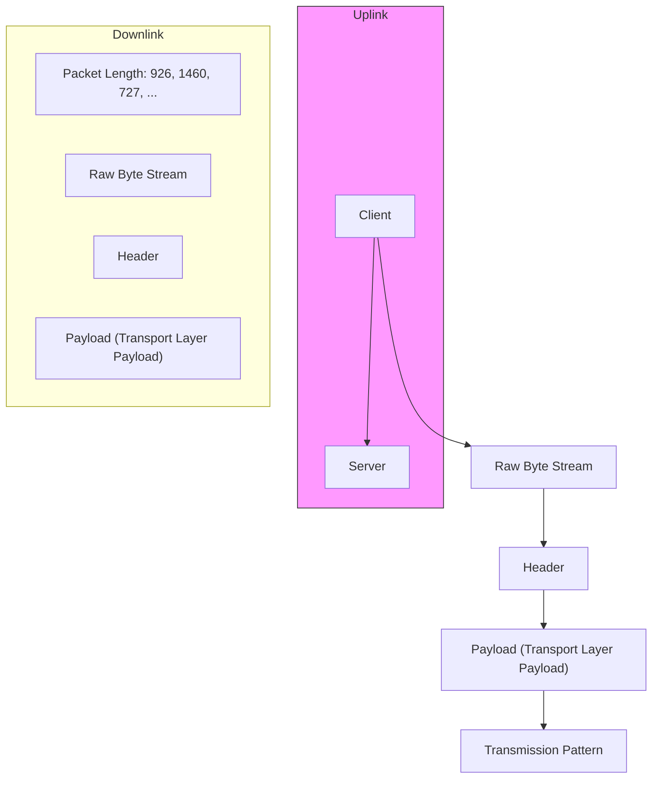
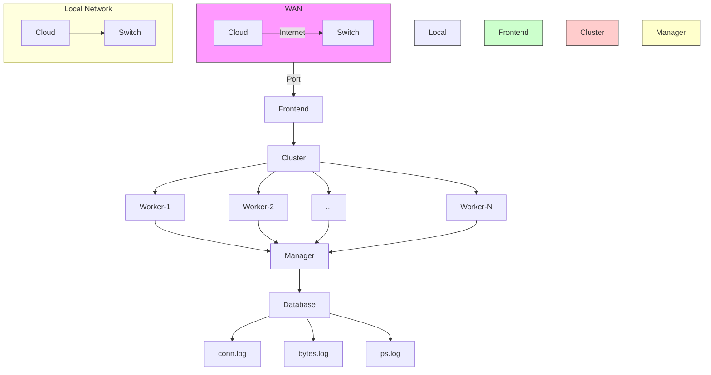
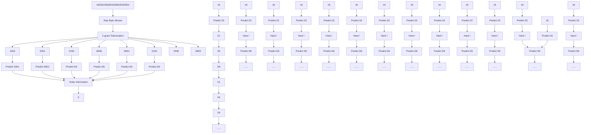
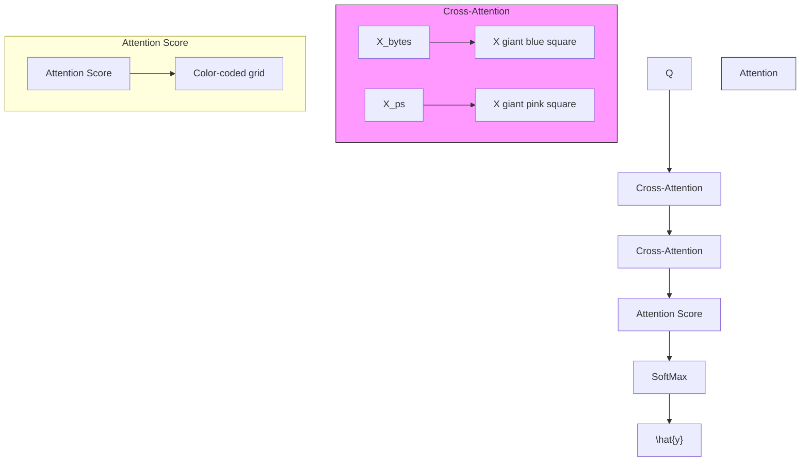
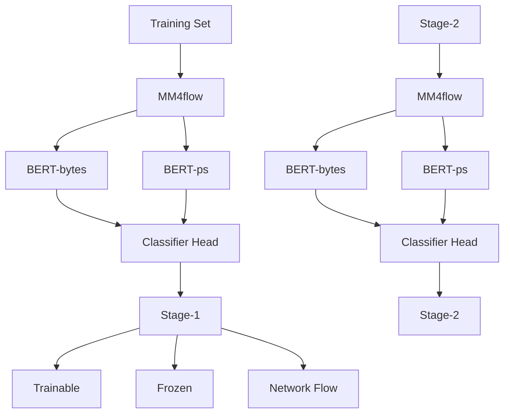

Latest updates: hps://dl.acm.org/doi/10.1145/3719027.3744804

RESEARCH-ARTICLE

# MM4flow: A Pre-trained Multi-modal Model for Versatile Network Traffic Analysis

LUMING YANG, National University of Defense Technology China, Changsha, Hunan, China LIN LIU, National University of Defense Technology China, Changsha, Hunan, China JUNJIE HUANG, National University of Defense Technology China, Changsha, Hunan, China ZHUOTAO LIU, Tsinghua University, Beijing, China SHIYU LIANG, Shanghai Jiao Tong University, Shanghai, China SHAOJING FU, National University of Defense Technology China, Changsha, Hunan, China View all

Open Access Support provided by:

National University of Defense Technology China

Tsinghua University

Shanghai Jiao Tong University


PDF Download

3719027.3744804.pdf

22 January 2026

Total Downloads: 1703

Published: 19 November 2025

Citation in BibTeX format

CCS '25: ACM SIGSAC Conference on

Computer and Communications Security

October 13 - 17, 2025

Taipei, Taiwan

Conference Sponsors:

SIGSAC

# MM4flow: A Pre-trained Multi-modal Model for Versatile Network Traffic Analysis

Luming Yang National University of Defense Technology Changsha, Hunan, China

Lin Liu∗ National University of Defense Technology Changsha, Hunan, China

Junjie Huang National University of Defense Technology Changsha, Hunan, China

Zhuotao Liu Tsinghua University Beijing, China

Shiyu Liang Shanghai Jiao Tong University Shanghai, China

Shaojing Fu∗ National University of Defense Technology Changsha, Hunan, China

Yongjun Wang∗ National University of Defense Technology Changsha, Hunan, China

# Abstract

Network traffic analysis is a critical research area, playing an essential role in enhancing network security and ensuring high-quality network services. Existing methods, which primarily rely on a single modality, face two significant limitations. First, while existing approaches may achieve strong performance in specific tasks, they often lack sufficient adaptability for diverse tasks. Second, existing pre-trained models are only trained with GB-scale traffic, with which increases the risk of over-fitting and limiting the models’ overall performance. To address these challenges, we propose MM4flow, a pre-trained multi-modal model designed for versatile network traffic analysis. We divide network flows into two modalities: raw byte streams and transmission patterns, which encapsulate the content and behavior information, respectively. MM4flow is composed of two key stages: uni-modal pre-training and multi-modal fine-tuning. We develop an efficient data collection scheme enabling TB-scale traffic pre-training. Leveraging a real-world traffic that exceeds 70 TB, MM4flow conducts uni-modal pre-training on each modality with a modified BERT architecture tailored for network flows. For specific downstream tasks, we introduce a modal fusion module based on cross-attention mechanisms. The fusion module facilitates effective integration of multi-modal information, enabling MM4flow to fully utilize both content and behavior cues during fine-tuning with minimal labeled dataset. We evaluate MM4flow on six public datasets covering six various tasks. Extensive experiments demonstrate that MM4flow achieves superior accuracy than baselines. Especially, compared to existing pre-trained models, MM4flow achieves an 84% improvement in accuracy for website identification under encrypted tunnels. Moreover, the pre-trained MM4flow significantly reduces the reliance on high-quality labeled training data for downstream tasks.

∗Corresponding authors.

Permission to make digital or hard copies of all or part of this work for personal or classroom use is granted without fee provided that copies are not made or distributed for profit or commercial advantage and that copies bear this notice and the full citation on the first page. Copyrights for components of this work owned by others than the author(s) must be honored. Abstracting with credit is permitted. To copy otherwise, or republish, to post on servers or to redistribute to lists, requires prior specific permission and/or a fee. Request permissions from permissions@acm.org.

CCS ’25, October 13–17, 2025, Taipei

© 2025 Copyright held by the owner/author(s). Publication rights licensed to ACM.

ACM ISBN 979-8-4007-1525-9/2025/10

https://doi.org/10.1145/3719027.3744804

# CCS Concepts

• Security and privacy → Network security.

# Keywords

Network Traffic Analysis, Multi-modal, Pre-training, Identification

# ACM Reference Format:

Luming Yang, Lin Liu, Junjie Huang, Zhuotao Liu, Shiyu Liang, Shaojing Fu, and Yongjun Wang. 2025. MM4flow: A Pre-trained Multi-modal Model for Versatile Network Traffic An alysis . In Pr oceedings of th e 20 25 ACM SIGSAC Conference on Computer and Communications Security (CCS ’25), October 13–17, 2025, Taipei. ACM, New York, NY, USA, 15 pages. https://doi.org/10.1145/3719027.3744804

# 1 Introduction

Network traffic an alysis is cr itical to ne twork ma nagement and cybersecurity. Over the past decade, the widespread adoption of encryption technologies has rendered traditional network traffic analysis methods, such as port filtering [32] and Deep Packet Inspection (DPI) [11, 56], inadequate for analyzing encrypted traffic [65]. Machine learning (ML) driven network traffic analysis is the new trend of understanding the complex network traffic. Traditional MLbased methods [7–9, 50, 69, 81] heavily rely on expert knowledge to select artificial features. Deep learning (DL) based [45, 66, 75, 76, 79] approaches avoid complex feature engineering by automatically extracting features from raw network traffic through representation learning. Yet, these approaches typically require large amounts of high-quality labeled data, as low-quality training data can introduce biases into the model, impeding their adaptability to real-world network environments [73].

The pre-training paradigm is a promising methodology to address the challenge of limited labeled data in practice. The model undergo self-supervised pre-training on extensive unlabeled data to learn general knowledge, and then utilizes a small amount of labeled data to learn task-specific k nowledge b y s upervised fine-tuning (SFT). Our community has proposed several pre-trained models [27, 29, 43, 73, 89, 93] for network traffic identification. However, existing approaches have two key limitations.

• Weakness on Multi-tasking. Existing pre-trained models focus solely on modeling raw byte streams and do not consider transmission patterns, resulting in poor performance on certain tasks. They achieve only about 0.05 accuracy on the identification task of encrypted tunnel website traffic (see § 4), as these tasks rely on side-channel information such as packet length, direction, and ordering, with almost no byte pattern available. Their inability to effectively utilize the multi-modal information of network flows restricts their capacity for multi-tasking.

• Insufficient General Knowledge. Existing pre-trained models typically rely on publicly available datasets designed for specific tasks, which frequently lack sufficient diversity. Consequently, the models may fail to acquire adequate knowledge of general network traffic patterns during the pre-training process, resulting in limited generalization capabilities. Furthermore, inherent biases within the public datasets can lead to the training bias, thereby undermining the fairness of the models.

In this paper, we propose a Multi-Modal pre-training model for network flow (named MM4flow1), which serves as a versatile approach for network traffic analysis. By pre-training on massive unlabeled network flow data from different modalities, the model is able to learn general knowledge of network flows automatically. We designed an efficient real-time traffic data collection scheme, which makes it possible for model pre-training on TB-scale network traffic. Notably, we processed approximately 77.6 TB of real-world traffic data at a network gateway for pre-training, which significantly exceeds that of existing pre-trained models for network traffic analysis (as shown in Table 1). For specific downstream tasks, we developed a multi-modal fusion module and then fine-tuned the pre-trained parameters accordingly. This process enables the full utilization of the multi-modal information in network flows, thereby enhancing analysis accuracy and significantly reducing the need for high-quality labeled data for supervised training.

The key contributions of this paper are as follows:

(1) We design a pre-trained multi-modal model for network traffic analysis named MM4flow to obtain versatile representations for enhancing multi-tasking capability. We divide network flows into two modalities, i.e., raw byte streams and transmission pattern, which contain the content information and behavior information of network flows, respectively.   
(2) We develop an efficient data collection scheme, making TB-scale traffic pre-training possible. To fully extract the information, we first perform the uni-modal pre-training on the unlabeled traffic, and then achieve the modal fusion using cross-attention mechanism on the downstream task. By pre-training and finetuning, the model can accomplish a variety of network traffic analysis tasks with great performance.   
(3) We conducted thorough experiments on six public datasets for different downstream tasks. Experimental results demonstrate that our approach can achieve higher identification accuracy than baselines. Compared to existing pre-trained models, our approach achieves an 84% improvement in accuracy for website identification under encrypted tunnel. In addition, our approach requires less labeled data for supervised training to achieve the same level of accuracy, which proves its superior generalization.

The remainder of this paper is organized as follows. In Section 2, we introduces the background and our motivation. In Section 3, we introduces the design details of MM4flow. Then, we evaluate the effectiveness of the proposed approaches through a set of experiments in Section 4. Discussions about our approach are presented in Section 5. We give a review of related work in Section 6. Finally, Section 7 concludes the paper and discusses future works.


<details>
<summary>flowchart</summary>


</details>

Figure 1: A network flow can mainly be represented by two modalities, raw byte stream and transmission pattern.

# 2 Background and Motivation

In this section, we introduce the multi-modal of network flows, and then explain our motivation in detail.

# 2.1 Multi-modal of Network Flows

A network flow, identified by a five-tuple (srcIP, srcport, dstIP, dstport, and protocol), representing a collection of bidirectional packets between the client (srcIP, srcPort) and the server (dstIP, dstPort) via a certain network protocol (such as TCP and UDP). Network flow is heterogeneous data with multiple modalities, as depicted in Figure 1. Raw byte streams and transmission pattern are two important modalities. For network flows, specifically, raw byte streams represent the content information, while the transmission pattern reflects the underlying behavioral information.

• Raw Byte Stream: This modality refers to the sequence of bytes contained in the packets of the network flow. A network packet consists of both headers and payload. The bytes transmitted determines the functionality of a network flow Due to the error correction and check mechanisms inherent in protocols, the raw byte stream represents a static characteristic of the network flow.   
• Transmission Pattern: The transmission pattern (also known as behavioral information) represents all the side-channel information of a network flow besides the actual transmitted bytes, such as packet length, direction, and timestamp. For encrypted traffic analysis, extracting behavioral information is critical due to limited byte patterns contained in the packet payload. Due to fluctuations in the network environment, the packet transmission is susceptible to network noise, such as packet loss, retransmission, and disordering. Therefore, the transmission pattern belongs to the dynamic characteristic.

Considering the bias caused by strong identification fields in headers [1–4] and the instability of timing-related information [15], in MM4flow, we choose payload byte stream and packet length sequence to represent the modality of raw byte stream and transmission pattern, respectively. Details will be introduced in § 3.

Table 1: The pre-training data comparison with prior pre-trained models for network traffic analysis. 

<table><tr><td>Year</td><td>Work</td><td>Model Params</td><td>PCAP Size</td><td>Sample-size × Epochs</td><td>The source of pre-training data</td><td>Sim. ** PT&amp;SFT</td></tr><tr><td>2022</td><td>ET-BERT [43]</td><td>132.19M</td><td>30GB</td><td>(1.6M)*</td><td>ISCXVPN [22], CIC-IDS2017 [60], CSTNET</td><td>➊</td></tr><tr><td>2023</td><td>YaTC [89]</td><td>1.86M</td><td>—</td><td>(76.8M)*</td><td>ISCXVPN [22], ISCXTor [36], USTC-TFC2016 [76], CICIoT2022 [17]</td><td>➌</td></tr><tr><td>2023</td><td>Flow-MAE [27]</td><td>85.12M</td><td>57.34GB</td><td>3.86M×800</td><td>CSE-CIC-IDS2018 [60]</td><td>➌</td></tr><tr><td>2024</td><td>NetMamba [73]</td><td>1.86M</td><td>77.6GB</td><td>(19.2M)*</td><td>ISCXVPN [22], ISCXTor [36], USTC-TFC2016 [76], CICIoT2022 [17], CrossPlantform [71]</td><td>➌</td></tr><tr><td>2025</td><td>TrafficFormer [93]</td><td>132.14M</td><td>18.8GB</td><td>0.6M×160</td><td>ISCXVPN [22], CICMalAnal2017 [37], Browser [70]</td><td>➌</td></tr><tr><td></td><td>MM4flow</td><td>174.40M</td><td>77.6TB</td><td>465M×2</td><td>Real-world Traffic from a Network Gateway</td><td>○</td></tr></table>

The sample size of the pre-training data is not mentioned in the paper. Thus we can only estimate it based on batch-size × training-steps = sample-size × epochs, which is the product of the pre-training dataset size and epochs.   
\*\* It indicates the similarity (Smi.) between datasets used for supervised fine-tuning (SFT) and the pre-training (PT) data, where > > > > .

Note: In this paper, the term "payload" specifically refers to the transport layer payload, while "header" includes only data link layer, network layer, and transport layer. Consequently, TLS protocol fields and HTTP headers are part of payload rather than header.

# 2.2 Motivations

Existing pre-trained models rely solely on the raw byte stream information of network flows, which results in satisfactory performance on tasks with prominent byte-level characteristics, such as application traffic identification. However, their performance is suboptimal for tasks with obfuscated byte-level information, such as tunneled traffic. Designing a network traffic pre-trained model for multi-tasking remains a challenging problem that has perplexed our community.

Existing pre-trained models are limited by the restricted combination of public datasets for pre-training, leading to two key issues. First, significant data distribution bias cannot reflect the diversity of real-world network traffic. This is because public datasets are often constructed for a specific task. Second, small pre-training datasets result in insufficient model pre-training. Moreover, the current approaches to processing pre-training data are not scalable to handle the massive volumes of real-world traffic. They typically split stored raw network traffic into numerous single-flow PCAP files by SplitCap2 followed by packet-level parsing using tools like Scapy3. It incurs substantial storage and processing overhead.

# 3 Design Details

In this section, we first outline the design goal, challenges, and solutions of MM4flow, followed by the overview and design details.

Goal: The primary goal is to efficiently and comprehensively leverage the multi-modal information of network flows and the vast amounts of unlabeled network traffic data to learn the general knowledge of network flows, thereby enhancing the performance of downstream analysis tasks.

Challenges: Many studies [12, 13, 26, 31, 39, 74, 77, 82] have shown that the training process of multi-modal models is prone to modality biases. Packet header may introduce biases related to the network setting [1–4], and packet interval time typically exhibits instability [15]. Additionally, pre-training on large-scale and diverse network traffic further requires efficient processing techniques to handle such data. The key challenge lies in how to efficiently leverage the diverse and massive unlabeled network traffic while fully utilizing the multi-modal information of network flows without training biases, in order to effectively extract valuable information for downstream analysis tasks.

Solutions: To address the aforementioned challenges, we utilize the payload byte streams and packet length sequences to represent network flows, thereby avoiding network setting bias and instability of packet time. We construct the pre-training dataset by real-time capturing packet length sequences and payload byte streams of network flows by Zeek [83], which mitigates the storage and parsing overhead during processing large-scale network traffic. By uni-modal pre-training, we enable the model to thoroughly learn the semantic information of payload byte streams and packet length sequences, while avoiding modality bias in the pre-training phase. In the fine-tuning phase, we design a modal fusion module based on cross-attention mechanism to fully leverage the multi-modal information of network flows for downstream tasks.

# 3.1 Overview

As shown in Figure 2, MM4flow employs the “pre-training + finetuning” paradigm for network traffic analysis. During the pretraining process, the model learns generalizable knowledge from large-scale unlabeled traffic data. Afterwards, the pre-trained model can be fine-tuned for various downstream analysis tasks, such as application traffic classification and malicious traffic detection. Specifically, MM4flow is composed of the following four components:

(1) Data Collection efficiently processes TB-scale unlabeled network traffic, and construct the multi-modal pre-training dataset.   
(2) Tokenization converts network flows with two modalities (payload byte streams and packet length sequences) into token sequences as the model’s input.   
(3) Uni-modal Pre-training relies on large-scale unlabeled data to train separate models for each of the two modalities. This stage enables effective representation learning of the uni-modal network traffic information.   
(4) Multi-modal Fine-tuning performs supervised fine-tuning (SFT) on a small set of labeled dataset regarding specific downstream tasks. This stage integrates information from both modalities to enhance the model’s performance.

# 3.2 Data Collection

To make TB-scale traffic pre-training possible, we developed an efficient data collection scheme based on Zeek [83] (formerly Bro [10, 53]), an open-source tool for network security monitoring.


<details>
<summary>flowchart</summary>

```mermaid
graph TD
    subgraph Pre Training (bytes)
        A["Pre-Training (bytes)"] --> B["Tokenization (bytes)"]
        B --> C["Payload Byte Stream (Raw Byte Stream)"]
        C --> D["Download"]
        D --> E["Packet Length Sequence (Transmission Pattern)"]
        E --> F["Tokenization (PS)"]
    end

    subgraph Fine Tuning
        G["Fine-tuning"] --> H["Classifier Head"]
        H --> I["Multi-modal Fusion"]
        I --> J["Fully-Connected Layer"]
        J --> K["SoftMax"]
        K --> L["SoftMax"]
        L --> M["SoftMax"]
        M --> N["SoftMax"]
        N --> O["SoftMax"]
        O --> P["SoftMax"]
        P --> Q["SoftMax"]
        Q --> R["SoftMax"]
    end

    subgraph PS (Pre-Training PS)
        S["Pre-Training (PS)"] --> T["Packet Length Embedding Layer"]
        T --> U["BERT-ps"]
        U --> V["Position Embedding"]
        V --> W["SoftMax"]
        W --> X["SoftMax"]
        X --> Y["SoftMax"]
        Y --> Z["SoftMax"]
        Z --> AA["SoftMax"]
        AA --> AB["SoftMax"]
        AB --> AC["SoftMax"]
        AC --> AD["SoftMax"]
        AD --> AE["SoftMax"]
        AE --> AF["SoftMax"]
        AF --> AG["SoftMax"]
        AG --> AH["SoftMax"]
        AH --> AI["SoftMax"]
        AI --> AJ["SoftMax"]
        AJ --> AK["SoftMax"]
        AK --> AL["SoftMax"]
        AL --> AM["SoftMax"]
        AM --> AN["SoftMax"]
        AN --> AO["SoftMax"]
        AO --> AP["SoftMax"]
        AP --> AQ["SoftMax"]
        AQ --> AR["SoftMax"]
        AR --> AS["SoftMax"]
        AS --> AT["SoftMax"]
        AT --> AU["SoftMax"]
        AU --> AV["SoftMax"]
        AV --> AW["SoftMax"]
        AW --> AX["SoftMax"]
        AX --> AY["SoftMax"]
        AY --> AZ["SoftMax"]
        AZ --> BA["SoftMax"]
        BA --> BB["SoftMax"]
        BB --> BC["SoftMax"]
        BC --> BD["SoftMax"]
        BD --> BE["SoftMax"]
        BE --> BF["SoftMax"]
        BF --> BG["SoftMax"]
        BG --> BH["SoftMax"]
        BH --> BI["SoftMax"]
        BI --> BJ["SoftMax"]
        BJ --> BK["SoftMax"]
        BK --> BL["SoftMax"]
        BL --> BM["SoftMax"]
        BM --> BN["SoftMax"]
        BN --> BO["SoftMax"]
        BO --> BP["SoftMax"]
        BP --> BQ["SoftMax"]
        BQ --> BR["SoftMax"]
        BR --> BS["SoftMax"]
        BS --> BT["SoftMax"]
        BT --> BU["SoftMax"]
        BU --> BV["SoftMax"]
        BV --> BW["SoftMax"]
        BW --> BX["SoftMax"]
        BX --> BY["SoftMax"]
        BY --> BZ["SoftMax"]
        BZ --> CA["SoftMax"]
        CA --> CB["SoftMax"]
        CB --> CC["SoftMax"]
        CC --> CD["SoftMax"]
        CD --> CE["SoftMax"]
        CE --> CF["SoftMax"]
        CF --> CG["SoftMax"]
        CG --> CH["SoftMax"]
        CH --> CI["SoftMax"]
        CI --> CJ["SoftMax"]
        CJ --> CK["SoftMax"]
    end

    subgraph Data Collection
    A1((Data Collection))
    A2((Data Collection))
    A3((Data Collection))
    A4((Data Collection))
    A5((Data Collection))
    A6((Data Collection))
    A7((Data Collection))
    A8((Data Collection))
    A9((Data Collection))
    A10((Data Collection))
    A11((Data Collection))
    A12((Data Collection))
    A13((Data Collection))
    A14((Data Collection))
    A15((Data Collection))
    A16((Data Collection))
    A17((Data Collection))
    A18((Data Collection))
    A19((Data Collection))
    A20((Data Collection))
    A21((Data Collection))
    A22((Data Collection))
    A23((Data Collection))
    A24((Data Collection))
    A25((Data Collection))
    A26((Data Collection))
    A27((Data Collection))
    A28((Data Collection))
    A29((Data Collection))
    A30((Data Collection))
    A31((Data Collection))
    A32((Data Collection))
    A33((Data Collection))
    A34((Data Collection))
    A35((Data Collection))
    A36((Data Collection))
    A37((Data Collection))
    A38((Data Collection))
    A39((Data Collection))
    A40((Data Collection))
    A41((Data Collection))
    A42((Data Collection))
    A43((Data Collection))
    A44((Data Collection))
    A45((Data Collection))
    A46((Data Collection))
    A47((Data Collection))
    A48((Data Collection))
    A49((Data Collection))
    A50((Data Collection))
    A51((Data Collection))
    A52((Data Collection))
    A53((Data Collection))
    A54((Data Collection))
    A55((Data Collection))
    A56((Data Collection))
    A57((Data Collection))
    A58((Data Collection))
    A59((Data Collection))
    A60((Data Collection))
    A61((Data Collection))
    A62((Data Collection))
    A63((Data Collection))
    A64((Data Collection))
    A65((Data Collection))
    A66((Data Collection))
    A67((Data Collection))
    A68((Data Collection))
    A69((Data Collection))
    A70((Data Collection))
    A71((Data Collection))
    A72((Data Collection))
    A73((Data Collection))
    A74((Data Collection))
    A75((Data Collection))
    A76((Data Collection))
    A77((Data Collection))
    A78((Data Collection))
    A79((Data Collection))
    A80((Data Collection))
    A81((Data Collection))
    A82((Data Collection))
    A83((Data Collection))
    A84((Data Collection))
    A85((Data Collection))
    A86((Data Collection))
    A87((Data Collection))
    A88((Data Collection))
    A89((Data Collection))
    A90((Data Collection))
    A91((Data Collection))
    A92((Data Collection))
    A93((Data Collection))
    A94((Data Collection))
    A95((Data Collection))
    A96((Data Collection))
    A97((Data Collection))
    A98((Data Collection))
    A99((Data Collection))
    B0["(BERT-bytes)"]
    B1["(Byte Embedding Layer)"]
    B2["(Text Embedding Layer)"]
    
    subgraph Pre Training (bytes)
        B0
        B1
        B2
        B3
        B4
        B5
        B6
        B7
        B8
        B9
        B10
        B11
        B12
        B13
        B14
        B15
        B16
        B17
        B18
        B19
        B20
        B21
        B22
        B23
        B24
        B25
        B26
        B27
        B28
        B29
        B30
        B31
        B32
        B33
        B34
        B35
        B36
        B37
        B38
        B39
        B40
        B41
        B42
        B43
        B44
        B45
        B46
        B47
        B48
        B49
        B50
        B51
        B52
        B53
        B54
        B55
        B56
        B57
        B58
        B59
        B60
        B61
        B62
        B63
        B64
        B65
        B66
        B67
        B68
        B69
        B70
        B71
        B72
        B73
        B74
        B75
        B76
        B77
        B78
        B79
        B80
      )
    
    subgraph Fine Tuning
            C0["Downstream Task N"]
            C1["Downstream Task 2"]
            C2["Downstream Task 1"]
            C3["Multi-modal Fusion"]
            C4["Fully-Connected Layer"]
            C5["SoftMax"]
            C6["Classifier Head"]
            C7["Backlog Feature"]
            C8["Backlog Feature"]
            C9["Backlog Feature"]
            C10["Backlog Feature"]
            C11["Backlog Feature"]
            C12["Backlog Feature"]
            C13["Backlog Feature"]
            C14["Backlog Feature"]
            C15["Backlog Feature"]
            C16["Backlog Feature"]
            C17["Backlog Feature"]
            C18["Backlog Feature"]
            C19["Backlog Feature"]
            C20["Backlog Feature"]
            C21["Backlog Feature"]
            C22["Backlog Feature"]
            C23["Backlog Feature"]
            C24["Backlog Feature"]
            C25["Backlog Feature"]
            C26["Backlog Feature"]
            C27["Backlog Feature"]
            C28["Backlog Feature"]
            C29["Backlog Feature"]
            C30["Backlog Feature"]
            C31["Backlog Feature"]
            C32["Backlog Feature"]
            C33["Backlog Feature"]
            C34["Backlog Feature"]
            C35["Backlog Feature"]
            C36["Backlog Feature"]
            C37["Backlog Feature"]
            C38["Backlog Feature"]
            C39["Backlog Feature"]
            C40["Backlog Feature"]
            C41["Backlog Feature"]
            C42["Backlog Feature"]
            C43["Backlog Feature"]
            C44["Backlog Feature"]
            C45["Backlog Feature"]
            C46["Backlog Feature"]
            C47["Backlog Feature"]
            C48["Backlog Feature"]
            C49["Backlog Feature"]
            C50["Backlog Feature"]
            C51["Backlog Feature"]
            C52["Backlog Feature"]
            C53["Backlog Feature"]
            C54["Backlog Feature"]
            C55["Backlog Feature"]
            C56["Backlog Feature"]
            C57["Backlog Feature"]
            C58["Backlog Feature"]
            C59["Backlog Feature"]
            C60["Backlog Feature"]
            C61["Backlog Feature"]
            C62["Backlog Feature"]
            C63["Backlog Feature"]
            C64["Backlog Feature"]
            C65["Backlog Feature"]
            C66["Backlog Feature"]
            C67["Backlog Feature"]
            C68["Backlog Feature"]
            C69["Backlog Feature"]
            C70["Backlog Feature"]
            C71["Backlog Feature"]
            C72["Backlog Feature"]
            C73["Backlog Feature"]
            C74["Backlog Feature"]
            C75["Backlog Feature"]
            C76["Backlog Feature"]
            C77["Backlog Feature"]
            C78["Backlog Feature"]
            C79["Backlog Feature"]
            C80["Backlog Feature"]
            C81["Backlog Feature"]
            C82["Backlog Feature"]
            C83["Backlog Feature"]
            C84["Backlog Feature"]
            C85["Backlog Feature"]
            C86["Backlog Feature"]
            C87["Backlog Feature"]
            C88["Backlog Feature"]
            C89["Backlog Feature"]
            C90["Backlog Feature"]
            C91["Backlog Feature"]
            C92["Backlog Feature"]
            C93["Backlog Feature"]
            C94["Backlog Feature"]
            C95["Backlog Feature"]
            C96["Backlog Feature"]
            C97["Backlog Feature"]
            C98["Backlog Feature"]
            C99["Backlog Feature"]
          end
    
    subgraph Fine Tuning (PS)
          D0["Packet Length Embedding Layer"]
          D1["Packet Length Embedding Layer"]
          D2["Packet Length Embedding Layer"]
          D3["Packet Length Embedding Layer"]
          D4["Packet Length Embedding Layer"]
          D5["Packet Length Embedding Layer"]
          D6["Packet Length Embedding Layer"]
          D7["Packet Length Embedding Layer"]
          D8["Packet Length Embedding Layer"]
          D9["Packet Length Embedding Layer"]
          D10["Packet Length Embedding Layer"]
          D11["Packet Length Embedding Layer"]
          D12["Packet Length Embedding Layer"]
          D13["Packet Length Embedding Layer"]
          D14["Packet Length Embedding Layer"]
          D15["Packet Length Embedding Layer"]
          D16["Packet Length Embedding Layer"]
          D17["Packet Length Embedding Layer"]
          D18["Packet Length Embedding Layer"]
          D19["Packet Length Embedding Layer"]
          D20["Packet Length Embedding Layer"]
          D21["Packet Length Embedding Layer"]
          D22["Packet Length Embedding Layer"]
          D23["Packet Length Embedding Layer"]
          D24["Packet Length Embedding Layer"]
          D25["Packet Length Embedding Layer"]
          D26["Packet Length Embedding Layer"]
          D27["Packet Length Embedding Layer"]
          D28["Packet Length Embedding Layer"]
          D29["Packet Length Embedding Layer"]
          D30["Packet Length Embedding Layer"]
          D31["Packet Length Embedding Layer"]
          D32["Packet Length Embedding Layer"]
          D33["Packet Length Embedding Layer"]
          D34["Packet Length Embedding Layer"]
          D35["Packet Length Embedding Layer"]
          D36["Packet Length Embedding Layer"]
          D37["Packet Length Embedding Layer"]
          D38["Packet Length Embedding Layer"]
          D39["Packet Length Embedding Layer"]
          D40["Packet Length Embedding Layer"]
          D41["Packet Length Embedding Layer"]
          D42["Packet Length Embedding Layer"]
          D43["Packet Length Embedding Layer"]
          D44["Packet Length Embedding Layer"]
          D45["Packet Length Embedding Layer"]
          D46["Packet Length Embedding Layer"]
          D47["Packet Length Embedding Layer"]
          D48["Packet Length Embedding Layer"]
          D49["Packet Length Embedding Layer"]
          D50["Packet Length Embedding Layer"]
          D51["Packet Length Embedding Layer"]
          D52["Packet Length Embedding Layer"]
          D53["Packet Length Embedding Layer"]
          D54["Packet Length Embedding Layer"]
          D55["Packet Length Embedding Layer"]
          D56["Packet Length Embedding Layer"]
          D57["Packet Length Embedding Layer"]
          D58["Packet Length Embedding Layer"]
          D59["Packet Length Embedding Layer"]
          D60["Packet Length Embedding Layer"]
          D61["Packet Length Embedding Layer"]
          D62["Packet Length Embedding Layer"]
          D63["Packet Length Embedding Layer"]
          D64["Packet Length Embedding Layer"]
          D65["Packet Length Embedding Layer"]
          D66["Packet Length Embedding Layer"]
          D67["Packet Length Embedding Layer"]
          D68["Packet Length Embedding Layer"]
          D69["Packet Length Embedding Layer"]
          D70["Packet Length Embedding Layer"]
          D71["Packet Length Embedding Layer"]
          D72["Packet Length Embedding Layer"]
          D73["Packet Length Embedding Layer"]
          D74["Packet Length Embedding Layer"]
          D75["Packet Length Embedding Layer"]
          D76["Packet Length Embedding Layer"]
          D77["Packet Length Embedding Layer"]
          D78["Packet Length Embedding Layer"]
          D79 "Backlog"
      end
    
    subgraph Pre Training (PS)
      subgraph Fine Tuning (PS)
      subgraph Pre Training (PS)
      subgraph Pre Training (PS)
      subgraph Pre Training (PS)
      subgraph Pre Training (PS)
      subgraph Pre Training (PS)
      subgraph Pre Training (PS)
      subgraph Pre Training (PS)
      subgraph Pre Training (PS)
      subgraph Pre Training (PS)
      subgraph Pre Training (PS)
      subgraph Pre Training (PS)
      subgraph Pre Training (PS)
      subgraph Pre Training (PS)
       end
    
    style Pre Training fill:#f9f,stroke:#333,stroke-width:2px;
```
</details>

Figure 2: The overview of MM4flow. It consists of four modules: (1) data collection, (2) tokenization, (3) uni-modal pre-training, and (4) multi-modal fine-tuning. BERT-bytes and BERT-ps are applied to represent two modalities of network flows, that is, the payload byte stream (raw byte stream) and packet length sequence (transmission pattern), respectively.


<details>
<summary>flowchart</summary>


</details>

Figure 3: At the network gateway, it is the the architecture for real-time network traffic capture, whose configuration primarily consists of port mirroring and the Zeek cluster.

As show in Figure 3, the architecture of our scheme is composed of two device: switch and monitor. On the switch at the network gateway, we configured port mirroring to replicate packets within the local network to a designated capture port. The capture port was connected to the monitor. On the monitor, we deployed a Zeek cluster for traffic sniffing and parsing. Zeek cluster is a set of workers jointly analyzing the traffic of a network link in a coordinated fashion. As Zeek is not multi-threaded, the only option currently is to spread the workload across many cores by the frontend once the limitations of a single processor core are reached. The worker sniffs network packets and does protocol analysis on the reassembled network flow. We also developed two Zeek plugins (ps.zeek and bytes.zeek) to record the packet length sequence and payload byte stream for each network flow, respectively. They are employed by every workers in the cluster. The manager receives log messages and notices from the rest of the nodes in the cluster.

We collected a large amount of traffic on network gateway over a week for pre-training, which correspond to about 77.6 TB pcap. Existing methods [43, 73, 89, 93] require about 79 TB of storage space and 1,540 hours to perform flow spliting, followed by parsing flow files. In contrast, our scheme stores raw log files at only 475.3GB, reducing the storage overhead to 0.6%. Furthermore, our traffic parsing is performed in real-time, avoiding off-line parsing.

Since "mouse flows" are too short to provide significant behavior information on packet-length sequences, we discarded flows containing fewer than 5 packets with non-zero transport layer payloads. Finally, there are a total of 465M network flows after processing.

# 3.3 Tokenization

In this module, we convert network flows into token sequences of two modalities, i.e., payload byte streams and packet length sequences. It transforms network flows into the model’s input.

We introduce 5 special tokens ([CLS], [SEP], [PAD], [MASK], and [UNK]), which are applied for both payload byte stream and packet length sequence. [CLS] is prefixed to indicate the beginning of the sequence, [SEP] separates sequences. As the model requires fixed-length input, sequences with insufficient length are padded with [PAD], which are subsequently masked within the model to prevent them from affecting the representation of overall sequence. [MASK] is used for replacing masked tokens, and [UNK] represents unknown tokens for the corpus.

Payload Byte Stream. We apply the first 256 bytes of transport layer payload each in the uplink and downlink (512 bytes in total) to represent the raw byte stream of network flows. The packet headers contain many fields correlated with network settings. Some of these fields (such as IP address, Port, Sequence/Acknowledgment number, and Window) can introduce large biases in model training, leading to incorrect causal reasoning [1–4]. Therefore, we only utilize the transport layer payload and remove these header fields in raw byte streams. Many studies [7, 8, 75, 76, 82] indicate that the initial several packets of network flows play a more significant role in analysis, especially for encrypted traffic. Therefore, we utilize the initial bytes instead of other segments, as they typically contain more information contributing to the analysis. In a network flow, uplink and downlink payloads are respectively generated by the client and the server, and often serve distinct functions [82]. Thus both directions should be considered for input sequences.


<details>
<summary>flowchart</summary>


</details>

Figure 4: Two types of tokenization for raw byte streams. For 2-gram tokenization applied by [29, 43, 93], the masked token is simply a combination of the preceding token’s low byte and the succeeding token’s high byte. It is determined by the tokenization itself and has nothing to do with semantic information. For instance, between 06D6 and 0100, the masked token will inevitably be D601. In contrast, byte tokenization requires comprehensive contextual analysis to predict masked tokens, making it more challenging.

We directly utilize hexadecimal values of each byte as tokens, thereby achieving tokenization of payload byte streams. In addition, we employ [SEP] to separate the uplink and downlink payload.

Remark: Existing pre-trained models [29, 43, 93] for network traffic often tokenize the raw byte stream using 2-gram, as shown in Figure 4. For the Masked Language Modeling (MLM) task during pre-training, the masked token can be directly inferred from their preceding and succeeding tokens without mining its relationship to other parts of the byte stream. As a result, the 2-gram tokenization makes the model almost unable to learn the semantic information of bibyte tokens effectively. In contrast, a comprehensive analysis of the byte stream context is required to predict the masked token for byte tokenization. This process enables the model to learn the semantic information of raw byte streams. Therefore, it makes sense to apply byte tokenization.

Packet Length Sequence. We apply packet length sequence to represent the transmission pattern modality of network flows. Many studies [15, 61, 62] consider that packet time is prone to be affected by the fluctuation of the network environment and thus is not as stable as packet length. Using dynamic time warping to align different time sequences [24] results in extremely heavy time overhead. To mitigate the adverse impact of functional packets (e.g., SYN packets and ACK packets), packets without transport layer payload are excluded in the packet length sequence.

For the packet length, its absolute value is the length of the transport layer payload, while its sign indicates the direction of the packet in the network flow. We define that the uplink packet length is positive, while the downlink packet length is negative. For the tokenization of packet length sequences, we utilize packet lengths with direction directly as tokens.

# 3.4 Uni-modal Structure and Pre-training

In MM4flow, we design two sub-models to represent information from the two modalities of network traffic, respectively. Specifically, BERT-bytes is for payload byte streams while BERT-ps is for packet length sequences. Using multiple inputs simultaneously to train multi-modal models is intuitively advantageous but practically challenging [30, 86]. A key challenge is modality bias [12, 26, 31, 74, 77], where a network overly relies on one modality and ignores others during joint training. This issue occurs not only in multi-modal classifiers but also in multi-modal pre-trained models [13, 39]. For network traffic analysis, existing research [82] indicates that payload byte streams are easier-to-learn modality than packet length sequences. Ideally, models are expected to learn multi-modal features on the basis of enough uni-modal features [23]. To mitigate the insufficient extraction of information due to potential interference between modalities, we only conduct the uni-modal pre-training for two sub-models.

Byte Embedding. It consists of three parts, token embedding, position embedding, and type embedding. The purpose is to map each byte token in payload byte stream to a Euclidean space, thereby representing its semantic information in the form of a vector with fixed-length for easy machine processing.

The token embedding is the basis for byte embedding, whose vocabulary contains 0x00-0xFF and 5 special tokens. In the load of packets, the semantics represented by the same bytes in different locations can vary significantly. Consequently, within the payload byte stream, we also set positional encoding for each token to integrate positional information into the representation. Additionally, to represent the different functions of uplink and downlink flows, we also introduce token type encoding. We set the token type of uplink and downlink flows as 0 and 1, respectively.

Finally, these three parts of byte embedding are all achieved by embedding layers with learnable parameters. The results of each part are added up and then fed into BERT-bytes. For a byte token at position ??, its embedding result can be expressed as follows:

$$
\boldsymbol {e} _ {\text { byte }} ^ {i} = \boldsymbol {e} _ {\text { byte }} + \boldsymbol {e} _ {\text { pos }} ^ {i} + \boldsymbol {e} _ {\text { type }}, \tag {1}
$$

where its token embedding, positional encoding, and type encoding are represented as $e _ { \mathrm { b y t e } } , e _ { \mathrm { p o s } } ^ { i } ,$ and $e _ { \mathrm { t y p e } } ,$ respectively.

Packet Length Embedding. It map each packet length token to Euclidean space, thereby representing the semantic information by fixed-length vector. Packet Length Embedding consists of two parts, token embedding and position embedding.

The vocabulary of its token embedding contains 1-1500 packet length with 2 directions and 5 special tokens. In a network flow, the same packet length value has different semantic information at different positions. Considering these positional information, we set the position encoding for each token.

Similar to byte embedding, these parts are also achieved by embedding layers, and then added up before being fed into BERTps. As a result, for a packet length token at position ??, its embedding result can be expressed as follows:

$$
\boldsymbol {e} _ {\mathrm{pl}} ^ {i} = \boldsymbol {e} _ {\mathrm{pl}} + \boldsymbol {e} _ {\mathrm{pos}} ^ {i}, \tag {2}
$$

where its packet length embedding and positional encoding are represented as $e _ { \mathrm { p l } }$ and $\boldsymbol { e } _ { \mathrm { p o s } } ^ { i } ,$ , respectively.

Uni-modal Structure. In MM4flow, both BERT-bytes and BERTps are developed based on Bi-directional Transformer Encoder to represent payload byte stream and packet length sequence.


<details>
<summary>flowchart</summary>

```mermaid
graph LR
    subgraph Input
        x1["x₁"] --> MaskInput["Masked Input"]
        x2["x₂"] --> MaskInput
        x3["x₃"] --> MaskInput
        x4["x₄"] --> MaskInput
        MaskInput --> Model["Model"]
        MaskInput --> MaskInput1["Mask"]
        MaskInput2["Mask"] --> MaskInput3["Mask"]
        MaskInput4["Mask"] --> MaskInput4["Mask"]
        MaskInput5["Mask"] --> MaskInput5["Mask"]
        MaskInput6["Mask"] --> MaskInput6["Mask"]
        MaskInput7["Mask"] --> MaskInput7["Mask"]
        MaskInput8["Mask"] --> MaskInput8["Mask"]
        MaskInput9["Mask"] --> MaskInput9["Mask"]
        MaskInput10["Mask"] --> MaskInput10["Mask"]
    end

    subgraph Masked Input
        X1["X₁"] --> Model
        X2["X₂"] --> Model
        X3["X₃"] --> Model
        X4["X₄"] --> Model
        X5["X₅"] --> Model
        X6["X₆"] --> Model
        X7["X₇"] --> Model
        X8["X₈"] --> Model
    end

    subgraph Representation Vector
        X11["X₁"] --> LMHead["LM Head"]
        X21["X₂"] --> LMHead
        X31["X₃"] --> LMHead
        X41["X₄"] --> LMHead
        X51["X₅"] --> LMHead
        X61["X₆"] --> LMHead
        X71["X₇"] --> LMHead
    end

    subgraph Classification Probability
        P1["\hat{p}_1"] --> LMHead
        P2["\hat{p}_2"] --> LMHead
        P3["\hat{p}_3"] --> LMHead
        P4["\hat{p}_4"] --> LMHead
        P5["\hat{p}_5"] --> LMHead
        P6["\hat{p}_6"] --> LMHead
        P7["\hat{p}_7"] --> LMHead
        P8["\hat{p}_8"] --> LMHead
    end

    L_MLM["L_MLM"]
    classDef label fill:#f9f9f9,stroke-dasharray: 5 5;
    class L_MLM,L_P1,P_P2,P_P3,P_P4,P_P5,P_P6,P_P7,P_P8,P_P9,P_P10,P_P11,P_P12,P_P13,P_P14,P_P15,P_P16,P_P17,P_P18,P_P19,P_P20,P_P21,P_P22,P_P23,P_P24,P_P25,P_P26,P_P27,P_P28,P_P29,P_P30,P_P31,P_P32,P_P33,P_P34,P_P35,P_P36,P_P37,P_P38,P_P39,P_P40,P_P41,P_P42,P_P43,P_P44,P_P45,P_P46,P_P47,P_P48,P_P49,P_P50,P_P51,P_P52,P_P53,P_P54,P_P55,P_P56,P_P57,P_P58,P_P59,P_P60,P_P61,P_P62,P_P63,P_P64,P_P65,P_P66,P_P67,P_P68,P_P69,P_P70,P_P71,P_P72,P_P73,P_P74,P_P75,P_P76,P_P77,P_P78,P_P79,P_P80,P_P81,P_P82,P_P83,P_P84,P_P85,P_P86,P_P87,P_P88,P_P89,P_P90,P_P91,P_P92,P_P93,P_P94,P_P95,P_P96,P_P97,P_P98,P_P99]
    end

    classDef labelLabel label
    class_A["Input"]:::label
    class_B["Masked Input"]:::label
    class_C["Representation Vector"]:::label
    class_D["Classification Probability"]:::label
    class_E["P̂ᵢ"]:::label
    class_F["L_MLM"]:::label
```
</details>

Figure 5: The schematic diagram of Masked Language Modeling (MLM), based on which the pre-training of BERT-ps and BERT-bytes can be achieved.

There are two types of architecture that utilize Transformer structure: Encoder-Only (such as BERT [21]) and Decoder-Only (such as GPT [55]). Encoder-Only architecture employs a fully multihead attention mechanism, allowing each token to consider both previous and subsequent tokens, which makes it well-suited for comprehension tasks. On the contrary, Decoder-Only architecture is designed for generative tasks, utilizing a masked multi-head attention mechanism that restricts each token’s attention to only the previous tokens. Given that network traffic analysis prioritizes the understanding of network flows rather than generation, the Encoder-Only architecture is a more suitable choice.

In addition, for both payload byte stream and packet length sequence, the output vector of the model corresponding to [CLS] is typically regarded as the representation of the entire sequence.

Pre-training. The purpose of pre-training is to enable the model to learn the underlying structure and common patterns of network traffic through a self-supervised manner, thereby acquiring a general and meaningful representation of network flows. The pre-training process employs Masked Language Modeling (MLM), which is a Denoising Autoencoder (DAE) [72] approach. As demonstrated in Figure 5, the basic principle is to mask some tokens ([MASK]), and then predict the original value of the masked tokens based on the surrounding unmasked tokens in the context, enabling the model to acquire bidirectional contextual information. The Language Model (LM) head is a fully-connected layer with softmax, which is applied to predict masked tokens.

For the input sequence ?? with ?? masked tokens, the loss function of the pre-training process can be expressed as follows:

$$
\mathcal {L} _ {\mathrm{MLM}} = - \sum_ {i = 1} ^ {k} \log \left(P r \{\mathrm{MASK} _ {i} = \mathrm{token} _ {i} | \tilde {X}; \Theta \}\right), \tag {3}
$$

where Θ is the model’s parameters, $\tilde { X }$ is the masking result of the input data and ${ \mathrm { M A S K } } _ { i }$ is the masked token at the ??-th position.

During the pre-training process of MLM, there are 15% of the tokens in the input sequence need to be masked, which is similar to the pre-training of BERT [21]. For the selected 15% of tokens, three operations are applied: 80% are directly replaced with [MASK], 10% are replaced with new tokens, and the other 10% remain unchanged.

# 3.5 Multi-modal Fusion and Fine-tuning

After pre-training on massive unlabeled data, BERT-bytes and BERTps can effectively represent the content and behavior information of network flows, respectively. In order to enhance analysis performance for downstream tasks, in MM4flow, we design an multimodal fusion module to fully leverage the information from network flows, including payload byte stream and packet length sequence. The multi-modal fusion is carried out in the fine-tuning process.

Multi-modal Fusion. This module is employed based on crossattention mechanism. Cross-attention captures relationships between elements of two different input sequences by selecting and determining which tokens are most important in a specific context. For a source sequence $X _ { 1 }$ and a target sequence $X _ { 2 } ,$ , the crossattention result can be expressed as follows:

$$
\text { CrossAttention } \left(X _ {1}, X _ {2}\right) = V \text { Softmax } \left(\frac {K ^ {\mathrm{T}} Q}{\sqrt {d _ {k}}}\right) \tag {4}
$$

$$
= X _ {1} ^ {\mathrm{T}} W \text {Softmax} \left(\frac {X _ {1} ^ {\mathrm{T}} W _ {k} ^ {\mathrm{T}} W _ {q} X _ {2}}{\sqrt {d _ {k}}}\right),
$$

where $K = W _ { k } X _ { 1 } , Q = W _ { q } X _ { 2 } , V = W _ { v } X _ { 1 } ,$ , and $d _ { k }$ are query vector, key vector, and value vector, and element dimension, respectively.

In payload byte stream and packet length sequence, some tokens require to be aware of cross-modal information, while others are only relevant to their own modality. For example, if TLS record length represented by bytes exceeds the Maximum Segment Size (MSS), one or more consecutive packets with MSS-length will appear. In contrast, bytes indicating field lengths are typically associated only with the subsequent field bytes and do not influence the packet length sequence. Consequently, applying cross-attention directly to the outputs of two modalities may disrupt the representation of uni-modality, thereby degrading the model’s performance.

To address this issue, we utilize the concatenated outputs of both modalities as the query vector in the cross-attention mechanism. The architecture of multi-modal fusion module is shown in Figure 6. For a network flow $X ,$ , the output from BERT-bytes after inputting its payload byte stream is denoted as $X _ { \mathrm { b y t e s } }$ , and the output from BERT-ps after inputting its packet length sequence is denoted as $X _ { \mathrm { p s } }$ . Then, we concatenate $X _ { \mathrm { b y t e s } }$ and $X _ { \mathrm { p s } }$ to form the query vector $\left[ X _ { \mathrm { b y t e s } } | | X _ { \mathrm { p s } } \right]$ , and then respectively compute the cross-attention scores with both $X _ { \mathrm { b y t e s } }$ and $X _ { \mathrm { p s } }$ . This process makes it possible for each token in a single modality to notice information about all modalities simultaneously. After the cross-attention mechanism, the embedding vector sequences for the payload byte stream and packet length sequence can be expressed as follows:

$$
\boldsymbol {X} _ {\text { bytes }} ^ {\prime} = \text { CrossAttention } \left(\boldsymbol {X} _ {\text { bytes }}, \left[ \boldsymbol {X} _ {\text { bytes }} \| \boldsymbol {X} _ {\text { ps }} \right]\right), \tag {5}
$$

$$
X _ {\mathrm{ps}} ^ {\prime} = \text { CrossAttention } \left(X _ {\mathrm{ps}}, \left[ X _ {\mathrm{bytes}} \| X _ {\mathrm{ps}} \right]\right). \tag {6}
$$

After modal fusion, we use vectors $x _ { \mathrm { b y t e s } }$ (from $X _ { \mathrm { b y t e s } } ^ { \prime } )$ and $x _ { \mathrm { p s } }$ (from $X _ { \mathrm { p s } } ^ { \prime } )$ corresponding to [CLS] from the payload byte stream and packet length sequence to represent the network flow in two modalities. We concatenate these two representations and input them into the fully connected layer to produce the identification result, which is expressed as follows:

$$
\boldsymbol {p} = \text { Softmax } \left(\boldsymbol {W} \left[ \boldsymbol {x} _ {\text { bytes }} \| \boldsymbol {x} _ {\text { ps }} \right] + \boldsymbol {b}\right), \tag {7}
$$


<details>
<summary>flowchart</summary>


</details>

Figure 6: The architecture of the multi-modal fusion module base on cross-attention mechanism.

where $\pmb { \mathscr { p } } = \left[ \hbar \pmb { c } \right] _ { c \in \mathscr { y } }$ is the probability vector that indicates the network flow belongs to different categories in label space Y. ?? and ?? are the weight and bias of the fully connected layer, respectively. Fine-tuning. During the fine-tune process, the loss function is cross entropy loss, which is defined as follows:

$$
\mathcal {L} _ {\mathrm{cls}} = - \frac {1}{N} \sum_ {i = 1} ^ {N} \sum_ {c \in \mathcal {Y}} y _ {c} ^ {(i)} \log p _ {c} ^ {(i)}, \tag {8}
$$

where ?? (?? $y _ { c } ^ { ( i ) }$ is the ground truth label, and $\mathbf { \mathit { p } } _ { c } ^ { ( i ) }$ is the predicted probability that the ??-th sample belongs to class ??.

After pre-training on large-scale unlabeled data, the model’s parameters typically converge to a relatively stable state. But there are numerous untrained parameters in the classification head. In this case, directly fine-tuning all model’s parameters on a small-scale training set may lead to unintended changes in stable pre-trained parameters due to the updates of untrained parameters, potentially resulting in overfitting. Therefore, as illustrated in Figure 7, we proceed fine-tuning process in the following two stages:

Stage-1: It is the warm-up phase for fine-tuning. In detail, we freeze all the pre-trained parameters and only update the gradients of the classification head. This process prevents the gradient updates from the classification head without training from affecting the pretrained parameters. After this stage, the classification head already has a preliminary performance.

Stage-2: It is the full-parameter fine-tuning phase. We unfreeze the pre-trained parameters and conduct full parameter fine-tuning of the model at a lower learning rate. This process can enable the model to achieve improved performance.

# 4 Evaluation

In this section, we conduct a set of experiments to evaluate the performance of our proposed approach. The evaluation experiments aim to address the following research questions (RQ):

RQ1: (Accuracy) How does MM4flow’s identification accuracy on various tasks compare to existing approaches?

RQ2: (Generalization) In practice, properly labeled network flows required in supervised training are often insufficient. How does MM4flow perform in few-shot scenarios?


<details>
<summary>flowchart</summary>


</details>

Figure 7: There are two phases in the fine-tuning process, including warm-up and full-parameter fine-tuning.

RQ3: (Separability) Can the MM4flow’s pre-training on large-scale unlabeled data enhance the separability of network flows?

RQ4: (Ablation Study) How do these modules and pre-trained parameters in MM4flow contribute to the final performance?

# 4.1 Experimental Settings

Our experiments are performed on a server, which is equipped with the following configuration: AMD EPYC(TM) 7542 CPU @ 2.90GHz, 8 × NVIDA GeForce RTX 6000 Ada, 512GB of RAM. MM4flow is built by PyTorch 2.3.0. The following details pre-training data and settings, datasets, fine-tuning settings, baselines, and metrics.

Pre-training Data. We collected a large amount of network traffic on network gateway over a week, accumulating approximately 77.6 TB pcap. A total of 465M network flows are collected after processing these raw data, producing around 249.9B tokens for payload byte streams and 18.98B tokens for packet length sequences. As shown in Table 1, this pre-training dataset is 3 orders of magnitude larger than that used in state-of-the-art (SOTA) approaches [27, 43, 73, 89, 93]. Furthermore, this pre-training data does not include any data related to downstream tasks in evaluation, which is different from SOTAs.

Pre-training Settings. In MM4flow, we adopt the hyper-parameter settings of the BERT-base [21] as a reference for BERT-ps and BERTbytes. More details about hyper-parameters are deferred to Appendix A. During pre-training, we set the batch size to 128, and with 4 GPUs, this results in an effective batch size of 512. The total number of epoch is fixed at 2, corresponding about 908K training steps. The pre-training process takes about 350 hours. More details about hyper-parameters and implementation are deferred to Appendix A.

Baselines. We select 11 existing works as baselines, including 6 approaches based on raw byte stream (CNN [75], EBSNN [80], ET-BERT [43], YaTC [89], NetMamba [73], and TrafficFormer [93]) and 5 approaches based on transmission pattern (AppScanner [69], ETC-PS [81], FlowLens [9], FS-Net [45], and GraphDApp [66]). We defer additional details about baselines to Appendix B.

Datasets. We evaluate our approach on 6 public datasets regarding different tasks, including DataCon2020 [18] (encrypted malware detection), DataCon2021-p1 [19] (encrypted proxy classification), DataCon2021-p2 [19] (website identification under encrypted proxy), Browser [70] (browser classification), NUDT\_MobileTraffic [90] (mobile application identification), and CSTNET-TLS1.3 [42] (TLS 1.3 website identification). All these datasets were public after 2020, and better aligned with the current network environment. Similar to pre-training data, we remove any flows containing fewer than 5 packets with payload, followed by removing any classes with fewer flows. Due to possible biases about network settings, packet headers are excluded from the model’s input. More details about datasets are deferred to Appendix C.

Table 2: The identification results of MM4flow and baselines on six public datasets. 

<table><tr><td rowspan="2">DatasetMethod</td><td colspan="4">DataCon2020 [18]</td><td colspan="4">DataCon2021-p1 [19]</td><td colspan="4">DataCon2021-p2 [19]</td></tr><tr><td>Acc</td><td>macro-P</td><td>macro-R</td><td>macro- $F_1$ </td><td>Acc</td><td>macro-P</td><td>macro-R</td><td>macro- $F_1$ </td><td>Acc</td><td>macro-P</td><td>macro-R</td><td>macro- $F_1$ </td></tr><tr><td>AppScanner [69]</td><td>0.9302</td><td>0.9236</td><td>0.9362</td><td>0.9281</td><td>0.9209</td><td>0.9052</td><td>0.9267</td><td>0.9135</td><td>0.8346</td><td>0.8302</td><td>0.8383</td><td>0.8330</td></tr><tr><td>ETC-PS [81]‘</td><td>0.9280</td><td>0.9214</td><td>0.9339</td><td>0.9258</td><td>0.8622</td><td>0.8221</td><td>0.8629</td><td>0.8360</td><td>0.8118</td><td>0.8068</td><td>0.8153</td><td>0.8095</td></tr><tr><td>FlowLens [9]</td><td>0.9238</td><td>0.9172</td><td>0.9293</td><td>0.9216</td><td>0.9380</td><td>0.9264</td><td>0.9406</td><td>0.9323</td><td>0.8027</td><td>0.7967</td><td>0.8062</td><td>0.7998</td></tr><tr><td>FS-Net [45]</td><td>0.9405</td><td>0.9350</td><td>0.9426</td><td>0.9383</td><td>0.9423</td><td>0.9275</td><td>0.9449</td><td>0.9351</td><td>0.8460</td><td>0.8398</td><td>0.8461</td><td>0.8419</td></tr><tr><td>GraphDApp [66]</td><td>0.8414</td><td>0.8388</td><td>0.8543</td><td>0.8391</td><td>0.8033</td><td>0.7886</td><td>0.8295</td><td>0.7887</td><td>0.4599</td><td>0.5237</td><td>0.4540</td><td>0.4485</td></tr><tr><td>CNN [75]</td><td>0.9427</td><td>0.9368</td><td>0.9462</td><td>0.9407</td><td>0.8025</td><td>0.7577</td><td>0.7735</td><td>0.7514</td><td>0.0570</td><td>0.0560</td><td>0.0572</td><td>0.0560</td></tr><tr><td>EBSNN [80]</td><td>0.9799</td><td>0.9800</td><td>0.9799</td><td>0.9799</td><td>0.7002</td><td>0.7236</td><td>0.7002</td><td>0.7071</td><td>0.3649</td><td>0.4011</td><td>0.3489</td><td>0.3361</td></tr><tr><td>ET-BERT [43]</td><td>0.9562</td><td>0.9563</td><td>0.9562</td><td>0.9563</td><td>0.7302</td><td>0.8364</td><td>0.7303</td><td>0.6946</td><td>0.0574</td><td>0.0615</td><td>0.0574</td><td>0.0533</td></tr><tr><td>YaTC [89]</td><td>0.9562</td><td>0.9563</td><td>0.9562</td><td>0.9563</td><td>0.7302</td><td>0.8364</td><td>0.7303</td><td>0.6946</td><td>0.0574</td><td>0.0615</td><td>0.0574</td><td>0.0533</td></tr><tr><td>NetMamba [73]</td><td>0.9616</td><td>0.9579</td><td>0.9623</td><td>0.9600</td><td>0.8107</td><td>0.7732</td><td>0.7697</td><td>0.7598</td><td>0.0325</td><td>0.0015</td><td>0.0455</td><td>0.0029</td></tr><tr><td>TrafficFormer [93]</td><td>0.9537</td><td>0.9476</td><td>0.9595</td><td>0.9522</td><td>0.8577</td><td>0.7877</td><td>0.7592</td><td>0.7617</td><td>0.0298</td><td>0.0100</td><td>0.0478</td><td>0.0091</td></tr><tr><td>MM4flow</td><td>0.9734</td><td>0.9699</td><td>0.9752</td><td>0.9724</td><td>0.9731</td><td>0.9637</td><td>0.9728</td><td>0.9676</td><td>0.9011</td><td>0.8963</td><td>0.9002</td><td>0.8976</td></tr><tr><td colspan="13"></td></tr><tr><td rowspan="2">DatasetMethod</td><td colspan="4">Browser [70]</td><td colspan="4">NUDT_MobileTraffic [90]</td><td colspan="4">CSTNET-TLS1.3 [42]</td></tr><tr><td>Acc</td><td>macro-P</td><td>macro-R</td><td>macro- $F_1$ </td><td>Acc</td><td>macro-P</td><td>macro-R</td><td>macro- $F_1$ </td><td>Acc</td><td>macro-P</td><td>macro-R</td><td>macro- $F_1$ </td></tr><tr><td>AppScanner [69]</td><td>0.8331</td><td>0.8145</td><td>0.8131</td><td>0.8129</td><td>0.7211</td><td>0.7186</td><td>0.7211</td><td>0.7178</td><td>0.8451</td><td>0.8384</td><td>0.8395</td><td>0.8369</td></tr><tr><td>ETC-PS [81]</td><td>0.7988</td><td>0.7791</td><td>0.7732</td><td>0.7750</td><td>0.6843</td><td>0.6814</td><td>0.6843</td><td>0.6806</td><td>0.7764</td><td>0.7689</td><td>0.7719</td><td>0.7679</td></tr><tr><td>FlowLens [9]</td><td>0.8572</td><td>0.8386</td><td>0.8369</td><td>0.8371</td><td>0.6611</td><td>0.6640</td><td>0.6611</td><td>0.6580</td><td>0.9114</td><td>0.9075</td><td>0.9083</td><td>0.9068</td></tr><tr><td>FS-Net [45]</td><td>0.8466</td><td>0.8284</td><td>0.8289</td><td>0.8275</td><td>0.6549</td><td>0.6570</td><td>0.6549</td><td>0.6531</td><td>0.9208</td><td>0.9153</td><td>0.9176</td><td>0.9160</td></tr><tr><td>GraphDApp [66]</td><td>0.6684</td><td>0.6662</td><td>0.6612</td><td>0.6540</td><td>0.1562</td><td>0.2624</td><td>0.1562</td><td>0.1373</td><td>0.6236</td><td>0.6975</td><td>0.6168</td><td>0.6207</td></tr><tr><td>CNN [75]</td><td>0.9865</td><td>0.9859</td><td>0.9864</td><td>0.9861</td><td>0.7202</td><td>0.7212</td><td>0.7202</td><td>0.7191</td><td>0.4210</td><td>0.4045</td><td>0.4104</td><td>0.4038</td></tr><tr><td>EBSNN [80]</td><td>0.9835</td><td>0.9822</td><td>0.9838</td><td>0.9830</td><td>0.5995</td><td>0.6101</td><td>0.5995</td><td>0.5931</td><td>0.4554</td><td>0.4533</td><td>0.4430</td><td>0.4052</td></tr><tr><td>ET-BERT [43]</td><td>0.9893</td><td>0.9892</td><td>0.9892</td><td>0.9892</td><td>0.8578</td><td>0.8618</td><td>0.8578</td><td>0.8581</td><td>0.8839</td><td>0.8768</td><td>0.8763</td><td>0.8748</td></tr><tr><td>YaTC [89]</td><td>0.9835</td><td>0.9836</td><td>0.9835</td><td>0.9835</td><td>0.7771</td><td>0.7903</td><td>0.7772</td><td>0.7769</td><td>0.7026</td><td>0.7267</td><td>0.7027</td><td>0.6941</td></tr><tr><td>NetMamba [73]</td><td>0.9839</td><td>0.9839</td><td>0.9827</td><td>0.9833</td><td>0.7663</td><td>0.7759</td><td>0.7663</td><td>0.7657</td><td>0.8394</td><td>0.8371</td><td>0.8313</td><td>0.8267</td></tr><tr><td>TrafficFormer [93]</td><td>0.9892</td><td>0.9889</td><td>0.9892</td><td>0.9891</td><td>0.8583</td><td>0.8612</td><td>0.8583</td><td>0.8586</td><td>0.9144</td><td>0.9080</td><td>0.9095</td><td>0.9073</td></tr><tr><td>MM4flow</td><td>0.9929</td><td>0.9926</td><td>0.9926</td><td>0.9926</td><td>0.9111</td><td>0.9116</td><td>0.9111</td><td>0.9110</td><td>0.9826</td><td>0.9814</td><td>0.9822</td><td>0.9817</td></tr></table>

Fine-tuning Settings. For each task, we perform 40 epochs of warm-up (phase-1) followed by 20 epochs of full-parameter finetuning (phase-2). The batch size is set as 64 during fine-tuning.

Metrics. We mainly employ accuracy (Acc) and macro averaging of precision (??), recall(??), and ??1-score as evaluation metrics.

# 4.2 Analysis Accuracy (to RQ1)

The accuracy serves as the primary performance metric for network traffic analysis. We evaluated the accuracy of MM4flow on six public traffic datasets and compared it with various baseline methods. The experimental results are presented in Table 2.

Higher accuracy on multi-tasking. Although these six tasks are highly heterogeneous (in terms of the number of categories and the scales of the dataset), It is noteworthy that MM4flow outperforms the optimal baseline methods by 5.28% and 6.17% in accuracy on NUDT\_MobileTraffic and CSTNET-TLS1.3, respectively. MM4flow achieves consistently good performance and outperform existing baselines. Existing pre-trained models rely on packet headers but pay insufficient attention to payload, leading to a reduction in accuracy. Experimental results indicate that MM4flow can achieve SOTA performance on versatile traffic analysis tasks, including

mobile application and website identification, browser classification, encrypted malware detection, encrypted proxy analysis, etc.

When raw byte stream is the main modality? From Table 2, we can infer that experimental results conducted on 3 out of 6 tasks suggest that the payload byte stream typically serves as the primary modality for malware detection (DataCon2020), mobile application identification (NUDT\_MobileTraffic), and browser classification (Browser). For unencrypted traffic, plain-text information can provide a more detailed representation of network behavior than packet length sequences. Although most normal service traffic is now encrypted by TLS protocol, the transport-layer payload still contains plain-text TLS fields, which are often sufficient for common traffic identification. Compared to the behavior information contained in packet length sequences, the significant byte pattern is more readily to capture during the analysis process. As a result, payload-byte-stream-based methods generally outperform packetlength-sequence-based methods in terms of identification accuracy.

Transmission Pattern is important for tunnels. Moreover, experimental results on DataCon2021-p1 and DataCon2021-p2 show that when the payload of network flows contains little or no byte pattern, the effectiveness of the payload byte stream modality is significantly diminished. In such tasks, the analysis will focus on the packet length sequence modality. In the encrypted proxy traffic identification task (DataCon2021-p1), as demonstrated in Table 2, existing methods based on packet length sequences typically achieve accurancy above 0.85, whereas the highest accuracy attained by methods based on payload byte streams is only 0.8039.

  
(a) Payload Byte Stream (Bytes)   
(b) Packet Length Sequence (PS)   
Figure 8: The performance comparison on few-shot settings

Moreover, it is important to note that all the payload-byte-streambased methods fail in the task of identifying encrypted tunnel website traffic (DataCon2021-p2). This is due to completely no byte pattern related to the website traffic under encryption tunnel. It can be seen from Table 2 that this analysis task primarily relies on the behavioral information, i.e., the packet length sequence.

# 4.3 Generalization (to RQ2)

In this subsection, we evaluate the model’s generalization by testing its performance when the number of labeled data varies.

Fewer labeled data requirement. Figure 8 illustrates the accuracy variation when trained on labeled training set with different scales. For most analysis tasks, MM4flow requires significantly fewer labeled data to achieve the same level of accuracies with the existing methods. While some baselines with enough training data perform similarly to the pre-trained model, their performance will decline significantly as the amount of labeled training data decreases.

When both our method and FS-Net achieve 0.9 accuracy in proxy traffic classification (DataCon2021-p1), our method requires only 10% of the labeled data that FS-Net needs. For encrypted tunnel website identification (DataCon2021-p2), our method requires only about 30% of the labeled data used by FS-Net and App-Scanner to achieve 0.8 accuracy. On the more challenging task NUDT\_MobileTraffic, compared to existing methods, MM4flow reduces labeled data requirement by over 70% to achieve an acceptable accuracy (over 0.8). On CSTNET-TLS1.3, our method requires approximately 90% fewer labeled data than FlowLens to achieve 0.9 accuracy. However, the advantages of our method on the binary classification task DataCon2020 are not obvious. On Browser, where payload byte stream is the primary modality, MM4flow’s generalization is weaker than some baselines. The modal-fusion module in MM4flow requires training more parameters from scratch in the classification head, which impacts the performance when extremely few training samples are available. Experimental results indicate that even with limited labeled training data, MM4flow can still operate effectively, reducing the deployment costs associated with data collection and labeling significantly.

Pre-training enhances generalization. When training samples are insufficient, loading pre-trained parameters and performing supervised fine-tuning outperforms training from scratch. As shown in Figure 8, this phenomenon can be observed on all six tasks. On DataCon2021-p1, when the sample size per category is fewer than 50, the performance of training from scratch significantly deteriorates. On DataCon2021-p2 and CSTNET-TLS1.3, pre-trained parameters can improve the accuracy by about 5% and 3%, respectively. On Browser, pre-training has little impact on accuracy when the model is trained by the full training set. However, MM4flow with pre-trained parameters shows a clear advantage when only a small number of training samples are available. On NUDT\_MobileTraffic, pre-training can boost the accuracy by more than 10%.

Overall, this sustained advantage on accuracy highlights the exceptional performance of MM4flow, which can be attributed to the general and meaningful representations of network flows acquired through pretraining. Self-supervised pre-training on largescale unlabeled network traffic data enables the model to learn the underlying structure and common patterns of network flows, thereby reducing the dependency on task-specific labeled data.

# 4.4 Embedding Analysis (to RQ3)

To analyze the impact of pre-training, we test the separability of the embeddings of network flows on different modalities.

Pre-training brings preliminary separability. Using ??-SNE, we visualized the embeddings of network flows on two modalities across six datasets, which is illustrated in Figure 9. It is evident that embeddings in both modalities exhibit good separability on DataCon2020, DataCon2021-p1, and CSTNET-TLS1.3. It indicates that models pre-trained on vast amounts of unlabeled network traffic can preliminarily identify different types of network flows. On DataCon2021-p1, the payload byte stream embeddings of V2ray, Clash, and Netch can form three obvious clusters. However, embeddings for Lantern and Shadowsocks are mixed within a single cluster, making them indistinguishable. It indicates that these two categories are too similar on payload byte stream to be differentiated, which is a primary reason for the suboptimal performance of methods based on this modality. Although their packet length sequence embeddings do not exhibit clear cluster distribution, there is still a noticeable difference. On DataCon2021-p2, packet length sequence embeddings for a few categories exhibit a relatively concentrated distribution, but their payload byte stream embeddings are completely indistinguishable. It indicates that only packet length sequence modality contains separability information on this task. Therefore, payload-byte-stream-based methods fail on this task, which is shown in Figure 9. On CSTNET-TLS1.3, the embedding distribution of most categories show good separability on payload byte stream modality. But there are still some categories with mixed embedding distribution, which does not appear on packet length sequence modality. On DataCon2020, NUDT\_MobileTraffic, and Browser, the embedding separability of payload byte streams is significantly superior to that of packet length sequences.

  
Figure 9: The ??-SNE visualization of pre-trained embeddings on six public datasets.

The Separability on different modalities. There are differences embedding separability on different modalities, which is related to the inherence of each modality. Due to the checksum and error correcting code in transmission protocols, packet content is generally stable and not affected by network noise. As a result, the payload byte stream embeddings demonstrate an obvious cluster distribution, where samples within each cluster typically belong to one category. In contrast, the embedding distribution of packet length sequences is relatively scattered, which is attributable to network noise, such as packet loss, retransmission, and disorder. Network noise can lead to variations in packet length sequences. Consequently, embeddings of payload byte streams often exhibit stronger separability than packet length sequences.

# 4.5 Ablation Study (to RQ4)

In this subsection, we conducted ablation studies to assess the contribution of each component and the pre-training effectiveness. Multi-modal is better than uni-modal. As illustrated in Table 3, on packet length sequence modality, the pre-trained and fine-tuned BERT-ps can achieve superior performance across all tasks compared to existing approaches. Similarly, the identification performance of the BERT-bytes with pre-training parameters and fine-tuning also exceeds current methods on payload byte stream modality. For most tasks, however, these optimal results achieved on single modality are still inferior to MM4flow. Besides, for encrypted tunnel website identification (DataCon2021-p2), the accuracy achieved by MM4flow is comparable to BERT-ps without significant decline. It demonstrates the strong adaptability of our approach in the task with failure modality.

Multi-modal fusion is effective. To evaluate the role of the modal fusion module in MM4flow, we concatenated the representation vectors (corresponding to [CLS]) of two modalities, and then directly fed them into a classification head without cross-attention mechanism. As shown in Table 3, in most tasks, the designed modal fusion module can enhance the performance with slightly higher accuracy compared to simple embedding concatenation. However, the concatenation of embeddings yields slightly higher accuracy on DataCon2021-p2. It is probably because the behavior information in packet length sequences is affected by the ineffective payload byte stream during modal fusion.

SFT is better than TFS. Table 3 also indicates that the identification accuracy of the model with pre-trained parameters and supervised fine-tuning (SFT) is higher than the model trained from scratch (TFS), demonstrating the effectiveness of the pre-training process. However, the improvement on model’s performance varies across different tasks. On NUDT\_MobileTraffic containing 300 categories, the accuracy and $F _ { 1 }$ -score respectively improved by 0.1497 and 0.1503, which is significantly higher than other analysis tasks. In contrast, on the binary classification task DataCon2020, the accuracy and $F _ { 1 } \cdot$ -score only increased by approximately 0.03. Experimental results suggest that pre-training parameters can effectively improve model’s performance on more challenging tasks. This phenomenon can also observed in BERT-ps and BERT-bytes.

Pre-training makes learning stable. We further analyzed the fine-tuning process to evaluate the impact of pre-trained parameters on the training efficiency. Figure 10 illustrates how the validation accuracy evolves with increasing training epochs during SFT on six datasets. After one epoch of SFT, the model with pre-trained parameters can achieve higher accuracy on validation set. In contrast, TFS models exhibit a gradual increase in validation accuracy during the first few training epochs. As illustrated in Figure 10, the TFS model often fails to reach the accuracy levels achieved by SFT. Experimental results indicate that pre-trained parameters can significantly enhance both training efficiency and identification performance. Compared to TFS, the validation accuracy during SFT is notably more stable. This phenomenon can be observed during the finetuning process on DataCon2020, DataCon2021-p1, and Browser. It is attributed to the well-optimized pre-trained parameters, which are converged and stable. The pre-trained parameters can guide the model toward more accurate parameter updates during fine-tuning, so as to avoid sharp performance fluctuations.

Table 3: Ablation study of MM4flow on six public datasets. 

<table><tr><td rowspan="2" colspan="2">Dataset Model</td><td colspan="2">DataCon2020</td><td colspan="2">DataCon2021-p1</td><td colspan="2">DataCon2021-p2</td><td colspan="2">NUDT_MobileTraffic</td><td colspan="2">Browser</td><td colspan="2">CSTNET-TLS1.3</td></tr><tr><td>Acc</td><td>macro- $F_1$ </td><td>Acc</td><td>macro- $F_1$ </td><td>Acc</td><td>macro- $F_1$ </td><td>Acc</td><td>macro- $F_1$ </td><td>Acc</td><td>macro- $F_1$ </td><td>Acc</td><td>macro- $F_1$ </td></tr><tr><td rowspan="2">BERT-ps</td><td>TFS</td><td>0.9400</td><td>0.9380</td><td>0.9603</td><td>0.9535</td><td>0.8759</td><td>0.8715</td><td>0.7820</td><td>0.7809</td><td>0.8498</td><td>0.8299</td><td>0.9585</td><td>0.9560</td></tr><tr><td>SFT</td><td>0.9493</td><td>0.9473</td><td>0.9680</td><td>0.9623</td><td>0.9026</td><td>0.8999</td><td>0.8193</td><td>0.8184</td><td>0.8752</td><td>0.8580</td><td>0.9757</td><td>0.9742</td></tr><tr><td rowspan="2">BERT-bytes</td><td>TFS</td><td>0.9556</td><td>0.9539</td><td>0.7883</td><td>0.7352</td><td>0.0427</td><td>0.0072</td><td>0.0033</td><td>0.0000</td><td>0.9862</td><td>0.9855</td><td>0.4492</td><td>0.3872</td></tr><tr><td>SFT</td><td>0.9721</td><td>0.9710</td><td>0.8146</td><td>0.7638</td><td>0.0471</td><td>0.0125</td><td>0.8898</td><td>0.8902</td><td>0.9905</td><td>0.9903</td><td>0.9633</td><td>0.9601</td></tr><tr><td rowspan="2">MM4flow w/o cross-attention</td><td>TFS</td><td>0.9406</td><td>0.9385</td><td>0.9669</td><td>0.9602</td><td>0.8723</td><td>0.8671</td><td>0.7815</td><td>0.7822</td><td>0.9519</td><td>0.9514</td><td>0.9598</td><td>0.9571</td></tr><tr><td>SFT</td><td>0.9727</td><td>0.9715</td><td>0.9709</td><td>0.9643</td><td>0.9028</td><td>0.8981</td><td>0.9080</td><td>0.9085</td><td>0.9920</td><td>0.9918</td><td>0.9800</td><td>0.9788</td></tr><tr><td rowspan="2">MM4flow</td><td>TFS</td><td>0.9437</td><td>0.9416</td><td>0.9685</td><td>0.9610</td><td>0.8694</td><td>0.8650</td><td>0.7614</td><td>0.7607</td><td>0.9777</td><td>0.9776</td><td>0.9552</td><td>0.9524</td></tr><tr><td>SFT</td><td>0.9734</td><td>0.9724</td><td>0.9731</td><td>0.9676</td><td>0.9011</td><td>0.8976</td><td>0.9111</td><td>0.9110</td><td>0.9929</td><td>0.9926</td><td>0.9826</td><td>0.9817</td></tr></table>

\* TFS denotes the model Trained From Scratch without pre-trained parameters.   
\* SFT refers to the model trained by Supervised Fine-Tuning with pre-trained parameters, i.e. MM4flow in other tables and figures.


<details>
<summary>line</summary>

| Epoch | Superised Fine-tuning (TFS) | Train From Scratch (SFT) |
|-------|-----------------------------|--------------------------|
| 1     | 0.96                        | 0.86                     |
| 3     | 0.97                        | 0.92                     |
| 5     | 0.97                        | 0.93                     |
| 7     | 0.97                        | 0.94                     |
| 9     | 0.97                        | 0.93                     |
| 11    | 0.97                        | 0.93                     |
| 13    | 0.97                        | 0.94                     |
| 15    | 0.97                        | 0.94                     |
</details>


<details>
<summary>line</summary>

| Epoch | Superised Fine-tuning (TFS) | Train From Scratch (SFT) |
|-------|-----------------------------|--------------------------|
| 1     | 0.94                        | 0.88                     |
| 3     | 0.96                        | 0.94                     |
| 5     | 0.97                        | 0.96                     |
| 7     | 0.97                        | 0.98                     |
| 9     | 0.97                        | 0.96                     |
| 11    | 0.97                        | 0.98                     |
| 13    | 0.97                        | 0.96                     |
| 15    | 0.97                        | 0.98                     |
</details>


<details>
<summary>line</summary>

| Epoch | Superised Fine-tuning (TFS) | Train From Scratch (SFT) |
|-------|-----------------------------|--------------------------|
| 1     | 0.85                        | 0.45                     |
| 3     | 0.90                        | 0.75                     |
| 5     | 0.91                        | 0.85                     |
| 7     | 0.91                        | 0.86                     |
| 9     | 0.91                        | 0.87                     |
| 11    | 0.91                        | 0.87                     |
| 13    | 0.91                        | 0.87                     |
| 15    | 0.91                        | 0.87                     |
</details>


<details>
<summary>line</summary>

| Epoch | Superised Fine-tuning (TFS) | Train From Scratch (SFT) |
|-------|-----------------------------|--------------------------|
| 1     | 0.85                        | 0.45                     |
| 3     | 0.90                        | 0.65                     |
| 5     | 0.92                        | 0.70                     |
| 7     | 0.93                        | 0.72                     |
| 9     | 0.94                        | 0.73                     |
| 11    | 0.94                        | 0.74                     |
| 13    | 0.95                        | 0.75                     |
| 15    | 0.95                        | 0.75                     |
</details>


<details>
<summary>line</summary>

| Epoch | Superised Fine-tuning (TFS) | Train From Scratch (SFT) |
|-------|-----------------------------|--------------------------|
| 1     | 0.98                        | 0.90                     |
| 3     | 0.98                        | 0.94                     |
| 5     | 0.98                        | 0.95                     |
| 7     | 0.98                        | 0.93                     |
| 9     | 0.98                        | 0.96                     |
| 11    | 0.98                        | 0.97                     |
| 13    | 0.98                        | 0.97                     |
| 15    | 0.98                        | 0.97                     |
</details>


<details>
<summary>line</summary>

| Epoch | Superised Fine-tuning (TFS) | Train From Scratch (SFT) |
|-------|-----------------------------|--------------------------|
| 1     | 0.96                        | 0.86                     |
| 2     | 0.97                        | 0.90                     |
| 3     | 0.97                        | 0.92                     |
| 4     | 0.98                        | 0.93                     |
| 5     | 0.98                        | 0.94                     |
| 6     | 0.98                        | 0.94                     |
| 7     | 0.98                        | 0.94                     |
| 8     | 0.98                        | 0.94                     |
| 9     | 0.98                        | 0.94                     |
| 10    | 0.98                        | 0.94                     |
| 11    | 0.98                        | 0.95                     |
| 12    | 0.98                        | 0.95                     |
| 13    | 0.98                        | 0.95                     |
| 14    | 0.98                        | 0.95                     |
| 15    | 0.98                        | 0.95                     |
</details>

Figure 10: The accuracy change during supervised finetuning and training from scratch on six public datasets.

# 5 Discussions

MM4flow is a multi-modal pre-trained model for versatile network traffic analysis. Experimental results show that it can achieve higher accuracy and better generalization.

Higher Accuracy. The effective representation of multi-modal information is the key reason why our approach consistently achieves high accuracy across various network traffic analysis tasks. The payload byte stream and packet length sequence reflect the content and behavior information of the network flow, respectively. They both contain separability information that is beneficial to downstream tasks. By uni-modal pre-training and modal fusion, MM4flow can make full use of these information, thereby enhancing performance.

Better Generalization. Compared with existing methods, MM4flow requires significantly less labeled training data to achieve the same level of accuracy. The pre-training process enables the model to learn a generalized representation of network flow. As a result, during the fine-tuning phase, MM4flow can quickly adapt to specific analysis tasks even with limited labeled data.

There are still some limitations to be addressed as follows:

• The attention mechanism can theoretically handle data of arbitrary length, but it can lead to attention dispersion and even memory overflow as the input length increases. This issue is particularly evident in the payload byte stream modality, and somewhat restricts the performance of MM4flow.   
• High-speed network imposes high throughput requirements on the model. The inference speed and dependence on dedicated GPU hardware limits the real-world application of the model.

Future research should focus on mining new modality of network flows, to enable a more comprehensive multi-modal representation. Moreover, the deployment and real-time analysis of the pre-trained model remains critical challenges to be addressed.

# 6 Related Work

Traditional traffic identification is mainly based on port numbers [32] and Deep Packet Inspection (DPI) [6, 20, 34, 49]. As network behavior has grown complex and encryption techniques have emerged, their performances have declined. Traffic identification based on machine learning and deep learning is currently the mainstream.

Methods Based on Raw Byte Stream. These methods primarily rely on the packet content. For traffic identification, supervised learning is the widely used paradigm, and commonly used deep learning structures for automatic feature extraction include Convolutional Neural Network (CNN) [47, 75, 76, 85, 91], Recurrent Neural Network (RNN) [40, 41], and Graph Neural Network (GNN) [84]. Mao et al. [48] and Xiao et al. [78, 79] employed hierarchical attention networks to jointly learn the high-level presentation from byte sequence and side-channel features. Besides, many works [88, 92] also used Transformer structure due to its highly parallel and robust sequence modeling ability.

In order to leverage large-scale unlabeled data for traffic representations, several pre-trained models [27, 29, 43, 73, 93] have been proposed in recent years. PERT proposed by He et al. [29] and ET-BERT proposed by Lin et al. [43] learn deep contextual datagram-level representations from unlabeled traffic data by masked language modeling. Inspired by computer vision, Flow-MAE [27] and YaTC [89] utilized the MAE pre-training approach to encode network flows from byte matrices. Zhou et al. [93] proposed TrafficFormer, which introduces a fine-grained multi-classification task to enhance its representation capabilities in the pre-training stage. Instead of Transformer, NetMamba [73] applied Mamba architecture for comprehensive traffic representation to address efficiency issues.

Methods Based on Transmission Pattern. Packet-length sequences is most applied in these methods. Taylor et al. [68, 69] presented AppScanner, which only applies side-channel data to build fingerprints for Android apps. FlowLens [9] proposed by Barradas et al. collects features of packet distributions at line speed and classifies flows directly on the switches. Xu et al. [81] introduced path signature into encrypted traffic classification based on packet-length information. As for deep-learning-based methods, Liu et al. [45] designed an RNN-based end-to-end model named FS-Net, which jointly learns the representative features from raw flow sequences and classifies them together. Shen et al. [66] constructed Traffic Interaction Graph (TIG) as an information-rich representation of encrypted flows based on the packet length and direction. Chen et al. [14, 16] applied multi-PDU (Protocol Data Unit) lengths with capsule neural network for encrypted traffic classification.

Besides packet length features, BIND [5] and FlowPic [58, 59] also utilize packet arrival times for traffic classification. As for Tor traffic, especially, packets are padded to a uniform length, leaving only directional information available for analysis. The website traffic identification under Tor is called Website Fingerprinting (WF). These methods primarily based on machine learning [28, 52] and deep learning [57, 67]. As for TLS/SSL encrypted traffic, TLS/SSL message sequence is also widely applied for traffic identification [35, 44, 51, 63, 64]. Moreover, some works also incorporate inter-flow relationships [15, 33, 38, 87] or spatial and temporal information [25, 54, 71] to enhance traffic identification performance.

# 7 Conclusions

In this paper, we propose MM4flow, a large pre-trained multi-modal model for versatile network traffic analysis. It addresses the challenge of insufficient utilization of network flow information via multi-modal learning, and mitigates the issue of insufficient labeled data for supervised training via pre-training. By pre-training on massive unlabeled network traffic data, the model can automatically and effectively learn and represent the payload byte streams and packet length sequences, which respectively contain the content and behavior information of network flows. F or s pecific downstream tasks, we utilize a cross-attention mechanism and supervised fine-tuning to enable the effective analysis and identification of network flows. Experimental results demonstrate that our approach achieves superior identification accuracy with enhanced generalization and robustness on several common analysis tasks compared to existing methods.

# Acknowledgments

This work is supported by National Nature Science Foundation of China (No.62072446, No.62072431, No.62102430, No.62201600, No.62472247 and No.62306179), the NUDT Grants (No.ZK22-50, No.ZK22-56) and Other Program (24BC3200100).

# References

[1] Giuseppe Aceto, Domenico Ciuonzo, Antonio Montieri, Alfredo Nascita, and Antonio Pescapé. 2021. Encrypted multitask traffic classification via multimodal deep learning. In ICC 2021-IEEE International Conference on Communications. IEEE, 1–6.   
[2] Giuseppe Aceto, Domenico Ciuonzo, Antonio Montieri, and Antonio Pescapé. 2018. Mobile encrypted traffic classification using deep learning. In 2018 Network traffic measurement and analysis conference (TMA). IEEE, 1–8.   
[3] Giuseppe Aceto, Domenico Ciuonzo, Antonio Montieri, and Antonio Pescapè. 2019. MIMETIC: Mobile encrypted traffic classification using multimodal deep learning. Computer networks 165 (2019), 106944.   
[4] Giuseppe Aceto, Domenico Ciuonzo, Antonio Montieri, and Antonio Pescapé. 2019. Mobile encrypted traffic classification using deep learning: Experimental evaluation, lessons learned, and challenges. IEEE transactions on network and service management 16, 2 (2019), 445–458.   
[5] Khaled Al-Naami, Swarup Chandra, Ahmad Mustafa, Latifur Khan, Zhiqiang Lin, Kevin Hamlen, and Bhavani Thuraisingham. 2016. Adaptive encrypted traffic fingerprinting with bi-directional dependence. In Proceedings of the 32nd Annual Conference on Computer Security Applications. 177–188.   
[6] Shane Alcock and Richard Nelson. 2012. Libprotoident: traffic classification using lightweight packet inspection. Technical Report. Technical report, University of Waikato.   
[7] Blake Anderson and David A. McGrew. 2016. Identifying Encrypted Malware Traffic with Contextual Flow Data. Proceedings of the 2016 ACM Workshop on Artificial Intelligence and Security (2016).   
[8] Blake Anderson, Subharthi Paul, and David A. McGrew. 2016. Deciphering malware’s use of TLS (without decryption). Journal of Computer Virology and Hacking Techniques 14 (2016), 195 – 211.   
[9] Diogo Barradas, Nuno Santos, Luís Rodrigues, Salvatore Signorello, Fernando M. V. Ramos, and André Madeira. 2021. FlowLens: Enabling Efficient Flow Classification for ML-based Network Security Applications. In Network and Distributed System Security Symposium.   
[10] Paxson V Bro. 1998. A system for detecting network intruders in real-time. In Proc. 7th USENIX security symposium.   
[11] Tomasz Bujlow, Valentín Carela-Español, and Pere Barlet-Ros. 2015. Independent comparison of popular DPI tools for traffic classification. Computer Networks 76 (2015), 75–89.   
[12] Remi Cadene, Corentin Dancette, Matthieu Cord, Devi Parikh, et al. 2019. Rubi: Reducing unimodal biases for visual question answering. Advances in neural information processing systems 32 (2019).   
[13] Jize Cao, Zhe Gan, Yu Cheng, Licheng Yu, Yen-Chun Chen, and Jingjing Liu. 2020. Behind the scene: Revealing the secrets of pre-trained vision-and-language models. In Computer Vision–ECCV 2020: 16th European Conference, Glasgow, UK, August 23–28, 2020, Proceedings, Part VI 16. Springer, 565–580.   
[14] Zihan Chen, Guang Cheng, Bomiao Jiang, Shuye Tang, Shuyi Guo, and Yuyang Zhou. 2020. Length matters: Fast internet encrypted traffic service classification based on multi-PDU lengths. In 2020 16th International Conference on Mobility, Sensing and Networking (MSN). IEEE, 531–538.   
[15] Zihan Chen, Guang Cheng, Zijun Wei, Dandan Niu, and Nan Fu. 2023. Classify traffic rather than flow: Versatile multi-flow encrypted traffic classification with flow clustering. IEEE Transactions on Network and Service Management 21, 2 (2023), 1446–1466.   
[16] Zihan Chen, Guang Cheng, Ziheng Xu, Shuyi Guo, Yuyang Zhou, and Yuyu Zhao. 2022. Length matters: Scalable fast encrypted internet traffic service classification based on multiple protocol data unit length sequence with composite deep learning. Digital Communications and Networks 8, 3 (2022), 289–302.   
[17] Sajjad Dadkhah, Hassan Mahdikhani, Priscilla Kyei Danso, Alireza Zohourian, Kevin Anh Truong, and Ali A Ghorbani. 2022. Towards the development of a realistic multidimensional IoT profiling dataset. In 2022 19th Annual International Conference on Privacy, Security & Trust (PST). IEEE, 1–11.   
[18] DataCon-Community. 2020. DataCon2020 - Encrypted Malicious Traffic Dataset. https://datacon.qianxin.com/opendata/openpage?resourcesId=6.   
[19] DataCon-Community. 2021. DataCon2021 - Encrypted Proxy Traffic Dataset. https://datacon.qianxin.com/opendata/openpage?resourcesId=10.   
[20] Luca Deri, Maurizio Martinelli, Tomasz Bujlow, and Alfredo Cardigliano. 2014. ndpi: Open-source high-speed deep packet inspection. In 2014 International Wireless Communications and Mobile Computing Conference (IWCMC). IEEE, 617–622.   
[21] Jacob Devlin. 2018. Bert: Pre-training of deep bidirectional transformers for language understanding. arXiv preprint arXiv:1810.04805 (2018).   
[22] Gerard Draper-Gil, Arash Habibi Lashkari, Mohammad Saiful Islam Mamun, and Ali A Ghorbani. 2016. Characterization of encrypted and vpn traffic using time-related. In Proceedings of the 2nd international conference on information systems security and privacy (ICISSP). 407–414.   
[23] Chenzhuang Du, Jiaye Teng, Tingle Li, Yichen Liu, Tianyuan Yuan, Yue Wang, Yang Yuan, and Hang Zhao. 2023. On uni-modal feature learning in supervised multi-modal learning. In International Conference on Machine Learning. PMLR, 8632–8656.

[24] Saman Feghhi and Douglas J Leith. 2016. A web traffic analysis attack using only timing information. IEEE Transactions on Information Forensics and Security 11, 8 (2016), 1747–1759.   
[25] Zhuoqun Fu, Mingxuan Liu, Yue Qin, Jia Zhang, Yuan Zou, Qilei Yin, Qi Li, and Haixin Duan. 2022. Encrypted malware traffic detection via graph-based network analysis. In Proceedings of the 25th International Symposium on Research in Attacks, Intrusions and Defenses. 495–509.   
[26] Itai Gat, Idan Schwartz, and Alex Schwing. 2021. Perceptual Score: What Data Modalities Does Your Model Perceive?. In Advances in Neural Information Processing Systems, Vol. 34. Curran Associates, Inc., 21630–21643.   
[27] Zijun Hang, Yuliang Lu, Yongjie Wang, and Yi Xie. 2023. Flow-MAE: Leveraging Masked AutoEncoder for Accurate, Efficient and Robust Malicious Traffic Classification. In Proceedings of the 26th International Symposium on Research in Attacks, Intrusions and Defenses. 297–314.   
[28] Jamie Hayes and George Danezis. 2016. k-fingerprinting: A robust scalable website fingerprinting technique. In 25th USENIX Security Symposium (USENIX Security 16). 1187–1203.   
[29] Hong Ye He, Zhi Guo Yang, and Xiang Ning Chen. 2020. PERT: Payload encoding representation from transformer for encrypted traffic classification. In 2020 ITU Kaleidoscope: Industry-Driven Digital Transformation (ITU K). IEEE, 1–8.   
[30] Yu Huang, Chenzhuang Du, Zihui Xue, Xuanyao Chen, Hang Zhao, and Longbo Huang. 2021. What makes multi-modal learning better than single (provably). Advances in Neural Information Processing Systems 34 (2021), 10944–10956.   
[31] Yu Huang, Junyang Lin, Chang Zhou, Hongxia Yang, and Longbo Huang. 2022. Modality competition: What makes joint training of multi-modal network fail in deep learning?(provably). In International conference on machine learning. PMLR, 9226–9259.   
[32] Internet Assigned Numbers Authority (IANA). 2024. Service name and transport protocol port number registry. [Online]. https://www.iana.org/assignments/ service-names-port-numbers/service-names-port-numbers.xhtml   
[33] Minghao Jiang, Zhen Li, Peipei Fu, Wei Cai, Mingxin Cui, Gang Xiong, and Gaopeng Gou. 2022. Accurate mobile-app fingerprinting using flow-level relationship with graph neural networks. Computer Networks 217 (2022), 109309.   
[34] Jawad Khalife, Amjad Hajjar, and Jesús Díaz-Verdejo. 2013. Performance of opendpi in identifying sampled network traffic. Journal of Networks 8, 1 (2013), 71.   
[35] Maciej Korczy??ski and Andrzej Duda. 2014. Markov chain fingerprinting to classify encrypted traffic. IEEE INFOCOM 2014 - IEEE Conference on Computer Communications (2014), 781–789.   
[36] Arash Habibi Lashkari, Gerard Draper Gil, Mohammad Saiful Islam Mamun, and Ali A Ghorbani. 2017. Characterization of tor traffic using time based features. In International Conference on Information Systems Security and Privacy, Vol. 2. SciTePress, 253–262.   
[37] Arash Habibi Lashkari, Andi Fitriah A Kadir, Laya Taheri, and Ali A Ghorbani. 2018. Toward developing a systematic approach to generate benchmark android malware datasets and classification. In 2018 International Carnahan conference on security technology (ICCST). IEEE, 1–7.   
[38] Jianfeng Li, Hao Zhou, Shuohan Wu, Xiapu Luo, Ting Wang, Xian Zhan, and Xiaobo Ma. 2022. {FOAP}:{Fine-Grained} {Open-World} android app fingerprinting. In 31st USENIX Security Symposium (USENIX Security 22). 1579–1596.   
[39] Linjie Li, Zhe Gan, and Jingjing Liu. 2020. A closer look at the robustness of vision-and-language pre-trained models. arXiv preprint arXiv:2012.08673 (2020).   
[40] Rui Li, Xi Xiao, Shiguang Ni, Haitao Zheng, and Shutao Xia. 2018. Byte Segment Neural Network for Network Traffic Classification. 2018 IEEE/ACM 26th International Symposium on Quality of Service (IWQoS) (2018), 1–10.   
[41] Kunda Lin, Xiaolong Xu, and Honghao Gao. 2021. TSCRNN: A novel classification scheme of encrypted traffic based on flow spatiotemporal features for efficient management of IIoT. Computer Networks 190 (2021), 107974.   
[42] Xinjie Lin, Gang Xiong, Gaopeng Gou, Zhen Li, Junzheng Shi, and J. Yu. 2022. CSTNET-TLS 1.3 dataset. https://drive.google.com/drive/folders/ 1BUo5TMRuXNvTqNYy0RLeHk4l4Q3BuzSk.   
[43] Xinjie Lin, Gang Xiong, Gaopeng Gou, Zhen Li, Junzheng Shi, and J. Yu. 2022. ET-BERT: A Contextualized Datagram Representation with Pre-training Transformers for Encrypted Traffic Classification. Proceedings of the ACM Web Conference 2022 (2022).   
[44] Chang Liu, Zigang Cao, Gang Xiong, Gaopeng Gou, Siu-Ming Yiu, and Longtao He. 2018. MaMPF: Encrypted Traffic Classification Based on Multi-Attribute Markov Probability Fingerprints. 2018 IEEE/ACM 26th International Symposium on Quality of Service (IWQoS) (2018), 1–10.   
[45] Chang Liu, Longtao He, Gang Xiong, Zigang Cao, and Zhen Li. 2019. FS-Net: A Flow Sequence Network For Encrypted Traffic Classification. IEEE INFOCOM 2019 - IEEE Conference on Computer Communications (2019), 1171–1179.   
[46] I Loshchilov. 2017. Decoupled weight decay regularization. arXiv preprint arXiv:1711.05101 (2017).   
[47] Mohammad Lotfollahi, Ramin Shirali Hossein Zade, Mahdi Jafari Siavoshani, and Mohammdsadegh Saberian. 2017. Deep packet: a novel approach for encrypted traffic classification using deep learning. Soft Computing 24 (2017), 1999 – 2012.

[48] Kelong Mao, Xi Xiao, Guangwu Hu, Xiapu Luo, Bin Zhang, and Shutao Xia. 2021. Byte-Label Joint Attention Learning for Packet-grained Network Traffic Classification. 2021 IEEE/ACM 29th International Symposium on Quality of Service (IWQOS) (2021), 1–10.   
[49] Marco Mellia, R Lo Cigno, and Fabio Neri. 2005. Measuring IP and TCP behavior on edge nodes with Tstat. Computer Networks 47, 1 (2005), 1–21.   
[50] Andrew W Moore and Denis Zuev. 2005. Internet traffic classification using bayesian analysis techniques. In Proceedings of the 2005 ACM SIGMETRICS international conference on Measurement and modeling of computer systems. 50–60.   
[51] Wubin Pan, Guang Cheng, and Yongning Tang. 2017. WENC: HTTPS Encrypted Traffic Classification Using Weighted Ensemble Learning and Markov Chain. 2017 IEEE Trustcom/BigDataSE/ICESS (2017), 50–57.   
[52] Andriy Panchenko, Fabian Lanze, Jan Pennekamp, Thomas Engel, Andreas Zinnen, Martin Henze, and Klaus Wehrle. 2016. Website Fingerprinting at Internet Scale.. In NDSS.   
[53] Vern Paxson. 1999. Bro: a system for detecting network intruders in real-time. Computer networks 31, 23-24 (1999), 2435–2463.   
[54] Thai-Dien Pham, Thien-Lac Ho, Tram Truong-Huu, Tien-Dung Cao, and Hong-Linh Truong. 2021. Mappgraph: Mobile-app classification on encrypted network traffic using deep graph convolution neural networks. In Proceedings of the 37th Annual Computer Security Applications Conference. 1025–1038.   
[55] Alec Radford. 2018. Improving language understanding by generative pretraining. (2018).   
[56] Tommaso Rescio, Thomas Favale, Francesca Soro, Marco Mellia, and Idilio Drago. 2021. DPI solutions in practice: Benchmark and comparison. In 2021 IEEE Security and Privacy Workshops (SPW). IEEE, 37–42.   
[57] Vera Rimmer, Davy Preuveneers, Marc Juarez, Tom Van Goethem, and Wouter Joosen. 2017. Automated website fingerprinting through deep learning. arXiv preprint arXiv:1708.06376 (2017).   
[58] Tal Shapira and Yuval Shavitt. 2019. Flowpic: Encrypted internet traffic classification is as easy as image recognition. In IEEE INFOCOM 2019-IEEE conference on computer communications workshops (INFOCOM WKSHPS). IEEE, 680–687.   
[59] Tal Shapira and Yuval Shavitt. 2021. FlowPic: A generic representation for encrypted traffic classification and applications identification. IEEE Transactions on Network and Service Management 18, 2 (2021), 1218–1232.   
[60] Iman Sharafaldin, Arash Habibi Lashkari, Ali A Ghorbani, et al. 2018. Toward generating a new intrusion detection dataset and intrusion traffic characterization. ICISSp 1 (2018), 108–116.   
[61] Meng Shen, Yiting Liu, Siqi Chen, Liehuang Zhu, and Yuchao Zhang. 2019. Webpage fingerprinting using only packet length information. In ICC 2019-2019 IEEE International Conference on Communications (ICC). IEEE, 1–6.   
[62] Meng Shen, Yiting Liu, Liehuang Zhu, Xiaojiang Du, and Jiankun Hu. 2020. Fine-grained webpage fingerprinting using only packet length information of encrypted traffic. IEEE Transactions on Information Forensics and Security 16 (2020), 2046–2059.   
[63] Meng Shen, Mingwei Wei, Liehuang Zhu, and Mingzhong Wang. 2017. Classification of Encrypted Traffic With Second-Order Markov Chains and Application Attribute Bigrams. IEEE Transactions on Information Forensics and Security 12 (2017), 1830–1843.   
[64] Meng Shen, Mingwei Wei, Liehuang Zhu, Mingzhong Wang, and Fuliang Li. 2016. Certificate-aware encrypted traffic classification using Second-Order Markov Chain. 2016 IEEE/ACM 24th International Symposium on Quality of Service (IWQoS) (2016), 1–10.   
[65] Meng Shen, Ke Ye, Xingtong Liu, Liehuang Zhu, Jiawen Kang, Shui Yu, Qi Li, and Ke Xu. 2022. Machine learning-powered encrypted network traffic analysis: A comprehensive survey. IEEE Communications Surveys & Tutorials 25, 1 (2022), 791–824.   
[66] Meng Shen, Jinpeng Zhang, Liehuang Zhu, Ke Xu, and Xiaojiang Du. 2021. Accurate Decentralized Application Identification via Encrypted Traffic Analysis Using Graph Neural Networks. IEEE Transactions on Information Forensics and Security 16 (2021), 2367–2380.   
[67] Payap Sirinam, Mohsen Imani, Marc Juarez, and Matthew Wright. 2018. Deep fingerprinting: Undermining website fingerprinting defenses with deep learning. In Proceedings of the 2018 ACM SIGSAC conference on computer and communications security. 1928–1943.   
[68] Vincent F. Taylor, Riccardo Spolaor, Mauro Conti, and Ivan Martinovic. 2016. AppScanner: Automatic Fingerprinting of Smartphone Apps from Encrypted Network Traffic. 2016 IEEE European Symposium on Security and Privacy (EuroS&P) (2016), 439–454.   
[69] Vincent F. Taylor, Riccardo Spolaor, Mauro Conti, and Ivan Martinovic. 2017. Robust Smartphone App Identification via Encrypted Network Traffic Analysis. IEEE Transactions on Information Forensics and Security 13 (2017), 63–78.   
[70] Thijs Van Ede, Riccardo Bortolameotti, Andrea Continella, Jingjing Ren, Daniel J Dubois, Martina Lindorfer, David Choffnes, Maarten Van Steen, and Andreas Peter. 2020. Browser dataset. https://drive.google.com/open?id= 1wOdrfazbrcMDrL0NfA4GLoWegtPqkPj3.   
[71] Thijs Van Ede, Riccardo Bortolameotti, Andrea Continella, Jingjing Ren, Daniel J Dubois, Martina Lindorfer, David Choffnes, Maarten Van Steen, and Andreas

Peter. 2020. Flowprint: Semi-supervised mobile-app fingerprinting on encrypted network traffic. In Network and distributed system security symposium (NDSS), Vol. 27.   
[72] Pascal Vincent, Hugo Larochelle, Yoshua Bengio, and Pierre-Antoine Manzagol. 2008. Extracting and composing robust features with denoising autoencoders. In Proceedings of the 25th international conference on Machine learning. 1096–1103.   
[73] Tongze Wang, Xiaohui Xie, Wenduo Wang, Chuyi Wang, Youjian Zhao, and Yong Cui. 2024. NetMamba: Efficient Network Traffic Classification via Pre-training Unidirectional Mamba. In 2024 IEEE 32st International Conference on Network Protocols (ICNP). IEEE, 1–12.   
[74] Weiyao Wang, Du Tran, and Matt Feiszli. 2020. What makes training multimodal classification networks hard?. In Proceedings of the IEEE/CVF conference on computer vision and pattern recognition. 12695–12705.   
[75] Wei Wang, Ming Zhu, Jinlin Wang, Xuewen Zeng, and Zhongzhen Yang. 2017. End-to-end encrypted traffic classification with one-dimensional convolution neural networks. 2017 IEEE International Conference on Intelligence and Security Informatics (ISI) (2017), 43–48.   
[76] Wei Wang, Ming Zhu, Xuewen Zeng, Xiaozhou Ye, and Yiqiang Sheng. 2017. Malware traffic classification using convolutional neural network for representation learning. 2017 International Conference on Information Networking (ICOIN) (2017), 712–717.   
[77] Nan Wu, Stanislaw Jastrzebski, Kyunghyun Cho, and Krzysztof J Geras. 2022. Characterizing and overcoming the greedy nature of learning in multi-modal deep neural networks. In International Conference on Machine Learning. PMLR, 24043–24055.   
[78] Xi Xiao, Shuo Wang, Guangwu Hu, Qing Li, Kelong Mao, Xiapu Luo, Bin Zhang, and Shutao Xia. 2024. RBLJAN: Robust Byte-Label Joint Attention Network for Network Traffic Classification. IEEE Transactions on Dependable and Secure Computing (2024).   
[79] Xi Xiao, Wentao Xiao, Rui Li, Xiapu Luo, Haitao Zheng, and Shutao Xia. 2021. EB-SNN: Extended Byte Segment Neural Network for Network Traffic Classification. IEEE Transactions on Dependable and Secure Computing 19 (2021), 3521–3538.   
[80] Xi Xiao, Wentao Xiao, Rui Li, Xiapu Luo, Haitao Zheng, and Shutao Xia. 2021. EBSNN: Extended byte segment neural network for network traffic classification. IEEE Transactions on Dependable and Secure Computing 19, 5 (2021), 3521–3538.   
[81] Shiqian Xu, Guang-Gang Geng, Xiaobo Jin, Dong Liu, and Jian Weng. 2022. Seeing Traffic Paths: Encrypted Traffic Classification With Path Signature Features. IEEE Transactions on Information Forensics and Security 17 (2022), 2166–2181.   
[82] Luming Yang, Yongjun Wang, Lin Liu, Junjie Huang, and Shaojing Fu. 2024. ExpMD: an Explainable Framework for Traffic Identification Based on Multi Domain Features. In 2024 IEEE/ACM 32nd International Symposium on Quality of Service (IWQoS). IEEE, 1–10.   
[83] LQ Zeek. 2024. The zeek network security monitor. https://zeek.org.   
[84] Haozhen Zhang, Le Yu, Xi Xiao, Qing Li, Francesco Mercaldo, Xiapu Luo, and Qixu Liu. 2023. Tfe-gnn: A temporal fusion encoder using graph neural networks for fine-grained encrypted traffic classification. In Proceedings of the ACM Web Conference 2023. 2066–2075.   
[85] Jielun Zhang, Fuhao Li, Feng Ye, and Hongyu Wu. 2020. Autonomous Unknown-Application Filtering and Labeling for DL-based Traffic Classifier Update. IEEE INFOCOM 2020 - IEEE Conference on Computer Communications (2020), 397–405.   
[86] Yedi Zhang, Peter E. Latham, and Andrew M Saxe. 2024. Understanding Unimodal Bias in Multimodal Deep Linear Networks. In Proceedings of the 41st International Conference on Machine Learning, Vol. 235. PMLR, 59100–59125.   
[87] Ruijie Zhao, Xianwen Deng, Yanhao Wang, Libo Chen, Ming Liu, Zhi Xue, and Yijun Wang. 2022. Flow sequence-based anonymity network traffic identification with residual graph convolutional networks. In 2022 IEEE/ACM 30th International Symposium on Quality of Service (IWQoS). IEEE, 1–10.   
[88] Ruijie Zhao, Xianwen Deng, Zhicong Yan, Jun Ma, Zhi Xue, and Yijun Wang. 2022. Mt-flowformer: A semi-supervised flow transformer for encrypted traffic classification. In Proceedings of the 28th ACM SIGKDD Conference on Knowledge Discovery and Data Mining. 2576–2584.   
[89] Ruijie Zhao, Mingwei Zhan, Xianwen Deng, Yanhao Wang, Yijun Wang, Guan Gui, and Zhi Xue. 2023. Yet another traffic classifier: A masked autoencoder based traffic transformer with multi-level flow representation. In Proceedings of the AAAI Conference on Artificial Intelligence, Vol. 37. 5420–5427.   
[90] Shuang Zhao, Shuhui Chen, Fei Wang, Ziling Wei, Jincheng Zhong, and Jianbing Liang. 2024. A large-scale mobile traffic dataset for mobile application identification. Comput. J. 67, 4 (2024), 1501–1513.   
[91] Wenbo Zheng, Chao Gou, Lan Yan, and Shaocong Mo. 2020. Learning to Classify: A Flow-Based Relation Network for Encrypted Traffic Classification. Proceedings of The Web Conference 2020 (2020).   
[92] Weiping Zheng, Jianhao Zhong, Qizhi Zhang, and Gansen Zhao. 2022. MTT: an efficient model for encrypted network traffic classification using multi-task transformer. Applied Intelligence 52, 9 (2022), 10741–10756.   
[93] Guangmeng Zhou, Xiongwen Guo, Zhuotao Liu, Tong Li, Qi Li, and Ke Xu. 2025. TrafficFormer: An Efficient Pre-trained Model for Traffic Data. In IEEE Symposium on Security and Privacy. IEEE, 1–15.

# A Implementation

In the proposed MM4flow, sub-models for both modalities (BERTps and BERT-bytes) follow an encoder-only architecture, which is similar to BERT [21]. We adopt the hyper-parameter settings of the BERT-base as a reference for each sub-model. The detail about sub-models and their pre-training are illustrated in Table 4.

Table 4: The hyper-parameter setting of MM4flow. 

<table><tr><td>MM4flow</td><td>BERT -bytes</td><td>BERT -ps</td><td colspan="2">Pre-Training</td></tr><tr><td>Vocabulary Size</td><td>261*</td><td>3005**</td><td>Batch Size</td><td>128</td></tr><tr><td>Max Length</td><td>512</td><td>256</td><td>Learning Rate</td><td>2.00E-05</td></tr><tr><td>Hidden Size</td><td></td><td>768</td><td>Optimizer</td><td>AdamW [46]</td></tr><tr><td>Hidden Layers</td><td></td><td>12</td><td>Epochs</td><td>2</td></tr><tr><td>Attention Heads</td><td></td><td>12</td><td>Steps</td><td>908K</td></tr><tr><td>Intermediate Size</td><td></td><td>3072</td><td></td><td></td></tr></table>

\* It contains 256 byte values (0x00-0xFF) and 5 special tokens.   
\*\* It contains 1-1500 packet length with 2 directions and 5 special tokens.   
\*\*\* The special tokens applied by both BERT-ps and BERT-bytes include [CLS], [UNK], [SEP], [MASK], and [PAD].

# B Baselines

Most of the existing approaches rely on uni-modality. In this paper, we select 11 existing works as baselines, including 6 approaches based on payload byte stream (raw byte stream) and 5 approaches based on packet length sequence (transmission pattern).

As for payload-byte-stream-based baselines, the basic algorithms they applied include deep learning and pre-training. These baseline existing works are as follows:

• CNN [75]: It takes byte streams of network flows as sequences and applied representation learning based on one-dimensional CNN for traffic classification.   
• EBSNN [80]: It employed RNN structure and hierarchical attention networks to jointly learn the high-level presentation from byte sequence and side-channel features.   
• ET-BERT [43]: It is a Transformer-based method, which treat network flow representation extraction as an NLP task for pretraining, and then fine-tune the classifer with limited labeled data. Its fundamental structure is BERT.   
• YaTC [89]: It is a multi-level flow representation method and applied masked autoencoder (MAE) for pre-training. It formats the raw byte stream of network flows as images (matrixes). Specific tasks is achieved by subsequently fine-tuning with limited labeled data.   
• NetMamba [73]: It is a pre-training-based method, which employed unidirectional Mamba architecture to extract information of network flows rather than Transformers.   
• TrafficFormer [93]: It is a an efficient pre-training model based on Transformer architecture, which introduces a fine-grained multi-classification task during pre-training to enhance the representation capabilities of traffic data.

As for packet-length-sequence-based baselines, the basic algorithms they applied include traditional machine learning and deep learning. These baseline existing works are as follows:

Table 5: The additional details about these datasets for evaluations and their scale after processing. 

<table><tr><td>Dataset</td><td>Year</td><td>Inst</td><td>PCAP Size</td><td>Class Num</td><td>Class Samples*</td><td>Downstream Task</td><td>Description</td></tr><tr><td>DataCon2020 [18]</td><td>2020</td><td>QIAN-XIN</td><td>6.6GB</td><td>2</td><td>5000</td><td>Malware encrypted traffic detection</td><td>This dataset is derived from the TLS/SSL encrypted traffic generated by malware and normal software (both are exe types) in the Tianqiong sandbox.</td></tr><tr><td>DataCon2021-p1 [19]</td><td>2021</td><td>THU</td><td>1.2GB</td><td>6</td><td>500</td><td>Encrypted proxy traffic classification</td><td>The encryption proxy softwares include Firefox, V2ray, Clash, Lantern, Netch, and Shadowsocks. The traffic is generated by accessing a list of websites using Selenium automatically.</td></tr><tr><td>DataCon2021-p2 [19]</td><td>2021</td><td>THU</td><td>4.6GB</td><td>22</td><td>1000</td><td>Website traffic identification under encrypted tunnel</td><td>The traffic was generated by accessing different websites through the same encryption proxy software.</td></tr><tr><td>Browser [70]</td><td>2020</td><td>UT</td><td>7.4GB</td><td>4</td><td>5000</td><td>Browser traffic classification</td><td>It included network traffic from scraping the Alexa Top 1,000 websites on Chrome, Firefox, Samsung Internet, and UC Browser on mobile devices.</td></tr><tr><td>NUDT_MobileTraffic [90]</td><td>2023</td><td>NUDT</td><td>707.0GB</td><td>300</td><td>200</td><td>Mobile application traffic identification</td><td>It is a mobile network traffic dataset published by the Network Forensics Research Lab. Based on a traffic capture software they developed, network flows are accurately labeled and collected.</td></tr><tr><td>CSTNET-TLS1.3 [42]</td><td>2022</td><td>IIE CAS</td><td>10.9GB</td><td>80</td><td>300</td><td>TLS 1.3 website traffic identification</td><td>This traffic dataset are acquired from Alexa Top-5000 deployed with TLS1.3, which is collected on CSTNET.</td></tr></table>

\* It is the sample count per classes for training set rather than the whole dataset.

• AppScanner [69]: It is a ML-based method based on Random Forest to identify smartphone applications from encrypted traffic. It extracts statistical features from uplink flow, downlink flow, and complete flow as the feature set, where each flow provides several statistical features (i.e., minimum, maximum, mean, standard deviation, etc).   
• ETC-PS [81]: It is a ML-based encrypted traffic classification method with path signature. The multi-scale path signature of packet-length-sequence-based traffic path is computed as the distinctive feature to train the traditional machine learning classifier, such as Random Forest.   
• FlowLens [9]: It uses sampled packet-length distribution of network flows as features to train the identification model by supervised learning, i.e., Random Forest. We use the hyperparameter setting with the best accuracy used in the paper to retrain the model.   
• FS-Net [45]: It is a DL-based encrypted traffic analysis method, which use packet-length sequence information for supervised learning. It leveraged reconstruction loss to ensure that the extracted features by Bi-GRU contain all the information of the flow sequences.   
• GraphDApp [66]: It is a DL-based method based on Graph Neural Network (GNN). It constructed Traffic Interaction Graph (TIG) to represent network flows based on the packet-length and packet direction, and then applied GNN-based supervised learning. They turned the traffic identification into a graph classification problem.

# C Datasets

To evaluate our proposed method, we conducted experiments on six publicly datasets with different network traffic analysis tasks. These datasets include DataCon2020 [18], DataCon2021-p1 [19], DataCon2021-p2 [19], Browser [70], NUDT\_MobileTraffic [90], and CSTNET-TLS 1.3 [42]. In these public datasets, all the network traffic data are also parsed by Zeek plugins we developed. For each dataset, we remove any flows containing fewer than 5 packets with payload, followed by removing any classes with fewer flows. Due to possible training biases about network settings, packet headers are excluded from the model’s input. We illustrated additional details about these datasets and their scale after processing in Table 5.

For each dataset, we extract a specified number of samples from each class to construct a balanced training set, ensuring no class imbalance issues. These samples are split into a training set and a validation set with a 9:1 ratio. The remaining samples are used to form the test set, where classes with large sample sizes are downsampled. It ensures that the model is not trained by samples in the test set, thereby reducing the risk of over-fitting. The sizes of the training and test sets are approximately equal. At the end of each training epoch, the model’s performance is evaluated on the validation set. After training concludes, the model’s performance on the test set is reported as the final experimental result.