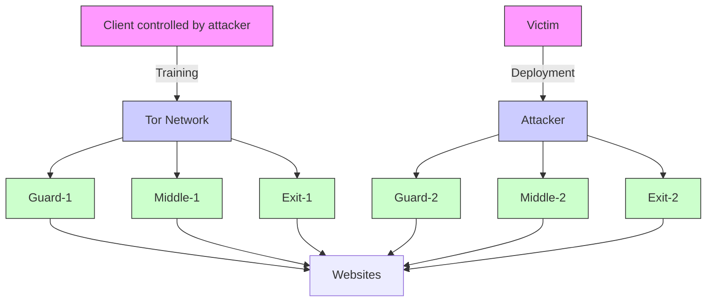
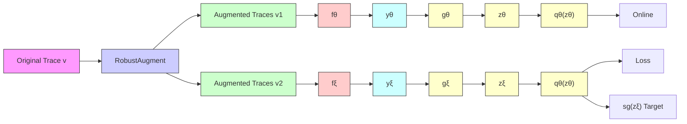

舟 Latest updates: hps://dl.acm.org/doi/10.1145/3719027.3744795

RESEARCH-ARTICLE

# Swallow: A Transfer-Robust Website Fingerprinting Aack via Consistent Feature Learning

MENG SHEN, Beijing Institute of Technology, Beijing, China

JINHE WU, Beijing Institute of Technology, Beijing, China

JUNYU AI, Beijing Institute of Technology, Beijing, China

QI LI, Tsinghua University, Beijing, China

CHENCHEN REN, Shandong University, Jinan, Shandong, China

KE XU, Tsinghua University, Beijing, China

View all

Open Access Support provided by:

Tsinghua University

Beijing Institute of Technology

Shandong University


PDF Download

3719027.3744795.pdf

25 February 2026

Total Citations: 0

Total Downloads: 1997


Published: 19 November 2025

Citation in BibTeX format

CCS '25: ACM SIGSAC Conference on

Computer and Communications Security

October 13 - 17, 2025

Taipei, Taiwan

Conference Sponsors:

SIGSAC

# Swallow: A Transfer-Robust Website Fingerprinting Attack via Consistent Feature Learning

Meng Shen

Beijing Institute of Technology

Beijing, China

shenmeng@bit.edu.cn

Qi Li

Tsinghua University

Beijing, China

qli01@tsinghua.edu.cn

Jinhe Wu

Beijing Institute of Technology

Beijing, China

jinhewu@bit.edu.cn

Chenchen Ren

Shandong University

Jinan, China

chenchenren@mail.sdu.edu.cn

Junyu Ai

Beijing Institute of Technology

Beijing, China

aijunyu@bit.edu.cn

Ke Xu

Tsinghua University

Beijing, China

xuke@tsinghua.edu.cn

Liehuang Zhu

Beijing Institute of Technology

Beijing, China

liehuangz@bit.edu.cn

# Abstract

Website fingerprinting (WF) attacks on Tor networks can analyze traffic patterns to identify the websites Tor users are visiting, and thus pose a significant threat to user privacy. In a real-world environment, Tor users face diverse network conditions and can also employ WF defenses, raising new challenges to launch WF attacks. The state-of-the-art (SOTA) WF attacks either rely on a strong assumption that WF classifiers are trained and deployed under the same network condition, or suffer from significant performance degradation against WF defenses. In this paper, we propose Swallow, a transfer-robust WF attack that can quickly transfer to new network conditions while maintaining robustness against various WF defenses. Specifically, we propose a novel trace representation named Consistent Interaction Feature (CIF), which aligns traffic distributions across different network conditions to capture consistent features. Then we design three data augmentation algorithms to simulate potential variations under various network conditions. We extensively evaluate Swallow using ten datasets, including both self-collected and public datasets. The closed- and open-world evaluation results demonstrate that Swallow significantly outperforms the SOTA attacks. In particular, with only 5 labeled instances per website for model fine-tuning, Swallow achieves an average improvement in accuracy of 17.50% over the SOTA WF attacks.

# CCS Concepts

• Networks → Network privacy and anonymity.

Permission to make digital or hard copies of all or part of this work for personal or classroom use is granted without fee provided that copies are not made or distributed for profit or commercial advantage and that copies bear this notice and the full citation on the first page. Copyrights for components of this work owned by others than the author(s) must be honored. Abstracting with credit is permitted. To copy otherwise, or republish, to post on servers or to redistribute to lists, requires prior specific permission and/or a fee. Request permissions from permissions@acm.org.

CCS ’25, Taipei

© 2025 Copyright held by the owner/author(s). Publication rights licensed to ACM.

ACM ISBN 979-8-4007-1525-9/2025/10

https://doi.org/10.1145/3719027.3744795

# Keywords

Tor; privacy; website fingerprinting; data augmentation

# ACM Reference Format:

Meng Shen, Jinhe Wu, Junyu Ai, Qi Li, Chenchen Ren, Ke Xu, and Liehuang Zhu. 2025. Swallow: A Transfer-Robust Website Fingerprinting Attack via Consistent Feature Learning. In Proceedings of the 2025 ACM SIGSAC Conference on Computer and Communications Security (CCS ’25),

October 13–17, 2025, Taipei. ACM, New York, NY, USA, 15 pages.

https: //doi.org/10.1145/3719027.3744795

# 1 Introduction

As an anonymous proxy tool, Tor has been increasingly adopted by users who seek to bypass censorship and safeguard their privacy [7]. Active daily users of Tor networks have exceeded 2 million by November 2024 [24]. Tor encrypts user traffic and routes it through a Tor circuit consisting of three relay nodes, effectively concealing the original source and making online activities difficult to trace. However, Tor has been shown to be vulnerable to various Website Fingerprinting (WF) attacks [26, 27, 31], where the attackers extract Tor traffic features (e.g., packet direction, length and timestamp) and leverage machine learning techniques to train a classifier, allowing accurate identification of the websites users are visiting.

Launching WF attacks in real-world scenarios remains a highly challenging task. The network conditions of the users are often assumed to be fixed [3, 15, 26, 27, 31], and the WF classifiers are trained and tested using datasets collected under the same conditions. In real world environment, however, Tor users face diverse network conditions (e.g., locations of guard relays, web browsers), which can lead to significant changes in Tor traffic patterns [36]. For instance, Tor users can connect through guard relays located in different regions, resulting in substantial variations in communication latencies [24]. When training and testing traces are collected under different network conditions, the accuracy o f WF a ttacks drops significantly [15]. To adapt to new network conditions, attackers often need to collect a large number of labeled traffic instances for retraining, which is quite time consuming [2, 32]. Tor users can also employ different WF defenses, such as W TF-PAD [16] and Front [8], to protect their traffic against WF attacks. These defenses can modify the original Tor traffic patterns by introducing dummy packets or delays, reducing the accuracy of WF classifiers [8, 16, 28].

Researchers have proposed various WF attacks that can be roughly classified into two categories: traditional attacks [3, 26, 27, 31] and transferable attacks [2, 32]. Traditional attacks assume that the training and testing conditions are the same. When applying under a different condition, they require a time-consuming data collection process for model retraining. Transferable attacks TF [32] and NetCLR [2] attempt to make the classifier transferable to new network conditions. They represent a Tor trace by a sequence of packet directions (e.g., +1 and −1 for incoming and outgoing packets, respectively). Since this representation is not robust against WF defenses [28], it suffers from a significant performance degradation against WF defenses. For example, their accuracy drops by more than 50% against Front (see Section 6.2). Therefore, practical WF attacks should be transfer-robust, meaning that they can achieve higher accuracy than existing WF attacks on defended traces across different network conditions.

In this paper, we propose Swallow1, a transfer-robust WF attack that can quickly transfer to new network conditions while demonstrating superior robustness against WF defenses compared to SOTA WF attacks. We observe that the packet distributions of defended traces vary under different network conditions. The basic idea of Swallow is to align the packet distributions under different network conditions to learn consistent features.

Swallow is composed of three key modules. First, we propose a consistent feature representation module to convert raw website traces into Consistent Interaction Feature (CIF), which aligns traffic distributions across different network conditions to capture consistent features. Second, we develop a robust data augmentation module to simulate unseen traffic distributions under various network conditions. Since it is difficult to enumerate all kinds of changes in network conditions, we resort to website loading time as an indicator to reflect v ariation i n t raffic dis tribution, which can be roughly classified in three scenarios: s table, shorter, and longer loading time. For each scenario, we design the corresponding data augmentation strategy, namely trace fluctuation, trace aggregation and trace flatten. Finally, we design a few-shot website identification module to adapt the model to new network conditions using only a few labeled traffic instances. Specifically, we use self-supervised learning to train the encoder to capture consistent features by minimizing the distance between the original trace representation and the corresponding augmented trace representations in the feature space. This training process does not rely on labeled traffic instances. The trained encoder can then be fine-tuned for a new network condition using only a few labeled instances.

We collect eight datasets under different conditions and conduct extensive experiments with these datasets and two public datasets, i.e., Wang100 [35] and DF95 [31]. We compare the performance of six SOTA WF attacks i.e., DF [31], Tik-Tok [26], Var-CNN [3], RF [27], TF [32] and NetCLR [2] against seven different WF defenses i.e., WTF-PAD [16], Front [8], Surakav [9], RegulaTor [13] , Palette [28], Tamaraw [4] and TrafficSilver [6]. The results show that Swallow achieves the best attack performance in all scenarios. In particular, when fine-tuned with 5 labeled instances per website, Swallow achieves an average improvement in accuracy of 17.50% over the SOTA WF attacks.

We summarize our contributions as follows:

• We propose Swallow, a transfer-robust WF attack that can quickly transfer to new network conditions while demonstrating superior robustness against WF defenses compared to SOTA WF attacks. Specifically, we propose a novel trace representation named Consistent Interaction Feature (CIF) and design three data augmentation algorithms that are tailored to variation in traffic distributions.   
• We collect eight datasets under different conditions (e.g., locations of guard relays, web browsers, and collection times), including seven closed-world datasets and one open-world dataset. The closed-world datasets consist of 100 websites, while the open-world dataset comprises 4,000 websites.   
• We evaluate Swallow in both closed-world and open-world scenarios using our collected datasets as well as public datasets. The results demonstrate that Swallow significantly outperforms existing WF attacks in all scenarios. We release the dataset and source code of Swallow2.

The remainder of the paper is organized as follows. We first introduce the related work in Section 2 and the threat model in Section 3. We present high-level design of Swallow in Section 4 and the design details in Section 5. Next, we conduct a comprehensive evaluation on the performance of Swallow in Section 6. We discuss relevant issues in Section 7 and conclude this paper in Section 8.

# 2 Related Work

# 2.1 WF Attacks

Existing WF attacks can be roughly classified into two categories: traditional attacks and transferable attacks.

Traditional WF attacks. Recent studies [3, 26, 27, 29, 31] use a simple representation of raw traffic traces (e.g., packet direction sequence) as input and then leverage deep neural networks (DNNs) to automatically extract traffic characteristics to avoid sophisticated feature engineering in WF attacks. These attacks are based on traditional supervised learning, assuming that the training and test datasets are collected under the same network conditions. However, when attacks are launched under a new network condition, they usually require time-consuming collection of a large number of well-labeled traffic traces to retrain the classifier.

Here, we review four typical attacks in this category. DF [31] uses the packet direction sequence as traffic representation and leverages Convolutional Neural Networks (CNNs) to build a classifier. Tik-Tok [26] further improves the attack accuracy of DF by using a different traffic representation that combines packet timing and direction information. Var-CNN [3] uses a ResNet18 model to process packet direction and timing information separately and trains an ensemble of website fingerprinting classifiers to enhance attack performance. RF [27] proposes a trace representation named

Traffic Aggregation Matrix (TAM) that to improve robustness of WF attacks against existing defenses.

Transferable attacks. These attacks employ metric learning [32] or contrastive learning [11, 17] to fine-tune a well-trained classifier with a few traffic traces collected in a new network condition. During the pre-training phase, they aim to create a feature space where traffic traces from the same website are closely grouped, while those from different websites are clearly separated. In the fine-tuning phase, they further generalize to diverse network conditions by refining the feature space with only a few labeled traffic instances.

Here, we review two representative attacks in this category. TF [32] is composed of two parts, i.e., the feature extraction network based on CNN and k-NN classifier. It can achieve transferring tasks from one dataset to another using a few instances. NetCLR [2] is a contrastive learning-based WF attack that uses packet direction sequences as trace representation. It can adapt to new network conditions with only a few labeled traffic instances.

# 2.2 WF Defenses

To defend against WF attacks, recent studies have proposed various WF defenses, which can be roughly divided into three categories: obfuscation, regularization and splitting [28].

The basic idea of obfuscation defense is to randomize the sending of packets, ensuring that the traffic patterns for each visit to the same website are as different as possible. This category includes defenses such as WTF-PAD [16] and Front [8]. Regularization defense aims to regulate the traffic of all websites in a predefined pattern, ensuring that the traffic patterns of different websites are as similar as possible. This category includes four typical defenses: Tamaraw [4], Surakav [9], RegulaTor [13], and Palette [28]. Splitting defense is designed to split traffic and destroy the original features of websites without introducing time or bandwidth overhead. TrafficSliver is a representative splitting defense, which splits traffic over several Tor circuits in a highly random manner and merges it to the guard. It employs two strategies: BD and BWR. BD uses separate circuits for the incoming and outgoing packets, while BWR, the optimal strategy [6], weighs the selection of guard nodes to send Tor packets.

# 3 Threat Model

The threat model for transfer-robust WF attacks is illustrated in Figure 1. Tor relay nodes are geographically distributed throughout the world. To visit websites anonymously, a Tor client picks a Guard Relay and constructs a Tor circuit consisting of three Relay nodes to deliver traffic to the corresponding web servers. WF attack is usually considered a traffic classification problem. Previous studies [3, 26, 27, 31] assume that a WF attacker can train a classifier under the same conditions as the victim. Unlike them, we consider a more realistic scenario, where the WF attacker aims to apply a classifier trained under a certain network condition on a victim under a different network condition. Similar to previous WF attacks [3, 26, 27, 31], we consider a local and passive attacker, who can only collect traffic exchanged between victim and Tor guard relays but lacks the capability to modify or decrypt packets. The adversary may be the administrator of the user’s local networks, Internet Service Providers (ISPs), or Autonomous System (AS).


<details>
<summary>flowchart</summary>


</details>

Figure 1: The threat model of transfer-robust WF attacks.

More specifically, the WF attacker extracts features from the collected traces of websites and trains a classifier offline. When launching WF attacks on victims with different conditions, the attacker collects a small number of traffic traces between the victim and its Guard Relay node in Tor network to fine-tune the trained classifier for identifying the website the victim is visiting. To mitigate WF attacks, the victim can deploy a WF defense to protect their connection privacy. Following prior work [2, 3, 26, 31, 32], we assume that the attacker has prior knowledge of the specific defense deployed by the user. Since all defenses are publicly available in Tor, it is challenging for users to deploy private defenses [28]. Thus, the attacker can collect traces generated under a specific defense and perform adversarial training to improve the accuracy of classifier against the corresponding defense.

Closed- and Open-World Scenarios. These scenarios are widely used to assess the effectiveness of WF attacks and defenses. In a closed-world scenario, the client is assumed to visit a limited set of websites referred to as monitored websites. The adversary has access to instances from this set to train a classifier aimed at distinguishing between these websites. In contrast, the open-world scenario, which is more representative of real-world conditions, involves the client visiting both monitored websites and a significantly larger number of unmonitored websites. The attacker, having access to only a subset of the unmonitored websites for training, attempts to determine if the client is visiting any monitored websites, and if so, identifies the specific website.

# 4 Design of Swallow

In this section, we present the key observation for our design and introduce the overview of Swallow.

# 4.1 Key Observation on Tor Traffic Distributions

When a Tor user visits the websites through Tor networks, the resulting Tor traffic contains a sequence of outgoing and incoming packets. Tor traffic distribution roughly means the number of packets transmitted over time during the website loading process. Intuitively, the traffic distribution derived from visiting the same website may vary under different network conditions (e.g., via different Tor guard relays). WF defenses also have an impact on traffic distribution by introducing dummy packets or packet delay [8, 28].

To explore how the traffic distributions of the defended traces change under different network conditions, we collect undefended traffic under various network conditions and simulate the corresponding defended traces with a specific WF defense. Here, we select a representative obfuscation defense Front [8] and a representative regularization defense Palette [28]. We assume a client in Los Angeles and select guard relays located in different cities to visit the same set of websites (see Section 6.1 for more details on the collection of datasets). We randomly select defended traces that visit the same website from two guard relay locations (i.e., Chicago and Singapore) and visualize their distributions as shown in Figure 2. We observe that the website loading time through the guard relay located in Chicago is shorter than that in Singapore, which holds for defended traces with both Front and Palette.


<details>
<summary>scatter</summary>

| City      | Time (s) | Color |
| --------- | -------- | ----- |
| Chicago   | 0-25     | Red   |
| Chicago   | 0-25     | Blue  |
| Chicago   | 25-25    | Red   |
| Singapore | 0-25     | Red   |
| Singapore | 0-25     | Blue  |
| Singapore | 25-25    | Red   |
| Singapore | 25-25    | Blue  |
</details>

(a) Defended Traces with Front


<details>
<summary>bar</summary>

| Time (s) | Chicago | Singapore |
| -------- | ------- | --------- |
| 0        | Low     | Low       |
| 5        | Low     | Low       |
| 10       | Low     | High      |
| 15       | Low     | Medium    |
| 20       | Low     | Low       |
| 25       | Low     | Low       |
</details>

(b) Defended Traces with Palette

Figure 2: Visualization of the distribution of defended traces derived from visiting the same website via two different guard relays located in Chicago and Singapore, respectively. For ease of illustration, the outgoing (•) and incoming (•) packets are plotted along Y-axis.   


<details>
<summary>line</summary>

| Label Index | Time (s) - Solid Line | Time (s) - Dashed Line |
| ----------- | --------------------- | ---------------------- |
| 0           | ~10                   | ~10                    |
| 20          | ~15                   | ~12                    |
| 40          | ~20                   | ~15                    |
| 60          | ~25                   | ~18                    |
| 80          | ~30                   | ~20                    |
| 100         | ~55                   | ~25                    |
</details>

(a) Defended traces with Front


<details>
<summary>line</summary>

| Label Index | Time (s) - Solid Line | Time (s) - Dashed Line |
| ----------- | --------------------- | ---------------------- |
| 0           | ~10                   | ~10                    |
| 20          | ~15                   | ~12                    |
| 40          | ~20                   | ~15                    |
| 60          | ~25                   | ~18                    |
| 80          | ~30                   | ~20                    |
| 100         | ~55                   | ~35                    |
</details>

(b) Defended traces with Palette   
Figure 3: The average packet number and loading time of the website traces.

To verify that a similar pattern exists in the defended traces for all 100 websites, we plot the average number of packets and the loading time for each website, as shown in Figure 3. In all subfigures, the website indices are ranked in ascending order according to their loading time measured in Singapore. We can observe that for the same WF defense, the average number of packets in the defended traces from two different locations is nearly the same, but the loading time shows significant differences. The loading time in Chicago is much shorter than in Singapore, which is consistent with the results in Figure 2. This is because the client is closer to Chicago, resulting in lower round-trip latency. We use Ping to measure the communication latency for LA-Chicago and LA-Singapore, which are 52.9 and 182.6 ms, respectively.


<details>
<summary>other</summary>

| Time Interval | Outgoing Packet | Incoming Packet |
| ------------- | --------------- | --------------- |
| Shorter Loading Time | 1 | 1 |
| Smaller Time Interval | 2 | 1 |
| Shorter Loading Time | 0 | 0 |
| Smaller Time Interval | 1 | 0 |
| Shorter Loading Time | 1 | 1 |
| Smaller Time Interval | 2 | 1 |
| Shorter Loading Time | 0 | 0 |
| Longer Loading Time | 1 | 1 |
| Longer Loading Time | 2 | 1 |
| Longer Loading Time | 0 | 0 |
| Longer Loading Time | 1 | 1 |
| Longer Loading Time | 2 | 1 |
| Longer Loading Time | 0 | 0 |
</details>

Figure 4: An illustration of traffic distribution alignment by flexibly adjusting the length of time interval ?? based on the loading time.

The above analysis indicates that the traffic distribution of the defended traces varies among different guard relays. Thus, the direction sequence of the packets used by the WF attacks TF [32] and NetCLR [2] experiences significant changes, making it difficult to achieve transferability when WF defenses are adopted. Intuitively, to achieve transferability for WF attacks, we can align traffic distributions to capture consistent traffic features that are robust under different network conditions. More specifically, if we count the number of outgoing and incoming packets transmitted in each time interval, we can flexibly adjust the length of time interval based on the loading time of traces to align different traffic distributions. As illustrated in Figure 4, the traffic distribution with a longer loading time is set with a larger time interval to align with the distribution with a shorter loading time. This motivates us to design a transfer-robust WF attack by learning consistent traffic features under different network conditions.

# 4.2 Overview of Swallow

In this subsection, we introduce Swallow. We design a novel trace representation called Consistent Interaction Feature (CIF) based on above observation. CIF aligns traffic distributions across different network conditions to capture consistent features. Then we propose data augmentation methods based on CIF to simulate traffic traces under various network conditions. Swallow leverages selfsupervised learning to pre-train an encoder on unlabeled traffic instances, which can be fine-tuned with a few labeled samples to quickly adapt to new network conditions. Swallow consists of three modules, including Consistent Feature Representation, Robust Data augmentation, and Few-Shot Website Identification.

Consistent Feature Representation. The consistent feature representation module transforms raw traffic traces into a Consistent Interaction Feature (CIF). Based on the above observation, CIF divides the entire traffic traces into small time intervals, counting the number of outgoing and incoming packets per time interval. CIF dynamically adjusts the size of the time intervals based on the network condition of the website to align the Tor traffic distribution. The design details of this module are presented in Section 5.1.

Robust Data Augmentation. This module is designed based on our robust trace representation, CIF, which can effectively simulate the variations of defended traces under different network conditions. We design three data augmentation algorithms, each simulating a fundamental type of network scenario: minor network fluctuation, low-latency, and high-latency environments. These three scenarios correspond to three variations in website loading time: stable, shorter, and longer loading time. This module helps attackers improve the diversity of training data, thereby reducing the reliance on large amounts of labeled traffic instances. We will present the details in Section 5.2.


<details>
<summary>flowchart</summary>

```mermaid
graph TD
    A["1 Consistent Feature Representation"] --> B["2 Robust Data Augmentation"]
    B --> C["3 Few-Shot Website Identification"]

    subgraph_A["Consistent Feature Representation"]
        A1["Website Traces"] --> A2["Feature Extraction"]
        A2 --> A3["Align traffic distribution with flexible time interval size s"]
        A3 --> A4["Consistent Interaction Feature"]

    end

    subgraph_B["2 Robust Data Augmentation"]
        B1["a. Trace Fluctuation (Stable Loading Time)"] --> B2["Pkt.Number → Adjust packet counts in specific time intervals"]
        B2 --> B3["b. Trace Aggregation (Shorter Loading Time)"]
        B3 --> B4["Pkt.Number → Aggregate packets into less time intervals"]
        B4 --> B5["c. Trace Flatten (Longer Loading Time)"]
        B5 --> B6["Pkt.Number → Spread packets into more time intervals"]
    end

    subgraph_C["3 Few-Shot Website Identification"]
        C1["1. Training Phase"] --> C2["Pre-Training Encoder"]
        C2 --> C3["Embedding Space"]
        C3 --> C4["2. Testing Phase"]
        C4 --> C5["Pre-Trained Encoder"]
        C5 --> C6["Linear Classifier"]
        C6 --> C7["Predict"]
    end

    style A fill:#f9f,stroke:#333
    style B fill:#ccf,stroke:#333
    style C fill:#cfc,stroke:#333
```
</details>

Figure 5: The overview of Swallow.

Few-Shot Website Identification. The few-shot website identification module leverages self-supervised learning to capture consistent features across diverse network conditions by ensuring the similarity between an original trace representation and its corresponding augmented trace representations. With these consistent features, the model achieves high attack accuracy in new network conditions, requiring only a few labeled traffic instances for finetuning. We will present the details in Section 5.3.

# 5 Design Details

In this section, we present the design details of Swallow, including the consistent feature representation module, the robust data augmentation module, and the few-shot website identification module.

# 5.1 Consistent Feature Representation

The consistent feature representation module transforms raw traffic traces into a CIF. We design this module based on a key observation that the packet distribution over time varies across network conditions, with shorter website loading times corresponding to denser packet distributions. For example, in low-latency network conditions, the website loading time is shorter, with higher peak packet counts in certain time intervals. This observation inspires us to divide the entire trace into smaller time intervals and count the number of outgoing and incoming packets in each interval. To align feature distributions across different network conditions, we propose CIF, which dynamically adjusts the time interval size

based on the loading time of the traffic trace. Specifically, longer loading times, which typically indicate higher latency, trigger CIF to enlarge the time interval. This ensures that delayed packets are still captured within the current time interval.

We divide the entire trace into several small time intervals and dynamically adjust their sizes based on the website’s loading time. To adapt to the model’s input, the number of time intervals is fixed to ?? . The size of each time interval is defined as $\begin{array} { r } { s = \left\lceil \alpha \times \frac { T } { N } \right\rceil } \end{array}$ . We introduce an adjustment factor ?? to ensure that the time interval size remains within a reasonable range. A reasonable time interval size is crucial because an excessively large interval reduces the amount of information that CIF can extract from the original traces, whereas an excessively small interval results in fewer packets within the window, making it more susceptible to network fluctuations. As shown in Figure 3, we perform a statistical analysis of the website loading times in our collected dataset. We observe that over 60% of the traces have a loading time of less than 20 seconds. We define both lower bound ?? and upper bound $\mathbf { \nabla } \mu$ bounds for the time interval size to prevent issues caused by excessively long or short website loading times.

The calculation process of CIF is shown in Algorithm 1. A visit to a certain website results in a traffic trace, which is denoted by ?? = $( f _ { 1 } , f _ { 2 } , \ldots , f _ { l } )$ , where ?? is the length of the trace. Let $f _ { k } = \langle t _ { k } , d _ { k } \rangle$ be a tuple consisting of the packet timestamp and direction, where $t _ { k }$ and $d _ { k }$ are the arrival time and direction of the ??-th packet, respectively. Note that $d _ { k }$ is 1 for an outgoing packet and −1 for an incoming packet. Let ?? $\in \mathbb { R } ^ { 2 \times N }$ denote the CIF of the trace $F ,$ where ?? is the number of time intervals considered in CIF. Assume that the size of each time interval is denoted by ??, the loading time for a trace is ?? , and ?? can be calculated using $\begin{array} { r } { { \bf \rho } _ { S } = \left\lceil \alpha \times \frac { T } { N } \right\rceil } \end{array}$ (line 3). An element $m _ { i j } \in M$ represents the number of incoming (?? = 1) or outgoing (?? = 2) packets whose timestamps are between ( ?? − 1) × ?? and $j \times s$ (line 6-9). The final returned M is considered as CIF. We evaluate the robustness of CIF in Section 6.4.

Algorithm 1: Calculation of CIF   
Input: A traffic trace F, the trace loading time T, the number of columns of CIF N, the adjustment factor $\alpha$ , the lower / upper bound of time interval size $\lambda,\mu$ Output: CIF $M = \{m_{ij} | i \in \{1,2\}, j \in [1,N]\}$ 1 Initialize the size of time interval s as 0;
2 Initialize the size of CIF M as $2 \times N$ ;
3 $s \leftarrow \alpha \times \frac{T}{N}$ ;
4 $s \leftarrow \max(\lambda, \min(s,\mu))$ ;
5 for each packet $f_k = \langle t_k, d_k \rangle \in F$ do
6 $j \leftarrow \left\lfloor \frac{t_k}{s} \right\rfloor$ ;
7    if $j \leq N$ then
8 $i \leftarrow \begin{cases} 1 & \text{if } d_k < 0 \\ 2 & \text{otherwise} \end{cases}$ ;
9 $m_{ij} \leftarrow m_{ij} + 1;$ 10    end
11 end
12 return M;

# 5.2 Robust Data Augmentation

The robust data augmentation module employs three augmentation algorithms to generate simulated traffic trace based on original traffic. Although CIF can effectively handle distribution differences in various network conditions, real-world traffic traces often contain small changes and anomalies that feature alignment may not fully capture. Data augmentation introduces additional variability, helping the model perform better when dealing with these subtle changes in the real world.

We propose robust data augmentation strategies to simulate variations in defended traces under different network conditions. These strategies are built upon CIF, which remains robust across diverse network conditions and defenses. Our approach addresses the limitations of existing methods. In computer vision, various data augmentation techniques [30], such as flipping, rotating, scaling, and cropping, have been widely adopted for images. However, these techniques are not directly applicable to traffic traces, as they fail to capture the unique variations introduced by different network conditions. The SOTA WF attack NetCLR [2] introduces NetAugment, which leverages packet direction sequences as the trace representation and converts them into bursts for data augmentation. The direction sequence is easily obfuscated by WF defenses [18], which makes NetAugment ineffective in simulating the variations of defended traces across different network conditions (see Section 6.4).

Specifically, we propose RobustAugment, which consists of three algorithms: trace fluctuation, trace aggregation, and trace flatten. Each algorithm simulates a fundamental type of network variation: minor network fluctuations, low-latency and high-latency environments. These three scenarios correspond to three variations in website loading time: stable, shorter, and longer loading time. The implementation details of the RobustAugment algorithm are shown in Algorithm 2. Following previous work [2], we do not modify

Algorithm 2: RobustAugment Algorithm   
Input: Consistent Interaction Feature CIF, time interval size s, website loading time t
Output: Augmented Consistent Interaction Feature $CIF_{aug}$ 1 Initialize an augment strategies list $L = \{Trace\ Fluctuation, Trace\ Aggregation, Trace\ Flatten\}$ ;
2 Select a random strategy F from L;
3 $CIF_{aug} = F(CIF, s, t)$ ;
4 return $CIF_{aug}$ ;


<details>
<summary>line</summary>

| Time Interval | Pkt. Number |
| ------------- | ----------- |
| 0             | 0           |
| 50            | 0           |
| 100           | ~100        |
| 150           | ~100        |
| 200           | ~100        |
| 250           | 0           |
</details>


<details>
<summary>line</summary>

| Time Interval | Pkt. Number |
| ------------- | ----------- |
| 0             | 0           |
| 50            | 0           |
| 100           | 0           |
| 150           | 0           |
| 200           | 0           |
| 250           | 0           |
</details>

Figure 6: CIF patterns when browsing the same website under the same network condition twice.

the first 20 packets of each trace, as these packets are used for the initialization of the connection and the handshake, which remain consistent on different websites.

Trace Fluctuation. Even within the same network condition, multiple visits to the same website may exhibit different traffic patterns. This variation can result from minor network fluctuations during each visit or changes in the website’s content. Figure 6 shows the CIF patterns when browsing the same website under the same network setting twice. It is evident that there are slight differences in the CIF traffic patterns between two visits. Specifically, one visit has a larger packet number in each time interval, while the other has a smaller packet number. To simulate this variation, we randomly modify the time interval value to generate augmented trace representation.

The trace fluctuation algorithm dynamically adjusts time interval values based on specific probabilistic parameters. If the time interval value is empty, the algorithm probabilistically replaces it with the average of neighboring intervals using a defined window size $W _ { m o d i f y }$ with probability $r _ { p a d d i n g } . $ For non-zero time intervals, we randomly choose to either increase or decrease the time interval value. The modification process is controlled by the parameter $r _ { m o d i f y } .$ The implementation detail of the trace fluctuation algorithm is shown in Algorithms 3 in the Appendix.

Trace Aggregation. As mentioned in Section 4.1, the packet rate is faster in low-latency network conditions. Compared to highlatency conditions, the time interval value tends to be larger, and the website loading time is shorter. To simulate this variation, we aggregate packets into certain time intervals and remove others. Specifically, for each time interval, we remove it with a probability of ?????????????? to simulate shorter website loading times. We increase the time interval value with a probability of $r _ { i n c r e a s e }$ for the time intervals that are retained. The implementation detail of the trace aggregation algorithm is shown in Algorithm 4 in the Appendix.


<details>
<summary>flowchart</summary>


</details>

Figure 7: The pre-training phase of Swallow, which is based on a self-supervised learning framework BYOL [11].

Trace Flatten. In high-latency network conditions, the network becomes more congested, resulting in a lower packet transmission rate. This corresponds to a decrease in the time interval value, while the website loading time becomes longer. To simulate this variation, we flatten the entire trace and distribute packets across more time intervals. We use ?????????????? to control whether a time interval should be inserted. If so, a new time interval is inserted by averaging the surrounding values within a defined window $W _ { i n s e r t } .$ . Additionally, we decrease the time interval value with a probability of $r _ { d e c r e a s e } .$ The implementation detail of the trace flatten algorithm is shown in Algorithm 5 in the Appendix.

In summary, the above data augmentation simulates three scenarios that represent fundamental traffic variations: (1) minor fluctuations commonly observed in stable networks, (2) high-density traffic under low-latency conditions, and (3) dispersed traffic under high-latency conditions. They provide comprehensive coverage of typical network conditions.

# 5.3 Few-Shot Website Identification

To learn consistent features of network traffic and reduce reliance on a large number of labeled traffic samples, the few-shot website identification module leverages self-supervised learning to train an encoder that captures the similarity between the original trace representation and the augmented trace representation. Through this process, the encoder learns the consistent feature of traces under different network conditions, enabling attackers to achieve high attack accuracy in new network conditions with only a few labeled traffic instances for fine-tuning.

Swallow is based on a novel self-supervised learning framework BYOL [11], which reduces the distance between positive pairs and applies the skillfully-designed momentum mechanism to prevent the hidden space from collapsing without negative pairs. BYOL uses two neural networks to learn: the online and target networks. The online network is defined by a set of weights ?? and is comprised of three stages: an encoder $f _ { \theta } ,$ , a projector $g _ { \boldsymbol { \theta } }$ and a predictor $q _ { \theta }$ . The target network has the same architecture as the online network but uses a different set of weights ??. The target network supplies the regression targets necessary for training the online network. Its parameters, denoted by $\xi ,$ are maintained as an exponential moving average of the online network’s parameters ??. Swallow consists of two stages: the pre-training phase and the fine-tuning phase.

Pre-Training Phase. The process of how the attackers train the pre-training encoder is shown in Figure 7. In the pre-training phase, we train an encoder to transform trace representation into low-dimensional embedding features. Specifically, two different augmented traces $v _ { 1 }$ and $v _ { 2 }$ are needed as the inputs of the online and target networks during the training phase. From the first augmented trace $v _ { 1 }$ , the online network outputs embedding features $y _ { \theta } \triangleq f _ { \theta } ( v _ { 1 } )$ and a projection head $z _ { \theta } \triangleq g _ { \theta } ( y _ { \theta } )$ . The target network outputs $y _ { \xi } \triangleq f _ { \xi } ( v _ { 2 } )$ and the target projection head $z _ { \xi } \triangleq g _ { \xi } ( y _ { \xi } )$ from the second augmented trace $v _ { 2 } .$ . We then output a prediction $q _ { \theta } ( z _ { \theta } )$ of $z _ { \xi }$ and $\ell _ { 2 }$ -normalize both $z _ { \theta }$ and $z _ { \xi }$ to $\bar { z } _ { \theta } \triangleq q _ { \theta } ( z _ { \theta } ) / \Vert q _ { \theta } ( z _ { \theta } ) \Vert _ { 2 }$ and $\bar { z } _ { \xi } \triangleq z _ { \xi } / \| z _ { \xi } \| _ { 2 }$ . Finally, we define the following mean squared error between the normalized predictions and target projections.

$$
\mathcal {L} _ {\theta , \xi} \triangleq \left\| \bar {q} _ {\theta} (z _ {\theta}) - \bar {z} _ {\xi} \right\| _ {2} ^ {2} = 2 - 2 \cdot \frac {\langle q _ {\theta} (z _ {\theta}) , z _ {\xi} \rangle}{\| q _ {\theta} (z _ {\theta}) \| _ {2} \cdot \| z _ {\xi} \| _ {2}}. \tag {1}
$$

We symmetrize the loss $\mathcal { L } _ { \boldsymbol { \theta } , \boldsymbol { \xi } }$ in Eq. 1 by separately feeding $v _ { 2 }$ to the online network and $v _ { 1 }$ to the target network to compute $\tilde { \mathcal { L } } _ { \boldsymbol { \theta } , \boldsymbol { \xi } } .$ At each training step, we perform a stochastic optimization step to minimize $\mathcal { L } _ { \theta , \xi } ^ { \mathrm { S w a l l o w } } = \mathcal { L } _ { \theta , \xi } + \tilde { \mathcal { L } } _ { \theta , \xi }$ with respect to ?? only, but not ??. After the training, we use the encoder $f _ { \theta }$ to transform the trace representations into low-dimensional embedding features.

Fine-Tuning Phase. In the fine-tuning phase, the attackers use ?? labeled traffic traces to fine-tune the pre-trained encoder. We replace the projection head with a fully connected layer to output the probability for each class. Following prior work [2, 11], in the fine-tuning phase, we use the labeled dataset to fine-tune both the encoder and the fully connected layer.

Testing Phase. In the testing phase, the unknown traffic traces collected by the attacker are fed into the encoder to obtain lowdimensional embedding features. Then the trained fully connected layer predicts the labels of the unknown traffic traces.

# 6 Evaluation

In this section, we evaluate the performance of Swallow with public datasets and real-world datasets. We first describe the experimental settings in Section 6.1. Then we make a comprehensive comparison of Swallow with the SOTA attacks in both closed- and open-world scenarios in Sections 6.2 and 6.3, respectively. Finally, we conduct an ablation study on Swallow in Section 6.4.

# 6.1 Experimental Setup

Datasets. Considering that there are no public and comprehensive Tor datasets collected under different conditions (e.g., locations of guard relays, web browsers, and collection time), we construct our own datasets using six cloud servers on Vultr [1], as shown in Table 2. Five of these servers are used as our private bridges (i.e., the guard relays), which are located in Chicago, Singapore, London, Johannesburg, and Mumbai. The rest server located in Los Angeles is used as the Tor client to visit websites via Tor browser (TBB version 10.5.10) or Chrome (version 112.0.5615.28).

Table 1: Accuracy of WF attacks against defenses with 5 labeled traffic instances (Different Guard Relay Locations). 

<table><tr><td rowspan="2">WF Attacks</td><td colspan="9">Accuracy (%)</td></tr><tr><td>Undefended</td><td>WTF-PAD [16]</td><td>Front [8]</td><td>Surakav [4]</td><td>RegulaTor [13]</td><td>Palette [28]</td><td>Tamaraw [4]</td><td>UniDef $^{1}$ </td><td>TrafficSliver [6]</td></tr><tr><td>DF [31]</td><td>42.87</td><td>27.77</td><td>9.06</td><td>8.21</td><td>3.45</td><td>4.06</td><td>7.68</td><td>1.53</td><td>9.34</td></tr><tr><td>Tik-Tok [26]</td><td>56.61</td><td>51.35</td><td>16.23</td><td>20.76</td><td>3.38</td><td>3.45</td><td>5.74</td><td>2.09</td><td>12.43</td></tr><tr><td>Var-CNN [3]</td><td>49.40</td><td>13.77</td><td>4.57</td><td>20.68</td><td>1.49</td><td>2.23</td><td>1.57</td><td>1.47</td><td>4.21</td></tr><tr><td>RF [27]</td><td>69.21</td><td>54.93</td><td>47.57</td><td>14.04</td><td>29.72</td><td>5.27</td><td>3.91</td><td>3.62</td><td>35.72</td></tr><tr><td>TF [32]</td><td>86.23</td><td>73.97</td><td>28.99</td><td>29.54</td><td>1.88</td><td>2.24</td><td>8.20</td><td>1.32</td><td>15.18</td></tr><tr><td>NetCLR [2]</td><td>87.21</td><td>74.18</td><td>18.40</td><td>19.92</td><td>1.90</td><td>2.34</td><td>7.21</td><td>1.94</td><td>9.24</td></tr><tr><td>Swallow</td><td>87.42</td><td>81.40</td><td>62.41</td><td>46.61</td><td>33.60</td><td>10.19</td><td>8.53</td><td>3.91</td><td>45.52</td></tr></table>

1 UniDef is a self-constructed defense where the distribution of Tor traffic for all websites is made uniform.

Table 2: Summary of Collected Datasets. 

<table><tr><td>Dataset ID</td><td>Location</td><td>Browser</td><td>Time</td><td>Size</td></tr><tr><td> $D_1$ </td><td>Chicago</td><td>TBB</td><td>2024-7</td><td>100 × 100</td></tr><tr><td> $D_2$ </td><td>Singapore</td><td>TBB</td><td>2024-7</td><td>100 × 100</td></tr><tr><td> $D_3$ </td><td>London</td><td>TBB</td><td>2024-7</td><td>100 × 100</td></tr><tr><td> $D_4$ </td><td>Johannesburg</td><td>TBB</td><td>2024-7</td><td>100 × 100</td></tr><tr><td> $D_5$ </td><td>Mumbai</td><td>TBB</td><td>2024-7</td><td>100 × 100</td></tr><tr><td> $D_6$ </td><td>Chicago</td><td>TBB</td><td>2024-10</td><td>100 × 100</td></tr><tr><td> $D_7$ </td><td>Chicago</td><td>Chrome</td><td>2024-7</td><td>100 × 100</td></tr><tr><td> $D_8$ </td><td>Chicago</td><td>TBB</td><td>2024-7</td><td>4000 × 1</td></tr></table>

We collect datasets in both closed- and open-world settings. Following previous studies [9, 28], the websites are selected from the Tranco [23] list, which combines five established rankings (i.e., Umbrella, Majestic, Farsight, CrUX, and Radar) while excluding undesirable domains, such as those that are unavailable or malicious. We select the first 100 websites on the list (i.e., the most popular websites) as the monitored sites, and each monitored website has at least 100 instances. We also randomly select 4,000 websites as unmonitored sites, where each site has only one instance.

In addition, we also use public datasets provided in recent studies to evaluate the performance of WF attacks.

Wang dataset [35]. The dataset includes both closed- and openworld websites. Closed-world websites are selected from lists of blocked sites in some countries, and open-world websites are chosen from the Alexa Top Sites. The dataset was collected in 2013 using TBB version 3.X.

• Wang100. The set of 100 closed-world websites, where each website has 90 traffic instances.   
• Wang9000. The set of 9,000 open-world websites, where each website has 1 traffic instance.

DF dataset [31]. The dataset was collected in 2016 using TBB version 6.X, including websites in both closed- and open-world settings. All websites were chosen from the Alexa Top Sites.

• DF95. The set of 95 closed-world websites, where each website has 1,000 traffic instances.

• DF40000. The set of 40,000 open-world websites, where each website has 1 traffic instance.

Ethical Considerations. All guard relays used in our data collection are kept private and we do not accept requests from real Tor users. We limit the number of clients in parallel (8 in our setup) to reduce the burden on both the Tor network and the Web servers. Furthermore, we retain only the packet timestamps and directions, which are essential for our experiments, and we do not collect any additional information.

WF attacks. To make a comprehensive comparison, we select six SOTA WF attacks, namely DF [31], Tik-Tok [26], Var-CNN [3], RF [27], TF [32] and NetCLR [2]. They are all built with the source codes released by their authors. All WF attacks are trained and tested on a server equipped with an Intel Core i7 3.4 GHz, 32GB of memory, and a GeForce RTX 3080. To ensure a fair comparison, we perform parameter tuning of these attacks to achieve similar or better performance as reported in their original papers.

WF defenses. We select seven typical WF defenses, including WTF-PAD [16], Front [8], Surakav [9], RegulaTor [13], Palette [28], Tamaraw [4] and TrafficSliver [6]. We simulate each defense in the undefended dataset to create defended datasets for closed- and open-world evaluation.

# 6.2 Closed-World Evaluation

In this subsection, we evaluate the performance of attacks against WF defenses in four typical scenarios where training and testing of WF attacks are conducted under different conditions. Following the assumption of closed-world evaluation, the clients can only visit the set of monitored websites.

Scenario #1: Different Locations of Guard Relays. As mentioned in Section 4.1, the traffic patterns generated by visiting websites using different guard relays exhibit significant differences. For transferable WF attacks (e.g., TF [32], NetCLR [2] and Swallow), we pre-train the classifier on the original dataset $D _ { 1 }$ (located in Chicago), and fine-tune the classifier with the target datasets $D _ { 2 }$ , $D _ { 3 } , D _ { 4 } , \mathrm { o r } D _ { 5 } ,$ , respectively. During fine-tuning, we randomly select ?? traffic instances $( \mathrm { i . e . , } N = \{ 5 , 1 0 , 1 5 , 2 0 \} )$ of each website from the corresponding dataset, while the remaining instances are used for testing. For traditional WF attacks (e.g., DF [31], Tik-Tok [26], VarCNN [3], RF [27]), we directly train the classifier with the ?? traffic instances of each website from the target dataset $D _ { 2 } , D _ { 3 } , D _ { 4 } ,$ or $D _ { 5 }$ and test with the remaining instances, which is the same as in previous studies [2, 32]. To eliminate the impact of sample selection on performance, we repeat each experiment five times and obtain the average accuracy of each WF attack. In addition, we construct an ideal defense where the distribution of Tor traffic for all websites is made uniform, named UniDef. UniDef obfuscates the number of packets for all websites within each time interval to achieve a uniform distribution. However, it incurs over 200% bandwidth overhead and 40% time overhead.

Table 3: Accuracy of WF attacks against defenses with various labeled traffic instances (Concept Shift). 

<table><tr><td rowspan="2">N</td><td rowspan="2">WF Attacks</td><td colspan="7">Accuracy (%)</td></tr><tr><td>Undefended</td><td>WTF-PAD [16]</td><td>Front [8]</td><td>Surakav [4]</td><td>RegulaTor [13]</td><td>Palette [28]</td><td>TrafficSliver [6]</td></tr><tr><td rowspan="4">5</td><td>RF [27]</td><td>59.02</td><td>56.25</td><td>42.25</td><td>16.81</td><td>16.26</td><td>7.31</td><td>36.64</td></tr><tr><td>TF [32]</td><td>84.98</td><td>79.94</td><td>10.96</td><td>31.45</td><td>3.01</td><td>2.77</td><td>13.97</td></tr><tr><td>NetCLR [2]</td><td>86.51</td><td>79.44</td><td>9.03</td><td>22.43</td><td>3.28</td><td>2.74</td><td>9.02</td></tr><tr><td>Swallow</td><td>86.54</td><td>81.15</td><td>61.26</td><td>43.57</td><td>19.35</td><td>10.10</td><td>45.99</td></tr><tr><td rowspan="4">10</td><td>RF [27]</td><td>72.62</td><td>72.31</td><td>62.18</td><td>37.51</td><td>21.09</td><td>10.46</td><td>48.51</td></tr><tr><td>TF [32]</td><td>90.01</td><td>83.02</td><td>12.65</td><td>34.78</td><td>3.36</td><td>3.02</td><td>16.29</td></tr><tr><td>NetCLR [2]</td><td>89.87</td><td>85.15</td><td>15.09</td><td>30.01</td><td>3.90</td><td>3.13</td><td>12.94</td></tr><tr><td>Swallow</td><td>90.06</td><td>86.62</td><td>76.48</td><td>52.97</td><td>23.54</td><td>13.08</td><td>56.55</td></tr><tr><td rowspan="4">15</td><td>RF [27]</td><td>89.14</td><td>74.10</td><td>71.81</td><td>47.14</td><td>25.64</td><td>13.52</td><td>58.02</td></tr><tr><td>TF [32]</td><td>90.48</td><td>83.64</td><td>12.82</td><td>36.59</td><td>3.64</td><td>3.57</td><td>17.28</td></tr><tr><td>NetCLR [2]</td><td>92.00</td><td>87.66</td><td>19.39</td><td>35.34</td><td>3.50</td><td>3.49</td><td>17.20</td></tr><tr><td>Swallow</td><td>92.35</td><td>89.80</td><td>79.45</td><td>58.68</td><td>26.98</td><td>14.12</td><td>61.24</td></tr><tr><td rowspan="4">20</td><td>RF [27]</td><td>89.75</td><td>83.97</td><td>75.35</td><td>55.78</td><td>27.15</td><td>16.10</td><td>61.58</td></tr><tr><td>TF [32]</td><td>90.83</td><td>84.03</td><td>13.64</td><td>36.75</td><td>3.86</td><td>3.45</td><td>17.39</td></tr><tr><td>NetCLR [2]</td><td>92.35</td><td>88.96</td><td>22.96</td><td>39.06</td><td>3.90</td><td>3.58</td><td>19.00</td></tr><tr><td>Swallow</td><td>93.49</td><td>91.15</td><td>83.69</td><td>60.84</td><td>27.94</td><td>16.23</td><td>66.47</td></tr></table>

The performance of WF attacks with only five traffic instances (?? = 5) is shown in Table 1. Additional results for other sample sizes are provided in Table 10 within the Appendix. These results demonstrate trends and conclusions similar to those observed when ?? = 5. TF, NetCLR, and Swallow still achieve an accuracy greater than 85% on undefended traces with only five instances. This is because they have learned how to extract generalized features during the pre-training phase [11]. In contrast, traditional attacks require more labeled instances for training and thus achieve an accuracy below 70%.

For the obfuscation defenses WTF-PAD and Front, Swallow achieves the best accuracy, with accuracies of 81.40% and 62.41%, respectively. Particularly on Front, the accuracy of Swallow is higher than that of NetCLR, TF, RF, Var-CNN, Tik-Tok and DF by 44.01%, 33.42%, 14.84%, 57.84%, 46.18% and 53.35% , respectively. The performance of TF and NetCLR significantly declines on Front, where both achieve accuracies below 30%. This is because TF and NetCLR use direction sequence as their trace representation, which is not robust against Front (see Section 6.4).

The regularization defenses not only insert dummy packets but also introduce packet delay, providing stronger protection. Swallow still achieves the highest accuracy under this setting. On Surakav and RegulaTor, Swallow improves the baseline accuracy by an average of 30.13% and 28.76%, respectively, significantly outperforming other attacks. Both TF and NetCLR, the two SOTA transferable attacks, achieve accuracy of less than 3% on RegulaTor. Similarly, CUMUL, DF, Tik-Tok, and Var-CNN almost completely lose their classification ability against these defenses. Palette and Tamaraw provide even stronger protection, reducing the accuracy of almost all attacks to below 10%. Despite this, Swallow continues to achieve the best performance, with an average improvement in baseline accuracy of 7.14% and 2.85% on Palette and Tamaraw, respectively. UniDef reduces the accuracy of all WF attacks to below 5%, close to random guessing.

Splitting defenses, such as TrafficSliver, split website traffic to limit the traces obtained by attackers. Swallow achieves the best performance in this scenario, with an accuracy of more than 45% , Swallow improving the baseline accuracy by an average of 32.58%. Under this defense, TF and NetCLR achieve accuracy of 15.10% and 9.24%, respectively, which are over 30% lower than that of Swallow.

The results show that Swallow can efficiently transfer across different guard relays, achieving high attack accuracy with only 5 labeled traffic instances, with an average accuracy improvement of 20.23% compared to the SOTA WF attacks. This is attributed to CIF, which is more robust than other trace representations under different guard relays and defenses (see Section 6.4). The data augmentation further simulates network condition variations, enabling the encoder to learn consistent features.

Scenario #2: Concept drift. Tamaraw reduces the accuracy of all attacks to less than 10% by regularizing the packet sending. However, previous work [28] has shown it introduces high overheads. Similar to Tamaraw, UniDef also requires a significant number of dummy packets and delays, making real-world deployment impractical. Specifically, both defenses incur over 200% bandwidth overhead and 40% time overhead, burdening the Tor network and degrading user experience [20]. Therefore, they will not be considered in the subsequent experiments. Considering the poor performance of CUMUL, DF, TikTok, and Var-CNN in above scenario, these methods will not be included in the following experiments.

Concept drift means that changes in website content can lead to variations in traffic patterns over time. Previous works [2, 32] have demonstrated that concept drift reduces the accuracy of WF attacks. To evaluate the performance of WF attacks in dealing with concept drift, we conduct experiments with the collected datasets $D _ { 1 }$ and $D _ { 6 }$ where they were collected in July and October 2024, respectively. The website labels in both datasets are the same. Similar to the setting in Scenario #1, we pre-train the classifier on dataset $D _ { 1 }$ and fine-tune it on dataset $D _ { 6 }$ . During the fine-tuning phase, we randomly select ?? traffic instances for each website and use the remaining instances for testing. The results are shown in Table 3.

Table 4: Accuracy of the SOTA WF attacks against defenses with various labeled traffic instances (Different Browsers). 

<table><tr><td rowspan="2">N</td><td rowspan="2">WF Attacks</td><td colspan="7">Accuracy (%)</td></tr><tr><td>Undefended</td><td>WTF-PAD [16]</td><td>Front [8]</td><td>Surakav [4]</td><td>RegulaTor [13]</td><td>Palette [28]</td><td>TrafficSliver [6]</td></tr><tr><td rowspan="4">5</td><td>RF [27]</td><td>24.68</td><td>11.74</td><td>10.43</td><td>3.19</td><td>2.11</td><td>5.36</td><td>4.87</td></tr><tr><td>TF [32]</td><td>32.37</td><td>15.10</td><td>4.80</td><td>4.30</td><td>1.10</td><td>1.39</td><td>3.41</td></tr><tr><td>NetCLR [2]</td><td>38.26</td><td>12.39</td><td>4.87</td><td>4.69</td><td>1.25</td><td>1.52</td><td>2.13</td></tr><tr><td>Swallow</td><td>69.09</td><td>32.17</td><td>25.84</td><td>15.06</td><td>6.39</td><td>7.35</td><td>8.39</td></tr><tr><td rowspan="4">10</td><td>RF [27]</td><td>66.84</td><td>40.78</td><td>48.56</td><td>6.22</td><td>2.07</td><td>8.48</td><td>14.42</td></tr><tr><td>TF [32]</td><td>36.50</td><td>15.21</td><td>5.88</td><td>5.18</td><td>1.14</td><td>1.39</td><td>3.33</td></tr><tr><td>NetCLR [2]</td><td>50.86</td><td>19.61</td><td>8.20</td><td>5.61</td><td>1.26</td><td>1.79</td><td>2.81</td></tr><tr><td>Swallow</td><td>79.13</td><td>49.22</td><td>53.53</td><td>22.04</td><td>7.73</td><td>8.85</td><td>15.54</td></tr><tr><td rowspan="4">15</td><td>RF [27]</td><td>72.78</td><td>50.14</td><td>57.76</td><td>13.34</td><td>4.45</td><td>8.52</td><td>18.88</td></tr><tr><td>TF [32]</td><td>39.07</td><td>18.64</td><td>6.61</td><td>6.04</td><td>1.10</td><td>1.62</td><td>3.53</td></tr><tr><td>NetCLR [2]</td><td>65.10</td><td>25.10</td><td>10.76</td><td>6.58</td><td>1.28</td><td>1.97</td><td>3.67</td></tr><tr><td>Swallow</td><td>81.00</td><td>52.48</td><td>60.52</td><td>25.05</td><td>8.93</td><td>9.17</td><td>21.32</td></tr><tr><td rowspan="4">20</td><td>RF [27]</td><td>79.57</td><td>58.25</td><td>60.56</td><td>17.33</td><td>3.80</td><td>9.28</td><td>22.58</td></tr><tr><td>TF [32]</td><td>40.56</td><td>17.73</td><td>6.84</td><td>6.22</td><td>1.18</td><td>1.66</td><td>3.90</td></tr><tr><td>NetCLR [2]</td><td>65.47</td><td>28.01</td><td>12.91</td><td>7.17</td><td>1.28</td><td>2.00</td><td>4.14</td></tr><tr><td>Swallow</td><td>84.82</td><td>60.40</td><td>66.67</td><td>29.24</td><td>9.03</td><td>10.22</td><td>24.12</td></tr></table>

Table 5: Summary of Different Data Distributions Datasets. 

<table><tr><td>Dataset ID</td><td>Time</td><td>TBB Version</td><td>Size</td></tr><tr><td>Wang100</td><td>2013</td><td>3.X</td><td> $100 \times 90$ </td></tr><tr><td>Wang9000</td><td>2013</td><td>3.X</td><td> $9000 \times 1$ </td></tr><tr><td>DF95</td><td>2016</td><td>6.X</td><td> $95 \times 1000$ </td></tr><tr><td>DF40000</td><td>2016</td><td>6.X</td><td> $40000 \times 1$ </td></tr></table>

Swallow outperforms the SOTA WF attacks in all settings. The attack accuracy of TF and NetCLR is comparable to that of Swallow on undefended traces, but decreases significantly under various defenses. An interesting observation is that RF demonstrates greater robustness than TF and NetCLR against different defenses, even though it does not consider transferability in its design. When more labeled instances are available (?? = 20), its performance becomes comparable to that of Swallow. However, with only 5 labeled traffic instances, Swallow achieves an accuracy of 61.26% under Front, which is 19.01%, 50.30%, and 52.23% higher than that of RF, TF, and NetCLR, respectively. This demonstrates that Swallow outperforms RF when samples are limited, making it a more costeffective solution for attackers to adapt to new network conditions. Scenario #3: Different Browsers. When users visit websites through Tor, they generally use the Tor browser. However, some users also visit websites via the Chrome browser with the Tor plugin. There is a significant difference in traffic patterns when visiting the same website using these two methods [28]. The traffic volume of Chrome is much larger than that of the Tor Browser because the traffic generated by the Tor browser does not include features that potentially leak users’ privacy (e.g., SPDY and HTTP/2) [21]. For transferable WF attacks (e.g., TF [32], NetCLR [2] and Swallow), we pre-train the classifier on dataset $D _ { 1 }$ and fine-tune it on dataset $D _ { 7 }$ For traditional WF attack RF [27], we directly train the classifier with the ?? traffic instances of each website from the dataset $D _ { 7 }$ and test with the remaining instances, which is the same as in previous studies [2, 32]. The results are shown in Table 4.

Swallow still demonstrates its robustness, significantly outperforming the baseline across all settings. Specifically, with only 5 labeled undefened traffic instances, Swallow improves accuracy by 44.41%, 36.72%, and 30.83% compared to RF, TF, and NetCLR, respectively. Compared to the previous two scenarios, the attack performance of all WF attacks has decreased. This is because visiting websites using Tor Browser and Chrome results in significantly different feature distributions.

The accuracy of RF shows a significant decrease compared to other scenarios, even though both its training and testing are conducted on dataset $D _ { 7 } .$ . This is because visiting the same website using the Chrome browser generates more packets compared to the Tor browser. These additional packets may mask the distinguishing features of the original website [28], reducing the differentiation between websites. Even with more labeled instances (N = 20), TF and NetCLR still achieve less than 20% accuracy on Front, Surakav, RegulaTor, Palette, and TrafficSliver. In contrast, Swallow achieves an average accuracy of 51.03% across these defenses.

Scenario #4 : Different Data Distributions. In the previous experiments, we assume that only one network condition differs while the website labels across all datasets remain consistent. To further evaluate the performance of the WF attacks in a more realistic scenario that covers cases in Scenario#1-#3, we conduct experiments on the publicly available datasets Wang100 and DF95. As shown in Table 5, there is a gap of 3 years in the collection time of these two datasets. Since the authors do not disclose the website labels in the dataset, we assume that the website labels are inconsistent. The two datasets utilize different Guard Relays to visit websites and also employ different versions of the TBB. These all ensure that the data distribution of these two datasets is significantly different. For transferable WF attacks (e.g., TF [32], NetCLR [32] and Swallow), we pre-train the classifier on dataset Wang100 and fine-tune it on dataset DF95. For traditional WF attack RF [27], we directly train the classifier with the ?? (i.e., $N = \{ 5 , 1 0 , 1 5 , 2 0 , 5 0 0 \} ,$ traffic instances of each website from the dataset DF95 and test with the remaining instances, which is the same as in previous studies [2, 32].

As shown in Table 6, Swallow outperforms the SOTA WF attacks in few-shot settings, achieving the best attack performance when the number of samples is less than 20. Specifically, with only 5 labeled traffic instances, the accuracy of Swallow is higher than that of NetCLR, TF, RF by 19.88%, 21.55%, 12.28% on average. TF and NetCLR continue to show significant performance degradation against defenses. For instance, with five labeled traffic instances, their accuracies drop below 10% against Front, whereas Swallow achieves 37.80%. When there are sufficient labeled instance for training (?? = 500), RF performs comparably to Swallow. This is because RF is based on supervised learning and requires a large number of labeled instances to train the classifier. However, its performance significantly declines under limited-instance conditions (?? = 5). In contrast, the accuracy of the SOTA WT attack NetCLR on RegulaTor and Palette remains below 20% in this scenario.

Table 6: Accuracy of the SOTA WF attacks against defenses with various labeled traffic instances (Different Data Distributions). 

<table><tr><td rowspan="2">N</td><td rowspan="2">WF Attacks</td><td colspan="7">Accuracy (%)</td></tr><tr><td>Undefended</td><td>WTF-PAD [16]</td><td>Front [8]</td><td>Surakav [4]</td><td>RegulaTor [13]</td><td>Palette [28]</td><td>TrafficSliver [6]</td></tr><tr><td rowspan="4">5</td><td>RF [27]</td><td>54.37</td><td>44.72</td><td>35.29</td><td>20.65</td><td>14.69</td><td>8.95</td><td>26.04</td></tr><tr><td>TF [32]</td><td>61.86</td><td>29.65</td><td>6.65</td><td>16.29</td><td>4.85</td><td>9.68</td><td>10.85</td></tr><tr><td>NetCLR [2]</td><td>75.41</td><td>26.57</td><td>9.14</td><td>17.81</td><td>5.37</td><td>7.01</td><td>10.18</td></tr><tr><td>Swallow</td><td>75.91</td><td>64.25</td><td>37.80</td><td>46.77</td><td>15.94</td><td>11.72</td><td>38.28</td></tr><tr><td rowspan="4">10</td><td>RF [27]</td><td>76.95</td><td>64.74</td><td>53.87</td><td>32.84</td><td>19.59</td><td>13.40</td><td>41.59</td></tr><tr><td>TF [32]</td><td>65.57</td><td>34.22</td><td>7.68</td><td>17.64</td><td>5.27</td><td>10.33</td><td>12.19</td></tr><tr><td>NetCLR [2]</td><td>84.44</td><td>40.26</td><td>12.80</td><td>24.36</td><td>5.66</td><td>8.97</td><td>13.29</td></tr><tr><td>Swallow</td><td>85.71</td><td>77.01</td><td>59.71</td><td>53.45</td><td>20.23</td><td>14.53</td><td>52.38</td></tr><tr><td rowspan="4">15</td><td>RF [27]</td><td>85.11</td><td>75.59</td><td>64.92</td><td>42.78</td><td>23.22</td><td>14.53</td><td>50.34</td></tr><tr><td>TF [32]</td><td>66.36</td><td>37.21</td><td>7.85</td><td>19.11</td><td>5.90</td><td>10.88</td><td>12.67</td></tr><tr><td>NetCLR [2]</td><td>87.13</td><td>50.71</td><td>17.83</td><td>30.08</td><td>6.43</td><td>10.19</td><td>15.87</td></tr><tr><td>Swallow</td><td>87.27</td><td>76.04</td><td>68.03</td><td>55.93</td><td>24.73</td><td>14.70</td><td>55.14</td></tr><tr><td rowspan="4">20</td><td>RF [27]</td><td>85.61</td><td>76.81</td><td>68.18</td><td>47.08</td><td>26.63</td><td>16.50</td><td>53.34</td></tr><tr><td>TF [32]</td><td>67.21</td><td>38.03</td><td>8.26</td><td>20.04</td><td>5.93</td><td>11.50</td><td>13.15</td></tr><tr><td>NetCLR [2]</td><td>89.92</td><td>56.76</td><td>21.07</td><td>33.18</td><td>6.72</td><td>11.10</td><td>17.51</td></tr><tr><td>Swallow</td><td>90.98</td><td>84.48</td><td>72.26</td><td>61.60</td><td>26.75</td><td>16.81</td><td>62.03</td></tr><tr><td rowspan="4">500</td><td>RF [27]</td><td>98.14</td><td>96.01</td><td>93.06</td><td>78.36</td><td>52.68</td><td>33.72</td><td>67.11</td></tr><tr><td>TF [32]</td><td>89.41</td><td>54.43</td><td>17.55</td><td>36.29</td><td>5.92</td><td>13.84</td><td>13.42</td></tr><tr><td>NetCLR [2]</td><td>97.36</td><td>87.05</td><td>69.57</td><td>60.71</td><td>15.54</td><td>18.32</td><td>16.29</td></tr><tr><td>Swallow</td><td>97.55</td><td>91.13</td><td>90.96</td><td>71.55</td><td>49.56</td><td>31.36</td><td>64.38</td></tr></table>

  
Figure 8: Precision-recall curves of WF attacks in the open-world scenario.

# 6.3 Open-World Evaluation

In this subsection, we evaluate the performance of each attack in the open-world scenario. In the open-world scenario, users are free to visit any website. At the same time, there may be attackers who

monitor a specific set of websites and use a trained classifier to determine whether the website visited by users falls within this monitored set. This is a more realistic and challenging scenario for attackers. Specially, the WF attackers use binary classification to identify monitored or unmonitored sites and then use the multiclass classification to recognize the specific monitored site. In this scenario, we use the same pre-trained model as in Scenario #4 of the closed-world setting. Then the model fine-tunes and tests on the closed-world dataset DF95 and the open-world dataset DF40000. Following previous work [2], we use a dataset of unmonitored websites that has an equal size to the monitored websites in the fine-tuning phase. We randomly select ?? = 10 instances from each website in the monitored set, means that there are 95 × 10 traffic instances selected from dataset DF95 and 950 traffic instances from DF40000. To evaluate the performance of the SOTA WF attacks, we select 95 × 50 monitored instances and 10,000 unmonitored instances in the testing phase.

Table 7: The MMD loss under different WF defenses. 

<table><tr><td></td><td>CUMUL [22]</td><td>Direction Sequence [2]</td><td>TAM [27]</td><td>CIF</td></tr><tr><td>WTF-PAD [16]</td><td>3.33</td><td>0.47</td><td>0.01</td><td>0.01</td></tr><tr><td>Front [8]</td><td>1.29</td><td>0.55</td><td>0.07</td><td>0.04</td></tr><tr><td>Surakav [9]</td><td>3.71</td><td>3.42</td><td>1.14</td><td>0.86</td></tr><tr><td>RegulaTor [13]</td><td>6.31</td><td>2.74</td><td>1.75</td><td>1.63</td></tr><tr><td>Palette [28]</td><td>3.43</td><td>0.91</td><td>0.83</td><td>0.81</td></tr><tr><td>Tamaraw [4]</td><td>5.67</td><td>4.12</td><td>2.50</td><td>2.37</td></tr><tr><td>TrafficSliver [6]</td><td>2.57</td><td>4.07</td><td>0.42</td><td>0.40</td></tr><tr><td>Average</td><td>3.76</td><td>2.32</td><td>0.96</td><td>0.87</td></tr></table>

Given the significant imbalance between monitored and unmonitored sets, the precision-recall curve is frequently employed in the literature [27, 28, 31, 34]. If a monitored website is labeled correctly (i.e., the highest output probability exceeds a pre-defined threshold), it is classified as a True Positive (TP); otherwise, it is considered a False Negative (FN). Similarly, if an unmonitored website is incorrectly labeled as monitored, it is classified as a False Positive (FP); otherwise, it is a True Negative (TN). Precision and recall are then computed as TP / (TP + FP) and TP / (TP + FN), respectively. By adjusting the threshold, the attacker can control the trade-off between precision and recall.

The precision and recall curves of WF attacks tested on dataset DF95 and DF40000 are shown in Figure 8. Swallow still outperforms the SOTA WF attacks in this scenario. On undefended traces, Swallow achieves attack performance comparable to NetCLR. The attack performance of TF drops significantly when transferred to datasets with different feature distributions, making it less effective than Swallow and NetCLR. Similarly, RF performs worse in the open-world setting compared to the closed-world. This is due to its reliance on traditional supervised learning, which requires more labeled traffic instances to maintain effectiveness.

On defended traces, all attacks experience a significant performance drop except for Swallow. For instance, on the obfuscationbased defense WTF-PAD, when tuned for high precision (over 0.8), the recall of the other three attacks falls below 0.1, while Swallow maintains a recall greater than 0.4. RF, TF and NetCLR nearly lose their classification capability against regularization-based defense Surakav, RegulaTor and Palette and the splitting defense Traffic-Sliver. Their recall drops to almost 0 across different threshold settings, indicating that nearly all open-world websites are misclassified as closed-world websites. In contrast, Swallow still maintains a recall greater than 0.4 when precision is adjusted to 0.6.

The results show that Swallow can effectively distinguish defended traffic instances from monitored and unmonitored websites, even with limited labeled instances in the open-world scenario. Our carefully designed data augmentation algorithms enhance the model’s ability to generalize to new network conditions, enabling it to effectively identify monitored websites under the interference of unmonitored websites.

# 6.4 Ablation Study

In this subsection, we use quantitative measures to evaluate the effectiveness of CIF and RobustAugment in transferring across different network conditions on defended traces. Then we also evaluate the impact of the three modules on the attack accuracy of the Swallow.


<details>
<summary>bar</summary>

| Category     | CUMUL | Direction Sequence | TAM  | CIF  |
| ------------ | ----- | ------------------ | ---- | ---- |
| Guard Relays | 0.63  | 2.15               | 0.40 | 0.27 |
| Times        | 2.18  | 0.27               | 0.27 | 0.22 |
| Browsers     | 4.50  | 1.30               | 0.92 | 0.84 |
</details>

Figure 9: The MMD loss under different network conditions.

Effectiveness of CIF. We use Maximum Mean Discrepancy (MMD) loss [10] to measure the effectiveness of CIF under different WF defenses and network conditions that lead to variations in the traffic distribution of Tor. MMD loss is commonly used to measure the discrepancy between the feature distributions of the source and target domains [27]. A lower MMD loss indicates that the trace representation exhibits greater stability across different defenses and network conditions. We compare CIF with three typical trace representations used in SOTA WF attacks, namely CUMUL [22], Direction Sequence [2, 32], and TAM [27]. We simulate and generate traces for seven defenses on the $D _ { 1 }$ dataset and calculate the MMD loss between the defended traces and the traces without defense.

As shown in Table 7, CIF achieves the lowest average MMD loss across all defenses, demonstrating that CIF is more robust compared to other trace representations. CUMUL and Direction Sequence exhibit significant instability when handling defenses, with average MMD loss of 3.76 and 2.32, respectively, while CIF maintains a significantly lower loss of 0.87. This is because CUMUL is a statistical feature and Direction Sequence is a per-packet feature, both of which are easily obfuscated by WF defenses [19]. CIF dynamically adjusts time intervals to align the traffic distributions of Tor traffic, resulting in a lower MMD loss on all defenses compared to TAM. We also measure the MMD loss for all pairwise combinations of different network conditions. Figure 9 shows that CIF also achieves the lowest MMD loss across all network conditions, with an average of 0.44, while CUMUL and Direction Sequence exhibit a significantly higher MMD loss, with an average of 2.44 and 1.24, respectively.

Effectiveness of RobsuAugment. We measure the similarity between augmented and target trace representations using normalized Euclidean distance (i.e., Min-Max scaling) [25, 33], where augmented trace representations are generated by RobustAugment according to the original ones, while the target trace representations represent the corresponding target domain. A lower distance indicates higher similarity, illustrating better transferability across network conditions. We compare RobustAugment with NetAugment, a data augmentation strategy proposed by the SOTA WF attack framework NetCLR [2]. We use the $D _ { 1 }$ dataset as the baseline, and leverage RobustAugment and NetAugment to generate augmented trace representations under different network conditions. We compute the similarity between these augmented representations and the target trace representations derived from the collected datasets under three network conditions in three scenarios, i.e., without any defense, and with WTF-PAD [16] and with Front [8].

Table 8: The Euclidean distance between the augmented trace representations generated by NetAugment (NA) and RobustAugment (RA) and the target trace representation. 

<table><tr><td>Network Conditions</td><td>Defense</td><td>NA</td><td>RA</td></tr><tr><td rowspan="3">Guard Relays</td><td>Undefended</td><td>0.37</td><td>0.22</td></tr><tr><td>WTF-PAD</td><td>0.56</td><td>0.22</td></tr><tr><td>Front</td><td>0.63</td><td>0.23</td></tr><tr><td rowspan="3">Times</td><td>Undefended</td><td>0.42</td><td>0.18</td></tr><tr><td>WTF-PAD</td><td>0.62</td><td>0.18</td></tr><tr><td>Front</td><td>0.63</td><td>0.20</td></tr><tr><td rowspan="3">Browsers</td><td>Undefended</td><td>0.33</td><td>0.31</td></tr><tr><td>WTF-PAD</td><td>0.47</td><td>0.32</td></tr><tr><td>Front</td><td>0.46</td><td>0.32</td></tr></table>

Table 8 shows that the Euclidean distance of RobustAugment under different network conditions is much lower than that of NetAugment. RobustAugment exhibits relatively stable Euclidean distances on both undefended and defended traces, whereas the average distance of NetAugment is 0.50, showing a significant increase particularly when dealing with defended traces. The reason is that NetAugment leveraging Direction Sequence as the trace representation is more easily obfuscated by WF defenses.

Impact on attack accuracy. We next evaluate the impact of three modules on the attack accuracy of Swallow. To evaluate the effectiveness of Swallow on pre-training datasets of different scales, we conduct experiments in two settings, i.e., pre-training on $D _ { 1 }$ and fine-tuning on $D _ { 2 } ( D _ { 1 }  D _ { 2 } )$ , and pre-training on DF95 and finetuning on $D _ { 1 } ( { \mathrm { D F } } 9 5  D _ { 1 } )$ . These experiments are conducted on WTF-PAD and Front, with the number of labeled traffic instances for fine-tuning fixed at ?? = 5. The results are shown in Table 9.

Module #1: Consistent Feature Representation. To explore the impact of CIF on the attack accuracy of Swallow, we replace it with CUMUL and TAM. The trace representation of NetCLR [2] does not include packet timing information of packet, while Swallow requires timing information. As a result, the Direction Sequence cannot be adapted to Swallow. The experimental results in Table 9 reveal that CUMUL and TAM cause average performance drops of around 40% and 6%, respectively. This is because CIF is more robust under different WF defenses and network conditions, as demonstrated in Table 7 and Figure 9.

Module #2: Robust Data Augmentation. To explore the impact of RobustAugment on the attack accuracy, we replace it with random insertion of Gaussian noise and NetAugment during the pretraining phase. The results show a significant decrease in the attack accuracy of model, with an average drop of around 40% on WTF-PAD traces. This is because RobustAugment can more effectively simulate the variations in defended traces, as illustrated in Table 8.

Module #3: Few-Shot Website Identification. We use ResNet18 [12] as the backbone for pre-training when designing Swallow. The SOTA WF attacks [2, 27, 32] mainly use two other CNN-based model architectures, which we refer to as the DF Backbone and RF Backbone. We replace the pre-trained backbone with the DF

Table 9: Ablation study of key components in Swallow. 

<table><tr><td rowspan="2">Category</td><td rowspan="2">Variation</td><td colspan="2"> $D_1 \rightarrow D_2$ </td><td colspan="2">DF95 →  $D_1$ </td></tr><tr><td>WTF-PAD</td><td>Front</td><td>WTF-PAD</td><td>Front</td></tr><tr><td>Full</td><td>-</td><td>83.33</td><td>66.59</td><td>69.80</td><td>60.27</td></tr><tr><td rowspan="2">Representation</td><td>CUMUL</td><td>34.96</td><td>12.10</td><td>42.46</td><td>16.98</td></tr><tr><td>TAM</td><td>78.02</td><td>61.42</td><td>62.73</td><td>53.37</td></tr><tr><td rowspan="2">Augmentation</td><td>Gaussian noise</td><td>31.35</td><td>30.58</td><td>35.33</td><td>30.43</td></tr><tr><td>NetAugment</td><td>34.96</td><td>12.10</td><td>32.77</td><td>13.17</td></tr><tr><td rowspan="2">Pre-training Backbone</td><td>DF-Backbone</td><td>74.23</td><td>58.68</td><td>57.83</td><td>41.45</td></tr><tr><td>RF-Backbone</td><td>73.21</td><td>65.69</td><td>63.50</td><td>53.74</td></tr><tr><td>Framework</td><td>SimCLR</td><td>61.78</td><td>64.57</td><td>66.92</td><td>53.74</td></tr></table>

Backbone and RF Backbone. Compared to using ResNet18 as the pretrained backbone, both DF-Backbone and RF-Backbone show an approximately 10% performance decline on WTF-PAD traces. This is because ResNet18 has a more complex network architecture [12], allowing it to better learn how to extract consistent features from the trace representation during the pre-training phase.

We adopt BYOL [11] for self-supervised pre-training, while the NetCLR uses SimCLR [5]. To explore the performance difference, we replace BYOL with SimCLR. The pre-training datasets $D _ { 1 }$ and DF95 contain 10,000 and 95,000 traffic instances. The attack accuracy of SimCLR is on average 10% lower on average than BYOL. The reason is that BYOL is well-suited for capturing the long-term data distributions of CIF [11]. Moreover, BYOL does not consider negative samples during pre-training, resulting in higher training overhead compared to SimCLR. The training time of BYOL per epoch on DF95 is only 79.51s, while SimCLR takes 228.46s, respectively.

# 7 Discussion

In this section, we discuss the limitations of the proposed WF attack and potential directions for future work.

Low attack accuracy against SOTA defense. We comprehensively evaluate the performance of Swallow across various scenarios in Section 6. The results demonstrate that Swallow achieves higher attack accuracy compared to other WF attacks, particularly when dealing with defended traces. However, the attack accuracy of Swallow remains relatively low against some of the existing defenses, such as the obfuscation-based defense Palette [28]. To address this limitation and further improve performance against such defenses, we can incorporate additional features that are both resistant to WF defense obfuscation and highly discriminative among websites.

Evaluation on real-world deployed defenses. Following previous work [27, 28, 31], all WF defenses evaluated in this work are simulated on undefended dataset. Their performance and overhead may be different when being implemented in the real world, especially for the defenses that delay packets [4, 9, 13, 28]. In future work, we will evaluate the attack performance of Swallow against these defenses in real-world scenarios.

Multi-tab browsing and webpage fingerprinting. In this work, we focus on identifying the websites users visit. Similar to previous studies [2, 27, 31], we assume that users visit one website at a time and only visit the homepage. However, in more realistic scenarios, users may simultaneously visit multiple websites and navigate beyond the homepage. These scenarios correspond to two key problems: multi-tab browsing (MTB) [14] or webpage fingerprinting (WPF) [37]. We can integrate Swallow into existing MTB and WPF frameworks to enhance them. For example, we can enhance the robustness of MTB across different network conditions by utilizing CIF, and improve WPF via simulated webpage traffic variations under different network conditions. We leave these as future work.

# 8 Conclusion

In this paper, we proposed Swallow, a robust and transferable WF attack. Swallow can quickly transfer to new network conditions while demonstrating superior robustness against WF defenses compared to SOTA WF attacks. Specifically, we proposed a novel trace representation CIF, which aligns traffic di stributions ac ross different network conditions. We designed three data augmentation algorithms to expand the training dataset and simulate potential variations under various network conditions. We conducted extensive experiments to provide a comparison between Swallow and the SOTA WF attacks. The results from various scenarios demonstrate the superiority of Swallow over other WF attacks. In future work, we will improve the attack accuracy on SOTA defense and evaluate WF attacks against real-world deployed defenses.

# Acknowledgment

This work is partially supported by National Key R&D Program of China with No. 2023YFB2703800, NSFC Projects with Nos. U23A20304, 62222201, and 62132011, and Beijing Natural Science Foundation with No. M23020. (Corresponding author: Meng Shen.)

# References

[1] 2025. Vultr. https://www.vultr.com/   
[2] Alireza Bahramali, Ardavan Bozorgi, and Amir Houmansadr. 2023. Realistic website fingerprinting by augmenting network traces. In Proceedings of the 2023 ACM SIGSAC Conference on Computer and Communications Security. 1035–1049.   
[3] Sanjit Bhat, David Lu, Albert Kwon, and Srinivas Devadas. 2018. Var-CNN: A data-efficient website fingerprinting attack based on deep learning. arXiv preprint arXiv:1802.10215 (2018).   
[4] Xiang Cai, Rishab Nithyanand, Tao Wang, Rob Johnson, and Ian Goldberg. 2014. A systematic approach to developing and evaluating website fingerprinting defenses. In Proceedings of the 2014 ACM SIGSAC Conference on Computer and Communications Security. 227–238.   
[5] Ting Chen, Simon Kornblith, Mohammad Norouzi, and Geoffrey Hinton. 2020. A simple framework for contrastive learning of visual representations. In International conference on machine learning. PMLR, 1597–1607.   
[6] Wladimir De la Cadena, Asya Mitseva, Jens Hiller, Jan Pennekamp, Sebastian Reuter, Julian Filter, Thomas Engel, Klaus Wehrle, and Andriy Panchenko. 2020. Trafficsliver: Fighting website fingerprinting attacks with traffic splitting. In Proceedings of the 2020 ACM SIGSAC Conference on Computer and Communications Security. 1971–1985.   
[7] Roger Dingledine, Nick Mathewson, Paul F Syverson, et al. 2004. Tor: The second-generation onion router.. In USENIX security symposium, Vol. 4. 303–320.   
[8] Jiajun Gong and Tao Wang. 2020. Zero-delay lightweight defenses against website fingerprinting. In 29th USENIX Security Symposium (USENIX Security 20). 717–734.   
[9] Jiajun Gong, Wuqi Zhang, Charles Zhang, and Tao Wang. 2022. Surakav: Generating realistic traces for a strong website fingerprinting defense. In 2022 IEEE Symposium on Security and Privacy (SP). IEEE, 1558–1573.   
[10] Arthur Gretton, Karsten M Borgwardt, Malte J Rasch, Bernhard Schölkopf, and Alexander Smola. 2012. A kernel two-sample test. The Journal of Machine Learning Research 13, 1 (2012), 723–773.   
[11] Jean-Bastien Grill, Florian Strub, Florent Altché, Corentin Tallec, Pierre Richemond, Elena Buchatskaya, Carl Doersch, Bernardo Avila Pires, Zhaohan Guo, Mohammad Gheshlaghi Azar, et al. 2020. Bootstrap your own latent-a new approach to self-supervised learning. Advances in neural information processing systems 33 (2020), 21271–21284.   
[12] Kaiming He, Xiangyu Zhang, Shaoqing Ren, and Jian Sun. 2016. Deep residual learning for image recognition. In Proceedings of the IEEE conference on computer vision and pattern recognition. 770–778.   
[13] James K Holland and Nicholas Hopper. 2020. RegulaTor: A straightforward website fingerprinting defense. arXiv preprint arXiv:2012.06609 (2020).

[14] Zhaoxin Jin, Tianbo Lu, Shuang Luo, and Jiaze Shang. 2023. Transformer-based Model for Multi-tab Website Fingerprinting Attack. In Proceedings of the 2023 ACM SIGSAC Conference on Computer and Communications Security. 1050–1064.   
[15] Marc Juarez, Sadia Afroz, Gunes Acar, Claudia Diaz, and Rachel Greenstadt. 2014. A critical evaluation of website fingerprinting attacks. In Proceedings of the 2014 ACM SIGSAC conference on computer and communications security. 263–274.   
[16] Marc Juarez, Mohsen Imani, Mike Perry, Claudia Diaz, and Matthew Wright. 2016. Toward an efficient website fingerprinting defense. In Computer Security– ESORICS 2016: 21st European Symposium on Research in Computer Security, Heraklion, Greece, September 26-30, 2016, Proceedings, Part I 21. Springer, 27–46.   
[17] Phuc H Le-Khac, Graham Healy, and Alan F Smeaton. 2020. Contrastive representation learning: A framework and review. Ieee Access 8 (2020), 193907–193934.   
[18] Shuai Li, Huajun Guo, and Nicholas Hopper. 2018. Measuring information leakage in website fingerprinting attacks and defenses. In Proceedings of the 2018 ACM SIGSAC Conference on Computer and Communications Security. 1977–1992.   
[19] Shuai Li, Huajun Guo, and Nicholas Hopper. 2018. Measuring information leakage in website fingerprinting attacks and defenses. In Proceedings of the 2018 ACM SIGSAC Conference on Computer and Communications Security. 1977–1992.   
[20] Nate Mathews, James K Holland, Se Eun Oh, Mohammad Saidur Rahman, Nicholas Hopper, and Matthew Wright. 2023. Sok: A critical evaluation of efficient website fingerprinting defenses. In 2023 IEEE Symposium on Security and Privacy (SP). IEEE, 969–986.   
[21] Perry Mike, Clark Erinn, Murdoch Steven, and Koppen Georg. 2018. The Design and Implementation of the Tor Browser [DRAFT]. https://2019.www.torproject. org/projects/torbrowser/design/.   
[22] Andriy Panchenko, Fabian Lanze, Jan Pennekamp, Thomas Engel, Andreas Zinnen, Martin Henze, and Klaus Wehrle. 2016. Website Fingerprinting at Internet Scale.. In NDSS, Vol. 1. 23477.   
[23] Victor Le Pochat, Tom Van Goethem, Samaneh Tajalizadehkhoob, Maciej Korczyński, and Wouter Joosen. 2018. Tranco: A research-oriented top sites ranking hardened against manipulation. arXiv preprint arXiv:1806.01156 (2018).   
[24] The Tor Project. 2024. https://metrics.torproject.org/.   
[25] Yuqi Qing, Qilei Yin, Xinhao Deng, Yihao Chen, Zhuotao Liu, Kun Sun, Ke Xu, Jia Zhang, and Qi Li. 2024. Low-Quality Training Data Only? A Robust Framework for Detecting Encrypted Malicious Network Traffic. In NDSS.   
[26] Mohammad Saidur Rahman, Payap Sirinam, Nate Mathews, Kantha Girish Gangadhara, and Matthew Wright. 2019. Tik-tok: The utility of packet timing in website fingerprinting attacks. arXiv preprint arXiv:1902.06421 (2019).   
[27] Meng Shen, Kexin Ji, Zhenbo Gao, Qi Li, Liehuang Zhu, and Ke Xu. 2023. Subverting website fingerprinting defenses with robust traffic representation. In 32nd USENIX Security Symposium (USENIX Security 23). 607–624.   
[28] Meng Shen, Kexin Ji, Jinhe Wu, Qi Li, Xiangdong Kong, Ke Xu, and Liehuang Zhu. 2024. Real-Time Website Fingerprinting Defense via Traffic Cluster Anonymization. In 2024 IEEE Symposium on Security and Privacy (SP). IEEE Computer Society, 263–263.   
[29] Meng Shen, Jinpeng Zhang, Liehuang Zhu, Ke Xu, and Xiaojiang Du. 2021. Accurate decentralized application identification via encrypted traffic analysis using graph neural networks. IEEE Transactions on Information Forensics and Security 16 (2021), 2367–2380.   
[30] Connor Shorten and Taghi M Khoshgoftaar. 2019. A survey on image data augmentation for deep learning. Journal of big data 6, 1 (2019), 1–48.   
[31] Payap Sirinam, Mohsen Imani, Marc Juarez, and Matthew Wright. 2018. Deep fingerprinting: Undermining website fingerprinting defenses with deep learning. In Proceedings of the 2018 ACM SIGSAC conference on computer and communications security. 1928–1943.   
[32] Payap Sirinam, Nate Mathews, Mohammad Saidur Rahman, and Matthew Wright. 2019. Triplet fingerprinting: More practical and portable website fingerprinting with n-shot learning. In Proceedings of the 2019 ACM SIGSAC Conference on Computer and Communications Security. 1131–1148.   
[33] Chao Wang, Alessandro Finamore, Pietro Michiardi, Massimo Gallo, and Dario Rossi. 2024. Data augmentation for traffic classification. In International Conference on Passive and Active Network Measurement. Springer, 159–186.   
[34] Tao Wang. 2020. High Precision Open-World Website Fingerprinting. In 2020 IEEE Symposium on Security and Privacy (SP). 152–167.   
[35] Tao Wang, Xiang Cai, Rishab Nithyanand, Rob Johnson, and Ian Goldberg. 2014. Effective attacks and provable defenses for website fingerprinting. In 23rd USENIX Security Symposium (USENIX Security 14). 143–157.   
[36] Renjie Xie, Jiahao Cao, Enhuan Dong, Mingwei Xu, Kun Sun, Qi Li, Licheng Shen, and Menghao Zhang. 2023. Rosetta: Enabling Robust {TLS} Encrypted Traffic Classification in Diverse Network Environments with {TCP-Aware} Traffic Augmentation. In 32nd USENIX Security Symposium (USENIX Security 23). 625–642.   
[37] Xiyuan Zhao, Xinhao Deng, Qi Li, Yunpeng Liu, Zhuotao Liu, Kun Sun, and Ke Xu. 2024. Towards Fine-Grained Webpage Fingerprinting at Scale. In Proceedings of the 2024 on ACM SIGSAC Conference on Computer and Communications Security. 423–436.

Table 10: Accuracy of the SOTA WF attacks against defenses with various labeled traffic instances. 

<table><tr><td rowspan="2">N</td><td rowspan="2">WF Attacks</td><td colspan="9">Accuracy (%)</td></tr><tr><td>Undefended</td><td>WTF-PAD [16]</td><td>Front [8]</td><td>Surakav [4]</td><td>RegulaTor [13]</td><td>Palette [28]</td><td>Tamaraw [4]</td><td>UniDef</td><td>TrafficSliver [6]</td></tr><tr><td rowspan="7">10</td><td>DF [31]</td><td>70.47</td><td>18.64</td><td>10.48</td><td>8.13</td><td>5.17</td><td>4.13</td><td>7.66</td><td>2.00</td><td>24.11</td></tr><tr><td>Tik-Tok [26]</td><td>89.88</td><td>77.66</td><td>29.98</td><td>39.75</td><td>5.04</td><td>4.42</td><td>8.53</td><td>2.36</td><td>19.95</td></tr><tr><td>Var-CNN [3]</td><td>68.49</td><td>12.20</td><td>4.73</td><td>38.27</td><td>1.20</td><td>1.38</td><td>4.24</td><td>1.40</td><td>7.38</td></tr><tr><td>RF [27]</td><td>86.46</td><td>73.06</td><td>67.15</td><td>44.08</td><td>35.48</td><td>11.31</td><td>8.87</td><td>3.89</td><td>53.97</td></tr><tr><td>TF [32]</td><td>91.35</td><td>76.91</td><td>28.95</td><td>32.74</td><td>2.37</td><td>2.72</td><td>8.21</td><td>1.46</td><td>17.51</td></tr><tr><td>NetCLR [2]</td><td>91.54</td><td>82.75</td><td>28.98</td><td>28.90</td><td>2.38</td><td>2.87</td><td>8.75</td><td>1.99</td><td>16.26</td></tr><tr><td>Swallow</td><td>91.68</td><td>87.42</td><td>78.20</td><td>50.18</td><td>40.97</td><td>11.83</td><td>9.88</td><td>4.07</td><td>57.81</td></tr><tr><td rowspan="7">15</td><td>DF [31]</td><td>79.58</td><td>34.40</td><td>17.39</td><td>9.23</td><td>5.32</td><td>4.09</td><td>7.80</td><td>2.01</td><td>33.93</td></tr><tr><td>Tik-Tok [26]</td><td>90.40</td><td>82.52</td><td>44.28</td><td>45.34</td><td>6.89</td><td>4.57</td><td>8.40</td><td>2.10</td><td>32.07</td></tr><tr><td>Var-CNN [3]</td><td>73.23</td><td>28.45</td><td>12.46</td><td>39.23</td><td>2.21</td><td>2.13</td><td>5.14</td><td>1.98</td><td>8.87</td></tr><tr><td>RF [27]</td><td>90.52</td><td>81.43</td><td>77.07</td><td>52.97</td><td>47.92</td><td>13.02</td><td>10.33</td><td>3.84</td><td>60.24</td></tr><tr><td>TF [32]</td><td>91.57</td><td>77.46</td><td>35.39</td><td>34.65</td><td>2.46</td><td>2.86</td><td>8.58</td><td>2.11</td><td>18.88</td></tr><tr><td>NetCLR [2]</td><td>91.68</td><td>85.66</td><td>38.45</td><td>32.48</td><td>2.45</td><td>3.24</td><td>8.89</td><td>2.38</td><td>16.78</td></tr><tr><td>Swallow</td><td>92.70</td><td>88.90</td><td>83.24</td><td>55.89</td><td>49.20</td><td>13.98</td><td>11.01</td><td>4.12</td><td>63.87</td></tr><tr><td rowspan="7">20</td><td>DF [31]</td><td>83.20</td><td>43.15</td><td>19.72</td><td>10.90</td><td>5.42</td><td>3.72</td><td>8.12</td><td>2.25</td><td>42.17</td></tr><tr><td>Tik-Tok [26]</td><td>92.22</td><td>84.07</td><td>52.67</td><td>47.45</td><td>7.50</td><td>4.67</td><td>8.72</td><td>2.64</td><td>38.45</td></tr><tr><td>Var-CNN [3]</td><td>77.10</td><td>33.60</td><td>19.65</td><td>41.58</td><td>2.30</td><td>2.32</td><td>4.60</td><td>1.43</td><td>9.68</td></tr><tr><td>RF [27]</td><td>91.92</td><td>83.40</td><td>79.77</td><td>55.85</td><td>50.52</td><td>13.49</td><td>11.38</td><td>4.02</td><td>65.25</td></tr><tr><td>TF [32]</td><td>92.03</td><td>78.68</td><td>40.58</td><td>36.22</td><td>2.51</td><td>3.15</td><td>8.14</td><td>2.62</td><td>19.06</td></tr><tr><td>NetCLR [2]</td><td>92.10</td><td>87.01</td><td>40.58</td><td>36.44</td><td>2.60</td><td>3.46</td><td>9.07</td><td>2.54</td><td>19.18</td></tr><tr><td>Swallow</td><td>92.93</td><td>90.45</td><td>85.84</td><td>59.56</td><td>52.22</td><td>14.28</td><td>11.52</td><td>4.23</td><td>66.66</td></tr></table>

Algorithm 4: Trace Aggregation Algorithm   
Input: CIF = [u, d], loading time t, interval duration s, remove probability
    r_remove, increase probability r_increase

Output: CIF $_{aug}$ 1 Let len = length(u);
2 Initialize CIF $_{aug}$ = [[[], []], i = 0;
3 while i < len and i · s < t do
4    i += 1;
5    foreach dir ∈ {u, d} do
6    if random() < r removal then
7    continue
8    end
9    if random() > r increase then
10    ts = CIF[dir][i];
11    ts × = (1 + [0, 1]);
12    CIF $_{aug}$ [dir].append(ts);
13    end
14    end
15 end
16 return CIF $_{aug}$ ;

Algorithm 5: Trace Flatten Algorithm   
Input: CIF = [u, d], loading time t, interval duration s, insert probability
    r $_{insert}$ , shrink probability r $_{decrease}$ , number of windows for
    averaging W $_{insert}$ Output: CIF $_{aug}$ 1 Let len = length(u);
2 Initialize CIF $_{aug}$ = [[ ], []], i = 0;
3 while i < len and i · s < t do
4    foreach dir ∈ {u, d} do
5    if random() < r $_{insert}$ then
6    ts $_{insert}$ = avg over W $_{insert}$ ;
7    CIF $_{aug}$ [dir].append(ts $_{insert}$ );
8    end
9    else
10    if random() > r $_{decrease}$ then
11    ts = CIF[dir][i];
12    ts× = (1 + [-1, 0]);
13    CIF $_{aug}$ [dir].append(ts);
14    i+ = 1;
15    end
16    end
17    end
18 end
19 return CIF $_{aug}$ ;

Algorithm 3: Trace Fluctuation Algorithm   
Input: CIF = [u, d], loading time t, interval duration s, padding probability $r_{padding}$ , modification probability $r_{modify}$ , window size for
    averaging $W_{modify}$ Output: $CIF_{aug}$ 1 Initialize $CIF_{aug}$ with zeros and index i = 0;
2 Let len = length(u);
3 while i < len and i · s < t do
4    i += 1;
5    foreach dir ∈ {u, d} do
6    ts = CIF^{-}[dir][i];
7    if ts == 0 then
8    if random() > $r_{padding}$ then
9    | ts = avg over $W_{modify}$ ;
10    end
11    else
12    if random() > $r_{modify}$ then
13    | ts × = (1 + [-1, 1]);
14    end
15    end
16 $CIF_{aug}[dir][i] = ts;$ 17    end
18 end
19 return $CIF_{aug};$

# A Details of Augmentation Algorithms

In this section, we provide the detailed implementation of the three proposed algorithms: Trace Fluctuation, Trace Aggregation, and Trace Flatten. These algorithms are designed to simulate various network conditions and are presented in Algorithm 3, Algorithm 4, and Algorithm 5, respectively.

# B Evaluation on Different Guard Relays

The attack performance of the SOTA WF attacks with various labeled traffic instances (?? = 10, 15, 20) is shown in Table 10, to complement the results presented in Section 6.2. Swallow still achieves the best performance under different labeled traffic instances.