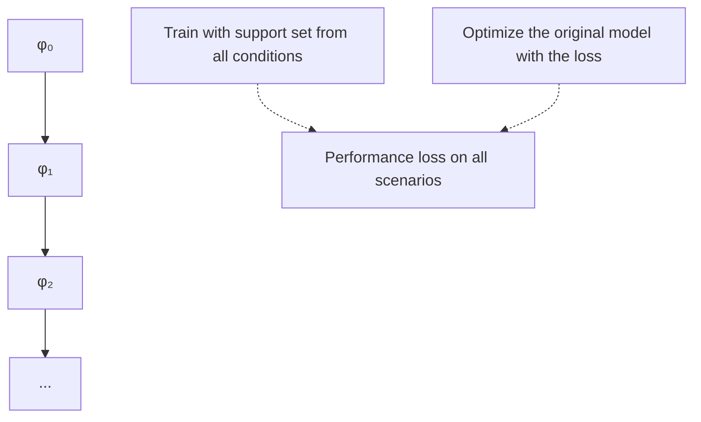
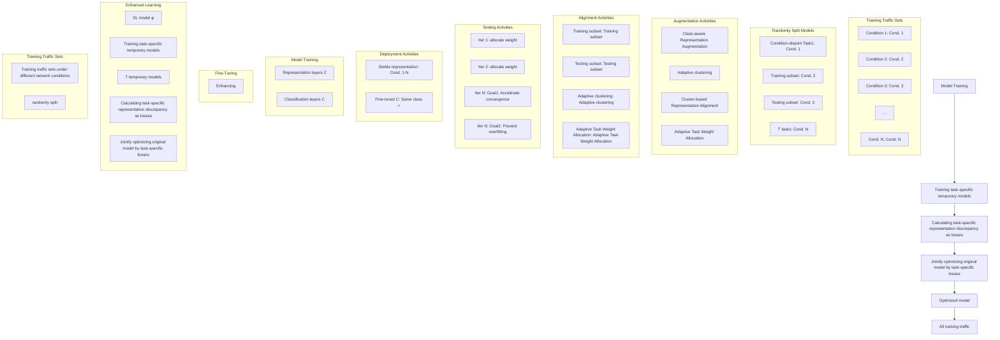

# Training Robust Classifiers for Classifying Encrypted Traffic under Dynamic Network Conditions

Yuqi Qing

INSC, Tsinghua University

Beijing, China

qyq21@mails.tsinghua.edu.cn

Xiaoli Zhang

University of Science and Technology

Beijing, China

xiaoli.z@ustb.edu.cn

Kun Sun

IST, George Mason University

Fairfax, Virginia, USA

ksun3@gmu.edu

Qilei Yin

Zhongguancun Laboratory

Beijing, China

yinql@zgclab.edu.cn

Peiyang Li

INSC, Tsinghua University

Beijing, China

peiyangli.20@gmail.com

Ke Xu∗

DCST, Tsinghua University &

Zhongguancun Laboratory

Beijing, China

xuke@tsinghua.edu.cn

Xinhao Deng

INSC, Tsinghua University

Beijing, China

xinhaodeng.thu@gmail.com

Zhuotao Liu

INSC, Tsinghua University

Beijing, China

zhuotaoliu@tsinghua.edu.cn

Qi Li∗

INSC, Tsinghua University &

Zhongguancun Laboratory

Beijing, China

qli01@tsinghua.edu.cn

# Abstract

Most existing DL-based encrypted traffic classification methods suffer performance degradation in real-world deployments due to dynamic network conditions, e.g., network environment changes and traffic obfuscation. Dynamic network conditions cause encrypted traffic to exhibit distinct feature patterns during training and testing phases. To address this issue, we propose MetaTraffic, a novel and general DL training framework built upon meta-learning that enhances the performance of supervised DL models designed for encrypted traffic classification against dynamic network conditions. Our key observation is that the traffic of the same network behaviors share the same semantic features even under different network conditions, which can be considered as stable feature representations. Therefore, MetaTraffic helps DL models learn stable feature representations by minimizing the discrepancies in how the models represent traffic features under different network conditions, thereby achieving robust classification under dynamic network conditions. We implement MetaTraffic based on meta-learning with three innovative facilitate modules to enhance its performance. We evaluate MetaTraffic using three public datasets and three new large-scale encrypted traffic datasets that cover multiple types of network conditions. Experimental results show that, under dynamic multiple types of network conditions, our framework improves the accuracy of DL models by 8.94% and the F1-Macro score by 12.55%, while existing robust training methods decrease the accuracy by 28.85% and the F1-Macro score by 33.52%.

∗also with State Key Laboratory of Internet Architecture

This work is licensed under a Creative Commons Attribution 4.0 International License.

CCS ’25, Taipei

© 2025 Copyright held by the owner/author(s).

ACM ISBN 979-8-4007-1525-9/2025/10

https://doi.org/10.1145/3719027.3765073

# CCS Concepts

• Security and privacy → Network security.

# Keywords

Encrypted Traffic Classification; Deep Learning; Detection

# ACM Reference Format:

Yuqi Qing, Qilei Yin, Xinhao Deng, Xiaoli Zhang, Peiyang Li, Zhuotao Liu, Kun Sun, Ke Xu, and Qi Li. 2025. Training Robust Classifiers for Classifying Encrypted Traffic under Dynamic Network Conditions. In Proceedings of the 2025 ACM SIGSAC Conference on Computer and Communications Security (CCS ’25), October 13–17, 2025, Taipei. ACM, New York, NY, USA, 15 pages. https://doi.org/10.1145/3719027.3765073

# 1 Introduction

With the widespread adoption of encrypted protocols, the proportion of encrypted traffic has surged dramatically. For example, approximately 97% of the world’s top 100 websites now use HTTPS [63]. Encrypted traffic classification, which identifies the category of applications or behaviors that generate traffic without decrypting its payload, is essential for security and management tasks such as intrusion detection [1, 2], user action identification [10, 11], and application behavior analysis [22, 42].

Most existing encrypted traffic classification methods [15, 23, 39, 47, 52, 53, 56, 72, 73, 76] are based on supervised deep learning (DL) models and have been extensively studied. However, their performance often degrades when deployed in real-world networks due to dynamic network conditions, which lead to discrepancies between the features observed during training and those encountered after deployment. For example, training and newly incoming encrypted traffic may originate from different hosts, traverse different network environments, and be obfuscated by different strategies. These factors undermine the generalizability of the DL models and result in higher classification errors. Recently, robust training methods [3, 48, 64, 67, 78] have been proposed to improve the performance of DL models. They augment new traffic subject to specific network conditions for DL model training. Unfortunately, these methods are only effective when the incoming and training traffic is under the same network conditions. Moreover, they can only withstand the impact of a specific type of network condition. Although Rosetta [64] and TrafCL [67] demonstrate robustness against varying network environment conditions, they struggle to generalize to traffic patterns arising from heterogeneous host conditions. In real-world scenarios, encrypted traffic might be affected by multiple network conditions simultaneously, which poses a significant challenge to existing approaches.

To address the aforementioned issue, we propose MetaTraffic, a novel and general DL training framework built upon meta-learning that improves the performance of supervised DL models designed for encrypted traffic classification under dynamic network conditions. Our key observation is that the traffic of the same network behaviors shares the same semantic features even under different network conditions, which can be considered as stable feature representations. Therefore, we aim to help DL models learn stable feature representations by minimizing the discrepancies in how the models represent traffic features under different network conditions, thereby achieving robust classification.

In particular, we devise MetaTraffic based on meta-learning with three innovative modules. First, MetaTraffic divides the training dataset into multiple tasks, each of which consists of training and testing subsets that differ in network conditions, to simulate the variability between model training and deployment environments. For each task, a task-specific temporary DL model is trained on the corresponding training subset. Here, we design a class-aware representation augmentation module that adds class-aware and stochastic noise into the feature representations during their training phase, mitigating the negative impacts of easy training traffic samples on the temporary models’ representation capabilities. Second, with the constructed temporary models, MetaTraffic calculates the feature representation discrepancy between the training and testing subsets of each task as the task’s loss. A cluster-based representation alignment module is proposed here to accurately and efficiently calculate the discrepancy. It applies an adaptive clustering algorithm to automatically identify a small number of highly representative feature representations for traffic samples exhibiting diverse behaviors, intended for discrepancy calculation. Third, MetaTraffic jointly optimizes the original DL model based on all tasks’ losses to minimize the feature representation discrepancy. We design an adaptive task weight allocation module to accelerate the convergence of the DL model while preventing it from overfitting to specific tasks. It continuously evaluates the DL model’s optimization progress by measuring the loss variations in successive training iterations and allocates adaptive task weights that align with the model’s optimization requirements at different optimization stages. MetaTraffic optimizes the DL model iteratively. The DL model from the previous iteration is used in the next iteration to construct temporary models and is further optimized based on new task losses. Upon convergence, the DL model learns to generate stable feature representations for encrypted traffic under dynamic network conditions and can be deployed for robust classification after fine-tuning on all training traffic. We implement MetaTraffic based on metalearning because it can enhance DL models’ generalization ability, enabling them to generate stable feature representations for previously unseen encrypted traffic after deployment rather than simply for the training traffic.

We choose three public datasets and collect three new datasets to perform extensive evaluations. Overall, we collected over 880,000 encrypted traffic flows from 20 cloud servers across five countries Each new dataset is collected under three types of different network conditions: (i) the encrypted traffic is generated by different hosts, (ii) the encrypted traffic is transmitted through different network environments, and (iii) the encrypted traffic is obfuscated by different strategies. To the best of our knowledge, the three datasets are the first large-scale encrypted traffic datasets generated under multiple types of network conditions. We evaluate our framework’s performance under dynamic single type and multiple types of network conditions using both public and newly collected datasets.

The contributions of this paper are fourfold:

• We propose a novel DL training framework, MetaTraffic, to improve the classification performance of any supervised DL models designed for encrypted traffic classification under dynamic network conditions.   
• Our framework enables DL models to generate stable feature representations for encrypted traffic under dynamic network conditions, ensuring accurate classification. This is achieved by minimizing the discrepancies in how DL models represent traffic features under different network conditions.   
• We release three large-scale encrypted traffic datasets1, which comprise over 880,000 flows and incorporate three common types of network conditions. To the best of our knowledge, these are the first publicly available encrypted traffic datasets generated under multiple types of network conditions.   
• We prototype MetaTraffic and evaluate its performance on three public datasets and our newly collected datasets. The experimental results show that our framework can improve the DL models’ accuracy by 8.94% and F1-macro score by 12.55% on average under dynamic multiple types of network conditions, while existing robust training methods decrease the accuracy by 28.85% and F1-macro score by 33.52%.

# 2 Problem Statement

This paper aims to develop a training framework that can improve the performance of any supervised DL models designed for encrypted traffic classification under dynamic network conditions. These DL models require a certain amount of encrypted traffic $D _ { t r a i n }$ for training to classify the newly incoming traffic $D _ { t e s t }$ (also referred to as testing traffic). In real-world networks, both $D _ { t r a i n }$ and $D _ { t e s t }$ are subject to diverse network conditions. Since the process of collecting $D _ { t r a i n }$ is controlled, we can identify the specific network conditions that affect $D _ { t r a i n }$ in advance, i.e., the network conditions that affect $D _ { t r a i n }$ are known. However, the dynamic nature of network conditions results in inconsistencies between the specific network conditions affecting testing encrypted traffic and those influencing training encrypted traffic. Moreover, multiple types of network conditions may impact both $D _ { t r a i n }$ and $D _ { t e s t }$ simultaneously. In this paper, we consider three common types of network conditions that can alter the features of encrypted traffic:

• Encrypted traffic is generated by different hosts. Different hosts often vary in hardware, operating systems, and encryption protocols, which leads to generating encrypted traffic with dissimilar features. For instance, since the TLS 1.3 encryption protocol has fewer handshake rounds than TLS 1.2, the encrypted traffic generated by hosts adopting TLS 1.3 has a smaller handshake data size features [12].

• Encrypted traffic is transmitted through different network environments. The link layer, network layer, and transport layer protocols, along with their configurations, often vary across different network environments, rendering the encrypted traffic transmitted through different network environments exhibiting distinct features. For instance, a larger maximum transmission unit (MTU) setting can increase the maximum packet size per flow while reducing the number of packets [64]. Due to common network operations such as routing selection and load balancing, network traffic is often transmitted through different network environments at different times.

• Encrypted traffic is being obfuscated by different strategies. Traffic obfuscation refers to the process of concealing the category information of encrypted traffic by actively altering its features. Numerous traffic obfuscation strategies have been proposed to prevent the identification of malicious encrypted traffic or users’ web browsing behaviors. These strategies modify traffic features in various ways, such as by injecting dummy packets [24, 30, 46] or regularizing traffic of different categories into similar transmission patterns [5, 6, 13, 19, 26, 61]. Each strategy typically includes multiple parameter settings to adjust the degree of feature alteration. As a result, encrypted traffic obfuscated using different strategies and parameter settings often exhibits distinct feature patterns.

The dynamic, multiple types of network conditions result in training and testing encrypted traffic of the same category exhibiting dissimilar feature patterns. As a result, the DL models that are trained on $D _ { t r a i n }$ usually perform poorly on $D _ { t e s t } .$ Our framework aims to improve the DL models’ performance on $D _ { t e s t }$ only using $D _ { t r a i n } .$ , regardless of their architectures or the features they used.

Our objective is also to address the shortcomings of existing robust training methods [3, 48, 64, 67, 78]. First, we consider classifying encrypted traffic under dynamic network conditions, in which the training and testing encrypted traffic is subject to inconsistent network conditions. This is a more realistic yet challenging scenario, whereas existing studies assume that training and testing encrypted traffic share the same known network conditions. Second, we consider that network conditions may come in various types, whereas previous studies are only capable of defending against specific single types of network conditions in most cases. Additionally, we also consider applicability. Existing robust training methods only augment new encrypted traffic in specific feature formats, restricting their use to DL models specifically tailored to these feature formats. For example, Rosetta [64] and NetAugment [3] are limited to augmenting new encrypted traffic in packet length sequence formats. In contrast, our framework does not rely on augmenting new traffic and can enhance the performance of any supervised DL models. We compare our work with existing robust training methods in Table 1.

<table><tr><td rowspan="2">Method</td><td rowspan="2">Dynamic Network Conditions</td><td colspan="3">Network Condition Type</td><td rowspan="2">Applicability</td></tr><tr><td>Host</td><td>Network Environment</td><td>Obfuscation</td></tr><tr><td>Rosetta[64]</td><td>✕</td><td>✕</td><td>√</td><td>✕</td><td>✕</td></tr><tr><td>TrafCL[67]</td><td>✕</td><td>✕</td><td>√</td><td>✕</td><td>✕</td></tr><tr><td>2DA[78]</td><td>✕</td><td>✕</td><td>√</td><td>✕</td><td>✕</td></tr><tr><td>NetAugment[3]</td><td>✕</td><td>√</td><td>√</td><td>✕</td><td>✕</td></tr><tr><td>AAAttack[48]</td><td>✕</td><td>✕</td><td>√</td><td>√</td><td>✕</td></tr><tr><td>Ours</td><td>√</td><td>√</td><td>√</td><td>√</td><td>√</td></tr></table>

Table 1: The comparison between existing robust training methods and our framework. Dynamic Network Conditions indicates the method’s effectiveness when the training and testing encrypted traffic is subject to inconsistent network conditions. Network Condition Type indicates the method’s resistance to a specific network condition type. Applicability means whether the method can be applied to any supervised DL models for encrypted traffic classification.

flowchart

Figure 1: The process of the Model-Agnostic Meta-Learning algorithm.

# 3 Preliminary: Meta-Learning

Meta-learning is an effective training method that enables DL models to achieve good generalization ability across various learning tasks. We illustrate the core idea of meta-learning by introducing the classical Model-Agnostic Meta-Learning (MAML) algorithm [21] and show its process in Figure 1. Specifically, the input of MAML is an untrained DL model $\phi _ { 0 }$ and multiple datasets, each of which is regarded as a specific learning task. In the first iteration, one or several tasks are selected, and an independent temporary model is constructed for each selected task by training ??0 on a support set and is evaluated on a query set, where the two sets are disjoint and both are randomly selected from the dataset corresponding to the task. Then, the original ??0 $( i . e . ,$ , before temporary model construction) is optimized based on the performance of each constructed temporary model. The optimized model in the first iteration, denoted as ??1, serves as the input for the second training iteration, i.e., a new temporary model is created based on $\phi _ { 1 }$ and its performance will be used to optimize $\phi _ { 1 }$ . Once the DL model has converged, it will perform well on different tasks. Moreover, since meta-learning does not directly optimize the DL model using the existing data of all tasks (i.e., it optimizes based on the performance of temporary models), it prevents the DL model from overfitting to the existing data, thereby improving its generalization ability for previously unseen data [4, 17, 36].

Meta-learning has been widely adopted in various domains, such as few-shot classification [8, 31], personalized recommendation [18, 69], and robot manipulation [28, 58]. In this paper, we divide training encrypted traffic under different known network conditions into many pairs of condition-disjoint training and testing subsets. Each pair serves as an independent task that simulates scenarios where DL models encounter encrypted traffic under dynamic network conditions. Thus, by optimizing the DL model through meta-learning on these tasks, the DL model will learn to generate stable feature representations for both training traffic and newly incoming traffic, thereby ensuring accurate classification results upon deployment under dynamic network conditions.

# 4 Methodology

# 4.1 Overview

To achieve robust encrypted traffic classification under dynamic network conditions, MetaTraffic helps DL models learn stable feature representations by minimizing the discrepancies in how the models represent traffic features under different network conditions. Typically, a DL model designed for classification tasks consists of multiple layers: the former layers process the raw features of data into representations that encapsulate essential attributes, while the latter layers learn classification knowledge from these representations to categorize testing samples. With stable feature representations, the classification knowledge learned by the DL model from training traffic can be effectively applied to classify testing traffic, regardless of how its features vary under dynamic network conditions, thereby ensuring accurate results.

We show the training process of MetaTraffic in Figure 2. In particular, MetaTraffic randomly divides the training dataset into multiple tasks, each of which consists of training and testing subsets that differ in network conditions. The initial untrained DL model used for encrypted traffic classification is denoted as $\phi .$ In the first iteration, an independent temporary model $\phi ^ { * }$ is constructed for each task by training $\phi$ on the task’s training subset. Next, the feature representations of all training and testing traffic samples in each task are obtained using the corresponding temporary model, and the discrepancy between them is calculated as the task’s loss. Then ?? is jointly optimized based on the losses of all tasks. The optimized $\phi$ is used in the next training iteration to construct the temporary models, further optimized based on newly calculated task losses, and the cycle continues. Once the DL model converges after multiple iterations, the optimized model can generate stable feature representations for encrypted traffic under dynamic network conditions. Finally, the DL model is fine-tuned using all training traffic before being deployed for encrypted traffic classification.

To facilitate the training process, MetaTraffic includes three modules: the class-aware representation augmentation module, the cluster-based representation alignment module, and the adaptive task weight allocation module. The class-aware representation augmentation module introduces class-aware and stochastic noise into the feature representations during the training of temporary models to enhance their representation capabilities. The cluster-based representation alignment module automatically identifies a small number of highly representative feature representations using an adaptive clustering algorithm for accurate and efficient feature representation discrepancy calculation. The adaptive task weight allocation module continuously evaluates the optimization process of the DL model and allocates adaptive task weights to accelerate its convergence while preventing overfitting.

# 4.2 Training Task-specific Temporary Models

MetaTraffic constructs a temporary model for each task using the task’s training samples and either the initial, untrained DL model (in the first iteration) or the optimized DL model from the previous iteration (in subsequent iterations). In particular, let $D _ { t r }$ be the training subset of a task and (??, ??) be an encrypted training traffic sample belonging to it, where ?? and ?? denote the features and class label, respectively, the temporary model’s initial parameters (also be denoted as $\phi )$ are copied from the initial, untrained DL model or the optimized DL model from the previous iteration. Then, we can apply the traditional supervised training method [34] to update the temporary model’s parameters:

$$
\phi^ {*} = \phi - \eta_ {1} \nabla_ {\phi} \sum_ {(x, y) \in D _ {t r}} \mathcal {L} (\mathcal {C} (\mathcal {Z} (x; \phi); \phi), y), \tag {1}
$$

where $\phi ^ { * }$ is the updated parameters, L (·) is the classification loss function (e.g., the cross entropy), $\eta _ { 1 }$ is the learning rate, Z (·) and C (·) are the outputs of the feature representation and classification layers of the model, respectively.

However, this straightforward strategy has a critical drawback: easy training traffic samples may limit the representation capability of the temporary model. Easy samples are those with features that directly infer the class label, such as malicious encrypted traffic containing specific handshake metadata rarely observed in normal traffic [27]. They can lead the temporary model to rely solely on specific features that directly infer the class label rather than exploring the intrinsic correlations among all features to generate feature representations. Consequently, the representation capability of the temporary model becomes constrained, making it inadequate for producing accurate representations when all features undergo significant changes due to dynamic network conditions. Furthermore, since the DL model is optimized based on the temporary model’s performance, its representation capability will also be restricted.

To overcome the above issue, we design a class-aware representation augmentation module. It directly adds noise to the feature representations generated by the temporary model during its training phase. The noise directly enhances the diversity of the generated feature representations, particularly for monotonous feature representations corresponding to easy training traffic samples. Note that the temporary model performs classification based on its generated feature representations. Therefore, diverse feature representations increase the classification difficulty for the temporary model, preventing it from relying solely on specific features to generate feature representations with insufficient information. Instead, they encourage the temporary model to explore the intrinsic correlations among all features, producing feature representations with richer information for more accurate classification, i.e., enhancing the model’s representation capability. Furthermore, compared to traditional data augmentation methods used to enhance feature representation diversity [7, 25], our module does not incur additional training overhead because it does not synthesize any new training samples.

flowchart

Figure 2: The overview of MetaTraffic.

Our module utilizes existing methods [9, 37, 59] to generate these two types of noise. In particular, let the class label set of all training samples be ?? and the output of the feature representation layers of the temporary model be ??-dimensional vectors. In each training iteration of the temporary model, our representation augmentation method works as follows: 1) it obtains the original feature representations of all training samples from the output of the temporary model’s representation layers; 2) it calculates the variance of all training samples belonging to each clarepresentation vectors and denote it as $\sigma _ { y } ^ { 2 } = \{ \sigma _ { y _ { 0 } } ^ { 2 } , . . . , \sigma _ { y _ { | C | } } ^ { 2 } \}$ ?? 0 ??2??|??| } n of the, where $\sigma _ { y _ { i } } ^ { 2 } \in \mathbb { R } ^ { 1 \times d }$ represents the variance information of all samples belonging to the ??-th class; 3) For each training sample (??, ??), it adds noises on its original feature representation ?? to create a new ??:

$$
\widetilde {z} = \alpha \odot z + \beta + \gamma , \tag {2}
$$

where $\alpha \sim N ( \mathbf { 1 } , \lambda _ { 1 } \cdot I ) , \beta \sim N ( \mathbf { 0 } , \lambda _ { 2 } \cdot I )$ and $\gamma \sim { \cal N } ( 0 , d i a g ( \sigma _ { y } ^ { 2 } ) )$ , and $\lambda _ { 1 }$ and $\lambda _ { 2 }$ are two hyper-parameters; 4) The new feature representations of all training samples are input into the classification layers of the temporary model to calculate the classification loss and update the parameters of the temporary model:

$$
\phi^ {*} = \phi - \eta_ {1} \nabla_ {\phi} \sum_ {(x, y) \in D _ {t r}} \mathcal {L} (\mathcal {C} (\widetilde {z}; \phi), y). \tag {3}
$$

Note that we add two types of noise to the feature representation of each training sample. The ?? noise is sampled from a multivariate normal distribution with a zero-mean vector and a covariance matrix formed by the variance information of the feature representations of the samples belonging to the same class. This design avoids generating noise located in the distribution area of feature representations of other class samples, i.e., maintaining the semantic integrity of each class in the training subset, enhancing the diversity of feature representations without preventing the temporary model from learning incorrect classification knowledge. The ?? and $\beta$ noise is sampled from two other normal distributions to further increase the diversity of feature representations, and we usually set $\lambda _ { 1 } , \lambda _ { 2 }$ to small values. In this paper, we implement our method with $\lambda _ { 1 } = \lambda _ { 2 }$ .

Identifying the representation layers. For a supervised DL model used for classifying encrypted traffic, if its representation layers are explicitly defined in its design, we obtain the feature representations of each encrypted traffic sample from the output of the pre-defined representation layers. For example, the representation layer of the FS-Net model [40] is designed as the intermediate layer between its encoder and decoder modules. Otherwise, we consider the last fully connected layer as the classification layer and all preceding layers as the representation layers, as [78] does.

# 4.3 Calculating Task-specific Representation Discrepancy

For each task, MetaTraffic obtains the feature representations of all traffic samples in the training and testing subsets using the constructed temporary model corresponding to this task and calculates the discrepancy between them as the task’s loss. To achieve this goal, a straightforward loss function design is to calculate the sum of the distances between each pair of feature representations belonging to the same class from the training and the testing subsets, respectively. However, its time complexity is $O ( n ^ { 2 } d )$ , where ?? is the number of samples in each class and ?? denotes the dimensionality of feature representation, which significantly increases the training overhead. A widely used alternative design [17, 55, 70] is to obtain the mean feature representation vector (i.e., the prototype) of each class and calculate the sum of the distances between prototypes. However, in certain encrypted traffic classification tasks, traffic samples that represent diverse behaviors may be labeled as the same class. For example, the traffic generated by various users accessing different types of websites may all be labeled as normal. This leads to significant variations in feature representations within the same class. A coarse-grained single prototype is insufficient to represent these varying feature representations, which results in the singleprototype-based loss function design being unable to calculate the discrepancy between feature representations accurately.

To overcome the above limitations, we design a cluster-based representation alignment module. It utilizes an adaptive clustering algorithm, i.e., DP-Means [33], to automatically identify a small number of highly representative feature representations for traffic samples exhibiting diverse behaviors in each class, thereby enabling accurate and efficient discrepancy calculation. In a nutshell, the DP-Means method fits all input data into a Gaussian mixture distribution and calculates the lower bound of the distance between two data points belonging to different Gaussian distributions as the threshold of determining whether a data point belongs to an existing cluster. Therefore, the DP-Means method can automatically identify the minimum number of compact clusters that encapsulate all input data without knowing the number of clusters in advance, where each cluster corresponds to an independent Gaussian distribution, and its Gaussian center can accurately represent all the data within the cluster. Moreover, compared with other typical clustering methods such as DBSCAN [20] and hierarchical clustering [29], which have a time complexity larger than $O ( n ^ { 2 } d )$ , the DP-Means method is significantly more efficient with a time complexity of only ?? (??????), where ?? represents the maximum number of clusters belonging to each class and ?? denotes the dimensionality of the feature representation, respectively. Since ?? ≪ ?? in most cases, ?? (??????) is considerably smaller than $O ( n ^ { 2 } d )$ , making DP-Means a more efficient choice.

In particular, we use DP-Means to cluster the feature representations of all traffic samples in the training and testing subsets, respectively, while ensuring that the feature representations within each cluster belong to the same class and calculate the Gaussian center of each cluster as a prototype of the corresponding class. We show the process in Alg.1. By using these few but highly representative prototypes, we can efficiently and accurately compute their discrepancy as the loss of the task. We denote the set of prototypes for class ?? obtained from the training and testing subsets as ?? (?? ) $\bar { P } _ { t r } ^ { ( c ) }$ and ?? (?? )???? $P _ { t e } ^ { ( c ) }$ respectively and calculate the discrepancy between these prototypes from two different aspects as the task’s loss $\mathcal { L } \colon$

$$
\mathcal {L} _ {\text { content }} = \frac {1}{| C |} \sum_ {c} \mathbb {E} _ {\mu_ {i} \in P _ {t r} ^ {(c)}, \mu_ {j} \in P _ {t e} ^ {(c)}} \log | | \mu_ {i} - \mu_ {j} | | ^ {2}, \tag {4}
$$

$$
d (\mu_ {1}, \mu_ {2}) = K L (C (\mu_ {1}) | | C (\mu_ {2})) + K L (C (\mu_ {2}) | | C (\mu_ {1})), \tag {5}
$$

$$
\mathcal {L} _ {\text { semantic }} = \frac {1}{| C |} \sum_ {c} \mathbb {E} _ {\mu_ {i} \in P _ {t r} ^ {(c)}, \mu_ {j} \in P _ {t e} ^ {(c)}} d (\mu_ {i}, \mu_ {j}), \tag {6}
$$

$$
\mathcal {L} = \omega_ {1} \cdot \mathcal {L} _ {\text { content }} + \omega_ {2} \cdot \mathcal {L} _ {\text { semantic }}, \tag {7}
$$

where $K L ( p | | q ) = p \log ( p / q )$ and $\omega _ { 1 } , \omega _ { 2 }$ are weight parameters.

The L?????????????? term quantifies the content discrepancy between prototypes, while the $\mathcal { L } _ { s e m a n t i c s }$ term captures the semantic disparity between prototypes, i.e., whether they can be classified into the same class by the temporary model. This loss design ensures that, upon optimization, the DL model produces feature representations for encrypted traffic affected by different network conditions that are both content- and semantically similar, i.e., stable feature representations.

# 4.4 Jointly Optimizing DL Model

MetaTraffic jointly optimizes the DL model in the original state $( i . e . ,$ , before temporary model construction) based on the loss of all tasks, enabling it to generate stable feature representations. A straightforward joint optimization approach is to calculate the sum of the second-order derivatives of each task’s loss with respect to the DL model parameters, using this as the optimization gradient. However, this approach overlooks the fact that tasks may contribute differently to the DL model’s representation capability due to each task containing different training and testing samples. To accelerate the optimization process, greater weights can be assigned to tasks with higher losses. Nevertheless, this strategy risks causing the DL model to overfit to high-loss tasks, thereby compromising its

Algorithm 1: Class Prototype Identification   
Data: feature representation set Z, hyper-parameter $\sigma$ , class label set C

Result: prototype set $P^{(c)} = \{\mu_i\}$ for each class c

// calculate cluster threshold

1 $\rho \leftarrow$ the mean of the standard deviations of all feature representations in Z on each dimension

2 $\lambda \leftarrow -2\sigma \log \left( \frac{1}{(1+\rho/\sigma)^{d/2}} \right)$ // clustering all samples with the threshold

3 $P^{(c)} \leftarrow \{center of all vectors in class c\}$ for all $c \in C$ ;

4 for $(z, y) \in Z$ do

5 if distance between z and any center in $P^{(c)} > \lambda$ then

6 $P^{(y)} \leftarrow P^{(y)} + \{z\} // create new cluster$ 7 end

8 end

// calculate Gaussian center as class prototype

9 for $c \in C$ do

10 for $\mu_i \in P^{(c)}$ and $(z_j, y_j) \in Z$ with $y_j = c$ do

11 $\pi_{ij} \leftarrow \frac{N(z_j | \mu_i, \sigma)}{\sum_{\mu \in P^{(c)}} N(z_j | \mu, \sigma)}$ 12 end

13 $P^{(c)} \leftarrow \left\{ \frac{\sum_j \pi_{ij} z_j}{\sum_j \pi_{ij}} | i = 1, \cdots, |P^{(c)}| \right\}$ 14 end

generalization ability, i.e., only capable of generating stable representations for encrypted traffic belonging to specific tasks rather than a variety of scenarios.

To accelerate the optimization of the DL model while preventing it from overfitting to specific tasks, we design an adaptive task weight allocation module. Its core idea is to continuously evaluate the optimization progress of the DL model and allocate task weights that align with the model’s optimization requirements at different optimization stages. Typically, in the early optimization stage, due to the DL model’s limited representation capability, the loss of each task tends to fluctuate significantly between consecutive training iterations. Thus, higher weights should be assigned to high-loss tasks to accelerate the optimization process. In the later optimization stage, as the DL model’s representation capability improves, the loss of each task tends to exhibit only minor variations between training iterations. Thus, the weights should be more evenly distributed across tasks to prevent the DL model from overfocusing on high-loss tasks. In particular, assume there are ?? tasks in total and we denote the loss of ?? -th task in the ??-th training iteration of our framework as $\mathcal { L } _ { t } ^ { e }$ , the weight vector $W ^ { e }$ for each task in this iteration is computed by:

$$
W ^ {e} = \text { Softmax } \left(\left[ w ^ {e} \cdot \mathcal {L} _ {1} ^ {e}, \dots , w ^ {e} \cdot \mathcal {L} _ {t} ^ {e} \right] ^ {\prime}\right), \tag {8}
$$

$$
w ^ {e} = w ^ {e - 1} \cdot \left(1 - \arg \tan \frac {\eta_ {3}}{T} \sum_ {t = 1} ^ {T} \left(\mathcal {L} _ {t} ^ {e - 1} - \mathcal {L} _ {t} ^ {e}\right)\right), \tag {9}
$$

where $\eta _ { 3 }$ is the learning rate for updating ?? and the weight in the first training iteration, $\mathrm { i } . \mathrm { e } , w ^ { 1 }$ , is a pre-defined hyper-parameter. Note that the optimization process is evaluated based on $\mathscr { L } _ { t } ^ { e - 1 } - \mathscr { L } _ { t } ^ { e }$ i.e., loss variation in successive training iterations. Our design ensures that when loss variations are significant during the early optimization stage, larger weight coefficients ?? are obtained, allowing tasks with higher losses to receive greater weights. In the later optimization stage, as loss variations become smaller, our design decreases the weight coefficients, thereby minimizing the differences between task weights. With the weight vector ?? , the update of the DL model in the ??-th training iteration is as follows:

$$
\phi^ {e} = \phi^ {e - 1} - \eta_ {2} \sum_ {t = 1} ^ {T} W ^ {e} [ t ] \cdot \nabla_ {\phi} \mathcal {L} _ {t} ^ {e}, \tag {10}
$$

where $\eta _ { 2 }$ is the hyper-parameter of the learning rate. Note that $\mathcal { L } _ { t } ^ { e }$ is computed based on $\phi _ { t } ^ { * }$ , while $\phi _ { t } ^ { * }$ is obtained by performing firstorder optimization on ??. Thus, $\nabla _ { \phi } \mathcal { L } _ { t } ^ { e }$ is the second-order derivative of $\mathcal { L } _ { t } ^ { e }$ with respect to $\phi .$ When the DL model converges after multiple iterations, it can generate stable feature representations for encrypted traffic under dynamic network conditions. Finally, we fine-tune it using all training traffic, and then it can be deployed for robust encrypted traffic classification. The entire training process of our framework is shown in Alg.2.

Algorithm 2: Meta learning-based robust training   
Input: initial DL model $\phi^0$ , $T$ training tasks $\{(D_{tr}, D_{te})\}$ Output: converged DL model $\phi$ while $\phi^e$ is not converged do $e \leftarrow e + 1$ ;

for $t$ -th task with subsets $(D_{tr}, D_{te})$ do

for every temporary model training epoch do

Perturbate features in $D_{tr}$ with Eq.(2);

Train temporary model $\phi_t^*$ with Eq.(3);

end

Cluster $P_{tr}^{(c)}$ and $P_{te}^{(c)}$ for each $c$ with Alg.1;

Calculate meta-loss $\mathcal{L}_t^e$ through Eq.(4)-(7);

end

Optimize the parameter $w$ with Eq.(9);

Calculate the weight of each task with Eq.(8);

Update the $\phi^e$ with Eq.(10);

end

Finetune $\phi \leftarrow \phi^e$ with all training data;

# 5 Evaluation

In this section, we evaluate our training framework with three public datasets and three newly collected datasets. We also compare its performance with several SOTA robust training methods.

# 5.1 Experimental Setup

Public Datasets. We choose three public encrypted traffic datasets for evaluation, each is subject to a specific single type of network condition. We show their information in Table 2. They have been widely used in existing studies [14, 49, 50, 54, 56, 57, 64, 71, 74].

• Application-Host [74] contains encrypted traffic generated by hundreds of applications on 177 hosts using 5 operating systems: Android 6, 7, 8, 9, and 10. We use it to evaluate the performance

<table><tr><td>Dataset</td><td>Network Condition Type(s)</td><td>Number of flows</td></tr><tr><td>Application -Host</td><td>Different Hosts</td><td>3,023,734</td></tr><tr><td>DoHBrw -NetEnv</td><td>Different Network Environments</td><td>4,985</td></tr><tr><td>Tor -Obfuscation</td><td>Different Obfuscation Events</td><td>105,730 × 13</td></tr><tr><td>Application -ALL</td><td>Different Hosts, Different Network Environments, Different Obfuscation Events</td><td>281,935 × 13</td></tr><tr><td>DoHBrw -ALL</td><td>Different Hosts, Different Network Environments, Different Obfuscation Events</td><td>631,700 × 13</td></tr><tr><td>Tor -ALL</td><td>Different Hosts &amp; Network Environments, Different Obfuscation Events</td><td>149,701 × 13</td></tr></table>

Table 2: The network conditions affecting each public and newly collected dataset, as well as the number of network flows they include. Each newly collected dataset contains both the original unobfuscated traffic and the traffic obfuscated by 12 obfuscation events.

of classifying encrypted traffic produced by different applications under dynamic host conditions.

• DoHBrw-NetEnv [64] is generated by replaying the normal and malicious DNS over HTTPS (DoH) traffic, which is extracted from the CIRA-CIC-DoHBrw-2020 dataset [45], in three different network environments: China-to-China(cn2cn), China-to-Korea(cn2kr), and China-to-United States(cn2us). We use this dataset to evaluate the performance of identifying malicious encrypted traffic under dynamic network environment conditions. • Tor-Obfuscation [56] contains Tor-encrypted traffic generated by accessing 95 websites using the Tor browser. We apply four representative encrypted traffic obfuscation methods, including WTF-PAD [30], FRONT [24], TrafficSliver [13], and RegulaTor [26], where each strategy is with three different parameter settings individually, to perform traffic obfuscation, resulting in Tor traffic affected by 12 different obfuscation events. Note that each obfuscation event, comprising one strategy and one parameter setting, is considered a network condition. The parameter settings for each obfuscation strategy are listed in Table 3. We use this dataset to evaluate the performance of classifying the websites visited via Tor traffic under dynamic obfuscation conditions.

Newly Collected Datasets. To comprehensively evaluate the performance of classifying various encrypted traffic under dynamic single type and multiple types of network conditions, we collect three new datasets. Specifically, we deploy four cloud servers in each of the following five countries: Japan (JP), the United States (US), the United Kingdom (UK), South Africa (SA), and Australia (AU). Then, we collect new datasets by replaying existing encrypted traffic between cloud servers or using these servers to collect new encrypted traffic in the wild. Moreover, we use the same 12 obfuscation events as in the Tor-Obfuscation dataset to obfuscate the newly collected traffic. As shown in Table 2, these datasets include:

• Application-ALL is created by replaying the original encrypted traffic from the Application-Host dataset [74], generated by different hosts, in four different network environments, and further obfuscating it. We randomly select a cloud server in each country and replay the encrypted traffic between cloud servers in Japan and the United States (JP-US), Japan and the United Kingdom (JP-UK), Japan and South Africa (JP-SA), and Japan and Australia (JP-AU), respectively. We replay 56,387 encrypted traffic flows between each pair of servers. The encrypted traffic replayed between different cloud server pairs traverses different network environments. We show the throughput, number of retransmission packets, and latency between different server pairs in Table 4 to indicate their differences. We use this dataset to evaluate the performance of classifying encrypted traffic produced by different applications under dynamic network environments, obfuscation, and multiple types of network conditions.

<table><tr><td>Obfuscation Strategy</td><td>Three parameter settings</td></tr><tr><td>WTFPAD</td><td>normal, normal/2, normal×2</td></tr><tr><td>FRONT</td><td>start_padding_time = 0, 7, 8</td></tr><tr><td>TrafficSliver</td><td>bi-direction, weighted_random, batch_weighted_random</td></tr><tr><td>RegulaTor</td><td>budget = 260, 520, 780</td></tr></table>

Table 3: The parameter settings of each obfuscation strategy. The normal represents the default probability that WTF-PAD inserts dummy packets, while normal/2 and normal×2 means half and double the default probability, respectively. The start\_padding\_time represents the time when FRONT starts inserting dummy packets. The three parameters of TrafficSliver represent three regularization algorithms used by this strategy. The budget represents the overhead limit of obfuscation imposed by RegulaTor.

• DoHBrw-ALL is created by replaying the original normal and three types of malicious DoH traffic from the CIRA-CIC-DoHBrw-2020 dataset [45] between the same four cloud server pairs used in the Application-ALL dataset and further obfuscating it. The original DoH traffic is generated by four different DNS servers, including AdGuard, Cloudflare, Google, and Quad9, which can be regarded as different hosts. We replay 126,340 encrypted traffic flows between each pair of servers. We use this dataset to evaluate the performance of identifying various types of malicious encrypted traffic under dynamic hosts, obfuscation, and multiple types of network conditions.   
• Tor-ALL is created using 20 cloud servers to capture real Tor traffic, which is then further obfuscated. We installed the Tor browser of version 13.0.10 and 13.5 on these cloud servers as Tor clients, configuring them to access the top 100 websites on the Alexa Top list while recording the generated Tor traffic. The collection process lasted from June to August 2024, accumulating 149,701 Tor flows in total. Note that each Tor client establishes an independent circuit for data transmission, meaning that Tor traffic generated by different hosts is also transmitted through distinct network environments, i.e., host and network environment conditions vary simultaneously. We use this dataset to evaluate the performance of classifying the websites visited via Tor traffic under dynamic multiple types of network conditions.

DL models for Encrypted Traffic Classification. We choose two representative supervised DL-based encrypted traffic classification methods that utilize different DL models, including DF [56] and ARES [15], to evaluate their performance in the presence of dynamic network conditions, with or without our framework. Specifically, DF utilizes a multi-layer convolutional neural network (CNN), where its CNN layers function as feature representation layers, and its final fully connected layer serves as the classification layer. ARES employs a Transformer-based architecture, with its preceding Transformer layers handling feature representation and its final fully connected layer performing classification. Both models are directly applicable to various encrypted traffic classification tasks. Baselines. We first choose three SOTA robust training methods as baselines, including Rosetta [64], NetAugment [3] (NA), and Augmentation-Assisted Attack (3A) [48]. These methods aim to improve the performance of DL models in classifying encrypted traffic in real-world networks. They augment new training traffic affected by specific known network conditions and use the new traffic to train the DL model. We also introduce the SelfReg method [32] as another baseline. SelfReg is a general approach for enhancing the robustness of DL models against feature fluctuations, typically caused by data collected under varying conditions, and has been widely applied across numerous domains. [16, 35, 41, 60, 65, 68, 75, 77]. It incorporates additional regularization terms into the loss function. Additionally, we construct two new baselines by combining the above methods: 3A+Rosetta+SelfReg, and 3A+NA+SelfReg. The implementations of all baselines with the two DL models are described in Appendix A. Note that all baselines and our framework do not change the architectures of the DL models for encrypted traffic classification.

<table><tr><td>Cloud Server Pair</td><td>JP-US</td><td>JP-UK</td><td>JP-SA</td><td>JP-AU</td></tr><tr><td>Throughput(bps)</td><td>1.01G</td><td>584M</td><td>737M</td><td>835M</td></tr><tr><td>#Retransmission</td><td>1005</td><td>12</td><td>70</td><td>2799</td></tr><tr><td>Latency(ms)</td><td>161</td><td>230</td><td>198</td><td>114</td></tr></table>

Table 4: The differences in network environments between different cloud server pairs.

Implementation. We implement our training framework using Python 3.10.13, NumPy 1.26.3, Pytorch 2.1.2, and Cuda 12.6. The default hyper-parameters of our framework are listed in Table 5. Besides, we apply a grid search to find the suitable learning rates, i.e., ??1,2,3, for different DL models and datasets. The baselines are implemented based on their publicly available codes, and their default parameters are applied. We run our framework and all baselines on a Linux server (6.5.0-41-generic) with Intel(R) Xeon(R) Gold 6258R CPU and NVIDIA GeForce RTX 4090 GPU.

<table><tr><td>Module</td><td>Hyper-parameter</td><td>Description</td></tr><tr><td>Class-awareRepresentation Augmentation</td><td> $\lambda_1 = 1$  $\lambda_2 = 1$ </td><td>standard deviations ofGaussian noise in augmentation</td></tr><tr><td>Cluster-basedRepresentation Alignment</td><td> $\sigma = 5$ </td><td>standard deviation ofGaussian distribution satisfiedby each prototype cluster</td></tr><tr><td>Adaptive TaskWeight Allocation</td><td> $w = 1$ </td><td>initial value ofthe coefficient for task loss</td></tr></table>

Table 5: Hyper-parameter settings of our framework.

Metirc. We use two widely adopted metrics for classification performance evaluation: accuracy (??????) and F1-macro $\left( F 1 _ { m a c r o } \right)$ . Let $T P _ { c } , F P _ { c } , T N _ { c } , F N _ { c }$ be the number of true-positive, false-positive, true-negative, and false-negative samples with each class ?? in the class label set ?? respectively, we can obtain ?????????????? = 1|?? | Í?? ?? ?????? ???? +?? ???? $\begin{array} { r } { P r _ { m a c r o } = \frac { 1 } { | C | } \sum _ { c } \frac { T P _ { c } } { T P _ { c } + F P _ { c } } } \end{array}$ and $\begin{array} { r } { R c _ { m a c r o } = \frac { 1 } { | C | } \sum _ { c } \frac { T P _ { c } } { T P _ { c } + F N _ { c } } } \end{array}$ ?? ???? , then ?????? and $F 1 _ { m a c r o }$ are calculated as follows:

$$
A c c = \frac {\sum_ {c} \left(T P _ {c} + T N _ {c}\right)}{\sum_ {c} \left(T P _ {c} + T N _ {c} + F P _ {c} + F N _ {c}\right)} \tag {11}
$$

$$
F 1 _ {m a c r o} = 2 \cdot \frac {P r _ {m a c r o} \cdot R c _ {m a c r o}}{P r _ {m a c r o} + R c _ {m a c r o}} \tag {12}
$$

# 5.2 Performance under Dynamic Single Type of Network Conditions

We evaluate the performance of our framework and all baselines under dynamic single-type of network conditions in this section. For each network condition type, we use the encrypted traffic corresponding to different conditions of this type as the training and testing traffic, and ensure that the conditions affecting the testing traffic are unseen in the training traffic. The DL model is trained on the training traffic using its original training method, our framework, and each baseline separately, and then evaluated on the testing traffic. To eliminate experimental bias, we construct multiple different combinations of training and testing traffic for each dataset, where three independent experiments are conducted for each combination. Note that each DL model uses the features directly extracted from the encrypted traffic, formatted according to the model’s requirements, with no additional preprocessing. The sizes of all training and testing traffic combinations are listed in Appendix B. We report the average performance across all combinations and experiments as the final result.

Dynamic Host Conditions. We use the Application-Host and DoHBrw-ALL dataset to perform evaluation and construct four training and testing traffic combinations for each dataset. In particular, for the Application-Host dataset, we categorize all hosts into four host groups based on their OS versions (i.e., Android 6 & 7, 8, 9, and 10). In each combination, the traffic generated by one host group is used for testing, while the traffic generated by the other groups is used for training. For the DoHBrw-ALL dataset, we extract training and testing traffic from the unobfuscated encrypted traffic of the original environment. This is to reduce the impacts of other types of network conditions. In each combination, we use the traffic from a particular DNS server (i.e., AdGuard, Cloudflare, Google, or Quad9) for testing while training on the traffic from other DNS servers. We show the performance of our framework and the baselines in Figure 3a. Our framework enhances the ?????? and $F 1 _ { m a c r o }$ of DL models (i.e., DF and ARES) by an average of 14.87% and 15.46%, respectively, while the baselines reduce ?????? and ?? 1?????????? by an average of 30.17% and 36.23%, respectively.

Dynamic Network Environment Conditions. We utilize the DoHBrw-NetEnv and Application-ALL dataset to perform evaluation. In particular, for the DoHBrw-NetEnv dataset, we construct two training and testing combinations, where the encrypted traffic collected in the cn2us and cn2kr network environments is separately used for testing, while the encrypted traffic collected from other network environments is used for training. For the Application-ALL dataset, we create four training and testing traffic combinations, each time using the unobfuscated traffic collected from one new network environment $( i . e . , \mathrm { J P \mathrm { - } U S , J P \mathrm { - } U K , J P \mathrm { - } S A } ,$ , or JP-AU) for testing while training on the unobfuscated traffic from other new environments. The performance is shown in Figure 3b. Note that we do not evaluate the baseline NA and 3A+NA+SelfReg on the DoHBrw-NetEnv dataset. This is because this dataset only provides the packet length sequences of the encrypted traffic without directions, while NA requires the packet directions as features. Specifically, our framework enhances the ?????? and $F 1 _ { m a c r o }$ of DL models by an average of 8.90% and 8.84%, respectively. In contrast, the baselines reduce ?????? and ?? 1?????????? by an average of 35.21% and 37.25%, respectively.

Dynamic Obfuscation Conditions. We use the Tor-Obfuscation, Application-ALL, and DoHBrw-ALL datasets to perform evaluation and construct four training and testing traffic combinations for each dataset. For the Tor-Obfuscation dataset, in each combination, we select all obfuscation events belonging to a specific obfuscation strategy (i.e., WTFPAD, FRONT, TrafficSliver, or RegulaTor) and one event from each of the other strategies and use the obfuscated traffic under these events for testing. The obfuscated traffic under all other events is used for training. For the Application-ALL and DoHBrw-ALL dataset, we extract training and testing traffic from the obfuscated encrypted traffic of the original environment using the same method as the Tor-Obfuscation dataset. The performance is shown in Figure 3c. Our training framework enhances the ?????? and $F 1 _ { m a c r o }$ of DL models by an average of 5.96% and 7.59%, respectively. In contrast, the baselines reduce ?????? and $F 1 _ { m a c r o }$ by an average of 38.71% and 42.64%, respectively.

Overall, our framework enhances the performance of two DL models across all datasets and dynamic single types of network conditions. It achieves an average improvement of 9.91% in ?????? and 10.63% in $F 1 _ { m a c r o : }$ , demonstrating its effectiveness in improving the robustness of DL models against dynamic network conditions. In contrast, the baselines lead to performance degradation in most cases, causing an average reduction of 34.69% in ?????? and 38.71% in $F 1 _ { m a c r o } .$ This is because the baselines rely on augmenting new encrypted traffic impacted by specific network conditions to train DL models, which makes DL models more prone to classifying based on the unique feature patterns induced by those network conditions. However, testing encrypted traffic often exhibits distinct feature patterns that are absent in the training traffic under dynamic network conditions. Thus, the classification knowledge learned from the augmented encrypted traffic becomes ineffective, ultimately impairing the DL models’ performance. Our framework overcomes this issue by creating tasks that simulate testing encrypted traffic with previously unseen feature patterns and enabling the DL model to generate stable feature representations for such tasks. To further verify this point, we visualize the feature representations generated by the DF model in the Dynamic Host Conditions experiment. Specifically, we train the DF model using encrypted traffic from hosts running Android 8, 9, and 10, with and without our framework, while traffic from hosts running Android 6&7 is used for testing. We then randomly select 2,000 encrypted traffic samples belonging to the applications “WiFi Master Key” and “TikTok” from both the training and testing sets, obtain their corresponding feature representations, project them to one-dimensional space using the t-SNE method [44], and show their density distributions

Figure 3: The performance of our framework and baselines under dynamic network conditions of different single types. The upper and lower subfigures show the original ?????? and $F 1 _ { m a c r o }$ of DF and ARES under dynamic conditions across the datasets, respectively, as well as the performance improvements after applying our framework and baselines.   

other

| Category | Density |
| -------- | ------- |
| WiFi Key, Android 8/9/10 | High peak |
| WiFi Key, Android 6/7 | Medium peak |
| Tik Tok, Android 8/9/10 | High peak |
| Tik Tok, Android 6/7 | Medium peak |

other

| Category | Density |
| -------- | ------- |
| WiFi Key, Android 8/9/10 | ~1.5 |
| WiFi Key, Android 6/7 | ~1.2 |
| Tik Tok, Android 8/9/10 | ~2.0 |
| Tik Tok, Android 6/7 | ~2.5 |

Figure 4: Visualization of feature representations generated by the DF Model (trained with or without MetaTraffic) under dynamic host conditions. Encrypted traffic from hosts running Android 8, 9, and 10 is used for training, while traffic from hosts running Android 6&7 is used for testing. We randomly select 2,000 traffic samples associated with the applications “WiFi Master Key” and “TikTok” from both the training and testing sets, extract their feature representations, project them into one-dimensional space using the t-SNE method, and display their density distributions.   
in Figure 4. It can be seen that, for encrypted traffic belonging to the same application categories but subject to different host conditions, the feature representations generated by the original DF model differ significantly. In contrast, the DF model trained using our framework produces more consistent representations, demonstrating that our framework enables DL models to generate stable feature representations across varying network conditions.

# 5.3 Performance under Dynamic Multiple Types of Network Conditions

We evaluate the performance of our framework and all baselines under dynamic multiple types of network conditions in this section. The experimental method is consistent with that in § 5.2. Besides, we divide all hosts in the Application-ALL dataset into two Android host groups based on their OS versions (i.e., Android 6 & 7 & 8, 9 & 10), the four new network environments for traffic replaying into two groups (i.e., JP-SA & JP-UK, JP-US & JP-AU), the four DNS servers in the DoHBrw-ALL dataset into two DNS server groups (i.e., AdGuard & Cloudflare, Google & Quad9), all the cloud servers into two groups based on their locations (i.e., SA & UK, US & AU), and the four obfuscation strategies into two groups (i.e., RegulaTor & WTFPAD, FRONT & TrafficSliver). We use these disjoint groups to create training and testing traffic combinations under dynamic multiple types of network conditions. The sizes of all training and testing traffic combinations are listed in Appendix B.

Dynamic Host and Network Environment Conditions. The Application-ALL, DoHBrw-ALL, and Tor-ALL datasets are used to perform evaluation. In particular, for the Application-ALL dataset, we create four training and testing traffic combinations, each time selecting the unobfuscated traffic from one Android host group and one new network environment group for testing while training on the unobfuscated traffic from other groups. Based on the DNS server groups, we create four training and testing traffic combinations for the DoHBrw-ALL dataset using the same method as the Application-ALL dataset. Besides, for the Tor-ALL dataset, we construct two training and testing traffic combinations, each time using the unobfuscated traffic collected by Tor browsers (version

  
Figure 5: The performance of our framework and baselines under dynamic network conditions of different multiple types. The upper and lower subfigures show the original ?????? and $F 1 _ { m a c r o }$ of DF and ARES under dynamic conditions across the datasets, respectively, as well as the performance improvements after applying our framework and baselines. HOS, ENV, and OBF represent host, network environment, and obfuscation conditions, respectively.

13.5) installed on one cloud server group for testing, while the unobfuscated traffic collected by Tor browsers (version 13.0.10) installed on the other cloud server group is for training. The performance of our framework and the baselines is shown in Figure 5a. Specifically, our training framework enhances the ?????? and $F 1 _ { m a c r o }$ of DL models by an average of 10.38% and 14.85%, respectively. In contrast, the baselines reduce ?????? and $F 1 _ { m a c r o }$ by an average of 43.73% and 45.91%, respectively.

Dynamic Host and Obfuscation Conditions. Then we use the Application-ALL and DoHBrw-ALL dataset to perform evaluation. For the Application-ALL dataset, we create four training and testing traffic combinations based on the obfuscated encrypted traffic of the original environment, each time selecting the obfuscated traffic belonging to one Android host group and four random obfuscation events within one obfuscation strategy group for testing, while training on the obfuscated traffic belonging to other host groups or obfuscation events. Based on the DNS server groups, we create four training and testing traffic combinations for the DoHBrw-ALL dataset using the same method as the Application-ALL dataset. As shown in Figure 5b, our training framework enhances the ?????? and $F 1 _ { m a c r o }$ of DL models by an average of 7.06% and 7.80%, respectively. In contrast, the baselines reduce ?????? and $F 1 _ { m a c r o }$ by an average of 12.6% and 14.71%, respectively.

Dynamic Network Environment and Obfuscation. We use the Application-ALL and DoHBrw-ALL datasets to perform evaluation. For the Application-ALL dataset, we create four training and testing traffic combinations, each time selecting the obfuscated encrypted traffic from one new network environment group and four random obfuscation events within a particular obfuscation strategy group for testing while training on the obfuscated traffic from other new environment groups or obfuscation events. For the

DoHBrw-ALL dataset, four training and testing traffic combinations are constructed in the same method. The performance is shown in Figure 5c. Specifically, our training framework enhances the ?????? and $F 1 _ { m a c r o }$ of DL models by an average of 5.55% and 5.65%, respectively. In contrast, the baselines reduce ?????? and $F 1 _ { m a c r o }$ by an average of 14.88% and 20.18%, respectively.

Dynamic Host, Network Environment and Obfuscation Conditions. We use the Tor-ALL dataset to perform evaluation and construct four training and testing traffic combinations. In each combination, we use the obfuscated traffic belonging to one strategy group, collected by Tor browsers (version 13.5) installed on one cloud server group for testing, while the obfuscated traffic belonging to the other strategy group, collected by Tor browsers (version 13.0.10) installed on the other cloud server group is for training. The performance is shown in Figure 5d. Our framework enhances the ?????? and $F 1 _ { m a c r o }$ of DL models by an average of 12.78% and 21.89%, respectively. In contrast, the baselines reduce ?????? and $F 1 _ { m a c r o }$ by an average of 44.15% and 53.28%, respectively.

Our framework consistently improves the performance of two DL models across all datasets and various dynamic network conditions. It achieves an average improvement of 8.94% in ?????? and 12.55% in $F 1 _ { m a c r o } ,$ indicating the effectiveness of our framework in improving the robustness of DL models against dynamic multiple types of network conditions. The effectiveness of our framework stems from its ability to construct tasks that simulate testing encrypted traffic with previously unseen feature patterns, which often occur under dynamic network conditions of multiple types. In contrast, the baselines result in performance degradation in most cases, with an average reduction of 28.85% in ?????? and 33.52% in ?? 1?????????? .

bar

| Dataset          | Method   | original DF/ARES | Ours  | No AUG | No CLS | No TWA |
| ---------------- | -------- | ---------------- | ----- | ------ | ------ | ------ |
| Application-Host | DF       | 0.75             | 0.75  | 0.75   | 0.75   | 0.75   |
| Application-Host | ARES     | 0.70             | 0.65  | 0.65   | 0.65   | 0.65   |
| DoHBrw-NetEnv    | DF       | 0.95             | 0.90  | 0.85   | 0.80   | 0.80   |
| DoHBrw-NetEnv    | ARES     | 0.95             | 0.85  | 0.80   | 0.80   | 0.80   |
| Tor-Obfuscation  | DF       | 0.60             | 0.55  | 0.55   | 0.55   | 0.55   |
| Tor-Obfuscation  | ARES     | 0.60             | 0.55  | 0.55   | 0.55   | 0.55   |
| F1_macro         | DF       | 0.75             | 0.75  | 0.75   | 0.75   | 0.75   |
| F1_macro         | ARES     | 0.75             | 0.65  | 0.65   | 0.65   | 0.65   |
| Other            | DF       | 0.60             | 0.60  | 0.60   | 0.60   | 0.60   |
| Other            | ARES     | 0.60             | 0.60  | 0.60   | 0.60   | 0.60   |

Figure 6: ?????? and $F 1 _ { m a c r o }$ of the DF and ARES trained by our complete framework and the variants. Ours, No AUG, No CLS, No ATS represent our complete framework, the variant without the class-aware representation augmentation module, the variant without the cluster-based representation alignment module and the variant without the adaptive task weight allocation module, respectively. The dashed lines represent the DL model’s original performance.

# 5.4 Evaluating Individual Component

In this section, we evaluate the effectiveness of the three modules in our framework individually. To achieve this, we create three new variants of our framework by replacing each of the three modules with alternative designs, evaluate their performance, and compare it with the performance of the complete framework. Specifically, to assess the effectiveness of the class-aware representation augmentation module, we create a variant, No AUG, that directly constructs the temporary model without adding noise to the feature representations. For the cluster-based representation alignment module, we design a variant, No CLS, which uses the mean feature representation vector of each class (i.e.,, without clustering) as its prototype for discrepancy calculation. Additionally, to evaluate the adaptive task weight allocation module, we introduce another variant, No ATS, that assigns equal weight to each task during the DL model optimization. Using the three public datasets and the same method described in § 5.2, we conduct experiments under dynamic single type of network conditions for performance evaluation.

As shown in Figure6, we can see that removing any module from our framework will result in a non-negligible performance degradation. Overall, compared with our complete framework, the ?????? and $F 1 _ { m a c r o }$ of the two DL models (i.e., DF and ARES) trained by these three variants decrease by 7.19% and 8.10% on average across all datasets, respectively. These experimental results demonstrate that the three modules we designed significantly enhance our framework’s capability to generate stable feature representations, enabling more accurate classification of encrypted traffic.

# 5.5 Parameters Deep Dive

Our framework has several hyper-parameters, i.e., $\lambda _ { 1 } ( = ~ \lambda _ { 2 } )$ in task-specific temporary model training, ?? in task-specific loss calculating, and ?? in jointly DL model optimizing, and we evaluate its performance under different hyper-parameter values in this section. Specifically, we choose four different values for each hyperparameter around its default value in Table 5, including 0.6, 0.8, 1.2, 1.4 for $\lambda _ { 1 } ( = \lambda _ { 2 } ) , 3 , 4 , 6 , 7$ for ??, and 0.6, 0.8, 1.2, 1.4 for ?? . We also adopt the three public datasets and the same method as in § 5.2 to conduct experiments of dynamic single type of network conditions for performance evaluation. Note that when evaluating our framework with a specific hyper-parameter value, all other hyper-parameters are set to their default values in Table 5.

line

| Method | Parameter | Application-Host | DoHBrw-NetEnv | Tor-Obfuscation |
|---|---|---|---|---|
| DF | λ₁,₂ | 0.75 | 0.95 | 0.65 |
| ARES | λ₁,₂ | 0.75 | 0.95 | 0.65 |
| DF | σ | 0.75 | 0.95 | 0.65 |
| ARES | σ | 0.75 | 0.95 | 0.65 |
| DF | w | 0.75 | 0.95 | 0.65 |
| ARES | w | 0.75 | 0.95 | 0.65 |
| ARES (top panel) | ΔCc (bottom panel) | 0.75 | 0.95 | 0.65 |
| ARES (top panel) | F1_num (lower panel) | 0.75 | 0.95 | 0.65 |
| ARES (top panel) | F1_num (upper panel) | 0.75 | 0.95 | 0.65 |
| ARES (top panel) | W (lower panel) | 0.75 | 0.95 | 0.65 |
| ARES (top panel) | W (upper panel) | 0.75 | 0.95 | 0.65 |
The top panel shows ΔCc (top row) and F1_num (bottom row). The bottom panel shows F1_num (top row) and W (bottom row). All values are normalized to 1.0 for both panels.

Figure 7: ?????? and $F 1 _ { m a c r o }$ of DF and ARES that trained using our framework with different hyper-parameter values.

As shown in Figure 7, our framework only exhibits slight performance fluctuations across different hyper-parameter values. Specifically, after being trained using our framework with different hyperparameter values, the standard deviations of the average ?????? and $F 1 _ { m a c r o }$ of the two DL models (i.e., DF and ARES) across three public datasets are 0.005, 0.016, 0.014, and 0.006, 0.015, 0.019, respectively. This indicates that our framework’s good performance stems from its innovative design rather than parameter tuning.

# 6 Discussion

Training Acceleration. Compared to traditional supervised DL training methods, our framework requires more time. This is primarily because it involves multiple iterations, during which taskspecific temporary models are constructed, and task losses are calculated to optimize the DL model. We evaluate the training time of our framework when applied to the DF model using the DoHBrw-NetEnv dataset under dynamic network environment conditions. The training time of our framework is about 500s, whereas the supervised training method used by the original DL model takes about 150s. We argue that these additional training overheads are acceptable in practice, as our framework delivers significant performance improvements, e.g., the accuracy of the DF model improved from 0.837 to 0.922. Furthermore, two strategies can be applied to accelerate training. First, we can parallelize the processes of constructing task-specific temporary models and calculating task-specific losses. Second, we can implement the annealing method [51] to dynamically adjust the learning rates for both the temporary and DL models, i.e., set higher learning rates in initial iterations to accelerate training and gradually reduce them in subsequent iterations to ensure the generalization capability.

Training Traffic Collection. Our framework requires training encrypted traffic subject to different known network conditions to construct multiple tasks. When the number of known network conditions affecting the training traffic decreases, the number of tasks we can construct decreases, resulting in a slight decline in our framework’s performance. For example, in the dynamic network environment conditions experiment of the Application-ALL dataset, the accuracy of the DL model trained by our framework declines from 0.869 to 0.836 when the number of network conditions affecting training traffic decreases from 3 to 2. However, we argue that collecting encrypted traffic subject to diverse known network conditions is not a challenge in practice. For instance, we can deploy multiple cloud servers in various countries to collect new encrypted traffic or replay existing traffic. Even in extreme cases where encrypted traffic can only be collected under a single network condition, we can apply existing robust training methods [3, 48, 64, 67, 78] to augment new traffic subject to different network conditions. The collected and augmented encrypted traffic can then be used to construct tasks.

Classifying New Traffic Classes. Supervised DL models require a sufficient number of training samples for each known traffic class. However, in real-world networks, new traffic classes continuously emerge, and we often can access only a few training samples (i.e., few-shot classification) or none at all (i.e., zero-shot classification). Our framework can facilitate DL models in classifying these new traffic classes. Specifically, in few-shot classification scenarios, our framework can prevent DL models from overfitting to the feature patterns of known classes, thus enhancing their generalization capability [38]. As a result, DL models can quickly adapt to new traffic classes using only a small number of training samples. In zero-shot classification scenarios, our framework can enable DL models to distinguish between known and novel traffic classes. To achieve this, we need to introduce an additional class in the training dataset to represent new traffic classes and incorporate the distinction between known and new classes into the learning task of MetaTraffic. We leave the evaluation of MetaTraffic’s performance in classifying new traffic classes as future work.

# 7 Related Work

DL-based Encrypted Traffic Classification. Most encrypted traffic classification methods [15, 23, 39, 43, 47, 52, 53, 56, 62, 66, 72, 73, 76] are built upon supervised DL models. These methods utilize DL models with different architectures to extract various types of essential information from the features of encrypted traffic as classification knowledge, and they generally perform well in laboratory settings. For instance, FS-Net [40] uses an autoencoder architecture combined with gated recurrent units (GRU) to extract the temporal relationships within the packet length sequence of encrypted traffic, obtaining a True Positive rate of 99.14% when classifying the encrypted traffic of different applications. DF [56] adopts a multi-layer CNN architecture to incorporate the spatial correlations of encrypted traffic, achieving over 98% accuracy on a Tor traffic dataset. ARES [15] uses a Transformer architecture to integrate the global correlations between local features of encrypted traffic, achieving an F1-score of 0.907 on a multi-tab Tor traffic traffic. However, these methods often face performance degradation in real-world networks due to dynamic network conditions.

Robust Training for DL-based Encrypted Traffic Classification. Several robust training methods have been proposed to improve the performance of DL models in classifying encrypted traffic in real-world networks. In general, these methods augment new encrypted traffic affected by specific known network conditions to train the DL model. For instance, TrafCL [67] targets network environments with increased packet loss rates in encrypted traffic and augments new traffic by randomly discarding packets from the original encrypted traffic. Rosetta [64] focuses on network environments employing different underlying layer protocols, e.g., 3G and 4G, and augments new encrypted traffic by merging, reordering, and duplicating packets from the original encrypted traffic. Besides, Qian et al. [48] aim to defend the WTFPAD and Walkie-Talkie obfuscation strategies. They augment new training traffic through direct obfuscation of the original traffic using these two strategies. However, these methods become ineffective under network conditions, in which the training and testing encrypted traffic is subject to inconsistent network conditions, and they can only defend specifc single types of network conditions in most cases.

# 8 Conclusion

We propose a novel DL training framework MetaTraffic to improve the classification performance of any supervised DL models designed for encrypted traffic classification under dynamic network conditions. This framework enables DL models to generate stable feature representations for encrypted traffic under different network conditions, thereby ensuring accurate classification under dynamic network conditions. Additionally, we also release three new large-scale encrypted traffic datasets featuring multiple types of network conditions. The experimental results show that, under dynamic multiple types of network conditions, our framework improves the DL models’ accuracy by 8.94% and F1-macro score by 12.55% on average, while existing robust training methods decrease the accuracy by 28.85% and F1-macro score by 33.52%.

# 9 Acknowledgements

We thank the anonymous reviewers for their insightful feedback. The research is supported in part by the National Natural Science Foundation of China (NSFC) under Grant 62132011, 62425201, 62472247, 62502473, and 62302452, and the China Postdoctoral Science Foundation under Grant 2025M771583, as well as a CIE-Smartchip research grant. The corresponding author of this paper is Qi Li.

# References

[1] Blake Anderson and David McGrew. 2016. Identifying encrypted malware traffic with contextual flow data. In AISec workshop 2016.   
[2] Blake Anderson and David McGrew. 2017. Machine learning for encrypted malware traffic classification: accounting for noisy labels and non-stationarity. In KDD ’17.   
[3] Alireza Bahramali, Ardavan Bozorgi, and Amir Houmansadr. 2023. Realistic Website Fingerprinting By Augmenting Network Traces. In CCS ’23.   
[4] Yogesh Balaji, Swami Sankaranarayanan, and Rama Chellappa. 2018. Metareg: Towards domain generalization using meta-regularization. NeurIPS (2018).   
[5] Xiang Cai, Rishab Nithyanand, and Rob Johnson. 2014. Cs-buflo: A congestion sensitive website fingerprinting defense. In WPES ’14.   
[6] Xiang Cai, Rishab Nithyanand, Tao Wang, Rob Johnson, and Ian Goldberg. 2014. A systematic approach to developing and evaluating website fingerprinting defenses. In CCS ’14.   
[7] Nitesh V Chawla, Kevin W Bowyer, Lawrence O Hall, and W Philip Kegelmeyer. 2002. SMOTE: synthetic minority over-sampling technique. JAIR (2002).   
[8] Yinbo Chen, Zhuang Liu, Huijuan Xu, Trevor Darrell, and Xiaolong Wang. 2021. Meta-baseline: Exploring simple meta-learning for few-shot learning. In ICCV ’21.

[9] Zitian Chen, Yanwei Fu, Yinda Zhang, Yu-Gang Jiang, Xiangyang Xue, and Leonid Sigal. 2019. Multi-level semantic feature augmentation for one-shot learning. TIP (2019).   
[10] Mauro Conti, Luigi Vincenzo Mancini, Riccardo Spolaor, and Nino Vincenzo Verde. 2015. Analyzing android encrypted network traffic to identify user actions. TIFS (2015).   
[11] Mauro Conti, Luigi V Mancini, Riccardo Spolaor, and Nino Vincenzo Verde. 2015. Can’t you hear me knocking: Identification of user actions on android apps via traffic analysis. In ACM CODASPY ’15.   
[12] Cas Cremers, Marko Horvat, Jonathan Hoyland, Sam Scott, and Thyla van der Merwe. 2017. A Comprehensive Symbolic Analysis of TLS 1.3. In CCS ’17.   
[13] Wladimir De la Cadena, Asya Mitseva, Jens Hiller, Jan Pennekamp, Sebastian Reuter, Julian Filter, Thomas Engel, Klaus Wehrle, and Andriy Panchenko. 2020. TrafficSliver: Fighting Website Fingerprinting Attacks with Traffic Splitting. In CCS ’20.   
[14] Xinhao Deng, Qi Li, and Ke Xu. 2024. Robust and Reliable Early-Stage Website Fingerprinting Attacks via Spatial-Temporal Distribution Analysis. In CCS ’24.   
[15] Xinhao Deng, Qilei Yin, Zhuotao Liu, Xiyuan Zhao, Qi Li, Mingwei Xu, Ke Xu, and Jianping Wu. 2023. Robust Multi-tab Website Fingerprinting Attacks in the Wild. In IEEE SP ’23.   
[16] Mirabelle Dib, Sadegh Torabi, Elias Bou-Harb, Nizar Bouguila, and Chadi Assi. 2022. Evoliot: A self-supervised contrastive learning framework for detecting and characterizing evolving iot malware variants. In CCS ’22.   
[17] Qi Dou, Daniel Coelho de Castro, Konstantinos Kamnitsas, and Ben Glocker. 2019. Domain generalization via model-agnostic learning of semantic features. NeurIPS (2019).   
[18] Zhengxiao Du, Xiaowei Wang, Hongxia Yang, Jingren Zhou, and Jie Tang. 2019. Sequential scenario-specific meta learner for online recommendation. In KDD ’19.   
[19] Kevin P Dyer, Scott E Coull, Thomas Ristenpart, and Thomas Shrimpton. 2012. Peek-a-boo, I still see you: Why efficient traffic analysis countermeasures fail. In IEEE SP ’12.   
[20] Martin Ester, Hans-Peter Kriegel, Jörg Sander, Xiaowei Xu, et al. 1996. A density based algorithm for discovering clusters in large spatial databases with noise. In KDD ’96.   
[21] Chelsea Finn, Pieter Abbeel, and Sergey Levine. 2017. Model-agnostic metalearning for fast adaptation of deep networks. In ICML ’17.   
[22] Yanjie Fu, Hui Xiong, Xinjiang Lu, Jin Yang, and Can Chen. 2016. Service usage classification with encrypted internet traffic in mobile messaging apps. TMC (2016).   
[23] Zhuoqun Fu, Mingxuan Liu, Yue Qin, Jia Zhang, Yuan Zou, Qilei Yin, Qi Li, and Haixin Duan. 2022. Encrypted malware traffic detection via graph-based network analysis. In RAID ’22.   
[24] Jiajun Gong and Tao Wang. 2020. Zero-delay Lightweight Defenses against Website Fingerprinting. In USENIX Security ’20.   
[25] Ian J Goodfellow, Jean Pouget-Abadie, Mehdi Mirza, Bing Xu, David Warde-Farley, Sherjil Ozair, Aaron Courville, and Yoshua Bengio. 2014. Generative adversarial nets. NeurIPS (2014).   
[26] James K Holland and Nicholas Hopper. 2022. RegulaTor: A Straightforward Website Fingerprinting Defense. PETS (2022).   
[27] Arthur S. Jacobs, Roman Beltiukov, Walter Willinger, Ronaldo A. Ferreira, Arpit Gupta, and Lisandro Z. Granville. 2022. AI/ML for Network Security: The Emperor has no Clothes. In CCS ’22.   
[28] Lars Johannsmeier, Malkin Gerchow, and Sami Haddadin. 2019. A framework for robot manipulation: Skill formalism, meta learning and adaptive control. In ICRA ’19.   
[29] Stephen C Johnson. 1967. Hierarchical clustering schemes. Psychometrika (1967).   
[30] Marc Juarez, Mohsen Imani, Mike Perry, Claudia Diaz, and Matthew Wright. 2016. Toward an efficient website fingerprinting defense. In ESORICS ’16.   
[31] Siavash Khodadadeh, Ladislau Boloni, and Mubarak Shah. 2019. Unsupervised meta-learning for few-shot image classification. NeurIPS (2019).   
[32] Daehee Kim, Youngjun Yoo, Seunghyun Park, Jinkyu Kim, and Jaekoo Lee. 2021. SelfReg: Self-Supervised Contrastive Regularization for Domain Generalization. In ICCV ’21.   
[33] Brian Kulis and Michael I. Jordan. 2012. Revisiting k-means: new algorithms via Bayesian nonparametrics. In ICML ’12.   
[34] Yann LeCun, Yoshua Bengio, and Geoffrey Hinton. 2015. Deep learning. nature (2015).   
[35] Wooju Lee, Dasol Hong, Hyungtae Lim, and Hyun Myung. 2024. Object-aware domain generalization for object detection. In AAAI ’24.   
[36] Da Li, Yongxin Yang, Yi-Zhe Song, and Timothy Hospedales. 2018. Learning to generalize: Meta-learning for domain generalization. In AAAI ’18.   
[37] Pan Li, Da Li, Wei Li, Shaogang Gong, Yanwei Fu, and Timothy M Hospedales. 2021. A simple feature augmentation for domain generalization. In ICCV ’21.   
[38] Bo Liu, Hao Kang, Haoxiang Li, Gang Hua, and Nuno Vasconcelos. 2020. Few-shot open-set recognition using meta-learning. In CVPR ’20.   
[39] Chang Liu, Longtao He, Gang Xiong, Zigang Cao, and Zhen Li. 2019. Fs-net: A flow sequence network for encrypted traffic classification. In INFOCOM ’19.

[40] Chang Liu, Longtao He, Gang Xiong, Zigang Cao, and Zhen Li. 2019. FS-Net: A Flow Sequence Network For Encrypted Traffic Classification. In INFOCOM ’19.   
[41] Chen Liu, Bo Li, Jun Zhao, Weiwei Feng, Xudong Liu, and Chunpei Li. 2023. A2-CLM: Few-Shot Malware Detection Based on Adversarial Heterogeneous Graph Augmentation. TIFS (2023).   
[42] Junming Liu, Yanjie Fu, Jingci Ming, Yong Ren, Leilei Sun, and Hui Xiong. 2017. Effective and real-time in-app activity analysis in encrypted internet traffic streams. In KDD ’17.   
[43] Ya Liu, Xiao Wang, Bo Qu, and Fengyu Zhao. 2024. ATVITSC: A novel encrypted traffic classification method based on deep learning. TIFS (2024).   
[44] Laurens van der Maaten and Geoffrey Hinton. 2008. Visualizing data using t-SNE. JMLR (2008).   
[45] Mohammadreza MontazeriShatoori, Logan Davidson, Gurdip Kaur, and Arash Habibi Lashkari. 2020. Detection of DoH Tunnels using Time-series Classification of Encrypted Traffic. DASC (2020).   
[46] Andriy Panchenko, Lukas Niessen, Andreas Zinnen, and Thomas Engel. 2011. Website fingerprinting in onion routing based anonymization networks. In WPES ’11.   
[47] Julien Piet, Aashish Sharma, Vern Paxson, and David Wagner. 2023. Network Detection of Interactive {SSH} Impostors Using Deep Learning. In USENIX Security ’23.   
[48] Yuwen Qian, Guodong Huang, Chuan Ma, Ming Ding, Long Yuan, Zi Chen, and Kai Wang. 2024. Enhancing Resilience in Website Fingerprinting: Novel Adversary Strategies for Noisy Traffic Environments. TIFS (2024).   
[49] Yuqi Qing, Qilei Yin, Xinhao Deng, Yihao Chen, Zhuotao Liu, Kun Sun, Ke Xu, Jia Zhang, and Qi Li. 2024. Low-quality training data only? A robust framework for detecting encrypted malicious network traffic. In NDSS ’24.   
[50] Mohammad Saidur Rahman, Mohsen Imani, Nate Mathews, and Matthew Wright. 2021. Mockingbird: Defending Against Deep-Learning-Based Website Fingerprinting Attacks With Adversarial Traces. TIFS (2021).   
[51] L.M. Rasdi Rere, Mohamad Ivan Fanany, and Aniati Murni Arymurthy. 2015. Simulated Annealing Algorithm for Deep Learning. Procedia Computer Science (2015).   
[52] Vera Rimmer, Davy Preuveneers, Marc Juarez, Tom Van Goethem, and Wouter Joosen. 2017. Automated website fingerprinting through deep learning. In NDSS ’17.   
[53] Meng Shen, Zhenbo Gao, Liehuang Zhu, and Ke Xu. 2021. Efficient fine-grained website fingerprinting via encrypted traffic analysis with deep learning. In IWQOS ’21.   
[54] Meng Shen, Kexin Ji, Zhenbo Gao, Qi Li, Liehuang Zhu, and Ke Xu. 2023. Subverting website fingerprinting defenses with robust traffic representation. In USENIX Security ’23.   
[55] Yang Shu, Zhangjie Cao, Chenyu Wang, Jianmin Wang, and Mingsheng Long. 2021. Open domain generalization with domain-augmented meta-learning. In CVPR ’21.   
[56] Payap Sirinam, Mohsen Imani, Marc Juarez, and Matthew Wright. 2018. Deep Fingerprinting: Undermining Website Fingerprinting Defenses with Deep Learning. In CCS ’18.   
[57] Payap Sirinam, Nate Mathews, Mohammad Saidur Rahman, and Matthew Wright. 2019. Triplet Fingerprinting: More Practical and Portable Website Fingerprinting with N-shot Learning. In CCS ’19.   
[58] Zhiqiang Tang, Peiyi Wang, Wenci Xin, Zhexin Xie, Longxin Kan, Muralidharan Mohanakrishnan, and Cecilia Laschi. 2023. Meta-learning-based optimal control for soft robotic manipulators to interact with unknown environments. In ICRA ’23.   
[59] Riccardo Volpi, Pietro Morerio, Silvio Savarese, and Vittorio Murino. 2018. Adversarial feature augmentation for unsupervised domain adaptation. In CVPR ’18.   
[60] Ning Wang, Shanghao Shi, Yimin Chen, Wenjing Lou, and Y Thomas Hou. 2025. FeCo: Boosting intrusion detection capability in IoT networks via contrastive learning. TDSC ’25 (2025).   
[61] Tao Wang and Ian Goldberg. 2017. Walkie-talkie: an efficient defense against passive website fingerprinting attacks. In USENIX Security ’17.   
[62] Wei Wang, Ming Zhu, Jinlin Wang, Xuewen Zeng, and Zhongzhen Yang. 2017. End-to-end encrypted traffic classification with one-dimensional convolution neural networks. In ISI ’17.   
[63] Zihao Wang, Kar Wai Fok, and Vrizlynn LL Thing. 2022. Machine learning for encrypted malicious traffic detection: Approaches, datasets and comparative study. Computers & Security (2022).   
[64] Renjie Xie, Jiahao Cao, Enhuan Dong, Mingwei Xu, Kun Sun, Qi Li, Licheng Shen, and Menghao Zhang. 2023. Rosetta: Enabling Robust TLS Encrypted Traffic Classification in Diverse Network Environments with TCP-Aware Traffic Augmentation. In USENIX Security ’23.   
[65] Yi Xie, Jiahao Feng, Wenju Huang, Yixi Zhang, Xueliang Sun, Xiaochou Chen, and Xiapu Luo. 2024. Contrastive fingerprinting: A novel website fingerprinting attack over few-shot traces. In WWW ’24.   
[66] Shi-Jie Xu, Guang-Gang Geng, Xiao-Bo Jin, Dong-Jie Liu, and Jian Weng. 2022. Seeing traffic paths: Encrypted traffic classification with path signature features.

TIFS (2022).   
[67] Xiaodu Yang, Sijie Ruan, Jinyu Li, Yinliang Yue, and Bo Sun. 2024. TrafCL: Robust Encrypted Malicious Traffic Detection via Contrastive Learning. In CIKM ’24.   
[68] Cheol-Hwan Yoo, Jang-Hee Yoo, Ho-Won Kim, and ByungOk Han. 2023. Pointing gesture recognition via self-supervised regularization for asd screening. In ICCV ’23.   
[69] Runsheng Yu, Yu Gong, Xu He, Yu Zhu, Qingwen Liu, Wenwu Ou, and Bo An. 2021. Personalized adaptive meta learning for cold-start user preference prediction. In AAAI ’21.   
[70] Xi Yu, Shinjae Yoo, and Yuewei Lin. 2024. CLIPCEIL: Domain Generalization through CLIP via Channel refinement and Image-text alignment. NeurIPS (2024).   
[71] Tahmina Zebin, Shahadate Rezvy, and Yuan Luo. 2022. An Explainable AI-Based Intrusion Detection System for DNS Over HTTPS (DoH) Attacks. TIFS (2022).   
[72] Haozhen Zhang, Le Yu, Xi Xiao, Qing Li, Francesco Mercaldo, Xiapu Luo, and Qixu Liu. 2023. Tfe-gnn: A temporal fusion encoder using graph neural networks for fine-grained encrypted traffic classification. In WWW ’23.   
[73] Jielun Zhang, Fuhao Li, Feng Ye, and Hongyu Wu. 2020. Autonomous unknownapplication filtering and labeling for dl-based traffic classifier update. In INFOCOM ’20.   
[74] Shuang Zhao, Shuhui Chen, Fei Wang, Ziling Wei, Jincheng Zhong, and Jianbing Liang. 2023. A Large-Scale Mobile Traffic Dataset For Mobile Application Identification. Comput. J. (2023).   
[75] Jingnan Zheng, Jiahao Liu, An Zhang, Jun Zeng, Ziqi Yang, Zhenkai Liang, and Tat-Seng Chua. 2024. MaskDroid: Robust Android Malware Detection with Masked Graph Representations. In ASE ’24.   
[76] Wenbo Zheng, Chao Gou, Lan Yan, and Shaocong Mo. 2020. Learning to classify: A flow-based relation network for encrypted traffic classification. In WWW ’20.   
[77] Yanqiao Zhu, Yichen Xu, Feng Yu, Qiang Liu, Shu Wu, and Liang Wang. 2021. Graph contrastive learning with adaptive augmentation. In WWW ’21.   
[78] Yehonatan Zion, Porat Aharon, Ran Dubin, Amit Dvir, and Chen Hajaj. 2024. Enhancing Encrypted Internet Traffic Classification Through Advanced Data Augmentation Techniques. arXiv preprint arXiv:2407.16539 (2024).

# A The Implementation of Baselines

The Rosetta and NA methods first augment new encrypted traffic data and use it to pretrain the representation layers of DL models in an unsupervised manner. Consequently, when training DF and ARES with these methods, we follow this procedure and then fine-tune the classification layers of DF and ARES using the original training traffic and their original supervised training method. The 3A method does not include a pretraining step; instead, it directly performs supervised training on DL models using both the augmented and original training traffic. We follow this procedure when using 3A to train DF and ARES. Additionally, SelfReg improves DL models by incorporating regularization terms into the loss functions. Therefore, we integrate these regularization terms into the original loss functions of DF and ARES and train them using their original supervised training methods. When implementing 3A+Rosetta+SelfReg and 3A+NA+SelfReg, we first augment new training traffic using 3A. Then, we further augment the training traffic using Rosetta or NA and use it to pretrain the representation layers of DF and ARES. Finally, we fine-tune the classification layers of DF and ARES using the original training traffic and their supervised training method. The regularization terms in SelfReg are incorporated into the loss functions during both the pretraining and fine-tuning steps.

# B The Sizes of All Training and Testing Traffic Combinations

For each dataset in each dynamic network condition experiment, we construct a training and testing encrypted traffic combination. The traffic in each combination is randomly selected from the dataset according to the settings of the corresponding dynamic network condition experiment (see § 5.2 and § 5.3). The sizes of these combinations are presented in Table 6.

<table><tr><td>Network Condition</td><td>Dataset</td><td>Training Size</td><td>Testing Size</td></tr><tr><td rowspan="2">Dynamic Host Conditions</td><td>Application-Host</td><td>6000</td><td>2000</td></tr><tr><td>DoHBrw-ALL</td><td>6000</td><td>2000</td></tr><tr><td rowspan="2">Dynamic Network Environment Conditions</td><td>DoHBrw-NetEnv</td><td>All</td><td>All</td></tr><tr><td>Application-ALL</td><td>6000</td><td>2000</td></tr><tr><td rowspan="3">Dynamic Obfuscation Conditions</td><td>Tor-Obfuscation</td><td>33250</td><td>28500</td></tr><tr><td>Application-ALL</td><td>7000</td><td>6000</td></tr><tr><td>DoHBrw-ALL</td><td>7000</td><td>6000</td></tr><tr><td rowspan="3">Dynamic Host and Network Environment Conditions</td><td>Application-ALL</td><td>8000</td><td>8000</td></tr><tr><td>DoHBrw-ALL</td><td>8000</td><td>8000</td></tr><tr><td>Tor-ALL</td><td>12000</td><td>12000</td></tr><tr><td rowspan="2">Dynamic Host and Obfuscation Conditions</td><td>Application-ALL</td><td>10000</td><td>10000</td></tr><tr><td>DoHBrw-ALL</td><td>10000</td><td>10000</td></tr><tr><td rowspan="2">Dynamic Network Environment and Obfuscation Conditions</td><td>Application-ALL</td><td>10000</td><td>10000</td></tr><tr><td>DoHBrw-ALL</td><td>10000</td><td>10000</td></tr><tr><td>Dynamic Host, Network Environment, and Obfuscation Conditions</td><td>Tor-ALL</td><td>30000</td><td>30000</td></tr></table>

Table 6: The sizes of all training and testing traffic combinations. The "Training/Testing Size" refers to the size of the training/testing traffic flows. The "All" means "All traffic that satisfies conditions".