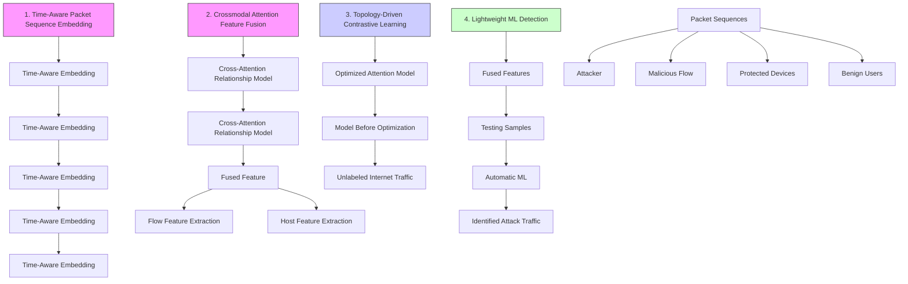
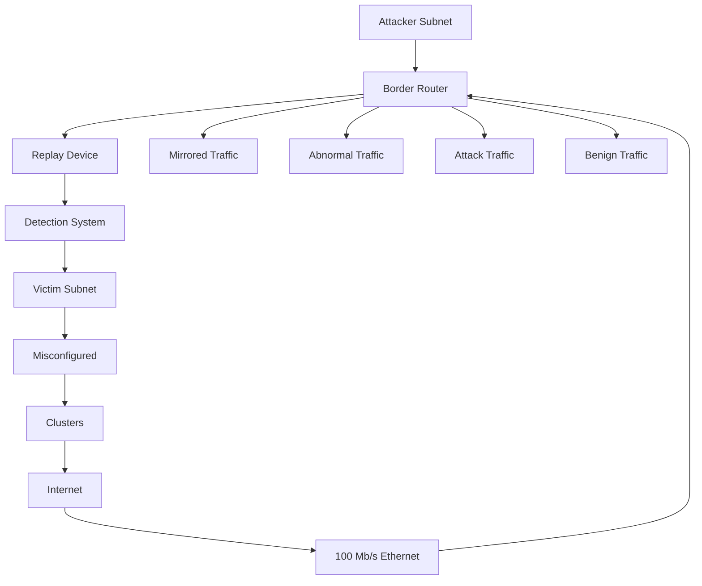

# Training with Only 1.0 ‰ Samples: Malicious Traffic Detection via Cross-Modality Feature Fusion

Chuanpu Fu∗

Department of Computer Science and Technology, Tsinghua University Beijing, China

Qi Li

INSC and State Key Laboratory of Internet Architecture, Tsinghua University Beijing, China

Elisa Bertino

Department of Computer Science, Purdue University West Lafayette, Indiana, United States

Ke Xu

Department of Computer Science and Technology, Tsinghua University Zhongguancun Lab Beijing, China

# Abstract

Machine Learning (ML) based malicious traffic detection systems can accurately recognize unseen network attacks by learning from large-scale traffic datasets. However, deploying such systems across multiple networks involves substantial efforts to construct large training datasets for each network. This paper addresses the issue of training with minimal datasets, that is, achieving accurate malicious traffic detection by learning a small portion of traffic in entirely new network environments, thereby eliminating prohibitive labor costs associated with traffic dataset construction. We develop tFusion to effectively extract information from limited datasets by treating network traffic data as multimodal data, comprising features from multiple sensory modalities of packets, flows, and hosts. In particular, we design a dedicated crossmodal attention model that fuses fine-grained per-packet sequential features with coarse-grained per-flow and per-host statistical features, to synthesize correlations among the different granularities of traffic features. Moreover, we design a topology-driven contrastive learning approach that pretrains the models while reducing topology-related biases, which allows tFusion to achieve generic detection across various networks. We deploy tFusion in an institutional network and measure its performance over five days. tFusion requires human experts to label only 1.0 ‰ traffic, yet it achieves 99.82% accuracy when detecting various attacks. Meanwhile, it outperforms 14 existing methods by improving over 12.76% accuracy on 11 existing datasets.

# CCS Concepts

• Security and privacy → Network security.

# Keywords

Network security; machine learning; malicious traffic detection

# ACM Reference Format:

Chuanpu Fu, Qi Li, Elisa Bertino, and Ke Xu. 2025. Training with Only 1.0 ‰ Samples: Malicious Traffic De tection vi a Cr oss-Modality Feature Fusion . In Proceedings of the 2025 ACM SIGSAC Conference on Computer

∗Chuanpu Fu completed this research while serving as a visiting scholar at Purdue University.

Permission to make digital or hard copies of all or part of this work for personal or classroom use is granted without fee provided that copies are not made or distributed for profit or commercial advantage and that copies bear this notice and the full citation on the first page. Copyrights for third-party components of this work must be honored. For all other uses, contact the owner/author(s).

CCS ’25, Taipei

© 2025 Copyright held by the owner/author(s).

ACM ISBN 979-8-4007-1525-9/2025/10

https://doi.org/10.1145/3719027.3765143

and Communications Security (CCS ’25), October 13–17, 2025, Taipei. ACM, New York, NY, USA, 15 pages. https://doi.org/10.1145/3719027.3765143

# 1 Introduction

Machine learning (ML) based malicious traffic detection is an important security technique that inspects traffic generated by various protocols and applications to recognize malicious flows with abnormal traffic features [8, 39, 79, 98, 107]. Over more than a decade of development, systems based on this technique have been deployed at network gateways to protect critical services [33, 34, 36], where they have successfully throttled real-world attack traffic [1, 2, 16] and outperformed traditional rule-based detection [88]. Currently, the market for malicious traffic detection is valued at more than \$3.64 billion, with expectations for expanding deployment across various networks [67].

Unfortunately, expanding the deployment of malicious traffic detection systems to new networks incurs prohibitive labor costs. Specifically, human experts must capture and label millions of benign and attack packets [44, 46, 107], because large-scale traffic datasets are essential for ML models to learn the complex traffic patterns generated by various applications and protocols in new network environments. This labor-intensive process [5, 10, 71] impedes a scalable deployment to protect vast numbers of Internet users from malicious traffic [5, 78].

To address this scalability problem, it is necessary to minimize the scale of the required training traffic da tasets. Th erefore, the goal of our work is to develop a detection system that maintains high precision, even when trained on a very small amount of traffic samples from the network environment of interest.

Our solution is based on the notion of multimodal AI, that is, a cognitive process that synthesizes patterns from multiple sensory modalities, such as texts, sounds, and images. We observe that existing detection methods still treat traffic as unimodal data, by exclusively learning per-packet [44, 100], per-flow [8, 107], or per-host feature vectors [33, 34] (see Table 1). Consequently, the inability to synthesize the different g ranularities o f f eatures results in significant i nformation l oss, r equiring l arge-scale training datasets [35, 65, 107]. In contrast, we view bytes delivered in networks from multiple modalities by extracting heterogeneous traffic features from the perspectives of packets, flows, and hosts. Subsequently, we correlate the traffic features across the different modalities to enrich the information available from limited datasets.

This paper presents tFusion, a malicious traffic detection system that effectively extracts information from limited training datasets.

Table 1: The comparison with the state-of-the-art ML based malicious traffic detection methods. 

<table><tr><td rowspan="2">Categories</td><td rowspan="2">Methods</td><td rowspan="2">ML Models</td><td colspan="3">Dataset Requirements</td><td colspan="4">Detection Abilities</td><td colspan="2">Performances</td></tr><tr><td>Feature Modality</td><td>Feature Scale</td><td>w/o Large Datasets</td><td>Generic Detection</td><td>Evasion Attack</td><td>Unknown Attack</td><td>Encrypted Traffic</td><td>Realtime Detection</td><td>Efficient Detection</td></tr><tr><td rowspan="6">Supervised Learning</td><td>nPrintML [44]</td><td>AutoML</td><td>Packet</td><td> $O(10^5)$ </td><td>×</td><td>√</td><td>×</td><td>×</td><td>√</td><td>√</td><td>×</td></tr><tr><td>FlowLens [8]</td><td>Random Forest</td><td>Flow</td><td> $O(10^4)$ </td><td>×</td><td>√</td><td>×</td><td>×</td><td>√</td><td>×</td><td>√</td></tr><tr><td>Taurus [79]</td><td>SVM</td><td>Flow</td><td> $O(10^4)$ </td><td>×</td><td>√</td><td>×</td><td>×</td><td>×</td><td>√</td><td>√</td></tr><tr><td>NetBeacon [107]</td><td>Decision Tree</td><td>Flow</td><td> $O(10^7)$ </td><td>×</td><td>√</td><td>×</td><td>×</td><td>×</td><td>√</td><td>√</td></tr><tr><td>BoS [100]</td><td>RNN</td><td>Packet</td><td> $O(10^4)$ </td><td>×</td><td>√</td><td>×</td><td>×</td><td>√</td><td>√</td><td>√</td></tr><tr><td>N3IC [77]</td><td>Binary DNN</td><td>Flow</td><td> $O(10^6)$ </td><td>×</td><td>√</td><td>×</td><td>×</td><td>×</td><td>√</td><td>√</td></tr><tr><td rowspan="5">Unsupervised Learning</td><td>Whisper [33]</td><td>K-Means</td><td>Host</td><td> $O(10^3)$ </td><td>×</td><td>√</td><td>√</td><td>√</td><td>×</td><td>√</td><td>√</td></tr><tr><td>Kitsune [65]</td><td>AutoEncoder</td><td>Packet</td><td> $O(10^5)$ </td><td>×</td><td>√</td><td>×</td><td>√</td><td>×</td><td>×</td><td>×</td></tr><tr><td>EULER [54]</td><td>GNN+RNN</td><td>Host</td><td> $O(10^3)$ </td><td>×</td><td>×</td><td>×</td><td>√</td><td>√</td><td>√</td><td>×</td></tr><tr><td>HorusEye [22]</td><td>Isolation Forest</td><td>Flow</td><td> $O(10^5)$ </td><td>×</td><td>×</td><td>×</td><td>√</td><td>×</td><td>√</td><td>√</td></tr><tr><td>HyperVision [34]</td><td>Graph Learning</td><td>Host</td><td> $O(10^7)$ </td><td>×</td><td>√</td><td>×</td><td>√</td><td>√</td><td>×</td><td>√</td></tr><tr><td>Both</td><td>tFusion (Ours)</td><td>Crossmodal Model</td><td>ALL</td><td> $O(10)$ </td><td>√</td><td>√</td><td>√</td><td>√</td><td>√</td><td>√</td><td>√</td></tr></table>

In particular, tFusion fuses traffic features with different granularities by using a pre-trained crossmodal model [18, 87, 92]. Specifically, the crossmodal model employs the attention mechanism to extract correlations among the different granularities of features. More precisely, the model calculates weights (attentions) for finegrained packet features based on coarse-grained flow and host characteristics, to highlight critical parts of packet sequences. In this way, tFusion synthesizes correlations among multiple modalities to obtain rich information from limited datasets, thus providing effective features to train both supervised and unsupervised lightweight ML detection models to identify various malicious behaviors.

However, correlation analysis for multimodal data, which comprises sequential and non-sequential traffic features, is a non-trivial task. First, to extract sequential features, we develop a time-aware positional encoding to synthesize packet-level temporal and spatial patterns. Second, to fuse the sequential and non-sequential features, we design a crossmodal attention model that employs host features as queries and flow features as keys to compute attentions, which allows tFusion to focus on critical regions of packet sequences associated with various flows. Third, to pre-train the attention model, we design a topology-driven contrastive learning approach that utilizes large-scale unlabeled Internet traffic datasets. This minimizes the need of labeling traffic for many networks. Specifically, our topology-driven pretraining guides the model to cluster traffic sent by same addresses in the feature space, regardless of ground-truth labels. Finally, during the deployment phase, we leverage Automatic ML (AutoML) [44] to select models for learning the features extracted by the pre-trained model from minimal datasets.

To assess the performance of tFusion, we replay 11 existing datasets to compare it with 14 state-of-the-art methods. The experimental results show that tFusion outperforms existing methods by improving the accuracy of 12. 76% in various training dataset settings. Even in critical settings, such as learning from 50 samples and 1.0 ‱ traffic, tFusion still retains more than 94. 92% precision and robustness against evasion attacks [33]. Moreover, tFusion significantly outperforms data augmentation methods [6, 47, 95] that mitigate the data scarcity issue for other ML tasks. Furthermore, the overall detection latency of tFusion is 34ms, which is comparable to the latency of existing detection systems [33, 34]. Finally, we deploy tFusion on an institutional network with more than 140 active users and measure its performance over five days. tFusion requires an expert team to label 1.0 ‰ flows (91 captured flows) for training an unsupervised model. Once trained, the model achieves 99.82% accuracy when detecting 25 manually constructed attacks.

In summary, the contributions of this paper are five-fold:

• We utilize crossmodal attention to correlate traffic features across different granularities, enabling malicious traffic detection with limited training datasets.   
• We develop a time-aware packet sequence embedding to extract fine-grained packet features.   
• We design a cross-attention to fuse the packet features and coarse-grained statistical features for correlation analysis.   
• We pre-train the attention model using large-scale unlabeled Internet traffic via topology-driven contrastive learning.   
• We prototype1 tFusion and validate its accuracy and efficiency in various network environments.

Additionally, our key idea, that is, seeing traffic as multimodal data, may also reduce the dependency of large datasets for other learning tasks, e.g., classifying benign application traffic [104]. We present initial comparative experiments to suggest future research.

Note that tFusion is not intended to outperform existing systems by simply devising similar flow or packet features. Instead, we aim to eliminate the dependency on large-scale training datasets by correlating different granularities of traffic features, thereby promoting broad deployment across various networks.

Road Map. The rest of the paper is organized as follows. Section 2 introduces the threat model, the goals of our design, and the related solutions. Sections 3 and 4 present an overview and the detailed design of tFusion, respectively. Section 5 presents the results of our experimental evaluation of tFusion. Section 6 discusses limitations. Section 7 reviews related works and Section 8 outlines conclusions.

Ethical Issues. We generate attack traffic within a separate subnet, and directly forward the traffic to the machine where both malicious and benign traffic is collected. In addition, firewalls are configured to prevent interference with real users (see Section 5.1). In addition, we do not disclose personally identifiable information (PII) of users and experts. The users and administrators consented to our experiments and the release of the dataset. Furthermore, our system identified unusual traffic which may relate to network events (e.g., routing updates). We reported these events to the administrators.

scatter

| x_range       | y_range | Dataset     |
| ------------- | ------- | ----------- |
| -300 to -200  | -100 to 100 | HyperVision |
| -200 to -100  | 0 to 300   | CIC Dataset |
| -100 to 0     | -100 to 300 | NetBeacon   |
| 0 to 100      | -100 to 300 | HyperVision |
| 100 to 200    | -100 to 300 | CIC Dataset |
| 200 to 300    | -100 to 300 | NetBeacon   |
| 300 to 400    | -100 to 300 | HyperVision |
| 400 to 500    | -100 to 300 | CIC Dataset |
| 500 to 600    | -100 to 300 | NetBeacon   |
| 600 to 700    | -100 to 300 | HyperVision |
| 700 to 800    | -100 to 300 | CIC Dataset |
| 800 to 900    | -100 to 300 | NetBeacon   |

(a) Traffic from different datasets.

scatter

| x    | y    | Category |
| ---- | ---- | -------- |
| -90  | 0    | Attack   |
| -60  | 30   | Attack   |
| -30  | 60   | Attack   |
| 0    | 90   | Attack   |
| 30   | 60   | Attack   |
| 60   | 30   | Attack   |
| 90   | 0    | Attack   |
| 30   | -30  | Attack   |
| 60   | -60  | Attack   |
| 90   | -90  | Attack   |
| -90  | 0    | Benign   |
| -60  | 30   | Benign   |
| -30  | 60   | Benign   |
| 0    | 90   | Benign   |
| 30   | 60   | Benign   |
| 60   | 30   | Benign   |
| 90   | 0    | Benign   |
| 30   | -30  | Benign   |
| 60   | -60  | Benign   |
| 90   | -90  | Benign   |

(b) Packet feature space.

  
(c) Flow feature space.

scatter

| x    | y    | label   |
| ---- | ---- | ------- |
| -10  | 5    | Benign  |
| -5   | 0    | Attack  |
| 0    | -5   | Benign  |
| 5    | -10  | Attack  |
| 10   | -15  | Benign  |
| 15   | -20  | Attack  |
| 20   | -25  | Benign  |
| 25   | -30  | Attack  |
| 30   | -35  | Benign  |
| 35   | -40  | Attack  |
| 40   | -45  | Benign  |
| 45   | -50  | Attack  |
| 50   | -55  | Benign  |
| 55   | -60  | Attack  |
| 60   | -65  | Benign  |
| 65   | -70  | Attack  |
| 70   | -75  | Benign  |
| 75   | -80  | Attack  |
| 80   | -85  | Benign  |
| 85   | -90  | Attack  |
| 90   | -95  | Benign  |
| 95   | -100 | Attack  |
| 100  | -105 | Benign  |
| 105  | -110 | Attack  |
| 110  | -115 | Benign  |
| 115  | -120 | Attack  |
| 120  | -125 | Benign  |
| 125  | -130 | Attack  |
| 130  | -135 | Benign  |
| 135  | -140 | Attack  |
| 140  | -145 | Benign  |
| 145  | -150 | Attack  |
| 150  | -155 | Benign  |
| 155  | -160 | Attack  |
| 160  | -165 | Benign  |
| 165  | -170 | Attack  |
| 170  | -175 | Benign  |
| 175  | -180 | Attack  |
| 180  | -185 | Benign  |
| 185  | -190 | Attack  |
| 190  | -195 | Benign  |
| 195  | -200 | Attack  |
| 200  | -205 | Benign  |
| 205  | -210 | Attack  |
| 210  | -215 | Benign  |
| 215  | -220 | Attack  |
| 220  | -225 | Benign  |
| 225  | -230 | Attack  |
| 230  | -235 | Benign  |
| 235  | -240 | Attack  |
| 240  | -245 | Benign  |
| 245  | -250 | Attack  |
| 250  | -255 | Benign  |
| 255  | -260 | Attack  |
| 260  | -265 | Benign  |
| 265  | -270 | Attack  |
| 270  | -275 | Benign  |
| 275  | -280 | Attack  |
| 280  | -285 | Benign  |
| 285  | -290 | Attack  |
| 290  | -295 | Benign  |
| 295  | -300 | Attack  |
| 300  | -305 | Benign  |
| 305  | -310 | Attack  |
| Note: The actual values for 'Benign' and 'Attack' are not provided in the code. The numbers inside the plots are estimated based on the y-axis label 'y'.

(d) Joint feature space.   
Figure 1: TSNE visualized feature spaces: packet [100] and flow features [28] are extracted from the dataset [34] by default.

# 2 Problem Statement

Threat Model. We assume that attackers generate various malicious network traffic flows from compromised machines [11, 40, 81]. Note that the attackers may control varying scales of machines, resulting in highly variable traffic features [50]. In addition, we assume that the attacker is able to generate stealthy traffic using sophisticated strategies, such as generating encrypted traffic [34, 81], exploiting advanced vulnerabilities [13, 26], crafting behaviors that mimic benign users [52, 61], and applying adversarial strategies for evasion, e.g., manipulating features with traffic obfuscation [33] and concealing topology patterns using tunnels [37].

Design Goals. The design of tFusion should meet several requirements: (1) It should achieve accurate detection by learning from limited training datasets. (2) It should support unsupervised ML, i.e., learning from samples with benign labels in the absence of attack samples [41, 65]. (3) It should meet the traditional requirements for malicious traffic detection that are listed in Table 1: (i) Generic detection for various attacks with different speeds and durations; (ii) Robust detection for existing evasion attacks [33, 35]; (iii) Accurate detection for zero-day attacks [80]; (iv) Ability to capture both encrypted and plain-text malicious traffic [34]; and (v) Low-latency detection in high-speed networks.

In general, tFusion focuses on detecting unknown attack traffic flows among high-speed Internet traffic flows generated by various protocols and applications in real time. This task is fundamentally different from off-line supervised traffic classifications for specific known kinds of applications [59, 104]. Moreover, unlike the classification of benign applications [59, 105], tFusion should not directly learn raw bytes in packet payloads [108], as attackers can easily manipulate data in the form of raw bytes for evasion attacks [5, 45]. Potential Solutions. We observe that complementing limited datasets with samples from other datasets cannot mitigate the problem of data scarcity because the distributions of traffic features in computer networks differ significantly from each other due to the diversity of network services (see the flow features [28] in Figure 1(a)). Moreover, existing data augmentation methods [6, 49, 95] can only generate a particular type of traffic based on prior knowledge, such as Tor traffic [6] and TLS traffic [95]. Thus, these methods cannot be applied to traffic detection systems, which must handle various types of traffic for generic detection (see the experiments in Section 5.2). Unlike these methods, we seek to effectively extract informative traffic features from limited datasets.

# 3 Overview

# 3.1 Key Observations

Existing approaches view traffic as unimodal data [90], exclusively analyzing homogeneous tabular data with a single granularity, such as per-packet features [65] and per-flow features [28]. However, as we can see from Figures 1(b) and 1(c), these features are densely distributed and thus cannot effectively distinguish benign and malicious traffic. Therefore, large amounts of samples are required by ML models to regress the complex decision boundaries.

In contrast, we treat traffic as miltimodal data. That is, we view bytes delivered by networks from multiple modalities, i.e., from the perspective of packets, flows, and hosts, to extract heterogeneous features comprising different granularities of sequential and nonsequential traffic features. From Figure 1(d), we observe that the distribution of the multimodal features is more sparse. This suggests that analyzing features across multiple modalities may compensate for the information loss that occurs with traditional unimodal feature analysis, which is a promising direction for effective training with limited datasets.

# 3.2 High-Level Architecture

We develop tFusion to synthesize traffic features extracted from multiple perspectives. Specifically, we design a crossmodal model to capture the correlations among sequential and non-sequential features based on the attention mechanism2.

Like existing systems [22, 33, 107], tFusion is deployed at Internet gateways, where it inspects traffic mirrored by routers [15], such as those connecting ASes through optical fibers [94]. When tFusion identifies abnormal traffic, it cooperates with existing defense systems [60, 97, 103] to effectively throttle the traffic. tFusion has four modules, as illustrated in Figure 2.

Time-Aware Packet Sequence Embedding. tFusion starts by extracting fine-grained sequential features. We design a time-aware positional encoding algorithm to simultaneously embed both temporal information (i.e., packet-arrival intervals) and spatial information (i.e., packet sizes). Meanwhile, this module extracts packet-level sequential information by analyzing the dependencies among the packets in a flow, which facilitates the detection of stealthy attacks.

flowchart

Figure 2: High-level architecture of tFusion malicious traffic detection system.

Crossmodal Attention Feature Fusion. In this module, we analyze the correlations between the fine-grained sequential features and coarse-grained non-sequential features. Specifically, we design a crossmodal attention mechanism to fuse these features with different granularities into a unified feature vector. More precisely, we use host features as queries, flow features as keys, and packet features as values. In this way, host features instruct the model to concentrate on important packets in various flows, allowing the fused feature vector to effectively represent multimodal traffic data. Topology-Driven Contrastive Learning. To pre-train the model, we develop a contrastive learning approach, which enables utilizing large-scale unlabeled Internet traffic datasets generated by numerous benign and malicious sources. Note that the unlabeled traffic is collected from networks other than where tFusion will be deployed, thereby minimizing the labor costs of labeling training samples for many different networks. Specifically, our approach is driven by specific network topological information, that is, the traffic generation address. It gradually guides the model to gather traffic generated by same addresses in the feature space, regardless of their labels. In this way, tFusion can utilize the traffic generated by various topologies in large data sets to eliminate bias on network topologies for accurate detection in different networks.

Lightweight ML Detection. In the training phase, human experts randomly sample a small minority of traffic from new deployment networks. After labeling the traffic samples, they apply the pretrained model to extract traffic features from the constructed dataset. The extracted features are subsequently input into an AutoML framework, which trains either four supervised ML models [8, 36, 79, 107] or three unsupervised models [22, 33, 34], depending on the availability of malicious traffic samples. These lightweight models are widely used by existing traffic detection approaches to realize efficient detection. Ultimately, the framework selects the model with the highest accuracy, which learns the features containing rich information extracted from the limited datasets.

# 4 Design Details

# 4.1 Time-Aware Packet Sequence Embedding

This module extracts fine-grained features by synthesizing spatial and temporal patterns from packet sequences. First, we aggregate packets into flows. The flows consist of packets that share the same five-tuple attributes: transport layer protocol identifier, source and destination IP addresses, and associated port numbers. The $\mathrm { i ^ { t h } }$ arrived flow is denoted by set $\mathcal { F } _ { i } = \{ \boldsymbol { \mathcal { I } } _ { i } , \mathbf { P } ^ { ( i ) } \}$ , where ${ \cal T } _ { i } = \langle { \sf p } , s , { \sf d } , s _ { \sf p } , { \sf d } _ { \sf p } \rangle$ is the tuple that characterizes the flow and the matrix $\mathbf { P } ^ { ( i ) } = \left[ \vec { t } ^ { i } , \vec { l } ^ { i } \right]$ contains the per-packets features, i.e., ${ \vec { t } } ^ { i }$ and $\vec { l } ^ { i }$ denote the arrival timestamps and the lengths associated with the $N _ { i }$ packets in the $\mathrm { i ^ { t h } }$ flow, respectively. Note that, we do not directly use packet header fields as features, such as port numbers and time-to-live (TTL), because analyzing these fields incurs overfitting issues [5, 45]. Instead, we extract sequential features from matrix P (?? ) . $\mathbf { P } ^ { ( i ) }$

Time-Aware Packet Embedding. We convert the features of each packet into a vector. This vector contains both the packet length information and the arrival time information. First, to effectively embed the length information, we offset the length based on the protocol identifier before embedding:

$$
\vec {v} _ {j} ^ {i} = \mathcal {I} _ {i}. p \times M + \min (\vec {l} _ {j} ^ {i}, M) - 1, \tag {1}
$$

where M denotes the maximum length of a packet that can be delivered by the network. Next, we apply a traditional embedding layer that maps each integer in $\vec { v } ^ { i }$ to a floating-point vector, forming a matrix: $\bar { \mathbf { E } } ^ { ( i ) } = \mathsf { E m b e d } ( \vec { v } )$ . Note that the layer is trained to maximize the distances among the mapped vectors to effectively represent the packets.

Second, we embed the temporal information, because $\mathbf { E } ^ { ( i ) }$ cannot indicate the order of packets and time intervals among the packets. Traditional positional encoding for language [18] only considers the order, but cannot consider time-scale information. Therefore, we design a time-aware positional encoding algorithm, which converts timestamps into discrete values that not only indicate a packet’s position in a flow but also highlights significant time intervals between packets:

$$
\vec {u} _ {j} ^ {i} = \left\{ \begin{array}{c l} 0, & \text { if } \quad j = 1, \\ 2 \cdot j + 1, & \text { elseif } \quad T \leq \vec {t} _ {j} ^ {i} - \vec {t} _ {j - 1} ^ {i}, \\ 2 \cdot j, & \text { else }, \end{array} \right. \tag {2}
$$

where $1 \ \leq \ j \ \leq \ N _ { i } .$ . Afterward, we map each element in $\vec { u } ^ { i }$ to a vector using a sinusoidal function, which allows two packets with non-adjacent positions or large arrival intervals to be represented by significantly different vectors:

$$
\mathbf {U} _ {j, p} = \left\{ \begin{array}{l l} \sin \left(p \cdot e ^ {- \frac {j \cdot \ln T}{H}}\right), & \text { if } j \bmod 2 = 0, \\ \cos \left(p \cdot e ^ {- \frac {j \cdot \ln T}{H}}\right), & \text { else }, \end{array} \right. \tag {3}
$$

where $1 \le p \le H$ and $1 \le j \le N _ { i }$ . In this way, the embedding function can effectively represent the index and time of each packet, since it utilizes exponential functions to amplify the values, and sinusoidal functions for normalization.

Finally, we compute the time-position embedding matrix as $\mathbf { T } ^ { \left( i \right) } = \mathbf { U } _ { \vec { u } ^ { i } }$ , and combine it with the length embedding matrix $\mathbf { E } ^ { ( i ) }$ to produce the matrix representing the packet sequence: $\mathsf { S } ^ { ( i ) } =$ $\mathbf { T } ^ { ( i ) } + \mathbf { E } ^ { ( i ) }$ . Note that $\mathsf { S } _ { j } ^ { ( i ) }$ is the vector representing $\mathrm { j } ^ { \mathrm { t h } }$ packet in $\mathrm { i ^ { t h } }$ flow.

Sequential Feature Extraction. For each flow, we extract sequential features to represent the relationships among the packets. We employ a self-attention model [87]. First, the model converts an input matrix into query, key, and value matrices. Afterward, it computes an attention matrix that indicates correlations, by multiplying the three matrices with non-linear transformations. Given that the scale of our embedding vectors is smaller than those used in language-related tasks [18], we utilize a smaller model to mitigate overfitting issues [5].

First, we convert matrix $\mathsf { S } ^ { ( i ) }$ into query, key, and value matrices, i.e., the input of the attention model:

$$
\mathbf {Q} ^ {(i)} = \text { Linear } \left(\mathbf {S} ^ {(i)}; \mathbf {W} ^ {(Q)}, \vec {b} ^ {(Q)}\right) = \mathbf {S} ^ {(i)} \mathbf {W} ^ {(Q) \top} + \vec {b} ^ {(Q)}, \tag {4}
$$

where ${ \bf W } _ { H \times H } ^ { ( Q ) }$ and $\vec { b } ^ { ( Q ) }$ are trainable parameters, denoting the weights and bias of the fully connected layer with ?? states.

$$
\mathbf {K} ^ {(i)} = \text { Linear } \left(\mathbf {S} ^ {(i)}; \mathbf {W} ^ {(K)}, \vec {b} ^ {(K)}\right),   \mathbf {V} ^ {(i)} = \text { Linear } \left(\mathbf {S} ^ {(i)}; \mathbf {W} ^ {(V)}, \vec {b} ^ {(V)}\right). \tag {5}
$$

In the next step, we calculate the self-attention values according to the key, value, and query matrices:

$$
\mathbf {A} ^ {(i)} = \operatorname{Atten} (\mathbf {Q} ^ {(i)}, \mathbf {K} ^ {(i)}, \mathbf {V} ^ {(i)}) = \operatorname{Softmax} \left(\frac {\mathbf {Q} ^ {(i)} \mathbf {K} ^ {(i) \top}}{\sqrt {H}}\right) \mathbf {V} ^ {(i)}, \tag {6}
$$

where $\mathbf { A } ^ { ( i ) }$ denotes the values of attentions. Afterward, we combine the attention matrix $\mathbf { A } ^ { ( i ) }$ with the embedding matrix $\mathsf { S } ^ { ( i ) }$ . Afterward, we apply the residual connection that directly adds the model’s input to its output, a widely used technique for improving deep learning models [18, 87]. Moreover, we employ a fully connected layer with 4?? hidden states to produce the output of this module:

$$
\begin{array}{l} \mathbf {M} ^ {(i)} = \operatorname{GELU} \left(\operatorname{Linear} \left(\mathbf {A} ^ {(i)} + \mathbf {S} ^ {(i)}; \mathbf {W} _ {(H \times 4 H)} ^ {(1)}, \vec {b} ^ {(1)}\right)\right), \\ \mathbf {U} ^ {(i)} = \text { Softmax } \left(\text { Linear } \left(\mathbf {M} ^ {(i)}; \mathbf {W} _ {(4 H \times H)} ^ {(2)}, \vec {b} ^ {(2)}\right) + \mathbf {A} ^ {(i)}\right). \\ \end{array}
$$

Note that GELU(·) denotes the Gaussian Error Linear Unit function. Finally, we select the first dimension of the matrix $\mathbf { U } ^ { ( i ) }$ , which is denoted by $\vec { p } _ { i } ,$ , to represent the fine-grained sequential information extracted from the flow.

We plot the attentions in Figure 3 and Figure 4, where a darker pixel indicates a higher attention value. We observe that a packet does not exhibit significant correlation to itself, as the values on the diagonals of the attention matrices are not significantly higher. Moreover, we can see the regular and periodic patterns in the attentions associated with malicious flows, such as the periodic bursts generated by pulsing attacks [61] (see Figure 4(a)). Meanwhile, the attention values of malicious flows are generally higher than those of benign flows, because attention models can easily capture their regular patterns. Note that tFusion captures both temporal and spatial packet patterns, which are critical for detecting advanced malicious traffic [8, 33]. In contrast, existing attention based benign application classification methods [17, 59, 104, 105] can only analyze the spatial patterns.

line

| Packet Index | Attention to Packets |
| ------------ | -------------------- |
| 0            | 0                    |
| 20           | 20                   |
| 40           | 40                   |
| 60           | 60                   |
| 80           | 80                   |

(a) HTTP download.

heatmap

| Packet Index | 0    | 20   | 40   | 60   | 80   |
| ------------ | ---- | ---- | ---- | ---- | ---- |
| 0            | 0    | 0    | 0    | 0    | 0    |
| 20           | 0    | 0    | 0    | 0    | 0    |
| 40           | 0    | 0    | 0    | 0    | 0    |
| 60           | 0    | 0    | 0    | 0    | 0    |
| 80           | 0    | 0    | 0    | 0    | 0    |

(b) HTTPS web access.

heatmap

| Packet Index | 0    | 20   | 40   | 60   | 80   |
| ------------ | ---- | ---- | ---- | ---- | ---- |
| 0            | 0    | 0    | 0    | 0    | 0    |
| 20           | 0    | 0    | 0    | 0    | 0    |
| 40           | 0    | 0    | 0    | 0    | 0    |
| 60           | 0    | 0    | 0    | 0    | 0    |
| 80           | 0    | 0    | 0    | 0    | 0    |

(c) UDP video flow.

Figure 3: Attention values associated with benign flows.   

bar

| Packet Index | Attention to Packets |
| ------------ | -------------------- |
| 0            | 0                    |
| 20           | 20                   |
| 40           | 40                   |
| 60           | 60                   |
| 80           | 80                   |

(a) Pulsing TCP DoS.

bar

| Packet Index | Attention to Packets |
| ------------ | -------------------- |
| 0            | 0                    |
| 20           | 20                   |
| 40           | 40                   |
| 60           | 60                   |
| 80           | 80                   |

(b) Telnet injection.

heatmap

| | 0 | 20 | 40 | 60 | 80 |
|---|---|---|---|---|---|
| Row 1 | 0 | 0 | 0 | 0 | 0 |
| Row 2 | 20 | 20 | 20 | 20 | 20 |
| Row 3 | 40 | 40 | 40 | 40 | 40 |
| Row 4 | 60 | 60 | 60 | 60 | 60 |
| Row 5 | 80 | 80 | 80 | 80 | 80 |
The image displays a heatmap of attention to packets across the matrix, with each cell representing a packet's attention level at its respective index. The color intensity corresponds to the magnitude of attention, as indicated by the vertical gradient from blue (low) to dark blue (high). No explicit numerical values or trends are provided in the image.

(c) Amplification attack.   
Figure 4: Attention values associated with attack flows.

# 4.2 Crossmodal Attention Feature Fusion

In this module, we extract coarse-grained statistics from the perspectives of hosts and flows. Subsequently, we fuse the sequential features with these non-sequential features, by designing a crossmodal attention model.

Flow Statistical Feature Extraction. For each flow $\mathcal { F } _ { i } ,$ we extract flow-level statistics from the per-packet feature matrix $\mathbf { P } ^ { ( i ) }$ . Specifically, we calculate six flow features [28, 34]. The flow-level feature vector $\vec { f }$ can be denoted as:

$$
\vec {f} ^ {i} = \operatorname{Log} \left(\left[ N _ {i}, \vec {t} _ {N _ {i}} ^ {i} - \vec {t} _ {1} ^ {i}, \sum_ {j = 1} ^ {N _ {i}} \vec {l} _ {j} ^ {i}, \min (\vec {l} ^ {i}), \max (\vec {l} ^ {i}), \frac {1}{N _ {i}} \sum_ {j = 1} ^ {N _ {i}} \vec {l} _ {j} ^ {i} \right] ^ {\top} + \vec {1}\right). \tag {8}
$$

The features are: (i) the number of packets in a flow $( \mathrm { i . e . , } N _ { i } ) ; \mathrm { ( i i ) }$ flow completion time (FCT) denoted by $\vec { t } _ { N _ { i } } ^ { i } - \vec { t } _ { 1 } ^ { i }$ ; (iii) the number of bytes in a flow: Sum $\begin{array} { r } { ( \vec { l } ^ { i } ) = \sum _ { j = 1 } ^ { N _ { i } } \vec { l } _ { j } ^ { i } } \end{array}$ ; the (iv) maximum, (v) minimum, and (vi) average packet lengths in the flow, denoted by $\mathsf { m i n } ( \vec { l } ^ { i } ) , \mathsf { m a x } ( \vec { l } ^ { i } )$ , and $\mathrm { m e a n } ( \vec { l } ^ { i } )$ , respectively. In addition, we perform logarithmic transformations to improve numerical stability.

Host Feature Extraction. We extract host-level statistics to represent flow interactions among numerous hosts. Therefore, for the flows that arrive within a small time window ??, we calculate 12 host-level flow interaction features. Specifically, we define the functions $\mathsf { f } _ { \mathsf { s r c } } ( { \boldsymbol { s } } ; \mathcal { F } )$ and $\mathrm { f _ { d s t } } ( d ; \mathcal { F } )$ , which query the flows with the same source and destination hosts among all the flows in $\mathcal { F }$ :

$$
f _ {\text { src }} (s; \mathscr {F}) = \left\{\mathscr {F} _ {i} | \forall \mathscr {F} _ {i} \in \mathscr {F}, I _ {i}. s = s \right\},
$$

$$
f _ {d s t} (d; \mathscr {F}) = \left\{\mathscr {F} _ {i} | \forall \mathscr {F} _ {i} \in \mathscr {F}, I _ {i}. d = d \right\}. \tag {9}
$$

Based on the flows with the same source and destination, we define the functions that extract the features of sending and receiving patterns for one particular host:

$$
\begin{array}{l} \operatorname{send} (h) = \left[ \left| f _ {\text { src }} (h; \mathcal {F}) \right|, \sum_ {\mathcal {F} _ {j} \in f _ {\text { src }} (h; \mathcal {F})} N _ {j}, \sum_ {\mathcal {F} _ {j} \in f _ {\text { src }} (h; \mathcal {F})} \sum_ {k = 1} ^ {N _ {j}} \vec {l} _ {k} ^ {j} \right] ^ {\mathrm{T}}, \tag {10} \\ \operatorname{receive} (h) = \left[ | \mathrm{f} _ {\mathrm{dst}} (h; \mathscr {F}) |, \sum_ {\mathscr {F} _ {j} \in \mathrm{f} _ {\mathrm{dst}} (h; \mathscr {F})} N _ {j}, \sum_ {\mathscr {F} _ {j} \in \mathrm{f} _ {\mathrm{dst}} (h; \mathscr {F})} \sum_ {k = 1} ^ {N _ {j}} \vec {l} _ {k} ^ {j} \right] ^ {\mathrm{T}}. \\ \end{array}
$$

Afterward, we define the host-level feature associated with one flow $\mathcal { F } _ { i }$ as the sending and receiving features associated with its source $\mathcal { T } _ { i } .$ .?? and destination I?? .??:

$$
\vec {h} ^ {i} = \operatorname{Log} \left(\operatorname{Cat} (\text { send } (\mathcal {I} _ {i}. s), \text { receive } (\mathcal {I} _ {i}. s), \text { send } (\mathcal {I} _ {i}. d), \text { receive } (\mathcal {I} _ {i}. d))\right), \tag {11}
$$

where the function Cat(·) concatenates all these vectors. Similar to extracting flow features, we also perform the logarithmic transformations for the host features.

Cross-Modality Feature Fusion. In the last step, we fuse the non-sequential features ${ \vec { f } } ^ { i }$ and $\vec { h } ^ { i }$ with the sequential features $\vec { p } ^ { i }$ , to capture the relationships among these features at different granularities. Specifically, we devise a crossmodal attention model to correlate different granularities of features by using the host features as queries, flow features as keys, and packet-level sequential features as values. This is because the flow and host features are coarse-grained, and thus cannot directly indicate the fine-grained patterns. However, these features can guide the model to assign high attention values (weights) to focus on critical packets. Note that unlike the self-attention mechanism employed to extract sequential features, the key, query, and value matrices in the cross-attention feature fusion model originate from distinct modalities, enabling effective fusion for heterogeneous data:

$$
\begin{array}{l} \vec {q} ^ {i} = \operatorname{Linear} (\vec {h} ^ {i}; \mathbf {W} _ {1 2 \times H} ^ {q}, \vec {b} ^ {q}) = \vec {h} ^ {i \top} \mathbf {W} _ {1 2 \times H} ^ {q} + \vec {b} ^ {q}, \\ \vec {k} ^ {i} = \text { Linear } (\vec {f} ^ {i}; \mathbf {W} _ {6 \times H} ^ {k}, \vec {b} ^ {k}), \quad \vec {v} ^ {i} = \text { Linear } (\vec {p} ^ {i}; \mathbf {W} _ {H \times H} ^ {v}, \vec {b} ^ {v}). \tag {12} \\ \end{array}
$$

Here, we use the Hadamard product to substitute the matrix multiplication in the original attention designed for sequential data [18, 87], to support applying attentions for fusing features of heterogeneous traffic data:

$$
\vec {C} ^ {i} = \text { CrossAtten } (\vec {q} ^ {i}, \vec {k} ^ {i}, \vec {v} ^ {i}) = \text { Softmax } \left(\frac {\vec {q} ^ {i} \circ \vec {k} ^ {i}}{\sqrt {H}}\right), \vec {F} ^ {i} = \vec {C} ^ {i} \circ \vec {v} ^ {i} + \vec {q} ^ {i}. \tag {13}
$$

Inspired by large language models [18], we apply residual connections to enhance the relationships between the queries and attention values. Finally, $\vec { F } ^ { i }$ denotes the fused traffic features.

In Figure 5, we plot the distribution of traditional sequential [100] and non-sequential [28] features, as well as tFusion features. Specifically, we randomly select 200 benign and malicious flows and project the high-dimensional traffic features spaces. From Figure 5(a) and Figure 5(b), we can see that the feature vectors are distributed in small regions, because the crossfire attack [52] mimics benign traffic features, i.e., it congests critical links by instructing many compromised devices to simultaneously generate massive normal flow. Similarly, the amplification attack triggers massive flooding traffic by sending few packets at a low speed [73], making the associated features closer to benign ones (see Figures 6(a) and 6(b)).

  
(a) Squential features.

  
(b) Statistical features.

  
(c) tFusion features.

Figure 5: Crossfire attack flows in the traffic feature spaces.   
  
(a) Sequential features.

  
(b) Statistical features.

  
(c) tFusion features.   
Figure 6: DNS amplification attack flows in the spaces.

Consequently, existing approaches require large-scale datasets to learn the complex decision boundaries. In contrast, as we can see from Figures 5(c) and 6(c), the attack traffic deviates the normal relationships among the features, and thus tFusion can effectively capture the attacks by synthesizing these features.

Furthermore, we visualize the cross-attention to investigate modality-wise correlation. Initially, we extract features of benign traffic from Internet datasets [94] and our institutional network testbed (see Section 5.1), as well as malicious traffic from existing datasets [34]. Afterward, we transform the features according to Eq. 12 to calculate attention. In Figure 7, each line connecting the three modality dimensions denotes the attention among packet, flow, and host features, where transparency of the lines indicates values of attentions, and red color highlights significantly high attention values (close to 1.0 after normalization). Comparing benign attentions (Figures 7(a) and 7(b)) to abnormal ones (Figures 7(c) ∼ 7(f)), we can see that values of cross-attention associated with malicious traffic are generally higher than those of benign traffic. These high attention values indicate abnormal correlations among different granularities of traffic features, and thus can be accurately captured by tFusion.

Note that existing approaches, which either correlate unimodal raw bytes within same flows [59, 105] or concatenate unimodal packet-level features of bytes and sizes [42], differ significantly from our cross-modality model which captures correlations among multiple modalities of packets, flows, and hosts. Additionally, our ablation studies show that simply concatenating features [77] fails to synthesize the correlations among modalities, and thus cannot achieve effective training on minimal datasets.

# 4.3 Topology-Driven Contrastive Learning

We design a contrastive learning approach that allows us to utilize large-scale unlabeled Internet traffic datasets to pre-train the attention models. This ensures that the models provide informative features for training AutoML module with minimal datasets. Unlike existing pre-training approaches [17, 49], we do not aim to achieve high accuracy on the detection task for a particular network, which restrains the accuracy in other networks. Instead, our topologydriven method pre-trains the models to maximize the distances between the features associated with flows generated by different addresses, while minimizing the distances between flows generated by same addresses in the feature space.

line

| Dim. Packet Modality | Dim. Flow Modality |
| ------------------- | ------------------ |
| 0                   | 0                  |
| 50                  | 50                 |
| 100                 | 100                |
| 150                 | 150                |
| 200                 | 200                |
| 250                 | 250                |
| 300                 | 300                |
| 350                 | 350                |
| 400                 | 400                |

(a) Internet benign traffic.

line

| Dim. Packet Modality | Dim. Flow Modality |
| ------------------- | ------------------ |
| 0                   | 0                  |
| 50                  | 100                |
| 100                 | 250                |
| 150                 | 350                |
| 200                 | 400                |
| 250                 | 350                |
| 300                 | 300                |
| 350                 | 250                |
| 400                 | 200                |

(b) Testbed benign traffic.

line

| Dim. Packet Modality | Dim. Flow Modality |
| ------------------- | ------------------ |
| 0                   | 0                  |
| 50                  | 50                 |
| 100                 | 100                |
| 150                 | 150                |
| 200                 | 200                |
| 250                 | 250                |
| 300                 | 300                |
| 350                 | 350                |
| 400                 | 400                |

(c) Crossfire attack.

line

| Dim. Packet Modality | Dim. Flow Modality |
| ------------------- | ------------------ |
| 0                   | 400                |
| 50                  | 350                |
| 100                 | 300                |
| 150                 | 250                |
| 200                 | 200                |
| 250                 | 150                |
| 300                 | 100                |
| 350                 | 50                 |
| 400                 | 0                  |

(d) Amplification attack.

line

| Dim. Packet Modality | Dim. Flow Modality |
| ------------------- | ------------------ |
| 0                   | 400                |
| 50                  | 350                |
| 100                 | 300                |
| 150                 | 250                |
| 200                 | 200                |
| 250                 | 150                |
| 300                 | 100                |
| 350                 | 50                 |
| 400                 | 0                  |

(e) Password cracking.

line

| Dim. Packet Modality | Dim. Flow Modality |
| ------------------- | ------------------ |
| 50                  | 100                |
| 100                 | 200                |
| 150                 | 300                |
| 200                 | 400                |
| 250                 | 350                |
| 300                 | 300                |
| 350                 | 250                |
| 400                 | 200                |

(f) Spam traffic.   
Figure 7: Attention among different modalities synthesized by the fusion model, i.e., packet, flow, and host features.

Contrastive Sample Batch Construction. First, we aggregate samples for pre-training into batches of size 2??. Each batch contains an identical amount of flows sent by (or received by) same and different addresses. We use $\mathcal { F } _ { T } = \left\{ \mathcal { F } _ { 1 } , . . . , \mathcal { F } _ { Y } \right\}$ to denote all the flows in an unlabeled large-scale Internet traffic dataset, where each flow may either be benign or malicious. We first identify the source and destination addresses that send or receive more than ?? flows:

$$
\begin{array}{l} \mathcal {S} = \left\{\mathcal {F} _ {i}. s \mid \left| f _ {\text { src }} (\mathcal {F} _ {i}. s; \mathcal {F} _ {T}) \right| \geq B, \forall \mathcal {F} _ {i} \in \mathcal {F} _ {T} \right\}, \\ \mathcal {D} = \left\{\mathcal {F} _ {i}. d \mid \left| f _ {\mathrm{dst}} \left(\mathcal {F} _ {i}. d; \mathcal {F} _ {T}\right) \right| \geq B, \forall \mathcal {F} _ {i} \in \mathcal {F} _ {T} \right\}. \tag {14} \\ \end{array}
$$

Note that ?? is the batch size hyperparameter. In the next step, we evenly sample flows in S to construct S containing flows sent by and not sent by same addresses:

$$
\mathcal {S} = \bigcup_ {\forall s \in \mathcal {S}} \left\{\mathcal {S} _ {s} \right\}, \quad \mathcal {S} _ {s} = \left\{\mathcal {S} _ {\text { same }} ^ {s}, \mathcal {S} _ {\text { diff }} ^ {s} \right\}, \tag {15}
$$

where $\mathcal { S } _ { s }$ denotes sampled flows associated with ?? ∈ S. It contains $\mathcal { S } _ { \mathrm { s a m e } } ^ { s }$ (the ?? flows sent by ??) and $\mathcal { S } _ { \mathrm { d i f f } } ^ { s }$ (the ?? flows not sent by ??):

$$
\mathscr {S} _ {s} = \left\{\operatorname{samp} (\mathrm{f} _ {\mathrm{src}} (s; \mathscr {F} _ {T}); B), \operatorname{samp} (\mathscr {F} _ {T} - \mathrm{f} _ {\mathrm{src}} (s; \mathscr {F} _ {T}); B) \right\}. \tag {16}
$$

Similarly, we construct $\mathcal { D }$ that contains flows received by and not received by same addresses:

$$
\mathcal {D} = \bigcup_ {\forall d \in \mathcal {D}} \left\{\mathcal {D} _ {d} \right\}, \quad \mathcal {D} _ {d} = \left\{\mathcal {D} _ {\text { same }} ^ {d}, \mathcal {D} _ {\text { diff }} ^ {d} \right\}, \tag {17}
$$

$$
\mathscr {D} _ {d} = \left\{\operatorname{samp} \left(\mathrm{f} _ {\mathrm{dst}} (d; \mathscr {F} _ {T}); B\right), \operatorname{samp} \left(\mathscr {F} _ {T} - \mathrm{f} _ {\mathrm{dst}} (d; \mathscr {F} _ {T}); B\right) \right\}.
$$

$\begin{array} { r } { \mathcal { C } = \mathcal { S } \cup \mathcal { D } = \bigcup _ { h \in S \cup \mathcal { D } } \{ \mathcal { C } _ { s \mathrm { a m e } } ^ { h } , \mathcal { C } _ { \mathrm { d i f f } } ^ { h } \} } \end{array}$ r the contrastive learning.

Contrastive Training. Initiafeature for each flows in a batch $\{ \dot { \mathcal { C } } _ { \mathrm { s a m e } } ^ { h } , \mathcal { C } _ { \mathrm { d i f f } } ^ { h } \}$ e, C ℎdiff } Fusion to extract the. That is, we construct the feature matrix $( 1 \leq i \leq 2 B )$ :

$$
\mathbf {F} ^ {(h)} = [ \vec {F} ^ {1}, \dots , \vec {F} ^ {B}, \vec {F} ^ {B + 1}, \dots , \vec {F} ^ {2 B} ], \tag {18}
$$

$$
\left\{ \begin{array}{l} \vec {F} ^ {i} = \text { tFusion } (\{\mathscr {C} _ {\text { same }} ^ {h} \} _ {i}), \quad \text { if } \quad i \leq B, \\ \vec {F} ^ {i} = \text { tFusion } (\{\mathscr {C} _ {\text { diff }} ^ {h} \} _ {i - B}), \quad \text { else. } \end{array} \right. \tag {19}
$$

Note that tFusion() denotes the overall procedure of our method, as described in Sections 4.1 and 4.2. Afterward, we project the extracted features using two fully connected layers, like the approach by Chen et al. [14]:

$$
\mathbf {Q} ^ {(h)} = \operatorname{proj} (\mathbf {F} ^ {(h)}) = \text { Linear } \left(\text { ReLU } (\text { Linear } (\mathbf {F} ^ {(h)}; \mathbf {W} ^ {1}, \vec {b} ^ {1})); \mathbf {W} ^ {2}, \vec {b} ^ {2}\right). \tag {20}
$$

Notably, the layers are only used for pre-training, and are not executed during the training phase. We use cosine similarity to measure the distance between two samples:

$$
\operatorname{Sim} (\vec {x}, \vec {y}) = \frac {\vec {x} ^ {\mathsf {T}} \cdot \vec {y}}{\| \vec {x} \| \| \vec {y} \|}. \tag {21}
$$

Finally, the loss associated with the batch is:

$$
l _ {\mathrm{c}} ^ {(h)} = \frac {1}{B} \sum_ {i = 1} ^ {i = B - 1} - \ln \left[ \frac {e ^ {\operatorname{Sim} (\vec {q} _ {i} , \vec {q} _ {i + 1})}}{e ^ {\operatorname{Sim} (\vec {q} _ {i} , \vec {q} _ {i + 1})} + e ^ {\operatorname{Sim} (\vec {q} _ {i} , \vec {q} _ {i + B})}} \right]. \tag {22}
$$

Once we derive the loss for one batch of pre-training data, we perform back propagation to optimize all the trainable parameters using the Adam optimizer with a small learning rate and weight decay. Unlike existing contrastive learning approaches [14], we do not rely on fixed rules to craft new samples (e.g., image rotation). Instead, we directly utilize flows generated by different addresses with diverse traffic patterns. In addition, our contrastive learning does not rely on labeled datasets, and thus can utilize the rich traffic patterns in the unlabeled large-scale Internet traffic datasets, enabling the attention models to effectively extract features in various network environments.

# 5 Experiments

We prototype tFusion and compare it with 14 existing detection systems across 11 public datasets, which include 150 different attacks. To complement the existing synthesized datasets, we also deploy tFusion in an institution network. The experimental results demonstrate that:

(1) tFusion outperforms existing methods under various scales of limited datasets (Section 5.2).   
(2) Attackers cannot evade tFusion by constructing adversarial examples according to existing strategies (Section 5.3).   
(3) tFusion is able to processe high-speed traffic with low latency on a physical testbed (Section 5.4).   
(4) tFusion identifies maually constructed attacks, by learning from minimal training samples. (Section 5.5).

# 5.1 Experiment Setup

Implementation. We prototype tFusion with 2.7K lines of C++14 and Python 3.10 code. We utilize libpcap++ (v22.05) to implement the network component for packet parsing and feature extraction (compiled by GCC v9.4.0, Ninja v1.10.0, and CMake v3.16.3). Meanwhile, we utilize PyTorch (v1.11.0 for CUDA v11.3) to implement the attention models, and use scikit-learn (v1.1.2) to implement the AutoML module.

Testbed. We install the prototype on a DELL server with two Intel Xeon E2699 v4 CPUs, 512GB DDR4 memory, Intel 82599SE NIC (2 × 10Gb/s SFP+ transceivers), and Ubuntu v20.04.2 (Linux v5.15.0). The attention models are trained and executed on a Tesla V100 GPU (32 GB memory, driver v470.103.01). We connect the server to another one with a similar configuration using fiber-optic cables. The other server forwards traffic to this server and coordinates the speeds of network interfaces.

Datasets. We use the following datasets to evaluate tFusion: (i) HyperVision datasets [34], collected from a 10 Gb/s optical link, contain encrypted traffic generated by exploiting real vulnerabilities [48, 63]. (ii) Five datasets collected by CIC that are widely used for evaluating traffic detection systems, including DoH covert channels [30], Android malware [27], stealthy attacks in IoT networks [32], and intrusions in enterprise networks [29, 31]. (iii) Whisper datasets [35] cover reconnaissance steps and advanced attacks, such as link flooding attacks (LFAs) [52] and pulsing attacks [55, 61]. (iv) Kitsune datasets [65] contain attack traffic targeting IoT devices [82]. (v) NetBeacon datasets [107] are collected in a private cloud. (vi) CTU datasets [85] are collected from a campus network. Note that we replay benign traffic collected from the HyperVision datasets when a dataset does not contain benign traffic [29] or contains low-speed simulated traffic [65], to compare the methods in complex network environments. By default, tFusion is pretrained using Internet traffic collected from the backbone network maintained by the MAWI project [94] in Jan. 2023. Specifically, the pretraining dataset contains 1.76 million flows (39 million packets), which are transmitted through fiber-optic cables connecting two ASes in Japan. Detailed network topology and statistics are available on the project website [94].

Metrics. We primarily use AUC (AUROC, the area under the receiver operating characteristic curve) and F1-score (the harmonic mean of precision and recall), because they are widely used in previous work [23, 44, 110]. To prevent biased metric selection [5], we measure other accuracy metrics, including the area under the precision-recall curve (AUPRC), accuracy (Acc.), precision (Pre.), recall (Rec.), true- and false-positive rates (TPR/FPR).

Baselines. We compare tFusion with 14 existing systems, covering both supervised and unsupervised methods. Specifically, we select detection methods which analyze packet features [44, 65, 71], flow features [8, 79, 107], and host features [33, 34]. We deploy opensource methods [33, 34, 65], and prototype closed-source methods [35, 60] and hardware-specific methods [77, 107]. For end-toend detection, we use Random Forests to learn the CICFlowMeter features [28] and the features extracted by Jaqen [60]. All models are retrained to achieve the highest accuracy. Additionally, we have attempted to adapt benign traffic classification models [59, 104, 105] for detecting malicious traffic. However, none of them achieves acceptable accuracy (above 0.6 AUC), as these methods employ large transformer models which require large training datasets [108].

flowchart

Figure 8: Network topology of deployment.

Deployment. The existing datasets are either synthesized or simulated, which combine traffic from different networks or generated by tools without real users. To mitigate the issues, we present a case study in an institutional network, where we invited human users to investigate the labor consumption required by tFusion.

Figure 8 shows the network topology. We configure a router in the institutional network to mirror the ongoing traffic targeting a subnet to our testbed. The subnet hosts servers are owned by a security research team with around 100 active users. We invite two graduate students (blue team) to train and deploy tFusion. Specifically, they randomly sample 1.0 ‰ flows (91) from the traffic collected in the first 20 minutes (90,319 flows). Afterward, they manually inspect and label the flows using the WireShark GUI. Finally, the team selects 87 benign flows as the training data for the AutoML module to train and select unsupervised models within 10 minutes.

We invite four red teams, each comprising one graduate student and one security expert from the industry. These teams generate attack traffic from a separate subnet, targeting our own victim servers. The conducted attacks include: (i) web attacks: using vulnerability detection tools; (ii) flooding attacks: generating volumetric traffic according to existing studies; (iii) advanced attacks: exploiting protocol vulnerabilities; and (iv) malware behaviors: replaying traffic from sandboxes generated by recently disclosed malware. Note that the router mixes benign and attack traffic and forwards the mixed traffic to the testbed. The ground-truth labels are generated based on whether the traffic originates from the attacker’s subnet. Additionally, we observed abnormal traffic generated by real users who were analyzing the prevalence of a recent OpenSSH vulnerability on the Internet.

# 5.2 Accuracy Evaluation

We compare tFusion with 14 existing methods on 11 datasets. For the fairness of comparison, we restrict the AutoML module to select Random Forest and K-Means models, the widely used supervised and unsupervised models in existing studies [33, 44, 46, 107].

Comparison with Existing Methods. Table 2 compares accuracy when using 10.0% datasets for training. Note that the ratio is significantly lower than using 60% ∼ 80% samples for training in previous work [34, 65, 100]. We observe that tFusion achieves stable accuracy across the datasets, i.e., it allows the supervised and unsupervised models to achieve 0.9947 and 0.9783 AUC, thereby outperforming existing methods that achieve the best performances by 9.25% to 12.76%. Moreover, even though existing methods may achieve higher accuracy on some datasets, such as nPrintML [44] and Whisper [33], they cannot achieve high overall accuracy.

Second, when only 1.0 ‰ training samples are available (see Table 3), tFusion can still retain 0.9492 and 0.9864 accuracy, i.e., a decrease of 0.83% and 2.97% in accuracy when comparing with training on 10.0% datasets. In contrast, the accuracy of existing methods decreases by 5.26% ∼ 34.97%. Specifically, the accuracy of supervised methods decreases by at least 14.33%. For instance, Taurus using SVM models and achieving superior accuracy, suffers from a 0.129 AUC decrease. Meanwhile, the accuracy of unsupervised methods decreases by at least 5.226%, e.g., a 0.2985 AUC decrease by Hypervision [34], because the limited datasets cannot provide sufficient flow interaction information.

Third, we observe that identifying stealthy attacks with a limited dataset is challenging. tFusion utilizes 21 ∼ 194 training samples (10 ∼ 176 attack flows), to realize 0.9811 ∼ 0.9962 AUC against various stealthy network probings, web vulnerabilities, and malware infections. Particularly, tFusion captures advanced attacks with 0.9760 average AUC, including the Crossfire attack [52], side-channel attack (CVE-2020-36516 [26]), TCP hijacking attacks (CVE-2016- 5696 [13]), and pulsing TCP DoS attacks [61].

Table 2: Detection accuracy of using 10.0% datasets as training datasets. 

<table><tr><td rowspan="2">Methods</td><td colspan="5">HyperVision Datasets</td><td colspan="6">Datasets Collected by CIC</td><td colspan="4">Datasets in Exisitng Studies</td><td rowspan="2">Overall</td></tr><tr><td>Flood</td><td>Prob</td><td>Web</td><td>Malware</td><td>Adv.</td><td>IDS&#x27;17</td><td>IDS&#x27;18</td><td>DoS&#x27;19</td><td>Android</td><td>IoT</td><td>DoH</td><td>CTU</td><td>Whisper</td><td>Kitsune</td><td>NetB.</td></tr><tr><td>N3IC</td><td>0.8572</td><td>0.7483</td><td>0.8774</td><td>0.9492</td><td>0.8540</td><td>0.9839</td><td>0.9884</td><td>0.7656</td><td>0.7023</td><td>0.8506</td><td>0.9456</td><td>0.9073</td><td>0.9211</td><td>0.8900</td><td>0.8145</td><td>0.8766</td></tr><tr><td>Taurus</td><td>0.9062</td><td>0.7435</td><td>0.9202</td><td>0.9512</td><td>0.8605</td><td>0.9398</td><td>0.9895</td><td>0.7648</td><td>0.7547</td><td>0.8950</td><td>0.8907</td><td>0.9700</td><td>0.9224</td><td>0.9841</td><td>0.9198</td><td>0.9029</td></tr><tr><td>FlowMeter-RF</td><td>0.9225</td><td>0.7541</td><td>0.8701</td><td>0.9068</td><td>0.9471</td><td>0.9685</td><td>0.9778</td><td>0.7849</td><td>0.7494</td><td>0.8610</td><td>0.9261</td><td>0.9808</td><td>0.9079</td><td>0.9747</td><td>0.8668</td><td>0.8946</td></tr><tr><td>Jaqen</td><td>0.7155</td><td>0.7458</td><td>0.9224</td><td>0.9448</td><td>0.9810</td><td>0.9977</td><td>0.9993</td><td>0.7674</td><td>0.8859</td><td>0.8825</td><td>0.9750</td><td>0.7265</td><td>0.9557</td><td>0.8812</td><td>0.6885</td><td>0.8778</td></tr><tr><td>NetBeacon</td><td>0.8588</td><td>0.7482</td><td>0.8755</td><td>0.9497</td><td>0.9859</td><td>0.9800</td><td>0.9905</td><td>0.7656</td><td>0.7808</td><td>0.8959</td><td>0.6260</td><td>0.6673</td><td>0.9254</td><td>0.8804</td><td>0.8153</td><td>0.8587</td></tr><tr><td>FlowLens</td><td>0.7775</td><td>0.7260</td><td>0.8707</td><td>0.8309</td><td>0.8495</td><td>0.8965</td><td>0.7569</td><td>0.5520</td><td>0.7381</td><td>0.7413</td><td>0.8851</td><td>-</td><td>0.8456</td><td>0.7725</td><td>0.8217</td><td>0.7742</td></tr><tr><td>nPrintML</td><td>0.9987</td><td>0.7937</td><td>0.8472</td><td>0.9342</td><td>0.9144</td><td>0.9960</td><td>0.8408</td><td>0.6497</td><td>0.7959</td><td>0.9453</td><td>0.7892</td><td>0.6809</td><td>0.9555</td><td>0.9973</td><td>0.9204</td><td>0.8735</td></tr><tr><td>RAPIER</td><td>0.8604</td><td>0.7142</td><td>0.8570</td><td>0.8875</td><td>0.8007</td><td>0.9802</td><td>0.8173</td><td>0.7712</td><td>0.6212</td><td>0.8895</td><td>0.7428</td><td>0.7105</td><td>0.8079</td><td>0.9472</td><td>0.7488</td><td>0.7972</td></tr><tr><td>Kitsune</td><td>0.6069</td><td>0.6999</td><td>0.6823</td><td>0.5677</td><td>0.7790</td><td>0.6641</td><td>0.6009</td><td>0.6478</td><td>0.8472</td><td>0.6966</td><td>0.9924</td><td>0.9970</td><td>0.6810</td><td>0.6645</td><td>0.6078</td><td>0.7025</td></tr><tr><td>FSC</td><td>0.8791</td><td>0.6736</td><td>0.6545</td><td>0.7484</td><td>0.8081</td><td>0.5690</td><td>0.7007</td><td>0.7754</td><td>0.9075</td><td>0.6933</td><td>0.9451</td><td>0.6949</td><td>0.8525</td><td>0.7906</td><td>0.8653</td><td>0.7690</td></tr><tr><td>Whisper</td><td>0.7842</td><td>0.9248</td><td>0.9617</td><td>0.5375</td><td>0.7451</td><td>0.5952</td><td>0.6079</td><td>0.7902</td><td>0.5246</td><td>0.8418</td><td>0.9980</td><td>0.5147</td><td>0.9186</td><td>0.8896</td><td>0.7753</td><td>0.7523</td></tr><tr><td>FlowMeter-KM</td><td>0.8440</td><td>0.6668</td><td>0.7495</td><td>0.7255</td><td>0.8694</td><td>0.8049</td><td>0.7588</td><td>0.6619</td><td>0.8605</td><td>0.8171</td><td>0.9644</td><td>0.5726</td><td>0.7746</td><td>0.7482</td><td>0.8024</td><td>0.7727</td></tr><tr><td>FAE</td><td>0.7812</td><td>0.9245</td><td>0.9478</td><td>0.5377</td><td>0.7396</td><td>0.5924</td><td>0.6070</td><td>0.7897</td><td>0.5247</td><td>0.8310</td><td>0.9470</td><td>0.5147</td><td>0.9134</td><td>0.8826</td><td>0.7712</td><td>0.7459</td></tr><tr><td>Hypervision</td><td>0.8112</td><td>0.9832</td><td>0.9664</td><td>0.9085</td><td>0.8440</td><td>0.9903</td><td>0.9990</td><td>0.9993</td><td>0.6197</td><td>0.8360</td><td>0.5287</td><td>0.6205</td><td>0.8824</td><td>0.6373</td><td>0.8850</td><td>0.8534</td></tr><tr><td>tFusion-RF</td><td>0.9999</td><td>1.0000</td><td>1.0000</td><td>1.0000</td><td>0.9961</td><td>1.0000</td><td>1.0000</td><td>1.0000</td><td>1.0000</td><td>0.9344</td><td>0.9857</td><td>0.9976</td><td>1.0000</td><td>1.0000</td><td>0.9999</td><td>0.9947</td></tr><tr><td>tFusion-KM</td><td>0.9851</td><td>0.9763</td><td>0.9775</td><td>0.9684</td><td>0.9760</td><td>0.9858</td><td>0.9900</td><td>0.9875</td><td>0.9622</td><td>0.9063</td><td>0.9952</td><td>0.9950</td><td>0.9839</td><td>0.9843</td><td>0.9893</td><td>0.9783</td></tr></table>

Table 3: Detection accuracy of using 1.0 ‱ datasets as training datasets. 

<table><tr><td rowspan="2">Methods</td><td colspan="5">HyperVision Datasets</td><td colspan="6">Datasets Collected by CIC</td><td colspan="4">Datasets in Exisiting Studies</td><td rowspan="2">Overall</td></tr><tr><td>Flood</td><td>Prob</td><td>Web</td><td>Malware</td><td>Adv.</td><td>IDS&#x27;17</td><td>IDS&#x27;18</td><td>DoS&#x27;19</td><td>Android</td><td>IoT</td><td>DoH</td><td>CTU</td><td>Whisper</td><td>Kitsune</td><td>NetB.</td></tr><tr><td>N3IC</td><td>0.6860</td><td>0.7487</td><td>0.7483</td><td>0.8044</td><td>0.6995</td><td>0.6961</td><td>0.7651</td><td>0.8955</td><td>0.6592</td><td>0.6960</td><td>0.9275</td><td>-</td><td>0.7538</td><td>0.9198</td><td>0.6527</td><td>0.7333</td></tr><tr><td>Taurus</td><td>0.7703</td><td>0.7273</td><td>0.7585</td><td>0.8610</td><td>0.7709</td><td>0.7177</td><td>0.6031</td><td>0.5385</td><td>0.8190</td><td>0.8029</td><td>0.9247</td><td>0.7377</td><td>0.8902</td><td>0.9319</td><td>0.7918</td><td>0.7735</td></tr><tr><td>FlowMeter-RF</td><td>0.7676</td><td>0.7610</td><td>0.8081</td><td>0.7255</td><td>0.7152</td><td>0.7383</td><td>0.6715</td><td>0.7586</td><td>0.6835</td><td>0.7769</td><td>0.9446</td><td>-</td><td>0.7494</td><td>0.8784</td><td>0.7509</td><td>0.7418</td></tr><tr><td>Jaqen</td><td>0.6925</td><td>0.7284</td><td>0.8640</td><td>0.7682</td><td>0.7120</td><td>0.6802</td><td>0.8090</td><td>0.9092</td><td>0.5815</td><td>0.8615</td><td>0.7277</td><td>-</td><td>0.8052</td><td>0.8371</td><td>0.6978</td><td>0.7382</td></tr><tr><td>NetBeacon</td><td>0.7343</td><td>0.6938</td><td>0.8451</td><td>0.8046</td><td>0.7215</td><td>0.6583</td><td>0.6023</td><td>0.7691</td><td>0.6598</td><td>0.8755</td><td>0.7203</td><td>-</td><td>0.7766</td><td>0.7176</td><td>0.7160</td><td>0.7121</td></tr><tr><td>FlowLens</td><td>0.5012</td><td>0.5008</td><td>0.5428</td><td>0.5294</td><td>-</td><td>-</td><td>-</td><td>-</td><td>-</td><td>-</td><td>0.5832</td><td>-</td><td>0.5004</td><td>-</td><td>0.5011</td><td>0.5093</td></tr><tr><td>nPrintML</td><td>0.9217</td><td>0.7196</td><td>0.8145</td><td>0.8413</td><td>0.7535</td><td>0.5555</td><td>0.6418</td><td>0.6461</td><td>0.6083</td><td>0.7945</td><td>0.7221</td><td>-</td><td>0.7499</td><td>0.8789</td><td>0.8776</td><td>0.7385</td></tr><tr><td>RAPIER</td><td>0.5119</td><td>0.6709</td><td>0.5923</td><td>0.6101</td><td>0.6291</td><td>-</td><td>-</td><td>0.5268</td><td>-</td><td>0.5765</td><td>0.7324</td><td>-</td><td>0.6482</td><td>0.8418</td><td>0.5072</td><td>0.5792</td></tr><tr><td>Kitsune</td><td>0.7703</td><td>-</td><td>-</td><td>-</td><td>0.6441</td><td>-</td><td>-</td><td>-</td><td>-</td><td>0.5679</td><td>-</td><td>-</td><td>0.6302</td><td>0.5525</td><td>0.6122</td><td>0.5457</td></tr><tr><td>FSC</td><td>0.7857</td><td>-</td><td>0.6161</td><td>0.5001</td><td>0.7732</td><td>-</td><td>0.6538</td><td>0.6414</td><td>0.8218</td><td>0.7038</td><td>0.8724</td><td>0.7594</td><td>0.7633</td><td>0.6504</td><td>0.7475</td><td>0.6783</td></tr><tr><td>Whisper</td><td>0.7809</td><td>0.8923</td><td>0.8857</td><td>0.5375</td><td>0.7499</td><td>0.5929</td><td>0.5864</td><td>0.7418</td><td>0.5244</td><td>0.7904</td><td>0.9655</td><td>0.5143</td><td>0.8809</td><td>0.5559</td><td>0.7724</td><td>0.7127</td></tr><tr><td>FlowMeter-KM</td><td>0.7841</td><td>-</td><td>0.5660</td><td>0.5171</td><td>0.7605</td><td>-</td><td>0.5971</td><td>0.5971</td><td>0.7175</td><td>0.6411</td><td>0.8577</td><td>-</td><td>0.6580</td><td>0.6797</td><td>0.7028</td><td>0.6299</td></tr><tr><td>FAE</td><td>0.7779</td><td>0.5236</td><td>0.8839</td><td>0.5308</td><td>0.6778</td><td>0.5947</td><td>0.5897</td><td>0.5490</td><td>0.5244</td><td>0.7838</td><td>0.7329</td><td>0.5071</td><td>0.7340</td><td>-</td><td>0.7684</td><td>0.6484</td></tr><tr><td>Hypervision</td><td>0.5397</td><td>0.5594</td><td>0.5872</td><td>0.5669</td><td>0.6245</td><td>0.5702</td><td>0.5351</td><td>0.5328</td><td>0.5448</td><td>0.5722</td><td>-</td><td>-</td><td>0.5775</td><td>0.5791</td><td>0.5409</td><td>0.5549</td></tr><tr><td>tFusion-RF</td><td>0.9963</td><td>0.9787</td><td>0.9877</td><td>0.9506</td><td>0.9888</td><td>0.9966</td><td>0.9960</td><td>0.9792</td><td>0.9565</td><td>0.9809</td><td>0.9922</td><td>0.9726</td><td>0.9975</td><td>0.9997</td><td>0.9973</td><td>0.9864</td></tr><tr><td>tFusion-KM</td><td>0.9445</td><td>0.8279</td><td>0.9847</td><td>0.9262</td><td>0.8829</td><td>0.9912</td><td>0.9937</td><td>0.9890</td><td>0.9855</td><td>0.9183</td><td>0.9713</td><td>0.9972</td><td>0.9316</td><td>0.9665</td><td>0.9572</td><td>0.9492</td></tr></table>

1 NetB. stands for NetBeacon datasets [107]; Adv. is short for stealthy attacks in HyperVision datasets [34]; RF and KM denote Random Forest and K-Means.   
2 The - indicates that the performance is not better than random guessing.

Comparing Different Ratios of Samples. Figure 9 reports the accuracy for different ratios of samples for training. Specifically, tFusion enables supervised models to achieve 0.9947 ∼ 0.9864 AUC when using 1.0 ‱, 1.0 ‰, 1.0%, and 10% training datasets. Compared to the supervised baselines, tFusion improves their accuracy by over 17.79% ∼ 8.20%. Similarly, we compare the accuracy for unsupervised models in Figure 10. We find that the accuracy of tFusion ranges between 0.9675 and 0.9784, thereby significantly outperforming 0.8093 ∼ 0.8489 accuracy achieved by the baselines.

We observed that training with more samples incurs the overfitting issue [66], i.e., the model memorizes redundant training

samples, reducing its accuracy in classifying testing samples [19]. Our experiments confirmed the overfitting issue: the accuracy on training samples was 8.16% higher than on test samples. In addition, we compare the accuracy using different numbers of samples. tFusion achieves 0.9863 ∼ 0.9946 accuracy with 50 ∼ 200 training samples. These details can be found in Appendix C.1.

Comparing Data Augmentation Methods. Existing approaches generate more data using fixed-rules or Generative Adversarial Network (GAN), which are applicable to security tasks other than traffic detection, such as website fingerprinting (WF) attacks [6, 49] and fake user detection [47]. We adapt five data augmentation methods for comparison (see Appendix B.2 for configurations). Figure 11 shows the results of the comparison. First, we observe that the rule based augmentation strategies (NetAugment and Rosetta) achieve at most 0.8895 AUC, which is significantly lower than tFusion. Since their rules are designed for Tor and TLS traffic based on prior knowledge, they cannot effectively augment other types of traffic. Moreover, GAN based ODDS achieves 0.7404 AUC, because it can only generate malicious features. Furthermore, by adding the datasets, the supervised model achieves at most 0.8813 AUC, as the feature distributions of testing datasets are different from the complemented ones. Overall, when applying these methods to supervised detection, their accuracy is 10.52% ∼ 25.52% lower than tFusion. In addition, the methods achieve 0.7460 ∼ 0.7911 AUC based on unsupervised methods, which is 18.45% ∼ 23.10% lower.

radar

| Model       | HyperVision | Overall | IoT  | Android | CIC-IDS | NetBeacon | Kitsune | Whisper | CTU  |
|-------------|-------------|---------|------|---------|---------|-----------|---------|---------|------|
| N3IC        | 0.8         | 0.7     | 0.65 | 0.6     | 0.55    | 0.5       | 0.45    | 0.4     | 0.35 |
| FlowMeter-RF | 0.9         | 0.8     | 0.75 | 0.7     | 0.65    | 0.6       | 0.55    | 0.5     | 0.45 |
| NetBeacon   | 1.0         | 0.9     | 0.85 | 0.8     | 0.75    | 0.7       | 0.65    | 0.6     | 0.55 |
| nPrintML     | 0.9         | 0.8     | 0.75 | 0.7     | 0.65    | 0.6       | 0.55    | 0.5     | 0.45 |
| Taurus      | 0.8         | 0.7     | 0.65 | 0.6     | 0.55    | 0.5       | 0.45    | 0.4     | 0.35 |
| Jaogen       | 0.7         | 0.6     | 0.55 | 0.5     | 0.45    | 0.4       | 0.35    | 0.3     | 0.25 |
| FlowLens    | 0.6         | 0.5     | 0.45 | 0.4     | 0.35    | 0.3       | 0.25    | 0.2     | 0.15 |
| tFusion-RF  | 0.8         | 0.7     | 0.65 | 0.6     | 0.55    | 0.5       | 0.45    | 0.4     | 0.35 |

(a) 1.0 ‱ samples for training.

radar

| Category    | Value |
| ----------- | ----- |
| HyperVision | 1.0   |
| DoH         | 0.8   |
| CTU         | 0.6   |
| Whisper     | 0.7   |
| Kitsune     | 0.9   |
| NetBeacon   | 0.85  |
| CIC-IDS     | 0.75  |
| Android     | 0.95  |
| IoT         | 0.8   |

(b) 1.0 ‰ samples for training.

radar

| Category    | Value |
| ----------- | ----- |
| HyperVision | 1.0   |
| DoH         | 0.8   |
| CTU         | 0.6   |
| Whisper     | 0.7   |
| Kitsune     | 0.9   |
| NetBeacon   | 0.8   |
| CIC-IDS     | 0.7   |
| Android     | 0.6   |
| IoT         | 0.8   |

(c) 1.0% samples for training.

radar

| Category    | Value |
| ----------- | ----- |
| HyperVision | 1.0   |
| DoH         | 0.8   |
| CTU         | 0.7   |
| Whisper     | 0.6   |
| Kitsune     | 0.5   |
| NetBeacon   | 0.4   |
| CIC-IDS     | 0.3   |
| Android     | 0.2   |
| IoT         | 0.1   |

(d) 10.0% samples for training.

Figure 9: tFusion enables supervised models to detect various attacks when using different ratios of samples for training.   

radar

| Model       | RAPIER | FSC   | FlowMeter-KM | Hypervision | Kitsune | Whisper | FAE   | tFusion-KM |
|-------------|--------|-------|--------------|-------------|---------|---------|-------|------------|
| HyperVision | 0.8    | 0.7   | 0.6          | 0.5         | 0.4     | 0.3     | 0.2   | 0.9        |
| Overall     | 0.7    | 0.6   | 0.5          | 0.4         | 0.3     | 0.2     | 0.1   | 0.8        |
| IoT         | 0.6    | 0.5   | 0.4          | 0.3         | 0.2     | 0.1     | 0.0   | 0.7        |
| Android     | 0.5    | 0.4   | 0.3          | 0.2         | 0.1     | 0.0     | -0.1  | 0.6        |
| CIC-IDS     | 0.4    | 0.3   | 0.2          | 0.1         | 0.0     | -0.1    | -0.2  | 0.5        |
| NetBeacon   | 0.3    | 0.2   | 0.1          | 0.0         | -0.1    | -0.2    | -0.3  | 0.4        |
| Kitsune     | 0.2    | 0.1   | 0.0          | -0.1        | -0.2    | -0.3    | -0.4  | 0.3        |
| Whisper     | 0.1    | 0.0   | -0.1         | -0.2        | -0.3    | -0.4    | -0.5  | 0.2        |
| CTU         | 0.0    | -01.1 | -02.2        | -03.4       | -04.6   | -05.8   | -06.9 | 0.1        |
| DoH         | -01.2  | -02.3 | -03.4        | -04.7       | -06.9   | -08.1   | -09.2 | 0.0        |
| Overall     | -02.3  | -03.5 | -04.6        | -06.9       | -08.2   | -10.3   | -11.4 | -0.1       |
| IoT         | -03.4  | -04.7 | -05.8        | -08.1       | -10.3   | -12.5   | -13.6 | -0.2       |
| Android     | -04.5  | -05.9 | -07.0        | -09.2       | -12.5   | -14.7   | -15.8 | -0.3       |
| CIC-IDS     | -05.6  | -07.1 | -08.2        | -10.3       | -14.7   | -16.9   | -18.0 | -0.4       |
| NetBeacon   | -06.7  | -08.3 | -09.3        | -11.4       | -16.9   | -19.1   | -20.2 | -0.5       |
| Kitsune     | -07.8  | -09.5 | -10.4        | -12.5       | -19.1   | -21.3   | -22.4 | -0.6       |
| Whisper     | -08.9  | -10.7 | -11.5        | -13.6       | -21.3   | -23.5   | -24.6 | -0.7       |
| CTU         | -10    | -12    | -13          | -14.7       | -23.5   | -25.7   | -26.8 | -0.8       |
| DoH         | -11    | -13    | -14          | -15.8       | -25    | -27     | -28   | -0.9       |
| Overall     | -12    | -14    | -15          | -16      | -26    | -28     | -29   | -1        |
| HyperVision (tFusion-KM) |
| RAPIER, FSC, FlowMeter-KM, Hypervision, Kitsune, Whisper, FAE, tFusion-KM (Overline) (Overline) (Overline) (Overline) (Overline) (Overline) (Overline) (Overline) (Overline) (Overline) (Overline) (Overline) (Overline) (Overline) (Overline) (Overline) (Overline) (Overline) (Overline) (Overline) (Overline) (Overline) (Overline) (Overline) (Overline) (Overline)

(a) 1.0 ‱ samples for training.

radar

| Category    | Value |
| ----------- | ----- |
| HyperVision | 1.0   |
| DoH         | 0.8   |
| CTU         | 0.6   |
| Whisper     | 0.7   |
| Kitsune     | 0.9   |
| NetBeacon   | 0.8   |
| CIC-IDS     | 0.7   |
| Android     | 0.6   |
| IoT         | 0.5   |

(b) 1.0 ‰ samples for training.

radar

| Category    | Value |
| ----------- | ----- |
| HyperVision | 1.0   |
| DoH         | 0.8   |
| CTU         | 0.6   |
| Whisper     | 0.7   |
| Kitsune     | 0.9   |
| NetBeacon   | 0.5   |
| CIC-IDS     | 0.7   |
| Android     | 0.8   |
| IoT         | 0.9   |

(c) 1.0% samples for training.

radar

| Category    | Value |
| ----------- | ----- |
| HyperVision | 1.0   |
| DoH         | 0.8   |
| CTU         | 0.6   |
| Whisper     | 0.7   |
| Kitsune     | 0.9   |
| NetBeacon   | 0.5   |
| CIC-IDS     | 0.7   |
| Android     | 0.6   |
| IoT         | 0.8   |

(d) 10.0% samples for training.

Figure 10: tFusion enables unsupervised models to detect various attacks when using different ratios of samples for training.   

radar

| Model       | NetAugment | ODDS  | MAWI  | Original | Rosetta | CIC   | iFusion |
|-------------|------------|-------|-------|----------|---------|-------|---------|
| HyperVision | 0.9        | 0.85  | 0.8   | 0.75     | 0.7     | 0.65  | 0.6     |
| Overall     | 0.85       | 0.8   | 0.75  | 0.7      | 0.65    | 0.6   | 0.55    |
| IoT         | 0.8        | 0.75  | 0.7   | 0.65     | 0.6     | 0.55  | 0.5     |
| Android     | 0.75       | 0.7   | 0.65  | 0.6      | 0.55    | 0.5   | 0.45    |
| CIC-IDS     | 0.7        | 0.65  | 0.6   | 0.55     | 0.5     | 0.45  | 0.4     |
| NetBeacon   | 0.65       | 0.6   | 0.55  | 0.5      | 0.45    | 0.4   | 0.35    |
| Kitsune     | 0.6        | 0.55  | 0.5   | 0.45     | 0.4     | 0.35  | 0.3     |
| Whisper     | 0.55       | 0.5   | 0.45  | 0.4      | 0.35    | 0.3   | 0.25    |
| CTU         | 0.5        | 0.45  | 0.4   | 0.35     | 0.3     | 0.25  | 0.2     |
| DoH         | 0.45       | 0.4   | 0.35  | 0.3      | 0.25    | 0.2   | 0.15    |

(a) Supervised models (50 samples).

radar

| Model       | NetAugment | CIC   | tFusion | Original | Rosetta | MAWI  |
|-------------|------------|-------|---------|----------|---------|-------|
| HyperVision | 0.9        | 0.9   | 0.9     | 0.9      | 0.9     | 0.9   |
| Overall     | 0.8        | 0.8   | 0.8     | 0.8      | 0.8     | 0.8   |
| IoT         | 0.7        | 0.7   | 0.7     | 0.7      | 0.7     | 0.7   |
| Android     | 0.6        | 0.6   | 0.6     | 0.6      | 0.6     | 0.6   |
| CIC-IDS     | 0.5        | 0.5   | 0.5     | 0.5      | 0.5     | 0.5   |
| NetBeacon   | 0.4        | 0.4   | 0.4     | 0.4      | 0.4     | 0.4   |
| Kitsune     | 0.3        | 0.3   | 0.3     | 0.3      | 0.3     | 0.3   |
| Whisper     | 0.2        | 0.2   | 0.2     | 0.2      | 0.2     | 0.2   |
| CTU         | 0.1        | 0.1   | 0.1     | 0.1      | 0.1     | 0.1   |
| DoH         | 0.0        | 0.0   | 0.0     | 0.0      | 0.0     | 0.0   |

(b) Unsupervised models.   
Figure 11: Accuracy of existing methods with augmentations.

Comparison for Ablation Study. We replace our cross-attention traffic feature fusion model with simple fusion methods. Particularly, we use addition and concatenation instead of using our crossmodal attention to fuse the multimodal features. tFusion outperforms the concatenation fusion by over 8.06% accuracy. Meanwhile, the addition method can only achieve 87.65% of the AUC compared to tFusion. In addition, we observe that using solely packet, flow, and host features can only achieve an AUC ranging between 0.8508 and 0.5409, which is at most 44.09% lower than using the fused traffic features. Moreover, we individually disable the three kinds of features, i.e., only two modalities are involved in the multiplication. We observe that the absence of the features leads to an 8.50% to 14.70% AUC decrease for supervised models and a 3.79% to 47.48% AUC decrease for unsupervised models. Thus, we conclude that effective detection with minimal datasets can only be achieved by simultaneously using all the three modalities.

Furthermore, we observe that the AutoML module can improve 3.53% accuracy by accurately selecting ML models with best performances. Meanwhile, it outperforms random model selection by 3.24% accuracy. In Appendix C.2, we validate other design choices, e.g., packet embedding and contrastive learning.

# 5.3 Robustness Evaluation

Robustness Against Evasion Attacks. Unlike traditional methods [42–44], tFusion does not directly use raw bytes as input features. Thus, it cannot be easily evaded by tampering payloads [45]. Therefore, we construct adversarial examples according to recent studies on feature manipulation [33, 35, 71]: (i) Traffic obfuscation: attackers inject benign TCP/UDP encrypted traffic to obfuscate attack traffic at a ratio of 1:4; (ii) Sending rate reduction: attackers decrease their sending rates by 50%; (iii) Length manipulation: attackers mimic benign encrypted flows by manipulating packet lengths according to 5.0% randomly selected benign flows. According to the strategies, we generate 48 evasion attack based on 16 public traffic datasets [34].

From the results in Figure 12(a), we can see that the accuracy decrease incurred by the evasion attacks can be bounded by 0.80% AUC and 1.54% F1. Overall, tFusion allows random forest models to achieve 0.9927 AUC and 0.9445 F1, which is 0.59% and 0.58% lower than the accuracy without the interference of evasion attacks. Moreover, for unsupervised models, the evasion attacks can decrease AUC by at most 0.46% ∼ 0.94%. Note that the accuracy drop is lower than of existing non-robust methods, such as 35.40% decrease [65], and is similar to existing robust detection, e.g., 3.67% drop by Whisper [35] and 4.49% drop by HyperVision [34]. The reason for such robust detection is that existing evasion attacks exclusively manipulate sequential or non-sequential features, which deviate from the normal relationship among the features. Thus, tFusion can captures the evasion attack by correlating the different granulates of feature using the crossmodal attention model.

bar

| Evasion Attacks | AUC   | F1    |
| --------------- | ----- | ----- |
| Obfuscation     | 1.0   | 0.9   |
| Length          | 1.0   | 0.95  |
| Rate            | 1.0   | 0.95  |
| Overall         | 1.0   | 0.95  |
| Original        | 1.0   | 0.95  |

(a) Supervised models.

bar

| Evasion Attacks | AUC   | F1    |
| --------------- | ----- | ----- |
| Obfuscation     | 0.98  | 0.87  |
| Length          | 0.96  | 0.86  |
| Rate            | 0.97  | 0.87  |
| Overall         | 0.97  | 0.86  |
| Original        | 0.98  | 0.89  |

(b) Unsupervised models.

Figure 12: Detection accuracy under evasion attacks.   

bar

| Model | w/o Dynamic IP | w/ Dynamic IP |
| :--- | :--- | :--- |
| HyperVision | 0.98 | -1.18% |
| CIC-DoH | 0.98 | -0.36% |
| CTU | 0.92 | +2.98% |
| Whisper | 0.98 | +0.02% |
| Kitsune | 0.98 | -0.39% |
| NetBeacon | 0.92 | +0.67% |
| CIC-IDS | 0.98 | +0.84% |
| CIC-Android | 0.98 | -2.03% |
| CIC-IoT | 0.92 | -1.24% |
| Overall | 0.98 | -0.37% |

Figure 13: Impact of dynamic IP assignment on accuracy.

Robustness Against Dynamic IP. In addition, we analyze the impact of dynamic IP assignment on our topology-driven contrastive learning method. Specifically, we utilize the probabilistic model for IP assignment [12] to simulate dynamic environments. That is, when replaying the traffic datasets, we randomly change the IP addresses of packets according to the probability of IP reassignment. Figure 13 shows that tFusion retains over 97.9% accuracy, when unsupervised ML models are trained with 50 samples from different datasets. Therefore, the impact of dynamic IP assignment is limited, since existing works [12, 69] show that Internet IPs are rarely reassigned during short time windows, e.g., a few minutes of data collection for pretraining traffic datasets [94].

Other Robustness Analysis. In Appendix D, we consider other adversarial techniques, such as topology manipulation. Moreover, we evaluate the hyperparameter sensitivity, validate the stability of pre-training using various traffic datasets, and measure the robustness with respect to different models.

# 5.4 Performance Evaluation

We measure efficiency of the ML models and network component of tFusion. In general, it achieves efficient detection with 32.23ms latency and 0.7042 million packet per second (MPPS) throughput. Detection Latency. Figure 14(a) plots the probability distribution function (PDF) of detection latency on the HyperVision dataset. The average latency of the ML models and network components is 9.02ms and 17.22ms, respectively. The latency of the network component is higher due to the scale of Internet packets. Figure 14(b) shows the data about the latency for different datasets. The average latency on Whisper, HyperVision, Kitsune, and NetBeacon datasets is 40.70ms, 34.21ms, 27.89ms, and 38.17ms, respectively. Moreover, we analyze the composition of the latency in Figure 15. The embedding module, sequence model, feature fusion, and AutoML module exhibit 0.23ms, 6.34ms, 0.79ms, and 2.02ms latency, respectively. In

line

| Latency [ms] | ML Probability Density | Network Probability Density |
| ------------ | ---------------------- | --------------------------- |
| 0            | 0.00                   | 0.00                        |
| 5            | 0.20                   | 0.05                        |
| 10           | 0.00                   | 0.10                        |
| 15           | 0.00                   | 0.08                        |
| 20           | 0.00                   | 0.05                        |
| 25           | 0.00                   | 0.03                        |
| 30           | 0.00                   | 0.02                        |
| 35           | 0.00                   | 0.01                        |
| 40           | 0.00                   | 0.00                        |
| 45           | 0.00                   | 0.00                        |
| 50           | 0.00                   | 0.00                        |
| 55           | 0.00                   | 0.00                        |
| 60           | 0.00                   | 0.00                        |

(a) Latency of different components.

line

| Latency [ms] | Whisper | HyperVision | Kitsune | NetBeacon |
| ------------ | ------- | ----------- | ------- | --------- |
| 0            | 0.00    | 0.00        | 0.00    | 0.00      |
| 10           | 0.00    | 0.00        | 0.00    | 0.00      |
| 20           | 0.01    | 0.01        | 0.04    | 0.01      |
| 30           | 0.03    | 0.03        | 0.04    | 0.03      |
| 40           | 0.04    | 0.02        | 0.03    | 0.02      |
| 50           | 0.05    | 0.01        | 0.02    | 0.01      |
| 60           | 0.01    | 0.01        | 0.01    | 0.01      |
| 70           | 0.00    | 0.00        | 0.00    | 0.00      |
| 80           | 0.00    | 0.00        | 0.00    | 0.00      |

(b) Latency on different datasets.

Figure 14: Latency of the components on different datasets.   

(a) Latency of ML models.   

  
(b) Latency of network components.

Figure 15: Composition of tFusion detection latency.   
  
(a) Throughput distribution.

line

| Execution Time [s] | ML [KFPS] | Net [KFPS] | ML [MPPS] | Net [MPPS] |
| ------------------ | --------- | ---------- | --------- | ---------- |
| 0                  | ~100      | ~100       | ~0        | ~0         |
| 5                  | ~100      | ~100       | ~2        | ~2         |
| 10                 | ~100      | ~100       | ~8        | ~8         |
| 15                 | ~100      | ~100       | ~6        | ~6         |
| 20                 | ~100      | ~100       | ~4        | ~4         |
| 25                 | ~100      | ~100       | ~6        | ~6         |
| 30                 | ~100      | ~100       | ~8        | ~8         |
| 35                 | ~100      | ~100       | ~6        | ~6         |
| 40                 | ~100      | ~100       | ~4        | ~4         |
| 45                 | ~100      | ~100       | ~6        | ~6         |
| 50                 | ~100      | ~100       | ~8        | ~8         |
| 55                 | ~100      | ~100       | ~6        | ~6         |
| 60                 | ~100      | ~100       | ~4        | ~4         |

(b) Throughput on the time-scale.

Figure 16: Detection throughput of different components.   

bar_line

| Category | Latency (s) | Throughput (MPPS) |
| :--- | :--- | :--- |
| FAE | 0.06 | 1.0 |
| Whisper | 0.13 | 1.2 |
| W.* | 0.05 | 2.4 |
| HyperV | 0.30 | 4.8 |
| iFusion | 0.04 | 1.6 |

(a) Existing detection systems.

line

| Execution Time [s] | Latency [ms] - Internet | Latency [ms] - Cloud | Efficiency [Gb/s] - Internet | Efficiency [Gb/s] - Cloud |
| ------------------ | ------------------------ | -------------------- | ----------------------------- | ------------------------- |
| 0                  | ~40                      | ~40                  | ~10                           | ~10                       |
| 5                  | ~45                      | ~45                  | ~15                           | ~15                       |
| 10                 | ~40                      | ~40                  | ~20                           | ~20                       |
| 15                 | ~45                      | ~45                  | ~25                           | ~25                       |
| 20                 | ~40                      | ~40                  | ~30                           | ~30                       |
| 25                 | ~45                      | ~45                  | ~35                           | ~35                       |
| 30                 | ~40                      | ~40                  | ~40                           | ~40                       |
| 35                 | ~45                      | ~45                  | ~35                           | ~35                       |
| 40                 | ~40                      | ~40                  | ~30                           | ~30                       |
| 45                 | ~45                      | ~45                  | ~25                           | ~25                       |
| 50                 | ~40                      | ~40                  | ~20                           | ~20                       |
| 55                 | ~45                      | ~45                  | ~15                           | ~15                       |
| 60                 | ~40                      | ~40                  | ~10                           | ~10                       |

(b) Different networks.

Figure 17: Comparing efficiency with existing methods.   

line

| Month | Pretraining (GPU Time [s]) | Data Construct (GPU Time [s]) | Pretraining (CPU Time [s]) | Data Construct (CPU Time [s]) |
|---|---|---|---|---|
| Jan | 600 | 350 | 100 | 50 |
| Feb | 400 | 350 | 80 | 50 |
| Mar | 450 | 400 | 90 | 55 |
| Apr | 600 | 450 | 100 | 60 |
| May | 500 | 400 | 110 | 65 |
| Jun | 550 | 350 | 120 | 70 |
| Jul | 600 | 350 | 130 | 75 |
| Aug | 650 | 400 | 140 | 80 |
| Sep | 700 | 450 | 150 | 85 |
| Oct | 1000 | 750 | 180 | 120 |
| Nov | 800 | 500 | 160 | 90 |
| Dec | 600 | 450 | 140 | 85 |

(a) Different traffic datasets (2023).

bar_line

| Pretraining [min] | Probability Density (GPU) | Probability Density (CPU) |
| ----------------- | ------------------------- | ------------------------- |
| 5                 | 0.25                      | 0.03                      |
| 10                | 0.15                      | 0.02                      |
| 15                | 0.05                      | 0.01                      |
| 20                | 0.00                      | 0.00                      |

(b) Distributions of time consumption.   
Figure 18: Overheads of pretraining with Internet traffic.

addition, packet, flow, and host feature extractions require 7.75ms, 3.76ms, and 6.81ms on average.

Detection Throughput. Figure 16(a) shows the data on the through put of tFusion. We can see that the ML models and network component can process 0.70 and 1.68 million packets per second (MPPS), respectively. Thus, the capacity of tFusion is higher than the throughput of high-speed ISP networks, e.g., 0.28 MPPS [94], thereby achieving low-latency detection in high-speed networks. In addition, the network component can process 84.50 thousand flows per second (KFPS) and the ML models achieve 39.23 KFPS throughput. Note that such performance can be scaled up by running multiple instances of tFusion. Moreover, the data in Figure 16(b) show that tFusion achieves stable performance and the ML models can achieve 7.75 MPPS maximum efficiency.

Table 4: Detection accuracy in the network environment using 1.0 ‰ of the captured flows as training dataset. 

<table><tr><td rowspan="2">Groups</td><td rowspan="2">Abnormal Behaviors</td><td colspan="3">Times</td><td colspan="2">Statistics</td><td colspan="2">Speeds</td><td colspan="6">Accuracy Metrics</td></tr><tr><td>Start</td><td>End</td><td>Span</td><td>Packets</td><td>Flows</td><td>KPPS</td><td>Mb/s</td><td>AUROC</td><td>AUPRC</td><td>F1</td><td>Acc.</td><td>Pre.</td><td>Rec.</td></tr><tr><td rowspan="7">Web Attack</td><td>Scrapy Clawer</td><td>17:33</td><td>17:40</td><td>455.77</td><td>116.31K</td><td>170</td><td>0.2552</td><td>1.9892</td><td>0.9976</td><td>0.9602</td><td>0.9630</td><td>0.9966</td><td>0.9278</td><td>0.9982</td></tr><tr><td>CSRF Detection</td><td>21:10</td><td>21:15</td><td>329.77</td><td>50.43K</td><td>887</td><td>0.1529</td><td>0.8378</td><td>0.9975</td><td>0.9907</td><td>0.9908</td><td>0.9966</td><td>0.9836</td><td>0.9981</td></tr><tr><td>SSL Detection</td><td>08:14</td><td>08:15</td><td>88.58</td><td>11.98K</td><td>1466</td><td>0.1352</td><td>0.3266</td><td>0.9975</td><td>0.9956</td><td>0.9956</td><td>0.9977</td><td>0.9926</td><td>0.9986</td></tr><tr><td>XSS Detection</td><td>10:12</td><td>10:13</td><td>91.43</td><td>14.66K</td><td>174</td><td>0.1603</td><td>1.0998</td><td>0.9975</td><td>0.9637</td><td>0.9660</td><td>0.9968</td><td>0.9337</td><td>0.9984</td></tr><tr><td>SQL Injection</td><td>11:34</td><td>11:36</td><td>128.79</td><td>21.91K</td><td>1338</td><td>0.1701</td><td>0.4644</td><td>0.9979</td><td>0.9920</td><td>0.9921</td><td>0.9960</td><td>0.9865</td><td>0.9977</td></tr><tr><td>Nginx Injection</td><td>15:57</td><td>16:01</td><td>284.78</td><td>68.94K</td><td>1370</td><td>0.2421</td><td>1.7089</td><td>0.9977</td><td>0.9960</td><td>0.9960</td><td>0.9980</td><td>0.9931</td><td>0.9988</td></tr><tr><td>Spam Flooding</td><td>17:39</td><td>17:50</td><td>660.31</td><td>110.61K</td><td>282</td><td>0.1675</td><td>1.6358</td><td>0.9975</td><td>0.9718</td><td>0.9732</td><td>0.9961</td><td>0.9484</td><td>0.9980</td></tr><tr><td rowspan="10">Flooding Attack</td><td>Crossfire LFA</td><td>20:29</td><td>20:51</td><td>1350.77</td><td>395.07K</td><td>2654</td><td>0.2925</td><td>2.0957</td><td>0.9974</td><td>0.9964</td><td>0.9964</td><td>0.9973</td><td>0.9946</td><td>0.9982</td></tr><tr><td>Pulsing TCP DoS</td><td>22:12</td><td>22:27</td><td>952.47</td><td>517.74K</td><td>54</td><td>0.5436</td><td>6.2035</td><td>0.9972</td><td>0.9990</td><td>0.9990</td><td>0.9999</td><td>0.9999</td><td>0.9981</td></tr><tr><td>Coremelt LFA</td><td>8:03</td><td>08:15</td><td>764.78</td><td>225.66K</td><td>28</td><td>0.2951</td><td>2.5186</td><td>0.9976</td><td>0.9990</td><td>0.9990</td><td>0.9998</td><td>0.9999</td><td>0.9980</td></tr><tr><td>SYN Flooding</td><td>10:00</td><td>10:00</td><td>14.80</td><td>5.88K</td><td>1726</td><td>0.3972</td><td>0.1398</td><td>0.9974</td><td>0.9953</td><td>0.9953</td><td>0.9972</td><td>0.9923</td><td>0.9983</td></tr><tr><td>Flash Crowd</td><td>11:04</td><td>11:06</td><td>122.01</td><td>53.07K</td><td>107</td><td>0.4349</td><td>4.9688</td><td>0.9975</td><td>0.9245</td><td>0.9341</td><td>0.9956</td><td>0.8705</td><td>0.9977</td></tr><tr><td>NTP Amplification</td><td>16:21</td><td>16:21</td><td>18.48</td><td>160.97K</td><td>5630</td><td>0.3045</td><td>0.1851</td><td>0.9974</td><td>0.9978</td><td>0.9978</td><td>0.9979</td><td>0.9974</td><td>0.9982</td></tr><tr><td>SSH Bug Probing (1)</td><td>17:26</td><td>17:38</td><td>749.79</td><td>107.52K</td><td>17897</td><td>0.1434</td><td>0.1094</td><td>0.9975</td><td>0.9988</td><td>0.9988</td><td>0.9990</td><td>0.9992</td><td>0.9983</td></tr><tr><td>Active Host</td><td>19:59</td><td>19:59</td><td>44.70</td><td>21.63K</td><td>1690</td><td>0.4838</td><td>0.1554</td><td>0.9976</td><td>0.9952</td><td>0.9952</td><td>0.9972</td><td>0.9921</td><td>0.9983</td></tr><tr><td>CLDAP Amplification</td><td>20:37</td><td>20:37</td><td>6.68</td><td>3.38K</td><td>845</td><td>0.5056</td><td>0.3236</td><td>0.9976</td><td>0.9983</td><td>0.9983</td><td>0.9987</td><td>0.9992</td><td>0.9975</td></tr><tr><td>DNS Probing</td><td>22:41</td><td>22:42</td><td>63.79</td><td>24.00K</td><td>29</td><td>0.3762</td><td>0.4536</td><td>0.9976</td><td>0.9716</td><td>0.9731</td><td>0.9996</td><td>0.9464</td><td>0.9998</td></tr><tr><td rowspan="9">Advanced Attack</td><td>Side-Channel DNS</td><td>8:57</td><td>08:59</td><td>127.75</td><td>35.80K</td><td>1645</td><td>0.2802</td><td>0.0897</td><td>0.9976</td><td>0.9927</td><td>0.9928</td><td>0.9959</td><td>0.9881</td><td>0.9975</td></tr><tr><td>SSH Bug Probing (2)</td><td>9:30</td><td>10:09</td><td>2349.80</td><td>240.47K</td><td>130</td><td>0.1023</td><td>0.1086</td><td>0.9975</td><td>0.9524</td><td>0.9564</td><td>0.9968</td><td>0.9145</td><td>0.9984</td></tr><tr><td>Side-Channel IPID</td><td>10:21</td><td>10:25</td><td>253.72</td><td>57.31K</td><td>31</td><td>0.2259</td><td>0.0653</td><td>0.9975</td><td>0.9821</td><td>0.9827</td><td>0.9998</td><td>0.9655</td><td>0.9999</td></tr><tr><td>Side-Channel ACK</td><td>10:45</td><td>10:46</td><td>95.51</td><td>19.35K</td><td>4255</td><td>0.2026</td><td>0.0722</td><td>0.9979</td><td>0.9969</td><td>0.9970</td><td>0.9972</td><td>0.9960</td><td>0.9979</td></tr><tr><td>Password Cracking</td><td>11:25</td><td>11:34</td><td>575.80</td><td>63.09K</td><td>117</td><td>0.1096</td><td>0.1515</td><td>0.9972</td><td>0.9986</td><td>0.9986</td><td>0.9996</td><td>0.9998</td><td>0.9975</td></tr><tr><td>Padding Oracle</td><td>15:53</td><td>15:55</td><td>134.77</td><td>45.56K</td><td>30</td><td>0.3380</td><td>3.8943</td><td>0.9967</td><td>0.9992</td><td>0.9992</td><td>0.9998</td><td>0.9999</td><td>0.9985</td></tr><tr><td>Telnet Injection</td><td>16:53</td><td>17:07</td><td>873.79</td><td>99.00K</td><td>10</td><td>0.1133</td><td>0.0363</td><td>0.9975</td><td>0.9993</td><td>0.9993</td><td>0.9999</td><td>0.9999</td><td>0.9987</td></tr><tr><td>Lateral Movement</td><td>17:42</td><td>18:06</td><td>1471.80</td><td>156.11K</td><td>5708</td><td>0.1061</td><td>0.6400</td><td>0.9977</td><td>0.9974</td><td>0.9974</td><td>0.9974</td><td>0.9970</td><td>0.9978</td></tr><tr><td>SSH Bug Probing (3)</td><td>22:07</td><td>22:16</td><td>579.82</td><td>57.58K</td><td>646</td><td>0.0993</td><td>0.0488</td><td>0.9974</td><td>0.9987</td><td>0.9987</td><td>0.9995</td><td>0.9997</td><td>0.9977</td></tr><tr><td rowspan="3">Malware</td><td>Mirai Malware</td><td>8:30</td><td>08:50</td><td>1209.80</td><td>200.93K</td><td>28672</td><td>0.1661</td><td>0.0531</td><td>0.9977</td><td>0.9988</td><td>0.9988</td><td>0.9992</td><td>0.9995</td><td>0.9982</td></tr><tr><td>Sality Malware</td><td>10:17</td><td>10:36</td><td>1169.45</td><td>155.16K</td><td>64128</td><td>0.1327</td><td>0.0605</td><td>0.9974</td><td>0.9988</td><td>0.9988</td><td>0.9995</td><td>0.9997</td><td>0.9978</td></tr><tr><td>Topology Change</td><td>11:19</td><td>11:27</td><td>530.77</td><td>378.42K</td><td>16452</td><td>0.7130</td><td>4.7164</td><td>0.9977</td><td>0.9990</td><td>0.9990</td><td>0.9991</td><td>0.9993</td><td>0.9986</td></tr><tr><td>All</td><td>Overall</td><td>-</td><td>-</td><td>534.49</td><td>117.88K</td><td>5454.17</td><td>0.2637</td><td>1.2121</td><td>0.9975</td><td>0.9882</td><td>0.9890</td><td>0.9980</td><td>0.9798</td><td>0.9982</td></tr></table>

1 The shade ■ indicates unseen abnormal traffic generated by real users, and ■ indicates the network reconfiguration event.   
2 We highlight the best accuracy in • and the worst accuracy in •.

Efficiency Comparison. In Figure 17(a), we compare the efficiency with existing realtime methods on the high-speed network testbed. We find that the overall latency of tFusion is lower than existing methods. In specific, the latency of FAE [35], HyperVision [34], Whisper [33] w/o and w/ sampling is 1.41, 26.77, 3.28, and 1.42 times higher, because tFusion can utilize GPUs for efficient feature extraction. Moreover, the throughput of tFusion is comparable to that of existing methods. In particular, its throughput is 1.05 and 1.23 times higher than FAE and Whisper. HyperVision has higher efficiency yet incurs 0.91s high latency. Furthermore, from Figure 17(b), we observe that the performances in different networks are similar. That is, tFusion achieves 34.89ms latency and 5.17 Gb/s throughput in the Internet environment [94], which is similar to 26.45ms latency and 6.52 Gb/s throughput in the cloud [107].

Pretraining Overheads. Our pretraining takes 10.43 minutes using a single NVIDIA Tesla V100 GPU, where the average GPU utilization is 13.5%. Such overhead is comparable to those reported in related studies [17, 37, 71], e.g., training Transformers for traffic analysis requires 30 minutes [17]. Moreover, Figure 18 compares the overheads using different datasets collected in different months [94]. The time consumption ranges between 7.14 ∼ 16.58 minutes with an average of 10.18 minutes. Furthermore, it takes 63.67s to pre-process datasets, i.e., to construct contrastive data pairs for pretraining. Note that pretraining overheads on some datasets are relatively higher (e.g., Aug. 2023), as the datasets contain more flows.

# 5.5 Deployment

Analyzing the Statistics of Traffic. During the deployment, tFusion processes 25.43M flows (884.25M packets), where 4.823% flows (3.263M packets) are associated with abnormal behaviors. We plot the speed of traffic in Figure 19, which ranges between 0.279K and 4.588K packets per second (PPS). Note that the average speed of attack traffic is only 0.008K PPS, which is significantly lower, due to the stealthy attacks. Moreover, we observe that the subnet is accessed by 62 ∼ 140 active users (i.e., the users send over 20 flows in an hour). In addition, we analyze the flow and packet distributions. The associated observations are similar to the ones reported in previous work [34] (see Figure 21 in Appendix B.3).

Accuracy During the Deployment. From Table 4, we observe that tFusion achieves 0.9975 AUROC, 0.9882 AUPRC, 0.9798 Precision, and 0.9982 Recall on average. Specifically, tFusion can detect web attacks, flooding attacks, advanced vulnerability exploits, and malware traffic by achieving 0.9830 ∼ 0.9988 AUPRC. In particular, tFusion captures the attacks that generate few flows with 0.9821 ∼

Figure 19: Traffic statistics of the real traffic dataset.   

line

| Time   | AUC  | F1   | Attack Traffic | False Alerts |
|--------|------|------|----------------|--------------|
| 17:00  | 0.98 | 0.98 | 0              | 0            |
| 23:00  | 0.98 | 0.98 | 0              | 0            |
| 05:00  | 0.98 | 0.98 | 0              | 0            |
| 11:00  | 0.98 | 0.98 | 0              | 0            |
| 17:00  | 0.98 | 0.98 | 0              | 0            |
| 23:00  | 0.98 | 0.98 | 0              | 0            |
| 05:00  | 0.98 | 0.98 | 0              | 0            |
| 11:00  | 0.45 | 0.98 | 12             | 6            |
| 17:00  | 0.98 | 0.98 | 12             | 6            |
| 23:00  | 0.98 | 0.98 | 12             | 6            |
| 05:00  | 0.98 | 0.98 | 12             | 6            |
| 11:00  | 0.98 | 0.98 | 12             | 6            |
| 17:00  | 0.98 | 0.98 | 12             | 6            |
| 23:00  | 0.98 | 0.98 | 12             | 6            |
| 05:00  | 0.98 | 0.98 | 14             | 6            |
| 11:00  | 0.98 | 0.98 | 14             | 6            |
| 17:00  | 0.98 | 0.98 | 14             | 6            |
| 23:00  | 0.98 | 0.98 | 14             | 6            |
| 05:00  | 0.98 | 0.98 | 14             | 6            |
| 11:00  | 0.98 | 0.98 | 14             | 6            |
|        |      |      |                |              |
|        |      |      |                |              |
|        |      |      |                |              |
|        |      |      |                |              |
|        |      |      |                |              |
|        |      |      |                |              |
|        |      |      |                |              |
|        |      |      |                |              |
|        |      |      |                |              |
|        |      |      |                |              |

Figure 20: Detection accuracy in the network environment.

0.9990 AUPRC; for example, 10 ∼ 54 flows generated Pulsing TCP DoS attacks [61], TCP hijacking attacks [26], and Telnet command injections. In addition, tFusion achieves 0.9718 ∼ 0.9986 AUPRC, when detecting low-speed stealthy attack traffic, such as password cracking (109 PPS), SMTP-over-SSH spam (167 PPS), and SQL injections (170 PPS). Furthermore, it identifies attacks with both short and long durations, e.g., detecting short-term flooding attacks with 0.9953 ∼ 0.9983 AUROC, and long-term malware activities lasting 20.16 ∼ 1471.80 minutes. Note that all the attacks are treated as unseen attacks during the deployment, as our training datasets only contain benign samples.

Identifying Abnormal Behaviors from Real Users. Surprisingly, we discovered that tFusion can identify abnormal traffic generated by real users and administrators. Specifically, it detected traffic generated by a script that probed for a recently disclosed OpenSSH vulnerability at 17:27 on the third day and at 9:30 and 22:07 on the fourth day. tFusion detected the three abnormal behaviors with 0.9524 ∼ 0.9988 AUPRC. We contacted the research team to confirm the activities. On the last day, our device identified unusual traffic routed from unseen subnets, after the administrators changed the routing policy, as illustrated in Figure 8. To prevent the unseen traffic from congesting links, we terminated the experiment to preserve link capacity.

False Alerts Issues. We observe that human users can effectively respond to raised alarms by filtering false alarms. Specifically, we plot the number of false alerts in Figure 19. Like previous work [36], tFusion aggregates the flows associated with raised alerts according to the distances in the traffic feature space. Overall, tFusion raises 2.322 false alerts per hour, which falls within the manual processing capability indicated by previous work [24, 36, 41]. In addition, the blue team can easily handle these false alerts since most of these alerts are triggered by repetitive probing traffic and plain-text DNS queries. Furthermore, we validate that tFusion is not significantly affected by the concept drift problem, as the AUROC and F1 score remain over 0.9803 and 0.9317 over five days without a surge in FP numbers.

# 6 Limitations and Future Works

First, we have validated the robustness of tFusion only against known evasion attacks from previous works [33, 71]. However, as it is challenging to manipulate statistical traffic characteristics while retaining the effectiveness of attacks, we expect novel successful evasion strategies against tFusion to be developed in the future. This will open new research directions in novel attacks and related defenses.

Second, we have carried out some initial experiments to apply tFusion multimodal strategy to another traffic-related task, that is, classifying whether encrypted traffic is generated by particular benign applications. For this application, we have modified the supervised models of AutoML for multiple classes without modifying other modules. Our experiments show that by using just 100 samples to classify VPN and Tor flows [104], tFusion outperforms state-of-the-art methods YaTC [105] and ET-BERT [59] by 2.75 ∼ 5.75% F1 and 3.67 ∼ 6.62% F1, respectively. Based on these preliminary results, an interesting research direction for future work is to explore multimodal ML for security tasks other than malicious traffic detection.

# 7 Related Work

ML Based Malicious Traffic Detection. Existing generic detection approaches use a variety of features to simultaneously capture various malicious traffic: (i) Flow features, such as discrete distribution features [8], statistical features [28], sequential features [71], and frequency features; (ii) Packet features, such as Kitsune [65] and nPrintML [44]. Moreover, task-specific detection aims to capture the behaviors of malware [11, 21, 81], web attacks [9, 56, 80], threats in IoT networks [75, 82], and flooding campaigns [74, 99].

In particular, high-speed network devices are leveraged for efficient detection. For example, programmable switch-based systems support high-speed ML inference, e.g., decision trees [46, 107], forests [22], and RNNs [100]. Similarly, SmartNICs with many embedded cores enable flexible deployment [68, 77]. In addition, there are approaches for implementing detection models on FP-GAs [37, 79].

Traffic Based Defense Systems. Once abnormal traffic is detected, these systems throttle the abnormal traffic by using fixed rules. SDN based methods support automatic rule deployment [25, 53, 106]. Recent approaches implement complex defense behaviors on programmable switches, e.g., register based Poseidon [103], Sketch based Jaqen [60], Mew [109] using multiple devices, Ripple distributed defense [97], ACC-Turbo for pulsing attacks [4], and Net-Warden for covert channels [96]. Many practical defense strategies are designed for traditional forwarding devices, e.g., AS-level defense for ISPs [84] and IXP-level defenses [89, 93]. Additionally, Li et al. [58] analyzed the benefits of the defense using game theory.

Attention Models for Security and Privacy Tasks. Attention models are promising for analyzing sequential data. For securityrelated tasks, these models were initially used to learn instructions for binary analysis [57, 62]. More recently, by viewing logs as sequences and using Transformers, these models have been applied to attack detection [70], forensic [20], and investigation of security incidents [86]. Furthermore, attention models have been designed to discover and mitigate privacy issues, such as web privacy leakage [17, 49, 72, 76].

Approaches to Address Training Data Scarcity. To address the disparity between simulated and real-world datasets, approaches have been proposed by which rules are manually designed to augment Tor traffic for WF attacks [6, 49] and TLS traffic for application identification [95]. Similarly, Jan et al. [47] generated the attack samples for fake user detection using GANs [102]. Moreover, netUnicorn [10] and ISDC [64] are tools for collecting flow datasets. The approach by Qing et al. [71] addresses incorrect label issues, and the one by Du et al. [24] enables efficient retraining. In addition, the few-, single-, and zero-shot learning paradigms enable supervised ML to classify one newly added class, e.g., meta-learning approaches [56], which are not our potential solutions, as training in new networks encounters numerous classes of new applications and unknown attacks.

Issues in ML-Based Security Applications. Sommer et al. [78] analyzed the low usability issues of ML-based intrusion detection systems, and emphasized the prohibitive cost of building new datasets. Arp et al. [5] investigated practical issues in applying ML to security [65]. Moreover, Alahmadi et al. [3], Vermeer et al. [88], and Fu et al. [36] found that ML-based security applications raised numerous false alerts. Furthermore, past work analyzed concept drifting issues [7, 51, 101], explainability issues Han et al. [41], Jacobs et al. [45], and Wei et al. [91], sampling bias issues [83] and theoretical stability of intrusion detection systems Wang et al. [90].

# 8 Conclusion

This paper presents tFusion, a malicious traffic detection system, able to effectively extract features from small training datasets using the relationships among various modalities of traffic features. First, tFusion extracts fine-grained packet-level spatial and temporal features. Second, tFusion fuses these fine-grained features with coarse-grained flow and host features through a crossmodal attention mechanism. In addition, the paper introduces a novel topology-driven contrastive learning method for pre-training. Our experiments demonstrate that tFusion enables experts to have to label only 1.0 ‰ of traffic, yet it achieves an accuracy of 99.82% against various real-world attacks. Furthermore, it outperforms 14 existing methods by improving accuracy by more than 12. 76% in 11 datasets.

# Acknowledgments

This work was supported in part by the National Science Foundation for Distinguished Young Scholars of China under No. 62425201, the Science Fund for Creative Research Groups of the National Natural Science Foundation of China under No. 62221003, the Key Program of the National Natural Science Foundation of China under No. 61932016 and No. 62132011, the Tsinghua Scholarship for Overseas Graduate Studies under No. 2024072, and the State Key Laboratory of Internet Architecture. (Corresponding author: Ke Xu)

# References

[1] AKamai. Accessed Apr. 2025. Akamai Unveils Machine Learning That Intelligently Automates Application And API Protections And Reduces Burden On Security Professionals. https://www.akamai.com/newsroom/press-release/- akamai-unveils-machine-learning-that-intelligently-automates-ap.   
[2] AKamai. Accessed Apr. 2025. Prolexic. https://www.akamai.com/products/ prolexic-solutions.   
[3] Bushra A. Alahmadi et al. 2022. 99% False Positives: A Qualitative Study of SOC Analysts’ Perspectives on Security Alarms. In Security. USENIX, 2783–2800.   
[4] Albert Gran Alcoz et al. 2022. Aggregate-based congestion control for pulsewave DDoS defense. In SIGCOMM. ACM, 693–706.   
[5] Daniel Arp et al. 2022. Dos and Don’ts of Machine Learning in Computer Security. In Security. USENIX, 3971–3988.   
[6] Alireza Bahramali et al. 2023. Realistic Website Fingerprinting By Augmenting Network Traces. In CCS. ACM, 1035–1049.

[7] Federico Barbero et al. 2022. Transcending TRANSCEND: Revisiting Malware Classification in the Presence of Concept Drift. In SP. IEEE, 805–823.   
[8] Diogo Barradas et al. 2021. FlowLens: Enabling Efficient Flow Classification for ML-based Network Security Applications. In NDSS. ISOC.   
[9] Karel Bartos et al. 2016. Optimized Invariant Representation of Network Traffic for Detecting Unseen Malware Variants. In Security. USENIX, 807–822.   
[10] Roman Beltiukov et al. 2023. In Search of netUnicorn: A Data-Collection Platform to Develop Generalizable ML Models for Network Security Problems. In CCS. ACM, 2217–2231.   
[11] Leyla Bilge et al. 2012. Disclosure: detecting botnet command and control servers through large-scale NetFlow analysis. In ACSAC. ACM, 129–138.   
[12] Leon Böck et al. 2023. How to Count Bots in Longitudinal Datasets of IP Addresses. In NDSS. ISOC.   
[13] Yue Cao et al. 2016. Off-Path TCP Exploits: Global Rate Limit Considered Dangerous. In Security. USENIX, 209–225.   
[14] Ting Chen et al. 2020. A Simple Framework for Contrastive Learning of Visual Representations. In ICML (Proceedings of ML Research, Vol. 119). PMLR, 1597– 1607.   
[15] Cisco. Accessed Apr. 2025. Cisco SPAN. https://www.cisco.com/c/en/us/support/ docs/swit-ches/catalyst-6500-series-switches/10570-41.html.   
[16] Cloudflare. Accessed Apr. 2025. Cloudflare DDoS Protection Products. https://developers.cloudflare.com/ddos-protection/managed-rulesets/ adaptive-protection/.   
[17] Xinhao Deng et al. 2023. Robust Multi-tab Website Fingerprinting Attacks in the Wild. In SP. IEEE, 1005–1022.   
[18] Jacob Devlin et al. 2019. BERT: Pre-training of Deep Bidirectional Transformers for Language Understanding. In NAACL. ACL, 4171–4186.   
[19] Thomas G. Dietterich. 1995. Overfitting and Undercomputing in Machine Learning. ACM Comput. Surv. 27, 3 (1995), 326–327.   
[20] Hailun Ding et al. 2023. AIRTAG: Towards Automated Attack Investigation by Unsupervised Learning with Log Texts. In Security. USENIX, 373–390.   
[21] Priyanka Dodia et al. 2022. Exposing the Rat in the Tunnel: Using Traffic Analysis for Tor-based Malware Detection. In CCS. ACM, 875–889.   
[22] Yutao Dong et al. 2023. HorusEye: A Realtime IoT Malicious Traffic Detection Framework using Programmable Switches. In Security. USENIX, 571–588.   
[23] Min Du et al. 2017. DeepLog: Anomaly Detection and Diagnosis from System Logs through Deep Learning. In CCS. ACM, 1285–1298.   
[24] Min Du et al. 2019. Lifelong Anomaly Detection Through Unlearning. In CCS. ACM, 1283–1297.   
[25] Seyed Kaveh Fayaz et al. 2015. Bohatei: Flexible and Elastic DDoS Defense. In Security. USENIX, 817–832.   
[26] Xuewei Feng et al. 2020. Off-Path TCP Exploits of the Mixed IPID Assignment. In CCS. ACM, 1323–1335.   
[27] Canadian Institute for Cybersecurity. Accessed Apr. 2025. Android malware dataset. https://www.unb.ca/cic/datasets/andmal2017.html.   
[28] Canadian Institute for Cybersecurity. Accessed Apr. 2025. CICFlowMeter: a network traffic flow generator and analyser. https://www.unb.ca/cic/research/ applications.html.   
[29] Canadian Institute for Cybersecurity. Accessed Apr. 2025. DDoS Evaluation Datasets (CIC-DDoS2019). https://www.unb.ca/cic/datasets/ddos-2019.html.   
[30] Canadian Institute for Cybersecurity. Accessed Apr. 2025. DNS-over-HTTP datasets. https://www.unb.ca/cic/datasets/dohbrw-2020.html.   
[31] Canadian Institute for Cybersecurity. Accessed Apr. 2025. Intrusion Detection Evaluation Datasets (CIC-IDS2017). https://www.unb.ca/cic/datasets/ids-2017. html.   
[32] Canadian Institute for Cybersecurity. Accessed Apr. 2025. A real-time dataset and benchmark for large-scale attacks in IoT environment. https://www.unb. ca/cic/datasets/iotdataset-2023.html.   
[33] Chuanpu Fu et al. 2021. Realtime Robust Malicious Traffic Detection via Frequency Domain Analysis. In CCS. ACM, 3431–3446.   
[34] Chuanpu Fu et al. 2023. Detecting Unknown Encrypted Malicious Traffic in Real Time via Flow Interaction Graph Analysis. In NDSS. ISOC.   
[35] Chuanpu Fu et al. 2023. Frequency Domain Feature Based Robust Malicious Traffic Detection. IEEE/ACM Trans. Netw. 31, 1 (2023), 452–467.   
[36] Chuanpu Fu et al. 2023. Point Cloud Analysis for ML-Based Malicious Traffic Detection: Reducing Majorities of False Positive Alarms. In CCS. ACM, 1005– 1019.   
[37] Chuanpu Fu et al. 2024. Detecting Tunneled Flooding Traffic via Deep Semantic Analysisof Packet Length Patterns. In CCS. ACM, 3659 – 3673.   
[38] Chuanpu Fu et al. Accessed Sep. 2025. Full Paper with Appendix. https://github. com/fuchuanpu/TFusion/blob/main/tFusion\_LongVersion.pdf.   
[39] Li Gao et al. 2025. Wedjat: Detecting Sophisticated Evasion Attacks via Real-time Causal Analysis. In KDD. ACM, 342–353.   
[40] Harm Griffioen et al. 2021. Scan, Test, Execute: Adversarial Tactics in Amplification DDoS Attacks. In CCS. ACM, 940–954.   
[41] Dongqi Han et al. 2021. DeepAID: Interpreting and Improving Deep Learningbased Anomaly Detection in Security Applications. In CCS. ACM, 3197–3217.

[42] Xueying Han et al. 2024. ECNet: Robust Malicious Network Traffic Detection With Multi-View Feature and Confidence Mechanism. IEEE Trans. Inf. Forensics Secur. 19 (2024), 6871–6885.   
[43] Zijun Hang et al. 2023. Flow-MAE: Leveraging Masked AutoEncoder for Accurate, Efficient and Robust Malicious Traffic Classification. In RAID. ACM, 297–314.   
[44] Jordan Holland et al. 2021. New Directions in Automated Traffic Analysis. In CCS. ACM, 3366–3383.   
[45] Arthur Selle Jacobs et al. 2022. AI/ML for Network Security: The Emperor has no Clothes. In CCS. ACM, 1537–1551.   
[46] Syed Usman Jafri et al. 2024. Leo: Online ML-based Traffic Classification at Multi-Terabit Line Rate. In NSDI. USENIX.   
[47] Steve T. K. Jan et al. 2020. Throwing Darts in the Dark? Detecting Bots with Limited Data using Neural Data Augmentation. In SP. IEEE, 1190–1206.   
[48] Mobin Javed and Vern Paxson. 2013. Detecting stealthy, distributed SSH bruteforcing. In CCS. ACM, 85–96.   
[49] Zhaoxin Jin et al. 2023. Transformer-based Model for Multi-tab Website Fingerprinting Attack. In CCS. ACM, 1050–1064.   
[50] Mattijs Jonker et al. 2017. Millions of targets under attack: a macroscopic characterization of the DoS ecosystem. In IMC. ACM, 100–113.   
[51] Roberto Jordaney et al. 2017. Transcend: Detecting Concept Drift in Malware Classification Models. In Security. USENIX, 625–642.   
[52] Min Suk Kang et al. 2013. The Crossfire Attack. In SP. IEEE, 127–141.   
[53] Min Suk Kang et al. 2016. SPIFFY: Inducing Cost-Detectability Tradeoffs for Persistent Link-Flooding Attacks. In NDSS. ISOC.   
[54] Isaiah J. King and H. Howie Huang. 2022. Euler: Detecting Network Lateral Movement via Scalable Temporal Graph Link Prediction. In NDSS. ISOC.   
[55] Aleksandar Kuzmanovic and Edward W. Knightly. 2003. Low-rate TCP-targeted denial of service attacks: the shrew vs. the mice and elephants. In SIGCOMM. ACM, 75–86.   
[56] Peiyang Li et al. 2023. Learning from Limited Heterogeneous Training Data: Meta-Learning for Unsupervised Zero-Day Web Attack Detection across Web Domains. In CCS. ACM, 1020–1034.   
[57] Xuezixiang Li et al. 2021. PalmTree: Learning an Assembly Language Model for Instruction Embedding. In CCS. ACM, 3236–3251.   
[58] Yuanjie Li et al. 2021. Deterrence of Intelligent DDoS via Multi-Hop Traffic Divergence. In CCS. ACM, 923–939.   
[59] Xinjie Lin et al. 2022. ET-BERT: A Contextualized Datagram Representation with Pre-training Transformers for Encrypted Traffic Classification. In WWW. ACM, 633–642.   
[60] Zaoxing Liu et al. 2021. Jaqen: A High-Performance Switch-Native Approach for Detecting and Mitigating Volumetric DDoS Attacks with Programmable Switches. In Security. USENIX, 3829–3846.   
[61] Xiapu Luo and Rocky K. C. Chang. 2005. On a New Class of Pulsing Denial-of-Service Attacks and the Defense. In NDSS. ISOC.   
[62] Zhenhao Luo et al. 2023. VulHawk: Cross-architecture Vulnerability Detection with Entropy-based Binary Code Search. In NDSS. ISOC.   
[63] Robert Merget et al. 2019. Scalable Scanning and Automatic Classification of TLS Padding Oracle Vulnerabilities. In Security. USENIX, 1029–1046.   
[64] Seyed Mohammad Mehdi Mirnajafizadeh et al. 2024. Enhancing Network Attack Detection with Distributed and In-Network Data Collection System. In Security. USENIX, 5161–5178.   
[65] Yisroel Mirsky et al. 2018. Kitsune: An Ensemble of Autoencoders for Online Network Intrusion Detection. In NDSS. ISOC.   
[66] Mehryar Mohri et al. 2018. Foundations of machine learning. MIT press.   
[67] Mordor. Accessed Apr. 2025. DDoS Protection Service Market Size & Share Analysis. https://www.mordorintelligence.com/industry-reports/ddos-protectionmarket.   
[68] Sourav Panda et al. 2021. SmartWatch: accurate traffic analysis and flow-state tracking for intrusion prevention using SmartNICs. In CoNEXT. ACM, 60–75.   
[69] Eric Pauley et al. 2025. Secure IP Address Allocation at Cloud Scale. In NDSS. ISOC.   
[70] Julien Piet et al. 2023. Network Detection of Interactive SSH Impostors Using Deep Learning. In Security. USENIX, 4283–4300.   
[71] Yuqi Qing et al. 2024. Low-Quality Training Data Only? A Robust Framework for Detecting Encrypted Malicious Network Traffic. In NDSS. ISOC.   
[72] Jian Qu et al. 2023. An Input-Agnostic Hierarchical Deep Learning Framework for Traffic Fingerprinting. In Security. USENIX, 589–606.   
[73] Christian Rossow. 2014. Amplification Hell: Revisiting Network Protocols for DDoS Abuse. In NDSS. The Internet Society.   
[74] Ravjot Singh Samra and Marinho P. Barcellos. 2023. DDoS2Vec: Flow-Level Characterisation of Volumetric DDoS Attacks at Scale. PACMNET 1, CoNEXT3 (2023), 13:1–13:25.   
[75] Rahul Anand Sharma et al. 2022. Lumen: a framework for developing and evaluating ML-based IoT network anomaly detection. In CoNEXT. ACM, 59–71.

[76] Meng Shen et al. 2023. Subverting Website Fingerprinting Defenses with Robust Traffic Representation. In Security. USENIX.   
[77] Giuseppe Siracusano et al. 2022. Re-architecting Traffic Analysis with Neural Network Interface Cards. In NSDI. USENIX, 513–533.   
[78] Robin Sommer and Vern Paxson. 2010. Outside the Closed World: On Using Machine Learning for Network Intrusion Detection. In SP. IEEE, 305–316.   
[79] Tushar Swamy et al. 2022. Taurus: a data plane architecture for per-packet ML. In ASPLOS. ACM, 1099–1114.   
[80] Ruming Tang et al. 2020. ZeroWall: Detecting Zero-Day Web Attacks through Encoder-Decoder Recurrent Neural Networks. In INFOCOM. IEEE, 2479–2488.   
[81] Florian Tegeler et al. 2012. BotFinder: finding bots in network traffic without deep packet inspection. In CoNEXT. ACM, 349–360.   
[82] Ege Tekiner et al. 2022. A Lightweight IoT Cryptojacking Detection Mechanism in Heterogeneous Smart Home Networks. In NDSS. ISOC.   
[83] Saravanan Thirumuruganathan et al. 2024. Detecting and Mitigating Sampling Bias in Cybersecurity with Unlabeled Data. In Security. USENIX, 1741–1758.   
[84] Muoi Tran et al. 2019. On the Feasibility of Rerouting-Based DDoS Defenses. In SP. IEEE, 1169–1184.   
[85] CTU University. Accessed Apr. 2025. The CTU-13 Dataset. A Labeled Dataset with Botnet, Normal and Background traffic. https://www.stratosphereips.org/ datasets-ctu13.   
[86] Thijs van Ede et al. 2022. DEEPCASE: Semi-Supervised Contextual Analysis of Security Events. In SP. IEEE, 522–539.   
[87] Ashish Vaswani et al. 2017. Attention is All you Need. In NIPS. 5998–6008.   
[88] Mathew Vermeer et al. 2023. Alert Alchemy: SOC Workflows and Decisions in the Management of NIDS Rules. In CCS. ACM, 2770–2784.   
[89] Daniel Wagner et al. 2021. United We Stand: Collaborative Detection and Mitigation of Amplification DDoS Attacks at Scale. In CCS. ACM, 970–987.   
[90] Kai Wang, , et al. 2023. BARS: Local Robustness Certification for Deep Learning based Traffic Analysis Systems. In NDSS. ISCO.   
[91] Feng Wei et al. 2023. XNIDS: Explaining Deep Learning-based Network Intrusion Detection Systems for Active Intrusion Responses. In Security. USENIX, 4337– 4354.   
[92] Xi Wei et al. 2020. Multi-Modality Cross Attention Network for Image and Sentence Matching. In CVPR. CVF/IEEE, 10938–10947.   
[93] Matthias Wichtlhuber et al. 2022. IXP scrubber: learning from blackholing traffic for ML-driven DDoS detection at scale. In SIGCOMM. ACM, 707–722.   
[94] WIDE. Accessed Apr. 2025. MAWI Working Group Traffic Archive. http: //mawi.wide.ad.jp/mawi/.   
[95] Renjie Xie et al. 2023. Rosetta: Enabling Robust TLS Encrypted Traffic Classification in Diverse Network Environments with TCP-Aware Traffic Augmentation. In Security. USENIX, 625–642.   
[96] Jiarong Xing et al. 2020. NetWarden: Mitigating Network Covert Channels while Preserving Performance. In Security. USENIX, 2039–2056.   
[97] Jiarong Xing et al. 2021. Ripple: A Programmable, Decentralized Link-Flooding Defense Against Adaptive Adversaries. In Security. USENIX, 3865–3880.   
[98] Songsong Xu et al. [n. d.]. One Model Fits All Nodes: Neuron Activation Pattern Analysis-Based Attack Traffic Detection Framework for P2P Networks. IEEE/ACM Trans. Netw. ([n. d.]), to appear.   
[99] Zhiying Xu et al. 2022. Xatu: boosting existing DDoS detection systems using auxiliary signals. In CoNEXT. ACM, 1–17.   
[100] Jinzhu Yan et al. 2024. Brain-on-Switch: Towards Advanced Intelligent Network Data Plane via NN-Driven Traffic Analysis at Line-Speed. In NSDI. USENIX, 419–440.   
[101] Limin Yang et al. 2021. CADE: Detecting and Explaining Concept Drift Samples for Security Applications. In Security. USENIX, 2327–2344.   
[102] Yucheng Yin et al. 2022. Practical GAN-based synthetic IP header trace generation using NetShare. In SIGCOMM. ACM, 458–472.   
[103] Menghao Zhang et al. 2020. Poseidon: Mitigating Volumetric DDoS Attacks with Programmable Switches. In NDSS. ISOC.   
[104] Ruijie Zhao et al. 2022. MT-FlowFormer: A Semi-Supervised Flow Transformer for Encrypted Traffic Classification. In KDD. ACM, 2576–2584.   
[105] Ruijie Zhao et al. 2023. Yet Another Traffic Classifier: A Masked Autoencoder Based Traffic Transformer with Multi-Level Flow Representation. In AAAI. AAAI Press, 5420–5427.   
[106] Jing Zheng et al. 2018. Realtime DDoS Defense Using COTS SDN Switches via Adaptive Correlation Analysis. IEEE Trans. Inf. Forensics Secur. 13, 7 (2018), 1838–1853.   
[107] Guangmeng Zhou et al. 2023. NetBeacon: An Efficient Design of Intelligent Network Data Plane. In Security. USENIX, 6203 – 6220.   
[108] Guangmeng Zhou et al. 2024. TrafficFormer: An Efficient Pre-trained Model for Traffic Data. In SP. IEEE, 1844–1860.   
[109] Huancheng Zhou et al. 2023. Mew: Enabling Large-Scale and Dynamic Link-Flooding Defenses on Programmable Switches. In SP. IEEE, 3178–3192.   
[110] Shitong Zhu et al. 2020. You do (not) belong here: detecting DPI evasion attacks with context learning. In CoNEXT. ACM, 183–197.