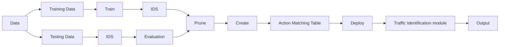

# Malicious QUIC C2 Traffic Detection based on Random Forest in Programmable Data Plane

Yuqin Hong∗

Jinan University

Guangzhou, China

h3art.yq@gmail.com

Yi Bai∗

Jinan University

Guangzhou, China

1262898162@qq.com

Xiaoquan Zhang∗

Jinan University

Guangzhou, China

zhangxiaoquan547@gmail.com

Lin Cui†

Jinan University

Guangzhou, China

tcuilin@jnu.edu.cn

# Abstract

The widespread adoption of QUIC, an encrypted transport protocol, presents novel challenges for network security. Its underlying UDP-based connectionless design, full encryption, and multiplexed streams hinder traditional Deep Packet Inspection (DPI) and behavior-based detection methods. At the same time, Commandand-Control (C2) channels increasingly adopt QUIC to evade detection in advanced persistent threat (APT) attacks. This paper presents a real-time C2 detection framework built on programmable data planes and lightweight Random Forest classifiers. By embedding in-network telemetry (INT) metadata and compiling trained models into switch-executable rule tables, the proposed system enables near-source malicious flow detection at microsecond latency. We demonstrate the feasibility of deploying decision-treebased inference within resource-constrained P4 switches, achieving 99.83% detection accuracy on server-based training and 82.1% on programmable hardware, with a 2–3 orders of magnitude reduction in inference latency. Our findings outline a novel design space for encrypted traffic inspection under performance and scalability constraints.

# CCS Concepts

• Networks → Web protocol security.

# Keywords

QUIC protocol; C2 detection; programmable data plane; random forest; in-band network telemetry; P4; encrypted traffic analysis

# ACM Reference Format:

Yuqin Hong, Xiaoquan Zhang, Yi Bai, and Lin Cui. 2025. Malicious QUIC C2 Traffic Detection based on Random Forest in Programmable Data Plane. In

∗Equal contribution.

†Corresponding author.

Permission to make digital or hard copies of all or part of this work for personal or classroom use is granted without fee provided that copies are not made or distributed for profit or commercial advantage and that copies bear this notice and the full citation on the first page. Copyrights for components of this work owned by others than the author(s) must be honored. Abstracting with credit is permitted. To copy otherwise, or republish, to post on servers or to redistribute to lists, requires prior specific permission and/or a fee. Request permissions from permissions@acm.org.

INCAS ’25, Hong Kong, Hong Kong

© 2025 Copyright held by the owner/author(s). Publication rights licensed to ACM.

ACM ISBN 979-8-4007-2245-5/2025/12

https://doi.org/10.1145/3769699.3771588

Proceedings of the ACM CoNEXT Workshop on In-Network Computing and AI for Distributed Systems (INCAS ’25), December 1–4, 2025, Hong Kong, Hong Kong. ACM, New York, NY, USA, 7 pages. https://doi.org/10.1145/3769699. 3771588

# 1 Introduction

In the evolving landscape of Internet protocols, QUIC (Quick UDP Internet Connections) has emerged as a modern transport layer alternative, offering low latency, ensuring connection migration, and native encryption through TLS 1.3 [1][2]. However, these same features that enhance performance and privacy also hinder traditional security monitoring mechanisms. Specifically, QUIC encrypts both payloads and most header fields, preventing deep packet inspection (DPI) [3] and limiting metadata availability for flow analysis.

This evolution presents a significant challenge to intrusion detection systems (IDS), particularly in detecting Command-and-Control (C2) [4] traffic—an essential stage in advanced persistent threats (APTs) [5]. C2 channels leverage QUIC’s encrypted sessions and persistent connections to establish stealthy communication tunnels with compromised hosts. Traditional detection methods, which rely on unencrypted payload inspection or TCP-based flow characteristics, fail to operate effectively under this new protocol paradigm.

Furthermore, the QUIC protocol introduces architectural shifts: it is built atop UDP, lacks head-of-line blocking, and supports connection migration, making it difficult to track or correlate session behaviors. These traits disrupt conventional stateful detection and increase the complexity of real-time malicious flow classification [6].

While recent advancements in deep learning have shown promise in encrypted traffic analysis, these models often come with high computational complexity and large memory footprints. Such characteristics make them largely unsuitable for direct deployment within the resource-constrained environment of programmable data plane devices, necessitating a focus on more lightweight and interpretable alternatives.

To address these challenges, this paper proposes a real-time QUIC C2 detection framework based on programmable data planes and machine learning. Leveraging P4-based programmable switches [7], our system performs near-source flow analysis using embedded Random Forest models that operate directly on extracted metadata. By incorporating in-band network telemetry (INT) [8], the system gathers granular delay, packet loss, and utilization metrics without requiring payload access. These features form the basis for model training and real-time inference.


<details>
<summary>flowchart</summary>


</details>

Figure 1: System architecture for real-time QUIC C2 detection using programmable data planes.

In summary, this paper introduces a novel approach to encrypted traffic detection with the following contributions:

• We design a lightweight, real-time QUIC C2 detection framework for programmable data planes using Random Forest classification.   
• We develop a feature extraction pipeline that leverages in-INT to reveal hidden behavioral patterns in QUIC flows, and propose a deployment strategy that translates the trained model into the data plane pipeline of P4 switches under stringent memory constraints.   
• We conduct extensive experiments demonstrating high detection accuracy and substantial latency reduction compared to conventional server-based detection models.

# 2 Background and Related Works

The emergence of the QUIC protocol has introduced significant shifts in Internet communication [9]. Designed with security and performance in mind, QUIC integrates transport and cryptographic handshake layers, offering stream multiplexing and mandatory encryption via TLS 1.3. While these features provide improved latency and robustness against network migration and packet loss, they also complicate traffic inspection and behavioral analysis for security systems.

# 2.1 Challenges of Encrypted Traffic Monitoring

QUIC encrypts both its payload and most header fields, including connection identifiers and stream metadata. This design effectively nullifies traditional DPI-based IDS, such as Snort and Suricata, which rely on access to unencrypted application-layer payloads or deterministic protocol headers. Moreover, even advanced privacypreserving techniques such as Homomorphic Encryption (HE) are currently impractical for real-time encrypted traffic inspection due to performance overhead and compatibility concerns [10].

The difficulties are compounded in the context of C2 detection. APTs have begun to adopt QUIC as a stealth channel for Commandand-Control communication. Unlike legacy C2 traffic that can be identified via known signatures or flow behavior over TCP, QUICbased C2 traffic leverages session persistence, encryption, and UDPbased communication to evade detection. Attackers benefit from

QUIC’s support for connection migration, absence of head-of-line blocking, and lack of handshake visibility, all of which obfuscate behavioral patterns.

Traditional approaches that attempt flow-level fingerprinting or traffic analysis often fall short when applied to encrypted, highspeed network environments. As shown in [11], even sophisticated fingerprinting-based techniques suffer from diminished accuracy when faced with QUIC’s obfuscated traffic structure.

# 2.2 Programmable Data Planes and ML-based Detection

To circumvent the limitations of software-based DPI systems, researchers have explored programmable data planes as a new vector for traffic monitoring. Architectures such as PISA (Protocol Independent Switch Architecture) [12] and P4-enabled devices support per-packet feature extraction and decision-making at line rate [13]. These platforms allow the embedding of security logic directly into the forwarding plane, enabling near-source and low-latency detection mechanisms [14–17].

However, integrating machine learning into programmable switches introduces new challenges. These devices are constrained in terms of memory, processing capabilities, and pipeline depth. Most complex models, such as deep neural networks, are infeasible for onswitch execution. Therefore, lightweight and interpretable models such as decision trees and Random Forests are preferred due to their amenability to rule table translation and bitwise match-action logic [18][19].

Several recent studies [11][20] have proposed mapping simple classifiers into switch rules using ternary match-action tables or decision table lookups. Yet, few have successfully applied such strategies to encrypted QUIC traffic, especially in the context of C2 detection.

# 3 Methodology

The dual-layer challenge—encryption-induced feature loss and realtime detection requirements—necessitates a rethinking of how malicious flows are identified in modern networks. This work bridges the gap by combining three key elements:

(1) QUIC-aware feature engineering using INT to extract finegrained performance and timing features from encrypted traffic,

(2) lightweight machine learning models—specifically Random Forest classifiers—that can be compiled into switch-executable logic, and   
(3) programmable data plane integration to embed inference logic into P4-based switches for microsecond-level real-time classification.

By addressing the limitations of both traditional DPI and offline traffic analysis, this work defines a new detection paradigm: decentralized, encrypted, and low-latency malicious flow identification.

To address the inherent difficulties in analyzing encrypted QUIC traffic, our approach INT-enhanced Decision-tree Random Forest (IDRF), builds a real-time, near-source detection system grounded in programmable data planes and lightweight machine learning. The overall architecture of IDRF is divided into three stages: a server-side training pipeline, a model embedding module for switch compatibility, and a data plane inference mechanism for real-time traffic classification.

# 3.1 System Overview

The system consists of the following modules as shown in Figure 1:

• Training Module: This server-side component collects both benign and malicious QUIC traffic, extracts metadata via INT, and trains a Random Forest classifier based on derived feature vectors.   
• Model Embedding Module: After training, the model is pruned, optimized, and compiled into switch-executable match-action tables suitable for P4-based deployment under hardware constraints.   
• Traffic Classification Module: The deployed model operates on programmable switches, leveraging extracted flow metadata for on-the-fly classification and mitigation of C2 traffic.

# 3.2 Data Collection and Preprocessing

Traffic Generation: Benign QUIC traffic was sourced from the public NetFlow-QUIC dataset provided by Google [21], while C2 traffic was synthetically generated in a controlled virtual environment. Specifically, we set up attacker and victim nodes on Kali Linux, using Merlin C2 servers to simulate attack scenarios. The QUIC protocol was explicitly used during command/control interactions over port 443, and traffic was captured via Wireshark and automated using Pexpect.

INT Augmentation: To mitigate domain and IP bias between datasets and enrich the feature space, we adopted INT. Programmable P4 switches injected telemetry headers capturing queue depth, hop-level latency, and packet loss. These metadata values were time-aligned and merged with flow records using timestamps and identifiers.

Feature Transformation: Captured .pcap files were cleaned and converted into .csv format after noise removal and duplicate elimination. The resulting dataset represented a unified schema combining network-layer device metrics and application-layer traffic behavior.

We finally engineered 13 quantitative features across three dimensions: Delay-based Features (e.g., per-hop processing delay, endto-end link delay), Traffic Statistics (e.g., packet counts, byte counts, inter-arrival time, packet loss rates), and Device Load Indicators

(e.g., port utilization, flow state metrics). These are summarized in Table 1. This hybrid feature space captures both micro-level packet behavior and macro-level flow state transitions.

Table 1: Engineered Features for QUIC C2 Detection 

<table><tr><td>Feature</td><td>Description</td></tr><tr><td>switch_processing_delay</td><td>Per-hop switch processing latency</td></tr><tr><td>link_delay</td><td>End-to-end propagation and transmission delay</td></tr><tr><td>number_of_packets</td><td>Number of packets in a flow (per unit time)</td></tr><tr><td>number_of_bytes_max</td><td>Maximum byte count in a single flow</td></tr><tr><td>iat_a_b_max</td><td>Maximum inter-arrival time from A→B direction</td></tr><tr><td>packet_loss_rate_a</td><td>Packet loss rate in A→B direction</td></tr><tr><td>packet_loss_rate_b</td><td>Packet loss rate in B→A direction</td></tr><tr><td>incoming_port_utilization</td><td>Utilization of incoming port bandwidth</td></tr><tr><td>outgoing_port_utilization</td><td>Utilization of outgoing port bandwidth</td></tr><tr><td>finished_flow</td><td>Number of completed connection flows</td></tr><tr><td>active_flow</td><td>Number of currently active flows</td></tr><tr><td>new_flow</td><td>Number of new flows per unit time</td></tr></table>

# 3.3 Model Training and Embedding

The detection model is based on the Random Forest algorithm due to its robustness, low complexity, and interpretability. Training proceeded as follows:

• Feature Flattening: Raw 3D time-series tensors of shape [T, N, d] were reshaped into 2D matrices [T×N, d] via time slicing to preserve temporal patterns while reducing dimensionality.   
• Data Splitting: A stratified 80/20 train-test split was applied. Cross-validation was used to guard against overfitting.   
• Training Pipeline: The RandomForestClassifier from scikitlearn was used, with Gini impurity [22] as the split criterion and ?? feature sampling at each split. Trees were trained in parallel using joblib.   
• Evaluation Metrics: Accuracy, Precision, Recall, and F1 Score were used for performance validation. Grid search was conducted to optimize parameters such as tree depth, number of trees, and minimum split size.

Random Forest classifiers, though ensemble-based, can be decomposed into independent decision trees. To embed them into resource-limited P4 switches, we applied the following strategies:

• Tree Pruning and Feature Selection: Trees were pruned using Gini importance and mutual information, discarding low-impact features (threshold ?? = 0.05). This step reduced both memory footprint and decision depth.


<details>
<summary>flowchart</summary>

```mermaid
graph TD
    subgraph Decision Tree 1
        A["Decision Tree 1"] --> B["Branch 3"]
        B --> C["f2"]
        C --> D["f2<1"]
        D --> E["0"]
        D --> F["1"]
        G["Decision Tree 2"] --> H["Branch 1"]
        H --> I["f1≥1"]
        I --> J["f1<1"]
        J --> K["2"]
        J --> L["f2"]
        L --> M["f2<2"]
        M --> N["0"]
        M --> O["f2≥2"]
        P["Feature"] --> Q["From ①"]
        Q --> R["f1"]
        Q --> S["f2"]
        T["Leaf Path ③"] --> U["0"]
        T --> V["1"]
        T --> W["2"]
        X["Code Leaf ④"] --> Y["00"]
        X --> Z["01"]
        X --> AA["1*"]
        AB["Decision Tree 1"] --> AC["Code Leaf Node 00"]
        AB --> AD["01"]
        AB --> AE["1*"]
        AF["Decision Tree 2"] --> AG["Code Leaf Node 00"]
        AF --> AH["01"]
        AF --> AI["1*"]
    end
    subgraph Decision Tree 2
        AJ["Feature"] --> AK["f1"]
        AJ --> AL["f2"]
        AJ --> AM["f1≥1"]
        AJ --> AN["f1<1"]
        AJ --> AO["f2"]
        AP["Leaf Path ③"] --> AQ["0, [[0, 0"], [0, 1]]]
        AQ --> AR["1, [[0, 0"], [2, n]]]
        AQ --> AS["2, [[1, n"], [0, n]]]
        AT["Code Leaf ④"] --> AU["00"]
        AT --> AV["01"]
        AT --> AW["1*"]
    end
    subgraph Decision Tree 3
        AX["f1 M/A"] --> AY["f1"]
        AX --> AZ["f2 M/A"]
    end
```
</details>

Figure 2: Example deployment of a two-tree Random Forest model in P4 switch using encoded match-action tables.

• Table Generation: Each feature’s value range was encoded into ternary match-action tables. Leaf decisions were encoded as output actions, and a majority voting mechanism was simulated via parallel table lookups.   
• Switch Compilation: Final models were compiled into P4 using a match-action paradigm. Decision paths were represented using path encoding techniques inspired by Planter [20], reducing rule complexity from ${ \mathrm { O } } ( 2 ^ { D } )$ to O(L), where L is the number of valid leaf nodes.

Figure 2 provides a visual example of this model embedding process, illustrating how a Random Forest model with two decision trees is translated into switch-executable logic. In the first step (topleft), we have two trained decision trees. The core of our method is to deconstruct each tree’s decision paths. As shown in the top-right panel, each path from the root to a leaf node corresponds to a specific set of feature conditions. We encode these paths into a unique code (e.g., ‘00’, ‘01’). This path encoding effectively transforms the tree’s logic into a compact representation. Finally, as depicted in the bottom panels, these encoded paths and their corresponding leaf node decisions are compiled into a series of match-action tables within the P4 switch. When a packet arrives, its features are used to match an encoded path, triggering the corresponding action. This entire process allows the complex logic of a Random Forest to be executed at line rate directly in the data plane.

The resulting logic occupied two pipeline stages: one for feature extraction, the other for path encoding and classification. In practice, we deployed five decision trees per switch to balance memory usage and detection accuracy.

# 4 Experiment and Evaluation

To validate the effectiveness and efficiency of our QUIC C2 detection framework, we conducted extensive experiments in both server-based training environments and switch-level deployment scenarios. This section outlines the experimental setup, dataset preparation, comparative baselines, and performance analysis.

# 4.1 Experimental Setup

Model training was conducted on a Windows Server 2019 machine equipped with an Intel Xeon E5-2620 v3 processor (2.40GHz, 6 cores) and 64GB of RAM. Python and the scikit-learn library were used for model development, with fixed random seeds for reproducibility.

Network emulation was carried out using Ubuntu 20.04.6 LTS with Linux kernel 5.15.0. The Mininet 2.2.2 framework simulated the network topology, and programmable switches were instantiated using the P4 Behavioral Model v2 (BMv2). The switch logic was written in $\mathrm { P } 4 _ { 1 6 }$ and compiled with p4c targeting the V1Model architecture.

Benign QUIC traffic was obtained from the public NetFlow-QUIC dataset [21]. Malicious QUIC C2 traffic was generated by setting up a simulated attacker (VM2) and victim (VM1) pair using the Merlin C2 framework [23]. The attacker initiated commands and file transfers over QUIC (port 443), while traffic was captured using Wireshark and coordinated through automated scripts with Pexpect [24].

All captured .pcap files were preprocessed as detailed in Section 3.2, with INT metadata injected and merged. The resulting .csv datasets were used for both training and real-time detection evaluation.


<details>
<summary>bar</summary>

| Metric | FP-RF (%) | IDRF (%) |
| :--- | :--- | :--- |
| Accuracy | 100 | 100 |
| Precision | 100 | 100 |
| Recall | 100 | 100 |
| F1 Score | 100 | 100 |
</details>

(a) FP-RF


<details>
<summary>bar</summary>

| Metric | FP-DT (%) | IDRF (%) |
| :--- | :--- | :--- |
| Accuracy | 98 | 99 |
| Precision | 97 | 98 |
| Recall | 96 | 97 |
| F1 Score | 95 | 94 |
</details>

(b) FP-DT


<details>
<summary>bar</summary>

| Metric | FP-KNN (%) | IDRF (%) |
| :--- | :--- | :--- |
| Accuracy | 100 | 100 |
| Precision | 100 | 100 |
| Recall | 100 | 100 |
| F1 Score | 100 | 100 |
</details>

(c) FP-KNN


<details>
<summary>bar</summary>

| Metric | FP-SVM (%) | IDRF (%) |
| :--- | :--- | :--- |
| Accuracy | 75 | 98 |
| Precision | 85 | 98 |
| Recall | 80 | 98 |
| F1 Score | 75 | 92 |
</details>

(d) FP-SVM


<details>
<summary>bar</summary>

| Metric | FP-AdaBoost (%) | IDRF (%) |
| :--- | :--- | :--- |
| Accuracy | 75 | 98 |
| Precision | 80 | 75 |
| Recall | 75 | 75 |
| F1 Score | 75 | 75 |
</details>

(e) FP-AdaBoost


<details>
<summary>bar</summary>

| Metric | FP-MLP (%) | IDRF (%) |
| :--- | :--- | :--- |
| Accuracy | 80 | 99 |
| Precision | 85 | 99 |
| Recall | 85 | 99 |
| F1 Score | 85 | 78 |
</details>

(f) FP-MLP   
Figure 3: Comparison between baseline classifiers and IDRF.

# 4.2 Baselines and Comparison Methods

We compared our approach IDRF against six conventional machine learning models [11] adapted from:

• FP-RF (Random Forest)   
• FP-DT (Decision Tree)   
• FP-KNN (K-Nearest Neighbor [25])   
• FP-SVM (Support Vector Machine [26])   
• FP-MLP (Multilayer Perceptron)   
• FP-AdaBoost [27]

Each model was trained using the same features but without INT augmentation, enabling fair comparison of model architectures and input spaces. Figure 3 summarizes performance metrics across models.

Results show that while FP-KNN achieved high baseline performance (99.56% F1), the IDRF model consistently outperformed all alternatives, achieving 99.83% accuracy and 99.75% F1 score due to INT-enhanced feature expressiveness and temporal slicing.

# 4.3 On-Switch Inference and Feature Optimization

To fit the model into the resource constraints of programmable switches, we applied a two-stage feature selection strategy combining Gini importance and mutual information scores. Features with an importance score below 0.05 or exhibiting high computational overhead were removed. As shown in Figure 4, delay-based features and port utilization metrics contributed most to classification performance, while some traffic statistics had lower discriminative power.

We hypothesize that delay-based features and port utilization metrics are effective because C2 traffic often exhibits distinct communication patterns compared to benign web traffic. For instance, C2 channels frequently rely on periodic, low-volume "heartbeat" signals to maintain a connection, interspersed with sudden bursts of activity for command execution or data exfiltration. This irregular, bursty behavior can lead to fluctuations in packet inter-arrival times (iat\_a\_b\_max) and cause transient spikes in switch processing delay and port utilization, patterns that are less common in typical, more session-oriented benign QUIC traffic. INT provides the necessary granularity to capture these subtle, microsecond-level behavioral artifacts that are otherwise invisible in encrypted flows.

Subsequently, we evaluated the performance trade-offs introduced by both INT augmentation and classifier type in the onswitch deployment scenario.


<details>
<summary>scatter</summary>

| Feature | Random Forest Feature Importance | Mutual Information Score |
| --- | --- | --- |
| active_flow | 0.002 | 0.002 |
| new_flow | 0.003 | 0.002 |
| finished_flow | 0.004 | 0.002 |
| adv_win_max | 0.005 | 0.002 |
| new_flow | 0.006 | 0.002 |
| packet_loss_rate_a | 0.007 | 0.024 |
| packet_loss_rate_b | 0.008 | 0.011 |
| link_delay | 0.009 | 0.006 |
| number_of_packets | 0.16 | 0.031 |
| incoming_port_utilization | 0.11 | 0.033 |
| iat_a_b_max | 0.17 | 0.031 |
| number_of_bytes_max | 0.15 | 0.051 |
| switch_processing_delay | 0.19 | 0.001 |
Random Forest Feature Importance
</details>

Figure 4: Feature importance and mutual information scores for feature selection.

Figure 5 shows that the inclusion of INT-derived features, such as per-hop delay and port utilization, significantly improved classification accuracy from 72.5% to 82.1%. This improvement stems from the richer temporal and spatial traffic context captured by INT, which compensates for the loss of payload-level information in encrypted flows.


<details>
<summary>line</summary>

| Metrics    | with INT | no INT |
| ---------- | -------- | ------ |
| Accuracy   | 82.1%    | 9.6%   |
| Precision  | 82.18%   | 9.9%   |
| Recall     | 82.1%    | 13.9%  |
| F1 Score   | 81.9%    | 12.1%  |
</details>

Figure 5: Comparison of the impact of INT information on performance.

We further compared the impact of model architecture under identical feature sets, as illustrated in Figure 6. Random Forests consistently outperformed single decision trees, achieving up to a 4.7% gain in accuracy. In practical terms, this means that even with aggressive pruning and quantization for switch deployment, a small ensemble of shallow trees can retain strong generalization capability, while fitting within the match-action table constraints of P4-based switches.


<details>
<summary>scatter</summary>

| Metric     | Random Forest | Decision Tree |
| ---------- | ------------- | ------------- |
| F1 Score   | 81.9%         | 80.84%        |
| Recall     | 82.1%         | 80.94%        |
| Precision  | 82.18%        | 80.66%        |
| Accuracy   | 82.1%         | 80.94%        |
</details>

Figure 6: Performance comparison between random forest and decision tree.

# 4.4 Inference Latency Analysis

To evaluate the performance gain, we compared the inference latency of our switch-embedded model against the server-based baseline. We used a traffic replay setup in Mininet, injecting QUIC flows into the P4-enabled BMv2 software switch. For the server-based model, latency was measured as the wall-clock time required for the scikit-learn implementation to classify a batch of packets. As BMv2 is a software model not intended for precise nanosecond-level performance benchmarking, we focus on the orders-of-magnitude difference rather than absolute latency values.


<details>
<summary>scatter</summary>

| System             | Latency (μs) |
| ------------------ | ------------ |
| Programmable Switch | 0.5          |
| Remote Server      | 100          |
</details>

Figure 7: Inference latency comparison between server and switch deployment.

As shown in Figure 7, the switch-based approach demonstrates a 2-3 orders-of-magnitude reduction in inference latency compared to the server-based processing time (which was on the order of hundreds of microseconds). This significant speedup highlights the primary advantage of data plane inference: the ability to make classification decisions at a speed commensurate with line rate, avoiding the costly overhead of diverting traffic to an external server.

These results demonstrate the feasibility of performing highaccuracy, real-time C2 detection at the data plane, even under strict hardware constraints.

# 5 Conclusion

This paper presented a lightweight, real-time QUIC C2 detection framework that combines programmable data planes with Random Forest classification. By leveraging INT for fine-grained delay, loss, and utilization measurements, the system extracts discriminative behavioral features from encrypted flows without requiring payload inspection. Experiments demonstrated that INT augmentation improves on-switch detection accuracy from 72.5% to 82.1%, and that Random Forest ensembles outperform single decision trees in constrained hardware settings. Compared with server-based inference, the switch-embedded deployment reduces latency by 2–3 orders of magnitude while maintaining high accuracy, showing that effective encrypted traffic detection is possible directly within the forwarding plane.

Future work will focus on evaluating the generalization capabilities of our framework across a broader range of C2 tools and against larger, real-world QUIC datasets. Additionally, we plan to explore automated techniques for model updates in the data plane to adapt to evolving threat behaviors.

# Acknowledgments

This work is supported by National Natural Science Foundation of China (NSFC) under Grant 62172189.

# References

[1] Naveenraj Muthuraj, Nooshin Eghbal, and Paul Lu. 2024. Replication:" Taking a long look at QUIC". In Proceedings of the 2024 ACM on Internet Measurement Conference. 375–388.   
[2] Noble Kumari and AK Mohapatra. 2022. A comprehensive and critical analysis of TLS 1.3. Journal of Information and Optimization Sciences 43, 4 (2022), 689–703.   
[3] Shuya Feng, Meisam Mohammady, Han Wang, Xiaochen Li, Zhan Qin, and Yuan Hong. 2024. Dpi: Ensuring strict differential privacy for infinite data streaming. In 2024 IEEE Symposium on Security and Privacy (SP). IEEE, 1009–1027.   
[4] Trend Micro. 2025. Command and Control [C&C] Server. https://bit.ly/37dtwes. [Online; accessed 12-May-2025].   
[5] Siva Raja Sindiramutty, Krishna Raj V Prabagaran, NZ Jhanjhi, Raja Kumar Murugesan, Sarfraz Nawaz Brohi, and Mehdi Masud. 2025. Generative AI in Network Security and Intrusion Detection. In Reshaping CyberSecurity With Generative AI Techniques. IGI Global, 77–124.   
[6] Eduardo Macedo. 2022. Signature-Based IDS for Encrypted C2 Traffic Detection. Master’s thesis. Universidade do Porto (Portugal).   
[7] Frederik Hauser, Marco Häberle, Daniel Merling, Steffen Lindner, Vladimir Gurevich, Florian Zeiger, Reinhard Frank, and Michael Menth. 2023. A survey on data plane programming with p4: Fundamentals, advances, and applied research. Journal of Network and Computer Applications 212 (2023), 103561.   
[8] Mimi Qian, Lin Cui, Fung Po Tso, Yuhui Deng, and Weijia Jia. 2023. OffsetINT: Achieving high accuracy and low bandwidth for in-band network telemetry. IEEE Transactions on Services Computing 17, 3 (2023), 1072–1083.   
[9] WaiMing Lau, KaKei Wong, and Lin Cui. 2024. Optimizing the performance of OpenFlow Protocol over QUIC. Journal of Network and Computer Applications 226 (2024), 103873.   
[10] Ibrahim A Alwhbi, Cliff C Zou, and Reem N Alharbi. 2024. Encrypted network traffic analysis and classification utilizing machine learning. Sensors 24, 11 (2024), 3509.   
[11] Lama Al-Bakhat and Sultan Almuhammadi. 2022. Intrusion Detection on QUIC Traffic: A Machine Learning Approach. In 2022 7th International Conference on

Data Science and Machine Learning Applications (CDMA). 194–199. doi:10.1109/ CDMA54072.2022.00037   
[12] Sol Han, Seokwon Jang, Hongrok Choi, Hochan Lee, and Sangheon Pack. 2020. Virtualization in programmable data plane: A survey and open challenges. IEEE Open Journal of the Communications Society 1 (2020), 527–534.   
[13] Anirudh Sivaraman, Alvin Cheung, Mihai Budiu, Changhoon Kim, Mohammad Alizadeh, Hari Balakrishnan, George Varghese, Nick McKeown, and Steve Licking. 2016. Packet transactions: High-level programming for line-rate switches. In Proceedings of the 2016 ACM SIGCOMM Conference. 15–28.   
[14] Ali AlSabeh, Elie Kfoury, Jorge Crichigno, and Elias Bou-Harb. 2022. P4ddpi: Securing p4-programmable data plane networks via dns deep packet inspection. In NDSS Symposium 2022.   
[15] Xiaoquan Zhang, Lin Cui, Fung Po Tso, and Weijia Jia. 2021. pHeavy: Predicting heavy flows in the programmable data plane. IEEE Transactions on Network and Service Management 18, 4 (2021), 4353–4364.   
[16] Mai Zhang, Lin Cui, Xiaoquan Zhang, Fung Po Tso, Zhang Zhen, Yuhui Deng, and Zhetao Li. 2025. Quark: Implementing Convolutional Neural Networks Entirely on Programmable Data Plane. In IEEE INFOCOM 2025-IEEE Conference on Computer Communications. IEEE, 1–10.   
[17] Xiaoquan Zhang, Lin Cui, Fung Po Tso, Wenzhi Li, and Weijia Jia. 2024. IN3: A framework for in-network computation of neural networks in the programmable data plane. IEEE Communications Magazine 62, 4 (2024), 96–102.   
[18] Ibomoiye Domor Mienye and Nobert Jere. 2024. A survey of decision trees: Concepts, algorithms, and applications. IEEE access 12 (2024), 86716–86727.   
[19] Reza Iranzad and Xiao Liu. 2024. A review of random forest-based feature selection methods for data science education and applications. International

Journal of Data Science and Analytics (2024), 1–15.   
[20] Changgang Zheng, Mingyuan Zang, Xinpeng Hong, Liam Perreault, Riyad Bensoussane, Shay Vargaftik, Yaniv Ben-Itzhak, and Noa Zilberman. 2024. Planter: Rapid Prototyping of In-Network Machine Learning Inference. SIGCOMM Comput. Commun. Rev. 54, 1 (Aug. 2024), 2–21. doi:10.1145/3687230.3687232   
[21] Google. 2025. Shared Folder on Google Drive. https://drive.google.com/drive/ folders/1cwHhzvaQbi-ap8yfrj2vHyPmUTQhaYOj. [Online; accessed 12-May-2025].   
[22] XinRan Xie, Man-Jie Yuan, Xuetong Bai, Wei Gao, and Zhi-Hua Zhou. 2023. On the Gini-impurity preservation for privacy random forests. Advances in Neural Information Processing Systems 36 (2023), 45055–45082.   
[23] NE0ND0G. 2025. Release QUIC protocol. https://github.com/Ne0nd0g/merlin/ releases/tag/v0.6.0. [Online; accessed 12-May-2025].   
[24] Pexpect. 2025. Pexpect version 4.8 — pexpect 4.8 documentation. https://pexpect. readthedocs.io/en/stable/. [Online; accessed 12-May-2025].   
[25] Fanyi Zhao, Mingxuan Zhang, Shiji Zhou, and Qi Lou. 2024. Detection of network security traffic anomalies based on machine learning KNN method. Journal of Artificial Intelligence General science (JAIGS) ISSN: 3006-4023 1, 1 (2024), 209–218.   
[26] Junhong Zhang, Zhihui Lai, Heng Kong, and Jian Yang. 2025. Learning the optimal discriminant SVM with feature extraction. IEEE Transactions on Pattern Analysis and Machine Intelligence (2025).   
[27] Hanaa Attou, Azidine Guezzaz, Said Benkirane, and Mourade Azrour. 2025. A New Secure Model for Cloud Environments Using RBFNN and AdaBoost. SN Computer Science 6, 2 (2025), 188.