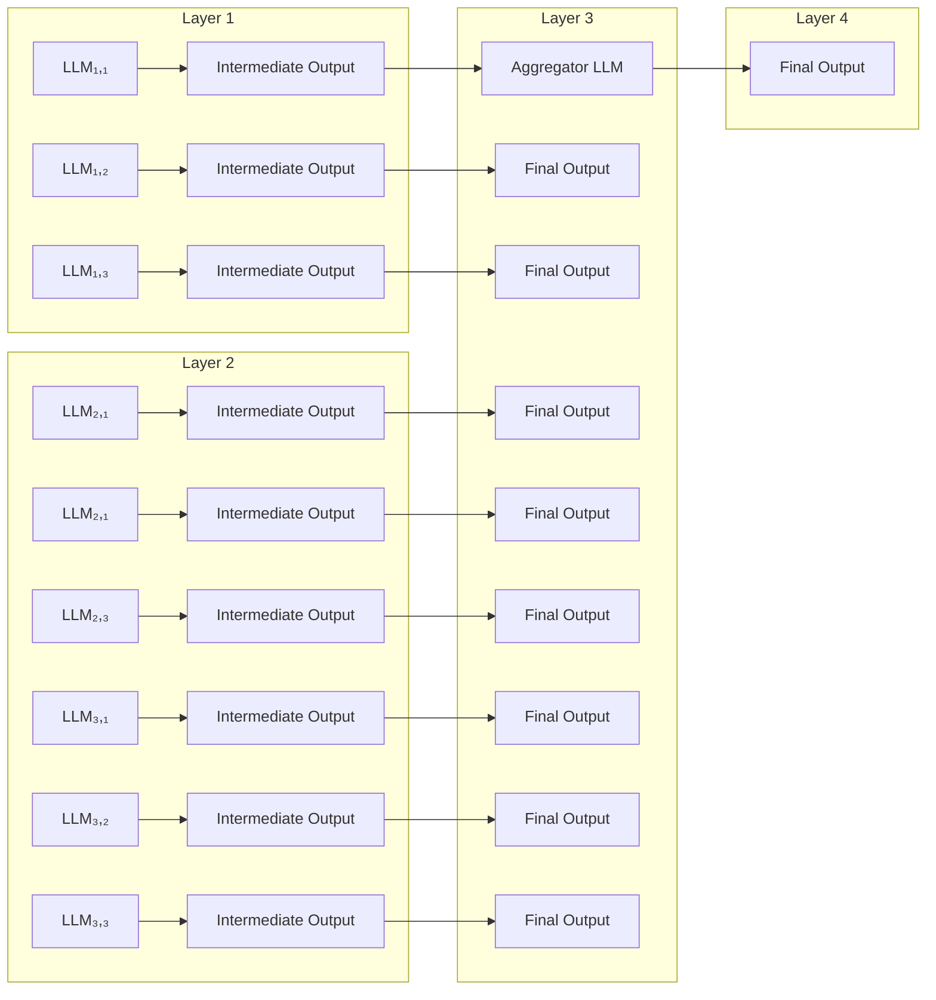
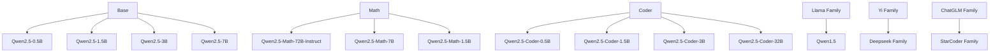
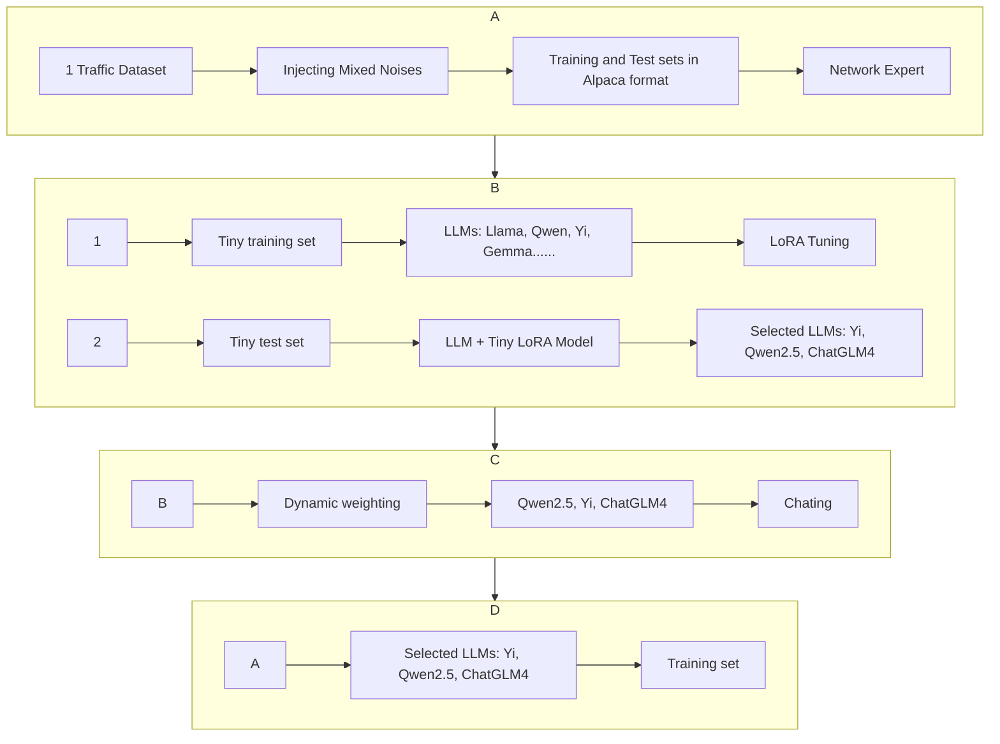
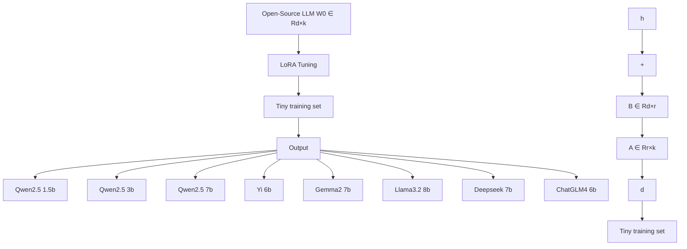

# MOTA: Mixture Of Traffic Agents for robust network traffic classification

Shaowei Li1, Zhiwen Gan1, Mengbai Xiao1, Pengfei Hu1, Xiuzhen Cheng1, Chunxiao Wang2,3, Feng Li1 1School of Computer Science and Technology, Shandong University, Qingdao, China

2Key Laboratory of Computing Power Network and Information Security,

Ministry of Education, Shandong Computer Science Center (National Supercomputer Center in Jinan), Qilu University of Technology (Shandong Academy of Sciences), Jinan, China

3Shandong Provincial Key Laboratory of Computing Power Internet and Service Computing, Shandong Fundamental Research Center for Computer Science, Jinan, China

Email: {202420868, cnganzhiwen}@mail.sdu.edu.cn, {xiaomb, phu, xzcheng}@sdu.edu.cn, wangchx@sdas.org, fli@sdu.edu.cn

Abstract—Network traffic classification plays a crucial role in a wide range of applications, e.g., Quality of Service (QoS) enhancement, resource management, and network security. However, the widespread adoption of encryption protocols (e.g., SSL/TLS) and the emergence of anonymous communication systems (e.g., Tor) have introduced significant challenges due to the presence of complex and varied network noise. Although considerable effort has been made to improve the robustness of the traffic classification, the performances of existing state-of-theart methods cannot be guaranteed in the presence of a mixture of noises, and are not stable in different application scenarios. In this paper, we innovate in proposing a network traffic classification method based on MoA (Mixture of Agents), namely MOTA. By leveraging a light-weight MoA architecture, MOTA efficiently fine-tunes mainstream Large Language Models (LLMs) to adapt to different application scenarios of traffic classification, and fully exploits the collaboration of the LLMs to ensure the robustness against mixed noises. Our extensive experiments show that, the classification accuracy is ≥ 99% across multiple public datasets injected with mixed noises, significantly outperforming existing SOTA methods. Moreover, despite incorporating multiple LLMs, MOTA maintains millisecond-level inference latency on a server equipped with four NVIDIA GeForce RTX 4090 GPUs, owing to its lightweight design.

Index Terms—Network traffic classification, Large Language Models, Mixture of Agents

# I. INTRODUCTION

Network traffic classification is a critical technique across various domains, e.g., Quality of Service (QoS) improvement, resource management, and network security [1], [2], [3]. In recent years, the widespread applications of encryption protocols, e.g., SSL/TLS [4], [5], have significantly increased the difficulty of network traffic classification, especially in

This work was supported in part by Project of Key R&D Program of Shandong Province under Grant 2024CXGC010113; in part by NSFC under Grant 62472253 and Grant U23A20273; in part by the Shandong Provincial Natural Science Foundation under Grant ZR2022LZH010 and Grant ZR2022ZD02; in part by Open Project of Key Laboratory of Computing Power Network and Information Security, Ministry of Education, Qilu University of Technology (Shandong Academy of Sciences) under Grant 2023ZD007; in part by the Taishan Scholars Program. The corresponding author is Feng Li.

979-8-3315-4940-4/25/\$31.00 © 2025 IEEE

face of network noises, as encryption techniques typically conceal the key features used by traditional classification methods [6]. Moreover, the rise of encryption-based anonymous networks introduces even greater challenges to traffic classification [7]. A typical example is the Tor network, which employs encrypted multi-hop communication to achieve anonymity. Because Tor traffic is routed through multiple intermediate relays, it becomes more susceptible to various types of network noise [8].

To address these challenges, researchers have proposed a variety of solutions. The main idea of stream-based classification methods is to analyze the characteristics of network flows, such as flow duration, byte count, packet count etc. For example, ET-BERT [9] fine-tunes BERT models using features extracted from network flows. [10] proposes Anti-Noise Network (AN-Net) that leverages short-term feature extraction and multimodal fusion to reduce the impact of irrelevant packet noise in anonymous traffic classification. Netmamba [11] introduces a unidirectional Mamba architecture [12] and proposes a novel traffic representation method. However, the robustness of these state-of-the-art methods against diverse types of noise remains limited. Moreover, as traffic patterns evolve, the stream-based classification schemes often struggle to generalize and are prone to misclassification when encountering previously unseen network traffic [9], [13]. Recently, the emergent capabilities of Large Language Models (LLMs) have been exploited to enhance the generality across a wide range of natural language processing and computer vision tasks [14], [15]. Inspired by this progress, TrafficLLM utilizes ChatGLM2 [16] to extract features from encrypted traffic packets, thereby enhancing the performance of traffic classification. However, TrafficLLM employs only a single LLM, and does not take into account the potential benefits of collaboration among multiple LLMs. In addition, TrafficLLM overlooks the noises which are usually inevitable in encrypted and anonymous networks, while the various types of noises can severely degrade the performance of a single LLM.

In this paper, we propose MOTA (Mixture Of Traffic

Agents), a robust and generalized solution to classify different types of encrypted/anonymous network traffic in the presence of various noises. In particular, we leverage a concise architecture of MoA (Mixture of Agents) to design MOTA which consists of three LLM agents and an aggregator. The LLM agents are efficiently fine-tuned by a variety of real-word noised traffic data, and their responses can be aggregated by a dynamic weighting mechanism to make accurate classification decisions across different application scenarios. In summary, our main contributions are as follows:

• To the best of our knowledge, MOTA is the first one to leverage the framework of MoA to achieve robust encrypted/anonymous network traffic classification.   
• We develop a prototype of MOTA with a light-weight architecture of MoA. Three main-stream LLMs are selected as the traffic agents and are efficiently fine-tuned to ensure the generality to different traffic classification tasks with mixed noises. We also propose a dynamic weighting mechanism to fully utilize the specialties of the agents in an on-line manner.   
• According to our extensive experiments on four encrypted/anonymous traffic classification tasks, MOTA achieves much better performance than the exiting SOTA methods. The accuracies and F1-scores across the different datasets are all at least 99.58% even in the presence of a mixture of five types of noises, while the average inference latency of MOTA is only 0.22s on a server equipped with four NVIDIA GeForce RTX 4090 GPUs.

The remaining part of this paper is organized as follows. In Sec. II, we introduce the motivation behind the design of MOTA and reveal the challenges we need to address. In Sec. III, we describe the details of the design of MOTA. In Sec. IV, we conduct extensive experiments to evaluate the efficacy of MOTA. We finally survey the related literature and conclude this paper in Sec. V and Sec. VI, respectively.

# II. MOTIVATIONS AND CHALLENGES

# A. Motivations

1) Vulnerability to Mixed Noises: As mentioned in Sec. I, network traffic classification is significantly challenged by multifaceted noises which may arise from irrelevant packet data, fluctuations in network conditions, and unexpected interference obscuring the genuine features of network traffic. To address these challenges, many recent studies have proposed stream-based methods (e.g., ET-BERT [9], AN-Net [10], and Netmamba [11]) and LLM-based methods (e.g. [17]). However, the performances of these state-of-the-art methods cannot be ensured in the presence of mixed noises, including delay noise, packet loss noise, out-of-order noise, feature perturbation noise, and TLS perturbation noise. We hereby evaluate the above different methods on real-world traffic datasets. Considering the space limit, we only present the results obtained on ISCX-Tor-2016 dataset [18] 1. As shown in Table 1, all these four methods have their performances

TABLE 1: Performances of existing methods on ISCX-Tor-2016 dataset with mixed noises. 

<table><tr><td></td><td colspan="2">w/o mixed noises</td><td colspan="2">w/ noise</td></tr><tr><td>Methods</td><td>AC</td><td>F1</td><td>AC</td><td>F1</td></tr><tr><td>ET-BERT [9]</td><td>95.25%</td><td>94.45%</td><td>43.67%</td><td>39.46%</td></tr><tr><td>AN-Net [10]</td><td>99.51%</td><td>99.50%</td><td>75.97%</td><td>75.15%</td></tr><tr><td>Netmamba [11]</td><td>99.86%</td><td>99.86%</td><td>21.54%</td><td>35.00%</td></tr><tr><td>TrafficLLM [17]</td><td>98.11%</td><td>98.10%</td><td>62.70%</td><td>68.36%</td></tr></table>


<details>
<summary>flowchart</summary>


</details>

Fig. 1: An illustration of the MoA architecture.

decreased drastically when the various noises are injected into the dataset. For example, Netmamba, the best method on the original dataset with no noise injected, has its accuracy (AC) and F1-score (F1) decreased from 99.86% to 21.54% and 35%, respectively, when the data are “polluted” by mixed noises. The AC and F1 of TrafficLLM are rather high on the original datasets, but they are decreased to 62.7% and 68.36%, respectively, on the dataset with mixed noise. All in all, traditional stream-based methods may severely suffer from a mixture of various noises. Thanks to the power of LLM, TrafficLLM achieves accurate traffic classification at the level of data packets; nevertheless, the LLM is significantly challenged by various network noises.

2) The Potential of MoA: MoA is a powerful tool to enhance the performance of LLMs by enabling efficient collaboration among them [19]. A typical architecture of MoA is illustrated in Fig. 1. Specifically, each of the four MoA layers consists of three LLMs. Initially, the LLMs in the first layer independently produce responses to a given input prompt. These responses are then delivered to the LLMs in the following two layers for further refinement. The LLM in the final layer serves as an aggregator to combine all the responses to generate a more robust and comprehensive response. In the context of network traffic classification, various LLMs exhibit different performances across different tasks due to their distinct structures. By integrating LLMs with complementary capabilities, MoA leverage their collective intelligence to attain a more comprehensive understanding of traffic data, leading to more accurate classification results.

Unfortunately, the native MoA cannot be directly applied to traffic classification, because the LLMs involved in the MoA is usually for general purpose tasks. For example, we randomly take 100 data samples from the ISCX-Tor-2016 dataset [18], and input the data into an open-source MoA [19]. The responses indicate the classification accuracy is only around 7%, even the data are free of noises. Hence, an adaptation of MoA to network traffic classification is necessitated.


<details>
<summary>violin</summary>

| Condition   | Packet Size (Median) |
|-------------|----------------------|
| w/o noise   | 700                  |
| w/o noise   | 800                  |
| w/o noise   | 900                  |
| w/o noise   | 1000                 |
| w/o noise   | 1100                 |
| w/o noise   | 1200                 |
| w/o noise   | 1300                 |
| w/o noise   | 1400                 |
| w/o noise   | 1500                 |
| w/ noise    | 600                  |
| w/ noise    | 700                  |
| w/ noise    | 800                  |
| w/ noise    | 900                  |
| w/ noise    | 1000                 |
| w/ noise    | 1100                 |
| w/ noise    | 1200                 |
| w/ noise    | 1300                 |
| w/ noise    | 1400                 |
| w/ noise    | 1500                 |
</details>

Fig. 2: Disturbed data distribution due to noises.

# B. Challenges

As demonstrated above, the robustness of the existing proposals against noise is rather weak. Although there is significant potential to apply MoA to network traffic classification, we are facing the following technical challenges.

• Disturbed data distribution due to noises. The performance of deep learning models mainly depends on the quality of input data, whereas the distribution of the input data can be easily disturbed by noises. As shown in Fig. 2, when we insert TLS perturbation noise into the ISCX-Tor-2016 dataset to randomly alter the payload length of the TLS packets, the distribution of the packet size, a feature commonly used in traffic classification, is significantly disturbed. It is worth noting that, upon injecting mixed noises, a wide range of features can be distorted, which results in more considerable challenges to the traffic classification tasks.   
• Significantly large space for selecting LLMs. At present, there are a huge number of options for LLMs. Even within the same family, there are different generations and sizes. For example, Qwen is an open-source LLM developed by Alibaba. Currently, the most advanced version is Qwen2.5. In addition, it also includes different predecessors such as Qwen2 and Qwen1. Based on Qwen 2.5, we can develop more models which have different sizes and specialities. For instance, Qwen2.5-Coder series are developed for programming, and contain six models with different sizes (from 0.5 to 32B). These LLMs may have distinct performances in the face of different network traffic data 2; therefore, how to efficiently screen out effective LLMs is one of the challenges to build a MoA system for network traffic classification.

• Long latency to generate responses. The MoA framework’s potential for enhancing output quality through multi-agent collaboration comes at the cost of increased response time, whereas the real-time classification of network traffic is imperative for time-sensitive security applications. Our empirical study, conducted on a server equipped with four NVIDIA 4090 GPUs, indicates that the average response latency of the open-source MoA


<details>
<summary>flowchart</summary>


</details>

Fig. 3: A large space of LLM selection.

framework [19] exceeds 6 seconds. Such a delay cannot be tolerated by security applications that usually necessitate the classification of network traffic data within milliseconds in practice to effectively identify and mitigate threats. Therefore, how to design an efficient MoA with reduced response latency is a challenging issue.

# III. DESIGN OF MOTA

# A. An overview of MOTA

An overview of the design of our MOTA is illustrated in Fig. 4. It mainly consists of three phases: data preprocessing, LLM selection, and MOTA deployment. In the first phase, as the existing network traffic datasets do not contain mixed noises, we must preprocess these datasets by injecting a mixture of noises. Moreover, to ensure the compatibility with the LLMs in MOTA, we extract data samples from the datasets in the Alpaca format. In the second phase, we leverage Low-Rank Adaptation (LoRA) [20] on a small-scale training set to efficiently screen out the LLMs suitable for network traffic classification. Based on the selected LLMs, we construct a concise MoA architecture with two layers. In the last phase, we further fine-tune the selected LLMs, and propose a lightweight aggregation method based on dynamic weighted voting algorithm to guarantee the efficacy of MOTA.

# B. Data Preprocessing with Mixed Noises

We currently implement MOTA with the following network traffic datasets collected in different application scenarios: SJTU-AN21 [10], ISCX-Tor-2016 [18], ISCX-VPN-2016 [21], and USTC-TFC-2016 [22]. In particular,

• SJTU-AN21 contains traffic data generated by 10 anonymity services in the latest version of the three most popular anonymity networks (i.e., Tor, I2P, JonDonym).   
• ISCX-Tor-2016 is a Tor traffic dataset with 8 communication categories used for encrypted traffic classification.   
• ISCX-VPN-2016 is a VPN traffic dataset consisting of 7 communication categories, and is usually utilized for encrypted traffic classification.   
• USTC-TFC-2016 is designed for malware traffic classification. It consists of 20 data categories.


<details>
<summary>flowchart</summary>


</details>

Fig. 4: Design of MOTA

As will be shown later in Sec. III-C and Sec. III-D, a small fraction of the data are sufficient for MOTA to fine-tune the LLMs in our MOTA. For each category in every dataset, we collect 500 samples for the fine-tuning. For example, in the SJTU-AN21 dataset which comprises 10 categories of traffic data, we randomly extract 5, 000 data samples (that is, 500 samples for each category) Likewise, the other three datasets contain 4, 000, 7, 000, and 10, 000 data samples, respectively.

As mentioned above, the existing datasets usually lack (mixed) noises and are commonly provided in pcap format. Consequently, they cannot be directly applied to the training and inference of LLMs. Hence, the initial step of MOTA is to preprocess the original datasets to ensure the compatibility and availability for the subsequent LLM application.

1) Injecting Mixed Noise: We inject the following noises into the original datasets.

• Delay noise. We leverage Gaussian noise to perturb the time stamps of the packets, in order to emulate the fluctuations of the transmission delays of the packets.   
• Packet loss noise. We simulate packet loss scenarios by randomly dropping a specified percentage of packets.   
• Out-of-order noise. We simulate network-induced packet misordering by randomly permuting subsets of packets.   
• Feature perturbation noise. We enhance data uncertainty by randomly modifying the values of packet features, such as IP TTL values and port numbers.

• TLS perturbation noise. This introduces anomalies into the TLS encryption protocol by randomly modifying the payload length of TLS packets or injecting random bytes.   
The five typical types of noise described above are commonly encountered in real-world network systems [23], [24], [25]. By taking into account these noises, we can significantly enhance the practical robustness of our traffic classification method. It is worth noting that our MOTA method can be readily extended to accommodate additional types of noises.   
2) Input Generation: To ensure the compatibility of a existing network traffic dataset with LLMs, we reformat the data entries into the Alpaca format, which is a standard in LLM applications. Specifically, the information of each packet is extracted from the dataset and then translated into a series of instructional commands in line with the Alpaca format. These commands comprise both the input features and the corresponding output labels. For example, a data entry in ISCX-Tor-2016 dataset featured by {’src’: ’192.168.1.1’, ’dst’: ’10.0.0.1’, ’sport’: 12345, ’dport’: 443, ’proto’: 6} is re-written in Alpaca format as follows:

```json
{
    "messages": [
    {
    "role": "system",
    "content": "Given the following traffic data <packet> that contains .....
    The categories include 'audio, 
```


<details>
<summary>flowchart</summary>


</details>

Fig. 5: LoRA-based training for LLM selection.

```txt
browsing, chat, file, mail, p2p,
video, voip'.
}
{
"role": "user",
"content": "<packet>: {
'src': '212.129.32.142',
'dst': '45.32.37.135',
'sport': 9001,
'dport': 34768,
'proto': 6 # TCP protocol number
'data': 434456c6c6f20576f726c64....
}
},
{
"role": "assistant",
"content": "Browsing"
}
] 
```

# C. Efficient LLM Selection with LoRA on A Tiny Training Set

As mentioned in Sec. II-B, there have been a vast body of LLMs, and a key challenge is to identify the ones that are suitable for network traffic classification. As illustrated in Fig. 5, we leverage LoRA [20] on a tiny dataset to conduct an exploratory evaluation of the performance of the available LLMs. In particular, we extract only 10% out of the training set for the LoRA-based fine-tuning. For each LLM, we introduce two auxiliary matrices $A \in \mathbb { R } ^ { r \times k }$ and $B \in \mathbb { R } ^ { d \times r }$ , such that the LLM can be “adapted” to network traffic classification by

$$
W _ {0} + \Delta W = W _ {0} + B A \tag {1}
$$

where $W _ { 0 }$ and $\Delta W = B A$ denote the weight matrix of the LLM and the so-called adaptation matrix, respectively. Note that $r \ll$ min{d, k}. When fine-tuning the model, only ∆W are updated, while $W _ { 0 }$ are frozen. Given input $d ,$ the forward pass yields

$$
h = W _ {0} d + \alpha \Delta W d = W _ {0} d + \alpha B A d \tag {2}
$$

where α is a constant. We use a random Gaussian initialization for A and zero for $B ,$ such that ∆W is zero at the beginning of training. Since $r \ll$ min{d, k}, the number of parameters of $\Delta W$ is much smaller than that of $W _ { 0 } .$ . In addition, during inference, $\Delta W$ can be completely added to $W _ { 0 }$ without changing the model architecture and without incurring any additional inference overhead.


<details>
<summary>bar</summary>

| Dataset | Qwen2.5 (mins) | Yi (mins) | ChatGLM4 (mins) |
| :--- | :--- | :--- | :--- |
| SJTU-AN21 | 14 | 14 | 14 |
| ISCX-Tor-2016 | 12 | 11 | 12 |
| ISCX-VPN-2016 | 19 | 19 | 20 |
| USTC-TFC-2016 | 31 | 31 | 33 |
</details>

Fig. 6: Time costs of fine-tuning the LLMs using LoRA on tiny training sets.

As shown in Table 2, we utilize LoRA to fine-tune eight mainstream LLMs. We randomly extract 500, 400, 700, and 1, 000 data samples from the four datasets (with mixed noises) to construct our tiny datasets for the fine-tuning, respectively. We report the performances of the fine-tuned LLMs in Table 2, including F1-score (F1) and accuracy (AC). The test data sets are also randomly extracted from the four datasets, consisting of 100, 80, 140, and 200 samples, respectively. It is observed that, with such tiny training and test data samples, the LLMs can be sufficiently distinguished. Qwen2.5 7b, Yi 6b, and ChatGLM4 9b have much better performances than the others. Their F1 and AC values are $\geq 9 1 . 2 \%$ across all the four datasets. It is worth noting that the size of the model is not necessarily bigger. For instance, the F1 and AC of Llama 3.2 8b on the ISCX-VPN-2016 dataset is 76.92% and 85.00%, respectively, and the ones of Gemma 2 7b are 55.6% and 60.27%, respectively. Both models are larger than Yi 6b, but the effect is not as good as Yi 6b. In conclusion, we select Qwen2.5 7b, Yi 6b, and ChatGLM4 9b as the traffic agents to constitute MOTA.

We also illustrate the time costs in training the LLMs using the tiny datasets in Fig. 6. It is demonstrated that, thanks to the efficacy of LoRA and the small-scale of the training set, finetuning a LLM in this phase takes only tens of minutes across the different datasets on a server equipped with four NVIDIA 4090 GPUs. For each LLM, the time cost on the USTC-TFC-2016 dataset is the highest one (around 32 minutes).

# D. Deploying MoA with A Light-weight Architecture

The selected three LLMs, i.e., Qwen2.5 7b, Yi 6b, and ChatGLM4 9b, are further fine-tuned using LoRA on (relatively) larger training sets to ensure the network traffic classification performance. We utilize the rest of the training data for the fine-tuning and illustrate the corresponding time costs in Fig. 7. It is demonstrated that, although the training data is much more than the ones utilized in the LLM selection, hundreds of minutes are sufficient for fine-tuning each LLM towards high performance 3. In another word, we can efficiently adapt MOTA to a new dataset and thus a new application scenario.

TABLE 2: Test results of the eight state-of-the-art LLMs. 

<table><tr><td rowspan="3">LLM Family</td><td rowspan="3">Model Size</td><td colspan="8">Dataset</td><td rowspan="3">Suitability</td></tr><tr><td colspan="2">ISCX-Tor-2016</td><td colspan="2">SJTU-AN21</td><td colspan="2">ISCX-VPN-2016</td><td colspan="2">USTC-TFC-2016</td></tr><tr><td>F1</td><td>AC</td><td>F1</td><td>AC</td><td>F1</td><td>AC</td><td>F1</td><td>AC</td></tr><tr><td>Qwen 2.5</td><td>1.5b</td><td>4.53%</td><td>2.63%</td><td>100.00%</td><td>100.00%</td><td>96.07%</td><td>96.59%</td><td>100.00%</td><td>100.00%</td><td>Not suitable</td></tr><tr><td>Qwen 2.5</td><td>3b</td><td>12.90%</td><td>11.77%</td><td>99.35%</td><td>99.41%</td><td>95.97%</td><td>96.54%</td><td>100.00%</td><td>100.00%</td><td>Not suitable</td></tr><tr><td>Qwen 2.5</td><td>7b</td><td>100.00%</td><td>100.00%</td><td>100.00%</td><td>100.00%</td><td>99.64%</td><td>99.64%</td><td>100.00%</td><td>100.00%</td><td>Suitable</td></tr><tr><td>Yi</td><td>6b</td><td>100.00%</td><td>100.00%</td><td>100.00%</td><td>100.00%</td><td>100.00%</td><td>100.00%</td><td>100.00%</td><td>100.00%</td><td>Suitable</td></tr><tr><td>ChatGLM 4</td><td>9b</td><td>91.20%</td><td>91.96%</td><td>98.89%</td><td>98.81%</td><td>98.51%</td><td>98.53%</td><td>98.94%</td><td>99.00%</td><td>Suitable</td></tr><tr><td>Llama 3.2</td><td>8b</td><td>99.45%</td><td>99.46%</td><td>100.00%</td><td>100.00%</td><td>76.92%</td><td>85.00%</td><td>100.00%</td><td>100.00%</td><td>Not suitable</td></tr><tr><td>Gemma 2</td><td>7b</td><td>55.60%</td><td>60..27%</td><td>100.00%</td><td>100.00%</td><td>98.71%</td><td>98.71%</td><td>100.00%</td><td>100.00%</td><td>Not suitable</td></tr><tr><td>Deepseek</td><td>7b</td><td>23.63%</td><td>38.95%</td><td>0.00%</td><td>0.00%</td><td>16.99%</td><td>23.62%</td><td>17.92%</td><td>19.52%</td><td>Not suitable</td></tr></table>


<details>
<summary>bar</summary>

| Model | Qwen2.5 (mins) | Yi (mins) | ChatGLM4 (mins) |
| :--- | :--- | :--- | :--- |
| SJTU-AN21 | 160 | 155 | 165 |
| ISCX-Tor-2016 | 135 | 125 | 130 |
| ISCX-VPN-2016 | 190 | 195 | 200 |
| USTC-TFC-2016 | 335 | 325 | 345 |
</details>

Fig. 7: Time cost of fine-tuning the LLMs using LoRA on large training set.

With the well trained LLMs, we construct a light-weight MoA architecture with two layers. The first layer consists of the fine-tuned Qwen2.5 7b, Yi 6b, and ChatGLM4 9b agents (including the original models and the corresponding LoRA modules), while the last layer is an aggregator which makes final decisions according to the responses of the LLM agents. Although the LLM agents have been well trained in an off-line manner, different LLMs have distinct performances across various types of network traffic, as shown in Sec. III-C. To ensure the adaptation of MOTA across different types of network traffic, we innovate in designing a dynamic weighting mechanism for the aggregation process. For any request stream, we associate each LLM agent i a weight parameter $\beta _ { i }$ that represent the capability of agent i to make a right classification response to the requests. Letting $i ^ { * } = \arg \operatorname* { m i n } _ { i } \beta _ { i }$ denote the agent with the highest weight, the aggregator adopts the response of $i ^ { * }$ and outputs the final classification decision accordingly. As mentioned above, different LLMs have distinct performances across various types of network traffic; therefore, the weights of the LLM agents are supposed to be carefully calibrated. Suppose the request stream is divided into batches. Given a new batch of requests, we first update $\beta _ { i }$ for each LLM agent i as follows

$$
\beta_ {i} = \left(\frac {\mathrm{F} 1 _ {i}}{\max _ {j} \mathrm{F} 1 _ {j}}\right) ^ {\gamma} \tag {3}
$$

where F1i is the F1-score of LLM agent i in the last request batch, and γ is a constant. The weight parameters of the LLM agents are then normalized by

$$
\beta_ {i} \leftarrow \frac {\beta_ {i}}{\sum_ {j} \beta_ {j}} \tag {4}
$$

The weight parameters can be initialized according to the preliminary experiment results given in Table 2.

# IV. EXPERIMENTS

# A. Experiment Setup

We conduct our experiments on the following four datasets with mixed noises: SJTU-AN21 [10], ISCX-Tor-2016 [18], ISCX-VPN-2016 [21], and USTC-TFC-2016 [22]. As mentioned in Sec. III, for each dataset, we extract 500 data samples from each data category for LLM selection and finetuning. That is, the numbers of training samples extracted from the four datasets are 5, 000, 4, 000, 7, 000, and 10, 000, respectively. We implement MOTA on a server equipped with 4 NVIDIA 4090 GPUs. The server supports LlamaFactory [26] and vLLM [27], based on which, we can implement the training and inference process of MOTA, respectively.

For each category in each dataset, we extract 100 data samples to evaluate the inference performance of our MOTA. The test subsets extracted from the four datasets consist of 1, 000, 800, 1, 400, and 2, 000 samples, respectively. Note that, the test data are also with mixed noises. Since traffic classification is a multi-class classification task, we adopt F1 score (F1), recall (RC), precision (PR), and accuracy (AC) as the metrics to comprehensively evaluate the classification performance [9], [11]. For each metric, we compute a weighted average across all categories, with weights determined by the number of samples in each category.

In our experiments, we compare MOTA with the following eight SOTA methods trained on the data set with mixed noises.

• Whisper [28] enhances traditional statistical features by incorporating frequency-domain features of packet sizes at the flow level and applies clustering algorithms for classification.   
• Flowlens [13] computes a memory-efficient representation of packet sizes for each flow and employs a Multinomial Naive Bayes classifier for traffic classification.   
• FS-Net [24] employs RNN to automatically extract representations from a sequence of original package sizes, and enhances the effectiveness of the features through a

TABLE 3: Comparison results on the four datasets. 

<table><tr><td>Datasets</td><td colspan="4">SJTU-AN21</td><td colspan="4">ISCX-Tor-2016</td><td colspan="4">ISCX-VPN-2016</td><td colspan="4">USTC-TFC-2016</td></tr><tr><td>Methods</td><td>AC</td><td>PR</td><td>RC</td><td>F1</td><td>AC</td><td>PR</td><td>RC</td><td>F1</td><td>AC</td><td>PR</td><td>RC</td><td>F1</td><td>AC</td><td>PR</td><td>RC</td><td>F1</td></tr><tr><td>Whisper</td><td>25.28%</td><td>48.44%</td><td>25.28%</td><td>31.49%</td><td>17.84%</td><td>29.91%</td><td>17.84%</td><td>18.90%</td><td>28.31%</td><td>52.43%</td><td>28.31%</td><td>34.24%</td><td>19.51%</td><td>25.90%</td><td>19.51%</td><td>20.68%</td></tr><tr><td>Flowlens</td><td>57.16%</td><td>59.23%</td><td>57.16%</td><td>55.85%</td><td>62.72%</td><td>53.19%</td><td>62.72%</td><td>55.18%</td><td>65.12%</td><td>65.58%</td><td>65.12%</td><td>65.15%</td><td>45.49%</td><td>45.11%</td><td>45.49%</td><td>42.24%</td></tr><tr><td>AttnLSTM</td><td>48.30%</td><td>39.14%</td><td>48.30%</td><td>40.40%</td><td>49.97%</td><td>50.61%</td><td>49.97%</td><td>44.71%</td><td>67.59%</td><td>63.10%</td><td>67.59%</td><td>60.61%</td><td>63.87%</td><td>61.92%</td><td>63.87%</td><td>60.75%</td></tr><tr><td>Fs-Net</td><td>60.77%</td><td>62.66%</td><td>60.77%</td><td>58.12%</td><td>59.31%</td><td>55.85%</td><td>59.31%</td><td>57.18%</td><td>72.07%</td><td>71.40%</td><td>72.07%</td><td>70.69%</td><td>70.57%</td><td>69.83%</td><td>70.57%</td><td>69.65%</td></tr><tr><td>ET-Bert</td><td>56.62%</td><td>67.36%</td><td>56.52%</td><td>55.93%</td><td>71.63%</td><td>70.00%</td><td>71.63%</td><td>72.07%</td><td>43.67%</td><td>50.65%</td><td>43.67%</td><td>39.46%</td><td>56.93%</td><td>66.41%</td><td>56.93%</td><td>55.84%</td></tr><tr><td>AN-Net</td><td>80.22%</td><td>85.34%</td><td>80.22%</td><td>80.08%</td><td>75.97%</td><td>75.81%</td><td>75.97%</td><td>75.15%</td><td>98.13%</td><td>98.10%</td><td>98.13%</td><td>97.99%</td><td>97.76%</td><td>97.78%</td><td>97.76%</td><td>97.71%</td></tr><tr><td>NetMamba</td><td>-</td><td>-</td><td>-</td><td>-</td><td>35.00%</td><td>15.56%</td><td>35.00%</td><td>21.54%</td><td>95.02%</td><td>95.15%</td><td>95.03%</td><td>95.06%</td><td>99.31%</td><td>99.30%</td><td>99.31%</td><td>99.30%</td></tr><tr><td>TrafficLLM</td><td>98.33%</td><td>99.60%</td><td>93.33%</td><td>98.95%</td><td>62.70%</td><td>86.47%</td><td>62.70%</td><td>68.36%</td><td>83.23%</td><td>86.71%</td><td>83.23%</td><td>81.96%</td><td>84.16%</td><td>86.91%</td><td>84.16%</td><td>81.35%</td></tr><tr><td>MOTA</td><td>100.00%</td><td>100.00%</td><td>100.00%</td><td>100.00%</td><td>100.00%</td><td>100.00%</td><td>100.00%</td><td>100.00%</td><td>99.58%</td><td>99.59%</td><td>99.58%</td><td>99.58%</td><td>99.99%</td><td>99.99%</td><td>99.99%</td><td>99.99%</td></tr></table>

multi-layer encoder-decoder structure and a reconstruction mechanism.

• AttnLSTM [29] is an end-to-end network based on LSTM to classify raw traffic directly. It incorporates an attention mechanism to weight the influence of each flow.   
• ET-Bert [9] learns deep traffic representations from largescale unlabeled raw traffic data through pre-training, and then fine-tunes on a small labeled dataset. In our experiments, we using the pretrained model and fine-tune it on the four datasets respectively.   
• AN-Net [10] puts forward a high-temperature attention mechanism, which concentrates on short-term traffic features to accomplish robust traffic classification.   
• NetMamba [11] is an efficient network traffic classifier that pre-trains a unidirectional Mamba model and extracts information via a comprehensive traffic representation scheme. We fine-tune this model on datasets with mixed noises. Notably, NetMamba, which converts traffic to images, fails to convert SJTU-AN21’s format, indicating a lack of support for this dataset. Thus, we only replicated and tested three other datasets.   
• TrafficLLM [17] proposes a two-stage fine-tuning scheme and adopts the ChatGLM2 model to perform traffic classification tasks. In our experiments, we reproduced TrafficLLM using the open source model and code.

# B. Comparison Results

The experimental results are given in Table 3. It is shown that, our MOTA method has the most outstanding performance. On the four public datasets, it attains ≥ 99% across all metrics, outperforming other reference methods. Especially, for the SJTU-AN21 and ISCX-Tor-2016 datasets, the AC, PR, RC and F1 of MOTA all reach 100%. Although TrafficLLM shows relatively high performance on the SJTU - AN21 dataset, with its four metrics ranging from 93.33% to 99.6%, which are very close to those of MOTA, its performance on ISCX-Tor-2016 dataset drops significantly; the values of its four metrics are around 62.7% ∼ 86.47%. For the ISCX-VPN-2016 and USTC-TFC-2016 datasets, the four metrics of MOTA are all around 99.58% ∼ 99.99%. While AN-NET and NetMamba exhibit comparable performance on these two datasets, their performance deteriorates significantly on the SJTU-AN21 and ISCX-Tor-2016 datasets. For instance, the F1-score of NetMamba on these datasets is only 21.54%.

# C. Stability Analysis

We evaluate the performance of MOTA in the presence of a large volume of unknown data. For each dataset, we extract a test set from each dataset that is 1 ∼ 4 times the size of the corresponding training set. The results are given in Fig. 8, where we present not only the performance of MOTA but also the ones of the individual LLM agents. The individual LLMs have similar performances when the number of the test data is changed. For example, on the SJTU-AN21 dataset, the accuracies of ChatGLM4 are increased by only 0.36% when the number of test data is increased from 5, 000 to 20, 000. Nevertheless, the individual LLMs have distinct performances across the different datasets. For example, the four metrics of Qwen2.5 are all around 99.93% ∼ 100% on the SJTU-AN21, while they are decreased to 93.53% ∼ 93.62% on the USTC-TFC-2016. Through our aggregation based on dynamic weighting, the performance of MOTA is quite stable across the different numbers of test data; the four metrics are ≥ 98.3% for all datasets, even when the number of the test data is four times higher than the one of the training data.

# D. Ablation Analysis

We conducted ablation experiments on the selected LLMs and dynamic weights using a dataset four times the size of the training set for stability. We adopted the four evaluation metrics, and the results of the ablation experiments are shown in Table 4. For the ablation experiments on the LLMs, we removed different LLMs for inference. After removing Qwen2.5, the F1 score of MOTA on the ISCX-Tor and ISCX-VPN datasets decreased 0.07% ∼ 0.5%, as indicated by the purple section in the table. After removing Yi, the performance of MOTA on the SJTU-AN21 dataset declined 0.07%, with specific changes shown in the green section of the table. After removing ChatGLM4, the metrics score of MOTA on the USTC-TFC-2016 dataset also decreased 4.06% ∼ 5.2%, as highlighted in the blue section of the table. Additionally, for the ablation experiment on dynamic weights, we replaced the dynamic weights with static weights, i.e., keeping the initial weight values unchanged. The experimental results show that when the weights are static, the model’s performance declined 0.03% ∼ 0.59% across all classification tasks, as detailed in the red section of the table. These experimental results demonstrate that the inclusion of each LLM and dynamic weights contributes to the improvement of the model’s performance.

  
Fig. 8: Experiment results about stability.

# E. Inference Latency

As shown in Sec. IV-B, one of the most competitive alternative to our MOTA is Traffic LLM, where a single LLM, i.e., ChatGLM2, is fine-tuned for traffic classification. Therefore, we hereby compare it with MOTA in terms of inference latency. Specifically, we vary the batch size from 10 to 10, 000, and compute the average inference latency of the two different methods across the four datasets. The results are reported in Fig. 9. It is shown that the average latency of MOTA is at the millisecond level, e.g., 0.21 ∼ 0.28s in our case, thanks to the light-weight but effective design of MOTA. Although our MOTA has three LLMs to jointly make classification decisions, there is only a slight increase in terms of inference latency, compare to TrafficLLM, since the inferences of the LLMs can be paralleled. Specifically, it is shown in Fig. 9, the average inference latency of MOTA is increased by at most 0.28s (when the batch size is set to 10). If the batch size is increased, the difference can be reduced to 0.21s, which are negligible in real-world applications.

TABLE 4: Evaluations of ablation experiments 

<table><tr><td>dataset</td><td colspan="4">SJTU-AN21</td><td colspan="4">ISCX-Tor-2016</td><td colspan="4">ISCX-VPN-2016</td><td colspan="4">USTC-TFC-2016</td></tr><tr><td>Method</td><td>AC</td><td>PR</td><td>RC</td><td>F1</td><td>AC</td><td>PR</td><td>RC</td><td>F1</td><td>AC</td><td>PR</td><td>RC</td><td>F1</td><td>AC</td><td>PR</td><td>RC</td><td>F1</td></tr><tr><td>MOTA</td><td>100.00%</td><td>100.00%</td><td>100.00%</td><td>100.00%</td><td>99.98%</td><td>99.98%</td><td>99.98%</td><td>99.98%</td><td>99.67%</td><td>99.67%</td><td>99.67%</td><td>99.67%</td><td>98.30%</td><td>98.34%</td><td>98.30%</td><td>98.31%</td></tr><tr><td>w/o Qwen2.5</td><td>99.93%</td><td>99.93%</td><td>99.93%</td><td>99.93%</td><td>99.91%</td><td>99.91%</td><td>99.91%</td><td>99.91%</td><td>99.17%</td><td>99.18%</td><td>99.17%</td><td>99.17%</td><td>93.53%</td><td>94.28%</td><td>93.53%</td><td>93.11%</td></tr><tr><td>w/o Yi</td><td>99.93%</td><td>99.93%</td><td>99.93%</td><td>99.93%</td><td>99.91%</td><td>99.91%</td><td>99.91%</td><td>99.91%</td><td>99.17%</td><td>99.18%</td><td>99.17%</td><td>99.17%</td><td>88.13%</td><td>90.96%</td><td>88.13%</td><td>87.42%</td></tr><tr><td>w/o ChatGLM4</td><td>98.50%</td><td>98.68%</td><td>98.50%</td><td>98.46%</td><td>91.03%</td><td>91.68%</td><td>91.03%</td><td>90.80%</td><td>98.06%</td><td>98.10%</td><td>98.06%</td><td>98.07%</td><td>93.53%</td><td>94.28%</td><td>93.53%</td><td>93.11%</td></tr><tr><td>w/o Dynamic Weighting</td><td>99.97%</td><td>99.97%</td><td>99.97%</td><td>99.97%</td><td>99.88%</td><td>99.90%</td><td>99.88%</td><td>99.88%</td><td>99.43%</td><td>99.44%</td><td>99.43%</td><td>99.43%</td><td>97.75%</td><td>98.00%</td><td>97.75%</td><td>97.72%</td></tr></table>


<details>
<summary>bar</summary>

| Batch Size | TrafficLLM | MOTA |
| ---------- | ---------- | ---- |
| 10         | 0.24       | 0.28 |
| 100        | 0.19       | 0.21 |
| 1000       | 0.19       | 0.21 |
| 10000      | 0.19       | 0.22 |
</details>

Fig. 9: Inference latency

# V. RELATEDWORK

A vast body of research has been dedicated to the task of network traffic classification, encompassing studies such as TrafficLLM [17], NetMamba [11], AN-Net [10], and other state-of-the-art (SOTA) approaches [28], [24], [13]. These works explore traffic classification from various perspectives. Traditional methods, such as those described in [30], rely on fixed ports for classifying network application traffic. However, the increasing use of dynamic ports [31] has significantly reduced the effectiveness of these conventional approaches. In contrast, deep packet inspection (DPI)-based methods [32], [33], [31], [30], [1] focus on matching signature strings within payload data for classification. Bujlow et al. [1] evaluated six DPI detection tools, both commercial and open-source, and found that they perform well in network traffic classification. However, these techniques struggle with encrypted traffic, as signature strings are no longer accessible after encryption. Encrypted traffic classification generally falls into two categories: flow-based and packet-based schemes.

In flow-based schemes, multiple packets are aggregated to analyze overall flow characteristics, such as traffic volume and duration, in order to provide more accurate and comprehensive traffic pattern recognition. Flowlens [13] proposes an efficient flow classification framework that constructs a memory-friendly packet size flow representation and employs a polynomial Naive Bayes classifier for lightweight classification. This approach performs exceptionally well in resourceconstrained scenarios, but its reliance on statistical features limits its adaptability to encrypted traffic and dynamic noise. AttnLSTM [29] develops an end-to-end classification model based on LSTM, which dynamically weighs the influence of different time steps within the flow sequence via an attention mechanism. This method demonstrates the advantages of temporal modeling in direct raw traffic classification; however, the computational cost of the attention mechanism limits its realtime performance, and it has not been optimized for encrypted traffic. ET-Bert [9] captures implicit and robust patterns in the encrypted payload at the flow level using complex models, yet its performance suffers in mixed noise environments. AN-Net [10] constructs robust short-term representations to process data streams from individual modalities and integrates these representations to improve classification accuracy and robustness. NetMamba [11] uses the MAMBA architecture and introduces a novel flow-level traffic representation scheme for efficient and accurate traffic classification. However, its performance significantly deteriorates in the presence of complex noise, such as latency, packet loss, out-of-order delivery, and feature perturbations, due to the increased susceptibility of flow-level classification to noise disturbances.

Another approach to network traffic classification is packetlevel analysis, focusing on features such as packet sizes, IP addresses, port numbers, and protocols. For example, Whisper [28] proposes a flow-level classification method based on frequency domain features, which detects malicious traffic in real-time by extracting packet size frequency domain features and combining them with clustering algorithms. While innovative, this method’s feature extraction process is dependent on a specific frequency domain transformation, and its robustness is limited in mixed noise environments. FS-Net [24] introduces a packet sequence analysis method based on Recurrent Neural Networks (RNN), enhancing feature representation through encoder-decoder structures and reconstruction mechanisms. This method is the first to integrate sequence reconstruction into traffic classification. However, when dealing with large-scale noise interference, RNNs’ long-term dependency issues can significantly impact classification accuracy. A recent method, TrafficLLM [17], ensures performance through finetuning a ChatGLM2 model. Unfortunately, it relies on a single LLM, which may lead to degraded performance for certain types of traffic data, particularly in the presence of various noise. In this paper, we propose leveraging a lightweight MoA architecture, allowing for the collaboration of multiple LLMs to achieve superior classification accuracy across different traffic datasets with mixed noise. This approach enhances the stability and robustness of the model, addressing the challenges posed by complex network noise, including latency, packet loss, out-of-order delivery, feature perturbations, and TLS encryption.

# VI. CONCLUSION

In this paper, we first analyze the limitations of existing traffic classification methods in multi-noise environments and summarize the challenges of applying the MoA architecture in this domain, particularly regarding traffic classification under multi-noise conditions, LLM selection, and timely response. We then introduce MOTA, a traffic classification method that exhibits high robustness and timely response capabilities. Through data preprocessing, MOTA successfully extracts the features of traffic data under complex noise conditions, thereby addressing the challenges of traffic classification in multi-noise environments. Additionally, by employing an LLM selection mechanism based on small batch data, MOTA overcomes the challenge of LLM selection. Furthermore, MOTA enhances the multi-layer inference architecture of MoA through dynamic weight voting, resulting in a traffic classification solution with high robustness, stability, and timely response. We implemented a prototype system for MOTA and conducted extensive experiments to demonstrate its superiority in different traffic classification tasks under complex noise conditions, outperforming current SOTA methods. Stability analysis reveals that, when facing unknown traffic, MOTA not only exhibits strong generalization capabilities but also inherits the advantages of all the LLMs within MOTA. Ablation experiments validate the effectiveness of each component of MOTA. Time consumption analysis further indicates that, compared to the original MoA method, MOTA has a significant advantage in response time, enabling timely traffic classification.

# REFERENCES

[1] T. Bujlow, V. Carela-Espanol, and P. Barlet-Ros, “Independent Compari- ˜ son of Popular DPI Tools for Traffic Classification,” Computer Networks, vol. 76, pp. 75–89, 2015.   
[2] S. Rezaei and X. Liu, “Deep Learning for Encrypted Traffic Classification: An Overview,” IEEE Communications Magazine, vol. 57, no. 5, pp. 76–81, 2019.   
[3] H. Shi, H. Li, D. Zhang, C. Cheng, and X. Cao, “An Efficient Feature Generation Approach Based on Deep Learning and Feature Selection Techniques for Traffic Classification,” Computer Networks, vol. 132, pp. 81–98, 2018.   
[4] K. Gai, M. Qiu, and H. Zhao, “Privacy-preserving Data Encryption Strategy for Big Data in Mobile Cloud Computing,” IEEE Trans. on Big Data, vol. 7, no. 4, pp. 678–688, 2017.   
[5] J. Liu, Y. Fu, J. Ming, Y. Ren, L. Sun, and H. Xiong, “Effective and Realtime In-App Activity Analysis in Encrypted Internet Traffic Streams,” in Proc. of the 23rd ACM SIGKDD, 2017, pp. 335–344.   
[6] Z. Cao, G. Xiong, Y. Zhao, Z. Li, and L. Guo, “A Survey on Encrypted Traffic Classification,” in Proc. of the 5th ATIS, 2014, pp. 73–81.   
[7] R. Zhao, Y. Huang, X. Deng, Z. Xue, J. Li, Z. Huang, and Y. Wang, “Flow Transformer: A Novel Anonymity Network Traffic Classifier with Attention Mechanism,” in Proc. of the 17th MSN, 2021, pp. 223–230.   
[8] J. Zhang, X. Chen, Y. Xiang, W. Zhou, and J. Wu, “Robust Network Traffic Classification,” IEEE/ACM Trans. on Networking, vol. 23, no. 4, pp. 1257–1270, 2014.   
[9] X. Lin, G. Xiong, G. Gou, Z. Li, J. Shi, and J. Yu, “ET-BERT: A Contextualized Datagram Representation with Pre-training Transformers for Encrypted Traffic Classification,” in Proc. of the 31st ACM WWW, 2022, pp. 633–642.   
[10] X. Deng, Y. Wang, and Z. Xue, “AN-Net: an Anti-Noise Network for Anonymous Traffic Classification,” in Proc. of the 33rd ACM WWW, 2024, pp. 4417–4428.   
[11] T. Wang, X. Xie, W. Wang, C. Wang, Y. Zhao, and Y. Cui, “NetMamba: Efficient Network Traffic Classification via Pre-training Unidirectional Mamba,” arXiv preprint arXiv:2405.11449, 2024.   
[12] A. Gu and T. Dao, “Mamba: Linear-Time Sequence Modeling with Selective State Spaces,” arXiv preprint arXiv:2312.00752, 2023.

[13] D. Barradas, N. Santos, L. Rodrigues, S. Signorello, F. M. V. Ramos, and A. Madeira, “FlowLens: Enabling Efficient Flow Classification for ML-based Network Security Applications.” in Proc. of the 28th NDSS, 2021.   
[14] J. Wei, Y. Tay, R. Bommasani, C. Raffel, B. Zoph, S. Borgeaud, D. Yogatama, M. Bosma, D. Zhou et al., “Emergent Abilities of Large Language Models,” arXiv preprint arXiv:2206.07682, 2022.   
[15] T. B. Brown, B. Mann, N. Ryder, M. Subbiah, J. Kaplan, P. Dhariwal, A. Neelakantan et al., “Language Models are Few-Shot Learners,” in Proc. of the 34th NIPS, 2020, pp. 1877–1901.   
[16] A. Zeng, B. Xu, B. Wang, C. Zhang, D. Yin, D. Rojas, G. Feng, H. Zhao et al., “ChatGLM: A Family of Large Language Models from GLM-130B to GLM-4 All Tools,” arXiv preprint arXiv:2406.12793, 2024.   
[17] T. Cui, K. Xu, and Q. Li, “TrafficLLM: A Large Language Model for Traffic Safety,” https://github.com/ZGC-LLM-Safety/TrafficLLM/ tree/master, Zhongguancun Laboratory and Tsinghua University, 2024, accessed: [Feb 11, 2025].   
[18] A. H. Lashkari, G. Draper-Gil, M. S. I. Mamun, and A. A. Ghorbani, “Characterization of Tor Traffic using Time based Features,” in Proc. of the 3rd ICISSP, 2017, pp. 253–262.   
[19] J. Wang, J. Wang, B. Athiwaratkun, C. Zhang, and J. Zou, “Mixture-of-Agents Enhances Large Language Model Capabilities,” arXiv preprint arXiv:2406.04692, 2024.   
[20] E. J. Hu, Y. Shen, P. Wallis, Z. Allen-Zhu, Y. Li, S. Wang, L. Wang, and W. Chen, “LoRA: Low-Rank Adaptation of Large Language Models,” in Proc. of the 10th ICLR, 2022.   
[21] G. Draper-Gil, A. H. Lashkari, M. S. I. Mamun, and A. A. Ghorbani, “Characterization of Encrypted and VPN Traffic using Time-related Features,” in Proc. of the 2nd ICISSP, 2016, pp. 407–414.   
[22] W. Wang, M. Zhu, X. Zeng, X. Ye, and Y. Sheng, “Malware Traffic Classification using Convolutional Neural Network for Representation Learning,” in Proc. of the 31st ICOIN, 2017, pp. 712–717.   
[23] R. Xie, J. Cao, E. Dong, M. Xu, K. Sun, Q. Li, L. Shen, and M. Zhang, “Rosetta: Enabling Robust TLS Encrypted Traffic Classification in Diverse Network Environments with TCP-Aware Traffic Augmentation,” in Proc. of the 32nd USENIX Security Symposium, 2023, pp. 625–642.   
[24] C. Liu, L. He, G. Xiong, Z. Cao, and Z. Li, “Fs-net: A Flow Sequence Network for Encrypted Traffic Classification,” in Proc. of the INFOCOM 2019, 2019, pp. 1171–1179.   
[25] P. Sirinam, M. Imani, M. Juarez, and M. Wright, “Deep Fingerprinting: Undermining Website Fingerprinting Defenses with Deep Learning,” in Proc. of the ACM SIGSAC 2018, 2018, pp. 1928–1943.   
[26] Y. Zheng, R. Zhang, J. Zhang, Y. Ye, Z. Luo, and Y. Ma, “Llamafactory: Unified Efficient Fine-tuning of 100+ Language Models,” arXiv preprint arXiv:2403.13372, 2024.   
[27] W. Kwon, Z. Li, S. Zhuang, Y. Sheng, L. Zheng, C. H. Yu, J. Gonzalez, H. Zhang, and I. Stoica, “Efficient Memory Management for Large Language Model Serving with Pagedattention,” in Proc. of the 28th SOSP, 2023, pp. 611–626.   
[28] C. Fu, Q. Li, M. Shen, and K. Xu, “Realtime Robust Malicious Traffic Detection via Frequency Domain Analysis,” in Proc. of the ACM CCS, 2021, pp. 3431–3446.   
[29] H. Yao, C. Liu, P. Zhang, S. Wu, C. Jiang, and S. Yu, “Identification of Encrypted Traffic Through Attention Mechanism Based Long Short Term Memory,” IEEE Trans. on Big Data, vol. 8, no. 1, pp. 241–252, 2019.   
[30] Y. Qi, L. Xu, B. Yang, Y. Xue, and J. Li, “Packet Classification Algorithms: from Theory to Practice,” in Proc. of the 28th INFOCOM, 2009, pp. 648–656.   
[31] J. Erman, A. Mahanti, M. F. Arlitt, and C. L. Williamson, “Identifying and Discriminating between Web and Peer-to-Peer Traffic in the Network Core,” in Proc. of the 16th WWW, 2007, pp. 883–892.   
[32] F. Risso, M. Baldi, O. Morandi, A. Baldini, and P. Monclus, “Lightweight, Payload-based Traffic Classification: An Experimental Evaluation,” in Proc. of the ICC 2008, 2008, pp. 5869–5875.   
[33] M. Roughan, S. Sen, O. Spatscheck, and N. G. Duffield, “Class-of-Service Mapping for QoS: A Statistical Signature-Based Approach to IP Traffic Classification,” in Proc. of the 4th ACM SIGCOMM, 2004, pp. 135–148.