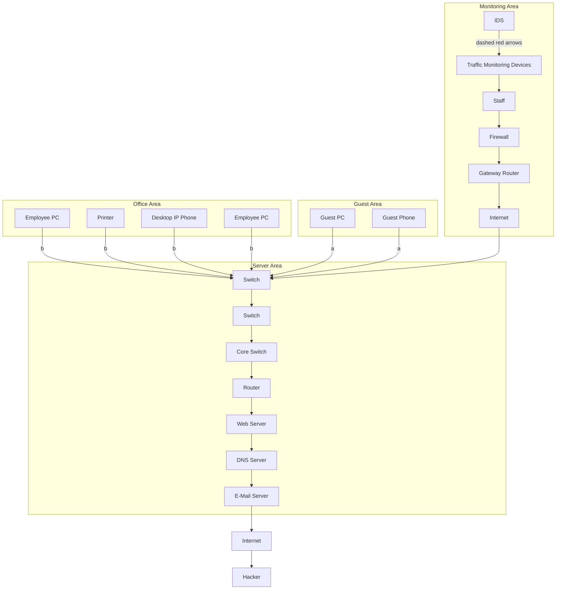
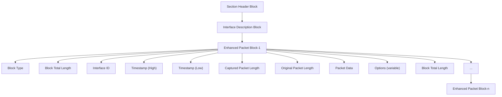

# A Detection Method for Malware Communication Traffic via Encrypted Traffic Analysis

Linfeng Wei , Member, IEEE, Yu Wang , Xueming Li, Jian Li, Yuqin Huang, and Zhiquan Liu , Senior Member, IEEE

Abstract—As the proportion of encrypted traffic in network communications continues to increase, encryption technologies are widely used to protect user privacy and data security. Meanwhile, this also makes it more covert for hackers to spread malware, steal sensitive information, or conduct other harmful behaviors in the network. How to effectively detect encrypted malicious traffic in communications while protecting user privacy has become a key task to be addressed in the field of network security. To address this challenge, this article proposes a detection method for malware communication traffic via encrypted traffic analysis. It extracts contextual correlations and temporal features from raw data traffic without decrypting the encrypted data using Session-Transformer. The method uses Deep Neural Networks as the classifier to detect and classify encrypted malicious traffic. The experimental results show that our method has the best performance in accuracy, precision, recall, and F1-score on the DataCon2020 encrypted malicious traffic dataset and the CIC-AndMal-2017 dataset. In particular, the recall on the DataCon2020 dataset reaches 98.34%, and the precision on the CIC-AndMal-2017 dataset achieves 93.54%.

Index Terms—Encrypting malicious traffic, deep neural networks (DNNs), privacy protection.

## I. INTRODUCTION

N TODAY’s digital age, network security has become a I crucial part of the information society. With the rapid development of technology, cyber attacks have become increasingly complex and diversified, posing significant security threats to internet users and organizations. According to Google’s Transparency Report [1], the percentage of Web pages loaded via hypertext transfer protocol secure (HTTPS) in Chrome in 2023 reached 94% on the Windows platform and 98% on the Android platform. Meanwhile, the percentage of browsing time on Chrome using HTTPS accounted for 95% on Windows and 98% on Android. While the widespread use of encrypted communications plays a crucial role in protecting user privacy [2], [3] and data security [4], [5], it

Received 24 February 2025; accepted 26 May 2025. Date of publication 6 June 2025; date of current version 8 August 2025. This work was supported by the Guangdong-Hong Kong Joint Laboratory for Data Security and Privacy Preserving under Grant 2023B1212120007. (Corresponding author: Linfeng Wei.)

Linfeng Wei, Xueming Li, and Yuqin Huang are with the College of Information Science and Technology, Jinan University, Guangzhou 510632, China (e-mail: linfengw@gmail.com; viming@stu2022.jnu.edu.cn; xiqin@stu2022.jnu.edu.cn).

Yu Wang, Jian Li, and Zhiquan Liu are with the College of Cyber Security, Jinan University, Guangzhou 510632, China (e-mail: wangyu@ stu2022.jnu.edu.cn; misaka10775@stu2022.jnu.edu.cn; zqliu@jnu.edu.cn).

Digital Object Identifier 10.1109/JIOT.2025.3577245 also makes it more covert for hackers to spread malware, steal sensitive information, or conduct other harmful behaviors in the network [6].

Enterprises typically utilize tools, such as firewalls, intrusion detection systems (IDS), and traffic monitoring devices to collect real-time data from their networks. These tools are capable of identifying abnormal activities within the network, such as large-scale data transfers, unauthorized access, or malicious attacks. However, with the widespread adoption of cloud computing, the Internet of Things, and remote work technologies, the types of traffic within corporate networks have become increasingly complex and difficult to monitor. This challenge is particularly pronounced in environments where encrypted traffic is prevalent. Traditional traffic analysis tools often struggle to effectively identify potential threats in encrypted communications. Moreover, when dealing with traffic that contains personal data, enterprises must comply with various data protection regulations, such as the General Data Protection Regulation. Handling sensitive information during traffic monitoring presents significant compliance challenges, as organizations are restricted from directly inspecting the contents of encrypted communications. In this context, the detection and classification of encrypted malicious traffic have become a key task in the field of network security.

The key challenges to detecting and classifying encrypted malicious traffic lie in protecting user privacy and enhancing detection accuracy by combining the information from various parts of TLS traffic. Addressing these challenges requires researchers to deeply understand the characteristics of encrypted communications [7], analyze network traffic patterns [8], and leverage advanced techniques, such as machine learning and behavioral analysis. From a privacy preservation perspective, it is imperative to develop detection method that operate exclusively on encrypted traffic metadata without requiring decryption or access to sensitive payload data. This ensures that user privacy is protected. The integration of various components of TLS traffic should be approached from three perspectives: 1) structure; 2) information; and 3) communication. Structurally, TLS traffic follows a packet sequence architecture, comprising TLS headers and payloads, where each packet occupies a specific position and serves a distinct role within the traffic sequence. From an informational perspective, TLS traffic adheres to a request-response model, exhibiting length correlation, content correlation, and temporal correlation between payloads, which reflect distinct communication patterns. In terms of communication, the complete lifecycle of TLS traffic typically encompasses protocol negotiation, encrypted data transmission, and session termination, with each stage exhibiting unique traffic characteristics.


<details>
<summary>flowchart</summary>


</details>

Fig. 1. Enterprise traffic monitoring devices deployment.

In recent years, researchers have proposed multiple methods for detecting and classifying encrypted malicious traffic. These methods primarily analyze plaintext features during the communication negotiation phase [9], [10], such as cipher suites, extensions, and certificates exchanged during the TLS handshake process, as well as traffic communication phase features [11], [35], including packet length, direction, and communication time, to differentiate between normal communication and malicious software. They evaluate the importance and differences of different features and train various machine learning and deep learning models to identify malicious encrypted traffic. However, in these methods, manually designed features may not fully capture the complex relationships in the data, leading to incomplete representation and underutilization of traffic information, thereby limiting model performance. Additionally, building complex ensemble models based on feature differences requires separate tuning and optimization of the base models, as well as substantial support from large-scale datasets to avoid overfitting.

As shown in Fig. 1, we consider a traffic monitoring system in an enterprise, where the internal network of the enterprise is divided in to guest area, office area, server area etc. Traffic from different areas communicating outward will ultimately pass through the core switch. We assume that the Web server in server area is installed with malware A, and the printer in office area is installed with malware B. The printer and the Web server are trying to send encrypted malicious traffic a and b. To detect encrypted malicious traffic, we forward traffic from core switch to a dedicated traffic monitoring device using port mirroring technology, and configure filtering rules to achieve precise traffic capture and analysis. The filtering rules are defined based on ports and protocols, ensuring that the monitoring device only captures and processes encrypted traffic from specific ports (e.g., port 443) or specific protocols (e.g., TLS/SSL protocols), while avoiding storage of unencrypted traffic. To prevent the encrypted malicious traffic from flowing to external networks, the staff locates the infected devices and handles the malwares.

In this article, we deeply discuss the challenges, existing technologies, and future development directions of encrypted malicious traffic detection and classification, combine deep learning algorithms with the field of encrypted malicious traffic detection, and design a method for the detection and classification of encrypted malicious traffic, achieving accurate detection and classification. The main contributions of this article can be summarized as follows.

1) We propose an encrypted malicious traffic detection and classification method that considers both user privacy protection and employs multihead self-attention mechanism to extract features from multiple perspectives.  
2) We explore the application of session-transformer (ST) feature extraction in encrypted malicious traffic detection. By incorporating ST feature extraction into traditional machine learning models, we find that this approach effectively improves the performance of these models in detecting encrypted malicious traffic.  
3) We conduct extensive experiments on the DataCon2020 encrypted malicious traffic dataset and the CIC-AndMal-2017 dataset to validate the effectiveness of the method. The experimental results show that our method performs well on these datasets, especially outperforming traditional machine learning models in key performance metrics, such as accuracy, precision, recall, and F1- score.

The remainder of this article is organized as follows. Section II gives an overview of the related work done in the past. Section III describes in detail the design and implementation of the proposed method. Section IV presents the dataset, experimental setup, evaluation metrics, experimental design and results. Section V gives a summary of this article and future research directions.

## II. RELATED WORKS

In the modern network environment where traffic encryption is increasingly prevalent and privacy protection is becoming more important, traditional methods based on pattern matching ports [12] and methods based on deep packet inspection [13] have become unsuitable. Currently, researchers mainly rely on machine learning and deep learning methods to detect and classify encrypted malicious traffic and have achieved a series of significant research results.

Early studies utilized traditional machine learning techniques for encrypted malicious traffic detection and classification. Anderson et al. [14] employed L1-regularized logistic regression (L1-Logistic) to identify malware families by extracting unencrypted TLS features and packet statistics. Priya et al. [15] used KMeans clustering to analyze encrypted traffic in real time to differentiate users’ browsers and applications. Rong et al. [16] extended feature space dimensions and leveraged ensemble learning to analyze malicious traffic data. While these methods demonstrated effectiveness in certain scenarios, they heavily relied on handcrafted features and could not capture complex relationships within encrypted malicious traffic. Several studies have applied tree-based models to improve classification accuracy. Yao et al. [17] proposed a gradient boosting decision tree (GBDT) combined with logistic regression, incorporating Bayesian optimization for hyperparameter tuning. Dai et al. [18] extracted multimodal features, such as TLS handshake characteristics and packet sequence features, and utilized XGBoost for classification. Tree-based models effectively handle structured data but lack the ability to model sequential dependencies in encrypted malicious traffic.


<details>
<summary>flowchart</summary>

```mermaid
graph TD
  A["① Capture Traffic"] --> B["Network Traffic"]
  B --> C["Session"]
  C --> D["Modify Timestamps"]
  D --> E["Base Conversion"]
  E --> F["[10100001 10110010 ... 00000000"]]2
[161 178 ... 0]10
[10100001 10110010 ... 00000000]]2
[161 178 ... 0]10
[...]
[10100001 10110010 ... 00000000]]2
[161 178 ... 0]10
(a)
(b)
(c)
  D --> E
  E --> F
  F --> G["Add & Norm"]
  G --> H["Feed Forward"]
  H --> I["Add & Norm"]
  I --> J["Multi-Head Attention"]
  J --> K["Positional Encoding"]
  K --> L["Input Embedding"]
  L --> M["Flatten"]
  M --> N["..."]
  N --> O["Binary Classification"]
  N --> P["Multi-class Classification"]
  O --> Q["Performance Evaluation"]
  P --> Q
  Q --> R["Simplocker"]
  Q --> S["Plankton"]
  Q --> T["Ewind"]
  Q --> U["FakeAV"]
```
</details>

Fig. 2. Overall structure of the method. (a) Data Preprocessing Module. (b) Transformer Module. (c) Classification and Evaluation Module.

Deep learning models have been extensively explored for encrypted malicious traffic detection and classification. Wang et al. [19] transformed encrypted sessions into grayscale images and compared 1-D convolutional neural networks (1-D-CNN) with 2-D CNNs (2-D-CNN). Lotfollahi et al. [20] combined stacked autoencoders (SAE) with CNNs for automatic feature extraction. Yao et al. [21] used recurrent neural networks (RNN) to model time-series network encrypted traffic and introduced an attention mechanism to assist in the classification of network encrypted traffic. Gu et al. [22] used temporal convolutional networks (TCN), Bi-GRU, and LSTM to capture dependencies across different modalities. CNN-based models primarily focus on spatial features and fail to fully capture temporal interactions between packets. RNN-based models, while effective for sequential data, suffer from long-term dependency issues. Some recent works have explored data augmentation and hybrid architectures models. Yang et al. [23] incorporated natural language processing (NLP) techniques, specifically term frequency—inverse document frequency (TF-IDF), for feature extraction in encrypted traffic detection. Luo et al. [24] proposed a deep convolutional generative adversarial network (DCGAN) with 1-D-CNN to address imbalanced datasets. Bader et al. [25] developed MalDIST, integrating 1-D-CNN, 2-D-CNN, and Bi-GRU for encrypted malware traffic detection. These methods improve feature representation and address data imbalance through advanced learning architectures and optimization techniques.

Previous works have made significant contributions to encrypted malicious traffic analysis, focusing on different aspects, such as handcrafted feature extraction, tree-based modeling, deep learning for feature representation, and hybrid optimization techniques. While these methods have improved encrypted traffic detection and classification, challenges remain in effectively capturing sequential dependencies, addressing long-term information loss, and enhancing feature representations.

## III. METHODOLOGY

The overall structure of the encrypted malicious traffic detection and classification method designed in this article is shown in Fig. 2, which mainly consists of data preprocessing module, Transformer module, and classification and evaluation module. In the data preprocessing module, we split the raw traffic data into sessions, modify the session timestamps, filter the unencrypted traffic, read the binary sequences of the sessions, and convert them into decimal sequences for subsequent model training. In the Transformer module, we modify the base Transformer by using a modified encoder to capture the contextual correlations and temporal features of the data. In the classification and evaluation module, we compare multiple classifiers and finally use deep neural network (DNN) as a classifier to detect and classify encrypted malicious traffic on both datasets. The detailed description of our encrypted malicious traffic detection and classification method is as follows.

Algorithm 1 Split Raw Traffic  
Input: Traffic $P = \{(x^{1}, b^{1}, t^{1}), ..., (x^{n}, b^{n}, t^{n})\}$ Output: Session S
1: Initialize $S \leftarrow \{\}$ , flag $\leftarrow$ false
2: for each packet $p^{i}$ in P do
3: flag $\leftarrow$ false
4: for each session $s^{i}$ in S do
5: if $x^{i} \in p^{i} == x^{i} \in s^{i}$ then
6: Add $p^{i}$ to $s^{i}$ 7: flag $\leftarrow$ true
8: break
9: end if
10: end for
11: if flag is false then
12: Create a new session s
13: Add packet $p^{i}$ to s
14: Add session s to the set of sessions S
15: end if
16: end for

## A. Data Preprocessing

As shown in Fig. 2(a), we first split the captured raw traffic. The raw traffic P is a set of packets, denoted as $P = \{ p ^ { 1 } , \ldots , p ^ { | P | } \}$ , |P| is the total number of packets in the raw traffic. Each packet $p ^ { i } \ = \ ( x ^ { i } , b ^ { i } , t ^ { i } )$ where $i \_ =$ $1 , 2 , \ldots , | P | . x ^ { i }$ is five-tuple (source IP, source port, destination IP, destination port, transport layer protocol), $b ^ { i }$ is the byte sequence of the ith data packet, $t ^ { i }$ is the start time of the ith data packet. The raw traffic is split into sessions, denoted as $S _ { i } = \{ p ^ { 1 } = ( x ^ { 1 } , b ^ { 1 } , t ^ { 1 } ) , \dots , p ^ { | n | } = ( x ^ { n } , b ^ { n } , t ^ { n } ) \} _ { i }$ , where $x ^ { 1 } \ = \ \cdots \ = \ x ^ { n }$ (source IP and destination IP are interchangeable in $x ^ { i } )$ , and $t ^ { 1 } < \dots < t ^ { n }$ . The process is shown in Algorithm 1. The sessions encapsulates the complete client-server communication and contains richer information. Moreover, the sessions obtained at this stage include the unencrypted handshake messages of the TCP protocol. To eliminate the impact of these unencrypted messages, we filter out all unencrypted traffic sessions in the mixed traffic and also filter out all non-TLS protocol traffic packets within the sessions. The processed network packet captures (PCAP) are then saved in the PCAPNG format [26].

The structure of the PCAPNG file is shown in Fig. 3, which contains a section header block (SHB), an interface description block (IDB), and several enhanced packet blocks (EPBs). The EPBs store information about each network packet. In the CIC-AndMal-2017 dataset [27], different types of malwares were captured at different time points. Each type of malware has the same timestamp-high value in its corresponding EPB, as shown in Table I. This feature enables various models to efficiently identify these malwares traffic, achieving 100% identification accuracy. After training random forest (RF) model on the preprocessed decimal sequence data obtained without modification timestamps, we selected the top 20 most important features. The specific distribution of these features is shown in Fig. 4. The decimal numbers at positions 121 and 122 correspond to the location of the timestamp-high value in the EPB, indicating that the timestamp-high value in the original dataset has a significant impact on the model’s classification. In existing traffic behavior analysis studies, timestamp-high can be used as a feature to identify activities that are inconsistent with normal behavior. For example, the time distribution of anomalous logins or data accesses can be analyzed by timestamps. The task of current research on the CIC-AndMal-2017 dataset in this article is to classifying encrypted malicious traffic, where the emphasis is not on differentiating various types of malicious traffic primarily based on disparities in communication time. Therefore, we modified the timestamps $t ^ { i }$ of each PCAPNG file in the original dataset: hiding and uniformly replacing them with the same initial timestamp $t ^ { 1 }$ , while ensuring that the original time intervals between packets were preserved. Although this approach eliminates the absolute time information of each packet, it retains their relative time order and intervals, which are essential for subsequent data analysis and pattern recognition.


<details>
<summary>flowchart</summary>


</details>

Fig. 3. Structure of PCAPNG.


<details>
<summary>bar chart</summary>

| Feature Index | Importance (%) |
| ------------- | -------------- |
| 12            | 11.2           |
| 11            | 9.4            |
| 20            | 3.6            |
| 70            | 3.2            |
| 71            | 3.1            |
| 74            | 2.8            |
| 72            | 2.7            |
| 75            | 2.6            |
| 73            | 2.5            |
| 65            | 2.5            |
| 78            | 2.3            |
| 59            | 2.3            |
| 51            | 2.2            |
| 67            | 2.1            |
| 14            | 2.0            |
| 17            | 2.0            |
| 145           | 1.9            |
| 54            | 1.9            |
| 144           | 1.8            |
| 77            | 1.8            |
| 56            | 1.7            |
| 57            | 1.6            |
</details>

Fig. 4. Top 20 feature importance in RF model.

TABLE I MALWARE CAPTURE TIMESTAMP

<table><tr><td>Malware</td><td>Simplocker</td><td>Ewind</td><td>Plankton</td><td>FakeAV</td></tr><tr><td>Timestamp-High (hexadecimal)</td><td>82 57 05 00D1 57 05 000F 58 05 00</td><td>DD 51 05 00E3 51 05 00</td><td>0E 54 05 00</td><td>F5 52 05 0005 53 05 0017 53 05 00</td></tr></table>

Finally, we process each PCAPNG file as a sequence of binary numbers. Specifically, we first read the entire file as raw binary data and denote it as a sequence of bytes: $B =$ $\{ b _ { 1 } , b _ { 2 } , \dots , b _ { n } \}$ , where each $b _ { i }$ represents a single 8-bit byte extracted from the PCAPNG file. Each byte $b _ { i }$ consists of eight binary digits, represented as: $b _ { i } = ( b _ { i , 0 } , b _ { i , 1 } , \dots , b _ { i , 7 } )$ , where $b _ { i , j } ~ ( \mathrm { f o r } ~ j = 0 , 1 , \dots , 7 )$ denotes the jth binary digit of $b _ { i } .$ To convert each byte $b _ { i }$ into its corresponding decimal value $d _ { i } ,$ we apply the following formula:

$$
d _ {i} = \sum_ {j = 0} ^ {7} b _ {i, j} \times 2 ^ {(7 - j)}. \tag {1}
$$

Then we form all $d _ { i }$ into a 1-D sequence $\begin{array} { r l } { D } & { { } = } \end{array}$ $\{ d _ { 1 } , d _ { 2 } , \dots , d _ { n } \}$ . To ensure uniform input length for subsequent processing, we set a fixed length L. Based on the statistical distribution of sequence lengths within the dataset, we define L such that 75% of the data samples have lengths less than or equal to L. Sequences longer than L are truncated, while sequences shorter than L are zero-padded at the end.

## B. Transformer Structure

Transformer [28] is a deep learning model widely used in the field of NLP. This model entirely abandons traditional RNN and LSTM, instead opting for an attention mechanismbased approach to process sequence data. This structure allows the model to more effectively capture long-distance dependencies and enhances its parallel processing capabilities. The focus of this study is on detecting and classifying encrypted malicious traffic, which entails analyzing sequences of network packets. Within these sequences, intricate patterns and structures may emerge. The Transformer model can effectively capture long-distance dependencies and abstract features in sequences, which helps identify abnormal behaviors in encrypted malicious traffic. In addition, Transformer models can learn to map input sequences to fixed-length vector representations that capture the semantic information of the input sequences. Based on this, we modify the encoder part of Transformer to automatically extract features related to malicious behavior.

Each sample after preprocessing is a 1-D sequence denoted $D ^ { ( i ) } = \{ \dot { d _ { 1 } ^ { ( i ) } } , d _ { 2 } ^ { ( i ) } , \dot { \ldots } , \dot { d _ { n } ^ { ( i ) } } \}$ is the length of the sequence. First, we transform each input sample into its corresponding 64-D embedding vector using the embedding matrix $W _ { E }$

$$
Z ^ {(i)} = W _ {E} D ^ {(i)}. \tag {2}
$$

Subsequently, the data passes through a positional encoding layer that generates unique position encodings for each position, with the position-encoding formulas are presented as follows:

$$
P E _ {(\text { pos }, 2 i)} = \sin \left(\frac {\text { pos }}{1 0 0 0 ^ {2 i / d _ {\text { model }}}}\right) \tag {3}
$$

$$
P E _ {(\text { pos }, 2 i + 1)} = \cos \left(\frac {\text { pos }}{1 0 0 0 ^ {2 i / d _ {\text { model }}}}\right) \tag {4}
$$

where $d _ { \mathrm { m o d e l } }$ is the dimensionality of the encoding vector, i is the dimension index within the encoding vector, pos is the position in the sequence. Sine functions are used to encode even dimensions of the encoding vector, while cosine functions are used for odd dimensions. The encoding vectors and the positional vectors have the same dimensionality, we get the input X of the encoder layer by the following calculation:

$$
X = Z + P E. \tag {5}
$$

The input data are preprocessed fixed-length 1-D sequences. Therefore, there is no need to add padding or positional masking, and the sentence masking part from the original model has been removed. The encoder layer comprises eight identical sublayers, each consisting of a multihead attention mechanism and a feed-forward neural network. The multihead attention layer employs a self-attention mechanism, which is divided into eight heads to capture a broader range of subspace features. This design enables the model to attend to different aspects of the information in parallel, enhancing its ability to understand complex input sequences. It can be expressed as formula

$$
\text { Attention } (Q, K, V) = \operatorname{softmax} \left(\frac {Q K ^ {T}}{\sqrt {d _ {k}}}\right) V \tag {6}
$$

where Q, K, and V represent the query, key, and value matrices. The relevance between the features of the current position and those of other positions in the sequence is calculated by multiplying the Q and K matrices. The larger the value of this product, the higher the relevance. The calculation formula for the self-attention mechanism in each head is as follows:

$$
\text { head } _ {i} = \text { Attention } (Q _ {i}, K _ {i}, V _ {i}). \tag {7}
$$

The formula for the multihead attention mechanism, which is a concatenation of multiple self-attention mechanisms, is as follows:

$$
\text { MultiHead } (Q, K, V) = \text { Concat } (\text { head } _ {1}, \ldots , \text { head } _ {n}) W ^ {o} \tag {8}
$$

where Concat() represents a matrix concatenation operation, and $W ^ { o }$ denotes an additional weight matrix. The process involves concatenating the outputs of multiple selfattention mechanisms and subsequently performing matrix operations with $W ^ { o } ,$ . This compression of different subspace self-attentions into a single matrix allows for more accurate extraction of important features.

The feed-forward neural network layer achieves nonlinear transformations using two fully connected layers and the GeLU activation function. Specifically, the output of the first fully connected layer is calculated as

$$
h = \operatorname{GeLU} (W _ {1} x + b _ {1}) \tag {9}
$$

where x is the input, $W _ { 1 }$ and $b _ { 1 }$ are the weights and biases of the first layer, and GeLU denotes the Gaussian Error Linear Unit activation function. The hidden layer has a dimensionality of 128. The second fully connected layer computes the final output as

$$
y = W _ {2} h + b _ {2} \tag {10}
$$

where $W _ { 2 }$ and $b _ { 2 }$ are the weights and biases of the second layer. The output of the previous encoder sublayer serves as the input for the next encoder sublayer, enabling the further extraction of features. The structure of the module is depicted in Fig. 2(b).

## C. Classification and Evaluation

In this module, we initially conduct a binary classification experiment to differentiate between normal encrypted network traffic and traffic that may potentially contain malicious behavior. Following this, we perform multiclass classification experiments on encrypted communication traffic from various malware samples. The goal is to identify and distinguish different types of malware activities, thereby enhancing the accuracy of security protection.

DNN is a multilayer neural network architecture widely applied to complex tasks, such as classification, regression, and generation. It consists of multiple hidden layers, each containing numerous neurons that utilize nonlinear activation functions (e.g., ReLU, Sigmoid) to map input features into high-dimensional spaces, enabling the extraction of deep hierarchical features. The DNN is optimized through the backpropagation algorithm, which adjusts the weights to minimize the loss function and progressively improve model accuracy. Additionally, regularization techniques, such as Dropout are commonly employed to prevent overfitting and enhance the model’s generalization capability.

We use DNN as the classifier, which comprises two hidden layers, each containing a fully connected layer, a ReLU activation function, and a dropout function. The fully connected layer is used to perform a linear transformation on the input features, ReLU introduces nonlinearity to enhance the network’s representational capacity, and dropout prevents overfitting, improving the model’s generalization ability. The structure of the module is depicted in Fig. 2(c).

## IV. EXPERIMENTS

The CPU used in this experiment is AMD EPYC 7742 64- Core Processor, the GPU is RTX 3090, the operating system is Ubuntu 9.4.0-1, and the Python version is 3.7.16.

## A. Dataset

DataCon2020 encrypted malicious traffic dataset [29] source was generated by Qianxin Technology Research Institute’s Tianqiong Sandbox from February to June 2020 running malware and normal software and capturing the traffic, all software types are in the “exe” format. The traffic content consisted of TLS and SSL data packets generated on port 443. The dataset contained 10000 pcap data files, we set the labels for benign traffic to 0 and for malicious traffic to 1.

CIC-AndMal-2017 dataset consists of 5000 samples collected from real smartphones by the Canadian Institute for Cybersecurity. It includes 426 samples of malicious software and 5065 samples of benign applications. The malware samples in the dataset are categorized into four types: 1) Adware; 2) Ransomware; 3) Scareware; and 4) SMSMalware. As shown in Table IV, we perform multiclass classification using samples from four malicious software families in the dataset: Plankton, FakeAV, Simplocker, and Ewind. We set labels to them sequentially as 0, 1, 2, 3.

## B. Parameter Settings

We utilized the PyTorch[30] deep learning framework to construct the network structure of our model, with the initial parameters set as shown in Table II. The DataCon2020 encrypted malicious traffic dataset exhibited an imbalance in the sample sizes between benign and malicious traffic in the split sessions. To mitigate the impact of class imbalance, which can limit the model’s recognition performance on minority class targets, as illustrated in Table III, we employed a method of undersampling to adjust the ratio of the two classes’ samples to 1:1.

## C. Experimental Evaluation

In the experiment, we used the following metrics to evaluate the detection performance of our method: Accuracy, Precision, Recall, and F1-score. The specific formulas are as follows:

$$
\text { Accuracy } = \frac {\mathrm{TP} + \mathrm{TN}}{\mathrm{TP} + \mathrm{TN} + \mathrm{FP} + \mathrm{FN}} \tag {11}
$$

$$
\text { Precision } = \frac {\mathrm{TP}}{\mathrm{TP} + \mathrm{FP}} \tag {12}
$$

$$
\text { Recall } = \frac {\mathrm{TP}}{\mathrm{TP} + \mathrm{FN}} \tag {13}
$$

$$
F 1 - \text { score } = 2 \times \frac {\text { precision } \times \text { recall }}{\text { precision } + \text { recall }}. \tag {14}
$$

Herein, TP represents the number of true positives, TN represents the number of true negatives, FP represents the number of false positives, and FN represents the number of false negatives. These traditional evaluation metrics effectively measure classification performance but do not account for computational efficiency. To provide a more comprehensive evaluation, we introduce the balanced efficiency index (BEI), which considers both detection performance and computational cost. The BEI is defined as follows:

TABLE II PARAMETER SETTINGS

<table><tr><td>seq_len</td><td>d_model</td><td>dropout</td><td>n_head</td><td>n_layer</td><td>batchsize</td><td>lr</td><td>momentum</td></tr><tr><td>500</td><td>64</td><td>0.15</td><td>8</td><td>8</td><td>64</td><td>0.0001</td><td>0.99</td></tr></table>

TABLE III DATACON2020 DATASET DISTRIBUTION

<table><tr><td>Samples</td><td>Pcap files</td><td>Session</td><td>Balance Session</td></tr><tr><td>Benign</td><td>5000</td><td>30270</td><td>30270</td></tr><tr><td>Malware</td><td>5000</td><td>91338</td><td>30270</td></tr></table>

TABLE IV CIC-ANDMAL-2017 DATASET DISTRIBUTION

<table><tr><td>Samples</td><td>Pcap files</td><td>Session</td></tr><tr><td>Plankton</td><td>10</td><td>6852</td></tr><tr><td>FakeAV</td><td>10</td><td>6011</td></tr><tr><td>Simplocker</td><td>10</td><td>7533</td></tr><tr><td>Ewind</td><td>10</td><td>6380</td></tr></table>

$$
\mathrm{BEI} = \mathrm{Acc} + \mathrm{Pre} + \text { Recall } + F 1 - \log_ {1 0} (1 + t _ {\text { total }}) \tag {15}
$$

where $t _ { \mathrm { t o t a l } }$ is the total time (in seconds) to complete model training and output predictions. By incorporating a logarithmic penalty term, BEI ensures a balanced assessment of both predictive performance and computational efficiency, providing a more comprehensive evaluation metric.

## D. Experimental Design

In this section, we use machine learning and deep learning models as comparisons to our model. To comprehensively assess the performance of these models, we employ five-fold cross-validation and averaged the results from all experiments.

To evaluate the classification performance of different machine learning methods on the preprocessed data as initial experiment, we selected four classic machine learning models.

1) LR [31]: A linear classification model suited for binary classification tasks. It predicts the probability of a sample belonging to a class by learning a weighted linear combination of input features and applies a threshold to assign the sample to a specific class. The advantages of LR include simplicity, interpretability, and effectiveness in handling linearly separable data.  
2) K-Nearest Neighbors (KNN) [32]: An instance-based learning algorithm that classifies samples by calculating the distance between the test sample and the samples in the training set, selecting the nearest K neighbors to determine the suitable class of each sample. KNN does not require an explicit training process, but it can be computationally expensive for large datasets and is sensitive to noise.  
3) Support Vector Machine (SVM) [33]: A classification model from statistical learning theory. It finds an optimal hyperplane to maximize the margin between classes.

SVM performs well with high-dimensional data and nonlinear problems by using kernel functions to map data into higher dimensional spaces for better separation.

4) RF [34]: An ensemble learning model that constructs multiple decision trees and uses voting to determine the classification result. RF reduces the risk of overfitting from a single decision tree, improving model stability and generalization, especially when dealing with highdimensional data and feature subsets.

Based on the results of the initial experiment, we introduced the ST feature extraction method to improve model performance. This method extracts more representative features from the preprocessed data, aiming to enhance the classification capabilities of the models. After applying ST feature extraction, we re-evaluated classification performance using four classifiers LR, KNN, SVM, and RF. Comparing these results with those from the initial experiment allowed us to assess the impact of ST feature extraction on overall model performance.

To further improve classification accuracy, we use STbased DNN as the classifier in our model. DNNs can learn more complex features through multilayer neural networks. Compared to traditional machine learning models, DNNs generally perform better when handling large and complex datasets.

Further, we selected two deep learning models, Fs-Net [35] and PEAN [36] for comparison.

1) Fs-Net: An end-to-end classification model that learns representative features from the raw flows, and then classifies them in a unified framework.  
2) PEAN: A specialized framework for encrypted traffic classification using raw bytes and lengths, with selfattention and unsupervised pretraining for enhanced classification.

## E. Experimental Results

All experimental results are summarized in Table V. Based on these results, we conducted a detailed analysis to evaluate the performance and identify key differences.

The experimental results on the DataCon2020 dataset show that classical machine learning models, such as LR, SVM, and KNN exhibit relatively moderate performance, whereas models enhanced with ST feature extraction method, such as ST-LR, ST-SVM, and ST-KNN, demonstrate significant improvements across all metrics. For example, ST-KNN achieves an accuracy of 96.79%, a substantial increase compared to the baseline KNN’s 88.87%, highlighting the effectiveness of ST feature extraction in optimizing model performance. In Fig. 5, the receiver operating characteristic (ROC) curve and confusion matrix demonstrate the performance of the model. The ROC curve nearly reaches the upper left-hand corner, indicating that the model performs with high accuracy in the binary classification task. The confusion matrix further illustrates the efficiency of the model in classifying both positive and negative samples, with very few misclassifications. In general, our model achieves an accuracy of 98. 29%, a precision of 98. 23%, a recall of 98. 34%, and an F1-score of 98.29%. These metrics clearly demonstrate the model’s superior performance in handling binary classification tasks.

TABLE V FIVE-FOLD CROSS-VALIDATION RESULTS (%) ON THE DATASETS

<table><tr><td rowspan="2">Method</td><td colspan="5">DataCon2020 Dataset</td><td colspan="5">CIC-AndMal-2017 Dataset</td></tr><tr><td>Accuracy</td><td>Precision</td><td>Recall</td><td>F1</td><td>BEI</td><td>Accuracy</td><td>Precision</td><td>Recall</td><td>F1</td><td>BEI</td></tr><tr><td>LR</td><td>89.27</td><td>89.44</td><td>89.27</td><td>89.26</td><td>356.06</td><td>81.56</td><td>81.49</td><td>81.56</td><td>81.46</td><td>325.07</td></tr><tr><td>ST-LR</td><td>94.81</td><td>94.81</td><td>94.81</td><td>94.81</td><td>376.44</td><td>89.96</td><td>89.96</td><td>89.96</td><td>89.92</td><td>356.90</td></tr><tr><td>SVM</td><td>89.62</td><td>90.17</td><td>89.62</td><td>89.58</td><td>355.69</td><td>83.82</td><td>83.80</td><td>83.82</td><td>83.69</td><td>332.70</td></tr><tr><td>ST-SVM</td><td>92.34</td><td>92.67</td><td>92.34</td><td>92.32</td><td>364.80</td><td>87.15</td><td>87.30</td><td>87.13</td><td>86.97</td><td>344.28</td></tr><tr><td>KNN</td><td>88.87</td><td>88.87</td><td>88.87</td><td>88.86</td><td>353.72</td><td>84.50</td><td>84.64</td><td>84.50</td><td>84.56</td><td>337.05</td></tr><tr><td>ST-KNN</td><td>96.79</td><td>96.80</td><td>96.79</td><td>96.79</td><td>384.25</td><td>91.78</td><td>91.86</td><td>91.78</td><td>91.83</td><td>364.62</td></tr><tr><td>RF</td><td>96.81</td><td>96.85</td><td>96.81</td><td>96.81</td><td>384.59</td><td>93.12</td><td>93.20</td><td>93.12</td><td>93.08</td><td>370.48</td></tr><tr><td>ST-RF</td><td>97.19</td><td>97.20</td><td>97.19</td><td>97.19</td><td>384.65</td><td>92.53</td><td>92.65</td><td>92.52</td><td>92.46</td><td>366.65</td></tr><tr><td>DNN</td><td>92.99</td><td>93.08</td><td>92.99</td><td>92.98</td><td>368.74</td><td>86.30</td><td>86.28</td><td>86.30</td><td>86.26</td><td>342.16</td></tr><tr><td>PEAN</td><td>91.30</td><td>91.27</td><td>90.77</td><td>90.75</td><td>359.33</td><td>91.41</td><td>91.45</td><td>91.43</td><td>91.43</td><td>361.71</td></tr><tr><td>FS-Net</td><td>90.73</td><td>91.24</td><td>90.71</td><td>90.69</td><td>358.76</td><td>76.37</td><td>76.18</td><td>76.26</td><td>75.89</td><td>300.86</td></tr><tr><td>Our</td><td>98.29</td><td>98.23</td><td>98.34</td><td>98.29</td><td>389.04</td><td>93.47</td><td>93.54</td><td>93.51</td><td>93.49</td><td>370.95</td></tr></table>


<details>
<summary>line chart</summary>

| FPR  | TPR  |
| ---- | ---- |
| 0.0  | 0.0  |
| 0.2  | 1.0  |
| 0.4  | 1.0  |
| 0.6  | 1.0  |
| 0.8  | 1.0  |
| 1.0  | 1.0  |
</details>

(a)


<details>
<summary>heatmap</summary>

| True label \ Predicted label | 0 (%) | 1 (%) |
| :--- | :--- | :--- |
| 0 | 48.68 | 0.67 |
| 1 | 0.97 | 49.69 |
</details>

(b)  
Fig. 5. (a) ROC Curve and (b) confusion matrix on the dataCon2020 dataset.

The experimental results on the CIC-AndMal-2017 dataset similarly show that our method outperforms others in terms of precision, recall, and F1-score. LR, SVM, and KNN models also improve performance when applying ST feature extraction. However, when combined with ST feature extraction, the performance of the RF model slightly declines. This phenomenon is related to the limited size of the dataset or the complexity of the feature distribution, which results in the ST feature extraction failing to effectively improve the performance of the RF model. Fig. 6 shows that our model made no misclassifications in Plankton and Simplocker, but there are false positives in FakeAV and Ewind. Some samples from FakeAV were misclassified as Ewind and some samples from Ewind were misclassified as FakeAV. The reason is compared to Plankton and Simplocker, the sample size of FakeAV and Ewind is too small to extract the exact feature.

Both the PEAN model and the Fs-Net model are trained using the length sequence of packets as input to the model. We observe that their performance is similar on the Datacon2020 dataset. However, all the evaluation metrics of the Fs-Net model drop significantly on the CIC-AndMal-2017 dataset. The performance of the Fs-Net model is worse when the dataset becomes smaller. Our model performs better than Fs-Net and PEAN in detecting and classifying encrypted malicious traffic. The reason is as follows: First, malware communication traffic packets present a request-response sequence structure, in which there are significant correlations between requests and responses in both content dimension and time dimension. The ST feature extractor is able to understand contextual relationships and extract time-series features efficiently, and this dual advantage enables it to show excellent performance in the detection and classification tasks of encrypted malicious traffic. Therefore, in application scenarios where features are significantly sequential, context-dependent, and temporally correlated, such as command-and-control traffic detection, online transaction analysis, and user behavior analysis, ST components can be introduced to enhance the overall performance of the model. In addition, we integrate DNN with the complex features extracted by the Transformer encoder in our model. This combination leverages the advanced feature extraction capabilities of Transformer along with the DNN’s strength in nonlinear learning and classification, particularly when handling large-scale datasets. By using the DNN as the classifier, our model enhances its ability to process and learn from nonlinear patterns, resulting in improved performance.


<details>
<summary>line chart</summary>

| FPR  | TPR (ROC curve of class 0) | TPR (ROC curve of class 1) | TPR (ROC curve of class 2) | TPR (ROC curve of class 3) |
|------|-----------------------------|----------------------------|----------------------------|----------------------------|
| 0.0  | 1.0                         | 1.0                        | 1.0                        | 0.0                        |
| 0.2  | 1.0                         | 1.0                        | 1.0                        | 1.0                        |
| 0.4  | 1.0                         | 1.0                        | 1.0                        | 1.0                        |
| 0.6  | 1.0                         | 1.0                        | 1.0                        | 1.0                        |
| 0.8  | 1.0                         | 1.0                        | 1.0                        | 1.0                        |
| 1.0  | 1.0                         | 1.0                        | 1.0                        | 1.0                        |
</details>

(a)


<details>
<summary>heatmap</summary>

| True label \ Predicted label | 0 | 1 | 2 | 3 |
|---|---|---|---|---|
| 0 | 25.85 | 0.00% | 0.00% | 0.00% |
| 1 | 0.00% | 24.81% | 0.00% | 2.48% |
| 2 | 0.00% | 0.00% | 22.78% | 0.00% |
| 3 | 0.00% | 3.16% | 0.00% | 20.91% |
</details>

(b)  
Fig. 6. (a) ROC Curve and (b) confusion matrix on the CIC-AndMal-2017 dataset.

In terms of balancing classification accuracy and computational expense, our model achieved the best performance across two datasets. Furthermore, the incorporation of the ST component enhanced BEI scores in multiple models. For instance, in binary classification tasks, ST-LR improved its accuracy by 5.54% and BEI metric by 20.38 compared to LR on the Datacon2020 dataset. This demonstrates that under conditions of complex data features and difficult-to-identify patterns, the ST component can extract more discriminative features, significantly enhancing classification performance. Although computational costs increased, the improvement in BEI scores indicates that the overall benefits are worthwhile. However, when data features are relatively simple and baseline models already achieve high performance, the gains from ST components are minimal (e.g., ST-RF), and additional computational costs may lead to a decrease in BEI scores. In such scenarios, employing lighter models might be a more optimal choice. Compared to lightweight models, deep learning models exhibit relatively lower BEI scores, primarily due to their higher computational costs.

Finally, compared to the Datacon2020 dataset, our model has a decrease in performance in the CIC-AndMal-2017 dataset. Moreover, on the CIC-AndMal-2017 dataset, the ST feature extractor results in a negative performance gain for RF model. To explain the reasons for the performance degradation, we designed two sets of experiments. First, we conducted an undersampling experiment on the Datacon2020 dataset (with sample sizes ranging from 10 000 to 30 000), performing binary classification tasks using both RF and ST-RF models. As shown in Fig. 7, the application of the ST component enhances the performance of RF model when the number of samples exceeds a certain threshold; however, at lower sample sizes, the ST component instead causes performance degradation for RF model. Second, on the CIC-AndMal-2017 dataset, we expanded the feature dimension through ST feature extraction and then used RF model to select top 330 features in terms of importance. Then we used only these 330 features for classification. The experimental results are shown in Table VI.


<details>
<summary>line chart</summary>

| Sample Size | RF Accuracy (%) | ST-RF Accuracy (%) |
| :--- | :--- | :--- |
| 10000 | 93.6 | 93.4 |
| 12000 | 94.0 | 93.9 |
| 14000 | 94.4 | 94.3 |
| 16000 | 94.7 | 94.9 |
| 18000 | 94.8 | 95.0 |
| 20000 | 95.0 | 95.3 |
| 22000 | 95.3 | 95.6 |
| 24000 | 95.5 | 95.9 |
| 26000 | 95.7 | 96.1 |
| 28000 | 95.8 | 96.1 |
| 30000 | 95.9 | 96.2 |
</details>

Fig. 7. Sample size impact on RF and ST-RF performance.

TABLE VI MODELS PERFORMANCE AFTER DIMENSIONALITY REDUCTION

<table><tr><td>Method</td><td>Accuracy</td><td>Precision</td><td>Recall</td><td>F1</td></tr><tr><td>ST-LR</td><td>89.67</td><td>89.67</td><td>89.67</td><td>89.67</td></tr><tr><td>ST-SVM</td><td>87.14</td><td>87.30</td><td>87.14</td><td>86.97</td></tr><tr><td>ST-KNN</td><td>91.78</td><td>91.86</td><td>91.78</td><td>91.81</td></tr><tr><td>ST-RF</td><td>93.44</td><td>93.48</td><td>93.44</td><td>93.41</td></tr></table>

From Fig. 7, we can conclude that the performance improvement of RF model by the ST component is closely related to the sample size. In the second experiment, by applying dimensionality reduction to the features extracted by the ST component, the performance of RF model was still improved, while no changes were made to other models. In summary, the reason for the performance degradation of our model in the CIC-AndMal-2017 dataset is that the sample size of this dataset is relatively low and the experiments on this basis are multiclassification experiments. Meanwhile, the ST component extends the feature dimensions, which is not enough to support RF model to effectively classify high-dimensional features when the number of samples in the dataset is low, so the performance of ST-RF appears to be degraded compared to RF. However, after the dimensionality reduction process, the effective features extracted by the ST component can still improve the performance of RF model, which further validates the effectiveness of the ST component in feature extraction.

## V. CONCLUSION

This article proposed an encrypted malicious traffic detection and classification method that focuses on contextual and time-series features in raw encrypted malicious traffic. The method used encoder layers of Transformer to extract highdimensional features of the data and employed DNN for detection and classification of encrypted malicious traffic. In a series of experiments on two public datasets, our method achieved the best performance in all evaluation metrics and also revealed the potential of ST feature extraction in enhancing performance of traditional machine learning models.

Our model also has some limitations. For example, the ST component will face high computational costs when processing large-scale or long sequence data, making it difficult to meet high-throughput and low-latency requirements of realtime detection systems. In our future research, we will explore lightweight Transformer variants to optimize the ST component and reduce redundant computations. Meanwhile, our current method focuses solely on analyzing encrypted malicious traffic of the SSL/TLS protocol. Subsequent research will extend to other encryption protocols (e.g., SSH, QUIC, etc.) to validate the model’s applicability in a broader range of encrypted traffic detection tasks. Finally, the current size of encrypted malicious traffic dataset is relatively small, we will fuse different encrypted malicious traffic datasets to test our approach on a larger number of samples.

## REFERENCES

[1] Google Transparency Report. “HTTPS encryption on the Web.” Accessed: Apr. 10, 2024. [Online]. Available: https://transparencyreport. google.com/https/overview?hl=en  
[2] T.-F. Lee, D.-C. Lou, and C.-H. Chang, “Enhancing lightweight authenticated key agreement with privacy protection using dynamic identities for Internet of Drones,” Internet Things, vol. 23, Oct. 2023, Art. no. 100877.  
[3] W. Li et al., “Prism: Real-time privacy protection against temporal network traffic analyzers,” IEEE Trans. Inf. Forensics Security, vol. 18, pp. 2524–2537, 2023.  
[4] D. Kumbhakar, K. Sanyal, and S. Karforma, “An optimal and efficient data security technique through crypto-stegano for ecommerce,” Multimedia Tools Appl., vol. 82, no. 14, pp. 21005–21018, 2023.  
[5] P. K. Roy, A. Singh, J. V. Desai, and S. K. Singh, “Healthcare data security using lightweight protocol for cyber physical system,” IEEE Trans. Netw. Sci. Eng., vol. 10, no. 5, pp. 2597–2606, Sep./Oct. 2023.  
[6] “Threatlabz 2024 encrypted attacks report.” Zscaler. Accessed: Dec. 25, 2024. [Online]. Available: https://www.zscaler.com/resources/industryreports/threatlabz-encrypted-attacks-report.pdf  
[7] Z. Wang and V. L. Thing, “Feature mining for encrypted malicious traffic detection with deep learning and other machine learning algorithms,” Comput. Secur., vol. 128, May 2023, Art. no. 103143.  
[8] L. Xu et al., “Transmuse: Transferable traffic prediction in multi-service edge networks,” Comput. Netw., vol. 221, Feb. 2023, Art. no. 109518.  
[9] L. Yang, S. Fu, Y. Wang, K. Liang, F. Mo, and B. Liu, “DEV-ETA: An interpretable detection framework for encrypted malicious traffic,” Comput. J., vol. 66, no. 5, pp. 1213–1227, 2023.  
[10] Q. Guo, W. Yang, and B. Cui, “Graph-based detection of encrypted malicious traffic with spatio-temporal features,” in Proc. Int. Conf. Emerg. Internet, Data Web Technol., 2024, pp. 75–86.  
[11] J. Chen, L. Song, S. Cai, H. Xie, S. Yin, and B. Ahmad, “TLS-MHSA: An efficient detection model for encrypted malicious traffic based on multi-head self-attention mechanism,” ACM Trans. Privacy Secur., vol. 26, no. 4, pp. 1–21, 2023.  
[12] P. Schneider, TCP/IP Traffic Classification Based on Port Numbers, Div. Appl. Sci., Cambridge, MA, USA, 1996.  
[13] T. AbuHmed, A. Mohaisen, and D. Nyang, “A survey on deep packet inspection for intrusion detection systems,” 2008, arXiv:0803.0037.  
[14] B. Anderson, S. Paul, and D. McGrew, “Deciphering malware’s use of TLS (without decryption),” J. Comput. Virol. Hacking Techn., vol. 14, pp. 195–211, Aug. 2018.  
[15] A. Priya, S. Nandi, and R. Goswami, “An analysis of real-time network traffic for identification of browser and application of user using clustering algorithm,” in Proc. Int. Conf. Adv. Comput., Commun. Control Netw. (ICACCCN), 2018, pp. 441–445.  
[16] C. Rong, G. Gou, M. Cui, G. Xiong, Z. Li, and L. Guo, “MalFinder: An ensemble learning-based framework for malicious traffic detection,” in Proc. IEEE Symp. Comput. Commun. (ISCC), 2020, pp. 7–7.  
[17] W. Yao, L. Wei, W. Ke-He, and C. Wen-Chao, “Application of fusion model of GBDT and LR in encrypted traffic identification,” Comput. Modern., no. 3, p. 93, 2020.  
[18] R. Dai, C. Gao, B. Lang, L. Yang, H. Liu, and S. Chen, “SSL malicious traffic detection based on multi-view features,” in Proc. 9th Int. Conf. Commun. Netw. Secur., 2019, pp. 40–46.  
[19] W. Wang, M. Zhu, J. Wang, X. Zeng, and Z. Yang, “End-to-end encrypted traffic classification with one-dimensional convolution neural networks,” in Proc. IEEE Int. Conf. Intell. Secur. Inf. (ISI), 2017, pp. 43–48.  
[20] M. Lotfollahi, M. J. Siavoshani, R. Shirali Hossein Zade, and M. Saberian, “Deep packet: A novel approach for encrypted traffic classification using deep learning,” Soft Comput., vol. 24, no. 3, pp. 1999–2012, 2020.  
[21] H. Yao, C. Liu, P. Zhang, S. Wu, C. Jiang, and S. Yu, “Identification of encrypted traffic through attention mechanism based long short term memory,” IEEE Trans. Big Data, vol. 8, no. 1, pp. 241–252, Feb. 2022.  
[22] R. Gu, J. Fei, H. Yu, Y. Zhu, K. Yang, and F. Guo, “Meta-TFEN: A multi-modal deep learning approach for encrypted malicious traffic detection,” in Proc. 33rd Int. Telecommun. Netw. Appl. Conf., 2023, pp. 98–104.  
[23] H. Yang, Q. He, Z. Liu, and Q. Zhang, “Malicious encryption traffic detection based on NLP,” Secur. Commun. Netw., vol. 2021, pp. 1–10, Aug. 2021.  
[24] W. Luo, Z. Liu, R. Zhao, J. Chen, and X. Deng, “Malicious https traffic classification algorithm based on DCGAN\_1D-CNN,” in Proc. IEEE Conf. Telecommun., Opt. Comput. Sci. (TOCS), 2021, pp. 20–25.  
[25] O. Bader, A. Lichy, C. Hajaj, R. Dubin, and A. Dvir, “MaLDIST: From encrypted traffic classification to malware traffic detection and classification,” in Proc. IEEE 19th Annu. Consum. Commun. Netw. Conf. (CCNC), 2022, pp. 527–533.  
[26] M. Tüxen et al., “PCAP next generation (PCAPNG) capture file format,” Internet Eng. Task Force, Internet-Draft draft-ietf-opsawg-pcapng-03, 2016.  
[27] (Canadian Inst. Cybersecur., Fredericton, NB, Canada). Andmal2017: Android Malware Dataset for Machine Learning. [Online]. Available: https://www.unb.ca/cic/datasets/andmal2017.html  
[28] A. Vaswani et al., “Attention is all you need,” in Proc. Adv. Neural Inf. Process. Syst., vol. 30, 2017, pp. 1–15.  
[29] “Datamn2020- encrypting malicious traffic dataset direction open dataset.” DataCon Community. Accessed: Jan. 10, 2024. [Online]. Available: https://datacon.qianxin.com/opendata/openpage? resourcesId=6  
[30] A. Paszke et al., “Automatic differentiation in PyTorch,” in Proc. NeurIPS Workshop Autom. Differ. (Autodiff), Long Beach, CA, USA, 2017, pp. 1–4.  
[31] D. W. Hosmer Jr., S. Lemeshow, and R. X. Sturdivant, Applied Logistic Regression. Hoboken, NJ, USA: Wiley, 2013.  
[32] G. Guo, H. Wang, D. Bell, Y. Bi, and K. Greer, “Knn modelbased approach in classification,” in Proc. OTM Conf. Int. Conf. Move Meaningful Internet Syst., 2003, pp. 986–996.  
[33] C. Cortes, “Support-vector networks,” Machine Learning, vol. 20, pp. 273–297, Sep. 1995.  
[34] L. Breiman, “Random forests,” Mach. Learn., vol. 45, pp. 5–32, Oct. 2001.  
[35] C. Liu, L. He, G. Xiong, Z. Cao, and Z. Li, “FS-Net: A flow sequence network for encrypted traffic classification,” in Proc. IEEE Conf. Comput. Commun., 2019, pp. 1171–1179.  
[36] P. Lin, K. Ye, Y. Hu, Y. Lin, and C.-Z. Xu, “A novel multimodal deep learning framework for encrypted traffic classification,” IEEE/ACM Trans. Netw., vol. 31, no. 3, pp. 1369–1384, Jun. 2023.


<details>
<summary>natural_image</summary>

Portrait photo of a young man against a solid red background (no text or symbols visible)
</details>

Jian Li received the B.E. degree in information security from the College of Intelligent Science and Engineering, Jinan University, Guangzhou, China, in 2021, where he is currently pursuing the M.E. degree in electronic information with the College of Information Science and Technology.

His research focuses on network and information security.


<details>
<summary>natural_image</summary>

Portrait photo of a man wearing glasses and a light blue shirt against a red background (no text or symbols visible)
</details>

Linfeng Wei (Member, IEEE) received the B.S. degree from the School of Information Science and Technology, Jinan University, Guangzhou, China, in 2010, and the Ph.D. degree from the School of Cyber Security, Jinan University, in 2020.

He is currently an Associate Professor with the School of Cyber Security, Jinan University, where he is also an Assistant Director of the National and Local Joint Engineering Research Center for Cyber Security Detection and Protection. His current research interests include cyber threat intelligence,

data security and privacy preserving, and AI security.


<details>
<summary>natural_image</summary>

Portrait of a young man wearing glasses and a black hoodie against a red background (no text or symbols visible)
</details>

Yuqin Huang received the B.E. degree in mathematics and applied mathematic from the department of Mathematics and Information, South China Agricultural University, Guangzhou, China, in 2022. He is currently pursuing the M.E. degree in computer technology with the Department of Information Science and Technology, Jinan University, Guangzhou.

His research interests include machine learning, deep learning, and network security.


<details>
<summary>natural_image</summary>

Portrait of a man wearing glasses and formal attire against a red background (no text or symbols visible)
</details>

Yu Wang received the Bachelor of Engineering degree from Harbin University of Science and Technology, Harbin, China, in 2022. He is currently pursuing the master’s degree with Jinan University, Guangzhou, China.

His current research interests are intrusion detection, encrypted malicious traffic identification, and artificial intelligence.


<details>
<summary>natural_image</summary>

Portrait photo of a young man in a white shirt against a red background (no text or symbols visible)
</details>

Xueming Li received the bachelor’s degree in network engineering from South China Normal University, Guangzhou, China, in 2022. He is currently pursuing the master’s degree in computer science with Jinan University, Guangzhou.

His research interests include machine learning and information security.


<details>
<summary>natural_image</summary>

Portrait photo of a smiling man in a striped shirt against a red background (no text or symbols visible)
</details>

Zhiquan Liu (Senior Member, IEEE) received the B.S. degree from the School of Science, Xidian University, Xi’an, China, in 2012, and the Ph.D. degree from the School of Computer Science and Technology, Xidian University, in 2017.

He is currently a Full Professor with the College of Cyber Security, Jinan University, Guangzhou, China. His current research focuses on security, trust, privacy, and intelligence in vehicular networks.

Prof. Liu currently serves as the Area Editor, Associate Editor, or Academic Editor of more than ten SCI-index journals, such as IEEE TRANSACTIONS ON INDUSTRIAL INFORMATICS, IEEE INTERNET OF THINGS JOURNAL, Information Fusion, IEEE NETWORK, and Computer Networks. His homepage is https://www.zqliu.com.