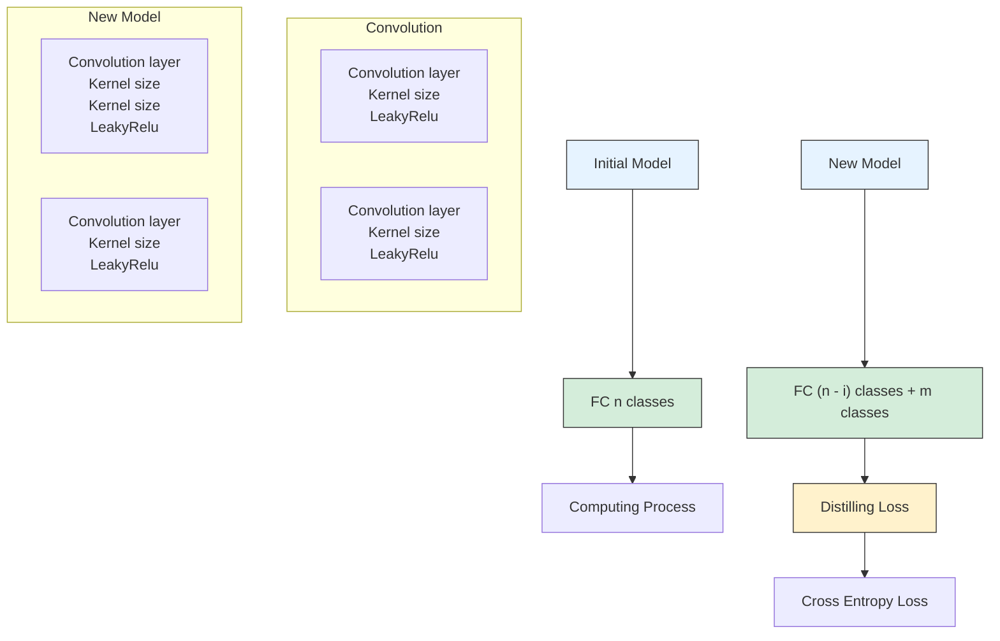
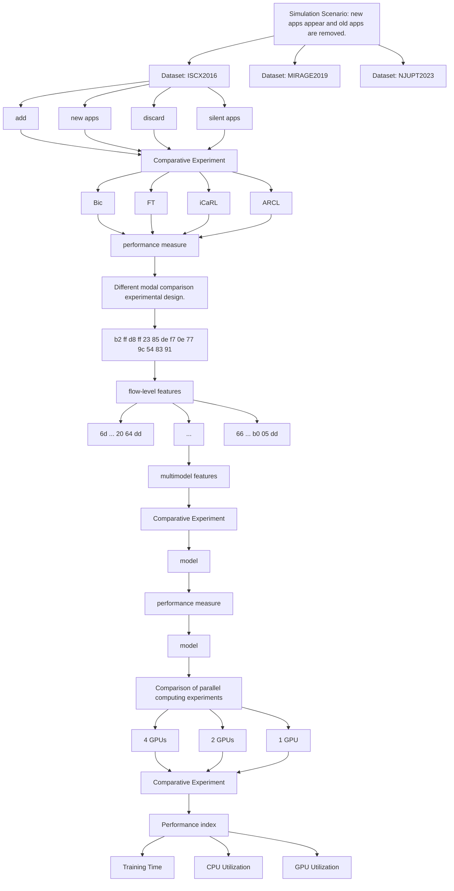
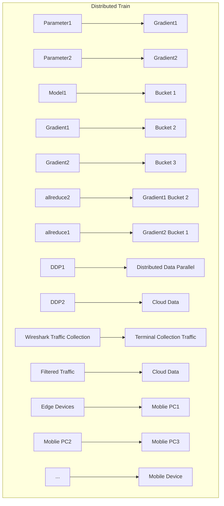

# Multi-ARCL: Multimodal adaptive relay-based distributed continual learning for encrypted traffic classifi cation ✩


Zeyi Li a, Minyao Liu b, Pan Wang , , ∗, Wangyu Su c, Tianshui Chang d, Xuejiao Chen e, Xiaokang Zhou f

a School of Computer Science, Nanjing University of Posts and Telecommunications, Nanjing 210003, China  
b School of Modern Posts, Nanjing University of Posts and Telecommunications, Nanjing 210003, China  
c College of Letters and Science, University of Wisconsin Madison, Madison 53706-1380, USA  
d School of Internet of Things, Nanjing University of Posts and Telecommunications, Nanjing 210003, China  
e School of Communications, Nanjing Vocational College of Information Technology, Nanjing, 210046, China  
f Faculty of Business Data Science, Kansai University, Osaka 565-0823, Japan

## A R T I C L E I N F O

Keywords:

Encrypted traffic classifi cation

Continual learning

Machine unlearning

Distributed learning

Multimodal learning

## A B S T R A C T

Encrypted Traffic Classifi cation (ETC) using Deep Learning (DL) faces two bottlenecks: homogeneous network traffic representation and ineffective model updates. Currently, multimodal-based DL combined with the Continual Learning (CL) approaches mitigate the above problems but overlook silent applications, whose traffic is absent due to guideline violations leading developers to cease their operation and maintenance. Specifically, silent applications accelerate the decay of model stability, while new and active applications challenge model plasticity. This paper presents Multi-ARCL, a multimodal adaptive replay-based distributed CL framework for ETC. The framework prioritizes using crypto-semantic information from fl ows’ payload and fl ows’ statistical features to represent. Additionally, the framework proposes an adaptive relay-based continual learning method that effectively eliminates silent neurons and retrains new samples and a limited subset of old ones. Exemplars of silent applications are selectively removed during new task training. To enhance training efficiency, the framework uses distributed learning to quickly address the stability-plasticity dilemma and reduce the cost of storing silent applications. Experiments show that ARCL outperforms state-of-the-art methods, with an accuracy improvement of over 8.64% on the NJUPT2023 dataset.

## 1. Introduction

Over the past decades, cryptography has posed considerable challenges to ETC [1,2], making the conventional method of relying on port numbers and packet payloads unsuitable [3-- 7]. In recent years, the emergence of artifi cial intelligence and high-performance computing technologies [8] has opened up new opportunities for ETC through the ability of DL to automatically extract features [9-- 12]. Nevertheless, ETC based on DL (DL-ETC) overlooks the real-world challenges.

The simple representation of network traffic is incomplete. Although the modality of the fl ow-based FE method can provide better results in the laboratory. This FE method makes it difficult to represent all the information and characteristics of the fl ow in a single modality. If the network context is changed [13], i.e. the method of collecting the traffic is changed, the classifi er’s performance will crack.

DL- ETC lacks adaptivity. The classifi er trains a fi xed number of applications in the laboratory and tests their accuracy [14,15]. However, it must be noted that the classifi er’s accuracy decreases significantly due to an increasing number of new applications in an open environment. Researchers usually collect new traffic and combine it with traffic from old applications for retraining. It is undeniable that this approach has significant disadvantages including catastrophic forgetting and high storage costs.


<details>
<summary>line chart and heatmap</summary>

| App | All apps | Silent apps |
| --- | --- | --- |
| QQmusic | 0 | 0 |
| Garena | 0 | 0 |
| VR | 3 | 0 |
| background | 24 | 1 |
| MOOC | 9 | 0 |
| Peacekeeper | 13 | 54 |
| bilibili | 0 | 0 |
| Weibo | 0 | 0 |
| TikTok | 13 | 3 |
| DOYU | 2 | 6 |
| NRUTO | 15 | 5 |
| iQIYI | 6 | 5 |
| HOK | 22 | 98 |
| Tieba | 3 | 0 |
| ZH | 5 | 1 |
| Tencent Video | 22 | 7 |
| LoWR | 34 | 94 |
| HUYA | 4 | 0 |
| TFT | 3 | 7 |
| QO music | 0 | 0 |
| Garena | 0 | 0 |
| VR | 3 | 236 |
| background | 24 | 1 |
| MOOC | 9 | 2 |
| Peacekeeper | 13 | 4 |
| bilibili | 0 | 0 |
| Weibo | 0 | 0 |
| TikTok | 13 | 3 |
| DOYU | 2 | 6 |
| NRUTO | 15 | 5 |
| iQIYI | 6 | 5 |
| HOK | 22 | 98 |
</details>

Fig. 1. The number of silent applications and the effect of silent applications on the previous model.

To address the above challenges, the multimodal-based Continual Learning (CL) approach is the most reasonable choice for DL- ETC [16,17]. CL enables models to learn new knowledge without forgetting old applications, thus making TC models adaptable to network environment changes [18-- 20]. For this purpose, scholars have researched the implementation of CL to maintain the precision of previous classifi cations while reducing training expenses [21-- 23].

It is important to note that the network environment is exceedingly complex, marked by the frequent emergence and removal of applications [24]. Google typically removes apps from its market quarterly, reducing the number of available Android apps. In this context, we categorize the removed applications as silent applications and those that remain as active applications. Fig. 1 shows the number of silent applications over the past year from AppBrain, with about one million apps declining in status daily. Moreover, in our study, we train a classifi er to identify existing apps and test them in a new environment, focusing on category changes. Fig. 1 also clearly demonstrates that a significant number of active applications are mistakenly identifi ed as silent ones, which substantially impairs the model’s effectiveness. CL currently focuses on learning new applications and retaining old knowledge, but overlooks the ability to forget silent applications.

A fundamental challenge in CL lies in addressing the stabilityplasticity dilemma [25]. In the fi eld of ETC, we defi ne ‘stability’ as a metric to assess the performance of active applications. Conversely, ‘plasticity’ serves as a measure for evaluating the effectiveness of new applications. Below, we elaborate on the prevailing challenges in CL-ETC, focusing particularly on the stability-plasticity dilemma and the implications of storage costs.

(1) How to mitigate the decay of silent applications bring to the stability of the model?

In early CL iterations, the conventional replay-based approach provided high accuracy for older applications. Unfortunately, silent applications occupied exemplar set space, affecting part neurons. The experimental chapter of this study elucidates this issue, revealing instances where active applications were mistakenly classifi ed as silent. Importantly, it was observed that the presence of data and neurons associated with these silent applications had a profound impact on the model’s accuracy and stability.

(2) How to keep the balance between the accuracy of active applications and new applications to guarantee the plasticity of the model?

In the process of CL’s training, the prior model maintains all neurons and parameters from previous applications to prevent catastrophic forgetting. However, retaining the neurons and parameters of silent applications may weaken the model’s classifi cation performance for active and new applications. When the model identifi es network traffic, neurons of silent applications may be activated, leading to a potential significant effect on the accuracy of the network model classifi er for new and active applications.

(3) How can classifi ers be trained more efficiently using fewer resources, while minimizing the impact of silent applications?

The vast volume of network traffic poses a storage challenge for training purposes, and CL-based ETC often neglects training costs. Unlike image-based replay CL, where 10% of training samples are retained as exemplars [26], this benchmark is unsuitable for Traffic Classifi cation (TC). Moreover, including silent applications in the exemplar set consumes valuable memory, limiting space for new and active applications.

Therefore, we propose a CL framework for ETC. This framework includes an optimization constraint-driven parameter discarding method with steps such as label mapping, freezing parts of the model, deleting neurons for silent applications, and unfreezing the model. This approach mitigates model stability decay by restricting neuron optimization. Additionally, a novel replay-based CL method computes distillation loss between old and new models and optimizes cross-entropy loss for new and active applications, enhancing adaptability to changing conditions. Additionally, to keep the latest model updates timely amid rapidly changing network traffic, we use distributed learning [27-- 29] methods for CL. (The dataset and code can be found at https:// github.com/sailorlee97/What-changes-you.) The main contribution of this paper:

(1) This paper presents Multi-ARCL, a multimodal adaptive replaybased CL framework for ETC. Multi-ARCL consists of two parts: multimodal feature extraction and Adaptive Replay-based CL (ARCL). Utilizing distributed learning, the framework adjusts its structure and parameters to accommodate changes in applications, ensuring adaptability. Additionally, it prioritizes a multimodal representation of network traffic to enhance classifi er accuracy.

(2) To mitigate the decay of the stability of the model, an innovative method for discarding parameters based on constrained optimization is proposed. This method automatically identifi es the neural parameters and data of active applications and eliminates those of silent applications.

(3) In this paper, a novel replay-based CL method for training is proposed to improve the accuracy of application classifi cation. The method ensures the accuracy of active applications in the new model by calculating the distillation loss of active applications in the old and new models. The method also maintains a high accuracy rate by calculating the cross-entropy loss of the new and active applications of the model.

(4) We also discuss the problem of the number of old data stores. ARCL tests the performance of the model on different numbers of stores. Finally, we conclude that the model stabilizes when the active application retains 1000 samples, and the model reaches its best performance when it retains around 3000-4000 pieces of data.

Table 1 Comparison of various research works based on dataset, input data, and incremental/unlearning approaches. ∙ present, ◦ lacking.

<table><tr><td>Research</td><td>Dataset</td><td>Input Data</td><td>Incremental</td><td>Unlearning</td></tr><tr><td>Wang et al., 2020, IEEE ICC [30]</td><td>ISCX2012</td><td>packet</td><td>○</td><td>○</td></tr><tr><td>Wang et al., 2020, Elsevier C&amp;S [31]</td><td>ISOT, ISCX,self-collected dataset</td><td>srcIP, srcPort, dstPort,tcpSeq, tcpFlag.</td><td>○</td><td>○</td></tr><tr><td>Aceto et al., 2021, Elsevier JNCA [32]</td><td>ISCX VPN-nonVPN</td><td>L4 payload (784 B),4 fields (32 packets).</td><td>○</td><td>○</td></tr><tr><td>Wu et al., 2022, Elsevier CN [33]</td><td>self-collected dataset</td><td>packet length, packet time interval,byte rate, additional information.</td><td>•</td><td>○</td></tr><tr><td>Ma et al., 2023, Elsevier C&amp;S [34]</td><td>ISCXVPN2016,self-collected dataset</td><td>feature-based statistics</td><td>•</td><td>○</td></tr><tr><td>Bonvezi et al., 2024, IEEE TNSM [35]</td><td>MIRAGE19</td><td>feature-based statistics</td><td>•</td><td>○</td></tr><tr><td>Zhu et al., 2023, Elsevier CN [36]</td><td>ISCX VPN-nonVPN dataset</td><td>traffic images</td><td>•</td><td>○</td></tr><tr><td>Li et al., 2023, Elsevier C&amp;S [37]</td><td>self-collected dataset</td><td>feature-based statistics</td><td>•</td><td>○</td></tr><tr><td>This paper</td><td>ISCX2016, MIRAGE2019,NUPT2023</td><td>feature-based statistics</td><td>•</td><td>•</td></tr></table>

(5) The framework proposed in this paper is tested on public datasets and private datasets. After conducting extensive comparisons and analysis, the proposed solution achieves an 88.1% accuracy with a processing time of 809.99 seconds for the NJUPT2023 dataset. In contrast, the stateof-the-art solutions achieve an accuracy ranging from 48.22% to 79.46% for the same dataset.

The paper is structured as follows: Section 2 covers existing methods for ETC and CL. Section 3 provides a detailed description of the Multi-ARCL framework. Section 4 provides an overview of the experiment and evaluation, and discusses the results of the experiment. Finally, section 5 summarizes the paper and discusses future work.

## 2. Related works

## 2.1. Deep learning based traffic classifi cation

DL, also known as deep structured learning or hierarchical learning, is achieved by learning data representation [38,39]. Compared to machine learning algorithms, DL can automatically extract features without human intervention, which makes it ideal for TC [40,41]. (See Table 1.)

There have been many scholars who have studied how to apply the DL to the TC [42-- 45]. Dicks and Chavula [46] explore the computational efficiency and accuracy of Long Short-Term Memory (LSTM) and Multi-Layer Perceptron (MLP) deep learning models for packetbased classifi cation of traffic in a community network. Aceto et al. [32] study distiller: encrypted traffic classifi cation via multimodal multitask deep learning. To this end, a novel multimodal multitask deep learning approach for traffic classifi cation is proposed, leading to the distiller classifi er. Guan et al. [47] propose a traffic classifi cation method based on deep transfer learning for 5G IoT scenarios with scarce labeled data and limited computing capability and train the classifi cation model by weight transferring and neural network fi ne-tuning. Pang et al. [48] present a multimodal classifi cation method named MTCM to exploit the context for the classifi cation task systematically. However, the following limitations remain: (1) the traffic representation is generated from raw packet bytes, resulting in the absence of critical information; (2) the model structure of directly applying deep learning algorithms does not take traffic features into account. The preprocessing phase of the proposed end-to-end encrypted traffic classifi cation method by Wang et al. [49] uses the USTC-TL2016 tool to generate byte data of raw traffic in IDX3 fi les for input data of Convolutional Neural Networks (CNN) model, which is different from a traditional divide-and-conquer method. Wang et al. [31] propose a dynamical MLP-based detection method against DDoS attacks by combining sequential feature selection and feedback mechanism. The proposed method effectively perceives the detection errors when their saliency accumulates to a certain degree and then reconstructs the detector according to updated data. The results showed that the proposed method had comparable detection performance on the popular benchmark data NSL-KDD compared with some related works.

However, these articles focus on accurately identifying applications and ignore the infl uence of new applications.

## 2.2. Continual learning based traffic classifi cation

There are three primary categories of CL [50]: Task Incremental Learning (TIL), Domain Incremental Learning (DIL), and Continual Incremental Learning (CIL). TIL requires data for different tasks to arrive at different times. But current network applications change constantly, making TIL repeatedly train for various tasks, causing high resource overhead and being hard to fi t the complex network environment. DIL involves CL of data arriving at different times, yet it’s challenging for DIL to handle the continuous increase in new class classifi cations. CIL, a recent CL branch, gradually adds new classes or labels during model training to adapt to new classes. Hence, CIL is more suitable for complex and changing network scenarios.

Currently, CIL has many well-known methods widely used in the field of computer vision [51]. BiC is an approach that handles catastrophic forgetting by adding a linear model after the last fully connected layer to correct the bias toward new classes. Wu et al. [26] introduced a bias correction layer to address the imbalance responsible for catastrophic forgetting. iCaRL [52] method using fi ne-tuning with classifi cation and distillation losses to prevent catastrophic forgetting. In addition, Zhou et al. [53] propose a python toolbox that implements several key algorithms for class-incremental learning to ease the burden of researchers in the machine learning community.

Scientists are already trying to use CIL for ETC. Bovenzi et al. [35] explore CIL techniques in DL-TC, evaluate their performance, and discuss their research potential. The authors focus on reviewing a large number of state-of-the-art CIL methods for DL-based TC, comparing their design principles and providing their working mechanisms, and evaluating the performance of the CIL methods through experiments on the MIRAGE2019 dataset. Wu et al. [33] focuses on how to use CNN for online multimedia traffic categorization. The article proposes a classincremental learning model based on convolutional neural networks to retain knowledge of old classes while learning new classes of data. The framework is capable of fast and accurate traffic categorization and remains efficient even in the presence of increasing traffic. The paper also describes the use of the sliding window technique for feature extraction and the use of techniques such as knowledge distillation and bias correction for incremental learning of traffic categories. The proposed incremental learning framework by Tian et al. [54] addresses the challenge of adding new applications to the classifi cation system while preserving the learned knowledge of the existing classifi er. The framework is based on the one vs rest (OvR) strategy and neural network classifi ers, and it uses a sample selection algorithm to balance training effort and classifi cation accuracy. Experimental results show that the proposed framework achieves incremental learning with high classifi cation accuracy and significantly reduces training efforts. Zhu et al. [36] propose an incremental learning method called ILETC for encrypted traffic classifi cation. ILETC replays the knowledge of old classes using generated samples and exemplars when learning from new classes, mitigating catastrophic forgetting. The performance of ILETC is evaluated using the ISCX VPN-nonVPN dataset and a self-collected dataset, demonstrating superior accuracy compared to state-of-the-art methods. Li et al. [37] propose an Incremental Learning (IL) framework called Multi-view Sequences FuSion (MISS) to keep models evolving with new applications.

As shown in Table 1, there are many scholars working on the sustainable classifi cation of network traffic and achieving good results [55]. However, researchers focus on accurately identifying new applications and ignore the infl uence of silent applications.

## 3. Methodology

This section comprehensively details the proposed Multi-ARCL framework. Our discussion covers several key areas: a formalized depiction of the problem, an overview of the method’s workfl ow, a multimodal feature extraction method, and an adaptive relay-based continual learning method.

## 3.1. Problem formulation

This paper focuses on the implementation of ETC from the perspective of traffic management and service requirements. In order to provide a clear and comprehensible explanation, the following definitions are given:

The packet set is formed by extracting TCP and UDP packets from the application traffic [15], $P = \left\{ \mathtt { p } _ { 1 } , \mathtt { p } _ { 2 } , \dots , \mathtt { p } _ { i } \right\} , 0 \leq i \leq M$ , ?? is the number of packets in the fl ow. The packets in the packet set are subsequently utilized to form the fl ow set using quintuples. $F = \left\{ \mathrm { f } _ { 1 } , \mathrm { f } _ { 2 } , \mathrm { f } _ { 3 } , \dots , \mathrm { f } _ { i } \right\} , 0 \leq$ $i \le K , K$ is the number of fl ows. Next, we use the quintuple as a token to represent the fl ow and store it in the hash table. Additionally, we record the timestamp of the fi rst and last packet of the fl ow. If the fl ow’s duration surpasses 120 seconds, the fl ow is truncated and the information in the hash table is cleared. Subsequent packets will be treated as new fl ows. To extract session characteristics, we establish the sourcedestination IP of the fi rst packet as the fl ow direction. The features are extracted from the forward and backward fl ows $S S = \left\{ \mathrm { f } _ { 1 } , \mathrm { f } _ { 1 } ^ { \prime } , \mathrm { f } _ { 2 } , \mathrm { f } _ { 2 } ^ { \prime } , \ldots \right\}$ . The computation of features is performed on the edge device using the method of feature extraction. In each session, bi-directional fl ow feature is defi ned as $F F = \left\{ { \mathrm { f f } } _ { 1 } , { \mathrm { f f } } _ { 2 } , { \mathrm { f f } } _ { 3 } , \ldots \right\}$ . By definition, there are three levels, which are packet level, fl ow level, and statistical features. The fl ow feature vector ?? ?? is transformed into $s F F$ after feature scaling, which is the fundamental unit of the model input. A batch of $s F F$ serves as input to the model, which becomes ??.

A list of abbreviations is presented in Table 2 to facilitate understanding of the notations adopted in what follows.

## 3.2. Workfl ow of multi-ARCL

The framework comprises two parts: multimodal feature extraction and ARCL.

As shown in Fig. 2, this framework prioritizes the use of multimodal feature extraction methods. This method extracts packet features, fl ow features, and payload semantic information simultaneously. After processing the semantic information with word vectors, it combines with the packet-level and fl ow-level features to create a new multimodal feature.

ARCL’s solution is constructed as a two-stage process: a model is acquired in the $i - t h$ stage, and an updated model is created in the $( i + 1 ) - t h$ stage. The fi rst stage aims to guarantee a good initial model in the ?? − ??ℎ stage, while the second stage removes the parameters and data of silent applications, reduces the forgetting of the active application, and keeps the new application in the $( i + 1 ) - t h$ stage.

Table 2 List of abbreviation.

<table><tr><td>Notation</td><td>Remark</td></tr><tr><td> $P$ </td><td>A set of packets, where each packet serves as the fundamental unit of a flow.</td></tr><tr><td> $F$ </td><td>A set of flows filtered based on quintuples.</td></tr><tr><td> $SS$ </td><td>A set of session flows.</td></tr><tr><td> $FF$ </td><td>The set of features of a bi-directional flow.</td></tr><tr><td> $sFF$ </td><td>Scaled set of features of a bi-directional flow</td></tr><tr><td> $f_i$ </td><td>The  $i - th$  forward flow</td></tr><tr><td> $f'_i$ </td><td>The  $i - th$  backward flow</td></tr><tr><td> $x$ </td><td>A batch of  $sFF$  serves as input to the model</td></tr><tr><td> $y$ </td><td>Label of the flow feature</td></tr><tr><td> $o$ </td><td>Category of the classifier output</td></tr><tr><td> $M$ </td><td>Number of new applications</td></tr><tr><td> $N$ </td><td>Number of old applications</td></tr><tr><td> $J$ </td><td>Number of silent applications</td></tr><tr><td> $m$ </td><td>Number of labels for new applications</td></tr><tr><td> $n$ </td><td>Number of labels for old applications</td></tr><tr><td> $j$ </td><td>Number of labels for silent applications</td></tr><tr><td> $D_n$ </td><td>The set of labels for old applications</td></tr><tr><td> $D_j$ </td><td>The set of labels for silent applications</td></tr><tr><td> $D_m$ </td><td>The set of labels for new applications</td></tr><tr><td> $FN$ </td><td>Number of packets in a flow</td></tr><tr><td> $\alpha$ </td><td>A smoothing parameter in Smooth Inverse Frequency(SIF).</td></tr><tr><td> $w_i$ </td><td>SIF weight of the  $i$ th word</td></tr><tr><td> $v_i$ </td><td>Word vector of the  $i$ th word</td></tr><tr><td> $MultiFF$ </td><td>Multimodal data as input to the model</td></tr><tr><td> $A$ </td><td>The original label set of active applications</td></tr><tr><td> $B$ </td><td>The new label set of active applications</td></tr></table>

In the $i - t h$ stage of the model, the initial classifi cation capability is crucial in determining the subsequent capability. This capability provides accurate and sufficient information for stable inheritance in the next stage. In the ?? − ??ℎ stage, the model extracts the fl ow feature matrix ?? ?? fi rst by the fl ow feature extraction module, and the feature selection module fi rst selects the features with higher contribution from $F F$ to get a new subset of features. The feature scaling module normalizes fl ow features to obtain ???? ?? . ???? ?? is then used to train an initialized classifi cation model during the fi rst training session, and the resulting model is saved.

During the updating process, CL faces two challenges. The fi rst challenge is to discard the parameters of silent apps and mitigate the catastrophic forgetting of active apps. The second challenge is to improve the accuracy of new apps. To address these challenges, we discard the data from inactive applications and select representative samples of active applications and all new applications to reform the exemplar dataset. Since forgetting can only be slowed down but not avoided, in the $( i + 1 ) - t h$ stage, the model will fi rst freeze the parameters of the previous convolutional layer, automatically fi nd the parameters of the active applications in each iteration, and then unfreeze the parameters of the convolutional layer.

## 3.3. Multimodal feature extraction method

Processing and extracting information from ?? is a crucial step. Convert the information in ?? to decimal format, and then calculate the temporal features, protocol headers, and payload features. For protocol features, if the number of packets in a fl ow is less than ?? ?? , the remaining values are padded with zeros. Temporal features include the mean, variance, and standard deviation of the inter-packet time intervals within a fl ow, as well as the mean, variance, and standard deviation of packet lengths within a fl ow. The payload features represent the part of the network packet that carries the actual data. Each packet’s payload can contain multiple bytes, and each byte value can be considered a word.


<details>
<summary>flowchart</summary>

```mermaid
graph TD
  A["packet-level features flow-level features"] --> B["payload semantic information"]
  B --> C["Feature Information"]
  C --> D["Feature Scale"]
  D --> E["Model Distributed Train"]
  E --> F["Model Deploy"]
  F --> G["Model Monitor"]
  G --> H["The process of continual learning"]
    
    subgraph Stage_i_th[Stage: i-th]
  I["Train: Silent Apps, Active Apps, New Apps"] --> J["conv layers, FC layers"]
  J --> K["bias layers"]
  K --> L["Silent Apps"]
  M["Valiation: Silent Apps, Active Apps, val new"] --> N["exemplars"]
  O["Training: Active Apps, New Apps"] --> P["conv layers, FC layers"]
  P --> Q["bias layers"]
  Q --> R["Silent Apps"]
  S["Valiation: Active Apps, val new"] --> T["exemplars"]
    end
    
    subgraph Stage_(i+1)_th["Stage: (i+1)-th"]
  U["Train: Active Apps, New Apps"] --> V["conv layers, FC layers"]
  V --> W["bias layers"]
  W --> X["Silent Apps"]
  Y["Valiation: Active Apps, val new"] --> Z["exemplars"]
        AA["Model Monitor"] -.-> AB["Model Deploy"]
    end
    
    style Stage_i_th fill:#f9f9f9,stroke:#333
    style Stage_(i+1)_th fill:#f9f9f9,stroke:#333
```
</details>

Fig. 2. The framework of the proposed method.

Payload Feature Extraction. In the payload part of a packet, each byte is defi ned as a packet word (similar to a word in text, for the sake of understanding, we defi ne it as a packet word), and all the words in the payload are sequentially composed into a packet sentence (similar to a sentence in text, for the sake of understanding, we defi ne it as a packet sentence). The packet sentences of the fi rst ?? ?? packets of each fl ow are concatenated in order to form a fl ow paragraph (similar to a paragraph in text, for the sake of understanding, we defi ne it as a fl ow paragraph). First, extract the sentences of the fi rst ?? ?? packets of each fl ow and concatenate them in order to form the fl ow paragraph. If there is no sentence in the fi rst ?? ?? packets, then the value of its fl ow paragraph is set to -1. Then, use word2vec to learn the fl ow paragraphs of all fl ows in the dataset to obtain the word vector for each packet word. To enhance the model’s detection speed, we utilize a process of 20 packets before a stream, denoted as FN equals 20.

For each vocabulary in the payload, calculate the probability of its occurrence in the entire payload, and based on this probability, calculate the SIF weight. The higher the occurrence probability, the smaller the weight, reducing the impact of common words on the results. The calculation formula is as follows, where $w _ { i }$ is the SIF weight of the ?? − ??ℎ word, a is a smoothing parameter, and $p ( i )$ is the word frequency.

$$
w _ {i} = \frac {a}{a + p (i)} \tag {1}
$$

Next, calculate the SIF weighted average word vector. The calculation formula is as follows, where ?? is the weighted average word vector, and $v _ { i }$ is the word vector of the ?? − ??ℎ word.

$$
\mathrm{V} = \frac {\sum_ {\mathrm{i} = 1} ^ {\mathrm{n}} \mathrm{w} _ {\mathrm{i}} \mathrm{v} _ {\mathrm{i}}}{\sum_ {\mathrm{i} = 1} ^ {\mathrm{n}} \mathrm{w} _ {\mathrm{i}}} \tag {2}
$$

Finally, subtract the projection on the fi rst principal component of the fl ow paragraph from the weighted average word vector, $V ^ { \prime } = V -$

$P V _ { 1 }$ , where ?? 1 is the fi rst principal component and ?? is the projection vector of ?? on ?? 1.

The length of the principal component is the dimension ??2 of the principal component, so after this calculation, the dimension of the sentence vector is fi xed at ??2. Therefore, the payload feature dimension of each fl ow is (1, ??2).

Before extracting features, it is necessary to normalize the byte information. This involves converting each byte from hexadecimal to decimal within the range of 0 to 255 and then dividing by 255 to ensure that each byte falls within the range of 0 to 1.

## 3.4. Adaptive relay-based continual learning

The convolutional neural network serves as the foundation of our model, and it utilizes convolutional operations to capture local features in a systematic manner. Moreover, the convolutional layer can perform a dot product of each feature in the input data with a convolutional kernel [56].

The model’s design is presented in Fig. 3. We connect multiple convolutional layers before adding an application classifi er layer that maps features to labels. For outputting predicted probabilities, we utilize a fully connected layer (FC) as the classifi er layer in this paper.

Currently, continual learning encounters two significant issues. Initially, the model has a tendency to forget previous classes when it learns new ones as model weights are updated. Additionally, old applications are still disappearing, which leads to a significant loss of accuracy. In addition, continual learning requires saving historical data, resulting in increased storage usage due to silent applications and additional costs. To address these problems, we discard parameters and constrain optimization to address the issue of silent applications faced by CL.

The following algorithm shows that a classifi er with ?? number of classifi cations has been trained so far. When the set of silent applications and new applications is known, it becomes critical to retain the knowledge of the active applications in the original classifi er while incorporating the knowledge of new applications.


<details>
<summary>flowchart</summary>


</details>

Fig. 3. Comparison of model structures before and after classes change.

Algorithm 1 Adaptive Relay-based Continual Learning.  
Input:
    Old applications, $X^{n} = (x^{i}, y^{i})$ , $0 \leq i \leq N$ , $y \in D_{n}$ ; Silent applications, $X^{j} = (x^{i}, y^{i})$ , $0 \leq i \leq J$ , $y \in D_{j}$ ; New applications, $X^{m} = (x^{i}, y^{i})$ , $0 \leq i \leq M$ , $y \in D_{m}$ ; Parameters of TC, $H^{t} = \theta_{c}, \theta_{f}$ ; $\theta_{c}$ represents the parameter of the convolutional layer; $\theta_{f}$ represents the parameter of FC; epoch is the number of training.

Output: New TC-classifier $H^{t+1}$ .

1: Active applications data: $X_{active} = X^{n} - X^{j} = \{x \mid x \in X^{n} \land x \notin X^{j}\}$ ;

2: New Applications data: $X_{new} = X_{active} \cup X^{m}$ ;

3: freeze $\theta_{c}$ , unfreeze $\theta_{f}$ ;

4: for epoch in num_epochs do

5: $p, y \leftarrow H^{t}(x)$ 6: $\theta_{f}^{*} \leftarrow argmin(-\frac{1}{S} \sum_{i=1}^{S} \sum_{c=1}^{n-j} y_{ic} \log(p_{ic}))$ ;

7: end for

8: unfreeze $\theta_{c}$ ;

9: for epoch in num_epochs do

10: $\theta_{f}^{*}, \theta_{c}^{*} \leftarrow argmin(\frac{n-j}{n+m-j} \times loss_{soft-target} + \frac{m}{n+m-j} \times loss_{hard-target})$ ;

11: end for

## 3.4.1. Optimization constraint-driven parameter discarding method

This method involves several steps, including label mapping, freezing a portion of the model, deleting neurons for silent applications, and unfreezing the model.

The fi rst step of this method is to map the label domain of the active application to the new label domain. This involves establishing a correspondence between the original label collection and the rearranged label collection. The mapping relationship is represented in the following form: $f : A \to B$ . The given equation represents a labeled mapping function, where ?? is the definition domain and ?? is the accompanying domain. For each element ?? in ??, there is a unique corresponding element ?? in ??, determined by the function $f .$ We assume that Category 1 and Category 2 are silent applications. Since the number of silent applications is 2, this correspondence is denoted by the equation:

$$
y = f (x) = \left\{ \begin{array}{c} 0, x = 0 \\ 1, x = 3 \\ 2, x = 4, \quad x \in A \\ \dots \\ n - 2, x = n \end{array} \right. \tag {3}
$$

The parameters of the neurons in the fi rst half of the neural network must be frozen. This means that during training, the parameters will not be updated and the gradient will not be calculated. The formula for freezing the parameters is denoted as follows: ???? = 0. The loss function $\begin{array} { r } { \frac { \partial L } { \partial \theta } = 0 } \end{array}$ (??) and frozen parameter (??) are used to eliminate neurons of silent applications in the discriminative layer before performing fi ne-tuning. Once fi ne-tuning is complete, the fi rst half of the neuron parameters are unfrozen. The formula for unfreezing the parameters is denoted as follows: $\begin{array} { r } { \frac { \partial L } { \partial \theta } = \alpha \frac { \partial L } { \partial \theta } . } \end{array}$ $\alpha = 1 _ { : }$ , the unfreezing is complete. Finally, the labels are remapped to the original domain using an inverse function, $x = f ^ { - 1 } ( y )$ .

Generally, our elimination of neuron parameters for silent applications mitigates model stability decay and provides a good foundation for the next stage of learning new applications for the model.

## 3.4.2. Novel replay-based continual learning method

We divide the entire continual learning process into two phases to ensure effective implementation. In the initial phase, an initial network classifi cation model is trained with the assumption that the number of classes is ??. The original training data is then separated into a training set and a validation set. Once an initial model is obtained, the second phase of continual learning is executed. This phase is based on the classes that disappear and new classes that must be added. During the second phase, the model learns new applications while disregarding silent applications. In the traditional incremental process, the former model would recognize ?? old classes and still need to learn m new classes. Therefore, we will consider the model’s need to recognize $m + n$ classes as a new class. We defi ne the set of classes that need to be newly learned: $X ^ { m } = \left. \left( x ^ { i } , y ^ { i } \right) , 0 \leq i \leq M , y \in D _ { m } \right.$ , defi ne old classes, $X ^ { n } = \left\{ \left( x ^ { i } , y ^ { i } \right) , \quad 0 \leq i \leq N , \stackrel { . } { y } \in D _ { n } \right\}$ . The outputs of the old and new classifi ers are defi ned as follows: $\hat { o } ^ { n } = \left[ o _ { 1 } , \ldots , o _ { n } \right] , o ^ { n } =$ $\left[ o _ { 1 } , \ldots , o _ { n } , o _ { n + 1 } , \ldots , o _ { m } \right]$ . The previous class incremental continual learning looks for the neuron parameters of old applications in the new model and computes the distillation loss between the two. Since there is a downgrading of old applications, the neuron parameters used to recognize the silent applications in the old model become invalid. So we define the set of active applications: $X ^ { ( n - j ) } = ( x ^ { i } , y ^ { i } ) , \quad 0 \leq i \leq N - J , y \in$ $D _ { n } \land y \notin D _ { j } . J$ is the number of silent applications. Definition of old and new classifi er: $\hat { o } ^ { n } = \left[ o _ { 1 } , \ldots , o _ { n } \right] , o ^ { n } = [ o _ { 1 } , \ldots , o _ { n - j } , o _ { n - j + 1 } , \ldots , o _ { n + m - j } ] .$ .

First, we initialize the model to get the classifi cation probability. $p = m o d e l _ { p r e } ( X ^ { ( n - j ) } )$ , where ?????? ${ { e l } _ { p r e } }$ is the initial model and $p$ is the predicted score. Then, the scores are corrected using the bias layer. $y = \mathbf { A } \times p + \mathbf { B } . $ A and B are the two-parameter matrices of the correction layer, and ?? is the initialized model to obtain the fi nal classifi cation probability. The model design for continuous learning is shown in Fig. 3. The old model automatically fi nds the parameters of old applications that have not been downgraded at each iteration and calculates the distillation loss with respect to the output probability of the old application that has not disappeared in the new model. We defi ne distillation loss:

$$
y = \frac {e ^ {y _ {i}}}{\sum_ {i = 1} ^ {n - j} e ^ {y _ {i}}} \tag {4}
$$

$$
\log (y) = \log \left(\frac {e ^ {y _ {i}}}{\sum_ {i = 1} ^ {n - j} e ^ {y _ {i}}}\right) \tag {5}
$$

$$
\text { loss } _ {\text { soft - target }} = - \frac {1}{S} \sum_ {i = 1} ^ {S} \sum_ {k = 1} ^ {n - j} y _ {i k} \log (y _ {i k}) \tag {6}
$$

In this way, this distillation loss allows the deep network to retain as much knowledge as possible about the active applications in the classifi er. We then use the cross entropy loss as the classifi cation loss to ensure classifi cation accuracy for new classes.

$$
\text { loss } _ {\text { hard - target }} = - \frac {1}{S} \sum_ {i = 1} ^ {S} \sum_ {c = 1} ^ {n + m - j} y _ {i c} \log \left(p _ {i c}\right) \tag {7}
$$

Where $S$ is the number of samples, n+m-j is the number of categories, $y _ { i c }$ is the true label of the ith sample, which is 1 if it belongs to the $c - t h$ category and 0 otherwise, and $p _ { i c }$ is the predicted probability that the $i - t h$ sample belongs to the $c - t h$ category. The total loss combines the distillation loss and the categorization loss as follows:

$$
\text { loss } = \lambda \times \text { loss } _ {\text { soft - target }} + (1 - \lambda) \times \text { loss } _ {\text { hard - target }} \tag {8}
$$

?? is the equilibrium distillation and classifi cation loss. $\begin{array} { r } { \lambda = \frac { n - j } { n + m - j } , } \end{array}$ where $n - j$ is the number of active applications and ?? is the number of new applications.

By optimizing the loss function training as described above, we obtain a classifi er that can identify new classes and significantly reduce catastrophic forgetting. In the next section, we will validate our approach through experiments.

## 4. Experiments

## 4.1. Datasets and experimental settings

The MIRAGE2019 dataset [57] is designed for mobile traffic analysis and contains real data related to mobile applications, with the goal of advancing the state of the art in mobile app traffic analysis. The dataset covers multiple domains such as social, video, music, games, news, etc., and provides detailed information for each traffic packet, including timestamp, source and destination address, protocol, length, etc. Additionally, the dataset includes a label for every traffic packet, rendering it comprehensive and coherent. The MIRAGE2019 dataset is useful for examining various elements of mobile app traffic, including its characteristics, classifi cation, privacy, optimization, and other related factors. The ISCX2016 dataset [58] is utilized for cybersecurity research and comprises two sub-datasets: ISCXVPN2016 and ISCX-Tor2016. ISCXVPN2016 encompasses network traffic with and without VPNs, spanning applications and protocols such as VoIP, P2P, FTP, and video streams. The dataset also includes labels for each stream, indicating details such as the application name and user action. This was an experiment to expand the original dataset with SMOTE [59] since the original dataset was small.

The private dataset utilized in this study is composed of more than 19 popular applications collected in the campus network scenario. Table 3 displays the part regarding applications, encompassing diverse types of apps including those designated for video, music, gaming, and social media. The dataset of NJUPT2023 contains 91 features. Fig. 4 shows the statistical distribution of features and feature outliers. The distribution of features was selected as the 29 most typical features. “fTcpwindown” dispersion, considered a typical feature, is prominent. The number of samples in the part close to 0 on the left is large. The vast region on the right also has a large number of samples.

The experimental environment is Intel Core, 32GB RAM, NVIDIA GTX 4080. In addition, four 3080 and one 3060 graphics cards were used to test the training efficiency of distributed training. Specifi c parameters are shown in Table 4. In this paper, Python3 is the main programming language. The following evaluation metrics are described: Precision, Recall, F1, and Accuracy.

Table 3 The number of categories in the dataset is presented.

<table><tr><td colspan="2">MIRAGE2019</td><td colspan="2">NJUPT2023</td></tr><tr><td>applications</td><td>amount</td><td>applications</td><td>amount</td></tr><tr><td>Accuweather</td><td>3991</td><td>QQ music</td><td>39465</td></tr><tr><td>Contextlogic</td><td>2792</td><td>Garena</td><td>21872</td></tr><tr><td>Dropbox</td><td>2635</td><td>VR</td><td>33611</td></tr><tr><td>Duolingo</td><td>3922</td><td>background</td><td>62228</td></tr><tr><td>Facebook</td><td>3195</td><td>MOOC</td><td>14842</td></tr><tr><td>Groupon</td><td>839</td><td>Peacekeeper</td><td>12120</td></tr><tr><td>Hypah</td><td>1583</td><td>bilibili</td><td>20014</td></tr><tr><td>Iconology</td><td>2806</td><td>Weibo</td><td>22061</td></tr><tr><td>Joelapenna</td><td>3443</td><td>TikTok</td><td>16640</td></tr><tr><td>Motain</td><td>5215</td><td>DOYU</td><td>15821</td></tr><tr><td>Pinterest</td><td>2152</td><td>NARUTO</td><td>27240</td></tr><tr><td>Spotify</td><td>3514</td><td>iQIYI</td><td>36740</td></tr><tr><td>Subito</td><td>3538</td><td>HOK</td><td>42734</td></tr><tr><td>Trello</td><td>1310</td><td>Tieba</td><td>18206</td></tr><tr><td>Tripadvisor</td><td>1260</td><td>ZH</td><td>16643</td></tr><tr><td>Twitter</td><td>2407</td><td>TencentVideo</td><td>11913</td></tr><tr><td>Viber</td><td>1112</td><td>LoLWR</td><td>19841</td></tr><tr><td>Waze</td><td>5278</td><td>HUYA</td><td>108757</td></tr><tr><td>Youtube</td><td>2507</td><td>TFT</td><td>23718</td></tr></table>

Table 4 Experimental equipment.

<table><tr><td>Name</td><td>Specification</td></tr><tr><td>CPU</td><td>13th Gen Intel Core i7-13700KF</td></tr><tr><td>Memory Capacity</td><td>32GB RAM</td></tr><tr><td>Graphics Card</td><td>NVIDIA GeForce RTX 4080, 3080 and 3060</td></tr><tr><td>Python Version</td><td>3.10</td></tr></table>

Since this experiment focuses on the impact of accuracy and consumption from the perspective of silent applications, we do not consider other hardware indicators.

## 4.2. Experimental operation

In this study, we examine the challenge of CL, or the ability to selectively unlearn irrelevant knowledge while retaining useful knowledge and acquiring new information over time. As shown in Fig. 5, we evaluate our proposed method using three datasets: MIRAGE2019, ISCX2016, and NJUPT2023.

At the initial stage of the experiment, we conducted comparative tests using different modalities to verify the superiority of multimodal feature representation. In the testing phase of ARCL and SOTA methods, we used a 4080 graphics card for training, and tested the accuracy and time efficiency of different methods in this equipment environment. We train an initial model based on the existing applications. Then, we simulate and test the class change scenario. In the MIRAGE2019 and NJUPT2023 datasets, we fi rst train a model with 16 classifi ers. Then, the simulated scenarios are the disappearance of two application streams and the appearance of three new applications. In the ISCX2016 dataset, we fi rst train a model with 4 classifi ers and then simulate a scenario where one application disappears and two new applications appear. In the following, we will test our proposed method and three other CL methods, Fine-tune, Bic, and iCaRL. Additionally, due to the complex and dynamic nature of network traffic, rapid updates are essential, and distributed learning can significantly enhance training efficiency. In this experiment, we aim to verify the optimal performance of distributed learning by varying the number of GPUs and the batch size.

Fig. 6 illustrates the entire process from distributed data collection by edge devices to its fi nal integration into a distributed learning framework. Multiple mobile PCs, located in different positions, gather network traffic data. On individual terminals, we use PCAPDroid to label network traffic. Network traffic is captured by Wireshark on the router and then fi ltered and compared based on fi ve-tuples. After fi ltering, the router feature calculation module computes network traffic features for each application’s PCAP fi le and transmits them to the cloud data center for storage. Subsequently, in the distributed data parallel processing framework, different DDP processes synchronize model gradients through AllReduce operations, with these gradients allocated to different buckets. Finally, in the distributed training environment, each model utilizes the synchronized gradients to update parameters, gradually optimizing model performance.


<details>
<summary>bubble chart</summary>

| Features           | Values |
| ------------------ | ------ |
| s_idleMin          | 60000  |
| s_idleSum          | 65000  |
| s_subflowCnt       | 70000  |
| s_idleMean         | 75000  |
| s_activeCnt        | 80000  |
| s_idleMax          | 85000  |
| s_rst               | 90000  |
| s_blATSd           | 95000  |
| s_fin              | 100000 |
| s_idleCnt          | 105000 |
| s_flATSd           | 110000 |
| s_blATMax          | 115000 |
| s_flATMean         | 120000 |
| s_flATTotal         | 125000 |
| s_flATMax          | 130000 |
| s_flowIATSd        | 135000 |
| s_bLenMin          | 140000 |
| s_flowIATMax       | 145000 |
| s_lenSd             | 150000 |
| s_avgPktSize       | 155000 |
| s_lenMean           | 160000 |
| s_flenSd            | 165000 |
| s_bLenMax           | 170000 |
| s_lenMax            | 175000 |
| s_flenMean          | 180000 |
| s_fwdSegSizeAvg    | 185000 |
| s_flenMax           | 190000 |
| s_bTcfWindow       | 195000 |
| s_fTcfWindow       | 200000 |
</details>


<details>
<summary>histogram</summary>

| Category | Frequency |
|---|---|
| s_fwdSegSizeAvg | 100.0k |
| s_blenMax | 100.0k |
| s_blenMin | 100.0k |
| s_fiatTotal | 100.0k |
| s_rst | 100.0k |
| s_idleCnt | 100.0k |
| s_idleMin | 100.0k |
| s_fiatMean | 100.0k |
| s_fialSd | 100.0k |
| s_fiatMax | 100.0k |
| s_fienMax | 100.0k |
| s_fienMin | 100.0k |
| s_fienSd | 100.0k |
| s_fienMean | 100.0k |
| s_fienMax | 100.0k |
| s_fienMin | 100.0k |
| s_fienSd | 100.0k |
| s_fienMax | 100.0k |
| s_fienMin | 100.0k |
| s_fienSd | 100.0k |
| s_fienMax | 100.0k |
| s_fienMin | 100.0k |
| s_fienSd | 100.0k |
| s_fienMin | 100.0k |
| s_fienSd | 100.0k |
| s_fienMax | 100.0k |
| s_fienMin | 100.0k |
| s_fienSd | 100.0k |
| s_fienMax | 100.0k |
| s_fienmin | 100.0k |
| s_fienSd | 100.0k |
| s_fienMax | 100.0k |
| s_fienmin | 100.0k |
| s_fienSd | 100.0k |
| s_fienMax | 100.0k |
| s_fienmin | 100.0k |
| s_fienTall | 100.0k |
| s_fialTall | 100.0k |
| s_fialSd | 100.0k |
| s_fialMax | 100.0k |
| s_fialMin | 100.0k |
| s_fialSd | 100.0k |
| s_fialMax | 100.0k |
| s_fialMin | 100.0k |
| s_fialSd | 100.0k |
| s_fialMax | 100.0k |
| s_fialMin | 100.0k |
| s_fialTall | 125.0k |
| s_rst | 125.0k |
| s_idleCnt | 125.0k |
| s_idleMin | 125.0k |
| s_rst | 125.0k |
| s_idleTall | 125.0k |
| s_fialTall | 125.0k |
| s_rst | 125.0k |
| s_idleCnt | 125.0k |
| s_idleMin | 125.0k |
| s_rst | 125.0k |
| s_idleTall | 125.0k |
| s_fialTall | 125.0m |
| s_rst | 125.0m |
| s_idleCnt | 125.0m |
| s_idleMin | 125.0m |
| s_rst | 125.0m |
| s_idleTall | 125.0m |
| s_fialTall | 125.0m |
| s_rst | 125.0m |
| s_idleCnt | 125.0m |
| s_idleMin | 125.0m |
| s_rst | 125.0m |
| s_idleTall | 125.0m |
| s_fialTall | 125.0m |
| r_acks | 125.0m |
| r_acks = subflowCnt | 125.0m |
The chart displays a vertical bar chart with frequency values for each category on the x-axis and frequency values for each category on the y-axis (labeled as 'Frequency'). The data is grouped into three groups: 'Average' (left), 'Mid' (middle), and 'Total' (right). The frequency values are labeled above each bar, but they are estimated based on the y-axis label 'Frequency'. The x-axis labels are 's_fwdSegSizeAvg', 's_blenMax', and 's_flentMax'. The y-axis labels are 's_flentMax', 's_flentMin', and 's_flentMin'. The chart is grouped by the same x-axis categories.
</details>

Fig. 4. Distribution of feature.  


<details>
<summary>flowchart</summary>


</details>

Fig. 5. Experimental design.


<details>
<summary>flowchart</summary>


</details>

Fig. 6. The workfl ow of distributed edge computing and training.

## 4.3. Evaluation results

## 4.3.1. Comparison with different modes

From Table 5, the multimodal model demonstrates high effectiveness across various applications, with particularly exceptional performance in “Eggy Party” (F1 score of 0.9761), “Sausage Party” (F1 score of 0.9635), and “HOK” (F1 score of 0.9542). “LoLWR” presents the lowest scores in precision (0.6098), recall (0.6667), and F1 (0.6369), indicating this area might require specifi c attention or adjustments in the model for better performance. From Table 6, the application domain where the single-modal model performs best is “Eggy Party”, which has the highest F1 score of 0.9078. The worst-performing application domain is “LoLWR”, which has the lowest F1 score of 0.3771. Due to the interactive nature of the LoLWR application, network traffic is difficult to capture. As a result, both single-modal and multimodal models perform poorly. The overall performance of the multimodal model, with an average F1 score of 0.9356 and an accuracy of 0.9353, is considerably higher than that of the single-modal model, which has an average F1 score of 0.8141 and an accuracy of 0.8136. This demonstrates the effectiveness of integrating multiple modes of data, which helps in capturing a broader range of features and improving the model’s robustness and generalization.

Table 5 Multimodal experimental results.

<table><tr><td>applications</td><td>precision</td><td>recall</td><td>f1</td></tr><tr><td>HOK</td><td>0.9640</td><td>0.9446</td><td>0.9542</td></tr><tr><td>LoLWR</td><td>0.6098</td><td>0.6667</td><td>0.6369</td></tr><tr><td>Honkai</td><td>0.8578</td><td>0.9257</td><td>0.8905</td></tr><tr><td>Peacekeeper</td><td>0.9193</td><td>0.954</td><td>0.9363</td></tr><tr><td>Sausage Party</td><td>0.9670</td><td>0.9600</td><td>0.9635</td></tr><tr><td>Eggy Party</td><td>0.9866</td><td>0.9658</td><td>0.9761</td></tr><tr><td>Genshin</td><td>0.9019</td><td>0.9197</td><td>0.9107</td></tr><tr><td>background</td><td>0.8747</td><td>0.8329</td><td>0.8533</td></tr><tr><td>avg</td><td>0.9363</td><td>0.9353</td><td>0.9356</td></tr><tr><td>acc</td><td>0.9353</td><td></td><td></td></tr></table>

Table 6 Single-modal experimental results.

<table><tr><td>applications</td><td>precision</td><td>recall</td><td>f1</td></tr><tr><td>HOK</td><td>0.827</td><td>0.8505</td><td>0.8386</td></tr><tr><td>LoLWR</td><td>0.4179</td><td>0.3436</td><td>0.3771</td></tr><tr><td>Honkai</td><td>0.8107</td><td>0.6589</td><td>0.7269</td></tr><tr><td>Peacekeeper</td><td>0.8173</td><td>0.83</td><td>0.8236</td></tr><tr><td>Sausage Party</td><td>0.884</td><td>0.8686</td><td>0.8762</td></tr><tr><td>Eggy Party</td><td>0.9507</td><td>0.8686</td><td>0.9078</td></tr><tr><td>Genshin</td><td>0.8102</td><td>0.7867</td><td>0.7983</td></tr><tr><td>background</td><td>0.5913</td><td>0.7006</td><td>0.6413</td></tr><tr><td>avg</td><td>0.8165</td><td>0.8136</td><td>0.8141</td></tr><tr><td>acc</td><td>0.8136</td><td></td><td></td></tr></table>

Fig. 7 displays a comparison of precision, recall, and F1 scores obtained after training with different modal features. Within the singlemodal model, we can observe that the model’s performance across the “HOK”, “Peacekeeper”, “Sausage Party”, “Eggy Party”, and “Genshin” application domains are relatively balanced, with precision, recall, and F1 scores that are closely aligned and comparatively high. In contrast, the scores for “LoLWR” and “background” are significantly lower, with “LoLWR” performing particularly poorly in terms of recall. In the multimodal model, we can see that the precision, recall, and F1 scores across all applications are very close to each other and are generally higher than those of the single-modal model, indicating that model performance is enhanced when combining traditional statistical features with encrypted information. The performance in “LoLWR” remains the lowest for both models, but the multimodal model shows a marked improvement in this application compared to the single-modal model. The performance in “background” also improved in the multimodal model compared to the single-modal model, but it still scored lower than other applications.

Overall, the multimodal model is more effective at processing and integrating information from different sources, thereby enhancing the model’s overall performance, especially in areas where the single-modal model underperforms. This also suggests that for complex or diverse datasets, adopting a multimodal approach could be an effective strategy to enhance performance.

## 4.3.2. Ablation study

Table 7 presents performance metrics for models on three datasets in relation to changes in class distributions. “Class changed” refers to scenarios involving the addition of new classes and the removal of old ones. Analyzing these metrics reveals that the “Initial model” consistently achieves superior performance when class distributions are stable, with impressive accuracy scores such as 0.9753 for MIRAGE2019 and similarly high marks for the other datasets. However, when faced with changes—such as the addition of new applications and the retirement of old ones—the performance of the “Initial model” drops significantly across all datasets. In contrast, ARCL stands out for its robustness, consistently maintaining high accuracy rates close to those of the “Initial model”. This resilience to classes change, as demonstrated by ARCL, is particularly valuable in real-world applications. Overall, the “Initial model” shows excellent performance across all three datasets under stable class conditions, demonstrating its effectiveness in a static environment. Upon classes changing, all models experience some degree of performance degradation. However, ARCL exhibits a less pronounced decline in performance, indicating its superior capability to handle dynamic class variations. This robustness is a valuable attribute for practical applications, as real-world data often changes over time.


<details>
<summary>line chart</summary>

| Metric             | Single Mode Precision | Multimodal Precision |
| ------------------ | --------------------- | -------------------- |
| Single Mode Precision | 0.7                   | 0.8                  |
| Single Mode Recall   | 0.6                   | 0.7                  |
| Single Mode F1      | 0.8                   | 0.9                  |
| Multimodal Precision | 0.5                   | 0.6                  |
| Multimodal Recall    | 0.7                   | 0.8                  |
| Multimodal F1       | 0.6                   | 0.7                  |
| Multimodal Recall    | 0.8                   | 0.9                  |
| Multimodal F1       | 0.7                   | 0.8                  |
| avg                | -                     | -                    |
| background         | -                     | -                    |
| Genshin            | -                     | -                    |
| Eggy Party         | -                     | -                    |
| Sadsage Party       | -                     | -                    |
| Peacekeeper        | -                     | -                    |
| Honkai             | -                     | -                    |
| LoLWR              | -                     | -                    |
| HOK                | -                     | -                    |
</details>

Fig. 7. Comparison with different modals.

Table 7 Improved model comparison.

<table><tr><td>Dataset</td><td>Model</td><td>Precision</td><td>Recall</td><td>F1</td><td>Accuracy</td></tr><tr><td rowspan="3">MIRAGE</td><td>Initial model</td><td>0.9666</td><td>0.9631</td><td>0.9641</td><td>0.9753</td></tr><tr><td>Class changed</td><td>0.8608</td><td>0.8014</td><td>0.8300</td><td>0.7967</td></tr><tr><td>ARCL</td><td>0.8945</td><td>0.8809</td><td>0.8813</td><td>0.9157</td></tr><tr><td rowspan="3">ISCX</td><td>Initial model</td><td>0.9579</td><td>0.9572</td><td>0.9572</td><td>0.9573</td></tr><tr><td>Class changed</td><td>0.6560</td><td>0.5818</td><td>0.6167</td><td>0.5818</td></tr><tr><td>ARCL</td><td>0.9236</td><td>0.9218</td><td>0.9213</td><td>0.9218</td></tr><tr><td rowspan="3">NJUPT</td><td>Initial model</td><td>0.9158</td><td>0.9139</td><td>0.9136</td><td>0.9139</td></tr><tr><td>Class changed</td><td>0.7919</td><td>0.7339</td><td>0.7618</td><td>0.7339</td></tr><tr><td>ARCL</td><td>0.8839</td><td>0.8810</td><td>0.8790</td><td>0.8810</td></tr></table>

## 4.3.3. Comparison with other state-of-the-art methods

We use four different incremental learning models, Fine-tune, Bic, iCaRL, and ARCL, to compare their classifi cation accuracies. Fine-tune is a basic method that trains new knowledge directly on top of the original model, but it is prone to the forgetting phenomenon. Bic is a model based on knowledge distillation, which trains new knowledge while retaining the important features of the old knowledge to minimize forgetting. iCaRL is a model based on memory replay, which trains new knowledge while repeatedly training some representative samples of the old knowledge to keep the knowledge balanced.

Fig. 8 and 9 show that Fine-tune does not work well on the public dataset ISCX2016. In particular, Fine-tune detects new classes with a large number of misidentifi cations. Fine-tune suffers from catastrophic forgetting on both NJUPT2023 and MIRAGE2019. Pinterest is misidentifi ed as Viber. Tripadvisor is misidentifi ed as Groupon and Twitter. Bic on the MIRAGE2019 dataset showed very clear catastrophic forgetting. Hypah was misidentifi ed as an Accuweather application because the method is unable to forget silent applications. The Bic method also suffered from catastrophic forgetting on NJUPT2023. Most active applications were misidentifi ed as silent applications. iCaRL performed about the same as Bic on ISCX2016 and MIRAGE2019. However, iCaRL performed poorly on NJUPT2023. In NJUPT2023, many of the applications are from the same manufacturer. There are many public service fl ows for different applications from the same manufacturer. This factor greatly increases the complexity of the dataset. This is the main reason for the poor performance of iCaRL on NJUPT2023.

  
Fig. 8. Confusion matrixs for comparison with other state-of-the-art methods (NJUPT2023 and MIRAGE2019).


<details>
<summary>heatmap</summary>

| | facebook | Hangzhou | Netflix | Skype | Vimeo | YouTube |
|---|---|---|---|---|---|---|
| facebook | 0 | 0 | 0 | 0 | 0 | 0 |
| hangouts | 7 | 770 | 0 | 6 | 47 | 170 |
| netfix | 5 | 0 | 767 | 5 | 130 | 93 |
| skype | 5 | 7 | 7 | 700 | 134 | 147 |
| youtube | 5 | 1 | 71 | 0 | 894 | 29 |
| youtube | 3 | 1 | 3 | 0 | 21 | 972 |
</details>

Bic

  
iCaRL


<details>
<summary>heatmap</summary>

| | Facebook | Instagram | Netflix | shope | vimeo | youtube |
|---|---|---|---|---|---|---|
| facebook | 0 | 0 | 0 | 0 | 0 | 0 |
| hangouts | 1 | 508 | 0 | 8 | 156 | 327 |
| netfix | 0 | 0 | 429 | 3 | 474 | 94 |
| skype | 0 | 4 | 0 | 806 | 92 | 98 |
| vimeo | 0 | 0 | 1 | 2 | 967 | 30 |
| youtube | 3 | 0 | 2 | 0 | 55 | 940 |
</details>

Fine-tune


<details>
<summary>heatmap</summary>

Surface Metrics
| | henguela | netfix | skyes | video | youtube |
|---|---|---|---|---|---|
| henguela | 953 | 4 | 15 | 3 | 25 |
| netfix | 5 | 954 | 11 | 23 | 7 |
| skyes | 17 | 6 | 975 | 0 | 2 |
| video | 4 | 56 | 4 | 936 | 0 |
| youtube | 49 | 9 | 3 | 4 | 935 |
</details>

ARCL  
Fig. 9. Confusion matrixs for comparison with other state-of-the-art methods (ISCX2016).

As can be seen from Table 8, ARCL performs optimally on all metrics, particularly accuracy, achieving a score of 0.9157, which is significantly higher than the other models. While Fine-tune has higher precision and recall, it falls short of ARCL in terms of F1 scores and accuracy on the MI-RAGE2019 dataset. When examining the ISCX2016 dataset, it was found that ARCL outperformed all other models with an accuracy of 0.9218. Bic had comparable accuracy to ARCL but performed slightly worse on other metrics. It is important to note that the ISCX2016 dataset is relatively old and contains fewer applications, which may have contributed to the relatively good results achieved by the other methods. The dataset NJUPT2023 contains a large number of applications, with a good number of them in each category. Among the evaluated models, ARCL and Bic performed well on all metrics, with ARCL showing slightly better recall, F1 scores, and accuracy. On the other hand, iCaRL performed the worst on this dataset, particularly on recall and F1 scores. Overall, the ARCL model demonstrated the best performance on all datasets and evaluation metrics, indicating that it may be the most suitable model for these datasets. While Fine-tune, Bic, and iCaRL performed well on different datasets and metrics, none of them matched the performance of ARCL. This suggests that ARCL may have superior generalization capabilities when dealing with these datasets.

Table 8 Evaluation results (including Fine-tune [36], Bic [33], iCaRL [34] and ARCL).

<table><tr><td>Dataset</td><td>Model</td><td>Precision</td><td>Recall</td><td>F1</td><td>Accuracy</td></tr><tr><td rowspan="4">MIRAGE</td><td>Fine-tune</td><td>0.8615</td><td>0.8473</td><td>0.8543</td><td>0.8868</td></tr><tr><td>Bic</td><td>0.8087</td><td>0.7548</td><td>0.7808</td><td>0.8237</td></tr><tr><td>iCaRL</td><td>0.7862</td><td>0.7624</td><td>0.7741</td><td>0.7821</td></tr><tr><td>ARCL</td><td>0.8945</td><td>0.8809</td><td>0.8813</td><td>0.9157</td></tr><tr><td rowspan="4">ISCX</td><td>Fine-tune</td><td>0.8310</td><td>0.7300</td><td>0.7772</td><td>0.7300</td></tr><tr><td>Bic</td><td>0.9048</td><td>0.8592</td><td>0.8814</td><td>0.8592</td></tr><tr><td>iCaRL</td><td>0.8409</td><td>0.8221</td><td>0.8314</td><td>0.8221</td></tr><tr><td>ARCL</td><td>0.9236</td><td>0.9218</td><td>0.9213</td><td>0.9218</td></tr><tr><td rowspan="4">NJUPT</td><td>Fine-tune</td><td>0.8234</td><td>0.7371</td><td>0.7778</td><td>0.7371</td></tr><tr><td>Bic</td><td>0.8403</td><td>0.7946</td><td>0.8168</td><td>0.7946</td></tr><tr><td>iCaRL</td><td>0.6461</td><td>0.4315</td><td>0.4384</td><td>0.4822</td></tr><tr><td>ARCL</td><td>0.8839</td><td>0.8810</td><td>0.8790</td><td>0.8810</td></tr></table>

As can be seen from Fig. 10, we can conclude that ARCL has the optimal performance on all datasets and all metrics, indicating that it is an effective and robust ETC method that can accurately identify different application services under different datasets. Fine-tune has the worst performance and all metrics on the ISCX2016 dataset, showing that it is a simple and basic ETC method that is prone to overfi tting or underfi tting problems and cannot adapt to intricate scenarios. Bic and iCaRL have moderate performance on all datasets and all metrics, which shows that they have improved network traffic detection capabilities. The mechanisms of knowledge distillation and memory replay are used, which can improve the detection ability to some extent, but there are some problems of information loss and data imbalance.


<details>
<summary>radar chart</summary>

| Metric     | fine-tune | bic   | icarl | ARCL  |
| ---------- | --------- | ----- | ----- | ----- |
| Precision  | 0.8       | 0.8   | 0.8   | 0.8   |
| Accuracy   | 0.7       | 0.7   | 0.7   | 0.7   |
| F1-Score   | 0.7       | 0.7   | 0.7   | 0.7   |
| Recall     | 0.6       | 0.6   | 0.6   | 0.6   |
</details>


<details>
<summary>radar chart</summary>

| Metric     | fine-tune | bic   | icarl | ARCL  |
| ---------- | --------- | ----- | ----- | ----- |
| Precision  | 0.8       | 0.75  | 0.7   | 0.85  |
| Accuracy   | 0.7       | 0.65  | 0.6   | 0.75  |
| F1-Score   | 0.8       | 0.75  | 0.7   | 0.85  |
| Recall     | 0.7       | 0.65  | 0.6   | 0.75  |
</details>


<details>
<summary>radar chart</summary>

| Metric     | fine-tune | bic   | icarl | ARCL  |
| ---------- | --------- | ----- | ----- | ----- |
| Precision  | 0.8       | 0.7   | 0.6   | 0.9   |
| Accuracy   | 0.7       | 0.65  | 0.55  | 0.8   |
| F1-Score   | 0.65      | 0.6   | 0.5   | 0.7   |
| Recall     | 0.6       | 0.55  | 0.45  | 0.6   |
</details>

Fig. 10. Radar charts for comparison with other state-of-the-art methods (ISCX2016, NJUPT2023 and MIRAGE2019).

Table 9 The amount of old data that needs to be trained for different methods (the retrain model, traditional replay- based CL methods and ARCL).

<table><tr><td></td><td>the retrain model</td><td>traditional replay- based CL methods</td><td>ARCL</td></tr><tr><td>ISCX</td><td>30000</td><td>4000</td><td>3000</td></tr><tr><td>MIRAGE</td><td>30256</td><td>8000</td><td>7000</td></tr><tr><td>private</td><td>140000</td><td>16000</td><td>14000</td></tr></table>

Table 10 Comparison results of our method with the retraining model.

<table><tr><td>Dataset</td><td>Model</td><td>Precision</td><td>Recall</td><td>F1</td><td>Accuracy</td></tr><tr><td rowspan="2">MIRAGE</td><td>Retraining</td><td>0.9041</td><td>0.8950</td><td>0.8958</td><td>0.9302</td></tr><tr><td>ARCL</td><td>0.8945</td><td>0.8809</td><td>0.8813</td><td>0.9157</td></tr><tr><td rowspan="2">ISCX</td><td>Retraining</td><td>0.9390</td><td>0.9390</td><td>0.9390</td><td>0.9390</td></tr><tr><td>ARCL</td><td>0.9236</td><td>0.9218</td><td>0.9213</td><td>0.9218</td></tr><tr><td rowspan="2">NJUPT</td><td>Retraining</td><td>0.9204</td><td>0.9186</td><td>0.9184</td><td>0.9186</td></tr><tr><td>ARCL</td><td>0.8839</td><td>0.8810</td><td>0.8790</td><td>0.8810</td></tr></table>

## 4.4. Evaluation discussion

We fi rst discuss the resource expenditure of different methods during training, which is mainly divided into two parts: training duration and storage consumption. As shown in Table 9, retraining models require all data from old applications, resulting in substantial storage consumption. Traditional continual learning methods do not need to store all the data from old applications, thereby somewhat alleviating storage resource consumption. ARCL further reduces storage expenditure by removing silent applications from the exemplar set. Although Table 10 shows that the retraining model consistently outperforms ARCL, it achieves the highest accuracy on each dataset, with 0.9302 for MIRAGE2019, 0.9390 for ISCX2016, and 0.9186 for NJUPT2023, indicating a superior ability to correctly label all classes. Despite this, ARCL demonstrates robust performance at a much lower cost.

Table 11 displays the performance of the ARCL’s model as it is trained with varying sizes of a dataset specifi c to “old applications”. The columns represent the model’s performance when trained with incrementally increasing amounts of replayed data: 500, 1000, 1500, 2000, 3000, 4000, and 5000 samples. As expected, the training time increases with the size of the dataset. It starts at 718.49 seconds for 500 samples and grows to 1555.51 seconds for 5000 samples. The GPU usage remains relatively stable across different dataset sizes, with a slight trend of increasing as more data is used. It starts at 88.4% for 500 samples and slightly increases to around 91.3% when the model is trained with 5000 samples. From Fig. 11, the accuracy improvement appears to be rapid initially as the training size increases from 500 to 1000, after which the rate of improvement slows down.

Fig. 11 illustrates a marked increase in the ARCL model’s accuracy as the volume of replayed data expands from 500 to 1000. Beyond this point, the accuracy growth becomes more gradual. Upon reaching 3000, the accuracy rate stabilizes. We infer that at the 1000 data quantity mark, the model not only utilizes resources more efficiently but also achieves higher accuracy, making it the most cost-eff ective option.

Table 12 displays data on the resource usage and computational complexity of different models trained on three datasets. The models compared are Fine-tune, Bic, iCaRL, Retraining, and ARCL. Retraining the model generally takes the longest, particularly on the NJUPT2023 dataset, where it exceeds 1500 seconds. Fine-tune is the fastest across all datasets, suggesting a more efficient learning process. CPU utilization is relatively low for Fine-tune, Bic, and ARCL, typically around 4%. However, iCaRL exhibits a notably higher CPU usage on all datasets, with a particularly high usage of 26.75% on ISCX2016, indicating a potentially more CPU-intensive learning algorithm or less optimization for CPU usage. GPU usage is high for most models, often exceeding 90%, which is typical for deep learning tasks. Bic and Retraining models consistently show high GPU usage across all datasets, while iCaRL uses the GPU less intensively, which could be due to the nature of the incremental learning process iCaRL implements. From this data, we can infer that Retraining is the most resource-intensive approach, as it likely involves retraining the model from scratch or significantly updating it with new data. Fine-tuning is the most resource-e˙i cient, suggesting that adjusting pre-trained models to new data or tasks requires less computational effort. ARCL strikes a balance between resource usage and training time, suggesting it is a more efficient incremental learning method compared to full retraining.

From Fig. 12 and Table $^ { 1 3 , }$ it is evident that the processing time varies significantly under different GPU confi gurations. Generally, with the same batch size, the more GPUs used, the shorter the processing time. For instance, with a batch size of 1024, the processing time with four 3080 GPUs is 656.49 seconds, while it increases to 887.17 seconds with two 3080 GPUs, and further to 1229.93 seconds with a single 3060 GPU. However, if the batch size is too small, the performance advantages of distributed computing cannot be fully utilized. For example, with a batch size of 256, the processing time for the two 3080 GPUs confi gurations is 2426.36 seconds, compared to 1654.97 seconds with a single 3060 GPU. Therefore, the batch size also has a significant impact on the processing time. Similarly, with the two 3080 GPUs confi gurations, the processing time is 887.17 seconds for a batch size of 1024, 1373.05 seconds for a batch size of 512, and 2426.36 seconds for a batch size of 256. This indicates that a larger batch size can improve processing efficiency and reduce processing time, especially under multi-GPU configurations. Table 13 indicates that while GPUs are heavily infl uenced by the number of GPUs and batch sizes, CPUs remain more consistent in their usage, suggesting that the CPU is less of a bottleneck in this distributed learning scenario.

Table 11 Comparison results of our method with different replayed sizes.

<table><tr><td>Replayed size</td><td>500</td><td>1000</td><td>1500</td><td>2000</td><td>3000</td><td>4000</td><td>5000</td></tr><tr><td>Accuracy</td><td>84.35%</td><td>88.10%</td><td>89.56%</td><td>90.48%</td><td>91.34%</td><td>91.64%</td><td>90.63%</td></tr><tr><td>Training time</td><td>718.49</td><td>809.99</td><td>904.99</td><td>998.91</td><td>1179.07</td><td>1371.16</td><td>1555.51</td></tr><tr><td>GPU usage</td><td>88.40%</td><td>89.31%</td><td>89.51%</td><td>89.88%</td><td>90.75%</td><td>91.09%</td><td>91.37%</td></tr></table>


<details>
<summary>line chart</summary>

GPU Usage (%) vs. Number of Repeated Samples with Standard Error
| Number of Repeated Samples | GPU Usage (%) |
| :--- | :--- |
| 500 | 88.4 |
| 1000 | 89.3 |
| 1500 | 89.6 |
| 2000 | 89.9 |
| 3000 | 90.8 |
| 4000 | 91.1 |
| 5000 | 91.4 |
</details>


<details>
<summary>line chart</summary>

| Number of Replaced Samples | Training Time ± Standard Error |
| -------------------------- | ------------------------------ |
| 500                        | 700                            |
| 1000                       | 800                            |
| 1500                       | 900                            |
| 2000                       | 1000                           |
| 3000                       | 1200                           |
| 4000                       | 1400                           |
| 5000                       | 1600                           |
</details>


<details>
<summary>bar chart</summary>

Comparison of Different Methods
| Dataset | Retrain Model | Traditional Replay-Based CL Methods | ARCL-TC |
|---|---|---|---|
| ISCX | 30000 | 5000 | 2000 |
| MIRAGE | 30000 | 8000 | 7000 |
| private | 140000 | 17000 | 15000 |
</details>


<details>
<summary>line chart</summary>

| Number of Replayed Samples | Accuracy ± Standard Error |
| -------------------------- | ------------------------- |
| 500                        | 0.84                      |
| 1000                       | 0.88                      |
| 1500                       | 0.90                      |
| 2000                       | 0.91                      |
| 3000                       | 0.915                     |
| 4000                       | 0.92                      |
| 5000                       | 0.91                      |
</details>

Fig. 11. Amount of the exemplar dataset for comparison with the resource consumption.

Table 12 Computing resource consumption comparison.

<table><tr><td>Dataset</td><td>Model</td><td>Time (s)</td><td>CPU (%)</td><td>GPU (%)</td></tr><tr><td rowspan="5">MIRAGE</td><td>Fine-tune</td><td>51.06</td><td>3.92</td><td>77.08</td></tr><tr><td>Bic</td><td>196.51</td><td>4.12</td><td>91.00</td></tr><tr><td>iCaRL</td><td>220.99</td><td>19.53</td><td>66.24</td></tr><tr><td>Retraining</td><td>333.57</td><td>4.23</td><td>90.49</td></tr><tr><td>ARCL</td><td>234.74</td><td>4.21</td><td>88.22</td></tr><tr><td rowspan="5">ISCX</td><td>Fine-tune</td><td>78.61</td><td>4.02</td><td>78.93</td></tr><tr><td>Bic</td><td>309.72</td><td>4.15</td><td>92.79</td></tr><tr><td>iCaRL</td><td>125.57</td><td>26.75</td><td>59.94</td></tr><tr><td>Retraining</td><td>458.71</td><td>4.20</td><td>91.37</td></tr><tr><td>ARCL</td><td>348.88</td><td>4.16</td><td>91.09</td></tr><tr><td rowspan="5">NJUPT</td><td>Fine-tune</td><td>135.52</td><td>4.24</td><td>79.76</td></tr><tr><td>Bic</td><td>585.27</td><td>4.20</td><td>93.09</td></tr><tr><td>iCaRL</td><td>543.05</td><td>12.73</td><td>77.93</td></tr><tr><td>Retraining</td><td>1,573.21</td><td>4.17</td><td>91.66</td></tr><tr><td>ARCL</td><td>809.99</td><td>4.31</td><td>89.31</td></tr></table>


<details>
<summary>bar chart</summary>

| Batch Size | 3060   | 3080*2 | 3080*4 |
| ---------- | ------ | ------ | ------ |
| 256        | 1650   | 2450   | 1900   |
| 512        | 1350   | 1400   | 1050   |
| 1024       | 1250   | 900    | 650    |
</details>

Fig. 12. Training time by GPU confi guration and batch size.

## 5. Conclusions and future work

In this paper, we proposed a novel CL framework called Multi-ARCL, which used multimodal features to train an accurate classifi er.

The framework was able to reduce the training overhead of CL by automatically identifying and eliminating silent application data when new applications were acquired. Furthermore, it updated the neural network parameters of active applications, significantly improving classifi cation performance. We evaluated ARCL on three datasets ISCX2016, MIRAGE2019, and self-collected NJUPT2023 and the results showed that ARCL outperformed state-of-the-art methods such as Bic and iCaRL in all metrics. However, our framework still has some limitations, such as low efficiency, and future work will be devoted to accelerating the search process of neural networks and improving the training speed. In addition, our framework does not address another important challenge in open environments, which is how to fi lter unknown traffic data. In future work, the unknown traffic fi ltering function will be integrated into the ARCL framework so that it can be adapted to more application scenarios.

Table 13 Distributed learning resource consumption comparison.

<table><tr><td></td><td></td><td>3080*4</td><td>3080*2</td><td>3060</td></tr><tr><td rowspan="4">Batch 1024</td><td>time</td><td>656.49 s</td><td>887.17 s</td><td>1229.93</td></tr><tr><td rowspan="2">gpu</td><td>56.40% 78.39%</td><td>62.33%</td><td rowspan="2">88.0604%</td></tr><tr><td>83.26% 82.84%</td><td>43.80%</td></tr><tr><td>cpu</td><td>26.02%</td><td>22.4957%</td><td>48.3755%</td></tr><tr><td rowspan="4">Batch 512</td><td>time</td><td>1025.96 s</td><td>1373.05 s</td><td>1338.88 s</td></tr><tr><td rowspan="2">gpu</td><td>77.72% 78.11%</td><td>69.89%</td><td rowspan="2">87.5677%</td></tr><tr><td>77.16% 56.35%</td><td>52.15%</td></tr><tr><td>cpu</td><td>25.47%</td><td>21.14%</td><td>53.49%</td></tr><tr><td rowspan="4">Batch 256</td><td>time</td><td>1878.23 s</td><td>2426.36 s</td><td>1654.97 s</td></tr><tr><td rowspan="2">gpu</td><td>77.76% 77.26%</td><td>63.33%</td><td rowspan="2">88.46%</td></tr><tr><td>77.61% 51.52%</td><td>43.80%</td></tr><tr><td>cpu</td><td>25.61%</td><td>20.21%</td><td>11.61%</td></tr></table>

## CRediT authorship contribution statement

Zeyi Li: Writing -- original draft, Software, Methodology, Conceptualization. Minyao Liu: Validation, Data curation. Pan Wang: Writing – review & editing, Supervision. Wangyu Su: Visualization. Tianshui Chang: Writing -- review & editing. Xuejiao Chen: Supervision. Xiaokang Zhou: Supervision.

## Declaration of competing interest

The authors declare the following fi nancial interests/personal relationships which may be considered as potential competing interests: Pan Wang reports fi nancial support was provided by National Natural Science Foundation of China. If there are other authors, they declare that they have no known competing fi nancial interests or personal relationships that could have appeared to infl uence the work reported in this paper.

## References

[1] E. Papadogiannaki, S. Ioannidis, A survey on encrypted network traffic analysis applications, techniques, and countermeasures, ACM Comput. Surv. 54 (2021) 1-- 35.  
[2] X. Zhou, Q. Yang, Q. Liu, W. Liang, K. Wang, Z. Liu, J. Ma, Q. Jin, Spatial–temporal federated transfer learning with multi-sensor data fusion for cooperative positioning, Inf. Fusion 105 (2024) 102182.  
[3] M.A. Jamshed, J. Lee, S. Moon, I. Yun, D. Kim, S. Lee, Y. Yi, K. Park, Kargus: a highlyscalable software-based intrusion detection system, in: Proceedings of the 2012 ACM Conference on Computer and Communications Security, CCS ’12, Association for Computing Machinery, New York, NY, USA, 2012, pp. 317-- 328.  
[4] J. Nam, M. Jamshed, B. Choi, D. Han, K. Park, Haetae: scaling the performance of network intrusion detection with many-core processors, in: Research in Attacks, Intrusions, and Defenses: 18th International Symposium, RAID 2015, Kyoto, Japan, November 2-4, 2015, in: Proceedings 18, Springer, 2015, pp. 89-- 110.  
[5] L. Bernaille, R. Teixeira, K. Salamatian, Early application identifi cation, in: Proceedings of the 2006 ACM CoNEXT Conference, 2006, pp. 1-- 12.  
[6] T. Karagiannis, K. Papagiannaki, M. Faloutsos, Blinc: multilevel traffic classifi cation in the dark, in: Proceedings of the 2005 Conference on Applications, Technologies, Architectures, and Protocols for Computer Communications, 2005, pp. 229-- 240.  
[7] T. Van Ede, R. Bortolameotti, A. Continella, J. Ren, D.J. Dubois, M. Lindorfer, D. Choff nes, M. van Steen, A. Peter, Flowprint: semi-supervised mobile-app fi ngerprinting on encrypted network traffic, in: Network and Distributed System Security Symposium (NDSS), vol. 27, 2020.  
[8] Z. Wang, Z. Li, M. Fu, Y. Ye, P. Wang, Network traffic classifi cation based on federated semi-supervised learning, J. Syst. Archit. 149 (2024) 103091.  
[9] Z. Li, P. Wang, Z. Wang, Flowgananomaly: fl ow-based anomaly network intrusion detection with adversarial learning, Chin. J. Electron. 33 (2024) 1-- 14.  
[10] P. Wang, Z. Wang, F. Ye, X. Chen, Bytesgan: a semi-supervised generative adversarial network for encrypted traffic classifi cation in sdn edge gateway, Comput. Netw. 200 (2021) 108535.  
[11] P. Wang, F. Ye, X. Chen, Y. Qian, Datanet: deep learning based encrypted network traffic classifi cation in sdn home gateway, IEEE Access 6 (2018) 55380-- 55391.  
[12] G. Aceto, D. Ciuonzo, A. Montieri, A. Pescapé, Toward effective mobile encrypted traffic classifi cation through deep learning, Neurocomputing 409 (2020) 306-- 315.  
[13] G. Aceto, D. Ciuonzo, A. Montieri, V. Persico, A. Pescape, Ai-powered Internet traffic classifi cation: past, present, and future, IEEE Commun. Mag. (2023) 1-- 7.  
[14] Z. Nazari, M. Noferesti, R. Jalili, Dsca: an inline and adaptive application identifi cation approach in encrypted network traffic, in: Proceedings of the 3rd International Conference on Cryptography, Security and Privacy, ICCSP ’19, Association for Computing Machinery, New York, NY, USA, 2019, pp. 39-- 43.  
[15] J. Holland, P. Schmitt, N. Feamster, P. Mittal, New directions in automated traffic analysis, in: Proceedings of the 2021 ACM SIGSAC Conference on Computer and Communications Security, CCS ’21, Association for Computing Machinery, New York, NY, USA, 2021, pp. 3366-- 3383.  
[16] X. Zhou, W. Liang, I. Kevin, K. Wang, S. Shimizu, Multi-modality behavioral infl uence analysis for personalized recommendations in health social media environment, IEEE Trans. Comput. Soc. Syst. 6 (2019) 888-- 897.  
[17] X. Zhou, Q. Yang, X. Zheng, W. Liang, I. Kevin, K. Wang, J. Ma, Y. Pan, Q. Jin, Personalized federation learning with model-contrastive learning for multi-modal user modeling in human-centric metaverse, IEEE J. Sel. Areas Commun. (2024).  
[18] H. Xu, B. Liu, L. Shu, P. Yu, Open-world learning and application to product classification, in: The World Wide Web Conference, 2019, pp. 3413-- 3419.  
[19] M. Biagiola, P. Tonella, Testing the plasticity of reinforcement learning-based systems, ACM Trans. Softw. Eng. Methodol. 31 (2022).  
[20] M. Du, Z. Chen, C. Liu, R. Oak, D. Song, Lifelong anomaly detection through unlearning, in: Proceedings of the 2019 ACM SIGSAC Conference on Computer and Communications Security, CCS ’19, Association for Computing Machinery, New York, NY, USA, 2019, pp. 1283-- 1297.  
[21] Y. Sang, M. Tian, Y. Zhang, P. Chang, S. Zhao, Increaibmf: incremental learning for encrypted mobile application identifi cation, in: Algorithms and Architectures for Parallel Processing: 20th International Conference, ICA3PP 2020, New York City, NY, USA, October 2-- 4, 2020, Proceedings, Part III 20, Springer, 2020, pp. 494-- 508.  
[22] J. Zhang, F. Li, F. Ye, H. Wu, Autonomous unknown-application fi ltering and labeling for dl-based traffic classifi er update, in: IEEE INFOCOM 2020 - IEEE Conference on Computer Communications, 2020, pp. 397-- 405.  
[23] J. Zhang, F. Li, H. Wu, F. Ye, Autonomous model update scheme for deep learning based network traffic classifi ers, in: 2019 IEEE Global Communications Conference (GLOBECOM), 2019, pp. 1-- 6.  
[24] V.N. Inukollu, D.D. Keshamoni, T. Kang, M. Inukollu, Factors infl uencing quality of mobile apps: role of mobile app development life cycle, preprint, arXiv:1410.4537, 2014.  
[25] M. Mermillod, A. Bugaiska, P. Bonin, The stability-plasticity dilemma: investigating the continuum from catastrophic forgetting to age-limited learning effects, 2013.  
[26] Y. Wu, Y. Chen, L. Wang, Y. Ye, Z. Liu, Y. Guo, Y. Fu, Large scale incremental learning, in: Proceedings of the IEEE/CVF Conference on Computer Vision and Pattern Recognition, 2019, pp. 374-- 382.  
[27] S. Li, Y. Zhao, R. Varma, O. Salpekar, P. Noordhuis, T. Li, A. Paszke, J. Smith, B. Vaughan, P. Damania, et al., Pytorch distributed: experiences on accelerating data parallel training, preprint, arXiv:2006.15704, 2020.  
[28] R. Kozik, M. Choraś, M. Ficco, F. Palmieri, A scalable distributed machine learning approach for attack detection in edge computing environments, J. Parallel Distrib. Comput. 119 (2018) 18-- 26.  
[29] J. Fang, H. Fu, G. Yang, C.-J. Hsieh, Redsync: reducing synchronization bandwidth for distributed deep learning training system, J. Parallel Distrib. Comput. 133 (2019) 30-- 39.  
[30] P. Wang, S. Li, F. Ye, Z. Wang, M. Zhang, Packetcgan: exploratory study of class imbalance for encrypted traffic classifi cation using cgan, in: ICC 2020 - 2020 IEEE International Conference on Communications (ICC), 2020, pp. 1-- 7.  
[31] M. Wang, Y. Lu, J. Qin, A dynamic mlp-based ddos attack detection method using feature selection and feedback, Comput. Secur. 88 (2020) 101645.  
[32] G. Aceto, D. Ciuonzo, A. Montieri, A. Pescapé, Distiller: encrypted traffic classifi - cation via multimodal multitask deep learning, J. Netw. Comput. Appl. 183-- 184 (2021) 102985.  
[33] Z. Wu, Y.-n. Dong, X. Qiu, J. Jin, Online multimedia traffic classifi cation from the qos perspective using deep learning, Comput. Netw. 204 (2022) 108716.  
[34] X. Ma, W. Zhu, J. Wei, Y. Jin, D. Gu, R. Wang, Eetc: an extended encrypted traffic classifi cation algorithm based on variant resnet network, Comput. Secur. 128 (2023) 103175.  
[35] G. Bovenzi, A. Nascita, L. Yang, A. Finamore, G. Aceto, D. Ciuonzo, A. Pescapé, D. Rossi, Benchmarking class incremental learning in deep learning traffic classifi cation, IEEE Trans. Netw. Serv. Manag. 21 (2024) 51-- 69.  
[36] W. Zhu, X. Ma, Y. Jin, R. Wang, Iletc: incremental learning for encrypted traffic classifi cation using generative replay and exemplar, Comput. Netw. 224 (2023) 109602.  
[37] X. Li, J. Xie, Q. Song, Y. Sang, Y. Zhang, S. Li, T. Zang, Let model keep evolving: incremental learning for encrypted traffic classifi cation, Comput. Secur. (2023) 103624.  
[38] W. Liang, Y. Hu, X. Zhou, Y. Pan, I. Kevin, K. Wang, Variational few-shot learning for microservice-oriented intrusion detection in distributed industrial iot, IEEE Trans. Ind. Inform. 18 (2021) 5087-- 5095.  
[39] X. Zhou, Y. Hu, J. Wu, W. Liang, J. Ma, Q. Jin, Distribution bias aware collaborative generative adversarial network for imbalanced deep learning in industrial iot, IEEE Trans. Ind. Inform. 19 (2022) 570-- 580.  
[40] R. Bozkır, M. Cicioğlu, A. Çalhan, C. Toğay, A new platform for machine-learningbased network traffic classifi cation, Comput. Commun. 208 (2023) 1-- 14.  
[41] M. Abbasi, A. Shahraki, A. Taherkordi, Deep learning for network traffic monitoring and analysis (ntma): a survey, Comput. Commun. 170 (2021) 19-- 41.  
[42] J. Cao, Z. Yang, K. Sun, Q. Li, M. Xu, P. Han, Fingerprinting {SDN} applications via encrypted control traffic, in: 22nd International Symposium on Research in Attacks, Intrusions and Defenses (RAID 2019), 2019, pp. 501-- 515.  
[43] M. Nasr, A. Houmansadr, A. Mazumdar, Compressive traffic analysis: a new paradigm for scalable traffic analysis, in: Proceedings of the 2017 ACM SIGSAC Conference on Computer and Communications Security, CCS ’17, Association for Computing Machinery, New York, NY, USA, 2017, pp. 2053-- 2069.  
[44] G. Aceto, D. Ciuonzo, A. Montieri, A. Pescapé, Mobile encrypted traffic classifi cation using deep learning: experimental evaluation, lessons learned, and challenges, IEEE Trans. Netw. Serv. Manag. 16 (2019) 445-- 458.  
[45] M. Shen, Y. Liu, L. Zhu, X. Du, J. Hu, Fine-grained webpage fi ngerprinting using only packet length information of encrypted traffic, IEEE Trans. Inf. Forensics Secur. 16 (2020) 2046-- 2059.  
[46] M. Dicks, J. Chavula, Deep learning traffic classifi cation in resource-constrained community networks, in: 2021 IEEE AFRICON, 2021, pp. 1-- 7.  
[47] J. Guan, J. Cai, H. Bai, I. You, Deep transfer learning-based network traffic classifi - cation for scarce dataset in 5g iot systems, Int. J. Mach. Learn. Cybern. 12 (2021) 3351-- 3365.  
[48] B. Pang, Y. Fu, S. Ren, S. Shen, Y. Wang, Q. Liao, Y. Jia, A multi-modal approach for context-aware network traffic classifi cation, in: ICASSP 2023 - 2023 IEEE International Conference on Acoustics, Speech and Signal Processing (ICASSP), 2023, pp. 1-- 5.  
[49] W. Wang, M. Zhu, J. Wang, X. Zeng, Z. Yang, End-to-end encrypted traffic classifi cation with one-dimensional convolution neural networks, in: 2017 IEEE International Conference on Intelligence and Security Informatics (ISI), IEEE, 2017, pp. 43-- 48.  
[50] M. De Lange, R. Aljundi, M. Masana, S. Parisot, X. Jia, A. Leonardis, G. Slabaugh, T. Tuytelaars, A continual learning survey: defying forgetting in classifi cation tasks, IEEE Trans. Pattern Anal. Mach. Intell. 44 (2022) 3366-- 3385.  
[51] D.-W. Zhou, Q.-W. Wang, Z.-H. Qi, H.-J. Ye, D.-C. Zhan, Z. Liu, Deep classincremental learning: a survey, preprint, arXiv:2302.03648, 2023.  
[52] S.-A. Rebu˙i , A. Kolesnikov, G. Sperl, C.H. Lampert, icarl: incremental classifi er and representation learning, in: Proceedings of the IEEE Conference on Computer Vision and Pattern Recognition, 2017, pp. 2001-- 2010.  
[53] D.-W. Zhou, F.-Y. Wang, H.-J. Ye, D.-C. Zhan, Pycil: a python toolbox for classincremental learning, Sci. China Inf. Sci. 66 (2023) 197101.  
[54] M. Tian, P. Chang, Y. Sang, Y. Zhang, S. Li, Mobile application identifi cation over https traffic based on multi-view features, in: 2019 26th International Conference on Telecommunications (ICT), IEEE, 2019, pp. 73-- 79.  
[55] J. Zhang, F. Li, F. Ye, Sustaining the high performance of ai-based network traffic classifi cation models, IEEE/ACM Trans. Netw. 31 (2023) 816-- 827.  
[56] Z. Li, Z. Zhang, M. Fu, P. Wang, A novel network fl ow feature scaling method based on cloud-edge collaboration, in: 2023 IEEE 22nd International Conference on Trust, Security and Privacy in Computing and Communications (TrustCom), 2023, pp. 1947-- 1953.  
[57] G. Aceto, D. Ciuonzo, A. Montieri, V. Persico, A. Pescapé, Mirage: mobile-app traffic capture and ground-truth creation, in: 2019 4th International Conference on Computing, Communications and Security (ICCCS), IEEE, 2019, pp. 1-- 8.  
[58] G. Draper-Gil, A.H. Lashkari, M.S.I. Mamun, A.A. Ghorbani, Characterization of encrypted and vpn traffic using time-related, in: Proceedings of the 2nd International Conference on Information Systems Security and Privacy (ICISSP), 2016, pp. 407-- 414.  
[59] A. Fernández, S. Garcia, F. Herrera, N.V. Chawla, Smote for learning from imbalanced data: progress and challenges, marking the 15-year anniversary, J. Artif. Intell. Res. 61 (2018) 863-- 905.


Zeyi Li is currently pursuing the Ph.D. degree in Cyberspace Security at Nanjing University of Posts and Telecommunications. He received his B.S. degree in mathematics in 2019 and received M.S. degree in computer science in 2022. His research interests include network security, communication network security, anomaly detection and analysis, deep packet inspection, and graph neural networks.


Minyao Liu was born in Ganzou, Jiangxi, China, in 2000. She is currently pursuing her master’s degree at Nanjing Post and Telecommunications University. She received her bachelor’s degree in Management from NUPT in 2022. Her research areas include traffic identifi cation, deep learning and anomaly detection.


Pan Wang received the BS degree from the Department of Communication Engineering, Nanjing University of Posts and Telecommunications, Nanjing, China, in 2001, and the PhD degree in Electrical and Computer Engineering from Nanjing University of Posts and Telecommunications, Nanjing, China, in 2013. He is currently a Professor in the School of Modern Posts, Nanjing University of Posts and Telecommunications, Nanjing, China. His research interests include cyber security and communication network security, network measurements, Quality of Service, Deep Packet Inspection, SDN, big data analytics and ap-

plications. From 2017 to 2018, he was a visiting scholar of University of Dayton (UD) in the Department of Electrical and Computer Engineering.


Wangyu Su is currently pursuing the Bachelor degree in Computer Science at University of Wisconsin, Madison. He will receive his B.S. degree in Computer Science in 2027. His research interests include network security, communication network security, data analysis, machine learning, and software engineering.


Tianshui Chang is currently pursuing a B.A. degree in Information Network at Nanjing University of Posts and Telecommunications, Nanjing, China. He has been involved in multiple research projects focusing on computer networks, network security, and secure communication protocols. His long-term goal is to contribute to cutting-edge network security research.


Xuejiao Chen received the B.E. and M.E. degrees from Nanjing University of Posts and Telecommunications (NUPT), majoring in communication and information systems, in 2001 and 2006, respectively. Now she is an associate professor at the Nanjing Institute of Information Vocational Technology. She has been a visiting scholar of the University of Dayton (OH, USA) from 2017 to 2018. Her research areas are B5G/6G network security and artifi cial intelligence.


Xiaokang Zhou is currently an associate professor with the Faculty of Business Data Science, Kansai University, Japan. He received the Ph.D. degree in human sciences from Waseda University, Japan, in 2014. From 2012 to 2015, he was a research associate with the Faculty of Human Sciences, Waseda University, Japan. He was a lecturer/associate professor with the Faculty of Data Science, Shiga University, Japan, from 2016 to 2024. He also works as a visiting researcher with the RIKEN Center for Advanced Intelligence Project (AIP), RIKEN, Japan, since 2017. Dr. Zhou has been engaged in interdisciplinary research works in the

fields of computer science and engineering, information systems, and social and human informatics. His recent research interests include ubiquitous computing, big data, machine learning, behavior and cognitive informatics, cyber-physical-social systems, and cyber intelligence and security. Dr. Zhou is a member of the IEEE CS, and ACM, USA, IPSJ, and JSAI, Japan, and CCF, China.