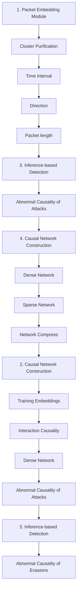

# Wedjat: Detecting Sophisticated Evasion Attacks via Real-time Causal Analysis

Li Gao Tsinghua University Beijing, China

Chuanpu Fu Tsinghua University Beijing, China

Xinhao Deng Tsinghua University Beijing, China

Ke Xu Tsinghua University Zhongguancun Lab Beijing, China

Qi Li Tsinghua University Zhongguancun Lab Beijing, China

# Abstract

Traffic encryption has been widely adopted to protect the confidentiality and integrity of Internet traffic. However, attackers can also abuse such mechanism to deliver malicious traffic. Particularly, existing methods detecting encrypted malicious traffic are not robust against evasion attacks that manipulate traffic to obfuscate traffic features. Robust detection against evasion attacks remains an open problem. To the end, we develop Wedjat, which utilizes a causal network to model benign packet interactions among relevant flows, such that it recognizes abnormal causality that represents malicious traffic and disrupted causality incurred by evasion attacks. We extensively evaluate Wedjat with millions of flows collected from a real-world enterprise. The experimental results demonstrate that Wedjat achieves an accuracy of 0.957 F1-score when detecting various advanced attacks. Notably, five sophisticated evasion attacks, which have successfully evaded all existing methods, are accurately detected by Wedjat with over 0.915 F1. It demonstrates that Wedjat achieves exceptional robustness against evasions. Meanwhile, Wedjat maintains an outstanding detection latency, i.e., it can predict each packet in less than 0.125 seconds.

# CCS Concepts

• Security and privacy → Intrusion detection systems.

# Keywords

Machine learning; malicious traffic detection systems; deep learning; causal networks

# ACM Reference Format:

Li Gao, Chuanpu Fu, Xinhao Deng, Ke Xu, and Qi Li. 2025. Wedjat: Detecting Sophisticated Evasion Attacks via Real-time Causal Analysis . In Proceedings of the 31st ACM SIGKDD Conference on Knowledge Discovery and Data Mining V.1 (KDD ’25), August 3–7, 2025, Toronto, ON, Canada. ACM, New York, NY, USA, 12 pages. https://doi.org/10.1145/3690624.3709218

# 1 Introduction

Traffic encryption protects the confidentiality and integrity of communications by concealing private data in encrypted packets. Currently, over 98% of Internet users enable traffic encryption, such as

Transport Layer Security (TLS) [37], which thwarts traffic surveillance along routing paths [15]. However, attackers can also abuse traffic encryption to conceal their malicious activities [12], e.g., data breach [52], malware delivery [51], and vulnerability exploiting [41]. Existing study [12] shows that over 70% of network attacks are launched through encrypted traffic. Traffic encryption can easily invalidate traditional Deep Packet Inspection (DPI) that detects attacks by inspecting packet payloads [40, 43, 49, 57, 59].

To mitigate such threats, machine learning (ML) based malicious traffic detection systems have been developed [20, 21, 23, 32, 38, 59], which capture stealthy malicious traffic by learning traffic features, for instance, the number of bytes in transferred packets. Powered by advanced flow features extracted from sequences of packets [7, 20, 47], existing detection systems can capture stealthy attacks constructed by encrypted traffic [3, 12] other than plain-text traffic to complement traditional rule-based detection [49, 57, 59].

Unfortunately, existing methods for encrypted traffic detection [12, 20, 21, 23, 30] are not robust against evasion attacks [1, 8, 13, 22, 26, 36, 48]. Specifically, attackers construct adversarial examples by injecting perturbations into attack flows, for example, through inserting dummy packets, padding packets, and delaying packets[13, 19, 36]. Thus, attackers can easily evade existing detection systems that heavily rely on coarse-grained flow-level features [7, 23, 31, 38]. In particular, sophisticated evasion attacks simultaneously manipulate features of many concurrent malicious flows, resulting in significant decreases in detection accuracy [3, 7, 13, 20, 21, 48].

To this end, we set out to develop a robust detection system for detecting encrypted malicious traffic, which is robust against various evasion strategies. We observe that evasion behaviors, which manipulate traffic features, such as adding or delaying packets, violate packet interactions regulated by network protocols and original traffic behaviors. Thus, we can capture such anomalies by modeling benign packet interaction patterns of relevant flows as betweenflow causality, and recognize abnormal packet interactions that deviate from the benign patterns as the violation of the causality, which are treated as malicious traffic, including that constructed by evasion attacks.

In this paper, we develop Wedjat, a malicious traffic detection system that utilizes a casual network to model packet interaction patterns between massive real-world users. It can capture various encrypted malicious traffic that deviates from the benign interaction and different evading variants that violate normal behavior patterns. Moreover, by utilizing interactions between different and relevant flows, Wedjat is robust against flow-level, packet-level, and multi-flow evasion attacks. Since evasion attacks manipulate coarse-grained traffic features [7, 38, 59, 61], which inevitably exhibits abnormal interaction patterns, allowing Wedjat to recognize such patterns as significant violations of the causality and thus capture evading malicious traffic.

Table 1: The comparison with the existing methods of malicious traffic detection. 

<table><tr><td rowspan="2">Categories</td><td rowspan="2">Model</td><td rowspan="2">Traffic Feature</td><td rowspan="2">Detection Granularity</td><td rowspan="2">Typical Method</td><td colspan="3">Detection Ability</td><td colspan="3">Detection Robustness</td></tr><tr><td>Encrypted Traffic</td><td>Unseen Traffic</td><td>Realtime Detection</td><td>Packet-Level</td><td>Flow-Level</td><td>Multi-Flow</td></tr><tr><td rowspan="2">Fixed-Rule</td><td>w/o</td><td>Payloads</td><td>Packet</td><td>Zeek [57]</td><td>×</td><td>×</td><td>×</td><td>×</td><td>×</td><td>×</td></tr><tr><td>w/o</td><td>Flow Features</td><td>Flow</td><td>Poseidon [59]</td><td>×</td><td>×</td><td>×</td><td>×</td><td>×</td><td>×</td></tr><tr><td rowspan="10">Machine Learning</td><td>AutoML</td><td>Packet Binaries</td><td>Packet</td><td>nPrintML [23]</td><td>√</td><td>×</td><td>√</td><td>×</td><td>×</td><td>×</td></tr><tr><td>Auto Encoders</td><td>Packet Statistics</td><td>Packet</td><td>Kitsune [38]</td><td>×</td><td>×</td><td>√</td><td>×</td><td>×</td><td>×</td></tr><tr><td>RNNs</td><td>Packet Byte segments</td><td>Flow</td><td>EBSNN [54]</td><td>√</td><td>×</td><td>×</td><td>×</td><td>×</td><td>×</td></tr><tr><td>Random Forest</td><td>Packet Distributions</td><td>Flow</td><td>FlowLens [7]</td><td>×</td><td>×</td><td>√</td><td>×</td><td>×</td><td>×</td></tr><tr><td>K-Means</td><td>Flow Frequency Features</td><td>Flow</td><td>Whisper [20]</td><td>√</td><td>√</td><td>√</td><td>×</td><td>√</td><td>×</td></tr><tr><td>RNNs</td><td>Packet Length Sequence</td><td>Flow</td><td>FS-Net [31]</td><td>√</td><td>√</td><td>×</td><td>×</td><td>√</td><td>×</td></tr><tr><td>Transformers</td><td>Raw Data Trace</td><td>Flow/Packet</td><td>ET-bert [30]</td><td>√</td><td>√</td><td>√</td><td>×</td><td>√</td><td>×</td></tr><tr><td>Graph</td><td>Host Interactions</td><td>Flow</td><td>HyperVision [21]</td><td>×</td><td>√</td><td>√</td><td>√</td><td>√</td><td>×</td></tr><tr><td>SVM</td><td>Multi-Flow Statistics</td><td>Multi-Flow</td><td>Invariant Bag [8]</td><td>×</td><td>√</td><td>×</td><td>√</td><td>√</td><td>×</td></tr><tr><td>Causality</td><td>Packet Interactions</td><td>Flow/Packet</td><td>Wedjat</td><td>√</td><td>√</td><td>√</td><td>√</td><td>√</td><td>√</td></tr></table>

Note that, it is non-trivial to model complex packet interaction patterns among various encrypted packets with different encryption protocols on the Internet. First, Internet packets are unstructured data, which are generated by many different encryption protocols [12, 37]. This necessitates a generic packet embedding method independent of encryption protocols. Second, due to the large scale of Internet traffic behaviors, users exhibit complex interaction patterns that existing ML models find impossible to learn, especially the between-flow relationships of traffic. Last, interactions between multiple flows may incur high detection latency, making it difficult to realize real-time detection.

To address these challenges, we model the relationship among encrypted packets as a causal network that represents the semantics of application layer protocols (e.g., HTTPS and SMTP). However, evasion behaviors, which manipulate traffic features such as padding dummy packets [19], violate the semantics of the protocol. Therefore, Wedjat effectively detects malicious packets by investigating the causality among packets. Specifically, we develop a packet embedding method that clusters fine-grained packet-level features. In this way, Wedjat can effectively convert unstructured Internet packet data into numerical representations. Moreover, Wedjat utilizes a causal network, a probabilistic graph model, to model interactions of packets in relevant flows. Finally, it utilizes belief propagation to infer the most probable next behavior in real-time to detect attacks, in particular, the stealthy attacks that are generated by evasion behaviors. Moreover, the sparse casual network avoids intensive computation and can boost real-time detection.

We extensively evaluate Wedjat in a top-ranked network infrastructure provider. Specifically, we collected 13 million flows from real enterprise networks including malicious traffic associated with real-world threats. The experimental results demonstrate that Wedjat can capture various unseen attacks with an accuracy of 0.9577 F1-score, thereby outperforming the five stat-of-the-art methods. In particular, five evasion attacks, which can easily evade all existing malicious traffic detection [3, 8, 20, 21, 31, 38], are accurately captured by Wedjat with over 0.9158 F1-score. Meanwhile, Wedjat significantly improves the accuracy over existing methods on existing traffic datasets. Besides, Wedjat can realize real-time detection, with its detection latency bounded by 0.125s.

The contributions of this paper are five-fold:

• We develop the first robust encrypted malicious traffic detection system that utilizes the casual network model to detect sophisticated and strategic evasion attacks by analyzing between-flow interaction patterns.   
• We design a packet embedding method that effectively converts unstructured packets into numerical representations.   
• We innovatively utilize the causality to model the complex packet interactions among various encrypted flows for traffic analysis.   
• We devise a real-time inference-based detection process for efficient classification of ongoing connections.   
• We deploy Wedjat in a large-scale real-world enterprise to extensively evaluate its performance.

The rest of this paper is organized as follows: In Section 2, we formulate the problem. In section 3, we present the motivation and high-level design of Wedjat. In Section 4, we present design details. In Section 5, we experimentally evaluate Wedjat. Section 6 reviews related works, and Section 7 concludes this paper.

# 2 Problem Statement

# 2.1 Design Goals

Wedjat aims to identify encrypted traffic generated by various Internet attacks, in particular the malicious traffic generated by evasion attacks. For instance, existing malware commonly uses TLS traffic encryption protocols to communicate with botmasters [4, 28], because encrypted packet payloads can evade traditional NIDSes that rely on plain-text packet payloads. Therefore, Wedjat only analyzes the features of ongoing Internet traffic at the gateway of a network. In addition, Wedjat should capture unseen zero-day attacks [38, 50], which means that it cannot obtain any prior knowledge of the attacks, e.g., labeled datasets for training ML models. Moreover, it should realize generic detection to capture various advanced attack traffic [15, 27], regardless of their speeds, durations, and protocols. Besides, Wedjat should achieve real-time detection, which allows existing defense systems to throttle attack traffic in real time [34, 59].

In particular, we aim to develop robust detection against evasion attacks. Specifically, existing evasion attacks inject perturbations to manipulate traffic features, for example, through injecting and revising benign packets. Moreover, unlike existing studies that focus on specific evasion attacks [19, 20], we consider various evasion attacks, particularly, those sophisticated attacks that manipulate the features of many flows. In general, existing evasion attacks can be categorized into three classes:

flowchart

Figure 1: The overview of Wedjat.

• Packet-Level Evasion. Attacker add noise to the feature of one packet, e.g., through padding, delaying, and inserting packets [36], which can easily evade existing packet-level detection [23, 38, 61].   
• Flow-Level Evasion. Attackers obfuscate features of flows (e.g., the flow completion time[7], flow length and duration[22] and the number of bursts [1, 26]), by manipulating features of multiple packets within one single flow [20].   
• Multi-Flow Evasion. Attackers manipulate massive correlated malicious flows, for example, by inserting benign flow among malicious flows [21] and inject perturbations to many concurrent malicious flows simultaneously [22].

Note that, the adversarial flow examples constructed by these evasion attacks can easily evade many existing detection [7, 20, 21, 38, 47]. Since attackers can easily manipulate the coarse-grained statistical traffic features utilized by these methods.

# 2.2 Problem Formulation

This paper focuses on addressing evasion attacks that will result in the target distribution of testing samples being different from the source distribution of training samples. Evasion attacks inject perturbations to construct adversarial traffic examples, which introduces drift in the distribution of traffic features. Specifically, let $D _ { S } = D _ { S } ^ { + } \cup D _ { S } ^ { - } : = \{ ( x ^ { S , i } , y ^ { S , i } ) \} _ { i } ^ { n _ { S } }$ denote a labeled dataset which obeys the source distribution $\mathbb { P } _ { S }$ , where $n _ { S } = \left. D _ { S } \right.$ | is the scale of the dataset. Note that, $\mathit { D } _ { S } ^ { + } = \{ ( x ^ { S } , + ) \}$ } and $\boldsymbol { D _ { S } ^ { - } } = \{ ( \boldsymbol { x } ^ { S } , - ) \}$ } respectively represent the dataset of benign samples from distribution $\mathbb { P } _ { S } ^ { + }$ and malicious samples from $\mathbb { P } _ { S } ^ { - }$ . Meanwhile, $y ^ { i } \in \mathcal { V } = \{ + , - \}$ } where label + and − indicate benign and malicious respectively. In the detecting phase, given an unlabeled dataset $D _ { T } = D _ { T } ^ { + } \cup D _ { T } ^ { - } : =$ $\{ ( \boldsymbol { x } ^ { T , i } , \cdot ) \} _ { i } ^ { n _ { T } }$ sampled from the distribution $\mathbb { P } _ { T }$ , our objective is to utilize training dataset $D _ { S }$ to construct a ML model $f ( \cdot )$ and predict the associated label of the any feature vector $\pmb { x } ^ { T } \in D ^ { T }$ . We denote the output label of sample ?? as ${ \hat { y } } = f ( { \boldsymbol { x } } )$ . From a probabilistic perspective, the process of prediction is to compute $P ( y | \boldsymbol { x } )$ and can be described as:

$$
\hat {y} = \underset {y \in \{+, - \}} {\arg \max} P (y | \boldsymbol {x}; D _ {S}) \quad \forall \boldsymbol {x} \in D _ {T} \tag {1}
$$

However, the target distribution of malicious data $\mathbb { P } _ { T } ^ { - }$ exhibits various changes compared to the source distribution $\mathbb { P } _ { S } ^ { - } ,$ , which is caused by evasion attacks described as $E ( \cdot )$ . The serious phenomenon $\mathbb { P } _ { T } ^ { - } : = \mathbb { P } _ { E ( S ) } ^ { - } \neq \mathbb { P } _ { S } ^ { - }$ is unknown to detector. Additionally, for benign traffic, $\mathbb { P } _ { T } ^ { + }$ is similar to $\mathbb { P } _ { S } ^ { + }$ . Evasion can lead to misclassification. For example, given a malicious flow ?? labeled with $- , f ( { \pmb a } ) = -$ but $f ( E ( a ) ) = +$ will happen simultaneously, which leads to poor robustness. This is because, evasion attacks make ?? be similar to a benign sample, which can be defined as $P ( E ( \pmb { a } ) | - ) < P ( E ( \pmb { a } ) | + )$ . According to the Bayesian formula and the Full Probability formula $P ( y | E ( \pmb { a } ) ) \propto P ( E ( \pmb { a } ) | y ) P ( y )$ , hence $P ( - | E ( \mathbf { \boldsymbol { a } } ) ) \ < \ P ( + | E ( \mathbf { \boldsymbol { a } } ) )$ and then $\hat { y } \to + .$ .

# 3 Overview of Wedjat

# 3.1 Design Intuition

The evasion behaviors of attack traffic, which can easily manipulate traditional statistical traffic features (e.g., the number of packets), exhibit abnormal packet interactions that deviate from the normal interactions as regulated by behaviors and network protocols [15, 27, 37]. However, we observe that interactions of benign and malicious traffic have distinct patterns. In particular, betweenflow pattern of malicious flows (even with evasion behaviors) are distinct from that of benign flows1. Thus, we can use between-flow and within-flow patterns to detect different evasion behaviors. To achieve this, we leverage causality analysis based on the probabilistic graph model to model packet interactions among Internet users and recognize the violations of the causality which represent abnormal packet interactions associated with evasion behaviors and attack behaviors. To effectively model packet interactions among users, we define the causality between packets as below:

Definition 1. Causality refers to the dependency relationship between variables. If the value or occurrence of the variable ?? may influence the variable ?? , we call this relationship as causality, denoted as $: X \implies Y .$ . Causality can be quantified by the conditional probability $P ( Y | X )$ , where $P ( Y | X ) \neq P ( Y )$ indicates that the occurrence of ?? is dependent on the occurrence of ?? .

In this paper, we use within-flow causality to denote the probabilistic dependency among packets from one flow and use betweenflow causality to indicate that among the packets from different flows.

# 3.2 High-Level Design

We develop Wedjat, which captures evasion attacks by analyzing fine-grained packet interactions via real-time causality analysis. As shown in Figure 1. In general, Wedjat models causal relationships between packets and flows. That is, the nodes in the causal network represent packets, while the edges represent conditional probabilities between packets. Based on common benign causal patterns, Wedjat utilizes known packets to infer unknown packets, thereby identifying abnormal causality that indicates malicious traffic and evading traffic detection. In specific, Wedjat includes three modules:

Packet Embedding. We convert unstructured packets generated by various encryption protocols into unified numerical representations. That is, we extract packet-level features and embed the features into one single dimension, which serves as the input for causality analysis. Meanwhile, we ensure that such numerical representations can differentiate malicious packets. For this purpose, we formulate an optimization problem upon the clusters of packet features to purify the clusters and to score the clusters as either benign or malicious. Subsequently, we calculate the similarity between each packet and the associated cluster. Finally, we produce the numerical representation for each packet by combining the score and similarity of the associated cluster.

Causal Network Construction. We model causality among packets of related flows from the same sources and destinations. Specifically, we develop a causal network based on a Directed Acyclic Graph (DAG), where one node denotes one packet and the edges denote the probabilistic dependencies between nodes. Particularly, to reduce the complexity of inter-flow dependency between massive packets, we design a network construction based on the semantics of network protocols and optimize the network structure to compress redundant network nodes and edges for efficient detection. Note that, the learning process does not rely on labeled malicious traffic, thereby realizing detection for many unseen attacks.

Inference-based Detection. In this module, we recognize the deviations of the causality which denote the abnormal interactions exhibited by malicious and evasion behaviors. To accurately detect abnormal interaction patterns, we develop two-step detection methods that capture coarse-grained flow-level abnormal interactions based on fine-grained packet-level anomalies. Initially, we derive the scores that indicate malicious degree from the packet embedding module. Afterward, we compare the packet score with the inference result provided by the causal network. In this way, we effectively capture ongoing abnormal behaviors in real-time.

# 4 Design Details

# 4.1 Packet Embedding

In order to characterize unstructured packets from different protocols, we extract numerical information of arriving packets and compress them to a numerical value for future network construction. The principle of mapping is to differentiate between normal and malicious packets, as well as identify outliers representing unseen packets. The mapped results should represent the benign degree of packets. Hence, our objective can be written as a function named $M a p : \mathbb { R } ^ { d }  [ - 1 , 1 ]$ , and $\pmb { p } \mapsto s c o r e _ { \pmb { p } }$ . For ????????????, we assign benign, malicious and unknown packet to the interval $[ \tilde { \epsilon } , 1 ] , [ - 1 , \epsilon ]$ and $[ - \epsilon , \epsilon ]$ respectively, where ?? is a hyperparameter range from $0 < \epsilon < 0 . 5$ referring to the threshold whether it is an unknown packet.

$$
\operatorname{score} _ {\boldsymbol {p}} = M (\boldsymbol {p}) \in
$$

$$
\left\{ \begin{array}{l l} (\epsilon , + 1 ], & \text { if } \boldsymbol {p} \in D _ {\boldsymbol {p}} ^ {+}, \text { i.e., } P (\hat {y} = + | \boldsymbol {p}) > 0. 5 + \varepsilon \\ [ - \epsilon , \epsilon ], & \text { if } \boldsymbol {p} \in D _ {\boldsymbol {p}} ^ {0}, \text { i.e., } | P (\hat {y} = + | \boldsymbol {p}) - 0. 5 | \leq \epsilon \\ [ - 1, - \epsilon), & \text { if } \boldsymbol {p} \in D _ {\boldsymbol {p}} ^ {-}, \text { i.e., } P (\hat {y} = + | \boldsymbol {p}) <   0. 5 - \varepsilon \end{array} \right. \tag {2}
$$

Packet Embedding is divided into four steps.

Feature Extraction. We first extract a training packet dataset ?????? = {(????,??, ????,?? )} ${ D } _ { S _ { p } } = \{ ( { \pmb p } ^ { S , i } , { y } ^ { S , i } ) \} _ { i } ^ { n _ { S _ { p } } }$ ?? ?????? from training flow dataset $D _ { S }$ , where $\pmb { p } ^ { S , i } \in$ $\mathbb { R } ^ { d }$ refers to the ??-th packet sample in $D _ { S _ { p } }$ and $y ^ { S , i } \in \mathcal { V }$ refers to the corresponding label, which depends on the label of the flow to which the packet belongs. For each packet, we extract side-channel information in its header segment, e.g., packet length, time-interval, packet direction and so forth. Hence, each packet can be represented as a d-dimensional vector:

$$
\boldsymbol {p} ^ {i} = (p _ {1} ^ {i}, p _ {2} ^ {i}, \dots , p _ {d} ^ {i}) \tag {3}
$$

Normalization is applied to all packet vectors.

$$
\tilde {\pmb {p}} ^ {S, i} = (\tilde {p} _ {1} ^ {S, i}, \tilde {p} _ {2} ^ {S, i}, \dots , \tilde {p} _ {l} ^ {S, i}, \dots , \tilde {p} _ {d} ^ {S, i})
$$

$$
\tilde {p} _ {l} ^ {S, i} = \frac {p _ {l} ^ {S , i} - \min _ {i} (p _ {l} ^ {S , i})}{\max _ {i} (p _ {l} ^ {S , i}) - \min _ {i} (p _ {l} ^ {S , i})}, \quad i \in [ 1, n _ {S _ {\boldsymbol {p}}} ] \tag {4}
$$

Clustering. To map the d-dimensional vector of each packet to a one-dimensional value, we apply Clustering to the training dataset $D _ { S _ { p } }$ . The objective of kmeans clustering is to partition the dataset into $N _ { c }$ non-overlapping clusters $\mathcal { C } = \{ C _ { 1 } , C _ { 2 } , . . . , C _ { N _ { c } } \}$ , where $N _ { c }$ is the predetermined number of clusters. The algorithm is to optimize the following cost function:

$$
\mathscr {C} ^ {*} = \underset {\mathscr {C}} {\arg \min} \sum_ {i = 1} ^ {N _ {c}} \frac {1}{| C _ {i} |} \sum_ {k, j \in C _ {i}} d (\boldsymbol {p} ^ {k}, \boldsymbol {p} ^ {j}) \tag {5}
$$

where $d ( \cdot , \cdot )$ is the Euclidean distance function. The optimization solving details are provided in the appendix A.1.

Purification. In order to better distinguish the benign packets and malicious packets, namely purify these clusters, there are a variable $N _ { c } { ^ * }$ that need to be further determined. Therefore, we minimize the following objective function (6), measuring the distance between clustering results and ground truth:

$$
N _ {c} ^ {*}, \mathcal {C} ^ {*} = \underset {N _ {c}, \mathcal {C}} {\arg \max} \sum_ {C _ {j} \in \mathcal {C}} \left| P (y = + | C _ {j}) - B e n i g n S c o r e _ {C _ {j}} \right|
$$

$$
\text { BenignScore } _ {C _ {j}} = \left\{ \begin{array}{l l} 1, & \text { if } \quad P (y = + | C _ {j}) > 0. 5 + \epsilon \\ 0. 5, & \text { if } \quad \left| P (y = + | C _ {j}) - 0. 5 \right| <   \epsilon \\ 0, & \text { if } \quad P (y = + | C _ {j}) <   0. 5 - \epsilon \end{array} \right. \tag {6}
$$

where $\begin{array} { r } { P ( y = + | C _ { j } ) = \frac { C n t ( y ^ { i } = + ) } { C n t ( p ^ { i } \in C _ { j } ) } } \end{array}$ denotes the benign probability of each cluster, i.e., the portion of benign labels in each cluster. Details are in Appendix B.

Packet Score. The last step of packet embedding is to set the value of packet points to construct nodes for the causal network. We firstly compute the similarity of a given data point with respect to its belonging cluster’s $C _ { j } ,$ , namely, the distance between the data and the cluster center it belongs to:

$$
\operatorname{sim} \left(\boldsymbol {p} ^ {i}; C _ {j}\right) = \frac {1}{\left| C _ {j} \right|} \sum_ {k \in C _ {j}} d \left(\boldsymbol {p} ^ {i}, \boldsymbol {p} ^ {k}\right), \quad \boldsymbol {p} ^ {i} \in C _ {j} \tag {7}
$$

We set a threshold $\tau _ { o u t } \colon$ if ?????? $\mathbf { \nabla } ( p ^ { i } ; C _ { j } ) \ < \tau _ { o u t }$ , we denote this packet as a outlier point.

Moreover, the packet’s score can be computed as below equation:

$$
\operatorname{score} \left(\boldsymbol {p} ^ {i}\right) = \operatorname{sim} \left(\boldsymbol {p} ^ {i}; C _ {j}\right) \cdot \left[ 2 \times P (+ | C _ {j}) - 1 \right] \tag {8}
$$

Note that $\left[ 2 \times P ( + | C _ { j } ) - 1 \right]$ maps the benign probability interval [0, 1] to the score interval [−1, 1]. Hence, the score of packets from benign flows is near to 1, the score of packets from malicious flows is near to -1 and the score of packets from unknown flows is near to 0. The equation of our packet mapping module (2) is satisfied.

Note that the scores of packets are all continuous variables and it may cause large complexity in the learning phase, so we discretize them through the equal-width discretization method by dividing an interval into equal parts. The smaller the partition size, the closer to the original data distribution characteristics but the larger the number of parameters.

# 4.2 Causal Network Construction

Our causal network involves nodes, edges, structure learning, and parameter learning. We use the following three steps to construct a causal network.

Bag Aggregation. The between-flow relationship brings about notable information that can differentiate normal and malicious traffic. Hence, we first aggregate flows from identical source IP and destination IP pairs to bags of size ?? ×?? in preparation for network construction. For nodes and edges, each node $N o d e _ { i , j }$ represents a packet $\pmb { \mathcal { P } } i , j :$ , namely, the j-th packet in the i-th flow of the bag. Each directed edge represents a causality between the parent node and the child node. The values of nodes are the numerical representation of packets preliminarily obtained in equation 8 in Packet Embedding. The parameters of these edges denote the conditional probability of two nodes.

Fundamental Causal Network. We devise a fundamental causal network because packets exhibit causality in both temporal order and spatial location. For each node $N o d e _ { i , j } ,$ , we establish edges as follows: ???????? $_ { i , j } \Rightarrow N o d e _ { i - 1 , j }$ and $N o d e _ { i , j - 1 } \implies N o d e _ { i , j }$ . In the special case where i equals 1, only one edge, $N o d e _ { i , j } \Rightarrow N o d e _ { i - 1 , j } ,$ is constructed. Similarly, the same condition applies when $j = 1$ is the case. Therefore, this constitutes a dynamic programming process, and the algorithm details are in appendix 2.

Structure and Parameters Learning. In this process, we optimize the network structure to obtain the maximum likelihood score via randomly deleting edges from the fundamental network[10], thus improving the inference speed. The computation of the maximum likelihood score is also called parameter learning, which learns the joint probability distribution of the causal network. We use the Maximum Likelihood Estimation(MLE) method to estimate network parameters, which can be described as:

$$
\theta^ {*} = \underset {\theta} {\arg \max} l n L (\theta ; D _ {S} ^ {+})
$$

$$
L (\theta ; D _ {S} ^ {+}) = \prod_ {k = 1} ^ {| D _ {S} ^ {+} |} P (\boldsymbol {x} ^ {S, k}; \theta) \tag {9}
$$

where ????,?? = ????,?? = {????,??11 , ????,??12 , ..., ?? $\boldsymbol { x } ^ { S , k } = \boldsymbol { b } ^ { S , k } = \{ \boldsymbol { p } _ { 1 1 } ^ { S , k } , \boldsymbol { p } _ { 1 2 } ^ { S , k } , . . . , \boldsymbol { p } _ { n m } ^ { S , k } \}$ , representing the k-th sample, i.e., bag, in the dataset $D _ { S } ^ { + }$ . Each $x ^ { S , k }$ contains ?? flows and ?? packets in each flow. The equation (9) above can be reformulated as follows:

$$
\begin{array}{l} L (\theta ; D _ {S} ^ {+}) = \prod_ {k = 1} ^ {| D _ {S} ^ {+} |} P (\boldsymbol {p} _ {1 1} ^ {S, k}, \boldsymbol {p} _ {1 2} ^ {S, k},..., \boldsymbol {p} _ {N M} ^ {S, k}; \theta) \\ = \prod_ {k = 1} ^ {| D _ {S} ^ {+} |} \prod_ {i = 1} ^ {N} \prod_ {j = 1} ^ {M} P (\boldsymbol {p} _ {i j} ^ {S, k} | p a r e n t (\boldsymbol {p} _ {i j} ^ {S, k})) \\ = \prod_ {k = 1} ^ {| D _ {S} ^ {+} |} P (\boldsymbol {p} _ {1 1} ^ {S, k}) \prod_ {k = 1} ^ {| D _ {S} ^ {+} |} \prod_ {i = 2} ^ {N} P (\boldsymbol {p} _ {i, 1} ^ {S, k} | \boldsymbol {p} _ {i - 1, 1} ^ {S, k}) \prod_ {k = 1} ^ {| D _ {S} ^ {+} |} \prod_ {j = 2} ^ {M} P (\boldsymbol {p} _ {1, j} ^ {S, k} | \boldsymbol {p} _ {1, j - 1} ^ {S, k}) \\ \cdot \prod_ {k = 1} ^ {| D _ {S} ^ {+} |} \prod_ {i = 2} ^ {N} \prod_ {j = 2} ^ {M} P (\boldsymbol {p} _ {i, j} ^ {S, k} | \boldsymbol {p} _ {i - 1, j} ^ {S, k}, \boldsymbol {p} _ {i, j - 1} ^ {S, k}) \\ \end{array}
$$

Optimal parameters ?? are obtained by computing the derivative of the log form of $\operatorname { E q } .$ (10) and setting it equal to zero. Note that, the learning process only involves training benign samples because we only learn the invariant causality from benign traffic.

In general, it is challenging to model relationships among packets across multiple flows because of the vast scale of Internet packets. For example, ?? concurrent flows, each containing ?? packets, will incur a complexity of ?? (???? ∗???? ). Wedjat addresses this challenge by compressing the causality network to effectively model the complex interactions.

# 4.3 Inference-based Detection

We design a unique packet label inference mechanism that aims to use the inference algorithm to predict the score of the next packet based on the arrived packet and the network structure parameters. In the case where the difference between the predicted score and the newly arrived packet obtained by the mapping mechanism is greater than the setting threshold $\tau _ { \ / p } ;$ , it is considered that the packet does not conform to the pattern of benign traffic. If the number of such situations in traffic is greater than a certain threshold $\tau _ { f } ,$ the entire traffic is malicious.

Packet Label Inference. Upon the arrival of each data packet, the discrepancy between its observed value and the predicted value is computed. If this discrepancy surpasses a predefined threshold, the packet is classified as a Malicious packet.

The observed value is the score obtained through Packet Embedding, i.e., the probability that a packet is indeed benign: ???????? $e _ { i } =$ $P ( y = + | \pmb { p } ) = M ( \pmb { p } )$ . We use the belief propagation algorithm[10] to calculate:

$$
\operatorname{score} _ {\boldsymbol {p} _ {i, j}} ^ {*} = \underset {\text { score }} {\arg \max} P (\boldsymbol {p} _ {i, j} = \text { score } | \boldsymbol {p} _ {1, 1}, \dots , \boldsymbol {p} _ {i - 1, j - 1}) \tag {11}
$$

$\mathrm { i f } \ | s c o r e _ { p _ { i , j } } - s c o r e _ { p _ { i , j } } ^ { * } | > \tau _ { p }$ , this packet is abnormal.

Flow Label Inference. For each flow label, we compute the proportion of anomalous packets in a single flow, namely, Flow-wise

Inference Accuracy(FIA).

$$
F I A (f _ {i}; M) = \frac {1}{M} \sum_ {j} ^ {M} I (| s c o r e _ {\boldsymbol {p} _ {i, j}} - s c o r e _ {\boldsymbol {p} _ {i, j}} ^ {*} | > \tau_ {p}) \tag {12}
$$

where ?? (·) is an indicator function that takes the value 1 when the condition is satisfied. If the FIA of each flow is greater than a certain threshold ???? , the entire traffic is malicious. For ongoing traffic, we obtain the real-time label through computing $F I A ( f _ { i } ; l )$ under the sequence of packets up to the current latest packet $\pmb { \mathit { p } } _ { i , l }$ .

# 5 Experimental Evaluation

# 5.1 Experiment Setup

Implementation. We prototype our method with more than 5,000 lines of code2. Specifically, we utilize the Python with DPKT library to parse PCAP packet files and to assemble them into flows and bags based on their five-tuple. More precisely, the constructed datasets comprise packet labels and features (e.g., packet lengths, timestamps, directions, etc.), which are saved in JSON format and stored with MongoDB. We set ?? = 3 and ?? = 10 by default, which trades off between accuracy and efficiency.

Datasets. To extensively evaluate Wedjat, we collaborate with a top-ranked network infrastructure provider and use real-world datasets for evaluation. Currently, Wedjat is deployed as an offline attack investigation tool in a Security Operations Center (SOC) [2], which analyzes encrypted traffic collected from the gateway of an enterprise network. We validated our results of Wedjat by using 21- day real-world datasets. Wedjat is utilized to capture all malicious flows, which enables identifying vulnerabilities and performing comprehensive forensic analysis in real time.

Specifically, the large-scale dataset from enterprise networks consists of 735,997 TLS-encrypted malicious flows and 12,436,861 benign encrypted flows. We randomly select 100,000 bags of malicious and benign flow evenly. More precisely, the set of bags comprises 122,073 benign flows and 134,456 malicious flows, respectively. Meanwhile, we utilize existing public datasets, i.e., CICIDS-2017 [44], to complement the real-world datasets, thereby validating the results and avoiding the issue of dataset bias. Such dataset covers traffic of 12 different attacks, e.g., malware traffic, flooding traffic, and botnet traffic. Similarly, we evenly select benign and malicious flows that make up 1,404 and 1,627 bags of traffic. Figure 2 plots the distributions of packet length and direction. Note that, we randomly split the 20% of the whole dataset as a testing set, while the remaining 80% samples are used as the training set. Note that, the labels are only used as ground truth, to calculate detection accuracy. Wedjat does not use labels for training the causal model.

Baselines. We compare Wedjat with five state-of-the-art malicious traffic detection methods. These baselines utilize various features and ML models, covering both supervised [3] and unsupervised [19] methods, flow [31] and packet [38] based methods, single-flow [31] and multi-flow [21] based methods.

• Kitsune. Kitsune [38] employs autoencoders to learn statistics of packet-level features, which utilize unsupervised ML to capture various unseen attacks.

line

| Packet length with direction | PDF     |
| ---------------------------- | ------- |
| -1000                        | 0.001   |
| 0                            | 0.006   |
| 1000                         | 0.000   |

(a) Enterprise

line

| Packet length with direction | PDF     |
| ---------------------------- | ------- |
| -2000                        | 0.00000 |
| -1500                        | 0.00025 |
| -1000                        | 0.00075 |
| -500                         | 0.00125 |
| 0                            | 0.00125 |
| 500                          | 0.00125 |
| 1000                         | 0.00125 |
| 1500                         | 0.00125 |
| 2000                         | 0.00125 |
| 2500                         | 0.00125 |
| 3000                         | 0.00125 |

(b) CICIDS-2017   
Figure 2: Probability density functions of packet length with direction.

• Enhanced + SVM. Anderson et al. [3] developed an enhanced feature set for encrypted traffic detection, which consists of a Markov chain transformation and statistics, e.g., minimum and mean of packet lengths. For end-to-end detection, we apply a Support Vector Machine(SVM) model to learn these features.   
• FS-Net. FS-Net [31] is a deep learning-based method that leverages multi-layer bidirectional gated recurrent units (Bi-GRUs) to capture abnormal sequential features from packet length sequences for traffic detection.   
• Whisper. Whisper [20] utilizes K-Means to cluster the frequencies of packet-level features, thereby identifying outlier samples as malicious traffic.   
• Hypervision. Hypervision [21] utilizes a graph to represent interaction patterns among hosts. It detects abnormal interaction patterns by analyzing the statistics of graph structural features.

We emphasize that Wedjat is an unsupervised approach; thus, we focus on comparing unsupervised baselines, including existing robust detection against single-flow evasions [19, 21]. These methods heavily rely on statistical traffic features, which are not robust against evasion attacks.

Selected Evasion Attacks. We simulated five evasion attacks, including Random Delaying, Random Padding, FRONT [22], WTF-PAD [26], and DFD [1]. Note that, the last three evasion strategies are injection-based methods.

• Random Delaying. It randomly chooses and delays original packets by randomly generating a millisecond-level delay time.   
• Random Padding. It pads a random amount of data to packet payloads under the restriction that the packet size is less than the Maximum Transmission Unit (MTU).   
• FRONT. FRONT[22] injects multiple packets at the stage of flow establishment to obscure the most distinguishable features. It sets injection times to follow a Rayleigh distribution.   
• WTFPAD. WTFPAD[26] injects packets at sparse gaps in flow to prevent long gaps from becoming distinguishing features.   
• DFD. DFD[1] injects dummy messages into every outgoing burst with a certain disturbance rate to obfuscate burst patterns.

These evasion attacks indicate that existing systems are vulnerable to simple evasion strategies, such as injecting benign packets for effectively obfuscating flow patterns. In the experiment, we measure performance degradation caused by evasion attacks with different overheads, i.e., delaying time intervals and amount of injected data. Specifically, time overhead is defined as the proportion of total delaying time to the original flow completion time, and data overhead means the sizes of inserted and padded packets divided by the total size of packets.

Table 2: Accuracy comparison without evasion attacks. 

<table><tr><td rowspan="2">Dataset</td><td rowspan="2">Method</td><td colspan="3">Non-Evasion Scenario</td></tr><tr><td>Pre</td><td>Rec</td><td>F1</td></tr><tr><td rowspan="6">Enterprise</td><td>Kitsune</td><td>0.9223</td><td>0.7913</td><td>0.8518</td></tr><tr><td>Enhanced+SVM</td><td>0.8864</td><td>0.9896</td><td>0.9352</td></tr><tr><td>FS-Net</td><td>0.9830</td><td>0.9798</td><td>0.9814</td></tr><tr><td>Whisper</td><td>0.9323</td><td>0.9117</td><td>0.9219</td></tr><tr><td>Hypervision</td><td>0.9170</td><td>0.9632</td><td>0.9395</td></tr><tr><td>Wedjat</td><td>0.9387</td><td>0.9775</td><td>0.9577</td></tr><tr><td rowspan="6">CICIDS-2017</td><td>Kitsune</td><td>0.9524</td><td>0.9016</td><td>0.9263</td></tr><tr><td>Enhanced+SVM</td><td>0.7128</td><td>0.8316</td><td>0.7676</td></tr><tr><td>FS-Net</td><td>0.9865</td><td>0.9816</td><td>0.9841</td></tr><tr><td>Whisper</td><td>0.9180</td><td>0.9516</td><td>0.9345</td></tr><tr><td>Hypervision</td><td>0.9624</td><td>0.9833</td><td>0.9727</td></tr><tr><td>Wedjat</td><td>0.9441</td><td>0.9866</td><td>0.9649</td></tr></table>

Evaluation Metrics. We measure the accuracy by using precision, recall, and F1-score as primary metrics. Moreover, we mainly pay attention to the recall value of malicious samples, which is a critical indicator of robustness. This is because the distribution of malicious samples exhibits significant drifts in the presence of evasion attacks, and thus causes noticeable decreases in the recall value of detectors.

# 5.2 Accuracy Evaluation

We conduct experiments on two datasets without evasion attacks, which allows us to confirm the correctness of the established baselines. According to Table 2, on the real-world dataset, Wedjat outperforms other unsupervised detection methods that claimed to achieve robust detection for some specific evasion attacks [19, 21] by achieving a 98.11% F1-score. Such performance is comparable to FS-Net deep learning-based detection which incurs high overheads. Moreover, Wedjat significantly improves the accuracy in terms of precision and recall over existing methods, where Wedjat achieves 93.87% precision and 98.66% recall. Similarly, on the public dataset, Wedjat achieves an accuracy of 96.71% F1 which is comparable to existing systens that are not robust against evasion attacks (cf. Section 5.3). Note that, Wedjat achieves similar accuracy on the enterprise dataset and the public dataset, which indicates Wedjat has stable performance across various network environments. Additionally, Wedjat only raises an average of 5.53 false alarms per hour, which can be manually managed by operators, according to a recent false positive alarm study [18].

Furthermore, we measure the accuracy under critical settings to clarify known issues [5, 25] in existing detection sytems [19, 21, 38]:

• Datasets Bias. We also use other public datasets [16, 17]. Specifically, Wedjat achieves 0.9097 and 0.9367 F1-score when detecting IoT attack traffic [17] and DNS-over-HTTP attack traffic [16], respectively. These results are similar to the results on the CIC datasets. The reason for mainly using the CIC public dataset is its significantly larger size than other public datasets.

• Ablation Studies. We disabled the packet embedding by directly using packet lengths, which resulted in 5.18% F1 drop. Meanwhile, we replace the causal network with traditional unsupervised ML used by Kitsune [38], which incurs 10.29% F1 drop.

• Concept Drifting. We trained the model on traffic data from Tuesday on the CIC dataset and tested it on data from the subsequent three days. We observed that Wedjat achieved an F1-score of 0.8022, which is significantly higher than the 0.5549 F1-score achieved by Whisper.   
• Domain Generalization. We train the model on the public dataset and evaluate its accuracy on the dataset generated under real-world deployment. Wedjat achieves 0.7422 F1, outperforming the 0.6767 F1 achieved by FS-Net. All baseline models fail to detect attacks that differ from those in the training datasets.

# 5.3 Robustness Evaluation

To extensively validate the robustness against various evasion attacks, we implement five sophisticated evasion strategies that manipulate packets of all malicious traffic in testing sets. Moreover, we adjusted the parameters of these evasion strategies to set the data overheads and time overheads for each evasion strategy at 50%. Table 3 and Table 4 present the deterioration in detecting accuracy of our method and baselines across two datasets under different evasion strategies.

Robustness evaluation in real-world scenarios. We evaluate and compare Wedjat with the baselines on the real-world enterprise traffic. As shown in Table 3, we observe a significant decrease in recall and F1 of baseline methods. Specifically, Kitsune suffers from 49% ∼ 73% decrease in recall, where the random padding evasion strategy decreases recall and F1 to 49.33% and 63.23%. This indicates that 50% the malicious flows are misclassified as benign flows, and the attacker can effectively evade Kitsune. The detection performance of other baselines also exhibits significant decreases. For example, the recall of Hypervision drops to below 0.4 in the presence of WTF-PAD and DFD evasion strategies. Since such evasion strategies can obfuscate the statistical features that Hypervision relies on. Moreover, even if Hypervision analyzes inter-flow correlations, existing evasion attacks can still simultaneously obfuscate many flows. In comparison, our method achieves robust detection with a recall of over 89% across five evasion strategies.

Robustness evaluation on public datasets. To eliminate the effect of dataset bias, we further conduct robustness evaluation on public datasets. As shown in Table 4, Wedjat achieves over 90% precision, recall, and F1 scores on the public dataset, in the presence of three evasion strategies, random delaying, random padding, and WTF-PAD. Additionally, the decrease of recall for our model is bounded by 10%, thereby significantly outperforming other methods. Under the FRONT and DFD advanced evasion attacks, the recall of Wedjat is significantly higher than other malicious traffic detection methods.

Robustness evaluation with increasing overheads of evasion attacks. In addition, we compared the accuracy decreases under evasion attacks with various overheads. Figure 3 illustrates that, as the attacker invests more resources, the evading malicious traffic becomes more successful in evading detection by baselines. This is because larger overheads allow attackers to have more data or time resources to craft sophisticated evasion attacks, altering the original malicious features to a greater extent, and making them more difficult to detect. Figure 3 shows that, as evasion attacks introduce more overheads, the F1-score of our method remains above 80%, which indicates a slight drop in performance under highly potent evasion attacks. Overall, attackers can increase the number of injected bytes or delayed time intervals, which incur more overheads, to more effectively evade existing methods, whereas they cannot evade robust detection of Wedjat.

Table 3: Accuracy comparison under different evasion attacks with 50% overhead. (Enterprise Dataset) 

<table><tr><td rowspan="2">Method</td><td colspan="3">Random Delaying</td><td colspan="3">Random Padding</td><td colspan="3">FRONT</td><td colspan="3">WTF-PAD</td><td colspan="3">DFD</td></tr><tr><td>Pre</td><td>Rec</td><td>F1</td><td>Pre</td><td>Rec</td><td>F1</td><td>Pre</td><td>Rec</td><td>F1</td><td>Pre</td><td>Rec</td><td>F1</td><td>Pre</td><td>Rec</td><td>F1</td></tr><tr><td>Kitsune</td><td>0.9158</td><td>0.7270▼</td><td>0.8106▼</td><td>0.8806</td><td>0.4933▼</td><td>0.6323▼</td><td>0.8812</td><td>0.4944▼</td><td>0.6335▼</td><td>0.8754</td><td>0.4699▼</td><td>0.6115▼</td><td>0.8919</td><td>0.5849▼</td><td>0.7065▼</td></tr><tr><td>Enhanced+SVM</td><td>0.8663</td><td>0.8215▼</td><td>0.8433▼</td><td>0.8224</td><td>0.5870▼</td><td>0.6851▼</td><td>0.8541</td><td>0.7366▼</td><td>0.7910▼</td><td>0.8517</td><td>0.7258▼</td><td>0.7838▼</td><td>0.8524</td><td>0.7551▼</td><td>0.8008▼</td></tr><tr><td>FS-Net</td><td> $-^1$ </td><td>-</td><td>-</td><td>0.9775</td><td>0.7358▼</td><td>0.8396▼</td><td>0.9686</td><td>0.5215▼</td><td>0.6780▼</td><td>0.9718</td><td>0.5823▼</td><td>0.7283▼</td><td>0.9728</td><td>0.6289▼</td><td>0.7639▼</td></tr><tr><td>Whisper</td><td>0.8978</td><td>0.5816▼</td><td>0.7059▼</td><td>0.9066</td><td>0.6424▼</td><td>0.7519▼</td><td>0.9110</td><td>0.6779▼</td><td>0.7773▼</td><td>0.9078</td><td>0.6517▼</td><td>0.7587▼</td><td>0.8872</td><td>0.5407▼</td><td>0.6719▼</td></tr><tr><td>Hypervision</td><td>0.8913</td><td>0.7152▼</td><td>0.7936</td><td>0.8894</td><td>0.7012▼</td><td>0.7842</td><td>0.8813</td><td>0.6474▼</td><td>0.7465</td><td>0.8200</td><td>0.3973▼</td><td>0.5353▼</td><td>0.7964</td><td>0.3541▼</td><td>0.4902▼</td></tr><tr><td>Wedjat</td><td>0.9372</td><td>0.9517</td><td>0.9444</td><td>0.9337</td><td>0.8986</td><td>0.9158</td><td>0.9366</td><td>0.9424</td><td>0.9395</td><td>0.9351</td><td>0.9190</td><td>0.9269</td><td>0.9360</td><td>0.9331</td><td>0.9345</td></tr></table>

1 FS-Net is only based on packet length and is immune to the Random Delaying Evasion Strategy.

Table 4: Accuracy comparison under different evasion attacks with 50% overhead. (CICIDS-2017 Dataset) 

<table><tr><td rowspan="2">Method</td><td colspan="3">Random Delaying</td><td colspan="3">Random Padding</td><td colspan="3">FRONT</td><td colspan="3">WTF-PAD</td><td colspan="3">DFD</td></tr><tr><td>Pre</td><td>Rec</td><td>F1</td><td>Pre</td><td>Rec</td><td>F1</td><td>Pre</td><td>Rec</td><td>F1</td><td>Pre</td><td>Rec</td><td>F1</td><td>Pre</td><td>Rec</td><td>F1</td></tr><tr><td>Kitsune</td><td>0.9326</td><td>0.6233▼</td><td>0.7472▼</td><td>0.9161</td><td>0.4916▼</td><td>0.6399▼</td><td>0.9201</td><td>0.5183▼</td><td>0.6631▼</td><td>0.9151</td><td>0.4850▼</td><td>0.6339▼</td><td>0.8897</td><td>0.3633▼</td><td>0.5159▼</td></tr><tr><td>Enhanced+SVM</td><td>0.6981</td><td>0.7750</td><td>0.7345</td><td>0.6156</td><td>0.5366▼</td><td>0.5734▼</td><td>0.6516</td><td>0.6266▼</td><td>0.6389▼</td><td>0.6616</td><td>0.6550▼</td><td>0.6582▼</td><td>0.6178</td><td>0.5416▼</td><td>0.5772▼</td></tr><tr><td>FS-Net</td><td>-</td><td>-</td><td>-</td><td>0.9391</td><td>0.4883▼</td><td>0.6425▼</td><td>0.9694</td><td>0.4233▼</td><td>0.5893▼</td><td>0.9652</td><td>0.3700▼</td><td>0.5349▼</td><td>0.9799</td><td>0.6516▼</td><td>0.7827▼</td></tr><tr><td>Whisper</td><td>0.8996</td><td>0.7616▼</td><td>0.8249</td><td>0.8874</td><td>0.6700▼</td><td>0.7635▼</td><td>0.9003</td><td>0.7683▼</td><td>0.8291</td><td>0.8671</td><td>0.5550▼</td><td>0.6768▼</td><td>0.8583</td><td>0.5150▼</td><td>0.6437▼</td></tr><tr><td>Hypervision</td><td>0.9603</td><td>0.9283</td><td>0.9441</td><td>0.9581</td><td>0.8783</td><td>0.9165</td><td>0.9551</td><td>0.8166▼</td><td>0.8805</td><td>0.9514</td><td>0.7516▼</td><td>0.8398</td><td>0.9494</td><td>0.7200▼</td><td>0.8189</td></tr><tr><td>Wedjat</td><td>0.9394</td><td>0.9050</td><td>0.9219</td><td>0.9403</td><td>0.9200</td><td>0.9301</td><td>0.9358</td><td>0.8516</td><td>0.8917</td><td>0.9394</td><td>0.9050</td><td>0.9219</td><td>0.9340</td><td>0.8266</td><td>0.8771</td></tr></table>

  
Figure 3: Comparison of F1-scores with baselines under various evasion attacks with increasing overheads.

# 5.4 Efficiency Evaluation

We analyze the default setting of the causal network in Figure 4. We observe that the average prediction latency for a packet is 0.1213 seconds. Meanwhile, our model can produce detection results for each packet within 0.125 seconds. Additionally, we analyze the effect of different network scales on detection latency. Figure 5 indicates that, when the number of nodes is less than 50, the average detection latency is bounded by 0.5 seconds. However, as the scale of the network increases to 3×25 and 4×25, the average detection latency exhibits gradual increases and exceeds 1.000s. Such observation underscores the impact of network scale on packet inference efficiency, offering valuable insights for further optimizing network structures. In addition, We measure the overheads of the packet embedding module and the casual network module, which incur latency of 0.0034s and 0.1180s, respectively. Note that, Wedjat incurs lower detection latency which is 6.56 times lower than that of the existing method, i.e., FS-Net, which incurs 0.7965s per flow latency.

line

| Index of Predicted Packet | Prediction Time(s) |
| ------------------------- | ------------------ |
| 0                         | 0.120              |
| 5                         | 0.121              |
| 10                        | 0.122              |
| 15                        | 0.124              |
| 20                        | 0.122              |
| 25                        | 0.123              |
| 28                        | 0.124              |

heatmap

| Number of Flows in Each Bag | 5 | 10 | 15 | 20 | 25 |
|---|---|---|---|---|---|
| 4 | 0.0620 | 0.1292 | 0.3349 | 0.7541 | 2.2436 |
| 3 | 0.0246 | 0.1214 | 0.1813 | 0.7068 | 1.2769 |
| 2 | 0.0154 | 0.0746 | 0.0711 | 0.2964 | 0.4293 |
| 1 | 0.0047 | 0.0112 | 0.0196 | 0.0192 | 0.0379 |

Figure 4: Prediction latency Figure 5: Average packet prefor each packet (3 flows × 10 diction latency for different packets in each bag). scales of casual networks.

# 6 Related Work

ML based Malicious Traffic Detection. ML based detection captures network attacks by investigating the features of traffic, which outperform traditional signature-based methods [49, 57]. For supervised detection, Barradas et al. developed Flowlens that employed random forests to learn the distribution features on programmable switches [7]. Similarly, Zhou et al. developed NetBeacon that implemented decision trees on Intel Tofino switches [61]. Siracusano et al. developed N3IC that installed binary neural networks on Smart-NICs [47]. Moreover, Holland et al. [23] developed nPrintML that learned every byte in packet headers. For unsupervised detection, Mirsky et al. developed Kitsune that learned packet-level features by using autoencoders [38]. Tang et al. [50] detected malicious HTTP traffic with unsupervised language models. Bilge et al. [9] clustered features extracted from NetFlow data to capture traffic of malware. Note that, these methods are not robust against evasion attacks [1, 13, 20, 22, 26, 36]. Additionally, existing methods extract traditional non-robust features, and employ causal detection to weight and select these features. Thus, the existing methods, such as the approach developed by Zeng et al. [58], are vulnerable to manipulations by evasion attacks

Encrypted Traffic Detection. Most existing methods cannot effectively capture encrypted attack traffic, as traffic encryption conceals packet payloads and thus invalidates signature-based detection [49, 57] and Deep Packet Inspection(DPI) [40, 43]. Meanwhile, encryption protocols obfuscate traffic features to evade ML-based detection. Most existing detection systems for encrypted traffic are task-specific [4, 12]. For example, Zheng et al. detected crossfire attack detection on SDN switches [60]. Similarly, Xing et al. designed a programmable switch based method to capture link flooding attacks [56]. Tegeler et al. developed BotFinder that analyzes time-scale flow features to detect encrypted traffic of malware communications [51]. Anderson et al. detected malware encrypted traffic via TLS headers [3]. Moreover, graph learning methods are leveraged to capture various encrypted traffic [21, 24, 39]. Note that, the methods focus on classifying traffic of known Categories, which is entirely different to our malicious traffic detection for recognizing unknown attacks.

Encrypted Traffic Classification. Wedjat identifies encrypted traffic associated with malicious behaviors, which is different from studies on encrypted traffic classification, which infer if encrypted traffic is generated by certain applications [45] to jeopardize user privacy. For instance, web fingerprint attacks classify encrypted Tor traffic to infer the websites accessed by users [42]. Similarly, Siby et al. classified encrypted DNS traffic [46]. Moreover, Bahramali et al. classified the encrypted traffic generated by instant messaging applications, which can infer the content of the messages [6]. Ede et al. classified the encrypted traffic generated by Android apps [53].

Causal Analysis. Causal analysis discerns and quantifies causal relationships (Causality) between variables, e.g., Causal Graphical Models (CGMs)[35], Structural Causal Models (SCMs)[11], and other probabilistic networks. CGMs, particularly Bayesian Networks, represent causal assumptions and dependencies via directed acyclic graphs (DAGs). SCMs extend CGMs by incorporating specific functional relationships and counterfactual reasoning. Other frameworks like Markov Random Fields (MRFs) and Conditional Random Fields (CRFs) explore dependencies using undirected graphs. Causal analysis is widely used in domain generalization[62],such as Unaligned Image-to-Image Translation[55], Motion Prediction[33], and Recommendation Systems[29]. In this paper, we design the Causal Network to model the complex relationships among packets, which is different from these previous works, i.e., we bag the variables (packets) to effectively analyze inter-flow relationships, and compress the network for efficient detection.

# 7 Conclusion

In this paper, we develop Wedjat, which utilizes a causal network to model benign interactions from packets among relevant flows, such that it recognizes abnormal causality that represents malicious traffic and disrupted causality incurred by evasion attacks. We extensively evaluate Wedjat with millions of flows collected from a real enterprise. The experimental results demonstrate that Wedjat achieves an accuracy of 0.957 F1-score when detecting various advanced attacks. Notably, five sophisticated evasion attacks, which have successfully evaded all existing methods, are accurately detected by Wedjat with over 0.915 F1. This demonstrates Wedjat exhibits exceptional capability in robustness against evasion. Meanwhile, Wedjat maintains an outstanding detection latency, predicting each packet in less than 0.125 seconds.

# Acknowledgments

This work is supported by National Natural Science Foundation of China No. 62132011; China National Funds for Distinguished Young Scientists No.62425201; Science Fund for Creative Research Groups of the National Natural Science Foundation of China No. 62221003. (Corresponding author: Qi Li.)

# References

[1] Ahmed Abusnaina, Rhongho Jang, Aminollah Khormali, DaeHun Nyang, and David Mohaisen. 2020. Dfd: Adversarial learning-based approach to defend against website fingerprinting. In IEEE INFOCOM 2020-IEEE Conference on Computer Communications. IEEE, 2459–2468.   
[2] Bushra A. Alahmadi et al. 2022. 99% False Positives: A Qualitative Study of SOC Analysts’ Perspectives on Security Alarms. In Security. USENIX, 2783–2800.   
[3] Blake Anderson and David McGrew. 2017. Machine learning for encrypted malware traffic classification: accounting for noisy labels and non-stationarity. In Proceedings of the 23rd ACM SIGKDD International Conference on knowledge discovery and data mining. 1723–1732.   
[4] Blake Anderson and David A. McGrew. 2016. Identifying Encrypted Malware Traffic with Contextual Flow Data. In AISec. ACM, 35–46.   
[5] Daniel Arp et al. 2022. Dos and Don’ts of Machine Learning in Computer Security. In Security. USENIX.   
[6] Alireza Bahramali et al. 2020. Practical Traffic Analysis Attacks on Secure Messaging Applications. In NDSS. ISOC.   
[7] Diogo Barradas et al. 2021. FlowLens: Enabling Efficient Flow Classification for ML-based Network Security Applications. In NDSS. ISOC.   
[8] Karel Bartos, Michal Sofka, and Vojtech Franc. 2016. Optimized invariant representation of network traffic for detecting unseen malware variants. In 25th USENIX Security Symposium (USENIX Security 16). 807–822.   
[9] Leyla Bilge et al. 2012. Disclosure: detecting botnet command and control servers through large-scale NetFlow analysis. In ACSAC. ACM, 129–138.   
[10] Christopher M Bishop and Nasser M Nasrabadi. 2006. Pattern recognition and machine learning. Vol. 4. Springer.   
[11] Stephan Bongers, Patrick Forré, Jonas Peters, and Joris M Mooij. 2021. Foundations of structural causal models with cycles and latent variables. The Annals of Statistics 49, 5 (2021), 2885–2915.   
[12] Cisco. Accessed May 2022. Cisco Encrypted Traffic Analytics. https://www.cisco.com/c/en/us/solutionsenterprise-networks/enterprisenetwork-security/eta.html.   
[13] Nilesh Dalvi, Pedro Domingos, Mausam, Sumit Sanghai, and Deepak Verma. 2004. Adversarial classification. In Proceedings of the tenth ACM SIGKDD international conference on Knowledge discovery and data mining. 99–108.   
[14] Inderjit S Dhillon, Yuqiang Guan, and Brian Kulis. 2004. Kernel k-means: spectral clustering and normalized cuts. In Proceedings of the tenth ACM SIGKDD international conference on Knowledge discovery and data mining. 551–556.   
[15] Xuewei Feng et al. 2020. Off-Path TCP Exploits of the Mixed IPID Assignment. In CCS. ACM, 1323–1335.   
[16] Canadian Institute for Cybersecurity. Accessed Jan. 2024. DNS-over-HTTP datasets. https://www.unb.ca/cic/datasets/dohbrw-2020.html.

[17] Canadian Institute for Cybersecurity. Accessed Jan. 2024. A real-time dataset and benchmark for large-scale attacks in IoT environment. https://www.unb.ca/ cic/datasets/iotdataset-2023.html.   
[18] Chuanpu Fu et al. 2023. Point Cloud Analysis for ML-Based Malicious Traffic Detection: Reducing Majorities of False Positive Alarms. In CCS. ACM, 1005– 1019.   
[19] Chuanpu Fu et al. to appear. Frequency Domain Feature Based Robust Malicious Traffic Detection. IEEE/ACM Trans. Netw. (to appear).   
[20] Chuanpu Fu, Qi Li, Meng Shen, and Ke Xu. 2021. Realtime robust malicious traffic detection via frequency domain analysis. In Proceedings of the 2021 ACM SIGSAC Conference on Computer and Communications Security. 3431–3446.   
[21] Chuanpu Fu, Qi Li, and Ke Xu. 2023. Detecting unknown encrypted malicious traffic in real time via flow interaction graph analysis. arXiv preprint arXiv:2301.13686 (2023).   
[22] Jiajun Gong and Tao Wang. 2020. Zero-delay lightweight defenses against website fingerprinting. In 29th USENIX Security Symposium (USENIX Security 20). 717–734.   
[23] Jordan Holland, Paul Schmitt, Nick Feamster, and Prateek Mittal. 2021. New directions in automated traffic analysis. In Proceedings of the 2021 ACM SIGSAC Conference on Computer and Communications Security. 3366–3383.   
[24] Luca Invernizzi et al. 2014. Nazca: Detecting Malware Distribution in Large-Scale Networks. In NDSS. ISOC.   
[25] Arthur Selle Jacobs et al. 2022. AI/ML for Network Security: The Emperor has no Clothes. In CCS. ACM, 1537–1551.   
[26] Marc Juarez, Mohsen Imani, Mike Perry, Claudia Diaz, and Matthew Wright. 2016. Toward an efficient website fingerprinting defense. In Computer Security– ESORICS 2016: 21st European Symposium on Research in Computer Security, Heraklion, Greece, September 26-30, 2016, Proceedings, Part I 21. Springer, 27–46.   
[27] Min Suk Kang et al. 2013. The Crossfire Attack. In SP. IEEE, 127–141.   
[28] Chaz Lever et al. 2017. A Lustrum of Malware Network Communication: Evolution and Insights. In SP. IEEE, 788–804.   
[29] Dawen Liang, Laurent Charlin, and David M Blei. 2016. Causal inference for recommendation. In Causation: Foundation to Application, Workshop at UAI. AUAI.   
[30] Xinjie Lin, Gang Xiong, Gaopeng Gou, Zhen Li, Junzheng Shi, and Jing Yu. 2022. Et-bert: A contextualized datagram representation with pre-training transformers for encrypted traffic classification. In Proceedings of the ACM Web Conference 2022. 633–642.   
[31] Chang Liu, Longtao He, Gang Xiong, Zigang Cao, and Zhen Li. 2019. Fs-net: A flow sequence network for encrypted traffic classification. In IEEE INFOCOM 2019-IEEE Conference On Computer Communications. IEEE, 1171–1179.   
[32] Ninghao Liu, Hongxia Yang, and Xia Hu. 2018. Adversarial detection with model interpretation. In Proceedings of the 24th ACM SIGKDD International Conference on Knowledge Discovery & Data Mining. 1803–1811.   
[33] Yuejiang Liu, Riccardo Cadei, Jonas Schweizer, Sherwin Bahmani, and Alexandre Alahi. 2022. Towards robust and adaptive motion forecasting: A causal representation perspective. In Proceedings of the IEEE/CVF Conference on Computer Vision and Pattern Recognition. 17081–17092.   
[34] Zaoxing Liu, Hun Namkung, Georgios Nikolaidis, Jeongkeun Lee, Changhoon Kim, Xin Jin, Vladimir Braverman, Minlan Yu, and Vyas Sekar. 2021. Jaqen: A High-Performance Switch-Native Approach for Detecting and Mitigating Volumetric DDoS Attacks with Programmable Switches.. In USENIX Security Symposium. 3829–3846.   
[35] Christopher Meek. 1997. Graphical Models: Selecting causal and statistical models. Ph. D. Dissertation. Carnegie Mellon University.   
[36] Roland Meier, Vincent Lenders, and Laurent Vanbever. 2022. ditto: WAN Traffic Obfuscation at Line Rate. In NDSS Symposium.   
[37] Robert Merget et al. 2019. Scalable Scanning and Automatic Classification of TLS Padding Oracle Vulnerabilities. In Security. USENIX, 1029–1046.   
[38] Yisroel Mirsky, Tomer Doitshman, Yuval Elovici, and Asaf Shabtai. 2018. Kitsune: an ensemble of autoencoders for online network intrusion detection. arXiv preprint arXiv:1802.09089 (2018).   
[39] Terry Nelms et al. 2015. WebWitness: Investigating, Categorizing, and Mitigating Malware Download Paths. In Security. USENIX, 1025–1040.   
[40] Vern Paxson. 1999. Bro: a system for detecting network intruders in real-time. Computer networks 31, 23-24 (1999), 2435–2463.   
[41] Giancarlo Pellegrino et al. 2017. Deemon: Detecting CSRF with Dynamic Analysis and Property Graphs. In CCS. ACM, 1757–1771.   
[42] Vera Rimmer et al. 2018. Automated Website Fingerprinting through Deep Learning. In NDSS. ISOC.   
[43] Martin Roesch et al. 1999. Snort: Lightweight intrusion detection for networks.. In Lisa, Vol. 99. 229–238.   
[44] Iman Sharafaldin, Arash Habibi Lashkari, and Ali A Ghorbani. 2018. Toward generating a new intrusion detection dataset and intrusion traffic characterization. ICISSp 1 (2018), 108–116.   
[45] Meng Shen et al. 2021. Accurate Decentralized Application Identification via Encrypted Traffic Analysis Using Graph Neural Networks. IEEE Trans. Inf. Forensics

Secur. 16 (2021), 2367–2380.   
[46] Sandra Siby et al. 2020. Encrypted DNS -> Privacy? A Traffic Analysis Perspective. In NDSS. ISOC.   
[47] Giuseppe Siracusano et al. 2022. Re-architecting Traffic Analysis with Neural Network Interface Cards. In NSDI. USENIX, 513–533.   
[48] Nikita Spirin and Jiawei Han. 2012. Survey on web spam detection: principles and algorithms. ACM SIGKDD explorations newsletter 13, 2 (2012), 50–64.   
[49] Suricata. Accessed May 2022. An Open Source Threat Detection Engine. https: //suricata-ids.org/.   
[50] Ruming Tang et al. 2020. ZeroWall: Detecting Zero-Day Web Attacks through Encoder-Decoder Recurrent Neural Networks. In INFOCOM. IEEE, 2479–2488.   
[51] Florian Tegeler et al. 2012. BotFinder: finding bots in network traffic without deep packet inspection. In CoNEXT. ACM, 349–360.   
[52] Kurt Thomas et al. 2017. Data Breaches, Phishing, or Malware?: Understanding the Risks of Stolen Credentials. In CCS. ACM, 1421–1434.   
[53] Thijs van Ede et al. 2020. FlowPrint: Semi-Supervised Mobile-App Fingerprinting on Encrypted Network Traffic. In NDSS. ISOC.   
[54] Xi Xiao, Wentao Xiao, Rui Li, Xiapu Luo, Haitao Zheng, and Shutao Xia. 2021. EBSNN: extended byte segment neural network for network traffic classification. IEEE Transactions on Dependable and Secure Computing 19, 5 (2021), 3521–3538.   
[55] Shaoan Xie, Mingming Gong, Yanwu Xu, and Kun Zhang. 2021. Unaligned imageto-image translation by learning to reweight. In Proceedings of the IEEE/CVF International Conference on Computer Vision. 14174–14184.   
[56] Jiarong Xing et al. 2021. Ripple: A Programmable, Decentralized Link-Flooding Defense Against Adaptive Adversaries. In Security. USENIX, 3865–3880.   
[57] Zeek. Accessed May 2022. An Open Source Network Security Monitoring Tool. https://zeek.org/.   
[58] ZengRi Zeng, Peng Xun, Wei Peng, and Baokang Zhao. 2024. Toward identifying malicious encrypted traffic with a causality detection system. J. Inf. Secur. Appl. 80 (2024), 103644.   
[59] Menghao Zhang et al. 2020. Poseidon: Mitigating Volumetric DDoS Attacks with Programmable Switches. In NDSS. ISOC.   
[60] Jing Zheng et al. 2018. Realtime DDoS Defense Using COTS SDN Switches via Adaptive Correlation Analysis. IEEE Trans. Inf. Forensics Secur. 13, 7 (2018), 1838–1853.   
[61] Guangmeng Zhou et al. 2023. NetBeacon: An Efficient Design of Intelligent Network Data Plane. In Security. USENIX, to appear.   
[62] Kaiyang Zhou, Ziwei Liu, Yu Qiao, Tao Xiang, and Chen Change Loy. 2022. Domain generalization: A survey. IEEE Transactions on Pattern Analysis and Machine Intelligence 45, 4 (2022), 4396–4415.

# A Algorithm

# A.1 Distance-Based K-Means Algorithm

The algorithm 1 is a greedy search for distance-based clustering[14] in the packet embedding module.

Algorithm 1: Distance-based K-Means   
Input : Packets Dataset $D_{S_{p}} = \{(\boldsymbol{p}^{i}, y^{i})\}_{i \geq 1}^{n_{S_{p}}}$ , Number of clusters $N_{c}$ , distance function $d(\cdot, \cdot)$ Output: Cluster assignments $C^{*} = \{C_{1}, ..., C_{N_{c}}\}$ Initialize $N_{c}$ clusters $C_{1}, C_{2}, ..., C_{N_{c}}$ randomly where each cluster $C_{j}$ is a set containing $n_{j}$ points and each point is member of exactly one cluster;

repeat

for $p^{i}$ in $D_{S_{p}}$ do

compute $j^{*} = \arg\max_{j} \frac{1}{|C_{j}|} \sum_{p' \in C_{j}} d(\boldsymbol{p}^{i}, \boldsymbol{p}')$ ;

Assign each packet vector point $p^{i}$ to the nearest cluster center $C_{j^{*}}$ based on the max average similarities;

end

Update clusters. $C_{j} = \{\boldsymbol{p}^{i} | j^{*} = j\}$ ;

until convergence;

scatter

| x    | y    |
| ---- | ---- |
| -100 | 0    |
| -50  | 50   |
| 0    | 100  |
| 50   | 50   |
| 100  | 0    |
| 150  | -50  |

scatter

| x    | y    |
| ---- | ---- |
| -100 | 0    |
| -50  | 50   |
| 0    | 100  |
| 50   | 50   |
| 100  | 0    |
| 150  | -50  |

scatter

| Cluster | Count     |
|---------|-----------|
| Blue    | 3         |
| Red     | 3         |
| Brown   | 3         |

scatter

| Cluster | X Range     | Y Range     |
|---------|-------------|-------------|
| Blue    | -100 to 150 | -100 to 100|
| Red     | 0 to 150    | -100 to 100|
| Pink    | 0 to 150    | -100 to 100|
| Light Blue | -100 to 150 | -100 to 100|

scatter

| Cluster | X Range     | Y Range     |
|---------|-------------|-------------|
| Blue    | -100 to 150 | -100 to 100 |
| Red     | 0 to 100    | 0 to 100    |
| Green   | 0 to 150    | -100 to 100 |
| Grey    | 0 to 100    | -100 to 100 |

scatter

| Cluster | X Range     | Y Range     |
|---------|-------------|-------------|
| Blue    | -100 to 150 | -100 to 100|
| Green   | 0 to 150    | -100 to 100|
| Purple  | -50 to 50   | 50 to 100   |
| Pink    | 0 to 50     | -100 to 50  |

scatter

| Cluster | X Range     | Y Range     |
|---------|-------------|-------------|
| Red     | ~0 to 20    | ~-100 to 100|
| Orange  | ~-100 to 20| ~-100 to 100|
| Blue    | ~0 to 150   | ~-100 to 100|

scatter

| Cluster | X Range     | Y Range     |
|---------|-------------|-------------|
| Blue    | -100 to 0   | -100 to 100 |
| Orange  | 0 to 150    | -100 to 100 |
| Green   | 0 to 150    | 0 to 100    |
| Purple  | -100 to 0   | -100 to 100 |
| Pink    | 0 to 150    | -100 to 100 |

scatter

| Cluster | X Range     | Y Range     |
|---------|-------------|-------------|
| Blue    | -100 to 0   | -100 to 100 |
| Orange  | 0 to 150    | -100 to 100 |
| Green   | -50 to 50   | -50 to 100  |
| Red     | 0 to 50     | -100 to 50  |

Figure 6: Clustering Results under different number of clusters. For packet-level multi-dimensional features clustering, we employed the T-SNE algorithm to display the clustering results for different values of parameter $N _ { c } .$ The metric refers to the output value of the objective function in equation (6).   

bar

| Number of Clusters | Average Purity |
|---|---|
| 1 | 0.5112 |
| 2 | 0.5641 |
| 3 | 0.6161 |
| 4 | 0.6147 |
| 5 | 0.6788 |
| 6 | 0.7253 |
| 7 | 0.7090 |
| 8 | 0.7059 |

Figure 7: Clustering Results of different numbers of clusters.

# A.2 Foundational Network Construction

Algorithm 2 demonstrates the construction of the foundational network, which models the interactions regulated by behaviors and Internet protocols. It is divided into two steps. Firstly, to model

the within-flow packet interactions, we assign edges for successive packets, which represent the continuous behaviors. Secondly, to model the between-flow interactions governed by protocols, edges are established for packets at the same location of different flows.

# B Parameter Selection of Packet Embedding

The first training phase of our method is to obtain the optimal clustering results of the packet embedding module. It simultaneously clusters malicious and benign packets from the training set, aiming to purify each cluster as much as possible, such that the ratio of malicious or benign packets in each cluster approaches 1. This process involves optimizing $N _ { c } ,$ namely the number of clusters. We select the parameter and clustering results that maximize cluster purity as the output model for the first training phase.

The parameter $N _ { c }$ is optimized by maximizing the average purity of all clusters, as determined by the formula 6. As Figure 6 shows, we visualize the process of selecting this parameter, presenting

heatmap

| | 0 | 1 | 2 | 3 | 4 | 5 | 6 | 7 | 8 | 9 |
|---|---|---|---|---|---|---|---|---|---|---|
| 0 | 0.0 | 0.0 | 0.0 | 0.0 | 0.0 | 0.0 | 0.0 | 0.0 | 0.0 | 0.0 |
| 1 | 0.0 | 0.0 | 0.0 | 0.0 | 0.0 | 0.0 | 0.0 | 0.0 | 0.0 | 0.0 |
| 2 | 0.0 | 0.0 | 0.0 | 0.0 | 0.0 | 0.0 | 0.0 | 0.0 | 0.0 | 0.0 |
| 3 | 0.0 | 0.0 | 0.0 | 0.0 | 0.0 | 0.0 | 0.0 | 0.0 | 0.0 | 0.0 |
| 4 | 0.0 | 0.0 | 0.0 | 0.0 | 0.0 | 0.0 | 0.0 | 0.0 | 0.0 | 0.0 |
| ... | ... | ... | ... | ... | ... | ... | ... | ... | ... | ... |
| ... | ... | ... | ... | ... | ... | ... | ... | ... | ... | ... |
| ... | ... | ... | ... | ... | ... | ... | ... | ... | ... | ... |
| ... | ... | ... | ... | ... | ... | ... | ... | ... | ... | ... |
| ... | ... | ... | ... | ... | ... | ... | ... | ... | ... | ... |
| ... | ... | ... / ... | ... / ... | ... / ... | ... / ... | ... / ... | ... / ... | ... / ... | ... / ... | ... / ... |
| (Note: The values in the heatmap are estimated based on the visual bins and the number of data points) and the color scale is not explicitly labeled in the image.

heatmap

| | 0 | 1 | 2 | 3 | 4 | 5 | 6 | 7 | 8 | 9 |
|---|---|---|---|---|---|---|---|---|---|---|
| 0 | 0.2 | 0.2 | 0.2 | 0.2 | 0.2 | 0.2 | 0.2 | 0.2 | 0.2 | 0.2 |
| 1 | 0.8 | 0.8 | 0.8 | 0.8 | 0.8 | 0.8 | 0.8 | 0.8 | 0.8 | 0.8 |
| 2 | 0.6 | 0.6 | 0.6 | 0.6 | 0.6 | 0.6 | 0.6 | 0.6 | 0.6 | 0.6 |
| 3 | 0.4 | 0.4 | 0.4 | 0.4 | 0.4 | 0.4 | 0.4 | 0.4 | 0.4 | 0.4 |
| 4 | 0.2 | 0.2 | 0.2 | 0.2 | 0.2 | 0.2 | 0.2 | 0.2 | 0.2 | 0.2 |
| 5 | 0.1 | 0.1 | 0.1 | 0.1 | 0.1 | 0.1 | 0.1 | 0.1 | 0.1 | 0.1 |
| 6 | 0.1 | 0.1 | 0.1 | 0.1 | 0.1 | 0.1 | 0.1 | 0.1 | 0.1 | 0.1 |
| 7 | 0.1 | 0.1 | 0.1 | 0.1 | 0.1 | 0.1 | 0.1 | 0.1 | 0.1 | 0.1 |
| 8 | 0.1 | 0.1 | 0.1 | 0.1 | 0.1 | 0.1 | 0.1 | 0.1 | 0.1 | 0.1 |
| 9 | 0.1 | 0.1 | 0.1 | 0.1 | 0.1 | 0.1 | 0.1 | 0.1 | 0.1 | 0.1 |
The chart displays a single vertical bar for each category of the x-axis value in the legend (values are estimated based on the y-axis). The color scale ranges from light green (low) to dark green (high). There is no title or axis labels provided in the image.

heatmap

| | 0 | 1 | 2 | 3 | 4 | 5 | 6 | 7 | 8 | 9 |
|---|---|---|---|---|---|---|---|---|---|---|
| 0 | 1.0 | 0.8 | 0.6 | 0.4 | 0.2 | 0.1 | 0.0 | 0.0 | 0.0 | 0.0 |
| 1 | 1.0 | 0.8 | 0.6 | 0.4 | 0.2 | 0.1 | 0.0 | 0.0 | 0.0 | 0.0 |
| 2 | 1.0 | 0.8 | 0.6 | 0.4 | 0.2 | 0.1 | 0.0 | 0.0 | 0.0 | 0.0 |
| 3 | 1.0 | 0.8 | 0.6 | 0.4 | 0.2 | 0.1 | 0.0 | 0.0 | 0.0 | 0.0 |
| 4 | 1.0 | 0.8 | 0.6 | 0.4 | 0.2 | 0.1 | 0.0 | 0.0 | 0.0 | 0.0 |
The image displays a single vertical bar pattern with the x-axis and y-axis both labeled as '1', indicating a single data point for each row in the grid. There is no additional categories or trends visible.

heatmap

| | 0 | 1 | 2 | 3 | 4 | 5 | 6 | 7 | 8 | 9 |
|---|---|---|---|---|---|---|---|---|---|---|
| 0 | 1.0 | 0.8 | 0.6 | 0.4 | 0.2 | 0.0 | 0.0 | 0.0 | 0.0 | 0.0 |
| 1 | 1.0 | 0.8 | 0.6 | 0.4 | 0.2 | 0.0 | 0.0 | 0.0 | 0.0 | 0.0 |
| 2 | 1.0 | 0.8 | 0.6 | 0.4 | 0.2 | 0.0 | 0.0 | 0.0 | 0.0 | 0.0 |
| 3 | 1.0 | 0.8 | 0.6 | 0.4 | 0.2 | 0.0 | 0.0 | 0.0 | 0.0 | 0.0 |
| 4 | 1.0 | 0.8 | 0.6 | 0.4 | 0.2 | 0.0 | 0.0 | 0.0 | 0.0 | 0.0 |
| ... | ... | ... | ... | ... | ... | ... | ... | ... | ... | ... |
| ... | ... | ... | ... | ... | ... | ... | ... | ... | ... | ... |
| ... | ... | ... | ... | ... | ... | ... | ... | ... | ... | ... |
| ... | ... | ... | ... | ... | ... | ... | ... | ... | ... | ... |
| ... | ... | ... | ... | ... | ... | ... | ... | ... | ... | ... |
| ... | ... | ... / ... | ... / ... | ... / ... | ... / ... | ... / ... | ... / ... | ... / ... | ... / ... | ... / ... |
| ... (bottom) [Value] [Color Scale: Light Green to Dark Green] [Color Scale: Light Blue to Dark Green] [Color Scale: Light Green to Dark Green] [Color Scale: Light Blue to Dark Green] [Color Scale: Light Blue to Dark Green] [Color Scale: Light Green to Dark Green] [Color Scale: Light Blue to Dark Green] [Color Scale: Light Blue to Dark Green] [Color Scale: Light Blue to Dark Green] [Color Scale: Light Blue to Dark Green] [Color Scale: Light Blue to Dark Green] [Color Scale: Light Blue to Dark Green] [Color Scale: Light Blue to Dark Green] [Color Scale: Light Blue to Dark Green] [Color Scale: Light Blue to Dark Green] [Color Scale: Light Blue to Dark Green] [Color Scale: Light Orange to Dark Orange] [Color Scale: Light Orange to Dark Orange] [Color Scale: Light Orange to Dark Orange] [Color Scale: Light Orange to Dark Orange] [Color Scale: Light Orange to Dark Orange] [Color Scale: Light Orange to Dark Orange] [Color Scale: Light Orange to Dark Orange] [Color Scale: Light Orange to Dark Orange] [Color Scale: Light Orange to Dark Orange] [Color Scale: Light Orange to Dark Orange] [Color Scale: Light Orange to DarkOrange] [Color Scale: Light Orange to Dark Orange] [Color Scale: Light Orange to Dark Orange] [Color Scale: Light Orange to Dark Orange] [Color Scale: Light Orange to Dark Orange] [Color Scale: Light Orange to Dark Orange] [Color Scale: Light Orange to Dark Orange] [Color Scale: Light Orange to Dark Orange] [Color Scale: Light Orange to Dark Orange] [Color Scale: Light Orange to Dark Orange] [Color Scale: Light Orange to Dark Orange] [Color Scale: Light Orange to Dark Orange] [Color Scale: Light Orange to Dark Orange] [Color Scale: Light Orange to Dark Orange] [Color Scale: Light Orange to Dark Orange] [Color Scale: Light Orange to Dark Orange] [Color Scale: Light Orange to Dark Orange] [Color Scale: Light Orange to Dark Orange] [Color Scale: Light Orange to Dark Orange] [Color Scale: Light Orange to Dark Orange] [Color Scale: Light Orange to Darkorange] [Color Scale: Light Orange to Dark Orange] [Color Scale: Light Orange to Dark Orange] [Color Scale: Light Orange to Dark Orange] [Color Scale: Light Orange to Dark Orange] [Color Scale: Light Orange to Dark Orange] [Color Scale: Light Orange to Dark Orange] [Color Scale: Light Orange to Dark Orange] [Color Scale: Light Orange to Dark Orange] [Color Scale: Light Orange to Dark Orange] [Color Scale: Light Orange to Dark orange] [Color Scale: Light Orange to Dark orange] [Color Scale: Light Orange to Dark orange] [Color Scale: Light Orange to Dark orange] [Color Scale: Light Orange to Dark orange] [Color Scale: Light Orange to Dark orange] [Color Scale: Light Orange to Dark orange] [Color Scale: Light Orange to Dark orange] [Color Scale: Light Orange to Dark orange] [Color Scale: Light Orange to Dark orange] [Color Scale: Light Orange to Darkorange] [Color Scale: Light Orange to Dark orange] [Color Scale: Light Orange to Dark orange] [Color Scale: Light Orange to Dark orange] [Color Scale: Light Orange to Dark orange] [Color Scale: Light Orange to Dark orange] [Color Scale: Light Orange to Dark orange] [Color Scale: Light Orange to Dark orange] [Color Scale: Light Orange to Dark orange] [Color Scale: Light Orange to Dark orange] [Color Scale: Light Orange to DarkOrange] [Color Scale: Light Orange to DarkOrange] [Color Scale: Light Orange to DarkOrange] [Color Scale: Light Orange to DarkOrange] [Color Scale: Light Orange to DarkOrange] [Color Scale: Light Orange to DarkOrange] [Color Scale: Light Orange to DarkOrange] [Color Scale: Light Orange to DarkOrange] [Color Scale: Light Orange to DarkOrange] [Color Scale: Light Orange to DarkOrange]

heatmap

| | 0 | 1 | 2 | 3 | 4 | 5 | 6 | 7 | 8 | 9 |
|---|---|---|---|---|---|---|---|---|---|---|
| 0 | 1.0 | 0.8 | 0.6 | 0.4 | 0.2 | 0.0 | 0.0 | 0.0 | 0.0 | 0.0 |
| 1 | 0.8 | 0.6 | 0.4 | 0.2 | 0.0 | 0.0 | 0.0 | 0.0 | 0.0 | 0.0 |
| 2 | 0.6 | 0.4 | 0.2 | 0.0 | 0.0 | 0.0 | 0.0 | 0.0 | 0.0 | 0.0 |
| 3 | 0.4 | 0.2 | 0.0 | 0.0 | 0.0 | 0.0 | 0.0 | 0.0 | 0.0 | 0.0 |
| 4 | 0.2 | 0.0 | 0.0 | 0.0 | 0.0 | 0.0 | 0.0 | 0.0 | 0.0 | 0.0 |
| 5 | 0.0 | 0.0 | 0.0 | 0.0 | 0.0 | 0.0 | 0.0 | 0.0 | 0.0 | 0.0 |
| 6 | 0.2 | 0.4 | 0.6 | 0.8 | 1.2 | 1.6 | 2.4 | 3.6 | 5.2 | 7.6 |
| 7 | 0.4 | 0.6 | 1.2 | 1.6 | 2.4 | 3.2 | 4.8 | 6.8 | 9.6 | 12.8 |
| 8 | 0.6 | 1.2 | 2.4 | 3.6 | 4.8 | 6.4 | 9.6 | 13.2 | 16.8 | 21.6 |
| 9 | 1.2 | 2.4 | 4.8 | 6.4 | 9.6 | 13.2 | 19.6 | 25.2 | 31.2 | 37.6 |
| ... (bottom row) [value] [value] [value] [value] [value] [value] [value] [value] [value] [value] [value] [value] [value] [value] [value] [value] [value] [value] [value] [value] [value] [value] [value] [value] [value] [value] [value] [value] [value] [value] [value] [value] [value] [value] = (sum of values) * (sum of values) * (sum of values) * (sum of values) * (sum of values) * (sum of values) * (sum of values) * (sum of values) * (sum of values) * (sum of values) * (sum of values) * (sum of values) * (sum of values) * (sum of values) * (sum of values) * (sum of values) * (sum of values) * (sum of value) * (sum of value) * (sum of value) * (sum of value) * (sum of value) * (sum of value) * (sum of value) * (sum of value) * (sum of value) * (sum of value) * (sum of value) * (sum of value) * (sum of value) * (sum of value) * (sum of value) * (sum of value) * (sum of value) * (total value) * (total value) * (total value) * (total value) * (total value) * (total value) * (total value) * (total value) * (total value) * (total value) * (total value) * (total value) * (total value) * (total value) * (total value) * (total value) * (total value). The chart is a heatmap with color intensity representing the magnitude of the total value at each point.

heatmap

| X  | Y  | Value |
|----|----|-------|
| 0  | 0  | 1.0   |
| 0  | 1  | 0.8   |
| 0  | 2  | 0.6   |
| 0  | 3  | 0.4   |
| 0  | 4  | 0.2   |
| 1  | 0  | 0.8   |
| 1  | 1  | 0.6   |
| 1  | 2  | 0.4   |
| 1  | 3  | 0.2   |
| 1  | 4  | 0.0   |
| 2  | 0  | 0.8   |
| 2  | 1  | 0.6   |
| 2  | 2  | 0.4   |
| 2  | 3  | 0.2   |
| 2  | 4  | 0.0   |
| 3  | 0  | 0.8   |
| 3  | 1  | 0.6   |
| 3  | 2  | 0.4   |
| 3  | 3  | 0.2   |
| 3  | 4  | 0.0   |
| 4  | 0  | 0.8   |
| 4  | 1  | 0.6   |
| 4  | 2  | 0.4   |
| 4  | 3  | 0.2   |
| 4  | 4  | 0.0   |
| ...| ...| ...   |
| ...| ...| ...   |
| ...| ...| ...   |
| ...| ...| ...   |
| ...| ...| ...   |
| ...| ...| ...   |
| ...| ...| ...   |
| ...| ...| ...   |
| ...| ...| ...   |
| ...| ...| ...   |
| ...| ...| ...   |
| ...| ...| ...   |
| ...| ...| ...   |
|...| ...| ...   |
| ...| ...| ...   |
| ...| ...| ...   |
| ...| ...| ...   |
| ...| ...| ...   |
| ...| ...| ...   |
| ...| ...| ...   |
| ...| ...| ...   |
| ...| ...| ...   |
| ...| ...| ...   |
| ...| ...| ...   |
| ...| ...| ...   |
| ...| ...|...   |
| ...| ...| ...   |
| ...| ...| ...   |
| ...| ...| ...   |
| ...| ...| ...   |
| ...| ...| ...   |
| ...| ...| ...   |
| ...| ...| ...   |
| ...| ...| ...   |
| ...| ...| ...   |
| ...| ...| ...   |
| ...| ...| ...   |
| ...| ...| ...   |
| ..., | ...| ...   |

heatmap

| X  | Y  | Value |
|----|----|-------|
| 0  | 0  | 1.0   |
| 0  | 1  | 0.8   |
| 0  | 2  | 0.6   |
| 0  | 3  | 0.4   |
| 0  | 4  | 0.2   |
| 1  | 0  | 0.8   |
| 1  | 1  | 0.6   |
| 1  | 2  | 0.4   |
| 1  | 3  | 0.2   |
| 1  | 4  | 0.0   |
| 2  | 0  | 0.8   |
| 2  | 1  | 0.6   |
| 2  | 2  | 0.4   |
| 2  | 3  | 0.2   |
| 2  | 4  | 0.0   |
| 3  | 0  | 0.8   |
| 3  | 1  | 0.6   |
| 3  | 2  | 0.4   |
| 3  | 3  | 0.2   |
| 3  | 4  | 0.0   |
| ...| ...| ...   |
| ...| ...| ...   |
| ...| ...| ...   |
| ...| ...| ...   |
| ...| ...| ...   |
| ...| ...| ...   |
| ...| ...| ...   |
| ...| ...| ...   |
| ...| ...| ...   |
| ...| ...| ...   |
| ...| ...| ...   |
| ...| ...| ...   |
| ...| ...| ...   |
|...| ...| ...   |
| ...| ...| ...   |
| ...| ...| ...   |
| ...| ...| ...   |
| ...| ...| ...   |
| ...| ...| ...   |
| ...| ...| ...   |
| ...| ...| ...   |
| ...| ...| ...   |
| ...| ...| ...   |
| ...| ...| ...   |
| ...| ...| ...   |
| ...| ...|...   |
| ...| ...| ...   |
| ...| ...| ...   |
| ...| ...| ...   |
| ...| ...| ...   |
| ...| ...| ...   |
| ...| ...| ...   |
| ...| ...| ...   |
| ...| ...| ...   |
| ...| ...| ...   |
| ...| ...| ...   |
| ...| ...| ...   |
| ...| ...| ...   |
| ..., | ...| ...   |

(a) Patterns of Benign Traffic Bags.

heatmap

| | 0 | 1 | 2 | 3 | 4 | 5 | 6 | 7 | 8 | 9 |
|---|---|---|---|---|---|---|---|---|---|---|
| 0 | 0.1 | 0.9 | 0.6 | 0.5 | 0.7 | 0.8 | 0.6 | 0.5 | 0.4 | 0.3 |
| 1 | 0.1 | 0.9 | 0.6 | 0.5 | 0.7 | 0.8 | 0.6 | 0.5 | 0.4 | 0.3 |
| 2 | 0.1 | 0.9 | 0.6 | 0.5 | 0.7 | 0.8 | 0.6 | 0.5 | 0.4 | 0.3 |
| 3 | 0.1 | 0.9 | 0.6 | 0.5 | 0.7 | 0.8 | 0.6 | 0.5 | 0.4 | 0.3 |
| 4 | 0.1 | 0.9 | 0.6 | 0.5 | 0.7 | 0.8 | 0.6 | 0.5 | 0.4 | 0.3 |

heatmap

| | 0 | 1 | 2 | 3 | 4 | 5 | 6 | 7 | 8 | 9 |
|---|---|---|---|---|---|---|---|---|---|---|
| 0 | 0.1 | 0.1 | 0.1 | 0.1 | 0.1 | 0.1 | 0.1 | 0.1 | 0.1 | 0.1 |
| 1 | 0.1 | 0.1 | 0.1 | 0.1 | 0.1 | 0.1 | 0.1 | 0.1 | 0.1 | 0.1 |
| 2 | 0.1 | 0.1 | 0.1 | 0.1 | 0.1 | 0.1 | 0.1 | 0.1 | 0.1 | 0.1 |
| 3 | 0.1 | 0.1 | 0.1 | 0.1 | 0.1 | 0.1 | 0.1 | 0.1 | 0.1 | 0.1 |
| 4 | 0.1 | 0.1 | 0.1 | 0.1 | 0.1 | 0.1 | 0.1 | 0.1 | 0.1 | 0.1 |

heatmap

| | 0 | 1 | 2 | 3 | 4 | 5 | 6 | 7 | 8 | 9 |
|---|---|---|---|---|---|---|---|---|---|---|
| 0 | 1.0 | 0.8 | 0.6 | 0.4 | 0.2 | 0.0 | 0.0 | 0.0 | 0.0 | 0.0 |
| 1 | 0.8 | 0.6 | 0.4 | 0.2 | 0.0 | 0.0 | 0.0 | 0.0 | 0.0 | 0.0 |
| 2 | 0.6 | 0.4 | 0.2 | 0.0 | 0.0 | 0.0 | 0.0 | 0.0 | 0.0 | 0.0 |
| 3 | 0.4 | 0.2 | 0.0 | 0.0 | 0.0 | 0.0 | 0.0 | 0.0 | 0.0 | 0.0 |
| 4 | 0.2 | 0.0 | 0.0 | 0.0 | 0.0 | 0.0 | 0.0 | 0.0 | 0.0 | 0.0 |
The image displays a heatmap with values ranging from -1 to +1, and the x-axis is labeled from -1 to +1 and the y-axis is labeled from -1 to +1 and -1 to +1 respectively. There are no labels or additional data series in this image.

heatmap

|        | 0    | 1    | 2    | 3    | 4    | 5    | 6    | 7    | 8    | 9    |
| ------ | ---- | ---- | ---- | ---- | ---- | ---- | ---- | ---- | ---- | ---- |
| 0      | 0.2  | 0.4  | 0.6  | 0.8  | 0.6  | 0.4  | 0.2  | 0.0  | 0.0  | 0.0  |
| 1      | 0.4  | 0.6  | 0.8  | 0.6  | 0.4  | 0.2  | 0.0  | 0.0  | 0.0  | 0.0  |
| 2      | 0.6  | 0.8  | 0.6  | 0.4  | 0.2  | 0.0  | 0.0  | 0.0  | 0.0  | 0.0  |
| 3      | 0.8  | 0.6  | 0.4  | 0.2  | 0.0  | 0.0  | 0.0  | 0.0  | 0.0  | 0.0  |
| 4      | 1.0  | 0.4  | 0.2  | 0.0  | 0.0  | 0.0  | 0.0  | 0.0  | 0.0  | 0.0  |

heatmap

| | 0 | 1 | 2 | 3 | 4 | 5 | 6 | 7 | 8 | 9 |
|---|---|---|---|---|---|---|---|---|---|---|
| 0 | 0.1 | 0.0 | 0.0 | 0.0 | 0.0 | 0.0 | 0.0 | 0.0 | 0.0 | 0.0 |
| 1 | 0.2 | 0.3 | 0.1 | 0.0 | 0.0 | 0.0 | 0.0 | 0.0 | 0.0 | 0.0 |
| 2 | 0.1 | 0.2 | 0.1 | 0.3 | 0.1 | 0.0 | 0.0 | 0.0 | 0.3 | 0.1 |
| 3 | 0.1 | 0.1 | 0.1 | 0.1 | 0.1 | 0.1 | 0.3 | 0.2 | 0.2 | 0.2 |
| 4 | 0.1 | 0.1 | 0.1 | 0.1 | 0.2 | 0.1 | 0.1 | 0.2 | 0.2 | 0.2 |
The chart displays a single data series with values ranging from approximately -1.1 to +1.1, using a color scale from light green (low) to dark green (high). The x-axis and y-axis are labeled numerically from 0 to 9, and the legend is embedded in the cells but contains no explicit labels or data series for this image.

heatmap

| | 0 | 1 | 2 | 3 | 4 | 5 | 6 | 7 | 8 | 9 |
|---|---|---|---|---|---|---|---|---|---|---|
| 0 | 0.8 | 0.8 | 0.8 | 0.8 | 0.8 | 0.8 | 0.8 | 0.8 | 0.8 | 0.8 |
| 1 | 0.8 | 0.8 | 1.0 | 0.6 | 0.6 | 0.6 | 0.6 | 0.6 | 0.6 | 0.6 |
| 2 | 0.4 | 0.4 | 0.4 | 0.4 | 0.4 | 0.4 | 0.4 | 0.4 | 0.4 | 0.4 |
| 3 | 0.4 | 0.4 | 0.4 | 0.4 | 0.4 | 0.4 | 0.4 | 0.4 | 0.4 | 0.4 |
| 4 | 0.8 | 0.8 | 0.8 | 0.8 | 0.8 | 0.8 | 0.8 | 0.8 | 0.8 | 0.8 |

  
(b) Patterns of Malicious Traffic Bags.

Figure 8: Different patterns of benign and malicious traffic. Each bag originates from the same IP Pair. Each row signifies a flow, with each cell representing a packet’s length. Darker shades indicate larger values.   
Algorithm 2: Foundational Network Construction   
Input :Number of flows in each bag N, Number of packets in each flow M
Output:Edges Set Edges = {e}
Denote e := Node $_{i}$ ⇒ Node $_{j}$ .
for i = 1,2,...,N do
    for j = 1,2,...,M do
    Edges ∪ {Node $_{i-1,j}$ ⇒ Node $_{i,j}$ }, if i ≠ 1;
    Edges ∪ {Node $_{i-1,j}$ ⇒ Node $_{i,j}$ }, if j ≠ 1;
    end
end

the clustering results and average purity for different numbers of clusters. Figure 7 below indicates that when $N _ { c }$ equals 7, the average purity of all clusters reaches its maximum value of 0.725348. Therefore, we fix $N _ { c }$ at 7 and utilize the clustering results as the model in the first module. This model is employed in the packet classification during the detection phase.

# C Empirical Observations

We randomly choose and visualize several malicious bags and benign bags respectively in Figure 8. We observed that there is a significant difference in the between-flow relationships between malicious and benign traffic. Specifically, the interactions in malicious bags appear more irregular and elusive, which demonstrates that the between-flow packet interactions are distinguishable and critical factors in malicious traffic detection.