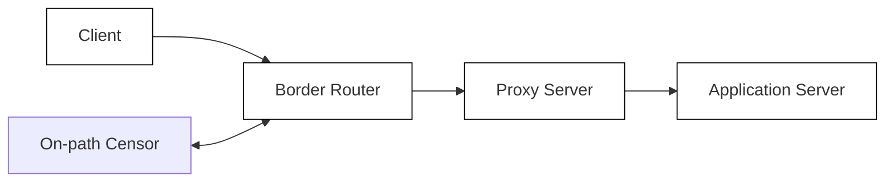
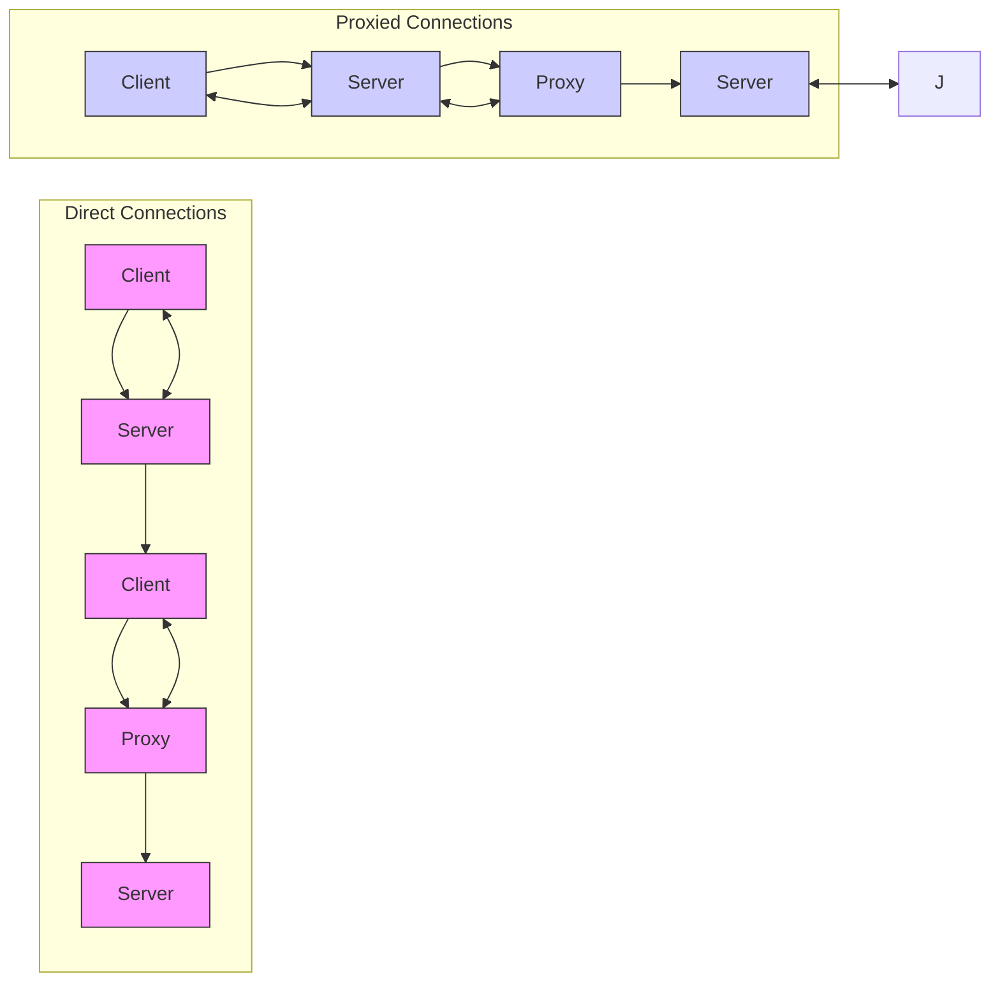
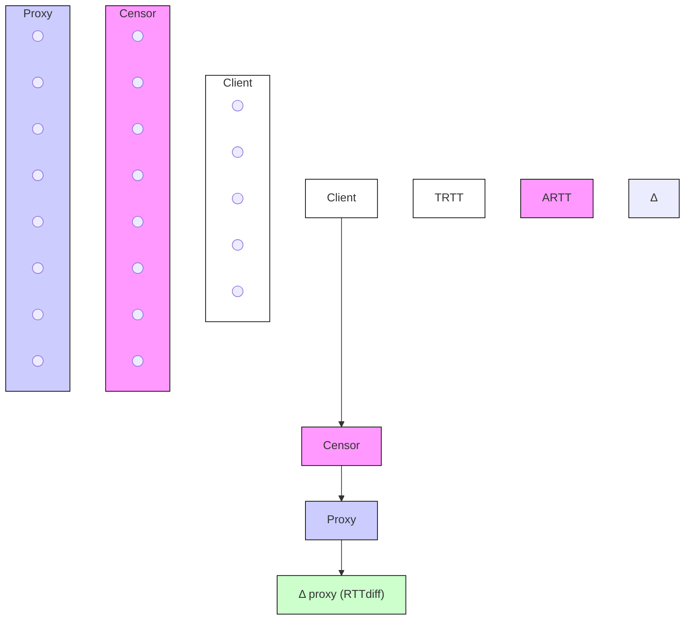

# The Discriminative Power of Cross-layer RTTs in Fingerprinting Proxy Traffic

Diwen Xue Robert Stanley Piyush Kumar Roya Ensafi University of Michigan

{diwenx, rsta, piyushks, ensafi}@umich.edu

Abstract—The escalating global trend of Internet censorship has necessitated an increased adoption of proxy tools, especially obfuscated circumvention proxies. These proxies serve a fundamental need for access and connectivity among millions in heavily censored regions. However, as the use of proxies expands, so do censors’ dedicated efforts to detect and disrupt such circumvention traffic to enforce their information control policies.

In this paper, we bring out the presence of an inherent fingerprint for detecting obfuscated proxy traffic. The fingerprint is created by the misalignment of transport- and application-layer sessions in proxy routing, which is reflected in the discrepancy in Round Trip Times (RTTs) across network layers. Importantly, being protocol-agnostic, the fingerprint enables an adversary to effectively target multiple proxy protocols simultaneously. We conduct an extensive evaluation using both controlled testbeds and real-world traffic, collected from a partner ISP, to assess the fingerprint’s potential for exploitation by censors. In addition to being of interest on its own, our timing-based fingerprinting vulnerability highlights the deficiencies in existing obfuscation approaches. We hope our study brings the attention of the circumvention community to packet timing as an area of concern and leads to the development of more sustainable countermeasures.

# I. INTRODUCTION

On May 30, 2024, Myanmar imposed a blocking on user traffic to VPN and proxy servers, affecting citizens who had relied on these services to circumvent censorship put in place after the military coup [28]. On April 25, 2024, Russia launched a new method to fingerprint and block proxy-enabled circumvention traffic, reinforcing the government’s hold on information flow and further isolating its citizens from the global Internet [49]. In November 2021, China deployed its latest fingerprinting attack against traffic of fully encrypted proxies, showcasing both its advancement in censorship capabilities and its persistent commitment to suppress circumvention efforts [74].

These are not isolated events. They are part of a global trend where escalating Internet censorship motivates a growing reliance on circumvention tools, leading to an ongoing arms race [65]: on one side, developers and users of circumvention tools aim to bypass restrictions on information; on the other, censors deploy increasingly sophisticated fingerprinting attacks to detect and block circumvention traffic. Censors used deep packet inspection (DPI) to detect circumvention traffic, driving developers to obfuscate it to resemble popular protocols like TLS [48], [81]. As censors blocked circumvention traffic based on their distinctive ciphersuites, developers adopted ciphersuites from mainstream browsers [19], [25]. When censors deployed active probing to identify circumvention servers, developers in response implemented probe-resistant protections [14], [24]. The incidents in Myanmar, Russia, and China mark the latest developments in this circumvention arms race.

Obfuscated proxies remain one of the most popular methods for circumventing censorship, providing flexible, generalpurpose access to information with good usability for average users. Similar to standard proxies, an obfuscated proxy setup involves a user in a censored region connecting to a proxy outside that jurisdiction in order to access an application server that is otherwise blocked. The proxy, upon receiving payloads from the user, establishes a new connection with the application server and forwards the traffic as received. Obfuscated proxies differ from standard proxies by including an extra obfuscation layer to avoid being detected by censors. Over the past decade, the circumvention community has developed various obfuscation schemes, such as by mimicking allowed protocols [13], [45], [68] or by randomizing proxy’s payloads so they cannot be statically identified [4], [62], [66].

The main focus of this paper is to bring out the presence of a fingerprint for detecting traffic from obfuscated proxies and to empirically evaluate its potential for practical fingerprinting attacks by nation-state censors. At a high level, the fingerprint is created by the inherent misalignment of sessions across OSI layers that results from the use of a proxy. Transport-layer sessions break into two parts at the proxy – client to proxy, and proxy to server – while the application-layer maintains an end-to-end session that extends directly from client to server. This architecture enables the proxy to relay communication between client and server while also preserving end-to-end features of higher layers like TLS. However, because transportand application-layer sessions terminate at different endpoints, their round-trip times (RTTs) may show significant discrepancies, as the paths they traverse span different distances. Throughout this paper, we focus on this discrepancy in crosslayer RTTs, $\bar { { R T T } _ { d i f f } }$ , and demonstrate the distinguishing power it holds in fingerprinting proxy traffic.

We emphasize that this fingerprint represents more than just another potential way to detect proxy traffic. Up until now, the vast majority of fingerprinting attacks against obfuscated proxies, whether deployed by censors or envisioned by researchers, focused on specific protocols – censors exploit the obfuscation flaws of individual protocols, while developers patch these issues and introduce new protocols in an attempt to outpace a resource-limited censor. Both sides find themselves locked in this ongoing arms race, where each side must constantly balance between efficacy and expenditure [65]. The fingerprinting vulnerability discussed in this paper, however, belongs to a class of fingerprints that are inherent to all proxy protocols. Not only does this protocol-agnostic approach complement existing protocol-specific attacks; it also enables censors to efficiently target multiple protocols at once with little manual effort. Such a development could shift the balance in the ongoing circumvention arms race.

Assuming the role of a censor, we empirically evaluate the practicality of exploiting the $R T T _ { d i f f }$ fingerprint with only passive monitoring capabilities. We detail our construction of the exploit: first, from features visible to an on-path censor, we estimate the RTTs at the transport and application layers through cross-correlation and derive their discrepancy. Next, we frame a sequential hypothesis testing (SHT) problem to determine whether the observed discrepancy in delays suggest a direct or proxied connection. Using eight geographic locations, we conducted extensive evaluation of the exploit using a mixture of controlled proxy traffic and real user traffic collected from an Internet provider, to assess the sensitivity and specificity of $R T T _ { d i f f }$ as a standalone fingerprint.

We found that the efficacy of the exploit is largely independent of the client’s location or the censor’s position relative to the client; nor is it affected by the specific proxy protocol tested, whether obfuscated or otherwise. For a client visiting the top 5K domains via an obfuscated proxy, we found that about 80% of the domains visited would generate at least one traffic flow characterized by the RTT discrepancy detectable by our fingerprint, with half of these detections made within the first 60 packets of a flow, all while maintaining a False Positive Rate (FPR) on par with those of deployed attacks. While we demonstrate the general feasibility of this fingerprint, we also discuss practical factors – such as the handling of DNS resolution, the presence of CDNs, and the potential for categorical collateral damage – that would affect the fingerprint’s efficacy and compel a potential adversary to weigh the costs and implications of deployment.

Our evaluation on this timing-based fingerprint highlights the deficiencies in existing obfuscation schemes. Over the years, researchers have long recognized that distributions of packet sizes hold significant classification power for detecting circumvention traffic [41], [68], and censors have indeed exploited packet sizes in practice [49], [74]. As such, many obfuscated proxy protocols have incorporated (random) padding schemes directly into their designs [66], [75]. While padding provides a straightforward defense to obfuscate patterns over packet sizes, it leave packet timings unprotected, a source of information often overlooked by designers of obfuscation schemes. What this paper showcases, however, is one example of what a censor can accomplish in fingerprinting proxy traffic using only features derived from packet timings.

While we demonstrate several potential short-term mitigations, such as configuring TCP delayed ACK on the proxy server or enabling connection multiplexing, we caution that these strategies result in atypical behaviors that might themselves be fingerprintable. In particular, we showcase how existing delay-based timing obfuscation schemes, such as obfs4/scramblesuit, are fundamentally limited in their ability to mitigate the proposed fingerprint and, paradoxically, may even worsen the issue. Additionally, while our focus is on transportlayer obfuscated proxies, we also explore how the underlying principles of our timing-based fingerprint extend to networklayer VPNs. We hope this study highlights packet timing as an area that warrants further attention from the circumvention community and leads to the development of more principled, sustainable countermeasures.

# II. BACKGROUND

# A. Internet Censorship

News reports, personal anecdotes, and measurement studies collectively suggest an increasing trend in nation-state Internet censorship on a global scale, as governments exert control over the flow of information deemed undesirable within and across their borders [38], [43], [56], [59]. For over two decades, researchers and Internet freedom activists have studied government censorship policies and their enforcement through technical means. Building upon seminal works from the early 2000s [10], [52], [84], censorship research has advanced our understanding of how nation-state firewalls interfere with users’ traffic [31], [32], [55], their technical capabilities [6], [42], [70], and their architecture and geographical distribution [15], [78], [80]. This body of research not only exposes the otherwise covert practice of censorship but also assists in developing a realistic threat model. In general, censorship involves a two-step process: Detect and Disrupt. The first phase classifies traffic as either allowed or prohibited using a range of techniques from simple keyword matching to more sophisticated traffic analysis. Traffic considered undesirable is then actively interfered with by dropping packets or RST-ing connections [65], [67]. Note that while Disrupt often requires active engagement, Detect can operate passively, remaining completely invisible to the communicating parties. Our investigation into proxy fingerprinting falls under the detection step.

# B. Circumvention Arms Race

As censorship measures intensify, users in affected regions increasingly seek methods to circumvent these restrictions. The most common and flexible circumvention mechanisms follow a channel-based approach – users establish channels to forwarders located outside the censor’s jurisdiction, which in turn forward their traffic to its final destinations [65]. This setup commonly involves proxying protocols (both networklayer and transport-layer). However, standard proxying protocols such as OpenVPN and SOCKS feature plaintext headers that can be easily detected and blocked, which necessitates the use of obfuscation techniques, or more specifically, the indistinguishability provided by such obfuscation, across all channel-based systems.

This has led to an ongoing arms race between developers of obfuscated proxies, who obfuscate the traffic of their protocols to evade detection, and censors, who aim to see through such obfuscation. The dynamics of this conflict are best illustrated by the interactions between the Great Firewall of China (GFW) and various circumvention tools: The GFW was able to detect and block Tor traffic using manually-crafted signatures that exploited the unique ciphersuites of Tor’s custom TLS implementation [19]. In response, developers introduced dedicated obfuscators mimicking TLS implementations from mainstream browsers [25], [58]. The GFW blocked servers hosting Tor, VPN, and other circumvention services by sending specially crafted probes to suspected endpoints and checking if the responses matched the expected protocol behaviors [3], [14], [72]. Circumvention developers countered by deploying “probe-resistant” proxies that remain silent until the client authenticates itself [24]. The GFW fingerprinted traffic from fully encrypted proxies based on their atypically high entropy [74], and developers in response changed the byte patterns of their traffic to show lower entropy [27], [51]. This back-andforth characterizes the current state of the circumvention arms race, where each side continually adjusts their approaches in reaction to the advancements in fingerprinting and obfuscation.


<details>
<summary>flowchart</summary>


</details>

Fig. 1: Threat model: A censor positioned on-path relative to the client and proxy, receiving a copy of traffic. Figure inspired by [16].

The specific fingerprint evaluated in this paper represents a potential furthering of this arms-race: unlike aforementioned attacks that targeted specific circumvention protocols by exploiting vulnerabilities in their obfuscation designs, this timing-based fingerprint stems from an inherent characteristic shared by all proxying and tunneling protocols – the misalignment between layers. This protocol-agnostic approach could overcome the trade-off between efficacy and cost in the circumvention arms-race by enabling censors to target multiple protocols at once. The work most closely related to ours is by Xue et al., which proposed fingerprinting the protocol encapsulations using packet size and direction [79].

# C. Timing-based Fingerprinting Attacks

In previous traffic fingerprinting attacks, particularly those on website fingerprinting, the focus has traditionally been on features derived from packet sizes rather than those based on packet timings. Several early work discussed that timing features, specifically packet inter-arrival times, are unreliable due to their dependency on network conditions like jitters [5], [40], [82]. Jaber et al., however, demonstrated that the distribution of packet timings holds discriminative power for classifying network traffic [35]. Feghhi et al. proposed a website fingerprinting attack that leverages only timing information, bypassing defenses based on packet padding [16]. More recently, Rahman et al. studied the utility of packet timing and found that timing indeed provides meaningful classification power [54].

There is limited prior work on detecting proxy traffic with timing features. Webb et al. proposed an approach for detecting proxy usage at the server side by measuring the RTT for each known IP and identifying anomalies in their distributions, requiring separate training for each IP address [71]. Ramesh et al. developed a proxy detection method using RTTs, but their approach requires access to an endpoint of a connection (e.g., at the server) and active measurements [57]. In contrast, the fingerprinting vulnerability evaluated in this paper requires only passive monitoring capability with no server-side deployment and, in principle, can be exploited at any network location between the client and proxy server.


<details>
<summary>flowchart</summary>


</details>

Fig. 2: Protocol layerings in Direct vs. Proxied Connections. In proxied connections, transport sessions terminate at the proxy, whereas the application layer connection remains end-to-end. ⋄

# III. THREAT MODEL AND SCOPE

Previous measurement studies have shown that nation-state censors possess the capability for both passive monitoring and active interference [14], [65], with some demonstrating even more intrusive behaviors such as injecting malicious traffic or intercepting end-to-end encryption [42], [63]. For the purpose of this study, we adopt a conservatively weak but practical adversary model as defined in previous work [65]. We assume that the censor is limited to passive monitoring capabilities, examining but not injecting, removing, or otherwise altering the traffic. The censor is positioned on-path relative to the client and the proxy (e.g., deployed at chokepoints or border ASes), as shown in Figure 1. We also assume the censor to be stateful, allowing it to accumulate information about each connection it observes. However, computational constraints limit the censor’s real-time, per-flow analysis to basic statistical methods; more complex methods like deep learning have not yet been observed in real-world deployments. Finally, for our discussion, the censor makes use only of features derived from packet timestamps and sizes, ignoring other potentially identifiable information such as IP addresses, ports, or payloads.

While powerful, real-world censors operate within certain constraints, chief among them being the cost – whether as economic losses or civil discontent – caused by accidentally blocking traffic that should have been allowed (i.e., false positives). The cost of false positives, known as “collateral damage”, is the only reason preventing censors from simply shutting down the entire Internet and trivially blocking all circumvention traffic with perfect recall [20]. Evaluating the practicality of a potential fingerprint, therefore, involves assessing both the reliability of the fingerprint as an indicator of circumvention traffic, as well as the rarity of finding the same fingerprint in legitimate traffic.

# A. Scope

The focus of this work is transport-layer obfuscated proxies, such as shadowsocks, Trojan, VMess, etc. These proxy protocols function similarly to traditional SOCKS proxies by forwarding traffic between clients and servers without modification (preserving application-layer end-to-end features), but incorporate additional encryption and obfuscation to evade detection.

```mermaid
graph TD
    subgraph Client
        A["TRTT (C-W)"]
        B["TRTT (C-W)"]
        C["TRTT (C-W)"]
        D["TRTT (C-W)"]
        E["TRTT (C-W)"]
        F["TRTT (C-W)"]
        G["TRTT (C-W)"]
        H["TRTT (C-W)"]
        I["TRTT (C-W)"]
        J["TRTT (C-W)"]
        K["TRTT (C-W)"]
        L["TRTT (C-W)"]
        M["TRTT (C-W)"]
        N["TRTT (C-W)"]
        O["TRTT (C-W)"]
        P["TRTT (C-W)"]
        Q["TRTT (C-W)"]
        R["TRTT (C-W)"]
        S["TRTT (C-W)"]
        T["TRTT (C-W)"]
        U["TRTT (C-W)"]
        V["TRTT (C-W)"]
        W["TRTT (C-W)"]
        X["TRTT (C-W)"]
        Y["TRTT (C-W)"]
        Z["TRTT (C-W)"]
        AA["TRTT (C-W)"]
        AB["TRTT (C-W)"]
        AC["TRTT (C-W)"]
        AD["TRTT (C-W)"]
        AE["TRTT (C-W)"]
        AF["TRTT (C-W)"]
        AG["TRTT (C-W)"]
        AH["TRTT (C-W)"]
        AI["TRTT (C-W)"]
        AJ["TRTT (C-W)"]
        AK["TRTT (C-W)"]
        AL["TRTT (C-W)"]
        AM["TRTT (C-W)"]
        AN["TRTT (C-W)"]
        AO["TRTT (C-W)"]
        AP["TRTT (C-W)"]
        AQ["TRTT (C-W)"]
        AR["TRTT (C-W)"]
        AS["TRTT (C-W)"]
        AT["TRTT (C-W)"]
        AU["TRTT (C-W)"]
        AV["TRTT (C-W)"]
        AW["TRTT (C-W)"]
        AX["TRTT (C-W)"]
        AY["TRANSLAT"]
    end

    subgraph Web Server
        B -->|SYN| A
        B -->|SYN-ACK| B
        B -->|ACK; Clienthello| B
        B -->|ACK; Serverhello| B
        B -->|Finished| B
    end

    subgraph Proxy
        C -->|SYN| D
        C -->|SYN-ACK| E
        C -->|ACK; Clienthello| E
        C -->|Serverhello| E
        C -->|Finished| E
    end

    subgraph DNS Server
        D -->|SYN| F
        D -->|SYN-ACK| G
        D -->|ACK; Clienthello| G
        D -->|Serverhello| G
        D -->|Finished| G
    end

    subgraph Direct Connection
        H --> I
    end

    subgraph on-path adversary
        J --> J1["TRTT: transport-layer RTT"]
    end

    subgraph TLS Encryption
        K --> K1["ARTT: Application-layer RTT"]
    end

    subgraph Proxied Connection
        L --> L1["ARTT (C-P)"]
    end

    A -->|SYN| C
    B -->|SYN-ACK| C
    C -->|ACK; Clienthello| C
    C -->|Serverhello| C
    C -->|Finished| C
    D -->|SYN| E
    E -->|SYN-ACK| F
    F -->|ACK; Clienthello| F
    F -->|Serverhello| F
    G -->|SYN| H
    H -->|SYN-ACK| I
    I -->|ACK; Clienthello| I
    I -->|Serverhello| I
    J -->|SYN| J1
    J -->|SYN-ACK| J1
    J -->|ACK; Clienthello| J1
    J -->|Serverhello| J2
    K -->|SYN| K1
    K -->|SYN-ACK| K1
    K -->|ACK; Clienthello| K1
    K -->|Serverhello| K2
    L -->|SYN| L1
    L -->|SYN-ACK| L1
    L -->|ACK; Clienthello| L1
    L -->|Serverhello| L2
    M -->|SYN| M1
    M -->|SYN-ACK| M1
    M -->|ACK; Clienthello| M1
    M -->|Serverhello| M2
    N -->|SYN| N1
    N -->|SYN-ACK| N1
    N -->|ACK; Clienthello| N1
    N -->|Serverhello| N2
    O -->|SYN| O1
    O -->|SYN-ACK| O1
    O -->|ACK; Clienthello| O1
    O -->|Serverhello| O2
    P -->|SYN| P1
    P -->|SYN-ACK| P1
    P -->|ACK; Clienthello| P1
    P -->|Serverhello| P2
    Q -->|SYN| Q1
    Q -->|SYN-ACK| Q1
    Q -->|ACK; Clienthello| Q1
    Q -->|Serverhello| Q2
    R -->|SYN| R1
    R -->|SYN-ACK| R1
    R -->|ACK; Clienthello| R1
    R -->|Serverhello| R2
    S -->|SYN| S1
    S -->|SYN-ACK| S1
    S -->|ACK; Clienthello| S1
    S -->|Serverhello| S2
    T -->|SYN| T1
    T -->|SYN-ACK| T1
    T -->|ACK; Clienthello| T1
    T -->|Serverhello| T2
    U -->|SYN| U1
    U -->|SYN-ACK| U1
    U -->|ACK; Clienthello| U1
    U -->|Serverhello| U2
```


<details>
<summary>flowchart</summary>


</details>

Fig. 3: Sequence timing diagram for (a) direct HTTPS session vs. (b) TLS-based proxy (vless-over-tls) session. For the proxied connection, we observe a much higher discrepancy in transport vs. application-layer delay as the sessions at two layers terminate at different endpoints (proxy and the web server, respectively). ⋄

We do not consider TLS-terminating proxies in this work (i.e., MITM proxy). Although there has been some discussion about their use for censorship circumvention, they have not been adopted by mainstream circumvention tools due to the security risks they pose by breaking the PKI model [8], [18], [50]. Additionally, while our focus is on transport-layer proxies, we recognize that the underlying principles of our timingbased exploit may have implications for network-layer VPNs as well, and we explore this potential extension in § VII-B.

# IV. CROSS-LAYER RTT DIFFERENCE

We begin by describing the different connection segments and their corresponding RTTs for a proxy connection and the intuition of how these differences can be exploited as a fingerprint. At a high level, the idea is that using a proxy inevitably affects the layering of the OSI model, leading to a situation where the sessions at the transport layer and the application layer terminate at different endpoints. Especially when the application layer session extends significantly beyond the transport layer – i.e., when there is a substantial geographical distance – we demonstrate that the difference in RTT becomes noticeable and can then be exploited by an on-path adversary to infer the presence of the proxy. Table IV in Appendix compiles a list of all symbols we use throughout this paper.

# A. Proxy Architecture and Round-Trip-Time

A typical proxied connection involves three parties: a client who wants to access a service that is blocked (due to censorship, geoblocking, etc.); an application server offering the desired service; and a proxy that relays (and optionally obfuscates/encrypts) the client’s traffic to the application server.

Figure 2 describes the layering of protocol stacks for direct and proxied connections. In direct connections, sessions at the network (e.g., IP), transport (e.g., TCP), and application (e.g., HTTPS) layers often have a one-to-one correspondence: a higher-layer session is fully encapsulated within the one below, and their notions of endpoints (client and server) are aligned across layers, spanning the same distance. Proxied connections, however, introduce segmentation at one or more layers of the stack. For single-hop proxies, sessions at the transport layers could be split into two segments: client-to-proxy and proxy-to-server, while the application layer remains end-toend (client-to-server). Such architecture enables the proxy to forward communication between the client and server, while preserving end-to-end features of higher layers, like TLS.

The way that proxies change the layering of protocol stacks also affects the Round-Trip-Times (RTTs) observed across different layers. In direct connections, the RTTs at the application and transport layers are aligned, since they share the same endpoints and path distances. For proxied connections, however, sessions at lower layers terminate at the proxy. An observer located between the client and the proxy would perceive shorter transport-layer RTTs that only account for the distance to the proxy. The proxy’s acknowledgement of data receipt appears to complete the round trip from the observer’s standpoint. In contrast, the end-to-end applicationlayer RTT additionally encompasses the time the proxy takes to forward the request/response to/from the server. This additional segment results in noticeable differences in cross-layer RTTs, which can be consistently observed when there is sufficient distance between the proxy and the application-layer server. This discrepancy forms the basis of the timing-based fingerprint that we discuss in this paper.

# B. Example: HTTPS vs. VLESS-TLS

Figure 3 compares the difference in cross-layer RTTs between a direct HTTPS session and a proxied HTTPS session using a transport-layer TLS-based proxy, e.g., vless, trojan [64], [66], etc. In both scenarios, a client attempts to visit the same web server while an on-path adversary monitors traffic close to the client. Note that after the initial handshake (with either the web server or proxy), the adversary only sees TCP control packets (e.g., ACKs) and the encrypted streams.

Following the initial handshake, in the direct scenario, the client sends a request to the server. The server acknowledges the reception of the request, which returns to the client exactly one transport-layer RTT after the request was sent. Depending on the type of request and load, the server might take some time to process the request and prepare a response, resulting in a typically small difference $( \Delta _ { d i r e c t } )$ between the transportlayer RTT (TRTT) and application-layer RTT (ARTT). On the other hand, in the proxied case, the first packet after the proxy handshake (in this case, TLS) typically contains both the SOCKS address (indicating where to forward the traffic, e.g., blocked.com) and the first data packet (e.g., a clienthello for blocked.com) 1. Upon receiving this packet, the proxy initiates a 3-way TCP handshake with the application server, taking one TRTT between the proxy and the application server $( T R \bar { T } T _ { P W } )$ . The proxy then forwards the clienthello, receives the serverhello, and returns it to the client after another T RT TPW . Subsequent requests/responses follow the same pattern. If the client opts to resolve hostnames via the proxy, an extra initial round trip to the proxy’s DNS server is required.


<details>
<summary>flowchart</summary>


</details>

Fig. 4: $R T T _ { d i f f }$ for varying server locations and varying censor position between the client and proxy. $R T T _ { d i f f }$ (the red line) depends only on the relative distance between proxy and application server and is independent of the client’s or censor’s location. ⋄

Comparing the cross-layer RTTs in the two scenarios reveals that for direct connections, the difference (ARTT-TRTT) is just the server processing delay $\Delta _ { d i r e c t }$ . However, for proxied connections, the first cross-layer difference $\Delta _ { p r o x y ^ { \prime } }$ includes a DNSRTT and two $T R T T _ { P W }$ (additional path delay), while subsequent $\Delta _ { p r o x y }$ contains one $T R T \bar { T _ { P W } }$ and additionally the server processing delay $\Delta _ { d i r e c t }$ on top of that. The task of fingerprinting proxy traffic is thus reduced to determining whether an observed cross-layer RTT difference ARTT-TRTT is an instance of $\Delta _ { d i r e c t }$ or $\Delta _ { p r o x y } .$ .

# C. Efficacy and Assumptions

We note that this timing-based fingerprint does not depend on the client’s location or the distance between the client and the proxy. As long as the adversary is positioned between the client and the proxy, RTT measurements can simply be redefined from client-server to adversary-server. Thus, the client’s relative location to the adversary or its distance to the proxy becomes irrelevant, as illustrated in Figure 4.

What matters, however, is the proxy’s position relative to the application server: the proxy must not be geographically co-located or near the server to ensure that the transmission delay introduced by the distance between them is not negligible, an assumption that may not always hold due to the prevalence of CDNs. Moreover, exploiting the fingerprint relies on the adversary’s ability to distinguish $\Delta _ { p r o x y }$ from $\Delta _ { d i r e c t }$ by consistently observing the effect of $T R \bar { T } T _ { P W }$ on the crosslayer RTT difference. In other words, the delay introduced by transmission $( T R T T _ { P W } )$ must be more pronounced than the variance introduced by the processing time at the server $( \Delta _ { d i r e c t } )$ . We also assume that the proxy does not intentionally delay the transmission of TCP acknowledgments. Finally, and perhaps most importantly, the exploit depends on the adversary’s ability to observe the cross-layer RTT differences. While transport-layer RTT is straightforward to measure, determining application-layer RTT is more challenging due to encryption.

In the following sections, we will examine each of these assumptions to evaluate the fingerprint’s potential for exploitation and assess the susceptibility of proxy traffic to the exploit.


<details>
<summary>line</summary>

| Time (ms) | Incoming | Outgoing | Shifted (+max(correlation) ms) |
|-----------|----------|----------|-------------------------------|
| 0         | 0        | 0        | 0                             |
| 50        | req1     | req2     | +50                           |
| 100       | resp1    | resp2    | +50                           |
| 150       | 0        | 0        | +50                           |
| 200       | 0        | 0        | +50                           |
</details>

Fig. 5: Cross-correlation for application-layer RTT Estimation. (a) Bi-directional packet flow, packets ordered by SEQ/ACK; (b) Cross-correlating outgoing against a weighted distribution centered around incoming packets; (c) Correlation scores at different shifts. Shift corresponding the highest correlation is the estimated ART T .

# V. CONSTRUCTING A CROSS-LAYER RTT EXPLOIT

This section outlines a practical instantiation of a possible fingerprinting attack based on the previously laid conceptual groundwork. At its core, the exploit leverages RTT discrepancies to identify mismatches in session alignments across network layers, which are indicative of proxy use. However, adversaries aiming to apply the cross-layer RTT fingerprint in the real world need to consider factors such as the limited visibility into encrypted streams and the variances introduced by network jitter or server load. Our approach to implementing this exploit involves two primary phases: 1) From the traffic visible to an on-path adversary, estimating the RTTs at both the transport and application layers and calculating the crosslayer differences; 2) Determining whether the observed RTT differences align more closely with those expected from a direct connection or a proxy setup.

# A. Estimating Cross-layer RTT Differences

The initial step of the exploit involves measuring the crosslayer RTT differences $R T \bar { T } _ { d i f f }$ in a potential proxy connection. This measurement is achieved by subtracting transportlayer RTT from application-layer RTT. To obtain the former, we use SEQ/ACK analysis to identify each ACK-eliciting packet sent by the client and its corresponding ACK. If multiple such packet pairs exist within an observation window, we use the median as the transport-layer RTT for that interval.

However, estimating application-layer RTTs poses significant challenges, especially for our threat model where an onpath network adversary performs passive monitoring and does not have visibility into the encrypted streams. The problem lies in the fact that the logical sequence of operations at the application layer does not directly map to the observable sequence of packet exchanges at the transport layer.

Consider the example of a client interacting with a web service through an encrypted proxy. HTTP pipelining allows multiple transactions to reuse the same connection, and the client may send several requests back-to-back without waiting for each response. Figure 5 (a) shows a TCP flow of incoming and outgoing data-carrying packets observed by an on-path censor located between the client and the proxy. While the transportlayer sequence and acknowledgement might suggest an ordering of [req1, req2, resp1, resp2], the actual application-layer logical dependencies are [req1, resp1], [req2, resp2]. Without visibility into the encrypted streams, the adversary cannot easily determine the true application-layer dependencies. Attempting to estimate ART T as $T ( r e s p 1 ) \bar { - } T ( \bar { r e q 2 } )$ would be incorrect, as resp1 and req2 are not a pair at the application layer.

Previous work on traffic analysis based on RTTs often relies on having access to one end of the application-layer connection. For example, Ramesh et al. estimates the applicationlayer RTT by actively sending WebSocket PINGs from the server side [57]. Such approaches benefit from directly observing and interacting with application-layer transactions. However, such techniques are not applicable in our threat model, where we assume the adversary is on-path, not on either endpoint, and limited to passive monitoring only.

Approach: Cross-correlation for RTT Estimation We propose a cross-correlation-based approach to estimate the application-layer RTT in the presence of encryption. This approach is based on the assumption that a temporal relationship exists between the request and response traffic patterns. In typical client-server communication, a client sends a request to the server, and the client receives a corresponding server response, with the delay between these actions reflecting the RTT at the application layer. Cross-correlation is a statistical technique that measures the similarity between two time series as a function of relative displacement or delay. By measuring the similarity between sequences of incoming and outgoing packets as a function of delays, cross-correlation could identify the delay interval at which the similarity is maximized, indicating the most probable RTT.

Specifically, to apply cross-correlation for RTT estimation, we first (1) extract the timing information of TCP data-carrying packets in both directions. Next, (2) we initiate a moving window of size W , where W represents the number of potential request-response pairs. A potential request-response pair is defined as one or more consecutive outgoing packets followed by one or more consecutive incoming packet. For example, in a packet sequence of $[ o u t , i n , i n , o u t ]$ , there is only one potential request-response pair, while in a sequence of [out, in, out, in], there are two such pairs. This window slides through the packet sequence, ensuring it always contains W pairs, although the total number of packets within each window can vary. This step is needed as cross-correlation requires multiple instances to accurately determine the most likely delay. Next, (3) we categorize packets by direction, creating separate time series for outgoing and incoming packets, as illustrated in Figure 5 (b). We then apply a shift/delay of S milliseconds (where $S \geq 0 )$ t o the outgoing series and compute the cross-correlation function between the shifted outgoing series and the incoming series. We continue this for each incremental delay (+1ms) up to a maximum (e.g., 1000 ms). Finally, (4) we identify the delay at which the correlation is highest, as shown in Figure 5 (c). This peak correlation represents the most common delay between requests and responses within the current window, which is our estimate for application-layer RTT.

Impact of Correlation Window: The choice of window size W in our approach affects the accuracy and reliability of the cross-correlation results. Setting W to 1, the method analyzes just one outgoing-incoming pair at a time, essentially reducing cross-correlation to a simple analysis similar to transport-layer SEQ/ACK. With a larger window size that spans much of or the entirety of a persistent connection, cross-correlation will attempt to find a common delay across all requestresponse pairs within that window. However, the presence of transient network issues or congestion fluctuations can lead to a broad delay distribution within a large window, in which case our approach may not provide an ARTT estimate that is representative across the span of the entire window. In practice, the optimal window size should be adapted and tuned based on the observed network conditions. It should be sufficiently large to cover multiple request-response pairs, allowing crosscorrelation to estimate RTT from common delays. Yet, it should not be so large that it covers significant variations in network conditions within the same window. See § VI-A for evaluation of correlation accuracy across different W values.

Impact of Network Jitter: We note that in the real-world, propagation delay can fluctuate even within a short observation window. To address this, instead of relying on exact matches between outgoing and incoming timestamps, our cross-correlation incorporates a weighted distribution centered around each incoming packet’s timestamp (as shown in Figure 5 (b)), assigning higher weights to packet matches closer in time while allowing for small deviations in delays. Consistent with previous work [33], [46], [47], we model network delays as i.i.d. exponential, which implies that network jitter, defined as the difference of two delays, follows a zero-mean Laplace distribution denoted by $L a p ( 0 , b _ { \delta } )$ . The variance of this distribution should be adapted based on the observed network conditions and expected variability in RTTs. With this, the cross-correlation approach becomes more resilient to slight variations in RTT across a given window.

Constraints: We impose constraints when crosscorrelating packet series, ensuring that outgoing packets are only matched with incoming packets that arrive after them to accurately reflect RTTs. Additionally, we restrict peak selection from cross-correlation results to the range [T RT T, max shift] as the application-layer RTT should be at least as large as the transport-layer RTT. Our method assumes a RESTful request-response pattern, which applies to many protocols like HTTP(S) and FTP but may not hold for all proxy traffic, and relies on consistent RTTs across request-response pairs within a time window.

# B. Distinguishing $\Delta _ { d i r e c t }$ vs. ∆proxy

From the previous discussions, we explained that a key characteristic of proxy traffic is that it typically shows greater discrepancies between RTTs at different layers compared to direct traffic. Having measured transport-layer RTTs and estimated application-layer RTTs, the next step is to determine whether the observed RTT differences $R \bar { T } T _ { d i f f }$ are more likely to be caused solely by the inherent server processing delays $( \sim \Delta _ { d i r e c t } ) .$ , or are dictated instead by the additional path delays $T R T T _ { P W }$ introduced by the distance between the proxy and the application server $( \sim \Delta _ { p r o x y } ) .$ . In this section, we formulate a detection problem that provides the basis for a practical algorithm to detect proxy traffic on-the-fly, while also striving for high precision and coverage.

Framework: Sequential Hypothesis Testing Ultimately, we aim to determine whether the observed $R T T _ { d i f f }$ is primarily caused by the additional transport delays incurred when a proxy forwards data to/from the application server. This scenario can be represented as a statistical detection problem, where the goal is to identify the presence or absence of a specific prior condition (i.e., the spatial separation between the transport and the application endpoints), based on the separation of the distributions under different priors. We adopt the Sequential Hypothesis Testing (SHT) framework, which leverages repeated trials/observations and known outcome probabilities to distinguish between multiple hypotheses. Previous work has used SHT for intrusion detection and censorship detection [37], [53]. SHT aligns well with our problem, where RTT measurements can be streamed continuously into one decision making process.

We begin our construction of SHT by defining an observation to be made when the monitor has observed enough individual packets to form W request-response pairs, where W is the size of the correlation window. We classify the $R T T _ { d i f f } ~ = ~ A R T T ~ - ~ T R T T$ of an observation as either “inflated” or “matched” by comparing the $R T T _ { d i f f }$ to a predefined threshold T . For each flow (as defined by its fourtuple), let $Y _ { i }$ be a random variable for the ith observation of the flow, such that:

$$
Y _ {i} = \left\{ \begin{array}{l l} 0 & \text { if } R T T _ {\text { diff }} <   T (\text { matched }) \\ 1 & \text { if } R T T _ {\text { diff }} \geq T (\text { inflated }) \end{array} \right. \tag {1}
$$

Threshold $T$ is selected as a lower bound of the expected delay introduced by the proxy’s additional network path relative to the application server $( T R T T _ { P W } )$ . For example, if the proxy server is located in New York and the application server in Detroit, the physical distance between these two locations would introduce a minimum RTT of roughly 15 ms. In this case, $R T T _ { d i f f }$ should consistently exceed 15 ms, as the transport delay inherent in proxy routing (i.e., the extra distance the data must travel) cannot be eliminated, and additional delays due to application-layer processing might be added on top of the baseline transport delay.

We consider two hypotheses for our problem: the Null Hypothesis $( H _ { 0 } ) .$ , which suggests that the connection is direct, i.e., $R T T _ { d i f f } \sim \Delta _ { d i r e c t }$ , and the Alternative Hypothesis $( H _ { 1 } )$ , which suggests that the apparent transport-layer server is actually a proxy, i.e., $R T T _ { d i f f } \sim \Delta _ { p r o x y }$ . For now, let’s assume that $\bar { \cdot } R \bar { T } T _ { d i f f }$ observations are independent and identically distributed (i.i.d). Then, to implement SHT, we need to identify the prior conditional probabilities for each hypothesis:

$$
P r [ Y _ {i} = 0 | H _ {0} ] = \theta_ {0} \quad P r [ Y _ {i} = 1 | H _ {0} ] = 1 - \theta_ {0}
$$

$$
P r [ Y _ {i} = 0 | H _ {1} ] = \theta_ {1} \quad P r [ Y _ {i} = 1 | H _ {1} ] = 1 - \theta_ {1} \tag {2}
$$

These probabilities reflect the initial beliefs about the likelihood of each scenario before observing any $R T T _ { d i f f }$ measurements. From § IV, with a reasonably chosen threshold T , we expect that an inflated $R T T _ { d i f f }$ is more likely to occur in a proxied connection than a direct one: $1 - \theta _ { 1 } \stackrel { \cdot } { > } 1 - \theta _ { 0 } .$ . In an ideal scenario, with perfect network conditions and no processing delays, we can expect $\theta _ { 0 }$ to approach 1, as the RTTs are expected to be closely matched across layers. On the other hand, with a perfect choice of threshold $T , \theta _ { 1 }$ would be close to 0, as the additional path delay $( T R T T _ { P W } )$ should consistently result in larger RTT differences. In practice, however, variability in network condition and server load, as well as the uncertainty around the location of the application server (especially those served by CDNs), make it challenging to maintain a static threshold T that is consistently reliable.

From the construction, we define a likelihood ratio test $( \Lambda ( Y ) )$ as each $R T T _ { d i f f }$ observation is made, such that:

$$
\Lambda (Y) = \frac {\operatorname* {P r} [ Y _ {1} , \dots , Y _ {N} \mid H _ {1} ]}{\operatorname* {P r} [ Y _ {1} , \dots , Y _ {N} \mid H _ {0} ]} = \prod_ {n = 1} ^ {N} \frac {\operatorname* {P r} [ Y _ {n} \mid H _ {1} ]}{\operatorname* {P r} [ Y _ {n} \mid H _ {0} ]} \geq \eta \tag {3}
$$

where $Y$ represents the set of available $R T T _ { d i f f }$ observations at any point. Upon receiving each new observation, the algorithm updates the cumulative metric $\Lambda ( Y )$ based on the probability priors and compares the current probability ratio with an upper threshold $\eta ,$ where $\eta$ is a scalar value that quantifies how much more likely the observations are under $H _ { 1 }$ compared to $H _ { 0 } .$ . The product form of (3) is derived from our earlier assumption that the $R T T _ { d i f f }$ observations are independent (they are, in fact, not independent, and we need to account for their dependence, which we expand in Appendix C). If $\Lambda ( Y ) \geq \eta ,$ , we accept $H _ { 1 } , \mathrm { i . e . }$ , presence of a proxy. An optional lower bound could be implemented to conclusively accept $H _ { 0 }$ . But here we follow a conservative approach where we do not explicitly separate $H _ { 0 }$ and Undetermined.

Estimating Priors: A critical step of our SHT construction is to empirically measure the probability priors for the two hypotheses regarding direct and proxy connections. However, directly measuring the priors, particularly for the proxy class $H _ { 1 }$ , is exceedingly challenging. The timing of proxy connections can vary significantly based on factors such as proxy configuration and the relative distance between the proxy and the web server, making it infeasible to directly collect measurements representative of every possible proxy scenario.

Instead, we adopt an indirect approach to approximate the priors for the proxy class using measurements from non-proxy connections. Specifically, from three geographically distributed vantage points – Atlanta, Singapore, and Amsterdam – we visit the top 5K websites as ranked by Chrome CrUX [29], [61] while capturing traffic traces and TLS keys. Next, from the decrypted PCAP traces, we identify pairs of applicationlayer request-response interactions, such as Clienthello ↔ Serverhello or HTTP GET and the corresponding 200 OK responses. For each pair, we record three timestamps: $T _ { 0 }$ as the timestamp of the outgoing request; $T _ { 1 }$ as the timestamp of the first packet with an ACK number greater than the sequence number of the request; and $T _ { 2 }$ as the timestamp of the first packet carrying the corresponding response.

$T _ { 1 } - T _ { 0 }$ is the transport delay and $T _ { 2 } - T _ { 0 }$ is the application delay. To estimate the priors for the direct class $( H _ { 0 } )$ , we analyze the distribution of $( T _ { 2 } - T _ { 0 } ) - ( T _ { 1 } - T _ { 0 } )$ , which is the interval between when the server acknowledges the request and when it responds. This directly measures the typical processing delays inherent in direct connections $( \mathrm { i . e . , } \ R T T _ { d i f f }$ for $H _ { 0 } )$ . For the proxy scenario $( H _ { 1 } )$ , we instead consider the distribution of the complete application-layer round-trip time $T _ { 2 } - T _ { 0 }$ . The rationale is that the apparent processing delay at the proxy would resemble the full path latency between the proxy and the application server, plus the processing delay at the server. In other words, $T _ { 2 } - T _ { 0 }$ measured at the proxy server would be equal to $T _ { 2 } - T _ { 1 }$ measured at the proxy client. This approach essentially simulates the distribution of $R T T _ { d i f f }$ for connections routed through proxies located in these three locations.


<details>
<summary>line</summary>

| Time (ms) | ATL   | AMS   | SIN   | T1-T0 | T2-T0 (H1) | T2-T1 (H0) | ALL   |
|-----------|-------|-------|-------|-------|------------|------------|-------|
| 0         | 0.0   | 0.0   | 0.0   | 0.0   | 0.0        | 0.0        | 0.0   |
| 20        | 0.6   | 0.7   | 0.5   | 0.8   | 0.6        | 0.9        | 0.7   |
| 40        | 0.7   | 0.8   | 0.6   | 0.85  | 0.75       | 0.95       | 0.8   |
| 60        | 0.75  | 0.85  | 0.7   | 0.9   | 0.8        | 0.98       | 0.85  |
| 80        | 0.8   | 0.9   | 0.75  | 0.92  | 0.85       | 0.99       | 0.9   |
| 100       | 0.85  | 0.95  | 0.8   | 0.95  | 0.9        | 1.0        | 0.95  |
</details>

Fig. 6: Distributions of RTT differences for prior estimation. T1-T0 is TRTT, T2-T0 is ARTT and T2-T1 is RTTdiff. Shaded area represents the separation of the distributions under different priors. ⋄

Figure 6 presents the CDFs of the measured prior probabilities, comparing $T _ { 2 } - T _ { 1 }$ (for $H _ { 0 } )$ against $T _ { 2 } - T _ { 0 } \ ( \mathrm { f o r } \ H _ { 1 } )$ . These distributions match our initial assumptions: the propagation delay introduced by additional transmission paths in proxy scenarios are markedly more pronounced than the variations in processing delays, and an inflated $R T T _ { d i f f }$ is more likely to result from a proxy connection than a direct connection. For example, at ${ \bar { T _ { \mathbf { \theta } } } } = { \bar { 1 } } 5 ,$ we observe $\theta _ { 0 } \approx 0 . 9 5$ and $\theta _ { 1 } \approx 0 . 5 0 .$ . Furthermore, Figure 6 also highlights the distributions of RTT differences across the three vantage points, located in three continents. While there are some variability among their distributions, the overall separation between classes is generally consistent. This consistency suggests that 1) the observation – inflated $R T T _ { d i f f }$ are more commonly associated with proxy connections – holds true across different geographical regions; and that 2) the same estimated priors are likely to be applicable regardless of the specific location of the proxy server.

# C. Implementation

The $R T T _ { d i f f }$ exploit begins when the traffic monitor identifies a new connection flow. The monitor accumulates packets, recording relevant fields such as timestamps, SEQ/ACK, etc., until a sufficient number of packets have been collected to form a correlation window. Every time a correlation window is complete, the monitor performs cross-correlation, as detailed in § V-A, to estimate the $R T T _ { d i f f }$ for that window.

If the flow’s cumulative probability ratio $( \Lambda ( Y ) )$ has been previously initialized, the monitor updates the ratio following the process described in § V-B. If $\Lambda ( Y )$ has not been initialized and the current $R T T _ { d i f f }$ exceeds the threshold $T ,$ the monitor initializes $\Lambda ( Y )$ for the flow. Otherwise, the monitor discards the current window and awaits the next set of observations. This step is designed to accommodate proxy protocols with varying handshake lengths, during which the packet exchange is strictly between the client and the proxy, resulting in $R T T _ { d i f f }$ similar to those of a direct connection. The monitor repeats this step until $\Lambda ( Y )$ is either initialized or at least three request-response pairs have been observed 2. The monitor compares $\Lambda ( \hat { Y } )$ with η after each update to the cumulative ratio, and logs the flow as proxy if the threshold is exceeded. Otherwise, the monitoring continues until the connection terminates (refer Figure 12 in Appendix for the workflow).

We have implemented a PoC exploit using Zeek, an opensource network monitoring and analysis framework [83]. This implementation takes the form of a plugin that accepts a sequence of packet metadata (timestamps, size, SEQ/ACK) and estimates a sequence of $R T T _ { d i f f }$ .

We emphasize that our instantiation of the fingerprinting concept is not meant to be the most optimized or effective form of exploitation possible. Other approaches might exploit the same fingerprint more efficiently. Our intention is to demonstrate the fingerprint’s potential for exploitation and to highlight the necessity for proactive countermeasures.

# VI. EVALUATION

We evaluate the practicality of exploiting RTT discrepancy across layers to detect (obfuscated) proxy traffic. Inspired from prior work on traffic fingerprintability [79], [81], our goal is to conduct evaluation under realistic conditions, mirroring the operational constraints typically faced by censors.

Before evaluating $R T T _ { d i f f }$ as a standalone fingerprint, we start by focusing on individual components of our exploit. In § VI-A and § VI-B, we evaluate the effectiveness of crosscorrelation in estimating the application-layer RTT, as well as exploring how the size of the correlation window W and the threshold T affect the efficacy of the exploit. Next, in § VI-C, we thoroughly evaluate the $R T T _ { d i f f }$ using a combination of controlled proxy traffic and real user traffic collected from an Internet provider. Throughout this evaluation, we aim to understand both the sensitivity of the fingerprint – the extent to which proxy traffic is vulnerable and factors that can impact this vulnerability – and its specificity – the uniqueness of the fingerprint to reliably distinguish proxy from regular traffic.

# A. Evaluating Cross-correlation Method for ARTT Estimation

We evaluate the reliability of our cross-correlation-based method for estimating application-layer RTTs (ARTTs), as the success of subsequent exploit phases depends on these estimations being accurate. As mentioned before, for $W > 1$ , there’s a possibility that request-response may exhibit a broad range of delays even within the same window. For this, we first analyze the inherent variability of ARTTs within the same correlation windows. Using the dataset collected in § V-B, we quantify the ARTT in-window variances across different window sizes W . As shown in Figure 7, the variance of ARTTs within each window tends to increase with larger window sizes, which is expected as more request-response pairs can introduce more variability due to differing network conditions and server response times. For example, the median variance increases from 4.5 for $W = 2$ to 168 for $W = 1 0$ .


<details>
<summary>line</summary>

| Normalized Squared Error | W=2   | W=3   | W=4   | W=5   | W=6   | W=7   | W=8   | W=9   | W=10  |
| ------------------------ | ----- | ----- | ----- | ----- | ----- | ----- | ----- | ----- | ----- |
| 0.0                      | 0.0   | 0.0   | 0.0   | 0.0   | 0.0   | 0.0   | 0.0   | 0.0   | 0.0   |
| 0.5                      | 0.2   | 0.3   | 0.4   | 0.5   | 0.6   | 0.7   | 0.8   | 0.9   | 1.0   |
| 1.0                      | 0.4   | 0.5   | 0.6   | 0.7   | 0.8   | 0.9   | 1.0   | 1.1   | 1.2   |
| 1.5                      | 0.6   | 0.7   | 0.8   | 0.9   | 1.0   | 1.1   | 1.2   | 1.3   | 1.4   |
| 2.0                      | 0.7   | 0.8   | 0.9   | 1.0   | 1.1   | 1.2   | 1.3   | 1.4   | 1.5   |
| 2.5                      | 0.75  | 0.85  | 0.95  | 1.05  | 1.15  | 1.25  | 1.35  | 1.45  | 1.55  |
| 3.0                      | 0.8   | 0.9   | 1.0   | 1.1   | 1.2   | 1.3   | 1.4   | 1.5   | 1.6   |
| 3.5                      | 0.85  | 0.95  | 1.05  | 1.15  | 1.25  | 1.35  | 1.45  | 1.55  | 1.65  |
| 4.0                      | 0.9   | 1.0   | 1.1   | 1.2   | 1.3   | 1.4   | 1.5   | 1.6   | 1.7   |
</details>


<details>
<summary>bar</summary>

| Window Sizes | In-window Variances |
| ------------ | ------------------- |
| 1            | 0                   |
| 2            | 200                 |
| 3            | 400                 |
| 4            | 800                 |
| 5            | 1200                |
| 6            | 1800                |
| 7            | 2200                |
| 8            | 2800                |
| 9            | 3200                |
| 10           | 3600                |
</details>

Fig. 7: Left: Distributions of normalized correlation errors. Right: ARTT variance with different window sizes (median in red).

Accounting for this inherent variance, we use normalized squared errors as a measure to evaluate the accuracy of our ARTT estimation: $\frac { ( e s t i m a t e d _ { - } A R T T - m e d i a n \_ A R T T ) ^ { 2 } } { \mathrm { \Delta \Omega \Omega \Omega } }$ . This V ariance measure compares the difference between the estimated and the median ARTT of a window to the baseline variance of the window. As shown in Figure 7, the distribution of the normalized errors suggests that the majority of our estimations yield relatively low errors. Balancing between need for multiple request-response pairs for effective correlation against the increased variance with larger window sizes, we use $W = 3$ for subsequent evaluations. With $W = 3 ,$ , over 60% of our estimations have a normalized error less than 1, implying that our estimates typically fall within the distribution of actual ARTTs. Additionally, about 80% of estimations have errors less than 2, in which case estimates are within 1.4 standard deviations of actual median ARTT.

# B. Evaluating the Susceptibility of Proxy Traffic and the selection of threshold T

We evaluate the extent to which proxy traffic is susceptible to the exploit and how threshold $T ^ { ' }$ affects this susceptibility. While the concept of cross-layer RTT differences is inherent to all proxy activity, an adversary’s ability to reliably detect such differences depends significantly on the proximity of the proxy to the application server. As such, the selection of $T$ is crucial as it determines what constitutes a “significant” RTT discrepancy indicative of proxy use. As mentioned before, the threshold T should exceed the transport delay between the proxy and the server, which is an unavoidable baseline delay that is reflected in the cross-layer RTT discrepancy.

We measure the distribution of transport-layer delays from three proxy locations while visiting the top 5K domains to assess this susceptibility and to inform the selection of T . The results are shown in Figure 8. The blue curves represent the distribution of transport delays for individual flows between the proxy and the website server (i.e., per-flow exposure). Surprisingly, more than half of these flows exhibit minimal transport delays, which means that the difference in RTT caused by proxy routing would also be minimal. Apart from the fact that our proxies are located in data centers with potentially better connectivity than average hosts, we note that most of these low-delay flows are to CDNs like Cloudflare, Google, and Fastly (refer to Table V in Appendix). The prevalence of CDNs, to some extent, lessens the visibility of additional delays caused by proxy routing. Despite this, the proposed exploit still poses a realistic threat: because a single website visit typically generates dozens of individual flows, a proxy server could still be exposed even if only some of these flows exhibit significant delays. To understand the possibility of observing inflated $R T T _ { d i f f }$ during a user session, we extracted out the flows with maximum transport delays for each website visit. The red curves in the same figure illustrate this distribution, indicating that nearly every visit likely includes at least one flow with a significant $R \dot { T } T _ { d i f f }$ indicative of proxying (i.e., per-website exposure).


<details>
<summary>line</summary>

| Time (ms) | ATL   | ALL   | AMS   | by_flow | SIN   | by_website |
|-----------|-------|-------|-------|---------|-------|------------|
| 0         | 0.0   | 0.0   | 0.0   | 0.0     | 0.0   | 0.0        |
| 20        | 0.7   | 0.7   | 0.3   | 0.8     | 0.7   | 0.3        |
| 40        | 0.75  | 0.75  | 0.35  | 0.85    | 0.75  | 0.4        |
| 60        | 0.8   | 0.8   | 0.4   | 0.9     | 0.8   | 0.45       |
| 80        | 0.8   | 0.8   | 0.4   | 0.9     | 0.8   | 0.45       |
| 100       | 0.8   | 0.8   | 0.4   | 0.9     | 0.8   | 0.45       |
</details>


<details>
<summary>line</summary>

| Packet Counts | T=50  | T=15  |
| ------------- | ----- | ----- |
| 0             | 0.0   | 0.0   |
| 20            | 0.4   | 0.3   |
| 40            | 0.6   | 0.5   |
| 60            | 0.7   | 0.6   |
| 80            | 0.75  | 0.65  |
| 100           | 0.8   | 0.65  |
</details>

Fig. 8: Left: Distribution of transport-layer delay from proxy locations. Blue lines represent the delay of all the flows generated and the red lines represent the delay of selected flows that had the maximum delay for each website visit. Right: Number of packets observed before detection for $T = 1 5 m s$ and $T = 5 0 m s ,$ , fixing FPR=.01. 

<table><tr><td>Protocol</td><td>Type</td><td>Changes Timing</td></tr><tr><td>Plain SOCKS</td><td>Plaintext</td><td>No</td></tr><tr><td>VMess</td><td>Obfuscated (fully encrypted)</td><td>No</td></tr><tr><td>Shadowsocks</td><td>Obfuscated (fully encrypted)</td><td>No</td></tr><tr><td>VLESS over TLS</td><td>Obfuscated (TLS-based)</td><td>No</td></tr><tr><td>Trojan</td><td>Obfuscated (TLS-based)</td><td>No</td></tr><tr><td>VMess over Websocket</td><td>Obfuscated (HTTP)</td><td>No</td></tr><tr><td>Shadowsocks over WS/TLS</td><td>Obfuscated (TLS-based)</td><td>No</td></tr><tr><td>VLESS over WS/TLS</td><td>Obfuscated (TLS-based)</td><td>No</td></tr><tr><td>XTLS-Vision</td><td>Obfuscated (TLS-based)</td><td>No</td></tr><tr><td>SOCKS over obfs4</td><td>Obfuscated (fully encrypted)</td><td>Yes</td></tr></table>

TABLE I: List of proxy protocols tested in evaluation. ⋄

The choice of $T$ also affects the speed of detection. A lower $T$ leads to a smaller ratio of $P r ( T | H _ { 1 } )$ over $P r ( T | H _ { 0 } )$ , thereby requiring more observations to maintain a similar level of specificity (False Positive Rate) as a higher T . Figure 8 shows the number of packets required to achieve the same level of detection confidence (FPR=.01) for $T = 1 5$ and $T =$ 50. We use $T = 1 5$ for the following evaluation. Using the conversion factor of $\textstyle { \frac { 4 } { 9 } } c$ from prior work [39], a 15ms network delay roughly translates to a physical distance of 600 miles, approximately the distance between New York and Detroit, or San Francisco and San Diego. In other words, as long as the proxy and the application server are separated by at least this distance, a threshold of $T = 1 5$ should consistently observe inflated $R T T _ { d i f f }$ caused by proxy routing.

# C. Evaluating $R T T _ { d i f f }$ as a Standalone Fingerprint

We perform an in-depth evaluation of the $R T T _ { d i f f }$ fingerprint using both controlled proxy traffic from our testbed and real user network traffic sourced from an Internet provider.

1) Evaluation Setup: Since subtle differences in traffic timing create the fingerprint, our evaluation aims for diversity among proxy clients, servers, and application servers to cover a wide range of proxy scenarios. We set up five geographically distributed hosts to act as proxy clients. These include locations in Hong Kong, China (HKG) and Chelyabinsk, Russia (CEK), reflecting the typical user base of censorship circumvention tools. Notably, Hong Kong, as a special administrative region, is not subject to the same GFW restrictions as mainland China [55]. Similarly, our Russian site is located in a data center, which is exempted from the typical residential censorship restrictions [80]. We confirmed the absence of filtering behaviors commonly associated with GFW and Russia’s TSPU [6], [32], [55], [80], and as such our proxy flows are not to be affected by any local censorship measures. Nonetheless, we deployed additional clients in nearby Tokyo (TYO) and Stockholm (ARN). We set up the fifth client in Detroit, USA.

The proxy servers routing this traffic were placed in Singapore (SIN), Amsterdam (AMS), and Atlanta (ATL). Like the clients, these servers are single-tenant bare metal machines that are well-provisioned with processing and network resources. This minimizes any impact on packet timings from processing or bandwidth constraints, as each proxy client/server handles only one website visit at a time. Using a script with Selenium, we had each client use each of the proxy servers to visit the top 5K domains as ranked by the CrUX report [29] (either ranked globally or region-specific).

We selected and tested a range of popular proxy protocols in our evaluation. Our selection is informed by discussions in censorship forums [1], [2], targeted attacks by nationstate censors [3], [23], [49], [74], and protocols selected for evaluation by prior work [12], [22], [79]. These include fully encrypted protocols like shadowsocks and VMess, and TLSbased obfuscated proxies like VLESS and Trojan. A complete list of the proxy protocols tested is provided in Table I.

To evaluate the specificity of the $R T T _ { d i f f }$ fingerprint and estimate potential false positives should the fingerprint be deployed, we partnered with a regional Internet provider, Merit Network. Real-user traffic was mirrored from a major Pointof-Presence of the ISP to our monitoring server, with traffic volumes reaching up to 50Gbps. Such volume necessitates sampling, as we perform all feature extraction and analysis directly on Merit Network’s server due to ethics and privacy concerns (see § A for ethical considerations regarding our handling of user traffic). We applied a conservative sampling rate of 1/8, based on connection 4-tuple, to minimize the effect of packet loss and accommodate traffic spikes. On this server, we deployed a Zeek cluster loaded with our plugin. Several sanity checks were performed on each new flow, including verifying a complete TCP handshake and the presence of a PSH flag. The number of flows that passed these checks was used as the baseline (denominator) for calculating the False Positive Rate (FPR). This approach is consistent with prior study [74], such that FPR metrics are directly comparable. Our evaluation on ISP traffic extended over a 10-day period, during which we analyzed over 102 million TCP flows after sanity checks. We applied our exploit to both the controlled proxy traffic and the ISP traffic using the exact same configuration and parameters.

2) Sensitivity: We first note that, aside from obfs4, the results across all tested proxy protocols were highly identical, including most widely-used obfuscated proxies such as shadowsocks or VLESS. The fingerprinting vulnerability is largely protocol-agnostic, as it does not target specific obfuscations but rather exploits an inherent characteristic of proxying. Most proxy protocols, including those with sophisticated obfuscations, do not by design alter packet timings. Even in protocols that incorporate packet-level padding, the padding is appended only to application-layer payloads, without sending dummy packets when there’s no data to send. Obfs4, which was designed to obfuscate packet inter-arrival times, is an exception and is further discussed in § VII-A.

<table><tr><td>Proxy/Client</td><td>DTW</td><td>HKG</td><td>TYO</td><td>CEK</td><td>ARN</td></tr><tr><td colspan="6">Remote DNS Resolution, CrUX Global 5K</td></tr><tr><td>ATL</td><td>.207 / .819</td><td>.233 / .828</td><td>.219 / .784</td><td>.201 / .802</td><td>.215 / .791</td></tr><tr><td>SIN</td><td>.177 / .738</td><td>.172 / .727</td><td>.180 / .743</td><td>.199 / .732</td><td>.201 / .738</td></tr><tr><td>AMS</td><td>.201 / .775</td><td>.181 / .747</td><td>.201 / .759</td><td>.197 / .711</td><td>.172 / .766</td></tr><tr><td colspan="6">Local DNS Resolution, CrUX Global 5K</td></tr><tr><td>ATL</td><td>.372 / .905</td><td>.340 / .876</td><td>.377 / .880</td><td>.443 / .927</td><td>.448 / .907</td></tr><tr><td>SIN</td><td>.455 / .898</td><td>.313 / .842</td><td>.315 / .851</td><td>.438 / .892</td><td>.424 / .880</td></tr><tr><td>AMS</td><td>.435 / .905</td><td>.337 / .839</td><td>.328 / .856</td><td>.293 / .854</td><td>.339 / .877</td></tr><tr><td colspan="6">Remote DNS Resolution, CrUX Regional 5K</td></tr><tr><td>ATL</td><td>- / -</td><td>.186 / .712</td><td>.193 / .765</td><td>.410 / .879</td><td>.364 / .851</td></tr><tr><td>SIN</td><td>- / -</td><td>.147 / .719</td><td>.133 / .748</td><td>.330 / .851</td><td>.313 / .842</td></tr><tr><td>AMS</td><td>- / -</td><td>.176 / .658</td><td>.190 / .722</td><td>.352 / .827</td><td>.221 / .808</td></tr></table>

TABLE II: Evaluation results on proxy traffic. Results are shown for both per-flow detection rate / per-website detection rate. Threshold η selected for FPR = .01

The decision threshold in hypothesis testing, η, balances sensitivity against specificity. Raising η allows us to lower false positives to an arbitrary level, albeit at the cost of missing detections for many proxy flows that do not reach the decision threshold before they terminate. Selecting a threshold comes down to maximizing the detection of proxy traffic while maintaining a tolerable level of blocking legitimate traffic – a censor’s operational constraint. As part of our evaluation, we measured the fingerprint’s sensitivity on controlled proxy traffic while fixing an upper bound FPR at .01 evaluated on ISP traffic. We further discuss false positives in the next section.

Table II shows the results of this case study. Looking at the results for each proxy location in the top section of the table, we note that the detection rates across all client locations are largely consistent. This matches our expectation, as the $R T T _ { d i f f }$ fingerprint is generated by the routing between the proxy and application server, rendering the client’s proximity to the proxy irrelevant. The detection rates at the per-flow level are only moderately effective, with approximately 20% of flows correctly flagged. This can be largely attributed to the connectivity provided by CDNs, which to some extent offsets the additional delays caused by proxy routing. Most of the proxy flows that we fail to detect are requests to static content cached at CDNs or advertising and tracking, typically occurring within 5ms of our proxy locations, as measured in Figure 8. We highlight that our evaluation uses traffic to top domains instead of a random sample of websites to simulate traffic that users are most likely to route through proxies. But since top domains are commonly served by CDNs, our findings likely represent a lower bound of the fingerprint’s sensitivity. Still, even for top domains, the implication from such per-flow exposure becomes even more alarming when aggregated by website visits: at the per-website level, detection rates exceed 70% across all client and proxy locations. This means that the adversary can almost guarantee that the client and server IPs of proxy flows will be flagged after just a few website visits.

<table><tr><td>Category</td><td>Identifier</td><td>Percentage of All Positives (%)</td></tr><tr><td rowspan="5">Rmt Port</td><td>443</td><td>57.88</td></tr><tr><td>993</td><td>33.29</td></tr><tr><td>80</td><td>4.47</td></tr><tr><td>5222</td><td>0.43</td></tr><tr><td>9001</td><td>0.30</td></tr><tr><td rowspan="6">SNI</td><td>apple.imap.mail.*.com</td><td>14.89</td></tr><tr><td>imap.*.com</td><td>5.32</td></tr><tr><td>android.imap.mail.*.com</td><td>2.91</td></tr><tr><td>imap.mail.*.com</td><td>2.90</td></tr><tr><td>*.*health.com</td><td>2.13</td></tr><tr><td>(empty) / Not applicable</td><td>17.47</td></tr></table>

TABLE III: Distribution of Detection Positives by Remote Port and SNI. Note: ‘\*’ in SNIs masks service names, not wildcards.

Our results also highlight the increased susceptibility of proxy traffic to the fingerprinting exploit under certain configurations. Specifically, most obfuscated proxy tools expose a SOCKS interface for local applications, allowing the user to supply either a destination IP (DNS resolved locally) or a domain name (resolving DNS at the proxy). Users who resolve DNS locally are considerably more susceptible to the exploit, with per-flow rates approximately doubling across all client/proxy locations. When DNS is resolved at the proxy, it uses nearby DNS servers to retrieve IPs that are optimally reachable from the proxy. Local DNS resolution, however, may direct the proxy to farther endpoints, particularly back towards the client’s region, thus increasing the distance and consequently the discrepancy in RTTs.

Lastly, we substituted the global site list with regionspecific lists (CrUX-China for clients in Hong Kong and Tokyo, and CrUX-Russia for Russian and European clients). For the Russian list, this has shown to significantly increase the sensitivity of the fingerprint. Regional lists, more tailored to local browsing behaviors, often include sites less likely to be hosted on global networks (e.g., local education, government, finance) [60] and thus may exhibit larger RTT discrepancies. In the following mitigation section, we will discuss implications of our results on proxy configurations, such as using routing rules to ensure local traffic remains local.

3) Specificity: Analysis on collateral damage is crucial in both the design of circumvention protocols and in envisioning potential fingerprinting attacks against them. Given that Merit Network operates in a region with minimal network censorship, we conservatively consider all detections from the ISP traffic as false positives, which we upper-bound at .01 for our evaluation.

We note the false positives are not evenly distributed. Table III groups the top heavy hitters either by remote port or by SNI. Notably, traffic to port 993, commonly used for IMAP/SSL and comprising less than 1% of the total traffic, accounts for nearly a third of all potential false positives. Similarly, results aggregated by SNIs also suggest that IMAP traffic frequently results in what we term categorical false positives, on which we provide further analysis in Appendix F. We note that the assumption underlying our correlation-based ARTT estimation is a RESTful request/response communication pattern, which might not perform well on traffic that deviates from this pattern. Implementing a pre-filter to whitelist IMAP traffic further reduces the FPR by one third.

  
Fig. 9: Per-flow detection and performance of potential mitigations. mux=N combines every N logical streams into one flow.⋄

This level of per-flow FPR (0.6%-0.7%) is lower than that reported in fingerprinting attacks discussed in prior work [68], and is on par with the estimated FPR of attacks deployed by GFW against fully encrypted proxies [74]. Nonetheless, this FPR still implies a non-negligible amount of collateral damage – especially considering the generally low base-rate of circumvention traffic. Yet, the standalone fingerprint $R T T _ { d i f f }$ can be complemented with protocol-specific fingerprinting attacks, and can additionally be applied on a per-host basis by accumulating per-flow $R T T _ { d i f f }$ fingerprints over time for each destination host. Prior work has shown that, even with looser classifiers, host-based analysis can significantly reduce false positives – even to zero – by aggregating multiple flow-level observations [67]. As such, we believe that the evaluated vulnerability presents a realistic threat that necessitates vigilance and proactive countermeasures from the circumvention community.

# VII. DISCUSSION

Previous sections demonstrate the practicality of exploiting cross-layer RTT discrepancies to fingerprint proxy traffic. This poses a significant threat to the availability of proxies, particularly obfuscated ones that are essential for facilitating information access across the world’s most restricted networks.

Exploiting the $R T T _ { d i f f }$ fingerprint requires only passive monitoring and limited stateful connection tracking, simplifying its deployment and making it within the reach of virtually any network operator. Unlike previous attacks targeting specific proxy or obfuscation protocols [24]–[26], [68], this timing-based fingerprint is an inherent characteristic of proxy routing. The protocol-agnostic aspect of the fingerprint broadens its applicability, which in turn heightens the severity of its implications. More, the fact that the exploit makes on-the-fly detections provides censors with more options for intervention. In cases where proxies are hosted on shared IPs (e.g., CDN), detecting proxy mid-flow allows flow-level actions such as resetting or throttling the violating flow, when traditional blanket IP blacklisting could incur a higher cost for censors.

Despite the demonstrated practicality, we advise caution in interpreting our results: our real-world evaluation suggests a low, but non-trivial rate of false positives, including categorical false positives, which would compel any censor to carefully weigh the deployment costs. We posit that a potential adversary is more likely to use the $R T T _ { d i f f }$ fingerprint in combination with existing protocol-specific attacks, which are orthogonal and complementary to our approach, rather than as a standalone method. Also, the nature of the fingerprint – relying on subtle patterns in packet timings – means that its efficacy could be affected by unpredictable network changes along the path. Yet, it would not be a sound strategy to depend solely on the unreliability of the network as a defense against such timing-based fingerprints. The responsibility therefore falls on proxies to implement proactive countermeasures. Below, we discuss a few potential mitigation approaches and, for some, provide a preliminary evaluation on their efficacy.

# A. Potential Mitigation Approaches

Proxy Configuration Our results suggest that the $R T T _ { d i f f }$ fingerprint is independent of the client’s location. Still, certain configurations on the client side can reduce the susceptibility to some extent. For example, domain name resolution should be handled at the proxy to prefer IPs that are optimally reachable from the proxy, reducing the additional delay introduced by proxy routing. Additionally, specific routing rules should be implemented on the client to ensure that local traffic – traffic to services located on the same side of the firewall as the client – remains local and is not routed through the proxy. Instances of categorical false positives are particularly relevant not only to adversaries implementing the attack but also to proxy users who might leverage these false positives to their advantage. For example, proxy users configuring obfuscated proxies with a decoy domain [34], [76] should consider selecting a domain that naturally exhibits inflated or unpredictable $R T T _ { d i f f }$ , such as IMAP services, to increase the uncertainty of the fingerprinting attack.

Obfs4 The evaluated fingerprint is based on timing patterns introduced by proxy routing. Obfs4/scramblesuit [4], [73] is a well-known protocol specifically designed to obfuscate packet lengths and inter-arrival times through pseudo-random padding and delays. Figure 9 illustrates the effect of incorporating obfs4 into a proxy setup compared to the baseline. We find incorporating obfs4 degrades the performance but also increases the traffic’s susceptibility to the fingerprint. This somewhat counter-intuitive outcome can be attributed to obfs4’s method of randomizing inter-arrival timings across packets: it injects delays following the arrival of applicationlayer data at the sending buffer. As such, application-layer transactions always appear to have a larger RTT after obfs4’s obfuscation, widening the discrepancies in cross-layer RTTs.

Delayed ACK The $R T T _ { d i f f }$ fingerprint can be viewed as the result of a proxy server prematurely acknowledging data packets that are, in fact, still being transmitted to the application server, i.e., ACKs are being sent “too early”. One way to reduce the RTT discrepancy is through the TCP Delayed Acknowledgment mechanism [9], which provides a native way to delay the transmission of ACK packets. This feature is typically enabled by default on Linux systems with a delay timer of 40ms, so that ACKs can ideally be sent alongside data-carrying packets to minimize overheads. By adjusting the delay timer to 500ms (the maximum allowed by RFC [7]), we find a significant reduction in the number of detections by over half compared to the baseline, as shown in Figure 9. This method, however, does result in performance trade-offs. Moreover, it is unclear whether having an atypical ACK delay timeout might itself become an exploitable fingerprint.

Multiplexing Traffic analysis attacks will always have a range of uncertainty leading to false positives, and the goal of obfuscation is to further increase this uncertainty [73]. One way to introduce additional entropy into packet timings is through connection multiplexing, which interleaves packets from multiple coexisting logical streams into a single network flow, obfuscating patterns in packet size, timing, and direction. The variability in the number and type of the logical streams (i.e., interactive or bulk transfer) introduces additional unpredictability. Prior work has shown that connection multiplexing could be an effective defense against fingerprinting over packet sizes [79]. Similarly, we also find that even a basic form of multiplexing – combining every two logical streams into one network flow – lowers detections both by numbers and rates, as shown in Figure 9.

However, multiplexing might also introduce new types of fingerprints. For one, multiplexed flows tend to live longer and carry more packets compared to non-multiplexed flows. For example, the median number of request-response pairs in multiplexed flows is higher than over 97% of all flows observed from the ISP, which already makes them outliers and more conspicuous. But even in comparisons with this narrow 3%, multiplexed proxy flows could still be differentiated: since multiplexing interleaves packets from different streams, our estimation of application-layer RTT using correlation may not converge, adding a layer of variability which, paradoxically, might itself be fingerprintable. As shown in Figure 13 in Appendix, the sequence of estimated $R T T _ { d i f f }$ from multiplexed proxy flows exhibit wider confidence intervals compared to that of ISP traffic. We therefore advise caution in adopting multiplexing as the only mitigation strategy without further research.

Traffic Splitting Similar to connection multiplexing, traffic splitting provides an alternative or complementary approach to obfuscation. Traffic splitting decouples the upstream and downstream of a traffic flow, reducing the information exposed to an adversary with limited network perspective [11], [69]. Specifically, in the case of the $R T T _ { d i f f }$ fingerprint, such decoupling distorts the timing pattern our fingerprinting attack relies on, effectively nullifying cross-correlation as a method for estimating application-layer RTTs. An example implementation of this strategy is the SplitHTTP transport developed by XTLS [44]. While not a proxy protocol itself, SplitHTTP can be integrated with existing protocols like shadowsocks in a proxy setup. When splitting upstream and downstream into separate network flows, the $\mathsf { \bar { \Pi } } _ { R T T _ { d i f f } }$ exploit was unable to make any detections, as no single flow contains paired request&response that can be used for cross-correlating RTTs. Further research is needed to understand whether a sophisticated adversary could perform cross-flow correlation based on host IP addresses [69].

Application-independent Traffic Scheduler It might seem surprising that obfs4, a protocol designed to obscure packet timing, only seems to exacerbate the issue rather than mitigate it. In essence, this is because obfs4 implements timing obfuscation by randomly delaying the transmission of application-layer data already within the sending buffer: when the application has data to send, obfs4 sends the data possibly with some delay; when the application is quiet – or, as in our case, if data is still in transit – obfs4 remains quiet as well. This observation is analogous to previous research noting the inability of padding-based size obfuscations in mitigating detection based on packet sizes that are conspicuously large [79].


<details>
<summary>flowchart</summary>

```mermaid
graph LR
    subgraph Tunnel Interface (tun0)
        A1["SYN (Browser --> Website)"] --> B1["ARTT"]
        A2["SYN-ACK (Website --> Browser)"] --> B1
        A3["ACK (Browser --> Website)"] --> B2["ARTT"]
        A4["ClientHello (Browser --> Website)"] --> B2
        A5["ServerHello (Website --> Browser)"] --> B2
    end

    subgraph External-Facing Interface (en0)
        C1["Encapsulated Data Packet"] --> D1["ARTT"]
        C2["ACK (Website --> VPN)"] --> D1
        C3["Encapsulated Data Packet"] --> D2["ARTT"]
        C4["Encapsulated Data Packet"] --> D2
        C5["Encapsulated Data Packet"] --> D3["ARTT"]
        C6["Encapsulated Data Packet"] --> D3
    end

    style Tunnel Interface fill:#f9f,stroke:#333
    style External-Facing Interface fill:#bbf,stroke:#333
```
</details>

Fig. 10: Sequence timing diagram illustrating cross-layer RTT discrepancies in network-layer VPN connections. Both datacarrying and TCP control packets of the encapsulated flow exhibit cross-layer RTT discrepancies. ⋄

The current generation of obfuscation schemes operates under an “application-dependent” model: they pad or delay data as it moves from the application layer to the obfuscation layer. Their capability to obfuscate is limited to one direction only – larger size, more delay [17], [21]. While acceptable for certain scenarios, this limitation becomes critical when the traffic to be obfuscated inherently involves longer RTTs or larger sizes than what is considered “normal”, as in our case. A more principled obfuscation framework must operate independently of application data, centered around a traffic scheduler that dictates the timing and volume of traffic according to a predefined schedule, regardless of the underlying application-layer traffic pattern. Such a framework would require an overhaul of existing obfuscation implementations. The focus of the obfuscation layer should shift from responding to incoming application data, to adhering to the demands of the traffic schedule, i.e., from being triggered by input to aligning with the required output. For example, suppose the traffic scheduler demands a packet to be sent at the moment, but no application data is ready. In that case, the obfuscation layer should still send a padding-only dummy packet, thereby capable of simulating both larger and smaller RTTs [17], [21].

VLESS is in the process of revamping their obfuscation implementation to provide the flexibility necessary to support an application-independent traffic scheduler [77]. A traffic schedule that demands at least one send() operation every transport-layer RTT seconds would fundamentally eliminate the cross-layer RTT discrepancy pattern exploited in this work. Such an application-independent scheduler, however, introduces new questions – defining what constitutes a “legitimate” shape for proxies to simulate, evaluating the performance implication of such scheduling, and assessing whether a widely adopted schedule might itself converge into a pattern presenting new fingerprinting vulnerability – all remain open questions for future research.

  
Fig. 11: Detection rates for network-layer VPNs, with the Transport RTT Distributions for CrUX Top 1K domains. A request to google.com is used as the coexisting flow. ⋄

# B. Extending to Network-layer VPNs

Our work focuses on transport-layer obfuscated proxies used for censorship circumvention. However, the underlying principles of our approach – sessions spanning different distances and reflecting in cross-layer RTT discrepancies – are applicable to network-layer VPNs as well when used without traffic multiplexing. Figure 10 illustrates the sequence timing diagram for a TCP-based VPN connection, showing how $R \bar { T } T _ { d i f f }$ is defined in this scenario and how the same exploit can be directly applied (for UDP-based VPNs, an additional step is required to estimate the transport RTT of the tunnel).

To demonstrate the potential applicability to network-layer VPNs, we conduct a supplementary experiment with the three popular VPN protocols: OpenVPN (TCP), WireGuard, and OpenConnect, which are generally used across VPN products, either commercial or otherwise. We target the index pages of the top 1K CrUX domains (without redirects), applying the $R T T _ { d i f f }$ exploit using the same parameters from § VI. (For WireGuard, which operates over UDP, the transport-layer RTTs are estimated from the initial handshake.) Figure 11 shows the detection rates across the VPN protocols, with shadowsocks included for comparison. The exploit was effective across all protocols, with detection rates approaching theoretical expectations (the C-CDF of RTT), as these protocols do not alter traffic timing. Notably, VPNs showed slightly higher detection rates than shadowsocks, which can be attributed to the nature of network-layer tunneling tools where not only data-carrying (e.g., clienthello, serverhello) but also TCP control packets (e.g., SYN, ACK) of the encapsulated end-toend flow can be used to identify cross-layer RTT discrepancies, as illustrated in Figure 10.

However, extending the exploit to network-layer VPNs in practice might not be feasible due to most VPNs configuring themselves as the “default-gateway” on a user’s device, effectively multiplexing multiple logical streams into one network flow. As previously discussed, this complicates the crosscorrelation of application-layer RTTs and, therefore, reduces detection rates (as highlighted in Figure 11 for OpenVPN with two coexisting flows). Yet, it’s important to note that most VPN protocols lack any form of obfuscation to begin with and can be trivially detected by protocol parsers. Even VPNs that claim to be “obfuscated” have been shown to be vulnerable to more straightforward fingerprinting attacks that are orthogonal to packet timing, as demonstrated by prior work [30], [81].

# VIII. CONCLUSION

In this paper, we examined the potential for exploiting a timing-based fingerprint to detect traffic from obfuscated proxies. This fingerprint is created by the inherent misalignment between transport- and application-layer sessions in proxy routing, which is reflected in the discrepancies between transport and application RTTs. We detailed a possible exploit by an on-path censor using this fingerprint to detect proxy traffic and demonstrated its general feasibility. We hope our study draws the attention of the circumvention community to packet timing as an area of concern and leads to the development of more sustainable countermeasures.

# ACKNOWLEDGMENT

The authors are grateful to the anonymous reviewers for their constructive feedback. We also thank Reethika Ramesh for insightful discussions. This material is based upon work supported by the National Science Foundation under Grant Numbers CNS-2237552 and CNS-2141512.

# REFERENCES

[1] “Censorship circumvention methods & software — ntc.party,” https: //ntc.party/c/censorship-circumvention-software/11, 2020.   
[2] “GitHub - net4people/bbs: Forum for discussing Internet censorship circumvention — github.com,” https://github.com/net4people/bbs, 2021.   
[3] Alice, Bob, Carol, J. Beznazwy, and A. Houmansadr, “How China detects and blocks Shadowsocks,” in Internet Measurement Conference. ACM, 2020. [Online]. Available: https://censorbib.nymity. ch/pdf/Alice2020a.pdf   
[4] Y. Angel, “Yawning Angel / obfs4 · GitLab — gitlab.com,” https:// gitlab.com/yawning/obfs4, 2019.   
[5] L. Bernaille, R. Teixeira, and K. Salamatian, “Early application identification,” in Proceedings of the 2006 ACM CoNEXT conference, 2006, pp. 1–12.   
[6] K. Bock, G. Naval, K. Reese, and D. Levin, “Even censors have a backup: Examining China’s double HTTPS censorship middleboxes,” in Free and Open Communications on the Internet. ACM, 2021. [Online]. Available: https://doi.org/10.1145/3473604.3474559   
[7] R. T. Braden, “RFC 1122: Requirements for Internet Hosts - Communication Layers — datatracker.ietf.org,” https://datatracker.ietf.org/doc/ html/rfc1122, 1989.   
[8] I. S. Center, “Explicit Trusted Proxy in HTTP/2.0 or...not so much - SANS Internet Storm Center — isc.sans.edu,” https://isc.sans.edu/diary/ Explicit+Trusted+Proxy+in+HTTP2.0+or...not+so+much/17708, 2014.   
[9] D. D. Clark, “RFC 813: Window and Acknowledgement Strategy in TCP — datatracker.ietf.org,” https://datatracker.ietf.org/doc/html/rfc813, 1982.   
[10] J. R. Crandall, D. Zinn, M. Byrd, E. Barr, and R. East, “Concept-Doppler: A weather tracker for Internet censorship,” in Computer and Communications Security. ACM, 2007, pp. 352–365. [Online]. Available: http://www.csd.uoc.gr/∼hy558/papers/conceptdoppler.pdf   
[11] W. De la Cadena, A. Mitseva, J. Hiller, J. Pennekamp, S. Reuter, J. Filter, T. Engel, K. Wehrle, and A. Panchenko, “TrafficSliver: Fighting Website Fingerprinting Attacks with Traffic Splitting,” in Proceedings of the 2020 ACM SIGSAC Conference on Computer and Communications Security, ser. CCS ’20. New York, NY, USA: Association for Computing Machinery, 2020. [Online]. Available: https://doi.org/10.1145/3372297.3423351   
[12] Z. Deng, Z. Liu, Z. Chen, and Y. Guo, “The random forest based detection of shadowsock’s traffic,” in Intelligent Human-Machine Systems and Cybernetics. IEEE, 2017. [Online]. Available: https://censorbib.nymity.ch/pdf/Deng2017a.pdf   
[13] K. P. Dyer, S. E. Coull, T. Ristenpart, and T. Shrimpton, “Protocol misidentification made easy with Format-Transforming Encryption,” in Computer and Communications Security. ACM, 2013. [Online]. Available: https://eprint.iacr.org/2012/494.pdf

[14] R. Ensafi, D. Fifield, P. Winter, N. Feamster, N. Weaver, and V. Paxson, “Examining how the Great Firewall discovers hidden circumvention servers,” in Internet Measurement Conference. ACM, 2015. [Online]. Available: http://conferences2.sigcomm.org/imc/2015/papers/p445.pdf   
[15] R. Ensafi, P. Winter, A. Mueen, and J. R. Crandall, “Analyzing the Great Firewall of China over space and time,” Privacy Enhancing Technologies, vol. 2015, no. 1, 2015. [Online]. Available: https://censorbib.nymity.ch/pdf/Ensafi2015a.pdf   
[16] S. Feghhi and D. J. Leith, “A web traffic analysis attack using only timing information,” IEEE Transactions on Information Forensics and Security, vol. 11, no. 8, pp. 1747–1759, 2016.   
[17] E. Fenske and A. Johnson, “Security notions for fully encrypted protocols,” in Free and Open Communications on the Internet, 2023. [Online]. Available: https://www.petsymposium.org/foci/2023/ foci-2023-0004.pdf   
[18] D. Fifield, “GoAgent Security Advisory — bamsoftware.com,” https: //www.bamsoftware.com/sec/goagent-advisory.html, 2014.   
[19] “Cyberoam firewall blocks meek by TLS signature groups.google.com,” https://groups.google.com/g/traffic-obf/c/ BpFSCVgi5rs, 2016.   
[20] ——, Threat modeling and circumvention of Internet censorship. University of California, Berkeley, 2017.   
[21] , “[tor-dev] The limits of timing obfuscation in obfs4 — lists.torproject.org,” https://lists.torproject.org/pipermail/tor-dev/ 2017-June/012310.html, 2017.   
[22] “Comments on certain past cryptographic flaws affecting fully encrypted censorship circumvention protocols,” Cryptology ePrint Archive, Paper 2023/1362, 2023. [Online]. Available: https: //eprint.iacr.org/2023/1362   
[23] D. Fifield and L. Tsai, “Censors’ delay in blocking circumvention proxies,” in Free and Open Communications on the Internet. USENIX, 2016. [Online]. Available: https://www.usenix.org/system/ files/conference/foci16/foci16-paper-fifield.pdf   
[24] S. Frolov, J. Wampler, and E. Wustrow, “Detecting Probe-resistant Proxies,” in Network and Distributed System Security, 2020.   
[25] S. Frolov and E. Wustrow, “The Use of TLS in Censorship Circumvention,” in Network and Distributed System Security. The Internet Society, 2019. [Online]. Available: https://tlsfingerprint.io/ static/frolov2019.pdf   
[26] J. Geddes, M. Schuchard, and N. Hopper, “Cover your ACKs: Pitfalls of covert channel censorship circumvention,” in Computer and Communications Security. ACM, 2013. [Online]. Available: https://www-users.cs.umn.edu/∼hopper/ccs13-cya.pdf   
[27] gfw report, “Sharing a modified Shadowsocks as well as our thoughts on the cat-and-mouse game · Issue-136 · net4people/bbs — github.com,” https://github.com/net4people/bbs/issues/136, 2022.   
[28] W. P. M. Golda Benjamin, “Access Now — accessnow.org: Myanmar’s dangerous vpn ban,” https://www.accessnow.org/myanmar-vpn-ban/, 2024.   
[29] Google, “Overview of CrUX: Chrome UX Report. Chrome for Developers — developer.chrome.com,” https://developer.chrome.com/docs/crux, 2021.   
[30] M. Hanlon, G. Wan, A. Ascheman, and Z. Durumeric, “Detecting VPN traffic through encapsulated TCP behavior,” in Free and Open Communications on the Internet, 2024. [Online]. Available: https://www.petsymposium.org/foci/2024/foci-2024-0016.pdf   
[31] N. P. Hoang, J. Dalek, M. Crete-Nishihata, N. Christin, V. Yegneswaran, M. Polychronakis, and N. Feamster, “GFWeb: Measuring the Great Firewall’s Web censorship at scale,” in USENIX Security Symposium. USENIX, 2024. [Online]. Available: https://www.usenix.org/system/ files/sec24fall-prepub-310-hoang.pdf   
[32] N. P. Hoang, A. A. Niaki, J. Dalek, J. Knockel, P. Lin, B. Marczak, M. Crete-Nishihata, P. Gill, and M. Polychronakis, “How great is the Great Firewall? Measuring China’s DNS censorship,” in USENIX Security Symposium. USENIX, 2021. [Online]. Available: https://www.usenix.org/system/files/sec21-hoang.pdf   
[33] A. Houmansadr, N. Kiyavash, and N. Borisov, “Non-blind watermarking of network flows,” IEEE/ACM Transactions on Networking, vol. 22, no. 4, pp. 1232–1244, 2013.

[34] ihciah, “GitHub - ihciah/shadow-tls: A proxy to expose real tls handshake to the firewall — github.com,” https://github.com/ihciah/ shadow-tls, 2021.   
[35] M. Jaber, R. G. Cascella, and C. Barakat, “Can we trust the inter-packet time for traffic classification?” in 2011 IEEE international conference on communications (ICC). IEEE, 2011, pp. 1–5.   
[36] Jigsaw, “Shadowsocks resistance against detection and blocking,” https://github.com/Jigsaw-Code/outline-server/blob/master/docs/ shadowsocks.md, 2023.   
[37] J. Jung, V. Paxson, A. W. Berger, and H. Balakrishnan, “Fast portscan detection using sequential hypothesis testing,” in IEEE Symposium on Security and Privacy, 2004. Proceedings. 2004. IEEE, 2004, pp. 211– 225.   
[38] D. Katira, G. Grover, K. Singh, and V. Bansal, “CensorWatch: On the implementation of online censorship in India,” in Free and Open Communications on the Internet, 2023. [Online]. Available: https://www.petsymposium.org/foci/2023/foci-2023-0006.pdf   
[39] E. Katz-Bassett, J. P. John, A. Krishnamurthy, D. Wetherall, T. Anderson, and Y. Chawathe, “Towards ip geolocation using delay and topology measurements,” in Proceedings of the 6th ACM SIGCOMM conference on Internet measurement, 2006, pp. 71–84.   
[40] H. Kim, K. C. Claffy, M. Fomenkov, D. Barman, M. Faloutsos, and K. Lee, “Internet traffic classification demystified: myths, caveats, and the best practices,” in Proceedings of the 2008 ACM CoNEXT conference, 2008, pp. 1–12.   
[41] C. Kwan, P. Janiszewski, S. Qiu, C. Wang, and C. Bocovich, “Exploring simple detection techniques for DNS-over-HTTPS tunnels,” in Free and Open Communications on the Internet. ACM, 2021. [Online]. Available: https://doi.org/10.1145/3473604.3474563   
[42] B. Marczak, N. Weaver, J. Dalek, R. Ensafi, D. Fifield, S. McKune, A. Rey, J. Scott-Railton, R. Deibert, and V. Paxson, “An analysis of China’s “Great Cannon”,” in Free and Open Communications on the Internet. USENIX, 2015. [Online]. Available: https://www.usenix.org/ system/files/conference/foci15/foci15-paper-marczak.pdf   
[43] A. Master and C. Garman, “A Worldwide View of Nation-state Internet Censorship,” in Free and Open Communications on the Internet, 2023. [Online]. Available: https://www.petsymposium.org/foci/2023/ foci-2023-0008.pdf   
[44] mmmray, “SplitHTTP, Project X — xtls.github.io,” https://xtls.github. io/en/config/transports/splithttp.html, year = 2024.   
[45] H. Mohajeri Moghaddam, B. Li, M. Derakhshani, and I. Goldberg, “SkypeMorph: Protocol obfuscation for Tor bridges,” in Computer and Communications Security. ACM, 2012. [Online]. Available: https://www.cypherpunks.ca/∼iang/pubs/skypemorph-ccs.pdf   
[46] M. Nasr, A. Bahramali, and A. Houmansadr, “Deepcorr: Strong flow correlation attacks on tor using deep learning,” in Proceedings of the 2018 ACM SIGSAC Conference on Computer and Communications Security, 2018, pp. 1962–1976.   
[47] M. Nasr, A. Houmansadr, and A. Mazumdar, “Compressive traffic analysis: A new paradigm for scalable traffic analysis,” in Proceedings of the 2017 ACM SIGSAC Conference on Computer and Communications Security, 2017, pp. 2053–2069.   
[48] Net4People, “OpenVPN and WireGuard blocking reported in multiple ISPs in Russia, 2023-08-07,” https://github.com/net4people/bbs/issues/ 274, 2023.   
[49] ——, “Blocking of fully encrypted protocols (Shadowsocks, VMess) in Russia, targeting HTTPS traffic fingerprints,” https://github.com/ net4people/bbs/issues/363, 2024.   
[50] net4people, “Is it possible to implement a man-in-the-middle (MITM) tool to bypass censorship? - Issue-373 - net4people/bbs — github.com,” https://github.com/net4people/bbs/issues/373, 2024.   
[51] outlinevpn, “index/prefixing - outlinevpn — reddit.com,” https://www. reddit.com/r/outlinevpn/wiki/index/prefixing/, 2022.   
[52] J. C. Park and J. R. Crandall, “Empirical study of a national-scale distributed intrusion detection system: Backbone-level filtering of html responses in china,” in 2010 IEEE 30th International Conference on Distributed Computing Systems. IEEE, 2010, pp. 315–326.   
[53] P. Pearce, R. Ensafi, F. Li, N. Feamster, and V. Paxson, “Augur: Internet-wide detection of connectivity disruptions,” in Symposium

on Security & Privacy. IEEE, 2017. [Online]. Available: https: //www.ieee-security.org/TC/SP2017/papers/586.pdf   
[54] M. S. Rahman, P. Sirinam, N. Mathews, K. G. Gangadhara, and M. Wright, “Tik-tok: The utility of packet timing in website fingerprinting attacks,” arXiv preprint arXiv:1902.06421, 2019.   
[55] R. Rambert, Z. Weinberg, D. Barradas, and N. Christin, “Chinese wall or Swiss cheese? keyword filtering in the Great Firewall of China,” in WWW. ACM, 2021. [Online]. Available: https: //censorbib.nymity.ch/pdf/Rambert2021a.pdf   
[56] R. Ramesh, R. S. Raman, A. Virkud, A. Dirksen, A. Huremagic, D. Fifield, D. Rodenburg, R. Hynes, D. Madory, and R. Ensafi, “Network Responses to Russia’s Invasion of Ukraine in 2022: A Cautionary Tale for Internet Freedom,” in 32nd USENIX Security Symposium (USENIX Security 23). Anaheim, CA: USENIX Association, 2023.   
[57] R. Ramesh, P. Winter, S. Korman, and R. Ensafi, “CalcuLatency: Leveraging Cross-Layer Network Latency Measurements to Detect Proxy-Enabled Abuse,” in 33nd USENIX Security Symposium (USENIX Security 24). USENIX Association, 2024.   
[58] refraction networking, “GitHub - refraction-networking/utls: Fork of the Go standard TLS library, providing low-level access to the ClientHello for mimicry purposes. — github.com,” https://github.com/ refraction-networking/utls, 2021.   
[59] Z. Rosson, F. Anthonio, S. Cheng, C. Tackett, and A. Skok, “Internet shutdowns in 2022,” https://www.accessnow.org/ internet-shutdowns-2022/, 2023.   
[60] K. Ruth, A. Fass, J. Azose, M. Pearson, E. Thomas, C. Sadowski, and Z. Durumeric, “A world wide view of browsing the world wide web,” in Proceedings of the 22nd ACM Internet Measurement Conference, 2022, pp. 317–336.   
[61] K. Ruth, D. Kumar, B. Wang, L. Valenta, and Z. Durumeric, “Toppling top lists: Evaluating the accuracy of popular website lists,” in Proceedings of the 22nd ACM Internet Measurement Conference, 2022, pp. 374–387.   
[62] shadowsocks.org, “Shadowsocks — A fast tunnel proxy that helps you bypass firewalls. — shadowsocks.org,” https://shadowsocks.org/, 2016.   
[63] R. Sundara Raman, L. Evdokimov, E. Wurstrow, J. A. Halderman, and R. Ensafi, “Investigating Large Scale HTTPS Interception in Kazakhstan,” in Proceedings of the 2020 ACM Internet Measurement Conference, 2020.   
[64] trojan gfw., “Trojan Documentation — trojan-gfw.github.io,” https: //trojan-gfw.github.io/trojan/, 2023.   
[65] M. C. Tschantz, S. Afroz, Anonymous, and V. Paxson, “SoK: Towards Grounding Censorship Circumvention in Empiricism,” in 2016 IEEE Symposium on Security and Privacy (SP), 2016.   
[66] v2ray, “VMess protocol — V2Fly.org — v2fly.org,” https://www.v2fly. org/en US/developer/protocols/vmess.html, 2023.   
[67] R. Wails, G. A. Sullivan, M. Sherr, and R. Jansen, “On Precisely Detecting Censorship Circumvention in Real-World Networks,” in Network and Distributed System Security, 2024.   
[68] L. Wang, K. Dyer, A. Akella, T. Ristenpart, and T. E. Shrimpton, “Seeing through network-protocol obfuscation,” in Proceedings of the 22nd ACM SIGSAC Conference on Computer and Communications Security, 2015.   
[69] M. Wang, A. Kulshrestha, L. Wang, and P. Mittal, “Leveraging strategic connection migration-powered traffic splitting for privacy,” arXiv preprint arXiv:2205.03326, 2022.   
[70] Z. Wang, Y. Cao, Z. Qian, C. Song, and S. V. Krishnamurthy, “Your state is not mine: A closer look at evading stateful Internet censorship,” in Internet Measurement Conference. ACM, 2017. [Online]. Available: http://www.cs.ucr.edu/∼krish/imc17.pdf   
[71] A. T. Webb and A. N. Reddy, “Finding proxy users at the service using anomaly detection,” in 2016 IEEE Conference on Communications and Network Security (CNS). IEEE, 2016, pp. 82–90.   
[72] P. Winter and S. Lindskog, “How the Great Firewall of China is blocking Tor,” in Free and Open Communications on the Internet. USENIX, 2012. [Online]. Available: https://www.usenix.org/system/ files/conference/foci12/foci12-final2.pdf   
[73] P. Winter, T. Pulls, and J. Fuss, “ScrambleSuit: A polymorphic network protocol to circumvent censorship,” in Workshop on

Privacy in the Electronic Society. ACM, 2013. [Online]. Available: https://censorbib.nymity.ch/pdf/Winter2013b.pdf   
[74] M. Wu, J. Sippe, D. Sivakumar, J. Burg, P. Anderson, X. Wang, K. Bock, A. Houmansadr, D. Levin, and E. Wustrow, “How the great firewall of china detects and blocks fully encrypted traffic,” in 32th USENIX Security Symposium (USENIX Security 23), 2023. [Online]. Available: https://people.cs.umass.edu/∼amir/papers/UsenixSecurity23 Encrypted Censorship.pdf   
[75] XTLS, “XTLS Vision, fixes TLS in TLS, to the star and beyond · XTLS/Xray-core,” https://github.com/XTLS/Xray-core/discussions/ 1295, 2022.   
[76] , “GitHub - XTLS/REALITY: THE NEXT FUTURE github.com,” https://github.com/XTLS/REALITY, 2023.   
[77] ——, “Xray, Penetrates Everything. Also the best v2ray-core, with XTLS support. Fully compatible configuration,” https://github.com/ XTLS/Xray-core, 2024.   
[78] X. Xu, Z. M. Mao, and J. A. Halderman, “Internet censorship in China: Where does the filtering occur?” in Passive and Active Measurement Conference. Springer, 2011, pp. 133–142. [Online]. Available: https://web.eecs.umich.edu/∼zmao/Papers/china-censorship-pam11.pdf   
[79] D. Xue, M. Kallitsis, A. Houmansadr, and R. Ensafi, “Fingerprinting Obfuscated Proxy Traffic with Encapsulated TLS Handshakes,” in 33st USENIX Security Symposium (USENIX Security 24). PHILADEL-PHIA, PA: USENIX Association, 2024.   
[80] D. Xue, B. Mixon-Baca, ValdikSS, A. Ablove, B. Kujath, J. R. Crandall, and R. Ensafi, “TSPU: Russia’s decentralized censorship system,” in Internet Measurement Conference. ACM, 2022. [Online]. Available: https://dl.acm.org/doi/pdf/10.1145/3517745.3561461   
[81] D. Xue, R. Ramesh, A. Jain, M. Kallitsis, J. A. Halderman, J. R. Crandall, and R. Ensafi, “OpenVPN is open to VPN fingerprinting,” in 31st USENIX Security Symposium (USENIX Security 22). Boston, MA: USENIX Association, 2022.   
[82] S. Zander, T. Nguyen, and G. Armitage, “Self-learning ip traffic classification based on statistical flow characteristics,” in Passive and Active Network Measurement: 6th International Workshop, PAM 2005, Boston, MA, USA, March 31-April 1, 2005. Proceedings 6. Springer, 2005, pp. 325–328.   
[83] “The Zeek Network Security Monitor,” https://zeek.org/, 2020.   
[84] J. Zittrain and B. Edelman, “Internet filtering in China,” IEEE Internet Computing, 2003.

# APPENDIX

# A. Ethics

Foremost among the ethical concerns associated with this work relates to the handling of real-user traffic, which we used to empirically evaluate the specificity of the $R T T _ { d i f f }$ fingerprint. While our project was reviewed by our university’s IRB and received a “Not Regulated” determination, we still took certain procedural measures to minimize potential risks. We note that all the processing of live user traffic was performed on a dedicated monitoring server managed by Merit Network, which has well-established ethics and privacy protocols for such projects. The monitoring server received only mirrored copies of the traffic, so that the actual routing and service quality of end-users remained unaffected. Furthermore, no raw traffic data was recorded. Instead, we used Zeek with our plugin to parse packets and extract features: server port, TLS SNI (if applicable), and the sequence of packet timestamps, directions, and sizes. We emphasize that no packet payload was ever stored or manually inspected by humans.

The potential for exploitation by real-world adversaries is a risk inherent in any security-focused study. We have initiated contact with developers of obfuscated proxies to disclose our findings. Our decision to release Zeek plugin was made after careful consideration. We recognize that withholding the code would likely be futile in preventing well-resourced adversaries like nation-state censors from replicating the attack independently. Instead, we hope that open-sourcing the plugin could allow protocol developers to observe the fingerprint in action and facilitate the development and testing of countermeasures.

<table><tr><td>Symbol</td><td>Definition</td></tr><tr><td> $\Delta_{direct}$ </td><td>difference between client transport-layer RTT and application layer RTT in direct connection</td></tr><tr><td> $\Delta_{proxy}$ </td><td>difference between client transport-layer RTT and application layer RTT in proxy connection</td></tr><tr><td> $TRTT_{AB}$ </td><td>transport layer round trip time between A and B</td></tr><tr><td> $ARTT_{AB}$ </td><td>application layer round trip time between A and B</td></tr><tr><td> $RTT_{diff}$ </td><td>for a specific observation in a flow, defined as  $ARRT - TRTT$ </td></tr><tr><td>W</td><td>number of request response pairs included in correlation</td></tr><tr><td>S</td><td>shift/delay in milliseconds applied to outgoing series in cross-correlation</td></tr><tr><td>T</td><td>threshold over which we consider an  $RTT_{diff}$  inflated</td></tr><tr><td> $Y_i$ </td><td>random variable for the  $i$ th observation of a flow, defined as in equation (1)</td></tr><tr><td> $H_0$ </td><td>Null Hypothesis: the connection is direct</td></tr><tr><td> $H_1$ </td><td>Alternative Hypothesis: the apparent transport layer is a proxy</td></tr><tr><td> $\theta_0$ </td><td>prior conditional probability for the Null Hypothesis, as defined in equation (2)</td></tr><tr><td> $\theta_1$ </td><td>prior conditional probability for the Alternative Hypothesis, as defined in equation (2)</td></tr></table>

TABLE IV: List of Symbols with Definitions

# B. Notation & Symbols

Table IV defines the notation and symbols used in the paper.

# C. Dependence between $R T T _ { d i f f }$ observations

Previously, we assumed that sequential $R T T _ { d i f f }$ observations, conditional on whether a connection is direct or proxied, would independently exhibit similar probabilities of being either inflated or matched. This assumption of independence, however, often does not align with real-world conditions. Factors like transient network conditions, server loads, or congestion can affect consecutive measurements under both hypotheses. We note that in our approach, each correlation window is determined by the number of request-response pairs, rather than a fixed number of packets. This introduces variability in both the timing and the number of packets contained in each observation, potentially reducing temporal correlations (compared to fixed sampling intervals).

However, another form of dependence arises specifically under the proxy scenario: if the additional path latency $T R T T _ { P W }$ consistently exceeds the threshold T , then an inflated $R T T _ { d i f f }$ is likely not a one-off occurrence but a persistent feature throughout the session. In this case, dependence results to positive correlation among consecutive observations, which invalidates the last equality in (3). The computational complexity and data requirements to reliably estimate the full chain joint probability, however, are not feasible. For this, we define the dependency structure as a direct dependence on the immediately preceding observation (i.e., a first-order Markov chain). Then, the probability priors to be estimated are:


<details>
<summary>flowchart</summary>

```mermaid
graph TD
    A["new flow"] --> B["new packets"]
    B --> C{count(p) ≥ W}
    C -->|yes| D["new RTTdiff observation"]
    C -->|no| E{diff ≥ T}
    E -->|yes| F["Update Λ(Y)"]
    E -->|no| G{pairs ≥ 3}
    G -->|yes| F
    G -->|no| H["Update Λ(Y) != 0"]
    H --> I{FIN/Timeout}
    I -->|yes| J["Proxy"]
    I -->|no| K["Non-proxy / Unknown"]
    J --> L["new flow"]
    K --> M["new flow"]
    L --> B
    M --> N["New Flow"]
```
</details>

Fig. 12: Workflow. The monitoring continues until either $\Lambda ( Y ) \geq \eta$ or the connection terminates. ⋄

<table><tr><td>ASN</td><td>Percentage</td><td>Organization</td></tr><tr><td>13335</td><td>5.94%</td><td>Cloudflare</td></tr><tr><td>15169</td><td>4.24%</td><td>Google</td></tr><tr><td>16509</td><td>3.20%</td><td>Amazon</td></tr><tr><td>54113</td><td>2.04%</td><td>Fastly</td></tr><tr><td>16625</td><td>1.03%</td><td>Akamai</td></tr><tr><td>60068</td><td>0.97%</td><td>cdn77</td></tr><tr><td>20940</td><td>0.90%</td><td>Akamai</td></tr><tr><td>32934</td><td>0.83%</td><td>Facebook</td></tr><tr><td>396982</td><td>0.64%</td><td>Google</td></tr><tr><td>62713</td><td>0.54%</td><td>PubMatic</td></tr></table>

TABLE V: Top server ASNs for flows exhibiting low transport-delay (< 5ms) from proxy locations.⋄

$$
P r \left[ Y _ {i} = 0 \mid Y _ {i - 1} = 0, H _ {0} \right] \quad P r \left[ Y _ {i} = 1 \mid Y _ {i - 1} = 0, H _ {0} \right]
$$

$$
P r [ Y _ {i} = 0 | Y _ {i - 1} = 1, H _ {0} ] \quad P r [ Y _ {i} = 1 | Y _ {i - 1} = 1, H _ {0} ] \tag {4}
$$

and similarly for $H _ { 1 }$ . We estimate the transition probabilities in a similar way using empirical data, but instead of independently analyzing each application-layer request-response pairs, we aggregate them by connections they belong to and learn the transition probabilities from consecutive pairs within the same connection. Then, the calculation of the cumulative likelihood ratio is updated as follows:

$$
\Lambda (Y) = \frac {\operatorname* {P r} [ Y \mid H _ {1} ]}{\operatorname* {P r} [ Y \mid H _ {0} ]} = \frac {\operatorname* {P r} \left[ Y _ {1} \mid H _ {1} \right]}{\operatorname* {P r} \left[ Y _ {1} \mid H _ {0} \right]} \prod_ {n = 2} ^ {N} \frac {\operatorname* {P r} \left[ Y _ {n} \mid Y _ {n - 1} , H _ {1} \right]}{\operatorname* {P r} \left[ Y _ {n} \mid Y _ {n - 1} , H _ {0} \right]} \tag {5}
$$

# D. Distribution of Transport Delay from Proxy Locations

Table V shows the top server ASNs for flows exhibiting low (< 5ms) transport delay. We note that the prevalence of CDNs mitigates the attack to some extent, as the connectivity they provide reduces the additional delay caused by proxy routing.

# E. The Effect of Multiplexing on Estimating $R T T _ { d i f f }$

While connection multiplexing has shown to be able to lower the detection rates, it might also introduce new types of fingerprints. Figure 13 shows the normalized width of confidence intervals of $R T T _ { d i f f }$ for both the ISP traffic and the multiplexed proxy traffic. We note that the variability introduced by connection multiplexing could itself hold distinguishing power.


<details>
<summary>line</summary>

| Width of Confidence Interval Relative to Mean (%) | ISP Traffic CDF | Multiplexed Proxy CDF |
| ------------------------------------------------- | --------------- | ---------------------- |
| 0                                                 | 0.0             | 0.0                    |
| 50                                                | 0.2             | 0.0                    |
| 100                                               | 0.6             | 0.2                    |
| 150                                               | 0.8             | 0.6                    |
| 200                                               | 0.9             | 0.8                    |
| 250                                               | 0.95            | 0.9                    |
| 300                                               | 1.0             | 1.0                    |
</details>

Fig. 13: Comparing variability in $R T T _ { d i f f }$ for ISP and multiplexed proxy flows. We use the ratio of the width of the confidence interval (confidence level = .95) to the mean as a normalized measure for variability.⋄

# F. Categorical False Positives with IMAP Traffic

In our evaluation, we found that IMAP traffic could potentially become categorical false positives if the $R T T _ { d i f f }$ fingerprint were to be deployed. To understand why IMAP traffic disproportionately matches with the fingerprint, although privacy constraints prevent further inspection into false positive ISP flows, we were able to generate similar traffic from our own devices with the same heavy-hitter SNIs to three IMAP email service providers. We found that for all three services, actions such as fetching mailbox updates consistently result in delays that substantially exceed those at the transport layer, which explains why IMAP traffic emerged as false positives in our evaluation. See Table VI for IMAP examples.

<table><tr><td>Time (s)</td><td>tRTT (ms)</td><td>aRTT (ms)</td><td>Decrypted &amp; Decoded Contents</td><td>Comments</td></tr><tr><td colspan="5">Provider 1 IMAP</td></tr><tr><td>0.00</td><td>-</td><td>-</td><td>TCP SYN</td><td>-</td></tr><tr><td>0.03</td><td>-</td><td>-</td><td>TCP SYN/ACK</td><td>-</td></tr><tr><td>0.04</td><td>27</td><td>30</td><td>Client Hello (SNI=apple.imap.mail.*.com)</td><td>-</td></tr><tr><td>0.07</td><td>-</td><td>-</td><td>Server Hello</td><td>-</td></tr><tr><td>0.11</td><td>-</td><td>-</td><td>Response: * OK Welcome!</td><td>-</td></tr><tr><td>0.14</td><td>51</td><td>51</td><td>Request: 1 CAPABILITY</td><td>IMAP Client Capability Request</td></tr><tr><td>0.20</td><td>-</td><td>-</td><td>Response: * CAPABILITY</td><td>IMAP Server Capability Response</td></tr><tr><td>0.43</td><td>-</td><td>-</td><td>Response: 1 OK CAPABILITY completed</td><td>Completed Capability Request</td></tr><tr><td>0.43</td><td>28</td><td>378</td><td>Request: 2 AUTHENTICATE XOAUTH2</td><td>Client Authentication Request</td></tr><tr><td>0.81</td><td>-</td><td>-</td><td>Response: 2 OK [COMPRESS=DEFLATE]</td><td>Authentication Response</td></tr><tr><td>0.91</td><td>28</td><td>48</td><td>Request: 3 ID (&quot;name&quot; &quot;iPhone Mail&quot; &quot;version&quot; ...)</td><td>Client ID Request</td></tr><tr><td>0.96</td><td>-</td><td>-</td><td>Response: * ID (&quot;version&quot; &quot;1.1.22274&quot; &quot;host&quot; ...)</td><td>Server ID Response</td></tr><tr><td>1.20</td><td>-</td><td>-</td><td>Response: 3 OK ID completed</td><td>Completed ID Request</td></tr><tr><td>1.32</td><td>67</td><td>297</td><td>Request: 4 COMPRESS DEFLATE</td><td>Deflate Compression Request</td></tr><tr><td>1.61</td><td>-</td><td>-</td><td>Response: 4 OK COMPRESS DEFLATE active</td><td>Deflate Compression Response</td></tr><tr><td>1.72</td><td>28</td><td>501</td><td>Request: 5 LIST &quot;&quot;** RETURN (SPECIAL-USE STATUS (UNSEEN))</td><td>Mailbox Request</td></tr><tr><td>2.22</td><td>-</td><td>-</td><td>Response: * LIST (Archive HasNoChildren) &quot;/&quot; &quot;Archive&quot;</td><td>Mailbox Response</td></tr><tr><td></td><td></td><td></td><td>......</td><td>......</td></tr><tr><td colspan="5">Provider 2 IMAP</td></tr><tr><td>0.00</td><td>-</td><td>-</td><td>TCP SYN</td><td>-</td></tr><tr><td>0.03</td><td>-</td><td>-</td><td>TCP SYN/ACK</td><td>-</td></tr><tr><td>0.08</td><td>32</td><td>32</td><td>Client Hello (SNI=imap.*.com)</td><td>-</td></tr><tr><td>0.11</td><td>-</td><td>-</td><td>Server Hello</td><td>-</td></tr><tr><td>0.15</td><td>-</td><td>-</td><td>Response: * OK Welcome!</td><td>-</td></tr><tr><td>0.26</td><td>71</td><td>71</td><td>Request: 1 CAPABILITY</td><td>IMAP Client Capability Request</td></tr><tr><td>0.33</td><td>-</td><td>-</td><td>Response: * CAPABILITY</td><td>IMAP Server Capability Response</td></tr><tr><td>0.60</td><td>-</td><td>-</td><td>Response: 1 OK CAPABILITY completed</td><td>Completed Capability Request</td></tr><tr><td>0.72</td><td>73</td><td>431</td><td>Request: 2 AUTHENTICATE XOAUTH2</td><td>Client Authentication Request</td></tr><tr><td>1.15</td><td>-</td><td>-</td><td>Response: 2 OK [COMPRESS=DEFLATE]</td><td>Authentication Response</td></tr><tr><td>1.16</td><td>33</td><td>67</td><td>Request: 3 ID (&quot;name&quot; &quot;iPhone Mail&quot; &quot;version&quot; ...)</td><td>Client ID Request</td></tr><tr><td>1.23</td><td>-</td><td>-</td><td>Response: * ID (&quot;version&quot; &quot;1.1.22274&quot; &quot;host&quot; ...)</td><td>Server ID Response</td></tr><tr><td>1.48</td><td>-</td><td>-</td><td>Response: 3 OK ID completed</td><td>Completed ID Request</td></tr><tr><td>1.50</td><td>71</td><td>308</td><td>Request: 4 COMPRESS DEFLATE</td><td>Deflate Compression Request</td></tr><tr><td>1.80</td><td>-</td><td>-</td><td>Response: 4 OK COMPRESS DEFLATE active</td><td>Deflate Compression Response</td></tr><tr><td>1.82</td><td>32</td><td>626</td><td>Request: 5 LIST &quot;&quot;** RETURN (SPECIAL-USE STATUS (UNSEEN))</td><td>Mailbox Request</td></tr><tr><td>2.45</td><td>-</td><td>-</td><td>Response: * LIST (Archive HasNoChildren) &quot;/&quot; &quot;Archive&quot;</td><td>Mailbox Response</td></tr><tr><td></td><td></td><td></td><td>......</td><td>......</td></tr><tr><td colspan="5">Provider 3 IMAP</td></tr><tr><td>0.00</td><td>-</td><td>-</td><td>TCP SYN</td><td>-</td></tr><tr><td>0.03</td><td>-</td><td>-</td><td>TCP SYN/ACK</td><td>-</td></tr><tr><td>0.04</td><td>20</td><td>20</td><td>Client Hello (SNI=imap.*.com)</td><td>-</td></tr><tr><td>0.06</td><td>-</td><td>-</td><td>Server Hello</td><td>-</td></tr><tr><td>0.11</td><td>-</td><td>-</td><td>Response: * OK * ready for requests from</td><td>-</td></tr><tr><td>0.15</td><td>23</td><td>46</td><td>Request: 1 CAPABILITY</td><td>IMAP Client Capability Request</td></tr><tr><td>0.20</td><td>-</td><td>-</td><td>Response: * CAPABILITY</td><td>IMAP Server Capability Response</td></tr><tr><td>0.21</td><td>24</td><td>480</td><td>Request: 2 AUTHENTICATE XOAUTH2</td><td>Client Authentication Request</td></tr><tr><td>0.69</td><td>-</td><td>-</td><td>Response: * OK authenticated (Success)</td><td>Authentication Response</td></tr><tr><td>0.74</td><td>19</td><td>180</td><td>Request: 3 CAPABILITY</td><td>IMAP Client Capability Request</td></tr><tr><td>0.92</td><td>-</td><td>-</td><td>Response: * CAPABILITY 3 OK Success</td><td>IMAP Server Capability Response</td></tr><tr><td>0.95</td><td>20</td><td>182</td><td>Request: 4 ID (&quot;name&quot; &quot;iPhone Mail&quot; &quot;version&quot; ...)</td><td>Client ID Request</td></tr><tr><td>1.13</td><td>-</td><td>-</td><td>Response: * ID (&quot;name&quot; &quot;*&quot; &quot;vendor&quot; &quot;*&quot; ...)</td><td>Server ID Response</td></tr><tr><td>1.15</td><td>21</td><td>181</td><td>Request: 5 COMPRESS DEFLATE</td><td>Deflate Compression Request</td></tr><tr><td>1.33</td><td>-</td><td>-</td><td>Response: 5 OK Success</td><td>Deflate Compression Response</td></tr><tr><td>1.35</td><td>19</td><td>441</td><td>Request: 6 LIST &quot;&quot;** RETURN (SPECIAL-USE STATUS (UNSEEN))</td><td>Mailbox Request</td></tr><tr><td>1.79</td><td>-</td><td>-</td><td>Response: * LIST (HasNoChildren) &quot;/&quot; &quot;Messages&quot;</td><td>Mailbox Response</td></tr><tr><td></td><td></td><td></td><td>......</td><td>......</td></tr></table>

TABLE VI: Interaction with IMAP servers for providers 1, 2, and 3. For all three services, actions such as fetching mailbox updates consistently result in delays that substantially exceed those at the transport layer. Note that it is hard to know precisely why IMAP leads to such delays without visibility into the functioning of the back-end servers. However, this behavior seems to be associated with only IMAP (see Table III) as no other protocol flows within the ISP traffic qualified to consistently show a significant delay difference.