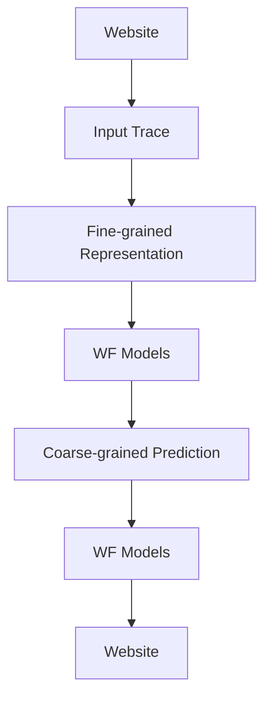
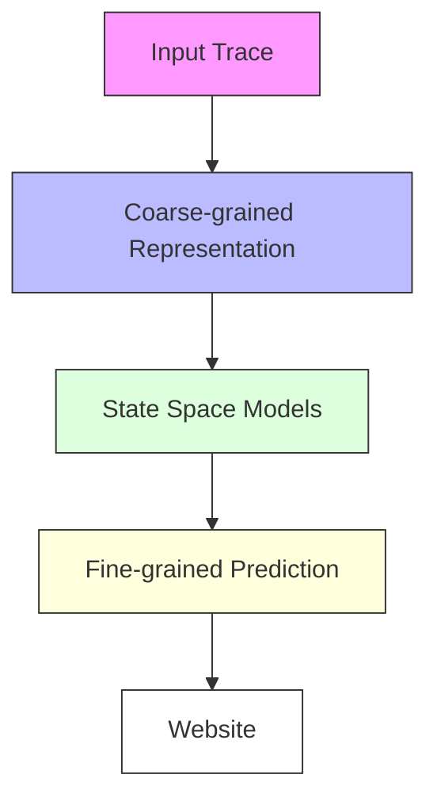
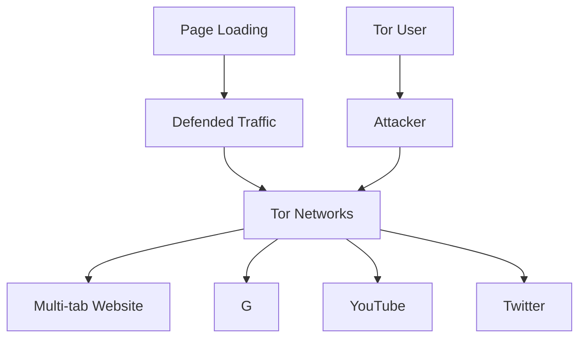
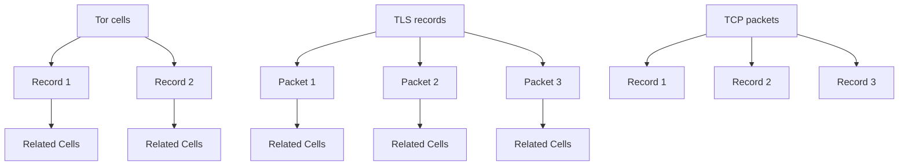
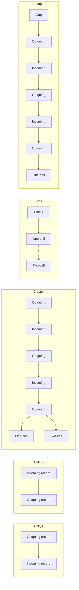

# COUNTMAMBA: A Generalized Website Fingerprinting Attack via Coarse-Grained Representation and Fine-Grained Prediction

Xianwen Deng∗, Ruijie Zhao†, Yanhao Wang‡, Mingwei Zhan∗, Zhi Xue∗ and Yijun Wang∗

∗School of Cyber Science and Engineering, Shanghai Jiao Tong University

†School of Cyber Science and Engineering, Southeast University

‡Independent Researcher

2594306528, mw.zhan, zxue, ericwyj @sjtu.edu.cn; ruijiezhao@seu.edu.cn; wangyanhao136@gmail.com

Abstract—Tor is the leading low-latency anonymous communication network, widely used to protect users’ privacy through mechanisms such as random relay selection. However, despite these defenses, Tor traffic remains susceptible to website fingerprinting (WF) attacks, where attackers analyze side-channel information (e.g., packet size, direction, inter-packet timing) to infer visited websites. Although WF attacks have shown high success rates in controlled settings, they rely on complete, unperturbed traffic, making them vulnerable to real-world defense mechanisms. Traditional WF approaches, which typically employ Machine Learning (ML) or Deep Learning (DL) to classify packet sequences as a single-label prediction, struggle to generalize in practical scenarios, especially under defenses that alter packet patterns or in environments requiring multilabel, early-stage analysis.

In this work, we introduce COUNTMAMBA, a robust and adaptable WF attack framework designed to address the challenges posed by real-world defenses, early-stage traffic analysis, and multi-tab browsing. COUNTMAMBA employs a Windowed Traffic Counting Matrix (WTCM) to create resilient, coarse-grained traffic representations by aggregating packet events within fixed time intervals, allowing it to withstand moderate perturbations from defenses. Additionally, a state-space-oriented (SSO) classifier incrementally generates fine-grained predictions from partial traffic data, maintaining high attack accuracy while enabling early-stage and multi-tab attack capabilities. Unlike prior WF methods, COUNTMAMBA iteratively updates predictions as new data arrives, eliminating the need for complete traffic capture and enabling reliable inference even in complex, multi-tab environments. Extensive experiments demonstrate that COUNTMAMBA outperforms state-of-the-art WF attacks across robust, early-stage, and multi-tab scenarios, highlighting its applicability for realistic, adaptive WF analysis in Tor networks. The source code as well as the experiment data is available at https://github.com/SJTUdxw/CountMamba-WF.

## 1. Introduction

Tor [1] is recognized as the premier low-latency anonymous communication network, serving millions of active users daily [2]. It employs security mechanisms such as random relay selection and multi-layer encryption to protect users from tracking and censorship. However, despite these defenses, local attackers can still observe the encrypted traffic of a Tor session and exploit side-channel information (e.g., packet size, direction, and inter-packet delay) to determine which websites Tor users are accessing. This technique is known as the website fingerprinting (WF) attack [3].

In recent years, WF attacks have achieved significant success in controlled laboratory settings. These techniques capture native, complete, and pure traffic during webpage loading, utilizing Machine Learning (ML) [4]–[6] or Deep Learning (DL) [7]–[10] models to identify distinctive traffic patterns associated with different websites. However, obtaining satisfactory traffic with these characteristics for WF attacks is challenging due to several reasons.

• Native: Numerous defense mechanisms [11]–[13] have been proposed, including deferring packet transmission, adding dummy packets, and distributing traffic across multiple paths. These strategies alter the traffic, making it impossible for attackers to capture native traffic.  
• Complete: The diversity of websites makes it challenging for attackers to perceive the entire loading process due to mixed background traffic [14]. They may only capture partial traffic from websites that load slowly.  
• Pure: Researchers have raised concerns about the assumption of “single tab browsing behavior” in studies of WF attacks [15], [16], which implies that users only visit one webpage during a session. In reality, Tor users often open multiple tabs at once [17]. The presence of triple proxies further complicates matters, as attackers are unable to distinguish pure traffic from multi-tab browsing [18].

Traditional approaches often treat WF attacks as a single-class classification problem. They typically extract the direction or timestamp sequence of packets and apply ML or DL techniques to produce a single classification outcome. However, we argue that the combination of finegrained representations with coarse-grained predictions undermines the generalizability of traditional WF attacks. On the one hand, fine-grained per-packet feature sequences are highly influenced by various defense mechanisms [19], as the patterns of packet sequences can change drastically with the introduction of dummy packets or the deferral of packet transmission. On the other hand, coarse-grained predictions rely on complete traffic to generate a single classification outcome, making them ineffective for earlystage attacks or multi-tab attacks.

flowchart

vs.  

flowchart

Figure 1. The comparison between traditional WF Attacks and COUNTMAMBA. In contrast to previous methods, COUNTMAMBA leverages coarse-grained representations to generate fine-grained predictions, thereby enabling robust, early-stage, and multi-tab WF attacks.

TABLE 1. SPECIALIZED METHODS SEPARATELY DESIGNED FOR ROBUST, EARLY-STAGE, AND MULTI-TAB ATTACKS.

<table><tr><td>Scenario</td><td>Specialized Method</td></tr><tr><td>Robust Attack</td><td>RF</td></tr><tr><td>Early-Stage Attack</td><td>Holmes</td></tr><tr><td>Multi-tab Attack</td><td>TMWF, ARES</td></tr></table>

To this end, we propose COUNTMAMBA\*, a novel pipeline for generalized WF attack based on the characteristics of Tor traffic. Our insight is that a generalized WF attack should be able to perform (1) Robust Attacks, i.e., maintain high attack accuracy despite various defenses, (2) Early-Stage Attacks, i.e., only require the traffic generated during the initial stage of page loading, and (3) Multi-Tab Attacks, i.e., adapt to complex multi-tab browsing environments. Although previous works have developed specialized methods for each of these scenarios, as summarized in Table 1, they struggle to address more challenging attack conditions, such as performing multi-tab or early-stage analysis on defended traffic, which highlights the need for one generalizable attack rather than multiple specialized approaches. Based on the above principles, we make innovative designs in both traffic representation and classifier construction, which are different from traditional WF attacks in using Coarse-Grained Representation for Fine-Grained Prediction, as illustrated in Figure 1.

To construct effective Tor traffic representation, we first design a Windowed Traffic Counting Matrix (WTCM) to convert traffic into a coarse-grained representation. Previous empirical studies prove that the number of packets transmitted over fixed time intervals can withstand moderate perturbations from defenses [19]. Thus, our basic idea is to construct resilient coarse-grained representations by segmenting Tor traffic into time windows. WTCM captures packet direction, count, timing, and the dependencies between related cells as combined features by counting events within and across time windows. It enhances the ability to perform robust attacks against defenses while enabling flexible prediction from partial Tor traffic data.

Furthermore, we develop a state-space-oriented (SSO) classifier to generate fine-grained predictions incrementally at each time step. Unlike existing WF attacks that rely on Convolutional Neural Networks (CNNs) [7]–[10], [19], [20] or Transformers [21], [22], which require complete traffic data for classification, our method considers state space models [23] to generate fine-grained prediction incrementally at each time step. By maintaining intermediate states, the SSO classifier can iteratively update predictions as new traffic data arrives, making them effective for early-stage attacks that only need traffic generated during the initial phase of page loading. Additionally, unlike early-stage WF attacks that depend on complex data augmentation and spatial distribution analysis [14], SSO classifier can repeatedly perform early-stage predictions until a predefined confidence threshold is met. It is worth noting that this capability also makes SSO classifier well-suited for multi-tab attacks. In contrast to existing multi-tab WF methods [21], [22], which provide only a single classification result, our classifier can deliver detailed insights into the sequence and frequency of user visits across multiple tabs, enhancing the precision and applicability of WF attacks in modern web environments.

We conduct extensive experiments to evaluate the effectiveness of COUNTMAMBA. The results show that COUNTMAMBA significantly outperforms existing baselines in terms of robust attacks, early-stage attacks, and multitab attacks. In particular, against high-availability defenses, namely splitting traffic defense BWR [24] and disturbing traffic defense RegulaTor [13], the F1 scores are significantly improved by 2.92% and 28.89%, respectively. For early attacks, compared to the most advanced early-stage WF attack Holmes [14], COUNTMAMBA reduces the latency by about 50% and the page loading rate by about 20%, achieving a high accuracy of 97.43%. For multi-tab attacks, COUNTMAMBA achieves an average 4% improvement in MAP@K over the state-of-the-art WF attack, ARES [22], across 8 public real-world datasets.

Our main contributions are as follows:

We present COUNTMAMBA, the first generalized website fingerprinting (WF) attack that can accurately fingerprint Tor traffic in the presence of various defenses, during the early stage of page loading, and within multi-tab browsing environments.  
We convert traffic into coarse-grained representations that capture the direction, size, and timing of packets as combined features by counting events within and across time windows. This time-window-based counting approach enhances robustness against defense mechanisms, while incorporating packet size captures the inherent dependencies between related cells.  
• We propose leveraging SSM to generate fine-grained predictions. In contrast to current WF attacks, SSM enables more efficient early-stage attacks by utilizing a predefined confidence threshold and offers deeper insights into the sequence and frequency of user visits in multi-tab scenarios.  
Through extensive experiments with public real-world datasets, we demonstrate that COUNTMAMBA achieves state-of-the-art performance across various attack scenarios.

The rest of the paper is organized as follows. Section 2 reviews related work and Section 3 introduces the threat model and attack goals of COUNTMAMBA. Section 4 presents the details of our coarse-grained Tor traffic representation. Section 5 presents the design of our state-spaceoriented classifier for fine-grained prediction. We experimentally evaluate the performances of COUNTMAMBA in Section 6 and provide detailed discussions in Section 7. Finally, Section 8 concludes this paper.

## 2. Related Work

Recently, WF attacks and defenses have gained considerable attention in research. This section provides a concise overview of the existing WF attack techniques and defense strategies.

## 2.1. WF Attacks

WF attacks leverage side-channel information, including packet size, direction, and inter-packet delay, to identify websites uniquely. Depending on the models employed, these attacks can be classified into two categories: machine learning-based WF attacks and deep learning-based WF attacks.

Machine Learning-Based WF Attacks. Traditional WF attacks typically rely on statistical features to train machine learning models for classification. For example, Wang et al. [4] train a k-NN classifier using a manually selected feature set. CUMUL [6] leverages cumulative representations, which implicitly incorporate features such as packet sequence and burst behavior, to train an SVM classifier. k-FP [5] extracts fingerprint vectors using random forest classifiers based on a comprehensive set of statistical features, followed by classification with a k-NN classifier. However, these methods heavily rely on expert knowledge, presenting a significant challenge in developing effective statistical features for various WF scenarios.

Deep Learning-Based WF Attacks. Deep learning has shown promising results in WF attacks, achieving high accuracy in controlled environments. Most of these methods leverage fine-grained features, like packet direction sequences, to train models that ultimately produce more generalized, coarse-grained predictions for website classification. For example, packet direction sequences have been used to train models including Convolutional Neural Networks (CNNs) [8], [9] and Triplet Networks [20]. Tik-Tok [7] combines packet direction and raw timing data to enhance CNN performance, while VarCNN [10] incorporates both packet direction and inter-packet timing sequences to improve robustness. Despite these advances, fine-grained perpacket features remain highly susceptible to defense mechanisms, and the coarse-grained nature of the predictions restricts the ability to carry out early-stage and multi-tab attacks effectively.

Recently, several deep learning techniques have been developed to enhance the generalization of WF attacks. For example, RF [19] demonstrates that packet-per-second features can withstand moderate changes introduced by defense mechanisms and create a robust traffic representation by counting the number of incoming and outgoing packets per time slot. LASERBEAK [25] constructs multichannel traffic representations to resist defense mechanisms. However, these methods still focus on packet-level features and show limited performance against RegulaTor defense. Holmes [14], designed for early-stage attacks, combines temporal-spatial analysis and adaptive data augmentation based on traffic distribution over time, assessing spatial correlations within the embedding space. Further, TMWF [21] and ARES [22] leverage sophisticated Transformer-based models to identify websites in multi-tab environments by capturing local patterns across various traffic segments. Yet, despite these advancements, these methods tailored to specific scenarios still struggle to address more complex combined attack conditions (see Appendix D for details). A fully generalized approach capable of reliably performing across robust, early-stage, and multi-tab attack scenarios simultaneously remains unachieved.

Extended WF Attacks. Several recent studies have extended traditional WF attacks to specific scenarios. Mitseva et al. [26] focus on fingerprinting individual web pages rather than just the index page. They utilize backbone WF attacks (i.e., CUMUL, k-FP, DF, and Var-CNN) to make predictions for individual pages and combine these predictions using a voting-based strategy. Oscar [27] aims to identify fine-grained web pages. It uses backbone WF attack (DF) to generate feature vectors and applies multi-label metric learning to aggregate vectors from the same webpage. FMWF [28] proposes to perform multi-tab WF attacks with minimal training data. It employs a CNN backbone model (similar to DF and TikTok) and adapts the trained model to real-world conditions via few-shot fine-tuning. Since the voting-based strategy, multi-label metric learning method, and few-shot learning technique are model-agnostic, substituting their backbone models with a more advanced WF attack model can further enhance performance.

## 2.2. WF Defenses

Due to Tor’s susceptibility to WF attacks, various defense mechanisms have been introduced to obscure the distinctive features in website traffic. These defenses can be categorized into two main types based on the methods employed [29], [30].

Splitting Traffic Defenses. Some defenses, such as TrafficSliver [24], aim to disrupt website fingerprints by splitting traffic without increasing bandwidth or time overhead. TrafficSliver accomplishes this by dividing traffic so that attackers can only observe a small portion of it. It offers two strategies: TrafficSliver-Net, which redistributes TCP traffic across multiple guard nodes, and TrafficSliver-App, which creates various Tor circuits. However, splitting traffic typically introduces implementation overhead, such as the need for restructuring network protocols.

Disturbing Traffic Defenses. Other WF defenses modify website traffic to obscure identifiable features by inserting dummy packets or delaying the transmission of real packets. For example, WTF-PAD [11] uses adaptive padding to add dummy packets, while FRONT [12] introduces fake packets at specific intervals based on a Rayleigh distribution. RegulaTor [13] aims to regulate packet surge sizes and patterns to ensure time-sensitive transmission. Tamaraw [31] maintains a constant transmission rate and packet size by combining dummy packet insertion with delays in real packet transmission. Palette [32] likewise focuses on adding dummy packets and delaying real packets to conceal features in the TAM. However, adding dummy packets causes bandwidth overhead, while delaying real packets results in time overhead.

## 3. Threat Model and Attack Goals

To develop a versatile website fingerprinting (WF) attack that can accurately identify Tor traffic even when defenses are in place, we focus on the initial stages of page loading and assume realistic browsing conditions, including multitab environments. The threat model for COUNTMAMBA is depicted in Figure 2. Similar to previous WF attacks [5]–[9], [20]–[22], [33]–[35], we consider a local, passive attacker capable only of capturing packet data without modifying, delaying, dropping, or decrypting it.

flowchart

Figure 2. The threat model of COUNTMAMBA. The client can deploy various WF defenses to protect privacy, and their browsing session may include encrypted packets from multiple websites. Additionally, the passive attacker cannot detect when a webpage finishes loading, requiring continuous monitoring until obtaining a high-confidence result.

This study emphasizes a more realistic WF attack scenario by accounting for three factors: (1) the client’s ability to employ diverse WF defenses to safeguard privacy, (2) the presence of encrypted network packets from multiple websites within the browsing session, and (3) the challenge faced by passive attackers in detecting the precise end of page loading, which compels them to maintain continuous monitoring until achieving a high-confidence result.

Following established research [8], [9], [20], we examine two scenarios: the closed-world and open-world models. In the closed-world model, Tor users are assumed to visit only a fixed set of websites, enabling attackers to pre-collect traffic data for each site. The open-world model, however, allows users to access any site, meaning they may visit sites beyond the attacker’s observation and monitoring capabilities [15].

## 4. Coarse-Grained Representation

This section begins by discussing how coarse-grained representations based on time windows offer greater robustness against defense mechanisms than fine-grained, per-packet feature sequences. Next, we demonstrate how packet size captures inherent dependencies among related cells, which further strengthens robustness against defensive strategies. Finally, we provide a detailed description of the Windowed Traffic Counting Matrix (WTCM) design.

## 4.1. Robustness of Coarse-Grained Representation

A robust traffic representation can capture key features that are difficult for defense mechanisms to neutralize. However, fine-grained per-packet sequences—like packet direction and time sequences—are quite vulnerable to current defense strategies. For example, dummy packet padding can heavily disrupt packet direction sequences, while real packet delaying distorts time sequences. In comparison, a time-window-based counting approach shows greater resilience against these defenses, including both dummy packet padding and real packet delaying.

flowchart

Figure 3. Relationship between the different layers of data transport. The number of related cells can be calculated by reconstructing the TLS records from TCP/IP data.

Dummy packet padding: This defense strategy inserts dummy packets into long gaps in the traffic, preventing these gaps from being used as identifiable patterns [11]. This method directly changes the sequence of packet directions, but the real packets remain within the same time windows, which helps preserve some original characteristics.  
• Real packet delaying: This approach introduces delays to real packets to regularize the size and shape of packet bursts. To maintain usability, the added latency is typically within a tolerable range (e.g., under 35% [12]), meaning that delayed packets often still fall within their original time windows.

In summary, coarse-grained, time-window-based representations tend to withstand both dummy packet padding and real packet delays more effectively than fine-grained per-packet features.

## 4.2. Dependency Between Related Cells

Current website fingerprinting (WF) attacks generally focus on packet or Tor cell direction sequences, often neglecting the dependencies between related cells. At the application layer in Tor, data is encapsulated into fixedsize 512-byte cells, which are then encrypted into Transport Layer Security (TLS) records. Each TLS record is composed of several complete Tor cells. As these records traverse the network, they are typically divided into multiple TCP packets with a maximum segment size (MSS) of 1448 bytes for Ethernet, due to the substantial data volumes transmitted by websites [6]. Figure 3 illustrates these relationships across data transport layers.

By analyzing TCP/IP data, an attacker can reconstruct the original TLS records and determine their lengths, then calculate the number of associated Tor cells by dividing each record’s size by 512 [36]. The dependencies between related cells reveal distinctive patterns in a website’s traffic, offering a richer set of features for analysis. Furthermore, many defenses fail to account for these cell dependencies, making them particularly vulnerable to WF attacks that exploit these inter-cell relationships in traffic patterns.

## 4.3. Windowed Traffic Counting Matrix

In this section, we present the Windowed Traffic Counting Matrix (WTCM), a robust and informative traffic representation designed to withstand various defense mechanisms. This coarse-grained, time-window-based model integrates multiple dimensions, including packet direction, count, timing, and dependencies between related cells. WTCM first divides the complete trace into fixed-length time windows and then aggregates event counts within and across these windows, compiling the results into a comprehensive matrix.

Algorithm 1 Calculation of WTCM  
Input: A trace F, the time window length w, the number of columns in WTCM N, and the maximum cell number C
Output: WTCM $M = \{m_{ij} | i \in [1, 2C + 2], j \in [1, N]\}$ 1: Initialize the WTCM matrix $M_{(2C+2) \times N} = 0$ 2: Set the current window index $I_{window} \leftarrow 1$ 3: Initialize the list of timestamps in the current window $T_{window} \leftarrow []$ 4: for each record $f_k = \langle t_k, l_k \rangle \in F$ do
5: $d_k \leftarrow sign(l_k), c_k \leftarrow min\left(\left\lfloor \frac{abs(l_k)}{512} \right\rfloor, C\right)$ 6: $j \leftarrow min\left(\left\lfloor \frac{t_k}{w} \right\rfloor + 1, N\right)$ 7: $i \leftarrow 2 \times c_k + d_k > 0?1 : 2$ 8: $m_{ij} \leftarrow m_{ij} + 1$ 9: if $j \neq I_{window}$ then
10: $m_{2C+1,j} \leftarrow j - I_{window}$ 11: $m_{2C+2, I_{window}} \leftarrow calculate\_cluster(T_{window})$ 12: $I_{window} \leftarrow j$ 13: $T_{window} \leftarrow [t_k]$ 14: else
15: $T_{window}.append(t_k)$ 16: end if
17: end for
18: return M

When a user visits a website, an attacker can analyze the traffic to obtain a trace composed of TLS records, denoted as $F = ( f _ { 1 } , f _ { 2 } , \cdot \cdot \cdot , f _ { L } )$ , where L is the total length of the trace. Each element $f _ { k } ~ = ~ \langle t _ { k } , l _ { k } \rangle$ represents a tuple containing the timestamp $t _ { k }$ and the length $l _ { k }$ of the TLS record. The value of $l _ { k }$ also encodes directional information: $l _ { k } > 0$ indicates an outgoing record, while $l _ { k } < 0$ indicates an incoming record. Following prior studies [7]–[10], [19], we treat the maximum trace length as a hyper-parameter, meaning that traces exceeding this length will be truncated.

Let $\mathbf { \bar { \boldsymbol { M } } } \in \mathbb { R } ^ { ( 2 C + 2 ) \times N }$ denote the WTCM of the trace $F ,$ where C represents the maximum number of cells in a TLS record, and N is the number of time windows considered. The length of each time window is denoted as w, and the maximum load time considered for the trace is $T ,$ , so N can be calculated as $N = T / w$ . The calculation procedure for WTCM is formally described in Algorithm 1. For each record $f _ { k } = \langle t _ { k } , l _ { k } \rangle$ in the trace F , we first determine its direction $d _ { k }$ and the number of cells $c _ { k }$ (line 5). Based on its timestamp $t _ { k } .$ we then calculate the column index i corresponding to the relevant time window (line 6). The row index i is computed by considering its direction $d _ { k }$ and cell count $c _ { k }$ (line 7), and the corresponding entry in matrix M is updated (line 8). In addition to counting the outgoing and incoming records with varying numbers of cells, the WTCM also incorporates temporal aspects of the records. Within each time window, it computes the number of clusters formed by comparing the time intervals between consecutive records to a pre-defined threshold (such as onetenth of the time window length) (line 11). Across time windows, it counts the number of empty windows, which represents the gap between the current window and the most recent window that contains TLS records (line 10). The resulting matrix M is returned as the WTCM. Figure 4 visualizes the structure of the WTCM. For simplicity, we only show the case where the number of cells is less than or equal to two.

flowchart

Figure 4. Visualization of the WTCM. Besides counting outgoing and incoming records with different cell counts, WTCM also includes temporal features of TLS records, such as the count of clusters within each time window and the number of empty windows across consecutive time windows.

Note that the elements of the count-based representation M are non-negative integers. To mitigate potential numerical instability caused by large values, we apply a log transformation to smooth the WTCM:

$$
M = \log (1 + M). \tag {1}
$$

The WTCM is a coarse-grained representation built on time windows, offering strong resilience against defense mechanisms. Additionally, it integrates multiple dimensions of information, such as packet direction, the dependencies between related cells, and the time distribution of TLS records, which enhances its ability to capture expressive features.

## 5. Fine-Grained Prediction

In this section, we begin by introducing an SSO classifier capable of making fine-grained predictions (Section 5.1). We then illustrate how this classifier enhances early-stage attack efficiency (Section 5.2) and offers a deeper understanding of the sequence and frequency of user visits in multi-tab scenarios (Section 5.3). Figure 5 illustrates the overview of the SSO classifier that can generate fine-grained predictions.

## 5.1. SSO Classifier

Current website fingerprinting (WF) attacks that utilize Convolutional Neural Networks and Transformers [37] depend on complete traffic data to produce a single classification result, which contradicts the purpose of early-stage attacks. Holmes [14] introduces adaptive data augmentation to allow models to identify traffic patterns at an early stage. However, it requires a complete feature construction and forward propagation for each WF attack attempt, resulting in inefficiency when applied in an iterative early-stage attack setting. We propose that an effective early-stage WF attack solution should meet the following criteria:

• Causality: The model’s output at each time window should depend solely on current or past time windows, ensuring that the output at each iteration is not influenced by future time windows.  
Iterativity: The attack should progressively improve with each iteration by processing newly available data and updating states, eliminating the need to rebuild features or perform complete forward propagation in every iteration.

To achieve this, we propose a WF attack model that incorporates causality and iterativity, composed of a causal CNN and a State Space Model (SSM). We provide a rationale for choosing causal CNN and SSM over other models by analyzing their causality and iterativity in Appendix E.

5.1.1. Causal CNN. The WTCM can be represented as a sequence of time window features: $M \ \in \ \mathring { \mathbb { R } } ^ { ( 2 C + 2 ) \times N } \ =$ $[ \dot { M _ { 1 } ^ { ( 0 ) } } , M _ { 2 } ^ { ( 0 ) } , \cdot \cdot \cdot , M _ { N } ^ { ( 0 ) } ]$ $M _ { i } ^ { ( 0 ) }$ time step i. Unlike standard Convolutional Neural Networks, a causal CNN processes each time step using only the current and preceding inputs, without accessing future values. With a kernel size k, at each time step i, the convolution $[ M _ { i - k + 1 } ^ { ( 0 ) } , M _ { i - k + 2 } ^ { \mathsf { \bar { ( 0 ) } } } , \cdot \cdot \cdot , M _ { i } ^ { ( 0 ) } ]$ to generate the output $M _ { i } ^ { ( 1 ) }$ − −. Formally, denoting the l-th convolution operation by ${ \bf \bar { \boldsymbol { f } } } _ { l } ,$ the output of causal convolution layers at time step i is given by:

$$
M _ {i} ^ {(1)} = f _ {1} ([ M _ {i - k + 1} ^ {(0)}, M _ {i - k + 2} ^ {(0)}, \dots , M _ {i} ^ {(0)} ]),
$$

$$
M _ {i} ^ {(2)} = f _ {2} ([ M _ {i - k + 1} ^ {(1)}, M _ {i - k + 2} ^ {(1)}, \dots , M _ {i} ^ {(1)} ]), \tag {2}
$$

$$
\bullet \quad \bullet \quad \bullet
$$

$$
M _ {i} ^ {(L)} = f _ {L} ([ M _ {i - k + 1} ^ {(L - 1)}, M _ {i - k + 2} ^ {(L - 1)}, \dots , M _ {i} ^ {(L - 1)} ]),
$$

where M (l)i $M _ { i } ^ { ( l ) }$ represents the output at time step i in the l-th causal convolution layer.

To enhance the iterative functionality of the causal CNN, we add a memory component to each causal convolution layer during inference, enabling it to retain the prior $k - 1$ inputs. For example, in the l-th causal convolution layer, it stores the segment [M (l−1)i−k+2, $[ M _ { i - k + 2 } ^ { ( l - 1 ) } , \cdot \cdot \cdot , M _ { i } ^ { ( l - 1 ) } ]$ −1) ]. When new time window data M (l−1)i $M _ { i + 1 } ^ { ( l - 1 ) }$ arrives, the layer can directly perform $[ M _ { i - k + 2 } ^ { ( l - 1 ) } , \cdot \cdot \cdot , M _ { i + 1 } ^ { ( l - 1 ) } ]$ without −needing to recalculate the entire segment, streamlining the process.

```mermaid
graph TD
  A["Causal CNN"] --> B["Linear & Softmax"]
  C["WTCM"] --> D["SSM"]
  E["Trace"] --> D
  D --> F["Multi-Grained Predictions"]
  F --> G["Early-Stage Attack"]
  G --> H["Waiting for next time window"]
  H --> I["max(p) > τ?"]
  I --> J["SSM"]
  J --> K["h0"]
  K --> L["Grid of nodes with arrows indicating data flow"]
  L --> M["Green circles for nodes with arrows indicating direction"]
  M --> N["Red circles for nodes with arrows indicating direction"]
  N --> O["Green circles for nodes with arrows indicating direction"]
  O --> P["Red circles for nodes with arrows indicating direction"]
  P --> Q["Green circles for nodes with arrows indicating direction"]
  Q --> R["Red circles for nodes with arrows indicating direction"]
  R --> S["Green circles for nodes with arrows indicating direction"]
  S --> T["Red circles for nodes with arrows indicating direction"]
  T --> U["Green circles for nodes with arrows indicating direction"]
  U --> V["Red circles for nodes with arrows indicating direction"]
  V --> W["Green circles for nodes with arrows indicating direction"]
  W --> X["Red circles for nodes with arrows indicating direction"]
  X --> Y["Green circles for nodes with arrows indicating direction"]
  Y --> Z["Red circles for nodes with arrows indicating direction"]
  Z --> AA["Green circles for nodes with arrows indicating direction"]
  AA --> AB["Red circles for nodes with arrows indicating direction"]
  AB --> AC["Green circles for nodes with arrows indicating direction"]
  AC --> AD["Red circles for nodes with arrows indicating direction"]
  AD --> AE["Green circles for nodes with arrows indicating direction"]
  AE --> AF["Red circles for nodes with arrows indicating direction"]
  AF --> AG["Green circles for nodes with arrows indicating direction"]
  AG --> AH["Red circles for nodes with arrows indicating direction"]
  AH --> AI["Green circles for nodes with arrows indicating direction"]
  AI --> AJ["Red circles for nodes with arrows indicating direction"]
  AJ --> AK["Green circles for nodes with arrows indicating direction"]
  AK --> AL["Red circles for nodes with arrows indicating direction"]
  AL --> AM["Green circles for nodes with arrows indicating direction"]
  AM --> AN["Red circles for nodes with arrows indicating direction"]
  AN --> AO["Green circles for nodes with arrows indicating direction"]
  AO --> AP["Red circles for nodes with arrows indicating direction"]
  AP --> AQ["Green circles for nodes with arrows indicating direction"]
  AQ --> AR["Red circles for nodes with arrows indicating direction"]
  AR --> AS["Green circles for nodes with arrows indicating direction"]
  AS --> AT["Red circles for nodes with arrows indicating direction"]
  AT --> AU["Green circles for nodes with arrows indicating direction"]
  AU --> AV["Red circles for nodes with arrows indicating direction"]
  AV --> AW["Green circles for nodes with arrows indicating direction"]
  AW --> AX["Red circles for nodes with arrows indicating direction"]
  AX --> AY["Green circles for nodes with arrows indicating direction"]
  AY --> AZ["Red circles for nodes with arrows indicating direction"]
  AZ --> BA["Green circles for nodes with arrows indicating direction"]
  BA --> BB["Red circles for nodes with arrows indicating direction"]
  BB --> BC["Green circles for nodes with arrows indicating direction"]
  BC --> BD["Red circles for nodes with arrows indicating direction"]
  BD --> BE["Green circles for nodes with arrows indicating direction"]
  BE --> BF["Red circles for nodes with arrows indicating direction"]
  BF --> BG["Green circles for nodes with arrows indicating direction"]
  BG --> BH["Red circles for nodes with arrows indicating direction"]
  BH --> BI["Green circles for nodes with arrows indicating direction"]
  BI --> BJ["Red circles for nodes with arrows indicating direction"]
  BJ --> BK["Green circles for nodes with arrows indicating direction"]
  BK --> BL["Red circles for nodes with arrows indicating direction"]
  BL --> BM["Green circles for nodes with arrows indicating direction"]
  BM --> BN["Red circles for nodes with arrows indicating direction"]
  BN --> BO["Green circles for nodes with arrows indicating direction"]
  BO --> BP["Red circles for nodes with arrows indicating direction"]
  BP --> BQ["Green circles for nodes with arrows indicating direction"]
  BQ --> BR["Red circles for nodes with arrows indicating direction"]
  BR --> BS["Green circles for nodes with arrows indicating direction"]
  BS --> BT["Red circles for nodes with arrows indicating direction"]
  BT --> BU["Green circles for nodes with arrows indicating direction"]
  BU --> BV["Red circles for nodes with arrows indicating direction"]
  BV --> BW["Green circles for nodes with arrows indicating direction"]
  BW --> BX["Red circles for nodes with arrows indicating direction"]
  BX --> BY["Green circles for nodes with arrows indicating direction"]
  BY --> BZ["Red circles for nodes with arrows indicating direction"]
  BZ --> CA["Green circles for nodes with arrows indicating direction"]
  CA --> CB["Red circles for nodes with arrows indicating direction"]
  CB --> CC["Green circles for nodes with arrows indicating direction"]
  CC --> CD["Red circles for nodes with arrows indicating direction"]
  CD --> CE["Green circles for nodes with arrows indicating direction"]
  CE --> CF["Red circles for nodes with arrows indicating direction"]
  CF --> CG["Green circles for nodes with arrows indicating direction"]
  CG --> CH["Red circles for nodes with arrows indicating direction"]
  CH --> CI["Green circles for nodes with arrows indicating direction"]
  CI --> CJ["Red circles for nodes with arrows indicating direction"]
  CJ --> CK["Green circles for nodes with arrows indicating direction"]
  CK --> CL["Red circles for nodes with arrows indicating direction"]
  CL --> CM["Green circles for nodes with arrows indicating direction"]
  CM --> CN["Red circles for nodes with arrows indicating direction"]
  CN --> CO["Green circles for nodes with arrows indicating direction"]
  CO --> CP["Red circles for nodes with arrows indicating direction"]
  CP --> CQ["Green circles for nodes with arrows indicating direction"]
  CQ --> CR["Red circles for nodes with arrows indicating direction"]
  CR --> CS["Green circles for nodes with arrows indicating direction"]
  CS --> CT["Red circles for nodes with arrows indicating direction"]
  CT --> CU["Green circles for nodes with arrows indicating direction"]
  CU --> CV["Red circles for nodes with arrows indicating direction"]
  CV --> CW["Green circles for nodes with arrows indicating direction"]
  CW --> CX["Red circles for nodes with arrows indicating direction"]
  CX --> CY["Green circles for nodes with arrows indicating direction"]
  CY --> CZ["Red circles for nodes with arrows indicating direction"]
  CZ --> DA["Green circles for nodes with arrows indicating direction"]
  DA --> DB["Red circles for nodes with arrows indicating direction"]
  DB --> DC["Green circles for nodes with arrows indicating direction"]
  DC --> DD["Red circles for nodes with arrows indicating direction"]
  DD --> DE["Green circles for nodes with arrows indicating direction"]
  DE --> DF["Red circles for nodes with arrows indicating direction"]
  DF --> DG["Causal CNN"]
```

flowchart

Figure 5. The overview of the SSO classifier. With the advantages of causality and iterative processing, the SSO classifier enables effective early-stage WF attacks, eliminating the need to recompute features or perform complete forward propagation at each step. Furthermore, fine-grained predictions allow a more detailed understanding of the sequence and frequency of user visits across multiple tabs.

The causal CNN integrates both causality and iterativity, enabling efficient local modeling. The output of the causal $M ^ { ( L ) } = [ \breve { M _ { 1 } ^ { ( L ) } } , M _ { 2 } ^ { ( L ) } , \cdots , M _ { N } ^ { ( L ) } ]$

5.1.2. State Space Model. To incorporate positional information into the sequence features ${ \bf \Gamma } _ { M ^ { ( L ) } }$ , we first add position embeddings $\dot { \mathbf { E } } _ { p o s } \in \mathbb { R } ^ { N \times D }$ as follows:

$$
\mathbf {X} = [ M _ {1} ^ {(L)}, M _ {2} ^ {(L)}, \dots , M _ {N} ^ {(L)} ] + \mathbf {E} _ {p o s}, \tag {3}
$$

where $\textbf { X } = ~ [ x _ { 1 } , x _ { 2 } , \cdot \cdot \cdot ~ , x _ { N } ] ~ \in ~ \mathbb { R } ^ { N \times D }$ represents the sequence features with positional information, and $D$ is the dimension of the hidden layer. Then the SSO block processes the sequence features iteratively to generate the sequence output $\mathbf { \bar { Y } } = [ y _ { 1 } , \cdots , y _ { t } , \cdots , y _ { N } ]$ , as described by the following equations:

$$
h _ {t} = \overline {{{\mathbf {A}}}} h _ {t - 1} + \overline {{{\mathbf {B}}}} x _ {t}, \tag {4}
$$

$$
y _ {t} = \mathbf {C h} _ {t}, \tag {5}
$$

where ${ \overline { { \mathbf { A } } } } , { \overline { { \mathbf { B } } } } ,$ and C are learnable parameters (detailed in Appendix $\mathrm { A } ) , h _ { t }$ is the hidden state at time step $t ,$ and yt is the output at time step t.

The SSO block also incorporates causal and iterative properties. At each time step $t ,$ the output $y _ { t }$ depends solely on the current and previous inputs, with the intermediate states preserved to enable efficient processing without the need for complete forward propagation at every iteration.

Additionally, the SSO block can be expressed in a convolutional form:

$$
\overline {{{\mathbf {K}}}} = (\mathbf {C} \overline {{{\mathbf {B}}}}, \mathbf {C} \overline {{{\mathbf {A B}}}}, \dots , \mathbf {C} \overline {{{\mathbf {A}}}} ^ {N - 1} \overline {{{\mathbf {B}}}}), \tag {6}
$$

$$
y = x * \overline {{{\mathbf {K}}}}, \tag {7}
$$

where $\overline { { \mathbf { K } } } \in \mathbb { R } ^ { N }$ is a structured convolutional kernel. This convolutional representation addresses computational parallelization during training, while the recurrent structure ensures linear-time inference during the testing phase.

The sequence output ${ \bf Y } = [ y _ { 1 } , \cdot \cdot \cdot , y _ { t } , \cdot \cdot \cdot , y _ { N } ]$ serves as the class-relevant features for each time window. In a typical WF attack, the coarse-grained classification result can be obtained through an average pooling layer followed by a fully connected layer:

$$
\overline {{y}} = A V G P o o l ([ y _ {1}, \dots , y _ {N} ]), \tag {8}
$$

$$
\hat {Y} = F C (\overline {{y}}). \tag {9}
$$

Finally, the model is trained using cross-entropy loss:

$$
\mathcal {L} = C E (\hat {Y}, Y _ {\text { true }}), \tag {10}
$$

where $Y _ { t r u e }$ denotes the ground-truth label.

## 5.2. Early-Stage Website Identification

In early-stage website identification scenarios, finegrained classification results are generated for each time window:

$$
\hat {Y} _ {t} = F C \left(y _ {t}\right), \tag {11}
$$

where $\hat { Y } _ { t }$ represents the classification result for the t-th time window.

During training, the model is updated so that each time window’s classification result matches the true label:

$$
\mathcal {L} = \sum_ {t = 1} ^ {N} C E (\hat {Y} _ {t}, Y _ {\text { true }}). \tag {12}
$$

At the testing phase, to obtain an early-stage prediction at time step t, we aggregate all available classification results from y1 to yt:

$$
\overline {{{y}}} ^ {e a r l y} = A V G P o o l ([ y _ {1}, \dots , y _ {t} ]), \tag {13}
$$

$$
\hat {Y} _ {t} ^ {\text { early }} = F C (\overline {{y}} ^ {\text { early }}). \tag {14}
$$

For real-world early-stage website identification, we perform WF attacks at fixed intervals (defined by the time window length). To avoid misidentifying early-stage traffic, we reject results with low confidence and proceed by collecting more packets to improve accuracy.

Algorithm 2 Early-stage Website Identification  
Input:
w: the time window length.
τ: the confidence threshold.
T: the maximum traffic collect time.
Output:
res: the identification result
1: $t \leftarrow 0$ 2: Initialize the memory of the causal CNN $m_{0}$ 3: Initialize the hidden state of the SSM $h_{0}$ 4: while True do
5: time.sleep(w)
6: $t \leftarrow t + 1$ 7: /* Calculate the feature of t-th time window */
8: $F_{t} \leftarrow \text{getTraffic()}$ 9: $M_{t}^{(0)} \leftarrow \text{calculateWTCM}(F_{t})$ 10: /* Forward propagation and update states */
11: $M_{t}^{(L)}, m_{t} \leftarrow \text{causalCNN}(M_{t}^{(0)}, m_{t-1})$ 12: $y_{t}, h_{t} \leftarrow \text{SSM}(M_{t}^{(L)}, h_{t-1})$ 13: /* Aggregate classification results */
14: $\overline{y}^{\text{early}} \leftarrow \text{AVGPool}([y_{1}, \cdots, y_{t}])$ 15: $\hat{Y}_{t}^{\text{early}} \leftarrow FC(\overline{y}^{\text{early}})$ 16: $q_{t}^{\text{early}} \leftarrow \text{Softmax}(\hat{Y}_{t}^{\text{early}})$ 17: /* End of identification */
18: if ( $max(q_{t}^{\text{early}}) \geq \tau$ ) or ( $t \times w \geq T$ ) then
19: res $\leftarrow \arg\max(q_{t}^{\text{early}})$ 20: break
21: end if
22: end while
23: return res

In Algorithm 2, we outline the pseudocode for earlystage website fingerprinting. At each time interval (i.e., the time window length), the first step involves calculating the features for that window (lines 8-9). Subsequently, classrelevant features are computed through forward propagation, and the causal CNN memory as well as the hidden state of the state space model (SSM) are updated (lines 11- 12). The early-stage prediction is then generated by aggregating all available classification results (lines 14-16). If the prediction confidence exceeds a pre-defined threshold, COUNTMAMBA successfully classifies the traffic (lines 18- 20). If not, COUNTMAMBA continues to collect traffic data and awaits the next time interval.

## 5.3. Multi-Tab Website Identification

In multi-tab scenarios, the SSO classifier produces both coarse-grained classification results (as defined in Equations 8 and 9) and fine-grained classification results (as described in Equation 11). Since multi-tab website identification is a multi-label classification problem, we then compute the binary cross-entropy loss for both the coarsegrained and fine-grained results, treating each class as an independent binary classification task:

TABLE 2. HYPERPARAMETERS OF COUNTMAMBA.

<table><tr><td>Category</td><td>Hyperparameter</td><td>Single-tab</td><td>Multi-tab</td></tr><tr><td rowspan="4">WTCM</td><td>Maximum Load Time (s)</td><td>120</td><td>320</td></tr><tr><td>Maximum Trace Length</td><td>5,000</td><td>10,000</td></tr><tr><td>Time Window Length (ms)</td><td colspan="2">44</td></tr><tr><td>Maximum Cell Number</td><td colspan="2">3</td></tr><tr><td rowspan="3">SSO Classifier</td><td>Embedding Dimension</td><td colspan="2">256</td></tr><tr><td>Depth</td><td colspan="2">3</td></tr><tr><td>Drop Path Rate</td><td colspan="2">0.2</td></tr><tr><td rowspan="4">Optimizer</td><td>Learning Rate</td><td colspan="2">0.002</td></tr><tr><td>Weight Decay</td><td colspan="2">0.05</td></tr><tr><td>Batch Size</td><td colspan="2">200</td></tr><tr><td>Training Epoch</td><td colspan="2">100</td></tr></table>

$$
\mathcal {L} _ {\text { coarse }} = B C E (\hat {Y}, Y _ {\text { true }}), \tag {15}
$$

$$
\mathcal {L} _ {\text { fine }} = \sum_ {t = 1} ^ {N} B C E (\hat {Y} _ {t}, Y _ {\text { true }} ^ {t}), \tag {16}
$$

$Y _ { t r u e } ^ { t }$ denotes the fine-grained labels, which may vary across different time windows. Compared to existing multitab WF attacks, the fine-grained predictions offer a more detailed understanding of the sequence and frequency of user visits across multiple tabs.

## 6. Performance Evaluation

In this section, we assess the effectiveness and generalizability of COUNTMAMBA using public datasets across various scenarios. We compare its performance with that of state-of-the-art WF attacks.

## 6.1. Experimental Setup

6.1.1. Implementation. We prototype COUNTMAMBA using PyTorch 2.1.2 and Python 3.10.5, comprising over 2,000 lines of code. For the experiments, we utilize a single NVIDIA GeForce RTX 4090 GPU. Consistent with prior studies [14], we divide the dataset into training, validation, and testing subsets in an 8:1:1 ratio. For simplicity, we treat unmonitored websites in the open-world scenario as an additional category.

6.1.2. Hyperparameters. COUNTMAMBA’s hyperparameters are divided into three categories: WTCM, SSO classifier, and Optimizer. The specific settings are shown in Table 2. In terms of WTCM hyperparameters, we set the maximum load time to 120 s for single-tab datasets and 320 s for multitab datasets, the maximum trace length to 5,000 for singletab datasets and 10,000 for multi-tab datasets, the time window length to 44 ms, and the maximum cell number to 3. SSO classifier hyperparameters involve the model structure, with an embedding dimension of 256, a layer depth of 3, and a drop path rate of 0.2. Besides, COUNTMAMBA is trained by Adamw optimizer [38] with the learning rate of

$2 * 1 0 ^ { - 3 }$ and weight decay $5 * 1 0 ^ { - 2 }$ . The batch size is 200 and the total training epoch is 100. The rationale behind the hyperparameter selection is provided in Appendix C.

## 6.1.3. Dataset. We conduct experiments on both single-tab and multi-tab datasets.

Single-tab datasets: We perform robust WF attacks and early-stage WF attacks on the commonly used dataset [9], denoted as DFset. This dataset consists of 95 websites, each with 1,000 undefended traces for closed-world evaluation. Additionally, it includes 40,000 websites for openworld evaluation, each having a single undefended trace. For the robust WF attacks, we rely on the scripts and simulators provided by the authors to generate the defended traces. For the early-stage WF attacks, we follow the traffic generation approach described in Holmes [14]. Additional experimental results on other single-tab datasets are provided in Appendix B.

Multi-tab datasets: We perform multi-tab WF attacks on the multi-tab datasets [22], referred to as ARESset. Due to the absence of fine-grained labels in this dataset, we generate coarse-grained predictions to produce classification results. Furthermore, we conduct experiments on a synthetic dataset, TMWFset [21], to assess the accuracy of COUNTMAMBA’s fine-grained predictions. We strictly follow the synthesis method proposed by TMWF. Specifically, we randomly choose an overlap ratio between 0.1 and 0.5 to simulate diverse real-world access scenarios. To merge two traces, we reorder the packets from both traces according to their timestamps.

6.1.4. Baselines. For a thorough comparison, we select 11 state-of-the-art WF attacks, as outlined in Section 2.1. These include 2 ML-based attacks (k-FP [5] and CUMUL [6]) and 9 DL-based attacks (AWF [8], DF [9], TF [20], TMWF [21], Tik-Tok [7], Var-CNN [10], RF [19], Holmes [14], and ARES [22]). For a fair comparison, COUNTMAMBA and baselines are all set with identical parameters.

To evaluate the effectiveness of robust WF attacks, we deploy the following defenses against WF attacks: WTF-PAD [11], FRONT [12], RegulaTor [13], Tamaraw [31], and TrafficSliver [24].

## 6.1.5. Metrics. We employ six metrics across two categories:

Single-label metrics: We evaluate the performance of WF attacks using four common metrics: Accuracy (AC), Precision (PR), Recall (RC), and F1. The macro average is computed across all websites for these metrics.

• Multi-label metrics: For multi-label classification, we use two widely recognized metrics, P@K and MAP@K [39]. The P@K metric assesses the precision among the top-k predicted labels for each instance:

$$
\mathbf {P} @ \mathbf {K} = \frac {1}{k} \sum_ {l \in r _ {k} (\hat {\mathbf {Y}})} \mathbf {Y} _ {l}, \tag {17}
$$

where $r _ { k } ( { \hat { \mathbf { Y } } } )$ denotes the set of websites with the top-k highest probabilities in the predictions, and $\mathbf { Y } _ { l }$ is the true label, valued at 0 or 1. The MAP@K metric extends P@K by evaluating whether the browsed websites appear with higher probabilities than non-browsed websites among the top-k predicted results:

TABLE 3. TIME AND BANDWIDTH OVERHEAD OF DEFENSES.

<table><tr><td>Defenses</td><td>Time Overhead</td><td>Bandwidth Overhead</td></tr><tr><td>TrafficSilver</td><td>0%</td><td>0%</td></tr><tr><td>WTF-PAD</td><td>0%</td><td>47%</td></tr><tr><td>FRONT</td><td>0%</td><td>46%</td></tr><tr><td>RegulaTor</td><td>5%</td><td>58%</td></tr><tr><td>Tamaraw</td><td>182%</td><td>269%</td></tr></table>

$$
\mathbf {M A P} @ \mathbf {K} = \frac {\sum_ {i = 1} ^ {k} \mathbf {P} @ \mathbf {i}}{k}. \tag {18}
$$

## 6.2. Robust Attack Evaluation

In this experiment, we evaluate the robustness of WF attacks against various defense mechanisms. We assume that attackers have knowledge of the client’s deployed defense mechanism and apply adversarial training using the defended traffic traces.

We focus on closed-world traces from DFset [9] as the undefended trace set and generate seven defended trace sets using various defenses from it. Since these defenses may cause additional overhead in time and bandwidth that affects the availability of network services, we first evaluate the overhead of the defenses, as shown in Table 3. Specifically, TrafficSliver [24] destroys website fingerprints by splitting traffic without additional time or bandwidth overhead, but requires the reconstruction of network protocols. In subsequent experiments, we explore three network-layer splitting strategies from TrafficSilver: Round Robin (RB), By Direction (BD), and Batched Weighted Random (BWR). Besides, both WTF-PAD [11] and FRONT [12] introduce only dummy packets, resulting in moderate bandwidth overhead without any time overhead. RegulaTor [13] combines packet delaying and dummy packet insertion, adding slight time and moderate bandwidth overhead. In contrast, Tamaraw [31] sends packets at a constant rate and size, incurring substantial time and bandwidth overhead, which is considered impractical due to severe service disruption.

Table 4 summarizes the F1 scores of state-of-the-art WF attacks against various defense techniques mentioned above. As shown, in the absence of defenses (i.e., undefended), all DL-based attacks can identify websites with F1 scores exceeding 95%. Specifically, DF, Tik-Tok, Var-CNN, and RF all achieve comparable F1 scores above 98%. COUNTMAMBA, benefiting from more informative representations, achieves an F1 score of 99.20%, which slightly exceeds that of these methods. When defenses are introduced, COUNTMAMBA surpasses all other WF attacks, achieving the highest F1 score. Notably, COUNTMAMBA delivers an average F1-score improvement of 6.31% over the best-performing attack (RF) across seven different defenses, demonstrating its enhanced robustness against a variety of defensive strategies. We provide further detailed analysis of the performance of WF attacks under these defenses as follows.

TABLE 4. F1 SCORES (%) OF THE STATE-OF-THE-ART WF ATTACKS AGAINST DEFENSES.

<table><tr><td rowspan="2"></td><td rowspan="2">Undefended</td><td colspan="3">Splitting Traffic Defenses</td><td colspan="4">Disturbing Traffic Defenses</td></tr><tr><td>RB</td><td>BD</td><td>BWR</td><td>WTF-PAD</td><td>Front</td><td>RegulaTor</td><td>Tamaraw</td></tr><tr><td>k-FP</td><td>88.64</td><td>83.16</td><td>63.12</td><td>23.24</td><td>54.99</td><td>46.75</td><td>47.71</td><td>8.63</td></tr><tr><td>CUMUL</td><td>97.37</td><td>93.10</td><td>19.39</td><td>9.06</td><td>71.68</td><td>57.31</td><td>49.16</td><td>10.87</td></tr><tr><td>AWF</td><td>95.45</td><td>87.47</td><td>15.85</td><td>13.20</td><td>65.65</td><td>32.89</td><td>11.82</td><td>3.71</td></tr><tr><td>TF</td><td>97.96</td><td>91.14</td><td>15.18</td><td>7.89</td><td>89.96</td><td>68.78</td><td>14.65</td><td>6.18</td></tr><tr><td>TMWF</td><td>97.28</td><td>90.23</td><td>16.71</td><td>14.37</td><td>89.58</td><td>79.33</td><td>23.10</td><td>8.79</td></tr><tr><td>ARES</td><td>97.76</td><td>89.43</td><td>15.37</td><td>25.69</td><td>93.27</td><td>85.27</td><td>27.44</td><td>8.87</td></tr><tr><td>DF</td><td>98.47</td><td>92.45</td><td>15.79</td><td>23.05</td><td>92.91</td><td>82.88</td><td>22.36</td><td>6.09</td></tr><tr><td>Tik-Tok</td><td>98.53</td><td>98.29</td><td>94.36</td><td>63.54</td><td>95.21</td><td>90.33</td><td>51.90</td><td>6.21</td></tr><tr><td>Var-CNN</td><td>98.74</td><td>99.30</td><td>95.72</td><td>29.96</td><td>96.73</td><td>85.17</td><td>62.87</td><td>6.00</td></tr><tr><td>RF</td><td>98.67</td><td>99.17</td><td>95.72</td><td>77.36</td><td>97.41</td><td>95.84</td><td>67.73</td><td>6.34</td></tr><tr><td>COUNTMAMBA</td><td>99.20</td><td>99.66</td><td>98.36</td><td>80.28</td><td>98.56</td><td>99.00</td><td>96.62</td><td>11.29</td></tr></table>

Splitting traffic defenses, which aim to limit the traffic data accessible to attackers by distributing it across multiple circuits, are evaluated using three splitting strategies of TrafficSilver. In particular, the basic Round Robin (RB) approach evenly allocates traffic from a single website across all Tor circuits, but it produces representative sub-traces belonging to the target website, resulting in weak or even no defense effectiveness. The By Direction (BD) approach uses separate circuits for incoming and outgoing packets, thereby restricting attackers to observing traffic in only one direction, which significantly lowers the F1 score of DLbased WF attacks that rely on direction sequences. However, this strategy has limited impact on WF attacks that focus on time-related features (i.e., Tik-Tok, Var-CNN, RF, and COUNTMAMBA). The Batched Weighted Random (BWR) approach uses a weight vector to select a guard node for transmitting batches of Tor cells. Although BWR reduces the correlation between packets, COUNTMAMBA maintains a high F1 score of nearly 80%, outperforming other WF attacks by a margin of at least 3%.

Disturbing traffic defenses (e.g., WTF-PAD, Front, RegulaTor, and Tamaraw) modify traffic patterns by adding dummy packets and delaying real packets to counteract WF attacks. Among these, Tamaraw, which maintains a constant packet rate and size, reduces the F1 scores of all WF attacks to below 12%; however, its significant bandwidth and latency overhead make it impractical for realworld use. Zero-delay defenses like WTF-PAD and FRONT successfully disrupt traditional ML-based WF attacks (e.g., k-FP and CUMUL), reducing their F1 scores to below 72%. Dummy packet insertion heavily distorts statistical features, making these ML-based methods largely ineffective. However, because timing features remain unchanged, DLbased WF attacks are still able to bypass these defenses. For example, Tik-Tok achieves F1 scores above 90% on datasets protected by these defenses. The coarse-grained representation used by RF sees only minor reductions of 1.26% and 2.83% in F1 scores, while our method is even less affected, with decreases of just 0.64% and 0.20% on the defended traces. RegulaTor, a high-availability defense, is notably effective against all prior WF attacks by disrupting direction and timing sequences through packet delays and dummy insertion, causing RF’s F1 score to drop to 67.73%. However, because dependencies among related Tor cells are preserved, COUNTMAMBA achieves a remarkable F1 score of 96.62%. These results underline COUNTMAMBA’s superior adaptability and robustness across a range of defenses, reinforcing its effectiveness in conducting resilient WF attacks under varied protection schemes.

line chart

| Page Loading Ratio (%) | k-FP  | AWF   | TMWF  | DF    | Var-CNN | Holmes | CUMUL | TF    | ARES  | Tik-Tok | RF    | CountMamba |
| ---------------------- | ----- | ----- | ----- | ----- | ------- | ------ | ----- | ----- | ----- | ------- | ----- | ---------- |
| 10                     | 20    | 5     | 5     | 5     | 5       | 5      | 5     | 5     | 5     | 5       | 10    | 30         |
| 20                     | 50    | 15    | 10    | 10    | 10      | 10     | 10    | 10    | 10    | 10      | 25    | 55         |
| 30                     | 78    | 20    | 15    | 15    | 15      | 15     | 15    | 15    | 15    | 15      | 48    | 80         |
| 40                     | 90    | 30    | 25    | 25    | 25      | 25     | 25    | 25    | 25    | 25      | 65    | 90         |
| 50                     | 95    | 45    | 40    | 40    | 40      | 40     | 40    | 40    | 40    | 40      | 85    | 95         |
| 60                     | 98    | 60    | 60    | 60    | 60      | 60     | 60    | 60    | 60    | 60      | 92    | 98         |
| 70                     | 99    | 75    | 75    | 75    | 75      | 75     | 75    | 75    | 75    | 75      | 95    | 99         |
| 80                     | 99.5  | 85    | 85    | 85    | 85      | 85     | 85    | 85    | 85    | 85      | 97    | 99.5       |
| 90                     | 99.8  | 92    | 92    | 92    | 92      | 92     | 92    | 92    | 92    | 92      | 98.5  | 99.8       |
| 100                    | 99.9  | 98    | 98    | 98    | 98      | 98     | 98    | 98    | 98    | 98      | 99.5  | 99.9       |

Figure 6. Comparison of WF attacks at various stages of website loading in the closed-world scenario.

## 6.3. Early-Stage Attack Evaluation

In this section, we evaluate the effectiveness of WF attacks during the early stages of page loading. Building upon prior research [14], we focus on the closed-world traces from DFset, which we use to generate traffic at various stages of website loading based on packet timestamps. As shown in Figure 6, COUNTMAMBA outperforms all other WF attacks across different page loading ratios. As the page loading ratio increases from 10% to 100%, the accuracy of COUNTMAMBA improves from 29.70% to 98.85%. Compared to existing WF attacks, COUNTMAMBA demonstrates a substantial advantage during the early stages of page loading. For example, at a 20% page loading ratio, COUNTMAMBA achieves an accuracy of 56.04%, outperforming Holmes, RF, Var-CNN, and DF by 4.91%, 29.03%, 40.86%, and 41.52%, respectively.

TABLE 5. COMPARISONS WITH PREVIOUS METHODS ON EARLY-STAGE TRAFFIC IN THE CLOSED-WORLD SCENARIO, WHERE P, R, AND F1 REPRESENT PRECISION (%), RECALL (%), AND F1-SCORE (%), RESPECTIVELY.

<table><tr><td rowspan="2">Attacks</td><td colspan="3">10% loaded</td><td colspan="3">20% loaded</td><td colspan="3">30% loaded</td><td colspan="3">50% loaded</td><td colspan="3">80% loaded</td></tr><tr><td>P</td><td>R</td><td>F1</td><td>P</td><td>R</td><td>F1</td><td>P</td><td>R</td><td>F1</td><td>P</td><td>R</td><td>F1</td><td>P</td><td>R</td><td>F1</td></tr><tr><td>k-FP</td><td>6.74</td><td>1.37</td><td>0.43</td><td>14.65</td><td>3.01</td><td>2.71</td><td>16.46</td><td>4.92</td><td>5.35</td><td>22.91</td><td>13.74</td><td>14.59</td><td>65.78</td><td>64.90</td><td>63.71</td></tr><tr><td>CUMUL</td><td>10.98</td><td>2.58</td><td>2.42</td><td>21.33</td><td>6.74</td><td>7.28</td><td>25.62</td><td>11.76</td><td>12.56</td><td>40.86</td><td>31.64</td><td>31.71</td><td>87.30</td><td>86.56</td><td>85.94</td></tr><tr><td>AWF</td><td>18.41</td><td>3.79</td><td>4.44</td><td>27.64</td><td>9.66</td><td>10.74</td><td>34.34</td><td>17.89</td><td>19.50</td><td>54.17</td><td>45.41</td><td>46.99</td><td>88.41</td><td>87.35</td><td>87.11</td></tr><tr><td>TF</td><td>24.55</td><td>5.98</td><td>6.23</td><td>33.78</td><td>14.52</td><td>15.24</td><td>44.95</td><td>27.36</td><td>28.76</td><td>67.40</td><td>61.68</td><td>62.14</td><td>93.73</td><td>92.98</td><td>92.77</td></tr><tr><td>TMWF</td><td>19.73</td><td>3.44</td><td>4.19</td><td>29.66</td><td>10.35</td><td>11.08</td><td>35.90</td><td>18.81</td><td>19.60</td><td>53.81</td><td>44.88</td><td>44.56</td><td>91.86</td><td>90.99</td><td>90.82</td></tr><tr><td>ARES</td><td>24.44</td><td>4.42</td><td>4.77</td><td>37.20</td><td>12.05</td><td>12.94</td><td>44.63</td><td>22.58</td><td>24.24</td><td>65.80</td><td>57.14</td><td>58.23</td><td>92.82</td><td>92.08</td><td>92.02</td></tr><tr><td>DF</td><td>28.69</td><td>6.42</td><td>7.49</td><td>37.39</td><td>14.60</td><td>16.35</td><td>45.71</td><td>26.10</td><td>28.19</td><td>68.31</td><td>61.19</td><td>61.97</td><td>94.74</td><td>94.10</td><td>94.00</td></tr><tr><td>Tik-Tok</td><td>32.87</td><td>5.53</td><td>6.72</td><td>40.26</td><td>12.32</td><td>14.65</td><td>46.97</td><td>21.66</td><td>24.44</td><td>66.22</td><td>56.27</td><td>56.98</td><td>94.10</td><td>93.28</td><td>93.05</td></tr><tr><td>Var-CNN</td><td>35.43</td><td>6.48</td><td>7.58</td><td>41.60</td><td>15.21</td><td>17.30</td><td>53.75</td><td>29.69</td><td>31.97</td><td>73.18</td><td>65.27</td><td>66.00</td><td>95.07</td><td>94.46</td><td>94.27</td></tr><tr><td>RF</td><td>36.01</td><td>11.70</td><td>12.83</td><td>50.05</td><td>27.04</td><td>28.87</td><td>62.66</td><td>48.83</td><td>50.01</td><td>86.64</td><td>84.46</td><td>84.67</td><td>97.74</td><td>97.60</td><td>97.62</td></tr><tr><td>Holmes</td><td>52.86</td><td>21.46</td><td>24.23</td><td>66.40</td><td>51.13</td><td>53.30</td><td>81.46</td><td>77.79</td><td>77.39</td><td>95.03</td><td>94.84</td><td>94.81</td><td>97.86</td><td>97.83</td><td>97.83</td></tr><tr><td>Ours</td><td>55.93</td><td>29.72</td><td>32.81</td><td>72.38</td><td>56.04</td><td>58.68</td><td>84.17</td><td>79.26</td><td>79.75</td><td>95.29</td><td>94.87</td><td>94.90</td><td>98.15</td><td>98.06</td><td>98.07</td></tr></table>

TABLE 6. THE LOADING RATIO AND ACCURACY OF EXISTING DL-BASED WF ATTACKS UNDER DIFFERENT CONFIDENCE THRESHOLDS.

<table><tr><td rowspan="2">Attacks</td><td rowspan="2">Metrics</td><td colspan="10">Confidence Threshold</td></tr><tr><td>0.1</td><td>0.2</td><td>0.3</td><td>0.4</td><td>0.5</td><td>0.6</td><td>0.7</td><td>0.8</td><td>0.9</td><td>1.0</td></tr><tr><td rowspan="2">AWF</td><td>Loading Ratio (%)</td><td>15.01</td><td>23.42</td><td>26.16</td><td>27.63</td><td>28.82</td><td>30.02</td><td>31.45</td><td>33.59</td><td>37.49</td><td>91.20</td></tr><tr><td>Accuracy (%)</td><td>0.73</td><td>2.06</td><td>2.95</td><td>4.02</td><td>4.94</td><td>6.49</td><td>8.67</td><td>12.49</td><td>21.32</td><td>95.76</td></tr><tr><td rowspan="2">TMWF</td><td>Loading Ratio (%)</td><td>1.58</td><td>1.58</td><td>1.58</td><td>1.60</td><td>1.62</td><td>3.88</td><td>9.70</td><td>14.10</td><td>23.34</td><td>100.0</td></tr><tr><td>Accuracy (%)</td><td>1.13</td><td>1.13</td><td>1.13</td><td>1.13</td><td>1.13</td><td>1.13</td><td>1.59</td><td>2.35</td><td>6.54</td><td>97.60</td></tr><tr><td rowspan="2">ARES</td><td>Loading Ratio (%)</td><td>1.66</td><td>9.90</td><td>13.91</td><td>17.18</td><td>19.75</td><td>22.02</td><td>23.99</td><td>25.91</td><td>28.25</td><td>81.39</td></tr><tr><td>Accuracy (%)</td><td>1.15</td><td>1.30</td><td>2.00</td><td>2.95</td><td>4.13</td><td>5.55</td><td>7.27</td><td>9.70</td><td>13.71</td><td>96.81</td></tr><tr><td rowspan="2">DF</td><td>Loading Ratio (%)</td><td>2.06</td><td>25.41</td><td>26.37</td><td>27.13</td><td>27.91</td><td>28.70</td><td>29.56</td><td>30.73</td><td>32.35</td><td>71.34</td></tr><tr><td>Accuracy (%)</td><td>1.11</td><td>5.67</td><td>6.58</td><td>7.14</td><td>8.11</td><td>9.82</td><td>11.85</td><td>14.92</td><td>19.34</td><td>92.92</td></tr><tr><td rowspan="2">Tik-Tok</td><td>Loading Ratio (%)</td><td>23.64</td><td>25.40</td><td>26.34</td><td>27.12</td><td>27.91</td><td>28.73</td><td>29.73</td><td>31.01</td><td>33.05</td><td>70.96</td></tr><tr><td>Accuracy (%)</td><td>3.00</td><td>3.45</td><td>3.95</td><td>4.64</td><td>5.54</td><td>6.68</td><td>8.53</td><td>11.05</td><td>16.17</td><td>92.23</td></tr><tr><td rowspan="2">Var-CNN</td><td>Loading Ratio (%)</td><td>1.64</td><td>1.64</td><td>1.64</td><td>1.64</td><td>1.64</td><td>1.64</td><td>1.64</td><td>1.65</td><td>1.70</td><td>54.27</td></tr><tr><td>Accuracy (%)</td><td>0.99</td><td>0.99</td><td>0.99</td><td>0.99</td><td>0.99</td><td>1.00</td><td>1.00</td><td>1.00</td><td>1.00</td><td>78.19</td></tr><tr><td rowspan="2">RF</td><td>Loading Ratio (%)</td><td>16.85</td><td>20.24</td><td>22.72</td><td>24.72</td><td>26.75</td><td>28.88</td><td>31.55</td><td>34.96</td><td>40.21</td><td>99.30</td></tr><tr><td>Accuracy (%)</td><td>6.58</td><td>14.99</td><td>21.28</td><td>27.17</td><td>33.82</td><td>40.99</td><td>49.25</td><td>58.29</td><td>70.15</td><td>98.99</td></tr><tr><td rowspan="2">COUNTMAMBA</td><td>Loading Ratio (%)</td><td>24.11</td><td>30.52</td><td>35.98</td><td>41.51</td><td>47.73</td><td>55.10</td><td>64.28</td><td>76.40</td><td>97.94</td><td>100.00</td></tr><tr><td>Accuracy (%)</td><td>79.20</td><td>90.47</td><td>95.14</td><td>97.43</td><td>98.35</td><td>98.65</td><td>98.77</td><td>98.81</td><td>98.81</td><td>98.81</td></tr></table>

We further evaluate the precision, recall, and F1 score of various methods across different page loading ratios, as shown in Table 5. ML-based WF attacks (e.g., k-FP and CUMUL), which rely on statistical features for classification, perform poorly when only a small portion of traces is captured, with F1 scores dropping below 8% at a 20% page loading ratio. DL-based methods that depend on directional sequences are able to leverage the limited traces available during the early stages of page loading, leading to a modest improvement in the F1 score (e.g., DF achieves an F1 score of 16.35% at a 20% page loading ratio). Methods like Tik-Tok, Var-CNN, and RF, which incorporate timerelated features, achieve F1 scores of 14.65%, 17.30%, and 28.87%, respectively. However, even with these enhancements, none of these approaches surpass an F1 score of 30%, underscoring their limited efficacy in early-stage traffic analysis. Holmes introduces a more complex temporalspatial analysis to identify early-stage traffic, raising the F1 score to 53.30% at a 20% page loading ratio. However, this approach requires a complicated training process and full forward propagation for each WF attack, making it inefficient in iterative early-stage attack scenarios. In contrast, COUNTMAMBA achieves a notable F1 score of 58.68% at a 20% page loading ratio, outperforming all other WF attacks by at least 5%. Moreover, COUNTMAMBA utilizes a simple supervised learning paradigm and can progressively improve its predictions with each iteration by processing newly available data and updating its state, removing the need for feature rebuilding or full forward propagation in every iteration.

heatmap

| Model | LR (%) | Acc (%) | Confidence Threshold |
|---|---|---|---|
| AWF | 15.0 | 23.4 | 26.2 |
| TMWF | 1.6 | 1.6 | 1.6 |
| ARES | 1.1 | 1.1 | 1.1 |
| DF | 2.1 | 25.4 | 26.4 |
| Tik-Tok | 1.1 | 5.7 | 6.6 |
| Var-CNN | 23.6 | 25.4 | 26.3 |
| RF | 1.6 | 1.6 | 1.6 |
| Holmes | 1.0 | 1.0 | 1.0 |
| Ours | 24.1 | 30.5 | 36.0 |
| AWF | 0.7 | 2.1 | 3.0 |
| TMWF | 1.6 | 1.6 | 1.6 |
| ARES | 1.1 | 1.1 | 1.1 |
| DF | 2.1 | 25.4 | 26.4 |
| Tik-Tok | 3.0 | 3.5 | 4.0 |
| Var-CNN | 1.0 | 1.0 | 1.0 |
| RF | 16.9 | 20.2 | 22.7 |
| Ours | 79.2 | 90.5 | 95.1 |
Confidence Threshold: Accuracy (%) vs Confidence Threshold: Confidence (%) for each model; AWF has the highest accuracy at 91.2% (0.1), while Ours has the lowest at 98.8% (0.8). The color scale ranges from -0 to 100, indicating performance or accuracy relative to confidence threshold.

Figure 7. Relationship between page loading ratios and accuracies at different confidence levels.

We next examine a more realistic early-stage traffic analysis scenario. In this setup, the attacker conducts a WF attack at each time interval and receives a classification result. They then decide whether to accept this result or wait for the next interval, as they cannot directly observe the page loading ratio. Holmes constructs a cluster center and a trust radius in the embedding space for each website. If the predicted result’s distance from a certain cluster center is smaller than the trust radius, Holmes accepts the result as reliable. For other DL-based methods, including COUNTMAMBA, confidence [40] can serve as an effective metric for trustworthiness. By adjusting the confidence, we can strike a balance between the page loading ratio and accuracy. We experiment with various confidence levels ranging from 0.1 to 1.0, with intervals of 0.1, and present the results in Table 6. To enhance visualization, we also present a heatmap-style plot of these results in Figure 7.

For existing DL-based methods, the data points on the left side of the heatmap exhibit very light colors, which reflects both low page loading ratios and accuracy. This indicates that, in the early stages of page loading, these deep neural networks tend to produce overconfident predictions—i.e., unusually high softmax confidences—when the input data is far from the training distribution [41]. Consequently, these DL-based WF attacks are not wellsuited for early-stage traffic analysis. Holmes achieves a high accuracy of 97.28%, but the fixed cluster center and trust radius limit its flexibility, requiring a 59.93% loading ratio. In contrast, COUNTMAMBA can dynamically adjust confidence levels to choose different page loading ratios while still maintaining high accuracy. For example, at a confidence level of 0.4, it requires only a 41.51% loading ratio to achieve an accuracy of 97.43%.

To further assess the efficiency of practical early-stage traffic analysis, we evaluate the latency, loading ratio, and accuracy of different methods. We set the threshold to 0.4 for COUNTMAMBA and 0.95 for other DL-based methods. The experimental results are summarized in Table 7. Latency refers to the average time required to collect and identify unknown traffic, while the loading ratio indicates the average page loading ratio at the moment the website identification result is obtained from the WF attack. Most DL-based methods (e.g., AWF, TMWF, ARES, DF, Tik-Tok, and Var-CNN) struggle with early-stage attacks due to overconfident and inaccurate predictions during the initial page loading stages. In comparison to RF and Holmes, COUNTMAMBA achieves the highest attack efficiency and identification accuracy. Specifically, COUNTMAMBA reaches 97.43% accuracy with only a 41.51% loading ratio. Moreover, the reduced loading ratio shortens the traffic collection time, while the iterability of COUNTMAMBA further reduces the time needed for identification.

TABLE 7. COMPARISON OF EXISTING WF ATTACKS IN THE PRACTICAL EARLY-STAGE TRAFFIC ANALYSIS SCENARIO.

<table><tr><td>Attacks</td><td>Latency</td><td>Loading Ratio</td><td>Accuracy</td></tr><tr><td>AWF</td><td>8.76 s</td><td>41.67%</td><td>31.34%</td></tr><tr><td>TMWF</td><td>6.17 s</td><td>26.72%</td><td>9.70%</td></tr><tr><td>ARES</td><td>6.52 s</td><td>30.03%</td><td>18.24%</td></tr><tr><td>DF</td><td>7.34 s</td><td>34.10%</td><td>24.81%</td></tr><tr><td>Tik-Tok</td><td>7.42 s</td><td>34.84%</td><td>21.10%</td></tr><tr><td>Var-CNN</td><td>0.30 s</td><td>1.82%</td><td>1.03%</td></tr><tr><td>RF</td><td>10.36 s</td><td>44.83%</td><td>77.77%</td></tr><tr><td>Holmes</td><td>16.68 s</td><td>59.93%</td><td>97.28%</td></tr><tr><td>COUNTMAMBA</td><td>8.86 s</td><td>41.51%</td><td>97.43%</td></tr></table>

## 6.4. Multi-Tab Attack Evaluation

In this section, we assess the effectiveness of WF attacks in a multi-tab browsing environment. In addition to the two specialized methods for multi-tab attacks (TMWF and ARES), DL-based approaches can be adapted for multi-class tasks by employing the binary cross-entropy function [22]. It is worth noting that although TF and Holmes utilize DLbased models for feature extraction, they rely on machine learning techniques for generating predictions. These two methods, along with other ML-based approaches (k-FP and CUMUL), are not appropriate for multi-class tasks, as they are unable to utilize the binary cross-entropy function. By leveraging fine-grained predictions, COUNTMAMBA provides deeper insights into the sequence and frequency of user visits. For evaluation, we first use the TMWFset, which includes two datasets: one generated by the Tor Browser Bundle (TBB) and the other by the Chrome browser. Following the methodology of TMWF [21], we manually synthesize multi-tab traces for these two datasets. This approach enables us to generate fine-grained labels at the time-window level for the traces. During training, COUNTMAMBA simultaneously learns both fine-grained and coarse-grained predictions, optimizing the model through cross-entropy. In the testing phase, we evaluate the performance of fine-grained and coarse-grained predictions separately. As shown in Table 9, COUNTMAMBA outperforms all other WF attacks on both datasets. On the TBB dataset, COUNTMAMBA achieves a P@2 score of 87.60%, surpassing other methods by over 10%. On the Chrome dataset,

TABLE 8. COMPARISONS WITH EXISTING METHODS IN THE MULTI-TAB BROWSING ENVIRONMENT FOR BOTH CLOSED-WORLD AND OPEN-WORLD SCENARIOS.

<table><tr><td>Scenario</td><td># of tabs</td><td>Metrics</td><td>AWF</td><td>DF</td><td>Tik-Tok</td><td>Var-CNN</td><td>RF</td><td>TMWF</td><td>ARES</td><td>COUNTMAMBA</td></tr><tr><td rowspan="8">Closed-world</td><td rowspan="2">2-tab</td><td>P@2</td><td>15.66</td><td>63.01</td><td>70.47</td><td>72.94</td><td>64.66</td><td>78.24</td><td>81.74</td><td>87.33</td></tr><tr><td>MAP@2</td><td>17.93</td><td>72.64</td><td>78.87</td><td>81.16</td><td>73.13</td><td>83.20</td><td>87.07</td><td>91.89</td></tr><tr><td rowspan="2">3-tab</td><td>P@3</td><td>11.67</td><td>45.62</td><td>53.51</td><td>56.32</td><td>47.24</td><td>67.02</td><td>76.17</td><td>81.52</td></tr><tr><td>MAP@3</td><td>13.93</td><td>58.57</td><td>65.91</td><td>69.93</td><td>59.44</td><td>73.87</td><td>83.49</td><td>87.76</td></tr><tr><td rowspan="2">4-tab</td><td>P@4</td><td>11.49</td><td>43.15</td><td>49.60</td><td>40.35</td><td>44.25</td><td>65.97</td><td>76.05</td><td>81.26</td></tr><tr><td>MAP@4</td><td>13.64</td><td>55.32</td><td>61.87</td><td>55.62</td><td>56.69</td><td>72.52</td><td>83.32</td><td>87.41</td></tr><tr><td rowspan="2">5-tab</td><td>P@5</td><td>10.84</td><td>35.48</td><td>41.34</td><td>38.75</td><td>34.60</td><td>64.00</td><td>70.97</td><td>73.89</td></tr><tr><td>MAP@5</td><td>12.24</td><td>46.90</td><td>52.94</td><td>51.25</td><td>44.63</td><td>70.83</td><td>78.94</td><td>81.46</td></tr><tr><td rowspan="8">Open-world</td><td rowspan="2">2-tab</td><td>P@2</td><td>17.59</td><td>60.77</td><td>69.04</td><td>70.46</td><td>62.63</td><td>73.98</td><td>79.11</td><td>85.02</td></tr><tr><td>MAP@2</td><td>20.32</td><td>70.21</td><td>77.23</td><td>79.27</td><td>71.64</td><td>79.97</td><td>85.08</td><td>90.09</td></tr><tr><td rowspan="2">3-tab</td><td>P@3</td><td>12.13</td><td>45.56</td><td>53.35</td><td>57.89</td><td>47.32</td><td>66.47</td><td>74.73</td><td>81.17</td></tr><tr><td>MAP@3</td><td>14.62</td><td>58.43</td><td>66.18</td><td>71.61</td><td>60.41</td><td>73.58</td><td>82.64</td><td>87.86</td></tr><tr><td rowspan="2">4-tab</td><td>P@4</td><td>11.90</td><td>42.19</td><td>49.02</td><td>40.32</td><td>43.25</td><td>67.08</td><td>75.61</td><td>79.98</td></tr><tr><td>MAP@4</td><td>14.35</td><td>54.62</td><td>61.20</td><td>53.41</td><td>56.14</td><td>73.54</td><td>82.82</td><td>86.40</td></tr><tr><td rowspan="2">5-tab</td><td>P@5</td><td>11.96</td><td>36.74</td><td>42.74</td><td>39.39</td><td>36.93</td><td>64.21</td><td>70.94</td><td>75.60</td></tr><tr><td>MAP@5</td><td>14.04</td><td>48.47</td><td>54.99</td><td>52.03</td><td>47.79</td><td>71.06</td><td>79.57</td><td>83.09</td></tr></table>

TABLE 9. COMPARISON OF WF ATTACKS IN THE MULTI-TAB BROWSING ENVIRONMENT.

<table><tr><td rowspan="2">Attacks</td><td colspan="2">TBB</td><td colspan="2">Chrome</td></tr><tr><td>P@2 (coarse)</td><td>Acc (fine)</td><td>P@2 (coarse)</td><td>Acc (fine)</td></tr><tr><td>AWF</td><td>59.00</td><td>/</td><td>60.50</td><td>/</td></tr><tr><td>DF</td><td>67.40</td><td>/</td><td>73.90</td><td>/</td></tr><tr><td>Tik-Tok</td><td>69.70</td><td>/</td><td>73.40</td><td>/</td></tr><tr><td>Var-CNN</td><td>77.00</td><td>/</td><td>81.90</td><td>/</td></tr><tr><td>RF</td><td>64.60</td><td>/</td><td>68.20</td><td>/</td></tr><tr><td>TMWF</td><td>64.90</td><td>/</td><td>72.70</td><td>/</td></tr><tr><td>ARES</td><td>76.10</td><td>/</td><td>78.50</td><td>/</td></tr><tr><td>COUNTMAMBA</td><td>87.60</td><td>93.47</td><td>83.70</td><td>94.77</td></tr></table>

COUNTMAMBA achieves a P@2 score of 83.70%, exceeding other methods by more than 1.9%. Furthermore, other WF attacks can only provide coarse-grained predictions, lacking any insight into the sequence and frequency of the user’s website visits. In contrast, COUNTMAMBA demonstrates an accuracy of 93.47% and 94.77% for fine-grained predictions on the two datasets, respectively. This shows that COUNTMAMBA can effectively capture the precise sequence and frequency of the websites users visit, which poses a greater threat to user privacy.

We also perform multi-tab attacks on the larger-scale dataset, ARESset, in both closed-world and open-world scenarios. The datasets used in this evaluation vary in the number of tabs, ranging from 2 to 5. Since these datasets do not provide fine-grained labels, we compare COUNTMAMBA with AWF, DF, Tik-Tok, RF, TMWF, and ARES using multilabel metrics. Table 8 presents the results for P@k and MAP@k. We set the k value as the number of tabs, for example, using MAP@5 to evaluate 5-tab instances. The experimental results show that COUNTMAMBA outperforms the baselines in terms of both P@k and MAP@k across different tab settings. As the number of tabs increases from 2 to 5, the classification task becomes more challenging, causing COUNTMAMBA’s MAP@k in the closed-world scenario to drop from 91.89% to 81.46%. Despite this, COUNTMAMBA continues to perform well across various settings, even with the added complexity of traces from unmonitored websites in the open-world scenario.

Traditional deep learning-based methods (i.e., AWF, DF, Tik-Tok, Var-CNN, and RF) are designed to generate a single classification result, which limits their performance in multi-tab attacks. For example, in the 2-tab closed-world scenario, these methods achieve a MAP@2 score of no higher than 81.16%. In contrast, TMWF and ARES, which are specifically tailored for multi-label browsing scenarios, demonstrate better results. In the 2-tab closed-world scenario, their MAP@2 scores reach 83.20% and 87.07%, respectively. However, COUNTMAMBA outperforms both, achieves an outstanding MAP@2 score of 91.89% in the same setting, representing an average 4% improvement over these baselines. Even under the most challenging conditions, such as the 5-tab and open-world scenarios, COUNTMAMBA achieves a MAP@5 score of 83.09%. The results demonstrate that COUNTMAMBA is able to identify browsed websites with greater accuracy than all current state-of-the-art WF attacks.

## 7. Discussion

We conduct an ablation study to assess the contribution of each component in the count-based representations for counteracting defense mechanisms. Additionally, we carry out a parameter sensitivity analysis of COUNTMAMBA.

Ablation Study. We investigate why COUNTMAMBA significantly outperforms other WF attacks in more challenging scenarios. Specifically, we conduct an ablation study on each component of the count-based representations, using the closed-world dataset with the RegulaTor defense and only 10% labeled traffic. We perform early-stage attacks on various representations and report the results in Table 10. The log transformation improves numerical stability and results in a small performance gain. Additionally, the temporal distribution information also contributes to a slight performance improvement. The first row of Table 10 shows COUNTMAMBA’s performance with TAM. When the dependency between related cells is ablated, we count the incoming and outgoing packets for each time window, following RF’s TAM approach. The results highlight that the dependency between related cells is key to WTCM’s robustness, as existing packet-level defenses cannot fully disrupt the cell patterns of the website.

line chart

| Maximum Trace Length | Closed-World | Open-World |
| -------------------- | ------------ | ---------- |
| 5000                 | 84           | 84         |
| 10000                | 92           | 90         |
| 15000                | 91           | 90         |
| 20000                | 91           | 90         |

(a) Maximum Trace Length

line chart

| Maximum Loading Time (s) | Closed-World | Open-World |
| ------------------------ | ------------ | ---------- |
| 160                      | 91.5         | 89.5       |
| 320                      | 92.0         | 90.5       |
| 480                      | 91.5         | 89.5       |
| 640                      | 90.5         | 89.0       |

(b) Maximum Loading Time

line chart

| Time Window Length (ms) | Closed-World | Open-World |
| ----------------------- | ------------ | ---------- |
| 22                      | 93.0         | 91.5       |
| 44                      | 91.5         | 90.0       |
| 66                      | 90.5         | 89.5       |
| 88                      | 89.5         | 88.5       |

(c) Time Window Length

line chart

| Embedding Dimension | Closed-World | Open-World |
| ------------------- | ------------ | ---------- |
| 32                  | 80.5         | 80.0       |
| 64                  | 87.5         | 86.0       |
| 128                 | 90.0         | 89.0       |
| 256                 | 92.0         | 90.5       |

(d) Embedding Dimension

line chart

| Model Depth | Closed-World | Open-World |
| ----------- | ------------ | ---------- |
| 1           | 90.0         | 88.5       |
| 2           | 91.0         | 89.5       |
| 3           | 91.8         | 90.2       |
| 4           | 92.0         | 90.8       |

(e) Model Depth  
Figure 8. The impact of key hyperparameters on MAP@2 in the 2-tab Closed-World and Open-World settings.

TABLE 10. ABLATION STUDY ON COUNT-BASED REPRESENTATIONS.

<table><tr><td rowspan="2"></td><td rowspan="2">Dependency of Related Cells</td><td rowspan="2">Temporal Distribution</td><td rowspan="2">Log Transform</td><td colspan="2">Loading Ratio</td></tr><tr><td>50%</td><td>80%</td></tr><tr><td>TAM</td><td> $\times$ </td><td> $\times$ </td><td> $\times$ </td><td>13.10%</td><td>25.22%</td></tr><tr><td rowspan="3">WTCM</td><td> $\checkmark$ </td><td> $\times$ </td><td> $\times$ </td><td>55.24%</td><td>70.82%</td></tr><tr><td> $\checkmark$ </td><td> $\checkmark$ </td><td> $\times$ </td><td>57.72%</td><td>72.83%</td></tr><tr><td> $\checkmark$ </td><td> $\checkmark$ </td><td> $\checkmark$ </td><td>60.40%</td><td>75.82%</td></tr></table>

Parameter Sensitivity. We further evaluate the effects of key hyperparameters on the 2-tab Closed-World and Open-World datasets, with the results shown in Figure 8. Experimental results indicate that increasing the maximum trace length and reducing the time window length lead to a more comprehensive feature representation. Additionally, increasing the depth and embedding dimension enhances the model’s expressive power. These adjustments all contribute to improved model performance. In contrast, increasing the maximum load time results in a longer WTCM, and when it exceeds 320s, the feature complexity increases without a corresponding increase in information (see Figure 9 for details), causing the model performance to degrade.

Countermeasure. Existing WF defenses that rely on dummy packet padding and real packet delaying fail to address the elimination of information regarding the dependency between related cells. Tamaraw, which sends packets of fixed length, can effectively counter COUNTMAMBA. However, its high overhead makes it unsuitable for realworld applications. An ideal solution would involve developing an algorithm with minimal overhead that adjusts packet lengths to ensure that Tor cells from different websites share the same distribution. Since WTCM captures the dependency between related cells, it is promising to leverage feature visualization methods (e.g., Grad-CAM) to identify the critical regions. In addition to applying dummy packet adding and real packet delaying to these regions, it is also essential to pad the packets to a fixed length to further disrupt the website’s characteristic cell patterns. By making significant modifications to a small portion of traffic, it is possible to achieve a balance between bandwidth overhead and the effectiveness of the defense. We plan to investigate this approach in our future research.

## 8. Conclusion

In this paper, COUNTMAMBA introduces a novel and robust approach to website fingerprinting (WF) attacks, addressing the limitations of traditional methods through the use of coarse-grained representations and fine-grained predictions. By leveraging the Windowed Traffic Counting Matrix (WTCM) for resilient traffic representation and a statespace-oriented (SSO) classifier for incremental predictions, COUNTMAMBA achieves superior performance in robust, early-stage, and multi-tab attack scenarios. Experimental results demonstrate its clear advantage over state-of-the-art WF techniques, highlighting its adaptability and precision in modern web environments where existing methods often fall short.

## Acknowledgments

We are grateful to our shepherd and anonymous reviewers for their constructive comments. This work is supported by SJTU-QI’ANXIN Joint Lab of Information System Security.

## References

[1] R. Dingledine, N. Mathewson, P. F. Syverson et al., “Tor: The secondgeneration onion router.” in USENIX Security, vol. 4, 2004, pp. 303– 320.  
[2] A. Mani, T. Wilson-Brown, R. Jansen, A. Johnson, and M. Sherr, “Understanding tor usage with privacy-preserving measurement,” in Proceedings of the Internet Measurement Conference 2018, 2018, pp. 175–187.  
[3] A. Hintz, “Fingerprinting websites using traffic analysis,” in International Workshop on Privacy Enhancing Technologies, 2002, pp. 171–178.  
[4] T. Wang, X. Cai, R. Nithyanand, R. Johnson, and I. Goldberg, “Effective attacks and provable defenses for website fingerprinting,” in USENIX Security, 2014, pp. 143–157.  
[5] J. Hayes and G. Danezis, “k-fingerprinting: A robust scalable website fingerprinting technique,” in USENIX Security, 2016, pp. 1187–1203.  
[6] A. Panchenko, F. Lanze, J. Pennekamp, T. Engel, A. Zinnen, M. Henze, and K. Wehrle, “Website fingerprinting at internet scale.” in NDSS, 2016.  
[7] M. S. Rahman, P. Sirinam, N. Mathews, K. G. Gangadhara, and M. Wright, “Tik-tok: The utility of packet timing in website fingerprinting attacks,” Proceedings on Privacy Enhancing Technologies, no. 3, pp. 5–24, 2020.  
[8] V. Rimmer, D. Preuveneers, M. Juarez, T. van Goethem, and W. Joosen, “Automated website fingerprinting through deep learning,” in 25th Annual Network and Distributed System Security Symposium, 2018.  
[9] P. Sirinam, M. Imani, M. Juarez, and M. Wright, “Deep fingerprinting: Undermining website fingerprinting defenses with deep learning,” in Proceedings of the 2018 ACM SIGSAC conference on computer and communications security, 2018, pp. 1928–1943.  
[10] S. Bhat, D. Lu, A. Kwon, and S. Devadas, “Var-cnn: A data-efficient website fingerprinting attack based on deep learning,” Proceedings on Privacy Enhancing Technologies, no. 4, pp. 292–310, 2019.  
[11] M. Juarez, M. Imani, M. Perry, C. Diaz, and M. Wright, “Toward an efficient website fingerprinting defense,” in Computer Security– ESORICS 2016: 21st European Symposium on Research in Computer Security, Heraklion, Greece, September 26-30, 2016, Proceedings, Part I 21, 2016, pp. 27–46.  
[12] J. Gong and T. Wang, “Zero-delay lightweight defenses against website fingerprinting,” in USENIX Security, 2020, pp. 717–734.  
[13] J. K. Holland and N. Hopper, “Regulator: A straightforward website fingerprinting defense,” Proc. Priv. Enhancing Technol., vol. 2022, no. 2, pp. 344–362, 2022.  
[14] X. Deng, Q. Li, and K. Xu, “Robust and reliable early-stage website fingerprinting attacks via spatial-temporal distribution analysis,” in ACM Conference on Computer and Communications Security, 2024.  
[15] M. Juarez, S. Afroz, G. Acar, C. Diaz, and R. Greenstadt, “A critical evaluation of website fingerprinting attacks,” in CCS, 2014, pp. 263– 274.  
[16] V. Rimmer, T. Schnitzler, T. Van Goethem, A. Rodr´ıguez Romero, W. Joosen, and K. Kohls, “Trace oddity: Methodologies for datadriven traffic analysis on tor,” Proceedings on Privacy Enhancing Technologies, vol. 2022, no. 3, pp. 314–335, 2022.  
[17] T. Wang and I. Goldberg, “On realistically attacking tor with website fingerprinting,” Proceedings on Privacy Enhancing Technologies, 2016.  
[18] X. Deng, Y. Wang, and Z. Xue, “An-net: An anti-noise network for anonymous traffic classification,” in Proceedings of the ACM on Web Conference 2024, 2024, pp. 4417–4428.  
[19] M. Shen, K. Ji, Z. Gao, Q. Li, L. Zhu, and K. Xu, “Subverting website fingerprinting defenses with robust traffic representation,” in USENIX Security, 2023, pp. 607–624.  
[20] P. Sirinam, N. Mathews, M. S. Rahman, and M. Wright, “Triplet fingerprinting: More practical and portable website fingerprinting with n-shot learning,” in Proceedings of the 2019 ACM SIGSAC Conference on Computer and Communications Security, 2019, pp. 1131–1148.  
[21] Z. Jin, T. Lu, S. Luo, and J. Shang, “Transformer-based model for multi-tab website fingerprinting attack,” in CCS, 2023, pp. 1050– 1064.  
[22] X. Deng, Q. Yin, Z. Liu, X. Zhao, Q. Li, M. Xu, K. Xu, and J. Wu, “Robust multi-tab website fingerprinting attacks in the wild,” in 2023 IEEE Symposium on Security and Privacy (SP), 2023, pp. 1005–1022.  
[23] A. Gu, K. Goel, and C. Re, “Efficiently modeling long sequences with ´ structured state spaces,” arXiv preprint arXiv:2111.00396, 2021.  
[24] W. De la Cadena, A. Mitseva, J. Hiller, J. Pennekamp, S. Reuter, J. Filter, T. Engel, K. Wehrle, and A. Panchenko, “Trafficsliver: Fighting website fingerprinting attacks with traffic splitting,” in Proceedings of the 2020 ACM SIGSAC Conference on Computer and Communications Security, 2020, pp. 1971–1985.  
[25] N. Mathews, J. K. Holland, N. Hopper, and M. Wright, “Laserbeak: Evolving website fingerprinting attacks with attention and multichannel feature representation,” IEEE Transactions on Information Forensics and Security, 2024.  
[26] A. Mitseva and A. Panchenko, “Stop, don’t click here anymore: boosting website fingerprinting by considering sets of subpages,” in USENIX Security, 2024, pp. 4139–4156.  
[27] X. Zhao, X. Deng, Q. Li, Y. Liu, Z. Liu, K. Sun, and K. Xu, “Towards fine-grained webpage fingerprinting at scale,” in Proceedings of the 2024 on ACM SIGSAC Conference on Computer and Communications Security, 2024, pp. 423–436.  
[28] W. Meng, C. Ma, M. Ding, C. Ge, Y. Qian, and T. Xiang, “Beyond single tabs: A transformative few-shot approach to multi-tab website fingerprinting attacks,” in THE WEB CONFERENCE, 2025.  
[29] N. Mathews, J. K. Holland, S. E. Oh, M. S. Rahman, N. Hopper, and M. Wright, “Sok: A critical evaluation of efficient website fingerprinting defenses,” in 2023 IEEE Symposium on Security and Privacy (SP), 2023, pp. 969–986.  
[30] X. Xiao, X. Zhou, Z. Yang, L. Yu, B. Zhang, Q. Liu, and X. Luo, “A comprehensive analysis of website fingerprinting defenses on tor,” Computers & Security, vol. 136, p. 103577, 2024.  
[31] X. Cai, R. Nithyanand, T. Wang, R. Johnson, and I. Goldberg, “A systematic approach to developing and evaluating website fingerprinting defenses,” in Proceedings of the 2014 ACM SIGSAC Conference on Computer and Communications Security, 2014, pp. 227–238.  
[32] M. Shen, K. Ji, J. Wu, Q. Li, X. Kong, K. Xu, and L. Zhu, “Realtime website fingerprinting defense via traffic cluster anonymization,” in 2024 IEEE Symposium on Security and Privacy (SP), 2024, pp. 3238–3256.  
[33] X. Cai, X. C. Zhang, B. Joshi, and R. Johnson, “Touching from a distance: Website fingerprinting attacks and defenses,” in ACM Conference on Computer and Communications Security, 2012, pp. 605–616.  
[34] D. Herrmann, R. Wendolsky, and H. Federrath, “Website fingerprinting: attacking popular privacy enhancing technologies with the multinomial na¨ıve-bayes classifier,” in ACM workshop on Cloud computing security, 2009, pp. 31–42.  
[35] A. Bahramali, A. Bozorgi, and A. Houmansadr, “Realistic website fingerprinting by augmenting network traces,” in CCS, 2023, pp. 1035–1049.  
[36] T. Wang and I. Goldberg, “Improved website fingerprinting on tor,” in 12th ACM workshop on Workshop on Privacy in the Electronic Society, 2013, pp. 201–212.  
[37] A. Vaswani, “Attention is all you need,” Advances in Neural Information Processing Systems, 2017.  
[38] I. Loshchilov and F. Hutter, “Decoupled weight decay regularization,” in ICLR, 2019.  
[39] J. Liu, W.-C. Chang, Y. Wu, and Y. Yang, “Deep learning for extreme multi-label text classification,” in International ACM SIGIR Conference on Research and Development in Information Retrieval, 2017, pp. 115–124.  
[40] K. Sohn, D. Berthelot, N. Carlini, Z. Zhang, H. Zhang, C. A. Raffel, E. D. Cubuk, A. Kurakin, and C.-L. Li, “Fixmatch: Simplifying semisupervised learning with consistency and confidence,” Advances in Neural Information Processing Systems, vol. 33, pp. 596–608, 2020.  
[41] A. Nguyen, J. Yosinski, and J. Clune, “Deep neural networks are easily fooled: High confidence predictions for unrecognizable images,” in Proceedings of the IEEE Conference on Computer Vision and Pattern Recognition, 2015, pp. 427–436.  
[42] T. Wang and I. Goldberg, “ Walkie-Talkie : An efficient defense against passive website fingerprinting attacks,” in USENIX Security, 2017, pp. 1375–1390.  
[43] H. Mei, G. Cheng, and Y. Yuan, “High precision and efficient anonymous traffic classification in the real-world,” IEEE Transactions on Networking, 2025.

## Appendix A. Preliminaries of State Space Models

SSM-based models, such as structured state space sequence models (S4) and Mamba, are inspired by continuous systems that map a one-dimensional function or sequence $x ( t ) \in  { \mathbb { R } }$ to $y ( t ) \in \mathbb { R }$ via a hidden state $h ( t ) \in \mathbb { R } ^ { N }$ . In this system, $\mathbf { A } \in \mathbb { R } ^ { \tilde { N } \times N }$ serves as the evolution parameter, while $\dot { \mathbf { B } } \in \mathbb { R } ^ { N \times 1 }$ and $\mathbf { C } \in \mathbb { R } ^ { 1 \times N }$ act as projection parameters as follows:

$$
h ^ {\prime} (t) = \mathbf {A} h (t) + \mathbf {B} x (t), \tag {19}
$$

$$
y (t) = \mathbf {C} h (t). \tag {20}
$$

S4 and Mamba are the discrete counterparts of this continuous system, utilizing a timescale parameter Δ to convert the continuous parameters A and B into their discrete equivalents. A common method for this transformation is the zero-order hold (ZOH), defined as follows:

$$
\overline {{{\mathbf {A}}}} = \exp (\Delta \mathbf {A}), \tag {21}
$$

$$
\overline {{{\mathbf {B}}}} = (\Delta \mathbf {A}) ^ {- 1} (e x p (\Delta \mathbf {A}) - \mathbf {I}) \cdot \Delta \mathbf {B}. \tag {22}
$$

After discretizing A and B, the discrete version of SSMs can be expressed as:

$$
h _ {t} = \overline {{{\mathbf {A}}}} h _ {t - 1} + \overline {{{\mathbf {B}}}} x _ {t}, \tag {23}
$$

$$
y _ {t} = \mathbf {C h} _ {t}. \tag {24}
$$

Finally, SSMs can be reformulated into a convolutional structure as follows:

$$
\overline {{{\mathbf {K}}}} = (\mathbf {C} \overline {{{\mathbf {B}}}}, \mathbf {C} \overline {{{\mathbf {A B}}}}, \dots , \mathbf {C} \overline {{{\mathbf {A}}}} ^ {M - 1} \overline {{{\mathbf {B}}}}), \tag {25}
$$

$$
y = x * \overline {{{\mathbf {K}}}}, \tag {26}
$$

where M represents the length of the input sequence x, and $\overline { { \mathbf { K } } } \in \mathbb { R } ^ { M }$ is a structured convolutional kernel.

The convolutional structure tackles the issue of computational parallelization during the training phase, while the recurrent design facilitates linear-time inference during the testing phase.

## Appendix B. Results on Other Single-Tab Datasets

In this section, we present additional experimental results using other single-tab datasets, including open-world traces from DFset [9], k-NNset [4], and Walkie-Talkie [42]. The experimental results are summarized in Table 11.

TABLE 11. F1 SCORES (%) OF THE STATE-OF-THE-ART WF ATTACKS ON OTHER SINGLE-TAB DATASETS.

<table><tr><td>Attacks</td><td>OW</td><td>k-NNset</td><td>Walkie-Talkie</td></tr><tr><td>k-FP</td><td>84.35</td><td>58.95</td><td>76.26</td></tr><tr><td>CUMUL</td><td>95.64</td><td>90.33</td><td>15.07</td></tr><tr><td>AWF</td><td>94.27</td><td>75.30</td><td>25.41</td></tr><tr><td>TF</td><td>94.63</td><td>53.19</td><td>47.29</td></tr><tr><td>TMWF</td><td>96.22</td><td>79.25</td><td>37.03</td></tr><tr><td>DF</td><td>97.71</td><td>87.12</td><td>37.36</td></tr><tr><td>Tik-Tok</td><td>97.66</td><td>84.64</td><td>96.90</td></tr><tr><td>Var-CNN</td><td>98.37</td><td>89.57</td><td>99.38</td></tr><tr><td>RF</td><td>98.58</td><td>93.04</td><td>99.38</td></tr><tr><td>COUNTMAMBA</td><td>98.96</td><td>93.64</td><td>99.56</td></tr></table>

The results on the open-world traces of DFset are consistent with those on closed-world traces, where all DLbased WF attacks achieve an F1 score greater than 94%. On k-NNset, five DL-based methods also reach an F1 score above 87%. However, on the Walkie-Talkie dataset, methods relying solely on direction sequences (i.e., AWF, TF, TMWF, DF) show poor performance, with F1 scores falling below 40%. In contrast, methods that incorporate time-related features (i.e., Tik-Tok, Var-CNN, RF, and COUNTMAMBA) all achieve F1 scores exceeding 96%. In summary, COUNTMAMBA surpasses previous state-of-theart WF attacks across all three datasets, highlighting its effectiveness and versatility.

## Appendix C. Rationale for Hyperparameter Selection

We provide the rationale for the hyperparameter selection in Table 2 as follows:

Maximum Trace Length: To facilitate a better comparison with state-of-the-art works in different scenarios—namely, RF for robust attacks, Holmes for earlystage attacks, and ARES for multi-tab attacks—we set the maximum trace length to be consistent with these methods. Specifically, we set the maximum trace length to 5,000 for single-tab datasets and to 10,000 for multitab datasets.

Maximum Load Time: After configuring the maximum trace length, we aim to minimize information loss during the construction of the WTCM. To achieve this, we visualize the histograms of the maximum times for truncated traces in both single-tab and multi-tab datasets, as shown in Figure 9. Specifically, we set the maximum load time to 120s for single-tab datasets and 320s for multi-tab datasets.

• Time Window Length: Following TAM, we set the time window length to 44ms.

Maximum Cell Number: Due to the limitation of the Ethernet MSS (Maximum Segment Size), a TCP packet can hold up to two Tor cells (or none). We set the maximum cell number to 3 in order to separately record three different types.

  
Figure 9. Distribution of maximum time for truncated traces in both single-tab and multi-tab datasets.

TABLE 12. COMPARISONS WITH PREVIOUS METHODS ON EARLY-STAGE TRAFFIC IN THE CLOSED-WORLD SCENARIO WITH REGULATOR DEFENSE, WHERE P, R, AND F1 REPRESENT PRECISION (%), RECALL (%), AND F1-SCORE (%), RESPECTIVELY.

<table><tr><td rowspan="2">Attacks</td><td colspan="3">10% loaded</td><td colspan="3">20% loaded</td><td colspan="3">30% loaded</td><td colspan="3">50% loaded</td><td colspan="3">80% loaded</td></tr><tr><td>P</td><td>R</td><td>F1</td><td>P</td><td>R</td><td>F1</td><td>P</td><td>R</td><td>F1</td><td>P</td><td>R</td><td>F1</td><td>P</td><td>R</td><td>F1</td></tr><tr><td>k-FP</td><td>0.19</td><td>1.03</td><td>0.09</td><td>6.07</td><td>1.53</td><td>0.92</td><td>7.51</td><td>2.40</td><td>2.03</td><td>9.11</td><td>4.96</td><td>4.71</td><td>27.33</td><td>25.13</td><td>24.59</td></tr><tr><td>CUMUL</td><td>3.25</td><td>1.12</td><td>0.12</td><td>6.34</td><td>1.69</td><td>1.08</td><td>8.58</td><td>2.74</td><td>2.49</td><td>10.36</td><td>6.57</td><td>6.47</td><td>30.11</td><td>28.30</td><td>27.63</td></tr><tr><td>AWF</td><td>2.13</td><td>0.70</td><td>0.09</td><td>3.78</td><td>1.09</td><td>0.55</td><td>5.69</td><td>1.78</td><td>1.37</td><td>6.10</td><td>3.00</td><td>2.65</td><td>8.33</td><td>5.80</td><td>5.50</td></tr><tr><td>TF</td><td>0.19</td><td>1.06</td><td>0.09</td><td>4.01</td><td>0.99</td><td>0.50</td><td>4.04</td><td>1.44</td><td>0.98</td><td>5.44</td><td>3.56</td><td>3.12</td><td>8.67</td><td>7.87</td><td>7.58</td></tr><tr><td>TMWF</td><td>0.08</td><td>1.01</td><td>0.13</td><td>5.85</td><td>0.99</td><td>0.46</td><td>5.91</td><td>1.54</td><td>1.17</td><td>6.27</td><td>3.35</td><td>3.07</td><td>13.76</td><td>8.95</td><td>8.78</td></tr><tr><td>ARES</td><td>0.12</td><td>1.13</td><td>0.13</td><td>3.75</td><td>1.29</td><td>0.43</td><td>4.99</td><td>1.93</td><td>1.34</td><td>6.89</td><td>3.61</td><td>3.32</td><td>16.62</td><td>10.58</td><td>10.80</td></tr><tr><td>DF</td><td>1.11</td><td>1.09</td><td>0.08</td><td>4.42</td><td>1.35</td><td>0.46</td><td>5.92</td><td>2.04</td><td>1.35</td><td>8.59</td><td>4.25</td><td>3.74</td><td>15.65</td><td>10.54</td><td>10.09</td></tr><tr><td>Tik-Tok</td><td>4.57</td><td>1.11</td><td>0.14</td><td>13.50</td><td>1.78</td><td>1.31</td><td>13.33</td><td>3.37</td><td>3.67</td><td>18.09</td><td>7.82</td><td>8.94</td><td>37.91</td><td>26.85</td><td>28.20</td></tr><tr><td>Var-CNN</td><td>3.12</td><td>1.39</td><td>0.46</td><td>15.19</td><td>2.50</td><td>2.67</td><td>14.80</td><td>5.23</td><td>6.20</td><td>20.93</td><td>11.10</td><td>11.99</td><td>46.18</td><td>37.36</td><td>38.56</td></tr><tr><td>RF</td><td>8.32</td><td>1.57</td><td>0.90</td><td>15.56</td><td>3.56</td><td>4.18</td><td>19.85</td><td>7.21</td><td>8.73</td><td>28.56</td><td>14.73</td><td>16.24</td><td>52.42</td><td>43.71</td><td>45.27</td></tr><tr><td>Holmes</td><td>13.05</td><td>2.02</td><td>1.69</td><td>17.67</td><td>5.96</td><td>6.99</td><td>23.52</td><td>11.53</td><td>13.01</td><td>43.28</td><td>30.16</td><td>33.00</td><td>58.20</td><td>48.42</td><td>50.18</td></tr><tr><td>COUNTMAMBA</td><td>29.44</td><td>14.32</td><td>16.40</td><td>49.06</td><td>35.43</td><td>38.07</td><td>63.09</td><td>55.94</td><td>56.78</td><td>81.28</td><td>79.83</td><td>79.74</td><td>91.17</td><td>90.79</td><td>90.80</td></tr></table>

• SSO Classifier: Increasing the depth and embedding dimension improves the model’s expressive capability, but also leads to higher computational resource usage. Based on experimental results in Figure 8, we set the depth to 3, the embedding dimension to 256, and the drop path rate to 0.2.  
• Optimizer: We set the optimizer hyperparameters following previous work (RF and ARES).

## Appendix D.

## Generalizable Attack vs. Specialized Attack

We demonstrate that prior methods, designed for specific scenarios, struggle to adapt to more complex attack conditions. Specifically, we perform early-stage attacks in closedworld scenario with RegulaTor defense. In Table 12, both RF, designed for robust attack scenarios, and Holmes, specialized for early-stage attacks, exhibit poor performance. In contrast, our generalizable attack, COUNTMAMBA, achieves a remarkable F1 score of 38.07% at a 20% page loading ratio, surpassing all other WF attacks by at least 30%.

## Appendix E.

## Analysis of Causality and Iterativity

In the early-stage attack scenario, attackers continuously collect traffic data and perform WF attacks until the prediction confidence exceeds a predefined threshold. The model’s iterativity allows it to preserve intermediate states from the last forward pass, enabling only partial forward propagation during the next inference.

We compare the causality and iterativity of different models in Table 13. Previous attacks utilizing CNNs or Transformer Encoders pad the input sequence to a fixed length before performing forward propagation. However, these models lack causality as they rely on future inputs—specifically, padding tokens that are later replaced by traffic features. This input modification renders the intermediate results from prior forward passes ineffective, demonstrating that causality—meaning the avoidance of dependence on future inputs—is crucial for iterativity. Based on the above analysis, an efficient model for early-stage attacks should incorporate both causality and iterativity. Therefore, we adopt causal CNNs with memory components and SSMs.

Another type of sequence model, Transformer Decoders, uses a triangular mask to maintain causality, and the integration of the KV cache further enables iterativity. However, the Transformer Decoder requires storing KV caches from all previous steps (often thousands in WF attacks) and performing dot product operations between the current query vector and the entire history of KV caches. In contrast, SSM only needs to preserve one intermediate state for computation.

TABLE 13. COMPARISON OF CAUSALITY AND ITERATIVITY ACROSS DIFFERENT MODELS.

<table><tr><td>Model Architecture</td><td>Causality</td><td>Iterativity</td><td>Representative Method</td></tr><tr><td>CNN</td><td> $\times$ </td><td> $\times$ </td><td>AWF, TF, DF, Tik-Tok, Var-CNN, RF, Holmes</td></tr><tr><td>Causal CNN</td><td> $\checkmark$ </td><td> $\times$ </td><td>/</td></tr><tr><td>Causal CNN w/ memory</td><td> $\checkmark$ </td><td> $\checkmark$ </td><td>COUNTMAMBA</td></tr><tr><td>Transformer Encoder</td><td> $\times$ </td><td> $\times$ </td><td>TMWF, ARES</td></tr><tr><td>Transformer Decoder</td><td> $\checkmark$ </td><td> $\times$ </td><td>/</td></tr><tr><td>Transformer Decoder w/ KV cache</td><td> $\checkmark$ </td><td> $\checkmark$ </td><td>/</td></tr><tr><td>SSM</td><td> $\checkmark$ </td><td> $\checkmark$ </td><td>COUNTMAMBA</td></tr></table>

TABLE 14. COMPARISONS WITH PREVIOUS METHODS ON THE NEWLY RELEASED SINGLE-TAB DATASET, WHERE ACC, P, R, AND F1 REPRESENT ACCURACY (%), PRECISION (%), RECALL (%), AND F1-SCORE (%), RESPECTIVELY.

<table><tr><td rowspan="2">Attacks</td><td colspan="4">Undefended</td><td colspan="4">WTF-PAD</td><td colspan="4">Front</td><td colspan="4">RegulaTor</td></tr><tr><td>ACC</td><td>P</td><td>R</td><td>F1</td><td>ACC</td><td>P</td><td>R</td><td>F1</td><td>ACC</td><td>P</td><td>R</td><td>F1</td><td>ACC</td><td>P</td><td>R</td><td>F1</td></tr><tr><td>k-FP</td><td>58.36</td><td>57.27</td><td>58.18</td><td>55.90</td><td>19.93</td><td>18.63</td><td>20.09</td><td>18.76</td><td>17.60</td><td>16.84</td><td>17.83</td><td>16.61</td><td>29.35</td><td>28.41</td><td>29.64</td><td>27.92</td></tr><tr><td>CUMUL</td><td>69.72</td><td>70.70</td><td>69.77</td><td>69.28</td><td>25.32</td><td>25.98</td><td>25.27</td><td>24.69</td><td>18.22</td><td>19.03</td><td>18.18</td><td>17.78</td><td>24.27</td><td>25.36</td><td>24.14</td><td>23.75</td></tr><tr><td>AWF</td><td>52.35</td><td>54.38</td><td>52.42</td><td>51.08</td><td>16.40</td><td>16.95</td><td>16.56</td><td>15.20</td><td>4.61</td><td>4.90</td><td>4.66</td><td>4.41</td><td>8.49</td><td>9.61</td><td>8.58</td><td>8.57</td></tr><tr><td>TF</td><td>60.64</td><td>61.96</td><td>60.34</td><td>59.08</td><td>31.49</td><td>31.10</td><td>31.58</td><td>29.70</td><td>16.13</td><td>15.13</td><td>16.09</td><td>14.66</td><td>17.45</td><td>16.54</td><td>17.52</td><td>16.05</td></tr><tr><td>TMWF</td><td>69.95</td><td>71.69</td><td>70.00</td><td>69.46</td><td>47.93</td><td>50.57</td><td>48.28</td><td>47.95</td><td>34.32</td><td>36.45</td><td>34.45</td><td>33.81</td><td>32.03</td><td>33.87</td><td>32.19</td><td>30.98</td></tr><tr><td>DF</td><td>73.59</td><td>76.67</td><td>73.73</td><td>73.90</td><td>49.17</td><td>51.84</td><td>49.53</td><td>48.90</td><td>35.56</td><td>38.19</td><td>35.90</td><td>35.06</td><td>32.03</td><td>34.54</td><td>32.38</td><td>31.84</td></tr><tr><td>TikTok</td><td>76.74</td><td>81.00</td><td>77.02</td><td>77.60</td><td>57.81</td><td>61.56</td><td>58.20</td><td>58.20</td><td>41.49</td><td>45.22</td><td>41.63</td><td>41.35</td><td>38.85</td><td>42.85</td><td>39.34</td><td>38.96</td></tr><tr><td>VarCNN</td><td>83.09</td><td>84.46</td><td>83.33</td><td>82.97</td><td>68.44</td><td>71.14</td><td>68.66</td><td>68.42</td><td>65.26</td><td>68.14</td><td>65.59</td><td>65.38</td><td>41.41</td><td>47.25</td><td>42.06</td><td>41.72</td></tr><tr><td>RF</td><td>83.79</td><td>85.83</td><td>83.95</td><td>83.84</td><td>76.46</td><td>79.04</td><td>76.71</td><td>76.81</td><td>64.06</td><td>67.21</td><td>64.33</td><td>64.30</td><td>53.39</td><td>56.37</td><td>53.81</td><td>53.52</td></tr><tr><td>COUNTMAMBA</td><td>85.46</td><td>86.76</td><td>85.75</td><td>85.72</td><td>83.64</td><td>84.51</td><td>83.97</td><td>83.66</td><td>83.17</td><td>84.28</td><td>83.45</td><td>83.31</td><td>74.64</td><td>76.25</td><td>75.05</td><td>74.75</td></tr></table>

TABLE 15. CONSTRUCTION OVERHEAD OF TAM AND WTCM.

<table><tr><td>Representation</td><td>Memory</td><td>Time</td></tr><tr><td>TAM</td><td>85 KB</td><td>22.2 ms</td></tr><tr><td>WTCM</td><td>113 KB</td><td>24.9 ms</td></tr></table>

## Appendix F. Computational Cost

In this section, we conduct a detailed analysis of COUNTMAMBA ’s computational costs in representation construction and model training, utilizing the single-tab closed-world dataset.

• Representation Construction: We compare the construction memory and time of WTCM with those of TAM by constructing them on the single-tab closedworld dataset with 85,641 traces. The results are presented in Table 15. Since both TAM and WTCM perform in-place addition operations on matrices, their memory and time consumption are minimal.  
• Model Training: In the early-stage attack scenario, Holmes demands a complicated training process, including adaptive augmentation, temporal analysis, spatial analysis, and model training. The comparison results for training time and throughput are shown in Table 16. All of these WF attacks achieve high throughput, and compared to Holmes (designed specifically for early-stage attacks), COUNTMAMBA demonstrates superior performance while also reducing training time.

TABLE 16. TRAINING TIME AND THROUGHPUT OF WF ATTACKS.

<table><tr><td rowspan="2">Attacks</td><td colspan="2">Training Time</td><td rowspan="2">Throughput</td></tr><tr><td>Augmentation and Analysis</td><td>Model Training</td></tr><tr><td>Holmes</td><td>62 min</td><td>1.65 min/epoch</td><td> $5.3 \times 10^{3}$ /s</td></tr><tr><td>TMWF</td><td>/</td><td>1.17 min/epoch</td><td> $1.6 \times 10^{3}$ /s</td></tr><tr><td>ARES</td><td>/</td><td>0.63 min/epoch</td><td> $3.6 \times 10^{3}$ /s</td></tr><tr><td>COUNTMAMBA</td><td>/</td><td>1.32 min/epoch</td><td> $2.6 \times 10^{3}$ /s</td></tr></table>

Benefiting from the efficient representation construction and model training paradigm, COUNTMAMBA exhibits remarkable scalability and practicality.

## Appendix G. Results on the Newly Released Dataset

The stability of Tor’s protocol, as confirmed by its changelog, ensures reliable evaluation. Consequently, the DFset (collected in 2018) remains the most widely used WF dataset. To further validate the timeliness of our approach, we conduct experiments on the newly released single-tab dataset (collected in 2023), as shown in Table 14. This processed dataset [43] comprises 265 classes, each containing 100 traces. The increased number of classes makes it a more challenging benchmark and we further apply three defense techniques. Nevertheless, COUNTMAMBA consistently outperforms other methods by a significant margin.

## Appendix H. Meta-Review

The following meta-review was prepared by the program committee for the 2025 IEEE Symposium on Security and Privacy (S&P) as part of the review process as detailed in the call for papers.

## H.1. Summary

This paper introduces COUNTMAMBA, a new website fingerprinting attack targeting Tor traffic. The attack is designed to operate in the multi-tab setting and to be able to perform accurately in the early stages of new website connections. It builds upon traffic aggregation matrices used in prior work, refining them to tolerate perturbations while introducing a state-space-oriented classifier capable of making incremental predictions as more data becomes available. The evaluation benchmarks COUNTMAMBA against state-of-theart WF attacks, evaluates its performance across multiple datasets and attack settings, and suggests that the attack consistently outperforms existing approaches. The evaluation also suggests that COUNTMAMBA remains effective against defended Tor traffic.

## H.2. Scientific Contributions

• Creates a New Tool to Enable Future Science  
• Addresses a Long-Known Issue  
• Provides a Valuable Step Forward in an Established Field

## H.3. Reasons for Acceptance

1) The proposed attack demonstrates a high robustness against common network perturbations via its contextual understanding of timed windowed traffic, which provides a more granular view down to the Tor cell level.  
2) COUNTMAMBA is thoroughly evaluated and benchmarked against existing prior work, showcasing its ability to consistently outperform other prominent WF attacks across early-stage, multi-tab, and closed-/openworld scenarios.