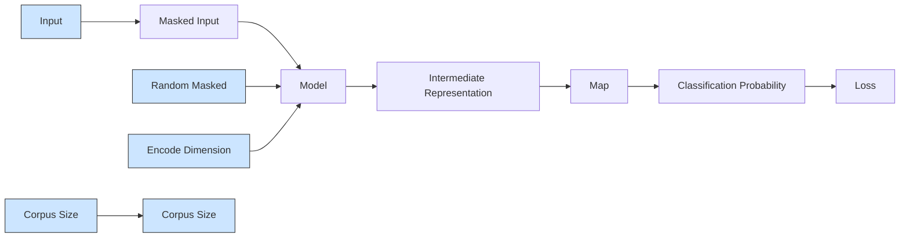
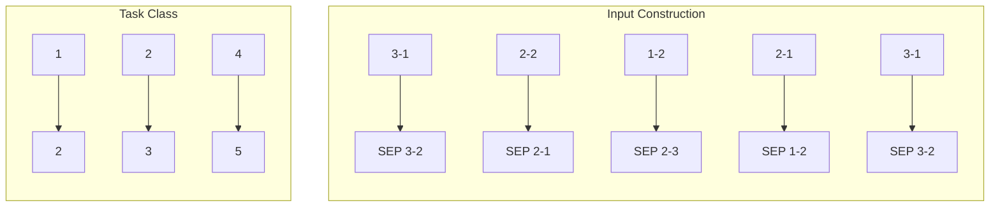

# TrafficFormer: An Efficient Pre-trained Model for Traffic Data

Guangmeng Zhou\*, Xiongwen Guo‡, Zhuotao Liu\*‡, Tong Li‡, Qi Li\*‡ and Ke Xu\*‡
\*Tsinghua University †Renmin University ‡Zhongguancun Laboratory

Abstract—Traffic data contains deep domain-specific knowledge, making labeling challenging, and the lack of labeled data adversely impacts the accuracy of learning-based traffic analysis. The pre-training technology is widely adopted in the fields of vision and natural language to address the problem of limited labeled data. However, the exploration in the domain of traffic analysis remains insufficient. This paper proposes an efficient pre-training model, TrafficFormer, for traffic data. In the pre-training stage, TrafficFormer introduces a fine-grained multi-classification task to enhance the representation capabilities of traffic data; in the fine-tuning stage, TrafficFormer proposes a traffic data augmentation method utilizing the random initialization feature of fields, which helps the traffic model focus on key information. We evaluate TrafficFormer using both traffic classification tasks and protocol understanding tasks. The experimental results show that TrafficFormer achieves superior performance on six traffic classification datasets, with improvements of up to 10% in the F1 score and demonstrates significantly superior protocol understanding capabilities compared to existing traffic pre-training models.

# 1. Introduction

The network traffic data, generated by the interactions of network entities, not only encapsulates the interaction logic of the corresponding protocols but also incorporates the behavioral information of network entities. For example, traffic characteristics are different depending on the applications being used or the web pages being browsed. The analysis and classification of network traffic are crucial for security and management. For example, identifying malware applications enables hosts to alert users and prevent information leakage or property loss; categorizing different types of application traffic allows service providers to differentiate services and implement dedicated routing policies or queuing mechanisms to enhance Quality of Service (QoS).

Traditional machine learning (ML) methods for traffic analysis, such as FlowPrint [1], CUMUL [2], and Appscanner [3], rely heavily on expert knowledge to select specified features (e.g., packet interval, packet size, protocol, etc.). These features, after feature engineering, are fed into the machine learning model. With the development of deep learning (DL), researchers have begun feeding raw traffic data directly into the DL models, such as FlowPic [4] based on Convolutional Neural Network (CNN) models, FS-Net [5] based on Autoencoder models, and GraphDapp [6] based on Graph Neural Network (GNN) models. These approaches leverage the DL models to learn complex feature patterns and classify network traffic. However, a significant amount of labeled data is crucial for achieving superior results with these methods. When labeled data is scarce, the effectiveness and generalizability of DL-driven traffic analysis are significantly constrained.

However, compared to the labeling of traditional data (e.g., text, images, sounds, etc.), network traffic data labeling is more difficult. Since text, images, and sounds are closely related to our daily lives, resulting in minimal skill requirements for data labelers. In contrast, traffic data requires the labelers to possess knowledge of network protocols and experience in specific scenarios (for instance understanding certain network attacks). Crucially, the attack-related traffic data is often overshadowed by the large volume of background network traffic scale, and exhibits rapidly changing patterns. As a result, manually labeling network traffic data is prohibitive, and large-scale and high-quality labeled datasets are scarce.

The pre-training methodology [7], [8], [9] is promising in addressing the problem of limited labeled data. It has two stages: pre-training and fine-tuning. The pre-training stage uses unlabeled data to learn general knowledge in a self-supervised learning manner and the fine-tuning stage utilizes labeled data to learn task-specific knowledge in a supervised learning fashion. For instance, large language models [10] rely on pre-training to mine information from a large amount of unlabeled data, enabling large models with hundreds of billions of parameters to be effectively fine-tuned to achieve superior results on many downstream tasks. Compared to text and image data, network traffic data is more voluminous and has more complex behavioral patterns, making the application of pre-training techniques to traffic analysis and identification tasks a reasonable approach.

Prior approaches have demonstrated the potential of applying pre-training techniques for traffic data analysis. For example, PERT $[11]$ introduces the bigram approach to transform the hexadecimal representation of packet contents into words and employs the Masked Language Modeling (MLM) for packet-level pre-training. ET-BERT $[12]$ considers a burst (a sequence of consecutive packets in the same direction) as a sentence and adopts MLM and next sentence prediction (NSP) tasks from BERT $[8]$ to learn traffic patterns. YaTC $[13]$ processes each flow as an image and adopts the Masked Image Modeling (MIM) task. However, these approaches have only explored the traffic representations to accommodate existing pre-training techniques, and have not tailored to traffic data in the pre-training and fine-tuning stages.

<table><tr><td>Prior Works</td><td>Traffic Representation</td><td>Pre-training Stage</td><td>Fine-tuning Stage</td></tr><tr><td>PERT [11]</td><td>Word</td><td>MLM</td><td>✕</td></tr><tr><td>ET-BERT [12]</td><td>Word</td><td>MLM &amp; NSP</td><td>✕</td></tr><tr><td>YaTC [13]</td><td>Image</td><td>MIM</td><td>✕</td></tr><tr><td>TrafficFormer</td><td>Word</td><td>MLM &amp; SODF</td><td>RIFA</td></tr></table>

TABLE 1: Comparison with prior approaches.

In this paper, we propose a pre-training model, TrafficFormer $^{1}$ for traffic data that learns fundamental traffic semantics from unlabeled data to improve the accuracy of downstream tasks. As shown in Table 1, in addition to traffic representation, we make innovative designs in both the pre-training and fine-tuning stages of the model.

- First, the network traffic data is a form of sequential data, similar to natural language. However, the direction and order of its sequence units are more critical. Therefore, TrafficFormer retains the masked modeling task during the pre-training stage to learn the sequential relationships of input units. Additionally, TrafficFormer proposes a fine-grained multi-classification task, i.e., Same Origin-Direction-Flow (SODF), which mines the direction and order information of packets, thereby enhancing the representation capability of traffic data (see §3.2).   
- Second, the network traffic data is structured, and redundant information is ubiquitous in packet headers. In the fine-tuning stage, TrafficFormer proposes a traffic data augmentation method, i.e., Random Initialization Field Augmentation (RIFA), which preserves traffic semantics. This data augmentation approach enables TrafficFormer to quickly focus on the essential information.

In addition to the pre-training and fine-tuning of the model, we also introduce innovations for its evaluation. The design rationale is that traffic reflects the behavioral information of network entities and the interaction logic of network protocols. Unlike traditional traffic classification tasks that solely assess a model's ability to recognize the behavior of entities, we evaluate the model's comprehension of the protocol interactions by introducing multiple novel protocol understanding tasks (e.g., packet direction recognition, packet loss detection, out-of-order detection, and packet prediction). This assures a comprehensive evaluation of the capabilities of traffic models. Experimental results demonstrate that TrafficFormer achieves the best performance across all traffic classification tasks, with an improvement of up to 10% in F1 score. Additionally, in the protocol understanding task, TrafficFormer outperforms existing traffic pre-training models. We further conduct a study on the key components of TrafficFormer and reveal the impact of each on the model performance.

# 2. Background and Related Work

# 2.1. Pre-training Methodology

The pre-training methodology utilizes unlabeled data and consists of two stages: pre-training and fine-tuning. In the pre-training stage, the model learns general knowledge in a self-supervised manner based on unlabeled data. In the fine-tuning stage, it acquires specific task knowledge through supervised learning using labeled data. Self-supervised learning constructs labels for unlabeled data, enabling the model to be trained in a supervised manner.

Common self-supervised methods include sequence modeling and contrastive learning. Sequence modeling predicts one part of a sequence based on another part of the sequence, while the objective in contrastive learning is to minimize the distance between similar samples and maximize the distance between dissimilar samples. Sequence modeling typically encompasses autoregressive modeling (e.g., GPT [9] and MAE [14]), autoencoding modeling (e.g., BERT [8] and BEiT [15]), and permutation coding modeling (e.g., XLNet [16]). Typical pre-training works based on contrastive learning include MoCo [17], SimCLR [18] and SimCSE [19].

Regarding model structure, current pre-training efforts predominantly utilize the Transformer [20], which includes both encoder and decoder components. Works that apply the encoder structure include BERT [8], XLNet [16], BEiT [15], SimCSE [19], etc., while works that apply the decoder structure include GPT [9], MAE [14], etc. Works that apply both encoder and decoder include BART [21], etc. Since CNN models are more suitable for image processing, early works in the visual field like MoCo [17] and SimCLR [18] were based on the ResNet [22] model. Subsequent works, like MoCo v3 [23], also began to be built based on the encoder structure.

In terms of model structure, TrafficFormer employs the encoder structure of the Transformer. For self-supervision, TrafficFormer incorporates self-supervised tasks designed for traffic data, thoroughly exploring the composition of data packets within the traffic and the relationships between them.

# 2.2. Data Augmentation

Data augmentation increases the volume of data by generating various copies, enhancing model performance and mitigating overfitting on training data. Different augmentation methods have been developed for specific data types.

For image data, common techniques include cropping, rotating, color transformation, geometric transformation, and random erasing $[24]$ . For text data, methods involve synonym replacement, random word insertion, deletion, substitution, and back-translation, which translates text into a target language and back again. Deep learning-based methods, such as BAGAN $[25]$ and DAGAN $[26]$ , utilize Generative

Adversarial Networks (GAN) for image data augmentation, while SeqGAN [27] and LeakGAN [28] use GANs for text.

For traffic data, Vu [29] and Oeung [30] employ Synthetic Minority Oversampling Technique (SMOTE) [31] for augmentation. Horowicz [32] transforms the traffic into images and applies image enhancement methods for traffic augmentation. Ring [33] explores data pre-processing strategies to generate traffic by GAN. ODDS [34] generates behavioral distributions of bot hosts in feature space using GANs, improving bot detection with limited labeled data. Ta-GAN [35] generates minority class samples in traffic to address class imbalance. In contrast, our approach directly modifies the original data rather than altering it in feature space. Additionally, our approach is based on domain knowledge and the enhanced data retains the original semantics.

# 2.3. Traffic Classification

Traditional traffic classification identifies traffic based on information such as port numbers. However, as traffic behavior has grown more complex and various disguising techniques have emerged, the accuracy of this method has significantly declined. Currently, traffic classification predominantly utilizes machine learning and deep learning approaches.

Machine learning-based methods [36], [37], [38], [39], [40] rely on expert-designed statistical features of traffic, which are fed into models for training. Commonly used machine learning models include the Supported Vector Machine, Naive Bayes classifier, K-Nearest Neighbor, and Decision Tree models. The key difference among traffic classification methods lies in feature design, closely tied to final performance. Machine learning models are generally smaller, resulting in faster training and inference, and the handcrafted features offer better interpretability. Deep learning-based methods directly input the content of the raw packets into the model, relying on the deep learning model to learn complex patterns for classification. Commonly used deep learning models include CNN, Long Short-Term Memory (LSTM), GNN, and Encoder models. Some studies [5], [41], [42], [43], [44], [45] input key attribute information of packets, such as packet size and inter-packet interval, while other input raw packet bytes directly.

Several works address real-world challenges, such as the open world problem with different distributions between testing and training sets $[1]$ , $[46]$ , $[47]$ , efficient training and inference $[48]$ , $[49]$ , $[50]$ , $[51]$ , $[52]$ , $[53]$ , and traffic mixing $[54]$ , $[55]$ . Our work focuses on the real-world challenge of achieving high-precision traffic classification in scenarios where labeled data is scarce.

# 3. TrafficFormer

In this section, we first outline the design goals, challenges, and solutions of TrafficFormer, followed by a presentation of the overall framework of TrafficFormer and a detailed discussion of both the pre-training and fine-tuning stages.

Goal. The primary design goal of TrafficFormer is to fully exploit the information in unlabeled traffic data to learn the fundamental semantics of traffic, thereby enhancing performance in downstream traffic tasks.

Challenges. Traffic is generated by the communication between two parties executing network protocols. Traffic data is a form of sequential data, similar to natural language. Several studies in natural language $[56]$ , $[57]$ have indicated that misordering of words has little effect on comprehension, whereas misordering of packets can lead to packet drops due to violation of interaction logic. Therefore, the order of sequence units (packets) in traffic is more critical compared to the order of words in language. Additionally, packets possess directional attributes, and header information often exhibits high redundancy. The primary challenges are to fully exploit the sequence, direction, and order relationships of the sequence units, and to efficiently identify valuable information for downstream traffic analysis tasks amidst the redundant data.

Solutions. To address the aforementioned challenges, TrafficFormer retains the masked modeling task from the NLP domain in the pre-training stage to learn the sequential relationships. And TrafficFormer designs the Same Origin-Direction-Flow (SODF) task to mine the direction and order information of the sequence units. In the fine-tuning stage, TrafficFormer proposes a traffic data augmentation method, i.e., Random Initialization Field Augmentation (RIFA), to reduce the model's reliance on irrelevant information and to efficiently identify valuable data.

# 3.1. Framework

The overall framework of TrafficFormer is illustrated in Figure 1, encompassing two stages: pre-training and fine-tuning. The tasks in the pre-training stage include Masked Burst Modeling (MBM) and the Same Origin-DirectionFlow (SODF) multi-classification tasks. The trained model can be adapted for various downstream tasks, such as malware detection, website fingerprinting, and the newly proposed protocol interaction comprehension tasks. Given the scarcity of training data for downstream tasks, TrafficFormer applies data augmentation during the fine-tuning stage.

TrafficFormer adopts a structure consistent with the BERT model. The input data is first transformed into vector representations through an encoding layer, which consists of three components: word semantic encoding, word position encoding, and word segment encoding. These components are combined to form the final vector representation of each word. The parameters of the encoding layer are continuously updated during model training, allowing for ongoing optimization of the word encodings. Subsequently, the encoded vector representations are fed into representation layers, each comprising a multi-head attention mechanism and a feedforward neural network. The attention mechanism establishes connections between each token, enabling each token to refine its representation by combining the representations of other tokens. The feedforward neural network facilitates the learning of nonlinear features, further enhancing the model's expressive capabilities. Finally, the token vectors are input into models tailored for different tasks. The model computes gradients to optimize its parameters based on the losses received from these tasks. The number of parameters in TrafficFormer and BERT-base [8] are on the same order of magnitude.


<details>
<summary>flowchart</summary>

```mermaid
graph TD
    subgraph_Pre-training["Pre-training"]
        A["MBM Task"] --> B["SODF Task"]
        B --> C["Represent Layer"]
        B --> D["Encode Layer"]
        C --> E["Flow"]
        D --> E
        E --> F["Output"]
    end

    subgraph_Fine-tuning["Fine-tuning"]
        G["Website Fingerprinting"] --> H["Malware Detection"]
        H --> I["Protocol Interaction Comprehension"]
        I --> J["Represent Layer L"]
        I --> K["Represent Layer 1"]
        I --> L["Encode Layer"]
        J --> M["Data Augmentation"]
        K --> M
        L --> M
        M --> N["Output"]
    end

    style Pre-training fill:#f9f,stroke:#333
    style Fine-tuning fill:#bbf,stroke:#333
```
</details>

Figure 1: The framework of TrafficFormer.

# 3.2. The Pre-training Stage

In the pre-training stage, the model is trained on large-scale, publicly available unlabeled traffic datasets. The traffic data is first tokenized and then structured into inputs for the pre-training tasks. These tasks include the Masked Burst Modeling (MBM) task and the Same Origin-Direction-Flow (SODF) multi-classification task.

3.2.1. Data Preprocessing. The traffic dataset is first split into multiple flows, with each flow further divided into multiple bursts. A flow is defined by a 5-tuple, which includes the source and destination IP addresses, source and destination ports, and the protocol, encompassing packets in both directions. A burst is defined as a sequence of consecutive packets transmitted in the same direction [58].

Each packet is a string of hexadecimal numbers, e.g., 4504008bd0. TrafficFormer converts packet in the form of bigrams, where each byte is connected with the following byte to form a 4-digit hexadecimal string. For example, the conversion of the string 4504008bd0 results in the sequence: 4504, 0400, 008b, 8bd0. The TrafficFormer then applies the Byte Pair Encoding (BPE) algorithm to build a corpus with a maximum size of 65,535 tokens. The BPE algorithm breaks down all the words in the training corpus into individual characters, which are progressively merged to form new words until the corpus reaches the specified size. Applying BPE to bigrams generates more fine-grained features, producing subwords with a minimum of one hexadecimal digit,


<details>
<summary>flowchart</summary>


</details>

Figure 2: An illustration of the MBM task.

smaller than most typical field lengths. In addition, special tokens such as [CLS], [SEP], [PAD], [MASK], and [UNK] are included in the corpus. [CLS] is used for classification tasks, [SEP] separates sequences, [PAD] pads inputs to the maximum length, [MASK] is used for masked language modeling tasks by replacing masked words, and [UNK] represents words not found in the corpus.

3.2.2. Pre-training Tasks. We first present the two pre-training tasks (MBM and SODF) separately and then the overall pre-training task loss.

MBM Task. Traffic data is sequential data, similar to natural language. To capture this sequential information, masked modeling tasks are classical approaches, such as Masked Language Modeling (MLM) and Masked Image Modeling (MIM). TrafficFormer retains the masked modeling task. In the Masked Burst Modeling (MBM) task, certain tokens in the input are masked, requiring the model to predict these masked tokens. The input of MBM is bursts which are continuous packets in the same direction.

As shown in Figure 2, the original input is first randomly masked to obtain the masked input. The model then leverages contextual information to learn the intermediate representations of tokens, which have a dimension equal to the encoding dimension. These intermediate representations are processed through a mapping network to generate prediction probabilities, with dimensions corresponding to the size of the corpus. Finally, the classification probabilities at the masked positions are combined with the true probabilities to calculate the loss. The loss function is cross-entropy loss, as depicted in Equation 1. Here, n is the number of masked tokens, $t_{i}$ denotes the true probability for the i-th token using one-hot encoding, and $\hat{t}_{i}$ signifies the predicted probability for the i-th token, which corresponds to the classification probability in Figure 2. The sum of the values in $\hat{t}_{i}$ is 1.

$$
l o s s _ {M B M} = - \sum_ {i = 1} ^ {n} t _ {i} l o g (\hat {t _ {i}}) \tag {1}
$$

SODF Task. Misordering of words has little effect on comprehension, whereas misordering of packets can lead to packet drops due to violation of interaction logic. Thus, the direction and order of packets in traffic data are more critical than those of words in text. However, previous research has not adequately addressed the unique characteristics of traffic data. ET-BERT incorporates two pre-training tasks, with the second being the Same-origin Burst Prediction (SBP) task, which is analogous to the NSP task. In the SBP task, a burst is divided into two segments, and with a certain probability, the latter segment is replaced with a segment from other bursts. The SBP task predicts whether the given two segments originate from the same burst, making it a binary classification task. There are two key issues associated with this task:

1) The task is relatively straightforward. Two segments from the same burst exhibit many consistent and similar fields, such as IP address, IP identification (IPID), and sequence number. Although some fields in the two segments differ, they are often very similar. For instance, the first 16 bits of the sequence number are frequently identical, while fields in randomly replaced segments may differ significantly. Consequently, predicting whether two segments originate from the same burst is relatively simple.   
2) The information learned is limited. A burst contains only packets in the same direction, while the model's input during the fine-tuning stage will consist of consecutive packets that typically have varying directions. This inconsistency creates a mismatch between the pre-training and fine-tuning stages. Furthermore, since each segment in the Segment Burst Prediction (SBP) contains packets in a single order, model's understanding of packet order information is also constrained.

Therefore, the SBP task struggles to capture directional and sequential information in traffic. To address this, we have designed the Same Origin-Direction-Flow (SODF) multi-classification task to learn direction, order, and corresponding flow (i.e., 5-tuple) of packets in the pre-training stage of the traffic model. The SODF task combines the split


<details>
<summary>flowchart</summary>


</details>

Figure 3: An example of the SODF task. There are three flows and we show the first three bursts of each flow. These bursts vary in length and together form five categories.

burst segments to form five categories. Figure 3 illustrates an example of the combinations of different categories.

1) Category 1: A normal burst, where the two split segments are separated by a [SEP] token. The segment identifiers for the tokens in the two segments are 1 and 2, respectively.   
2) Category 2: Similar to Category 1, except that the two segments of the burst are swapped after being split.   
3) Category 3: Two consecutive bursts from one flow, separated by a [SEP] token. The segment identifiers for the tokens in the two bursts are 1 and 2, respectively.   
4) Category 4: Similar to Category 3, except that the two bursts are swapped.   
5) Category 5: Bursts from two flows are arbitrarily combined, with a [SEP] token added between the bursts for separation.

Categories 1 and 2 represent the normal and disordered packets within a burst. Categories 3 and 4 further incorporate two bursts in opposite directions. All four above categories are associated with a single flow, while category 5 includes bursts of different flows. Thus, the two-by-two distinction of categories enables the model to learn the direction, order, and corresponding flow of packets through a single task. More fine-grained tasks can be designed to delve deeper into each information, e.g., learning packet order through location prediction [59].

Each burst is processed into each category with a probability of 20%, meaning that the sample size is the same for each category. The SODF task also employs cross-entropy loss, as depicted in Equation 2. Here, b is the batch size, $d_{i}$ is the true probability distribution of sample i, and $\hat{d}_{i}$ is the predicted probability distribution of sample i. Both distributions have a dimension of 5, corresponding to the number of categories in the SODF task.

$$
l o s s _ {S O D F} = - \sum_ {i = 1} ^ {b} d _ {i} l o g (\hat {d} _ {i}) \tag {2}
$$

The pre-training stage employs the multi-task learning mode, with the total loss function of pre-training depicted as Equation 3. Here, $\lambda$ is a hyperparameter used to balance the loss values of the two tasks, set to $\lambda = 0.1$ in the experiments. The adoption of multi-task learning increases the complexity of the Masked Burst Modeling (MBM) task due to the influence of various inputs (bursts of different flows, directions, and orders) in the Same Origin-Direction-Flow (SODF) task. This complexity enhances the learning of fundamental semantics of the traffic.

$$
\text { loss } = \lambda * \text { loss } _ {M B M} + \text { loss } _ {S O D F} \tag {3}
$$

# 3.3. The Fine-tuning Stage

In the fine-tuning stage, the model is initialized with the parameters of the pre-trained model and then trained further on task-specific data. To ensure consistency with the pre-training process, the fine-tuning data is transformed into the same input format as the pre-training data. First, data packets are converted into hexadecimal strings, which are then transformed into bigram form and tokenized using the corpus generated during pre-training. The packet tokens are concatenated directly, without inserting a [SEP] token for separation, meaning all tokens share the same segment identifier.

Traffic Data Augmentation. Given the limited amount of data in the downstream fine-tuning task, TrafficFormer introduces a traffic data augmentation method.

<table><tr><td>Protocol</td><td>Randomly Initialized Fields</td></tr><tr><td>IP</td><td>IPID</td></tr><tr><td>TCP</td><td>source port, sequence number, acknowledgment number,timestamp in the timestamp option</td></tr><tr><td>UDP</td><td>source port</td></tr><tr><td>TLS</td><td>the random number in theclient hello and server hello message</td></tr></table>

TABLE 2: Randomly initialized fields in common protocols

Certain fields in network protocols are initialized randomly, and their values lack inherent meaning, rendering them ineffective for classification. Table 2 lists the randomly initialized fields in common protocols. In the IP protocol, the IPID field labels each packet, and when an IP packet is fragmented, the IPID fields of the multiple fragments remain consistent. Random initialization of the IPID complicates guessing attempts, thereby preventing malicious attacks. In the TCP and UDP protocols, the source port number identifies the client's sending program and is also randomly initialized to mitigate port scanning and denial-of-service attacks. Given that the TCP protocol operates on byte streams, the sequence number denotes the starting position of bytes to be sent, while the acknowledgment number indicates the next expected byte's position. Guessing the TCP source port number, sequence number, and acknowledgment number is fundamental to TCP hijacking attacks [60], [61], and random initialization increases the difficulty of such attacks. The timestamp in the TCP timestamp option helps calculate round-trip time delays and prevents sequence number wraparound, potentially incorporating a value increased by a random offset [62]. In the TLS protocol, random numbers in the client hello and server hello messages are utilized to generate encryption keys, enhancing the strength of session keys and preventing replay attacks.

Based on the aforementioned insights, we propose the traffic data augmentation method, i.e., Random Initialization Field Augmentation (RIFA). RIFA generates multiple copies of traffic data by randomly altering randomly initialized fields within a packet, while preserving the original label, as it does not modify the original semantics. Recognizing that the change pattern of fields is often more significant than the actual field values, RIFA maintains the change pattern of a field in subsequent packets after modifying its initial value. For instance, in the TCP protocol, RIFA replaces the sequence number of the first packet with a random number and subsequently assigns the sequence numbers of later packets as this random number plus the original difference. This augmentation allows the model to focus less on the specific values of these fields and more on the variations in values or other fields, facilitating the rapid extraction of valuable information from large datasets. In contrast to deep learning-based data augmentation methods, RIFA relies on domain knowledge and modifies the original data directly rather than in the feature space.

In traffic data, the source/destination IP addresses and source/destination ports may lead to shortcuts in classification. To mitigate this issue, ET-BERT selects packet content following the port number, which, while effective, results in a significant loss of information. For example, in the TCP protocol, only the size of the TCP header is included; without the entire TCP payload, critical information regarding the payload size may be omitted. Conversely, TrafficFormer still utilize all packet header content, while randomly varying the IP and port number fields. This approach not only retains more information but also prevents shortcuts.

# 4. Evaluation

In this section, we conduct an extensive evaluation of TrafficFormer across multiple datasets to demonstrate the following:

1) TrafficFormer outperforms previous methods in traffic classification tasks, including machine learning methods, deep learning methods, and pre-training methods.   
2) TrafficFormer surpasses previous pre-training methods in protocol understanding tasks.   
3) The impact of key components on classification result.

# 4.1. Experiment Setup

We built TrafficFormer using PyTorch 2.0.1, and all experiments were conducted on NVIDIA A100 GPUs. The following sections detail the specific experimental settings, including the pre-training datasets and settings, evaluation metrics, and baseline methods.

Pre-training Datasets. As shown in Table 3, we select three datasets from different sources for pre-training: ISCX-NonVPN [63] (2016), CICMalAnal2017 [64] (2017), and Browser [1] (2020). The ISCX-NonVPN dataset includes traffic from various application types, such as browsers, email, audio, video, and file transfers. We specifically

<table><tr><td>Datasets</td><td>Size</td><td>Flows</td><td>Included Protocols §</td></tr><tr><td>ISCX-NonVPN [63]</td><td>4.9GB</td><td>219076</td><td>TLS1.2, SFTP, SSDP, SNMP, NTP, MDNS, HTTP, GQUIC...</td></tr><tr><td>CICMalAnal-2017 [64]</td><td>6.5GB</td><td>232627</td><td>TLS1.2, GQUIC, SSDP, MDNS...</td></tr><tr><td>Browser [1]</td><td>7.4GB</td><td>149527</td><td>TLS1.3, GQUIC...</td></tr></table>

$^{§}$ Only a subset of special protocols is listed, while common protocols like IP, TCP, UDP, and DNS are not included.

TABLE 3: Pre-training datasets.

choose the non-VPN traffic portion for our training data. The CICMalAnal2017 dataset contains traffic from both normal software and malware, and we select the normal software traffic from 2017 as our training data. The Browser dataset consists of traffic data collected using a Samsung phone to access the top 1,000 websites as ranked by Alexa, utilizing browsers such as Google Chrome, Firefox, UC, and Samsung's native browser.

We first employ SplitCap [65] to segment the datasets by flow. After this process, the dataset no longer includes connectionless protocols like ARP and ICMP, as they are irrelevant to actual data transmission. Table 3 provides detailed information about the three datasets. The total volume of the pre-training dataset is approximately 20 GB, comprising over 600,000 flows. Additionally, the table highlights the specific protocols included in the datasets. Both the ISCX-NonVPN and CICMalAnal2017 datasets contain software data and a variety of network protocols, with ISCX-NonVPN featuring a more diverse range. However, these two datasets were collected earlier and lack data for the TLS 1.3 protocol, which is addressed by the Browser dataset. Thus, the pre-training dataset is not only sufficient in volume but also rich in protocol variety.

Pre-training Settings. Ethernet addresses are often tied to the location of traffic collection and do not pertain to the communicating parties, making the content in the Ethernet packet header irrelevant for classification. Additionally, with the prevalence of encrypted packets today, the content of the encrypted payload is also unhelpful. Consequently, during pre-training, we extract 64 bytes of data from each packet after the Ethernet layer. The model has an encoding dimension of 768, with a total of 12 layers, where each multi-head attention mechanism has 12 heads, and the maximum sequence length is set to 512. The SODF task utilizes the representation of the [CLS] token from the last layer of the model for classification. We set the batch size to 64, and with 3 GPUs, this results in an effective batch size of 192. The optimizer is Adam, with a learning rate of 2e-5, a linear decay scheduling strategy, and a warm-up ratio of 0.1. The optimizer used is Adam, with a learning rate of 2e-5, a linear decay scheduling strategy, and a warm-up ratio of 0.1. The total number of training steps is fixed at 500,000, with the loss stabilizing around 120,000 steps. Therefore, we select the model at 120,000 steps as the initial model for fine-tuning downstream tasks.

Evaluation Metrics. We employ classification accuracy (AC), precision (PR), recall (RC), and F1 score as our evaluation metrics. For multi-class tasks, when calculating these metrics for each class, that class is treated as the positive class, while all others are considered negative. To calculate the overall metrics for the entire dataset, we average the metric values of each class, which helps balance the issue of varying sample sizes across classes.

Baselines. We select six baselines, including two machine learning methods (Appscanner and BIND), two deep learning methods (DeepFP and GraphDapp), and two pre-training methods (ET-BERT and YaTC). The training datasets of ML-based/DL-based baselines are the same as the fine-tuning datasets of TrafficFormer. And the pre-training model baselines utilize the same pre-training and fine-tuning datasets as TrafficFormer.

1) In Appscanner [40], statistical features are constructed using packet size and direction, resulting in a total of 54 features. The model employed is a random forest, with the validation set used to determine the appropriate classification threshold.   
2) In BIND [39], distribution features are derived from the size and interval of packets and bursts, totaling 700 features. A random forest model is utilized, and the validation set is used to establish the classification threshold.   
3) In DeepFP [42], packet size and direction information are input into a CNN model. The validation set is used to select the number of channels, the dimension of the fully connected layer, and the learning rate.   
4) In GraphDapp [45], packet relationships are constructed as a graph, which is then trained using a GNN model. The validation set is used to determine the number of layers in the GNN model, the size of the hidden layer, and the input length.   
5) ET-BERT [12] and TrafficFormer share the same pre-training data and hyperparameters, but their pre-training tasks differ. We select the model at step 120,000 for fine-tuning.   
6) YaTC [13] processes each flow as an image, utilizing the same pre-training data and hyperparameters as TrafficFormer. We choose the model at step 400,000 for fine-tuning in downstream tasks.

# 4.2. Traffic Classification Task

In this section, we present the performance of Traffic-Former on six fine-tuning tasks for traffic classification.

Fine-tuning Datasets. As shown in Table 4, six datasets are selected as fine-tuning datasets in this section, including Cross-Platform (Android), Cross-Platform (iOS), ISCX-VPN (Service), ISCX -VPN(App), CSTNET-TLS 1.3, and USTC-TFC. These datasets encompass four specific fine-tuning tasks: application fingerprinting, service type identification, website fingerprinting, and malware detection. The Cross-Platform (Android) and Cross-Platform (iOS) datasets collect traffic data from the 100 most popular applications on Android and iOS phones in China, the United States, and India, respectively. CSTNET-TLS 1.3 contains traffic data ¶ The number of flows and classes refers to the actual counts of flows and classes utilized for classification after processing.

<table><tr><td colspan="2">Datasets</td><td>Tasks</td><td>Flow Number¶</td><td>Class Number¶</td></tr><tr><td>Cross-Platform (Android)</td><td>[66]</td><td>Application Fingerprinting</td><td>32149</td><td>197</td></tr><tr><td>Cross-Platform (iOS)</td><td>[66]</td><td>Application Fingerprinting</td><td>19736</td><td>190</td></tr><tr><td>CSTNET-TLS 1.3</td><td>[12]</td><td>Website Fingerprinting</td><td>46372</td><td>120</td></tr><tr><td>ISCX-VPN (Service)</td><td>[63]</td><td>Service Type Identification</td><td>1457</td><td>6</td></tr><tr><td>ISCX-VPN (App)</td><td>[63]</td><td>Application Fingerprinting</td><td>1444</td><td>11</td></tr><tr><td>USTC-TFC</td><td>[67]</td><td>Malware Detection</td><td>6049</td><td>14 §</td></tr></table>

§ The ratio of normal software classes to malware classes is 5:9.

TABLE 4: Fine-tuning datasets.

collected from 120 websites using the TLS 1.3 protocol. The ISCX-VPN (Service) and ISCX-VPN (App) datasets capture traffic associated with different behaviors of multiple applications within a Virtual Private Network (VPN), allowing for classification into various applications and services. For example, the Skype application generates three types of traffic, i.e., text chat, file transfer, and voice chat. These three traffic types belong to different classes in ISCX-VPN (Service), while they are categorized under the same Skype class in ISCX-VPN (App). The USTC-TFC dataset includes traffic generated by 10 normal software applications and 10 malware samples.

Similar to the pre-training process, we begin by splitting the fine-tuning dataset into flows. We then remove any flows smaller than 2KB or containing fewer than 3 packets, followed by removing any classes with fewer than 10 flows. For classes containing more than 500 flows, we randomly select 500 flows to ensure no class exceeds this limit. The number of flows and classes remaining in each dataset after processing is detailed in Table 4. In the malware detection task, the ratio of normal software classes to malware classes is 5:9. We split the dataset into training, validation, and test sets with an 8:1:1 ratio for each class.

Fine-tuning Settings. For machine learning and deep learning methods, all packets from a flow are used as input. However, for pre-training methods, only the first 5 packets from each flow are selected. Both ET-BERT and TrafficFormer use 64 bytes of data from each packet after the Ethernet layer as input, with models trained over 20 rounds. YaTC, on the other hand, uses 80 bytes for the packet header and 240 bytes for the payload (data after IP/TCP), and is trained for 300 rounds. For pre-training methods, the optimal model is selected based on validation results from multiple learning rates and rounds of training.

Additionally, for pre-training methods, certain features—such as IP, port, timestamps in the TCP protocol, and timestamps and server name indication (SNI) in the TLS protocol—are processed using the data enhancement technique outlined in Sec. 3.3 to prevent classification shortcuts. For TrafficFormer, data augmentation is performed by randomly initializing fields including IPID, TCP sequence number, and acknowledgment number five times, effectively multiplying the dataset size by five. To maintain consistency in the total amount of training data, only 4 training rounds are conducted on the data-enhanced version of TrafficFormer (TrafficFormer w/ EA).

Cross-Platform Dataset. The results of different approaches on the Cross-Platform dataset are shown in Table 5. Pre-training approaches generally outperform both deep learning and machine learning methods. This is primarily due to the ability of pre-training models to process more information from single packet and extract valuable insights from complex data. Among the pre-training methods, YaTC demonstrates the worst performance, while TrafficFormer surpasses ET-BERT in all metrics, with a $4.82\%$ and $0.19\%$ improvement in F1 score, respectively. After applying data augmentation, TrafficFormer w/ EA achieves even greater improvements, with a $10.05\%$ and $10.09\%$ boost in F1 score compared to ET-BERT. This demonstrates the effectiveness of data augmentation in reducing the model's reliance on irrelevant information. The classification accuracies on the Cross-Platform dataset are relatively low, potentially due to several factors: (i) the dataset contains a large number of categories, 197 and 190, respectively; (ii) many applications in the dataset belong to the same category and exhibit similar network interaction patterns; (iii) multiple applications often access the same third-party domains. For instance, $78\%$ of Android apps in the U.S. access google.com, leading to overlapping access records [66]. Additionally, the iOS system is more closed than Android, resulting in more uniform traffic patterns, which makes identifying application fingerprints on iOS more challenging. Nevertheless, TrafficFormer demonstrates significant improvements over the other methods, proving its efficiency in traffic detection.

CSTNET-TLS 1.3 Dataset. The rightmost section of Table 5 presents the results of website fingerprinting on the CSTNET-TLS 1.3 dataset. TrafficFormer achieves optimal performance across all metrics, with a 3.92% improvement in F1 score compared to the best results from machine learning and deep learning approaches, and a 1.3% enhancement over the best pre-training method. Following data augmentation, TrafficFormer w/ EA improves by 2.87%, 3.07%, 3.24%, and 3.24% in accuracy, precision, recall, and F1 score, respectively, compared to TrafficFormer. This indicates that data augmentation significantly benefits the website fingerprinting task, allowing the model to concentrate on valuable information within the packets.

We illustrate the attention mechanisms in TrafficFormer on the CSTNET-TLS 1.3 dataset and the Cross-Platform (Android) dataset in Figure 4. As shown in Figure 4a, attention is more concentrated in two specific areas within the Cross-Platform (Android) dataset. In contrast, the attention in the CSTNET-TLS 1.3 dataset, as depicted in Figure 4b, is more dispersed, with multiple bytes in the packet influencing the final classification. Despite these differences, the two attention illustrations share notable similarities. For the same data, disparities between attention heads indicate that they focus on different aspects of the data. Additionally, for any given attention head, its focus varies across different samples within a batch. This variability suggests that the pre-trained model acquires diverse knowledge from complex data, enabling it to recognize different classes.

<table><tr><td>Datasets</td><td colspan="4">Cross-Platform(Android)</td><td colspan="4">Cross-Platform(iOS)</td><td colspan="4">CSTNET-TLS 1.3</td></tr><tr><td>Approaches</td><td>AC</td><td>PR</td><td>RC</td><td>F1</td><td>AC</td><td>PR</td><td>RC</td><td>F1</td><td>AC</td><td>PR</td><td>RC</td><td>F1</td></tr><tr><td>Appscanner [40]</td><td>0.5185</td><td>0.4897</td><td>0.3538</td><td>0.3982</td><td>0.4058</td><td>0.3267</td><td>0.2943</td><td>0.3014</td><td>0.7182</td><td>0.8205</td><td>0.6771</td><td>0.7305</td></tr><tr><td>BIND [39]</td><td>0.4025</td><td>0.2987</td><td>0.2705</td><td>0.2774</td><td>0.3607</td><td>0.2456</td><td>0.2407</td><td>0.2330</td><td>0.8014</td><td>0.7842</td><td>0.7445</td><td>0.7510</td></tr><tr><td>DeepFP [42]</td><td>0.2669</td><td>0.1542</td><td>0.1588</td><td>0.1525</td><td>0.2138</td><td>0.1235</td><td>0.1201</td><td>0.1169</td><td>0.6345</td><td>0.5868</td><td>0.5870</td><td>0.5835</td></tr><tr><td>GraphDapp [45]</td><td>0.4806</td><td>0.3676</td><td>0.3429</td><td>0.3396</td><td>0.2605</td><td>0.2430</td><td>0.2533</td><td>0.2460</td><td>0.7945</td><td>0.7690</td><td>0.7669</td><td>0.7622</td></tr><tr><td>ET-BERT [12]</td><td>0.6952</td><td>0.5446</td><td>0.5163</td><td>0.5162</td><td>0.4721</td><td>0.4059</td><td>0.3634</td><td>0.3680</td><td>0.8120</td><td>0.7986</td><td>0.7888</td><td>0.7884</td></tr><tr><td>YaTC [13]</td><td>0.6233</td><td>0.4324</td><td>0.4077</td><td>0.4088</td><td>0.3931</td><td>0.2975</td><td>0.2902</td><td>0.2815</td><td>0.8407</td><td>0.8165</td><td>0.8170</td><td>0.8133</td></tr><tr><td>TrafficFormer</td><td>0.7369</td><td>0.5900</td><td>0.5726</td><td>0.5644</td><td>0.4807</td><td>0.4003</td><td>0.372</td><td>0.3699</td><td>0.8197</td><td>0.8064</td><td>0.8027</td><td>0.8014</td></tr><tr><td>TrafficFormer w/ EA</td><td>0.7664</td><td>0.6435</td><td>0.6204</td><td>0.6167</td><td>0.5679</td><td>0.4966</td><td>0.4697</td><td>0.4689</td><td>0.8484</td><td>0.8371</td><td>0.8351</td><td>0.8338</td></tr></table>

TABLE 5: The results of different approaches on the Cross-Platform dataset and the CSTNET-TLS 1.3 dataset.

<table><tr><td>Datasets</td><td colspan="4">ISCX-VPN(Service)</td><td colspan="4">ISCX-VPN(App)</td></tr><tr><td>Approaches</td><td>AC</td><td>PR</td><td>RC</td><td>F1</td><td>AC</td><td>PR</td><td>RC</td><td>F1</td></tr><tr><td>Appscanner [40]</td><td>0.9178</td><td>0.9036</td><td>0.9212</td><td>0.9113</td><td> $0.7724 (0.6207)^{\text{¶}}$ </td><td>0.7146 (0.5968)</td><td>0.6906 (0.5712)</td><td>0.6918 (0.5640)</td></tr><tr><td>BIND [39]</td><td>0.8562</td><td>0.8741</td><td>0.8433</td><td>0.8543</td><td>0.7724 (0.6000)</td><td>0.6664 (0.5154)</td><td>0.6624 (0.5367)</td><td>0.6547 (0.5147)</td></tr><tr><td>DeepFP [42]</td><td>0.6781</td><td>0.6845</td><td>0.6678</td><td>0.6723</td><td>0.7310 (0.5034)</td><td>0.6413 (0.3224)</td><td>0.6901 (0.4119)</td><td>0.6599 (0.3559)</td></tr><tr><td>GraphDapp [45]</td><td>0.8906</td><td>0.8903</td><td>0.9038</td><td>0.8956</td><td>0.7969 (0.5938)</td><td>0.7351 (0.5637)</td><td> $\mathbf {0.7813} (0.5154)$ </td><td> $\mathbf {0.7419} (0.4826)$ </td></tr><tr><td>ET-BERT [12]</td><td>0.9452</td><td>0.9496</td><td> $\mathbf {0.9450}$ </td><td>0.9454</td><td>0.7586</td><td>0.6255</td><td>0.6236</td><td>0.6042</td></tr><tr><td>YaTC [13]</td><td>0.8356</td><td>0.8163</td><td>0.8116</td><td>0.8122</td><td>0.7310</td><td>0.6004</td><td>0.6199</td><td>0.6034</td></tr><tr><td>TrafficFormer</td><td>0.9247</td><td>0.9268</td><td>0.9167</td><td>0.9205</td><td> $\mathbf {0.8000}$ </td><td> $\mathbf {0.7675}$ </td><td>0.7036</td><td>0.6959</td></tr><tr><td>TrafficFormer w/ EA</td><td> $\mathbf {0.9589}$ </td><td> $\mathbf {0.9621}$ </td><td> $\mathbf {0.9450}$ </td><td> $\mathbf {0.9580}$ </td><td>0.7931</td><td>0.7544</td><td>0.7044</td><td>0.7129</td></tr></table>

$^{¶}$ The results in parentheses represent the method's performance using only the first five packets of information.

TABLE 6: The results of different approaches on the ISCX-VPN dataset.   


<details>
<summary>scatter</summary>

| x    | y    |
| ---- | ---- |
| 0.5  | 5.8  |
| 1.0  | 5.5  |
| 1.5  | 5.2  |
| 2.0  | 4.9  |
| 2.5  | 4.6  |
| 3.0  | 4.3  |
| 3.5  | 4.0  |
| 4.0  | 3.7  |
| 4.5  | 3.4  |
| 5.0  | 3.1  |
</details>

(a) Cross-Platform(Android) dataset


<details>
<summary>heatmap</summary>

| X | Y | Value |
|---|---|---|
| 0.5 | 6 | 10^-2 |
| 0.75 | 5 | 10^-2 |
| 1.0 | 4 | 10^-2 |
| 1.25 | 3 | 10^-2 |
| 1.5 | 2 | 10^-2 |
| 1.75 | 1 | 10^-2 |
| 2.0 | 0 | 10^-2 |
| 2.25 | -1 | 10^-2 |
| 2.5 | -2 | 10^-2 |
| 2.75 | -3 | 10^-2 |
| 3.0 | -4 | 10^-2 |
| 3.25 | -5 | 10^-2 |
| 3.5 | -6 | 10^-2 |
| 3.75 | -7 | 10^-2 |
| 4.0 | -8 | 10^-2 |
| 4.25 | -9 | 10^-2 |
| 4.5 | -10 | 10^-2 |
| 4.75 | -11 | 10^-2 |
| 5.0 | -12 | 10^-2 |
| 5.25 | -13 | 10^-2 |
| 5.5 | -14 | 10^-2 |
| 5.75 | -15 | 10^-2 |
| 6.0 | -16 | 10^-2 |
| 6.25 | -17 | 10^-2 |
| 6.5 | -18 | 10^-2 |
| 6.75 | -19 | 10^-2 |
| 7.0 | -20 | 10^-2 |
| 7.25 | -21 | 10^-2 |
| 7.5 | -22 | 10^-2 |
| 7.75 | -23 | 10^-2 |
| 8.0 | -24 | 10^-2 |
| 8.25 | -25 | 10^-2 |
| 8.5 | -26 | 10^-2 |
| 8.75 | -27 | 10^-2 |
| 9.0 | -28 | 10^-2 |
| 9.25 | -29 | 10^-2 |
| 9.5 | -30 | 10^-2 |
| 9.75 | -31 | 10^-2 |
| 10.0 | -32 | 10^-2 |
| 10.25 | -33 | 10^-2 |
| 10.5 | -34 | 10^-2 |
| 10.75 | -35 | 10^-2 |
| 11.0 | -36 | 10^-2 |
| 11.25 | -37 | 10^-2 |
| 11.5 | -38 | 10^-2 |
| 11.75 | -39 | 10^-2 |
| 12.0 | -40 | 10^-2 |
| 12.25 | -41 | 10^-2 |
| 12.5 | -42 | 10^-2 |
| 12.75 | -43 | 10^-2 |
| 13.0 | -44 | 10^-2 |
| 13.25 | -45 | 10^-2 |
| 13.5 | -46 | 10^-2 |
| 13.75 | -47 | 10^-2 |
| 14.0 | -48 | 10^-2 |
| 14.25 | -49 | 10^-2 |
| 14.5 | -50 | 10^-2 |
| 14.75 | -51 | 10^-2 |
| 15.0 | -52 | 10^-2 |
| 15.25 | -53 | 10^-2 |
| 15.5 | -54 | 10^-2 |
| 15.75 | -55 | 10^-2 |
| 16.0 | -56 | 10^-2 |
| 16.25 | -57 | 10^-2 |
| 16.5 | -58 | 10^-2 |
| 16.75 | -59 | 10^-2 |
| 17.0 | -60 | 10^-2 |
| 17.25 | -61 | 10^-2 |
| 17.5 | -62 | 10^-2 |
| 17.75 | -63 | 10^-2 |
| 18.0 | -64 | 10^-2 |
| 18.25 | -65 | 10^-2 |
| 18.5 | -66 | 10^-2 |
| 18.75 | -67 | 10^-2 |
| 19.0 | -68 | 10^-2 |
| 19.25 | -69 | 10^-2 |
| 19.5 | -70 | 10^-2 |
| 19.75 | -71 | 10^-2 |
| 20.0 | -72 | 10^-2 |
| ... (repeated) for all rows and columns are filled with '...' in the image.
</details>

(b) CSTNET-TLS 1.3 dataset   
Figure 4: The illustrations depict the attention of the last layer's [CLS] tokens on the Cross-Platform(Android) dataset and CSTNET-TLS 1.3 dataset in TrafficFormer. On the horizontal axis, 5 packets are represented, with each interval containing 64 bytes of the packet. The vertical axis shows the first 6 of the 12 attention heads, and within each interval is a batch of data with a batch size of 32.

ISCX-VPN Dataset. The results of different approaches on the ISCX-VPN dataset are presented in Table 6, including service type identification and application fingerprinting. In the task of service type identification, pre-training approaches outperform both traditional machine learning and deep learning approaches. The model TrafficFormer w/ EA achieves the best performance in this task, with an F1 score improvement of 1.26% over the optimal baseline. Compared to TrafficFormer, TrafficFormer w/ EA enhances accuracy,

precision, recall, and F1 score by 3.42%, 3.53%, 2.83%, and 3.75%, respectively. These results indicate that traffic data augmentation is beneficial for service type identification.

In the application fingerprinting task, TrafficFormer demonstrates optimal performance in terms of accuracy and precision, while GraphDapp excels in recall and F1 value. The pre-training approaches do not show better results compared to machine learning and deep learning approaches. The pre-training approaches do not yield better results compared to traditional machine learning and deep learning methods. This may stem from the fact that pre-training approaches utilize information from only the first five packets for rapid traffic processing, whereas machine learning and deep learning methods leverage data from all packets. We report results using only the first five packets in parentheses. When restricted to this subset, machine learning and deep learning approaches are less effective than the pre-training methods. The highest F1 value for machine learning and deep learning approaches is 56.4%, which is lower than the lowest F1 value of 60.34% observed in the pre-training methods. TrafficFormer and TrafficFormer w/ EA achieve improvements of 9.17% and 10.87% in F1 value, respectively, compared to the best baseline. Thus, TrafficFormer can make more accurate decisions with minimal packet data, which is crucial in scenarios requiring quick decision-making. However, TrafficFormer w/ EA does not surpass TrafficFormer in accuracy and precision due to constraints from the enhancement mode in this section. We augmented the data eight times over ten rounds of training, yielding metrics of 83.45%, 73.31%, 74.96%, and 73.94%, significantly outperforming TrafficFormer.

USTC-TFC Dataset. Table 7 presents the results of the malware detection task on the USTC-TFC dataset. In this task, pre-training approaches outperform traditional machine learning and deep learning methods. Among the pre-training approaches, YaTC exhibits the poorest performance. TrafficFormer achieves improvements of 0.67%, 0.54%, 0.53%, and 0.57% in accuracy, precision, recall, and F1 score, respectively, compared to ET-BERT. After applying data augmentation, TrafficFormer w/ EA shows further enhancements of 1.17%, 0.96%, 1.02%, and 1.03% in these metrics compared to ET-BERT. Thus, TrafficFormer demonstrates superior accuracy in detecting malicious traffic, and traffic data augmentation proves beneficial for the malware detection task.

<table><tr><td>Approaches</td><td>AC</td><td>PR</td><td>RC</td><td>F1</td></tr><tr><td>Appscanner [40]</td><td>0.8942</td><td>0.9137</td><td>0.9050</td><td>0.8984</td></tr><tr><td>BIND [39]</td><td>0.8926</td><td>0.8995</td><td>0.9043</td><td>0.9013</td></tr><tr><td>DeepFP [42]</td><td>0.8496</td><td>0.8613</td><td>0.8543</td><td>0.8548</td></tr><tr><td>GraphDapp [45]</td><td>0.8633</td><td>0.8787</td><td>0.8779</td><td>0.8738</td></tr><tr><td>ET-BERT [12]</td><td>0.9699</td><td>0.9741</td><td>0.9724</td><td>0.9727</td></tr><tr><td>YaTC [13]</td><td>0.9672</td><td>0.9679</td><td>0.9659</td><td>0.9667</td></tr><tr><td>TrafficFormer</td><td>0.9766</td><td>0.9795</td><td>0.9777</td><td>0.9784</td></tr><tr><td>TrafficFormer w/ EA</td><td>0.9816</td><td>0.9837</td><td>0.9826</td><td>0.9830</td></tr></table>

TABLE 7: The results of different approaches on the USTC-TFC dataset.

# 4.3. Protocol Understanding Task

Traffic not only reflects the behavioral information of network entities but, more fundamentally, contains the interaction information of network protocols. In this section, we propose new tasks to evaluate the understanding of protocol interaction logic of the pre-trained traffic model, which allows for a more comprehensive assessment of the model's capabilities. Specifically, we introduce four tasks: packet direction judgment, packet loss detection, packet out-of-order detection, and packet prediction.

Packet Direction Judgement. Two packets are randomly selected from a flow. If the direction of both packets is the same, the label is 1; otherwise, the label is 0. This binary classification task evaluates the model's ability to discern the direction of packets.

Packet Loss Detection. We take $N$ consecutive packets from a flow and randomly drop any packet from 2 to $N - 1$ to create a packet loss sample, labeled as 0. To maintain the same number of packets, we take packets from 2 to $N$ or from 1 to $N - 1$ as no packet loss samples, labeled as 1. This binary classification task assesses the model's ability to recognize the order of packets.

Packet Out-of-order Detection. We take $N$ consecutive packets from a flow, randomly select any packet from 1 to $N - 1$ , and insert it into any position after its original location to create an out-of-order sample, labeled as 0. The original $N$ packets serve as a non-out-of-order sample, labeled as 1. This binary classification task evaluates the model's ability to recognize the order of packets.

Packet Prediction. Packet prediction involves forecasting the fields in a packet's header. We carefully categorize these header fields. For instance, in the TCP protocol, some fields, such as the TCP sequence number, are predictable, while others, like the window size, are more challenging to forecast due to their dependence on the host's available resources, which cannot be inferred solely from protocol interactions. Predicting the window size relies more on experience. Additionally, fields like the checksum pose significant challenges, as they are calculated based on the entire packet's contents, requiring the model to grasp the complex logic of checksum computation. The packet prediction task emphasizes predictable fields because they reflect the logic of protocol interaction. The task utilizes N consecutive packets from a flow, masking tokens related to the field to be predicted in the last packet and expecting the model to accurately predict the correct token for that position. While similar to masked modeling tasks, this task only has preceding context, making the prediction more complex. It is also a multi-class classification task, with the number of categories corresponding to the size of the corpus. This task evaluates the model's comprehensive understanding of the logic governing protocol interactions.

We construct protocol understanding tasks based on two datasets: CSTNET-TLS 1.3 and CICMalAnal2017. To avoid overlap with pre-training data, we select benign data in 2016 from the CICMalAnal2017 dataset and apply the same flow filtering and selection logic as described in Sec.4.2. The task data is constructed according to the above description, with $N = 5$ . For the packet prediction task, we focus on the IP and TCP protocols, predicting the following fields: IPID, source/destination IP, source/destination port, TCP sequence number, TCP acknowledgment number, TCP header length, and TCP flags. We predict the fifth packet based on the first four packets of each flow, with certain fields of the fifth packet masked and awaiting prediction. To indicate the direction of the fifth packet, the fifth packet will randomly include one of the source/destination IP, source/destination port. In the first three tasks, the number of positive and negative samples is equal, and we report the F1 scores. For the packet prediction task, we present the predictive accuracy of the fields. The baselines in this section are ET-BERT and YaTC. In the first three tasks, each method was trained for a total of five rounds. It is important to note that the MIM task during YaTC's pre-training stage focuses on fitting target values, whereas the packet prediction task requires multi-class classification. Therefore, in the packet prediction task, we added a reshape operation and fully connected layers to YaTC, adjusting the final output dimension to 256 for multi-class classification. As a result, YaTC needs to learn additional parameters from the fully connected layers in the fourth task. To ensure a fair comparison, ET-BERT and TrafficFormer were trained for 50 rounds, while YaTC was trained for 150 rounds. Table 8 presents the performance of pre-trained models on various datasets and protocol understanding tasks. Here, CSTNET refers to the CSTNET-TLS 1.3 dataset, and CIC refers to the CICMalAnal2017 dataset.

As shown in Table 8, both TrafficFormer and ET-BERT achieve nearly 100% F1 scores in the packet direction judgment task. However, However, YaTC exhibits a significantly lower F1 score on the CSTNET dataset, approximately 6% worse than the other two methods. In the packet loss detection task, YaTC continues to have the lowest F1 score. On the CIC dataset, TrafficFormer and ET-BERT perform similarly, while on the CSTNET dataset, TrafficFormer outperforms ET-BERT by 0.6% in F1 score. In the packet out-of-order detection task, results mirror those of the packet loss detection task, with TrafficFormer maintaining the best performance, again outperforming ET-BERT by 2.15% on the CSTNET dataset. In the packet prediction task, TrafficFormer achieves the highest accuracy on the CSTNET dataset, surpassing the optimal baseline by 5.14%. Conversely, YaTC performs best on the CIC dataset, with an accuracy 1.65% higher than that of TrafficFormer. The performance loss for YaTC may be attributed to TrafficFormer processing a greater number of categories than YaTC (65,536 vs. 256) since they have different packet representations. When YaTC is trained for the same 50 rounds as TrafficFormer, its accuracy is only 0.6443, which is 10.79% lower than that of TrafficFormer. TrafficFormer demonstrates strong performance with less training, suggesting it has effectively learned the relevant order information of packets during the pre-training stage. In summary, TrafficFormer exhibits superior protocol understanding capability compared to prior arts.

<table><tr><td>Tasks</td><td colspan="2">Packet direction judgement</td><td colspan="2">Packet loss detection</td><td colspan="2">Packet out-of-order detection</td><td colspan="2">Packet prediction</td></tr><tr><td>Approaches</td><td>CSTNET</td><td>CIC</td><td>CSTNET</td><td>CIC</td><td>CSTNET</td><td>CIC</td><td>CSTNET</td><td>CIC</td></tr><tr><td>ET-BERT [12]</td><td>0.9996</td><td>1.0000</td><td>0.8862</td><td>0.9890</td><td>0.8622</td><td>0.9874</td><td>0.7847</td><td>0.7446</td></tr><tr><td>YaTC [13]</td><td>0.9374</td><td>0.9931</td><td>0.7743</td><td>0.9789</td><td>0.7141</td><td>0.9767</td><td>0.7336</td><td>0.7687</td></tr><tr><td>TrafficFormer</td><td>0.9998</td><td>1.0000</td><td>0.8923</td><td>0.9901</td><td>0.8837</td><td>0.9892</td><td>0.8361</td><td>0.7522</td></tr></table>

TABLE 8: Performance of pre-trained traffic models on different datasets and different protocol understanding tasks.

<table><tr><td>Datasets</td><td>packet 1</td><td>packet 2</td><td>packet 3</td><td>packet 4</td></tr><tr><td>CSTNET</td><td>164.703</td><td>190.869</td><td>190.869</td><td>192.582</td></tr><tr><td>CIC</td><td>80.021</td><td>126.728</td><td>126.728</td><td>121.86</td></tr></table>

TABLE 9: The average edit distance of flows (first four packets) in different datasets.

The results on the CIC dataset are notably higher than those on the CSTNET dataset in the first three tasks. To compare the similarity of different flows in the two datasets, we compute the edit distance of packets in two random flows. Table 9 presents the average edit distance of the first four packets, revealing that the edit distance for CIC is smaller than that for CSTNET. This indicates that the flows in the CIC dataset are more similar, leading to lower prediction difficulty and consequently higher performance on the CIC dataset. Additionally, we compute the edit distance of neighboring packets within a flow, finding an average distance of 127.6 for the CIC dataset and 123.2 for the CSTNET dataset. This suggests that packets in a flow from the CSTNET dataset are more similar, which may explain the higher packet prediction accuracy observed in the CSTNET dataset.

# 4.4. TrafficFormer Deep Dive

In this section, we explore the key components of TrafficFormer to understand the impact of each element on the final results. This exploration includes six aspects: the impact of pre-training, the impact of the number of pre-training steps, the impact of data augmentation, the impact of input content, the impact of traffic representation, and the impact of sequence representation. We choose representative datasets for evaluation: Cross-Platform (Android) (which has the maximum number of categories), CSTNET-TLS (which has the maximum number of flows), and ISCX-VPN(App) (noted for its small number of flows and categories).

Impact of Pre-training. We evaluate the model without pre-training on traffic classification tasks, i.e., fine-tuning starting directly from a randomly initialized model. The model without pre-training maintains the same hyperparameters as TrafficFormer and we selects the best results across multiple learning rate settings.

The performance of the model without pre-training on traffic classification tasks is presented in Table 10. The largest drops in F1 score are observed in the ISCX-VPN (Service) and ISCX-VPN (App) datasets, which decline by $85.17\%$ and $66.05\%$ , respectively. Across the four learning rates tested, the model demonstrates consistently poor performance, indicating that it fails to learn useful information. This may be attributed to the relatively small number of samples in both datasets (approximately 1,500), which limits the model's ability to learn associations between inputs, resulting in poor performance. Given the challenges associated with labeling traffic data, small sample sizes are common. In scenarios of data scarcity for downstream tasks, pre-training is crucial, as it allows the model to acquire fundamental traffic semantic information that can be effectively transferred to downstream tasks. The smallest drop in the F1 score is the USTC-TFC dataset, which decreases by $6.75\%$ . Among the six datasets, CSTNET-TLS 1.3 contains the most data, but its F1 score decreases by $14.28\%$ , which is not the least. This suggests that the decrease in performance is not solely related to the limited data in the fine-tuning task but also to the relevant knowledge learned during the pre-training stage.

Impact of Pre-training Steps. We evaluate the performance of pre-trained models produced by different rounds in the pre-training stage. The model at the 120,000th step is chosen for the experiments in Sec. 4.2 and Sec. 4.3. In this section, we focus on the models at the 30,000th, 60,000th, and 90,000th steps on the Cross-Platform (Android) and CSTNET-TLS 1.3 datasets, respectively. The learning rates of the fine-tuning are 1e-4 and 6e-5, respectively.

<table><tr><td>Datasets</td><td>AC</td><td>PR</td><td>RC</td><td>F1</td></tr><tr><td>Cross-Platform(Android)</td><td>0.5026 (-0.2343) $^{\text{¶}}$ </td><td>0.2247(-0.3653)</td><td>0.2378(-0.3348)</td><td>0.2184(-0.3460)</td></tr><tr><td>Cross-Platform(iOS)</td><td>0.0253(-0.4554)</td><td>0.0001(-0.4002)</td><td>0.0053(-0.3667)</td><td>0.0003(-0.3696)</td></tr><tr><td>CSTNET-TLS 1.3</td><td>0.6973(-0.1224)</td><td>0.6743(-0.1321)</td><td>0.6588(-0.1439)</td><td>0.6586(-0.1428)</td></tr><tr><td>ISCX-VPN(Service)</td><td>0.2603(-0.6644)</td><td>0.0434(-0.8834)</td><td>0.1667(-0.7500)</td><td>0.0688(-0.8517)</td></tr><tr><td>ISCX-VPN(App)</td><td>0.2414(-0.5586)</td><td>0.0219(-0.7456)</td><td>0.0909(-0.6127)</td><td>0.0354(-0.6605)</td></tr><tr><td>USTC-TFC</td><td>0.9082(-0.0684)</td><td>0.9136(-0.0659)</td><td>0.9144(-0.0633)</td><td>0.9109(-0.0675)</td></tr></table>

$^{9}$ The values in parentheses are the metric difference between the model without pre-training and TrafficFormer.

TABLE 10: The performance of model without pre-training on traffic classification tasks.   


<details>
<summary>line</summary>

| Pretrain Steps | F1    | SUM Loss | MBM Loss | SODF Loss |
| -------------- | ----- | -------- | -------- | --------- |
| 0              | 0.0   | 0.1      | 0.5      | 0.1       |
| 30000          | 0.0   | 0.05     | 0.4      | 0.05      |
| 60000          | 0.5   | 0.05     | 0.1      | 0.05      |
| 90000          | 0.5   | 0.05     | 0.1      | 0.05      |
| 120000         | 0.5   | 0.05     | 0.1      | 0.05      |
</details>

(a) Pre-training task loss and fine-tuning F1 scores on Cross-Platform (Android) dataset.


<details>
<summary>line</summary>

| Pretrain Steps | F1    | MBM AC | SODF AC |
| -------------- | ----- | ------ | ------- |
| 0              | 0.0   | 0.0    | 0.1     |
| 30000          | 0.0   | 0.1    | 0.5     |
| 60000          | 0.5   | 0.4    | 0.5     |
| 90000          | 0.5   | 0.5    | 0.8     |
| 120000         | 0.5   | 0.5    | 0.9     |
</details>

(b) Pre-training task accuracy and fine-tuning F1 scores on Cross-Platform (Android) dataset.


<details>
<summary>line</summary>

| Pretrain Steps | F1    | SUM Loss | MBM Loss | SODF Loss |
| -------------- | ----- | -------- | -------- | --------- |
| 0              | 0.0   | 0.2      | 0.8      | 0.1       |
| 30000          | 0.7   | 0.1      | 0.5      | 0.05      |
| 60000          | 0.8   | 0.05     | 0.2      | 0.02      |
| 90000          | 0.8   | 0.02     | 0.1      | 0.01      |
| 120000         | 0.8   | 0.01     | 0.1      | 0.01      |
</details>

(c) Pre-training task loss and fine-tuning F1 scores on CSTNET-TLS 1.3 dataset.


<details>
<summary>line</summary>

| Pretrain Steps | F1    | MBM AC | SODF AC |
| -------------- | ----- | ------ | ------- |
| 0              | 0.0   | 0.0    | 0.0     |
| 30000          | 0.7   | 0.1    | 0.7     |
| 60000          | 0.8   | 0.5    | 0.8     |
| 90000          | 0.8   | 0.7    | 0.9     |
| 120000         | 0.8   | 0.8    | 0.9     |
</details>

(d) Pre-training task accuracy and fine-tuning F1 scores on CSTNET-TLS 1.3 dataset.   
Figure 5: Downstream fine-tuning results of pre-trained models at different training steps.

The fine-tuning results of pre-trained model at different training steps are presented in Figure 5. The left half of Figure 5 (Figure 5a and Figure 5c) displays both the pre-training task loss and fine-tuning F1 scores. The right half of Figure 5 (Figure 5b and Figure 5d) displays both the pre-training task accuracy and fine-tuning F1 scores. Notably, the accuracy of the SODF task reaches a relatively high level earlier than that of the MBM task, indicating that the MBM task is more challenging than the SODF task.

Figure 5a and Figure 5b illustrate that the classification performance of Cross-Platform (Android) remains relatively poor with fewer than 30,000 pre-training steps. However, when the number of pre-training steps reaches 60,000, the F1 score improves markedly. Beyond 60,000 pre-training steps, the F1 score experiences a slight decline. However, the classification accuracy continues to increase gradually, with accuracies at 60,000, 90,000, and 120,000 steps recorded at 68.43%, 69.83%, and 71.35%, respectively. Additionally, the accuracy of the MBM task shows significant improvement after 30,000 steps. This suggests that the classification performance of Cross-Platform may be more closely associated with the MBM task.

Figure 5c and Figure 5d demonstrate that the performance of website fingerprinting on the CSTNET-TLS 1.3 dataset is commendable at 30,000 pre-training steps. At 60,000 pre-training steps, the F1 score increases by approximately 6%. However, as the number of pre-training steps continues to rise, the F1 score shows only marginal improvement. Similarly, the accuracy of the SODF task reaches a high level at 30,000 steps and does not significantly increase with additional pre-training. This observation suggests that the classification performance on the CSTNET-TLS 1.3 dataset may be more closely linked to the SODF task.

Impact of Data Enhancement. We previously presented the performance of TrafficFormer with data enhancement in Sec. 4.2. However, to maintain a consistent amount of training data for a fair comparison, the data is augmented by a factor of 5, and this augmented data is trained for four rounds. In this section, we investigate the effects of different data augmentation modes, specifically varying the data enhancement factors. For each augmentation mode, the data is trained for 10 rounds.


<details>
<summary>line</summary>

| Epoch | EA1   | EA2   | EA4   | EA8   |
|-------|-------|-------|-------|-------|
| 0     | 0.000 | 0.000 | 0.000 | 0.000 |
| 2     | 0.350 | 0.650 | 0.700 | 0.750 |
| 4     | 0.550 | 0.680 | 0.720 | 0.760 |
| 6     | 0.600 | 0.700 | 0.730 | 0.770 |
| 8     | 0.620 | 0.710 | 0.740 | 0.780 |
| 10    | 0.630 | 0.720 | 0.750 | 0.790 |
</details>

(a) ISCX-VPN(App) dataset


<details>
<summary>line</summary>

| Epoch | EA1  | EA2  | EA4  | EA8  |
|-------|------|------|------|------|
| 0     | 0.0  | 0.0  | 0.0  | 0.0  |
| 2     | 0.6  | 0.7  | 0.8  | 0.85 |
| 4     | 0.7  | 0.75 | 0.85 | 0.85 |
| 6     | 0.75 | 0.75 | 0.85 | 0.85 |
| 8     | 0.75 | 0.75 | 0.85 | 0.85 |
| 10    | 0.75 | 0.75 | 0.85 | 0.85 |
</details>

(b) CSTNET-TLS 1.3 dataset   
Figure 6: Results of different data enhancement modes.

The performance of different data enhancement modes is illustrated in Figure 6, with EAN representing data enhanced by a factor of N. As shown in Figure 6a, an increase in the data enhancement factor correlates with improved results in each round, leading to a higher final F1 score. After enhancing the data by a factor of 8, the classification F1 score on ISCX-VPN (App) reaches 76.98%, significantly surpassing the result of 71.29% reported in Sec. 4.2. Figure 6b further demonstrates that larger data enhancement factors yield better results in the initial rounds. In the final round, the performance ranking of different data enhancement factors is as follows: EA8≈EA4>EA2>EA1. Notably, once the data enhancement factor reaches 4, the F1 score no longer improves, indicating that a higher enhancement factor does not necessarily lead to better performance beyond a certain point.

Impact of Input Content. In the preceding sections, we selected the first 5 packets, with each packet comprising 64 bytes after the Ethernet layer, specifically the 14th through 78th bytes. In this section, we vary both the number of packets in the input and the bytes selected from each packet to explore the effect of input content on fine-tuning in TrafficFormer. Specifically, we construct four different input contents: 5pac,14-78 includes the first 5 packets with the 14th through 78th bytes (64 bytes after the Ethernet layer); 10pac,14-46 consists of the first 10 packets with the 14th through 46th bytes (32 bytes after the Ethernet layer); 5pac,38-102 includes the first 5 packets with the 38th through 102nd bytes (64 bytes after the port number); 10pac,38-70 comprises the first 10 packets with the 38th through 70th bytes (32 bytes after the port number). The total number of bytes across these four different inputs is the same. The ISCX-VPN (App) and CSTNET-TLS 1.3 datasets are selected for evaluation in this section.

Figure 7 illustrates the performance of different input contents. As shown in Figure 7a, the performance of 5pac,14-78 is higher than that of 5pac,38-102, suggesting that valuable information may reside in the subset of bytes between the 14th and 38th. 10pac,38-70 slightly outperforms 5pac,38-102, which may be attributed to the inclusion of more packets. Despite utilizing information from 10 packets, its F1 score remains lower than that of 5pac,14-78, further indicating that significant information is concentrated within the 14th to 38th bytes. If valuable information is absent from the input, merely increasing the number of packets does not guarantee better results. 10pac,14-46 achieves the best performance among the four inputs, reflecting both the inclusion of valuable information and the use of a larger number of packets. From Figure 7b, it is evident that the F1 score of 5pac,14-78 is significantly higher than that of 5pac,38-102, reinforcing the notion that valuable information lies in the byte range from the 14th to the 38th. Additionally, 10pac,14-46 outperforms 5pac,14-78, and 10pac,38-70 surpasses 5pac,38-102, indicating that a greater number of packets generally leads to improved performance. The fact that 5pac,14-78 outperforms 10pac,38-70 highlights the importance of valuable information over the sheer number of packets. In summary, (i) increasing the number of input packets generally enhances performance, (ii) the valuable information varies across datasets, and (iii) valuable information is more important than the number of packets.


<details>
<summary>line</summary>

| Epoch | 5pac, 14-78 | 10pac, 14-46 | 5pac, 38-102 | 10pac, 38-70 |
|-------|-------------|--------------|--------------|--------------|
| 0     | 0.0         | 0.0          | 0.0          | 0.0          |
| 2     | 0.4         | 0.35         | 0.3          | 0.25         |
| 4     | 0.55        | 0.5          | 0.45         | 0.4          |
| 6     | 0.6         | 0.55         | 0.5          | 0.5          |
| 8     | 0.6         | 0.55         | 0.55         | 0.55         |
| 10    | 0.6         | 0.55         | 0.55         | 0.55         |
</details>

(a) ISCX-VPN(App) dataset


<details>
<summary>line</summary>

| Epoch | 5pac, 14-78 | 10pac, 14-46 | 5pac, 38-102 | 10pac, 38-70 |
|-------|-------------|--------------|--------------|--------------|
| 0     | 0.0         | 0.0          | 0.0          | 0.0          |
| 2     | 0.7         | 0.75         | 0.55         | 0.6          |
| 4     | 0.75        | 0.8          | 0.6          | 0.65         |
| 6     | 0.78        | 0.82         | 0.62         | 0.68         |
| 8     | 0.8         | 0.83         | 0.63         | 0.7          |
| 10    | 0.8         | 0.83         | 0.63         | 0.7          |
</details>

(b) CSTNET-TLS 1.3 dataset

Figure 7: Results of different input contents.   


<details>
<summary>line</summary>

| Epoch | Bigram_5pac | Gram_5pac | Gram_10pac |
|-------|-------------|-----------|------------|
| 0     | 0.0         | 0.0       | 0.0        |
| 2     | 0.1         | 0.4       | 0.6        |
| 4     | 0.1         | 0.6       | 0.7        |
| 6     | 0.1         | 0.7       | 0.7        |
| 8     | 0.1         | 0.7       | 0.7        |
| 10    | 0.1         | 0.7       | 0.7        |
</details>

Figure 8: Results of different traffic representations. Figure 9: Results of different traffic representations. sequence representations.


<details>
<summary>line</summary>

| Epoch | First | Max  | Mean |
|-------|-------|------|------|
| 0     | 0.0   | 0.0  | 0.0  |
| 2     | 0.4   | 0.3  | 0.3  |
| 4     | 0.6   | 0.5  | 0.5  |
| 6     | 0.7   | 0.6  | 0.6  |
| 8     | 0.7   | 0.6  | 0.6  |
| 10    | 0.7   | 0.6  | 0.6  |
</details>

Impact of Traffic Representation. As described in Sec. 3.2.1, hexadecimal packets are transformed into bigram form for input into TrafficFormer. In this section, we explore the effects of different traffic representations of TrafficFormer on fine-tuning. We define the gram form here for comparison. For example, 450b12 06 are two adjacent fields. The bigram representation yields 450b 0b12 1206, while the gram representation results in 450b 1206. The bigram representation overlaps the bytes, making the final input twice as long as the gram input. The bigram contains richer information compared to the gram, as it includes one additional word (0b12) from the adjacent field. In this section, we conduct pre-training in gram form, with the fine-tuning data also processed into gram form. The CSTNET-TLS 1.3 dataset is selected for evaluation. Gram\_5pac represents the input in gram form, with 5 packets inputted for fine-tuning. As shown in Figure 8, Gram\_5pac is comparable to Bigram\_5pac. The input lengths of Gram\_10pac and Bigram\_5pac are the same and their performances are similar. This suggests that the traffic representation has a minimal effect on downstream fine-tuning for traffic classification. The good performance of the gram representation is related to the BPE method. For example, when 0b12 is a useful feature, BPE may produce the sub-words ##0b and 12##. Consequently, the model learns the relationship between them. In contrast, the bigram representation provides richer information directly in the input, thus reducing the model's learning burden. Acceptable longer-sequence overheads align with the model's increasing capability to handle extended sequences.

Impact of Sequence Representation. In TrafficFormer, the input to the classification layer is derived from the output of the final representation layer, which encompasses the representations of all tokens in the input sequence. The representation of the first token, [CLS], is utilized as the input to the classification layer during fine-tuning, as it synthesizes information from the other tokens. In this section, we explore the effects of alternative sequence representations. The [CLS] representation is denoted as First, the sequence representation formed by the maximum value across each dimension in all token representations is denoted as Max, and the sequence representation formed by the average value across each dimension in all token representations is denoted as Mean. The CSTNET-TLS 1.3 dataset is selected for evaluation in this section. As shown in Figure 9, the best result is achieved with First, followed by Max and finally Mean. This superiority may be attributed to the fact that the [CLS] representation is also employed as a sequence representation for the classification task during the pre-training stage. The advantage of Max over Mean may stem from its ability to retain more unique information.

# 5. Discussion

In this section, we discuss the potential limitations of TrafficFormer when performing various tasks. (i) Limited Flow Input Length. Although the attention mechanism employed in TrafficFormer can theoretically handle arbitrarily long data, it may lead to memory overflow [68] and distraction as the input length increases. This limitation restricts TrafficFormer's ability to process a substantial amount of packet information. To mitigate this issue, TrafficFormer can employ techniques such as sliding windows (i.e., attending only to words within a finite surrounding context) [69]. (ii) Processing Flows with Raw Packets Only. TrafficFormer utilizes only the raw payload of packets, omitting features such as packet timestamps that are not included in the payload. This may adversely affect the effectiveness of tasks that depend on packet intervals (e.g., DDoS detection). These features (e.g., packet intervals or other expert features) can be encoded as tokens and added to the payload sequence, or cross-attention techniques can be applied to establish connections with the payload sequence [70]. (iii) Single-Flow Detection. TrafficFormer operates as a flow-by-flow detection scheme, which means the input consists solely of information from a single flow. In multi-flow scenarios (e.g., accessing a web page generates multiple flows), the performance of TrafficFormer may degrade. To address this limitation, the input can be extended to accommodate multidimensional data, enabling multidimensional attention for multi-flow detection (e.g., Space-Time Attention in TimeSformer [71]).

# 6. Conclusion

In this paper, we propose an efficient pre-training model, TrafficFormer, designed for traffic data. This model learns the fundamental semantics of traffic by utilizing a substantial amount of unlabeled data, which it subsequently generalizes to downstream traffic classification tasks using a limited amount of labeled data. Specifically, during the pre-training stage, we introduce the SODF multi-classification task, enabling the model to learn the directional and order information of packets within the traffic, thereby enhancing the representation of traffic data. In the fine-tuning stage, we present a traffic data augmentation approach called RIFA, which reduces the model's reliance on irrelevant data, facilitating the quicker identification of valuable information. Additionally, we propose a novel evaluation task for traffic models, termed the protocol understanding task, which assesses pre-trained models based on their comprehension of protocol interaction logic. We evaluate our model on six traffic datasets, and TrafficFormer achieves optimal performance in both the traffic classification task and the protocol understanding task.

# 7. Acknowledgements

We thank our shepherd and anonymous reviewers for their thoughtful comments. This work was in part supported by the National Science Foundation for Distinguished Young Scholars of China under No. 62425201, and the National Natural Science Foundation of China under No. 62221003, No. 62132011, No. 61932016, No. 62202473 and No. 62472247. Ke Xu is the corresponding author.

# References

[1] T. Van Ede, R. Bortolameotti, A. Continella, J. Ren, D. J. Dubois, M. Lindorfer, D. Choffnes, M. Van Steen, and A. Peter, “Flowprint: Semi-supervised mobile-app fingerprinting on encrypted network traffic,” in Network and distributed system security symposium (NDSS), vol. 27, 2020.   
[2] A. Panchenko, F. Lanze, J. Pennekamp, T. Engel, A. Zinnen, M. Henze, and K. Wehrle, “Website fingerprinting at internet scale.” in NDSS, 2016.   
[3] V. F. Taylor, R. Spolaor, M. Conti, and I. Martinovic, “Robust smartphone app identification via encrypted network traffic analysis,” IEEE Transactions on Information Forensics and Security, vol. 13, no. 1, pp. 63–78, 2017.   
[4] T. Shapira and Y. Shavitt, “Flowpic: Encrypted internet traffic classification is as easy as image recognition,” in IEEE INFOCOM 2019 - IEEE Conference on Computer Communications Workshops (INFOCOM WKSHPS), 2019, pp. 680–687.   
[5] C. Liu, L. He, G. Xiong, Z. Cao, and Z. Li, “Fs-net: A flow sequence network for encrypted traffic classification,” in IEEE INFOCOM 2019-IEEE Conference On Computer Communications. IEEE, 2019, pp. 1171–1179.   
[6] M. Shen, J. Zhang, L. Zhu, K. Xu, and X. Du, “Accurate decentralized application identification via encrypted traffic analysis using graph neural networks,” IEEE Transactions on Information Forensics and Security, vol. 16, pp. 2367–2380, 2021.   
[7] M. E. Peters, W. Ammar, C. Bhagavatula, and R. Power, "Semi-supervised sequence tagging with bidirectional language models," in Proceedings of the 55th Annual Meeting of the Association for Computational Linguistics (Volume 1: Long Papers), R. Barzilay and M.-Y. Kan, Eds. Vancouver, Canada: Association for Computational Linguistics, Jul. 2017, pp. 1756–1765. [Online]. Available: https://aclanthology.org/P17-1161

[8] J. Devlin, M.-W. Chang, K. Lee, and K. Toutanova, “Bert: Pre-training of deep bidirectional transformers for language understanding,” in North American Chapter of the Association for Computational Linguistics, 2019. [Online]. Available: https://api.semanticscholar.org/CorpusID:52967399   
[9] A. Radford, K. Narasimhan, T. Salimans, I. Sutskever et al., “Improving language understanding by generative pre-training,” 2018.   
[10] T. Brown, B. Mann, N. Ryder, M. Subbiah, J. D. Kaplan, P. Dhariwal, A. Neelakantan, P. Shyam, G. Sastry, A. Askell et al., “Language models are few-shot learners,” Advances in neural information processing systems, vol. 33, pp. 1877–1901, 2020.   
[11] H. Y. He, Z. G. Yang, and X. N. Chen, “Pert: Payload encoding representation from transformer for encrypted traffic classification,” in 2020 ITU Kaleidoscope: Industry-Driven Digital Transformation (ITU K). IEEE, 2020, pp. 1–8.   
[12] X. Lin, G. Xiong, G. Gou, Z. Li, J. Shi, and J. Yu, “ET-BERT: A contextualized datagram representation with pre-training transformers for encrypted traffic classification,” in WWW '22: The ACM Web Conference 2022, Virtual Event, Lyon, France, April 25 - 29, 2022. ACM, 2022, pp. 633–642.   
[13] R. Zhao, M. Zhan, X. Deng, Y. Wang, Y. Wang, G. Gui, and Z. Xue, "Yet another traffic classifier: A masked autoencoder based traffic transformer with multi-level flow representation," in Proceedings of the AAAI Conference on Artificial Intelligence, vol. 37, no. 4, 2023, pp. 5420-5427.   
[14] K. He, X. Chen, S. Xie, Y. Li, P. Dollár, and R. Girshick, “Masked autoencoders are scalable vision learners,” in Proceedings of the IEEE/CVF conference on computer vision and pattern recognition, 2022, pp. 16000–16009.   
[15] H. Bao, L. Dong, S. Piao, and F. Wei, “Beit: Bert pre-training of image transformers,” arXiv preprint arXiv:2106.08254, 2021.   
[16] Z. Yang, Z. Dai, Y. Yang, J. Carbonell, R. R. Salakhutdinov, and Q. V. Le, “Xlnet: Generalized autoregressive pretraining for language understanding,” Advances in neural information processing systems, vol. 32, 2019.   
[17] K. He, H. Fan, Y. Wu, S. Xie, and R. Girshick, “Momentum contrast for unsupervised visual representation learning,” in Proceedings of the IEEE/CVF conference on computer vision and pattern recognition, 2020, pp. 9729–9738.   
[18] T. Chen, S. Kornblith, M. Norouzi, and G. Hinton, “A simple framework for contrastive learning of visual representations,” in International conference on machine learning. PMLR, 2020, pp. 1597–1607.   
[19] T. Gao, X. Yao, and D. Chen, “Simcse: Simple contrastive learning of sentence embeddings,” arXiv preprint arXiv:2104.08821, 2021.   
[20] A. Vaswani, N. Shazeer, N. Parmar, J. Uszkoreit, L. Jones, A. N. Gomez, Ł. Kaiser, and I. Polosukhin, “Attention is all you need,” Advances in neural information processing systems, vol. 30, 2017.   
[21] M. Lewis, Y. Liu, N. Goyal, M. Ghazvininejad, A. Mohamed, O. Levy, V. Stoyanov, and L. Zettlemoyer, “Bart: Denoising sequence-to-sequence pre-training for natural language generation, translation, and comprehension,” arXiv preprint arXiv:1910.13461, 2019.   
[22] K. He, X. Zhang, S. Ren, and J. Sun, “Deep residual learning for image recognition,” in Proceedings of the IEEE conference on computer vision and pattern recognition, 2016, pp. 770–778.   
[23] X. Chen, S. Xie, and K. He, “An empirical study of training self-supervised vision transformers,” in CVF International Conference on Computer Vision (ICCV), 2021, pp. 9620–9629.   
[24] Z. Zhong, L. Zheng, G. Kang, S. Li, and Y. Yang, “Random erasing data augmentation,” in Proceedings of the AAAI conference on artificial intelligence, vol. 34, no. 07, 2020, pp. 13001–13008.   
[25] G. Mariani, F. Scheidegger, R. Istrate, C. Bekas, and C. Malossi, "Bagan: Data augmentation with balancing gan," arXiv preprint arXiv:1803.09655, 2018.

[26] A. Antoniou, A. Storkey, and H. Edwards, “Data augmentation generative adversarial networks,” arXiv preprint arXiv:1711.04340, 2017.   
[27] L. Yu, W. Zhang, J. Wang, and Y. Yu, “Seqgan: Sequence generative adversarial nets with policy gradient,” in Proceedings of the AAAI conference on artificial intelligence, vol. 31, no. 1, 2017.   
[28] J. Guo, S. Lu, H. Cai, W. Zhang, Y. Yu, and J. Wang, “Long text generation via adversarial training with leaked information,” in Proceedings of the AAAI conference on artificial intelligence, vol. 32, no. 1, 2018.   
[29] L. Vu, D. Van Tra, and Q. U. Nguyen, “Learning from imbalanced data for encrypted traffic identification problem,” in Proceedings of the 7th Symposium on Information and Communication Technology, 2016, pp. 147–152.   
[30] P. Oeung and F. Shen, “Imbalanced internet traffic classification using ensemble framework,” in 2019 International Conference on Information Networking (ICOIN). IEEE, 2019, pp. 37–42.   
[31] N. V. Chawla, K. W. Bowyer, L. O. Hall, and W. P. Kegelmeyer, "Smote: synthetic minority over-sampling technique," Journal of artificial intelligence research, vol. 16, pp. 321–357, 2002.   
[32] E. Horowicz, T. Shapira, and Y. Shavitt, “A few shots traffic classification with mini-flowpic augmentations,” in Proceedings of the 22nd ACM Internet Measurement Conference, 2022, pp. 647–654.   
[33] M. Ring, D. Schlör, D. Landes, and A. Hotho, “Flow-based network traffic generation using generative adversarial networks,” Computers & Security, vol. 82, pp. 156–172, 2019.   
[34] S. T. Jan, Q. Hao, T. Hu et al., “Throwing Darts in the Dark? Detecting Bots with Limited Data using Neural Data Augmentation,” in Proc. SP, 2020.   
[35] Y. Guo, G. Xiong, Z. Li, J. Shi, M. Cui, and G. Gou, “Ta-gan: Gan based traffic augmentation for imbalanced network traffic classification,” in 2021 International Joint Conference on Neural Networks (IJCNN). IEEE, 2021, pp. 1–8.   
[36] A. W. Moore and D. Zuev, “Internet Traffic Classification using Bayesian Analysis Techniques,” in Proc. SIGMETRICS, 2005.   
[37] L. Bernaille, R. Teixeira, I. Akodkenou, A. Soule, and K. Salamatian, "Traffic Classification on the Fly," SIGCOMM-CCR, 2006.   
[38] A. Panchenko, F. Lanze, J. Pennekamp, T. Engel, A. Zinnen, M. Henze, and K. Wehrle, “Website fingerprinting at internet scale.” in NDSS, 2016.   
[39] K. Al-Naami, S. Chandra, A. Mustafa, L. Khan, Z. Lin, K. Hamlen, and B. Thuraisingham, “Adaptive encrypted traffic fingerprinting with bi-directional dependence,” in Proceedings of the 32nd Annual Conference on Computer Security Applications, ser. ACSAC ’16. New York, NY, USA: Association for Computing Machinery, 2016, p. 177–188. [Online]. Available: https://doi.org/10.1145/2991079.2991123   
[40] V. F. Taylor, R. Spolaor, M. Conti, and I. Martinovic, “Robust smartphone app identification via encrypted network traffic analysis,” IEEE Transactions on Information Forensics and Security, vol. 13, no. 1, pp. 63–78, 2017.   
[41] V. Rimmer, D. Preuveneers, M. Juárez, T. V. Goethem, and W. Joosen, "Automated Website Fingerprinting through Deep Learning," in Proc. NDSS, 2018.   
[42] P. Sirinam, M. Imani, M. Juarez, and M. Wright, “Deep fingerprinting: Undermining website fingerprinting defenses with deep learning,” in Proceedings of the 2018 ACM SIGSAC Conference on Computer and Communications Security, 2018, pp. 1928–1943.   
[43] T. Shapira and Y. Shavitt, “Flowpic: Encrypted internet traffic classification is as easy as image recognition,” in IEEE INFOCOM 2019 - IEEE Conference on Computer Communications Workshops (INFOCOM WKSHPS), 2019, pp. 680–687.   
[44] Y. Mirsky, T. Doitshman, Y. Elovici, and A. Shabtai, “Kitsune: An Ensemble of Autoencoders for Online Network Intrusion Detection,” in Proc. NDSS, 2018.

[45] M. Shen, J. Zhang, L. Zhu, K. Xu, and X. Du, “Accurate decentralized application identification via encrypted traffic analysis using graph neural networks,” IEEE Transactions on Information Forensics and Security, vol. 16, pp. 2367–2380, 2021.   
[46] K. Bartos, M. Sofka, and V. Franc, “Optimized Invariant Representation of Network Traffic for Detecting Unseen Malware Variants,” in Proc. USENIX Security, 2016.   
[47] D. Han, Z. Wang, W. Chen, K. Wang, R. Yu, S. Wang, H. Zhang, Z. Wang, M. Jin, J. Yang et al., “Anomaly detection in the open world: Normality shift detection, explanation, and adaptation,” in 30th Annual Network and Distributed System Security Symposium (NDSS), 2023.   
[48] J. Holland, P. Schmitt, N. Feamster, and P. Mittal, “New Directions in Automated Traffic Analysis,” in Proc. CCS, 2021.   
[49] C. Fu, Q. Li, M. Shen, and K. Xu, “Realtime Robust Malicious Traffic Detection via Frequency Domain Analysis,” in Proc. CCS, 2021.   
[50] ——, “Frequency Domain Feature Based Robust Malicious Traffic Detection,” ToN, to appear.   
[51] C. Fu, Q. Li, and K. Xu, “Detecting Unknown Encrypted Malicious Traffic in Real Time via Flow Interaction Graph Analysis,” in Proc. NDSS, 2023.   
[52] G. Zhou, Z. Liu, C. Fu, Q. Li, and K. Xu, “An efficient design of intelligent network data plane,” in 32nd USENIX Security Symposium (USENIX Security 23), 2023, pp. 6203–6220.   
[53] J. Yan, H. Xu, Z. Liu, Q. Li, K. Xu, M. Xu, and J. Wu, “{Brain-on-Switch}: Towards advanced intelligent network data plane via {NN-Driven} traffic analysis at {Line-Speed},” in 21st USENIX Symposium on Networked Systems Design and Implementation (NSDI 24), 2024, pp. 419–440.   
[54] J. Li, S. Wu, H. Zhou et al., “Packet-Level Open-World App Fingerprinting on Wireless Traffic,” in Proc. NDSS, 2022.   
[55] X. Deng, Q. Yin, Z. Liu, X. Zhao, Q. Li, M. Xu, K. Xu, and J. Wu, "Robust multi-tab website fingerprinting attacks in the wild," in 2023 IEEE Symposium on Security and Privacy (SP). IEEE Computer Society, 2023, pp. 1005–1022.   
[56] E. Kaiser and J. C. Trueswell, “The role of discourse context in the processing of a flexible word-order language,” Cognition, vol. 94, no. 2, pp. 113–147, 2004.   
[57] Q. Cao, T. Kojima, Y. Matsuo, and Y. Iwasawa, “Unnatural error correction: Gpt-4 can almost perfectly handle unnatural scrambled text,” in Proceedings of the 2023 Conference on Empirical Methods in Natural Language Processing, 2023, pp. 8898–8913.   
[58] K. Al-Naami, S. Chandra, A. Mustafa, L. Khan, Z. Lin, K. Hamlen, and B. Thuraisingham, “Adaptive encrypted traffic fingerprinting with bi-directional dependence,” in Proceedings of the 32nd Annual Conference on Computer Security Applications, 2016, pp. 177–188.   
[59] W. Wang, B. Bi, M. Yan, C. Wu, Z. Bao, J. Xia, L. Peng, and L. Si, “Structbert: Incorporating language structures into pre-training for deep language understanding,” arXiv preprint arXiv:1908.04577, 2019.   
[60] W. Chen and Z. Qian, “{Off-Path}{TCP} exploit: How wireless routers can jeopardize your secrets,” in 27th USENIX Security Symposium (USENIX Security 18), 2018, pp. 1581–1598.   
[61] X. Feng, C. Fu, Q. Li, K. Sun, and K. Xu, “Off-path tcp exploits of the mixed ipid assignment,” in Proceedings of the 2020 ACM SIGSAC Conference on Computer and Communications Security, 2020, pp. 1323–1335.   
[62] D. Borman, B. Braden, V. Jacobson, and R. Scheffenegger, “TCP Extensions for High Performance,” Internet Requests for Comments, September 2014. [Online]. Available: https://www.rfc-editor.org/rfc/rfc7323.txt   
[63] G. Draper-Gil, A. H. Lashkari, M. S. I. Mamun, and A. A. Ghorbani, "Characterization of Encrypted and VPN Traffic using Time-Related Features," in Proc. ICISSP, 2016.

[64] A. H. Lashkari, A. F. A. Kadir, L. Taheri, and A. A. Ghorbani, "Toward developing a systematic approach to generate benchmark android malware datasets and classification," in 2018 International Carnahan conference on security technology (ICCST). IEEE, 2018, pp. 1–7.   
[65] Splitcap. [Online]. Available: https://www.netresec.com/?page=SplitCap   
[66] J. Ren, D. Dubois, and D. Choffnes, “An international view of privacy risks for mobile apps,” 2019.   
[67] W. Wang, M. Zhu, X. Zeng, X. Ye, and Y. Sheng, “Malware traffic classification using convolutional neural network for representation learning,” in 2017 International conference on information networking (ICOIN). IEEE, 2017, pp. 712–717.   
[68] W. Xiong, J. Liu, I. Molybog, H. Zhang, P. Bhargava, R. Hou, L. Martin, R. Rungta, K. A. Sankararaman, B. Oguz et al., “Effective long-context scaling of foundation models,” arXiv preprint arXiv:2309.16039, 2023.   
[69] I. Beltagy, M. E. Peters, and A. Cohan, “Longformer: The long-document transformer,” arXiv preprint arXiv:2004.05150, 2020.   
[70] W. Peebles and S. Xie, “Scalable diffusion models with transformers,” in Proceedings of the IEEE/CVF International Conference on Computer Vision, 2023, pp. 4195–4205.   
[71] G. Bertasius, H. Wang, and L. Torresani, “Is space-time attention all you need for video understanding?” in ICML, vol. 2, no. 3, 2021, p. 4.

# Appendix A. Meta-Review

The following meta-review was prepared by the program committee for the 2025 IEEE Symposium on Security and Privacy (S&P) as part of the review process as detailed in the call for papers.

# A.1. Summary

This paper presents TrafficFormer, a pre-trained transformer-based deep learning model network traffic analysis. The paper introduces new self-supervised tasks (for pre-training) and a data augmentation method (for fine-tuning) to improve the model performance on downstream traffic classification tasks. TrafficFormer is evaluated on six traffic classification datasets and demonstrates better performance compared to existing models.

# A.2. Scientific Contributions

- Creates a New Tool to Enable Future Science   
- Provides a Valuable Step Forward in an Established Field

# A.3. Reasons for Acceptance

1) This paper creates a new tool to enable future science. TrafficFormer is a new open-source tool that can generalize to a range of traffic analysis tasks and outperform existing state of the art models, as shown by the six security-related evaluations.   
2) The paper provides a valuable step forward in an established field. TrafficFormer introduces new pre-training tasks and data augmentation methods that improve performance across distinct use cases.