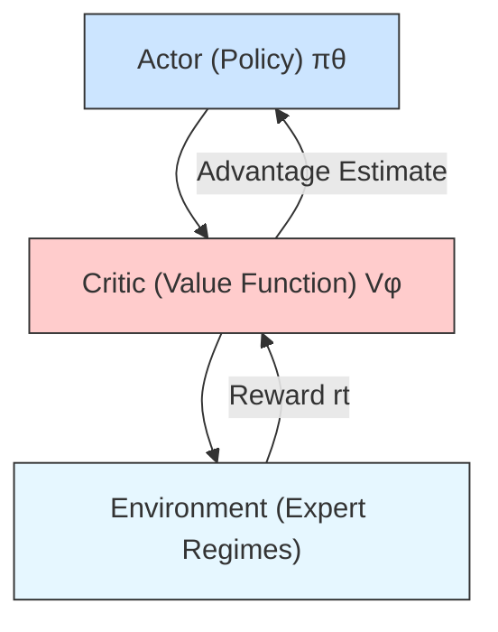

# DAIR-FedMoE: Hierarchical MoE for Federated Encrypted Traffic Classification under Compound Drift

Shamaila Fardous, Kashif Sharif, Senior Member, IEEE, Fan Li, Member, IEEE, Ali Asghar Manjotho, and Liehuang Zhu, Senior Member, IEEE

Abstract—Federated learning (FL) offers a decentralized, privacy-preserving framework for encrypted traffic classification (ETC), enabling network management and security. However, real-world deployment of federated ETC faces compound clientspecific feature, concept, and label drift, which degrades model performance. Existing ETC methods under FL settings typically address these drift types in isolation or partial combinations, overlooking their entanglement. Moreover, multiple-global model and personalized FL approaches are computational and communication expensive. To fill this gap, we propose DAIR-FedMoE, a Drift-Adaptive, Imbalance-Aware, RL-Managed Federated Mixture-of-Experts framework to simultaneously handle the drift triad with single-global model while minimizing the computational and communication overhead. DAIR-FedMoE integrates a GShard Transformer with a hierarchical Mixtureof-Experts (MoE) layer that routes encrypsted flows to either stable or drift-specialist experts based on per-client drift scores. Within each expert, entropy-guided loss reweighting emphasizes low-confidence classes to address dynamic label imbalance. Additionally, a reinforcement learning-based policy dynamically manages the expert pool by spawning, pruning, and merging experts, enabling efficient adaptation to evolving traffic patterns. Experiments on federated splits of ISCX-VPN, ISCX-Tor, VNAT, and USTC-TFC2016 show that DAIR-FedMoE achieves superior macro-F1, minority-class recall, and drift-recovery speed compared to state-of-the-art baselines, while preserving privacy and communication efficiency. The source code is available at https://github.com/dairfedmoe/DairFM.

Index Terms—Federated Learning, Encrypted Traffic Classification, Distributed Concept Drift, Class Imbalance, Mixture-of-Expert, Reinforcement Learning.

# I. INTRODUCTION

E FFECTIVE identification of traffic types and securitythreats is essential for network management, intrusion threats is essential for network management, intrusion detection, and quality of service enforcement, particularly in modern IoT and edge computing environments [15]. In this context, federated learning has emerged as a promising paradigm for ETC, offering a privacy-preserving alternative to centralized training by enabling distributed model training

The work of Fan Li was supported in part by the National Natural ScienceFoundation of China (NSFC) under Grant 62372045. Co-corresponding authors: K. Sharif and F. Li.

S. Fardous, K. Sharif, and F. Li are with the school of Computer Science and Technology, Beijing Institute of Technology, China. (email: shamailafardous@bit.edu.cn, kashif@bit.edu.cn, fli@bit.edu.cn)   
A. Manjotho is with the department of Computer Systems Engineering, Mehran University of Engineering and Technology, Jamshoro, Pakistan. (email: ali.manjotho@faculty.muet.edu.pk)   
L. Zhu is with the School of Cyberspace Science and Technology, Beijing Institute of Technology, Beijing, China (email: liehuangz@bit.edu.cn).

  
Fig. 1: Drift entanglement scenario shown as drift event timeline and global parameter response in a federated setting.

across edge clients without sharing raw data [20], [51]. Unlike typical FL tasks, federated ETC faces highly non-independent and identically distributed (non-IID) and volatile traffic patterns driven by diverse applications, encryption protocols, temporal behaviors, and regional policies [28]. These factors lead to simultaneous and distributed drift across clients, as shown in Fig. 1, each of five clients records feature drifts $\Delta P ( \mathcal { X } )$ (green circles), concept drifts $\Delta P ( \mathcal { V } | \mathcal { X } )$ (brown squares), and label drifts $\Delta P ( \mathcal { V } )$ (purple diamonds) from $t _ { 0 }$ to $t _ { 8 } ;$ overlapping events (entanglement) are shaded in pink. The Global Model row shows the aggregated parameter θ evolving over time, with pronounced oscillations aligned to entanglement intervals. Bottom panels illustrate schematic examples of each drift type: (1) feature drift, reflecting changes in the feature marginal $P ( \mathcal X )$ (evolving encryption patterns); (2) concept drift, as shifts in the conditional distribution $P ( \mathcal { N } | \mathcal { X } )$ (changing semantics of traffic behavior); and (3) label drift, involving fluctuations in the label distribution $P ( \ y )$ (varying traffic class distribution). Such complex, client-specific drift undermines model robustness and remains a central obstacle in real-world federated ETC deployments.

Existing approaches in federated ETC have attempted to tackle these challenges with partial or specialized solutions as summarized in Table I. For instance, FedPacket [3] and FL-ETC [51] apply FL protocols to encrypted packet features, but do not account for temporal drift or client imbalance. Other works like FedDrift [21] and FedCCFA [7] adapt general FL frameworks to concept drift using confidence calibration or entropy heuristics, yet they overlook label skew. Multiglobal model frameworks [9], [21], [41] and personalized federated ETC approaches [11], [13], [14] aim to improve client-specific adaptation by assigning dedicated models or embedding personalized components, but they introduce significant computational, communication, and storage overhead. To reduce this complexity, MoE models such as FedMoE-DA [52] leverages task-specific expert routing. However, they typically rely on static expert configurations, lacking mechanisms to grow, prune, or merge experts in response to evolving traffic. As a result, these models often fail to generalize across diverse clients or collapse under overlapping drift conditions.

Despite prior efforts, federated ETC continues to face two critical challenges: (1) real-world deployments frequently encounter distributed and entangled drift (overlapping feature, concept, and label drift across clients). Existing methods typically address these drifts in isolation, failing to capture their simultaneous and distributed nature. This complicates targeted mitigation strategy and degrades model robustness, fairness, and accuracy over time. To date, no existing model has been proposed that explicitly detects and adapts to this entangled drift despite its frequent occurrence in federated ETC scenarios. Moreover, potential of MoEs in handling entangled drift has not been explored. (2) approaches that assign clients to separate global models or introduce personalized components improve local adaptation but incur significant communication, storage, and coordination costs. These methods often rely on drift-prone client clustering and suffer from reduced generalization, as each model is trained on a smaller data subset.

To address the multifaceted challenges of distributed drift and system efficiency in federated ETC, we propose DAIR-FedMoE, a unified framework that jointly addresses feature, concept, and label drift while ensuring scalability and privacy. DAIR-FedMoE integrates a hierarchical Mixture-of-Experts (HMoE) architecture within a GShard Transformer to perform drift-aware expert routing, selectively isolating stable and drifting traffic patterns. It leverages confidence-guided loss reweighting to adapt to dynamic label imbalance by upweighting uncertain classes based on expert entropy, improving robustness without manual tuning. To maintain a compact and responsive model, DAIR-FedMoE introduces a reinforcement learning-based policy that dynamically adjusts the expert pool by spawning new specialists or pruning underutilized ones in response to drift signals. These components work in concert to ensure targeted drift adaptation, balanced learning, and adaptive capacity control, all within a single privacy-preserving global model. To the best of our knowledge, this is the first work to explore the potential of MoEs for drift adaptation and to systematically study the impact of entangled drift in federated ETC.

TABLE I: Coverage of distributed drift types in existing federated learning literature. 

<table><tr><td>Study</td><td>Joint Drift $P(\mathcal{X},\mathcal{Y})$ </td><td>Feature Drift $P(\mathcal{X})$ </td><td>Label Drift $P(\mathcal{Y})$ </td><td>Concept Drift $P(\mathcal{Y}|\mathcal{X})$ </td><td>AC</td><td>TV</td></tr><tr><td>FairFedDrift [40]</td><td>✗</td><td>✗</td><td>√</td><td>√</td><td>√</td><td>√</td></tr><tr><td>FedStream [12]</td><td>✗</td><td>✗</td><td>Partial</td><td>√</td><td>√</td><td>√</td></tr><tr><td>FAC-Fed [1]</td><td>✗</td><td>✗</td><td>√</td><td>√</td><td>√</td><td>√</td></tr><tr><td>FedDrift [21]</td><td>√</td><td>✗</td><td>✗</td><td>✗</td><td>√</td><td>√</td></tr><tr><td>FedCCFA [7]</td><td>✗</td><td>✗</td><td>√</td><td>√</td><td>√</td><td>✗</td></tr><tr><td>ConceptFL [33]</td><td>✗</td><td>✗</td><td>Partial</td><td>√</td><td>√</td><td>√</td></tr><tr><td>EnsembleFL [6]</td><td>√</td><td>✗</td><td>✗</td><td>√</td><td>√</td><td>√</td></tr><tr><td>FedMoE-DA [52]</td><td>√</td><td>√</td><td>✗</td><td>√</td><td>√</td><td>√</td></tr></table>

AC: Across Clients, TV: Time Varying, ✓:Full support, ✗: No support.

The main contributions of the paper are:

• We propose DAIR-FedMoE, a novel drift-resilient architecture for federated ETC that concurrently addresses feature, concept, and label drift distributed across time and clients. It incorporates a two-tier hierarchical MoE within a GShard Transformer to route encrypted-flow tokens based on drift type, while entropy-based loss reweighting within each expert dynamically emphasizes low-confidence (often minority) classes to mitigate imbalance.   
• We develop a reinforcement learning-driven expert management strategy that dynamically adjusts the expert pool in response to real-time drift and workload signals. A server-side actor-critic policy learns to optimize model capacity by monitoring expert usage, drift exposure, and performance trends, enabling efficient spawning, pruning, and merging of experts as traffic patterns evolve.   
• We demonstrate effectiveness our unified framework DAIR-FedMoE on federated splits of ISCX-VPN, ISCX-Tor, VNAT, and USTC-TFC2016, achieving significant improvements in macro-F1, minority-class recall, and drift-recovery speed, while preserving privacy and communication efficiency.

The remainder of the paper is organized as follows. Section II reviews related works. Section III introduces preliminaries and background. Section IV describes the threat model. Section V presents the proposed DAIR-FedMoE method. Section VI provides experimental details and evaluation analysis. Section VII concludes the paper. Additional baseline configurations and metric definitions are included in Appendices A and B, computational complexity and overhead analysis in Appendix C, and extended discussion of limitations and future directions in Appendix D.

# II. RELATED WORKS

# A. Encrypted Traffic Classification

Encrypted traffic classification has evolved from traditional port- and payload-based inspection to data-driven methods that operate over statistical and flow-level metadata. Deep learning approaches such as DeepPacket [31], FS-Net [26], and FlowPic [42] extract discriminative features from raw or transformed encrypted flows. More advanced models incorporate temporal patterns [24], [55] or inter-flow relations [19], [44] to enhance semantic understanding. Recent trends explore self-supervised pretraining [17], [25] and vision-inspired architectures [30]. Despite their expressiveness, these methods typically rely on centralized training and assume stationary traffic distributions.

In real-world settings, encrypted traffic evolves constantly due to protocol changes, user behavior, and evasion tactics, causing feature, concept, and label drift. Most ETC frameworks lack mechanisms to jointly detect and adapt to these drifts, particularly in distributed, privacy-preserving settings like federated learning. To address this, we propose a unified framework that leverages mixture-of-experts and confidence reweighting to adapt to simultaneous feature, concept and label drifts over time.

# B. FL with Heterogeneous & Evolving Traffic

FL has gained significant traction in ETC by enabling collaborative model training across edge devices without exposing raw traffic data. Early efforts in federated ETC emphasize protocol-agnostic feature learning without centralized access. Works such as FedETC [20] and FedPacket [3] applied standard FL protocols to encrypted traffic features, showing initial success but limited robustness under non-IID client distributions or evolving attack patterns. Several ETC-focused frameworks integrate FL with MoE for computation and communication efficiency. For instance, Zec et al. [50] introduced a gated fusion of global and local models to balance personalization and scalability. FedMix [49] employed client-specific gating to improve alignment of local updates. FedMoE-DA [52] enabled dynamic expert routing across clients, enhancing both efficiency and cross-client adaptation. Moreover, in domaintailored scenarios, Bai et al. [2] used weighted aggregation for hospital-wise domain shifts in medical imaging. Sievers et al. [46] applied FL-MoE to heterogeneous smart energy datasets. Architecturally, FtMoE [29] adapted expert assignment via task-aware transfer learning for image classification.

While existing FL-MoE approaches enhance personalization, scalability, and robustness, they overlook entangled drift, the simultaneous and interacting shifts in feature, concept, and label distributions, where conventional detection and adaptation often fail. In contrast, DAIR-FedMoE is the first unified framework tailored for ETC under such complex drift scenarios, enabling dynamic, fine-grained adaptation across clients and time while maintaining privacy and communication efficiency.

# C. Drift Adaptation in Federated Learning

Drift handling in FL has largely focused on individual drift types through global or sample-level adjustments. Concept drift is commonly addressed via entropy-based scoring or confidence calibration, as in FedDrift [21] and FedCCFA [7], while FedBSS [2] applies bias-aware training schedules for sample-specific adaptation. Feature drift is tackled in methods like pMixFed [39] using interpolation strategies. Label drift, prevalent in ETC due to class imbalance from underrepresented attack types or services, is mitigated using oversampling [34] or fairness-aware aggregation [16]. To handle co-occurring drifts, recent methods combine augmentation, memory replay, and ensemble learning. These include hybrid rehearsal strategies [36] and class-wise MixUp/AugMix [22]. Ensemble- and stream-adaptive techniques [45], [53] further boost resilience under evolving, imbalanced conditions.

Despite these advances, most methods treat drift types in isolation or in limited combinations, overlooking their joint entanglement, where feature, concept, and label drift interact simultaneously and non-linearly across clients and time. DAIR-FedMoE addresses this by integrating entropydriven class reweighting and modular expert routing to adapt to compound drifts in a unified, scalable, and privacy-preserving framework.

# III. PRELIMINARIES

# A. Federated Learning (FL)

FL is a decentralized paradigm that enables multiple clients to collaboratively train a global model without exposing their raw data [35]. Each client $c _ { k }$ holds a private dataset $\mathcal { D } _ { k }$ and performs local updates to a shared model parameters θ, which are then aggregated by a central server. The global objective is to minimize the weighted sum of local loss functions as expressed in (1).

$$
\min _ {\theta} \sum_ {k = 1} ^ {K} \frac {| \mathcal {D} _ {k} |}{| \mathcal {D} |} \mathcal {L} _ {k} (\theta), \tag {1}
$$

where $| \mathcal { D } _ { k } |$ and |D| are the total number of samples with client k and across all clients, respectively and K is the total number of participating clients.

# B. Mixture-of-Experts (MoE)

MoE is a modular neural architecture designed to improve model capacity and specialization while maintaining computational efficiency [43]. It consists of a collection of expert subnetworks and a gating mechanism that routes each input to a subset of these experts, enabling sparse activation and dynamic inference. Given an input x, the output of an MoE layer is a weighted combination of the top-k selected experts:

$$
\mathrm{MoE} (x) = \sum_ {i \in \mathcal {S}} g _ {i} (x) \cdot E _ {i} (x), \tag {2}
$$

where S denotes the set of selected experts, $g _ { i } ( x )$ is the gating score, and $E _ { i } ( x )$ is the output of expert i. However, traditional MoE architectures do not inherently handle timevarying data distributions or dynamic class imbalance, as the gating decisions are typically static and agnostic to temporal drift or class-wise uncertainty. This limits their robustness in non-stationary environments where traffic semantics and class distributions evolve over time.

# C. Differential Privacy (DP)

In the context of federated learning, DP is a privacyenhancing technique employed to ensure that model updates do not leak private information from any client’s local dataset. A randomized algorithm A is said to satisfy $( \varepsilon , \delta )$ -differential privacy if, for any two neighboring datasets D and $\mathcal { D } ^ { \prime }$ differing by at most one sample, and for any subset of outputs S as defined in (3).

$$
\mathbb {P} [ \mathcal {A} (\mathcal {D}) \in S ] \leq e ^ {\varepsilon} \cdot \mathbb {P} [ \mathcal {A} (\mathcal {D} ^ {\prime}) \in S ] + \delta , \tag {3}
$$

where ε measures the privacy loss and δ accounts for a small probability of failure. The DP is implemented by injecting zero-mean Gaussian noise into the clipped local gradient before sending it to the server as expressed in (4).

$$
\widetilde {\Delta} _ {k} = \operatorname{clip} (\nabla \mathcal {L} _ {k}, \mathcal {C}) + \mathcal {N} (0, \sigma^ {2} I), \tag {4}
$$

where $\widetilde { \Delta } _ { k }$ is the DP preserved local update for client $k , \mathcal { C }$ is the clipping bound to limit sensitivity, and σ controls the noise scale.

# IV. THREAT MODEL

We consider a semi-honest adversary in our federated encrypted traffic classification setup, where a central server orchestrates a hierarchical MoE across distributed clients. The adversary may corrupt some clients or observe aggregated updates. Such an adversary has full knowledge of our GShard Transformer backbone, hierarchical MoE gating logic, PPO policy network, hyperparameters (including drift thresholds, gating dimensions, and clipping norms), and even the differential-privacy noise distribution, but never accesses raw packet data or internal client states. Its objectives include: (1) inferring properties of individual flows or rare attack classes by analyzing expert- and gate-parameter updates and confidence summaries, (2) mounting membership-inference attacks to determine whether specific flows were used in training, and (3) reconstructing feature vectors and tracking drift events through routing and lifecycle decisions.

To mitigate these risks, we employ DP-SGD, a widely validated technique that offers strong formal privacy guarantees while preserving high model performance [10], [38]. To ensure that our privacy claims are transparent and reproducible, we explicitly report the inputs used for privacy accounting under DP-SGD. At each client, we apply per-sample gradient clipping with norm bound C to all trainable components updated locally, including the shared encoder, expert parameters, and gating networks, and add Gaussian noise ${ \mathcal { N } } ( 0 , \sigma ^ { 2 } C ^ { 2 } \mathbf { I } )$ to the clipped gradients before the local optimizer step. The resulting model updates are shared only via secure aggregation. Let B denote the local minibatch size and $| D _ { k } |$ the local dataset size, yielding a per-step sampling rate $q = B / | D _ { k } | ;$ with E local epochs per round and T federated rounds, the total number of composed DP steps per client is $S _ { k } = T \cdot E \cdot \lceil \lvert D _ { k } \rvert / B \rceil$ . We compute the overall privacy budget $( \varepsilon , \delta )$ using a standard Moments Accountant for the (subsampled) Gaussian mechanism with the above $( q , \sigma , C , S _ { k } )$ , fixing $\delta \ = \ 1 0 ^ { - 5 }$ in our experiments (with $B = 3 2 , E = 5$ , and $T \ : = \ : 2 5 0$ unless stated otherwise). Together, differential privacy, secure aggregation, constrained confidence reporting, and threshold obfuscation prevent adversaries from inferring sensitive traffic patterns, client membership, or concept-drift behavior from model updates.

All server-side operations in DAIR-FedMoE, including hierarchical routing, drift-aware expert selection, and PPO-based expert lifecycle management (expert spawning, pruning, and merging), operate solely on differentially private aggregated updates. By the post-processing property of differential privacy, these operations do not weaken the underlying $( \varepsilon , \delta ) – \mathrm { D P }$ guarantee.

Routing and Side-Channel Considerations. DAIR-FedMoE does not transmit per-client routing decisions, drift scores, or expert selection indicators to the server. The server observes only secure-aggregated (optionally expert-partitioned) model updates, without access to client identities or expert usage frequencies. Consequently, while aggregated updates may reflect population-level traffic evolution, routing behavior and drift states cannot be attributed to individual clients, and expert lifecycle decisions operate solely on differentially private aggregates.

# V. METHOD

# A. Problem Formulation

In a federated encrypted traffic classification problem, we consider K clients and a central server. Client k holds a private dataset $\mathcal { D } _ { k } ^ { t }$ at round t, sampled from a joint distribution $P _ { k } ^ { t } ( \mathcal { X } , \mathcal { Y } )$ over encrypted-flow features $\mathcal { X } \in \mathbb { R } ^ { d }$ and labels $\mathcal { V } \in \{ 1 , \ldots , C \}$ . The objective is to learn model parameters θ of a mixture-of-experts classifier:

$$
f _ {\theta} (x) = \sum_ {j = 1} ^ {M} g _ {j} (x) E _ {j} (x)
$$

by minimizing the federated empirical risk:

$$
\min _ {\theta} \sum_ {k = 1} ^ {K} \frac {| \mathcal {D} _ {k} ^ {t} |}{\sum_ {\ell} | \mathcal {D} _ {\ell} ^ {t} |} \mathbb {E} _ {(x, y) \sim \mathcal {D} _ {k} ^ {t}} \left[ \ell (f _ {\theta} (x), y) \right]
$$

In real-world encrypted traffic, the feature distribution $P _ { k } ( \mathcal { X } )$ , the label distribution $P _ { k } ( \mathcal { V } )$ , and the conditional distribution $P _ { k } ( \mathcal { N } | \mathcal { X } )$ often evolve over time, a phenomenon collectively referred to as feature drift, label drift, and concept drift, respectively. Formally, at round t: $P _ { k } ^ { ( t ) } ( \mathcal { X } ) \ \neq$ $\begin{array} { r l r } { P _ { k } ^ { ( t - 1 ) } ( \dot { \mathcal { X } } ) \wedge \hat { P } _ { k } ^ { ( t ) } ( \dot { \mathcal { Y } } ) } & { { } \neq } & { P _ { k } ^ { \check { ( t - 1 ) } } ( \mathcal { Y } ) \wedge P _ { k } ^ { ( t ) } ( \tilde { \mathcal { Y } } | \mathcal { X } ) \neq } \end{array}$ $P _ { k } ^ { \cdot ( t - 1 ) } ( \mathcal { V } | \mathcal { X } )$ kP (t−1)k .

In federated settings, these drifts may also differ across clients, i.e., $P _ { i } ^ { ( t ) } ( { \mathcal { X } } ) \not = P _ { j } ^ { ( t - 1 ) } ( { \mathcal { X } } ) \wedge P _ { i } ^ { ( t ) } ( { \mathcal { Y } } ) \not = P _ { j } ^ { ( t - 1 ) } ( { \mathcal { Y } } ) \wedge$ j for , which we denote as $P _ { i } ^ { ( t ) } ( \mathcal { V } | \mathcal { X } ) \neq P _ { i } ^ { ( t - 1 ) } ( \mathcal { V } | \mathcal { \bar { X } } )$ $i \neq j ,$ distributed drift. A robust federated classifier must therefore adapt simultaneously to all three types of drift across time and clients. In this work, we consider a synchronous FL setting, where all clients participate in each communication round and updates are aggregated by the central server. However, clients experience asynchronous and overlapping drift events at different times and with different intensities across clients. While the federated training proceeds in synchronized rounds, the distributional shifts are modeled as continuous and clientspecific, reflecting real-world non-stationary traffic environments.


<details>
<summary>flowchart</summary>

```mermaid
graph TD
    subgraph Central Server
        A["Add + Norm"] --> B["MLP"]
        C["Add + Norm"] --> D["MSA"]
        E["Add + Norm"] --> F["HMoE Layer"]
        G["Add + Norm"] --> H["MSA"]
        I["x"] --> J["+"]
    end

    subgraph Federated Clients
        K["Encrypted Traffic Embedding"] --> L["Drift Detector (δ)"]
        L --> M["Exponential Smoothing (ES)"]
        M --> N["Root Gate (G_r)"]
        N --> O["r = [r_stable, r_drift"]]
        O --> P["T_stable ≥ r_drift"]
        P --> Q["Stable-Regime Gate (G_s)"]
        P --> R["Drift-Regime Gate (G_d)"]
        Q --> S["E_s"]
        Q --> T["E_s_n"]
        Q --> U["E_d1"]
        Q --> V["E_d2"]
        Q --> W["E_d3"]
        R --> X["E_s1*"]
        R --> Y["E_s2*"]
        R --> Z["E_s3*"]
        R --> AA["E_s4*"]
    end

    subgraph Local Dataset at Client k
        AB["Shard_k"] --> AC["h"]
        AC --> AD["d_k(h)"]
        AD --> AE["ES"]
        AE --> AF["z"]
        AF --> AG["G_r*"]
        AG --> AH["r = [r_stable, r_drift"]]
        AH --> AI["T_stable ≥ r_drift"]
        AI --> AJ["Stable-Regime* Gate (G_s)"]
        AI --> AK["E_s1*"]
        AI --> AL["E_s2*"]
        AI --> AM["E_s3*"]
        AI --> AN["E_s4*"]
        AJ --> AO["E_d1*"]
        AJ --> AP["E_d2*"]
        AJ --> AQ["E_d3*"]
        AK --> AR["E_d4*"]
    end

    subgraph Local Drift Detection and Expert Training
        AS["Adaptive Loss Reweighting"] --> AT["Backpropagate L_k"]
        AT --> AU["(ε, δ)-Differential Privacy"]
        AU --> AV[Send to Server {ΔE_j^(k)}, ΔG_r^(k), ΔG_s^(k)}, φ(k)}
    end

    B --> W
    D --> M
    F --> N
    H --> N
    J --> N
    J --> N
    N --> AH
    O --> P
    P --> Q
    Q --> AH
    Q --> S
    Q --> AR
    style Central Server fill:#f9f,stroke:#333
    style Federated Clients fill:#ccf,stroke:#333
```
</details>

Fig. 2: Overview of the DAIR-FedMoE framework. (a) GShard Transformer backbone in which each MoE layer is replaced by a hierarchical Mixture-of-Experts (HMoE) sublayer. (b) Server-side HMoE pipeline, where encrypted-flow embeddings are scored for drift, smoothed, and routed by a root gate to stable or drift-specialist experts; model updates are aggregated federatively and expert spawning, pruning, and merging are controlled by a PPO-based policy. (c) Client-side workflow, where local drift scores guide hierarchical routing, adaptive confidence-based loss reweighting is applied during training, and differentially private expert and gate updates with confidence summaries are returned to the server.

# B. Overview of DAIR-FedMoE Framework

The overall workflow of DAIR-FedMoE, built upon a GShard transformer backbone, is shown in Fig. 2. DAIR-FedMoE extends a GShard Transformer by embedding driftaware expert trees and confidence-guided loss reweighting into MoE layer. In each federated round, the server broadcasts latest expert shards, gating networks and global confidence coefficients to all clients. Each client then detects local concept drift on its encrypted-flow data, routes inputs to either stable or drift experts, and trains experts using class-confidence weights.

During local training, each expert maintains a running average of its softmax entropy to estimate class confidence. The class confidence coefficients are updated at the end of every local epoch and later averaged across clients to form global weights. Clients convert these scores into weights for the cross-entropy loss, up-weighting rare or uncertain classes to handle class imbalance, and backpropagate gradients through both experts and gating networks. After local updates, clients performs differential privacy and return updated parameters and revised confidence summaries back to the server, which aggregates them via weighted FedAvg. Moreover, a reinforcement learning-based policy network on the server monitors expert utilization and drift trends to manage the life cycle of experts and to keep capacity aligned with evolving data. The expert lifecycle management is triggered once per communication round to maintain alignment with traffic evolution and system capacity. This seamless integration of a GShard transformer backbone, drift-aware routing, confidence-guided loss reweighting and RL-managed expert lifecycle underpins the adaptability and robustness of DAIR-FedMoE in handling label concept drift and class imbalance simultaneously.

# C. GShard Transformer Backbone

The DAIR-FedMoE framework is built on the GShard transformer architecture of Lepikhin et al. [23]. We replace the standard MoE layer with our Hierarchical MoE (HMoE) layer, while retaining the multi-head self-attention, layer normalization, and feed forward network components, resulting in a sparse and drift-aware attention architecture. Each encrypted-flow session x (byte sequence) is first tokenized into a sequence of embeddings enriched with sinusoidal positional encodings. These embeddings represent fixed-length vectorized representations of individual byte chunks derived from the raw encrypted flow, capturing both structural and statistical characteristics of the traffic. The resulting token sequence is then passed through a stack of L transformer blocks. Within each block, multi-head self-attention is applied to the tokens, followed by the HMoE layer where a twotier gating mechanism guided by per-token drift scores routes tokens to either stable experts or drift-specialist experts. The updated embeddings entering the HMoE layer are denoted by h. After routing and expert processing, these outputs pass through a standard feed-forward network. Furthermore, residual connections and layer normalization follow every sublayer to ensure stable training at scale, and the final representation of the [CLS] token is fed into a two-layer MLP classification head with a softmax output to produce the class logits. In each communication round t, the GShard transformer is partitioned into shards, with client k receiving Shardk.

# D. Hierarchical Mixture-of-Experts (HMoE) layer

In DAIR-FedMoE, the HMoE layer groups experts into two regimes, stable and drift, and uses a two-level gating mechanism to route encrypted-flow samples. Each sample is first assigned a drift score and sent to the root gate, which chooses between the stable or drift regime. A second, regimespecific gate then selects the specialist expert within that regime. This two-tier structure isolates evolving traffic patterns for rapid adaptation while preserving stable behavior.

Local Drift Detection Mechanism. To support the top-level routing in our expert tree, each client computes a local drift score for every incoming feature vector. This score quantifies how much the current encrypted-flow distribution has shifted relative to historical observations, allowing the model to distinguish between consistent and drifting traffic before classification.

At each communication round t, client k first evaluates a drift score $d _ { k } ( h )$ for each encrypted-flow feature vector embedding h. This score measures the divergence between two empirical feature distributions over a sliding window of size W , as

$$
P _ {k} ^ {t, \text { hist }} = \frac {1}{W} \sum_ {s = t - W} ^ {t - 1} \mathbb {E} _ {h \sim \mathcal {D} _ {k} ^ {s}} [ \delta (h) ] \tag {5}
$$

$$
P _ {k} ^ {t, \text { curr }} = \mathbb {E} _ {h \sim \mathcal {D} _ {k} ^ {t}} [ \delta (h) ], \tag {6}
$$

where $\delta ( h )$ denotes the Dirac mass at h. We employ the Jensen-Shannon divergence to quantify the shift, as

$$
d _ {k} (h) = \operatorname{JS} \left(P _ {k} ^ {t, \text {curr}} \| P _ {k} ^ {t, \text {hist}}\right) \tag {7}
$$

$$
= \frac {1}{2} \operatorname{KL} \left(P _ {k} ^ {t, \text {curr}} \| M\right) + \frac {1}{2} \operatorname{KL} \left(P _ {k} ^ {t, \text {hist}} \| M\right),
$$

with $M \ = \ \frac { 1 } { 2 } ( P _ { k } ^ { t , \mathrm { c u r r } } + P _ { k } ^ { t , \mathrm { h i s t } } )$ . In practice, both distributions are estimated via Gaussian kernel density estimates over packet payload to ensure efficiency on edge devices. To reduce noise in the drift score, we further employ exponential smoothing as defined in (8).

$$
\tilde {d} _ {k} (h) = \alpha \tilde {d} _ {k} ^ {t - 1} (h) + (1 - \alpha) d _ {k} (h) \tag {8}
$$

Here $\alpha \in [ 0 . 9 , 0 . 9 9 ]$ is a smoothing factor, selected via a small grid search over {0.90, 0.95, 0.99} on a held-out validation split. This range follows widely adopted conventions in ML for EMA-based modules [5], balancing responsiveness to drift with stability against transient noise. The normalized score $\tilde { d } _ { k } ( h )$ is then concatenated with the feature embedding h and fed into the root gating network. Samples with high $\tilde { d } _ { k } ( h )$ are routed to drift-specialist experts, while those with low scores proceed to stable experts, forming the foundation of our hierarchical MoE.

Furthermore, we explicitly decouple representation drift from input data drift. At round t, both the historical and current windows are re-embedded using the same encoder snapshot $E _ { t } ( \cdot )$ before computing the JS divergence, preventing confounding from encoder-update–induced embedding shifts. The drift score is smoothed over time, and routing is learned via the hierarchical gate (adaptive probabilities), rather than using a fixed threshold.

Root Gating Network Design. The root gating network is responsible for determining whether an input sample should be routed through stable or drift experts. It takes as input the feature embedding $\boldsymbol { h } \in \mathbb { R } ^ { d _ { k } }$ of the encrypted-flow vector and the normalized drift score $\tilde { d } _ { k } ( h ) \in [ 0 , 1 ]$ , where $d _ { k }$ is the embedding dimension. These are concatenated into the vector, as defined in (9).

$$
z = \left[ \begin{array}{c} h \\ \tilde {d} _ {k} (h) \end{array} \right] \in \mathbb {R} ^ {d _ {k} + 1} \tag {9}
$$

This vector is then passed through a two-layer multilayer perceptron to produce routing probabilities $r = [ r _ { \mathrm { s t a b l e } } , r _ { \mathrm { d r i f t } } ] .$ . Here $r _ { \mathrm { s t a b l e } }$ and $r _ { \mathrm { d r i f t } }$ denote the probabilities of routing to the stable or drift regime, respectively. The root gate’s parameters are updated jointly with all other components via backpropagation through the hierarchical MoE loss.

Stable vs. Drift-Specialist Expert Routing. DAIR-FedMoE employs a two-tier expert routing mechanism by explicitly partitioning the total expert pool into two non-overlapping subsets: stable experts and drift-specialist experts. This disjoint design allows the model to isolate and preserve stable behavioral patterns while simultaneously adapting to evolving traffic distributions. Based on this structure, after computing the root gate probabilities $r ,$ each input sample is routed through the branch with the higher activation score. If $r _ { \mathrm { s t a b l e } } \ge r _ { \mathrm { d r i f t } }$ , the feature embedding h is forwarded to the stable-regime gate; otherwise, it is directed to the drift-regime gate. Each regimespecific gate then applies a softmax over its corresponding subset of experts, as defined in (10) and (11), to select the most appropriate expert within that regime.

$$
g ^ {S} = \operatorname{softmax} (W _ {s} h + b _ {s}) \tag {10}
$$

$$
g ^ {D} = \operatorname{softmax} (W _ {d} h + b _ {d}) \tag {11}
$$

Here $g ^ { S } \in \Delta ^ { l - 1 }$ indexes l stable experts and $g ^ { D } \in \Delta ^ { m - 1 }$ indexes m drift experts. Here, $W _ { s } , W _ { d }$ and $b _ { s } , b _ { d }$ are the corresponding weights and biases. A hard routing selects expert $j ^ { * } = \arg \operatorname* { m a x } _ { j } g _ { j } ^ { r }$ .

Expert Network Architectures. Each expert $E _ { j }$ is a lightweight classifier mapping $\boldsymbol { h } \in \mathbb { R } ^ { d _ { k } }$ to class logits in $\mathbb { R } ^ { C }$ . In our implementation, all experts share a uniform two-layer fully-connected architecture followed by a softmax to obtain class probabilities. Dropout and batch normalization layers are used in between for regularization. Although stable and drift experts use the same architecture, their parameters are updated using different client-data subsets as determined by the hierarchical routing mechanism.

# E. Adaptive Loss Reweighting via Expert Confidence

Following expert selection through hierarchical routing, we further enhance per-expert learning by addressing class imbalance within each expert’s data distribution. To this end, we introduce an adaptive loss reweighting mechanism that leverages per-class confidence estimates. By dynamically scaling the contribution of each class to the loss function based on the expert’s predictive certainty, under-represented or harderto-classify classes receive greater emphasis. This improves the model’s ability to maintain balanced performance, particularly under drifting or skewed label distributions.

Per-Expert Confidence Estimation. For each expert $E _ { j }$ , we first compute the predictive distribution $p _ { j } ( h ) \in \mathsf { \bar { \Delta } } ^ { C - 1 }$ over C classes for samples h routed to that expert. The per-sample Shannon entropy $H _ { j } ( h )$ quantifies the expert’s uncertainty as expressed in (12).

$$
H _ {j} (h) = - \sum_ {c = 1} ^ {C} p _ {j} (h) _ {c} \log p _ {j} (h) _ {c} \tag {12}
$$

To derive class-specific statistics, we average these entropies over a sliding window of the most recent samples $B _ { j , c }$ with true label c defined as in (13).

$$
\overline {{{H}}} _ {j, c} = \frac {1}{| \mathcal {B} _ {j , c} |} \sum_ {h \in \mathcal {B} _ {j, c}} H _ {j} (h) \tag {13}
$$

We then update an exponential moving average (EMA) of these values to smooth temporal fluctuations, as

$$
\tilde {H} _ {j, c} ^ {(t)} = \alpha \tilde {H} _ {j, c} ^ {(t - 1)} + (1 - \alpha) \overline {{H}} _ {j, c}, \tag {14}
$$

where $\alpha \in [ 0 . 9 , 0 . 9 9 ]$ is a smoothing factor. Finally, we normalize the EMA-entropy scores into a confidence coefficient $\phi _ { j , c }$ in [0, 1] as computed in (15).

$$
\phi_ {j, c} = 1 - \frac {\tilde {H} _ {j , c}}{\max _ {c ^ {\prime}} \tilde {H} _ {j , c ^ {\prime}}} \tag {15}
$$

A lower $\phi _ { j , c }$ indicates that expert $E _ { j }$ is less certain on class $c ,$ directing subsequent loss reweighting to prioritize that class. These entropy-based confidence scores are computed independently on each client and subsequently averaged across clients to obtain global confidence estimates. The aggregated values $\{ \phi _ { j , c } \}$ are then communicated to the server along with the model updates and are used in the following round to compute class-wise loss weights.

Entropy-Based Weight Computation. Given the smoothed confidence coefficients $\phi _ { j , c } \in [ 0 , 1 ]$ for expert $E _ { j }$ and class c, we derive per-class weights $w _ { j , c }$ by inverting confidence, as

$$
w _ {j, c} = \frac {1}{\phi_ {j , c} + \varepsilon}, \tag {16}
$$

where $\varepsilon > 0$ is a small constant to prevent division by zero. Intuitively, lower confidence $\phi _ { j , c }$ yields higher weight $w _ { j , c } ,$ thus emphasizing harder or under-represented classes. To avoid extreme values that could destabilize training, we clip $w _ { j , c }$ into a bounded interval $[ \omega _ { \mathrm { m i n } } , \omega _ { \mathrm { m a x } } ]$ .

Incorporation into Local Loss Function. During each client’s local update, routed samples $( x _ { i } , y _ { i } )$ assigned to expert $E _ { j }$ incur a weighted cross-entropy loss, as defined in (17).

$$
\mathcal {L} _ {k} = \frac {1}{| \mathcal {D} _ {k} |} \sum_ {(h _ {i}, y _ {i}) \in \mathcal {D} _ {k}} w _ {j, y _ {i}} \ell (E _ {j} (h), y _ {i}) \tag {17}
$$

Here $\mathcal { D } _ { k }$ is the local dataset at client $k , \ w _ { j , y _ { i } }$ is the weight for the true label $y _ { i } ,$ and h is the embedding for feature $x _ { i } .$ . Gradients computed from $\mathcal { L } _ { k }$ backpropagate through both the expert network $E _ { j }$ and its upstream gating modules, ensuring that high-weight (low-confidence) classes receive proportionally greater parameter updates.

To enforce differential privacy, each client applies DP to its local parameter deltas as defined by (4). The same procedure is applied to the gating updates $\Delta G _ { \cdot } ^ { \left( k \right) }$ . Only the privatized updates {∆˜ E(k)j , $\{ \tilde { \Delta } E _ { j } ^ { ( k ) } , \tilde { \Delta } G _ { \cdot } ^ { ( k ) } \}$ and the updated confidence summaries are transmitted to the server.

# F. RL-Based Expert Lifecycle Management

In DAIR-FedMoE, the server employs a reinforcement learning (RL) agent to manage the set of active experts so that model capacity continuously aligns with evolving traffic patterns, as shown in Fig. 3. This includes, pruning underutilized networks, spawning new drift specialists, and merging redundant experts. We formalize this as a Markov Decision Process (MDP) and train a lightweight policy network to optimize long-term classification performance and resource efficiency. We define the MDP at federated round t as follows:

State $s _ { t } \colon \mathbf { A }$ real-valued vector concatenating:

• Expert utilization rates $\{ \bar { u } _ { j } \} _ { j = 1 } ^ { M }$ , where $\bar { u } _ { j }$ is the average gating probability of expert $j$ over the past R rounds.   
• Drift engagement $\{ \delta _ { j } \}$ , the fraction of samples routed to each drift expert versus stable experts.   
• Confidence profiles $\{ \phi _ { j , c } \}$ averaged across classes.   
• Performance deltas $\Delta \mathrm { F } 1 _ { t }$ and $\Delta \mathrm { D R } _ { t }$ , the changes in macro-F1 and drift-recovery speed between rounds $t - 1$ and t.   
• Expert ages $\{ a _ { j } \}$ , the number of rounds since each expert was created or last merged.

Action $\begin{array} { r l } { a _ { t } \colon } & { { } \mathrm { A } } \end{array}$ discrete choice from the set $\begin{array} { r l } { A } & { { } = } \end{array}$ {Prune(j), Spawn(k), Merge(j1, j2), NoOp}, where:

• $\mathtt { P r u n e ( j ) }$ removes expert j.   
• Spawn(k) creates a new drift expert initialized from drift-cluster centroid k.   
• $\mathsf { M e r g e } ( j _ { 1 } , j _ { 2 } )$ combines experts $j _ { 1 }$ and $j _ { 2 }$ by averaging their weights.   
• NoOp leaves the expert pool unchanged.

Reward $r _ { t } \colon$ We craft a scalar reward $r _ { t }$ balancing classification gains and model complexity as defined in (18).

$$
r _ {t} = \Delta \mathrm{F} 1 _ {t} + \lambda_ {d} \Delta \mathrm{DR} _ {t} - \mu | \Delta M _ {t} | \tag {18}
$$

Here $\Delta M _ { t }$ is the change in total expert count, and $\lambda _ { d } , \mu >$ 0 weight the drift-recovery improvement and expert-count penalty.

Policy Network Architecture. We implement a shared actorcritic network that processes the MDP state $s _ { t }$ through two hidden layers. From the second layer, the policy head produces action probabilities $\pi _ { \boldsymbol { \theta } } ( a _ { t } | \boldsymbol { s } _ { t } )$ and the value head estimates the state value $V _ { \phi } ( s _ { t } )$ . The policy parameters are denoted by θ and the value parameters by ϕ.

During each federated round, the server collects transitions $( s _ { t } , a _ { t } , r _ { t } , s _ { t + 1 } , \log \pi _ { \theta _ { \mathrm { o l d } } } ( a _ { t } | s _ { t } ) )$ into an replay buffer. Every U rounds, the policy is updated using the Proximal Policy Optimization (PPO) clipped-surrogate objective. For


<details>
<summary>flowchart</summary>


</details>

$$
\begin{array}{rl}
& \text{State } s_t = \left[ \begin{array}{l}\text{Expert utilization rates:} \{\overline{u}_j\}_{j=1}^M \\ \text{Drift engagement:} \delta_j \\ \text{Confidence profiles:} \phi_{j,c}\\ \text{Performance deltas:} \Delta\text{F1}_t, \Delta\text{DR}_t \\ \text{Expert ages:} a_j \end{array} \right] \\
& \text{Action } a_t \in \left\{ \begin{array}{c}
\boxed{\text{Prune}} \\
\boxed{\text{Spawn}} \\
\boxed{\text{Merge}} \\
\boxed{\text{NoOp}}
\end{array} \right.
\end{array}
$$

Fig. 3: Architecture of the PPO-based expert lifecycle management module in DAIR-FedMoE.

each sampled minibatch, we compute the advantage estimates $\hat { A } _ { t } = \hat { R } _ { t } - V _ { \phi } \big ( s _ { t } \big )$ , where $\hat { R } _ { t }$ are the empirical returns. The actor is trained by minimizing objective function as defined in (19), while the critic is trained by minimizing the valuefunction loss as expressed in (20).

$$
L ^ {\mathrm{PPO}} (\theta) = - \mathbb {E} \left[ \min \left(\hat {A} _ {t} \pi_ {\theta} \left(a _ {t} \mid s _ {t}\right) / \pi_ {\theta_ {\text {old}}} \left(a _ {t} \mid s _ {t}\right), \right. \right. \tag {19}
$$

$$
\mathrm{clip} (r _ {t} (\theta), 1 - \epsilon , 1 + \epsilon)   \hat {A} _ {t}) ]
$$

$$
L ^ {\mathrm{VF}} (\phi) = \mathbb {E} [ (V _ {\phi} (s _ {t}) - \hat {R} _ {t}) ^ {2} ] \tag {20}
$$

Further to encourage exploration, we add an entropy bonus $I ^ { \mathrm { e n t } } = - \mathbb { E } [ H ( \pi _ { \theta } ( \cdot | s _ { t } ) ) ]$ . We perform $N _ { \mathrm { P P O } }$ epochs of gradient descent on the combined loss, as expressed in (21), using separate learning rates for actor and critic. After updating, we set $\theta _ { \mathrm { o l d } }  \theta$ before the next optimization cycle.

$$
L = L ^ {\mathrm{PPO}} + c _ {\mathrm{vf}} L ^ {\mathrm{VF}} + c _ {\mathrm{ent}} L ^ {\mathrm{ent}}, \tag {21}
$$

where $c _ { \mathrm { v f } } ~ > ~ 0$ and $c _ { \mathrm { e n t } } ~ > ~ 0$ scale the value-function loss and entropy bonus, respectively. After completing the PPO updates, we set $\theta _ { \mathrm { o l d } }  \theta$ before the next optimization cycle.

# G. Federated Training Protocol

This section describes the federated training routine of DAIR-FedMoE, which proceeds iteratively across communication rounds. Each round consists of three phases: server broadcast, client-side local updates, and server aggregation with expert policy invocation, as detailed in Algorithm 1.

At the beginning of round t, the server broadcasts the current expert parameters, gating networks, and global confidence coefficients to all participating clients (line 1). Each client k then processes its local minibatches in parallel (lines 2-3). For each input sample, it extracts features using a shared encoder (line 6), computes a drift score (line 7), and applies EMA smoothing to obtain $\tilde { d } _ { k } ( h )$ (line 8). These scores are passed to the root gating function to obtain regime probabilities (line 9), which determine whether the sample is routed through the stable or driftsensitive gate (lines 10-13).

Each expert $E _ { j }$ then outputs class scores, which are combined using the gate weights $g _ { j }$ to compute soft predictions. The predicted class is selected (line 14), and its entropy is computed and used to update the EMA of uncertainty (line 15). This entropy is used to derive the 25: end for

Algorithm 1 One Federated Training Round of DAIR-FedMoE   
1: Server broadcasts experts $\{E_{j}^{(t)}\}_{j=1}^{M}$ , gating nets $G_{r}^{(t)}, G_{s}^{(t)}, G_{d}^{(t)}$ and confidences $\{\phi_{j,c}^{(t)}\}$ 2: for each client $k \in S_{t}$ in parallel do
3:    for each minibatch $B \subset D_{k}^{(t)}$ do
4:    Initialize local loss $L_{k} \leftarrow 0$ 5:    for each $(x_{i}, y_{i}) \in B$ do
6:    Compute embedding $h = \text{Shard}_{k}(x_{i})$ 7:    Compute drift score $d_{k}(h)$ 8:    Perform EMA smoothing $\tilde{d}_{k}(h)$ 9: $[r_{\text{stable}}, r_{\text{drift}}] \leftarrow G_{r}^{(t)}([h; \tilde{d}_{k}(h)])$ 10:    if $r_{\text{stable}} \geq r_{\text{drift}}$ then
11: $g \leftarrow G_{s}^{(t)}(h)$ 12:    else
13: $g \leftarrow G_{d}^{(t)}(h)$ 14:    end if
15: $j^{*} \leftarrow \arg \max_{j} g_{j}$ 16:    Compute entropy $H_{j^{*},y_{i}}$ , update EMA $\tilde{H}_{j^{*},y_{i}}$ 17:    Compute $\phi_{j^{*},y_{i}}$ 18: $w_{j^{*},y_{i}} \leftarrow \text{clip}(1/(\phi_{j^{*},y_{i}} + \varepsilon), \omega_{\min}, \omega_{\max})$ 19: $L_{k} + = w_{j^{*},y_{i}} \ell(E_{j^{*}}^{(t)}(h), y_{i})$ 20:    end for
21:    Backprop. $L_{k}$ , get $\Delta E_{j}^{(k)}, \Delta G_{r}^{(k)}, \Delta G_{s}^{(k)}, \Delta G_{d}^{(k)}$ 22: end for
23: Client k applies DP as defined in (4)
24: Client k sends $\{\tilde{\Delta}E_{j}^{(k)}, \tilde{\Delta}G_{r}^{(k)}, \tilde{\Delta}G_{s}^{(k)}, \tilde{\Delta}G_{d}^{(k)}, \phi^{(k)}\}$ to server

26: Server aggregates:

$$
E _ {j} ^ {(t + 1)} = \sum_ {k \in \mathcal {S} _ {t}} \frac {| \mathcal {D} _ {k} |}{\sum_ {\ell} | \mathcal {D} _ {\ell} |} (E _ {j} ^ {(t)} + \tilde {\Delta} E _ {j} ^ {(k)})
$$

27: For $G _ { r } , G _ { s } , G _ { d }$ aggregate high-drift clients

28: Construct RL state $s _ { t } \colon$

$$
s _ {t} = [ \{\bar {u} _ {j} \} _ {j = 1} ^ {M}, \delta_ {j}, \phi_ {j, c}, \Delta \mathrm{F1} _ {t}, \Delta \mathrm{DR} _ {t}, a _ {j} ]
$$

29: Sample action $a _ { t } \sim \pi _ { \theta } ( \cdot | s _ { t } )$

30: Execute action at ∈ {Prune, Spawn, Merge, NoOp}

31: Update expert set $\{ \grave { E _ { j } ^ { ( t + 1 ) } } \}$

adaptive loss weight and the clipped final weight is computed (lines 16-17). Each client’s objective accumulates the weighted cross-entropy loss (line 18), and gradients are backpropagated through the expert and gating layers to obtain local updates (line 20).

Before sending the updates back to the server, clients apply differential privacy noise and transmit the privatized updates (lines 22-23). Upon receiving updates from all clients, the server aggregates them across the population (lines 25-26) and forms an RL state vector based on drift exposure and recent performance (line 28). The PPO policy samples an action and executes it to adjust the expert pool (e.g., spawn, prune, merge, or NoOp), concluding the round with the updated expert set $\{ E _ { j } ^ { ( t + 1 ) } \}$ (lines 29-31).

Algorithm 2 Inference with DAIR-FedMoE   
Require: Trained experts $\{E_j\}$ , gates $G_r, G_s, G_d$ Require: Single encrypted-flow $x$

1: Extract features $h = { \mathrm { S h a r d } } _ { k } ( x )$   
2: Compute drift score $d ( h )$ , EMA smoothed $\tilde { d } ( h )$   
3: $[ r _ { \mathrm { s t a b l e } } , r _ { \mathrm { d r i f t } } ] \gets G _ { r } \left( [ h ; \tilde { d } ( h ) ] \right)$   
4: if $r _ { \mathrm { s t a b l e } } \ge r _ { \mathrm { d r i f t } }$ then   
5: $g  G _ { s } ( h )$   
6: else   
7: $g  G _ { d } ( h )$   
8: end if   
9: Compute final class probabilities:

$$
p (c) = \sum_ {j} g _ {j} [ \operatorname{softmax} (E _ {j} (h)) ] _ {c}
$$

10: return arg maxc $p ( c )$

# H. Inference with DAIR-FedMoE

Algorithm 2 outlines the inference procedure of DAIR-FedMoE for a single encrypted-flow input. First, the encrypted input is transformed into feature representation via Shard encoder (line 1). The drift score is then computed and smoothed using an EMA filter (line 2), and routing scores are derived using the routing gate $G _ { r } \ ( \mathtt { l i n e } \ 3 )$ . Based on the relative strengths of stable and drift indicators, the input is routed either to the stable gate $G _ { s }$ or the drift-sensitive gate $G _ { d }$ (lines 4-8). Each expert’s output is weighted by the selected gating policy and aggregated to compute the final class probabilities (line 9). The class with the highest probability is returned as the predicted label (line 10).

# VI. EXPERIMENTAL DETAILS & EVALUATION ANALYSIS

# A. Implementation Details

The DAIR-FedMoE framework is implemented using Py-Torch 1.12 for model construction, Flower 0.19 for federated orchestration, and Ray RLlib 1.8 for reinforcement learning. All experiments are conducted on a Windows 11 24H2 system equipped with dual NVIDIA V100 GPUs and 128 GB RAM. Clients are simulated in CPU-only Docker containers to emulate edge deployments. All source code, pretrained models, and configuration files will be publicly released.

We set the drift estimation window to $W = 5 0 0$ samples and use an EMA smoothing factor $\alpha ~ = ~ 0 . 9 5$ . Confidence weights are clipped to the interval $[ \omega _ { \mathrm { m i n } } , \omega _ { \mathrm { m a x } } ] = [ 1 . 0 , 5 . 0 ]$ . The GShard Transformer backbone comprises L = 12 transformer blocks with hidden dimension $d _ { k } = 5 1 2 .$ , 8-head selfattention, and a feed-forward expansion factor of 4. Each HMoE sublayer includes l = 4 stable experts and $m = 4$ drift experts, each implemented as a two-layer MLP with hidden size $H _ { e } = 5 1 2$ . Gating networks use a hidden size $H _ { g } = 1 2 8$ . Clients perform 5 local epochs per round with batch size 32, using Adam optimizer with a learning rate of $1 0 ^ { - 3 }$ for both expert and gate modules. The PPO-based policy network for expert lifecycle management has two hidden layers of size $H _ { p } = 2 5 6$ . We set the PPO clip parameter $\epsilon = 0 . 2 .$ , valuefunction loss coefficient $c _ { v f } = 0 . 5 ,$ entropy bonus coefficient $c _ { e n t } = 0 . 0 1$ , and perform $N _ { \mathrm { P P O } } = 4$ optimization epochs per update. The actor and critic use learning rates of $5 \times 1 0 ^ { - 4 }$ and $1 0 ^ { - 3 }$ , respectively. The RL reward formulation (Eq. 18) includes weights $\lambda _ { d } = 2 . 0$ for drift-recovery improvement and $\mu = 0 . 5$ for expert-count regularization. These hyperparameters are tuned via grid search on a held-out validation split to balance stability and performance.

To enforce $( \epsilon , \delta )$ -differential privacy, each client clips gradient norms to $ { \mathcal { C } } \ = \ 1 . 0$ and adds Gaussian noise with standard deviation $\sigma = 1 . 2$ . The Moments Accountant tracks cumulative privacy loss, ensuring $\delta = 1 0 ^ { - 5 }$ over $T = 2 5 0$ communication rounds.

All clients run in CPU-only Docker containers to emulate resource-constrained edge devices; we report per-round client wall-clock time and memory usage collected on these CPUonly clients to reflect edge-side costs. This setup isolates server-only components (global aggregation and PPO policy updates) from client compute, mirroring a practical FL deployment where clients are low-power nodes and the server has ample resources.

# B. Baseline Solutions & Evaluation Metrics

We benchmark DAIR-FedMoE against representative baselines covering (i) strong centralized ETC backbones, including FS-Net [26], FlowPic [42], DeepPacket [31], and Flow-GNN [19]; (ii) federated ETC methods that primarily address privacy and decentralization but do not explicitly model drift, including FedETC [20], FL-ETC [51], FedPacket [3], and BC-FLETC [28]; and (iii) drift-aware or continual/fair FL baselines, including FedDrift [21], FedCCFA [7], FedIBD [18], Cross-FCL [54], Master-FL [47], FairFedDrift [40], FedMoE-DA [52], FairINC [8], and FedStream [12]. Implementation details and configuration choices for all baselines follow their original descriptions and are summarized in Appendix A.

We report Macro-F1 as the primary metric, along with macro-precision, macro-recall, overall accuracy, minority-class recall (bottom 25%), and drift-recovery score. Communication cost, runtime overhead, expert-pool dynamics, and privacy budget consumption are also evaluated; formal definitions appear in Appendix B.

# C. Datasets and Federated Splits

For evaluating DAIR-FedMoE framework, we consider four widely-used encrypted-traffic benchmarks. The ISCX VPNnonVPN dataset comprises 14 traffic categories (e.g., VOIP, P2P, HTTP) captured in both VPN and non-VPN sessions, with flow-level statistics extracted via ISCXFlowMeter. The ISCX Tor-nonTor dataset contains labeled PCAPs and flow features for Tor-routed and direct traffic across 10 application classes. The VPN/Non-VPN Network Application Traffic (VNAT) dataset comprises 165 PCAP files (82 VPN, 83 non-VPN) spanning 10 applications, totaling 36.1 GB of encrypted and clear-text flows. Lastly, the USTC-TFC 2016 dataset [48] comprises 20 classes, with an equal split between benign encrypted traffic (e.g., Gmail, Facebook) and malware traffic (e.g., Rbot, Virut), all encrypted via SSL/TLS. It is highly imbalanced, making it ideal for evaluating models under minority class scarcity.

  
Fig. 4: Client-wise class distributions under Dirichlet non-IID partitions for each dataset. Heatmaps show per-client class sample counts for $\alpha = 0 . 1$ (left, stronger heterogeneity) and $\alpha = 0 . 5$ (right, milder heterogeneity). Lower α induces sharper class skew across clients, simulating distributed label drift.

We implement dataset-specific partitioning strategies to simulate realistic non-IID conditions across federated clients. These approaches ensure heterogeneous data distributions while maintaining experimental validity.

• For ISCX-VPN with 12 application classes, each client k receives flows according to probability vector $\pi _ { k }$ sampled from a Dirichlet distribution over application categories. Local data stores remain fixed throughout training rounds to ensure reproducible conditions.   
• ISCX-Tor contains 30 composite classes (15 applications × 2 routing modes). We sample a 30-dimensional Dirichlet distribution for each client, allocating 3000-4500 flows based on the resulting probabilities over the composite class space.   
• For VNAT with 20 Android VPN application categories, we employ two-stage partitioning to capture mobile usage patterns. We first sample application preferences using Dirichlet(α = 0.5), as shown in Fig. 4, then introduce temporal heterogeneity via four time-based segments with weights $\omega _ { k } \sim \operatorname { D i r } ( \alpha _ { t } = 0 . 4 )$ . Each client receives 80%

of flows from their dominant temporal segment and 20% distributed across remaining segments. This yields 2800- 3200 flows per client with both application preference and temporal variations.

• USTC-TFC2016 contains 10 malware families and 10 benign categories. We implement hierarchical partitioning by grouping data into three threat severity levels. Each client k samples severity preferences using $\omega _ { k } ~ \sim$ $\mathrm { D i r } ( \alpha _ { t } ~ = ~ 0 . 6 )$ and receives 75% of flows from their preferred level, with 25% from others. Within each severity group, we apply Dirichlet(α = 0.5) over constituent classes to induce label heterogeneity. This produces 3500- 4000 flows per client, capturing threat-level specialization and class distribution differences.

# D. Drift Injection Protocol

Malekghaini et al. [32] show that encrypted traffic exhibits time-evolving drift, where even well-curated labeled data can become irrelevant within six months due to changes in protocols, software, and devices. Using ISP datasets, they show 35.7%–41.1% performance decay as the train-test gap reaches two years, driven by protocol evolution such as >83.3% growth in HTTP/2 and declining SPDY usage. These observations support our simulator’s assumptions that drift is asynchronous, heterogeneous in timing and duration, and variable in severity, reflecting protocol updates and traffic shifts. Accordingly, we use randomized start rounds, durations, magnitudes, and abrupt/gradual modes to capture months-toyears drift horizons, ensuring realistic patterns consistent with empirical measurements.

To evaluate DAIR-FedMoE under realistic compound drift, we adopt a stochastic, client-specific drift simulator that generates asynchronous and entangled drift patterns rather than injecting drift at fixed, predictable rounds. Concretely, for each client $k ,$ we sample a set of drift events $\mathcal { E } _ { k } ~ =$ $\{ e _ { 1 } , \ldots , e _ { N _ { k } } \}$ , where $N _ { k }$ controls how frequently drift occurs (here, $N _ { k } \sim$ Poisson(λ) for tighter control). Each event $e \in \mathcal { E } _ { k }$ is parameterized by: (i) a random start round $\tau _ { k , e } \sim$ Uniform $\{ 1 , \ldots , T \}$ , (ii) a duration $L _ { k , e } ,$ , (iii) a compound drift type-set $\mathbf { s } _ { k , e } ~ \subseteq ~ \{ \mathsf { F } , \mathsf { L } , \mathsf { C } \}$ drawn from a categorical distribution over non-empty subsets (feature/label/concept), (iv) drift magnitudes m(x)k,e $m _ { k , e } ^ { ( x ) }$ for each selected type x ∈ sk,e, $x \in \mathbf { s } _ { k , e } ,$ and (v) a transition mode $g _ { k , e } \sim \mathrm { B e r n o u l l i } ( p _ { \mathrm { g r a d } } )$ indicating whether the drift is abrupt or gradual. The event induces a time-varying intensity

$$
\alpha_ {k, e} (t) = \left\{ \begin{array}{l l} \mathbb {1} [ t \geq \tau_ {k, e} ] & \text { if   } g _ {k, e} = 0 (\text { abrupt }), \\ \operatorname{clip} \left(\frac {t - \tau_ {k , e}}{L _ {k , e}}, 0, 1\right) & \text { if   } g _ {k, e} = 1 (\text { gradual }), \end{array} \right. \tag {22}
$$

and the resulting per-type drift intensity for client k at round t is aggregated as:

$$
A _ {k} ^ {(x)} (t) = \sum_ {e: x \in \mathbf {s} _ {k, e}} m _ {k, e} ^ {(x)} \alpha_ {k, e} (t), \quad x \in \{\mathsf {F}, \mathsf {L}, \mathsf {C} \}. \tag {23}
$$

Because events are sampled independently per client and may overlap in time and type, this protocol naturally produces asynchronous drift across clients and entangled drift within and across rounds. The commonly used fixed-round injection protocol is recovered as a special case by making $\tau _ { k , e }$ deterministic (shared across clients), using fixed magnitudes, and setting $p _ { \mathrm { g r a d } } = 0$ (abrupt-only).

Realism of Entangled Drift Simulation. Rather than injecting drift at fixed or synchronized rounds, our simulator models compound drift as an asynchronous, stochastic process with client-specific onset, duration, magnitude, and transition mode (abrupt or gradual). Drift events are sampled independently and may overlap across drift types and clients, emulating unpredictable protocol changes, traffic mix shifts, and emerging attack behaviors. Consequently, the PPO controller cannot exploit deterministic timing cues and must adapt solely from noisy population-level performance signals, reducing overfitting to any scripted drift schedule.

Injecting feature, label, and concept drift. At each round $t ,$ the local data stream at client k is perturbed according to $( A _ { k } ^ { ( \mathsf { F } ) } ( t ) , A _ { k } ^ { ( \mathsf { L } ) } ( t ) , A _ { k } ^ { ( \mathsf { C } ) } ( t ) )$ :

• Feature drift (F): we perturb flow-level feature vectors (e.g., timing/burst statistics) via an intensity-scaled operator, $\tilde { \mathbf { x } } = \mathbf { x } \odot \left( \mathbf { 1 } + A _ { k } ^ { ( \mathsf { F } ) } ( t ) \pmb { \eta } \right)$ , where $\eta$ is sampled from a zero-mean noise distribution. This models shifts caused by protocol/app updates and changes in network conditions.   
• Label drift (L): we model prior shift by interpolating between a base class prior $\pi _ { k } ^ { 0 }$ and a shifted prior $\pi _ { k } ^ { \breve { 1 } }$ (sampled once per event or per client), i.e., $\pi _ { k } ( t ) = ( 1 -$ $\beta _ { k } ( t ) ) \pi _ { k } ^ { 0 } + \beta _ { k } ( t ) \pi _ { k } ^ { 1 }$ with $\beta _ { k } ( t ) = \mathrm { c l i p } ( A _ { k } ^ { ( \mathsf { L } ) } ( t ) , 0 , 1 )$ . Minibatches are drawn according to $\pi _ { k } ( t )$ to reflect changing traffic composition over time.   
• Concept drift (C): we model conditional shift by modifying $P ( y \mid \mathbf { x } )$ through controlled relabeling/permutation on a subset of classes, with drift rate $\gamma _ { k } ( t ) = \mathrm { c l i p } ( A _ { k } ^ { ( \mathsf { C } ) } ( t ) , 0 , 1 )$ . This captures evolving semantics of encrypted traffic patterns (e.g., application behavior changes) even when feature marginals may appear similar.

Domain randomization for PPO training. To prevent the PPO-based expert lifecycle policy from overfitting to any particular drift schedule, we train it under domain randomization: each PPO episode samples a drift-environment hyperparameter set Θ (event rate, timing and duration ranges, magnitude ranges, and $p _ { \mathrm { g r a d } } )$ , then generates $\{ \mathcal { E } _ { k } \}$ and runs FL for $T$ rounds under that realization. This forces the policy to learn robust expert management under diverse, unpredictable drift processes rather than memorizing fixed injection rounds. For fair comparison, all baselines are evaluated under the same realized drift sequences (same random seed) for each trial, and we report aggregate performance over multiple independent drift realizations.

# E. Results and Discussion

Table II and Table III provide a comprehensive quantitative comparison of DAIR-FedMoE against state-of-theart baselines across four benchmark datasets. On the traffic classification tasks (Table II), DAIR-FedMoE consistently improves overall macro-F1 by approximately 2-3% compared to leading drift-aware models such as FedDrift and FedCCFA. In addition, minority-class recall increases by 5-8%, indicating more balanced classification performance across class distributions. These improvements are achieved without incurring additional communication or privacy overhead, maintaining a computational profile comparable to that of FedAvg. Likewise, in the intrusion-detection scenarios (Table III), DAIR-FedMoE outperforms both packet-level and flow-level baselines by 1- 2% in macro-F1, while achieving similarly substantial reductions in error rates for rare or minority-class attack types.


<details>
<summary>line</summary>

| Federated Round | DAIR-FedMoE | FedDrift | FairFedDrift | FedCCFA | FedIBD | Feature Drift |
| --------------- | ----------- | -------- | ------------ | ------- | ------ | ------------- |
| 0               | 0.8         | 0.8      | 0.8          | 0.8     | 0.8    | 0.8           |
| 50              | 0.9         | 0.85     | 0.6          | 0.7     | 0.7    | 0.7           |
| 100             | 0.9         | 0.8      | 0.6          | 0.7     | 0.7    | 0.7           |
| 150             | 0.9         | 0.8      | 0.6          | 0.7     | 0.7    | 0.7           |
| 200             | 0.9         | 0.8      | 0.6          | 0.7     | 0.7    | 0.7           |
| 250             | 0.9         | 0.8      | 0.6          | 0.7     | 0.7    | 0.7           |
</details>

<table><tr><td>Drift Type $s_{k,e}$ </td><td>Random Start Round $\tau_{k,e}$ </td><td>Random Drift Duration $L_{k,e}$ </td><td>Random Drift Magnitude $m_{k,e}$ </td><td>Random Transition Mode $g_{k,e}$ </td></tr><tr><td>Feature F1</td><td>23</td><td>22</td><td>0.8</td><td>Abrupt</td></tr><tr><td>Feature F2</td><td>27</td><td>28</td><td>0.6</td><td>Abrupt</td></tr><tr><td>Feature F3</td><td>88</td><td>34</td><td>0.3</td><td>Gradual</td></tr><tr><td>Label L1</td><td>94</td><td>41</td><td>0.9</td><td>Gradual</td></tr><tr><td>Label L2</td><td>167</td><td>28</td><td>1.0</td><td>Abrupt</td></tr><tr><td>Concept C1</td><td>154</td><td>26</td><td>0.8</td><td>Gradual</td></tr><tr><td>Concept C2</td><td>158</td><td>32</td><td>0.9</td><td>Abrupt</td></tr></table>

Fig. 5: Drift-recovery under domain-randomized asynchronous entangled drift on ISCX-VPN. Macro-F1 over 250 federated rounds comparing DAIR-FedMoE with state-of-the-art baselines. Vertical dashed markers denote randomly sampled drift events (green: feature, red: concept, blue: label). Their random start times and heterogeneous durations induce overlapping intervals that simulate compound/entangled drift. Table reports one realized random injection schedule, listing each event.

Fig. 5 plots the Macro-F1 trajectories on ISCX-VPN under our domain-randomized, asynchronous entangled drift protocol, where feature, label, and concept drift events start at random rounds and persist for heterogeneous durations, creating overlapping intervals that emulate compound drift. DAIR-FedMoE converges rapidly, reaching ≈0.95 Macro-F1 within the first ∼23 rounds, and remains the best-performing method throughout the 250-round horizon. When drift occurs, its performance degrades modestly and recovers quickly: it rebounds after the early overlapping feature drifts $\left( \mathrm { F _ { 1 } } \mathrm { - F _ { 2 } } \right)$ and maintains stable performance through subsequent feature/label shifts $( \mathrm { F _ { 3 } } ,$ $\mathrm { L } _ { 1 } )$ . The most challenging period arises when concept drifts $\left( \mathbf { C } _ { 1 } , \mathbf { C } _ { 2 } \right)$ overlap with label drift $\mathrm { L _ { 2 } }$ (the highlighted compound region around rounds ∼150–200), where DAIR-FedMoE still sustains comparatively high Macro-F1 and returns to near predrift performance by the end of training. In contrast, state-ofthe-art baselines exhibit substantially larger drops and more prolonged recovery during these drift intervals, indicating limited robustness when drift types are entangled. Overall, the curves demonstrate that jointly modeling compound drift via drift-aware routing, adaptive reweighting, and dynamic expert lifecycle management enables faster and more resilient recovery than piecemeal drift-handling strategies.

TABLE II: Comparison of DAIR-FedMoE with state-of-the-art baselines on the ISCX-VPN and ISCX-Tor encryptedtraffic classification benchmarks. Bold values indicate the best performance, and underlined values indicate the second-best performance for each metric. The experiments are repeated for 20 times and reported as (mean±std). 

<table><tr><td rowspan="2">Method</td><td colspan="5">ISCX-VPN Dataset</td><td colspan="5">ISCX-Tor Dataset</td></tr><tr><td> $PR_m$ </td><td> $RC_m$ </td><td> $F1_m$ </td><td>ACC</td><td>DR-Score</td><td> $PR_m$ </td><td> $RC_m$ </td><td> $F1_m$ </td><td>ACC</td><td>DR-Score</td></tr><tr><td>FS-Net [26]</td><td> $67.17^{\pm .40}$ </td><td> $70.08^{\pm .17}$ </td><td> $69.28^{\pm .20}$ </td><td> $69.17^{\pm .36}$ </td><td> $49.66^{\pm .12}$ </td><td> $67.90^{\pm .10}$ </td><td> $70.91^{\pm .26}$ </td><td> $67.27^{\pm .07}$ </td><td> $69.99^{\pm .36}$ </td><td> $48.14^{\pm .09}$ </td></tr><tr><td>FlowPic [42]</td><td> $86.90^{\pm .40}$ </td><td> $90.69^{\pm .35}$ </td><td> $89.66^{\pm .19}$ </td><td> $89.52^{\pm .34}$ </td><td> $45.27^{\pm .08}$ </td><td> $86.97^{\pm .13}$ </td><td> $90.85^{\pm .41}$ </td><td> $87.03^{\pm .61}$ </td><td> $89.68^{\pm .31}$ </td><td> $41.74^{\pm .07}$ </td></tr><tr><td>DeepPacket [31]</td><td> $87.47^{\pm .16}$ </td><td> $91.36^{\pm .37}$ </td><td> $90.32^{\pm .28}$ </td><td> $90.18^{\pm .10}$ </td><td> $38.52^{\pm .04}$ </td><td> $84.81^{\pm .09}$ </td><td> $88.58^{\pm .22}$ </td><td> $87.61^{\pm .22}$ </td><td> $87.43^{\pm .08}$ </td><td> $32.40^{\pm .14}$ </td></tr><tr><td>Flow-GNN [19]</td><td> $89.49^{\pm .31}$ </td><td> $93.47^{\pm .24}$ </td><td> $92.41^{\pm .44}$ </td><td> $92.26^{\pm .23}$ </td><td> $28.52^{\pm .03}$ </td><td> $85.90^{\pm .28}$ </td><td> $89.70^{\pm .19}$ </td><td> $89.64^{\pm .29}$ </td><td> $88.54^{\pm .17}$ </td><td> $30.89^{\pm .12}$ </td></tr><tr><td>FedETC [20]</td><td> $87.13^{\pm .42}$ </td><td> $90.99^{\pm .20}$ </td><td> $89.95^{\pm .54}$ </td><td> $89.81^{\pm .25}$ </td><td> $42.69^{\pm .14}$ </td><td> $87.26^{\pm .41}$ </td><td> $91.10^{\pm .07}$ </td><td> $87.27^{\pm .63}$ </td><td> $89.93^{\pm .13}$ </td><td> $47.53^{\pm .11}$ </td></tr><tr><td>FedPacket [3]</td><td> $85.78^{\pm .40}$ </td><td> $89.57^{\pm .26}$ </td><td> $88.55^{\pm .15}$ </td><td> $88.41^{\pm .28}$ </td><td> $45.04^{\pm .13}$ </td><td> $90.83^{\pm .28}$ </td><td> $94.87^{\pm .17}$ </td><td> $85.92^{\pm .55}$ </td><td> $93.64^{\pm .26}$ </td><td> $43.55^{\pm .11}$ </td></tr><tr><td>FL-ETC [51]</td><td> $86.95^{\pm .35}$ </td><td> $90.80^{\pm .17}$ </td><td> $89.77^{\pm .18}$ </td><td> $89.63^{\pm .40}$ </td><td> $44.59^{\pm .03}$ </td><td> $85.62^{\pm .09}$ </td><td> $89.36^{\pm .09}$ </td><td> $87.08^{\pm .26}$ </td><td> $88.20^{\pm .28}$ </td><td> $45.62^{\pm .07}$ </td></tr><tr><td>BC-FLETC [28]</td><td> $88.44^{\pm .35}$ </td><td> $92.34^{\pm .10}$ </td><td> $91.29^{\pm .21}$ </td><td> $91.15^{\pm .28}$ </td><td> $32.19^{\pm .07}$ </td><td> $86.74^{\pm .41}$ </td><td> $90.63^{\pm .16}$ </td><td> $88.58^{\pm .59}$ </td><td> $89.46^{\pm .34}$ </td><td> $38.68^{\pm .07}$ </td></tr><tr><td>FedDrift [21]</td><td> $90.96^{\pm .20}$ </td><td> $95.00^{\pm .22}$ </td><td> $93.92^{\pm .51}$ </td><td> $93.77^{\pm .14}$ </td><td> $21.66^{\pm .04}$ </td><td> $88.45^{\pm .16}$ </td><td> $92.38^{\pm .12}$ </td><td> $91.10^{\pm .43}$ </td><td> $91.19^{\pm .12}$ </td><td> $18.67^{\pm .08}$ </td></tr><tr><td>FedCCFA [7]</td><td> $90.55^{\pm .20}$ </td><td> $94.57^{\pm .34}$ </td><td> $93.50^{\pm .30}$ </td><td> $93.35^{\pm .11}$ </td><td> $25.98^{\pm .04}$ </td><td> $86.19^{\pm .40}$ </td><td> $89.99^{\pm .15}$ </td><td> $90.70^{\pm .67}$ </td><td> $88.83^{\pm .28}$ </td><td> $24.92^{\pm .08}$ </td></tr><tr><td>FedIBD [18]</td><td> $89.33^{\pm .44}$ </td><td> $93.24^{\pm .14}$ </td><td> $92.19^{\pm .12}$ </td><td> $92.04^{\pm .33}$ </td><td> $31.38^{\pm .16}$ </td><td> $88.55^{\pm .23}$ </td><td> $92.51^{\pm .35}$ </td><td> $89.47^{\pm .36}$ </td><td> $91.31^{\pm .23}$ </td><td> $33.10^{\pm .11}$ </td></tr><tr><td>Cross-FCL [54]</td><td> $87.44^{\pm .24}$ </td><td> $91.27^{\pm .10}$ </td><td> $90.23^{\pm .16}$ </td><td> $90.09^{\pm .06}$ </td><td> $41.96^{\pm .13}$ </td><td> $92.67^{\pm .39}$ </td><td> $96.77^{\pm .37}$ </td><td> $87.58^{\pm .47}$ </td><td> $95.52^{\pm .41}$ </td><td> $42.02^{\pm .14}$ </td></tr><tr><td>Master-FL [47]</td><td> $85.49^{\pm .35}$ </td><td> $89.26^{\pm .16}$ </td><td> $88.25^{\pm .31}$ </td><td> $88.11^{\pm .29}$ </td><td> $48.35^{\pm .11}$ </td><td> $88.44^{\pm .10}$ </td><td> $92.35^{\pm .32}$ </td><td> $85.62^{\pm .48}$ </td><td> $91.16^{\pm .25}$ </td><td> $44.28^{\pm .05}$ </td></tr><tr><td>FairFedDrift [40]</td><td> $89.18^{\pm .40}$ </td><td> $93.16^{\pm .15}$ </td><td> $92.11^{\pm .21}$ </td><td> $91.96^{\pm .07}$ </td><td> $32.07^{\pm .05}$ </td><td> $86.93^{\pm .30}$ </td><td> $90.75^{\pm .18}$ </td><td> $89.32^{\pm .07}$ </td><td> $89.58^{\pm .39}$ </td><td> $25.46^{\pm .15}$ </td></tr><tr><td>FairINC [8]</td><td> $88.21^{\pm .34}$ </td><td> $92.13^{\pm .33}$ </td><td> $91.08^{\pm .13}$ </td><td> $90.94^{\pm .16}$ </td><td> $34.99^{\pm .05}$ </td><td> $90.12^{\pm .18}$ </td><td> $94.07^{\pm .09}$ </td><td> $88.35^{\pm .28}$ </td><td> $92.86^{\pm .45}$ </td><td> $30.27^{\pm .07}$ </td></tr><tr><td>FedStream [12]</td><td> $87.18^{\pm .27}$ </td><td> $91.09^{\pm .15}$ </td><td> $90.05^{\pm .56}$ </td><td> $89.91^{\pm .07}$ </td><td> $41.13^{\pm .08}$ </td><td> $91.88^{\pm .29}$ </td><td> $95.92^{\pm .22}$ </td><td> $87.32^{\pm .38}$ </td><td> $94.68^{\pm .22}$ </td><td> $48.47^{\pm .05}$ </td></tr><tr><td>FedMoE-DA [52]</td><td> $88.70^{\pm .19}$ </td><td> $91.29^{\pm .20}$ </td><td> $90.47^{\pm .49}$ </td><td> $90.58^{\pm .09}$ </td><td> $32.64^{\pm .14}$ </td><td> $85.40^{\pm .31}$ </td><td> $90.38^{\pm .35}$ </td><td> $86.08^{\pm .42}$ </td><td> $90.01^{\pm .29}$ </td><td> $37.50^{\pm .08}$ </td></tr><tr><td>DAIR-FedMoE</td><td> $93.28^{\pm .10}$ </td><td> $94.39^{\pm .07}$ </td><td> $96.28^{\pm .59}$ </td><td> $96.13^{\pm .34}$ </td><td> $15.38^{\pm .02}$ </td><td> $93.86^{\pm .08}$ </td><td> $95.00^{\pm .32}$ </td><td> $93.43^{\pm .35}$ </td><td> $96.73^{\pm .07}$ </td><td> $13.10^{\pm .03}$ </td></tr></table>

TABLE III: Comparison of DAIR-FedMoE with state-of-the-art baselines on the VNAT and USTC-TFC2016 intrusion detection benchmarks. 

<table><tr><td rowspan="2">Method</td><td colspan="5">VNAT Dataset</td><td colspan="5">USTC-TFC2016 Dataset</td></tr><tr><td> $PR_m$ </td><td> $RC_m$ </td><td> $F1_m$ </td><td>ACC</td><td>DR-Score</td><td> $PR_m$ </td><td> $RC_m$ </td><td> $F1_m$ </td><td>ACC</td><td>DR-Score</td></tr><tr><td>FS-Net [26]</td><td>71.16±.09</td><td>67.08±.34</td><td>70.55±.26</td><td>69.46±.15</td><td>51.87±.14</td><td>71.23±.33</td><td>67.08±.39</td><td>72.28±.65</td><td>69.46±.34</td><td>47.16±.08</td></tr><tr><td>FlowPic [42]</td><td>90.57±.29</td><td>85.39±.19</td><td>89.82±.11</td><td>88.43±.11</td><td>47.37±.06</td><td>90.62±.34</td><td>85.39±.23</td><td>91.99±.54</td><td>88.43±.06</td><td>41.13±.08</td></tr><tr><td>DeepPacket [31]</td><td>91.59±.11</td><td>86.35±.17</td><td>90.82±.13</td><td>89.42±.26</td><td>37.26±.09</td><td>91.64±.11</td><td>86.35±.44</td><td>93.02±.42</td><td>89.42±.43</td><td>28.75±.03</td></tr><tr><td>Flow-GNN [19]</td><td>90.06±.47</td><td>86.45±.23</td><td>91.19±.41</td><td>90.70±.10</td><td>25.58±.11</td><td>92.05±.44</td><td>86.45±.25</td><td>93.58±.59</td><td>90.70±.30</td><td>28.83±.09</td></tr><tr><td>FedETC [20]</td><td>91.04±.32</td><td>85.82±.32</td><td>90.27±.18</td><td>88.87±.08</td><td>40.30±.07</td><td>91.10±.11</td><td>85.82±.10</td><td>92.47±.20</td><td>88.87±.25</td><td>50.32±.15</td></tr><tr><td>FedPacket [3]</td><td>93.59±.25</td><td>86.23±.28</td><td>91.81±.49</td><td>91.37±.25</td><td>48.37±.06</td><td>93.64±.10</td><td>88.23±.41</td><td>93.05±.60</td><td>90.37±.19</td><td>44.31±.09</td></tr><tr><td>FL-ETC [51]</td><td>89.65±.35</td><td>84.49±.08</td><td>88.87±.44</td><td>87.50±.17</td><td>42.18±.07</td><td>89.69±.45</td><td>84.49±.28</td><td>91.05±.17</td><td>87.50±.45</td><td>43.42±.12</td></tr><tr><td>BC-FLETC [28]</td><td>91.64±.36</td><td>87.94±.24</td><td>91.76±.40</td><td>90.25±.26</td><td>33.37±.15</td><td>92.59±.32</td><td>88.94±.18</td><td>93.18±.29</td><td>90.25±.11</td><td>39.03±.01</td></tr><tr><td>FedDrift [21]</td><td>93.35±.10</td><td>88.00±.06</td><td>92.56±.40</td><td>91.13±.36</td><td>18.76±.05</td><td>93.34±.33</td><td>88.00±.34</td><td>94.81±.09</td><td>91.13±.26</td><td>16.83±.09</td></tr><tr><td>FedCCFA [7]</td><td>92.96±.14</td><td>87.58±.27</td><td>92.12±.34</td><td>90.69±.27</td><td>28.39±.03</td><td>92.93±.26</td><td>87.58±.33</td><td>94.42±.32</td><td>90.69±.12</td><td>26.62±.06</td></tr><tr><td>FedIBD [18]</td><td>91.43±.46</td><td>88.04±.25</td><td>90.60±.52</td><td>89.17±.37</td><td>33.93±.14</td><td>91.40±.12</td><td>87.04±.43</td><td>90.89±.13</td><td>90.17±.16</td><td>30.16±.05</td></tr><tr><td>Cross-FCL [54]</td><td>89.45±.40</td><td>84.33±.25</td><td>88.70±.16</td><td>87.33±.09</td><td>41.32±.07</td><td>89.53±.44</td><td>84.33±.29</td><td>90.86±.11</td><td>87.33±.22</td><td>43.03±.06</td></tr><tr><td>Master-FL [47]</td><td>89.99±.21</td><td>84.80±.26</td><td>89.19±.19</td><td>87.81±.45</td><td>50.30±.04</td><td>89.99±.24</td><td>84.80±.43</td><td>91.40±.27</td><td>87.81±.25</td><td>46.13±.14</td></tr><tr><td>FairFedDrift [40]</td><td>93.12±.22</td><td>87.74±.30</td><td>92.28±.55</td><td>90.86±.18</td><td>35.99±.02</td><td>93.06±.09</td><td>87.74±.25</td><td>94.58±.20</td><td>90.86±.21</td><td>28.57±.08</td></tr><tr><td>FairINC [8]</td><td>91.78±.38</td><td>86.50±.29</td><td>90.98±.49</td><td>89.58±.14</td><td>35.54±.10</td><td>91.81±.30</td><td>86.50±.14</td><td>93.21±.06</td><td>89.58±.14</td><td>28.06±.04</td></tr><tr><td>FedStream [12]</td><td>92.97±.46</td><td>87.47±.35</td><td>92.10±.43</td><td>90.65±.39</td><td>43.83±.12</td><td>92.90±.44</td><td>88.47±.20</td><td>93.46±.25</td><td>90.65±.14</td><td>44.54±.11</td></tr><tr><td>FedMoE-DA [52]</td><td>90.29±.12</td><td>93.44±.24</td><td>92.89±.51</td><td>93.72±.15</td><td>29.07±.19</td><td>89.31±.40</td><td>88.13±.41</td><td>90.42±.37</td><td>92.98±.19</td><td>30.42±.19</td></tr><tr><td>DAIR-FedMoE</td><td>96.55±.43</td><td>91.04±.10</td><td>95.76±.41</td><td>94.28±.33</td><td>12.07±.15</td><td>97.59±.31</td><td>92.01±.07</td><td>98.06±.41</td><td>95.28±.18</td><td>11.82±.06</td></tr></table>

This strong recovery capability can be attributed to DAIR-FedMoE’s integrated adaptation mechanism. The hierarchical MoE routing allows stable experts to retain accuracy during distributional shifts, while newly spawned specialists rapidly adapt to changing patterns. Concurrently, the entropy-guided loss reweighting mechanism dynamically prioritizes underrepresented or emerging classes, preserving high minorityclass recall throughout training. Reinforcing this, the PPObased expert lifecycle manager modulates expert pool capacity in response to drift signals, spawning new experts at drift points and pruning or merging them during stable phases.

This cycle is visualized in Fig. 6, where the blue curve shows macro-F1 evolution, the gray line tracks active experts, and vertical dashed red lines mark simulated drift events (feature, concept, label, and combined). Policy actions, spawn (green triangles), prune (orange squares), and merge (red diamonds), are annotated along the expert count curve, demonstrating the policy’s effectiveness in managing capacity without overfitting or unnecessary expansion. Complementing this, Fig. 7 presents a detailed view of expert lifecycles across 250 federated rounds for ISCX-VPN and ISCX-Tor. Each horizontal bar corresponds to an expert, with active and inactive phases, while vertical markers denote drift, spawn, prune, and merge events. The visualization highlights how the policy dynamically regulates expert activation, pruning, and merging in response to drift, ensuring sustained adaptability while preventing uncontrolled growth.

  
Fig. 6: Visualization of DAIR-FedMoE’s performance, expertpool dynamics, and policy actions on the ISCX-VPN (top) and ISCX-Tor (bottom) datasets over 250 federated rounds.

The framework’s ability to maintain robust performance under drift comes with only modest computational overhead, approximately 1.2× that of FedAvg, while maintaining a strong privacy guarantee under a controlled differential privacy budget $( ( \varepsilon , \delta ) \approx ( 5 . 4 , 1 0 ^ { - 5 } )$ after 250 rounds).

Finally, Fig. 8 compares the per-class precision-recall curves for DAIR-FedMoE and a baseline classifier on ISCX-VPN and ISCX-Tor. DAIR-FedMoE demonstrates balanced precision and recall across both majority and minority classes, confirming its effectiveness under dynamic label shift. This behavior is directly tied to the expert confidence-driven loss reweighting mechanism, which enables the model to remain sensitive to rare or fluctuating class distributions, a key requirement in federated environments with common and volatile label skew.

In summary, DAIR-FedMoE’s integration of drift-adaptive routing, entropy-aware optimization, and reinforcement learning-based expert management yields a comprehensive and effective solution for encrypted-traffic classification. It not only achieves higher classification accuracy across multiple datasets but also recovers more quickly and gracefully from distributional drift, marking a significant advancement in federated learning under non-stationary conditions.

To provide deeper insight into DAIR-FedMoE’s classification behavior across datasets, we present the normalized confusion matrices for ISCX-VPN, ISCX-TOR, USTC-TFC2016, and VNAT. These matrices, shown in Fig. 9, reports the proportion of samples predicted for each class and offer a class-wise view of prediction fidelity and confusion trends.

On the ISCX-VPN benchmark, DAIR-FedMoE maintains highly consistent diagonal dominance, with all classes achieving above 94% correct classification. Minor misclassifications are observed between similar traffic patterns such as VPNemail and VPN-chat, or between file transfer and streaming, likely due to shared temporal characteristics. Importantly, both base and VPN-prefixed classes exhibit strong separation, highlighting the model’s ability to preserve semantic distinctions despite encryption obfuscation.

  
Fig. 7: Expert lifecycle across 250 federated rounds for ISCX-VPN (top) and ISCX-Tor (bottom) datasets.

The ISCX-TOR results reinforce that mainline traffic types (e.g., browsing, audio, video) and their TOR counterparts are identified with over 95% accuracy, with only minor confusion between adjacent variants such as TOR-video and TORaudio, reflecting the complexity of anonymized traffic and the model’s robustness in preserving anonymity-aware features.

On USTC-TFC2016, which spans 20 application-level classes encompassing both benign and malware traffic, DAIR-FedMoE achieves strong category-level separation, maintaining 93-95% diagonal accuracy across nearly all classes. Despite overlaps (e.g., Virut vs. Tinba or benign services such as Gmail, Outlook, and FTP), off-diagonal noise remains minimal, indicating effective disentanglement of high-level behaviors even in malware-heavy scenarios.

Finally, the VNAT confusion matrix demonstrates similarly high fidelity, with all eight classes, comprising both raw and VPN-encrypted streaming, file transfer, and VoIP traffic, classified with over 92% accuracy. Although slight confusion exists between VPN classes with overlapping packet dynamics (e.g., VPN-ft and VPN-p2p), the overall separability remains intact. These results confirm DAIR-FedMoE’s generalizability across datasets with varying label cardinality, encryption protocols, and application distributions.


<details>
<summary>line</summary>

| Method       | AP     |
| ------------ | ------ |
| email        | 0.656  |
| chat         | 0.817  |
| stream       | 0.864  |
| ft           | 0.832  |
| voip         | 0.912  |
| p2p          | 0.472  |
| vpn-mail     | 0.251  |
| vpn-flat     | 0.507  |
| vpn-strom    | 0.355  |
| vpn-zh       | 0.456  |
| vpn-vop      | 0.482  |
| vpn-qzh      | 0.316  |
</details>

(a)


<details>
<summary>line</summary>

| Method       | AP     |
| ------------ | ------ |
| email        | 0.9887 |
| chat         | 0.9883 |
| stream       | 0.9865 |
| ft           | 0.9865 |
| voip         | 0.9853 |
| p2p          | 0.9851 |
| vpnemail     | 0.9847 |
| vpnhat      | 0.9843 |
| vpnatstream  | 0.9843 |
| vpnht        | 0.9835 |
| vpnvoip      | 0.9810 |
| vpnq2p       | 0.9779 |
</details>

(b)


<details>
<summary>line</summary>

| Method       | AP     |
| ------------ | ------ |
| bronze       | 0.656  |
| email        | 0.597  |
| chat         | 0.554  |
| audio        | 0.526  |
| video        | 0.484  |
| ft           | 0.744  |
| voip         | 0.5189 |
| p2p          | 0.8365 |
| torzorewe    | 0.5267 |
| toramail     | 0.4729 |
| torziduo     | 0.4560 |
| tor2t        | 0.6378 |
| torzavip     | 0.3554 |
| torq2p       | 0.2451 |
</details>

(c)


<details>
<summary>line</summary>

| Method       | AP     |
| ------------ | ------ |
| bronze       | 0.9845 |
| email        | 0.9842 |
| chat         | 0.9838 |
| audio        | 0.9829 |
| video        | 0.9829 |
| ft           | 0.9825 |
| voip         | 0.9777 |
| p2f          | 0.9774 |
| tor_joreview | 0.9755 |
| tor_jmail    | 0.9720 |
| tor_jchat    | 0.9696 |
| tor_jaudio   | 0.9650 |
| tor_jfi      | 0.9562 |
| tor_avip     | 0.9388 |
| tor_q2p      | 0.9053 |
</details>

Fig. 8: Per-class precision-recall (PR) curves on the ISCX-VPN and ISCX-Tor datasets for both the baseline classifier (a, c) and DAIR-FedMoE (b, d).   
  
(a) ISCX-VPN

  
(b) ISCX-Tor

  
(c) VNAT


<details>
<summary>heatmap</summary>

Confusion Matrix for USTC-TFC2016
| Label | Predicted Label | Probability |
|---|---|---|
| Cridex | 0.0000 | 0.8 |
| Geodeo | 0.0000 | 0.8 |
| Hhot | 0.0000 | 0.8 |
| Mauref | 0.0000 | 0.8 |
| Neris | 0.0000 | 0.8 |
| Nisway | 0.0000 | 0.8 |
| Shifu | 0.0000 | 0.8 |
| Tinba | 0.0000 | 0.8 |
| Virut | 0.0000 | 0.8 |
| Zeus | 0.0000 | 0.8 |
| BitTorrent | 0.0000 | 0.8 |
| Facustine | 0.0000 | 0.8 |
| FTP | 0.0000 | 0.8 |
| Gmail | 0.0000 | 0.8 |
| MySQL | 0.0000 | 0.8 |
| Outlook | 0.0000 | 0.8 |
| Skype | 0.0000 | 0.8 |
| SMB | 0.0000 | 0.8 |
| Weibo | 0.0000 | 0.8 |
| WW | 0.0000 | 0.8 |
cdrscSbWtHwthrAeWtWtWtWtWtWtWtWtWtWtWtWtWtWtWtWtWtWtWtWtWtWtWtWtWtWtWtWtWtWtWtWtWtWtWtWtWtWtWtWtWtWtWtWtWtWtWtWtWtWtWmWtWtWtWtWtWtWtWtWtWtWtWtWtWtWtWtWtWtWtWtWtWtWtWtWtWtWtWtWtWtWtWtWtWtWtWtWtWtWtWtWtWtWtWtWtWtWtWtWtWnWWwTnWWwTnWWwTnWWwTnWWwTnWWwTnWWwTnWWwTnWWwTnWWwTnWWwTnWWwTnWWwTnWWwTnWWwTnWWwTnWWwTnWWwTnWWwTnWWwTnWWwTnWWwTnWWwTnWWwTnWWwTnWWw<fcel>Predicted Label<fcel>-<nl>
</details>

(d) USTC-TFC2016

Fig. 9: Confusion matrices for DAIR-FedMoE on four datasets.   


<details>
<summary>boxplot</summary>

| Model        | Macro-F1 Score |
| ------------ | -------------- |
| ISCX-VPN     | 0.93           |
| ISCX-Tor     | 0.96           |
| VNAT         | 0.98           |
| USTC-TFC2016 | 0.96           |
</details>

Fig. 10: Client-wise macro-F1 distribution at convergence across four datasets.

# F. Client-wise Macro-F1 Distribution

Fig. 10 illustrates the client-wise macro-F1 distribution at convergence across four datasets, ISCX-VPN, ISCX-Tor, VNAT, and USTC-TFC2016, using box plots that represent the interquartile range (IQR), with medians shown as red lines and individual client scores overlaid as gray dots. The results show that DAIR-FEDMOE achieves consistent and equitable performance across all clients, with median macro-F1 scores closely matching the reported global performance (≈ 0.963 for ISCX-VPN, 0.934 for ISCX-Tor, 0.958 for VNAT, and 0.981 for USTC-TFC2016). The narrow IQRs (± 0.008-0.009) and low variance indicate stable generalization despite non-IID client data distributions, while the absence of extreme outliers confirms that even the lowest-performing clients maintain strong classification performance (>0.92 for ISCX-Tor and >0.94 for others). This demonstrates DAIR-FEDMOE’s robustness and fairness in distributed encrypted traffic classification.

# G. Ridgeline Density of Policy Actions

Fig. 11 shows the smoothed frequencies of Spawn, Prune, and Merge selected by the PPO agent over 250 rounds on ISCX-VPN and ISCX-Tor. We apply a 10-round moving average to action counts and plot stacked ridgelines (Spawn top, Prune middle, Merge bottom); vertical dashed red lines indicate injected drift events.

Across both datasets, Spawn exhibits sharp peaks immediately after drift, indicating rapid allocation of new experts in response to distribution shifts. Prune increases later during stabilization windows, reflecting removal of under-utilized experts once performance recovers, while Merge remains low with occasional post-drift upticks, suggesting selective consolidation of redundant specialists. Overall, the ridgelines illustrate a consistent lifecycle pattern: aggressive capacity expansion at drift onset followed by pruning/merging as the system re-stabilizes.

# H. Ablation Studies

To assess the individual contribution of each core module within DAIR-FedMoE, we perform a series of ablation experiments on the ISCX-VPN benchmark, focusing on four key aspects: (1) the impact of removing core components, (2) the behavior of the reinforcement learning policy, (3) sensitivity to key hyperparameters, and (4) runtime overhead, communication cost, and privacy budget.


<details>
<summary>line</summary>

| Federated Round | Spawn Density | Prune Density | Merge Density |
| --------------- | ------------- | ------------- | ------------- |
| 0               | ~0.8          | ~0.2          | ~0.1          |
| 50              | ~0.6          | ~0.3          | ~0.1          |
| 100             | ~0.7          | ~0.4          | ~0.2          |
| 150             | ~0.9          | ~0.3          | ~0.3          |
| 200             | ~0.5          | ~0.4          | ~0.2          |
| 250             | ~0.6          | ~0.3          | ~0.1          |
</details>


<details>
<summary>line</summary>

| Federated Round | Spawn Density | Prune Density | Merge Density |
| --------------- | ------------- | ------------- | ------------- |
| 0               | High          | Low           | Low           |
| 50              | Medium        | Low           | Low           |
| 100             | High          | Medium        | Low           |
| 150             | Medium        | Medium        | Low           |
| 200             | High          | Medium        | Low           |
| 250             | Medium        | Low           | Low           |
</details>

Fig. 11: Ridgeline density of policy actions for ISCX-VPN (top) and ISCX-Tor (bottom) datasets.

TABLE IV: Ablation study on the ISCX-VPN dataset quantifying the impact of removing key components of DAIR-FedMoE. 

<table><tr><td>Model Variant</td><td>Macro-F1 (%)</td><td>Minority Recall(%)</td><td>Drift Recovery (rounds)</td></tr><tr><td>Full DAIR-FedMoE</td><td>96.28</td><td>89.62</td><td>12</td></tr><tr><td>w/o RL management</td><td>82.71</td><td>77.06</td><td>45</td></tr><tr><td>w/o adaptive reweighting</td><td>85.09</td><td>75.25</td><td>29</td></tr><tr><td>w/o routing</td><td>86.90</td><td>69.33</td><td>38</td></tr></table>

Effect of removing core components. We access the contribution of each core component by disabling the RL-managed expert lifecycle, the entropy-driven loss reweighting, and the drift-adaptive MoE routing. Table IV reports the macro-F1 score, minority-class recall, and drift-recovery speed for each variant. Disabling RL-managed expert lifecycle, where the expert pool remains static with no prune/spawn/merge decisions, leads to a substantial decline in macro-F1 by 13.57%, minority-class recall by 12.56%, and drift recovery slows markedly from 12 to 45 rounds. When the adaptive loss reweighting module is removed, standard cross-entropy is used in place of entropy-aware weighting, causing macro-F1 to drop to 85.09% and minority recall to 75.25%, with recovery extending to 29 rounds. Finally, disabling the drift-adaptive MoE routing and collapsing to a flat expert regime yields reduced macro-F1, minority recall, and increased rounds for drift recovery. These findings highlight the necessity of each module in sustaining DAIR-FedMoE’s robustness to drift and performance on underrepresented classes.

RL Policy Analysis. To better understand the behavior and robustness of the PPO-based expert lifecycle manager, we analyze two aspects: the temporal evolution of the expert pool and the sensitivity of performance to the reward-weight hyperparameters $\lambda _ { d }$ (drift recovery reward) and $\mu$ (expert-size penalty). First, we monitor the number of active experts across rounds during training on ISCX-VPN. The policy dynamically adjusts expert capacity: it spawns specialists in response to initial feature drift (rounds 1-50), prunes underutilized experts during stable phases (rounds 60-100), and reactivates spawning after concept drift near round 100. As the system stabilizes, redundant experts are merged (rounds 120-160). This behavior results in peak pool sizes around 12 during high-drift periods, contracting to 7-8 in low-drift phases, balancing adaptability and efficiency. To evaluate robustness, we perform a grid search over $\lambda _ { d } ~ \in ~ \{ 1 . 0 , 2 . 0 , 5 . 0 \}$ and $\mu \in \ \{ 0 . 1 , 0 . 5 , 1 . 0 \}$ . As summarized in Table V, we observe that increasing λd enhances both macro-F1 and minority recall, with improvements exceeding 8-10% compared to lower-weighted variants. However, this comes at the cost of a larger expert pool. Conversely, raising $\mu$ effectively reduces the number of experts by up to 30%, but also induces a modest degradation in both accuracy and minority-class performance. The default setting $( \lambda _ { d } = 2 . 0 , \mu = 0 . 5 )$ strikes the optimal trade-off, maximizing predictive performance while maintaining a relatively compact & responsive expert pool. These findings reinforce the stability of the PPO-managed lifecycle & provide actionable insight into balancing drift adaptability against model overhead.

TABLE V: Sensitivity analysis of DAIR-FedMoE to PPO reward weights $\lambda _ { d }$ (drift-recovery reward) and $\mu$ (expert-size penalty) on the ISCX-VPN dataset. 

<table><tr><td> $\lambda_d$ </td><td> $\mu$ </td><td>Macro-F1(%)</td><td>Minority Recall(%)</td><td>#Experts</td></tr><tr><td>1.0</td><td>0.1</td><td>87.55</td><td>80.8</td><td>8</td></tr><tr><td>1.0</td><td>0.5</td><td>88.03</td><td>80.5</td><td>7</td></tr><tr><td>1.0</td><td>1.0</td><td>93.97</td><td>85.26</td><td>6</td></tr><tr><td>2.0</td><td>0.1</td><td>94.61</td><td>89.32</td><td>10</td></tr><tr><td>2.0</td><td>0.5</td><td>96.28</td><td>89.62</td><td>11</td></tr><tr><td>2.0</td><td>1.0</td><td>96.81</td><td>81.33</td><td>7</td></tr><tr><td>5.0</td><td>0.1</td><td>97.24</td><td>78.15.</td><td>12</td></tr><tr><td>5.0</td><td>0.5</td><td>96.07</td><td>72.97</td><td>8</td></tr><tr><td>5.0</td><td>1.0</td><td>94.20</td><td>69.88</td><td>7</td></tr></table>

TABLE VI: Hyperparameter sensitivity analysis of DAIR-FedMoE on the ISCX-VPN dataset, evaluating the impact of the drift-estimation window size W and EMA smoothing factor α on macro-F1 and minority-class recall. 

<table><tr><td>Parameter (value)</td><td>Macro-F1(%)</td><td>Minority Recall(%)</td></tr><tr><td colspan="3">Drift-estimation window size W</td></tr><tr><td>W = 250</td><td>95.67</td><td>86.04</td></tr><tr><td>W = 500</td><td>96.28</td><td>89.62</td></tr><tr><td>W = 1000</td><td>89.66</td><td>84.93</td></tr><tr><td colspan="3">EMA smoothing factor α</td></tr><tr><td>α = 0.90</td><td>92.51</td><td>87.74</td></tr><tr><td>α = 0.95</td><td>96.28</td><td>89.62</td></tr><tr><td>α = 0.99</td><td>95.08</td><td>83.29</td></tr></table>

Hyperparameter Sensitivity. We evaluate the robustness of DAIR-FedMoE to two key hyperparameters in its drift detection module: the sliding window size W and the EMA smoothing factor α. A grid search is conducted over W ∈ {250, 500, 1000} and $\alpha \in \{ 0 . 9 0 , 0 . 9 5 , 0 . 9 9 \}$ on the ISCX-VPN dataset, with macro-F1 and minority-class recall reported in Table VI. We observe that smaller window sizes $( W \ : = \ : 2 5 0 )$ enable quicker detection of abrupt distribution shifts, resulting in a slight performance drop compared to the default, particularly in minority-class recall. Conversely, using a larger window $( W = 1 0 0 0 )$ slows down drift responsiveness and leads to noticeable reductions in both macro-F1 and recall, likely due to delayed adaptation. The default setting of $W ~ = ~ 5 0 0$ offers a balanced trade-off, yielding more stable performance than either extreme. Regarding EMA smoothing, a lower $\alpha = 0 . 9 0$ emphasizes recent drift signals, leading to moderate improvements in recall but at the cost of reduced macro-F1 due to sensitivity to transient noise. On the other hand, a higher smoothing factor $\alpha ~ = ~ 0 . 9 9$ stabilizes the scoring but underreacts to shift boundaries, leading to improved macro-F1 but noticeably reduced recall. The default choice $\alpha = 0 . 9 5$ provides a strong balance, maintaining both high accuracy and equitable class-wise coverage, underscoring the effectiveness of our drift-scoring mechanism across settings. Furthermore, even with suboptimal PPO weights, DAIR-FedMoE consistently outperforms FedDrift and FedCCFA, though with larger expert pools, demonstrating resilience to hyperparameter variations.

TABLE VII: Overall classification performance and communication cost of DAIR-FedMoE compared to FedAvg and FedDrift, averaged across all four benchmarks. 

<table><tr><td>Method</td><td>Macro-F1(%)</td><td>Minority Recall(%)</td><td>Comm Cost</td><td>Time/ Round (s)*</td></tr><tr><td>FedAvg</td><td> $85.03^{\pm .38}$ </td><td> $69.51^{\pm .29}$ </td><td> $1.00\times$ </td><td>9.29</td></tr><tr><td>FedDrift</td><td> $92.56^{\pm .40}$ </td><td> $87.21^{\pm .06}$ </td><td> $1.25\times$ </td><td>11.61</td></tr><tr><td>DAIR-FedMoE</td><td> $\mathbf{96.28^{\pm .59}}$ </td><td> $\mathbf{89.62^{\pm .34}}$ </td><td> $\mathbf{1.10\times}$ </td><td>10.22</td></tr></table>

∗ Average client-side wall-clock time per FL round, under the same setup.

Communication & Runtimes Cost Analysis. To assess the deployment efficiency of DAIR-FedMoE, we evaluate its communication overhead and classification performance relative to FedAvg and FedDrift, averaged across four benchmarks. As shown in Table VII, DAIR-FedMoE achieves significantly higher macro-F1 and minority-class recall compared to both baselines. Specifically, it outperforms FedAvg by over 11% in macro-F1 and 20% in minority recall, and improves upon FedDrift by a notable margin as well, especially in fairness across minority classes. Despite these gains, DAIR-FedMoE incurs only a modest communication overhead, approximately 10% higher than FedAvg and still 15% lower than FedDrift. This efficiency stems from its adaptive expert activation strategy, which avoids redundant communication by selectively routing flows to active expert subsets. These results validate that the proposed method not only enhances performance across diverse drift scenarios, but also maintains practical communication cost, making it suitable for real-world federated deployments.

Moreover, Table VIII summarizes the client-side resource footprint at convergence when training with CPU-only Docker containers to emulate edge devices. Each client maintains a lightweight shard with approximately 3.6M parameters, corresponding to a model size of only 15 MB. The computational demand is modest, requiring roughly 1.1 GFLOPs per forward pass and 2.6 GFLOPs per training step, with a peak memory footprint of 1.3 GB. The average wall-clock cost per client round is 10 seconds, which is feasible for resource-constrained nodes. Communication overhead remains bounded, with uplink and downlink traffic of 16 MB and 15 MB per round, respectively, comparable to standard FedAvg updates. These results confirm that DAIR-FedMoE imposes minimal additional cost relative to baseline federated training while remaining within the constraints of edge deployment.

A detailed computational complexity and overhead analysis, including server-side costs and the stability of PPO under differential privacy noise, is provided in Appendix C.

DAIR-FedMoE makes an explicit compute-robustness tradeoff and is most appropriate for capable gateways/enterprise endpoints or edge servers, rather than highly constrained devices. Moreover, its value is not captured by the average 2–3% Macro-F1 gain alone: the additional components primarily limit performance collapse and accelerate recovery during drift windows (improving worst-case accuracy and time-torecovery), which is critical for dependable security monitoring where errors under drift are costly. To make this practical, we also provide tunable deployment knobs (windowed drift scoring every N steps, PPO updates every R rounds, and a capped expert pool) that substantially reduce runtime with minimal impact on drift recovery.

Privacy Budget Analysis. Table IX further quantifies the privacy-utility trade-off of DP-SGD under a fixed $\delta = 1 0 ^ { - 5 }$ and a fixed training schedule $( B = 3 2 , E = 5 , T = 2 5 0 )$ . As expected, increasing the noise multiplier σ strengthens privacy by reducing the privacy loss ϵ (e.g., from $\epsilon = 2 6 . 6 2$ at $\sigma = 0 . 8 \mathrm { ~ t o ~ } \epsilon = 4 . 3 6 \mathrm { ~ a t ~ } \sigma = 2 . 5 )$ . In terms of utility, we observe a clear “sweet spot” at moderate noise: across all clipping norms, performance peaks around $\sigma = 1 . 2$ $( \epsilon ~ = ~ 1 1 . 8 1 )$ , suggesting that moderate DP noise can act as a regularizer that improves generalization, whereas both weaker privacy (smaller σ) and very strong privacy (larger σ) reduce accuracy. Notably, tightening privacy beyond this point leads to a measurable degradation, with minority-class recall typically dropping more sharply than Macro-F1 (e.g., for $C = 1 . 0 \mathrm { { _ { \Omega } } }$ , minority recall decreases from 89.62% at ϵ = 11.81 to 79.48% at $\epsilon = 4 . 3 6 )$ , indicating that minority detection is more sensitive to aggressive noise.

Clipping norm C further modulates this trade-off: $C = 1 . 0$ consistently yields the best results over the entire sweep, achieving the highest Macro-F1 (96.28%) and minority recall (89.62%) at $\sigma = 1 . 2$ . In contrast, $C = 0 . 5$ tends to underperform due to overly conservative clipping that attenuates useful gradient signal, while $C = 2 . 0$ performs worst overall, consistent with larger effective noise magnitude (σC) harming learning stability. Overall, these results support choosing $( C , \sigma ) \ : = \ : ( 1 . 0 , 1 . 2 )$ as a strong default operating point that provides a concrete privacy guarantee (ϵ ≈ 11.81 at $\delta = 1 0 ^ { - 5 } )$ while preserving high classification performance, and they clearly illustrate the expected utility degradation as privacy is tightened to very small ϵ. The chosen parameters follow common DP-SGD practice: $\mathcal { C } = 1 . 0$ is a standard setting for bounding per-sample gradients with minimal bias [4], [27], while $\sigma = 1 . 2$ balances privacy and utility, consistent with frameworks such as Opacus [37]. These values thus provide a practical trade-off aligned with related work.

TABLE VIII: Client-side resource footprint at convergence (batch size 32, CPU-only edge clients). Each value is averaged across clients and final 5 rounds. 

<table><tr><td>Client Shard Params</td><td>Model Size</td><td>FLOPs /Fwd</td><td>FLOPs /TrainStep</td><td>Peak RAM</td><td>Client Time/Round</td><td>Uplink /round</td><td>Downlink /round</td></tr><tr><td>3.57 M</td><td>15.08 MB</td><td>1.12 GFLOPs</td><td>2.63 GFLOPs</td><td>1.29 GB</td><td>10.22 sec</td><td>16.39 MB</td><td>15.92 MB</td></tr></table>

Notes. Clients run on CPU-only Docker containers to emulate edge devices; PPO policy and aggregation run only on the server. FLOPs/TrainStep includes forward + backward for the GShard shard and sparse HMoE top-1 expert path; DP-SGD clipping and noise are included. Uplink/Downlink reflect privatized deltas for the active shard + experts.

TABLE IX: Privacy-utility trade-off under DP-SGD (mean over 3 seeds). We sweep the noise parameter σ for three clipping norms $C \in \{ 0 . 5 , 1 . 0 , 2 . 0 \}$ and report the computed privacy budget $( \varepsilon , \delta )$ with fixed $\delta \stackrel { \cdot } { = } 1 0 ^ { - 5 }$ , along with Macro-F1, and minority-class recall. All ε values are computed using the MA under same training schedule (batch size $B = 3 2$ , local epochs $E = 5$ , and $T = 2 5 0$ rounds). 

<table><tr><td>C</td><td> $\sigma$ </td><td> $\varepsilon (\delta = 10^{-5})$ </td><td>Macro-F1 (%)</td><td>Minority Recall (%)</td></tr><tr><td rowspan="6">0.5</td><td>0.8</td><td>26.62</td><td>83.49</td><td>74.91</td></tr><tr><td>1.0</td><td>16.17</td><td>88.07</td><td>79.88</td></tr><tr><td>1.2</td><td>11.81</td><td>91.13</td><td>83.51</td></tr><tr><td>1.5</td><td>8.34</td><td>90.56</td><td>80.73</td></tr><tr><td>2.0</td><td>5.75</td><td>87.60</td><td>75.05</td></tr><tr><td>2.5</td><td>4.36</td><td>84.72</td><td>71.59</td></tr><tr><td rowspan="6">1.0</td><td>0.8</td><td>26.62</td><td>91.28</td><td>85.22</td></tr><tr><td>1.0</td><td>16.17</td><td>94.07</td><td>87.10</td></tr><tr><td>1.2</td><td>11.81</td><td>96.28</td><td>89.62</td></tr><tr><td>1.5</td><td>8.34</td><td>92.88</td><td>85.26</td></tr><tr><td>2.0</td><td>5.75</td><td>89.34</td><td>82.93</td></tr><tr><td>2.5</td><td>4.36</td><td>86.08</td><td>79.48</td></tr><tr><td rowspan="6">2.0</td><td>0.8</td><td>26.62</td><td>84.07</td><td>70.15</td></tr><tr><td>1.0</td><td>16.17</td><td>87.55</td><td>73.63</td></tr><tr><td>1.2</td><td>11.81</td><td>89.27</td><td>78.06</td></tr><tr><td>1.5</td><td>8.34</td><td>86.67</td><td>74.08</td></tr><tr><td>2.0</td><td>5.75</td><td>82.60</td><td>72.02</td></tr><tr><td>2.5</td><td>4.36</td><td>79.04</td><td>69.91</td></tr></table>

Finally, expert lifecycle control (spawn/prune/merge) and routing-policy learning operate only on DP-protected, secureaggregated outputs; by DP post-processing, they do not increase privacy leakage beyond the stated $( \varepsilon , \delta )$ budget. The cumulative privacy loss over local steps and rounds is accounted for via standard DP composition using the accountant described above.

# VII. CONCLUSION

This paper presented DAIR-FedMoE, a unified framework for federated encrypted-traffic classification that jointly addresses feature, concept, and label drift through a hierarchical mixture-of-experts architecture, entropy-guided loss reweighting, and a PPO-based expert lifecycle policy. Extensive experiments across four benchmark datasets demonstrate that DAIR-FedMoE consistently outperforms state-of-the-art baselines in both steady-state accuracy and post-drift recovery, while maintaining communication efficiency and differential privacy guarantees. Overall, DAIR-FedMoE offers a practical and robust solution for drift-resilient, privacy-preserving traffic classification in non-stationary federated networks. A detailed discussion of limitations and future research directions is provided in Appendix D.

# REFERENCES

[1] M. Badar, W. Nejdl, and M. Fisichella, “Fac-fed: Federated adaptation for fairness and concept drift aware stream classification,” Mach. Learn., vol. 112, no. 8, pp. 2761–2786, 2023.   
[2] T. Bai, Y. Zhang, Y. Wang, Y. Qin, and F. Zhang, “Multi-site MRI classification using weighted federated learning based on mixture of experts domain adaptation,” in Proc. Int. Conf. Bioinfor. Biomed. (BIBM), December 6-8, 2022. Las Vegas, NV, USA: IEEE, pp. 916–921.   
[3] E. Bakopoulou, B. Tillman, and A. Markopoulou, “Fedpacket: A federated learning approach to mobile packet classification,” IEEE Trans. Mob. Comput., vol. 21, no. 10, pp. 3609–3628, 2022.   
[4] Z. Bu, Y. Wang, S. Zha, and G. Karypis, “Automatic clipping: Differentially private deep learning made easier and stronger,” in Proc. Annu. Conf. Neur. Info. Process. Sys. (NIPS), 10-16 December, 2023, New Orleans, LA, USA, 2023.   
[5] D. Busbridge, J. Ramapuram, P. Ablin, T. Likhomanenko, E. G. Dhekane, X. S. Cuadros, and R. Webb, “How to scale your EMA,” in Proc. Annu. Conf. Neur. Info. Process. Sys. (NIPS), 10-16 December, 2023. New Orleans, LA, USA: Curran Associates.   
[6] F. E. Casado, D. Lema, R. Iglesias, C. V. Regueiro, and S. Barro, “Ensemble and continual federated learning for classification tasks,” Mach. Learn., vol. 112, no. 9, pp. 3413–3453, 2023.   
[7] J. Chen, J. Xue, Y. Wang, Z. Liu, and L. Huang, “Classifier clustering and feature alignment for federated learning under distributed concept drift,” in Proc. 38th Annu. Conf. Neur. Info. Process. Sys. (NIPS), December 10-15, 2024. Vancouver, BC, Canada: Curran Associates.   
[8] Y. Deng, S. Yue, T. Wang, G. Wang, J. Ren, and Y. Zhang, “Fedinc: An exemplar-free continual federated learning framework with small labeled data,” in Proc. 21st Conf. Embedd. Networked Sensor Sys. (SenSys), 13- 15 November, 2023. New York, NY, USA: ACM, pp. 56–69.   
[9] M. Duan, D. Liu, X. Ji, Y. Wu, L. Liang, X. Chen, Y. Tan, and A. Ren, “Flexible clustered federated learning for client-level data distribution shift,” IEEE Trans. Parallel Distrib. Syst., vol. 33, no. 11, pp. 2661– 2674, 2022.   
[10] C. Dupuy, R. Arava, R. Gupta, and A. Rumshisky, “An efficient DP-SGD mechanism for large scale NLU models,” in Proc. Int. Conf. Acoustics Speech Sign. Process. (ICASSP), 23-27 May 2022. Virtual Event, Singapore: IEEE, pp. 4118–4122.   
[11] Y. Feng, Y. Geng, Y. Zhu, Z. Han, X. Yu, K. Xue, H. Luo, M. Sun, G. Zhang, and M. Song, “PM-MOE: mixture of experts on private model parameters for personalized federated learning,” in Proc. ACM Web Conf. (WWW), April 28-May 2, 2025. Sydney, Australia: ACM, pp. 134–146.   
[12] B. Ganguly and V. Aggarwal, “Online federated learning via nonstationary detection and adaptation amidst concept drift,” IEEE/ACM Trans. Networking, vol. 32, no. 01, pp. 643–653, 2024.   
[13] X. Guan, R. Du, X. Wang, and H. Qu, “A personalized federated multitask learning scheme for encrypted traffic classification,” in Proc. 32nd Int. Conf. Artif. Neur. Netw. (ICANN), 26-29 September, 2023, vol. 14256. Heraklion, Crete, Greece: Springer, pp. 258–270.   
[14] B. Guo, Y. Mei, D. Xiao, and W. Wu, “Pfl-moe: Personalized federated learning based on mixture of experts,” in Proc. 5th Int. Joint Conf. Web Big Data (APWeb-WAIM), August 23-25, 2021, L. H. U, M. Spaniol, Y. Sakurai, and J. Chen, Eds., vol. 12858. Guangzhou, China: Springer, pp. 480–486.

[15] P. Hamedi, R. Razavi-Far, and E. Hallaji, “Federated continual learning: Concepts, challenges, and solutions,” Neurocomputing, vol. 651, p. 130844, 2025.   
[16] S. M. Hamidi, R. Tan, L. Ye, and E. Yang, “Fed-it: Addressing class imbalance in federated learning through an information- theoretic lens,” in Proc. Int. Symp. Info. Theory (ISIT), July 7-12, 2024. Athens, Greece: IEEE, pp. 1848–1853.   
[17] H. Y. He, Z. G. Yang, and X. N. Chen, “PERT: payload encoding representation from transformer for encrypted traffic classification,” in Proc. ITU Kaleidoscope: Indust. Driven Digit. Transform. (ITU K), December 7-11, 2020. Ha Noi, Vietnam: IEEE, pp. 1–8.   
[18] Y. Hou, H. Li, Z. Guo, W. Wu, R. Liu, and L. You, “Fedibd: a federated learning framework in asynchronous mode for imbalanced data,” Appl. Intell., vol. 55, no. 2, pp. 1–17, 2025.   
[19] T. Huoh, Y. Luo, P. Li, and T. Zhang, “Flow-based encrypted network traffic classification with graph neural networks,” IEEE Trans. Netw. Serv. Manage., vol. 20, no. 2, pp. 1224–1237, 2023.   
[20] Z. Jin, K. Duan, C. Chen, M. He, S. Jiang, and H. Xue, “Fedetc: Encrypted traffic classification based on federated learning,” Heliyon, vol. 10, no. 16, p. e35962, 2024.   
[21] E. Jothimurugesan, K. Hsieh, J. Wang, G. Joshi, and P. B. Gibbons, “Federated learning under distributed concept drift,” in Proc. Int. Conf. Artif. Intell. Stat., April 25-27, 2023, vol. 206. Valencia, Spain: PMLR, pp. 5834–5853.   
[22] H. Lee, K. Deokseon, L. Joonseok, and H. Helen, “Class-wise combination of mixture-based data augmentation for class imbalance learning of focal liver lesions in abdominal ct images,” J. Imaging Info. in Med., vol. 38, no. 2, 2025.   
[23] D. Lepikhin, H. Lee, Y. Xu, D. Chen, O. Firat, Y. Huang, M. Krikun, N. Shazeer, and Z. Chen, “Gshard: Scaling giant models with conditional computation and automatic sharding,” in Proc. 9th Int. Conf. Learn. Rep. (ICLR), 3-7 May, 2021. Virtual Event, Austria: ICLR.   
[24] K. Lin, X. Xu, and H. Gao, “TSCRNN: A novel classification scheme of encrypted traffic based on flow spatiotemporal features for efficient management of iiot,” Comput. Networks, vol. 190, p. 107974, 2021.   
[25] X. Lin, G. Xiong, G. Gou, Z. Li, J. Shi, and J. Yu, “Et-bert: A contextualized datagram representation with pre-training transformers for encrypted traffic classification,” in Proc. ACM Web Conf. (WWW), April 25-29, 2022. Virtual Event Lyon, France: ACM, pp. 633–642.   
[26] C. Liu, L. He, G. Xiong, Z. Cao, and Z. Li, “Fs-net: A flow sequence network for encrypted traffic classification,” in Proc. IEEE Int. Conf. Comput. Comm. (INFOCOM), 29 April-2 May, 2019. Paris, France: IEEE, pp. 1171–1179.   
[27] E. Liu and Z. Chu, “Wasserstein gan for moving differential privacy protection,” Scientific Reports, vol. 15, no. 1, p. 19634, 2025.   
[28] W. Liu, W. Cui, W. She, and Z. Tian, “Encrypted network traffic detection based on blockchain and federated learning,” in Proc. 4th Int. Conf. Blockchain Tech. Info. Secu. (ICBCTIS), 17-19 August, 2024. Wuhan, China: IEEE, pp. 139–144.   
[29] W. Liu, Y. Wang, K. Li, Z. Tian, and W. She, “Ftmoe: a federated transfer model based on mixture-of-experts for heterogeneous image classification,” Cluster Comput., vol. 28, no. 3, p. 165, 2025.   
[30] Y. Liu, X. Wang, B. Qu, and F. Zhao, “Atvitsc: A novel encrypted traffic classification method based on deep learning,” IEEE Trans. Inf. Forensics Secur., 2024.   
[31] M. Lotfollahi, M. Jafari Siavoshani, R. Shirali Hossein Zade, and M. Saberian, “Deep packet: A novel approach for encrypted traffic classification using deep learning,” Soft Comput., vol. 24, no. 3, pp. 1999–2012, 2020.   
[32] N. Malekghaini, E. Akbari, M. A. Salahuddin, N. Limam, R. Boutaba, B. Mathieu, S. Moteau, and S. Tuffin, “Data drift in dl: Lessons learned from encrypted traffic classification,” in Proc. Int. Conf. Networking Conference (IFIP), June 13-16, 2022. Catania, Italy: IEEE, 2022, pp. 1–9.   
[33] D. M. Manias, I. Shaer, L. Yang, and A. Shami, “Concept drift detection in federated networked systems,” in Proc. Glob. Comm. Conf. (GLOBECOM), 7-11 December, 2021. Madrid, Spain: IEEE, pp. 1–6.   
[34] D. R. Manjunath, J. J. Lohith, S. Selva Kumar, and A. Das, “Predicting diabetic retinopathy and nephropathy complications using machine learning techniques,” IEEE Access, vol. 13, pp. 70 228–70 253, 2025.   
[35] B. McMahan, E. Moore, D. Ramage, S. Hampson, and B. A. y. Arcas, “Communication-efficient learning of deep networks from decentralized data,” in Proc. 20th Int. Conf. Artif. Intell. Stat. (AISTATS), 20-22 April, 2017. Lauderdale, FL, USA: PMLR, pp. 1273–1282.   
[36] M. K. Nori, I. Kim, and G. Wang, “Federated class-incremental learning: A hybrid approach using latent exemplars and data-free techniques to

address local and global forgetting,” arXiv preprint arXiv:2501.15356, 2025.   
[37] Opacus, “Opacus · Train PyTorch models with Differential Privacy — opacus.ai,” https://opacus.ai/tutorials/building\_image\_classifier, 2025, [Accessed: 02-09-2025].   
[38] A. Pustozerova, J. Baumbach, and R. Mayer, “Differentially private federated learning: Privacy and utility analysis of output perturbation and DP-SGD,” in Proc. Int. Conf. Big Data (BigData), 15-18 December, 2023. Sorrento, Italy: IEEE, pp. 5549–5558.   
[39] Y. Saadati, M. Rostami, and M. H. Amini, “pmixfed: Efficient personalized federated learning through adaptive layer-wise mixup,” arXiv preprint arXiv:2501.11002, 2025.   
[40] T. Salazar, J. Gama, H. Araújo, and P. H. Abreu, “Unveiling groupspecific distributed concept drift: A fairness imperative in federated learning,” arXiv preprint arXiv:2402.07586, 2024.   
[41] F. Sattler, K. Müller, and W. Samek, “Clustered federated learning: Model-agnostic distributed multitask optimization under privacy constraints,” IEEE Trans. Neur. Netw. Learn. Syst., vol. 32, no. 8, pp. 3710– 3722, 2021.   
[42] T. Shapira and Y. Shavitt, “Flowpic: A generic representation for encrypted traffic classification and applications identification,” IEEE Trans. Netw. Serv. Manage., vol. 18, no. 2, pp. 1218–1232, 2021.   
[43] N. Shazeer, A. Mirhoseini, K. Maziarz, A. Davis, Q. V. Le, G. E. Hinton, and J. Dean, “Outrageously large neural networks: The sparsely-gated mixture-of-experts layer,” in Proc. 5th Int. Conf. Learn. Rep. (ICLR), 24-26 April, 2017. Toulon, France: ICLR.   
[44] M. Shen, J. Zhang, L. Zhu, K. Xu, and X. Du, “Accurate decentralized application identification via encrypted traffic analysis using graph neural networks,” IEEE Trans. Inf. Forensics Secur., vol. 16, pp. 2367– 2380, 2021.   
[45] Y. Shen, H. Wang, and H. Lv, “Federated learning with classifier shift for class imbalance,” arXiv preprint arXiv:2304.04972, 2023.   
[46] J. Sievers, T. Blank, and F. Simon, “Advancing accuracy in energy forecasting using mixture-of-experts and federated learning,” in Proc. 15th Int. Conf. Future Sustain. Energy Sys. (e-Energy), June 4-7, 2024. Singapore: ACM.   
[47] N. Wang, X. Li, Z. Guan, and S. Yuan, “Fedstream: A federated learning framework on heterogeneous streaming data for next-generation traffic analysis,” IEEE Trans. Network Sci. Eng., vol. 11, no. 3, pp. 2485–2496, 2024.   
[48] W. Wang, M. Zhu, X. Zeng, X. Ye, and Y. Sheng, “Malware traffic classification using convolutional neural network for representation learning,” in Proc. Int. Conf. Info. Networking (ICOIN), 11-13 January, 2017. Da Nang, Vietnam: IEEE, pp. 712–717.   
[49] T. Yoon, S. Shin, S. J. Hwang, and E. Yang, “Fedmix: Approximation of mixup under mean augmented federated learning,” in Proc. 9th Int. Conf. Learn. Rep. (ICLR), May 3-7, 2021. Virtual Event, Austria: OpenReview.net.   
[50] E. L. Zec, J. Martinsson, O. Mogren, L. R. Sütfeld, and D. Gillblad, “Federated learning using mixture of experts,” 2021.   
[51] Y. Zeng, Z. Wang, X. Guo, K. Shi, Z. Liu, X. Zhu, and J. Ma, “Social networks based robust federated learning for encrypted traffic classification,” in Proc. Int. Conf. Comm. (ICC), May 28 - June 1, 2023. Rome, Italy: IEEE, pp. 4937–4942.   
[52] Z. Zhan, W. Zhao, Y. Li, W. Liu, X. Zhang, C. W. Tan, C. Wu, D. Guo, and X. Chen, “Fedmoe-da: Federated mixture of experts via domain aware fine-grained aggregation,” in Proc. 20th Int. Conf. Mobility, Sensing Networking (MSN), 20-22 December, 2024. Harbin, China: IEEE, pp. 122–129.   
[53] H. Zhang, W. Liu, J. Shan, and Q. Liu, “Online active learning paired ensemble for concept drift and class imbalance,” IEEE Access, vol. 6, pp. 73 815–73 828, 2018.   
[54] Z. Zhang, B. Guo, W. Sun, Y. Liu, and Z. Yu, “Cross-fcl: Toward a crossedge federated continual learning framework in mobile edge computing systems,” IEEE Trans. Mob. Comput., vol. 23, no. 1, pp. 313–326, 2024.   
[55] S. Zhu, X. Xu, H. Gao, and F. Xiao, “CMTSNN: A deep learning model for multiclassification of abnormal and encrypted traffic of internet of things,” IEEE Internet Things J., vol. 10, no. 13, pp. 11 773–11 791, 2023.