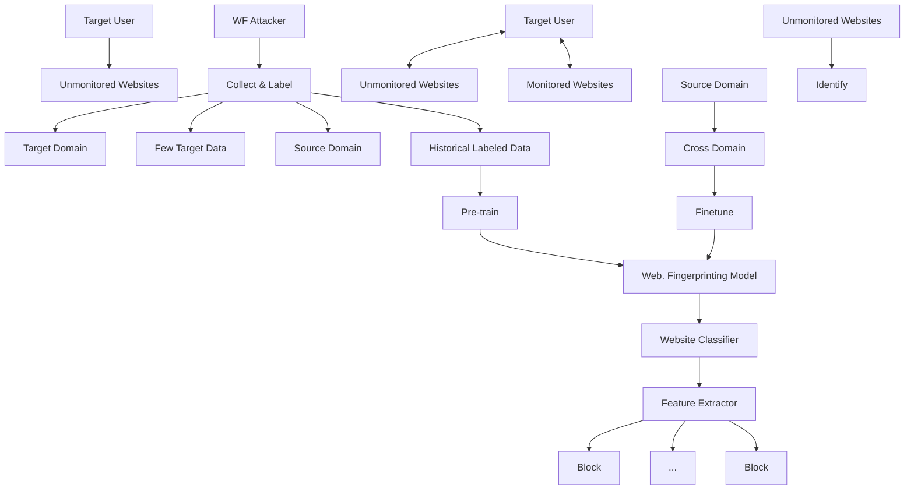
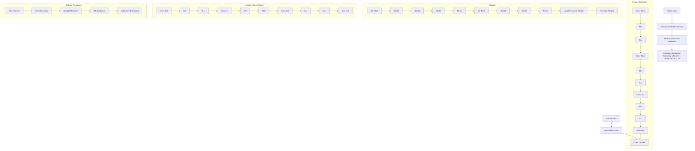

# Few-Shot Website Fingerprinting With Distribution Calibration

Chenxiang Luo , Wenyi Tang , Qixu Wang , and Danyang Zheng , Member, IEEE

Abstract—Website Fingerprinting (WF) aims to identify users’ visited websites from encrypted traffic traces, disabling the anonymity of encrypted communication like the Tor network. It is practical to use historically labeled (source) data, e.g., public datasets, to pre-train a WF model, and then collect few incoming (target) data to re-train this model within a low cost. Unfortunately, there is always a considerable difference of latent feature distributions between the source and target data (i.e., the cross-domain problem) and an inevitable bias of feature distribution caused by a limited volume of target data (i.e., the biased distribution problem). Although current Few-Shot Learning-based WF (FSWF) methods achieve satisfactory performance on the efficient establishment, they lack cross-domain transferability, and meanwhile, are unable to alleviate the distribution bias. In this paper, we first systematically analyze the cross-domain problem among different domains of traffics, revealing the ubiquity and dominant factors of it. To mitigate the cross-domain and biased distribution problems, we propose a Distribution Calibrated Website Fingerprinting (DCWF) method that incorporates a two-stage distribution calibration process and a tailored circle network. In the two-stage calibration process, we first devise a re-modeling mechanism capturing the information distribution of the target domain to extract representative features, and then design a calibration process to adjust the biased distribution of the target domain. Subsequently, a tailored circle network is proposed to reduce the noise caused by the calibration process. Finally, extensive experiments are conducted and the results demonstrate the superiority of our DCWF over comparisons under both close-world and open-world settings.

Index Terms—Network privacy, traffic analysis, website fingerprinting, cross-domain transfer, biased distribution.

## I. INTRODUCTION

N OWADAYS, the protection of network individual privacyis increasingly brought into focus. The Onion Router (Tor) [1], the primary tool of anonymous communication, has exhibited a way to safeguard online privacy. Tor browser routes a packet through a series of random-selected relays, each layer of which can encrypt or decrypt traffic, much like the layers of an

Manuscript received 10 August 2023; revised 3 June 2024; accepted 4 June 2024. Date of publication 7 June 2024; date of current version 16 January 2025. This work was supported in part by the Young Scientists Fund of the National Natural Science Foundation of China under Grant 62302322 and Grant 62302404, and in part by the Fundamental Research Funds for the Central Universities under Grant 2022SCU12116 and Grant 2023SCU12129. (Corresponding author: Wenyi Tang.)

Chenxiang Luo, Wenyi Tang, and Qixu Wang are with the School of Cyber Science and Engineering, Sichuan University, Chengdu 610207, China (e-mail: iridescense@std.scu.edu.cn; wtang@scu.edu.cn; qixuwang@scu.edu.cn).

Danyang Zheng is with the School of Computing and Artificial Intelligence, Southwest Jiaotong University, Chengdu 611756, China (e-mail: dzheng5@ swjtu.edu.cn).

Digital Object Identifier 10.1109/TDSC.2024.3411014 onion. Nevertheless, the encrypted network traffic transmitted through such safeguards still discloses sensitive information. A passive attacker could eavesdrop on the Tor traffic in the user’s Local Area Network (LAN) or wireless network, such as the user’s Internet Service Provider (ISP), the network administrator, and the sniffer. Then, the visited websites of the user could be inferred from the captured traffic data, forming a general WF attack [2]. The investigation of the WF attack exhibits the insight of anonymous tools’ vulnerability, meanwhile, supports the further development of the corresponding defense.

flowchart

Fig. 1. The example of WF practical application scenario. Attackers use already-made historical datasets to pre-train a WF model, and then collect and label a few data from the target users’ network to finetune this WF model, i.e., transfer the model from the source domain to target domain.

In the consistent studies of WF, Artificial Intelligence exhibits its spectacular potential. Deep learning based WF (DWF) methods automatically extract features and learn latent patterns from website traces [3], [4], [5], [6], [7], [8], eliminating the reliance on hand-crafting features of earlier methods [9], [10], [11], [12], [13], [14], [15], [16]. However, DWF methods need a significant amount of training data collected from the network of target users, which is both resource-consuming and time-consuming. The practical application of WF requires a low labor of data collection and labeling. Therefore, as the example shown in Fig. 1, attackers naturally prefer to use a ready-made (source) dataset to pre-train a WF model, and then collect and label a few (target) data from the target users’ network to finetune this WF model. The ready-made dataset could be existing public WF datasets or historically collected from the own network of attackers. Moreover, if attackers already have a well-trained WF model, it is more efficient to collect a few data from the target network to transfer (finetune) the model, instead of collecting abundant new data to train a new model. As a result, the few-shot and cross-domain transferability of a WF method is necessary for the practical application.

Although current FSWF methods are capable of learning traffic patterns from a small number of target data [17], [18], [19], [20], [21], the majority of current studies are still far away from the practical application because of the unsolved cross-domain and biased distribution problems. The cross-domain problem indicates that feature distributions of the source domain and target domain are different, which is widely existing because of the changing Tor Browser Bundle (TBB) versions, visited websites, network conditions, etc. Since the feature extractor is pre-trained by the data from the source domain and applied for WF attack using the data from the target domain, the prevalent cross-domain problem significantly jeopardizes the effectiveness of the feature extractor. Most current works ignore the crossdomain problem, thus failing to extract representative features from the target domain to adjust the difference between the two domains. Although [22] applies adversarial domain adaption to WF mitigating the cross-domain problem, it needs extra source datasets and retraining the feature extractor every time meeting a new target domain. Besides, the biased distribution problem means that the feature distribution of the limited (few) data from the target domain is biased, i.e., different with the ground-truth distribution of all target data. Since current studies overlook the biased distribution problem, it has a fairly high probability that the WF classifier could easily become overfitted due to such a problem. As a result, there are two non-trivial challenges we must tackle for further improvements. The one is How to extract representative features under the cross-domain scenario? and the other one is How to alleviate the biased distribution caused by limited target?

In this paper, the empirical evidence that the cross-domain problem is widely existing under the WF scenario is first exhibited through systematic analysis. We comprehensively analyze such a problem with datasets collected under different network conditions and identify several factors that dominantly induce the cross-domain problem, including time gaps, and non-overlapping website categories. In addition, the similarity results of the above analysis inspire us to design the countermeasure of the biased distribution problem. To tackle the two non-trivial challenges, we propose our DCWF method that incorporates a two-stage distribution calibration process and a tailored circle network. In the first stage which addresses the cross-domain problem, we capture the information distribution of the target domain by re-modeling the channel relationships of the feature extractor with channel weights which highlight the channel features that carry more informative content, to extract representative features on the target domain. In the second stage which tackles the biased distribution problem, we select a subset from the source domain to calibrate the feature distribution of the target data based on the analyzed similarity results. Specifically, we adopt the assumption that distributions of extracted features are following a Gaussian distribution and features of the same type of websites (e.g., shopping websites or video platforms) have similar covariance. Therefore, the biased distribution of the target data is calibrated according to the covariance of the previously selected subset from the source domain. Furthermore, a tailored circle network is proposed to increase the separability of the feature space and mitigate the inevitable noise caused by calibrating the distribution of features. Subsequently, we conduct extensive experiments to demonstrate the effectiveness of our approach to the cross-domain problem.

We summarize our key contributions as follows:

- To the best of our knowledge, this is the first work that analyzes and addresses the cross-domain problem under the scenario of WF.  
- We motivate why an attacker might be interested in the cross-domain problem and four substantial factors that FSWF attacks induce the cross-domain problem are disclosed, including the time gap, diverse TBB versions, and websites overlap and network locations.  
We propose a two-stage distribution calibration where the first stage extracts more representative features and the second stage mitigates the bias of the feature distribution due to insufficient samples. We find that our DCWF achieves nearly 85% accuracy when using only one sample per class.  
- We propose a tailored circle network to mitigate the extra errors and noise caused by the calibration of features distribution, which makes the model more robust and effective in open-world settings.  
- Extensive experiments are conducted to validate the performance comparisons. Evaluation results show that our method outperforms the state-of-the-art method in both closed-world and open-world settings, with and without WF defense.

The remainder of this paper is organized as follows. In Section II, we describe the background of Website Fingerprinting and related works. Then, Section III analyzes the cross-domain problem and corresponding factors. Further, we go into detail about our method in Section IV. In Section V, we evaluate our DCWF and other FSWF attacks under diverse experimental settings. Finally, in Section VI, we summarize our work, and point out the limitations of this work and potential future works.

## II. BACKGROUND AND RELATED WORK

## A. Background

1) Threat Model: Tor is a free and open-source software providing anonymous communication for users [23]. The goal of Tor is to safeguard users’ privacy by hiding the real IP address and identity of users by randomly routing their communication traffic through multiple nodes [24]. In this paper, we assume a local and passive adversary, which is a common assumption in other literature [11], [17]. Specifically, local means that the attacker is located on the user’s local network, while passive means that the attacker can monitor the user’s network traffic, but cannot modify or decrypt it. Potential adversaries could be campus network administrators, residential ISPs, etc. When a user initiates a request to access a website, the adversary captures the user’s traffic traces. Then the attacker analyzes the traffic traces and determines whether the user has visited a monitored website. Moreover, we assume that there are strong attackers and weak attackers, where strong attackers could collect vast amounts of data under specific network conditions when they want to train a feature extractor while weak attackers could only rely on the data provided by other attacks e.g., public datasets from the Internet, which is more common in cross-domain scenarios.

2) Closed-World Versus Open-World: WF attacks are typically evaluated in closed-world and open-world scenarios. In the closed-world scenario, users are limited to accessing a small subset of the Internet (monitored websites), typically denoted as k websites. The goal of the adversary is to determine which of the k websites the user has visited. Although this assumption has faced criticism for being impractical [25], [26], the evaluation under such scenarios still is used as a metric for evaluating the quality of attacks. We also consider the open-world scenario which represents a more realistic setting. In this scenario, as shown in Fig. 1, users could visit other websites (unmonitored websites) except the monitored websites. The Standard model and AWF model discussed in [17] are employed to evaluate the performance of WF classifiers. For the Standard model that is used extensively in previous works [3], [4], [5], [11], traces from the unmonitored set are incorporated into the training data with an additional label. This model is based on the assumption that including such samples could enhance the classifier’s ability to distinguish between monitored and unmonitored websites. For the AWF model, in contrast, training data does not include any unmonitored website traces which are classified as monitored or unmonitored websites by a threshold based on cross-entropy loss. [6] argues that the provision of any traces from the open world to the classifiers can lead to a distortion of the actual performance of WF attacks. Thus, we choose the AWF model as our evaluation criteria in an open-world setting.

3) Concept Drift: Concept drift occurs when recognizing traffic traces collected over time since the distribution of traffic traces changes [6]. Mathematically, assuming we have training data $x _ { t r a i n }$ and testing data $x _ { t e s t } .$ , the distributions of $x _ { t r a i n }$ and $x _ { t e s t }$ are different and the class labels of $x _ { t r a i n }$ and $x _ { t e s t }$ are same. In [25], the classification accuracy drops drastically in the first ten days, and then drops to zero as the time gap widens. A model that remains robust against concept drift effectively captures the representative features highly correlated with the website fingerprint, ensuring consistent performance over time [6]. In [6], they use DL-based WF to capture more representative features utilizing the advantages of deep learning. Meanwhile, [8] leverages the snapshot ensemble technique to make the model more robust to concept drift. Another solution to concept drift is to continuously re-fetch the latest pages and retrain the classifier [17], [27]. For instance, [27] operates exit relays and possesses continuous access to labeled traffic traces, facilitating the training of a WF classification model while mitigating the adverse impacts of concept drift. [17] introduces Few-Shot Learning based WF to mitigate the concept drift by rapidly updating the classifier. [28] augment traffic traces through semisupervised and self-supervised learning techniques to cover comprehensive network conditions mitigating the concept drift problem.

4) Cross-Domain: Deep learning achieves great success in the area of Computer Vision (CV) for tasks such as image classification [29], object detection [30], and face recognition [31]. However, in practical applications, we face an important challenge, namely the cross-domain problem that data distributions are different in source and target domains. Mathematically, assuming we have training data $x _ { t r a i n }$ and testing data $x _ { t e s t } .$ , the distributions of $x _ { t r a i n }$ and $x _ { t e s t }$ are different, while the class labels of $x _ { t r a i n }$ and $x _ { t e s t }$ may be different, indicating a variation distinct from the concept drift. Therefore, the concept drift can be considered as a factor causing the cross-domain problem. When we apply a feature extractor trained on one domain and extract features on another domain, the performance of the feature extractor will degrade due to the inability of the feature extractor to adequately adapt to the data distributions and feature representations in the target domain.

As we mentioned in Section I, the few-shot and cross-domain transferability of a WF method is necessary for practical application. Therefore, the cross-domain problem and the biased distribution problem become intractable but fundamental challenges. Current approaches can be categorized into two groups: feature alignment and data augmentation methods. In feature alignment methods, [22] utilizes Adversarial Domain Adaptation [32] to learn domain-invariant features, mitigating the cross-domain problem. Parameter fine-tuning [33] involves modifying the parameters of a pre-trained model to adapt it to a new dataset while focusing on a specific task. [34] re-initializes the final residual block of the feature extractor before fine-tuning on the target domain. However, these methods merely mitigate the cross-domain problem but suffer from the biased distribution problem. In data augmentation methods, [35] constructs auxiliary datasets using Mixup [36] and employs encoders to learn domain-irrelevant features, guiding network generalization to other tasks. Meanwhile, [37] and [38] apply rotation transformations to images and predict the rotation angle in the pre-training phase. These data augmentation-based methods essentially increase the diversity of samples by enlarging the sample space. However, these methods primarily target three-dimensional images, which have strong spatial dependencies. Concerning the network traffic, the data has strong temporal dependencies, making it unsuitable to use techniques like Mixup and RandomCrop for data augmentation. To simultaneously address both problems in WF, we propose our two-stage distribution calibration, which tackles the cross-domain and biased distribution problems separately. Specifically, the first stage fine-tunes the parameters of the SE Block to mitigate the cross-domain problem, and then the second stage augments labeled samples in the feature space without the constraint of input data. Moreover, the cross-domain problem is still not systematically studied in WF. Therefore, we use domain similarity to analyze the cross-domain problem in WF scenarios with prevailing public datasets.

## B. Related Work

[15] makes the first attempt to apply WF to Tor in 2009. In the following decade, WF attacks typically train classifiers based on a set of hand-crafted features. These attacks have been shown to be effective including k-NN [14], CUMUL [9], and k-FP [11], etc. However, the hand-crafted features are highly susceptible to variations in traffic, which restricts the usability of such attacks.

As the potential benefits of deep learning are further explored, researchers actively apply deep learning techniques to deep website fingerprinting (DWF). [3] explores the Stacked Denoising Autoencoder (SDAE) in WF for detecting whether a user has visited illegal websites. Following this, [6] compares the performance of several deep-learning models on WF. The results exhibit that DWF methods benefit from the increase in the amount of training data and SDAE obtains the best results, with 96.3% accuracy. Subsequently, [4] proposes an attack named Deep Fingerprinting (DF), which incorporates the sophisticated features extracted from traffic traces with Convolutional Neural Networks. The DF attack achieves 98.3% accuracy in the closed world and 99% accuracy and 94% recall in the open world. Moreover, the DF attack demonstrates a remarkable closedworld 90.7% accuracy under the WF defense scenario, undermining the effectiveness of the WTF-PAD defense [39] which is widely regarded as the primary candidate for deployment in Tor. Subsequently, [5] proposes Var-CNN, specifically designed for the WF problem leveraging techniques tailored to address the challenges of small training data. Remarkably, Var-CNN achieves an impressive closed-world accuracy of approximately 92.4% with just 40 traces per site. Moreover, [40] explores unsupervised deep learning and highlights the utility of their model for feature extraction separately from the classification task. Based on this, [8] proposes the snWF leveraging snapshots ensemble technique and reaches the best performance in deep WF attacks.

However, these deep WF attacks suffer from substantial gathering time of training data where network conditions will change in such a big bootstrap time which are assumed to be the same in their works [3], [4], [5]. To address such problems, [17] proposes TF using triplet networks and evaluate it in a more challenging scenario where the training and testing data are collected years apart on different network conditions. Furthermore, Chen et al. improve the performance of FSWF attacks by employing transfer learning, meta-learning [20], and data augmentation [19] techniques respectively. Meanwhile, [21] proposes WFBDC to mitigate domain deviation by leveraging the Brownian Distance Covariance (BDC) and achieving the best performance. Nevertheless, these works do not explicitly consider the cross-domain problem where the feature extractor could not extract representative features on the target domain without transferability. [22] utilizes Adversarial Domain Adaption [32] to learn domaininvariant features with a Source Classifier and a Domain Discriminator mitigating the cross-domain problem. However their method either requires data from multiple source domains, or the feature extractor needs to be pre-trained with the source domain each time they encounter a new target domain. In contrast, our method only needs to pre-train the feature extractor once with a single source domain, and the feature extractor can be used for multiple target domains. There are also some other related works. [41] proposes a defense mechanism against cache-based Website Fingerprinting attacks. This approach involves generating spurious network activity to introduce noise into the cache, effectively concealing the website rendering activity. [42] proposes an obfuscation defense technique based on eXplainable Artificial Intelligence (XAI) to counter microarchitecture-based Website Fingerprinting attacks. [43] constructs a WF classifier using the XGBoost algorithm, supplanting the initial random forest classifier from previous work [44]. Since our work focuses on the cross-domain in FSWF, these work are not considered in this paper.

## III. CROSS-DOMAIN ANALYSIS

In this section, we analyze the cross-domain problem in WF by measuring the similarity between two domains and show what factors contribute such a problem. In [25], they point out that WF methods should be evaluated in practical settings including user’s browsing habits, differences in location and version of TBB, etc. In particular, they discuss the impact of the time gap between training data and testing data, which is known as concept drift. In this section, we consider these assumptions as factors causing the cross-domain problem, and we propose our solution in the next section.

## A. Datasets

We carry out our experiment on several datasets collected in different conditions, with which we simulate different crossdomain scenarios and analyze the contributing factors. We label these datasets as follows:

AWF dataset [6]: Rimmer et al. collected traffic traces of monitored websites from the 1,200 Alexa Top sites, and unmonitored websites from the 400,000 Alexa Top sites in 2017 using TBB version 6.5. Among the monitored websites, they revisit the top 200 websites and collected 100 test traces per website 3 days, 10 days, 2 weeks, 4 weeks, and 6 weeks after the end of the initial data collection for these 200 websites. We categorize the AWF dataset into several different sets:

- AWFk: The set of the first k monitored websites, where each website has 2,500 examples. Especially $A W F 7 7 5$ is 775the set of remaining 775 excluding the Top 100 monitored websites same as [17].  
- AWFλ K: A subset with λ× 1000 of the 400,000 unmonitored websites, where each website has one example.  
- $A W F 2 0 0 _ { \delta } .$ : A subset with δ time after the end of the 200initial data collection for these 200 websites. Since the $A W F 2 0 0 _ { 6 w }$ is contaminated, we do not consider it in the 200next analysis.

DF-95 dataset $I 4 J { \mathrm { : } }$ Sirinam et al. collected traffic traces of monitored websites from the 100 Alexa Top sites, and unmonitored websites from the 9000 Alexa Top sites in 2016 using TBB version 6.X.

DS-14 dataset [14]: Wang et al. collected traffic traces of monitored websites from a list of sites blocked in China, the

U.K., and Saudi Arabia, and unmonitored websites from the 9000 Alexa Top sites in 2014 using TBB version 3.5.1.

DF-19 dataset [45]: Wang et al. collected traffic traces of monitored websites from the 100 Alexa Top sites, and unmonitored websites from the 9000 Alexa Top sites in 2019 using TBB version 8.5a7.

Data Representation: We follow the data representation used by recent FSWF works [17], [18], [19], [20]. Each trace is transformed into a sequence where we disregard packet size and timestamps, retaining only the traffic direction of each packet. Outgoing and target packets are represented as +1 and −1, respectively. To ensure consistency, the sequences are trimmed or padded with $0 \mathrm { { ^ { \circ } s } }$ to reach a fixed length of 5,000 packets. As a result, the input data is organized as a 1-D array of $[ n \times 5 0 0 0 ]$ , where n denotes the total number of examples provided to the model.

## B. Domain Similarity

Suppose there is a source domain $\boldsymbol { s }$ and a target domain $\tau$ projected into the feature space. In the context of transfer learning, the distance between two domains can be quantified as the minimum amount of work required to move the features of one domain to the other. Therefore we use Earth Mover’s Distance (EMD), which searches for the minimum amount of work, to measure domain similarities between available datasets [46], [47].

First we define the prototype vector $p _ { c }$ of class c on a domain:

$$
p _ {c} = \frac {1}{n _ {c}} \sum_ {k = 1} ^ {n _ {c}} g (t _ {k} ^ {c}), \tag {1}
$$

where $n _ { c }$ is the total number of traces in class c, $t _ { k } ^ { c }$ is the k-th trace in class c and $g ( \cdot )$ denotes a feature extractor for a trace. The ( )feature extractor is required to extract high-level information from traffic traces [46]. Therefore we use the Var-CNN as the trained extractor on the large scale AWF dataset where Var-CNN is considered the best deep WF model and we use outputs of Global Average Pooling [48] as features, and AWF dataset contains the largest websites categories and traffic traces. Suppose we have a source domain ${ \mathcal { S } } = \{ ( p _ { i } , w _ { p _ { i } } ) \} _ { i = 1 } ^ { | { \mathcal { S } } | }$ and a $\mathcal { T } = \{ ( p _ { j } , w _ { p _ { j } } ) \} _ { j = 1 } ^ { | \mathcal { T } | }$ $p _ { i }$ = (vector of category i in $\boldsymbol { s }$ and $w _ { p _ { i } }$ is the normalized number of traces in that category; similarly for $p _ { j }$ and $w _ { p _ { j } }$ in $\tau$ . Since we normalize the number of traces, we have

$$
\sum_ {i = 1} ^ {n} w _ {i} = \sum_ {j = 1} ^ {m} w _ {j} = 1. \tag {2}
$$

Then the distance between the two domains can be considered as the cost of moving prototype vectors from one domain to the other in the transfer learning context [46], [47]. We define the distance between two prototypes $p _ { i } \in S$ and $p _ { j } \in \mathcal { T }$ as the euclidean distance:

$$
d _ {i, j} = \left\| p _ {i} - p _ {j} \right\|. \tag {3}
$$

Then we have the distance between $\boldsymbol { s }$ and T is defined as their Earth Mover’s Distance (EMD):

$$
d (\mathcal {S}, \mathcal {T}) = E M D (\mathcal {S}, \mathcal {T}) = \frac {\sum_ {i = 1 , j = 1} ^ {m , n} f _ {i , j} d _ {i , j}}{\sum_ {i = 1 , j = 1} ^ {m , n} f _ {i , j}}, \tag {4}
$$

where the optimal flow $f _ { i , j }$ corresponds to the least amount of total work by solving the EMD optimization problem. Finally, the domain similarity is defined as

$$
\operatorname{sim} (\mathcal {S}, \mathcal {T}) = e ^ {- \gamma d (\mathcal {S}, \mathcal {T})}, \tag {5}
$$

where γ is set to 0.1 which is different from previous works [46], [47] due to that we think prototypes of domains of network traffic are more difficult to distinguish.

## C. Analysis

We use AW F k as the source domain which is commonly given as an auxiliary dataset to train the feature extractor. Concerning the target domain, we use $A W F 1 0 0 , A W F 2 0 0 _ { \delta }$ , 100 200DS- , DS- , and DF - which are commonly given as 14 19 95target datasets to train the classifier in FSWF [17]. Table I shows the similarities between source domains and target domains. We observe a similar trend, that the order of domain similarities to source domains is AW $F 2 0 0 _ { 3 d } >$ $A W F 2 0 0 _ { 1 0 d } > A W F 2 0 0 _ { 2 w } > A W F 2 0 0 _ { 4 w } > A W F 1 0 0 >$ $D S { - } 1 4 > D S { - } 1 9 > D F { - } 9 5$ 200 100. For instance, with δ increasing, 14 19 9the similarities between $A W F 2 0 0 _ { \delta }$ and AW F k become 200smaller and DF - has the smallest similarities to source 95domains. Then we synthesize previous research and motivate the factors that we meet in the real world and cause cross-domain problems. We classify them into the following categories.

Time Gap: In the scenario where both training and testing datasets are collected in the same domain, WF attacks exhibit their best performance [25]. However, maintaining this advantageous situation requires the attacker to constantly collect the latest data, which is a resource-intensive operation and poses limitations on weak attackers. The advent of FSWF reduces such awkward conditions to some extent by leveraging a historically collected dataset. However, such methods give rise to the cross-domain problem, as the feature extractor and classifier are trained on two different domains separated by a significant time gap. To further study such cross-domain problems, we analyze the effect of the time gap on cross-domain problems using $A W F 2 0 0 _ { \delta }$ datasets where these datasets are designed 200to gradually increase the time gap between the target domains and the source domain. In our analysis of domain similarities, we find that, as the time gap increases, the similarities between the source and target domains become smaller, decreasing from 0.800 to 0.633. This is because the content of websites changes over time leading to changes in traffic patterns. For example, Google’s homepage has different doodles for different holidays as Fig. 2, which results in a very noticeable change in traffic payload.

TBB Version&Setting: To perform FSWF attacks, an attacker is required to collect the auxiliary data on a TBB with a certain version (source domain) where the attacker could not collect datasets of multiple versions due to resource constraints. However, an attacker, such as network administrators, would like to monitor all users in the Intranet who visit websites with different TBB versions. In this case, the attacker needs to train classifiers on target data with different versions of TBB (target domain), which causes cross-domain problems, otherwise, the accuracy of FSWF attacks drops dramatically [25]. Therefore we study the cross-domain problem induced by the factor that the auxiliary data and target data are collected in different versions of TBB. The similarity between AW F and DS- is 0.326 with 200 14the versions 6.5 and 3.5.1. Moreover, the similarity between AW F and DS- is 0.338 with the versions 6.5 and 8.5a7. In 200 19fact, Tor’s security policy and browser optimization policies are subject to change with each version update. With each update, it leads to a change in traffic patterns. For instance, they consider disabling TLS cipher suites containing SHA-1 and enabling HTTP/2 push in version 12.0.1 In addition, [26] evaluates the performance of WF with a random forest model when training data and testing data are collected from different TBB versions, e.g., [7,8,9,10]. For example, the accuracy drops from 77% to 3% when the training data and testing data are collected from TBB versions 9 and 10 respectively. Moreover, Tor undergoes rapid updates,2 and thus the TBB versions among users can be different. Therefore, the TBB version&setting is a possible cause of cross-domain problems.

TABLE I SIMILARITIES BETWEEN THE SOURCE DOMAINS AND TARGET DOMAINS

<table><tr><td>Domain</td><td> $AWF100$ </td><td> $AWF200_{3d}$ </td><td> $AWF200_{10d}$ </td><td> $AWF200_{2w}$ </td><td> $AWF200_{4w}$ </td><td>DS-14</td><td>DS-19</td><td>DF-95.</td></tr><tr><td> $AWF200$ </td><td>0.556</td><td>0.800</td><td>0.757</td><td>0.680</td><td>0.633</td><td>0.326</td><td>0.338</td><td>0.249</td></tr><tr><td> $AWF500$ </td><td>0.400</td><td>0.463</td><td>0.453</td><td>0.436</td><td>0.425</td><td>0.326</td><td>0.341</td><td>0.257</td></tr><tr><td> $AWF775$ </td><td>0.344</td><td>0.366</td><td>0.363</td><td>0.361</td><td>0.361</td><td>0.279</td><td>0.254</td><td>0.258</td></tr><tr><td> $AWF900$ </td><td>0.368</td><td>0.411</td><td>0.406</td><td>0.396</td><td>0.392</td><td>0.327</td><td>0.343</td><td>0.257</td></tr></table>

text_image

GOGLE

Fig. 2. Standard (Left) and doodle (Right) versions of google.com.

Websites Overlap: In general, weak attackers tend to rely on historically collected datasets to train their feature extractors. However, it is important to note that the websites monitored by the attacker may differ from the websites present in the source dataset. In the area of CV, domains of two different class sets are considered to cause cross-domain problems [47]. Inspired by it, we conduct an analysis to investigate the impact of website overlap on the cross-domain problem. Our results show that the similarity between AW F and AW F is 0.556 while that 200 100between AW F and AW F is decreasing similarity by 500 1000.400. In addition, the result in the website overlap experiment of Section V-B also suggests that the more identical websites in the source and target domains, the better the performance of the FSWF attacks.

text_image

English
French
German
Russian
Chinese
Arabic
Hindi
Indonesian
Spanish
Portuguese
French
English

Fig. 3. Various backbone network and main languages in the world.

Network locations: When utilizing a historically collected dataset, it is essential to consider the location where the dataset was collected. In [25], the authors found that traces collected in different locations close to the backbone exhibit high similarity, while the similarity is significantly lower when comparing traces from distant locations. When we analyze the factors, we observed a counter-intuitive result that, the similarity between AW F and DF - is 0.249 with the same TBB version 200 956.X, while that between AW F and DS- is 0.338 with 200 19TBB versions 6.5 and 8.5a7. We consider the reason to be related to network locations and it is the different network conditions that cause packets to arrive in a different order and thus the overall traffic patterns to change. Additionally, websites in different regions often employ different languages, which can lead to significant variations in traffic payload sizes as shown in Fig. 3.

In conclusion, many factors could cause cross-domain problems which are common in the real world. Inspired by the measure of the similarity between domains, we propose to select some websites of the source domain that are similar to websites of the target domain, and the characteristics of selected websites are borrowed to calibrate the biased distribution of the target data, which can be found in Section IV-C2.

## IV. SYSTEM DESIGN

This section provides a detailed introduction to the proposed DCWF attack. We first give an overview of the architecture. And then describe how DCWF learns representative features on the target domain, calibrates the distribution of features, and mitigates the extra errors and noise caused by the feature calibration.

flowchart

Fig. 4. Schematic overview of the proposed DCWF. Note: GT is Ground Truth and the snowflake means freezing the weights of the neural network.

## A. Overview

The overview of DCWF is presented in Fig. 4. Our method consists of domain-agnostic pre-training and domain-specific distribution calibrating. During the domain-agnostic learning process, a tailored extractor $f _ { \theta }$ is trained to learn the knowledge on the source domain. In the domain-specific distribution calibrating process, we capture the information distribution with channel weights to approximate the data distribution on the target domain. Finally, we calibrate the distribution of features based on similar classes from the source domain with adequate traces.

## B. Domain-Agnostic Pre-Training

In this process, we aim to not only train a powerful feature extractor to obtain robust features but also promote the separability in the feature space which mitigates the inevitable errors and noise caused by the distribution learning process in Section IV-C. The subsequent subsections provide a detailed explanation of the network structure and the role played by each component.

1) Squeeze and Excitation Block: To extract representative features on a specific domain, it is important to learn the distribution of data on the specific domain which is difficult. Therefore, we use the information distribution of target data which is obtained by the SE block and can be substituted to some extent for the data distribution. The SE block models the interdependence between feature channels, and obtains the weights of each feature channel [49]. With these weights, the extractor selectively emphasises informative channels and suppresses less useful ones. We first add SE blocks after each basic block and find that the channel weights across different classes are nearly identical in lower layers and at greater layers, the weight of each channel becomes much more class-specific which is similar in [49]. Therefore we consider channel weights of lower layers to be external representations of the information distribution of a particular domain. Then we keep the SE block after the second layer of the feature extractor and remove other SE blocks. We randomly select four websites from AW F , and the channel weights of feature extractors trained in two domains DS- and 14DS- are illustrated in Fig. 5. The SE block is implemented by two operations.

Squeeze: To capture the global perceptual field of a feature map and understand the interrelationship between channels, we utilize global average pooling to encode the entire spatial feature vector of a channel into a global feature representation. Suppose we have a feature map $\boldsymbol { X } \in \mathbb { R } ^ { W \times C }$ where $X = [ x _ { 1 } , x _ { 2 } , . . . , x _ { C } ]$ = [ ]and C is the numbers of channels. Since the input data is 1- dimensional, the length of the feature is W . A global feature $G _ { c }$ can be calculated using the following equation:

$$
G _ {c} = s q (X _ {c}) = \frac {1}{W} \sum_ {i = 1} ^ {W} x _ {c} (i), \tag {6}
$$

where c is the c-th channel.

Excitation: To make use of the information aggregated in the squeeze operation, the excitation function must capture the nonlinear relationship between channels. We employ a bottleneck structure consisting of two fully connected layers to control the channel weights. The first fully connected layer, with parameters $W _ { 1 }$ , reduces the input dimension to $1 / \mathrm { r } ,$ followed by ReLU activation. Then, the second fully connected layer, with parameters $W _ { 2 } ,$ restores the activation vector to its original dimension. Finally, a Sigmoid gating function σ is applied to obtain normalized weights ranging between 0 and 1. The formula for Excitation is as

$$
S = e x (G, W) = \sigma (g (G, W)) = \sigma (W _ {2} \mathrm{ReLU} (W _ {1}, G)). \tag {7}
$$

line chart

| Channel_index | facebook.com | doublepimp.com | goodreads.com | openload.co |
| ------------- | ------------ | -------------- | ------------- | ----------- |
| 0             | 0.55         | 0.05           | 0.05          | 0.55        |
| 5             | 0.30         | 0.20           | 0.10          | 0.30        |
| 10            | 0.60         | 0.70           | 0.80          | 0.60        |
| 15            | 1.00         | 1.00           | 1.00          | 1.00        |
| 20            | 0.50         | 0.50           | 0.50          | 0.50        |
| 25            | 0.60         | 0.70           | 0.70          | 0.60        |
| 30            | 0.55         | 0.45           | 0.45          | 0.55        |

(a) Channel weights on DS-14

line chart

| Channel_index | facebook.com | doublepimp.com | goodreads.com | openload.co |
| ------------- | ------------ | -------------- | ------------- | ----------- |
| 0             | 0.75         | 0.78           | 0.80          | 0.76        |
| 5             | 0.30         | 0.32           | 0.34          | 0.31        |
| 10            | 0.45         | 0.47           | 0.49          | 0.46        |
| 15            | 0.65         | 0.67           | 0.69          | 0.66        |
| 20            | 0.50         | 0.52           | 0.54          | 0.51        |
| 25            | 0.90         | 0.92           | 0.94          | 0.91        |
| 30            | 0.60         | 0.62           | 0.64          | 0.61        |

(b) Channel weights on DS-19  
Fig. 5. The channel weights of feature extractors trained separately in two domains DS-14 (a) and DS-19 (b). We randomly select four websites from AW F 100 to illustrate the channel weights.

The final output of the block is obtained by rescaling the feature map X with the scalar S,

$$
\tilde {x} _ {c} = F _ {\text { scale }} (x _ {c}, s _ {c}) = s _ {c} \cdot x _ {c}, \tag {8}
$$

where $X = [ \tilde { x } _ { 1 } , \tilde { x } _ { 2 } , . . . , \tilde { x } _ { C } ]$ and $F _ { s c a l e } ( x _ { c } , s _ { c } )$ refers to = [˜ ˜ ˜ ] ( )channel-wise multiplication between the feature map $x _ { c }$ and the scalar $s _ { c } .$ In this paper, we set r equal to 2.

2) Big Kernel Size and Bottleneck: We sort to convolutional layers with big kernel sizes to solve the background noise while previous WF attacks mainly use convolutional layers with a kernel size of 8 or smaller. Traditional convolutional layers with small kernel sizes focus more on the local details in which the background noise leads to greater adverse effects while convolutional layers with big kernel sizes capture more global information of traffic traces [50]. Considering the efficiency, we use depth-wise convolution layers with big kernel sizes in bottleneck blocks as illustrated in Fig. 4. In fact, the time of training our feature extractor is less than that of TF and WFBDC.

3) Circle Loss: Note that the feature calibration of the second stage induces inevitable errors. In this case, our features extractor must improve the separability of feature space to mitigate such errors and we sort to Circle loss [51]. Loss functions like triplet loss and softmax cross-entropy loss are designed to incorporate both within-class similarity $( s _ { n } )$ and between-class similarity $( s _ { p } )$ into similarity pairs and aim to minimize the difference $\left( s _ { n } - s _ { p } \right)$ where we use cosine similarity as similarity measure-( )ment. However, this optimization approach can be inflexible as it imposes an equal penalty strength on every individual similarity score. In contrast, Circle loss dynamically adjusts its gradients on $s _ { p }$ and $s _ { n } .$ , and thus benefits from a flexible optimization process. It is defined by

$$
\mathcal {L} _ {\text { circle }} = \log
$$

$$
\left[ 1 + \sum_ {j = 1} ^ {L} \sum_ {i = 1} ^ {K} \exp (\gamma (\alpha_ {n} ^ {j} (s _ {n} ^ {j} - \Delta_ {n}) - \alpha_ {p} ^ {i} (s _ {p} ^ {i} - \Delta_ {p}))) \right], \tag {9}
$$

in which $\alpha _ { n } ^ { j }$ and $\alpha _ { p } ^ { i }$ are non-negative weighting factors, $\gamma$ is a scale factor, $\Delta _ { n }$ and $\Delta _ { p }$ are the between-class and within-class margins.

When a similarity score deviates far from its optimum $( \mathrm { i . e . , }$ $O _ { n }$ for $s _ { n } ^ { j }$ and $O _ { p }$ for $s _ { p } ^ { i } )$ , it should be assigned a large weighting factor. This ensures that these deviations receive a stronger emphasis during the update process, allowing for more effective updates with larger gradients. The authors define the $\alpha _ { n } ^ { j }$ and $\alpha _ { p } ^ { i }$ as

$$
\left\{ \begin{array}{l} \alpha_ {p} ^ {i} = \left[ O _ {p} - s _ {p} ^ {i} \right] _ {+}, \\ i = \left[ \begin{array}{c c} i & 0 \end{array} \right] \end{array} \right. \tag {10}
$$

$$
\left\lfloor \alpha_ {n} ^ {\jmath} = [ s _ {n} ^ {\jmath} - O _ {n} ] _ {+}, \right.
$$

in which $[ \cdot ] _ { + }$ is the “cut-off at zero” operation to ensure $\alpha _ { p } ^ { i }$ and $\alpha _ { n } ^ { j }$ [ ]are non-negative. Considering the case of binary classification, the decision boundary is achieved at $\alpha _ { n } ^ { j } ( s _ { n } ^ { j } - \Delta _ { n } ) -$ $\alpha _ { p } ^ { i } ( s _ { p } ^ { i } - \Delta _ { p } ) = 0$ . Setting $O _ { p } = 1 + m , O _ { n } = - m , \Delta p = 1 -$ (m,and $\Delta n = m$ 0 = 1 + = Δ = 1. Consequently, the decision boundary is re-Δduced to

$$
(s _ {n} - 0) ^ {2} + (s _ {p} - 1) ^ {2} = 2 m ^ {2}. \tag {11}
$$

The decision boundary is the arc of a circle. In this paper, we set $m = 0 . 2 5$ and $\gamma = 6 4$ .

## C. Domain-Specific Distribution Calibrating

Here we propose our two-stage distribution calibration process. In the first stage, we fine-tune the channel weights to extract more representative features on the target domain. Then, we select a subset from the source domain to calibrate the feature distribution of the target data based on the analyzed similarity results. Because the dimension of the traffic feature is large and the variables are not independent, it is difficult to directly test which distribution the feature satisfies. Therefore, we assume that the distribution of features follows the Gaussian distribution (BN) due to the Batch Normalization in the feature extractor where BN can produce feature maps with a stable and “more

Algorithm 1: Domain-Specific Distribution Learning.  
1: Input: source domain $\mathcal{D}_{\mathcal{S}}$ , target domain $\mathcal{D}_{\mathcal{T}}$ , feature extractor $\theta$ , SE block $\theta_{C}$ , linear classifier $\theta_{clf}$ , number of samples $k, T$ iterations.
2: Output: output
3: a = 0
4: for each iteration $t = ,\ldots,T$ do
5: $x_{d} \leftarrow$ a batch from $\mathcal{D}_{\mathcal{S}}$ with size $m$ 6: $\theta_{C}(t + 1) \leftarrow \theta_{C}(t) - \alpha \frac{1}{m} \nabla \mathcal{L}_{CE}(f_{\phi}(\theta, \theta_{clf}; x_{d}))$ 7: end for
8: for each class $c = 1,\ldots,C$ do
9: $x_{c} \leftarrow \{x | x \in \mathcal{D}_{\mathcal{S}}, y = c\}$ 10: $u_{c} \leftarrow \frac{1}{|x_{c}|} f_{\theta}(x_{c})$ 11: $\Sigma_{c} \leftarrow \frac{1}{n_{c}-1} \sum_{i=1}^{n_{c}} (\boldsymbol{x}_{i} - \boldsymbol{\mu}_{c})(\boldsymbol{x}_{i} - \boldsymbol{\mu}_{c})^{T}$ 12: end for
13: for each sample $x_{s} \in \mathcal{D}_{\mathcal{S}}$ do
14: $\tilde{x}_{s} \leftarrow f_{\theta}(x_{s})$ 15: $\mathcal{K}_{s} \leftarrow k$ nearest base classes from (14)
16: $\mathbb{D}_{\mathcal{S}} \leftarrow$ Gaussian distribution from (16)
17: $\mathcal{F}_{s} \leftarrow$ sample $k$ features from $\mathbb{D}_{\mathcal{S}}$ 18: end for
19: for each iteration $t = ,\ldots,T$ do
20: $x_{s} \leftarrow$ a batch from $\mathcal{F}_{s}$ and $\mathcal{D}_{\mathcal{S}}$ with batch size $n$ 21: $\theta_{clf}(t + 1) \leftarrow \theta_{clf}(t) - \alpha \frac{1}{n} \nabla \mathcal{L}(f_{\phi}(\theta, \theta_{clf}; \tilde{x}_{s}))$ 22: end for

Gaussian” distribution [52]. Moreover, assuming a Gaussian distribution for features is common in various fields due to its practical effectiveness [53], [54], [55].

1) Stage 1 Domain Distribution Learning: The SE block is trained to capture the information distribution of a domain. To learn the information distribution of the target domain, we finetune the SE block of the feature extractor $f _ { \theta }$ with batch size 32 on the target domain. Suppose $\theta _ { C }$ is the parameters of SE block, θ is the parameters of the whole feature extractor, and (x, y) is a trace from the target domain with its label. We select the linear classifier with parameters $\theta _ { c l f }$ to adopt the stochastic gradient descent algorithm for update at every iteration t as

$$
\theta_ {C} (t + 1) = \theta_ {C} (t) - \alpha \frac {1}{m} \sum_ {i = 1} ^ {m} \nabla \mathcal {L} _ {C E} (f (\theta , \theta_ {c l f}; x), y), \tag {12}
$$

where α denote the learning rate and m is the batch size. $\mathcal { L } _ { C E }$ is the cross-entropy loss function.

2) Stage 2 Feature Distribution Calibration: The biased distribution problem is that the number of samples in the target domain is too small to accurately represent the distribution of the whole target domain, resulting in the classifier learning inaccurate distribution and overfitting. However, addressing this problem is not trivial. Due to the presence of high-dimensional feature vectors, utilizing standard Gaussian distribution random sampling encounters the challenge known as the curse of dimensionality. Additionally, a few training data within the target domain is insufficient to adequately represent the holistic feature distribution. Therefore, we need distributions of source domain features that are similar to training data to calibrate the biased distribution of the target domain. We first compute centroid vectors for each class within the source domain, followed by Cosine Distance computation between these centroids and target domain features. Subsequently, a top-k class subset which is similar to the training data of the target domain is selected to approximate its distribution according to the Cosine Similarity. For instance, the covariance matrix of target features is derived by averaging the covariance matrices of the chosen subset. Consequently, features are sampled from the calibrated Gaussian distribution and fed into a new classifier. The general pseudocode is shown in Algorithm 1.

Specifically, with the definition of domain similarity in (4), a subset of the source domain that is similar to the target domain is selected to calibrate the distribution of the target domain. Suppose we have source domain $\boldsymbol { S } = \{ p _ { i } \} _ { i = 1 } ^ { m }$ same as Section =III-B. We suppose there are only a few available labeled samples for the target domain. The most common way to test FSWF attacks is to build a task called N -way-K-shot task [56]. N is the number of categories in the target domain and K-labeled samples are provided for each class. The few available labeled data are called support set and the attack is evaluated on another query set.

Using a feature extractor, we obtain the features of samples from both the source domain and the target domain. We assume that the feature distribution follows a Gaussian distribution. The mean of the feature vector belonging to class c is denoted as $\mu _ { c } .$ . Since variables on each dimension are not independent, we utilize the covariance matrix to represent the variance of feature vectors. The covariance matrix $\Sigma _ { c }$ for the features belonging to class c is calculated as

$$
\boldsymbol {\Sigma} _ {c} = \frac {1}{n _ {c} - 1} \sum_ {i = 1} ^ {n _ {c}} \left(\boldsymbol {x} _ {i} - \boldsymbol {\mu} _ {c}\right) \left(\boldsymbol {x} _ {i} - \boldsymbol {\mu} _ {c}\right) ^ {T}, \tag {13}
$$

where $x _ { i }$ is the i-th feature vector in class c.

Utilizing these statistics, we perform a transfer of these statistics from the source domain to the target domain. This transfer leverages the more accurate estimation of statistics in the source domain, which is based on sufficient data, and applies them to the target domain. We use the Cosine Distance as the distance between the feature of a sample x from the support set and ˜features of the source domain, instead of [57] using the euclidean distance. We define

$$
\mathbb {S} _ {d} = \left\{- c o s <   \boldsymbol {\mu} _ {c}, \tilde {\boldsymbol {x}} > | i \in C _ {b} \right\},
$$

$$
\mathbb {S} _ {N} = \left\{i \mid - c o s <   \boldsymbol {\mu} _ {c}, \tilde {\boldsymbol {x}} > \in t o p k \left(\mathbb {S} _ {d}\right) \right\}, \tag {14}
$$

where cos $< , >$ is Cosine Distance, $t o p k ( \cdot )$ is an operator to ( )select the top elements from the input distance set $\mathbb { S } _ { d } . \mathbb { S } _ { N }$ stores the k nearest base classes with respect to a feature vector x. Then, the covariance of the distribution is calibrated as

$$
\boldsymbol {\Sigma} ^ {\prime} = \frac {\sum_ {i \in \mathbb {S} _ {N}} \boldsymbol {\Sigma} _ {c}}{k} + \alpha , \boldsymbol {\mu} = \tilde {\boldsymbol {x}}, \tag {15}
$$

where α is a hyper-parameter that determines the degree of dispersion of features sampled from the calibrated distribution. Given a set of calibrated statistics $\mathbb { S } _ { y }$ for a class on the target domain, we generate a set of feature vectors with label y. This is achieved by sampling from the calibrated Gaussian distributions, which allows us to create feature vectors that align with the desired distribution of target data:

text_image

Before
After

Fig. 6. The illustrations of the distribution of data. The calibration and sampling would induce some noisy to the class boundary (Left). Our circle network makes distributions more aggregated (Right).

$$
\mathbb {D} _ {y} = \{(\boldsymbol {x}, y) | \boldsymbol {x} \sim \mathcal {N} (\boldsymbol {\mu}, \boldsymbol {\Sigma}), \forall (\boldsymbol {\mu}, \boldsymbol {\Sigma}) \in \mathbb {S} _ {y} \}. \tag {16}
$$

We set the total number of generated features per class as 512. The generated features, along with the original support set features, for the target domain are combined to form the training data for a classifier. The classifier is trained specifically for the target domain by minimizing the cross-entropy loss over both the features of its support set and the generated features $\mathbb { D } _ { y }$ .

$$
\mathcal {L} = \sum_ {(\boldsymbol {x}, y) \tilde {\mathcal {S}} \cup \mathbb {D} _ {y, y \in \mathcal {Y} ^ {\mathcal {T}}}} - \log P r (y | \boldsymbol {x}; \theta_ {c l f}). \tag {17}
$$

The feature sampling methods inevitably induce errors and noise. However, in conjunction with our tailored model, these adverse effects are effectively attenuated which is illustrated in Fig. 6.

## V. EXPERIMENTAL EVALUATIONS

## A. Experimental Setting

In this section, we design a series of experiments that may be encountered in real-world scenarios where different target domains represent various cross-domain problems with different numbers of shots. We evaluate the performance of the DCWF attack with the baseline attacks: TF [17], WFBDC [21], TLFA [20], MBL [18]. We implement our DCWF based on Pytorch 1.12. For TF we download their code and migrate them to Pytorch 1.12 without any structural or hyperparameter changes. For WFBDC, TLFA, and MBL, we implement them according to the author’s description. All experiments are performed with an NVIDIA Geforce RTX 4090 GPU. The other hyperparameters of DCWF can be found in our experiment code at https://github.com/chenxiang3luo/DCWF/.

We compare our proposed DCWF with three baselines [17], [18], [20] and the state-of-art WFBDC [21] model.

- TF [17] selects Triplet as the loss function using DF [4] backbone as the feature extractor. For the classifier, the K-Nearest Neighbors classifier is selected.  
WFBDC [21] computes the BDC of the output from the feature extractor as the feature of a sample and uses Multisimilarity [58] as the loss function to train the feature extractor. For the classifier, the Linear classifier is selected.

- TLFA [20] trains a feature extractor on a large auxiliary data with Cross-entropy loss leveraging classical machine learning models (e.g., SVM).  
- MBL [18] introduces parameter factorization idea for facilitating meta-training with Cross-entropy loss.

## B. Closed-World Evaluations on Disjointed Websites

The websites that the attacker monitors and the websites used to train the feature extractor may not be the same, which causes the cross-domain problem. In this experiment, we evaluate attacks in the scenario where the cross-domain problem is caused by disjointed websites. The two datasets are both collected from the same period of time (2016) using the same version of TBB (6.X) where the website categories do not overlap. For the close-world setting, we use Accuracy [%], True positive rate (TPR [%]), and False positive rate (FPR [1e-4]) to evaluate the performance of WF attacks. For the open-world setting, due to the base rate fallacy [59], we use the Area under the Precision-Recall Curve (AUC) metric to evaluate the performance of WF attacks. We repeat 5 times with different seeds and report the results in the form of mean ± standard deviation compared with other methods.

Experimental setting: We follow the same experimental setup as [17]. The feature extractor is pre-trained on source domain AW F with randomly sampled 25 examples for each 775website. When testing classification performance. We select AW F as our target domain where we use the first 90 traces 100for each website for a fair comparison to all attacks. We divide the traces of each website into two groups, with the first group consisting of 20 traces and the second group consisting of 70 traces. The traces in the first group are reserved for evaluating the classification performance on N 1, 5, 10, 15, and 20 traces, and the remaining 70 traces are utilized as testing data to evaluate the performance of attacks. Please note that these fundamental experimental settings will be consistently applied in the subsequent experiments presented in this paper.

Results: Fig. 7 shows the performance of DCWF and other attacks on disjointed websites. As we can see, WBDC is the best baseline attack and DCWF achieves better performance than other attacks. In the case of the 1-shot setting, DCWF achieves 86.2% accuracy which is more 15% than the best baseline WFBDC 71% accuracy. The performance of the attacks improves as the training trace increases and DCWF achieves 97.9% in the 20-shot setting. An interesting result is that the TLFA and MBL perform poorly with no more than 50% accuracy in the 1-shot setting, and even in the 20-shot setting they only achieve 85.4% and 77.8% respectively. The reason is related to the fact that, in their works, they use softmax entropy-cross loss and not fully exploit the data. Also, they pre-train the feature extractor on a huge dataset that has 576×2500 traces, and in our experimental setting, there are only 775×25 traces. Therefore we do not evaluate the two attacks in the next several experiments.

We also evaluate the performance of attacks when traces of the same class are included between both source domain pretraining and target domain adapting. For example, if an attacker selected propub3r6espa33w.onion as a monitored website which is commonly selected by other attackers who use his feature extractor, he could collect the traffic traces of propub3r6espa33w. onion and include them during the pre-training phase. It is interesting to explore the performance of the attack in this case. Therefore, we perform experimental evaluations to compare the case of disjointed datasets with different percentages of inclusion. The inclusion rates are ranged from 25% to 100%. When the inclusion rate reaches 100%, there is no cross-domain problem. The results of these experiments are shown in Table II.

bar chart

| N-shot | DCWF  | TP    | WFBDC | TLAF  | MBL   |
| ------ | ----- | ----- | ----- | ----- | ----- |
| 1      | 86.0  | 73.0  | 71.0  | 51.0  | 46.0  |
| 5      | 96.0  | 88.0  | 90.0  | 78.0  | 66.0  |
| 10     | 97.0  | 91.0  | 93.0  | 85.0  | 73.0  |
| 15     | 98.0  | 92.0  | 95.0  | 88.0  | 76.0  |
| 20     | 98.0  | 93.0  | 96.0  | 90.0  | 77.0  |

(a)Accuracy of FSWF attacks

bar chart

| N-shot | DCWF  | TP    | WFBDC | TLAF  | MBL   |
| ------ | ----- | ----- | ----- | ----- | ----- |
| 1      | 86.0  | 73.0  | 75.0  | 51.0  | 47.0  |
| 5      | 96.0  | 88.0  | 91.0  | 79.0  | 66.0  |
| 10     | 97.0  | 91.0  | 93.0  | 85.0  | 73.0  |
| 15     | 98.0  | 92.0  | 95.0  | 88.0  | 76.0  |
| 20     | 98.0  | 93.0  | 96.0  | 90.0  | 77.0  |

(b) TPR of FSWF attacks

bar chart

| N-shot | DCWF  | TP    | WFBDC | TLAF  | MBL   |
| ------ | ----- | ----- | ----- | ----- | ----- |
| 1      | 14.0  | 28.0  | 29.0  | 50.0  | 54.0  |
| 5      | 4.0   | 12.0  | 10.0  | 22.0  | 35.0  |
| 10     | 3.0   | 9.0   | 7.0   | 15.0  | 27.0  |
| 15     | 2.0   | 8.0   | 5.0   | 12.0  | 24.0  |
| 20     | 2.0   | 7.0   | 4.0   | 10.0  | 23.0  |

(c)FPR of FSWF attacks  
Fig. 7. The performance of FSWF attacks under the cross-domain scenario caused by disjointed websites on AW F 100.

TABLE II THE IMPACT OF INCLUDING DIFFERENT PORTIONS OF THE DATASETS DURING TRAINING (ACCURACY)

<table><tr><td rowspan="2">Inclusion Rates</td><td colspan="5">Number of N shot(s)</td></tr><tr><td>1</td><td>5</td><td>10</td><td>15</td><td>20</td></tr><tr><td>Disjointed Websites</td><td>85.2</td><td>95.7</td><td>97.1</td><td>97.7</td><td>97.9</td></tr><tr><td>25% Inclusion</td><td>82.5</td><td>94.3</td><td>95.3</td><td>95.1</td><td>95.8</td></tr><tr><td>50% Inclusion</td><td>80.3</td><td>92.5</td><td>93.5</td><td>93.6</td><td>93.7</td></tr><tr><td>75% Inclusion</td><td>78.4</td><td>90.2</td><td>91.1</td><td>90.7</td><td>91.2</td></tr><tr><td>80% Inclusion</td><td>79.2</td><td>90.4</td><td>91.1</td><td>91.3</td><td>91.4</td></tr><tr><td>85% Inclusion</td><td>80.2</td><td>90.5</td><td>91.4</td><td>91.5</td><td>91.6</td></tr><tr><td>90% Inclusion</td><td>80.9</td><td>92.4</td><td>92.5</td><td>92.8</td><td>93.0</td></tr><tr><td>95% Inclusion</td><td>83.9</td><td>94.9</td><td>95.6</td><td>95.7</td><td>95.7</td></tr><tr><td>100% Inclusion</td><td>85.5</td><td>97.7</td><td>98.0</td><td>98.1</td><td>98.3</td></tr></table>

We discover some contrary conclusions compared to [17]. To DCWF and WFBDC, allowing inclusion between the source and target domain does not improve attack performance. In fact, the performance tends to degrade as the inclusion rate increases, showing better results only at 100% inclusion. One possible explanation for this observation is that both attacks employ linear classifiers with cross-entropy loss functions. Consequently, due to the inherent differences between the two domains, website overlaps induce noise to the linear classifier, degrading the performance of our method. TF adopts a KNN classifier that relies on local neighborhood decision boundaries. It is more sensitive to minority samples and benefits from website overlaps between the source and target domains. Our method uses the circle loss to differentiate the given pair of inputs (similar or dissimilar) without locally mapping to the particularly assigned website’s label. Although the relationship between accuracy and inclusion rate is not simply linear. This work focuses on the cross-domain scenario where the inclusion rate is 0%, and our method generally outperforms the comparisons under such scenario.

## C. Closed-World Evaluations on Time Gaps

A strong attacker collecting the latest auxiliary data faces a substantial time investment in gathering enough data to train a feature extractor. This process generates a time gap between the source domain and the target domain. In contrast, a weak attacker relying on historically collected data as auxiliary data naturally encounters a time gap between the two domains. As a result, we evaluate the performance of WF (watermarking and fingerprinting) attacks in scenarios where a time gap exists between the source domain and the target domain, leading to cross-domain challenges.

Experimental setting: We use the same extractor from the first experiment trained with the AW F dataset for feature 775extraction. The data of the target domain were collected from 100 test traces per website 3 days, 10 days, 2 weeks, 4 weeks, and 6 weeks after the end of the initial data collection for these 200 websites. The data of two domains were collected in 2016 and the same TBB 6.X. This setting closely resembles real-world scenarios.

Results: Fig. 8 illustrates the performance of WF attacks on target domains with different time gaps. Across all time gaps, as the number of shots increases, the accuracy of all attacks tends to improve. Furthermore, as the time gap lengthens, the performance of attacks decreases, aligning with our intuition that a longer time gap exacerbates the cross-domain problem. This observation reinforces the findings from our analysis of domain similarity. Notably, DCWF consistently maintains high accuracy compared to other attacks across various n-shot settings and time gaps. For instance, even in the 1-shot and 6-week time gap scenario, DCWF achieves an accuracy of 72%, while the best baseline only reaches 63% and achieves almost 95% with 20 shots. Therefore, we can conclude that DCWF is an effective approach for mitigating cross-domain problems caused by time gaps.

line chart

| N-shot | DCWF  | TP    | WFBDC |
| ------ | ----- | ----- | ----- |
| 1      | 83.0  | 70.0  | 70.0  |
| 5      | 96.0  | 89.0  | 90.0  |
| 10     | 97.0  | 91.0  | 94.0  |
| 15     | 97.5  | 92.0  | 95.0  |
| 20     | 98.0  | 93.0  | 96.0  |

(a) Accuracy on $A W F 2 0 0 _ { 3 d }$

line chart

| N-shot | DCWF  | TP    | WFBDC |
| ------ | ----- | ----- | ----- |
| 1      | 82.0  | 68.0  | 67.0  |
| 5      | 95.0  | 88.0  | 90.0  |
| 10     | 97.0  | 90.0  | 93.0  |
| 15     | 97.5  | 91.0  | 94.5  |
| 20     | 98.0  | 92.0  | 95.5  |

(b) Accuracy on $A W F 2 0 0 _ { 1 0 d }$

line chart

| N-shot | DCWF  | TP    | WFBDC |
| ------ | ----- | ----- | ----- |
| 1      | 80.0  | 70.0  | 67.0  |
| 5      | 95.0  | 88.0  | 90.0  |
| 10     | 97.0  | 90.0  | 93.0  |
| 15     | 97.5  | 91.0  | 94.0  |
| 20     | 98.0  | 91.5  | 95.0  |

(c) Accuracy on $A W F 2 0 0 _ { 2 w }$

line chart

| N-shot | DCWF  | TP    | WFBDC |
| ------ | ----- | ----- | ----- |
| 1      | 74.5  | 62.0  | 62.0  |
| 5      | 93.0  | 83.0  | 87.0  |
| 10     | 94.5  | 86.0  | 91.0  |
| 15     | 95.0  | 87.5  | 92.5  |
| 20     | 95.5  | 88.0  | 93.0  |

(d) Accuracy on $A W F 2 0 0 _ { 4 w }$

line chart

| N-shot | DCWF  | TP    | WFBDC |
| ------ | ----- | ----- | ----- |
| 1      | 73.0  | 61.0  | 63.0  |
| 5      | 92.0  | 82.0  | 88.0  |
| 10     | 94.0  | 84.0  | 91.0  |
| 15     | 95.0  | 85.0  | 92.0  |
| 20     | 95.0  | 86.0  | 93.0  |

(e) Accuracy on $A W F 2 0 0 _ { 6 w }$  
Fig. 8. The performance of FSWF attacks under the cross-domain scenario caused by time gaps (a) 3 days, (b) 10 days, (c) 2 weeks, (d) 4 weeks, and (e) 6 weeks.

## D. Closed-World Evaluations Under Complete Cross-Domain Scenarios

A weak attacker prefers to use the traffic trace data available on the network to train a feature extractor and collect a few traffic traces of monitored websites in the subsets the attacker is interested in. In this case, the complete cross-domain problem is caused by factors such as time gap, browser versions, and network locations. Therefore, in this experiment, we evaluate the performance of WF attacks in the scenario where the traces of the source domain and target domain were collected at different times with different versions of TBB, time gap, etc, leading to more challenging cross-domain problems.

Experimental setting: We still use the AW F dataset for 775feature extraction. To fully evaluate the performance of attacks on cross-domain problems, we select DS- , DS- , DF - 14 19 95three datasets as the target domain. AW F was collected in 7752016 with TBB 6.5, while DS- was collected in 2014 with 14TBB 3.5.1, DS- was collected in 2019 with TBB 8.5a7 and 19DF - was collected in 2016 with TBB 6.X.

95results: We find the following observations as show the results of the experiments in Table III. First, with the shot increasing, the accuracy of all attacks tends to increase. For instance, our DCWF increases from 71% accuracy with 1-shot to 94% with 20 shots on DS- . Second, A similar trend was observed in 19the accuracy of attacks on different target domains and our analysis of domain-similarity that $D F { \cdot } 9 5 < D S { \cdot } 1 4 < D S { \cdot } 1 9$ . 95 14 19Third, all attacks perform worse on DF - compared to other 95target domains. The reason may be related to network locations which we discussed in Section 3.B. Finally, even in such a difficult setting, our DCWF remains fairly effective and achieves more than 70% with 1-shot learning on DS- and DS- . On 14DF - , it increases up to 92% with 20-shot learning.

## E. Open-World Evaluations Under Complete Cross-Domain Scenarios

In the previous experiments, we examined the effectiveness of WF attacks in the closed-world scenario. However, this scenario is not representative of real-world conditions, as it assumes that users will only interact with websites within the monitored set. Therefore, we conduct further experiments to evaluate the performance of WF attacks in a more realistic open-world setting. In the open-world scenario, the classifier is required to differentiate between monitored sites and unmonitored sites.

Experimental setting: We evaluate attacks on the open-world setting under the AWF model in which the unmonitored traces are not in the pre-training phase. We use a threshold based on crossentropy loss as a classification criterion which is considered as a binary classification problem. To evaluate We use the AW F , 100DS- , DS- and DF - for the monitored websites respectively and AW F k for the unmonitored websites. We use AUC as our metric. Due to TF is not available in 1-shot setting under the open-world scenario, here we only show experiments on shots of [5,10,15,20].

TABLE III THE PERFORMANCE OF FSWF ATTACKS ON DIFFERENT TARGET DOMAINS

<table><tr><td rowspan="2">target Domain</td><td rowspan="2">Method</td><td rowspan="2">Metric</td><td colspan="5">Number of N shot (s)</td></tr><tr><td>1</td><td>5</td><td>10</td><td>15</td><td>20</td></tr><tr><td rowspan="9">DS-14</td><td rowspan="3">TF</td><td>Accuracy</td><td>65.8 ± 0.009</td><td>82.0 ± 0.005</td><td>83.7 ± 0.008</td><td>84.3 ± 0.006</td><td>84.7 ± 0,007</td></tr><tr><td>TPR</td><td>66.7 ± 0.009</td><td>82.5 ± 0.005</td><td>84.6 ± 0.007</td><td>84.0 ± 0.006</td><td>85.0 ± 0.006</td></tr><tr><td>FPR</td><td>33.1 ± 0.913</td><td>18.2 ± 0.552</td><td>16.4 ± 0.765</td><td>15.2 ± 0.598</td><td>15.1 ± 0.675</td></tr><tr><td rowspan="3">WFBDC</td><td>Accuracy</td><td>63.1 ± 2.514</td><td>84.3 ± 0,998</td><td>86.9 ± 0.161</td><td>87.4 ± 0.287</td><td>87.9 ± 0.175</td></tr><tr><td>TPR</td><td>68.4 ± 0.012</td><td>85.4 ± 0.009</td><td>87.9 ± 0.003</td><td>88.4 ± 0.002</td><td>88.5± 0.003</td></tr><tr><td>FPR</td><td>37.2 ± 2.516</td><td>15.8 ± 1.000</td><td>13.2 ± 0.163</td><td>12.7 ± 0.288</td><td>12.0 ± 0.177</td></tr><tr><td rowspan="3">DCWF</td><td>Accuracy</td><td>71.8 ± 0.114</td><td>86.1 ± 0.071</td><td>88.4 ± 0.069</td><td>88.8 ± 0.069</td><td>89.0 ± 0.064</td></tr><tr><td>TPR</td><td>72.1 ± 0.002</td><td>86.2 ± 0.001</td><td>88.9 ± 0.001</td><td>89.1 ± 0.001</td><td>89.2 ± 0.001</td></tr><tr><td>FPR</td><td>28.4 ± 0.114</td><td>14.0 ± 0.072</td><td>11.7 ± 0.094</td><td>11.3 ± 0.070</td><td>11.2 ± 0.064</td></tr><tr><td rowspan="9">DS-19</td><td rowspan="3">TF</td><td>Accuracy</td><td>65.0 ± 0.018</td><td>81.9 ± 0.013</td><td>84.7 ± 0.010</td><td>85.2 ± 0.013</td><td>86.0 ± 0.009</td></tr><tr><td>TPR</td><td>66.0 ± 0.014</td><td>82.1 ± 0.006</td><td>85.3 ± 0.003</td><td>85.3 ± 0.001</td><td>86.8 ± 0.004</td></tr><tr><td>FPR</td><td>35.4 ± 1.412</td><td>18.7 ± 0.627</td><td>15.8 ± 0.251</td><td>15.4 ± 0.277</td><td>14.4 ± 0.374</td></tr><tr><td rowspan="3">WFBDC</td><td>Accuracy</td><td>59.0 ± 1.921</td><td>85.9 ± 0.573</td><td>91.1 ± 0.262</td><td>92.6 ± 0.310</td><td>93.4 ± 0.170</td></tr><tr><td>TPR</td><td>64.2 ± 0.005</td><td>86.8 ± 0.003</td><td>91.6 ± 0.003</td><td>93.0 ± 0.002</td><td>93.7 ± 0.001</td></tr><tr><td>FPR</td><td>41.2 ± 1.93</td><td>14.2 ± 0.578</td><td>9.0 ± 0.264</td><td>7.5 ± 0.313</td><td>6.6 ± 0.171</td></tr><tr><td rowspan="3">DCWF</td><td>Accuracy</td><td>71.5 ± 0.185</td><td>89.3 ± 0.234</td><td>91.9 ± 0.135</td><td>93.4 ± 0.049</td><td>94.0 ± 0.121</td></tr><tr><td>TPR</td><td>71.8 ± 0.004</td><td>89.3 ± 0.002</td><td>92.0 ± 0.001</td><td>93.5 ± 0.001</td><td>94.0 ± 0.001</td></tr><tr><td>FPR</td><td>28.7 ± 0.186</td><td>10.8 ± 0.239</td><td>8.2 ± 0.137</td><td>6.7 ± 0.050</td><td>6.1 ± 0.121</td></tr><tr><td rowspan="9">DF-95</td><td rowspan="3">TF</td><td>Accuracy</td><td>47.9 ± 0.004</td><td>72.3 ± 0.002</td><td>76.9 ± 0.003</td><td>77.7 ± 0.003</td><td>78.2 ± 0.002</td></tr><tr><td>TPR</td><td>46.6 ± 0.009</td><td>73.0 ± 0.005</td><td>77.4 ± 0.004</td><td>78.3 ± 0.005</td><td>79.0 ± 0.003</td></tr><tr><td>FPR</td><td>55.3 ± 0.865</td><td>29.4 ± 0.242</td><td>24.6 ± 0.327</td><td>23.7 ± 0.440</td><td>23.1 ± 0.241</td></tr><tr><td rowspan="3">WFBDC</td><td>Accuracy</td><td>45.0 ± 2.062</td><td>78.0 ± 0.447</td><td>85.4 ± 0.477</td><td>88.6 ± 0.255</td><td>90.4 ± 0.183</td></tr><tr><td>TPR</td><td>56.3 ± 0.022</td><td>80.3 ± 0.006</td><td>86.2 ± 0.005</td><td>89.2 ± 0.003</td><td>90.9 ± 0.001</td></tr><tr><td>FPR</td><td>58.3 ± 2.240</td><td>23.4 ± 0.498</td><td>15.5 ± 0.506</td><td>11.9 ± 0.264</td><td>10.2 ± 0.194</td></tr><tr><td rowspan="3">DCWF</td><td>Accuracy</td><td>54.9 ± 0.347</td><td>82.6 ± 0.079</td><td>88.8 ± 0.078</td><td>91.3 ± 0.082</td><td>92.4 ± 0.060</td></tr><tr><td>TPR</td><td>54.8 ± 0.003</td><td>83.2 ± 0.001</td><td>89.1 ± 0.001</td><td>91.4 ± 0.001</td><td>92.6 ± 0.001</td></tr><tr><td>FPR</td><td>47.9 ± 0.377</td><td>18.5 ± 0.140</td><td>11.9 ± 0.089</td><td>9.3 ± 0.117</td><td>8.1 ± 0.065</td></tr></table>

line chart

| N-shot | DCWF  | TP    | WFBDC |
| ------ | ----- | ----- | ----- |
| 5      | 0.95  | 0.87  | 0.78  |
| 10     | 0.96  | 0.89  | 0.83  |
| 15     | 0.97  | 0.90  | 0.85  |
| 20     | 0.96  | 0.90  | 0.86  |

(a)AUC on AW F100

line chart

| N-shot | DCWF  | TP    | WFBDC |
| ------ | ----- | ----- | ----- |
| 5      | 0.92  | 0.90  | 0.85  |
| 10     | 0.94  | 0.91  | 0.87  |
| 15     | 0.95  | 0.92  | 0.89  |
| 20     | 0.93  | 0.91  | 0.88  |

(b) AUC on DS-14

line chart

| N-shot | DCWF  | TP    | WFBDC |
| ------ | ----- | ----- | ----- |
| 5      | 0.97  | 0.94  | 0.83  |
| 10     | 0.98  | 0.96  | 0.89  |
| 15     | 0.98  | 0.97  | 0.89  |
| 20     | 0.98  | 0.98  | 0.91  |

(c) AUC on DS-19

line chart

| N-shot | DCWF  | TP    | WFBDC |
| ------ | ----- | ----- | ----- |
| 5      | 0.90  | 0.87  | 0.85  |
| 10     | 0.93  | 0.91  | 0.87  |
| 15     | 0.94  | 0.93  | 0.89  |
| 20     | 0.95  | 0.94  | 0.90  |

(d) AUC on DF-95  
Fig. 9. The performance of FSWF attacks under the open-world scenario with different target domains (a) AW F 100, (b) DS-14, and (c) DS-19, (d) DF -95.

Results: Fig. 9 shows the experimental results on different target domains. With the shot increasing, the accuracy of all attacks tends to increase on different target domains which means that, the more traces you provide, the more confidence the model has. For example, with 5 shots, DCWF reaches almost 0.90 AUC and 0.946 AUC with 20-shot on DF - . However, 95the models’ performance degrades with 20-shot on certain target domains like AW F and DS- . We attribute this to the 100 14presence of some noise traces under the target domain.

Two interesting observations are found. First, the open-world results of TF DS- are better than those on AW F . The au-14 100thors believed that the monitored sites in the DS- , originating 14from a list of websites blocked in China, the U.K., and Saudi Arabia, exhibit unique content, making them more susceptible

line chart

| Size  | DCWF  | TP    | WFBDC |
|-------|-------|-------|-------|
| 9k    | 0.95  | 0.88  | 0.83  |
| 50k   | 0.95  | 0.88  | 0.83  |
| 100k  | 0.95  | 0.88  | 0.83  |
| 200k  | 0.95  | 0.88  | 0.83  |
| 400k  | 0.95  | 0.88  | 0.83  |

(a)AUC on AWF100

line chart

| Size  | DCWF  | TP    | WFBDC |
|-------|-------|-------|-------|
| 9k    | 0.94  | 0.92  | 0.86  |
| 50k   | 0.94  | 0.92  | 0.86  |
| 100k  | 0.94  | 0.92  | 0.86  |
| 200k  | 0.94  | 0.92  | 0.86  |
| 400k  | 0.94  | 0.92  | 0.86  |

(b) AUC on DS-14

line chart

| Size  | DCWF  | TP    | WFBDC |
|-------|-------|-------|-------|
| 9k    | 0.98  | 0.96  | 0.89  |
| 50k   | 0.98  | 0.96  | 0.89  |
| 100k  | 0.98  | 0.96  | 0.89  |
| 200k  | 0.98  | 0.96  | 0.89  |
| 400k  | 0.98  | 0.96  | 0.89  |

(c) AUC on DS-19

line chart

| Size  | DCWF  | TP    | WFBDC |
|-------|-------|-------|-------|
| 9k    | 0.92  | 0.91  | 0.88  |
| 50k   | 0.92  | 0.91  | 0.88  |
| 100k  | 0.92  | 0.91  | 0.88  |
| 200k  | 0.92  | 0.91  | 0.88  |
| 400k  | 0.92  | 0.91  | 0.88  |

(d) AUC on DF-95  
Fig. 10. The performance of FSWF attacks under the larger open-world scenario with different target domains (a) AW F 100, (b) DS-14, (c) DS-19, and (d) DF -95.

TABLE IV THE PERFORMANCE OF THE FSWF ATTACKS AGAINST WTFPAD DEFENSE (ACCURACY).

<table><tr><td rowspan="2">Approach</td><td colspan="5">Number of N shot(s)</td></tr><tr><td>1</td><td>5</td><td>10</td><td>15</td><td>20</td></tr><tr><td>TF</td><td> $25.8 \pm 0.015$ </td><td> $47.0 \pm 0.009$ </td><td> $52.9 \pm 0.006$ </td><td> $55.1 \pm 0.006$ </td><td> $56.6 \pm 0.005$ </td></tr><tr><td>WFBDC</td><td> $32.1 \pm 1.882$ </td><td> $59.2 \pm 1.374$ </td><td> $70.6 \pm 0.417$ </td><td> $75.9 \pm 0.572$ </td><td> $78.5 \pm 0.351$ </td></tr><tr><td>DCWF</td><td> $37.4 \pm 0.515$ </td><td> $66.6 \pm 0.341$ </td><td> $75.1 \pm 0.204$ </td><td> $78.3 \pm 0.089$ </td><td> $79.9 \pm 0.196$ </td></tr></table>

TABLE V THE PERFORMANCE OF THE FSWF ATTACKS AGAINST FRONT DEFENSE (ACCURACY).

<table><tr><td rowspan="2">Approach</td><td colspan="5">Number of N shot(s)</td></tr><tr><td>1</td><td>5</td><td>10</td><td>15</td><td>20</td></tr><tr><td>TF</td><td> $12.5 \pm 0.007$ </td><td> $24.3 \pm 0.007$ </td><td> $29.5 \pm 0.006$ </td><td> $32.3 \pm 0.006$ </td><td> $34.3 \pm 0.007$ </td></tr><tr><td>WFBDC</td><td> $17.3 \pm 1.031$ </td><td> $35.1 \pm 1.147$ </td><td> $45.9 \pm 0.400$ </td><td> $52.7 \pm 0.913$ </td><td> $56.6 \pm 1.470$ </td></tr><tr><td>DCWF</td><td> $22.5 \pm 0.183$ </td><td> $48.7 \pm 0.223$ </td><td> $59.5 \pm 0.182$ </td><td> $64.7 \pm 0.229$ </td><td> $67.9 \pm 0.222$ </td></tr></table>

TABLE VI ABLATION EXPERIMENTS OF OUR METHOD.

<table><tr><td rowspan="2">Method</td><td rowspan="2">Metric</td><td colspan="5">Number of shots (s)</td></tr><tr><td>1</td><td>5</td><td>10</td><td>15</td><td>20</td></tr><tr><td rowspan="3">w/o all</td><td>Accuracy</td><td>83.1</td><td>95.3</td><td>96.5</td><td>97.4</td><td>97.6</td></tr><tr><td>TPR</td><td>83.3</td><td>95.5</td><td>96.7</td><td>97.5</td><td>97.7</td></tr><tr><td>FPR</td><td>17.0</td><td>4.7</td><td>3.5</td><td>2.6</td><td>2.3</td></tr><tr><td rowspan="3">w/o calibration</td><td>Accuracy</td><td>83.5</td><td>95.5</td><td>96.8</td><td>97.5</td><td>97.8</td></tr><tr><td>TPR</td><td>84.0</td><td>95.8</td><td>97.0</td><td>97.6</td><td>97.9</td></tr><tr><td>FPR</td><td>15.0</td><td>4.5</td><td>3.2</td><td>2.6</td><td>2.2</td></tr><tr><td rowspan="3">DCWF</td><td>Accuracy</td><td>86.2</td><td>96.1</td><td>97.2</td><td>97.8</td><td>98.0</td></tr><tr><td>TPR</td><td>86.7</td><td>96.0</td><td>97.3</td><td>97.8</td><td>98.1</td></tr><tr><td>FPR</td><td>14.0</td><td>4.4</td><td>2.8</td><td>2.5</td><td>2.0</td></tr></table>

to fingerprinting, while the unmonitored websites are in the Alexa Top list, which accounts for the inconsistency between the closed-world and open-world scenarios [17]. However, the results of DCWF are consistent between the closed-world and open-world conditions. We believe this is because our model improves the separability of feature space making it more robust on different target domains. Second, the open-world results on DS- are better than those on AW F . The reason is related to that traces of DS- were collected over a shorter period of 19time with powerful and stable bandwidth in 2019 leading to the features of these traces being more aggregated in feature space. The traces of other target domains were collected in 2016 or before which have large variations in feature space.

## F. Larger Open-World Evaluations Under Complete Cross-Domain Scenario

In the real world, it’s estimated that over 1.7 billion websites exist.3 It is interesting to investigate the performance of WF attacks against different open-world sizes.

Experimental setting: Obtaining a dataset of all unmonitored websites is not feasible. The largest available unmonitored set, to the best of our knowledge, is the AW F K dataset consisting 400of 400,000 websites collected by [6]. Therefore, we utilize a set of unmonitored classification datasets of various sizes, including AW F K, AW F K, AW F K, AW F K, 9 50 100 200and AW F K, and we still use the AW F , DS- , DS-400 100 14 19and DF - for the monitored websites respectively to evaluate 95the performance of WF attacks in a larger open-world scenario. We adopt the evaluation approach used by TF where they assess the attacks with 10-shot learning on datasets of increasing size.

TABLE VII THE PERFORMANCE OF THE DIFFERENT LOSS FUNCTIONS (ACCURACY).

<table><tr><td rowspan="2">Loss</td><td colspan="5">Number of N shot(s)</td></tr><tr><td>1</td><td>5</td><td>10</td><td>15</td><td>20</td></tr><tr><td>Triplet</td><td> $70.3 \pm 0.608$ </td><td> $88.1 \pm 0.639$ </td><td> $91.0 \pm 0.617$ </td><td> $92.7 \pm 0.326$ </td><td> $93.5 \pm 0.296$ </td></tr><tr><td>BDC</td><td> $79.8 \pm 1.054$ </td><td> $93.3 \pm 0.664$ </td><td> $95.3 \pm 0.440$ </td><td> $96.3 \pm 0.275$ </td><td> $96.5 \pm 0.392$ </td></tr><tr><td>Circle</td><td> $85.2 \pm 0.386$ </td><td> $95.7 \pm 0.126$ </td><td> $97.1 \pm 0.084$ </td><td> $97.7 \pm 0.059$ </td><td> $97.9 \pm 0.048$ </td></tr></table>

Results: Fig. 10 shows the performance of the FSWF attacks with respect to the increased size of the unmonitored set. Surprisingly, we observed that the increase in unmonitored websites had minimal impact on the model’s AUC scores for the attacks. Additionally, in the Open-world setting, we found that TF outperformed WFBDC, which contradicts previous experimental results. We hypothesize that TF’s superior performance can be attributed to their use of a Triplet loss function and semihard negative mining strategy, which leads to more aggregated features in the extracted feature space compared to WFBDC. However, regardless of the number of unmonitored websites or the target domain, the AUC scores of DCWF remain consistently the best. For instance, WFBDC achieved a 96 AUC score while TF reached 88 on the AW F dataset.

## G. Evaluations on WF Defenses

As research on WF attacks continues, various countermeasures, known as WF defenses, are proposed by researchers. Therefore, we conduct a comprehensive evaluation of WF attacks against two prominent WF defense mechanisms. The first defense mechanism we examine is WTF-PAD [39], which stands as a primary candidate for deployment in Tor. The second one is FRONT [45], a zero-delay lightweight defense that has been shown to be more effective than WF-PAD.

Experimental setting: Due to the AW F dataset containing only packet direction, we simulate defended traces using WTF-PAD and FRONT on the DS- and DS- datasets. Specifi-14 19cally, we pre-train the feature extractor on DS- and evaluate 14on DS-19 to evaluate the performance of the DCWF attack with different data distributions.

Results: Tables IV and V show the performance of the WF attacks against the WTF-PAD defense and FRONT defense. The results show that the accuracy of the attacks in both cases significantly decrease compared to the non-defended dataset. As we see, FRONT has a stronger resistance effect to attacks than WTF-PAD. Nevertheless, compared to the best baseline WFBDC which reaches 46% accuracy with 10 shots and 56% accuracy with 20 shots, our DCWF reaches almost 60% accuracy with 10 shots and 67% accuracy with 20 shots on FRONT defense.

## H. Ablation Study

We conduct an ablation study to analyze the effectiveness of different components in DCWF. Since our DCWF adapts two modules including a domain-agnostic feature extractor and a domain-specific distribution calibrator, it is interesting to evaluate the performance of the distribution calibrator. The performance of DCWF without the distribution calibrator is denoted as w/o all and the performance of DCWF without stage 2 in the distribution calibrator is denoted as w/o calibration

Experimental setting: The feature extractor is pre-trained on the source domain AW F . For simplicty, we select AW F as our target domain.

Results: Corresponding results are shown in Table VI. Comparing DCWF without all and DCWF without calibration, the performance of the latter is better than the former, which proves that recognition of information distribution makes feature extractor extract more representative features. DCWF achieves 2.7% TPR more than the one without calibration in the 1-shot setting, meanwhile, DCWF achieves 0.2% TPR more than that in the 20-shot setting. As the number of samples increases, the performance gap between each variant decreases. This demonstrates that when the sample size is small, like one sample, the classifier is more likely to overfit and our correction process is effective. When the sample size gradually increases and the distribution becomes unbiased, our correction process produces only a small improvement. Each component of our method is important and contributes to the better performance of our method.

Moreover, in the pre-training stage, we adopt circle loss [51] as our loss function. To show that circle loss can outperform other loss functions, we evaluate the performance of other losses e.g., triplet loss [17] and multi-similarity loss with BDC [21] with our feature extractor architecture. Specifically, we directly replace the model architecture of [17], [21] in the pre-training stage, and get trained models with different losses. Then we put these models into our two-stage Distribution Calibration Process and evaluate their performance. The results are shown in Table VII. We can find that the performance of circle loss outperforms other loss functions since it is selected to increase the separability of feature space, which can alleviate the noise caused by the calibration process, while other loss functions cannot handle such a problem.

## VI. CONCLUSION

In this work, we comprehensively analyze the cross-domain problem and biased distribution problem in exiting FSWF attacks. We find that the two problems are common in the real world in the form of the difference between the network conditions of the source domain and target domain and limited target data. We further propose the DCWF attack leveraging our tailored circle network and two-stage distribution calibration process, which mitigates the cross-domain problem and addresses the bias of feature distribution. We evaluate the DCWF attack under such challenging cross-domain scenarios with different levels of biased distribution problems. The results show that our DCWF attack effectively tackles the two problems. In terms of the limitation of this work, we do not have control over every variable due to the limitations of public datasets. To evaluate the effects of four factors, we would change one factor while keeping the others constant. Using public datasets, we can control the website overlap and time gap. However, we cannot independently assess TBB version&setting and network locations. Also, we adopt an assumption that users browse websites sequentially using Tor and utilize only a single tab at a time, which is rare in the real world. Future works will collect data where only one-factor changes and the remaining stays the same and consider the multiple-tab scenario and other human-related behavior. We also plan to leverage other effective techniques like domain adaptation and GANs to further solve the cross-domain problem.

## REFERENCES

[1] R. Dingledine et al., “Tor: The second-generation onion router,” in Proc. USENIX Secur. Symp., 2004, pp. 303–320.  
[2] A. Hintz, “Fingerprinting websites using traffic analysis,” in Proc. Int. Workshop Privacy Enhancing Technol., Springer, 2002, pp. 171–178.  
[3] K. Abe and S. Goto, “Fingerprinting attack on tor anonymity using deep learning,” in Proc. Asia-Pacific Adv. Netw., vol. 42, pp. 15–20, 2016.  
[4] P. Sirinam, M. Imani, M. Juarez, and M. Wright, “Deep fingerprinting: Undermining website fingerprinting defenses with deep learning,” in Proc. ACM SIGSAC Conf. Comput. Commun. Secur., 2018, pp. 1928–1943.  
[5] S. Bhat, D. Lu, A. Kwon, and S. Devadas, “Var-CNN: A data-efficient website fingerprinting attack based on deep learning,” Proc. Privacy Enhancing Technol., vol. 2019, no. 4, pp. 292–310, 2019.  
[6] V. Rimmer, D. Preuveneers, M. Juarez, T. Van Goethem, and W. Joosen, “Automated website fingerprinting through deep learning,” in Proc. 25th Annu. Netw. Distrib. Syst. Secur. Symp., 2018.  
[7] M. S. Rahman, P. Sirinam, N. Mathews, K. G. Gangadhara, and M. Wright, “Tik-Tok: The utility of packet timing in website fingerprinting attacks,” Proc. Privacy Enhancing Technol., vol. 2020, no. 3, pp. 5–24, 2020.  
[8] Y. Wang, H. Xu, Z. Guo, Z. Qin, and K. Ren, “snWF: Website fingerprinting attack by ensembling the snapshot of deep learning,” IEEE Trans. Inf. Forensics Secur., vol. 17, pp. 1214–1226, 2022.  
[9] A. Panchenko et al., “Website fingerprinting at internet scale,” in Proc. Netw. Distrib. Syst. Secur. Symp., 2016.  
[10] X. Cai, X. C. Zhang, B. Joshi, and R. Johnson, “Touching from a distance: Website fingerprinting attacks and defenses,” in Proc. ACM Conf. Comput. Commun. Secur., 2012, pp. 605–616.  
[11] J. Hayes and G. Danezis, ”k-fingerprinting: A robust scalable website fingerprinting technique,” in Proc. 25th USENIX Secur. Symp., 2016, pp. 1187–1203.  
[12] T. Wang and I. Goldberg, “Improved website fingerprinting on tor,” in Proc. 12th ACM Workshop Privacy Electron. Soc., 2013, pp. 201–212.  
[13] A. Panchenko, L. Niessen, A. Zinnen, and T. Engel, “Website fingerprinting in onion routing based anonymization networks,” in Proc. 10th Annu. ACM Workshop Privacy Electron. Soc., 2011, pp. 103–114.  
[14] T. Wang, X. Cai, R. Nithyanand, R. Johnson, and I. Goldberg, “Effective attacks and provable defenses for website fingerprinting,” in Proc. 23rd USENIX Secur. Symp., 2014, pp. 143–157.  
[15] D. Herrmann, R. Wendolsky, and H. Federrath, “Website fingerprinting: Attacking popular privacy enhancing technologies with the multinomial naïve-bayes classifier,” in Proc. ACM Workshop Cloud Comput. Secur., 2009, pp. 31–42.  
[16] M. Liberatore and B. N. Levine, “Inferring the source of encrypted HTTP connections,” in Proc. 13th ACM Conf. Comput. Commun. Secur., 2006, pp. 255–263.  
[17] P. Sirinam, N. Mathews, M. S. Rahman, and M. Wright, “Triplet fingerprinting: More practical and portable website fingerprinting with n-shot learning,” in Proc. ACM SIGSAC Conf. Comput. Commun. Secur., 2019, pp. 1131–1148.  
[18] M. Chen, Y. Wang, and X. Zhu, “Few-shot website fingerprinting attack with meta-bias learning,” Pattern Recognit., vol. 130, 2022, Art. no. 108739.  
[19] M. Chen, Y. Wang, Z. Qin, and X. Zhu, “Few-shot website fingerprinting attack with data augmentation,” Secur. Commun. Netw., vol. 2021, pp. 1–13, 2021.  
[20] M. Chen, Y. Wang, H. Xu, and X. Zhu, “Few-shot website fingerprinting attack,” Comput. Netw., vol. 198, 2021, Art. no. 108298.  
[21] H. Zou, J. Su, Z. Wei, S. Chen, and B. Zhao, “An efficient cross-domain few-shot website fingerprinting attack with brownian distance covariance,” Comput. Netw., vol. 219, 2022, Art. no. 109461.  
[22] C. Wang, J. Dani, X. Li, X. Jia, and B. Wang, “Adaptive fingerprinting: Website fingerprinting over few encrypted traffic,” in Proc. 11th ACM Conf. Data Appl. Secur. Privacy, 2021, pp. 149–160.  
[23] N. Schmucker, “Web tracking,” in SNET2 Seminar Paper-Summer Term, vol. 2011. Princeton, NJ, USA: Citeseer, 2011.  
[24] D. McCoy, K. Bauer, D. Grunwald, T. Kohno, and D. Sicker, “Shining light in dark places: Understanding the tor network,” in Proc. Privacy Enhancing Technol.: 8th Int. Symp., Leuven, Belgium, 2008, pp. 63–76.  
[25] M. Juarez, S. Afroz, G. Acar, C. Diaz, and R. Greenstadt, “A critical evaluation of website fingerprinting attacks,” in Proc. ACM SIGSAC Conf. Comput. Commun. Secur., 2014, pp. 263–274.  
[26] C.-M. Chang, H.-C. Hsiao, T. Lynar, and T. Mori, “Know your victim: Tor browser setting identification via network traffic analysis,” in Proc. Companion Web Conf., 2022, pp. 201–204.  
[27] G. Cherubin, R. Jansen, and C. Troncoso, “Online website fingerprinting: Evaluating website fingerprinting attacks on tor in the real world,” in Proc. 31st USENIX Secur. Symp., 2022, pp. 753–770.  
[28] A. Bahramali, A. Bozorgi, and A. Houmansadr, “Realistic website fingerprinting by augmenting network traces,” in Proc. ACM SIGSAC Conf. Comput. Commun. Secur., 2023, pp. 1035–1049.  
[29] A. Dosovitskiy et al., “An image is worth 16x16 words: Transformers for image recognition at scale,” in Proc. Int. Conf. Learn. Representations, 2020.  
[30] J. Redmon, S. Divvala, R. Girshick, and A. Farhadi, “You only look once: Unified, real-time object detection,” in Proc. IEEE Conf. Comput. Vis. Pattern Recognit., 2016, pp. 779–788.  
[31] Y. Taigman, M. Yang, M. Ranzato, and L. Wolf, “Deepface: Closing the gap to human-level performance in face verification,” in Proc. IEEE Conf. Comput. Vis. Pattern Recognit., 2014, pp. 1701–1708.  
[32] Y. Ganin et al., “Domain-adversarial training of neural networks,” J. Mach. Learn. Res., vol. 17, no. 59, pp. 1–35, 2016.  
[33] J. Howard and S. Ruder, “Universal language model fine-tuning for text classification,” in Proc. 56th Annu. Meeting Assoc. Comput. Linguistics, Association for Computational Linguistics, 2018.  
[34] J. Oh, S. Kim, N. Ho, J.-H. Kim, H. Song, and S.-Y. Yun, “Refine: Rerandomization before fine-tuning for cross-domain few-shot learning,” in Proc. 31st ACM Int. Conf. Inf. Knowl. Manage., 2022, pp. 4359–4363.  
[35] Y. Fu, Y. Fu, and Y.-G. Jiang, “Meta-fdmixup: Cross-domain few-shot learning guided by labeled target data,” in Proc. 29th ACM Int. Conf. Multimedia, 2021, pp. 5326–5334.  
[36] H. Zhang, M. Cisse, Y. N. Dauphin, and D. Lopez-Paz, “mixup: Beyond empirical risk minimization,” in Proc. Int. Conf. Learn. Representations, 2018.  
[37] Q. Zhang, Y. Jiang, and Z. Wen, “Tacdfsl: Task adaptive cross domain few-shot learning,” Symmetry, vol. 14, no. 6, 2022, Art. no. 1097.  
[38] S. Deng, D. Liao, X. Gao, J. Zhao, and K. Ye, “Improving few-shot image classification with self-supervised learning,” in Proc. Int. Conf. Cloud Comput., Springer, 2022, pp. 54–68.  
[39] M. Juarez, M. Imani, M. Perry, C. Diaz, and M. Wright, “Toward an efficient website fingerprinting defense,” in Proc. 21st Eur. Symp. Res. Comput. Secur., Heraklion, Greece, Springer, 2016, pp. 27–46.  
[40] S. E. Oh, S. Sunkam, and N. Hopper, “p1-FP: Extraction, classification, and prediction of website fingerprints with deep learning,” Proc. Privacy Enhancing Technol., vol. 2019, no. 3, pp. 191–209, 2019.  
[41] A. Shusterman et al., “Website fingerprinting through the cache occupancy channel and its real world practicality,” IEEE Trans. Dependable Secure Comput., vol. 18, no. 5, pp. 2042–2060, Sep./Oct. 2021.  
[42] B. Gulmezoglu, “XAI-based microarchitectural side-channel analysis for website fingerprinting attacks and defenses,” IEEE Trans. Dependable Secure Comput., vol. 19, no. 6, pp. 4039–4051, Nov./Dec. 2022.  
[43] Q. Yin et al., “An automated multi-tab website fingerprinting attack,” IEEE Trans. Dependable Secure Comput., vol. 19, no. 6, pp. 3656–3670, Nov./Dec. 2022.  
[44] Y. Xu, T. Wang, Q. Li, Q. Gong, Y. Chen, and Y. Jiang, “A multi-tab website fingerprinting attack,” in Proc. 34th Annu. Comput. Secur. Appl. Conf., 2018, pp. 327–341.  
[45] J. Gong and T. Wang, “Zero-delay lightweight defenses against website fingerprinting,” in Proc. 29th USENIX Secur. Symp., 2020, pp. 717–734.  
[46] Y. Cui, Y. Song, C. Sun, A. Howard, and S. Belongie, “Large scale finegrained categorization and domain-specific transfer learning,” in Proc. IEEE Conf. Comput. Vis. Pattern Recognit., 2018, pp. 4109–4118.  
[47] J. Oh, S. Kim, N. Ho, J.-H. Kim, H. Song, and S.-Y. Yun, “Understanding cross-domain few-shot learning based on domain similarity and few-shot difficulty,” in Proc. Adv. Neural Inf. Process. Syst., 2022, pp. 2622–2636.  
[48] M. Lin, Q. Chen, and S. Yan, “Network in network,” 2013, arXiv:1312.4400.  
[49] J. Hu, L. Shen, and G. Sun, “Squeeze-and-excitation networks,” in Proc. IEEE Conf. Comput. Vis. Pattern Recognit., 2018, pp. 7132–7141.  
[50] X. Ding, X. Zhang, J. Han, and G. Ding, “Scaling up your kernels to 31x31: Revisiting large kernel design in CNNs,” in Proc. IEEE/CVF Conf. Comput. Vis. Pattern Recognit., 2022, pp. 11963–11975.  
[51] Y. Sun et al., “Circle loss: A unified perspective of pair similarity optimization,” in Proc. IEEE/CVF Conf. Comput. Vis. Pattern Recognit., 2020, pp. 6398–6407.  
[52] S. Ioffe and C. Szegedy, “Batch normalization: Accelerating deep network training by reducing internal covariate shift,” in Proc. Int. Conf. Mach. Learn., 2015, pp. 448–456.  
[53] R. Tao, H. Zhang, Y. Zheng, and M. Savvides, “Powering finetuning in fewshot learning: Domain-agnostic bias reduction with selected sampling,” in Proc. AAAI Conf. Artif. Intell., 2022, pp. 8467–8475.  
[54] V. Ganatra, “Logarithm-transform aided gaussian sampling for few-shot learning,” in Proc. IEEE/CVF Int. Conf. Comput. Vis., 2023, pp. 247–252.  
[55] M. Heusel, H. Ramsauer, T. Unterthiner, B. Nessler, and S. Hochreiter, “GANs trained by a two time-scale update rule converge to a local nash equilibrium,” in Proc. Adv. Neural Inf. Process. Syst., 2017, pp. 6629–6640.  
[56] Y. Song, T. Wang, P. Cai, S. K. Mondal, and J. P. Sahoo, “A comprehensive survey of few-shot learning: Evolution, applications, challenges, and opportunities,” ACM Comput. Surv., vol. 55, no. 13s, pp. 1–40, 2023.  
[57] S. Yang, L. Liu, and M. Xu, “Free lunch for few-shot learning: Distribution calibration,” in Proc. Int. Conf. Learn. Representations, 2021.  
[58] X. Wang, X. Han, W. Huang, D. Dong, and M. R. Scott, “Multi-similarity loss with general pair weighting for deep metric learning,” in Proc. IEEE/CVF Conf. Comput. Vis. Pattern Recognit., 2019, pp. 5022–5030.  
[59] T. Wang, “High precision open-world website fingerprinting,” in Proc. IEEE Symp. Secur. Privacy, 2020, pp. 152–167.

natural_image

Portrait photo of a young man (no text or symbols visible)

Chenxiang Luo is currently working toward the bachelor of engineering degree with the School of Cyber Science And Engineering, Sichuan University. He is expected to graduate in June 2024. His research interests include privacy protection and web security.

natural_image

Portrait of a person wearing glasses and a light blue shirt (no text or symbols visible)

Wenyi Tang received the PhD degree from the School of Computer Science and Engineering, University of Electronic Science and Technology of China, Chengdu, China, in 2021. He is currently an assistant professor with the School of Cyber Science and Engineering, Sichuan University. His research interests are both theoretical and experimental, including weakly supervised learning, data privacy and security.

natural_image

Portrait of a man in business attire (no visible text or symbols)

Qixu Wang received the PhD degree in computer science and technology from the University of Electronic Science and Technology of China, Chengdu, China, in 2017. He is currently an associate professor with the School of Cyber Science and Engineering, Sichuan University, Chengdu. He was also a postdoctoral researcher fellow with the School of Information and Software Engineering, University of Electronic Science and Technology of China, in 2020. His current research interests include cloud computing security, trusted computing, and machine  
learning and its applications. He was a technical program committee member for the IEEE/CIC International Conference on Communications in China and the EAI International Conference on Collaborative Computing: Networking, Applications and Worksharing.

natural_image

Portrait of a young man wearing glasses and a dark collared shirt (no text or symbols visible)

Danyang Zheng (Member, IEEE) received the BS degree in computer science from the University of Electronic Science and Technology of China, Chengdu, China, in 2016, and the PhD degree in computer science from the Georgia State University, Atlanta, GA, USA, in 2021. He is currently an associate professor with Southwest Jiaotong University, Chengdu, China. His research interests include network function virtualization, resilient service deployment, in-network computing, and combinational optimization. He was the TPC member of ICCC 2021-2023 and ICTC 2023.