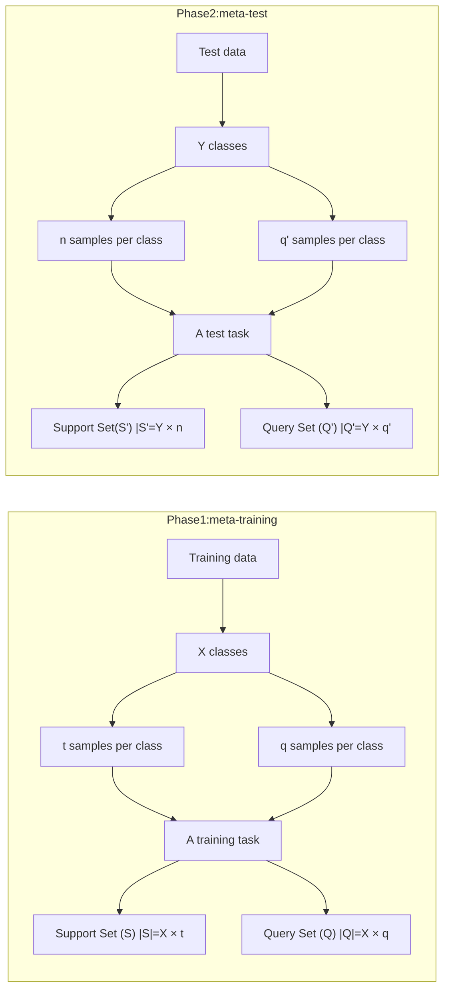
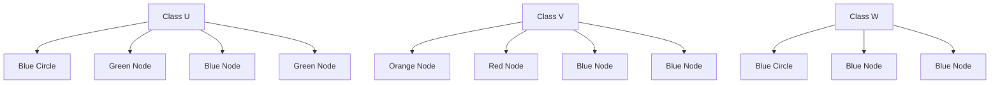
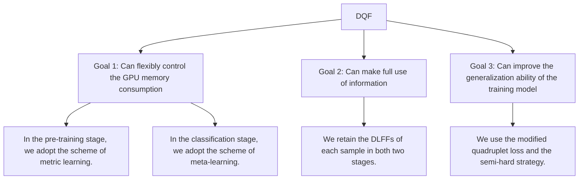
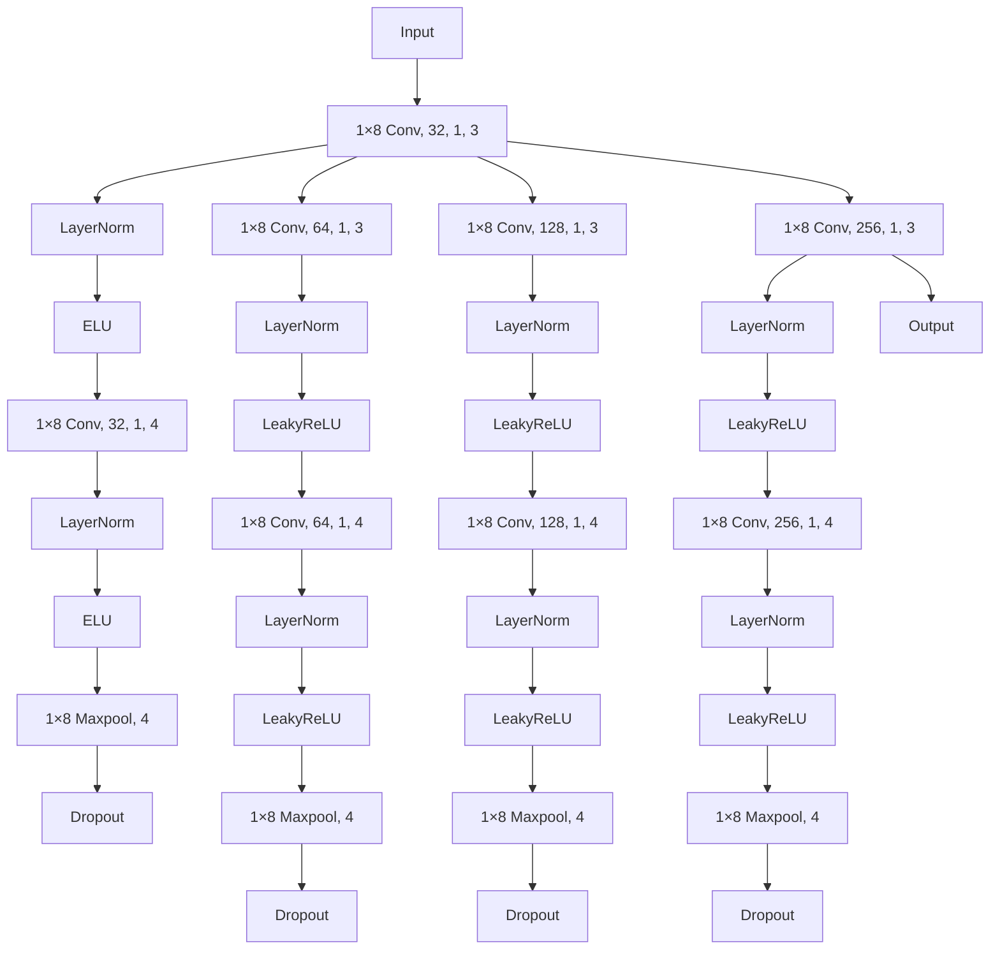
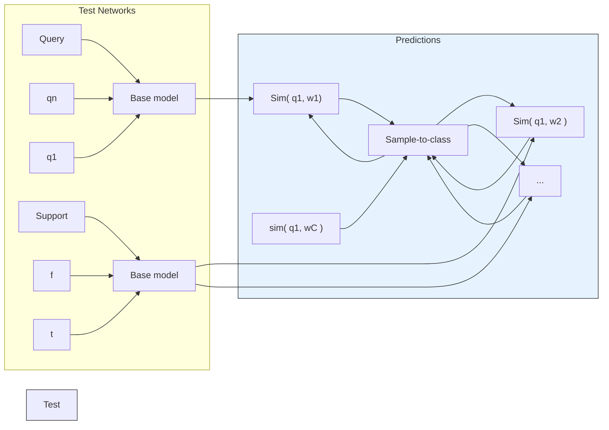

# Toward an Effective Few-Shot Website Fingerprinting Attack With Quadruplet Networks and Deep Local Fingerprinting Features

Hongcheng Zou , Jinshu Su , Senior Member, IEEE, Ziling Wei , Shuhui Chen , Chunfang Yang and Mantun Chen

Abstract—Website fingerprinting (WF) attacks can reveal the users’ online privacy by the traffic analysis technique, even with the protection of the Tor anonymity network. Recent WF attacks tend to leverage the deep learning (DL) models, which require a large number of traffic samples for training. In this case, it is impractical for low-resource adversaries in reality. Thus, we propose a lightweight WF attack to tackle this challenge, i.e., Deep Quadruplet Fingerprinting (DQF), which only needs one training sample to obtain an accuracy of 87.1%. Regarding the overall design, DQF first combines the metric learning and meta-learning schemes. To improve the generalization ability of the trained model, DQF leverages the quadruplet networks as the architecture and modifies the quadruplet loss function. Besides, by taking the deep local fingerprinting features (DLFFs), DQF avoids losing a lot of discriminative information, which is a problem with previous attacks. To evaluate DQF, we use multiple typical datasets and conduct 11 different experiments. In closed-world settings, the accuracy of DQF can exceed the best baseline attack by 10%. In open-world settings, DQF steadily performs the best even in the most challenging scenario, namely, 1-shot learning, where previous attacks significantly degrade the performance or even fail.

Index Terms—Security and privacy, traffic analysis, website fingerprinting, quadruplet networks, deep local fingerprinting features.

## I. INTRODUCTION

S A widely used privacy-enhancing technology, the Tor anonymity system has more than eight million daily users [1], [2]. Although Tor is equipped with advanced privacyprotecting techniques, it is still vulnerable to website fingerprinting (WF), a traffic analysis attack. Since most previous literature focuses on the main page of each website [3], [4], WF is also called webpage fingerprinting. In this paper, we

Received 11 January 2024; revised 31 December 2024; accepted 17 April 2025. Date of publication 22 April 2025; date of current version 4 September 2025. This work was supported in part by the National Natural Science Foundation of China under Grant 62202486, in part by the Key Research and Development Project of Jiangsu Province under Grant BE2023004-4, and in part by the Science and Technology Innovation Program of Hunan Province under Grant 2024RC3139. (Corresponding authors: Jinshu Su; Ziling Wei.)

Hongcheng Zou, Ziling Wei, and Shuhui Chen are with the College of Computer Science and Technology, National University of Defense Technology, Changsha 410073, China (e-mail: zhc@nudt.edu.cn; weiziling@nudt.edu.cn).

Jinshu Su and Mantun Chen are with the Academy of Military Science, Beijing 100850, China (e-mail: sjs@nudt.edu.cn).

Chunfang Yang is with the Henan Key Laboratory of Cyberspace Situation Awareness, Zhengzhou 450001, China.

Digital Object Identifier 10.1109/TDSC.2025.3563389 focus on the fingerprinting of webpages as well. WF enables a local and passive attacker to identify the surfing websites of a target user even under the protection of Tor. As shown in Fig. 1, possible attack locations are generally situated between the target user and the entry guard (inclusive). Latent attackers (aka adversaries) include the user’s local area network (LAN) administrator, a compromised home router, the user’s Internet Service Provider (ISP), or even a compromised entry node. To perform an attack, the attacker should traditionally gather a large amount of traffic traces regarding various websites, based on which a mathematical model is trained. Later on, the attacker again intercepts the traffic between the user and the entry node of the Tor network, then predicts the user’s visited websites based on the trained model. The success of WF attacks lies in that different websites reveal respective discriminative information. Thus, the attacker can perform a WF attack without decrypting the traffic. Through WF, monitoring online illegal activities can be realized automatically. Through WF attacks, regulators can better monitor illegal activities on anonymous networks and stop them on time.

```mermaid
graph TD
  A["User"] --> B["User"]
  B --> C["User"]
  C --> D["User"]
  D --> E["User"]
  E --> F["User"]
  F --> G["User"]
  G --> H["User"]
  H --> I["User"]
  I --> J["User"]
  J --> K["User"]
  K --> L["User"]
  L --> M["User"]
  M --> N["User"]
  N --> O["User"]
  O --> P["User"]
  P --> Q["User"]
  Q --> R["User"]
  R --> S["User"]
  S --> T["User"]
  T --> U["User"]
  U --> V["User"]
  V --> W["User"]
  W --> X["User"]
  X --> Y["User"]
  Y --> Z["User"]
  Z --> AA["User"]
  AA --> AB["User"]
  AB --> AC["User"]
  AC --> AD["User"]
  AD --> AE["User"]
  AE --> AF["User"]
  AF --> AG["User"]
  AG --> AH["User"]
  AH --> AI["User"]
  AI --> AJ["User"]
  AJ --> AK["User"]
  AK --> AL["User"]
  AL --> AM["User"]
  AM --> AN["User"]
  AN --> AO["User"]
  AO --> AP["User"]
  AP --> AQ["User"]
  AQ --> AR["User"]
  AR --> AS["User"]
  AS --> AT["User"]
  AT --> AU["User"]
  AU --> AV["User"]
  AV --> AW["User"]
  AW --> AX["User"]
  AX --> AY["User"]
  AY --> AZ["User"]
  AZ --> BA["User"]
  BA --> BB["User"]
  BB --> BC["User"]
  BC --> BD["User"]
  BD --> BE["User"]
  BE --> BF["User"]
  BF --> BG["User"]
  BG --> BH["User"]
  BH --> BI["User"]
  BI --> BJ["User"]
  BJ --> BK["User"]
  BK --> BL["User"]
  BL --> BM["User"]
  BM --> BN["User"]
  BN --> BO["User"]
  BO --> BP["User"]
  BP --> BQ["User"]
  BQ --> BR["User"]
  BR --> BS["User"]
  BS --> BT["User"]
  BT --> BU["User"]
  BU --> BV["User"]
  BV --> BW["User"]
  BW --> BX["User"]
  BX --> BY["User"]
  BY --> BZ["User"]
  BZ --> CA["User"]
  CA --> CB["User"]
  CB --> CC["User"]
  CC --> CD["User"]
  CD --> CE["User"]
  CE --> CF["User"]
  CF --> CG["User"]
  CG --> CH["User"]
  CH --> CI["User"]
  CI --> CJ["User"]
  CJ --> CK["User"]
  CK --> CR["User"]
  CR --> CS["User"]
  CS --> CT["User"]
  CT --> CU["User"]
  CU --> CV["User"]
  CV --> CW["User"]
  CW --> CX["User"]
  CX --> CY["User"]
  CY --> CZ["User"]
```

flowchart

Fig. 1. Illustration of the WF attack scenario and process.

WF attacks in the literature developed a vast of mathematical models and useful features to achieve the best possible accuracy in respective research scenarios. These models can be divided into two classes, i.e., traditional machine learning (ML) and deep learning (DL) models. The accuracy of WF attacks based on traditional ML models and hand-crafted features could reach over 90% [3], [4], [5]. Further, recent work based on DL techniques can achieve an accuracy above 95% [6], [7], [8].

Although previous work shows the feasibility of WF attacks, it is essential for the attacker to gather enough samples (e.g., hundreds) for each website in model training [6], [9]. To obtain such a data scale, a low-resource attacker might take days to months [10]. It greatly limits the feasibility of WF attacks for all but the most potent attackers. Besides, attackers need to regularly retrain their models to overcome the dynamic changes of network traffic or meet new monitoring requirements. In this case, frequently regathering the training data becomes indispensable, which is tedious and time-consuming work. Hence, requiring a large amount of training data becomes a great obstacle for WF attacks in reality.

Under these circumstances, investigating low data website fingerprinting (LDWF) attacks, only taking less than 20 training samples per website according to literature [10], [11], [12], [13], becomes critical. To date, researchers had developed multiple types of techniques, including transfer learning [11], data augmentation [12], and n-shot learning (NSL) [10], [13], to adapt WF attacks to the data-limited scenarios. However, they have respective limitations.

First, the technique of transfer learning leverages a huge amount of auxiliary pre-training data (i.e., 2500 samples per website) to obtain a satisfactory performance [11]. Such a data scale is impractical for low-resource adversaries. Even if the sizable data for the pre-training is available in the wild and attackers use those publicly available data for pre-training, the transferring technique is practical only when the data is fresh enough due to the frequent change of network traffic. Hence, the transferring learning technique has great limitations. Second, since the generation methods of existing data augmentation techniques are obviously random [12], it could not be proved that the virtual samples really exist or the obtained class labels are right. Thus, existing data augmentation techniques in LDWF attacks lack solid theoretical basis. Moreover, the performance is relatively poor because the auxiliary pre-training dataset is not used [12]. Third, previous work takes two NSL techniques, including meta-learning and metric learning [10], [13]. However, the former work has a great demand for the GPU memory because the similarity calculation is performed in GPU in the training stage, which is unnecessary [13]. On the other hand, the major deficiency of the latter work lies in its ignoring the importance of the deep local fingerprinting features (DLFFs) of websites [10], which demonstrate to be critical for low-data scenario [14]. These facts show that either there are shortcomings or there is room for accuracy improvement for existing LDWF attacks.

In this case, we propose a novel LDWF attack, namely Deep Quadruplet Fingerprinting (DQF), by integrating the metric learning and meta-learning schemes into the pre-training and classification stages, respectively. To make full use of the information, DQF utilizes DLFFs to calculate the mutual distances between two samples or between a sample and a class. Moreover, DQF takes the quadruplet networks as the architecture and uses a modified quadruplet loss function as the optimization target to improve the generalization ability of the trained model. By these means, DQF takes the performance of the LDWF attacks to a new level.

To sum up, the major contributions of this work are demonstrated as follows.

1) We present a new low-data WF attack, Deep Quadruplet Fingerprinting (DQF), to adapt WF attacks to lowresource adversaries. With a small auxiliary pre-training dataset (i.e., 25 samples per class), DQF attains an accuracy of 87.1% using only one sample per website and even reaches about 97% while using 15 samples per website. This result can even surpass the state-of-the-art attack by about 8% in the same setting.  
2) We retain the DLFFs of traffic samples by adjusting the architecture of the feature extractor of DQF. Based on DLFFs, we customize the distance calculation methods between two samples or between a sample and a class. Due to the use of DLFFs, DQF avoids irreversible loss of information.  
3) On the DQF implementation, we propose a two-stage architecture design, including the quadruplet pre-training and meta-classification stages. In the pre-training phase, we take the metric learning scheme, which can adapt to the different hardware conditions of low-resource adversaries without degrading the prediction performance. Besides, DQF performs the pre-training by taking the quadruplet networks as the architecture and optimizing the quadruplet loss function. Thus, DQF can improve the generalization ability of the trained model and use each quadruplet information fully. In the classification stage, we adopt a meta-learning scheme to make the classification more straightforward and convenient.  
4) We design comprehensive experiments to evaluate DQF with multiple datasets in various settings. All the experimental results consistently demonstrate that DQF performs the best. Specifically, in closed-world evaluations, DQF can even outperform the current best attack by 10%. In open-world evaluations, DQF works well with 1-shot learning in multi-classification settings, where previous methods fail or perform poorly. Moreover, DQF consistently achieves the state-of-the-art performance even in the largest open-world scenario, where the number of unmonitored websites can reach as large as 400K.

Organization: The remainder of this paper is organized as follows. We first detailed describe the preliminaries and related work in Sections II and III. Further, Section IV elaborates the proposed DQF attack. After that, Section V expands on the experimental setup, evaluation settings, and results in sequence. Finally, we conclude the whole work in Section VI.

## II. PRELIMINARIES

This section first presents the necessary background knowledge of WF attacks, including the definitions of traditional website fingerprinting (TWF) and low data website fingerprinting (LDWF) attacks. Subsequently, we summarize the basic knowledge of few-shot learning, including meta-learning and metric learning.

flowchart

Fig. 2. Illustration of the meta-learning process for a $Y \cdot$ -way n-shot classification problem. The training and test data might have no overlap.

## A. WF Attacks

A WF attack is a kind of traffic analysis attack [15]. WF attacks are traditionally evaluated in closed-world and open-world settings. In a closed-world setting, the training and test samples are both gathered from sensitive websites (i.e., monitored websites). However, the attacker is also allowed to gather a large number of insensitive websites (i.e., unmonitored websites) except for the monitored websites in an open-world setting. Generally speaking, WF attacks can be classified into two classes, i.e., TWF attacks [3], [4], [5], [6] and LDWF attacks [10], [11], [12], [13].

1) Traditional Website Fingerprinting Attack: We first give a brief description of traditional website fingerprinting (TWF) attack. Suppose an adversary intends to monitor whether a user has visited a sensitive website in a certain website collection. The adversary has sufficient computing resources so that there is no limit to the number of training samples collected. The adversary then can perform a TWF attack to monitor the user according to standard identification procedures as shown in Fig. 1.

Formalization: Assume $W = \{ w _ { 1 } , w _ { 2 } , . . . , w _ { n } \}$ is a collection of sensitive websites. An adversary performs a TWF attack following the standard steps. First, he needs to collect the training dataset $D _ { t r a i n } .$ , which should contain the samples of every website in W . Second, the adversary uses $D _ { t r a i n }$ to train the pre-defined model Φ, obtaining $\Phi _ { t r a i n e d }$ . Third, he again gathers the test data $D _ { t e s t }$ . Finally, the adversary performs the prediction for $D _ { t e s t }$ based on $\Phi _ { t r a i n e d }$ .

2) Low Data Website Fingerprinting Attack: We introduce the description and formalized definition of low data website fingerprinting (LDWF) attacks in sequence. An adversary intends to know whether a target user has visited a sensitive website in a monitoring list. However, the adversary does not have sufficient computing resources. Thus it is required that the number of training samples per website should not be more than 20. Since the number of training samples is rare, the adversary is allowed to collect an auxiliary dataset, aka pre-training dataset, to pre-train his model before predicting. In this work, we strengthen that the size of the auxiliary dataset should not be large, which goes against the original intention of LDWF attacks.

Formalization: Assume $W = \{ w _ { 1 } , w _ { 2 } , . . . , w _ { n } \}$ is a collection of sensitive websites. Generally, an adversary performs an LDWF attack following the standard steps. First, the adversary can gather a pre-training dataset $D _ { p r e \_ t r a i n }$ . Also, he can use a dataset at hand for pre-training. Unlike TWF attacks, $D _ { p r e }$ \_train is not required to contain the samples of the websites in W . Even the websites in $D _ { p r e \_ t r a i n }$ and W might be mutually exclusive. Second, the adversary uses $D _ { p r e \_ t r a i n }$ to train the pre-defined model Φ, obtaining $\Phi _ { p r e . }$ \_trained. Third, he collects the classification dataset $D _ { c l a s s i f i c a t i o n } .$ , which can be divided into the support and query sets, namely $D _ { s p t }$ and $D _ { q r y }$ , respectively, during each task sampling. Finally, the adversary can conduct the prediction for $D _ { q r y }$ in $D _ { c l a s s i f i c a t i o n }$ based on $\Phi _ { p r e }$ \_trained and $D _ { s p t }$ in $D _ { c l a s s i f i c a t i o n } .$ The number of training samples per website in $D _ { s p t }$ is no more than 20.

## B. Few Shot Learning

As a hot topic in Computer Vision, the problem of few-shot learning has been widely studied [16], [17]. It targets to reduce the required amount of training data for DL models. Specifically, the related work aims to learn new concepts from a limited number of labeled training samples per class, generally less than 20. For a Y -way n-shot learning problem, aka n-shot learning (NSL) problem for short, the number of classes (i.e., Y ) defines the scale of the problem. Besides, the number (i.e., n) of labeled training samples per class determines the difficulty of the problem. NSL is mainly addressed by meta-learning and metric learning.

1) Meta-Learning: The essence of meta-learning is to train the DL model to attain the ability to “learning to learn”. Meta-learning generally contains two independent steps, i.e., meta-training and meta-test. Take a Y -way n-shot classification problem as an example, the process of meta-learning can be illustrated as Fig. 2. For the meta-training or meta-test phase, each task contains a support and query set. A support set is used for the training, while a query set is for the test. In the meta-test phase, one task includes Y classes, each with n samples in the support set and with $q ^ { \prime }$ samples in the query set, respectively. However, in the meta-training phase, the support set and the query set have X classes, each with t samples and with q samples, respectively. Thus, the constitutions of a training task and a test task could be different. Note that an additional meta-validation phase is also allowable for meta-learning.

2) Metric Learning: Metric learning addresses the few-shot learning problem in a different way [18], [19]. The primary characteristic of metric learning is the loss function requiring no label information, which is different from traditional loss functions. Typically, the loss function takes a batch of embeddings of sample pairs, including positive and negative pairs, as its input. As shown in Fig. 3, each positive pair contains an anchor (sample) and a positive (sample). In contrast, each negative pair includes an anchor/a positive (sample) and a negative (sample), or two negative samples belonging to different classes. An anchor and the corresponding positive belong to the same class. However, the corresponding negative of an anchor belongs to another class. The sampling strategy for negative samples can be various. Randomly sampling is a common strategy. In the phase of model training, the goal of the loss function is to optimize by increasing the inter-class distances, i.e., the distances of negative pairs, and reducing the intra-class distances, namely the distances of positive pairs.

flowchart

Fig. 3. Some basic concepts in metric learning. Specifically, the black (green, red) dot represents an anchor (positive, negative) sample. Besides, each red line represents a positive pair, while each blue/orange/purple line denotes a negative pair.

## III. RELATED WORK

This section concludes the related work of WF attacks and defenses. As mentioned above, WF attacks can be classified into two categories, namely TWF and LDWF attacks. Thus, we summarize the two categories in two subsections. In addition, the last subsection introduces the related work of WF defenses.

## A. TWF Attacks

Overall speaking, TWF attacks can be classified into two classes, i.e., traditional machine learning (ML), deep learning (DL) attacks.

1) Traditional ML Attacks: By manually extracting a set of traffic features, researchers took a series of traditional ML classifiers to perform WF attacks in the early days when WF attacks were presented. We summarized the following typical attacks. Herrmann et al. proposed a Naive Bayers attack based on the frequency of packet lengths to investigate the feasibility of WF attacks on Tor for the first time [20]. To improve the attack performance, other traditional ML techniques, e.g., Support Vector Machine (SVM), K-Nearest Neighbor (KNN), and Random Forest (RF), are introduced into the field of WF. Typical SVM-based attacks include Pa-SVM [21], DLSVM [22] and CUMUL [5]. Differently, Wa-KNN is the most famous KNN-based attack [3], while k-FP is a unique attack that takes a combination use of RF and KNN [4]. These attacks leverage different hand-crafted features as their respective inputs.

Specifically, the authors of Pa-SVM [21] empirically introduced and tested a large set of features based on the traffic’s volume, time, and direction. Ingeniously, Pachenko et al. [5] devised the CUMUL attack based on a novel type of features sampled from the cumulative representation of a trace. These features showed a strong discriminative ability to traffic and demonstrated highly effective. Different from Panchenko [5], Cai et al. [22] introduced a type of feature by rounding the packet length to a multiple of 600. Through careful selection, Wa-KNN and k-FP both took a set of hand-crafted features as their input. Specifically, the former one used as many as 3736 features [3]. In comparison, k-FP evaluated a large number of features and picked out the 150 most important features [4]. In closed-world settings, most traditional ML attacks mentioned above could achieve accuracies over 90.0% in the scenario of the Tor network. In open-world settings, all the previous work classified the unmonitored samples into a same class, namely the unmonitored class, and could achieve TPR (True Positive Rate) $9 0 . 0 \% \pm 2 \%$ for FPR (False Positive Rate) $5 . 0 \% \pm 0 . 5 \%$ .

2) DL Attacks: The success of traditional ML attacks highly depends on discriminative hand-crafted features, which are elegantly designed and require expert knowledge. To automate the work of feature engineering, a DL technique, namely Stacked Denoising AutoEncoding (SDAE), was first introduced into WF attacks by Abe and Goto [23]. After that, other DL attacks, such as Automated Website Fingerprinting (AWF) [9], Deep Fingerprinting (DF) [6], Tik-Tok [8], and Var-CNN [7], were presented.

Specifically, Rimmer et al. [9] proposed AWF by integrating multiple DL techniques, including SDAE, Convolutional Neural Network (CNN), and Long Short Term Memory (LSTM), to automated select a model for performing a good WF attack. Unlike AWF [9], DF and Var-CNN leveraged CNN as their deep neural networks (DNNs) [6], [7]. Except for Tik-Tok [8], other DL attacks all took the sequence of packet directions as the input of their DNNs. Differently, Tik-Tok leveraged a sequence of directional time as the input of its classifier, a modified version of the DNN of DF. With sufficient training samples (e.g., hundreds) per website, most DL attacks attained an accuracy of over 95% in closed-world settings, and obtained TPR 95.0% ± 2.0% for FPR $1 . 0 \% \pm 0 . 4 \%$ in open-world setttings.

## B. LDWF Attacks

Although TWF attacks, DL attacks especially, achieve good accuracy in WF literature, they have a high demand for training data scale. Take AWF and DF as examples, their models should be trained by a large dataset, with hundreds of samples per website, to obtain a desirable accuracy performance. Moreover, the trained models will become void once the monitored websites change. Thus, the training data and models need to be updated frequently. To address this and enable a lightweight attack, researchers have carried out a series of studies.

TF: Sirinam et al. [10] first proposed TF, attained an accuracy of 95% with less than 20 training samples for each website. TF leveraged triplet networks to pre-train a feature extractor, a CNN-based deep neural network, based on a medium-sized training dataset. In closed-world settings, TF achieved an accuracy of 85% in a challenging scenario where the training and testing data were collected three years apart. In open-world setttings, although TF worked well in most cases, it failed with 1-shot learning.

DNNF: Inspired by previous work [14], [24], Guo et al. [13] considered the importance of website local fingerprinting characteristics and presented the DNNF attack for data-limited scenario. The authors introduced the meta-learning scheme into the implementation of DNNF. Overall, DNNF did not have a significant improvement over TF.

HDA: Chen et al. [12] presented HDA that first used the technique of data augmentation in WF. The authors proposed three augmentation methods, including intra-sample and intersample data transformations, to expand the training data into an arbitrarily large collection. By combining a Var-CNN variant with data augmentation, HDA attained a better accuracy than TWF attacks for the normal scenario.

TLFA: Like TF and DNNF, Chen et al. [11] also took a large dataset in the pre-training phase and proposed Transfer Learning Fingerprinting Attack (TLFA). However, TLFA selected a more extensive training dataset (i.e., 720 websites, each with 2500 samples) than TF and DNNF. After pre-training, TLFA utilized the technique of meta-learning to finetune and predict. TLFA evaluated two types of embedding features and three kinds of traditional ML classifiers, including multivariate logistic regression (LR), support vector machine (SVM), multilayer perceptron (MLP). Results showed that TLFA performed better than TF and HDA.

## C. WF Defenses

WF defenses target obfuscating key traffic features to countermeasure WF attacks. Previous literature has presented a lot of WF defenses. These defenses take different techniques, such as packet padding [25], [26], [27], link padding [28], [29], [30], [31], traffic splitting [32], [33], [34], traffic synthesis [21], [29], modifying request [35], super common sequence [3], [36], traffic simulation [37] and adversarial training [38], [39], [40]. However, only a few defenses, e.g., Website Traffic Fingerprinting Protection with Adaptive Defense (WTF-PAD), have been deployed in Tor for their acceptable latency and bandwidth overhead and easy deployment [6].

This work evaluates WF attacks on three defenses for different reasons. Since WTF-PAD has been implemented in Tor, it is necessary to take it for our test. WTF-PAD was first presented by modifying the Adaptive Padding (AP) defense [41]. Since AP reveals a lot of discriminative information, WTF-PAD enhances security by further adding several filling operations to obfuscate traffic features and page size. We also investigate two SOTA defenses, i.e., DeTorrent and RegulaTOR [27], [42], for that they incur moderate bandwidth and latency overhead and do not require additional infrastructure. Specifically, DeTorrent uses competing neural networks to generate and evaluate traffic analysis defenses that insert ‘dummy’ traffic into real traffic flows [27], while RegulaTOR was designed to send standardized bursts and use different strategies to alter upload and download traffic [42].

## IV. THE PROPOSED DQF ATTACK

This section first introduces the motivation of this work. Then, we set up the goals and strategies to satisfy the motivation. Directed by design, we propose our solution, namely Deep Quadruplet Fingerprinting (DQF), and the details.

## A. Motivation

Section III-B reviews four existing attacks for LDWF, namely TF, DNNF, HDA, and TLFA. They take different techniques to adapt to the corresponding scenario. However, they have separate limitations.

TF leverages the technique of metric learning. The key to metric learning is to train a feature extractor to distinguish samples from different classes. However, TF summarizes the local fingerprinting features into a compact sample-level representation, which could lose considerable discriminative information [24]. The information will not be recoverable when the pre-training dataset is not large enough [14].

DNNF takes the technique of meta-learning. The DL model of DNNF contains two modules, namely a feature extractor and a KNN classifier. Due to this design, DNNF has a great demand for GPU memory in the meta-training phase. Besides, for a Y -way n-shot classification task, when Y is large (e.g., 100), the number of classes in each meta-training task should be set as a number less than that Y . Otherwise, the GPU memory consumption is unacceptable. However, such different settings in the two stages will impair the performance.

HDA takes the technique of data augmentation. Specifically, the authors augment the training samples by rotating and masking-out individual real samples or by linearly combining real sample pairs. There are two major limitations. First, the naive generation methods are lack of solid theoretical foundation. Besides, due to the lack of pre-training, its performance is relatively low.

Different from TF and DNNF, TLFA takes the technique of transfer learning. Especially, it takes a massive amount of training data (i.e., thousands of samples each class) to pre-train the DL model. We feel the scale of training data is too large for low-resource adversaries to perform a successful few-shot WF attack.

As mentioned above, existing LDWF attacks have respective limitations. To address these issues, we aim to design a new LDWF attack, which can avoid the disadvantages of existing methods. Most importantly, the new LDWF attack also strives to be state-of-the-art.

## B. Goals and Strategies

To address the issues mentioned above and improve the prediction performance, we propose DQF, which does not need massive pre-training dataset, thus enabling a lightweight WF attack. DQF achieves three expected goals. For each goal, the respective strategies are presented, as shown in Fig. 4. We explain the details as follows.

Goal 1: we try to enable our attack the ability to control the GPU memory consumption flexibly. To this end, we introduce both the metric-learning and meta-learning schemes into the pre-training and classification stages, respectively. The reasons include three aspects.

At first, we explain why we do not take the scheme of metalearning in the pre-training stage. Although the meta-learning scheme is allowed to control the GPU memory consumption by setting the number of classes in each training task, the cost is sacrificing the performance. Previous work has revealed that the prediction performance will degrade as the number of classes in each task of the pre-training stage reduces [13]. Hence, we do not take the meta-learning scheme in the pre-training stage. Second, the GPU memory consumption varies according to the setting of batch size in the scheme of metric learning. Besides, our experimental results show that the setting of batch size has little impact on prediction performance. Third, we take the scheme of meta-learning in the classification stage because it enables directly outputting the prediction results and makes the prediction more straightforward and convenient.

flowchart

Fig. 4. Illustrations of the specific goals and their corresponding strategies of DQF.

```mermaid
graph TD
  A["Pre-training dataset"] --> B["Quadruplet sampling (semi-hard)"]
  B --> C["Anchor"]
  C --> D["Base model"]
  D --> E["Shared weights"]
  E --> F["Base model"]
  F --> G["Shared weights"]
  G --> H["Base model"]
  H --> I["Shared weights"]
  I --> J["Base model"]
  J --> K["Modified quadruplet loss function"]
    
  L["Classification dataset"] --> M["Task sampling (random)"]
  M --> N["Support"]
  N --> O["Query"]
  O --> P["Base model"]
  P --> Q["Shared weights"]
  Q --> R["Base model"]
  R --> S["Sample-to-class"]
  S --> T["Predictions"]
    
  U["Pre-training with the metric learning scheme"] --> V["Training networks (Quadruplet networks)"]
  V --> W["Update"]
  V --> X["Freeze"]
    
  Y["Step 1: Quadruplet pre-training"] --> V
  V --> W
  W --> X
  X --> Y
    
  Z["Step 2: Meta-classification"] --> AA["Copy the parameters of trained model to"]
    
  AB["Classifying with the meta-learning scheme"] --> AC["Test networks"]
  AC --> AD["Sample-to-class"]
  AD --> AE["Predictions"]
    
  AF["Pre-training with the metric learning scheme"] --> AG["A quantuplet"]
  AG --> AH["Anchor"]
  AH --> AI["Positive"]
  AI --> AJ["Negative1"]
  AJ --> AK["Negative2"]
  AK --> AL["A quantuplet"]
    
  AM["Pre-training with the metric learning scheme"] --> AN["Training networks (Quadruplet networks)"]
  AN --> AO["Update"]
  AN --> AP["Freeze"]
    
  AQ["Pre-training with the metric learning scheme"] --> AR["A quantuplet"]
  AR --> AS["A quantuplet"]
    
  AT["Pre-training with the metric learning scheme"] --> AU["A quantuplet"]
  AU --> AV["A quantuplet"]
    
  AW["Pre-training with the metric learning scheme"] --> AX["A quantuplet"]
  AX --> AY["A quantuplet"]
    
  AZ["Pre-training with the metric learning scheme"] --> BA["A quantuplet"]
  BA --> BB["A quantuplet"]
    
  BC["Pre-training with the metric learning scheme"] --> BD["A quantuplet"]
  BD --> BE["A quantuplet"]
    
  BF["Pre-training with the metric learning scheme"] --> BG["A quantuplet"]
  BG --> BH["A quantuplet"]
    
  BI["Pre-training with the metric learning scheme"] --> BJ["A quantuplet"]
  BJ --> BK["A quantuplet"]
    
  BL["Pre-training with the metric learning scheme"] --> BM["A quantuplet"]
  BM --> BN["A quantuplet"]
    
  BO["Pre-training with the metric learning scheme"] --> BP["A quantuplet"]
  BP --> BQ["A quantuplet"]
    
  BR["Pre-training with the metric learning scheme"] --> BS["A quantuplet"]
  BS --> BT["A quantuplet"]
    
  BU["Pre-training with the metric learning scheme"] --> BV["A quantuplet"]
  BV --> BW["A quantuplet"]
    
  BX["Pre-training with the metric learning scheme"] --> BY["A quantuplet"]
  BY --> BZ["A quantuplet"]
    
  CA["Pre-training with the metric learning scheme"] --> CB["A quantuplet"]
  CB --> CC["A quantuplet"]
    
  DD["Pre-training with the metric learning scheme"] --> DEA["A quantuplet"]
  DEA --> DF["A quantuplet"]
    
  DG["Pre-training with the metric learning scheme"] --> DH["A quantuplet"]
  DH --> DI["A quantuplet"]
    
  DJ["Pre-training with the metric learning scheme"] --> DK["A quantuplet"]
  DK --> DL["A quantuplet"]
    
  DV["Pre-training with the metric learning scheme"] --> DW["A quantuplet"]
  DW --> DX["A quantuplet"]
    
  DB["Pre-training with the metric learning scheme"] --> DEI["A quantuplet"]
  DEI --> DF
  DEI --> DG
```

flowchart

Fig. 5. The overall architecture of DQF, which contains the quadruplet pre-training and meta-classification stages.

Goal 2: we target taking full advantage of the limited auxiliary pre-training dataset. Given that compressing the DLFFs will result in irreversible loss of information [24], we retain the DLFFs of each sample. Besides, all the distance calculation is based on DLFFs. Thus, the limited pre-training dataset realizes the greatest value.

Goal 3: we manage to improve the generalization ability of the trained model to enhance the prediction performance. Since the quadruplet loss can lead to the model output with a larger inter-class variation and a smaller intra-class variation than the triplet loss [43], we introduce it into WF. However, we modify the loss function to achieve better results. Besides, we take the semi-hard strategy to sample each batch of quadruplets to speed up the convergence.

Our proposed attack not only realizes the above goals, thus avoiding the limitations of previous LDWF attacks, but also achieves the state-of-the-art performance.

## C. Overview of DQF

The architecture of DQF is illustrated in Fig. 5. DQF contains two stages, namely quadruplet pre-training, and metaclassification. The two stages leverage the techniques of metric learning and meta-learning, respectively. Both the two stages begin with data sampling. However, we leverage the semi-hard and random strategies to sample quadruplets and meta tasks in the two stages, respectively. In the first stage, we take the quadruplet networks as the architecture, then train it by optimizing the modified quadruplet loss function epoch by epoch. The quadruplet networks includes four same base models, sharing the parameters in the training process. In the second stage, a sample-to-class layer is added to the trained base model. Then, we follow the standard meta-test steps to make a classification. We use DLFFs to calculate the distances between two samples or between a sample and a class.

## D. Stage 1: Quadruplet Pre-Training

This section first introduces the training networks and defines the four samples in a quadruplet. Then, we elaborate on the quadruplet sampling strategy. Last, we show the modified quadruplet loss function and the step-by-step implementation of the pre-training stage.

flowchart

Fig. 6. A graphical model of the mDF baseline CNN architecture. The indices (e.g., 1×8 Conv, 32, 1, 3) in each convolutional layer signify the kernel size, the number of filters, the stride size, and the padding size. The indices (e.g., 1×8 Maxpool, 4) in each max pool layer signify the kernel size and the stride size.

1) Training Networks: Quadruplet networks: As shown in the first stage of Fig. 5, the quadruplet networks contains four parallel and identical sub-networks, namely base models, sharing the same weights and hyperparameters. Four different samples forming a quadruplet are input into the four base models to train the quadruplet networks. Specifically, the four samples include an anchor, a positive, and two negative samples. We denote the four samples as Anchor, Positive, Negative1, and Negative2. Their definitions are demonstrated as follows.

1) Anchor (A): The anchor sample is used for the main reference. It might be selected from any training class (aka website). Suppose the first sample of the website “www.baidu.com” is chosen as an anchor sample. Then the other three kinds of samples can be defined as follows.  
2) Positive (P): The positive sample should be chosen from the same website as A, e.g., the second sample of the website “www.baidu.com”.  
3) Negative1 (N1): Differently, N1 should be chosen from all the training websites except for the website that A belongs to. For example, N1 is sampled from the website “www. amazon.com”.  
4) Negative2 (N2): In DQF, N2 should be on a different website from the websites that A and N1 belong to.

To train the quadruplet networks, we organize the input data in batches of quadruplets, with each sample being fed into the respective sub-network. The output of each sub-network is used for calculating the loss function.

Base model: We introduce the typical WF attack, DF (Deep Fingerprinting), as the base model [6]. However, we make several modifications due to limited training data. The modified DF model is called mDF in this work, as shown in Fig. 6. The amendments include three aspects.

First, mDF substitutes the layer normalization module for the batch normalization module in DF. The reasons are as follows. The batch normalization module normalizes the output of the last module by the mean square and variance of training samples. When the number of training samples changes, the training effect of the model will be different. However, the layer normalization module normalizes in a different dimension, i.e., the length of feature embedding, which is a fixed value. Thus, the number of training samples would not influence the robustness of the normalization results. In this case, model training will be more stable. Moreover, since we only take the sequence of packet directions as the feature vector, it is reasonable to apply layer normalization for quantified unity and consistency.

Second, we replace the ELU module in the last three blocks in DF with a LeakyReLU module. The ELU module is highly nonlinear and can accelerate the convergence and alleviate the gradient explosion and disappearance. However, it also turns all negative input numbers to zero. Thus, it can be vulnerable to training, easily causing neurons to deactivate and not reactivate at any data point. Due to this, we take the LeakyReLU module in the last three blocks of mDF, which can alleviate the neuron “death” problem faced by ReLU. We do not change the ELU module in the first block to retain its advantages.

Finally, to leverage the DLFFs, we remove the global average pooling layer from the original DF architecture.

2) Quadruplet Sampling: To explain the quadruplet sampling strategy, we first introduce the basic concept of DLFF. Then, we give out the formal definition of the distance between two samples based on DLFFs. Finally, the sampling strategy is detailed and explained.

Deep local fingerprinting feature (DLFF): In essence, DLFF comes from the output of the base model mentioned above. Specifically, every traffic instance is first represented as a onedimensionalvector and then input into the base model. The output of each sample is defined as DLFF (i.e., a two-dimensional vector) and can be viewed as its new representation.

To explain the reason to take it, we review the Naive-Bayes Nearest Neighbor (NBNN) approach [24]. Interestingly, the NBNN work points out an important insight. That is, summarizing the local feature of a sample into a compact sample-layer representation will lose a lot of discriminative information in a low-data scenario. This point is validated by the work of Deep Nearest Neighbor Neural Network (DN4) for classifying images [14].

Unfortunately, by reviewing the literature in LDWF, we notice that existing work generally summarizes the local feature of a sample into a compact sample-layer representation [10], [11], [13]. Specifically, it summarizes every channel of the feature embedding into a mean value by a global average pooling layer and further converts the feature embedding into a normalized vector via a fully connected layer (i.e., realizing softmax). Each element of the vector reflects the probability that the corresponding sample belongs to a website. The above two kinds of layers jointly produce a compact sample-layer representation for each sample, which results in losing a lot of discriminative information. The loss information can be recovered if the model is trained with sufficient samples. However, it is irreversible when the number of training samples for each website is rare.

Hence, we remove the global average pooling layer and the fully connected layer of the base model to retain the fine-grained representations of each sample. In this case, the discriminative information will be kept to the maximum.

text_image

The feature embedding of the first sample
The first local embedding
The first sample
L
B
C

Fig. 7. A graphical representation of the output of the base model when inputting a batch of samples. The batch size is B. The number of output channels is C, while L denotes the number of local embeddings. Note that the size of a local embedding is C.

Below we present the formal definition of DLFF. Suppose the base model is denoted as Φ. We input the model with a batch of samples. Then each sample will generate a corresponding feature embedding. All the feature embeddings can be illustrated as Fig. 7. The size of the feature embedding of a sample, called sample embedding in this work, is $L \times C$ . Thus, the feature embedding can be viewed as $L \ 1 \times C$ vectors, each defined as a local embedding, i.e., a DLFF. In this case, each sample embedding consists of L local embeddings. Hence, we can create a pool of DLFFs for each sample and each website, respectively.

Distance metric: Regarding distance metric, we directly take the minus cosine similarity of two samples as their distance. The reason is that the cosine similarity has meaningful semantics for ranking similarity. To obtain the distance of the two samples, we first calculate the cosine similarity based on their feature embeddings. As shown in Fig. 7, each feature embedding is a two-dimensional vector whose size is $L \times C$ . Here is an example to explain the calculation of cosine similarity.

Suppose there are two samples, $\mathrm { e . g . , \ } x _ { i }$ and $x _ { j }$ . They are input into the base model Φ, then their feature embeddings, denoted as $\Phi ( x _ { i } )$ and $\Phi ( x _ { j } )$ , can be obtained. Hence, both of the two embeddings can be viewed as L C-dimensional vectors, namely $\Phi ( x _ { i } ) = \bigl [ o _ { i 1 } , . . . , o _ { i L } \bigr ] , o _ { i m } \in \mathbb { R } ^ { C } , ( 1 \leq m \leq L )$ , $\Phi ( x _ { j } ) = [ o _ { j 1 } , . . . , o _ { j L } ] , o _ { j n } \in \mathbb { R } ^ { C } , ( 1 \leq n \leq L )$ . Since the Cdimensional vector is defined as a DLFF, both the two samples will get a pool of DLFFs, $P _ { i }$ and $P _ { j }$ . To measure the similarity $s i m ( \Phi ( x _ { i } ) , \Phi ( x _ { j } ) )$ , we first calculate the cosine similarity of each DLFF in $P _ { i }$ with every DLFF in $P _ { j }$ , then drop all except for the top K similarities. Finally, all the left similarities are accumulated to a total similarity, which is the wanted result. The formulation defininition is specified in (1). Once the similarity of the two samples is obtained, their distance can be measured by minus similarity directly.

$$
\begin{array}{l} \operatorname{sim} \left(x _ {i}, x _ {j}\right) = \operatorname{sim} \left(\Phi \left(x _ {i}\right), \Phi \left(x _ {j}\right)\right) \\ = \sum_ {m = 1} ^ {L} t o p _ {K} \left\{\cos (o _ {i m}, o _ {j 1}), \dots , \cos (o _ {i m}, o _ {j L}) \right\} \tag {1} \\ \end{array}
$$

Sampling strategy: Sampling is the process of identifying quadruplets to leverage for training the base model. For simplicity and effectiveness, we tested two sampling strategies, namely random and semi-hard. In the implementation, we first produce all the possible <Anchor, Positive > pairs. For each pair, we then generate Negative1 and Negative2 based on the two strategies mentioned above respectively. When taking the random strategy, the negative samples are randomly selected from any class except for the one that Anchor belongs to while ensuring that the two negative samples are included in different classes. When taking the semi-hard strategy, a margin value (i.e., M) is needed to select the negative samples. Specifically, we randomly choose Negative1, and Negative2 from those negative samples whose distance from Anchor is less than the distance of the < Anchor, Positive> pair plus M. Meanwhile, the two negative samples should belong to two different classes. The illustration of the semi-hard sampling strategy is shown in Fig. 8.

text_image

Anchor
Positive
Margin M

Fig. 8. A graphical representation of the semi-hard sampling strategy. The black dot represents Anchor. The green dot denotes Positive, while the brown dots show the possible negative samples. The red line represents the distance between Anchor and Positive, while the black line represents the margin value. A tick indicates that negative samples are eligible and vice versa.

3) Modified Quadruplet Loss: We introduce the quadruplet loss because it can lead to the model output with a larger interclass variation and a smaller intra-class variation compared to the triplet loss [44].

However, to make full use of each quadruplet of input, we do not directly take the traditional quadruplet loss function proposed in previous work [43]. The original definition of the quadruplet loss is as follows. Suppose there is a batch of N quadruplets. Any quadruplet can be defined $\mathrm { a s } < x _ { i } , x _ { j } , x _ { k } , x _ { l } > , 1 \leq i , j , k , l \leq N$ . Thus, the traditional quadruplet loss function is defined in (2).

$$
\begin{array}{l} L _ {t r} = \sum_ {i, j, k} ^ {N} (d (x _ {i}, x _ {j}) - d (x _ {i}, x _ {k}) + \alpha_ {1}) \\ + \sum_ {i, j, k, l} ^ {N} \left(d (x _ {i}, x _ {j}) - d (x _ {k}, x _ {l}) + \alpha_ {2}\right) \\ \end{array}
$$

$$
w _ {i} = w _ {j}, w _ {i} \neq w _ {k}, w _ {i} \neq w _ {l}, w _ {k} \neq w _ {l} \tag {2}
$$

where $w _ { i } , w _ { j } , w _ { k } , w _ { l }$ denote the class labels of $x _ { i } , x _ { j } , x _ { k } , x _ { l }$ . $d ( \cdot , \cdot )$ represents the distance of two given samples. $\alpha _ { 1 }$ and $\alpha _ { 2 }$ are two hyperparameters.

The first term in (2) focuses on the relative distances between positive and negative pairs w.r.t the same anchor sample. The second term is a constraint that considers the orders of positive and negative pairs without a common anchor sample. The first term is actually the triplet loss based on the triplet $< x _ { i } , x _ { j } , x _ { k } > , 1 \leq i , j , k \leq N$ . However, the first term only takes $< x _ { i } , x _ { k } >$ as the negative pair while neglecting another possible negative pair, namely $< x _ { j } , x _ { k } >$ . This pair might not be sampled again in the following training process. Besides, the traditional quadruplet loss does not consider another possible triplet, $\mathrm { i . e . , } < x _ { i } , x _ { j } , x _ { l } > , 1 \leq i , j , l \leq N$ . Also, this triplet might not appear again by the subsequent sampling. For these reasons, this work redefines a novel quadruplet loss, called modified quadruplet loss. Our preliminary results show that the modified loss improves performance.

$$
\begin{array}{l} L = \sum_ {i, j, k} ^ {N} (d (x _ {i}, x _ {j}) - d (x _ {i}, x _ {k}) + \alpha_ {1}) + \sum_ {i, j, k} ^ {N} (d (x _ {i}, x _ {j}) \\ - d (x _ {j}, x _ {k}) + \alpha_ {1}) + \sum_ {i, j, l} ^ {N} (d (x _ {i}, x _ {j}) - d (x _ {i}, x _ {l}) + \alpha_ {1}) \\ + \sum_ {i, j, l} ^ {N} (d (x _ {i}, x _ {j}) - d (x _ {j}, x _ {l}) + \alpha_ {1}) \\ + \sum_ {i, j, k, l} ^ {N} \left(d (x _ {i}, x _ {j}) - d (x _ {k}, x _ {l}) + \alpha_ {2}\right) \\ \end{array}
$$

$$
w _ {i} = w _ {j}, w _ {i} \neq w _ {k}, w _ {i} \neq w _ {l}, w _ {k} \neq w _ {l} \tag {3}
$$

4) Implementation: In this stage, the adversary creates the quadruplet networks and uses the mDF model as the sub-network along with fine-tuned hyperparameters. We next explain the stepby-step implementation of the quadruplet pre-training.

1) Data preprocessing: In this step, the training dataset should be preprocessing to generate all the possible <Anchor, Positive> pairs, e.g., T pairs. The pairs are the basis of the next step.  
2) Batch sampling: According to the results of the hyperparameter tuning, the semi-hard sampling strategy is selected. The batch size B can be flexibly set according to the GPU memory size. For each batch, we will produce B quadruplets based on the <Anchor, Positive> pairs generated from the first step. Each pair is designed to produce only one quadruplet. Then, we feed the obtained quadruplets into the network.  
3) Quadruplet pre-training: For each batch of quadruplets, we accumulate the modified quadruplet loss, then backward the total loss to update the model weights. Repeat the process until all the quadruplets (i.e., T ) run out. Then, the program goes back to the second step and starts the next cycle. The program terminates after a predefined number of epochs.

## E. Stage 2: Meta-Classification

In the second stage of DQF, we take the meta-test scheme rather than other machine learning classifiers. The reasons include two aspects. First, due to the use of DLFFs, the scheme of meta-test allows DQF to directly output the classification results, which reduces the time overhead while obtaining an accuracy better than other attacks. Second, meta-test enables DQF to average the prediction results of a large number of batches of test samples so as to obtain a reliable and stable performance.

flowchart

Fig. 9. A detailed explanation of the meta-classification stage. Note that the pools surrounded by a dashed line represent the pool of DLFFs of a query sample, while the pool surrounded by a solid line represents the pool of a class/website. Note that ”pool” is a virtual concept. We show ”pool” here to understand the calculation of distance better.

As shown in Fig. 9, a meta task (i.e., T ), including a support set $( \mathrm { i } . \mathrm { e } . , T _ { s p t } )$ and a query set $( \mathrm { i } . \mathrm { e } . , T _ { q r y } ) ,$ is sampled and input into the test networks. Note that we take a naive random strategy for sampling tasks. In the test networks, the feature embedding of each query sample forms a pool of DLFFs. Meanwhile, the feature embeddings of all samples in a support class create a pool too. Next, the sample-to-class layer performs the similarity calculation based on the two kinds of pools. Finally, each query sample will obtain a prediction result. The following subsections explain the test networks and the step-by-step implementation in detail.

1) Test Networks: The test networks include two base models and a sample-to-class layer. The base models in the pre-training and meta-classification stages have the same structure. As shown in Fig. 5, the parameters of the trained based model are frozen and copied for the classification. To obtain the classification result, we append a sample-to-class layer to the base model. There are no hyperparameters in the sample-to-class layer. Since we take the meta-test scheme, each pair of $T _ { s p t }$ and $T _ { q r y }$ should be input into the test networks simultaneously. The samples in $T _ { s p t }$ are tagged with class labels, while the samples in $T _ { q r y }$ are unlabeled and need to be classified.

Sample-to-class layer: The sample-to-class layer primarily performs calculating similarities. Specifically, the layer converts each feature embedding into a vector with a fixed number of dimensions based on similarity calculation. For a Y -way n-shot problem, the number equals Y . Each vector element denotes the similarity between the feature embedding and the corresponding class. To achieve this goal, we should define the similarity between a sample and a class.

Similarity metric: We leverage the DLFFs to measure the similarity between a sample and a class. As mentioned in Section IV-D-2, each sample in $T _ { q r y }$ would generate a pool consisting of a set of DLFFs. Since each class in $T _ { s p t }$ includes one or more samples, it is also easy to construct a similar pool for each class. The pool of a support class contains all the DLFFs of the samples belonging to the class. In this case, we can take the two kinds of pools to measure the similarity between a query sample and a support class. Below is the formal definition.

Suppose there is a query sample $x _ { i }$ and a support class $w ,$ which includes s support samples. The support samples are denoted as $y _ { 1 } , y _ { 2 } , . . . , y _ { s }$ . After these samples are input into the trained base model, they will get a feature embedding respectively. We denote the feature embedding of $x _ { i }$ as $o _ { i }$ , while the feature embeddings of $y _ { 1 } , y _ { 2 } , . . . , y _ { s }$ are represented as $u _ { 1 } , u _ { 2 } , . . . ,$ $u _ { s }$ . Since each embedding can be viewed as L C-dimensional vectors, where C and L represent the number of output channels and local embeddings respectively. Hence, $o _ { i }$ can be represented as $o _ { i } = [ o _ { i 1 } , . . . , o _ { i L } ] , o _ { i m } \in \mathbb { R } ^ { C } , ( 1 \leq m \leq L )$ . Similarly, $u _ { j }$ can be represented as $u _ { j } = [ u _ { j 1 } , . . . , u _ { j L } ] , 1 \leq j \leq s , u _ { j m } \in$ $\mathbb { R } ^ { C } , ( 1 \leq m \leq L )$ . In this case, the DLFFs can be taken to calculate the similarity between the query sample and the class.

Specifically, we first calculate the similarities between $o _ { i m } ( 1 \leq m \leq L )$ and all the DLFFs in the pool of w, including $u _ { 1 1 } , u _ { 1 2 } , . . . , u _ { 1 L } , . . . , u _ { s 1 } , u _ { s 2 } , . . . , u _ { s L }$ . Then the top K similarities are retained and added up. The obtained result is taken as the similarity between $o _ { i m } ( 1 \leq m \leq L )$ and $w$ . Thus, the similarity between $x _ { i }$ and w can be reached by performing a summaration, namely $\begin{array} { r } { s i m ( x _ { i } , w ) = \sum _ { m = 1 } ^ { L } s i m ( o _ { i m } , w ) } \end{array}$ .

2) Implementation: In this stage, the adversary leverages the trained base model to predict the labels of the query samples. For a Y -way n-shot problem, the step-by-step implementation is as follows.

1) Task sampling: The detailed implementations vary with different settings, as shown below.

a) In the closed-world settings, for each task T , the program first randomly samples Y classes from the classification dataset. Further, we randomly pick out n samples for each selected class to form $T _ { s p t }$ . Subsequently, the query samples are sampled for each selected class from the left samples to create $T _ { q r y } .$ Note that, the number of query samples per task is set as fifteen.  
b) In the open-world settings, each task T includes both monitored and unmonitored samples. We also take the algorithm mentioned above to collect $T _ { s p t }$ and $T _ { q r y } .$ Note that, the number of monitored query samples per task is set as seventy here to mitigate the imbalance between classes. Besides, we collect as many unmonitored query samples as possible after excluding the unmonitored support samples.

2) Perform predicting: After task sampling, both $T _ { s p t }$ and $T _ { q r y }$ are input into the trained model. Then, each query sample would attain a vector, each element representing the similarity between the sample and the corresponding class.

a) In the closed-world settings, we take the element’s corresponding class with the maximum similarity in the vector as the predicted class.  
b) In the open-world settings, the attained vector should be further converted by applying a softmax function for it. The prediction is based on the output of the softmax function. To make the prediction, we set a threshold to classify a test sample into a monitored class or the unmonitored class. By setting different thresholds, different prediction results will be obtained.

## V. EXPERIMENTAL EVALUATIONS

In this section, we design comprehensive experiments to investigate the performance of DQF in a variety of settings.

## A. Experimental Setup

This section provides detailed information orderly on the datasets used in this work, the implementation detail of DQF, and the metrics.

1) Datasets: We evaluate multiple typical WF datasets provided by previous researchers. The datasets are specified as follows.

Rimmer’s dataset: Rimmer et al. [9] published a variety of representative datasets in WF. The datasets, including both monitored and unmonitored, are collected using TB (Tor Browser) version 6.5. Since the datasets are used to evaluate the proposed AWF attack, they are also named AWF datasets, as specified below.

1) AWF900: AWF900 contains 900 monitored websites, each with 2500 instances. AWF900 was leveraged to sample a set of small monitored datasets, i.e., AWF100, AWF775, and AWF775P, by Sirinam et al. [10]. These sub-datasets are used in this work.  
2) AWF100: AWF100 contains the set of the first 100 monitored websites in AWF900. Each website includes 90 instances.  
3) AWF775: AWF775 includes a set of 775 monitored websites, each of which contains 25 samples. All the websites have no overlap with those in AWF100.  
4) AWF775P: AWF775P includes another set of 775 monitored websites, each of which contains 90 samples. All the websites in AWF775P are the same as those in AWF775.  
5) AWF200: AWF200 contains a set of 200 monitored websites, each of which contains 100 samples.  
6) AWF200\_xx: AWF200\_xx contains a set of 200 monitored websites. The websites are the same as AWF200. The notation “xx” denotes the gathering time gap between AWF200\_xx and AWF200. The optional notations include $\mathrm { } ^ { \ast \cdot 3 } \mathrm { d } ^ { \ast \prime } , \mathrm { } ^ { \ast \cdot } 1 0 \mathrm { d } ^ { \ast \prime } , \mathrm { } ^ { \ast \cdot } 2 \mathrm { w } ^ { \ast \prime } , \mathrm { } ^ { \ast \cdot } 4 \mathrm { w } ^ { \ast \prime }$ , and $\mathit { \Omega } ^ { 6 } 6 \mathrm { w } ^ { 5 }$ , representing a time gap of 3 days, 10 days, 2 weeks, 4 weeks, and 6 weeks respectively.  
7) AWF\_400K: AWF\_400K includes a set of 400K unmonitored websites. Each website contains one example. Based on the dataset, we produce five sub-datasets, namely AWF\_9K, AWF\_50K, AWF\_100K, AWF\_200K, and AWF\_400K, by randomly sampling. These subdatasets include 9K, 50K, 100K, 200K, and 400K unmonitored websites.

Wang’s dataset: Wang et al. [3] released two relatively small datasets, monitored and unmonitored, using TB version 3.5. The monitored one (i.e., Wang-CW) is used in this work. Wang-CW contains 100 websites, each with 90 instances. Based on Wang-CW, we produce a WTF-PAD defended dataset, called Wang-CW\_WP, strictly following the official implementation of the defense. Besides, we also simulate Wang-CW\_RT and Wang-CW\_DT based on the protocols of RegulaTOR [42], and DeTorrent [27].

Sirinam’s dataset: Sirinam et al. [6] gathered two datasets, monitored (i.e., DF95) and unmonitored (i.e., DF10K), to evaluate their DF attack. Further, the two datasets are simulated based on the protocol of WTF-PAD to produce the defended datasets. The monitored defended dataset (DF95\_WP) contains 95 monitored websites, where each website has 200 instances. The unmonitored defended dataset (DF10K\_WP) includes 10K websites. Each website has only one sample. In addition, we also create DF95\_RT and DF95\_DT based on the official implementation of RegulaTOR, and DeTorrent.

Data representation: As in previous work [10], [45], each sample in the datasets mentioned above is represented by a sequence of packet directions with a fixed length, i.e., 5000. Specifically, the incoming packet is represented by -1, while the outgoing packet is represented by +1. If the number of packets in a traffic trace is less than 5000, an additional sequence of 0’s will be padded in the end.

2) Implementation: We compare DQF with primary existing LDWF attacks, including TF, DNNF, TLFA-LR, TLFA-SVM, and TLFA-MLP. All the baseline methods strictly follow their official implementations except for DNNF. The TLFA-LR, TLFA-SVM, and TLFA-MLP attacks take the same trained model while leveraging different classifiers in the fine-tuning stage. Since we can not obtain the official code of DNNF, we reproduce its implementation strictly following the instruction of the official paper.

As for DQF, we chose PyTorch and VSCode for deep learning implementation. During training, the batch size was configured as 128 and we selected the Adam optimizer with lr defined as 0.0001. Besides, we set the parameter K to 3in distance calculation. For semi-hard sample sampling, the margin value M was set to 0.1. Additionally, $\alpha _ { 1 }$ and $\alpha _ { 2 }$ were set to 0.3 and 0.15, respectively.

3) Metrics: For better comparison, we take different evaluation metrics in closed-world and open-world settings.

In closed-world settings, the accuracy (ACC) metric is used through the experiments, including testing on defended and non-defended datasets. ACC is defined as the ratio of correctly classified samples to the total number of test samples, as shown below.

$$
A C C = \frac {\left| \text { correct   predictions } \right|}{\left| \text { all   test   samples } \right|} \tag {4}
$$

where | · | denotes calculating the total number.

In open-world settings, a test sample might belong to a monitored class or the unmonitored class. Typically, the precision (P ) and recall (R) metrics can be used to compare WF attacks. In this scenario, we can consider a WF attack as a binary classification problem or a multi-classification problem. Since the multi-classification setting is more challenging, we use this setting through this work. In this case, P and R are defined as follows.

$$
P = \frac {T P}{T P + W P + F P} \tag {5}
$$

$$
R = \frac {T P}{T P + F N} \tag {6}
$$

TABLE I EXPERIMENTAL RESULTS: THE CLOSED-WORLD EVALUATIONS ON THE SIMILAR BUT MUTUALLY EXCLUSIVE DATASETS

<table><tr><td>Method</td><td>1-shot</td><td>5-shot</td><td>10-shot</td><td>15-shot</td><td>20-shot</td></tr><tr><td>DQF</td><td>87.1±0.3</td><td>95.1±0.3</td><td>96.4±0.3</td><td>97.0±0.2</td><td>97.5±0.1</td></tr><tr><td>TF</td><td>79.4±1.6</td><td>92.2±0.6</td><td>93.9±0.2</td><td>94.4±0.3</td><td>94.5±0.2</td></tr><tr><td>DNNF</td><td>76.5±0.4</td><td>91.15±0.2</td><td>93.4±0.1</td><td>94.3±0.1</td><td>94.8±0.1</td></tr><tr><td>TLFA-LR</td><td>34.1±0.0</td><td>56.4±0.0</td><td>67.8±0.0</td><td>71.8±0.0</td><td>80.1±0.0</td></tr><tr><td>TLFA-SVM</td><td>70.6±0.0</td><td>88.4±0.0</td><td>91.6±0.0</td><td>93.1±0.0</td><td>93.8±0.0</td></tr><tr><td>TLFA-MLP</td><td>66.5±0.1</td><td>83.6±0.0</td><td>87.2±0.0</td><td>88.9±0.0</td><td>89.9±0.0</td></tr></table>

where T P denotes the total number of monitored samples correctly classified into the true monitored class; W P represents the total number of monitored samples classified into a wrong monitored class; F P signifies the total number of unmonitored samples wrongly classified into a monitored class; F N is defined as the total number of monitored samples wrongly classified into the unmonitored class.

In addition to the precision and recall metrics, this work also leverages the P -R (Precision-Recall) curves and the AUC (Area Under Curve) score to evaluate WF attacks [11]. The AUC score is defined as the area enclosed with the coordinate axis under the ROC (Receiver Operating Characteristic) curve [11]. In the field of WF attacks, ROC is generated by the T P R-F P R curves. T P R is equal to R, while F P R is defined as follows.

$$
F P R = \frac {F P}{T N + F P} \tag {7}
$$

where T N denotes the total number of unmonitored samples correctly classified into the unmonitored class.

## B. Closed-World Evaluations on the Non-Defended Datasets

This section investigates the accuracy performance of lowdata WF attacks in a set of closed-world evaluations on nondefended datasets with different settings.

1) WF Attack on Similar but Mutually Exclusive Datasets: We first consider a setting where the pre-training and classification datasets are similar but mutually exclusive. The word “similar” means the pre-training and classification datasets are collected using the same TB version from the same period. In other words, the pre-training and classification datasets have the same data distribution. The phrase “mutually exclusive” denotes that the websites in the two datasets have no overlap.

Setting: In this experiment, AWF775 is taken as the pretraining dataset, while AWF100 is used for the classification. The websites in AWF775 and AWF100 are mutually exclusive. Meanwhile, they are both collected from the same period using TB version 6.5 [10].

Results: Table I shows the experimental results with different values of n. Overall, the performance of DQF consistently outperforms all the baseline attacks in various settings of n. For example, with 20-shot learning, DQF reaches 97.5% accuracy, while the best baseline attack only attains an accuracy of 94.8%. Especially with 1-shot learning, DQF attains an accuracy of 87.1%, about eight percentage points higher than TF and eleven percentage points higher than DNNF.

TABLE II EXPERIMENTAL RESULTS: THE CLOSED-WORLD EVALUATIONS ON THE IMPACT OF INCLUDING DIFFERENT PROPORTIONS OF THE PRE-TRAINING DATASET IN THE CLASSIFICATION DATASET

<table><tr><td>Type of experiment</td><td>Method</td><td>1-shot</td><td>5-shot</td><td>10-shot</td><td>15-shot</td><td>20-shot</td></tr><tr><td rowspan="3">25% Inclusion</td><td>DQF</td><td>87.8±0.4</td><td>95.2±0.3</td><td>96.8±0.5</td><td>97.3±0.0</td><td>97.6±0.1</td></tr><tr><td>TF</td><td>81.2±1.3</td><td>92.9±0.6</td><td>94.3±0.7</td><td>94.7±0.5</td><td>94.7±0.3</td></tr><tr><td>DNNF</td><td>77.2±0.5</td><td>91.2±0.2</td><td>93.4±0.1</td><td>94.2±0.1</td><td>94.8±0.1</td></tr><tr><td rowspan="3">50% Inclusion</td><td>DQF</td><td>88.3±1.3</td><td>95.3±0.2</td><td>96.7±0.3</td><td>97.17±0.2</td><td>97.6±0.2</td></tr><tr><td>TF</td><td>79.6±1.9</td><td>92.7±0.8</td><td>94.1±0.9</td><td>94.7±0.7</td><td>95.0±0.5</td></tr><tr><td>DNNF</td><td>78.4±0.5</td><td>91.3±0.2</td><td>93.2±0.1</td><td>94.0±0.1</td><td>94.4±0.1</td></tr><tr><td rowspan="3">75% Inclusion</td><td>DQF</td><td>90.4±0.8</td><td>96.3±0.2</td><td>97.2±0.1</td><td>97.6±0.1</td><td>97.8±0.1</td></tr><tr><td>TF</td><td>79.7±1.7</td><td>93.0±1.4</td><td>94.2±1.9</td><td>94.5±1.1</td><td>95.0±0.8</td></tr><tr><td>DNNF</td><td>81.3±0.5</td><td>92.9±0.1</td><td>94.4±0.1</td><td>95.1±0.1</td><td>95.4±0.1</td></tr><tr><td rowspan="3">100% Inclusion</td><td>DQF</td><td>90.0±0.6</td><td>96.2±0.2</td><td>97.2±0.2</td><td>97.5±0.1</td><td>97.7±0.2</td></tr><tr><td>TF</td><td>80.6±2.3</td><td>93.4±0.9</td><td>94.6±0.7</td><td>94.7±0.8</td><td>95.0±0.9</td></tr><tr><td>DNNF</td><td>80.7±0.5</td><td>92.2±0.1</td><td>93.8±0.1</td><td>94.5±0.1</td><td>95.0±0.1</td></tr></table>

The results also show that the performance of all WF attacks increases as n grows. When n is larger than 5, the growing speed gets slower. We also observe that the accuracy of TLFA, including TLFA-LR, TLFA-SVM, and TLFA-MLP, is consistently lower than the other methods. This observation indicates that TLFA strongly depends on the size of the pre-training dataset.

2) WF Attack on Overlapping Datasets: This experiment investigates another setting: the websites between pre-training and classification datasets have overlaps.

Setting: We use AWF775, AWF775P, and AWF100 in this experiment. As in the last experiment, AWF775 is taken for pretraining. The AWF775P dataset is used for sampling the overlap websites. When the overlap proportion is set as 25%, 50%, 75%, and 100%, we randomly sample 25, 50, 75, and 100 websites from AWF775P, meanwhile randomly sample 75, 50, 25, and 0 websites from AWF100, to jointly form the classification dataset. Each website has 90 instances.

Results: Table II shows the results of closed-world experiments on the impact of including different proportions of the pre-training dataset with varying values of n. Like the observation in Table I, DQF still performs the best in all the experiments. Especially with 1-shot learning, when the inclusion proportion is 100%, DQF obtains an accuracy of 90.0%, while the accuracies of TF and DNNF merely reach 80.6% and 80.7%, respectively. The gap in accuracy between DQF and the second-best attack comes to about 10%. Compared with the results in the last experiment, we can not observe a noticeable improvement in TF accuracy in various inclusion proportions settings. However, DQF and DNNF show an improvement of 3% in accuracy when n is one, and the inclusion proportion is more than 75%. We suspect the reason might be that both DQF and DNNF take the DLFFs, while TF does not use them. With 1-shot learning, the DLFFs noticeably reveal more discriminative information. Interestingly, we additionally evaluate the accuracy of Wa-KNN [3], a famous traditional ML attack, with the 100% inclusion setting. The results turn out to be 51.1% ± 1.0%, 74.3% ± 0.6%, 80.4% ± 0.5%, 83.5% ± 0.2%, and 85.2% ± 0.1% with 1-shot, 5- shot, 10-shot, 15-shot, and 20-shot learning, respectively. Thus, Wa-KNN is inferior to all LDWF attacks, which indicates that studying the few-shot WF attacks is meaningful.

3) Concept Drifting Evaluations: As a specific case of the setting where the pre-training and classification datasets overlap, we investigate the evaluations of concept drifting. Concept drifting indicates that the statistical properties of each visit to a website might change over time. Previous work shows that the changes will result in apparent accuracy degradation for WF attacks [15]. To simulate the scenario of concept drifting, we manually organize the support and query datasets in the meta-classification stage to ensure that they are collected in different periods with different time gaps. Note that the pretraining and classification datasets have partial overlap in this experiment.

Setting: We take AWF775, AWF200, and AWF200\_XX, i.e., AWF200\_3 d, AWF200\_10 d, AWF200\_2 w, AWF200\_4 w, and AWF200\_6 w, as the experimental datasets. Similarly, AWF775 is used for pre-training. AWF200 and AWF200\_XX are combined to construct the classification dataset respectively. Specifically, we randomly sample 20 samples for each website from AWF200 to form the support dataset in the classification stage. Meanwhile, Another 70 samples are randomly sampled from AWF200\_XX to construct the query dataset.

Results: Fig. 10 shows the results of concept drifting evaluations. Overall, the accuracy performance of all the attacks shows a downward trend as the time gap grows. Especially, the accuracy decreases more than 10% when the time gap grows from 3 days to 42 days for all the attacks. This result demonstrates the importance of the freshness of query samples, which highlights the necessity of studying low-data WF attacks.

The results also reveal that DQF steadily performs the best no matter what the time gap and n are set as. Significantly, the gap in performance between DQF and the second-best attack reaches the maximum with 1-shot learning. Besides, even when the time gap is 42 days, DQF attains an accuracy of more than 80% in most settings, e.g., reaching 84.7% with 20-shot learning. The results evidence that DQF shows strong adaptability to the changes of the Tor traffic.

4) WF Attack With Different Data Distributions: Unlike the evaluations mentioned above, we further investigate a more complex setting. Namely, the pre-training and classification datasets have different data distributions. That is, the pre-training and classification datasets are collected using different TB versions even in different periods. Due to the dynamic characteristic of the Tor traffic, the feasibility of low-data WF attacks is more challenging.

Setting: As usual, AWF775 is taken as the pre-training dataset. For the classification dataset, we select Wang-CW for the reason that the above two datasets are collected three years apart (2016 and 2013) using different TB versions (6.5 and 3.5), respectively.

line chart

| Time gap (days) | Acc(%) - Series 1 | Acc(%) - Series 2 | Acc(%) - Series 3 |
| --------------- | ----------------- | ----------------- | ----------------- |
| 3               | 89                | 78                | 77                |
| 10              | 88                | 76                | 75                |
| 14              | 85                | 72                | 70                |
| 28              | 78                | 66                | 64                |
| 42              | 76                | 64                | 62                |

line chart

| Time gap (days) | Acc(%) - Series 1 | Acc(%) - Series 2 | Acc(%) - Series 3 |
| --------------- | ----------------- | ----------------- | ----------------- |
| 3               | 95                | 90                | 90                |
| 10              | 90                | 85                | 85                |
| 28              | 85                | 80                | 78                |
| 42              | 82                | 78                | 75                |

line chart

| Time gap (days) | Acc(%) - Series 1 | Acc(%) - Series 2 | Acc(%) - Series 3 |
| --------------- | ----------------- | ----------------- | ----------------- |
| 3               | 95                | 93                | 92                |
| 10              | 94                | 91                | 88                |
| 14              | 92                | 88                | 85                |
| 28              | 87                | 82                | 80                |
| 42              | 84                | 80                | 77                |

line chart

| Time gap (days) | Acc(%) - Line 1 | Acc(%) - Line 2 | Acc(%) - Line 3 |
| --------------- | --------------- | --------------- | --------------- |
| 3               | 95              | 94              | 93              |
| 10              | 92              | 91              | 89              |
| 28              | 87              | 85              | 83              |
| 42              | 85              | 83              | 78              |

line chart

| Time gap (days) | Acc(%) - Line 1 | Acc(%) - Line 2 | Acc(%) - Line 3 |
| --------------- | --------------- | --------------- | --------------- |
| 3               | 95              | 94              | 93              |
| 10              | 92              | 91              | 89              |
| 28              | 87              | 86              | 84              |
| 42              | 85              | 84              | 78              |

text_image

Legend for all
DQF
TF
DNNF

Fig. 10. The experimental results of the concept drifting evaluations in the closed-world setting. Note that the ”Time gap” represents the time interval between the support and query data collection.

bar chart

| Shot Type | DQF  | TF   | DNNF |
| --------- | ---- | ---- | ---- |
| 1-shot    | 77   | 73   | 69   |
| 5-shot    | 87   | 85   | 85   |
| 10-shot   | 90   | 86   | 88   |
| 15-shot   | 91   | 87   | 89   |
| 20-shot   | 91   | 87   | 90   |

Fig. 11. Experimental results: the closed-world evaluations on the datasets with different distributions.

Results: Fig. 11 shows the experimental results with different values of n on the datasets having different distributions. As we can see, the performance of all attacks decreases compared with the results in Tabel I. However, results also show that WF attacks still work in this scenario. Moreover, DQF consistently achieves the best performance in all settings, roughly attaining 2%-4% accuracy improvement compared with the second-best attack. For example, with 1-shot learning, DQF reaches an accuracy of 76.6%, while TF and DNNF obtain an accuracy of 73.1% and 68.9%, respectively. Besides, the performance of WF attacks decreases by over 5% on average compared with the evaluation results on the similar but mutually exclusive datasets. The observation is in accordance with our expectancy because the pre-training and classification datasets were collected three years apart with different TB versions.

## C. Closed-World Evaluations on the Defended Datasets

In the previous sections, we evaluate the low-data WF attacks based on non-defended datasets. However, it is crucial to investigate them in more difficult scenarios. Thus, the following experiments try to attack the defended Tor traffic in two different settings.

TABLE III EXPERIMENTAL RESULTS: THE CLOSED-WORLD EVALUATIONS ON THE SIMILIAR BUT MUTUALLY EXCLUSIVE DATASETS

<table><tr><td colspan="6">Test on the WTF-PAD defended datasets</td></tr><tr><td>Method</td><td>1-shot</td><td>5-shot</td><td>10-shot</td><td>15-shot</td><td>20-shot</td></tr><tr><td>DQF</td><td>68.7±1.7</td><td>83.1±0.8</td><td>88.0±0.7</td><td>89.2±0.6</td><td>90.6±0.5</td></tr><tr><td>TF</td><td>48.0±4.7</td><td>67.2±2.3</td><td>72.8±2.0</td><td>75.2±2.7</td><td>76.2±0.9</td></tr><tr><td>DNNF</td><td>64.4±2.0</td><td>81.6±1.2</td><td>85.3±1.0</td><td>87.3±0.9</td><td>87.8±0.9</td></tr><tr><td colspan="6">Test on the RegulaTOR defended datasets</td></tr><tr><td>Method</td><td>1-shot</td><td>5-shot</td><td>10-shot</td><td>15-shot</td><td>20-shot</td></tr><tr><td>DQF</td><td>23.2±0.9</td><td>30.4±0.7</td><td>32.9±0.8</td><td>34.9±1.1</td><td>35.1±0.8</td></tr><tr><td>TF</td><td>16.4±0.5</td><td>21.9±0.6</td><td>24.2±0.6</td><td>25.3±0.5</td><td>25.7±0.6</td></tr><tr><td>DNNF</td><td>15.9±2.0</td><td>19.3±2.2</td><td>21.4±1.9</td><td>22.8±2.1</td><td>23.7±2.0</td></tr><tr><td colspan="6">Test on the DeTorrent defended datasets</td></tr><tr><td>Method</td><td>1-shot</td><td>5-shot</td><td>10-shot</td><td>15-shot</td><td>20-shot</td></tr><tr><td>DQF</td><td>28.8±1.3</td><td>39.1±0.5</td><td>43.7±1.3</td><td>44.8±0.9</td><td>47.2±0.9</td></tr><tr><td>TF</td><td>19.6±0.7</td><td>28.7±0.7</td><td>32.8±0.6</td><td>33.8±0.6</td><td>34.7±0.6</td></tr><tr><td>DNNF</td><td>17.6±2.1</td><td>26.9±2.0</td><td>29.9±2.0</td><td>31.9±2.1</td><td>32.3±2.2</td></tr></table>

1) WF Attack on Similar but Mutually Exclusive Datasets. Setting: In the experiment, we evaluate three different WF defenses, namely WTF-PAD, RegulaTOR, and DeTorrent. For WTF-PAD, we use DF95\_WP in the test. Specifically, 75 websites are randomly sampled to be used for pre-training, while the rest websites make up the classification dataset. The two datasets are named as DF75\_WP and DF20\_WP, respectively. In a similar fashion, DF95\_RT (DF95\_DT) is divided into two portions, named as DF75\_RT (DF75\_DT) and DF25\_RT (DF25\_DT) respectively. The portion with 75 classes is chosen for pre-training, while the other portion is set as the classification dataset. Due to the limitation of the classification dataset, the number of classes per task is set as 10 in this section.

Results: Table III shows the evaluation results. As we can see, DQF achieves the best performance no matter what n is set as on all the defended datasets. Besides, DQF can obtain an accuracy of over 80% when n is more than 5 against WTF-PAD. Notably, DQF also counters RegulaTOR and DeTorrent quite well. In addition, DQF’s accuracy rate is at least 7% higher than that of the classifier in second place.

line chart

| Recall | Precision (Orange Dotted) | Precision (Purple Dash-Dot) |
| ------ | ------------------------- | --------------------------- |
| 0.4    | 1.0                       | 0.75                        |
| 0.6    | 0.95                      | 0.62                        |
| 0.8    | 0.72                      | 0.48                        |
| 1.0    | 0.62                      | -                           |

line chart

| Recall | Precision (Purple Dots) | Precision (Green Triangles) | Precision (Orange Circles) |
| ------ | ---------------------- | -------------------------- | ------------------------- |
| 0.6    | 0.7                    | -                          | -                         |
| 0.7    | 0.65                   | -                          | -                         |
| 0.8    | 0.55                   | 0.9                        | 0.85                      |
| 0.9    | 0.45                   | 0.7                        | 0.7                       |
| 1.0    | -                      | 0.55                       | 0.55                      |

line chart

| Recall | Precision (Orange Circle) | Precision (Green Triangle) | Precision (Purple Diamond) |
| ------ | ------------------------- | -------------------------- | -------------------------- |
| 0.7    | -                         | -                          | 0.68                       |
| 0.8    | 0.92                      | 0.88                       | 0.62                       |
| 0.9    | 0.75                      | 0.65                       | 0.50                       |
| 1.0    | 0.62                      | 0.45                       | -                          |

line chart

| Recall | Precision (Orange Circle) | Precision (Green Triangle) | Precision (Purple Diamond) |
| ------ | ------------------------- | -------------------------- | -------------------------- |
| 0.7    | 0.95                      | 0.92                       | 0.68                       |
| 0.8    | 0.90                      | 0.88                       | 0.65                       |
| 0.9    | 0.80                      | 0.75                       | 0.55                       |
| 0.95   | 0.70                      | 0.65                       | 0.45                       |
| 1.0    | 0.65                      | 0.60                       | 0.40                       |

line chart

| Recall | Precision (Purple) | Precision (Green) | Precision (Orange) |
| ------ | ------------------ | ----------------- | ------------------ |
| 0.7    | 0.7                | -                 | -                  |
| 0.8    | 0.65               | 0.9               | 0.95               |
| 0.9    | 0.55               | 0.75              | 0.8                |
| 1.0    | 0.45               | 0.6               | 0.6                |

text_image

Legend for all
• DQF
• TF
• DNNF

Fig. 12. The $P { \mathrm { - } } R$ curves of the open-world evaluations on the similar but mutually exclusive datasets. Note that we do not plot the P -R curve of TF in the setting of one-shot learning due to the low performance.

TABLE IV EXPERIMENTAL RESULTS: THE CLOSED-WORLD EVALUATIONS ON THE DEFENDED DATASETS WITH DIFFERENT DATA DISTRIBUTIONS

<table><tr><td colspan="6">Test on the WTF-PAD defended datasets</td></tr><tr><td>Method</td><td>1-shot</td><td>5-shot</td><td>10-shot</td><td>15-shot</td><td>20-shot</td></tr><tr><td>DQF</td><td> $41.3 \pm 1.9$ </td><td> $61.8 \pm 0.7$ </td><td> $67.9 \pm 0.3$ </td><td> $70.6 \pm 0.6$ </td><td> $72.4 \pm 0.6$ </td></tr><tr><td>TF</td><td> $22.6 \pm 0.5$ </td><td> $41.6 \pm 0.4$ </td><td> $48.0 \pm 0.5$ </td><td> $50.4 \pm 0.2$ </td><td> $51.8 \pm 0.4$ </td></tr><tr><td>DNNF</td><td> $37.5 \pm 0.4$ </td><td> $57.6 \pm 0.3$ </td><td> $63.8 \pm 0.3$ </td><td> $66.7 \pm 0.3$ </td><td> $68.3 \pm 0.2$ </td></tr><tr><td colspan="6">Test on the RegulaTOR defended datasets</td></tr><tr><td>Method</td><td>1-shot</td><td>5-shot</td><td>10-shot</td><td>15-shot</td><td>20-shot</td></tr><tr><td>DQF</td><td> $26.9 \pm 1.4$ </td><td> $34.6 \pm 1.6$ </td><td> $35.8 \pm 0.9$ </td><td> $36.5 \pm 1.0$ </td><td> $36.8 \pm 1.1$ </td></tr><tr><td>TF</td><td> $17.8 \pm 0.7$ </td><td> $23.4 \pm 0.8$ </td><td> $25.6 \pm 0.7$ </td><td> $26.7 \pm 0.8$ </td><td> $27.3 \pm 0.8$ </td></tr><tr><td>DNNF</td><td> $16.8 \pm 2.1$ </td><td> $23.3 \pm 2.2$ </td><td> $24.9 \pm 1.8$ </td><td> $25.9 \pm 2.1$ </td><td> $26.6 \pm 2.0$ </td></tr><tr><td colspan="6">Test on the DeTorrent defended datasets</td></tr><tr><td>Method</td><td>1-shot</td><td>5-shot</td><td>10-shot</td><td>15-shot</td><td>20-shot</td></tr><tr><td>DQF</td><td> $29.9 \pm 1.1$ </td><td> $41.8 \pm 1.4$ </td><td> $46.9 \pm 1.2$ </td><td> $49.6 \pm 1.2$ </td><td> $51.6 \pm 1.5$ </td></tr><tr><td>TF</td><td> $22.7 \pm 0.8$ </td><td> $32.4 \pm 0.9$ </td><td> $36.6 \pm 0.8$ </td><td> $37.8 \pm 0.9$ </td><td> $38.9 \pm 0.9$ </td></tr><tr><td>DNNF</td><td> $20.8 \pm 2.1$ </td><td> $31.3 \pm 2.1$ </td><td> $34.9 \pm 1.8$ </td><td> $36.9 \pm 2.0$ </td><td> $37.6 \pm 2.2$ </td></tr></table>

2) WF Attack With Different Data Distributions: We further test on the datasets with different data distributions. All the defenses evaluated in the previous experiment are investigated.

Setting: The experiment takes the same training dataset and pretrained models as previous evaluation. Besides, Wang-CW\_WP, Wang-CW\_RT, and Wang-CW\_DT are leveraged in the classification stage.

Results: The experimental results are shown in Table IV. According to the table, DQF achieves the best performance on all the defended datasets. Specifically, when n is greater than 10, DQF can reach an accuracy of over 67%, 35%, and 46% against WTF-PAD, RegulaTOR, and DeTorrent, respectively. In all, the experiment indicates that DQF poses an unignorable threat against WTF-PAD, RegulaTOR and DeTorrent.

## D. Open-World Evaluations on the Non-Defended Datasets

This section evaluates the low-data WF attacks in a more realistic scenario, namely open-world. In this scenario, the attacker is allowed to visit a large number of unmonitored websites, which is more similar to the reality compared to the closed-world scenario. If the number of unmonitored websites is larger, the scenario is more difficult. We take into consideration of several different settings to compare WF attacks roundly.

TABLE V EXPERIMENTAL RESULTS: THE OPEN-WORLD EVALUATIONS ON THE UNDEFENDED DATASETS

<table><tr><td rowspan="2">Problem</td><td rowspan="2">Method</td><td>Similar but mutually exclusive datasets</td><td>Datasets with different distributions</td></tr><tr><td colspan="2">AUC</td></tr><tr><td rowspan="3">1-shot</td><td>DQF</td><td>0.813</td><td>0.718</td></tr><tr><td>TF</td><td>0.005</td><td>0.005</td></tr><tr><td>DNNF</td><td>0.635</td><td>0.577</td></tr><tr><td rowspan="3">5-shot</td><td>DQF</td><td>0.899</td><td>0.836</td></tr><tr><td>TF</td><td>0.864</td><td>0.819</td></tr><tr><td>DNNF</td><td>0.737</td><td>0.699</td></tr><tr><td rowspan="3">10-shot</td><td>DQF</td><td>0.921</td><td>0.873</td></tr><tr><td>TF</td><td>0.890</td><td>0.838</td></tr><tr><td>DNNF</td><td>0.757</td><td>0.722</td></tr><tr><td rowspan="3">15-shot</td><td>DQF</td><td>0.930</td><td>0.886</td></tr><tr><td>TF</td><td>0.897</td><td>0.838</td></tr><tr><td>DNNF</td><td>0.769</td><td>0.734</td></tr><tr><td rowspan="3">20-shot</td><td>DQF</td><td>0.937</td><td>0.892</td></tr><tr><td>TF</td><td>0.902</td><td>0.842</td></tr><tr><td>DNNF</td><td>0.775</td><td>0.741</td></tr></table>

1) WF Attack on Similar but Mutually Exclusive Datasets: We first investigate the open-world evaluation in a setting where the pre-training and classification datasets are similar but mutually exclusive. So are the monitored and unmonitored websites in the classification dataset.

Setting: This experiment takes AWF775 as the pre-training dataset, while AWF100 and AWF9000 are used as the monitored and unmonitored datasets in the meta-classification stage. As mentioned above, AWF100 and AWF775 are similar but mutually exclusive. So are AWF100 and AWF9000. We take the AUC metric, together with the P -R curve to compare WF attacks. All the 1-shot, 5-shot, 10-shot, 15-shot, and 20-shot settings are evaluated.

Results: The experimental results are shown in Table V and Fig. 12. As we can see in the table, the AUC score of DQF exceeds the baseline attacks to varying degrees. Compared with TF, the AUC score of DQF improves by about 4% except for 1-shot learning. Notably, TF fails with 1-shot learning. However, DQF still works well in the same setting. Besides, the AU C score of DQF is more than 20% larger than that of DNNF. The largest score gap also happens in the 1-shot learning setting, even reaching about 28%. These results show that DQF predicts more accurate than the baselines. As a by-product, we can conclude that TF performs better than DNNF except for 1-shot learning.

To further validate the conclusions mentioned above, we draw the P -R curves in Fig. 12. As shown in the figure, the P -R curve of DQF locates above those of TF and DNNF. Moreover, the gap between the P -R curves of DQF and DNNF is more significant than between the P -R curves of DQF and TF. The observation is in accordance with the conclusions drawn based on the AUC score.

2) WF Attack With Different Data Distributions: We further investigate the second setting, namely, the pre-training and classification datasets have different data distributions, in the open-world evaluation to validate the feasibility of taking a publicly open dataset as the pre-training dataset. Moreover, the monitored and unmonitored websites in the classification dataset also have different distributions.

Setting: As usual, AWF775 is used for the pre-training, while AWF9000 is the unmonitored dataset in the meta-classification stage. Since Wang-CW and AWF775 are with different data distributions, we substitute Wang-CW for AWF100 in this evaluation. The AUC score is used to compare WF attacks.

Results: We show the experimental results in Table V. According to the results in the table, we can draw the same conclusions as the last evaluation. First, DQF consistently performs the best in all settings. The largest improvement obtained by DQF also occurs with 1-shot learning. This result further highlights the accuracy and robustness of DQF. The results also indicate that DQF can perform well even by pre-training a publicly open dataset, which greatly improves the attacking efficiency. Besides, TF performs better than DNNF. However, TF also fails in the 1-shot learning setting as before.

For all the attacks, we also find that the AU C score slightly decreases compared with the experiments testing on similar but mutually exclusive datasets. This phenomenon may be due to the different data distributions between the pre-training and classification datasets, which reduces the generalization ability of the trained model.

3) Evaluations in the Larger Open-World: We further evaluate WF attacks in the enormous open world. We take the AUC score for comparison as usual.

Setting: Except for the unmonitored datasets, the pre-training and monitored datasets are the same as the open-world evaluations on the similar but mutually exclusive datasets. In this evaluation, we set the sizes of unmonitored datasets as 50K, 100K, 200K, and 400K, respectively. Thus, AWF\_50K, AWF\_100K, AWF\_200K, and AWF\_400K are used as the unmonitored datasets and evaluated.

Results: The AUC scores are shown in Table VI. As we can see, the AU C scores of all the WF attacks remain relatively stable as the size of the unmonitored dataset grows. This result is consistent with the properties of AU C. No matter the number of unmonitored websites, the AUC scores of DQF are the highest among all attacks under various n-shot learning settings, demonstrating the robustness of DQF.

TABLE VI EXPERIMENTAL RESULTS: THE EVALUATIONS IN A LARGE OPEN WORLD WITH GROWING NUMBERS OF UNMONITORED WEBSITES

<table><tr><td rowspan="2">Problem</td><td rowspan="2">Method</td><td>9K</td><td>50K</td><td>100K</td><td>200K</td><td>400K</td></tr><tr><td colspan="5">AUC</td></tr><tr><td rowspan="3">1-shot</td><td>DQF</td><td>0.813</td><td>0.815</td><td>0.806</td><td>0.811</td><td>0.822</td></tr><tr><td>TF</td><td>0.005</td><td>0.005</td><td>0.005</td><td>0.005</td><td>0.005</td></tr><tr><td>DNNF</td><td>0.635</td><td>0.658</td><td>0.656</td><td>0.659</td><td>0.644</td></tr><tr><td rowspan="3">5-shot</td><td>DQF</td><td>0.899</td><td>0.896</td><td>0.895</td><td>0.895</td><td>0.896</td></tr><tr><td>TF</td><td>0.864</td><td>0.865</td><td>0.866</td><td>0.862</td><td>0.861</td></tr><tr><td>DNNF</td><td>0.737</td><td>0.799</td><td>0.803</td><td>0.809</td><td>0.807</td></tr><tr><td rowspan="3">10-shot</td><td>DQF</td><td>0.921</td><td>0.923</td><td>0.923</td><td>0.921</td><td>0.922</td></tr><tr><td>TF</td><td>0.890</td><td>0.890</td><td>0.890</td><td>0.892</td><td>0.890</td></tr><tr><td>DNNF</td><td>0.757</td><td>0.826</td><td>0.834</td><td>0.835</td><td>0.835</td></tr><tr><td rowspan="3">15-shot</td><td>DQF</td><td>0.930</td><td>0.931</td><td>0.932</td><td>0.931</td><td>0.931</td></tr><tr><td>TF</td><td>0.897</td><td>0.899</td><td>0.899</td><td>0.898</td><td>0.898</td></tr><tr><td>DNNF</td><td>0.769</td><td>0.835</td><td>0.844</td><td>0.848</td><td>0.843</td></tr><tr><td rowspan="3">20-shot</td><td>DQF</td><td>0.937</td><td>0.938</td><td>0.936</td><td>0.936</td><td>0.938</td></tr><tr><td>TF</td><td>0.902</td><td>0.902</td><td>0.905</td><td>0.901</td><td>0.903</td></tr><tr><td>DNNF</td><td>0.775</td><td>0.841</td><td>0.850</td><td>0.853</td><td>0.853</td></tr></table>

TABLE VII EXPERIMENTAL RESULTS: THE OPEN-WORLD EVALUATIONS ON THE WTF-PAD DEFENDED DATASETS. NOTE THAT N/A DENOTES “NOT AVAILABLE”

<table><tr><td rowspan="2">Problem</td><td rowspan="2">Method</td><td rowspan="2">AUC</td><td colspan="2">Tuned for precision</td><td colspan="2">Tuned for recall</td></tr><tr><td>P</td><td>R</td><td>P</td><td>R</td></tr><tr><td rowspan="3">1-shot</td><td>DQF</td><td>0.337</td><td>53.4</td><td>21.5</td><td>22.3</td><td>40.6</td></tr><tr><td>TF</td><td>0.005</td><td>N/A</td><td>N/A</td><td>N/A</td><td>N/A</td></tr><tr><td>DNNF</td><td>0.302</td><td>48.5</td><td>20.4</td><td>20.9</td><td>37.5</td></tr><tr><td rowspan="3">5-shot</td><td>DQF</td><td>0.516</td><td>62.6</td><td>40.9</td><td>32.4</td><td>61.1</td></tr><tr><td>TF</td><td>0.339</td><td>40.2</td><td>33.0</td><td>29.5</td><td>38.7</td></tr><tr><td>DNNF</td><td>0.487</td><td>59.4</td><td>40.2</td><td>30.0</td><td>57.5</td></tr><tr><td rowspan="3">10-shot</td><td>DQF</td><td>0.585</td><td>70.7</td><td>41.8</td><td>33.9</td><td>68.1</td></tr><tr><td>TF</td><td>0.404</td><td>45.0</td><td>40.2</td><td>32.1</td><td>45.8</td></tr><tr><td>DNNF</td><td>0.545</td><td>67.3</td><td>41.6</td><td>32.2</td><td>63.7</td></tr><tr><td rowspan="3">15-shot</td><td>DQF</td><td>0.611</td><td>70.1</td><td>47.2</td><td>35.0</td><td>70.8</td></tr><tr><td>TF</td><td>0.438</td><td>48.0</td><td>43.9</td><td>32.3</td><td>49.6</td></tr><tr><td>DNNF</td><td>0.573</td><td>65.7</td><td>47.1</td><td>33.5</td><td>66.9</td></tr><tr><td rowspan="3">20-shot</td><td>DQF</td><td>0.628</td><td>69.2</td><td>51.7</td><td>36.8</td><td>72.2</td></tr><tr><td>TF</td><td>0.452</td><td>47.6</td><td>46.0</td><td>32.9</td><td>51.0</td></tr><tr><td>DNNF</td><td>0.588</td><td>64.9</td><td>50.8</td><td>34.2</td><td>68.2</td></tr></table>

## E. Open-World Evaluations on the Defended Datasets

Like the closed-world settings, we investigate the open-world evaluations on defended datasets in this experiment. We also take WTF-PAD as the target protocol.

Setting: This experiment evaluates WF attacks with different data distributions on defended datasets. Specifically, this experiment takes DF75\_WP as the auxiliary dataset to pre-train, whereas Wang-CW\_WP and DF10K\_WP are the classification datasets. Similarly, we use the AUC score to compare WF attacks. Moreover, we show the results of WF attacks when tuned for precision or recall, respectively.

Results: The evaluation results are shown in Table VII. As the table shows, the AUC scores of DQF are the highest among all the attacks in all settings. Except for 1-shot learning, the AU C scores of DQF reach over 0.5, which is significantly higher than other attacks. Moreover, no matter when tuned for precision or recall, DQF achieves the best performance. For instance, the R value of DQF with 20-shot learning is 72.2%, about 21% larger than that of TF when tuned for recall. A gap of similar size of the P values of DQF and TF can be observed when tuned for precision. Also, the performance gap between DQF and DNNF is relatively smaller but still significant.

TABLE VIII EXPERIMENTAL RESULTS: THE IMPACT OF DATA REPRESENTATION ON THE ATTACKING PERFORMANCE OF LDWF ATTACKS

<table><tr><td colspan="6">Test with the &quot;direction&quot; information</td></tr><tr><td>Method</td><td>1-shot</td><td>5-shot</td><td>10-shot</td><td>15-shot</td><td>20-shot</td></tr><tr><td>DQF</td><td>68.1±1.5</td><td>83.2±0.3</td><td>87.3±0.5</td><td>89.1±0.3</td><td>89.9±0.3</td></tr><tr><td>TF</td><td>62.9±0.3</td><td>79.4±0.2</td><td>82.1±0.1</td><td>82.9±0.1</td><td>83.4±0.1</td></tr><tr><td>DNNF</td><td>65.4±0.9</td><td>82.3±0.4</td><td>86.4±0.3</td><td>87.9±0.3</td><td>88.7±0.3</td></tr><tr><td colspan="6">Test with the &quot;timing&quot; information</td></tr><tr><td>Method</td><td>1-shot</td><td>5-shot</td><td>10-shot</td><td>15-shot</td><td>20-shot</td></tr><tr><td>DQF</td><td>56.8±0.9</td><td>75.5±1.1</td><td>81.5±0.4</td><td>83.4±0.8</td><td>84.4±0.6</td></tr><tr><td>TF</td><td>47.6±0.3</td><td>65.8±0.2</td><td>70.1±0.1</td><td>71.7±0.1</td><td>72.5±0.1</td></tr><tr><td>DNNF</td><td>44.6±0.9</td><td>62.5±0.6</td><td>69.0±0.5</td><td>71.7±0.5</td><td>73.4±0.5</td></tr></table>

## F. Evaluations on the Impact of Data Representation

Since each traffic sample can be represented by a sequence of packet directions or a sequence of packet timestamps, it is interesting to investigate the impact of data representation on the attacking performance of LDWF attacks. We focus on this goal in this section.

Setting:We take DF95 and Wang-CW in the evaluations for that the two datasets contain the timestamps. Specifically, Wang-CW is used as the classification dataset, while DF95 is for the pre-training. We first test the attacking performance of LDWF attacks with the “direction” information, and then test with the “timing” information. All the n-shot learning settings are considered and evaluated. Note that the sequence length of packet timestamps is also set as 5000.

Results: As shown in the Table VIII, all the LDWF attacks perform much worse with the ”timing” information than with the “direction” information. The results demonstrate that the sequence of packet directions contains more discriminative information than the sequence of packet timestamps. This is the reason why we use the ”direction” information in the previous evaluations. Besides, it can be also concluded that DQF works the best in all cases, which further shows the effectiveness of DQF.

## G. Training Cost

We further experiment on the training time of TF, DNNF, and DQF based on AWF775. We use the NVIDIA GeForce RTX4060 with 8 GB of GPU Memory as an acceleration tool. Results show that DQF takes about 10.1 hours for training, while TF and DNNF require 9.6 hours and 22.5 hours for training, respectively. Since DQF takes less training epochs, its time overhead is comparable with TF, while it is remarkably less than that of DNNF. All the time overheads are within a reasonable timeframe to prevent data staleness issues for the classifiers.

## VI. CONCLUSION

In this work, we proposed an effective low-data WF attack named DQF. It is designed by integrating the schemes of metric-learning and meta-learning into the two-stage predicting procedure. By leveraging the DLFFs, DQF reduces the loss of discriminative information as much as possible in the low-data scenario. To boost convergency and enhance the performance, we took the semi-hard strategy to mine each batch of samples and modify the quadruplet loss function simultaneously.

Due to these insights, DQF performs the best in all the experiments. In the closed-world evaluation with 100% inclusion between pre-training and classification datasets, DQF even surpasses the current state-of-the-art attack by ten percentage points [10]. In open-world evaluations, DQF also exceeds the other attacks when pre-training different numbers of unmonitored websites, especially with 1-shot learning, where previous attacks do not work well and even fail [10]. This evidences that the predictions of DQF are more accurate than others, which shows the robustness of DQF. To sum up, our work demonstrates that deploying a lightweight WF attack with only a tiny auxiliary dataset is possible.

## ACKNOWLEDGMENT

The authors would also like to thank Zheng Qin and Menglong Lu for their helpful discussions and feedback.

## REFERENCES

[1] Torproject.org, “Users - tor metrics,” 2017. [Online]. Available: https:// metrics.torproject.org/userstats-relay-country.html  
[2] A. Mani, T. Wilson-Brown, R. Jansen, A. Johnson, and M. Sherr, “Understanding tor usage with privacy-preserving measurement,” in Proc. Internet Meas. Conf., New York, NY, USA, 2018, pp. 175–187.  
[3] T. Wang, X. Cai, R. Nithyanand, R. Johnson, and I. Goldberg, “Effective attacks and provable defenses for website fingerprinting,” in Proc. Usenix Secur. Symp., San Diego, CA, 2014, pp. 143–157.  
[4] J. Hayes and G. Danezis, “K-fingerprinting: A robust scalable website fingerprinting technique,” in Proc. 25th Usenix Secur. Symp., 2016, pp. 1187–1203.  
[5] A. Panchenko et al., “Website fingerprinting at internet scale,” in Proc. Netw. Distrib. Syst. Secur. Symp., San Diego, USA, 2016, Art. no. 23477.  
[6] P. Sirinam, M. Imani, M. Juarez, and M. Wright, “Deep fingerprinting: Undermining website fingerprinting defenses with deep learning,” in Proc. ACM Sigsac Conf. Comput. Commun. Secur., 2018, pp. 1928–1943.  
[7] S. Bhat, D. Lu, A. Kwon, and S. Devadas, “VAR-CNN: A data-efficient website fingerprinting attack based on deep learning,” in Proc. Privacy Enhancing Technol., vol. 2019, no. 4, pp. 292–310, 2019.  
[8] M. S. Rahman, P. Sirinam, N. Matthews, K. G. Gangadhara, and M. Wright, “Tik-tok: The utility of packet timing in website fingerprinting attacks,” 2019, arXiv: 1902.06421.  
[9] V. Rimmer, D. Preuveneers, M. Juarez, T. V. Goethem, and W. Joosen, “Automated website fingerprinting through deep learning,” in Proc. Netw. Distrib. Syst. Secur. Symp., San Diego, CA, USA, 2017, pp. 1–19.  
[10] P. Sirinam, N. Mathews, M. S. Rahman, and M. Wright, “Triplet fingerprinting: More practical and portable website fingerprinting with N-shot learning,” in Proc. ACM SIGSAC Conf. Comput. Commun. Secur., London, U.K., 2019, pp. 1131–1148.  
[11] M. Chen, Y. Wang, H. Xu, and X. Zhu, “Few-shot website fingerprinting attack,” Comput. Netw., vol. 198, 2021, Art. no. 108298.  
[12] M. Chen, X. Zhu, Z. Qin, and Y. Wang, “Few-shot website fingerprinting attack,” 2021, arXiv:2101.10063.  
[13] M. Guo, J. Fei, and Y. Meng, “Deep nearest neighbor website fingerprinting attack technology,” Secur. Commun. Netw., vol. 2021, 2021, Art. no. 5399816.  
[14] W. Li, L. Wang, J. Xu, J. Huo, Y. Gao, and J. Luo, “Revisiting local descriptor based image-to-class measure for few-shot learning,” in Proc. IEEE/CVF Conf. Comput. Vis. Pattern Recognit., 2019, pp. 7260–7268.  
[15] M. Juarez, S. Afroz, G. Acar, C. Diaz, and R. Greenstadt, “A critical evaluation of website fingerprinting attacks,” in Proc. Comput. Commun. Secur., Scottsdale, USA, 2014, pp. 263–274.  
[16] L. Fei-Fei, R. Fergus, and P. Perona, “One-shot learning of object categories,” IEEE Trans Pattern Anal Mach Intell, vol. 28, no. 4, pp. 594–611, Apr. 2006.  
[17] J. Snell, K. Swersky, and R. S. Zemel, “Prototypical networks for fewshot learning,” in Proc. 31st Int. Conf. Neural Inf. Process. Syst., 2017, pp. 4080–4090.  
[18] B. Nguyen, C. Morell, and B. D. Baets, “Large-scale distance metric learning for K-nearest neighbors regression,” Neurocomputing, vol. 214, pp. 805–814, 2016.  
[19] H. Mehrtash, S. Mathieu, and H. Richard, “Joint dimensionality reduction and metric learning a geometric take,” in Proc. Int. Conf. Mach. Learn., 2017, pp. 805–814.  
[20] D. Herrmann, R. Wendolsky, and H. Federrath, “Website fingerprinting: Attacking popular privacy enhancing technologies with the multinomial Naïve-Bayes classifier,” in Proc. IEEE Int. Conf. Cloud Comput. Technol. Sci., Beijing, China, 2009, pp. 31–42.  
[21] A. Panchenko, L. Niessen, A. Zinnen, and T. Engel, “Website fingerprinting in onion routing based anonymization networks,” in Proc. Workshop Privacy Electron. Soc., Waterloo, Canada, 2011, pp. 103–114.  
[22] X. Cai, X. C. Zhang, B. Joshi, and R. Johnson, “Touching from a distance: Website fingerprinting attacks and defenses,” in Proc. Comput. Commun. Secur., Raleigh, USA, 2012, pp. 605–616.  
[23] K. Abe and S. Goto, “Fingerprinting attack on TOR anonymity using deep learning,” Asia Pacifc Adv. Netw., vol. 42, pp. 15–20, 2016.  
[24] O. Boiman, E. Shechtman, and M. Irani, “In defense of nearest-neighbor based image classification,” in Proc. 2008 IEEE Conf. Comput. Vis. Pattern Recognit., 2008, pp. 1–8.  
[25] K. P. Dyer, S. E. Coull, T. Ristenpart, and T. Shrimpton, “Peek-a-boo, i still see you: Why efficient traffic analysis countermeasures fail,” in Proc. IEEE Symp. Secur. Privacy, 2012, pp. 332–346.  
[26] Z. Zhuo, Y. Zhang, Z.-L. Zhang, X. Zhang, and J. Zhang, “Website fingerprinting attack on anonymity networks based on profile hidden Markov model,” IEEE Trans. Inf. Forensics Secur., vol. 13, no. 5, pp. 1081–1095, May 2018.  
[27] J. K. Holland, J. Carpenter, S. E. Oh, and N. Hopper, “Detorrent: An adversarial padding-only traffic analysis defense,” Privacy-Enhancing Technol., vol. 2024, 2023, pp. 98–115. [Online]. Available: https://api. semanticscholar.org/CorpusID:256616104  
[28] K. C. N. Halvemaan, “Website fingerprinting attacks against TOR browser bundle: A comparison between http/1.1 and http/2,” Comput. Sci., pp. 1–25, 2017. [Online]. Available: https://api.semanticscholar.org/ CorpusID:38435597  
[29] J. Gong and T. Wang, “Zero-delay lightweight defenses against website fingerprinting,” in Proc. 29th USENIX Secur. Symp. Online: USENIX Assoc., 2020, pp. 717–734.  
[30] X. Cai, R. Nithyanand, and R. Johnson, “CS-BuFlo: A congestion sensitive website fingerprinting defense,” in Proc. Workshop Privacy Electron. Soc., Amsterdam, Netherlands, 2014, pp. 121–130.  
[31] T. Wang and I. Goldberg, “Walkie-talkie: An efficient defense against passive website fingerprinting attacks,” in Proc. 26th USENIX Secur. Symp., Dallas, USA, 2017, pp. 1375–1390.  
[32] W. D. l. Cadena, A. Mitseva, J. Pennekamp, J. Hiller, and A. Panchenko, “POSTER: Traffic splitting to counter website fingerprinting,” in Proc. ACM SIGSAC Conf., London, U.K., 2019, pp. 2533–2535.  
[33] W. D. l. Cadena et al., “Trafficsliver: Fighting website fingerprinting attacks with traffic splitting,” in Proc. ACM SIGSAC Conf. Comput. Commun. Secur., 2020, pp. 1971–1985.  
[34] S. Henri, G. Garcia-Aviles, P. Serrano, A. Banchs, and P. Thiran, “Protecting against website fingerprinting with multihoming,” in Proc. Privacy Enhancing Technol., vol. 2, pp. 89–110, 2020.  
[35] C. Giovanni, H. Jamie, and J. Marc, “Website fingerprinting defenses at the application layer,” in Proc. Privacy Enhancing Technol., vol. 2017, no. 2, pp. 186–203, 2017.  
[36] R. Nithyanand, X. Cai, and R. Johnson, “Glove: A bespoke website fingerprinting defense,” in Proc. Workshop Privacy Electron. Soc., Amsterdam, Netherlands, 2014, pp. 131–134.  
[37] C. V. Wright, S. E. Coull, and F. Monrose, “Traffic morphing: An efficient defense against statistical traffic analysis,” in Proc. Netw. Distrib. Syst. Secur. Symp., 2009, pp. 237–250.  
[38] J. Gong, W. Zhang, C. Zhang, and T. Wang, “Surakav: Generating realistic traces for a strong website fingerprinting defense,” in Proc. 43rd IEEE Symp. Secur. Privacy, San Francisco, CA, USA, 2022, pp. 1558–1573.  
[39] M. Nasr, A. Bahramali, and A. Houmansadr, “Blind adversarial network perturbations,” 2020, arXiv:2002.06495.  
[40] S. Shan, A. N. Bhagoji, H. Zheng, and B. Y. Zhao, “A real-time defense against website fingerprinting attacks,” 2021, arXiv:2102.04291.  
[41] M. Juarez, M. Imani, M. Perry, C. Diaz, and M. Wright, “Toward an efficient website fingerprinting defense,” in Proc. Eur. Symp. Res. Comput. Secur., Heraklion, Greece, 2016, pp. 27–46.  
[42] J. K. Holland and N. Hopper, “RegulaTor: A powerful website fingerprinting defense,” 2020, arXiv: 2012.06609.  
[43] W. Chen, X. Chen, J. Zhang, and K. Huang, “Beyond triplet loss: A deep quadruplet network for person re-identification,” in Proc. IEEE Conf. Comput. Vis. Pattern Recognit., 2017, pp. 403–412.  
[44] T. Chen and C. Guestrin, “XGBoost: A scalable tree boosting system,” in Proc. 22nd ACM SIGKDD Int. Conf. Knowl. Discov. Data Mining, San Francisco, USA, 2016, pp. 785–794.  
[45] S. E. Oh, N. Mathews, M. S. Rahman, M. Wright, and N. Hopper, “GANDaLF: GAN for data-limited fingerprinting,” Privacy Enhancing Technol., vol. 2021, no. 2, pp. 305–322, 2021.

natural_image

Portrait of a man wearing a striped sweater (no text or symbols visible)

Hongcheng Zou received the BS degree in computer science, the MS degree in computer software and theory (CST) from Zhengzhou Science and Technology Institute, Zhengzhou, China, in 2007 and 2012, respectively, and the PhD degree from the National University of Defense Technology. His research interests include anonymous networks, machine learning, and cyberspace security.

natural_image

Portrait photo of a man with short dark hair and mustache, wearing a collared shirt and jacket (no text or symbols visible)

Jinshu Su (Senior Member, IEEE) received the BS degree in mathematics from the Nankai University, Tianjin, China, in 1985, and the MS and PhD degrees in computer science from the National University of Defense Technology, Changsha, China, in 1988 and 2000, respectively. He is a professor with the Academy of Military Science. His research interests include Internet architecture and network security.

natural_image

Portrait photo of a young man wearing a checkered shirt (no text or symbols visible)

Ziling Wei received the B.S. and M.S. degrees in computer science from the National University of Defense Technology, Changsha, China, in 2012 and 2014, respectively, and the Ph.D. degree in electrical engineering from the University of Alberta, Edmonton, AB, Canada, in 2019. He is currently an Associate Professor with NUDT. His research interests include network traffic analysis and mobile network security.

natural_image

Portrait photo of a man in formal attire (no text or symbols visible)

Shuhui Chen received the PhD degree from the National University of Defense Technology, Changsha, China, in 2007. He is currently a professor with the National University of Defense Technology. His research interests include network traffic analysis and network security.

natural_image

Portrait photo of a man against a blue background (no text or symbols visible)

Chunfang Yang received the MS and PhD degrees in computer science and technology from Zhengzhou Information Science and Technology Institute, Zhengzhou, China, in 2008 and 2012, respectively. He is currently an associate professor of Zhengzhou Science and Technology Institute. His research interest includes network and information security.

natural_image

Portrait of a man wearing glasses and a plaid shirt (no text or symbols visible)

Mantun Chen received the BS and MS degrees from the School of Computer Science and Engineering, University of Electronic Science and Technology of China, in 2006 and 2014, respectively, and the PhD degree from the National University of Defense Technology. His research interests include network security and artificial intelligence.