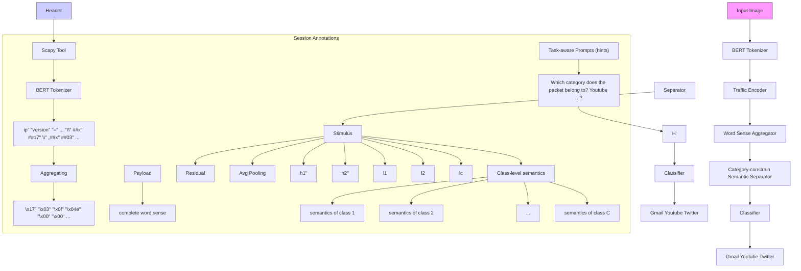

# Bottom Aggregating, Top Separating: An Aggregator and Separator Network for Encrypted Traffic Understanding

Wei Peng , Lei Cui , Wei Cai, Wei Wang, Xiaoyu Cui , Zhiyu Hao , and Xiaochun Yun

Abstract—Encrypted traffic classification refers to the task of identifying the application, service or malware associated with network traffic that is encrypted. Previous methods mainly have two weaknesses. Firstly, from the perspective of word-level (namely, byte-level) semantics, current methods use pre-training language models like BERT, learned general natural language knowledge, to directly process byte-based traffic data. However, understanding traffic data is different from understanding words in natural language, using BERT directly on traffic data could disrupt internal word sense information so as to affect the performance of classification. Secondly, from the perspective of packet-level semantics, current methods mostly implicitly classify traffic using abstractive semantic features learned at the top layer, without further explicitly separating the features into different space of categories, leading to poor feature discriminability. In this paper, we propose a simple but effective Aggregator and Separator Network (ASNet) for encrypted traffic understanding, which consists of two core modules. Specifically, a parameter-free word sense aggregator enables BERT to rapidly adapt to understanding traffic data and keeping the complete word sense without introducing additional model parameters. And a category-constrained semantics separator with task-aware prompts (as the stimulus) is introduced to explicitly conduct feature learning independently in semantic spaces of different categories. Experiments on five datasets across seven tasks demonstrate that our proposed model achieves the current state-of-the-art results without pre-training in both the public benchmark and real-world collected traffic dataset. Statistical analyses and visualization experiments also validate the interpretability of the core modules. Furthermore, what is important is that ASNet does not need pre-training, which dramatically reduces the cost of computing power and time. The model code and dataset will be released in https://github.com/pengwei-iie/ ASNET.

Index Terms—Traffic classification, pre-training language model, prompt learning, word sense aggregating, semantic separating.

Received 19 April 2024; revised 2 November 2024; accepted 4 January 2025. Date of publication 13 January 2025; date of current version 13 February 2025. This work was supported by the National Natural Science Foundation of China under Grant 62072453 and Grant 61972392. The associate editor coordinating the review of this article and approving it for publication was Prof. Kun Sun. (Corresponding authors: Xiaochun Yun; Zhiyu Hao.)

Wei Peng and Lei Cui are with the Zhongguancun Laboratory, Beijing 100093, China, and also with the Quan Cheng Laboratory, Shandong 300020, China (e-mail: pengwei@zgclab.edu.cn; cuilei@zgclab.edu.cn).

Wei Cai, Wei Wang, Zhiyu Hao, and Xiaochun Yun are with the Zhongguancun Laboratory, Beijing 100093, China (e-mail: caiwei@zgclab.edu. cn; wangwei@zgclab.edu.cn; haozy@zgclab.edu.cn; yunxiaochun@zgclab. edu.cn).

Xiaoyu Cui is with the School of Cyberspace Security, Beijing University of Posts and Telecommunications, Beijing 100876, China.

Digital Object Identifier 10.1109/TIFS.2025.3529316

## I. INTRODUCTION

and characterization of encrypted network traffic without decrypting the actual content, is a significant research in cybersecurity and network management [1], [2]. It is a significant research area in cybersecurity and network management, as it helps network operators to understand and gain insights from encrypted traffic without compromising data confidentiality [3], [4]. The importance of encrypted traffic analysis lies in the fact that a large portion of network traffic is now encrypted, driven by the growing adoption of secure communication protocols and privacy concerns. While encryption protects data confidentiality, it also poses challenges for network operators and security analysts in performing various network operations and management activities. One of the primary applications of encrypted traffic analysis is the detection of malicious activities [5], [6], [7] by analyzing anomalies in encrypted traffic patterns. Despite the content being encrypted, the metadata and packet characteristics of the traffic can reveal valuable information about potential security threats or abnormal behaviors. Some examples about malicious detection and application classification are in Figure 1.

Network traffic often exists in the form of data packets in cyberspace, as illustrated in Figure 1, the data packet can usually be divided into two parts. The header portion mainly includes source IP address, destination IP address, source port, destination port, protocol type, etc. The payload portion refers to the actual data being transmitted, which is often encrypted in the form of hexadecimal. For instance, a byte “\x17” in Figure 1, “\” means separator, “x” represents hexadecimal, “17” indicates one byte (00010111). Nowadays, the growing trend toward encrypted protocols and the fastevolving nature of network traffic are rendering traditional traffic classification methods obsolete. These traditional methods, such as port matching, server name indication matching, deep packet inspection, etc., mainly perform rule matching based on plaintext fields. However, they are ineffective on encrypted traffic data where the payload cannot be inspected.

In recent years, with the development of deep learning and Pre-training Language Models (PLMs) [8], [9], [10], more and more researchers have focused on utilizing Natural Language Processing (NLP) methods to directly learn from raw traffic bytes for automated feature extraction, treating the encrypted data as text sequences for semantic understanding. In this paper, the bytes in the traffic data are called words, similar to natural language. By casting the traffic data analysis problem as a language modeling task, deep learning models such as LSTMs and Transformers can be applied for sequential modeling of network traffic and understanding of semantics. This allows learning traffic patterns and performing analysis tasks such as anomaly detection and traffic classification even on encrypted data, without needing to decrypt the payload. However, there are currently two main problems with the understanding of traffic data in existing methods.

text_image

Traffic Data
Header
<IP version=4 ihl=5 tos=0xb8 len=84 id=63761 flags= frag=0
tl=9 proto=icmp chksum=0x372 src=8.145.209.197
dst=183.173.50.105 |ICMP type=echo-request code=0
chksum=0x335d id=0xf911 seq=0x1 unused=" |Raw load=
"x95\x6e\x00 x00 x00 x00\x55x0\x00 x00 x00 x00 x00 x00
\xc7\x08\x10\x11\x12\x13\x14\x15\x16\x17\x18\x19\x1a\x1b
\x1c\x1d\x1e\x1f\xadL\x6\x00 x00 x00 x00 x00\x5\x08
\x10\x11\x12\x13\x14\x15\x16\x17\x18\x19\x1a ...
&cc
Malicious Detection
Malicious software
Benign software
Encryption Payload
Header
<IP version=4 ihl=5 tos=0x0 len=1182 id=29481 flags=DF
frag=0 tl=64 proto=tcp chksum=0x9d07 src=10.8.0.10
dst=173.252.110.27 |TCP sport=35745 dport=https
seq=995370685 ack=765633594 dataofs=8 reserved=0 flags=PA
window=1464 chksum=0xlb51 ugrptr=0 options=[(NOP,
None), (NOP, None), (Timestamp', (156353206, 1161550388)]
|Raw load=
"x17x03x03x04x00x00x00x00x00x00x00x04\xaa
\xf77xd5\xe7x18\xa1\xa8\xfc5\xce0\x92\xa7\xd25\xecz
\xbf\9x92x9d\xf2L\5x18\xb7D\8x3\xb0x7fxx01
x00x1c4,*&x19x05x7f7\x8b\xc6x0e\x83r[\xac]\xe1
\x90@Sx10\rxd0\xce0\x88\racXxd8 ...
&cc
Application Classification
Youtube
YouTube
Facebook
Skype
...
<IP version=4 ihl=5 tos=0x0 len=1182 id=29481 flags=DF
frag=0 tl=64 proto=tcp chksum=0x9d07 src=10.8.0.10
dst=173.252.110.27 |TCP sport=35745 dport=https
seq=99537685 ack=765633594 dataofs=8 reserved=0 flags=PA
window=1464 chksum=0xlb51 ugrptr=0 options=[(NOP,
None), (NOP, None), (Timestamp', (156353206, 1161550388)]
|Raw load=
"x17x03x03x04x 0x00 x00 x00 x00 x00 x00 x04\xaa
\xf77xd5\xe7x18\xa1\xa8\xfc5\xce0\x92\xa7\xd25\xecz
\xbf\9x92x9d\xf2L\5x18\xb7D\8x3\xboX7fxxO
\xoO[xc]c* & x19x 05x7f7(x8b\xc6x 0e\x83r[\vac]\xe1
\x90@Sx10\rxd0\xceO\x88\racXxd8 ...
&cc
Application Classification

Fig. 1. Some examples of traffic data packet. The right-hand part means the label of downstream tasks. Green font represents the different categories.

Firstly, from the perspective of word-level semantics, understanding traffic data is different from understanding words in natural language, especially when the traffic is encrypted. Current PLMs like BERT [8] mainly learn general knowledge at the natural language level and may not be suitable for directly processing traffic data. This is because most current researches [3], [11], [12], [13] treat one hexadecimal raw traffic byte as an independent word unit like “x00”, “xde”, “xff”, etc. Using BERT directly on traffic data could disrupt internal word sense so as to affect the performance of classification, for example, splitting “xde” into [“x”, “##d”, “##e”]. The “##” indicates that it’s a subword token. One feasible approach is to reconstruct the vocabulary directly using traffic data and retrain from scratch like ET-BERT [14]. However, this type of method requires massive data and computational resources, and cannot effectively leverage the general natural language knowledge learned during the pre-training phase of BERT.

Secondly, from the packet-level semantics perspective, traffic packet has multiple types of semantics. Specifically, the semantics vary for different categories or tasks. For instance, the semantics of network traffic going to YouTube would indicate video information, while traffic to an FTP server would indicate file transfers. However, current methods mostly implicitly classify traffic applications using abstractive semantic features learned at the top layer, without further explicitly separating the features into different space of categories, leading to poor feature discriminability. Therefore, how to understand the encrypted traffic data from the word-level and packet-level semantics is the core problem in this paper.

To this end, we propose a simple but effective Aggregator and Separator Network (ASNet) for encrypted traffic understanding. The core modules include Word Sense Aggregator (WSA) and Category-constrain Semantic Separator (CSS). Specifically, from a word-level semantics perspective, we propose a parameter-free WSA that enables BERT to rapidly adapt to understanding traffic data and keeping the complete word sense without introducing additional parameters. Furthermore, to allow the model to conduct feature learning independently across semantic spaces of different categories, making traffic features more distinguishable, a categoryconstrained semantics separator with task-aware prompts (as the stimulus) is introduced from the packet-level semantics.

The contributions can be summarized as follows:

• We propose a simple but effective ASNet with bottom aggregating and top separating for encrypted traffic analysis, which can enhance the model’s understanding of traffic data and achieve better traffic classification performance.  
• From the word-level semantics, we introduce a parameterfree word sense aggregator that enables BERT to adapt to understanding raw traffic bytes and keeping the complete word sense without adding extra model parameters.  
• From the packet-level semantics, we propose a categoryconstrained semantic separator with task-aware prompts (as the stimulus), which enables explicitly independent feature learning in separated semantic spaces for different categories, resulting in more distinguishable features.  
• Without pre-training, experiments on five datasets across seven tasks demonstrate that ASNet achieves state-of-theart (SOTA) results. Analysis experiments also validate the effectiveness and interpretability of the core modules. And what is important is that ASNet does not need pre-training, which dramatically reduces the cost of computing power and time.

## II. RELATED WORK

## A. Pre-Training Language Models

PLMs like BERT [8], GPT-3 [15], etc. have driven tremendous progress in NLP in recent years. The key idea is to utilize self-supervised objectives like mask language modeling and next sentence prediction during pre-training to uncover linguistic properties of textual information. After pre-training on massive text data, the model parameters partly capture contextualized semantics. These generic representations are then specialized for tasks like text classification [16], [17], question answering [18], [19] or dialog [20], [21], [22] by adding task-specific output layers and fine-tuning on labeled data.

In PLMs, a key preprocessing step is tokenization which converts sentences into appropriate input ids to keep the word sense for the model. Common strategies include subword, WordPiece and byte-pair encoding which break words into subwords or characters. For BERT, it utilizes a WordPiece tokenizer that breaks words into subwords or tokens. For example, “playing” can be split as [“play”, “##ing”]. The “##” indicates that it’s a subword token. However, for encrypted network traffic, directly using the pre-trained tokenizer could disrupt internal word sense information, e.g., a complete byte “xde” is split into [“x”, “##d”, “##e”].

Choosing the right tokenization strategy is vital for retaining maximum information from raw traffic bytes and enabling PLMs to learn useful representations. Therefore, we introduce a parameter-free word sense aggregator that enables BERT to adapt to understanding raw traffic bytes and keeping the complete word sense without adding extra model parameters.

## B. Encrypted Traffic Classification

From a methodological perspective, encrypted traffic methods can be categorized into feature-based methods, byte-based models, and PLMs. The details are as follows.

Feature-based methods [23], [24], [25], [26], [27], [28] for encrypted traffic analysis primarily rely on extracting statistical traffic features based on expert domain knowledge. As features of individual packets are limited, most researchers collect statistical features across multiple packets, grouping them into flows, sessions, or time series. The traffic data is first pre-processed to derive characteristics like packet lengths, inter-arrival times, flow duration, number of packets, etc. These hand-engineered features that capture essential properties of the network flows serve as input to traditional machine learning models such as Random Forests or Naive Bayes for encrypted traffic classification or prediction tasks. For example, Shen et al. [29] propose an efficient fine-grained webpage fingerprinting method to construct the packet length sequence and extract three types of features to build webpage fingerprints for encrypted traffic classification. The ability to explain the decisions of statistical models in terms of the input features makes them attractive for encrypted traffic analysis. However, the dependence on manual feature engineering is a limitation. And it also requires collecting multiple packets, which needs large requirements for computing and storage. Recently, byte-based methods that utilize deep learning to perform traffic classification have grown in popularity [30], [31], [32], [33], [34], [35]. These techniques analyze only a single packet to automatically extract complex features from raw traffic bytes.

Byte-based models work directly on raw traffic bytes and learn representations using techniques like Convolutional Neural Networks (CNNs) and Long Short-Term Memory Networks (LSTMs). They can capture complex patterns in encrypted data packets without manual feature engineering [30], [31], [32], [33], [34], [35]. These approaches can be categorized as image-based or text-based depending on how they interpret the input traffic. Specifically, image-based models [30], [32], [34] treat the traffic data as 2D images by transforming the raw bytes into grayscale intensity values or RGB colors. They then apply well-known image classification CNN architectures like ResNet and Inception, which can identify visual patterns in the transformed input matrix. Text-based models such as Recurrent Neural Networks (RNN) and LSTMs process the input sequentially as text sequences [12], [33]. They can analyze long-range dependencies in the raw traffic bytes. Self-attention models like transformer are also popular for learning contextual relationships in encrypted traffic data. For example, Meng et al. [33] utilize contrastive loss and attention mechanism to optimize the learned representations with various traffic classification tasks. Recently, PLMs have achieved tremendous progress in NLP, advancing SOTA results on numerous NLP tasks. And there is an increasing number of researchers that leverage PLMs for encrypted traffic classification.

The PLMs [14], [34] follow the self-supervised pre-training paradigm that has proven hugely effective for NLP. The models first train on massive amounts of unlabeled network traffic data in a self-supervised manner to learn generic traffic representations. that allow the models to ingest the raw bytes and uncover intrinsic properties of the traffic. Lin et al. [14] propose ET-BERT to pre-train deep contextualized datagramlevel representation with the same-origin BURST prediction. Meng et al. [36] provide a generative pre-trained model NetGPT for both traffic understanding and generation tasks. Peng et al. [35] proposes an efficient and effective two-stage approach to make traffic classification with the CNN-based and PLM-based model. However, this type of approach requires massive data and computational resources to retrain a large language model. In this paper, the proposed ASNet effectively leverages the general natural language knowledge learned during the pre-training phase of BERT without retraining.

## III. MODELS

The framework is presented in Figure 2, which consists of the BERT Tokenizer, Traffic Encoder, Word Sense Aggregator (WSA), Category-constrain Semantic Separator (CSS) and Classifier. The core modules consist of a WSA and a CSS. Specifically, the parameter-free WSA is able to aggregate the split tokens into the complete word sense, which enables BERT to adapt to understanding raw traffic bytes and keeping the complete word sense without adding extra model parameters. The CSS enables independent feature learning in separated semantic spaces for different categories with taskaware prompts, which results in more distinguishable features. In the following, we first describe the problem formulation. Then, the detail of the ASNet is introduced step by step.

## A. Problem Formulation

Given a pcap file, the scapy toolkit parses the file and extracts the network packets. Each packet includes header portion and payload data in the form of string $X = \{ x _ { 1 } , x _ { 2 } , . . . , x _ { N } \}$ , , . . .,that consists of N traffic words. The traffic words within the packet can be tokenized into smaller sub-words (tokens). Formally, we denote the i-th word as $x _ { i } = ( x _ { i _ { 1 } } , . . . , x _ { i _ { k } } , . . . ) $ , where $x _ { i _ { k } }$ , . . ., , . . .indexes the k-th token in word xi. The category label is defined as y, e.g. YouTube, Facebook, etc. Our task is then to learn a function F that takes these words as input, and outputs the corresponding packet label.

## B. BERT Tokenizer

The BERT tokenizer tokenizes the input traffic words into tokens that can be processed by the BERT encoder. It plays a crucial role in preparing and formatting the input data for the model. Generally, BERT uses a WordPiece tokenizer that splits traffic words into subwords with the pre-defined vocabulary. If a traffic word $\mathbf { \mu } ^ { ( \bullet \mathfrak { e } ) \mathfrak { v } } \mathbf { d e } ^ { \mathfrak { v } } )$ does not exist during the pre-training of BERT, the tokenizer will either split it into individual characters $( [ ^ {  } \mathbf { x } ^ { \prime \prime } , ^ {  } \# \# \mathrm { d } ^ { \prime \prime } , ^ {  } \# \# \mathrm { e } ^ { \prime \prime } ] )$ or replace it with the special token [UNK]. Specifically, the tokenizer splits traffic words $X = \{ x _ { 1 } , x _ { 2 } , . . . , x _ { N } \}$ into tokens, as:

flowchart

Fig. 2. The overview of ASNet. Note: in the solid blue boxes in the lower left corner of the figure, to highlight the aggregation process of word sense, we represent them as characters, which are actually vector representations after encoding.

$$
X _ {s e p} = \text { Tokenizer } (x _ {1}, \dots , x _ {N}) = \{(x _ {1 _ {1}}, \dots), \dots (x _ {N _ {1}}, \dots) \} \tag {1}
$$

while retaining length information when splitting traffic words into subwords, meaning it tracks how many subwords each word is divided into. This length information helps the WSA module rebuild and aggregate the meaning of traffic words later. For the WSA module, a simple way is to modify the original vocabulary.

## C. Traffic Encoder

The purpose of the traffic encoder is to generate representations for the network traffic data. After the BERT tokenizer finishes splitting the traffic words into tokens, the traffic encoder encodes these tokens to capture contextual features and output hidden states of traffic tokens $H _ { s e p }$ . In this paper, we leverage the pre-trained BERT encoder as our traffic encoder, which can be defined as:

$$
H _ {s e p} = \text { Traffic   Encoder } (X _ {s e p}) = \{(h _ {1 _ {1}}, \dots), (h _ {2 _ {1}}, \dots) \dots \} \tag {2}
$$

where $h _ { i _ { k } }$ is the representation of subword $x _ { i _ { k } }$ in Eqn. 1.

## D. Word Sense Aggregator

Since BERT is pre-trained on natural language corpora, it lacks representations for payload bytes like $^ { 6 6 } \mathrm { \backslash x l 7 ^ { \circ } }$ and ${ } ^ { 6 6 } \mathrm { \backslash x 0 f ^ { \mathrm { * } } }$ that are commonly found in network traffic data. To retain the complete word sense information while still leveraging BERT’s general linguistic knowledge, a simple and parameter-free Word Sense Aggregator (WSA) is introduced. Specifically, we utilize the original token length information retained by the BERT tokenizer to aggregate the separated word senses after tokenization. And the separated hidden states are aggregated to obtain the packet-level semantics H through a directly additive operation, the equation is as follows:

$$
H = \left(h _ {1}, \dots , h _ {i}, \dots , h _ {N}\right) \tag {3}
$$

$$
h _ {i} = \text { aggregating } (h _ {i _ {1}}, \dots , h _ {i _ {k}}, \dots) = (h _ {i _ {1}} + \dots + h _ {i _ {k}} + \dots) \tag {4}
$$

where $H \in \mathbb { R } ^ { N \times d } ,$ , d is the hidden dimension size. $h _ { i }$ indicates the representation of i-th word, k indexes the k-th subword within $h _ { i }$ .

## E. Category-Constrain Semantic Separator

From the packet-level semantics, traffic packet has multiple types of semantics. For example, the semantics of network traffic going to YouTube indicate video information, while traffic to an FTP server suggest file transfers. To obtain the better feature discriminability, the Category-constrained Semantics Separator (CSS) with task-aware prompts is designed for further explicitly separating packet-level semantics features into different space of categories.

Unlike the previous researches that implicitly classify traffic data using abstractive semantic features learned at the top layer, the CSS module introduces task-aware prompts as stimulus and hints to explicitly guide PLMs in separating packet-level semantics features, so as to enhance the discriminability of the feature. For instance, specific categories words can regard as the input query in different tasks. In application classification task, the prompt P can be which category does the packet belong to? YouTube, Spotify, Skype, Gmail The . . .task-aware prompts explicitly provide a natural way to inject inductive biases into the PLM to guide the separation of packet-level semantics, which is useful for identifying salient patterns in the traffic data. Detail visualization is presented in Sec. VI. Other prompt lists are illustrated in Section IV-F.

To this end, the task-aware prompts P (directly as the input) are firstly encoded like traffic data with another BERT Encoder that has the same architecture with the traffic encoder, as:

$$
H ^ {\prime} = \text { Prompt   Encoder } (P) = (h _ {1} ^ {\prime}, \ldots , h _ {j} ^ {\prime}, \ldots , h _ {M} ^ {\prime}) \tag {5}
$$

where $H ^ { \prime } \in \mathbb { R } ^ { M \times d }$ , M means the total number of tokens in the prompt, j indicates the j-th token in the prompt.

Then, the stimulus operation is performed to separate the packet-level semantics H (Eqn. 3) into corresponding independent hidden states $H _ { c } ^ { \prime \prime }$ for better discriminability, as:

$$
\text { score } = \text { softmax } (H \cdot H ^ {\prime T}) \tag {6}
$$

$$
H _ {c} ^ {\prime \prime} = (s c o r e \cdot H ^ {\prime}) W _ {c} + b _ {c} \tag {7}
$$

where score $\in \mathbb { R } ^ { N \times M } , \ W _ { c } \in \mathbb { R } ^ { d \times d } , \ b _ { c } \in \mathbb { R } ^ { 1 \times d } , \ H _ { c } ^ { \prime \prime } \in \mathbb { R } ^ { N \times d }$ . c means the category, different categories have different parameters. $c \in \{ 1 , 2 , . . . , C \}$ , C is the total number of the category.

, , . . .,After stimulus operation, to preserve the original information, intuitively, a residual structure is leveraged to combine the original and updated hidden states. And then using an average pooling to obtain the final class-level semantics $l _ { c }$ for each class, the above process is formulated as follows:

$$
l _ {c} = \text { average } - \text { pooling } (H + \alpha H _ {c} ^ {\prime \prime}) \tag {8}
$$

where $l _ { c } \in \mathbb { R } ^ { d }$ ,  is a hyper-parameter that control the weight αbetween the two hidden states.

## F. Classifier

The goal of the classifier is to categorize the class-level semantics after separation. After the CSS module, each category has its own corresponding class-level semantics. The classifier utilizes a sigmoid function to obtain the final class probabilities for each sample, as shown below:

$$
p _ {c} = \text { sigmoid } (\mathrm{MLP} (l _ {c})) \tag {9}
$$

where $p _ { c }$ indicates the probability of c-th category, MLP means the multi-layer perceptron.

## IV. EXPERIMENTS

## A. Datasets

The proposed ASNet and comparison methods are evaluated on four public benchmarks encrypted traffic datasets and one real-world collected scenario.

TABLE I STATISTICS OF THE DATASETS

<table><tr><td>Dataset</td><td>Total Packets Size</td><td>Training</td><td>Validation</td><td>Testing</td></tr><tr><td>ISCXVPN</td><td>8,711,211</td><td>6,968,969</td><td>871,121</td><td>871,121</td></tr><tr><td>USTC-TFC</td><td>3,011,831</td><td>2,409,465</td><td>301,183</td><td>301,183</td></tr><tr><td>CICIoT</td><td>4,632,537</td><td>3,706,030</td><td>463,254</td><td>463,253</td></tr><tr><td>ISCXTor</td><td>4,114,398</td><td>3,291,518</td><td>411,441</td><td>411,439</td></tr><tr><td>CHNAPP</td><td>1,287,303</td><td>1,029,842</td><td>128,731</td><td>128,730</td></tr></table>

The four public benchmarks include ISCXVPN, USTC-TFC, CICIoT, ISCXTor. Specifically, the ISCXVPN [37] dataset primarily contains network traffic data using Virtual Private Networks (VPNs). Each packet has two labels - a VPN label and an application label. For the VPN label (task1), it can be VPN or NONVPN. For application classification (task2), there are 12 categories such as YouTube, Facebook, etc. The USTC-TFC [38] dataset collects traffic data about malicious and benign software. Each packet has two labels - a software abnormality label and a software label. For the software abnormality label (task1), it can be malicious or benign. For the software label (task2), there are 19 categories such as Outlook, Cridex, Virut, etc. The CICIoT [39] dataset is sourced from industrial Internet of Things (IoT) systems [40] and consists of 6 different experiments: power, interaction, idle, scenarios, active and attacks. The ISCXTor [41] dataset uses The Onion Router (Tor) for communication privacy enhancement. It contains 13 categories of application classification. As for the real-world collected dataset CHNAPP, we manually collected traffic data of six types of popular applications on the Internet, including Weibo, Wechat, QQMail, TaoBao, Youku and QQMusic. The statistical dataset information on how many packets are used for training, validation and testing can be seen in Table I.

## B. Experimental Setting & Evaluation Metrics

For the experimental settings, the epoch is set to 3 with the 64 batch size in the training phrase. The max input length is set to 256, the length of prompts are set to 50. The hyperparameter  is set to 0.2 according to the grid search. The αAdam [42] optimizer with the initial learning rate of 1e-5 is utilized for training, and the Pytorch framework is adopted. The experiments are implemented on the Tesla A100-80G GPU. Other parameters are following the paper [8]. For details of the WSA module, one convenient and simple way is to modify the original vocabulary.

The category distribution in these seven tasks is not consistent. Some of them are balanced while some are imbalanced. To effectively evaluate the performance of baselines and ASNet, we consider two evaluation metrics: macro F1 and micro F1. Specifically, macro F1 calculates the F1 score independently for each class and takes the average, weighting each class equally. This helps evaluate the performance of models on imbalance issues. In contrast, micro F1 aggregates the contributions across all classes to compute a global F1 score, which emphasizes bigger classes. The key difference is that macro F1 treats all classes as equally important, while micro F1 considers class distribution proportions and emphasizes bigger classes. For datasets with balanced class distribution, macro and micro F1 tend to be similar. But for imbalanced data, macro F1 better highlights model performance on small classes, while micro F1 focuses more on prevalent classes. By reporting both metrics in our experiments, we can provide a more comprehensive evaluation.

TABLE II COMPARISON RESULTS ON ISCXVPN AND USTC-TFC DATASETS. † INDICATES REPRODUCED RESULTS

<table><tr><td rowspan="2">Methods</td><td colspan="2"> $\text{ISCXVPN}_{task1}$ </td><td colspan="2"> $\text{ISCXVPN}_{task2}$ </td><td colspan="2"> $\text{USTC-TFC}_{task1}$ </td><td colspan="2"> $\text{USTC-TFC}_{task2}$ </td></tr><tr><td>macro F1</td><td>micro F1</td><td>macro F1</td><td>micro F1</td><td>macro F1</td><td>micro F1</td><td>macro F1</td><td>micro F1</td></tr><tr><td>APPS [43]</td><td>0.9349</td><td>0.9350</td><td>0.8168</td><td>0.8133</td><td>0.9532</td><td>0.9537</td><td>0.7780</td><td>0.7895</td></tr><tr><td>SMT [24]</td><td>0.8929</td><td>0.8933</td><td>0.7631</td><td>0.7600</td><td>0.9532</td><td>0.9537</td><td>0.7812</td><td>0.7937</td></tr><tr><td>DevNet [23]</td><td>0.7766</td><td>0.7767</td><td>-</td><td>-</td><td>0.6309</td><td>0.6316</td><td>-</td><td>-</td></tr><tr><td>Deep Packet [12]</td><td>0.8550</td><td>0.8550</td><td>0.6506</td><td>0.6670</td><td>0.9768</td><td>0.9768</td><td>0.7548</td><td>0.7516</td></tr><tr><td>TR-IDS [44]</td><td>0.9433</td><td>0.9433</td><td>0.5498</td><td>0.5766</td><td>0.9494</td><td>0.9411</td><td>0.5276</td><td>0.5452</td></tr><tr><td>HEDGE [45]</td><td>0.8105</td><td>0.8133</td><td>0.2967</td><td>0.3400</td><td>0.8544</td><td>0.8547</td><td>0.6376</td><td>0.6421</td></tr><tr><td>3D-CNN [46]</td><td>0.8946</td><td>0.8950</td><td>0.5434</td><td>0.5700</td><td>0.9958</td><td>0.9958</td><td>0.5509</td><td>0.5305</td></tr><tr><td>BERT [8] $^{\dagger}$ </td><td>0.9717</td><td>0.9714</td><td>0.8845</td><td>0.8873</td><td>0.9967</td><td>0.9988</td><td>0.5435</td><td>0.9308</td></tr><tr><td>PacRep [33]</td><td>0.9929</td><td>0.9929</td><td>0.9151</td><td>0.9153</td><td>1.0000</td><td>1.0000</td><td>0.9002</td><td>0.9174</td></tr><tr><td>ET-BERT [14] $^{\dagger}$ </td><td>0.9946</td><td>0.9950</td><td>0.9425</td><td>0.9605</td><td>1.0000</td><td>1.0000</td><td>0.9312</td><td>0.9604</td></tr><tr><td>YaTC [34] $^{\dagger}$ </td><td>1.0000</td><td>1.0000</td><td>0.9667</td><td>0.9804</td><td>1.0000</td><td>1.0000</td><td>0.9705</td><td>0.9779</td></tr><tr><td>ASNet (Ours)</td><td>1.0000</td><td>1.0000</td><td>0.9943</td><td>0.9965</td><td>1.0000</td><td>1.0000</td><td>0.9861</td><td>0.9942</td></tr></table>

## C. Baselines

The baselines can be divided into three categories for comparison: (1) feature-based methods (i.e., APPS [43], SMT [24], DevNet [23]); (2) byte-based models (i.e., Deep Packet [12], TR-IDS [44], HEDGE [45], 3D-CNN [46]); and (3) PLMs-based methods (i.e., BERT [8], PacRep [33], ET-BERT [14], YaTC [34], EETS [35]). To make a more competitive comparison, we mainly focus on the SOTA baselines, such as BERT, Pacrep, ET-BERT and YaTC. Details are as follows.

• APPS [43], which selects statistical features, and uses a random tree classifier for application classification.  
• SMT [24], which fuses different features by a kernel function for decentralized applications fingerprinting.  
• Deep Packet [12], which integrates both feature extraction and classification phases to train the stacked autoencoder and CNN for application classification.  
• 3D-CNN [46], which leverages the byte data as input for 3D-CNN and can classify packets from both known and unknown patterns.  
• BERT [8], which is based on Transformer architecture and has achieved noticeable performance on NLP tasks.  
• PacRep [33], which utilizes the BERT as an encoder and uses contrastive loss to optimize the learned packet representations with multi-task learning.  
• ET-BERT [14], which pre-trains deep contextualized datagram-level representation from raw traffic bytes.  
• YaTC [34], which introduces a masked autoencoder based traffic transformer with multi-level flow representation and performs pre-training process for traffic classification.

• EETS [35], which proposes an efficient and effective twostage approach to balance the trade-off between plaintext and encrypted text in traffic classification.

## D. Main Results

As shown in Table II and Table III, we compare the performance of baseline models and ASNet on 5 datasets across 7 tasks. The conclusions can be summarized as follows: (1) the performance of feature-based methods and byte-based models is comparable, whereas PLM-based methods have achieved further improvements. Notably, our proposed model ASNet obtains SOTA results on all the evaluation metrics, which validates the importance of keeping the complete word sense and explicitly separating packet-level semantics into different space of categories. (2) On the CICIoT dataset (in Table III), the performance gap of ASNet on macro F1 and micro F1 metrics has been reduced to 2.89%, while the gap of PLM-based methods ranges from 4% to 14%. This demonstrates that utilizing the category-constrained semantic separator with task-aware prompts can explicitly help the model distinguish semantic features across different categories, enhancing semantic discriminability on the unbalanced category so as to boost macro F1 performance. Note: the original micro-F1 of YaTC on CICIoT is 96.58%, which is similar to the micro-F1 96.04% that we reproduced. The same goes for the others. (3) For the real-world collected dataset CHNAPP, our proposed model achieves the best performance compared to other baselines. Specifically, our model obtained about 2% and 4% improvements over the SOTA baseline in terms of micro-F1 and macro-F1 scores respectively. This demonstrates the effectiveness of our approach in handling real-world traffic classification tasks with potentially diverse and noisy data distributions. In contrast, the YaTC model exhibits relatively poorer performance on CHNAPP. A plausible reason for this could be the mismatch between the data distribution of CHNAPP and the pretraining data used by YaTC.

TABLE III COMPARISON RESULTS ON CICIOT, ISCXTOR AND CHNAPP DATASETS

<table><tr><td rowspan="2">Methods</td><td colspan="2">CICIoT</td><td colspan="2">ISCXTor</td><td colspan="2">CHNAPP</td></tr><tr><td>macro F1</td><td>micro F1</td><td>macro F1</td><td>micro F1</td><td>macro F1</td><td>micro F1</td></tr><tr><td>APPS [43]</td><td>-</td><td>0.7681</td><td>-</td><td>0.4968</td><td>-</td><td>-</td></tr><tr><td>Deep Packet [12]</td><td>-</td><td>0.8808</td><td>-</td><td>0.2681</td><td>-</td><td>-</td></tr><tr><td>3D-CNN [46]</td><td>-</td><td>0.8933</td><td>-</td><td>0.3396</td><td>-</td><td>-</td></tr><tr><td>BERT [8] $^{\dagger}$ </td><td>0.7833</td><td>0.9250</td><td>0.6184</td><td>0.9225</td><td>0.5694</td><td>0.8408</td></tr><tr><td>PacRep [33] $^{\dagger}$ </td><td>0.8502</td><td>0.9455</td><td>0.9502</td><td>0.9638</td><td>0.9510</td><td>0.9875</td></tr><tr><td>ET-BERT [14] $^{\dagger}$ </td><td>0.8993</td><td>0.9469</td><td>0.9512</td><td>0.9786</td><td>0.9408</td><td>0.9609</td></tr><tr><td>YaTC [34] $^{\dagger}$ </td><td>0.9270</td><td>0.9604</td><td>0.9630</td><td>0.9815</td><td>0.9044</td><td>0.9350</td></tr><tr><td>EETS [35] $^{\dagger}$ </td><td>-</td><td>-</td><td>0.9756</td><td>0.9887</td><td>0.9495</td><td>0.9914</td></tr><tr><td>ASNet (Ours)</td><td>0.9461</td><td>0.9750</td><td>0.9766</td><td>0.9908</td><td>0.9810</td><td>0.9875</td></tr></table>

TABLE IV ABLATION RESULTS OF KEY COMPONENTS ON ISCXVPN AND USTC-TFC DATASETS

<table><tr><td rowspan="2">Methods</td><td colspan="2"> $\text{ISCXVPN}_{task1}$ </td><td colspan="2"> $\text{ISCXVPN}_{task2}$ </td><td colspan="2"> $\text{USTC-TFC}_{task1}$ </td><td colspan="2"> $\text{USTC-TFC}_{task2}$ </td></tr><tr><td>macro F1</td><td>micro F1</td><td>macro F1</td><td>micro F1</td><td>macro F1</td><td>micro F1</td><td>macro F1</td><td>micro F1</td></tr><tr><td>BERT</td><td>0.9714</td><td>0.9717</td><td>0.8845</td><td>0.8873</td><td>0.9967</td><td>0.9988</td><td>0.5435</td><td>0.9308</td></tr><tr><td>w/o WSA</td><td>0.9887</td><td>0.9904</td><td>0.9838</td><td>0.9908</td><td>0.9988</td><td>0.9992</td><td>0.8706</td><td>0.9775</td></tr><tr><td>w/o CSS</td><td>0.9950</td><td>0.9950</td><td>0.9679</td><td>0.9683</td><td>0.9988</td><td>0.9967</td><td>0.5998</td><td>0.9375</td></tr><tr><td>ASNet (Ours)</td><td>1.0000</td><td>1.0000</td><td>0.9943</td><td>0.9965</td><td>1.0000</td><td>1.0000</td><td>0.9861</td><td>0.9942</td></tr></table>

TABLE V ABLATION RESULTS ON CICIOT, ISCXTOR AND CHNAPP DATASETS

<table><tr><td rowspan="2">Methods</td><td colspan="2">CICIoT</td><td colspan="2">ISCXTor</td><td colspan="2">CHNAPP</td></tr><tr><td>macro F1</td><td>micro F1</td><td>macro F1</td><td>micro F1</td><td>macro F1</td><td>micro F1</td></tr><tr><td>BERT</td><td>0.7833</td><td>0.9250</td><td>0.6184</td><td>0.9225</td><td>0.5694</td><td>0.8408</td></tr><tr><td>w/o WSA</td><td>0.9419</td><td>0.9675</td><td>0.6304</td><td>0.9325</td><td>0.5828</td><td>0.9058</td></tr><tr><td>w/o CSS</td><td>0.7975</td><td>0.9292</td><td>0.7052</td><td>0.9333</td><td>0.8637</td><td>0.9322</td></tr><tr><td>ASNet (Ours)</td><td>0.9461</td><td>0.9750</td><td>0.9766</td><td>0.9908</td><td>0.9810</td><td>0.9875</td></tr></table>

Interestingly, ASNet achieves 100% F1 score on task 1 of ISCX-VPN and task 1 of USTC-TFC, and so do some baselines. There are several possible reasons for this phenomenon. First, binary classification tasks are typically easier. Second, in the ISCX-VPN dataset, the VPN payload exists in encrypted form, whereas the NONVPN data contains plaintext information, making it easy to make a classification. Similarly, the behavior patterns of malicious and benign traffic in the USTC-TFC dataset may present clearer separability. In summary, through performance comparison on 5 datasets across 7 tasks, it is demonstrated the effectiveness of the proposed ASNet model. Moreover, without pre-training, our model surpasses the performance of ET-BERT and YaTC which require massive data and computational resources to make pre-training.

## E. Ablation Study

To validate the effectiveness of the proposed WSA and CSS modules, we conduct ablation experiments on 5 datasets across 7 tasks. As shown in Table IV and Table V, removing either of the proposed modules leads to degraded performance, demonstrating their contribution to the ASNet. Particularly, on the application classification task in USTC-TFC (task 2) and the CICIoT dataset, removing the CSS module significantly impacts results. This highlights the benefits of packet-level semantics, which explicitly separates different space of categories to learn more discriminative features, thus improving classification performance. In summary, the ablation study indicates that incorporating the WSA and CSS modules leads to better performance across various datasets and tasks, confirming their importance within the proposed ASNet architecture. The effectiveness of both modules is further evidenced by analyses and visualization experiments in Sec. V and VI. And experiments of prompt are illustrated in Section IV-F because of space limitation.

## F. Details of Prompt

Prompts provide critical guidance and context for language models like BERT, GPT-3, instructing the model on the desired

TABLE VI THE DIFFERENT PROMPTS ARE UTILIZED ON THE ISCXVPNTASK2 DATASET

<table><tr><td>Prompt</td><td>Content</td><td>micro F1</td></tr><tr><td>One</td><td>Which category does the packet belong to? YouTube, Spotify, Skype, Gmail, Facebook ...</td><td>98.77</td></tr><tr><td>Two</td><td>YouTube, Spotify, Skype, Gmail, Facebook ...</td><td>99.65</td></tr><tr><td>Three</td><td>YouTube, Spotify, Skype, Gmail, Facebook ... Please think step by step.</td><td>96.23</td></tr><tr><td>w/o Prompt</td><td>-</td><td>96.83</td></tr></table>

bar chart

USTC-TFC Validation
| Input Length (len) | macro F1 (%) | micro F1 (%) |
|---|---|---|
| 64 | 88 | 98.5 |
| 100 | 93.7 | 98.6 |
| 128 | 94.3 | 98.0 |
| 200 | 98.9 | 98.4 |
| 256 | 99.0 | 99.7 |
| 350 | 98.6 | 99.3 |
| 500 (len) | 97.9 | 98.9 |

(a)Performance on USTC-TFC validation set.

bar chart

USTC-TFC Test
| Model Size (len) | macro F1 (%) | micro F1 (%) |
|---|---|---|
| 64 | 87 | 98.5 |
| 100 | 91.8 | 98.3 |
| 128 | 93.2 | 97.9 |
| 200 | 98 | 98.7 |
| 256 | 98.5 | 99.5 |
| 350 | 98 | 99.2 |
| 500 (len) | 96.2 | 98.4 |

(b) Performance on USTC-TFC test set.  
Fig. 3. Macro F1 and micro F1 scores over different length on the USTC-TFC - application classification task.

completion. Well-designed prompts lead to more coherent, relevant responses from the model. To examine how different prompts affect model performance, we designed three variations as in the Table VI. From the experimental results, the second prompt obtains the best result in the traffic classification task. Without prompt, the micro-F1 score decreases about 3%, which highlights the importance of prompt engineering to unlock the full potential of pre-trained language models. Interestingly, the third prompt obtains the lower result (decrease 0.5%) compared to the without prompt setting, indicating that the provided prompt may have inadvertently introduced some form of bias or constraint that hindered the model’s performance on this particular task. It’s worth noting that the effectiveness of prompts can vary depending on the specific problem, data, and model architecture. The prompt serves as a guidance, providing the context needed to direct these powerful models towards our goals. Further research on how to craft optimal prompts will enable even greater improve performance on downstream tasks. As for the model’s generalization capabilities, we can design different prompts for different situations. For instance, in malicious traffic detection task, the prompt can be design as Given the following traffic data, is the traffic malicious or benign? In the scene that exists a large number of categories, the prompt also can be adapted to Given the following traffic data, which category does the packet belong to? List: YouTube, Spotify, Skype and Gmail. The category may not be included in the List. Therefore, the prompt learning could be designed for different situations so as to improve the model’s generalization capabilities. In conclusion, the prompt engineering process is crucial to steering these PLMs and achieving our desired outcomes. Carefully designed prompts pave the way for language models to reach their full capabilities.

## G. Input Length Analysis

To verify the model’s sensitivity to the input length, we conduct experiments on the USTC-TFC - application classification task. As shown in Figure 3, the length settings range from 64 to 500, with different colors representing different evaluation metrics.

The conclusions: (1) The macro F1 score (orange in Figure 3) demonstrates a clear upward trend as the input sequence length increases from 64 to 256, indicating that longer input sequences (contain payload information) provide more context for the model to make accurate predictions. As the input length continues increasing, the performance decreases slightly, suggesting that overly long sequences introduce noise information. (2) For the micro F1 score (blue in Figure 3), its sensitivity to length is smaller and shows irregular tendency, but it can still be observed from the figure that micro F1 reaches its peak value when the length is 256. (3) In the case of length 64 to 128, the difference between two metrics is large. To further make an explanation, we manually calculate the F1 scores of each category and find that the F1 score of the “Shifu” class is really low (only 0.25), and its proportion is very small (only 0.7%). Therefore, the impact on micro F1 is smaller, whereas the impact on macro F1 is greater. However, with the length increases, the payload information contains, leading to higher macro F1 score. This phenomenon further illustrates the necessity of payload information on unbalanced condition. In summary, this experiment demonstrates the importance of the input length.

area chart

| Pairwise permutations and combinations between classes | Coverage Percentage |
| :--- | :--- |
| 01 | 0.9 |
| 02 | 0.9 |
| 03 | 0.9 |
| 04 | 0.8 |
| 05 | 0.9 |
| 12 | 1.0 |
| 13 | 0.9 |
| 14 | 0.9 |
| 15 | 0.9 |
| 23 | 1.0 |
| 24 | 0.9 |
| 34 | 0.9 |
| 45 | 0.9 |
Top: 10, Area: 12.80

area chart

| Pairwise permutations and combinations between classes | Coverage Percentage |
| :--- | :--- |
| 01 | 0.83 |
| 02 | 0.79 |
| 03 | 0.76 |
| 04 | 0.83 |
| 05 | 0.75 |
| 12 | 0.94 |
| 13 | 0.91 |
| 14 | 0.76 |
| 15 | 0.86 |
| 23 | 0.97 |
| 24 | 0.70 |
| 25 | 0.87 |
| 34 | 0.70 |
| 35 | 0.86 |
| 45 | 0.68 |
Top: 50, Area: 11.44

area chart

| Pairwise permutations and combinations between classes | Coverage Percentage |
| :--- | :--- |
| 01 | 0.87 |
| 02 | 0.85 |
| 03 | 0.76 |
| 04 | 0.80 |
| 05 | 0.74 |
| 12 | 0.90 |
| 13 | 0.73 |
| 14 | 0.79 |
| 15 | 0.76 |
| 23 | 0.81 |
| 24 | 0.84 |
| 25 | 0.81 |
| 34 | 0.77 |
| 35 | 0.94 |
| 45 | 0.78 |
Top: 100, Area: 11.24

(a) High-frequency word overlap without WSA.  

area chart

| Pairwise permutations and combinations between classes | Coverage Percentage |
| :--- | :--- |
| 01 | 0.5 |
| 02 | 0.5 |
| 03 | 0.5 |
| 04 | 0.6 |
| 05 | 0.4 |
| 12 | 1.0 |
| 13 | 0.8 |
| 14 | 0.6 |
| 15 | 0.9 |
| 23 | 0.8 |
| 24 | 0.6 |
| 25 | 0.9 |
| 34 | 0.5 |
| 35 | 0.8 |
| 45 | 0.5 |

area chart

| Pairwise permutations and combinations between classes | Coverage Percentage |
| :--- | :--- |
| 01 | 0.75 |
| 02 | 0.60 |
| 03 | 0.45 |
| 04 | 0.68 |
| 05 | 0.52 |
| 12 | 0.82 |
| 13 | 0.69 |
| 14 | 0.69 |
| 15 | 0.72 |
| 23 | 0.81 |
| 24 | 0.57 |
| 25 | 0.83 |
| 34 | 0.51 |
| 35 | 0.69 |
| 45 | 0.53 |
Top: 50, Area: 9.17

area chart

| Pairwise permutations and combinations between classes | Coverage Percentage |
| :--- | :--- |
| 01 | 0.78 |
| 02 | 0.79 |
| 03 | 0.75 |
| 04 | 0.77 |
| 05 | 0.68 |
| 12 | 0.90 |
| 13 | 0.74 |
| 14 | 0.75 |
| 15 | 0.76 |
| 23 | 0.72 |
| 24 | 0.78 |
| 25 | 0.71 |
| 34 | 0.68 |
| 35 | 0.86 |
| 45 | 0.67 |
Top: 100, Area: 10.46

(b) High-frequency word overlap with WSA.  
Fig. 4. The degree of high-frequency word overlap between classes (calculate the intersection of high-frequency words between two classes) under two different settings on the ISCXVPN dataset. Area indicates the area surrounded by the graphs.

## V. WSA VISUALIZATION

To validate the effectiveness and interpretability of the proposed WSA, we conduct some visualization to make a comparison in the following setting: (1) without aggregating word sense (without WSA) and (2) with aggregating word sense (with WSA). The comparison is based on the 4–6 categories (due to the space limitation, randomly sampling 4–6 categories) on the ISCXVPN dataset. Specifically, three data statistical analyses are conducted: Inter-Class Word Overlap Analysis, Word Distribution Visualization for each class, and Word Frequency Statistical Analysis for each class.

The primary objective of this section is to attempt to explain the WSA module from a data statistical perspective, explaining why introducing this parameter-free aggregation method can improve the model’s performance. While the word frequencies obtained may differ across various datasets or encryption algorithms, their corresponding statistical features exhibit inter-class discrepancies. This diversification in statistical characteristics across classes contributes to the model’s improved performance.

## A. Word Overlap Analysis

In this section, we analyze the degree of high-frequency word overlap between classes under two different settings. Higher overlap indicates more shared features and greater classification difficulty, and vice versa. We randomly select $( C _ { 6 } ^ { 2 } ,$ from 01 to 45), and count the overlap of the top 10 (orange in Figure 4), top 50 (cyan in Figure 4) and top 100 (pink in Figure 4) high-frequency word. As shown in Figure 4 (b), after aggregating word sense, the areas surrounded by the graphs are 9.40 and 9.17 in the case of top 10 and top 50, respectively, reduced by about 36% and 24% compared to setting one (without WSA). This indicates that WSA is able to make a noticeable decrease in inter-class high-frequency word overlap, preserving better distinguishability across classes. Naturally, for the top 100 case, the coverage reduction is slightly smaller, the possible reason is that the probability of overlap increases when the base of words is larger. To sum up, the WAS makes the overlap of high-frequency word lower, which is beneficial to improve the category distinction.

## B. Word Distribution Visualization

To further validate how WSA impacts classification performance, we visualize the distribution of high-frequency word across different categories to clearly observe the efficacy of WSA. Specifically, under both settings, we select the top 10 high-frequency word and plot their frequency distribution across 4 categories. As Figure 5 shows, after aggregating word sense, the distribution of high-frequency word varies significantly across the 4 categories, exhibiting distinct trends. However, without WSA, the distribution shows high similarity across categories, increasing classification difficulty for the model. In conclusion, the high-frequency word distribution visualization provides further explanation of the proposed WSA, analyzing the underlying correlations to its mechanism.

From the above two analyses on WSA, the proposed WSA is able to enhance model’s understanding to the raw traffic bytes by aggregating the word sense, so as to improve traffic classification performance. And the visualization also provides more interpretability to study the importance of word sense in the traffic domain.

## C. Statistical Analysis of Word Frequency

To validate the effectiveness and interpretability of the proposed WSA, we conduct another statistical analysis of word frequency. Specifically, to study the impact of the word frequency under each class on the classification performance, we analyze the top 50 word frequency across 3 randomly sampled categories in setting (1) and setting (2) that illustrated in Sec. V, as shown in Figure 6 (a) and (b), respectively. The following conclusions can be drawn:

area chart

Category 1
| High-frequency word | Proportion |
| :--- | :--- |
| #0 | 1.0 |
| #9 | 0.85 |
| #8 | 0.75 |
| #f | 0.6 |
| #b | 0.25 |
| e | 0.18 |
| #1 | 0.17 |
| d | 0.14 |
| c | 0.13 |
| #7 | 0.0 |

area chart

Category 4
| High-frequency word | Proportion |
| :--- | :--- |
| #0 | 0.75 |
| #9 | 1.00 |
| #8 | 0.85 |
| #f | 0.65 |
| #b | 0.30 |
| #e | 0.25 |
| #1 | 0.20 |
| #d | 0.18 |
| #c | 0.22 |
| #7 | 0.00 |

area chart

Category 5
| High-frequency word | Proportion |
| :--- | :--- |
| #0 | 1.0 |
| #9 | 0.95 |
| #8 | 0.85 |
| #f | 0.65 |
| #b | 0.35 |
| #e | 0.25 |
| #1 | 0.15 |
| #d | 0.18 |
| #c | 0.22 |
| #7 | 0.0 |

area chart

Category 6
| High-frequency word | Proportion |
|---|---|
| #0 | 1.0 |
| #9 | 1.0 |
| #8 | 0.8 |
| #f | 0.65 |
| #b | 0.25 |
| e | 0.2 |
| #1 | 0.15 |
| d | 0.2 |
| c | 0.25 |
| #7 | 0.0 |

(a) Distribution visualization of high-frequency word without WSA.  

area chart

| High-frequency word | Proportion |
|---|---|
| x00 | 0.78 |
| xff | 0.20 |
| chksum | 0.75 |
| x03 | 0.95 |
| x01 | 1.00 |
| nep | 0.00 |
| x04 | 0.20 |
| tcp | 0.75 |
| x17 | 0.95 |
| x06 | 0.25 |

area chart

Category 4
| High-frequency word | Proportion |
| :--- | :--- |
| x00 | 0.0 |
| xff | 0.15 |
| chksum | 1.0 |
| x03 | 0.3 |
| x01 | 0.15 |
| nop | 1.0 |
| x04 | 0.15 |
| tcp | 1.0 |
| x17 | 0.25 |
| x06 | 0.25 |

area chart

Category 5
| High-frequency word | Proportion |
| :--- | :--- |
| x00 | 1.0 |
| xff | 0.1 |
| chksum | 0.6 |
| x03 | 0.1 |
| x01 | 0.12 |
| nop | 0.0 |
| x04 | 0.1 |
| tcp | 0.0 |
| x17 | 0.1 |
| x06 | 0.1 |

area chart

Category 6
| High-frequency word | Proportion |
| :--- | :--- |
| x00 | 1.0 |
| xff | 0.8 |
| chksum | 0.25 |
| x03 | 0.25 |
| x01 | 0.5 |
| nep | 0.25 |
| x04 | 0.25 |
| tcp | 0.25 |
| x17 | 0.0 |
| x06 | 0.15 |

(b) Distribution visualization of high-frequency word with WSA.

Fig. 5. Distribution visualization of high-frequency word on the ISCXVPN dataset.  

bar chart

Top 50 Elements
| Element | Value |
|---|---|
| 1 | 1.9 |
| 2 | 1.2 |
| 3 | 1.15 |
| 4 | 1.1 |
| 5 | 1.08 |
| 6 | 1.07 |
| 7 | 1.06 |
| 8 | 1.05 |
| 9 | 1.04 |
| 10 | 1.03 |
| 11 | 1.02 |
| 12 | 1.01 |
| 13 | 1.00 |
| 14 | 0.99 |
| 15 | 0.98 |
| 16 | 0.97 |
| 17 | 0.96 |
| 18 | 0.95 |
| 19 | 0.94 |
| 20 | 0.93 |
| 21 | 0.92 |
| 22 | 0.91 |
| 23 | 0.90 |
| 24 | 0.89 |
| 25 | 0.88 |
| 26 | 0.87 |
| 27 | 0.86 |
| 28 | 0.85 |
| 29 | 0.84 |
| 30 | 0.83 |
| 31 | 0.82 |
| 32 | 0.81 |
| 33 | 0.80 |
| 34 | 0.79 |
| 35 | 0.78 |
| 36 | 0.77 |
| 37 | 0.76 |
| 38 | 0.75 |
| 39 | 0.74 |
| 40 | 0.73 |
| 41 | 0.72 |
| 42 | 0.71 |
| 43 | 0.70 |
| 44 | 0.69 |
| 45 | 0.68 |
| 46 | 0.67 |
| 47 | 0.66 |
| 48 | 0.65 |
| 49 | 0.64 |
| 50 | 0.63 |
| 51 | 0.62 |
| 52 | 0.61 |
| 53 | 0.60 |
| 54 | 0.59 |
| 55 | 0.58 |
| 56 | 0.57 |
| 57 | 0.56 |
| 58 | 0.55 |
| 59 | 0.54 |
| 60 | 0.53 |
| 61 | 0.52 |
| 62 | 0.51 |
| 63 | 0.50 |
| 64 | 0.49 |
| 65 | 0.48 |
| 66 | 0.47 |
| 67 | 0.46 |
| 68 | 0.45 |
| 69 | 0.44 |
| 70 | 0.43 |
| 71 | 0.42 |
| 72 | 0.41 |
| 73 | 0.40 |
| 74 | 0.39 |
| 75 | 0.38 |
| 76 | 0.37 |
| 77 | 0.36 |
| 78 | 0.35 |
| 79 | 0.34 |
| 80 | 0.33 |
| 81 | 0.32 |
| 82 | 0.31 |
| 83 | 0.30 |
| 84 | 0.29 |
| 85 | 0.28 |
| 86 | 0.27 |
| 87 | 0.26 |
| 88 | 0.25 |
| 89 | 0.24 |
| 90 | 0.23 |
| 91 | 0.22 |
| 92 | 0.21 |
| 93 | 0.20 |
| 94 | 0.19 |
| 95 | 0.18 |
| 96 | 0.17 |
| 97 | 0.16 |
| 98 | 0.15 |
| 99 | 0.14 |
| Top-50 Elements: The chart displays the frequency of occurrences for each element in the dataset (e.g., 'Top-50 Elements' or 'Top-50 Series'). The values for each element are explicitly labeled on the chart.

bar chart

| Element | Value |
| ------- | ----- |
| 1       | 1.8   |
| 2       | 0.2   |
| 3       | 0.15  |
| 4       | 0.12  |
| 5       | 0.1   |
| 6       | 0.09  |
| 7       | 0.08  |
| 8       | 0.07  |
| 9       | 0.06  |
| 10      | 0.05  |
| 11      | 0.04  |
| 12      | 0.03  |
| 13      | 0.02  |
| 14      | 0.01  |
| 15      | 0.01  |
| 16      | 0.01  |
| 17      | 0.01  |
| 18      | 0.01  |
| 19      | 0.01  |
| 20      | 0.01  |
| 21      | 0.01  |
| 22      | 0.01  |
| 23      | 0.01  |
| 24      | 0.01  |
| 25      | 0.01  |
| 26      | 0.01  |
| 27      | 0.01  |
| 28      | 0.01  |
| 29      | 0.01  |
| 30      | 0.01  |
| N       | 0.6   |

bar chart

| Element | Value |
| ------- | ----- |
| #1      | 1.0   |
| #2      | 0.15  |
| #3      | 0.14  |
| #4      | 0.13  |
| #5      | 0.12  |
| #6      | 0.11  |
| #7      | 0.10  |
| #8      | 0.09  |
| #9      | 0.08  |
| #10     | 0.07  |
| #11     | 0.06  |
| #12     | 0.05  |
| #13     | 0.04  |
| #14     | 0.03  |
| #15     | 0.02  |
| #16     | 0.01  |
| #17     | 0.01  |
| #18     | 0.01  |
| #19     | 0.01  |
| #20     | 0.01  |
| #21     | 0.01  |
| #22     | 0.01  |
| #23     | 0.01  |
| #24     | 0.01  |
| #25     | 0.01  |
| #26     | 0.01  |
| #27     | 0.01  |
| #28     | 0.01  |
| #29     | 0.01  |
| #30     | 0.01  |
| #31     | 0.01  |
| #32     | 0.01  |
| #33     | 0.01  |
| #34     | 0.01  |
| #35     | 0.01  |
| #36     | 0.01  |
| #37     | 0.01  |
| #38     | 0.01  |
| #39     | 0.01  |
| #40     | 0.01  |
| #41     | 0.01  |
| #42     | 0.01  |
| #43     | 0.01  |
| #44     | 0.01  |
| #45     | 0.01  |
| #46     | 0.01  |
| #47     | 0.01  |
| #48     | 0.01  |
| #49     | 0.01  |
| #50     | 0.01  |
| #51     | 0.01  |
| #52     | 0.01  |
| #53     | 0.01  |
| #54     | 0.01  |
| #55     | 0.01  |
| #56     | 0.01  |
| #57     | 0.01  |
| #58     | 0.01  |
| #59     | 0.01  |
| #60     | 0.01  |
| #61     | 0.01  |
| #62     | 0.01  |
| #63     | 0.01  |
| #64     | 0.01  |
| #65     | 0.01  |
| #66     | 0.01  |
| #67     | 0.01  |
| #68     | 0.01  |
| #69     | 0.01  |
| #70     | 0.01  |
| #71     | 0.01  |
| #72     | 0.01  |
| #73     | 0.01  |
| #74     | 0.01  |
| #75     | 0.01  |
| #76     | 0.01  |
| #77     | 0.01  |
| #78     | 0.01  |
| #79     | 0.01  |
| #80     | 0.01  |
| #81     | 0.01  |
| #82     | 0.01  |
| #83     | 0.01  |
| #84     | 0.01  |
| #85     | 0.01  |
| #86     | 0.01  |
| #87     | 0.01  |
| #88     | 0.01  |
| #89     | 0.01  |
| #90     | 0.01  |
| #91     | 0.01  |
| #92     | 0.01  |
| #93     | 0.01  |
| #94     | 0.01  |
| #95     | 0.01  |
| #96     | 0.01  |
| #97     | 0.01  |
| #98     | 0.01  |
| #99     | 0.01  |
| #1,2    | -     |
| #2,3    | -     |
| #3,4    | -     |
| #4,5    | -     |
| #5,6    | -     |
| #6,7    | -     |
| #7,8    | -     |
| #8,9    | -     |
| #9,1,2,3,4,5,6,7,8,9,1,2,3,4,5,6,7,8,9,1,2,3,4,5,6,7,8,9,1,2,3,4,5,6,7,8,9,1,2,3,4,5,6,7,8,9,1,2,3,4,5,6,7,8,9,1,2,3,4<nl>
<fcel>#4      | -     |
| #5      | -     |
| #6      | -     |
| #7      | -     |
| #8      | -     |
| #9      | -     |
| #1,2    | -     |
| #2,3    | -     |
| #3,4    | -     |
| #4,5    | -     |
| #5,6    | -     |
| #6,7    | -     |
| #7,8    | -     |
| #8,9    | -     |
| #9,1,2,3,4,5,6,7,&3,4,5,6,7,8,9,1,2,3,4,5,6,7,8,9,1,2,3,4,5,6,7,8,9,1,2,3,4,5,6,7,8,9,1,2,3,4<nl>
<fcel>#4      | -     |
| #5      | -     |
| #6      | -                     |
| #7      | -                     |
| #8      | -                     |
| #9      | -                     |
| #12    | -                     |
| #2,3    | -                     |
| #3,4    | -                     |
| #4,5    | -                     |
| #5,6    | -                     |
| #6,7    | -                     |
| #7,8    | -                     |
| #8,9    | -                     |
| #9,1,2,3,4,5,6,7,&3,4,5,6,7,8,9,1,2,3,4,5,6,7,8,9,1,2,3,4<fcel>-<nl>
<fcel>#4      | -                     |
| #5      | -                     |
| #6      | -                     |
| #7      | -                     |
| #8      | -                     |
| n       | -                     |

Note: The values for each element are estimated based on the provided code and are not explicitly provided in the code format as they are not explicitly mentioned in the original text format.

(a) Top 50 word frequency without WSA.

bar chart

Top 50 Elements
| Element | Value |
|---|---|
| 1 | 1.8 |
| 2 | 0.23 |
| 3 | 0.19 |
| 4 | 0.17 |
| 5 | 0.16 |
| 6 | 0.15 |
| 7 | 0.14 |
| 8 | 0.13 |
| 9 | 0.12 |
| 10 | 0.12 |
| 11 | 0.11 |
| 12 | 0.11 |
| 13 | 0.10 |
| 14 | 0.10 |
| 15 | 0.10 |
| 16 | 0.10 |
| 17 | 0.10 |
| 18 | 0.10 |
| 19 | 0.10 |
| 20 | 0.10 |
| 21 | 0.10 |
| 22 | 0.10 |
| 23 | 0.10 |
| 24 | 0.10 |
| 25 | 0.10 |
| 26 | 0.10 |
| 27 | 0.10 |
| 28 | 0.10 |
| 29 | 0.10 |
| 30 | 0.10 |
| 31 | 0.10 |
| 32 | 0.10 |
| 33 | 0.10 |
| 34 | 0.10 |
| 35 | 0.10 |
| 36 | 0.10 |
| 37 | 0.10 |
| 38 | 0.10 |
| 39 | 0.10 |
| 40 | 0.10 |
| 41 | 0.10 |
| 42 | 0.10 |
| 43 | 0.10 |
| 44 | 0.10 |
| 45 | 0.10 |
| 46 | 0.10 |
| 47 | 0.10 |
| 48 | 0.10 |
| 49 | 0.10 |
| 50 | 0.10 |
| 51 | 0.10 |
| 52 | 0.10 |
| 53 | 0.10 |
| 54 | 0.10 |
| 55 | 0.10 |
| 56 | 0.10 |
| 57 | 0.10 |
| 58 | 0.10 |
| 59 | 0.10 |
| 60 | 0.10 |
| 61 | 0.10 |
| 62 | 0.10 |
| 63 | 0.10 |
| 64 | 0.10 |
| 65 | 0.10 |
| 66 | 0.10 |
| 67 | 0.10 |
| 68 | 0.10 |
| 69 | 0.10 |
| 70 | 0.10 |
| 71 | 0.10 |
| 72 | 0.10 |
| 73 | 0.10 |
| 74 | 0.10 |
| 75 | 0.10 |
| 76 | 0.10 |
| 77 | 0.10 |
| 78 | 0.10 |
| 79 | 0.10 |
| 80 | 0.10 |
| 81 | 0.10 |
| 82 | 0.10 |
| 83 | 0.10 |
| 84 | 0.10 |
| 85 | 0.10 |
| 86 | 0.10 |
| 87 | 0.10 |
| 88 | 0.10 |
| 89 | 0.10 |
| 90 | 0.10 |
| 91 | 0.10 |
| 92 | 0.10 |
| 93 | 0.10 |
| 94 | 0.10 |
| 95 | 0.10 |
| 96 | 0.10 |
| 97 | 0.10 |
| 98 | 0.10 |
| 99 | 0.10 |
| Top Top5 Index: Top Top5 Index (top index) - X-axis represents the index of the top index (top index). The Y-axis represents the value of the index (top index). The chart displays the index values for each component of the top index.

bar chart

| Element | Value |
| ------- | ----- |
| 1       | 1.0   |
| 2       | 0.4   |
| 3       | 0.35  |
| 4       | 0.3   |
| 5       | 0.25  |
| 6       | 0.2   |
| 7       | 0.18  |
| 8       | 0.15  |
| 9       | 0.13  |
| 10      | 0.12  |
| 11      | 0.11  |
| 12      | 0.1   |
| 13      | 0.09  |
| 14      | 0.08  |
| 15      | 0.07  |
| 16      | 0.06  |
| 17      | 0.05  |
| 18      | 0.04  |
| 19      | 0.03  |
| 20      | 0.02  |
| 21      | 0.01  |
| 22      | 0.01  |
| 23      | 0.01  |
| 24      | 0.01  |
| 25      | 0.01  |
| 26      | 0.01  |
| 27      | 0.01  |
| 28      | 0.01  |
| 29      | 0.01  |
| 30      | 0.01  |
| 31      | 0.01  |
| 32      | 0.01  |
| 33      | 0.01  |
| 34      | 0.01  |
| 35      | 0.01  |
| 36      | 0.01  |
| 37      | 0.01  |
| 38      | 0.01  |
| 39      | 0.01  |
| 40      | 0.01  |
| 41      | 0.01  |
| 42      | 0.01  |
| 43      | 0.01  |
| 44      | 0.01  |
| 45      | 0.01  |
| 46      | 0.01  |
| 47      | 0.01  |
| 48      | 0.01  |
| 49      | 0.01  |
| 50      | 0.01  |
| Note: The actual values for 'Value' are not provided in the code provided in the code itself. The 'Index' column is not used in the plot.

bar chart

| Element | Value |
| --- | --- |
| 1 | 1.0 |
| 2 | 0.4 |
| 3 | 0.3 |
| 4 | 0.25 |
| 5 | 0.2 |
| 6 | 0.18 |
| 7 | 0.16 |
| 8 | 0.15 |
| 9 | 0.14 |
| 10 | 0.13 |
| 11 | 0.12 |
| 12 | 0.11 |
| 13 | 0.10 |
| 14 | 0.09 |
| 15 | 0.08 |
| 16 | 0.07 |
| 17 | 0.06 |
| 18 | 0.05 |
| 19 | 0.04 |
| 20 | 0.03 |
| 21 | 0.02 |
| 22 | 0.02 |
| 23 | 0.01 |
| 24 | 0.01 |
| 25 | 0.01 |
| 26 | 0.01 |
| 27 | 0.01 |
| 28 | 0.01 |
| 29 | 0.01 |
| 30 | 0.01 |
| 31 | 0.01 |
| 32 | 0.01 |
| 33 | 0.01 |
| 34 | 0.01 |
| 35 | 0.01 |
| 36 | 0.01 |
| 37 | 0.01 |
| 38 | 0.01 |
| 39 | 0.01 |
| 40 | 0.01 |
| 41 | 0.01 |
| 42 | 0.01 |
| 43 | 0.01 |
| 44 | 0.01 |
| 45 | 0.01 |
| 46 | 0.01 |
| 47 | 0.01 |
| 48 | 0.01 |
| 49 | 0.01 |
| 50 | 0.01 |
| 51 | 0.01 |
| 52 | 0.01 |
| 53 | 0.01 |
| 54 | 0.01 |
| 55 | 0.01 |
| 56 | 0.01 |
| 57 | 0.01 |
| 58 | 0.01 |
| 59 | 0.01 |
| 60 | 0.01 |
| 61 | 0.01 |
| 62 | 0.01 |
| 63 | 0.01 |
| 64 | 0.01 |
| 65 | 0.01 |
| 66 | 0.01 |
| 67 | 0.01 |
| 68 | 0.01 |
| 69 | 0.01 |
| 70 | 0.01 |
| 71 | 0.01 |
| 72 | 0.01 |
| 73 | 0.01 |
| 74 | 0.01 |
| 75 | 0.01 |
| 76 | 0.01 |
| 77 | 0.01 |
| 78 | 0.01 |
| 79 | 0.01 |
| 80 | 0.01 |
| 81 | 0.01 |
| 82 | 0.01 |
| 83 | 0.01 |
| 84 | 0.01 |
| 85 | 0.01 |
| 86 | 0.01 |
| 87 | 0.01 |
| 88 | 0.01 |
| 89 | 0.01 |
| 90 | 0.01 |
| 91 | 0.01 |
| 92 | 0.01 |
| 93 | 0.01 |
| 94 | 0.01 |
| 95 | 0.01 |
| 96 | 0.01 |
| 97 | 0.01 |
| 98 | 0.01 |
| 99 | 0.01 |

(b) Top 50 word frequency with WSA.  
Fig. 6. A bar chart of word frequency statistics on the ISCXVPN dataset.

Firstly, without aggregating word sense, there is a clear long tail distribution, causing models to optimize more for frequently occurring words and learn less effective boundaries for infrequent words, which reduces model classification performance. However, the proposed WSA flattens the distribution more evenly. Secondly, in setting one, the top 15 high-frequency word within each class account for a large proportion, and these words have high overlap between classes (including “x”, “=”, “##0”, “##9”, etc.), indicating poor distinguishability. In contrast, WSA presents different word distribution across categories, which reduces overlap and better ensures separability. (More high-resolution pictures are here1)

For the [UNK] token in the figure, it represents tokens that are not present in the vocabulary of BERT. In traffic data preprocessing, particularly in the payload portion, some bytes will transfer to the characters in the ASCII table, such as the ‘o’ symbol. These characters do not exist in the vocabulary, so ¨ the tokenizer marks them as [UNK]. As a result, we observe that [UNK] occupies a certain proportion in the processed data.

scatterplot

| PC1 | PC2 | label |
| --- | --- | --- |
| -10 | 20 | 0 |
| -8 | 2 | 3 |
| -6 | -2 | 4 |
| -4 | -4 | 5 |
| -2 | -6 | 5 |
| 0 | -8 | 5 |
| 2 | -10 | 5 |
| 4 | -12 | 5 |
| 6 | -14 | 5 |
| 8 | -16 | 5 |
| 10 | -18 | 5 |
| 12 | -20 | 5 |
| 14 | -22 | 5 |
| 16 | -24 | 5 |
| 18 | -26 | 5 |
| 20 | -28 | 5 |
| 22 | -30 | 5 |
| -10 | -10 | 1 |
| -8 | -12 | 1 |
| -6 | -14 | 1 |
| -4 | -16 | 1 |
| -2 | -18 | 1 |
| 0 | -20 | 1 |
| 2 | -22 | 1 |
| 4 | -24 | 1 |
| 6 | -26 | 1 |
| 8 | -28 | 1 |
| 10 | -30 | 1 |
| 12 | -32 | 1 |
| 14 | -34 | 1 |
| 16 | -36 | 1 |
| 18 | -38 | 1 |
| 20 | -40 | 1 |
| -10 | -5 | 2 |
| -8 | -7 | 2 |
| -6 | -9 | 2 |
| -4 | -11 | 2 |
| -2 | -13 | 2 |
| 0 | -15 | 2 |
| 2 | -17 | 2 |
| 4 | -19 | 2 |
| 6 | -21 | 2 |
| 8 | -23 | 2 |
| 10 | -25 | 2 |
| 12 | -27 | 2 |
| 14 | -29 | 2 |
| 16 | -31 | 2 |
| 18 | -33 | 2 |
| 20 | -35 | 2 |
| -10 | -8 | 3 |
| -8 | -10 | 3 |
| -6 | -12 | 3 |
| -4 | -14 | 3 |
| -2 | -16 | 3 |
| 0 | -18 | 3 |
| 2 | -20 | 3 |
| 4 | -22 | 3 |
| 6 | -24 | 3 |
| 8 | -26 | 3 |
| 10 | -28 | 3 |
| 12 | -30 | 3 |
| 14 | -32 | 3 |
| 16 | -34 | 3 |
| 18 | -36 | 3 |
| -10 | -7 | 4 |
| -8 | -9 | 4 |
| -6 | -11 | 4 |
| -4 | -13 | 4 |
| -2 | -15 | 4 |
| 0 | -17 | 4 |
| 2 | -19 | 4 |
| 4 | -21 | 4 |
| 6 | -23 | 4 |
| 8 | -25 | 4 |
| 10 | -27 | 4 |
| -10 | -6 |  |
| -8 | -8 |  |
| -6 | -10 |  |
| -4 | -12 |  |
| -2 | -14 |  |
| \ / |  |  |

(a) PCA projection by CSS.

scatterplot

| PC1 | PC2 | label |
| --- | --- | --- |
| -3.0 | 0.0 | 0 |
| -2.5 | 1.0 | 1 |
| -2.0 | 2.0 | 2 |
| -1.5 | 3.0 | 3 |
| -1.0 | 4.0 | 4 |
| -0.5 | 5.0 | 5 |
| 0.0 | 6.0 | 0 |
| 0.5 | 7.0 | 1 |
| 1.0 | 8.0 | 2 |
| 1.5 | 9.0 | 3 |
| 2.0 | 10.0 | 4 |
| 2.5 | 11.0 | 5 |
| 3.0 | 12.0 | 0 |
| 3.5 | 13.0 | 1 |
| 4.0 | 14.0 | 2 |
| 4.5 | 13.5 | 3 |
| 5.0 | 13.0 | 4 |
| 5.5 | 12.5 | 5 |
| 6.0 | 12.0 | 0 |
| 6.5 | 11.5 | 1 |
| 7.0 | 11.0 | 2 |
| 7.5 | 10.5 | 3 |
| 8.0 | 10.0 | 4 |
| 8.5 | 9.5 | 5 |
| 9.0 | 9.0 | 0 |
| 9.5 | 8.5 | 1 |
| 10.0 | 8.0 | 2 |
| 10.5 | 7.5 | 3 |
| 11.0 | 7.0 | 4 |
| 11.5 | 6.5 | 5 |
| 12.0 | -1.5 | -1 |
| -3.5 | -1 | -2 |
| -3.0 | -2 | -3 |
| -2.5 | -3 | -4 |
| -2.0 | -4 | -5 |
| -1.5 | -5 | -6 |
| -1.0 | -6 | -7 |
| -0.5 | -7 | -8 |
| 0.0 | -8 | -9 |
| 0.5 | -9 | -10 |
| 1.0 | -10 | -11 |
| 1.5 | -11 | -12 |
| 2.0 | -12 | -13 |
| 2.5 | -13 | -14 |
| 3.0 | -14 | -15 |
| 3.5 | -13.5 | -16 |
| 4.0 | -13.0 | -17 |
| 4.5 | -12.5 | -18 |
| 5.0 | -12.0 | -19 |
| 5.5 | -11.5 | -20 |
| 6.0 | -11.0 | -21 |
| 6.5 | -10.5 | -22 |
| 7.0 | -10.0 | -23 |
| 7.5 | -9.5 | -24 |
| 8.0 | -9.0 | -25 |
| 8.5 | -8.5 | -26 |
| 9.0 | -8.0 | -27 |
| 9.5 | -7.5 | -28 |
| 10.0 | -7.0 | -29 |
| 10.5 | -6.5 | -30 |
| 11.0 | -6.0 | -31 |
| 11.5 | -5.5 | -32 |
| 12.0 | -5.0 | -33 |
| -3.5 | -2 | -4 |
| -3.0 | -3 | -5 |
| -2.5 | -4 | -6 |
| -2.0 | -5 | -7 |
| -1.5 | -6 | -8 |
| -1.0 | -7 | -9 |
| -0.5 | -8 | -10 |
| 0.0 | -9 | -11 |
| 0.5 | -10 | -12 |
| 1.0 | -11 | -13 |
| 1.5 | -12 | -14 |
| 2.0 | -13 | -15 |
| 2.5 | -14 | -16 |
| 3.0 | -13.5 | -17 |
| 3.5 | -13 | -18 |
| 4.0 | -12.5 | -19 |
| 4.5 | -12 | -20 |
| 5.0 | -11.5 | -21 |
| 5.5 | -11 | -22 |
| 6.0 | -10.5 | -23 |
| 6.5 | -10 | -24 |
| 7.0 | -9 | -25 |
| 7.5 | -8 | -26 |
| 8.0 | -7 | -27 |
| 8.5 | -6 | -28 |
| 9.0 | -5 | -29 |
| 9.5 | -4 | -30 |
| 10.0 | -3 | -31 |
| 10.5 | -2 | -32 |
| 11.0 | -1 | -33 |
| 11.5 | +0 | -34 |
| 12.0 | +1 | -35 |
| — | — | — |
| — | — | — |
| — | — | — |
| — | — | — |
| — | — | — |
| — | — | — |
| — | — | — |
| — | — | — |
| — | — | — |
| — | — | — |
| — | — | — |
| — | — | — |
| — | — | — |
| — | — | — |
| — | — | — |
| — | — | — |
| — | — | — |
| — | — | — |
| — | — | — |
| — | — | — |
| — | — | — |
| — | — | — |
| — | — | — |
| — | — | — |
| — | — | — |
| — | — | — |
| — | — | — |
| — | — | — |
| — | — | — |
| — | — | — |
| — | — | — |
| — | — | — |
| — | — | — |
| — | — | — |
| — | — | — |
| — | — | — |
| — | — | — |
| — | — | — |
| — | — | — |
| — | — | — |
| — | — | — |
| — | — | — |
| — | — | — |
| — | — | — |
| — | — | — |
| — | — | — |
| — | — | — |
| — | — | — |
| — | — | — |
| — | — | — |
| — | — | — |
| — | — | — |
| — | — | — |
| — | — | — |
| — | — | — |
| — | — | — |
| — | — | — |
| — | — | — |
| — | — | — |
| — | — | — |
| — | — | — |
| — | — | — |
| — | — | — |

(b) PCA projection by BERT.

scatterplot

| PC1       | PC2       | label |
| --------- | --------- | ----- |
| -40000    | 0         | 0     |
| -20000    | 20000     | 1     |
| 0         | 40000     | 2     |
| 20000     | 20000     | 3     |
| 40000     | 0         | 4     |
| 60000     | -20000    | 5     |

(c) Original data space.  
Fig. 7. The visualization of the packet-level semantics on the CICIoT dataset. PCA projections of the embeddings learned by different models. From left to right: projections learned using CSS module; projections learned by BERT; original data space (the original input ids without any embeddings).

## VI. CSS VISUALIZATION

## A. Packet-Level Semantics Visualization

To validate the effectiveness and interpretability of the proposed CSS, we conduct packet-level semantics visualization to make a comparison between the ASNet and BERT baseline in Figure 7. The comparison is based on the 6 categories on the CICIoT2022 dataset. Specifically, we check the PCA projections of the hidden states (before the classification layer) from the proposed CSS module, and from that learned by the baseline, i.e. the representation of the [CLS] in BERT. As a negative control, we also give the PCA projection of the original data space without any forward calculation. As the scatter plots show, both the ASNet and baseline model cluster the samples with the same labels better than the original data, but the clusters in the ASNet are much more distinguishable and the different categories are further separated in the semantic space. In Figure 7 (a), the data can be divided into different clusters by eight ovals. However, it is difficult to separate samples that are clustered in the lower left corner of Figure 7 (b). In summary, the proposed CSS module can obtain better embedding space, thus achieving better improvements on the traffic downstream tasks. In addition, the prompt analysis is in Section IV-F because of space limitation.

## VII. CONCLUSION

In this paper, we propose a simple but effective Aggregator and Separator Network which enhances the understanding of the traffic data, leading to the advanced performance on the traffic classification tasks. From the perspective of word-level and packet-level semantics, the proposed parameter-free WSA and CSS modules are introduced for keeping complete word sense and separating packet-level semantics in different spaces of different categories, respectively. In summary, ASNet is very effective and robust, which outperforms the previous methods on five datasets across seven tasks without pretraining. Furthermore, the visualization analyses demonstrate the effectiveness and interpretability of the WSA and CSS modules. And what is important is that ASNet does not need pre-training, which dramatically reduces the cost of computing power and time. For future work, the design of prompts or continuous prompts could be considered for further research.

## ACKNOWLEDGMENT

The authors are grateful to all the reviewers for their valuable suggestions and insights that helps them to improve the quality of this work.

## REFERENCES

[1] T. Bujlow, V. Carela-Espanol, and P. Barlet-Ros, “Independent com-˜ parison of popular DPI tools for traffic classification,” Comput. Netw., vol. 76, pp. 75–89, Jan. 2015, doi: 10.1016/J.COMNET.2014.11.001.  
[2] G. Aceto, D. Ciuonzo, A. Montieri, and A. Pescape, “Toward ´ effective mobile encrypted traffic classification through deep learning,” Neurocomputing, vol. 409, pp. 306–315, Oct. 2020, doi: 10.1016/J.NEUCOM.2020.05.036.  
[3] I. Akbari et al., “A look behind the curtain: Traffic classification in an increasingly encrypted web,” Proc. ACM Meas. Anal. Comput. Syst., vol. 5, no. 1, pp. 1–26, Feb. 2021, doi: 10.1145/3447382.  
[4] L. Cui, J. Cui, Y. Ji, Z. Hao, L. Li, and Z. Ding, “API2 Vec: Learning representations of API sequences for malware detection,” in Proc. 32nd ACM SIGSOFT Int. Symp. Softw. Test. Anal., Seattle, WA, USA, Jul. 2023, pp. 261–273.  
[5] S. Bi, K. Li, S. Hu, W. Ni, C. Wang, and X. Wang, “Detection and mitigation of position spoofing attacks on cooperative UAV swarm formations,” IEEE Trans. Inf. Forensics Security, vol. 19, pp. 1883–1895, 2024.  
[6] H. Jmal, F. B. Hmida, N. Basta, M. Ikram, M. A. Kaafar, and A. Walker, “SPGNN-API: A transferable graph neural network for attack paths identification and autonomous mitigation,” IEEE Trans. Inf. Forensics Security, vol. 19, pp. 1601–1613, 2024.  
[7] J. Chen, Y. Zhao, Q. Li, X. Feng, and K. Xu, “FedDef: Defense against gradient leakage in federated learning-based network intrusion detection systems,” IEEE Trans. Inf. Forensics Security, vol. 18, pp. 4561–4576, 2023.  
[8] J. Devlin, M.-W. Chang, K. Lee, and K. Toutanova, “BERT: Pretraining of deep bidirectional transformers for language understanding,” in Proc. Conf. North Amer. Chapter Assoc. Comput. Linguistics, Hum. Lang. Technol. Minneapolis, MI, USA: Association for Computational Linguistics, vol. 1, Jun. 2019, pp. 4171–4186.  
[9] A. Radford, “Language models are unsupervised multitask learners,” OpenAI blog, vol. 1, no. 8, p. 9, 2019.  
[10] M. Lewis et al., “BART: Denoising sequence-to-sequence pre-training for natural language generation, translation, and comprehension,” in Proc. 58th Annu. Meeting Assoc. Comput. Linguistics, 2020, pp. 7871–7880.  
[11] S. Rezaei, B. Kroencke, and X. Liu, “Large-scale mobile app identification using deep learning,” IEEE Access, vol. 8, pp. 348–362, 2020.  
[12] M. Lotfollahi, M. J. Siavoshani, R. S. H. Zade, and M. Saberian, “Deep packet: A novel approach for encrypted traffic classification using deep learning,” Soft Comput., vol. 24, no. 3, pp. 1999–2012, Feb. 2020, doi: 10.1007/S00500-019-04030-2.  
[13] H. Zhang et al., “TFE-GNN: A temporal fusion encoder using graph neural networks for fine-grained encrypted traffic classification,” in Proc. ACM Web Conf., Apr. 2023, pp. 2066–2075.  
[14] X. Lin, G. Xiong, and G. Gou, “ET-BERT: A contextualized datagram representation with pre-training transformers for encrypted traffic classification,” in Proc. ACM Web Conf., 2022, pp. 633–642.  
[15] T. B. Brown et al., “Language models are few-shot learners,” in Proc. Annu. Conf. Neural Inf. Process. Syst., Jan. 2020, pp. 1–14.  
[16] Z. Wen and Y. Fang, “Augmenting low-resource text classification with graph-grounded pre-training and prompting,” in Proc. 46th Int. ACM SIGIR Conf. Res. Develop. Inf. Retr., Jul. 2023, pp. 506–516, doi: 10.1145/3539618.3591641.  
[17] S. Ma, C. Chen, J. Mao, Q. Tian, and X. Jiang, “Session search with pre-trained graph classification model,” in Proc. 46th Int. ACM SIGIR Conf. Res. Develop. Inf. Retr., Jul. 2023, pp. 953–962, doi: 10.1145/3539618.3591766.  
[18] J. Liao, X. Zhao, J. Zheng, X. Li, F. Cai, and J. Tang, “PTAU: Prompt tuning for attributing unanswerable questions,” in Proc. 45th Int. ACM SIGIR Conf. Res. Develop. Inf. Retr., Madrid, Spain, Jul. 2022, pp. 1219–1229, doi: 10.1145/3477495.3532048.  
[19] W. Peng, W. Li, and Y. Hu, “Leader-generator net: Dividing skill and implicitness for conquering FairytaleQA,” in Proc. 46th Int. ACM SIGIR Conf. Res. Develop. Inf. Retr., Jul. 2023, pp. 791–801.  
[20] W. Peng, Y. Hu, L. Xing, Y. Xie, Y. Sun, and Y. Li, “Control globally, understand locally: A global-to-local hierarchical graph network for emotional support conversation,” in Proc. 31st Int. Joint Conf. Artif. Intell., Jul. 2022, pp. 4324–4330.  
[21] J. Zhang et al., “GLM-dialog: Noise-tolerant pre-training for knowledgegrounded dialogue generation,” in Proc. 29th ACM SIGKDD Conf. Knowl. Discovery Data Mining, Long Beach, CA, USA, Aug. 2023, pp. 5564–5575, doi: 10.1145/3580305.3599832.  
[22] Z. Jia and R. Liu, “Intra- and inter-modal context interaction modeling for conversational speech synthesis,” 2024, arXiv:2412.18733.  
[23] G. Pang, C. Shen, and A. Van Den Hengel, “Deep anomaly detection with deviation networks,” in Proc. 25th ACM SIGKDD Int. Conf. Knowl. Discovery Data Mining, Jul. 2019, pp. 353–362.  
[24] M. Shen, J. Zhang, L. Zhu, K. Xu, X. Du, and Y. Liu, “Encrypted traffic classification of decentralized applications on Ethereum using feature fusion,” in Proc. IEEE/ACM 27th Int. Symp. Quality Service (IWQoS), Jun. 2019, pp. 1–10.  
[25] X. Meng, S. Wang, Z. Liang, D. Yao, J. Zhou, and Y. Zhang, “Semisupervised anomaly detection in dynamic communication networks,” Inf. Sci., vol. 571, pp. 527–542, Sep. 2021.  
[26] W. Cai, G. Gou, M. Jiang, C. Liu, G. Xiong, and Z. Li, “MEMG: Mobile encrypted traffic classification with Markov chains and graph neural network,” in Proc. IEEE 23rd Int. Conf. High Perform. Comput. Communications; 7th Int. Conf. Data Sci. Systems; 19th Int. Conf. Smart City; 7th Int. Conf. Dependability Sensor, Cloud Big Data Syst. Appl., Dec. 2021, pp. 478–486.  
[27] X. Meng, Y. Wang, S. Wang, D. Yao, and Y. Zhang, “Interactive anomaly detection in dynamic communication networks,” IEEE/ACM Trans. Netw., vol. 29, no. 6, pp. 2602–2615, Dec. 2021.  
[28] S.-J. Xu, G.-G. Geng, X.-B. Jin, D.-J. Liu, and J. Weng, “Seeing traffic paths: Encrypted traffic classification with path signature features,” IEEE Trans. Inf. Forensics Security, vol. 17, pp. 2166–2181, 2022, doi: 10.1109/TIFS.2022.3179955.  
[29] M. Shen, Y. Liu, L. Zhu, X. Du, and J. Hu, “Fine-grained webpage fingerprinting using only packet length information of encrypted traffic,” IEEE Trans. Inf. Forensics Security, vol. 16, pp. 2046–2059, 2021, doi: 10.1109/TIFS.2020.3046876.  
[30] P. Sirinam, M. Imani, M. Juarez, and M. Wright, “Deep fingerprinting: Undermining website fingerprinting defenses with deep learning,” in Proc. ACM SIGSAC Conf. Comput. Commun. Secur. (CCS), Oct. 2018, pp. 1928–1943.  
[31] C. Liu, L. He, G. Xiong, Z. Cao, and Z. Li, “FS-Net: A flow sequence network for encrypted traffic classification,” in Proc. IEEE Conf. Comput. Commun. (INFOCOM), May 2019, pp. 1171–1179.  
[32] I. Jemal, M. A. Haddar, O. Cheikhrouhou, and A. Mahfoudhi, “Performance evaluation of convolutional neural network for web security,” Comput. Commun., vol. 175, pp. 58–67, Jul. 2021, doi: 10.1016/J.COMCOM.2021.04.029.  
[33] X. Meng, Y. Wang, R. Ma, H. Luo, X. Li, and Y. Zhang, “Packet representation learning for traffic classification,” in Proc. 28th ACM SIGKDD Conf. Knowl. Discov. Data Min., 2022, pp. 3546–3554.  
[34] R. Zhao et al., “Yet another traffic classifier: A masked autoencoder based traffic transformer with multi-level flow representation,” in Proc. AAAI Conf. Artif. Intell., Jun. 2023, vol. 37, no. 4, pp. 5420–5427.  
[35] W. Peng, L. Cui, W. Cai, Z. Ding, Z. Hao, and X. Yun, “Efficiently and effectively: A two-stage approach to balance plaintext and encrypted text for traffic classification,” 2024, arXiv:2407.19687.  
[36] X. Meng, C. Lin, Y. Wang, and Y. Zhang, “NetGPT: Generative pretrained transformer for network traffic,” 2023, arXiv:2304.09513.  
[37] G. Draper-Gil, A. H. Lashkari, M. S. I. Mamun, and A. A. Ghorbani, “Characterization of encrypted and VPN traffic using time-related features,” in Proc. 2nd Int. Conf. Inf. Syst. Secur. Privacy, 2016, pp. 407–414.  
[38] W. Wang, M. Zhu, X. Zeng, X. Ye, and Y. Sheng, “Malware traffic classification using convolutional neural network for representation learning,” in Proc. Int. Conf. Inf. Netw. (ICOIN), Da Nang, Vietnam, Jan. 2017, pp. 712–717.  
[39] S. Dadkhah, H. Mahdikhani, P. K. Danso, A. Zohourian, K. A. Truong, and A. A. Ghorbani, “Towards the development of a realistic multidimensional IoT profiling dataset,” in Proc. 19th Annu. Int. Conf. Privacy, Security Trust (PST), 2022, pp. 1–11.  
[40] G. Wu, B. Zhu, J. Li, Y. Wang, and Y. Jia, “H2SA-ALSH: A privacypreserved indexing and searching schema for IoT data collection and mining,” Wireless Commun. Mobile Comput., vol. 2022, pp. 1–12, Apr. 2022.  
[41] A. H. Lashkari, G. D. Gil, M. S. I. Mamun, and A. A. Ghorbani, “Characterization of Tor traffic using time based features,” in Proc. 3rd Int. Conf. Inf. Syst. Secur. Privacy (ICISSP), Feb. 2017, pp. 253–262.  
[42] D. P. Kingma and J. Ba, “Adam: A method for stochastic optimization,” 2014, arXiv:1412.6980.  
[43] V. F. Taylor, R. Spolaor, M. Conti, and I. Martinovic, “Robust smartphone app identification via encrypted network traffic analysis,” IEEE Trans. Inf. Forensics Security, vol. 13, no. 1, pp. 63–78, Jan. 2018, doi: 10.1109/TIFS.2017.2737970.  
[44] E. Min, J. Long, Q. Liu, J. Cui, and W. Chen, “TR-IDS: Anomalybased intrusion detection through text-convolutional neural network and random forest,” Secur. Commun. Netw., vol. 2018, pp. 1–9, Jul. 2018, doi: 10.1155/2018/4943509.  
[45] F. Casino, K. R. Choo, and C. Patsakis, “HEDGE: Efficient traffic classification of encrypted and compressed packets,” IEEE Trans. Inf. Forensics Security, vol. 14, no. 11, pp. 2916–2926, Nov. 2019, doi: 10.1109/TIFS.2019.2911156.  
[46] J. Zhang, F. Li, F. Ye, and H. Wu, “Autonomous unknown-application filtering and labeling for DL-based traffic classifier update,” in Proc. IEEE Conf. Comput. Commun., May 2020, pp. 397–405.

natural_image

Portrait photo of a young man in a light-colored collared shirt (no text or symbols visible)

Wei Peng received the B.S. degree in computer science and technology from Chang’an University, Xi’an, China, in 2018, and the Ph.D. degree from the Institute of Information Engineering, Chinese Academy of Sciences, Beijing, China, in 2023. His research interests include encrypted traffic classification, natural language generation, and question answering. He has published his research in high quality journals and conferences in the area, including IJCAI, SIGIR, AAAI, EMNLP, and KBs.

natural_image

Portrait photo of a man in a dark sweater (no text or symbols visible)

Lei Cui received the Ph.D. degree in computer software and theory from Beihang University in 2015. He is currently an Associate Professor with the Zhongguancun Laboratory, Beijing. He has published over 40 papers in journals and conferences, including IEEE TRANSACTIONS ON PARALLEL AND DISTRIBUTED SYSTEMS, IEEE TRANSACTIONS ON INFORMATION FORENSICS AND SECURITY, IEEE TRANSACTIONS ON SERVICES COMPUTING, ISSTA, ICCD, RAID, VEE, LISA, and DSN. His research interests

include operating systems, system security, and system virtualization.

natural_image

Portrait photo of a young man in formal attire (no text or symbols visible)

Wei Cai received the Ph.D. degree from the Institute of Information Engineering, Chinese Academy of Sciences. He is currently an Assistant Research Scientist with the Network Connection Security Department, Zhongguancun Laboratory. His research interests include mobile encrypted traffic analysis and adversarial machine learning.

natural_image

Portrait of a man in a gray shirt (no text or symbols visible)

Zhiyu Hao received the Ph.D. degree in computer system architecture from Harbin Institute of Technology in 2007. He is currently a Professor with the Zhongguancun Laboratory, Beijing. He has published over 50 papers in journals and conferences, including IEEE TRANSACTIONS ON PARALLEL AND DISTRIBUTED SYSTEMS, ICPP, IEEE S&P, ICA3PP, and CLUSTER. His research interests include network security and system virtualization.

natural_image

Portrait of a woman wearing glasses and a business suit (no text or symbols visible)

Wei Wang received the Ph.D. degree from the Institute of Information Engineering, School of Cyber Security, University of Chinese Academy of Sciences. She is currently a Research Assistant with the Zhongguancun Laboratory. She has published several papers in journals and conferences, including IEEE TRANSACTIONS ON SERVICES COMPUTING, ICCD, and VEE. Her research interests include system virtualization and network security.

natural_image

Portrait photo of a young woman with long dark hair wearing a plaid top (no text or symbols visible)

Xiaoyu Cui received the M.S. degree from Beijing Jiaotong University, Beijing, China, in 2023. She is currently pursuing the Ph.D. degree with the School of Cyberspace Security, Beijing University of Posts and Telecommunications, Beijing. Her research interests include machine learning, network security, and encrypted traffic analysis.

natural_image

Portrait of a man wearing glasses and a suit (no text or symbols visible)

Xiaochun Yun received the bachelor’s degree in computer science and application and the Ph.D. degree in computer system architecture from Harbin Institute of Technology. He is currently the Deputy Director of the National Computer Network Emergency Response Technical Team/Coordination Center of China. He has published over 100 academic papers. His research interests include network malware detection and prevention technology, security analysis, and content security.