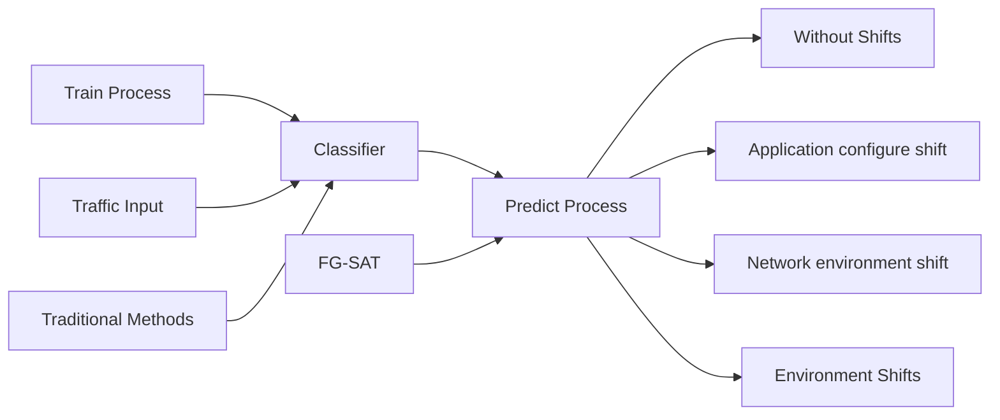
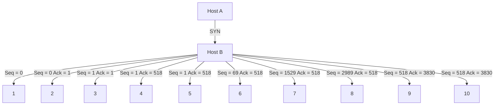
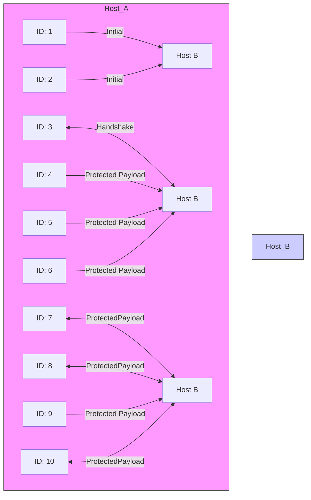
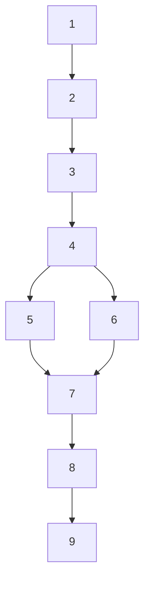
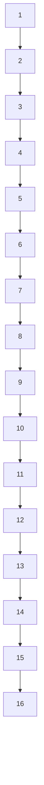
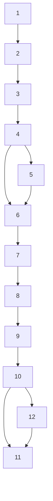
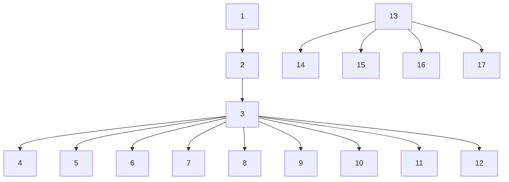

# FG-SAT: Efficient Flow Graph for Encrypted Traffic Classification Under Environment Shifts

Susu Cui , Xueying Han , Dongqi Han , Zhiliang Wang , Member, IEEE, Weihang Wang, Bo Jiang Baoxu Liu, and Zhigang Lu

Abstract—Encrypted traffic classification plays a critical role in network security and management. Currently, mining deep patterns from side-channel contents and plaintext fields through neural networks is a major solution. However, existing methods have two major limitations: 1) They fail to recognize the critical link between transport layer mechanisms and applications, missing the opportunity to learn internal structure features for accurate traffic classification. 2) They assume network traffic in an unrealistically stable and singular environment, making it difficult to effectively classify real-world traffic under environment shifts. In this paper, we propose FG-SAT, the first end-to-end method for encrypted traffic analysis under environment shifts. We propose a key abstraction, the Flow Graph, to represent flow internal relationship structures and rich node attributes, which enables robust and generalized representation. Additionally, to address the problem of inconsistent data distribution under environment shifts, we introduce a novel feature selection algorithm based on Jensen-Shannon divergence (JSD) to select robust node attributes. Finally, we design a classifier, GraphSAT, which integrates GraphSAGE and GAT to deeply learn Flow Graph features, enabling accurate encrypted traffic identification. FG-SAT exhibits both efficient and robust classification performance under environment shifts and outperforms stateof-the-art methods in encrypted attack detection and application classification.

Index Terms—Encrypted traffic, environment shifts, flow graph, feature selection, graph neural networks (GNNs).

# I. INTRODUCTION

RAFFIC encryption technology plays a significant role in enhancing network security and privacy. However,

Received 6 January 2025; revised 15 April 2025; accepted 12 May 2025. Date of publication 19 May 2025; date of current version 4 June 2025. This work was supported in part by the National Key Research and Development Program of China under Grant 2023YFC2206402, in part by the Strategic Priority Research Program of Chinese Academy of Sciences under Grant XDA0460100, in part by the Program of Key Laboratory of Network Assessment Technology, in part by Chinese Academy of Sciences, and in part by Program of Beijing Key Laboratory of Network Security and Protection Technology. The associate editor coordinating the review of this article and approving it for publication was Dr. Weizhi Meng. (Corresponding author: Bo Jiang.)

Susu Cui, Xueying Han, Bo Jiang, Baoxu Liu, and Zhigang Lu are with the Institute of Information Engineering, Chinese Academy of Sciences, Beijing 100085, China, and also with the School of Cyber Security, University of Chinese Academy of Sciences, Beijing 100049, China (e-mail: cuisusu@iie. ac.cn; hanxueying@iie.ac.cn; jiangbo@iie.ac.cn; liubaoxu@iie.ac.cn; luzhigang@iie.ac.cn).

Dongqi Han is with the School of Cyberspace Security, Beijing University of Posts and Telecommunications, Beijing 100876, China (e-mail: handongqi@bupt.edu.cn).

Zhiliang Wang is with the Institute for Network Sciences and Cyberspace, BNRist, Tsinghua University, Beijing 100084, China (e-mail: wzl@cernet.edu.cn).

Weihang Wang is with the Department of Computer Science, University of Southern California, Los Angeles, CA 90089 USA (e-mail: weihangw@usc.edu).

Digital Object Identifier 10.1109/TIFS.2025.3571663

it also poses challenges for security managers and internet service providers (ISPs). Firstly, malware can be encrypted and transmitted as easily as legitimate files. In fact, over 80% of malware spreads through TLS protocol [1]. Many malicious network attacks also employ encryption technology to conceal communication content [2]. Therefore, security managers need to identify encrypted traffic in order to inspect malicious encrypted traffic. Secondly, with the rapid growth of smart devices and new applications, network traffic is increasing geometrically. ISPs need to identify encrypted traffic to provide personalized services, enhancing network efficiency and service quality.

With traffic payloads encrypted, traditional classification methods become ineffective. However, studies show that machine learning and neural networks can classify encrypted traffic by analyzing its statistical, byte, and sequential features. Based on feature analysis, encrypted traffic classification can be divided into three methods: (1) Statistics-based methods [3], [4], [5], [6], [7], [8], [9], [10], [11] extract the side-channel statistical features and header fields to construct machine learning classifiers for traffic classification. (2) Byte-based methods [12], [13], [14], [15], [16] utilize the raw bytes of encrypted traffic and transform the classification task into an image classification task, using neural networks such as convolutional neural network (CNN) or capsule neural network (CapsNet) to learn the spatial features of raw bytes in traffic. (3) Sequence-based methods [17], [18], [19], [20] treat the traffic as the sequence of packets and extract the packet length and arrival time as the sequential features, and use the recurrent neural network (RNN) or Encoder-Decoder for classification.

Unfortunately, despite the progress made, there are still two primary limitations in existing works as follows:

Overlook the Critical Link Between Transport Layer Mechanisms and Applications: Transport layer features are intrinsically linked to applications. To communicate more efficiently, the TCP protocol uses a sliding window and acknowledgment mechanism to send multiple packets at the same time and a single acknowledgment number to confirm receipt of multiple packets. As a result, larger sliding windows are common for streaming applications to complete data transfer quickly, but instant messaging applications typically use a balanced exchange of received and acknowledgment packets. Therefore, encoding structural relationships between packets can be beneficial for encrypted traffic classification. However, existing works either do not consider the structural relationships between packets [21], [22] or are limited to specific classification scenarios and deployment locations [23], [24], [25], missing the opportunity to learn transport layer features for accurate and generic classification of the encrypted traffic.

flowchart

Fig. 1. The comparison with the traditional encrypted traffic classification methods. Traditional methods can only identify traffic matching the training set distribution, FG-SAT can classify traffic even under environment shifts.

Unrealistic Stable and Singular Network Environment: Current methods mainly focus on traffic classification in a stable and singular network environment, which is unrealistic in representing real-world traffic. As shown in Figure 1, network traffic is susceptible to environmental influences and undergoes long-term dynamic change [22], [26], [27], which we call environment shifts1 in this paper. Consider “browsing” applications as an example, their environment shifts can include new browser software, different browsing contents, and a change in network bandwidth, compared with the training data environment. If not handled properly, these changes can cause shifts in the distribution of traffic features, leading to poor classification performance.

To address the abovementioned limitations, we propose FG-SAT, the first end-to-end method for encrypted traffic classification in environment shifts. We define a key abstraction, the Flow Graph, to characterize the internal relationship structure based on the transport layer mechanisms inside a flow. The Flow Graph provides several key promises: (1) It treats packets as nodes and identifies structural relationships between packets using edges of multiple types that characterize the window and acknowledgment mechanisms. (2) It features a general representation that can represent diverse traffic types, include rich features, and adapt to environment shifts. (3) It also augments node attributes with header fields extracted from the 2-4 layers that are independent of encryption protocols.

To achieve high classification performance in environment shifts, we propose a robust feature selection algorithm to solve the problem of inconsistent data distribution. Specifically, our feature selection algorithm evaluates packet header fields and automatically selects those stable fields as node

attributes in the face of environment shifts. We use Jensen-Shannon divergence (JSD), a method for measuring similarity between two probability distributions, to assess the stability of features. Specifically, we compare the distribution differences between inter-class (with environment shifts) and extra-class (with varying traffic types) using JSD. When the extra-class JSD is greater than the inter-class JSD, we consider the features to be stable under environment shifts. Finally, we build a classifier based on graph neural networks (GNN), named GraphSAT, to identify encrypted traffic types. Graph-SAT combines GraphSAGE [28] and GAT [29] to deeply learn the structural relationships and rich node attributes of the Flow Graph, enabling efficient encrypted traffic classification.

# Our contributions are summarized as follows:

• We define a key abstraction, the Flow Graph, to represent encrypted flows, which features a general representation for diverse traffic, rich features and encryption protocol independence.   
• We propose a feature selection algorithm, which measures the distribution differences of features by evaluating header fields and selecting stable fields in environment shifts.   
• We design an encrypted traffic classifier based on GNN, which accurately learns the internal structure and node attributes of the Flow Graph from the raw traffic.   
• We conduct experiments using publicly available datasets for attack detection, malware detection and our own collected dataset for application classification. Our method outperforms state-of-the-art methods, increasing accuracy by 6.85% over pre-training methods and by 15.84% over traditional deep learning methods.   
• We evaluate the effects of environment shifts on encrypted traffic classification. The results show that as the environment shifts, all other methods’ accuracy decreases, whereas our JSD-based feature selection algorithm increases accuracy by 7.44%.

# II. RELATED WORK

# A. Methods on Encrypted Traffic Classification

1) Statistics-Based Methods: Statistics-based methods classify encrypted traffic using features like flow duration and packet count, applying machine learning to distinguish traffic types. Draper-Gil et al. [3] use time-related features and the C4.5 algorithm for classifying 12 service types. Other works propose features like packet count, peak, and time for encrypted web classification [4], [5], and enrich analysis with unencrypted field data for identifying malicious applications [6], [7]. Ede et al. [11] highlight the use of temporal correlations among destination-related features for generating application fingerprints. Feng et al. [33], [34] utilize the ratio of inbound traffic volume to outbound traffic volume and implement an enhanced KNN algorithm to achieve explainable DDoS attack detection. Feng et al. [35] aggregate multiple traffic flows and generate a fingerprint matrix to classify social bot traffic from real online social network user traffic. However, these methods face limitations including high time latency from processing complete flows, strong feature dependency limiting cross-protocol classification, and a lack of structural feature consideration, reducing accuracy under environment shifts.

TABLE I THE COMPARISON WITH THE EXISTING CLASSIFICATION METHODS FOR ENCRYPTED TRAFFIC CLASSIFICATION 

<table><tr><td rowspan="2">Categories</td><td rowspan="2">Method</td><td rowspan="2">Data</td><td colspan="4">Performance</td></tr><tr><td>Low Latency</td><td>Lightweight</td><td>Cross-Protocol</td><td>Strong Generalization</td></tr><tr><td>Statistics-based</td><td>FlowPrint [11]</td><td>Header fields</td><td>✕</td><td>√</td><td>√</td><td>✕</td></tr><tr><td rowspan="5">Byte-based</td><td>1dCNN [13]</td><td>Whole flow</td><td>√</td><td>√</td><td>✕</td><td>✕</td></tr><tr><td>CapsNet [14]</td><td>Whole flow</td><td>✕</td><td>✕</td><td>✕</td><td>✕</td></tr><tr><td>GTID [15]</td><td>Whole flow</td><td>✕</td><td>✕</td><td>✕</td><td>✕</td></tr><tr><td>ET-BERT [16]</td><td>Whole flow</td><td>✕</td><td>✕</td><td>√</td><td>√</td></tr><tr><td>YaTC [30]</td><td>Whole flow</td><td>✕</td><td>✕</td><td>√</td><td>√</td></tr><tr><td rowspan="4">Sequence-based</td><td>FlowPic [18]</td><td>Header fields</td><td>√</td><td>√</td><td>√</td><td>✕</td></tr><tr><td>FS-Net [19]</td><td>Header fields</td><td>✕</td><td>✕</td><td>√</td><td>✕</td></tr><tr><td>Rosetta [31]</td><td>Header fields</td><td>✕</td><td>✕</td><td>√</td><td>√</td></tr><tr><td>RF [32]</td><td>Header fields</td><td>✕</td><td>√</td><td>√</td><td>√</td></tr><tr><td rowspan="2">Graph-based</td><td>GraphDApp [20]</td><td>Header fields</td><td>√</td><td>√</td><td>√</td><td>✕</td></tr><tr><td>FG-SAT</td><td>Header fields</td><td>√</td><td>√</td><td>√</td><td>√</td></tr></table>

2) Byte-Based Methods: Byte-based methods classify encrypted traffic by feeding raw bytes into neural networks, avoiding manual feature extraction. Wang et al. [12], [13] use the first 784 bytes with CNNs for feature learning in malware and encrypted app classification, while Cui et al. [14] improve spatial and byte feature analysis using CapsNet. Han et al. [15] use Transformers on n-gram frequency vectors for flow feature learning. Lin et al. [16] and Zhao et al. [30] introduce pretraining models for generic traffic representation learning in a few-shot context. Byte-based methods simplify feature extraction but face challenges in cross-protocol classification due to plaintext fields in application protocols. These methods may not fully utilize byte information, including timestamps that risk overfitting and hamper generalization across environment shifts. Additionally, while focusing on spatial and temporal traffic byte features, they neglect structural aspects.

3) Sequence-Based Methods: Sequence-based methods utilize packet length and time interval sequences, applying models like LSTM and Encoder-Decoder to understand sequence relationships. Ramezani et al. [17] use the server name from Client Hello packets for fingerprints. Shapira and Shavitt [18] develop FlowPic, an image from packet size and arrival times, analyzed with CNN. Liu et al. [19] introduce FS-Net, leveraging LSTM-based Encoder-Decoder to explore packet length sequences for classification. Akbari et al. [36] combine bytes, statistics and sequences features to achieve classification. Guthula et al. [37] integrate multi-level sequences of packets, bursts, and flows to construct traffic tokens for pretraining and fine-tuning the foundation model. Sequence-based methods analyze packet relationships in a flow but face challenges with environment shifts like network congestion, bandwidth changes, and application updates, affecting sequence consistency and accuracy across environments. Additionally, they sort by packet arrival time, missing varied packet structure representations.

# B. Graph-Based Methods on Traffic Analysis

Graph construction methods are task-specific. For intrusion detection, IPs or domains serve as nodes, with edges representing communication for anomaly detection. However, this approach is unsuitable for general encrypted traffic classification. Fu et al. [23] use network interaction graphs for unsupervised anomaly detection via clustering loss but is not suited for multi-class classification. Similarly, Fu et al. [24] build a heterogeneous graph to detect host infections based on temporal-spatial features, but this approach lacks flexibility for application classification since a host can produce diverse traffic types. In application classification, graphs model communication relationships for traffic classification. Pham et al. [25] use IPs and ports as nodes, converting app traffic into a graph for fingerprinting, but it assumes uniform traffic labels, limiting it to endpoint classification rather than gateway analysis. Shen et al. [20] construct flow-specific graphs with packet length and direction, using a GNN to learn flow structures, though simple node features reduce effectiveness in complex networks. Overall, IPs are mainly used as nodes to construct network interaction graphs for analysis. However, they have limitations in general traffic classification tasks, such as classification scenarios and deployment locations.

# C. Comparison With Existing Classification Methods

We compare FG-SAT with related classification methods, focusing on four performance aspects, as shown in Table I.

Low latency takes into account both the feature construction time and the model prediction time. Generally, a longer flow aggregation time is required for feature calculation on the complete flow, resulting in higher latency. Additionally, complex models with longer prediction times can also contribute to higher latency. As a result, 1dCNN, FlowPic, and GraphDApp can achieve low latency in both feature construction and model prediction. Lightweight performance considers memory and computation requirements, often determined by the model’s complexity. FlowPrint, 1dCNN, FlowPic, RF and GraphDApp employ models with fewer parameters and simpler computations, thus offering a lightweight advantage. Cross-protocol capability is essential for general classification across multiple protocols. Methods using the complete flow content, like 1dCNN, CapsNet, and GTID, face challenges with crossprotocol classification due to embedded application-specific content. However, ET-BERT and YaTC overcome this by leveraging extensive unlabeled data to pre-train a model that achieves cross-protocol performance. Strong generalization reflects the method’s adaptability across different data distributions or network conditions. Among related methods, ET-BERT and YaTC achieve generalized flow representation through pre-training on large unlabeled traffic datasets, while Rosetta and RF enhance generalization through data augmentation and robust representation.

```mermaid
graph TD
    A["Packet header"] --> B["Flow"]
    C["Ethernet header"] --> B
    D["IP header"] --> B
    E["TCY/UDP header"] --> B
    B --> F["1. Flow Graph Construction"]
    F --> G["2. JSD-based Feature Selection"]
    G --> H["3. GraphSAT for Encrypted Traffic Classification"]
    
    subgraph Flow Construction
        I["Host A"] --> J["Host B"]
        K["Window relationship"] --> L["Graph"]
        M["JSD_inter"] --> N["Stable features"]
        O["JSD_inter <JSD_extra"] --> N
        P["JSD_inter ≥JSD_extra"] --> N
    end
    
    subgraph GraphSAT for Encrypted Traffic Classification
        Q["GraphSAGE Block"] --> R["ReLu"]
        S["Feature aggregation"] --> T["GAT Block × 2"]
        U["Attention coefficient"] --> V["Readout"]
        W["Feature aggregation"] --> X["Mean"]
        Y["Classifier"] --> Z["Output"]
    end
    
    subgraph JSD-based Feature Selection
        AA["JSD_inter"] --> AB["Stable features"]
        AC["JSD_inter <JSD_extra"] --> AB
        AD["JSD_inter ≥JSD_extra"] --> AB
        AE["JSD_inter ≥JSD_extra"] --> AB
    end
    
    subgraph GraphSAT for Encrypted Traffic Classification
        AF["Neighborhood"] --> AG["Neighborhood"]
        AH["Feature aggregation"] --> AI["Feature aggregation"]
        AJ["Attention coefficient"] --> AK["Attention coefficient"]
        AL["Feature aggregation"] --> AM["Feature aggregation"]
        AN["Softmax"] --> AO["Softmax"]
        AP["Attention coefficient"] --> AQ["Attention coefficient"]
        AR["Feature aggregation"] --> AS["Feature aggregation"]
        AT["Attention coefficient"] --> AU["Attention coefficient"]
        AV["Feature aggregation"] --> AW["Feature aggregation"]
        AX["Attention coefficient"] --> AY["Attention coefficient"]
        AZ["Feature aggregation"] --> BA["Feature aggregation"]
        BB["Attention coefficient"] --> BC["Attention coefficient"]
        BD["Feature aggregation"] --> BE["Feature aggregation"]
        BF["Attention coefficient"] --> BG["Attention coefficient"]
        BH["Feature aggregation"] --> BI["Feature aggregation"]
        BJ["Attention coefficient"] --> BK["Attention coefficient"]
        BL["Feature aggregation"] --> BM["Feature aggregation"]
        BN["Attention coefficient"] --> BO["Attention coefficient"]
        BP["Feature aggregation"] --> BPB["Feature aggregation"]
        BPB --> BPB
    end
    
    subgraph Output
        B1["PortScan"] --> B2["Botnet"] --> B3["..."]
        B4["DoS"] --> B5["Attack classification"] --> B6["..."]
        B7["Browsing"] --> B8["Chat"] --> B9["..."]
        B10["Streaming Application classification"] --> B11["Browsing"] --> B12["Browsing"] --> B13["Browsing"] --> B14["Browsing"] --> B15["Browsing"] --> B16["Browsing"] --> B17["Browsing"] --> B18["Browsing"] --> B19["Browsing"] --> B20["Browsing"] --> B21["Browsing"] --> B22["Browsing"] --> B23["Browsing"] --> B24["Browsing"] --> B25["Browsing"] --> B26["Browsing"] --> B27["Browsing"] --> B28["Browsing"] --> B29["Browsing"] --> B30["Browsing"] --> B31["Browsing"] --> B32["Browsing"] --> B33["Browsing"] --> B34["Browsing"] --> B35["Browsing"] --> B36["Browsing"] --> B37["Browsing"] --> B38["Browsing"] --> B39["Browsing"] --> B40["Browsing"] --> B41["Browsing"] --> B42["Browsing"] --> B43["Browsing"] --> B44["Browsing"] --> B45["Browsing"] --> B46["Browsing"] --> B47["Browsing"] --> B48["Browsing"] --> B49["Browsing"] --> B50["Browsing"] --> B51["Browsing"] --> B52["Browsing"] --> B53["Browsing"] --> B54["Browsing"] --> B55["Browsing"] --> B56["Browsing"] --> B57["Browsing"] --> B58["Browsing"] --> B59["Browsing"] --> B60["Browsing"] --> B61["Browsing"] --> B62["Browsing"] --> B63["Browsing"] --> B64["Browsing"] --> B65["Browsing"] --> B66["Browsing"] --> B67["Browsing"] --> B68["Browsing"] --> B69["Browsing"] --> B70["Browsing"] --> B71["Browsing"] --> B72["Browsing"] --> B73["Browsing"] --> B74["Browsing"] --> B75["Browsing"] --> B76["Browsing"] --> B77["Browsing"] --> B78["Browsing"] --> B79["Browsing"] --> B80["Browsing"] --> B81["Browsing"] --> B82["Browsing"] --> B83["Browsing"] --> B84["Browsing"] --> B85["Browsing"] --> B86["Browsing"] --> B87["Browsing"] --> B88["Browsing"] --> B89["Browsing"] --> B90["Browsing"] --> B91["Browsing"] --> B92["Browsing"] --> B93["Browsing"] --> B94["Browsing"] --> B95["Browsing"] --> B96["Browsing"] --> B97["Browsing"] --> B98["Browsing"] --> B99["Browsing"] --> B100["Browsing"]
    end
```

flowchart

Fig. 2. The framework of FG-SAT, including 1. Flow Graph construction, 2. JSD-based feature selection, 3. GraphSAT for encrypted traffic classification.

In contrast, FG-SAT is designed with practical deployment considerations in mind, achieving a balance of low latency, lightweight structure, cross-protocol capability, and strong generalization. This integrated approach makes FG-SAT wellsuited for real-world applications.

# III. PROBLEM DESCRIPTION AND CORE IDEA

# A. Problem Description

In this paper, we classify encrypted traffic into types such as application, attack, and malware. Encrypted traffic consists of client-server packets encrypted with protocols like TLS, SSH, and Tor, obscuring content while leaving some header information visible. We treat bidirectional flow, defined by five-tuple information (source IP, destination IP, source port, destination port, transport protocol), as the classification object, modeling each flow as a graph for classification using a GNN-based method.

Moreover, we focus on the traffic classification at the firewall and local ISP network nodes, which are typically deployed in enterprise networks. These nodes are primarily responsible for identifying network-side attacks, such as DDoS or port scanning. Therefore, our method specifically targets the detection of network-based attacks. Additionally, our goal is to design an end-to-end system that captures simple traffic information at the edge of the enterprise network for traffic classification. This system ultimately supports resource optimization and security monitoring within enterprise networks through encrypted traffic classification.

# B. Core Idea

We introduce FG-SAT to achieve efficient encrypted traffic classification, as shown in Figure 2. Firstly, we define a key abstraction, the Flow Graph, that can represent multiple relationships between packets within the same flow and contains rich node attributes. It comprehensively mines the statistical, sequential, and structural features of encrypted traffic. Secondly, we propose a novel JSD-based feature selection algorithm for environment shifts. It can evaluate and select a stable set of features in dynamic and variable traffic environments. Finally, we establish a GNN-based encrypted traffic classifier, named GraphSAT, which fully explores the internal relationships between different nodes within the Flow Graph and rich node attributes, achieving efficient encrypted traffic classification.

During Flow Graph construction, each flow is viewed as a graph, capturing its statistical, sequential, and structural features for a comprehensive feature representation. Packets serve as nodes, with relationships defined by transport layer mechanisms and node attributes derived from header fields like packet length, arrival time, direction, TTL, and window size. These attributes are essential for encrypted traffic classification [38]. The transport layer’s window size, vital for classification, indicates the communication type, with the TCP protocol’s sliding window mechanism adjusting for efficient, reliable transmission tailored to the application’s needs, such as larger windows for streaming traffic to ensure high throughput. To depict the flow’s internal structure, we establish two types of relationships:

• Window relationship: The client or server sends multiple packets continuously, and these packets are connected in sequence based on their arrival time to form the window relationship.   
• Acknowledgment relationship: The client or server acknowledges the received packets so that the packet and its corresponding acknowledgment packet form the acknowledgment relationship.

Due to the environment shifts, including changes in application configuration and network environment, network traffic is in a state of constant change, causing traditional encrypted traffic classification methods to lose accuracy [27], [39]. To address this, we introduce a JSD-based feature selection algorithm that assesses feature stability across different environments by measuring inter-class and extra-class distribution differences with JSD. This algorithm helps select stable distribution features as final node attributes amidst environment shifts.

We also develop GraphSAT, a GNN-based classifier, combining GraphSAGE and GAT to analyze Flow Graph’s structure and node attributes. GraphSAGE samples neighbors to enhance generalization and reduce memory use, while GAT assesses neighbor importance. GraphSAT effectively and accurately classifies encrypted traffic types.

# IV. CONSTRUCTION AND ANALYSIS OF FLOW GRAPH

In this section, we describe the flow graph construction (as shown in module 1 of Figure 2) and analysis on flow graph.

# A. Flow Graph Construction

To achieve an end-to-end encrypted traffic classification, we convert the raw traffic into the Flow Graph. Firstly, we aggregate traffic based on flow granularity. In long-term services such as file transfers or malicious C&C communication, the duration of a flow can be last for several hours. In order to perform efficient traffic classification, we only extract the first n packets of a flow to establish a Flow Graph, where n is considered a hyperparameter of our method.

After traffic aggregation, we construct the Flow Graph consisting of no more than n packets. In this paper, a Flow Graph is defined as G(V E) consisting of n nodes and m edges. $V = \{ \nu _ { 1 } , \nu _ { 2 } , \ldots , \nu _ { n } \}$ is the set of nodes, with each node , , . . . ,representing a packet within the flow. The node attributes of the node v, denoted as $x _ { \nu } ,$ are a vector representation, including packet header, ethernet header, IP header and TCP/UDP header. We delete Mac and IP addresses, convert hexadecimal values to decimal and normalize in the preprocessing step. However, some fields may not be effective in environment shifts. Therefore, we use the JSD-based feature selection algorithm to evaluate and select the stable fields as the final node attributes, with details provided in Section V.

$E = \{ e _ { 1 } , e _ { 2 } , \ldots , e _ { m } \}$ is the set of edges, where each $e \in E$ , , . . . ,represents the relationship between packets, including window and acknowledgment relationships, defined as follows:

• Window relationship: When multiple packets are sent continuously from sender to receiver, they connect in sequence by arrival time, forming a window relationship. All packets in a window are contiguous and share the same direction. They also share the same ACK number.   
• Acknowledgment relationship: When the receiver acknowledges received packets, these packets and their corresponding acknowledgment packet form an acknowledgment relationship, with packets traveling in opposite directions. For TCP, this relationship is based on SEQ and ACK numbers. For UDP, adjacent packets in opposite directions are considered to have an acknowledgment relationship.

We analyze TCP and UDP flows to understand their transmission behaviors and Flow Graph construction. In TCP flows (Figure 3), packets are graph nodes represented by header fields. Packets within the same window share direction, continuity, and ACK number, forming window relationships based on arrival times. Acknowledgment relationships occur when the receiver’s ACK matches the sender’s SEQ plus packet length. Thus, nodes in the same window, like nodes 5-9, share window and acknowledgment relationships, often connected to a common node.

flowchart

Fig. 3. An example of Flow Graph on TCP flow. Packets are sorted according to their arrival time, and we use two colors to denote relationships. Orange represents the window relationship, while blue indicates the acknowledgment relationship.

flowchart

Fig. 4. An example of Flow Graph on UDP flow. Packets are sorted according to their arrival time, and we use two colors to denote relationships. Orange represents the window relationship, while blue indicates the acknowledgment relationship.

For UDP flows (Figure 4), lacking SEQ and ACK fields, TCP’s reliability mechanisms are absent. Here, packets with shared direction and continuity form a window, and adjacent packets in opposite directions have acknowledgment relationships. In both TCP and UDP, windowed nodes share acknowledgment ties with a specific node, simplifying UDP Flow Graph construction.

# B. Analysis on Flow Graph

In this section, we describe and compare the Flow Graphs of different encrypted traffic types. We focus on the overall graph structure rather than node attributes. Based on the definition of Flow Graph mentioned above, we construct Flow Graphs for four types of encrypted traffic, Bot, DoS, Email, and Streaming, as shown in Figure 5. It can be seen that different types of encrypted traffic have different graph structures. Bot traffic is primarily controlled by streamlined commands, so it has a small window size and frequent acknowledgment. DoS attack sends packets with large window size at the beginning of the TCP connection. Emails generally transmit plaintext content, thus, the upload and download windows are similar in size. Streaming servers typically send large window size packets to clients because they download data more than they upload. Thus, different types of traffic exhibit different internal transmission structures based on the content of their upper-layer applications. Flow Graphs can clearly represent the internal structure of traffic through the edge relationships.

flowchart

Bot

flowchart

DoS

flowchart

Email

flowchart

Streaming   
Fig. 5. Examples of Flow Graph with different labels. Flow graphs with different labels exhibit significant structural differences.

# V. JSD-BASED ALGORITHM FOR FEATURE SELECTION

In this section, we introduce a JSD-based feature selection algorithm (as shown in module 2 in Figure 2) to assess inter-class and extra-class distribution differences under environment shifts, selecting stable features for accurate representation. JSD measures similarity between two probability distributions, addressing the asymmetry of KL divergence [40]. Given two distributions P and $Q ,$ with density functions p(x) and q(x) at point x, JSD is defined as follows:

$$
J S D (P, Q) = \frac {1}{2} (D _ {K L} (P \| M) + D _ {K L} (Q \| M)) \tag {1}
$$

$$
D _ {K L} (P, Q) = \sum_ {i} P (i) \log \frac {P (i)}{Q (i)} \tag {2}
$$

$$
M = \frac {1}{2} (P + Q) \tag {3}
$$

where $D _ { K L }$ denotes the KL divergence, and M is the intermediate distribution between P and Q. The JSD value ranges from 0 to 1, with 0 indicating that the two distributions are identical and 1 signifying both distributions are completely different.

The JSD-based feature selection algorithm is described in Algorithm 1 for multi-class classification tasks. Note that we only use labeled data from the training set for feature evaluation and selection. We evaluate the inter-class and extraclass JSD of each feature for every class. We create three datasets from the training set: $T _ { I }$ and $T _ { I I }$ for evaluating the inter-class JSD of the traffic, and $T _ { I }$ and $T _ { I I I }$ for evaluating the extra-class JSD. For example, when we evaluate the difference in feature distribution between “browsing” and other labels, we can divide “browsing” traffic into two non-overlapping datasets $T _ { I }$ and $T _ { I I }$ based on shift factors.2 Specifically, we randomly

2The shift factor refers to the internal variables and their values that cause environment shifts, such as access content (Blog, Map, Picture, Video), bandwidth (20Mbps, 100Mbps).

Algorithm 1 JSD-Based Feature Selection Algorithm   
1: Input: Training set data T, label L, candidate feature set F, shift factor EL (optional), number of samples for each class Len.
2: Output: Stable feature set under environment shifts Z.
3: Variables:
4: $T_{I}, T_{II}, T_{III} \leftarrow$ subsets of T, all three mutually exclusive.
5: $EL_{I}, EL_{II} \leftarrow$ : subsets of EL, two are mutually exclusive.
6: $FD \leftarrow$ : JSD difference matrix, $FD[f, l]$ denotes the JSD difference of label $l \in L$ in feature $f \in F$ .
7: procedure JSD DIFFERENCE CALCULATION(T, L, EL, F)
8: $EL_{I}, EL_{II} \leftarrow$ two empty lists.
9: if EL is True then
10: Randomly divide EL into $EL_{I}$ and $EL_{II}$ , which of them have different environment settings.
11: end if
12: for l in L do
13: $T_{I} \leftarrow$ data labeled as l and el belongs to $EL_{I}$ .
14: $T_{II} \leftarrow$ data whose label is l and el belongs to $EL_{II}$ .
15: $T_{III} \leftarrow$ data whose label is not l.
16: for f in F do
17: $FD[f][l] \leftarrow JSD(T_{I}[f], T_{II}[f]) - JSD(T_{I}[f], T_{III}[f])$ 18: end for
19: end for
20: return FD.
21: end procedure
22: procedure STABLE FEATURE SELECTION(FD, Len)
23: for fd in FD do
24: diff $\leftarrow \sum_{i=1}^{n} fd_{i} \times Len_{i}$ , where n is the number of types.
25: if diff < 0 then
26: Add the feature f to Z.
27: end if
28: end for
29: return Z.
30: end procedure

split the factors of “browsing” into two non-overlapping sets: $E L _ { I }$ and $E L _ { I I } .$ , as shown in Table II. Subsequently, we allocate the traffic belonging to $E L _ { I }$ into $T _ { I }$ and the traffic belonging to $E L _ { I I }$ into $T _ { I I } .$ . If there is no factor present, $T _ { I }$ and $T _ { I I }$ are obtained by randomly dividing “browsing” traffic. In contrast, $T _ { I I I }$ is the traffic of other labels, in this example, that include chat, email, file and streaming.

TABLE II THE STATISTICS OF EXPERIMENTAL DATASETS 

<table><tr><td>Label</td><td>Factor</td><td>Count</td><td>Ratio</td></tr><tr><td>Browsing</td><td>Content: [Blog, Map, Picture, Video]Bandwidth: [20Mbps, 100Mbps]Browser: [Google, Edge]Speed of opening new pages: [1s, 10s]</td><td>12272</td><td>66.88%</td></tr><tr><td>Chat</td><td>Content: [Picture, Video, Text, Voice]APP: [Facebook, WeChat]</td><td>1518</td><td>8.27%</td></tr><tr><td>Email</td><td>APP: [Outlook, Google]Action: [Send, Read]</td><td>4810</td><td>13.11%</td></tr><tr><td>File</td><td>Content: [MP4, Word, Zip file]Action: [Upload, Download]</td><td>1179</td><td>6.43%</td></tr><tr><td>Streaming</td><td>Resolution: [270, 480, 720, 1080]Playback: [0.5, 1.0, 1.25, 1.5, 2.0]</td><td>1686</td><td>5.31%</td></tr><tr><td>Overall</td><td></td><td>18349</td><td>100%</td></tr></table>

We calculate the inter-class and extra-class JSD for each feature using $T _ { I } , T _ { I I } .$ , and $T _ { I I I }$ to assess feature stability across environments. A feature is retained if its inter-class JSD is smaller than its extra-class JSD, indicating stability. For multiclass classification, we evaluate overall feature stability across classes, weighted by sample count per class.

In this paper, we use header fields as node attributes, noting their distribution can vary across different environments. For instance, the type of content in instant messaging, like text or multimedia, impacts packet length distribution, and network bandwidth influences arrival time fields. To address this, we apply a feature selection algorithm described in Algorithm 1 for encrypted traffic classification tasks, choosing stable header fields as final node attributes to accurately characterize encrypted traffic.

# VI. GRAPHSAT CLASSIFIER FOR ENCRYPTED TRAFFIC CLASSIFICATION

In this section, we describe the GraphSAT classifier (as shown in module 3 of Figure 2). We provide a general overview and a detailed description of its architecture.

# A. Overview

To deeply mine the rich feature representation and internal structure relationships of the Flow Graph, we propose GraphSAT, as shown in Figure 2. GraphSAT is a GNN-based model to whole-graph classification. The key steps of GNNs performing whole-graph classification are as follows:

• Node embeddings: GNNs first embed each node in the graph. Typically, It is accomplished by propagating and aggregating information between the node and its neighbors.   
• Graph embedding: GNNs need to learn a global representation of the graph from the node embeddings. The graph embedding captures the structural information and features of the entire graph.   
• Classification: The graph embedding is fed into a fully connected layer to predict the graph’s category.

GraphSAT integrates GraphSAGE and GAT to deeply learn the internal structure of the Flow Graph, and can efficiently and accurately classify encrypted traffic types. Firstly, GraphSAT introduces GraphSAGE to aggregate nodes through neighbor sampling, which effectively reduces memory usage and computation time. Additionally, through neighbor sampling, we transform the direct transductive node representation into an inductive node representation, which can effectively prevent overfitting during training and enhance generalization capability. Secondly, GraphSAT introduces GAT to learn the relationships between nodes. GAT assigns different weights to neighbors through attention mechanism [41], which can capture important neighbors while weakening the correlation of low-relevance neighbors. Therefore, we use GraphSAGE and GAT to learn the node embeddings, and then we get the graph embeddings by the mean pooling and finally classify them by the softmax function.

# B. GraphSAT Architecture

GraphSAT takes the Flow Graph as input and learns the internal structure features and rich node attributes to achieve efficient and accurate encrypted traffic classification. The structure of GraphSAT mainly consists of GraphSAGE Block, GAT Block, Readout, and Classifier, which we will introduce below.

1) GraphSAGE Block: GraphSAT takes the Flow Graph as input and learns the internal structure features and rich node attributes to achieve efficient and accurate encrypted traffic classification. Firstly, we use GraphSAGE to gather local node information in the Flow Graph and compute node embeddings. It learns node representations by sampling and aggregating features from each node’s local neighbors. The GraphSAGE block consists of two steps: neighbor sampling and feature aggregation.

Neighbor sampling: For each node, a fixed number of neighbors S is sampled to ensure efficient computation. It defines a hop count K for neighbor sampling, enhancing distant neighbor information capture. We set $K = 2$ , sampling $S _ { 1 }$ first-order and $S _ { 2 }$ second-order neighbors for each node.

Feature aggregation: To create the target node’s embedding, the feature vectors of sampled neighbors are averaged from second-order to first-order, concluding with the target node. Average aggregation combines neighbor embeddings dimension-wise, followed by a non-linear transformation, defined as follows:

$$
h _ {v} ^ {k} = \sigma (W \cdot \text { MEAN } (h _ {v} ^ {k - 1} \cup h _ {u} ^ {k - 1}), \forall u \in \mathcal {N} _ {v}) \tag {4}
$$

where $h _ { \nu } ^ { k }$ is the k-th layer node v feature vector, $\mathcal { N } _ { \nu }$ is $\nu \mathbf { \dot { s } }$ neighbor set, $\sigma$ denotes the activation function, and W is the σk-th layer’s trainable weight matrix.

2) GAT Block: We obtain the first layer of node embeddings using GraphSAGE. Next, we further calculate node importance and generate new embeddings using GAT. It assigns different learning weights to different neighbors for learning the interrelationships between nodes. GAT Block consists of two processes, calculating attention coefficients and feature aggregation.

Attention coefficient: Each attention coefficient is learned through the self-attention mechanism, where each node in the graph learns the weight for each of its neighbors based on their respective feature vectors. The definition of the attention coefficient is as follows:

$$
\alpha_ {i, j} = \frac {\exp (\text {LeakyReLU} (a [ W h _ {i} \| W h _ {j} ]))}{\sum k \in \mathcal {N} _ {i} \exp (\text {LeakyReLU} (a ^ {T} [ W h _ {i} \| W h _ {k} ]))} \tag {5}
$$

where $\alpha _ { i , j }$ represents the attention coefficient for the edge α ,between nodes i and j, W is a weight matrix, $h _ { i }$ and $h _ { j }$ are the feature vectors for nodes i and j, respectively, Ni is the set of neighbors of node i, || represents concatenation, and LeakyReLU is the leaky rectified linear unit activation function. The vector a is a learnable parameter vector that is shared across all nodes and is used to calculate the compatibility score between node attributes.

Feature aggregation: According to the attention coefficient, we aggregate the node attributes by weighting and summing them to obtain the embedded representation of the aggregated node. It is defined as follows:

$$
h _ {i} ^ {\prime} = \sigma \left(\sum_ {j \in N _ {i}} \alpha_ {i j} W h _ {j}\right) \tag {6}
$$

where $h _ { i } ^ { \prime }$ is the new feature output by GAT for each node i, which incorporates neighbors information, and $\sigma$ is the activation function. In addition, we use multi-head attention to enhance the node attributes, which is defined as follows:

$$
\overrightarrow {h _ {i}} = \left\| _ {k = 1} ^ {K} h _ {i} ^ {(k)} \right. \tag {7}
$$

where K is the number of attention heads. The final output $\overrightarrow { h _ { i } }$ is the concatenation of the outputs from all attention heads.

3) Readout: After the GraphSAGE and GAT processing, we generate node embeddings for the Flow Graph. To represent the whole graph, we use a global mean pooling to derive the graph’s overall representation vector, defined as:

$$
\mathcal {R} (\mathbf {H}) = \sigma \left(\frac {1}{N} \sum_ {i = 1} ^ {N} \mathbf {h} _ {i}\right) \tag {8}
$$

where R(H) is the whole graph’s embedding, hi represents the i-th node’s feature, and  refers to the sigmoid function.

4) Classifier: The classifier consists of dropout, linear, and softmax layers to prevent overfitting and classify encrypted traffic. Dropout layers randomly omit nodes to reduce interactions and overfitting, serving as regularization. Linear layers map high-dimensional data to a lower-dimensional label space, with the softmax layer finalizing classification. We concentrate on classifying encrypted traffic according to application type, attack type and malware type.

# VII. EXPERIMENT AND EVALUATION

# A. Experiment Setting

1) Task and Datasets: We evaluate our proposed method through four encrypted traffic classification tasks:

Application classification and Application shift classification: The aim is to identify and classify the types of applications transmitted in encrypted traffic, such as chat, email and streaming. To evaluate environment shifts, we collect a new application dataset, APP-SHIFTS, capturing encrypted application traffic in a campus network. When a user accesses an encrypted application on a PC, the generated traffic is saved on a data server using a traffic capture tool. Environment shifts are simulated by a total of 72 factors, including content, bandwidth, and resolution. The dataset is collected using a combination of manual interactions and scripted actions. Manual interactions involve engaging with specific applications, such as reading emails in Outlook. Meanwhile, scripts are employed to control the shift factors and execute specific actions with the applications. For example, a script may randomly generate text content and send it via WeChat, simulating user interactions while capturing the associated traffic. In the application shift classification task, training and test sets have non-overlapping shift factors to simulate environment shifts. In contrast, in the traditional application classification task, traffic is randomly divided into training and test sets ignoring environment shifts. Dataset statistics are summarized in Table II.

Attack detection: It is identifying and detecting malware activities in encrypted traffic, such as Zeus, Emotet. We use the publicly available CIC-IOT2023 [42] dataset, which contains benign and the most up-to-date common attacks resembling real-world traffic. To construct environment shifts in attack detection, we partition data according to the IP pair method, ensuring that traffic from the same IP pair exists only in either the training set or the test set. Additionally, we enhance the realism of environment shifts by supplementing the “Benign” class traffic with APP-SHIFTS dataset.

Malware detection: It is detecting network attack behaviors in encrypted traffic, such as DDoS, port scanning. We use the publicly available Malware Capture Facility Project [43] dataset to evaluate the proposed method’s capability in malware detection. From this dataset, we select six well-known types of malware, including Zeus, Dridex, DownloadGuide, Wisdomeyes, Wannacry, and Trickbot, along with benign HTTPS traffic. The malware samples vary by capture time and variants to reflect environment shifts, while the benign traffic includes visits to different types of websites to reflect environment shifts.

2) Baseline Methods: To evaluate the performance of FG-SAT, we summarize the following baseline methods:

• FlowPrint [11]: It is a semi-supervised mobile app fingerprinting method using temporal correlations.   
• 1dCNN [13]: It uses the first 784 bytes of encrypted flows and applies 1dCNN for classification.   
• CapsNet [14]: It leverages CapsNet to learn spatial and location features of encrypted flows.   
• GTID [15]: It computes n-gram frequencies and uses transformers for feature learning.   
• ET-BERT [16]: It is a pre-training model for generic traffic representation and fine-tuning.   
• YaTC [30]: It is an Autoencoder-based traffic classification with hierarchical flow representation.   
• FlowPic [18]: It creates flow images from packet size and time, which are classified via CNN.

TABLE IIITHE RESULTS AND COMPARISON WITH BASELINE METHODS

<table><tr><td rowspan="2">Categories</td><td rowspan="2">Method</td><td colspan="2">Attack Detection</td><td colspan="2">Malware Detection</td><td colspan="2">APP Classification</td><td colspan="2">APP Shift Classification</td></tr><tr><td> $F_1$ </td><td>Acc</td><td> $F_1$ </td><td>Acc</td><td> $F_1$ </td><td>Acc</td><td> $F_1$ </td><td>Acc</td></tr><tr><td>Statistics-based</td><td>FlowPrint</td><td>0.4421</td><td>0.4458</td><td>0.5004</td><td>0.5599</td><td>0.8082</td><td>0.8867</td><td>0.4720</td><td>0.7370</td></tr><tr><td rowspan="5">Byte-based</td><td>1dCNN</td><td>0.5440</td><td>0.5515</td><td>0.7988</td><td>0.7740</td><td>0.7105</td><td>0.8017</td><td>0.4913</td><td>0.7781</td></tr><tr><td>CapsNet</td><td>0.5716</td><td>0.6126</td><td>0.7478</td><td>0.7582</td><td>0.7791</td><td>0.8460</td><td>0.7251</td><td>0.8160</td></tr><tr><td>GTID</td><td>0.6229</td><td>0.6127</td><td>0.8263</td><td>0.8228</td><td>0.8088</td><td>0.8711</td><td>0.7728</td><td>0.8220</td></tr><tr><td>ET-BERT</td><td>0.7607</td><td>0.7823</td><td>0.8701</td><td>0.8783</td><td>0.8915</td><td>0.9214</td><td>0.8022</td><td>0.8614</td></tr><tr><td>YaTC</td><td>0.7750</td><td>0.7792</td><td>0.8543</td><td>0.8551</td><td>0.9028</td><td>0.9299</td><td>0.7840</td><td>0.8257</td></tr><tr><td rowspan="4">Sequence-based</td><td>FlowPic</td><td>0.6515</td><td>0.6471</td><td>0.7914</td><td>0.7836</td><td>0.7828</td><td>0.8695</td><td>0.7022</td><td>0.8243</td></tr><tr><td>FS-Net</td><td>0.6582</td><td>0.6528</td><td>0.8270</td><td>0.8227</td><td>0.7513</td><td>0.8597</td><td>0.7115</td><td>0.8377</td></tr><tr><td>Rosetta</td><td>0.6197</td><td>0.6160</td><td>0.7780</td><td>0.7602</td><td>0.8033</td><td>0.8664</td><td>0.5587</td><td>0.7544</td></tr><tr><td>RF</td><td>0.7006</td><td>0.7124</td><td>0.8444</td><td>0.8409</td><td>0.7299</td><td>0.8501</td><td>0.7137</td><td>0.8383</td></tr><tr><td rowspan="3">Graph-based</td><td>GraphDApp</td><td>0.6922</td><td>0.6924</td><td>0.8140</td><td>0.8116</td><td>0.8408</td><td>0.8618</td><td>0.5916</td><td>0.8154</td></tr><tr><td>FG-SAT full</td><td>0.7556</td><td>0.7764</td><td>0.8750</td><td>0.8751</td><td>0.8906</td><td>0.9468</td><td>0.7380</td><td>0.8406</td></tr><tr><td>FG-SAT (Ours)</td><td>0.8330</td><td>0.8508</td><td>0.9364</td><td>0.9416</td><td>0.8991</td><td>0.9516</td><td>0.8124</td><td>0.8979</td></tr></table>

TABLE IVCOMPARISON RESULTS OF TIME AND PARAMETERS WITH BASELINE METHODS

<table><tr><td>Method</td><td>FlowPrint</td><td>1dCNN</td><td>CapsNet</td><td>GTID</td><td>ET-BERT</td><td>YaTC</td><td>FlowPic</td><td>FS-Net</td><td>Rosetta</td><td>RF</td><td>GraphDApp</td><td>FG-SAT full</td><td>FG-SAT (Ours)</td></tr><tr><td>Time (ms)</td><td>594.36</td><td>5.16</td><td>185.57</td><td>267.18</td><td>289.74</td><td>396.23</td><td>9.63</td><td>210.27</td><td>131.97</td><td>12.41</td><td>9.42</td><td>5.03</td><td>4.82</td></tr><tr><td>Params</td><td>-</td><td>5825413</td><td>7592976</td><td>893797</td><td>132129797</td><td>1858949</td><td>1597219</td><td>2250451</td><td>11402479</td><td>130176</td><td>35205</td><td>44293</td><td>43013</td></tr></table>

• FS-Net [19]: It uses packet length sequences and an LSTM-based Encoder-Decoder.   
• Rosetta [31]: It enhances TLS classification with TCPaware augmentation and self-supervised learning.   
• RF [32]: It is a CNN-based Tor traffic fingerprinting with traffic aggregation matrix.   
• GraphDApp [20]: It is a GNN-based method learning structural relationships for DAPP identification.

3) Evaluation Metrics and Implementation Details: We assess FG-SAT’s performance using Accuracy (Acc), Precision (Pre), Recall (Rec), and $F _ { 1 } { \mathrm { . } }$ , employing macro average to mitigate bias from class imbalances. Prediction speed is gauged by the time taken to predict 100 flows, and model complexity and memory usage are evaluated through trainable parameters. Our experiments rely on 5-fold cross validation for robustness.

For Flow Graph construction, we limit each flow to 20 packets. In GraphSAT, hidden layers for both GraphSAGE and GAT are set at 128. We use a batch size of 128, a learning rate of 0.003, and cap epochs at 100, incorporating a 0.7 dropout ratio. Parameter fine-tuning details are in section VII-G.

The model has up to 44,551 parameters and is suitable for deployment on various hardware platforms. We train it on an Ubuntu 22.04 system with an NVIDIA Tesla P100- PCIE-16GB GPU. Due to its small size and low resource consumption, FG-SAT demonstrates strong deployability.

# B. Comparison With Baseline Methods

We evaluate FG-SAT and baseline methods in application classification, application shift classification, attack detection, and malware detection, focusing on accuracy, classification speed, and model parameters. Moreover, we compare FG-SAT, utilizing JSD-based feature selection, with FG-SAT full without feature selection. Results are detailed in Table III and Table IV.

In terms of accuracy, we observe that FG-SAT shows the best performance in all encrypted traffic classification tasks, reaching an accuracy of 0.8508 and 0.9416 in the attack classification and malware detection, 6.85% and 6.33% higher than the best baseline methods. The accuracy of 0.9516 in application classification is 3.02% higher than the best baseline method, and the accuracy of 0.8979 in the application shift classification is 3.65% higher than the best baseline method. ET-BERT achieves the highest classification accuracy among the baseline methods. ET-BERT leverages a large corpus of traffic data during its pre-training phase, which allows it to capture complex features and achieve high accuracy in classification tasks. The superior performance of ET-BERT is therefore largely driven by its extensive pre-training on a broad dataset, which gives it an edge in recognizing encrypted traffic patterns. Despite this, FG-SAT significantly outperforms all other traditional baseline methods in terms of both efficiency and resource usage, making it more practical for real-time deployment and limited computational resources.

In terms of time and parameters, we investigate the time it takes to predict a flow. FG-SAT takes only 4.82ms to predict 100 flows, which is the shortest time than baselines. It indicates that FG-SAT can simultaneously classify encrypted traffic quickly. Moreover, we count the number of trainable parameters during the model training, and the number of parameters in FG-SAT is only second to GraphDAPP, which has just one node attribute. Moreover, the number of parameters in FG-SAT is 3 out of 10,000 of that in ET-BERT. Thus, FG-SAT can achieve the lightweight encrypted traffic classification, which greatly reduces the memory requirements of devices in practical deployments.

Furthermore, comparing FG-SAT with FG-SAT full, we observe that after JSD-based feature selection, FG-SAT is able to achieve better performance. In particular, the accuracy of FG-SAT is 7.44% higher than that of FG-SAT full under environment shifts. Thus, the JSD-based feature selection algorithm selects robust features and improve the generalization ability of the method.

  
Fig. 6. Differences in data distribution under various environment shifts.

# C. Analysis on Environment Shifts and JSD-Based Algorithm

1) Analysis on Environment Shifts: In the collected encrypted traffic application classification dataset, environment shifts are constructed by altering various factors. In this section, we analyze the impact of these factors on data distribution. Different shift settings are implemented for five types of encrypted traffic, such as bandwidth, application, and action. Header fields are selected as node attributes in this paper, therefore, the distribution of packet header fields is compared to clearly reflect data distribution differences. Since header fields represent multi-dimensional features, data distribution is measured by comparing the distance of packets to the cluster centroid through clustering methods. Note that we use clustering only to obtain the centroid for calculating data distribution, not for classification. Therefore, we set the number of clusters to 1. For instance, under the content shift of “browsing” traffic, K-means [44] clustering is performed on the traffic of two groups of content, the cluster centroid is obtained, and then the Euclidean distance of the data packet to the centroid is calculated. This distance characterizes the distribution status of packets. Ultimately, kernel density estimation curves [45] are employed to statistically analyze the distribution of Euclidean distances of the two types of content traffic, representing traffic distribution differences under content shift.

Figure 6 illustrates the traffic distribution statistics for each environmental shift. The “none” scenario refers to traffic generated without environment shift, representing traffic generated under stable conditions, without changes in user behavior, application configurations, or network quality. In this case, the distributions of the two groups nearly overlap under stable conditions. However, this ideal situation is rarely seen in realworld scenarios. In all shift settings, the data distributions show varying degrees of divergence, with content, application, resolution, and playback shifts causing significant differences. These shifts lead to distinct distributions, which reduce the accuracy of encrypted traffic classification.

heatmap

| Category | Browsing | Chat | Email | File | Streaming |
| :--- | :--- | :--- | :--- | :--- | :--- |
| None | 0.03 | 0.05 | 0.06 | 0.10 | 0.19 |
| Shifts | 0.91 | 0.73 | 0.38 | 2.25 | 0.58 |
| None | 0.01 | 0.14 | 0.31 | 0.10 | 0.52 |
| Shifts | 1.99 | 1.95 | 1.93 | 1.99 | 1.85 |
| None | 0.18 | 0.25 | 0.31 | 0.47 | 0.99 |
| Shifts | 4.01 | 3.41 | 1.65 | 11.74 | 2.68 |

Fig. 7. Mean distances (Euclidean, Cosine, Manhattan) for datasets with and without environment shifts. Darker colors indicate greater distances.

Moreover, we use three distance metrics for environment shifts, including Euclidean distances, Cosine distances, and Manhattan distances. As shown in Figure 7, it reveals that all distance metrics are greater under environment shifts than without environment shift. This indicates that the factors can produce environment shifts at the traffic level.

2) Analysis on JSD-Based Algorithm: In this section, we analyze the JSD-based algorithm with specific browsing traffic environment shifts scenarios to observe the impact on the different fields. We set four kinds of environment shifts for Browsing traffic, content, bandwidth, browser, and speed. Content shifts refer to browsing different types of pages, such as blogs, pictures, and maps. Browser shifts refer to accessing pages with different browsers, such as Google and Edge. Bandwidth shifts refer to accessing pages at varying bandwidths, and speed shifts refer to opening new pages in different time intervals.

TABLE V COMPARISON RESULTS WITH BASELINE FEATURE SELECTION ALGO-RITHMS 

<table><tr><td>Algorithm</td><td>Pre</td><td>Rec</td><td> $F_1$ </td><td>Acc</td><td>Dimension</td></tr><tr><td>Chi-Squared Test</td><td>0.7179</td><td>0.7390</td><td>0.7056</td><td>0.8107</td><td>25</td></tr><tr><td>L1-LR</td><td>0.7216</td><td>0.7478</td><td>0.7247</td><td>0.8511</td><td>32</td></tr><tr><td>RFE</td><td>0.7251</td><td>0.7562</td><td>0.7219</td><td>0.8441</td><td>25</td></tr><tr><td>RFFI</td><td>0.7123</td><td>0.7684</td><td>0.7313</td><td>0.8366</td><td>25</td></tr><tr><td>None</td><td>0.7616</td><td>0.7210</td><td>0.7380</td><td>0.8406</td><td>39</td></tr><tr><td>JSD Algorithm</td><td>0.8250</td><td>0.8049</td><td>0.8124</td><td>0.8979</td><td>25</td></tr></table>

We classify features as robust or unstable based on interclass and extra-class JSD comparisons. As shown in Figure 3, blue indicates stable features (smaller inter-class differences), while red indicates unstable features (larger inter-class differences). A color gradient represents the magnitude of the JSD difference, with stronger colors indicating larger differences.

In the “None” environment shift scenario, namely when the environment shift does not happen, the inter-class distribution differences for all fields are smaller than the extra-class distribution differences, indicating that none of the fields have a negative effect on browsing traffic identification. When the environment shifts, we find that each shift scenario produces some unstable features. Meanwhile, both the packet length and time features, commonly used in existing studies, are greatly affected. This highlights the sensitivity of these features to environment shifts.

Overall, we observe that IP header fields such as ip.dsfield, ip.id, ip.flags, ip.ttl are robust fields across environment shifts, and therefore important for browsing traffic identification. However, across shift scenarios, we find that content differences have the greatest impact on features, with only 20 fields being robust, while bandwidth differences appear to have the least impact on the fields. Content differences directly alter the intrinsic characteristics of network traffic, such as packet size and transmission patterns, leading to changes in more field distributions. In contrast, bandwidth differences only affect transmission speed, resulting in a relatively smaller impact on field distributions.

3) Comparison With Baseline Feature Selection: The JSD feature selection algorithm aims to evaluate feature distribution differences and select robust features under environment shifts. In this section, we compare the JSD algorithm with other feature selection methods, including Chi-Squared Test [46], L1-Regularized Logistic Regression (L1-LR) [47], Recursive Feature Elimination (RFE) [48], and Random Forest Feature Importance (RFFI) [49]. To clearly compare their performance with that of the JSD algorithm, we ensure that the dimensions of their respective features remain consistent with the dimensions of the JSD features. While the L1-LR indirectly achieves feature selection by reducing the coefficients of some features to zero, we maintain its original feature selection dimensions.

As shown in Table V, none of these algorithms outperforms JSD under environment shifts. Only L1-LR yields better classification results than without feature selection, while the others result in lower accuracy. Therefore, the JSD algorithm outperforms current state-of-the-art methods in these conditions.

TABLE VI THE RESULTS OF ANALYSIS ON GRAPHSAT AND COMPARISION WITH GCN [50], GRAPHSAGE [28], AND GAT [29] 

<table><tr><td>Model</td><td>Pre</td><td>Rec</td><td> $F_1$ </td><td>Acc</td><td>Time (ms)</td><td>Params</td></tr><tr><td>GCN</td><td>0.8799</td><td>0.8711</td><td>0.8752</td><td>0.9358</td><td>4.99</td><td>38149</td></tr><tr><td>GraphSAGE</td><td>0.8998</td><td>0.8953</td><td>0.8973</td><td>0.9478</td><td>4.17</td><td>75269</td></tr><tr><td>GAT</td><td>0.8892</td><td>0.8988</td><td>0.8928</td><td>0.9462</td><td>5.15</td><td>38917</td></tr><tr><td>GraphSAT</td><td>0.9028</td><td>0.8956</td><td>0.8991</td><td>0.9516</td><td>4.82</td><td>43013</td></tr></table>

# D. Analysis on GraphSAT

In this section, we conduct a comprehensive analysis of the GraphSAT model in relation to other traditional GNN models, specifically, GCN, GraphSAGE, and GAT. Our goal is to evaluate the efficacy and efficiency of our proposed model in the context of encrypted traffic application classification. The results shown in Table VI demonstrate that GraphSAT exhibits better performance across various evaluation metrics, including Pre, Rec, $F _ { 1 } ,$ , and Acc, highlighting its effectiveness in handling encrypted traffic classification tasks.

Furthermore, our analysis reveals that GraphSAT offers a competitive balance between accuracy and computational demands. The optimal combination of accuracy, time, and parameter count positions GraphSAT as a more favorable choice for encrypted traffic classification in comparison to the other GNN models.

# E. Analysis on Open-World Classification

In the open-world, challenges arise not only from environment shifts but also from the presence of unknown class traffic, which is not seen during training. To investigate the performance of FG-SAT in such open-world scenarios, we incorporate an additional unknown class in the test set that is absent from the training set. The experimental results, as depicted in Figure 9, demonstrate some noteworthy patterns.

We observe that the prediction probability for known classes is relatively high, with 85% exceeding 0.975. In contrast, the prediction probability for 70% of the unknown traffic falls below 0.975. This finding indicates that FG-SAT is generally adept at detecting known classes with high confidence. However, when confronted with unknown traffic, the feature patterns of unknown traffic often exhibit substantial dissimilarities compared to those of known classes, which consequently leads FG-SAT to struggle to predict them as one of the known classes. This results in lower classification probabilities for unknown traffic.

Given these findings, we propose that in open-world scenarios, the identification of unknown traffic can be effectively achieved by setting an appropriate threshold for the classifier. This approach allows FG-SAT to discriminate between known and unknown classes based on their classification probabilities.

# F. Analysis on Adversarial Attack

In this section, we use the APP-SHIFT dataset for APP classification experiments to analyze the impact of adversarial attacks on FG-SAT model performance. Specifically, we create training and test sets based on APP-SHIFT and generate adversarial samples using the automatic evasion method [51]. To simulate environment shifts, the shift factors for the training and test sets do not overlap. We select 3,000 samples from the training set for adversarial testing.

  
Fig. 8. Results of JSD-based feature selection. The horizontal axis represents header fields, and the vertical axis represents specific environment shifts. The color gradient indicates the magnitude of the JSD difference: blue for stable fields, red for unstable fields, with stronger colors representing larger differences.

scatter

| Category   | Probability |
| ---------- | ----------- |
| Browsing   | 0.98        |
| Chat       | 0.97        |
| Streaming  | 0.96        |
| File       | 0.95        |
| Unknown    | 0.94        |

Fig. 9. Open-world classification results, where the email class is removed from training but retained as an unknown class in testing. 70% of traffic falls below the threshold, while over 85% of known traffic is above it.

TABLE VII THE ACCURAY RESULTS OF ANALYSIS ON ADVERSARIAL ATTACK 

<table><tr><td>Method</td><td>None</td><td>Add Characters</td><td>Increase Packets</td><td>Change Time</td><td>Environment Shifts</td></tr><tr><td>LR</td><td>0.8224</td><td>0.5101</td><td>0.3997</td><td>0.5453</td><td>0.4320</td></tr><tr><td>FG-SAT</td><td>0.9499</td><td>0.9175</td><td>0.9206</td><td>0.9401</td><td>0.8981</td></tr></table>

For comparative experiments, we follow the configuration in [51], using an ensemble model as the local model and LR and FG-SAT as target models. The features for the ensemble model and LR align with those in [51] while FG-SAT employs the Flow Graph as traffic representation. Adversarial samples are generated through three methods: Add characters, Increase packets, and Change time. We assess FG-SAT and LR on 3000 samples and the APP-SHIFT test set under none shift, adversarial attacks, and environment shifts conditions.

As shown in Table VII, under adversarial attacks, FG-SAT accuracy decreases by 3.24%, while LR drops by 42.27%. Under environment shifts, FG-SAT decreases by 5.18%, and LR by 39.04%, indicating FG-SAT’s superior robustness. We attribute LR’s instability to its reliance on flow-level statistical features, lacking finer-grained packet and structural details, and the shared features between the local and target models, which raises the success rate of attacks.

Overall FG-SAT combines Flow Graph with JS divergence feature selection, providing stable traffic representation. It further incorporates packet header and structural relationships, capturing deeper traffic features to maintain high performance under adversarial attack.

bar_line

| X-axis | Acc | F1 | Time (s) |
|---|---|---|---|
| 4 | 0.89 | 0.81 | 5 |
| 10 | 0.93 | 0.87 | 8 |
| 20 | 0.96 | 0.90 | 11 |
| 30 | 0.96 | 0.91 | 14 |
| 40 | 0.96 | 0.90 | 15 |
| 50 | 0.96 | 0.91 | 16 |

Fig. 10. The results on the maximum packet number of FG-SAT.   
  
Fig. 11. The results on the dimension of the hidden channel of FG-SAT.

# G. Parameter Tuning

1) The Maximum Packet Number: Flow duration can vary widely, impacting model efficiency. We adjust flow aggregation time by setting a maximum packet number, the results of which are illustrated in Figure 10. Experiments with different packet counts show accuracy improves with higher counts up to a threshold. Analysis indicates accuracy gains level off beyond 20 packets, while aggregation time increases significantly. Therefore, we set the maximum packet count at 20.   
2) The Dimension of Hidden Channel: A larger hidden channel dimension enhances flow graph feature extraction and accuracy but increases computation time. Balancing accuracy and computational complexity is key. Through a series of experiments, as depicted in Figure 11, we observe that as the hidden channel dimension grows, accuracy improves up to a point. At a dimension of 128, accuracy plateaus, indicating an optimal balance between accuracy and processing time. Thus, we set the hidden channel dimension at 128 for efficient, effective encrypted traffic classification.

# VIII. CONCLUSION

In this paper, we propose the Flow Graph for efficient encrypted traffic classification, which constructs flows as graphs to characterize the internal structure relationships and rich node attributes. To improve the generalization of the model to the real world, we propose a JSD-based feature selection algorithm that is able to select robust features under environment shifts. In addition, we design a fusion Graph-SAGE and GAT classifier GraphSAT, which can efficiently and deeply learn Flow Graph features to achieve fast and accurate classification. We comprehensively evaluate the FG-SAT in three different scenarios of encrypted traffic classification tasks. It shows outstanding performance and outperforms stateof-the-art methods in terms of accuracy, time, parameters, and generalizability.

The current method necessitates constructing Flow Graph based on bidirectional flows, while in certain backbone networks, individual nodes might only capture unidirectional flow data. This limitation inherently constrains the applicability of the proposed method. To address this challenge, in our future work, we will focus on refining the Flow Graph construction methodology to enable effective adaptation to unidirectional flow-based traffic classification. Meanwhile, we plan to improve the Flow Graph by investigating the influence of different edge relationships and assigning them varying weights. Additionally, we will further investigate the ability of FG-SAT to identify unknown categories and collect additional real-world datasets with naturally occurring environment shifts to further verify the method’s practical effectiveness. These efforts will enhance the effectiveness and robustness of our proposed method, as well as contribute to the advancement of the field of network traffic analysis.

# REFERENCES

[1] C. Oh, J. Ha, and H. Roh, “A survey on TLS-encrypted malware network traffic analysis applicable to security operations centers,” Appl. Sci., vol. 12, no. 1, p. 155, Dec. 2021.   
[2] J. Liu, Y. Zeng, J. Shi, Y. Yang, RuiWang, and L. He, “MalDetect: A structure of encrypted malware traffic detection,” Comput., Mater. Continua, vol. 60, no. 2, pp. 721–739, 2019.   
[3] G. Draper-Gil, A. H. Lashkari, M. S. I. Mamun, and A. A. Ghorbani, “Characterization of encrypted and VPN traffic using time-related,” in Proc. 2nd Int. Conf. Inf. Syst. Secur. Privacy (ICISSP), 2016, pp. 407–414.   
[4] T. Wang, X. Cai, R. Nithyanand, R. Johnson, and I. Goldberg, “Effective attacks and provable defenses for website fingerprinting,” in Proc. 23rd USENIX Secur. Symp. (USENIX Secur.), 2014, pp. 143–157.   
[5] J. Hayes and G. Danezis, “K-fingerprinting: A robust scalable website fingerprinting technique,” in Proc. 25th USENIX Secur. Symp. (USENIX Secur.), T. Holz and S. Savage, Eds., Aug. 2016, pp. 1187–1203.   
[6] B. Anderson, S. Paul, and D. McGrew, “Deciphering malware’s use of TLS (without decryption),” J. Comput. Virol. Hacking Techn., vol. 14, no. 3, pp. 195–211, Aug. 2018.   
[7] B. Anderson and D. A. McGrew, “Identifying encrypted malware traffic with contextual flow data,” in Proc. ACM Workshop Artif. Intell. Secur., D. M. Freeman, A. Mitrokotsa, and A. Sinha, Eds., Oct. 2016, pp. 35–46.   
[8] M. Korczynski and A. Duda, “Markov chain fingerprinting to classify encrypted traffic,” in Proc. IEEE INFOCOM Conf. Comput. Commun., Apr. 2014, pp. 781–789.   
[9] M. Shen, M. Wei, L. Zhu, M. Wang, and F. Li, “Certificate-aware encrypted traffic classification using second-order Markov chain,” in Proc. IEEE/ACM 24th Int. Symp. Quality Service (IWQoS), Jun. 2016, pp. 1–10.   
[10] Y. Chen, T. Zang, Y. Zhang, Y. Zhou, and Y. Wang, “Rethinking encrypted traffic classification: A multi-attribute associated fingerprint approach,” in Proc. IEEE 27th Int. Conf. Netw. Protocols (ICNP), Oct. 2019, pp. 1–11.   
[11] T. van Ede et al., “FlowPrint: Semi-supervised mobile-app fingerprinting on encrypted network traffic,” in Proc. Netw. Distrib. Syst. Secur. Symp., San Diego, CA, USA, 2020, pp. 1–18.   
[12] W. Wang, M. Zhu, X. Zeng, X. Ye, and Y. Sheng, “Malware traffic classification using convolutional neural network for representation learning,” in Proc. Int. Conf. Inf. Netw. (ICOIN), Jan. 2017, pp. 712–717.

[13] W. Wang, M. Zhu, J. Wang, X. Zeng, and Z. Yang, “End-to-end encrypted traffic classification with one-dimensional convolution neural networks,” in Proc. IEEE Int. Conf. Intell. Secur. Informat. (ISI), Jul. 2017, pp. 43–48.   
[14] S. Cui, B. Jiang, Z. Cai, Z. Lu, S. Liu, and J. Liu, “A session-packetsbased encrypted traffic classification using capsule neural networks,” in Proc. IEEE 21st Int. Conf. High Perform. Comput. Commun. IEEE 17th Int. Conf. Smart City IEEE 5th Int. Conf. Data Sci. Syst. (HPCC/SmartCity/DSS), Z. Xiao, L. T. Yang, P. Balaji, T. Li, K. Li, and A. Y. Zomaya, Eds., Aug. 2019, pp. 429–436.   
[15] X. Han, S. Cui, S. Liu, C. Zhang, B. Jiang, and Z. Lu, “Network intrusion detection based on n-gram frequency and time-aware transformer,” Comput. Secur., vol. 128, May 2023, Art. no. 103171.   
[16] X. Lin, G. Xiong, and G. Gou, “ET-BERT: A contextualized datagram representation with pre-training transformers for encrypted traffic classification,” in Proc. ACM Web Conf., F. Laforest, R. Troncy, E. Simperl, D. Agarwal, A. Gionis, I. Herman, and L. Medini, Eds., 2022, ´ pp. 633–642.   
[17] A. Ramezani, A. Khajehpour, and M. J. Siavoshani, “On multi-session website fingerprinting over TLS handshake,” in Proc. 10th Int. Symp. Telecommunications (IST), Dec. 2020, pp. 211–216.   
[18] T. Shapira and Y. Shavitt, “FlowPic: A generic representation for encrypted traffic classification and applications identification,” IEEE Trans. Netw. Service Manag., vol. 18, no. 2, pp. 1218–1232, Jun. 2021.   
[19] C. Liu, L. He, G. Xiong, Z. Cao, and Z. Li, “FS-Net: A flow sequence network for encrypted traffic classification,” in Proc. IEEE Conf. Comput. Commun. (INFOCOM), Apr. 2019, pp. 1171–1179.   
[20] M. Shen, J. Zhang, L. Zhu, K. Xu, and X. Du, “Accurate decentralized application identification via encrypted traffic analysis using graph neural networks,” IEEE Trans. Inf. Forensics Security, vol. 16, pp. 2367–2380, 2021.   
[21] S. Rezaei and X. Liu, “Deep learning for encrypted traffic classification: An overview,” IEEE Commun. Mag., vol. 57, no. 5, pp. 76–81, May 2019.   
[22] M. Shen et al., “Machine learning-powered encrypted network traffic analysis: A comprehensive survey,” IEEE Commun. Surveys Tuts., vol. 25, no. 1, pp. 791–824, 1st Quart., 2023.   
[23] C. Fu, Q. Li, and K. Xu, “Detecting unknown encrypted malicious traffic in real time via flow interaction graph analysis,” in Proc. Netw. Distrib. Syst. Secur. Symp., San Diego, CA, USA, Mar. 2023, pp. 1–18.   
[24] Z. Fu et al., “Encrypted malware traffic detection via graph-based network analysis,” in Proc. 25th Int. Symp. Res. Attacks, Intrusions Def., 2022, pp. 495–509.   
[25] T.-D. Pham, T.-L. Ho, T. Truong-Huu, T.-D. Cao, and H.-L. Truong, “MAppGraph: Mobile-app classification on encrypted network traffic using deep graph convolution neural networks,” in Proc. Annu. Comput. Secur. Appl. Conf., Dec. 2021, pp. 1025–1038.   
[26] N. Malekghaini et al., “Data drift in DL: Lessons learned from encrypted traffic classification,” in Proc. IFIP Netw. Conf., 2022, pp. 1–9.   
[27] N. Malekghaini et al., “Deep learning for encrypted traffic classification in the face of data drift: An empirical study,” Comput. Netw., vol. 225, Apr. 2023, Art. no. 109648.   
[28] W. L. Hamilton, Z. Ying, and J. Leskovec, “Inductive representation learning on large graphs,” in Proc. NIPS, I. Guyon, U. von Luxburg, S. Bengio, H. M. Wallach, R. Fergus, S. V. N. Vishwanathan, and R. Garnett, Eds., Dec. 2017, pp. 1024–1034.   
[29] P. Velic kovi ˇ c, G. Cucurull, A. Casanova, A. Romero, P. Lio, and ´ Y. Bengio, “Graph attention networks,” 2017, arXiv:1710.10903.   
[30] R. Zhao et al., “A novel self-supervised framework based on masked autoencoder for traffic classification,” IEEE/ACM Trans. Netw., vol. 32, no. 3, pp. 2012–2025, Jun. 2024.   
[31] R. Xie et al., “Rosetta: Enabling robust TLS encrypted traffic classification in diverse network environments with TCP-aware traffic augmentation,” in Proc. 32st USENIX Secur. Symp., USENIX Secur., Jul. 2023, pp. 131–132.   
[32] M. Shen, J. Zhang, L. Zhu, K. Xu, and X. Du, “Subverting website fingerprinting defenses with robust traffic representation,” in Proc. 32nd USENIX Secur. Symp., 2023, pp. 607–624.   
[33] Y. Feng, J. Li, D. Sisodia, and P. Reiher, “On explainable and adaptable detection of distributed denial-of-service traffic,” IEEE Trans. Dependable Secure Comput., vol. 21, no. 4, pp. 2211–2226, Jul. 2024.   
[34] Y. Feng and J. Li, “Toward explainable and adaptable detection and classification of distributed denial-of-service attacks,” in Proc. Int. Workshop Deployable Mach. Learn. Secur. Defense, San Diego, CA, USA, Aug. 2020, pp. 105–121.

[35] Y. Feng, J. Li, L. Jiao, and X. Wu, “Towards learning-based, contentagnostic detection of social bot traffic,” IEEE Trans. Dependable Secure Comput., vol. 18, no. 5, pp. 2149–2163, Sep. 2021.   
[36] I. Akbari et al., “A look behind the curtain: Traffic classification in an increasingly encrypted Web,” Proc. ACM Meas. Anal. Comput. Syst., vol. 5, no. 1, pp. 1–26, Feb. 2021.   
[37] S. Guthula, R. Beltiukov, N. Battula, W. Guo, A. Gupta, and I. Monga, “NetFound: Foundation model for network security,” 2023, arXiv:2310.17025.   
[38] S. Cui, J. Liu, C. Dong, Z. Lu, and D. Du, “Only header: A reliable encrypted traffic classification framework without privacy risk,” Soft Comput., vol. 26, no. 24, pp. 13391–13403, Dec. 2022.   
[39] B. Anderson and D. McGrew, “Machine learning for encrypted malware traffic classification: Accounting for noisy labels and non-stationarity,” in Proc. 23rd ACM SIGKDD Int. Conf. Knowl. Discovery Data Mining, Aug. 2017, pp. 1723–1732.   
[40] F. Nielsen, “On a generalization of the Jensen–Shannon divergence and the Jensen–Shannon centroid,” Entropy, vol. 22, no. 2, p. 221, Feb. 2020.   
[41] A. Vaswani et al., “Attention is all you need,” in Proc. Adv. Neural Inform. Process. Syst. (NIPS), I. Guyon, U. von Luxburg, S. Bengio, H. M. Wallach, R. Fergus, S. V. N. Vishwanathan, and R. Garnett, Eds., Dec. 2017, pp. 5998–6008.   
[42] E. C. P. Neto, S. Dadkhah, R. Ferreira, A. Zohourian, R. Lu, and A. A. Ghorbani, “CICIoT2023: A real-time dataset and benchmark for large-scale attacks in IoT environment,” Sensors, vol. 23, no. 13, p. 5941, Jun. 2023.   
[43] Stratosphere.(2015). Stratosphere Laboratory Datasets. [Online]. Available: https://www.stratosphereips.org/datasets-overview   
[44] M. Ahmed, R. Seraj, and S. M. S. Islam, “The k-means algorithm: A comprehensive survey and performance evaluation,” Electronics, vol. 9, no. 8, p. 1295, Aug. 2020.   
[45] F. Kamalov, “Kernel density estimation based sampling for imbalanced class distribution,” Inf. Sci., vol. 512, pp. 1192–1201, Feb. 2020.   
[46] L. Hakim, R. Fatma, and Novriandi,, “Influence analysis of feature selection to network intrusion detection system performance using NSL-KDD dataset,” in Proc. Int. Conf. Comput. Sci., Inform. Technol. Electr. Eng. (ICOMITEE), 2019, pp. 217–220.   
[47] W. Li and J. Lederer, “Tuning parameter calibration for 1-regularized \`logistic regression,” J. Stat. Planning Inference, vol. 202, pp. 80–98, Sep. 2019.   
[48] H. Jeon and S. Oh, “Hybrid-recursive feature elimination for efficient feature selection,” Appl. Sci., vol. 10, no. 9, p. 3211, May 2020.   
[49] J. L. Speiser, M. E. Miller, J. Tooze, and E. Ip, “A comparison of random forest variable selection methods for classification prediction modeling,” Expert Syst. Appl., vol. 134, pp. 93–101, Nov. 2019.   
[50] B. Jiang, Z. Zhang, D. Lin, J. Tang, and B. Luo, “Semisupervised learning with graph learning-convolutional networks,” in Proc. IEEE/CVF Conf. Comput. Vis. Pattern Recognit. (CVPR), Jun. 2019, pp. 11313–11320.   
[51] H. Yan et al., “Automatic evasion of machine learning-based network intrusion detection systems,” IEEE Trans. Dependable Secure Comput., vol. 21, no. 1, pp. 153–167, Jan. 2023.

natural_image

Portrait photo of a woman in business attire (no visible text or symbols)

Susu Cui received the Ph.D. degree from the School of Cyber Security, University of Chinese Academy of Sciences, Beijing, China, in 2024. She is currently an Assistant Researcher with the Institute of Information Engineering, Chinese Academy of Sciences. Her research interests include encrypted traffic analysis and network security.

natural_image

Portrait photo of a woman with long dark hair wearing a light blue collared shirt (no text or symbols visible)

Xueying Han received the B.S. degree from Beijing University of Posts and Telecommunications, Beijing, China, in 2020. She is currently pursuing the Ph.D. degree with the Institute of Information Engineering, University of Chinese Academy of Sciences, Beijing. Her research interests include deep learning and intrusion detection.

natural_image

Portrait photo of a man in formal suit and tie (no text or symbols visible)

Dongqi Han received the Ph.D. degree in computer science from Tsinghua University, Beijing, China, in 2024. He is currently an Associate Researcher with the School of Cyberspace Security, Beijing University of Posts and Telecommunications. His research interests include network and artificial intelligence security.

natural_image

Portrait photo of a man in business attire (no text or symbols visible)

Zhiliang Wang (Member, IEEE) received the B.E., M.E., and Ph.D. degrees in computer science from Tsinghua University, China, in 2001, 2003, and 2006, respectively. Currently, he is an Associate Professor with the Institute for Network Sciences and Cyberspace, Tsinghua University. His research interests include formal methods and protocol testing, next-generation internet, and network measurement.

natural_image

Portrait of a woman with long brown hair wearing a black blazer over a white shirt (no text or symbols visible)

Weihang Wang received the Ph.D. degree in computer science from Purdue University, USA, in 2018. She is currently an Assistant Professor with the University of Southern California. Her research interests include software engineering and system security.

natural_image

Portrait photo of a man with short dark hair (no text or symbols visible)

Bo Jiang received the Ph.D. degree from Chinese Academy of Sciences in 2016. He is currently an Assistant Professor at with the Institute of Information Engineering, Chinese Academy of Sciences. His research interests include network situational awareness, knowledge graph, and data mining.

natural_image

Portrait of a man wearing glasses and a suit (no text or symbols visible)

Baoxu Liu received the Ph.D. degree from the Graduate School, Chinese Academy of Sciences, Beijing, China, in 2002. He is currently a Professor and a Ph.D. Supervisor with the Institute of Information Engineering, Chinese Academy of Sciences, Beijing, and the School of Cyber Security, University of Chinese Academy of Sciences, Beijing. His current research interests include network attack detection and defense, and network security situational awareness.

natural_image

Portrait photo of a young man wearing a striped polo shirt (no text or symbols visible)

Zhigang Lu received the Ph.D. degree in computer applications from the University of Chinese Academy of Sciences. He is currently a Professor with the Department of Cyber Security, University of Chinese Academy of Sciences. He has published more than 30 papers in top network and security journals and conferences, including IEEE TRANSACTIONS ON INFORMATION FORENSICS AND SECURITY, Computer Networks, Computers & Security, and Trustcom. His research interests include network and system security, with a specific   
focus on cyber situation awareness, intrusion detection and prevention, and mobile terminal security.