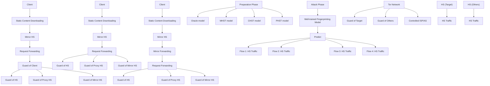
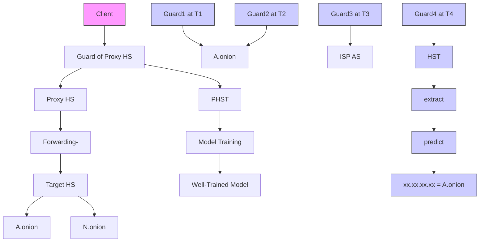
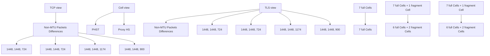

# Proxied Traffic Fingerprinting for Hidden Service De-Anonymization With Burst Reshaping

Zeyu Li , Yipeng Wang , Senior Member, IEEE, Xuebin Wang , Haoting Liu , Jiapeng Zhao , and Jinqiao Shi

Abstract—Traffic fingerprinting attack is a promising approach for Tor hidden services (HS) de-anonymization. However, it is inherently difficult to acquire traffic of target HSs (HST) for fingerprinting model training, because the physical location of the services is hidden due to the design of Tor protocol. In order to solve this problem, some alternatives such as mirrored HST (MHST) and client-side HST (CHST) have been proposed for training fingerprinting model. These alternatives are easy to acquire and aim to closely match the characteristics of the target HST. However, they cannot perfectly replace the target HST for the aspects of consistency of both response and protocol. In this paper, we propose a proxied fingerprinting approach called PF. A Proxy HS is deployed to acquire proxied HS traffic (PHST) as an alternative to conduct traffic fingerprinting attack, which satisfies both response and protocol consistency and is easy to acquire. In order to mitigate the impact introduced by Proxy HS, PF also introduces Burst Reshaping which includes burst reconstruction and pseudo-label learning to enhance the similarities between PHST and target HST. Experiments show that, PHST is a superior alternative to target HST, fingerprinting model trained using PF achieved an accuracy of 92.2%, surpassing the models trained with MHST and CHST by 72% and 34%, respectively. Additionally, PF is an add-on approach capable of improving the HS deanonymization effectiveness of any fingerprinting model architecture. The source code and dataset are available at https:// github.com/Lzreal/BurstReshapedPHST

Index Terms—Proxied hidden service traffic, hidden service de-anonymization, Proxy HS, traffic fingerprinting attack.

## I. INTRODUCTION

OR is the most widely used low-latency anonymity network [1]. The data in the Tor network is encapsulated into cells of fixed size and routed through a circuit made up of randomly selected onion relays. Each relay only knows the IP address of the previous relay and the next relay in the circuit. This design makes it difficult to trace the origin of the data, thereby enhancing user anonymity. Additionally,

Received 24 January 2025; revised 19 June 2025 and 8 July 2025; accepted 8 July 2025. Date of publication 11 July 2025; date of current version 28 July 2025. This work was supported in part by the National Key Research and Development Program of China under Grant 2023YFB3106600 and in part by the National Natural Science Foundation of China under Grant 62372056. The associate editor coordinating the review of this article and approving it for publication was Dr. Dusit Niyato. (Corresponding author: Jinqiao Shi.)

Zeyu Li, Haoting Liu, Jiapeng Zhao, and Jinqiao Shi are with the School of Cyberspace Security, Beijing University of Posts and Telecommunications, Beijing 100876, China (e-mail: lzreal@bupt.edu.cn; liuhaoting1102@ 126.com; zhaojp9574@bupt.edu.cn; shijinqiao@bupt.edu.cn).

Yipeng Wang is with the College of Computer Science, Beijing University of Technology, Beijing 100124, China (e-mail: yipeng.wang1@gmail.com).

Xuebin Wang is with the Institute of Information Engineering, Chinese Academy of Sciences, Beijing 100085, China (e-mail: wangxuebin@iie.ac.cn).

Digital Object Identifier 10.1109/TIFS.2025.3588248

Tor employs a hidden service (HS) protocol. Users can access an HS using its special .onion domain name, ensuring the service’s IP address remains unknown. The privacy protections afforded to HSs often enable their use in illegal activities, such as credit card fraud, money laundering, and malware distribution. This situation has created an urgent need for law enforcement agencies to develop effective de-anonymization techniques to identify the IP addresses associated with these .onion domain names.

Recently, some HSs, like ‘Silk Road’ and ‘Welcome to Video’, have been de-anonymized by exploiting information leakage. However, the effectiveness of these methods largely relies on misconfigurations made by administrators. Some de-anonymization attacks, with broader applicability, aim to identify the domain names of HSs by analyzing their traffic, i.e., HS Traffic (HST), because HST is the connection between an HS and its guard node, and is the only way to directly observe the real IP address of the HS. De-anonymization attacks can be categorized into active and passive attacks. Active attacks exploit vulnerabilities in the design or implementation of the Tor protocol. These attacks enable the adversary to inject detectable signals into the circuit, which are then routed to a specific onion address [2], [3], [4], [5], [6], [7]. Once these signals are discovered within HST, the adversary can successfully de-anonymize the HS. While active attacks have been shown to be effective, the vulnerabilities they exploit may be addressed through updates from the Tor Project [8], [9]. In contrast, passive attacks, such as traffic fingerprinting attacks [10], [11], exploit the distinct traffic patterns exhibited by different hosted resources and the unique back-end functions of various HSs to identify their domain names. These types of attacks are more difficult to counter than the active attacks.

The process of traffic fingerprinting attacks for HS deanonymization can be divided into two phases: (1) the preparation phase and (2) the attack phase. In the preparation phase, the adversary compiles a list of onion names as targets and collects target HST (referred to as HST throughout this paper), labeling them with the respective domain names. This labeled HST is then used to train a fingerprinting model to extract unique traffic patterns associated with each target HS. The trained model is subsequently deployed at adversarycontrolled points, such as entry nodes or ISPs. In the attack phase, when monitoring unknown traffic at these controlled points, the adversary first classifies the traffic as either clientoriginated or HS-originated (i.e., HST) [10], [12]. Then, the fingerprinting model is used to predict the domain name associated with the unknown HST. If the unknown HST matches the traffic patterns of a target HS, the adversary successfully de-anonymizes that HS.


<details>
<summary>flowchart</summary>


</details>

Fig. 1. Different location to capture HST and alternative traffic. a. HS traffic, b. mirrored HS traffic, c. client-side HS traffic and d. proxied HS traffic.

However, traffic fingerprinting attacks heavily rely on the HST for model training. Prior research has shown that using HST captured from the same location as that of the attack phase is the best option for training models [13]. To enhance anonymity, the physical location of the HSs is hidden due to the design of the Tor protocol. Each HS uses a single guard node for a longer period, minimizing exposure to other relays and reducing the risk of capturing HST [14]. These factors make it difficult to capture the HST of uncontrolled HSs, especially when trying to label them with their corresponding onion names. As a result, it creates an ideal condition for an adversary to train an ‘oracle model’ using HST during the preparation phase (as shown a. in Fig. 1).

Some research has proposed using alternative traffic captured at adversary-controlled points to perform traffic fingerprinting attacks. The initially proposed alternative traffic is Mirrored HS Traffic (MHST) [10]. In this method, the adversary downloads static resources from the target HS and deploys a Mirror HS using these resources. The adversary captures MHST at the controlled Mirror HS and uses this alternative traffic to train the ‘MHST model’ during the preparation phase (as shown b. in Fig. 1). The Mirror HS operates under the Tor HS protocol, ensuring that the resulting packet sequence in MHST is consistent with the target HST. Furthermore, the response data from the Mirror HS is not routed through the guard node in MHST, which is identical to its behavior in HST. However, an HS hosting only static resources is insufficient to support complex functionality for illegal activities, as they lack the ability to generate content dynamically (e.g., via database queries or client interactions). The Mirror HS faces challenges in accurately replicating dynamic content, leading to inconsistencies in responses within MHST.

A more practical approach has been proposed using Clientside HS Traffic (CHST) as a substitute for HST [11]. This substitution is feasible because Tor utilizes a single circuit for communication, ensuring that the response data in HST, after being rerouted through multiple nodes, ultimately arrives at the client side. Therefore, CHST ensures the consistency of the response, making it more reliable than MHST. Additionally, the adversary can control the client’s access to the target HS by using the HS domain name to label CHST. The adversary can train a ‘CHST model’ in the preparation phase for HS de-anonymization (as shown c. in Fig. 1). Although the CHST model can also effectively de-anonymize HSs, the Tor protocol executed by the client differs from that of the HS. For instance, the client must fetch the consensus file [15], whereas the HS does not. Additionally, the packet sequence for circuit creation [11] or flow control [16] on the client and HS differs, reducing the similarity between CHST and HST. As a result, the proposed alternative traffic does not simultaneously satisfy both the consistency of response and protocol, which influences the performance of the fingerprinting model for deanonymization.

In this paper, we propose a proxied fingerprinting approach as PF to de-anonymize HSs. Firstly, we utilize Proxied HS Traffic (PHST) as an alternative to HST by deploying a Proxy HS, which is a special HS that forwards requests and responses between clients and the target HS. The adversary can train a ‘PHST model’ using PHST captured on the Proxy HS in the preparation phase (as shown d. in Fig. 1) and use the PHST model to de-anonymize HSs in the attack phase. Our proposed PHST offers two key advantages: (1) Proxy HS transparently forwards the responses of the target HS, preserving the consistency of responses in PHST compared to target HST. (2) Proxy HS executes the Tor HS protocol, ensuring the protocol-generated packet sequences of PHST are consistent with those of the target HST. Table I summarizes the different aspects of similarity between HST and various alternative traffic types. We conduct a similarity analysis of MHST, CHST, and PHST compared with HST, and the results show that PHST is a superior alternative traffic type compared with MHST and CHST.

TABLE I COMPARISON BETWEEN HST, CHST, MHST, AND PHST. PHST IS MORE SIMILAR TO HST IN TERMS OF THE CONSISTENCY OF RESPONSE PROTOCOL

<table><tr><td>Traffic</td><td>Full name</td><td>Description</td><td>Adversary Controlled</td><td>Non-routed</td><td>Response-consistent</td><td>Protocol-consistent</td></tr><tr><td>HST</td><td>HS traffic</td><td>Traffic of Target  $HS^1$ </td><td>✕</td><td>√</td><td>√</td><td>√</td></tr><tr><td>MHST</td><td>Mirrored HS traffic</td><td>Traffic of Mirror  $HS^2$ </td><td>√</td><td>√</td><td>✕</td><td>√</td></tr><tr><td>CHST</td><td>Client-side HS traffic</td><td>Traffic of client $^3$ </td><td>√</td><td>✕</td><td>√</td><td>✕</td></tr><tr><td>PHST</td><td>Proxied HS traffic</td><td>Traffic of Proxy  $HS^4$ </td><td>√</td><td>✕</td><td>√</td><td>√</td></tr></table>

1.Capturing HST is under ideal conditions.  
3.Client receives response data from Target HS [11].  
2.Mirror HS hosts the same static resources from Target HS [10].  
4.Proxy HS forwards traffic between client and Target HS (this paper).

Then, we find that the similarity between PHST and HST is slightly affected by routing. These factors primarily include the different distribution of non-MTU packets in bursts between PHST and HST, and additional packets that occur in PHST (discussed in greater detail in Section IV-B). To further enhance the performance of the PHST model, we employ Burst Reshaping in PF. Burst Reshaping includes two components: (1) burst reconstruction for both PHST and HST to mitigate the differences in non-MTU packet distributions within the burst, and (2) pseudo-label learning to enable the PHST model to gradually capture the characteristics of HST, thereby mitigating the impact of additional packets in PHST. We evaluate the performance of Burst Reshaping in both closedworld and open-world scenarios.

Our main contributions are summarized as follows:

• We introduce a proxied fingerprinting approach called PF for de-anonymizing HSs. PF utilizes PHST as an alternative to the target HST and employs Burst Reshaping to further improve the similarity between PHST and the target HST. The fingerprinting model trained using PF achieved an accuracy of 92.2%, surpassing those trained with MHST and CHST by 72% and 34%, respectively.  
• We conduct a detailed similarity analysis of MHST, CHST, and PHST compared to HST, including statistical characteristics, session similarity, and information leakage. Our analysis results demonstrate that PHST is a superior alternative to HST compared with MHST and CHST.  
We propose Burst Reshaping to enhance the performance of the PHST model. Burst Reshaping utilizes burst reconstruction and pseudo-label learning to enhance the ability of the model to capture the characteristics of HST. Experimental results show that our method is effective for all fingerprinting model architectures. Under the DF model architecture, PF achieves a 15% improvement in the closed-world scenario and a 7.7% improvement in the open-world scenario compared to the PHST model.

## II. BACKGROUND, CHALLENGES AND MOTIVATION

Traffic fingerprinting attacks primarily exploit distinct traffic patterns associated with different hosted resources and the unique back-end functions of various HSs to identify their domain names [17], [18]. Numerous traffic fingerprinting methods have been proposed by optimizing traffic feature extraction or developing better model architectures.

Earlier traffic fingerprinting methods focused on refining website feature extraction and applying machine learning models to enhance fingerprinting accuracy. Key features in these approaches included packet size frequency, total transmitted bytes, the ratio of incoming to outgoing packets, and total packet counts, analyzed through models such as Bayes Classifiers, Support Vector Machines [19], [20], Decision Trees [10], and K-nearest Neighbor [21], [22]. With the rise of deep learning, traffic fingerprinting models increasingly shifted to deep learning frameworks, such as Stacked Denoising Autoencoders (SDAE), Convolutional Neural Networks (CNNs), and Long Short-Term Memory (LSTM) networks [23]. CNNs, in particular, have become the most widely used in traffic fingerprinting, with variants like DeepCNN [24], [25] and ResNet [26] further enhancing their utility. These models generally use payload size sequences with packet direction as inputs, with some also incorporating timing information [26], [27]. While various fingerprinting models have been proposed, most rely heavily on payload sequences, with timing sequences playing a secondary role.

Traffic fingerprinting attacks rely on labeled training data to develop fingerprinting models, which are then used to predict the domain names of unknown data. In prior studies, the endpoints capturing training and unknown data are positioned identically within the Tor circuit, ensuring consistency with the Tor protocol. Moreover, when accessing the same target service, the response data in both the training and unknown datasets remains consistent. However, previous research has shown a significant drop in fingerprinting model performance when the training and testing data are collected from different positions within the circuit [11], [13]. This performance degradation is primarily due to routing and protocol inconsistencies, which reduce the similarity between training and unknown data.

In the context of HS de-anonymization, the unknown data is HST. Since the target HS is uncontrolled, capturing labeled HST as training data is not feasible. Consequently, alternative traffic must be used to train fingerprinting models. However, the proposed alternative traffic, such as mirrored HS traffic [10] and client-side HS traffic [11], typically exhibits reduced similarity to HST, especially in the consistency of response and protocol consistency. For example, the mirrored HS, as an independent replica of the target HS, without access to the original source code, must passively infer the service logic–inevitably causing functional discrepancies. Furthermore, mirror updates occur on a fixed schedule and cannot promptly reflect content changes or feature updates in the target HS, compromising response consistency between HS traffic [10] and HS traffic. Prior work has demonstrated that when a traffic fingerprinting model is trained on data collected from one specific location within a Tor circuit, its performance decreases when attacking from a different position, although it remains capable of de-anonymization [13]. This suggests that traffic distributions at different circuit locations are sufficiently similar, enabling the model to generalize across positions. This benefit stems from Tor’s architecture, where data transmission occurs over a single circuit, maintaining consistency in the cell sequences for client requests and service responses across all circuit hops, thereby leading to distributional similarity in the resulting TLS records and TCP packets. This observation led Wang [11] to utilize client-generated traffic as the basis for HS de-anonymization. Nevertheless, the influence of the Tor protocol across different positions leads to some degree of discrepancy in the encapsulated TLS records and TCPlevel representations. As illustrated in Fig. 2, the client and HS follow different Tor protocols. This protocol inconsistency alters packet interaction patterns between client-side HS traffic and HS traffic, thereby impacting the effectiveness of traffic fingerprinting in HS de-anonymization. These inconsistency diminishes the effectiveness of fingerprinting attacks for HS de-anonymization.


<details>
<summary>flowchart</summary>


</details>

Fig. 2. Packet exchange differences induced by different protocol in between clients and HSs when interacting with their entry nodes.

In summary, traffic fingerprinting attacks for HS deanonymization face the following challenges:

• (C1) Discovering an alternative traffic that is closely similar to HST. The previously proposed alternative traffic does not closely similar to HST, especially regarding the consistency of response and protocol. Through detailed inspection of Tor network, we observed that traffic on currently designed connections cannot satisfy the consistency of both response and protocol required to match HST. Discovering an alternative traffic that does remains a significant challenge.  
(C2) Mitigating the Differences Between Alternative Traffic and HST. Routed alternative traffic exhibits slight differences compared to non-routed HST. According to our investigation, existing studies have not proposed solutions to mitigate such differences.

Our motivation is as follows. First, we propose utilizing PHST as an alternative to HST by deploying a Proxy HS for fingerprinting model training. However, is PHST truly more similar to HST than MHST and CHST? Moreover, we propose

Burst Reshaping to further enhance their similarities. Nevertheless, does this method effectively improve the performance of PHST models for HS de-anonymization? We address and provide insights into these questions in this paper.

## III. THREAT MODEL

Fig. 4 illustrates the threat model. We assume a networklevel adversary, such as a network administrator, an Internet Service Provider (ISP), or an Autonomous System (AS). This adversary can passively collect traffic in the Tor network and identify HST. The adversary does not need to add, delete, or modify packets. While the adversary has a list of target HS domain names, they face challenges in determining which HS is communicating with the collected HST. As a result, the adversary lacks traffic data to train the fingerprinting model.

In response to this problem, the adversary utilizes Proxy HS to capture the PHST for training traffic fingerprinting model. In the training phase, the adversary sets up both a controlled Proxy HS and a client within the Tor network. The deployment steps of Proxy HS are similar to those of a standard HS, and the Proxy HS does not need to be physically or network-adjacent in proximity to the target HS, ensuring that no extra restrictions are imposed during traffic acquisition. The adversary configures the Proxy HS to forward traffic to the target HS (by specifying its domain), and collects the PHST through controlled client access to the proxy, treating it as prior knowledge of the target HS. Since the adversary operates at the network level, it can leverage prior techniques to extract HST from its observed traffic. The adversary leverages both the PHST and HST datasets to train the traffic fingerprinting model.

In the attack phase, the adversary monitors and captures HST passing through its controlled ISP or AS-level network. The HS protocol specifies periodic rotation of entry guards by the target HS, as illustrated in Fig. 4 with Guard1, Guard2, and Guard3 during the attack phase. Eventually, once the traffic between the target HS and its entry guard (e.g., A.onion and Guard4) passes through an ISP or AS under the adversary’s control, the adversary may apply the well-trained fingerprinting model to attribute the HST to a specific HS domain, and extract the IP address from traffic metadata, thereby deanonymizing the HS.

This threat model, which assumes that an adversary can observe traffic between HS and its guard node, is widely adopted in prior HS de-anonymization research [6], [7], [11]. Its feasibility has also been validated in the real world–most notably in the case of Carnegie Mellon University (CMU), where researchers successfully de-anonymized HSs by analyzing their traffic to guards [28].

## IV. PF: PROXIED HIDDEN SERVICE TRAFFIC FINGERPRINTING WITH BURST RESHAPING

As previously mentioned, the primary challenge in traffic fingerprinting attacks for de-anonymizing HSs is addressing the similarity between alternative training traffic and HST. We present a proxied fingerprinting approach, called PF, as a potential solution to this problem. Fig. 3 illustrates the overview of PF. To ensure the consistency of both response and protocol in alternative traffic compared with HST, we start by implementing a special controlled HS in the Tor network, called Proxy HS. Proxy HS is an intermediary between the client and the target HS, forwarding the communication traffic between them. We utilize PHST captured on the Proxy HS to train the fingerprinting model. However, we also identify differences between PHST and HST caused by routing, which influence the performance of the trained model for de-anonymizing HS. We then propose Burst Reshaping, which utilizes burst reconstruction and pseudo-label learning to improve model performance further. In the remainder of this section, we will explain PF in detail and describe why we need to introduce Burst Reshaping.

```mermaid
graph TD
  A["Client"] --> B["Proxied HS Traffic (PHST) Labeled"]
  B --> C["Proxy HS"]
  C --> D["Target HS"]
  D --> E["HS Traffic (HST) Unlabeled"]
    
    subgraph sg_1_Traffic_Capturing["(1) Traffic Capturing"]
  F["Searching"] --> G["Payload Size Sequence"]
  G --> H["Burst Identification"]
  H --> I["Burst 1"]
  H --> J["Burst 2"]
  I --> K["Payload Size Sequence"]
  J --> L["Burst Embedding"]
  K --> M["Reshaped Sequence"]
  L --> N["Reshaped Sequence"]
  M --> O["Initial Training initial_epoch"]
  N --> P["Fingerprinting Model"]
  P --> Q["Pseudo-label Learning"]
  Q --> R["HST P&R* Sequence"]
  R --> S["HST Confidence Sample"]
  S --> T["pseudo_times"]
  T --> U["pseudoTraining pseudo_per_epoch"]
  U --> V["Pseudo-label Learning"]
  V --> W["pseudo-label Learning"]
  W --> X["pseudo-label Learning"]
    end
    
    subgraph sg_2_Burst_Reshaping["(2) Burst Reshaping"]
  Y["Searching"] --> Z["Identified Bursts"]
  Z --> AA["Reshaping"]
  AA --> AB["Reshaped Bursts"]
  AB --> AC["Pseudo-label Learning"]
  AC --> AD["Fingerprinting Model"]
  AD --> AE["HST Reshaped Sequence"]
  AE --> AF["Attack Phase"]
    end
    
    subgraph sg_3_Burst_Reconstruction["(3) Burst Reconstruction"]
  AG["Reshaped Sequence"] --> AH["Embedding"]
  AH --> AI["Reshaped Sequence"]
  AI --> AJ["Burst Embedding"]
  AJ --> AK["Reshaped Sequence"]
    end
    
    style A fill:#f9f,stroke:#333
    style B fill:#f9f,stroke:#333
    style C fill:#f9f,stroke:#333
    style D fill:#f9f,stroke:#333
    style E fill:#f9f,stroke:#333
    style F fill:#ccf,stroke:#333
    style G fill:#ccf,stroke:#333
    style H fill:#ccf,stroke:#333
    style I fill:#ccf,stroke:#333
    style J fill:#ccf,stroke:#333
    style K fill:#ccf,stroke:#333
    style L fill:#ccf,stroke:#333
    style M fill:#ccf,stroke:#333
    style N fill:#ccf,stroke:#333
    style O fill:#ccf,stroke:#333
    style P fill:#ccf,stroke:#333
    style Q fill:#ccf,stroke:#333
    style R fill:#ccf,stroke:#333
    style S fill:#ccf,stroke:#333
    style T fill:#ccf,stroke:#333
    style U fill:#ccf,stroke:#333
    style V fill:#ccf,stroke:#333
    style W fill:#ccf,stroke:#333
    style X fill:#ccf,stroke:#333
    style Y fill:#ccf,stroke:#333
    style Z fill:#ccf,stroke:#333
    style AA fill:#ccf,stroke:#333
    style AB fill:#ccf,stroke:#333
    style AC fill:#ccf,stroke:#333
    style AD fill:#ccf,stroke:#333
    style AE fill:#ccf,stroke:#333
    style AF fill:#ccf,stroke:#333
    style AG fill:#ccf,stroke:#333
```


<details>
<summary>flowchart</summary>


</details>

Fig. 3. Overview of PF, Burst Reshaping Proxied Hidden Service Traffic Fingerprint for de-anonymization HS. PF consists two steps, (1) developing Proxy HS to capture PHST and (2) utilizing Burst Reshaping to improve the performance of fingerprinting model.


<details>
<summary>flowchart</summary>


</details>

Fig. 4. The threat model of HS de-anonymization utilizing PHST which captured on Proxy HS.

## A. The Framework of Proxy HS to Capture PHST

The layered encryption and built-in integrity verification mechanisms in Tor render conventional man-in-the-middle proxy approaches ineffective for decrypting or modifying communication between any endpoints in the circuit [27], [29]. In contrast, our approach does not attempt to decrypt or modify


<details>
<summary>flowchart</summary>

```mermaid
graph TD
  A["Client"] --> B["Proxy HS"]
  B --> C["HS Instance (a.onion)"]
  C --> D["Client Instance (Tor OP)"]
  D --> E["Target HS"]
  F["Proxied HS traffic"] --> B
    style A fill:#f9f,stroke:#333
    style E fill:#bbf,stroke:#333
    linkStyle 0 stroke:#000,stroke-width:2px
    linkStyle 1 stroke:#000,stroke-width:2px
    linkStyle 2 stroke:#000,stroke-width:2px
    linkStyle 3 stroke:#000,stroke-width:2px
    linkStyle 4 stroke:#000,stroke-width:2px
    linkStyle 5 stroke:#000,stroke-width:2px
    linkStyle 6 stroke:#000,stroke-width:2px
    linkStyle 7 stroke:#000,stroke-width:2px
    linkStyle 8 stroke:#000,stroke-width:2px
    linkStyle 9 stroke:#000,stroke-width:2px
    linkStyle 10 stroke:#000,stroke-width:2px
    linkStyle 11 stroke:#000,stroke-width:2px
    linkStyle 12 stroke:#000,stroke-width:2px
    linkStyle 13 stroke:#000,stroke-width:2px
    linkStyle 14 stroke:#000,stroke-width:2px
    linkStyle 15 stroke:#000,stroke-width:2px
    linkStyle 16 stroke:#000,stroke-width:2px
    linkStyle 17 stroke:#000,stroke-width:2px
    linkStyle 18 stroke:#000,stroke-width:2px
    linkStyle 19 stroke:#000,stroke-width:2px
    linkStyle 20 stroke:#000,stroke-width:2px
    linkStyle 21 stroke:#000,stroke-width:2px
    linkStyle 22 stroke:#000,stroke-width:2px
    linkStyle 23 stroke:#000,stroke-width:2px
    linkStyle 24 stroke:#000,stroke-width:2px
    linkStyle 25 stroke:#000,stroke-width:2px
    linkStyle 26 stroke:#000,stroke-width:2px
    linkStyle 27 stroke:#000,stroke-width:2px
    linkStyle 28 stroke:#000,stroke-width:2px
    linkStyle 29 stroke:#000,stroke-width:2px
    linkStyle 30 stroke:#000,stroke-width:2px
    linkStyle 31 stroke:#000,stroke-width:2px
    linkStyle 32 stroke:#000,stroke-width:2px
    linkStyle 33 stroke:#000,stroke-width:2px
    linkStyle 34 stroke:#000,stroke-width:2px
    linkStyle 35 stroke:#000,stroke-width:2px
    linkStyle 36 stroke:#000,stroke-width:2px
    linkStyle 37 stroke:#000,stroke-width:2px
    linkStyle 38 stroke:#000,stroke-width:2px
    linkStyle 39 stroke:#000,stroke-width:2px
    linkStyle 40 stroke:#000,stroke-width:2px
    linkStyle 41 stroke:#000,stroke-width:2px
    linkStyle 42 stroke:#000,stroke-width:2px
    linkStyle 43 stroke:#000,stroke-width:2px
    linkStyle 44 stroke:#000,stroke-width:2px
    linkStyle 45 stroke:#000,stroke-width:2px
    linkStyle 46 stroke:#000,stroke-width:2px
    linkStyle 47 stroke:#000,stroke-width:2px
    linkStyle 48 stroke:#000,stroke-width:2px
    linkStyle 49 stroke:#000,stroke-width:2px
    linkStyle 50 stroke:#000,stroke-width:2px
    linkStyle 51 stroke:#000,stroke-width:2px
    linkStyle 52 stroke:#000,stroke-width:2px
    linkStyle 53 stroke:#000,stroke-width:2px
    linkStyle 54 stroke:#000,stroke-width:2px
    linkStyle 55 stroke:#000,stroke-width:2px
    linkStyle 56 stroke:#000,stroke-width:2px
    linkStyle 57 stroke:#000,stroke-width:2px
    linkStyle 58 stroke:#000,stroke-width:2px
    linkStyle 59 stroke:#ff9,stroke-width:2px
    linkStyle 60 stroke:#ff9,stroke-width:2px
```
</details>

Fig. 5. The framework of Proxy HS comprises both a HS instance and a Tor client instance, enabling the adversary to capture PHST between the HS instance and its entry node.

HST. Instead, building on prior research of client-side HST [11], we design and deploy a Proxy HS-an endpoint type that, to the best of our knowledge, has not been previously considered in the Tor-related research to extend the communication circuit beyond the standard Tor path. This allows us to capture PHST directly at a controlled Proxy HS, while preserving the consistency with HST on both protocol and response.

The framework of Proxy HS is shown in Fig. 5. Proxy HS needs to satisfy two primary functions. First, it provides an onion name for clients to access. Second, it is required to forward client requests to the specified target HS. To support the first function, it is essential to initiate a Tor instance on Proxy HS, configuring it to operate as an HS instance. This process involves creating a virtual port to manage incoming client requests and uploading its descriptor to the Tor directory authority. For the second function, Proxy HS must re-encrypt client requests using the cryptographic keys provided by the target HS. To achieve this, a client instance must be initiated on Proxy HS, which establishes a SOCKS port for the encryption and forwarding of requests to the target HS. PHST is captured at the HS instance of Proxy HS. In this paper, we utilize Nginx as a reverse proxy for the HS instance and employ Socat to create a bidirectional channel between Nginx and the client instance.

To ensure consistency with the target HS of both response and protocol, the Proxy HS is designed to forward client requests transparently and relay responses without modification. By initiating a Tor client instance on the Proxy HS, all forwarded requests are routed through the Tor network and re-encrypted using the target HS’s cryptographic keys. This preserves the end-to-end encryption and protocol behaviors expected in standard HS communication. Additionally, the use of a standard Tor HS instance on the Proxy HS ensures that the onion service descriptor, introduction, and rendezvous protocols remain unchanged from those of a typical HS. As a result, the traffic patterns observed at the HS instance of the Proxy HS closely replicate those of a real HS, both in terms of response and protocol.


<details>
<summary>line chart</summary>

| Packet Sequence Index | PHST (multi-traces) | HST (multi-traces) |
| --------------------- | ------------------- | ------------------ |
| 0                     | 0                   | 0                  |
| 20                    | ~100                | ~150               |
| 40                    | ~200                | ~300               |
| 60                    | ~400                | ~500               |
| 80                    | ~600                | ~700               |
| 100                   | ~800                | ~900               |
</details>

Fig. 6. Cumulative payload sizes of PHST and HST packets vary with the packet indices in multiple traces. Our goal is to address the cross-position differences between PHST and HST.

## B. Differences Between Routed PHST and Non-Routed HST

To clarify the differences between routed PHST and nonrouted HST, we adopt an identical traffic capture methodology for both PHST and HST. Specifically, we control the client to access the Proxy HS and the target HS separately, thereby collecting the corresponding PHST and HST traffic. Our client implementation strictly follows the standard Tor behavior, using the same consensus data, node descriptors, and circuit selection logic as ordinary Tor users. This ensures that the collected traffic is representative of real-world usage and is not affected by custom configurations or experimental manipulation.

In PHST, the response is routed through relay nodes in the circuit between the Proxy HS and the target HS. In contrast, the response is directly generated by the target HS without routing through any Tor relays in HST. Considering the proposed traffic fingerprinting model primarily utilizes payload size for training, we identify the differences between PHST and HST by analyzing the payload size sequence. These differences include the additional packets that occur in PHST and the distribution of non-MTU packets in bursts.

1) Additional Packets Occurred in PHST: We begin by analyzing the differences between PHST and HST based on the trend of payload accumulation. We generated a comparative plot in Fig. 6 to show the growth of the accumulated payload size of TCP packets for multiple PHST and HST traces under the same HS. It can be shown that the total payload in PHST begins to increase from a later packet index, suggesting that in the early stages of the connection, the proxy HS engages in more interaction with its entry guard. It is because the Proxy HS endures greater latency than the target HS, since it must relay requests to the target and wait for responses to traverse the extra relay path. Such latency caused by extra routing may lead to more control cells in PHST, resulting in extra fixedsize TCP packets occurring in PHST. These differences may serve as strong features, enabling the classifier to distinguish between HSs by exploiting patterns unique to PHST [20], [30]. Consequently, the model may overfit to PHST specific features, impairing its ability to generalize when evaluated on HST.


<details>
<summary>line chart</summary>

| TCP payload size | HST   | PHST  |
| ---------------- | ----- | ----- |
| 0                | 0.0   | 0.0   |
| 200              | 0.0   | 0.0   |
| 400              | 0.0   | 0.0   |
| 600              | 0.1   | 0.1   |
| 800              | 0.1   | 0.15  |
| 1000             | 0.15  | 0.2   |
| 1200             | 0.2   | 0.25  |
| 1400             | 0.25  | 1.0   |
</details>

(a) CDF of TCP packet size


<details>
<summary>line chart</summary>

| TLS payload size | HST   | PHST  |
| ---------------- | ----- | ----- |
| 0                | 0.0   | 0.0   |
| 500              | 0.2   | 0.2   |
| 1000             | 0.3   | 0.3   |
| 1500             | 0.35  | 0.35  |
| 2000             | 0.4   | 0.4   |
| 2500             | 0.45  | 0.45  |
| 3000             | 0.5   | 0.5   |
| 3500             | 0.6   | 0.6   |
| 4000             | 1.0   | 1.0   |
</details>

(b) CDF of TLS record size  
Fig. 7. Average CDF of TCP packets and TLS records in both PHST and HST. PHST has seen more non-MTU TCP packets, as well as smaller TLS records.

Within the Tor network, each trace establishes its circuit from relay nodes operating under different network states, leading to trace-level differences in cumulative packet payload sizes at identical packet indices. Traffic fingerprinting attacks rely on multiple traces collected from the same position to enable the model to extract consistent, trace-independent features as HS fingerprints [24]. However, in the absence of HST, the fingerprinting model is unable to effectively ignore the differences across traces collected from different positions [11], [13].

2) Non-MTU Packets Distribution Differences in Bursts: Payload size is recognized as a critical feature in traffic fingerprinting attacks [24]. Owing to TCP/IP segmentation and reassembly, non-MTU-sized packets may convey richer information than MTU-sized ones in encrypted traffic [30]. We calculate the cumulative distribution function (CDF) of TCP packets and TLS record sizes for both traffic types under the same HS. The CDF reveals the distribution of different packet sizes within the traffic. As shown in Fig. 7, PHST exhibits a greater distribution of smaller-sized TLS records, and non-MTU packets appear more frequently in PHST. We observe that these non-MTU packets represent the final segments of TLS records, particularly in bursts, which are sequences of consecutive packets transmitted in the same direction within a short time interval. This observation suggests that data from two TLS records is more likely to be encapsulated in a single TCP packet in HST; however, data from two TLS records is typically split into two separate TCP packets in PHST. This difference may cause models trained on PHST data to focus more on non-MTU packets in bursts as the fingerprint of the target HS. However, such a feature is absent in HST, leading to misclassification when attempting to identify HST. Consequently, a fingerprinting model trained on PHST may learn to exploit these non-MTU-sized packets as distinctive classification features, thereby impairing its ability to accurately recognize HST.


<details>
<summary>flowchart</summary>


</details>

Fig. 8. The Proxy HS is unable to parse the fragmented cell in the target HS’s first TLS record (TLS record #1 of HST). Consequently, before it has fully received the HST’s second TLS record (TLS record #2 of HST), it transmits its own first TLS record (TLS Record #1 of PHST), which contains only the seven complete cells extracted from the TLS record #1 of HST.

The observed difference in the non-MTU payload distribution between PHST and HST is attributed to cell fragmentation within Tor’s TLS packets. Tor restricts the payload size to not exceed a default chunk size. The default maximum chunk size is 4096 bytes, which accommodates up to seven complete cells, occupying 3598 bytes. Consequently, part of the eighth cell is encapsulated into this TLS record, forming cell fragments. When the Proxy HS receives the complete TLS record, it cannot decrypt the eighth cell. Instead, it decrypts the first seven complete cells and forwards them to the client via the HS instance.

Moreover, to minimize latency, Tor relays process and transmit the first TLS record while simultaneously receiving the second TLS record. This behavior ensures that the relay’s sending buffer rarely holds more than two chunk-sized data blocks, making it unlikely to combine two TLS records into a single TCP packet. Fig. 8 illustrates the Tor cell fragmentation induced by the default chunk size, which in turn gives rise to differences in non-MTU packet occurrences between PHST and HST.

As a result, differences between non-MTU packet distribution and additional packets slightly affect the similarity between PHST and HST. We also propose that these differences occur between all routed and unrouted Tor traffic. To mitigate the impact of these differences, we propose Burst Reshaping as a solution.

## C. Burst Reshaping

Burst Reshaping includes two components: burst reconstruction and pseudo-label learning. Burst reconstruction mitigates the differences in non-MTU packet distributions within the bursts between PHST and HST. By introducing unlabeled HST and utilizing pseudo-label learning in the training phase, the fingerprinting model can gradually capture the characteristics of HST, thereby reducing the impact of additional packets in PHST. It is worth noting that the architecture of traffic fingerprinting models is continually evolving. Burst Reshaping aims to enhance the performance of the PHST model for deanonymizing HS, and it is independent of any specific model architecture. We will describe our method in detail.

1) Burst Reconstruction: Although prior work has proposed traffic pre-processing methods for encrypted traffic analysis at a single location in the circuit [22], [27], it has seldom examined discrepancies of traffic from multi-locations. Based on the previous analysis of differences between PHST and HST, we introduce burst reconstruction as a novel pre-processing technique to mitigate these discrepancies and enhance the performance of the PHST model on HS de-anonymization.

Burst reconstruction comprises three main steps: burst identification, reshaping, and burst embedding. Our approach assumes that both Proxy HS and HS initially aggregate data from burst packets into a buffer. Then the aggregated data is encapsulated into TLS records, which are then segmented by the TCP protocol for transmission. We provide a detailed explanation of each step:

a) Burst Identification: First, we focus on downstream packets sent from the HS to the client, as upstream packets are relatively sparse and scattered. Second, we segment bursts using two specific TCP payload sizes: 536 and 1050 bytes, which typically correspond to congestion control cells (e.g., ‘sendme’) and traffic control cells (e.g., ‘relay begin’ and ‘relay end’) in the Tor network. Finally, we apply a fixed interval-time threshold (inthr). A high inthr masks variations in payload-size sequences corresponding to different resource objects, whereas a low inthr may fail to group all packet fragments in the burst. Because PHST and HST are observed at different points in the Tor circuit, network transmission and latency effects lead to differing optimal inthr values: bursts in HST traffic can often be segmented with a relatively small inthr, but the same inter-packet delays may be amplified before reaching the PHST observation point, necessitating a larger inthr to correctly capture all packets of resources in PHST. If the time interval between packets exceeds this threshold, the packets before and after this interval are classified as separate bursts.

b) Reshaping: The process of reshaping simulates the sequence of TCP packets generated by Tor. We calculate the total bytes of the burst and divide them into multiple TLS records based on the default chunk size [31], because Tor utilizes chunks [31] to divide large data streams into smaller, more manageable units. These TLS records are then segmented according to the MTU. If the last TCP segment of a TLS record is smaller than the MTU, part of the next TLS record may be encapsulated within the same TCP packet.

c) Burst Embedding: After reshaping, the reshaped bursts are embedded back into the payload size sequence at the positions of the identified bursts. If the number of packets in the reshaped burst differs from the original, we assign timestamps to each packet depending on the time interval of the identified burst. The time interval between the first and last packets of the identified burst is evenly distributed across all packets in the reshaped burst, ensuring consistent inter-packet timing within the restructured sequence.

Fig. 9 (a)-(d) presents the visualization of payload size sequences for both HST and PHST, along with reshaped sequences corresponding to each. The results clearly indicate that the application of burst reconstruction effectively enhances the similarity between PHST and HST, particularly in the traffic patterns of bursts. Furthermore, Fig. 9 (e) and (f) illustrate the CDF comparison of payload sizes before and after burst reconstruction. The results show that after removing the impact of non-MTU packets, the reshaped sequence’s payload size distribution curves of PHST and HST show greater alignment, indicating enhanced similarity between the two distributions with our method. As a result, the packet payload size sequences of both PHST and HST exhibit a reduced proportion of non-MTU-sized packets after burst reconstruction, thereby attenuating the distinct semantics carried by these packets and enabling the feature-extraction strategies learned on PHST can generalize effectively to HST.

  
Fig. 9. Visualization of PHST and HST on payload size sequence and reshaped sequence after burst reconstruction (a)-(d). The CDF of raw payload sizes and reshaped payload sizes in PHST and HST (e)-(f).

2) Pseudo-Label Learning: Burst reconstruction mainly processes the different distributions of non-MTU packets between PHST and HST, but it is hard to mitigate the additional packets that occur in PHST. To enable the PHST model to capture the feature distribution of HST data, we integrate HST into the training phase. However, the limited availability of labeled HST hinders the model’s ability to learn accurate input-output mappings.

To overcome this challenge, we employ pseudo-labeling, which is a form of semi-supervised learning that leverages unlabeled data to enhance the performance of deep neural network models, thereby reducing dependence on labeled data [32], [33], [34], [35]. Our proposed pseudo-label learning method introduces a semi-supervised adaptation mechanism that leverages unlabeled HST to refine the model trained on PHST. By selectively assigning high-confidence pseudo-labels, the model gradually aligns its decision boundaries with the true distribution of HST. The method facilitates the transfer of knowledge from alternative training data to actual HST traffic, enhancing generalization in the absence of labeled HST–thus overcoming a major limitation in prior traffic fingerprinting attacks.

In pseudo-labeling, assigning erroneous or imprecise labels to unlabeled data by the model itself leads to label noise. To reduce the adverse effects of pseudo-label noise, we gradually incorporate pseudo-labeled samples during training, apply confidence threshold filtering, and perform multiple rounds of label mixing to suppress noise and improve model robustness. More concretely, (1) we begin by training a base model with the high-quality ground-truth labels from PHST for $i n i t \_ e p o c h s$ epochs, enhancing the model’s capacity to differentiate between various HS behaviors; (2) next, we pseudo-label HST samples with prediction probabilities above the confidence threshold (con f idence threshold), and include them in further training to minimize the influence of lowconfidence noise; (3) finally, to maintain training stability and avoid premature contamination from incorrect labels, we conduct pseudo-label prediction over pseudo time rounds for HST samples, and in each round, filter pseudo-labeled and PHST samples using the confidence threshold, followed by $p s e u d o \_ p e r \_ e p o c h$ epochs of retraining.

The payload size sequences of PHST accessing the target HS c are denoted as $X _ { p , c } ,$ with $y _ { c }$ being the corresponding ,class label, while the payload size sequences of unlabeled HST are represented as $X _ { h }$ . Burst reconstruction, denoted by BR(·), reshapes PHST payload size sequences of PHST into $B R ( X _ { p , c } )$ and HST payload size sequences into $B R ( X _ { h } )$ . Subsequently, $X _ { p , c } , X _ { h } , B R ( X _ { p , c } )$ , and $B R ( X _ { h } )$ are utilized in model training. , ,The training process is divided into two steps: initial training and pseudo-label learning.

In initial training, the objective is to use PHST to train a fingerprinting model for epochi epochs, enabling it to distinguish between different HSs. Let $M ( \cdot )$ represent the parameters of the deep learning model architecture, such as DF [24]. Payload size sequences from PHST, along with their corresponding reshaped sequences, are fed into the model, producing outputs $M ( X _ { p , c } )$ and $M ( B R ( X _ { p , c } ) )$ . The loss function of initial training ${ \mathcal { L } } _ { \mathrm { i n i t } }$ , ,as defined in Equation 1:

$$
\mathcal {L} _ {\text { init }} = - \sum_ {c = 1} ^ {C} \left[ y _ {p, c} \log M (X _ {p, c}) + y _ {p, c} \log M (B R (X _ {p, c})) \right] \tag {1}
$$

After initial training, the model’s predictive accuracy for HST is refined through pseudo-label learning. Pseudo-labels help the fingerprinting model optimize its decision boundaries in feature space, enabling the boundaries to shift from labeled PHST to better align with the distribution of unlabeled HST. During this step, the model generates predictions for HST payload size and reshaped sequences. A confidence threshold, denoted as con f idence threshold, is established to ensure the reliability of the predictions. Samples with prediction confidence exceeding this threshold are considered reliable. The classification results for these reliable samples are treated as pseudo-labels, enabling the model to be trained simultaneously on both PHST and the reliable subset of HST. Assuming pseudo-labels for reliable samples are represented by $\hat { y } _ { X _ { h } }$ and $\hat { y } _ { B R ( X _ { h } ) }$ , where $( \hat { y } _ { x _ { h } } | \hat { y } _ { B R ( X _ { h } ) } ) > c o n f i d e n c e \_ t h r e s h o l d .$ >The corresponding loss function for pseudo-label learning is denoted as ${ \mathcal L } _ { \mathrm { p l } }$ , as defined in Equation 2:

$$
\mathcal {L} _ {\mathrm{pl}} = - \sum_ {c = 1} ^ {C} \left[ \hat {y} _ {x _ {h}} \log M (X _ {h}) + \hat {y} _ {B R (X _ {h})} \log M (B R (X _ {h})) \right] \tag {2}
$$

The composite loss function for the entire training process is defined in Equation 3. This integrated loss function is crucial for guiding the model to extract the most distinctive features of HSs’ fingerprints. Additionally, it enables effective knowledge transfer from PHST to HST, thereby improving the model’s generalization and adaptability to diverse traffic environments.

$$
\mathcal {L} _ {\text { total }} = \left\{ \begin{array}{l l} \mathcal {L} _ {\text { init }} & \text { if   initial   training } \\ \mathcal {L} _ {\text { init }} + \mathcal {L} _ {\text { pl }} & \text { if   pseudo - label   learning } \end{array} \right. \tag {3}
$$

Finally, in the attack phase, the reshaped HST sequence is sent to the well-trained fingerprinting model to predict the domain name of the HS to achieve de-anonymization.

## V. DATASET

In this section, we collect a Small-Scale Closed-World of Static and Dynamic HS Dataset (SCSD-dataset) to demonstrate the similarity between alternative traffic and HST, as well as its capability for de-anonymizing HSs. Furthermore, we collect a Large-Scale Closed and Open-World Scenario Dataset (LCO-dataset) to illustrate the advantages of Burst Reshaping.

To ensure the authenticity of the captured traffic, we employed Tor instances without any modifications to the protocol and deployed all clients, Proxy HSs, and target HSs within the real Tor network. Consequently, during the communication between client and HS, all relays in the circuits were randomly selected, uncontrolled volunteer nodes, thereby minimizing the risk of artificial interference and preserving the integrity of the traffic. Due to ethical considerations, we deploy controlled HSs as de-anonymization targets using constructed or mirrored resources. In the SCSD-dataset, the content of HSs is entirely designed, whereas in the LCO-dataset, we create mirrors by downloading resources from real Tor HSs, following existing HS de-anonymization methodologies [10], [11].

In the remainder of this section, we will introduce the two datasets in detail.

## A. SCSD-Dataset

The SCSD-dataset consists of 10 different target HSs in a small-scale closed-world scenario, and the target HSs are of two types: (1) static HSs and (2) dynamic HSs. This setting illustrates the performance of a model trained with different alternative traffic types on de-anonymizing different types of HSs. Static HSs host only static images, simplifying the replication and deployment of Mirror HSs, and ensuring the consistency of responses in MHST. In contrast, dynamic HSs respond only with HTML and JavaScript files upon receiving a request, with resources loaded dynamically after executing the JS. As a result, tools such as wget and HTTrack cannot download these resources from dynamic HSs to deploy Mirror HSs.

We deploy both static and dynamic target HSs in the Tor network and access them via clients to capture CHST and

TABLE II SCSD-DATASET: SIZE OF CAPTURED FLOWS IN 4 DISTINCT TRAFFIC SETS OF STATIC AND DYNAMIC HSS IN IT

<table><tr><td>Traffic Set</td><td>Static HSs</td><td>Dynamic HSs</td></tr><tr><td>HST</td><td>9,224</td><td>8,127</td></tr><tr><td>MHST</td><td>7,899</td><td>7,820</td></tr><tr><td>CHST</td><td>9,161</td><td>7,923</td></tr><tr><td>PHST</td><td>6,851</td><td>6,733</td></tr></table>

TABLE III LCO-DATASET: SIZE OF FLOWS IN LABELED SET, UNLABELED SET AND TEST SET

<table><tr><td></td><td>Closed-world</td><td>Open-world</td></tr><tr><td>Labeled Set (PHST)</td><td>16,159</td><td>204</td></tr><tr><td>Unlabeled Set (HST)</td><td>7,469</td><td>657</td></tr><tr><td>Test Set (HST)</td><td>7,519</td><td>2,883</td></tr></table>

HST. We then download the resources from the target HSs, deploy corresponding Mirror HSs, and capture MHST when the controlled client accesses the Mirror HSs. Finally, we deploy corresponding Proxy HSs and capture PHST when accessing the Proxy HS. The captured HST, MHST, CHST, and PHST for both static and dynamic HSs are then compiled into the SCSD-dataset. Table II presents the size of flows captured in four distinct traffic sets: HST, MHST, CHST, and PHST, which consist of both static and dynamic HSs in the SCSD-dataset.

## B. LCO-Dataset

The LCO-dataset consists of 103 different target HSs on a larger scale with both closed-world and open-world scenarios.

In the closed-world scenario, we utilize Torsocks and HTTrack to download the resources of the HSs. Then, we deploy the target HSs using the downloaded resources, and deploy the corresponding Proxy HSs in the Tor network. We control the client to access both the target HSs and the Proxy HSs multiple times separately to collect HST and PHST.

In the open-world scenario, we deploy various non-target HSs and deploy Proxy HSs corresponding to some of them. We collect HST from non-target HSs that do not have corresponding Proxy HSs, and we collect PHST from Proxy HSs. We access these non-target HSs and Proxy HSs just once.

Before each access, the client restarts Tor and uses Paramiko to remotely start Tcpdump on the HS. After each session, the client stops Tcpdump remotely and saves the captured traffic data and cell information into designated files.

It is worth noting that although the deployment method for the target HSs is consistent with that of the mirrored HSs, we do not evaluate MHST and CHST in the LCO-dataset. All such evaluations are conducted within the previously proposed SCSD-dataset. The purpose of the LCO-dataset is to demonstrate the advantages of Burst Reshaping. Therefore, target HSs in the LCO-dataset are more similar in content to uncontrolled HSs in the Tor network, and the LCO-dataset only includes PHST and HST.

Finally, we collect the LCO-dataset, which consists of three components: a labeled set of PHST, an unlabeled set of HST, and a test set of HST. Table III presents the size of flows in the labeled set (PHST), the unlabeled set (HST), and the test set (HST).


  
Fig. 10. Statistical feature results for different traffic types. Where H, M, C, and P in subplots (a), (b) and (c) denote HST, MHST, CHST, and PHST, respectively.

## VI. EVALUATION

## A. PHST Shows More Similar To HST Compared With MHST and CHST

We conduct a more detailed comparison of the similarities between different alternative traffic and HST. Our previous analysis indicates that, due to the inconsistency of dynamically generated responses, the similarity between MHST and HST exhibits greater differences in dynamic HSs. In contrast, CHST and MHST remain unaffected by the type of HS. Therefore, we analyze the similarities among MHST, CHST, PHST, and HST under dynamic HSs in the SCSD-dataset.

1) Packet Statistical Characteristic: Alternative traffic for HST exhibits statistical characteristics similar to those of it. These characteristics help reveal the consistency of response between various traffic sets. We focus on the statistical features of HST, PHST, MHST, and CHST datasets, including packet count, total packet size, transmission time, and packet size distribution.

When accessing an HS, the client typically sends only requests, while the HS transmits all hosted content to the client. As a result, significant differences exist between the upstream and downstream packet counts and sizes. We analyze the number and size of packets for upstream and downstream traffic separately. Additionally, we calculate the Kernel Density Estimation (KDE) of packet sizes to assess their distribution. Given that Tor transmits data in fixed-size cells and is constrained by the Maximum Transmission Unit (MTU), packet sizes often concentrate around 536 bytes, 1050 bytes, and 1448 bytes. To gain deeper insights into packet distribution, we exclude packets of these three sizes and recalculate the KDE of packet sizes.

Fig. 10 presents the statistical results. The first row of subplots displays the (a) total packet size, (b) total packet count, and (c) transmission duration. The second row shows the (d) overall packet size distribution, while the third row illustrates the (e) distribution after removing packets of 536 and 1448 bytes. The following observations can be drawn from the figure:

  
Fig. 11. Cosine similarity, pearson correlation, and the length of the longest common subsequence on HST, MSHT, CHST and PHST compared with HST.

• MHST contains minimal packets because the Mirror HS hosts only smaller resources such as HTML and JS files, while larger resources like images are not hosted. As a result, the Mirror HS stops communication after transmitting just two files.  
• Compared to HST, CHST involves sending a larger number of downstream packets and has a longer communication duration. This is due to the client’s need to download additional files, such as consensus and cache files.  
• PHST is the most similar to HST in terms of packet size, transmitted bytes, and transmission duration.  
• In terms of overall packet size distribution, both CHST and PHST are similar to HST. However, after removing the three concentrated packet sizes, some differences remain between CHST, PHST, and HST.

2) Session Similarity Measurement: Alternative traffic should exhibit session-level similarity with HST. In this paper, session similarity is evaluated by analyzing the similarity of packet size sequences. For each flow (session) in our traffic sets, we extract the payload size of each packet and construct sequences based on the order of packet transmission or reception. We randomly select 100 flows from each HS in each traffic set as samples to reduce the calculation. We then use cosine similarity, Pearson correlation coefficient, and common subsequence length to analyze the session similarity between four distinct traffic sets and HST. These methods are commonly applied in traffic analysis or traffic classification [36], [37], [38].

Fig. 11 compares the similarity of different traffic sets with the HST dataset. The similarity results between different sessions within the HST dataset (HST vs. HST) are used as a baseline to evaluate the similarity of other traffic sets with HST. The following observations can be drawn from the figure:

• MHST shows significant differences from HST in terms of cosine similarity, Pearson correlation coefficient, and common subsequence length, indicating that the lack of resources can reduce the overall similarity between MHST and HST.

  
Fig. 12. Different traffic representation of information leakages of HST, MHST, CHST and PHST.

• CHST is similar to HST in terms of Pearson correlation coefficient and common subsequence length; however, it exhibits notable differences in cosine similarity. This discrepancy is likely due to differences in the Tor protocol execution between the client and the HS.  
• PHST demonstrates comparable mean values and interquartile ranges for cosine similarity, Pearson correlation coefficient, and common subsequence length, indicating a high level of session-level similarity to HST.

3) Information Leakage: Information leakage quantifies how much information can be inferred from observable traffic features [27]. We leverage this metric to evaluate the discriminative power of different features in distinguishing between PHST and HST. We adopt the proposed approach [27] to measure the information leakage. The information leakage I(F; C) is defined in Equation 4.

$$
I (F; C) = H (C) - H (C | F) \tag {4}
$$

where C is the target websites, F represents the features of a specific representation, and H(·) is the entropy value.

We analyze diverse traffic sets to calculate information leakage, quantifying the information revealed within these traffic sets, as shown in Fig. 12. The first row of subplots presents the results from k-Nearest Neighbors (kNN) [39], kFP [40], and CUMUL [21]. The second row shows results based on finegrained per-packet feature sequences. Additionally, to explore more feature types, we multiply each packet’s timestamp by its direction, with the results shown in the last row, including concentration, burst, and packets per second. Each point on the horizontal axis represents an individual data point in the traffic representation. In contrast, each point on the vertical axis indicates the amount of information that the corresponding data point contributes to classification capability.

The following key observations can be made:

• In several statistical features (e.g., K-NN, k-FP, and CUMUL), PHST and HST exhibit similar curves, although there are some differences in the values of information leakage. CHST also shows similar curves to HST across most statistical features; however, at certain points, the leaked information differs significantly from HST.

• In sequences related to packet size and direction (e.g., pkt Direction, Concentration, and Burst), PHST demonstrates similar information leakage curves to HST. CHST shows partial similarity to HST in some features but exhibits significant differences in features such as Concentration and Burst.

• In time-related features (e.g., Inter-arrival Time and Packets Per Second), all three types of alternative traffic show noticeable differences from HST. This indicates that different controlled endpoints handle packet timing information differently, suggesting that the time-related features of alternative traffic may be less effective for HS de-anonymization.

Similarity analysis results show that PHST achieves a closer approximation to HST than either CHST or MHST in terms of statistical characteristics, session similarity, and information leakage. Although PHST can not exactly replicate HST’s distribution in every detail, its response and protocol consistency yield the most faithful traffic distribution to HST compared with proposed alternatives. This suggests that PHST is a superior alternative to MHST and CHST. Consequently, fingerprinting models trained on PHST are expected to achieve higher performance than those trained on MHST or CHST.

## B. PF Is Effective in De-Anonymizing Static and Dynamic HS

Considering that the consistency of response and protocol is primarily represented by the payload size sequence, we select the DF model architecture [24] to train the traffic fingerprinting models. The input to the DF model consists of a sequence of signed integers, where the sign indicates the packet’s direction and the absolute value corresponds to its payload size.

We utilize the payload size sequence of MHST, CHST, PHST in the SCSD-dataset to train MHST, CHST, and PHST models separately. Furthermore, we also conduct a preliminary evaluation of Burst Reshaping in this dataset. The HST set in the SCSD-dataset is divided into two parts: one for training the Oracle model to demonstrate the upper bound for HS deanonymization and the other for evaluating the performance of the four models.

Table IV presents the results of the preliminary evaluation. CHST and PHST models demonstrate more stable performance across static and dynamic HSs, suggesting that PHST and CHST are more practical alternative traffic not constrained by the specific scenario. Furthermore, the PHST model outperforms the CHST model, which is due to the protocol consistency between PHST and HST, which is absent in CHST. Although the MHST model achieves performance comparable to the Oracle model in the static HSs, it exhibits a significant performance decline in the dynamic HSs because of the substantial discrepancies in response between MHST and HST under this scenario. This limitation is particularly critical since most HSs need to generate content dynamically for complex functions. For example, marketplace-based HSs devoted to drugs, adult content, counterfeit, and weapons constitute 44% [41], and these HSs rely on database responses and backend functionalities to handle transactions and ensure seamless operations. As a result, PHST proves to be more effective in de-anonymizing widely distributed dynamic HSs. Based on the fingerprinting results for HS de-anonymization and the prior similarity analysis comparing PHST with other alternatives, PHST effectively addresses Challenge C1 and emerges as a superior option for HS de-anonymization. Moreover, the PF model improves the accuracy of the PHST model by 13% and 8% for de-anonymizing both static and dynamic HSs separately. This demonstrates the effectiveness of our proposed PF.

TABLE IV RESULTS OF ORACLE MODEL, CHST MODEL, MHST MODEL, PHST MODELAND PF MODEL UNDER SCSD-DATASET (%)

<table><tr><td rowspan="2"></td><td colspan="4">Static HSs</td></tr><tr><td>Accuracy</td><td>Precision</td><td>Recall</td><td>F1</td></tr><tr><td>Oracle model (upper bound)</td><td>98.35</td><td>98.46</td><td>98.34</td><td>98.38</td></tr><tr><td>MHST model</td><td>98.29</td><td>98.35</td><td>98.27</td><td>98.30</td></tr><tr><td>CHST model</td><td>55.24</td><td>60.77</td><td>55.51</td><td>51.94</td></tr><tr><td>PHST model</td><td>75.71</td><td>81.92</td><td>76.08</td><td>73.89</td></tr><tr><td>PF model</td><td>89.47</td><td>89.34</td><td>89.32</td><td>87.46</td></tr></table>

<table><tr><td rowspan="2"></td><td colspan="4">Dynamic HSs</td></tr><tr><td>Accuracy</td><td>Precision</td><td>Recall</td><td>F1</td></tr><tr><td>Oracle model (upper bound)</td><td>98.48</td><td>96.63</td><td>96.51</td><td>96.51</td></tr><tr><td>MHST model</td><td>20.22</td><td>19.60</td><td>20.09</td><td>7.95</td></tr><tr><td>CHST model</td><td>58.15</td><td>66.53</td><td>59.75</td><td>56.47</td></tr><tr><td>PHST model</td><td>83.77</td><td>88.29</td><td>83.41</td><td>82.38</td></tr><tr><td>PF model</td><td>92.20</td><td>92.99</td><td>92.49</td><td>92.69</td></tr></table>

\* PHST and PF model is\_trained with our proposed PHST captured on Proxy HS.PF model is PHST model with Burst Reshaping.

## C. PF Is an Add-on Approach for Improving the Effectiveness of Any Fingerprinting Model Architectures

We implement four distinct deep learning fingerprinting model architectures: SDAE [23], DF [24], Var-CNN [26], and Robust Fingerprinting [42]. These model architectures are utilized to train the PHST model and the PF model using the LCO-dataset, which is trained by utilizing the Burst Reshaping.

It is important to note that Var-CNN integrates packet direction along with seven statistical metadata fields as inputs, while Robust Fingerprinting is based on packet count within temporal intervals. However, neither of these traffic representation strategies accounts for variations in packet sizes. Our analysis reveals that packet size significantly influences the integrity of TLS records and cell structures. For example, packets of 536, 1050, and 1448 bytes are treated as equivalent in the Var-CNN and Robust Fingerprinting models, despite the fact that they represent the transmission of single and double cells, respectively. This discrepancy is expected to become more pronounced following transmission via Proxy HS. To address this, we refine the input methods for Var-CNN and RF. For Var-CNN, we modify the input to include both packet direction and packet size. For RF, we replaced the packet count within a time slot with a cumulative byte count of packets.

TABLE V ACCURACY AND F1-SCORE WITH DIFFERENT FINGERPRINTING MODEL ARCHITECTURES IN PHST MODELS AND PF MODELS (%). THE ABIL-ITY OF DIFFERENT MODEL ARCHITECTURES TO DE-ANONYMIZE HS VARIES IN EFFECTIVENESS

<table><tr><td rowspan="2">Model Architecture</td><td colspan="2">PHST model</td><td colspan="2">PF model</td></tr><tr><td>Accuracy</td><td>F1</td><td>Accuracy</td><td>F1</td></tr><tr><td>SDAE [23]</td><td>23.78</td><td>17.96</td><td>32.64 (+8.86)</td><td>25.17</td></tr><tr><td>Deep Fingerprint [24]</td><td>69.90</td><td>65.90</td><td>85.34 (+15.44)</td><td>81.19</td></tr><tr><td>Var-CNN(p) [26]</td><td>73.67</td><td>71.41</td><td>76.53 (+2.86)</td><td>74.09</td></tr><tr><td>Var-CNN(pt)</td><td>70.24</td><td>68.71</td><td>77.58 (+7.34)</td><td>74.29</td></tr><tr><td>Robust Fingerprint [42]</td><td>58.48</td><td>55.59</td><td>60.11 (+1.63)</td><td>57.79</td></tr></table>


<details>
<summary>natural_image</summary>

Abstract colorful shapes scattered on white background (no text or symbols)
</details>

(a)PHSTmodel


<details>
<summary>natural_image</summary>

Abstract colorful shapes scattered on white background (no text or symbols)
</details>

(b)PFmodel  
Fig. 13. T-SNE result of feature extracted from PHST and PF model. The PF model exhibits more clearly separated category clusters with sharper boundaries, indicating improved discriminative capability compared to the PHST model.

Table V provides a comparative analysis of the performance of four distinct fingerprinting model architectures, evaluated using accuracy and F1 score as metrics. The models are categorized into two dimensions for comparison: payload size-based models(SDAE, DF, Var-CNN (p)), and combined models using both packet and time-based sequence (Var-CNN (pt), Robust Fingerprinting).

It can be observed that the effectiveness of the PHST model for de-anonymizing HS varies across different model architectures. The Var-CNN model achieves the best performance, which, when trained solely on the payload size sequence, achieves an accuracy of 73%. However, after applying the Burst Reshaping, the PF model shows improvement over the PHST model across various architectures, with the most noticeable gain being in the DF model architecture, where the accuracy increased by 15%. The results indicate that our proposed method is architecture-agnostic and can effectively enhance the similarity between PHST and HST.

Based on the results from the PF model on both the LCO-dataset and SCSD-dataset, our experiments demonstrate that PF significantly improves de-anonymization accuracy by mitigating the differences between PHST and HST, thus addressing Challenge C2.

We randomly select some samples from 20 HSs in the closed-world test set, use the saved models to make predictions, and extract high-dimensional features from the convolutional layer. We apply Principal Component Analysis (PCA) for dimensionality reduction and t-distributed Stochastic Neighbor Embedding (t-SNE) for visualizing the clustered traffic samples. Fig. 13 illustrates the results for the three models. Although the PHST model (a) is able to identify and form some distinct clusters, the boundaries between different categories are not completely clear. This suggests that the PHST model has certain limitations in distinguishing traffic samples from some categories, likely because these categories have similar distributions in the high-dimensional feature space, making them difficult to separate in the reduced t-SNE space. In contrast, the PF model (b) shows a significant improvement in clustering clarity. Most categories form tighter clusters with greater separation between them, indicating that the PF model is more effective in extracting the feature of HST and classification. In particular, categories with blurred clustering boundaries in the PHST model demonstrate better distinguishability in the PF model.

TABLE VIRESULTS OF ABLATION EXPERIMENTS ON COMPONENTS OF BURSTRECONSTRUCTION AND PSEUDO-LABEL LEARNING(%)

<table><tr><td>model</td><td>Burst Reconstruction</td><td>Pseudo-label Learning</td><td>Accuracy</td><td>F1</td></tr><tr><td>PHST</td><td>✗</td><td>✗</td><td>69.90</td><td>65.90</td></tr><tr><td>PF(wo-Reco)</td><td>✗</td><td>√</td><td>71.84</td><td>67.44</td></tr><tr><td>PF(wo-PL)</td><td>√</td><td>✗</td><td>81.97</td><td>77.81</td></tr><tr><td>PF</td><td>√</td><td>√</td><td>85.34</td><td>81.19</td></tr></table>

TABLE VII RESULTS OF BURST RECONSTRUCTION COMPONENTS ON LABELED SET, UNLABELED SET AND TESTING SET UNDER LCO-DATASET(%)

<table><tr><td>No.</td><td>Reshaped (Labeled)1</td><td>Reshaped (Unlabeled)1</td><td>Reshaped (Test)1</td><td>Accuracy</td><td>F1</td></tr><tr><td>1</td><td>√</td><td>√</td><td>√</td><td>85.34</td><td>81.19</td></tr><tr><td>2</td><td>√</td><td>✗</td><td>√</td><td>85.28</td><td>80.98</td></tr><tr><td>3</td><td>√</td><td>√</td><td>✗</td><td>84.21</td><td>80.08</td></tr><tr><td>4</td><td>✗</td><td>√</td><td>√</td><td>70.36</td><td>65.95</td></tr></table>

1 Whether to use reshaped sequence. Labeled means Labeled PHST Set,Unlabeled means Unlabeled HST Set,Test means Test HST Set.

## D. Effectiveness of Burst Reconstruction and Pseudo-Label Learning Components in Burst Reshaping

We demonstrate the effectiveness of different components in our method through ablation experiments. From Table VI, we observe that both burst reconstruction and pseudo-label learning are essential components of the Burst Reshaping. When pseudo-label learning is not utilized, the unlabeled set is not introduced during the model’s training. Furthermore, burst reconstruction contributes more significantly to performance, indicating that the distribution differences of non-MTU packets have a greater impact on the fingerprinting model.

Additionally, we further discuss the impact of burst reconstruction on the labeled set, unlabeled set, and testing set. On the labeled set and unlabeled set, we separately remove the reshaped sequence and train the model solely using the payload size sequence. Furthermore, on the test set, we evaluate the performance of models using either the payload size sequence or the reshaped sequence for testing. From Table VII, we observe that when the reshaped sequence is not used in the labeled dataset, the performance of the model drops most significantly (as seen in No. 1 and No. 4), indicating that the distribution difference of non-MTU packets between PHST and HST is much more important, which aligns with findings in ablation experiments. Interestingly, compared to the test dataset where the reshaped sequence is not used, the model performs better on the unlabeled dataset without the reshaped sequence (as seen in No. 2 and No. 3). This suggests that the features of the model learned from the unlabeled HST dataset are not influenced by the distribution differences of non-MTU packets, but rather, the model has learned the features of additional packets that occur in PHST. However, when the reshaped sequence is used in the unlabeled dataset, it improves the model’s ability to transfer from PHST to HST (as seen in No. 2 and No. 4).


<details>
<summary>line chart</summary>

| Epochs | Loss, sites=10 | Loss, sites=30 | Loss, sites=50 | Loss, sites=70 | Loss, sites=90 | Loss, sites=103 | Accuracy, sites=10 | accuracy, sites=30 | accuracy, sites=50 | accuracy, sites=70 | accuracy, sites=90 | accuracy, sites=103 |
| ------ | -------------- | -------------- | -------------- | -------------- | -------------- | --------------- | ------------------ | ------------------ | ------------------ | ------------------ | ------------------ | ------------------- |
| 0      | 0.4            | 0.4            | 0.4            | 0.4            | 0.4            | 0.4             | 0.8                | 0.8                | 0.8                | 0.8                | 0.8                | 0.8                 |
| 10     | 2.5            | 2.6            | 2.7            | 2.8            | 2.9            | 3.0             | 0.8                | 0.8                | 0.8                | 0.8                | 0.8                | 0.8                 |
| 20     | 2.6            | 2.7            | 2.8            | 2.9            | 3.0            | 3.1             | 0.8                | 0.8                | 0.8                | 0.8                | 0.8                | 0.8                 |
| 30     | 2.7            | 2.8            | 2.9            | 3.0            | 3.1            | 3.2             | 0.8                | 0.8                | 0.8                | 0.8                | 0.8                | 0.8                 |
| 40     | 2.8            | 2.9            | 3.0            | 3.1            | 3.2            | 3.3             | 0.8                | 0.8                | 0.8                | 0.8                | 0.8                | 0.8                 |
| 50     | 2.9            | 3.0            | 3.1            | 3.2            | 3.3            | 3.4             | 0.8                | 0.8                | 0.8                | 0.8                | 0.8                | 0.8                 |
| 60     | 3.0            | 3.1            | 3.2            | 3.3            | 3.4            | 3.5             | 0.8                | 0.8                | 0.8                | 0.8                | 0.8                | 0.8                 |
</details>

Fig. 14. The accuracy and loss over epochs with varying categories of unlabeled HST.

## E. PF Do Not Rely on the Categories of Unlabeled HST

Adversaries are hard to label HST from uncontrolled HSs, making it impossible to confirm whether their unlabeled set includes traffic from all target HSs. This creates a scenario that is both more realistic and challenging. We evaluated the effectiveness of our method in de-anonymizing HSs under conditions where the unlabeled dataset contains a limited range of traffic categories. To simulate this, we control the diversity of categories within the unlabeled dataset, using data that represents between 10% and 100% of the available categories to predict and generate pseudo-labels during the training phase.

Fig. 14 presents the ROC curve, demonstrating the performance of burst reshaping-based attacks under scenarios where the diversity of target HSs in the unlabeled dataset is limited. The results show that the model maintains strong performance even with a restricted range of unlabeled traffic categories. Specifically, when trained on traffic from only ten target HSs, the model achieved an accuracy of 83.69% and an F1 score of 79.43%. When the training dataset included unlabeled traffic from 20 sites, the accuracy increased to 84.24%, with an F1 score of 81.01%. These findings indicate that our proposed method is not heavily dependent on the diversity of target HSs in the unlabeled dataset. As a result, adversaries can effectively execute de-anonymization attacks using only a subset of unlabeled traffic from target HSs.

## F. Hyperparameter Tuning of Burst Reshaping

1) Contribution of Hyperparameters: To begin with, we carried out ablation studies to assess how each of our proposed hyperparameters influences the model’s performance. We systematically removed each hyperparameter from our framework and examined the corresponding changes in model performance. For instance, removing the con f idence threshold causes the model to incorporate all unlabeled HST samples with confidence scores above 0.5 into the training set. Excluding the init epochs parameter results in the model immediately engaging in pseudo-label mixing without initial supervised training. Removing the pseudo times parameter leads to only one pseudo-labeling iteration following initial training, which is then followed by multiple epochs of learning. With pseudo per epoch removed, the model conducts several rounds of pseudo-label mixing, but each round involves only a single epoch of training. This experimental configuration allows us to examine how the removal of any single hyperparameter affects the model’s capacity to trace the target HSs.

TABLE VIII EVALUATION OF THE TRAFFIC FINGERPRINTING MODEL’S PERFORMANCE AFTER EXCLUDING EACH HYPERPARAMETER, AND COMPARISON WITH THE MODEL TRAINED WITH THE FULL SET OF HYPERPA-RAMETERS

<table><tr><td>Method</td><td>Excluded Hyperparameters</td><td>Accuracy</td><td>F1</td></tr><tr><td>Burst</td><td> $inthr(HST)$ </td><td>82.18</td><td>78.06</td></tr><tr><td>Reconstruction</td><td> $inthr(PHST)$ </td><td>82.38</td><td>76.22</td></tr><tr><td rowspan="4">Pseudo-label Learning</td><td> $init\_epochs$ </td><td>81.54</td><td>76.57</td></tr><tr><td> $confidence\_threadhold$ </td><td>82.40</td><td>77.61</td></tr><tr><td> $pseudo\_times$ </td><td>83.95</td><td>78.81</td></tr><tr><td> $pseudo\_per\_epoch$ </td><td>83.48</td><td>79.38</td></tr><tr><td colspan="2">Full Hyperparameters</td><td>85.34</td><td>81.19</td></tr></table>

Experimental results from Table. VIII demonstrate that the removal of any single hyperparameter degrades the model’s performance, confirming that our proposed hyperparameters are critical to the model’s effectiveness. Within the Burst Reconstruction component, both HS T inthr and PHS T inthr exert comparable influence on model performance. For pseudo-label learning, the init epochs parameter is the most influential, while pseudo times and pseudo per epoch contribute less significantly to model performance. These results underscore the importance of the chosen hyperparameters in effectively de-anonymizing HSs.

2) Optimal Hyperparameters: To find the optimal hyperparameters for the Burst Reshaping, a systematic examination of each hyperparameter is undertaken. This involves scanning various values for one hyperparameter while keeping the default settings for others. Once satisfactory performance is achieved, those values are documented, and the process continues for the next hyperparameter.

Interval-Packet Time Threshold (inthr) The inter-packet arrival time threshold plays a crucial role in burst reconstruction, particularly for detecting burst packets in both PHST and HST. A very high inthr could obscure the impact of different content on the payload size sequence. Conversely, a too-low inthr may not adequately capture all fragments of cells and TLS records within bursts. Thus, choosing the right interpacket time threshold is vital for achieving HS anonymization. Previous studies have traditionally set this time slot at around 0.05 seconds [43], so our search for inthr in HST is confined to this range. Given the tendency of Proxy HS to increase the latency for response, a higher threshold is considered for PHST, leading to an exploration of inthr values around 0.1 seconds.

TABLE IX SELECTED TYPERPARAMETERS AND THE SEARCH SPACE TO BE USED FOR HYPERPARAMETER OPTIMIZATION

<table><tr><td>Param</td><td>Search Space</td><td>Chosen Param</td></tr><tr><td>inthr(PHST)</td><td>[0.01-0.2]</td><td>0.1s</td></tr><tr><td>inthr(HST)</td><td>[0.01-0.2]</td><td>0.05s</td></tr><tr><td>confidence_threshold</td><td>[0.9-0.99]</td><td>0.95</td></tr><tr><td>pseudo_time</td><td>[3-11]</td><td>8</td></tr><tr><td>pseudo_per_epoch</td><td>[1-9]</td><td>5</td></tr><tr><td>init_epoch</td><td>[5,10,15,20,25,30]</td><td>15</td></tr></table>

Initial Training Epoch (init epoch) The initial training improves the model’s ability to recognize unique fingerprints with different HSs from PHST payload size sequences linked. Observations from PHST model training indicate that the model successfully identifies target HSs after about 10 epochs. Therefore, the search for optimal initialization training epochs has been narrowed down to around 10 epochs to find the most effective model training configuration.

Confidence Threshold (con f idence threshold) In pseudolabel learning, effectively identifying and extracting highconfidence unlabeled samples is essential. To find the optimal confidence threshold, we systematically evaluate thresholds from 0.9 to 1, aiming to maximize the reliability of unlabeled HST for training.

Pseudo-Label Mixing Times (pseudo times) and Training Epochs (pseudo per epoch) Within pseudo-label learning, mixing pseudo-labels at regular intervals helps mitigate the effects of incorrect labels. This encourages the model to assign more consistent labels to samples it is more confident about. The strategy for mixing training cycles is designed to balance new insights from pseudo-labels with established knowledge from prior training phases. Consequently, we have set the mixing frequency of pseudo-labels to range between 3 and 11 occurrences, planning ensuing training phases of 1 to 10 epochs after each mixing event.

Table IX summarizes the selected hyperparameters, the search space for optimization, and the final values obtained for these parameters.

## G. Open-World Evaluation

In open-world scenarios, adversaries encounter numerous non-target HS traffic traces. They need to determine whether unknown traffic belongs to the target HS set and, if so, identify the specific target HS. To evaluate the advantages of our models in this context, we used the DF model architecture to train the ideal, PHST, and PF models.

For the ideal and PHST models, we used HST or PHST from 200 non-target HSs for training. For the PF model, we used traffic from 200 non-target HSs for both HST and PHST. To test model performance, we introduced traffic from 2800 non-target HSs, ensuring no overlap between the training datasets (HST, PHST) and the test dataset of non-target HSs. Additionally, we set a threshold. If a trace was classified as belonging to a target HS but with a probability below the threshold, it was reclassified as belonging to a non-target HS. The value of the threshold was fine-tuned to achieve optimal performance.

TABLE X OPEN-WORLD RESULTS ON PHST MODEL AND PF MODEL (%)

<table><tr><td></td><td>Accuracy</td><td>Precision</td><td>Recall</td><td>F1</td></tr><tr><td>PHST model</td><td>51.90</td><td>54.68</td><td>67.27</td><td>55.27</td></tr><tr><td>PF model</td><td>60.14</td><td>62.38 (+7.7)</td><td>77.28</td><td>65.44</td></tr></table>

Table X presents the results for the PHST, and PF models in the open-world scenarios. Previous studies indicate that as the size of the non-target HSs increases, the performance of traffic fingerprinting models declines. Consistent with this, the accuracy of the PHST model dropped to 51.90% under the open-world scenario in our experiments. Nevertheless, the PF model shows a 7.7% improvement in precision over the PHST model in the open-world scenario, further demonstrating the effectiveness and practicality of our method in open-world scenarios.

## VII. COUNTERMEASURES

Our approach demonstrates that even if adversaries cannot directly obtain HST to train fingerprinting models, they can still perform de-anonymization attacks using PHST. To enhance the anonymity of HSs, it is essential to focus on strategies that counter traffic-fingerprinting attacks.

One practical approach is to use traffic obfuscation techniques [16], [44] at the HS end to reduce the model’s ability to identify unknown HST. The core idea is that adversaries typically cannot anticipate the specific obfuscation mechanisms adopted by the target HS, making it challenging to tailor fingerprinting models. However, recent studies have developed novel fingerprinting model architectures capable of maintaining high performance even against diverse obfuscation techniques [45]. This creates a continuous arms race between obfuscation methods and fingerprinting models. While frequent updates to obfuscation methods can enhance anonymity, they may impose significant costs and complexity on service operations and maintenance.

Another strategy involves reducing the adversary’s ability to observe HST. A critical requirement for de-anonymization is the adversary’s ability to capture target traffic and use trained fingerprinting models to infer domain names. To mitigate this, HS administrators can designate specific entry nodes for the HS or configure entry nodes as private bridges. These measures significantly increase the cost for adversaries to capture traffic, thereby enhancing the anonymity of HSs.

Additionally, heterogeneous topologies such as Leaky Pipe [1] and Multipath [29], [46] can mitigate the traceability of HSs. PHST and HST typically share the same communication path, which enables de-anonymization attacks. By transmitting an HS’s data across multiple paths to the client, HS administrators can restrict any single entry node’s ability to observe the complete data flow. This reduces the success rate of trafficfingerprinting attacks and significantly enhances anonymity.

## VIII. ETHICAL STATEMENT

Our experiments adhere to the recommendations of the Tor Research Safety Committee [47] and do not compromise the security of actual HSs. All monitored and unmonitored HSs within our experiments are controlled entities deployed within the Tor network, following the methodology proposed by Kwon et al. [10]. We refrain from conducting direct deanonymization attacks on any pre-existing HSs. Our analysis is confined to the traffic originating from our controlled Proxy HSs and target HSs only. These HSs are also dismantled after the data collection phase. As a result, this approach effectively reduces the likelihood of genuine Tor users inadvertently accessing our service during the data collection period.

Our proposed attack is intended for use by authorized regulatory entities under legal oversight, relying on ISP or AS traffic visibility that is not generally accessible to ordinary adversaries. The fingerprinting model is trained on specific targets and does not generalize to unrelated HSs, thereby minimizing collateral privacy risks. We advocate for responsible use within legal and ethical frameworks to support proportionate interventions against illicit HS activity.

## IX. CONCLUSION AND FUTURE WORK

In this paper, we propose PF, utilizing PHST with Burst Reshaping to conduct traffic fingerprinting attacks for deanonymizing HS. First, we introduce a novel alternative to HST, PHST, to solve the challenge of collecting labeled HST for model training. By deploying a controlled Proxy HS, PHST can be captured from any uncontrolled target HS, ensuring similarity to the target HST in terms of the consistency of response and protocol. We conduct a similarity analysis of MHST, CHST, and PHST compared with HST from various perspectives, and the results demonstrate that PHST is a better alternative for HS de-anonymization. Additionally, we propose Burst Reshaping to further enhance the similarity between PHST and HST. Burst Reshaping utilizes burst reconstruction and pseudo-label learning to mitigate the differences between PHST and HST in the distribution of non-MTU packets and additional packets. Experiments show that the fingerprinting model trained using PF achieved an accuracy of 92.2%, surpassing the models trained with MHST and CHST by 72% and 34%, respectively. Furthermore, PF is an add-on approach for improving the effectiveness of any fingerprinting model architecture.

Some existing methods suggest incorporating timing information for traffic representation, where the improvement of our Burst Reshaping is less significant. Further research is required to address the reduction in time sequence similarity caused by re-routing. Additionally, challenges such as concept drift and multi-label recognition need to be explored further under the alternatives of PHST for HS de-anonymization.

## REFERENCES

[1] R. Dingledine, N. Mathewson, and P. Syverson, “Tor: The secondgeneration onion router,” in Proc. 13th USENIX Secur. Symp. (USENIX Secur.), Jan. 2004, pp. 303–320.  
[2] Z. Ling, J. Luo, K. Wu, and X. Fu, “Protocol-level hidden server discovery,” in Proc. IEEE INFOCOM, Apr. 2013, pp. 1043–1051.  
[3] R. Wang, Q. Wen, H. Zhang, and X. Li, “A novel protocol-feature attack against Tor’s hidden service,” IEICE Trans. Inf. Syst., vol. 99, no. 4, pp. 839–849, 2016.  
[4] Y. Qin, T. Zheng, Y. Wu, and F. Zou, “Tracing Tor hidden service through protocol characteristics,” in Proc. Int. Conf. Comput. Commun. Netw. (ICCCN), 2022, pp. 1–9.  
[5] A. Iacovazzi, S. Sarda, and Y. Elovici, “Inflow: Inverse network flow watermarking for detecting hidden servers,” in Proc. IEEE INFOCOM Conf. Comput. Commun., Apr. 2018, pp. 747–755.  
[6] A. Iacovazzi, D. Frassinelli, and Y. Elovici, “The DUSTER attack: Tor onion service attribution based on flow watermarking with track hiding,” in Proc. 22nd Int. Symp. Res. Attacks, Intrusions Defenses (RAID), 2019, pp. 213–225.  
[7] M. Chen, X. Wang, J. Shi, C. Zhao, M. Wang, and B. Fang, “Napping guard: Deanonymizing Tor hidden service in a stealthy way,” in Proc. IEEE 19th Int. Conf. Trust, Security Privacy Comput. Commun. (Trust-Com), Dec. 2020, pp. 699–706.  
[8] L. Overlier and P. Syverson, “Locating hidden servers,” in Proc. IEEE Symp. Secur. Privacy (S&P), May 2006, pp. 1–15.  
[9] A. Biryukov, I. Pustogarov, and R.-P. Weinmann, “Trawling for Tor hidden services: Detection, measurement, deanonymization,” in Proc. IEEE Symp. Security Privacy, May 2013, pp. 80–94.  
[10] A. Kwon, M. AlSabah, D. Lazar, M. Dacier, and S. Devadas, “Circuit fingerprinting attacks: Passive deanonymization of Tor hidden services,” in Proc. 24th USENIX Secur. Symp. (USENIX Security), Aug. 2015, pp. 287–302.  
[11] M. Wang, M. Chen, Z. Li, X. Wang, J. Shi, and B. Fang, “Deanonymize tor hidden services using remote website fingerprinting,” in Proc. IEEE 22nd Int. Conf. Trust, Secur. Privacy Comput. Commun. (TrustCom), Nov. 2023, pp. 998–1005.  
[12] D. Lopes et al., “Flow correlation attacks on tor onion service sessions with sliding subset sum,” in Proc. Netw. Distrib. Syst. Secur. Symp., 2024, pp. 1–20.  
[13] G. Cherubin, R. Jansen, and C. Troncoso, “Online website fingerprinting: Evaluating website fingerprinting attacks on Tor in the real world,” in Proc. 31st USENIX Security Symp., Boston, MA, USA, Aug. 2022, pp. 753–770.  
[14] Nine Questions About Hidden Services — Tor Project. Accessed: Dec. 21, 2024. [Online]. Available: https://blog.torproject.org/nine-questionsabout-hidden-services/  
[15] Z. Luo, A. Bhat, K. Nayak, and A. Kate, “Attacking and improving the tor directory protocol,” in Proc. IEEE Symp. Secur. Privacy (SP), May 2024, pp. 3221–3237.  
[16] X. Xiao et al., “A comprehensive analysis of website fingerprinting defenses on tor,” Comput. Secur., vol. 136, Jan. 2024, Art. no. 103577.  
[17] Q. Zhou, L. Wang, H. Zhu, T. Lu, and V. S. Sheng, “WF-transformer: Learning temporal features for accurate anonymous traffic identification by using transformer networks,” IEEE Trans. Inf. Forensics Security, vol. 19, pp. 30–43, 2024.  
[18] I. Karunanayake, J. Jiang, N. Ahmed, and S. K. Jha, “Exploring uncharted waters of website fingerprinting,” IEEE Trans. Inf. Forensics Security, vol. 19, pp. 1840–1854, 2024.  
[19] A. Panchenko, L. Niessen, A. Zinnen, and T. Engel, “Website fingerprinting in onion routing based anonymization networks,” in Proc. 10th Annu. ACM Workshop Privacy Electron. Soc., Oct. 2011, pp. 103–114.  
[20] T. Wang and I. Goldberg, “Improved website fingerprinting on Tor,” in Proc. 12th ACM Workshop Privacy Electron. Soc., Nov. 2013, pp. 201–212.  
[21] A. Panchenko et al., “Website fingerprinting at Internet scale,” in Proc. Netw. Distrib. Syst. Secur. Symp., 2016, pp. 1–15.  
[22] X. Ma et al., “Website fingerprinting on encrypted proxies: A flowcontext-aware approach and countermeasures,” IEEE/ACM Trans. Netw., vol. 32, no. 3, pp. 1904–1919, Jun. 2024.  
[23] V. Rimmer, D. Preuveneers, M. Juarez, T. V. Goethem, and W. Joosen, “Automated website fingerprinting through deep learning,” in Proc. Netw. Distrib. Syst. Secur. Symp., 2018, pp. 1–15.  
[24] P. Sirinam, M. Imani, M. Juarez, and M. Wright, “Deep fingerprinting: Undermining website fingerprinting defenses with deep learning,” in Proc. ACM SIGSAC Conf. Comput. Commun. Secur. (CCS), Toronto, ON, Canada, Oct. 2018, pp. 1928–1943.  
[25] P. Sirinam, N. Mathews, M. S. Rahman, and M. Wright, “Triplet fingerprinting: More practical and portable website fingerprinting with N-shot learning,” in Proc. ACM SIGSAC Conf. Comput. Commun. Secur., Nov. 2019, pp. 1131–1148.  
[26] S. Bhat, D. Lu, A. Kwon, and S. Devadas, “Var-CNN: A dataefficient website fingerprinting attack based on deep learning,” Proc. Privacy Enhancing Technol., vol. 2019, no. 4, pp. 292–310, Oct. 2019.  
[27] M. Shen, J. Zhang, L. Zhu, K. Xu, and X. Du, “Subverting website fingerprinting defenses with robust traffic representation,” in Proc. 32nd USENIX Secur. Symp., 2023, pp. 607–624.  
[28] A. Hern, “U.S. defence department funded Carnegie Mellon research to break Tor,” The Guardian, Feb. 2016. Accessed: Dec. 2024. [Online]. Available: https://www.theguardian.com/technology/ 2016/feb23/us-defence-department-carnegie-mellon-research-tor  
[29] W. De La Cadena et al., “TrafficSliver: Fighting website fingerprinting attacks with traffic splitting,” in Proc. ACM SIGSAC Conf. Comput. Commun. Secur., Oct. 2020, pp. 1971–1985.  
[30] M. Yang, X. Gu, Z. Ling, C. Yin, and J. Luo, “An active de-anonymizing attack against tor Web traffic,” Tsinghua Sci. Technol., vol. 22, no. 6, pp. 702–713, Dec. 2017.  
[31] A. Khajehpour, F. Zandi, N. Malekghaini, M. Hemmatyar, N. Omidvar, and M. J. Siavoshani, “Deep inside Tor: Exploring website fingerprinting attacks on Tor traffic in realistic settings,” in Proc. Int. Conf. Comput. Knowl. Eng., 2022, pp. 148–156.  
[32] A. Fahad, A. Almalawi, Z. Tari, K. Alharthi, F. S. Al Qahtani, and M. Cheriet, “SemTra: A semi-supervised approach to traffic flow labeling with minimal human effort,” Pattern Recognit., vol. 91, pp. 1–12, Jul. 2019.  
[33] O. Aouedi, K. Piamrat, and D. Bagadthey, “A semi-supervised stacked autoencoder approach for network traffic classification,” in Proc. IEEE 28th Int. Conf. Netw. Protocols (ICNP), Oct. 2020, pp. 1–6.  
[34] R. Zhao, X. Deng, Z. Yan, J. Ma, Z. Xue, and Y. Wang, “MT-FlowFormer: A semi-supervised flow transformer for encrypted traffic classification,” in Proc. 28th ACM SIGKDD Conf. Knowl. Discovery Data Mining, Aug. 2022, pp. 2576–2584.  
[35] R. Chen, L. Luo, X. Wang, B. Ren, D. Guo, and S. Zhu, “Knowing the unknowns: Network traffic detection with open-set semi-supervised learning,” Comput. Netw., vol. 251, Sep. 2024, Art. no. 110630.  
[36] M. Bermudez-Edo, P. Barnaghi, and K. Moessner, “Analysing real world data streams with spatio-temporal correlations: Entropy vs. Pearson correlation,” Autom. Construct., vol. 88, pp. 87–100, Apr. 2018.  
[37] H. Dong, J. Man, L. Jia, X. Wang, Y. Qin, and K. Liu, “Traffic speed estimation using mobile phone location data based on longest common subsequence,” in Proc. 21st Int. Conf. Intell. Transp. Syst. (ITSC), Nov. 2018, pp. 2819–2824.  
[38] S. Kumar, G. Bansal, and V. S. Shekhawat, “A machine learning approach for traffic flow provisioning in software defined networks,” in Proc. Int. Conf. Inf. Netw. (ICOIN), Jan. 2020, pp. 602–607.  
[39] T. Wang, X. Cai, R. Nithyanand, R. Johnson, and I. Goldberg, “Effective attacks and provable defenses for website fingerprinting,” in Proc. 23rd USENIX Secur. Symp. (USENIX Security), 2014, pp. 143–157.  
[40] J. Hayes and G. Danezis, “K-fingerprinting: A robust scalable website fingerprinting technique,” in Proc. 25th USENIX Secur. Symp. (USENIX Secur.), Jan. 2015, pp. 1187–1203.  
[41] A. Biryukov, I. Pustogarov, F. Thill, and R.-P. Weinmann, “Content and popularity analysis of tor hidden services,” in Proc. IEEE 34th Int. Conf. Distrib. Comput. Syst. Workshops (ICDCSW), Jun. 2014, pp. 188–193.  
[42] A. Shusterman et al., “Robust website fingerprinting through the cache occupancy channel,” in Proc. USENIX Secur. Symp., Jan. 2019, pp. 639–656.  
[43] Z. Guan, C. Liu, G. Xiong, Z. Li, and G. Gou, “FlowTracker: Improved flow correlation attacks with denoising and contrastive learning,” Comput. Secur., vol. 125, Feb. 2023, Art. no. 103018.  
[44] M. Shen et al., “Real-time website fingerprinting defense via traffic cluster anonymization,” in Proc. IEEE Symp. Secur. Privacy (SP), May 2024, pp. 3238–3256.  
[45] N. Mathews, J. K. Holland, N. Hopper, and M. Wright, “LASERBEAK: Evolving website fingerprinting attacks with attention and multi-channel feature representation,” IEEE Trans. Inf. Forensics Security, vol. 19, pp. 9285–9300, 2024.  
[46] G. T. Haywood and S. N. Bhatti, “Defence against side-channel attacks for encrypted network communication using multiple paths,” Cryptography, vol. 8, no. 2, p. 22, May 2024.  
[47] Research Safety Board — Tor Project — Research. Accessed: Dec. 21, 2024. [Online]. Available:https://research.torproject.org/safetyboard/