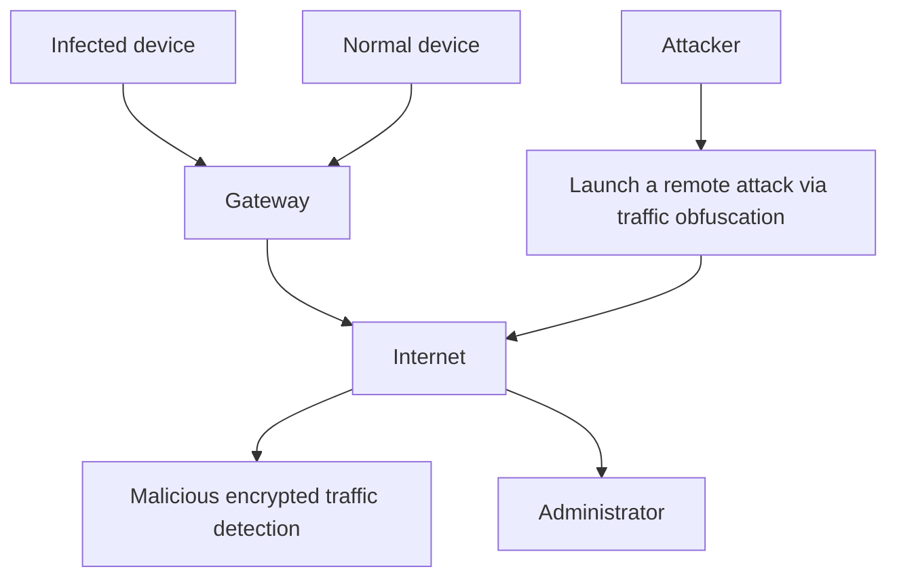
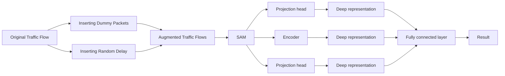

# Robust Detection of Malicious Encrypted Traffic via Contrastive Learning

Meng Shen , Member, IEEE, Jinhe Wu, Ke Ye, Ke Xu , Fellow, IEEE, Gang Xiong, Member, IEEE, and Liehuang Zhu , Senior Member, IEEE

Abstract—Traffic encryption is widely used to protect communication privacy but is increasingly exploited by attackers to conceal malicious activities. Existing malicious encrypted traffic detection methods rely on large amounts of labeled samples for training, limiting their ability to quickly respond to new attacks. These methods also are vulnerable to traffic obfuscation strategies, such as injecting dummy packets. In this paper, we propose SmartDetector, a robust malicious encrypted traffic detection method via contrastive learning. We first propose a novel traffic representation named Semantic Attribute Matrix (SAM), which can effectively distinguish between malicious and benign traffic. We also design a data augmentation method to generate diverse traffic samples, which makes the detection model more robust against different traffic obfuscation strategies. We propose a malicious encrypted traffic classifier that first pre-trains a model via contrastive learning to learn deep representations from unlabeled data, then fine-tunes the model with a supervised classifier to achieve accurate detection even with only a few labeled samples. We conduct extensive experiments with five public datasets to evaluate the performance of SmartDetector. The results demonstrate that it outperforms the state-of-theart (SOTA) methods in three typical scenarios. Specifically, in the evasion attack detection scenario, SmartDetector achieves an F1 score and AUC above 93%, with average improvements of 19.84% and 18.17% over the SOTA method, respectively.

Index Terms—Malicious traffic detection, contrastive learning, encrypted traffic analysis.

# I. INTRODUCTION

W ITH the prosperity of Internet applications, the volumeof network traffic has increased dramatically, which of network traffic has increased dramatically,which brings an outbreak trend of cyber attacks. According to the Check Point Report [1], world-wide weekly cyber attacks increased 42% in the first half of 2022. To bypass the security

Received 21 October 2024; revised 18 March 2025; accepted 6 April 2025. Date of publication 15 April 2025; date of current version 25 April 2025. This work was supported in part by the National Key Research and Development Program of China under Grant 2023YFB2703800, in part by the NSFC Projects under Grant 62222201 and Grant U23A20304, and in part by Beijing Natural Science Foundation under Grant M23020. The associate editor coordinating the review of this article and approving it for publication was Dr. Z. Berkay Celik. (Corresponding author: Meng Shen.)

Meng Shen, Jinhe Wu, and Liehuang Zhu are with the School of Cyberspace Science and Technology, Beijing Institute of Technology, Beijing 100081, China (e-mail: shenmeng@bit.edu.cn; jinhewu@bit.edu.cn; liehuangz@bit.edu.cn).

Ke Ye is with the School of Computer Science, Beijing Institute of Technology, Beijing 100081, China (e-mail: yek 1010@163.com).

Ke Xu is with the Department of Computer Science and Technology, Tsinghua University, Beijing 100084, China (e-mail: xuke@tsinghua.edu.cn).

Gang Xiong is with the Institute of Information Engineering, Chinese Academy of Sciences, Beijing 100190, China (e-mail: xionggang@iie.ac.cn).

Digital Object Identifier 10.1109/TIFS.2025.3560560

clearance, malicious traffic tries to hide its distinctive features through traffic encryption, where potential attackers protect their traffic using encryption protocols such as SSL/TLS [2]. As demonstrated by the report of WatchGuard threat lab [3], 91.5% of malware arrived over encrypted connections by the end of 2023.

The traditional malicious traffic detection methods try to find abnormal traffic by searching predetermined signatures in packet payload [4]. However, traffic encryption protocols such as SSL/TLS [2] make packet contents invisible, leading to the inefficacy of the methods based on deep packet inspection (DPI). To detect malicious traffic hidden in encrypted traffic, recent studies resort to machine learning approaches and extract statistical features [4] or sequence features [5] that are independent of packet contents to build machine learning classifiers. As a result, malicious traffic detection is usually regarded as a classification problem.

However, existing methods are still hampered by two-fold challenges, i.e., efficiency and robustness. Efficiency means that a method can quickly respond to new types of attacks. The existing methods usually require a large volume of welllabeled data for model training [4], [6], [7]. When new attacks appear, it is quite time-consuming to collect adequate malicious samples and retrain the classifiers. For instance, even if researchers use two dozen computers for traffic crawling, it still takes two weeks to collect sufficient dataset for model training [8]. Robustness means that obfuscated malicious traffic can also be accurately detected. The existing methods can easily be defeated by evasion attacks [5], [8], [9], [10], i.e., obfuscating the original traffic by adding manual noises. For instance, evasion attacks [11] can change the features of malicious traffic by injecting dummy packets and adding time delay into encrypted traffic, making the classifiers built based on the original features less effective. Thus, evasion attacks bring new challenges for malicious traffic detection, which requires the extracted features to be resilient to traffic obfuscation.

In this paper, we propose SmartDetector, a robust malicious traffic detection method based on contrastive learning [12] to discover malicious traffic hidden in encrypted traffic. We propose a new traffic representation named Semantic Attribute Matrix (SAM), which captures distinctive features between benign and malicious traffic in a simple matrix. We take SAM as the starting point and build a traffic classifier based on contrastive learning, which enables us to pre-train an encoder with a large volume of unlabeled traffic and then quickly adapt the pre-training encoder to a new type of attack with only a few labeled samples for model tuning. As the unlabeled instances can be easily collected, not requiring the heavy cost of environment construction and traffic labeling.

To improve the robustness of SmartDetector, we propose a data augmentation method tailored to the traffic obfuscation strategies adopted by the attackers. We simulate the process by which an attacker perturbs traffic features by adding random noises [11], e.g., inserting dummy packets and adding random time delay. Based on augmented traffic samples, SmartDetector learns the correlation between the original and obfuscated traffic, which makes it effectively resist evasion attacks.

We summarize our contributions as follows.

• We propose a novel traffic representation named the Semantic Attribute Matrix (SAM). SAM is capable of extracting distinct features that differentiate between benign and malicious traffic, and can maintain its effectiveness under different traffic obfuscation strategies. We provide a quantitative analysis to demonstrate that SAM is more effective than the three typical representations employed by the state-of-the-art (SOTA) methods.   
We propose SmartDetector, a robust malicious traffic detection method based on contrastive learning. In the pre-training phase, we design a data augmentation method tailored to the specifications of the network traffic. The encoder in SmartDetector can be pre-trained with unlabeled traffic samples. During retraining, we only need a few labeled samples to train the traffic classifier to achieve high accuracy in detecting new attacks.   
• We conducted extensive experiments using five representative public datasets to evaluate the performance of SmartDetector. The results show that SmartDetector outperforms the SOTA methods [6], [7], [8], [9] in all scenarios. In particular, in the scenario of detecting obfuscated malicious traffic, SmartDetector achieves an F1 score and AUC that both exceed 90%, with an average improvement of 19.84% and 18.17% over the SOTA method.

The remainder of this paper is organized as follows. We introduce the background and related work in Section II. Then, we describe the design goals in Section III. We present SAM and SmartDetector in Section IV and Section V. Next, we conduct experiments to evaluate the performance of Smart-Detector in Section VI. Finally, we conclude this paper in Section VII.

# II. BACKGROUND AND RELATED WORK

In this section, we first describe the threat model of malicious traffic detection, and then review the existing methods.

# A. Threat Model

There are usually two kinds of roles in the scenario of malicious traffic detection, i.e., the network administrator and the attacker, as shown in Fig. 1. The attacker launches remote attacks on devices located in a local area network (LAN). We assume that communication traffic is encrypted by network encryption protocols, which is more challenging for malicious traffic detection.


<details>
<summary>flowchart</summary>


</details>

Fig. 1. The threat model for malicious traffic detection.

1) Capability of Attackers: We assume that the attacker can manipulate packets within the traffic flow to evade detection [10], such as inserting dummy packets or introducing delays. However, we assume that attackers cannot fully replicate the traffic features of benign traffic (e.g., packet length, direction). This is due to the fact that fully replicating the aforementioned features to imitate benign traffic would impose a significant burden on attackers and result in the failure of the attack [4], [11]. For example, in a Denial of Service (DoS) attack, if the attacker adjusts the sending intervals to be identical to those of benign traffic, they may not be able to overwhelm the target system [13]. We further assume that the attacker lacks the ability to manipulate ports within the target network, specifically the inability to open widely recognized ports (such as port 80 for HTTP and port 443 for HTTPS), as this would necessitate system-level privileges [14].

2) Capability of Network Administrator: The administrator possesses the capability to monitor encrypted traffic via the network gateway, however, they are unable to decrypt any individual packets. The administrator can continuously collect traffic data to distinguish between malicious and benign traffic. However, they are unable to foresee the type of attack or malware that an attacker might initiate, nor do they have any prior information regarding the specific traffic obfuscation method employed by the attacker.

# B. Related Work on Malicious Traffic Detection

Traditional malicious traffic detection methods in the early stages typically rely on signature matching. These methods extract sequences of bytes from malicious traffic [4] and detect malicious activity by comparing the traffic against known malicious signatures. However, the widespread adoption of encryption technologies has made packet contents inaccessible, thereby rendering detection methods based on packet content scanning ineffective. To overcome this limitation, various detection methods specifically designed for malicious encrypted traffic have been proposed, as summarized in Table I.

1) Methods Based on Unsupervised Learning: These methods detect malicious traffic by identifying patterns that deviate from established benign traffic behaviors. Mirsky et al. [15] proposed Kitsune, a real-time plug-and-play framework that employs an ensemble of autoencoders to reconstruct statistical features for learning normal traffic patterns. Building on this foundation, Bovenzi et al. [16] introduced enhancements including ensemble equalization and advanced distance metrics (e.g., NAP), significantly improving adaptability and detection performance in dynamic environments. Zhang et al. [17] leveraged isolation forests for anomaly detection and proposed an adaptive evolution mechanism enabling real-time malicious traffic identification. These methods do not require labeled data during training. However, due to the lack of label information, they are unable to directly learn specific features of attacks, which may lead to higher false positive/negative rates [18].

TABLE I SUMMARY OF EXISTING MALICIOUS ENCRYPTED TRAFFIC DETECTION METHODS 

<table><tr><td>Method Categories</td><td>Typical Methods</td><td>Traffic Representation</td></tr><tr><td>Unsupervised Learning</td><td>Kitsune [15]Bovenzi et al. [16]OADSD [17]</td><td>Statistical FeaturesStatistical FeaturesPacket head, payload</td></tr><tr><td>Supervised Learning</td><td>Rahmat et al. [19]EvilHunter [20]ST-Graph [6]Feng et al. [21]DFR [7]</td><td>Statistical FeaturesAd Bid Request FeaturesTraffic GraphGrey-scale MapGrey-scale Map</td></tr><tr><td>Meta-Learning</td><td>FC-Net [9]TF [8]SmartDetector</td><td>Color ImageDirection SequenceSemantic Attribute Matrix</td></tr></table>

2) Methods Based on Supervised Learning: These methods leverage labeled data to train models, enabling them to differentiate between benign and malicious traffic based on their unique features. Rahmat et al. [19] introduced a method grounded in ensemble learning, utilizing algorithms such as XGBoost and AdaBoost to construct the model through techniques like bagging and boosting. Sun et al. [20] observed that fraudulent devices could be detected through encrypted traffic analysis and developed EvilHunter for this purpose. Fu et al. [6] proposed ST-Graph, which detects malware traffic using graph-based network analysis. They employed graph representation learning to capture the spatial and temporal features of network behaviors and utilized a random forest to build the classifier. Feng et al. [21] presented a two-layer deep learning approach for malware detection, combining convolutional neural networks (CNNs) and autoencoders. Zeng et al. [7] introduced a deep learning framework for detecting malicious traffic, utilizing CNNs and Stacked Auto-Encoders to extract features from raw traffic without manual feature engineering. These methods achieve high F1 scores when trained on an adequate number of labeled samples [6], [7]. However, they rely on predefined parameters and, when confronted with emerging attacks, require a significant number of labeled samples for model retraining [4].

3) Methods Based on Meta-Learning: Meta-learning [22], [23] is a machine learning paradigm designed to improve model transferability. In the scenario of malicious traffic detection, this enables the model to generalize knowledge from known attack patterns (e.g., historical attack samples) to

new attack types. By leveraging prior experience, the model can rapidly adapt to new malicious traffic patterns, even with limited labeled samples. Several studies have applied this approach to malicious traffic detection. Xu et al. [9] proposed FC-Net, a malicious traffic detection framework based on meta-learning, which was leveraged to distinguish a pair of samples as a basic task of learning. TF [8] was also an encrypted traffic analysis method which was suitable for few-shot learning. It consisted of two parts, i.e., the feature extraction based on CNN and the classification network based on k-NN. Although FC-Net [9] and TF [8] can detect new attacks with few labeled samples, they still depend on a large, well-labeled traffic dataset during the pre-training phase. Furthermore, their traffic representations are not informative enough to effectively distinguish between benign and malicious traffic (see Section VI-B). To evade detection [11], attackers may vary traffic features by employing traffic obfuscation, e.g., injecting dummy packets. Unfortunately, the above methods cannot cope with obfuscated malicious traffic.

# III. DESIGN GOALS

In this section, we describe the design goals of malicious encrypted traffic detection.

# A. Efficient Model Training

Model training requires substantial labeled traffic, which is often challenging to collect. For instance, constructing the CIC-IDS-2017 [24] dataset involved setting up a complex network with various systems to simulate attacks. However, collecting unlabeled traffic at network gateways is more practical, as it allows capturing large volumes of data without needing prior classification.

# B. Transferable to New Attacks

To minimize economic losses, detection models must quickly adapt to new threats. Current methods require extensive retraining for novel attacks, which is time-consuming and often impractical due to limited attack samples. Therefore, there is a need for a malicious traffic detection approach that can easily transfer to new attack types.

# C. Robust to Obfuscated Traffic

Attackers can evade detection by modifying traffic features, such as inserting dummy packets or altering packet rate, which can significantly change traffic’s statistical features [5], [11]. Network administrators often lack information on whether and how traffic is obfuscated. Therefore, detection methods need to operate effectively with limited knowledge and be resilient against obfuscated traffic.

# IV. TRAFFIC REPRESENTATION

In this section, we present key observations regarding the distinctions between benign and malicious traffic, and introduce a new traffic representation, the Semantic Attribute Matrix (SAM), designed to capture these distinguishing features.


Fig. 2. The KDE of malicious and benign traffic across three features in three datasets: CIC-IDS-2017 [24], CIC-DDoS-2019 [25], and DoHBrw-2020 [26]. The features include Packet Length, Down/Up Ratio, and IAT.   
TABLE II LIST OF NOTATIONS 

<table><tr><td>Notations</td><td>Descriptions</td></tr><tr><td>T</td><td>A traffic flow</td></tr><tr><td>L</td><td>Number of packets in a traffic flow</td></tr><tr><td>K</td><td>Number of packets extracted from a traffic flow</td></tr><tr><td>pkt</td><td>A packet in a traffic flow</td></tr><tr><td>B</td><td>The dimension of the embedded features</td></tr><tr><td>D</td><td>Attribute value dictionary</td></tr><tr><td>M</td><td>Per-Packet Feature Matrix</td></tr><tr><td>R</td><td>Semantic Attribute Matrix</td></tr><tr><td>z</td><td>Length of a packet</td></tr><tr><td>d</td><td>Direction of a packet</td></tr><tr><td>a</td><td>Inter-Arrival Time of adjacent packets</td></tr><tr><td>S</td><td>Attribute value</td></tr><tr><td>x</td><td>The one-hot representation</td></tr></table>

# A. Key Observation on Feature Distribution

The key to inspecting encrypted malicious traffic lies in identifying the differences between benign and malicious traffic. To gain a profound understanding of these differences, we utilize three public datasets on malicious traffic to visualize the disparities in distribution between benign and malicious traffic across three commonly used traffic features from prior studies [4], [6], [8], namely packet length, Down/Up Ratio, and Inter-Arrival Time (IAT).

The datasets are CIC-IDS-2017 [24], CIC-DDoS-2019 [25], and DoHBrw-2020 [26], which contain various types of malicious traffic, such as DoS/DDoS, Brute Force, Portscan, and DNS Tunneling attacks (see Table III for more details). Specifically, we randomly select 2,000 samples for each type of malicious traffic. For benign traffic, the number of samples is set to match that of the malicious traffic. We consider bidirectional flows to capture both upstream and downstream packet interactions. A bidirectional flow represents a traffic entity that includes all packets with the same 5-tuple (source and destination IP addresses, source and destination ports, and transport protocol). We plot the Kernel Density Estimation (KDE) curves of three features, as shown in Fig. 2.

1) Packet Length: The packet length distribution of malicious traffic is more concentrated around specific values, while benign traffic exhibits a more dispersed distribution. This is because benign traffic consists of a variety of packet sizes due to diverse communication patterns and application behaviors. Malicious traffic tends to have a more structured packet length distribution, which may result from predefined attack payloads used in malicious activities [27]. For instance, the packets in SYN Flood attack are typically small, exhibiting a similar pattern in packet length [13].

2) Down/Up Ratio: It represents the ratio of downstream to upstream packets for each traffic flow. Benign traffic typically exhibits a Down/Up Ratio close to 1:1, as the communication between clients and servers is generally balanced in terms of data exchange. In contrast, malicious traffic often demonstrates a more dispersed distribution of Down/Up Ratios, which can be either excessively high or significantly low. The DoHBrw-2020 dataset exhibits higher low Down/Up Ratio. This occurs because attackers send large volumes of data, such as malware payloads, to compromised devices, while the victims only transmit minimal responses (e.g., acknowledgments) [28].

3) Inter-Arrival Time (IAT): The distribution of benign traffic tends to be relatively smooth, whereas the IAT of malicious traffic are often concentrated around specific peak values. For example, the CIC-DDoS-2019 dataset exhibits extremely small IAT, this is because DDoS attacks involve a massive number of packets being sent to the target in rapid succession [13]. In these attacks, attackers aim to overwhelm the target’s resources by flooding it with continuous traffic from multiple sources. We observe consistent distributional differences between benign and malicious traffic across all three datasets, despite their varying network environments and collection time periods. These consistent differences in features including packet length, Down/Up Ratio, and Inter-Arrival Time (IAT) suggest their generalizability to other cases and, consequently, their potential as crucial indicators for detecting malicious traffic.

# B. Semantic Attribute Matrix

Based on the above observations, we propose Semantic Attribute Matrix (SAM) as a new traffic representation to capture distinguishing features between benign and malicious traffic. The construction process of SAM is shown in Fig. 3, which consists of two steps, namely feature extraction and feature embedding. The main notations used in this paper are summarized in Table II.

1) Feature Extraction: Based on the above analysis, we extract three key features from the traffic flows: packet length, packet direction, and inter-arrival time. These features can effectively distinguish between benign and malicious traffic. To achieve a timely detection, we use only the first K packets in each flow. Subsequently, we obtain the Per-Packet Feature Matrix M with dimensions of $3 \times K$ .

TABLE III SUMMARY OF FIVE DATASETS WITH TRAFFIC TYPES AND FLOW COUNTS PER CATEGORY 

<table><tr><td>Dataset ID</td><td>Dataset Name</td><td>Traffic Types</td></tr><tr><td> $D_1$ </td><td>CIC-IDS-2017 [24]</td><td>Benign (226030), DoS (22919), FTP-Patator (7894), Portscan (15773), SSH-Patator (5861), DDoS-LOIT (12708)</td></tr><tr><td> $D_2$ </td><td>CIC-DDoS-2019 [25]</td><td>Benign (324214), DDoS-MSSQL (5061), DDoS-NetBIOS (3454), DDoS-UDP (3782), UDPLag (4751), SYN Flood (42847)</td></tr><tr><td> $D_3$ </td><td>DoHBrw-2020 [26]</td><td>Benign (50485), DNS2Tcp (5249), DNSCat2 (5369), Iodine (11336)</td></tr><tr><td> $D_4$ </td><td>USTC-TFC [34]</td><td>Benign (11993), Htbot (3052), Neris (2884), Miuref (2429), Virut (3602)</td></tr><tr><td> $D_5$ </td><td>CIC-IoV-2024 [35]</td><td>Benign (56646), Vul Scan (6341), Os Scan (7312), Publish Flood (3601), Connect Flood (2287)</td></tr></table>


<details>
<summary>flowchart</summary>

```mermaid
graph TD
    A["Per-Packet Feature Matrix 3×K"] --> B["Search"]
    B --> C["Attribute Value Dictionary"]
    C --> D["Word Embedding"]
    D --> E["Semantic Attribute Matrix 3×K×B"]
    A --> F["Per-Fall Traffic Flow"]
    F --> G["Packet Length → 66 66 ... 1500"]
    F --> H["Packet Direction → -1 +1 ... -1"]
    F --> I["IAT → 0.0 100.0 ... 10.0"]
    G --> J["Key Value: 66 [-1.08, 0.23 ..., 0.45"], 1500["-1.34, -0.06 ..., -1.63"], ... [...]]
    H --> K["Key Value: 0.0 [-0.98, 0.23 ..., 0.45"], 10.0["-0.59, -2.11 ..., -0.11"], ... [...]]
    I --> L["Key Value: -0.98 [-0.51 ... -0.37"], 0.79["1.18 ... -1.51"], ... [...]]
    J --> M["Rz: -1.08 0.23 ... 0.45, -1.34 [-0.06 ... -1.63"]]
    K --> N["Rd: -1 [-1 ... -1, +1 +1 ... +1, -1 [-1 ... -1"]]
    L --> O["Ra: -0.98 [-0.51 ... -0.37, 0.79 [-1.18 ... -1.51, ... [..."], -0.59["-2.11 ... -0.11"]]
    M --> P["K × B"]
    N --> P
    O --> P
```
</details>

Fig. 3. The construction process of SAM. For a given traffic flow, SAM extracts three features from the first K packets, including packet length, packet direction and IAT. Then SAM employs feature embedding to capture contextual information.

2) Feature Embedding: The Per-Packet Feature Matrix obtained is a series of numbers, which can be further enhanced by feature embedding [29]. For example, the same type of malicious traffic generate multiple packet sequences with various lengths. This results in the Per-Packet Feature Matrix being distant in the feature space, despite the different length sequences having similar meanings in context and exhibiting the same malicious behavior. For instance, in a DoS attack, attackers may use different User Agents to send numerous HTTP requests [27]. The use of varying user agents creates variations in header size, which in turn affects the packet length.

Based on the above analysis, it is crucial to capture the contextual information among multiple flows in the scenario of malicious traffic detection. Recent study [29] utilizes a trainable embedding layer for feature embedding, primarily focusing on capturing inter-modality dependencies within a single flow, which enhances the accuracy of mobile traffic classification. Therefore, we use an alternative feature embedding technique. Specifically, we integrate the features from multiple flows into a set and employ Word2Vec [30] for feature embedding.

Word2vec [30] is a commonly used method in word embedding, which contains two algorithms, i.e., skip-gram and Continuous Bag-of-Words (CBOW). The former predicts the surrounding words through the central word while the latter predicts the central word through the surrounding words. In this paper, we use CBOW to translate features into a vector. Before conducting word embedding, we should build an embedding dictionary. Hence, we collect 3,989,459 flows from the gateway of a campus network as background traffic. Taking the construction of packet length embedding dictionary as an example, we collect different attribute values of all packet lengths and construct attribute value dictionary $D _ { z } =$ $\{ ( S _ { 1 } , W _ { 1 } ) , ( S _ { 2 } , W _ { 2 } ) , \ldots , ( S _ { V } , W _ { V } ) \}$ , where V represents the size , , ,of the vocabulary.

The input layer is the one-hot representation of multiple context words $\{ x _ { 1 } , x _ { 2 } , \cdots , x _ { C } \}$ , where $x _ { i }$ represents the one-hot , , ,representation of the i-th context word and C represents the size of the context word window. The formula for calculating the hidden layer is shown in Eq. (1):

$$
h = \frac {1}{C} W ^ {T} * \left(\sum_ {i = 1} ^ {C} x _ {i}\right) \tag {1}
$$

where B is the dimension of the embedded feature, and W is the matrix with dimensions V ∗ B. The obtained hidden layer h is then passed through the output layer mapping matrix W0 to get the output layer u, which is shown in Eq. (2):

$$
u = W ^ {\prime T} * h \tag {2}
$$

where $W ^ { \prime }$ is the matrix with the dimension of B∗V. According to the output layer, the probability of predicting the attribute value of the packet to be $S _ { k }$ is $y _ { k } ,$ , which is calculated in Eq. (3):

$$
y _ {k} = \frac {\exp (u _ {k})}{\sum_ {j = 1} ^ {V} \exp (u _ {j})} \tag {3}
$$

Algorithm 1 Feature Extraction and Embedding   
Input : Flow $T = \{pkt_{1}, pkt_{2}, \ldots, pkt_{L}\}$ with L packets, Fixed processing length K, Embedding dimension B, Embedding dictionary $D = \{D_{z}, D_{a}\}$ .

Output: Semantic attribute matrix $R = \{R_{z}, R_{d}, R_{a}\}$ .

/* Step 1: Truncate or pad flow */

if $L \geq K$ then $T_{proc} \leftarrow \{pkt_{1}, \ldots, pkt_{K}\}$ ; // Truncate

else $T_{proc} \leftarrow T \cup \{0\}^{K-L}$ ; // Pad with zeros

end

/* Step 2: Extract packet features */

Initialize Per-Packet Feature Matrix $M \in R^{3 \times K}$ ;

for $j \leftarrow 1$ to K do

Extract packet length $z_{j}$ , packet direction $d_{j}$ , IAT $a_{j}$ from $T_{proc}[j]$ ; $M[:, j] \leftarrow [z_{j}, d_{j}, a_{j}]^{T}$ ;

end

/* Step 3: Embed packet features */

Initialize $R \leftarrow \{\}$ ;

foreach $i \in \{z, d, a\}$ do $R_{i} \leftarrow []$ ;

for $j \leftarrow 1$ to K do

if i = d then

Append $[M_{i,j}] \times B$ to $R_{i}$ // No embedding

else if $M_{i,j} \in D_{i}$ then

Append $D_{i}[M_{i,j}]$ to $R_{i}$ else $x' \leftarrow \arg\min_{x \in D_{i}} |M_{i,j} - x|$ ; // Search

nearest neighbor

Append $D_{i}[x']$ to $R_{i}$ ;

end

end

Append $R_{i}$ to R;

The attribute value with the highest probability is taken as the output. To optimize the model parameters, we use the crossentropy loss function to measure the difference between the predicted probability $y _ { k }$ , and the true label. Assuming the true label of the target attribute is a one-hot vector tk, the loss function is defined as:

$$
\mathcal {L} = - \sum_ {k = 1} ^ {V} t _ {k} \log (y _ {k}) \tag {4}
$$

The gradients of the loss function with respect to the weight matrices W and $W ^ { \prime }$ are computed during backpropagation. After several iterations, the weight matrix W becomes the embedding matrix, where each row corresponds to the embedding vector of a specific attribute value. The embedding vector of the m-th attribute value $S _ { m }$ is denoted as $W _ { m } .$ . Finally, we obtain the embedding dictionary $\begin{array} { r l } { D _ { z } } & { { } = } \end{array}$ $\{ ( S _ { 1 } , W _ { 1 } ) , ( S _ { 2 } , W _ { 2 } ) , \ldots , ( S _ { V } , W _ { V } ) \}$ . For IAT, we repeat the same process to obtain the embedding dictionary $D _ { a } .$ .

Based on the embedding dictionaries, we translate the Per-Packet Feature Matrix into meaningful vectors. Considering that there are only two values of direction, i.e., +1 for the upstream and −1 for the downstream, we do not apply feature embedding on the direction sequence. The embedding process in Algorithm 1 translates the per-packet feature matrix M into the semantic attribute matrix R by first processing each feature type separately (lines 11–24): for direction d the binary value is directly tiled into a B-dimensional vector (lines 15-16), while packet length z and inter-arrival time a are mapped to B-dimensional embeddings via exact matches (lines 17- 18) or nearest-neighbor approximation (lines 20–21) using pre-established embedding dictionaries $D _ { z }$ and $D _ { a }$ . These embeddings are then concatenated across the three features, resulting in a $3 \times K \times B$ matrix R. We quantitatively evaluate the effectiveness of SAM in Section VI-B.

# V. THE PROPOSED SMARTDETECTOR

# A. System Overview

Based on SAM, we present the design of SmartDetector. SmartDetector consists of two critical modules, i.e., Traffic Flow Augmentation and Traffic Classifier Construction. The overall framework of SmartDetector is depicted in Fig. 4.

1) Traffic Flow Augmentation: This module initially simulates traffic obfuscation by generating augmented flows through the injection of dummy packets and random delay. The augmented flows are subsequently converted into SAM, yielding augmented traffic representations. These representations are used as input for the Traffic Classifier Construction module.   
2) Traffic Classifier Construction: This module trains an encoder to transform traffic representation to deep representation. By ensuring the similarity between an original traffic representation and the corresponding augmented traffic representations, the well-trained encoder can also maintain the similarity between the original and obfuscated traffic. Then it leverages the pre-training encoder and a few labeled traffic samples to train a fully connected layer. For malicious traffic detection, the test samples are input into the model and then the detection results can be obtained.

# B. Traffic Flow Augmentation

In the malicious traffic detection scenario, some attackers may employ various obfuscation strategies, such as inserting dummy packets, altering packet rates, and injecting noise into each packet, etc., to evade detection [4]. These strategies significantly change the features of the original traffic, making it difficult for existing detection systems to identify malicious behavior. To enhance the robustness of detection systems against evasion attacks, we propose a data augmentation framework that simulates real-world obfuscation strategies. Unlike previous studies [23], [31] that focus on simulating changes in network conditions, our framework specifically targets the simulation of adversarial obfuscation strategies.

Obfuscation strategies used by attackers can generally be classified into two main categories: inserting dummy packets and altering packet rates [10]. Based on this insight, we carefully design a traffic flow augmentation method. Specifically, we mimic the strategies used by attackers by either randomly inserting dummy packets into traffic flow or adding delay to each packet. Note that this process is not completely random, as an entirely random approach could destroy the semantic information of the traffic features, leading to deviations from realistic conditions. For example, the size of packets transmitted in the network generally does not exceed 1500 bytes.


<details>
<summary>flowchart</summary>


</details>

Fig. 4. The overview of SmartDetector.

Algorithm 2 Traffic Flow Augmentation   
Input : Flow $T = \{pkt_{1}, pkt_{2}, \ldots, pkt_{L}\}$ , Dummy packet insertion probability q, Random delay insertion probability r.
Output: Augmented flow $T'$ .
1 Initialize $T' \leftarrow []$ 2 for $i \leftarrow 1$ to L do
3 $q' \leftarrow \text{RandomUniform}(0,1)$ ; // Generate dummy insertion probability
4    if $q' \leq q$ then
5    Generate dummy packet $p\hat{k}t$ with: Length $z_{i}' \in [0, 1500]$ , Direction $d' \in \{-1, 1\}$ , IAT $a_{i}' \in [0, 0.2]$ ;
6 $T' \leftarrow T' \cup \{p\hat{k}t\}$ ; // Insert dummy packet end
7 $r' \leftarrow \text{RandomUniform}(0,1)$ ; // Generate delay insertion probability
8    if $r' \leq r$ then
9 $\delta \leftarrow \text{RandomUniform}(0,0.2)$ ; // Random delay $a_{i} \leftarrow a_{i} + \delta$ ; // Update IAT of $pkt_{i}$ 10    end
11 $T' \leftarrow T' \cup \{pkt_{i}\}$ ; // Append current packet end
12 return $T'$

However, inserting the random dummy packets directly into the traffic flow may result in packets exceeding this limit.

The flow augmentation process is described in Algorithm 2. For a given traffic flow T, we randomly insert dummy packets and add time delay based on probabilities p and r. To better simulate the behavior of attackers, we set both q and r to 0.5. The augmented traffic flow $T ^ { \prime }$ is obtained after processing all packets. Then the augmented traffic flow is transformed into SAM, and subsequently used as augmented samples. This process mimics the way the attacker conducts traffic obfuscation, which enables the model to associate the original feature with the disturbed feature, improving the capability of detecting obfuscated malicious traffic.

# C. Traffic Classifier Construction

To achieve malicious traffic detection, contrastive learning is used to build the encoder. Contrastive learning [12] is one of the unsupervised learning methods, which focuses on learning the common features between similar instances and differentiating the differences between non-similar instances.

Contrastive learning is widely used in image recognition, treating each image as an individual class. As studied in [12], the high-quality positive and negative pair construction is very important. For example, applying transformations like rotation, cropping, flipping, and adding Gaussian noise to an image generates positive samples, while other images in the batch serve as negative samples. The model is then trained to bring positive pairs closer and push negative pairs apart in the embedding space, using a metric such as cosine similarity. This trained model is utilized for feature embedding in downstream tasks like classification and prediction.

In SmartDetector, the training process can be divided into two steps. In the first step, the contrastive learning model is trained using the unlabeled traffic samples. The model is constructed by the encoder and projection head. Deep representation is learned by the encoder, which is the input of the projection head. The outputs of the model are similar between the positive pairs and are different between the negative pairs. After we attain the deep representation, in the second step, labeled traffic samples are used to learn how to distinguish benign and malicious traffic. The input of the supervised model is the output of the encoder. Based on the previously learned deep representation, the supervised model can achieve high classification accuracy using only a few samples.

1) Contrastive Learning: To extract the traffic deep representation, we build the encoder based on the architecture of ResNet, as the ResNet architecture has achieved excellent performance in a number of tasks, including image classification and semantic segmentation [32]. It employs two types of residual blocks, the Conv block and Identity block, to improve accuracy. The Identity block, unlike the Conv block, omits convolution and normalization. This architecture allows the output of an earlier layer to directly influence a subsequent layer, enabling a partial linear contribution from previous layers to the later ones.

We calculate the similarity between the original and augmented feature matrix for each flow, which is defined in Eq. (5):

$$
\operatorname{sim} \left(s _ {i}, s _ {i} ^ {\prime}\right) = \frac {s _ {i} ^ {T} s _ {i} ^ {\prime}}{\| s _ {i} \| \| s _ {i} ^ {\prime} \|} \tag {5}
$$

where si and $s _ { i } ^ { \prime }$ represent the representations of the two samples extracted by the encoder. The loss function of a flow sample is defined in Eq. (6):

$$
l _ {i} = - \log \frac {\exp (\text { sim } (s _ {i} , s _ {i} ^ {\prime}))}{\sum_ {k = 1} ^ {2 Q} \exp (\text { sim } (s _ {i} , s _ {k}))} (k \neq i) \tag {6}
$$


<details>
<summary>scatter</summary>

| Group | Color | Description |
|-------|-------|-----------|
| Normal | Brown | Normal |
| FTP-Patator | Blue | FTP-Patator-obf |
| DoS | Purple | DoS |
| SSH-Patator | Red | SSH-Patator |
| DoS-cbf | Yellow | DoS-cbf |
| SSH-Patator-obf | Maroon | SSH-Patator-obf |
</details>

(a) The input of the encoder (b) The output of the encoder   
Fig. 5. Visualization of the original and obfuscated traffic features reduced by T-SNE algorithm into 2 dimensions. For example, DoS and DoS-obf refer to the original and the obfuscated DoS traffic features, respectively.

where $Q$ is the total number of samples in a batch. The convolutional neural network learns the feature extraction parameters based on the iterative calculation automatically. The two encoders for original samples and augmented samples share the same set of parameters. The deep representations $s _ { i }$ and $s _ { i } ^ { \prime }$ are put into the projection heads, which also share the same set of parameters.

The encoder trained with contrastive learning aligns the outputs of a positive pair, which in SmartDetector refers to the original traffic and its obfuscated version. The feature visualization is shown in Fig. 5, with dimensionality reduction using the t-SNE [33] algorithm and displayed on two-dimensional axes. For instance, DoS represents original DoS traffic, while DoS-obf refers to obfuscated DoS traffic. In Fig. 5(a), the two feature sets are dissimilar, indicating that noise changes the original features. However, in Fig. 5(b), the encoder brings the original and obfuscated features closer, demonstrating their increased similarity.

2) Supervised Learning: We use the deep representations attained in the previous step combined with their labels to train a model. The parameters of the encoder are frozen in the process of supervised learning. For each type of traffic, we randomly select N samples in the training set to train the fully connected layers. As the deep representation of traffic is previously learned in contrastive learning, the fully connected layer can be quickly trained using only a few samples, which allows the detection model to quickly adapt to new types of attacks.

# VI. PERFORMANCE EVALUATION

In this section, we conduct extensive experiments to evaluate the effectiveness of SmartDetector. We first introduce the experiment and parameter setting. Then, we thoroughly compare SmartDetector with the state-of-the-art methods in three typical scenarios, including few-shot learning, imbalanced dataset training, and obfuscated malicious traffic detection.

# A. Experiment Setting

1) Baseline Methods: To measure the improvements achieved by SmartDetector, we establish four baselines, among which two methods enable few-shot learning, i.e., FC-Net, TF.

• DFR [7] is an end-to-end malicious traffic detection framework based on Convolutional Neural Networks (CNN). It converts the raw traffic data to gray-scale image and utilizes CNN to extract features without manual intervention and private information.   
• FC-Net [9] is a deep neural network (DNN) based classifier for malicious traffic detection. It leverages the meta-learning framework to distinguish a pair of samples as a basic task of learning. Based on this framework, it enables the detection of new attacks with a few samples.   
TF [8] is a triplet network based classifier for website fingerprinting (WF). It can achieve transferring tasks from one dataset to another using a few samples, which can also be applied in the detection of new attacks.   
• ST-Graph [6] is a graph-based framework for detecting malware traffic. It consists of a spatio-temporal feature extraction network based on heterogeneous graph representation learning and a multi-stream analysis framework.

2) Dataset: We use five public datasets for evaluation.

• CIC-IDS-2017 $( D _ { 1 } )$ [24] is a intrusion detection dataset that that captures network traffic from hundreds of hosts. For a fair comparison, we select the same 5 types of malicious traffic as FC-Net to construct dataset, i.e., DoS, FTP-Patator, Portscan, SSH-Patator and DDoS-LOIT.   
CIC-DDoS-2019 $( D _ { 2 } )$ [25] is a comprehensive dataset that includes various types of Distributed Denial of Service (DDoS) attacks. We also select 5 typical types of malicious traffic to construct dataset, i.e., DDoS-MSSQL, DDoS-NetBIOS, DDoS-UDP, UDPLag, SYN Flood.   
• DoHBrw-2020 $( D _ { 3 } )$ [26] contains malicious DNS-over-HTTPS (DoH) encrypted traffic generated using three tunneling tools: DNS2Tcp, DNSCat2, and Iodine.   
• USTC-TFC $\left( D _ { 4 } \right)$ [34] contains different types of malware traffic, including Htbot, Neris, Miuref, and Virut.   
CIC-IoV-2024 (D5) [35] contains spoofing and DoS malicious traffic targeting the Internet of Vehicles, including Vul Scan, Os Scan, Publish Flood, and Connect Flood.

The datasets are summarized in Table III. We analyze the selected features using the $D _ { 1 } , D _ { 2 }$ , and $D _ { 3 }$ datasets in Section IV-A. To further validate the generalizability of SmartDetector, we also evaluate its performance on the $D _ { 4 }$ and $D _ { 5 }$ datasets.

3) Validation: In order to evaluate few-shot learning, we partition the dataset into known and new attacks. $D _ { 1 }$ serves as the baseline, where one attack is treated as new and the other four as known; this process is repeated five times so that each attack is eventually considered new. For meta-learning-based methods (FC-Net [9], TF [8], SmartDetector), known attack samples are used for pre-training, while new attack samples are used for retraining and evaluation. In contrast, supervised methods (DFR [7], ST-Graph [6]) are directly trained and tested on new attack samples.

For pre-training, we maintain 10,000 samples with a benignto-malicious ratio of 4:1 (8,000 benign and 500 per known attack type). Attacks in $D _ { 2 } , D _ { 3 } , D _ { 4 }$ and $D _ { 5 }$ are treated as new attacks and are evaluated using the model pre-trained on $D _ { 1 }$ . To mitigate the effects of sample selection randomness, each experiment is repeated 100 times. For the new attack, we randomly select N samples from 2,000 samples to train the fully connected layer while using the remaining samples for evaluation; the final result is the average over 100 runs.

TABLE IV HYPERPARAMETERS FOR DIFFERENT REPRESENTATIONS 

<table><tr><td>Representations</td><td>Hyperparameters</td></tr><tr><td>Color Image [9]</td><td>M=16,N=256</td></tr><tr><td>Direction Sequence [8]</td><td>N=5000</td></tr><tr><td>Traffic Graph [6]</td><td>Dh=256,PL=100,PN=10</td></tr><tr><td>SAM</td><td>K=40,B=100</td></tr></table>

TABLE V THE EUCLIDEAN DISTANCE BETWEEN MALICIOUS AND BENIGN TRAFFIC UNDER DIFFERENT REPRESENTATIONS 

<table><tr><td></td><td>Color Image [9]</td><td>Direction Sequence [8]</td><td>Traffic Graph [6]</td><td>SAM</td></tr><tr><td>DoS</td><td>0.54</td><td>0.64</td><td>0.59</td><td>0.69</td></tr><tr><td>FTP-Patator</td><td>0.32</td><td>0.65</td><td>0.52</td><td>0.62</td></tr><tr><td>Portscan</td><td>0.46</td><td>0.29</td><td>0.72</td><td>0.57</td></tr><tr><td>SSH-Patator</td><td>0.67</td><td>0.59</td><td>0.53</td><td>0.74</td></tr><tr><td>DDoS-LOIT</td><td>0.42</td><td>0.60</td><td>0.58</td><td>0.65</td></tr><tr><td>Average</td><td>0.48</td><td>0.55</td><td>0.59</td><td>0.65</td></tr></table>

4) Performance Metrics: We select Recall, F1 score and the area under ROC curve (AUC) as the performance metrics because they are most widely used in the literature [8], [9].

# B. Evaluation on Effectiveness of SAM

We use quantitative measures to evaluate the effectiveness of SAM as well as three typical representations employed by the SOTA methods, i.e., Color Image in FC-Net [9], Direction Sequence in TF [8] and Traffic Graph in ST-Graph [6].

We choose five representative attacks from the dataset D . For benign traffic and each type of malicious traffic, we randomly select 2,000 traffic samples and transform them into corresponding traffic representations. Then we use the euclidean distance to assess the dissimilarity between malicious and benign traffic. A greater distance indicates a more effective capture of the distinguishing features between malicious and benign traffic. To allow data to be scaled to fall within defined intervals without changing the original data source distribution and comparable, we take the average of all distances and use min-max normalization.

As we previously mentioned, we use only the first K packets in each flow. We analyze the lengths of all flows in the dataset and find that most of the flows are relatively short, with an average packet count of 43. Therefore, to achieve timely detection, we set K = 40. To capture more information while improving training efficiency [30], we set B to 100 in subsequent experiments. The selected hyperparameters for different representations are shown in Table IV.

As shown in Table V, SAM exhibits the maximum distance on average in the five categories of malicious traffic, demonstrating its capability of distinguishing malicious traffic from benign traffic. For FTP-Patator, direction sequence has the largest distance, since the attackers repeatedly try to login the target FTP servers, resulting in a large number of packets in the same direction. For Portscan, traffic graph exhibits the largest distance, because the number of packets in a malicious flow for port scanning is quite small, resulting in much smaller graphs than those of benign flows. Color image has the smallest distance on average, indicating that the imagebased representation is less expressive.


<details>
<summary>bar</summary>

|        | Color Image | Direction Sequence | Traffic Graph | SAM   |
| ------ | ----------- | ------------------ | ------------- | ----- |
| IDP    | 0.47        | 0.51               | 0.40          | 0.60  |
| IBP    | 0.46        | 0.50               | 0.34          | 0.59  |
| APR    | 0.47        | 0.55               | 0.39          | 0.64  |
| INP    | 0.42        | 0.55               | 0.38          | 0.62  |
</details>

Fig. 6. The Euclidean distance between malicious and benign traffic with each traffic representation under different obfuscation strategies, including inserting dummy packets (IDP), inserting benign packets (IBP), altering packet rate (APR), and inserting noise into each packet (INP).

Evaluation on the Obfuscation Scenarios: In real-world scenarios, the attackers [11] might evade detection using traffic obfuscation. We investigate four typical obfuscation strategies, i.e., inserting dummy packets (IDP), inserting benign packets (IBP), altering packet rate (APR), and inserting noise into each packet (INP). Detailed descriptions of these strategies can be found in Section VI-E. We evaluate the effectiveness of four traffic representations under these obfuscation strategies and show the results in Fig. 6.

Under the IDP and IBP strategies, the distance of all traffic representations decreases. For Color Image, additional bytes introduced by inserted packets change byte distributions, reducing distinguishability. In Direction Sequence, the insertion disrupts the original direction distribution. For Traffic Graph, coarse-grained statistical features used in node construction (e.g., Max/Min/Mean Packet Length, the Number of Packets, the Number of Client Extensions, the Number of Signature Algorithms) are altered, distorting the graph node attributes. These coarse-grained statistical features can be easily obfuscated as they aggregate high-dimensional timeseries data (e.g., raw traffic sequences) into low-dimensional representations through metrics like Mean Packet Length [11]. This aggregation process results in the loss of fine-grained contextual information, which is critical for distinguishing between benign and malicious traffic patterns [27]. This is why the distance for Traffic Graph decreases from 0.59 to 0.34 under the IBP strategy. For SAM, the added packets modify length, direction, and inter-arrival time sequences. As a result, the distance of SAM decreases from 0.65 to 0.59.

Under the APR strategy, only the timing of packets is altered, leaving the distance of Direction Sequence unchanged. However, for Color Image, modifying the packet timing also affects the byte distribution within the packets. For Traffic Graph, this strategy alters statistical features related to timing. For SAM, only the timing features are modified, while the packet length and direction sequences remain unaffected. This results in a SAM distance of 0.64 under this strategy, which is higher than the 0.60 and 0.59 observed under the IDP and IBP strategies, respectively.

TABLE VI THE FEW-SHOT LEARNING RESULTS OF DFR, FC-NET, TF, ST-GRAPH AND SMARTDETECTOR UNDER VARIOUS TRAINING SAMPLES 

<table><tr><td rowspan="2">N</td><td rowspan="2">Dataset</td><td colspan="3">DFR [7]</td><td colspan="3">FC-Net [9]</td><td colspan="3">TF [8]</td><td colspan="3">ST-Graph [6]</td><td colspan="3">SmartDetector</td></tr><tr><td>Recall</td><td>F1</td><td>AUC</td><td>Recall</td><td>F1</td><td>AUC</td><td>Recall</td><td>F1</td><td>AUC</td><td>Recall</td><td>F1</td><td>AUC</td><td>Recall</td><td>F1</td><td>AUC</td></tr><tr><td rowspan="6">1</td><td> $D_1$ </td><td>56.28</td><td>46.03</td><td>53.45</td><td>77.25</td><td>66.35</td><td>66.63</td><td>75.60</td><td>80.83</td><td>92.93</td><td>88.11</td><td>73.49</td><td>75.51</td><td>94.90</td><td>90.35</td><td>95.72</td></tr><tr><td> $D_2$ </td><td>50.21</td><td>45.78</td><td>71.23</td><td>89.17</td><td>78.57</td><td>89.76</td><td>85.92</td><td>83.85</td><td>83.71</td><td>85.21</td><td>73.92</td><td>82.56</td><td>92.31</td><td>85.21</td><td>90.44</td></tr><tr><td> $D_3$ </td><td>57.72</td><td>42.79</td><td>51.59</td><td>86.34</td><td>71.27</td><td>77.26</td><td>85.29</td><td>81.36</td><td>87.85</td><td>86.64</td><td>74.05</td><td>87.27</td><td>93.98</td><td>86.64</td><td>92.73</td></tr><tr><td> $D_4$ </td><td>43.96</td><td>35.09</td><td>56.41</td><td>88.87</td><td>69.82</td><td>72.53</td><td>90.38</td><td>76.48</td><td>81.26</td><td>91.04</td><td>72.77</td><td>93.11</td><td>96.48</td><td>83.33</td><td>87.90</td></tr><tr><td> $D_5$ </td><td>70.46</td><td>55.44</td><td>61.04</td><td>88.48</td><td>68.80</td><td>81.33</td><td>95.41</td><td>81.27</td><td>77.21</td><td>90.52</td><td>82.13</td><td>90.93</td><td>98.60</td><td>90.03</td><td>92.27</td></tr><tr><td>Average</td><td>55.73</td><td>45.03</td><td>58.74</td><td>86.02</td><td>70.96</td><td>77.50</td><td>86.52</td><td>80.76</td><td>84.59</td><td>88.30</td><td>75.27</td><td>85.88</td><td>95.25</td><td>87.11</td><td>91.81</td></tr><tr><td rowspan="6">3</td><td> $D_1$ </td><td>83.28</td><td>66.16</td><td>65.08</td><td>81.97</td><td>82.92</td><td>86.97</td><td>78.76</td><td>83.27</td><td>95.24</td><td>84.62</td><td>85.32</td><td>90.14</td><td>98.86</td><td>95.77</td><td>98.69</td></tr><tr><td> $D_2$ </td><td>72.19</td><td>56.36</td><td>77.49</td><td>90.86</td><td>84.20</td><td>96.74</td><td>83.66</td><td>84.70</td><td>90.39</td><td>87.59</td><td>77.07</td><td>86.90</td><td>94.98</td><td>87.59</td><td>90.76</td></tr><tr><td> $D_3$ </td><td>43.94</td><td>40.23</td><td>56.32</td><td>88.43</td><td>77.54</td><td>85.53</td><td>85.79</td><td>83.54</td><td>89.62</td><td>90.29</td><td>81.70</td><td>88.04</td><td>94.12</td><td>90.29</td><td>94.87</td></tr><tr><td> $D_4$ </td><td>54.34</td><td>50.49</td><td>64.15</td><td>90.11</td><td>78.95</td><td>81.50</td><td>95.64</td><td>81.27</td><td>91.21</td><td>88.32</td><td>82.78</td><td>94.82</td><td>96.08</td><td>88.14</td><td>94.07</td></tr><tr><td> $D_5$ </td><td>72.60</td><td>58.01</td><td>62.58</td><td>91.65</td><td>72.76</td><td>87.09</td><td>94.58</td><td>87.73</td><td>90.93</td><td>96.13</td><td>87.09</td><td>94.63</td><td>98.84</td><td>92.41</td><td>96.18</td></tr><tr><td>Average</td><td>65.27</td><td>54.25</td><td>65.12</td><td>88.60</td><td>79.27</td><td>87.57</td><td>87.69</td><td>84.10</td><td>91.48</td><td>89.39</td><td>82.79</td><td>90.91</td><td>96.58</td><td>90.84</td><td>94.91</td></tr><tr><td rowspan="6">5</td><td> $D_1$ </td><td>87.78</td><td>69.40</td><td>71.43</td><td>84.71</td><td>86.31</td><td>90.37</td><td>80.69</td><td>84.99</td><td>96.14</td><td>87.78</td><td>89.68</td><td>93.02</td><td>98.76</td><td>97.90</td><td>99.07</td></tr><tr><td> $D_2$ </td><td>80.47</td><td>63.51</td><td>80.29</td><td>95.81</td><td>87.30</td><td>98.43</td><td>85.49</td><td>85.04</td><td>92.28</td><td>89.63</td><td>81.10</td><td>91.25</td><td>95.00</td><td>89.63</td><td>93.28</td></tr><tr><td> $D_3$ </td><td>75.83</td><td>59.46</td><td>67.66</td><td>90.52</td><td>77.65</td><td>90.92</td><td>79.64</td><td>81.31</td><td>90.38</td><td>90.98</td><td>86.87</td><td>90.39</td><td>94.20</td><td>90.98</td><td>98.77</td></tr><tr><td> $D_4$ </td><td>70.36</td><td>55.38</td><td>74.12</td><td>93.47</td><td>81.73</td><td>91.94</td><td>94.17</td><td>82.75</td><td>94.28</td><td>92.76</td><td>85.56</td><td>96.65</td><td>96.58</td><td>91.42</td><td>97.31</td></tr><tr><td> $D_5$ </td><td>81.65</td><td>65.91</td><td>78.31</td><td>93.01</td><td>79.85</td><td>90.11</td><td>93.82</td><td>90.09</td><td>94.28</td><td>94.99</td><td>89.75</td><td>96.75</td><td>98.71</td><td>93.72</td><td>97.49</td></tr><tr><td>Average</td><td>79.22</td><td>62.73</td><td>74.36</td><td>91.50</td><td>82.57</td><td>92.35</td><td>86.76</td><td>84.84</td><td>93.59</td><td>91.23</td><td>86.59</td><td>93.61</td><td>96.65</td><td>92.73</td><td>97.18</td></tr><tr><td rowspan="6">10</td><td> $D_1$ </td><td>91.77</td><td>76.18</td><td>78.22</td><td>86.73</td><td>91.48</td><td>93.33</td><td>89.95</td><td>89.39</td><td>96.63</td><td>91.46</td><td>92.80</td><td>96.30</td><td>99.63</td><td>98.64</td><td>99.66</td></tr><tr><td> $D_2$ </td><td>88.26</td><td>77.44</td><td>89.56</td><td>93.67</td><td>88.06</td><td>98.13</td><td>85.53</td><td>85.88</td><td>92.94</td><td>94.00</td><td>91.76</td><td>93.27</td><td>96.28</td><td>94.00</td><td>94.38</td></tr><tr><td> $D_3$ </td><td>70.63</td><td>65.93</td><td>69.28</td><td>98.97</td><td>82.79</td><td>95.97</td><td>91.25</td><td>87.92</td><td>90.10</td><td>91.76</td><td>90.22</td><td>95.34</td><td>94.14</td><td>89.49</td><td>98.96</td></tr><tr><td> $D_4$ </td><td>76.61</td><td>58.31</td><td>82.73</td><td>94.21</td><td>86.64</td><td>92.58</td><td>94.85</td><td>87.54</td><td>96.61</td><td>93.54</td><td>90.91</td><td>97.11</td><td>96.50</td><td>93.46</td><td>97.59</td></tr><tr><td> $D_5$ </td><td>86.37</td><td>70.25</td><td>80.19</td><td>92.89</td><td>87.19</td><td>92.70</td><td>95.00</td><td>91.96</td><td>95.89</td><td>96.15</td><td>90.70</td><td>96.56</td><td>99.37</td><td>94.77</td><td>98.22</td></tr><tr><td>Average</td><td>82.73</td><td>69.62</td><td>80.00</td><td>93.29</td><td>87.23</td><td>94.54</td><td>91.32</td><td>88.54</td><td>94.43</td><td>93.38</td><td>91.28</td><td>95.72</td><td>97.18</td><td>94.08</td><td>97.76</td></tr></table>

Under the INP strategy, the attacker introduces random noise into each packet by modifying its byte content. This directly impacts the Color Image, as the byte distribution within the packets is altered. For Traffic Graph, the injected noise perturbs certain coarse-grained statistical features, such as the Number of Elliptic Curves. In the case of SAM, the noise injection alters the packet length and inter-arrival time sequences but does not impact the direction sequence. This explains why the distance for SAM under this strategy is greater than under INP and IBP, yet smaller than under APR.

# C. Evaluation on Few-Shot Learning

We now evaluate the effectiveness of the methods in fewshot learning. In this scenario, we keep the proportion of dataset unchanged (i.e., the baseline ratio of 4:1) and vary the number of samples for retraining. To observe the detection performance of different methods as the number of samples changes, we set the number of samples as N, i.e., 1, 3, 5 and 10, which means N samples for each type are leveraged for model retraining. The results are shown in Table VI.

With only 3 samples per type, SmartDetector can achieve an F1 score of 90.84% and an AUC of 94.91%, representing improvements of 8.05% and 4.00% over ST-Graph (which attains an F1 score of 82.79% and an AUC of 90.91%), respectively. Note that DFR has merely an F1 score of 54.25%, which basically has no ability to classify malicious traffic. This is because DFR is based on supervised deep learning and needs sufficient samples to achieve better detection performance. Furthermore, it leverages images as the traffic representation, which is shown to be less expressive in Section VI-B. Since FC-Net and TF are based on meta-learning, they are expected to outperform supervised learning-based methods in few-shot scenarios. However, their detection performance is comparable to that of ST-Graph, which is based on supervised machine learning. This is because the traffic representation used by ST-Graph is more expressive than that of FC-Net and TF.


<details>
<summary>bar</summary>

| Benign-to-Malicious Ratio (Times) | FC-Net (%) | TF (%) | ST-Graph (%) | SmartDetector (%) |
|---|---|---|---|---|
| 4:1 | 86.31 | 84.99 | 89.68 | 97.90 |
| 24:1 | 73.64 | 81.37 | 84.42 | 96.65 |
| 49:1 | 43.51 | 77.14 | 79.54 | 96.16 |
</details>

Fig. 7. Comparison of F1-Scores across different benign-to-malicious traffic ratios.

SmartDetector demonstrates stable detection performance across various training sample sizes. In this scenario, the standard deviation of SmartDetector’s F1 score is only 2.62, compared to 5.94, 2.76 and 5.86 for FC-Net, TF and ST-Graph, respectively. This superior performance can be attributed to SAM being more expressive, which enables a more precise identification of abnormal patterns in malicious traffic.

# D. Evaluation on Imbalanced Dataset

In this section, we evaluate the ability of different methods to deal with imbalanced datasets. Considering that DFR has a limited ability in dealing with few-shot learning (as shown in Table VI), it will not be involved in the subsequent experiments. We conduct experiments on five datasets and observe similar results. Due to space limitations, we only present the results of $D _ { 1 }$ in the subsequent experiments.

We keep the number of samples used for retraining unchanged (i.e., 5 samples per type) while varying the ratio of benign traffic to malicious traffic samples during pre-training. Following previous work [36], we denote this ratio by  and set three typical values, namely $\beta = 4 : 1$ , $\beta = 2 4 { : } 1$ and $\beta = 4 9 ! 1$ . βThe results are shown in Fig. 7.


Fig. 8. ROC curves under four different obfuscation strategies.   
TABLE VII THE DETECTION PERFORMANCE UNDER DIFFERENT OBFUSCATION STRATEGIES, INCLUDING INSERTING DUMMY PACKETS (IDP), INSERTING BENIGN PACKETS (IBP), ALTERING PACKET RATE (APR), AND INSERTING NOISE INTO EACH PACKET (INP) 

<table><tr><td rowspan="2">Obfs</td><td rowspan="2">p</td><td colspan="3">FC-Net [9]</td><td colspan="3">TF [8]</td><td colspan="3">ST-Graph [6]</td><td colspan="3">SmartDetector</td></tr><tr><td>Recall</td><td>F1</td><td>AUC</td><td>Recall</td><td>F1</td><td>AUC</td><td>Recall</td><td>F1</td><td>AUC</td><td>Recall</td><td>F1</td><td>AUC</td></tr><tr><td>No Obfs</td><td>-</td><td>86.73</td><td>91.48</td><td>93.33</td><td>89.95</td><td>89.39</td><td>96.63</td><td>91.46</td><td>92.80</td><td>96.30</td><td>99.63</td><td>98.64</td><td>99.66</td></tr><tr><td rowspan="3">IDP</td><td>10%</td><td>84.05</td><td>86.67</td><td>93.93</td><td>75.06</td><td>78.21</td><td>86.75</td><td>75.74</td><td>74.14</td><td>77.34</td><td>99.85</td><td>97.29</td><td>98.93</td></tr><tr><td>20%</td><td>74.12</td><td>77.72</td><td>91.71</td><td>63.52</td><td>68.95</td><td>79.72</td><td>78.09</td><td>74.48</td><td>77.59</td><td>94.60</td><td>94.36</td><td>99.36</td></tr><tr><td>30%</td><td>71.32</td><td>71.66</td><td>90.57</td><td>56.02</td><td>62.40</td><td>71.08</td><td>64.91</td><td>63.22</td><td>66.85</td><td>94.89</td><td>94.11</td><td>99.10</td></tr><tr><td rowspan="3">IBP</td><td>10%</td><td>64.21</td><td>67.80</td><td>85.35</td><td>87.51</td><td>84.79</td><td>91.37</td><td>77.22</td><td>76.89</td><td>83.24</td><td>98.02</td><td>94.86</td><td>97.00</td></tr><tr><td>30%</td><td>70.00</td><td>66.17</td><td>71.77</td><td>77.11</td><td>74.38</td><td>82.05</td><td>74.24</td><td>72.14</td><td>71.81</td><td>98.72</td><td>94.48</td><td>96.81</td></tr><tr><td>50%</td><td>73.59</td><td>59.95</td><td>69.84</td><td>62.92</td><td>64.67</td><td>75.13</td><td>71.32</td><td>68.16</td><td>72.65</td><td>97.60</td><td>93.44</td><td>96.64</td></tr><tr><td>APR</td><td>-</td><td>72.94</td><td>71.28</td><td>83.01</td><td>89.95</td><td>89.39</td><td>96.63</td><td>79.31</td><td>85.32</td><td>85.92</td><td>99.19</td><td>96.59</td><td>99.34</td></tr><tr><td>INP</td><td>50%</td><td>81.31</td><td>75.56</td><td>93.76</td><td>89.95</td><td>89.39</td><td>96.63</td><td>74.23</td><td>80.62</td><td>91.28</td><td>99.88</td><td>97.37</td><td>99.63</td></tr></table>

1. No Obfs denotes scenario without obfuscation strategy.   
2.pdenotesteroblickesfocetsobbliteechc

SmartDetector achieves the best detection performance under each ratio setting. Even in highly imbalanced dataset scenario (49:1), SmartDetector still has an F1 score of 96.16%, which is 19.02% and 16.62% higher than TF and ST-Graph, respectively. In this scenario, the F1 score of FC-Net is only 43.51%. This is because it converts traffic packets into color images, which is not an expressive traffic representation as demonstrated in Section VI-B. This limitation becomes particularly pronounced in highly imbalanced scenarios, where the classifier fails to effectively learn how to distinguish between benign and malicious traffic during the pre-training phase.

SmartDetector has the most stable detection performance under each ratio setting. When  enlarges from 4:1 to 49:1, βthe F1 score of SmartDetector reduces by 1.74%, while that of TF and ST-Graph decreases by 7.85% and 9.74%, respectively. This is because SAM can capture more discriminative features between malicious and benign traffic than Direction Sequence and Traffic Graph. It allows SmartDetector to accurately identify abnormal behavior of malicious traffic, even in the highly imbalanced dataset scenario.

# E. Evaluation on Obfuscated Malicious Traffic

To evaluate the robustness of SmartDetector, we assume that the sophisticated attackers are aware of the deployment of malicious traffic detection systems. Thus, they can launch evasion attacks by traffic obfuscation to change the patterns of the original malicious traffic. Following the literature [5], we assume that the attackers can select four obfuscation strategies, including inserting dummy packets, inserting benign packets, altering packet rate, and inserting noise into each packet. In the following experiments, we set the number of samples for model retraining as 10 and $\beta = 4 : 1$ . The results under the four βobfuscation strategies can be found in Table VII and Fig. 8.

1) Strategy 1: Inserting Dummy Packets: We assume that the attacker can add a random dummy packet before each packet with a probability $p _ { d } .$ . Following the experimental setting of previous work [10], we set the probability $p _ { d }$ as 10%, 20% and 30%. Note that dummy packets are only added for malicious traffic. For the benign traffic, we retain its original features.

The experiment results are shown in Table VII. We can observe that SmartDetector outperforms other methods in detecting obfuscated malicious traffic. Even with a 30% probability of adding dummy packets, SmartDetector can still achieve an F1 score of 94.11% and an AUC of 99.10%. Compared to the scenario without dummy packet insertion, the F1 score of SmartDetector decreases by only 4.53%, while its AUC drops by a mere 0.56%. This is due to the flow augmentation strategy simulates the process by which an attacker adds dummy packets, allowing the encoder to effectively learn unmasked features during pre-training.

FC-Net,TF and ST-Graph all experience a significant performance degradation when dealing with this type of obfuscated malicious traffic. Compared to the scenario without dummy packet insertion, their F1 scores drop by 19.82%, 26.99%, and 29.80%, respectively. ST-Graph exhibits the greatest performance degradation. This is due to the traffic representation Traffic Graph used by ST-Graph is more easily obfuscated in this scenario, as shown in Section VI-E. Specifically, ST-Graph transforms the traffic flow into a graph where the node attributes are based on the statistical features of the traffic flow. However, inserting dummy packets can easily obfuscate coarse-grained statistical features [5].

TABLE VIII THE ABLATION EXPERIMENT RESULTS OF W/O ENCODER, W/O EMBEDDING, SMARTDETECTOR-T, SMARTDETECTOR-VIT AND SMARTDETECTOR WITH N = 1, 3, 5, 10 

<table><tr><td rowspan="2">N</td><td colspan="3">w/o Encoder</td><td colspan="3">w/o Embedding</td><td colspan="3">SmartDetector-T</td><td colspan="3">SmartDetector-ViT</td><td colspan="3">SmartDetector</td></tr><tr><td>Recall</td><td>F1</td><td>AUC</td><td>Recall</td><td>F1</td><td>AUC</td><td>Recall</td><td>F1</td><td>AUC</td><td>Recall</td><td>F1</td><td>AUC</td><td>Recall</td><td>F1</td><td>AUC</td></tr><tr><td>1</td><td>\</td><td>\</td><td>\</td><td>66.45</td><td>60.81</td><td>61.32</td><td>65.96</td><td>48.28</td><td>52.44</td><td>91.37</td><td>81.53</td><td>85.03</td><td>94.90</td><td>90.35</td><td>95.72</td></tr><tr><td>3</td><td>\</td><td>\</td><td>\</td><td>67.20</td><td>63.95</td><td>60.67</td><td>90.56</td><td>67.32</td><td>52.69</td><td>94.55</td><td>87.86</td><td>93.15</td><td>98.86</td><td>95.77</td><td>98.69</td></tr><tr><td>5</td><td>\</td><td>\</td><td>\</td><td>72.60</td><td>72.85</td><td>81.12</td><td>79.97</td><td>59.19</td><td>52.54</td><td>94.92</td><td>89.60</td><td>93.67</td><td>98.76</td><td>97.90</td><td>99.07</td></tr><tr><td>10</td><td>\</td><td>\</td><td>\</td><td>71.35</td><td>74.10</td><td>83.98</td><td>93.65</td><td>69.48</td><td>52.72</td><td>94.47</td><td>90.71</td><td>92.98</td><td>99.63</td><td>98.64</td><td>99.66</td></tr></table>

1.We mark\when there is no true positive (TP)and false positive (FP).

2SmartDeedaeeebfeei

2) Strategy 2: Inserting Benign Traffic Packets: In this scenario, we assume that the attackers insert a sequence of benign traffic packets into the malicious traffic to mislead the detection systems. We define the insertion probability $p _ { b }$ as the ratio of the number of inserted benign packets to the total number of packets in the resulting traffic flow. Note that inserting more benign packets may lead to the failure of attacks [10]. Thus, we set the insertion probability as 10%, 30% and 50%.

As shown in Table VII and Fig. 8(b), we observe that the evasion attacks with a higher insertion probability can easily evade detection. The performance of FC-Net, TF and ST-Graph all experience a significant degradation in this scenario. Specifically, the average F1 scores and AUC of these methods decrease by over 20%. However, SmartDetector exhibits at most a 5.20% reduction in F1 score under various insertion probabilities, with its AUC decreasing by no more than 3.02%.

3) Strategy 3: Altering Packet Rate: The packet rate distribution of malicious traffic is more sparse (as shown in Fig. 2(c)). In practice, attackers may alter the packet rate of malicious traffic to evade detection [10]. For each traffic flow, we randomly adjust the IAT of each packet by either increasing or decreasing the delay by up to 50%. Note that we do not introduce more delay as this could result in the failure of the attack [5]. The results are shown in Table VII.

Since TF relies solely on the direction sequence, altering the packet rate does not impact its detection performance. However, the F1 score of SmartDetector is still 7.20% higher than that of TF. In this scenario, the F1 scores of FC-Net and ST-Graph fall below 90%. In particular, FC-Net has only an F1 score of 71.28% in this scenario. The poorest performance is due to FC-Net directly transforming packet bytes into color images. Altering packet rate changes the packet timestamps, resulting in changes in the packet bytes.

4) Strategy 4: Inserting Noise Into Each Packet: In this scenario, some sophisticated attackers can manipulate perpacket features to evade detection. Therefore, we assume that attackers insert random noise into each packet with a probability of 50%. The attackers append a random byte sequence to each packet, while ensuring that the length of the padded packets mimics the distribution of benign traffic.

The detection performance of FC-Net experiences significant degradation in this scenario due to its process of converting packet bytes into images. The insertion of random bytes into each packet results in substantial changes to the image, leading to degradation. SmartDetector still exhibits the

TABLE IX TRAINING TIME OF DIFFERENT METHODS 

<table><tr><td>Methods</td><td>FET (s)</td><td>PTT (s)</td><td>CTT (s)</td><td>Total (s)</td></tr><tr><td>FC-Net [9]</td><td>66.74</td><td>154.23</td><td>17.49</td><td>238.46</td></tr><tr><td>TF [8]</td><td>324.21</td><td>1524.91</td><td>2.31</td><td>1851.43</td></tr><tr><td>ST-Graph [6]</td><td>474.66</td><td>-</td><td>36.43</td><td>511.09</td></tr><tr><td>SmartDetector</td><td>376.87</td><td>1338.17</td><td>0.76</td><td>1715.80</td></tr></table>

TABLE X TEST TIME OF DIFFERENT METHODS 

<table><tr><td>Methods</td><td>FET (ms)</td><td>Prediction Time (ms)</td><td>Total (ms)</td></tr><tr><td>FC-Net [9]</td><td>6.52</td><td>0.75</td><td>7.27</td></tr><tr><td>TF [8]</td><td>29.10</td><td>0.32</td><td>29.42</td></tr><tr><td>ST-Graph [6]</td><td>42.71</td><td>0.68</td><td>43.39</td></tr><tr><td>SmartDetector</td><td>30.11</td><td>0.16</td><td>30.27</td></tr></table>

best detection performance in this scenario, achieving an F1 score of 97.37% an AUC of 99.63%.

5) Summary: Under different obfuscation strategies, Smart-Detector achieves an F1 score and AUC both exceeding 93%, with an average improvement of 19.84% and 18.17% over the SOTA method. This success is attributed to SAM, which captures the discriminative features of malicious and benign traffic. The augmentation strategy also contributes to the encoder’s ability to learn more robust traffic features.

# F. Evaluation on Time Cost

In this section, we evaluate the training time and test time of all methods. Generally, the training process can be broadly divided into two parts: feature extraction time (FET) and classifier training time (CTT). For methods based on metalearning, pre-training time (PTT) is also included. The test time refers to the time spent on classifying an unknown traffic by a well-trained classifier. We set the number of samples for model retraining as N = 10. We conduct experiments on the $D _ { 1 }$ dataset and repeat the process 20 times, using the average value as the final result. The results are shown in Table IX and Table X.

1) Training Time: For methods based on meta-learning (i.e., FC-Net, TF, and SmartDetector), pre-training the model is a necessary step. Notably, the pre-trained model only needs to be trained once. When new attack types emerge, only the classifier needs to be re-trained, which involves only the FET and CTT. The retraining phase of SmartDetector takes 377.63s, which is less than the 511.09s required by the SOTA method ST-Graph. Since raw traffic is directly converted into a color image, FC-Net has the shortest FET. However, the results in

  
Fig. 9. The T-SNE visualization of feature vectors for different traffic types under various pre-training backbones.

Section VI-C demonstrate that the F1 score of SmartDetector is 21.88% higher than that of FC-Net on average.

2) Test Time: The test process is online, during which a label is predicted for an unknown traffic sample. SmartDetector has a shorter test time compared to the SOTA method ST-Graph, as ST-Graph requires additional time to convert raw traffic into a traffic graph. Compared to TF, SmartDetector takes slightly longer for testing. This is because SmartDetector extracts more features, including packet length, direction, and IAT, while TF only extracts packet direction. The results in Section VI-C demonstrate that the F1 score of SmartDetector is 18.19% higher than that of TF on average.

# G. Ablation Experiment

To evaluate the effectiveness of the pre-training encoder model and the feature embedding in SmartDetector, the ablation experiments are carried out. In this section, we conduct few-shot evaluation for classifier without pre-training, which is named as w/o Encoder, and without the feature embedding, which is named as w/o Embedding. For w/o Encoder, the network structure of encoder is preserved but the parameters of it are initialized randomly. For w/o Embedding, the traffic features are not transformed to vector, i.e., the Per-Packet Feature Matrix is regarded as the traffic representation.

In the few-shot evaluation experiment, we leverage 1, 3, 5, 10 samples per type to train w/o Encoder and w/o Embedding. The results in Table VIII show that the model without the Encoder has limited capability in detecting malicious traffic. Since w/o Encoder classifies all samples as negative under each sample number setting, there are no true positives (TP) and false positives (FP), resulting in a precision of 0. Consequently, we cannot calculate the F1 score. The results show that insufficient sample has a significant impact on the effectiveness of the supervised learning model, indicating the importance of the encoder. Feature embedding improves the performance of the model greatly. Specifically, the F1 score and AUC of SmartDetector is more than 20% higher than that of w/o Embedding.

1) Evaluation of Different Pre-Training Backbones: When designing the SmartDetector, we select ResNet-50 as the backbone during the pre-training phase. However, the transformer model has also demonstrated outstanding performance in diverse domains, such as natural language processing and image classification [37]. Since SAM is structured as a 120 × 100 matrix, the transformer encoder can also directly be used as the pre-training backbone [38]. To evaluate whether the Transformer encoder improves SmartDetector’s performance, we replace the ResNet-50 backbone with a standard Transformer and a Vision Transformer (ViT) [38]. These two variations are named SmartDetector-T and SmartDetector-ViT.

The detection performance of various pre-training backbones is shown in Table VIII. SmartDetector-T has the lowest AUC at 52.72% when N =10, as its transformer encoder focuses on global dependencies but lacks the ability to extract local features, which are crucial in SAM. SmartDetector-ViT performs better by dividing the matrix into patches, improving its ability to capture local features.

The T-SNE feature space visualization, as shown in Fig. 9, demonstrates the distinct clustering abilities of different pre-training backbones. Among the three models, the original SmartDetector exhibits the best class separation and intra-class compactness compared to SmartDetector-T and SmartDetector-ViT. This indicates that ResNet-50 provides more effective feature extraction for our detection tasks.

In conclusion, ResNet-50 is more suitable for our detection task compared to the Transformer and ViT, mainly due to its better ability to extract local features [32]. This is also demonstrated in Fig. 9. This advantage enables ResNet-50 to capture fine-grained details more effectively, resulting in greater robustness and higher detection accuracy, especially on smaller datasets (10,000 samples in the pre-training phase).

2) Evaluation on Different Features and Augmentation Strategies: To evaluate the impact of the three features of SAM on overall performance, we remove packet length (PL), Inter-Arrival Time (IAT), and direction (Dir) individually, resulting in three variants: w/o PL, w/o IAT, and w/o Dir. To evaluate the effect of data augmentation strategies on overall performance, we construct two variants: w/o Packet Insertion and w/o Packet Delay. w/o Packet Insertion refers to the variant where no dummy packets are inserted during the data augmentation process, while w/o Packet Delay indicates that no delay is applied to the packets. The experimental setup is the same as described in Section VI-E.

As shown in Table XI, the results show that removing any one of the three features leads to a decrease in detection performance, with w/o IAT showing the most significant decrease. Under different obfuscation strategies, the average F1 score of w/o IAT decreases by 9.62% compared to the original SAM. This is because the IAT reflects the temporal information of the traffic. In many attacks, malicious traffic often exhibits timing patterns that differ from benign traffic (see Section IV-A).

Removing either of the two data augmentation strategies also leads to a decrease in detection performance, especially when dealing with different obfuscation strategies. When dummy packets are not inserted during data augmentation, the detection performance of SmartDetector significantly decreases in response to IDP and IBP, with the F1 score averaging a reduction of 11.12%. Similarly, when packet delay is not applied during data augmentation, SmartDetector performance decreases significantly in response to APR, with the F1 score falling by 10.68%. This indicates that data augmentation strategies significantly improve the robustness of SmartDetector against different obfuscation strategies.

TABLE XI THE ABLATION EXPERIMENT RESULTS (F1 SCORES) OF DIFFERENT FEA-TURES AND AUGMENTATION STRATEGIES. FOR THE FEATURES, WE CONSTRUCT THREE VARIANTS: W/O PACKET LENGTH (PL), W/O DIRECTION (DIR) AND W/O INTER-ARRIVAL TIME (IAT). FOR THE DATA AUGMENTATION STRATEGIES, WE CONSTRUCT TWO VARIANTS: W/O PACKET INSERTION AND W/O PACKET DELAY 

<table><tr><td rowspan="2">Obfs</td><td rowspan="2">p</td><td colspan="3">Features</td><td colspan="2">Augmentation Strategies</td><td rowspan="2">Full</td></tr><tr><td>w/o PL</td><td>w/o Dir</td><td>w/o IAT</td><td>w/o Packet Insertion</td><td>w/o Packet Delay</td></tr><tr><td>No Obfs</td><td>-</td><td>96.85</td><td>95.68</td><td>91.83</td><td>94.20</td><td>92.63</td><td>98.64</td></tr><tr><td rowspan="3">IDP</td><td>10%</td><td>92.76</td><td>93.28</td><td>87.93</td><td>90.43</td><td>91.78</td><td>97.29</td></tr><tr><td>20%</td><td>92.51</td><td>92.70</td><td>87.68</td><td>85.02</td><td>88.58</td><td>94.36</td></tr><tr><td>30%</td><td>92.46</td><td>91.83</td><td>86.33</td><td>77.36</td><td>88.30</td><td>94.11</td></tr><tr><td rowspan="3">IBP</td><td>10%</td><td>91.81</td><td>85.93</td><td>82.62</td><td>84.00</td><td>80.45</td><td>94.86</td></tr><tr><td>30%</td><td>90.42</td><td>82.70</td><td>80.65</td><td>76.02</td><td>78.91</td><td>94.48</td></tr><tr><td>50%</td><td>89.60</td><td>79.72</td><td>73.95</td><td>72.44</td><td>71.40</td><td>93.44</td></tr><tr><td>APR</td><td>-</td><td>92.65</td><td>92.03</td><td>91.36</td><td>90.41</td><td>86.95</td><td>96.59</td></tr><tr><td>INP</td><td>50%</td><td>93.84</td><td>92.56</td><td>92.20</td><td>91.20</td><td>86.00</td><td>97.37</td></tr></table>

# VII. CONCLUSION

In this paper, we proposed SmartDetector, a malicious traffic detection method based on contrastive learning. We extracted packet length, direction, IAT from each packet. Through feature embedding, the raw sequences were transformed into meaningful vectors. The flow augmentation was proposed to generate augmented samples. Based on these augmented samples, a feature extraction model can be trained on unlabeled traffic, and then leveraging only a few labeled traffic samples, it can achieve robust malicious traffic detection. The experimental results show that SmartDetector is effective for new attack detection and obfuscated malicious traffic detection.

We discuss potential research directions from two perspectives. First, we propose SAM to represent traffic flows in malicious traffic detection. Given that malicious traffic detection fundamentally aligns with traffic classification problems, we will investigate whether SAM can be generalized to other traffic classification problems, such as traditional mobile application classification and website fingerprinting. Second, we evaluate the robustness of several methods under various obfuscation strategies in this paper. The results demonstrate that certain obfuscation strategies can degrade the performance of malicious traffic detection methods. However, the preservation of attack effectiveness in obfuscated malicious traffic remains unverified. We leave this question for future work.

# REFERENCES

[1] (2022). Cyber Attacks Trends: Mid-Year Report. [Online]. Available: https://pages.checkpoint.com/cyber-attack-2022-trends.html   
[2] E. Rescorla, SSL and TLS: Designing and Building Secure Systems, vol. 1. Reading, MA, USA: Addison-Wesley, 2001.   
[3] (2023). WatchGuard’s Threat Lab Analyzes the Latest Malware and Internet Attacks. Accessed: May 19, 2023. [Online]. Available: https:// www.watchguard.com/wgrd-resource-center/security-report-q3-2023

[4] M. Shen et al., “Machine learning-powered encrypted network traffic analysis: A comprehensive survey,” IEEE Commun. Surveys Tuts., vol. 25, no. 1, pp. 791–824, 1st Quart., 2023.   
[5] C. Fu, Q. Li, M. Shen, and K. Xu, “Realtime robust malicious traffic detection via frequency domain analysis,” in Proc. ACM SIGSAC Conf. Comput. Commun. Secur., Nov. 2021, pp. 3431–3446.   
[6] Z. Fu et al., “Encrypted malware traffic detection via graph-based network analysis,” in Proc. 25th Int. Symp. Res. Attacks, Intrusions Def., 2022, pp. 495–509.   
[7] Y. Zeng, H. Gu, W. Wei, and Y. Guo, “Deep-full-range: A deep learning based network encrypted traffic classification and intrusion detection framework,” IEEE Access, vol. 7, pp. 45182–45190, 2019.   
[8] P. Sirinam, N. Mathews, M. S. Rahman, and M. Wright, “Triplet fingerprinting: More practical and portable website fingerprinting with N-shot learning,” in Proc. ACM SIGSAC Conf. Comput. Commun. Secur., Nov. 2019, pp. 1131–1148.   
[9] C. Xu, J. Shen, and X. Du, “A method of few-shot network intrusion detection based on meta-learning framework,” IEEE Trans. Inf. Forensics Security, vol. 15, pp. 3540–3552, 2020.   
[10] A. M. Sadeghzadeh, S. Shiravi, and R. Jalili, “Adversarial network traffic: Towards evaluating the robustness of deep-learning-based network traffic classification,” IEEE Trans. Netw. Service Manag., vol. 18, no. 2, pp. 1962–1976, Jun. 2021.   
[11] Y. Sharon, D. Berend, Y. Liu, A. Shabtai, and Y. Elovici, “TANTRA: Timing-based adversarial network traffic reshaping attack,” IEEE Trans. Inf. Forensics Security, vol. 17, pp. 3225–3237, 2022.   
[12] T. Chen, S. Kornblith, M. Norouzi, and G. Hinton, “A simple framework for contrastive learning of visual representations,” in Proc. 37th Int. Conf. Mach. Learn., vol. 119, pp. 1597–1607.   
[13] A. D. Lopez, A. P. Mohan, and S. Nair, “Network traffic behavioral analytics for detection of DDoS attacks,” SMU Data Sci. Rev., vol. 2, no. 1, p. 14, Jan. 2019.   
[14] E. Billoir, R. Laborde, A. S. Wazan, Y. Rutschl ¨ e, and A. Benzekri, ´ “Implementing the principle of least administrative privilege on operating systems: Challenges and perspectives,” Ann. Telecommun., vol. 79, nos. 11–12, pp. 857–880, Dec. 2024.   
[15] Y. Mirsky, T. Doitshman, Y. Elovici, and A. Shabtai, “Kitsune: An ensemble of autoencoders for online network intrusion detection,” 2018, arXiv:1802.09089.   
[16] G. Bovenzi, G. Aceto, D. Ciuonzo, A. Montieri, V. Persico, and A. Pescape, “Network anomaly detection methods in IoT environments´ via deep learning: A fair comparison of performance and robustness,” Comput. Secur., vol. 128, May 2023, Art. no. 103167.   
[17] P. Zhang et al., “Real-time malicious traffic detection with online isolation forest over SD-WAN,” IEEE Trans. Inf. Forensics Security, vol. 18, pp. 2076–2090, 2023.   
[18] C. Fu, Q. Li, K. Xu, and J. Wu, “Point cloud analysis for ML-based malicious traffic detection: Reducing majorities of false positive alarms,” in Proc. ACM SIGSAC Conf. Comput. Commun. Secur., Nov. 2023, pp. 1005–1019.   
[19] S. Rahmat, Q. Niyaz, A. Mathur, W. Sun, and A. Y. Javaid, “Network traffic-based hybrid malware detection for smartphone and traditional networked systems,” in Proc. IEEE 10th Annu. Ubiquitous Comput., Electron. Mobile Commun. Conf. (UEMCON), Oct. 2019, pp. 0322–0328.   
[20] S. Sun et al., “Understanding and detecting mobile ad fraud through the lens of invalid traffic,” in Proc. ACM SIGSAC Conf. Comput. Commun. Secur., Nov. 2021, pp. 287–303, doi: 10.1145/3460120.3484547.   
[21] J. Feng, L. Shen, Z. Chen, Y. Wang, and H. Li, “A two-layer deep learning method for Android malware detection using network traffic,” IEEE Access, vol. 8, pp. 125786–125796, 2020.   
[22] T. Hospedales, A. Antoniou, P. Micaelli, and A. Storkey, “Meta-learning in neural networks: A survey,” IEEE Trans. Pattern Anal. Mach. Intell., vol. 44, no. 9, pp. 5149–5169, Sep. 2021.   
[23] R. Xie et al., “Rosetta: Enabling robust TLS encrypted traffic classification in diverse network environments with TCP-aware traffic augmentation,” in Proc. 32nd USENIX Secur. Symp., 2023, pp. 625–642.   
[24] I. Sharafaldin, A. H. Lashkari, and A. A. Ghorbani, “Toward generating a new intrusion detection dataset and intrusion traffic characterization,” in Proc. ICISSp, vol. 1, 2018, pp. 108–116.   
[25] I. Sharafaldin, A. H. Lashkari, S. Hakak, and A. A. Ghorbani, “Developing realistic distributed denial of service (DDoS) attack dataset and taxonomy,” in Proc. Int. Carnahan Conf. Security Technol. (ICCST), 2019, pp. 1–8.

[26] M. MontazeriShatoori, L. Davidson, G. Kaur, and A. H. Lashkari, “Detection of DoH tunnels using time-series classification of encrypted traffic,” in Proc. IEEE Int. Conf. Depend. Auton. Secure Comput. Int. Conf. Pervasive Intell. Comput. Int. Conf. Cloud Big Data Comput. Int. Conf. Cyber Sci. Technol. Congr. (DASC/PiCom/CBDCom/CyberSciTech), Apr. 2020, pp. 63–70.   
[27] A. Khraisat, I. Gondal, P. Vamplew, and J. Kamruzzaman, “Survey of intrusion detection systems: Techniques, datasets and challenges,” Cybersecurity, vol. 2, no. 1, pp. 1–22, Dec. 2019.   
[28] T. Zebin, S. Rezvy, and Y. Luo, “An explainable AI-based intrusion detection system for DNS over HTTPS (DoH) attacks,” IEEE Trans. Inf. Forensics Security, vol. 17, pp. 2339–2349, 2022.   
[29] A. Nascita, A. Montieri, G. Aceto, D. Ciuonzo, V. Persico, and A. Pescape, “XAI meets mobile tra´ ffic classification: Understanding and improving multimodal deep learning architectures,” IEEE Trans. Netw. Service Manag., vol. 18, no. 4, pp. 4225–4246, Dec. 2021.   
[30] T. Mikolov, K. Chen, G. Corrado, and J. Dean, “Efficient estimation of word representations in vector space,” 2013, arXiv:1301.3781.   
[31] A. Bahramali, A. Bozorgi, and A. Houmansadr, “Realistic website fingerprinting by augmenting network traces,” in Proc. ACM SIGSAC Conf. Comput. Commun. Secur., Nov. 2023, pp. 1035–1049.   
[32] K. He, X. Zhang, S. Ren, and J. Sun, “Deep residual learning for image recognition,” in Proc. IEEE Conf. Comput. Vis. Pattern Recognit. (CVPR), Jun. 2016, pp. 770–778.   
[33] L. Van der Maaten and G. Hinton, “Visualizing data using t-SNE,” J. Mach. Learn. Res., vol. 9, no. 86, pp. 2579–2605, Jan. 2008.   
[34] W. Wang, M. Zhu, X. Zeng, X. Ye, and Y. Sheng, “Malware traffic classification using convolutional neural network for representation learning,” in Proc. Int. Conf. Inf. Netw. (ICOIN), Jan. 2017, pp. 712–717.   
[35] E. C. P. Neto et al., “CICIoV2024: Advancing realistic IDS approaches against DoS and spoofing attack in IoV CAN bus,” Internet Things, vol. 26, Jul. 2024, Art. no. 101209.   
[36] Z. Chen et al., “Machine learning based mobile malware detection using highly imbalanced network traffic,” Inf. Sci., vols. 433–434, pp. 346–364, Apr. 2018.   
[37] A. Vaswani et al., “Attention is all you need,” in Proc. Adv. Neural Inf. Process. Syst., vol. 30, Jun. 2017, pp. 5998–6008.   
[38] A. Dosovitskiy et al., “An image is worth 16×16 words: Transformers for image recognition at scale,” 2020, arXiv:2010.11929.


<details>
<summary>natural_image</summary>

Portrait photo of a woman in formal attire (no visible text or symbols)
</details>

Ke Ye received the B.Eng. degree in software engineering from Shandong University, Weihai, China, in 2020, and the master’s degree from the Department of Computer Science, Beijing Institute of Technology, Beijing, China, in 2023. Her research interests include anonymity networks and traffic analysis.


<details>
<summary>natural_image</summary>

Portrait of a man wearing glasses and a suit (no text or symbols visible)
</details>

Ke Xu (Fellow, IEEE) received the Ph.D. degree from the Department of Computer Science and Technology, Tsinghua University, Beijing, China. He is currently a Full Professor with Tsinghua University. He has published more than 200 technical articles and holds 11 U.S. patents in the research areas of next-generation internet, blockchain systems, the Internet of Things, and network security. He is a member of ACM. He served as the Steering Committee Chair for IEEE/ACM IWQoS. He is an Editor of IEEE INTERNET OF THINGS JOURNAL. He has

guest edited several special issues in IEEE and Springer journals.


<details>
<summary>natural_image</summary>

Portrait of a man wearing glasses and a suit (no text or symbols visible)
</details>

Meng Shen (Member, IEEE) received the B.Eng. degree from Shandong University, Jinan, China, in 2009, and the Ph.D. degree from Tsinghua University, Beijing, China, in 2014, both in computer science. He is a Professor with Beijing Institute of Technology, Beijing. He has authored over 50 papers in top-level journals and conferences, such as ACM SIGCOMM, IEEE JOURNAL ON SELECTED AREAS IN COMMUNICATIONS, and IEEE TRANSACTIONS ON INFORMATION FORENSICS AND SECURITY. His research interests include data privacy and security,

blockchain applications, and encrypted traffic classification. He received the Best Paper Runner-Up Award at IEEE IPCCC 2014 and IEEE/ACM IWQoS 2020. He was selected by Beijing Nova Program 2020. He was the winner of the ACM SIGCOMM China Rising Star Award in 2019. He has guest edited special issues on emerging technologies for data security and privacy in IEEE Network and IEEE INTERNET OF THINGS JOURNAL.


<details>
<summary>natural_image</summary>

Portrait photo of a young man against a solid blue background (no text or symbols visible)
</details>

Jinhe Wu received the B.S. degree in information security from Xidian University, Xi’an, China, in 2022. He is currently pursuing the master’s degree with the School of Cyberspace Science and Technology. His current research interests include website fingerprinting and traffic classification.


<details>
<summary>natural_image</summary>

Portrait of a man in business attire (no text or symbols visible)
</details>

Gang Xiong (Member, IEEE) is a Full Professor and the Ph.D. Supervisor with the Institute of Information Engineering, Chinese Academy of Sciences, Beijing, China. He has authored more than 110 papers in refereed journals and conference proceedings. His research interests include cyber security, network measurement, network traffic analysis, and network forensics.


<details>
<summary>natural_image</summary>

Portrait of a man wearing glasses, suit, and striped tie (no text or symbols visible)
</details>

Liehuang Zhu (Senior Member, IEEE) received the Ph.D. degree in computer science from Beijing Institute of Technology, Beijing, China, in 2004. He is currently a Professor and the Dean with the School of Cyberspace Science and Technology, Beijing Institute of Technology. He has published more than 150 peer-reviewed journals and conference papers. His research interests include security protocol analysis and design, wireless sensor networks, and cloud computing. He has been granted several IEEE Best Paper Awards, including IWQoS

2017 and TrustCom 2018. He currently serves as an Area Editor, an Associate Editor, and an Academic Editor of multiple SCI-index journals, such as IEEE COMMUNICATIONS SURVEYS AND TUTORIALS and IEEE TRANSACTIONS ON VEHICULAR TECHNOLOGY.