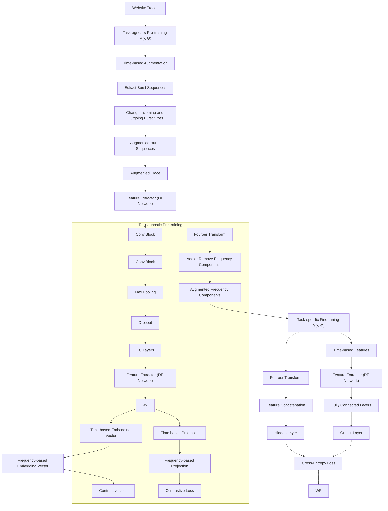
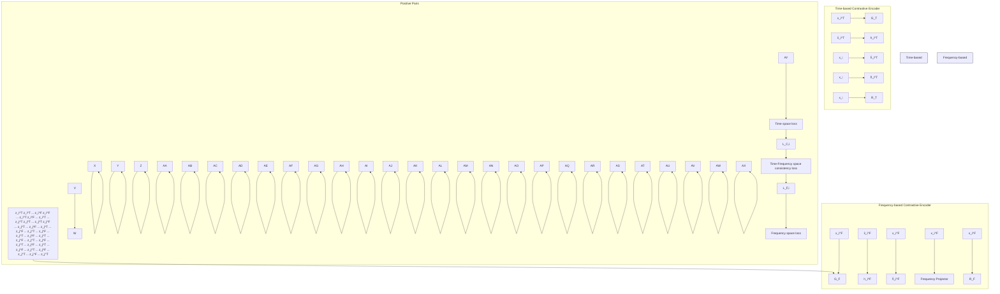

# WF-TFC: An Open-World Few-Shot Anonymous Website Fingerprinting via Time-Frequency Consistency

Xiaolan Zhu , Junfeng Wang , Member, IEEE, Wenhan Ge , Yizhao Huang , and Tingting Lu

Abstract—While Tor provides strong anonymity, it also facilitates the concealment of malicious activities, which poses a significant challenge to cybersecurity surveillance. As an effective anti-anonymity technique, Website Fingerprinting(WF) enables the inference of which websites a user is visiting, thereby uncovering potential attacker activities. State-of-the-art(SOTA) methods have demonstrated remarkable effectiveness. However, a large number of labeled traffic is required to ensure effectiveness, and without timely updates, these models will encounter serious challenges of concept drift due to the dynamic nature of website content and network conditions. The core reasons lie in the independently and identically distributed assumption, while in challenging open-world scenarios, the long-term spatial and temporal dynamics complicates data consistency and effective knowledge transfer. To address these issues, this paper presents WF-TFC, an open-world few-shot anonymous WF model via self-supervised contrastive learning and time-frequency consistency. It aligns time- and frequency-based representations in the latent time-frequency space, enhancing the sustained effectiveness of inherent patterns across various websites. Consequently, it accommodates diverse few-shot target domains with varying dynamics, facilitating data consistency and knowledge transfer in unobserved long-term temporal and spatial environments. For instance, with only 5 traces per website, WF-TFC achieves 92.62% accuracy on traces collected six weeks after pre-training, exceeding the SOTA(i.e., NetCLR) by 2.12%. On similar but mutually exclusive traces, it attains an F1 score of 87.20%, surpassing the SOTA by 6.12%.

Index Terms—Website fingerprinting, self-supervised contrastive learning, time-frequency consistency, few-shot learning.

## I. INTRODUCTION

N RECENT years, anonymous network communication I has been increasingly abused by malicious attackers. Tor network [1] is one of the most widely used low-latency anonymous communication systems, with over three million

Received 22 October 2024; revised 1 April 2025; accepted 12 June 2025. Date of publication 18 June 2025; date of current version 26 June 2025. This work was supported in part by the National Natural Science Foundation of China under Grant U24B20147 and Grant U2133208; and in part by the Major Science and Technology Special Project of Sichuan Province under Grant 2024ZHCG0195, Grant 2024ZDZX0044, and Grant 2024ZYD0269. The associate editor coordinating the review of this article and approving it for publication was Prof. Kun Sun. (Corresponding author: Junfeng Wang.)

Xiaolan Zhu and Yizhao Huang are with the National Key Laboratory of Fundamental Science on Synthetic Vision, Sichuan University, Chengdu 610065, China.

Junfeng Wang, Wenhan Ge, and Tingting Lu are with the College of Computer Science, Sichuan University, Chengdu 610065, China (e-mail: wangjf@scu.edu.cn).

Digital Object Identifier 10.1109/TIFS.2025.3581092 daily users [2]. This anonymity serves as a breeding ground for illicit purposes, facilitating activities such as drug trafficking, arms trade, Bitcoin transactions, and various cyberattacks [3]. According to Bitcoin technology company Bitfury, there has been a significant increase in the value of Bitcoin transactions on anonymous networks, with annual growth reaching 65% and an overall rise of over 340% in the past three years [4]. Additionally, hundreds of malwares exploit Tor to hide their presence and hinder Command and Control(C&C) takedown operations [5], ransomware like WannaCry and Skynet exemplifies this to deploy C&C servers and evade law enforcement detection, posing a great threat to cybersecurity.

Previous studies have shown that Tor is susceptible to WF [6], [7], [8], [9], [10], an anti-anonymity attack that can identify accessed websites. Traffic patterns between clients and servers vary across websites, adversaries can exploit these distinct sequences, referred to as “fingerprints”, to infer users’ anonymous browsing activity. These fingerprints include features like packet timestamps, directions, and sizes, collected by passive adversaries such as Internet Service Providers(ISPs) or surveillance agencies [11], [12], [13]. Since adversaries’ inherent nature does not easily change with users’ intentions or actions, analyzing such fingerprints poses fewer privacy challenges than directly handling raw communication content or payloads [14], [15].

Traditional WF methods mainly focus on manually engineered features and apply machine learning algorithms for classification [6], [7], [16], [17], [18], [19], [20]. Advanced WF models that utilize deep neural networks have demonstrated improved performance [8], [9], [21], [22], such as DF [9] reaching 98% accuracy in closed-world settings with only packet direction sequences. In open-world scenarios, the dynamic changes in website content and network conditions cause significant variations in traffic distribution for the same website over time, resulting in concept drift [23]. As the fingerprints that distinguish different websites continuously change, previously used features may become less ineffective, leading to a decline in the model’s performance. Therefore, a large amount of labeled traces and frequent retraining is required by these methods to against concept drift. Moreover, they are often criticized for being impractical in realistic and dynamic open-world scenarios, as they assume training and testing data are independently and identically distributed. In reality, it is challenge for an adversary to fully replicate a user’s network conditions, browser settings, or system configurations, making it more difficult to regularly collect extensive traffic. On the other hand, discrete changes in traces can impede threshold-based fully supervised learning from achieving adequate short-term training, highlighting the urgent need for methods with relative measurement capabilities, with few-shot learning [24], [25] emerging as a promising solution.

This work aims to alleviate the mentioned issues by introducing WF-TFC, a novel open-world few-shot anonymous WF approach that utilizes self-supervised contrastive learning and time-frequency consistency to enhance generalized representations across diverse website traffic. It involves taskagnostic pre-training to extract robust features from historical traces, followed by task-specific fine-tuning to tailor them for downstream tasks with limited traces. Extensive experiments are conducted in both closed- and open-world anonymous scenarios, demonstrating the effectiveness and superiority of WF-TFC in challenging few-shot settings. Consequently, WF-TFC effectively accommodates diverse few-shot target domains with varying dynamics, facilitating the model’s knowledge transferability and data compatibility in unobserved long-term temporal and spatial network environments. It innovatively introduces frequency domain analysis, along with a novel time-frequency consistency, achieving superior classification performance over existing methods. To sum up, the main contributions of our work are as follows:

1) We present WF-TFC, a novel open-world few-shot anonymous WF approach based on self-supervised learning and time-frequency consistency pre-training. It effectively aligns time- and frequency-domain embeddings within the latent time-frequency space, enhancing the generalizability of website traffic representations, while reducing the reliance on large amounts of labeled traffic.  
2) We explore effective augmentation methods for traces across different websites to simulate variations in dynamic website content and diverse network environments. By considering both time- and frequency-domain perspectives, traces are augmented to capture the inherent characteristics in unobserved long-term temporal and spatial dynamics, enhancing the model’s transferability to diverse few-shot tasks.  
3) We perform extensive experiments in both closed- and open-world anonymized scenarios, including the more challenging 1-shot and 2-shot settings, demonstrating the effectiveness and superiority of WF-TFC under realistic few-shot settings.

The rest of this paper is organized as follows: Section II provides a brief introduction to the background, while Section III reviews the related work. In Section IV, we present a detailed description of WF-TFC. Section V shows the experimental setup and results, followed by a discussion in Section VI. Finally, we conclude the WF-TFC in Section VII.

## II. BACKGROUND

In this section, we first give the threat model of WF. Then, the concept of contrastive learning is briefly introduced, followed by an overview of signal processing theory.

flowchart

Fig. 1. The threat model of WF.

## A. Threat Model

As illustrated in Figure 1, this model outlines the scenario in which the adversary analyzes traffic between a user, whether engaged in normal or malicious activities, and the server to infer anonymous websites through fingerprints. We consider a passive, local adversary who monitors traffic between the user and the Tor entry relay without actively interfering. Examples of these adversaries include a local ISP, a compromised network node, or a LAN administrator.

Closed-World vs Open-World: WF is typically evaluated in two scenarios: closed- and open-world. In the closed-world scenario, the adversary assumes that the user can only visit a predefined set of monitored websites. With this assumption, she can collect traffic fingerprints for all target websites, enabling precise classification. In contrast, the open-world scenario reflects a more realistic setting, where users can access both monitored and unmonitored websites. The key challenge for the adversary is not only identifying monitored websites but also distinguishing them from unmonitored ones, increasing identification difficulty.

Conversely, anti-anonymity defenses like WTF-PAD [26], FRONT [27] and TAMARAW [28], aim to obscure traffic patterns and hinder WF identification by injecting dummy packets, introducing noise, or altering traffic characteristics. Lightweight defenses like WTF-PAD and FRONT balance privacy and efficiency through adaptive techniques. WTF-PAD injects dummy packets only during traffic gaps to minimize bandwidth overhead, while FRONT employs randomized packets that adjust to observed traffic patterns. TAMARAW, a typical heavyweight method, uses fixed-rate, fixed-length dummy packets, offering high effectiveness but introducing significant bandwidth overhead.

## B. Contrastive Learning

Contrastive learning is a form of self-supervised learning designed to learn effective feature representations by comparing the similarities between samples [29]. Its objective is to bring similar samples closer together in the embedding space while pushing dissimilar ones farther apart. To achieve this, various data augmentation techniques are applied to each data sample, generating two distinct views for comparison. Thus, the model learns to extract meaningful and discriminative features through a contrastive loss function [30], which can be formulated as:

$$
L = - \log \frac {\exp (\text { sim } (z _ {i} , z _ {j}) / \tau)}{\sum_ {k = 1} ^ {N} \exp (\text { sim } (z _ {i} , z _ {k}) / \tau)} \tag {1}
$$

where $z _ { i }$ and $z _ { j }$ denote the embeddings of two augmented views of the same instance, with $\sin ( z _ { i } , z _ { j } )$ quantifying their similarity(e.g., cosine similarity). The temperature parameter adjusts the sharpness of the distribution, and N is the τtotal number of samples in the batch, with the denominator aggregating all negative samples.

## C. Signal Processing Theory

Signal processing theory is a branch of applied mathematics and engineering that focuses on analyzing, manipulating, and transforming signals [31], [32]. A signal is any measurable quantity that conveys information, such as electrical, acoustic, optical, or biological. It encompasses both continuous and discrete representations, enabling the manipulation and analysis of signals across various domains, including time and frequency. Time-domain analysis offers insights into a signal’s behavior over time, while frequency-domain analysis reveals its underlying frequency components.

In the time domain, signals are represented as functions of time, reflecting their variation over time. For network traffic, data flow can be expressed in the time domain, with metrics like packet arrival times, transmission durations, and network delays fluctuating over time. In contrast, frequencydomain analysis decomposes the signal into its constituent frequencies, revealing dominant frequencies, harmonics, and periodic components. Similarly, the frequency domain provides insights into traffic dynamics, uncovering patterns such as periodicity, burstiness, and spectral properties. A signal in the time domain can be transformed into the frequency domain using techniques like the Fast Fourier Transform(FFT) [33]. Together, both domains offer complementary perspectives, providing a comprehensive view of network behavior.

## III. RELATED WORK

This section reviews related work, which is broadly categorized into methods based on manual feature design and those leveraging automated feature extraction. A summary of their limitations is provided at the end.

## A. Manual Feature Design-Based Methods

Since Herrmann et al. [16] first apply WF to the Tor network in 2009, various machine learning algorithms have been extensively utilized in this field. These methods involve manually extracting meaningful features to train the classification model for classification. Panchenko et al. [6] use Support Vector Machine(SVM), achieving notable classification accuracy. Cai et al. [17] leverage Damerau-Levenshtein distance along with an SVM classifier to evaluate the similarity of website traces. Wang and Goldberg [7] further improve this by using Tor cells instead of TCP/IP packets. CUMUL is later introduced in [19], using an SVM classifier with 104 features derived from directional packet length sequences to enhance classification. Wang et al. [18] improve K-Nearest Neighbors(KNN) by dynamically adjusting feature weights and extracting nearly 4,000 traffic features, obtaining high accuracy in closed-world scenarios. Hayes and Danezis [20] introduce K-FP, which uses Random Forests to extract the top 150 features based on importance scores. In closed-world settings, the output of Random Forest is used for classification, while in open-world scenarios, KNN classifies test samples by comparing them to the K nearest training traces.

## B. Automated Feature Extraction-Based Methods

Advanced deep learning methods automatically extract features, greatly improving WF identification performance. Abel and Goto [21] are the first to apply deep learning to WF, using Stacked Denoising Autoencoders(SDAE) to reduce overfitting. Rimmer et al. [8] employ three deep learning models: SDAE, Convolutional Neural Network(CNN), and Long Short-Term Memory(LSTM). They contribute the largest WF dataset and show that SDAE outperforms the best traditional manual feature-based approach, K-FP. The DF method in [9] differs from Rimmer et al.’s CNN by applying pooling layers only after two convolutional layers, which leads to a deeper network with improved feature extraction. It further mitigates overfitting with Batch Normalization and Dropout, increases filter numbers in deeper layers to capture complex features, and uses the ELU activation function near the input to minimize information loss. Zhou et al. [22] propose WF-Transformer, which uses Transformer to extract temporal features from traffic, achieving superior performance with shorter trace lengths.

Although effective, a large amount of labeled traffic and frequent retraining are required to maintain accuracy and guard against concept drift. Juarez et al.´ [34] find that the accuracy of a KNN classifier dropped from 80% to 30% within 10 days, while Rimmer et al. [8] observe a decline from 95% to 81% in their SDAE classifier within 28 days. Thus, classifiers may remain effective for only a few weeks. Regularly collecting large amounts of traffic traces is essential but can be time-consuming and labor-intensive. For example, capturing 500,000 traces takes a single terminal resource adversary 250 days [35]. Moreover, they assume that training and testing data are independently and identically distributed, limiting their knowledge transferability in open-world longterm spatio-temporal network environments. Juarez et al. [34] also explore how variations in Tor Browser Bundle(TBB) versions, configurations, and network locations affect classification accuracy. They find that different TBB versions can reduce accuracy by over 50%, while different configurations and network locations can introduce variations of up to 11.7% and nearly 60%, respectively. This issue is especially pronounced in few-shot scenarios, where limited data exacerbates data compatibility challenges, diminishing the model’s generalization and classification performance.

There are recent studies have explored limited-data WF attacks to mitigate concept drift. Sirinam et al. [35] propose Triplet Fingerprinting(TF) based on N-shot learning. They first pre-train a feature extractor using a Triplet Network [36], then fine-tune it with KNN to classify target websites. Chen et al. [37] use harmonious data augmentation to expand limited dataset and enhance the accuracy of deep learning models, but it performs poorly with fewer traces. Bhat et al. [38] design Var-CNN, based on ResNet-18, using dilated causal convolutions [39] and incorporating seven cumulative statistical features to improve accuracy. Chen et al. [40] further propose TLFA, which involves pre-training an embedding model on a large set of labeled traces and fine-tuning it on a limited amount of target traffic. Lu et al. [41] extract features from multi-temporal traffic during pre-training to generate robust representations. Tan et al. [42] propose a collusionbased few-shot WF attack that enhances user-side adaptability by integrating multiple attackers. Cherubin et al. [43] use features from Tor exit relay traces for a more realistic WF, but faced poor classification accuracy, with data not shared due to privacy concerns. Bahramali et al. [44] introduce NetAugment to augment network traces, and their NetAugment-based model(NetCLR) achieves up to 80% accuracy using just five traces from each website. Ding and Hu [45] propose LRCT, which combines local Recurrent Neural Network(RNN) and CNN to extract fine-grained spatio-temporal features from cell sequences, enabling the capture of rich global features.

On the whole, the manual feature design-based methods rely on meticulously designed features, which may lead to failures in certain cases due to the unreliability of flow statistical information. The automated feature extraction-based models significantly enhance performance by leveraging the powerful representational capabilities of deep neural networks. However, a large amount of labeled traffic and frequent retraining are required to ensure the sustained effectiveness of the model. Moreover, they are often criticized for being less practical in dynamic open-world scenarios, as they assume that training and testing data are independently and identically distributed. Recent studies in few-shot WF have largely mitigated these issues, but they only consider the time-domain analysis of traffic, and the lack of a more effective pre-training strategy still leads to suboptimal classification performance.

## IV. METHODLOGY

In this section, we first introduce our motivation and the problem formulation of few-shot WF identification. Then, we present the design details of WF-TFC, beginning with a framework overview before delving into its individual components.

## A. Motivation

In open-world scenarios, dynamic changes in website content and network conditions lead to concept drift, requiring deep learning models to continuously collect large labeled traffic data and retrain to maintain performance. Inspired by advanced self-supervised learning techniques in computer vision and natural language processing [46], [47] [48], data augmentation techniques offer a promising solution. However, they cannot be directly applied to network traffic due to its dynamic nature and the strong correlations within packet sequences.

Based on user-server interaction characteristics, outgoing traffic consists of smaller data packets generated by user requests, while incoming traffic includes larger responses from the server, such as images, text, and videos. Figure 2 illustrates the mean and standard deviation of the number of cells from 50 randomly selected websites, showing that incoming cells significantly outnumber outgoing cells and both vary dynamically. To replicate this variation under unobserved conditions, we randomly modify incoming and outgoing flows based on bursts representing clustering in the same direction. Thus, self-supervised learning can be further used to effectively learn robust representations, while minimizing the reliance on extensive labeled traffic.

scatterplot

| Website label | Number of incoming articles |
| ------------- | -------------------------- |
| 0             | 4800                       |
| 5             | 4500                       |
| 10            | 4700                       |
| 15            | 4600                       |
| 20            | 4400                       |
| 25            | 4300                       |
| 30            | 4200                       |
| 35            | 4100                       |
| 40            | 4000                       |
| 45            | 3900                       |
| 50            | 3800                       |

(a) Incoming cells with mean and error bars

scatterplot

| Website label | Number of coupons calls |
| ------------- | ------------------------ |
| 0             | 300                      |
| 5             | 500                      |
| 10            | 600                      |
| 15            | 550                      |
| 20            | 400                      |
| 25            | 300                      |
| 30            | 450                      |
| 35            | 350                      |
| 40            | 700                      |
| 45            | 150                      |

(b) Outgoing cells with mean and error bars  
Fig. 2. Mean and standard deviation of the number of cells for 50 randomly selected websites.

Additionally, time-domain analysis captures instantaneous changes and local features of network traffic, while frequencydomain analysis reveals traffic behaviors that are not directly observable in the time domain [49]. Grounded in signal processing theory, this analysis ensures consistency across data distributions. Together, they provide a comprehensive understanding of traffic behavior and serve as an inductive bias to pre-train models for few-shot WF identification.

## B. Problem Formulation

Before introducing WF-TFC, we first present the problem addressed in this paper and explain how it effectively addresses these issues.

In this work, we focus on the challenge of anonymous WF identification, particularly in open-world few-shot settings, where only a limited number of labeled traces are available for each website. This issue is further exacerbated by dynamic website content and fluctuating network environments, resulting in concept drift and shifts in data distribution over time, ultimately causing long-term temporal and spatial variations in traffic. Concept drift is a phenomenon where the statistical properties of data change over time, causing previously learned features to become ineffective. Data distribution shift refers to changes in data distribution across domains or time periods, especially in open-world scenarios where new, unseen websites emerge. Both can lead to performance degradation, requiring models to be retrained and updated in a timely manner. In few-shot settings, the challenges posed by concept drift and data distribution variation are more pronounced due to limited labeled traffic, making it harder for model to adapt to new patterns over time.

WF-TFC is specifically designed to address the challenges mentioned above in open-world few-shot settings. By incorporating both time- and frequency-domain perspectives, traces are first augmented to capture the inherent characteristics of unobserved long-term temporal and spatial network environments. Then, self-contrastive learning and time-frequency consistency are employed to pre-train the feature embedding model, capturing the semantic invariance and common features within traces. Finally, the model is fine-tuned with a few labeled traces per website from diverse few-shot tasks.

flowchart

Fig. 3. Schematic overview of WF-TFC.

Given a pre-training dataset $D ^ { p r e } = \big \{ x _ { i } ^ { p r e } \ | \ i = 1 , 2 , \cdot \cdot \cdot , N _ { p } \big \}$ $N _ { p }$ $x _ { i } ^ { p r e }$ contains 5000 cells represented by their direction. Let $D ^ { t u n e } =$ $\left\{ \left( x _ { i } ^ { t u n e } , y _ { i } \right) \mid i = 1 , 2 , \cdot \cdot \cdot , N _ { t } \right\}$ be the target dataset of labeled , , , ,traces, where each trace $x _ { i } ^ { t u n e }$ corresponds to a website $y _ { i } \in$ $\{ 1 , 2 , \ldots , C \}$ , with C representing the number of websites in $D ^ { t u n e }$ . . . ,. Notably, $D ^ { t u n e }$ is independent of $D ^ { p r e }$ . In this work, we use time-frequency consistency and trace augmentation during pre-training. Here, $x _ { i }$ also denoted as $x _ { i } ^ { T }$ , represents an input trace, and $x _ { i } ^ { F }$ represents the discrete frequency spectrum of $x _ { i } ^ { T }$ . The augmented $x _ { i } ^ { T }$ and $x _ { i } ^ { F }$ are referred to as $\tilde { x } _ { i } ^ { T }$ and $\tilde { x } _ { i } ^ { F }$ , respectively.

In few-shot scenarios, the number of traces $N _ { t }$ in $D ^ { t u n e }$ is much smaller than $N _ { p }$ in $D ^ { p r e } ( N _ { t } \ll N _ { p } )$ . The goal is to pre-train a generalized model M on $D ^ { p r e }$ with parameters Θ and then fine-tune it on $D ^ { t u n e }$ , transitioning from $\mathcal { M } \left( \cdot , \Theta \right)$ to $\mathcal { M } \left( \cdot , \Phi \right)$ , to generate robust and generalizable representations $z _ { i } ^ { t u n e } ~ = ~ \mathcal { M } ( x _ { i } ^ { t u n e } )$ $z _ { i } ^ { \breve { T } }$ $z _ { i } ^ { F }$ frequency-based representations of $x _ { i } ,$ whether from $D ^ { p r e }$ or $D ^ { t u n e }$ , while $\tilde { z } _ { i } ^ { T }$ and $\tilde { z } _ { i } ^ { F }$ represent their augmented versions.

## C. Framework Overview

As shown in Figure 3, the proposed WF-TFC consists of two phases: task-agnostic pre-training and task-specific fine-tuning. Task-agnostic pre-training equips the model with robust, generalized representations, while task-specific finetuning tailors it to specific few-shot target tasks. In the first phase, the task-agnostic feature embedding model $\mathcal { M } \left( \cdot , \Theta \right)$ is pre-trained using self-supervised learning without requiring any labeled data. During fine-tuning, the model $\mathcal { M } \left( \cdot , \Phi \right)$ is ,trained to adapted to diverse downstream tasks with a few labeled traces per website, enhancing overall performance.

Building on prior works [35], [40], [44], WF-TFC also utilizes the DF deep network [9] as the backbone. We further enhance the pre-trained representations by adding a projection layer, with Θ optimized using a contrastive loss based on time-frequency consistency. During fine-tuning, the pre-trained model transfers knowledge from $D ^ { p r e }$ to initialize the target model on $D ^ { t u n e }$ , adapting it to various few-shot tasks. The invariant nature of time-frequency consistency bridges the knowledge gap between $D ^ { p r e }$ and $D ^ { t u n e }$ , even with major differences such as varying distributions, data collected over multiple years, or a large number of unmonitored websites.

## D. Task-Agnostic Pre-Training

Models trained on limited traffic often lack reliability, making pre-training on large datasets crucial for generalization. Self-supervised contrastive learning leverages unlabeled data to learn robust, discriminative features, providing strong support for few-shot scenarios. Our task-agnostic pre-training model $\mathcal { M }$ comprises four components: a time encoder $G _ { T }$ , a frequency encoder $G _ { F } ,$ , and two cross-space projectors $R _ { T }$ and $R _ { F }$ , as is shown in Figure 4. $G _ { T }$ captures time-domain patterns, while $G _ { F }$ focuses on frequency-domain representations. The projectors $R _ { T }$ and $R _ { F }$ align the outputs of their respective encoders across both domains. This design enables M to effectively integrate time and frequency information, along with local and global features, enhancing its ability to capture inherent traffic patterns.

flowchart

Fig. 4. Architecture of our task-agnostic pre-training model.

1) Trace Augmentation: To simulate variations in dynamic website content and different network environments, we consider both time- and frequency-based perspectives.  
a) Time-based augmentation: From the time-domain analysis, a website trace is augmented by simultaneously modifying the sizes of incoming and outgoing burst cells. We randomly adjust their sizes by increasing or decreasing the values to reflect the characteristics of traffic during user-server interactions. The detailed implementation of this augmentation process is shown in Algorithm 1.

Initially, the burst sequence B is extracted from $x _ { i } ,$ after which the sizes of the incoming and outgoing bursts are adjusted accordingly. The direction of modification determined probabilistically by a random variable $p ,$ which dictates whether the burst size increases or decreases. Each modification is constrained by the thresholds $t h _ { i n }$ and $t h _ { o u t }$ . Specifically, the incoming burst sizes are adjusted using the hyperparameters $r _ { i n c , i n }$ and $r _ { d e c , i n } ,$ while the outgoing burst sizes are ,modified with $r _ { i n c , o u t }$ ,and $r _ { d e c , o u t } .$ Consequently, the augmented , ,burst sequences are reconstructed into the original cells, generating the augmented website trace $\tilde { x } _ { i } ^ { T }$ .

b) Frequency-based augmentation: Spectral analysis is employed to identify periodic variations and fluctuations from a frequency-domain perspective. Since each frequency component represents a bias function with specific frequency and amplitude, we perturb the spectrum by randomly adding or removing components. Algorithm 2 outlines the implementation of the frequency-based website trace augmentation.

The frequency representation $x _ { i } ^ { F }$ of the input signal $x _ { i }$ is first obtained using FFT to compute the magnitude spectrum, followed by a logarithmic transformation to stabilize numerical values. Next, frequency augmentation is applied based on the random variable $p .$ . If $p \geq 0 . 5$ , a set of $r _ { r e m o v e }$ components are .randomly selected and their amplitudes are set to 0. Otherwise, the amplitudes of the chosen frequency components are randomly increased by $r _ { a d d } \times A \_ m a x$ , where $A _ { _ - }$ max represents the maximum amplitude. Both $r _ { a d d }$ and $r _ { r e m o \nu e }$ are predefined hyperparameters that control the modification ratio. Finally, the augmented frequency representation $\tilde { x } _ { i } ^ { F }$ is obtained.

2) Time-Based Contrastive Encoder: For a given input trace $x _ { i } ^ { T }$ , a time-based augmentation generates $\bar { x _ { i } ^ { T } }$ . Both $x _ { i } ^ { T }$ and $\tilde { x } _ { i } ^ { T }$ are fed into the contrastive time encoder $G _ { T }$ , producing high-dimensional representations $h _ { i } ^ { T } ~ = ~ G _ { T } \left( x _ { i } ^ { T } \right)$ and $\begin{array} { r l } { \tilde { h } _ { i } ^ { T } } & { { } = } \end{array}$ $G _ { T } \left( \tilde { x } _ { i } ^ { T } \right)$ . This encoder brings similar traces closer in the representation space while pushing dissimilar ones apart, enhancing differentiation and classification. Then, $h _ { i } ^ { T }$ and $\tilde { h } _ { i } ^ { T }$ are passed through the time projector $R _ { T }$ , yielding $z _ { i } ^ { T } ~ = ~ \dot { R } _ { T } \left( h _ { i } ^ { \bar { T } } \right)$ and $\tilde { z } _ { i } ^ { T } = R _ { T } \left( \tilde { h } _ { i } ^ { T } \right)$ , mapping high-dimensional representations to a lower-dimensional space for effective learning via contrastive loss.

Since $\tilde { x } _ { i } ^ { T }$ is an augmented version of $x _ { i } ^ { T }$ , after passing through $G _ { T }$ and $R _ { T }$ , their representations are expected to be closer in the time embedding space. Conversely, the distance between $x _ { i } ^ { T }$ and any other sample $x _ { j } ^ { T }$ , or its augmented version $\tilde { x } _ { j } ^ { T }$ , will be larger. Thus, $\left( x _ { i } ^ { T } , \tilde { x } _ { i } ^ { T } \right)$ forms a positive pair, while $\left( \boldsymbol { x } _ { i } ^ { T } , \boldsymbol { x } _ { j } ^ { T } \right) \mathrm { ~ o r ~ } \left( \boldsymbol { x } _ { i } ^ { T } , \tilde { \boldsymbol { x } } _ { j } ^ { T } \right)$ ,are negative pairs, allowing the pretrained model to enhance classification by maximizing positive pair similarity and minimizing negative pair similarity. To achieve this, we apply contrastive loss to learn meaningful representations. Specifically, the time-based contrastive loss for $x _ { i } ^ { T }$ is defined as follows:

$$
\mathcal {L} _ {T, i} = - \log \frac {\exp \left(\operatorname{sim} \left(z _ {i} ^ {T} , \tilde {z} _ {i} ^ {T}\right) / \tau\right)}{\sum_ {x _ {j} \in D ^ {p r e} \mathbb {1} _ {[ i \neq j ]}} \exp \left(\operatorname{sim} \left(z _ {i} ^ {T} , R _ {T} \left(G _ {T} \left(x _ {j} ^ {T}\right)\right)\right) / \tau\right)} \tag {2}
$$

where, sim $( u , \nu ) = u ^ { T } \nu /$ kuk kvk represents the cosine similarity , /between the L2-normalized embeddings u and $\nu ,$ and is a τtemperature parameter that controls the concentration of the similarity distribution. The indicator function $\mathbb { I } _ { \left[ i \neq j \right] }$ is $\mathrm { \ t y p i - }$ cally used to distinguish between positive and negative pairs, ensuring that only negative pairs contribute to the denominator in the contrastive loss. This ensures similar samples remain close in the time-based feature space after dimensionality reduction, while dissimilar ones are pushed apart, preserving distinctiveness.

Algorithm 1 Time-Based Website Trace Augmentation  
Input: $x_i$ //Vector of cells direction of a flow $r_{inc,in}$ //Rate of increasing incoming burst sizes $r_{dec,in}$ //Ratio of decreasing incoming burst sizes $r_{inc,out}$ //Ratio of increasing outgoing burst sizes $r_{dec,out}$ //Ratio of decreasing outgoing burst sizes $p \sim U(0,1)$ //Randomly decide to increase or decrease burst size $th_{in}$ //Minimum threshold for non-zero cells in an incoming burst $th_{out}$ //Minimum threshold for non-zero cells in an incoming burst
Output: $\tilde{x}_i^T$ Step 1: Extract burst sequences $B \leftarrow \text{ExtractBursts}(x_i)$ Step 2: Modify incoming burst sizes
Initialize $B_{in} \leftarrow [\ ]$ if $p \geq 0.5$ then
    Increase incoming burst sizes
    foreach $b \in B$ do
    if $b \leq -th_{in}$ then
    | $b \leftarrow b \times (1 + U(0,1) \cdot r_{inc,in})$ end
    Append $b$ to $B_{in}$ end
end
else
    Decrease incoming burst sizes
    foreach $b \in B$ do
    if $b \leq -th_{in}$ then
    | $b \leftarrow b \times (1 - U(0,1) \cdot r_{dec,in})$ end
    Append $b$ to $B_{in}$ end
end
Step 3: Modify outgoing burst sizes
Initialize $B_{out} \leftarrow [\ ]$ if $p \geq 0.5$ then
    Increase outgoing burst sizes
    foreach $b \in B_{in}$ do
    if $b > th_{out}$ then
    | $b \leftarrow b \times (1 + U(0,1) \cdot r_{inc,out})$ end
    Append $b$ to $B_{out}$ end
end
else
    Decrease outgoing burst sizes
    foreach $b \in B_{in}$ do
    if $b > th_{out}$ then
    | $b \leftarrow b \times (1 - U(0,1) \cdot r_{dec,out})$ end
    Append $b$ to $B_{out}$ end
end
Step 4: Restruct the augmented cell sequence $\tilde{x}_i^T \leftarrow \text{ConvertBurstsToCells}(B_{out})$ return $\tilde{x}_i^T$

Algorithm 2 Frequency-Based Website Trace Augmentation  
Input: $x_i$ //Vector of cells direction of a flow $r_{remove}$ //Ratio of frequency components to be removed $r_{add}$ //Ratio of frequency components to be increased
A_max //Maximum amplitude $p \sim U(0,1)$ //Randomly decide to remove or add frequency components
Output: $\tilde{x}_i^F$ Step 1: Compute frequency representation $x_i^F \leftarrow FFT(x_i)\quad A \leftarrow |x_i^F| \quad A_{half} \leftarrow A[:N//2]\quad A_{log} \leftarrow \log(A_{half} + \epsilon)$ Step 2: Apply frequency augmentation
if $p \geq 0.5$ then
    mask $\leftarrow$ Uniform(0,1) $< r_{remove}$ $\tilde{x}_i^F \leftarrow A_{log} \times mask$ end
else
    mask $\leftarrow$ Uniform(0,1) $< r_{add}$ $\tilde{x}_i^F \leftarrow A_{log} + mask \times (r_{add} \times A_{max})$ end
return $\tilde{x}_i^F$

3) Frequency-Based Contrastive Encoder: The frequency domain representation $x _ { i } ^ { F }$ from $x _ { i } ^ { T }$ is obtained using Fourier Transformation [33]. This enhances traffic pattern extraction by leveraging frequency domain information, reducing information loss compared to using time-based traces alone [50]. The frequency representation of $x _ { i } ^ { T }$ can be obtained as follows:

$$
F _ {i} = \mathcal {F} (f _ {i}) \tag {3}
$$

$$
F _ {i k} = \sum_ {n = 0} ^ {N - 1} f _ {i n} \cdot e ^ {- i 2 \pi (k - 1) n / N} \tag {4}
$$

Here, $f _ { i }$ denotes $x _ { i } ^ { T } ,$ , and $F _ { k }$ represents the corresponding frequency components. The index k ranges from 1 to 5000, mapping the frequency components from 0 to $N - 1$ , where N is the total number of sampling points.

Next, to convert the complex frequency domain representations $F _ { i k }$ into real numbers, their magnitudes are calculated. For simplicity, we then represent these magnitudes in a coordinate plane representation:

$$
F _ {i k} = a _ {i k} + j b _ {i k} \tag {5}
$$

$$
a _ {i k} = \sum_ {n = 0} ^ {N - 1} f _ {i n} \cdot \cos \left(\frac {2 \pi (k - 1) n}{N}\right) \tag {6}
$$

$$
b _ {i k} = \sum_ {n = 0} ^ {N - 1} f _ {i n} \cdot \sin \left(\frac {2 \pi (k - 1) n}{N}\right) \tag {7}
$$

where $a _ { i k }$ and $b _ { i k }$ represent the real and imaginary parts of the complex number, respectively. The modulus of $F _ { i k }$ is calculated as $p _ { i k }$ using formula $^ { 8 , }$ and the first half is selected to form the vector $p _ { i }$ since the Discrete Fourier Transform [51] ensures symmetry between the two halves. Thus, we obtain:

$$
p _ {i k} = \sqrt {a _ {i k} ^ {2} + b _ {i k} ^ {2}} \tag {8}
$$

$$
p _ {i} = \left[ p _ {i 1}, p _ {i 2}, \dots , p _ {i \frac {N}{2}} \right] \tag {9}
$$

To ensure numerical stability and prevent floating-point overflow during model training [52], a logarithmic transformation is applied to $p _ { i } ,$ with a constant C used to adjust the range of the frequency components. The adjusted and logarithmically transformed frequency component $L _ { i k }$ can be expressed as:

$$
L _ {i k} = \frac {\ln (p _ {i k} + 1)}{\mathcal {C}} \tag {10}
$$

$$
L _ {i} = \left[ L _ {i 1}, L _ {i 2}, \dots , L _ {i \frac {N}{2}} \right] \tag {11}
$$

Similarly, given a frequency-domain trace $x _ { i } ^ { F } .$ , its augmented version $\tilde { x } _ { i } ^ { F }$ is obtained using a frequency-based augmentation strategy. Both $x _ { i } ^ { F }$ and $\tilde { x } _ { i } ^ { F }$ are processed by the contrastive frequency encoder $G _ { F }$ , generating embeddings $h _ { i } ^ { F } = G _ { F } \left( x _ { i } ^ { F } \right)$ and $\dot { \tilde { h } } _ { i } ^ { F } = \dot { G } _ { F } \left( \tilde { x } _ { i } ^ { F } \right)$ . These embeddings are then passed through the frequency projector $R _ { F }$ , yielding outputs in lower-dimensional space: $z _ { i } ^ { \dot { F } } = \dot { R _ { F } } \left( h _ { i } ^ { F } \right)$ and $\overset { \sim } { \tilde { z } _ { i } ^ { F } } = \bar { R _ { F } } \left( \tilde { h } _ { i } ^ { F } \right)$ . As $\tilde { x } _ { i } ^ { F }$ is the augmented version of $x _ { i } ^ { F }$ , they are expected to be closer in the frequency embedding space, while the distance between $x _ { i } ^ { F }$ and any other sample $x _ { j } ^ { F }$ (or its augmented version $\tilde { x } _ { j } ^ { F } )$ will be larger. Consequently, the contrastive loss maximizes the similarity of positive pairs, such as $\left( x _ { i } ^ { F } , \tilde { x } _ { i } ^ { F } \right)$ , while minimizing the similarity of negative pairs like $\left( x _ { i } ^ { F } , x _ { j } ^ { F } \right)$ and $\left( x _ { i } ^ { F } , \tilde { x } _ { j } ^ { F } \right)$ . The frequency-based contrastive loss is calculated as follows:

$$
\mathcal {L} _ {F, i} = - \log \frac {\exp \left(\operatorname{sim} \left(z _ {i} ^ {F} , \tilde {z} _ {i} ^ {F}\right) / \tau\right)}{\sum_ {x _ {j} \in D ^ {p r e} \mathbb {1} _ {[ i \neq j ]}} \exp \left(\operatorname{sim} \left(z _ {i} ^ {F} , R _ {F} \left(G _ {F} \left(x _ {j} ^ {F}\right)\right)\right) / \tau\right)} \tag {12}
$$

4) Time-Frequency Consistency: An original trace $x _ { i } ^ { T }$ processed through the time encoder $G _ { T }$ and the frequency encoder $G _ { F }$ , followed by projectors $R _ { T }$ and $R _ { F }$ . These components embed it into a latent time-frequency space, producing four embeddings: $z _ { i } ^ { T } ~ = ~ R _ { T } \bigl ( G _ { T } \bigl ( x _ { i } ^ { T } \bigr ) \bigr ) , ~ \tilde { z } _ { i } ^ { T } ~ = ~ R _ { T } \bigl ( \hat { G } _ { T } \bigl ( \tilde { x } _ { i } ^ { T } \bigr ) \bigr ) , ~ \tilde { z } _ { i } ^ { F } ~ =$ $R _ { F } \left( G _ { F } \left( x _ { i } ^ { F } \right) \right) , \ : \tilde { z } _ { i } ^ { F } = R _ { F } \left( G _ { F } \left( \dot { { \tilde { x } _ { i } ^ { F } } } \right) \right)$ . The first two embeddings are derived from time-domain analysis, while the latter two are obtained from frequency-domain analysis. By closely examining these embeddings, $z _ { i } ^ { T }$ and $z _ { i } ^ { F }$ are derived from the original trace $x _ { i } ^ { T }$ and its frequency representation $x _ { i } ^ { F }$ while $\bar { z _ { i } ^ { T } }$ and $\tilde { z } _ { i } ^ { F }$ are from their augmented versions $\tilde { x } _ { i } ^ { T }$ and $\tilde { x } _ { i } ^ { F }$ . Intuitively, $z _ { i } ^ { T }$ and $z _ { i } ^ { F }$ should be more closely aligned in the latent time-frequency space. Here, we do not consider the similarity between $\mathbf { \widetilde { z } } _ { i } ^ { T }$ and $\bar { z } _ { i } ^ { F }$ , as it may not be well-preserved after augmentation. This cross-domain alignment enhances the model’s ability to learn joint representations and improves generalization in unseen network conditions. Thus, the timefrequency consistency loss is calculated as:

$$
\mathcal {L} _ {C, i} = - \log \frac {\exp \left(\operatorname{sim} \left(z _ {i} ^ {T} , z _ {i} ^ {F}\right) / \tau\right)}{\sum_ {x _ {j} \in D ^ {p r e} \mathbb {1}} \left[ _ {i \neq j} \right] \exp \left(\operatorname{sim} \left(z _ {i} ^ {T} , R _ {F} \left(G _ {F} \left(x _ {j} ^ {F}\right)\right)\right) / \tau\right)} \tag {13}
$$

The overall loss of WF-TFC consists of three components: time-based contrastive loss $\mathcal { L } _ { T , i }$ to ensure invariance in the time domain, frequency-based contrastive loss $\mathcal { L } _ { F , i }$ to enforce ,similarity in the frequency domain, and time-frequency consistency loss $\mathcal { L } _ { C , i }$ to align embeddings across both domains. In summary, the pre-training loss is defined as:

$$
\mathcal {L} _ {i} = \lambda \left(\mathcal {L} _ {T, i} + \mathcal {L} _ {F, i}\right) + (1 - \lambda) \mathcal {L} _ {C, i} \tag {14}
$$

Here,  is a hyperparameter that controls the relative importance of $\mathcal { L } _ { T , i } , \ \mathcal { L } _ { F , i }$ and $\mathcal { L } _ { C , i } .$ . The total contrastive loss in the , , ,pre-training model is obtained by aggregating $\mathcal { L } _ { i }$ across all traces in the dataset, while the individual losses are computed per mini-batch.

## E. Task-Specific Fine-Tuning

With the pre-trained task-agnostic model, the next step is to adapt it to specific few-shot tasks and fine-tune it using a limited number of labeled traces from new websites. In this phase, the pre-trained model is modified by replacing its projection layer with two fully connected layers, with the final layer outputting probabilities for each website. The entire network is then fine-tuned, with both the feature extraction layers and the new fully connected layers are optimized.

The whole fine-tuning process involves three key stages: training, validation and testing. Initially, the adversary gathers N traces from each website, with N typically set to 5, 10, 15, and 20. During training, these traces are fed into the pre-trained model’s feature extractor to generate embeddings. Validation verifies the effectiveness of the model, tunes hyperparameters and mitigates overfitting, while the testing phase evaluates model’s classification performance on unseen traces.

## V. EXPERIMENTS

In this section, we design and conduct a series of experiments to evaluate the effectiveness of WF-TFC across various few-shot tasks.

## A. Experiment Setup

1) Datasets and Composition: We conduct experiments using two benchmark datasets widely used in prior research. Their composition in this work is labeled as follows:

AWF Dataset [8]. The largest dataset, collected in 2016 using TBB version 6.5, includes websites from both closedworld and open-world scenarios. It also incorporates a time drift component for the first 200 websites, with traces recollected at various intervals. We categorize the AWF dataset into several different sets:

• AWF100: The first 100 monitored websites.  
• AWF200: The first 200 monitored websites.  
• AWF200-AWF100: Monitored websites included in AWF200 but not in AWF100.  
• $A W F 2 0 0 _ { g a p s } \mathrm { ; }$ : The set of AWF200 re-collected after gaps of 3 days, 10 days, 2 weeks, 4 weeks, and 6 weeks.  
• AWF K: A subset of × 1000 unmonitored websites µ µfrom the total of 400,000.

DS-19 Dataset [27]. The latest dataset, captured in 2019 using Tor Browser 8.5a7, includes 100 traces for each of 100 monitored websites and one trace for each of 1000 unmonitored websites, with packet timestamps and directions. We further implement the WTF-PAD, FRONT, and TAMRAW anti-anonymity defense strategies to generate the corresponding defended datasets:

• $\mathrm { D S - } 1 9 _ { c w } .$ : The set of monitored websites.  
• $\mathrm { D S } { - } 1 9 _ { o w } { \colon }$ The set of unmonitored websites.  
• $\mathrm { D S } / - 1 9 _ { W T F - P A D } \colon \mathrm { D S } / - 1 9 _ { c w }$ defended with WTF-PAD.  
• $\mathrm { D S } \ – 1 9 _ { \mathrm { F R O N T } } \colon \mathrm { D S } \ – 1 9 _ { c w }$ defended with FRONT.  
• $\mathrm { D S } { - } 1 9 _ { \mathrm { T A M R A W } } \colon \mathrm { D S } { - } 1 9 _ { c w }$ defended with TAMARAW.

2) Baselines: This section outlines the existing WF methods used to benchmark WF-TFC, along with brief descriptions of each. Publicly available code for several algorithms is utilized to ensure results fidelity, while others are re-implemented based on their original papers. To maintain consistency, all methods are evaluated using the same datasets and experimental conditions, minimizing external variables and enabling an objective performance comparison.

• k-fingerprinting(k-FP) [20]: Utilizes Random Forests for feature transformation and KNN for classification, making it the most effective manual feature-based method.  
• Automated website fingerprinting(AWF) [8]: Employs deep learning for automatic feature extraction, enhancing resilience to network changes.  
• Deep Fingerprinting(DF) [9]: Utilizes a specialized CNN architecture, surpassing previous methods and establishing a standard for effective feature extraction in subsequent WF studies. Notably, it follows a fully supervised learning paradigm.  
• WF-Transformer [22]: Leverages Transformer for temporal feature extraction, achieving superior performance with shorter input lengths.  
Triplet Fingerprinting(TF) [35]: Uses a Triplet network for N-shot learning, with a large labeled traffic used for pre-training.  
• Var-CNN [38]: A semi-automated method that combines automatic feature extraction with handcrafted features, designed for low-data settings.  
• TLFA [40]: Enhances classification with large labeled traces from non-target websites for few-shot learning.  
• NetCLR [44]: Improves classification performance by augmenting network traces.

3) Implementation Details: Data Representation: Following standard data representation methods from previous WF works, each trace is represented by packet direction: outgoing packets as 1 and incoming packets as -1. Traces are padded or trimmed to a fixed length of 5000, which gives a final input matrix of size [n × 5000], where n is the number of traces.

Data Partitioning: The model is pre-trained on the AWF100 dataset, with 2500 traces per website, and evaluated across various settings during fine-tuning. In the closed-world setting, classifiers are trained using $N = \{ 5 , 1 0 , 1 5 , 2 0 \}$ traces randomly , , ,selected from each website. The remaining traces are randomly divided into a validation set of 20 traces and a test set of 50 traces per website, ensuring mutual exclusivity among the training, validation, and test sets. For the open-world scenario, we use the same pre-trained model. During fine-tuning, the training and validation set are balanced with equal size of monitored and unmonitored traces. The test set includes more traces than in the closed-world scenario, providing a more realistic evaluation of the model’s performance. We conduct five random tests, reporting the mean and standard deviation(%) with the best result in bold. In the fine-tuning phase, datasets are randomly shuffled for each iteration to ensure variability in the training, validation, and test sets, preventing bias and enhancing the generalizability of our findings.

TABLE I HYPERPARAMETERS OF WF-TFC

<table><tr><td>Hyperparameters</td><td>Pre-training</td><td>Fine-Tuning</td></tr><tr><td>Learning rate</td><td>5 x 10-4</td><td>5 x 10-4</td></tr><tr><td>Epoches</td><td>100</td><td>100</td></tr><tr><td>Batch size</td><td>128</td><td>16</td></tr><tr><td>Optimizer</td><td>Adam with Cosine Scheduler</td><td>Adam</td></tr><tr><td>Embedding size</td><td>512</td><td>512</td></tr><tr><td>Output size</td><td>128</td><td>Number of websites</td></tr><tr><td>Dropout</td><td>-</td><td>0.9</td></tr><tr><td> $r_{inc,in}$ </td><td>1.0</td><td>-</td></tr><tr><td> $r_{inc,out}$ </td><td>1.0</td><td>-</td></tr><tr><td> $r_{dec,in}$ </td><td>0.5</td><td>-</td></tr><tr><td> $r_{dec,out}$ </td><td>0.5</td><td>-</td></tr><tr><td> $th_{in}$ </td><td>10</td><td>-</td></tr><tr><td> $th_{out}$ </td><td>2</td><td>-</td></tr><tr><td> $r_{add}$ </td><td>0.1</td><td>-</td></tr><tr><td> $r_{remove}$ </td><td>0.1</td><td>-</td></tr><tr><td> $\lambda$ </td><td>0.8</td><td>-</td></tr><tr><td> $\tau$ </td><td>0.5</td><td>-</td></tr></table>

Model Hyperparameters: The hyperparameters for WF-TFC, including those for trace augmentation, are listed in Table I. Each is selected from a range of candidates, with the final choices reflecting the best relative performance.

Experimental Environment. All experiments are conducted on a multi-core server with a 20-core 2.20 GHz Intel Xeon CPU and an NVIDIA Tesla V100 GPU, providing the computational power necessary for efficient training and evaluation of WF-TFC.

Evaluation Metrics. In closed-world evaluation, accuracy quantifies the proportion of correctly classified monitored websites, highlighting the model’s effectiveness in distinguishing and classifying traffic across multiple websites. For the openworld scenario, we employ F1 score as key metric, particularly due to the presence of numerous unmonitored websites. As the harmonic mean of precision and recall, the F1 score balances the trade-off between these two metrics. Precision measures the accuracy of predicting monitored websites, while recall evaluates the model’s ability to identify all monitored sites. By combining both metrics, it offers a balanced assessment of the model’s effectiveness in distinguishing between monitored and unmonitored websites.

## B. Closed-World Scenarios

This section presents the experimental results of WF-TFC in closed-world scenarios, evaluating its performance with pretraining and fine-tuning datasets from both similar and drifted distributions. We also assess its robustness to concept drift and different anti-anonymity defenses.

TABLE II CLOSED-WORLD: COMPARISON WITH BASELINE USING SIMILAR BUT MUTUALLY EXCLUSIVE DATASET

<table><tr><td>Methods</td><td>5-shot</td><td>10-shot</td><td>15-shot</td><td>20-shot</td></tr><tr><td>K-FP</td><td>77.72 ±1.60</td><td>84.16 ±1.10</td><td>86.81 ±0.62</td><td>87.16 ±0.75</td></tr><tr><td>AWF</td><td>34.32 ±1.48</td><td>43.00 ±2.42</td><td>55.04 ±3.00</td><td>62.09 ±0.99</td></tr><tr><td>DF</td><td>74.98 ±1.60</td><td>85.46 ±2.92</td><td>90.93 ±0.87</td><td>92.94 ±0.96</td></tr><tr><td>WT-Transformer</td><td>31.53 ±0.90</td><td>40.62 ±0.55</td><td>48.94 ±1.44</td><td>57.73 ±0.68</td></tr><tr><td>TF</td><td>80.96 ±0.68</td><td>85.42 ±0.35</td><td>87.28 ±0.36</td><td>87.94 ±0.23</td></tr><tr><td>Var-CNN</td><td>31.42 ±1.84</td><td>36.20 ±1.71</td><td>41.67 ±2.09</td><td>47.68 ±1.29</td></tr><tr><td>TLFA</td><td>88.38 ±0.58</td><td>91.86 ±0.49</td><td>93.03 ±0.52</td><td>93.63 ±0.83</td></tr><tr><td>NetCLR</td><td>90.45 ±0.60</td><td>95.43 ±0.38</td><td>97.13 ±0.17</td><td>97.42 ±0.23</td></tr><tr><td>WF-TFC</td><td>95.02 ±0.41</td><td>97.10 ±0.21</td><td>97.74 ±0.14</td><td>98.02 ±0.14</td></tr></table>

TABLE III CLOSED-WORLD: COMPARISON UNDER DIFFERENT DISTRIBUTION DATASET

<table><tr><td>Methods</td><td>5-shot</td><td>10-shot</td><td>15-shot</td><td>20-shot</td></tr><tr><td>DF</td><td>74.03 ± 2.54</td><td>87.14 ± 0.99</td><td>90.54 ± 1.39</td><td>93.00 ± 0.95</td></tr><tr><td>TF</td><td>84.34 ± 0.55</td><td>88.35 ± 0.42</td><td>89.98 ± 0.32</td><td>91.12 ± 0.31</td></tr><tr><td>TLFA</td><td>75.48 ± 0.47</td><td>81.51 ± 1.08</td><td>83.86 ± 0.47</td><td>85.36 ± 0.52</td></tr><tr><td>NetCLR</td><td>87.57 ± 0.87</td><td>92.45 ± 0.48</td><td>93.75 ± 0.49</td><td>94.88 ± 0.32</td></tr><tr><td>WF-TFC</td><td>90.77 ± 0.85</td><td>94.38 ± 0.46</td><td>95.20 ± 0.35</td><td>96.06 ± 0.10</td></tr></table>

1) Similar but Mutually Exclusive Dataset: In this setting, the adversary uses traces collected under the same conditions for both pre-training and fine-tuning. Here, we utilize the AWF200-AWF100 dataset for classification. Table II compares WF-TFC with baselines across different N values(number of traces per website) in few-shot scenarios.

As shown in Table II, the accuracy of all methods improves with an increasing of N. WF-TFC consistently outperforms baselines across all N values, particularly when N is smaller. For instance, with 5-shot learning, WF-TFC achieves an accuracy of 95.02%, compared to 90.45% for the SOTA(i.e., NetCLR). In contrast, other methods perform poorly, with AWF, WT-Transformer, and Var-CNN even falling below 35% accuracy. This indicates that WF-TFC enhances the model’s generalization ability with fewer labeled traces.

2) Different Distribution Dataset: Next, WF-TFC’s performance is evaluated in a realistic setting, using pre-training and classification datasets from different distributions, collected at various times, with different TBB versions, and under changing network conditions. For fine-tuning, we employ the $\mathrm { D S - } 1 9 _ { \mathrm { c w } }$ dataset, collected three years after the pre-training dataset with updated TBBs. This setup assesses WF-TFC’s robustness and generalization with data collected at different periods, reflecting real-world scenarios with evolving browser technologies and network conditions.

Table III shows the classification results with various values of N, compared to the top-performing baselines from previous experiments. Although accuracy decreases compared to the same distribution, WF-TFC still achieves the highest accuracy. As N increases, the gap narrows, but WF-TFC consistently outperforms the other methods. With 20-shot learning, WF-TFC achieves an accuracy of 96.06%, exceeding 94.88% of SOTA(i.e., NetCLR) and 93.00% of the superior fully supervised DF model. This shows that WF-TFC improves the knowledge transferability from the pre-trained model.

bar chart

| Methods | 1-shot: DF | 2-shot: DF | 1-shot: TF | 2-shot: TF | 1-shot: TLFA | 2-shot: TLFA | 1-shot: NetCLR | 2-shot: NetCLR | 1-shot: WF-TFC | 2-shot: WF-TFC |
| ------- | ---------- | ---------- | ---------- | ---------- | ------------ | ------------ | -------------- | -------------- | -------------- | -------------- |
| DF      | 15         | 34         | -          | -          | -            | -            | -              | -              | -              | -              |
| TF      | -          | -          | 60         | 70         | -            | -            | -              | -              | -              | -              |
| TLFA    | -          | -          | -          | -          | 66           | 82           | -              | -              | -              | -              |
| NetCLR  | -          | -          | -          | -          | -            | -            | 60             | 75             | -              | -              |
| WF-TFC  | -          | -          | -          | -          | -            | -            | 59             | -              | 60             | 82             |

Fig. 5. Closed-world: comparison with error bars in challenging few-shot scenarios: 1-shot(light colors) and 2-shot(dark colors).

3) Against Concept Drift: In this part, we evaluate the robustness of WF-TFC against concept drift. The model is initially pre-trained on the AWF200 dataset and later evaluated on $\mathbf { A W F 2 0 0 } _ { g a p s }$ . This setup assesses the model’s adaptability, particularly its ability to recognize previously learned websites in new, unseen traces over time. It is crucial for real-world scenarios, where the evolving characteristics of network traces can significantly affect performance. Table IV gives the comparison results.

As expected, accuracy improves for all methods with an increase in N, but decreases as the time interval between test and pre-training data increases. WF-TFC exhibits the slowest decline, demonstrating the strongest resistance to concept drift. For instance, in 5-shot learning, it drops by only 3.24% from 3 days to 6 weeks, compared to a 4.20% decline for the SOTA(i.e., NetCLR). Although TLFA, which relies on a large number of labeled traces during pre-training, performs best with a 3-day interval, its accuracy declines rapidly as the interval increases, falling below that of WF-TFC. Additionally, WF-TFC outperforms the fully supervised DF by more than 10% over a 6-week interval, even with 20- shot learning. Overall, WF-TFC enhances data compatibility and knowledge transferability between learned and unseen websites, performing optimally with longer drift intervals or smaller N, making it well-suited for few-shot scenarios and highly resistant to concept drift.

In order to evaluate the performance of WF-TFC under more challenging settings, we perform 1-shot and 2-shot classification with a time gap of over 6 weeks between the pre-training and test datasets. Figure 5 shows the results and compares them with the baselines.

As can be observed, as the number of samples per website increases, the accuracy of all methods improves, with WF-TFC showing the largest improvement. With 1-shot learning, TLFA achieves the highest performance, benefiting from extensive labeled traffic pre-training. Notably, WF-TFC can rapidly increase accuracy when trained with two traces per website and achieves the best result. In 1-shot learning, the extreme scarcity of data samples means that a single sample may not capture sufficient temporal information, resulting in limited time-domain features. The contribution of frequency-domain features is also minimal in this setting. However, as the number of traces increases to two per website, the advantages of frequency-domain features become more apparent. They effectively complement the shortcomings of time-domain features, enabling the model to achieve more accurate classification performance.

TABLE IV COMPARISON AGAINST CONCEPT DRIFT

<table><tr><td>N-shot</td><td>methods</td><td>3days</td><td>10days</td><td>2weeks</td><td>4weeks</td><td>6weeks</td></tr><tr><td rowspan="5">5</td><td>DF</td><td> $67.25 \pm 2.21$ </td><td> $67.13 \pm 1.35$ </td><td> $66.06 \pm 1.43$ </td><td> $63.24 \pm 2.29$ </td><td> $61.70 \pm 2.67$ </td></tr><tr><td>TF</td><td> $85.34 \pm 0.81$ </td><td> $84.97 \pm 0.52$ </td><td> $83.61 \pm 0.70$ </td><td> $81.22 \pm 0.39$ </td><td> $77.96 \pm 0.39$ </td></tr><tr><td>TLFA</td><td> $\textbf{95.91} \pm 0.41$ </td><td> $95.17 \pm 0.31$ </td><td> $94.27 \pm 0.34$ </td><td> $91.65 \pm 0.53$ </td><td> $90.50 \pm 0.44$ </td></tr><tr><td>NetCLR</td><td> $93.31 \pm 0.33$ </td><td> $92.79 \pm 0.43$ </td><td> $92.71 \pm 0.53$ </td><td> $90.32 \pm 0.41$ </td><td> $89.11 \pm 0.43$ </td></tr><tr><td>WF-TFC</td><td> $95.86 \pm 0.53$ </td><td> $\textbf{95.56} \pm 0.27$ </td><td> $\textbf{95.60} \pm 0.42$ </td><td> $\textbf{93.22} \pm 0.33$ </td><td> $\textbf{92.62} \pm 0.43$ </td></tr><tr><td rowspan="5">10</td><td>DF</td><td> $81.68 \pm 1.53$ </td><td> $82.12 \pm 0.53$ </td><td> $79.80 \pm 1.31$ </td><td> $76.49 \pm 1.88$ </td><td> $73.50 \pm 2.90$ </td></tr><tr><td>TF</td><td> $88.50 \pm 0.40$ </td><td> $88.76 \pm 0.26$ </td><td> $87.34 \pm 0.20$ </td><td> $84.97 \pm 0.48$ </td><td> $82.14 \pm 0.49$ </td></tr><tr><td>TLFA</td><td> $\textbf{97.31} \pm 0.33$ </td><td> $96.96 \pm 0.25$ </td><td> $96.39 \pm 0.20$ </td><td> $93.81 \pm 0.24$ </td><td> $93.31 \pm 0.27$ </td></tr><tr><td>NetCLR</td><td> $96.55 \pm 0.11$ </td><td> $96.62 \pm 0.17$ </td><td> $96.34 \pm 0.24$ </td><td> $94.36 \pm 0.38$ </td><td> $93.96 \pm 0.35$ </td></tr><tr><td>WF-TFC</td><td> $97.10 \pm 0.16$ </td><td> $\textbf{97.02} \pm 0.16$ </td><td> $\textbf{96.86} \pm 0.29$ </td><td> $\textbf{95.05} \pm 0.53$ </td><td> $\textbf{94.87} \pm 0.24$ </td></tr><tr><td rowspan="5">15</td><td>DF</td><td> $86.77 \pm 1.53$ </td><td> $88.30 \pm 0.38$ </td><td> $86.36 \pm 1.08$ </td><td> $84.69 \pm 0.64$ </td><td> $81.06 \pm 1.27$ </td></tr><tr><td>TF</td><td> $89.90 \pm 0.62$ </td><td> $90.16 \pm 0.36$ </td><td> $88.97 \pm 0.42$ </td><td> $86.53 \pm 0.35$ </td><td> $84.03 \pm 0.44$ </td></tr><tr><td>TLFA</td><td> $\textbf{98.02} \pm 0.11$ </td><td> $97.48 \pm 0.15$ </td><td> $96.88 \pm 0.08$ </td><td> $94.88 \pm 0.18$ </td><td> $94.04 \pm 0.36$ </td></tr><tr><td>NetCLR</td><td> $97.57 \pm 0.16$ </td><td> $97.35 \pm 0.20$ </td><td> $97.24 \pm 0.08$ </td><td> $95.68 \pm 0.13$ </td><td> $95.41 \pm 0.22$ </td></tr><tr><td>WF-TFC</td><td> $97.67 \pm 0.17$ </td><td> $\textbf{97.58} \pm 0.16$ </td><td> $\textbf{97.44} \pm 0.21$ </td><td> $\textbf{95.93} \pm 0.06$ </td><td> $\textbf{95.53} \pm 0.18$ </td></tr><tr><td rowspan="5">20</td><td>DF</td><td> $89.30 \pm 0.46$ </td><td> $88.92 \pm 0.52$ </td><td> $88.02 \pm 0.95$ </td><td> $86.07 \pm 0.82$ </td><td> $85.68 \pm 1.00$ </td></tr><tr><td>TF</td><td> $90.95 \pm 0.43$ </td><td> $91.17 \pm 0.27$ </td><td> $90.06 \pm 0.15$ </td><td> $87.70 \pm 0.23$ </td><td> $85.24 \pm 0.25$ </td></tr><tr><td>TLFA</td><td> $\textbf{98.15} \pm 0.15$ </td><td> $97.77 \pm 0.27$ </td><td> $97.32 \pm 0.22$ </td><td> $95.18 \pm 0.25$ </td><td> $94.48 \pm 0.24$ </td></tr><tr><td>NetCLR</td><td> $98.06 \pm 0.15$ </td><td> $97.72 \pm 0.14$ </td><td> $97.61 \pm 0.17$ </td><td> $96.23 \pm 0.11$ </td><td> $96.11 \pm 0.21$ </td></tr><tr><td>WF-TFC</td><td> $97.93 \pm 0.16$ </td><td> $\textbf{97.79} \pm 0.20$ </td><td> $\textbf{97.67} \pm 0.17$ </td><td> $\textbf{96.41} \pm 0.10$ </td><td> $\textbf{96.17} \pm 0.20$ </td></tr></table>

TABLE V COMPARISON UNDER DEFENDED DATASETS

<table><tr><td>Defenses</td><td>N-shot</td><td>DF</td><td>TF</td><td>TLFA</td><td>NetCLR</td><td>WF-TFC</td></tr><tr><td rowspan="4">WTF-PAD</td><td>5</td><td>49.62 ±1.52</td><td>26.01 ±0.90</td><td>32.99 ±0.51</td><td>55.87 ±0.76</td><td>65.62 ±1.36</td></tr><tr><td>10</td><td>67.88 ±1.09</td><td>31.32 ±0.17</td><td>40.99 ±0.65</td><td>70.40 ±0.77</td><td>81.06 ±0.61</td></tr><tr><td>15</td><td>76.91 ±1.60</td><td>34.52 ±0.78</td><td>43.99 ±0.69</td><td>76.98 ±0.43</td><td>86.06 ±0.19</td></tr><tr><td>20</td><td>81.47 ±1.06</td><td>36.05 ±0.87</td><td>45.81 ±1.36</td><td>81.22 ±0.61</td><td>88.72 ±0.40</td></tr><tr><td rowspan="4">FRONT</td><td>5</td><td>6.65 ±1.50</td><td>3.71 ±0.38</td><td>1.78 ±0.15</td><td>6.92 ±0.43</td><td>8.23 ±0.44</td></tr><tr><td>10</td><td>13.66 ±1.53</td><td>4.69 ±0.39</td><td>1.82 ±0.18</td><td>10.30 ±0.52</td><td>17.76 ±1.08</td></tr><tr><td>15</td><td>19.85 ±2.34</td><td>5.23 ±0.37</td><td>2.01 ±0.11</td><td>14.33 ±0.28</td><td>32.46 ±1.40</td></tr><tr><td>20</td><td>23.40 ±3.33</td><td>5.79 ±0.42</td><td>1.86 ±0.23</td><td>18.53 ±0.61</td><td>42.01 ±1.33</td></tr><tr><td rowspan="4">TAMARAW</td><td>5</td><td>6.00 ±0.79</td><td>6.37 ±0.45</td><td>6.07 ±0.56</td><td>7.44 ±0.71</td><td>7.36 ±0.57</td></tr><tr><td>10</td><td>7.40 ±0.97</td><td>6.99 ±0.42</td><td>6.40 ±0.47</td><td>9.53 ±0.55</td><td>9.64 ±0.79</td></tr><tr><td>15</td><td>7.40 ±0.36</td><td>6.82 ±0.30</td><td>6.13 ±0.35</td><td>9.93 ±0.54</td><td>10.49 ±0.35</td></tr><tr><td>20</td><td>7.59 ±1.04</td><td>7.50 ±0.54</td><td>5.92 ±0.32</td><td>10.76 ±0.42</td><td>11.33 ±0.48</td></tr></table>

4) Against Anti-Anonymity Defenses: The more challenging few-shot setting is further explored on traces using various anti-anonymity defenses. We utilize the DS-19WT F−PAD, DS-19FRONT and DS-19T AMRAW datasets to assess WF-TFC’s transferability to countermeasures, and the results are presented in Table V.

As is shown, all three anti-anonymity defenses effectively mitigate existing methods, leading to a notable decline in accuracy compared to undefended traces. WTF-PAD shows the weakest performance, while the heavyweight TAMARAW exhibits the strongest defense effectiveness. As N increases, the accuracy of all methods improves, and WF-TFC exceeds all other methods in nearly all settings. With 10-shot learning under the WTF-PAD defense, WF-TFC achieves 81.06% accuracy, exceeding the SOTA(i.e., NetCLR) by over 10%.

Although TAMARAW provides strong defense, its high bandwidth overhead and latency limit practicality, emphasizing the need to balance defense and efficiency.

## C. Open-World Scenarios

The following experiments investigate a more realistic and challenging open-world scenario, where the adversary must differentiate between a limited set of monitored websites and a large number of unmonitored ones. The pre-trained model is fine-tuned with a standard model that incorporates unmonitored websites, exposing it to a broader range of browsing behaviors and evaluating its real-world performance.

1) Similar but Mutually Exclusive Dataset: This part assesses the performance of WF-TFC in a setting where the pre-training and classification datasets share a similar distribution but remain mutually exclusive. By ensuring no overlap, the model’s ability to generalize to unseen data is rigorously assessed. Here, we use the AWF200-AWF100 dataset for monitored websites and the AWF10K dataset for unmonitored websites. Table VI shows the comparison results for different values of N, with models turned for precision and recall, respectively.

TABLE VI OPEN-WORLD: COMPARISON ON SIMILAR BUT MUTUALLY EXCLUSIVE DATASET

<table><tr><td rowspan="2">Methods</td><td colspan="4">Turned for precision</td><td colspan="4">Turned for recall</td></tr><tr><td>5-shot</td><td>10-shot</td><td>15-shot</td><td>20-shot</td><td>5-shot</td><td>10-shot</td><td>15-shot</td><td>20-shot</td></tr><tr><td>DF</td><td>63.32 ± 5.75</td><td>81.97 ± 0.60</td><td>85.58 ± 1.73</td><td>89.23 ± 0.28</td><td>74.80 ± 0.66</td><td>82.46 ± 0.92</td><td>85.51 ± 0.52</td><td>88.16 ± 0.95</td></tr><tr><td>TF</td><td>66.84 ± 0.58</td><td>66.09 ± 1.80</td><td>68.44 ± 2.33</td><td>69.29 ± 3.89</td><td>66.84 ± 0.58</td><td>71.80 ± 1.60</td><td>74.43 ± 0.37</td><td>75.52 ± 0.74</td></tr><tr><td>TLFA</td><td>28.74 ± 2.32</td><td>49.89 ± 0.76</td><td>56.85 ± 1.25</td><td>62.12 ± 2.11</td><td>73.79 ± 0.33</td><td>79.87 ± 0.47</td><td>81.71 ± 0.30</td><td>82.86 ± 0.54</td></tr><tr><td>NetCLR</td><td>36.43 ± 2.35</td><td>74.38 ± 1.51</td><td>83.61 ± 2.09</td><td>87.99 ± 0.85</td><td>81.08 ± 0.85</td><td>90.10 ± 0.50</td><td>92.15 ± 0.37</td><td>93.22 ± 0.31</td></tr><tr><td>WF-TFC</td><td>81.54 ± 1.85</td><td>89.77 ± 1.13</td><td>91.09 ± 1.07</td><td>92.98 ± 0.35</td><td>87.20 ± 0.75</td><td>91.23 ± 0.28</td><td>92.53 ± 0.74</td><td>93.26 ± 0.11</td></tr></table>

line chart

| Recall (%) | 10x Precision (%) | 20x Precision (%) | 30x Precision (%) | 50x Precision (%) | 100x Precision (%) |
|---|---|---|---|---|---|
| 70.0 | 92.5 | 92.0 | 84.5 | 76.5 | 67.0 |
| 72.5 | 92.0 | 91.5 | 83.5 | 75.5 | 65.5 |
| 75.0 | 91.5 | 91.0 | 82.5 | 74.5 | 64.0 |
| 77.5 | 91.0 | 90.5 | 81.5 | 73.5 | 62.5 |
| 80.0 | 90.5 | 90.0 | 80.5 | 72.5 | 61.0 |
| 82.5 | 90.0 | 89.5 | 79.5 | 71.5 | 59.5 |
| 85.0 | 89.5 | 89.0 | 78.5 | 70.5 | 58.0 |
| 87.5 | 89.0 | 88.5 | 77.5 | 69.5 | 56.5 |

(a) With 5-shot learning

line chart

| Recall(%) | 2014 Precision(%) | 2014 Recall(%) | 2015 Precision(%) | 2015 Recall(%) | 2016 Precision(%) | 2016 Recall(%) |
|---|---|---|---|---|---|---|
| 84 | 93 | 85 | 87 | 75 | 80 | 65 |
| 85 | 92 | 84 | 86 | 74 | 78 | 63 |
| 86 | 91 | 83 | 85 | 73 | 76 | 61 |
| 87 | 90 | 82 | 84 | 72 | 74 | 59 |
| 88 | 89 | 81 | 83 | 71 | 72 | 57 |
| 89 | 88 | 80 | 82 | 70 | 70 | 55 |
| 90 | 87 | 79 | 81 | 69 | 68 | 53 |
| 91 | 86 | 78 | 80 | 68 | 66 | 51 |
| 92 | 85 | 77 | 79 | 67 | 64 | 49 |

(b) With 10-shot learning

line chart

| Recall | 10K | 20K | 10K+ | 200K |
| --- | --- | --- | --- | --- |
| 86 | 95 | 94 | 85 | 80 |
| 88 | 94 | 93 | 83 | 75 |
| 90 | 93 | 92 | 80 | 70 |
| 92 | 92 | 91 | 75 | 65 |
| 94 | 91 | 90 | 70 | 60 |
| 96 | 90 | 89 | 65 | 55 |
| 98 | 89 | 88 | 60 | 50 |
| 100 | 88 | 87 | 55 | 45 |
| 102 | 87 | 86 | 50 | 40 |
| 104 | 86 | 85 | 45 | 35 |
| 106 | 85 | 84 | 40 | 30 |
| 108 | 84 | 83 | 35 | 25 |
| 110 | 83 | 82 | 30 | 20 |
| 112 | 82 | 81 | 25 | 15 |
| 114 | 81 | 80 | 20 | 10 |
| 116 | 80 | 79 | 15 | 5 |
| 118 | 79 | 78 | 10 | 0 |
| 120 | 78 | 77 | 5 | -5 |
| 122 | 77 | 76 | -5 | -10 |
| 124 | 76 | 75 | -10 | -15 |
| 126 | 75 | 74 | -15 | -20 |
| 128 | 74 | 73 | -20 | -25 |
| 130 | 73 | 72 | -25 | -30 |
| 132 | 72 | 71 | -30 | -35 |
| 134 | 71 | 70 | -35 | -40 |
| 136 | 70 | 69 | -40 | -45 |
| 138 | 69 | 68 | -45 | -50 |
| 140 | 68 | 67 | -50 | -55 |
| 142 | 67 | 66 | -55 | -60 |
| 144 | 66 | 65 | -60 | -65 |
| 146 | 65 | 64 | -65 | -70 |
| 148 | 64 | 63 | -70 | -75 |
| 150 | 63 | 62 | -75 | -80 |
| 152 | 62 | 61 | -80 | -85 |
| 154 | 61 | 60 | -85 | -90 |
| 156 | 60 | 59 | -90 | -95 |
| 158 | 59 | 58 | -95 | -100 |
| 160 | 58 | 57 | -100 | -105 |
| 162 | 57 | 56 | -105 | -110 |
| 164 | 56 | 55 | -110 | -115 |
| 166 | 55 | 54 | -115 | -120 |
| 168 | 54 | 53 | -120 | -125 |
| 170 | 53 | 52 | -125 | -130 |
| 172 | 52 | 51 | -130 | -135 |
| 174 | 51 | 50 | -135 | -140 |
| 176 | 50 | 49 | -140 | -145 |
| 178 | 49 | 48 | -145 | -150 |
| 180 | 48 | 47 | -150 | -155 |
| 182 | 47 | 46 | -155 | -160 |
| 184 | 46 | 45 | -160 | -165 |
| 186 | 45 | 44 | -165 | -170 |
| 188 | 44 | 43 | -170 | -175 |
| 190 | 43 | 42 | -175 | -180 |
| 192 | 42 | 41 | -180 | -185 |
| 194 | 41 | 40 | -185 | -190 |
| 196 | 40 | 39 | -190 | -195 |

(c)With 15-shot learning

line chart

| Recall(%) | 10% Precision(%) | 2% Precision(%) | 3% Precision(%) | 5% Precision(%) | 20% Precision(%) |
|---|---|---|---|---|---|
| 89 | 94.0 | 93.0 | 92.0 | 87.0 | 63.0 |
| 90 | 93.5 | 92.5 | 91.5 | 85.5 | 60.5 |
| 91 | 93.0 | 92.0 | 91.0 | 84.0 | 58.0 |
| 92 | 92.5 | 91.5 | 90.5 | 82.5 | 55.5 |
| 93 | 92.0 | 91.0 | 90.0 | 81.0 | 53.0 |
| 94 | 91.5 | 90.5 | 89.5 | 79.5 | 48.5 |

(d) With 20-shot learning  
Fig. 6. Open-world: precision-recall curves for increasing unmonitored websites.

Regardless of whether the models are turned for precision or recall, WF-TFC consistently achieves the highest F1 scores across all N values, with its performance advantage being more pronounced in precision-turned models. For example, in the 10-shot learning with models turned for precision, WF-TFC achieves an F1 score of 89.77%, outperforming the well-performing DF and NetCLR by 7.80% and 15.39%, respectively. When models are tuned for recall, WF-TFC obtains an F1 score of 91.23%, compared to 82.46% for DF and 90.10% for NetCLR. This demonstrates that WF-TFC strikes an effective balance between precision and recall, with its advantage being more evident at smaller N. As N increases, the performance gap between WF-TFC and the baselines narrows, highlighting its strong adaptability to fewer traffic.

2) In Larger Open-World: As the number of open-world websites increases, it becomes essential to assess the effectiveness of WF-TFC on a larger and more diverse set of unmonitored websites. We aim to evaluate its performance with varying unmonitored traces, enhancing our understanding of its scalability and robustness in dynamic network environments. Figure 6 shows the precision-recall curves for different N across unmonitored website sets: AWF10k, AWF20k, AWF50k, AWF100k, and AWF200k.

When the number of unmonitored websites is fixed, increasing N shifts the precision-recall curves toward the top right, indicating improved performance. This reflects the model’s enhanced ability to learn features and differentiate websites more effectively by utilizing additional training samples, thereby strengthening its generalization. Conversely, when N is constant, an increase in unmonitored websites causes a downward shift in the curves, signaling a decline in precision and recall. This decline likely arises from increased interference and noise from the diverse unmonitored websites, challenging the model’s capability to accurately distinguish target websites.

With 200,000 unmonitored websites in 10-shot learning, 40 times the number of monitored websites(Figure 6(b)), WF-TFC achieves a precision of 65.30% and a recall of 82.97% when the models are tuned for precision. Tuning for recall results in 35.79% precision and 91.29% recall, highlighting a trade-off where the model identifies more monitored websites at the cost of precision. As expected, performance improves as the number of unmonitored websites decreases. Given 50,000 unmonitored websites, still 10 times the number of monitored websites, WF-TFC achieves a precision of 87.52% and a recall of 84.78% when models are turned for precision. When tuned for recall, it maintains 68.90% precision and 91.38% recall. This illustrates WF-TFC’s robust knowledge transferability while effectively balancing precision and recall.

3) Distributional Shift Dataset: Next, WF-TFC is evaluated in a more challenging open-world scenario using a classification dataset that significantly differs from the pretraining data. This includes a three-year time gap and a different version of the TBB, causing substantial distributional shifts, which increases the complexity and provides a robust assessment of WF-TFC’s knowledge transferability under realworld conditions. Specifically, we use $\mathrm { D S - } 1 9 _ { \mathrm { c w } }$ for monitored websites and $\mathrm { D S - } 1 9 _ { \mathrm { o w } }$ for unmonitored websites during finetuning and testing. Table VII gives the comparision results for models turned for precision and recall under this setting.

Across all N values, WF-TFC achieves the highest F1 score when models are turned for either precision or recall, surpassing all baselines. Its advantage is particularly pronounced in precision-turned models and smaller N. With only 5 traces per website and models are turned for precision, WF-TFC obtains an F1 score of 84.62%, 2.19% higher than the best result of TF. In contrast, TLFA performs the poorest with an F1 score not exceeding 25%, indicating that direct transfer learning is largely ineffective in this challenging scenario. When the models are turned for recall, NetCLR achieves an impressive F1 score of 90.64%, but still 6.17% lower than that of WF-TFC. Meanwhile, the fully supervised DF model also performs well, and TLFA consistently exhibits the lowest F1 score. In summary, WF-TFC enhances data compatibility under distributional shift settings and effectively identifies monitored websites while minimizing the misclassification of unmonitored websites with fewer traces.

TABLE VII OPEN-WORLD: COMPARISON UNDER DISTRIBUTIONAL SHIFT DATASET

<table><tr><td rowspan="2">Methods</td><td colspan="4">Turned for precision</td><td colspan="4">Turned for recall</td></tr><tr><td>5-shot</td><td>10-shot</td><td>15-shot</td><td>20-shot</td><td>5-shot</td><td>10-shot</td><td>15-shot</td><td>20-shot</td></tr><tr><td>DF</td><td>80.13 ± 1.78</td><td>89.85 ± 0.42</td><td>93.24 ± 0.59</td><td>94.37 ± 0.98</td><td>96.77 ± 0.10</td><td>97.75 ± 0.06</td><td>97.99 ± 0.09</td><td>98.14 ± 0.14</td></tr><tr><td>TF</td><td>82.43 ± 0.18</td><td>83.02 ± 0.35</td><td>85.69 ± 0.61</td><td>86.50 ± 0.34</td><td>82.43 ± 0.18</td><td>85.64 ± 1.52</td><td>87.72 ± 0.57</td><td>88.91 ± 0.16</td></tr><tr><td>TLFA</td><td>1.23 ± 0.30</td><td>8.54 ± 0.45</td><td>14.70 ± 0.40</td><td>20.99 ± 1.08</td><td>41.88 ± 1.85</td><td>60.18 ± 1.02</td><td>65.78 ± 0.55</td><td>71.10 ± 1.10</td></tr><tr><td>NetCLR</td><td>46.32 ± 2.28</td><td>77.07 ± 1.64</td><td>87.67 ± 0.39</td><td>89.94 ± 0.28</td><td>90.64 ± 0.76</td><td>96.24 ± 0.14</td><td>97.23 ± 0.15</td><td>97.59 ± 0.17</td></tr><tr><td>WF-TFC</td><td>84.62 ± 1.95</td><td>92.12 ± 0.39</td><td>94.44 ± 0.72</td><td>94.69 ± 0.47</td><td>96.81 ± 0.15</td><td>97.80 ± 0.18</td><td>98.09 ± 0.08</td><td>98.28 ± 0.11</td></tr></table>

line chart

| Method   | Recall(%) | Precision(%) |
| -------- | --------- | ------------ |
| DF       | 100       | 97.5         |
| TF       | 80        | 86.5         |
| TLFA     | 45        | 91.0         |
| NetCLR   | 75        | 98.5         |
| WF-TFC   | 95        | 98.0         |

Fig. 7. Open-world: precision-recall curves on distributional shift dataset for 10-shot learning.

Additionally, Figure 7 shows precision-recall curves for 10-shot learning, comparing different methods over a range of thresholds. It can be observed that WF-TFC strikes the best balance between precision and recall, particularly at higher recall levels. DF and NetCLR maintain high precision but demonstrate a trade-off as recall increases. In contrast, TF and TLFA show high precision but struggle with low recall, limiting their effectiveness in distinguishing monitored websites.

To further investigate the effectiveness of WF-TFC, we conduct comparison tests under extreme 1-shot and 2-shot settings, as shown in Figure 8. In 1-shot learning, WF-TFC achieves the highest F1 score, followed by DF but with highest variance, while NetCLR’s F1 score drops to 0.00% due to insufficient samples. All methods show improved classification performance when two traces from each website are used for fine-tuning. To be specific, WF-TFC obtains an F1 score of 92.72%, surpassing the best-performing few-shot method(i.e., TF) by over 13%. However, it is exceeded by the fully supervised DF model by 1.05%, with WF-TFC showing lower variance. Overall, WF-TFC exhibits better transferability and robustness in extreme few-shot scenarios.

bar chart

| Methods | 1-shot: DF | 2-shot: DF | 1-shot: TF | 2-shot: TF | 1-shot: TLFA | 2-shot: TLFA | 1-shot: NetCLR | 2-shot: NetCLR | 1-shot: WF-TFC | 2-shot: WF-TFC |
| :--- | :--- | :--- | :--- | :--- | :--- | :--- | :--- | :--- | :--- | :--- |
| DF | 70 | 94 | - | - | - | - | - | - | - | - |
| TF | - | - | 68 | 79 | - | - | - | - | - | - |
| TLFA | - | - | - | - | 4 | 16 | - | - | - | - |
| NetCLR | - | - | - | - | - | - | - | 51 | - | - |
| WF-TFC | - | - | - | - | - | - | 79 | - | 80 | 93 |

Fig. 8. Open-world: comparison with error bars under challenging few-shot settings: 1-shot(light colors) and 2-shot(dark colors).

TABLE VIII CLASSIFICATION ACCURACY FOR ABLATION STUDY

<table><tr><td>Model</td><td>5-shot</td><td>10-shot</td><td>15-shot</td><td>20-shot</td></tr><tr><td>W/o  $\mathcal{L}_{F}$  &amp;  $\mathcal{L}_{C}$ </td><td>70.61 ±2.74</td><td>91.63 ±0.59</td><td>94.30 ±0.41</td><td>96.01 ±0.39</td></tr><tr><td>W/o  $\mathcal{L}_{T}$  &amp;  $\mathcal{L}_{C}$ </td><td>43.99 ±1.98</td><td>53.02 ±1.30</td><td>58.08 ±0.65</td><td>60.87 ±1.16</td></tr><tr><td>W/o  $\mathcal{L}_{C}$ </td><td>73.84 ±0.34</td><td>93.36 ±0.77</td><td>95.71 ±0.46</td><td>96.48 ±0.54</td></tr><tr><td>W/o  $Aug_{in}$ </td><td>93.00 ±0.75</td><td>96.31 ±0.24</td><td>97.14 ±0.17</td><td>97.51 ±0.23</td></tr><tr><td>W/o  $Aug_{out}$ </td><td>91.00 ±0.45</td><td>95.13 ±0.39</td><td>96.38 ±0.32</td><td>96.85 ±0.22</td></tr><tr><td>WF-TFC</td><td>95.02 ±0.41</td><td>97.10 ±0.21</td><td>97.74 ±0.14</td><td>98.02 ±0.14</td></tr></table>

## D. Ablation Study

This section evaluates the contribution of each component in WF-TFC by systematically removing them and assessing their impact on performance. As an example in the closedworld scenario, Table VIII gives the results for the model fine-tuned on the AWF200-AWF100 dataset. If $\mathcal { L } _ { F }$ is removed, $\mathcal { L } _ { C }$ cannot be calculated, so both $\mathcal { L } _ { F }$ and $\mathcal { L } _ { C }$ are removed. The same applies to $\mathcal { L } _ { T } . \mathrm { \partial } ^ { 6 6 } \mathrm { W } / { \mathrm { o } }$ $\mathcal { L } _ { F }$ & $\mathit { { \mathcal { L } } _ { C } } \mathit { { \Psi } } ^ { \prime \prime }$ means excluding both the frequency contrastive encoder and the time-frequency consistency module, while “W/o $\mathcal { L } _ { T } \ \& \ \mathcal { L } _ { C } \ ^ { \quad \mathcal { S } }$ indicates that only the frequency contrastive encoder is included. “W/o $\mathcal { L } _ { C } \ '$ means removing the time-frequency consistency module and using $\left[ z ^ { T } , z ^ { F } \right]$ as embeddings for downstream tasks. Mean-,while, we separately present the distinct effects of augmenting the incoming and outgoing flows. “W/o $A u g _ { i n } \ '$ indicates that only the outgoing flows are augmented, while $" \mathrm { \bullet } \mathrm { \mathbf { W } } / \mathrm { o } A u g _ { o u t } ? $ means augmentation is applied solely to the incoming flows.

scatterplot

| Class   | Dimension 1 | Dimension 2 |
|---------|-------------|-------------|
| Class 0 | -6.5        | 0.0         |
| Class 0 | -6.0        | -0.5        |
| Class 0 | -5.5        | -1.0        |
| Class 0 | -5.0        | -1.5        |
| Class 0 | -4.5        | -2.0        |
| Class 0 | -4.0        | -2.5        |
| Class 0 | -3.5        | -3.0        |
| Class 0 | -3.0        | -3.5        |
| Class 0 | -2.5        | -4.0        |
| Class 0 | -2.0        | -4.5        |
| Class 0 | -1.5        | -5.0        |
| Class 0 | -1.0        | -5.5        |
| Class 0 | -0.5        | -6.0        |
| Class 0 | 0.0         | -6.5        |
| Class 1 | -6.0        | 0.0         |
| Class 1 | -5.5        | 0.5         |
| Class 1 | -5.0        | 1.0         |
| Class 1 | -4.5        | 1.5         |
| Class 1 | -4.0        | 2.0         |
| Class 1 | -3.5        | 2.5         |
| Class 1 | -3.0        | 3.0         |
| Class 1 | -2.5        | 3.5         |
| Class 1 | -2.0        | 4.0         |
| Class 1 | -1.5        | 4.5         |
| Class 1 | -1.0        | 5.0         |
| Class 1 | -0.5        | 5.5         |
| Class 1 | 0.0         | 6.0         |
| Class 2 | -6.0        | 0.0         |
| Class 2 | -5.5        | 0.5         |
| Class 2 | -5.0        | 1.0         |
| Class 2 | -4.5        | 1.5         |
| Class 2 | -4.0        | 2.0         |
| Class 2 | -3.5        | 2.5         |
| Class 2 | -3.0        | 3.0         |
| Class 2 | -2.5        | 3.5         |
| Class 2 | -2.0        | 4.0         |
| Class 2 | -1.5        | 4.5         |
| Class 2 | -1.0        | 5.0         |
| Class 2 | -0.5        | 5.5         |
| Class 2 | 0.0         | 6.0         |
| Class 3 | -6.0        | 0.0         |
| Class 3 | -5.5        | 0.5         |
| Class 3 | -5.0        | 1.0         |
| Class 3 | -4.5        | 1.5         |
| Class 3 | -4.0        | 2.0         |
| Class 3 | -3.5        | 2.5         |
| Class 3 | -3.0        | 3.0         |
| Class 3 | -2.5        | 3.5         |
| Class 3 | -2.0        | 4.0         |
| Class 3 | -1.5        | 4.5         |
| Class 3 | -1.0        | 5.0         |
| Class 3 | -0.5        | 5.5         |
| Class 3 | 0.0         | 6.0         |
| Class 4 | -6.0        | 0.0         |
| Class 4 | -5.5        | 0.5         |
| Class 4 | -5.0        | 1.0         |
| Class 4 | -4.5        | 1.5         |
| Class 4 | -4.0        | 2.0         |
| Class 4 | -3.5        | 2.5         |
| Class 4 | -3.0        | 3.0         |
| Class 4 | -2.5        | 3.5         |
| Class 4 | -2.0        | 4.0         |
| Class 4 | -1.5        | 4.5         |
| Class 4 | -1.0        | 5.0         |
| Class 4 | -0.5        | 5.5         |
| Class 4 | 0.0         | 6.0         |
| Class 5 | -6.0        | 0.0         |
| Class 5 | -5.5        | 0.5         |
| Class 5 | -5.0        | 1.0         |
| Class 5 | -4.5        | 1.5         |
| Class 5 | -4.0        | 2.0         |
| Class 5 | -3.5        | 2.5         |
| Class 5 | -3.0        | 3.0         |
| Class 5 | -2.5        | 3.5         |
| Class 5 | -2.0        | 4.0         |
| Class 5 | -1.5        | 4.5         |
| Class 5 | -1.0        | 5.0         |
| Class 5 | -0.5        | 5.5         |
| Class 5 | 0.0         | 6.0         |
| Class 6 | -6.0        | 0.0         |
| Class 6 | -5.5        | 0.5         |
| Class 6 | -5.0        | 1.0         |
| Class 6 | -4.5        | 1.5         |
| Class 6 | -4.0        | 2.0         |
| Class 6 | -3.5        | 2.5         |
| Class 6 | -3.0        | 3.0         |
| Class 6 | -2.5        | 3.5         |
| Class 6 | -2.0        | 4.0         |
| Class 6 | -1.5        | 4.5         |
| Class 6 | -1.0        | 5.0         |
| Class 6 | -0.5        | 5.5         |
| Class 6 | +0.0        | 6.0         |
| Class7   | -6.0        | 0.0         |
| Class7   | -5.5        | 0.5         |
| Class7   | -5.0        | 1.0         |
| Class7   | -4.5        | 1.5         |
| Class7   | -4.0        | 2.0         |
| Class7   | -3.5        | 2.5         |
| Class7   | -3.0        | 3.0         |
| Class7   | -2.5        | 3.5         |
| Class7   | -2.0        | 4.0         |
| Class7   | -1.5        | 4.5         |
| Class7   | -1.0        | 5.0         |
| Class7   | -0.5        | 5.5         |
| Class7   | +0.0        | 6.0         |
| Class8   | -6.0        | 0.0         |
| Class8   | -5.5        | 0.5         |
| Class8   | -5.0        | 1.0         |
| Class8   | -4.5        | 1.5         |
| Class8   | -4.0        | 2.0         |
| Class8   | -3.5        | 2.5         |
| Class8   | -3.0        | 3.0         |
| Class8   | -2.5        | 3.5         |
| Class8   | -2.0        | 4.0         |
| Class8   | -1.5        | 4.5         |
| Class8   | -1.0        | 5.0         |
| Class8   | -0.5        | 5.5         |
| Class8   | +0.0        | 6.0         |
| Class9   | -6.0        | 0.0         |
| Class9   | -5.5        | 0.5         |
| Class9   | -5.0        | 1.0         |
| Class9   | -4.5        | 1.5         |
| Class9   | -4.0        | 2.0         |
| Class9   | -3.5        | 2.5         |
| Class9   | -3.0        | 3.0         |
| Class9   | -2.5        | 3.5         |
| Class9   | -2.0        | 4.0         |
| Class9   | -1.5        | 4.5         |
| Class9   | -1.0        | 5.0         |
| Class9   | -0.5        | 5.5         |
| Class9   | +0.0        | 6.0         |
The chart displays a scatter plot with 'Class' as the labels on the axes for each data point in the scatter plot.

(a) W/o loss items of $\mathcal { L } _ { F }$ and $\mathcal { L } _ { C }$

scatterplot

| Dimension 1 | Dimension 2 | Class   |
|-------------|-------------|---------|
| -6.0        | 2.0         | Class 0 |
| -5.5        | 1.5         | Class 0 |
| -5.0        | 1.0         | Class 0 |
| -4.5        | 0.5         | Class 0 |
| -4.0        | 0.0         | Class 0 |
| -3.5        | -0.5        | Class 0 |
| -3.0        | -1.0        | Class 0 |
| -2.5        | -1.5        | Class 0 |
| -2.0        | -2.0        | Class 0 |
| -1.5        | -2.5        | Class 0 |
| -1.0        | -3.0        | Class 0 |
| -0.5        | -3.5        | Class 0 |
| 0.0         | -4.0        | Class 0 |
| 0.5         | -4.5        | Class 0 |
| 1.0         | -5.0        | Class 0 |
| 1.5         | -5.5        | Class 0 |
| 2.0         | -6.0        | Class 0 |
| 2.5         | -6.5        | Class 0 |
| 3.0         | -7.0        | Class 0 |
| 3.5         | -7.5        | Class 0 |
| 4.0         | -8.0        | Class 0 |
| 4.5         | -8.5        | Class 0 |
| 5.0         | -9.0        | Class 0 |
| 5.5         | -9.5        | Class 0 |
| 6.0         | -10.0       | Class 0 |
| -6.0        | 2.5         | Class 1 |
| -5.5        | 2.0         | Class 1 |
| -5.0        | 1.5         | Class 1 |
| -4.5        | 1.0         | Class 1 |
| -4.0        | 0.5         | Class 1 |
| -3.5        | 0.0         | Class 1 |
| -3.0        | -0.5        | Class 1 |
| -2.5        | -1.0        | Class 1 |
| -2.0        | -1.5        | Class 1 |
| -1.5        | -2.0        | Class 1 |
| -1.0        | -2.5        | Class 1 |
| -0.5        | -3.0        | Class 1 |
| 0.0         | -3.5        | Class 1 |
| 0.5         | -4.0        | Class 1 |
| 1.0         | -4.5        | Class 1 |
| 1.5         | -5.0        | Class 1 |
| 2.0         | -5.5        | Class 1 |
| 2.5         | -6.0        | Class 1 |
| 3.0         | -6.5        | Class 1 |
| 3.5         | -7.0        | Class 1 |
| 4.0         | -7.5        | Class 1 |
| 4.5         | -8.0        | Class 1 |
| 5.0         | -8.5        | Class 1 |
| 5.5         | -9.0        | Class 1 |
| 6.0         | -9.5        | Class 1 |
| -6.0        | 3.0         | Class 2 |
| -5.5        | 2.5         | Class 2 |
| -5.0        | 2.0         | Class 2 |
| -4.5        | 1.5         | Class 2 |
| -4.0        | 1.0         | Class 2 |
| -3.5        | 0.5         | Class 2 |
| -3.0        | 0.0         | Class 2 |
| -2.5        | -0.5        | Class 2 |
| -2.0        | -1.0        | Class 2 |
| -1.5        | -1.5        | Class 2 |
| -1.0        | -2.0        | Class 2 |
| -0.5        | -2.5        | Class 2 |
| 0.0         | -3.0        | Class 2 |
| 0.5         | -3.5        | Class 2 |
| 1.0         | -4.0        | Class 2 |
| 1.5         | -4.5        | Class 2 |
| 2.0         | -5.0        | Class 2 |
| 2.5         | -5.5        | Class 2 |
| 3.0         | -6.0        | Class 2 |
| 3.5         | -6.5        | Class 2 |
| 4.0         | -7.0        | Class 2 |
| 4.5         | -7.5        | Class 2 |
| 5.0         | -8.0        | Class 2 |
| 5.5         | -8.5        | Class 2 |
| 6.0         | -9.0        | Class 2 |
| -6.0        | 3.5         | Class 3 |
| -5.5        | 3.0         | Class 3 |
| -5.0        | 2.5         | Class 3 |
| -4.5        | 2.0         | Class 3 |
| -4.0        | 1.5         | Class 3 |
| -3.5        | 1.0         | Class 3 |
| -3.0        | 0.5         | Class 3 |
| -2.5        | 0.0         | Class 3 |
| -2.0        | -0.5        | Class 3 |
| -1.5        | -1.0        | Class 3 |
| -1.0        | -1.5        | Class 3 |
| -0.5        | -2.0        | Class 3 |
| 0.0         | -2.5        | Class 3 |
| 0.5         | -3.0        | Class 3 |
| 1.0         | -3.5        | Class 3 |
| 1.5         | -4.0        | Class 3 |
| 2.0         | -4.5        | Class 3 |
| 2.5         | -5.0        | Class 3 |
| 3.0         | -5.5        | Class 3 |
| 3.5         | -6.0        | Class 3 |
| 4.0         | -6.5        | Class 3 |
| 4.5         | -7.0        | Class 3 |
| 5.0         | -7.5        | Class 3 |
| 5.5         | -8.0        | Class 3 |
| 6.0         | -8.5        | Class 3 |
| -6.0        | 4.0         | Class 4 |
| -5.5        | 3.5         | Class 4 |
| -5.0        | 3.0         | Class 4 |
| -4.5        | 2.5         | Class 4 |
| -4.0        | 2.0         | Class 4 |
| -3.5        | 1.5         | Class 4 |
| -3.0        | 1.0         | Class 4 |
| -2.5        | 0.5         | Class 4 |
| -2.0        | 0.0         | Class 4 |
| -1.5        | -0.5        | Class 4 |
| -1.0        | -1.0        | Class 4 |
| -0.5        | -1.5        | Class 4 |
| \textbf{Dimension_1}    //Dimension_2
\textbf{Dimension_3}
\textbf{Dimension_4}
\textbf{Dimension_9}
\textbf{Dimension_6}
\textbf{Dimension_7}
\textbf{Dimension_8}
\textbf{Dimension_9}

(b) W/o loss items of $\mathcal { L } _ { T }$ and $\mathcal { L } _ { C }$

scatterplot

| Dimension 1 | Dimension 2 | Class   |
|-------------|-------------|---------|
| -6.5        | 0.5         | Class 0 |
| -5.8        | 3.2         | Class 0 |
| -4.2        | -2.1        | Class 1 |
| -3.9        | -3.5        | Class 1 |
| -2.7        | -4.8        | Class 2 |
| -1.5        | -5.2        | Class 3 |
| 0.3         | -6.1        | Class 4 |
| 1.8         | -0.8        | Class 5 |
| 3.2         | 3.5         | Class 6 |
| 4.1         | 3.8         | Class 7 |
| 4.5         | -0.5        | Class 8 |
| 4.8         | -0.2        | Class 9 |

(c) W/o loss item of $\mathcal { L } _ { C }$

scatterplot

| Dimension 1 | Dimension 2 | Class |
| --- | --- | --- |
| -7.5 | -2.0 | Class 0 |
| -6.0 | 1.0 | Class 0 |
| -5.5 | 1.5 | Class 0 |
| -5.0 | 1.0 | Class 0 |
| -4.5 | 0.5 | Class 0 |
| -4.0 | 0.0 | Class 0 |
| -3.5 | -0.5 | Class 0 |
| -3.0 | -1.0 | Class 0 |
| -2.5 | -1.5 | Class 0 |
| -2.0 | -2.0 | Class 0 |
| -1.5 | -2.5 | Class 0 |
| -1.0 | -3.0 | Class 0 |
| -0.5 | -3.5 | Class 0 |
| 0.0 | -4.0 | Class 0 |
| 0.5 | -4.5 | Class 0 |
| 1.0 | -5.0 | Class 0 |
| 1.5 | -5.5 | Class 0 |
| 2.0 | -6.0 | Class 0 |
| 2.5 | -6.5 | Class 0 |
| 3.0 | -7.0 | Class 0 |
| 3.5 | -7.5 | Class 0 |
| 4.0 | -8.0 | Class 0 |
| 4.5 | -8.5 | Class 0 |
| 5.0 | -9.0 | Class 0 |
| 5.5 | -9.5 | Class 0 |
| 6.0 | -10.0 | Class 0 |
| 6.5 | -10.5 | Class 0 |
| 7.0 | -11.0 | Class 0 |
| 7.5 | -11.5 | Class 0 |
| 8.0 | -12.0 | Class 0 |
| 8.5 | -12.5 | Class 0 |
| 9.0 | -13.0 | Class 0 |
| 9.5 | -13.5 | Class 0 |
| -7.5 | -2.5 | Class 1 |
| -6.0 | -3.0 | Class 1 |
| -5.5 | -3.5 | Class 1 |
| -5.0 | -4.0 | Class 1 |
| -4.5 | -4.5 | Class 1 |
| -4.0 | -5.0 | Class 1 |
| -3.5 | -5.5 | Class 1 |
| -3.0 | -6.0 | Class 1 |
| -2.5 | -6.5 | Class 1 |
| -2.0 | -7.0 | Class 1 |
| -1.5 | -7.5 | Class 1 |
| -1.0 | -8.0 | Class 1 |
| -0.5 | -8.5 | Class 1 |
| 0.0 | -9.0 | Class 1 |
| 0.5 | -9.5 | Class 1 |
| 1.0 | -10.0 | Class 1 |
| 1.5 | -10.5 | Class 1 |
| 2.0 | -11.0 | Class 1 |
| 2.5 | -11.5 | Class 1 |
| 3.0 | -12.0 | Class 1 |
| 3.5 | -12.5 | Class 1 |
| 4.0 | -13.0 | Class 1 |
| 4.5 | -13.5 | Class 1 |
| 5.0 | -14.0 | Class 1 |
| 5.5 | -14.5 | Class 1 |
| 6.0 | -15.0 | Class 1 |
| 6.5 | -15.5 | Class 1 |
| 7.0 | -16.0 | Class 1 |
| 7.5 | -16.5 | Class 1 |
| 8.0 | -17.0 | Class 1 |
| 8.5 | -17.5 | Class 1 |
| 9.0 | -18.0 | Class 1 |
| 9.5 | -18.5 | Class 1 |
| -7.5 | -3.0 | Class 2 |
| -6.0 | -3.5 | Class 2 |
| -5.5 | -4.0 | Class 2 |
| -5.0 | -4.5 | Class 2 |
| -4.5 | -5.0 | Class 2 |
| -4.0 | -5.5 | Class 2 |
| -3.5 | -6.0 | Class 2 |
| -3.0 | -6.5 | Class 2 |
| -2.5 | -7.0 | Class 2 |
| -2.0 | -7.5 | Class 2 |
| -1.5 | -8.0 | Class 2 |
| -1.0 | -8.5 | Class 2 |
| -0.5 | -9.0 | Class 2 |
| 0.0 | -9.5 | Class 2 |
| 0.5 | -10.0 | Class 2 |
| 1.0 | -10.5 | Class 2 |
| 1.5 | -11.0 | Class 2 |
| 2.0 | -11.5 | Class 2 |
| 2.5 | -12.0 | Class 2 |
| 3.0 | -12.5 | Class 2 |
| 3.5 | -13.0 | Class 2 |
| 4.0 | -13.5 | Class 2 |
| 4.5 | -14.0 | Class 2 |
| 5.0 | -14.5 | Class 2 |
| 5.5 | -15.0 | Class 2 |
| 6.0 | -15.5 | Class 2 |
| 6.5 | -16.0 | Class 2 |
| 7.0 | -16.5 | Class 2 |
| 7.5 | -17.0 | Class 2 |
| 8.0 | -17.5 | Class 2 |
| 8.5 | -18.0 | Class 2 |
| 9.0 | -18.5 | Class 2 |
| 9.5 | -19.0 | Class 2 |
| -7.5 | -4.0 | Class 3 |
| -6.0 | -4.5 | Class 3 |
| -5.5 | -5.0 | Class 3 |
| -5.0 | -5.5 | Class 3 |
| -4.5 | -6.0 | Class 3 |
| -4.0 | -6.5 | Class 3 |
| -3.5 | -7.0 | Class 3 |
| -3.0 | -7.5 | Class 3 |
| -2.5 | -8.0 | Class 3 |
| -2.0 | -8.5 | Class 3 |
| -1.5 | -9.0 | Class 3 |
| -1.0 | -9.5 | Class 3 |
| -0.5 | -10.0 | Class 3 |
| 0.0 | -10.5 | Class 3 |
| 0.5 | -11.0 | Class 3 |
| 1.0 | -11.5 | Class 3 |
| 1.5 | -12.0 | Class 3 |
| 2.0 | -12.5 | Class 3 |
| 2.5 | -13.0 | Class 3 |
| 3.0 | -13.5 | Class 3 |
| 3.5 | -14.0 | Class 3 |
| 4.0 | -14.5 | Class 3 |
| 4.5 | -15.0 | Class 3 |
| 5.0 | -15.5 | Class 3 |
| 5.5 | -16.0 | Class 3 |
| 6.0 | -16.5 | Class 3 |
| 6.5 | -17.0 | Class 3 |

(d) WF-TFC  
Fig. 9. Open-world: visualizing of embedding using t-SNE.

The results indicate that time-based pre-training achieves higher accuracy than the frequency-based method. Excluding the time-frequency consistency module, incorporating frequency information still improves the model’s performance. With the full model that includes the time-frequency consistency module, accuracy improves further. For instance, with 10-shot learning, WF-TFC achieves 97.10% accuracy, followed by the other models at 93.36%, 91.63%, and 53.02%, respectively. Regarding augmentation methods, enhancing the outgoing flow is more effective than the incoming flow, as it carries more user behavior-related information and is less influenced by external interference, resulting in improved accuracy. Consequently, WF-TFC achieves the best classification performance.

Furthermore, to intuitively evaluate the effectiveness of WF-TFC in leveraging time and frequency information, along with their consistency during pre-training, we visualize the learned embeddings in time-frequency space. The pre-trained model is fine-tuned by randomly selecting 10 websites from the AWF200-AWF100 dataset and then randomly choosing 10 traces from each for testing. The learned embeddings of these test samples are visualized using t-SNE [53], as shown in Figure 9.

It is evident that the separate time- and frequency-based encoders achieve effective clustering, although traffic from some websites remain dispersed. Combining their embeddings directly still improve cohesion, bringing traces from the same website closer together. Incorporating time-frequency consistency further amplifies this effect by aligning time- and frequency-based features, enhancing cohesion among traces from the same website while increasing separation from those of different websites. This demonstrates the effectiveness of WF-TFC in utilizing time and frequency information, as well as their consistency, thereby enhancing data compatibility and knowledge transferability across websites.

## VI. DISCUSSION

This paper presents WF-TFC, which integrates selfsupervised learning with time-frequency consistency during pre-training, achieving superior performance across various downstream few-shot tasks. However, the ablation study results indicate that time domain analysis alone achieves an accuracy of 91.63% with 10-shot learning, whereas frequency analysis only reaches 53.02%. This discrepancy arises from time domain analysis’s ability to capture subtle traffic variations over specific periods, such as packet sending frequency, timing, and latency. These local features relate closely to specific website activity patterns, enabling adversaries to accurately identify traffic characteristics. For instance, some websites may exhibit unique packet sending patterns during peak periods, making them easier to differentiate. While frequency domain analysis reveals global traffic characteristics like periodic patterns and transmission rates, it often misses instantaneous changes and local details, resulting in suboptimal performance. When combined, it becomes more effective, as the overall patterns and periodic features from frequency domain analysis enhance and complement the fine-grained details captured in the time domain.

box plot

| N-shot | F1 score(%) |
| ------ | ----------- |
| 5      | 88.0        |
| 10     | 91.5        |
| 15     | 93.0        |
| 20     | 94.0        |

Fig. 10. Open-world: classification performance for different N-shot settings in larger-scale traffic.

It is also observed that WF-TFC performance declines on defensed traces, but it is still better than the baselines. In the trial deployment of WF-PAD in the Tor browser with 10-shot learning, WF-TFC achieved 81.06% accuracy, while on traces defended by the heavier TAMARAW, it dropped to 9.64%. While TAMARAW effectively counters existing methods, it introduces significant bandwidth overhead and latency, disrupting normal access and making it impractical. Another possible reason for decreased accuracy is that the model is pre-trained on undefended traces but classified on defended ones, with too few traces per website for effective optimization.

Next, we assess the scalability of WF-TFC, specifically examining its performance when dealing with larger-scale network traffic or a greater number of websites in openworld scenarios. To achieve this, we use the AWF200-AWF100 dataset for monitored websites, with all 2,500 traces per website, and the entire AWF400K dataset for unmonitored websites. Figure 10 shows the boxplots for different values of N, with the model turned for precision and recall, respectively. The F1 score increases with N, showing that a larger number of training samples enhance classification performance. Meanwhile, the variance decreases, as indicated by a wider box plot at lower N and a narrower one at higher N, reflecting improved model stability and generalization.

line chart

| N-shot | Using Drift90 and Drift5000 datasets | Using our newly captured dataset |
| ------ | ------------------------------------ | --------------------------------- |
| 5      | 76.5                                 | 83.0                              |
| 10     | 82.0                                 | 89.0                              |
| 15     | 83.5                                 | 89.5                              |
| 20     | 84.0                                 | 91.0                              |

Fig. 11. Open-world: classification results for different N-shot settings across two real-word datasets.

Furthermore, we explore the effectiveness of WF-TFC in realistic open-world settings by incorporating the latest public Drift90 and Drift5000 datasets [44], as well as our newly captured traces. These datasets are collected more than five and eight years after the AWF dataset, on which the WF model is pre-trained. It is worth noting that these datasets better reflect the real-world deployment of the WF model, the Drift90 and Drift5000 datasets collected traces under varying network conditions, including stable connections(superior traces) and poor, low-bandwidth environments(inferior traces). Our newly captured dataset is obtained through real, normal website access using only one client. Since the Tor network has over 2 million daily users, the impact of this single client on the network is expected to be minimal. Specifically, the Drift90 and Drift5000 datasets consist of 93 monitored websites, each with at least 20 inferior and 100 superior traces, along with 5000 unmonitored websites, each having one trace. Meanwhile, our new dataset captured from Alexa-ranked websites, comprising 20 monitored websites with at least 60 traces each and 1600 unmonitored websites with one trace each. Figure 11 presents the average results with error bars for different values of N across these two datasets, based on five random tests.

Similarly, the F1 score improves with the increase of N. Using our newly captured traces, WF-TFC achieves superior performance than Drift90 and Drift5000, reaching an 88.78% F1 score with 10-shot learning, while still maintaining 81.89% on Drift90 and Drift5000 datasets. It is notable that the number of unmonitored traces in the test set is twice that of the monitored ones. We also observe a performance degradation when deploying the WF model on the two more realistic traces compared to its performance on the AWF and DS-19 datasets. This decline is likely due to the significant gap between these traces and the pre-training dataset, along with the increased variability and complexity in real-world traffic. In the future, we will focus on addressing the challenges of more realistic WF identification with limited labeled traffic, enhancing model robustness in dynamic and evolving networks.

## VII. CONCLUSION

In this paper, we introduce WF-TFC, a novel approach tailored for open-world few-shot anonymous WF that utilize self-supervised contrastive pre-training, along with timefrequency consistency. By incorporating both time- and frequency-domain perspectives, traces are augmented to simulate variations in dynamic website content and diverse network environments, enhancing the model’s ability to accommodate diverse downstream few-shot tasks. Furthermore, integrating time-frequency consistency during pre-training aligns time- and frequency-based representations within a latent time-frequency space, enabling the model to capture inherent patterns across different websites. As expected, it accommodates various task-specific few-shot scenarios effectively without requiring any labeled or target data during pre-training. Extensive experiments in both closed- and openworld challenging settings demonstrate the effectiveness and superiority of WF-TFC over other methods. Overall, WF-TFC effectively adapts diverse few-shot target domains with varying dynamics, facilitating the model’s knowledge transferability and data compatibility while maintaining high classification performance in unobserved long-term temporal and spatial network environments. It also shows potential to support cybersecurity by enhancing behavior localization for anonymous website traffic with limited traces, enabling threat perception and network surveillance in open-world scenarios.

## REFERENCES

[1] R. Dingledine, N. Mathewson, and P. F. Syverson, “Tor: The secondgeneration onion router,” in Proc. USENIX Secur. Symp., Jan. 2004, pp. 21–30.  
[2] (2023). Tor Metric Portal. [Online]. Available: https:// metric.torproject.org/  
[3] I. Karunanayake, N. Ahmed, R. A. Malaney, R. M. D. Islam, and S. K. Jha, “Anonymity with tor: A survey on tor attacks,” 2020, ArXiv: 2009.13018.  
[4] M. Chawki, “The dark Web and the future of illicit drug markets,” J. Transp. Secur., vol. 15, nos. 3–4, pp. 173–191, Dec. 2022.  
[5] P. Dodia, M. AlSabah, O. Alrawi, and T. Wang, “Exposing the rat in the tunnel: Using traffic analysis for tor-based malware detection,” in Proc. ACM SIGSAC Conf. Comput. Commun. Secur., Nov. 2022, pp. 875–889.  
[6] A. Panchenko, L. Niessen, A. Zinnen, and T. Engel, “Website fingerprinting in onion routing based anonymization networks,” in Proc. 10th Annu. ACM workshop Privacy Electron. Soc., Oct. 2011, pp. 103–114.  
[7] T. Wang and I. Goldberg, “Improved website fingerprinting on tor,” in Proc. 12th ACM workshop Workshop privacy Electron. Soc., Nov. 2013, pp. 1–12.  
[8] V. Rimmer, D. Preuveneers, M. Juarez, T. Van Goethem, and W. Joosen, “Automated website fingerprinting through deep learning,” 2017, arXiv:1708.06376.  
[9] P. Sirinam, M. Imani, M. Juarez, and M. Wright, “Deep fingerprinting: Undermining website fingerprinting defenses with deep learning,” in Proc. ACM SIGSAC Conf. Comput. Commun. Secur., Oct. 2018, pp. 1928–1943.  
[10] Q. Tan, X. Wang, W. Shi, J. Tang, and Z. Tian, “An anonymity vulnerability in tor,” IEEE/ACM Trans. Netw., vol. 30, no. 6, pp. 2574–2587, Dec. 2022.  
[11] X. Cai, “Website fingerprinting attacks and defenses on anonymity networks,” Ph.D dissertation, Dept. Comput. Sci., State Univ. New York Strong Brook, Strong Brook, NY, USA, 2014.  
[12] T. Wang, “Website fingerprinting: Attacks and defenses,” Ph.D. dissertation, Dept. Comput. Sci., Univ. Waterloo, Waterloo, ON, Canada, 2016.  
[13] P. Liu, L. He, and Z. Li, “A survey on deep learning for website fingerprinting attacks and defenses,” IEEE Access, vol. 11, pp. 26033–26047, 2023.  
[14] F. Zaki, F. Afifi, S. Abd Razak, A. Gani, and N. B. Anuar, “GRAIN: Granular multi-label encrypted traffic classification using classifier chain,” Comput. Netw., vol. 213, Aug. 2022, Art. no. 109084.  
[15] H. Zhang, X. Xiao, L. Yu, Q. Li, Z. Ling, and Y. Zhang, “One train for two tasks: An encrypted traffic classification framework using supervised contrastive learning,” 2024, arXiv:2402.07501.  
[16] D. Herrmann, R. Wendolsky, and H. Federrath, “Website fingerprinting: Attacking popular privacy enhancing technologies with the multinomial Na¨ıve-bayes classifier,” in Proc. ACM Workshop Cloud Comput. Secur., Nov. 2009, pp. 31–42.  
[17] X. Cai, X. C. Zhang, B. Joshi, and R. Johnson, “Touching from a distance: Website fingerprinting attacks and defenses,” in Proc. ACM Conf. Comput. Commun. Secur., Oct. 2012, pp. 103–114.  
[18] T. Wang, X. Cai, R. Nithyanand, R. Johnson, and I. Goldberg, “Effective attacks and provable defenses for website fingerprinting,” in Proc. USENIX Secur. Symp., Aug. 2014, pp. 143–157.  
[19] A. Panchenko et al., “Website fingerprinting at internet scale,” in Proc. Netw. Distrib. Syst. Secur. Symp., 2016, pp. 263–274.  
[20] J. Hayes and G. Danezis, “K-fingerprinting: A robust scalable website fingerprinting technique,” in Proc. USENIX Secur. Symp., Jan. 2015, pp. 1187–1203.  
[21] K. Abe and S. Goto, “Fingerprinting attack on tor anonymity using deep learning,” in Proc. Asia–Pacific Adv. Netw. Res. Workshop, vol. 42, Jan. 2016, pp. 15–20.  
[22] Q. Zhou, L. Wang, H. Zhu, T. Lu, and V. S. Sheng, “WF-transformer: Learning temporal features for accurate anonymous traffic identification by using transformer networks,” IEEE Trans. Inf. Forensics Security, vol. 19, pp. 30–43, 2024.  
[23] J. Lu, A. Liu, F. Dong, F. Gu, J. Gama, and G. Zhang, “Learning under concept drift: A review,” IEEE Trans. Knowl. Data Eng., vol. 31, no. 12, pp. 2346–2363, Dec. 2019.  
[24] Y. Wang, Q. Yao, J. T. Kwok, and L. M. Ni, “Generalizing from a few examples: A survey on few-shot learning,” ACM Comput. Surveys, vol. 53, no. 3, pp. 1–34, Jun. 2020.  
[25] C. Liu et al., “Overcoming data limitations: A few-shot specific emitter identification method using self-supervised learning and adversarial augmentation,” IEEE Trans. Inf. Forensics Security, vol. 19, pp. 500–513, 2023.  
[26] M. Juarez, M. Imani, M. Perry, C. D´ ´ıaz, and M. Wright, “Toward an efficient website fingerprinting defense,” in Proc. Eur. Symp. Res. Comput. Secur., Jan. 2016, pp. 27–46.  
[27] J. Gong and T. Wang, “Zero-delay lightweight defenses against website fingerprinting,” in Proc. 29th USENIX Conf. Secur. Symp., Jan. 2020, pp. 717–734.  
[28] X. Cai, R. Nithyanand, T. Wang, R. Johnson, and I. Goldberg, “A systematic approach to developing and evaluating website fingerprinting defenses,” in Proc. ACM SIGSAC Conf. Comput. Commun. Secur., Nov. 2014, pp. 227–238.  
[29] X. Liu et al., “Self-supervised learning: Generative or contrastive,” IEEE Trans. Knowl. Data Eng., vol. 35, no. 1, pp. 857–876, Jan. 2023.  
[30] T. Chen, S. Kornblith, M. Norouzi, and G. Hinton, “A simple framework for contrastive learning of visual representations,” in Proc. 37th Int. Conf. Mach. Learn. (ICML), vol. 119, Jul. 2020, pp. 1597–1607.  
[31] A. Papandreou-Suppappola, Ed., Applications in Time-Frequency Signal Processing. Boca Raton, FL, USA: CRC Press, 2003.  
[32] M. Dakovic, L. Stankovic, and T. Thayaparan, Time-Frequency Signal Analysis With Applications. Boston, MA, USA: Artech House, 2013.  
[33] E. O. Brigham and R. E. Morrow, “The fast Fourier transform,” IEEE Spectr., vol. S-4, no. 12, pp. 63–70, Dec. 1967, doi: 10.1109/ MSPEC.1967.5217220.  
[34] M. Juarez, S. Afroz, G. Acar, C. Diaz, and R. Greenstadt, “A critical evaluation of website fingerprinting attacks,” in Proc. ACM SIGSAC Conf. Comput. Commun. Secur., Nov. 2014, pp. 263–274.  
[35] P. Sirinam, N. Mathews, M. S. Rahman, and M. K. Wright, “Triplet fingerprinting: More practical and portable website fingerprinting with N-shot learning,” in Proc. ACM SIGSAC Conf. Comput. Commun. Secur., Nov. 2019, pp. 1131–1148.  
[36] E. Hoffer and N. Ailon, “Deep metric learning using triplet network,” in Proc. Int. Workshop Similarity-Based Pattern Recognit., Dec. 2014, pp. 84–92.  
[37] M. Chen, Y. Wang, Z. Qin, and X. Zhu, “Few-shot website fingerprinting attack with data augmentation,” Secur. Commun. Netw., vol. 2021, pp. 1–13, Sep. 2021.  
[38] S. Bhat, D. Lu, A. Kwon, and S. Devadas, “Var-CNN: A data-efficient website fingerprinting attack based on deep learning,” Proc. Privacy Enhancing Technol., vol. 2019, no. 4, pp. 292–310, Oct. 2019.  
[39] A. van den Oord et al., “WaveNet: A generative model for raw audio,” in Proc. Speech Synth. Workshop, Jan. 2016, pp. 1–5.  
[40] M. Chen, Y. Wang, H. Xu, and X. Zhu, “Few-shot website fingerprinting attack,” Comput. Netw., vol. 198, no. 4, Oct. 2021, Art. no. 108298.  
[41] Z. Lu, L. Song, Z. Han, Z. Ma, and X. Wang, “Multi-temporal domain feature adaptation representation framework for website fingerprinting,” in Proc. 3rd Int. Conf. Mach. Learn.,Springer, F. Sun, H. Wang, H. Long, Y. Wei, and H. Yu, Eds., Singapore: Springer, Jan. 2025, pp. 127–137.  
[42] J. Tan, H. Wang, S. Han, D. Man, and W. Yang, “An adaptabilityenhanced few-shot website fingerprinting attack based on collusion,” IEEE Trans. Inf. Forensics Security, vol. 19, pp. 8220–8235, 2024.  
[43] G. Cherubin, R. Jansen, and C. Troncoso, “Online website fingerprinting: Evaluating website fingerprinting attacks on tor in the real world,” in Proc. 31st USENIX Secur. Symp., Aug. 2022, pp. 753–770.  
[44] A. Bahramali, A. Bozorgi, and A. Houmansadr, “Realistic website fingerprinting by augmenting network traces,” in Proc. ACM SIGSAC Conf. Comput. Commun. Secur., Nov. 2023, pp. 1035–1049.  
[45] Y. Ding and B. Hu, “A multi-granularity features representation and dimensionality reduction network for website fingerprinting,” IEEE Access, vol. 13, pp. 574–587, 2025, doi: 10.1109/ ACCESS.2024.3522892.  
[46] M. Caron, P. Bojanowski, J. Mairal, and A. Joulin, “Unsupervised pretraining of image features on non-curated data,” in Proc. IEEE/CVF Int. Conf. Comput. Vis. (ICCV), Oct. 2019, pp. 2959–2968.  
[47] Z. Dai, B. Cai, Y. Lin, and J. Chen, “UP-DETR: Unsupervised pre-training for object detection with transformers,” in Proc. IEEE/CVF Conf. Comput. Vis. Pattern Recognit. (CVPR), Jun. 2021, pp. 1601–1610.  
[48] J. Devlin, M.-W. Chang, K. Lee, and K. Toutanova, “BERT: Pre-training of deep bidirectional transformers for language understanding,” in Proc. Conf. North Amer. Chapter Assoc. Comput. Linguistics, Hum. Lang. Technol., vol. 1, Jan. 2018, pp. 4171–4186.  
[49] R. Christensen, Frequency Analysis of Time Series. New York, NY, USA: Springer, 2001, pp. 152–199.  
[50] C. Fu, Q. Li, M. Shen, and K. Xu, “Realtime robust malicious traffic detection via frequency domain analysis,” in Proc. ACM SIGSAC Conf. Comput. Commun. Secur., Nov. 2021, pp. 3431–3446.  
[51] W. S. Gan, Discrete Fourier Transform. Singapore: Springer, 2020, pp. 13–16.  
[52] I. Goodfellow, Y. Bengio, and A. Courville, Deep Learning, vol. 1. Cambridge, MA, USA: MIT Press, 2016. [Online]. Available: http:// www.deeplearningbook.org  
[53] L. V. D. Maaten and G. Hinton, “Visualizing data using t-SNE,” J. Mach. Learn. Res., vol. 9, pp. 2579–2605, Nov. 2008.