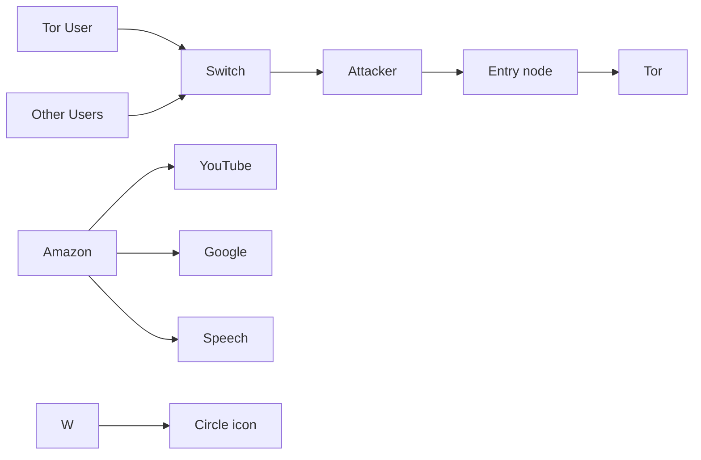
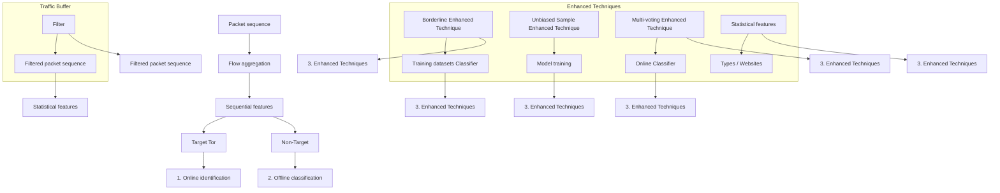
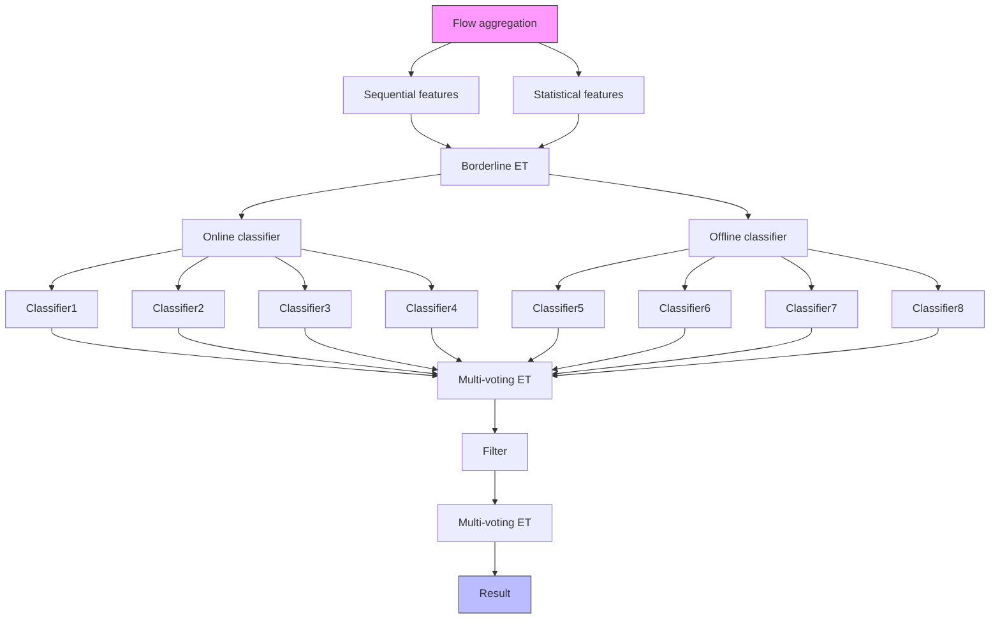

# High Precision and Efficient Anonymous Traffic Classification in the Real-World

Hantao Mei , Student Member, IEEE, Guang Cheng , Member, IEEE, and Yali Yuan , Member, IEEE

Abstract— Various Traffic Classification (TC) technologies have been developed to de-anonymize anonymous tools, such as Tor, the most popular communication anonymous system. Although current TC methods boast high performance in closedworld scenarios, they frequently encounter challenges when dealing with the low base rate of anonymous traffic in the real open world, a phenomenon referred to as the base rate fallacy. In this paper, we introduce HPETC, an anonymous traffic classification system tailored for real-world scenarios, with a focus on achieving high precision, even in the presence of extremely low rates of anonymous traffic within expansive network environments. HPETC comprises an online classifier that efficiently filters anonymous traffic with minimal resource requirements, alongside an offline classifier responsible for extracting detailed information to support fine-grained classification. In response to the base rate fallacy, we introduce three Enhanced Techniques to enhance the performance of the classifiers within HPETC. Experimental findings illustrate that HPETC markedly diminishes resource consumption and greatly enhances the actual precision in comparison to state-of-the-art methods. Remarkably, in scenarios characterized by an extremely low rate of anonymous traffic (non-Tor/Tor=1000), our HPETC demonstrates an actual precision improvement that exceeds eightfold when benchmarked against commonly utilized models, specifically the Random Forest (RF) and Convolutional Neural Network (CNN) models.

Index Terms— Tor, traffic classification, website fingerprinting, machine learning, base rate fallacy.

## I. INTRODUCTION

HE growing concern on privacy and anonymity has led to the increasing employment of anonymity tools. Tor [1] is the prime example of an anonymity tool from a scientific concept to the real world. Extensive research [2], [3], [4], [5] has been dedicated to the de-anonymization of Tor entities. Traffic analysis [6], [7], particularly Traffic Classification (TC) and Website Fingerprinting (WF), are common methods of de-anonymization that involves passively analyzing users’ traffic to extract hidden patterns and infer their use of Tor and the accessed services. It exploits the fact that Internet applications such as codecs, are built upon existing libraries

Received 8 November 2023; revised 1 August 2024; accepted 3 December 2024; approved by IEEE TRANSACTIONS ON NETWORKING Editor Y. Zhang. Date of publication 3 January 2025; date of current version 18 June 2025. This work was supported in part by the National Natural Science Foundation of China under Grant U22B2025, Grant 62172093, and Grant 62202097; in part by the Natural Science Foundation of Jiangsu Province under Grant BE2023004-3; in part by China Postdoctoral Science Foundation under Grant 2024T170143; in part by Jiangsu Funding Program for Excellent Postdoctoral Talent under Grant 2022ZB137; and in part by the Open Subject of the Key Laboratory of Computing Power Network and Information Security, Ministry of Education under Grant 2023PY005. (Corresponding author: Guang Cheng.)

The authors are with the School of Cyber Science and Engineering, Southeast University, Nanjing 211189, China (e-mail: meihantao@seu.edu.cn; chengguang@seu.edu.cn; yaliyuan@seu.edu.cn).

Digital Object Identifier 10.1109/TON.2024.3518976 with inherent features and physical characteristics that cannot be altered without compromising proper functionality.

However, TC is an arms race, and current solutions face renewed challenges as usage scenarios evolve while network traffic volumes surge. An illustrative example is deploying current traffic classification methods in the large-scale equipment succumb to the base rate fallacy [4], [8] (see Section II-B): the result would be overwhelmed by false positive classification even if the classifier achieves high performance due to the much lower base rate of Tor than non-Tor traffic in the real world. Assuming that the classifier incorrectly identifies one non-Tor flow as a Tor for every 1000 non-Tor instances, analyzing several million flows would generate a considerable number of false positives compared to the actual target samples. Consequently, this occurrence renders the classification results entirely unreliable, a scenario frequently encountered in traffic analysis devices.

On the other hand, most current TC methods necessitate the collection of all traffic traces and the computation of multiple features. Consequently, significant storage and computing resources are required [9], and a large portion of these resources is wasted on non-Targeted traffic. With the rapid growth of network traffic, the cost of hardware increase becomes a significant concern for TC equipment [10]. The performance factors such as throughput play a crucial role in the specifications of these TC devices, which impede the practical application of most current methods. Several studies [9], [11] aim to classify traffic within a limited time frame or based on limited packets. However, these studies can only achieve limited identification effectiveness and restricted granularity.

We aim to develop effective solutions to address the base rate fallacy in Tor Anonymous traffic analysis within realworld. Existing Traffic Classification (TC) techniques have demonstrated their efficacy in de-anonymizing Tor in closedworld scenarios [3], [12], [13], [14], [15]. However, these techniques have faced criticism for their imprecise hypotheses [8]. While certain techniques have been proposed for open-world scenarios [14], [15], [16], [17], [18], [19], they often presuppose that the likelihood of an attacker intercepting traffic in the monitored set closely mirrors the likelihood within the unmonitored set, a presumption that diverges from actual conditions. In this paper, we introduce a novel and efficient Tor traffic classification scheme designed for realistic large-scale traffic scenarios. Through extensive experiments, we showcase high precision and recall, highlighting the main contributions of this work as follows:

1): We present HPETC, a High Precision and Efficient Traffic Classification scheme specifically designed for Tor in open-world large-scale traffic scenarios. HPETC analyzes users’ traffic and identifies the accessed services or websites. It comprises an online classifier and an offline classifier, thereby combining the benefits of efficiency and accuracy.

2): We introduce three classifier Enhanced Techniques on HPETC that effectively enhance performance and overcome the base rate fallacy: (1) Borderline Enhanced Technique: generate boundary samples to help the classifiers learn the borderline of emphasis classes to improve the system; (2) unbiased Sample Enhanced Technique: adjust the distribution of classifier learning to align with the unbiased distribution in the real world; (3) Multi-voting Enhanced Technique: aggregates the results of multiple classifiers to improve the system.  
3): Our experiments on real traffic datasets demonstrate that HPETC outperforms various state-of-the-art methods when deployed to classify Tor traffic and conduct website fingerprinting. The results indicate an 8-fold precision improvement in scenarios with an extremely low rate of Tor traffic (non-Tor/Tor = 1000), while HPETC significantly reduces computational and storage resource requirements.

The remainder of the paper is organized as follows. Section II introduce our threat model and base rate fallacy problem. Section III discusses related works, whereas Section IV describes the framework of HPETC and three Enhanced Techniques. We compared HPETC with various state-of-the-art methods in Section V. We discuss our limitations in Section VI and conclude in Section VII.

## II. BACKGROUND

This section presents our refined threat model, which offers a more realistic scenario compared to previous assumptions. Subsequently, we discuss the concept of the base rate fallacy, which is the main issue we wish to address in this paper.

## A. Threat Model

In prior threat models, Traffic Classification (TC) and Website Fingerprinting (WF) attacks predominantly transpire on the connection between Tor clients and the Entry node. Direct knowledge of the network services accessed by the user eludes the attacker. Nonetheless, by analyzing the user traffic, they can deduce user behavior. Attackers pinpoint the anonymous communication behavior warranting monitoring, emulate this behavior in a simulated environment, and gather the corresponding traffic. Through mastering the distinct patterns of this traffic, attackers are endowed with the capability to recognize the user’s anonymous communication activities.

Aligning closely with previously analyzed threat models, this study posits that the attacker seeks to intercept user traffic between the Tor client and the Entry node and deduce behavior (Fig. 1). However, transcending the implicit assumption in earlier research, we investigate a scenario wherein the attacker passively listens to the traffic of multiple users, with the volume of traffic in the non-monitored set significantly surpassing that of the monitored set. This mirrors real-world situations where the volume of anonymized traffic is exceedingly low. Such eavesdropping could be facilitated by the actions of an Internet Service Provider (ISP) or a large-scale gateway under the attacker’s control, representing a more formidable and practical adversary than those considered in previous studies and thus posing greater challenges to achieving satisfactory performance. The attacker scrutinizes the traffic of numerous regular users and a smaller contingent of privacy-conscious users, who encrypt and reroute their content using anonymizing tools like Tor. The attackers aim to identify anonymous users and infer user behavior by performing traffic analysis.

flowchart

Fig. 1. The threat model, we assume the attacker detects the traffic of many users.

The refined threat model presents new challenges. First, the validity of classification results is compromised by the base rate fallacy, particularly as the proportion of monitored anonymous traffic is exceedingly low, a problem elaborated upon in Section II-B. Second, numerous methods previously effective are now challenging to implement in real-world scenarios. Past studies [3], [20] typically assumed that attackers could archive all traversed traffic, achieving high classification accuracy by analyzing depth information from the entire traffic trace, a technique referred to as offline classification (discussed in detail in Section III-B). However, in our more realistic threat model, devices responsible for traffic analysis are often significant traffic management equipment, making it impractical to store all traffic due to the sheer volume and hardware resource limitations.

Conversely, several studies [9], [11] have investigated methods for online traffic classification to conduct traffic analysis efficiently. Online classification necessitates the analysis of only a minimal number of packets to identify the traffic. However, these studies focused on designing lightweight models that utilize basic features and reduce computational resources, compromising performance (see Section III-A). In contrast, the proposed HPETC maintains its lightweight advantage while effectively addressing the base rate fallacy problem in TC.

## B. Base Rate Fallacy

Some studies [8] have demonstrated that previous works encountered the base rate fallacy in open-world scenarios. The base rate fallacy refers to the fallacy of making inferences due to insensitivity to statistically based rates. It indicates that a high-performance classifier in experiments may fail in real-world. When the targeted traffic (i.e., Tor) is significantly less than non-Target traffic (i.e., normal traffic), a substantial amount of non-Tor traffic can be misclassified as Tor traffic. This influx of incorrect results overwhelms the classification outcomes, resulting in invalid results. Here is a straightforward example. There is a Tor classifier (a binary classification task)

with 100% recall and 99.9% precision. The classifier will misclassify one non-Tor flow as Tor for every 1000 non-Tor traffic instances. However, in realistic scenarios, Tor traffic constitutes a significantly smaller portion compared to non-Tor traffic. For instance, if non-Tor traffic is 1000 times more prevalent than Tor, the classifier would identify 100 Tor instances while accepting 100,000 non-Tor traffic instances. The model would yield 100 true Tor instances and 100 false Tor instances, resulting in an actual precision of 50%.

This limitation arises because the current work has been conducted on a small, meticulously designed dataset that overlooks the scaling of real-world traffic. As network traffic continues to grow exponentially, the base rate fallacy emerges in various scenarios [4], [21], such as ISP and gateway servers. It also has long been observed in various domains, such as cancer detection, intrusion detection, and traffic correlation [22], [23], [24]. Recently, it has emerged as one of the most formidable challenges in traffic classification. Our proposed HPETC effectively overcomes the base rate fallacy. In Sections IV, we demonstrate how we addressed this challenge and discuss various details that may arise in realistic deployments.

## III. RELATED WORK

In this section, we examine the methodology and limitations of Online identification and Offline classification approaches and we explore how recent research endeavors have incorporated the consideration of high precision traffic analysis.

## A. Traffic Classification and Website Fingerprinting

The goal of Tor traffic classification is to analyze user traffic and ascertain the service that users are accessing. Classification targets in this context can encompass various categories, such as anonymous tools, traffic types, and applications. Cuzzocrea et al. [25] have developed a discriminative approach that effectively distinguishes 8 types of Tor traffic and services with 23 statistical features. Numerous studies have made significant strides in advancing classification methods, including traffic classification (TC) based on novelty features [15] and TC that leverages deep learning [17]. Montieri et al. [3] conducted an investigation into the impact of different feature sets and the number of features in anonymous TC at anonymity tools, traffic types, and application levels. The findings reveal a continuous decline in identification performance as the classification level increases. Xiao et al. [26] developed the EBSNN, integrating an attention mechanism within RNN to distill information from the context of each byte and segment, thereby facilitating the classification of applications and websites.

Website fingerprinting is a fine-grained aspect of traffic classification that aims to infer the websites visited by a client. Several studies have achieved notable success in closed-world scenarios, where clients exclusively access websites within a predetermined monitoring set [12]. Juarez et al. [8] critiqued this hypothesis, arguing that such attacks are ineffective in open-world scenarios. Subsequently, numerous studies have demonstrated success in open-world scenarios [27], [28], [29], [30], [31], [32], [33]. In this context, the attacker not only collects websites from the monitoring set but also includes additional websites in a non-monitoring set. The classifier analyzes network traffic and determines whether they belong to the non-monitoring set or which specific website within the monitoring set they correspond to. More recent investigations have demonstrated that the Transformer model also exhibits strong performance in website fingerprinting tasks [34], [35].

Moving beyond the open-world assumptions of previous work, we consider the base rate fallacy in traffic analysis. Due to the extremely low proportion of Tor traffic, even the best performing classification methods fail. We present a generic Tor traffic analysis framework that can perform traffic classification or website fingerprinting tasks. Furthermore, our framework addresses the inherent limitations associated with the basic proportionality fallacy.

## B. Online and Offline Classification

Online classification, also known as early identification, aims to swiftly categorize traffic as it emerges, a practice widely utilized in Quality of Service (QoS) management and the detection of malicious traffic. In a pioneering study, Bernaille et al. [36] demonstrated high accuracy in distinguishing between HTTP and HTTPS traffic by analyzing merely the initial five packets of each flow. Shahbar and Zincir-Heywood [37] focused on classifying multilevel encrypted anonymity network tools by utilizing derived features from sequence analysis. Their work demonstrated that sequence features are also effective also in anonymous traffic classification. Subsequent studies have delved into classifying traffic based on sequence features, employing both manually extracted features [38], [39] and automatically extracted features [16], [40], [41] and so forth. Note that while online classification techniques offer remarkable efficiency by identifying traffic using only a few initial packets and computationally simple features, their identification performance remains limited.

Offline classification mines traffic properties from packet headers, load, and flow distribution to identify flows. Numerous studies have utilized machine learning techniques with manual feature extraction [3], alongside deep learning approaches that allow for automatic updates [20], and reinforcement learning [42] for offline traffic classification. Another notable study by [43] introduced the Anon17 dataset, which comprises three well-known anonymous network traffic (Tor, I2P, and JonDonym). Using this dataset, Antonio et al. [3] conducted a thorough analysis and classified traffic from these three anonymous tools across multiple levels. It is worth mentioning that [3] and [10] also evaluated both online and offline traffic classification methods, consistently demonstrating that online classification could not achieve the same level of performance as offline classification.

Offline classification methods extract detail information and proficiently discern traffic patterns by leveraging expert knowledge alongside sophisticated models, typically yielding enhanced performance and stability relative to online methods. Nonetheless, it is crucial to acknowledge that such offline classification demands substantially more computing power and extensive storage capacity, necessitating the retention of all streams data until feature extraction is completed [10].

flowchart

Fig. 2. Architecture of HPETC. The Online Identification module identifies and filters Target Tor traffic, the Offline Classification module identifies specific type or website of Tor traffic, and the Enhanced Techniques enhance classifiers against base rate fallacy.

## C. High Precision Traffic Analysis

Numerous studies have emphasized the significance of precision. Wang et al. [14] employed k-nearest neighbors (kNN) for WF attacks. By adjusting the number of non-monitoring set samples in the training data and varying the value of k (the number of nearest neighbors), they were able to trade false positive rate (FPR) for true positive rate (TPR), thereby enhancing classifier precision. Hayes and Danezis [27] trained a random forest model, utilized the decisions made by all leaf nodes as fingerprints and calculated the distances between these fingerprints. A test sample is classified into a specific class only if several training samples with the closest fingerprint distances belong to that class. By modifying the classification strategy, their method allows for the exchange of FPR for TPR. Pulls and Dahlberg [21] and Greschbach et al. [22] incorporate additional information beyond traffic analysis, such as DNS behavior, ad real-time bidding behavior, or other relevant factors within a short time frame to mitigate false alarms in traffic analysis. The aforementioned works do not directly address the challenge of the base rate fallacy, but rather have the potential to improve the actual precision of classification.

Wang [4] proposes three optimizers to reject uncertain classification results as non-sensitive pages, effectively enhancing the precision of identifying sensitive pages. In comparison to Wang’s study, our approach achieves substantial improvements in actual precision while only sacrificing a minimal amount of recall. Furthermore, our approach is highly suitable for large-scale traffic scenarios.

Prior to this period, minimal research has focused on the base rate fallacy in TC. In this paper, we employ an online classifier to efficiently filter out the non-Target Tor traffic using minimal computational resources, and utilize a high-precision offline classifier to accurately identify various types of Tor traffic or website. Additionally, we introduce three Enhanced Techniques that target sample processing, classifier training, and aggregation of classification results for both the online and offline components. These techniques are designed to enhance the actual precision of our approach and address the challenge of the base rate fallacy.

## IV. DESIGN OF HPETC

We present HPETC, a High Precision and Efficient Traffic Classification scheme, designed for Tor traffic analyzing to address the base rate fallacy in large-scale traffic scenarios. HPETC can be deployed on any network equipment and effectively determines whether a user is utilizing Tor and which specific services or website they are accessing by passively analyzing network traffic.

Fig. 2 illustrates the architecture of HPETC, which consists of three primary modules: the Online Identification module, the Offline Classification module and the Enhanced Techniques. In the Online Identification module, packet sequences are extracted from the Network Interface Controller (NIC) and stored in the Traffic Buffer. Concurrently, the online classifier determines whether a flow corresponds to Target traffic and forwards the flow index to the filter. The filter retrieves the packets from the Traffic Buffer and forwards the packets identified as Target to the offline classification module. The Online Identification module requires only the initial few packets from a flow for classification, this efficiency significantly reduces the volume of traffic requiring processing in the offline phase, thus conserving substantial resources for the offline classifier. A detailed explanation of the online module’s principles will be provided in Section IV-A.

The offline classification module operates on the complete flows initially identified as Target, extracting and computing statistical features. Subsequently, the offline classifier performs multi-classification tasks to determine the traffic types or website of the flows. The utilization of complete flows allows offline classifiers to delve into packets for deep feature extraction and employ sophisticated models for classification, thereby achieving high classification performance. Further elaboration on the principles of the offline module will be presented in Section IV-B.

To mitigate the base rate fallacy, we employ Enhanced Techniques to adapt the classifiers in online and offline modules. To attain high precision, the online and offline classifiers adopt a conservative approach. When the classification results are uncertain, they are assigned to the negative category (non-Target). The Enhanced Techniques incorporates three techniques: the Borderline Enhanced Technique (BDET), the Unbiased Sample Enhanced Technique (USET), and the Multi-voting Enhanced Technique (MVET). While the online and offline modules serve as the core components of traffic analysis, the Enhanced Techniques enhance the system’s performance. A comprehensive explanation of how the Enhanced Techniques works will be provided in Section IV-C.

## A. Online Identification Module

The sequential arrangement of flow packets, particularly the initial packets, reflects the interaction order information of each network behavior. The Online Identification module utilizes the sequence information from the initial packets to identify and filter target Tor traffic, effectively performing a binary classification task. Initially, the TCP stream is sorted in the order of packet arrival. Then, the packet sequences are aggregated as flows. A flow is defined as a collection of packet sequences sharing the same five-tuple (i.e., source IP, source port, destination IP, destination port, and protocol), denoted as $F = \{ p _ { 1 } , p _ { 2 } , . . . , p _ { n } \}$ . Biflows, on the other hand, consist of packets in both directions of the flow, where the source and destination are interchangeable. The designation A signifies a packet transmitted from the client to the server, while B represents a packet returned from the server to the client. For online identification purposes, sequential features are extracted from a limited number of packets within the Biflow and serve as input for the classifier. Specifically, the first N packets in each direction are selected for each flow, resulting in the packet sequence $B i \ – F = \{ p _ { 1 } ^ { A } , p _ { 2 } ^ { A } , \dotsc , p _ { N } ^ { A } , p _ { 1 } ^ { B } , p _ { 2 } ^ { B } , \dotsc , p _ { N } ^ { B } \}$ . In relation to sequential features, we refer to previous work [3], packet length (PL) and interarrival time (IAT) are calculated for each packet in Bi-F . Consequently, the resulting feature vector is represented as: $U = \{ { \cal P } L _ { 1 } ^ { A }$ , . . . , $P L _ { N } ^ { A } , \bar { I } \bar { A } T _ { 1 } ^ { A } , \ldots , I A T _ { N } ^ { A } , P L _ { 1 } ^ { \hat { B } } , \ldots , P L _ { N } ^ { B } , I A T _ { 1 } ^ { B } , \ldots , \bar { I } \bar { A } T _ { N } ^ { B } \} .$ In this study, we select the first 20 packets of direction A and B, i.e., $N = 2 0$ .

For flow i, the online classifier receives the features vector $U _ { i }$ and predicts the labels $y _ { i }$ of the flows. The classifier then submits the classification result to the Filter. The Filter selectively stores the streams with corresponding $y _ { i } = T a r g e t T o r$ as an offline pcap file, which is a commonly used file format for storing network traffic. By excluding the majority of non-Target traffic from storage, this step significantly reduces the required storage space.

## B. Offline Classification Module

The offline classification module identifies target Tor flows and determines their traffic types or websites from the filtered traffic. The entire stream is captured and depth information is extracted from it for classification task. Packet sequences are aggregated, and statistical features are extracted. Statistical features encompass packet counts per flow, packet length statistics, and time interval statistics, etc. These features provide insights into the characterization of traffic. Each flow is associated with a set of M features, denoted as $V =$ $v _ { 1 } , v _ { 2 } , \ldots , v _ { j } , \ldots , v _ { m }$ , where $v _ { j }$ represents a statistical feature. Offline classifiers achieve high-performance classification by extracting depth information from complete streams.

To select informative features, we consider statistical features that have demonstrated good performance in previous studies [3], [43]. It has been established that adding more features beyond a certain point does not improve classficaition performance. Therefore, we perform feature selection by constructing a decision tree, calculating the information gain of each feature, and ranking them accordingly. In this study, we select 60 features, i.e., M = 60. A detailed description of how we select our features can be found in Appendix $\mathrm { A } .$

For each features vector of flow i, denoted as $V _ { i } ,$ , we feed the feature set into the offline classifier G(x). G(x) assesses whether the flow belongs to the Tor and determines its specific type or website. In this paper, we will evaluate traffic classification task and website fingerprinting task. In traffic classification, we identify seven types of Tor traffic: Browsing, Message, Audio, Video, FTP, VoIP, and P2P traffic. These types have been found to be among the most prevalent in the Tor network based on prior research [2], [44]. Therefore, $G ( x )$ performs a classification task with 8 categories. In website fingerprinting, we identify 100 websites. Therefore, $G ( x )$ performs a classification task with 100 categories.

## C. Enhanced Techniques

HPETC combines the benefits of online classification (speed and space efficiency) and offline classification (high accuracy) while addressing their limitations. The classification results can be enhanced due to the effective filtering of numerous non-Target flows. To overcome the base rate fallacy, we propose three Enhanced Techniques (ETs) to improve HPETC: the Borderline Enhanced Technique, the Unbiased Sample Enhanced Technique, and the Multi-voting Enhanced Technique.

1) Borderline Enhanced Technique: Certain classification methods enhance performance through resampling to modify the distribution of the training dataset. Our investigation revealed that samples whose eigenvalues situated on the borderline are susceptible to misclassification. Therefore, precision can be improved by adjusting the classifiers’ capability to handle the borderline of the Tor traffic. Inspire by Borderline-SMOTE (Borderline Synthetic Minority Oversampling Technique [45]), which performs Over-sampling by generating synthetic samples along the boundary of a class and its nearest neighbors, we categorize the samples into Safety, Boundary and Noise samples and generating boundary Tor samples in the training set and training both the online and offline classifiers. We exclusively generate samples located on the boundary between Tor and non-Tor samples. This method ensures that the outcomes of the multi-classification task remain largely unaffected, reinforcing only the ambiguous samples.

The process of boundary samples generation is outlined in Algorithm 1, which consists of two stages: boundary

Algorithm 1 Boundary Samples Generation

Input: origin training set ${ \overline { { T } } } ,$ parameter for delimiting samples m, parameter for generate samples $k ,$ expected Target sample size snum, sample generation factor $\boldsymbol { r } _ { j } ;$

Output: borderline enhanced training set $T ^ { \prime } { \mathrm { ; } }$

Initialization: $T ^ { \prime } = T .$ , marker Target samples $T _ { T a r } = \{ f _ { 1 }$ , $f _ { 2 } , \ldots , f _ { T a r } \}$ , non-Target samples $T _ { N t a r } = \{ f _ { 1 } , f _ { 2 } , . . . , f _ { N t a r } \}$ Noise= {}, Boundar $\mathbf { y } { = \{ \} } , \mathrm { S a f e } { = \{ \} } $ ;

Step 1: boundary sample identification

1: for $f _ { i } \mathbf { i n } T _ { T a r }$ do  
2: calculate s nearest neighbors for $f _ { i } ,$ , the number of non-Target samples among the s neighbors is denoted by $s ^ { \prime } ( 0 \leq s ^ { \prime } \leq s ) ;$  
3: if $s ^ { \prime } = s$ then add $f _ { i }$ to Noise;  
4: else if $\scriptstyle { \frac { s } { 2 } } < s ^ { \prime } < s$ then add $f _ { i }$ to Boundary;  
5: else if $\bar { 0 } { < } s ^ { \prime } { < } \frac { s } { 2 }$ then add $f _ { i }$ to Safe;

Step 2: boundary sample generations

6 $\begin{array} { r } { \mathrm { : } \ h = \frac { s n u m } { n u m \left( B o u n d a r y \right) } ; } \end{array}$  
7: for $f _ { i } ^ { \prime }$ in Boundary do  
8: calculate k nearest neighbors for $f _ { i } ^ { \prime }$ from $T _ { T a r } ;$  
9: select h samples randomly from k nearest neighbors;  
10: calculate differences between $f _ { i } ^ { \prime }$ and these samples, $d i f _ { j } = \{ d _ { 1 } , d _ { 2 } , \dots , d _ { h } , \} ;$  
11: for $j = 1 , 2 , \dots , h$ do  
12: $s y n t h e t i c _ { j } = f _ { i } ^ { \prime } + r _ { j } \times d i f _ { j } ;$  
13: add syntheticj to $T ^ { \prime } { \ ; }$  
return $T ^ { \prime } .$

sample identification and sample generation. The Borderline Enhanced Technique operates as follows: Firstly, in the boundary sample identification stage, the Target Tor samples are categorized based on their distance of feature values. The nearest neighbors for each sample are computed from the training set, and a sample is considered safe if more than half of its surrounding samples belong to the same class. Samples surrounded by other samples are classified as noise samples, while samples with more than half of the surrounding samples being of different classes are labeled as boundary samples. These boundary samples have a significant impact on classifier performance. If a large number of boundary samples are generated around a boundary sample, the classifier will become biased towards the class of this sample, and vice versa. Secondly, in the sample generation stage, new synthetic examples are created along the boundary between target samples and their selected nearest neighbors. In this study, we set the parameters as $m = 5 , k = 1 0$ , and $r _ { j }$ as a random number between 0 and 1.

To elaborate further, when we generate Target boundary samples in the training set, the classifier becomes biased towards the target class and tends to classify samples on the boundary as Target. While this may lead to a reduction in recall, it results in an increase in precision.

2) Unbiased Sample Enhanced Technique: We train the online and offline classifiers in HPETC with a shared training set comprising traffic collected from the real world. The samples learned by the online classifier closely adhere to the distribution of real-world. This is not the case with the offline classifiers. The offline classifier receives samples that were ‘identified as target Tor traffic in the online phase’. These samples consist of two components: the majority being Tor samples and the non-Tor samples that were misclassified in the online phase. Consequently, the learned samples of the offline classifier do not represent unbiased estimations of reality. , We found that enabling offline classifiers to learn knowledge about misclassified samples can enhance performance. This observation inspires our Unbiased Sample Enhance Technique.

To address this issue, we collect a set of traffic that is entirely independent of the training and test sets. We then submit this traffic to the trained online classifier and collect the non-Target samples that were misclassified. As a result, we obtain three training sets: target Tor samples, non-Target samples, and misclassified non-Target samples from the online classifier. It is not feasible to train the classifier using the misclassified non-Target set instead of the non-Target set due to the presence of numerous noise samples in the misclassified non-Target set. These noise samples contribute to their susceptibility to misclassification by the online classifier. However, by leveraging the misclassified non-Target set, we can enable the offline classifier to acquire more realistic knowledge.

We employ a strategy of altering the sample distribution by continuously adjusting the sample weights, thereby directing the classifier’s focus towards the misclassified samples. The process of Unbiased Sample Enhanced Technique is presented in Algorithm 2. First, we define the total sample set consisting of the target Tor set $( S _ { T a r } )$ , non-Target set $( S _ { N t a r } )$ , misclassification non-Target set $( S _ { M i s N t a r } )$ . We extract an equal number of samples from each set to form the initial training set $T _ { 1 }$ . Then, we initialize the weights of the sample data, assigning equal weight to each sample. We train the classifier with $T _ { r }$ and update the sample data weights based on the prediction results: the weight of samples with correct prediction decreases, while the weight of samples with incorrect prediction increases. Subsequently, we calculate the weights of the sample sets and adjust the non-Target and misclassified non-Target sets accordingly. We add samples with high set weights and remove samples with low sample set weights, ensuring that all sample weights are equal once again. This process updates $T _ { r + 1 }$ . This algorithm was inspired by Adaboost algorithm [46].

3) Multi-voting Enhanced Technique: When different classifiers yield varying results for the same sample, identifying the sample becomes challenging. We propose to introduce the idea of ensemble learning and voting results of multiple classifiers to obtain a final evaluation. It should be noted that although some classifiers, such as RF, are ensemble learning classifiers, we treat them as black boxes and solely utilize their classification results to ensure scalability of our system.

Our Multi-voting Enhanced Technique, operates as follows: Firstly, the four online classifiers provide classification results for voting. We establish voting rules to determine the online voting classification and submit the samples that are ultimately identified as target Tor to the four offline classifiers to obtain their classification results. Subsequently, the classifiers decide the final voting classification results based on integration rules. The voting rules lean towards rejecting target Tor classification

## Algorithm 2 Unbiased Sample Enhanced Technique Classifier Training

Input: all training set: Target Tor set $S _ { T a r } .$ non-Target set $S _ { N t a r } ,$ misclassified non-Target set SM isNtar;

Output: optimized classifier $G ( x ) ;$

1: select n samples from $S _ { T a r } , S _ { N t a r }$ and $S _ { M i s N t a r }$ respectively to form the initial training set $T _ { 1 }$ ;  
2: set initialize weight ${ { D } _ { 1 } } = \left\{ { { w } _ { 1 1 } } , { { w } _ { 1 2 } } , \ldots , { { w } _ { 1 , 3 n } } \right\}$ , equal weights for each sample;  
3: for $r = 1 , 2 , \ldots , R$ do  
4: training the classifier $G _ { r } ( x )$ with $T _ { r } ;$  
5: calculate the difference $e _ { r } ~ = ~ P ( G _ { r } ( x _ { i } ) \neq y _ { i } ) ~ =$ $\begin{array} { r } { \sum _ { i } w _ { r i } I ( G _ { r } ( x _ { i } ) \ne y _ { i } ) = \sum _ { i } w _ { r i } ; } \end{array}$  
6: if $e _ { r } > 0 . 5$ then $a _ { r } = 0 ;$  
7: else $\begin{array} { r } { a _ { r } = \frac { 1 } { 2 } \ln { \frac { 1 - e _ { r } } { e _ { r } } } ; } \end{array}$  
8: update weight, $\bar { D _ { r + 1 } } = \{ w _ { r + 1 , 1 } , \dotsc , w _ { r + 1 , 3 n } \} ,$  
$\begin{array} { r } { w _ { ( r + 1 , i ) } = \frac { w _ { r i } } { z _ { r } } e x p ( - a _ { r } y _ { i } G _ { r } ( x _ { i } ) ) } \end{array}$ , which $Z _ { r } =$ $\begin{array} { r } { \sum _ { i } w _ { r i } e x p ( \dot { - } a _ { r } y _ { i } G _ { r } ( x _ { i } ) ) ; } \end{array}$  
9: calculate the weight sum of non-Target sets $W _ { r } ^ { N t a r } =$ （号 $\begin{array} { r } { \sum _ { i } w _ { i } ( z _ { i } \ = \ N t a r { \bf ) } , W _ { r } ^ { M i s N t a r } \ = \ \sum _ { i } w _ { i } ( z _ { i } \ = \ } \end{array}$ $M i s N t a r ) ;$  
10: modify the sample composition by adding or removing instances from $T _ { r } ^ { N t a r }$ and $\dot { T } _ { r } ^ { M i s N t a r }$ to ensure $D _ { N t a r } = D _ { M i s N t a r } ;$  
11: $T _ { r + 1 } = T _ { 1 } ^ { T a r } \bigcup T _ { r + 1 } ^ { N t a r } \bigcup T _ { r + 1 } ^ { M i s N t a r } ;$ return $G _ { r } ( x ) .$

(treating uncertain samples as non-Target), which slightly reduces recall but enhances precision to counter the base rate fallacy. With the aim of achieving effective target Tor rejection, we have developed three multi-voting rules: NAIVE, SLIGHTLY, and STRONG.

1) NAIVE: Applies the majority voting principle and, in the event of a tie, selects the class with the highest precision among the classifiers, considering classifier bias;  
2) SLIGHTLY: Classifies a sample as non-Target if the consensus vote of the classifiers is less than 3;  
3) STRONG: Considers a sample as non-Target in the online phase if any one of the four classifiers assigns a non-Target classification, while in the offline phase, the decision is made based on majority voting.  
4) Enhanced Technique integration: We integrated three Enhanced Techniques (ETs) into HPETC to maximize the mitigation of the base rate fallacy problem. Fig. 3 illustrates the framework for deploying the three ETs (Borderline ET, Unbiased Sample ET, and Multi-voting ET) in training HPETC. During the classifier training phase, the traffic is aggregated, and both sequence features and statistical features are extracted before applying the Borderline ET to alter the distribution of training samples. We train four classifiers separately in the online and offline phases. The misclassified non-Target samples from the online classifier are collected, and the offline classifier is updated using the Unbiased Sample ET. In the application phase, the traffic is input into the online classifier, and the classification results of the four classifiers are aggregated using the Multi-voting ET. Traffic identified as Target Tor is forwarded to the offline classifier,

flowchart

Fig. 3. Integrate three Enhanced Techniques (ET) in HPETC.

TABLE I HOW WE COUNT THE METRICS IN HPETC

<table><tr><td rowspan="2">True\Classified</td><td colspan="3">Target</td><td rowspan="2">non-Target</td></tr><tr><td>Correct Target</td><td>Wrong Target</td><td>non-Target</td></tr><tr><td>Target</td><td> $N_{TP}^{2}$ </td><td> $N_{WP}^{2}$ </td><td> $N_{FN}^{2}$ </td><td> $N_{FN}^{1}$ </td></tr><tr><td>non-Target</td><td>-</td><td> $N_{FP}^{2}$ </td><td> $N_{TN}^{2}$ </td><td> $N_{TN}^{1}$ </td></tr></table>

$N _ { F N } ^ { 1 } , N _ { T N } ^ { 1 } \colon$ Resultofonlineidentification.  
$\hat { N _ { T P } ^ { 2 } } , \hat { N _ { W P } ^ { 2 } } , \hat { N _ { F N } ^ { 2 } } , \tilde { N _ { F P } ^ { 2 } } , \tilde { N _ { T N } ^ { 2 } } \hat  $ Resultof offine classification.

and the final classification results are generated by the offline Multi-voting.

## D. Evaluation Metrics

After designing the classification scheme, it is essential to define appropriate evaluation metrics for assessing its performance. Within HPETC, original traffic is directed to the online classifier, while the offline classifier provides the classification results. Hence, the metrics should encompass both online and offline categorization outcomes. On the other hand, commonly used metrics for evaluating classifier performance, such as precision and recall, do not account for the impact of base rates. Therefore, it is necessary to introduce the base rate of Target traffic when assessing classifier performance. We initially introduce our terminology formula in Table I. In this study, we establish $N _ { T P } ^ { 1 }$ (True Positive), $N _ { F P } ^ { 1 }$ (False Positive), $N _ { F N } ^ { 1 }$ (False Negative), and $N _ { T N } ^ { 1 }$ (True Negative) to characterize the outcomes of the online binary classifier. Subsequently, the online classifier outcomes deemed Target Tor $( N _ { T P } ^ { 1 } + N _ { F P } ^ { 1 } )$ preceed to the offline phase. Building upon and expanding the definition of classifier outcomes as described in [4], we delineate the results classified by the offline classifier as positive into two distinct categories: $N _ { W P } ^ { 2 }$ (Wrong Positive), where instances in the monitored set, are identified as monitored set Target but are incorrectly categorized, and $N _ { F P } ^ { 2 }$ (False Positive), where unmonitored instances are mistakenly classified as monitored Target. Notably, when the count of instances in the monitored set remains unchanged while instances in the non-monitored set substantially increase, WP tends to stay nearly constant, whereas FP markedly rises. Consequently, it is imperative to calculate WP separately from FP. The remainder of offline classifier results are then differentiated into (False Negative) $N _ { F N } ^ { 1 }$ , and (True Negative) $N _ { T N } ^ { 1 }$ . The precision and recall for the online $( P _ { 1 } , R _ { 1 } )$ and offline $( P _ { 2 } , R _ { 2 } )$ phases are represented respectively.

Prior research typically conflates $W P$ with $F P ,$ and offline precision is calculated as:

$$
P _ {2} = \frac {N _ {T P} ^ {2}}{N _ {T P} ^ {2} + N _ {W P} ^ {2} + N _ {F P} ^ {2}}
$$

Nevertheless, considering the base rate for Tor access and defining the non-Target to Target Tor traffic ratio as $r ,$ the count of F P inflates by a factor of $r ,$ leading to a notable reduction in actual precision. In contrast, recall is unaffected by base rate changes since increasing the count of non-Target samples does not lead to additional misclassifications of Target traffic.

For the High Precision and Efficient Traffic Classification (HPETC), we concentrate on Tor-related metrics. Tor precision in HPETC gauges the exactness of the prediction outcomes, pertains solely to the offline classifier’s output. We take into account base rates, and our comparison is grounded on the Bayesian detection rate (Bayesian precision) [47], denoted as B-precision:

$$
B - p r e c i s i o n = P _ {2} ^ {\prime} = \frac {N _ {T P} ^ {2}}{N _ {T P} ^ {2} + N _ {W P} ^ {2} + r \cdot N _ {F P} ^ {2}}
$$

HPETC recall assesses the proportion of initially input Tor samples that are identified. We define Tor recall as $\displaystyle \frac { \bar { N } _ { T P } ^ { 2 } } { N _ { T P } ^ { 1 } + N _ { F N } ^ { 1 } }$ . Considering $N _ { T P } ^ { 1 } = N _ { T P } ^ { 2 } + N _ { W P } ^ { 2 } + N _ { F N } ^ { 2 }$ , recall can be expressed as

$$
r e c a l l = \frac {N _ {T P} ^ {1}}{N _ {T P} ^ {1} + N _ {F N} ^ {1}} \cdot \frac {N _ {T P} ^ {2}}{N _ {T P} ^ {2} + N _ {W P} ^ {2} + N _ {F N} ^ {2}} = R _ {1} \cdot R _ {2}
$$

To evaluate the overall performance of the online classifier and the offline classifier separately, we also have Accuracy1 $\begin{array} { r l } { = } & { { } \frac { N _ { T P } ^ { 1 } + N _ { T N } ^ { 1 } } { N _ { T P } ^ { 1 } + N _ { F P } ^ { 1 } + N _ { F N } ^ { 1 } + N _ { T N } ^ { 1 } } } \end{array}$ and $\begin{array} { r l } { A c c u r a c y _ { 2 } } & { { } = } \end{array}$ $\frac { N _ { T P } ^ { 2 } + N _ { T N } ^ { 2 } } { N _ { T P } ^ { 2 } + N _ { F P } ^ { 2 } \pm N _ { F N } ^ { 2 } + N _ { T N } ^ { 2 } }$ . This research utilizes both B-precision and overall recall as metrics. It is pertinent to recognize that prior studies often presupposed $r ~ \approx ~ 1$ , indicating an unrealistic equivalent ratio of Tor to non-Tor access. Attaining high B-precision is imperative for accurate classification, while a high recall is essential for encompassing all instances of the target class. Our methodology attains a significant level of B-precision with a slight decrease in recall, effectively countering the base rate fallacy even under minimal Tor access ratios.

## V. EXPERIMENTAL EVALUATION

In this section, we evaluate the effectiveness of HPETC with real-world type and website datasets. We compare the performance of our work with the state-of-the-art methods.

## A. Experimental Setup

We collected our dataset in a real network environment. The process of collecting experimental data involved three steps:

Traffic collection, Feature extraction and pre-processing, and Labeling of traffic features.

(1) Dataset: Initially, we gathered over 2 million flows of daily traffic from various users to serve as normal traffic. Subsequently, we employed 7 PCs, each equipped with a Tor obfs4 bridge, to generate Tor traffic. Additional details regarding our traffic collection settings are provided in Appendix B. We collected a Type dataset and a Website dataset to assess the performance of our approach across various classification challenges. In the Type dataset, we assembled seven types of traffic (audio, browsing, video, P2P, message, mail, VoIP), which have been commonly examined in prior research [25] and represent a substantial portion of Tor traffic. In Type dataset, these seven types of Tor traffic constituted the ‘Target Tor’ set, while the normal traffic comprised the ‘non-Target’ set. Regarding the Website dataset, we obtained the top 100 pages from Alexa, each of which was visited 200 times. Additionally, we selected the subsequent top 10,000 pages, each visited once. In website dataset, the top 100 web pages comprised the ‘Target Tor’ set, while the remaining 10,000 pages, alongside normal traffic formed the ‘non-Target’ set. Ethical risks were mitigated by using the collected traffic solely for this study and avoiding any other form of analysis. The detail of traffic we collected and the dataset allocation are shown in TABLE II.

(2) Model selection: Each classifier and Enhanced Technique within HPETC operates independently. Taking advantage of this scalability, we evaluate over a dozen machine learning algorithms that have demonstrated successful performance in the traffic classification task [3], [15], [25] (e.g., Decision Tree, Naïve Bayes, Random Forest). Additionally, we assessed K-Nearest Neighbor (KNN) and Support Vector Machine (SVM), two widely employed algorithms for website fingerprinting [13], [24], [27], [31]. Consistent with prior research [15], [48], we also evaluated deep learning algorithms, such as Multilayer Perceptron (MLP) and Convolutional Neural Networks (CNN), among others [19], [33], [48]. We select the four top-performing classifiers: Decision Tree (C45), K-Nearest Neighbor (KNN), Random Forest (RF), and Convolutional Neural Networks (CNN). Each experiment is executed 10 times, and the average is considered as the final result. In Appendix B, we provide detailed information about the specific parameters of all the models we tested.

To promote reproducibility and facilitate future research in this field, we have made all artifacts generated during our study openly available. This includes our dataset and the source code used for our analyses, which can be accessed at https://github.com/MHTTHM/HPETC.

## B. Traffic Type Classification Evaluation

We begin by evaluating the performance of diverse methods in the realm of type classification, taking into account various base rates. We present the B-precision and recall in scenarios with $r \ : = \ : 2 0$ (a simple scenario) and $r = 1 0 0 0$ (a difficult scenario) in Fig. 4, where r represents the ratio of non-Tor traffic to Tor traffic. The discussion on the choice of the base rate r can be found in in Section V-G. The Histogram depicts the B-precision, while the line represents the recall.

TABLE II BREAKDOWN OF TRAFFIC COUNTS IN OUR DATASET

<table><tr><td>Dataset</td><td colspan="7">Type dataset</td><td colspan="2">Website dataset</td><td rowspan="2">normal</td></tr><tr><td>Class</td><td>audio</td><td>browser</td><td>mail</td><td>P2P</td><td>message</td><td>vedio</td><td>VoIP</td><td>top100</td><td>next10,000</td></tr><tr><td>number</td><td>1674</td><td>17687</td><td>9053</td><td>5666</td><td>3797</td><td>2514</td><td>24439</td><td> $100 \times 200$ </td><td> $10,000 \times 1$ </td><td>-</td></tr><tr><td>train</td><td>1474</td><td>5000</td><td>5000</td><td>5000</td><td>3597</td><td>2314</td><td>5000</td><td> $100 \times 180$ </td><td>9000</td><td>5000</td></tr><tr><td>test</td><td>200</td><td>200</td><td>200</td><td>200</td><td>200</td><td>200</td><td>200</td><td> $100 \times 20$ </td><td>1000</td><td>2 million</td></tr></table>

bar-line hybrid chart

| Model | B-precision (%) | Recall (%) |
| :--- | :--- | :--- |
| ASTIJ | 80 | 95 |
| STP | 36 | 78 |
| DarknetSec | 55 | 94 |
| Online | 48 | 86 |
| Offline | 80 | 89 |
| NET | 92 | 97 |
| BDET | 95 | 96 |
| USET | 94 | 95 |
| MVET | 95 | 86 |
| HPETC | 95 | 96 |

(a) $r = 2 0$

bar-line hybrid

| Category | B-precision (%) | Recall (%) |
|---|---|---|
| ASTIJ | 10 | 95 |
| STP | 2 | 78 |
| DarknetSec | 6 | 93 |
| Online | 3 | 85 |
| Offline | 10 | 88 |
| NET | 52 | 96 |
| BDET | 71 | 96 |
| USET | 77 | 94 |
| MVET | 85 | 86 |
| HPETC | 95 | 97 |

(b) $r = 1 0 0 0$  
Fig. 4. $r ( r a t i o ) = 2 0$ and $r = 1 0 0 0$ B-precision(histogram) and recall(line) of SOTA methods, our original classifiers (Online and Offline), the HPETC with No Enhanced Technique (NET), utilizing single ET (BDET, USET, MVET), and deploy all ETs (HPETC).

The following methods were considered: ASTIJ [3] identify and classify anonymous tools traffic with multiple classical machine learning. STP [15] represents the performance of the path signature fingerprinting-based traffic classification method. DarknetSec [17] utilizes a cascaded model with Deep learning algorithms for high performance anonymous traffic classification. Online & Offline refers to well-performing multi-classifiers trained with sequential features (Online) or statistical features (Offline) and serves as a baseline for comparison. The flows’ features are fed to the multi-classifiers, which provide results indicating either the non-Tor category or a specific Tor category. NET represents the performance of the unenhanced HPETC, i.e., HPETC with No Enhanced Technique. The online classifier identifies target Tor traffic and the offline classifier determines the traffic type. BDET,USET, and MVET represent the performance of applying Borderline Enhanced Technique, Unbiased Sample Enhanced Technique, and Multi-voting Enhance Technique on Unenhanced HPETC, respectively. HPETC represents the performance of deploying with three Enhanced Techniques.

Not given in figure, the previous most SOTA methods (ASTIJ, STP, DarknetSec) and the single classifier (Online, Offline) we trained can achieve no less than 96% precision at $r = 1$ . However, well-trained classifiers succumbed to the base rate fallacy, the B-precision is no higher than 80% at $r = 2 0$ and is lower than 10% at $r = 1 0 0 0$ . Specifically, when $r = 2 0$ , only ASTIJ achieves a B-precision exceeding 80%, whereas STP and DarknetSec fall below 56%. The B-precision for our online classifier stands at 48.72%, in contrast to the offline classifier’s 80.49%. This underscores our analysis that the performance of the online classifier is constrained by its reliance on only the initial packets of the flow. In contrast, the offline classifier, utilizing the full flow, achieves higher performance. The B-precision can be improved to 51.84% at $r ~ = ~ 1 0 0 0$ in the unenhanced HPETC (NET) since large volume of non-Target Tor traffic was filtered. Beyond that, all three Enhanced Techniques (BDET, USET, MVET) can markedly improve precision while recall decreases slightly. By integrate all three Enhanced Techniques in HPETC (HPETC), we significantly improve B-precision to higher than 90% even at $r = 1 0 0 0 .$ Compare to origin, the B-precision can be improved by more than 8 times in high ratio. These results demonstrate the effectiveness of HPETC in resisting the base rate fallacy problem.

## C. Effectiveness of Enahcned Techniques

In this section we discuss more details of Enahcned Techniques in type classficaition.

Borderline Enhanced Technique: The Borderline Enhanced Technique (BDET) generate boundary samples to help the classifiers learn the borderline of emphasis classes to improve the classification performance. By deploying BDET, HPETC can obtain a B-precision of 71.05% at $r \ = \ 1 0 0 0 .$ , gaining an improvement of nearly 20% compared to NET. We further discuss the resampling strategy. Fig. 5 depicts the B-precision for different upsampling rates (w) in the online and offline stages at $r ~ = ~ 2 0$ and $r ~ = ~ 1 0 0 0$ . When w<0, it represents the percentage of upsampling on non-Target samples, whereas w>0 indicates upsampling on Target Tor samples. Specifically, the point with online $w _ { 1 } = - 0 . 1$ and offline $w _ { 2 } = 0 . 1$ represents 10% of the non-Target boundary samples generated during the online classifier training and 10% of the Target Tor boundary samples generated during the offline classifier training.

First and foremost, these results further confirm the feasibility of the Borderline Enhanced Technique. It is observed that B-precision marked improves when the offline upsampling rate $w _ { 2 } { < } 0$ (generating non-Target boundary samples in the offline stage) for both $r = 2 0$ and $r = 1 0 0 0$ scenarios. Additionally, a limited number of boundary samples upsampled in the online phase $( w _ { 1 } = - 0 . 1 )$ also leads to improved B-precision. Our Borderline Enhanced Technique achieves 95.8% $( w _ { 1 } = 0 . 1$ , $w _ { 2 } ~ = ~ - 0 . 1 )$ and $7 1 . 0 6 \%$ $( w _ { 1 } ~ = ~ - 0 . 1 , ~ w _ { 2 } ~ = ~ - 0 . 3 )$ for $r = 2 0$ and $r = 1 0 0 0$ , respectively, become an improvement of $1 . 0 7 \%$ and 21.42%.

line chart

| Offline upsampling rate w₂ | w₁ = -0.3 | w₁ = -0.1 | w₁ = 0 | w₁ = 0.1 | w₁ = 0.2 | w₁ = 0.3 |
| -------------------------- | --------- | --------- | ------ | -------- | -------- | -------- |
| -0.3                       | 95.0      | 95.6      | 95.2   | 95.8     | 95.4     | 95.4     |
| -0.2                       | 95.0      | 95.6      | 95.2   | 95.8     | 95.4     | 95.4     |
| -0.1                       | 95.0      | 95.7      | 95.2   | 95.8     | 95.4     | 95.5     |
| 0.0                        | 94.3      | 95.3      | 94.6   | 95.3     | 94.9     | 95.0     |
| 0.1                        | 94.3      | 95.3      | 94.7   | 95.3     | 94.9     | 95.0     |
| 0.2                        | 94.4      | 95.4      | 94.8   | 95.4     | 94.9     | 95.1     |
| 0.3                        | 94.4      | 95.4      | 94.8   | 95.4     | 94.9     | 95.1     |

(a) $r = 2 0$

line chart

| Offline upsampling rate w₂ | w₁ = -0.3 | w₁ = -0.2 | w₁ = -0.1 | w₁ = 0 | w₁ = 0.2 | w₁ = 0.3 |
| -------------------------- | --------- | --------- | --------- | ------ | -------- | -------- |
| -0.3                       | 64        | 65        | 68        | 67     | 66       | 68       |
| -0.2                       | 64        | 65        | 68        | 67     | 66       | 68       |
| -0.1                       | 64        | 65        | 68        | 67     | 66       | 68       |
| 0.0                        | 49        | 59        | 60        | 59     | 57       | 60       |
| 0.1                        | 48        | 57        | 58        | 57     | 55       | 58       |
| 0.2                        | 47        | 56        | 57        | 56     | 54       | 57       |
| 0.3                        | 44        | 55        | 56        | 55     | 53       | 56       |

(b) $r = 1 0 0 0$  
Fig. 5. B-precision for different upsampling rates in the online $( w _ { 1 } )$ and offline $\mathbf { \Pi } ^ { ( w _ { 2 } ) }$ stages at $r \ = \ 2 0$ and $r ~ = ~ 1 0 0 0$ with Borderline Enhanced Technique deployed. When w<0, it represents the percentage of upsampling on non-Target samples, while w>0 represents upsampling on Tor samples.

Subsequently, when examining the online upsampling rate $w _ { 1 }$ , it is evident that $w _ { 1 } = - 0 . 1$ achieves optimal performance for both $r = 2 0$ and $r = 1 0 0 0$ . This enhancement is attributed to the generation of boundary samples during the training of the online classifier, which improves its ability to discern the classification target more explicitly. Generating Tor boundary samples improves online precision and reduces the number of non-Target samples received by the offline classifier, thereby enhancing B-precision.

Upon examining the offline upsampling rate $W _ { 2 } ,$ a gradually decrease in B-precision becomes evident with increasing values at $r = 1 0 0 0$ . This highlights the efficacy of generating boundary samples during the offline stage. As the number of non-Target samples generated increases, i.e., $W _ { 2 }$ decreases, the bias of the offline classifier towards the non-Target class becomes stronger, leading to decreased misclassification of non-Target samples and effectively enhancing B-precision. This pattern is particularly pronounced at $r = 1 0 0 0$ . In conclusion, our proposed Borderline Enhanced Technique effectively mitigates the impact of the base rate fallacy, especially in scenarios characterized by extremely low rates.

Unbiased Sample Enhanced Technique: The Unbiased Sample Enhanced Technique (USET) allow offline classifiers to learn samples that online classifiers tend to misclassify to improve classification performance. Fig. 6 illustrates the B-precision achieved by the USET implemented in HPETC. It is evident that the USET enhances the B-precision of all algorithms at both $r \ : = \ : 2 0$ and $r = 1 0 0 0$ . The B-precision of the USET is marginally superior to that of the BDET. Specifically, at $r \ = \ 2 0$ , the USET achieves the highest B-precision of 96.17%. Even at $r = 1 0 0 0 .$ , the CNN classifier within the USET still attains a B-precision of 78.34%.

bar chart

| Model | Model | B-precision (%) |
| :--- | :--- | :--- |
| r=20 | NET | 90 |
| r=20 | USET | 95 |
| r=1000 | NET | 32 |
| r=1000 | USET | 47 |
| r=20 | KNN | 78 |
| r=20 | RF | 93 |
| r=20 | CNN | 89 |
| r=1000 | KNN | 11 |
| r=1000 | RF | 52 |
| r=1000 | CNN | 46 |
| r=1000 | C45 | 47 |
| r=1000 | CNN | 77 |

Fig. 6. B-precision of unenhanced HPETC (NET) and Unbiased Sample Enhanced Technique in HPETC (USET).

heatmap

| actual | audio | browser | video | P2P | message | mail | voice | normal |
| --- | --- | --- | --- | --- | --- | --- | --- | --- |
| normal | 57.55 | 79.39 | 87.43 | 18.11 | 55.41 | 60.94 | 92.08 | 99.99 |
| voip | 0.5698 | 0.1091 |  |  |  | 4.484 |  |  |
| mail |  |  |  |  | 1.911 | 38.85 |  |  |
| message |  |  |  | 42.46 |  | 0.2045 |  |  |
| P2P | 9.117 |  | 12.46 | 81.89 |  | 1.457 |  |  |
| video |  |  |  |  |  |  |  |  |
| browser |  |  | 20.5 | 0.1198 | 0.2123 |  |  |  |

Fig. 7. Confusion matrices (percentage precision) of Random Forest (RF) and CNN using Unbiased Sample Enhanced Technique at $r = 1 0 0 0 .$ .

During the experiment, we observed that the misclassified non-Tor set attains high weights when the algorithm reaches optimality. This finding demonstrates that our proposed Unbiased Sample Enhanced Technique effectively directs the classifier’s attention towards the misclassified samples, thereby enhancing performance.

Classifier bias: We observed that the Unbiased Sample Enhanced Technique exhibits a greater improvement in the performance of the CNN compared to other algorithms. To gain further insights into interesting error patterns, we analyze the confusion matrices of the offline RF and CNN classifiers at $r ~ = ~ 1 0 0 0$ , as depicted in Fig. 7. These matrices provide a visual representation of classification performance, with higher concentrations along the main diagonal indicating better overall performance. The concentration in the first row is also high due to the misclassification of numerous non-Tor samples.

The analysis reveals that the RF classifier demonstrates excellent performance in classifying video and P2P traffic. It recalls all instances of these two traffic types and misclassifies only a negligible amount of non-Tor traffic as these categories. On the other hand, the CNN classifier excels in classifying audio, message, and mail traffic. In comparison to RF, the CNN classifier exhibits minimal misclassifications for these three traffic types. This discrepancy may be attributed to the relatively smaller number of training samples available for these three types, and the CNN’s stronger generalization capability. These findings indicate that different classifiers yield biased results for traffic classification. This finding provides confidence in our proposed Multi-voting Enhanced Technique.

bar chart

| Group | Model | B-precision (%) | recall (%) |
| :--- | :--- | :--- | :--- |
| r=20 | NET | 93 | 96 |
| r=20 | NAIVE | 94 | 95 |
| r=20 | SLIGHTLY | 85 | 87 |
| r=20 | STRONG | 88 | 89 |
| r=1000 | NET | 52 | 96 |
| r=1000 | NAIVE | 71 | 88 |
| r=1000 | SLIGHTLY | 86 | 85 |
| r=1000 | STRONG | 75 | 85 |

Fig. 8. Results of Multi-voting Enhanced Technique.

Multi-voting Enhanced Technique: The Multi-voting Enhanced Technique (MVET) obtains high confidence classification results by evaluating multiple classifier results. Fig. 8 displays the outcomes obtained through the MVET, which significantly enhances the B-precision of HPETC. The upper limit is marginally higher than that of the BDET and the USET, while the lower limit is slightly lower than their respective maximum B-precision values. However, unlike the previous techniques, the MVET exhibits a trade-off between B-precision and recall.

At a low ratio (r = 20), employing the NAIVE or STRONG strategy achieves high values for both B-precision and recall. Although the SLIGHTLY strategy attains the highest B-precision, its improvement comes at the cost of significant recall reduction. In contrast, at a high ratio $( r = 1 0 0 0 )$ , the SLIGHTLY strategy achieves a B-precision of 86.43%, with an acceptable decrease in recall (9.95%) compared to the substantial B-precision improvement (34.59%).

These findings indicate that the MVET is highly effective at high ratios. This observation aligns with the concept of base rate fallacy. The principle of the MVET is to reject samples with disagreements by classifying them as non-Target instances. At low ratios, this results in a small number of Tor samples to be misclassified as non-Tor, leading to a slight increase in B-precision with a decrease in recall. However, at high ratios, the classifier classifies a small number of Tor samples and a substantial number of non-Tor samples as non-Tor instances. This leads to a significant increase in B-precision and a slight decrease in recall. Thus, we exploit the base rate fallacy.

Enhanced Techniques integration: TABLE III shows the B-precision and recall in HPETC with integration of the three Enhanced Techniques. At a low ratio of r = 20, the integration method only slightly improves the B-precision, accompanied by a small decrease in recall. At a high ratio of $r = 1 0 0 0$ , integration method can substantially improve the B-precision. The integration method achieves 93.24% B-precision with 92.64% recall by applying the SLIGHTLY strategy, which is better than many algorithms in the $r = 1$ scenario. This is a good proof of the effectiveness of our method. When the

TABLE III RESULTS OF INTEGRATE THREE ENHANCED TECHNIQUES IN HPETC

<table><tr><td rowspan="2">Strategy</td><td colspan="2">r=20</td><td colspan="2">r=1000</td></tr><tr><td>B-precision</td><td>recall</td><td>B-precision</td><td>recall</td></tr><tr><td>NET</td><td>93.49</td><td>96.50</td><td>51.84</td><td>96.50</td></tr><tr><td>NAIVE</td><td>95.07</td><td>93.64</td><td>88.94</td><td>93.64</td></tr><tr><td>SLIGHTLY</td><td>96.05</td><td>92.64</td><td>93.24</td><td>92.64</td></tr><tr><td>STRONG</td><td>96.02</td><td>81.21</td><td>94.96</td><td>81.21</td></tr></table>

STRONG strategy is applied, a B-precision of 94.96% can be obtained while the recall losses a lot due to the stricter strategy. When $r \gg 1 0 0 0 .$ , STRONG strategy will resist the basic proportional fallacy very well, and recall will not drop. Thus, our method is more suitable for high ratio scenarios. Therefore, we suggest applying the Slightly strategy to obtain both high precision and recall when the base ratio r is low. If r comes to high, we suggest implementing the more stringent Strong strategy to prevent precision degradation.

## D. Website Fingerprinting Evaluation

Website Fingerprinting (WF) attacks attempt to determine what sites users are accessing through traffic analysis. In this section, we investigate whether HPETC is valid on this one of the most challenging tasks in traffic analysis. We retrained HPETC using three Enhanced Techniques with the website dataset in Section V-A. The online classifier determined whether a sample belonged to the Tor websites, while the offline classifier identified whether it was a non-Target Tor website page or which specific website it belonged to.

The results of website fingerprinting using several stateof-the-art methods DLWF [28], Tik-Tok [49], RF [32], TMWF [35], HPWF [4] and HPETC at a ratio of $r =$ 1000 (non-Target/target-Tor=1000) are presented in Fig. 9. DLWF achieves high performance in website fingerprinting by employing several state-of-the-art deep learning algorithms. Tik-Tok introduces a set of timing related of features based on burst-level characteristics to improve the WF performance. RF proposes a new traffic representation, TAM, that counts the number of packets in each time slot for high performance website fingerprinting. TMWF: the latest endeavor to incorporate the Transformer model into WF. HPWF proposed a method in website fingerprinting to overcome the base rate fallacy by rejecting uncertain classifications, thus sacrificing recall to enhance precision. Follow these SOTA methods, we present our HPETC with no Enhanced Technique (NET), utilizing single Enhanced Technique (BDET, USET, MVET), and integrate three Enhanced Techniques on HPETC (HPETC) for r = 1000.

All SOTA methods and our unenhanced HPETC (NET) exhibited almost negligible B-precision in WF, except HPWF. The classification results become entirely unusable in the presence of this more challenging classification task due to the base rate fallacy. Although not given in the results, several other SOTA methods give very low B-precision at very high r. All three Enhanced Techniques we propose can improve B-precision to varying degrees. By integrating them, HPETC achieves a B-precision of 81.12%, significantly outperforms other methods. HPWF, which is committed to sacrificing recall for high precision, achieves a B-precision of 75.3%, who can beat any of our single Enhanced Technique, but our HPETC, in which we integrate three Enhanced Techniques, can defeat HPWF, while maintaining a minimal decrease in recall. These results demonstrate the effectiveness of HPETC for website fingerprinting, even under low base rate conditions.

bar-line hybrid chart

| Model | B-precision (%) | Recall (%) |
| :--- | :--- | :--- |
| DLWF | 1.0 | 86.0 |
| Tik-Tok | 1.5 | 87.0 |
| RF | 1.5 | 88.0 |
| HPWF | 75.0 | 20.0 |
| NET | 2.0 | 81.0 |
| BDET | 33.0 | 81.0 |
| USET | 54.0 | 80.0 |
| MVET | 61.0 | 76.0 |
| HPETC | 74.0 | 81.0 |

Fig. 9. B-precision and recall of website fingerprinting on HPETC at r = 1000.

## E. Method Scalability and Applicability

HPETC employs offline classifiers to extract deep features from complete flows, facilitating high performance traffic analysis. Each classifier and Enhanced Technique operates independently, allowing for the substitution of classifiers with alternative methods. This flexibility renders HPETC highly scalable. Our study assesses the augmentation of HPETC with various SOTA website fingerprinting (WF) methods in multiple scenarios. First, we evaluate the ability of HPETC to scale to the SOTA methods in our site fingerprinting scenario. We selected our top four performing online classifiers and replaced the offline classifiers with several SOTA WF methods, enhancing them with Enhanced Techniques. The SOTA methods evaluated include DLWF, RF and TMWF, as detailed in Section V-F, alongside Wa-kNN [12]: which classifies based on the nearest neighbors of traffic sequences; CUMUL [13]: extracting packet size cumulative representation features to achieve WF; and kFP [27]: leverages random forest node decisions as features for WF. For DLWF, a deep learning-based website fingerprinting attack method, we examined three deep learning models: SDAE, LSTM, and CNN. To assess the efficacy of HPETC in defense scenarios, we utilized the dataset provided in [49] and examined Tik-Tok’s capability to identify both undefended (Tik-Tok-UN) and WTF-PAD defended (Tik-Tok-WP) website fingerprints.

Table IV presents the B-precision and overall recall for substituting offline classifiers with various SOTA website fingerprinting (WF) attacks in the NET and HPETC scenarios at r = 1000. Additionally, the accuracy of the WF methods in offline phase is provided to illustrate the comprehensive performance of the offline WF attack model (Accuracy2). To showcase each SOTA method distinctly, the Multi-Voting Enhanced Technique (MVET) was not employed in the offline phase. As previously mentioned, all SOTA WF attacks are ineffective due to the base rate fallacy at exceedingly low base rates. It is observed that B-precision remains low when confronting a complex multi-classification task like WF, even with the deploymentation of an online classifier in the NET scenario. Only the Transformer-based TMWF method achieved a B-precision of 5.93%.

TABLE IV COMPARISON OF METHODS FOR NET AND HPETC AT r = 1000

<table><tr><td rowspan="2">Methods</td><td colspan="3">NET</td><td colspan="3">HPETC</td></tr><tr><td>B-pre.</td><td>Rec.</td><td>Acc.2</td><td>B-pre.</td><td>Rec.</td><td>Acc.2</td></tr><tr><td>Wa-kNN</td><td>1.12</td><td>88.42</td><td>79.67</td><td>57.89</td><td>88.52</td><td>68.06</td></tr><tr><td>CUMUL</td><td>8.68</td><td>23.26</td><td>99.17</td><td>89.48</td><td>22.65</td><td>61.17</td></tr><tr><td>kFP</td><td>1.97</td><td>94.42</td><td>87.79</td><td>71.19</td><td>93.64</td><td>80.42</td></tr><tr><td>DLWF-SDAE</td><td>0.59</td><td>91.39</td><td>56.67</td><td>69.12</td><td>84.00</td><td>79.47</td></tr><tr><td>DLWF-LSTM</td><td>1.59</td><td>83.95</td><td>85.28</td><td>68.56</td><td>84.62</td><td>78.94</td></tr><tr><td>DLWF-CNN</td><td>1.52</td><td>90.14</td><td>83.53</td><td>67.33</td><td>89.48</td><td>76.71</td></tr><tr><td>RF</td><td>7.22</td><td>99.05</td><td>96.69</td><td>86.28</td><td>98.48</td><td>92.17</td></tr><tr><td>TMWF</td><td>5.93</td><td>95.65</td><td>95.71</td><td>91.21</td><td>97.79</td><td>94.78</td></tr><tr><td>Tik-Tok-UN</td><td>1.81</td><td>89.46</td><td>86.32</td><td>67.56</td><td>89.65</td><td>77.45</td></tr><tr><td>Tik-Tok-WP</td><td>0.37</td><td>75.35</td><td>66.24</td><td>51.46</td><td>75.10</td><td>58.43</td></tr></table>

In HPETC scenario, our proposed Enhanced Techniques markedly enhance B-precision. Employing the latest TMWF method, we achieved a B-precision of 91.21%. HPETC also significantly improves the B-precision in defense scenarios (Tik-Tok-WP) by 51.46%. It is noteworthy that the CUMUL method consistently achieves a high B-precision, albeit at the expense of recall. Additionally, we observed that the Accuracy2 for NET consistently exceeds that in the HPETC scenario. This discrepancy is attributed to the offline phase of NET identifying a significantly larger number of NORMAL samples compared to the HPETC scenario. This phenomenon arises due to the TN value significantly surpassing other metrics. As the TN increases, Accuracy2 progressively approximates 100%, rendering the accuracy computationally impressive yet practically nonviable. This underscores the significance of evaluating the base rate alongside B-precision. In summary, these experimental findings highlight the exceptional scalability of HPETC and its capacity to enhance the efficacy of traffic analysis methods, which exhibit high performance in standard open-world scenarios, even at exceedingly low base rates. This demonstrated broad applicability of HPETC across various scenarios. These scenarios include Pluggable Transports (PT) on our dataset, testing on multiple SOTA methods, and application in defense contexts, which clarifies a comprehensive view of the scalability of HPETC.

## F. Evaluation on Efficiency

HPETC adeptly eliminates a significant amount of non-target traffic via an online classifier, which leads to marked savings in computational and storage resources. This study evaluates the enhancement of classification performance and the consequent reduction in computational and storage demands by the online classifier. We evaluate the efficiency of HPETC by examining both the quantity of flows filtered and the total volume of traffic filtered by the online classifier. This distinction is made to evaluate the efficiency of HPETC from both computational and storage perspectives. Specifically, the quantity of flows filtered reflects the reduction in workload for the offline classifier, highlighting HPETC’s capability to streamline computational processes. Conversely, the total volume of filtered traffic provides an estimate of the storage savings afforded by HPETC, as these packets are expedited through the buffer without local storage.

bar-line hybrid

| Method | Number of filtered flows (times) | Filtered Traffic (%) | Precision (%) |
| :--- | :--- | :--- | :--- |
| NET | 7.81 | 1.4 | 1000 |
| BDET | 8.66 | 2.0 | 1000 |
| USET | 8.71 | 1.5 | 1000 |
| MVET | 32.25 | 2.5 | 1000 |
| HPETC | 735 | 3.0 | 10000 |
| HPETC (size) | 84.14 | 3.0 | 100000 |

Fig. 10. Precision of online classfiier (center bars), the ratio of filtered flows (left bars) and the ratio of filtered traffic size (right bars) with error bars representing the upper and lower limits of flow savings at r = 1000.

Fig. 10 showcases the actual precision of the online classifier, alongside the quantity of flows filtered and the total volume of traffic filtered achievable at r = 1000. Within each bar set, the center bar represents the precision of the online classifier. A higher precision signifies that the online classifier filters a greater volume of traffic. The left bar illustrates the ratio of total number of flows to filtered flows directed to the offline classifier, highlighting the computational resources saved. The right bar displays the ratio of total identified traffic to the volume of traffic filtered, thereby indicating the conservation of storage resources. Given the substantial variation in flow sizes-ranging from the size of a video stream to a simple web page access, which could differ by factors ranging from hundreds to thousands-error bars are included to represent the possible range of these values.

It is evident that even the naïve online classifier (NET) can effectively filter a significant amount of traffic, resulting in substantial computing and storage savings. While the Borderline Enhanced Technique and Unbiased Sample Enhanced Technique offer limited improvements in the online classifier’s precision, the Multi-voting Enhanced Technique yields a considerable improvement. By combining all three ETs, the online classifier achieves high precision, leading to substantial savings in storage and computational resources. In the HPETC framework, the online classifier achieved an actual precision of 84.14%, with the maximum number of filtered flows reaching 737. This indicates that for every single flow processed by the offline classifier, the online classifier has already filtered out 737 flows for HPETC. In our optimal scenario, which involves testing with normal traffic comprising large packets, the potential savings in storage resources surpass 860k. This suggests that the online classifier is capable of filtering 860Mb of traffic for HPETC for every 1kb of traffic forwarded to the offline classifier. Such findings underscore the substantial potential of HPETC to effectively handle and process large-scale traffic volumes.

TABLE V VALUES OF BASE RATE r FOR DIFFERENT SCENARIOS, BASED ON TWO EVALUATION STRATEGIES ‘CENSORSHIP’ AND ‘FLOW’

<table><tr><td>sign</td><td>censorship</td><td>flow</td></tr><tr><td>upper</td><td>32.45</td><td>3109</td></tr><tr><td>lower</td><td>5.69</td><td>170</td></tr><tr><td>mean</td><td>14.58</td><td>620</td></tr></table>

## G. Values of r

The value of r represents the ratio between non-Target traffic and Target Tor traffic in real-world situations. In our study, we focus on two specific scenarios: $r ~ = ~ 2 0$ representing a simple scenario with a medium base rate, and $r \ = \ 1 0 0 0$ representing a difficult scenario with a low base rate. The selection of these parameters will now be explained.

We use the ratio of sensitive web access behaviors to represent the ratio of Target Tor traffic in the simple scenario, denoted as ‘censorship’. To accomplish this, we investigated the percentage of censored pages in the daily web browsing activities of volunteers. We made modifications to an open-source browser plugin, enabling it to read browser history files and count the total number of pages browsed, as well as the number of censored pages (specific to certain countries). This browser plugin was distributed to volunteers from four different labs, and their browsing history was collected over the course of one week. All volunteers were fully informed about the experiment’s purpose and usage, and the study protocol was approved by the relevant institutional ethics review board.

In complex scenarios, we measure the true ratio of Tor in a real campus network gateway. We generate Tor access using a device that connects to the Tor network through this campus gateway. Then we measure the ratio of traffic on the gateway to the number of Tor traffic instances generated. The traffic from other users will be considered non-targeted traffic. This measurement, referred to as “flow”, provides insights into the base rate when a Tor user accesses our gateway.

TABLE V shows the upper, lower, and average values of r for both the simple (censorship) and complex (flow) scenarios. The range of r value for the number of censored pages is observed to be between 5.69 to 32.45, with an average value of 14.58. Based on this analysis, we consider $r = 2 0$ to represent the simple scenario. On the other hand, the r values for flows in the gateway exhibit a wide range of fluctuations, varying from 170 to 3109. To thoroughly evaluate r throughout traffic peaks and valleys, the traffic generation and collection were conducted over a long period (months) and continuously for more than 24 hours. For the complex scenario, we set the r value to 1000.

In Fig. 11, the B-precision of different methods is depicted as r ranges from 1 to 1000. The B-precision of the offline method experiences a sharp decline as r increases, while deploying an online classifier to filter non-Target traffic can significantly improves upon it (NET). Furthermore, all three proposed Enhanced Techniques notably enhance the B-precision. The optimal B-precision is achieved when all three Enhanced Techniques are simultaneously deployed in

line chart

| r    | Offline | MVET  | USET  | BDET  | NET   | HPETC |
| ---- | ------- | ----- | ----- | ----- | ----- | ----- |
| 0    | 100     | 100   | 100   | 100   | 100   | 100   |
| 200  | 40      | 95    | 85    | 98    | 97    | 99    |
| 400  | 20      | 90    | 75    | 95    | 93    | 98    |
| 600  | 15      | 85    | 65    | 92    | 88    | 97    |
| 800  | 12      | 80    | 60    | 90    | 85    | 96    |
| 1000 | 10      | 75    | 55    | 88    | 82    | 95    |

Fig. 11. The variation of B-precision of different methods when we vary r from 1 to 1000.

HPETC. There is only a minimal decrease in B-precision from r = 20 (B-precision> 96.02%) to r = 1000 (B-precision94.9%). This demonstrates the robustness of our proposed method in countering the base rate fallacy. The base rate fallacy is a prevalent issue across various industries and applications, including traffic analysis, where it has persistently affected tasks like intrusion detection and traffic classification [50], [51], [52]. Identifying Tor traffic poses one of the most challenging tasks in this regard, and we believe that our solution holds enlightening implications for other domains.

## VI. DISCUSSION

This section provides an enumeration of the limitations of our work and discusses the remaining open challenges pertaining to both the application scenarios and the proposed HPETC system.

Automatic feature extraction: Within HPETC, classifiers and Enhanced Techniques can be interchanged, adapted, or merged with flexibility. Exploiting this modularity, we have evaluated a variety of widely recognized machine learning algorithms and deep learning models to discern the most effective strategies. However, to guarantee the adaptability of our method for both type classification and website fingerprinting across machine learning and deep learning paradigms, as referenced in [17] and [19], we manually extract features based on expert insight. While other studies have eschewed manual feature selection in favor of deep learning’s automatic feature learning—which is celebrated for its precision, superior generalization, and robustness—the prospect of integrating deep learning into HPETC to automate feature extraction constitutes a compelling area for future research.

Traffic analysis defenses: Achieving high-precision at low base rates presents a formidable challenge. While HPETC surpasses many SOTA methods, it encounters substantial difficulties in detecting defense traffic at these low base rates. Defenses such as packet padding and recombination impede traffic analysis [53], [54]. As traffic obfuscation increases, the efficacy and precision of HPETC warrant reevaluation. It is imperative to investigate more distinctive features and examine the potential of more advanced classifiers.

Additional strategies: Our research was constrained by our commitment to prioritize user safety throughout our experiments. Therefore, in accordance with our assumptions, the adversary solely engaged in passive monitoring of user traffic. In practice, adversaries are not subject to the same restrictions, enabling them to employ additional strategies to enhance de-anonymization attacks. For instance, the adversary may persistently monitor the target over an extended period, ranging from days to even months, in order to enhance precision by repeatedly validating user behavior. Additionally, the adversary can enhance the credibility of classification results by monitoring other confidential information, such as the target’s DNS. The development of privacy-preserving real-world traffic analysis systems can aid in assessing the efficacy of more realistic traffic analysis approaches without compromising user safety.

## VII. CONCLUSION

This paper presents HPETC, a High Precision and Efficient Tor Traffic Classification scheme that achieves high precision and recall, making it suitable for deployment in real-world traffic scenarios. HPETC comprises two classifiers: an online classifier for identifying and filtering Tor traffic from largescale high-speed traffic, and an offline classifier for identifying specific types or websites of Tor traffic.

We propose three Enhanced Techniques (ETs) for classifiers in HPETC to overcome the base rate fallacy: The Borderline ET improves precision by training classifiers to prioritize important information at different stages through resampling, the Unbiased Sample ET improves performance by instructing the offline classifier to concentrate on unbiased estimation samples that have been filtered by the online classifier, and the Multi-voting ET enhances precision by discarding inconsistent results from classifiers.

Our experimental on traffic classification and website Fingerprinting task clearly indicate that HPETC greatly improves classification performance and reduces resource usage compared to several state-of-the-art methods. Under low base rate conditions, the three proposed Enhanced Techniques can greatly enhance B-precision. Combining all Enhanced Techniques results in minimal degradation of B-precision, even at r = 1000 (where Tor represents a mere one-thousandth).

## APPENDIX

## APPENDIX A

## FEATURE SELECTION AND RANKING

The features are extracted through tranalyzer2 [55] plugins. The 60 statistical features can be organized into five categories: TCP Connection, IP Protocol, Packet Length and Assembly, Packet Statistics, and Packet Inter-Arrival Time. The detailed description could be found in our open source project. We then train a Random Forest classifier and assess the importance of each feature by its contribution to model accuracy, prioritizing the 60 most influential features. Feature importance calculation primarily relies on Gini impurity. Gini impurity quantifies the impurity or disorder within the training dataset. In each tree within our Random Forest model, Gini impurity is computed at every node during the tree’s construction. It quantifies the frequency of incorrectly classifying a randomly chosen element. For a node containing multiple classes (C classes), the

Gini impurity $( I _ { G i n i } )$ of the node p is defined as: $I _ { G i n i } ( p ) =$ $1 - \textstyle \sum _ { i = 1 } ^ { \bar { C } } p _ { i } ^ { 2 }$ , where $p _ { i }$ is the probability of an element in the node belonging to class i. It is calculated by counting the number of data points in the node that belong to class i and dividing it by the total number of data points in the node. A smaller Gini impurity indicates a purer model with a higher contribution of features at that node.

## APPENDIX B DATA COLLECTION

We employed seven PCs equipped with the Tor obfs4 proxy to execute automated scripts for traffic generation. All seven PCs conducted Tor access activities on an Ubuntu 22.04 operating system, configured with Tor service version 0.4.6.10-1. We utilized proxy conversion software, such as Proxifier and ProxyCap, to transform non-SOCKS connections into SOCKS5 connections and route them to the Tor proxy. This was necessary because the Tor proxy exclusively supports HTTP/HTTPS or SOCKS5 connections. We employed the Linux kernel function ‘inotify’ to monitor changes in the Tor log file ‘notices.log’ and capture the signal indicating the successful establishment of an obfs4 connection. Subsequently, we executed an automated script to access web pages through Tor and collect traffic. This approach ensured that circuit establishment traffic was not captured.

Traffic collection is conducted on a gateway server. All traffic originating from our PC is routed through this server and subsequently intercepted. Traffic generation on the PC and traffic collection on the server occur concurrently through two synchronized processes. Simultaneously, we capture all traffic on the node by filtering the host IP to identify Tor traffic while categorizing the remaining traffic from other users as normal traffic. We collect all TCP traces because Tor exclusively generates TCP traffic.

## REFERENCES

[1] R. Dingledine, N. Mathewson, and P. Syverson, “Tor: The secondgeneration onion router,” in Proc. 13th USENIX Secur. Symp. (SSYM), Aug. 2004, pp. 303–320.  
[2] F. Mercaldo and F. Martinelli, “Tor traffic analysis and identification,” in Proc. AEIT Int. Annu. Conf., Sep. 2017, pp. 1–6.  
[3] A. Montieri, D. Ciuonzo, G. Aceto, and A. Pescape, “Anonymity services Tor, I2P, JonDonym: Classifying in the dark (web),” IEEE Trans. Dependable Secur. Comput., vol. 17, no. 3, pp. 662–675, May 2020.  
[4] T. Wang, “High precision open-world website fingerprinting,” in Proc. IEEE Symp. Secur. Privacy (SP), May 2020, pp. 152–167.  
[5] Q. Tan, X. Wang, W. Shi, J. Tang, and Z. Tian, “An anonymity vulnerability in tor,” IEEE/ACM Trans. Netw., vol. 30, no. 6, pp. 2574–2587, Dec. 2022.  
[6] M. Shen et al., “Machine learning-powered encrypted network traffic analysis: A comprehensive survey,” IEEE Commun. Surveys Tuts., vol. 25, no. 1, pp. 791–824, 1st Quart., 2023.  
[7] J. Zhang, F. Li, and F. Ye, “Sustaining the high performance of AI-based network traffic classification models,” IEEE/ACM Trans. Netw., vol. 31, no. 2, pp. 816–827, Apr. 2023.  
[8] M. Juarez, S. Afroz, G. Acar, C. Diaz, and R. Greenstadt, “A critical evaluation of website fingerprinting attacks,” in Proc. ACM SIGSAC Conf. Comput. Commun. Secur., Nov. 2014, pp. 263–274.  
[9] X. Zhang, G. Xie, X. Wang, P. Zhang, Y. Li, and K. Salamatian, “Fast online packet classification with convolutional neural network,” IEEE/ACM Trans. Netw., vol. 29, no. 6, pp. 2765–2778, Dec. 2021.  
[10] Y. Wang, H. He, Y. Lai, and A. X. Liu, “A two-phase approach to fast and accurate classification of encrypted traffic,” IEEE/ACM Trans. Netw., vol. 31, no. 1, pp. 1–16, Apr. 2022.  
[11] M. Al Sabah, K. Bauer, and I. Goldberg, “Enhancing Tor’s performance using real-time traffic classification,” in Proc. ACM Conf. Comput. Commun. Secur. (CCS), Oct. 2012, pp. 73–84.  
[12] X. Cai, X. C. Zhang, B. Joshi, and R. Johnson, “Touching from a distance: Website fingerprinting attacks and defenses,” in Proc. ACM Conf. Comput. Commun. Security, 2012, pp. 605–616.  
[13] A. Panchenko et al., “Website fingerprinting at Internet scale,” in Proc. Netw. Distrib. Syst. Secur. Symp., 2016, pp. 1–26.  
[14] T. Wang, X. Cai, R. Nithyanand, R. Johnson, and I. Goldberg, “Effective attacks and provable defenses for website fingerprinting,” in Proc. 23rd USENIX Secur. Symp. (USENIX Security), 2014, pp. 143–157.  
[15] S.-J. Xu, G.-G. Geng, X.-B. Jin, D.-J. Liu, and J. Weng, “Seeing traffic paths: Encrypted traffic classification with path signature features,” IEEE Trans. Inf. Forensics Security, vol. 17, pp. 2166–2181, 2022.  
[16] Y. Li, B. Liang, and A. Tizghadam, “Robust online learning against malicious manipulation with application to network flow classification,” in Proc. IEEE Conf. Comput. Commun., May 2021, pp. 1–10.  
[17] J. Lan, X. Liu, B. Li, Y. Li, and T. Geng, “DarknetSec: A novel self-attentive deep learning method for darknet traffic classification and application identification,” Comput. Secur., vol. 116, May 2022, Art. no. 102663.  
[18] W. De la Cadena et al., “TrafficSliver: Fighting website fingerprinting attacks with traffic splitting,” in Proc. ACM SIGSAC Conf. Comput. Commun. Secur. (CCS), New York, NY, USA, Nov. 2020, pp. 1971–1985.  
[19] Y. Wang, H. Xu, Z. Guo, Z. Qin, and K. Ren, “SnWF: Website fingerprinting attack by ensembling the snapshot of deep learning,” IEEE Trans. Inf. Forensics Security, vol. 17, pp. 1214–1226, 2022.  
[20] A. F. Diallo and P. Patras, “Adaptive clustering-based malicious traffic classification at the network edge,” in Proc. IEEE INFOCOM Conf. Comput. Commun., May 2021, pp. 1–10.  
[21] T. Pulls and R. Dahlberg, “Website fingerprinting with website oracles,” Proc. Privacy Enhancing Technol., vol. 2020, no. 1, pp. 235–255, Jan. 2020.  
[22] B. Greschbach, T. Pulls, L. M. Roberts, P. Winter, and N. Feamster, “The effect of DNS on Tor’s anonymity,” in Proc. Netw. Distrib. Syst. Secur. Symp., 2017, pp. 1–20.  
[23] V. Rimmer, T. Schnitzler, T. V. Goethem, A. R. Romero, W. Joosen, and K. Kohls, “Trace oddity: Methodologies for data-driven traffic analysis on tor,” in Proc. Priv. Enhancing Technol., vol. 2022, Jul. 2022, pp. 314–335.  
[24] S. E. Oh et al., “DeepCoFFEA: Improved flow correlation attacks on tor via metric learning and amplification,” in Proc. IEEE Symp. Secur. Privacy (SP), May 2022, pp. 1915–1932.  
[25] A. Cuzzocrea, F. Martinelli, F. Mercaldo, and G. Vercelli, “Tor traffic analysis and detection via machine learning techniques,” in Proc. IEEE Int. Conf. Big Data, Dec. 2017, pp. 4474–4480.  
[26] X. Xiao, W. Xiao, R. Li, X. Luo, H. Zheng, and S. Xia, “EBSNN: Extended byte segment neural network for network traffic classification,” IEEE Trans. Dependable Secure Comput., vol. 19, no. 5, pp. 3521–3538, Sep. 2022.  
[27] J. Hayes and G. Danezis, “K-fingerprinting: A robust scalable website fingerprinting technique,” in Proc. 25th USENIX Secur. Symp. (USENIX Security), Aug. 2016, pp. 1187–1203.  
[28] V. Rimmer, D. Preuveneers, M. Juarez, T. V. Goethem, and W. Joosen, “Automated website fingerprinting through deep learning,” in Proc. Netw. Distrib. Syst. Secur. Symp., 2018, pp. 1–20.  
[29] X. Ma et al., “Context-aware website fingerprinting over encrypted proxies,” in Proc. IEEE INFOCOM Conf. Comput. Commun., May 2021, pp. 1–10.  
[30] Q. Yin et al., “An automated multi-tab website fingerprinting attack,” IEEE Trans. Dependable Secur. Comput., vol. 19, no. 6, pp. 3656–3670, Nov. 2022.  
[31] G. Cherubin, R. Jansen, and C. Troncoso, “Online website fingerprinting: Evaluating website fingerprinting attacks on tor in the real world,” in Proc. USENIX Secur. Symp., 2022, pp. 1–27.  
[32] M. Shen, K. Ji, Z. Gao, Q. Li, L. Zhu, and K. Xu, “Subverting website fingerprinting defenses with robust traffic representation,” in Proc. 32nd USENIX Security Symp., 2023, pp. 1–12.  
[33] X. Deng et al., “Robust multi-tab website fingerprinting attacks in the wild,” in Proc. IEEE Symp. Secur. Privacy, May 2023, pp. 1005–1022.  
[34] Q. Zhou, L. Wang, H. Zhu, T. Lu, and V. S. Sheng, “WF-transformer: Learning temporal features for accurate anonymous traffic identification by using transformer networks,” IEEE Trans. Inf. Forensics Security, vol. 19, pp. 30–43, 2024.  
[35] Z. Jin, T. Lu, S. Luo, and J. Shang, “Transformer-based model for multitab website fingerprinting attack,” in Proc. ACM SIGSAC Conf. Comput. Commun. Secur., Nov. 2023, pp. 1050–1064.  
[36] L. Bernaille, R. Teixeira, I. Akodkenou, A. Soule, and K. Salamatian, “Traffic classification on the fly,” ACM SIGCOMM Comput. Commun. Rev., vol. 36, no. 2, pp. 23–26, Apr. 2006.  
[37] K. Shahbar and A. N. Zincir-Heywood, “Packet momentum for identification of anonymity networks,” J. Cyber Secur. Mobility, vol. 3, pp. 27–56, Nov. 2017.  
[38] V. F. Taylor, R. Spolaor, M. Conti, and I. Martinovic, “AppScanner: Automatic fingerprinting of smartphone apps from encrypted network traffic,” in Proc. IEEE Eur. Symp. Secur. Privacy, Mar. 2016, pp. 439–454.  
[39] K. Al-Naami et al., “Adaptive encrypted traffic fingerprinting with bidirectional dependence,” in Proc. 32nd Annu. Conf. Comput. Secur. Appl., Dec. 2016, pp. 177–188.  
[40] C. Liu, L. He, G. Xiong, Z. Cao, and Z. Li, “FS-Net: A flow sequence network for encrypted traffic classification,” in Proc. IEEE Conf. Comput. Commun. (INFOCOM), Apr. 2019, pp. 1171–1179.  
[41] H. Yao, C. Liu, P. Zhang, S. Wu, C. Jiang, and S. Yu, “Identification of encrypted traffic through attention mechanism based long short term memory,” IEEE Trans. Big Data, vol. 8, no. 1, pp. 241–252, Feb. 2022.  
[42] E. Liang, H. Zhu, X. Jin, and I. Stoica, “Neural packet classification,” in Proc. ACM Special Interest Group Data Commun., 2019, pp. 256–269.  
[43] K. Shahbar and A. N. Zincir-Heywood, “How far can we push flow analysis to identify encrypted anonymity network traffic?” in Proc. IEEE/IFIP Netw. Oper. Manage. Symp., Cogn. Manage. Cyber World (NOMS), 2018, pp. 1–6.  
[44] S. L. Blond et al., “One bad apple spoils the bunch: Exploiting P2P applications to trace and profile tor users,” in Proc. 4th USENIX Workshop Large-Scale Exploits Emergent Threats, Mar. pp. 1–20.  
[45] H. Han, W. Wang, and B. Mao, “Borderline-SMOTE: A new oversampling method in imbalanced data sets learning,” in Proc. Int. Conf. Intell. Comput., Jan. 2005, pp. 878–887.  
[46] J. H. Friedman, “Special invited paper-additive logistic regression: A statistical view of boosting,” Ann. Statist., vol. 28, no. 2, pp. 374–376, Jan. 2000.  
[47] S. Axelsson, “The base-rate fallacy and its implications for the difficulty of intrusion detection,” ACM, vol. 2, pp. 1–7, Nov. 1999.  
[48] S. Bhat, D. Lu, A. Kwon, and S. Devadas, “Var-CNN: A data-efficient website fingerprinting attack based on deep learning,” Proc. Privacy Enhancing Technol., vol. 2019, no. 4, pp. 292–310, Oct. 2019.  
[49] M. S. Rahman, P. Sirinam, N. Mathews, K. G. Gangadhara, and M. Wright, “Tik-tok: The utility of packet timing in website fingerprinting attacks,” Proc. Privacy Enhancing Technol., vol. 2020, no. 3, pp. 5–24, Jul. 2020.  
[50] A. Bozorgi et al., “I still know what you did last summer: Inferring sensitive user activities on messaging applications through traffic analysis,” IEEE Trans. Dependable Secure Comput., vol. 20, no. 2, pp. 1–18, Apr. 2022.  
[51] F. Wei, H. Li, Z. Zhao, and H. Hu, “XNIDS: Explaining deep learning-based network intrusion detection systems for active intrusion responses,” in Proc. USENIX Secur. Symp., 2023, pp. 1–20.  
[52] C. Fu, Q. Li, and K. Xu, “Detecting unknown encrypted malicious traffic in real time via flow interaction graph analysis,” in Proc. Netw. Distrib. Syst. Secur. Symp., 2023, pp. 1–12.  
[53] J. Gong and T. Wang, “Zero-delay lightweight defenses against website fingerprinting,” in Proc. USENIX Secur. Symp., Jan. 2020, pp. 717–734.  
[54] Z. Ling, G. Xiao, W. Wu, X. Gu, M. Yang, and X. Fu, “Towards an efficient defense against deep learning based website fingerprinting,” in Proc. IEEE Conf. Comput. Commun., May 2022, pp. 310–319.  
[55] (2022). Tranalyzer2. [Online]. Available: https://tranalyzer.com

natural_image

Portrait of a man wearing glasses and a suit against a blue background (no text or symbols visible)

Hantao Mei (Student Member, IEEE) is currently pursuing the Ph.D. degree with the School of Cyber Science and Engineering, Southeast University, Nanjing, China.

His current research interests include anonymous communication, traffic analysis, and network measurement.

natural_image

Portrait of a man wearing glasses and formal attire against a blue background (no text or symbols visible)

Guang Cheng (Member, IEEE) received the B.S. degree in traffic engineering from Southeast University, Nanjing, China, in 1994, the M.S. degree in computer application from Hefei University of Technology in 2000, and the Ph.D. degree in computer network from Southeast University in 2003. He is currently a Full Professor with the School of Cyber Science and Engineering, Southeast University. He has authored or co-authored seven monographs and more than 100 technical papers, including top journals and top conferences. His

research interests include network security, network measurement, and traffic behavior analysis. He is a Senior Member of CCF.

natural_image

Portrait photo of a woman in formal attire against a blue background (no text or symbols visible)

Yali Yuan (Member, IEEE) received the Ph.D. degree from the University of Göttingen, Göttingen, Germany, in 2018. She joined the School of Cyber Science and Engineering, Southeast University, Nanjing, China, as an Assistant Professor, in 2021. Her research interests include intelligent networks and network traffic analysis.