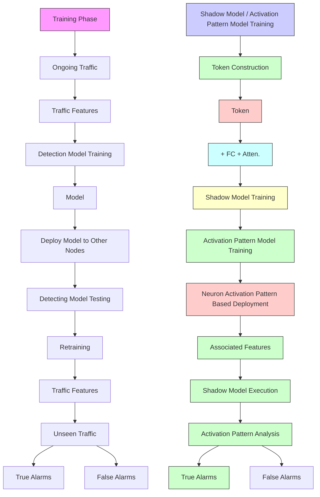

# “One Model Fits All Nodes”: Neuron Activation Pattern Analysis-Based Attack Traffic Detection Framework for P2P Networks

Songsong Xu , Chuanpu Fu, Graduate Student Member, IEEE, Qi Li , Senior Member, IEEE, and Ke Xu , Fellow, IEEE

Abstract— Machine learning (ML) based network attack traffic detection is an emerging security paradigm, which is capable of capturing various advanced network attacks according to the features of traffic. When leveraging such promising security application to protect P2P services, particularly distributed cryptocurrency systems, one detection model should be deployed on many nodes to handle various unseen traffic patterns generated by nodes around the world. However, unseen yet benign traffic patterns are commonly classified as attack traffic, and thus trigger massive false-positive (FP) alarms. Unfortunately, the common practice of retraining models to reduce FPs is not salable for large-scale P2P networks, which incurs prohibitive labor efforts of collecting traffic on each node individually. To effectively deploy ML based attack traffic detection systems to protect distributed networks, we present tNeuron that automatically identifies FPs triggered by unseen traffic via neuron activation pattern analysis, such that it significantly improves the performance on various nodes. Specifically, we construct a shadow model with Transformer encoders to extract the knowledge of traffic patterns. Afterward, we train a model that learns how to classify FPs among alarms raised by ML models according to neuron activation patterns of the shadow model. Our experiments on real Ethereum nodes show that tNeuron can reduce 83.40% FP for seven state-of-the-art ML based attack detection systems, when detecting 15 kinds of P2P network attacks, thereby significantly improving detection accuracy in nine different metrics. In addition, tNeuron is robust against various adversarial examples constructed by existing evasion attacks. Besides, it achieves real-time detection and is capable of handling massive FPs generated by many nodes in large-scale distributed networks.

Index Terms— Network security, machine learning (ML), P2P network, intrusion detection.

# I. INTRODUCTION

MACHINE learning (ML) based attack traffic detectionis an emerging and promising security paradigm [24], lis an emerging and promising security paradigm [24], [25], [54], [63], [67], which aims to capture network attacks

Received 24 January 2024; revised 19 September 2024 and 8 January 2025; accepted 9 February 2025; approved by IEEE TRANSACTIONS ON NETWORKING Editor G. Fanti. Date of publication 24 March 2025; date of current version 20 August 2025. This work was supported in part by China National Funds for Distinguished Young Scientists under Grant 62425201, in part by the National Natural Science Foundation of China under Grant 62132011 and Grant U22B2031, and in part by the Science Fund for Creative Research Groups of the National Natural Science Foundation of China under Grant 62221003. (Songsong Xu and Chuanpu Fu contributed equally to this work.) (Corresponding author: Ke Xu.)

Songsong Xu, Chuanpu Fu, and Ke Xu are with the Department of Computer Science and Technology, Tsinghua University, Beijing 100084, China (e-mail: haizhitiantang1@163.com; fuchuanpu@gmail.com; xuke@tsinghua.edu.cn).

Qi Li is with the Institute for Network Sciences and Cyberspace, Tsinghua University, Beijing 100084, China (e-mail: qli01@tsinghua.edu.cn).

Digital Object Identifier 10.1109/TON.2025.3546735

according to the features of traffic, for instance, duration and transferred bytes of a flow. It can outperform traditional fixed-rule based methods [50], [76], [78], [79] by identifying various sophisticated and zero-day network attacks [10], [21], [29], and thus effectively protect many critical Internet services [59], [63], [67], [81].

Currently, ML based traffic detection systems are commonly deployed at gateways of networks [5], [8], [80], where traffic datasets containing all traffic patterns from/to protected Internet services are collected for ML training and validation. In P2P networks, where such centralized gateways are absent, deploying ML models to safeguard decentralized cryptocurrency applications—comprising many globally located nodes, such as Ethereum [19] and Bitcoin [9]—presents a trade-off between cost and effectiveness. On one hand, the ML pipeline is labor-intensive [3], [35], making it impractical to label diverse traffic patterns from distributed node and to train one model per node. On the other hand, deploying one model across all distributed nodes leads to significant accuracy penalties due to numerous false-positive alarms (FPs) triggered by benign yet previously unseen traffic [1], [16], [45]. Our empirical studies show that, one well-trained model, which is deployed to an Ethereum node other than where it is trained, generates over 13.0K FPs per hour, which are triggered by benign traffic deviating from training samples.

To enable distributed deployment in P2P networks, we aim to minimize FPs, which ensures that one model functions well across all nodes, thereby safeguarding each decentralized P2P node from various attacks [7], [33], [62], [69], [71]. Note that, existing FP reduction workflows incur huge labor consumption [8], [15], [16], [68], i.e., experts should manually identify FPs, before they can retrain the model using identified FPs [30], [45]. Unfortunately, due to the scale of P2P nodes [7], [14], it is impossible to manually identify even a minority of FPs, which leads to high latency [3], prohibitive monetary consumption [45], and the fatigue of alarm issue that directly hinders the security of P2P system [1]. To the best of our knowledge, automatic FP detection for P2P networks without requiring any labor is still unavailable, which is the key challenge for training one attack detection model that fits all nodes for throttling malicious traffic targeting critical P2P cryptocurrency applications [2], [33], [62], [69], [71].

The recent advances in brain science motivate this study. Particularly, existing studies demonstrate that the fatigue status of human brain, which leads to poor decisions, reflects on chemical status of brain neuron cells [32], [56]. Similarly, we postulate that status of underfitting unseen traffic samples, which results in false-positive alarms, can be likewise recognized by analyzing neuron activation patterns of deep learning models. Thus, we aim to build a model to learn if a traffic detection model is producing an FP alarm, given the empirical observation that, the neurons activated by unseen P2P traffic that triggers FPs are significantly different from that are properly activated by well-learned samples when producing correct results.

In this paper, we propose tNeuron, a realtime system that reduces FPs raised by ML based attack traffic detection models, when deploying these models to any nodes other than where they are trained. To effectively perform neural activation patterns analysis, we construct a shadow model that extracts the knowledge of traffic patterns. Specifically, the model is built upon Transformer encoder [13] which is trained to predict masked fields in packets [44]. These model provide rich neurons for analysis, as existing models may contain limited numbers of neurons [54], [81] or employs traditional learning models. After that, we train a model to learn the neuron activation patterns of the Transformer encoders in an unsupervised manner, such that the model can classify alarms into TPs and true positives (TPs) by checking if neurons are properly activated. Please note that the training process of tNeuron does not require a centralized view of the P2P network. Instead, it only requires traffic data from a single node, enabling decentralized deployment of the trained model across all distributed networks.

We conducted experiments using traffic collected from real Ethereum nodes. The experimental results demonstrate that, tNeuron can reduce over 90% FPs raised by seven state-of-theart ML based traffic detection methods [5], [11], [24], [26], [35], [50], [80] under various attacks. These methods cover a broad spectrum of ML based attack detecting, including flow based [80], packet based [35], host based [24] detection that employs various supervised and unsupervised ML models. By reducing FP alarms, tNeuron enhances the performance in distributed network of these systems by improving nine accuracy metrics, which suggests tNeuron enables one traffic detection model to fit the nodes generating unseen traffic without incurring any additional labor costs. Additionally, the experiments show that tNeuron has no negative effects on the robustness of ML models [24], [26], so that attacks cannot launch evasion attacks when applying tNeuron for offering all-node protection for P2P applications. Furthermore, tNeuron can reduce the FPs in real-time with a low latency of 0.0164s, while achieving 12.82K alarm processing throughput per second.

In general, the contributions of this paper are four-fold:

• We present tNeuron, the first system that reduces the accuracy penalty caused by deploying ML based traffic detection in P2P networks.   
• We develop a knowledge extraction method using Transformer based traffic classifier that provides informative neuron activation patterns for analysis.   
• We design a model that predicts FPs according to the neuron activation patterns of the Transformer model.

• We prototype tNeuron and use extensive experiments with various real-world traffic datasets to validate its effectiveness and efficiency.

The rest of this paper will be organized as follows. In section II, we will formulate the problem. Section III dives into the design details of tNeuron. In section IV, we experimentally evaluate the performance of tNeuron. Section V reviews the related studies and Section VI concludes this paper.

# II. PROBLEM STATEMENT AND DESIGN GOALS

tNeuron is designed for protecting peer-to-peer (P2P) distributed networks that consist of numerous nodes located around the world [9], [19]. Specifically, we assume that a cryptocurrency company owns many Ethereum nodes [33] with various configurations, which are attractive targets for various attacks [2], [33], [57], [62], [71]. Meanwhile, the operators have already collected traffic from one of these nodes hosting P2P services. After that, the traffic dataset is used to train an ML based traffic detection model [5], [24], [25], [63], [68], which could be either supervised [35] or unsupervised [54]. Unlike traditional use cases where the model is deployed at a single point [50], [80], e.g., gateways [76] that can observe all traffic patterns, The operators should share the model across the nodes to effectively protect all the nodes owned by the company. In general, tNeuron aims to enable sharing one model across many nodes owned by the company, which may also incentivize the sharing of models among nodes with different ownership.

Note that, due to the decentralized nature of P2P networks, it is impossible to derive a centralized view to collect all traffic from a P2P network. Moreover, it is also impossible to collect traffic from each node and train the model for each node individually due to the complexity of the ML pipeline and prohibitive labor costs [3], [66] of collecting traffic datasets for training, tuning, and validating ML models. However, we observe that deploying a single model across all nodes results in significant accuracy decrease. Specifically, we select eight Ethereum nodes maintained by us, which vary in location, software, and hardware configurations (details provided in Table II). Subsequently, we train a random forest based flow-level detection model [80] using traffic collected from one Ethereum node to detect OpenSSH attacks [25]. The results are illustrated in Figure 1.

We observe that the model achieves high accuracy when tested on the original node where it is trained (Original in Figure 1(a)). However, when deploying the trained model to the seven nodes other than where the model is trained (denoted as New), we observe 7.69% - 56.88% F1 decrease averaged across the nodes, due to frequently triggered FP alarms, i.e., the associated FPR increases by 6.35% - 15.31%. This is because the configuration and workload of each node are different even if they host the same P2P application [2], [9], [19], [62]. Moreover, different nodes generate similar traffic patterns which can trigger massive FPs. As shown in Figure 1(b), nodes with Rust and Java Ethereum implementations execute different consensuses implementations, resulting in different traffic patterns. Furthermore, the geological locations of nodes also significantly affect the traffic patterns, as the nodes in Singapore and Frankfurt compared in Figure 1(c). Thus, existing traffic detection systems tend to classify all these unseen yet benign traffic generated by other nodes as malicious traffic [55], [74], leading to serious issues of FP [1].

bar

F1
| Category | Blue Bar Value | Orange Bar Value |
|---|---|---|
| 1 | 0.9 | 0.85 |
| 2 | 0.85 | 0.9 |
| 3 | 0.8 | 0.9 |
| 4 | 0.75 | 0.95 |
| 5 | 0.7 | 0.9 |
| 6 | 0.65 | 0.85 |
| 7 | 0.6 | 0.8 |
| 8 | 0.55 | 0.75 |
| 9 | 0.5 | 0.7 |

(a) Accuracy comparison on various nodes.   

bar

| Node | Original FPR | New FPR |
|---|---|---|
| Node1 | 0.01 | 0.07 |
| Node2 | 0.01 | 0.07 |
| Node3 | 0.01 | 0.13 |
| Node4 | 0.01 | 0.15 |
| Node5 | 0.01 | 0.08 |
| Node6 | 0.02 | 0.16 |
| Node7 | 0.01 | 0.01 |
| Node8 | 0.01 | 0.07 |

scatter

| Algorithm | Second Dim. of Feature Space | First Dim. of the Space |
| --------- | ---------------------------- | ----------------------- |
| RUST      | -75 to 0                     | -25 to 75               |
| RUST      | -25 to 25                    | -75 to 0                |
| RUST      | 25 to 100                    | -75 to 75               |
| JAVA      | -75 to 0                     | -25 to 75               |
| JAVA      | -25 to 25                    | -75 to 0                |
| JAVA      | 25 to 100                    | -75 to 75               |

(b)Traffic features by diferent implementations.

scatter

| First Dim. of the Space | Second Dim. of Feature Space | City      |
| ----------------------- | ---------------------------- | --------- |
| -200                    | 0                            | Singapore |
| -150                    | 0                            | Frankfurt |
| -100                    | 0                            | Singapore |
| -50                     | 0                            | Frankfurt |
| 0                       | 0                            | Singapore |
| 50                      | 0                            | Frankfurt |
| 100                     | 0                            | Singapore |
| 150                     | 0                            | Frankfurt |
| 200                     | 0                            | Singapore |
| -200                    | 0                            | Frankfurt |
| -150                    | 0                            | Singapore |
| -100                    | 0                            | Frankfurt |
| -50                     | 0                            | Singapore |
| 0                       | 0                            | Frankfurt |
| 50                      | 0                            | Singapore |
| 100                     | 0                            | Frankfurt |
| 150                     | 0                            | Singapore |
| 200                     | 0                            | Frankfurt |

(c) Traffic features by different locations.   
Fig. 1. Drifted traffic pattern decreases accuracy by triggering massive FPs.

tNeuron aims to automatically detect and reduce these FPs, which enables one model to fit all P2P nodes. Different from tNeuron, all existing studies focus on how to utilize manually identified FPs [8], [15], [16], [68], whereas it is impossible to manually identify even a small minority of FPs generated by numerous P2P nodes. Specifically, our empirical studies observe that an existing traffic detection system can raise 13.0K alarms per hour. Therefore, automatic FP reduction is the only solution for deploying ML based traffic detection in distributed networks. In summary, we aim to design tNeuron as a framework that effectively deploys ML based traffic detection in distributed networks and enhances model performance by reducing FP alarms automatically. Particularly, tNeuron should achieve the following design goals:

• Generic FP Detection: tNeuron should detect FP raised by many different malicious traffic detection methods that employ both supervised and unsupervised ML models to analyze various traffic features [24], [54], [80].   
• Accurate FP Detection: tNeuron should not misclassify true positive (TP) alarms as false positive ones which allows attackers to evade the detection, when tNeuron is enabled for reducing false alarms.   
• Realtime FP Detection: tNeuron should achieve real-time detection for the FPs raised by massive nodes in large-scale distributed networks.   
• Robust FP Detection: tNeuron should preserve the robustness of the original detection model [24], [26], i.e., adversarial examples cannot evade detection.   
• Zero Labor Cost: tNeuron cannot require any human experts to identify any FPs from massive alarms generated by various nodes or access any identifies FPs.

After automatic FP identification, we can conduct model fine-tuning by utilizing the identified FPs, according to existing studies on lifelong ML paradigms [15], [16].

# III. DESIGN OF tNeuron

# A. Motivation

The motivation behind this work is the recent observations on the status of brain cells. Specifically, the chemical substances released by neurons indeed reflect the mental status, particularly, if a fatigue leads to poor decisions. Based on the similarity of brain cells and neuron modes in deep learning models, we aim to train a model to predict if a traffic detection model is generating FPs according to its neuron activation patterns [23], [48]. Specifically, abnormal neuron activation patterns indicate that the input traffic sample is an unseen pattern generated by other nodes, and thus it is not well-learned by DNN and the generated alarm may be a false one. Otherwise, the normal activation pattern indicates the input sample appears in the training dataset which is welllearned. We can thus believe the output is a true alarm.

Detecting FPs by analyzing neuron activation patterns is challenging, primarily because most traffic detection models are either non-DNN models or DNNs with a limited number of neurons [26], [54], such that only limited neuron activation information is available. To address this issue, we develop a shadow model that extracts knowledge from traffic patterns, thereby providing rich information for neuron activation pattern analysis. Specifically, we construct a Transformer encoders [13] based model which contains many neurons, to predict the masked fields [44] based on the low-level traffic features (e.g., the sizes of packets), making it easy to obtain labels without any effort. The Transformer model has high sequence learning ability so that its neutron activation patterns offer rich information. In addition, we use an unsupervised learning approach to learn the activation patterns, which does not require labor to construct labeled datasets.

In summary, tNeuron achieves all the design goals of FP detection (see Section II). First, tNeuron builds a Transformer classifier as shadow model which is independent to the original detection model, so that tNeuron is applicable to many detection methods [5], [24], [54], i.e., generic FP detection. Meanwhile, the Transformer model contains many neurons for activation pattern analysis, enabling accurate and robust FP detection. In addition, we leverage a light-weight model for meta-learning to realize realtime FP detection. Besides, the mask training of Transformer does not require labor to construct datasets, while the activation pattern model is unsupervised, and tNeuron thus does not incur labor costs.

# B. Overview of tNeuron

Figure 2 illustrates the architecture of tNeuron, which is a framework to enhance the performance of traffic detection system by detecting FP alarms generated, when ML models are deployed to P2P nodes other than where they are trained. This enables attack traffic detection for the entire P2P network, which includes a variety of different network environments.

flowchart

Fig. 2. The overview of tNeuron. At training phase, tNeuron constructs Transformer based surrogate model which provides rich neurons for the training of activation patterns models. At testing phase, tNeuron execute surrogate model for traffic triggering each alarm, and apply neuron activation model to predict if the alarm is a false one.

After a model is trained by using the traffic collected from one node that hosts P2P applications (e.g., Ethereum [19] used as an instance in our experiments). tNeuron jointly trains two models, i.e., a Transformer based shadow model and a neuron activation model, which facilitate the detection model to reduce FPs when deploying the trained model to many other nodes in a P2P network [33]. Three steps are required to train the two models.

Token Construction. First, tNeuron constructs a dataset to train the shadow model. Specifically, tNeuron collects the packets in the training dataset for the detection model and organizes them into flows based on the five-tuples in the packet headers. After that, it tokenizes each packet in the flows by extracting per-packet features, e.g., packet length. We mask port numbers that indicate types of services, as these fields are to be predicted. Next, tNeuron applies the K-Means to cluster the source and destination port numbers for ingress and egress traffic, respectively. Afterward, it constructs labels for the flows based on the cluster centers associated with the port numbers.

Transformer Shadow Model Training. In this step, we construct a shadow model that encodes the low-level patterns of traffic and can provide rich neurons for activation analysis. In specific, tNeuron trains a classifier to predict the label constructed in the previous step based on the traffic features. In this way, tNeuron synthesizes the knowledge of the traffic patterns. Particularly, to effectively learn the token sequence, we develop a DNN model by leveraging stacked Transformer encoders, which are bidirectionally connected [13], and can accurately predict the masked fields. After training the model, all the flows in the training dataset are input to the trained Transformer model to derive the activation patterns of the last fully connected layer and construct the datasets for neuron activation pattern analysis.

Neuron Activation Model Training. The final step involves training an unsupervised model that learns the behaviors of the constructed traffic classification model, represented by the neuron activation patterns of the fully connected layer in the Transformer encoder based shadow model. Specifically, we leverage DBSCAN [25], an unsupervised model, to learn the patterns. In this way, the model can differentiate abnormal activation patterns, which indicate the raising of FP alarms.

In general, tNeuron derives the following three models: (i) a trained detection model; (ii) a Transformer based classification model (shadow model); and (iii) a neuron activation model. When the traffic detection model is deployed on a node other than training dataset is collected, numerous alarms will be raised, including many FP alarms due to the unseen traffic patterns generated by other nodes. In this scenario, operators can execute the shadow model and the neuron activation model to efficiently identify FP alarms and enhance the performance of the traffic detection in distributed networks.

Transformer Model Execution. Once an alarm is raised by the model from any nodes, the detection system collects all packets associated with the alarm. For each alarm, tNeuron tokenizes each of these packets and executes the shadow model to obtain the activation patterns of the fully connected layers. Note that, we do not care about the accuracy of the shadow model. Instead, we only use the neuron activation patterns to predict if the alarm is a TP or FP by executing the neuron activation pattern analysis model. Additionally, we do not use packet header fields as features, such as time-to-lives (TTLs), IP addresses, and TCP windows, because these features may directly indicate the type of traffic and lead to spurious correlation issues [37] (also known as data snooping issues [3]). Instead, tNeuron analyzes only the statistical features, such as packet sizes and arrival intervals, to avoid these issues.

Neuron Activation Model Execution. We input the activation patterns of the fully connected layers of the Transformer to the neuron activation model. The model calculates the distance between the pattern and the clustering centers derived in the training phase. An activation pattern that deviates from the patterns triggered by the samples in the training sets indicates abnormal behavior by the shadow model. This suggests low learning quality by the detection model, which was trained on the same training set. As a result, the associated alarm has a high probability of being an FP alarm. Please note that the shadow model can only provide activation patterns and cannot directly detect FPs, because it cannot analyze and compare the its activation patterns generated across multiple executions, to identify the abnormal activations.

Finally, the identified FPs will be assigned with low priorities for manual analysis, and such identified FPs can be used for model retraining to tune the model that raises the alarms [15], [16], [77].

# C. Design Details of tNeuron

In this section, we formally describe the details of tNeuron. Algorithms 1 and 2 illustrate the workflows of the training and testing phases, respectively. We assume a traffic dataset $\{ \mathcal { X } _ { 1 } , y _ { 1 } , y _ { p } \}$ is collected from a P2P node, and another traffic dataset $\{ \mathcal { X } _ { 2 } , y _ { 2 } \}$ is collected on the node other than where $\mathcal { X } _ { 1 }$ is collected. Note that, each element in $\mathcal { X } _ { 1 }$ denotes a packet sequence associated with a flow identified by a five-tuple,1 i.e., $\mathcal { X } _ { 1 } ^ { i }$ is a $L _ { i } \times M$ matrix containing the M per-packet features of $L _ { i }$ packets in i-th flow $( i \in [ 1 , N _ { 1 } ] )$ . In addition, binary label vector $y _ { 1 }$ indicates benign and attack flows. Let $\mathcal { M } _ { D }$ denotes the traffic detection models trained on $\mathcal { X } _ { 1 }$ , i.e., $\mathbf { \mathcal { M } } _ { D } ~ = ~ \mathsf { T r a i n } _ { D }$ (FeatureExtrac $\mathfrak { t } ( \mathcal { X } _ { 1 } ) , \mathfrak { y } _ { 1 } )$ . tNeuron aims to boost the performance of $\mathcal { M } _ { D }$ on $\{ \mathcal { X } _ { 2 } , y _ { 2 } \}$ , i.e., Accuracy $( \mathcal { M } _ { D } ( \mathcal { X } _ { 2 } ) , y _ { 2 } )$ .

Token Construction. First, tNeuron constructs a dataset $\{ \mathcal { X } _ { T } , y _ { T } \}$ based on $\{ \mathcal { X } _ { 1 } , \boldsymbol { y } _ { 1 } , \boldsymbol { y } _ { p } \}$ to train the Transformer model. Specifically, we tokenize j-th packets in i-th flows in $\mathcal { X } _ { 1 }$ by extracting three per-packet features, i.e., the arrival interval (us), IANA protocol number, and packet length in byte, for first $L _ { \mathrm { M a x } }$ packets. Here, we only consider first $L _ { \mathrm { M a x } }$ packets and place zero vectors in $\mathcal { X } _ { T } ^ { i }$ to represent remaining locations for flow with lower than $L _ { \mathrm { M a x } }$ packets $( L _ { i } \leq L _ { \operatorname { M a x } } )$ . The tokenized dataset is denoted by $\mathcal { X } _ { T }$ . Afterward, we train the Transformer model to predict port number based labels. To construct the labels $\grave { y _ { T } } = [ y _ { T } ^ { 1 } , \ldots , y _ { T } ^ { N _ { 1 } } ]$ , we cluster the port numbers denoted by $y _ { p } ^ { i }$ using K-Means algorithm:

$$
\mathcal {C} = \mathrm{KMeans} (y _ {p}), \quad y _ {T} ^ {i} = \underset {j} {\arg \min} \left\| C _ {j} - y _ {p} ^ {i} \right\| _ {2}, \tag {1}
$$

where $\mathcal { C } ~ = ~ \{ C _ { 1 } , \ldots , C _ { K } \}$ are the K cluster centers. In general, we train the shadow model to predict port numbers based on traffic patterns, because the port numbers offer diverse labels for prediction, which can be derived directly without significant labor effort.

Shadow Model Training. We construct a shadow model to provide rich information for neuron activation pattern

1Flows are identified by source / destination IP addresses and port numbers along with a number indicating L4 protocol types (e.g., TCP or UDP).

Algorithm 1 The Training Phase Workflow of tNeuron   
Input: Dataset collected from one node: $\{X_{1}, y_{1}, y_{p}\}$ denotes features, labels, and port numbers.
Output: Shadow model: $M_{shadow}$ , activation model: $M_{activation}$ , and detection model: $M_{D}$ .
// Train the attack traffic detection model using the dataset.
1 $M_{D} = \text{Train}_{D}(\text{FeatureExtract}(\mathcal{X}_{1}), y_{1})$ // Construct training datasets for the shadow model.
2 Function TokenConstruction( $X_{1}, y_{p}$ ):
3 $X_{T} := \text{tokenize each flow in } X_{1}$ .
4 $C := KMeans(y_{p})$ 5 $y_{T}^{i} := \arg\min_{j} \|C_{j} - y_{p}^{i}\|_{2}$ 6    return $X_{T}, y_{T}$ // Train the shadow model and obtain its normal activation patterns.
7 Function ShadowModelTrain( $X_{1}, y_{T}$ ):
8 Define $M_{shadow}(x; FC^{0}, \ldots, FC^{N_{L}}, W^{Q}, W^{K}, W^{V})$ :
9    e:= Positional encoding.
10 $x^{1} = \text{ReLU}(FC^{0}(x)) + e$ 11    for k in $[1, 2, \ldots, N_{L}]$ do // For each attention layer.
12    for j in $[1, 2, \ldots, N_{H}]$ do // For each attention head.
13 $Q_{j} = x^{k}W^{Q_{j}}, K_{j} = x^{k}W^{K_{j}}, V_{j} = x^{k}W^{V_{j}}$ 14 $A_{k,j} := Softmax(\frac{Q_{j}K_{j}^{T}}{\sqrt{D_{K}}})V_{j}$ 15 $o^{k} := FC^{k}(x^{k} + A_{k}), x^{k+1} := \text{ReLU}(o^{k})$ 16 $O := [o^{1}, \ldots, o^{N_{L}}]$ 17    return O
18 for $x_{i}$ in $X_{1}$ do
19 $O_{i} := M_{shadow}(x_{i})$ 20 $L_{i} := \frac{1}{L_{Max}} \left\|Softmax(O_{i}^{N_{L}}) - OneHot(y_{T}^{i})\right\|_{2}^{2}$ 21    AdamOptimizer( $L_{i}, M_{shadow}$ )
22 $O := [O_{i}, \ldots, O_{N_{1}}]$ 23    return O, $M_{shadow}$ // Train the activation model.
24 Function ActivationModelTrain(O):
25 $a_{j} := \frac{1}{L_{Max}} \sum_{i=1}^{L_{Max}} O_{j,i}^{N_{L}}, A := \{a_{1}, \ldots, a_{N_{1}}\}$ 26 $C_{a} = DBSCAN(MinMaxNorm(A); \epsilon, minPoint)$ 27 $M_{activation} := C_{a}$ 28    return $M_{activation}$

analysis. Specifically, we design a sequential model that uses the features associated with a flow to predict which cluster it belongs to. The model contains stacked bidirectional Transformer encoders [13]. First, we expand the dimension of the tokens from $L _ { \mathrm { M a x } }$ to $L _ { \mathrm { E x p a n d } }$ by using a fully connected layer $\mathsf { F C } ^ { 0 } ( \cdot )$ . Also, we leverage the position encoding represented by vector e, from the existing study [13]. Thus, we feed $x _ { i } ^ { 1 } = { \mathsf { R e L U } } ( { \mathsf { F C } } ^ { 0 } ( \mathcal { X } _ { T } ^ { i } ) ) + e$ into the first layer of the Transformer encoder. Specifically, the Transformer encoder contains a multi-head attention layer, where the number of the heads is $N _ { H } ;$ :

Algorithm 2 The Testing Phase Workflow of tNeuron   
Input: Traffic from another node: $\{X_{2}\}$ , detection model: $M_{D}$ , shadow model: $M_{shadow}$ , and activation model: $M_{activation}$ .

Output: Corrected decisions: $\hat{y}$ .

// Execute the attack traffic detection model.

1 $y = \mathcal{M}_{D}(\mathcal{X}_{2})$ // Check neuron activation patterns of the shadow model.

2 Define Function ShadowModelExecution(x):

3 $O = \mathcal{M}_{\text{shadow}}(x)$ 4 $a = \frac{1}{L_{\text{Max}}} \sum_{j=1}^{L_{\text{Max}}} O_{j}^{N_{L}}$ 5 $d = \min_{i} (\|C_{a}^{i} - a\|_{2}), \quad C_{a}^{i} \in \mathcal{M}_{\text{activation}}$ 6    return $d > \psi$ // Use the neuron activation patterns to correct detection results y.

7 for i in $[1, \ldots, N_{2}]$ do

8    if $y_{i} = 1$ then // For the flows triggering alarms.

9    // Check the activation patterns.

10    if ShadowModelExecution( $X_{2}^{i}$ ) then
    // Abnormal activation patterns indicate a false alarm.

11 $y_{i} = 0$ 12 $\hat{y} := y$ 13    return $\hat{y}$

$$
Q _ {j} = x _ {i} ^ {k} W ^ {Q _ {j}}, K _ {j} = x _ {i} ^ {k} W ^ {K _ {j}}, V _ {j} = x _ {i} ^ {k} W ^ {V _ {j}}, \tag {2}
$$

$\mathsf { A t t e n } _ { k } ( Q _ { j } , K _ { j } , V _ { j } ) = \mathsf { S o f t m a x } ( \frac { Q _ { j } K _ { j } ^ { T } } { \sqrt { D _ { K } } } ) V _ { j } ,$ (3)

where, $x _ { i } ^ { k }$ is the input of the k-th layer $( 1 \leq k \leq N _ { L } ) . Q _ { j } ,$ $K _ { j }$ and $V _ { j }$ denote the query, key, values matrices of the j-th attention head which are learnable. Moreover, a full connected layer is appended to the attention layer:

$$
o _ {i} ^ {k} = \mathsf {F C} ^ {k} (x _ {i} ^ {k} + \mathsf {C o n c a t} (\mathsf {A t t e n} _ {k} (Q _ {j}, K _ {j}, V _ {j}) | j \in [ 1, N _ {H} ]), \tag {4}
$$

where $o _ { i } ^ { k }$ is the activation values of the k-th layer. Next, ReL $. \mathsf { U } ( o _ { i } ^ { k } )$ is propagated to the next layer if $k \ < \ N _ { L }$ . The output layer is a Softmax layer, whose size equals to K. Finally, we use MSE as loss function, and back-propagate the loss to update all the parameters [13]:

$$
\mathcal {L} _ {i} = \frac {1}{L _ {\text { Max }}} \left\| \text { Softmax } (o _ {i} ^ {N _ {L}}) - \text { OneHot } (y _ {T} ^ {i}) \right\| _ {2} ^ {2}, \tag {5}
$$

where OneHot $( y _ { T } ^ { i } )$ is the one-hot encoding of the label for the flow. The trained model is denoted by $\mathcal { M } _ { \sf s h a d o w } .$ .

Neuron Activation Model Training. In this setp, we generate benign activation pattern for the shadow model, and utilize DBSCAN to cluster the activation patterns. That is, the cluster centers denote benign neuron activations of the shadow model. Specifically, we extract the activation patterns of the fully connected layer of the last encoder:

$$
a _ {j} = \frac {1}{L _ {\text { Max }}} \sum_ {i = 1} ^ {L _ {\text { Max }}} o _ {j, i} ^ {N _ {L}}, \quad \mathcal {A} = \left\{a _ {1}, \dots , a _ {N _ {1}} \right\} \tag {6}
$$

where $a _ { j }$ is the activation pattern of the j-th flow. We model the distribution of the activation patterns using DBSCAN:

$$
\mathcal {C} _ {a} = \text { DBSCAN } (\text { MinMaxNorm } (\mathcal {A}), \epsilon , \text { minPoint }), \tag {7}
$$

where ϵ and minPoint are the hyper-parameters of DNSCAN. Clustering centers $\scriptstyle { { \mathcal { C } } _ { a } }$ represent the benign activations of the shadow model, i.e., which neurons are activated when using traffic features to predict $y _ { T }$ (the clusters which the flows belong to). The activation patterns are normalized before conducing the clustering. We only analyze the activation patterns of the last layer because the patterns from the initial layers are too complex for a lightweight unsupervised ML model to analyze. In Section IV-F, our ablation studies reveal that analyzing the last two to five layers of neuron activation patterns can reduce 92.65% - 94.56% FPs, which is similar to analyzing only the last layer.

Overall, in the training phase, we derive three models, the traffic detection model $\mathcal { M } _ { D }$ , the Transformer shadow model $\mathcal { M } _ { \sf s h a d o w } ,$ , and the neuron activation model $\mathcal { M } _ { \sf a c t i v a t i o n } = \mathcal { C } _ { a } .$ Next, tNeuron deploys the detection model $\mathcal { M } _ { D }$ to inspect the traffic from the other node denoted by $\mathcal { X } _ { 2 }$ . Meanwhile, it deploys the shadow model $\mathcal { M } _ { \sf s h a d o w }$ and the activation model $\scriptstyle { \mathcal { M } } _ { \sf a c t i v a t i o n }$ for FP reduction.

Shadow Model Execution. Once an alarm is raised by the detection model, i.e., $\mathcal { M } _ { D } ( \mathcal { X } _ { 2 } ^ { i } ) ~ = ~ 1 , ~ i ~ \in ~ [ 1 , N _ { 2 } ]$ . tNeuron tokenizes the i-th flow to execute the shadow model, i.e., calculating $\mathcal { M } _ { \sf a c t i v a t i o n } ( x _ { i } ^ { 1 } )$ . Note that, we execute the Transformer only if $L _ { i } \in [ L _ { \operatorname* { m i n } } , L _ { \operatorname* { m a x } } ]$ , because a too long or too short packet sequence cannot provide informative activation patterns. Afterward, we can derive the activation patterns of the fully connected layer which is denoted by $a _ { i } .$ . Notably, we do not calculate the predicted ports, which means the port numbers are only used for training the shadow model. Thus, we discard the prediction result $\mathsf { \bar { S o f t m a x } } ( o _ { i } ^ { N _ { L } } )$ . Note that although the port number may change during the testing phase—resulting in low accuracy for port number predictions by the shadow model—we focus solely on its activation patterns and are not concerned with its prediction accuracy. Furthermore, our experiments indicate that even with a 3.55% decrease in accuracy due to overfitting, the shadow model still enables tNeuron to reduce over 95.67% false alarms.

Neuron Activation Model Execution. Finally, we execute the model $\scriptstyle { \mathcal { M } } _ { \sf a c t i v a t i o n }$ to judge if the alarm is a true or false one. Specifically, we calculate the distance between the activation pattern to the nearest clustering center:

$$
d _ {i} = \min _ {j} (\left\| C _ {a} ^ {j} - a _ {i} \right\| _ {2}), \quad C _ {a} ^ {j} \in \mathcal {C} _ {a}. \tag {8}
$$

Finally, if $d _ { i } > \psi$ , we believe that the activation pattern is abnormal, indicating that the neurons are processing unseen traffic patterns and the alarm may be a false alarm (FP). On the other hand, if the distance is below the threshold, we believe that the neurons are properly activated, indicating that the alarms could be a true alarm (TP). Note that, we only use light-weight model to analyze the activation patterns. This is because the shadow model provides rich information regarding the performance qualities of detection models, which allows us to easily differentiate false alarms without computationintensive models. Moreover, the activation model is not simply a layer performing vector calculations like Softmax. Instead, it learns normal activation patterns generated by executing the shadow model multiple times, during the training phase. During the testing phase, it matches these normal patterns to reduce false alarms.

TABLE I DESCRIPTION OF HYPER-PARAMETERS 

<table><tr><td>Category</td><td>Parameter</td><td>Default</td><td>Description</td></tr><tr><td>Token</td><td> $L_{\text{Max}}$ </td><td> $2 \times 10^{4}$ </td><td>Number of packets.</td></tr><tr><td>Construction</td><td>K</td><td>10</td><td>Centers of K-Meams.</td></tr><tr><td rowspan="3">DNN Architecture</td><td> $L_{\text{Expand}}$ </td><td>100</td><td>Scale of the first layer.</td></tr><tr><td> $N_H$ </td><td>10</td><td>Number of attention headers.</td></tr><tr><td> $N_L$ </td><td>12</td><td>Layer of encoders.</td></tr><tr><td rowspan="3">Activation Model</td><td> $\epsilon$ </td><td> $10^{-3}$ </td><td>DNSCAN distance parameter.</td></tr><tr><td>minPoint</td><td>50.0</td><td>DNSCAN aggregation.</td></tr><tr><td> $\psi$ </td><td>1.0</td><td>Threshold for judgement.</td></tr></table>

# IV. EXPERIMENTAL EVALUATION

In this section, we prototype tNeuron and evaluate its performance by identifying FPs raised by seven state-of-theart methods under various network attacks. In particular, the experiments will show that tNeuron is able to:

leftmargin=\*

1) effectively identify FPs raised by various methods on different datasets (Section IV-B);   
2) so that tNeuron can boost the performance when deploying ML model in various metrics (Section IV-C).   
3) be robust against various ML models under different hyper-parameter settings (Section IV-D).   
4) realize robustness detection under evasion attacks (Section IV-E).   
5) perform effective neuron activation analysis by utilizing the shadow model (Section IV-F).   
6) achieve high processing throughput with low latency (Section IV-G).

# A. Experiment Setup

Datasets. To generate benign traffic, we collect traffic from eight real Ethereum nodes [19], i.e., a decentralized blockchain with smart contract functionality serving as the infrastructure of ETH cryptocurrency. We choose Ethereum nodes maintained by us, because their diverse implementations provide various deployment scenarios. These nodes are located around the world with different versions of software (i.e., execution and consensus clients), and various hardware configurations. Specifically, all these nodes work at Sepolia Ethereum testnet, as it supports all kinds of implementations. We observe the nodes generate various traffic patterns (see Section II for details) which trigger massive false alarms. Detailed configurations are shown in Table II. Note that, the first two nodes generated more false-positives, as the initial synchronization is not completed.

We utilize benign traffic from the Ethereum nodes as benign samples, during both training and testing phases. For malicious samples, we construct 15 typical P2P network attacks against our Ethereum nodes. According to attack goals, the datasets are classified into four groups:

• DoS Attacks: Attackers inject TCP-SYN and TCP-RST packets into P2P connections, to disrupt the connections between Ethereum nodes. In addition, we consider that an attacker opens massive connections without sending data. Moreover, we also implement recently disclosed Gethlighting attacks [34] that flood transaction messages.   
• Disturbing Attacks: Attackers control Ethereum nodes that delay the reply to incoming connections by reducing 50% and 80% sending speeds. We also consider attackers may stop sending data to their peers by 10 and 30 seconds. These behaviors can disturb the stability of P2P protocols and increase the latency of the consensus.   
• Partition Attack: On-path attackers, who control network infrastructures, try to partition some nodes, e.g., by dropping messages [70], delaying messages and manipulating IP prefixes [2]. Note that, for the prefix based attack [2], we only implement the scanning phases, as the scale of our network is much smaller. We also fake addresses for simulating eclipse attacks like existing studies [20].   
• Session Hijacking: Off-path attackers attempt hijack the DNS connections [52] to inject their addresses into neighborhood tables, the prerequisites of many P2P attacks [75]. We also consider attackers may guess TCP sequence numbers to hijack the connections between Ethereum nodes, e.g., exploiting CVE-2020-20328 [21] and CVE-2016-5696 [10].

Note that the victim node, which we control, is running on the Ethereum testnet. By default, the configuration of the victim is the same as the node in Frankfurt (Table II). To simulate Eclipse [75] and Gethlighting [34] attacks, we install the vulnerable versions of Geth, v1.7.3 and v1.10.20, respectively. Additionally, we use Scapy to implement packet injection for DoS attacks, scanning for partition attacks, and sniffing for disturbing attacks. Finally, we use default implementations and the vulnerable Linux kernels for hijacking attacks [10], [21].

Furthermore, P2P networks are also attractive targets for traditional network attacks. Therefore, we replay 43 attack traffic in existing studies, to complement the attack against P2P networks, including: (i) Kitsune datasets [54], which contain attacks aimed at IoT devices [28]; (ii) Whisper datasets [24], which comprise both volumetric and stealthy attacks [17], [40], [47]; and (iii) HyperVision datasets [25], containing both traditional flooding attacks [18], [29], [46], [60], and various sophisticated attacks [21], [22], [51], [53], [58]. Finally, we replay the attack traffic datasets alongside eight benign traffic datasets collected at the eight nodes, using their original packet rates. Note that, we replay all attack traffic in a same dataset over the benign traffic dataset. For the eight datasets, we use one for training and the remaining seven for testing, averaging the accuracy across these testing datasets. By default, experimental results are measured by using Ethereum attack traffic.

TABLE II DESCRIPTION OF REAL-WORLD DATASET COLLECTION 

<table><tr><td rowspan="2">Location</td><td colspan="2">Execution clients</td><td colspan="2">Consensus Clients</td><td colspan="2">Consensus Clients</td><td rowspan="2">Duration (h)</td><td rowspan="2">FP Rates $(10^3 \text{ Alarms/h})$ </td><td colspan="2">Accuracy $^1$ </td></tr><tr><td>Software</td><td>Sync. Mode</td><td>Software</td><td>Sync. Mode</td><td>CPUs</td><td>Memory</td><td>AURoC</td><td>F1-Score</td></tr><tr><td>DE, Frankfurt</td><td>Geth</td><td>Snap</td><td>Lighthouse</td><td>Checkpoint</td><td>16</td><td>64GB</td><td>3.25</td><td>13.01</td><td>0.9070</td><td>0.7896</td></tr><tr><td>JP, Tokyo</td><td>Nethermind</td><td>Snap</td><td>Lighthouse</td><td>Checkpoint</td><td>16</td><td>46GB</td><td>1.13</td><td>10.52</td><td>0.9959</td><td>0.9703</td></tr><tr><td>CN, HongKong</td><td>Besu</td><td>Fast</td><td>Lighthouse</td><td>Checkpoint</td><td>16</td><td>64GB</td><td>1.01</td><td>4.24</td><td>0.8708</td><td>0.5342</td></tr><tr><td>KR, Seoul</td><td>Erigon</td><td>Full</td><td>Lighthouse</td><td>Checkpoint</td><td>16</td><td>64GB</td><td>2.00</td><td>1.32</td><td>0.9333</td><td>0.7358</td></tr><tr><td>SG, Singapore</td><td>Reth</td><td>Full</td><td>Teku</td><td>Optimistic</td><td>32</td><td>128GB</td><td>1.66</td><td>0.84</td><td>0.9978</td><td>0.9837</td></tr><tr><td>US, Virginia</td><td>Geth</td><td>Snap</td><td>Nimbus</td><td>Checkpoint</td><td>32</td><td>128GB</td><td>1.66</td><td>1.30</td><td>0.9996</td><td>0.9976</td></tr><tr><td>CA, Toronto</td><td>Geth</td><td>Snap</td><td>Prysm</td><td>Optimistic</td><td>32</td><td>128GB</td><td>3.25</td><td>1.61</td><td>0.9748</td><td>0.8425</td></tr><tr><td>US, San Francisco</td><td>Geth</td><td>Snap</td><td>Teku</td><td>Checkpoint</td><td>32</td><td>128GB</td><td>1.66</td><td>0.70</td><td>0.9558</td><td>0.8522</td></tr><tr><td>Overall</td><td>-</td><td>-</td><td>-</td><td>-</td><td>-</td><td>-</td><td>1.95</td><td>4.19</td><td>0.9107</td><td>0.8193</td></tr></table>

1Wetrain an K-Means model with CICFlowMeter features using the traffccollcted onthecollected traffc from these nodes.

TABLE III DETECTION ACCURACY OF tNeuron FOR VARIOUS DETECTION METHODS ON VARIOUS DATASETS 

<table><tr><td colspan="2">Methods</td><td colspan="2">FlowMeter-RF</td><td colspan="2">FSC</td><td colspan="2">Jaqen</td><td colspan="2">N3IC</td><td colspan="2">NetBeacon</td><td colspan="2">FAE</td><td colspan="2">Whisper</td><td colspan="2">Overall</td></tr><tr><td></td><td>Datasets</td><td>R.FP</td><td>R.TP</td><td>R.FP</td><td>R.TP</td><td>R.FP</td><td>R.TP</td><td>R.FP</td><td>R.TP</td><td>R.FP</td><td>R.TP</td><td>R.FP</td><td>R.TP</td><td>R.FP</td><td>R.TP</td><td>R.FP</td><td>R.TP</td></tr><tr><td rowspan="4">DoS</td><td>Conn. SYN</td><td>0.9994</td><td>-0.0125</td><td>0.4398</td><td>-0.0016</td><td>0.5597</td><td>-0.0112</td><td>0.7521</td><td>-0.0112</td><td>0.8820</td><td>-0.0112</td><td>0.8446</td><td>-0.1667</td><td>0.9498</td><td>-0.0472</td><td>0.7753</td><td>-0.0374</td></tr><tr><td>Conn. RST</td><td>0.9649</td><td>-0.0014</td><td>0.5853</td><td>-0.0000</td><td>0.9151</td><td>-0.0112</td><td>0.8814</td><td>-0.0112</td><td>0.9781</td><td>-0.0125</td><td>0.9042</td><td>-0.1875</td><td>0.9486</td><td>-0.0395</td><td>0.8825</td><td>-0.0376</td></tr><tr><td>Empty Conn.</td><td>0.9110</td><td>-0.0248</td><td>0.9805</td><td>0.0406</td><td>0.7831</td><td>-0.0353</td><td>0.9402</td><td>0.0286</td><td>0.9495</td><td>-0.0129</td><td>0.5612</td><td>-0.0247</td><td>0.9191</td><td>-0.0265</td><td>0.8635</td><td>-0.0079</td></tr><tr><td>Gethlighting</td><td>0.6247</td><td>-0.0133</td><td>0.9999</td><td>-0.0140</td><td>0.7600</td><td>-0.0579</td><td>0.9240</td><td>0.0042</td><td>0.9999</td><td>0.0401</td><td>0.7084</td><td>0.0187</td><td>0.7200</td><td>-0.0146</td><td>0.8195</td><td>-0.0053</td></tr><tr><td rowspan="4">Disturb.</td><td>Delay-50%</td><td>0.7737</td><td>0.0231</td><td>0.9999</td><td>-0.0512</td><td>0.6707</td><td>-0.0494</td><td>0.8452</td><td>-0.0595</td><td>0.8635</td><td>-0.0592</td><td>0.8498</td><td>-0.0554</td><td>0.8580</td><td>-0.0196</td><td>0.8373</td><td>-0.0387</td></tr><tr><td>Delay-80%</td><td>0.7644</td><td>-0.0264</td><td>0.7153</td><td>-0.0379</td><td>0.8129</td><td>0.0049</td><td>0.5353</td><td>-0.0296</td><td>0.9999</td><td>0.0228</td><td>0.7522</td><td>0.0449</td><td>0.7910</td><td>-0.0423</td><td>0.7673</td><td>-0.0091</td></tr><tr><td>Pause-10s</td><td>0.7491</td><td>0.0574</td><td>0.9217</td><td>-0.0298</td><td>0.6809</td><td>-0.0244</td><td>0.6257</td><td>0.0114</td><td>0.9389</td><td>-0.0875</td><td>0.8680</td><td>-0.0721</td><td>0.7296</td><td>-0.0262</td><td>0.7877</td><td>-0.0245</td></tr><tr><td>Pause-30s</td><td>0.9999</td><td>-0.0242</td><td>0.9067</td><td>-0.0930</td><td>0.9191</td><td>0.0024</td><td>0.7355</td><td>-0.0425</td><td>0.7006</td><td>-0.0090</td><td>0.8408</td><td>-0.0424</td><td>0.7111</td><td>0.0309</td><td>0.8305</td><td>-0.0254</td></tr><tr><td rowspan="4">Partition</td><td>Drop-10%</td><td>0.6971</td><td>-0.0007</td><td>0.6006</td><td>-0.0559</td><td>0.9999</td><td>0.0074</td><td>0.8057</td><td>0.0082</td><td>0.7732</td><td>-0.0108</td><td>0.9433</td><td>-0.0638</td><td>0.9999</td><td>-0.0676</td><td>0.8314</td><td>-0.0262</td></tr><tr><td>Drop-20%</td><td>0.8485</td><td>-0.0551</td><td>0.9639</td><td>-0.0573</td><td>0.9999</td><td>-0.1008</td><td>0.8551</td><td>-0.0215</td><td>0.8511</td><td>0.0107</td><td>0.8866</td><td>0.0415</td><td>0.8785</td><td>-0.0220</td><td>0.8976</td><td>-0.0292</td></tr><tr><td>Prefix</td><td>0.9999</td><td>0.0122</td><td>0.8534</td><td>-0.0947</td><td>0.6515</td><td>0.0421</td><td>0.9999</td><td>-0.0859</td><td>0.7176</td><td>0.0083</td><td>0.8924</td><td>-0.1057</td><td>0.7886</td><td>-0.0080</td><td>0.8433</td><td>-0.0331</td></tr><tr><td>Eclipse</td><td>0.7398</td><td>-0.0125</td><td>0.4420</td><td>-0.0002</td><td>0.7887</td><td>-0.0071</td><td>0.7483</td><td>-0.0112</td><td>0.7168</td><td>-0.0072</td><td>0.8966</td><td>-0.0167</td><td>0.9549</td><td>-0.0208</td><td>0.7553</td><td>-0.0108</td></tr><tr><td rowspan="3">Hijack.</td><td>Hijack-DNS</td><td>0.9736</td><td>0.0270</td><td>0.9999</td><td>0.0188</td><td>0.9999</td><td>0.0545</td><td>0.9539</td><td>0.0556</td><td>0.8320</td><td>-0.0353</td><td>0.9704</td><td>-0.0842</td><td>0.8585</td><td>-0.0317</td><td>0.9412</td><td>0.0007</td></tr><tr><td>Spoof-ACK</td><td>0.9784</td><td>-0.0111</td><td>0.5956</td><td>-0.0000</td><td>0.9045</td><td>0.0000</td><td>0.8644</td><td>0.0000</td><td>0.9122</td><td>-0.0000</td><td>0.8744</td><td>-0.0167</td><td>0.9444</td><td>-0.0542</td><td>0.8677</td><td>-0.0117</td></tr><tr><td>Spoof-IPID</td><td>0.9310</td><td>-0.0000</td><td>0.7176</td><td>-0.0016</td><td>0.5105</td><td>0.0000</td><td>0.7585</td><td>0.0000</td><td>0.9122</td><td>0.0000</td><td>0.9043</td><td>-0.0303</td><td>0.9330</td><td>-0.0139</td><td>0.8096</td><td>-0.0065</td></tr><tr><td></td><td>Average</td><td>0.8637</td><td>-0.0042</td><td>0.7815</td><td>-0.0252</td><td>0.7971</td><td>-0.0124</td><td>0.8150</td><td>-0.0110</td><td>0.8685</td><td>-0.0109</td><td>0.8465</td><td>-0.0507</td><td>0.8657</td><td>-0.0269</td><td>0.8340</td><td>-0.0202</td></tr></table>

1 We highlight the best performance inand the worst accuracy in

Baseline Methods. First, we collect alarms raised by seven state-of-the-art generic malicious traffic detection methods. Specifically, these methods extract various flow features [5], [24], [50], packet features [65], [80], frequency domain features [24], [26], and utilize various supervised and unsupervised machine learning (ML) algorithms with different settings. We deployed the open-source methods [24], [25], [54] directly and retrained their ML models. Meanwhile, we implemented closed-source methods that rely on specific network devices [65], [80]. Moreover, CICFlowMeter [11] is a widely-used tool that extracts flow-level features from traffic datasets. Since the tool only provides a set of features, we utilize random forests to classify the features, resulting in an established end-to-end traffic detection system, which we denote as FlowMeter-RF. In addition to the random forest model, we also other nine models served as benchmarks for robustness analysis in Section IV-E. Additionally, we used RFs to learn the traffic features extracted by Jaqen [50], which is originally a fixed rule-based method, to demonstrate the potential feasibility of tNeuron in identifying false positives raised by traditional rule-based detection.

Second, we validate that tNeuron can reduce false alarms for two state-of-the-art task-specific detection methods developed for Bitcoin. Specifically, we prototype the method developed by Kim et al. [42], [43], which analyzes statistical features of Bitcoin traffic. More precisely, we adapt the method for our Ethereum nodes by allowing the methods to analyze all the traffic from the nodes using its autoencoder model. Note that clock cycle based features are not available on the Ethereum nodes. Similarly, we prototype LION [20], which analyzes Bitcoin flow features using statistical methods. Particularly, we set $T _ { \mathrm { T e s t } } ~ = ~ 2 0$ minutes and $T _ { \mathrm { T r a i n } } ~ = ~ 3 0$ minutes and use the other original parameters without modification, because the traces in our datasets are significantly shorter. Our experiments show that even if these task-specific methods can achieve high accuracy at one node, tNeuron can further improve their accuracy when deploying them to many nodes.

bar

| Datasets | FPR Reduction | TPR Reduction [×10⁻⁷] |
| :--- | :--- | :--- |
| H.V. | 0.65 | 2.8 |
| Kit. | 1.0 | 1.4 |
| Whi. | 0.7 | 0.3 |
| H.V. | 0.35 | 0.9 |
| Kit. | 0.65 | 1.0 |
| Whi. | 0.65 | 1.2 |
LION
Kim et al.

(a) FPR reductions.

bar

| Datasets | w/o tNeuron | w/ tNeuron |
| -------- | ----------- | ---------- |
| H.V.     | 0.8         | 0.85       |
| Kit.     | 0.9         | 0.9        |
| Whi.     | 1.0         | 1.0        |
| H.V.     | 0.55        | 0.6        |
| Kit.     | 0.75        | 0.85       |
| Whi.     | 0.65        | 0.8        |

(b）Accuracy improvements.   
Fig. 3. tNeuron can reduce FPs for task-specific detection systems.

Metrics: To assess the effectiveness of tNeuron, we primarily use the ratio of reduced false positives (R.FP). Also, we use reduced true positives (R.TP) to measure collateral damage on true positives, which should be minimal. Furthermore, we measure the increase in various accuracy metrics which are widely used to evaluate ML based traffic detection systems [15], [24], [54], [67], [81]. These metrics include area under the precision-recall curve (AUPRC) and receiver operating characteristic curve (AURoC), Matthews correlation coefficient (MCC), accuracy (Acc.), equal error rate (EER), precision (Pre.), F1- and F2-score.

# B. Accuracy Evaluation

In general, tNeuron can reduce 83.40% FPs for the seven existing malicious traffic detection systems on the Ethereum P2P network traffic datasets, while only 2.02% TPs are misclassified by tNeuron as FP. By reducing massive FPs without significant damage on TPs, tNeuron can improve various accuracy metrics. Therefore, we conclude that tNeuron is able to deploy the trained traffic detection model from one node to other nodes in P2P networks.

Additionally, tNeuron reduces 87.53% FPs on existing public datasets, while the TPs misclassified by tNeuron as FP can be bounded by 1.51%. We mainly discuss the accuracy on P2P network traffic datasets in this section.

Reducing FPs Raised by Various Methods. First, the results presented in Table III demonstrate the effectiveness of tNeuron in detecting false positives (FPs). For widely used benchmarking detection methods such as FlowMeter-RF [11] and FSC [24], tNeuron can reduce FPs by 86.37% and 78.15%, respectively. Additionally, tNeuron can reduce FPs raised by supervised models, such as the tree model in NetBeacon [80], as well as FPs raised by unsupervised models, such as the K-Means model in FSC. Furthermore, tNeuron can identify FPs raised by methods deployed on various devices. For instance, tNeuron can reduce FPs by 97.04% for FAE deployed on x86 CPU and up to 99.99% for SmartNIC based methods. Moreover, tNeuron can detect FPs raised by methods that extract various features. Specifically, it can reduce FPs by 86.85% for flow feature based methods, 81.50% for packetbased features, and 86.57% for frequency features.

Reducing FPs Triggered by Various Traffic. Second, we demonstrate that tNeuron can effectively reduce false positives (FPs) on various datasets. In particular, we find that tNeuron can effectively reduce false alarms when detecting attacks targeting Ethereum. Specifically, when applying existing methods to detect DoS, Eclipse, and hijacking attacks, tNeuron reduces 88.25%, 75.53%, and 86.77% FPs, respectively, with a negligible 2.08% TPR decrease. This allows tNeuron to improve 14.62% AUC for these methods, enabling them to achieve 0.9034 AUC against the attacks targeting Ethereum.

heatmap

| Training Dataset | Node1 | Node2 | Node3 | Node4 | Node5 | Node6 | Node7 | Node8 |
|---|---|---|---|---|---|---|---|---|
| Node1 | 0.999 | 0.879 | 0.999 | 0.999 | 0.887 | 0.883 | 0.999 | 0.999 |
| Node2 | 0.861 | 0.990 | 0.804 | 0.804 | 0.966 | 0.851 | 0.515 | 0.781 |
| Node3 | 0.676 | 0.982 | 0.990 | 0.987 | 0.999 | 0.858 | 0.926 | 0.584 |
| Node4 | 0.780 | 0.936 | 0.647 | 0.999 | 0.773 | 0.843 | 0.777 | 0.999 |
| Node5 | 0.907 | 0.666 | 0.999 | 0.631 | 0.999 | 0.461 | 0.606 | 0.955 |
| Node6 | 0.999 | 0.949 | 0.884 | 0.841 | 0.572 | 0.967 | 0.801 | 0.999 |
| Node7 | 0.980 | 0.506 | 0.984 | 0.822 | 0.753 | 0.999 | 0.999 | 0.999 |
| Node8 | 0.718 | 0.835 | 0.986 | 0.999 | 0.800 | 0.868 | 0.657 | 0.999 |

(a) Disabled tNeuron.

heatmap

| Training Dataset | Node1 | Node2 | Node3 | Node4 | Node5 | Node6 | Node7 | Node8 |
|---|---|---|---|---|---|---|---|---|
| Node1 | 0.999 | 0.999 | 0.999 | 0.999 | 0.999 | 0.913 | 0.999 | 0.929 |
| Node2 | 0.999 | 0.999 | 0.999 | 0.999 | 0.950 | 0.953 | 0.967 | 0.999 |
| Node3 | 0.941 | 0.985 | 0.990 | 0.986 | 0.988 | 0.965 | 0.955 | 0.977 |
| Node4 | 0.907 | 0.999 | 0.961 | 0.999 | 0.961 | 0.999 | 0.944 | 0.930 |
| Node5 | 0.999 | 0.991 | 0.956 | 0.999 | 0.999 | 0.999 | 0.957 | 0.948 |
| Node6 | 0.984 | 0.951 | 0.986 | 0.999 | 0.999 | 0.967 | 0.986 | 0.995 |
| Node7 | 0.993 | 0.948 | 0.923 | 0.999 | 0.975 | 0.967 | 0.990 | 0.999 |
| Node8 | 0.988 | 0.987 | 0.936 | 0.999 | 0.953 | 0.977 | 0.971 | 0.999 |

(b) Enabled tNeuron.

Fig. 4. Comparing the accuracy of FlowMeter-RF when detcting P2P DoS attacks with and without enabling tNeuron.   

heatmap

| Training Dataset | Node1 | Node2 | Node3 | Node4 | Node5 | Node6 | Node7 | Node8 |
|---|---|---|---|---|---|---|---|---|
| Node1 | 0.999 | 0.83 | 0.949 | 0.999 | 0.817 | 0.818 | 0.999 | 0.967 |
| Node2 | 0.787 | 0.999 | 0.783 | 0.782 | 0.883 | 0.565 | 0.593 | 0.768 |
| Node3 | 0.700 | 0.899 | 0.996 | 0.640 | 0.999 | 0.818 | 0.862 | 0.638 |
| Node4 | 0.770 | 0.869 | 0.679 | 0.999 | 0.762 | 0.808 | 0.765 | 0.999 |
| Node5 | 0.850 | 0.69 | 0.975 | 0.669 | 0.999 | 0.558 | 0.651 | 0.882 |
| Node6 | 0.963 | 0.878 | 0.835 | 0.807 | 0.630 | 0.961 | 0.785 | 0.999 |
| Node7 | 0.904 | 0.588 | 0.901 | 0.794 | 0.740 | 0.944 | 0.999 | 0.992 |
| Node8 | 0.726 | 0.806 | 0.902 | 0.998 | 0.780 | 0.824 | 0.686 | 0.999 |

(a) Disabled tNeuron.

heatmap

| Training Dataset | Nodes1 | Nodes2 | Nodes3 | Nodes4 | Nodes5 | Nodes6 | Nodes7 | Nodes8 |
| :--- | :--- | :--- | :--- | :--- | :--- | :--- | :--- | :--- |
| Node1 | 0.999 | 0.999 | 0.965 | 0.999 | 0.999 | 0.988 | 0.999 | 0.905 |
| Node2 | 0.999 | 0.999 | 0.999 | 0.999 | 0.937 | 0.941 | 0.962 | 0.999 |
| Node3 | 0.923 | 0.989 | 0.962 | 0.990 | 0.993 | 0.958 | 0.940 | 0.976 |
| Node4 | 0.872 | 0.999 | 0.953 | 0.999 | 0.952 | 0.999 | 0.927 | 0.906 |
| Node5 | 0.990 | 0.997 | 0.945 | 0.999 | 0.999 | 0.999 | 0.947 | 0.914 |
| Node6 | 0.987 | 0.938 | 0.980 | 0.999 | 0.999 | 0.961 | 0.981 | 0.999 |
| Node7 | 0.986 | 0.933 | 0.886 | 0.999 | 0.974 | 0.961 | 0.981 | 0.999 |
| Node8 | 0.990 | 0.982 | 0.915 | 0.999 | 0.940 | 0.986 | 0.867 | 0.998 |

(b) Enabled tNeuron.

Fig. 5. Comparing the accuracy of NetBeacon when detecting P2P connection hijacking attacks with and without enabling tNeuron.   

bar

| Model | w/o tNeuron | tNeuron |
| :--- | :--- | :--- |
| FlowM.-RF | 0.78 | 0.85 |
| FSC | 0.64 | 0.89 |
| Jaqen | 0.82 | 0.88 |
| N3IC | 0.74 | 0.85 |
| NetBea. | 0.83 | 0.96 |
| FAE | 0.71 | 0.81 |
| Whisper | 0.72 | 0.79 |
| Overall | 0.75 | 0.86 |

Fig. 6. tNeuron reduces FPs to improve detection accuracy for capturing various P2P network attacks.

For existing traffic datasets, tNeuron achieves 87.83% accuracy in identifying FPs (see Appendix A for details). Note that the accuracy on existing datasets, which focus on non-Ethereum attacks, is similar to the accuracy when handling Ethereum network attacks. Therefore, tNeuron does not significantly suffer from the dataset bias issue [3], i.e., overfitting to a particular dataset.

Reducing FPs for Task-Specific Detection. To complement the generic detection, we compare two state-of-the-art task-specific methods, in Figure 3. We observe that although these methods achieve perfect accuracy on a single node, tNeuron can further improve their accuracy by reducing FPs triggered by unseen traffic on nodes other than where the methods are initially trained. Specifically, tNeuron can reduce 64.02% - 99.44% of FPs raised by LION [20], and 35.90% - 64.48% of FPs raised by the method developed by Kim et al. [42], [43] (see Figure 3(a)). Consequently, tNeuron improves 0.90% - 5.47% AUC for LION and 10.07% - 20.42% AUC for Kim et al. , enabling these methods to achieve 0.9974 and 0.8745 AUC respectively, under the setting of multi-node deployment (see Figure 3(b)).

Side-Effects of Misclassification. tNeuron false positive (FP) reduction does not decrease the true positive rate (TPR), which could allow attackers to evade detection. As shown in Table V, tNeuron rarely misclassifies TPs as FPs, resulting in an 2.02% overall TPR decrease. In particular, the ratios of misclassified TPs approach zero for FlowMeter-RF [11], FSC [24], Jaqen [50], and N3IC [65]. By reducing FPs without decreasing TPs, tNeuron can significantly improve the performance of traffic detection systems. The benefits of using tNeuron will be further analyzed in the next section.

In summary, tNeuron can reduce FPs for various methods on various datasets because it treats these methods as black boxes. The construction of the Transformer model and meta-learning model does not interfere with the training of detection models. Moreover, tNeuron does not impose any assumptions on the distribution of traffic, making it applicable to various traffic datasets. In conclusion, tNeuron can independently reduce FPs raised by many methods when deploying these methods to analyze traffic that differs from the traffic in the datasets.

# C. Improvement Evaluation

In this section, we demonstrate that by reducing FPs when deploying an ML model to different nodes, tNeuron can significantly improve the detection accuracy of various methods, i.e., 14.27% AURoC. We also use various metrics to confirm the improvements on nine different metrics (see Appendix B for details).

Improving Performance of Various Models. We plot the detailed detection accuracy of each node for Figure 4 and Figure 5. We observe that CICFlowMeter features can accurately capture attacks at the node where the training datasets are collected, i.e., achieving 0.9999 F1 (see Figure 4(a)). However, the model produces lower accuracy when detecting the same attack at the nodes other than where it is trained, i.e., the accuracy drops to 0.8267 F1. After we enable tNeuron to reduce false alarms, the accuracy on these nodes improves by 14.76% (0.9743 F1). We have similar observations when applying NetBeacon [80] to detect hijacking attacks (see Figure 5(a) and Figure 5(b)). Please note that we average the results by default to effectively present the data.

Additionally, Figure 9 indicate that the baseline methods, when deployed across multiple nodes, yield low detection accuracy ranging from 0.7832 to 0.9084. By enabling tNeuron, these baselines experience significant improvements in detection accuracy, achieving accuracy between 0.8633 and 0.9741. Specifically, Figure 7 compares the precision-recall curve (PRC) before and after applying tNeuron to enhance a model, where the area of the blue shadow indicates the improvements. It is observed that tNeuron can improve AUPRC by 3.64%, 12.15%, and 11.22% for three flow based methods, namely FlowMeter-RF [11], FSC [24], and Jaqen, when detecting stealthy and low-rate TCP attacks. Moreover, for packet based and frequency based methods, tNeuron can improve AUPRC by 0.1565 - 0.4554 and 0.0122 - 0.2932, respectively. Similarly, Figure 8 shows that tNeuron can improve AURoC by up to 17.59% and enable the detection model to identify many stealthy attacks that would have gone undetected without tNeuron. For instance, it can detect SQL server target attacks with NetBeacon [80] (see Figure 8(d)).

Real-World Case Study. We leverage tNeuron to facilitate the detection of real-world attacks targeting our five Ethereum nodes. Specifically, through Zeek network logs, we observe that five of our Ethereum nodes received TCP port scanning traffic originating from an address in Amsterdam, Netherlands. This scanning traffic consists of high-speed TCP SYN packets ranging from 57.21 to 354.61 PPS, which significant deviates from typical benign TCP application behaviors, where only a single SYN packet is generated to initialize a connection.

We use both attack and benign traffic from one node to train the FlowMeter-RF, and test the model on the other four nodes. From Figure 10, we observe that the model achieves 0.9871 AUC at the node where it is trained, yet it achieves only 0.8813 accuracy on the other nodes. When tNeuron is enabled to reduce false alarms, the model can achieve 0.9873 AUC at the nodes other than where it is trained. Note that we mainly replay existing datasets instead of using real-world attack traffic datasets, as we have only collected limited types of attacks.

In conclusion, tNeuron can significantly improve the detection performance of various detection models by reducing most of the FPs when applying these models to detect attacks targeting nodes other than where they were trained. Moreover, the improvements are confirmed by various metrics, including PRC- and RoC-related metrics, accuracy, and MCC.

# D. Transferability Evaluation

In this section, we validate the transferability of tNeuron, i.e., the effectiveness when enhancing different ML models under various settings.

Reducing FPs Raised by Various Models. We first constructed a series of baselines by using different models to detect malicious traffic based on CICFlowMeter features [11]. Additionally, tNeuron can reduce 58.53% - 89.97% of FPs for eight widely used models [5], [8], [14], [24], [54], [63], [68], [80]. We observed that tNeuron can reduce 66.04% FPR for unsupervised models, which is significantly lower than for supervised models (e.g., reducing over 80% FPs for decision tree and linear classifier). This is because unsupervised models tend to generate more FPs [1], [27], [45]. Moreover, the maximum reduction rate of FPs ranges between 82.80% to 99.99%, while the average misclassification rate of TPs can be bounded by 3.25%. Therefore, tNeuron is a generic approach that can be used to adapt various ML models in P2P networks.

Reducing FPs under Various Settings. Secondly, we validated whether tNeuron is applicable to models with various hyper-parameters. For this purpose, we adjusted the number of trees and the depth of trees for the random forest model, ranging from 20 to 100 with a step length of 20. From Figure 11(a) and Figure 11(b), we found that for different values of depth, the improved AUPRC and AURoC ranged between 4.041% - 9.48% and 4.75% - 7.30%, respectively. Similarly, Figure 11(c) and Figure 11(d) showed that the variation of improved AURoC and AUPRC could be bounded by 1.30% and 1.14% for different numbers of trees. Moreover,

  
(a) FlowMeter-RF.

  
(b) FSC.

  
(c) Jaqen.

  
(d) NetBeacon.

  
(e) N3IC.

  
(f)FAE.

  
(g） Whisper.

Fig. 7. Comparing PRC of directly deploying ML model and applying tNeuron to enhance the performance of model by reducing FPs.   
  
(a) FlowMeter-RF.

  
(b)FSC.

  
(c) Jaqen.

  
(d) NetBeacon.

  
(e) N3IC.

  
(f)FAE.

  
(g） Whisper.

Fig. 8. Comparing RoC of directly deploying ML model and applying tNeuron to enhance the performance of model by reducing FPs.   

bar

| Model | w/o tNeuron | tNeuron |
|---|---|---|
| FlowM-RF | 0.82 | 0.88 |
| FSC | 0.73 | 1.00 |
| Jaqen | 0.84 | 0.92 |
| N3IC | 0.80 | 0.84 |
| NetBea. | 0.85 | 0.92 |
| FAE | 0.72 | 0.74 |
| Whisper | 0.72 | 0.73 |
| Overall | 0.79 | 0.86 |

(a) HyperVision datasets.

bar

| Model | w/o tNeuron | tNeuron |
|---|---|---|
| FlowM-RF | 0.92 | 0.96 |
| FSC | 0.78 | 1.00 |
| Jaen | 0.95 | 0.96 |
| N3IC | 0.90 | 0.90 |
| NetBea. | 0.96 | 0.96 |
| FAE | 0.91 | 0.91 |
| Whisper | 0.91 | 0.91 |
| Overall | 0.90 | 0.98 |

(b）Whisper datasets.

bar

| Model | w/o tNeuron | tNeuron |
|---|---|---|
| FlowM-RF | 0.98 | 1.0 |
| FSC | 0.82 | 0.9 |
| Jaen | 0.97 | 1.0 |
| N3IC | 0.89 | 0.9 |
| NetBea. | 0.99 | 1.0 |
| FAE | 0.89 | 0.9 |
| Whisper | 0.89 | 0.9 |
| Overall | 0.92 | 0.95 |

(c) Kitsune datasets.

Fig. 9. Comparing accuracy of existing methods before and after enabling tNeuron for false alarm reduction.   

heatmap

| Training Datasets | Node1 | Node2 | Node3 | Node4 | Node5 | Node6 | Node7 |
|---|---|---|---|---|---|---|---|
| Node1 | 0.991 | 0.884 | 0.912 | 0.943 | 0.881 | - | - |
| Node3 | 0.881 | 0.979 | 0.916 | 0.872 | 0.908 | - | - |
| Node4 | 0.872 | 0.872 | 0.994 | 0.821 | 0.827 | - | - |
| Node5 | 0.869 | 0.853 | 0.900 | 0.984 | 0.839 | - | - |
| Node7 | 0.941 | 0.881 | 0.891 | 0.838 | 0.987 | - | - |

(a) Disabled tNeuron.

  
(b) Enabled tNeuron.   
Fig. 10. Accuracy improvements of tNeuron using real-world attack traffic.

Figure 11(e) and Figure 11(f) indicated that tNeuron can also be applied to K-Means models with different values of K.

# E. Robustness Evaluation

To demonstrate that attackers cannot easily exploit tNeuron to evade detection by mimicking benign users, we conducted experiments to validate its robustness against three evasion techniques based on recent studies [24], [26]: (i) traffic obfuscation, which involves injecting benign traffic into malicious flows; (ii) adaptive traffic rates, where attackers adjust packet rates to mimic benign flows; and (iii) manipulating flow features, where attackers manipulate packet lengths to generate benign traffic patterns. Note that, these adaptive attacks can evade many existing methods [5], [54], [65], [80] that do not raise alarms under these evasions. Therefore, we collected the alarms raised by three methods that are robust against the evasions and applied tNeuron to analyze these alarms.

Table IV shows that tNeuron reduces 94.40% - 96.48% FPs under the evasion attacks. Meanwhile, the incurred TPR decrease is bounded by 1.56%. By reducing the majority of FPs without significant TPR decrease, tNeuron significantly improves precision over the existing methods. Therefore, attackers cannot evade detection when tNeuron is applied.

line

| Ratio of Improvement | D20   | D40   | D60   | D80   |
| -------------------- | ----- | ----- | ----- | ----- |
| 0.0                  | 6.0   | 3.5   | 5.5   | 6.0   |
| 0.1                  | 4.0   | 3.0   | 4.5   | 3.5   |
| 0.2                  | 2.0   | 1.5   | 2.5   | 1.5   |
| 0.3                  | 1.0   | 0.5   | 1.0   | 0.5   |
| 0.4                  | 0.5   | 0.2   | 0.5   | 0.2   |
| 0.5                  | 0.2   | 0.1   | 0.2   | 0.1   |
| 0.6                  | 0.1   | 0.05  | 0.1   | 0.05  |
| 0.7                  | 0.05  | 0.02  | 0.05  | 0.02  |

(a)Depth of tree (AUPRC).

line

| Ratio of Improvement | D20   | D40   | D60   | D80   |
| -------------------- | ----- | ----- | ----- | ----- |
| 0.00                 | 3.0   | 3.0   | 3.0   | 3.0   |
| 0.04                 | 12.0  | 8.0   | 12.0  | 6.0   |
| 0.08                 | 6.0   | 6.0   | 6.0   | 6.0   |
| 0.12                 | 3.0   | 3.0   | 3.0   | 6.0   |
| 0.16                 | 1.0   | 1.0   | 1.0   | 3.0   |
| 0.20                 | 0.0   | 0.0   | 0.0   | 0.0   |

(b) Depth of tree (AURoC).

line

| Ratio of Improvement | T30: 9.14% | T50: 8.23% | T70: 7.84% | T90: 9.13% |
| --------------------- | ---------- | ---------- | ---------- | ---------- |
| 0.0                   | 3.5        | 3.5        | 3.5        | 3.5        |
| 0.1                   | 3.0        | 3.0        | 3.0        | 3.0        |
| 0.2                   | 2.0        | 2.0        | 2.0        | 2.0        |
| 0.3                   | 1.0        | 1.0        | 1.0        | 1.0        |
| 0.4                   | 0.5        | 0.5        | 0.5        | 0.5        |
| 0.5                   | 0.2        | 0.2        | 0.2        | 0.2        |
| 0.6                   | 0.1        | 0.1        | 0.1        | 0.1        |
| 0.7                   | 0.05       | 0.05       | 0.05       | 0.05       |

(c） Number of tree (AUPRC)

line

| Ratio of Improvement | T30: 7.09% | T50: 6.26% | T70: 6.73% | T90: 5.95% |
| --------------------- | ---------- | ---------- | ---------- | ---------- |
| 0.00                  | 0          | 0          | 0          | 0          |
| 0.04                  | 12         | 9          | 8          | 12         |
| 0.08                  | 8          | 7          | 6          | 8          |
| 0.12                  | 6          | 5          | 4          | 6          |
| 0.16                  | 4          | 3          | 2          | 4          |
| 0.20                  | 2          | 1          | 1          | 2          |

(d) Number of tree (AURoC).

line

| Ratio of Improvement | PDF (K20: 66.55%) | PDF (K40: 75.69%) | PDF (K60: 122.03%) | PDF (K80: 244.43%) |
| --------------------- | ------------------ | ------------------ | ------------------- | ------------------- |
| 0                     | 0.1                | 0.1                | 0.1                 | 0.1                 |
| 1                     | 0.3                | 0.2                | 0.2                 | 0.2                 |
| 2                     | 0.2                | 0.15               | 0.15                | 0.15                |
| 3                     | 0.1                | 0.1                | 0.1                 | 0.1                 |
| 4                     | 0.05               | 0.05               | 0.05                | 0.05                |
| 5                     | 0.02               | 0.02               | 0.02                | 0.02                |
| 6                     | 0.01               | 0.01               | 0.01                | 0.01                |
| 7                     | 0.005              | 0.005              | 0.005               | 0.005               |
| 8                     | 0.002              | 0.002              | 0.002               | 0.002               |
| 9                     | 0.001              | 0.001              | 0.001               | 0.001               |
| 10                    | 0.0                | 0.0                | 0.0                 | 0.0                 |

(e) Value of K (AUPRC).

line

| Ratio of Improvement | K20: 0.19% | K40: 0.12% | K60: 0.09% | K80: 0.08% |
| --------------------- | ---------- | ---------- | ---------- | ---------- |
| 0.000                 | 0.0        | 0.0        | 0.0        | 0.0        |
| 0.001                 | 5.0        | 7.5        | 10.0       | 15.0       |
| 0.002                 | 3.0        | 5.0        | 5.0        | 5.0        |
| 0.003                 | 2.0        | 3.0        | 3.0        | 3.0        |
| 0.004                 | 1.0        | 1.5        | 1.5        | 1.5        |
| 0.005                 | 0.5        | 0.5        | 0.5        | 0.5        |

(f) Value of K (AURoC).   
Fig. 11. Distribution of accuracy improvement under various settings.

# F. Ablation Study

We conduct ablation studies by individually disabling each key design feature. The results are shown in Figure 12. Initially, we replace the Transformer model with fully connected

TABLE IV DETECTION ACCURACY OF tNeuron UNDER EVASION ATTACKS 

<table><tr><td>Evasions</td><td colspan="2">Faked Length</td><td colspan="2">Slowdown</td><td colspan="2">Obfuscation</td><td colspan="2">Overall</td></tr><tr><td>Datasets</td><td>R.FP</td><td>R.TP</td><td>R.FP</td><td>R.TP</td><td>R.FP</td><td>R.TP</td><td>R.FP</td><td>R.TP</td></tr><tr><td>Chargen</td><td>0.9574</td><td>0.0000</td><td>0.9524</td><td>-0.0833</td><td>0.9894</td><td>0.0000</td><td>0.9664</td><td>-0.0278</td></tr><tr><td>CLDAP</td><td>0.9737</td><td>0.0000</td><td>0.9794</td><td>0.0000</td><td>0.9636</td><td>0.0000</td><td>0.9722</td><td>0.0000</td></tr><tr><td>DNS</td><td>1.0000</td><td>0.0000</td><td>1.0000</td><td>0.0000</td><td>0.9765</td><td>0.0000</td><td>0.9922</td><td>0.0000</td></tr><tr><td>MemC.</td><td>0.9762</td><td>0.0000</td><td>0.9485</td><td>0.0000</td><td>0.9524</td><td>0.0000</td><td>0.9590</td><td>0.0000</td></tr><tr><td>NTP</td><td>0.9889</td><td>0.0000</td><td>0.9726</td><td>0.0000</td><td>0.9512</td><td>0.0000</td><td>0.9709</td><td>0.0000</td></tr><tr><td>SSDP</td><td>0.8615</td><td>0.0000</td><td>0.9730</td><td>0.0000</td><td>0.9785</td><td>0.0000</td><td>0.9377</td><td>0.0000</td></tr><tr><td>Avg</td><td>0.9596</td><td>0.0000</td><td>0.9710</td><td>-0.0139</td><td>0.9686</td><td>0.0000</td><td>0.9664</td><td>-0.0046</td></tr><tr><td>SSH</td><td>0.9787</td><td>0.0000</td><td>0.9545</td><td>0.0000</td><td>0.9016</td><td>0.0000</td><td>0.9449</td><td>0.0000</td></tr><tr><td>DNS</td><td>1.0000</td><td>0.0000</td><td>1.0000</td><td>0.0000</td><td>0.8947</td><td>0.0000</td><td>0.9649</td><td>0.0000</td></tr><tr><td>HTTP</td><td>1.0000</td><td>0.0000</td><td>0.9242</td><td>0.0000</td><td>1.0000</td><td>0.0000</td><td>0.9747</td><td>0.0000</td></tr><tr><td>NTP</td><td>1.0000</td><td>0.0000</td><td>0.9545</td><td>0.0000</td><td>0.9512</td><td>0.0000</td><td>0.9686</td><td>0.0000</td></tr><tr><td>SqlServ.</td><td>1.0000</td><td>0.0000</td><td>0.9844</td><td>0.0000</td><td>1.0000</td><td>0.0000</td><td>0.9948</td><td>0.0000</td></tr><tr><td>HTTP</td><td>1.0000</td><td>0.0000</td><td>1.0000</td><td>0.0000</td><td>1.0000</td><td>0.0000</td><td>1.0000</td><td>0.0000</td></tr><tr><td>Avg</td><td>0.9964</td><td>0.0000</td><td>0.9696</td><td>0.0000</td><td>0.9579</td><td>0.0000</td><td>0.9747</td><td>0.0000</td></tr><tr><td>SYN</td><td>0.9865</td><td>0.0000</td><td>1.0000</td><td>0.0000</td><td>1.0000</td><td>0.0000</td><td>0.9955</td><td>0.0000</td></tr><tr><td>RST</td><td>1.0000</td><td>0.0000</td><td>1.0000</td><td>0.0000</td><td>1.0000</td><td>0.0000</td><td>1.0000</td><td>0.0000</td></tr><tr><td>UDP</td><td>1.0000</td><td>-0.2500</td><td>0.9865</td><td>0.0000</td><td>0.9800</td><td>0.0000</td><td>0.9888</td><td>-0.0833</td></tr><tr><td>Avg</td><td>0.9955</td><td>-0.0833</td><td>0.9955</td><td>0.0000</td><td>0.9933</td><td>0.0000</td><td>0.9948</td><td>-0.0278</td></tr></table>

1 We highlight the best accuracy inand the worst accuracy in

2We mark - for the methods when the AUC is lower than 0.50.

bar

| Category | tNeuron | Ablation |
| -------- | ------- | -------- |
| FC-2     | 0.98    | 0.47     |
| FC-3     | 0.98    | 0.70     |
| FC-4     | 0.98    | 0.53     |
| FC-5     | 0.98    | 0.57     |
| Last-2   | 0.98    | 0.95     |
| Last-3   | 0.98    | 0.95     |
| Last-4   | 0.98    | 0.95     |
| Last-5   | 0.98    | 0.95     |
| TF-1     | 0.98    | 0.21     |
| TF-2     | 0.98    | 0.16     |
| TF-3     | 0.98    | 0.21     |
| TF-4     | 0.98    | 0.34     |

Fig. 12. Ablation studies for tNeuron.

layers (comprising $L _ { \mathrm { E x p a n d } }$ hidden states) that learn the CICFlowMeter [11] features. We find that using 2 - 5 layers of fully connected layers can only reduce 46.24% - 69.96% FPs on HyperVision datasets [25], which is significantly lower than the 93.14% reduction achieved by the Transformer model. The reason is that fully connected layers cannot effectively extract fine-grained sequential features to provide rich patterns for neuron activation analysis.

Second, we analyze the activation patterns of the last 2 - 5 layers instead of only the last layer. The results demonstrate that analyzing additional layers does not significantly improve accuracy. Specifically, analyzing 2 - 4 layers can reduce 93.44% - 94.56% FPs, which is similar to using just the last layer. Moreover, analyzing the last five layers achieves only a 92.65% reduction, because activation patterns in the earlier layers are too complex for analysis, and thus we use the last layer for neuron activation analysis.

Finally, we reduce the number of layers $( N _ { L } )$ for the Transformer model. The results indicate that using fewer layers cannot effectively generate neuron activation patterns, and thus cannot significantly reduce FPs.

# G. Performance Evaluation

We execute tNeuron by using four NVIDIA Tesla V100 GPUs, and measure the performance of the tNeuron with and without data parallel. Figure 13(a) shows that tNeuron can achieve 0.283 - 2.674 and 9.733K - 12.820K alarm/s processing throughput when data parallel is disabled and enabled, respectively. Meanwhile, average detection latency is 0.0164s when data parallel is enabled (see Figure 13(b)). Therefore, we conclude that tNeuron can achieve real-time detection with a high processing capacity, making it capable of timely handling massive FPs raised by many P2P nodes. This is because, we utilize light-weight statistical ML to model neuron activation patterns, which does not incur computation intensive operations. Meanwhile, we use hyper-parameter $L _ { \mathrm { M a x } }$ to control the number of analyzed packets which limits the overhead of the Transformer models.

line

| Throughput [K/s] | w/o Data Parallel | w/ Data Parallel |
| ---------------- | ------------------ | ----------------- |
| 2.5              | 2.5                | 0.8               |

histogram

| Latency [ms] | PDF (w/o Data Parallel) | PDF (w/ Data Parallel) |
| ------------ | ------------------------ | ---------------------- |
| 0.0          | 15                       | 600                    |
| 0.01         | 0                        | 0                      |
| 0.02         | 0                        | 0                      |

Fig. 13. Detection latency and throughput of tNeuron.

# V. RELATED WORK

ML Based Attack Traffic Detection. ML based detection has been shown to achieve higher accuracy than signature-based detection [50], [78]. Moreover, ML algorithms have the ability to unknown attacks [24], [54]. For generic detection approaches, Fu et al. utilized the frequency domain features [24]. Zhou et al. [80] developed NetBeacon to implement ML models on programmable switches. Panda et al. [59] built flow based detection upon SmartNICs. Moreover, HyperVision utilized graphs to detect encrypted malicious traffic [25]. For task specific detection, Nelms et al. [55], Invernizzi et al. [36], and Bilge et al. [8] detected traffic generated by malware campaigns. Bartos et al. [6], Tang et al. [67], and Dodia et al. [14] detected Web attack traffic. Wichtlhuber et al. [74] and Wagner et al. [72] detected DDoS traffic at IXP-level. Dodia et al. [69] and Sharma et al. [63] captured IoT attack traffic.

In this work, we mainly focus on generic detection methods [5], [24], [26], [35], [80], which are more profitable to deploy. Recently, task-specific attack traffic detection systems have also been developed for cryptocurrency systems such as Bitcoin [20], [42], [43]. For instance, Fan et al. [20] developed LION, a lightweight detection method that analyzes features of Bitcoin messages using statistical methods to capture various advanced attacks targeting a Bitcoin node. Moreover, Kim et al. [42], [43] developed an autoencoder based method that analyzes various statistical features extracted from Bitcoin flows. Unlike these methods, tNeuron aims to enhance the performance for these methods when deploying them across numerous P2P nodes. Note that, traffic classification, which classifies benign traffic [4], [61], is entirely different to malicious traffic detection systems focused in this paper. These methods aim to leak privacy by employing ML models to infer the access patterns of websites [61], usages of mobile apps [4], DNS queries [64], device fingerprints [5], and geological locations [35].

TABLE V DETECTION ACCURACY OF tNeuron FOR VARIOUS DETECTION METHODS ON EXISTING DATASET 

<table><tr><td colspan="2">Methods</td><td colspan="2">FlowM.-RF</td><td colspan="2">FSC</td><td colspan="2">Jaqen</td><td colspan="2">N3IC</td><td colspan="2">NetBeacon</td><td colspan="2">FAE</td><td colspan="2">Whisper</td><td colspan="2">Overall</td><td></td></tr><tr><td colspan="2">Datasets</td><td>R.FP</td><td>R.TP</td><td>R.FP</td><td>R.TP</td><td>R.FP</td><td>R.TP</td><td>R.FP</td><td>R.TP</td><td>R.FP</td><td>R.TP</td><td>R.FP</td><td>R.TP</td><td>R.FP</td><td>R.TP</td><td>R.FP</td><td>R.TP</td><td></td></tr><tr><td rowspan="19">HyperVision Datasets</td><td>DNS1</td><td>0.9956</td><td>0.0000</td><td>0.7493</td><td>0.0000</td><td>0.9860</td><td>0.0000</td><td>0.5087</td><td>0.0000</td><td>0.9998</td><td>0.0000</td><td>0.9571</td><td>-0.1250</td><td>0.8944</td><td>0.0000</td><td>0.8701</td><td>-0.0179</td><td></td></tr><tr><td>HTTP</td><td>0.8360</td><td>0.0000</td><td>0.5171</td><td>-0.0000</td><td>0.8690</td><td>0.0000</td><td>0.4853</td><td>-0.0003</td><td>0.8716</td><td>0.0000</td><td>0.9644</td><td>-0.1111</td><td>0.9034</td><td>0.0000</td><td>0.7781</td><td>-0.0159</td><td></td></tr><tr><td>SqlServ.</td><td>0.8262</td><td>0.0000</td><td>0.5172</td><td>0.0000</td><td>0.8615</td><td>0.0000</td><td>0.4872</td><td>-0.0002</td><td>0.8631</td><td>0.0000</td><td>0.9635</td><td>0.0000</td><td>0.9086</td><td>0.0000</td><td>0.7753</td><td>-0.0000</td><td></td></tr><tr><td>ICMP</td><td>0.4103</td><td>0.0000</td><td>0.4524</td><td>0.0000</td><td>0.4922</td><td>0.0000</td><td>0.7466</td><td>-0.0001</td><td>0.4758</td><td>0.0000</td><td>0.9645</td><td>0.0000</td><td>0.8832</td><td>0.0000</td><td>0.6321</td><td>-0.0000</td><td></td></tr><tr><td>SSH</td><td>0.4627</td><td>0.0000</td><td>0.4446</td><td>0.0000</td><td>0.3187</td><td>0.0000</td><td>0.0274</td><td>0.0000</td><td>0.2978</td><td>0.0000</td><td>0.9615</td><td>-0.1000</td><td>0.9233</td><td>-0.1000</td><td>0.4909</td><td>-0.0286</td><td></td></tr><tr><td>HTTPS</td><td>0.6994</td><td>0.0000</td><td>0.5001</td><td>0.0000</td><td>0.7595</td><td>0.0000</td><td>0.4767</td><td>-0.0001</td><td>0.7536</td><td>0.0000</td><td>0.9649</td><td>-0.2000</td><td>0.9206</td><td>0.0000</td><td>0.7250</td><td>-0.0286</td><td></td></tr><tr><td>NTP</td><td>0.9957</td><td>0.0000</td><td>0.7582</td><td>0.0000</td><td>0.9851</td><td>0.0000</td><td>0.4864</td><td>0.0000</td><td>0.9997</td><td>0.0000</td><td>0.9522</td><td>-0.1111</td><td>0.9058</td><td>0.0000</td><td>0.8690</td><td>-0.0159</td><td></td></tr><tr><td>Chargen</td><td>0.9986</td><td>0.0000</td><td>0.8601</td><td>0.0000</td><td>0.6884</td><td>0.0000</td><td>0.7995</td><td>-0.0000</td><td>0.9999</td><td>0.0000</td><td>0.9404</td><td>0.0000</td><td>0.9435</td><td>0.0000</td><td>0.8901</td><td>0.0000</td><td></td></tr><tr><td>Memcache.</td><td>1.0000</td><td>0.0000</td><td>0.9331</td><td>0.0000</td><td>0.3744</td><td>0.0000</td><td>0.7926</td><td>0.0000</td><td>0.9999</td><td>0.0000</td><td>0.9689</td><td>0.0000</td><td>0.9603</td><td>0.0000</td><td>0.8613</td><td>0.0000</td><td></td></tr><tr><td>CLDAP</td><td>0.9982</td><td>0.0000</td><td>0.8613</td><td>0.0000</td><td>0.6883</td><td>0.0000</td><td>0.7895</td><td>0.0000</td><td>0.9999</td><td>0.0000</td><td>0.9378</td><td>0.0000</td><td>0.9338</td><td>0.0000</td><td>0.8870</td><td>0.0000</td><td></td></tr><tr><td>RIP</td><td>0.9987</td><td>0.0000</td><td>0.9610</td><td>0.0000</td><td>0.6878</td><td>0.0000</td><td>0.8031</td><td>0.0000</td><td>0.9999</td><td>0.0000</td><td>0.9341</td><td>0.0000</td><td>0.9368</td><td>0.0000</td><td>0.9031</td><td>0.0000</td><td></td></tr><tr><td>SSDP</td><td>0.9986</td><td>0.0000</td><td>0.0134</td><td>0.0000</td><td>0.6878</td><td>0.0000</td><td>0.7946</td><td>-0.0025</td><td>0.9999</td><td>0.0000</td><td>0.9388</td><td>-0.1818</td><td>0.9170</td><td>0.0000</td><td>0.7643</td><td>-0.0263</td><td></td></tr><tr><td>DNS</td><td>0.9986</td><td>0.0000</td><td>0.8474</td><td>-0.0010</td><td>0.6884</td><td>0.0000</td><td>0.8010</td><td>0.0000</td><td>0.9999</td><td>0.0000</td><td>0.9377</td><td>0.0000</td><td>0.9330</td><td>0.0000</td><td>0.8866</td><td>-0.0001</td><td></td></tr><tr><td>NTP</td><td>0.9985</td><td>0.0000</td><td>0.8586</td><td>0.0000</td><td>0.6878</td><td>0.0000</td><td>0.8023</td><td>0.0000</td><td>0.9999</td><td>0.0000</td><td>0.9341</td><td>0.0000</td><td>0.9366</td><td>0.0000</td><td>0.8883</td><td>0.0000</td><td></td></tr><tr><td>UDP</td><td>1.0000</td><td>0.0000</td><td>0.9918</td><td>0.0000</td><td>0.6981</td><td>0.0000</td><td>0.8149</td><td>-0.0001</td><td>1.0000</td><td>0.0000</td><td>1.0000</td><td>-</td><td>0.9636</td><td>-0.2000</td><td>0.9241</td><td>-0.0286</td><td></td></tr><tr><td>ICMP</td><td>1.0000</td><td>0.0000</td><td>0.9973</td><td>0.0000</td><td>1.0000</td><td>0.0000</td><td>0.4201</td><td>-0.0007</td><td>1.0000</td><td>0.0000</td><td>1.0000</td><td>-2</td><td>1.0000</td><td>-</td><td>0.9168</td><td>-0.0001</td><td></td></tr><tr><td>SYN</td><td>0.9989</td><td>0.0000</td><td>0.7570</td><td>0.0000</td><td>0.9901</td><td>0.0000</td><td>0.7606</td><td>0.0000</td><td>1.0000</td><td>0.0000</td><td>0.9495</td><td>0.0000</td><td>0.9470</td><td>0.0000</td><td>0.9147</td><td>0.0000</td><td></td></tr><tr><td>RST</td><td>0.9988</td><td>0.0000</td><td>0.9003</td><td>0.0000</td><td>0.9893</td><td>0.0000</td><td>0.7723</td><td>0.0000</td><td>0.9999</td><td>0.0000</td><td>0.9510</td><td>0.0000</td><td>0.9548</td><td>0.0000</td><td>0.9381</td><td>0.0000</td><td></td></tr><tr><td>Average</td><td>0.9008</td><td>0.0000</td><td>0.7178</td><td>-0.0001</td><td>0.7474</td><td>0.0000</td><td>0.6427</td><td>-0.0002</td><td>0.9034</td><td>0.0000</td><td>0.9567</td><td>-0.0461</td><td>0.9314</td><td>-0.0167</td><td>0.8286</td><td>-0.0090</td><td></td></tr><tr><td colspan="18"></td><td></td></tr><tr><td rowspan="6">Kitsune Datasets</td><td>SSL DoS</td><td>1.0000</td><td>0.0000</td><td>0.4885</td><td>0.0000</td><td>0.9684</td><td>0.0000</td><td>1.0000</td><td>0.0000</td><td>0.9983</td><td>0.0000</td><td>0.9466</td><td>0.0000</td><td>0.9813</td><td>0.0000</td><td>0.9119</td><td>0.0000</td><td></td></tr><tr><td>SSDP DoS</td><td>0.9990</td><td>-0.0000</td><td>0.7477</td><td>-0.0002</td><td>1.0000</td><td>-0.0000</td><td>1.0000</td><td>-0.0000</td><td>1.0000</td><td>-0.0000</td><td>1.0000</td><td>0.0000</td><td>0.9936</td><td>0.0000</td><td>0.9629</td><td>-0.0000</td><td></td></tr><tr><td>OS FP.</td><td>1.0000</td><td>0.0000</td><td>0.4438</td><td>-0.0000</td><td>0.0000</td><td>-0.0000</td><td>1.0000</td><td>0.0000</td><td>0.0000</td><td>0.0000</td><td>0.9502</td><td>0.0000</td><td>0.9847</td><td>0.0000</td><td>0.6255</td><td>0.0000</td><td></td></tr><tr><td>TCP SYN</td><td>0.9900</td><td>0.0000</td><td>0.3734</td><td>0.0000</td><td>0.9867</td><td>0.0000</td><td>1.0000</td><td>0.0000</td><td>1.0000</td><td>0.0000</td><td>0.9949</td><td>-0.1250</td><td>0.9928</td><td>0.0000</td><td>0.9054</td><td>-0.0179</td><td></td></tr><tr><td>Fuzzing</td><td>0.8850</td><td>-0.0669</td><td>0.9953</td><td>-0.0114</td><td>0.9985</td><td>-0.0669</td><td>0.9970</td><td>-0.0669</td><td>0.9976</td><td>-0.0669</td><td>1.0000</td><td>0.0000</td><td>0.9226</td><td>-0.1250</td><td>0.9709</td><td>-0.0577</td><td></td></tr><tr><td>Average</td><td>0.9748</td><td>-0.0134</td><td>0.6097</td><td>-0.0023</td><td>0.7907</td><td>-0.0134</td><td>0.9994</td><td>-0.0134</td><td>0.7992</td><td>-0.0134</td><td>0.9783</td><td>-0.0250</td><td>0.9750</td><td>-0.0250</td><td>0.8753</td><td>-0.0151</td><td></td></tr><tr><td colspan="18"></td><td></td></tr><tr><td rowspan="16">Whisper Datasets</td><td>OS Scan</td><td>1.0000</td><td>0.0000</td><td>0.4714</td><td>-0.0000</td><td>0.0000</td><td>-0.0000</td><td>0.0000</td><td>0.0000</td><td>0.488</td><td>0.0000</td><td>0.5989</td><td>0.0000</td><td>0.9021</td><td>0.0000</td><td>0.4316</td><td>0.0000</td><td></td></tr><tr><td>SYN DoS</td><td>1.0000</td><td>0.0000</td><td>0.3212</td><td>0.0000</td><td>0.9576</td><td>0.0000</td><td>1.0000</td><td>0.0000</td><td>0.7857</td><td>0.0000</td><td>0.6947</td><td>0.0000</td><td>0.9239</td><td>0.0000</td><td>0.8119</td><td>0.0000</td><td></td></tr><tr><td>UDP DoS</td><td>0.8825</td><td>-0.0083</td><td>1.0000</td><td>0.0000</td><td>0.3873</td><td>-0.0083</td><td>0.9009</td><td>-0.0083</td><td>0.9742</td><td>-0.0083</td><td>0.7992</td><td>0.0000</td><td>0.9389</td><td>-0.0370</td><td>0.8404</td><td>-0.0100</td><td></td></tr><tr><td>TLS Scan</td><td>0.7930</td><td>-0.0007</td><td>0.4371</td><td>-0.0011</td><td>1.0000</td><td>-0.0025</td><td>0.2646</td><td>0.0000</td><td>0.2641</td><td>0.0000</td><td>0.8242</td><td>-0.1000</td><td>0.9113</td><td>-0.0500</td><td>0.6420</td><td>-0.0220</td><td></td></tr><tr><td>SSH DoS</td><td>1.0000</td><td>0.0000</td><td>0.4815</td><td>0.0000</td><td>0.8057</td><td>0.0000</td><td>0.9785</td><td>0.0000</td><td>0.9990</td><td>0.0000</td><td>0.5828</td><td>0.0000</td><td>0.9077</td><td>0.0000</td><td>0.8222</td><td>0.0000</td><td></td></tr><tr><td>Fuzzing</td><td>0.8778</td><td>-0.0296</td><td>0.9953</td><td>0.0000</td><td>1.0000</td><td>-0.0428</td><td>0.9985</td><td>-0.0296</td><td>0.9993</td><td>-0.0428</td><td>0.6185</td><td>0.0000</td><td>0.8999</td><td>0.0000</td><td>0.9128</td><td>-0.0207</td><td></td></tr><tr><td>SSDP DoS</td><td>0.9998</td><td>-0.0000</td><td>0.7289</td><td>-0.0001</td><td>1.0000</td><td>-0.0000</td><td>0.9998</td><td>-0.0000</td><td>0.9998</td><td>-0.0000</td><td>0.6258</td><td>0.0000</td><td>0.9029</td><td>0.0000</td><td>0.8939</td><td>-0.0000</td><td></td></tr><tr><td>IPID SC</td><td>0.9977</td><td>0.0000</td><td>0.9830</td><td>0.0000</td><td>0.395</td><td>0.0000</td><td>1.0000</td><td>0.0000</td><td>0.3158</td><td>0.0000</td><td>0.7758</td><td>0.0000</td><td>0.9066</td><td>-0.2000</td><td>0.7169</td><td>-0.0286</td><td></td></tr><tr><td>ACK SC</td><td>0.4455</td><td>0.0000</td><td>0.3999</td><td>0.0000</td><td>1.0000</td><td>0.0000</td><td>0.0000</td><td>0.0000</td><td>1.0000</td><td>0.0000</td><td>0.8309</td><td>0.0000</td><td>0.8993</td><td>0.0000</td><td>0.6537</td><td>0.0000</td><td></td></tr><tr><td>IPID Scan</td><td>0.0024</td><td>0.0000</td><td>0.9821</td><td>0.0000</td><td>0.0000</td><td>0.0000</td><td>0.0040</td><td>0.0000</td><td>0.0884</td><td>0.0000</td><td>0.7700</td><td>0.0000</td><td>0.8691</td><td>0.0000</td><td>0.3766</td><td>0.0000</td><td></td></tr><tr><td>LRDoS 0.2</td><td>0.9999</td><td>0.0000</td><td>0.7969</td><td>0.0000</td><td>0.9999</td><td>0.0000</td><td>0.9167</td><td>- - - - - - - - - - - - - - - - - - - - - - - - - - - - - - - - - - - - - - - - - - - - - - - - - - - - - - - - - - - - - - - - - - - - - - - - - - - - - - - - - - - - - - - - - - - - - - - - - - - - -</td><td></td><td></td><td></td><td></td><td></td><td></td><td></td><td></td><td></td></tr><tr><td>LRDoS 1.5</td><td>1.1111</td><td></td><td></td><td></td><td></td><td></td><td></td><td></td><td></td><td></td><td></td><td></td><td></td><td></td><td></td><td></td><td></td></tr><tr><td>LRDoS 1.5</td><td></td><td></td><td></td><td></td><td></td><td></td><td></td><td></td><td></td><td></td><td></td><td></td><td></td><td></td><td></td><td></td><td></td></tr><tr><td>LRDoS 1.5</td><td></td><td></td><td></td><td></td><td></td><td></td><td></td><td></td><td></td><td></td><td></td><td></td><td></td><td></td><td></td><td></td><td></td></tr><tr><td>LRDoS 1.5</td><td></td><td></td><td></td><td></td><td></td><td></td><td></td><td></td><td></td><td></td><td></td><td></td><td></td><td></td><td></td><td></td><td></td></tr><tr><td>Average</td><td></td><td></td><td></td><td></td><td></td><td></td><td></td><td></td><td></td><td></td><td></td><td></td><td></td><td></td><td></td><td></td><td></td></tr></table>

Weusethet   
2FAEand Whisper can not detect these attacks,their average AUC≤O.5 (i.e.,worse thanrandom guess).

Enhancing ML Based Security Applications. To the best of our knowledge, none of the existing work aims to automatically FPs [3], [66], even though many studies require manually identified FPs to improve the performance of security applications [5], [25], [35], [80]. In general, enhancing the performance of these applications involves using access lists or model retraining, for access list based method, Tegeler et al. [68] crafted fixed rules based on known FPs to reduce similar FPs. Bilge et al. [8] used a similar approach to construct rules. For retraining based methods, Du et al. [15] incrementally retrained the DNN for log-level anomaly detection using FPs reported by user feedback and mitigated the catastrophic forgetting issues [16]. In summary, these methods only reduce FPs based on manually identified FPs, which are different from the automatic FP identification proposed in this paper. Similarly, many other ML based security applications suffer from high FPR issues. They also utilize model retraining [12], [31], [49] or fixed rules [38] based on manually identified FPs to further enhance the security applications.

Common Issues in ML Based Security Applications. Arp et al. [3] studied the issues in ML based security systems and underscored the high FPR issue [15], [54]. They disclosed that many security applications other than ML based traffic detection systems also suffer from high false positive issues [38], [49], [77]. Recently, Alahmadi et al. [1] showed that deploying ML based systems in SOCs is impeded by the high FPR issue, which is almost impossible to leverage human labor to inspect each alarm. Moreover, Sommer and Paxson [66] analyzed the reason for the low usability of ML based security systems by real-world survey, where many human experts complain about the high false positive issues. Additionally, Han et al. [30], Jacobs et al. [37], and Wei et al. [73] addressed the explainability issues. These works aim to develop tools to facilitate model retraining, instead of reducing FP alarms in realtime, and are thus orthogonal to this work.

bar

| Method     | HyperVision | Kitsune | Whisper |
| ---------- | ----------- | ------- | ------- |
| CICFlowM.  | 0.08        | 0.02    | 0.10    |
| FSC        | 0.06        | 0.10    | 0.04    |
| Jaqen      | 0.10        | 0.02    | 0.04    |
| N3IC       | 0.03        | 0.02    | 0.04    |
| NetBea.    | 0.10        | 0.02    | 0.02    |
| FAE        | 0.10        | 0.10    | 0.05    |
| Whisper    | 0.10        | 0.10    | 0.10    |
| Overall    | 0.10        | 0.10    | 0.10    |

(a) AUPRC (Area under precision-recall curve).

bar

| Category | HyperVision | Kitsune | Whisper |
|---|---|---|---|
| CICFlowM. | 0.06 | 0.02 | 0.04 |
| FSC | 0.10 | 0.08 | 0.00 |
| Jaqen | 0.08 | 0.01 | 0.00 |
| N3IC | 0.04 | 0.01 | 0.00 |
| NetBea. | 0.07 | 0.01 | 0.00 |
| FAE | 0.01 | 0.01 | 0.01 |
| Whisper | 0.00 | 0.00 | 0.01 |
| Overall | 0.08 | 0.02 | 0.06 |

(b)AURoC (Area under operating character curve).

bar

| Model | HyperVison | Kitsune | Whisper |
|---|---|---|---|
| CICFlowM. | 0.9 | 0.85 | 0.8 |
| FSC | 0.75 | 0.6 | 0.7 |
| Jaqen | 0.75 | 0.75 | 0.7 |
| N3IC | 0.65 | 1.0 | 0.65 |
| NetBea. | 0.9 | 0.75 | 0.75 |
| FAE | 0.95 | 1.0 | 0.75 |
| Whisper | 0.95 | 1.0 | 0.9 |
| Overall | 0.85 | 0.85 | 0.75 |

(c) FPR (False positive rate,lower is better).

bar

| Model | HyperVison | Kitsune | Whisper |
|---|---|---|---|
| CICFlowM. | 0.65 | 1.0 | 0.85 |
| FSC | 0.4 | 0.35 | 0.45 |
| Jaqen | 0.75 | 0.8 | 0.7 |
| N3IC | 0.75 | 0.8 | 0.65 |
| NetBea. | 0.75 | 0.8 | 0.75 |
| FAE | 0.2 | 0.6 | 0.35 |
| Whisper | 0.1 | 0.7 | 0.55 |
| Overall | 0.0 | 0.75 | 0.65 |

(d)EER (Equal error rate,lower is better).

bar

| Model | HyperVision | Kitsune | Whisper |
|---|---|---|---|
| CICFlowM. | 0.05 | 0.01 | 0.04 |
| FSC | 0.10 | 0.04 | 0.07 |
| Jaqen | 0.08 | 0.01 | 0.01 |
| N3IC | 0.04 | 0.01 | 0.00 |
| NetBea. | 0.07 | 0.01 | 0.00 |
| FAE | 0.02 | 0.01 | 0.01 |
| Whisper | 0.01 | 0.01 | 0.01 |
| Overall | 0.06 | 0.02 | 0.02 |

(e)Acc.(Accuracy, higher is better).

bar

| Category | HyperVision | Kitsune | Whisper |
| :--- | :--- | :--- | :--- |
| CIFLOW.M. | 0.32 | 0.04 | 0.37 |
| FSC | 0.16 | 0.45 | 0.50 |
| Jaqen | 0.50 | 0.00 | 0.12 |
| N3IC | 0.10 | 0.00 | 0.08 |
| NetBea. | 0.50 | 0.00 | 0.04 |
| FAE | 0.50 | 0.50 | 0.50 |
| Whisper | 0.50 | 0.50 | 0.50 |
| Overall | 0.50 | 0.50 | 0.50 |

(f) Pre. (Precision,higher is better).

bar

| Dataset | HyperVision | Kitsune | Whisper |
| :--- | :--- | :--- | :--- |
| CIFFlowM. | 1.0 | 0.0 | 0.2 |
| FSC | 1.0 | 1.0 | 1.0 |
| Jaqcn | 0.4 | 0.0 | 0.1 |
| N3IC | 0.5 | 0.0 | 0.0 |
| NetBea. | 1.0 | 0.0 | 0.0 |
| FAE | 1.0 | 1.0 | 1.0 |
| Whisper | 1.0 | 1.0 | 1.0 |
| Overall | 0.0 | 1.0 | 0.8 |

(g） MCC (Matthews correlation coefficient).

bar

| Model | HyperVision | Kitsune | Whisper |
|---|---|---|---|
| CICFlowM. | 0.16 | 0.02 | 0.18 |
| FSC | 0.09 | 0.03 | 0.20 |
| Jaqen | 0.20 | 0.01 | 0.05 |
| N3IC | 0.05 | 0.00 | 0.03 |
| NetBea. | 0.20 | 0.00 | 0.01 |
| FAE | 0.20 | 0.20 | 0.20 |
| Whisper | 0.20 | 0.20 | 0.20 |
| Overall | 0.20 | 0.20 | 0.20 |

(h)F1 (F1-Score,higher is better).

bar

| Model | HyperVision | Kitsune | Whisper |
|---|---|---|---|
| CICFlowM. | 0.15 | 0.14 | 0.20 |
| FSC | 0.20 | 0.20 | 0.00 |
| Jaqen | 0.20 | 0.14 | 0.03 |
| N3IC | 0.00 | 0.14 | 0.06 |
| NetBea. | 0.00 | 0.14 | 0.00 |
| FAE | 0.20 | 0.20 | 0.07 |
| Whisper | 0.20 | 0.20 | 0.00 |
| Overall | 0.20 | 0.20 | 0.20 |

(i)F2 (F2-Score, higher is better).   
Fig. 14. tNeuron is capable of improving detection accuracy for many different methods.

# VI. CONCLUSION

To effectively deploy ML based attack traffic detection systems to protect distributed networks, we present tNeuron that automatically identifies FPs triggered by unseen traffic via neuron activation pattern analysis, such that it significantly improve the performance on various nodes. Specifically, we construct a shadow model with Transformer encoders to extract the knowledge of existing attack traffic detection systems. Afterward, we train a model that learns how to classify FPs among alarms raised by ML models according to neuron activation patterns of the shadow model. Our experiments on real Ethereum nodes show that tNeuron can reduce 64% ∼ 95% FP for seven state-of-the-art ML based attack detection system, when detecting 51 kinds of network attacks, thereby significantly improving detection accuracy in nine different metrics. In addition, tNeuron is robust against various adversarial examples constructed by existing evasion attacks. Besides, it achieves real-time detection and is capable of handling massive FPs generated by many nodes in large-scale distribution networks.

# APPENDIC A

# DETAILED ACCURACY OF TRADITIONAL ATTACKS

Reducing FPs Raised by Various Methods. First, the results presented in Table V demonstrate the effectiveness of tNeuron in detecting false positives (FPs). For widely used benchmarking detection methods such as FlowMeter-RF [11] and FSC [24], tNeuron can reduce FPs by 84.60% - 90.08% and 60.97% - 70.18%, respectively. Additionally, tNeuron can reduce FPs raised by supervised models, such as the tree model in NetBeacon [80], as well as FPs raised by unsupervised models, such as the K-Means model in FSC. Furthermore, tNeuron can identify FPs raised by methods deployed on various devices. For instance, tNeuron can reduce FPs by 95.67% for FAE deployed on x86 CPU and up to 99.94% for SmartNIC based methods. Moreover, tNeuron can detect FPs raised by methods that extract various features. Specifically, it can reduce FPs by 71.87% - 90.08% for flow feature based methods, 90.34% - 99.94% for packet-based features, and 97.53% - 90.28% for emerging frequency features.

Reducing FPs Triggered by Various Traffic. Second, we demonstrate that tNeuron can effectively reduce false positives (FPs) on various datasets. On the HyperVision datasets, tNeuron-enhanced methods can capture attacks with high or low packet rates. For example, tNeuron can reduce FPs by 87.01% on DNS Amplification attacks that flood volumes of traffic to users [40], while detecting stealthy SSH scanning attacks that aim to crack user passwords [39]. On the Whisper datasets [26], tNeuron facilitates existing methods in detecting various advanced attacks. For instance, it can reduce FPs by 71.69%, 65.37%, and 93.73% for CVE-2020-20328 [21] IPID-based TCP side-channel attacks, ACK rate-limit-based side-channel attacks [10], and link flooding attacks (LFA) [41], [51], respectively. By analyzing the performance using different datasets, we eliminate the impact of dataset bias, which is critical for evaluating ML based systems [3].

# APPENDIX B

# DETAILED IMPROVEMENTS ON OTHER METRICS

Improving Performance in Various Metrics. We further confirm the improvements by using nine metrics. Figure 14 illustrates the improvements by averaging the accuracy of multiple methods on the datasets. From the figure, we observe that tNeuron improves various PRC-related metrics, including AUPRC, precision, F1, and F2, by 11.12%, 55.23%, 23.10%, and 26.11%, respectively, compared to the original performance. Additionally, tNeuron improves RoC-related metrics as well as PRC-related metrics. Specifically, it can improve AUROC by 2.01% - 8.12% on different datasets while decreasing EER by up to 72.59%. Moreover, tNeuron improves MCC by over one time.

# REFERENCES

[1] B. A. Alahmadi et al., “99% false positives: A qualitative study of SOC analysts’ perspectives on security alarms,” in Proc. 31st USENIX Secur. Symp. (USENIX Secur.), 2022, pp. 2783–2800.   
[2] M. Apostolaki, A. Zohar, and L. Vanbever, “Hijacking Bitcoin: Routing attacks on cryptocurrencies,” in Proc. IEEE Symp. Secur. Privacy (SP), May 2017, pp. 375–392.   
[3] D. Arp et al., “Dos and don’ts of machine learning in computer security,” in Proc. 31st USENIX Secur. Symp. (USENIX Secur.), 2022, pp. 3971–3988.   
[4] A. Bahramali, A. Houmansadr, R. Soltani, D. Goeckel, and D. Towsley, “Practical traffic analysis attacks on secure messaging applications,” in Proc. Netw. Distrib. Syst. Secur. Symp., 2020, pp. 1–18.   
[5] D. Barradas, N. Santos, L. Rodrigues, S. Signorello, F. M. V. Ramos, and A. Madeira, “FlowLens: Enabling efficient flow classification for ML-based network security applications,” in Proc. Netw. Distrib. Syst. Secur. Symp., 2021, pp. 1–18.   
[6] K. Bartos, M. Sofka, and V. Franc, “Optimized invariant representation of network traffic for detecting unseen malware variants,” in Proc. 25th USENIX Secur. Symp., 2016, pp. 807–822.   
[7] H. L. J. Bijmans, T. M. Booij, and C. Doerr, “Just the tip of the iceberg: Internet-scale exploitation of routers for cryptojacking,” in Proc. CCS, 2019, pp. 449–464.   
[8] L. Bilge, D. Balzarotti, W. Robertson, E. Kirda, and C. Kruegel, “Disclosure: Detecting botnet command and control servers through large-scale NetFlow analysis,” in Proc. 28th Annu. Comput. Secur. Appl. Conf., Dec. 2012, pp. 129–138.   
[9] Bitcoin. A Peer-to-Peer Electronic Cash System. Accessed: Jul. 2022. [Online]. Available: https://bitcoin.org/bitcoin.pdf   
[10] Y. Cao, Z. Qian, Z. Wang, T. Dao, S. V. Krishnamurthy, and L. M. Marvel, “Off-path TCP exploits: Global rate limit considered dangerous,” in Proc. 25th USENIX Secur. Symp. (USENIX Secur.), 2016, pp. 209–225.   
[11] CIC. CICFlowMeter: A Network Traffic Flow Generator and Analyser. Accessed: Jul. 2022. [Online]. Available: https://www.unb. ca/cic/research/applications.html   
[12] X. Deng et al., “Robust multi-tab website fingerprinting attacks in the wild,” in Proc. IEEE Symp. Secur. Privacy, May 2023, pp. 1005–1022.   
[13] J. Devlin, M.-W. Chang, K. Lee, and K. Toutanova, “BERT: Pre-training of deep bidirectional transformers for language understanding,” in Proc. Conf. North Amer. Chapter Assoc. Comput. Linguistics, Hum. Lang. Technol., vol. 1, Jun. 2019, pp. 4171–4186.   
[14] P. Dodia, M. AlSabah, O. Alrawi, and T. Wang, “Exposing the rat in the tunnel: Using traffic analysis for tor-based malware detection,” in Proc. ACM SIGSAC Conf. Comput. Commun. Secur., Nov. 2022, pp. 875–889.   
[15] M. Du, F. Li, G. Zheng, and V. Srikumar, “DeepLog: Anomaly detection and diagnosis from system logs through deep learning,” in Proc. ACM SIGSAC Conf. Comput. Commun. Secur., Oct. 2017, pp. 1285–1298.   
[16] M. Du, Z. Chen, C. Liu, R. Oak, and D. Song, “Lifelong anomaly detection through unlearning,” in Proc. ACM SIGSAC Conf. Comput. Commun. Secur., Nov. 2019, pp. 1283–1297.   
[17] Z. Durumeric, E. Wustrow, and J. A. Halderman, “ZMap: Fast internet-wide scanning and its security applications,” in Proc. 22nd USENIX Secur. Symp. (USENIX Secur.), 2013, pp. 605–620.   
[18] Z. Durumeric, M. Bailey, and J. A. Halderman, “An internet-wide view of internet-wide scanning,” in Proc. 23rd USENIX Conf. Secur. Symp., 2014, pp. 65–78.   
[19] Ethereum. Ethereum: A Secure Decentralised Generalised Transaction Ledger. Accessed: Jul. 2022. [Online]. Available: https://ethereum.org/en/   
[20] W. Fan et al., “Lightweight and identifier-oblivious engine for cryptocurrency networking anomaly detection,” IEEE Trans. Depend. Secure Comput., vol. 20, no. 2, pp. 1302–1318, Mar. 2023.   
[21] X. Feng, C. Fu, Q. Li, K. Sun, and K. Xu, “Off-path TCP exploits of the mixed IPID assignment,” in Proc. ACM SIGSAC Conf. Comput. Commun. Secur., J. Ligatti, X. Ou, J. Katz, and G. Vigna, Eds., 2020, pp. 1323–1335.   
[22] X. Feng et al., “Off-path network traffic manipulation via revitalized ICMP redirect attacks,” in Proc. 31st USENIX Secur. Symp., 2022, pp. 2619–2636.

[23] C. Finn, P. Abbeel, and S. Levine, “Model-agnostic meta-learning for fast adaptation of deep networks,” in Proc. 34th Int. Conf. Mach. Learn., vol. 70, Aug. 2017, pp. 1126–1135.   
[24] C. Fu, Q. Li, M. Shen, and K. Xu, “Realtime robust malicious traffic detection via frequency domain analysis,” in Proc. ACM SIGSAC Conf. Comput. Commun. Secur., Nov. 2021, pp. 3431–3446.   
[25] C. Fu, Q. Li, and K. Xu, “Detecting unknown encrypted malicious traffic in real time via flow interaction graph analysis,” in Proc. Netw. Distrib. Syst. Secur. Symp., 2023, pp. 1–18.   
[26] C. Fu, Q. Li, M. Shen, and K. Xu, “Frequency domain feature based robust malicious traffic detection,” IEEE/ACM Trans. Netw., vol. 31, no. 1, pp. 452–467, Feb. 2023.   
[27] C. Fu, Q. Li, K. Xu, and J. Wu, “Point cloud analysis for ML-based malicious traffic detection: Reducing majorities of false positive alarms,” in Proc. ACM SIGSAC Conf. Comput. Commun. Secur., Nov. 2023, pp. 1005–1019.   
[28] H. Griffioen and C. Doerr, “Examining Mirai’s battle over the Internet of Things,” in Proc. ACM SIGSAC Conf. Comput. Commun. Secur. (CCS), 2020, pp. 743–756.   
[29] H. Griffioen, K. Oosthoek, P. van der Knaap, and C. Doerr, “Scan, test, execute: Adversarial tactics in amplification DDoS attacks,” in Proc. ACM SIGSAC Conf. Comput. Commun. Secur., Nov. 2021, pp. 940–954.   
[30] D. Han et al., “DeepAID: Interpreting and improving deep learning-based anomaly detection in security applications,” in Proc. ACM SIGSAC Conf. Comput. Commun. Secur., Nov. 2021, pp. 3197–3217.   
[31] X. Han, T. Pasquier, A. Bates, J. Mickens, and M. Seltzer, “Unicorn: Runtime provenance-based detector for advanced persistent threats,” in Proc. Netw. Distrib. Syst. Secur. Symp., 2020, pp. 1–18.   
[32] M. E. Harrington, “Neurobiological studies of fatigue,” Prog. Neurobiol., vol. 99, no. 2, pp. 93–105, Nov. 2012.   
[33] E. Heilman, A. Kendler, A. Zohar, and S. Goldberg, “Eclipse attacks on Bitcoin’s peer-to-peer network,” in Proc. 24th USENIX Secur. Symp., 2015, pp. 129–144.   
[34] H. Heo, S. Woo, T. Yoon, M. S. Kang, and S. Shin, “Partitioning Ethereum without eclipsing it,” in Proc. Netw. Distrib. Syst. Secur. Symp., 2023, pp. 1–18.   
[35] J. Holland, P. Schmitt, N. Feamster, and P. Mittal, “New directions in automated traffic analysis,” in Proc. ACM SIGSAC Conf. Comput. Commun. Secur., Nov. 2021, pp. 3366–3383.   
[36] L. Invernizzi et al., “Nazca: Detecting malware distribution in largescale networks,” in Proc. Netw. Distrib. Syst. Secur. Symp., 2014, pp. 1–16.   
[37] A. S. Jacobs, R. Beltiukov, W. Willinger, R. A. Erreira, A. Gupta, and L. Z. Granville, “AI/ML for network security: The emperor has no clothes,” in Proc. ACM SIGSAC Conf. Comput. Commun. Secur., New York, NY, USA, 2022, pp. 1537–1551.   
[38] S. T. Jan et al., “Throwing darts in the dark? Detecting bots with limited data using neural data augmentation,” in Proc. 41st IEEE Symp. Secur. Privacy (SP), May 2020, pp. 1190–1206.   
[39] M. Javed and V. Paxson, “Detecting stealthy, distributed SSH bruteforcing,” in Proc. ACM SIGSAC Conf. Comput. Commun. Secur. (CCS), 2013, pp. 85–96.   
[40] M. Jonker, A. King, J. Krupp, C. Rossow, A. Sperotto, and A. Dainotti, “Millions of targets under attack: A macroscopic characterization of the DoS ecosystem,” in Proc. Internet Meas. Conf., Nov. 2017, pp. 100–113.   
[41] M. S. Kang, S. B. Lee, and V. D. Gligor, “The crossfire attack,” in Proc. IEEE Symp. Secur. Privacy, Berkeley, CA, USA, May 2013, pp. 127–141.   
[42] J. Kim et al., “Anomaly detection based on traffic monitoring for secure blockchain networking,” in Proc. IEEE Int. Conf. Blockchain Cryptocurr. (ICBC), May 2021, pp. 1–9.   
[43] J. Kim et al., “A machine learning approach to anomaly detection based on traffic monitoring for secure blockchain networking,” IEEE Trans. Netw. Service Manage., vol. 19, no. 3, pp. 3619–3632, Sep. 2022.   
[44] A. M. Kirillov et al., “Segment anything,” in Proc. ICCV, Oct. 2023, pp. 3992–4003.   
[45] F. B. Kokulu et al., “Matched and mismatched SOCs: A qualitative study on security operations center issues,” in Proc. ACM SIGSAC Conf. Comput. Commun. Secur., London, U.K., Nov. 2019, pp. 1955–1970.   
[46] D. Kopp, M. Wichtlhuber, I. Poese, J. Santanna, O. Hohlfeld, and C. Dietzel, “DDoS hide & seek: On the effectiveness of a booter services takedown,” in Proc. Internet Meas. Conf., Oct. 2019, pp. 65–72.

[47] A. Kuzmanovic and E. W. Knightly, “Low-rate TCP-targeted denial of service attacks: The shrew vs. the mice and elephants,” in Proc. Conf. Appl., Technol., Archit., Protocols Comput. Commun., Aug. 2003, pp. 75–86.   
[48] H. Lee, H. Lee, J. Shin, E. Yang, T. M. Hospedales, and S. J. Hwang, “Online hyperparameter meta-learning with hypergradient distillation,” in Proc. ICLR, Jan. 2021, pp. 1–17.   
[49] F. Liu, Y. Wen, D. Zhang, X. Jiang, X. Xing, and D. Meng, “Log2vec: A heterogeneous graph embedding based approach for detecting cyber threats within enterprise,” in Proc. ACM SIGSAC Conf. Comput. Commun. Secur., Nov. 2019, pp. 1777–1794.   
[50] Z. Liu et al., “Jaqen: A high-performance switch-native approach for detecting and mitigating volumetric DDoS attacks with programmable switches,” in Proc. USENIX Secur. Symp., 2021, pp. 3829–3846.   
[51] X. Luo and R. K. C. Chang, “On a new class of pulsing denial-of-service attacks and the defense,” in Proc. NDSS, Jan. 2005, pp. 1–19.   
[52] K. Man, X. Zhou, and Z. Qian, “DNS cache poisoning attack: Resurrections with side channels,” in Proc. ACM SIGSAC Conf. Comput. Commun. Secur., Nov. 2021, pp. 3400–3414.   
[53] R. Merget et al., “Scalable scanning and automatic classification of TLS padding Oracle vulnerabilities,” in Proc. 28th USENIX Secur. Symp., 2019, pp. 1029–1046.   
[54] Y. Mirsky, T. Doitshman, Y. Elovici, and A. Shabtai, “Kitsune: An ensemble of autoencoders for online network intrusion detection,” in Proc. Netw. Distrib. Syst. Secur. Symp., 2018, pp. 1–15.   
[55] T. Nelms, R. Perdisci, M. Antonakakis, and M. Ahamad, “WebWitness: Investigating, categorizing, and mitigating malware download paths,” in Proc. 24th USENIX Secur. Symp., 2015, pp. 1025–1040.   
[56] Y. Nir et al., “Selective neuronal lapses precede human cognitive lapses following sleep deprivation,” Nature Med., vol. 23, no. 12, pp. 1474–1480, Dec. 2017.   
[57] A. Noroozian et al., “Platforms in everything: Analyzing ground-truth data on the anatomy and economics of bullet-proof hosting,” in Proc. 28th USENIX Secur. Symp. (USENIX Secur.), Jan. 2019, pp. 1341–1356.   
[58] A. Oest et al., “Sunrise to sunset: Analyzing the end-to-end life cycle and effectiveness of phishing attacks at scale,” in Proc. 29th USENIX Security Symp., 2020, pp. 2039–2056.   
[59] S. Panda, Y. Feng, S. G. Kulkarni, K. K. Ramakrishnan, N. Duffield, and L. N. Bhuyan, “SmartWatch: Accurate traffic analysis and flow-state tracking for intrusion prevention using SmartNICs,” in Proc. 17th Int. Conf. Emerg. Netw. EXperiments Technol., Dec. 2021, pp. 60–75.   
[60] P. Richter and A. Berger, “Scanning the scanners: Sensing the internet from a massively distributed network telescope,” in Proc. Internet Meas. Conf., Oct. 2019, pp. 144–157.   
[61] V. Rimmer, D. Preuveneers, M. Juarez, T. V. Goethem, and W. Joosen, “Automated website fingerprinting through deep learning,” in Proc. Netw. Distrib. Syst. Secur. Symp., 2018, pp. 1–15.   
[62] M. Saad, S. Chen, and D. Mohaisen, “SyncAttack: Double-spending in Bitcoin without mining power,” in Proc. ACM SIGSAC Conf. Comput. Commun. Secur., Nov. 2021, pp. 1668–1685.   
[63] R. A. Sharma, I. Sabane, M. Apostolaki, A. Rowe, and V. Sekar, “Lumen: A framework for developing and evaluating ML-based IoT network anomaly detection,” in Proc. 18th Int. Conf. Emerg. Netw. Exp. Technol., New York, NY, USA, Nov. 2022, pp. 59–71.   
[64] S. Siby, M. Juarez, C. Diaz, N. Vallina-Rodriguez, and C. Troncoso, “Encrypted DNS –> privacy? A traffic analysis perspective,” in Proc. Netw. Distrib. Syst. Secur. Symp., 2020, pp. 1–18.   
[65] G. Siracusano et al., “Re-architecting traffic analysis with neural network interface cards,” in Proc. 19th USENIX Symp. Netw. Syst. Design Implement. (NSDI), 2022, pp. 513–533.   
[66] R. Sommer and V. Paxson, “Outside the closed world: On using machine learning for network intrusion detection,” in Proc. IEEE Symp. Security Privacy, May 2010, pp. 305–316.   
[67] R. Tang et al., “ZeroWall: Detecting zero-day web attacks through encoder–decoder recurrent neural networks,” in Proc. IEEE INFOCOM Conf. Comput. Commun., Jul. 2020, pp. 2479–2488.   
[68] F. Tegeler, X. Fu, G. Vigna, and C. Kruegel, “BotFinder: Finding bots in network traffic without deep packet inspection,” in Proc. 8th Int. Conf. Emerg. Netw. Experiments Technol., Dec. 2012, pp. 349–360.   
[69] E. Tekiner, A. Acar, and S. Uluagac, “A lightweight IoT cryptojacking detection mechanism in heterogeneous smart home networks,” in Proc. Netw. Distrib. Syst. Secur. Symp., 2022, pp. 1–15.   
[70] M. Tran, I. Choi, G. J. Moon, A. V. Vu, and M. S. Kang, “A stealthier partitioning attack against Bitcoin peer-to-peer network,” in Proc. IEEE Symp. Secur. Privacy (SP), May 2020, pp. 894–909.

[71] M. Tran, A. Shenoi, and M. S. Kang, “On the routing-aware peering against network-eclipse attacks in Bitcoin,” in Proc. Secur. USENIX, Jan. 2021, pp. 1253–1270.   
[72] D. Wagner et al., “United we stand: Collaborative detection and mitigation of amplification DDoS attacks at scale,” in Proc. ACM SIGSAC Conf. Comput. Commun. Secur., Nov. 2021, pp. 970–987.   
[73] F. Wei et al., “Xnids: Explaining deep learning-based network intrusion detection systems for active intrusion responses,” in Proc. 32nd USENIX Secur. Symp. (USENIX Secur.), 2023, pp. 4337–4354.   
[74] M. Wichtlhuber et al., “IXP scrubber: Learning from blackholing traffic for ML-driven DDoS detection at scale,” in Proc. ACM SIGCOMM Conf., Aug. 2022, pp. 707–722.   
[75] K. Wüst and A. Gervais. Ethereum Eclipse Attacks. Accessed: Jul. 2022. [Online]. Available: https://research-collection. ethz.ch/bitstream/handle/20.500.11850/121310/eth-49728-01.pdf   
[76] J. Xing, Q. Kang, and A. Chen, “NetWarden: Mitigating network covert channels while preserving performance,” in Proc. 29th USENIX Secur. Symp. (USENIX Secur.), Jan. 2020, pp. 2039–2056.   
[77] L. Yang et al., “CADE: Detecting and explaining concept drift samples for security applications,” in Proc. 30th USENIX Secur. Symp., Vancouver, BC, Canada, 2021, pp. 2327–2344.   
[78] M. Zhang et al., “Poseidon: Mitigating volumetric DDoS attacks with programmable switches,” in Proc. Netw. Distrib. Syst. Secur. Symp., 2020, pp. 1–18.   
[79] J. Zheng, Q. Li, G. Gu, J. Cao, D. K. Yau, and J. Wu, “Realtime DDOS defense using COTS SDN switches via adaptive correlation analysis,” IEEE Trans. Inf. Forensics Security, vol. 13, pp. 1838–1853, 2018.   
[80] G. Zhou et al., “NetBeacon: An efficient design of intelligent network data plane,” in Proc. 32nd USENIX Secur. Symp. (USENIX Secur.), 2023, pp. 6203–6220.   
[81] S. Zhu et al., “You do (not) belong here: Detecting DPI evasion attacks with context learning,” in Proc. 16th Int. Conf. Emerg. Netw. EXperiments Technol., Nov. 2020, pp. 183–197.

Songsong Xu received the Ph.D. degree from Tsinghua University. His research interests include P2P applications, blockchain, and security.

Chuanpu Fu (Graduate Student Member, IEEE) is currently pursuing the Ph.D. degree with Tsinghua University. His research interests include machine learning for security and network security.

Qi Li (Senior Member, IEEE) received the Ph.D. degree from Tsinghua University. He is currently an Associate Professor with the Institute for Network Sciences and Cyberspace, Tsinghua University. His research interests include network and system security, particularly in internet security. He is an Editorial Board Member of IEEE TRANSACTIONS ON DEPENDABLE AND SECURITY COMPUTING, ACM TOPS, and ACM DTRAP.

Ke Xu (Fellow, IEEE) received the Ph.D. degree from the Department of Computer Science and Technology, Tsinghua University, Beijing, China. He is currently a Full Professor with the Department of Computer Science and Technology, Tsinghua University. He has published more than 200 technical articles and holds more than ten U.S. patents in the research areas of nextgeneration internet, blockchain systems, the Internet of Things, and network security. He is a member of ACM. He has won the IWQoS 2024 Best Paper Award and the Distinguished Paper Award from USENIX Security 2023 and 2024.