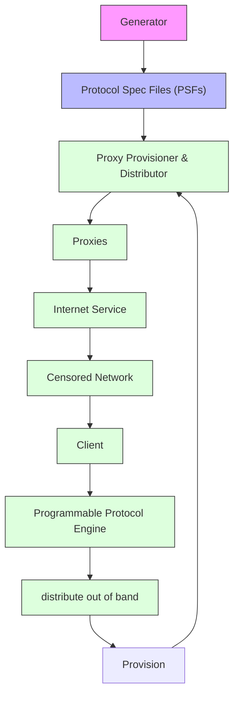

## USENIX

THE ADVANCED COMPUTING SYSTEMS ASSOCIATION

# Censorship Evasion with Unidentified Protocol Generation

Ryan Wails, U.S. Naval Research Laboratory and Georgetown University; Rob Jansen and Aaron Johnson, U.S. Naval Research Laboratory; Micah Sherr, Georgetown University

https://www.usenix.org/conference/usenixsecurity25/presentation/wails

This paper is included in the Proceedings of the 34th USENIX Security Symposium.

August 13–15, 2025 • Seattle, WA, USA

978-1-939133-52-6

Open access to the Proceedings of the 34th USENIX Security Symposium is sponsored by USENIX.

# Censorship Evasion with Unidentified Protocol Generation

Ryan Wails†‡

Rob Jansen†

Aaron Johnson†

Micah Sherr‡

†U.S. Naval Research Laboratory

‡Georgetown University

## Abstract

We present the design and implementation of a novel approach to internet censorship evasion called Unidentified Protocol Generation (UPGen). UPGen automatically generates novel protocols for encrypted communication that are not easily recognizable as being UPGen protocols, but instead as some benign encrypted protocol unknown to the adversary. UPGen protocols are to be used to relay traffic to censored destinations via proxies, where each proxy can run a different UPGen-generated protocol. An adversary attempting to block at the protocol level but unable to identify UPGen protocols could cause significant collateral damage if it attempted to block all unidentified protocols. We conduct a security evaluation of UPGen employing state-of-the-art machine learning classifiers and find that it is infeasible to block UPGen protocols without also blocking existing encrypted protocols. We conduct small- and large-scale performance evaluations and find that UPGen protocols meet or exceed the performance of other common censorship evasion protocols.

## 1 Introduction

Privacy and freedom of expression depend on the ability to freely access and contribute to information on the internet [54, 67]. Unfortunately, these human rights are increasingly restricted as internet censorship by nation states grows [27]. We present a new strategy to evade censorship that is harder to effectively block than many popular evasion strategies while providing similarly high performance and maintainability.

We consider a nation-state censor whose primary objective is to block access to a prohibited set of online services while allowing access to all other services. Such an adversary is said to employ a blocklist, in contrast to the use of an allowlist which would instead contain all the allowed services. Censors typically prefer using a blocklist over an allowlist because doing so yields much less collateral damage from the inadvertent blocking of benign traffic.

To enforce such blocking, the adversary also tries to disrupt network flows associated with censorship evasion [42,

75]. The censor has two primary challenges to achieving its goal: (1) it manages a very large volume of traffic crossing its network, and (2) there is a relatively low prevalence of circumventing flows in the traffic it routes [42]. These challenges lead the censor to prefer classifiers that can distinguish circumventing flows from benign flows efficiently and accurately (i.e., with a high rate of true positives and a low rate of false positives) [81]. Hence, real-world censors deploy simple classifiers that are highly targeted to the specific features of a protocol (e.g., a particular sequence of bytes present within the first few packets). Such classifiers can be applied efficiently at scale while limiting the collateral damage of blocking benign flows [56, 75].

Considering real-world censors, we explore the following research question: can we effectively create and use multiple network protocols to increase the accidental censorship of benign flows (i.e., false positives) while limiting censorship of circumventing flows (i.e., true positives)? There has been limited success in addressing this question to thwart real-world censors. Fully encrypted protocols (FEPs), which hide all protocol metadata by fully encrypting the traffic stream [21], represent the most successful strategy with the widest deployment [15, 45, 78, 85, 88, 89]. However, the randomized nature of FEPs has recently been exploited by a real-world censor to detect and block fully encrypted traffic [2, 86], leaving few viable alternatives that may be able to withstand emerging machine-learning-based attacks [47, 81, 87].

In this paper, we explore a novel strategy for creating new censorship evasion protocols based on three key insights. First, while encryption can be used to hide protocol metadata [21], typical encrypted protocols exhibit protocol structure and unencrypted fields (e.g., a greeting string, version number, or message type). Second, encrypted protocols are ubiquitous and include not only well-known protocols such as TLS [16, 64] and SSH [90], but also a variety of recent or less-known protocols such as those designed for cryptocurrencies [12, 72], Internet-of-Things devices [69], file storage [52], video games [28], and keystroke prediction [43]. Third, censors deploying protocol-specific classifiers can typically disrupt evasion tools that cannot adapt or use unblocked fallback protocols [75]. These insights suggest that an evasion strategy that uses many plausible but unlinkable encrypted protocols may considerably increase the cost of censorship by requiring a blocklisting censor to develop a specific classifier for each protocol or risk significant collateral damage.

Building on these insights, we present the design of a new censorship evasion strategy called Unidentified Protocol Generation (UPGen). The core of UPGen is a novel protocol generator that can produce $4 . 2 \times 1 0 ^ { 2 2 }$ distinct structured encrypted protocols for censorship evasion. We designed the generator to produce protocols with features that we found common in a study of 27 existing protocols used for encrypted internet communication. The generator considers both message structure (the selection and placement of fields in each protocol message) and message contents (the values written into message fields) while using probabilistic sampling to choose plausible yet distinct structure and content semantics.

We implement and evaluate UPGen considering common deployment scenarios (e.g., virtual private networks and Tor) wherein a client establishes a censorship-resistant communication channel to a proxy server and tunnels internet-bound traffic through the proxy. Both the client and proxy run a Programmable Protocol System (PPS) [13, 19, 79] that can be configured with one or more of the protocol specifications generated by UPGen.

The security argument for UPGen is that (1) because the generated protocols are new and unique, they will initially be unidentified by the censor and thus will initially be unclassified on a blocklist; (2) because the space of possible generated protocols is large, it will be infeasible to apply a classifier for each; and (3) because the generated protocols are structured similarly to existing encrypted protocols and lack distinguishing features, efficient classifiers cannot block the generated protocols as a class without causing significant collateral damage. Additionally, by assigning each proxy server a different protocol, we ensure that discovering and blocking a single protocol only affects connections to one proxy server and does not make an entire proxy network inaccessible.

We evaluate the security of UPGen protocols against a machine-learning censor considering a variety of classification techniques. Against state-of-the-art classifiers [34, 81], we find that the censor always incurs a high rate of collateral damage (inadvertent blocking) when trying to block all UP-Gen protocols. For every classifier and experiment we ran, a significant fraction—typically 100%—of benign protocol flows were blocked. Our results suggest that UPGen protocols are difficult to distinguish from benign protocols that a nation-state censor may encounter in the wild.

We evaluate the performance of UPGen protocols executed using Proteus as the PPS [79]. In a set of laboratory benchmark experiments, we find that UPGen protocols meet or exceed the latency, throughput, and scalability of other common censorship evasion protocols including Obfs4 [89] and

TLS [16, 64]. In a set of large-scale distributed-system experiments with Tor, we find that the performance of Tor traffic flows is not significantly affected by the choice of the censorship evasion protocol executed by the client and proxy.

The UPGen design is also highly maintainable. The UPGen protocols do not mimic any existing protocol or application, and so they do not need to be kept in sync with an external system. Additionally, each proxy can use a separate generated protocol, and so the identification of one UPGen protocol by the censor does not require changes at other proxies or their clients. The UPGen generator may also be updated to adapt to new censorship techniques over time without invalidating already-deployed protocols.

We summarize our primary contributions as follows:

• the design of the UPGen system and protocol generator that can generate plausible unidentified protocols useful for censorship evasion  
• a security analysis of UPGen in which we find that it is infeasible to censor UPGen protocols without incurring collateral damage of other encrypted protocols  
• a rigorous performance evaluation of UPGen indicating that it meets or exceeds the performance of other common censorship evasion protocols  
• an implementation of UPGen and extensions to Proteus to enable support for all UPGen-generated protocols

## 2 UPGen Design

UPGen is designed against a censor that can target specific protocols or applications for blocking but seeks to avoid collateral damage from blocking activity that it is not aware of or does not understand. UPGen exploits this situation by generating novel protocols for encrypted communication that appear to be plausible designs and have features that are likely to be shared by other (unknown) encrypted protocols.

UPGen protocols operate between the transport and application layers, similar to TLS [16, 64], and they run over TCP. UPGen requires the use of a proxy node that has not been identified and blocked at the IP level by the censor. For any such proxy node, UPGen will independently generate a protocol to be used with that proxy. Therefore, a malicious user who discovers the identity of a proxy using UPGen cannot develop protocol fingerprints that could be used to identify other proxies using UPGen.

## 2.1 Security Goals

The key security goal for UPGen is as follows: a censor that is aware of UPGen and some real-world encrypted protocols should be unable to develop detection or blocking techniques for most UPGen protocols that do not also block many of the other (i.e., unknown) real-world encrypted protocols. There are several ways in which the censor may be aware of UPGen, for example, by observing traces of UPGen protocols on the network or by interacting with the UPGen generator to obtain samples. Note that UPGen need not mimic exactly any of the real-world encrypted protocols unknown to the adversary, which would difficult to do even if the adversary’s knowledge were fixed and known. Instead, UPGen protocols will exhibit a variety of different structural characteristics, such as the format of cleartext metadata, that are typical for encrypted protocol designs as a whole.


<details>
<summary>flowchart</summary>


</details>

Figure 1: Schematic diagram of the UPGen censorship resistance system.

More precisely, we posit the existence of a set of benign encrypted protocols P that exist in the real world at any given time, and we suppose that the adversary knows about a subset Q ⊂ P. UPGen’s goal is to generate protocols randomly from some space U that is similar enough to P that the adversary cannot efficiently distinguish between U and P\Q given only its knowledge of Q. For an adversary that can sample from U, this goal requires that U is too large to enable each member protocol to be individually fingerprinted. It also requires that U be similar enough to P overall that, regardless of the known subset Q, a method to distinguish U from Q is not sufficient to distinguish U from P\Q.

UPGen is designed to provide this security with respect to a passive censor who observes but does not interfere with traffic. Active censors are more complicated and expensive to implement, and real-world censors appear to generally be passive with the exception of active scanning of hosts (which UPGen does provide some protection against).

In addition to this primary security goal, UPGen is designed with other security and performance goals. First, UPGen protocols provide standard confidentiality and integrity of the communications. Second, UPGen protocols are designed to provide high throughput and low latency, similar to encrypted protocols such as TLS [16, 64] and SSH [90]. Third, UPGen is designed to provide efficient and fast protocol updates so that proxies and clients can quickly be provided with new protocols as censor blocking methods evolve.

## 2.2 System Architecture

The UPGen architecture is shown in Figure 1. UPGen makes use of a Programmable Protocol System (PPS), which allows protocols to be specified and run. The PPS must define a syntax and semantics for Protocol Specification Files (PSFs) that can describe the protocols generated by UPGen, which are all two-party protocols for bidirectional communication. The PPS must also provide a Protocol Engine, run by each party in a communicating pair, that takes a PSF and implements the protocol. The PPS must provide an interface to allow a connection to be created using a given PSF, data to be sent and received over that connection, and the connection closed. The interface must allow the destination endpoint of the proxied connection to be specified, and it may support multiplexing multiple proxied connections over a single PPS connection. Any PPS that is sufficiently expressive to implement the protocols generated by UPGen could be used, with potential impacts on the efficiency of the runtime and the size of the PSFs. Our implementation of UPGen uses Proteus [79] as its PPS, although another design such as Marionette [19] or WATER [13] could also be used. The system only supports proxying TCP connections.

UPGen is composed of the following entities, each of which performs a different role:

Generator: The Generator produces protocols defined in Protocol Specification Files.

Clients: Clients forward traffic to proxies using PSFs. They are located in censored networks.

Proxies: Proxies relay client traffic to the otherwise censored destinations using protocols defined in the PSFs. They are located outside of censored networks.

Proxy Provisioner: The Proxy Provisioner provisions each proxy with a PSF produced by the Generator and a longterm symmetric key generated by the Proxy Provisioner.

Proxy Distributor: The Proxy Distributor distributes proxy information to clients, including their network addresses and ports, PSFs, and cryptographic keys.

## 2.3 Threat Model and Deployment Scenarios

In the threat model for UPGen, the censor is able to passively observe all network communications of the UPGen clients. We assume there exist some encrypted protocols that are unknown to the adversary, either because it has not observed them or because it cannot identify them. The goal of the censor is to distinguish client connections to UPGen proxies from client connections using unknown encrypted protocols to benign servers. The censor may control some clients and some proxies. However, the Generator, Proxy Provisioner, and

Proxy Distributor are all trusted and are assumed to successfully perform their functions (e.g., proxy distribution cannot be blocked). Moreover, the Proxy Provisioner and Distributor are assumed not to distribute malicious proxies to honest clients or honest proxies to malicious clients. In deployment scenarios where that assumption does not hold, the security guarantees of the system would still apply to honest proxies distributed only to honest clients.

The system design and threat model are compatible with several deployment scenarios:

Tor: The Tor Project runs the Generator and acts as both the Proxy Provisioner and Proxy Distributor. The proxies are run by third parties (e.g., using Tor’s rdsys [48] for coordination and distribution).

VPN: The VPN provider runs the Generator, acts as Proxy Provisioner and Proxy Distributor, and runs the proxies. Proxies IPs are communicated through the same channels that distribute the client VPN software.

Personal: An individual runs a proxy and acts in all roles.

## 2.4 Generator

The Generator is the core of the UPGen design. It implicitly defines a probability distribution over protocols, and during a given execution it randomly samples a protocol from this distribution. Samples are intended to be drawn independently and thus require no coordination across proxies or even across different instances of the Generator used in different deployments. The input for the Generator is therefore simply randomness, and it outputs a single PSF.

The generated PSF describes a protocol to be used by a proxy and its clients to communicate. PSFs need to be additionally configured by both parties with a shared private key and by the client with the IP and TCP port of the proxy. This configuration and PSF is obtained by the proxy from the Proxy Provisioner and by the client from the Proxy Distributor. The generated PSFs are designed to enable bidirectional communication between the client and proxy. While the protocols are bidirectional, the client initiates the connection by sending the TCP SYN.

To design the Generator, we identified 27 real-world encrypted protocols (see Table 8 in Appendix A), of which 21 have open designs that we were able to study. We observed many common patterns across these protocols, which we used in the Generator design, and we enlarged the space of such patterns using reasoning about what other design decisions are justifiable. After an initial design, we iteratively produced refinements as we ran our lab experiments with the TLS 1.2, TLS 1.3, SSH 2.0, CurveZMQ, and secio protocols (see §4.3).

Communication with an UPGen protocol occurs via protocol messages, each of which has a type. A protocol message of a given type has a certain format, which determines where and how protocol metadata appears in a message, if and how encryption is applied, and how any application data is encoded by the sender and then decoded by the receiver. Some message types contain a payload with such application data, which is forwarded to the receiving application. There are three message types: greeting, handshake, and data.

All UPGen protocols follow the design pattern in which an optional greeting phase initiates the connection, a handshake phase follows any greeting (initiating the connection when no greeting is used), and a data phase succeeds the handshake. Each type of protocol message can only be sent during its phase. During the greeting phase, the parties exchange ASCII-printable greeting strings of fixed lengths. During the handshake phase, the parties perform (or at least appear to perform) connection setup functions, e.g., key exchanges. During the data phase, application data is sent between the client and server (some protocols send data during the handshake).

Algorithm 1 UPGen Generator Parameter Sampling

<table><tr><td colspan="3">1: function SAMPLEPARAMETERS()</td></tr><tr><td>2:</td><td>s← SECPARAM()</td><td>▷ Security parameter</td></tr><tr><td>3:</td><td>c← CIPHER(s)</td><td>▷ Encryption cipher</td></tr><tr><td>4:</td><td>t← TYPEFIELD()</td><td>▷ Type field (plain/enc.)</td></tr><tr><td>5:</td><td>l← LENGTHFIELD()</td><td>▷ Length field (plain)</td></tr><tr><td>6:</td><td>v← VERSIONFIELD()</td><td>▷ Version field (plain/enc.)</td></tr><tr><td>7:</td><td>n← NONCEFIELD(s)</td><td>▷ Nonce field (plain)</td></tr><tr><td>8:</td><td>p← PADLENGTHFIELD(c, l)</td><td>▷ Padding-length field (enc.)</td></tr><tr><td>9:</td><td>e← EXTRAFIELD(t, v)</td><td>▷ Extra field (enc.)</td></tr><tr><td>10:</td><td>r← RESERVEDFIELD()</td><td>▷ Reserved field (enc.)</td></tr><tr><td>11:</td><td>z← CERTIFICATE()</td><td>▷ Certificate field (enc.)</td></tr><tr><td>12:</td><td>k← KEYENCODING()</td><td>▷ Key-exchange encoding</td></tr><tr><td>13:</td><td>g← GREETINGSTRING()</td><td>▷ Greeting string (plain)</td></tr><tr><td>14:</td><td>h← HANDSHAKE()</td><td>▷ Handshake pattern</td></tr><tr><td>15:</td><td>b← SUBPROTOCOL(h)</td><td>▷ Subprotocol pattern</td></tr><tr><td>16:</td><td>f← FIELDORDER()</td><td>▷ Order of fields</td></tr><tr><td>17:</td><td>a← LENGTHALONE(f)</td><td>▷ Write length field alone</td></tr><tr><td>18:</td><td colspan="2">return (s, c, t, l, v, n, p, e, r, z, k, g, h, b, f, a)</td></tr></table>

A high-level description of the core of Generator appears in Algorithm 1. It randomly samples a set of parameters that determine an UPGen protocol. Those parameters are subsequently translated deterministically into the associated PSF, using a process that depends on the PPS (we generate a PSF using the Proteus protocol grammar [79]).

Each choice of parameter is made randomly from a finite list of options, typically with a uniform distribution though in some cases weighted towards choices that appeared more commonly among the encrypted protocols we surveyed. All choices are made independently unless a specific dependency appears as an input to the function call responsible for a given choice. For field choices, the “plain” annotation in Algorithm 1 indicates that they appear unencrypted, “enc.” indicates that they are encrypted, and “plain/enc.” indicates that both are possibilities. Unencrypted fields are chosen from a specified list of potential values and byte lengths, while the only choice for encrypted fields is their byte length.

The parameters incorporate the key observable features we identified in our study of existing encrypted protocols:

SECPARAM(): The security parameter indicates the cryptographic level of security, which is reflected in the encryption cipher. Its value is chosen as either 128 or 256.

CIPHER(s): For s indicating 128-bit security, the encryption cipher is selected as AES-128-GCM. For 256-bit security, the cipher is AES-256-GCM or ChaCha20-Poly1305.

TYPEFIELD( ): In a given connection, the type field will contain one of a finite set of sequential values indicating the type of message. This parameter selects the set of values used in the protocol. The field may be encrypted or not. If not encrypted, the size of the set is chosen from three possible values and the starting number is chosen from four possible values. The type field appears in handshake and data phases, and it is incremented when new phases begin.

LENGTHFIELD(): The length field conveys the length of payload data, although it may also cover the MAC tag of such data. It may be encrypted or not. Its length in bytes is chosen from two possible values. It appears only when a payload field exists (though such field may be empty).

VERSIONFIELD( ): The version field contains a value indicating the (supposed) version of the protocol used. It may be encrypted or not. Its length in bytes is one of two values. It may or may not be included, and, if it is, it appears only in the first two handshake messages. Its value is chosen from among four possible numbers, and it may also include a minor-version value chosen from three possible numbers.

NONCEFIELD(s): The nonce field contains randomness of length s, typically used as an encryption nonce. It is unencrypted and may or may not be present. If it is, it appears only in the first two handshake messages.

PADLENGTHFIELD(c, ℓ): The padding-length field contains the length of any padding included in the payload. It is encrypted. It is no longer than the size ℓ of the length field, but it may be chosen to be the shorter of the two possible length-field sizes. It appears only when a c is a block cipher and the message has a payload field.

EXTRAFIELD(t, v): The extra field is always encrypted and represents additional (unspecified) headers. It is present only if either the type field t or version field v is encrypted. Its length in bytes is chosen separately for the handshake and data phases from three possible values.

RESERVEDFIELD( ): The reserved field represents space reserved for future use. It is always encrypted. Its length is chosen from one of five possible values. It appears only in the handshake phase.

CERTIFICATE( ): The certificate field representing a server certificate may be included in the first handshake message from the server to the client. It is always encrypted. If it is included, its length is selected from a range of 2048 values.

KEYENCODING( ): Specifies how the keys exchanged during the handshake are encoded (DER, PEM, or raw bytes).

GREETINGSTRING( ): Greeting strings may be exchanged at the beginning of a connection. If included, the greeting string is generated by a recurrent neural network trained on an archive of GitHub repository names. The client and server both send the same string, and either one may initiate the exchange.

HANDSHAKE( ): The handshake pattern determines both the message flow during the handshake phase and how keys are exchanged. Ephemeral keys are always exchanged and are used to provide forward secrecy. In some handshake patterns, static keys may be sent, but these are for appearances only and are not used for encryption or authentication.

The handshake pattern is chosen from among eight possible patterns. The message flows of these patterns fall into the following categories: one client-to-server message followed by a server-to-client message that can already contain payload data (0-RTT), one client-to-server message followed by a server-to-client message before the payloads (1-RTT), and the 1-RTT messages followed by a client-toserver message before the payloads (1.5-RTT).

Ephemeral keys are exchanged in the first two handshake messages. Static keys can be sent by the client, server, or both for ostensible authentication. They are generally sent with the ephemeral key, except in the 1.5-RTT patterns where the clients send them afterwards and encrypted.

SUBPROTOCOL(h): This parameter models subprotocol control messages sent encrypted after the handshake but before application data are transmitted. Subprotocol messages occur in the data phase. They cannot occur if the handshake pattern h is RTT-0. The possible subprotocol patterns have three possible numbers of client-server message exchanges (0, 1, or 2), and the size of each message is selected from 252 possible values.

FIELDORDER( ): This parameter indicates the order of the non-payload fields and also if the payload field is encrypted separately. The sets of unencrypted and encrypted nonpayload fields are each permuted uniformly at random.

LENGTHALONE( f ): This boolean parameter indicates if the length field is written alone to the socket buffer, making it likely to be sent in its own TCP packet. It can only have a value of true if the length field is first in the field ordering.

While the preceding parameters determine the ostensible encryption cipher, we implement the symmetric encryption using ChaCha20-Poly1305. It is a stream cipher, and so the AES block size is easily emulated. Ephemeral key exchanges are performed using Curve25519. A shared secret is derived from the ephemeral keys via Diffie-Hellman key agreement. The result is used with the long-term shared symmetric key and a Key Derivation Function (KDF) to produce the key used for symmetric encryption.

For each message type, the overall message layout is that unencrypted fields are followed by encrypted fields, with the payload always last. Ephemeral and static keys sent during the handshake are the last non-payload fields, and any static key appears after any ephemeral key. A payload field appears in each data-phase message, and in the RTT-0 handshake pattern it also appears in the first server-to-client handshake message. Padding is considered part of the payload field and appears at the end of the payload data.

By independently sampling each of the parameters described above, UPGen produces a large number of unique encrypted protocols. For example, UPGen may generate a 1-RTT protocol wherein the handshake phase begins with a client-to-server message formatted as follows:

<table><tr><td>1 byte</td><td>1 byte</td><td>12 bytes</td><td>115 bytes</td></tr><tr><td>type</td><td>version</td><td>nonce</td><td>ephemeral key</td></tr></table>

A server-to-client message that also appends a static key is sent in response to conclude the handshake phase:

<table><tr><td>1 byte</td><td>1 byte</td><td>12 bytes</td><td>115 bytes</td><td>115 bytes</td></tr><tr><td>type</td><td>version</td><td>nonce</td><td>ephemeral key</td><td>static key</td></tr></table>

Following the handshake, the client and server exchange application payloads during the data phase by exchanging messages of the following format:

<table><tr><td>1 byte</td><td>2 bytes</td><td>2 bytes</td><td>length bytes</td><td>pad length bytes</td><td>16 bytes</td></tr><tr><td>type</td><td>length</td><td>pad length</td><td>payload</td><td>padding</td><td>msg auth code</td></tr></table>

The padding-length, payload, and padding fields are all encrypted. The full specification file for this example protocol is available in Listing 1 in Appendix B.

## 3 Implementation

We implemented the UPGen-generation procedure described in §2.4 in approximately 2,000 lines of Python 3 code. Our implementation samples from a set of parameters to generate protocol specification files for the Proteus programmable censorship-circumvention system [79]. The existing Proteus prototype does not support all protocol features generated by UPGen. Thus, we extended Proteus to add support for key exchange, randomized encryption, forward secret protocols, encrypted certificates, and padding schemes that support arbitrary block ciphers (e.g., AES128 and AES256). Our Proteus extensions were implemented in approximately 1,000 lines of Rust code.

The UPGen generator and our extended version of Proteus were used throughout our evaluations in the remainder of the paper. In particular, our extended version of Proteus conforms to the pluggable transport standard, which enables us to evaluate UPGen protocols in the context of real-world applications such as Tor and ptadapter. We have also successfully tested our implementation in a private Tor bridge deployment, with Tor Browser, and in a censored region of the Internet (see §6).

## 4 Security

Here we describe UPGen’s security properties, the diversity of the protocols it produces, and its resilience to classification by state-of-the-art machine learning classifiers.

## 4.1 Confidentiality and Integrity

During the handshake phase, a genuine Diffie-Hellman ephemeral key exchange is performed. The resulting key is combined with the long-term symmetric key using a KDF to provide a short-term symmetric key. Using this key, all payload data (i.e., data to be forwarded by the proxy) is encrypted in the message payload using authenticated encryption. Thus UPGen protocols provide cryptographic confidentiality and integrity with forward secrecy to the application data. We note that if the censor obtains the secret key of the proxy (which cannot happen under our threat model) then they could impersonate the proxy via a man-in-the-middle attack and violate these confidentiality and integrity guarantees.

The use of a long-term symmetric key might seem like it increases the challenge of securely distributing key material. However, the identity of the proxy itself (i.e., its IP address) already constitutes a shared secret, as a censor with that information could institute a block based on the IP address. There still would be some value to the use of a long-term public key by the proxy, in that by using a triple-Diffie-Hellman handshake in the ephemeral key exchange, the proxy would be authenticated to the client and would thereby prevent impersonation by a censor unable or unwilling to simply block the proxy. Such a key could be generated by the proxy, sent to the Proxy Provisioner, and ultimately distributed to the client.

## 4.2 Analysis of UPGen Protocols

We quantify the diversity of the protocols produced by the Generator by counting them and evaluating the Shannon entropy of the distribution. Table 1 shows the total count and entropy of the Generator distribution, as well as how each of the protocol parameters contributes to these values. The greeting string parameter is underestimated as simply the choice of who sends it first if anybody, and in the implementation an RNN is used to sample the greeting string value if it exists, which only increases the size and entropy of the Generator distribution. Also, the per-parameter entropy values are conditional entropy when they depend on other parameters.

We observe that UPGen can generate a large number of protocols $( 4 . 2 \times 1 0 ^ { 2 2 } )$ , more than could ever be sampled. A large number of these come from the subprotocol patterns, but even excluding subprotocol patterns, however, the Generator can still produce over $1 0 ^ { 1 3 }$ different protocols. We can also see that the entropy of the Generator distribution is high (38.4 bits), which shows that, even when taking the probabilities of each protocol into account, attempting to individually fingerprint UPGen protocols is unlikely to be effective.

Table 1: Quantitative analysis of UPGen Generator

<table><tr><td>Protocol parameter</td><td># options</td><td>Entropy (bits)</td></tr><tr><td>Security parameter</td><td>2</td><td>1</td></tr><tr><td>Encryption cipher</td><td>3</td><td>0.5</td></tr><tr><td>Type field</td><td>25</td><td>2.7</td></tr><tr><td>Length field</td><td>2</td><td>0.81</td></tr><tr><td>Version field</td><td>36</td><td>4.1</td></tr><tr><td>Nonce field</td><td>3</td><td>1.0</td></tr><tr><td>Padding field</td><td>2</td><td>0.25</td></tr><tr><td>Extra field</td><td>9</td><td>2.4</td></tr><tr><td>Reserved field</td><td>5</td><td>1.1</td></tr><tr><td>Certificate</td><td>2048</td><td>6.5</td></tr><tr><td>Key encoding</td><td>3</td><td>1.6</td></tr><tr><td>Greeting string</td><td>3</td><td>1.1</td></tr><tr><td>Handshake pattern</td><td>8</td><td>3.0</td></tr><tr><td>Subprotocol pattern</td><td> $4.0 \times 10^{9}$ </td><td>8.3</td></tr><tr><td>Field order</td><td>12</td><td>3.6</td></tr><tr><td>Length alone</td><td>2</td><td>0.48</td></tr><tr><td>Total</td><td> $4.2 \times 10^{22}$ </td><td>38.4</td></tr></table>

## 4.3 Experimental Security Analysis

In this section, we experimentally determine the distinguishability of UPGen-generated protocols from real-world encrypted protocols. Following our threat model, we assume that the censor has knowledge of some strict subset of the benign real-world encrypted protocols and has the resources to analyze some but not all of the UPGen protocols.

The distinguishing experiments are structured as supervised machine learning tasks, which is in accordance with state-of-the-art traffic-analysis research [34, 61, 62, 81, 82]. In these experiments, the censor assembles a training dataset consisting of benign-protocol traffic traces and UPGen-protocol traffic traces. From this dataset, the censor then trains a classification model that distinguishes UPGenprotocol traces from benign-protocol traces using various features of the captured packets. The censor’s classification power is evaluated on a testing dataset that is disjoint from the training dataset. To reflect our threat model, the test set includes some “out-of-distribution” (OOD) traces, that is, traces from protocols that are not represented in the training set, including both benign protocols and UPGen protocols. The focal point of our analysis is the censor’s out-of-distribution performance; to avoid collateral damage and to succeed in blocking UPGen, the learned classifiers must accurately generalize to the out-of-distribution protocols.

## 4.3.1 Data collection

The prerequisite step of our experimental process is data collection. In order to collect flows from each of the encrypted transports, we wrote custom traffic generation software in approximately 9,000 lines of C++, Rust, and Python code. The list of encrypted protocols supported by our software is shown in Table 2. The generation software instantiates a client and server process for a chosen encrypted protocol (for example, an SSH client and server) and then transmits a fixed sequences of bytes through the established connection. It is important to use the same simulated application behavior in these experiments so that classification of flows can be attributed to differences due to the encryption protocols themselves and not differences in application behavior. In these experiments, we configured the client to initially send 1 kB to the server and the server to respond with a 10 kB message; subsequently, the client and the server enter into a cycle wherein the client sends a 256 B message to the server, and the server responds with a 10 kB message. This behavior is meant to roughly correspond to web browsing activity where a client makes relatively small requests to a server and receives large responses; this behavior will cause the transmission of both small and large messages during the encrypted protocol’s data phase.

For each protocol execution, we recorded the sequence of packets transmitted between client and server in pcap format using Linux’s standard tcpdump utility. To isolate the encrypted protocol traffic, we configured our custom traffic generation software to run each protocol on a distinct port and configured tcpdump to capture traffic on only that port. The packet captures were recorded from the vantage point of the client process on a Linux server running Debian 12. The machine’s network interfaces were limited with a 1,500 B MTU. TCP and generic segmentation offloading were disabled so that these optimizations would not affect the packet capture. We disabled IPv6 on the machine so that all traffic was carried over IPv4. The collected pcaps were filtered using Wireshark’s tshark utility to remove TCP packets carrying no segment data (for example, SYN, ACK, and FIN packets).

In total, we collected 1,000 traces for each of the TLS 1.2, TLS 1.3, SSH, CurveZMQ, Noise, secio, and Obfs4 protocols. We also collected 5 executions for each of 1,000 randomly generated UPGen PSFs (for in-distribution examples), and 2 executions for each of an additional 2,500 randomly generated PSFs (for out-of-distribution examples, where we ensure that the 2,500 PSFs are disjoint from the other 1,000).

## 4.3.2 Machine learning

Dataset formation. The collected traffic traces are used to train and test a number of supervised machine learning models, which are designed to distinguish UPGen-protocol traffic from benign-protocol traffic. These models are trained and tested using labeled traces, where a trace is labeled positive if it is from an UPGen protocol and negative if it is from a benign protocol. As noted above, testing datasets include traces from both in-distribution and out-of-distribution protocols.

Table 2: Encrypted transports used in evaluation.

<table><tr><td>Transport</td><td>Provider</td><td>Language</td></tr><tr><td>TLS 1.2</td><td>OpenSSL</td><td>C</td></tr><tr><td>TLS 1.3</td><td>OpenSSL</td><td>C</td></tr><tr><td>SSH 2.0</td><td>libssh</td><td>C</td></tr><tr><td>CurveZMQ</td><td>libcurve, libzmq</td><td>C, C++</td></tr><tr><td>Noise Protocol Family</td><td>snow</td><td>Rust</td></tr><tr><td>secio</td><td>tet-libp2p</td><td>Rust</td></tr><tr><td>Obfs4</td><td>lyrebird, ptadapter</td><td>Go, Python</td></tr><tr><td>UPGen Protocol Family</td><td>proteus, ptadapter</td><td>Rust, Python</td></tr></table>

In each experiment, we simulate the existence of out-ofdistribution benign traffic by designating one benign protocol as out-of-distribution and using its examples only in the test set. For UPGen, we use the 2,500 protocols as the out-ofdistribution examples. For example, suppose without loss of generality that SSH was designated as the out-of-distribution benign protocol for an experiment. Then the data would be partitioned as follows and according to the following amounts:

Negative training examples: 500 examples each of TLS 1.2, TLS 1.3, CurveZMQ, and secio executions.

Positive training examples: 4 examples each of 1,000 randomly sampled PSFs.

In-distribution negative testing examples: 500 new examples each of TLS 1.2, TLS 1.3, CurveZMQ, and secio executions.

Out-of-distribution negative testing examples: 1,000 examples of SSH executions.

In-distribution: positive testing examples: One new example of each of the 1,000 (training) PSFs.

Out-of-distribution positive testing examples: Two examples each of 2,500 randomly sampled PSFs disjoint from the training set.

We experimented with five choices of out-of-distribution benign protocol: CurveZMQ, Noise, secio, SSH, and TLS.

Feature selection. To be provided as input to a machine learning model, each packet capture must be mapped to a feature vector. We consider two feature vector representations that have been explored in prior work. The first is the sequence of packet lengths in the flow, i.e., $\langle d _ { i } \cdot p _ { i } \rangle _ { i = 1 } ^ { 3 0 }$ , where $d _ { i }$ indicates the direction of the packet $( d _ { i } = 1$ for a client-toserver packet, and $d _ { i } = - 1$ otherwise) and $p _ { i }$ is the length of the carried TCP segment; the trace length of 30 packets follows Wang et al. [82] while the packet representation follows Wails et al. [81]. The second is the sequence of TCP segment bits in the flow, i.e., $\langle b _ { i } ^ { j } \rangle _ { 1 \leq i \leq 3 0 , 1 \leq j \leq 2 8 0 }$ , where $b _ { i } ^ { j }$ is the jth bit of the ith packet; this representation is known as the “nPrint” representation flow from Holland et al. [34]. Both representations have been used for complex traffic analysis tasks [34, 61, 66], including from work studying censorship [81]. Because UPGen protocols have unique packet length distributions and unique message field values, it is important to consider various representations that encode both the packet length sequence and the sequence of actual bits transmitted.

Classifiers. We consider four classifiers in our experiments. For the sequence-of-lengths feature representation, we use Sirinam et al.’s “Deep Fingerprinting” (DF) deep convolutional neural network as a classifier. The DF classifier has been demonstrated effective in many traffic analysis tasks [70, 71]. Recently, Wails et al. showed that the DF model can be used to detect Obfs4 flows in real-world networks. Also, for the sequence-of-lengths representation, we use a simple decision tree and random forest classifier, which are more interpretable than DF. For the nPrint representation, we use nPrintML [34], a state-of-the-art automated traffic analysis model based on AutoGluon [20]. AutoGluon fits the training data using a number of different classifiers (such as a k-nearest neighbors classifier, a neural network, or gradient-boosted trees) and automatically selects the most accurate classifier (or ensemble of classifiers) to use during testing.

Performance measurements. Classifier performance is evaluated according to four standard measurements:

In-distribution true-positive rate (TPR) The fraction of UPGen flows that are correctly identified (blocked) by the censor for UPGen protocols that the censor trained on.

In-distribution false-positive rate (FPR) The fraction of benign flows that are incorrectly labeled (blocked) by the censor for benign protocols within the training set.

Out-of-distribution TPR The fraction of UPGen flows that are correctly identified (blocked) by the censor for UPGen protocols that the censor did not train on.

Out-of-distribution FPR The fraction of benign flows that are incorrectly labeled (blocked) by the censor for benign protocols outside the training set.

If they are successfully learning, the trained classifiers should have high in-distribution TPR and low in-distribution FPR. For a classifier to be useful to the censor, it must also have a high out-of-distribution TPR (or else new PSFs will escape the censor) and low out-of-distribution FPR (otherwise the collateral damage will be too high).

Validation. In the following results, we treat the trials where the Noise protocols are out of distribution as a kind of experimental validation. Recall from §2.4 that we refined UP-Gen’s design using features of the CurveZMQ, SSH, TLS 1.2, TLS 1.3, and secio protocols; to prevent overfitting, we did not perform the same refinement using the Noise protocols—it was only after we finalized UPGen’s design that we experimented with Noise.

## 4.3.3 Results

The results of our experiments are summarized in Table 3. The in-distribution testing performance is nearly perfect for all experiments. This suggests that the classifier is indeed learning the distribution of protocols in the training set. However, in the vast majority of cases, the classifier’s out-of-distribution (OOD) false-positive rate is nearly 100%. Only in a single case (where SSH is the OOD protocol and DF is the classifier) is the false-positive rate less than 89%, and in this case the UPGen true positive rate is only 20%.

Table 3: Testing classification true positive rate (TPR) and false positive rate (FPR) of machine learning classifiers and out-of-distribution benign protocol choices against UPGen.

<table><tr><td rowspan="2">OOD Proto</td><td rowspan="2">Classifier</td><td colspan="2">In-distribution</td><td colspan="2">OOD</td></tr><tr><td>TPR</td><td>FPR</td><td>TPR</td><td>FPR</td></tr><tr><td rowspan="4">CurveZMQ</td><td>Deep Fingerprinting</td><td>1.00</td><td>0.00</td><td>0.25</td><td>1.00</td></tr><tr><td>Decision Tree</td><td>1.00</td><td>0.00</td><td>0.93</td><td>1.00</td></tr><tr><td>Random Forest</td><td>1.00</td><td>0.00</td><td>0.81</td><td>1.00</td></tr><tr><td>nPrintML</td><td>1.00</td><td>0.00</td><td>1.00</td><td>1.00</td></tr><tr><td rowspan="4">secio</td><td>Deep Fingerprinting</td><td>0.99</td><td>0.05</td><td>0.04</td><td>0.90</td></tr><tr><td>Decision Tree</td><td>1.00</td><td>0.00</td><td>0.94</td><td>0.89</td></tr><tr><td>Random Forest</td><td>1.00</td><td>0.00</td><td>0.36</td><td>1.00</td></tr><tr><td>nPrintML</td><td>1.00</td><td>0.00</td><td>1.00</td><td>1.00</td></tr><tr><td rowspan="4">SSH</td><td>Deep Fingerprinting</td><td>0.99</td><td>0.00</td><td>0.20</td><td>0.41</td></tr><tr><td>Decision Tree</td><td>1.00</td><td>0.00</td><td>0.97</td><td>1.00</td></tr><tr><td>Random Forest</td><td>1.00</td><td>0.00</td><td>1.00</td><td>1.00</td></tr><tr><td>nPrintML</td><td>1.00</td><td>0.00</td><td>1.00</td><td>1.00</td></tr><tr><td rowspan="4">TLS</td><td>Deep Fingerprinting</td><td>1.00</td><td>0.00</td><td>0.00</td><td>1.00</td></tr><tr><td>Decision Tree</td><td>1.00</td><td>0.00</td><td>0.20</td><td>1.00</td></tr><tr><td>Random Forest</td><td>1.00</td><td>0.00</td><td>0.79</td><td>1.00</td></tr><tr><td>nPrintML</td><td>1.00</td><td>0.00</td><td>1.00</td><td>1.00</td></tr><tr><td rowspan="4">Noise (Validation)</td><td>Deep Fingerprinting</td><td>0.99</td><td>0.00</td><td>0.01</td><td>1.00</td></tr><tr><td>Decision Tree</td><td>1.00</td><td>0.00</td><td>0.99</td><td>1.00</td></tr><tr><td>Random Forest</td><td>1.00</td><td>0.00</td><td>0.78</td><td>1.00</td></tr><tr><td>nPrintML</td><td>1.00</td><td>0.00</td><td>1.00</td><td>1.00</td></tr></table>

For comparison, we ran the same set of experiments, but instead of UPGen protocols, we used flows generated between an Obfs4 client and server. Obfs4 is a fully encrypted protocol (FEP) popular for censorship circumvention [89]. As a FEP, Obfs4 does not have obvious content fingerprints; however, unlike UPGen, it is not designed to have similarities to real-world encrypted protocols and has been observed to be distinguishable from benign traffic [81, 82]. Our experiments test if Obfs4 is also distinguishable in our experimental setup.

The results are shown in Table 4. Similar to UPGen, Obfs4 succeeds against the nPrintML classifier, likely due to its completely random message values. However, performance is far worse for the packet-length sequence classifiers. For example, the Deep Fingerprinting classifiers identify Obfs4 in 3 of 4 instances with no OOD collateral damage. Moreover, due to their perfect TPRs, we observe that the DF and Random Forest classifiers could be combined via logical-AND (i.e., indicate positive if both classifiers indicate positive) to yield a classifier with perfect TPR and FPR in every case (no such combination is similarly successful against UPGen).

Table 4: Testing classification true positive rate (TPR) and false positive rate (FPR) of machine learning classifiers and out-of-distribution benign protocol choices against Obfs4.

<table><tr><td rowspan="2">OODProto</td><td rowspan="2">Classifier</td><td colspan="2">In-distribution</td><td>OOD</td></tr><tr><td>TPR</td><td>FPR</td><td>FPR</td></tr><tr><td rowspan="4">CurveZMQ</td><td>Deep Fingerprinting</td><td>1.00</td><td>0.00</td><td>0.00</td></tr><tr><td>Decision Tree</td><td>0.99</td><td>0.00</td><td>0.00</td></tr><tr><td>Random Forest</td><td>1.00</td><td>0.00</td><td>0.58</td></tr><tr><td>nPrintML</td><td>1.00</td><td>0.00</td><td>1.00</td></tr><tr><td rowspan="4">secio</td><td>Deep Fingerprinting</td><td>1.00</td><td>0.00</td><td>0.00</td></tr><tr><td>Decision Tree</td><td>0.99</td><td>0.00</td><td>0.09</td></tr><tr><td>Random Forest</td><td>1.00</td><td>0.00</td><td>0.00</td></tr><tr><td>nPrintML</td><td>1.00</td><td>0.00</td><td>1.00</td></tr><tr><td rowspan="4">SSH</td><td>Deep Fingerprinting</td><td>1.00</td><td>0.00</td><td>0.00</td></tr><tr><td>Decision Tree</td><td>0.99</td><td>0.00</td><td>0.20</td></tr><tr><td>Random Forest</td><td>1.00</td><td>0.00</td><td>1.00</td></tr><tr><td>nPrintML</td><td>1.00</td><td>0.00</td><td>1.00</td></tr><tr><td rowspan="4">TLS</td><td>Deep Fingerprinting</td><td>1.00</td><td>0.00</td><td>1.00</td></tr><tr><td>Decision Tree</td><td>1.00</td><td>0.00</td><td>1.00</td></tr><tr><td>Random Forest</td><td>1.00</td><td>0.00</td><td>0.00</td></tr><tr><td>nPrintML</td><td>1.00</td><td>0.00</td><td>1.00</td></tr></table>

Our results suggest that the UPGen system would be difficult to block without significant collateral damage. Our experiments are in a conservative setting where application behavior is fixed, which allows the censor to focus entirely on protocol features, and despite that the UPGen classifiers still fail to generalize well to unknown protocols. This stands in contrast to the popular Obfs4 protocol, for which our experiments show classifiers are typically successful in generalizing to unknown protocols.

## 4.3.4 Analysis

Given the experimental setup, we consider why UPGen evaded accurate classification. UPGen is capable of producing protocols with a variety of features, and in many cases it can reproduce the fields or behavior of real-world protocols. For example, UPGen can produce type, length, and version fields with the same positions, sizes, and values as TLS 1.2. Like SSH, an UPGen protocol may begin with an exchange of human-readable greeting strings. In the data phase, UP-Gen protocols may have the same message layout as secio, in which a four-byte length field is followed by encrypted data and a MAC tag. As a final example from our experimental benign protocols, CurveZMQ is a layered TCP protocol, where the CURVE mechanism provide security and is sent over the ZMTP transport. Both layers include their own client-server version negotiation. UPGen can produce the same sequence of message sizes at the beginning of a connection via its subprotocol behavior, which resembles separate protocol layers performing their own handshakes. UPGen need not completely mimic any of these protocols (and indeed does not try to), as simply being able to reproduce many of the same features can make its protocols difficult to distinguish from unknown real-world encrypted protocols which also combine such features in ways unknown to the adversary.

Table 5: Fraction of protocol flows that were known (K), misidentified (M), and unknown (U) by DPI tools.

<table><tr><td rowspan="2">Protocol</td><td colspan="3">libprotoident</td><td colspan="3">nDPI</td><td colspan="3">Zeek</td></tr><tr><td>K</td><td>M</td><td>U</td><td>K</td><td>M</td><td>U</td><td>K</td><td>M</td><td>U</td></tr><tr><td>CurveZMQ</td><td>0</td><td>0</td><td>1.0</td><td>1.0</td><td>0</td><td>0</td><td>0</td><td>0</td><td>1.0</td></tr><tr><td>Noise</td><td>0</td><td>0</td><td>1.0</td><td>0</td><td>0</td><td>1.0</td><td>0</td><td>0</td><td>1.0</td></tr><tr><td>Obfs4</td><td>0</td><td>0</td><td>1.0</td><td>0</td><td>0</td><td>1.0</td><td>0</td><td>0</td><td>1.0</td></tr><tr><td>secio</td><td>0</td><td>0</td><td>1.0</td><td>0</td><td>0</td><td>1.0</td><td>0</td><td>0</td><td>1.0</td></tr><tr><td>SSH</td><td>1.0</td><td>0</td><td>0</td><td>1.0</td><td>0</td><td>0</td><td>1.0</td><td>0</td><td>0</td></tr><tr><td>TLS</td><td>1.0</td><td>0</td><td>0</td><td>1.0</td><td>0</td><td>0</td><td>1.0</td><td>0</td><td>0</td></tr><tr><td>UPGen</td><td>0</td><td>0.07</td><td>0.93</td><td>0</td><td>0</td><td>1.0</td><td>0</td><td>0</td><td>1.0</td></tr></table>

## 4.4 Analysis of Unidentified Protocols

A key assumption behind the security of UPGen is that the censor will not block traffic that it cannot identify. We look into the validity of this assumption by considering the extent to which existing tools for protocol detection fail to recognize benign traffic flows. If such failure occurred for a significant type or fraction of benign traffic, that would provide evidence that blocking unidentified flows would produce non-trivial collateral damage.

We perform an analysis using 3 common open-source tools for deep packet inspection: (1) Zeek with Dynamic Protocol Detection (DPD) [58]; (2) LibtraceTeam’s libprotoident [1]; and (3) ntop’s nDPI [55]. Each tool is designed to classify protocol traffic from a PCAP file and has modes of operation that use only payload information; that is, classification can be performed for protocols running on uncommon ports. We first run these tools on the trace datasets described in § 4.3.1.

Table 5 shows the inference results for each protocol. We found that Zeek recognized only TLS and SSH flows but did not misidentify (that is, incorrectly label) any UPGen flows. We found that libprotoident and nDPI have inconsistent coverage: libprotoident recognizes SSH, TLS, and misidentified 7% of UPGen flows, whereas nDPI also recognized CurveZMQ but did not misidentify any UPGen traffic. When UPGen flows were misidentified by libprotoident, it was most often labeled as belonging to the Real-Time Messaging Protocol (RTMP). No tool recognized secio or Noise protocol traffic. Our results suggest that, for our small sample of protocols, allowlisting could not be implemented without inadvertently blocking benign protocols.

Table 6: libprotoident recognition rates for TCP flows from the WIDE data set. The top 10 labels are shown. Approximately 4% of flows were not recognizable.

<table><tr><td>Label</td><td>Count</td><td>Label</td><td>Count</td></tr><tr><td>Total flows</td><td>205,127</td><td></td><td></td></tr><tr><td>1. HTTPS</td><td>123,681 (60%)</td><td>6. DNS_TCP</td><td>5,029 (2%)</td></tr><tr><td>2. SSH</td><td>22,808 (11%)</td><td>7. RDP</td><td>2,804 (1%)</td></tr><tr><td>3. HTTP</td><td>20,818 (10%)</td><td>8. SMTP</td><td>2,483 (1%)</td></tr><tr><td>4. SSL/TLS</td><td>11,018 (5%)</td><td>9. RFB</td><td>2,480 (1%)</td></tr><tr><td>5. Unknown_TCP</td><td>7,749 (4%)</td><td>10. IMAPS</td><td>2,241 (1%)</td></tr></table>

To further validate these results, we ran these tools on the MAWI WIDE packet capture data set [14]. This data set contains ordinary and research experiment network traffic captured from Japanese academic backbone networks. In this experiment, we used TCP packets from a 15 minute capture from 2024-03-01 recorded at samplepoint-F. As a privacy measure, the traffic packet capture length is set to 96 bytes, so only a portion of the TCP payload is available. The WIDE packet captures contain no UPGen flows, but can be used to better quantify the rate that unrecognized TCP flows occur in the real world.

Our findings show disagreements among the DPI tools. First, Zeek reported that the capture contained 244,039 flows, nDPI reported 305,513 flows, and libprotoident reported 205,127 flows. Zeek did not recognize 90% of the flows and nDPI did not recognize 67% of the flows (Appendix C shows the full classification results). The results for libprotoident are summarized in Table 6. This tool is designed to analyze only the first 4 bytes of payload data in each direction, so its rate of unrecognized traffic is much lower (∼4%). However, libprotoident failed to produce labels for as many as 100,000 flows (nDPI reported there were 300,000 flows). Overall, these results suggest that it is common for unrecognized protocol traffic to exist in real-world captures and hence allowlisting could not be implemented without incurring significant rates of collateral damage—at least 4%, whereas prior work contends that false-positive blocking rates must be exceedingly small, for example, less than 0.6% [81, 87].

## 5 Performance

We evaluate UPGen protocol performance using synthetic benchmarks and large-scale distributed-system simulation.

## 5.1 Laboratory Benchmarks

We run multiple data transfer benchmarks in order to understand the performance capabilities of UPGen-generated protocols relative to related transport protocols. We run the experiments using three identical machines, each containing a

28-core (56 HT) Intel Xeon E5-2697 CPU clocked at 2.6 GHz, 256 GiB of RAM, and a direct connection to a 10 Gbit/s network switch. We mirror a common VPN setup (one of our target deployment scenarios from §2) wherein each machine is assigned one of the following roles:

Client Runs instances of a programmable traffic-generation tool called tgen in client mode. The tgen clients tunnel random data through a localhost process that runs a proxy transport protocol in client mode.

Proxy Runs a single proxy server process that accepts proxy client connections, and for each it runs the proxy transport protocol in server mode. Data is forwarded bidirectionally between these proxy tunnels and tgen servers.

Server Runs 56 tgen server processes and a load balancer to facilitate the data transfers initiated by the tgen clients.

We evaluate multiple client proxy transport protocols: UP-Gen protocols, TLS, Obfs4, and a baseline Dummy protocol that simply forwards data without encryption. We consider three cases for UPGen-generated protocols: (1) best is the smallest-overhead protocol composed of 2–4 header fields and 1 handshake round trip; (2) avg is a set of randomly sampled protocols; and (3) worst is the largest-overhead protocol composed of 5–7 header fields and 4.5 handshake round trips. The UPGen protocols are executed using proteus, our custom version of the Proteus programmable censorshipcircumvention system. TLS is realized with socat+openssl configured with TLS 1.3 and the same cipher used by proteus (ECDHE-ECDSA-CHACHA20-POLY1305). For Obfs4 we use the lyrebird+goptlib implementation with its default settings, which include message padding. We use the Dummy implementation available in goptlib. We evaluate the latency, throughput, and scalability of each protocol.

Latency. We define latency here as the elapsed time from when a tgen client initiates an outgoing TCP connection until the first tgen payload byte is received on that connection. Therefore, a latency measurement includes the time required to establish a TCP connection between the proxy client and server, complete any required proxy protocol handshake, establish a TCP connection between the proxy server and the tgen server, and to forward the tgen request and response between the proxy tunnel and the server. In this experiment, we first use the Linux kernel’s netem module to add a 25 ms bidirectional delay on the client↔proxy and proxy↔server links; thus, the total client↭server RTT is 100 ms. We then sequentially complete 1,000 1-byte tgen transfers, each from the client to the server and then back to the client, for each transport protocol and report the minimum observed latency (i.e., time to first byte) per protocol. For the UPGen avg case, we compute the minimum observed latency for each of 20 randomly sampled protocols, and report the mean of these values with 95% confidence intervals (CIs).

Our latency results are shown in Table 7. We find that, as expected, the latency of proxy protocols is highly dependent on the number of handshake rounds. We observe that the Dummy protocol achieves the lowest latency since, unlike the other protocols, it has no application-layer handshake. Lower latency is achieved with the UPGen→best protocol (1-round handshake) than with both TLS (2-round handshake) and the UPGen→worst protocol (4.5-round handshake). Overall, we conclude that the protocol handshakes generated by UPGen produce latency effects that are comparable to those observed in related proxy protocols.

Table 7: Summary of performance benchmark results.

<table><tr><td rowspan="2">Proxy Protocol</td><td rowspan="2">Latency TTFB ms</td><td rowspan="2">Throughput Gbit/s / core</td><td colspan="2">Scalability</td></tr><tr><td>#Sockets</td><td>GiB RAM</td></tr><tr><td>Dummy</td><td>211</td><td>18.4</td><td>43,248</td><td>0.61</td></tr><tr><td>Obfs4</td><td>212</td><td>4.65</td><td>47,826</td><td>5.96</td></tr><tr><td>TLS</td><td>313</td><td>9.42</td><td>49,990</td><td>12.4</td></tr><tr><td>UPGen→best</td><td>252</td><td>4.25</td><td>50,000</td><td>2.25</td></tr><tr><td>UPGen→avg</td><td>420 ± 50</td><td>4.0 ± 0.2</td><td>50,000</td><td>2.63 ± 0.02</td></tr><tr><td>UPGen→worst</td><td>677</td><td>3.70</td><td>50,000</td><td>2.88</td></tr></table>

Throughput. We define throughput here as the sum of the number of bytes sent and received over the network during a given second. In this experiment, we first pin the proxy server process to a single CPU core (using taskset -c 0) so we can isolate single-core performance. We then run 100 tgen clients in parallel that each simultaneously send and receive 100 MiB through the proxy server while measuring proxy server throughput using the dstat resource monitor. We repeat the experiment for each proxy protocol and report the mean observed throughput per second per protocol. For the UPGen avg case, we compute the mean observed throughput per second for each of 10 randomly sampled protocols, and report the mean of these values with 95% CIs. Note that the netem delays are not applied here.

Our single-core throughput results are shown in Table 7. Dummy again performs best: it is highly efficient since it does not perform encryption and uses the splice() syscall to avoid copying data into userspace. TLS, which is typically highly optimized, is the highest-throughput encrypting proxy among those tested. UPGen throughput is slightly lower than Obfs4, which is expected since UPGen protocols can have larger headers than Obfs4 and are also processed by the proteus run-time interpreter. Overall, we conclude that all tested protocols achieve multi-gigabit throughput per CPU core, which we believe is sufficient to support real-world workload demands on common hardware.

Scalability. We measure the amount of RAM used by the proxy server as the number of simultaneously active TCP sockets increases. In this experiment, we run 50 tgen clients in parallel that each creates 500 connections through the proxy server at a rate of one connection per second and then attempts to both send and receive 10 packets per second to/from the tgen server. Thus, the proxy server will accept 25,000 TCP connections from the clients, and will create an additional 25,000 TCP connections to the tgen server. We again use the dstat resource monitor to track the number of open sockets and memory usage over time, and repeat the experiment for each proxy protocol.


<details>
<summary>line chart</summary>

| TCP Socket Count | TLS   | Obfs4 | UPGen→worst | UPGen→avg | UPGen→best | Dummy |
| ---------------- | ----- | ----- | ----------- | --------- | ---------- | ----- |
| 0                | 0.0   | 0.0   | 0.0         | 0.0       | 0.0        | 0.0   |
| 10               | 3.0   | 1.5   | 1.0         | 0.8       | 0.6        | 0.4   |
| 20               | 6.0   | 3.0   | 1.5         | 1.2       | 1.0        | 0.6   |
| 30               | 9.0   | 4.5   | 2.0         | 1.6       | 1.4        | 0.8   |
| 40               | 12.0  | 6.0   | 2.5         | 2.0       | 1.8        | 1.0   |
| 50               | 15.0  | 7.5   | 3.0         | 2.4       | 2.2        | 1.2   |
</details>

Figure 2: Memory usage is roughly linear in the number of active sockets for all tested proxy protocols. Dummy and Obfs4 both use goptlib and resulted in significantly fewer than the target 50,000 sockets due to connection errors.

Our scalability results are visualized in Figure 2 while the maximum RAM and socket counts are summarized in Table 7. For the UPGen avg case, we compute the maximum RAM and socket counts for each of 10 randomly sampled protocols, and report the mean of these values with 95% CIs. We observe that the UPGen protocols executed in proteus are the only to successfully maintain all attempted connections, while connection errors were present for all of TLS, Obfs4, and Dummy. Obfs4 and Dummy in particular had a higher error rate, which we suspect could be because they both use goptlib. Dummy has particularly low RAM usage of at most 0.61 GiB due to its use of splice() in lieu of application buffers. We observe that the UPGen protocols used less than half as much RAM as Obfs4 and about a fifth as much as TLS. We find that UPGen protocols meet or exceed the performance of other common proxy protocols.

## 5.2 Distributed-System Simulation

We extend our UPGen performance evaluation to consider another of our target deployment scenarios: the Tor network. We evaluate UPGen performance in Tor using Shadow, a high-fidelity, discrete-event, distributed-system simulation tool [38]. Shadow is a hybrid between a simulator and emulator: it directly executes real, unmodified applications directly on bare-metal Linux installations, but co-opts the application processes into a deterministic network simulation with complete control over time and network communication [39]. This combination of features enables a high degree of both realism and scalability.

We set up our private Tor network experiments following a recently published methodology [40]. In particular, we use the tornettools Tor network model generator [74], publicly available Tor metrics data from 2024-01-01 to 2024-03- 31 [73], and Tor network traffic models [41] to construct 20 representative private Tor networks at a scale of 20% of the size of the public Tor network. These 20 baseline Tor networks consist of 1,527 Tor nodes and 1,755 traffic generation processes that create 950,000 circuits every 10 minutes and emulate the simultaneous traffic load of 150,000 users. We show in Figure 3 how our baseline networks closely approximate public Tor performance during our modeling period.1


<details>
<summary>line chart</summary>

| TTLB | Time (s) | Tor CDF | Shadow CDF |
| --- | --- | --- | --- |
| 50 | 0 | 0.0 | 0.0 |
| 50 | 2 | 0.98 | 0.97 |
| 50 | 4 | 0.99 | 0.98 |
| 50 | 6 | 0.995 | 0.99 |
| 50 | 8 | 0.998 | 0.995 |
| 1 Mi | 0 | 0.0 | 0.0 |
| 1 Mi | 2 | 0.98 | 0.97 |
| 1 Mi | 4 | 0.99 | 0.98 |
| 1 Mi | 6 | 0.995 | 0.99 |
| 1 Mi | 8 | 0.998 | 0.995 |
| 5 Mi | 0 | 0.0 | 0.0 |
| 5 Mi | 2 | 0.98 | 0.97 |
| 5 Mi | 4 | 0.99 | 0.98 |
| 5 Mi | 6 | 0.995 | 0.99 |
| 5 Mi | 8 | 0.998 | 0.995 |
| 1 Mi | 0 | 0.0 | 0.0 |
| 1 Mi | 2 | 0.98 | 0.97 |
| 1 Mi | 4 | 0.99 | 0.98 |
| 1 Mi | 6 | 0 .995 | 0.99 |
| 1 Mi | 8 | 0.998 | 0.995 |
| 5 Mi | 0 | 0.0 | 0.0 |
| 5 Mi | 2 | 0.98 | 0.97 |
| 5 Mi | 4 | 0.99 | 0 .98 |
| 5 Mi | 6 | 0.995 | 0 .99 |
| 5 Mi | 8 | 0.998 | 0 .995 |
</details>

Figure 3: The time to last byte (TTLB) across many transfers of 50 KiB, 1 MiB, and 5 MiB in the public Tor network during 2024-01-01 to 2024-03-31 and across 20 private Tor networks running in Shadow (with 95% CIs; see [40]).

We extend each of the 20 baseline networks to include (1) a Tor relay running in bridge mode configured with a symmetric bandwidth of 100 Mbit/s, and (2) 100 Tor bridge clients that tunnel their traffic through the bridge relay using the configured proxy protocol. Each client runs a traffic generator that starts a 2.5 MB transfer through the bridged Tor network to a server every minute on average. From this we construct four experiments using the Dummy, Obfs4, UPGen→best, and UPGen→worst proxy protocols (see §5.1), where each experiment consists of 20 simulation trials.

We run our simulations in a blade server cluster in which each blade contains identical hardware: 2×18 core (72 HT) Intel Xeon Gold 6354 CPUs clocked at 3 GHz and 1 TiB of RAM. Each blade is configured to run a minimal version of Debian 12 with Linux kernel v6.1.0, and each simulation is run within an Apptainer container [4] with Tor v0.4.8.11 and Shadow at commit 60c815d.

The results of our experiments are shown in Figure 4. For each experiment (composed of 20 simulations), we produce a single CDF of the 2.5 MB transfer times with shaded 95% CIs following the method of Jansen et al. [40, § 5]. Our results do not indicate that performance is significantly different among the four proxy protocol variants. Thus, we believe that the full range of UPGen protocols will be capable of handling realistic workload demands in large-scale Tor networks without introducing performance concerns.


<details>
<summary>line chart</summary>

| Time to First Byte (s) | Dummy | Obfs4 | UPGen→best | UPGen→worst |
| ---------------------- | ----- | ----- | ---------- | ----------- |
| 0                      | 0.0   | 0.0   | 0.0        | 0.0         |
| 1.5                    | 0.99  | 0.99  | 0.99       | 0.99        |
| 40                     | 1.0   | 1.0   | 1.0        | 1.0         |
</details>

Figure 4: Performance metrics for 2.5 MB transfers using the bridge proxy protocol variants, across 20 private Tor networks running in Shadow (with 95% CIs; see [40]). The measured performance difference is not significant.

## 6 Real-World Censorship

Real-world censors have demonstrated their capability to identify and block fully encrypted protocols en masse. In particular, Wu et al. infer a number of simple entropy-based heuristics that China’s Great Firewall (GFW) previously used to block Shadowsocks [86].

UPGen produces structured encrypted protocols that contain features of deployed, real-world encrypted protocols. To evaluate how well these structural features distinguish UPGenproduced protocols from fully encrypted protocols—and equivalently, whether attempts at blocking fully encrypted protocols might inadvertently block UPGen-produced protocols— we perform an experiment in which 1000 UPGen-generated PSFs are used to traverse a censor. Since China deactivated their censorship of fully encrypted protocols, we perform our experiment in a lab setting using OpenGFW, an open-source blocking system designed to mimic the behavior of the Great Firewall [57]. We use OpenGFW’s Fully Encrypted Traffic (FET) analyzer, which is based on the heuristics identified by Wu et al. [86]. As a workload, we use the tgen traffic generator to mimic a web fetch, carried out over each of the 1000 protocols. For comparison, we also attempt the same web fetches using 1000 Obfs4 instantiations.

We find that 562 (56.2%) of the UPGen-generated protocols and four (0.4%) of our Obfs4 configurations yielded successful fetches. We note that Obfs4’s success rate (0.4%) is expected, since the OpenGFW ruleset allows protocols that have printable characters in the first 6 bytes; this occurs with probability $( 6 / 1 6 ) ^ { 6 } \approx 0 . 2 8 \%$ for a random protocol. More than half of the UPGen-produced protocols are not blocked by OpenGFW’s ruleset. These include all protocols with greeting strings (which UPGen generates with 25% probability) and protocols that have structural components (e.g., unencrypted type and length fields) that lower the entropy outside of the range specified in the OpenGFW ruleset.

Our OpenGFW results indicate that, during UPGen deployment, it would be beneficial to provision a few protocols to each proxy and their clients to increase the probability that they can withstand a fully encrypted traffic blocking event.

Deployment. We additionally performed a small realworld experiment to verify that UPGen performs as expected when deployed in a censored region of the internet. We installed proteus proxies on a machine running at our institution (located in North America) and on a Google Cloud (GCP) instance in the us-central1-a zone. Using a popular Chinese VPS provider, we operated proteus clients on VMs located in Beijing, Guangzhou, and Shanghai. proteus clients and servers were configured to use the same UPGengenerated PSF. As a workload, clients and servers ran tgen, using a traffic model that mimicked a small web transfer. Each client attempted five such transfers every 30 minutes, continuously for two weeks in April 2024. As a point of comparison, we also operated Obfs4 bridges (at our institution and on GCP) and clients (in China), and again used tgen to attempt periodic transfers. We used separate VMs to ensure that no single client or server machine used both proteus and Obfs4.

We found no evidence of censorship during our experiment with either Obfs4 or our UPGen-generated protocol. The Obfs4 connections were unlikely to be interrupted since the GFW does not currently block fully encrypted protocols. Our results indicate that, at least in our tested locations, UPGengenerated protocols do not currently trigger blocking rules.

## 7 Discussion

There are many potential strategies to generate and distribute UPGen PSFs. In the simplest case, the Generator produces a single PSF for each proxy. However, censorship strategies vary over time and across locations. Some censors may also accept more collateral damage at sensitive times. Moreover, we observe in our laboratory results and GFW analysis that some PSFs result in traces that consistently evade detection while connections via other PSFs are entirely blocked. Therefore, we expect that in practice the Generator will want to either replace PSFs if they start being blocked or run multiple PSFs to serve clients in different censorship regimes simultaneously. Our use of Proteus as the PPS supports such a use because Proteus can attempt to use multiple PSFs when establishing a connection to eventually determine which one a client is using. Proxies thus can add freshly generated PSFs to attempt to evade new blocking rules while existing clients can still use the old PSFs to the extent that the new rules are not being uniformly applied. Similarly, proxies can initially receive multiple generated PSFs from the generator, which clients can try until they find one that works for them.

We acknowledge some limitations of UPGen that we leave for future work. First, we note that UPGen does not perform any traffic shaping. Some circumvention protocols, such as Obfs4, add traffic padding, which may help hide the presence of circumvention traffic that otherwise contains detectable patterns of traffic tunneling [29, 81, 87]. UPGen is targeted at preventing detection and blocking at the protocol level, that is, when detection is not dependent on the number of payload bytes. UPGen protocols do support payload padding, however, and thereby provide support to future solutions for hiding any distinctive patterns of tunneled traffic.

Second, UPGen is not designed to be secure against an active attacker. An active censor could drop, inject, or modify packets. The encrypted fields in an UPGen protocol are authenticated, but the protocol simply closes the connection after modified encrypted data is received and fails to decrypt. Such action is not uniform across encrypted protocols, such as TLS which uses Alert messages to signal errors. UPGen also makes no special attempt to be silent during active probing [24], and a connection attempt from a malicious client without the secret key may succeed up until encrypted data is expected, at which point the decryption will fail.

Third, the system currently only directly supports tunneling one TCP connection per UPGen connection. It has no direct support for multiplexing proxied connections, although additional systems such as Tor can be used on top of UPGen to provide multiplexing. Similarly, mapping a proxied connection across multiple overt connections could improve both security and performance [22].

Finally, UPGen depends on the existence of unblocked proxies. Keeping such proxies hidden from the censor while distributing them to clients is a challenging problem, although one that many censorship circumvention systems face. Tor, for example, has multiple distribution channels for disjoint pools of proxies, including Telegram and email [48], and they are currently integrating Lox [76].

## 8 Related Work

There has been a large number of proposed censorship evasion systems, and they can be categorized by the general circumvention technique they employ.

Fully Encrypted Protocols. The family of fully encrypted protocols (FEPs) includes Scramblesuit [85], Obfs4 [89], Shadowsocks [15], Lantern [45], VMess [78], and obfuscated versions of some common VPNs [88]. The complete byte-level randomization of FEPs is a fingerprint that has been used by researchers [81, 82] to distinguish them from other traffic and by a nation-state censor to detect and block them in the real world [2, 86].

Tunneling. The tunneling family of protocols tunnel circumvention traffic inside of other innocuous traffic to evade censors. Examples include Facet [46], DeltaShaper [6], and CovertCast [50]. Tunneling systems often create inconsistencies between protocol layers that can be exploited by censors [7, 18, 29, 44, 87], or rely on realistic user models while exhibiting poor performance [80].

Using TLS as a cover protocol for tunneled traffic is an especially popular example of this approach, used in HTTPT [25], domain fronting [23], and V2Ray [63]. TLS is a common encrypted protocol, and so blocking it has high collateral damage, and it could therefore be a preferable approach to UPGen against an allowlisting censor. However, it has some limitations that UPGen avoids. First, TLS has many parameters that can be used to recognize the particular configuration used by a circumvention tool [26]. For example, countries including China and Iran have detected Tor connections using the contents of the TLS Client Hello message [75]. Second, the Encrypted SNI (ESNI) and Encrypted Client Hello features of TLS 1.3, which hide key connection metadata, are blocked by some censors. For example, in 2020 China began blocking TLS connections with ESNI [11]. Third, mimicking the TLS configuration of a popular, benign application requires continual reconfiguration.

Programmable Evasion. Marrionette [19], Proteus [79], and WATER [13] are programmable frameworks designed to support multiple protocols within the same software. In a programmable framework, clients can reconfigure the protocol behavior without requiring new software downloads. However, little has been done to suggest how to configure effective protocols within these frameworks, which is a research gap we target in this paper.

Protocol Mimicry. Although our work is focused on strategies against a blocklisting censor, protocol mimicry may be one of the few viable strategies against an allowlisting censor. Systems using mimicry include StegoTorus [84], which mimics innocuous HTTP traffic, SkypeMorph [51], which targets Skype connections, and CensorSpoofer [83], which emulates VoIP. Any mimicry approach will face the challenge of precisely mimicking a protocol to avoid introducing small variations that can be used to identify censorship evasion; this has been shown to be a challenging task [35].

## 9 Conclusion

We present the design, implementation, and evaluation of UP-Gen, a new system for censorship evasion. The core of UPGen is a generator that produces a very large number of plausible but unlinkable encrypted protocols. Different generated protocols are to be used at every proxy, and UPGen is designed so that methods for detecting some of its protocols do not generalize well to the rest. Our security evaluation demonstrates that a blocklisting censor with incomplete knowledge of benign encrypted protocols will be unable to block UPGen without incurring collateral damage by also blocking many of the unknown protocols. It also shows that most UPGen protocols would not be blocked by rules observed targeting popular FEP circumvention tools, and a real-world evaluation shows that UPGen protocols would not currently be blocked if deployed in China. Our performance evaluation demonstrates that UPGen protocols achieve high performance and function correctly in a large-scale Tor network.

## Ethics Considerations

The design of our system is intended to promote free and open communications. We primarily performed lab experiments using synthetic data that we generated. We did perform censorship tests from China. Those tests were performed from machines we rented commercially to machines we control located on our research network or on a GCP VM. The rate of test connections was low and unlikely to interfere with genuine user traffic.

## Open Science

We have made the following research artifacts publicly available on the Zenodo research repository at the following URL: https://doi.org/10.5281/zenodo.15491977

1. the implementation of the generator component of UPGen that we used in our experiments  
2. the extended version of Proteus that includes support for UPGen-generated protocols  
3. the encrypted-traffic generator that we used to produce traces for our experiments  
4. the Proteus PSFs that we used in our experiments

We have also made some of our code available on Github to support future development efforts.

1. We have made the UPGen generator component available at the following URL: https://github.com/unblockable/upgen

2. We have merged our UPGen extensions into version 0.2.0 of Proteus, which is available at the following URL: https://github.com/unblockable/proteus

## Acknowledgments

We thank the anonymous reviewers and especially our shepherd for their thoughtful feedback which has helped us improve the paper. This work was supported by the Office of Naval Research (ONR), the Defense Advanced Research Projects Agency (DARPA) through contract FA8750-19-C-0500, and Georgetown University through the Callahan Family Chair and the Farr Faculty Award. The findings and opinions expressed in this paper are those of the authors and do not necessarily reflect those of the funding agencies and organizations.

## References

[1] Shane Alcock and Richard Nelson. Libprotoident: Traffic Classification Using Lightweight Packet Inspection. ResearchGate preprint, 2012. eprint: https://www.researchgate.net/publication/ 268404135\_Libprotoident\_Traffic\_Classification\_Using\_ Lightweight\_Packet\_Inspection.

[2] Alice, Bob, Carol, Jan Beznazwy, and Amir Houmansadr. How China Detects and Blocks Shadowsocks. In IMC ’20. ACM, 2020. DOI: 10.1145/3419394.3423644.  
[3] American National Standard for Protocol Specification for Interfacing to Data Communication Networks. (C12.22). NEMA, 2020. URL: https://www.nema.org/Standards/view/American-National-Standard- for- Protocol- Specification- for- Interfacingto-Data-Communication-Networks.  
[4] Apptainer - Portable, Reproducible Containers. The Apptainer Project. 2024. URL: https://apptainer.org (visited on 12/05/2024).  
[5] Andrew Banks, Ed Briggs, Ken Borgendale, and Rahul Gupta, editors. MQTT Version 5.0. OASIS Standard. 2019. URL: https://docs. oasis-open.org/mqtt/mqtt/v5.0/mqtt-v5.0.pdf.  
[6] Diogo Barradas, Nuno Santos, and Luís Rodrigues. DeltaShaper: Enabling Unobservable Censorship-resistant TCP Tunneling over Videoconferencing Streams. PoPETs, 2017(4), 2017. DOI: 10 . 1515 / popets-2017-0037.  
[7] Diogo Barradas, Nuno Santos, and Luís Rodrigues. Effective Detection of Multimedia Protocol Tunneling using Machine Learning. In USENIX Security ’18. USENIX Assn, 2018. eprint: https://www. usenix . org / conference / usenixsecurity18 / presentation / barradas.  
[8] Mark Baugher, David McGrew, Mats Naslund, Elisa Carrara, and Karl Norrman. The Secure Real-time Transport Protocol (SRTP). (3711) in Request for Comments (RFC). IETF. 2004. URL: https: //datatracker.ietf.org/doc/html/rfc3711.  
[9] Daniel J. Bernstein. CurveCP: Usable security for the Internet. Version 2017.01.22. 2017. URL: https://www.curvecp.org/index. html (visited on 10/27/2023).  
[10] Andrea Bittau, Daniel Giffin, Mark Handley, David Mazieres, Quinn Slack, and Eric Smith. Cryptographic Protection of TCP Streams (tcpcrypt). (8548) in Request for Comments (RFC). IETF. 2019. URL: https://datatracker.ietf.org/doc/html/rfc8548.  
[11] Kevin Bock, iyouport, Anonymous, Louis-Henri Merino, David Fifield, Amir Houmansadr, and Dave Levin. Exposing and Circumventing China’s Censorship of ESNI. 2020. URL: https://gfw.report/ blog/gfw\_esni\_blocking/en/ (visited on 05/09/2025).  
[12] BOLT #8: Encrypted and Authenticated Transport. Version 7f53a3e. Lightning Network. 2023. URL: https : / / github . com / lightning/bolts/blob/master/08-transport.md.  
[13] Erik Chi, Gaukas Wang, J. Alex Halderman, Eric Wustrow, and Jack Wampler. Just add WATER: WebAssembly-based Circumvention Transports. In FOCI ’24, 2024. eprint: https : / / www . petsymposium.org/foci/2024/foci-2024-0003.php.  
[14] Kenjiro Cho, Koushirou Mitsuya, and Akira Kato. Traffic Data Repository at the WIDE Project. In Freenix Track: USENIX ATC. USENIX Assn, 2000. eprint: http://www.usenix.org/publications/ library/proceedings/usenix2000/freenix/cho.html.  
[15] clowwindy (psuedonym). Shadowsocks. 2022. URL: https : / / shadowsocks.org/ (visited on 11/26/2023).  
[16] Tim Dierks and Eric Rescorla. The Transport Layer Security (TLS) Protocol Version 1.2. (5246) in Request for Comments (RFC). IETF. 2008. URL: https : / / datatracker . ietf . org / doc / html / rfc5246.  
[17] Jason A. Donenfeld. WireGuard: Next Generation Kernel Network Tunnel. Version e2da747, 2020. eprint: https://www.wireguard. com/papers/wireguard.pdf.  
[18] Kevin P. Dyer, Scott E. Coull, Thomas Ristenpart, and Thomas Shrimpton. Peek-a-Boo, I Still See You: Why Efficient Traffic Analysis Countermeasures Fail. In S&P ’12. IEEE, 2012. DOI: 10.1109/SP.2012.28.  
[19] Kevin P. Dyer, Scott E. Coull, and Thomas Shrimpton. Marionette: A Programmable Network Traffic Obfuscation System. In USENIX Security ’15. USENIX Assn, 2015. eprint: https://www.usenix. org / conference / usenixsecurity15 / technical - sessions / presentation/dyer.  
[20] Nick Erickson, Jonas Mueller, Alexander Shirkov, Hang Zhang, Pedro Larroy, Mu Li, and Alexander Smola. AutoGluon-Tabular: Robust and Accurate AutoML for Structured Data. arXiv preprint, 2020. DOI: 10.48550/arXiv.2003.06505.  
[21] Ellis Fenske and Aaron Johnson. Bytes to Schlep? Use a FEP: Hiding Protocol Metadata with Fully Encrypted Protocols. In CCS ’24. ACM, 2024. DOI: 10.1145/3658644.3690198.  
[22] David Fifield. Turbo Tunnel, a good way to design censorship circumvention protocols. In FOCI ’20. USENIX Assn, 2020. eprint: https : / / www . usenix . org / system / files / foci20 - paper - fifield.pdf.  
[23] David Fifield, Chang Lan, Rod Hynes, Percy Wegmann, and Vern Paxson. Blocking-resistant communication through domain fronting. PoPETs, 2015(2), 2015. DOI: 10.1515/popets-2015-0009.  
[24] Sergey Frolov, Jack Wampler, and Eric Wustrow. Detecting Proberesistant Proxies. In NDSS ’20. ISOC, 2020. DOI: 10.14722/ndss. 2020.23087.  
[25] Sergey Frolov and Eric Wustrow. HTTPT: A Probe-Resistant Proxy. In FOCI ’20. USENIX Assn, 2020. URL: https://www.usenix. org/conference/foci20/presentation/frolov.  
[26] Sergey Frolov and Eric Wustrow. The use of TLS in Censorship Circumvention. In NDSS ’19. ISOC, 2019. DOI: 10.14722/ndss. 2019.23511.  
[27] Allie Funk, Kian Vesteinsson, and Grant Baker. Freedom on the Net 2024: The Struggle for Trust Online, 2024. eprint: https:// freedomhouse.org/sites/default/files/2024-10/FREEDOM-ON-THE-NET-2024-DIGITAL-BOOKLET.pdf.  
[28] GameNetworkingSockets. Version v1.4.1. Valve Software. 2022. URL: https : / / github . com / ValveSoftware GameNetworkingSockets (visited on 08/16/2023).  
[29] John Geddes, Max Schuchard, and Nicholas Hopper. Cover Your ACKs: Pitfalls of Covert Channel Censorship Circumvention. In CCS ’13. ACM, 2013. DOI: 10.1145/2508859.2516742.  
[30] Cesar Ghali, Adam Stubblefield, Ed Knapp, Jiangtao Li, Benedikt Schmidt, and Julien Boeuf. Application Layer Transport Security, Google Cloud, 2017. eprint: https : / / cloud . google . com / static / docs / security / encryption - in - transit / application- layer- transport- security/resources/altswhitepaper.pdf.  
[31] Brian Gu and Kelvin Lu. Protocol Encryption and Message Stream Encryption for WebTorrent. MIT Course Project, 2018. eprint: https: //css.csail.mit.edu/6.858/2018/projects/bgu-kelvinlu. pdf.  
[32] Mathias Hall-Andersen, David Wong, Nick Sullivan, and Alishah Chator. nQUIC: Noise-Based QUIC Packet Protection. In CoNEXT ’18. EPIQ ’18. ACM, 2018. DOI: 10.1145/3284850.3284854.  
[33] Pieter Hintjens. CurveZMQ. (26) in ZeroMQ RFC. Protocol specification. ZeroMQ. 2013. URL: https://rfc.zeromq.org/spec/26/ (visited on 10/27/2023).  
[34] Jordan Holland, Paul Schmitt, Nick Feamster, and Prateek Mittal. New Directions in Automated Traffic Analysis. In CCS ’21. ACM, 2021. DOI: 10.1145/3460120.3484758.  
[35] Amir Houmansadr, Chad Brubaker, and Vitaly Shmatikov. The Parrot Is Dead: Observing Unobservable Network Communications. In S&P ’13. IEEE, 2013. DOI: 10.1109/SP.2013.14.  
[36] ISMACryp. Wireshark. 2020. URL: https://wiki.wireshark. org/ISMACryp.md (visited on 08/16/2023).  
[37] Jana Iyengar and Martin Thomson, editors. QUIC: A UDP-Based Multiplexed and Secure Transport. (9000) in Request for Comments (RFC). IETF. 2021. URL: https://datatracker.ietf.org/doc/ html/rfc9000.  
[38] Rob Jansen and Nicholas Hopper. Shadow: Running Tor in a Box for Accurate and Efficient Experimentation. In NDSS ’12. ISOC, 2012. eprint: https://www.ndss- symposium.org/ndss2012/ shadow - running - tor - box - accurate - and - efficient - experimentation.  
[39] Rob Jansen, Jim Newsome, and Ryan Wails. Co-opting Linux Processes for High-Performance Network Simulation. In USENIX ATC ’22. USENIX Assn, 2022. eprint: https : / / www . usenix . org / system/files/atc22-jansen.pdf.  
[40] Rob Jansen, Justin Tracey, and Ian Goldberg. Once is Never Enough: Foundations for Sound Statistical Inference in Tor Network Experimentation. In USENIX Security ’21. USENIX Assn, 2021. eprint: https : / / www . usenix . org / conference / usenixsecurity21 / presentation/jansen.  
[41] Rob Jansen, Matthew Traudt, and Nicholas Hopper. Privacy-Preserving Dynamic Learning of Tor Network Traffic. In CCS ’18. ACM, 2018. DOI: 10.1145/3243734.3243815.  
[42] Sheharbano Khattak, Tariq Elahi, Laurent Simon, Colleen M. Swanson, Steven J. Murdoch, and Ian Goldberg. SoK: Making Sense of Censorship Resistance Systems. PoPETs, 2016(4), 2016. DOI: 10.1515/popets-2016-0028.  
[43] Jeffrey Knockel, Mona Wang, and Zoë Reichert. The Not-So-Silent Type: Vulnerabilities in Chinese IME Keyboards’ Network Security Protocols. In CCS ’24. ACM, 2024. DOI: 10 . 1145 / 3658644 . 3690302.  
[44] Carmen Kwan, Paul Janiszewski, Shela Qiu, Cathy Wang, and Cecylia Bocovich. Exploring Simple Detection Techniques for DNS-over-HTTPS Tunnels. In FOCI ’21. ACM, 2021. DOI: 10.1145/3473604. 3474563.  
[45] lampshade. Version fe53f13. Lantern. 2020. URL: https://pkg.go. dev/github.com/getlantern/lampshade.  
[46] Shuai Li, Mike Schliep, and Nick Hopper. Facet: Streaming over Videoconferencing for Censorship Circumvention. In WPES ’14. ACM, 2014. DOI: 10.1145/2665943.2665944.  
[47] Kyle MacMillan, Jordan Holland, and Prateek Mittal. Evaluating Snowflake as an Indistinguishable Censorship Circumvention Tool. arXiv preprint, 2020. DOI: 10.48550/arXiv.2008.03254.  
[48] Making new connections: from BridgeDB to Rdsys. The Tor Project. 2024. URL: https://blog.torproject.org/makingconnections-from-bridgedb-to-rdsys/.  
[49] matthiasbock. Skype’s UDP Format. 2012. URL: https://github. com/matthiasbock/OpenSkype/wiki/Skype%27s- UDP- Format (visited on 10/27/2023).  
[50] Richard McPherson, Amir Houmansadr, and Vitaly Shmatikov. CovertCast: Using Live Streaming to Evade Internet Censorship. PoPETs, 2016(3), 2016. DOI: 10.1515/popets-2016-0024.  
[51] Hooman Mohajeri Moghaddam, Baiyu Li, Mohammad Derakhshani, and Ian Goldberg. SkypeMorph: Protocol Obfuscation for Tor Bridges. In CCS ’12. ACM, 2012. DOI: 10.1145/2382196.2382210.  
[52] msgr2 Protocol. Protocol specification. Version a5776502. Ceph Foundation. 2016. URL: https://docs.ceph.com/en/latest/ dev/msgr2/#msgr2-protocol (visited on 10/27/2023).  
[53] Yusef Napora. noise-libp2p — Secure Channel Handshake. Protocol specification. Version r5, 2022-12-07. 2022. URL: https://github. com/libp2p/specs/blob/master/noise/README.md (visited on 10/27/2023).  
[54] National Cybersecurity Strategy, The White House, 2023. eprint: https : / / bidenwhitehouse . archives . gov / wp - content / uploads/2023/03/National- Cybersecurity- Strategy- 2023. pdf.  
[55] nDPI: Open and Extensible LGPLv3 Deep Packet Inspection Library. ntop. URL: https://www.ntop.org/products/deep- packetinspection/ndpi/ (visited on 05/14/2025).  
[56] Open Internet Tools Project. Collateral Freedom: A Snapshot of Chinese Internet Users Circumventing Censorship, 2013. eprint: https: //www.upturn.org/static/files/CollateralFreedom.pdf.  
[57] OpenGFW. Aperture Internet Laboratory. 2024. URL: https:// github.com/apernet/OpenGFW (visited on 2024).  
[58] Vern Paxson. Bro: A System for Detecting Network Intruders in Real-Time. In USENIX Security ’98. USENIX Assn, 1998. eprint: https: / / www . usenix . org / conference / 7th - usenix - security - symposium / bro - system - detecting - network - intruders - real-time.  
[59] Trevor Perrin. The Noise Protocol Framework. Version 34, 2018. eprint: https://noiseprotocol.org/noise.pdf.  
[60] W. Michael Petullo, Xu Zhang, Jon A. Solworth, Daniel J. Bernstein, and Tanja Lange. MinimaLT: Minimal-latency Networking Through Better Security. In CCS ’13. ACM, 2013. DOI: 10.1145/2508859. 2516737.  
[61] Julien Piet, Dubem Nwoji, and Vern Paxson. GGFAST: Automating Generation of Flexible Network Traffic Classifiers. In SIGCOMM ’23. ACM, 2023. DOI: 10.1145/3603269.3604840.  
[62] Julien Piet, Aashish Sharma, Vern Paxson, and David Wagner. Network Detection of Interactive SSH Impostors Using Deep Learning. In USENIX Security ’23. USENIX Assn, 2023. eprint: https://www. usenix . org / conference / usenixsecurity23 / presentation / piet.  
[63] Project V. URL: https : / / www . v2ray . com / en/ (visited on 05/09/2025).  
[64] Eric Rescorla. The Transport Layer Security (TLS) Protocol Version 1.3. (8446) in Request for Comments (RFC). IETF. 2018. URL: https://datatracker.ietf.org/doc/html/rfc8446.  
[65] Eric Rescorla and Nagendra Modadugu. Datagram Transport Layer Security Version 1.2. (6347) in Request for Comments (RFC). IETF. 2012. URL: https : / / datatracker . ietf . org / doc / html / rfc6347.  
[66] Vera Rimmer, Davy Preuveneers, Marc Juarez, Tom Van Goethem, and Wouter Joosen. Automated Website Fingerprinting through Deep Learning. In NDSS ’18. ISOC, 2018. DOI: 10.14722/ndss.2018. 23105.  
[67] Frank La Rue. Report of the Special Rapporteur on the promotion and protection of the right to freedom of opinion and expression. A/17/27, United Nations General Assembly, Human Rights Council, 2011. eprint: https://www2.ohchr.org/english/bodies/hrcouncil/ docs/17session/a.hrc.17.27\_en.pdf.  
[68] SECIO 1.0.0. IPFS. 2023. URL: https://github.com/libp2p/ specs/blob/master/secio/README.md.  
[69] G. Selander, J. Mattsson, F. Palombini, and L. Seitz. Object Security for Constrained RESTful Environments (OSCORE). (8613) in Request for Comments (RFC). IETF. 2019. URL: https://datatracker. ietf.org/doc/html/rfc8613.  
[70] Payap Sirinam, Mohsen Imani, Marc Juarez, and Matthew Wright. Deep Fingerprinting: Undermining Website Fingerprinting Defenses with Deep Learning. In CCS ’18. ACM, 2018. DOI: 10 . 1145 / 3243734.3243768.  
[71] Payap Sirinam, Nate Mathews, Mohammad Saidur Rahman, and Matthew Wright. Triplet Fingerprinting: More Practical and Portable Website Fingerprinting with N-shot Learning. In CCS ’19. ACM, 2019. DOI: 10.1145/3319535.3354217.  
[72] The RLPx Transport Protocol. Version ab79935. ethereum. 2023. URL: https://github.com/ethereum/devp2p/blob/master/ rlpx.md.  
[73] Tor Metrics. The Tor Project. 2024. URL: https : / / metrics . torproject.org (visited on 12/05/2024).  
[74] tornettools. Version 9716a86. Shadow. 2023. URL: https : / / github.com/shadow/tornettools (visited on 12/05/2024).  
[75] Michael Carl Tschantz, Sadia Afroz, Anonymous, and Vern Paxson. SoK: Towards Grounding Censorship Circumvention in Empiricism. In S&P ’16. IEEE, 2016. DOI: 10.1109/SP.2016.59.  
[76] Lindsey Tulloch and Ian Goldberg. Lox: Protecting the Social Graph in Bridge Distribution. PoPETs, 2023(1), 2023.  
[77] Ventrilo Protocol. Wireshark. 2020. URL: https : / / wiki . wireshark.org/Ventrilo (visited on 10/30/2023).  
[78] VMess protocol. Version 651b414. Project V. 2021. URL: https: //www.v2fly.org/en\_US/developer/protocols/vmess.html.  
[79] Ryan Wails, Rob Jansen, Aaron Johnson, and Micah Sherr. Proteus: Programmable Protocols for Censorship Circumvention. In FOCI ’23, 2023. eprint: https://www.petsymposium.org/foci/2023/ foci-2023-0013.php.  
[80] Ryan Wails, Andrew Stange, Eliana Troper, Aylin Caliskan, Roger Dingledine, Rob Jansen, and Micah Sherr. Learning to Behave: Improving Covert Channel Security with Behavior-Based Designs. PoPETs, 2022(3), 2022. DOI: 10.56553/popets-2022-0068.  
[81] Ryan Wails, George Arnold Sullivan, Micah Sherr, and Rob Jansen. On Precisely Detecting Censorship Circumvention in Real-World Networks. In NDSS ’24. ISOC, 2024. DOI: 10.14722/ndss.2024. 23394.  
[82] Liang Wang, Kevin P. Dyer, Aditya Akella, Thomas Ristenpart, and Thomas Shrimpton. Seeing through Network-Protocol Obfuscation. In CCS ’15. ACM, 2015. DOI: 10.1145/2810103.2813715.  
[83] Qiyan Wang, Xun Gong, Giang T.K. Nguyen, Amir Houmansadr, and Nikita Borisov. CensorSpoofer: Asymmetric Communication using IP Spoofing for Censorship-Resistant Web Browsing. In CCS ’12. ACM, 2012. DOI: 10.1145/2382196.2382212.  
[84] Zachary Weinberg, Jeffrey Wang, Vinod Yegneswaran, Linda Briesemeister, Steven Cheung, Frank Wang, and Dan Boneh. StegoTorus: A Camouflage Proxy for the Tor Anonymity System. In CCS ’12. ACM, 2012. DOI: 10.1145/2382196.2382211.  
[85] Philipp Winter, Tobias Pulls, and Juergen Fuss. ScrambleSuit: A Polymorph Network Protocol to Circumvent Censorship. In WPES ’13. ACM, 2013. DOI: 10.1145/2517840.2517856.  
[86] Mingshi Wu, Jackson Sippe, Danesh Sivakumar, Jack Burg, Peter Anderson, Xiaokang Wang, Kevin Bock, Amir Houmansadr, Dave Levin, and Eric Wustrow. How the Great Firewall of China Detects and Blocks Fully Encrypted Traffic. In USENIX Security ’23. USENIX Assn, 2023. eprint: https : / / www . usenix . org / conference / usenixsecurity23/presentation/wu-mingshi.  
[87] Diwen Xue, Michalis Kallitsis, Amir Houmansadr, and Roya Ensafi. Fingerprinting Obfuscated Proxy Traffic with Encapsulated TLS Handshakes. In USENIX Security ’24. USENIX Assn, 2024. eprint: https : / / www . usenix . org / conference / usenixsecurity24 / presentation/xue.  
[88] Diwen Xue, Reethika Ramesh, Arham Jain, Michalis Kallitsis, J. Alex Halderman, Jedidiah R. Crandall, and Roya Ensafi. OpenVPN is Open to VPN Fingerprinting. In USENIX Security ’22. USENIX Assn, 2022. eprint: https : / / www . usenix . org / conference / usenixsecurity22/presentation/xue-diwen.  
[89] Yawning Angel. obfs4 (The obfourscator). Protocol specification. Version c0898c2. 2019. URL: https://github.com/Yawning/obfs4/ blob/master/doc/obfs4-spec.txt (visited on 05/13/2022).  
[90] Tatu Ylonen. The Secure Shell (SSH) Transport Layer Protocol. Edited by Chris Lonvick. (4253) in Request for Comments (RFC). IETF. 2006. URL: https://datatracker.ietf.org/doc/html/ rfc4253.

## Appendices

## A Encryption Protocols

Table 8 shows 27 encryption protocols we surveyed to inform UPGen’s design.

## B Example Protocol Specification

Listing 1 shows a specification of the example protocol described in § 2.4.

## C Protocol recognition on the WIDE data set

In Table 9, we show libprotoident’s, nDPI’s, and Zeek’s protocol recognition rates for up to the top 30 protocols recognized by the tools.

Table 8: Encrypted protocols.

<table><tr><td>Protocol</td><td>Purpose</td><td>Transport</td><td>Open</td><td>Year</td><td>Ref</td></tr><tr><td>ANSI C12.22</td><td>Smart grid</td><td>TCP</td><td>No</td><td>Ca. 2011</td><td>[3]</td></tr><tr><td>ALTS</td><td>RPC</td><td>TCP</td><td>No</td><td>2017</td><td>[30]</td></tr><tr><td>Bittorrent MSE</td><td>File sharing</td><td>TCP</td><td>Yes</td><td>2006</td><td>[31]</td></tr><tr><td>CurveZMQ</td><td>General</td><td>TCP</td><td>Yes</td><td>2013</td><td>[33]</td></tr><tr><td>Lightning Transport</td><td>Cryptocurrency</td><td>TCP</td><td>Yes</td><td>Ca. 2016</td><td>[12]</td></tr><tr><td>MQTT</td><td>IoT</td><td>TCP</td><td>No</td><td>2019</td><td>[5]</td></tr><tr><td>msgr2</td><td>File system</td><td>TCP</td><td>Yes</td><td>Ca. 2016</td><td>[52]</td></tr><tr><td>RLPx</td><td>Cryptocurrency</td><td>TCP</td><td>Yes</td><td>Ca. 2015</td><td>[72]</td></tr><tr><td>secio</td><td>File sharing</td><td>TCP</td><td>Yes</td><td>2021</td><td>[68]</td></tr><tr><td>SSH 2.0</td><td>Remote login</td><td>TCP</td><td>Yes</td><td>2006</td><td>[90]</td></tr><tr><td>tcpcrypt</td><td>General</td><td>TCP</td><td>Yes</td><td>2019</td><td>[10]</td></tr><tr><td>TLS 1.2</td><td>General</td><td>TCP</td><td>Yes</td><td>2008</td><td>[16]</td></tr><tr><td>TLS 1.3</td><td>General</td><td>TCP</td><td>Yes</td><td>2018</td><td>[64]</td></tr><tr><td>Ventrilo</td><td>Telephony</td><td>TCP</td><td>No</td><td>Ca. 2006</td><td>[77]</td></tr><tr><td>Noise Protocol Family</td><td>General</td><td>TCP/UDP</td><td>Yes</td><td>2018</td><td>[59]</td></tr><tr><td>noise-libp2p</td><td>File sharing</td><td>TCP/UDP</td><td>Yes</td><td>2019</td><td>[53]</td></tr><tr><td>OSCORE</td><td>IoT</td><td>TCP/UDP</td><td>Yes</td><td>2019</td><td>[69]</td></tr><tr><td>CurveCP</td><td>General</td><td>UDP</td><td>Yes</td><td>2017</td><td>[9]</td></tr><tr><td>DTLS 1.2</td><td>General</td><td>UDP</td><td>Yes</td><td>2021</td><td>[65]</td></tr><tr><td>GameNetworking-Sockets</td><td>Video Games</td><td>UDP</td><td>No</td><td>?</td><td>[28]</td></tr><tr><td>ISMACryp</td><td>Multimedia</td><td>UDP</td><td>Yes</td><td>2006</td><td>[36]</td></tr><tr><td>MinimaLT</td><td>General</td><td>UDP</td><td>Yes</td><td>2013</td><td>[60]</td></tr><tr><td>nQUIC</td><td>General</td><td>UDP</td><td>Yes</td><td>2018</td><td>[32]</td></tr><tr><td>QUIC</td><td>General</td><td>UDP</td><td>Yes</td><td>2017</td><td>[37]</td></tr><tr><td>Skype</td><td>Telephony</td><td>UDP</td><td>No</td><td>Ca. 2005</td><td>[49]</td></tr><tr><td>SRTP/SRTCP</td><td>Multimedia</td><td>UDP</td><td>Yes</td><td>2004</td><td>[8]</td></tr><tr><td>Wireguard</td><td>VPN</td><td>UDP</td><td>Yes</td><td>2017</td><td>[17]</td></tr></table>

Table 9: libprotoident, nDPI, and Zeek protocol recognition rates for TCP flows from the WIDE data set.

<table><tr><td colspan="3">libprotoident</td><td colspan="3">nDPI</td><td colspan="3">Zeek</td></tr><tr><td>Label</td><td colspan="2">Count</td><td>Label</td><td colspan="2">Count</td><td>Label</td><td colspan="2">Count</td></tr><tr><td>Total flows</td><td colspan="2">205,127</td><td>Total flows</td><td colspan="2">305,513</td><td>Total flows</td><td colspan="2">244,039</td></tr><tr><td>HTTPS</td><td>123,681</td><td>60%</td><td>Unknown</td><td>204,595</td><td>67%</td><td>Unknown</td><td>219,212</td><td>90%</td></tr><tr><td>SSH</td><td>22,808</td><td>11%</td><td>TLS</td><td>68,163</td><td>22%</td><td>SSH</td><td>20,697</td><td>8%</td></tr><tr><td>HTTP</td><td>20,818</td><td>10%</td><td>SSH</td><td>22,986</td><td>8%</td><td>RFB</td><td>2,479</td><td>1%</td></tr><tr><td>SSL/TLS</td><td>11,018</td><td>5%</td><td>RDP</td><td>2,940</td><td>1%</td><td>SSL</td><td>949</td><td>0%</td></tr><tr><td>Unknown_TCP</td><td>7,749</td><td>4%</td><td>VNC</td><td>2,459</td><td>1%</td><td>FTP</td><td>291</td><td>0%</td></tr><tr><td>DNS_TCP</td><td>5,029</td><td>2%</td><td>SMTP</td><td>1,380</td><td>0%</td><td>PostgreSQL</td><td>196</td><td>0%</td></tr><tr><td>RDP</td><td>2,804</td><td>1%</td><td>IMAPS</td><td>854</td><td>0%</td><td>HTTP</td><td>168</td><td>0%</td></tr><tr><td>SMTP</td><td>2,483</td><td>1%</td><td>POP3</td><td>540</td><td>0%</td><td>DNS</td><td>17</td><td>0%</td></tr><tr><td>RFB</td><td>2,480</td><td>1%</td><td>HTTP</td><td>279</td><td>0%</td><td>SMTP</td><td>14</td><td>0%</td></tr><tr><td>IMAPS</td><td>2,241</td><td>1%</td><td>PostgreSQL</td><td>195</td><td>0%</td><td>RDP</td><td>8</td><td>0%</td></tr><tr><td>Web_Junk</td><td>1,159</td><td>1%</td><td>WhatsApp</td><td>161</td><td>0%</td><td>LDAP</td><td>1</td><td>0%</td></tr><tr><td>SMB</td><td>900</td><td>0%</td><td>SMTPS</td><td>157</td><td>0%</td><td></td><td></td><td></td></tr><tr><td>POP3</td><td>564</td><td>0%</td><td>MsSQL-TDS</td><td>118</td><td>0%</td><td></td><td></td><td></td></tr><tr><td>WhatsApp</td><td>294</td><td>0%</td><td>ZeroMQ</td><td>75</td><td>0%</td><td></td><td></td><td></td></tr><tr><td>SMTP_Secure</td><td>169</td><td>0%</td><td>FTPS</td><td>58</td><td>0%</td><td></td><td></td><td></td></tr><tr><td>BitTorrent</td><td>148</td><td>0%</td><td>POPS</td><td>58</td><td>0%</td><td></td><td></td><td></td></tr><tr><td>WinMX</td><td>110</td><td>0%</td><td>RESP</td><td>51</td><td>0%</td><td></td><td></td><td></td></tr><tr><td>Fliggy</td><td>109</td><td>0%</td><td>MQTT</td><td>49</td><td>0%</td><td></td><td></td><td></td></tr><tr><td>POP3S</td><td>90</td><td>0%</td><td>FTP_CONTROL</td><td>45</td><td>0%</td><td></td><td></td><td></td></tr><tr><td>WeChat</td><td>85</td><td>0%</td><td>JRMII</td><td>42</td><td>0%</td><td></td><td></td><td></td></tr><tr><td>IMAP</td><td>62</td><td>0%</td><td>LDAP</td><td>38</td><td>0%</td><td></td><td></td><td></td></tr><tr><td>FTP_Control</td><td>53</td><td>0%</td><td>CiscoSkinny</td><td>36</td><td>0%</td><td></td><td></td><td></td></tr><tr><td>HTTP_NonStandard</td><td>46</td><td>0%</td><td>HTTP.Google</td><td>31</td><td>0%</td><td></td><td></td><td></td></tr><tr><td>HTTP_Tunnel</td><td>39</td><td>0%</td><td>AFP</td><td>23</td><td>0%</td><td></td><td></td><td></td></tr><tr><td>OpenVPN</td><td>35</td><td>0%</td><td>DNS</td><td>20</td><td>0%</td><td></td><td></td><td></td></tr><tr><td>XMPPS</td><td>34</td><td>0%</td><td>HTTP.Tor</td><td>19</td><td>0%</td><td></td><td></td><td></td></tr><tr><td>Rsync</td><td>24</td><td>0%</td><td>Kafka</td><td>18</td><td>0%</td><td></td><td></td><td></td></tr><tr><td>Kakao</td><td>21</td><td>0%</td><td>RSYNC</td><td>16</td><td>0%</td><td></td><td></td><td></td></tr><tr><td>TOR</td><td>12</td><td>0%</td><td>HTTP.RTSP</td><td>15</td><td>0%</td><td></td><td></td><td></td></tr><tr><td>Invalid_Bittorrent</td><td>11</td><td>0%</td><td>HTTP.Facebook</td><td>13</td><td>0%</td><td></td><td></td><td></td></tr></table>

Listing 1: An example of an UPGen-generated protocol in our extended Proteus protocol specification format.  
```txt
@SEGMENT.FORMATS
DEFINE handshake1
{ NAME: type ; TYPE: [ u8 ; 1 ] },
{ NAME: version ; TYPE: [ u8 ; 1 ] },
{ NAME: nonce ; TYPE: [ u8 ; 12 ] },
{ NAME: ephemeral_key ; TYPE: [ u8 ; 115 ] };
DEFINE handshake2
{ NAME: type ; TYPE: [ u8 ; 1 ] },
{ NAME: version ; TYPE: [ u8 ; 1 ] },
{ NAME: nonce ; TYPE: [ u8 ; 12 ] },
{ NAME: ephemeral_key ; TYPE: [ u8 ; 115 ] },
{ NAME: static_key ; TYPE: [ u8 ; 115 ] };
DEFINE data
{ NAME: type ; TYPE: [ u8 ; 1 ] },
{ NAME: length ; TYPE: u16 },
{ NAME: padding_length ; TYPE: u16 },
{ NAME: payload ; TYPE: [ u8 ; length.size_of ] },
{ NAME: padding ; TYPE: [ u8 ; padding_length.size_of ] },
{ NAME: msg_mac ; TYPE: [ u8 ; 16 ] };
@SEGMENT.SEMANTICS
{ FORMAT: handshake1 ; FIELD: type ; SEMANTIC: FIXED_BYTES (0x14) };
{ FORMAT: handshake1 ; FIELD: version ; SEMANTIC: FIXED_BYTES (0x03) };
{ FORMAT: handshake1 ; FIELD: nonce ; SEMANTIC: RANDOM (12) };
{ FORMAT: handshake1 ; FIELD: ephemeral_key ; SEMANTIC: PUBKEY (PEM) };
{ FORMAT: handshake2 ; FIELD: type ; SEMANTIC: FIXED_BYTES (0x14) };
{ FORMAT: handshake2 ; FIELD: version ; SEMANTIC: FIXED_BYTES (0x03) };
{ FORMAT: handshake2 ; FIELD: nonce ; SEMANTIC: RANDOM (12) };
{ FORMAT: handshake2 ; FIELD: ephemeral_key ; SEMANTIC: PUBKEY (PEM) };
{ FORMAT: handshake2 ; FIELD: static_key ; SEMANTIC: PUBKEY (PEM) };
{ FORMAT: data ; FIELD: type ; SEMANTIC: FIXED_BYTES (0x15) };
{ FORMAT: data ; FIELD: length ; SEMANTIC: LENGTH };
{ FORMAT: data ; FIELD: padding_length ; SEMANTIC: PADDING_LENGTH };
{ FORMAT: data ; FIELD: payload ; SEMANTIC: PAYLOAD };
{ FORMAT: data ; FIELD: padding ; SEMANTIC: PADDING };
{ FORMAT: data ; FIELD: msg_mac ; SEMANTIC: RANDOM (16) };
@SEGMENT.SEQUENCE
{ ROLE: CLIENT ; PHASE: HANDSHAKE ; FORMAT: handshake1 };
{ ROLE: SERVER ; PHASE: HANDSHAKE ; FORMAT: handshake2 };
{ ROLE: CLIENT ; PHASE: DATA ; FORMAT: data };
{ ROLE: SERVER ; PHASE: DATA ; FORMAT: data };
@SEGMENT.CRYPTO
PASSWORD = "db7f646c-8b9b-4623-a95e-7d0ac54cae91";
CIPHER = AES256GCM;
ENCRYPT data FROM data
{ PTEXT : padding_length ; CTEXT : padding_length ; MAC : NULL },
{ PTEXT : payload ; CTEXT : payload ; MAC : NULL },
{ PTEXT : padding ; CTEXT : padding ; MAC : NULL };
@SEGMENT.OPTIONS
SEPARATE_LENGTH_FIELD = false;
```