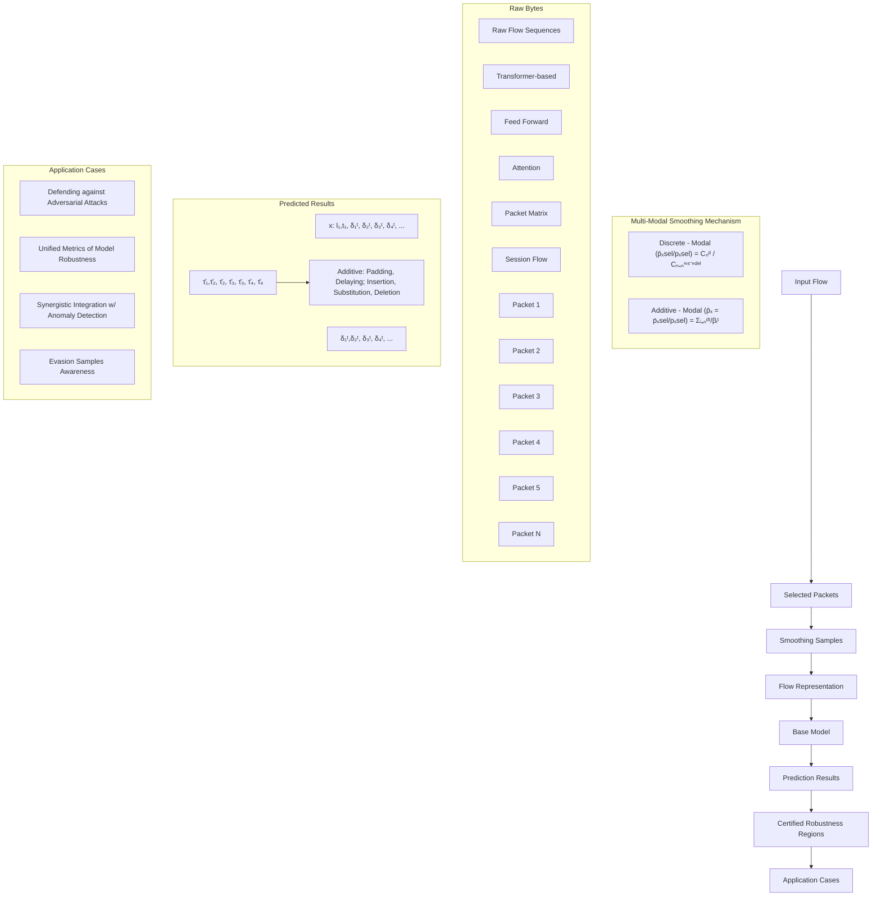
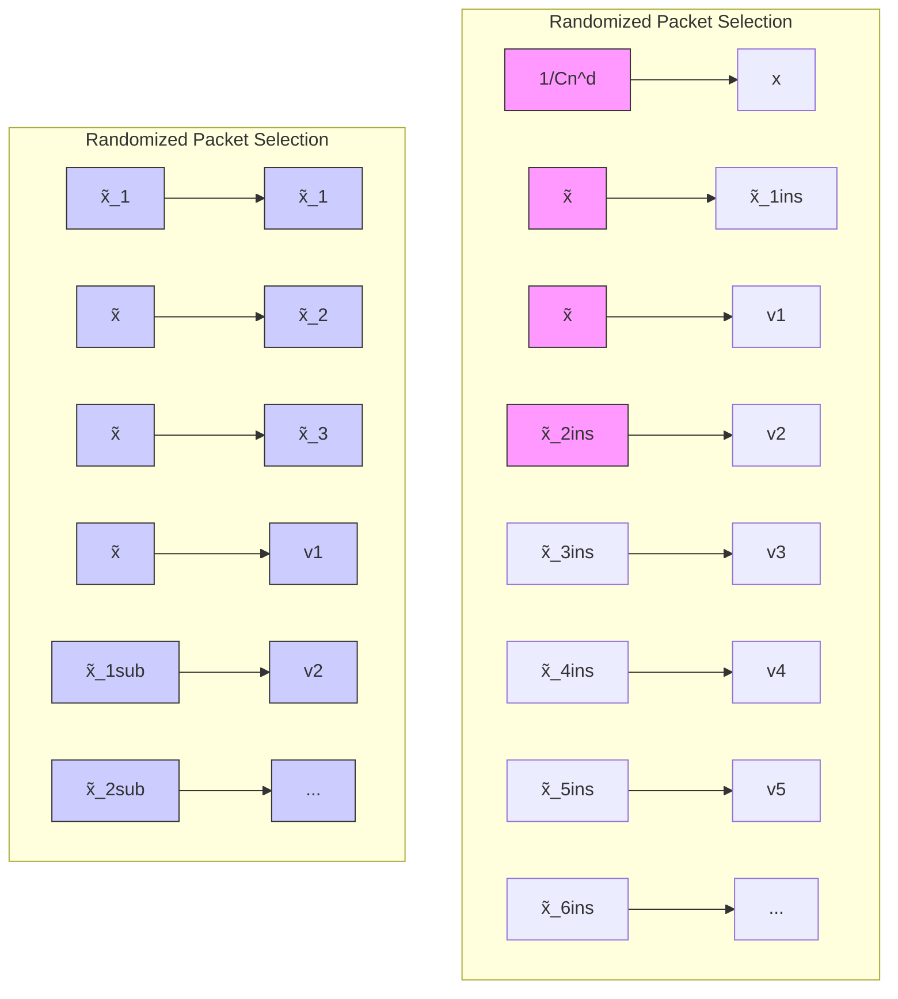
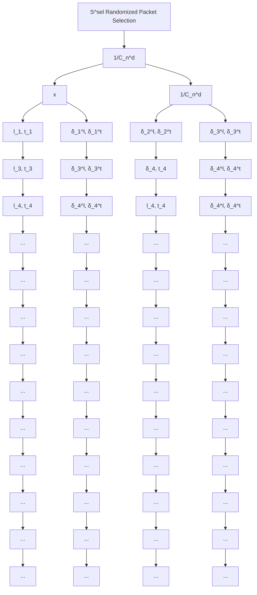

# USENIX

THE ADVANCED COMPUTING SYSTEMS ASSOCIATION

# CertTA: Certified Robustness Made Practical for Learning-Based Traffic Analysis

Jinzhu Yan, Tsinghua University; Zhuotao Liu, Tsinghua University and Zhongguancun Laboratory; Yuyang Xie, Tsinghua University; Shiyu Liang, Shanghai Jiao Tong University; Lin Liu, National University of Defense Technology; Ke Xu, Tsinghua University and Zhongguancun Laboratory

https://www.usenix.org/conference/usenixsecurity25/presentation/yan-jinzhu

This paper is included in the Proceedings of the 34th USENIX Security Symposium.

August 13–15, 2025 • Seattle, WA, USA

978-1-939133-52-6

Open access to the Proceedings of the 34th USENIX Security Symposium is sponsored by USENIX.

# CertTA: Certified Robustness Made Practical for Learning-Based Traffic Analysis

Jinzhu Yan1 Zhuotao Liu1,2, # Yuyang Xie1 Shiyu Liang3 Lin Liu4 Ke Xu1,2

1 Tsinghua University 2 Zhongguancun Laboratory

3 Shanghai Jiao Tong University 4 National University of Defense Technology

# Abstract

Learning-based traffic analysis models exhibit significant vulnerabilities to adversarial attacks. Attackers can compromise these models by generating adversarial network flows with precisely optimized perturbations. These perturbations typically take two forms: additive modifications, which include packet length padding and timing delays, and discrete alterations, such as dummy packet insertion. In response to these threats, certified robustness has emerged as a promising methodology for ensuring reliable model performance in the presence of adversarially manipulated network traffic.

However, current approaches inadequately address the multi-modal nature of adversarial perturbations in network traffic, resulting in limited robustness guarantees against sophisticated attacks. To overcome this limitation, we introduce CertTA, the first solution providing certifiable robustness against multi-modal adversarial attacks in traffic analysis models. CertTA incorporates a novel multi-modal smoothing mechanism that explicitly accounts for attack-induced perturbations during the generation of smoothing samples, based on which CertTA rigorously derives robustness regions that are meaningful against these attacks. We implement a prototype of CertTA and extensively evaluate it against three categories of multi-modal adversarial attacks across six traffic analysis models and two datasets. Our experimental results demonstrate that CertTA provides significantly stronger robustness guarantees than the state-of-the-art approaches when confronting adversarial attacks. Further, CertTA is universally applicable across diverse model architectures and flow representations.

# 1 Introduction

Network traffic analysis is crucial to understanding network activities and detecting cyberspace attacks. While learningbased traffic analysis models achieve superior accuracies in many traffic analysis tasks, they often struggle to maintain robustness against adversarial attacks. For instance, by properly introducing adversarial perturbations to the original network traffic (such as inserting dummy packets, padding the packet lengths or delaying packets), the researchers can easily undermine the performance of traffic analysis models [15, 16, 22, 26, 29, 33, 40, 43].

To address this problem, our community explored a useful paradigm, named certified robustness, which provably guarantees that the learning-based models are secure against certain adversarial attacks. Randomized smoothing [5] is the prevalent methodology to achieve certified robustness. Randomized smoothing transforms a base classifier f into a certifiably robust model g as follows. Given an input sample x, it first generates a set of smoothing samples {s} in the vicinity of x by applying randomized perturbations over x. It then feeds these smoothing samples into f to collect a set of inference results f ({s}). Finally, it outputs g(x) as the majority class from f ({s}) and mathematically derives a robustness region based on the probability distribution of f ({s}). g is certifiably robust because given any adversarial input x˜ within the robustness region of x, g(x˜) is provably equivalent to g(x), implying that the adversity of x˜ cannot disrupt the model prediction. Based on this fundamental methodology, our community has extensively studied certified robustness in the field of Computer Vision (CV) [6, 18, 20, 42, 47] and Natural Language Processing (NLP) [13, 49, 52, 54].

Yet, enabling certified robustness in learning-based traffic analysis is fundamentally challenging due to the multimodality of adversarial perturbations. Specifically, existing attacks can simultaneously apply additive perturbations (e.g., padding the packet lengths or delaying packets) and discrete perturbations (e.g., inserting dummy packets) when generating adversarial network traffic [15, 16, 22, 26, 29, 33, 40, 43]. However, none of the state-of-the-art (SOTA) approaches have considered certified robustness against multi-modal adversity. For instance, BARS [39] only considers additive perturbations applied to the network flow features (e.g., the mean, variance and max of packet lengths) in its randomized smoothing process. As a result, the insertion of a single dummy packet to the network flow may overwhelm the robustness regions derived by BARS. Similarly, RS-Del [13], which considers the discrete perturbations over sequence data (e.g., insertion, substitution and deletion), is ineffective against the additive perturbations in adversarial flows. In § 2, we present concrete quantitative results to demonstrate that the multi-modal adversity can easily undermine the robustness guarantees offered by existing SOTA approaches.

To address this problem, we present CertTA, the first approach that enables certifiably robust traffic analysis models against multi-modal adversarial attacks. CertTA is founded on a critical insight: we explicitly account for the adversarial perturbations introduced by these attacks when designing the perturbation mechanisms in our system’s randomized smoothing process. This enables us to derive robustness regions that are meaningful against these attacks. To this end, CertTA proposes a novel certification framework that (i) generates smoothing samples by a multi-modal smoothing mechanism and then (ii) derives robustness regions from the complicated probability distribution of these smoothing samples.

Specifically, the multi-modal smoothing mechanism in CertTA consists of a discrete smoothing mechanism that randomly selects packets from a network flow, and an additive smoothing mechanism that applies Exponential noises to the metadata (e.g., the packet length and inter-arrival time) of the selected packets. When deriving robustness regions, the multi-modality of adversarial attacks introduces several critical challenges. First, discrete perturbations can cause significant variations in the network traffic data. For instance, the insertion of a single dummy packet can result in significant displacement of the packet sequence (a key feature used by many models [8, 25, 35, 38]), or significant changes in various statistical flow features. Second, the robustness regions derived from additive perturbations exhibit non-linear relationships with the number of input dimensions. This problem, known as the “curse of dimensionality” [3, 17, 36], substantially diminishes the effectiveness of the robustness regions when processing extended flow sequences or analyzing multiple flow statistics. These challenges are effectively addressed in CertTA’s certification framework.

Contributions. The major contribution of this paper is the design, mathematical construction, and evaluation of CertTA, the first approach provides certifiably robustness against multimodal adversarial attacks in traffic analysis models. We extensively evaluate CertTA over six heterogeneous traffic analysis models against three categories of adversarial attacks. The experimental results show that CertTA exhibits the following advantages over the SOTA approaches.

(i) Generality. CertTA is universally applicable to heterogeneous traffic analysis models trained using different flow representations (e.g., flow statistics, raw flow sequences and raw bytes) and architectures (e.g., traditional machine learning based, deep learning based and Transformer-based). Meanwhile, the robustness regions derived in CertTA across different models are unified, serving as quantifiable metrics to compare the robustness across different models.

(ii) Stronger Robustness Guarantees. CertTA demonstrates significant performance advantages over the SOTA approaches in terms of certified accuracy, defined as the percentage of adversarial flows guaranteed to be classified correctly. Most notably, in scenarios where existing approaches fail to maintain any certified accuracy, CertTA achieves 99% certified accuracy with two Transformer-based models and exceeds 80% certified accuracy across the four remaining models.

(iii) Synergistic Integration with Anomaly Detection. We propose a novel integration between CertTA and anomaly detection systems, which creates a fundamental dilemma for the attackers: stealth adversarial flows (i.e., with small perturbations) which may bypass the anomaly detector are ineffective against CertTA; and the adversarial flows with significant perturbations which may exceed CertTA’s certified robustness regions can be easily captured by the anomaly detector. We demonstrate that the integrated system achieves consistently high Defense Success Rate against adversarial attacks with varying attack intensities.

# 2 Problem Space and Motivation

Certified Robustness in CV and NLP. Our community has extensively studied certified robustness in the area of CV [6,18,20,42,47] and NLP [13,49,52,54]. The typical randomized smoothing approach in CV, referred to as VRS [5], provides an isotropic $\ell _ { 2 } \cdot$ -norm robustness radius against additive perturbations on image pixels. The paradigm of certifying an image classifier against pixel-wise additive perturbations in VRS can be straightforwardly adapted to certifying the robustness of traffic analysis models against additive perturbations on statistical flow features. Yet, due to the diverse scales of different flow features (e.g., the percentage of outgoing packets is smaller than 1, while the average packet size is on the order of hundreds), the isotropic ℓ2-norm robustness radius is often impractical for certain features with larger scales.

Similarly, although initially proposed to provide robustness guarantees against discrete perturbations (e.g., insertion, substitution and deletion) applied to sequence data like texts and binary files, RS-Del [13] can be adopted in traffic analysis models by viewing a network flow as a discrete sequence of packets. However, the robustness regions derived from this simple adaptation are inadequate when confronted with additive perturbations in network traffic, such as packet length padding and timing delays.

Certified Robustness for Traffic Analysis. BARS [39] represents the leading research on certified robustness in traffic analysis. Specifically, BARS improves upon VRS by taking into account the diverse scales of different flow features. It introduces a distribution transformer to customize the scale and shape of the random noise added to each dimension of the feature vector. Consequently, BARS can provide anisotropic robustness radius for different dimensions and achieve stronger robustness guarantees than previous work. However, BARS still suffers from several critical drawbacks:

Table 1: Comparison with SOTA Approaches. 

<table><tr><td rowspan="2"></td><td colspan="3">Effectiveness against Attacks</td><td colspan="5">Supported Learning Models</td></tr><tr><td>Additive Perturbations</td><td>Discrete Perturbations</td><td>Multi-modal Perturbations</td><td>Flow Statistics Input</td><td>Raw Flow Sequences Input</td><td>Raw Bytes Input</td><td>Base Model Architecture</td><td>Unified Metrics of Robustness</td></tr><tr><td>VRS [5]*</td><td>√</td><td>✗</td><td>✗</td><td>√</td><td>√</td><td>✗</td><td>any</td><td>✗</td></tr><tr><td>BARS [39]</td><td>√</td><td>✗</td><td>✗</td><td>√</td><td>√</td><td>✗</td><td>DL-based</td><td>✗</td></tr><tr><td>RS-Del [13]*</td><td>✗</td><td>√</td><td>✗</td><td>√</td><td>√</td><td>√</td><td>any</td><td>√</td></tr><tr><td>CertTA (Ours)</td><td>√</td><td>√</td><td>√</td><td>√</td><td>√</td><td>√</td><td>any</td><td>√</td></tr></table>

⋆ We adapt VRS and RS-Del for traffic analysis models, as discussed in § 2.

(i) Lack of Generality. The applicability of BARS is limited by several factors. First, the noise-adding process in BARS is not applicable to recent Transformer-based traffic analysis models [24, 31, 55, 56] that directly take raw packet bytes as input. This is because the raw packet bytes are discrete structured data and not numerically continuous. Furthermore, the noise-shaping process in BARS depends on the gradient descent algorithm of Deep Learning (DL) based models. As a result, traffic analysis models that are based on traditional Machine Learning (ML) techniques, such as Random Forest [11] and Support Vector Machines [30], or include traditional ML modules as part of their analysis pipeline [8], are also not compatible with BARS. Finally, the ℓ2-norm robustness radius provided by BARS is model-specific, contingent upon the particular flow features employed during model training. This specificity results in non-comparable robustness measures across different models, hindering the establishment of a unified robustness benchmark.   
(ii) Ineffectiveness against Discrete Perturbations. The ℓ2- norm robustness radius against additive perturbations is fragile when countered with discrete perturbations. For traffic analysis models that use flow statistics as input [7, 11, 27, 30, 57], inserting a dummy packet into the flow can cause significant changes in certain statistical features (e.g., the maximum packet length). For models that take raw flow sequences (e.g., the packet length sequence) as input [8, 25, 35, 38, 46] or models that take raw bytes as input [24,31,55,56], the introduction of dummy packets creates input dimensional misalignment, which readily exceeds the ℓ2-norm robustness radius established by BARS.   
(iii) Curse of Dimensionality. Mathematically, the ℓ2-norm robustness radius in BARS exhibits non-linear relationships with the number of input dimensions. This is a fundamental limitation of the randomized smoothing methodology [3, 17, 36]. When processing extended flow sequences or analyzing multiple flow statistics, the effectiveness of the $\ell _ { 2 } \cdot$ -norm robustness radius diminishes substantially.


<details>
<summary>bar</summary>

| Model | Certified Acc. (%) |
| :--- | :--- |
| Certified kFP | 94 |
| Certified Whisper (sup.) | 93 |
| Certified YaTC | 99 |
| Certified Kitsune (sup.) | 92 |
| Certified DFNet | 92 |
| Certified TrafficFormer | 99 |
</details>

Figure 1: The robustness certified by SOTA approaches is fragile against multi-modal adversity in traffic analysis.

Quantitative Results. We quantify the aforementioned drawbacks of these SOTA approaches using the following experiment. Specifically, we train six heterogeneous traffic analysis models kFP [11], Kitsune [27], Whisper [8], DFNet [38], YaTC [55] and TrafficFormer [56] on the CICDOH20 [28] dataset to classify tunneling traffic that utilize DNS over HTTPS1. Based on these six models, we apply CertTA and three SOTA approaches to create certifiably robust traffic classifiers. Subsequently, we generate adversarial flows from the CICDOH20 dataset using the multi-modal adversarial attack methodology specified in Blanket [29]. Finally, we evaluate these certifiably robust traffic classifiers against the adversarial flows. In Figure 1, we report the certified accuracies offered by different approaches, quantified as the percentage of adversarial flows that are certified to be classified correctly. For traffic analysis models that use raw flow sequences as input (i.e., Whisper (supervised) and DFNet) or use raw bytes as input (i.e., YaTC and TrafficFormer), the certified accuracies offered by RS-Del, BARS and VRS are all zero. For traffic analysis models that use flow statistics as input (i.e., kFP and Kitsune (supervised)), only BARS achieves 99% certified accuracy in Kitsune, while in other cases the certified accuracies offered by all SOTA approaches are nearly zero. In contrast, CertTA achieves over 92% certified accuracy across all six traffic analysis models.

Design Goal. As summarized in Table 1, CertTA is designed to advance SOTA in both effectiveness and generality. Aware of the multi-modal adversity in traffic analysis, CertTA proposes the first certification framework that addresses both additive and discrete perturbations applied to network traffic. This framework offers several key advantages. First, compared to prior art, CertTA provides significantly stronger performance guarantees against existing adversarial attacks. Furthermore, CertTA is universally applicable to enable certifiably robust traffic analysis models with arbitrary architectures and flow representations. Finally, CertTA offers unified metrics to compare the robustness across various heterogeneous traffic analysis models.


<details>
<summary>flowchart</summary>


</details>

Figure 2: The workflow of CertTA.

Assumptions and Threat Model. Given an input flow x, the adversary’s objective is to generate an adversarial flow x˜ that successfully deceives a learning-based traffic analysis model. The adversary may employ various traffic manipulation techniques, including packet insertion, substitution, deletion, packet length padding, and timing delays, either individually or in combination. Beyond random perturbations, the adversary can leverage sophisticated attack methodologies (such as [15, 16, 22, 26, 29, 33, 40, 43]) to construct these adversarial flows.

When constructing adversarial flows based on specific perturbations, it is imperative to comply with the feasibility constraints posed by network protocols [32]. For additive perturbations (i.e., packet length padding and timing delays), the attacker is limited to increasing the existing length or transmission time of a packet, rather than reducing its original attributes. As presented in § 4.2, CertTA’s certification quantifies the additive perturbations using the ℓ1-norm of the incremental lengths and times introduced into traffic packets. Concerning discrete perturbations, namely packet insertion, substitution, and deletion, existing attack methodologies [22,26,29] demonstrate the feasibility of packet insertion-based adversarial attacks. However, future adversarial attacks that rely on packet substitution and deletion could induce certain side effects, such as packet loss and retransmission. Consequently, the attackers may need to concurrently implement packet insertion to ensure adherence to feasibility constraints when executing packet deletion or substitution-based adversarial attacks. CertTA’s mathematical constructions regarding discrete perturbations are exclusively based on the number of inserted, deleted, and substituted packets within a flow, without considering why these packets are induced. Therefore, CertTA is applicable regardless of the methodologies adopted when implementing the attacks. An important caveat, however, is that when the implementation of a specific deletion or substitution-based adversarial attacks is available in the future, we suggest refining CertTA’s mathematical constructions based on such knowledge accordingly to further enhance its certification effectiveness against this attack.

# 3 Workflow of CertTA

A brief workflow of CertTA is shown in Figure 2. Given a base traffic analysis model f , CertTA constructs a certifiably robust model $g$ as follows. (i) Given an input flow x with n packets, CertTA generates a set of smoothing samples {s}, where each smoothing sample s is created by randomly selecting d packets from x and adding Exponential noises to the length and inter-arrival time of each selected packet, respectively. (ii) For each smoothing sample s, CertTA processes it into flow representations required by the base traffic analysis model f and feeds these representations into f to obtain a prediction result f (s). (iii) CertTA obtains g(x) (i.e., the output of the certifiably robust model g given input flow x) by taking the majority class $y _ { A }$ from $f ( \{ s \} )$ ) (i.e., the prediction results of all smoothing samples). (iv) CertTA calculates the percentage of $y _ { A }$ in $f ( \{ s \} )$ and derives the certified robustness region against both additive and discrete perturbations. Given any adversarial flow x˜ encompassed by the robustness region of x, $g ( \tilde { { \pmb x } } )$ is certifiably equivalent to g(x). In the following section, we present the mathematical construction underpinning the above workflow.

# 4 Robustness Certification by CertTA

CertTA proposes a multi-modal randomized smoothing mechanism to generate smoothing samples and derives the robustness region against both additive and discrete perturbations. In $\ S 4 . 1$ , we introduce the preliminary of randomized smoothing. To construct our multi-modal smoothing mechanism, in $\ S 4 . 2 ,$ we incorporate a discrete smoothing mechanism based on randomized packet selection and an additive smoothing mechanism based on Exponential noise. In § 4.3, we derive the robustness region from the probability distribution of the smoothing samples and demonstrate its advantages in countering multi-modal adversarial perturbations. The frequently used notations are summarized in Table 2.

Table 2: Notations. 

<table><tr><td>Notation</td><td>Description</td></tr><tr><td> $\mathcal{X},\mathcal{Y}$ </td><td>Set of traffic flows, classes</td></tr><tr><td> $\mathcal{Z},S$ </td><td>Set of random variables, smoothing samples in  $\mathcal{X}$ </td></tr><tr><td> $\boldsymbol{x},\tilde{\boldsymbol{x}}$ </td><td>Input flow: original, adversarial</td></tr><tr><td> $f,g$ </td><td>Traffic classifier: base, smoothed</td></tr><tr><td> $\psi$ </td><td>Smoothing function</td></tr><tr><td> $y_{A},p_{A}$ </td><td>The predicted class of input  $\boldsymbol{x}$  by  $g$ , and the corresponding probability</td></tr><tr><td> $\underline{p_{A}}$ </td><td>The estimated lower bound of  $p_{A}$  through Monte Carlo sampling</td></tr><tr><td> $\tilde{y}_{A},\tilde{p}_{A}$ </td><td>The predicted class of adversarial input  $\tilde{\boldsymbol{x}}$  by  $g$ , and the corresponding probability</td></tr><tr><td> $n,d$ </td><td>Number of the original, randomly selected packets in  $\boldsymbol{x}$ </td></tr><tr><td> $\boldsymbol{l},\boldsymbol{t}$ </td><td>Packet length and inter-arrival time vectors of  $\boldsymbol{x}$ </td></tr><tr><td> $\boldsymbol{\delta^{l}},\boldsymbol{\delta^{t}}$ </td><td>Noise vectors on packet length and inter-arrival time</td></tr><tr><td> $\beta_{l},\beta_{t}$ </td><td>Hyper-parameters for Exponential noises</td></tr><tr><td> $(\cdot)_{i}$ </td><td>For  $\boldsymbol{x},\boldsymbol{l},\boldsymbol{t},\boldsymbol{\delta^{l}},\boldsymbol{\delta^{t}}$ : the  $i$ -th dimension</td></tr></table>

# 4.1 Preliminary of Randomized Smoothing

Consider a traffic classification problem from traffic flows X to classes $\mathcal { T }$ and let Z be the set of random variables in X . Given a base traffic classifier $f : \mathcal X \to \mathcal Y$ and a smoothing function ψ : $\chi  z$ that generates a random variable z of smoothing samples from flow x, we construct a smoothed classifier $g : \mathcal { X }  \mathcal { Y }$ that returns the most probable prediction by f of smoothing samples from ψ(x):

$$
g (\boldsymbol {x}) \triangleq \underset {y \in \mathcal {Y}} {\arg \max} p _ {y} (\boldsymbol {x}), \quad p _ {y} (\boldsymbol {x}) \triangleq \mathbb {P} _ {\boldsymbol {z} \sim \psi (\boldsymbol {x})} (f (\boldsymbol {z}) = y). \tag {1}
$$

Given an input x, we denote the smoothed classifier’s prediction $g ( \pmb { x } )$ as $y _ { A }$ , and the corresponding probability $p _ { y _ { A } } ( { \pmb x } )$ as $p _ { A }$ . In practice, a lower bound $\underline { p _ { A } }$ of $p _ { A }$ is estimated through Monte Carlo sampling with a confidence level α.

Without imposing any assumptions about underlying base classifier but the probability lower bound ${ \underline { { p _ { A } } } }$ given an input x, the goal of robustness certification is to derive a robustness region $R ( { \pmb x } ) \subseteq \mathcal { X }$ around x, in which the smoothed classifier’s prediction is guaranteed to be consistent, i.e.,

$$
g (\tilde {\boldsymbol {x}}) = g (\boldsymbol {x}) = y _ {A} \Leftrightarrow p _ {y _ {A}} (\tilde {\boldsymbol {x}}) \geq \max _ {y \neq y _ {A}} p _ {y} (\tilde {\boldsymbol {x}}), \quad \forall \tilde {\boldsymbol {x}} \in R (\boldsymbol {x}).
$$


<details>
<summary>flowchart</summary>


</details>

Figure 3: Partition of the smoothing samples generated by CertTA’s discrete smoothing mechanism.

Denote $p _ { y _ { A } } ( \tilde { \pmb x } )$ as ${ \tilde { p } } _ { A }$ , for simplicity, we consider all classes excluding yA as a combined class, such that $p _ { y _ { A } } ( \tilde { \pmb x } ) \geq$ max $p _ { y } ( \tilde { { \pmb x } } ) \Leftrightarrow \tilde { p } _ { A } \geq 1 / 2$ . Based on [5, 19], the theoretical $y \neq y _ { A }$ derivations can be easily extended to multi-class certification.

# 4.2 Multi-Modal Smoothing Mechanism

In this section, we present the multi-modal smoothing mechanism in CertTA, which consists of a discrete smoothing mechanism and an additive smoothing mechanism. Specifically, given an input flow x, the multi-modal smoothing mechanism generates smoothing samples in two steps: (i) it randomly selects d packets from the input flow x while preserving their original orders $( d \leq n ) , ( \mathfrak { i } )$ it applies Exponential noises to the metadata (i.e., the packet length and inter-arrival time) of each selected packet. The combination of smoothing mechanisms with different modality results in a highly complicated probability distribution for the smoothing samples. Next, we give the robustness region results when the discrete and additive smoothing mechanisms are employed individually, which are the foundations of derivations in $\ S 4 . 3$ .

The discrete smoothing mechanism is designed based on randomized packet selection. Given an input flow x with n packets, it generates smoothing samples by randomly selecting d packets from x while preserving their original orders $( d \leq n )$ . Based on the probability distribution of these smoothing samples, we give the certified robustness region against three types of discrete perturbations (i.e., packet insertion, substitution and deletion) in the following lemma.

Lemma 1. Consider a pair of traffic flows $\pmb { x } , \tilde { \pmb { x } } \in \mathcal { X } ,$ , where x contains n packets and x can be perturbed into x˜ by inserting $n ^ { i n s }$ packets, substituting $n ^ { s u b }$ packets and deleting $n ^ { d e I }$ packets. Let $\Psi ^ { s e I } ( x , d ) : X \times \mathbb { Z } ^ { + } \to Z$ be the smoothing function that randomly selects d packets from flow x while preserving their original orders $( d \leq n )$ , and define the smoothed classifier $g ^ { d e I }$ as in Equation (1). Suppose $y _ { A } \in \mathcal { T }$ and $\underline { { p _ { A } } } \in \left[ 1 / 2 , 1 \right]$ satisfy $g ^ { d e I } ( { \pmb x } ) = y _ { A }$ and $p _ { A } \ge \underline { { p _ { A } } } \ge 1 / 2$ , then we have $g ^ { d e I } ( \tilde { { \pmb x } } ) = g ^ { d e I } ( { \pmb x } ) = y _ { A } \ i f \mathrm { : }$

$$
\frac {C _ {n} ^ {d}}{C _ {n + n ^ {\text { ins }} - n ^ {\text { del }}} ^ {d}} \left(\underline {{p _ {A}}} - 1 + \frac {C _ {n - n ^ {\text { sub }} - n ^ {\text { del }}} ^ {d}}{C _ {n} ^ {d}}\right) \geq \frac {1}{2}, \tag {2}
$$


<details>
<summary>flowchart</summary>

```mermaid
graph TD
    subgraph Input
        S1["S1"] --> Exponential["Exponential Additive Noise"]
        S2["S2"] --> Exponential
        Exponential --> pX["pX = e^Σl=1^n δl/βt + δl/βt"]
    end

    subgraph Output
        X["x"] --> l1["t1"] --> l2["t2"] --> l3["t3"] --> l4["t4"] --> ...
        X --> δ1["δ1^t, δ1^t"] --> δ2["δ2^t, δ2^t"] --> δ3["δ3^t, δ3^t"] --> δ4["δ4^t, δ4^t"] --> ...
        X --> ||[||] --> ||[||] --> ||[||] --> ...
        X --> til1["til1, t1"] --> til2["til2, t2"] --> til3["til3, t3"] --> til4["til4, t4"] --> ...
    end
```
</details>

Figure 4: Partition of the smoothing samples generated by CertTA’s additive smoothing mechanism.

where $C _ { n } ^ { r }$ is the combination formula $n ! / ( r ! ( n - r ) ! )$ .

Proof. Let $X = \{ x _ { 1 } , x _ { 2 } , \ldots , x _ { n } \}$ be the set of packets in flow $x ,$ the packets in x˜ can be divided into three categories: (i) a group of original packets $V = \left\{ \nu _ { 1 } , \ldots , \nu _ { n - n ^ { \mathsf { s u b } } - n ^ { \mathsf { d e l } } } \right\}$ in x; (ii) packets {x˜sub1 , $\{ \tilde { x } _ { 1 } ^ { \mathsf { s u b } } , \hdots , \tilde { x } _ { n ^ { \mathsf { s u b } } } ^ { \mathsf { s u b } } \}$ n−n −n obtained by substituting a group of packets in $X - V ; ( \mathfrak { i } \mathfrak { i } )$ ) packets $\{ \tilde { x } _ { 1 } ^ { \mathsf { i n s } } , \ldots , \tilde { x } _ { n ^ { \mathsf { i n s } } } ^ { \mathsf { i n s } } \}$ x˜nins } obtained through insertion. Let v be the flow obtained by selecting packets $\left\{ \nu _ { 1 } , \ldots , \nu _ { n - n ^ { \mathsf { s u b } } - n ^ { \mathsf { d e l } } } \right\}$ from flow x while preserving their original orders. As illustrated in Figure 3, we define two sets of flows $S _ { 1 } , S _ { 2 }$ as follows:

$$
S _ {1} = \{\boldsymbol {s} \in \mathcal {X}: \mathbb {P} _ {\boldsymbol {z} \sim \psi^ {\mathrm{sel}} (\boldsymbol {v}, d)} (\boldsymbol {z} = \boldsymbol {s}) > 0 \},
$$

$$
S _ {2} = \left\{\boldsymbol {s} \in \mathcal {X}: \mathbb {P} _ {\boldsymbol {z} \sim \psi^ {\mathrm{sel}} (\boldsymbol {x}, d)} (\boldsymbol {z} = \boldsymbol {s}) > 0 \wedge \boldsymbol {s} \notin S _ {1} \right\}.
$$

Based on the probability distributions of $\Psi ^ { \mathsf { S e l } } ( { \pmb x } , d )$ and $\Psi ^ { \mathsf { S e l } } ( \tilde { \pmb { x } } , d )$ , we have:

$$
\frac {\mathbb {P} _ {\boldsymbol {z} \sim \psi^ {\mathrm{sel}} (\tilde {\boldsymbol {x}} , d)} (\boldsymbol {z} = \boldsymbol {s})}{\mathbb {P} _ {\boldsymbol {z} \sim \psi^ {\mathrm{sel}} (\boldsymbol {x} , d)} (\boldsymbol {z} = \boldsymbol {s})} = \frac {C _ {n} ^ {d}}{C _ {n + n ^ {\mathrm{ins}} - n ^ {\mathrm{del}}} ^ {d}}, \forall \boldsymbol {s} \in S _ {1}.
$$

Letas f $K = C _ { n } ^ { d } / C _ { n + n ^ { \mathrm { i n s } } - n ^ { \mathrm { d e l } } } ^ { d }$ , the lower bound of ${ \tilde { p } } _ { A }$ can be derived

$$
\begin{array}{l} p _ {A} = \mathbb {P} _ {\boldsymbol {z} \sim \psi^ {\mathrm{sel}} (\boldsymbol {x}, d)} (f (\boldsymbol {z}) = y _ {A} \wedge \boldsymbol {z} \in S _ {1}) \\ + \mathbb {P} _ {\boldsymbol {z} \sim \psi^ {\mathrm{sel}} (\boldsymbol {x}, d)} (f (\boldsymbol {z}) = y _ {A} \wedge \boldsymbol {z} \in S _ {2}), \\ \end{array}
$$

$$
\begin{array}{l} \tilde {p} _ {A} = \mathbb {P} _ {\boldsymbol {z} \sim \psi^ {\mathrm{sel}} (\tilde {\boldsymbol {x}}, d)} (f (\boldsymbol {z}) = y _ {A}) \\ \geq \mathbb {P} _ {\boldsymbol {z} \sim \psi^ {\mathrm{sel}} (\tilde {\boldsymbol {x}}, d)} (f (\boldsymbol {z}) = y _ {A} \wedge \boldsymbol {z} \in S _ {1}) \\ \geq K * \mathbb {P} _ {\boldsymbol {z} \sim \psi^ {\mathrm{sel}} (\boldsymbol {x}, d)} (f (\boldsymbol {z}) = y _ {A} \wedge \boldsymbol {z} \in S _ {1}) \\ = K * \left(p _ {A} - \mathbb {P} _ {\boldsymbol {z} \sim \psi^ {\mathrm{sel}} (\boldsymbol {x}, d)} (f (\boldsymbol {z}) = y _ {A} \wedge \boldsymbol {z} \in S _ {2})\right) \\ \geq K * \left(\underline {{p _ {A}}} - \mathbb {P} _ {\boldsymbol {z} \sim \psi^ {\mathrm{sel}} (\boldsymbol {x}, d)} (\boldsymbol {z} \in S _ {2})\right) \\ = K * \left(\underline {{p _ {A}}} - 1 + \mathbb {P} _ {\boldsymbol {z} \sim \psi^ {\mathrm{sel}} (\boldsymbol {x}, d)} (\boldsymbol {z} \in S _ {1})\right) \\ = K * \left(\underline {{p _ {A}}} - 1 + C _ {n - n ^ {\text { sub }} - n ^ {\text { del }}} ^ {d} / C _ {n} ^ {d}\right). \tag {3} \\ \end{array}
$$

Finally, we can get Equation (2) by solving the inequality that the lower bound of ${ \tilde { p } } _ { A }$ is not less than $1 / 2$ .

When employed individually, the additive smoothing mechanism generates smoothing samples by applying Exponential noises to the metadata (i.e., packet lengths and inter-arrival times) of all packets in input flow x. Recognizing the disparities in feature importance and numerical scale between packet length and inter-arrival time, we apply Exponential noise of different shapes to each of them. Based on the probability distribution of the generated smoothing samples, we give the certified robustness region against two types of additive perturbations (i.e., packet length padding and timing delays) in the following lemma.

Lemma 2. Consider a pair of traffic flows $\pmb { x } , \tilde { \pmb { x } } \in \mathcal { X } ,$ , where x contains n packets with packet length vector $\pmb { l } = \left( l _ { 1 } , l _ { 2 } , \ldots , l _ { n } \right)$ and inter-arrival time vector $\pmb { t } = \left( t _ { 1 } , t _ { 2 } , \ldots , t _ { n } \right)$ , and x can be perturbed into x˜ by adding non-negative noise vectors $\pmb { \delta } ^ { l } =$ $\big ( \delta _ { 1 } ^ { l } , \delta _ { 2 } ^ { l } , \dots , \delta _ { n } ^ { l } \big )$ and $\pmb { \delta } ^ { t } = ( \hat { \delta } _ { 1 } ^ { t } , \hat { \delta } _ { 2 } ^ { t } , \dots , \hat { \delta } _ { n } ^ { t } )$ to l and t , respectively. Let $\Psi ^ { a d d } ( \pmb { x } , \beta _ { l } , \beta _ { t } ) : \mathcal { X } \times \bar { \mathbb { R } } ^ { + } \times \mathbb { R } ^ { + }  \mathcal { Z }$ be the smoothing function that adds random variables $\mathfrak { E } _ { i } ^ { l } \overset { i . i . d . } { \sim } \mathrm { E x p } ( \beta _ { l } ^ { - 1 } )$ and $\mathfrak { E } _ { i } ^ { t } \overset { i . i . d . } { \sim } \mathrm { E x p } ( \beta _ { t } ^ { - 1 } )$ to li and $t _ { i } ( 1 \leq i \leq n ) ,$ , respectively. Define the smoothed classifier $g ^ { a d d }$ as in Equation (1). Suppose $y _ { A } \in \mathcal { T }$ and $p _ { A } \in \left[ 1 / 2 , 1 \right]$ satisfy $g ^ { a d d } ( { \pmb x } ) = y _ { A }$ and $p _ { A } \ge \underline { { p _ { A } } } \ge 1 / 2$ , then we have $g ^ { a d d } ( \tilde { x } ) = g ^ { a d d } ( x ) = y _ { A } \ i f .$

$$
\sum_ {i = 1} ^ {n} \frac {\beta_ {l} + \beta_ {t}}{\beta_ {l}} \cdot \delta_ {i} ^ {l} + \frac {\beta_ {l} + \beta_ {t}}{\beta_ {t}} \cdot \delta_ {i} ^ {t} \leq r ^ {a d d}, \tag {4}
$$

where the robustness radius $r ^ { a d d } = - ( \beta _ { l } + \beta _ { t } ) \log 2 ( 1 - \underline { { p } } _ { A } )$ .

Proof. Let S be the set of all possible smoothing samples generated by $\Psi ^ { \mathsf { a d d } } ( { \pmb x } , \mathsf { \{ B }  _ { l } , \mathsf { \{ B }  _ { t } )$ . Represent a flow $\pmb { \mathscr { s } } \in S$ by its packet length vector $l ^ { s } = ( l _ { 1 } ^ { s } , l _ { 2 } ^ { s } , \ldots , l _ { n } ^ { s } )$ and inter-arrival time vector $t ^ { s } = ( t _ { 1 } ^ { s } , t _ { 2 } ^ { s } , \ldots , t _ { n } ^ { s } )$ . As illustrated in Figure 4, we partition S into two sets of flows $S _ { 1 } , S _ { 2 }$ as follows:

$$
S _ {1} = \left\{\boldsymbol {s} \in S: \exists i \in [ 1, n ], \left(l _ {i} ^ {\boldsymbol {s}} - l _ {i} <   \delta_ {i} ^ {l}\right) \vee \left(t _ {i} ^ {\boldsymbol {s}} - t _ {i} <   \delta_ {i} ^ {t}\right) \right\},
$$

$$
S _ {2} = \left\{\boldsymbol {s} \in S: \forall i \in [ 1, n ], \left(l _ {i} ^ {\boldsymbol {s}} - l _ {i} \geq \delta_ {i} ^ {l}\right) \wedge \left(t _ {i} ^ {\boldsymbol {s}} - t _ {i} \geq \delta_ {i} ^ {t}\right) \right\}.
$$

Based on the probability distributions of $\Psi ^ { \mathsf { a d d } } ( { \pmb x } , \beta _ { l } , \beta _ { t } )$ and $\Psi ^ { \mathsf { a d d } } ( \tilde { \pmb { x } } , \mathsf { \beta } _ { l } , \mathsf { \beta } _ { t } )$ , for all $\pmb { s } \in S _ { 1 }$ , we have:

$$
\frac {\mathbb {P} _ {\boldsymbol {z} \sim \psi^ {\mathrm{add}} (\tilde {\boldsymbol {x}} , \beta_ {l} , \beta_ {t})} (\boldsymbol {z} = \boldsymbol {s})}{\mathbb {P} _ {\boldsymbol {z} \sim \psi^ {\mathrm{add}} (\boldsymbol {x} , \beta_ {l} , \beta_ {t})} (\boldsymbol {z} = \boldsymbol {s})} = 0.
$$

For all $\pmb { s } \in S _ { 2 }$ , we have:

$$
\begin{array}{l} \frac {\mathbb {P} _ {\boldsymbol {z} \sim \psi^ {\mathrm{add}} (\tilde {\boldsymbol {x}} , \beta_ {l} , \beta_ {t})} (\boldsymbol {z} = \boldsymbol {s})}{\mathbb {P} _ {\boldsymbol {z} \sim \psi^ {\mathrm{add}} (\boldsymbol {x} , \beta_ {l} , \beta_ {t})} (\boldsymbol {z} = \boldsymbol {s})} = \frac {\prod_ {i = 1} ^ {n} e ^ {- (l _ {i} ^ {\boldsymbol {s}} - l _ {i} - \delta_ {i} ^ {l}) / \beta_ {l}} \cdot e ^ {- (t _ {i} ^ {\boldsymbol {s}} - t _ {i} - \delta_ {i} ^ {l}) / \beta_ {t}}}{\prod_ {i = 1} ^ {n} e ^ {- (l _ {i} ^ {\boldsymbol {s}} - l _ {i}) / \beta_ {l}} \cdot e ^ {- (t _ {i} ^ {\boldsymbol {s}} - t _ {i}) / \beta_ {t}}} \\ = e ^ {\sum_ {i = 1} ^ {n} \delta_ {i} ^ {l} / \beta_ {l} + \delta_ {i} ^ {t} / \beta_ {t}}. \\ \end{array}
$$

Let $K = e ^ { \sum _ { i = 1 } ^ { n } \ S _ { i } ^ { l } / \beta _ { l } + \ S _ { i } ^ { t } / \beta _ { t } }$ , the lower bound of ${ \tilde { p } } _ { A }$ can be derived


<details>
<summary>flowchart</summary>


</details>

Figure 5: Partition of the smoothing samples generated by CertTA’s multi-modal smoothing mechanism.

as follows:

$$
\begin{array}{l} p _ {A} = \mathbb {P} _ {\boldsymbol {z} \sim \psi^ {\mathrm{add}} (\boldsymbol {x}, \beta_ {l}, \beta_ {t})} (f (\boldsymbol {z}) = y _ {A} \wedge \boldsymbol {z} \in S _ {1}) \\ + \mathbb {P} _ {\boldsymbol {z} \sim \psi^ {\mathrm{add}} (\boldsymbol {x}, \beta_ {l}, \beta_ {t})} (f (\boldsymbol {z}) = y _ {A} \wedge \boldsymbol {z} \in S _ {2}), \\ \tilde {p} _ {A} = \mathbb {P} _ {\boldsymbol {z} \sim \psi^ {\mathrm{add}} (\tilde {\boldsymbol {x}}, \beta_ {l}, \beta_ {t})} (f (\boldsymbol {z}) = y _ {A} \wedge \boldsymbol {z} \in S _ {1}) \\ + \mathbb {P} _ {\boldsymbol {z} \sim \psi^ {\mathrm{add}} (\tilde {\boldsymbol {x}}, \beta_ {l}, \beta_ {t})} (f (\boldsymbol {z}) = y _ {A} \wedge \boldsymbol {z} \in S _ {2}) \\ = 0 + K \cdot \mathbb {P} _ {\boldsymbol {z} \sim \psi^ {\mathrm{add}} (\boldsymbol {x}, \beta_ {l}, \beta_ {t})} (f (\boldsymbol {z}) = y _ {A} \wedge \boldsymbol {z} \in S _ {2}) \\ = K \cdot \left[ p _ {A} - \mathbb {P} _ {\boldsymbol {z} \sim \psi^ {\mathrm{add}} (\boldsymbol {x}, \beta_ {l}, \beta_ {t})} (f (\boldsymbol {z}) = y _ {A} \wedge \boldsymbol {z} \in S _ {1}) \right] \\ \geq K \cdot \left[ p _ {A} - \mathbb {P} _ {\boldsymbol {z} \sim \psi^ {\mathrm{add}} (\boldsymbol {x}, \beta_ {l}, \beta_ {t})} (\boldsymbol {z} \in S _ {1}) \right] \\ = K \cdot \left[ p _ {A} - 1 + \mathbb {P} _ {\boldsymbol {z} \sim \psi^ {\mathrm{add}} (\boldsymbol {x}, \beta_ {l}, \beta_ {t})} (\boldsymbol {z} \in S _ {2}) \right] \\ = K \cdot \left[ p _ {A} - 1 + 1 / K \right] \\ \geq K (\underline {{p _ {A}}} - 1) + 1. \tag {5} \\ \end{array}
$$

Finally, we can get Equation (4) by solving the inequality that the lower bound of ${ \tilde { p } } _ { A }$ is not less than $1 / 2$ .

# 4.3 Robustness Region Derivation

When deriving the certified robustness regions in Lemma 1 and Lemma 2, we establish the probability distributions of the smoothing samples generated by the discrete and additive smoothing mechanisms, respectively. In this section, we combine these two probability distributions to derive the certified robustness region against both additive and discrete perturbations.

Theorem 1. Consider a pair of traffic flows x, $\tilde { \pmb { x } } \in \mathcal { X } ,$ , where x contains n packets with packet length vector $\pmb { l } = \left( l _ { 1 } , l _ { 2 } , \ldots , l _ { n } \right)$ and inter-arrival time vector $\pmb { t } = \left( t _ { 1 } , t _ { 2 } , \ldots , t _ { n } \right)$ . x can be perturbed into x˜ by two steps: (i) add non-negative noise vectors $\pmb { \delta } ^ { l } = ( \delta _ { 1 } ^ { l } , \delta _ { 2 } ^ { l } , \dots , \delta _ { n } ^ { l } )$ and $\pmb { \delta } ^ { t } = ( \ S _ { 1 } ^ { t } , \ S _ { 2 } ^ { t } , \dots , \ S _ { n } ^ { t } )$ to l and t , respectively; (ii) insert $n ^ { i n s }$ packets, substitute $n ^ { s u b }$ packets and delete $n ^ { d e I }$ packets. Let $\Psi ^ { j n t } ( x , \beta _ { l } , \beta _ { t } , d ) : \mathcal { X } \times \mathbb { R } ^ { + } \times \mathbb { R } ^ { + } \times$ $\mathbb { Z } ^ { + } \to { \cal Z }$ be the smoothing function that generates smoothing samples from x by two steps: (i) randomly selects d packets while preserving their original orders $( d \leq n ) ; ( i i ) .$ for every selected packet $x _ { i } ,$ add random variables $\mathfrak { E } _ { i } ^ { l } \overset { i . i . d . } { \sim } \mathrm { E x p } ( \beta _ { l } ^ { - 1 } )$ and $\mathfrak { E } _ { i } ^ { t } \overset { i . i . d . } { \sim } \mathrm { E x p } ( \beta _ { t } ^ { - 1 } )$ to li and ti, respectively. Define the smoothed classifier $g ^ { j n t }$ as in Equation (1). Suppose $y _ { A } \in \mathcal { T }$ and $p _ { A } \in \left[ 1 / 2 , 1 \right]$ satisfy $g ^ { j n t } ( { \pmb x } ) = y _ { A }$ and $p _ { A } \ge p _ { A } \ge 1 / 2$ , then we have $g ^ { j n t } ( \tilde { \pmb { x } } ) = g ^ { j n t } ( \pmb { x } ) = y _ { A } \ i f .$ :

$$
\left\{ \begin{array}{l} \sum_ {i = 1} ^ {d} \frac {\beta_ {l} + \beta_ {t}}{\beta_ {l}} \cdot \overline {{\delta}} _ {i} ^ {l} + \frac {\beta_ {l} + \beta_ {t}}{\beta_ {t}} \cdot \overline {{\delta}} _ {i} ^ {t} \leq r _ {*} ^ {a d d}, \\ r _ {*} ^ {a d d} = (\beta_ {l} + \beta_ {t}) \cdot [ \log (P _ {1}) - \log (P _ {2}) ], \\ P _ {1} = 1 - C _ {n + n ^ {\text { ins }} - n ^ {\text { del }}} ^ {d} / 2 C _ {n} ^ {d}, \\ P _ {2} = 2 - \underline {{{p _ {A}}}} - C _ {n - n ^ {\text { sub }} - n ^ {\text { del }}} ^ {d} / C _ {n} ^ {d}, \end{array} \right. \tag {6}
$$

where $( \overline { { \delta } } _ { 1 } ^ { l } , \overline { { \delta } } _ { 2 } ^ { l } , \ldots , \overline { { \delta } } _ { n } ^ { l } )$ and $( \overline { { \delta } } _ { 1 } ^ { t } , \overline { { \delta } } _ { 2 } ^ { t } , \ldots , \overline { { \delta } } _ { n } ^ { t } )$ are obtained by sorting $\pmb { \delta } ^ { l }$ and $\pmb { \delta } ^ { t }$ in descending order of $\delta _ { i } ^ { l } / \beta _ { l } + \delta _ { i } ^ { t } / \beta _ { t } , r e .$ spectively.

Proof. Let $X = \{ x _ { 1 } , x _ { 2 } , \ldots , x _ { n } \}$ be the set of packets in flow x, the packets in x˜ can be divided into three categories: (i) packets {x˜add1 , $\left\{ \widetilde { x } _ { 1 } ^ { \mathsf { a d d } } , \ldots , \widetilde { x } _ { n - n ^ { \mathsf { s u b } } - n ^ { \mathsf { d e l } } } ^ { \mathsf { a d d } } \right\}$ . . , x˜addn−nsub−ndel } obtained by adding length and time noise to a group of original packets $V = \left\{ \nu _ { 1 } , \ldots , \nu _ { n - n ^ { \mathrm { s u b } } - n ^ { \mathrm { d e l } } } \right\}$ in $x ;$ (ii) packets $\{ \tilde { x } _ { 1 } ^ { \mathsf { s u b } } , \hdots , \tilde { x } _ { n ^ { \mathsf { s u b } } } ^ { \mathsf { s u b } } \}$ obtained by substituting a group of packets in $X - V ; ( \mathfrak { i } \mathfrak { i } )$ packets $\{ \tilde { x } _ { 1 } ^ { \mathsf { i n s } } , \ldots , \tilde { x } _ { n ^ { \mathsf { i n s } } } ^ { \mathsf { i n s } } \}$ obtained through insertion.

Let S be the set of all possible smoothing samples generated by $\Psi ^ { \mathrm { j n t } } ( \pmb { x } , \pmb { \beta } _ { l } , \pmb { \beta } _ { t } , d )$ , for every $\pmb { s } \in S$ , x can be perturbed into s by two steps: (i) generate a flow $\pmb { s } ^ { \prime }$ by randomly selecting d packets $( x _ { 1 } ^ { s ^ { \prime } } , x _ { 2 } ^ { s ^ { \prime } } , . . . x _ { d } ^ { s ^ { \prime } } )$ from x while preserving their original orders; (ii) for every selected packet $x _ { i } ^ { s ^ { \prime } }$ , add a noise value generated from $\mathrm { E x p } ( \mathsf { \beta } _ { l } ^ { - 1 } )$ to $l _ { i } ^ { s ^ { \prime } }$ and another noise value generated from $\mathrm { E x p } ( \mathsf { \beta } _ { t } ^ { - 1 } )$ ) to $t _ { i } ^ { s ^ { \prime } }$ , respectively. If $\{ x _ { 1 } ^ { s ^ { \prime } } , x _ { 2 } ^ { s ^ { \prime } } , . . . , x _ { d } ^ { s ^ { \prime } } \} \not \subseteq V$ , we have:

$$
\frac {\mathbb {P} _ {\boldsymbol {z} \sim \psi^ {\mathrm{int}} (\tilde {\boldsymbol {x}} , \beta_ {l} , \beta_ {t} , d)} (\boldsymbol {z} = \boldsymbol {s})}{\mathbb {P} _ {\boldsymbol {z} \sim \psi^ {\mathrm{int}} (\boldsymbol {x} , \beta_ {l} , \beta_ {t} , d)} (\boldsymbol {z} = \boldsymbol {s})} = 0.
$$

Define $S ^ { \mathsf { s e l } } = \{ \pmb { s } \in S : \{ x _ { 1 } ^ { s ^ { \prime } } , x _ { 2 } ^ { s ^ { \prime } } , . . . , x _ { d } ^ { s ^ { \prime } } \} \subseteq V \}$ . As illustrated in Figure 5, we partition $S ^ { \mathsf { s e l } }$ into two sets of flows $S _ { 1 } ^ { \mathsf { a d d } } , S _ { 2 } ^ { \mathsf { a d d } }$ : , S 2

$$
\begin{array}{l} S _ {1} ^ {\text { add }} = \left\{\boldsymbol {s} \in S ^ {\text { sel }}: \exists i \in [ 1, n ], \left(l _ {i} ^ {\boldsymbol {s}} - l _ {i} ^ {\boldsymbol {s} ^ {\prime}} <   \delta_ {i ^ {*}} ^ {l}\right) \vee \left(t _ {i} ^ {\boldsymbol {s}} - t _ {i} ^ {\boldsymbol {s} ^ {\prime}} <   \delta_ {i ^ {*}} ^ {t}\right) \right\}, \\ S _ {2} ^ {\text { add }} = \left\{\boldsymbol {s} \in S ^ {\text { sel }}: \forall i \in [ 1, n ], (l _ {i} ^ {\boldsymbol {s}} - l _ {i} ^ {\boldsymbol {s} ^ {\prime}} \geq \delta_ {i ^ {*}} ^ {l}) \wedge (t _ {i} ^ {\boldsymbol {s}} - t _ {i} ^ {\boldsymbol {s} ^ {\prime}} \geq \delta_ {i ^ {*}} ^ {t}) \right\}. \\ \end{array}
$$

Based on the probability distributions of $\Psi ^ { \mathrm { j n t } } ( \pmb { x } , \pmb { \beta } _ { l } , \pmb { \beta } _ { t } , d )$ and $\Psi ^ { \mathrm { i n t } } ( \tilde { \pmb { x } } , \beta _ { l } , \beta _ { t } , d )$ , for all $\pmb { s } \in S _ { 1 } ^ { \mathsf { a d d } }$ , we have:

$$
\frac {\mathbb {P} _ {\boldsymbol {z} \sim \psi^ {\mathrm{int}} (\tilde {\boldsymbol {x}} , \beta_ {l} , \beta_ {t} , d)} (\boldsymbol {z} = \boldsymbol {s})}{\mathbb {P} _ {\boldsymbol {z} \sim \psi^ {\mathrm{int}} (\boldsymbol {x} , \beta_ {l} , \beta_ {t} , d)} (\boldsymbol {z} = \boldsymbol {s})} = 0.
$$

For all $\pmb { s } \in S _ { 2 } ^ { \mathsf { a d d } }$ , we have:

$$
\frac {\mathbb {P} _ {\boldsymbol {z} \sim \psi^ {\text {int}} (\tilde {\boldsymbol {x}} , \beta_ {l} , \beta_ {t} , d)} (\boldsymbol {z} = \boldsymbol {s})}{\mathbb {P} _ {\boldsymbol {z} \sim \psi^ {\text {int}} (\boldsymbol {x} , \beta_ {l} , \beta_ {t} , d)} (\boldsymbol {z} = \boldsymbol {s})} = \frac {C _ {n} ^ {d}}{C _ {n + n ^ {\text {ins}} - n ^ {\text {del}}} ^ {d}} \cdot e ^ {\sum_ {i = 1} ^ {d} \frac {\delta_ {i ^ {*}} ^ {l}}{\beta_ {l}} + \frac {\delta_ {i ^ {*}} ^ {t}}{\beta_ {t}}},
$$

where $i ^ { * }$ is the original index of packet $x _ { i } ^ { s ^ { \prime } }$ in $\left( x _ { 1 } , x _ { 2 } , \ldots , x _ { n } \right)$ .

Define $p _ { A } ^ { \mathsf { s e l } } = \mathbb { P } _ { z \sim \psi ^ { \mathsf { i n t } } ( { \pmb x } , { \mathsf { \beta } } _ { l } , { \mathsf { \beta } } _ { t } , d ) } ( f ( { \pmb z } ) = y _ { A } \wedge { \pmb z } \in S ^ { \mathsf { s e l } } )$ , similar to Equation (3), the lower bound of $p _ { A } ^ { \mathsf { s e l } }$ can be derived as follows:

$$
\begin{array}{l} p _ {A} ^ {\text { sel }} = p _ {A} - \mathbb {P} _ {\boldsymbol {z} \sim \psi^ {\text { int }} (\boldsymbol {x}, \beta_ {l}, \beta_ {t}, d)} (f (\boldsymbol {z}) = y _ {A} \wedge \boldsymbol {z} \notin S ^ {\text { sel }}) \\ \geq \underline {{p _ {A}}} - \mathbb {P} _ {\boldsymbol {z} \sim \psi^ {\mathrm{int}} (\boldsymbol {x}, \beta_ {l}, \beta_ {t}, d)} (\boldsymbol {z} \notin S ^ {\mathrm{sel}}) \\ = \underline {{p _ {A}}} - 1 + C _ {n - n ^ {\mathrm{sub}} - n ^ {\mathrm{del}}} ^ {d} / C _ {n} ^ {d}. \tag {7} \\ \end{array}
$$

Define $\tilde { p } _ { A } ^ { \mathrm { s e l } } = \mathbb { P } _ { z \sim \psi ^ { \mathrm { i n t } } ( \tilde { \pmb { x } } , \beta _ { l } , \beta _ { t } , d ) } ( f ( z ) = y _ { A } \wedge z \in S ^ { \mathrm { s e l } } )$ . Assume that $( \overline { { \delta } } _ { 1 } ^ { l } , \overline { { \delta } } _ { 2 } ^ { l } , \ldots , \overline { { \delta } } _ { n } ^ { l } )$ and $( \overline { { \delta } } _ { 1 } ^ { t } , \overline { { \delta } } _ { 2 } ^ { t } , \ldots , \overline { { \delta } } _ { n } ^ { t } )$ are obtained by sorting $\pmb { \delta } ^ { l }$ and $\pmb { \delta } ^ { t }$ in descending order of $\ S _ { i } ^ { l } / \beta _ { l } + \ S _ { i } ^ { t } / \beta _ { t }$ , respectively. Let $K = C _ { n } ^ { d } / C _ { n + n ^ { \mathrm { i n s } } - n ^ { \mathrm { d e l } } } ^ { d } \cdot e ^ { \sum _ { i = 1 } ^ { d } \overline { { \ S } } _ { i } ^ { l } / \beta _ { l } + \overline { { \ S } } _ { i } ^ { t } / \beta _ { t } }$ , similar to Equation (5), the lower bound of $\tilde { p } _ { A } ^ { \mathsf { s e l } }$ can be derived as follows (see § A for detailed proof):

$$
\tilde {p} _ {A} ^ {\mathrm{sel}} \geq K (p _ {A} ^ {\mathrm{sel}} - 1) + C _ {n} ^ {d} / C _ {n + n ^ {\mathrm{ins}} - n ^ {\mathrm{del}}} ^ {d}. \tag {8}
$$

With the combination of $\tilde { p } _ { A } \geq \tilde { p } _ { A } ^ { \mathsf { s e l } }$ , Equation (7) and Equation (8), the lower bound of ${ \tilde { p } } _ { A }$ can be derived as follows:

$$
\begin{array}{l} \tilde {p} _ {A} \geq \tilde {p} _ {A} ^ {\mathrm{sel}} \geq C _ {n} ^ {d} / C _ {n + n ^ {\mathrm{ins}} - n ^ {\mathrm{del}}} ^ {d}. \\ [ (\underline {{p _ {A}}} - 2 + \frac {C _ {n - n ^ {\mathrm{sub}} - n ^ {\mathrm{del}}} ^ {d}}{C _ {n} ^ {d}}) \cdot e ^ {\sum_ {i = 1} ^ {d} \overline {{\delta}} _ {i} ^ {l} / \beta_ {l} + \overline {{\delta}} _ {i} ^ {t} / \beta_ {t}} + 1 ]. \\ \end{array}
$$

Finally, we can get Equations (6) by solving the inequality that the lower bound of ${ \tilde { p } } _ { A }$ is not less than $1 / 2$ . □

Equations (6) specify CertTA’s robustness region when the adversary simultaneously applies additive perturbations $( \boldsymbol { i . e . } ,$ , packet length padding and timing delays) and discrete perturbations $( i . e .$ , packet insertion, substitution and deletion). Given the number of inserted, substituted and deleted packets $n ^ { \mathrm { i n s } } , n ^ { \mathsf { s u b } }$ and $n ^ { { \mathsf { d e l } } }$ , we can calculate P1,P2 and subsequently obtain the corresponding additive robustness radius $r _ { * } ^ { \mathsf { a d d } }$ . The overall attack intensity is determined by the co-function of additive and discrete perturbations. As $\dot { n } ^ { \mathfrak { m s } } , n ^ { \mathfrak { s u b } }$ and $n ^ { { \mathsf { d e l } } }$ increase, the corresponding additive robustness radius $r _ { * } ^ { \mathsf { a d d } }$ becomes smaller. In contrast to certification methods that address additive perturbations or discrete perturbations separately, the certified robustness region offered by CertTA is more aligned with the multi-modal adversarial perturbations in traffic analysis.

Moreover, the robustness region provided by CertTA exhibits several critical advantages in countering multi-modal adversarial perturbations. Specifically, in inequality

$$
\sum_ {i = 1} ^ {d} \frac {\beta_ {l} + \beta_ {t}}{\beta_ {l}} \cdot \overline {{\delta}} _ {i} ^ {l} + \frac {\beta_ {l} + \beta_ {t}}{\beta_ {t}} \cdot \overline {{\delta}} _ {i} ^ {t} \leq r _ {*} ^ {\text { add }}
$$

of Equations (6), we directly map the deviation values introduced by additive perturbations (i.e., the items being summed on the left side of the inequality) to original packets in the flow. Therefore, when discrete perturbations (e.g., packet insertion) result in the displacement of the packet sequence, the effectiveness of our additive robustness radius $r _ { * } ^ { \mathsf { a d d } }$ will not be diminished. Further, since we only sum the largest d deviation values to compare with $r _ { * } ^ { \mathsf { a d d } }$ , rather than the total n deviation values, the issue of “curse of dimensionality” is alleviated. Consequently, we only need to consider d packets when deriving the robustness region, regardless of the number of packets manipulated by attackers when applying additive perturbations. We also discuss the extension of CertTA to include new types of perturbations in $\ S \mathrm { { C } }$ .

Table 3: Traffic analysis models and adversarial attacks used in our evaluations. 

<table><tr><td>Traffic Analysis Models</td><td>Learning Algorithm</td><td>Flow Representation</td></tr><tr><td>kFP [11]</td><td>ML-based</td><td rowspan="2">flow statistics</td></tr><tr><td>Kitsune [27]★</td><td>DL-based</td></tr><tr><td>Whisper [8]★</td><td>ML-based</td><td rowspan="2">raw flow sequences</td></tr><tr><td>DFNet [38]</td><td>DL-based</td></tr><tr><td>YaTC [55]</td><td>Transformer-based</td><td rowspan="2">raw bytes</td></tr><tr><td>TrafficFormer [56]</td><td>Transformer-based</td></tr><tr><td>Adversarial Attacks</td><td>Optimization Algorithm</td><td>Perturbation Operation</td></tr><tr><td>Blanket [29]</td><td>GAN-based</td><td rowspan="3">insertion, padding, delaying</td></tr><tr><td>Amoeba [26]†</td><td>RL-based</td></tr><tr><td>Prism [22]</td><td>Explicit Modeling</td></tr></table>

⋆ Kitsune and Whisper are unsupervised models designed for anomaly detection. We extend these two models to supervised versions for multi-class classification.   
† We use CertTA-certified models as the targeted models for Amoeba, making Amoeba an adaptive attack reacting to CertTA’s defense.

# 5 Evaluation

We evaluate CertTA extensively to demonstrate:

• When faced with multi-modal adversarial attacks, CertTA outperforms the SOTA approaches significantly in both effectiveness and generality (§ 5.2). Across all six learning models, CertTA provides consistently high robustness guarantees against all three categories of adversarial attacks, while existing approaches have very limited applicability.   
• We demonstrate a synergistic integration between CertTA and anomaly detection systems that creates a fundamental dilemma for the attacker (§ 5.3).   
• We also evaluate the moving pieces in CertTA’s design and application cases of CertTA (§ 5.4).

# 5.1 Experiment Setup

Traffic Analysis Models and Adversarial Attacks. We evaluate the performance of CertTA using six traffic analysis models against three types of multi-modal adversarial attacks. As summarized in Table 3, the six traffic analysis models use different flow representations and learning algorithms. The three categories of adversarial attacks employ Generative Adversarial Network (GAN)-based, Reinforcement Learning (RL)- based, and explicit modeling-based optimization algorithms, respectively, to generate adversarial flows. For each experimental configuration, we can employ these attack methodologies to generate adversarial flows using either multi-modal perturbations (combining packet insertion, length padding, and timing delays) or single-modal perturbations. We use the open-source implementations of these approaches and additional details about these methods are deferred to § B.

Table 4: Setting of smoothing hyper-parameters. 

<table><tr><td>Datasets</td><td colspan="7">CICDOH20</td><td colspan="7">TIISSRC23</td></tr><tr><td>Methods</td><td>VRS</td><td colspan="2">BARS</td><td colspan="2">RS-Del</td><td colspan="2">CertTA</td><td>VRS</td><td colspan="2">BARS</td><td colspan="2">RS-Del</td><td colspan="2">CertTA</td></tr><tr><td>Hyper-param.</td><td>σ</td><td>λ</td><td> $H_f$ </td><td> $p^{del}$ </td><td> $β_l$ </td><td> $β_t$ </td><td>d*</td><td>σ</td><td>λ</td><td> $H_f$ </td><td> $p^{del}$ </td><td> $β_l$ </td><td> $β_t$ </td><td>d*</td></tr><tr><td>kFP</td><td>0.1</td><td>NA</td><td>NA</td><td>0.8</td><td>100</td><td>20ms</td><td>[0.2n]</td><td>0.03</td><td>NA</td><td>NA</td><td>0.85</td><td>70</td><td>20ms</td><td>[0.15n]</td></tr><tr><td>Kitsune (sup.)</td><td>0.1</td><td>0.001</td><td>Gaussian</td><td>0.8</td><td>100</td><td>20ms</td><td>[0.2n]</td><td>0.03</td><td>0.001</td><td>Gaussian</td><td>0.8</td><td>50</td><td>10ms</td><td>[0.2n]</td></tr><tr><td>Whisper (sup.)</td><td>80</td><td>NA</td><td>NA</td><td>0.8</td><td>100</td><td>20ms</td><td>[0.2n]</td><td>20</td><td>NA</td><td>NA</td><td>0.8</td><td>30</td><td>10ms</td><td>[0.2n]</td></tr><tr><td>DF</td><td>80</td><td>0.001</td><td>Gaussian</td><td>0.85</td><td>100</td><td>40ms</td><td>[0.15n]</td><td>35</td><td>0.001</td><td>Gaussian</td><td>0.85</td><td>70</td><td>10ms</td><td>[0.15n]</td></tr><tr><td>YaTC</td><td>80</td><td>0.01</td><td>Gaussian</td><td>0.9</td><td>200</td><td>40ms</td><td>[0.1n]</td><td>80</td><td>0.01</td><td>Gaussian</td><td>0.9</td><td>200</td><td>40ms</td><td>[0.1n]</td></tr><tr><td>TrafficFormer</td><td>80</td><td>0.01</td><td>Gaussian</td><td>0.9</td><td>200</td><td>40ms</td><td>[0.1n]</td><td>80</td><td>0.01</td><td>Gaussian</td><td>0.9</td><td>200</td><td>40ms</td><td>[0.1n]</td></tr></table>

⋆ Based on experimental experience, we set the smoothing hyper-parameter d as a proportion of flow length n for better performance.

  
Figure 6: Certified accuracies of different certification methods against attacks Blanket, Amoeba and Prism (on CICDOH20).

Datasets. We evaluate CertTA on two traffic analysis datasets. (i) The CICDOH20 [28] dataset, which identifies tunneling

traffic that utilize DNS over HTTPS (DoH). We collect the original pcap files for 4 classes (Benign, DNS2TCP, DNSCat2, Iodine) from this dataset. The number of flows in each class is 3000, 1000, 1000, 1000, respectively. (ii) The TIISSRC23 [12] dataset for intrusion detection. We collect the original pcap files for 5 classes (Benign-audio, Benign-video, BruteForcehttp, BruteForce-telnet, Mirai) from this dataset. The number of flows in each class is 1200, 1200, 800, 800, 800, respectively. Each dataset is split into training set, validation set, and test set with a ratio of 8:1:1.

  
Figure 7: Certified accuracies of different certification methods against attacks Blanket, Amoeba and Prism (on TIISSRC23).

Baselines. We compare CertTA with three baseline certification methods including VRS [5], BARS [39] and RS-Del [13]. VRS and BARS treat network flow features as an $1 \times D$ vector and provide a ℓ2-norm robustness radius against additive perturbations on these features, while RS-Del views a network flow as a discrete sequence of packets and provides robustness guarantees against discrete perturbations like packet insertion. The smoothing hyper-parameters of these methods across different traffic analysis models and datasets are listed in Table 4. We provide additional details regarding these methods and hyper-parameter settings in § B.

Implementation. We follow standard practice in randomized smoothing to obtain the smoothed classifier’s prediction $y _ { A }$ and the lower bound of corresponding probability $\underline { { p _ { A } } }$ by Monte Carlo sampling. The number of smoothing samples is 1000 and the confidence level of Monte Carlo sampling is set to 0.999. When constructing a smoothed classifier $^ { g , }$ , we fine-tune the base traffic classifier $f$ by augmenting the training data with smoothing samples, which is a common technique in randomized smoothing for performance enhancement. Additional details about our testbed are deferred to $\ S$ B.

# 5.2 Certified Robustness against Adversarial Attacks

In this experiment, we demonstrate that CertTA provides much stronger robustness guarantees against adversarial attacks than the SOTA approaches.

# 5.2.1 Robustness Regions of CertTA

We begin by evaluating CertTA’s robustness region, which we quantify through certified accuracy measurements against various combinations of adversarial perturbations, including packet insertion, length padding, and timing delays. Our evaluation methodology fixes the number of inserted packets $n ^ { \mathsf { i n s } }$ and measures the system’s certified accuracy across different additive robustness radius thresholds $r _ { * } ^ { \mathsf { a d d } }$ . The certified accuracy y represents the percentage of test flows that simultaneously maintain correct classification and achieve an additive robustness radius greater than the specified threshold $r _ { * } ^ { \mathsf { a d d } }$ . Specifically, when considering adversarial flows generated with an attack intensity of $( n ^ { \mathrm { i n s } } , r _ { * } ^ { \mathsf { a d d } } )$ - where $n ^ { \mathsf { i n s } }$ represents the number of inserted packets and $r _ { * } ^ { \mathsf { a d d } }$ bounds the magnitude of additive perturbations - this certified accuracy indicates the percentage of adversarial flows that CertTA can guarantee to classify correctly.

Table 5: Classification performance of certified and non-certified traffic analysis models on clean traffic. 

<table><tr><td>Methods</td><td colspan="3">Non-certified</td><td colspan="3">VRS</td><td colspan="3">BARS</td><td colspan="3">RS-Del</td><td colspan="3">CertTA</td></tr><tr><td>Metrics</td><td>macro-P</td><td>macro-R</td><td>macro- $F_1$ </td><td>macro-P</td><td>macro-R</td><td>macro- $F_1$ </td><td>macro-P</td><td>macro-R</td><td>macro- $F_1$ </td><td>macro-P</td><td>macro-R</td><td>macro- $F_1$ </td><td>macro-P</td><td>macro-R</td><td>macro- $F_1$ </td></tr><tr><td colspan="16">Encrypted Traffic Classification on DNS-over-HTTPS (CICDOH20)</td></tr><tr><td>kFP</td><td>0.998</td><td>0.998</td><td>0.997</td><td>0.980</td><td>0.980</td><td>0.980</td><td>NA</td><td>NA</td><td>NA</td><td>0.998</td><td>0.998</td><td>0.997</td><td>0.974</td><td>0.973</td><td>0.972</td></tr><tr><td>Kitsune (sup.)</td><td>0.998</td><td>0.998</td><td>0.997</td><td>0.993</td><td>0.992</td><td>0.992</td><td>0.998</td><td>0.998</td><td>0.997</td><td>0.993</td><td>0.993</td><td>0.992</td><td>0.974</td><td>0.973</td><td>0.972</td></tr><tr><td>Whisper (sup.)</td><td>0.995</td><td>0.995</td><td>0.995</td><td>0.959</td><td>0.958</td><td>0.957</td><td>NA</td><td>NA</td><td>NA</td><td>0.998</td><td>0.998</td><td>0.997</td><td>0.957</td><td>0.957</td><td>0.955</td></tr><tr><td>DFNet</td><td>0.995</td><td>0.995</td><td>0.995</td><td>0.973</td><td>0.973</td><td>0.973</td><td>0.984</td><td>0.983</td><td>0.982</td><td>0.998</td><td>0.998</td><td>0.997</td><td>0.972</td><td>0.970</td><td>0.970</td></tr><tr><td>YaTC</td><td>1.000</td><td>1.000</td><td>1.000</td><td>0.899</td><td>0.858</td><td>0.866</td><td>0.903</td><td>0.884</td><td>0.892</td><td>1.000</td><td>1.000</td><td>1.000</td><td>1.000</td><td>1.000</td><td>1.000</td></tr><tr><td>TrafficFormer</td><td>1.000</td><td>1.000</td><td>1.000</td><td>0.892</td><td>0.864</td><td>0.878</td><td>0.916</td><td>0.895</td><td>0.907</td><td>1.000</td><td>1.000</td><td>1.000</td><td>1.000</td><td>1.000</td><td>1.000</td></tr><tr><td colspan="16">Network Intrusion Detection (TISSRC23)</td></tr><tr><td>kFP</td><td>0.998</td><td>0.998</td><td>0.997</td><td>0.959</td><td>0.937</td><td>0.942</td><td>NA</td><td>NA</td><td>NA</td><td>0.998</td><td>0.998</td><td>0.998</td><td>0.972</td><td>0.968</td><td>0.969</td></tr><tr><td>Kitsune (sup.)</td><td>0.989</td><td>0.984</td><td>0.986</td><td>0.985</td><td>0.982</td><td>0.983</td><td>1.000</td><td>1.000</td><td>1.000</td><td>0.988</td><td>0.986</td><td>0.987</td><td>0.986</td><td>0.982</td><td>0.983</td></tr><tr><td>Whisper (sup.)</td><td>1.000</td><td>1.000</td><td>1.000</td><td>0.979</td><td>0.976</td><td>0.977</td><td>NA</td><td>NA</td><td>NA</td><td>1.000</td><td>1.000</td><td>1.000</td><td>0.968</td><td>0.962</td><td>0.963</td></tr><tr><td>DFNet</td><td>0.991</td><td>0.993</td><td>0.992</td><td>0.990</td><td>0.989</td><td>0.990</td><td>0.995</td><td>0.997</td><td>0.996</td><td>0.996</td><td>0.996</td><td>0.996</td><td>0.976</td><td>0.973</td><td>0.974</td></tr><tr><td>YaTC</td><td>1.000</td><td>1.000</td><td>1.000</td><td>0.900</td><td>0.880</td><td>0.881</td><td>0.909</td><td>0.900</td><td>0.903</td><td>1.000</td><td>1.000</td><td>1.000</td><td>1.000</td><td>1.000</td><td>1.000</td></tr><tr><td>TrafficFormer</td><td>1.000</td><td>1.000</td><td>1.000</td><td>0.903</td><td>0.895</td><td>0.898</td><td>0.915</td><td>0.911</td><td>0.912</td><td>1.000</td><td>1.000</td><td>1.000</td><td>1.000</td><td>1.000</td><td>1.000</td></tr></table>

We present our quantitative results obtained from the CI-CDOH20 and TIISSRC23 datasets in the sub-figures on the leftmost column of Figure 6 and Figure 7, respectively. For each attack intensity configuration $( n ^ { \mathrm { i n s } } , r _ { * } ^ { \mathsf { a d d } } )$ ), higher certified accuracy values indicate stronger robustness guarantees against adversarial flows. The results clearly reveal the disparity of robustness across different models. Among the models using the same flow representations, DFNet demonstrates superior robustness compared to Whisper (supervised) on both datasets, while kFP outperforms Kitsune (supervised) on the TIISSRC23 dataset. Notably, the Transformer-based models - YaTC and TrafficFormer - exhibit substantially higher robustness compared to other architectures.

# 5.2.2 Robustness Comparison Across Different Methods

In this section, we compare the effectiveness of the robustness regions derived by CertTA and three baseline methods (i.e., VRS [5], BARS [39] and RS-Del [13]). Since the robustness regions of the baseline approaches are derived from single-modal perturbations, we cannot directly compare the robustness regions across different approaches. Instead, we create adversarial flows based on the attack methodology in Blanket [29], Amoeba [26] and Prism [22], and then use the certified accuracy on these adversarial flows to quantify the robustness guarantees of different approaches. To determine the attack intensities when generating adversarial flows, we set a lower bound threshold $T _ { \mathsf { l o w e r } }$ and select three attack intensities that are strong enough to degrade CertTA’s certified accuracy to $T _ { \mathsf { l o w e r } }$ . The attack intensity configurations are represented as tuples: $( n ^ { \mathrm { i n s } } , 0 )$ indicates insertion-only perturbations, $( 0 , r _ { * } ^ { \mathsf { a d d } } )$ represents additive-only perturbations, and $( n ^ { \mathrm { i n s } } , r _ { * } ^ { \mathsf { a d d } } )$ denotes a combination of both perturbation types.

The experimental results from the CICDOH20 dataset and the TIISSRC23 dataset are shown in the right-side three columns of Figure 6 and Figure 7, respectively. Each row of sub-figures represents the results for one traffic analysis model. For the two transformer-based traffic analysis models YaTC and TrafficFormer, we set the threshold $T _ { \mathsf { l o w e r } }$ on CertTA’s certified accuracy to 99%. For the remaining four models, $T _ { \mathsf { l o w e r } }$ is 80%.

Across all traffic analysis models, RS-Del can provide strong robustness guarantees against insertion-only perturbations. However, it fails to provide any certified accuracy against any of the three attacks with additive-noise-only perturbations or the combined perturbations. Further, the applicability of VRS is even more limited: it is only effective for certifying the traffic analysis models that use statistical flow features (i.e., kFP and Kitsune (supervised)) against additivenoise-only perturbations. BARS is designed to improve VRS by applying random noises with customized scale and shape to different flow feature dimensions. However, such improvement is only applicable to the Kitsune model, since the flow representations or architectures used by the other five models are not compatible with BARS’s noise shaping process.

In contrast, CertTA maintains consistently high certified performance guarantees against all categories of adversarial attacks across all model architectures. Notably, it is the only approach that provides effective robustness guarantees against multi-modal adversarial perturbations for both Transformerbased models and those utilizing raw flow sequences as input.

# 5.2.3 Performance on Clean Traffic

Certifiably robust models are trained on the adversarially manipulated datasets. Consequently, it is crucial to ensure that these certified models maintain their efficacy on the “clean dataset” devoid of adversarial perturbations. To this end, we evaluate the classification performance of certified and noncertified traffic analysis models on clean traffic using three metrics: macro averaging of precision (P), recall (R) and $F _ { 1 ^ { - } }$ score. The experimental results are reported in Table 5. For models trained using statistical flow features and raw flow sequences, CertTA exhibits a slightly larger reduction in performance compared to the baseline certification techniques. This outcome is attributable to CertTA’s strategy of aggressively incorporating both additive and discrete perturbations when generating smoothing samples, a design choice aimed at tolerating multi-modal adversarial attacks. Nevertheless, the performance degradation incurred by CertTA remains limited, manifesting as an average decrease of only 0.025 in the macro F1-score across kFP, Kitsune (supervised), Whisper (supervised), and DFNet, relative to the performance of non-certified models. However, for Transformer-based models trained on raw byte sequences, CertTA achieves zero performance reduction, whereas both VRS and BARS cause non-trivial performance decreases. This discrepancy arises because VRS and BARS severely distort the byte-level information through the direct addition of numerical noises. Overall, these experimental results demonstrate that CertTA imposes very minimal performance reductions on clean traffic.

  
Figure 8: Defense Success Rate of integrated and standalone systems against adversarial attacks with different intensities. The left two columns represent models without defenses; the middle two columns represent “A.D.” (anomaly detection) systems, and right two columns represent “Cert.” (certified) traffic analysis models offered by CertTA.

# 5.3 Integration with Anomaly Detection

Experiment Motivation. CertTA guarantees that any adversarial perturbations within the certified robustness regions will not disrupt the prediction of a smoothed traffic analysis model. In other words, an adversarial flow must carry non-trivial perturbations that are intensive enough to bypass CertTA. This, fortunately, will make it easier for anomaly detection systems (e.g., [8–10, 21, 27]) to capture these adversarial flows. Therefore, synergistically integrating an anomaly detector with CertTA can create a fundamental dilemma for the attacker: stealth adversarial flows (i.e., with small perturbations) which may bypass the anomaly detector are ineffective against CertTA; and the adversarial flows with significant perturbations which may exceed CertTA’s certified robustness regions can be easily captured by the anomaly detector.

Experiment Design. In this experiment, we integrate an unsupervised anomaly detector Kitsune [27] with a CertTAcertified TrafficFormer to implement a two-phase defense system. We use attacks Blanket, Amoeba and Prism to generate adversarial flows with different levels of attack intensities and evaluate the Defense Success Rate (DSR) of our system against these adversarial flows. We compare our integrated system with 9 baselines: three traffic analysis models without defenses (i.e., Kitsune (supervised), DFNet, TrafficFormer), three standalone anomaly detectors (i.e., KMeans [23], Whisper [8], Kitsune [27]) and three standalone certified traffic analysis models (i.e., Kitsune (supervised), DFNet, Traffic-Former). For all anomaly detectors used in this experiment, we adjust its detection threshold to ensure that the False Positive Rate on the original test dataset is less than 1%.

Results. The experimental results are reported in Figure 8. Clearly, the traffic analysis models without defenses achieve poor DSRs against adversarial flows with various intensities. The standalone anomaly detectors struggle to defend against low-intensity adversarial flows but are effective at identifying high-intensity adversarial flows as anomalies. On the contrary, the standalone certified traffic analysis models can identify low-intensity adversarial flows accurately but inevitably misclassify high-intensity adversarial flows. Through the synergistic combination of CertTA and anomaly detection, our integrated system exhibits consistently high DSRs against adversarial attacks across all attack intensities.

# 5.4 CertTA Deep Dive

Certification Delay. We measure the certification delays (i.e., the average time to obtain the classification result and robustness region for an input flow) induced by CertTA and baseline methods across six traffic analysis models. The experimental results using the CICDOH20 dataset are shown in Table 6. Since CertTA and RS-Del both operate on raw flow packets rather than extracted flow features, their certification delays are similar and slightly higher than those of VRS and BARS. One possible strategy to expedite the certification process is deriving certified classification results based on a subset of flow packets. To investigate this approach, we evaluate the certified accuracy and clean performance of three CertTA-certified models (i.e., Kitsune (supervised), DFNet, TrafficFormer) when observing the first 25%, 50%, 75%, and 100% of the packets comprising a flow. The experimental results using the CICDOH20 dataset are shown in Figure 9 and Table 7. The results indicate that, generally, both Kitsune (supervised) and DFNet require no less than 50% of the packets to achieve performance comparable to that observed with complete flows, whereas TrafficFormer demonstrates to be more tolerant of such data truncation.


Figure 9: Certified accuracies of CertTA-certified traffic analysis models under truncated settings (on CICDOH20).   
Table 6: Certification delay of different certification methods. 

<table><tr><td>Certification Methods</td><td>VRS</td><td>BARS</td><td>RS-Del</td><td>CertTA</td></tr><tr><td>kFP</td><td>0.146s</td><td>NA</td><td>0.224s</td><td>0.218s</td></tr><tr><td>Kitsune (supervised)</td><td>0.166s</td><td>0.183s</td><td>0.241s</td><td>0.251s</td></tr><tr><td>Whisper (supervised)</td><td>0.349s</td><td>NA</td><td>0.316s</td><td>0.342s</td></tr><tr><td>DFNet</td><td>0.107s</td><td>0.192s</td><td>0.169s</td><td>0.166s</td></tr><tr><td>YaTC</td><td>0.533s</td><td>0.537s</td><td>0.708s</td><td>0.731s</td></tr><tr><td>TrafficFormer</td><td>3.401s</td><td>3.410s</td><td>3.573s</td><td>3.648s</td></tr></table>

Table 7: Macro- $\boldsymbol { \cdot } \boldsymbol { F } _ { 1 }$ of CertTA-certified models on clean traffic under various truncated settings (on CICDOH20). 

<table><tr><td>Truncated Settings</td><td>25%</td><td>50%</td><td>75%</td><td>100%</td></tr><tr><td>Kitsune (supervised)</td><td>0.9320</td><td>0.9553</td><td>0.9722</td><td>0.9722</td></tr><tr><td>DFNet</td><td>0.8895</td><td>0.9487</td><td>0.9578</td><td>0.9700</td></tr><tr><td>TrafficFormer</td><td>1.0000</td><td>1.0000</td><td>1.0000</td><td>1.0000</td></tr></table>


<details>
<summary>line</summary>

| Confidence Score pA | Clean Samples | Threshold | Evasions (Blanket) | Evasions (Amoeba) | Evasions (Prism) |
| ------------------- | ------------- | --------- | ------------------ | ----------------- | ---------------- |
| 0.0                 | 0.0           | 0.0       | 0.0                | 0.0               | 0.0              |
| 0.2                 | 0.0           | 0.0       | 0.0                | 0.0               | 0.0              |
| 0.4                 | 0.0           | 0.0       | 0.0                | 0.0               | 0.0              |
| 0.6                 | 0.0           | 0.6       | 0.8                | 0.8               | 0.8              |
| 0.8                 | 0.2           | 1.0       | 1.0                | 1.0               | 1.0              |
| 1.0                 | 1.0           | 1.0       | 1.0                | 1.0               | 1.0              |
</details>

Figure 10: Evasion samples awareness by setting a threshold on CertTA’s classification confidence (on CICDOH20).

Evasion Samples Awareness. Given an input sample, the probability $p _ { A }$ of the predicted class $y _ { A }$ quantifies CertTA’s classification confidence on this sample. By examining the magnitude of $p _ { A } .$ , we can effectively recall the flows that have successfully deceived a certified model, which are referred to as evasion samples. This is because these evasion samples have different data distributions from clean samples in the original dataset, resulting in abnormally small confidence scores. To demonstrate this capability, we use attacks Blanket, Amoeba and Prism to generate adversarial flows from the CI-CDOH20 dataset, and evaluate these adversarial flows using the CertTA-certified DFNet model. With an attack intensity of $( n ^ { \mathsf { i n s } } , r _ { * } ^ { \mathsf { a d d } } ) = ( 5 , 5 0 0 )$ , the evasion success rate of Blanket, Amoeba and Prism reaches 48.7%, 37.2% and 29.0%, respectively. The distributions of the confidence score $p _ { A }$ of these test flows are shown in Figure 10. By establishing a proper threshold on $p _ { A } .$ , we can effectively recall 94.9%, 85.6%, 94.3% of the evasion samples generated by Blanket, Amoeba and Prism, respectively, while maintaining a low False Positive Rate of 2.0% on clean samples.

Hyper-parameter Tuning. We investigate how smoothing hyper-parameters and the number of smoothing samples affect the performance of CertTA. Specifically, we evaluate the performance of the CertTA-certified DFNet model under different parameter settings, using the CICDOH20 dataset. The experimental results are shown in Figure 11. In the sub-figures on the left column, we fix the number of smoothing samples at 1000 and quantify the robustness guarantees offered by CertTA using various smoothing hyper-parameters (i.e., the scale parameters $\beta _ { l } , \beta _ { t }$ for Exponential noises and the number of selected packets d). The results indicate that in general, smaller parameters constrain the theoretical upper bound of CertTA’s robustness region, while larger parameters decrease the classification accuracy of the smoothing samples. Empirically, we select larger smoothing hyper-parameters before experiencing significant accuracy losses for a traffic analysis model. In the right column of Figure 11, we fix the smoothing hyper-parameters and tune the number of smoothing samples. As the number of smoothing samples nsmooth increases, CertTA-certified DFNet achieves better performance in robustness guarantees. This is because the estimation of $p _ { A }$ through Monte Carlo sampling is more accurate. However, while the performance improvement diminishes with larger nsmooth, the inference overhead of smoothing samples will increase linearly. Considering the trade-off between the performance in robustness guarantees and the inference overhead, we choose 1000 as the number of smoothing samples in our experiments.

  
Figure 11: Performance of CertTA-certified DFNet under different paramter settings (on CICDOH20).

Application Cases Discussed in BARS [39]. BARS [39] discussed several use cases of certified robustness in traffic analysis. In this section, we show that CertTA is also applicable to these use cases, and even provides more benefits in these cases. The use cases in BARS can be summarized into three categories. (i) BARS can be applied to defend against adversarial attacks, such as providing stronger robustness guarantees than VRS, reducing false alarms and defending against evasion attacks. Based on the experimental results in § 5.2.2, we demonstrate that CertTA outperforms BARS significantly in both the applicability over heterogeneous traffic analysis models and the certified accuracies against adversarial attacks. Moreover, we propose a novel use case in § 5.3 that integrates CertTA with anomaly detection, which creates a fundamental dilemma for the attacker. (ii) BARS can be applied to quantitatively evaluate robustness. Yet, the robustness metric offered by BARS is based on model-specific flow features. In contrast, CertTA provides unified robustness regions across heterogeneous models, as shown in § 5.2.1, ensuring easy robustness comparison among these models. (iii) BARS is capable of detecting and explaining evasion samples. In § 5.4, we have just demonstrated that CertTA can also be applied to detect evasion samples by examining the magnitude of the classification confidence.

# 6 Discussion and Related work

Transformer with CertTA. In recent years, the paradigm of using Transformer-based models to infer from raw packet bytes led to promising improvements in the accuracy of traffic analysis [24,48,55,56]. Yet, by simply inserting a few packets at the start of the flow, the adversary can introduce a significant change in the raw bytes input and undermine the performance of these models. This vulnerability can be effectively mitigated by CertTA. As demonstrated by our evaluation results in § 5, CertTA-certified Transformer-based models achieve promising performance in both accuracy and robustness.

Empirical Robustness Enhancement. To improve the robustness of traffic analysis models, current works mainly focus on methods like data augmentation [2, 14, 34, 44, 50], adopting more robust traffic representation [8, 37] or improving model designs [38]. CertTA is orthogonal to all these approaches. Given an empirically robust model, its certified robustness offered by CertTA is also improved. For instance, CertTA achieves better performance after fine-tuning the base classifier with the data augmentation of smoothing samples.

Robustness Certification Methods. Robustness certification methods for individual input sample can be roughly categorized into two types: deterministic and probabilistic. Deterministic methods [41, 45, 51] aim to solve the deterministic mapping from input variations to output variations, making them computationally expensive and model-dependent. Probabilistic methods like randomized smoothing [5,18,47] employ sampling techniques to offer certification for arbitrary model architectures efficiently. Due to their flexibility, we explore randomized smoothing based approaches in this paper.

Network Anomaly Detection Systems. As one of the most important techniques in security domains [4], anomaly detection has been widely adopted for network intrusion detection [8–10, 21, 27]. Based on unsupervised learning, these network anomaly detection systems are trained with normal traffic data to detect anomalies that deviate from the learned data distribution. Compared to supervised approaches, network anomaly detection systems do not rely on well-labeled datasets for training and generalize better on unknown threats such as zero-day attacks. However, it is challenging for these systems to detect stealth attacks accurately while maintaining a low False Positive Rate [9, 10]. Fortunately, the robustness guarantees offered by CertTA are highly effective in defending against stealth attacks, which enables a synergistic integration with anomaly detection.

Practical Deployment. As model certification introduces extra overhead, one of the key challenges to deploy certified models in production is to efficiently identify the “problematic flows” that may require in-depth analysis by the certified model, while leaving other flows processed by typical, realtime models. Therefore, in production environments where the vast majority flows are benign, the certified model only processes small amount of traffic. One possible approach is to employ an ensemble of heterogeneous (non-certified) ML/DL/Transformer-based models for real-time traffic analysis, and only forward the flows with inconsistent classification results from these models to the certified model (the implication is that gradient/RL-based adversarial samples are crafted to evade certain targeted models and exhibit poor transferability in models with different architectures and representations [1, 53]). An additional benefit of this approach is to mitigate the tradeoff discussed in § 5.2.3, because the certified model processes only a very limited volume of clean traffic. We leave further investigation of this matter to future work.

# 7 Conclusion

In this paper, we present CertTA, a novel robustness certification methodology that significantly advances state-of-the-art in terms of both effectiveness and generality. CertTA is the first certification framework that establishes robustness guarantees against multi-modal adversarial perturbations. Meanwhile, CertTA is universally applicable to various heterogeneous traffic analysis models and provides unified metrics of model robustness. We provide rigorous mathematical construction regarding the robustness guarantees offered by CertTA. We implement a prototype of CertTA and extensively evaluate the prototype in various settings to quantify the advantages of CertTA over the SOTA approaches.

# 8 Ethics Considerations

We have carefully considered the ethical implications at every stage of our research, including the design, evaluation and publication. The design and publication of CertTA will contribute positively to the field. The datasets used in our evaluations are publicly available, and all third-party artifacts are based on open-source implementations. We strictly followed all terms of use, and no private or sensitive data were accessed or disclosed. All experiments were conducted within in our private testbed, ensuring that our research did not introduce any risks or ethical concerns related to experimenting in live systems or public networks.

# 9 Open Science

Our research artifacts associated with this work are available on Zenodo2 and Github3. The source code of our CertTA prototype, along with the experimental artifacts (e.g., the datasets, the detailed implementations of traffic analysis models, adversarial attack methodologies and baseline approaches), can be accessed via these public repositories under an open-source license.

# Acknowledgement

We thank our shepherd and the anonymous reviewers for their insightful feedback. The research is supported in part by the National Key R&D Program of China under Grant 2024YFB2906803, and National Natural Science Foundation of China (NSFC) under Grant 62472247 and 62425201. The corresponding author of this paper is Zhuotao Liu.

# References

[1] Nour Alhussien, Ahmed Aleroud, Abdullah Melhem, and Samer Y Khamaiseh. Constraining Adversarial Attacks on Network Intrusion Detection Systems: Transferability and Defense Analysis. IEEE TNSM, 2024.   
[2] Alireza Bahramali, Ardavan Bozorgi, and Amir Houmansadr. Realistic Website Fingerprinting By Augmenting Network Traces. In ACM CCS, 2023.   
[3] Avrim Blum, Travis Dick, Naren Manoj, and Hongyang Zhang. Random Smoothing Might be Unable to Certify ℓ∞ Robustness for High-Dimensional Images. Journal of machine learning research, 2020.   
[4] Varun Chandola, Arindam Banerjee, and Vipin Kumar. Anomaly Detection: A Survey. ACM computing surveys (CSUR), 2009.   
[5] Jeremy Cohen, Elan Rosenfeld, and J. Zico Kolter. Certified Adversarial Robustness via Randomized Smoothing. In ICML, 2019.   
[6] Andrew C Cullen, Paul Montague, Shijie Liu, Sarah M Erfani, and Benjamin IP Rubinstein. It’s Simplex! Disaggregating Measures to Improve Certified Robustness. In IEEE S&P, 2024.   
[7] Alec F. Diallo and Paul Patras. Adaptive Clusteringbased Malicious Traffic Classification at the Network Edge. In IEEE INFOCOM, 2021.

[8] Chuanpu Fu, Qi Li, Meng Shen, and Ke Xu. Realtime Robust Malicious Traffic Detection via Frequency Domain Analysis. In ACM CCS, 2021.   
[9] Chuanpu Fu, Qi Li, Ke Xu, and Jianping Wu. Point Cloud Analysis for ML-based Malicious Traffic Detection: Reducing Majorities of False Positive Alarms. In ACM CCS, 2023.   
[10] Dongqi Han, Zhiliang Wang, Wenqi Chen, Kai Wang, Rui Yu, Su Wang, Han Zhang, Zhihua Wang, Minghui Jin, Jiahai Yang, Xingang Shi, and Xia Yin. Anomaly Detection in the Open World: Normality Shift Detection, Explanation, and Adaptation. In NDSS, 2023.   
[11] Jamie Hayes and George Danezis. k-Fingerprinting: A Robust Scalable Website Fingerprinting Technique. In USENIX Security, 2016.   
[12] Dania Herzalla, Willian T Lunardi, and Martin Andreoni. TII-SSRC-23 Dataset: Typological Exploration of Diverse Traffic Patterns for Intrusion Detection. IEEE Access, 2023.   
[13] Zhuoqun Huang, Neil G. Marchant, Keane Lucas, Lujo Bauer, Olga Ohrimenko, and Benjamin I. P. Rubinstein. RS-Del: Edit Distance Robustness Certificates for Sequence Classifiers via Randomized Deletion. In NeurIPS, 2023.   
[14] Steve T. K. Jan, Qingying Hao, Tianrui Hu, Jiameng Pu, Sonal Oswal, Gang Wang, and Bimal Viswanath. Throwing Darts in the Dark? Detecting Bots with Limited Data using Neural Data Augmentation. In IEEE S&P, 2020.   
[15] Meiyi Jiang, Baojiang Cui, Junsong Fu, Tao Wang, and Ziqi Wang. KimeraPAD: A Novel Low-Overhead Real-Time Defense Against Website Fingerprinting Attacks Based On Deep Reinforcement Learning. IEEE TNSM, 2024.   
[16] Meiyi Jiang, Baojiang Cui, Junsong Fu, Tao Wang, Lu Yao, and Bharat K Bhargava. RUDOLF: An Efficient and Adaptive Defense Approach Against Website Fingerprinting Attacks Based on Soft Actor-Critic Algorithm. IEEE TIFS, 2024.   
[17] Aounon Kumar, Alexander Levine, Tom Goldstein, and Soheil Feizi. Curse of Dimensionality on Randomized Smoothing for Certifiable Robustness. In ICML, 2020.   
[18] Mathias Lecuyer, Vaggelis Atlidakis, Roxana Geambasu, Daniel Hsu, and Suman Jana. Certified Robustness to Adversarial Examples with Differential Privacy. In IEEE S&P, 2019.

[19] Mathias Lécuyer, Vaggelis Atlidakis, Roxana Geambasu, Daniel Hsu, and Suman Jana. Certified Robustness to Adversarial Examples with Differential Privacy. In IEEE S&P, 2019.   
[20] Linyi Li, Tao Xie, and Bo Li. Sok: Certified Robustness for Deep Neural Networks. In IEEE S&P, 2023.   
[21] Peiyang Li, Ye Wang, Qi Li, Zhuotao Liu, Ke Xu, Ju Ren, Zhiying Liu, and Ruilin Lin. Learning from Limited Heterogeneous Training Data: Meta-Learning for Unsupervised Zero-Day Web Attack Detection across Web Domains. In ACM CCS, 2023.   
[22] Wenhao Li, Xiao-Yu Zhang, Huaifeng Bao, Binbin Yang, Zhaoxuan Li, Haichao Shi, and Qiang Wang. Prism: Real-Time Privacy Protection Against Temporal Network Traffic Analyzers. IEEE TIFS, 2023.   
[23] Aristidis Likas, Nikos Vlassis, and Jakob J Verbeek. The Global K-means Clustering Algorithm. Pattern recognition, 2003.   
[24] Xinjie Lin, Gang Xiong, Gaopeng Gou, Zhen Li, Junzheng Shi, and Jing Yu. Et-bert: A Contextualized Datagram Representation with Pre-training Transformers for Encrypted Traffic Classification. In ACM WWW, 2022.   
[25] Chang Liu, Longtao He, Gang Xiong, Zigang Cao, and Zhen Li. Fs-Net: A Flow Sequence Network for Encrypted Traffic Classification. In IEEE INFOCOM, 2019.   
[26] Haoyu Liu, Alec F Diallo, and Paul Patras. Amoeba: Circumventing ML-supported Network Censorship via Adversarial Reinforcement Learning. Proceedings of the ACM on Networking, 2023.   
[27] Yisroel Mirsky, Tomer Doitshman, Yuval Elovici, and Asaf Shabtai. Kitsune: An Ensemble of Autoencoders for Online Network Intrusion Detection. In NDSS, 2018.   
[28] Mohammadreza MontazeriShatoori, Logan Davidson, Gurdip Kaur, and Arash Habibi Lashkari. Detection of DoH Tunnels using Timeseries Classification of Encrypted Traffic. In DASC/PiCom/CBDCom/CyberSciTech, 2020.   
[29] Milad Nasr, Alireza Bahramali, and Amir Houmansadr. Defeating DNN-Based Traffic Analysis Systems in Real-Time with Blind Adversarial Perturbations. In USENIX Security, 2021.   
[30] Andriy Panchenko, Fabian Lanze, Jan Pennekamp, Thomas Engel, Andreas Zinnen, Martin Henze, and Klaus Wehrle. Website Fingerprinting at Internet Scale. In NDSS, 2016.

[31] Lingfeng Peng, Xiaohui Xie, Sijiang Huang, Ziyi Wang, and Yong Cui. PTU: Pre-trained Model for Network Traffic Understanding. In IEEE ICNP, 2024.   
[32] Fabio Pierazzi, Feargus Pendlebury, Jacopo Cortellazzi, and Lorenzo Cavallaro. Intriguing Properties of Adversarial ML Attacks in the Problem Space. In IEEE S&P, 2020.   
[33] Litao Qiao, Bang Wu, Heng Li, Cuiying Gao, Wei Yuan, and Xiapu Luo. Trace-agnostic and Adversarial Training-resilient Website Fingerprinting Defense. In IEEE INFOCOM, 2024.   
[34] Yuqi Qing, Qilei Yin, Xinhao Deng, Yihao Chen, Zhuotao Liu, Kun Sun, Ke Xu, Jia Zhang, and Qi Li. Low-Quality Training Data Only? A Robust Framework for Detecting Encrypted Malicious Network Traffic. In NDSS, 2024.   
[35] Jian Qu, Xiaobo Ma, Jianfeng Li, Xiapu Luo, Lei Xue, Junjie Zhang, Zhenhua Li, Li Feng, and Xiaohong Guan. An Input-Agnostic Hierarchical Deep Learning Framework for Traffic Fingerprinting. In USENIX Security, 2023.   
[36] Hadi Salman, Mingjie Sun, Greg Yang, Ashish Kapoor, and J Zico Kolter. Denoised Smoothing: A Provable Defense for Pretrained Classifiers. NeurIPS, 2020.   
[37] Meng Shen, Kexin Ji, Zhenbo Gao, Qi Li, Liehuang Zhu, and Ke Xu. Subverting Website Fingerprinting Defenses with Robust Traffic Representation. In USENIX Security, 2023.   
[38] Payap Sirinam, Mohsen Imani, Marc Juarez, and Matthew Wright. Deep Fingerprinting: Undermining Website Fingerprinting Defenses with Deep Learning. In ACM CCS, 2018.   
[39] Kai Wang, Zhiliang Wang, Dongqi Han, Wenqi Chen, Jiahai Yang, Xingang Shi, and Xia Yin. BARS: Local Robustness Certification for Deep Learning based Traffic Analysis Systems. In NDSS, 2023.   
[40] Minxiao Wang, Ning Yang, Nicolas J Forcade-Perkins, and Ning Weng. ProGen: Projection-based Adversarial Attack Generation against Network Intrusion Detection. IEEE TIFS, 2024.   
[41] Shiqi Wang, Huan Zhang, Kaidi Xu, Xue Lin, Suman Jana, Cho-Jui Hsieh, and J. Zico Kolter. Beta-crown: Efficient Bound Propagation with Per-neuron Split Constraints for Neural Network Robustness Verification. In NeurIPS, 2021.   
[42] Chong Xiang, Alexander Valtchanov, Saeed Mahloujifar, and Prateek Mittal. Objectseeker: Certifiably Robust

Object Detection against Patch Hiding Attacks via Patchagnostic Masking. In IEEE S&P, 2023.   
[43] Renjie Xie, Jiahao Cao, Yuxi Zhu, Yixiang Zhang, Yi He, Hanyi Peng, Yixiao Wang, Mingwei Xu, Kun Sun, Enhuan Dong, et al. Cactus: Obfuscating Bidirectional Encrypted TCP Traffic at Client Side. IEEE TIFS, 2024.   
[44] Renjie Xie, Yixiao Wang, Jiahao Cao, Enhuan Dong, Mingwei Xu, Kun Sun, Qi Li, Licheng Shen, and Menghao Zhang. Rosetta: Enabling Robust TLS Encrypted Traffic Classification in Diverse Network Environments with TCP-aware Traffic Augmentation. In USENIX Security, 2023.   
[45] Kaidi Xu, Huan Zhang, Shiqi Wang, Yihan Wang, Suman Jana, Xue Lin, and Cho-Jui Hsieh. Fast and Complete: Enabling Complete Neural Network Verification with Rapid and Massively Parallel Incomplete Verifiers. In ICLR, 2020.   
[46] Jinzhu Yan, Haotian Xu, Zhuotao Liu, Qi Li, Ke Xu, Mingwei Xu, and Jianping Wu. Brain-on-Switch: Towards Advanced Intelligent Network Data Plane via NN-Driven Traffic Analysis at Line-Speed. In USENIX NSDI, 2024.   
[47] Greg Yang, Tony Duan, J Edward Hu, Hadi Salman, Ilya Razenshteyn, and Jerry Li. Randomized Smoothing of All Shapes and Sizes. In ICML, 2020.   
[48] Luming Yang, Lin Liu, Jun-Jie Huang, Zhuotao Liu, Shiyu Liang, Shaojing Fu, and Yongjun Wang. MM4flow: A Pre-trained Multi-modal Model for Versatile Network Traffic Analysis. In ACM CCS, 2025.   
[49] Mao Ye, Chengyue Gong, and Qiang Liu. SAFER: A Structure-free Approach for Certified Robustness to Adversarial Word Substitutions. In ACL, 2020.   
[50] Yucheng Yin, Zinan Lin, Minhao Jin, Giulia Fanti, and Vyas Sekar. Practical GAN-based Synthetic IP Header Trace Generation using NetShare. In ACM SIGCOMM, 2022.   
[51] Huan Zhang, Hongge Chen, Chaowei Xiao, Sven Gowal, Robert Stanforth, Bo Li, Duane S. Boning, and Cho-Jui Hsieh. Towards Stable and Efficient Training of Verifiably Robust Neural Networks. In ICLR, 2020.   
[52] Xinyu Zhang, Hanbin Hong, Yuan Hong, Peng Huang, Binghui Wang, Zhongjie Ba, and Kui Ren. Text-CRS: A Generalized Certified Robustness Framework against Textual Adversarial Attacks. In IEEE S&P, 2024.   
[53] Yechao Zhang, Shengshan Hu, Leo Yu Zhang, Junyu Shi, Minghui Li, Xiaogeng Liu, Wei Wan, and Hai Jin. Why does Little Robustness Help? A Further Step Towards

Understanding Adversarial Transferability. In IEEE S&P, 2024.

[54] Haiteng Zhao, Chang Ma, Xinshuai Dong, Anh Tuan Luu, Zhi-Hong Deng, and Hanwang Zhang. Certified Robustness against Natural Language Attacks by Causal Intervention. In ICML, 2022.   
[55] Ruijie Zhao, Mingwei Zhan, Xianwen Deng, Yanhao Wang, Yijun Wang, Guan Gui, and Zhi Xue. Yet another Traffic Classifier: A Masked Autoencoder based Traffic Transformer with Multi-level Flow Representation. In AAAI, 2023.   
[56] Guangmeng Zhou, Xiongwen Guo, Zhuotao Liu, Tong Li, Qi Li, and Ke Xu. TrafficFormer: An Efficient Pretrained Model for Traffic Data. In IEEE S&P, 2024.   
[57] Guangmeng Zhou, Zhuotao Liu, Chuanpu Fu, Qi Li, and Ke Xu. An Efficient Design of Intelligent Network Data Plane. In USENIX Security, 2023.

# A Supplementary Proof of Theorem 1

In this section, we present the detailed derivations for the lower bound of $\tilde { p } _ { A } ^ { \mathsf { s e l } }$ in § 4.3, i.e.,

$$
\tilde {p} _ {A} ^ {\mathrm{sel}} \geq K (p _ {A} ^ {\mathrm{sel}} - 1) + C _ {n} ^ {d} / C _ {n + n ^ {\mathrm{ins}} - n ^ {\mathrm{del}}} ^ {d},
$$

where $K = C _ { n } ^ { d } / C _ { n + n ^ { \mathrm { i n s } } - n ^ { \mathrm { d e l } } } ^ { d } \cdot e ^ { \sum _ { i = 1 } ^ { d } \overline { { \ S } } _ { i } ^ { l } / \beta _ { l } + \overline { { \ S } } _ { i } ^ { t } / \beta _ { t } }$

Proof. Given any $\pmb { { \mathscr { u } } } \ = \ ( x _ { 1 } ^ { \pmb { { \mathscr { u } } } } , x _ { 2 } ^ { \pmb { { \mathscr { u } } } } , \ldots , x _ { d } ^ { \pmb { { \mathscr { u } } } } ) \ \in \ \pmb { \mathscr { X } }$ satisfies $\left\{ x _ { 1 } ^ { u } , x _ { 2 } ^ { u } , \ldots , x _ { d } ^ { u } \right\} \subseteq V$ , we define ${ \dot { S } } ^ { \mathsf { s e l } } \subseteq S ^ { \mathsf { s e l } }$ as follows:

$$
\dot {S} ^ {\mathrm{sel}} = \{\boldsymbol {s} \in S ^ {\mathrm{sel}}: \forall i \in [ 1, n ], x _ {i} ^ {\boldsymbol {s} ^ {\prime}} = x _ {i} ^ {\boldsymbol {u}} \}.
$$

For any $\pmb { s } \in \dot { S } ^ { \mathsf { s e l } }$ , we have $( x _ { 1 } ^ { s ^ { \prime } } , x _ { 2 } ^ { s ^ { \prime } } , \ldots , x _ { d } ^ { s ^ { \prime } } ) = ( x _ { 1 } ^ { u } , x _ { 2 } ^ { u } , \ldots , x _ { d } ^ { u } )$ . Therefore, the original index $i ^ { * }$ of packet $x _ { i } ^ { s ^ { \prime } }$ in $\left( x _ { 1 } , x _ { 2 } , \ldots , x _ { n } \right)$ remains unchanged. Subsequently, we divide $\dot { S } ^ { \mathsf { s e l } }$ into two sets of flows ${ \dot { S } } _ { 1 } ^ { \mathsf { a d } } \subseteq S _ { 1 } ^ { \mathsf { a d d } }$ and ${ \dot { S } } _ { 2 } ^ { \mathsf { a d d } } \subseteq S _ { 2 } ^ { \mathsf { a d d } }$ as follows:

$$
\begin{array}{l} \dot {S} _ {1} ^ {\text { add }} = \left\{\boldsymbol {s} \in \dot {S} ^ {\text { sel }}: \exists i \in [ 1, n ], \left(l _ {i} ^ {\boldsymbol {s}} - l _ {i} ^ {\boldsymbol {s} ^ {\prime}} <   \delta_ {i ^ {*}} ^ {l}\right) \vee \left(t _ {i} ^ {\boldsymbol {s}} - t _ {i} ^ {\boldsymbol {s} ^ {\prime}} <   \delta_ {i ^ {*}} ^ {t}\right) \right\}, \\ \dot {S} _ {2} ^ {\text { add }} = \{\boldsymbol {s} \in \dot {S} ^ {\text { sel }}: \forall i \in [ 1, n ], (l _ {i} ^ {\boldsymbol {s}} - l _ {i} ^ {\boldsymbol {s} ^ {\prime}} \geq \delta_ {i ^ {*}} ^ {l}) \wedge (t _ {i} ^ {\boldsymbol {s}} - t _ {i} ^ {\boldsymbol {s} ^ {\prime}} \geq \delta_ {i ^ {*}} ^ {t}) \}. \\ \end{array}
$$

Based on the probability densities of $\Psi ^ { \mathrm { i n t } } ( \pmb { x } , \pmb { \beta } _ { l } , \pmb { \beta } _ { t } , d )$ and $\Psi ^ { \mathrm { i n t } } ( \tilde { \pmb { x } } , \beta _ { l } , \beta _ { t } , d )$ , for all $\pmb { s } \in \dot { S } _ { 1 } ^ { \mathsf { a d d } }$ , we have:

$$
\frac {\mathbb {P} _ {\boldsymbol {z} \sim \psi^ {\mathrm{int}} (\tilde {\boldsymbol {x}} , \beta_ {l} , \beta_ {t} , d)} (\boldsymbol {z} = \boldsymbol {s})}{\mathbb {P} _ {\boldsymbol {z} \sim \psi^ {\mathrm{int}} (\boldsymbol {x} , \beta_ {l} , \beta_ {t} , d)} (\boldsymbol {z} = \boldsymbol {s})} = 0.
$$

For all $\pmb { s } \in \dot { S } _ { 2 } ^ { \mathsf { a d d } }$ , we have:

$$
\frac {\mathbb {P} _ {\boldsymbol {z} \sim \psi^ {i n t} (\tilde {\boldsymbol {x}} , \beta_ {l} , \beta_ {t} , d)} (\boldsymbol {z} = \boldsymbol {s})}{\mathbb {P} _ {\boldsymbol {z} \sim \psi^ {i n t} (\boldsymbol {x} , \beta_ {l} , \beta_ {t} , d)} (\boldsymbol {z} = \boldsymbol {s})} = \frac {C _ {n} ^ {d}}{C _ {n + n ^ {\text {ins}} - n ^ {\text {del}}} ^ {d}} \cdot e ^ {\sum_ {i = 1} ^ {d} \frac {\delta_ {i ^ {*}} ^ {l}}{\beta_ {l}} + \frac {\delta_ {i ^ {*}} ^ {t}}{\beta_ {t}}}.
$$

Define:

$$
\dot {p} _ {A} ^ {\text { sel }} = \mathbb {P} _ {\boldsymbol {z} \sim \psi^ {\text { int }} (\boldsymbol {x}, \beta_ {l}, \beta_ {t}, d)} (f (\boldsymbol {z}) = y _ {A} \wedge \boldsymbol {z} \in \dot {S} ^ {\text { sel }}),
$$

$$
\dot {\tilde {p}} _ {A} ^ {\mathrm{sel}} = \mathbb {P} _ {\boldsymbol {z} \sim \psi^ {\mathrm{int}} (\tilde {\boldsymbol {x}}, \beta_ {l}, \beta_ {t}, d)} (f (\boldsymbol {z}) = y _ {A} \wedge \boldsymbol {z} \in \dot {S} ^ {\mathrm{sel}}).
$$

Let K˙ = Cd /Cd $\dot { K } = { C _ { n } ^ { d } } / { C _ { n + n ^ { \mathrm { i n s } } - n ^ { \mathrm { o e l } } } ^ { d } } \cdot e ^ { \sum _ { i = 1 } ^ { d } { \ S _ { i ^ { * } } ^ { l } } / { \beta _ { l } } + { \ S _ { i ^ { * } } ^ { t } } / { \beta _ { t } } }$ , the lower bound of $\dot { \tilde { p } } _ { A } ^ { \mathsf { s e l } }$ can be derived as follows:

$$
\begin{array}{l} \dot {p} _ {A} ^ {\mathrm{sel}} = \mathbb {P} _ {\boldsymbol {z} \sim \psi^ {\mathrm{int}} (\boldsymbol {x}, \beta_ {l}, \beta_ {t}, d)} (f (\boldsymbol {z}) = y _ {A} \wedge \boldsymbol {z} \in \dot {S} _ {1} ^ {\mathrm{add}}) \\ + \mathbb {P} _ {\boldsymbol {z} \sim \psi^ {\mathrm{int}} (\boldsymbol {x}, \beta_ {l}, \beta_ {t}, d)} (f (\boldsymbol {z}) = y _ {A} \wedge \boldsymbol {z} \in \dot {S} _ {2} ^ {\mathrm{add}}), \\ \end{array}
$$

$$
\dot {\tilde {p}} _ {A} ^ {\mathrm{sel}} = \mathbb {P} _ {\boldsymbol {z} \sim \psi^ {\mathrm{int}} (\tilde {\boldsymbol {x}}, \beta_ {l}, \beta_ {t}, d)} (f (\boldsymbol {z}) = y _ {A} \wedge \boldsymbol {z} \in \dot {S} _ {1} ^ {\mathrm{add}})
$$

$$
+ \mathbb {P} _ {\boldsymbol {z} \sim \psi^ {\mathrm{int}} (\tilde {\boldsymbol {x}}, \beta_ {l}, \beta_ {t}, d)} (f (\boldsymbol {z}) = y _ {A} \wedge \boldsymbol {z} \in \dot {S} _ {2} ^ {\mathrm{add}})
$$

$$
= 0 + \dot {K} \cdot \mathbb {P} _ {\boldsymbol {z} \sim \psi^ {\mathrm{int}} (\boldsymbol {x}, \beta_ {l}, \beta_ {t}, d)} (f (\boldsymbol {z}) = y _ {A} \wedge \boldsymbol {z} \in \dot {S} _ {2} ^ {\mathrm{add}})
$$

$$
= \dot {K} \cdot [ \dot {p} _ {A} ^ {\text { sel }} - \mathbb {P} _ {\boldsymbol {z} \sim \psi^ {\text { int }} (\boldsymbol {x}, \beta_ {l}, \beta_ {t}, d)} (f (\boldsymbol {z}) = y _ {A} \wedge \boldsymbol {z} \in \dot {S} _ {1} ^ {\text { add }}) ]
$$

$$
\geq \dot {K} \cdot [ \dot {p} _ {A} ^ {\text { sel }} - \mathbb {P} _ {\boldsymbol {z} \sim \psi^ {\text { int }} (\boldsymbol {x}, \beta_ {l}, \beta_ {t}, d)} (\boldsymbol {z} \in \dot {S} _ {1} ^ {\text { add }}) ]
$$

$$
= \dot {K} \cdot \left[ \dot {p} _ {A} ^ {\text { sel }} - \mathbb {P} _ {\boldsymbol {z} \sim \psi^ {\text { int }} (\boldsymbol {x}, \beta_ {l}, \beta_ {t}, d)} (\boldsymbol {z} \in \dot {S} ^ {\text { sel }}) \right.
$$

$$
\left. + \mathbb {P} _ {\boldsymbol {z} \sim \psi^ {\mathrm{int}} (\boldsymbol {x}, \beta_ {l}, \beta_ {t}, d)} \left(\boldsymbol {z} \in \dot {S} _ {2} ^ {\mathrm{add}}\right) \right]
$$

$$
= \dot {K} \cdot [ \dot {p} _ {A} ^ {\mathrm{sel}} - 1 / C _ {n} ^ {d} + 1 / (\dot {K} \cdot C _ {n + n ^ {\mathrm{ins}} - n ^ {\mathrm{del}}} ^ {d}) ]
$$

$$
= \dot {K} \cdot (\dot {p} _ {A} ^ {\mathrm{sel}} - 1 / C _ {n} ^ {d}) + 1 / C _ {n + n ^ {\mathrm{ins}} - n ^ {\mathrm{del}}} ^ {d}.
$$

Assume that $( \overline { { \delta } } _ { 1 } ^ { l } , \overline { { \delta } } _ { 2 } ^ { l } , \ldots , \overline { { \delta } } _ { n } ^ { l } )$ and $( \overline { { \delta } } _ { 1 } ^ { t } , \overline { { \delta } } _ { 2 } ^ { t } , \ldots , \overline { { \delta } } _ { n } ^ { t } )$ ) are obtained by sorting $\pmb { \delta } ^ { l }$ and $\pmb { \delta } ^ { t }$ in descending order of $\delta _ { i } ^ { l } / \beta _ { l } + \delta _ { i } ^ { t } / \beta _ { t } , \mathrm { r e } .$ spectively. Let $K = C _ { n } ^ { d } / C _ { n + n ^ { \mathrm { i n s } } - n ^ { \mathrm { d e l } } } ^ { d } \cdot e ^ { \sum _ { i = 1 } ^ { d } \overline { { \ S } } _ { i } ^ { l } / \beta _ { l } + \overline { { \ S } } _ { i } ^ { t } / \beta _ { t } }$ Cdn+nins −ndel · e∑di=1 δli /βl +δti /βt , we have $\dot { K } \le K$ . Since $\dot { p } _ { A } ^ { \mathsf { s e l } } - 1 / C _ { n } ^ { d } \leq 0 .$ , we have:

$$
\dot {\tilde {p}} _ {A} ^ {\mathrm{sel}} \geq \dot {K} \cdot (\dot {p} _ {A} ^ {\mathrm{sel}} - 1 / C _ {n} ^ {d}) + 1 / C _ {n + n ^ {\mathrm{ins}} - n ^ {\mathrm{del}}} ^ {d}
$$

$$
\geq K \cdot (\dot {p} _ {A} ^ {\mathsf {s e l}} - 1 / C _ {n} ^ {d}) + 1 / C _ {n + n ^ {\mathsf {i n s}} - n ^ {\mathsf {d e l}}} ^ {d}.
$$

Finally, we have:

$$
\sum_ {\{x _ {1} ^ {\boldsymbol {u}}, x _ {2} ^ {\boldsymbol {u}}, \dots , x _ {d} ^ {\boldsymbol {u}} \} \subseteq V} \dot {\bar {p}} _ {A} ^ {\text {sel}} \geq \sum_ {\{x _ {1} ^ {\boldsymbol {u}}, x _ {2} ^ {\boldsymbol {u}}, \dots , x _ {d} ^ {\boldsymbol {u}} \} \subseteq V} K \cdot (\dot {p} _ {A} ^ {\text {sel}} - \frac {1}{C _ {n} ^ {d}}) + \frac {1}{C _ {n + n ^ {\text {ins}} - n ^ {\text {del}}} ^ {d}},
$$

$$
\tilde {p} _ {A} ^ {\mathrm{sel}} \geq K \cdot (p _ {A} ^ {\mathrm{sel}} - 1) + \frac {C _ {n} ^ {d}}{C _ {n + n ^ {\mathrm{ins}} - n ^ {\mathrm{del}}} ^ {d}}.
$$


# B Experiment Setup

Traffic Analysis Models. We comprehensively investigate recent learning-based traffic analysis models and observe that the flow representations used by these models can be categorized into three types: flow statistics, raw flow sequences and raw bytes. We choose kFP [11] and Kitsune [27] as representative models that use flow statistics as input. We extract 175 statistical features from the lengths, timestamps and directions of packets to serve as the input of these two models. In terms of learning algorithms, kFP is based on traditional machine learning algorithm Random Forest, while Kitsune uses an ensemble of neural networks called autoencoders. To adapt Kitune from the unsupervised anomaly detection task to our multi-class classification tasks, we feed the hidden vectors encoded by Kitsune to a subsequent Multi-Layer Perceptron to obtain the predicted class. Whisper [8] and DFNet [38] are selected as representative models that take raw flow sequences as input. Specifically, these two models perform inference based on the directional packet length sequence and the inter-arrival time sequence of a flow. Given the raw flow sequences, Whisper performs frequency domain analysis based on Discrete Fourier Transformation, while DFNet employs a Convolution Neural Network for classification. To adapt Whisper from the unsupervised anomaly detection task to our multi-class classification tasks, we feed its frequency domain features to a subsequent Randomized Forest classifier. For representatives of models that use raw packet bytes as input, we select the MAE-based YaTC [55] and the BERTbased TrafficFormer [56]. These two models extract raw bytes from the header and payload of the first 5 packets in a flow for analysis and carefully design pre-training and fine-tuning tasks for traffic data. To avoid over-fitting on strong identification information, we remove the Ethernet header, mask the IP addresses and ports to zeros or ones to represent the packet direction.

Adversarial Attacks. We thoroughly review recent adversarial attack methods in the field of traffic analysis. The underlying optimization algorithms of these methods can be summarized into three categories: Generative Adversarial Networks (GAN), Reinforcement Learning (RL) and explicit modeling. We select a representative attack method from each of these categories. For GAN-based methods, we choose Blanket [29], which trains separate noise generators for different types of perturbations and combines them to generate adversarial flows. For RL-based methods, we select Amoeba [26], which optimizes the perturbation policy using black-box prediction results and attack overheads as rewards. For explicit modeling based methods, we use Prism [22], which utilizes a Time-Stacked State Transition Model to capture the temporal patterns of each flow class and crafts adversarial flows based on these patterns. Given an input flow from the test dataset, we use Blanket, Amoeba and Prism to optimize the perturbation operations of packet insertion, length padding and timing delays. Subsequently, we generate an adversarial flow by applying the optimized perturbation operations to the original input flow.

Certification Methods. Existing certification methods focus on single-modal adversarial perturbations. Specifically, we compare CertTA with three baseline certification methods including VRS [5], BARS [39] and RS-Del [13].

• VRS treats network flow features as an $1 \times D$ vector and applies Gaussian noises with unified shape parameters of $( 0 , \sigma ^ { 2 } )$ to generate smoothing samples. For traffic analysis models using different flow representations, σ measures the scale of the numerical noise added to a statistical flow feature, the length and timing of a packet, or a raw byte. Further, VRS provides an isotropic ℓ2-norm robustness radius against additive perturbations on network flow features.

• BARS improves upon VRS by taking into account the diverse scales of different flow features and providing anisotropic robustness radii for different dimensions of the feature vector. It introduces a distribution transformer to automatically optimize the shape of random noise added to each dimension of the feature vector. λ is a regularization weight for training the distribution transformer, while $H _ { f }$ represents the type of noise distribution.

• RS-Del views a network flow as a discrete sequence of packets and provides robustness guarantees against discrete perturbations like packet insertion. When generating a smoothing sample, each packet of the flow will be deleted by RS-Del with a probability of $p ^ { \mathsf { d e l } }$ .

We use the open-source implementations of these certification approaches and tune the smoothing hyper-parameters to ensure that the certified models retain sufficient efficacy on the clean dataset. The parameter tuning methods follow the recommendation in the original papers of these approaches.

Software and Hardware. We implement CertTA with Py-Torch under Python 3. The “pathos.multiprocessing” Python library is utilized to generate multiple smoothing samples in parallel for acceleration. Experiments are conducted on a Supermicro SYS-740GP-TNRT server with two Intel(R) Xeon(R) Gold 6348 CPUs (2 × 28 cores), 512GB RAM, one NVIDIA A100 GPU and two NVIDIA GeForce RTX 4090 GPUs.

# C Certification against Packet Reordering

In addition to the current five types of traffic perturbations (i.e., packet insertion, substitution, deletion, length padding and timing delays), the network traffic may include other types of perturbations, such as packet reordering caused by networking variations or adversarial attacks. In this section, we provide a certification method against packet reordering, which can be integrated into the certification framework of CertTA in future work.

Lemma 3. Consider a pair of traffic flows $\pmb { x } , \tilde { \pmb { x } } \in \mathcal { X } ,$ , where x contains n packets $\left( x _ { 1 } , x _ { 2 } , \ldots , x _ { n } \right)$ and x can be perturbed into x˜ by reordering $\left( x _ { 1 } , x _ { 2 } , \ldots , x _ { n } \right) t o \left( x _ { i _ { 1 } } , x _ { i _ { 2 } } , \ldots , x _ { i _ { n } } \right)$ . Define the reordering perturbation vector $\pmb { \delta } ^ { r e o } = ( \delta _ { 1 } ^ { \tilde { r } e o } , \delta _ { 2 } ^ { r e o } , \dots , \delta _ { n } ^ { r e o } )$ where $\delta _ { j } ^ { r e o } = i _ { j } - j .$ . Let $\begin{array} { r } { \Psi ^ { r e o } ( \pmb { x } , \lambda ) : \mathcal { X } \times \bar { \mathbb { Z } } ^ { + } \overset { - } {  } \mathcal { Z } } \end{array}$ be the smoothing function that (i) randomly selects a start offset from $[ - \lambda + 2 , 1 ]$ ; (ii) splits flow x into windows of λ consecutive packets from the start offset and randomly shuffles the packets within each window $( \lambda \leq n ) .$ . Define the smoothed classifier $g ^ { r e o }$ as in Equation (1). Suppose $y _ { A } \in \mathcal { T }$ and $p _ { A } \in \left[ 1 / 2 , 1 \right]$ ] satisfy $g ^ { r e o } ( { \pmb x } ) = y _ { A }$ and $p _ { A } \ge p _ { A } \ge 1 / 2$ , then we have $g ^ { r e o } ( \tilde { \pmb x } ) = g ^ { r e o } ( \pmb x ) = y _ { A }$ if:


<details>
<summary>bar</summary>

| packet index | frequency |
| ------------ | --------- |
| 3            | 1         |
| 4            | 2         |
| 5            | 3         |
| 6            | 2         |
| 7            | 1         |
</details>

Figure 12: The possible new indices of packet $x _ { 5 }$ in smoothing samples generated by the reordering smoothing mechanism.

$$
\sum_ {j = 1} ^ {n} \left| \delta_ {j} ^ {\text { reo }} \right| <   r ^ {\text { reo }}, \tag {9}
$$

where the robustness radius $r ^ { r e o } = \lambda ( 2 p _ { A } - 1 )$ .

Proof. When generating smoothing samples by $\Psi ^ { \mathrm { r e o } } ( { \pmb x } , \lambda )$ , the j-th packet $x _ { j }$ in flow x may fall into different windows based on the randomly selected start offset. Figure 12 gives an illustrative example where $j = 5$ and $\lambda = 3$ . Since $x _ { 5 }$ could fall into 3 windows, its new index in the smoothing samples is in the range of [3, 7]. Similarly, denote the new index of $x _ { j }$ in the smoothing samples as $j ^ { \prime } , j ^ { \prime }$ is in the range of $J =$ $[ \stackrel { . } { j } - ( \lambda - 1 ) , j + \lambda - 1 ]$ . Based on the probability distribution of $\Psi ^ { \mathrm { r e o } } ( { \pmb x } , \lambda )$ , we have:

$$
\mathbb {P} (j ^ {\prime} = j + k) = \max (\lambda - | k |, 0) / \lambda^ {2}. \tag {10}
$$

According to the definition of $\pmb { \delta } ^ { \mathsf { r e o } }$ , the new index of $x _ { j }$ in flow x˜ is $j + \delta _ { j } ^ { \mathsf { r e o } }$ . Further, denote the new index of $x _ { j }$ in the smoothing samples generated by $\Psi ^ { \mathrm { r e o } } ( \tilde { \pmb { x } } , \lambda )$ as $\tilde { j } ^ { \prime } , \tilde { j } ^ { \prime }$ is in the range of $\bar { \tilde { J } } = [ j \dot { + } 8 \bar { \mathsf { \Pi } } _ { i } ^ { \mathsf { c e } } - ( \lambda - 1 ) , \dot { \tilde { J } } + 8 \bar { \mathsf { \Pi } } _ { i } ^ { \mathsf { c e } } + \lambda - 1 ]$ .

When $\delta _ { j } ^ { r e o } \in [ 0 , \AA )$ , according to Equation (10), we have:

$$
\begin{array}{l} \mathbb {P} (j ^ {\prime} \in J - \tilde {J}) = \mathbb {P} (j ^ {\prime} \in [ j - (\lambda - 1), j + \delta_ {j} ^ {\text { reo }} - \lambda) ]) \\ = \sum_ {k = - (\lambda - 1)} ^ {\delta_ {j} ^ {\text { reo }} - \lambda} \max (\lambda - | k |, 0) / \lambda^ {2} \\ = \frac {\delta_ {j} ^ {\text {reo}} (\delta_ {j} ^ {\text {reo}} + 1)}{2 \lambda^ {2}} \leq \frac {\delta_ {j} ^ {\text {reo}}}{2 \lambda}, \\ \end{array}
$$

$$
\mathbb {P} (j ^ {\prime} \notin J - \tilde {J}, \forall j \in [ 1, n ]) = 1 - \sum_ {j = 1} ^ {n} \mathbb {P} (j ^ {\prime} \in J - \tilde {J})
$$

$$
\geq 1 - \frac {\sum_ {j = 1} ^ {n} \delta_ {j} ^ {\mathrm{reo}}}{2 \lambda}.
$$

Let S be the set of all possible smoothing samples generated by $\Psi ^ { \mathrm { r e o } } ( { \pmb x } , \lambda )$ ). We partition S into two sets of flows $S _ { 1 } , S _ { 2 } { \mathrm { : } }$

$$
S _ {1} = \{\boldsymbol {s} \in S: j ^ {\prime} \notin J - \tilde {J}, \forall j \in [ 1, n ] \},
$$

$$
S _ {2} = \{\boldsymbol {s} \in S: j ^ {\prime} \in J - \tilde {J}, \exists j \in [ 1, n ] \}.
$$

Based on the probability distribution of $\Psi ^ { \mathrm { r e o } } ( { \pmb x } , \lambda )$ and $\Psi ^ { \mathrm { r e o } } ( \tilde { \pmb { x } } , \lambda )$ , we have:

$$
\frac {\mathbb {P} _ {\boldsymbol {z} \sim \psi^ {\mathrm{reo}} (\tilde {\boldsymbol {x}} , \lambda)} (\boldsymbol {z} = \boldsymbol {s})}{\mathbb {P} _ {\boldsymbol {z} \sim \psi^ {\mathrm{reo}} (\boldsymbol {x} , \lambda)} (\boldsymbol {z} = \boldsymbol {s})} = \left\{ \begin{array}{l l} 1, & \forall \boldsymbol {s} \in S _ {1}, \\ 0, & \forall \boldsymbol {s} \in S _ {2}. \end{array} \right.
$$

The lower bound of ${ \tilde { p } } _ { A }$ can be derived as follows:

$$
\begin{array}{l} p _ {A} = \mathbb {P} _ {\boldsymbol {z} \sim \psi^ {\mathrm{reo}} (\boldsymbol {x}, \lambda)} (f (\boldsymbol {z}) = y _ {A} \wedge \boldsymbol {z} \in S _ {1}) \\ + \mathbb {P} _ {\boldsymbol {z} \sim \psi^ {\text { reo }} (\boldsymbol {x}, \lambda)} (f (\boldsymbol {z}) = y _ {A} \wedge \boldsymbol {z} \in S _ {2}), \\ \end{array}
$$

$$
\begin{array}{l} \tilde {p} _ {A} = \mathbb {P} _ {\boldsymbol {z} \sim \psi^ {\mathrm{reo}} (\tilde {\boldsymbol {x}}, \lambda)} (f (\boldsymbol {z}) = y _ {A}) \\ \geq \mathbb {P} _ {\boldsymbol {z} \sim \psi^ {\mathrm{reo}} (\tilde {\boldsymbol {x}}, \lambda)} (f (\boldsymbol {z}) = y _ {A} \wedge \boldsymbol {z} \in S _ {1}) \\ = \mathbb {P} _ {\boldsymbol {z} \sim \psi^ {\text { reo }} (\boldsymbol {x}, \lambda)} (f (\boldsymbol {z}) = y _ {A} \wedge \boldsymbol {z} \in S _ {1}) \\ = p _ {A} - \mathbb {P} _ {\boldsymbol {z} \sim \psi^ {\text {reo}} (\boldsymbol {x}, \lambda)} (f (\boldsymbol {z}) = y _ {A} \wedge \boldsymbol {z} \in S _ {2}) \\ \geq p _ {A} - \mathbb {P} _ {\boldsymbol {z} \sim \psi^ {\mathrm{reo}} (\boldsymbol {x}, \lambda)} (\boldsymbol {z} \in S _ {2}) \\ = p _ {A} - 1 + \mathbb {P} _ {\boldsymbol {z} \sim \psi^ {\text { reo }} (\boldsymbol {x}, \lambda)} (\boldsymbol {z} \in S _ {1}) \\ = p _ {A} - 1 + \mathbb {P} (j ^ {\prime} \notin J - \tilde {J}, \forall j \in [ 1, n ]) \\ \geq \underline {{p _ {A}}} - \frac {\sum_ {j = 1} ^ {n} \delta_ {j} ^ {\mathrm{reo}}}{2 \lambda}. \\ \end{array}
$$

Finally, we can get Equation (9) by solving the inequality that the lower bound of ${ \tilde { p } } _ { A }$ is not less than $1 / 2$ . When $\delta _ { j } ^ { \mathsf { r e o } } \in$ $( - \lambda , 0 ]$ , Equation (9) can be derived in a similar way.