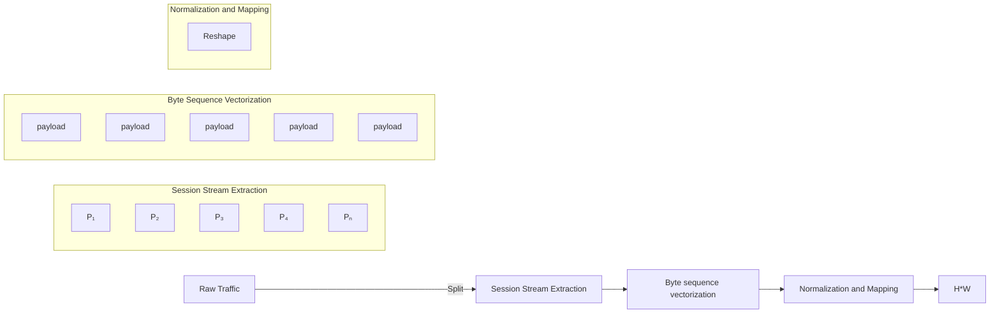
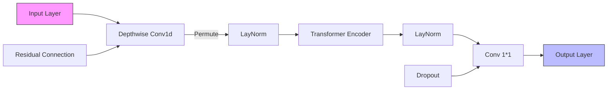

RESEARCH ARTICLE

# A Lightweight Deep Learning Framework for Encrypted Traffic Classification via Visual Flow Representation

Zengyu Cai1 | Banghao Liang1 | Jianwei Zhang2 | Liang Zhu1 | Ying Hu1

1School of Computer Science and Technology, Zhengzhou University of Light Industry, Zhengzhou, China | 2School of Software, Zhengzhou University of Light Industry, Zhengzhou, China

Correspondence: Jianwei Zhang (mailzjw@163.com)

Received: 27 October 2025 | Revised: 31 January 2026 | Accepted: 11 March 2026

Keywords: deep learning | encrypted traffic classification | feature fusion | lightweighting

# ABSTRACT

With the increasing complexity of cybersecurity threats, encrypted network traffic is becoming more and more widely used in all kinds of malicious communications. Traditional feature engineering-based machine learning methods encounter accuracy and scalability issues when identifying such traffic, while existing deep learning methods achieve high accuracy but have large parameter counts and poor portability. Based on this, this paper for the first time migrates and applies the Lightweight Deep Learning Framework for Encrypted Traffic Classification via Visual Flow Representation to the MobileViT architecture. This paper presents the first application of the lightweight deep learning model MobileViT architecture to the task of classifying encrypted network traffic. We designed structural adaptations tailored for time-series network data and constructed an enhanced variant, MiTNet, specifically suited for this task, which integrates a convolutional neural network and a visual Transformer architecture to achieve high-accuracy classification of encrypted network traffic. The model employs 1D depth-separable convolution to construct lightweight inverted residual blocks, which extract local temporal features, and combines this with the MobileViT module to establish global dependencies, thereby improving the recognition of different traffic types. The experiments are evaluated on four typical network traffic classification datasets, and the model achieves more than 98% accuracy and F1 scores on all four datasets while maintaining a very low number of parameters, balancing accuracy and inference efficiency, demonstrating the feasibility and superiority of the lightweight model for encrypted traffic recognition.

# 1 | Introduction

As the pace of digitalisation accelerates, the network environment grows increasingly complex; network traffic classification has become the basic support technology for several key tasks, such as network security, traffic scheduling, and QoS guarantee. Especially in the context of the increasing popularity of encrypted communication, the traditional means of traffic analysis based on plaintext content faces significant challenges. According to Reference [1], encrypted protocols such as HTTPS, QUIC, and VPNs have accounted for the vast majority of global Internet traffic. While this trend improves the level of user privacy protection, it also puts higher requirements on network regulation, security auditing, and malicious behavior detection.

In encrypted environments, the payload of packets is encrypted and hidden, and traditional methods relying on deep packet inspection or feature-based engineering cannot access the content layer information, which severely weakens their performance in terms of classification accuracy and generalization capability. In addition, these methods are usually sensitive to protocol updates and require frequent manual updating of feature templates, which is not only inefficient but also prone to lag behind the development of emerging protocols. Therefore, the research focus is gradually shifting to the modeling of “traffic behavior patterns”, that is, extracting information from the statistical behavior, temporal features, and structural representations of communications. In recent years, research methods based on traffic metadata, statistical features, and visual mapping have received continuous attention [2–4].

Meanwhile, deep learning methods have made significant breakthroughs in the fields of image recognition, speech recognition, and natural language processing, promoting their application in the field of network traffic classification. Various neural network structures, such as convolutional neural networks, recurrent neural networks, and long and short-term memory networks, are widely used to model complex temporal dependencies and high-dimensional feature spaces. Relevant studies have shown that these models exhibit excellent classification performance and strong generalization ability on several encrypted traffic datasets [5–7], which significantly outperforms traditional shallow models. However, despite the remarkable success of deep learning in traffic classification, deploying state-of-the-art models (e.g., BERT-based or large CNNs) on Internet of Things (IoT) devices remains a formidable challenge. IoT edge devices, such as industrial sensors and smart home gateways, are typically characterized by severe hardware constraints, including limited battery life, kilobyte-level memory availability, and weak CPU computing power. Traditional deep models with millions of parameters impose prohibitive computational overhead and memory footprints, making them infeasible for on-device deployment. Furthermore, offloading traffic data to the cloud for analysis introduces unacceptable latency and potential privacy leakage, which contradicts the real-time defense requirements of cybersecurity. In order to solve the above problems, lightweight neural network models have gradually attracted the attention of researchers in recent years. Typical approaches such as MobileNet [8], ShuffleNet [9] use deep separable convolution to reduce the model complexity, but have limited ability to deal with global dependency and temporal modeling. MobileViT [10], as a lightweight neural network architecture that combines the advantages of CNN and visual Transformer, has better representation capability and parameter efficiency, but the original design is oriented to 2D image tasks and has not been systematically studied and validated in encrypted traffic classification.

To bridge this gap, this paper proposes MiTNet, a specialized framework tailored for the IoT edge. By aggressively optimizing the architecture, we compress the model size to merely 0.44 million parameters—orders of magnitude smaller than existing Transformer-based solutions—without compromising classification accuracy. This ultra-lightweight design enables real-time inference directly on edge devices, ensuring both rapid threat response and data privacy. Which systematically improves and adapts the model architecture by combining the temporal and structural characteristics of encrypted traffic while maintaining the lightweight characteristics of MobileViT. The main contributions of this paper are as follows:

1. A new approach to apply MobileViT architecture migration to encrypted network traffic classification is proposed. In order to adapt to the characteristics of 1D traffic data, this paper designs the MiTNet structure, replaces the standard convolution with a 1D depth-separable convolution, and constructs a lightweight residual module to extract local temporal features.

2. Combined with the idea of traffic visualization, the original network traffic data is constructed into a standard grayscale image format, which enables the model to capture spatial– temporal features from a unified visual perspective and improve the modeling efficiency.   
3. Propose MobileViT enhancement variant, which effectively enhances the model’s ability to discriminate multiple types of encrypted traffic by integrating convolutional local modeling and Transformer global modeling mechanisms.

The proposed model was systematically evaluated on four representative encrypted traffic classification datasets: ISCXVPN2016, ISCXTor2016, USTC-TFC2016, and CICIoT2022. Experimental results demonstrate that the proposed model achieves an accuracy exceeding 98% while requiring only 0.44 million parameters; its performance far exceeds that of other models with equivalent specifications.

In summary, the MiTNet proposed in this paper provides a new way of thinking for the efficient identification of encrypted network traffic, balances the model performance with the practicality of deployment, and has good scalability and potential for local application.

# 2 | Related Work

# 2.1 | Port Based Encrypted Traffic Classification Methods

The earliest network traffic classification solutions utilized packet port numbers to categorize network traffic. In port-based classification, the Internet Assigned Numbers Authority (IANA) assigns standard port numbers to different services or protocols. The classification process typically involves inspecting TCP/UDP packet port numbers and mapping them to IANA-predefined ports [11], such as port 80 corresponding to the HTTP protocol. This method is simple to implement, has low computational overhead, and offers fast classification speeds. However, its limitations are evident in modern applications, where many services evade detection through spoofing. Research by Moore and Papagiannaki [12] indicates that port-based classification correctly identifies only about 70% of overall traffic. Madhukar and Williamson et al. [13] further point out that due to techniques like dynamic port usage and port hopping employed by P2P applications, this method fails to accurately identify 30%–70% of internet traffic. However, traditional port-based approaches struggle to handle obfuscation and encrypted communications, leading to their declining applicability in modern network environments.

# 2.2 | Deep Packet Inspection Based Encrypted Traffic Classification Methods

Deep Packet Inspection (DPI) is a traffic classification technique that identifies application protocols or service types by analyzing the payload content within network packets. Unlike shallow detection methods that rely solely on port numbers or metadata, DPI approaches delve into packet parsing. They combine protocol syntax rules, keyword matching, or regular expressions to precisely identify application layer protocol fields. Implementation approaches primarily include signature byte matching, regular expression matching, and protocol parsers. Regarding enhancements, Wang et al. [14] proposed a scheme accelerating regular expression matching by converting raw byte streams into integer streams, achieving efficient matching in memory-constrained environments. Fernandes et al. [15] designed a lightweight DPI system that significantly reduces CPU and memory overhead by minimizing packet processing volume and truncating payloads, while maintaining high classification accuracy. Although DPI offers high precision and transparency in non-encrypted environments, its limitations in handling encrypted traffic, performance overhead, privacy protection, and adaptability to unknown protocols make it insufficient for modern network requirements.

# 2.3 | Traditional Machine Learning Based Encrypted Traffic Classification Methods

With the limitations of traditional port-based and deep packet inspection methods in identifying encrypted traffic and unknown protocols, machine learning-based traffic classification has gradually become the mainstream approach. These methods achieve automated classification by extracting statistical features (such as packet size, direction, duration, arrival intervals, etc.) and combining them with various learning algorithms. In classification research, Nguyen and Armitage [3] conducted a systematic review of ML traffic classification methods, outlining the data collection, feature extraction, model training, and evaluation processes, and categorizing approaches into supervised, unsupervised, and semi-supervised learning. For semi-supervised learning, Wang et al. [16] proposed a QoS-aware framework that leverages sparse labeled data to enhance classification performance while reducing annotation costs. In supervised learning, Soysa and Murat [17] compared Bayesian networks, decision trees, and multilayer perceptrons, validating their generalization capabilities for dynamic traffic like P2P and Akamai. To improve SVM, Dong et al. [18] proposed the CMSVM algorithm, dynamically adjusting misclassification costs to enhance modeling for small-sample categories. For KNN optimization, Su et al. [19] combined genetic algorithms with clustering mechanisms to propose a weighted KNN method, enhancing the model’s sensitivity to attack features. Machine learning methods have overcome reliance on port numbers and data payloads, offering greater automation and generalization capabilities. However, challenges remain in feature design dependency on manual input, effectiveness under encrypted traffic, and real-time adaptability of models to large-scale complex traffic.

# 2.4 | Deep Learning Based Encrypted Traffic Classification Methods

As encrypted traffic increases and application scenarios become more complex, traditional machine learning methods reliant on manual features are gradually reaching their limits. Deep learning, with its capabilities for automatic feature extraction and high-dimensional modeling, has emerged as a hotspot in traffic classification research. CNNs excel at learning local patterns, RNNs/LSTMs capture temporal dependencies, while Transformers enhance modeling capabilities for long-range dependencies and global features. In specific studies, Aceto et al. [20] directly extracted multi-level features from raw traffic using CNNs, combining data augmentation and regularization to improve generalization. Camelo et al. [21] proposed a deep learning framework based on spectral layer data, employing specialized CNNs for wireless communication traffic classification. Yang and Lu et al. [22] introduced the end-to-end meta-learning framework Con-ViTML, integrating CNNs with Transformers to design a novel ConViT architecture capable of extracting both local and global semantic features. Lan et al. [23] employed a cascaded 1D CNN and Bi-LSTM structure to extract temporal features, incorporating self-attention mechanisms and side-channel statistical features to enhance discriminative performance. Aouedi et al. [24] proposed a nonlinear ensemble method that fuses multiple tree models in the first layer and employs deep learning models as meta-classifiers in the second layer, effectively capturing nonlinear interactive features among different models. However, deep learning methods rely on computational power and large-scale data [25], and their lack of interpretability constrains their practical application.

# 3 | Methodology

In this section, we detail the traffic data preprocessing methods, the traffic classification model design module, and the strategy representation of the SoftMax classifier. The overall model architecture is shown in Figure 1. This model is suitable for multi-class classification tasks involving time-series data or network traffic data. The overall process can be divided into three main stages: data preprocessing, lightweight MiTNet model feature extraction, and the final SoftMax classifier decision.

# 3.1 | Data Preprocessing

# 3.1.1 | Session Stream Extraction

The raw one-dimensional network flow or time-series data undergoes a series of preprocessing operations before being fed into the model training. The detailed workflow is illustrated in Figure 2. First, network session flows are extracted from the original (.pcap files). Packets are aggregated based on quintets (source IP, destination IP, source port, destination port, protocol), defining a flow as a sequence of packets formed by the same quintet within a specific time window. The specific definition is as follows:

$$
\operatorname{Flow} _ {i} = \left\{p _ {1}, p _ {2}, \dots , p _ {n} \right\} \text {where} p _ {j} \in P,
$$

$$
\text { and } \forall j, \operatorname{Tuple} \left(p _ {j}\right) = \left\langle I P _ {s r c}, I P _ {d s t}, \text { Port } _ {s r c}, \text { Port } _ {d s t}, \text { Proto } \right\rangle_ {i} \tag {1}
$$

To accommodate classification tasks, the extraction process adheres to the following conditions: Only TCP and UDP protocol packets are retained. Each stream is limited to a maximum length; excessively long streams are truncated, while excessively short streams are padded with average values. Isolated packets that cannot be reassembled into valid streams and pure control packets without payloads are discarded.

flowchart

FIGURE 1 MiTNet framework overview.

flowchart

FIGURE 2  Schematic diagram of data preprocessing.

# 3.1.2 | Byte Sequence Vectorization

Byte-sequence vectorization aims to extract the intrinsic application fingerprint of a stream, transforming unstructured raw traffic into fixed-length structured input vectors. The specific processing flow is as follows: First, for each reconstructed stream, extract the application layer payload of all packets in chronological order. To eliminate noise introduced by network transmission mechanisms, this paper explicitly discards TCP/IP protocol headers and control packets carrying no data (e.g., SYN, pure ACK), retaining only byte streams conveying actual application interactions.

To adapt to subsequent 40 × 40 two-dimensional image inputs and ensure consistent input dimensions, this paper standardizes the flow vector length to L = 1600 bytes. This threshold is based on prior knowledge of flow feature distribution and empirical research: multiple studies indicate that highly discriminative features of network flows (e.g., cipher suites in TLS Client Hello, magic numbers, and initial interaction commands) are heavily concentrated in the flow’s initial phase [26, 27]. Wang [28] further confirmed that effective encryption traffic classification can be achieved using only the first 784 bytes of a flow. In contrast, 1600 bytes fully encompass the first packet (typically with an MTU of 1500 bytes) while also covering critical fields in subsequent interactions, providing sufficient representation for flow classification. Data in the tail end of flows often consists of high-entropy encrypted payloads or large file contents, contributing marginally to fine-grained classification.

Based on this, the following normalization strategies are adopted:

Truncation: For long flows exceeding 1600 bytes, only the first 1600 bytes are extracted. This ensures the model focuses on the most discriminative handshake and negotiation phases while reducing computational redundancy from processing lengthy sequences.

Zero-Padding: For short streams shorter than 1600 bytes, zero bytes (0 × 00) are appended to the sequence end until the target length is reached, maintaining feature space alignment.

The specific impact of truncation length L on model classification performance and inference efficiency is thoroughly evaluated through comparative experiments and analysis in Section 4.7 (Ablation Studies and Parameter Sensitivity Analysis)

$$
x = \left[ x _ {1}, x _ {2}, \dots , x _ {L} \right], \quad L \leq 1 6 0 0 \tag {2}
$$

$$
x _ {\text { fixed }} = \left\{ \begin{array}{l l} x _ {1}, x _ {2}, \dots , x _ {L}, \mu , \dots , \mu & \text { if   } L <   1 6 0 0 \\ x _ {1}, x _ {2}, \dots , x _ {1 6 0 0} & \text { if   } L \geq 1 6 0 0 \end{array} \right. \tag {3}
$$

where μ denotes the global mean of all byte values in the training set.

# 3.1.3 | Normalization and Mapping

To construct grayscale images while preserving a reasonable pixel distribution, the original byte vectors are subjected to normalization and mapping operations. Specifically, linear normalization is applied to scale the byte values from the original range of [0, 255] to the normalized range [0, 1]; the normalization process is shown in Equation (4).

$$
x _ {\text {norm}} = \frac {x - x _ {\min}}{x _ {\max} - x _ {\min}} = \frac {x}{2 5 5} \tag {4}
$$

The normalized one-dimensional vector $x _ { \mathrm { { n o r m } } } \in \mathrm { { R } } ^ { 1 6 0 0 }$ preserves the distribution properties of the original bytes while adapting to the input format required by image-based models. This step aims to unify irregular or variable-length raw data into a fixed-length sample representation for subsequent model processing.

It is converted into a 2D grayscale image through a reshape operation, enabling the modeling of the temporal evolutionary characteristics of network traffic and uniformly representing all streams as single-channel 40 × 40 grayscale images. The conversion process is shown in Equation (5).

$$
X \in R ^ {4 0 \times 4 0}, \text {   where   } X _ {i, j} = x [ 4 0 \cdot (i - 1) + j ] \tag {5}
$$

This image serves as the network input, simulating the temporal evolution of traffic flow. Both the horizontal and vertical dimensions of the image jointly encode the temporal characteristics of the flow and the spatial neighborhood relationships of byte blocks, enabling the convolutional neural network (CNN) to efficiently extract sequence patterns and traffic features from the image space.

Meanwhile, to prevent model overfitting and mitigate sample bias, the following strategies are applied during the construction of the image dataset: (1) Duplicate stream removal: eliminating streams with identical payload content. (2) Anomalous stream rejection: discarding streams that cannot be converted into the specified image dimensions. (3) Category equalization: addressing class imbalance through under-sampling or over-sampling techniques. This representation allows the model to efficiently extract spatial features using convolutional architectures while preserving the inherent temporal information of network traffic. The entire data preprocessing process is illustrated in Figure 2.

To intuitively demonstrate the discriminative capability of the proposed method, we visualize the raw byte streams of representative traffic classes as 40 × 40 grayscale images, as shown in Figure 3. It is evident that distinct network behaviors map to unique textural patterns in the image space:

Benign Traffic (Figure 3a): The BitTorrent sample manifests as irregular, high-entropy pixel blocks (top region), reflecting the randomized and intensive payload transmission characteristic of P2P protocols.

Malware Structure (Figure 3b): In contrast, Geodo exhibits sparse linear structures, indicating specific protocol headers or command sequences with low data density.

Automated Periodicity (Figure 3c): Most notably, Zeus displays dense, repetitive horizontal stripes, revealing the rigid, automated periodicity of Botnet Command-and-Control (C&C) heartbeats.

# 3.2 | MiTNet Module

The backbone network employs the MiTNet model, an improved design developed in this study. The MiTNet model represents a lightweight adaptation of the original MobileViT architecture, adjusting its convolutional operations from two-dimensional to one-dimensional to accommodate scenarios such as sequential data processing. This model combines a lightweight convolutional network with a visual Transformer structure, aiming to achieve efficient modeling and classification of one-dimensional temporal data within computationally constrained environments.

The overall architecture consists of three key modules: Stem Block Module, Inverted Residual Module, and MiTNetBlock Module.

Stem Block, as the initial feature extraction module, is responsible for mapping the original input data from a low-dimensional, weakly expressive space to a more discriminative feature space. Its primary functions include initial feature capture, signal enhancement, and downsampling, thereby providing stable inputs for the subsequent deep network layers.

Inspired by the Inverted Residual structure of MobileNetV2, the Inverted Residual module achieves efficient local feature extraction and nonlinear modeling through a combination of 1 × 1 pointwise convolution for channel expansion, depthwise separable convolution for spatial filtering, and a final 1 × 1 convolution for channel compression. This design provides strong feature representation while keeping parameter complexity low.

To further enhance channel selectivity, a squeeze-and-excitation (SE) Block is embedded within the Inverted Residual module. It adaptively highlights informative channels and suppresses redundant ones, thereby strengthening the model’s discriminative power and feature utilization efficiency.

text_image

Scanned text fragment with partially visible Chinese characters, likely from a document or form.

(a) BitTorrent

text_image

Scanned text of contract clauses with partial table of contract clauses and date information

(b) Geodo

text_image

Scanned text of contract clauses or legal document sections with horizontal lines and checkboxes

(c) Zeus   
FIGURE 3  Visual comparison of distinct traffic categories (40 × 40 grayscale).

Building on these foundations, the MiTNetBlock module unifies the strengths of convolutional and Transformer mechanisms. Local convolutions capture short-term contextual patterns, while a lightweight Transformer models long-range dependencies. This hybrid design enables a balanced integration of local and global information, leading to more expressive and robust feature representations.

# 3.2.1 | Stem Block Module

Specifically, the processing flow of this module is as follows: the input data format is first adjusted by applying squeeze and permute operations to rearrange the original input into a tensor of shape $( B , L , C )$ , which is suitable for one-dimensional convolution. Here, ?? denotes the batch size, ?? represents the sequence length, and ?? is the number of channels.

Subsequently, a one-dimensional convolution is applied to extract the initial local features. In particular, a 1D convolution with a kernel size of 3 and 64 output channels is used for this initial feature extraction. The processing procedure is shown in Equation (6).

$$
F _ {1} = \operatorname{Conv1d} (x; W), \text {where} x \in R ^ {B \times L \times C},
$$

$$
W \in R ^ {k \times L \times 6 4}, F _ {1} \in R ^ {B \times L \times 6 4} \tag {6}
$$

where $F _ { 1 }$ denotes the output feature map after the convolution operation, and ?? represents the weight matrix of the convolution kernel. Here, k = 3 is the kernel size. The convolution kernel captures spatial patterns within each channel over a local temporal window, enabling the extraction of dependencies between neighboring features.

In the next step, normalization and nonlinear activation are applied. Specifically, Batch Normalization (BN) and the SiLU (Sigmoid-weighted Linear Unit) activation function are introduced after the convolution layer. BN accelerates model convergence and mitigates internal covariate shift, while SiLU—serving as a smooth and non-monotonic activation function—combines the strengths of ReLU and Sigmoid, thereby enhancing the model’s capacity to capture complex nonlinear feature representations. The procedure for this step is shown in Equation (7).

$$
F _ {2} = \operatorname{SiLU} \left(\mathrm{BN} \left(F _ {1}\right)\right), \text { where } F _ {2} \in R ^ {B \times L \times 6 4} \tag {7}
$$

Finally, downsampling along the temporal dimension is performed. A MaxPool1d layer with a kernel size of 2 is applied to reduce the sequence length, effectively halving it from L to L/2. This operation compresses the temporal resolution of the input data, reduces computational overhead, and introduces a degree of spatial invariance, which can be beneficial for learning robust feature representations. The process is specifically represented as in Equation (8).

$$
F _ {\text { stem }} = \operatorname{MaxPool} 1 \mathrm{d} \left(F _ {2}\right), F _ {\text { stem }} \in R ^ {B \times (L / 2) \times 6 4} \tag {8}
$$

where $F _ { \mathrm { s t e m } }$ is the downsampled feature representation. The module architecture is specifically adapted and optimized for one-dimensional encrypted traffic data, effectively enhancing the training efficiency and convergence speed of the model.

# 3.2.2 | Inverted Residual Module

The Inverted Residual module is based on the inverted residual structure in MobileNetV2 [29], and adapted accordingly in the one-dimensional convolutional scenario. The detailed module workflow is illustrated in Figure 4. Its main design idea is to realize efficient feature extraction through layer-by-layer dimension upgrading, deep convolution and dimension downgrading operations, and to combine the channel attention mechanism with residual connection to improve the network performance. Its specific process is as follows: input $\mathbf { \boldsymbol { x } } \in R ^ { B \times C \ - i n \times L }$ , first after 1 × 1 Conv for channel expansion, Channel expansion is expressed as in Equation (9).

$$
x _ {1} = \operatorname{SiLU} \left(\mathrm{BN} _ {1} \left(\operatorname{Conv} _ {1 \times 1} (x)\right)\right), \quad C \_ m i d = C \_ i n \times r \tag {9}
$$

where the number of input channels is upscaled from C\_in to the intermediate dimension $C _ { - } m i d ,$ , and r stands for expand\_ratio, which is equal to 2 by default. The feature representation ability is improved by pointwise convolution, and the nonlinear mapping space is increased. Next, after 3 × 1 Depthwise convolution, local convolution is performed for each channel individually without mixing the channel information. The local convolution process is expressed as in Equation (10).

$$
x _ {2} = \operatorname{SiLU} \left(\mathrm{BN} _ {2} \left(\operatorname{Conv} _ {3 \times 1} ^ {D W} \left(x _ {1}\right)\right)\right) \tag {10}
$$

This process captures only the temporal local features, effectively learns the dynamic changes of each channel itself, and the number of parameters and computational overhead is greatly reduced. After that, it enters 1 × 1 convolution for channel compression, and compresses the number of channels from the intermediate dimension C\_mid back to the target output channel number C\_out. The dimension reduction process is expressed as in Equation (11).

$$
x _ {3} = B N _ {3} \left(C o n v _ {1 \times 1} \left(x _ {2}\right)\right) \tag {11}
$$

The main function here is to aggregate the information of each channel after deep convolution to realize feature fusion and dimension compression.

In particular, The SE Block module is integrated into the inverted residual structure of the backbone network to enhance the model’s channel attention capabilities. Specifically, after the main convolutional path completes the initial feature extraction, if the channel attention mechanism is enabled (i.e., use\_se = True), the model invokes the SE Block to perform channel-wise recalibration on the feature map. Specifically expressed as in Equation (12).

$$
x _ {4} = S E \left(x _ {3}\right) = x _ {3} \cdot \sigma \left(W _ {2} \cdot \operatorname{ReLU} \left(W _ {1} \cdot G A P \left(x _ {3}\right)\right)\right) \tag {12}
$$

GAP is the global average pooling operation, and the compression timing dimension is the unified global feature vector; W , $W _ { 2 }$ are the fully connected maps realized by 1D convolution; ?? is the Sigmoid activation function; this process is used to strengthen the key information channels and suppress the redundant and invalid channels, which helps the model to focus more on discriminative features.

```mermaid
graph LR
    A["Input Layer"] --> B["Conv 1*1"]
    B --> C["BatchNorm"]
    C --> D["SiLU"]
    D --> E["Depthwise Conv 3*1"]
    E --> F["BatchNorm"]
    F --> G["SiLU"]
    G --> H["Conv 1*1"]
    H --> I["BatchNorm"]
    I --> J["AdaptiveAvgPoolId"]
    J --> K["Conv1d 1*1"]
    K --> L["ReLU"]
    L --> M["Conv1d 1*1"]
    M --> N["Sigmoid"]
    N --> O["Output Layer"]
    style A fill:#f9f,stroke:#333
    style O fill:#ccf,stroke:#333
    subgraph Inverted Residual
        B
        C
        D
        E
        F
        G
        H
        I
    end
    subgraph SE Block
        J
        K
        L
        M
        N
    end
    subgraph Output Layer
        O
    end
```

flowchart

FIGURE 4 Invert residual architecture.

flowchart

FIGURE 5  MiTNetBlock module architecture.

GAP denotes the global average pooling operation, which compresses the temporal dimension into a unified global feature vector. $W _ { 1 }$ and $W _ { 2 }$ represent the fully connected transformations implemented via 1D convolutions, and $\sigma ( \cdot )$ denotes the Sigmoid activation function. This process enhances the key informative channels while suppressing redundant and irrelevant ones, thereby enabling the model to focus more effectively on discriminative features.

In summary, this module first compresses the temporal dimension of the input features via global average pooling to extract global contextual information. It then facilitates inter-channel information interaction and nonlinear modeling through two successive pointwise convolutions, generating channel-wise weight coefficients using the Sigmoid activation function. Finally, the input feature map is recalibrated by element-wise multiplication with these weights along the channel dimension, enabling adaptive adjustment of the importance of each channel feature. This operation effectively enhances the model’s ability to emphasize key information and improve feature discriminability, while introducing minimal additional computational overhead.

Additionally, a residual connection is applied when the number of input and output channels are equal (i.e., C\_in = C\_out); in this case, the output is obtained by element-wise addition of the input and the recalibrated features. Otherwise, the recalibrated features are directly output without residual addition. The residual connection is expressed as in Equation (13).

$$
\text { Output } = \left\{ \begin{array}{c c} x _ {4} + x, & \text { if   } C _ {\text { in }} = C _ {\text { out }} \\ x _ {4}, & \text { otherwise } \end{array} \right. \tag {13}
$$

# 3.2.3 | MiTNetBlock Module

The MiTNetBlock module integrates 1D convolution with a Transformer encoder architecture to model global dependencies and integrate contextual information. This is achieved through channel transformation, layer normalization, and a multi-head attention mechanism. The detailed architecture of the module is illustrated in Figure 5.

The overall structure of the module is as follows: the input tensor $x \in R ^ { B \times C \times L }$ , where B denotes the batch size, C is the number of channels, and L is the sequence length. The output tensor has the same dimensions as the input, representing enhanced feature representations.

Initially, a local projection is performed via a depthwise 1D convolution with the number of groups equal to the number of channels, enabling efficient extraction of local features. The local projection process is expressed as shown in Equation (14).

$$
x _ {1} = \text { DWConv1d } (x), \quad x _ {1} \in R ^ {B \times C \times L} \tag {14}
$$

This operation preserves the input dimensionality while primarily enabling local perceptual modeling to capture subtle variations and patterns between neighboring positions in the sequence. Meanwhile, grouped convolution significantly reduces the number of parameters and computational cost, effectively extracting local enhanced features for subsequent processing by the Transformer.

Next, a dimensional transformation is performed to adapt the data for the Transformer, which requires input in the format (B, L, C). Prior to this, layer normalization is applied. The normalization process is expressed as shown in Equation (15).

$$
x _ {2} = \text { LayerNorm } (\text { Permute } (x _ {1})), x _ {2} \in R ^ {B \times L \times C} \tag {15}
$$

This operation primarily serves to stabilize training, accelerate convergence, and prevent gradient vanishing or explosion. It ensures consistent input scaling across different channels before entering the subsequent multi-head attention mechanism.

Following this global modeling step, the Transformer Encoder Layer comprises two main components: a multi-head attention mechanism and a feed-forward network, both of which incorporate residual connections. The multi-head attention mechanism and the residual connections in the feedforward network are represented as shown in Equations (16–18).

$$
x _ {3} = \mathrm{MHSA} \left(x _ {2}\right) + x _ {2}, x _ {3} \in R ^ {B \times L \times C} \tag {16}
$$

$$
x _ {4} = \mathrm{FFN} \left(x _ {3}\right) + x _ {3}, x _ {4} \in R ^ {B \times L \times C} \tag {17}
$$

$$
x _ {5} = \text { LayerNorm } (x _ {4}), x _ {5} \in R ^ {B \times L \times C} \tag {18}
$$

The multi-head attention mechanism models each position in the sequence from a global perspective by capturing its correlations with other positions. Meanwhile, the feed-forward neural network performs nonlinear mapping and transformation at each time step. This module is primarily designed to capture long-range dependencies, compensating for the limited receptive field of convolutional operations. The multi-head attention mechanism enables the model to attend to multiple semantic subspaces in parallel.

Internally, the module incorporates residual connections and dropout to enhance training stability and robustness. Layer Normalization is applied again after global modeling to ensure stable feature distributions, thereby improving the performance of subsequent linear fusion layers and accelerating convergence.

This stage is followed by format restoration and channel fusion, which restores the tensor to its original dimensional order, that is, (B, C, L), and integrates channel features via a 1 × 1 convolution. This process is represented as shown in Equation (19).

$$
x _ {6} = \operatorname{Conv1D} _ {1 \times 1} \left(\text { permute } (x _ {5})\right), \quad x _ {6} \in R ^ {B \times C \times L} \tag {19}
$$

In the above operation, the 1 × 1 convolution functions equivalently to a fully connected layer applied at each temporal position, enhancing inter-channel information interaction. The attention output is reprocessed with low computational cost to better facilitate fusion with the original residual features. Subsequently, some activation values are randomly zeroed through a dropout operation for regularization. The original input is then added to the current output via a residual connection. This step primarily serves to prevent overfitting and improve the model’s generalization capability. The residual connection preserves the original input information, alleviates the training difficulties associated with deep networks, and enhances feature reuse efficiency, thereby realizing the fusion of “local” and “global” information.

Finally, the extracted high-dimensional semantic features are aggregated by global average pooling and fed into a multi-class fully connected classifier, which outputs the probability distributions over the corresponding classes, enabling accurate identification and classification of network traffic.

# 3.3 | Softmax Classifier

After the corresponding temporal features are extracted from the backbone network, the pooling layer outputs a fixed-length global feature vector, denoted as $f \in R ^ { d }$ , where d is the feature dimension. This feature vector is then fed into the classifier head for the final multi-class prediction task.

The classification layer consists of several layers of linear transformations with regularization mechanisms, mainly:

1. One or more fully connected layers for mapping high-dimensional features to the category space:   
2. Nonlinear activation functions such as ReLU to enhance model representation:   
3. BatchNormalization for stabilizing the training process and accelerating convergence;   
4. Dropout technique to mitigate overfitting and enhance model generalization.

Formally, the classifier processing procedure is shown in Equation (20).

$$
z = \text { Dropout } (\mathrm{BN} (\operatorname{ReLU} (W \cdot f + b))) \tag {20}
$$

where $W \in R ^ { C \times d }$ , ?? ∈ ???? are the weights and bias terms of the fully connected layer, respectively, and C denotes the final number of categories. $z = \left[ z _ { 1 } , z _ { 2 } , \cdot \cdot \cdot , z _ { C } \right]$ is the un-normalized logit of each category. In order to map the logit to the category probability distribution, the output is normalized using the Softmax function. The calculation formula is shown in Equation (21).

$$
\hat {y} _ {i} = \frac {\exp (z _ {i})}{\sum_ {j = 1} ^ {C} \exp (z _ {j})}, i = 1, 2, \dots , C \tag {21}
$$

where z is the logit value of category i, C is the number of categories, and yˆ denotes the predicted probability that the sample belongs to category i, which satisfies $\textstyle \sum { \hat { y } } _ { i } = 1$ . The training objective of the model is to minimize the difference between the predicted distribution and the true labels, which is optimized using a standard multi-class cross-entropy loss function. The function formula is shown in Equation (22).

$$
L = - \sum_ {i = 1} ^ {C} y _ {i} \log \left(\hat {y} _ {i}\right) \tag {22}
$$

where $y _ { i }$ is the one-hot encoding of the true label and $\hat { y } _ { i }$ is the softmax probability. L tends to be minimized as the model prediction gets closer to the true label. The core goal of this stage is to complete the mapping from continuous temporal feature space to discrete category label space, and at the same time to improve the stability and generalization performance of the model by means of reasonable regularization. This is done to provide an accurate and reliable decision basis for the actual network traffic classification task.

# 4 | Experimental Design

In the experiments of this paper, four publicly available datasets from the network traffic classification domain were employed: ISCXVPN2016, ISCXTor2016, USTC-TFC2016, and CICIoT2022. These datasets encompass a diverse range of traffic types, including VPN traffic, Tor encrypted traffic, simulated malicious traffic, and IoT attack traffic, thereby demonstrating the generalization and robustness of the MiTNet model across different scenarios.

Furthermore, the MiTNet model was extensively compared with several classic lightweight models and the latest models published in recent years to comprehensively evaluate its efficiency, accuracy, and architectural compactness. This was achieved through detailed analysis of model parameters, throughput, and floating-point operations (FLOPs). The results show that MiTNet significantly outperforms traditional lightweight models and the latest models in all evaluation metrics.

# 4.1 | Introduction of Experimental Datasets

ISCXVPN2016 dataset: ISCXVPN2016 is a network traffic dataset released by the Canadian Information Security Center (CIC), which contains the communication data of many applications in VPN and non-VPN environments, such as VoIP, P2P, FTP, YouTube, and so on. The dataset is designed for encrypted traffic identification tasks and provides finely labeled flow-level labels [30].

ISCXTor2016 dataset: ISCXTor2016 is another network encrypted traffic dataset provided by CIC, which is mainly used to differentiate between Tor network-based traffic and normal non-anonymous traffic. The dataset covers a variety of network service scenarios such as Web browsing, chatting, emailing, and so forth, with obvious anonymous communication characteristics [31].

USTC-TFC2016 dataset: This dataset is released by the Information Security Laboratory of the University of Science and Technology of China (USTC), which simulates a variety of crypto-malicious traffic, such as Zeus, Neris, HTBot, and the corresponding normal traffic HTTP, FTP, SSH, and so forth, and is used to study the detection and classification of malicious traffic [32].

TABLE 1  Dataset information. 

<table><tr><td>Dataset</td><td>Category</td><td>Training set</td><td>Test set</td></tr><tr><td>ISCXVPN2016</td><td>7</td><td>13,281</td><td>1384</td></tr><tr><td>ISCXTor2016</td><td>8</td><td>11,655</td><td>1458</td></tr><tr><td>USTC-TFC2016</td><td>20</td><td>37,323</td><td>6692</td></tr><tr><td>CICIoT2022</td><td>6</td><td>18,734</td><td>1951</td></tr></table>

CICIoT2022 dataset: CICIoT2022 is a widely used IoT attack detection dataset, collected from multiple real IoT devices, capturing network behaviors in normal and attack states. The attack types include DoS, DDoS, MITM, Mirai, and so forth, [33].

The dataset division ratio and category information are shown in Table 1.

# 4.2 | Experimental Parameters and Evaluation Metrics

# 4.2.1 | Experimental Environment

The experimental environment in this study is configured on a Windows operating system. All experiments are conducted using Python 3.8 as the primary programming language, with PyTorch 1.12 employed as the deep learning framework. Model development and debugging are performed within the PyCharm Integrated Development Environment (IDE) to ensure a stable and efficient workflow. From the hardware perspective, the system is equipped with an Intel Core i7-9700 processor, an NVIDIA GeForce RTX 3090 GPU, and 24 GB of RAM, providing sufficient computational power for deep learning model training and evaluation. This configuration enables high-performance parallel computation and supports mixed-precision acceleration, ensuring both training efficiency and model stability.

# 4.2.2 | Training Configuration

All experiments are conducted in an environment equipped with an NVIDIA RTX 3090 GPU featuring 24 GB of VRAM. The model training employs the Adam optimizer with an initial learning rate set to 1e-3. A batch size of 128 is used, and the maximum number of training epochs is set to 100. To prevent overfitting and enhance generalization, an early stopping strategy is adopted, allowing up to 15 consecutive epochs without improvement in the F1-score before termination.

To enhance training efficiency and numerical stability, mixed-precision training is utilized. Additionally, the learning rate is dynamically adjusted throughout the training process using the Cosine Annealing scheduler. The loss function adopted is cross-entropy loss, which is well-suited for multi-class classification problems. The detailed hyperparameter settings are summarized in Table 2.

TABLE 2  Training parameter information table. 

<table><tr><td>Parameter name</td><td>Value</td><td>Description</td></tr><tr><td>Batch size</td><td>128</td><td>Rationalization of graphics memory with 24GB GPU (RTX 3090)</td></tr><tr><td>Epochs</td><td>100</td><td>Full training for convergence, with Early Stopping to avoid overfitting.</td></tr><tr><td>Learning rate</td><td>1.00E-03</td><td>Initial learning rate, then dynamically adjusted using the scheduler.</td></tr><tr><td>Optimizer</td><td>AdamW</td><td>Adam optimizer combined with weight decay</td></tr><tr><td>Weight DECAY</td><td>1.00E-04</td><td>Avoid overfitting and improve generalization</td></tr><tr><td>Learning rate scheduler</td><td>CosineAnnealingLR</td><td>Cosine annealing scheduler to improve the stability of late training.</td></tr><tr><td>Loss function</td><td>CrossEntropyLoss</td><td>Suitable for multi-class traffic classification</td></tr><tr><td>Precision</td><td>Mixed Precision (fp16)</td><td>Accelerates training while minimizing memory usage</td></tr><tr><td>Early stopping</td><td>Patience = 10, Delta = 0.001</td><td>Early stopping if the F1 score of the validation set does not improve within 10 rounds.</td></tr></table>

# 4.2.3 | Evaluation Metrics

To comprehensively evaluate the performance of different models, this study adopts classification Accuracy, Precision, Recall, and F1-score as the primary evaluation metrics. The calculation formulas are as shown in Equations (23–26).

$$
\text { Accuracy } = \frac {T P + T N}{T P + T N + F P + F N} \tag {23}
$$

$$
\text { Precision } = \frac {T P}{T P + F P} \tag {24}
$$

$$
\text { Recall } = \frac {T P}{T P + F N} \tag {25}
$$

$$
F 1 = 2 \times \frac {\text { Precision } \times \text { Recall }}{\text { Precision } + \text { Recall }} \tag {26}
$$

TP is the number of normal data correctly categorized by the model; TN is the number of abnormal data correctly categorized by the model; FP is the number of model abnormalities classified as normal data; and FN is the number of model categorization normal classified as abnormal data.

# 4.3 | Visualization and Analysis of MiTNet Model Training Process

The loss and accuracy curves shown in Figure 6 reflect the model’s learning performance across four representative traffic datasets: ISCXVPN2016, ISCXTor2016, CICIoT2022, and USTC-TFC2016. It can be observed that across all datasets, the MiTNet model exhibits favorable training characteristics, including fast convergence speed, low volatility, and high performance stability.

Furthermore, the smoothness of the training process indicates stable gradient updates throughout the training cycle without significant fluctuations. This further validates MiTNet’s robustness and optimization stability when trained on multi-source heterogeneous datasets. This characteristic is particularly crucial for high-noise, highly variable tasks like traffic classification, enhancing the model’s reliability in real-world deployments.

# 4.4 | Comparison With Other Encrypted Traffic Classification Algorithms

To evaluate the effectiveness of the proposed MiTNet model in encrypted traffic classification tasks, this paper conducts comparative experiments on four representative benchmark datasets: USTC-TFC2016, ISCXTor2016, CICIoT2022, and ISCXVPN2016. The proposed model is compared against several state-of-the-art methods, including PERT [34], ET-BERT [35], YaTC [36], and NetMamba [37]. The comparison results are summarized in Table 3, with performance primarily evaluated in terms of classification accuracy and F1-score.

# 4.4.1 | Experimental Results and Analysis

From the experimental results, it is evident that the proposed MiTNet model consistently achieves higher accuracy and F1 scores across the majority of evaluated datasets, particularly excelling on USTC-TFC2016, ISCXTor2016, and CICIoT2022. Specially, the MiTNet model achieved an accuracy of 0.9993 and an F1 score of 0.9993, outperforming all four state-of-the-art methods in comparison. These results highlight MiTNet’s superior capability in handling small-sample scenarios and distinguishing between highly confusing traffic protocols. However, when applied to the ISCXVPN2016 dataset, the experimental results were slightly inferior to those of the YaTC and NetMamba models. This is mainly due to the dataset’s high proportion of encrypted traffic, smaller sample size, and more complex, imbalanced flow patterns, which make feature extraction and classification more challenging.

Beyond its outstanding classification performance, MiTNet also exhibits an extremely lightweight architecture, with only approximately 0.44 million parameters—significantly fewer than Transformer-based models such as PERT and ET-BERT. This makes MiTNet particularly suitable for deployment on resource-constrained edge devices. Furthermore, due to its hybrid design combining MobileNet and MobileViT, MiTNet demonstrates strong efficiency in both inference speed and memory consumption, meeting the dual demands of real-time processing and practical deployability in industrial applications.

In summary, the MiTNet model, through its efficient lightweight architecture and effective local–global feature fusion

line

| ISCXVPN2016 | Loss  | Accuracy |
| ----------- | ----- | -------- |
| 0           | 1.35  | 0.65     |
| 10          | 0.75  | 0.95     |
| 20          | 0.68  | 0.97     |
| 30          | 0.66  | 0.97     |
| 40          | 0.65  | 0.97     |
| 50          | 0.65  | 0.97     |
| 60          | 0.65  | 0.97     |
| 70          | 0.65  | 0.97     |
| 80          | 0.65  | 0.97     |
| 90          | 0.65  | 0.97     |
| 100         | 0.65  | 0.97     |

line

| ISCXTor2016 | Loss  | Accuracy |
| ----------- | ----- | -------- |
| 0           | 1.55  | 0.50     |
| 10          | 0.60  | 0.98     |
| 20          | 0.53  | 1.00     |
| 40          | 0.51  | 1.00     |
| 60          | 0.51  | 1.00     |
| 80          | 0.51  | 1.00     |
| 100         | 0.51  | 1.00     |

line

| USTC-TFC2016 | Loss  | Accuracy |
| ------------ | ----- | -------- |
| 0            | 0.97  | 0.97     |
| 10           | 0.75  | 1.00     |
| 20           | 0.70  | 1.00     |
| 30           | 0.69  | 1.00     |
| 40           | 0.69  | 1.00     |
| 50           | 0.69  | 1.00     |
| 60           | 0.69  | 1.00     |
| 70           | 0.69  | 1.00     |
| 80           | 0.69  | 1.00     |
| 90           | 0.69  | 1.00     |
| 100          | 0.69  | 1.00     |

line

| CICIoT2022 | Loss  | Accuracy |
| ---------- | ----- | -------- |
| 0          | 0.85  | 0.85     |
| 10         | 0.60  | 0.98     |
| 20         | 0.57  | 0.99     |
| 30         | 0.56  | 0.99     |
| 40         | 0.56  | 0.99     |
| 50         | 0.56  | 0.99     |
| 60         | 0.56  | 0.99     |
| 70         | 0.56  | 0.99     |
| 80         | 0.56  | 0.99     |
| 90         | 0.56  | 0.99     |
| 100        | 0.56  | 0.99     |

FIGURE 6 Model performance on different datasets.   
TABLE 3 Comparison data with existing algorithms. 

<table><tr><td>Model dataset</td><td></td><td>PERT [34]</td><td>ET-BERT [35]</td><td>YaTC [36]</td><td>NetMamba [37]</td><td>MiTNet (ours)</td></tr><tr><td rowspan="2">USTC-TFC 2016</td><td>AC</td><td>0.9663</td><td>0.9695</td><td>0.9786</td><td>0.9960</td><td>0.9986</td></tr><tr><td>F1</td><td>0.9664</td><td>0.9695</td><td>0.9786</td><td>0.9957</td><td>0.9959</td></tr><tr><td rowspan="2">ISCXTor2016</td><td>AC</td><td>0.8022</td><td>0.6538</td><td>0.9972</td><td>0.9986</td><td>0.9993</td></tr><tr><td>F1</td><td>0.7999</td><td>0.6498</td><td>0.9972</td><td>0.9986</td><td>0.9993</td></tr><tr><td rowspan="2">CICIoT2022</td><td>AC</td><td>0.9052</td><td>0.9035</td><td>0.9658</td><td>0.9928</td><td>0.9964</td></tr><tr><td>F1</td><td>0.9049</td><td>0.9031</td><td>0.9658</td><td>0.9929</td><td>0.9953</td></tr><tr><td rowspan="2">ISCXVPN2016</td><td>AC</td><td>0.8862</td><td>0.8774</td><td>0.9807</td><td>0.9805</td><td>0.9798</td></tr><tr><td>F1</td><td>0.8861</td><td>0.8747</td><td>0.9804</td><td>0.9806</td><td>0.9723</td></tr></table>

Note: The bolded values represent the best performance in the row.

mechanism, is capable of achieving high-precision recognition across multiple protocols and traffic types without the need for large-scale parameters or complex pre-training strategies. These advantages underscore its significant practical value and deployment potential in real-world network traffic analysis tasks.

# 4.5 | Comparison With Other Advanced Lightweight Models

To verify the performance and lightweightness of the MiTNet model in network traffic classification, we compare it with several mainstream lightweight models on typical datasets, including ShuffleNetV2 [38], MobileNetV2 [29], and EfficientNet-lite [39]. The experimental results show that MiTNet achieves higher classification accuracy and F1-score than other lightweights while maintaining a very low parameter count of about 0.44 M and shorter inference time, which makes it suitable for deployment in resource-constrained edge devices. The experimental results are shown in Figure 7.

As shown in Figure 7, MiTNet consistently outperforms other lightweight models across all metrics on the ISCXTor2016, ISCXVPN2016, USTC-TFC2016, and CICIoT2022 datasets, with particularly significant gains on ISCXVPN2016. This superior performance can be attributed to its effective integration of convolutional and Transformer-based representations, enabling simultaneous capture of local spatial patterns and global contextual dependencies. Moreover, the model’s lightweight yet efficient design, combining depthwise separable convolutions with an attention-enhanced architecture, achieves an excellent balance between accuracy and computational cost. These characteristics endow MiTNet with strong generalization and robustness across diverse traffic scenarios, demonstrating its potential as a high-performance and efficient solution for intelligent network traffic classification.

  
FIGURE 7 Performance metrics of four advanced models across different datasets.

# 4.6 | Model Complexity and Deployment Performance Analysis

In order to further verify the deployment feasibility of the proposed MiTNet model in real scenarios, this paper analyzes the model complexity in detail from three aspects: the number of parameters, the inference speed, and the deployment friendliness.

The proposed MiTNet model contains only about 0.44 M parameters. The global parameter configuration of the model is shown in Table 4, which reduces its model size by more than an order of magnitude compared to models such as the YaTC model (2.3 M), the NetMamba model (2.2 M), the PERT model (about 5 M), and ET-BERT (over 100 M). This makes it possible to deploy MiTNet on resource-constrained edge devices, such as embedded systems and IoT terminals, avoiding the high dependence of traditional deep models on storage and computational resources.

In terms of inference speed, thanks to the introduction of the fusion design of deep separable convolution and local–global attention mechanism in the MobileNet and MobileViT architectures, MiTNet not only drastically reduces redundant computations but also improves the efficiency of multi-scale feature extraction. The average single-sample processing time is less than 0.2 ms during the inference test on the NVIDIA RTX 3090 GPU, which satisfies most of the real-time scenarios that require low latency. Detailed model parameter comparisons are shown in Table 5.

Compared with existing mainstream cryptographic traffic classification models, MiTNet achieves 99.86% accuracy and a 99.59% F1 score with very small parameter size and computational cost, which significantly outperforms models such as PERT, ET-BERT, and YaTC, and still outperforms the newest model, NetMamba, by a small margin, demonstrating a better balance of performance and efficiency. This result shows that MiTNet is a highly deployable lightweight model that demonstrates high accuracy without consuming high memory as well as resources and is especially suitable for resource-constrained edge device scenarios.

Beyond classification accuracy, evaluating a model’s practical utility for real-world deployment requires a rigorous assessment of inference latency, throughput, and hardware resource consumption. To this end, we conducted comprehensive benchmarking on an NVIDIA GeForce RTX 3090 platform. These tests evaluated performance across various input dimensions with batch sizes ranging from 24 to 210. The corresponding quantitative results are summarized in Table 6 and visualized in Figure 8.

As illustrated in the experimental data, there is a distinct inverse correlation between input dimension and system throughput, although the performance gap remains minimal under real-world testing conditions.

Throughput Analysis: Under rigorous real-world benchmark settings (Batch Size 256), the MiTNet-30 model achieves a peak throughput of 12,823 samples/s, benefiting from its minimal data payload (900 bytes). As the input size expands to 50 × 50 (2500 bytes), the throughput slightly declines to 12,210 samples/s due to increased bandwidth saturation. The proposed MiTNet-40 configuration strikes an optimal balance, maintaining a robust throughput of 12,498 samples/s. Notably, this represents only a ̃2.5% reduction compared to the theoretical maximum of MiTNet-30, demonstrating that the increased feature resolution imposes a negligible computational penalty.

Resource Overhead: In terms of hardware constraints, all variations demonstrate exceptional efficiency. The peak VRAM consumption remains below 160 MB across all configurations (ranging from 150.6 MB to 158.2 MB), and the end-to-end per-sample latency varies marginally between 0.078 ms (MiTNet-30) and 0.082 ms (MiTNet-50).

Optimal Trade-off: While MiTNet-30 offers a marginal speed advantage, as demonstrated in the ablation study (Table 8), its excessive truncation leads to a loss of discriminative features, resulting in a lower F1-score. Conversely, MiTNet-40 preserves

TABLE 5 Comparative analysis with other algorithm models. 

<table><tr><td>Model</td><td>Params (M)</td><td>FLOPs (M)</td><td>Acc (%)</td><td>F1 (%)</td></tr><tr><td>PERT [31]</td><td>4.67</td><td>70.1</td><td>96.63</td><td>96.64</td></tr><tr><td>ET-BERT [32]</td><td>187.4</td><td>181.5</td><td>96.95</td><td>96.95</td></tr><tr><td>YaTC [33]</td><td>2.3</td><td>15.4</td><td>97.86</td><td>97.86</td></tr><tr><td>NetMamba [34]</td><td>2.2</td><td>—</td><td>99.60</td><td>99.57</td></tr><tr><td>MiTNet</td><td>0.44</td><td>12.32</td><td>99.86</td><td>99.59</td></tr></table>

Note: The bolded values represent the best performance in the column.

TABLE 4 Detailed parameters of the model. 

<table><tr><td>Module name</td><td>Output shape</td><td>Parameters</td><td>Description</td></tr><tr><td>Stem Block</td><td>[3, 64, 20]</td><td>7872</td><td>Conv1d + BN + SiLU + MaxPool</td></tr><tr><td>Inverted Residual_1</td><td>[3, 96, 20]</td><td>24,048</td><td>Deep Separable Convolution + SEBlock</td></tr><tr><td>MiTNetBlock_1</td><td>[3, 96, 20]</td><td>84,864</td><td>Transformer with dim = 96</td></tr><tr><td>Inverted Residual_2</td><td>[3, 128, 20]</td><td>45,120</td><td>Deeply separable convolution + SEBlock</td></tr><tr><td>MiTNetBlock_2</td><td>[3, 128, 20]</td><td>149,760</td><td>Transformer with dim = 128</td></tr><tr><td>Inverted Residual_3</td><td>[3, 160, 20]</td><td>82,512</td><td>Depth Separable Convolution + SEBlock</td></tr><tr><td>AdaptiveAvgPool</td><td>[3, 160, 1]</td><td>0</td><td>Global average pooling</td></tr><tr><td>SoftMax Classifier</td><td>[3, 5]</td><td>43,013</td><td>Flatten → Linear(160 → 256) → Dropout → Linear(256 → 5)</td></tr><tr><td>Total</td><td>—</td><td>442,549</td><td>—</td></tr></table>

TABLE 6  Efficiency analysis of MiTNet across different input dimensions. 

<table><tr><td>Model configuration</td><td>Input size</td><td>Throughput (samples/s)</td><td>Latency (ms/batch)</td><td>Per-sample latency (ms)</td><td>GPU memory (MB)</td></tr><tr><td>MiTNet-30</td><td>30 × 30</td><td>12,823</td><td>19.96</td><td>0.078</td><td>150.6</td></tr><tr><td>MiTNet-40 (Ours)</td><td>40 × 40</td><td>12,498</td><td>20.48</td><td>0.080</td><td>154.1</td></tr><tr><td>MiTNet-50</td><td>50 × 50</td><td>12,210</td><td>20.97.</td><td>0.082</td><td>158.2</td></tr></table>

Note: The bold values are not meant to indicate the absolute best efficiency metrics, but rather to highlight our final proposed model configuration which achieves the optimal trade-off between efficiency and classification performance.

line

| Batch Size | MITNet-30 | MITNet-40 (Ours) | MITNet-50 |
| ---------- | --------- | ---------------- | --------- |
| 16         | 0.4       | 0.4              | 0.4       |
| 64         | 1.3       | 1.3              | 1.3       |
| 256        | 1.6       | 1.5              | 1.6       |
| 1024       | 1.7       | 1.6              | 1.7       |

line

| Batch Size | MiTNet-30 | MiTNet-40 (Ours) | MiTNet-50 |
| ---------- | --------- | ---------------- | --------- |
| 16         | 4.0       | 4.0              | 4.0       |
| 64         | 5.0       | 5.0              | 5.0       |
| 256        | 17.0      | 17.0             | 16.0      |
| 1024       | 62.0      | 63.0             | 61.0      |

line

| Batch Size | MiTNet-30 | MiTNet-40 (Ours) | MiTNet-50 |
| ---------- | --------- | ---------------- | --------- |
| 16         | 138       | 147              | 147       |
| 64         | 149       | 151              | 152       |
| 256        | 156       | 160              | 163       |
| 1024       | 183       | 196              | 210       |

line

| Model | Inference Throughput (x10⁴ Samples/sec) | Training Throughput (x10⁴ Samples/sec) |
|-------|------------------------------------------|----------------------------------------|
| MiNet-30 | 0.45 | 0.08 |
| MiNet-40 | 1.32 | 0.25 |
| MiNet-50 | 1.60 | 1.02 |
| MiNet-30 Training | 1.65 | 1.55 |
| MiNet-40 (Ours) Training | 1.55 | 1.52 |
| MiNet-50 Training | 1.60 | 1.58 |

FIGURE 8 Efficiency profiling of MiTNet variants across batch sizes.

critical flow characteristics while ensuring high-speed processing with nearly identical latency to the smallest model, thereby serving as the optimal equilibrium between detection accuracy and operational efficiency.

# 4.7 | Ablation Studies and Parameter Sensitivity Analysis

To comprehensively evaluate the architectural efficacy of MiT-Net and the optimality of its key hyperparameters, this section presents two sets of ablation studies. First, by systematically removing core components, specifically the Vision Transformer (ViT) and Squeeze-and-Excitation (SE) modules, we quantify the contribution of each module to the final classification performance. Second, we conduct a sensitivity analysis on input feature dimensions to investigate the impact of byte sequence truncation lengths on both feature extraction capability and computational overhead, thereby empirically justifying the selection of the 40 × 40 input size. Considering the diversity and representativeness of the USTC-TFC2016 dataset in covering complex encrypted traffic categories, we adopt it as the representative benchmark for the detailed experiments in this section.

# 4.7.1 | Effectiveness of Key Components

This subsection aims to quantify the specific contributions of the Transformer’s global modeling capability and the SE attention mechanism to the overall model performance. We benchmark the complete MiTNet against two ablated variants: (1) w/o ViT: In this variant, MobileViT blocks are substituted with standard convolutional layers, thereby restricting the model to local feature extraction; (2) w/o SE: This variant omits all Squeeze-and-Excitation (SE) modules to establish a baseline without channel attention. The comparative results are summarized in Table 7 and Figure 9.

Experimental results demonstrate that the complete MiTNet model achieves optimal performance, attaining an accuracy of 99.86% and an F1 score of 99.59%. This validates the robustness of the hybrid architecture in processing complex encrypted traffic. A detailed analysis is presented below:

Indispensability of the Transformer Module: Removing the ViT module leads to a significant performance degradation, with accuracy decreasing by approximately 3% and the F1 score

TABLE 7  Comparison of ablation experiments by removing core modules. 

<table><tr><td>Model</td><td>Accuracy (%)</td><td>Precision (%)</td><td>Recall (%)</td><td>F1 score (%)</td></tr><tr><td>Without ViT</td><td>96.88</td><td>95.02</td><td>94.78</td><td>94.78</td></tr><tr><td>Without SE</td><td>99.85</td><td>98.98</td><td>98.98</td><td>98.90</td></tr><tr><td>MiTNet</td><td>99.86</td><td>99.56</td><td>99.64</td><td>99.59</td></tr></table>

Note: The bold values are not meant to indicate the absolute best efficiency metrics, but rather to highlight our final proposed model configuration which achieves the optimal trade-off between efficiency and classification performance.

bar

|        | Ours w/o ViT | Ours w/o SE | Ours |
| ------ | ------------ | ----------- | ---- |
| AC     | 0.97         | 1.00        | 1.00 |
| PR     | 0.95         | 0.99        | 1.00 |
| Re     | 0.95         | 0.99        | 1.00 |
| F1     | 0.95         | 0.99        | 1.00 |

FIGURE 9 Remove performance metrics for SE or ViT modules.

dropping to 94.78%. This finding suggests that pure convolutional networks, constrained by their local receptive fields, are insufficient for capturing long-range dependencies in encrypted traffic. The Transformer submodule, through its self-attention mechanism, effectively extracts global dependency features, playing a decisive role in improving generalization capabilities for imbalanced and marginal classes.

Auxiliary Value of the SE Module: In contrast, removing the SE module has a marginal impact on accuracy (a decrease of only 0.01%), whereas the F1 score declines by 0.69%. This indicates that while the channel attention mechanism is not the primary determinant of performance, it contributes significant auxiliary value by facilitating feature selection and representation refinement, thereby enabling the model to focus more precisely on discriminative feature channels.

# 4.7.2 | Sensitivity Analysis of Input Feature Dimension

To investigate the impact of information content associated with varying input data lengths on classification performance and to determine the optimal flow truncation threshold, we conducted three sets of ablation studies. Specifically, we constructed grayscale image datasets corresponding to distinct flow truncation thresholds of 900 bytes (30 × 30), 1600 bytes (40 × 40), and 2500 bytes (50 × 50). Comparative experiments were performed while maintaining the backbone network architecture unchanged. The experimental results are presented in Table 8.

As illustrated in Table 8, increasing the flow truncation threshold reveals a trend where performance initially improves before declining. Information Loss (900 bytes/30 × 30): When the truncation threshold is restricted to 900 bytes (corresponding to a 30 × 30 resolution), the model yields the lowest F1-score of 98.43%. This underperformance is attributed to information loss, as critical post-handshake payload features are truncated, depriving the model of sufficient discriminative data. Noise Redundancy (2500 bytes/50 × 50): Conversely, extending the threshold to 2500 bytes (50 × 50) introduces noise redundancy. Despite a marginal 0.45% increase in parameter count, the F1-score slightly declines to 98.53%. This suggests that the additional data beyond 1600 bytes primarily consists of stochastic noise or zero-padding, which dilutes feature attention rather than contributing valid information. Optimal Balance (1600 bytes/40 × 40): Ultimately, the 1600-byte threshold (40 × 40) strikes the optimal balance between information completeness and noise suppression, achieving peak performance with 0.446 M parameters. Consequently, this configuration is selected as the standard input size for the remainder of this work.

TABLE 8  Comparison of model performance with different input dimensions. 

<table><tr><td>Input size (N × N)</td><td>Byte length</td><td>Params (M)</td><td>Accuracy (%)</td><td>Precision (%)</td><td>Recall (%)</td><td>F1-score (%)</td></tr><tr><td>30 × 30</td><td>900</td><td>0.444</td><td>98.16</td><td>98.42</td><td>98.44</td><td>98.43</td></tr><tr><td>40 × 40 (Ours)</td><td>1600</td><td>0.446</td><td>99.86</td><td>99.56</td><td>99.64</td><td>99.59</td></tr><tr><td>50 × 50</td><td>2500</td><td>0.448</td><td>98.25</td><td>98.52</td><td>98.55</td><td>98.53</td></tr></table>

Note: The bold values are not meant to indicate the absolute best efficiency metrics, but rather to highlight our final proposed model configuration which achieves the optimal trade-off between efficiency and classification performance.

With the widespread use of encrypted network traffic in modern network communications, traditional feature engineering methods are becoming increasingly ineffective when faced with complex and diverse malicious traffic. To address this challenge, in this paper, we first migrated the lightweight visual transformer model MobileViT to the field of network traffic classification and proposed an improved architecture, MiTNet, for the encrypted traffic identification task. The model combines the ability of convolutional neural networks to extract local temporal features with the MobileViT architecture’s advantages of global context modeling in its structural design. The model design combines the advantages of convolutional neural networks for local time-series feature extraction and MobileViT architecture for global context modeling and adopts 1D depth-separable convolution and an inverted residual module to achieve a lightweight design, thus effectively controlling the scale of the model. Experimental results on four typical network traffic classification datasets show that MiTNet achieves more than 98% classification accuracy and F1 score with only about 0.44 M parameters, which is excellent in balancing accuracy and inference efficiency. Through ablation experiments, we further validate the key role of structural components such as the ViT module and the SE attention mechanism in improving model performance. Compared with existing large-scale deep models, MiTNet possesses stronger deployment flexibility and is more suitable for resource-constrained network security scenarios, such as edge computing devices and real-time traffic monitoring systems. In the future, MiTNet can be integrated into the federated learning framework for model co-training without leaking the original data, improving the generalization ability of the model under cross-domain and multi-source traffic.

# Funding

This research was funded by the Key Technologies R&D Program of Henan Province (242102211071, 252102210166, 252102211086, and 252102210060), National Natural Science Foundation of China under Grant (62473341), and Henan Province Educational Commission Key Scientific Research Project of China under Grant (23A580004).

# Conflicts of Interest

The authors declare no conflicts of interest.

# Data Availability Statement

The data that support the findings of this study are available from the corresponding author upon reasonable request.

# References

1. E. Papadogiannaki and S. Ioannidis, “A Survey on Encrypted Network Traffic Analysis Applications, Techniques, and Countermeasures,” ACM Computing Surveys 54, no. 6 (2021): 1–35.   
2. T. Langenberg, T. Lüddecke, and F. Wörgötter, “Deep Metadata Fusion for Traffic Light to Lane Assignment,” IEEE Robotics and Automation Letters 4, no. 2 (2019): 973–980.   
3. T. T. T. Nguyen and G. Armitage, “A Survey of Techniques for Internet Traffic Classification Using Machine Learning,” IEEE Communications Surveys and Tutorials 10, no. 4 (2008): 56–76.

4. B. Kaur and J. Bhattacharya, “A Convolutional Feature Map-Based Deep Network Targeted Towards Traffic Detection and Classification,” Expert Systems With Applications 124 (2019): 119–129.   
5. S. Rezaei and X. Liu, “Deep Learning for Encrypted Traffic Classification: An Overview,” IEEE Communications Magazine 57, no. 5 (2019): 76–81.   
6. X. Ren, H. Gu, and W. Wei, “Tree-RNN: Tree Structural Recurrent Neural Network for Network Traffic Classification,” Expert Systems With Applications 167 (2021): 114363.   
7. T.-Y. Kim and S.-B. Cho, “Web Traffic Anomaly Detection Using C-LSTM Neural Networks,” Expert Systems With Applications 106 (2018): 66–76.   
8. A. G. Howard, “Mobilenets: Efficient Convolutional Neural Networks for Mobile Vision Applications,” preprint arXiv:1704.04861, 2017.   
9. X. Zhang, “Shufflenet: an Extremely Efficient Convolutional Neural Network for Mobile Devices,” in Proceedings of the IEEE Conference on Computer Vision and Pattern Recognition, 2018.   
10. S. Mehta and M. Rastegari, “Mobilevit: Light-Weight, General-Purpose, and Mobile-Friendly Vision Transformer,” preprint arXiv. 2110.02178, 2021.   
11. A. Azab, M. Khasawneh, S. Alrabaee, K.-K. R. Choo, and M. Sarsour, “Network Traffic Classification: Techniques, Datasets, and Challenges,” Digital Communications and Networks 10, no. 3 (2024): 676–692.   
12. A. W. Moore and K. Papagiannaki, “Toward the Accurate Identification of Network Applications,” in International Workshop on Passive and Active Network Measurement (Springer Berlin Heidelberg, 2005).   
13. A. Madhukar and C. Williamson, “A Longitudinal Study of P2P Traffic Classification,” paper presented at 14th IEEE International Symposium on Modeling, Analysis, and Simulation, IEEE, 2006.   
14. X. Wang, “StriD2FA: Scalable Regular Expression Matching for Deep Packet Inspection,” paper presented at 2011 IEEE International Conference on Communications (ICC), IEEE, 2011.   
15. S. Fernandes, “Slimming Down Deep Packet Inspection Systems,” in IEEE INFOCOM Workshops 2009 (IEEE, 2009).   
16. P. Wang, S.-C. Lin, and M. Luo, “A Framework for Qos-Aware Traffic Classification Using Semi-Supervised Machine Learning in SDNs,” paper presented at 2016 IEEE International Conference on Services Computing (SCC). IEEE, 2016.   
17. M. Soysal and E. G. Schmidt, “Machine Learning Algorithms for Accurate Flow-Based Network Traffic Classification: Evaluation and Comparison,” Performance Evaluation 67, no. 6 (2010): 451–467.   
18. S. Dong, “Multi Class SVM Algorithm With Active Learning for Network Traffic Classification,” Expert Systems With Applications 176 (2021): 114885.   
19. M.-Y. Su, “Using Clustering to Improve the KNN-Based Classifiers for Online Anomaly Network Traffic Identification,” Journal of Network and Computer Applications 34, no. 2 (2011): 722–730.   
20. G. Aceto, D. Ciuonzo, A. Montieri, and A. Pescape, “Mobile Encrypted Traffic Classification Using Deep Learning: Experimental Evaluation, Lessons Learned, and Challenges,” IEEE Transactions on Network and Service Management 16, no. 2 (2019): 445–458.   
21. M. Camelo, P. Soto, and S. Latré, “A General Approach for Traffic Classification in Wireless Networks Using Deep Learning,” IEEE Transactions on Network and Service Management 19, no. 4 (2021): 5044–5063.   
22. L. Yang, S. Guo, D. Liu, Y. Zeng, X. Jiao, and Y. Zhou, “ConViTML: A Convolutional Vision Transformer-Based Meta-Learning Framework for Real-Time Edge Network Traffic Classification,” IEEE Transactions on Network and Service Management 21 (2024): 3344–3357.

23. J. Lan, X. Liu, B. Li, Y. Li, and T. Geng, “DarknetSec: A Novel Self-Attentive Deep Learning Method for Darknet Traffic Classification and Application Identification,” Computers & Security 116 (2022): 102663.   
24. O. Aouedi, K. Piamrat, and B. Parrein, “Ensemble-Based Deep Learning Model for Network Traffic Classification,” IEEE Transactions on Network and Service Management 19, no. 4 (2022): 4124–4135.   
25. S. Park and H. Park, “Combined Oversampling and Undersampling Method Based on Slow-Start Algorithm for Imbalanced Network Traffic,” Computing 103, no. 3 (2021): 401–424.   
26. L. Bernaille and R. Teixeira, “Early Recognition of Encrypted Applications,” paper presented at International Conference on Passive and Active Network Measurement Berlin, Heidelberg, Springer Berlin Heidelberg, 2007.   
27. M. Lotfollahi, M. Jafari Siavoshani, R. Shirali Hossein Zade, and M. Saberian, “Deep Packet: A Novel Approach for Encrypted Traffic Classification Using Deep Learning,” Soft Computing 24, no. 3 (2020): 1999–2012.   
28. W. Wang, “End-to-End Encrypted Traffic Classification With One-Dimensional Convolution Neural Networks,” Paper presented at 2017 IEEE International Conference on Intelligence and Security Informatics (ISI), IEEE, 2017.   
29. M. Sandler, “Mobilenetv2: Inverted Residuals and Linear Bottlenecks,” in Proceedings of the IEEE Conference on Computer Vision and Pattern Recognition, 2018.   
30. G. D. Gil, A. H. Lashkari, M. Mamun, and A. A. Ghorbani, “Characterization of Encrypted and VPN Traffic Using Time-Related Features,” in Proceedings of the 2nd International Conference on Information Systems Security and Privacy (ICISSP 2016), Rome, Italy.   
31. A. H. Lashkari, G. Draper-Gil, M. S. I. Mamun, and A. A. Ghorbani, “Characterization of Tor Traffic Using Time Based Features,” in Proceeding of the 3rd International Conference on Information System Security and Privacy, SCITEPRESS, Porto, Portugal, 2017.   
32. W. Wang, M. Zhu, X. Zeng, X. Ye, and Y. Sheng, “A New Network Traffic Classification Dataset With Labeled Flows Based on Real-World Traffic,” Journal of Communication 12, no. 6 (2017): 228–235.   
33. S. Dadkhah, H. Mahdikhani, P. K. Danso, A. Zohourian, K. A. Truong, and A. A. Ghorbani, “Towards the Development of a Realistic Multidimensional Iot Profiling Dataset,” paper presented at The 19th Annual International Conference on Privacy, Security & Trust (PST2022) August 22–24, 2022, Fredericton, Canada.   
34. H. Y. He, Z. G. Yang, and X. N. Chen, “PERT: Payload Encoding Representation From Transformer for Encrypted Traffic Classification,” in 2020 Itu Kaleidoscope: Industry-Driven Digital Transformation (Itu K), IEEE, 2020.   
35. X. Lin, “Et-bert: A Contextualized Datagram Representation With Pre-Training Transformers for Encrypted Traffic Classification,” Proceedings of the ACM Web Conference 2022, 2022.   
36. R. Zhao, “Yet Another Traffic Classifier: A Masked Autoencoder Based Traffic Transformer With Multi-Level Flow Representation,” Proceedings of the AAAI Conference on Artificial Intelligence 37, no. 4 (2023): 5420–5427.   
37. T. Wang, “Netmamba: Efficient Network Traffic Classification via Pre-Training Unidirectional Mamba,” paper presented at 2024 IEEE 32nd International Conference on Network Protocols (ICNP), IEEE, 2024.   
38. N. Ma, “Shufflenetv2: Practical Guidelines for Efficient Cnn Architecture Design,” in Proceedings of the European Conference on Computer Vision (ECCV), 2018.   
39. M. Tan and Q. Le, “Efficientnet: Rethinking Model Scaling for Convolutional Neural Networks,” paper presented at International Conference on Machine Learning, 2019.