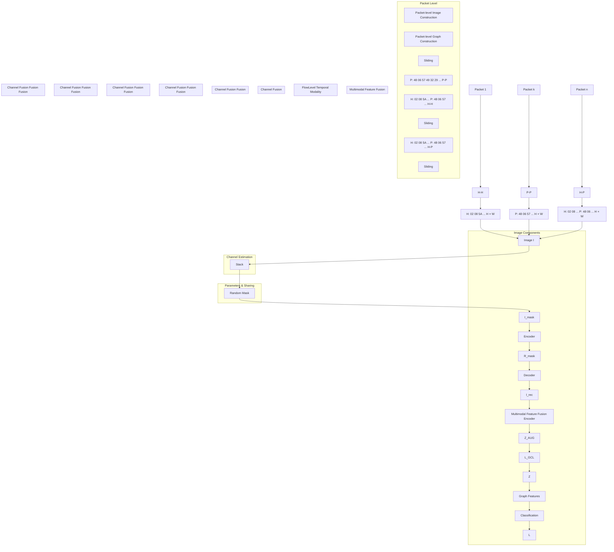

# TRIFUSION: A SELF-SUPERVISED LEARNING ENHANCED DUAL-LEVEL MULTIMODAL FRAMEWORK FOR TRAFFIC CLASSIFICATION

Haodong Yue1,2,3,4

Haozhen Zhang1

Xi Xiao∗,1,2,3,4

Le Yu6

Guangwu Hu5

Qing Li2

1 Shenzhen International Graduate School, Tsinghua University, Shenzhen, China  
2 Peng Cheng Laboratory, Shenzhen, China  
3 State Key Laboratory of Internet Architecture, Tsinghua University, Beijing, China  
4 National Key Laboratory of Advanced Communication Networks, Shijiazhuang, China  
5 Shenzhen Institute of Information Technology, Shenzhen, China  
6 Nanjing University of Posts and Telecommunications, Nanjing, China yuehd24@mails.tsinghua.edu.cn, xiaox@sz.tsinghua.edu.cn

## ABSTRACT

Network traffic classification is crucial for enhancing service quality and security. Existing unimodal methods struggle to exploit complementary features across modalities. To overcome this, we propose TriFusion, a dual-level multimodal framework with self-supervised learning. TriFusion jointly models intra- and inter-packet dependencies by constructing traffic images, graphs, and temporal sequences. Specifically, we construct packet-level traffic images and graphs, where each byte corresponds to both an image pixel and a graph node, enabling consistent fine-grained semantic and relational feature extraction. Furthermore, we creatively construct an inter-packet temporal sequence feature, which enriches the traffic representation. SSL-based encoders are designed for packet-level modalities, yielding robust representation. Extensive experiments on ISCX-VPN and CICIoT datasets show that TriFusion achieves over 99% accuracy, significantly surpassing state-of-the-art approaches.

Index Terms— Traffic Classification, Multimodal Method, Self-Supervised Learning

## 1. INTRODUCTION

Traffic classification is fundamental to network management and security [1], yet the widespread use of encryption and anonymization complicates this task. Despite progress, designing an effective method remains challenging.

Recent advances exploit deep learning on raw packets [2, 3]. While effective, these unimodal methods fail to capture complementary information across modalities. Existing multimodal methods [4–6] combine bytes with statistical or sequential features, but still face limitations: (1) insufficient fine-grained intra-packet modeling, (2) weak region-aware representations, and (3) neglect of inter-packet temporal dependencies.

To address these gaps, we propose TriFusion, a selfsupervised multimodal framework. At the packet level, we design an image-graph representation where each byte is jointly modeled as a pixel and a graph node, capturing semantic and relational structures. At the flow level, we introduce a temporal modality to model inter-packet dependencies. Two modality-specific self-supervised learning (SSL) encoders are developed: an MAE-based image encoder with a hybrid Transformer–CNN backbone, and a graph encoder based on heterogeneous GNNs with tailored augmentations. Extensive experiments on seven benchmark datasets demonstrate that TriFusion achieves state-of-the-art performance, exceeding App-Net and MIMETIC by over 20% accuracy on ISCX-VPN and ISCX-nonTor datasets.

## 2. METHODOLOGY

In this section, we present TriFusion, a framework that extracts semantic, relational, and temporal features from both packet- and flow-level modalities. As shown in Figure 1, we first construct image and graph representations for each packet, offering complementary views of the network packet. Subsequently, we employ two SSL-based encoders to learn robust representations. We then fuse the intra-packet multimodal features to form a unified packet representation. Finally, a temporal module models inter-packet dependencies within flows, yielding enriched traffic representations.

## 2.1. Packet-level Image Modality (PIM)

PIM comprises the image construction and the MAE-based multidimensional feature extractor, as detailed below.

Region-aware Image Construction. Network packets consist of distinct regions, such as headers and payloads, each carrying specific semantics. As shown in Figure 1, we propose a three-channel traffic image construction method to capture these structures explicitly. Each packet is decomposed into header, payload, and header–payload combination, with each mapped to an $H \times W$ matrix whose pixel intensities directly reflect raw byte values. Matrices shorter than $H \times W$ are padded with a fixed value of 256. Stacking the three matrices yields a semantically rich, region-aware image representation. A random masking strategy with ratio $\phi$ is then applied to produce the masked input $I _ { m } ,$ , while the original image I serves as the reconstruction target.

flowchart

Fig. 1: Overview of TriFusion Framework.

Traffic Image Encoder. To jointly model long-range dependencies and fine-grained local patterns, we propose a hybrid encoder that integrates a Lite Transformer (LT) block [7] for global feature extraction and a CNN-based Invertible Neural Network (INN) [8] for local feature modeling. The resulting global and local features are concatenated and further processed by a CNN to obtain the final representation:

$$
R = \operatorname{CNN} (\operatorname{CONCAT} (L T (I), I N N (I))) \tag {1}
$$

where R denotes the enriched traffic image features.

MAE-based Reconstruction. For the masked traffic image $I _ { m } .$ , the image encoder extracts the representation $R _ { m a s k } .$ , which is then decoded (sharing parameters with the encoder) to reconstruct the image. The reconstruction is optimized using a hybrid loss that combines cross-entropy and L1 terms:

$$
\begin{array}{l} \mathbf {I} _ {\text {rec}} = \operatorname{Decoder} \left(R _ {\text {mask}}\right) \\ \boldsymbol {f} _ {\text {rec}} = \boldsymbol {G F} \left(I _ {1} I _ {2}\right) + \dots I _ {1} \left(I _ {n} I _ {n}\right) \end{array} \tag {2}
$$

$$
\mathcal {L} _ {\mathrm{ICL}} = \lambda \cdot C E (I, I _ {r e c}) + \nu \cdot L 1 (I, I _ {r e c})
$$

where $I _ { r e c }$ is the reconstructed image, $C E ( \cdot )$ denotes the cross-entropy loss, $L 1 ( \cdot )$ the L1 loss, and $\lambda , \nu \in [ 0 , 1 ]$ control their relative weights.

## 2.2. Packet-level Graph Modality (PGM)

PGM comprises two components: a graph construction scheme and a contrastive learning-based Heterogeneous Graph Neural Network (HGNN).

Region-aware Graph Construction. As shown in Figure 1, we model byte correlations using Pointwise Mutual Information (PMI) [9]. PMI is computed by sliding a window over the packet sequence and counting byte-pair cooccurrences. An edge is created between two nodes if their PMI value is positive; otherwise, no edge is formed.

To capture positional semantics—since identical byte values in headers and payloads may differ in meaning—we construct a heterogeneous graph G with three edge types: headerto-header, payload-to-payload, and header-to-payload. This design distinguishes intra- and inter-region dependencies, enriching the structural representation of network traffic.

Traffic Graph Encoder. To capture relational features across different edge structures, we employ a HGNN, leveraging its strong capability in extracting edge-aware representations. The encoding process is formulated as follows:

$$
Z = H G N N (G) \tag {3}
$$

where $Z$ represent the traffic graph feature vectors.

Graph Contrastive Learning (GCL). We design graph augmentations and a supervised contrastive loss to enhance representation learning.

Node Dropping. Given a traffic graph $G = ( V , E )$ , nodes and their incident edges are randomly removed with probability $P _ { \mathrm { N D } }$ :

$$
G ^ {\prime} = \left\{\left\{v _ {i} \cdot \rho_ {i} \mid v _ {i} \in V \right\}, \left\{e _ {i j} \cdot \rho_ {i} \mid e _ {i j} \in E \right\} \right\} = \left\{V ^ {\prime}, E ^ {\prime} \right\} \tag {4}
$$

where $\rho _ { i } \sim B ( P _ { \mathrm { N D } } )$ indicates whether node $v _ { i }$ (and its edges) is dropped. Edge Dropping. On $G ^ { \prime }$ , edges are further removed with probability $P _ { \mathrm { E D } } \colon$

$$
G _ {A U G} = \{V ^ {\prime}, \{e _ {i j} \cdot \rho_ {i j} \mid e _ {i j} \in E ^ {\prime} \} \} \tag {5}
$$

where $\rho _ { i j } \sim { \cal B } ( P _ { \mathrm { E D } } )$ . The augmented graph is then embedded by HGNN:

$$
Z _ {\mathrm{AUG}} = H G N N (G _ {\mathrm{AUG}}). \tag {6}
$$

Contrastive Loss. We take the original graph $G$ as the anchor and apply supervised contrastive loss [10] to exploit label information:

$$
\mathcal {L} _ {\mathrm{GCL}} = \sum_ {i \in I} \frac {- 1}{| M (i) |} \sum_ {m \in M (i)} \log \frac {\exp \left(\mathbf {Z} _ {i} ^ {\prime} \cdot \mathbf {Z} _ {m} ^ {\prime} / \tau\right)}{\sum_ {n \in N (i)} \exp \left(\mathbf {Z} _ {i} ^ {\prime} \cdot \mathbf {Z} _ {n} ^ {\prime} / \tau\right)} \tag {7}
$$

where $\mathbf { Z } ^ { \prime }$ is the joint embedding of $\mathbf { Z } _ { \mathrm { A U G } }$ and $\begin{array} { r l } { \mathbf { Z } , ~ I ~ = ~ } & { { } } \end{array}$ $( 1 , \ldots , 2 N )$ indexes augmented samples, $N ( i ) \equiv I$ denotes negatives, and $M ( i ) \equiv \{ m \in M ( i ) : \pmb { y } _ { m } ^ { p } = \pmb { y } _ { i } ^ { p } \}$ represents positives. τ is the temperature parameter.

Multimodal Feature Fusion Encoder. We use a direct and effective concatenation approach combining features:

$$
F = \text { CONCAT } (R, Z) \tag {8}
$$

## 2.3. Flow-level Temporal Modality.

After obtaining packet-level graph and image representations, we capture temporal dynamics of network flows with a Long Short-Term Memory (LSTM) network. This module models long-range dependencies across packets, yielding a temporal feature representation T :

$$
\mathbf {T} = L S T M (F _ {1}, F _ {2}, \dots , F _ {n}). \tag {9}
$$

The classification head maps the representation T through two linear layers with a PReLU activation to obtain the prediction ${ \hat { \mathbf { y } } } .$ . The cross-entropy loss $\mathcal { L }$ is computed between the prediction and the ground-truth.

Training Objective. The overall loss integrates classification, image-level, and graph-level contrastive objectives:

$$
\mathcal {L} _ {\text { total }} = \mathcal {L} + \alpha \mathcal {L} _ {\mathrm{ICL}} + \gamma \mathcal {L} _ {\mathrm{GCL}}, \tag {10}
$$

where $\alpha , \gamma \in [ 0 , 1 ]$ balance the contributions of image- and graph-based SSL losses.

## 3. EXPERIMENTS

## 3.1. Datasets and Experiment Setup

Datasets. To evaluate the effectiveness of TriFusion, we conduct extensive experiments on seven datasets: ISCX VPN-nonVPN2016 (6 categories), ISCX TOR-nonTOR2016 [11] (8 categories), CICIoT2022 [12] (6 categories), Crossnet2021 [13] (20 categories), and USTC-TFC2016 [14] (10 categories), covering three classification tasks.

Pre-processing. For each dataset, we first use SplitCap to extract bidirectional flows from the pcap files. For each packet, we remove corrupted and retransmitted instances, and Ethernet headers, IP addresses, and port numbers to reduce noise. We apply stratified sampling to split each dataset into training and testing sets with a 9:1 ratio.

Implementation Details. Training is conducted for 120 epochs using the Adam optimizer, with an initial learning rate of $1 \times 1 0 ^ { - \bar { 2 } }$ decayed to $1 \times 1 0 ^ { - 5 }$ by a scheduler. All experiments are implemented in PyTorch and averaged over five runs on an NVIDIA RTX4090 GPU.

Metrics and Baseline Methods. To comprehensively evaluate our method, we use Accuracy (AC), Precision (PR), Recall (RC), and F1-score (F1) as our evaluation metrics. In addition, we compare TriFusion with a range of baselines and state-of-the-art (SOTA) methods, as listed below: AppScanner [15], GRAIN [16], CUMUL [17], K-FP [18], and ETC-PS [19] are machine learning-based methods using statistical features for classification. FS-Net [20], DF [21], EDC [22], FlowPic [23], MVML [24], TFE-GNN [25], ET-BERT [2],YaTC [3], and MH-Net [26] are deep learningbased classification methods. APP-Net [4], PEAN [5] and MIMETIC [6] leverage multimodal features.

## 3.2. Performance Comparison with SOTA Methods

Our results in Table 1 highlight the superiority of TriFusion. Key findings include: (1) Efficiency and Accuracy: On the ISCX-nonVPN dataset, YaTC attains only 75.46% despite costly pretraining, whereas TriFusion reaches 93.18%. (2) Advantage over Multimodal Baselines: App-Net and PEAN depend on statistical or raw-packet features, while MIMETIC lacks fine-grained intra-packet modeling. TriFusion outperforms MIMETIC significantly, with a 37.18% accuracy lead on the ISCX-NonTor dataset.

## 3.3. Ablation Study of TriFusion

We perform ablation studies on the ISCX-VPN dataset (Table 2), yielding three key insights: 1) Modality Effectiveness. Removing any modality degrades performance, confirming their complementarity. The largest drop occurs without the graph modality (88.26%), followed by temporal (90.65%) and image (92.41%). Excluding both image and temporal features reduces accuracy to 84.97%, underscoring their joint role in semantic and temporal modeling, especially for classes with similar flow patterns but different timing/content cues. 2) SSL and Global–Local Extractors. Disabling γ or α lowers accuracy by 1.5–2%, showing their contribution to robustness and generalization, likely by stabilizing multi-scale representations under distribution shifts. 3) Fine-Grained Region-Aware Design. In graphs, removing header–payload (H–P) edges yields the largest drop (96.04%), highlighting their role in cross-region dependencies. In images, all three channels (H–H, P–P, H–P) contribute, emphasizing joint semantic encoding across segments and preventing over-reliance on a single region.

Table 1: Experimental Results on ISCX VPN-nonVPN, ISCX Tor-nonTor, Crossnet, USTC-TFC and CICIoT Datasets. The best results are employed in bold and multimodal methods are underlined.

<table><tr><td rowspan="2">Model</td><td colspan="2">ISCX-VPN</td><td colspan="2">ISCX-nonVPN</td><td colspan="2">ISCX-Tor</td><td colspan="2">ISCX-nonTor</td><td colspan="2">Crossnet</td><td colspan="2">USTC-TFC</td><td colspan="2">CICIoT</td></tr><tr><td>AC</td><td>F1</td><td>AC</td><td>F1</td><td>AC</td><td>F1</td><td>AC</td><td>F1</td><td>AC</td><td>F1</td><td>AC</td><td>F1</td><td>AC</td><td>F1</td></tr><tr><td>AppScanner</td><td>88.89%</td><td>87.22%</td><td>75.76%</td><td>74.86%</td><td>75.43%</td><td>61.63%</td><td>91.53%</td><td>82.73%</td><td>73.02%</td><td>72.53%</td><td>93.44%</td><td>93.48%</td><td>96.74%</td><td>96.20%</td></tr><tr><td>GRAIN</td><td>81.29%</td><td>80.27%</td><td>66.67%</td><td>65.67%</td><td>69.14%</td><td>52.34%</td><td>78.95%</td><td>66.13%</td><td>49.21%</td><td>49.15%</td><td>84.83%</td><td>84.35%</td><td>85.34%</td><td>84.75%</td></tr><tr><td>ETC-PS</td><td>88.89%</td><td>88.51%</td><td>72.73%</td><td>72.08%</td><td>74.86%</td><td>60.33%</td><td>93.65%</td><td>84.86%</td><td>83.90%</td><td>83.66%</td><td>93.44%</td><td>93.46%</td><td>92.18%</td><td>91.22%</td></tr><tr><td>FS-Net</td><td>92.98%</td><td>92.34%</td><td>76.26%</td><td>75.55%</td><td>82.86%</td><td>72.42%</td><td>92.78%</td><td>82.85%</td><td>61.22%</td><td>57.86%</td><td>83.34%</td><td>82.70%</td><td>98.05%</td><td>97.59%</td></tr><tr><td>EDC</td><td>78.36%</td><td>78.88%</td><td>69.70%</td><td>69.78%</td><td>64.00%</td><td>45.04%</td><td>86.92%</td><td>74.51%</td><td>31.97%</td><td>31.06%</td><td>52.54%</td><td>46.21%</td><td>92.83%</td><td>92.17%</td></tr><tr><td>FlowPic</td><td>27.32%</td><td>21.94%</td><td>26.80%</td><td>20.27%</td><td>41.27%</td><td>38.25%</td><td>28.35%</td><td>21.34%</td><td>41.04%</td><td>38.16%</td><td>40.59%</td><td>37.65%</td><td>27.84%</td><td>18.28%</td></tr><tr><td>MVML</td><td>64.91%</td><td>61.51%</td><td>51.26%</td><td>48.06%</td><td>63.43%</td><td>37.52%</td><td>72.35%</td><td>54.57%</td><td>38.78%</td><td>34.95%</td><td>87.97%</td><td>87.61%</td><td>84.69%</td><td>81.89%</td></tr><tr><td>TFE-GNN</td><td>95.91%</td><td>95.36%</td><td>90.40%</td><td>92.40%</td><td>98.86%</td><td>98.55%</td><td>93.90%</td><td>85.07%</td><td>65.38%</td><td>61.45%</td><td>98.99%</td><td>98.99%</td><td>96.99%</td><td>96.66%</td></tr><tr><td>ET-BERT</td><td>95.32%</td><td>94.63%</td><td>91.67%</td><td>92.35%</td><td>95.43%</td><td>93.97%</td><td>90.29%</td><td>83.32%</td><td>81.78%</td><td>77.14%</td><td>99.64%</td><td>99.64%</td><td>95.65%</td><td>91.22%</td></tr><tr><td>YaTC</td><td>96.05%</td><td>96.71%</td><td>75.46%</td><td>75.44%</td><td>98.68%</td><td>98.69%</td><td>95.79%</td><td>95.22%</td><td>74.22%</td><td>77.95%</td><td>97.82%</td><td>97.08%</td><td>93.97%</td><td>91.05%</td></tr><tr><td>MH-Net</td><td>99.42%</td><td>99.41%</td><td>91.41%</td><td>91.41%</td><td>98.86%</td><td>98.86%</td><td>94.65%</td><td>94.53%</td><td>80.06%</td><td>80.19%</td><td>99.13%</td><td>99.20%</td><td>99.00%</td><td>98.96%</td></tr><tr><td>App-Net</td><td>71.25%</td><td>70.62%</td><td>58.44%</td><td>58.36%</td><td>58.33%</td><td>58.33%</td><td>52.65%</td><td>51.29%</td><td>62.36%</td><td>62.44%</td><td>87.45%</td><td>87.62%</td><td>86.36%</td><td>88.73%</td></tr><tr><td>MIMETIC</td><td>75.54%</td><td>77.13%</td><td>61.73%</td><td>61.55%</td><td>62.50%</td><td>59.32%</td><td>59.61%</td><td>59.05%</td><td>71.80%</td><td>71.73%</td><td>93.26%</td><td>93.42%</td><td>97.73%</td><td>97.84%</td></tr><tr><td>PEAN</td><td>97.35%</td><td>97.37%</td><td>90.81%</td><td>90.96%</td><td>96.90%</td><td>96.96%</td><td>89.98%</td><td>90.03%</td><td>78.56%</td><td>78.69%</td><td>93.18%</td><td>93.57%</td><td>96.85%</td><td>96.88%</td></tr><tr><td>TriFusion</td><td>99.48%</td><td>99.48%</td><td>93.18%</td><td>93.16%</td><td>97.71%</td><td>97.73%</td><td>96.79%</td><td>96.77%</td><td>86.79%</td><td>85.78%</td><td>99.91%</td><td>99.91%</td><td>99.67%</td><td>99.61%</td></tr></table>

line chart

| Models     | ALL  | 40%  | 20%  | 10%  |
| ---------- | ---- | ---- | ---- | ---- |
| K-FP       | 93   | 92   | 91   | 78   |
| CUMUL      | 92   | 63   | 53   | 50   |
| GRAIN      | 85   | 80   | 79   | 49   |
| ETC-PS     | 92   | 91   | 88   | 78   |
| DF         | 87   | 86   | 81   | 73   |
| EDC        | 93   | 82   | 89   | 70   |
| MVML       | 82   | 80   | 80   | 69   |
| ET-Bert    | 92   | 90   | 70   | 70   |
| YaTC       | 92   | 71   | 70   | 70   |
| Appscanner | 96   | 91   | 85   | 75   |
| FS-NET     | 97   | 93   | 82   | 70   |
| TFE-GNN    | 96   | 94   | 91   | 82   |
| TriFusion  | 98   | 97   | 95   | 88   |

Fig. 2: Results of Few-shot Analysis on the CICIoT Dataset.

Table 2: Ablation Study on the ISCX-VPN Dataset

<table><tr><td>Variants</td><td>AC</td><td>F1</td></tr><tr><td>w/o image modality</td><td>92.41%</td><td>92.50%</td></tr><tr><td>w/o graph modality</td><td>88.26%</td><td>88.48%</td></tr><tr><td>w/o temporal modality</td><td>90.65%</td><td>90.66%</td></tr><tr><td>w/o image &amp; temporal modalities</td><td>84.97%</td><td>84.96%</td></tr><tr><td>w/o graph &amp; temporal modalities</td><td>86.54%</td><td>87.50%</td></tr><tr><td>w/o Graph-modality Contrastive Learning  $\gamma$ </td><td>97.88%</td><td>97.86%</td></tr><tr><td>w/o Image-modality Masked Autoencoder  $\alpha$ </td><td>97.66%</td><td>97.67%</td></tr><tr><td>w/o Image Global Feature Extractor</td><td>98.97%</td><td>98.96%</td></tr><tr><td>w/o Image Local Feature Extractor</td><td>97.94%</td><td>97.94%</td></tr><tr><td>w/o Graph H–H Edges</td><td>97.91%</td><td>97.91%</td></tr><tr><td>w/o Graph P–P Edges</td><td>97.54%</td><td>97.51%</td></tr><tr><td>w/o Graph H–P Edges</td><td>96.04%</td><td>96.44%</td></tr><tr><td>w/o Image H-H channel</td><td>98.45%</td><td>98.46%</td></tr><tr><td>w/o Image P-P channel</td><td>97.71%</td><td>97.03%</td></tr><tr><td>w/o Image H-P channel</td><td>96.41%</td><td>96.41%</td></tr><tr><td>TriFusion</td><td>99.48%</td><td>99.48%</td></tr></table>

## 3.4. Few-shot Analysis

We evaluate TriFusion on the CICIoT dataset under few-shot settings by varying training sample sizes (Fig 2.). TriFusion consistently outperforms all baselines across different data proportions. Further analysis shows that pre-trained models (ET-BERT, YaTC) suffer from instability, while K-FP, CU-MUL, and GRAIN decline notably at low data levels. In contrast, TriFusion remains resilient, underscoring its practicality for real-world IoTs where data scarcity is common.

## 4. CONCLUSION

We propose TriFusion, a self-supervised multimodal framework for traffic classification that integrates packet-level and flow-level representations. Experiments on seven datasets demonstrate state-of-the-art performance, advancing secure and adaptive traffic analysis.

## 5. ACKNOWLEDGEMENT

This work is supported by the Natural Science Foundation of Guangdong Province (2025A1515011946), and the Basic and Frontier Research Project of PCL ( 2025QYA001), the Open Research Fund of State Key Laboratory of Internet Architecture (HLW2025MS28), the National Key Laboratory of Advanced Communication Networks Project (FFX25641X001).

## 6. REFERENCES

[1] Haipeng Yao, Pengcheng Gao, Peiying Zhang, Jingjing Wang, Chunxiao Jiang, and Lijun Lu, “Hybrid intrusion detection system for edge-based iiot relying on machine-learning-aided detection,” IEEE Network, vol. 33, no. 5, pp. 75–81, 2019.  
[2] Xinjie Lin, Gang Xiong, Gaopeng Gou, Zhen Li, Junzheng Shi, and Jing Yu, “Et-bert: A contextualized datagram representation with pre-training transformers for encrypted traffic classification,” 2022, pp. 633–642.  
[3] Ruijie Zhao, Mingwei Zhan, Xianwen Deng, Fangqi Li, Yanhao Wang, Yijun Wang, Guan Gui, and Zhi Xue, “A novel self-supervised framework based on masked autoencoder for traffic classification,” 2024, vol. 32, pp. 2012–2025.  
[4] Xin Wang, Shuhui Chen, and Jinshu Su, “App-net: A hybrid neural network for encrypted mobile traffic classification,” in IEEE INFOCOM 2020-IEEE Conference on Computer Communications Workshops (INFOCOM WKSHPS). IEEE, 2020, pp. 424–429.  
[5] Peng Lin, Kejiang Ye, Yishen Hu, Yanying Lin, and Cheng-Zhong Xu, “A novel multimodal deep learning framework for encrypted traffic classification,” IEEE/ACM Transactions on Networking, vol. 31, no. 3, pp. 1369–1384, 2023.  
[6] Giuseppe Aceto, Domenico Ciuonzo, Antonio Montieri, and Antonio Pescape, “Mimetic: Mobile encrypted traffic classifi- \` cation using multimodal deep learning,” Computer networks, vol. 165, pp. 106944, 2019.  
[7] Zhanghao Wu, Zhijian Liu, Ji Lin, Yujun Lin, and Song Han, “Lite transformer with long-short range attention,” arXiv preprint arXiv:2004.11886, 2020.  
[8] Laurent Dinh, Jascha Sohl-Dickstein, and Samy Bengio, “Density estimation using real nvp,” arXiv preprint arXiv:1605.08803, 2016.  
[9] Liang Yao, Chengsheng Mao, and Yuan Luo, “Graph convolutional networks for text classification,” 2019, pp. 7370–7377.  
[10] Prannay Khosla, Piotr Teterwak, Chen Wang, Aaron Sarna, Yonglong Tian, Phillip Isola, Aaron Maschinot, Ce Liu, and Dilip Krishnan, “Supervised contrastive learning,” 2020, pp. 18661–18673.  
[11] Arash Habibi Lashkari, Gerard Draper-Gil, Mohammad Saiful Islam Mamun, and Ali A. Ghorbani, “Characterization of tor traffic using time based features,” in International Conference on Information System Security and Privacy, 2017, pp. 253–262.  
[12] Sajjad Dadkhah, Hassan Mahdikhani, Priscilla Kyei Danso, Alireza Zohourian, Kevin Anh Truong, and Ali A Ghorbani, “Towards the development of a realistic multidimensional iot  
profiling dataset,” in 2022 19th Annual International Conference on Privacy, Security & Trust (PST). IEEE, 2022, pp. 1–11.  
[13] Wenhao Li, Xiao-Yu Zhang, Huaifeng Bao, Qiang Wang, and Zhaoxuan Li, “Robust network traffic identification with graph matching,” Computer Networks, vol. 218, pp. 109368, 2022.  
[14] Wei Wang, Ming Zhu, Xuewen Zeng, Xiaozhou Ye, and Yiqiang Sheng, “Malware traffic classification using convolutional neural network for representation learning,” in 2017 International conference on information networking (ICOIN). IEEE, 2017, pp. 712–717.  
[15] Vincent F. Taylor, Riccardo Spolaor, Mauro Conti, and Ivan Martinovic, “Appscanner: Automatic fingerprinting of smartphone apps from encrypted network traffic,” in IEEE European Symposium on Security and Privacy, 2016, pp. 439–454.  
[16] Faiz Zaki, Firdaus Afifi, Shukor Abd Razak, Abdullah Gani, and Nor Badrul Anuar, “Grain: Granular multi-label encrypted traffic classification using classifier chain,” Computer Networks, vol. 213, no. 1, pp. 109084, 2022.  
[17] Andriy Panchenko, Fabian Lanze, Andreas Zinnen, Martin Henze, Jan Pennekamp, Klaus Wehrle, and Thomas Engel, “Website fingerprinting at internet scale,” 2016.  
[18] Jamie Hayes and George Danezis, “k-fingerprinting: a robust scalable website fingerprinting technique,” 2016, pp. 1187– 1203.  
[19] Shi-Jie Xu, Guang-Gang Geng, and Xiao-Bo Jin, “Seeing traffic paths: Encrypted traffic classification with path signature features,” vol. 17, no. 1, pp. 2166–2181, 2022.  
[20] Chang Liu, Longtao He, Gang Xiong, Zigang Cao, and Zhen Li, “Fs-net: A flow sequence network for encrypted traffic classification,” 2019, pp. 1171–1179.  
[21] Payap Sirinam, Mohsen Imani, Marc Juarez, and Matthew K Wright, “Deep fingerprinting: Undermining website fingerprinting defenses with deep learning,” 2018, p. 1928–1943.  
[22] Wenbin Li and Gaspard Quenard, “Towards a multi-label dataset of internet traffic for digital behavior classification,” in International Conference on Computer Communication and the Internet, 2021, pp. 38–46.  
[23] Tal Shapira and Yuval Shavitt, “Flowpic: A generic representation for encrypted traffic classification and applications identification,” IEEE Transactions on Network and Service Management, vol. 18, no. 2, pp. 1218–1232, 2021.  
[24] Yanjie Fu, Junming Liu, Xiaolin Li, and Hui Xiong, “A multilabel multi-view learning framework for in-app service usage analysis,” ACM Transactions on Intelligent Systems and Technology, vol. 9, no. 4, pp. 1–24, 2018.  
[25] Haozhen Zhang, Le Yu, Xi Xiao, Qing Li, Francesco Mercaldo, Xiapu Luo, and Qixu Liu, “Tfe-gnn: A temporal fusion encoder using graph neural networks for fine-grained encrypted traffic classification,” 2023, p. 2066–2075.  
[26] Haozhen Zhang, Haodong Yue, Xi Xiao, Le Yu, Qing Li, Zhen Ling, and Ye Zhang, “Revolutionizing encrypted traffic classification with mh-net: A multi-view heterogeneous graph model,” in Proceedings of the AAAI Conference on Artificial Intelligence, 2025, vol. 39, pp. 1048–1056.