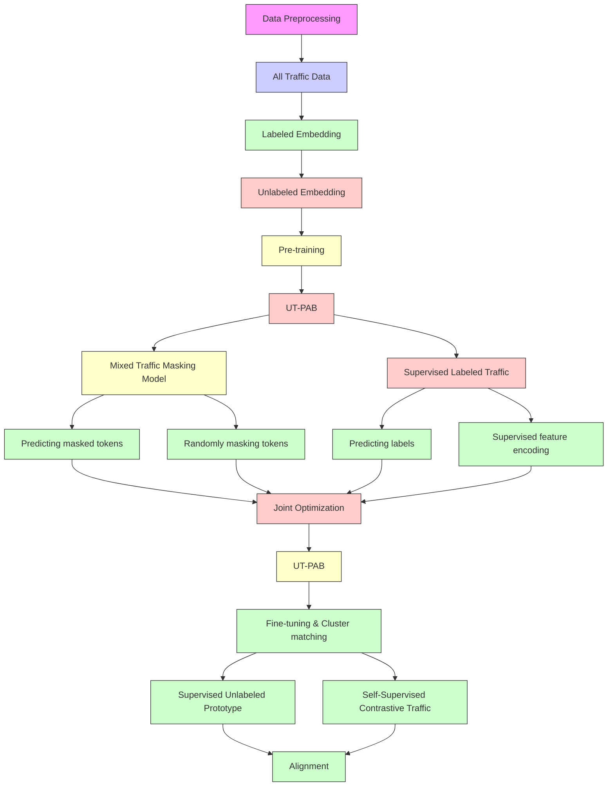

# A prototypical alignment approach to unknown traffic classification using BERT


Minho Cho a, Yongseok Kwon b, Seyoung Ahn b, Sunwon Kwon b, Sunghyun Cho c,∗

a Department of Applied Artificial Intelligence, Hanyang University, Ansan-si, 15588, Gyeonggi-do, South Korea   
b Department of Computer Science and Engineering, Hanyang University, Ansan-si, 15588, Gyeonggi-do, South Korea   
c Department of Computer Science and Engineering, Hanyang University ERICA, Ansan-si, 15588, Gyeonggi-do, South Korea

# a r t i c l e i n f o

Keywords:

Network traffic

Unknown traffic classification

Embedding clustering

Bidirectional encoder representations from

transformers

Encrypted traffic

# a b s t r a c t

As encrypted internet traffic continues to increase, classifying previously unseen traffic has become a major challenge in real-world network environments. Traditional traffic classification models are designed for closed-world scenarios and struggle to process novel traffic types. To address this in real-world network environments, coarsegrained classification approaches have been proposed, which assign all unknown traffic to a single "unknown" class. However, this coarse-grained labeling limits the model’s ability to perform the fine-grained classification of diverse and encrypted traffic behaviors. To address this, we propose Unknown Traffic Prototypical Alignment Bidirectional encoder representations from transformers (UT-PAB), a semi-supervised learning framework for the fine-grained classification of unknown traffic in open-world scenarios. UT-PAB operates in two phases: (1) a pre-training phase that learns general traffic patterns through supervised and masked token prediction tasks, and (2) a fine-tuning phase that refines representations using contrastive learning and prototype-based supervision. These two phases enable the model to cluster unknown traffic by semantic similarity without relying on protocol-specific features. We evaluated the effectiveness of UT-PAB on two benchmark datasets, ISCX-VPN and USTC-TFC, by comparing it against baseline methods based on clustering and representation learning. We conducted extensive experiments on two benchmark datasets across various unknown traffic ratios and demonstrated that the proposed method outperformed state-of-the-art methods by a minimum of 10.63%p and a maximum of 75.34%p improvement in overall accuracy.

# 1. Introduction

The explosive growth of internet applications and traffic has intensified the need for application-aware network management [1]. Traffic classification is a crucial technique for Internet Service Providers (ISPs) to apply in providing customized Quality of Service (QoS) and secure services to their users [2–4]. Initially, Deep Packet Inspection (DPI)- based methods, which detect packet patterns and keywords within payloads, were designed for traffic classification [5]. However, due to the widespread adoption of encrypted traffic for privacy protection, traffic classification techniques have evolved from DPI-based methods to machine learning-based approaches [6].

Machine learning-based traffic classification methods typically learn patterns and features from packet payload or sequence characteristics, demonstrating strong classification accuracy even for encrypted traffic classification [7–13]. However, these methods generally operate in a closed-world scenario, training on and classifying only known types of traffic. In an open-world scenario, known and unknown traffic coexist, a characteristic of real-world network environments. When traditional machine learning-based classifiers are applied in open-world scenarios, they often misclassify unknown traffic as known traffic. Consequently, unknown traffic, which may include malware-generated activities, may be misclassified as benign. Such misclassification can lead to undetected threats and serious security implications.

To address unknown traffic classification in an open-world scenario, coarse-grained unknown traffic classification approaches have been proposed, which group any traffic not belonging to known classes into a single unknown class [14–21]. These approaches train machine learning models on known traffic data and categorize previously unseen traffic into a generic unknown class. However, grouping all unknown traffic into a single category limits the fine-grained classification and reduces the generalizability across diverse traffic types. The inability to distinguish potential threats from new services within the unknown traffic impairs network management and security responses.

Distinguishing unknown traffic at a service level requires finegrained classification techniques that can identify meaningful patterns from unlabeled and previously unseen traffic data. For this, early studies adopted unsupervised clustering algorithms such as K-Means, DBSCAN, and AutoClass. These algorithms cluster traffic exclusively by intrinsic data similarity, without label information [22–24]. However, these approaches mainly depend on byte-level similarity, which performs poorly as traffic patterns become increasingly complex and diverse.

More recent representation learning-based approaches project highdimensional byte sequences to a low-dimensional latent space while preserving intrinsic packet-level characteristics. These methods have received considerable attention for unknown traffic classification [25–31]. Such techniques input traffic flows into machine learning models to extract representative features, projecting the high-dimensional embeddings into a low-dimensional latent space to better classify unknown traffic. However, their reliance on clustering the representations from the model’s output limits their ability to capture the contextual relationships between packet patterns and byte sequences. Consequently, such methods fail to separate unknown traffic into distinct classes, leading to suboptimal fine-grained classification performance.

This paper presents the Unknown Traffic Prototypical Alignment Bidirectional encoder representations from transformers (UT-PAB). It aims to achieve the fine-grained classification of unknown traffic in open-world scenarios with known and unknown traffic. UT-PAB is built on a Bidirectional Encoder Representations from Transformers (BERT)-based architecture and adopts a two-phase framework that effectively captures contextual features from traffic sequences. This structure enables the precise categorization of previously unseen traffic types. Specifically, the proposed UT-PAB comprises a pretraining phase, which learns robust and generalizable representations from known traffic, and a fine-tuning phase, which transfers the pretrained knowledge to generate pseudo-labels for unknown traffic. During pre-training, UT-PAB employs two complementary components: Supervised Labeled Traffic (SLT) and the Mixed Traffic Masking Model (MixTMM). SLT uses labeled known traffic on which the model undergoes supervised training to capture clear and discriminative patterns. Operating in parallel, MixTMM prevents overfitting to specific known patterns by learning byte-level dependencies, thereby improving generalization. In the finetuning phase, two novel tasks adapt the pretrained model to unknown traffic. The Supervised Unlabeled Prototype (SUP) constructs semantic prototypes based on feature similarity within the unlabeled data and assigns pseudo-labels to refine unknown traffic representations. The Self-Supervised Contrastive Traffic (SSCT) module further enhances representation consistency through contrastive learning, thereby smoothing the cluster boundaries in the latent space. The main contributions of this paper are summarized below.

• We propose a novel method for the fine-grained classification of unknown traffic by integrating both known and unknown data. This approach captures the latent representations of unknown traffic and achieves high classification accuracy, thereby enhancing overall system performance   
• We introduce two innovative pre-training techniques to prepare the model for prototype alignment at the finetuning stage: SLT, which captures discriminative patterns of known traffic through supervised learning, and MixTMM, which prevents overfitting and facilitates generalizable representation learning from unlabeled traffic.   
• We propose two fine-tuning methods that adapt the pretrained model to effectively cluster unknown traffic: SUP, which constructs pseudolabels from semantic similarities in the embedding space, and SSCT, which reinforces intra-class consistency and smooths cluster boundaries through contrastive learning.   
• The experimental results on two encrypted traffic benchmark datasets demonstrate UT-PAB’s robustness and superior performance compared to state-of-the-art methods.

The remainder of this paper is organized as follows: Section 2 reviews related work. Section 3 presents the problem formulation and a detailed description of UT-PAB. Section 4 describes the dataset, evaluation criteria, and analysis of experimental results. Finally, Section 5 concludes the paper and discusses future work.

# 2. Related work

This section introduces several previous studies on classifying unknown network traffic. Two aspects are considered: the coarse-grained unknown traffic classification methods and fine-grained unknown traffic classification methods.

# 2.1. Coarse-grained unknown traffic classification

The coarse-grained unknown traffic classification approach learns traffic patterns from known classes with labels. It then automatically classifies newly encountered traffic data with different characteristics into a separate unknown class. This capability allows the model to process new types of traffic that fall outside the scope of the original training distribution. These approaches can be divided into boundary-setting based methods [14,17,20], which explicitly define the spatial boundaries of known classes, and threshold-based methods [15,16,18,19,21], which compare a specific score against a predefined threshold.

Boundary-setting based approaches explicitly define the boundaries of the feature space occupied by known traffic and classify any traffic outside these boundaries as unknown. Zhang et al. [14] proposed RTC, which separates unknown traffic by setting boundaries based on flow statistics. He et al. [17] introduced DSCU, which creates data imbalance to form tighter decision boundaries around known classes. Chen et al. [20] proposed DivinEye, which constructs a sophisticated decision boundary using a known traffic detection model and multiple binary traffic detection models. However, while these boundary-setting based methods form precise decision boundaries, they classify all unknown traffic into a single category, limiting their ability to perform fine-grained classification of the unknown traffic.

Threshold based approaches classify unknown traffic by comparing representations extracted from a model against a threshold. Yang et al. [15] proposed GradBP, which uses the model’s gradient backpropagation and a threshold to classify unknown traffic. Pathmaperuma et al. [16] convert traffic into images and use Softmax probabilities extracted from a Convolutional Neural Network (CNN), comparing them with a threshold to identify unknown traffic. Gao et al. [18] introduced CM-UTC, which adds a cost-sensitive matrix to the Softmax probabilities to address the class imbalance problem. Le et al. [19] pointed out the overconfidence issue of Softmax and proposed EUE, a reliable method that calculates an uncertainty score for comparison with a threshold. Kwon et al. [21] proposed UNRABEL, which compares the similarity score between feature vectors extracted by BERT and those of known classes against a threshold to classify unknown traffic. However, similar to boundary-setting based approaches, these threshold-based methods establish clear classification boundaries for unknown traffic but are limited by classifying all unknown instances into a single category, thus failing to provide a more granular classification.

While these methods effectively classify previously unseen traffic into a single unknown class, they encounter difficulty with the finegrained identification of different subtypes within the unknown class. When new threats or novel applications fall into the unknown category, they remain in a single aggregated class until in-depth analysis is performed. This hampers accurate and timely risk assessment for network management and security.

# 2.2. Fine-grained unknown traffic classification

Enabling the fine-grained classification of unknown traffic requires identifying latent traffic patterns within unlabeled data. Early research in this area directly applied traditional unsupervised clustering algorithms, such as AutoClass [32], K-Means [33], and DBSCAN [34], to statistical features extracted from traffic flows [22–24]. For instance, Erman et al. [23] demonstrated the feasibility of this approach by clustering unknown traffic using K-Means and DBSCAN on transport-layer flow statistics. However, these approaches often rely heavily on statistical features such as byte counts and packet sizes, or on byte-level similarity during clustering, making it difficult to extract meaningful patterns as traffic types become more complex and diverse, thereby degrading classification performance.

Recently, approaches have utilized representations extracted from deep learning models to capture patterns in complex and dynamic traffic. These approaches can be divided into unsupervised learning-based approaches $[ 2 5 , 2 6 , 3 1 ]$ ], which classify traffic using only unlabeled data, and semi-supervised learning-based approaches [27–30], which leverage both labeled and unlabeled data.

Unsupervised learning based approaches aim to create a more effective space for clustering by first extracting representations from input data and then compressing these high-dimensional representations into a lower-dimensional space using an autoencoder. For instance, Li et al. [31] proposed FEAC, which utilizes Word2Vec to extract representations from protocol specifications and then uses an Autoencoder to compress them for clustering. However, because these techniques are limited to clustering the learned representations, they have a fundamental limitation in learning fine-grained representations that reflect the complex internal structure of unknown traffic.

Semi-supervised learning based approaches can effectively cluster representations extracted from unlabeled traffic data by first learning distinct and identifiable patterns from labeled data. Chen et al. [27] proposed SEEN, a Siamese Network-based method that directly learns the representation space using a contrastive loss function. This method leverages known traffic to separate the feature space of unknown classes, bringing samples of the same class closer while pushing samples of different classes further apart. Li et al. [28] later improved upon SEEN by making it more lightweight and suitable for real-time applications. Li et al. [29] proposed FSOSTC, which employs self-supervised learning to extract general traffic representations from unlabeled data. Le et al. [30] introduced Velatin, which combines a Bidirectional Long Short-Term Memory (Bi-LSTM) and a CNN model to more clearly separate the feature space of unknown classes. Nevertheless, these techniques are also limited in the fine-grained classification of unknown traffic, as they merely cluster the representations extracted from the model.

Although recent approaches have demonstrated progress in classifying unknown traffic, many still rely primarily on clustering learned representations without incorporating mechanisms to enforce semantic separability. Consequently, these limitations hinder the model from applying fine-grained classification, emphasizing the need for alignmentbased strategies that explicitly refine feature spaces for improved discrimination.

# 2.3. Summary of existing approaches

In summary, coarse-grained approaches identify all unknown traffic as a single ’unknown’ class using boundary-setting based or threshold based techniques. While effective at separating known from unknown traffic, they are limited in providing detailed network management and security responses due to their inability to distinguish between various types within the unknown traffic. Fine-grained approaches utilize clustering algorithms to granulate the types within unknown traffic. Although they improved performance by clustering traffic representations extracted via deep learning models, they are limited by merely stopping at the clustering of representations. This approach fixes the decision boundaries for unknown classes, thereby hindering the learning of more granular representations for unknown traffic.

In contrast, UT-PAB extracts representations of both clear patterns from known traffic and general patterns from all traffic through a novel pre-training technique that combines supervised and self-supervised learning. Furthermore, it introduces a unique fine-tuning phase that combines prototype-based pseudo-labeling and contrastive learning to adapt the pre-trained model to unknown traffic. Through prototypebased pseudo-labeling, UT-PAB dynamically defines a structured space for unknown classes by forming groups of traffic with similar patterns and constructing byte-level prototypes in the feature space. Simultaneously, contrastive learning enhances the intra-prototype cohesion by training the model to produce similar representations for original and augmented traffic of the same class, thereby widening the distance between different prototypes to form clear and stable cluster boundaries. Unlike existing techniques that use fixed decision boundaries, UT-PAB structures the feature space according to the latent semantics of the traffic, thereby achieving sophisticated and robust fine-grained classification performance for complex patterns of unknown traffic.

# 3. The proposed method

This section presents the proposed UT-PAB framework for finegrained unknown traffic classification. We start by defining the openworld traffic classification problem and providing an overview of the model architecture. Next, we describe the data preprocessing steps utilized to convert raw traffic payloads into effective model inputs. The core learning methodology is then detailed in two stages: a pre-training phase to learn robust, generalizable features, followed by a fine-tuning phase that aligns unknown traffic representations via prototypical learning. Finally, we explain the cluster matching process used to map the predicted clusters to their corresponding ground-truth classes.

# 3.1. Problem definition

Network traffic classification models designed for closed-world scenarios rely on labeled datasets and excel at identifying predefined known traffic classes. However, when encountering traffic not of a known class, closed-world classifiers tend to misclassify such traffic as belonging to a known category, which degrades performance.

Real-world network environments host both known and unknown traffic types. This is designated an open-world scenario, where a classification model must recognize traffic from known classes while also detecting and categorizing traffic from classes not represented in training.

In an open-world scenario, the entire corpus of traffic  can be separated into a known traffic set ${ \mathcal { X } } _ { \mathrm { k n o w n } }$ and an unknown traffic set unknown. Assuming access to the labeled dataset ${ \mathcal { X } } _ { L } \subset { \mathcal { X } } _ { { \mathrm { k n o w n } } }$ which comprises the subset of known traffic with the traffic class information as its label set $\displaystyle \boldsymbol { \mathcal { D } } _ { L } ,$ , expressed as:

$$
D ^ {L} = \{(X _ {i} ^ {L}, y _ {i} ^ {L}) \} _ {i = 1} ^ {N ^ {L}} \subset \mathcal {X} _ {L} \times \mathcal {Y} _ {L},
$$

where $X _ { i } ^ { L }$ denotes a labeled traffic instance, and $N ^ { L }$ is the number of labeled samples. The other traffic instances, except the labeled and known traffic dataset, are defined as the unlabeled dataset and can be expressed as:

$$
D ^ {U} = \{(X _ {i} ^ {U}) \} _ {i = 1} ^ {N ^ {U}} \subset \mathcal {X} - \mathcal {X} _ {L},
$$

where $X _ { i } ^ { U }$ denotes an unlabeled traffic instance, and $N ^ { U }$ is the number of unlabeled samples. Note that the labeled dataset solely comprises the known traffic instances and the class information, whereas the unlabeled dataset can include both known and unknown traffic instances without class information. We utilized the labeled traffic instances and unlabeled traffic instances for the known traffic classification and unknown traffic discovery and categorization, respectively.

To address the misclassification issues caused by the emergence of novel network traffic patterns in open-world scenarios, we designed a model that enables the discovery and fine-grained classification of unknown classes, while also preserving accurate classification performance on known traffic classes.


<details>
<summary>flowchart</summary>


</details>

Fig. 1. Overview of the proposed method UT-PAB.

# 3.2. Model architecture

This section describes the UT-PAB architecture, a learning model designed for the fine-grained classification of unknown traffic. Fig. 1 illustrates the schematic representation of the proposed model for learning traffic packet representation. UT-PAB operates in four main stages: data preprocessing, pre-training, fine-tuning, and cluster matching. During data preprocessing, the dataset is divided into labeled and unlabeled traffic allowing the model to learn unambiguous and discriminative patterns from known traffic and separately modeling the token-level relationships within traffic packets. To represent the traffic data suitably as the model input, token embedding is first applied to learn byte-level representations. Position embedding is then added to capture the contextual relationships within traffic packets by modeling the sequential order of tokens, thus preparing the input for pre-training. Pre-training uses embeddings from both labeled and unlabeled traffic to perform two tasks: SLT, which captures precise and discriminative patterns from known traffic, and MixTMM, which models token-level relationships in unlabeled traffic. Thereby, the model learns generalizable representations that reflect both known and unknown traffic characteristics. In the finetuning stage, the model first constructs prototype clusters using traffic feature embeddings extracted from the classifier pre-trained on known traffic data. It then performs SUP, SSCT, and SLT to form clear decision boundaries between clusters, facilitating more accurate classification. In the cluster matching stage, the model compares the predicted clusters of each input traffic sample with the known class clusters associated with the actual class. Unknown traffic is detected by matching the remaining clusters with the unknown traffic through this process.

# 3.3. Data preprocessing

To classify unknown traffic, we preprocess the collected packet (PCAP) data to prepare it for model training. First, we extract sessionlevel flows from each PCAP file, where each flow comprises multiple packet payloads that share the same five-tuple (source IP address, destination IP address, source port number, destination port number, and protocol). For classification based on payload content, we extract the packet payloads that make up each flow and use them as training data. However, both identifiable headers and five-tuple information embed-

ded in packets can function as identifiers, potentially introducing model bias during both pre-training and fine-tuning. Such bias can cause overreliance on specific flow identifiers rather than learning the intrinsic characteristics of the payload itself, degrading performance when classifying traffic from flows not encountered during training. To mitigate this problem, we remove header fields and five-tuple information that could introduce such bias. Specifically, we remove the Ethernet and IP headers from each packet and exclude the source and destination port numbers from the payload data. This ensures that the model learns to classify traffic based solely on protocol-agnostic payload patterns, thereby achieving more robust performance on previously unseen traffic.

For the model to learn effective representations of unknown traffic, we first convert the payload data, after removing all identifiable headers and five-tuple information, into byte-level sequences. Each sequence is tokenized using a byte-level bi-gram tokenizer to capture the relationship between adjacent byte pairs. The embedding process for training proceeds as follows:

1. Token Embedding: The bi-gram tokenizer constructs a vocabulary of 65,536 tokens, representing all possible combinations of two adjacent bytes. We fix the maximum sequence length to 128 tokens. For training, we add special tokens to each sequence: a [CLS] token at the beginning, a [SEP] token at the end, and [PAD] tokens to fill shorter sequences. Consequently, our token embedding vocabulary comprises 65,536 bi-gram tokens and five special tokens: [CLS], [PAD], and [SEP], as well as [UNK] for out-of-vocabulary byte pairs and [MASK] for token masking during pretraining. This produces a total of 65,541 entries.   
2. Position Embedding: Each token‘s position is indexed from 0 to 127, starting with the [CLS] token. This positional information enables the model to learn the order and contextual dependencies between tokens.

The model can learn the order and relationship between words from the sequence information. The final input embedding is obtained by summing the token embedding and position embedding vectors. Pretraining includes both labeled and unlabeled data. Label IDs are assigned only to the labeled data, while the unlabeled data is processed without any label information.


<details>
<summary>flowchart</summary>

```mermaid
graph TD
    subgraph "Mixed Traffic Masking Model (MixTMM)"
        direction TB
        A["CLS"] <--> B["003a"]
        B <--> C["3a14"]
        C <--> D["143d"]
    end

    subgraph "Supervised Labeled Traffic (SLT)"
        direction TB
        E["SLT"] --> F["Predicting labels"]
        F --> G["Facebook icon"]
        F --> H["Simplified label icon"]
        F --> I["Label icon: 0, 1, 2, ..., 127, 6fc7"]
        I --> J["Label: 0, 1, 2, ..., 127, 6fc7"]
    end

    K["Randomly masking tokens"] --> L["CLS: 003a, MASK: 143d, MASK"]
    M["Label id: None"] --> N["Position Embedding: 0, 1, 2, ..., 127, 6fc7"]
    O["Text: Token Embedding: [CLS"], 001e, 1e02, ..., 6fc7] --> P["Label: +, +, +, +, +, +, +, +, +"]
    Q["Label: [CLS"], 003a, 3a14, ..., 143d, 3d94] --> R["Label: +, +, +, +, +, +, +, +"]
```
</details>

Fig. 2. Structure of pre-training.

# 3.4. Pre-training

The pre-training stage comprises the two tasks shown in Fig. 2: SLT, which captures precise traffic patterns through supervised learning on labeled data, and MixTMM, which models token-level and contextual relationships within traffic packets using masked prediction on mixed traffic.

# 3.4.1. Supervised labeled traffic

The SLT process uses supervised learning on labeled traffic data, which helps the model learn precise and discriminative patterns, thereby establishing well-defined decision boundaries. These decision boundaries serve as a reference for mapping unlabeled data to potential classes, thereby improving the model’s ability to distinguish unknown traffic more effectively. To achieve this, we use the [CLS] token, which encodes the aggregate features of each traffic sequence, and pass it through a classification layer to predict the corresponding class label. The model is trained by minimizing the standard Cross-Entropy (CE) loss between the predicted class distribution and the ground-truth labels of the known traffic, enabling it to capture accurately the distinctive patterns of each known class. To formalize this, the loss function for $L _ { \mathrm { S L T } }$ is defined as follow:

$$
L _ {\mathrm{SLT}} = - \sum_ {y _ {i} \in \mathcal {Y} _ {L}} y _ {i} \log P (y _ {i} | X _ {i}; \theta), \tag {1}
$$

where $\boldsymbol { \mathcal { { D } } } _ { L }$ denotes the set of known traffic classes. $y _ { i }$ is the ground truth label of sample $i ,$ and ?? is the model’s set of trainable parameters. The probability $P ( y _ { i } | X _ { i } ; \theta )$ ) represents the likelihood that the model predicts $y _ { i }$ given $X _ { i } ,$ modeled by the transformer encoder with parameters ??.

# 3.4.2. Mixed traffic masking model

Using the MixTMM approach, the model learns token-level relationships across both labeled and unlabeled traffic data, enabling it to acquire generalizable traffic representations. By learning such general representations, the model becomes more effective at extracting features from unknown traffic. To achieve this, MixTMM randomly selects 15% of the traffic tokens and replaces them with a special [MASK] token. This ratio was empirically determined to be optimal for our traffic classification task, as demonstrated in a detailed ablation study presented in Appendix A A. The model is then trained to predict the original tokens at the masked positions using CE loss, which measures the difference between the predicted tokens and the actual tokens. To formalize this, the loss function for $L _ { \mathrm { M i x T M M } }$ is defined as follows:

$$
L _ {\text { MixTMM }} = - \sum_ {i = 1} ^ {m} \log P (t _ {i} = \text { token } _ {i} | \tilde {X} _ {i}; \theta), \tag {2}
$$

where ?? denotes the number of masked tokens in the input sequence, and $\tilde { X } _ { i }$ represents the masked version of the input sequence ??. The term token?? corresponds to the original token located at the ??-th masked position.

Algorithm 1 Pre-training with MixTMM and SLT loss.   
1: Input: Model $M_{\theta}$ with parameters $\theta$ , Learning rate $\eta$ , Labeled Data $D^{L}$ , Unlabeled Data $D^{U}$ , Epochs N
2: Output: Model $M_{\theta^{*}}$ with optimal parameters $\theta^{*}$ 3: Require Source Input X, Target Output Y
4: for epoch = 1 → N do
5:    for $n = 1 \rightarrow N$ do
6:    Sample a labeled mini-batch ( $X^{L}, Y^{L}$ ) ∈ $D^{L}$ 7:    Compute $L_{SLT}$ using $X^{L}$ and $Y^{L}$ via (1)
8:    Sample a unlabeled mini-batch $X^{U} \in D^{U}$ 9:    Compute $L_{MixTMM}$ using $X^{U}$ via (2)
10: $L_{Pre} \leftarrow L_{SLT} + L_{MixTMM}$ 11: $\theta^{*} \leftarrow AdamW(\eta, \nabla L_{Pre}, \theta)$ 12:    end for
13: end for

# 3.4.3. Joint optimization for pre-training

To train the model to classify unknown traffic effectively, two complementary loss functions must be jointly optimized. This process, detailed in Algorithm 1, balances specificity and generalization by leveraging both supervised and self-supervised objectives. In each training step, the algorithm first calculates the supervised loss, ${ \cal L } _ { \mathrm { S L T } } ,$ using a minibatch of labeled data to guide the learning of precise and discriminative patterns. In parallel, it calculates the self-supervised masked token prediction loss, $L _ { \mathrm { M i x T M M } } ;$ , from a minibatch of unlabeled data, enabling the model to capture generalizable features. The final learning objective is defined as the sum of the two losses above:

$$
L _ {\text { Pre }} = L _ {\text { SLT }} + L _ {\text { MixTMM }}. \tag {3}
$$

This joint optimization ensures that the model does not over-rely on known traffic patterns while still learning meaningful structure from unlabeled data. This enables the model to extract more general and transferable representations, allowing for the robust classification of previously unseen traffic.

# 3.5. Fine-tuning

We propose two fine-tuning tasks inspired by clustering-based methods [35,36] and contrastive representation learning techniques. Unlike previous approaches, our method leverages traffic tokens without explicit semantics to capture byte-level dependencies. The fine-tuning stage comprises the two tasks shown in Fig. 3: SUP, which enables finegrained classification by constructing class prototypes based on feature similarity in unlabeled traffic, and SSCT, which enhances representation consistency by aligning each traffic instance with its augmented counterpart using contrastive learning. In addition to these fine-tuning tasks, we also incorporate the SLT task from the pre-training stage, which jointly optimizes the model and preserves the discriminative knowledge learned from the labeled traffic.

# 3.5.1. Supervised unlabeled prototype

The SUP process guides the model using pseudo-labels derived from unlabeled traffic, enabling supervised learning for the fine-grained classification of unknown traffic. To achieve this, we first input the unlabeled traffic data into the pre-trained model to extract feature representations. Because the pre-trained model has learned general traffic patterns, it can effectively encode the structural characteristics of the unlabeled data. These representations are embedded in a clusteringfriendly space, and we apply the K-Means algorithm to group unknown traffic instances exhibiting similar patterns. Each instance is then assigned a pseudo-label $\tilde { y } _ { i }$ based on its cluster assignment. The model subsequently undergoes supervised training using pseudo-labels, which facilitates learning fine-grained representations and improves its ability to classify previously unseen traffic. The loss function ${ \cal L } _ { \mathrm { S U P } }$ is defined as:


<details>
<summary>flowchart</summary>

```mermaid
graph TD
    A["Unlabeled Traffic"] --> B["UT-PAB"]
    C["Augmented Traffic"] --> B
    D["Labeled Traffic"] --> E["UT-PAB"]
    B --> F["[μ₁, μ₂, ..., μₖ"]] --> G["Unlabeled Prototype"]
    E --> H["Shared Weights"] --> I["○"]
    I --> G
    G --> J["Supervised Unlabeled Prototype (SUP)"]
    J --> K["L_SUP"]
    E --> L["Supervised Labeled Traffic (SLT)"]
    L --> M["L_SLT"]
    M --> N["Self-Supervised Contrastive Traffic (SSCT)"]
    N --> O["0000 ... f301 01da da08 0857 5790 ... 854c"]
    N --> P["0000 ... f301 Mask da08 0857 Mask ... 854c"]
    N --> Q["0000 ... 08585866 663f df66 661d ... a948"]
    N --> R["0000 ... Mask Mask 663f df66 661d ... a948"]
    O --> S["L_SSCT"]
    P --> S
    Q --> S
    R --> S
```
</details>

Fig. 3. Structure of fine-tuning.

$$
L _ {\mathrm{SUP}} = - \sum_ {X _ {i} ^ {U} \in \mathcal {X}} \tilde {y} _ {i} \log P (\hat {y} _ {i} | X _ {i} ^ {U}; \theta), \tag {4}
$$

where $P ( \hat { y } _ { i } | X _ { i } ^ { U } ; \theta )$ denotes the probability that the model predicts class $\hat { y } _ { i }$ for input $X _ { i } ^ { \dot { U } } -$ . This approach aligns unlabeled traffic with known traffic classes while also enabling the discovery of newly emerging unknown traffic.

# 3.5.2. Self-supervised contrastive traffic

The SSCT process augments unlabeled traffic data with [MASK] tokens and learns to maintain a similar representation between the augmented traffic and the original traffic, thereby ensuring consistency. Contrastive learning is implemented to maintain consistency [37]. The masking method randomly selects 15% of the tokens and changes them to MASK tokens. All the MASK tokens are replaced by random words to create augmented traffic, and the augmented traffic and the original traffic are then used for training. It learns by making the features the model extracted from the original traffic resemble the features it extracted from the augmented traffic. At this stage, the augmentation results of the same data are grouped as a positive pair, and the other augmentation results within the batch are grouped as a negative pair. This enforces similarity on samples of the same type while maintaining dissimilarity among other samples. The loss function $L _ { \mathrm { S S C T } }$ is defined as:

$$
L _ {\mathrm{SSCT}} = - \sum_ {X _ {i} \in T ^ {U}} \log \frac {\exp (\text { sim } (X _ {i} , X _ {i} ^ {\prime}) / \tau)}{\sum_ {j = 1} ^ {2 B} \exp (\text { sim } (X _ {i} , X _ {j} ^ {\prime}) / \tau)}, \tag {5}
$$

where $X _ { i } \in T ^ { U }$ and $X _ { i } ^ { \prime }$ denote the feature representations of the original and augmented instances, respectively, and ?? is the batch size. These features are extracted through the transformer encoder. To quantify the difference between each pair of original and augmented instances, we measure the cosine similarity between their representations as follows:

$$
\operatorname{sim} (X _ {i}, X _ {j}) = \frac {X _ {i} \cdot X _ {j}}{\| X _ {i} \| \| X _ {j} \|}, \tag {6}
$$

where ?? is a temperature scaling parameter that controls the sharpness of the distribution during softmax transformation. Note that all features are normalized using $l _ { 2 } ^ { } ,$ -normalization before computing similarity scores.

Algorithm 2 Fine-tuning with SSCT, SUP, and SLT Loss.   
1: Input: Model $M_{\theta}$ with parameters $\theta$ , Learning rate $\eta$ , Labeled Data $D^{L}$ , Unlabeled Data $D^{U}$ , Epochs N, Weights $\alpha$ , $\beta$ 2: Output: Model $M_{\theta^{*}}$ with optimal parameters $\theta^{*}$ 3: Require Source Input X, Target Output Y
4: for epoch = 1 → N do
5:    Compute set of representations $Z^{U} = M_{\theta}(D^{U})$ 6:    Generate set of pseudo-label $\hat{Y}^{U}$ for $D^{U}$ via prototypical clustering of $Z^{U}$ 7:    for $n = 1 \rightarrow N$ do
8:    Sample a labeled mini-batch ( $X^{L}, Y^{L}$ ) ∈ $D^{L}$ 9:    Compute $L_{SLT}$ using $X^{L}$ and $Y^{L}$ via (1)
10:    Sample a unlabeled mini-batch $X^{U} \in D^{U}$ 11:    Sample the pseudo-label $\hat{y}^{U} \in \hat{Y}^{U}$ of $X^{U}$ 12:    Compute $L_{SUP}$ using $X^{U}$ and $\hat{y}^{U}$ via (4)
13:    Generate augmented instance $X_{a}^{U}$ from $X^{U}$ 14:    Compute $L_{SSCT}$ using $X^{U}$ and $X_{a}^{U}$ via (5)
15: $L_{Fine} \leftarrow L_{SUP} + \alpha L_{SSCT} + \beta L_{SLT}$ 16: $\theta^{*} \leftarrow AdamW(\eta, \nabla L_{Fine}, \theta)$ 17:    end for
18: end for

# 3.5.3. Joint optimization for fine-tuning

We effectively fine-tuned the unknown traffic classification model by jointly optimizing three complementary loss functions. This process, detailed in Algorithm 2, balances supervised and self-supervised signals, allowing the model to generalize more effectively to unseen traffic. In each training step, the algorithm first calculates the supervised unlabeled prototype loss, $\begin{array} { r } { L _ {  { \mathrm { S U P } } } , } \end{array}$ , by generating prototypes from a minibatch of unlabeled data and clustering them based on similarity. SUP enables the fine-grained classification of unknown traffic by aligning similar instances to the same prototype. Simultaneously, the contrastive learning loss, $L _ { \mathrm { S S C T } } ,$ , is calculated to train the model to produce similar representations for original and augmented traffic of the same class. SSCT enhances the cohesion of data within each prototype and widens the distance to other prototypes, forming clear and stable cluster boundaries. While SUP focuses on class-level alignment, SSCT promotes instancelevel consistency, and their combination allows the model to extract meaningful structure from unlabeled data. Furthermore, to prevent the model from forgetting the knowledge acquired from known traffic during pre-training and to mitigate the effects of noisy pseudo-labels, the SLT loss is incorporated using labeled traffic. The final learning objective is defined as the weighted sum of ${ \cal L } _ { \sf S U P } , { \cal L } _ { \sf S S C T } ,$ , and ${ \cal L } _ { \mathrm { S L T } } ,$ and can

Table 1 Summary of the ISCX-VPN and USTC-TFC datasets. Applications are shown with their corresponding IDs. The number of flows are dataset-level statistics. 

<table><tr><td>Dataset</td><td>ID</td><td>Name</td><td>#Flow</td><td>ID</td><td>Name</td><td>#Flow</td><td>ID</td><td>Name</td><td>#Flow</td><td>ID</td><td>Name</td><td>#Flow</td></tr><tr><td rowspan="5">ISCX-VPN</td><td> $v_1$ </td><td>Chat</td><td>10.2K</td><td> $v_6$ </td><td>VoIP</td><td>20K</td><td> $v_{11}$ </td><td>VPN-Stream</td><td>0.7k</td><td></td><td></td><td></td></tr><tr><td> $v_2$ </td><td>Email</td><td>7.8K</td><td> $v_7$ </td><td>VPN-Chat</td><td>3.9K</td><td> $v_{12}$ </td><td>VPN-VoIP</td><td>7k</td><td></td><td></td><td></td></tr><tr><td> $v_3$ </td><td>FT</td><td>57.9K</td><td> $v_8$ </td><td>VPN-Email</td><td>0.3k</td><td></td><td></td><td></td><td></td><td></td><td></td></tr><tr><td> $v_4$ </td><td>P2P</td><td>11.3K</td><td> $v_9$ </td><td>VPN-FT</td><td>1k</td><td></td><td></td><td></td><td></td><td></td><td></td></tr><tr><td> $v_5$ </td><td>Stream</td><td>4.3K</td><td> $v_{10}$ </td><td>VPN-P2P</td><td>0.5k</td><td></td><td></td><td></td><td></td><td></td><td></td></tr><tr><td rowspan="5">USTC-TFC</td><td> $u_1$ </td><td>Bittorrent</td><td>7.5K</td><td> $u_6$ </td><td>Gmail</td><td>8.6K</td><td> $u_{11}$ </td><td>Nsis-ay</td><td>6K</td><td> $u_{16}$ </td><td>Tinba</td><td>8.5K</td></tr><tr><td> $u_2$ </td><td>Cridex</td><td>16.4K</td><td> $u_7$ </td><td>Htbot</td><td>6.4K</td><td> $u_{12}$ </td><td>Outlook</td><td>7.5K</td><td> $u_{17}$ </td><td>Virut</td><td>33.1K</td></tr><tr><td> $u_3$ </td><td>Facetime</td><td>6K</td><td> $u_8$ </td><td>Miuref</td><td>13.5K</td><td> $u_{13}$ </td><td>Shifu</td><td>9.6K</td><td> $u_{18}$ </td><td>Weibo</td><td>39.9K</td></tr><tr><td> $u_4$ </td><td>Ftp</td><td>101K</td><td> $u_9$ </td><td>Mysql</td><td>86.1K</td><td> $u_{14}$ </td><td>Skype</td><td>6.3K</td><td> $u_{19}$ </td><td>Worldofwarcraft</td><td>7.9K</td></tr><tr><td> $u_5$ </td><td>Geodo</td><td>41K</td><td> $u_{10}$ </td><td>Neris</td><td>33.8K</td><td> $u_{15}$ </td><td>SMB</td><td>38.9K</td><td> $u_{20}$ </td><td>Zeus</td><td>11K</td></tr></table>

Table 2 Scenarios by dataset with known class Count (KC) and unknown class count (UC). 

<table><tr><td>Dataset</td><td>Scenarios</td><td>KC #classes</td><td>UC #classes</td></tr><tr><td rowspan="3">ISCX-VPN</td><td>Scenario V-a</td><td>10</td><td>2</td></tr><tr><td>Scenario V-b</td><td>9</td><td>3</td></tr><tr><td>Scenario V-c</td><td>8</td><td>4</td></tr><tr><td rowspan="3">USTC-TFC</td><td>Scenario U-a</td><td>17</td><td>3</td></tr><tr><td>Scenario U-b</td><td>15</td><td>5</td></tr><tr><td>Scenario U-c</td><td>13</td><td>7</td></tr></table>

be expressed as:

$$
L _ {\text { Fine }} = L _ {\text { SUP }} + \alpha L _ {\text { SSCT }} + \beta L _ {\text { SLT }}, \tag {7}
$$

where ?? and ?? respectively are weights of $L _ { \mathrm { S S C T } }$ and $L _ { \mathrm { S L T } }$

This enables sophisticated classification for unknown traffic with complex patterns by dynamically structuring the feature space according to the semantic structure of the unknown traffic, all while preserving existing knowledge.

# 3.6. Cluster matching

After fine-tuning, our method assigns clusters to both known and unknown traffic using prototype-based classification. However, since the predicted cluster indices, termed pseudo-labels, do not inherently correspond to known classes, a post hoc alignment step is required to identify and exclude clusters associated with known classes, thereby isolating clusters that represent unknown traffic. To address this, we adopted the Hungarian algorithm [38], a combinatorial optimization method that finds the optimal one-to-one mapping between pseudo labels and ground-truth labels by maximizing the matching accuracy. Given a confusion matrix $C \in \mathbb { R } ^ { \mathrm { K } \times G }$ , where K is the number of predicted clusters and ?? is the number of ground-truth classes, each element $M _ { i j }$ denotes the number of samples in cluster ?? that belong to class ??. The number of predicted clusters K is obtained by adopting an off-the-shelf number estimation algorithm [39] that selects the value that maximizes clustering accuracy on a labeled subset of data. Details on K are shown in Appendix B. The Hungarian algorithm seeks the optimal assignment ?? that maximizes the total matching between clusters and classes as follows:

$$
\max _ {\pi} \sum_ {i = 1} ^ {G} C _ {i, \pi (i)}, \tag {8}
$$

where ?? is a permutation of the predicted cluster indices that aligns them to ground-truth labels. This process effectively minimizes the total mismatch cost, or equivalently, maximizes the correct assignments between clusters and true classes. This alignment enables a consistent and fair evaluation of clustering performance, allowing the accuracy metric to reflect true class-level prediction quality across both known and unknown categories.

# 4. Experiments

This section evaluates the effectiveness of the proposed UT-PAB framework through extensive experiments. We begin by describing the benchmark datasets and implementation details, followed by the experimental settings, which encompass the design of evaluation scenarios, performance metrics, and parameter tuning. The experimental results are then analyzed, demonstrating the superior performance of our model compared to state-of-the-art approaches. Finally, we conclude with a complexity analysis to assess the computational efficiency and practical feasibility of the proposed method.

# 4.1. Dataset and implementation details

For comparison with other methods, we used two public Internet traffic datasets: the ISCX-VPN dataset and the USTC-TFC dataset. The ISCX-VPN dataset is raw traffic obtained from the Canadian Cyber Security Research Center [40]. Virtual private networks (VPNs) are widely used to circumvent censorship, access geo-restricted services, and hinder detection through protocol obfuscation. The original dataset is divided into 14 classes, with 7 representing regular traffic and the remaining 7 related to VPN technology. Because the labels “browsing” and “VPN-browsing” could be confused with other labels, these labels were refined as reported in other studies [41]. Consequently, to test UT-PAB with VPN and non-VPN traffic, we constructed a dataset with 12 categories, comprising 6 VPN and 6 non-VPN traffic types. The USTC-TFC dataset is a collection of traffic comprising malware and benign applications [42]. It includes 20 categories, 10 of which represent harmless traffic and 10, malicious traffic. The ISCX-VPN dataset contains approximately 300,000 flows and the USTC-TFC dataset approximately 480,000 flows. Further details are given in Table 1. We randomly extracted 2500 flows for each class in the dataset during pretraining and fine-tuning. If a class contains fewer than 2500 flows, we use all available flows for that class. The labeled data represents 20% of the known classes, and the unlabeled data is the dataset without the known classes used in the labeled data and the unknown traffic dataset.

We used TCP and UDP packets with all five tuples removed to minimize the five-tuple traffic identification. We used the pre-trained Encrypted Traffic Bidirectional Encoder Representations from Transformer (ET-BERT) model as the backbone and adopted the hyperparameters recommended for the model [13]. Only the last four transformer layers use the AdamW optimizer to adjust the parameters. The learning rates for pre-training and fine-tuning were respectively set to 5e-5 and 1e-5, with the epochs set to 10. In the proposed fine-tuning stage, SUP clusters feature representations into prototypes based on the K-Means algorithm. However, K-Means requires the number of clusters K to be predefined. To determine the optimal value of K, we employed the Davies-Bouldin Index (DBI) [43]. DBI evaluates clustering quality by jointly considering intra-cluster compactness and inter-cluster separation. The optimal number of clusters is selected by minimizing the DBI score.

Table 3 Performance comparison, including H-score, Known accuracy, and Unknown accuracy, on the ISCX-VPN dataset across three different scenarios (V-a, V-b, V-c). Results are shown in the format average (±std.) obtained over five folds. 

<table><tr><td rowspan="2">Method</td><td colspan="3">Scenario V-a (UR = 15%)</td><td colspan="3">Scenario V-b (UR = 25%)</td><td colspan="3">Scenario V-c (UR = 35%)</td></tr><tr><td>H-score</td><td>Known(%)</td><td>Unknown(%)</td><td>H-score</td><td>Known(%)</td><td>Unknown(%)</td><td>H-score</td><td>Known(%)</td><td>Unknown(%)</td></tr><tr><td>K-Means</td><td> $18.26(\pm 4.50)$ </td><td> $21.08(\pm 3.14)$ </td><td> $22.20(\pm 15.70)$ </td><td> $20.24(\pm 2.59)$ </td><td> $20.40(\pm 3.24)$ </td><td> $23.87(\pm 9.71)$ </td><td> $19.20(\pm 0.45)$ </td><td> $23.85(\pm 0.41)$ </td><td> $16.10(\pm 0.83)$ </td></tr><tr><td>MFD&amp;DBSCAN [24]</td><td> $13.46(\pm 3.67)$ </td><td> $15.83(\pm 5.38)$ </td><td> $26.55(\pm 26.88)$ </td><td> $16.75(\pm 3.76)$ </td><td> $15.45(\pm 3.54)$ </td><td> $25.25(\pm 10.62)$ </td><td> $15.17(\pm 3.69)$ </td><td> $18.07(\pm 4.46)$ </td><td> $17.56(\pm 8.92)$ </td></tr><tr><td>FEAC [31]</td><td> $15.49(\pm 10.03)$ </td><td> $36.81(\pm 1.59)$ </td><td> $11.02(\pm 7.93)$ </td><td> $31.96(\pm 1.52)$ </td><td> $32.87(\pm 1.28)$ </td><td> $31.43(\pm 3.84)$ </td><td> $29.39(\pm 6.94)$ </td><td> $33.48(\pm 6.40)$ </td><td> $30.58(\pm 12.81)$ </td></tr><tr><td>SEEN [27]</td><td> $73.24(\pm 7.01)$ </td><td> $93.22(\pm 1.29)$ </td><td> $60.84(\pm 9.22)$ </td><td> $72.91(\pm 7.69)$ </td><td> $94.92(\pm 3.89)$ </td><td> $59.52(\pm 8.30)$ </td><td> $60.53(\pm 9.11)$ </td><td> $94.66(\pm 4.31)$ </td><td> $44.60(\pm 7.30)$ </td></tr><tr><td>Velatin [30]</td><td> $79.83(\pm 7.05)$ </td><td> $98.21(\pm 0.45)$ </td><td> $67.83(\pm 9.44)$ </td><td> $79.63(\pm 4.86)$ </td><td> $98.63(\pm 0.54)$ </td><td> $72.31(\pm 13.35)$ </td><td> $71.52(\pm 7.92)$ </td><td> $98.29(\pm 0.68)$ </td><td> $56.82(\pm 10.49)$ </td></tr><tr><td>UT-PAB (Ours)</td><td> $94.77(\pm 1.75)$ </td><td> $91.40(\pm 2.53)$ </td><td> $98.42(\pm 1.21)$ </td><td> $91.46(\pm 3.38)$ </td><td> $92.55(\pm 4.54)$ </td><td> $90.97(\pm 7.24)$ </td><td> $85.17(\pm 3.08)$ </td><td> $84.60(\pm 5.59)$ </td><td> $86.38(\pm 6.61)$ </td></tr></table>

Table 4 Performance comparison, including H-score, Known Accuracy, and Unknown Accuracy, on the USTC-TFC dataset across three different scenarios (U-a, U-b, U-c). Results are shown in the format average (±std.) obtained over five folds. 

<table><tr><td rowspan="2">Method</td><td colspan="3">Scenario U-a (UR = 15%)</td><td colspan="3">Scenario U-b (UR = 25%)</td><td colspan="3">Scenario U-c (UR = 35%)</td></tr><tr><td>H-score</td><td>Known(%)</td><td>Unknown(%)</td><td>H-score</td><td>Known(%)</td><td>Unknown(%)</td><td>H-score</td><td>Known(%)</td><td>Unknown(%)</td></tr><tr><td>K-Means</td><td>38.94(±6.96)</td><td>41.66(±2.55)</td><td>40.05(±14.44)</td><td>41.29(±3.65)</td><td>41.68(±2.55)</td><td>42.48(±8.97)</td><td>38.98(±2.68)</td><td>45.34(±3.34)</td><td>35.82(±4.79)</td></tr><tr><td>MFD&amp;DBSCAN [24]</td><td>16.82(±5.02)</td><td>22.72(±1.40)</td><td>15.23(±7.91)</td><td>20.93(±2.82)</td><td>19.69(±4.51)</td><td>28.75(±13.40)</td><td>21.13(±0.93)</td><td>20.46(±3.26)</td><td>23.89(±6.12)</td></tr><tr><td>FEAC [31]</td><td>25.39(±8.59)</td><td>31.20(±2.81)</td><td>25.68(±15.95)</td><td>31.16(±1.48)</td><td>28.75(±2.36)</td><td>35.23(±7.07)</td><td>29.83(±1.64)</td><td>28.27(±4.81)</td><td>34.27(±8.94)</td></tr><tr><td>SEEN [27]</td><td>76.12(±3.57)</td><td>94.54(±1.46)</td><td>63.76(±4.04)</td><td>72.86(±7.92)</td><td>96.69(±0.82)</td><td>58.90(±7.85)</td><td>68.76(±3.81)</td><td>95.38(±0.57)</td><td>53.80(±3.39)</td></tr><tr><td>Velatin [30]</td><td>77.43(±1.77)</td><td>98.46(±0.76)</td><td>63.83(±2.25)</td><td>70.78(±3.10)</td><td>98.92(±0.96)</td><td>55.22(±3.91)</td><td>69.22(±2.77)</td><td>99.34(±0.60)</td><td>53.19(±3.26)</td></tr><tr><td>UT-PAB (Ours)</td><td>87.04(±2.97)</td><td>87.72(±3.21)</td><td>86.89(±7.14)</td><td>84.16(±2.97)</td><td>81.94(±2.05)</td><td>86.81(±6.38)</td><td>78.42(±4.59)</td><td>81.71(±2.15)</td><td>75.96(±8.56)</td></tr></table>

All experiments were performed on the Ubuntu 22.04 OS using an NVIDIA GeForce RTX A5000 GPU. We implemented our method using the PyTorch 1.11.0 library based on Python 3.8.19.

# 4.2. Experimental settings

# 4.2.1. Experimental scenarios

To demonstrate the effectiveness and robustness of the proposed UT-PAB, two datasets with six scenarios were designed according to proportionally different unknown classes. Specifically, the Unknown class Ratio (UR) was set to approximately 15%, 25%, and 35% for each dataset. To ensure that a specific choice of unknown classes does not bias our results, we performed five independent runs for each scenario. In each run, the unknown classes were selected randomly according to the predefined ratio. Table 2 summarizes the configuration of these scenarios, detailing the number of known and unknown classes for each proportional split. All reported performance metrics are the mean and standard deviation calculated over these five runs. For pre-training and finetuning, the training, validation, and test datasets in all scenarios were respectively split using an 8:1:1 ratio.

# 4.2.2. Evaluation metrics

This section defines the criteria for measuring the efficiency of the UT-PAB. The clustering-based model’s performance was evaluated using the following accuracy calculation criteria. Accuracy was computed based on the correspondence between the ground-truth label $y _ { i }$ and the predicted label $\hat { y } _ { i }$ for each data instance. Accuracy was defined as follows:

$$
A C C = \frac {1}{M} \sum_ {i = 1} ^ {M} \mathbf {1} \{y _ {i} = \hat {y} _ {i} \}, \tag {9}
$$

where ?? denotes the total number of data instances, and $1 \{ y _ { i } = \hat { y } _ { i } \}$ is an indicator function that returns 1 if the predicted label $\hat { y } _ { i }$ matches the ground-truth label $y _ { i } ,$ or otherwise, 0.

We then used the H-score [44] as the harmonic mean of the accuracy of the known and unknown traffic classes. The harmonic mean avoids the evaluation bias for known and unknown categories and is defined by:

$$
\text { H - score } = \frac {2 \cdot A C C _ {\text { known }} \cdot A C C _ {\text { unknown }}}{A C C _ {\text { known }} + A C C _ {\text { unknown }}}. \tag {10}
$$

  
Fig. 4. Effect of Hyperparameters $\alpha , \beta ,$ and ?? in the ISCX-VPN dataset.

# 4.2.3. Parameter tuning

UT-PAB, has three parameters that must be tuned: the weight of SLT and SSTC in the fine-tuning, $\alpha , \beta ,$ and the temperature, ??. Clustering accuracy for each parameter was used to evaluate the impact on the known and unknown classes. ?? represents the SSTC loss during the fine-tuning. The experiment was conducted over the range of [0.03, 0.07] for $\alpha ,$ and Fig. 4(a) shows that the H-score is 95.7 when ?? is 0.05. In the representation space, SSTC smooths the decision boundary by ensuring that the augmented data remains close to the original sample but is separated from the others. The ?? value of 0.05 allows the unknown prototype class to be properly separated, resulting in the highest performance. When ?? $> 0 . 0 5$ , the augmented positive pairs become excessively close, causing the latent space representations to be overly dispersed, degrading performance on unknown classes. Conversely, an $\alpha \ : < 0 . 0 5$ , weakens the consistency of representations between augmented samples blurring the boundaries between prototypes in the latent space and reducing performance on unknown traffic. ?? represents the weight of SLT loss during fine-tuning. SLT is a supervised process for training a class of known traffic to learn the representation of known traffic. Fig. 4(b) shows that the highest H-score value is obtained when ?? is 100. ?? represents the SSTC temperature. Fig. 4(c) shows that the highest H-score is obtained when ?? is 0.01. ?? controls the sharpness of the distribution when converting the similarity score of each sample to a softmax. Otherwise expressed, it is a scaling parameter of the distribution. The smaller ?? becomes, the sharper the distribution, and the more it concentrates on the positive sample. Consequently, positive samples tend to cluster and the display space becomes too dense or the rest separate, deteriorating the cluster quality. When < 0.01, the impact of SLT loss is less for known samples, but performance degradation occurs for unknown samples due to the distorted distribution. If > 0.01, the softmax output flattens and all similarities are treated similarly. This reduces the clustering quality and the accuracy on unknown samples declines to 88.5%. Therefore, to achieve the best performance, we set the hyperparameters to?? = 0.05, ?? = 100, and ?? = 0.05 in our experiments.

  
(a) FEAC


<details>
<summary>line</summary>

| X  | Y (Line 1) | Y (Line 2) | Y (Line 3) | Y (Line 4) | Y (Line 5) |
|----|------------|------------|------------|------------|------------|
| 0  | 0          | 0          | 0          | 0          | 0          |
| 1  | 1          | 1          | 1          | 1          | 1          |
| 2  | 2          | 2          | 2          | 2          | 2          |
| 3  | 3          | 3          | 3          | 3          | 3          |
| 4  | 4          | 4          | 4          | 4          | 4          |
| 5  | 5          | 5          | 5          | 5          | 5          |
| 6  | 6          | 6          | 6          | 6          | 6          |
| 7  | 7          | 7          | 7          | 7          | 7          |
| 8  | 8          | 8          | 8          | 8          | 8          |
| 9  | 9          | 9          | 9          | 9          | 9          |
| 10 | 10         | 10         | 10         | 10         | 10         |
| 11 | 11         | 11         | 11         | 11         | 11         |
| 12 | 12         | 12         | 12         | 12         | 12         |
| 13 | 13         | 13         | 13         | 13         | 13         |
| 14 | 14         | 14         | 14         | 14         | 14         |
| 15 | 15         | 15         | 15         | 15         | 15         |
| 16 | 16         | 16         | 16         | 16         | 16         |
| 17 | 17         | 17         | 17         | 17         | 17         |
| 18 | 18         | 18         | 18         | 18         | 18         |
| 19 | 19         | 19         | 19         | 19         | 19         |
| 20 | 20         | 20         | 20         | 20         | 20         |
| 21 | 21         | 21         | 21         | 21         | 21         |
| 22 | 22         | 22         | 22         | 22         | 22         |
| 23 | 23         | 23         | 23         | 23         | 23         |
| 24 | 24         | 24         | 24         | 24         | 24         |
| 25 | 25         | 25         | 25         | 25         | 25         |
| 26 | 26         | 26         | 26         | 26         | 26         |
| 27 | 27         | 27         | 27         | 27         | 27         |
| 28 | 28         | 28         | 28         | 28         | 28         |
| 29 | 29         | 29         | 29         | 29         | 29         |
| 30+| -          | -          | -          | -          | -          |
</details>

(b) SEEN

  
(c) Velatin


<details>
<summary>scatter</summary>

| Category | Value |
|---|---|
| Category 1 | 100 |
| Category 2 | 95 |
| Category 3 | 90 |
| Category 4 | 85 |
| Category 5 | 80 |
| Category 6 | 75 |
| Category 7 | 70 |
| Category 8 | 65 |
| Category 9 | 60 |
| Category 10 | 55 |
| Category 11 | 50 |
| Category 12 | 45 |
| Category 13 | 40 |
| Category 14 | 35 |
| Category 15 | 30 |
| Category 16 | 25 |
| Category 17 | 20 |
| Category 18 | 15 |
| Category 19 | 10 |
| Category 20 | 5 |
| Category 21 | 0 |
| Category 22 | 50 |
| Category 23 | 60 |
| Category 24 | 70 |
| Category 25 | 80 |
| Category 26 | 90 |
| Category 27 | 100 |
| Category 28 | 110 |
| Category 29 | 120 |
| Category 30 | 130 |
| Category 31 | 140 |
| Category 32 | 150 |
| Category 33 | 160 |
| Category 34 | 170 |
| Category 35 | 180 |
| Category 36 | 190 |
| Category 37 | 200 |
| Category 38 | 210 |
| Category 39 | 220 |
| Category 40 | 230 |
| Category 41 | 240 |
| Category 42 | 250 |
| Category 43 | 260 |
| Category 44 | 270 |
| Category 45 | 280 |
| Category 46 | 290 |
| Category 47 | 300 |
| Category 48 | 310 |
| Category 49 | 320 |
| Category 50 | 330 |
| Category 51 | 340 |
| Category 52 | 350 |
| Category 53 | 360 |
| Category 54 | 370 |
| Category 55 | 380 |
| Category 56 | 390 |
| Category 57 | 400 |
| Category 58 | 410 |
| Category 59 | 420 |
| Category 60 | 430 |
| Category 61 | 440 |
| Category 62 | 450 |
| Category 63 | 460 |
| Category 64 | 470 |
| Category 65 | 480 |
| Category 66 | 490 |
| Category 67 | 500 |
| Category 68 | 510 |
| Category 69 | 520 |
| Category 70 | 530 |
| Category 71 | 540 |
| Category 72 | 550 |
| Category 73 | 560 |
| Category 74 | 570 |
| Category 75 | 580 |
| Category 76 | 590 |
| Category 77 | 600 |
| Category 78 | 610 |
| Category 79 | 620 |
| Category 80 | 630 |
| Category 81 | 640 |
| Category 82 | 650 |
| Category 83 | 660 |
| Category 84 | 670 |
| Category 85 | 680 |
| Category 86 | 690 |
| Category 87 | 700 |
| Category 88 | 710 |
| Category 89 | 720 |
| Category 90 | 730 |
| Category 91 | 740 |
| Category 92 | 750 |
| Category 93 | 760 |
| Category 94 | 770 |
| Category 95 | 780 |
| Category 96 | 790 |
| Category 97 | 800 |
| Category 98 | 810 |
| Category 99 | 820 |
| Total: (Note: The values in the 'Total' column are placeholders for the actual values from the 'data' array. The actual values will vary based on the random number generator's output. )
</details>

(d) UT-PAB (Ours)

  
Fig. 5. t-SNE visualization of learned traffic embeddings from ISCX-VPN.

# 4.3. Experimental results

# 4.3.1. Comparison with state-of-the-art methods

We compare the accuracy performance of our proposed UT-PAB model against the unsupervised clustering algorithm K-Means, as well as four state-of-the-art (SOTA) approaches: MFD&DBSCAN [24], FEAC [31], SEEN [27], and Velatin [30]. K-Means clusters raw byte-level traffic data to classify unknown traffic. To ensure a fair comparison with FEAC and eliminate potential bias, we adapted its experiment to use the same input settings as our proposed UT-PAB. The embedding vectors were extracted using the word2vec model combined with an autoencoder and then clustered for unknown traffic classification. SEEN utilizes a Siamese network architecture built upon 1D-CNNs, which is trained on encrypted traffic payloads using contrastive loss. For unknown traffic classification, it performs clustering on the learned embedding space extracted from the trained model. Velatin uses BiLSTM and CNN models for feature extraction and a tree-based classifier with decision boundaries for unknown traffic classification. These models’ performance on unknown traffic were evaluated at three different fractions 15%, 25%, and 35%. The metrics were defined to evaluate the classification and detection performance comprehensively in both the known and unknown traffic scenarios. Tables 3 and 4 respectively present the performance evaluation results for the SOTA methods on the ISCX-VPN and USTC-TFC datasets.

Our proposed UT-PAB consistently outperformed K-Means across all metrics and scenarios. Regarding the H-score, UT-PAB achieved an average score of 90.47 in Scenario V (ISCX-VPN dataset) and 83.21 in Scenario U (USTC-TFC dataset), outperforming K-Means by respectively 71.24 and 43.47 points. For Known Accuracy, UT-PAB achieved average accuracies of 89.52% and 83.79% in Scenarios V and U, respectively, outperforming K-Means by 67.74%p and 40.9%p. For Unknown Accuracy, UT-PAB achieves average accuracies of 91.92% (Scenarios V) and 83.22% (Scenarios U), outperforming K-Means by 71.2%p and 43.77%p, respectively, demonstrating significantly superior performance in all tests. The inferior performance of K-Means compared to UT-PAB is due to its reliance on byte-level data similarity for clustering, which limits it to byte-level patterns. Conversely, UT-PAB uses representations extracted from models explicitly trained to capture unknown traffic patterns, enabling effective type-specific clustering and classification.

For performance comparison with MFD&DBSCAN and FEAC, we use the parameters provided by [24]: ℎ????????????????ℎ = 20 (the number of initial bytes to analyze), ???????????? = 3 (the minimum number of points required to form a dense region), ?????? = 3.8 (the maximum distance between two samples for one to be considered as in the neighborhood of the other). MFD&DBSCAN introduces token format distance and message format distance to compute packet similarity and uses DBSCAN for clustering. FEAC constructs Protocol Data Units (PDUs) from continuous payload data in traffic flows, extracts representations using the word2vec model, and reduces high-dimensional representations to a lowdimensional latent space using an autoencoder before clustering. The detailed performance values in Tables 3 and 4 clearly show that UT-PAB significantly outperforms both MFD&DBSCAN and FEAC on all metrics. The reason for this performance gap is that MFD&DBSCAN and FEAC both extract features based on the structure of protocol messages, including field lengths, types, and positions. However, this structural analysis approach has limitations when applied to datasets such as ISCX-VPN and USTC-TFC, which contain encrypted traffic where payload data is typically obscured, making structural feature extraction difficult.

In comparison to SEEN, UT-PAB exhibits superior performance in all scenarios, achieving average H-score improvements of 21.58 and 10.63 points in Scenarios V and U, respectively. While SEEN records higher known accuracy with averages of 94.27% and 95.54%, outperforming UT-PAB by 11.75%p in Scenarios U, UT-PAB significantly outperformed SEEN, achieving an average of 36.93%p and 24.4%p higher classification performance in Scenarios V and U, respectively. SEEN classifies unknown traffic by training a 1D-CNN-based Siamese network using raw packet data and applying contrastive loss to embed same-class traffic closely and different-class traffic distantly. However, although this approach extracts clear patterns for known traffic, the reliance on supervised learning of explicit patterns limits its ability to generalize to broader traffic behaviors. In contrast, UT-PAB utilizes a pre-training strategy with MixTMM which avoids overfitting to known traffic patterns and enhances robustness against unknown traffic. This enables more powerful feature extraction for unknown traffic, surpassing SEEN’s classification performance

Compared to Velatin, UT-PAB achieved a higher H-score, outperforming Velatin by an average of 13.48 points in Scenarios V and 10.73 points in Scenarios U. Velatin demonstrated higher known classification performance than UT-PAB by 8.86%p and 15.12%p in Scenarios V and U, respectively. However, its performance on unknown traffic was lower by 26.27%p and 28.81%p, demonstrating its limitations in the fine-grained classification of unknown traffic. Velatin utilizes a supervised learning model trained on known traffic data to classify unknown traffic. Then, it simply clusters the classified unknown data based on the extracted representations. In contrast, UT-PAB uses representations extracted from encoders specifically trained to capture discriminative unknown traffic patterns and applies a robust feature extraction strategy that ensures the close proximity of representations within similar unknown traffic classes. Therefore, UT-PAB can provide more accurate and robust fine-grained classification for unknown traffic scenarios.

We utilize t-SNE [45] to visualize the feature representations of the ISCX-VPN dataset, as depicted in Fig. 5. From the 12 classes in the dataset, we randomly selected three as unknown classes: Chat, P2P, and VPN-P2P. The figure presents the visualization of feature representations from a SOTA model for these unknown classes and the remaining known classes. Fig. 5(a) illustrates the limitations in feature extraction from the encrypted traffic dataset, showing that the features are largely intermingled in the feature space. Through Figs. 5(b) and (c), it is evident that while semi-supervised learning based methods achieve distinct cluster separation for known traffic, they fail to form clear decision boundaries for unknown traffic, resulting in a scattered distribution. In contrast, Fig. 5(d) demonstrates clear cluster separation for both known and unknown classes. This is a significant finding, as it indicates the value of capturing type-specific patterns in traffic to enhance the performance of the discriminative classifier.


<details>
<summary>heatmap</summary>

| Ground Truth | Cluster number | Value |
|---|---|---|
| v2 | 1 | -0.4 |
| v2 | 2 | 0.4 |
| v2 | 3 | 96.3 |
| v2 | 4 | - |
| v2 | 5 | - |
| v2 | 6 | - |
| v2 | 7 | - |
| v2 | 8 | - |
| v2 | 9 | - |
| v2 | 10 | - |
| v2 | 11 | 2.5 |
| v2 | 12 | 0.8 |
| v3 | 1 | - |
| v3 | 2 | - |
| v3 | 3 | - |
| v3 | 4 | - |
| v3 | 5 | 98.1 |
| v3 | 6 | - |
| v3 | 7 | - |
| v3 | 8 | - |
| v3 | 9 | 0.8 |
| v3 | 10 | 1.1 |
| v3 | 11 | - |
| v3 | 12 | - |
| v5 | 1 | - |
| v5 | 2 | 77.2 |
| v5 | 3 | 5.0 |
| v5 | 4 | - |
| v5 | 5 | 1.9 |
| v5 | 6 | 1.2 |
| v5 | 7 | - |
| v5 | 8 | 0.4 |
| v5 | 9 | - |
| v5 | 10 | 12.7 |
| v5 | 11 | 0.4 |
| v5 | 12 | 1.2 |
| v6 | 1 | - |
| v6 | 2 | 5.1 |
| v6 | 3 | - |
| v6 | 4 | 2.3 |
| v6 | 5 | - |
| v6 | 6 | - |
| v6 | 7 | - |
| v6 | 8 | - |
| v6 | 9 | - |
| v6 | 10 | 91.4 |
| v6 | 11 | 1.2 |
| v6 | 12 | - |
| v7 | 1 | - |
| v7 | 2 | - |
| v7 | 3 | - |
| v7 | 4 | - |
| v7 | 5 | - |
| v7 | 6 | - |
| v7 | 7 | 98.8 |
| v7 | 8 | - |
| v7 | 9 | 0.4 |
| v7 | 10 | 0.4 |
| v7 | 11 | 0.4 |
| v7 | 12 | - |
| v8 | 1 | - |
| v8 | 2 | - |
| v8 | 3 | - |
| v8 | 4 | - |
| v8 | 5 | - |
| v8 | 6 | - |
| v8 | 7 | 100.0 |
| v8 | 8 | - |
| v8 | 9 | - |
| v8 | 10 | - |
| v8 | 11 | - |
| v8 | 12 | - |
| v9 | 1 | - |
| v9 | 2 | 99.6 |
| v9 | 3 | - |
| v9 | 4 | - |
| v9 | 5 | - |
| v9 | 6 | - |
| v9 | 7 | - |
| v9 | 8 | - |
| v9 | 9 | - |
| v9 | 10 | - |
| v9 | 11 | - |
| v9 | 12 | - |
| v11 | 1 | - |
| v11 | 2 | - |
| v11 | 3 | - |
| v11 | 4 | - |
| v11 | 5 | - |
| v11 | 6 | - |
| v11 | 7 | - |
| v11 | 8 | - |
| v11 | 9 | - |
| v11 | 10 | - |
| v11 | 11 | - |
| v11 | 12 | - |
| v12 | 1 | - |
| v12 | 2 | - |
| v12 | 3 | - |
| v12 | 4 | - |
| v12 | 5 | - |
| v12 | 6 | - |
| v12 | 7 | - |
| v12 | 8 | - |
| v12 | 9 | - |
| v12 | 10 | - |
| v12 | 11 | - |
| v12 | 12 | - |
| v12_0-0-0-0-0-0-0-0-0-0-0-0-0-0-0-0-0-0-0-0-0-0-0-0-0-0-0-0-0-0-0-0-0-0-0-0-0-0-0-0-0-0-0-0-0-0-0-0-0-0-0, 
v1_0-0-0-0-0-0-0-0-0-0-0-0-0-0-0-0-0-0-0-0-0-0-0-0-0-0-0-0-0-0-0, 
v4_0-0-0-0-0-0-0-0-0-0-0-0-0-0-0-0-0-0-0-0-0, 
v4_1_0-0-0-0-0-0-0-0-0-0-0-0, 
v4_2_0-0-0-0-0-0-0-0-0-0, 
v4_3_0-0-0-0-0-0, 
v4_4_0-0, 
v4_5_0, 
v4_6_0, 
v4_7_0, 
v4_8_0, 
v4_9_0, 
v4_10_0, 
v4_11_0, 
v4_12_0, 
v4_13_0, 
v4_14_0, 
v4_15_0, 
v4_16_0, 
v4_17_0, 
v4_18_0, 
v4_19_0, 
v4_20_0, 
v4_21_0, 
v4_22_0, 
v4_23_0, 
v4_24_0, 
v4_25_0, 
v4_26_0, 
v4_27_0, 
v4_28_0, 
v4_29_0, 
v4_30_0, 
v4_31_0, 
v4_32_0, 
v4_33_0, 
v4_34_0, 
v4_35_0, 
v4_36_0, 
v4_37_0, 
v4_38_0, 
v4_39_0, 
v4_40_0, 
v4_41_0, 
v4_42_0, 
v4_43_0, 
v4_44_0, 
v4_45_0, 
v4_46_0, 
v4_47_0, 
v4_48_0, 
v4_49_0, 
v4_50_0, 
v4_51_0, 
v4_52_0, 
v4_53_0, 
v4_54_0, 
v4_55_0, 
v4_56_0, 
v4_57_0, 
v4_58_0, 
v4_59_0, 
v4_60_0, 
v4_61_0, 
v4_62_0, 
v4_63_0, 
v4_64_0, 
v4_65_0, 
v4_66_0, 
v4_67_0, 
v4_68_0, 
v4_69_0, 
v4_70_0, 
v4_71_0, 
v4_72_0, 
v4_73_0, 
v4_74_0, 
v4_75_0, 
v4_76_0, 
v4_77_0, 
v4_78_0, 
v4_79_0, 
v4_80_0, 
v4_81_0, 
v4_82)_o
V---V---V---V---V---V---V---V---V---V---V---V---V---V---V---V---V---V---V---V---V---V---V---V---V---V---V---V---V---V---V---V---V---V---V---V---V---V---V---V---V---V---V---V---V---V---V---V---V---V---V---
\ V---\ V---\ V---\ V---\ V---\ V---\ V---\ V---\ V---\ V---\ V---\ V---\ V---\ V---\ V---\ V---\ V---\ V---\ V---\ V---\ V---\ V---\ V---\ V---\ V---\ V---\ V---\ V---\ V---\ V---\ V---\ V---\ V---\ V--- \n V:99.2\n V:99.2\n V:99.2\n V:99.2\n V:99.2\n V:99.2\n V:99.2\n V:99.2\n V:99.2\n V:99.2\n V:99.2\n V:99.2\n V:99.2\n V:99.2\n V:99.2\n V :99.2\n V :99.2\n V :99.2\n V :99.2\n V :99.2\n V :99.2\n V :99.2\n V :99.2\n V :99.2\n V :99.2\n V :99.2\n V :99.2\n V :99.2\n V :99.2\n V :98.5\n V :98.5\n V :98.5\n V :98.5\n V :98.5\n V :98.5\n V :98.5\n V :98.5\n V :98.5\n V :98.5\n V :98.5\n V :98.5\n V :98.5\n V :98.5\n V :98.5\n B: The image contains a table with three rows and three columns of data points for each row and column number.
</details>

(a) Scenario V-b

  
(b) Scenario U-b   
Fig. 6. Confusion matrices of UT-PAB for the V-b and U-b scenarios. The blue areas indicate the classification results for flows of known classes, while the pink areas indicate the classification results for flows of unknown classes. To simplify the presentation all 0 values are replaced by a hyphen. (For interpretation of the color references in this figure legend, the reader is referred to the Web version of this article). (For interpretation of the references to colour in this figure legend, the reader is referred to the web version of this article.)

# 4.3.2. Evaluation of fine-grained traffic classification in scenarios V-b and U-b

To demonstrate the effectiveness of UT-PAB, Fig. 6 presents confusion matrices for Scenarios V-b and U-b. The blue areas indicate the classification results for known traffic classes, while the pink-to-purple areas correspond to unknown traffic classes. A darker blue shade signifies higher classification accuracy for known classes, and a transition from pink to purple indicates improved accuracy for unknown classes. The x-axis of each confusion matrix represents the predicted cluster IDs obtained during the inference stage, which are aligned with ground-truth labels using the Hungarian algorithm to enable quantitative evaluation. The presented matrices correspond to a representative run where the number of predicted clusters, as determined by the estimation method in Appendix B, matched the ground-truth number of classes. As Fig. 6 shows, UT-PAB effectively distinguishes most traffic flows according to their respective categories. In particular, several known classes such as $v _ { 2 } \left( \mathrm { C h a t } \right) , v _ { 3 }$ (Email), and $v _ { 8 }$ (VoIP) are mapped distinctly to single clusters, demonstrating the model’s ability to capture the characteristic patterns of individual services. Similarly, for unknown traffic in Scenario U-b, classes like $u _ { 1 }$ (BitTorrent), $u _ { 1 4 } \ ( { \mathrm { S k y p e } } ) ,$ , and $u _ { 1 3 }$ (Shifu) exhibit high classification accuracy due to their strong, distinguishable traffic signatures. However, Fig. 6(a) shows that $v _ { 5 }$ (Stream) is misclassified as $v _ { 6 }$ (VoIP) in 12.68% of the cases. This confusion is attributed to the similar real-time characteristics of both services, leading them to be embedded into proximate cluster regions. In Scenario $\mathbf { U } \mathbf { - } \mathbf { b } , u _ { 2 }$ (Cridex) and $u _ { 1 2 }$ (Outlook) show relatively low classification accuracy below 60%. The Cridex malware family produces diverse and dynamic traffic patterns that do not conform to a single distribution, making it difficult to cluster effectively. Outlook, however, exhibits unstructured patterns due to its multifunctional nature (e.g., mail reception, synchronization, and notification), which contributes to unstable clustering. Notably, $u _ { 9 }$

(MySQL) fails to form a coherent cluster and is often misclassified into $u _ { 1 7 }$ (Virut) and $u _ { 2 0 }$ (Zeus). This misclassification stems from the overlapping query-response patterns among these services, causing MySQL traffic to be drawn toward the embedding space regions dominated by Zeus and Virut.

These results suggest that functional similarities between certain classes can introduce ambiguity into the model’s decision-making process. Nevertheless, UT-PAB consistently demonstrates high classification performance across both known and unknown traffic classes, enabling effective fine-grained classification of previously unseen traffic.

# 4.3.3. Ablation study

Table 5 shows the results of an ablation study that verified the contributions of the techniques proposed in Scenario V-b. To fairly verify the performance of each technique, the same training and test datasets were used for pre-training and fine-tuning. Rows (1)-(4) compare the performance difference between SLT and MixTMM in pre-training. In (1), we see that using only MixTMM, the H-score increased slightly to 5.66, while using SLT, it increased significantly to 53.97. MixTMM also helped to represent traffic, but in particular, the task of training traffic data from a known class of SLT in (2) allowed the model to learn clear traffic patterns from known traffic data and create clear decision boundaries for known traffic improving both the known and unknown detection accuracy. In (3), when using both SLT and MixTMM, the score increased by 56.45 points by indirectly learning the clear decision boundary between representations of the known and unknown traffic. Rows (5)-(7) compare the performance differences between the three loss functions when fine-tuning is employed. When the SLT loss that represents the known class traffic is removed, there is a 11.3-point performance drop compared to the full model in (8) due to catastrophically forgetting the known traffic. Row (6) shows that lacking a prototype label to provide a clear destination for unlabeled data causes a 9.55-point decrease. Row (7) shows that lacking a prototype to smooth the cluster boundary for the generated prototype and known traffic produces a 7.79-point performance penalty.

# 4.3.4. Evaluation of generalization across encapsulation types

To further evaluate the generalization performance of our proposed method, we conducted an additional experiment on a more challenging task. We created a 6-class task by merging the corresponding VPN and non-VPN application classes from the ISCX-VPN dataset (e.g., ’Chat’ and ’VPN-Chat’ were combined into a single ’Chat’ class). This task is significantly more difficult because the model must learn to identify the fundamental patterns of an application while ignoring the substantial statistical variations introduced by VPN encapsulation. This experiment was performed with an unknown traffic ratio of 35%, with the results presented in Table 6.

Table 5 Ablation study under Scenario V-b using combinations of five loss components. The full model (8) achieves the best H-score and high performance on both known and unknown classes. 

<table><tr><td rowspan="2"></td><td rowspan="2">P-SLT</td><td rowspan="2">MixTMM</td><td rowspan="2">SUP</td><td rowspan="2">F-SLT</td><td rowspan="2">SSCT</td><td colspan="3">Scenario V-b (UR = 25%)</td></tr><tr><td>H-score</td><td>Known(%)</td><td>Unknown(%)</td></tr><tr><td>(1)</td><td></td><td></td><td></td><td></td><td></td><td>21.56</td><td>25.40</td><td>18.72</td></tr><tr><td>(2)</td><td></td><td>√</td><td></td><td></td><td></td><td>27.22</td><td>26.00</td><td>29.58</td></tr><tr><td>(3)</td><td>√</td><td></td><td></td><td></td><td></td><td>75.53</td><td>87.20</td><td>67.27</td></tr><tr><td>(4)</td><td>√</td><td>√</td><td></td><td></td><td></td><td>78.01</td><td>86.53</td><td>73.55</td></tr><tr><td>(5)</td><td>√</td><td>√</td><td>√</td><td></td><td>√</td><td>80.16</td><td>86.40</td><td>79.63</td></tr><tr><td>(6)</td><td>√</td><td>√</td><td></td><td>√</td><td>√</td><td>81.91</td><td>88.88</td><td>78.02</td></tr><tr><td>(7)</td><td>√</td><td>√</td><td>√</td><td>√</td><td></td><td>83.67</td><td>91.83</td><td>77.81</td></tr><tr><td>(8)</td><td>√</td><td>√</td><td>√</td><td>√</td><td>√</td><td>91.46</td><td>92.55</td><td>90.97</td></tr></table>

Table 6 Performance comparison for the 6-class generalization task, where corresponding VPN and non-VPN classes from the ISCX-VPN dataset are merged. 

<table><tr><td rowspan="2">Method</td><td colspan="3">UR = 35%</td></tr><tr><td>H-score</td><td>Known (%)</td><td>Unknown (%)</td></tr><tr><td>SEEN [27]</td><td>65.73 (±4.76)</td><td>77.20 (±2.87)</td><td>58.88 (±6.28)</td></tr><tr><td>Velatin [30]</td><td>75.81 (±4.77)</td><td>96.71 (±0.85)</td><td>62.60 (±6.43)</td></tr><tr><td>UT-PAB (Ours)</td><td>85.22 (±7.06)</td><td>92.04 (±6.06)</td><td>81.06 (±15.87)</td></tr></table>

Despite the increased difficulty of this generalization task, the results show that UT-PAB maintains a significant performance margin over the other strong baseline methods, SEEN and Velatin. As shown in Table 6, UT-PAB achieved an H-score of 85.74 points, which is 9.41 points and 19.49 points higher than Velatin and SEEN, respectively. Furthermore, UT-PAB demonstrates its strong generalization capability, with an unknown accuracy that is 18.46%p and 22.18%p higher than Velatin’s and SEEN’s, respectively. While other models may overfit to superficial features that distinguish VPN traffic, UT-PAB’s representation learning framework successfully captures the more essential, application-specific patterns, allowing it to identify applications effectively regardless of their encapsulation environment.

# 4.3.5. Model complexity analysis

The practical utility of a traffic classification model is determined not only by its accuracy but also by its deployment feasibility, which is closely linked to complexity and computational efficiency. These factors are critical indicators of resource consumption and response latency in a real-world network environment. In this section, we assess these aspects by comparing the number of trainable parameters and the inference time required to process a single traffic flow for UT-PAB and the baseline methods. The results are summarized in Table 7.

In terms of model complexity, the parameter count of UT-PAB (62.6M) is lower than that of SEEN (70.18M), but higher than FEAC (45.8M) and Velatin (5.9M). Nevertheless, UT-PAB achieves an overall accuracy that is between 10.63%p and 75.34%p higher than these SOTA models. These results demonstrate that leveraging a relatively larger model capacity can yield substantial performance improvements, highlighting a favorable trade-off between model complexity and classification accuracy.

Table 7 Comparison of model parameters and inference time. 

<table><tr><td>Model</td><td>Parameters (M)</td><td>Inference time (ms)</td></tr><tr><td>MFD&amp;DBSCAN [24]</td><td>-</td><td>0.18</td></tr><tr><td>FEAC [31]</td><td>48.8</td><td>1.04</td></tr><tr><td>SEEN [27]</td><td>70.18</td><td>0.47</td></tr><tr><td>Velatin [30]</td><td>5.9</td><td>0.50</td></tr><tr><td>UT-PAB (Ours)</td><td>62.6</td><td>0.56</td></tr></table>

Furthermore, despite its smaller parameter count, FEAC exhibits a relatively long inference time, attributable to the increase in vocabulary size generated by its Word2Vec model as dataset diversity increases. Although UT-PAB’s inference time is longer than that of SEEN and Velatin, it remains well below the 73 ms typically observed in DPI-based solutions currently deployed in network environments [46], demonstrating its practical feasibility for real-world applications.

Regarding deployment feasibility, UT-PAB is primarily designed for server-grade infrastructure equipped with GPU, rather than for resourceconstrained edge devices. Based on our measurements using a single GPU, UT-PAB achieves a throughput of approximately 1844 flows/sec. Assuming the average flow size derived from the ISCX-VPN dataset, this translates to an estimated network throughput of 1.33 Gb/s. Therefore, our approach demonstrates practical feasibility by striking a favorable balance between model efficiency and effectiveness, consistently delivering superior accuracy and generalization across two datasets, making it a highly cost-effective system for real-world deployment.

# 5. Conclusion

This paper presents UT-PAB, a novel method for fine-grained clustering of known and unknown network traffic in open-world scenarios. UT-PAB learns robust and discriminative traffic representations by introducing two pre-training objectives: SLT, which captures explicit patterns of known traffic, and MixTMM, which encourages generalizable token-level representation learning. To improve clustering in the finetuning stage, we propose SUP and SSCT, which jointly optimize clusterlevel alignment and instance-level consistency. Through extensive experiments on benchmark datasets, UT-PAB demonstrated SOTA performance in classifying unknown traffic, achieving a significantly higher H-score and accuracy than the compared methods.

Despite UT-PAB’s strong classification performance in identifying and clustering unknown traffic, its classification accuracy for known traffic classes remains comparatively low against several SOTA methods. This limitation arises from the clustering process, where each known class is expected to form a distinct cluster, but suboptimal clustering can cause samples to merge into incorrect clusters. Although, to promote precise cluster formation, this study incorporated four loss functions during training, the resulting classification accuracy for known classes remained inferior. To address this issue, future research should focus on designing more precise clustering mechanisms. Representative approaches include cluster-aware objectives such as center separation loss, which increases inter-class distance, and compactness loss, which enhances intra-class cohesion. Additionally, adaptive clustering techniques that dynamically determine cluster structures based on data distribution can further improve clustering precision. These directions offer promising avenues for enhancing fine-grained traffic classification in open-world scenarios.

# CRediT authorship contribution statement

Minho Cho: Conceptualization, Writing – original draft, Formal analysis, Methodology, Software, Visualization, Data curation; Yongseok Kwon: Software, Methodology, Writing – review & editing, Formal analysis; Seyoung Ahn: Methodology, Writing – review & editing, Formal analysis; Sunwon Kwon: Data curation, Software; Sunghyun Cho: Supervision, Writing – review & editing, Project administration, Funding acquisition.

# Data availability

The authors do not have permission to share data.

# Declaration of competing interest

The authors declare that they have no known competing financial interests or personal relationships that could have appeared to influence the work reported in this paper.

# Acknowledgment

This work was supported by Korea Research Institute for defense Technology planning and advancement(KRIT) grant funded by the Korea government(DAPA(Defense Acquisition Program Administration)) (No. KRIT-CT-22-021, Space Signal Intelligence Research Laboratory, 2022).

# Appendix A. Ablation study on the masking ratio for MixTMM

To validate the choice of the 15% masking ratio used in the MixTMM pre-training phase, we conducted an ablation study comparing model performance with masking ratios of 10%, 15%, and 20%. The results of this experiment are presented in Table A.1.

As the Table A.1 shows, the 15% ratio yields the highest performance across all key metrics, including H-score, known traffic accuracy, and unknown traffic accuracy. A lower masking ratio of 10% appears to provide an insufficient learning signal for the model. With fewer tokens to predict, the pre-training task becomes less challenging, which may prevent the model from learning the deep, contextual relationships necessary for robust feature extraction. Conversely, a higher ratio of 20% degrades performance, likely due to excessive context removal. Masking too large a portion of the sequence can fragment the traffic patterns, making it difficult for the model to learn meaningful dependencies between bytes. Therefore, the 15% ratio strikes a balance, creating a sufficiently challenging pre-training objective while preserving enough contextual information for the model to learn robust and generalizable representations.

Table A.1   
Performance of the MixTMM model with different masking rates under Scenario V-b (UR = 25%). The best performance is achieved with a 15% masking rate, highlighted in bold. 

<table><tr><td rowspan="2">MixTMM</td><td colspan="3">Scenario V-b (UR = 25%)</td></tr><tr><td>H-score</td><td>Known(%)</td><td>Unknown(%)</td></tr><tr><td>Masking Rate = 10%</td><td>86.47(±5.93)</td><td>93.09(±5.11)</td><td>81.66(±10.88)</td></tr><tr><td>Masking Rate = 15%</td><td>91.46(±3.38)</td><td>92.55(±4.54)</td><td>90.97(±7.24)</td></tr><tr><td>Masking Rate = 20%</td><td>85.22(±6.76)</td><td>92.04(±5.96)</td><td>81.26(±14.40)</td></tr></table>

# Appendix B. Estimation of the number of clusters

To automatically estimate the total number of clusters K, we adopt the off-the-shelf method Max-ACC [39], which selects the value that maximizes clustering accuracy on a labeled subset of the data. This approach operates by searching over a range of possible K values. For each value, it performs K-Means clustering on all traffic data and then calculates the clustering accuracy for only the labeled samples using the Hungarian algorithm [38] for optimal assignment. The K that yields the highest accuracy on this subset is selected as the optimal estimate. The effectiveness of this method is shown in Table B.1.

Table B.1   
Estimated class counts and errors on ISCX-VPN and USTC-TFC. 

<table><tr><td></td><td>ISCX-VPN</td><td>USTC-TFC</td></tr><tr><td>Ground truth</td><td>12</td><td>20</td></tr><tr><td>Ours</td><td>12.8</td><td>20.8</td></tr><tr><td>Error</td><td>6.66%</td><td>4%</td></tr></table>

The ’Error’ metric represents the average absolute difference between the estimated number of clusters $K _ { \mathrm { E S T } }$ and the ground-truth number of classes $K _ { \mathrm { G T } }$ over the ?? runs, calculated as follows:

$$
E = \frac {1}{R} \sum_ {r = 1} ^ {R} \frac {\left| K _ {\text {est}} (r) - K _ {\mathrm{GT}} \right|}{K _ {\mathrm{GT}}}, \tag {B.1}
$$

where ?? is the average absolute error, ?? is the total number of runs, ??EST(??) is the estimated number of clusters in run ??, and $K _ { \mathrm { G T } }$ is the ground-truth number of classes. As the results in the table demonstrate, our estimation method consistently and accurately approximates the true number of classes across all scenarios and datasets, confirming its reliability.

# References

[1] S. Rezaei, X. Liu, Deep learning for encrypted traffic classification: an overview, IEEE Commun. Mag. (2018). https://par.nsf.gov/biblio/10097235.   
[2] H. Shi, H. Li, D. Zhang, C. Cheng, X. Cao, An efficient feature generation approach based on deep learning and feature selection techniques for traffic classification, Comput. Netw. 132 (2018) 81–98. https://doi.org/10.1016/j.comnet.2018.01.007   
[3] M. Shen, Y. Liu, L. Zhu, K. Xu, X. Du, N. Guizani, Optimizing feature selection for efficient encrypted traffic classification: a systematic approach, IEEE Netw. 34 (4) (2020) 20–27. https://doi.org/10.1109/MNET.011.1900366   
[4] A. Azab, M. Khasawneh, S. Alrabaee, K.-K.R. Choo, M. Sarsour, Network traffic classification: techniques, datasets, and challenges, Digital Commun. Netw. 10 (3) (2024) 676–692. https://doi.org/10.1016/j.dcan.2022.09.009   
[5] P. Khandait, N. Hubballi, B. Mazumdar, Efficient keyword matching for deep packet inspection based network traffic classification, in: 2020 International Conference on COMmunication Systems & NETworkS (COMSNETS), 2020, pp. 567–570. https: //doi.org/10.1109/COMSNETS48256.2020.9027353   
[6] F. Pacheco, E. Exposito, M. Gineste, C. Baudoin, J. Aguilar, Towards the deployment of machine learning solutions in network traffic classification: a systematic survey, IEEE Commun. Surv. Tutorials 21 (2) (2019) 1988–2014. https://doi.org/10.1109/ COMST.2018.2883147   
[7] G.-L. Sun, Y. Xue, Y. Dong, D. Wang, C. Li, An novel hybrid method for effectively classifying encrypted traffic, in: 2010 IEEE Global Telecommunications Conference GLOBECOM 2010, 2010, pp. 1–5. https://doi.org/10.1109/GLOCOM.2010. 5683649   
[8] T. Wang, I. Goldberg, Improved website fingerprinting on tor, in: Proceedings of the 12th ACM Workshop on Workshop on Privacy in the Electronic Society, 2013, pp. 201–212.   
[9] Z. Wang, The applications of deep learning on traffic identification, BlackHat USA 24 (11) (2015) 1–10.   
[10] W. Wang, M. Zhu, J. Wang, X. Zeng, Z. Yang, End-to-end encrypted traffic classification with one-dimensional convolution neural networks, in: 2017 IEEE International Conference on Intelligence and Security Informatics (ISI), 2017, pp. 43–48. https://doi.org/10.1109/ISI.2017.8004872   
[11] S. Ahn, J. Kim, S.Y. Park, S. Cho, Explaining deep learning-Based traffic classification using a genetic algorithm, IEEE Access 9 (2021) 4738–4751. https://doi.org/10. 1109/ACCESS.2020.3048348   
[12] H.Y. He, Z. Guo Yang, X.N. Chen, PERT: payload encoding representation from transformer for encrypted traffic classification, in: 2020 ITU Kaleidoscope: Industry-Driven Digital Transformation (ITU K), 2020, pp. 1–8. https://doi.org/10.23919/ ITUK50268.2020.9303204

[13] X. Lin, G. Xiong, G. Gou, Z. Li, J. Shi, J. Yu, Et-bert: a contextualized datagram representation with pre-training transformers for encrypted traffic classification, in: Proceedings of the ACM Web Conference 2022, 2022, pp. 633–642.   
[14] J. Zhang, X. Chen, Y. Xiang, W. Zhou, J. Wu, Robust network traffic classification, IEEE/ACM Trans. Netw. 23 (4) (2015) 1257–1270. https://doi.org/10.1109/TNET. 2014.2320577   
[15] L. Yang, A. Finamore, F. Jun, D. Rossi, Deep learning and zero-Day traffic classification: lessons learned from a commercial-grade dataset, IEEE Trans. Netw. Serv. Manage. 18 (4) (2021) 4103–4118. https://doi.org/10.1109/TNSM.2021.3122940   
[16] M.H. Pathmaperuma, Y. Rahulamathavan, S. Dogan, A. Kondoz, CNN For user activity detection using encrypted in-app mobile data, Future Internet 14 (2) (2022). https://doi.org/10.3390/fi14020067   
[17] H. He, Y. Lai, Y. Wang, S. Le, Z. Zhao, A data skew-based unknown traffic classification approach for TLS applications, Future Gener. Comput. Syst. 138 (2023) 1–12. https://doi.org/10.1016/j.future.2022.08.003   
[18] Z. Gao, J. Li, L. Wang, Y. He, P. Yuan, CM-UTC: a cost-sensitive matrix based method for unknown encrypted traffic classification, Comput. J. 67 (7) (2024) 2441–2452. https://doi.org/10.1093/comjnl/bxae017   
[19] S. Le, Y. Lai, Y. Wang, H. He, Deep-learning-based uncertainty-Estimation approach for unknown traffic identification, IEEE Trans. Artif. Intell. 6 (3) (2025) 533–548. https://doi.org/10.1109/TAI.2024.3437332   
[20] R. Chen, L. Luo, X. Wang, B. Ren, D. Guo, S. Zhu, Knowing the unknowns: network traffic detection with open-set semi-supervised learning, Comput. Netw. 251 (2024) 110630. https://doi.org/10.1016/j.comnet.2024.110630   
[21] Y. Kwon, S. Ahn, M. Cho, Y. Kim, S. Kim, S. Cho, Exploring the unseen: a transformer-based unknown traffic detection scheme with contextual feature representation, Comput. Netw. 265 (2025) 111286. https://doi.org/10.1016/j.comnet. 2025.111286   
[22] S. Zander, T. Nguyen, G. Armitage, Automated traffic classification and application identification using machine learning, in: The IEEE Conference on Local Computer Networks 30th Anniversary (LCN’05)L, 2005, pp. 250–257. https://doi.org/ 10.1109/LCN.2005.35   
[23] J. Erman, M. Arlitt, A. Mahanti, Traffic classification using clustering algorithms, in: Proceedings of the 2006 SIGCOMM Workshop on Mining Network Data, 2006, pp. 281–286.   
[24] F. Sun, S. Wang, C. Zhang, H. Zhang, Clustering of unknown protocol messages based on format comparison, Comput. Netw. 179 (2020) 107296. https://doi.org/ 10.1016/j.comnet.2020.107296   
[25] Y. Zhang, S. Zhao, Y. Sang, Towards unknown traffic identification using deep auto-Encoder and constrained clustering, in: J.M.F. Rodrigues, P.J.S. Cardoso, J. Monteiro, R. Lam, V.V. Krzhizhanovskaya, M.H. Lees, J.J. Dongarra, P.M.A. Sloot (Eds.), Computational Science – ICCS 2019, Springer International Publishing, Cham, 2019, pp. 309–322.   
[26] S. Zhao, Y. Zhang, Y. Sang, Towards unknown traffic identification via embeddings and deep autoencoders, in: 2019 26th International Conference on Telecommunications (ICT), 2019, pp. 85–89. https://doi.org/10.1109/ICT.2019.8798803   
[27] Y. Chen, Z. Li, J. Shi, G. Gou, C. Liu, G. Xiong, Not afraid of the unseen: a siamese network based scheme for unknown traffic discovery, in: 2020 IEEE Symposium on Computers and Communications (ISCC), 2020, pp. 1–7. https://doi.org/10.1109/ ISCC50000.2020.9219734   
[28] J. Li, C. Gu, F. Wei, X. Zhang, X. Hu, J. Guo, W. Liu, LightSEEN: realtime unknown traffic discovery via lightweight siamese networks, Secur. Commun. Netw. 2021 (1) (2021) 8267298. https://onlinelibrary.wiley.com/doi/abs/10. 1155/2021/8267298. https://doi.org/10.1155/2021/8267298   
[29] J. Li, C. Gu, L. Luan, F. Wei, W. Liu, Few-shot open-set traffic classification based on self-Supervised learning, in: 2022 IEEE 47th Conference on Local Computer Networks (LCN), 2022, pp. 371–374. https://doi.org/10.1109/LCN53696.2022. 9843450   
[30] S. Le, Y. Lai, Y. Wang, H. He, An adaptive classification and updating method for unknown network traffic in open environments, Comput. Netw. 238 (2024) 110114. https://doi.org/10.1016/j.comnet.2023.110114   
[31] J. Li, G. Cheng, Z. Chen, P. Zhao, Protocol clustering of unknown traffic based on embedding of protocol specification, Comput. Secur. 136 (2024) 103575. https:// doi.org/10.1016/j.cose.2023.103575   
[32] P.C. Cheeseman, J.C. Stutz, et al., Bayesian classification (autoclass): theory and results, Adv. knowl. discovery data mining 180 (1996) 153–180.   
[33] J.A. Hartigan, M.A. Wong, et al., A k-means clustering algorithm, Appl. Stat. 28 (1) (1979) 100–108.   
[34] M. Ester, H.-P. Kriegel, J. Sander, X. Xu, et al., A density-based algorithm for discovering clusters in large spatial databases with noise, in: Kdd, 96, 1996, pp. 226–231.   
[35] J. Li, P. Zhou, C. Xiong, S.C.H. Hoi, Prototypical Contrastive Learning of Unsupervised Representations, arXiv:2005.04966 (2020).   
[36] O.A. van den, Y. Li, O. Vinyals, Representation Learning with Contrastive Predictive Coding, arXiv:1807.03748 (2018).   
[37] T. Gao, X. Yao, D. Chen, SimCSE: Simple Contrastive Learning of Sentence Embeddings, in: M.-F. Moens, X. Huang, L. Specia, S.W.-t. Yih (Eds.), Proceedings of the 2021 Conference on Empirical Methods in Natural Language Processing, Association for Computational Linguistics, Online and Punta Cana, Dominican Republic, 2021, pp. 6894–6910. https://doi.org/10.18653/v1/2021.emnlp-main.552   
[38] H.W. Kuhn, The hungarian method for the assignment problem, Naval research logistics quarterly 2 (1–2) (1955) 83–97.   
[39] S. Vaze, K. Han, A. Vedaldi, A. Zisserman, Generalized category discovery, in: Proceedings of the IEEE/CVF Conference on Computer Vision and Pattern Recognition (CVPR), 2022, pp. 7492–7501.

[40] G.D. Gil, A.H. Lashkari, M. Mamun, A.A. Ghorbani, Characterization of encrypted and VPN traffic using time-related features, in: Proceedings of the 2nd International Conference on Information Systems Security and Privacy (ICISSP 2016), SciTePress Setúbal, Portugal, 2016, pp. 407–414.   
[41] W. Wang, M. Zhu, J. Wang, X. Zeng, Z. Yang, End-to-end encrypted traffic classification with one-dimensional convolution neural networks, in: 2017 IEEE International Conference on Intelligence and Security Informatics (ISI), 2017, pp. 43–48. https://doi.org/10.1109/ISI.2017.8004872   
[42] W. Wang, M. Zhu, X. Zeng, X. Ye, Y. Sheng, Malware Traffic Classification Using Convolutional Neural Network for Representation Learning, in: 2017 International Conference on Information Networking (ICOIN), 2017, pp. 712–717. https://doi. org/10.1109/ICOIN.2017.7899588   
[43] D.L. Davies, D.W. Bouldin, A cluster separation measure, IEEE Trans. Pattern Anal. Mach. Intell. PAMI-1 (2) (1979) 224–227. https://doi.org/10.1109/TPAMI.1979. 4766909   
[44] K. Saito, K. Saenko, OVANet: one-vs-all network for universal domain adaptation, in: Proceedings of the IEEE/CVF International Conference on Computer Vision (ICCV), 2021, pp. 9000–9009.   
[45] M.L. van der, G. Hinton, Visualizing data using t-SNE, J. Mach. Learn. Res. 9 (Nov) (2008) 2579–2605.   
[46] L. Deri, M. Martinelli, T. Bujlow, A. Cardigliano, nDPI: open-source high-speed deep packet inspection, in: 2014 International Wireless Communications and Mobile Computing Conference (IWCMC), 2014, pp. 617–622. https://doi.org/10.1109/ IWCMC.2014.6906427


<details>
<summary>natural_image</summary>

Portrait photo of a young man in a white shirt (no text or symbols visible)
</details>

Minho Cho received the B.E. degree in Computer Science in 2024 from Inha Technical College, South Korea. He is currently pursuing an M.S. degree in Applied Artificial Intelligence at Hanyang University. Since 2024, he has been affiliated with the Applied Artificial Intelligence department at Hanyang University of Engineering. His research interests include Artificial Intelligence in Network Security, Explainable Artificial Intelligence (XAI), and large language models (LLMs). (Email: whalsgh14@hanyang.ac.kr).


<details>
<summary>natural_image</summary>

Portrait of a young man wearing glasses and a dark sweater (no text or symbols visible)
</details>

Yongseok Kwon received the B.E. degree in Computer Science and Engineering from Hanyang University, South Korea, in 2019. He is currently pursuing the M.S.-leading-to-Ph.D. degree in Computer Science and Engineering at Hanyang University, South Korea. Since 2019, he has been with the Computer Science and Engineering, Hanyang University of Engineering, South Korea. His research interests include AI security, applied cryptography, and information security and privacy. (Email: totoey200@hanyang.ac.kr)


<details>
<summary>natural_image</summary>

Portrait photo of a man with dark hair wearing a dark top (no text or symbols visible)
</details>

Seyoung Ahn received the B.E. degree in Computer Science and Engineering from Hanyang University, South Korea, in 2018. He is currently pursuing the M.S.-leading-to-Ph.D. degree in Computer Science and Engineering, Hanyang University, South Korea. Since 2018, he has been with the Computer Science and Engineering, Hanyang University of Engineering, South Korea. His research interests include Network optimization based on machine learning, cell-free massive MIMO, and federated learning. (Email: tpdud1014@hanyang.ac.kr)


<details>
<summary>natural_image</summary>

Portrait photo of a young man with short dark hair wearing a light-colored collared shirt (no text or symbols visible)
</details>

Sunwon Kwon received the B.E. degree in Computer Science and Engineering from Hanyang University, South Korea, in 2025. He is currently pursuing the M.S.-leading-to-Ph.D. degree in Computer Science and Engineering at Hanyang University, South Korea. Since 2025, he has been with the Computer Science and Engineering, South Korea. His research interests include Artificial Intelligence in Network security, and Large Language Model (LLM). (Email: kwonsonwon@hanyang.ac.kr)


<details>
<summary>natural_image</summary>

Portrait of a man wearing glasses and formal attire (no text or symbols visible)
</details>

Sunghyun Cho received his B.S., M.S., and Ph.D. in Computer Science and Engineering from Hanyang University, Korea, in 1995, 1997, and 2001, respectively. From 2001 to 2006, he was with Samsung Advanced Institute of Technology, and with Telecommunication R&D Center of Samsung Electronics, where he has been engaged in the design and standardization of MAC and network layers of WiBro/WiMAX and 4G-LTE systems. From 2006 to 2008, he was a Postdoctoral Visiting Scholar in the Department of Electrical Engineering, Stanford University. He is currently a Professor in the dept. of Computer Science and Engineering, Hanyang University. His primary research interests are beyond 5G communications, software defined networks, and

deep learning for communication systems. He is a member of the board of directors of the Institute of Electronics and Information Engineers (IEIE) and the Korean Institute of Communication Sciences (KICS). (Email: chopro@hanyang.ac.kr)