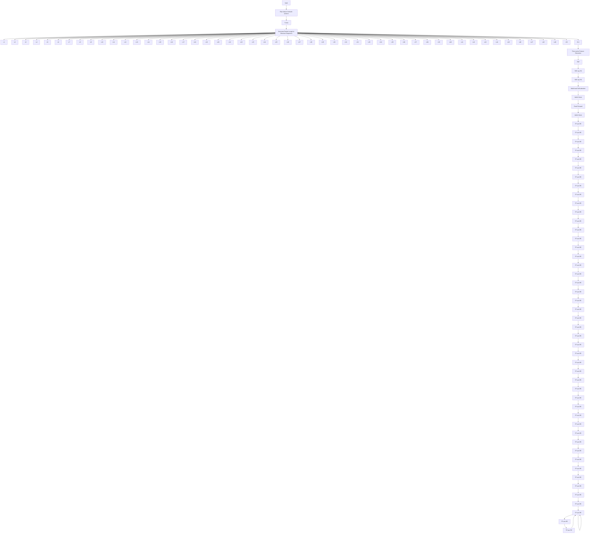
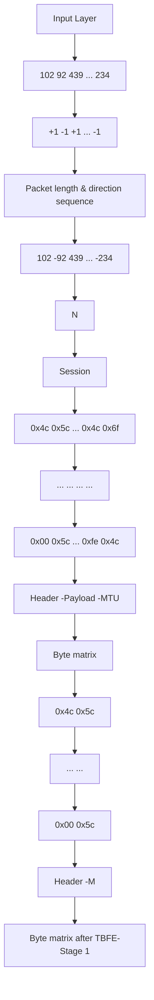

# ByteDance: Let bytes perform brilliantly in multi-view encrypted traffic classification

Yuwei Xu a,b,∗, Zhiyuan Liang a, Xiaotian Fang a, Kehui Song c, Meng Wang d, Qiao Xiang e, Guang Cheng a,b

a School of Cyber Science and Engineering, Southeast University, Nanjing, 211189, China   
b Purple Mountain Laboratories, Nanjing, 211111, China   
c School of Software, Tiangong University, Tianjin, 300387, China   
d NSFOCUS Technologies Group Co., Ltd., Beijing, 100089, China   
e School of Informatics, Xiamen University, Xiamen, 361005, China

# a r t i c l e i n f o

# Keywords:

Encrypted traffic classification

Multi-view learning

Accurate byte feature extraction

Suppression mitigation for byte view

# a b s t r a c t

The use of deep learning in encrypted traffic classification has led to two primary methodologies: the timeseries view (T-view) and the byte view (B-view). T-view ETC schemes capture timing relationships in network flow, whereas B-view ETC schemes focus on byte differences in raw traffic data. Recent studies show that using multi-view learning can improve ETC performance by creating technical complementarity between T-view and B-view. However, the existing multi-view studies have failed to achieve significant improvements over singleview schemes. Through an in-depth analysis of comparative experiments, we identify two major problems. Byte features in raw traffic are not accurately extracted, and the B-view is suppressed by the T-view during model training. To tackle the problems highlighted above, we propose ByteDance, which lets bytes play brilliantly in multi-view ETC. To accurately capture byte features, a two-stage byte feature extraction strategy (TBFE) is proposed. It screens packet bytes by their protocol format and distribution, then employs a local attention module and a transformer encoder to extract byte features accurately. To mitigate the suppression of B-view, a prototypenetwork-based dynamic gradient compensation strategy (PDGC) is designed. PDGC assigns weights to gradients in each training batch, enhancing gradient propagation in the B-view with a PCE loss function. We compare ByteDance with nine state-of-the-art ETC schemes. Experimental results show that ByteDance’s classification accuracy on four datasets significantly exceeds that of the suboptimal schemes. Moreover, ByteDance leads the pack with its impressive metrics, including parameter counts, GPU memory demands, and both training and inference times for models, showcasing remarkable operating efficiency.

# 1. Introduction

As the Internet becomes essential in our lives, users worldwide are increasingly focused on protecting their personal privacy while enjoying its benefits. Network applications increasingly use cryptography to authenticate identities and protect the confidentiality of transmitted data. According to Google statistics, as of Feb. 2025, the proportion of encrypted traffic on the Internet has reached 95 % [1]. Accurate traffic classification is crucial for resource optimization in network management [2] and for preventing malicious attacks in network security [3]. The transition from plain text to encrypted communication has significantly hindered academic researchers and industry professionals in their efforts to accurately detect network traffic.

Recent breakthroughs in deep learning (DL) have revolutionized the fields of computer vision (CV) [4] and natural language processing (NLP) [5], sparking a wave of research into its applications for encrypted traffic classification (ETC). These efforts have yielded impressive outcomes, demonstrating the effectiveness of DL in this area. Current research in DL-based ETC has primarily adopted methodologies from CV and NLP to analyze and classify encrypted traffic from different views [6]. The existing studies are divided into two technical routes: timeseries view (T-view) and byte view (B-view). T-view ETC analyzes the network flow by treating it as a series of packets, creating a time-series that captures features such as packet lengths [7], directions [8–10], and timestamps [11]. This time-series is then used as input for classification in a deep learning model. B-view ETC takes the transmitted data bytes, restructures them into text [12–14] or an image [15–18], and inputs them into a specific deep learning classification model. The above two routes have their own advantages and disadvantages. T-view ETC effectively captures global packet distribution characteristics but often overlooks significant local traffic variations. B-view ETC analyzes the discrepancies in specific bytes of traffic data from a localized standpoint. While the model accounts for correlations between various locations, its view is frequently constrained by an overemphasis on local positions.

In order to achieve technical complementarity, some researchers have proposed multi-view approaches [19–26]. The raw traffic is analyzed from several views, and customized neural networks are employed to extract specific features. Ultimately, these features are combined to facilitate accurate traffic classification. Currently, several researchers have put forward multi-view ETC schemes aimed at tackling complicated tasks such as malicious network traffic detection [6], Tor website fingerprinting attacks [27], and TLS traffic classification [28]. However, recent research efforts are grappling with a considerable challenge. Unexpectedly, multi-view schemes have not significantly improved traffic classification performance over single-view schemes. In some tasks, their accuracies are even slightly lower than that of a single-view solution [29,30]. Some researchers thought that the models performed poorly because they did not effectively fuse features from different views. They tried to propose some improved solutions, but the effects were not significant.

To explore the dilemma of multi-view ETC, we carried out extensive comparative experiments. The findings reveal that, unlike T-view, the potential of B-view remains underutilized within the model. There are two main reasons: (1) The byte features of the raw traffic are not accurately extracted. Firstly, many existing schemes use the bytes of the application layer payload as input, but this data is often obscured and diffused by cryptographic techniques, which decreases the presence of useful features. Secondly, the majority of current research organizes bytes into either a one-dimensional text or a two-dimensional image, subsequently tailoring neural networks to extract relevant features. This processing scheme prioritizes local byte features, often overlooking the meaning of each field in packets and their logical connections, resulting in missed key features. (2) During model training, B-view is easily suppressed by T-view and is difficult to play its due role. Due to the substantial differences in data distribution and time-series dimensions between the features extracted from these two views, the gradients along their respective paths will vary in magnitude during the model’s backpropagation process. The gradient descent optimization algorithm tends to prioritize updating parameters from T-view with larger gradients, while the B-view with smaller gradients often receives less optimization. The phenomenon of gradient competition ultimately results in B-view being significantly overshadowed by T-view in multi-view ETC. Existing research has concentrated on the design of feature extraction and fusion modules, but has overlooked the issue of B-view suppression in gradient in gradient optimization optimization.

To address the shortcomings of existing research, we propose a multiview ETC scheme. By employing precise byte feature extraction and effective model gradient optimization, the full potential of B-view is realized in the tasks of classifying encrypted traffic. Thus, we decided to name this scheme ByteDance. The main contributions of this paper can be summarized in the following four aspects.

• To analyze performance bottlenecks in current multi-view ETC research, three popular schemes were tested on four typical encrypted traffic datasets. The experimental results reveal that there are two major problems in existing studies. First, blindly selecting bytes from encrypted packet payloads as input for B-view hinders the model’s ability to extract meaningful byte features, which decreases classification performance. Second, the huge gap in gradient descent on the backpropagation path will cause T-view to suppress the B-view.   
• To accurately capture the byte features in the traffic, a two-stage byte feature extraction strategy (TBFE) is proposed. In the first stage, a

rough byte-screening process is conducted to eliminate the encrypted payload portion with low feature density. This is achieved by examining the format and byte distribution of each layer in the network protocol stack. In the second stage, we carry out precise extraction of byte features. The local attention module captures detailed byte features from each layer in the protocol stack, while the transformer encoder extracts global context information from the session.

• To mitigate the suppression of B-view by T-view, a prototypenetwork-based dynamic gradient compensation strategy (PDGC) is designed. In each training batch, our model calculates the Euclidean distance between the path feature vector and its prototype vector from different views. According to this calculation, the model dynamically assigns weights to the gradients of different paths. Furthermore, by integrating the PCE loss function, the model effectively amplifies the gradient propagation strength in the B-view, thereby optimizing the model’s overall performance.

• To validate ByteDance, we conducted a comparison against nine cutting-edge ETC schemes using four real-world datasets of encrypted network traffic. Experimental results indicate that ByteDance achieved accuracy rates of 95.23 %, 96.57 %, 96.23 %, and 95.62 %, improving by 0.41 %, 0.35 %, 3.27 %, and 2.57 % over suboptimal schemes. Besides, operating efficiency experiments show that ByteDance has excellent efficiency. Finally, ablation experiments show that our TBFE and PDGC strategies play significant roles in classification performance.

The rest of this paper is organized as follows. In Section 2, we summarize previous related research, covering single-view ETC and multi-view ETC. In Section 3, we highlight two critical issues found in the existing multi-view ETC research through comparative experiments, which serve as the motivation for this work. Section 4 presents an in-depth overview of ByteDance’s scheme design, detailing the strategies of both TBFE and PDGC. We introduce the experimental setup in Section 5 and evaluate ByteDance’s classification performance and operating efficiency in Section 6. Finally, a conclusion is given in Section 7.

# 2. Related work

In this section, we first discuss the single-view ETC schemes. After reviewing T-View and B-View, we stress the potential of multi-view ETC research. Secondly, we provide a overview of existing multi-view schemes and introduce the dilemma currently faced by researchers. As shown in Table 1, we summarize the essential details of all relevant ETC schemes while emphasizing ByteDance’s advantages.

# 2.1. Single-view ETC

Initial studies on ETC leveraged technical approaches from the field of artificial intelligence. Researchers characterized the raw encrypted traffic from a single view, ultimately developing a classification model to facilitate detection. The mainstream research work is divided into T-view ETC and B-view ETC.

The T-view ETC schemes treat network flow as a series of packets and create a time-series for the classification model by using features like packet length, direction, and timestamps. In [7], the authors proposed FS-NET, which uses the packet length sequence of sessions as input. FS-NET employs a Bidirectional Gated Recurrent Unit (BiGRU) [31] based encoder-decoder structure to extract features and incorporates a reconstruction mechanism to enhance feature representation. In [8], the authors presented Deep Fingerprinting (DF), which utilizes 1DCNN to extract features from Tor traffic, focusing on the direction of packets to achieve high accuracy in classifying both defended and undefended traffic. In [9], the authors introduced the RF method, which employs CNNs to aggregate and extract features from packet direction sequences, enabling efficient identification of Tor traffic. Similarly, in [10], the authors proposed WF-Transformer, which uses the direction

Table 1 A summary of existing encrypted traffic classification schemes. 

<table><tr><td>Ref.</td><td>Type</td><td>Classifier</td><td>Input</td><td>Input Size</td><td>Field</td><td>NDP</td><td>AS</td></tr><tr><td>[7]</td><td>T</td><td>BiGRU</td><td>PLS</td><td>200 x 1</td><td>APP</td><td>✓</td><td>✘</td></tr><tr><td>[8]</td><td>T</td><td>CNN</td><td>PDS</td><td>5000 x 1</td><td>TOR</td><td>✓</td><td>✘</td></tr><tr><td>[9]</td><td>T</td><td>CNN</td><td>PDS</td><td>1800 x 2</td><td>TOR</td><td>✓</td><td>✘</td></tr><tr><td>[10]</td><td>T</td><td>Self-attention</td><td>PDS</td><td>[1000–5000] x 1</td><td>TOR</td><td>✓</td><td>✘</td></tr><tr><td>[11]</td><td>T</td><td>BiLSTM, Self-attention</td><td>PTS, PDS</td><td>-</td><td>WFA</td><td>✓</td><td>✘</td></tr><tr><td>[12]</td><td>B</td><td>BERT</td><td>PB</td><td>256</td><td>M-APP/TOR/VPN/TLS/MT</td><td>✘</td><td>✘</td></tr><tr><td>[13]</td><td>B</td><td>BERT</td><td>PB</td><td>128</td><td>VPN</td><td>✓</td><td>✘</td></tr><tr><td>[14]</td><td>B</td><td>Self-attention</td><td>FB</td><td>-</td><td>MT/VPN/TLS/IoT</td><td>✘</td><td>✘</td></tr><tr><td>[15]</td><td>B</td><td>1DCNN</td><td>SB</td><td>28 x 28</td><td>VPN</td><td>✘</td><td>✘</td></tr><tr><td>[16]</td><td>B</td><td>1DCNN, BiLSTM</td><td>FB</td><td>10 x 1500</td><td>MT/VPN/TOR</td><td>✘</td><td>✘</td></tr><tr><td>[17]</td><td>B</td><td>Attention-CNN</td><td>PB</td><td>1 x 50</td><td>PC/APP/VPN</td><td>✘</td><td>✘</td></tr><tr><td>[18]</td><td>B</td><td>Variant ResNet18</td><td>PB</td><td>32×32×3</td><td>VPN/TLS</td><td>✓</td><td>✘</td></tr><tr><td>[19]</td><td>B&amp;T</td><td>1DCNN, BiLSTM</td><td>SB, PLS</td><td>B: 1014 x 256, T: 20 x 128</td><td>M-APP</td><td>✘</td><td>✘</td></tr><tr><td>[20]</td><td>B&amp;T</td><td>1DCNN, BiLSTM</td><td>FB, PB, PTS, PLS</td><td>B: 15 x 64, 1 x 500, T: 15 x 2</td><td>ID/IoT</td><td>✘</td><td>✘</td></tr><tr><td>[21]</td><td>B&amp;T</td><td>Self-attention, BiLSTM</td><td>SB, PLS</td><td>B: 10 x 400, T: 10 x 1</td><td>TLS</td><td>✘</td><td>✘</td></tr><tr><td>[22]</td><td>B&amp;T</td><td>PSAE, FGRU</td><td>SB, PLS</td><td>B: 20 x 40, T: 20 x 1</td><td>VPN/TOR</td><td>✓</td><td>✘</td></tr><tr><td>[23]</td><td>B&amp;T</td><td>Self-attention</td><td>PLS, PTS, PB</td><td>B: 16 x 1024, 4 x 713, T: 16 x 3</td><td>MT</td><td>✘</td><td>✘</td></tr><tr><td>[24]</td><td>B&amp;T</td><td>CNN, Attention</td><td>SB, PLS, PDS, PTS, PWS</td><td>B: 1 x 784, T: 32 x 4</td><td>MT/VPN/TOR/IoT</td><td>✘</td><td>✘</td></tr><tr><td>[25]</td><td>B&amp;T</td><td>CNN, GNN</td><td>Header PB, Payload PB</td><td>B: 15 x 350, T: 15 x 50</td><td>VPN/TOR</td><td>✘</td><td>✘</td></tr><tr><td>[26]</td><td>B&amp;T</td><td>1DCNN, GRU</td><td>SB, PLS, PDS, PTS, PWS</td><td>B: 24 x 24, T: 12 x 4</td><td>M-APP</td><td>✘</td><td>✓</td></tr><tr><td>ByteDance</td><td>B&amp;T</td><td>Attention</td><td>SB, PLS, PDS</td><td>B: N x M, T: N x 1, N x 1</td><td>TLS/VPN/TOR/M-APP</td><td>✓</td><td>✓</td></tr></table>

In the header, “NDP” represents that the scheme does not depend on application-layer payloads. “AS” indicates that the scheme is capable of alleviating the suppression that arises among different views. In the type column, “B” denotes B-View and “T” indicates T-View. In the input column, “PLS” denotes the packet length sequence, “PDS” refers to the packet direction sequence, “PTS” identifies the packet timestamp sequence, “PWS” indicates the packet TCP window size sequence, “PB” stands for packet bytes, “FB” signifies flow bytes, and “SB” represents session bytes. Input size represents the shape of the represented traffic data before it is input into the model. For ByteDance, ?? refers to the first ?? packets of a bidirectional flow, and ?? refers to the first ?? bytes of each packet. The field column outlines the various application scenarios for each ETC scheme. “M-APP” denotes a range of mobile applications, while “IoT” encompasses the numerous applications of the Internet of Things. “MT” signifies malicious traffic detection, “ID” refers to intrusion detection, and “WFA” represents the diverse types of website fingerprinting attacks. “VPN” indicates various VPN tools, while “TOR” means the most popular anonymous network.

sequence of packets in Tor traffic as input and employs a transformer [32] network to learn temporal features, boosting Tor encrypted traffic classification by capturing long-range dependencies. In [11], the authors introduced an input-agnostic deep learning framework that incorporates packet timestamp and direction to create packet vectors, which are then processed through a hybrid neural network composed of Bidirectional Long Short-Term Memory (BiLSTM) and attention to learn temporal features, enhancing traffic classification by capturing correlations between packets and flows. T-view ETC schemes excel in effectively capturing the overall distribution characteristics of packets within a flow. However, they often overlook the critical variations in local packet fields across different types of encrypted traffic. Moreover, these schemes typically necessitate the capture of the complete network flow as input and tend to underperform in classification tasks that only capture partial traffic fragments.

The B-view ETC schemes are inspired by research in the fields of NLP and CV. It converts raw bytes of encrypted traffic into text or image form, then uses a deep learning model for classification. In [12], the authors treated the bytes in network traffic as text and developed ET-BERT, drawing inspiration from the traditional BERT model [33] used in NLP. ET-BERT pre-trains deep contextualized datagram-level representations from the raw bytes of large-scale unlabeled traffic and achieves state-of-the-art performance on five ETC tasks by fine-tuning on small amounts of labeled data. The authors of [13] proposed a BERT-based scheme that processes encrypted traffic data using packet header information and then convert header field values into 2-byte tokens to form sentences for BERT’s pre-training and fine-tuning, enhancing classification accuracy and generalization performance. In [14], the authors proposed EAPT, an ETC model using adversarial pre-trained transformers, which tokenizes encrypted traffic data with SentencePiece to address coarse tokenization granularity. EAPT achieves high performance across multiple datasets with fewer model parameters. Given the remarkable advancements achieved by convolutional neural networks (CNNs) in CV, some researchers have attempted to transform raw traffic bytes into “im-

ages” for enhanced model classification. In [15], the authors proposed an end-to-end approach that converts the first 784 bytes of flows into grayscale images and inputs them into a 1DCNN for classification. Similarly, the authors of [16] utilized the first 1500 bytes of the first 15 packets in a session to generate a two-dimensional image and extracted spatiotemporal features using 1DCNN and BiLSTM sequentially. In [17], the authors presented a self-attentive deep learning approach that processes traffic data as images, using packet-level input and CNN to learn features, while the self-attention mechanism highlights important input parts, boosting classification accuracy and interpretability. The authors of [18] designed EETC, an ETC scheme based on a variant ResNet network and incremental learning. It preprocesses traffic data into RGB images and supports continuous model updates without retraining from scratch, demonstrating effective classification of encrypted traffic. The B-view ETC schemes analyze raw bytes, allowing for an in-depth exploration of the local characteristics of traffic. Although some models take into account the correlation between features across various locations, their emphasis on local byte differences often restricts their overall perspective.

# 2.2. Multi-view ETC

To address the shortcomings of single-view ETC research and benefit from different views, some researchers have suggested using a multiview deep learning model in ETC. This methodology entails analyzing traffic from various views, employing distinct neural network architectures to capture relevant features, and subsequently integrating all extracted features to enhance traffic classification.

In [19], the authors proposed a multi-view model named APP-NET. It employs 1DCNN to extract B-view features and LSTM to extract Tview features and then concatenates them for classification. In [20], the authors proposed MFFusion, which uses LSTM and CNN modules to extract features for the T-view and B-view, respectively, and then concatenates these views into different matrices. The authors of [21] presented PEAN, an advanced multi-view model that integrates selfattention mechanisms with LSTM for the first time. The self-attention module extracts features from the B-view, while the LSTM module captures fatures from the T-view. In [22], the authors proposed DM-HNN, a multi-view model that utilizes SAE and GRU for feature extraction. It processes the byte features from the first 20 packets of a session through the SAE module and extracts the time-series features using the GRU module. In [23], a multi-view learning scheme based on byte features, PETNet, is proposed, which represents an advanced multi-view scheme. It utilizes a meta feature extractor and a transformer encoder to perform feature extraction on the TLS handshake packets and data packet byte sequences, respectively. Finally, the two features extracted from the T-view and B-view are directly concatenated and fused.

It is disappointing that the multi-view ETC schemes mentioned above did not significantly outperform the single-view solutions in ETC tasks. Researchers have noted that current approaches merely combine features extracted from various views without thoroughly integrating them before classification. This lack of deep fusion limits the potential for achieving outstanding performance [6]. According to the analysis, the authors of [24] proposed GLADS, which uses an “indicator” mechanism to handle B-view and T-view input, then employs a global-local attention layer for multi-view fusion. The fusion layer can extract timing and global information from the token output by the GLADS’s exchange layer. In [25], the authors introduced DE-GNN, which utilizes a dual embedding layer to separately process packet headers and payloads, followed by PacketCNN and GNNs for feature extraction, and an adaptive deep feature fusion (ADFF) mechanism is employed to fuse the features from both views. The research discussed above has paved the way for integrating fusion features in multi-view ETC. Despite their efforts resulting in some progress, they have yet to achieve a substantial enhancement in the classification model’s performance.

In addition, some researchers believe that there is a suppression problem between different views. The authors of [26] proposed MIMETIC, a method that pre-trains feature extraction modules independently and then freezes the parameters to avoid interference between Tview and B-view. The training model strategy effectively mitigates the suppression between views, leading to a marked improvement in the classification performance of mobile encrypted traffic. In conclusion, network encrypted traffic is characterized by both time-series features and byte features. Leveraging the potential of multi-view approaches to enhance the accuracy of ETC presents a significant challenge in today’s research landscape.

# 3. Problem analysis and research motivation

To investigate the performance bottleneck of multi-view learning in ETC, we have selected three cutting-edge schemes and performed comparative experiments across four encrypted traffic datasets. Based on experimental results, we analyze two major problems in the current research dilemma and propose ByteDance’s research motivation.

# 3.1. Inaccurate byte feature extraction

According to the discussion in Section 2.2, we selected three multiview ETC schemes, APP-NET [19], PEAN [21], and DM-HNN [22], as research objects. In order to verify the effectiveness of feature extraction from each view, we have conducted a comparative experiment. For the three schemes, we set three configurations for extracting features from encrypted traffic: utilizing the T-view exclusively, the B-view exclusively, and a combination of both views. Fig. 1 shows their classification accuracy on different datasets. The results demonstrate that the accuracy achieved with T-view alone closely resembles that of using multiple views. If only the B-view is used, the accuracy is much lower than that of the other two configurations. The results indicate that these schemes failed to effectively extract features in the B-view, ultimately compromising the overall performance of the multi-view learning model. There are two reasons for this problem.

First, most current schemes extract byte features from the application-layer payloads of packets. Nonetheless, the majority of application layer protocols opt to encrypt the data being transmitted, such as TLS 1.3 and QUIC. Once cryptographic technology obscures and diffuses the data within the payload, it becomes challenging for the deep learning model to extract meaningful features from these bytes. To verify this reason, we conducted a comparative experiment on the TLS dataset. We monitored the variations in the accuracy of the three schemes as we progressively increased the number of bytes truncated in the B-view. As shown in Fig. 2, when the number of bytes exceeds 60, the accuracy of these schemes continues to decline. This outcome aligns with the findings presented in FastTraffic [34].

Second, the existing schemes for extracting byte features from raw traffic have design flaws. These schemes typically organize bytes into one-dimensional text or two-dimensional images, then use classic neural network architectures from NLP and CV to extract features. However, this approach prioritizes local byte features, often overlooking the meaning of each field in packets and their logical connections, resulting in missed key features.

# 3.2. Suppression of B-view

As shown in Fig. 1, the introduction of B-view to the three multiview ETC schemes does not obtain a significant enhancement in accuracy when compared to the scenario where only T-view is utilized for feature extraction. On the TLS1.3 and TROJAN-VPN datasets, the multiview model even underperformed compared to the model that utilized a T-view. Inspired by [29,30], we further explored the impact of interview suppression on model classification performance. We conducted experiments to compare the effects of T-view and B-view, both used alone and adopted in a multi-view ETC model. To evaluate the model’s classification performance with a single view, we use the selected view for training in the three multi-view schemes. To assess a specific view in the multi-view model, we use module parameter replacement for evaluation. The test process consists of three steps: (1) train a multi-view model until it converges and extract parameters from the feature extraction module in the specific view; (2) load these parameters into a new model that focuses on this view, freeze the parameters, and train the classification module until model convergence; (3) use the new model to classify traffic and assess its performance. Fig. 3 depicts the changes in the accuracy of T-view and B-view as the number of model iterations increases. In the chart, the solid line illustrates the performance of the model trained with a single view, while the dotted line reflects the performance of the corresponding view when utilizing multi-view model (MM) training.

Fig. 3 shows that T-view is minimally suppressed during the multiview model training, whereas B-view experiences varying levels of suppression across all three schemes. The phenomenon occurs because the gradient descent optimization algorithm tends to prioritize updating parameters from the T-view that exhibit larger gradients. The small gradient descent along the B-view path indicates that the multi-view model hasn’t fully optimized this path upon convergence. Therefore, additional training is necessary to enhance its performance. Most current multiview ETC research overlooks the suppression problem between views, leading to limited improvement after feature fusion. In [26], the authors suggested first pre-training the feature extraction module for each view separately, then freezing the parameters for joint fine-tuning. Although this approach can somewhat mitigate the suppression of views, it necessitates the establishment of an intricate pre-training and fine-tuning framework, significantly increasing the complexity of model training. Existing studies in the field of artificial intelligence have demonstrated that multi-task training can be balanced by modulating gradient magnitudes and directions [35,36], offering substantial insights into mitigating the suppression of B-view.

bar

| Model | B-view | T-view | Multi-view |
|---|---|---|---|
| APP-NET | 0.62 | 0.94 | 0.92 |
| PEAN | 0.65 | 0.94 | 0.95 |
| DM-HNN | 0.71 | 0.93 | 0.94 |

(a) TLS1.3

bar

| Model    | B-view | T-view | Multi-view |
| -------- | ------ | ------ | ---------- |
| APP-NET  | 0.50   | 0.80   | 0.83       |
| PEAN     | 0.67   | 0.90   | 0.92       |
| DM-HNN   | 0.58   | 0.86   | 0.87       |

(b) MOBILE-APP

bar

| Model   | B-view | T-view | Multi-view |
|---------|--------|--------|------------|
| APP-NET | 0.1    | 0.4    | 0.4        |
| PEAN    | 0.1    | 0.4    | 0.4        |
| DM-HNN  | 0.15   | 0.8    | 0.82       |

(c)TOR

bar

| Model | B-view | T-view | Multi-view |
|---|---|---|---|
| APP-NET | 0.49 | 0.81 | 0.83 |
| PEAN | 0.50 | 0.82 | 0.81 |
| DM-HNN | 0.52 | 0.86 | 0.85 |

(d) TROJAN-VPN   
Fig. 1. Accuracy comparison among three configurations of three multi-view ETC schemes.

line

| The number of input bytes | PEAN  | APP-NET | DM-HNN |
| ------------------------- | ----- | ------- | ------ |
| 20                        | 0.83  | 0.69    | 0.71   |
| 40                        | 0.77  | 0.75    | 0.72   |
| 60                        | 0.75  | 0.69    | 0.76   |
| 100                       | 0.65  | 0.64    | 0.70   |
| 200                       | 0.63  | 0.60    | 0.65   |
| 400                       | 0.62  | 0.55    | 0.60   |

Fig. 2. Accuracy change of three schemes using only B-view with the increasing number of input bytes.

# 3.3. Motivation

In summary, existing multi-view ETC schemes struggle with two main problems: inaccurate byte feature extraction and suppression of the B-view. They restrict the potential of bytes to improve traffic classification performance in multi-view approaches. To solve the above problems, we propose ByteDance, which lets bytes play a full role in multi-view ETC. To accurately capture byte features, a two-stage byte feature extraction strategy (TBFE) is proposed. It first screens packet bytes based on their protocol format and byte distribution, then it uses the local attention module and transformer encoder to accurately extract byte features. To mitigate the suppression of B-view, a prototypenetwork-based dynamic gradient compensation strategy (PDGC) is designed. In every training batch, PDGC allocates weights to the gradients of multiple paths, enhancing the strength of gradient propagation in the B-view using a PCE loss function.

# 4. Methodology

In this section, we first introduce the overall structure of ByteDance, then give a detailed explanation of the core components.

# 4.1. Overall structure of ByteDance

The structure of ByteDance is shown in Fig. 4, which consists of a three-tier processing framework: the input layer, the feature extraction layer, and the fusion-balance layer. The raw session samples first undergo feature generation and data cleaning in the input layer. After the first stage of fuzzy byte selection processing by TBFE, a high-density byte matrix with high effectiveness is generated. The feature extraction layer, through a dual-view deep learning model, captures both timeseries patterns and byte correlations, outputting high-dimensional feature vectors and multi-view representation tokens. The fusion-balance layer aligns heterogeneous feature spaces via tensor alignment, implements multi-source information fusion with a dynamic gating mechanism, and applies the PDGC strategy based on view representation tokens to compensate for the gradient of weak views, effectively addressing the under-optimization issue of B-view during joint training. The following parts will briefly introduce these three layers.

The input layer extracts three basic features from the raw session and performs a series of processing, including feature cleaning, as shown in Fig. 5. For T-view, the layer extracts a directional packet length sequence ∈ $\mathbb { R } ^ { 1 \times N }$ to represent time-series features, followed by removal of zero-payload packets to eliminate invalid transmission interference. For B-view, the layer extracts a raw byte matrix ∈ $\mathbb { R } ^ { N \times M T U }$ from multiple packets to represent byte features. However, the matrix has low information density due to its inclusion of all bytes in the packet’s Maximum Transmission Unit (MTU). The byte matrix is then processed to remove device fingerprint information (e.g., IP addresses and port numbers), mitigating biases from non-traffic-related features. Finally, the first stage of TBFE extracts a submatrix ∈ $\mathbb { R } ^ { N \times M }$ from the byte matrix based on the summarized byte distribution, transitioning from a low-density matrix to a high-density matrix with more effective information.

The feature extraction layer uses a dual-view model for multi-view learning. The T-view is built on the standard transformer encoder, modeling the embedded time-series matrix to accurately capture the time-series patterns inherent in session behaviors. The second stage of precise byte extraction in TBFE is implemented in the B-view by combining a local attention (marked as “LA” in Fig. 4) mechanism with a global transformer encoder without positional embedding (marked as “TRF w/o PE” in Fig. 4), forming a hierarchical feature selection model. The local attention module focuses on byte-level semantic correlations within a single packet, while the cross-packet transformer layer establishes global dependencies. Ultimately, it outputs high-dimensional feature vectors with corresponding view representation tokens.

line

| Epoch | B-view only | T-view only | B-view in MM | T-view in MM |
|-------|-------------|-------------|--------------|--------------|
| 0     | 0.0         | 0.0         | 0.0          | 0.0          |
| 20    | 0.6         | 0.9         | 0.35         | 0.85         |
| 40    | 0.65        | 0.92        | 0.37         | 0.9          |
| 60    | 0.67        | 0.93        | 0.38         | 0.92         |
| 80    | 0.68        | 0.94        | 0.38         | 0.93         |

(a) APP-NET

line

| Epoch | B-view only | T-view only | B-view in MM | T-view in MM |
|-------|-------------|-------------|--------------|--------------|
| 0     | 0.0         | 0.0         | 0.0          | 0.0          |
| 10    | 0.4         | 0.8         | 0.0          | 0.8          |
| 20    | 0.5         | 0.9         | 0.0          | 0.9          |
| 30    | 0.55        | 0.9         | 0.0          | 0.9          |
| 40    | 0.6         | 0.9         | 0.0          | 0.9          |
| 50    | 0.6         | 0.9         | 0.0          | 0.9          |
| 60    | 0.6         | 0.9         | 0.0          | 0.9          |
| 70    | 0.6         | 0.9         | 0.0          | 0.9          |

(b) PEAN

line

| Epoch | B-view only | T-view only | B-view in MM | T-view in MM |
|-------|-------------|-------------|--------------|--------------|
| 0     | 0.0         | 0.0         | 0.0          | 0.0          |
| 10    | 0.6         | 0.85        | 0.5          | 0.85         |
| 20    | 0.65        | 0.9         | 0.5          | 0.9          |
| 30    | 0.65        | 0.9         | 0.5          | 0.9          |
| 40    | 0.65        | 0.9         | 0.5          | 0.9          |
| 50    | 0.65        | 0.9         | 0.5          | 0.9          |

(c)DM-HNN

Fig. 3. Suppression of B-view and T-view in three multi-view ETC schemes.   

flowchart

Fig. 4. The overall structure of ByteDance.

The fusion-balance layer consists of two parts: the feature fusion module and the PDGC module. In the fusion module, dual-view feature vectors are aligned at the packet level based on network session time continuity, then a time-series model performs deep fusion of the aligned heterogeneous feature sequences, generating fusion feature vectors with cross-view correlations, which are input into a cross-entropy loss function to compute the initial gradient. The PDGC module uses the two view representation tokens as gradient quantification bases, combined with PCE loss to construct a dynamic compensation mechanism. It focuses on gradient reweighting for the suppressed B-view, thereby maintaining the advantage of the T-view while effectively boosting the gradient contribution of the B-view.

flowchart

Fig. 5. The input layer of ByteDance.

Table 2 Details of network communication protocols. 

<table><tr><td>Type</td><td>Protocol</td><td>NLH</td><td>TLH</td><td>ALH</td><td>M</td></tr><tr><td rowspan="2">Regular</td><td>TLS1.2/1.3</td><td>20</td><td>20</td><td>5+</td><td>45</td></tr><tr><td>VMESS</td><td>20</td><td>20</td><td>0</td><td>40</td></tr><tr><td rowspan="3">Proxy</td><td>VLESS</td><td>20</td><td>20</td><td>22+</td><td>62</td></tr><tr><td>TROJAN</td><td>20</td><td>20</td><td>5+</td><td>45</td></tr><tr><td>mKCP/KCP</td><td>20</td><td>8</td><td>24</td><td>52</td></tr><tr><td>Tor</td><td>TLS1.2/1.3</td><td>20</td><td>20</td><td>5+</td><td>45</td></tr></table>

# 4.2. Byte feature extraction process

The core of the extraction of byte features lies in the TBFE strategy, which includes the first stage of fuzzy byte selection and the second stage of precise byte extraction. The following provides a detailed description of these two stages.

The fuzzy byte selection occurs in ByteDance’s input layer, as illustrated in Figs. 4 and 5. At this stage, only valid protocol header bytes will be kept, while invalid user payload data will be removed from the raw byte matrix. Given the raw byte matrix $\in \mathbb { R } ^ { N \times \mathrm { M T U } }$ and valid byte count ?? for each traffic type, a submatrix ∈ $\mathbb { R } ^ { N \times M }$ is extracted, excluding user payload data. Here, ?? is a hyperparameter that defines the number of packets used for each traffic sample.

In this paper, we present the byte counts of common network encrypted traffic headers based on official protocol documentation and Wireshark [37] packet analysis, as shown in Table 2. The network layer header (NLH) length and transport layer header (TLH) length are relatively fixed, while the plaintext byte length in the application layer header (ALH) varies depending on the interaction phases between the client and server for the corresponding traffic type. For example, in TLS traffic, the plaintext information available in the application layer header during the data transmission phase consists of the first 5 bytes (content type, version, and payload length), whereas packets in the handshake phase contain additional plaintext information (e.g., server name indication). However, since handshake packets are relatively infrequent and lack general applicability, we define the available plaintext bytes in the application layer for TLS traffic in the table as $\mathit { \Omega } ^ { \omega } 5 + \mathit { \Omega } ^ { \dag }$ , representing the general case. The “+” symbol indicates that the application layer length may vary across different packet types in this class of encrypted traffic or may include optional fields. For generality, we only consider the byte count of the fixed and common plaintext fields. It is important to note that the selection of ?? does not require precise determination of minor byte differences, as the selection process in this stage is inherently fuzzy. In the first stage of the TBFE strategy, we apply fuzzy

  
(a) Local attention

text_image

NLH TLH ALH
NLH
TLH
ALH
KEY

(b) Self-attention   
Fig. 6. Comparison of fixed-window local attention and self-attention.

truncation at the packet level to eliminate a large number of invalid byte sequences, ensuring that only meaningful bytes are retained.

The precise byte feature extraction occurs in the B-view path of the feature extraction layer. The core function is to extract accurate byte features from the byte matrix after fuzzy byte selection. This stage consists of two modules: the local byte feature extraction module and the global byte feature extraction module. As shown in Fig. 4, the former is marked as $^ { * } \mathrm { L A } ^ { * } { } _ { \mathrm { i } }$ , and the latter is marked as “TRF w/o PE”.

The local byte feature extraction module is responsible for extracting features from the byte sequences within each packet. It employs a shared fixed-window local attention mechanism that is applicable across ?? packets. In contrast to conventional self-attention, fixed-window local attention is more favorable because it maintains the advantages of attention mechanisms while enabling the independent handling of packet headers within the byte sequence. This design fully exploits the inherent independence of different layers in the protocol stack. Fig. 6 shows that NLH, TLH, and ALH represent three separate attention windows within the module, each with a size based on the byte count in Table 2. Attention scores are calculated by multiplying each header’s KEY with its QUERY, while avoiding misaligned headers to keep these headers independent. This design reduces interference from irrelevant information and enhances computational efficiency. Using a fixed-window local attention module shared across packets allows each packet’s feature vector to effectively gather contextual information from nearby packets, enhancing computational efficiency.

Given the input byte matrix $\boldsymbol { B _ { \mathrm { i n p u t } } } = \{ B _ { 1 } , B _ { 2 } , \dots , B _ { N } \}$ , where $B _ { i }$ represents the byte sequence of the ??-th packet with shape $\mathbb { R } ^ { 1 \times M }$ , we first obtain the matrices $Q , K ,$ and ?? via linear transformations. Next, attention scores are computed within the local range, normalized with Softmax, and the weighted sum of ?? is computed. The specific formulas are:

$$
Q _ {i} = B _ {\text { input }} W _ {Q}, K _ {i} = B _ {\text { input }} W _ {K}, V _ {i} = B _ {\text { input }} W _ {V} \tag {1}
$$

$$
\alpha_ {i j} = \operatorname{Softmax} \left(\frac {Q _ {i} \cdot K _ {j} ^ {T}}{\sqrt {d}}\right), \quad j \in \operatorname{Local} (i) \tag {2}
$$

$$
o _ {i} = \sum_ {j \in \text { Local } (i)} \alpha_ {i j} V _ {j} \tag {3}
$$

where $W _ { Q } , W _ { K } ,$ , and $W _ { V }$ are the weight matrices, Local(??) denotes the set of indices of the local Keys corresponding to the ??-th Query, ?? is the dimensionality of each head, and $\alpha _ { i j }$ represents the normalized attention weight, indicating the influence of ?? on $. o _ { i } \in \mathbb { R } ^ { 1 \times r }$ represents the local attention output vector for the ??-th element, which equals the weighted sum within the local range.

The global byte feature extraction module extracts features across byte sequences from multiple packets. It is implemented using a transformer encoder without positional embeddings. The self-attention mechanism within the transformer highlights the importance of each packet’s byte vector while incorporating information from other packets, effectively capturing global byte-level patterns. The removal of positional embeddings is intentional, as the shared-weight local attention used in the local byte feature extraction module allows the feature vectors of individual packets to learn information from other packets in advance. Consequently, the feature vectors of different packets lack a clear temporal relationship.

The transformer encoder used in this module comprises multi-head self-attention, residual connections, layer normalization, and a feedforward network. Below is a brief explanation of the core multi-head self-attention mechanism.

The multi-head self-attention module consists of multiple selfattention heads. The core function of self-attention is to map a single input vector ?? (a packet byte vector) to a feature vector ?? that integrates information from multiple input vectors (other packet byte vectors). The input sequence to the transformer encoder is $O = \{ o _ { 1 } , o _ { 2 } , o _ { 3 } , \ldots , o _ { N } , R \} _ { }$ , where $o _ { i }$ is the byte vector of the ??-th packet, with shape $\mathbb { R } ^ { 1 \times r }$ . The sequence is primarily formed from the output of the local byte feature extraction module, with the final element ?? being a randomly initialized view representation token that aggregates features from other vectors, representing the path features corresponding to the view. This token serves as input to the subsequent PDGC module.

The Scaled Dot-Product Attention computes the attention scores for each head as follows:

$$
\text { head } _ {i} = \text { Attention } (Q _ {i}, K _ {i}, V _ {i}) = \text { Softmax } \left(\frac {Q _ {i} K _ {i} ^ {T}}{\sqrt {d}}\right) V _ {i} \tag {4}
$$

where ??, ??, and ?? are obtained from Formula (1), and ?? is the dimensionality of each head. The multi-head self-attention module combines the results of multiple attention heads, which are computed in parallel, using the formula:

$$
\text { MultiHead } (Q, K, V) = \text { Concat } (\text { head } _ {1}, \dots , \text { head } _ {h}) W _ {O} \tag {5}
$$

where ℎ represents the number of attention heads, and $W _ { O }$ is the projection matrix. Each attention head has its own set of weight matrices, allowing it to learn different relationships in distinct representational subspaces in parallel, thereby more effectively capturing various correlations among multiple packet byte vectors. Finally, the feature matrix $F _ { 1 } = \{ B H _ { 1 } , B H _ { 2 } , B H _ { 3 } , \ldots , B H _ { N }$ , ????} is obtained through local and global byte extraction.

# 4.3. Time series feature extraction process

As shown in Fig. 4, the T-view path extracts the deep timing feature from the directed packet length sequence. It primarily consists of two components: word embedding and the time-series feature extraction module. The following part of this subsection will provide a detailed explanation of each component.

Word embedding transforms one-dimensional time-series into a two-dimensional matrix. Compared to the lower-dimensional space of one-dimensional vectors, higher-dimensional spaces provide more learning capacity, enabling the model to capture deeper latent patterns among elements in the sequence. Specifically, word embedding involves embedding each element in the packet length sequence into a vector. These vectors collectively form a trainable lookup matrix $\boldsymbol { E } \in \mathbb { R } ^ { v \times u }$ , where ?? and ?? represent the range and dimensionality of the embedded vector values, respectively. Given an embedding matrix ?? and a sequence containing ?? elements $( L _ { \mathrm { i n p u t } } = [ L _ { 1 } , L _ { 2 } , \ldots , L _ { N } ] )$ , each element $L _ { i } ~ \left( i \in [ 1 , N ] \right)$ is converted into a vector $e _ { i }$ by looking up the corresponding row in ??. This process results in an embedded sequence $[ e _ { 1 } , e _ { 2 } , \dots , e _ { N } ]$ .

Time series feature extraction module is designed primarily to extract time-series features from multiple embedded packet length matrix. To build this module, we utilize a single layer of the standard transformer encoder. The choice of transformer over other time-series models is motivated by its self-attention mechanism, which can redistribute weights across multiple packet length vectors. This effectively selects a subset of the ?? packet length vectors to represent the traffic distribution. More importantly, when combined with positional embedding, it enhances the model’s ability to capture timing information.

The transformer encoder used in this module differs from the one in Section 4.2 by the addition of positional embedding. Next, we will briefly explain the concept of positional embeddings.

The self-attention mechanism of the transformer is inherently position-independent, meaning it cannot directly capture the sequential relationships of elements in the series. Positional embedding addresses this limitation by introducing position-related information into the input features, enabling the model to understand the temporal order of elements in the sequence. Given an embedding matrix ??word embedding = $[ e _ { 1 } , e _ { 2 } , \dots , e _ { N } ]$ , the positional embedding process is as follows:

$$
\mathrm{PE} (p o s, 2 i) = \sin \left(\frac {p o s}{1 0 0 0 0 ^ {2 i / d _ {\text { model }}}}\right) \tag {6}
$$

$$
\mathrm{PE} (p o s, 2 i + 1) = \cos \left(\frac {p o s}{1 0 0 0 0 ^ {(2 i + 1) / d _ {\text { model }}}}\right) \tag {7}
$$

$$
\mathbf {L} _ {\text { embedded }} = \mathbf {L} _ {\text { word   embedding }} + \mathbf {P E} \tag {8}
$$

In these formulas, “10000” controls the frequency of positional changes, ensuring that the positional embeddings vary at an appropriate rate across dimensions to capture relative positional relationships. ??embedded represents the input matrix after applying positional embedding, while ???? denotes the positional embedding matrix.

After applying positional embedding, the resulting matrix is concatenated with a randomly initialized view representation token. This augmented input is then passed into the multi-head self-attention module. Using the calculations from Eqs. $\left( 1 \right) , \left( 4 \right)$ , and (5), the final output vectors $F _ { 2 } = \{ L H _ { 1 } , L H _ { 2 } , L H _ { 3 } , \ldots , L H _ { N } , L B \}$ are obtained.

# 4.4. Feature fusion and balancing process

The core function of this process is to integrate different feature vectors extracted from multiple views and balance the optimization gradients of different views based on their respective weights. Therefore, this process is divided into two parts: the fusion module and the PDGC module, which are explained in detail below.

The fusion module primarily includes two steps: alignment and fusion. First, feature vectors extracted from multiple paths are concatenated along the feature dimension at the packet level. Then, based on the inherent temporal order between packets, the BiGRU is applied for feature fusion. Finally, the fused vectors are passed through a fully connected layer for dimensionality reduction, and the resulting vectors are input into the cross-entropy loss to calculate gradients. Given multiple feature matrices extracted from different paths, denoted as $F _ { 1 } , F _ { 2 } ,$ , the alignment operation is performed as follows:

$$
[ D _ {1}, D _ {2}, \dots , D _ {N} ] = \operatorname{Concat} (F _ {1}, F _ {2}, \dim = \text { feature }) \tag {9}
$$

where ?? represents the number of packets, and $D _ { i }$ is the aligned feature vector of the ??-th packet. This operation merges the features from multiple paths into a single aligned feature vector for each packet while preserving the temporal order among ?? vectors. Subsequently, the aligned feature sequence is fused using a BiGRU layer, as described below:

$$
\overrightarrow {h _ {t}} = \mathrm{GRU} _ {\text { forward }} (D _ {t}, \overrightarrow {h _ {t - 1}}) \tag {10}
$$

$$
\overline {{h _ {t}}} = \mathrm{GRU} _ {\text { backward }} (D _ {t}, \overline {{h _ {t + 1}}}) \tag {11}
$$

where $\overrightarrow { h _ { t } } \in \mathbb { R } ^ { H }$ is the forward hidden state at time step ??, and $\overrightarrow { h _ { t - 1 } }$ is the hidden state from the previous time step.

The forward and backward states are concatenated at each time step $t ,$ and the final feature vector $Z$ is computed as the mean over all time steps:

$$
Z = \frac {1}{T} \sum_ {t = 1} ^ {T} \operatorname{Concat} (\overrightarrow {h _ {t}}, \overrightarrow {h _ {t}}) \tag {12}
$$

where ?? represents the total number of time steps.

This process ensures that the fused feature vector $Z$ captures both forward and backward dependencies across the packet sequence, effectively integrating temporal and spatial features for subsequent processing.

The PDGC module is designed to address the issue where the optimizer tends to favor vire with larger gradients during optimization, leading to under-optimization of other view. Inspired by the work in [29,30], we investigated the manifestation of this imbalance problem in the field of ETC. As shown in Fig. 3, the primary issue is the suppression of B-view by T-view.

To address this issue, inspired by [30], this paper proposes the PDGC strategy and applies it to the field of ETC. This strategy utilizes a prototype network to efficiently learn the features of each path, generating a prototype vector to represent each path. During each iteration, the similarity between a path’s feature vector and its corresponding prototype vector is computed. Based on this similarity, a weight is assigned to the path, and the ratio of weights between different feature paths is used to represent the gradient ratio. This ratio is then used to calculate the path’s PCE loss coefficient. This process strengthens weaker paths by balancing their optimization. Next, we will briefly introduce the concepts of prototype vectors, path weight, and PCE loss.

Prototype vectors are used to represent the central distribution of features for each category and are typically obtained by averaging the feature vectors of samples within the category. For a given category ??, with its sample feature set $\{ z _ { k i } \} _ { i = 1 } ^ { W _ { k } }$ ???? , the prototype vector is defined as:

$$
c _ {k} ^ {j} = \frac {1}{W _ {k}} \sum_ {i = 1} ^ {W _ {k}} z _ {k i} ^ {j} \tag {13}
$$

where $W _ { k }$ denotes the number of samples in category $k , z _ { k i }$ represents the feature vector of the ??-th sample, and $c _ { k } ^ { j }$ captures the overall distribution characteristics of category ?? in view ??. In this work, there are two views in total, and the actual values of $z _ { k i }$ correspond to the view representation tokens of the respective categories.

At the beginning of each epoch, the prototype vectors for all path categories are computed. During each internal iteration, the softmax value representing the similarity between the feature vectors and their corresponding prototype vectors is calculated to determine the weight of each path. The calculation formula is as follows:

$$
p _ {i} ^ {j} (y = k \mid x _ {i} ^ {v _ {j}}) = \operatorname{Softmax} \left(- d \left(\phi^ {j} (x _ {i} ^ {v _ {j}}), c _ {k} ^ {j}\right)\right) \tag {14}
$$

where ???????? r $x _ { i } ^ { v _ { j } }$ epresents the input data, $\phi ^ { j } ( x _ { i } ^ { v _ { j } } )$ represents the $x _ { i } ^ { v _ { j } }$ after feature extraction, and ?? denotes the specific view under consideration. The term −??() denotes the Euclidean distance, and the negative sign ensures that the smaller the distance, the larger the output value. This implies that the closer two vectors are, the more effectively the optimizer focuses on optimizing the corresponding path for that view. However, this effect can lead to the over-optimization of the favored path in a given view, resulting in the under-optimization of other paths. After obtaining the weights for each path, inspired by [30], the ratio of weights is used to represent the gradient ratio between the paths, as shown in the following formula:

$$
\rho = \frac {\sum_ {i \in B ^ {0}} p _ {i} ^ {0}}{\sum_ {i \in B ^ {1}} p _ {i} ^ {1}} \tag {15}
$$

where $B ^ { 0 }$ and $B ^ { 1 }$ represent the mini-batch training batches of the corresponding T-view and B-view, respectively.

After obtaining the gradient ratio, we use PCE loss to further train the weaker view. The PCE loss is a prototype-based loss function designed to improve the classification performance of the model by optimizing the distance between samples and their category prototypes. Its core idea is to use the previously calculated prototypes for each category and perform supervised training by minimizing the distance between the samples and the prototypes of the correct categories, while maintaining distinctiveness from the prototypes of other categories. The formulation of PCE loss is similar to that of standard cross-entropy loss. However, while cross-entropy loss optimizes the discrepancy between the predicted class distribution and the true distribution, PCE loss models the similarity between the samples and the prototypes. Its specific definition is as follows:

$$
L _ {\mathrm{PCE}} ^ {j} (f) = \mathbb {E} _ {p \left(x _ {i} ^ {v _ {j}}, y\right)} \left[ - \log \operatorname{Softmax} \left(- d \left(z _ {i} ^ {v _ {j}}, c _ {y} ^ {j}\right)\right) \right] \tag {16}
$$

where ???????? i $z _ { i } ^ { v _ { j } }$ s the representations of the sample $x _ { i }$ in view $j , \ c _ { y } ^ { j }$ is the prototype vectors (category centers) of category ?? in view $j ,$ which are obtained through the category’s sample data distribution. In this paper, the PCE loss is computed for the two views $( v _ { 0 }$ and $v _ { 1 } )$ independently, optimizing the feature representations under different views to enhance weaker views.

In summary, the loss function used in this paper is a combination of the cross-entropy loss and the PCE loss. The specific formula is as follows:

$$
\mathcal {L} _ {\mathrm{acc}} = \mathcal {L} _ {\mathrm{CE}} + \alpha \cdot \mathcal {L} _ {\mathrm{PCE}} ^ {0} + \beta \cdot \mathcal {L} _ {\mathrm{PCE}} ^ {1} \tag {17}
$$

$$
\operatorname{Coeff} (x) = 1 - \frac {1}{\log_ {2} (x + 1)} \tag {18}
$$

$$
\left\{ \begin{array}{l l} \alpha = - \operatorname{Coeff} (\rho), \quad \beta = 0, & \text { if   } \rho \leq 1 \\ \alpha = 0, \quad \beta = \operatorname{Coeff} (\rho), & \text { if   } \rho > 1 \end{array} \right. \tag {19}
$$

where ?? is gradient ratio, representing the T-view path weight relative to the B-view path weight. The ?? and ?? are the PCE loss coefficients, which are derived from the path weights calculated using Eq. (17)–(19). The Eq. (18) reflects a logarithmic growth characteristic, where the growth rate of the coefficients gradually slows as the ratio between paths increases. This design prevents excessively large PCE loss terms from overly influencing the gradient calculations of the raw cross-entropy loss function.

# 5. Experiment setup

In this section, we describe the experimental settings in detail, including datasets, experimental parameters, baseline schemes, and evaluation metrics.

# 5.1. Datasets

In our experiments, we evaluate ByteDance alongside nine baseline schemes utilizing four distinct datasets. TLS1.3 and Mobile-App are publicly available datasets, while TOR and Trojan-VPN are self-collected datasets. All of these data sets are collected from real-world networks, and their details are described in Table 3.

• CSTNET-TLS1.3 [12] dataset contains TLS 1.3 traffic from 120 websites, captured in 2018. The collection lasts a week, collecting 15 minutes of data daily, totaling more than 100 GB of traffic data. For simplicity, we use TLS1.3 to represent it in the text. Due to the limited number of samples for certain websites in the original dataset, we carefully chose 50 categories that provide adequate sample sizes for the experiments.   
• MOBILE-APP [38] dataset contains network packet traces from 2023, collected on the 5G infrastructure at Chalmers University of Technology. It includes 1912 pcap files. Each pcap file captures 1 minute of encrypted network traffic generated by one of eight popular mobile applications.   
• TOR dataset was collected from July 12 to 20, 2023, using the Round-Robin method described in [8,39,40]. It includes traffic data from 25 commonly accessed websites in version 0.4.7.13 of the Tor service.

Table 3 Details of four network traffic datasets. 

<table><tr><td>Dataset</td><td>Classes</td></tr><tr><td>CSTNET-TLS1.3</td><td>163, 51.la, 51cto, acm, adobe, alibaba, alipay, amap, apple, arxiv, baidu, bilibili, biligame, booking, chia, cloudflare, cloudfront, cnblogs, criteo, deepl, eastday, facebook, feishu, ggpt, github, gmail, google, huanqiu, huawei, ibm, icloud, ieee, jd, msn, netflix, nike, office, overleaf, qq, sciencedirect, snapchat, sohu, t.co, thepaper, weibo, wikimedia, xiaomi, yahoo, youtube, zhihu</td></tr><tr><td>MOBILE-APP</td><td>facebook, instagram, linkedIn, spotify, tiktok, twitter, wikipedia, youtube</td></tr><tr><td>TOR</td><td>163, alibaba, aliyun, amazon, apple, baidu, bilibili, bing, cdc, csdn, deepl, epicgames, github, icloud, jd, msn, office, openai, qq, sci-encodedirect, stackoverflow, tencent, weibo, yahoo, zhihu</td></tr><tr><td>TROJAN-VPN</td><td>amazon, facebook, google, nytimes, reddit, twitter, wiki, youtube, weibo</td></tr></table>

Table 4 Training parameter selection settings and results. 

<table><tr><td>Training Parameters</td><td>Search Range</td><td>Final</td></tr><tr><td>Training Epochs</td><td>[5, 100]</td><td>70</td></tr><tr><td>Batch Size</td><td>[32, 256]</td><td>128</td></tr><tr><td rowspan="2">Learning Rate</td><td>[1E-4, 1E-2]</td><td>1.5E-3</td></tr><tr><td>SGD</td><td></td></tr><tr><td rowspan="3">Optimizer</td><td>Adam</td><td>Adam</td></tr><tr><td>AdaGrad</td><td></td></tr><tr><td>LambdaLR</td><td></td></tr><tr><td rowspan="2">Learning Rate Scheduler</td><td>ExponentialLR</td><td>ExponentialLR</td></tr><tr><td>CosineAnnealingLR</td><td></td></tr></table>

• TROJAN-VPN dataset contains over 50GB of VPN traffic data from nine commonly used websites. From July 12, to 19, 2022, we employed Python scripts to simulate regular access proxy traffic using V2Ray [41] technology. Detailed information can be found in [42].

Detailed category information for the datasets is listed in Table 3. In order to address the issue of differing sample sizes across various categories, all categories within the dataset were uniformly downsampled to a consistent sample size. Besides, we adopted 5-fold cross-validation to ensure the objectivity and rigor of the experiments.

# 5.2. Experimental parameter settings

For all experiments conducted on the aforementioned four datasets, the parameters employed in ByteDance’s model must be maintained consistently.

In T-view, the input packet length sequence is converted into vectors ∈ ℝ1×?? , where ?? is a hyperparameter indicating the number of packets per session sample. These are then transformed into matrices ∈ ℝ??×128 through an embedding layer, followed by feature extraction using a transformer encoder. The multi-head attention in the transformer encoder has eight heads, an embedding dimension of 128, and a hidden layer dimension of 1024.

In B-view, the input data is in a dimension of ℝ??×?? , where ?? is the valid byte count set in the TBFE’s initial stage. The data is processed through a fixed-window local attention module, resulting in a matrix in ∈ ℝ??×256, which serves as input for a transformer encoder layer like T-view. The local attention module has four attention heads, with a hidden layer dimension of 128 and an output dimension of 256. As outlined in Section 4.2, the window size is determined by the byte count available within the protocol stack of the corresponding session.

The training parameters are summarized in Table 4. A batch size of 128 is used, and all ETC models are trained with the Adam optimizer with a weight decay of 1E−3. The starting learning rate is 1.5E−3 and is gradually decayed using an ExponentialLR scheduler with a decay factor of 0.992. The training process is designed to last for a maximum of 70 epochs, but early stopping will occur if the validation accuracy fails to improve over 800 consecutive batches. All experiments are conducted on a host with an AMD Ryzen 7 5700X CPU, 32GB RAM, and one NVIDIA GeForce RTX 3090 GPU. The framework runs on Python 3.10, and the deep learning platform is PyTorch 1.12.1. Unless otherwise specified, all baseline models are trained with the same settings.

# 5.3. Baselines

We reproduce nine state-of-the-art ETC schemes. Among the baselines, FS-NET and RF are classical T-view methods, whereas ET-BERT and TSCRNN adopt a B-view perspective. The remaining five include advanced multi-view schemes such as MFFusion, PEAN, DM-HNN, PET-Net, and GLADS. The detailed information on these schemes is described as follows.

• FS-NET [7] is a T-view scheme that uses a packet length sequence of the first 200 packets in each network flow. It captures timing features from the sequence of packet lengths by employing BiGRU and creates a reconstruction mechanism to improve feature representation.   
• RF [9] is a state-of-the-art method for launching web fingerprinting attacks on Tor traffic. By grouping nearby packets based on specific time slots, a 2D aggregation matrix is created for model input. Each element indicates the packet count in a particular direction for that time slot. It uses CNN for feature extraction and achieves the best performance on multiple datasets.   
• ET-BERT [12] is an advanced B-view scheme that builds on BERT. The model is pre-trained on large-scale unlabeled data and finetuned on task-specific labeled data for classification. Given that packet-level ET-BERT consistently outperforms its flow-level counterpart, we adopt packet-level ET-BERT as the benchmark for comparison.   
• TSCRNN [16] is a B-view scheme that utilizes the first 15 packets of each flow and restricts the length of each packet to 1500 bytes. It employs a two-layer 1DCNN coupled with a BiLSTM module for traffic classification.   
• MFFusion [20] is a multi-view scheme that uses the first 64 bytes of the first 15 packets from each flow as flow byte features, and the first 500 bytes of each packet as packet byte features. Besides, it also extracts time-series features from the sequence of packet length and arrival interval time. Finally, MFFusion designs a network stacked with LSTM and CNN modules to fuse these features.   
• PEAN [21] is an excellent multi-view scheme in recent research. It takes the first 400 bytes of the first 10 packets as B-view input and the packet length sequence from the session as T-view input. Subsequently, it extracts byte features and time-series features by utilizing transformer and BiLSTM modules.   
• DM-HNN [22], similar to PEAN, is also an outstanding multi-view scheme in recent years. This scheme uses the header bytes and packet length sequences from the first 20 packets of each session as inputs to B-view and T-view. Then, it extracts features by using SAE and GRU modules.   
• PETNet [23] is a state-of-the-art byte-based multi-view scheme. It uses the first 512 bytes from the first 16 packets of each session as input with a meta-feature extractor. A transformer encoder is used for extracting time-series features from TLS handshake packets and data packet byte sequences.   
• GLADS [24] is a multi-view and multi-task ETC model combining depthwise separable convolution and global-local attention. The first

line

| The number of packets N used in each session | ACC    | F1_m   |
| -------------------------------------------- | ------ | ------ |
| 10                                           | 0.9417 | 0.9409 |
| 20                                           | 0.9523 | 0.946  |
| 30                                           | 0.9467 | 0.9441 |
| 40                                           | 0.9487 | 0.9435 |
| 50                                           | 0.944  | 0.941  |

(a) TLS1.3

line

| The number of packets N used in each session | ACC    | F1_m   |
| -------------------------------------------- | ------ | ------ |
| 10                                           | 0.9235 | 0.921  |
| 20                                           | 0.9562 | 0.9542 |
| 30                                           | 0.9527 | 0.9561 |
| 40                                           | 0.9379 | 0.9403 |
| 50                                           | 0.9015 | 0.902  |

(b)MOBILE-APP

line

| The number of packets N used in each session | ACC    | F1_m   |
| -------------------------------------------- | ------ | ------ |
| 0                                            | 0.9162 | 0.91   |
| 50                                           | 0.9187 | 0.9548 |
| 100                                          | 0.9671 | 0.9671 |
| 200                                          | 0.9663 | 0.9663 |
| 400                                          | 0.9526 | 0.9521 |

(c) TOR

line

| The number of packets N used in each session | ACC    | F1_m   |
| -------------------------------------------- | ------ | ------ |
| 0                                            | 0.8985 | 0.9211 |
| 100                                          | 0.9603 | 0.9623 |
| 200                                          | 0.9458 | 0.9487 |
| 400                                          | 0.9384 | 0.9412 |

(d) TROJAN-VPN

Fig. 7. ByteDance’s classification performance changes with the values of $N .$   

line

| Epoch | T-view only | B-view only | T-view in MM | B-view in MM | T-view in MM with PDGC | B-view in MM with PDGC |
|-------|-------------|-------------|--------------|--------------|------------------------|------------------------|
| 0     | 0.0         | 0.0         | 0.0          | 0.0          | 0.0                    | 0.0                    |
| 10    | 0.9         | 0.75        | 0.85         | 0.55         | 0.65                   | 0.6                    |
| 20    | 0.92        | 0.78        | 0.88         | 0.58         | 0.68                   | 0.65                   |
| 30    | 0.93        | 0.8         | 0.9          | 0.6          | 0.7                    | 0.68                   |
| 40    | 0.94        | 0.82        | 0.91         | 0.62         | 0.72                   | 0.7                    |
| 50    | 0.95        | 0.83        | 0.92         | 0.63         | 0.73                   | 0.72                   |
| 60    | 0.95        | 0.84        | 0.93         | 0.64         | 0.74                   | 0.73                   |
| 70    | 0.95        | 0.84        | 0.93         | 0.64         | 0.74                   | 0.73                   |

Fig. 8. Suppression of each view in ByteDance.

line

| Train Iterations | ByteDance | ByteDance w/o PDGC |
| ---------------- | --------- | ------------------ |
| 0                | 1.6       | 1.6                |
| 50               | 1.4       | 1.7                |
| 100              | 1.3       | 1.5                |
| 150              | 1.2       | 1.4                |
| 200              | 1.1       | 1.3                |
| 250              | 1.0       | 1.2                |
| 300              | 0.9       | 1.1                |
| 350              | 0.8       | 1.0                |
| 400              | 0.9       | 1.1                |
| 450              | 1.0       | 1.2                |
| 500              | 1.1       | 1.3                |

Fig. 9. Gradient ratio during train iterations.

32 packets’ four header features and the first 784-byte segment of the transport layer payload are used as input.

# 5.4. Evaluation metrics

To evaluate ETC schemes, we use the following metrics: accuracy (ACC), true positive rate (TPR), false positive rate (FPR), macroaveraged F1 score $( \operatorname { F 1 } _ { m } ) ,$ and a fraction of TPR and FPR (FTF). Widely adopted in deep learning tasks [3,6], these metrics provide a comprehensive assessment of both overall performance and class-specific behavior.

Accuracy (ACC) is defined as:

$$
A C C = \frac {T P + T N}{T P + T N + F P + F N} \tag {21}
$$

where ?? ?? , ?? ??, ?? ?? , and ?? ?? represent true positives, true negatives, false positives, and false negatives, respectively.

True positive rate (TPR), also referred to as recall, measures the proportion of actual positive samples correctly identified:

$$
T P R _ {i} = \frac {T P _ {i}}{T P _ {i} + F N _ {i}} \tag {22}
$$

False positive rate (FPR) quantifies the rate at which samples from other classes are incorrectly classified as class ??:

$$
F P R _ {i} = \frac {F P _ {i}}{F P _ {i} + T N _ {i}} \tag {23}
$$

The macro-averaged F1 score $( \operatorname { F } 1 _ { m } )$ calculates the average F1 score across all classes, making it robust for imbalanced datasets. For a specific class $i ,$ the F1 score is given as:

$$
F 1 _ {i} = 2 \times \frac {\text { Precision } _ {i} \times \text { Recall } _ {i}}{\text { Precision } _ {i} + \text { Recall } _ {i}} \tag {24}
$$

where ?? ?????????????????? = ?? ?? +?? ?? $\begin{array} { r } { P r e c i s i o n _ { i } = \frac { T P _ { i } } { T P _ { i } + F P _ { i } } } \end{array}$ ?? ???? and ???????? $l l _ { i } = T P R _ { i } .$ . The macro-averaged F1 score is then defined as:

$$
F 1 _ {m} = \frac {1}{N} \sum_ {i = 1} ^ {N} F 1 _ {i} \tag {25}
$$

Finally, the fractional combination of TPR and FPR (FTF) evaluates the overall classification performance by balancing positive detection capability (TPR) with the false positive rate (FPR). It is defined as:

$$
F T F = \sum_ {i = 1} ^ {N} w _ {i} \frac {T P R _ {i}}{1 + F P R _ {i}} \tag {26}
$$

where ?? represents the weight of class ??, reflecting the proportion of its samples to all flows. This metric emphasizes the adaptability of the model in handling imbalanced data by reducing the influence of high FPR values.

# 6. Performance evaluation

In this section, we conduct in-depth experiments aimed at providing a comprehensive response to the following research questions.

• RQ1: How to set the optimal values of ?? for different traffic datasets to achieve the best performance for ByteDance?   
• RQ2: Can ByteDance classify encrypted traffic with promising classification performance?   
• RQ3: Is the design of ByteDance’s components effective?   
• RQ4: Is ByteDance’s operating efficiency during the training process efficient enough?

# 6.1. Hyperparameter experiments (RQ1)

In this subsection, we investigate the key hyperparameters ?? and ?? in ByteDance to optimize its classification performance. Specifically, ?? denotes the number of bytes utilized per packet in the B-view. Strictly speaking, ?? does not qualify as a hyperparameter, as its value is predetermined through TBFE, which primarily selects plaintext bytes spanning from the network layer to the application layer headers, as detailed in Table 2. ?? represents the number of packets per session used during training and testing. The smaller the ?? value, the less data is used by the scheme, resulting in faster training and classification. The search range for ?? is determined by the distribution of the packet numbers in each dataset. Specifically, for the TLS1.3 dataset, ?? is varied from 10 to 50; for the Tor and TROJAN-VPN datasets, the range is 10 to 400. Although the MOBILE-APP dataset typically contains sessions with many more packets, experiments show that classification performance drops sharply when ?? exceeds 30. Consequently, we only show results when ?? is set from 10 to 50 on this dataset. The experimental results are shown in Fig. 7, where the horizontal axis represents different ?? values. The following conclusions can be drawn.

Table 5 Classification performance (%) comparison between ByteDance and other ETC schemes (TLS1.3 and TOR datasets). Results are in the format avg. (± std.) obtained over 5-folds. Bold and underlined values indicate the best and second-best results, respectively. 

<table><tr><td rowspan="2">Schemes</td><td colspan="5">TLS1.3</td><td colspan="5">TOR</td></tr><tr><td>ACC</td><td>TPR</td><td>FPR</td><td>FTF</td><td> $F1_m$ </td><td>ACC</td><td>TPR</td><td>FPR</td><td>FTF</td><td> $F1_m$ </td></tr><tr><td>FS-NET</td><td>88.91±0.14</td><td>87.93±0.13</td><td>0.23±0.09</td><td>88.68±0.13</td><td>87.91±0.28</td><td>94.25±0.16</td><td>94.14±0.39</td><td>0.32±0.08</td><td>94.03±0.24</td><td>94.90±0.32</td></tr><tr><td>RF</td><td>45.42±0.14</td><td>45.60±0.42</td><td>1.86±0.21</td><td>46.03±0.32</td><td>45.74±0.26</td><td>96.22±0.28</td><td>96.01±0.12</td><td>0.32±0.13</td><td>96.14±0.36</td><td>96.39±0.56</td></tr><tr><td>ET-BERT</td><td>94.82±0.28</td><td>95.41±0.21</td><td>0.20±0.12</td><td>94.54±0.34</td><td>94.67±0.16</td><td>82.82±0.28</td><td>83.63±0.25</td><td>0.80±0.46</td><td>81.73±0.32</td><td>82.97±0.35</td></tr><tr><td>TSCRNN</td><td>85.64±0.12</td><td>82.34±0.12</td><td>0.29±0.08</td><td>85.36±0.23</td><td>83.45±0.12</td><td>53.58±0.24</td><td>53.26±0.28</td><td>1.98±0.48</td><td>53.01±0.22</td><td>53.26±0.18</td></tr><tr><td>MFFusion</td><td>87.57±0.16</td><td>87.33±0.33</td><td>0.25±0.11</td><td>87.51±0.15</td><td>87.74±0.15</td><td>53.34±0.26</td><td>53.32±0.14</td><td>1.96±0.56</td><td>52.42±0.30</td><td>52.56±0.10</td></tr><tr><td>DM-HNN</td><td>92.77±0.22</td><td>91.37±0.30</td><td>0.15±0.05</td><td>92.62±0.31</td><td>91.73±0.24</td><td>81.38±0.12</td><td>81.26±0.32</td><td>0.82±0.17</td><td>81.18±0.14</td><td>81.39±0.33</td></tr><tr><td>PEAN</td><td>88.65±0.36</td><td>86.66±0.14</td><td>0.23±0.06</td><td>88.43±0.32</td><td>87.11±0.35</td><td>39.46±0.12</td><td>39.72±0.28</td><td>2.57±0.62</td><td>39.06±0.15</td><td>38.30±0.17</td></tr><tr><td>PETNet</td><td>92.09±0.36</td><td>91.76±0.27</td><td>0.17±0.08</td><td>91.93±0.31</td><td>92.11±0.15</td><td>89.45±0.12</td><td>90.47±0.31</td><td>0.44±0.08</td><td>88.83±0.37</td><td>90.06±0.37</td></tr><tr><td>GLADS</td><td>93.08±0.35</td><td>89.83±0.55</td><td>0.20±0.01</td><td>92.94±0.35</td><td>89.07±0.55</td><td>89.52±1.11</td><td>88.11±1.84</td><td>0.46±0.05</td><td>89.16±1.14</td><td>86.56±1.72</td></tr><tr><td>ByteDance</td><td>95.23±0.21</td><td>94.82±0.15</td><td>0.10±0.03</td><td>95.13±0.12</td><td>94.60±0.13</td><td>96.57±0.36</td><td>96.47±0.17</td><td>0.17±0.05</td><td>96.30±0.29</td><td>96.71±0.38</td></tr></table>

Table 6 Classification performance (%) comparison between ByteDance and other ETC schemes (TROJAN-VPN and MOBILE-APP datasets). Results are in the format avg. (± std.) obtained over 5-folds. Bold and underlined values indicate the best and second-best results, respectively. 

<table><tr><td rowspan="2">Schemes</td><td colspan="5">TROJAN-VPN</td><td colspan="5">MOBILE-APP</td></tr><tr><td>ACC</td><td>TPR</td><td>FPR</td><td>FTF</td><td> $F1_m$ </td><td>ACC</td><td>TPR</td><td>FPR</td><td>FTF</td><td> $F1_m$ </td></tr><tr><td>FS-NET</td><td>91.84±0.12</td><td>91.91±0.30</td><td>1.23±0.26</td><td>91.77±0.34</td><td>91.80±0.29</td><td>89.53±0.72</td><td>89.49±0.43</td><td>1.50±0.13</td><td>88.19±0.37</td><td>89.40±0.32</td></tr><tr><td>RF</td><td>57.39±0.24</td><td>57.27±0.39</td><td>2.10±0.44</td><td>56.98±0.62</td><td>57.11±0.22</td><td>68.72±0.14</td><td>69.07±0.21</td><td>0.93±0.34</td><td>68.80±0.46</td><td>69.01±0.31</td></tr><tr><td>ET-BERT</td><td>90.15±0.25</td><td>89.07±0.20</td><td>1.49±0.38</td><td>90.11±0.18</td><td>89.30±0.31</td><td>85.27±0.21</td><td>84.83±0.19</td><td>1.72±0.15</td><td>84.88±0.26</td><td>84.76±0.29</td></tr><tr><td>TSCRNN</td><td>66.32±0.37</td><td>65.93±0.24</td><td>4.89±1.37</td><td>66.18±0.28</td><td>66.26±0.31</td><td>85.47±0.29</td><td>84.73±0.34</td><td>2.13±0.87</td><td>85.27±0.19</td><td>85.25±0.21</td></tr><tr><td>MFFusion</td><td>62.47±0.30</td><td>62.80±0.37</td><td>5.38±1.48</td><td>59.26±0.38</td><td>61.98±0.29</td><td>80.63±0.43</td><td>81.33±0.26</td><td>2.76±0.47</td><td>78.53±0.32</td><td>80.91±0.21</td></tr><tr><td>DM-HNN</td><td>85.21±0.24</td><td>84.70±0.28</td><td>2.16±0.51</td><td>84.56±0.28</td><td>84.70±0.37</td><td>87.21±0.19</td><td>86.90±0.32</td><td>1.77±0.43</td><td>87.56±0.17</td><td>87.13±0.29</td></tr><tr><td>PEAN</td><td>80.94±0.23</td><td>80.97±0.31</td><td>2.79±0.65</td><td>80.90±0.36</td><td>81.12±0.11</td><td>92.12±0.23</td><td>92.23±0.33</td><td>1.04±0.17</td><td>91.28±0.37</td><td>92.09±0.14</td></tr><tr><td>PETNet</td><td>92.96±0.28</td><td>92.58±0.10</td><td>0.85±0.09</td><td>92.89±0.20</td><td>92.26±0.35</td><td>90.05±0.10</td><td>89.98±0.23</td><td>1.42±0.14</td><td>88.77±0.31</td><td>89.85±0.36</td></tr><tr><td>GLADS</td><td>86.41±1.25</td><td>86.38±1.37</td><td>1.94±0.18</td><td>84.83±1.37</td><td>85.62±1.34</td><td>93.05±0.31</td><td>92.95±0.30</td><td>0.89±0.04</td><td>92.19±0.36</td><td>92.79±0.32</td></tr><tr><td>ByteDance</td><td>96.23±0.28</td><td>96.31±0.12</td><td>0.51±0.06</td><td>96.29±0.16</td><td>96.03±0.35</td><td>95.62±0.19</td><td>95.72±0.21</td><td>0.63±0.03</td><td>95.49±0.23</td><td>95.42±0.26</td></tr></table>

On the TLS1.3 dataset, ByteDance achieves the highest accuracy and $\mathrm { F } 1 _ { m }$ of 95.23 % and 94.60 % when ?? equals 20. On the MOBILE-APP dataset, when ?? is set to 20 and 30, our model shows the best performance. On the TOR dataset, the scheme achieves the highest accuracy and $\mathrm { F } 1 _ { m }$ of 96.57 % and 96.71 % when ?? equals 100. On the TOJAN-VPN dataset, ByteDance achieves the highest accuracy of 96.23 % and $\operatorname { F } 1 _ { m }$ of 96.03 % when ?? is set to 100. Based on the experimental findings, we determined that ?? = 20 is suitable for the TLS1.3 and MOBILE-APP datasets, and ?? = 100 is appropriate for the TOR and TROJAN-VPN datasets.

Despite ByteDance’s top performance on the last two datasets with higher ?? values, it maintains good classification performance even when ?? is set to 20. When ?? exceeds the optimal value selected above, classification performance generally decreases, indicating that using too many packets does not improve classification ability. Instead, it may increase training time and reduce classification accuracy. This demonstrates that our scheme can achieve strong classification performance even when using fewer packets.

# 6.2. Comparative experiments (RQ2)

In this subsection, ByteDance is compared with nine state-of-the-art ETC schemes. During our experiments, we evaluate all schemes with their optimal hyperparameters, using the comparative approach common in previous studies [7,9,12,16,20–24]. The complete experimental results are shown in Tables 5 and 6. The following conclusions can be drawn.

ByteDance achieves the best performance on four different encrypted traffic datasets. First, it outperforms on all four datasets, achieving the highest accuracy and exceeding the optimal baseline by at least 0.35 % and up to 3.27 %. Second, ByteDance shows significant improvements in other metrics, demonstrating better classification balance across all traffic categories compared to other schemes. It achieves the highest TPR on three of the four datasets, only slightly lower than ET-BERT on the TLS1.3 dataset. ByteDance obtains the lowest FPR values in all four datasets, with differences of 0.05 % to 0.34 % from the nearest competitor. As shown in Tables 5 and 6, ByteDance’s FTF scores exceed 95 % on all four datasets, surpassing all baseline schemes. Its $\mathrm { F } 1 _ { m }$ scores are the highest on three datasets, only falling behind ET-BERT by 0.07 % on the TLS1.3 dataset. ByteDance’s performance advantage stems from its unique design. In contrast to previous schemes that simply treat byte sequences as either text or images for feature extraction, ByteDance introduces an innovative TBFE strategy. Initially, it discards a multitude of encrypted and irrelevant byte sequences by employing fuzzy truncation. Then, using intra-packet and inter-packet byte feature extraction modules, it accurately extracts useful header byte information from the protocol stack. Moreover, ByteDance tackles the view suppression problem by improving B-view with the PDGC strategy, ensuring that T-view stays unaffected. This will be verified in subsequent ablation experiments.

To eliminate biases from inconsistent packet numbers, we apply a uniform input packet count across all ETC schemes and analyze their classification performance. Tables 7 and 8 show the results when the number of input packets is set to 10 and 20, respectively. Since ET-BERT recommends packet-level classification, while it supports flow-level input, its performance degrades significantly. Therefore, we exclude it from the comparison in this experiment.

Table 7 Classification performance (%) with varying numbers of packets (TLS1.3 and TOR datasets). Results are in the format avg. (± std.) obtained over 5-folds. Bold and underlined values indicate the best and second-best results, respectively. 

<table><tr><td rowspan="3">Schemes</td><td colspan="4">TLS1.3</td><td colspan="4">TOR</td></tr><tr><td colspan="2">10 packets</td><td colspan="2">20 packets</td><td colspan="2">10 packets</td><td colspan="2">20 packets</td></tr><tr><td>ACC</td><td> $F1_m$ </td><td>ACC</td><td> $F1_m$ </td><td>ACC</td><td> $F1_m$ </td><td>ACC</td><td> $F1_m$ </td></tr><tr><td>FS-NET</td><td>81.23±0.23</td><td>81.82±0.18</td><td>86.23±0.38</td><td>86.42±0.21</td><td>68.97±0.70</td><td>68.85±0.72</td><td>74.02±0.65</td><td>74.00±0.64</td></tr><tr><td>RF</td><td>39.92±0.27</td><td>39.84±0.09</td><td>42.35±0.26</td><td>42.14±0.24</td><td>79.26±0.37</td><td>80.16±0.14</td><td>86.22±0.46</td><td>86.18±0.45</td></tr><tr><td>TSCRNN</td><td>85.34±0.12</td><td>85.25±0.12</td><td>88.53±0.28</td><td>88.48±0.35</td><td>53.58±0.24</td><td>53.26±0.18</td><td>63.71±0.78</td><td>63.77±0.79</td></tr><tr><td>MFFusion</td><td>84.42±0.33</td><td>84.21±0.17</td><td>85.32±0.34</td><td>85.28±0.12</td><td>49.07±0.90</td><td>49.03±0.91</td><td>72.27±0.68</td><td>71.57±0.69</td></tr><tr><td>DM-HNN</td><td>89.79±0.23</td><td>89.67±0.23</td><td>92.77±0.22</td><td>91.73±0.24</td><td>74.40±0.63</td><td>74.48±0.65</td><td>81.38±0.12</td><td>81.39±0.33</td></tr><tr><td>PEAN</td><td>88.65±0.36</td><td>87.11±0.35</td><td>87.35±0.20</td><td>86.91±0.32</td><td>39.46±0.12</td><td>38.03±0.17</td><td>41.43±1.05</td><td>41.40±1.06</td></tr><tr><td>PETNet</td><td>90.37±0.37</td><td>90.15±0.20</td><td>92.87±0.42</td><td>91.71±0.17</td><td>85.81±0.47</td><td>85.82±0.48</td><td>88.23±0.43</td><td>88.21±0.44</td></tr><tr><td>GLADS</td><td>91.12±0.58</td><td>86.40±0.94</td><td>92.23±0.51</td><td>87.99±0.77</td><td>62.15±1.50</td><td>57.16±1.99</td><td>80.99±1.08</td><td>76.57±1.52</td></tr><tr><td>ByteDance</td><td>94.17±0.33</td><td>94.09±0.15</td><td>95.23±0.21</td><td>94.60±0.13</td><td>91.59±0.42</td><td>91.00±0.44</td><td>91.87±0.38</td><td>91.62±0.39</td></tr></table>

Table 8 Classification performance (%) with varying numbers of packets (TROJAN-VPN and MOBILE-APP datasets). Results are in the format avg. (± std.) obtained over 5-folds. Bold and underlined values indicate the best and second-best results, respectively. 

<table><tr><td rowspan="3">Schemes</td><td colspan="4">TROJAN-VPN</td><td colspan="4">MOBILE-APP</td></tr><tr><td colspan="2">10 packets</td><td colspan="2">20 packets</td><td colspan="2">10 packets</td><td colspan="2">20 packets</td></tr><tr><td>ACC</td><td> $F1_m$ </td><td>ACC</td><td> $F1_m$ </td><td>ACC</td><td> $F1_m$ </td><td>ACC</td><td> $F1_m$ </td></tr><tr><td>FS-NET</td><td>71.39±0.68</td><td>71.30±0.69</td><td>81.29±0.58</td><td>81.05±0.59</td><td>79.85±0.60</td><td>80.10±0.61</td><td>87.00±0.50</td><td>86.80±0.51</td></tr><tr><td>RF</td><td>48.34±0.29</td><td>47.64±0.32</td><td>52.19±0.27</td><td>52.23±0.17</td><td>57.22±0.31</td><td>57.46±0.30</td><td>60.52±0.26</td><td>60.48±0.14</td></tr><tr><td>TSCRNN</td><td>66.32±0.37</td><td>66.26±0.31</td><td>75.01±0.66</td><td>74.87±0.67</td><td>85.47±0.29</td><td>85.25±0.21</td><td>78.60±0.60</td><td>78.30±0.61</td></tr><tr><td>MFFusion</td><td>57.34±0.85</td><td>57.32±0.86</td><td>63.91±0.76</td><td>63.67±0.77</td><td>65.00±0.75</td><td>65.10±0.76</td><td>70.20±0.65</td><td>69.90±0.66</td></tr><tr><td>DM-HNN</td><td>74.91±0.62</td><td>74.98±0.63</td><td>85.21±0.24</td><td>84.70±0.37</td><td>83.10±0.55</td><td>83.30±0.56</td><td>87.21±0.19</td><td>87.13±0.29</td></tr><tr><td>PEAN</td><td>80.94±0.23</td><td>81.12±0.11</td><td>82.32±0.55</td><td>82.49±0.56</td><td>92.12±0.23</td><td>92.09±0.14</td><td>87.80±0.48</td><td>87.90±0.49</td></tr><tr><td>PETNet</td><td>89.67±0.48</td><td>90.81±0.47</td><td>91.12±0.42</td><td>90.89±0.43</td><td>91.50±0.35</td><td>91.60±0.36</td><td>93.20±0.28</td><td>93.00±0.29</td></tr><tr><td>GLADS</td><td>78.85±1.42</td><td>77.66±1.64</td><td>84.50±1.12</td><td>83.15±1.10</td><td>92.62±0.14</td><td>92.54±0.07</td><td>92.93±0.27</td><td>92.73±0.24</td></tr><tr><td>ByteDance</td><td>89.85±0.47</td><td>90.33±0.46</td><td>92.23±0.40</td><td>92.11±0.41</td><td>92.35±0.30</td><td>92.10±0.32</td><td>95.62±0.19</td><td>95.42±0.26</td></tr></table>

The results in Tables 7 and 8 demonstrate that ByteDance’s classification performance remains strong with a consistent number of input packets. When set to 20 input packets, its accuracy and $\mathrm { F } 1 _ { m }$ score surpass all baselines on all four datasets. When set to 10 input packets, ByteDance outperforms other baseline schemes on the TLS1.3 and TOR datasets. On the TROJAN-VPN dataset, ByteDance achieves the highest accuracy and the second-best $\mathrm { F } 1 _ { m }$ score. While its performance on the MOBILE-APP dataset is slightly lower than GLADS, it still surpasses other baseline schemes. It is important to note that schemes like FS-NET, which performed well on the TOR and TROJAN-VPN datasets in previous experiments, face a notable decline in classification accuracy as the number of packets decreases. This is because such schemes overly rely on the distributional features provided by long packet sequences.

# 6.3. Ablation experiments (RQ3)

To gain a deep understanding of the efficacy and rationality of the essential modules employed by ByteDance, we have designed and performed a set of ablation experiments on the TLS1.3 dataset, with the input packet count fixed at 20. By comparing the performance of the following different variants, we explore how each module contributes to the overall scheme.

• w/o B-view: Remove the B-view and retain only the T-view, showing that the TBFE strategy is not applied to highlight its effectiveness.   
• w/o T-view: Remove the T-view and retain only the B-view to demonstrate the effectiveness of the T-view.   
• w/o PDGC: Remove the PDGC strategy to assess its effectiveness in mitigating the B-view suppression by the T-view.   
• w/o TBFE-nFBS: Remove the fuzzy byte selection from the first stage of TBFE and instead use the first 400 bytes of each packet (a standard

Table 9 Ablation study (%) on the TLS 1.3 dataset. Results are in the format avg. (± std.) obtained over 5-folds. 

<table><tr><td>Schemes</td><td>ACC</td><td>TPR</td><td>FPR</td><td>FTF</td><td> $F1_m$ </td></tr><tr><td>ByteDance</td><td>95.23±0.21</td><td>94.82±0.15</td><td>0.10±0.03</td><td>95.13±0.12</td><td>94.60±0.13</td></tr><tr><td>w/o B-view</td><td>92.73±0.13</td><td>92.49±0.14</td><td>0.15±0.03</td><td>92.24±0.22</td><td>92.25±0.11</td></tr><tr><td>w/o T-view</td><td>81.52±0.19</td><td>81.33±0.12</td><td>0.89±0.08</td><td>81.17±0.32</td><td>80.72±0.25</td></tr><tr><td>w/o PDGC</td><td>93.03±0.42</td><td>92.92±0.17</td><td>0.14±0.01</td><td>93.15±0.25</td><td>93.22±0.13</td></tr><tr><td>w/o TBFE-nFBS</td><td>93.45±0.15</td><td>93.43±0.17</td><td>0.14±0.05</td><td>93.55±0.15</td><td>93.15±0.11</td></tr><tr><td>w/o TBFE-nLB</td><td>89.74±0.21</td><td>89.25±0.15</td><td>0.57±0.08</td><td>89.44±0.23</td><td>89.18±0.28</td></tr><tr><td>w/o TBFE-nGB</td><td>85.18±0.39</td><td>85.56±0.24</td><td>0.70±0.09</td><td>85.43±0.36</td><td>85.68±0.16</td></tr></table>

length used in previous ETC schemes [21,25]) to assess the importance of fuzzy byte selection.

• w/o TBFE-nLB: Remove the local byte feature extraction module from the precise feature extraction component of TBFE. That is, the fixed-window local attention mechanism for modeling intra-packet byte sequences is no longer employed. Instead, the raw byte sequences are directly fed into the global feature extraction module for holistic representation learning.   
• w/o TBFE-nGB: Remove the global byte feature extraction module from the precise feature extraction component of TBFE. That is, the transformer encoder is no longer used to integrate the intra-packet features from the local attention mechanism. Instead, the extracted features from individual packets are used directly as the final representation of the feature extraction stage.

The experimental results are shown in Table 9, and the following conclusions can be drawn.

Firstly, we verify the effectiveness of B-view and T-view in ByteDance. When B-view is removed (w/o B-view), the scheme’s accuracy with only the T-view is 92.73 %. TPR and $\mathrm { F } 1 _ { m }$ drop to 92.49 % and 92.25 %, and FPR rises to 0.15 %. These results show that the TBFE strategy is vital for better classification accuracy and low false positive rates, confirming the significance of byte features in ByteDance. When T-view is removed (w/o T-view), the accuracy falls to 81.52 %, TPR to 81.33 %, and FPR rises to 0.89 %. Besides, FTF and F1 decrease to 81.17 % and 80.72 %, respectively. The significant performance drop highlights T-view’s role in tracking packet sequence changes and boosting ByteDance’s robustness.

bar

| Model | GPU memory (GB) |
| :--- | :--- |
| FS-NET | 2.9 |
| RF | 2.5 |
| TSCRNN | 2 |
| ET-BERT | 14.5 |
| MFIusion | 2.1 |
| PEAN | 7.3 |
| DMHNN | 1.7 |
| PFTNet | 1.6 |
| GLADS | 4.9 |
| ByteDance | 1.4 |

(a) GPU memory occupancy for different ETC schemes.

bar

| Model      | Number of parameters (M) |
| ---------- | ------------------------ |
| FS-NET     | 6.8                      |
| RF         | 2.9                      |
| TSCRNN     | 2.9                      |
| ET-BERT    | 132                      |
| MFFusion   | 12.8                     |
| PEAN       | 3.7                      |
| DM-HNN     | 2.2                      |
| PETNet     | 3.7                      |
| GLADS      | 0.11                     |
| ByteDance  | 2.4                      |

(b) Number of parameters for different ETC schemes.

bar

| Model | Training time (s/100 batches) |
| :--- | :--- |
| FS-NET | 9 |
| RF | 10 |
| TSCRNN | 21 |
| ET-BERT | 28 |
| MFIusion | 15 |
| PEAN | 42 |
| DMJNN | 8 |
| PFTNet | 8 |
| GLADS | 1.1 |
| ByteDance | 5 |

(c) Training time for diferent ETC schemes.

bar

| Model | Inference time (ms/sample) |
| :--- | :--- |
| FS-NET | 0.573 |
| RF | 0.67 |
| TSCRNN | 0.558 |
| ET-BERT | 3.8 |
| MTFusion | 0.277 |
| PEAN | 0.172 |
| DM-HNN | 0.029 |
| PETNet | 0.293 |
| GLADS | 0.002 |
| ByteDance | 0.257 |

(d) Inference time for different ETC schemes.   
Fig. 10. Operating efficiency comparison between ByteDance and other ETC schemes.

Secondly, we examine how effective the PDGC strategy is in mitigating the suppression of B-view. When the PDGC strategy is removed (w/o PDGC), the accuracy drops to 93.03 %, TPR falls to 92.92 %, and FPR rises to 0.14 %. These results demonstrate that the PDGC strategy alleviates the suppression of B-view by T-view and maintains key advantages for balanced multi-view feature representation.

Thirdly, we assess the effectiveness of fuzzy byte selection used in the first stage of TBFE. When fuzzy byte selection is removed from TBFE (w/o TBFE-nFBS), the accuracy decreases to 93.45 % by utilizing the first 400 bytes of each packet as input. TPR measures 93.43 %, with FPR rising to 0.14 %. Furthermore, the FTF and $\mathrm { F } 1 _ { m }$ values decrease to 93.55 % and 93.15 %, respectively. The results demonstrate that the byte fuzzy selection mechanism effectively filters out irrelevant bytes and improves the focus on key byte features, enhancing overall performance.

Finally, we examine the role of precise byte feature extraction carried out by TBFE. Specifically, we independently ablate the local byte feature extractor (w/o TBFE-nLB) and the global byte feature extractor (w/o TBFE-nGB). As shown in Table 9, the classification performance of both variants degrades significantly compared with full ByteDance. The absence of local byte feature extraction results in an accuracy decrease of around 6 %, whereas removing global byte feature extraction leads to a significant accuracy decline of approximately 10 %. These results demonstrate that both local and global byte feature extraction modules are essential components of TBFE.

To thoroughly analyze the impact of the PDGC strategy on mitigating the view suppression dilemma, we illustrate ByteDance’s accuracy curves in three contexts: a single-view model, a multi-view model, and a multi-view model enhanced by the PDGC strategy. In Fig. 8, the solid line represents accuracy from T-view or B-view alone; the dashed line shows accuracy with T-view and B-view in a multi-view model; the dotted line indicates accuracy from T-view and B-view in a multi-view model with PDGC. Fig. 8 indicates that the PDGC strategy mitigates the suppression of T-view on B-view without negatively affecting the dominant T-view. To assess the effectiveness of the PDGC strategy in balancing gradients, we construct a plot displaying the gradient ratio between the T-view and B-view throughout the training process, following Eq. (15). As illustrated in Fig. 9, full ByteDance maintains a lower T-view/B-view gradient ratio during training in contrast to its variant that removes the PDGC strategy. This provides an intuitive illustration of the PDGC’s significant role in promoting gradient balance across multiple views.

# 6.4. Operating efficiency experiments (RQ4)

In this subsection, we conduct an overhead analysis of ByteDance and all the baselines, including parameter counts, GPU memory occupancy during training, training time (??∕100 batch), and inference time (????∕sample). To ensure fairness, only one CPU or GPU task runs at a time, with a batch size of 128 for both training and testing.

Fig. 10 illustrates the GPU memory occupancy of each scheme during training. ByteDance uses only 1472 MB of GPU memory for training, making it the most memory-efficient scheme. The main reason is ByteDance’s smaller embedding dimension in T-view and its use of a single transformer encoder for extracting features. In addition, the Bview leverages fuzzy byte selection in TBFE, ensuring that only a minimal number of useful bytes are processed. ByteDance employs local attention for each packet, but the local attention module shares a single set of parameters, which saves memory. The schemes with pre-trained models such as PEAN require additional GPU memory since they learn attention embeddings from the first 400 bytes of packets, leading to intensive computations and many intermediate variables.

The remaining three figures depict the parameter counts, training time, and inference time for all ETC schemes, respectively. GLADS has the lowest values for these metrics but uses 4.9 GB of GPU memory and performs worse than ByteDance on all four datasets. ET-BERT matches ByteDance in performance on the TLS 1.3 dataset, but it uses significantly more computational resources and memory than other schemes. Besides, ByteDance has more parameters than DM-HNN and takes longer to infer than both DM-HNN and PEAN, but it provides much better classification accuracy across all four datasets. Therefore, these results demonstrate that ByteDance achieved a better balance between classification performance and runtime efficiency.

# 7. Conclusion

In this paper, we conduct a pioneering study on the dilemma that multi-view ETC schemes cannot perform as expected. Firstly, we discover that inaccurate byte feature extraction and B-view suppression during scheme training are the two main problems in current research through comparative experiments. Secondly, we propose ByteDance, a groundbreaking approach enabling bytes to perform brilliantly in multiview ETC. To accurately capture byte features, a two-stage byte feature extraction strategy (TBFE) was designed. It first screens packet bytes based on their protocol format and byte distribution, then employs local attention module and transformer encoder to accurately extract byte features. To mitigate the suppression of B-view, a prototype-networkbased dynamic gradient compensation strategy (PDGC) is proposed. In every training batch, PDGC assigns weights to the gradients of multiple views, enhancing the strength of gradient propagation in the B-view using PCE loss function. Finally, we conduct comprehensive experiments to thoroughly validate ByteDance. It achieves remarkable classification accuracy on four distinct network traffic datasets, significantly surpassing all baselines. While sustaining high-level classification performance, ByteDance simultaneously exhibits comparatively superior operational efficiency relative to the majority of baselines. The ablation experiment substantiates the effectiveness of the two strategies, TBFE and PDGC, in model classification.

In summary, ByteDance overcomes the shortcomings of existing research and fully leverages the advantages of multi-view learning in ETC. In the future, we will focus on adding more views to the multi-view ETC method to enhance its generalization and performance in complex classifications.

# CRediT authorship contribution statement

Yuwei Xu: Validation, Supervision, Resources, Methodology, Funding acquisition, Formal analysis, Conceptualization; Zhiyuan Liang: Writing – original draft, Methodology, Investigation, Formal analysis; Xiaotian Fang: Writing – review & editing, Validation, Software, Data curation; Kehui Song: Writing – review & editing, Validation, Formal analysis, Conceptualization; Meng Wang: Writing – review & editing, Validation, Resources; Qiao Xiang: Writing – review & editing, Supervision, Resources, Conceptualization; Guang Cheng: Writing – review & editing, Resources, Funding acquisition.

# Data availability

We plan to share the code and data of ByDance on GitHub after this paper is officially published.

# Declaration of competing interest

The authors declare that they have no known competing financial interests or personal relationships that could have appeared to influence the work reported in this paper.

# Acknowledgment

This work was supported in part by the CCF-NSFOCUS ’Kunpeng’ Research Fund under Grant No. CCF-NSFOCUS 2024010, in part by the National Key R&D Program of China under Grant No. 2023YFB3106700, and in part by the National Natural Science Foundation of China under Grant Nos. 62172093 and U22B2025.

# References

[1] G. Report, Google transparency report, 2025, (URL https://transparencyreport. google.com/).   
[2] S. Rezaei, X. Liu, Deep learning for encrypted traffic classification: an overview, IEEE Commun. Mag. 57 (5) (2019) 76–81.   
[3] M. Shen, K. Ye, X. Liu, et al., Machine learning-powered encrypted network traffic analysis: a comprehensive survey, IEEE Commun. Surv. Tutor. 25 (1) (2022) 791–824.   
[4] C. Chen, Y. Wu, Q. Dai, et al., A survey on graph neural networks and graph transformers in computer vision: a task-Oriented perspective, IEEE Trans. Pattern Anal. Mach. Intell. 46 (12) (2024) 10297–10318.   
[5] D. Khurana, A. Koli, K. Khatter, et al., Natural language processing: state of the art, current trends and challenges, Multimed Tools Appl. 82 (3) (2023) 3713–3744.   
[6] A. Sharma, A.H. Lashkari, A survey on encrypted network traffic: a comprehensive survey of identification/classification techniques, challenges, and future directions, Comput. Netw. 257 (2024) 110984–111011.   
[7] C. Liu, L. He, G. Xiong, et al., Fs-net: a flow sequence network for encrypted traffic classification, in: Proceedings of the 38th IEEE Conference on Computer Communications (INFOCOM), 2019, pp. 1171–1179.   
[8] P. Sirinam, M. Imani, M. Juarez, M. Wright, Deep fingerprinting: undermining website fingerprinting defenses with deep learning, in: Proceedings of the 25th ACM SIGSAC Conference on Computer and Communications Security (CCS), 2018, pp. 1928–1943.   
[9] M. Shen, K. Ji, Z. Gao, et al., Subverting website fingerprinting defenses with robust traffic representation, in: Proceedings of the 32nd USENIX Security Symposium (USENIX Security), USENIX Association, Anaheim, CA, 2023, pp. 607–624.   
[10] Q. Zhou, L. Wang, H. Zhu, et al., WF-Transformer: learning temporal features for accurate anonymous traffic identification by using transformer networks, IEEE Trans. Inf. Forensics Secur. 19 (2024) 30–43.   
[11] J. Qu, X. Ma, J. Li, et al., An input-agnostic hierarchical deep learning framework for traffic fingerprinting, in: Proceedings of the 32nd USENIX Security Symposium (USENIX Security), USENIX Association, Anaheim, CA, 2023, pp. 589–606.   
[12] X. Lin, G. Xiong, G. Gou, et al., ET-BERT: a contextualized datagram representation with pre-training transformers for encrypted traffic classification, in: Proceedings of the 31st ACM Web Conference (WWW), 2022, pp. 633–642.   
[13] J. Yu, Y. Choi, K. Koo, D. Moon, A novel approach for application classification with encrypted traffic using BERT and packet headers, Comput. Netw. 254 (2024) 110747–110758.   
[14] M. Zhan, J. Yang, D. Jia, G. Fu, EAPT: an encrypted traffic classification model via adversarial pre-trained transformers, Comput. Netw. 257 (2025) 110973–110981.   
[15] W. Wang, M. Zhu, J. Wang, et al., End-to-end encrypted traffic classification with one-dimensional convolution neural networks, in: Proceedings of the 15th IEEE International Conference on Intelligence and Security Informatics (ISI), 2017, pp. 43–48.   
[16] K. Lin, X. Xu, H. Gao, TSCRNN: a novel classification scheme of encrypted traffic based on flow spatiotemporal features for efficient management of IIoT, Comput. Netw. 190 (2021) 107974–107984.   
[17] G. Xie, Q. Li, Y. Jiang, Self-attentive deep learning method for online traffic classification and its interpretability, Comput. Netw. 196 (2021) 108267–108278.   
[18] X. Ma, W. Zhu, J. Wei, et al., EETC: an extended encrypted traffic classification algorithm based on variant resnet network, Comput. Secur, 128 (2023) 103175–103187.   
[19] X. Wang, S. Chen, J. Su, App-net: a hybrid neural network for encrypted mobile traffic classification, in: Proceedings of the 39th IEEE Conference on Computer Communications Workshops (INFOCOM WKSHPS), 2020, pp. 424–429.   
[20] K. Lin, X. Xu, F. Xiao, MFFusion: A multi-level features fusion model for malicious traffic detection based on deep learning, Comput. Netw. 202 (2022) 108658–108671.   
[21] P. Lin, K. Ye, Y. Hu, et al., A novel multimodal deep learning framework for encrypted traffic classification, IEEE/ACM Trans. Networking 31 (3) (2023) 1369–1384.   
[22] Y. Yang, Y. Yan, Z. Gao, et al., A network traffic classification method based on dual-mode feature extraction and hybrid neural networks, IEEE Trans. Netw. Serv. Manage. 20 (4) (2023) 4073–4084.   
[23] X. Yang, S. Ruan, Y. Yue, B. Sun, PETNet: plaintext-aware encrypted traffic detection network for identifying cobalt strike HTTPS traffics, Comput. Netw. 238 (2024) 110120–110132.   
[24] J. Dai, X. Xu, F. Xiao, GLADS: a global-local attention data selection model for multimodal multitask encrypted traffic classification of IoT, Comput. Netw. 225 (2023) 109652–109669.   
[25] X. Han, G. Xu, M. Zhang, et al., DE-GNN: dual embedding with graph neural network for fine-grained encrypted traffic classification, Comput. Netw. 245 (2024) 110372–110389.

[26] G. Aceto, D. Ciuonzo, A. Montieri, A. Pescapè, MIMETIC: mobile encrypted traffic classification using multimodal deep learning, Comput. Netw. 165 (2019) 106944–106955.   
[27] M.A.I.M. Aminuddin, Z.F. Zaaba, A. Samsudin, et al., The rise of website fingerprinting on tor: analysis on techniques and assumptions, J. Netw. Comput. Appl. 212 (2023) 103582–103608.   
[28] W. Dong, J. Yu, X. Lin, et al., Deep learning and pre-training technology for encrypted traffic classification: a comprehensive review, Neurocomputing (2024) 128444–128469.   
[29] X. Peng, Y. Wei, A. Deng, et al., Balanced multimodal learning via on-the-fly gradient modulation, in: Proceedings of the 39th IEEE/CVF Conference on Computer Vision and Pattern Recognition (CVPR), 2022, pp. 8238–8247.   
[30] Y. Fan, W. Xu, H. Wang, et al., Pmr: prototypical modal rebalance for multimodal learning, in: Proceedings of the 40th IEEE/CVF Conference on Computer Vision and Pattern Recognition (CVPR), 2023, pp. 20029–20038.   
[31] R. Fu, Z. Zhang, L. Li, Using LSTM and GRU neural network methods for traffic flow prediction, in: Proceedings of the 31st Youth Academic Annual Conference of Chinese Association of Automation (YAC), 2016, pp. 324–328.   
[32] A. Vaswani, N. Shazeer, N. Parmar, et al., Attention is all you need, in: Proceedings of the 31st Conference on Neural Information Processing Systems (NIPS), 2017, pp. 6000–6010.   
[33] J. Devlin, M.W. Chang, K. Lee, K. Toutanova, Bert: pre-training of deep bidirectional transformers for language understanding, in: Proceedings of the 17th Conference

of the North American Chapter of the Association for Computational Linguistics: Human Language Technologies (NAACL-HLT), 2019, pp. 4171–4186.   
[34] Y. Xu, J. Cao, K. Song, et al., Fasttraffic: a lightweight method for encrypted traffic fast classification, Comput. Netw. 235 (2023) 51–63.   
[35] Z. Chen, V. Badrinarayanan, C.Y. Lee, A. Rabinovich, Gradnorm: gradient normalization for adaptive loss balancing in deep multitask networks, in: Proceedings of the 35th International Conference on Machine Learning, PMLR, 2018, pp. 794–803.   
[36] T. Yu, S. Kumar, A. Gupta, et al., Gradient surgery for multi-task learning, Adv. Neural Inf. Process. Syst. 33 (2020) 5824–5836.   
[37] S. Wire, wireshark official website, 2025, (URL https://www.wireshark.org/).   
[38] José Armando Tesén Marañón, Romaric Duvignau, 5G Mobile App Traffic Traces (Chalmers 2023), IEEE Dataport, 2024, https://dx.doi.org/10.21227/acn1-ek95.   
[39] J. Gong, W. Zhang, C. Zhang, T. Wang, Surakav: generating realistic traces for a strong website fingerprinting defense, in: Proceedings of the 43rd IEEE Symposium on Security and Privacy (S&P), 2022, pp. 1558–1573.   
[40] C. Li, L. Nie, L. Zhao, K. Li, Robust website fingerprinting through resource loading sequence, World Wide Web: Internet and Web Information Systems 26 (5) (2023) 2329–2349.   
[41] V. Project, v2ray official website, 2025, (URL https://www.v2ray.com/).   
[42] Y. Xu, X. Fang, J. Cao, et al., Cerberus: efficient OSPS traffic identification through multi-task learning, in: Proceedings of the 22nd IEEE International Conference on Trust, Security and Privacy in Computing and Communications (TrustCom), 2023, pp. 504–511.