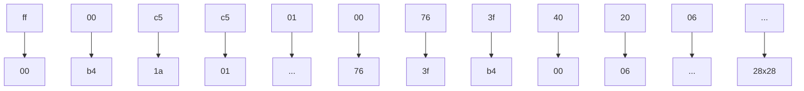

# DenTC: An expandable framework for dynamic malicious traffic classification


Rui Chen a, Lailong Luo b,∗, Bangbang Ren b, Deke Guo c, Changhao Qiu b, Shangsen Li b, Xiaodong Wang a,∗

a College of Computer Science and Technology, National Key Laboratory of Parallel and Distributed Computing, National University of Defense Technology, 410073,   
Changsha, China   
b National Key Laboratory of Information Systems Engineering, National University of Defense Technology, 410073, Changsha, China   
c School of Computer Science and Engineering, Sun Yat-sen University, Guangzhou, China

# a r t i c l e i n f o

Keywords:

Traffic classification

Dynamic

Expandable

Incremental

# a b s t r a c t

Malicious traffic classification is crucial for network security and the identification of malicious network activities. Currently, deep learning (DL)-based traffic classification techniques primarily learn features from static traffic datasets. However, network traffic is dynamic and constantly evolving, with new traffic types continuously emerging. This makes it difficult for existing static DL-based methods to meet the demands of dynamic traffic classification. On one hand, fine-tuning existing DL-based models with newly arrived data leads to catastrophic forgetting of previously learned knowledge; on the other hand, retraining the entire model using all available data introduces high data dependency. To circumvent these issues, we propose DenTC, a novel expandable framework for dynamic malicious traffic classification. DenTC offers three key advantages: (i) it incrementally learns from dynamic traffic without requiring retraining of the entire model; (ii) it mitigates catastrophic forgetting of past knowledge, achieving accurate and stable performance; and (iii) it minimizes data dependency, eliminating the need to store all old data. Unlike existing methods, we construct a dynamically expandable module that freezes the previously learned representation while extending new feature extractors to acquire new knowledge. To further reinforce the retention of past knowledge, a subset of representative samples from old classes is selected for subsequent training. To better learn discriminative features for new classes, we introduce an auxiliary loss function to the new feature extractor. Additionally, we employ weight alignment to correct the weights biased toward new classes. Trace-driven experiments show that DenTC maintains high and stable performance while incrementally learning dynamic network traffic, outperforming existing methods.

# 1. Introduction

Malicious traffic classification [1–9] is an essential task in network security and intrusion detection systems (IDS). It classifies network traffic into predefined categories, such as normal or malicious traffic. Meanwhile, it is the first step of identifying different abnormal or malicious activities (e.g., Distributed Denial-of-Service, Advanced Persistent Threat, Challenge Collapsar, etc.) that may occur in the network [8]. It is estimated that more than thousands of malicious traffic activities are launched daily on the Internet, leading to losses in trillions of US dollars every year [10]. Due to the substantial loss caused by malicious activities, malicious traffic classification has attracted increasing attention.

Existing traffic classification approaches fall into two main categories: machine learning (ML)-based methods [1,2,8,11] and deep learning (DL)-based methods [3,12–16]. Early studies predominantly relied on ML techniques, which typically required handcrafted feature extraction [17,18]. With the rise of deep learning, DL-based methods [19–23] have become the mainstream due to their ability to automatically extract features and learn complex patterns from static traffic datasets. Given sufficient labeled data, after training or fine-tuning, these models can achieve high classification accuracy on static datasets. However, real-world network traffic is dynamic and ever-evolving-previous traffic categories may decay, while new traffic types continuously emerge [24]. Although DL-based methods perform well on static datasets, the dynamic nature makes DL-based models trained on static datasets struggle to adapt to changing traffic patterns, thus facing the following two key challenges:


<details>
<summary>line</summary>

| Number of appeared classes | Finetune | Retraining | DenTC(Ours) |
| -------------------------- | -------- | ---------- | ----------- |
| 2                          | 1.0      | 1.0        | 1.0         |
| 4                          | 0.5      | 1.0        | 1.0         |
| 6                          | 0.3      | 1.0        | 1.0         |
| 8                          | 0.25     | 1.0        | 1.0         |
| 10                         | 0.2      | 1.0        | 1.0         |
| 12                         | 0.15     | 1.0        | 1.0         |
| 14                         | 0.1      | 1.0        | 1.0         |
| 16                         | 0.08     | 1.0        | 1.0         |
| 18                         | 0.07     | 1.0        | 1.0         |
| 20                         | 0.05     | 1.0        | 1.0         |
</details>


<details>
<summary>line</summary>

| Number of appeared classes | Finetune | Retraining | DenTC(Ours) |
| -------------------------- | -------- | ---------- | ----------- |
| 2                          | 0        | 0          | 0           |
| 4                          | 0        | 0.2        | 0           |
| 6                          | 0        | 0.4        | 0           |
| 8                          | 0        | 0.6        | 0           |
| 10                         | 0        | 0.8        | 0           |
| 12                         | 0        | 1.0        | 0           |
| 14                         | 0        | 1.2        | 0           |
| 16                         | 0        | 1.4        | 0           |
| 18                         | 0        | 1.6        | 0           |
| 20                         | 0        | 1.8        | 0           |
</details>

Fig. 1. Left: the accuracy of DenTC, Finetune, and Retraining. Right: the data quantity used by DenTC, Finetune, and Retraining (the number of traffic classes gradually increases from 2 to 20, with detailed descriptions provided in Section 4.2). Finetune suffers from catastrophic forgetting, leading to a decline in overall accuracy, while retraining is highly data-dependent, requiring the storage of all old and new data. In contrast, our DenTC method enables incremental learning for network traffic through a dynamic architecture, effectively mitigating catastrophic forgetting without the need to retrain the entire model using all the data. Notably, the consistent trend is also validated on the new dataset (see Appendix Fig. A.10).

• Catastrophic Forgetting: A natural strategy for dynamic malicious traffic classification is to fine-tune the existing DL-based models using data from newly emerging traffic classes (e.g., we use incoming new data to fine-tune the existing CNN traffic model [19,25], as shown in Fig. 1). However, this strategy causes the model to overwrite critical feature representations of previous classes when learning new classes, leading to a sharp performance drop on earlier classes-a phenomenon known as catastrophic forgetting. As a result, the overall traffic classification accuracy degrades significantly, especially in long-term, multi-class traffic scenarios. As illustrated on the left of Fig. 1, the catastrophic forgetting of Finetune hampers the model’s ability to adapt to evolving traffic environments.   
• High Data Dependence: Another strategy is to retrain the DL model from scratch whenever new classes appear, using all old and new data (e.g., we retrain the CNN traffic model [19,25] using all old and new data). While this avoids forgetting and maintains performance, it requires storing all the historical data and repeatedly retraining the model, which incurs data storage and computational overhead, resulting in high dependency on historical data. More critically, this method assumes access to all historical training data-an assumption often violated in real-world settings due to privacy constraints or limited storage capacity. For instance, historical data may be inaccessible or deleted in certain environments, rendering retraining-based approaches impractical. As shown on the right of Fig. 1, the high data dependence of Retraining makes it difficult to meet the requirements of dynamic traffic classification.

To address the above challenges, we propose DenTC, a novel and expandable framework for dynamic malicious traffic classification. DenTC leverages a dynamically expandable architecture to continually learn new knowledge from dynamic traffic while retaining previously learned knowledge, mitigating catastrophic forgetting without requiring retraining of the entire model. Specifically, DenTC comprises three components: the Traffic Preprocessing Module (TPM), the Dynamically Expandable Module (DEM), and the Classifier Learning Module (CLM).

Firstly, the Traffic Preprocessing Module extracts key packets from raw pcap files via flow splitting and filtering, and transforms them into the two-dimensional traffic matrix. Secondly, we propose the Dynamically Expandable Module (DEM)-the core of DenTC-which enables incremental learning from dynamic traffic. At each incremental step, DEM expands the new feature extractor to acquire new knowledge, while freezing previously learned representations to preserve past knowledge and mitigate catastrophic forgetting. To further reinforce prior knowledge, a small set of representative samples from old classes is maintained as an exemplar memory for subsequent training, rather than storing all the old data. Additionally, in order to learn more discriminative new features, an auxiliary loss is introduced for the new extractor to enhance the ability to learn new categories. Finally, the Classifier Learning Module incorporates weight alignment to correct the bias between old and new classes, alleviating the impact of class imbalance during incremental updates.

In summary, DenTC offers three key advantages:

• Incremental learning capability. DenTC designs DEM to continuously learn from evolving traffic and update the model without retraining the entire model.   
• Catastrophic forgetting mitigation. DenTC retains previously learned knowledge while adapting to new classes, ensuring accurate and stable traffic classification performance.   
• Low data dependency and efficiency. DenTC requires only new samples along with a small number of exemplars from previous classes for training, eliminating the need to store all historical data and reducing both storage and computational overhead.

The main contributions of this paper are as follows:

• We propose DenTC, a novel expandable framework for dynamic malicious traffic classification. DenTC continuously learns new knowledge from dynamic traffic while mitigating catastrophic forgetting.   
• We design the Dynamic Expandable Module (DEM) that incrementally updates the model by expanding new feature extractors while freezing old representations. Exemplar replay is used to reinforce prior knowledge, an auxiliary loss enhances new class learning, and a weight alignment strategy mitigates class imbalance.   
• Extensive experiments demonstrate that DenTC effectively reduces catastrophic forgetting and achieves stable traffic classification accuracy with low resource overhead, validating its effectiveness and superiority.

# 2. Related work

# 2.1. Deep learning-based static methods

Recent advances in traffic classification [6,7,26] have largely focused on two main paradigms: machine learning (ML)-based methods [1,2,6,8,11,27,47] and deep learning (DL)-based methods [3,12,23,48, 49]. ML-based methods rely on handcrafted features extracted from network traffic-such as statistical, temporal, or protocol-specific attributeswhich limits their generalizability [17]. In contrast, DL-based methods automatically extract representations from raw traffic, significantly reducing the need for manual feature engineering. For instance, DIS-TILLER [28] proposes a multi-modal multi-task deep learning approach for traffic classification, leveraging inter-modal relationships to enhance classification performance. MalDIST [29] introduces a deep learningbased scheme for malware detection and classification. Deep Packet [19] leverages stacked autoencoders and convolutional neural networks (CNN) for traffic classification. FS-Net [20] proposes a flow-sequence network based on recurrent neural networks (RNN) to learn traffic features. ET-BERT [21] introduces a BERT-based pretraining-finetuning approach for encrypted traffic, while YaTC [22] adopts a masked autoencoder (MAE)-based transformer to capture traffic patterns using attention mechanisms. TFE-GNN [30] further enhances temporal features via graph neural networks (GNN) for fine-grained traffic classification.

Despite the impressive performance of DL-based methods in static traffic classification scenarios, they face substantial limitations in dynamic environments. In particular, as dynamic traffic data continues to grow rapidly in scale and diversity, standard DL-based models frequently require full retraining to adapt to new traffic distributions-a process that is both time-consuming and computationally expensive.


<details>
<summary>flowchart</summary>

```mermaid
graph TD
    A["Network Traffic"] --> B["Traffic Preprocessing Module"]
    B --> C["Dynamically Expandable Module"]
    C --> D["Classifier Learning Module"]

    subgraph_A["Network Traffic"]
        A1["No. Source IP"] --> A2["Dest IP"] --> A3["Protocol..."]
        A4["1.1.33.158"] --> A5["1.2.156.163"] --> A6["SSLv3"]
        A7["1.1.23.218"] --> A8["1.2.31.193"] --> A9["SSLv3"]
        A10["1.2.84.77"] --> A11["1.1.252.248"] --> A12["TCP"]
        A13["1.1.41.222"] --> A14["1.2.129.94"] --> A15["SSLv3"]
        A16["..."] --> A17["..."] --> A18["..."]
        A19["..."] --> A20["..."] --> A21["..."]
        A22["..."] --> A23["..."] --> A24["..."]
        A25["..."] --> A26["..."] --> A27["..."]
        A28["..."] --> A29["..."] --> A30["..."]
        A31["..."] --> A32["..."] --> A33["..."] --> A34["..."] --> A35["..."] --> A36["..."] --> A37["..."] --> A38["..."] --> A39["..."] --> A40["..."] --> A41["..."] --> A42["..."] --> A43["..."] --> A44["..."] --> A45["..."] --> A46["..."] --> A47["..."] --> A48["..."] --> A49["..."] --> A50["..."] --> A51["..."] --> A52["..."] --> A53["..."] --> A54["..."] --> A55["..."] --> A56["..."] --> A57["..."] --> A58["..."] --> A59["..."] --> A60["..."] --> A61["..."] --> A62["..."] --> A63["..."] --> A64["..."] --> A65["..."] --> A66["..."] --> A67["..."] --> A68["..."] --> A69["..."] --> A70["..."] --> A71["..."] --> A72["..."] --> A73["..."] --> A74["..."] --> A75["..."] --> A76["..."] --> A77["..."] --> A78["..."] --> A79["..."] --> A80["..."] --> A81["..."] --> A82["..."] --> A83["..."] --> A84["..."] --> A85["..."] --> A86["..."] --> A87["..."] --> A88["..."] --> A89["..."] --> A90["..."] --> A91["..."] --> A92["..."] --> A93["..."] --> A94["..."] --> A95["..."] --> A96["..."] --> A97["..."] --> A98["..."] --> A99["..."] --> A100["..."] -->|Feedback| B
    end

    subgraph B
        B1["Traffic Splitting"] --> B2["Traffic Filtering"] --> B3["Traffic Image Generation"] --> B4["Traffic Images"]
        B5["Select Exemplars"] --> B6["New data"]
    end

    subgraph C
        C1["R²(t-1)"] & C2["Feature Extractor F₁^P"] & C3["Feature Extractor F₂^P"] & C4["Firex"] & C5["Firex"] & C6["Firex"] & C7["Firex"] & C8["Firex"] & C9["Firex"] & C10["Firex"] & C11["Firex"] & C12["Firex"] & C13["Firex"] & C14["Firex"] & C15["Firex"] & C16["Firex"] & C17["Firex"] & C18["Firex"] & C19["Firex"] & C20["Firex"] & C21["Firex"] & C22["Firex"] & C23["Firex"] & C24["Firex"] & C25["Firex"] & C26["Firex"] & C27["Firex"] & C28["Firex"] & C29["Firex"] & C30["Firex"] & C31["Firex"] & C32["Firex"] & C33["Firex"] & C34["Firex"] & C35["Firex"] & C36["Firex"] & C37["Firex"] & C38["Firex"] & C39["Firex"] & C40["Firex"] & C41["Firex"] & C42["Firex"] & C43["Firex"] & C44["Firex"] & C45["Firex"] & C46["Firex"] & C47["Firex"] & C48["Firex"] & C49["Firex"] & C50["Firex"] & C51["Firex"] & C52["Firex"] & C53["Firex"] & C54["Firex"] & C55["Firex"] & C56["Firex"] & C57["Firex"] & C58["Firex"] & C59["Firex"] & C60["Firex"]
    end

    subgraph D
        D1["R²(t-1)"] & D2["Feature Extractor F₁^P"] & D3["Feature Extractor F₂^P"] & D4["Firex"] & D5["Firex"] & D6["Firex"] & D7["Firex"] & D8["Firex"] & D9["Firex"] & D10["Firex"] & D11["Firex"] & D12["Firex"] & D13["Firex"] & D14["Firex"] & D15["Firex"] & D16["Firex"] & D17["Firex"] & D18["Firex"] & D19["Firex"] & D20["Firex"]
    end

    subgraph E
        E1["R²(t-1)"] & E2["Feature Extractor F₁^P"] & E3["Feature Extractor F₂^P"] & E4["Firex"] & E5["Firex"] & E6["Firex"] & E7["Firex"] & E8["Firex"] & E9["Firex"] & E10["Firex"]
    E10["R²(t-1)"] & E11["Feature Extractor F₁^P"] & E12["Feature Extractor F₂^P"] & E13["Firex"] & E14["Firex"] & E15["Firex"] & E16["Firex"]
    E16["R²(t-1)"] & E17["Feature Extractor F₁^P"] & E18["Firex"] & E19["Firex"] & E20["Firex"]
    E20["R²(t-1)"] & E21["Feature Extractor F₁^P"] & E22["Firex"] & E23["Firex"] & E24["Firex"]
    E25["R²(t-1)"] & E26["Feature Extractor F₁^P"] & E27["Firex"] & E28["Firex"]
    E29["R²(t-1)"] & E30["Feature Extractor F₁^P"] & E31["Firex"] & E32["Firex"]
    E33["R²(t-1)"] & E34["Feature Extractor F₁^P"] & E35["Firex"] & E36["Firex"]
    E37["R²(t-1)"] & E38["Feature Extractor F₁^P"] & E39["FIREX"]
    E40["R²(t-1)"] & E41["Feature Extractor F₁^P"] & E42["FIREX"]
    E45["R²(t-1)"] & E46["R²(t-1)"] & E47["R²(t-1)"] & E48["R²(t-1)"]
    E50["R²(t-1)"] & E51["R²(t-1)"] & E52["R²(t-1)"] & E53["R²(t-1)"]
    E56["R²(t-1)"] & E57["R²(t-1)"] & E58["R²(t-1)"] & E59["R²(t-1)"]
    E60["R²(t-1)"] & E61["R²(t-1)"] & E62["R²(t-1)"] & E63["R²(t-1)"]
    E67["R²(t-1)"] & E68["R²(t-1)"] & E69["R²(t-1)"] & E70["R²(t-1)"]
    E73["R²(t-1)"] & E74["R²(t-1)"] & E75["R²(t-1)"] & E76["R²(t-1)"]
    E79["R²(t-1)"] & E80["R²(t-1)"] & E81["R²(t-1)"] & E82["R²(t-1)"]
    E90["R²(t-1)"] & E91["R²(t-1)"] & E92["R²(t-1)"] & E93["R²(t-1)"]
    E96["R²(t-1)"] & E97["R²(t-1)"] & E98["R²(t-1)"] & E99["R²(t-1)"]
    end

    subgraph Legend
        LegendA["Weight Alignment"]
        LegendB["CE Loss"]
        LegendC["Auxiliary Loss"]
        LegendD["Output labels"]
    end
```
</details>

Fig. 2. Overview of the DenTC framework. It comprises three modules: traffic preprocessing module (TPM), dynamically expandable module (DEM), and classifier learning module (CLM). First, raw traffic is preprocessed into traffic images. DEM then incrementally updates the model by adding new feature extractors for acquiring new knowledge while freezing previously learned representations to retain prior knowledge. To further reinforce past knowledge, a small set of representative samples from old classes is replayed. Finally, the classifier is trained using cross-entropy and auxiliary losses, with a weight alignment strategy.

```mermaid
graph TD
    A["No Source IP"] --> B["1.1.229.71"]
    A --> C["1.1.66.83"]
    A --> D["1.2.233.222"]
    A --> E["1.1.136.18"]
    A --> F["1.2.69.190"]
    G["Dest IP"] --> H["1.2.90.5"]
    G --> I["1.2.254.104"]
    G --> J["1.1.226.59"]
    G --> K["1.1.61.224"]
    L["Protocol ..."] --> M["SSLv3"]
    L --> N["TCP"]
    L --> O["SSLv3"]
    L --> P["TCP"]
    Q["Preprocessing"] --> R["Traffic splitting"]
    Q --> S["Traffic filtering"]
    R --> T["No.1, No.2, No.3,..."]
    S --> U["processed packets"]
    V["Traffic images"] --> W["Image 1"]
    V --> X["Image 2"]
    V --> Y["Image 3"]
    V --> Z["..."]
    
    AA["No Source IP"] --> AB["1.1.33.158"]
    AA --> AC["1.2.156.163"]
    AA --> AD["1.2.31.193"]
    AA --> AE["1.2.84.77"]
    AA --> AF["1.1.71.180"]
    AA --> AG["1.2.79.35"]
    AA --> AH["1.1.41.222"]
    AA --> AI["1.2.129.94"]
    AA --> AJ["..."]
    AK["Protocol ..."] --> AL["Preprocessing"]
    AK --> AM["Traffic splitting"]
    AK --> AN["Traffic filtering"]
    AL --> AO["No.1, No.2, No.3,..."]
    AM --> AP["processed packets"]
    AN --> AQ["..."]
    AR["Pcap File"] --> AS["No Source IP"] & AH["Dest IP"] & AI["Protocol ..."]
```


<details>
<summary>flowchart</summary>


</details>

Fig. 3. The process of the traffic preprocessing module. It extracts packets from the pcap files through traffic splitting and traffic filtering and then transforms them into two-dimensional traffic matrices.

To overcome these challenges, this paper proposes a novel incremental framework for traffic classification, aiming to ensure accurate and stable performance under dynamic network environments.

# 2.2. Incremental learning-based dynamic methods

Incremental learning (also known as continual learning) [31] is an emerging paradigm that enables models to learn from a continuous data stream. With network traffic becoming increasingly dynamic and complex, incremental learning has become a key solution for dynamic traffic classification. Existing strategies [31] generally fall into three categories: regularization-based, replay-based, and bias correction methods. Regularization-based approaches constrain updates of model parameters to mitigate the forgetting of previously learned knowledge. For example, Learning without Forgetting (LwF) [32] leverages soft targets from previous models to constrain new task learning, while Elastic Weight Consolidation (EWC) [33] penalizes changes to important weights. Replay-based methods prevent forgetting by storing old samples [34] or generating synthetic data [35]. Bias correction methods, such as BiC [36], adjust model predictions via calibration layers to reduce output bias during class-incremental learning. In addition, COIL [37] enhances old classifiers through prospective transmission and retrospective transmission to overcome forgetting.

As traffic patterns evolve rapidly, static traffic classification methods become insufficient for real-world scenarios, prompting exploration of incremental learning approaches [38]. For instance, ILETC [39] employs generative replay to mitigate catastrophic forgetting but depends

on generated sample quality. EETC [40] combines sample replay with knowledge distillation, yet its fixed network architecture cannot dynamically expand model capacity according to task complexity. I2RNN [41] introduces an interpretable framework for adapting to emerging traffic categories, while MISS [42] leverages multi-view sequence fusion to extract complementary information in incremental scenarios. Nevertheless, these methods still struggle with continuously evolving traffic feature distributions, leaving room for performance improvement. Unlike prior work, this paper proposes an incremental traffic classification algorithm from a dynamic architecture perspective, which achieves model adaptive expansion through dynamic architectures and realizes dynamic evolution of traffic classification by incorporating exemplar replay mechanisms.

# 3. Design of DenTC

# 3.1. Problem statement and overview

Before illustrating the specific design of our DenTC approach, we initially explain the problem setting for the network traffic incremental learning. DenTC learns expandable representations and classifiers from a data stream in class-incremental form. During the class incremental learning, the model observes a group of classes $\left\{ Y _ { t } \right\}$ and their corresponding training data $\left\{ D _ { t } \right\}$ . In step $t ,$ the incoming dataset $D _ { t }$ has the form $( x _ { i } ^ { t } , y _ { i } ^ { t } ) _ { : }$ , where $\boldsymbol { x } _ { i } ^ { t }$ is the input data and $y _ { i } ^ { t }$ is the label from the label set $Y _ { t } .$ . The label space of the model consists of all observed classes $\tilde { Y } _ { t } = Y _ { 1 } \cup Y _ { 2 } \ldots \cup Y _ { t } ;$ and the model is anticipated to perform well on all classes $\tilde { Y } _ { t } .$ .

In this paper, we propose DenTC, a novel expandable framework to learn dynamic malicious traffic continuously. DenTC aims to: 1) incrementally learn new knowledge from the upcoming malicious traffic; 2) avoid the catastrophic forgetting effect and guarantee stable and high classification accuracy; 3) reduce the burden on the memory (without the need to store all old data). We fulfill these goals by combining three key modules shown with a high-level overview in Fig. 2.

• Traffic Preprocessing Module (TPM): Preprocess raw network traffic and transform it into the two-dimensional traffic matrix. In this way, it provides the traffic matrix for the following dynamically expandable module.   
• Dynamically Expandable Module (DEM): constructs a dynamically expandable architecture to learn expandable features from dynamic traffic. Specifically, DEM freezes the previously learned representation and enhances the new feature by incorporating the new feature extractor. To further reinforce past knowledge, a small set of representative samples from old classes are selected for subsequent


<details>
<summary>flowchart</summary>


</details>

Fig. 4. The mapping process of traffic image generation.

training. To promote the learning of discriminative features of new classes, we introduce the auxiliary loss for the new feature extractor.

• Classifier Learning Module (CLM): utilizes the cross-entropy and auxiliary losses to train the model and update the parameters. In addition, we employ the weight alignment to deal with the class imbalance issue between the new class data and old exemplar data by correcting the weights that exhibit bias towards the new class in the fully connected layer.

# 3.2. Traffic preprocessing module

Raw network traffic data is often heterogeneous and diverse, including many different types of data packets with different contents and purposes. Moreover, the activities of some applications may generate some invalid data packets, affecting classification performance. Consequently, preprocessing of network traffic data is required to better improve the performance of classifiers. As shown in Fig. 3, our traffic preprocessing module extracts packets from the pcap files through traffic splitting and traffic filtering and then transforms them into two-dimensional traffic matrices.

Traffic splitting. Most raw network traffic is stored in the pcap format, where each pcap file contains traffic data from multiple flows of an application. Flows are packets with the same five-tuples, including the source IP, source port, destination IP, destination port, and transport protocol. A session is defined as bidirectional flows in which the source and destination addresses are interchanged. In this paper, we leverage the five-tuple information to split raw network traffic data into multiple sessions. Each session is saved as a separate small pcap file, with the filename consisting of the source and destination IP addresses for easy identification and organization of the data. Through this traffic-splitting process, we obtain individual sessions that can be effectively used for subsequent analysis and classification tasks.

Traffic filtering. After the traffic splitting, it is necessary to anonymize the session because the IP and port information in the session may affect the feature extraction process. Traffic anonymization entails randomizing the IP addresses and ports of each packet to eliminate the adverse effects on the feature extraction. Then, redundant packets with identical content are filtered, and empty packets are eliminated.

Traffic image generation. Each session file contains multiple packets, and each packet consists of a sequence of hexadecimal bytes. We sequentially concatenate the packets within a session to form a continuous session-level byte stream. Prior research [25] has shown that the initial portion of a network flow or session often contains critical information reflecting its intrinsic characteristics. Therefore, following research [25], we utilize the first 784 bytes of each session, as this portion typically captures key discriminative features while avoiding the complexity of handling long (elephant) traffic flows. If the session file length exceeds 784 bytes, the surplus bytes are truncated. Conversely, if the file length is less than 784 bytes, it is padded with 0x00. The resulting 784-byte sequence is then reshaped into a 28×28 two-dimensional traffic matrix, which is subsequently stored as a traffic image, as illustrated in Fig. 4.

It is worth mentioning that traffic preprocessing is not the focus of this paper. In the preprocessing module, any traffic feature engineering method can replace the traffic image conversion process, as long as the extracted features can be transformed into a matrix or vector.

# 3.3. Dynamically expandable module

In many traffic classification scenarios, traffic classification methods are trained on static datasets, leaving the model incapable of incremental updates to accommodate dynamic traffic data. For instance, when new traffic data arrives, the finetune method employs new data to adjust the existing model. Although the model adapts effectively to the new data, it falls short in accurately identifying previous traffic (i.e., catastrophic forgetting effect). This results in a decline in the overall accuracy of traffic classification.

To address this challenge, we construct the Dynamic Expandable Module (DEM), a dynamic method specifically designed for incremental updates of the traffic model. DEM effectively utilizes continuously expanding feature extractors, which reduces catastrophic forgetting of previously learned old knowledge and acquires the knowledge of new classes simultaneously. We build DEM through the following steps.

# 3.3.1. Construction of feature extractors

To continuously learn features from the traffic, We build an expandable feature extractor. As shown in Fig. 2, in step $t - 1 ,$ the expandable feature extractors $Q _ { t - 1 }$ consists of feature extractor $F _ { 1 } , F _ { 2 } , \dots , F _ { t - 1 } .$ When presented with a traffic image $\boldsymbol { x } \in \tilde { D } _ { t } ,$ , the feature extracted by $Q _ { t - 1 }$ is obtained through the process:

$$
Q _ {t - 1} (\boldsymbol {x}) = \left[ F _ {1} (\boldsymbol {x}), \dots , F _ {t - 1} (\boldsymbol {x}) \right] \tag {1}
$$

# 3.3.2. Retain past knowledge

In the process of learning dynamic malicious traffic, the model tends to quickly adapt to new data but forget the knowledge learned from previous data. To address this issue, we freeze the feature extraction function $Q _ { t - 1 }$ at step ??, as it captures the intrinsic structure of previous data. During the subsequent training, the parameters of the last step’s expandable feature extractor $\Theta _ { Q _ { t - 1 } }$ and the batch normalization statistics remain unchanged and are not updated. In this way, DenTC retains the previously learned knowledge of the old classes, thus reducing the catastrophic forgetting of old knowledge.

# 3.3.3. Acquire new knowledge

To acquire novel knowledge, we extend the network with the new feature extractor $F _ { t } .$ As new data arrives, the expandable feature extractor $Q _ { t }$ is constructed by extending the newly created feature extractor $F _ { t }$ onto the existing feature extractor $Q _ { t - 1 }$ . Moreover, we use $F _ { t - 1 }$ to initialize the new feature extractor $F _ { t } ,$ allowing us to leverage the previous knowledge for efficient adaptation to the new tasks. Then, the dynamically expandable features ?? extracted by $Q _ { t }$ is represented as:

$$
\boldsymbol {u} = Q _ {t} (\boldsymbol {x}) = [ Q _ {t - 1} (\boldsymbol {x}), F _ {t} (\boldsymbol {x}) ] \tag {2}
$$

# 3.3.4. Select representative exemplars

Furthermore, we utilize the rehearsal strategy to selectively retain a portion of representative data from the old classes as the exemplar memory ?? for subsequent training. Specifically, we use the herding [43] strategy to compute the scores of samples after passing through the classifier, with higher scores indicating greater representativeness. The top ?? samples with the highest representativeness are selected as the exemplar set for the old classes and stored in memory. For instance, if ?? samples are chosen to be stored as exemplars for ?? classes, each class will have $K = M / N$ exemplars. As the number of classes increases, the number of exemplars per class decreases, and we only retain the top ?? samples from each class as exemplars. At step $\mathbf { t } ,$ the classifier is trained using the currently available new class data $D _ { t }$ and the exemplar sets ?? from the old classes, i.e. $\tilde { D } _ { t } = D _ { t } \cup P$ . Through the above steps, DenTC can incrementally learn new knowledge from the traffic and reduce the forgetting of previously learned knowledge.

Algorithm 1 Expandable network updating.   
Input : $X^{s}, \ldots, X^{w}$ // training data of new classes
    s, ..., w

1 Require: $\Theta$ // current model parameters
2 Require: $P = (P_{1}, \ldots, P_{s-1})$ // exemplar sets of old classes
3 Form combined training set:
4 $\tilde{D}_{t} \leftarrow \bigcup_{y=s,\ldots,w} \{(x, y) : x \in X^{y}\} \cup$ 5 $\bigcup_{y=1,\ldots,s-1} \{(x, y) : x \in P^{y}\}$ 6 Obtain expandable feature:
7 $Q_{t} \leftarrow [F_{1}(x), \ldots, F_{t-1}(x)] + F_{t}(x), x \in \tilde{D}_{t}$ 8 Training the model with loss function:
9 $\mathcal{L}_{ER}(\Theta) = \mathcal{L}_{R_{t}} + \lambda_{a} \mathcal{L}_{R_{t}^{a}};$ 10 where $L_{R_{t}} = -\frac{1}{|\tilde{D}_{t}|} \sum_{i=1}^{|\tilde{D}_{t}|} \log \left( p_{R_{t}}(y = y_{i} \mid x_{i}) \right);$ 11 and $L_{R_{t}^{a}} = -\frac{1}{|\tilde{D}_{t}|} \sum_{i=1}^{|\tilde{D}_{t}|} \log \left( p_{R_{t}^{a}}(y = y_{i} \mid x_{i}) \right);$ 12 Update the parameters $\Theta$ of the expandable network.
13 Utilize weight alignment to corect biased weights in fully connected layers:
14 $\gamma = \text{Mean}(N_{\text{old}})/\text{Mean}(N_{\text{new}})$ 15 $W_{new} \leftarrow \gamma \cdot W_{new}$ 16 Select the exemplar set $P_{s}, \ldots, P_{w}$ from new categories s, ..., w for the following rounds of training.

# 3.3.5. Expandable network updating process

The core of DenTC lies in the Dynamic Expandable Module (DEM), which dynamically adds network branches for new classes during continual learning. As shown in Fig. 2, DEM consists of a series of expandable feature extractors.

When data from new classes $s , \ldots , w$ arrives, DEM invokes Algorithm 1 to dynamically expand the network and incrementally update the model parameters. First, new class data $X ^ { s } , \ldots , X ^ { w }$ and old exemplar sets $P _ { 1 } , \ldots , P _ { s - 1 }$ are combined to form the current training dataset $\tilde { D } _ { t } .$ . Subsequently, a new convolutional network branch $F _ { t }$ is added for the new classes, which inherits historical knowledge by copying the complete parameter state of the previous $F _ { t - 1 } .$ . The newly learned features $F _ { t }$ and previous feature representations $Q _ { t - 1 }$ are concatenated to form the updated expandable features $Q _ { t } = [ Q _ { t - 1 } , F _ { t } ] .$ . During training, all historical network branches $F _ { 1 } , F _ { 2 } , \dots , F _ { t - 1 }$ are completely frozen, with parameter updates performed only on the new branch $F _ { t } ,$ preventing interference with old knowledge. In the forward propagation phase, all network branches extract features in parallel, which are fused into high-dimensional representations through feature concatenation operations and subsequently fed into the classifier for classification prediction. The model is trained using joint optimization of cross-entropy loss and auxiliary loss functions.

After training, DenTC selects representative data from the new classes to form exemplar sets $P _ { s } , \ldots , P _ { w } ,$ , which are combined with historical exemplar sets $P _ { 1 } , \ldots , P _ { s - 1 }$ to constitute the new exemplar set ?? for subsequent training. Through iterative execution of the above steps, the expandable model continuously updates. When the total number of classes reaches the predefined limit of the current task, the update process is terminated.

# 3.4. Classifier learning module

# 3.4.1. Training loss

After obtaining the expandable feature ?? (i.e. $Q _ { t } ( { \pmb x } ) )$ , we train the model using the cross-entropy loss and auxiliary loss to update the model parameters.

Cross-entropy loss. We use the cross-entropy loss to train the model, which operates on exemplars and incoming new data (i.e. $\tilde { D } _ { t } )$ . The loss function is formulated as follows:

$$
\mathcal {L} _ {R _ {t}} = - \frac {1}{| \tilde {D} _ {t} |} \sum_ {i = 1} ^ {| \tilde {D} _ {t} |} \log (p _ {R _ {t}} (y = y _ {i} | \boldsymbol {x} _ {t})) \tag {3}
$$

where $x _ { i }$ is the input and $y _ { i }$ is the label. In order to preserve the old knowledge while learning new knowledge, the parameters of the classifier $R _ { t }$ are inherited from $R _ { t - 1 }$ associated with the old features, and its newly added parameters are initialized randomly.

Auxiliary loss. To facilitate the learning of discriminative features, we incorporate an auxiliary loss for the new features $F _ { t } ( { \pmb x } ) .$ . This is accomplished by introducing an auxiliary classifier $R _ { t } ^ { a } ;$ , which predicts the probability $p _ { R _ { \ast } ^ { a } } ( \pmb { y } | \pmb { x } ) = S o f t m a x ( R _ { t } ^ { a } ( F _ { t } ( \pmb { x } ) ) )$ . To promote the network to differentiate between the features associated with old and new classes, the label space of $R _ { t } ^ { a }$ includes the new category set $Y _ { t }$ and other classes while treating all old classes as a single category.

Total loss. Consequently, the total loss of expandable representation can be expressed as follows:

$$
\mathcal {L} _ {E R} = \mathcal {L} _ {R _ {t}} + \lambda_ {a} \mathcal {L} _ {R _ {t} ^ {a}} \tag {4}
$$

where $\lambda _ { a }$ is the hyper-parameter to regulate the influence of the auxiliary classifier. Notably, $\lambda _ { a }$ is set to 0 during the first step ?? = 1.

# 3.4.2. Weight alignment

Due to the imbalance between the old exemplars and the new data, we adopt weight alignment to correct weights biased towards new classes in fully connected layers. During the initial training, weight alignment is not performed. When new classes arrive for incremental learning, weight alignment is applied after updating the extended network to adjust the bias toward the new classes.

To be specific, we first calculate the L2 norm of the weight vectors for both old and new classes in the fully connected layers to obtain $N _ { \mathrm { o l d } }$ and $N _ { \mathrm { n e w } }$ as follows:

$$
\boldsymbol {N} _ {\text { old }} = (| | \boldsymbol {W} _ {1} | |, \dots , | | \boldsymbol {W} _ {C _ {\text { old }} ^ {b}} | |), \tag {5}
$$

$$
\boldsymbol {N} _ {\text { new }} = (| | \boldsymbol {W} _ {C _ {o l d} ^ {b} + 1} | |, \dots , | | \boldsymbol {W} _ {C _ {o l d} ^ {b} + C ^ {b}} | |), \tag {6}
$$

where ?? represents the weight of the fully connected layer.

Then, we calculate the ratio of the mean values of the weight vector norms for the exemplars of old classes to that for the data of new classes, obtaining a coefficient $\gamma .$ The formula ?? is as follows:

$$
\gamma = \frac {\operatorname{Mean} (N _ {\text { old }})}{\operatorname{Mean} (N _ {\text { new }})} \tag {7}
$$

Finally, we multiply the weights of the new class $W _ { \mathrm { n e w } }$ by the coefficient $\gamma ,$ resulting in the updated weights $\widehat { \pmb { W } } _ { \mathrm { n e w } }$ as shown below.

$$
\widehat {\boldsymbol {W}} _ {\text { new }} = \gamma \cdot \boldsymbol {W} _ {\text { new }} \tag {8}
$$

These updated weights, ${ \widehat { W } } _ { \mathrm { n e w } } ,$ are then used to replace the original $W _ { \mathrm { n e w } } ;$ aligning the weight vectors of the old and new classes and thereby mitigating the classifier weight bias introduced by data imbalance.

# 4. Performance evaluation

This section first introduces the experimental setting of DenTC and then quantifies the performance of DenTC by answering the following questions:

1. Does DenTC satisfy the three key advantages for incremental learning of dynamic traffic? (Section 4.2)

Table 1 Statistics of the USTC-TFC2016 and ISCXVPN2016 datasets. 

<table><tr><td>Dataset</td><td>Type</td><td>Class</td><td>Total</td></tr><tr><td rowspan="20">USTC-TFC2016</td><td rowspan="10">Normal</td><td>BitTorrent</td><td>7517</td></tr><tr><td>Facetime</td><td>6000</td></tr><tr><td>FTP</td><td>60,000</td></tr><tr><td>Gmail</td><td>8629</td></tr><tr><td>MySQL</td><td>60,000</td></tr><tr><td>Outlook</td><td>7524</td></tr><tr><td>Skype</td><td>6321</td></tr><tr><td>SMB</td><td>38,937</td></tr><tr><td>Weibo</td><td>39,950</td></tr><tr><td>WorldOfWarcraft</td><td>7863</td></tr><tr><td rowspan="10">Malware</td><td>Cridex</td><td>16,386</td></tr><tr><td>Geodo</td><td>40,947</td></tr><tr><td>Htbot</td><td>6367</td></tr><tr><td>Miuref</td><td>13,481</td></tr><tr><td>Neris</td><td>33,791</td></tr><tr><td>Nsis-ay</td><td>6069</td></tr><tr><td>Shifu</td><td>9634</td></tr><tr><td>Tinba</td><td>8504</td></tr><tr><td>Virut</td><td>33,103</td></tr><tr><td>Zeus</td><td>10,970</td></tr><tr><td rowspan="10">ISCXVPN2016</td><td rowspan="5">VPN</td><td>Chat</td><td>4029</td></tr><tr><td>Email</td><td>298</td></tr><tr><td>FileTransfer</td><td>1020</td></tr><tr><td>Streaming</td><td>659</td></tr><tr><td>VoIP</td><td>7037</td></tr><tr><td rowspan="5">nonVPN</td><td>Chat</td><td>10,107</td></tr><tr><td>Email</td><td>7312</td></tr><tr><td>FileTransfer</td><td>1289</td></tr><tr><td>Streaming</td><td>3668</td></tr><tr><td>VoIP</td><td>4022</td></tr></table>

2. Does DenTC perform better than the existing incremental methods? We analyze the performance improvement of DenTC. (Section 4.3)   
3. What is the computational overhead of DenTC? We analyze the computational cost of DenTC. (Section 4.4)   
4. Is the module designed for DenTC effective? We design ablation experiments. (Section 4.5)

# 4.1. Experimental setup

# 4.1.1. Dataset

We conduct experiments on four popular public traffic datasets frequently utilized in the research community: the USTC-TFC20161 dataset [25], the ISCXVPN20162 dataset [44], the CICIoT20223 dataset [45], and the ISCXTor20164 dataset [46]. Tables 1 and 2 list the details of the datasets.

• USTC-TFC2016 [25]: It contains ten types of malicious traffic and ten types of normal traffic. One part has ten types of public website malware traffic collected from the real network environment of CTU University. The other part contains ten types of normal traffic collected using the IXIA traffic device. We convert the dataset from the pcap format to the image format. Specifically, each type is randomly split into a training set and a testing set with a ratio of 4800:1200 (8:2).   
• ISCXVPN2016 [44]: It includes six categories of VPN traffic and six categories of non-VPN traffic and is used to evaluate the effectiveness of encrypted traffic classification on virtual private networks. We use the original pcap traffic data of five types of VPNs and five types of non-VPNs to conduct the experiments. The number of each type is

unbalanced. Each category is divided into the training set and testing set according to the ratio of 8:2.

• CICIoT2022 [45]: It is released by the Canadian Institute for Cybersecurity (CIC). It includes various types of normal and malicious attack traffic targeting IoT devices, such as DDoS attacks. We use 10 categories from this dataset to evaluate the effectiveness of dynamic malicious traffic classification.   
• ISCXTor2016 [46]: It contains eight categories of Tor network traffic that concentrate on analyzing encrypted traffic within the Tor network.

# 4.1.2. Parameter settings

We implement DenTC using Python 3.10.11 and PyTorch 1.13.0. The experiments are conducted on a computer with an AMD R9-7950X CPU, 124GB of RAM, and two NVIDIA GeForce RTX 4090 GPUs. All classifiers are trained with 170 epochs per increment. The batch size is set to 128, and the initial learning rate is 0.1, with a decay of 0.1 at epochs 80 and 120. The momentum is 0.9, and the weight decay is 0.0002. The ResNet18 architecture is used as the backbone network in the experiments. Moreover, for the USTC-TFC2016 dataset, 2000 samples are stored as the exemplar sets, with an equal distribution of 2000∕?? (?? is the number of classes) samples per class. For the ISCXVPN2016, CI-CIoT2022, and ISCXTor2016 datasets, 20 samples per class are stored as the exemplar sets. Exemplar set samples are selected using the herding method in research [43]. ?????????????????? refers to the number of newly emerging classes in each incremental step.

# 4.1.3. Baselines

We compare DenTC with the listed methods:

• Finetune (non-incremental): it finetunes the current DL model using new incoming data without considering the performance of previous classes.   
• Retraining (non-incremental): it retrains the DL model using all the old and new data.   
• Replay (incremental): it is a simplified variant of iCaRL [34] that preserves prior knowledge solely by replaying exemplars from old classes, without using mean classifiers or knowledge distillation.   
• LwF (incremental) [32] : it protects old knowledge from being overwritten by new knowledge by imposing constraints on the loss function of new classes.   
• EWC (incremental) [33]: it avoids excessive updates of parameters associated with old category data by calculating the importance of each parameter to the task and adding regularization terms.   
• BiC (incremental) [36]: it prevents forgetting old knowledge by correcting classifier bias.   
• COIL (incremental) [37]: it enhances new and old classifiers through prospective transmission and retrospective transmission to overcome forgetting.   
• EETC (incremental) [40]: it proposes an extended incremental framework for encrypted traffic classification, utilizing an exemplar update mechanism and cross-distillation loss to update the model and reduce forgetting.

# 4.1.4. Evaluation metrics

We evaluate the method’s performance in terms of accuracy and F1 score. The formulas for these metrics are given as follows. Among them, TP refers to true positive, TN refers to true negative, FP refers to false positive, and FN refers to false negative.

$$
A c c u r a c y = \frac {T P + T N}{T P + T N + F P + F N} \tag {9}
$$

$$
\text { Recall } = \frac {T P}{T P + F N} \tag {10}
$$

$$
P r e c i s i o n = \frac {T P}{T P + F P} \tag {11}
$$


<details>
<summary>line</summary>

| Number of seen classes | Finetune | Retraining | DenTC(Ours) |
| ---------------------- | -------- | ---------- | ----------- |
| 2                      | 1.0      | 1.0        | 1.0         |
| 4                      | 0.5      | 0.98       | 0.98        |
| 6                      | 0.3      | 0.97       | 0.97        |
| 8                      | 0.25     | 0.96       | 0.96        |
| 10                     | 0.2      | 0.95       | 0.95        |
| 12                     | 0.18     | 0.94       | 0.94        |
| 14                     | 0.16     | 0.93       | 0.93        |
| 16                     | 0.14     | 0.92       | 0.92        |
| 18                     | 0.12     | 0.91       | 0.91        |
| 20                     | 0.1      | 0.9        | 0.9         |
</details>

(a)Accuracy when increment=2


<details>
<summary>line</summary>

| Number of seen classes | Finetune | Retraining | DenTC(Ours) |
| ---------------------- | -------- | ---------- | ----------- |
| 2                      | 1.0      | 1.0        | 1.0         |
| 4                      | 0.4      | 0.95       | 0.98        |
| 6                      | 0.2      | 0.95       | 0.97        |
| 8                      | 0.1      | 0.95       | 0.96        |
| 10                     | 0.05     | 0.95       | 0.95        |
| 12                     | 0.03     | 0.95       | 0.95        |
| 14                     | 0.02     | 0.95       | 0.95        |
| 16                     | 0.01     | 0.95       | 0.95        |
| 18                     | 0.01     | 0.95       | 0.95        |
| 20                     | 0.01     | 0.95       | 0.95        |
</details>

(b) F1-score when increment=2


<details>
<summary>line</summary>

| Number of seen classes | Finetune | Retraining | DenTC(Ours) |
|---|---|---|---|
| 2 | 1.0 | 1.0 | 1.0 |
| 4 | 1.0 | 1.0 | 1.0 |
| 6 | 0.95 | 0.98 | 0.98 |
| 8 | 0.5 | 0.97 | 0.97 |
| 10 | 0.45 | 0.96 | 0.96 |
| 12 | 0.35 | 0.95 | 0.95 |
| 14 | 0.32 | 0.94 | 0.94 |
| 16 | 0.3 | 0.93 | 0.93 |
| 18 | 0.28 | 0.92 | 0.92 |
| 20 | 0.25 | 0.91 | 0.91 |
</details>

(c） Accuracy when increment=5


<details>
<summary>line</summary>

| Number of seen classes | Finetune | Retraining | DenTC(Ours) |
| ---------------------- | -------- | ---------- | ----------- |
| 4                      | 1.0      | 1.0        | 1.0         |
| 6                      | 0.8      | 0.95       | 0.95        |
| 8                      | 0.6      | 0.9        | 0.9         |
| 10                     | 0.4      | 0.85       | 0.85        |
| 12                     | 0.3      | 0.8        | 0.8         |
| 14                     | 0.2      | 0.75       | 0.75        |
| 16                     | 0.15     | 0.7        | 0.7         |
| 18                     | 0.1      | 0.65       | 0.65        |
| 20                     | 0.05     | 0.6        | 0.6         |
</details>

(d) F1-score when increment=5   
Fig. 5. Comparison of accuracy and F1-score between DenTC, Finetune, and Retraining under the settings of increment=2 and increment=5.

Table 2 Statistics of the CICIoT2022 and ISCXTor2016 datasets. 

<table><tr><td>Dataset</td><td>Class</td><td>Total</td></tr><tr><td rowspan="10">CICIoT2022</td><td>Attacks_Flood</td><td>2856</td></tr><tr><td>Attacks_Hydra</td><td>126</td></tr><tr><td>Attacks_Nmap</td><td>4766</td></tr><tr><td>Idle</td><td>3750</td></tr><tr><td>Interactions_Audio</td><td>511</td></tr><tr><td>Interactions_Cameras</td><td>1207</td></tr><tr><td>Interactions_Other</td><td>89</td></tr><tr><td>Power_Audio</td><td>1183</td></tr><tr><td>Power_Camera</td><td>1340</td></tr><tr><td>Power_Other</td><td>226</td></tr><tr><td rowspan="8">ISCXTor2016</td><td>Audio Streaming</td><td>514</td></tr><tr><td>Browsing</td><td>18,108</td></tr><tr><td>Chat</td><td>346</td></tr><tr><td>Email</td><td>355</td></tr><tr><td>File Transfer</td><td>3821</td></tr><tr><td>P2P</td><td>10,404</td></tr><tr><td>Video Streaming</td><td>1887</td></tr><tr><td>VOIP</td><td>1451</td></tr></table>


<details>
<summary>line</summary>

| Number of seen classes | Finetune | Retraining | DenTC(Ours) |
| ---------------------- | -------- | ---------- | ----------- |
| 2                      | 0.0      | 0.0        | 0.0         |
| 4                      | 0.0      | 0.2        | 0.0         |
| 6                      | 0.0      | 0.4        | 0.0         |
| 8                      | 0.0      | 0.6        | 0.0         |
| 10                     | 0.0      | 0.8        | 0.0         |
| 12                     | 0.0      | 1.0        | 0.0         |
| 14                     | 0.0      | 1.2        | 0.0         |
| 16                     | 0.0      | 1.4        | 0.0         |
| 18                     | 0.0      | 1.6        | 0.0         |
| 20                     | 0.0      | 1.8        | 0.0         |
</details>

(a) Data amount when increment=2


<details>
<summary>line</summary>

| Number of seen classes | Finetune | Retraining | DenTC(Ours) |
| ---------------------- | -------- | ---------- | ----------- |
| 5                      | 0.2      | 0.2        | 0.2         |
| 10                     | 0.2      | 0.4        | 0.2         |
| 15                     | 0.2      | 0.7        | 0.2         |
| 20                     | 0.2      | 1.0        | 0.2         |
</details>

(b) Data amount when increment=5   
Fig. 6. The data quantity used by DenTC, Finetuning, and Retraining under the settings of increment=2 and increment=5.

$$
F 1 - \text { score } = \frac {2 \times \text { Recall } \times \text { Precision }}{\text { Recall } + \text { Precision }} \tag {12}
$$

# 4.2. Performance of DenTC

We compare DenTC with two baseline methods, fine-tuning and retraining, to evaluate its effectiveness. Specifically, we conduct two sets of experiments on USTC-TFC2016. In each experiment, the training data consists of new class data (except for retraining), while the test data includes both previously seen and newly emerging traffic types. In the first set of experiments, the increment is 2, adding 2 new classes at each step, while in the second set, the increment is 5, with 5 new classes added at each step. These two experimental settings correspond to different incremental learning scenarios.

DenTC continuously learns and updates knowledge from dynamic traffic. Fig. 5 shows the incremental learning performance comparison between DenTC, Finetune, and Retraining when faced with incoming traffic. It is evident that DenTC possesses the ability to learn new

knowledge and update the model from dynamic traffic, whereas Finetune struggles to adapt to dynamic traffic, leading to a significant performance drop. For example, as the traffic grows from 5 to 20 categories (increment=5), DenTC’s accuracy changes from 99.98% to 94.33% (remaining above 90%). Although there is a slight decrease in accuracy, the drop is relatively limited. In comparison, the performance of Finetune sharply declines as new class data continuously arrives (increment=5), with accuracy dropping from 99.97% to 25%. This is due to Finetune only adjusting the existing model with new data, causing the model to focus solely on new class information and neglect key knowledge from old classes, resulting in an overall decrease in accuracy. Notably, while Retraining performs well, it requires retraining the model with all data whenever new traffic arrives, making it unable to support incremental learning. In contrast, DenTC constructs a dynamically extensible network that freezes previously learned representations while continuously acquiring new knowledge, enabling incremental learning from dynamic traffic.

DenTC requires less data without storing all previous old data. Fig. 6 illustrates the data usage for DenTC, Finetune, and Retraining at each incremental stage. DenTC achieves stable performance with significantly less data, while the data usage for Retraining increases exponentially. Specifically, as new class traffic data arrives, Retraining requires both the new data and all previous data to retrain the model. Although it achieves good performance, it incurs high data storage costs. On the other hand, Finetune uses less data, training the model only with the new data each time, but its performance is relatively poor. In contrast, DenTC only requires new data and a representative subset of old data, achieving good performance with less data usage.

DenTC demonstrates stable and accurate performance without catastrophic forgetting. Fig. 7 visualizes the confusion matrices of DenTC, Finetune, and Retraining at the final increment stage when increment = 2. Compared to Finetune, DenTC achieves better performance on both new and old categories, reducing catastrophic forgetting of old classes. As shown in Fig. 7(a), the confusion matrix for Finetune is highly uneven, with predictions almost entirely biased toward the two most recently added categories, resulting in incorrect predictions for the previous eighteen categories and causing nearly all classes to be misclassified. This indicates that directly fine-tuning the model sequentially introduces bias toward newly incoming data, leading to catastrophic forgetting of earlier categories. On the other hand, Retraining, which uses all the current data for training, results in a more balanced confusion matrix, but it requires both new and old data for retraining. In contrast, DenTC achieves over 90% accuracy for most categories. While a few categories show lower accuracy, overall, the accuracy across all categories remains high. This demonstrates that DenTC exhibits strong continuous learning ability, effectively mitigating catastrophic forgetting of old classes while maintaining stable performance throughout the learning process.

In total, DenTC offers three key advantages: enabling incremental learning of new knowledge from dynamic traffic, requiring a smaller amount of traffic data without the need to store all previous data, and maintaining accurate and stable performance without catastrophic forgetting.

  
(a) The confusion matrix of Finetune.


<details>
<summary>heatmap</summary>

| Predicted Class | True Class | Value |
| :--- | :--- | :--- |
| 1 | 1 | 1.0 |
| 2 | 2 | 0.95 |
| 3 | 3 | 0.85 |
| 4 | 4 | 0.75 |
| 5 | 5 | 0.65 |
| 6 | 6 | 0.55 |
| 7 | 7 | 0.45 |
| 8 | 8 | 0.35 |
| 9 | 9 | 0.25 |
| 10 | 10 | 0.15 |
| 11 | 11 | 0.05 |
| 12 | 12 | 0.0 |
| 13 | 13 | 0.0 |
| 14 | 14 | 0.0 |
| 15 | 15 | 0.0 |
| 16 | 16 | 0.0 |
| 17 | 17 | 0.0 |
| 18 | 18 | 0.0 |
| 19 | 19 | 0.0 |
| 20 | 20 | 0.0 |
</details>

(b） The confusion matrix of Retraining.

  
(c） The confusion matrix of DenTC.  
Fig. 7. Confusion matrix plots for Finetune, Retraining, and DenTC.

Table 3 Performance comparison of DenTC and six baseline methods in terms of accuracy (%) and f1 (%) on the USTC-TFC2016 dataset. The increment 2 setting refers to the gradual increase of data from 2 classes to 20 classes (The number of newly added classes is 2 at each incremental step). The best results are in boldface. 

<table><tr><td rowspan="3">Method</td><td colspan="20">USTCFC2016 (Increment = 2)</td></tr><tr><td colspan="2">2</td><td colspan="2">4</td><td colspan="2">6</td><td colspan="2">8</td><td colspan="2">10</td><td colspan="2">12</td><td colspan="2">14</td><td colspan="2">16</td><td colspan="2">18</td><td colspan="2">20</td></tr><tr><td>AC</td><td>F1</td><td>AC</td><td>F1</td><td>AC</td><td>F1</td><td>AC</td><td>F1</td><td>AC</td><td>F1</td><td>AC</td><td>F1</td><td>AC</td><td>F1</td><td>AC</td><td>F1</td><td>AC</td><td>F1</td><td>AC</td><td>F1</td></tr><tr><td>Replay</td><td>100</td><td>100</td><td>99.94</td><td>99.94</td><td>91.58</td><td>90.98</td><td>93.28</td><td>92.68</td><td>94.07</td><td>93.73</td><td>90.08</td><td>89.68</td><td>75.36</td><td>72.19</td><td>85.61</td><td>85.53</td><td>90.92</td><td>90.61</td><td>90.09</td><td>89.83</td></tr><tr><td>LwF</td><td>100</td><td>100</td><td>91.13</td><td>90.98</td><td>59.90</td><td>56.95</td><td>26.83</td><td>25.29</td><td>18.53</td><td>14.60</td><td>20.85</td><td>18.11</td><td>22.44</td><td>18.85</td><td>13.24</td><td>9.26</td><td>13.55</td><td>10.20</td><td>6.93</td><td>4.92</td></tr><tr><td>EWC</td><td>100</td><td>100</td><td>51.21</td><td>38.46</td><td>35.35</td><td>25.14</td><td>25.09</td><td>12.12</td><td>25.39</td><td>17.78</td><td>12.79</td><td>8.25</td><td>14.33</td><td>5.51</td><td>12.53</td><td>3.74</td><td>12.08</td><td>5.95</td><td>10.84</td><td>6.86</td></tr><tr><td>BiC</td><td>100</td><td>100</td><td>99.98</td><td>99.98</td><td>99.21</td><td>99.20</td><td>60.77</td><td>60.37</td><td>72.98</td><td>72.06</td><td>61.17</td><td>59.13</td><td>75.04</td><td>74.23</td><td>37.43</td><td>35.85</td><td>52.70</td><td>51.81</td><td>44.31</td><td>40.08</td></tr><tr><td>COIL</td><td>100</td><td>100</td><td>99.92</td><td>99.91</td><td>92.58</td><td>91.88</td><td>93.81</td><td>93.51</td><td>93.97</td><td>93.64</td><td>83.94</td><td>82.59</td><td>78.93</td><td>76.61</td><td>76.33</td><td>74.84</td><td>78.53</td><td>76.39</td><td>80.86</td><td>78.45</td></tr><tr><td>EETC</td><td>100</td><td>100</td><td>99.6</td><td>99.6</td><td>91.64</td><td>91.08</td><td>93.71</td><td>93.28</td><td>73.95</td><td>67.26</td><td>88.53</td><td>88.42</td><td>82.36</td><td>80.53</td><td>78.19</td><td>73.64</td><td>84.25</td><td>83.61</td><td>89.69</td><td>89.24</td></tr><tr><td>DenTC</td><td>100</td><td>100</td><td>99.88</td><td>99.88</td><td>92.85</td><td>92.46</td><td>94.34</td><td>94.01</td><td>94.67</td><td>94.34</td><td>93.35</td><td>93.04</td><td>93.85</td><td>93.58</td><td>94.68</td><td>94.46</td><td>95.05</td><td>94.85</td><td>95.46</td><td>95.29</td></tr></table>

Table 4 Performance comparison of DenTC and six baseline methods in terms of accuracy (%) and f1 (%) on the USTC-TFC2016 dataset. The best results are in boldface. 

<table><tr><td rowspan="3">Method</td><td colspan="10">USTCFC2016 (Increment = 4)</td><td colspan="8">USTCFC2016 (Increment = 5)</td></tr><tr><td colspan="2">4</td><td colspan="2">8</td><td colspan="2">12</td><td colspan="2">16</td><td colspan="2">20</td><td colspan="2">5</td><td colspan="2">10</td><td colspan="2">15</td><td colspan="2">20</td></tr><tr><td>AC</td><td>F1</td><td>AC</td><td>F1</td><td>AC</td><td>F1</td><td>AC</td><td>F1</td><td>AC</td><td>F1</td><td>AC</td><td>F1</td><td>AC</td><td>F1</td><td>AC</td><td>F1</td><td>AC</td><td>F1</td></tr><tr><td>Replay</td><td>99.94</td><td>99.94</td><td>98.65</td><td>98.62</td><td>89.60</td><td>89.15</td><td>93.10</td><td>92.84</td><td>93.53</td><td>93.33</td><td>100</td><td>100</td><td>92.53</td><td>92.20</td><td>91.34</td><td>90.95</td><td>90.08</td><td>89.87</td></tr><tr><td>LwF</td><td>99.96</td><td>99.96</td><td>70.38</td><td>68.10</td><td>45.16</td><td>37.06</td><td>39.32</td><td>32.33</td><td>35.03</td><td>29.36</td><td>99.95</td><td>99.95</td><td>66.22</td><td>65.11</td><td>50.63</td><td>43.32</td><td>41.58</td><td>33.41</td></tr><tr><td>EWC</td><td>99.96</td><td>99.96</td><td>44.73</td><td>32.94</td><td>33.29</td><td>20.02</td><td>28.36</td><td>17.47</td><td>22.64</td><td>13.55</td><td>100</td><td>100</td><td>44.88</td><td>35.85</td><td>34.57</td><td>19.86</td><td>29.53</td><td>17.04</td></tr><tr><td>BiC</td><td>99.92</td><td>99.92</td><td>95.83</td><td>95.61</td><td>88.18</td><td>88.04</td><td>85.01</td><td>85.01</td><td>88.31</td><td>88.11</td><td>100</td><td>100</td><td>95.01</td><td>94.62</td><td>91.48</td><td>91.37</td><td>83.33</td><td>83.24</td></tr><tr><td>COIL</td><td>99.96</td><td>99.94</td><td>95.41</td><td>95.17</td><td>89.33</td><td>89.05</td><td>86.21</td><td>86.04</td><td>89.44</td><td>89.23</td><td>99.95</td><td>99.97</td><td>93.78</td><td>93.02</td><td>89.06</td><td>88.32</td><td>80.65</td><td>80.56</td></tr><tr><td>EETC</td><td>99.91</td><td>99.91</td><td>93.24</td><td>93.24</td><td>81.05</td><td>80.11</td><td>88.18</td><td>88.13</td><td>87.58</td><td>87.26</td><td>99.9</td><td>99.9</td><td>94.33</td><td>94.33</td><td>76.59</td><td>74.25</td><td>90.66</td><td>90.12</td></tr><tr><td>DenTC</td><td>99.96</td><td>99.96</td><td>93.63</td><td>93.15</td><td>92.92</td><td>92.56</td><td>94.48</td><td>94.09</td><td>95.54</td><td>95.25</td><td>99.98</td><td>99.98</td><td>94.58</td><td>94.24</td><td>93.06</td><td>92.69</td><td>94.33</td><td>94.05</td></tr></table>

# 4.3. Comparison experiments

We evaluate DenTC against six incremental baselines on four traffic datasets (USTC-TFC2016, ISCXVPN2016, CICIoT2022, and IS-CXTor2016) to validate its superiority. Specifically, on the USTC-TFC2016 dataset, we conduct three groups of experiments under different increment settings of 2, 4, and 5 classes. For the ISCXVPN2016 dataset, we perform two sets of experiments with increments of 2 and 5 classes. On the CICIoT2022 dataset, experiments are conducted with increments of 2 and 5. For the ISCXTor2016 dataset, we conduct experiments under incremental settings of 2 and 4 classes. For fairness, all methods use the same datasets and data preprocessing procedures.

Performance on the USTC-TFC2016 dataset. Tables 3 and 4 record the accuracy and F1-score of our DenTC and other baseline methods. The experimental results demonstrate that as the number of classes gradually increases, DenTC outperforms other methods, maintaining the accuracy and F1-score above 90% under different increment settings. DenTC exhibits the ability to learn network traffic incrementally. For instance, under the increment setting of 2, as new class data continuously arrives, DenTC’s accuracy changes from 100% to 95.46%, and its F1-score changes from 100% to 95.29%. Although there is a slight performance decline, it is still quite accurate and stable. In contrast, Replay, LwF, EWC, BiC, COIL, and EETC methods experience different degrees of decrease in accuracy and F1-score, even significant performance degradation.

Specifically, Replay stores a fixed number of exemplar sets for each old class to improve model performance, while it only focuses on the data level without incorporating model-level updates, leading to lower performance than DenTC. BiC introduces an additional bias-correction layer based on exemplar sets to adjust classifier bias. Yet, this adjustment occurs only in the final training phase and does not eliminate catastrophic forgetting during earlier training stages. COIL uses model reuse to associate new and old classes, achieving some incremental learning, but it performs worse than DenTC. EETC incorporates a distillation loss into the classification layer of the current task to alleviate forgetting of old knowledge, enabling incremental learning for traffic classification. The performance of LwF and EWC is consistently poor. This is because LwF introduces distillation loss during model updates but does not replay old class data, while EWC only considers parameter-level constraints without leveraging exemplar sets of old classes. In contrast, DenTC learns knowledge through exemplar sets and the dynamically extensible network, eliminating catastrophic forgetting while achieving three advantages.

Table 5 Performance comparison of DenTC and six baseline methods in terms of accuracy (%) and f1 (%) on the ISCXVPN2016 dataset. The best results are in boldface. 

<table><tr><td rowspan="3">Method</td><td colspan="10">ISCXVPN2016 (Increment = 2)</td><td colspan="4">ISCXVPN2016 (Increment = 5)</td></tr><tr><td colspan="2">2</td><td colspan="2">4</td><td colspan="2">6</td><td colspan="2">8</td><td colspan="2">10</td><td colspan="2">5</td><td colspan="2">10</td></tr><tr><td>AC</td><td>F1</td><td>AC</td><td>F1</td><td>AC</td><td>F1</td><td>AC</td><td>F1</td><td>AC</td><td>F1</td><td>AC</td><td>F1</td><td>AC</td><td>F1</td></tr><tr><td>Replay</td><td>93.79</td><td>91.30</td><td>20.33</td><td>15.70</td><td>67.46</td><td>32.18</td><td>53.35</td><td>33.72</td><td>36.47</td><td>12.55</td><td>98.38</td><td>96.74</td><td>59.18</td><td>54.18</td></tr><tr><td>LwF</td><td>96.80</td><td>95.50</td><td>56.78</td><td>47.49</td><td>70.22</td><td>44.20</td><td>45.85</td><td>31.12</td><td>39.95</td><td>23.24</td><td>98.80</td><td>97.46</td><td>62.56</td><td>66.19</td></tr><tr><td>EWC</td><td>97.56</td><td>96.61</td><td>23.49</td><td>20.13</td><td>68.35</td><td>31.97</td><td>50.84</td><td>22.10</td><td>33.55</td><td>13.02</td><td>98.68</td><td>97.41</td><td>57.41</td><td>40.46</td></tr><tr><td>BiC</td><td>95.68</td><td>93.93</td><td>19.13</td><td>15.56</td><td>67.32</td><td>33.00</td><td>59.70</td><td>36.77</td><td>41.60</td><td>19.97</td><td>98.39</td><td>97.14</td><td>71.02</td><td>70.56</td></tr><tr><td>COIL</td><td>96.43</td><td>95.07</td><td>82.98</td><td>78.37</td><td>79.29</td><td>73.22</td><td>78.00</td><td>66.39</td><td>50.33</td><td>49.17</td><td>98.68</td><td>97.11</td><td>65.84</td><td>67.82</td></tr><tr><td>EETC</td><td>96.88</td><td>95.88</td><td>81.91</td><td>80.71</td><td>69.48</td><td>68.37</td><td>70.00</td><td>63.40</td><td>64.00</td><td>64.00</td><td>98.06</td><td>97.06</td><td>72.23</td><td>72.24</td></tr><tr><td>DenTC</td><td>97.18</td><td>96.09</td><td>87.95</td><td>85.37</td><td>84.74</td><td>81.33</td><td>87.46</td><td>84.23</td><td>65.86</td><td>72.99</td><td>98.92</td><td>97.47</td><td>73.63</td><td>75.74</td></tr></table>

Table 6 Performance comparison of DenTC and six baseline methods in terms of accuracy (%) and f1 (%) on the CICIoT2022 dataset. The best results are in boldface. 

<table><tr><td rowspan="3">Method</td><td colspan="10">CICIoT2022 (Increment = 2)</td><td colspan="4">CICIoT2022 (Increment = 5)</td></tr><tr><td colspan="2">2</td><td colspan="2">4</td><td colspan="2">6</td><td colspan="2">8</td><td colspan="2">10</td><td colspan="2">5</td><td colspan="2">10</td></tr><tr><td>AC</td><td>F1</td><td>AC</td><td>F1</td><td>AC</td><td>F1</td><td>AC</td><td>F1</td><td>AC</td><td>F1</td><td>AC</td><td>F1</td><td>AC</td><td>F1</td></tr><tr><td>Replay</td><td>99.80</td><td>99.39</td><td>18.31</td><td>7.73</td><td>74.55</td><td>12.60</td><td>12.63</td><td>5.53</td><td>54.15</td><td>30.63</td><td>98.55</td><td>92.13</td><td>86.08</td><td>59.44</td></tr><tr><td>LwF</td><td>99.80</td><td>99.39</td><td>20.31</td><td>23.46</td><td>52.65</td><td>33.51</td><td>35.37</td><td>22.49</td><td>21.50</td><td>14.10</td><td>98.82</td><td>93.05</td><td>75.34</td><td>64.89</td></tr><tr><td>EWC</td><td>99.80</td><td>99.39</td><td>88.07</td><td>55.74</td><td>61.92</td><td>36.01</td><td>25.19</td><td>19.47</td><td>3.59</td><td>2.83</td><td>98.55</td><td>92.13</td><td>59.99</td><td>40.18</td></tr><tr><td>BiC</td><td>99.42</td><td>98.15</td><td>75.69</td><td>33.33</td><td>64.25</td><td>42.22</td><td>49.06</td><td>34.97</td><td>61.36</td><td>40.03</td><td>98.55</td><td>91.21</td><td>77.81</td><td>71.53</td></tr><tr><td>COIL</td><td>99.52</td><td>98.47</td><td>82.84</td><td>65.33</td><td>91.64</td><td>75.38</td><td>84.21</td><td>64.83</td><td>84.26</td><td>66.71</td><td>99.04</td><td>94.66</td><td>92.25</td><td>81.11</td></tr><tr><td>EETC</td><td>99.04</td><td>99.03</td><td>89.11</td><td>54.05</td><td>79.37</td><td>59.28</td><td>72.11</td><td>66.87</td><td>72.06</td><td>67.69</td><td>98.95</td><td>95.95</td><td>93.42</td><td>84.22</td></tr><tr><td>DenTC</td><td>99.81</td><td>99.40</td><td>89.53</td><td>76.11</td><td>92.75</td><td>76.80</td><td>90.88</td><td>72.22</td><td>89.79</td><td>72.10</td><td>99.09</td><td>96.51</td><td>94.94</td><td>88.39</td></tr></table>

Table 7 Performance comparison of DenTC and six baseline methods in terms of accuracy (%) and f1 (%) on the ISCXTor2016 dataset. The best results are in boldface. 

<table><tr><td rowspan="3">Method</td><td colspan="8">ISCXTor2016 (Increment = 2)</td><td colspan="4">ISCXTor2016 (Increment = 4)</td></tr><tr><td colspan="2">2</td><td colspan="2">4</td><td colspan="2">6</td><td colspan="2">8</td><td colspan="2">4</td><td colspan="2">8</td></tr><tr><td>AC</td><td>F1</td><td>AC</td><td>F1</td><td>AC</td><td>F1</td><td>AC</td><td>F1</td><td>AC</td><td>F1</td><td>AC</td><td>F1</td></tr><tr><td>Replay</td><td>97.14</td><td>97.14</td><td>85.88</td><td>45.85</td><td>71.40</td><td>29.50</td><td>54.22</td><td>29.09</td><td>98.21</td><td>95.62</td><td>84.41</td><td>62.73</td></tr><tr><td>LwF</td><td>95.70</td><td>95.70</td><td>88.47</td><td>63.07</td><td>87.17</td><td>60.91</td><td>77.13</td><td>50.51</td><td>97.21</td><td>95.34</td><td>88.96</td><td>74.89</td></tr><tr><td>EWC</td><td>97.14</td><td>97.14</td><td>87.07</td><td>52.42</td><td>81.39</td><td>28.28</td><td>61.78</td><td>26.48</td><td>98.21</td><td>96.24</td><td>85.94</td><td>51.43</td></tr><tr><td>BiC</td><td>97.14</td><td>97.14</td><td>85.28</td><td>45.74</td><td>80.36</td><td>35.12</td><td>64.75</td><td>31.15</td><td>96.22</td><td>90.31</td><td>83.72</td><td>64.02</td></tr><tr><td>COIL</td><td>98.57</td><td>98.56</td><td>95.02</td><td>89.16</td><td>84.57</td><td>75.58</td><td>82.09</td><td>69.31</td><td>98.60</td><td>96.77</td><td>92.25</td><td>84.78</td></tr><tr><td>EETC</td><td>94.12</td><td>94.01</td><td>86.04</td><td>86.47</td><td>59.77</td><td>52.57</td><td>50.44</td><td>42.37</td><td>93.52</td><td>88.66</td><td>91.59</td><td>86.53</td></tr><tr><td>DenTC</td><td>95.71</td><td>95.71</td><td>95.83</td><td>89.66</td><td>90.47</td><td>82.54</td><td>89.01</td><td>78.63</td><td>98.01</td><td>96.18</td><td>92.35</td><td>86.59</td></tr></table>

Performance on the ISCXVPN2016 dataset. Table 5 and Fig. 8 show the accuracy and F1-score of DenTC and other baseline methods on the ISCXVPN2016 dataset. Notably, DenTC outperforms all six baseline algorithms as the number of classes gradually increases. When the accuracy of the Replay method drops to 59.18% (increment = 5), DenTC can still maintain the stable performance of 73.63%. Furthermore, when increment = 2, as new category data continues to arrive, the F1-score of DenTC changes from 96.09% to 72.99%. Although the performance is slightly degraded, it is still quite accurate and stable. In contrast, the accuracy and F1 score performance of the Replay, LwF, EWC, BiC, COIL, and EETC methods have dropped significantly, with accuracy around 10%∼50%, which can no longer meet identification needs. In summary, the performance of our DenTC method outperforms other approaches by 10% to 20%, demonstrating a more stable incremental learning capability.

Performance on the CICIoT2022 Dataset. The CICIoT2022 dataset, released by the Canadian Institute for Cybersecurity (CIC), is designed to evaluate dynamic malicious traffic classification. As shown in Table 6, DenTC consistently outperforms all baselines across all metrics on this dataset. When the increment = 2, DenTC improves accuracy by 0.29% 6.67% and F1-score by 0.93% 10.78% compared to the state-ofthe-art method COIL. When the increment = 5, DenTC surpasses EETC with improvements of 0.14% 4.17% in both accuracy and F1-score. These gains can be attributed to DenTC’s dynamically expandable architecture, which enables the model to learn new knowledge without forgetting previously acquired information, resulting in both accurate and stable performance. Furthermore, by replaying a small subset of exemplar data from old classes, DenTC further reinforces prior knowledge. Regardless of the increment setting, DenTC achieves superior performance, demonstrating its ability to capture the underlying patterns in traffic data and achieve high accuracy in dynamic malicious traffic classification.

Performance on the ISCXTor2016 Dataset. Table 7 presents the performance of DenTC and other baselines on the ISCXTor2016 dataset in terms of accuracy and F1-score. When the increment = 2, DenTC achieves an accuracy of 89.01% and an F1-score of 78.63%, outperforming existing methods by 6.92% 38.57% and 9.32% 52.15%, respectively. When the increment size is 5, DenTC reaches an accuracy of 92.35%, improving upon other baselines by 0.1% 8.36%. Although COIL and EWC initially perform well, their performance drops significantly as new traffic data is introduced. This decline is primarily due to their inability to effectively retain previously learned features. In contrast, DenTC’s dynamic architecture allows it to preserve old knowledge, leading to more stable performance in dynamic malicious traffic classification scenarios.

Table 8 Performance comparison of DenTC and other six methods in terms of accuracy(%) and f1(%) on the extended dataset. The best results are in boldface. 

<table><tr><td rowspan="3">Method</td><td colspan="12">Extended Dataset</td></tr><tr><td colspan="2">5</td><td colspan="2">10</td><td colspan="2">15</td><td colspan="2">20</td><td colspan="2">25</td><td colspan="2">30</td></tr><tr><td>AC</td><td>F1</td><td>AC</td><td>F1</td><td>AC</td><td>F1</td><td>AC</td><td>F1</td><td>AC</td><td>F1</td><td>AC</td><td>F1</td></tr><tr><td>Replay</td><td>99.52</td><td>94.34</td><td>96.27</td><td>79.63</td><td>75.89</td><td>66.76</td><td>72.30</td><td>63.85</td><td>73.90</td><td>64.72</td><td>68.42</td><td>60.44</td></tr><tr><td>LwF</td><td>99.66</td><td>96.59</td><td>93.82</td><td>89.92</td><td>66.38</td><td>61.51</td><td>53.48</td><td>44.96</td><td>39.84</td><td>30.93</td><td>30.37</td><td>20.87</td></tr><tr><td>EWC</td><td>99.52</td><td>93.34</td><td>68.44</td><td>43.74</td><td>34.47</td><td>20.29</td><td>32.91</td><td>16.68</td><td>22.47</td><td>11.43</td><td>16.95</td><td>8.50</td></tr><tr><td>BiC</td><td>99.55</td><td>92.88</td><td>89.79</td><td>83.76</td><td>79.64</td><td>68.83</td><td>68.33</td><td>56.63</td><td>66.86</td><td>53.22</td><td>55.55</td><td>41.06</td></tr><tr><td>COIL</td><td>99.74</td><td>96.86</td><td>99.18</td><td>95.59</td><td>86.76</td><td>81.12</td><td>77.82</td><td>72.85</td><td>77.21</td><td>71.64</td><td>76.40</td><td>70.21</td></tr><tr><td>EETC</td><td>99.65</td><td>99.65</td><td>91.99</td><td>89.26</td><td>88.48</td><td>85.42</td><td>87.03</td><td>81.24</td><td>80.26</td><td>75.58</td><td>78.70</td><td>75.49</td></tr><tr><td>DenTC</td><td>99.74</td><td>97.96</td><td>99.42</td><td>95.71</td><td>94.52</td><td>91.13</td><td>93.78</td><td>89.10</td><td>93.92</td><td>89.96</td><td>93.73</td><td>87.22</td></tr></table>


<details>
<summary>line</summary>

| Number of seen classes | DenTC | EWC | COIL | Replay | BiC | EETC | LwF |
|---|---|---|---|---|---|---|---|
| 2 | 1.0 | 1.0 | 1.0 | 1.0 | 1.0 | 1.0 | 1.0 |
| 4 | 0.9 | 0.2 | 0.85 | 0.85 | 0.75 | 0.85 | 0.6 |
| 6 | 0.9 | 0.7 | 0.85 | 0.75 | 0.7 | 0.75 | 0.75 |
| 8 | 0.95 | 0.65 | 0.8 | 0.65 | 0.65 | 0.7 | 0.5 |
| 10 | 0.7 | 0.35 | 0.55 | 0.45 | 0.45 | 0.45 | 0.4 |
</details>

(a） Accuracy under increment=2


<details>
<summary>line</summary>

| Number of seen classes | DenTC | EWC | COIL | Replay | BiC | EETC | LwF |
|---|---|---|---|---|---|---|---|
| 2 | 1.0 | 1.0 | 1.0 | 1.0 | 1.0 | 1.0 | 1.0 |
| 4 | 0.9 | 0.2 | 0.8 | 0.3 | 0.3 | 0.7 | 0.5 |
| 6 | 0.85 | 0.35 | 0.75 | 0.35 | 0.35 | 0.7 | 0.45 |
| 8 | 0.9 | 0.25 | 0.65 | 0.35 | 0.35 | 0.65 | 0.35 |
| 10 | 0.75 | 0.15 | 0.5 | 0.25 | 0.25 | 0.65 | 0.25 |
</details>

(b）F1-score under increment=2


<details>
<summary>line</summary>

| Number of seen classes | DenTC | EWC | Replay | BiC | EETC | LwF |
| ---------------------- | ----- | --- | ------ | --- | ---- | --- |
| 5                      | 1.0   | 1.0 | 1.0    | 1.0 | 1.0  | 1.0 |
| 10                     | 0.7   | 0.6 | 0.6    | 0.7 | 0.65 | 0.6 |
</details>

(c） Accuracy under increment=5


<details>
<summary>line</summary>

| Number of seen classes | DenTC | EWC | COIL | Replay | BiC | EETC | LwF |
| ---------------------- | ----- | --- | ---- | ------ | --- | ---- | --- |
| 5                      | 1.0   | 1.0 | 1.0  | 1.0    | 1.0 | 1.0  | 1.0 |
| 10                     | 0.75  | 0.4 | 0.65 | 0.55   | 0.7 | 0.65 | 0.7 |
</details>

(d) F1-score under increment=5   
Fig. 8. Comparison results of DenTC and six baseline methods in terms of accuracy (%) and F1-score (%) on the ISCXVPN2016 dataset, at increments of 2 and 5, respectively.

Performance on Extended Datasets. We expand the number of categories to larger values to validate the effectiveness of DenTC. Specifically, we combine the USTCTFC and CICIoT datasets to construct a more diverse extended traffic dataset, expanding the category count to 30 classes. Under this extended setting, we compare DenTC and other baseline methods, with experimental results shown in Table 8. The results demonstrate that under the extended category setting, DenTC maintains an average accuracy of 93.73%, significantly outperforming other methods. Most baseline methods exhibit noticeable performance degradation after category expansion, reflecting their limitations due to fixed model capacity. Furthermore, DenTC’s stable performance not only validates the effectiveness of the dynamic architecture expansion mechanism but also demonstrates the method’s strong cross-dataset generalization capability-maintaining high classification accuracy and robustness even in mixed heterogeneous traffic scenarios.

# 4.4. Computational cost

As shown in Fig. 9, we evaluate the computational cost of DenTC and six baseline methods on the ISCXVPN dataset under an increment


<details>
<summary>bar</summary>

| Methods | Params (MB) |
| ------- | ----------- |
| Replay  | 11          |
| LwF     | 11          |
| EWC     | 11          |
| BiC     | 11          |
| COIL    | 11          |
| EETC    | 11          |
| DenTC   | 23          |
</details>

(a) Total Params (MB)


<details>
<summary>bar</summary>

| Methods | Time (min) |
| ------- | ---------- |
| Replay  | 0.2        |
| LwF     | 0.25       |
| EWC     | 0.2        |
| BiC     | 0.3        |
| COIL    | 0.55       |
| EETC    | 0.15       |
| DenTC   | 0.2        |
</details>

(b) Average Running Time (min)   
Fig. 9. Computational cost analysis of DenTC and other six baselines. .

of 5. The evaluation includes the total number of model parameters and the average training time per epoch with the same batch size.

(i) In terms of parameters, DenTC exhibits a higher total number of parameters compared to baselines. This is attributed to DenTC’s dynamic expansion strategy, where a new feature extractor is introduced at incremental stages to capture new knowledge. Although this increases the overall model complexity, it enables DenTC to continuously learn new classes in a dynamic environment while effectively retaining previously learned knowledge, thereby significantly improving classification performance. (ii) Regarding training time, COIL, BiC, and LwF are the most time-consuming methods, with average per-epoch training times of 0.56, 0.33, and 0.25 min, respectively. Although BiC performs well in incremental learning tasks, its longer training time indicates that it offers additional performance at the cost of increased computational resources. This is due to the additional training overhead introduced by its Bias Correction Layer. In contrast, DenTC requires only 0.24 min per training epoch-representing a reduction of 57%, 27%, and 4% compared to COIL, BiC, and LwF, respectively. This efficiency gain is due to DenTC’s strategy of training only the newly added parameters introduced by network expansion, rather than the entire model. Moreover, it does not require storing all the old data for training.

In summary, DenTC strikes an effective balance between classification performance and training efficiency, particularly in scenarios with sufficient storage capacity. Despite having a larger total number of parameters, DenTC achieves favorable computational efficiency by only updating the parameters of newly introduced modules during training.

# 4.5. Ablation study

To evaluate the effectiveness of key components in DenTC, we conduct ablation studies on four traffic datasets: USTC-TFC2016, IS-CXVPN2016, CICIoT2022, and ISCXTor2016. Table 9 reports the results, where “Avg” denotes the average accuracy (%) across all incremental phases, and “Last” refers to the accuracy (%) in the final incremental phase.

Effectiveness of the Dynamic Expandable (DE) Module. The DE module is a core component of DenTC, designed to capture knowledge of new traffic classes by expanding the feature extractor, while preserving prior knowledge through freezing old knowledge representations to mitigate catastrophic forgetting. To validate its importance, we compare DenTC with a variant without DE (w/o DE). Table 9 shows that removing DE leads to a significant performance drop. For instance, on the USTC-TFC2016 dataset, DenTC achieves 95.41% average accuracy, whereas w/o DE only reaches 70.35%, a performance drop of 25.06%. In the final phase, accuracy drops from 95.46% to 44.31%, a 51.15% decline. Similar trends are observed across other datasets. On ISCXVPN2016, the average accuracy drops from 84.63% (full) to 56.68% (w/o DE), a reduction of 27.95%. These findings highlight that DE is crucial for maintaining stable performance in dynamic malicious traffic classification, as it enables continuous acquisition of new knowledge while retaining prior representations.

Table 9 Ablation experiment results on four datasets. “Avg” represents the average accuracy(%) across all incremental stages, and “Last” represents the accuracy(%) at the last incremental stage. 

<table><tr><td rowspan="2">Condition</td><td colspan="2">USTC-TFC2016</td><td colspan="2">ISCXVPN2016</td><td colspan="2">CICIoT2022</td><td colspan="2">ISCXTor2016</td></tr><tr><td>Avg</td><td>Last</td><td>Avg</td><td>Last</td><td>Avg</td><td>Last</td><td>Avg</td><td>Last</td></tr><tr><td>DenTC (Ours)</td><td>95.41</td><td>95.46</td><td>84.63</td><td>65.86</td><td>92.55</td><td>89.79</td><td>92.76</td><td>89.01</td></tr><tr><td>w/o DE + WA</td><td>29.04</td><td>10.10</td><td>52.51</td><td>36.37</td><td>57.78</td><td>5.24</td><td>77.45</td><td>56.59</td></tr><tr><td>w/o DE</td><td>70.35</td><td>44.31</td><td>56.68</td><td>41.6</td><td>69.96</td><td>61.36</td><td>81.88</td><td>64.75</td></tr><tr><td>w/o WA</td><td>95.33</td><td>95.28</td><td>83.27</td><td>63.17</td><td>91.90</td><td>88.41</td><td>91.29</td><td>85.99</td></tr><tr><td>w/o CE_loss</td><td>29.654</td><td>10.08</td><td>46.93</td><td>13.32</td><td>57.31</td><td>33.05</td><td>29.04</td><td>3.20</td></tr><tr><td>w/o Aux_loss</td><td>93.25</td><td>88.19</td><td>82.45</td><td>62.84</td><td>89.38</td><td>83.43</td><td>91.51</td><td>85.62</td></tr></table>

Effectiveness of the Weight Alignment (WA). The WA module aims to correct bias between old and new classes. As shown in Table 9, removing WA causes a moderate performance drop. For example, on IS-CXVPN2016, the average accuracy decreases from 84.63% to 83.27%, and the final phase accuracy drops by 2.69%. On ISCXTor2016, the final phase accuracy drops from 89.01% to 85.99%. These results demonstrate that WA effectively alleviates class imbalance and contributes to further performance improvements.

Effectiveness of Loss Functions. We also examine the impact of the cross-entropy loss (CE\_loss) and the auxiliary loss (Aux\_loss). Specifically, removing CE\_loss causes a severe decline in performance. On USTC-TFC2016, the average accuracy drops from 95.41% to 29.65%, a decrease of 65.76%, highlighting CE\_loss as the fundamental driver of classification performance. Removing Aux\_loss also leads to noticeable performance degradation. For example, on CICIoT2022, the average accuracy drops from 92.55% to 89.38%, and the final phase accuracy decreases by 6.36%. This demonstrates that Aux\_loss helps the model better learn new classes.

In summary, the ablation results validate the effectiveness of each key design in DenTC. The dynamic expandable module enables continual learning, the weight alignment module alleviates class imbalance, the cross-entropy loss provides a robust optimization foundation, and the auxiliary loss enhances adaptability. These designs collectively contribute to the superior and stable performance of DenTC in dynamic malicious traffic classification scenarios.

# 5. Discussion

Below, we provide answers to several frequently asked questions and potential extensions of DenTC.

Does traffic truncation and pixel mapping in the preprocessing stage lead to information loss? Traffic preprocessing is the initial step in malicious traffic classification tasks, where concerns about information loss may arise due to traffic truncation and pixel mapping. We explain it from two perspectives: (i) Prior study [25] has shown that the initial portion of a network flow or session typically contains crucial information that reflects its inherent characteristics. Following this insight, we adopt the setting in [25] and truncate each session to the first 784 bytes as input. This configuration not only retains key information, but also avoids the computational complexity associated with extracting features from long flows (e.g., “elephant flows”). Therefore, although truncation may discard some data, the retained portion is sufficient to support accurate classification. (ii) It is also important to note that traffic preprocessing is not the focus of this work. The primary goal of DenTC is to enable incremental learning for dynamic malicious traffic via a dynamically expandable architecture. The conversion of traffic into 28×28 images is merely one of the preprocessing methods. In practical deployments, any traffic feature engineering method can replace the traffic preprocessing step, as long as the extracted features can be represented as a matrix or vector. This flexibility allows DenTC to adapt to various feature extraction strategies tailored to different real-world scenarios.

Can DenTC be made more lightweight? The design of DenTC incorporates a dynamically expandable feature extractor to effectively learn new knowledge while preserving prior information. However, this also raises concerns regarding model size and computational efficiency. In this regard, we analyze it from the following aspects: (i) The dynamic feature extractor significantly improves classification accuracy, as shown in our experiments. By capturing new traffic features and alleviating catastrophic forgetting, this design achieves strong performance. Admittedly, the dynamic expansion increases architectural complexity and memory overhead. However, DenTC mitigates this by updating only the parameters of the newly added feature extractor, rather than retraining the entire model, thus improving training efficiency. This represents a deliberate trade-off between accuracy and resource consumption. (ii) Compared to traditional retraining-based approaches, DenTC offers clear advantages in terms of data storage and training cost. Specifically, DenTC does not require storing all historical data. It is trained using only new traffic data along with a small set of representative samples from previous classes, thereby reducing the burden on storage and computation. In the future, the lightweight nature of DenTC can be further enhanced through techniques such as model distillation or model compression, enabling optimization of the dynamically expandable modules and reducing memory footprint and inference time. This opens the door for building more compact and efficient dynamic architectures.

# 6. Conclusion

In this work, we propose DenTC, a novel expandable malicious traffic classification framework that can gradually acquire new knowledge without forgetting the old knowledge learned previously. Specifically, we investigate the incremental scenario for the dynamic malicious traffic classification problem and construct a dynamic expandable module to incrementally learn and update features from the dynamic traffic. This research addresses the shortcomings of existing methods that cannot continuously learn from real network traffic. The experimental results demonstrate that our method outperforms the baseline approaches, maintaining high performance and stable continual learning capability as the number of new categories increases.

# CRediT authorship contribution statement

Rui Chen: Writing – original draft, Visualization, Methodology, Investigation, Data curation; Lailong Luo: Writing – review & editing, Methodology; Bangbang Ren: Writing – review & editing, Formal analysis; Deke Guo: Writing – review & editing, Supervision, Funding acquisition; Changhao Qiu: Formal analysis, Conceptualization; Shangsen Li: Investigation, Conceptualization; Xiaodong Wang: Supervision, Formal analysis, Conceptualization.

# Data availability

Data will be made available on request.

# Declaration of competing interests

The authors declare that they have no known competing financial interests or personal relationships that could have appeared to influence the work reported in this paper.

# Acknowledgment

This work is partially supported by the National Natural Science Foundation of China under Grant No. U23B2004, 62302510, and 62472433, and by the Hunan Provincial Excellent Youth Fund under Grant No. 2023JJ20055.

# Appendix A. Perfomance of DenTC on CICIoT2022

We further evaluate the performance of DenTC on the CICIoT2022 dataset. Specifically, we compare DenTC with two baseline methods, Finetune and Retraining, to assess its effectiveness. In each experiment, the training data consist of samples from new classes (except for Retraining), while the testing data include both previously seen and newly emerging traffic types.

Fig. A.10 illustrates the incremental performance of DenTC, Finetune, and Retraining when facing incoming traffic, as well as the data utilization at each incremental stage. From the experimental results, it is evident that Finetune suffers from severe catastrophic forgetting, leading to a significant drop in overall accuracy (from 99.8% to 5.2%). Although Retraining maintains high accuracy, it is highly data-dependent, as it requires storing and retraining on all historical traffic data. In contrast, DenTC achieves 90% accuracy while storing only a small number of exemplars, achieving performance comparable to Retraining but improving data efficiency by over 86%. These results demonstrate that the dynamic architecture mechanism of DenTC effectively decouples model performance from data dependency in both old and new traffic datasets, substantially mitigating catastrophic forgetting without the need to retrain the entire model using all data.


<details>
<summary>line</summary>

| Number of appeared classes | Finetune | Retraining | DenTC(Ours) |
| -------------------------- | -------- | ---------- | ----------- |
| 2                          | 1.0      | 1.0        | 1.0         |
| 4                          | 0.8      | 0.95       | 0.9         |
| 6                          | 0.7      | 0.95       | 0.9         |
| 8                          | 0.3      | 0.95       | 0.9         |
| 10                         | 0.05     | 0.95       | 0.9         |
</details>


<details>
<summary>line</summary>

| Number of appeared classes | Finetune | Retraining | DenTC(Ours) |
| -------------------------- | -------- | ---------- | ----------- |
| 2                          | 30000    | 30000      | 30000       |
| 4                          | 90000    | 90000      | 90000       |
| 6                          | 25000    | 15000      | 25000       |
| 8                          | 25000    | 15000      | 25000       |
| 10                         | 25000    | 17500      | 25000       |
</details>

Fig. A.10. Left: the accuracy of DenTC, Finetune, and Retraining on CI-CIoT2022. Right: the data quantity used by DenTC, Finetune, and Retraining on CICIoT2022.

# References

[1] A.F. Diallo, P. Patras, Adaptive clustering-based malicious traffic classification at the network edge, in: IEEE INFOCOM 2021-IEEE Conference on Computer Communications, IEEE, 2021, pp. 1–10.   
[2] C. Fu, Q. Li, M. Shen, K. Xu, Realtime robust malicious traffic detection via frequency domain analysis, in: Proceedings of the 2021 ACM SIGSAC Conference on Computer and Communications Security (CCS), 2021, pp. 3431–3446.   
[3] Z. Hang, Y. Lu, Y. Wang, Y. Xie, Flow-MAE: leveraging masked autoencoder for accurate, efficient and robust malicious traffic classification, in: Proceedings of the 26th International Symposium on Research in Attacks, Intrusions and Defenses (RAID), 2023, pp. 297–314.   
[4] R. Zhao, X. Deng, Y. Wang, L. Chen, M. Liu, Z. Xue, Y. Wang, Flow sequencebased anonymity network traffic identification with residual graph convolutional networks, in: 2022 IEEE/ACM 30th International Symposium on Quality of Service (IWQoS), IEEE, 2022, pp. 1–10.   
[5] C. Fu, Q. Li, K. Xu, J. Wu, Point cloud analysis for ML-based malicious traffic detection: reducing majorities of false positive alarms, in: Proceedings of the 2023 ACM SIGSAC Conference on Computer and Communications Security (CCS), 2023, pp. 1005–1019.   
[6] Y. Qing, Q. Yin, X. Deng, Y. Chen, Z. Liu, K. Sun, K. Xu, J. Zhang, Q. Li, Low-quality training data only? A robust framework for detecting encrypted malicious network traffic, in: Proc. of NDSS, The Internet Society, 2024.   
[7] T. Wang, X. Xie, W. Wang, C. Wang, Y. Zhao, Y. Cui, NetMamba: efficient network traffic classification via pre-training unidirectional mamba, in: 2024 IEEE 32nd International Conference on Network Protocols (ICNP), IEEE, 2024, pp. 1–11.   
[8] M.S. Sheikh, Y. Peng, Procedures, criteria, and machine learning techniques for network traffic classification: a survey, IEEE Access 10 (2022) 61135–61158.   
[9] R. Chen, L. Luo, X. Wang, B. Ren, D. Guo, S. Zhu, Knowing the unknowns: network traffic detection with open-set semi-supervised learning, Comput. Netw. 251 (2024) 110630. https://doi.org/10.1016/J.COMNET.2024.110630   
[10] Esentire, 2022 official cybercrime report, 2022, https://www.esentire.com/ resources/library/2022-official-cybercrime-report.   
[11] M. Shen, K. Ye, X. Liu, L. Zhu, J. Kang, S. Yu, Q. Li, K. Xu, Machine learning-powered encrypted network traffic analysis: a comprehensive survey, IEEE Commun. Surv. Tutorials 25 (1) (2022) 791–824.   
[12] S. Rezaei, X. Liu, Deep learning for encrypted traffic classification: an overview, IEEE Commun. Mag. 57 (5) (2019) 76–81. https://doi.org/10.1109/MCOM.2019. 1800819   
[13] S. Li, L. Luo, Y. Zhou, D. Guo, X. Xu, I know I don’t know: an evidential deep learning framework for traffic classification, Front. Comput. Sci. 18 (5) (2024) 185346. https: //doi.org/10.1007/S11704-024-3922-6   
[14] J. Zhang, F. Li, F. Ye, H. Wu, Autonomous unknown-application filtering and labeling for Dl-based traffic classifier update, in: IEEE INFOCOM 2020-IEEE Conference on Computer Communications, IEEE, 2020, pp. 397–405.   
[15] G. Bendiab, S. Shiaeles, A. Alruban, N. Kolokotronis, IoT malware network traffic classification using visual representation and deep learning, in: Proc. ofIEEE NetSoft, 2020, pp. 444–449.   
[16] P. Lin, K. Ye, Y. Hu, Y. Lin, C.-Z. Xu, A novel multimodal deep learning framework for encrypted traffic classification, IEEE/ACM Trans. Netw. 31 (3) (2022) 1369–1384.   
[17] A. Azab, M. Khasawneh, S. Alrabaee, K.-K.R. Choo, M. Sarsour, Network traffic classification: techniques, datasets, and challenges, Digital Commun. Netw. 10 (3) (2024) 676–692.   
[18] M. Shafiq, X. Yu, A.A. Laghari, L. Yao, N.K. Karn, F. Abdessamia, Network traffic classification techniques and comparative analysis using machine learning algorithms, in: Proc. ofIEEE ICCC, 2016, pp. 2451–2455.   
[19] M. Lotfollahi, M. Jafari Siavoshani, R. Shirali Hossein Zade, M. Saberian, Deep packet: a novel approach for encrypted traffic classification using deep learning, Soft Comput. 24 (3) (2020) 1999–2012.   
[20] C. Liu, L. He, G. Xiong, Z. Cao, Z. Li, FS-Net: a flow sequence network for encrypted traffic classification, in: IEEE INFOCOM 2019-IEEE Conference on Computer Communications, IEEE, 2019, pp. 1171–1179.   
[21] X. Lin, G. Xiong, G. Gou, Z. Li, J. Shi, J. Yu, ET-BERT: a contextualized datagram representation with pre-training transformers for encrypted traffic classification, in: Proceedings of the ACM Web Conference 2022 (WWW), 2022, pp. 633–642.   
[22] R. Zhao, M. Zhan, X. Deng, Y. Wang, Y. Wang, G. Gui, Z. Xue, Yet another traffic classifier: a masked autoencoder based traffic transformer with multi-level flow representation, in: Proceedings of the AAAI Conference on Artificial Intelligence (AAAI), 37, 2023, pp. 5420–5427.   
[23] X. Han, G. Xu, M. Zhang, Z. Yang, Z. Yu, W. Huang, C. Meng, DE-GNN: dual embedding with graph neural network for fine-grained encrypted traffic classification, Comput. Netw. 245 (2024) 110372.   
[24] J. Gama, R. Sebastião, P.P. Rodrigues, On evaluating stream learning algorithms, Mach. Learn. 90 (3) (2013) 317–346. https://doi.org/10.1007/S10994-012-5320-9   
[25] W. Wang, M. Zhu, X. Zeng, X. Ye, Y. Sheng, Malware traffic classification using convolutional neural network for representation learning, in: 2017 International Conference on Information Networking (ICOIN), IEEE, 2017, pp. 712–717.   
[26] R. Chen, L. Luo, D. Guo, X. Wang, S. Li, C. Qiu, TrafficCLIP: a lightweight cross-modal framework for network traffic classification, Comput. Netw. 272 (2025) 111662.   
[27] K. Fu, C. and Li, Q. and Shen, M. and Xu, Frequency domain feature based robust malicious traffic detection, IEEE/ACM Trans. Netw. 31 (1) (2023) 452–467.   
[28] G. Aceto, D. Ciuonzo, A. Montieri, A. Pescapé, Distiller: encrypted traffic classification via multimodal multitask deep learning, J. Netw. Comput. Appl. 183 (2021) 102985.   
[29] O. Bader, A. Lichy, C. Hajaj, R. Dubin, A. Dvir, MalDIST: from encrypted traffic classification to malware traffic detection and classification, in: 2022 IEEE 19th

Annual Consumer Communications & Networking Conference (CCNC), IEEE, 2022, pp. 527–533.   
[30] H. Zhang, L. Yu, X. Xiao, Q. Li, F. Mercaldo, X. Luo, Q. Liu, TFE-GNN: a temporal fusion encoder using graph neural networks for fine-grained encrypted traffic classification, in: Proceedings of the ACM Web Conference 2023 (WWW), 2023, pp. 2066–2075.   
[31] L. Wang, X. Zhang, H. Su, J. Zhu, A comprehensive survey of continual learning: theory, method and application, IEEE Trans. Pattern Anal. Mach. Intell. 46 (8) (2024) 5362–5383.   
[32] Z. Li, D. Hoiem, Learning without forgetting, IEEE Trans. Pattern Anal. Mach. Intell. 40 (12) (2017) 2935–2947.   
[33] J. Kirkpatrick, R. Pascanu, N. Rabinowitz, J. Veness, G. Desjardins, A.A. Rusu, K. Milan, J. Quan, T. Ramalho, A. Grabska-Barwinska, et al., Overcoming catastrophic forgetting in neural networks, Proc. Natl. Acad. Sci. 114 (13) (2017) 3521–3526.   
[34] S.-A. Rebuffi, A. Kolesnikov, G. Sperl, C.H. Lampert, IcaRL: incremental classifier and representation learning, in: Proceedings of the IEEE Conference on Computer Vision and Pattern Recognition (CVPR), 2017, pp. 2001–2010.   
[35] H. Shin, J.K. Lee, J. Kim, J. Kim, Continual learning with deep generative replay, in: Advances in Neural Information Processing Systems (NIPS), 2017, pp. 2990–2999.   
[36] Y. Wu, Y. Chen, L. Wang, Y. Ye, Z. Liu, Y. Guo, Y. Fu, Large scale incremental learning, in: Proceedings of the IEEE/CVF Conference on Computer Vision and Pattern Recognition (CVPR), 2019, pp. 374–382.   
[37] D.-W. Zhou, H.-J. Ye, D.-C. Zhan, Co-transport for class-incremental learning, in: Proceedings of the 29th ACM International Conference on Multimedia (MM), 2021, pp. 1645–1654.   
[38] Y. Chen, T. Zang, Y. Zhang, Y. Zhou, L. Ouyang, P. Yang, Incremental learning for mobile encrypted traffic classification, in: ICC 2021-IEEE International Conference on Communications, IEEE, 2021, pp. 1–6.   
[39] W. Zhu, X. Ma, Y. Jin, R. Wang, ILETC: incremental learning for encrypted traffic classification using generative replay and exemplar, Comput. Netw. 224 (2023) 109602.   
[40] X. Ma, W. Zhu, J. Wei, Y. Jin, D. Gu, R. Wang, EETC: an extended encrypted traffic classification algorithm based on variant resnet network, Comput. Secur. 128 (2023) 103175.   
[41] Z. Song, Z. Zhao, F. Zhang, G. Xiong, G. Cheng, X. Zhao, S. Guo, B. Chen, I2RNN: an incremental and interpretable recurrent neural network for encrypted traffic classification, IEEE Trans. Dependable Secure Comput. 19 (1) (2023) 1–14.   
[42] X. Li, J. Xie, Q. Song, Y. Sang, Y. Zhang, S. Li, T. Zang, Let model keep evolving: incremental learning for encrypted traffic classification, Comput. Secur. 137 (2024) 103624.   
[43] M. Welling, Herding dynamical weights to learn, in: Proceedings of the 26th Annual International Conference on Machine Learning (ICML), 2009, pp. 1121–1128.   
[44] G.D. Gil, A.H. Lashkari, M. Mamun, A.A. Ghorbani, Characterization of encrypted and VPN traffic using time-related features, in: Proceedings of the 2nd International Conference on Information Systems Security and Privacy (ICISSP), SciTePress Setúbal, Portugal, 2016, pp. 407–414.   
[45] S. Dadkhah, H. Mahdikhani, P.K. Danso, A. Zohourian, K.A. Truong, A.A. Ghorbani, Towards the development of a realistic multidimensional IoT profiling dataset, in: 2022 19th Annual International Conference on Privacy, Security & Trust (PST), IEEE, 2022, pp. 1–11.

[46] A.H. Lashkari, G.D. Gil, M.S.I. Mamun, A.A. Ghorbani, Characterization of tor traffic using time based features, in: International Conference on Information Systems Security and Privacy, 2, SciTePress, 2017, pp. 253–262.   
[47] R. Chen, L. Luo, Y. Chen, J. Xia, D. Guo, A hybrid framework for class-imbalanced classification, in: International Conference on Wireless Algorithms, Systems, and Applications, Springer, 2021, pp. 301–313.   
[48] R. Chen, L. Luo, D. Guo, X. Wang, S. Li, C. Qiu, Lightweight Cross-Modal Network Traffic Classification Based on CLIP, in: Proceedings of the 9th Asia-Pacific Workshop on Networking, 2025, pp. 254–255.   
[49] H. Wang, C. Qiu, B. Ren, R. Chen, L. Luo, D. Guo, Pallas: Optimizing LLM-Based Anomaly Traffic Classification with Compressed Prompt Engineering, in: IFIP International Conference on Network and Parallel Computing, Springer, 2025, pp. 26–37.

Rui Chen is currently working toward the PhD degree with the College of Computer Science and Technology, National University of Defense Technology, Changsha, China. Her research interests include network traffic classification, unknown traffic detection and artificial intelligence.

Lailong Luo received his PhD degree, Bachelor and Master degrees from the National University of Defense Technology, China, in 2019, 2013, and 2015, respectively. He was also a visiting research scholar of the National University of Singapore, Singapore, in 2018. His research interests include networking and distributed systems.

Deke Guo received the BS degree in industry engineering from the Beijing University of Aeronautics and Astronautics, Beijing, China, in 2001, and the PhD degree in management science and engineering from the National University of Defense Technology, Changsha, China, in 2008. He is currently a Professor with the School of Computer Science and Engineering, Sun Yat-sen University. His research interests include distributed systems, software-defined networking, data center networking, wireless and mobile systems, and interconnection networks.

Xiaodong Wang received the BS, MS, and PhD degrees from the National University of Defense Technology, China, in 1994, 1997, and 2001, respectively. He is currently a Professor with the National Laboratory for Parallel and Distributed Processing, National University of Defense Technology. His current research interests focus on artificial intelligence, natural language processing, and social networks.

Shangsen Li received the BS degree in automation from Northeastern University, Shenyang, China, in 2019 and the MS degree from the College of Systems Engineering, National University of Defense Technology, Changsha, China, in 2021, where he is currently pursuing the PhD degree. His research interests include network measurement, SDN, sketch data structure and network configuration management.

Changhao Qiu received the BS degree in software engineering from Shandong University, China, in 2021. He is currently pursuing the PhD degree in control science and engineering with the National University of Defense Technology, China. His research interests include traffic engineering and network topology obfuscation.