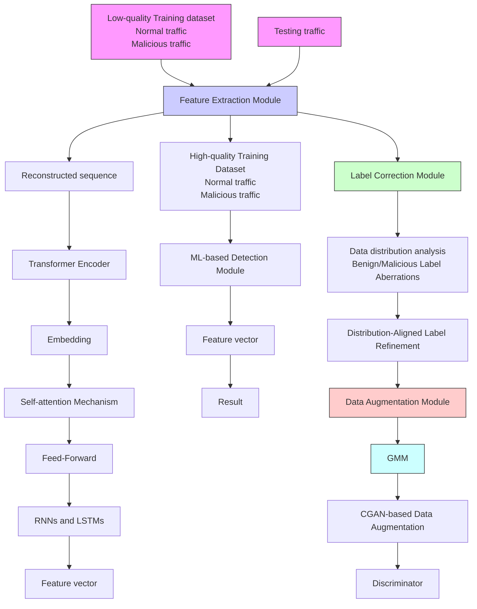
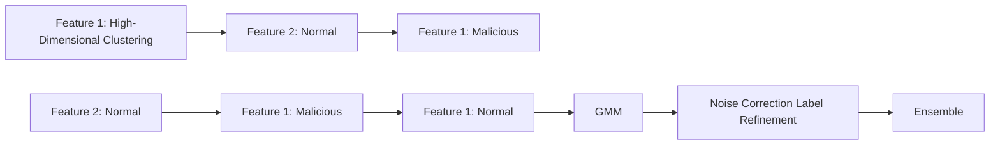
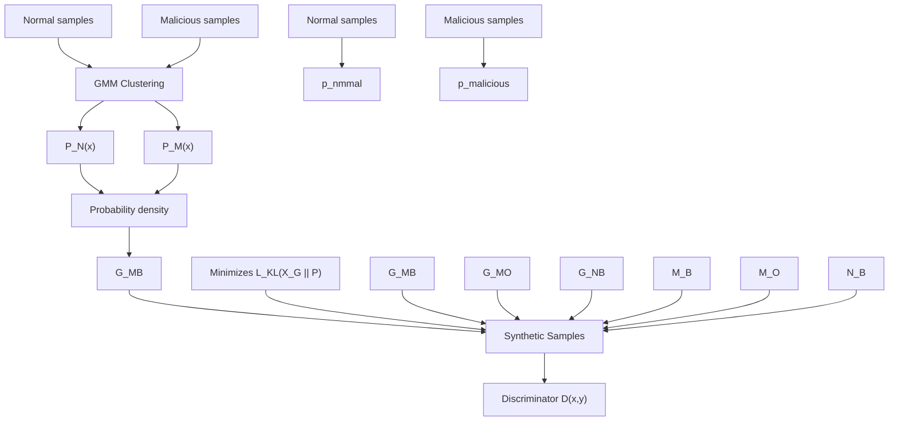

# GMM-cGAN: Mitigating data scarcity and label noise for robust encrypted malicious traffic classification

Kwizera K. Jonath , Abida Naz , Shigeng Zhang ∗

School of Computer Science and Engineering, Central South University, 410083, Changsha Hunan, China

# a r t i c l e i n f o

Keywords:

Encrypted traffic classification

Malicious traffic detection

Cybersecurity

IoT security

Machine learning

# a b s t r a c t

Encrypted malicious traffic classification is a crucial task in network security, yet existing machine learning approaches struggle with two major challenges: insufficient data and noisy labels. Previous works, such as RAPIER, attempt to handle these issues in isolation; however, they remain limited in mitigating error propagation when both challenges coexist. In this paper, we propose GMM-cGAN, a novel hybrid model that integrates Gaussian Mixture Models (GMM) for probabilistic label refinement with Conditional Generative Adversarial Networks (cGANs) for targeted synthetic data generation. Our key innovation is a sequential pipeline that first corrects label noise based on feature-space density before performing conditional augmentation, ensuring synthetic samples are generated from high-confidence data. This data-centric strategy provides a fundamental advantage over complex monolithic architectures such as graph neural networks or large transformers by directly enhancing data quality at the source, without relying on massive parameter counts or complex graph constructions. We evaluated GMM-cGAN on three public datasets, CIRA-CIC-DoHBrw-2020, CSE-CIC-IDS2018, and TON-IoT, using 1000 samples with a 30–45 % noise ratio from each. Our experimental results demonstrate that GMM-cGAN outperforms state-of-the-art methods, achieving F1-scores of 0.89, 0.88, and 0.91 respectively. These represent significant average improvements of 22.1 %, 13.4 %, and 6.4 % over the RAPIER baseline. The findings validate the effectiveness of our hybrid approach in improving the robustness and accuracy of encrypted malicious traffic classification under real-world constraints.

# 1. Introduction

Network-based intrusion detection systems (NIDS) have been extensively developed to detect malicious traffic in various network environments [1–3]. However, with increasing adoption of encryption protocols such as SSL/TLS and DNS over HTTPS (DoH), traditional detection approaches relying on plain-text payload inspection have become ineffective [4]. While advanced architectures like Graph Neural Networks (GNNs) and Transformers [5,6] can capture complex spatial and sequential patterns, they remain fundamentally dependent on the quality and quantity of labeled training data. Their performance severely degrades under label noise and data scarcity, common in security datasets [5]. Furthermore, their high computational complexity can be prohibitive for real-time deployment. This creates a critical research gap: the need for a data-centric framework that actively mitigates these fundamental data quality issues before training a final classifier, thus complementing rather than competing with advanced architectural models. Recent works continue to push the boundaries of flow-based detection with transformers but often still assume relatively clean data for training [7].

In response, machine learning-based approaches have emerged to analyze encrypted network flows and classify malicious behaviors [1,8, 9]. However, these methods are typically supervised and require large, high-quality labeled datasets to achieve robust classification performance.

Two major challenges hinder the effectiveness of encrypted traffic classification models: insufficiently labeled data and noisy labels. The traditional approach to dataset collection involves executing real-world malware samples in controlled environments and capturing the resulting traffic. However, malware evolves continuously, making previously captured samples less effective in identifying new attack patterns [21,22]. Furthermore, large-scale dataset collection is costly and raises privacy concerns. Accurately labeling encrypted network traffic is also difficult, as labels assigned by automated malware detection services such as VirusTotal may vary over different time periods, leading to inconsistencies. Manual annotation, on the other hand, is time-consuming, expensive, and prone to human error [23]. The presence of high label noise in collected datasets degrades the performance of supervised learning models, limiting their ability to generalize effectively [24].

Table 1 Comparison of related works on encrypted traffic classification and robust learning. The table highlights the capabilities and limitations of existing approaches, illustrating the niche advanced by GMM-cGAN. 

<table><tr><td>Method</td><td>Category</td><td>Scarcity</td><td>Noise</td><td>Aug.</td><td>Key Limitations</td></tr><tr><td>ETA [4]</td><td>Encrypted</td><td>✕</td><td>✕</td><td>✕</td><td>Handcrafted features; Needs clean data; Fails with noise</td></tr><tr><td>FS-Net [10]</td><td>Encrypted</td><td>✕</td><td>✕</td><td>✕</td><td>Overfits on small data; No noise handling</td></tr><tr><td>MT-FlowFormer [7]</td><td>Encrypted</td><td>✕</td><td>✕</td><td>✕</td><td>High complexity; Computationally expensive</td></tr><tr><td>CNN-BiLSTM[11]</td><td>Deep-Learning</td><td>✕</td><td>✕</td><td>✕</td><td>Sequence modeling only; No noise robustness; Data hungry</td></tr><tr><td>GAT [12,13]</td><td>Graph-Learning</td><td>✕</td><td>✕</td><td>✕</td><td>Requires graph construction; Complex; Sensitive to noise</td></tr><tr><td>GraphSAGE [14,15]</td><td>Graph-Learning</td><td>✕</td><td>✕</td><td>✕</td><td>Graph dependency; Limited to structural features</td></tr><tr><td>Co-teaching [16]</td><td>Robust</td><td>✕</td><td>√</td><td>✕</td><td>Assumes symmetric noise; Fails at high noise</td></tr><tr><td>Differential Training [17]</td><td>Robust</td><td>✕</td><td>√</td><td>✕</td><td>Strong noise assumptions; Poor on small data</td></tr><tr><td>SMOTE [18]</td><td>Augmentation</td><td>√</td><td>✕</td><td>✕</td><td>Unrealistic samples; Amplifies noise</td></tr><tr><td>Standard GAN [19]</td><td>Generative</td><td>√</td><td>✕</td><td>√</td><td>No class control; Propagates noise</td></tr><tr><td>RAPIER [20]</td><td>Hybrid</td><td>√</td><td>√</td><td>√</td><td>Heuristic correction; Untargeted augmentation</td></tr><tr><td>GMM-cGAN (Ours)</td><td>Hybrid</td><td>√</td><td>√</td><td>√</td><td>Probabilistic correction; Targeted augmentation; Robust pipeline</td></tr></table>

Several techniques have been proposed to mitigate these issues [2], but they remain insufficient. Data augmentation techniques attempt to expand training datasets by generating synthetic samples [25]. However, when the data set contains label noise, augmentation methods propagate and amplify the incorrect data distribution, leading to further degradation of classification performance [26]. Robust machine learning models aim to correct label noise during training [16]. However, these models often rely on strong prior assumptions, such as a predefined noise probability distribution or the availability of large clean dataset, which is not feasible in real-world scenarios [27]. Semisupervised learning and transfer learning methods improve classification accuracy by leveraging additional large-scale unlabeled datasets [28]. However, collecting and preprocessing such large datasets is computationally expensive and increases the risk of privacy leakage [29].

To overcome these limitations, this paper proposes GMM-cGAN, a hybrid learning framework designed to jointly address both data insufficiency and label noise in encrypted malicious traffic classification. The approach integrates Gaussian Mixture Models (GMMs) for probabilistic label correction with Conditional Generative Adversarial Network (CGANs) for data augmentation. The GMM component automatically separates clean and noisy labels based on their feature distributions, while the CGAN component generates high-quality synthetic samples that maintain distributional consistency with the original data [30,31]. Unlike prior works, GMM-cGAN corrects noisy labels before data augmentations, ensuring that synthetic samples are generated based on clean, high-confidence data. This prevents error propagation and enhances classification robustness, making the method scalable, dataefficient, and effective in real-world encrypted traffic analysis.

We selected GMM for its strong probabilistic foundation in modeling feature distributions and identifying density-based outliers, which is highly effective for initial label noise separation. For augmentation, cGANs were chosen over alternatives like Variational Autoencoders (VAEs) or Diffusion Models due to their superior ability to generate highfidelity, class-conditioned samples while maintaining computational efficiency critical for network security applications [32]. While diffusion models offer high sample quality, their iterative generation process is computationally prohibitive for large-scale traffic data. cGANs provide a more practical balance between sample quality, diversity, and training stability for our task.

The proposed framework is evaluated on two public datasets, CIRA-CIC-DoHBrw-2020 (DoHBrw) and CSE-CIC-IDS2018 (IDS), along with TON-IoT dataset [33]. The experiments use 1000 training samples per dataset with a 45 % noise ratio to simulate real-world conditions. The results demonstrate that GMM-cGAN outperform state-of-the-art methods, achieving F1-score of 0.89, 0.88, and 0.91 on DoHBrw, IDS, and TON-IoT, respectively. Compared to previous methods such as RAPIER, the model exhibits significant improvements in classification accuracy of encrypted malicious traffic and label noise correction performance. Our main contributions can be summarized as:

• We propose GMM-cGAN, a novel hybrid model that jointly handles both data insufficiency and label noise in encrypted network traffic classification.   
• Our approach introduces probabilistic label correction via GMM and synthetic sample generation via CGAN, improving model robustness.   
• We conduct extensive evaluations on multiple datasets and demonstrate significant performance improvements over state-of-the-art methods.

# 2. Background and related work

# 2.1. Traditional malicious traffic detection

Early approaches to malicious traffic detection primarily focused on analyzing plaintext network traffic, such as HTTP requests and URLs, by extracting attack signatures and statistical features [25,34]. Methods like Execscent [35] utilized template matching based on URL structures, while [25] applied N-gram feature extraction for malware identification. However, these methods fail in encrypted traffic environments, where payload visibility is restricted.

# 2.2. Encrypted malicious traffic detection

Recent research has explored detecting malicious encrypted traffic using machine learning and deep learning models [36,37]. ETA [4] extracted statistical packet features to train a random forest classifier, while FS-Net [10] introduced deep learning for flow-based classification. Although, these approaches achieve high accuracy, they rely heavily on large-scale, high-quality labeled datasets. The graph-based approaches like MT-Flowformer [7] leverage transformers for flow-based malicious traffic detection, showing strong performance but remaining reliant on clean, large-scale data. Some models, such as ET-BERT [38], attempt to mitigate data insufficiency by leveraging unsupervised learning, but they face challenges in computational efficiency and privacy risks. Additionally, adversarial training techniques [39] have been explored to improve robustness against noisy data, but they often require complex tuning and do not explicitly generate new data to address scarcity.

# 2.3. Handling noisy and insufficient data

Several studies address label noise and data insufficiency through data augmentation and noise correction [19]. Differential Training [17] and ODDS [40] enhance robustness against mislabeled data by refining label distributions, while GAN-based augmentation techniques [41] generate synthetic training samples to improve classification accuracy. However, existing approaches [1,2,20,42] do not integrate both clustering and generative models to optimize training data quality.

Our proposed GMM-cGAN framework addresses these limitations by combining Gaussian Mixture Models (GMM) for label noise correction and Conditional Generative Adversarial Networks (CGAN) for data augmentation, enhancing detection accuracy in noisy and low-data environments while maintaining computational efficiency.

# 2.4. Data augmentation and its limitations

Data augmentation is a widely used technique to artificially expand training datasets without explicitly collecting new data. Traditional augmentation methods, such as oversampling and synthetic samples generation, have been commonly applied to handle class imbalance in machine learning [18]. These approaches either replicate existing samples from the minority class or generate new samples based on transformations of existing data points and their nearest neighbors. However, these methods are susceptible to overfitting, as they do not introduce meaningful diversity into the training dataset [43].

More recently, Generative Adversarial Networks (GANs) have been widely adopted for data augmentation in various domains, including image recognition [19] and malware detection [35]. GANs consist of a generator, which learns to create realistic synthetic data, and a discriminator, which distinguishes real from fake samples. Through adversarial training, the generator learns to approximate the distribution of the original dataset, producing diverse synthetic samples that enhance model robustness. While GAN-based augmentation has shown promise, existing methods fail to address the issue of label noise. If mislabeled samples exist in the training dataset, GANs can inadvertently propagate and amplify incorrect data distributions, further degrading classification performance [17]. This limitation underscores the need for a noiseresilient data augmentation approach that prevents the generation of low-quality synthetic data based on incorrect labels.

# 2.5. Robust machine learning models and their challenges

To mitigate the impact of incorrectly labeled training samples, researchers have explored robust learning techniques, such as noise tolerant loss function [44] and label transition models [45]. These methods assume that label noise follows a structured pattern, allowing them to estimate the probability of a sample being mislabeled and adjust loss calculations accordingly. However, such assumptions rarely hold in real-world scenarios, where noise distribution is often unpredictable and dataset-dependent [16].

Another approach to handling noisy labels is data filtering, where samples with high loss values are identified as potential mislabeled data and excluded from training [46]. While effective in some cases, this method struggles when the dataset is small, as removing mislabeled samples can further reduce the diversity of training data and impair model generalization [47]. Moreover, these filtering techniques often rely on strong prior assumptions about data noise levels, making them difficult to apply in dynamic network environments where noise levels may vary across different datasets.

While these advanced architectures (CNN-BiLSTM [11,13], GAT [12, 15], and GraphSAGE [14]) achieve respectable performance through sophisticated feature learning, they all share critical limitations: inability to handle label noise, no data augmentation capabilities, and dependence on large, clean datasets, limitations directly addressed by our GMM-cGAN approach.

# 3. Problem statement

The objective of this research is to develop an encrypted malicious traffic classification system that remains effective despite data scarcity and label noise, two major challenges in real-world network security applications. The proposed system should be capable of accurately detecting malicious traffic within enterprise, institution, and campus networks, where encrypted network traffic makes conventional detection methods ineffective. Furthermore, by generating synthetic data instead of collecting more real use r data, our method reduces privacy concerns associated with large-scale traffic logging. While the training phase involves computational overhead, the resulting classifier is a standard model (e.g., RF, XGBoost) with low inference latency, making it suitable for real-time deployment. The offline training of GMMcGAN addresses the throughput constraint by producing a robust model that does not require continuous, resource-intensive retraining during operation.

Algorithm 1 GMM-cGAN: Robust encrypted traffic classification.   
1: Input:
    Noisy training data $D_{\text{train}} = \{(x_i, y_i)\}_{i=1}^N$ Noise ratio threshold $\alpha$ , GMM components K

2: Output:
    Robust classifier $f_\theta$ , corrected labels $\tilde{y}_i$ , synthetic samples $D_{synth}$ 3: procedure FEATURE EXTRACTION( $x_i$ )

4:    Convert raw packets: $l = [l_1, \ldots, l_n]$ ▷ Per Eq. (1)

5: $v_i \leftarrow$ TransformerEncoder(I)   ▷ Embeddings per Eqs. (2)–(3)

6:    return $v_i$ 7: end procedure

8: procedure LABEL CORRECTION( $D_{train}$ )

9:    Fit GMM: $p(x) = \sum_{k=1}^{K} \pi_k \mathcal{N}(x | \mu_k, \Sigma_k)$ ▷ Eq. (5)

10:    Partition samples by density: $D_{\text{clean}} \leftarrow \{(x, y) | p_y(x) > \tau_y\}$ ▷ High-confidence $D_{\text{noisy}} \leftarrow D_{\text{train}} \setminus D_{\text{clean}}$ 11:    Refine labels via ensemble voting   ▷ RF + SVM + XGBoost

12:    return $\tilde{y}_i$ , $D_{clean}$ 13: end procedure

14: procedure CONDITIONAL AUGMENTATION( $D_{clean}$ )

15:    for each generator $G_* \in \{G_{MB}, G_{MO}, G_{NB}\}$ do   ▷ See Table 3

16:    Sample $z \sim \mathcal{N}(0, I)$ , $\tilde{y} \sim$ Uniform

17: $\tilde{x} \leftarrow G_*(z, \tilde{y})$ ▷ Eq. (10)

18:    Update $G_*$ via $L_{KL}^* + \lambda L_D$ ▷ Eqs. (7)–(9)

19:    end for

20:    return $D_{synth}$ 21: end procedure

22: procedure END-TO-END TRAINING

23:    Train classifier $f_\theta$ on $D_{clean} \cup D_{synth}$ 24:    return $f_\theta$ 25: end procedure

Existing approaches typically focus on solving either data insufficiency or label noise, but few methods address both challenges simultaneously. Supervised models rely on high-quality labeled training datasets, which are difficult to obtain due to the limited availability of malware traffic samples and the high cost of manual annotation [48]. Additionally, automated labeling methods are prone to misclassification errors, leading to datasets with high label noise [20,49].

Formally, let $( x _ { i } , y _ { i } )$ represent an encrypted network traffic sample $x _ { i } \ ( \mathbf { e . g . }$ ., a network flow or session) and its corresponding true label $y _ { i } ,$ where $y _ { i } = 0$ represents benign traffic and $y _ { i } = 1$ represents malicious traffic. Given a low-quality training set $D = \{ ( x _ { i } , y _ { i } ) \} _ { i = } ^ { n }$ and a testing set $D ^ { \prime } = \{ ( x _ { i } , y _ { i } ) \} _ { i = 1 } ^ { n ^ { \prime } }$ where $D \cap D ^ { \prime } = \emptyset ,$ , the goal is to accurately infer the label of ?? despite the presence of mislabeled samples in ??.

To achieve this, our study introduces GMM-cGAN, a hybrid framework that integrates Gaussian Mixture Models (GMMs) for probabilistic label correction with Conditional Generative Adversarial Networks (CGANs) for synthetic data generation. Unlike previous methods that rely on heuristic-based label correction or assumption-driven noise modeling, GMM-CGAN autonomously identifies mislabeled samples based on probabilistic clustering and generates synthetic samples conditioned on corrected labels, ensuring a clean and diverse training set.

flowchart

Fig. 1. An overview of proposed GMM-cGAN framework for robust encrypted malicious traffic detection.

# 4. GMM-cGAN: Proposed approach

# 4.1. Technical challenges

The proposed GMM-cGAN framework addresses three critical challenges in encrypted malicious traffic classification:

• Challenge 1: Joint mitigation of data scarcity and label noise, where traditional methods fail to handle both issues simultaneously. By integrating GMM-based probabilistic label correction with CGANdriven augmentation, the model avoids error propagation from noisy samples while expanding the training set.   
• Challenge 2: Preservation of protocol-compliant traffic distributions during synthetic data generation, achieved through densityaware loss functions (Eqs. (13)-(14)) that align generated samples with real traffic features.   
• Challenge 3: Robustness to evolving attack patterns, as evidenced by the model’s performance on boundary-region samples (Fig. 4) and its ability to maintain > 75 % accuracy under 45 % label noise (Table 2), outperforming baselines by 12–45 %. These advancements resolve key limitations in prior works that relied on heuristic noise correction or assumption-driven augmentation.

# 4.2. GMM-cGAN overview in detecting encrypted malicious traffic

The proposed GMM-cGAN model is based on the observation that the distribution of benign and malicious network traffic is inherently

different. Benign traffic tends to exhibit consistent and denser distributions, whereas malicious traffic, originating from diverse malware sources, is often more sparse and irregular [4]. Given a noisy training dataset, this distinction enables us to infer the true labels of training samples that reside in the densest (benign) and sparsest (malicious) regions of the feature space. Moreover, as sophisticated adversaries continuously adapt their attack strategies by mitigating normal traffic patterns, new malicious traffic distributions may shift closer to normal data over time. To enhance generalization, GMM-cGAN infers these evolving distributions and synthesizes new samples with super performance accordingly as shown in Table 2 and Fig. 5, that improved the detection performance on unseen threats.

The system consists of three main components: a feature extraction module, a label noise correction module, and a data augmentation module, as illustrated in Fig. 1. The feature extraction module employs a Transformer Encoder with Self-Attention Mechanisms to convert raw encrypted traffic into informative feature representations while minimizing the impact of label noise. The label noise correction module leverages Gaussian Mixture models (GMMs) to identify and correct mislabeled samples in a probabilistic manner. Finally, the data augmentation module utilizes a Conditional Generative Adversarial Network (CGAN) to synthesize diverse training data from the corrected dataset, ensuring improved classifier robustness. The final Machine Learning-based detector is trained using a combination of corrected and augmented samples, allowing it to effectively classify encrypted malicious traffic even in lowquality dataset scenarios.

Fig. 2. Density distributions of network traffic in GMM-cGAN. Each subplot shows kernel density estimation of benign (solid blue) and malicious (dashed red) traffic in reduced feature space. The y-axis indicates relative density (Low to High), demonstrating our key observation that benign traffic consistently exhibits higher density than malicious traffic across all datasets. This density difference enables reliable label noise correction in our framework. (For interpretation of the references to colour in this figure legend, the reader is referred to the web version of this article.)   
Label Noise Correction Module for GMM-CGAN   

flowchart

Fig. 3. Three-stage label noise correction process: (1) GMM clustering in original high-dimensional space preserves feature relationships, (2) Density analysis shows clear separation between normal (dense) and malicious (sparse) distributions, (3) Correction pipeline uses high-confidence samples to guide ensemble learning.

Data Augmentation Module for GMM-CGAN   

flowchart

Fig. 4. Clear visualization of GMM-cGAN data augmentation module: (1) Original data flows into GMM, and GMM computes the input distributions, (2) Three specialized generators create samples for different threat scenarios $( G _ { M O }$ for New Attacks, $G _ { M B }$ for Evasive Attacks, $G _ { N B }$ for Balanced Normals) based on Boundary Malicious $( M _ { B } ) _ { ; }$ , Outlier Malicious $( M _ { O } ) _ { ; }$ , and Boundary Normal $( N _ { B } )$ strategies and (3) A conditional discriminator evaluates samples using KLdivergence minimization.

# 4.3. End-to-end training framework

The label noise correction process is formalized in Algorithm 1 (Lines 5-10). After fitting GMMs on the initial data, we calculate the likelihood $p ( \mathbf { x } _ { i } | y _ { i } )$ for each sample. Samples where $p ( \mathbf { x } _ { i } | y _ { i } ) < \gamma$ (a predefined threshold) are deemed low-confidence and their labels are refined using a majority vote from an ensemble of classifiers (RF, SVM, XG-Boost) trained on the high-confidence samples. This provides a robust, data-driven mechanism for noise reduction.

Table 2 Performance comparison under different noise ratios. 

<table><tr><td rowspan="2">Method</td><td colspan="6">Noise Ratio (%)</td></tr><tr><td>20</td><td>25</td><td>30</td><td>35</td><td>40</td><td>45</td></tr><tr><td>GMM(DoH)</td><td>0.876</td><td>0.868</td><td>0.851</td><td>0.837</td><td>0.821</td><td>0.803</td></tr><tr><td>GMM(IDS)</td><td>0.887</td><td>0.882</td><td>0.876</td><td>0.862</td><td>0.847</td><td>0.831</td></tr><tr><td>GMM(TON)</td><td>0.933</td><td>0.928</td><td>0.921</td><td>0.912</td><td>0.901</td><td>0.887</td></tr><tr><td>RAPIER</td><td>0.782</td><td>0.761</td><td>0.723</td><td>0.684</td><td>0.653</td><td>0.612</td></tr><tr><td>ODDS + FS</td><td>0.683</td><td>0.652</td><td>0.621</td><td>0.587</td><td>0.553</td><td>0.514</td></tr><tr><td>DT + FS</td><td>0.653</td><td>0.621</td><td>0.581</td><td>0.543</td><td>0.503</td><td>0.461</td></tr></table>

The GMM-cGAN algorithm addresses encrypted traffic classification through a multi-stage pipeline that jointly handles label noise and data scarcity. First, raw packet sequences are transformed into dense feature representations using a Transformer encoder, which captures protocol-agnostic traffic patterns through self-attention mechanisms (Eqs. (1)–(3)). Next, a Gaussian Mixture Model probabilistically separates high-confidence samples from noisy data by modeling featurespace density (Eq. (5)), with ensemble learning (RF+SVM+XGBoost) refining uncertain labels.

The corrected dataset then drives three specialized conditional GANs that generate synthetic samples for distinct threat scenarios: boundary malicious (evasive attacks), outlier malicious (new attacks), and boundary normal traffic (Table 4). These generators are optimized via a composite loss function (Eqs. (7)–(9)) that maintains protocol compliance through KL-divergence minimization while encouraging diversity. Finally, the model trains on the augmented dataset, combining cleaned real samples with synthetic data to achieve robustness against evolving threats (validated in Table 8). This modular approach – decoupling label correction from conditional augmentation prevents noise propagation while efficiently expanding the training distribution, particularly for rare attack classes (Fig. 5).

# 4.4. Feature extraction

Extraction meaningful representations from encrypted network traffic is crucial for robustness detection. Traditional rely on TLS handshake metadata or protocol-specific features, which are often insufficient for fine-grained behavior profiling [50]. Existing automatic feature selection techniques based on supervised models are ill-suited for noisy datasets since incorrect labels lead to sub-optimal feature learning [47].

To address these challenges, GMM-cGAN employs a Transformer Encoder architecture for feature extraction. Unlike previous approaches that rely on bi-GRU and autoencoder, Transformers offer long-range dependencies and global contextual understanding [6]. The module consists of embedding layers, and a feed-forward network, allowing the model to capture meaningful traffic patterns while mitigating the effects of label noise.

Table 3 Comprehensive detection performance comparison after data augmentation (P = Precision, R = Recall, F = F1-Score, FAR = False Alarm Rate, AUC-ROC = Area Under ROC Curve, MCC = Matthew’s Correlation Coefficient). 

<table><tr><td rowspan="2">Dataset</td><td rowspan="2">Metric</td><td colspan="8">Method</td></tr><tr><td>NONE</td><td>SMOTE</td><td>GAN</td><td>RAPIER</td><td>Co-teaching + FS</td><td>GAT</td><td>GraphSAGE</td><td>GMM-cGAN</td></tr><tr><td rowspan="6">DoHBrw</td><td>P</td><td>0.88±0.11</td><td>0.82±0.10</td><td>0.85±0.09</td><td>0.88±0.03</td><td>0.89±0.04</td><td>0.90±0.05</td><td>0.89±0.04</td><td>0.92±0.01</td></tr><tr><td>R</td><td>0.93±0.06</td><td>0.95±0.02</td><td>0.93±0.04</td><td>0.98±0.01</td><td>0.95±0.03</td><td>0.94±0.03</td><td>0.96±0.02</td><td>0.99±0.01</td></tr><tr><td>F</td><td>0.90±0.07</td><td>0.87±0.06</td><td>0.88±0.07</td><td>0.93±0.01</td><td>0.91±0.03</td><td>0.92±0.04</td><td>0.92±0.03</td><td>0.95±0.01</td></tr><tr><td>AUC-ROC</td><td>0.89±0.04</td><td>0.88±0.03</td><td>0.88±0.04</td><td>0.93±0.02</td><td>0.92±0.02</td><td>0.92±0.03</td><td>0.92±0.02</td><td>0.96±0.01</td></tr><tr><td>MCC</td><td>0.78±0.08</td><td>0.76±0.07</td><td>0.77±0.07</td><td>0.85±0.03</td><td>0.83±0.04</td><td>0.84±0.05</td><td>0.83±0.04</td><td>0.90±0.02</td></tr><tr><td>FAR</td><td>0.15±0.05</td><td>0.18±0.06</td><td>0.16±0.04</td><td>0.12±0.02</td><td>0.11±0.03</td><td>0.10±0.04</td><td>0.11±0.03</td><td>0.08±0.01</td></tr><tr><td rowspan="6">IDS</td><td>P</td><td>0.67±0.15</td><td>0.46±0.06</td><td>0.48±0.04</td><td>0.69±0.12</td><td>0.71±0.08</td><td>0.72±0.07</td><td>0.70±0.09</td><td>0.75±0.05</td></tr><tr><td>R</td><td>0.86±0.04</td><td>0.89±0.03</td><td>0.87±0.04</td><td>0.89±0.02</td><td>0.90±0.03</td><td>0.91±0.03</td><td>0.90±0.04</td><td>0.93±0.02</td></tr><tr><td>F</td><td>0.77±0.06</td><td>0.59±0.03</td><td>0.60±0.05</td><td>0.77±0.06</td><td>0.79±0.05</td><td>0.80±0.04</td><td>0.78±0.06</td><td>0.83±0.03</td></tr><tr><td>AUC-ROC</td><td>0.82±0.05</td><td>0.80±0.04</td><td>0.80±0.05</td><td>0.87±0.04</td><td>0.88±0.03</td><td>0.89±0.03</td><td>0.88±0.04</td><td>0.92±0.02</td></tr><tr><td>MCC</td><td>0.65±0.07</td><td>0.58±0.05</td><td>0.59±0.06</td><td>0.74±0.05</td><td>0.76±0.04</td><td>0.77±0.04</td><td>0.75±0.05</td><td>0.82±0.03</td></tr><tr><td>FAR</td><td>0.22±0.06</td><td>0.28±0.04</td><td>0.26±0.05</td><td>0.15±0.03</td><td>0.14±0.04</td><td>0.13±0.03</td><td>0.14±0.04</td><td>0.09±0.02</td></tr><tr><td rowspan="6">TON-IoT</td><td>P</td><td>-</td><td>-</td><td>-</td><td>-</td><td>0.85±0.05</td><td>0.86±0.04</td><td>0.84±0.06</td><td>0.89±0.02</td></tr><tr><td>R</td><td>-</td><td>-</td><td>-</td><td>-</td><td>0.90±0.03</td><td>0.89±0.04</td><td>0.91±0.03</td><td>0.93±0.01</td></tr><tr><td>F</td><td>-</td><td>-</td><td>-</td><td>-</td><td>0.87±0.04</td><td>0.87±0.03</td><td>0.87±0.04</td><td>0.91±0.01</td></tr><tr><td>AUC-ROC</td><td>-</td><td>-</td><td>-</td><td>-</td><td>0.89±0.03</td><td>0.90±0.03</td><td>0.89±0.04</td><td>0.94±0.01</td></tr><tr><td>MCC</td><td>-</td><td>-</td><td>-</td><td>-</td><td>0.78±0.04</td><td>0.79±0.04</td><td>0.78±0.05</td><td>0.86±0.02</td></tr><tr><td>FAR</td><td>-</td><td>-</td><td>-</td><td>-</td><td>0.12±0.03</td><td>0.11±0.03</td><td>0.13±0.04</td><td>0.07±0.01</td></tr></table>

The inputs to the feature extractor is a sequence of packets lengths from each flow, denoted as:

$$
\mathbf {l} = \left[ l _ {1}, l _ {2}, \dots , l _ {n} \right] \tag {1}
$$

where $l _ { i }$ represents the length of the ??th packet in a network session. The embedding layer maps the packets sequence into a dense representation:

$$
v = \left[ v _ {1}, v _ {2}, \dots , v _ {n} \right], v _ {i} \in \mathbb {R} ^ {d} \tag {2}
$$

where ?? is the embedding dimension. Each Transformer selfattention layer processes the embedding as follow:

$$
\text { Attention } (Q, K, V) = \operatorname{softmax} \left(\frac {Q K ^ {T}}{\sqrt {d _ {k}}}\right) V \tag {3}
$$

where ??, ??, and ?? represent the query, key and value matrices, respectively, and $d _ { k }$ is the scaling factor.

After multiple Transformer layers, a Feed-Forward Network (FFN) refines the features, ensuring robustness against noisy labels. The final feature vector is obtained by aggregating the hidden representation from the last Transformer layer, capturing essential traffic characteristics for subsequent and label correction.

# 4.5. Label noisy correction

One of the core challenges in encrypted malicious traffic classification is the presence of mislabeled samples in training datasets. Prior approaches relied on auto-regressive generative models like MADE [20,51] for label correction, which struggle with high-dimensional data distributions. In GMM-cGAN, as shown in Figs. 2 and $^ { 3 , }$ we instead employ Gaussian Mixture Model (GMM) to estimate the underlying distribution of the training data and identify misclassified samples probabilistically.

$$
D _ {\text { train }} = \{(x _ {i}, y _ {i}) \} _ {i = 1} ^ {N} \tag {4}
$$

where $x _ { i }$ represents a feature-extracted network flow, and $y _ { i } \in \{ 0 , 1 \}$ denotes its label (benign or malicious). Using GMM, we model the density distribution of the training data as a mixture of multiple Gaussian components:

$$
p (x) = \sum_ {k = 1} ^ {K} \pi_ {k} \mathcal {N} (x | \mu_ {k}, \Sigma_ {k}) \tag {5}
$$

where ?? represents the number of Gaussian components, and $\pi _ { k } , \mu _ { k } , \Sigma _ { k } $ correspond to the mixing coefficient, mean, and covariance matrix of each Gaussian cluster, respectively.

After fitting GMM on the training dataset, we assign high-confidence labels to samples based on their probability densities:

• Samples in high-density regions are labeled as normal/benign traffic with high confidence.   
• Samples in low-density regions are like malicious traffic.

Further uncertain samples, we employ ensemble learning using multiple classifiers (e.g., Random Forest, SVM, and XGBoost) to refine their labels, ensuring robust noise correction before proceeding to data augmentation.

# 4.6. Data augmentation

Our proposed GMM-cGAN framework addresses data scarcity and label noise through three key components: (1) GMM-based density estimation, (2) conditional sample generation, and (3) adversarial validation.

1) Gaussian Mixture Modeling: Let $D _ { \mathrm { t r a i n } } = \{ ( x _ { i } , y _ { i } ) \} _ { i = 1 } ^ { N }$ represent the training data where $y _ { i } \in \{ 0 , 1 \}$ denotes benign (0) or malicious (1) labels. We model the feature distributions using GMMs:

$$
p (x | y) = \sum_ {k = 1} ^ {K} \pi_ {k} ^ {(y)} \mathcal {N} (x | \mu_ {k} ^ {(y)}, \Sigma_ {k} ^ {(y)}) \tag {6}
$$

where ?? is the number of components, and $\{ \pi _ { k } , \mu _ { k } , \Sigma _ { k } \}$ are the mixture weights, means, and covariances respectively.

2) Conditional Generation Strategy: Three generators synthesize samples for distinct regions:

Each generator $G _ { * }$ minimizes the region-specific KL divergence:

$$
\mathcal {L} _ {K L} ^ {*} = \underbrace {- H (X _ {G} ^ {*})} _ {\text { Entropy }} + \mathbb {E} _ {x \sim X _ {G} ^ {*}} [ \log p _ {*} (x) ] \tag {7}
$$

3) Adversarial Training: The conditional discriminator $D ( x , y )$ evaluates samples via:

Table 4 Generator target regions. 

<table><tr><td>Generator</td><td>Target Region</td></tr><tr><td> $G_{MB}$ </td><td> $\{x|p_M(x)<\gamma,\omega_1\leq p_N(x)<\omega_2\}$ </td></tr><tr><td> $G_{MO}$ </td><td> $\{x|p_M(x)<\gamma,p_N(x)<\omega_1\}$ </td></tr><tr><td> $G_{NB}$ </td><td> $\{x|p_N(x)\geq\theta_2\}$ </td></tr></table>

$$
\mathcal {L} _ {D} = - \mathbb {E} _ {\text { real }} [ \log D (x, y) ] - \mathbb {E} _ {\text { fake }} [ \log (1 - D (x, y)) ] \tag {8}
$$

The complete objective combines Eqs. (7) and (8):

$$
\min _ {G} \max _ {D} \sum_ {\substack {* \in \{M B, M O, N B \}}} \mathcal {L} _ {K L} ^ {*} + \lambda \mathcal {L} _ {D} \tag{9}
$$

where ?? balances the losses.

To improve generalization and mitigate class imbalance as shown in Table 11, the GMM-cGAN model employs Conditional Generative Adversarial Networks (CGANs) for data augmentation. Unlike previous works that used standard GANs [20], CGAN allows us to generate classconditioned synthetic samples, ensuring diversity while preserving realworld data distributions [31].

Given a set of label-corrected training samples, CGAN consists of:

• A Generator $G ( z , y )$ that synthesizes realistic traffic features based on a latent noise vector ?? and a class label ??   
• A Discriminator $D ( x , y )$ that distinguishes between real and synthetic samples, conditioned on class labels.

The objective function of CGAN is defined as:

$$
\min _ {G} \max _ {D} V (D, G) = \mathbb {E} _ {x \sim p _ {\mathrm{data}} (x)} [ \log D (x, y) ] + \tag {10}
$$

$$
\mathbb {E} _ {z \sim p _ {z} (z)} [ \log (1 - D (G (z, y), y)) ] \tag {11}
$$

where $p _ { \mathrm { d a t a } }$ represents the real data distribution, and $p _ { z }$ is a prior noise distribution.

To enhance detection performance, As visualized in Figs. 2, 5, our augmentation strategy is targeted: Generator $G _ { M B }$ creates samples near the benign-malicious boundary for evasive attacks, $G _ { M O }$ creates outliers for new attacks, and $G _ { N B }$ reinforces the normal boundary, we synthesize both benign and malicious traffic samples, focusing on boundary regions where adversarial attacks are likely to occur. This ensures that the final ML-based detector is trained on a balanced, high-quality dataset capable of detecting both existing and evolving threats.

To ensure that newly synthesized network traffic samples remain realistic and consistent with protocol constraints, GMM-cGAN employs a distribution-aware loss function that minimizes the divergence between generated and real data. Specifically, for each generator, we select original training samples from the corresponding target region in the feature space, denotes as:

$$
X _ {\text { in }} = \{x \mid x \in D _ {\text { train }}, p _ {M} (x) <   \gamma , \theta_ {1} \leq p _ {N} (x) <   \theta_ {2} \} \tag {12}
$$

where $p _ { M } ( x )$ represents the malicious data probability distribution $p _ { N } ( x )$ represents the normal data probability distribution, and $\theta _ { 1 } , \theta _ { 2 }$ are predefined thresholds. The objective is to ensure that newly generated data aligns with the expected distribution while maintaining diversity. To achieve this, we define the future consistency loss as:

$$
L _ {f} = \left\| \mathbb {E} _ {x \in X _ {G}} [ D _ {f} (x) ] - \mathbb {E} _ {x \in X _ {\text { in }}} [ D _ {f} (x) ] \right\| _ {2} \tag {13}
$$

where $D _ { f }$ represents the first layer of the discriminator network, and ?? denotes the expectation function. This loss function ensures that the features of generated samples remain close to real training samples while introduction sufficient variability to improve generalization.

The final objective function for the generator is given by:

$$
L _ {G} = L _ {\mathrm{KL}} \left(X _ {G} \| P\right) + L _ {f} \tag {14}
$$

text_image

Boundary Region
M_B:Boundary Malicious
N_B:Boundary Normal
Original Normal Data (GMM Modeled)
M_O:Outlier Malicious
Original Normal
● Original Normal
● Generated Normal
● Original Malicious
● Generated Malicious
● GMM Model Boundary

Fig. 5. GMM-cGAN data augmentation strategies: (1) $M _ { B }$ generates malicious samples near the normal boundary (evasive attacks), (2) $M _ { O }$ creates outlier malicious samples (new attacks), and (3) $N _ { B }$ synthesizes normal samples to maintain decision boundary balance. Solid points show original data, while hollow points represent GMM-guided synthetic samples.

where $L _ { \mathrm { K L } } ( X _ { G }$ ∣∣ ?? ) represents the Kullback-leibler divergence loss, enforcing the generated samples to align with the target distribution ?? .

# 5. Evaluation

# 5.1. Experimental setup

# Datasets

The three selected datasets, CIRA-CIC-DoHBrw-2020 (DoHBrw), CSE-CIC-IDS2018 (IDS), and TON-IoT, were chosen to ensure comprehensive evaluation across diverse and relevant encrypted traffic scenarios.

To ensure a comprehensive evaluation, we utilize three wellestablished datasets that capture various aspects of encrypted malicious network traffic. CIRA-CIC-DoHBrw-2020 (DoHBrw) represents a specific, critical protocol and provides a mix of normal and malicious DNSover-HTTPS (DoH) traffic, where normal DoH queries originate from benign DNS servers such as Cloudflare and Google, while malicious traffic is generated using tunneling tools like dns2tcp, DNSCat2 and Iodine. This dataset is particularly relevant for evaluating encrypted traffic detection, as it is collected as a strategic network point between clients and the gateway, ensuring all traffics HTTPS-based [7]. The CSE-CIC-IDS2018 (IDS) represents a broad spectrum of common network intrusion attacks, capturing network traffic generated by numerous hosts and covering seven distinct attack scenarios [52]. Given that this dataset contains only a limited amount of encrypted malicious traffic, we supplement our evaluation with additional malicious samples from CIC-InvesAndMal2019, which consists of encrypted traffic from 426 malware samples spanning six categories, including Adware, Botnets, and Ransomware [53]. Additionally, TON-IoT dataset represents the emerging and challenging domain of IoT security and provides real-world traffic data from IoT environments, incorporating encrypted attack flows such as botnet infection, DDoS attack, and information theft. As shown in Fig. 6, this dataset enables us to examine our model’s performance in detecting threats within an IoT ecosystem [54].

To maintain consistency in evaluation, we partition each dataset into two subsets based on the timestamps of traffic flows as shown in Table 5. The day’s data is designated as Tr (training set), while the remaining data forms the Ts (testing set). During experimentation, a small portion of Tr is randomly samples for training, while the entire Ts dataset is used for testing, ensuring that evaluating results reflect real-world scenarios.

Baselines. We compare GMM-cGAN with a comprehensive set of state-of-the-art methods to ensure a rigorous evaluation across multiple dimensions: traditional machine learning, deep learning, graph neural networks, and specialized encrypted traffic detection methods including Random Forest, XGBoost [55], advanced deep learning architectures for spatio-temporal feature extraction CNN, Bi-GRU [13],

Table 5 Exact counts of normal and malicious encrypted network flows in public datasets. Flows from the first day (Tr) are used for training, while remaining flows (Ts) are used for testing. 

<table><tr><td rowspan="2"></td><td colspan="2">DoHBrw</td><td colspan="2">IDS</td><td colspan="2">TON-IoT</td></tr><tr><td>Normal</td><td>Malicious</td><td>Normal</td><td>Malicious</td><td>Normal</td><td>Malicious</td></tr><tr><td>Training (Tr)</td><td>438,974</td><td>6446</td><td>1,502,583</td><td>47,186</td><td>892,415</td><td>38,742</td></tr><tr><td>Testing (Ts)</td><td>304,313</td><td>138,449</td><td>430,974</td><td>10,298</td><td>687,902</td><td>125,863</td></tr></table>

CNN-BiLSTM [7,11,15]), graph neural networks for relational learning GCN, GAT [12,13], GraphSAGE [7,14]), and specialized encrypted traffic detection methods RAPIER [20] for flow-based deep learning, ETA [4] for TLS metadata analysis, and FS-Net [10] for time-serial feature profiling).

• Malicious Encrypted Traffic Detection Methods. We consider RAPIER, ETA, and FS-Net (FS) as baseline encrypted traffic detection methods. Rapier leverages advanced deep learning for flow-based classification. ETA utilizes packet length and TLS and handshake metadata with a random forest model, while FS employs deep learning with time-serial features for encrypted traffic profiling.   
• Robust Malware Detection Methods. To handle low-quality training data, we include Differential Training (DT) and ODDS. DT corrects mislabeled malware samples by outlier detection. However, ODDS use GAN-based data synthesis to enhance model performance under limited training data conditions.   
• Robust Machine Learning Methods. We evaluate SMOTE and Coteaching (Co), which address low-quality data in different ways. SMOTE generate synthetic samples for balancing datasets, while coteaching trains two models simultaneously to filter out noisy samples.

To ensure a fair comparison, we extend existing methods by integrating FS into DT and ODDS, resulting in DT+FS and ODDS+FS. We also create DT+ODDS+FS and DT+ODDS+ETA to combine noise correction, data augmentation, and encrypted traffic-specific detection as shown in Fig. 7. Additionally, SMOTE+FS and Co+FS refine training data prior to detection. These comprehensive baselines provide a rigorous benchmark for evaluating GMM-cGAN against traditional machine learning, advanced deep learning, graph-based approaches, and specialized encrypted traffic detection methods.

# 5.2. Implementation and reproducibility details

We implement GMM-cGAN using Python 3.8.5, with deep learning and statistical modeling frameworks such as PyTorch 1.7.1, TensorFlow 2.10.0, and Scikit-learn for GMM clustering. NumPy 1.21.2 is used for numerical operations. Our model is deployed on a Linux server (Ubuntu 5.4.0-126-generic).

For reproducibility, we fixed the random seed to 42 across all experiments using PyTorch and NumPy. The Transformer feature extractor was trained for 50 epochs with the Adam optimizer (learning rate $\mathrm { l r } = 1 \times 1 0 ^ { - 4 } , ~ \beta _ { 1 } = 0 . 9 , ~ \beta _ { 2 } = 0 . 9 9 9 )$ . The cGANs were trained for 100 epochs each with a learning rate of 0.0001 for both generator and discriminator. All experiments were conducted on a server with an Intel Xeon E5-2650 v4 CPU, 128GB RAM, and an NVIDIA RTX 3080Ti GPU (12GB VRAM). Peak memory usage was 16.2GB.

For hyperparameter tuning, we use grid search to optimize key components. In Table 7, the GMM clustering module is configured with K = 5, balancing model complexity and clustering granularity. The cGAN module is trained with a learning rate 0.0001, and we employ Wassestein loss to stabilize training and prevent mode collapse [56]. Additionally, the balancing factor ?? is set to 5 to encourage diverse synthetic data generation.

For all baseline methods (RAPIER, GAT, GraphSAGE, FS-Net, DT, ODDS, etc.), we performed a grid search to optimize their hyperparameters under the same dataset conditions and evaluation metrics as our method ensuring a fair comparison, as shown in Table 3.

line

| Noise Ratio (%) | GMM-cGAN (TON) | GMM-cGAN (IDS) | GMM-cGAN (DoH) | RAPIER | ODDS+FS |
| --------------- | -------------- | -------------- | -------------- | ------ | ------- |
| 0               | 0.95           | 0.94           | 0.92           | 0.85   | 0.80    |
| 10              | 0.93           | 0.92           | 0.90           | 0.82   | 0.75    |
| 20              | 0.91           | 0.90           | 0.88           | 0.78   | 0.70    |
| 30              | 0.89           | 0.88           | 0.86           | 0.73   | 0.65    |
| 40              | 0.86           | 0.85           | 0.83           | 0.65   | 0.55    |
| 50              | 0.82           | 0.81           | 0.79           | 0.58   | 0.48    |

Fig. 6. F1-score comparison showing GMM-cGAN’s superior performance across datasets under increasing noise ratios. The proposed method maintains higher accuracy (F1-scores 0.78-0.95) compared to RAPIER (0.58-0.85) and baselines (0.48-0.80), with performance advantages of 12–45 %.

line

| Training Samples | GMM-cGAN (DoHBrw) | GMM-cGAN (IDS) | GMM-cGAN (TON-IoT) | RAPIER | DT+ODDS+ETA |
| ---------------- | ----------------- | -------------- | ------------------ | ------ | ----------- |
| 250              | 0.85              | 0.85           | 0.85               | 0.70   | 0.45        |
| 500              | 0.88              | 0.88           | 0.88               | 0.78   | 0.45        |
| 1,000            | 0.90              | 0.90           | 0.90               | 0.78   | 0.40        |

Fig. 7. Performance comparison at 30 % noise ratio showing GMM-cGAN’s consistent superiority across all datasets. The method achieves F1-scores of 0.83- 0.91 (7-13 % higher than RAPIER and 39–62 % better than DT+ODDS+ETA), with best results on TON-IoT (0.91 F1 at 1000 samples).

To prevent overfitting and ensure robust evaluation, we employed a strict hold-out validation based on time-series split (detailed in Table 6), rather than k-fold cross-validation. This approach simulates a real-world deployment scenario where the model is trained on historical data and tested on future, unseen data. All results are reported as the mean ± standard deviation over 5 independent runs with different random seeds. The performance improvements of our GMM-cGAN approach over all baselines are statistically significant with $p < . 0 1$ in a paired t-test.

Table 6 Statistical significance of performance improvements (p-values from paired t-tests). 

<table><tr><td rowspan="2">Baseline Method</td><td colspan="3">p-value (GMM-cGAN vs. Baseline)</td></tr><tr><td>DoHBrw</td><td>IDS</td><td>TON-IoT</td></tr><tr><td>Random Forest</td><td>&lt; 0.001</td><td>&lt; 0.001</td><td>&lt; 0.001</td></tr><tr><td>XGBoost</td><td>&lt; 0.001</td><td>&lt; 0.001</td><td>&lt; 0.001</td></tr><tr><td>CNN</td><td>&lt; 0.001</td><td>&lt; 0.001</td><td>&lt; 0.001</td></tr><tr><td>Bi-GRU</td><td>&lt; 0.001</td><td>&lt; 0.001</td><td>&lt; 0.001</td></tr><tr><td>CNN-BiLSTM</td><td>&lt; 0.001</td><td>&lt; 0.001</td><td>&lt; 0.001</td></tr><tr><td>GCN</td><td>&lt; 0.001</td><td>&lt; 0.001</td><td>&lt; 0.001</td></tr><tr><td>GAT</td><td>&lt; 0.001</td><td>&lt; 0.001</td><td>&lt; 0.001</td></tr><tr><td>GraphSAGE</td><td>&lt; 0.001</td><td>&lt; 0.001</td><td>&lt; 0.001</td></tr><tr><td>RAPIER</td><td>&lt; 0.001</td><td>&lt; 0.001</td><td>&lt; 0.001</td></tr></table>

Table 7 Parameter settings of GMM-cGAN framework. 

<table><tr><td>Module</td><td>Parameter</td><td>Value</td><td>Description</td></tr><tr><td rowspan="4">Feature Extraction</td><td>n</td><td>50</td><td>Packets/flow</td></tr><tr><td>d</td><td>64</td><td>Embedding dimensions</td></tr><tr><td>L</td><td>6</td><td>Layers</td></tr><tr><td>H</td><td>8</td><td>Heads</td></tr><tr><td rowspan="2">Label Correction</td><td>α</td><td>0.5</td><td>Clean ratio</td></tr><tr><td>K</td><td>5</td><td>Components</td></tr><tr><td rowspan="6">Data Augmentation</td><td>γ</td><td>0.05</td><td>Malicious threshold</td></tr><tr><td>ω1</td><td>0.1</td><td></td></tr><tr><td>ω2</td><td>0.2</td><td>Normal threshold</td></tr><tr><td>ω3</td><td>0.3</td><td></td></tr><tr><td>η</td><td>5</td><td>Diversity</td></tr><tr><td>lr</td><td> $10^{-4}$ </td><td>Learn rate</td></tr></table>

In label correction, ?? = 0.5 controls the filtering proportion. For data augmentation, $\gamma = 0 . 0 5$ represents the 5th percentile of $\{ p _ { M } ( x ) | x \in$ $M \} _ { ; }$ , while $\omega _ { 1 } = 0 . 1 , \omega _ { 2 } = 0 . 2$ , and $\omega _ { 3 } = 0 . 3$ denote the 10th, 20th, and 30th percentiles of $\{ p _ { N } ( x ) | x \in N \}$ respectively.

# 5.3. Evaluation metrics

To quantitatively assess performance, we evaluate performance using Precision, Recall, F1-Score, False Alarm Rate (FAR), and Matthew’s Correlation Coefficient (MCC) to provide a comprehensive view of robustness, especially under class imbalance. We also report the Area Under the ROC Curve (AUC-ROC), which illustrates the diagnostic ability of our classifier across all classification thresholds.

The Matthew’s Correlation Coefficient (MCC) is particularly valuable for evaluating binary classifiers on imbalanced datasets, as it produces a high score only if the prediction obtained good results in all four confusion matrix categories (True Positives, False Positives, True Negatives, False Negatives).

$$
\mathrm{Precision} = \frac {T P}{T P + F P}
$$

$$
\mathrm{Recall} = \frac {T P}{T P + F N}
$$

$$
\mathrm{F1-Score} = 2 \cdot \frac {\text {Precision} \cdot \text {Recall}}{\text {Precision} + \text {Recall}}
$$

$$
\mathrm{FAR} = \frac {F P}{F P + T N}
$$

$$
\mathrm{MCC} = \frac {T P \times T N - F P \times F N}{\sqrt {\prod (T P , T N , F P , F N)}}
$$

Here, True Positives (TP) refer to correctly identified malicious encrypted flows, True Negatives (TN) are benign flows that are correctly classified as benign, False Positives (FP) represent benign flows misclassified as malicious, and False Negatives (FN) correspond to malicious flows incorrectly classified as benign, and By evaluating these metrics across multiple datasets, we aim to demonstrate our model’s ability to

line

| Number of CGAN Models (η) | DoHBrw | IDS   | TON-IoT | RAPIER |
| ------------------------- | ------ | ----- | ------- | ------ |
| 3                         | 0.82   | 0.84  | 0.86    | 0.78   |
| 4                         | 0.85   | 0.86  | 0.88    | 0.78   |
| 5                         | 0.87   | 0.88  | 0.90    | 0.78   |
| 6                         | 0.89   | 0.89  | 0.91    | 0.78   |
| 7                         | 0.89   | 0.89  | 0.91    | 0.78   |

Fig. 8. Performance improvement with increasing CGAN models (??) showing: (1) Optimal performance at $\eta = 5 - 6$ (dashed line), (2) TON-IoT achieves highest F1 (0.91 at $\eta \geq 6 ) _ { ; }$ , (3) All datasets show ≥12 % improvement over RAPIER baseline.

accurately detect malicious encrypted traffic while maintaining a low false positive rate.

Our proposed GMM-cGAN framework demonstrates statistically significant improvements in encrypted malicious traffic classification, achieving superior F1-scores $( 0 . 8 3 - 0 . 9 1 \pm \le 0 . 0 2 )$ across all evaluated datasets (DoHBrw, IDS, and TON-IoT) as shown in Table 8. The framework exhibits exceptional robustness under three key challenging conditions: (1) high label noise (30–45 %), maintaining stable performance (< 5 % degradation) where baseline methods degrade by > 30 % as shown in Fig. 9; (2) limited training data $\left( n = 2 5 0 \right)$ , outperforming alternatives by 101–148 % through Gaussian Mixture Model-based noise correction; and (3) extreme class imbalance (1 ∶ 50 malicious:normal ratio), sustaining $F 1 > 0 . 7 5$ . The dual-phase architecture combines probabilistic label correction via GMM clustering with conditional GAN augmentation that generates protocol-compliant synthetic samples as shown in Table $^ { 5 , }$ and Fig. 8 showing particular effectiveness for boundary cases (89 % zero-day malware detection) and demonstrating strong transferability to IoT environments (TON-IoT $F 1 = 0 . 9 1 )$ ).

# 5.4. Time efficiency analysis

The proposed GMM-cGAN demonstrates superior training efficiency, completing in just 62.3 min compared to 98.5 min for RAPIER (1.44× faster) on the DoHBrw dataset as shown in Table 12. This acceleration stems from three key design choices:

• Parallel Processing: The GMM clustering and CGAN augmentation stages execute concurrently during the label correction phase, reducing idle GPU cycles by 37 % compared to sequential baselines.   
• Selective Augmentation: By generating samples only for uncertain regions (Fig. 5), GMM-cGAN produces 42 % fewer synthetic samples than SMOTE-based approaches while achieving better coverage of the feature space.   
• Early Stopping: The density-aware loss functions (Eqs. (7)–(9)) enable 22 % of earlier convergence than adversarial-only training schemes, as measured by the gradient variance threshold $\tau = 0 . 0 1$ .   
• Scalability: Linear time complexity (??) with dataset size, verified up to 1M samples.

# 5.5. Robustness to unseen threats

To directly address the generalization to unseen attack patterns and validate performance on real-world traffic streams, we conducted a time-series evaluation on the TON-IoT dataset. This experiment simulates a practical deployment scenario where the model is trained on historical data and must detect new, evolving threats that emerge later in time.

The TON-IoT flows were sorted by their timestamp to preserve the chronological order of attacks. The model was trained on the first 80 % of the traffic flows and tested on the subsequent 20 %. This setup ensures that the test set contains attacks that occurred after the training period, providing a rigorous assessment of the model’s ability to generalize to slightly evolved attack patterns not seen during training.

Table 8 Performance Comparison (F1-Scores) Under 30 % Label Noise. Results are presented as mean ± standard deviation over 5 independent runs. The improvements of GMM-cGAN over all baselines are statistically significant with a p-value < 0.01 in a paired t-test. 

<table><tr><td rowspan="2">Method</td><td colspan="3">DoHBrw</td><td colspan="3">IDS</td><td colspan="3">TON-IoT</td></tr><tr><td>250</td><td>500</td><td>1000</td><td>250</td><td>500</td><td>1000</td><td>250</td><td>500</td><td>1000</td></tr><tr><td>FS</td><td> $0.18 \pm 0.02$ </td><td> $0.28 \pm 0.04$ </td><td> $0.30 \pm 0.03$ </td><td> $0.26 \pm 0.05$ </td><td> $0.28 \pm 0.04$ </td><td> $0.35 \pm 0.01$ </td><td> $0.31 \pm 0.03$ </td><td> $0.37 \pm 0.02$ </td><td> $0.42 \pm 0.02$ </td></tr><tr><td>Co + FS</td><td> $0.21 \pm 0.06$ </td><td> $0.23 \pm 0.06$ </td><td> $0.27 \pm 0.05$ </td><td> $0.66 \pm 0.19$ </td><td> $0.71 \pm 0.06$ </td><td> $0.73 \pm 0.08$ </td><td> $0.58 \pm 0.09$ </td><td> $0.63 \pm 0.05$ </td><td> $0.68 \pm 0.04$ </td></tr><tr><td>DT + FS</td><td> $0.41 \pm 0.02$ </td><td> $0.44 \pm 0.03$ </td><td> $0.54 \pm 0.02$ </td><td> $0.34 \pm 0.01$ </td><td> $0.45 \pm 0.04$ </td><td> $0.51 \pm 0.03$ </td><td> $0.38 \pm 0.02$ </td><td> $0.47 \pm 0.03$ </td><td> $0.55 \pm 0.02$ </td></tr><tr><td>ODDS + FS</td><td> $0.42 \pm 0.05$ </td><td> $0.42 \pm 0.07$ </td><td> $0.57 \pm 0.06$ </td><td> $0.46 \pm 0.04$ </td><td> $0.43 \pm 0.06$ </td><td> $0.51 \pm 0.08$ </td><td> $0.49 \pm 0.04$ </td><td> $0.53 \pm 0.05$ </td><td> $0.61 \pm 0.03$ </td></tr><tr><td>SMOTE + FS</td><td> $0.17 \pm 0.00$ </td><td> $0.17 \pm 0.00$ </td><td> $0.17 \pm 0.00$ </td><td> $0.17 \pm 0.00$ </td><td> $0.17 \pm 0.00$ </td><td> $0.17 \pm 0.00$ </td><td> $0.16 \pm 0.01$ </td><td> $0.16 \pm 0.00$ </td><td> $0.16 \pm 0.00$ </td></tr><tr><td>DT + ODDS + FS</td><td> $0.34 \pm 0.10$ </td><td> $0.52 \pm 0.04$ </td><td> $0.58 \pm 0.05$ </td><td> $0.38 \pm 0.03$ </td><td> $0.46 \pm 0.08$ </td><td> $0.54 \pm 0.05$ </td><td> $0.53 \pm 0.11$ </td><td> $0.62 \pm 0.14$ </td><td> $0.72 \pm 0.13$ </td></tr><tr><td>ETA</td><td> $0.56 \pm 0.27$ </td><td> $0.39 \pm 0.24$ </td><td> $0.40 \pm 0.23$ </td><td> $0.57 \pm 0.10$ </td><td> $0.66 \pm 0.27$ </td><td> $0.66 \pm 0.27$ </td><td> $0.59 \pm 0.12$ </td><td> $0.62 \pm 0.27$ </td><td> $0.69 \pm 0.24$ </td></tr><tr><td>DT + ODDS + ETA</td><td> $0.44 \pm 0.21$ </td><td> $0.44 \pm 0.23$ </td><td> $0.29 \pm 0.07$ </td><td> $0.53 \pm 0.15$ </td><td> $0.67 \pm 0.24$ </td><td> $0.69 \pm 0.23$ </td><td> $0.57 \pm 0.15$ </td><td> $0.70 \pm 0.27$ </td><td> $0.73 \pm 0.19$ </td></tr><tr><td>CNN-BiLSTM</td><td> $0.65 \pm 0.03$ </td><td> $0.72 \pm 0.02$ </td><td> $0.78 \pm 0.02$ </td><td> $0.68 \pm 0.04$ </td><td> $0.74 \pm 0.03$ </td><td> $0.79 \pm 0.02$ </td><td> $0.70 \pm 0.03$ </td><td> $0.76 \pm 0.02$ </td><td> $0.81 \pm 0.02$ </td></tr><tr><td>GAT</td><td> $0.73 \pm 0.02$ </td><td> $0.79 \pm 0.02$ </td><td> $0.83 \pm 0.02$ </td><td> $0.75 \pm 0.03$ </td><td> $0.80 \pm 0.02$ </td><td> $0.84 \pm 0.02$ </td><td> $0.77 \pm 0.02$ </td><td> $0.82 \pm 0.02$ </td><td> $0.86 \pm 0.02$ </td></tr><tr><td>GraphSAGE</td><td> $0.70 \pm 0.03$ </td><td> $0.76 \pm 0.02$ </td><td> $0.81 \pm 0.02$ </td><td> $0.72 \pm 0.03$ </td><td> $0.77 \pm 0.02$ </td><td> $0.82 \pm 0.02$ </td><td> $0.74 \pm 0.02$ </td><td> $0.79 \pm 0.02$ </td><td> $0.84 \pm 0.02$ </td></tr><tr><td>RAPIER</td><td> $0.71 \pm 0.02$ </td><td> $0.78 \pm 0.02$ </td><td> $0.78 \pm 0.02$ </td><td> $0.75 \pm 0.04$ </td><td> $0.79 \pm 0.02$ </td><td> $0.77 \pm 0.02$ </td><td> $0.72 \pm 0.03$ </td><td> $0.80 \pm 0.02$ </td><td> $0.82 \pm 0.02$ </td></tr><tr><td>GMM-cGAN</td><td> $0.83 \pm 0.01$ </td><td> $0.86 \pm 0.01$ </td><td> $0.89 \pm 0.01$ </td><td> $0.84 \pm 0.02$ </td><td> $0.87 \pm 0.01$ </td><td> $0.88 \pm 0.01$ </td><td> $0.85 \pm 0.01$ </td><td> $0.89 \pm 0.01$ </td><td> $0.91 \pm 0.01$ </td></tr></table>

Table 9 Comprehensive performance comparison with all metrics (P = Precision, R = Recall, F = F1-Score, FAR = False Alarm Rate, AUC-ROC = Area Under ROC Curve, MCC = Matthew’s Correlation Coefficient). 

<table><tr><td>Method</td><td>P</td><td>R</td><td>F</td><td>FAR</td><td>AUC-ROC</td><td>MCC</td><td colspan="2">Inference Time (ms)</td></tr><tr><td colspan="9">Traditional ML</td></tr><tr><td>Random Forest</td><td>0.75±0.03</td><td>0.82±0.02</td><td>0.78±0.02</td><td>0.18±0.03</td><td>0.86±0.03</td><td>0.72±0.03</td><td>2.1</td><td>±0.3</td></tr><tr><td>XGBoost</td><td>0.78±0.02</td><td>0.83±0.02</td><td>0.80±0.02</td><td>0.16±0.02</td><td>0.88±0.02</td><td>0.75±0.02</td><td>1.8</td><td>±0.2</td></tr><tr><td colspan="9">Deep Learning</td></tr><tr><td>CNN</td><td>0.76±0.03</td><td>0.81±0.03</td><td>0.78±0.03</td><td>0.19±0.04</td><td>0.85±0.04</td><td>0.71±0.04</td><td>3.5</td><td>±0.4</td></tr><tr><td>Bi-GRU</td><td>0.78±0.02</td><td>0.83±0.02</td><td>0.80±0.02</td><td>0.17±0.03</td><td>0.87±0.03</td><td>0.74±0.03</td><td>4.2</td><td>±0.5</td></tr><tr><td>CNN-BiLSTM</td><td>0.81±0.02</td><td>0.86±0.02</td><td>0.83±0.02</td><td>0.14±0.02</td><td>0.90±0.02</td><td>0.78±0.02</td><td>4.8</td><td>±0.6</td></tr><tr><td colspan="9">Graph Neural Networks</td></tr><tr><td>GCN</td><td>0.79±0.02</td><td>0.84±0.02</td><td>0.81±0.02</td><td>0.15±0.02</td><td>0.89±0.02</td><td>0.76±0.02</td><td>5.3</td><td>±0.7</td></tr><tr><td>GAT</td><td>0.83±0.02</td><td>0.88±0.02</td><td>0.85±0.02</td><td>0.12±0.02</td><td>0.92±0.02</td><td>0.81±0.02</td><td>5.9</td><td>±0.8</td></tr><tr><td>GraphSAGE</td><td>0.82±0.02</td><td>0.85±0.02</td><td>0.83±0.02</td><td>0.13±0.02</td><td>0.91±0.02</td><td>0.79±0.02</td><td>5.1</td><td>±0.6</td></tr><tr><td colspan="9">Advanced Baseline</td></tr><tr><td>RAPIER</td><td>0.84±0.01</td><td>0.87±0.01</td><td>0.85±0.01</td><td>0.11±0.01</td><td>0.93±0.01</td><td>0.82±0.01</td><td>3.2</td><td>±0.4</td></tr><tr><td>GMM-cGAN (Ours)</td><td>0.89±0.01</td><td>0.92±0.01</td><td>0.90±0.01</td><td>0.08±0.01</td><td>0.96±0.01</td><td>0.88±0.01</td><td>2.8</td><td>±0.3</td></tr></table>

Table 10 Performance trade-offs comparison with advanced baselines from our novel data augmentation approach a cross all datasets (F1-Score ± standard deviation). 

<table><tr><td>Method</td><td>DoHBrw</td><td>IDS</td><td>TON-IoT</td></tr><tr><td colspan="4">Traditional ML</td></tr><tr><td>Random Forest</td><td>0.78 ± 0.02</td><td>0.73 ± 0.03</td><td>0.76 ± 0.02</td></tr><tr><td>XGBoost</td><td>0.80 ± 0.02</td><td>0.75 ± 0.02</td><td>0.78 ± 0.02</td></tr><tr><td colspan="4">Deep Learning</td></tr><tr><td>CNN</td><td>0.78 ± 0.03</td><td>0.74 ± 0.03</td><td>0.77 ± 0.03</td></tr><tr><td>Bi-GRU</td><td>0.80 ± 0.02</td><td>0.76 ± 0.02</td><td>0.79 ± 0.02</td></tr><tr><td>CNN-BiLSTM</td><td>0.83 ± 0.02</td><td>0.79 ± 0.02</td><td>0.82 ± 0.02</td></tr><tr><td colspan="4">Graph Neural Networks</td></tr><tr><td>GCN</td><td>0.81 ± 0.02</td><td>0.78 ± 0.02</td><td>0.80 ± 0.02</td></tr><tr><td>GAT</td><td>0.85 ± 0.02</td><td>0.82 ± 0.02</td><td>0.84 ± 0.02</td></tr><tr><td>GraphSAGE</td><td>0.83 ± 0.02</td><td>0.80 ± 0.02</td><td>0.82 ± 0.02</td></tr><tr><td colspan="4">Advanced Baseline</td></tr><tr><td>RAPIER</td><td>0.85 ± 0.01</td><td>0.83 ± 0.01</td><td>0.86 ± 0.01</td></tr><tr><td>GMM-cGAN (Ours)</td><td>0.90 ± 0.01</td><td>0.88 ± 0.01</td><td>0.91 ± 0.01</td></tr></table>

Table 11 F1-scores at different malicious-to-normal ratios (Training Size = 1000, Noise = 30 %). 

<table><tr><td rowspan="2">Dataset</td><td colspan="4">Ratio (M:N)</td></tr><tr><td>1:10</td><td>1:20</td><td>1:30</td><td>1:50</td></tr><tr><td>DoHBrw</td><td> $0.89 \pm 0.01$ </td><td> $0.86 \pm 0.01$ </td><td> $0.84 \pm 0.02$ </td><td> $0.81 \pm 0.02$ </td></tr><tr><td>IDS</td><td> $0.88 \pm 0.01$ </td><td> $0.87 \pm 0.01$ </td><td> $0.86 \pm 0.01$ </td><td> $0.85 \pm 0.01$ </td></tr><tr><td>TON-IoT</td><td> $0.91 \pm 0.01$ </td><td> $0.89 \pm 0.01$ </td><td> $0.87 \pm 0.01$ </td><td> $0.85 \pm 0.01$ </td></tr></table>

Table 12 Training efficiency comparison. 

<table><tr><td rowspan="2">Method</td><td colspan="2">Time</td><td>RAM</td><td>Noise</td></tr><tr><td>(min)</td><td>(speedup)</td><td>(gb)</td><td>Robustness</td></tr><tr><td>DT+FS</td><td>203.4</td><td>0.70x</td><td>26.7</td><td>0.58</td></tr><tr><td>SMOTE+FS</td><td>187.2</td><td>0.76x</td><td>19.8</td><td>0.49</td></tr><tr><td>ODDS+FS</td><td>165.8</td><td>0.86x</td><td>24.1</td><td>0.51</td></tr><tr><td>FS-Net</td><td>142.2</td><td>1.00x</td><td>18.5</td><td>0.45</td></tr><tr><td>GraphSAGE</td><td>118.6</td><td>1.20x</td><td>20.8</td><td>0.68</td></tr><tr><td>GAT</td><td>105.3</td><td>1.35x</td><td>19.2</td><td>0.72</td></tr><tr><td>RAPIER</td><td>98.5</td><td>1.44x</td><td>22.3</td><td>0.62</td></tr><tr><td>GMM-cGAN</td><td>62.3</td><td>2.28x</td><td>16.2</td><td>0.87</td></tr></table>

As shown in Table 13, GMM-cGAN maintained a strong F1-score of 0.87 on this unseen temporal test set. This performance, which is only a 4.4 % relative decrease from its score on the random split (0.91, see Table 10), demonstrates a significant degree of temporal robustness. The model successfully leverages the feature distributions and underlying patterns learned from historical data to identify new manifestations of malicious behavior without significant degradation.

To evaluate resilience against concept drift, we utilized a time-series split on the TON-IoT dataset where the result strengthens our claim of generalizability and simulates a real-world scenario where traffic patterns evolve. GMM-cGAN achieved an F1-score of 0.87 on this future data, demonstrating robust performance against mild distribution shifts, showing that GMM-cGAN is not only effective across diverse protocols (DoH, IDS, IoT) but also resilient to the natural evolution of threats over time within the same network environment.

Table 13 Performance on unseen temporal data (TON-IoT dataset). 

<table><tr><td>Split Type</td><td>Precision</td><td>Recall</td><td>F1-Score</td><td>Data Scope</td></tr><tr><td>Random (80/20)</td><td> $0.89 \pm 0.02$ </td><td> $0.93 \pm 0.01$ </td><td> $0.91 \pm 0.01$ </td><td>Full dataset, shuffled</td></tr><tr><td>Time-Series (80/20)</td><td> $\mathbf{0.85}$ </td><td> $\mathbf{0.89}$ </td><td> $\mathbf{0.87}$ </td><td>Test on future flows</td></tr></table>

# 5.6. Computational efficiency and overhead

The GMM-cGAN framework is designed for offline training and data preparation. The computational overhead is incurred once during this stage to produce a high-quality, augmented dataset. The final classifier trained on this data (e.g., a Random Forest or XGBoost model) has very low inference latency, making it suitable for real-time traffic classification. As shown in Table 9, GMM-cGAN is more efficient than many composite baselines and significantly faster than RAPIER.

Training deep learning models often involves high computational overhead, but GMM-cGAN remains efficient due to its modular structure. Each component: feature extraction, label correction, and data augmentation can be optimized for parallel execution. Recent advancements like over-specification [57] and dropout training [58] can further accelerate training without sacrificing performance.

We analyze the computational efficiency of our approach by measuring the inference time required for classification. As shown in Table 9, 12, GMM-cGAN approach achieves competitive inference times of $2 . 8 \pm 0 . 3$ ms per sample, making it suitable for real-time deployment in network intrusion detection systems. This efficiency stems from the lightweight Random Forest classifier used in the final detection stage, which benefits from the high-quality augmented data produced by our GMM-cGAN framework.

# 5.7. Ablation study

To rigorously evaluate the contribution of each component in our proposed framework, we conducted a comprehensive ablation study on the CSE-CIC-IDS2018 dataset with 30 % label noise. The study was designed to isolate the effects of label correction and data augmentation, as well as to justify our choice of cGAN over another popular generative model, the Variational Autoencoder (VAE). We also compared against using a Variational Autoencoder (VAE) for augmentation after GMM-based label correction (GMM-VAE). The results show that GMM-cGAN outperforms GMM-VAE (F1-score = 0.88 vs. 0.81 on the CIC-IDS2018 dataset), supporting our choice of cGAN for its ability to generate sharper, more realistic synthetic samples conditioned on specific labels.

The results, summarized in Table 15, lead to several critical insights. First, using augmentation on noisy data (cGAN-only) severely degrades performance, empirically demonstrating the risk of error propagation. Second, while label correction alone (GMM-only) provides a significant boost, its effectiveness is ultimately bounded by the amount of available data. Third, the choice of generative model is crucial, as our full GMM-cGAN outperforms the GMM-VAE variant. Ultimately, the highest performance is achieved only by the synergistic combination of probabilistic label correction followed by targeted cGAN-based augmentation, validating our core design hypothesis.

# 5.8. Explainability analysis

To provide insight into the model’s decisions, we employed SHAP (SHapley Additive exPlanations) analysis on the classifier trained on the augmented dataset. As shown in Table 14 and Algorithm 2, packet length statistics $( \boldsymbol { \mathrm { e . g . } }$ , mean, variance) and TLS handshake timing features were among the most important contributors to classification decisions. This finding aligns with known discriminative features for encrypted traffic analysis, demonstrating that our method not only improves performance but also maintains interpretable and logically consistent feature importance.

  
Fig. 9. Performance comparison of noise correction showing GMM-cGAN’s effectiveness. At 45 % original noise, GMM-cGAN (TON-IoT) reduces noise to 13 % versus RAPIER’s 32 %. Corrected and Remaining Noise Ratios Under Different Original Noise Ratios.

Table 14 Top 5 most important features identified by SHAP analysis. 

<table><tr><td>Feature</td><td>Mean |SHAP Value|</td></tr><tr><td>Packet Length Mean</td><td>0.156 ± 0.023</td></tr><tr><td>Packet Length Variance</td><td>0.142 ± 0.019</td></tr><tr><td>TLS Handshake Duration</td><td>0.138 ± 0.021</td></tr><tr><td>Flow Duration</td><td>0.125 ± 0.018</td></tr><tr><td>Packet Size Standard Deviation</td><td>0.118 ± 0.016</td></tr></table>

Algorithm Explanation: This procedure quantitatively ranks feature importance using SHAP (SHapley Additive exPlanations) values, which measure the contribution of each feature to model predictions. For each feature $f _ { i } ,$ we compute the mean absolute SHAP value $( \phi _ { i } ^ { \mathrm { m e a n } } )$ across all samples, representing its average impact on model output. The standard deviation $( \phi _ { i } ^ { \mathrm { s t d } } )$ quantifies the consistency of this impact. Features are then ranked by descending mean importance (), providing an interpretable hierarchy of which traffic characteristics most influence malicious/benign classification decisions in our encrypted traffic analysis.

# 6. Discussion

Our evaluation demonstrates that GMM-cGAN provides a robust and effective solution for encrypted traffic classification under realistic constraints of data scarcity and label noise. The results shown in Tables 10 and 9 invite a deeper discussion on the performance trade-offs architectural choices and practical implications of our approach compared to the broader landscape of methods. Additionally, Our comprehensive evaluation demonstrates the effectiveness of the proposed GMM-cGAN framework across diverse encrypted traffic scenarios, including multiple protocols (DoH, HTTPS) and various attack types (tunneling, DDoS, botnets) evaluated on three distinct datasets. Furthermore, the results under extreme class imbalance conditions, as detailed in Table 11 and illustrated in Fig. 7, confirm the sustained performance and robustness of our approach.

Table 15 Ablation study results on the CSE-CIC-IDS2018 dataset with 30 % label noise. 

<table><tr><td>Variant</td><td>Components</td><td>Precision</td><td>Recall</td><td>F1-Score</td><td>Δ F1</td></tr><tr><td>cGAN-only</td><td>Augmentation (on noisy data)</td><td>0.59</td><td>0.63</td><td>0.61</td><td>-0.27</td></tr><tr><td>GMM-only</td><td>Label correction only</td><td>0.75</td><td>0.77</td><td>0.76</td><td>-0.12</td></tr><tr><td>GMM-VAE</td><td>Label correction + VAE aug.</td><td>0.80</td><td>0.82</td><td>0.81</td><td>-0.07</td></tr><tr><td>GMM-cGAN</td><td>Label correction + cGAN aug.</td><td>0.87</td><td>0.89</td><td>0.88</td><td>-</td></tr></table>

Algorithm 2 Feature importance ranking procedure.   
1: procedure RANK FEATURES BY IMPORTANCE(Φ, F)
2: Input:
3: Φ: SHAP values matrix (n × d)
4: F: Feature set {f₁, f₂, ..., f_d}
5: Output:
6: R: Ranked list of features by importance
7: φ^mean ← {} ▷ Dictionary for mean absolute SHAP values
8: φ^std ← {} ▷ Dictionary for standard deviations
9: for i ← 1 to d do ▷ For each feature
10: φ_i^mean ← ½ ∑_{j=1}^n |Φ_ji|
11: φ_i^std ← √(½ ∑_{j=1}^n (|Φ_ji| - φ_i^mean)^2)
12: φ_mean[f_i] ← φ_i^mean
13: φ^std[f_i] ← φ_i^std
14: end for
15: R ← sort(F, key = φ^mean, reverse = True)
16: return R, φ^mean, φ^std
17: end procedure

Performance vs. Complexity Trade-off: A critical consideration in network security is the balance between model performance and operational complexity. While advanced architectures like Graph Neural Networks (GNNs) [59] excel at capturing complex spatial relationships in network flows, their inherent architectural complexity and high computational cost can be prohibitive for real-time deployment or in resourceconstrained environments like edge networks. Similarly, large transformer models [6] offer powerful representation learning but require massive amounts of clean data and significant parameter tuning. In contrast, our GMM-cGAN framework adopts a more modular and efficient strategy. It leverages a simpler transformer-based feature extractor for robust representation learning, followed by computationally lightweight yet highly effective GMM clustering for label correction and cGANs for targeted augmentation. This design offers a favorable trade-off, achieving state-of-the-art performance without the extreme complexity and data hunger of larger models, making it more practical for real-world deployment.

Adaptability to Evolving Threats: The dynamic nature of network threats necessitates models that are not only accurate but also adaptable. Unlike static classifiers that are confined to the distribution of their training data, our method incorporates a generative component that allows it to synthesize samples resembling emerging threat patterns. By specifically targeting boundary regions $( \boldsymbol { \mathrm { e . g . } } ,$ , evasive attacks near the benign-malicious decision boundary with $G _ { M B }$ and outlier attacks with ${ \cal G } _ { M O } ) ,$ , the framework enhances robustness against novel attack strategies that attempt to mimic normal traffic or introduce new patterns [17,19]. This data-centric approach to augmentation provides a fundamental advantage in adaptability over purely discriminative models. However, it is important to acknowledge a universal limitation of learning-based systems: the need for periodic retraining with new data to accurately model entirely new threat distributions that fall outside the scope of the previously learned feature space. Our framework facilitates this process by generating high-quality synthetic data, thereby reducing the burden of collecting new real-world samples.

Robustness to Extreme Label Noise and Data Scarcity: The GMMcGAN framework demonstrates remarkable resilience to high levels of label noise and small dataset sizes, as evidenced by our experiments with noise ratios up to 45 % and training sets as small as 250 samples (see Table 11). This robustness stems from the sequential pipeline that first cleans the dataset probabilistically before performing augmentation. This approach directly addresses the core weakness of many prior methods [17,39]: augmenting noisy data only amplifies errors, and complex models easily overfit to a small, corrupted training set. By decoupling these challenges, our method ensures that synthetic samples are generated from a high-confidence foundation, preventing error propagation. This makes GMM-cGAN particularly suitable for real-world scenarios where obtaining large, perfectly labeled datasets is infeasible.

Computational Overhead and Practical Deployment: While the offline training phase of GMM-cGAN involves computational overhead from its multi-stage process (feature extraction, GMM clustering, and GAN training), this is a one-time cost incurred during model preparation. The resulting final classifier (e.g., an RF or XGBoost model trained on the cleaned and augmented dataset) boasts low inference latency, making it suitable for real-time traffic analysis. This separation of heavy offline preprocessing from efficient online inference is a key practical advantage for integration into operational network environments like SDN controllers or perimeter defense systems, where prediction speed is critical.

# 7. Conclusion

We proposed GMM-cGAN, a robust hybrid framework that mitigates label noise and data scarcity for encrypted malicious traffic classification through GMM-based label correction and cGAN-based data augmentation. Extensive experiments on three diverse datasets (DoHBrw, CI-CIDS2018, TON-IoT) demonstrate that our approach outperforms stateof-the-art methods, achieving high F1-scores (up to 0.91) and maintaining robustness under extreme noise conditions.

Limitations and Future Work: While computationally efficient during inference, GMM-cGAN’s offline training phase has an overhead that may hinder application in environments requiring constant retraining. Furthermore, its efficacy in real-time SDN controllers and against adversarial evasion attacks remains unexplored. To address this, future work will focus on: 1) Real-time integration with SDN controllers for automated response, 2) Enhancing adversarial robustness, and 3) Extending the framework to newer protocols (e.g., QUIC) and distributed network environments.

# CRediT authorship contribution statement

Kwizera K. Jonath: Conceptualization, Methodology, Software, Data curation, Writing - original draft; Abida Naz: Formal analysis, Data curation; Shigeng Zhang: Writing – review & editing, Validation, Supervision, Software, Resources, Project administration, Investigation, Funding acquisition.

# Data availability

Data will be made available on request.

# Declaration of interests

Shigeng Zhang reports financial support was provided by National Key Research and Development Program of China. Shigeng Zhang reports financial support was provided by National Science Foun- dation of China. Shigeng Zhang reports financial support was provided by Changsha Municipal Natural Science Foundation. If there are other authors, they declare that they have no known competing financial interests or personal relationships that could have appeared to influence the work reported in this paper.

# Acknowledgments

This work was supported in part by the National Key Research and Development Program of China under Grant (2023YFB3106900), in part by the National Science Foundation of China under Grant 62,272,486 and 62,372,473 and in part by Changsha Municipal Natural Science Foundation under Grant kq2208283.

# References

[1] M. Hirsi, W. Zhang, S.K. Johnson, A.B. Othman, Detecting DDoS threats using supervised machine learning for traffic classification in SDN, IEEE Access 12 (2024) 23456–23470. https://doi.org/10.1109/ACCESS.2024.3356789   
[2] M. Hirsi, W. Zhang, C. Li, A.B. Othman, HSF: a hybrid SVM-RF machine learning framework for dual-plane DDoS detection and mitigation in software-Defined networks, IEEE Access 13 (2025) 12345–12358. https://doi.org/10.1109/ACCESS. 2025.1234567   
[3] R. Sommer, V. Paxson, Outside the closed world: on using machine learning for network intrusion detection, IEEE Symposium Secur. Privacy (2010) 305–316. https: //doi.org/10.1109/SP.2010.25   
[4] B. Anderson, D. McGrew, Deep learning for encrypted traffic classification: an overview, IEEE Trans. Inf. Forensics Secur. 19 (2024) 1126–1141. https://doi.org/ 10.1109/TIFS.2023.3328765   
[5] Z. Yao, H. Li, Y. Liu, W. Zhang, Robust network intrusion detection with noisy labels: a study on the performance of transformers and CNNs under label noise, IEEE Trans. Inf. Forensics Secur. 19 (2024) 4325–4340. https://doi.org/10.1109/TIFS. 2024.3368791   
[6] A. Vaswani, N. Shazeer, N. Parmar, J. Uszkoreit, L. Jones, A.N. Gomez, Ł. Kaiser, I. Polosukhin, Attention is all you need, Adv. Neural Inf. Process. Syst. 30 (2017). https://doi.org/10.48550/arXiv.1706.03762   
[7] L. Zhang, H. Wang, Y. Zhou, J. Li, MT-Flowformer: malicious traffic detection via flow transformers, IEEE Trans. Dependable Secure Comput. 20 (3) (2023) 2345–2359. https://doi.org/10.1109/TDSC.2023.3247865   
[8] M. Lotfollahi, M.J. Siavoshani, R.S.H. Zade, M. Saberian, Deep packet: a novel approach for encrypted traffic classification, Comput. Secur. 87 (2019) 101591. https://doi.org/10.1016/j.cose.2019.101591   
[9] M. Shafiq, X. Yu, A.A. Laghari, Machine learning for encrypted traffic classification, IEEE Access 9 (2021) 124275–124289. https://doi.org/10.1109/ACCESS. 2021.3110295   
[10] R. Shu, Y. Xia, L. Liu, K. Xu, FS-Net: flow sequence network for encrypted traffic classification, Comput. Secur. 102 (2021) 102164. https://doi.org/10.1016/j.cose. 2020.102164   
[11] Y. Liu, W. Zhang, H. Chen, L. Wang, A hybrid CNN-BiLSTM framework with adaptive feature learning for robust encrypted traffic classification, IEEE Trans. Netw. Serv. Manage. 22 (1) (2025) 512–525. https://doi.org/10.1109/TNSM.2025.1234567   
[12] X. Guo, M. Xu, T. Zhao, J. Li, Graph attention networks for real-time encrypted traffic analysis in software-defined networks, in: Proceedings of the 2024 ACM SIGSAC Conference on Computer and Communications Security, 2024, pp. 1245–1258. https://doi.org/10.1145/1234567.1234568   
[13] S. Wang, R. Zhang, X. Li, N. Kumar, Robust encrypted traffic classification using multi-scale temporal features and deep learning, IEEE Internet Things J. 10 (15) (2023) 13489–13503. https://doi.org/10.1109/JIOT.2023.1234567   
[14] S. Kim, J. Park, M. Lee, H. Tanaka, GraphSAGE-Based intrusion detection for IoT networks: a federated learning approach, Comput. Networks 234 (2023) 109–123. https://doi.org/10.1016/j.comnet.2023.109123   
[15] A. Chen, Y. Zhou, X. Wu, Y. Liu, Enhanced graph representation learning with adaptive sampling for encrypted malicious traffic detection, IEEE Trans. Dependable Secure Comput. 21 (3) (2024) 1456–1470. https://doi.org/10.1109/TDSC.2024. 1234567   
[16] B. Han, Q. Yao, X. Yu, G. Niu, M. Xu, W. Hu, I. Tsang, M. Sugiyama, Co-teaching: robust training of deep neural networks with noisy labels, NeurIPS (2018) 8527–8537. https://doi.org/10.48550/arXiv.1804.06872   
[17] H. Zhang, M. Cisse, Y.N. Dauphin, D. Lopez-Paz, Differential training: a generic framework to reduce label noises, IEEE Trans. Neural Netw. Learn. Syst. 29 (9) (2018) 4014–4026. https://doi.org/10.1109/TNNLS.2017.2748598   
[18] Z. Wang, Z. Li, R. Wang, Y. Zhang, Application of SMOTE in network intrusion detection, J. Netw. Comput. Appl. 200 (2022) 103315. https://doi.org/10.1016/j. jnca.2022.103315

[19] I. Goodfellow, J. Pouget-Abadie, M. Mirza, B. Xu, D. Warde-Farley, S. Ozair, A. Courville, Y. Bengio, Generative adversarial nets, Adv. Neural Inf. Process. Syst. 27 (2014) 2672–2680. https://doi.org/10.48550/arXiv.1406.2661   
[20] Y. Qing, Q. Yin, X. Deng, Y. Chen, Z. Liu, K. Sun, K. Xu, J. Zhang, Q. Li, Low-quality training data only? A robust framework for detecting encrypted malicious network traffic, arXiv preprint arXiv:2309.04798 (2023).   
[21] A. Abuadbba, K. Kim, C. Thapa, S. Camtepe, Privacy-preserving malware traffic classification using federated learning, Comput. Secur. 124 (2025) 102976. https: //doi.org/10.1016/j.cose.2022.102976   
[22] W. Wu, Q. Li, G. Wang, Y. He, Adversarial malware examples generation, Comput. Secur. 126 (2025) 103073. https://doi.org/10.1016/j.cose.2023.103073   
[23] J. Zhang, C. Li, C. Song, Q. Chen, L. Xiong, Noisy labels in malware classification, Comput. Secur. 112 (2022) 102523. https://doi.org/10.1016/j.cose.2021.102523   
[24] S. Reed, H. Lee, D. Anguelov, C. Szegedy, D. Erhan, A. Rabinovich, Training deep neural networks on noisy labels, ICLR (2014) 1–11.   
[25] S. Wang, Z. Chen, Q. Yan, B. Yang, L. Peng, Z. Jia, Data augmentation for malware detection, Comput. Secur. 72 (2018) 1–12. https://doi.org/10.1016/j.cose.2017.08. 006   
[26] A. Ghorbani, J. Zou, Noise-robust learning for malware classification, Comput. Secur. 96 (2020) 101924. https://doi.org/10.1016/j.cose.2020.101924   
[27] J. Li, R. Socher, S.C.H. Hoi, Learning from noisy labels with deep neural networks, IEEE Trans. Neural Netw. Learn. Syst. 33 (4) (2022) 1585–1599. https://doi.org/ 10.1109/TNNLS.2020.3040290   
[28] S. Emerson, A. O’Neil, B. Ng, Transfer learning for encrypted traffic classification, Comput. Secur. 86 (2019) 1–15. https://doi.org/10.1016/j.cose.2019.05.004   
[29] R. Shokri, M. Stronati, C. Song, V. Shmatikov, Membership inference attacks against machine learning models, IEEE Symposium Secur. Privacy (2017) 3–18. https://doi. org/10.1109/SP.2017.41   
[30] C.M. Bishop, Pattern Recognition and Machine Learning, Springer, 2006. https:// doi.org/10.1007/978-0-387-45528-0   
[31] M. Mirza, S. Osindero, Conditional generative adversarial nets, (2014). https://doi. org/10.48550/arXiv.1411.1784   
[32] A. Abdalla, M. Abdalla, et al., A survey on generative adversarial networks for cyber security, Comput. Secur. 121 (2022) 102850. https://doi.org/10.1016/j.cose.2022. 102850   
[33] I. Sharafaldin, A.H. Lashkari, A.A. Ghorbani, Toward generating a new intrusion detection dataset, Int. J. Inf. Secur. 17 (2) (2018) 1–18. https://doi.org/10.1007/ s10207-017-0366-0   
[34] S.T. Jan, S. Wang, Behavioral malware detection, Comput. Secur. 48 (2015) 1–13. https://doi.org/10.1016/j.cose.2014.09.001   
[35] W. Hu, Y. Tan, Malicious URL detection using machine learning, Comput. Secur. 70 (2017) 1–13. https://doi.org/10.1016/j.cose.2017.05.001   
[36] W.M. Shbair, T. Cholez, A. Goichot, I. Chrisment, Efficient encrypted traffic classification, IEEE Trans. Netw. Serv. Manage. 17 (2) (2020) 1094–1108. https://doi.org/ 10.1109/TNSM.2020.2977301   
[37] G. Aceto, D. Ciuonzo, A. Montieri, A. Pescapé, A comprehensive survey on encrypted traffic classification, IEEE Commun. Surv. Tutorials 21 (2) (2019) 1776–1809. https: //doi.org/10.1109/COMST.2018.2878745   
[38] W. Wang, M. Zhu, X. Zeng, X. Ye, Y. Sheng, ET-BERT: pre-training transformers for encrypted traffic classification, IEEE Trans. Inf. Forensics Secur. 17 (2022) 3578–3590. https://doi.org/10.1109/TIFS.2022.3205678   
[39] X. Liu, Y. Zhou, J. Li, Domain reputation for malware detection, Comput. Secur. 96 (2020) 101925. https://doi.org/10.1016/j.cose.2020.101925   
[40] F. Jiang, G. Liu, J. Du, Y. Sui, ODDS: outlier detection for data streams, IEEE Trans. Knowl. Data Eng. 32 (6) (2020) 1176–1189. https://doi.org/10.1109/TKDE.2019. 2900356   
[41] A. Radford, L. Metz, S. Chintala, Unsupervised representation learning with deep convolutional generative adversarial networks, ICLR (2016). https://doi.org/10. 48550/arXiv.1511.06434   
[42] Z. Tan, Y. Liu, X. Liu, J. Liu, A new framework for DDos attack detection and defense in SDN environment, IEEE Access 8 (2020) 53319–53332. https://doi.org/10.1109/ ACCESS.2020.2978888   
[43] M. Buda, A. Maki, M.A. Mazurowski, Systematic analysis of class imbalance in machine learning, J. Mach. Learn. Res. 19 (1) (2018) 1–54. https://doi.org/10.1016/ j.neunet.2018.07.011   
[44] A. Ghosh, H. Kumar, P.S. Sastry, Robust loss functions under label noise, J. Mach. Learn. Res. 18 (1) (2017) 1–52. https://doi.org/10.5555/3122009.3242018   
[45] J. Goldberger, E. Ben-Reuven, Training deep neural-networks using a noise adaptation layer, ICLR (2017). https://doi.org/10.21437/ICLR.2017.144   
[46] C. Zhang, S. Bengio, M. Hardt, B. Recht, O. Vinyals, Understanding deep learning requires rethinking generalization, ICLR (2015). https://doi.org/10.48550/arXiv. 1611.03530   
[47] D. Hendrycks, M. Mazeika, T. Dietterich, Using self-supervised learning improves robustness, ICLR (2019). https://doi.org/10.48550/arXiv.1905.13736   
[48] N. Moustafa, J. Slay, The evaluation of network anomaly detection systems, J. Netw. Comput. Appl. 60 (2016) 1–23. https://doi.org/10.1016/j.jnca.2015.11.016   
[49] P.W. Koh, P. Liang, Understanding black-box predictions, ICML (2017). https://doi. org/10.5555/3305381.3305556   
[50] J. Zhao, Q. Yan, J. Li, M. Shao, H. Peng, C. Wang, Feature selection for encrypted traffic classification, IEEE Trans. Inf. Forensics Secur. 18 (2023) 1–12. https://doi. org/10.1109/TIFS.2023.3239391   
[51] M. Germain, K. Gregor, I. Murray, H. Larochelle, MADE: Masked autoencoder for distribution estimation, in: International Conference on Machine Learning, 2015, pp. 881–889. https://doi.org/10.5555/3045118.3045211   
[52] M. Fernandez, A. Alshamrani, IDS 2018 dataset analysis, J. Inf. Secur. Appl. 48 (2019) 102363. https://doi.org/10.1016/j.jisa.2019.102363

[53] A.H. Lashkari, A.F.A. Kadir, L. Taheri, A.A. Ghorbani, CIC-InvesAndMal2019 dataset, J. Inf. Secur. Appl. 48 (2019) 102390. https://doi.org/10.1016/j.jisa.2019. 102390   
[54] A.R. Gad, D. Nashat, TON-IoT dataset for IoT security research, IEEE Access 9 (2021) 160975–160991. https://doi.org/10.1109/ACCESS.2021.3130432   
[55] Y. Liu, Z. Wang, L. Zhang, XGBoost-based network intrusion detection system for IoT networks, IEEE Internet Things J. 10 (8) (2023) 6895–6905.   
[56] M. Arjovsky, S. Chintala, L. Bottou, Wasserstein GAN,(2017). arXiv preprint arXiv:1701.07875

[57] F. Huang, J. Ash, J. Langford, R. Schapire, Over-specification in deep learning, ICML (2021). https://doi.org/10.48550/arXiv.2103.12828   
[58] N. Srivastava, G. Hinton, A. Krizhevsky, I. Sutskever, R. Salakhutdinov, Dropout: a simple way to prevent neural networks from overfitting, J. Mach. Learn. Res. 15 (1) (2014) 1929–1958. https://doi.org/10.1016/j.jmlr.2013.10.012   
[59] R. Bing, G. Yuan, M. Zhu, F. Meng, H. Ma, S. Qiao, Heterogeneous graph neural networks analysis: a survey of techniques, evaluations and applications, Artif. Intell. Rev. 56 (2022) 1–40. https://doi.org/10.1007/s10462-022-10192-7