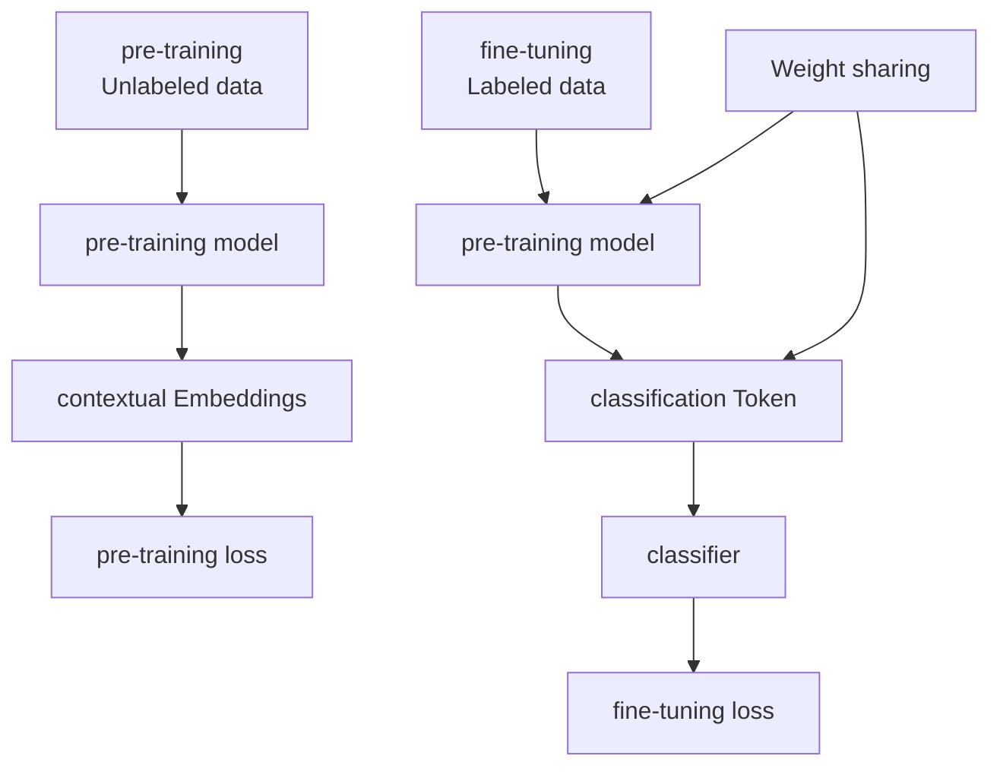
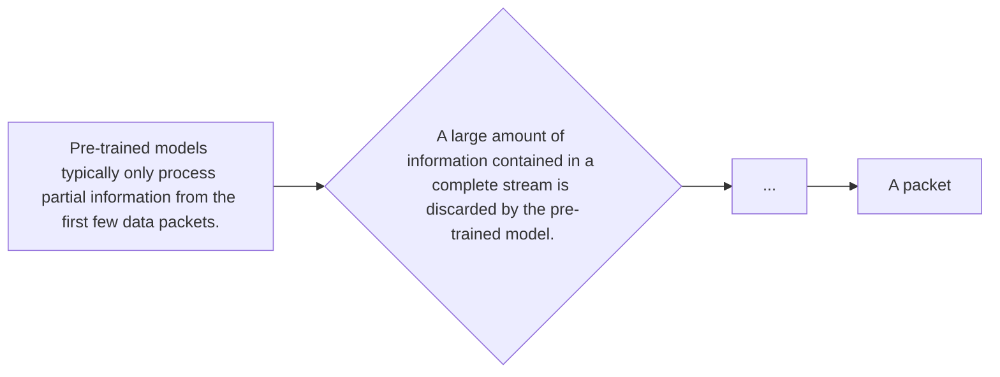
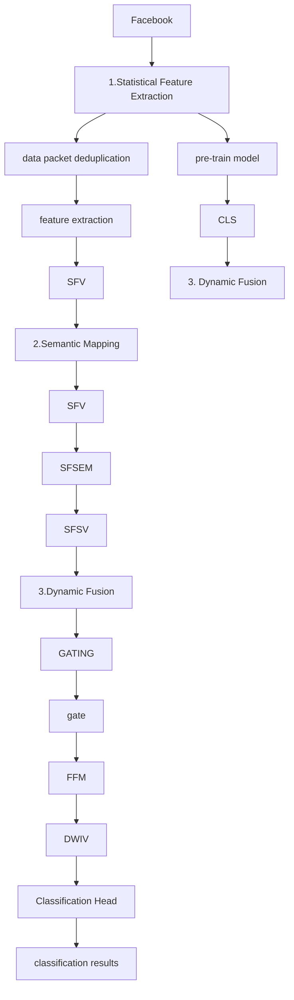
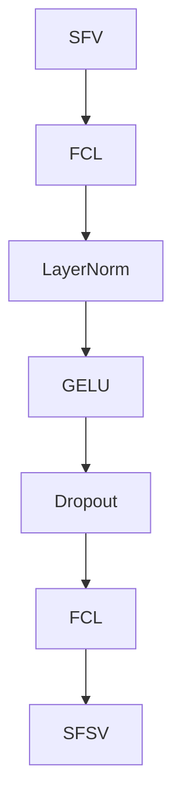
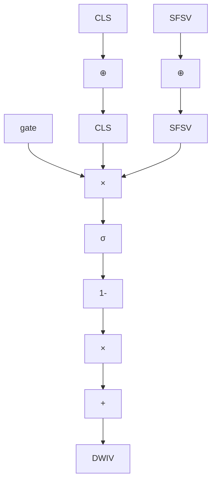

# Plug-in enhancement framework: Breaking through performance bottleneck of pre-trained models for encrypted traffic classification


Chaofan Zheng a, Hailong Ma a,b,∗, Yanze Qu a, Yiming Jiang a,b, Wenbo Wang a,∗

a Information Engineering University, China

b Ministry of Education of China, Key Laboratory for Cyberspace Security, China

# a r t i c l e i n f o

Keywords:

Encrypted traffic classification

Pre-training

Plug-in enhancement framework

Feature fusion

# a b s t r a c t

With the proliferation of encryption technologies, identifying network traffic content has become increasingly challenging, rendering malicious communications difficult to detect. Pre-trained models (PTMs) alleviate the constraints of limited labelled data and exhibit significant potential for encrypted traffic classification. However, existing PTMs can only process fixed-length raw byte payloads, facing dual challenges of insufficient feature extraction and input length limitations. Addressing this research gap, we have designed a pluggable enhancement framework. In contrast to conventional feature layer concatenation, our framework resolves spatial mismatches between heterogeneous features through a designed Statistical Feature Semantic Mapping network. It employs an adaptive gated fusion mechanism to achieve incremental enhancement without modifying or disrupting the original PTM weights. The framework’s novelty lies in its plug-and-play capability, enabling seamless integration into diverse architectures such as Mamba and Transformer to elevate the classification accuracy of traditional models. Experiments on multiple public datasets show that this framework improves the F1 score by up to 26%, 20%, 55%, and 14% for four mainstream PTMs. The practical significance of this research lies in enabling legacy models with limited performance to rapidly enhance classification accuracy for covert malicious traffic through this plug-in, without requiring time-consuming secondary fine-tuning. Despite these significant improvements, the current framework cannot yet effectively counter complex traffic obfuscation techniques and fails to achieve joint detection of multi-stream correlated behaviours. This study offers novel insights for achieving lightweight performance breakthroughs in real-world intrusion detection systems(IDS). The source code will be released at https://github.com/slg6/Plug-inEnhancementFramework.

# 1. Introduction

With the widespread adoption of Transport Layer Security(TLS) and subsequent encryption technologies, over 95% of internet traffic is now encrypted via Hypertext Transfer Protocol Secure(HTTPS) [1]. Whilst encryption effectively safeguards user privacy and communication security, the complete invisibility of encrypted traffic content presents unprecedented challenges for network traffic classification and potential threat detection. Zscaler’s report [2] indicate that, as of 2023, over 85% of cyber threats are delivered via encrypted channels.

Traditional machine learning approaches rely heavily on large volumes of labelled data, yet labelling encrypted traffic incurs substantial costs. To address this challenge, PTM has emerged as a cutting-edge direction for encrypted traffic classification [3]. By performing selfsupervised learning on vast amounts of unlabelled traffic, the model extracts deep semantic features, significantly alleviating the difficulty of labelling malicious samples. However, in practical industrial deployment and real-world applications, existing PTMs for encrypted traffic face severe performance bottlenecks and practical deployment challenges, primarily manifested in the following two aspects:

Firstly, severe information truncation and feature loss occur. Constrained by the computational complexity of deep learning models (particularly the Transformer architecture) [4], existing PTM [5–8] typically only accept fixed-length inputs (such as 128 or 512 bytes). In practical network environments, this necessitates the model discarding the vast majority of packet payloads or flow-level features. This ‘perspective limitation due to input constraints’ enables models to capture local bytelevel semantics while completely losing the ability to perceive global statistical characteristics such as flow duration, average packet interval, and total transmission rate. These features are crucial for identifying threats with unique behavioural patterns, such as Denial of Service (DoS) attacks [9].

Secondly, model updating incurs high costs and lacks flexibility. In practical industrial environments (such as ISP-level firewalls or enterprise perimeter security gateways), traffic distribution fluctuates dramatically with business changes [10,11]. Existing PTMs are typically black-box entities. Integrating new features or optimising for novel tasks often necessitates full fine-tuning of extensive parameters–an approach unacceptable in resource-constrained edge computing or real-time online systems requiring continuous updates [12,13]. Consequently, enhancing existing model performance through ‘low-intrusive’ methods has become the core challenge for deploying PTMs in practical industrial scenarios.

In response to the aforementioned challenges, we propose a pluggable augmentation framework. Rather than attempting to construct a more cumbersome PTM, we have designed a lightweight, independently attachable augmentation module. The framework is founded upon the construction of a dynamic feature fusion mechanism, the purpose of which is to achieve efficient fusion of statistical features and semantic features. However, achieving the fusion of statistical and semantic features is challenging. The semantic feature vectors extracted by PTM (e.g., [CLS] tokens) are characterised by their highly non-linear semantic combinations, while the statistical feature vectors extracted manually are parallel across dimensions and lack semantic relationships. Consequently, the fusion of these two types of features poses two significant challenges. Firstly, the issue of semantic mismatch between features must be addressed; secondly, the semantic information within semantic features must be preserved during the fusion process.

To address the first challenge, we designed a semantic extraction network for traffic features based on the traditional Multi-Layer Perceptron (MLP). This architecture enables more efficient extraction of semantic information from statistical features, thereby achieving precise alignment between statistical features and the semantic features extracted by PTM. To address the second challenge, we innovated upon the gated network architecture by proposing a self-attention-scalar gated unit. This incorporates self-attention mechanisms and interactive features. These enhancements not only strengthen semantic feature preservation but also foster feature interactions, achieving a balanced interplay between semantic and statistical features. Consequently, the effectiveness of feature fusion is significantly elevated.

We validated the framework’s effectiveness across ten traffic classification tasks using PTMs from four distinct architectures. Experimental results demonstrate that for each model, the maximum improvement in F1 score exceeds 10%. Furthermore, the framework offers a high degree of flexibility and compatibility. In the context of fine-tuned models, the framework has the capacity to enhance model performance without the necessity of retraining the fine-tuned model parameters. This feature offers significant convenience for rapidly improving model performance in practical applications. We further investigated the framework’s key components, revealing the impact of each element on classification performance.

Our principal contributions are summarised as follows:

1. We propose a universal, pluggable traffic classification augmentation framework. This framework integrates seamlessly into various mainstream PTMs without requiring modifications to model architecture or retraining of model weights.   
2. Addressing the heterogeneity of traffic features, we design a semantic mapping network and a gated fusion network to overcome dimensional mismatches and semantic discontinuities between statistical and semantic features.   
3. Conducted extensive evaluations across ten traffic classification tasks (involving nine public datasets) and four PTMs. Experiments demonstrate that the framework can boost the F1 score of existing PTM by up to 55%, while maintaining consistent enhancement effects on fine-tuned models.

# 2. Related work

# 2.1. Traffic classification

Early research on encrypted traffic classification heavily relied on feature engineering and classical machine learning algorithms. Machine learning-based approaches [14–18] depended on feature extraction engineering informed by expert knowledge. Following the construction of feature vectors, classification was performed using models such as decision trees, random forests, and support vector machines (SVM). Flow-Print [19] proposed a semi-supervised fingerprinting approach, constructing application fingerprints by analysing temporal correlations between target addresses within encrypted traffic. The performance of such methods is highly dependent on the quality of feature selection and domain expertise, whilst manually designed features exhibit limited generalisation capabilities when confronted with emerging applications or protocol variants [20].

With the proliferation of deep learning technologies, research has shifted towards models capable of automatically learning feature representations. Deep learning-based approaches [21–25] learn complex patterns directly from raw data via end-to-end models, circumventing feature engineering. FS-Net [26] utilises traffic behaviour sequences (packet length sequences) to automatically learn discriminative features through a BiGRU-based encoder-decoder architecture, enabling end-to-end classification of encrypted traffic. Hi-Fi [27] proposes a hierarchical deep learning architecture that unifies heterogeneous traffic into fixed-dimensional vector representations through progressive abstraction from packets to flows to traffic traces, significantly enhancing the generalisation capability for fingerprint recognition tasks. However, these deep learning approaches remain fundamentally supervised learning methods, whose performance bottleneck lies in their reliance on large volumes of high-quality annotated data. Annotating network traffic is costly and requires specialised expertise.

# 2.2. Pre-training models

To alleviate the scarcity of labelled data, drawing upon successful experiences from the natural language processing domain, PTM has been introduced into the field of encrypted traffic classification [3]. Its core concept involves performing self-supervised pre-training on large-scale unlabelled traffic data to learn generalised traffic representations, followed by fine-tuning with a small amount of labelled data to adapt to downstream classification tasks. Research has attempted to directly transfer the BERT architecture [28] to the traffic analysis domain. For instance, ET-BERT [5] proposes a Transformer-based PTM that learns deep contextual representations from large-scale raw traffic bytes through self-supervised learning, adaptable to downstream classification tasks via fine-tuning. TrafficFormer [6] enhances PTM’s understanding of traffic protocol semantics and patterns by introducing sequence direction prediction tailored to traffic characteristics alongside data augmentation strategies, demonstrating strong performance with minimal labelled data. YaTC [7] treats traffic data as images, learning multi-level flow representations through unsupervised pre-training, significantly improving classification data efficiency. Other research, such as NetMamba [8], proposes a PTM based on the modern state space model (Mamba), utilising unidirectional modelling with linear complexity and masked autoencoders to achieve efficient and low-bias encrypted traffic classification.

Despite these notable advancements, PTMs share a common limitation: their relatively rigid model structures primarily rely on learning semantic features from raw bytes or finite-element data. They lack a flexible, standardised mechanism for efficiently integrating artificially constructed, domain-knowledge-rich global statistical features (e.g., flow duration, packet length variance). This limitation in multi-source heterogeneous feature fusion constrains further performance gains. To address this, this paper proposes a pluggable feature enhancement framework. By designing a semantic extraction network and a gated fusion mechanism, it achieves lossless, adaptive fusion of statistical features with pre-trained semantic features. This significantly improves classification performance without modifying the PTM architecture, offering a flexible and scalable enhancement paradigm for encrypted traffic classification.


<details>
<summary>flowchart</summary>


</details>

Fig. 1. Pre-training and fine-tuning.

# 3. Background and problem description

The prevailing research approach to address the challenge of classifying encrypted traffic involves the utilization of information contained within data packets to train machine learning [16,18,19] or deep learning models [23,25,26]. These models are then capable of discerning between diverse traffic characteristics, thereby facilitating successful classification. Traditional traffic classification models suffer from reliance on high-quality labelled data and poor generalisation capabilities.

However, in contrast to data types that are more closely related to everyday life, such as text, images, and sound, the annotation of traffic data requires staff to not only understand network protocols but also possess professional knowledge to identify specific network scenarios and attack patterns. Furthermore, the presence of malicious traffic can be obscured by the substantial volume of normal traffic, thus complicating the process of manual annotation.

PTMs [28–30] have demonstrated considerable potential in addressing the issue of limited labelled data. Consequently, several studies have introduced pre-training methods into the domain of traffic classification. The pre-training methodology comprises pre-training phase and fine-tuning phase, as illustrated in Fig. 1. During the pre-training stage, PTM acquires general knowledge through the utilization of a substantial volume of unlabelled data. Subsequently, during the fine-tuning stage, it assimilates task-specific knowledge through the analysis of a limited amount of labelled data. Consequently, optimal classification performance can be attained with a limited amount of labelled data, thereby reducing the requirement for additional labelled data and enhancing the model’s generalisation capability. However, contemporary pre-training methodologies employ raw data bytes exclusively for classification, thereby disregarding information that lies beyond the payload. Furthermore, due to their fixed input length, pre-training methods are unable to capture the global features of traffic data.

As demonstrated in Fig. 2, PTMs in the domain of traffic analysis encounter a prevalent challenge: they are only capable of processing a limited subset of data stream information and lack the capacity to effectively handle statistical features. A quantitative analysis of information loss caused by data truncation is detailed in Appendix C. The statistical feature vectors extracted from traffic data contain key information such as packet intervals, packet lengths, and packet transmission rates. These metrics reflect global characteristics of traffic and serve as crucial criteria for traffic classification. However, it should be noted that the initial conception of PTMs was to focus on the extraction of semantic features from raw data bytes, thus neglecting the importance of statistical features. This overreliance on raw data bytes alone has the effect of limiting the classification performance of PTMs when dealing with complex traffic data. Consequently, the fusion of statistical features with the semantic features of PTMs has emerged as a pivotal direction for enhancing the effectiveness of traffic classification.

However, the fusion of semantic vectors with statistical feature vectors gives rise to the challenge of vector mismatch. For the purpose of illustration, consider the ET-Bert [5] model. This model extracts a 768- dimensional semantic vector ([CLS]) from raw bytes for traffic classification. While this semantic vector provides rich semantic information about the input sequence as a whole, its individual dimensions are difficult to interpret because they result from highly nonlinear combinations. Conversely, statistical feature vectors are characterised by the utilization of vectors derived from various clearly defined features (e.g., packet intervals, packet lengths, packet transmission rates, etc.). In order to enhance the classification capabilities of PTMs using statistical feature vectors, it is essential to address the semantic differences between [CLS] and statistical feature vectors, as well as the issue of dimensional mismatch.

In order to address the aforementioned issues, it is proposed that a plug-in framework be designed, with the aim of enabling models to fully use the information contained in statistical features. The implementation of this framework will enhance the classification performance of the models. The term ‘plug-in’ refers to the fact that this framework can seamlessly integrate and enhance the classification performance of PTMs without modifying their original structure.

# 4. Framework design

In this section, the motivation and intuition behind the framework design are introduced. The framework’s workflow is then outlined, and a detailed introduction to the framework’s various components and hyperparameter selection is provided.

# 4.1. Motivation and intuition

PTMs have been shown to excel at extracting deep semantic features from encrypted payloads; however, their inherent architectural limitations make it difficult to significantly enhance performance by merely improving the pre-training process itself. Therefore, an intuitive and effective approach is to introduce statistical features of the data stream as supplementary information to compensate for the shortcomings of pure semantic modelling. However, a considerable discrepancy has been observed between the statistical features and semantic features extracted by PTMs in terms of semantic space and feature dimensions. The direct fusion of these features without implementing effective processing frequently results in a decline in model classification performance.


<details>
<summary>flowchart</summary>


</details>

Fig. 2. PTMs can only process a limited amount of information.

First, to effectively fuse extracted statistical features with semantic features obtained via PTM (e.g., [CLS]), the key lies in resolving the disconnect between their representational spaces and semantic meanings. Specifically, this ‘semantic mismatch’ manifests on two levels: Firstly, spatial heterogeneity. Taking Trafficformer and ET-Bert as examples, their [CLS] vectors (768-dimensional) and statistical feature vectors (77-dimensional) exhibit significant dimensional disparities and reside in distinct embedding spaces. Direct vector operations (such as concatenation or weighting) fail to achieve effective fusion due to scale inconsistencies. Secondly, semantic heterogeneity arises because each dimension of the [CLS] vector represents a nonlinear combination of byte sequences, carrying context-dependent deep semantics. Conversely, each dimension of the statistical feature vector explicitly expresses traffic metrics (e.g., mean packet length, variance), with dimensions being independent and lacking contextual correlation. This disparity in representation causes direct concatenation to distort the semantic manifold structure learned by PTM.

To this end, we have designed a lightweight semantic extraction module whose core function is to project two types of features onto a compatible space, ensuring they possess similar semantic information and dimensional scales prior to fusion. Semantic alignment requires no learning of complex contextual dependencies. It merely maps the structured behavioural information of statistical features onto a semantic representation sharing the same dimensionality and scale as the [CLS]. This objective constitutes a feature space transformation rather than complex semantic generation. The parameter scale of a lightweight MLP suffices to cover the mapping requirements, while avoiding the overfitting and semantic redundancy that deep networks may induce.

Second, following feature alignment, the fusion strategy must also satisfy a key constraint: it must not disrupt the inherent semantic structure learned by the PTM. In consideration of the aforementioned constraint, and in light of the successful experiences that have been accumulated in the domain of multi-modal feature fusion [31–33], it has been determined that the adoption of a gating mechanism is to be undertaken in order to facilitate the achievement of adaptive vector fusion. The gating network is capable of dynamically balancing the importance of the two types of features according to task requirements, thereby effectively preserving the integrity of the pre-trained semantics.

# 4.2. Framework overview

The framework is primarily divided into three parts: extracting statistical features from data streams, extracting semantic information from statistical features, and dynamic fusion. Fig. 3 shows the overall diagram of the framework.

The framework first performs data cleansing on raw traffic (processing retransmitted packets) and divides it into independent network flows based on quintuple criteria. Subsequently, the feature extraction module captures the macro-behavioural patterns of these flows throughout their lifecycle, generating statistical feature vectors ([SFV]). This module compensates for the loss of global contextual information (such as flow duration and packet interval distribution) inherent in PTM due to its input length constraints, thereby providing macro-behavioural features for classification. As [SFV] constitutes numerical features in physical space, while PTM extracts residual vectors ([CLS]) from a highly abstract semantic space, a significant representational mismatch exists between the two. To address this, we designed the Statistical Feature Semantic Extraction Module (SFSEM). This module leverages the nonlinear mapping capability of a Multi-Layer Perceptron (MLP) structure to project the [SFV] onto a high-dimensional semantic space isomorphic to PTM, generating a Statistical Feature Semantic Vector ([SFSV]). This process achieves ‘dimensional alignment’ and ‘contextual alignment’ between statistical metrics and byte-level payload semantics, laying the groundwork for subsequent deep fusion. To introduce statistical guidance while preserving pre-trained knowledge integrity, the Gating Fusion Network (GATING) receives vectors from two distinct modalities ([SFSV] and [CLS]). This module employs a self-attention mechanism to compute interaction weights, dynamically adjusting the fusion ratio between the two. Its interactive logic operates as follows: when traffic payloads exhibit semantic poverty due to high encryption levels, the gating mechanism automatically increases the weight of the [SFSV]; conversely, it prioritises preserving the deep payload information extracted by the [CLS]. Finally, the fused composite vector is input into the Classification Head, which employs a Softmax function to predict the probability distribution of traffic belonging to each label. The label with the highest probability is selected as the final classification decision.

# 4.3. Statistical feature extraction

Statistical feature extraction can be defined as the process of generating low-dimensional feature vectors by calculating the distribution statistics (such as mean, variance, and skewness) of numerical fields from network data streams using a sliding window. A standard for extracting network flow statistical features has been provided, incorporating a total of 77 dimensions (see Appendix A). While this standard does not guarantee optimal experimental performance across all datasets, it enables significant performance improvements for PTMs within the framework. The framework itself imposes no strict restrictions on the dimension of the statistical feature vector. Users are able to select the features to extract based on the specific characteristics of the dataset, thereby better adapting to the traffic classification requirements of different scenarios.

Improvements have been made to the CICFlowMeter [34] project (CFM) , with the objective of extracting statistical features of network flows. When employing CFM for the purpose of statistical feature extraction, it was discovered that the retransmission of certain packets within the data stream resulted in CFM erroneously disconnecting the data stream at the point of retransmission, thereby identifying it as two distinct streams. Furthermore, a substantial number of retransmitted packets have been shown to interfere with the accuracy of network flow statistical features. However, retransmission is a common phenomenon in real network flows. As demonstrated in Table 1, an analysis was conducted on the six categories with the highest proportions of retransmitted packets in the USTC-TFC2016 [35] , revealing that certain categories exhibited retransmission rates of up to 30% or more. Consequently, the direct utilization of raw traffic data for statistical feature extraction can yield a substantial number of statistical errors, thereby impacting classification performance.


<details>
<summary>flowchart</summary>


</details>

Fig. 3. Overall architecture:1) Process raw traffic data and extract statistical feature vectors. 2) Employ the Statistical Feature Semantic Extraction Module to map the statistical feature vector into semantic space, yielding the statistical feature semantic vector ([SFSV]). 3) Utilise the multi-head self-attention gating mechanism (GATING) and Feature Fusion Module (FFM) to fuse the [CLS] with [SFSV], producing the Dynamic Weighted Interaction Vector ([DWIV]). This is then subjected to classification prediction via a classification head.

Table 1 Statistics on retransmitted packets in the USTC-TFC2016 classification. 

<table><tr><td>Category</td><td>Total number of data packets</td><td>Proportion of retransmitted packets</td></tr><tr><td>Cridex</td><td>461548</td><td>13.03%</td></tr><tr><td>Geod</td><td>250000</td><td>26.37%</td></tr><tr><td>Miuref</td><td>88560</td><td>13.66%</td></tr><tr><td>Neris</td><td>499218</td><td>19.45%</td></tr><tr><td>Virut</td><td>440625</td><td>30.79%</td></tr><tr><td>Zeus</td><td>93141</td><td>20.27%</td></tr></table>

To address the aforementioned issues, we perform data cleansing prior to statistical feature extraction. Specifically, to resolve flow segmentation errors and statistical feature calculation biases caused by retransmitted packets, we first reconstruct and uniquely identify network flows using the quintuple (source IP, destination IP, source port, destination port, transport layer protocol) – ensuring all packets belonging to the same data stream are correctly grouped together. During packet filtering, we employ the tshark [36] to validate packets: when two packets share identical quintuplets, sequence numbers, and payload lengths, they are identified as duplicate retransmissions and discarded to guarantee the authenticity of statistical features. Following data cleansing, we employ CFM to sequentially extract the [SFV] for each reconstructed

network flow, adhering to the 77-dimensional feature selection criteria defined in Appendix A.

We selected the 77-dimensional feature set based on CICFlowMeter to establish a universal, reproducible statistical feature benchmark. This set encompasses statistical information across multiple dimensions, including flow duration, packet length distribution, packet interval, and flow directionality. It has been demonstrated in multiple studies to possess discriminative capability for traffic classification [37]. To validate the selected features and the framework’s robustness, we conducted the following analyses (see Section 5.4): Feature importance analysis indicates that the ranking of statistical features’ significance is scenariodependent, with key features for traffic classification varying significantly across different network scenarios; Feature subset experiments further demonstrate that even when employing only the top 20, 40, or 60 dimensional feature subsets, the proposed framework effectively enhances the model’s classification performance, indicating robust resilience to feature selection. In practical deployments, users may adjust the feature set according to specific scenarios, highlighting the framework’s strong scalability.

# 4.4. Semantic mapping

The purpose of semantic mapping is to project manually extracted feature vectors onto a semantic space, thereby resolving the semantic and dimensional mismatch between statistical feature vectors and semantic feature vectors. Our in-depth analysis of extracted network traffic statistics reveals the following characteristics: numerous dimensions within the vectors contain zero values; the numerical ranges across dimensions exhibit sparse distributions and predominantly non-negative values. Given these characteristics, it is essential to circumvent the inherent limitations of conventional activation functions when applied to such features.

Our proposed Semantic Feature Space Mapping Network (SFSEM) employs a lightweight two-layer architecture: the input layer dimension aligns with the [SFV], the number of hidden layer neurons ?? is adaptively adjusted based on the [CLS] dimension of the model (see Section 4.6), and the output layer dimension matches the [CLS]. To ensure training stability, a LayerNorm layer is introduced before the activation function. To suppress model overfitting, a Dropout layer is added on the output side (with a dropout rate of 0.1).


<details>
<summary>flowchart</summary>


</details>

Fig. 4. Semantic mapping network structure.

Given the sparse non-negative nature of network traffic statistical features, comparative experiments validated the suitability of several mainstream activation functions, including ReLU [38], LeakyReLU [39], Softplus, Sigmoid, Mish [40], tanh, and GeLU [41]. Experimental results indicate that GeLU exhibits superior training stability, demonstrating significantly enhanced performance compared to other activation functions in scenarios such as multi-task traffic forecasting and anomaly detection (see Section 5.4).

Fig. 4 illustrates the specific architecture of the semantic mapping network. For the GeLU activation function, incorporating a normalisation layer aids in stabilising and accelerating the learning process [42]. Consequently, we have added a normalisation layer preceding the activation function. Furthermore, we have introduced a dropout layer to mitigate the risk of model overfitting.

# 4.5. Dynamic fusion

The specific structure of the dynamic fusion network is illustrated in Fig. 5(a). The vector obtained by concatenating [CLS] and [SFSV] is then used as input, and the final output is the classification result of the network flow. In order to ascertain the complex semantic vector correlations between [CLS] and [SFSV], a special multi-head self-attention gating mechanism (GATING) was designed. In contradistinction to conventional gating networks, the gating mechanism under scrutiny in this study extracts high-order correlation features through the utilization of attention, subsequently generating gating signals. This constitutes a two-stage optimisation process of feature enhancement and dynamic filtering. Furthermore, the conventional single-layer linear transformation, which is frequently employed in gating, is substituted with an MLP to augment non-linear fitting capabilities, thereby facilitating the learning of more complex gating rules. The output layer of the multilayer perceptron (MLP) in GATING has a dimension of 1, and a sigmoid function is added after the output layer. This indicates that the dimension of the gate vector is 1, and its elements range from 0 to 1, i.e., ???????? = {[??], ?? ∈ (0, 1)}.

As demonstrated in Fig. 5(b), the Feature Fusion Module (FFM) employs the gating weights g, which are generated by GATING, and the vector formed by concatenating [CLS] and [SFSV] as inputs, thereby yielding a Dynamic Weighted Interaction Vector ([DWIV]). Since g is conceptualised as a one-dimensional vector, the framework is capable of performing feature fusion from the standpoint of the two feature sources (i.e. [CLS] and [SFSV]).The internal semantic relationship be-


<details>
<summary>flowchart</summary>

```mermaid
graph TD
    A["CLS"] --> B["Multi-headed Self-attention"]
    C["SFSV"] --> B
    B --> D["MLP"]
    D --> E["gate"]
    E --> F["FFM"]
    F --> G["Classification Head"]
    G --> H["[classification results"]]
    I["GATING"] -.-> B
```
</details>

(a) Overall structure


<details>
<summary>flowchart</summary>


</details>

(b)FFMstructure   
Fig. 5. Dynamic fusion network architecture.

tween [CLS] and [SFSV] is only learned through the semantic extraction module, ensuring that the semantic features of [CLS] and [SFSV] are not compromised.Concurrently, since g is dynamically generated gating weights, setting its dimension to one-dimensional can reduce model complexity and effectively prevent overfitting.Finally, the Hadamard product of the two vectors is added to the fusion vector to enhance feature interaction and strengthen the model’s expressive power.In summary, the calculation formula for [DWIV] is as follows:

$$
\mathbf {D W I V} = \text { gate } \times \mathbf {C L S} + (1 - \text { gate }) \times \mathbf {S F S V} + \alpha \mathbf {C L S} \odot \mathbf {S F S V} \tag {1}
$$

Herein, ???????? denotes the dynamically generated gating weight by FFM, × represents scalar-vector multiplication (where each element of the scalar is multiplied by each corresponding element of the vector), and ⊙ denotes the Hadamard product, signifying element-wise multiplication of two vectors of identical dimensions. ??, serving as the coefficient for interaction features, is a hyperparameter whose value is obtained through empirical search. The parameter tuning results will be presented in Section 4.6.

# 4.6. Hyperparameter tuning

Prior to conducting the experiment, it is necessary to ascertain the hyperparameter values of the framework. These comprise the number of hidden layer neurons, ??, in the statistical feature semantic extraction network; the coefficient, ??, of the interaction features in feature fusion; and the number of heads, ??, in the multi-head self-attention in GATING. The selection of ?? should be based on the principle that the number of hidden layer neurons should be between the number of input layer neurons and the number of output layer neurons. As previously stated, the selection of 77-dimensional statistical features was made, thereby ensuring the dimension of the input layer is fixed at 77. The [CLS] dimension for ET-Bert [5] and TrafficFormer [6] is 768, while for YaTC [7] and NetMamba [8] it is 192. The selection of ?? is based on the principle that the interaction features and the gated fusion vector should be on the same order of magnitude, so ?? is centred around 1. For general classification tasks, the number of self-attention heads typically does not exceed 8. Considering the above factors, the search space for each hyperparameter was obtained, as shown in Table 2.

To determine the optimal hyperparameter combination, we conducted a grid search on three representative datasets, namely USTC-TFC, Android and Tor. Each dataset was split into training, validation and test sets at a ratio of 8:1:1. During training, we trained the model for 100 epochs on the training set and calculated the macro-averaged F1-score on the test set at the end of each epoch. We then selected the model corresponding to the epoch with the highest F1-score on the test set for the final evaluation on the validation set. The hyperparameter combination yielding the highest F1-score on the validation set was designated as the final configuration, and the resulting experimental results are presented in Table 2. Specifically, the value of ?? falls exactly between the input and output dimensions; either an excessively large or small value of ?? leads to a degradation in the semantic extraction capability of the model. ?? exerts a relatively stable influence on model performance, and a value of 1 achieves the optimal or near-optimal balance on most tasks, indicating that the interactive features and gating fusion features realize effective complementarity at this point. Although increasing ?? improves the model capacity, bigger is not always better. Experimental results demonstrate that ?? values of 4 and 6 achieve comprehensively better performance than 2 and 8, as they strike a favorable balance between model performance and computational overhead. Thus, ?? is uniformly set to 4 in the final configuration.

Table 2 Framework hyperparameter tuning results. 

<table><tr><td>Model</td><td>Hyperparameters</td><td>Search space</td><td>Final value</td></tr><tr><td rowspan="3">ET-Bert [5]</td><td>n</td><td>[128, 256, 512]</td><td>256</td></tr><tr><td>α</td><td>[0.2, 0.5, 1, 2, 5]</td><td>1</td></tr><tr><td>m</td><td>[2, 4, 6, 8]</td><td>4</td></tr><tr><td rowspan="3">TrafficFormer [6]</td><td>n</td><td>[128, 256, 512]</td><td>256</td></tr><tr><td>α</td><td>[0.2, 0.5, 1, 2, 5]</td><td>1</td></tr><tr><td>m</td><td>[2, 4, 6, 8]</td><td>4</td></tr><tr><td rowspan="3">YaTC [7]</td><td>n</td><td>[100, 128, 156]</td><td>128</td></tr><tr><td>α</td><td>[0.2, 0.5, 1, 2, 5]</td><td>1</td></tr><tr><td>m</td><td>[2, 4, 6, 8]</td><td>4</td></tr><tr><td rowspan="3">NetMamba [8]</td><td>n</td><td>[100, 128, 156]</td><td>156</td></tr><tr><td>α</td><td>[0.2, 0.5, 1, 2, 5]</td><td>1</td></tr><tr><td>m</td><td>[2, 4, 6, 8]</td><td>4</td></tr></table>

Table 3 Test model. 

<table><tr><td>Model</td><td>Architecture</td><td>Total bytes processed</td><td>[CLS] dimension</td></tr><tr><td>ET-Bert</td><td>Transformer</td><td>128</td><td>768</td></tr><tr><td>YaTC</td><td>ViT</td><td>1600</td><td>192</td></tr><tr><td>TrafficFormer</td><td>TrafficFormer</td><td>320</td><td>768</td></tr><tr><td>NetMamba</td><td>Mamba</td><td>1600</td><td>192</td></tr></table>

It should be noted that the aforementioned hyperparameters constitute a set of robust configurations obtained through experimental verification on the selected datasets, which is designed to achieve universal performance improvement of the framework across multiple tasks, rather than to guarantee absolute optimality on all datasets. In practical applications, users can perform fine-tuning according to specific data characteristics. Nevertheless, the default values adopted in this paper have demonstrated remarkable enhancement effects and favorable generalization ability.

# 5. Evaluation

In this section, an evaluation of the framework is conducted from multiple perspectives. Firstly, the experimental setup is described and the datasets used are introduced. In the subsequent stage of the analysis, the classification performance of the PTM will be compared before and after the utilization of the framework in order to verify the effectiveness of the latter. Furthermore, an analysis is conducted to determine the impact of implementing the framework on a PTM following finetuning. The final stage of the research process involves the exploration of the impact of the various components of the framework on overall performance.

# 5.1. Experiment setup

Test model. As demonstrated in Table 3, in order to substantiate the universality of the framework, an evaluation of its effectiveness was conducted on four distinct PTMs.

Test dataset. As shown in Table 4, we set up ten classification tasks on eight public datasets. Among them, CIC-IOT [43], IDI [44], and ISD [45] are traffic data generated by IoT devices, aiming to test the model’s classification ability for IoT device traffic. Service and APP are classification tasks in the ISCX-VPN [46] dataset, respectively categorised by service and software type. Tor is a classification task in the ISCX-Tor [47] dataset categorised by software type. Service, app, and tor are used to test the model’s classification performance for channel traffic and anonymous network traffic. UAV [48] consists of traffic data generated by different online behaviours (e.g., video, interaction, idle), aiming to test the model’s classification capability for user behaviour. Android [49] is a dataset composed of traffic generated by multiple adware, malware, and normal applications. USTC-TFC [35] is a dataset composed of traffic generated by 10 benign software and 10 malicious software. Our research found that the timestamps of benign software traffic in USTC-TFC were manually modified, differing significantly from malicious software traffic. This modification may have improved the classification performance of statistical features on this dataset. As a result, we extracted all malicious software traffic from the dataset to form a new dataset, ustcMal. Android, USTC-TFC, and ustcMal are used to test the model’s classification performance for benign and malicious traffic.

Baseline Methods. To comprehensively evaluate the framework’s performance enhancement, comparative experiments were conducted using three representative approaches: the classical semi-supervised machine learning method FlowPrint [19], which generates application fingerprints based on time-correlated features of network traffic destination attributes to classify encrypted traffic; the end-to-end deep learning method FS-Net [26], employing a multi-layer bidirectional GRU encoder-decoder architecture with a reconstruction mechanism to autonomously learn discriminative features from raw flow sequences; the input-agnostic hierarchical deep learning framework Hi-Fi [27], which captures cross-layer spatio-temporal correlations through packet-flowtrace tri-level feature abstraction to adapt to heterogeneous traffic inputs.

Training settings. The training of each model was conducted utilising the PyTorch 2.0.1 framework. The training of ET-Bert, Trafficformer and YaTC was executed through the utilization of CUDA 11.5, while Netmamba necessitated CUDA 11.6 or a more recent version, consequently prompting the adoption of CUDA 11.7 for the training process. The batch size for training all models was set to 16, and the Adamw [50] optimisation algorithm was used for optimisation. Furthermore, the default training parameters for each pre-trained model were retained during the fine-tuning process, as illustrated in Table 5.We will involve a comparison of the classification performance both prior to and following the implementation of the framework, with the objective of evaluating the impact of the framework on the enhancement of the performance of pre-trained models.

Data preprocessing. Initially, each dataset is divided into independent network flows. For categories comprising more than 500 flows, 500 flows are retained. Subsequently, each dataset is divided into training, validation, and test sets in an 8:1:1 ratio.

Evaluation metrics. The performance of the framework is evaluated using four classic metrics: accuracy (AC) , precision (PR) , recall (RC) , and F1 score (F1) . In order to circumvent the issue of result bias, which is precipitated by an imbalance in the data type, the macro-average is used to calculate the average values of AC, PR, RC, and F1 for each category. This is due to the multi-class classification problem. To ensure the reliability of experimental results, each experiment employed five distinct random seeds to partition the dataset. The mean and variance of the five independent experimental results were calculated and used as the final metrics for comparative analysis.

# 5.2. Experimental results

IOT device datasets.Experimental results across the CIC-IoT, IDI, and ISD IoT datasets reveal the framework’s differentiated value across diverse IoT application scenarios (see Table 6). The most significant performance improvement was observed in the CIC-IoT dataset (device behaviour identification), where TrafficFormer achieved an F1 score increase exceeding 8.8%. This improvement holds significant practical importance: in smart home or industrial IoT environments, accurately identifying device behaviour (such as sensors being hijacked for DDoS attacks) is crucial for security protection. Traffic in this dataset originates from diverse application types (video streaming, file transfers, control commands), exhibiting markedly distinct statistical characteristics (e.g., packet length distribution, transmission rates). Our framework effectively addresses the information gap inherent in pure deep learning approaches when handling encrypted IoT traffic, where protocol headers conceal critical details, by integrating these side-channel features.

Table 4   
Test dataset. 

<table><tr><td>Datasets</td><td>Task Description</td><td>Class Number</td></tr><tr><td>CIC-IOT</td><td>Identification of IoT device behaviour</td><td>5</td></tr><tr><td>IDI</td><td>IoT device identification</td><td>31</td></tr><tr><td>ISD</td><td>Identification of IoT botnets</td><td>2</td></tr><tr><td>Service</td><td>Identification of VPN encryption service types</td><td>6</td></tr><tr><td>APP</td><td>Identification of VPN encryption software types</td><td>14</td></tr><tr><td>Tor</td><td>Tor network fingerprinting</td><td>5</td></tr><tr><td>UAV</td><td>User behaviour identification</td><td>5</td></tr><tr><td>Android</td><td>Distinguishing between advertising software, malware, and general software</td><td>3</td></tr><tr><td>USTC-TFC</td><td>Malware detection</td><td>20</td></tr><tr><td>ustcMal</td><td>Malware classification</td><td>10</td></tr></table>

Table 5

Training settings. 

<table><tr><td>Model</td><td>Initial learning rate</td><td>Epochs*</td><td>Input package scope</td><td>Field extraction position†</td></tr><tr><td>ET-Bert</td><td>6e-5</td><td>100</td><td>The first 5</td><td>After the 78th byte</td></tr><tr><td>TrafficFormer</td><td>6e-5</td><td>100</td><td>The first 5</td><td>The 28th to 92nd bytes</td></tr><tr><td>YaTC</td><td>2e-3</td><td>200</td><td>The first 5</td><td>Header: 0–80 Payload: 0–240</td></tr><tr><td>NetMamba</td><td>2e-3</td><td>120</td><td>The first 5</td><td>Header: 0–80 Payload: 0–240</td></tr></table>

∗Select the best-performing model from all training rounds for comparison.   
†The bytes referred to here are the bytes reserved for each data packet, with any insufficient bytes filled with 0.

Table 6   
IoT device datasets classification results. 

<table><tr><td rowspan="2">Dataset Approaches</td><td colspan="4">CIC-IOT</td><td colspan="4">IDI</td><td colspan="4">ISD</td></tr><tr><td>AC</td><td>PR</td><td>RC</td><td>F1</td><td>AC</td><td>PR</td><td>RC</td><td>F1</td><td>AC</td><td>PR</td><td>RC</td><td>F1</td></tr><tr><td>FlowPrint</td><td>0.7147(±0.021)</td><td>0.8105(±0.005)</td><td>0.3710(±0.017)</td><td>0.4709(±0.017)</td><td>0.5580(±0.038)</td><td>0.8306(±0.024)</td><td>0.3813(±0.035)</td><td>0.4635(±0.034)</td><td>0.7111(±0.039)</td><td>0.6568(±0.005)</td><td>0.4772(±0.024)</td><td>0.5482(±0.017)</td></tr><tr><td>FS-Net</td><td>0.8516(±0.014)</td><td>0.8471(±0.014)</td><td>0.8344(±0.013)</td><td>0.8376(±0.013)</td><td>0.6487(±0.055)</td><td>0.6123(±0.052)</td><td>0.5951(±0.051)</td><td>0.5818(±0.050)</td><td>0.9219(±0.013)</td><td>0.9204(±0.013)</td><td>0.9204(±0.015)</td><td>0.9204(±0.013)</td></tr><tr><td>Hi-Fi</td><td>0.6922(±0.021)</td><td>0.7094(±0.018)</td><td>0.6922(±0.021)</td><td>0.6898(±0.027)</td><td>0.5080(±0.013)</td><td>0.5438(±0.021)</td><td>0.5305(±0.016)</td><td>0.4995(±0.014)</td><td>0.9469(±0.018)</td><td>0.9495(±0.018)</td><td>0.9469(±0.018)</td><td>0.9469(±0.018)</td></tr><tr><td>ET-Bert</td><td>0.7525(±0.051)</td><td>0.7516(±0.054)</td><td>0.7442(±0.051)</td><td>0.7435(±0.053)</td><td>0.8232(±0.035)</td><td>0.8649(±0.023)</td><td>0.8551(±0.021)</td><td>0.8538(±0.019)</td><td>0.9464(±0.020)</td><td>0.9476(±0.021)</td><td>0.9440(±0.022)</td><td>0.9449(±0.021)</td></tr><tr><td>ET-Bert ef*</td><td>0.7999(±0.037)</td><td>0.7975(±0.039)</td><td>0.7949(±0.036)</td><td>0.7943(±0.037)</td><td>0.8215(±0.029)</td><td>0.8687(±0.019)</td><td>0.8560(±0.016)</td><td>0.8549(±0.015)</td><td>0.9539(±0.020)</td><td>0.9526(±0.022)</td><td>0.9545(±0.018)</td><td>0.9530(±0.020)</td></tr><tr><td>TrafficFormer</td><td>0.7648(±0.016)</td><td>0.7704(±0.019)</td><td>0.7648(±0.016)</td><td>0.7630(±0.013)</td><td>0.9095(±0.010)</td><td>0.9328(±0.006)</td><td>0.9310(±0.007)</td><td>0.9302(±0.006)</td><td>0.9720(±0.013)</td><td>0.9737(±0.011)</td><td>0.9720(±0.013)</td><td>0.9720(±0.013)</td></tr><tr><td>TrafficFormer ef</td><td>0.8304(±0.033)</td><td>0.8398(±0.027)</td><td>0.8304(±0.033)</td><td>0.8304(±0.032)</td><td>0.9226(±0.013)</td><td>0.9429(±0.008)</td><td>0.9407(±0.010)</td><td>0.9403(±0.010)</td><td>0.9780(±0.013)</td><td>0.9786(±0.013)</td><td>0.9780(±0.013)</td><td>0.9780(±0.013)</td></tr><tr><td>YaTC</td><td>0.8584(±0.079)</td><td>0.8585(±0.079)</td><td>0.8584(±0.079)</td><td>0.8568(±0.080)</td><td>0.9214(±0.000)</td><td>0.9228(±0.012)</td><td>0.8992(±0.009)</td><td>0.9065(±0.008)</td><td>0.9700(±0.000)</td><td>0.9705(±0.001)</td><td>0.9700(±0.000)</td><td>0.9700(±0.000)</td></tr><tr><td>YaTC ef</td><td>0.8792(±0.069)</td><td>0.8809(±0.068)</td><td>0.8792(±0.069)</td><td>0.8790(±0.069)</td><td>0.9228(±0.003)</td><td>0.9356(±0.005)</td><td>0.9067(±0.008)</td><td>0.9138(±0.009)</td><td>0.9740(±0.005)</td><td>0.9750(±0.005)</td><td>0.9740(±0.005)</td><td>0.9740(±0.005)</td></tr><tr><td>NetMamba</td><td>0.8344(±0.094)</td><td>0.8358(±0.093)</td><td>0.8344(±0.094)</td><td>0.8334(±0.095)</td><td>0.8632(±0.013)</td><td>0.8912(±0.010)</td><td>0.8657(±0.021)</td><td>0.8738(±0.016)</td><td>0.9560(±0.005)</td><td>0.9568(±0.005)</td><td>0.9560(±0.005)</td><td>0.9560(±0.005)</td></tr><tr><td>NetMamba ef</td><td>0.7320(±0.307)</td><td>0.8341(±0.107)</td><td>0.8620(±0.078)</td><td>0.8872(±0.094)</td><td>0.8612(±0.025)</td><td>0.8998(±0.020)</td><td>0.8727(±0.023)</td><td>0.8817(±0.021)</td><td>0.9700(±0.010)</td><td>0.9703(±0.010)</td><td>0.9700(±0.010)</td><td>0.9700(±0.010)</td></tr></table>

∗“ef” indicates that the model has been enhanced using this framework.

In contrast, improvements in IDI (device type identification) are limited. This stems from the high similarity in configuration behaviours across different brands of devices within home router setups, resulting in inherently low discriminative power of statistical features. Consequently, the model relies more heavily on payload content features for classification. This suggests that in scenarios with high device fingerprint similarity, optimising semantic feature extraction should take precedence over-reliance on statistical feature enhancement. The performance of ISD (botnet detection) has approached saturation (F1 > 0.95), with inherently limited scope for improvement; consequently, gains in F1 scores are generally constrained.

Tor and VPN encrypted datasets. As shown in Table 7, within the encrypted datasets of VPN and Tor, our framework demonstrates significant effectiveness on the Tor dataset. It achieves over 20% improvement in F1 scores for both the ET-Bert and Trafficformer models, approximately 55% improvement for YaTC, and around 15% improvement for Netmamba.

The framework achieves a significant breakthrough in Tor network fingerprinting tasks, yielding results of substantial practical value for network surveillance and threat intelligence analysis. Tor traffic undergoes multi-layered encryption, severely diluting the semantic information within its byte sequences, rendering traditional methods nearly incapable of distinguishing between different anonymising applications. However, our framework successfully identifies distinct application behavioural fingerprints by capturing statistical features such as traffic burst patterns, stream duration, and packet arrival intervals. For instance, web browsing traffic from the Tor Browser exhibits a pronounced ‘request-response’ intermittent pattern, whereas file transfer applications demonstrate sustained high throughput. These behavioural side channels, obscured by multiple layers of encryption in the raw byte stream, remain discernible through statistical characteristics.

Table 7 Tor and VPN encrypted datasets classification results. 

<table><tr><td rowspan="2">Dataset Approaches</td><td colspan="4">Service</td><td colspan="4">APP</td><td colspan="4">Tor</td></tr><tr><td>AC</td><td>PR</td><td>RC</td><td>F1</td><td>AC</td><td>PR</td><td>RC</td><td>F1</td><td>AC</td><td>PR</td><td>RC</td><td>F1</td></tr><tr><td>FlowPrint</td><td>0.3379(±0.023)</td><td>0.7677(±0.116)</td><td>0.3539(±0.024)</td><td>0.4613(±0.040)</td><td>0.3362(±0.088)</td><td>0.6923(±0.067)</td><td>0.2707(±0.054)</td><td>0.3508(±0.064)</td><td>0.2026(±0.057)</td><td>0.3820(±0.083)</td><td>0.1134(±0.051)</td><td>0.1646(±0.060)</td></tr><tr><td>FS-Net</td><td>0.9292(±0.079)</td><td>0.9301(±0.079)</td><td>0.9357(±0.080)</td><td>0.9328(±0.080)</td><td>0.6920(±0.059)</td><td>0.5421(±0.046)</td><td>0.5323(±0.045)</td><td>0.5272(±0.045)</td><td>0.8442(±0.072)</td><td>0.5834(±0.050)</td><td>0.5961(±0.051)</td><td>0.5708(±0.049)</td></tr><tr><td>Hi-Fi</td><td>0.6855(±0.060)</td><td>0.6854(±0.059)</td><td>0.7154(±0.057)</td><td>0.6772(±0.054)</td><td>0.5913(±0.031)</td><td>0.5845(±0.033)</td><td>0.5333(±0.048)</td><td>0.5146(±0.035)</td><td>0.6000(±0.084)</td><td>0.4376(±0.053)</td><td>0.4417(±0.137)</td><td>0.3946(±0.071)</td></tr><tr><td>ET-Bert</td><td>0.9347(±0.015)</td><td>0.9378(±0.016)</td><td>0.9375(±0.014)</td><td>0.9365(±0.015)</td><td>0.7500(±0.038)</td><td>0.5973(±0.037)</td><td>0.5861(±0.024)</td><td>0.5836(±0.031)</td><td>0.8780(±0.035)</td><td>0.5729(±0.135)</td><td>0.5391(±0.123)</td><td>0.4969(±0.125)</td></tr><tr><td>ET-Bert ef*</td><td>0.9399(±0.022)</td><td>0.9442(±0.018)</td><td>0.9417(±0.019)</td><td>0.9419(±0.019)</td><td>0.7729(±0.047)</td><td>0.6037(±0.057)</td><td>0.5790(±0.055)</td><td>0.5811(±0.053)</td><td>0.8916(±0.033)</td><td>0.6230(±0.145)</td><td>0.6473(±0.129)</td><td>0.6237(±0.130)</td></tr><tr><td>TrafficFormer</td><td>0.9532(±0.020)</td><td>0.9566(±0.015)</td><td>0.9530(±0.021)</td><td>0.9539(±0.018)</td><td>0.8619(±0.040)</td><td>0.6922(±0.037)</td><td>0.6803(±0.051)</td><td>0.6774(±0.050)</td><td>0.8458(±0.038)</td><td>0.3927(±0.112)</td><td>0.4428(±0.121)</td><td>0.4149(±0.103)</td></tr><tr><td>TrafficFormer ef</td><td>0.9482(±0.019)</td><td>0.9498(±0.019)</td><td>0.9493(±0.018)</td><td>0.9485(±0.019)</td><td>0.8559(±0.022)</td><td>0.6663(±0.026)</td><td>0.6578(±0.032)</td><td>0.6552(±0.025)</td><td>0.8625(±0.043)</td><td>0.4946(±0.098)</td><td>0.4998(±0.127)</td><td>0.5029(±0.108)</td></tr><tr><td>YaTC</td><td>0.9700(±0.003)</td><td>0.9723(±0.003)</td><td>0.9700(±0.003)</td><td>0.9707(±0.003)</td><td>0.9008(±0.001)</td><td>0.7801(±0.022)</td><td>0.7732(±0.010)</td><td>0.7739(±0.015)</td><td>0.8104(±0.093)</td><td>0.4294(±0.168)</td><td>0.4572(±0.123)</td><td>0.4403(±0.144)</td></tr><tr><td>YaTC ef</td><td>0.9707(±0.007)</td><td>0.9730(±0.007)</td><td>0.9710(±0.007)</td><td>0.9714(±0.007)</td><td>0.8987(±0.012)</td><td>0.7828(±0.058)</td><td>0.7618(±0.025)</td><td>0.7612(±0.030)</td><td>0.8961(±0.023)</td><td>0.8999(±0.057)</td><td>0.6312(±0.079)</td><td>0.6840(±0.067)</td></tr><tr><td>NetMamba</td><td>0.9664(±0.004)</td><td>0.9678(±0.005)</td><td>0.9666(±0.004)</td><td>0.9665(±0.004)</td><td>0.8731(±0.012)</td><td>0.7651(±0.047)</td><td>0.7399(±0.029)</td><td>0.7399(±0.030)</td><td>0.8701(±0.013)</td><td>0.5522(±0.163)</td><td>0.4772(±0.064)</td><td>0.4765(±0.091)</td></tr><tr><td>NetMamba ef</td><td>0.9671(±0.006)</td><td>0.9688(±0.008)</td><td>0.9673(±0.006)</td><td>0.9676(±0.007)</td><td>0.8853(±0.012)</td><td>0.7888(±0.039)</td><td>0.7640(±0.038)</td><td>0.7632(±0.041)</td><td>0.8753(±0.022)</td><td>0.6397(±0.205)</td><td>0.5280(±0.109)</td><td>0.5450(±0.128)</td></tr></table>

∗“ef” indicates that the model has been enhanced using this framework.

Table 8 User Activities classification result. 

<table><tr><td>Dataset</td><td colspan="4">UAV</td></tr><tr><td>Approaches</td><td>AC</td><td>PR</td><td>RC</td><td>F1</td></tr><tr><td>FlowPrint</td><td>0.4331 (±0.055)</td><td>0.8170 (±0.012)</td><td>0.3337 (±0.041)</td><td>0.4375 (±0.050)</td></tr><tr><td>FS-Net</td><td>0.7203 (±0.061)</td><td>0.5935 (±0.051)</td><td>0.6263 (±0.053)</td><td>0.6041 (±0.051)</td></tr><tr><td>Hi-Fi</td><td>0.6416 (±0.034)</td><td>0.6605 (±0.031)</td><td>0.6416 (±0.034)</td><td>0.6411 (±0.030)</td></tr><tr><td>ET-Bert</td><td>0.6591 (±0.052)</td><td>0.6686 (±0.049)</td><td>0.6576 (±0.051)</td><td>0.6553 (±0.040)</td></tr><tr><td>ET-Bert ef*</td><td>0.7218 (±0.044)</td><td>0.7347 (±0.026)</td><td>0.7180 (±0.038)</td><td>0.7164 (±0.033)</td></tr><tr><td>TrafficFormer</td><td>0.8562 (±0.035)</td><td>0.8311 (±0.035)</td><td>0.8317 (±0.045)</td><td>0.8286 (±0.040)</td></tr><tr><td>TrafficFormer ef</td><td>0.8710 (±0.027)</td><td>0.8553 (±0.030)</td><td>0.8507 (±0.029)</td><td>0.8493 (±0.030)</td></tr><tr><td>YaTC</td><td>0.7944 (±0.010)</td><td>0.7981 (±0.010)</td><td>0.7944 (±0.010)</td><td>0.7937 (±0.009)</td></tr><tr><td>YaTC ef</td><td>0.8528 (±0.013)</td><td>0.8580 (±0.012)</td><td>0.8528 (±0.013)</td><td>0.8536 (±0.012)</td></tr><tr><td>NetMamba</td><td>0.7816 (±0.010)</td><td>0.7831 (±0.012)</td><td>0.7816 (±0.010)</td><td>0.7813 (±0.011)</td></tr><tr><td>NetMamba ef</td><td>0.8400 (±0.008)</td><td>0.8473 (±0.009)</td><td>0.8400 (±0.008)</td><td>0.8413 (±0.008)</td></tr></table>

∗“ef” indicates that the model has been enhanced using this framework.

User Activities (UAV). As demonstrated in Table 8, on the UAV dataset, the efficacy of our framework was demonstrated by the enhancement of the classification performance of all models. Among the models examined, the ET-Bert model demonstrated the most substantial enhancement, exhibiting an F1 score increase exceeding 10%.

User behaviour on the UAV dataset is characterised by significant variability, resulting in inherent differences in the content of traffic streams. Consequently, the classification performance of pre-trained models is not significantly suboptimal. Furthermore, traffic generated by different user behaviours exhibits distinct statistical differences, which are difficult to capture solely through traffic payload analysis. Therefore, supplementing the model’s statistical characteristics through the framework further enhances classification performance, significantly improving the granularity of behavioural recognition. This holds direct application value for corporate compliance auditing and internal threat detection. In practical deployment, this enhancement enables security operations centres to identify unauthorised data exfiltration without decrypting HTTPS traffic.

Malware dataset. As demonstrated in Table 9, the framework has achieved substantial enhancements in model performance on the Android, USTC-TFC, and ustcMal datasets. The framework was found to have a significant impact on the performance of the TrafficFormer model, with the F1 score being increased by more than 10% on the Android dataset. Furthermore, the F1 score of the ET-Bert model was enhanced by over 5% on the ustcMal dataset.

The proposed framework demonstrates a marked enhancement in the performance of the model on the Android dataset; however, the enhancement is comparatively less pronounced on the USTC-TFC and ustcMal datasets. This discrepancy can be attributed to the fact that the Android dataset differentiates between various types of software, whereas the USTC-TFC and ustcMal datasets are designed to discern differences within the same software type. The statistical characteristics that differentiate between the various types of software are more pronounced, resulting in a more significant enhancement in model performance through the framework. This reveals a crucial deployment insight: when classifying applications with highly similar functionalities, the discriminative power of statistical features diminishes marginally. In such cases, dynamic behavioural analysis or more granular semantic features should be incorporated.

In cybersecurity applications, misclassification may lead to two primary risks: false negatives (where attack traffic is misjudged as normal) and false positives (where normal traffic is misjudged as an attack). For instance, in Android malware datasets, misclassifying malicious traffic as normal may result in device infection; whereas in Tor datasets, false positives could disrupt legitimate communications for anonymous users. By incorporating statistical features, this framework substantially reduces false positive rates across both Tor and malware datasets, thereby enhancing system reliability. Nevertheless, classification risks remain unresolved, necessitating systematic optimisation through engineering practices during practical deployment.

# 5.3. Performance improvement for fine-tuned models

The framework is distinguished by its high degree of flexibility, which allows it to be integrated as a plugin into PTMs that have already been fine-tuned. In the absence of retraining, the framework has the capacity to enhance the classification performance of the model. In this section, the model is first refined through the utilization of conventional methodologies, that is to say, training in the absence of the framework. Subsequently, the trained model is integrated with the framework, and the framework parameters are trained, whilst the fine-tuned model parameters are frozen. Three distinct types of datasets were selected for the study: CIC-IOT, UAV, and ustcMal, and conducted comparative experiments on all models.

As demonstrated in Table 10, the framework has the capacity to enhance the classification performance of PTMs without altering the parameters of the fine-tuned model. In particular, the classification performance of the ET-Bert model on the UAV and ustcMal datasets has been enhanced to a greater extent than 10%.In practical deployments, once a model has been trained, retraining or fine-tuning it is typically costly and may compromise system stability. This framework supports plug-and-play performance enhancement without altering existing model parameters, requiring only the additional training of lightweight semantic extraction and fusion modules. This proves particularly crucial for rapidly responding to novel threats and adapting to new traffic scenarios. For instance, within an already deployed malicious traffic detection system, integrating this framework can significantly improve recognition capabilities for unknown malicious traffic without necessitating a full model update, thereby greatly enhancing the system’s flexibility and maintainability. Notably, the lightweight design of this framework provides a viable deployment pathway for distributed scenarios such as fog computing and industrial network frontiers. Compared to fully federated approaches [51], this framework adopts a ‘central-edge’ collaborative strategy: PTM fine-tuning occurs on the central server, whilst the lightweight enhancement module can be deployed at edge nodes. This avoids communication delays caused by multiple rounds of global aggregation in federated learning whilst retaining the edge’s capacity for rapid adaptation to local traffic distributions. Consequently, it offers an alternative solution for resource-constrained distributed environments that balances efficiency and effectiveness.

Table 9 Malware classification results. 

<table><tr><td rowspan="2">Dataset Approaches</td><td colspan="4">Android</td><td colspan="4">USTC-TFC</td><td colspan="4">ustcMal</td></tr><tr><td>AC</td><td>PR</td><td>RC</td><td>F1</td><td>AC</td><td>PR</td><td>RC</td><td>F1</td><td>AC</td><td>PR</td><td>RC</td><td>F1</td></tr><tr><td>FlowPrint</td><td>0.3106(±0.057)</td><td>0.7181(±0.008)</td><td>0.2294(±0.049)</td><td>0.3398(±0.057)</td><td>0.5580(±0.038)</td><td>0.8306(±0.024)</td><td>0.3813(±0.035)</td><td>0.4635(±0.034)</td><td>0.4445(±0.214)</td><td>0.8570(±0.047)</td><td>0.4113(±0.046)</td><td>0.5114(±0.035)</td></tr><tr><td>FS-Net</td><td>0.8364(±0.071)</td><td>0.8424(±0.072)</td><td>0.8379(±0.071)</td><td>0.8397(±0.072)</td><td>0.6487(±0.055)</td><td>0.6123(±0.052)</td><td>0.5951(±0.051)</td><td>0.5818(±0.050)</td><td>0.8605(±0.073)</td><td>0.8795(±0.075)</td><td>0.8545(±0.073)</td><td>0.8582(±0.073)</td></tr><tr><td>Hi-Fi</td><td>0.7306(±0.031)</td><td>0.7385(±0.029)</td><td>0.7306(±0.031)</td><td>0.7288(±0.032)</td><td>0.5080(±0.013)</td><td>0.5438(±0.021)</td><td>0.5305(±0.016)</td><td>0.4995(±0.014)</td><td>0.8500(±0.155)</td><td>0.8632(±0.168)</td><td>0.8500(±0.155)</td><td>0.8344(±0.181)</td></tr><tr><td>ET-Bert</td><td>0.7485(±0.091)</td><td>0.7526(±0.085)</td><td>0.7499(±0.086)</td><td>0.7458(±0.090)</td><td>0.8232(±0.035)</td><td>0.8649(±0.023)</td><td>0.8551(±0.021)</td><td>0.8538(±0.019)</td><td>0.8762(±0.015)</td><td>0.8870(±0.027)</td><td>0.8499(±0.027)</td><td>0.8426(±0.029)</td></tr><tr><td>ET-Bert ef*</td><td>0.7489(±0.061)</td><td>0.7570(±0.053)</td><td>0.7508(±0.056)</td><td>0.7464(±0.060)</td><td>0.8215(±0.029)</td><td>0.8687(±0.019)</td><td>0.8560(±0.016)</td><td>0.8549(±0.015)</td><td>0.9120(±0.011)</td><td>0.9102(±0.013)</td><td>0.8980(±0.013)</td><td>0.8898(±0.015)</td></tr><tr><td>TrafficFormer</td><td>0.7667(±0.047)</td><td>0.7783(±0.040)</td><td>0.7667(±0.047)</td><td>0.7665(±0.044)</td><td>0.9095(±0.010)</td><td>0.9328(±0.006)</td><td>0.9310(±0.007)</td><td>0.9302(±0.006)</td><td>0.9524(±0.006)</td><td>0.9561(±0.007)</td><td>0.9524(±0.006)</td><td>0.9522(±0.006)</td></tr><tr><td>TrafficFormer ef</td><td>0.8520(±0.045)</td><td>0.8550(±0.044)</td><td>0.8520(±0.045)</td><td>0.8516(±0.045)</td><td>0.9226(±0.013)</td><td>0.9429(±0.008)</td><td>0.9407(±0.010)</td><td>0.9403(±0.010)</td><td>0.9488(±0.010)</td><td>0.9531(±0.010)</td><td>0.9488(±0.010)</td><td>0.9485(±0.010)</td></tr><tr><td>YaTC</td><td>0.8347(±0.014)</td><td>0.8368(±0.013)</td><td>0.8347(±0.014)</td><td>0.8345(±0.014)</td><td>0.9214(±0.000)</td><td>0.9228(±0.012)</td><td>0.8992(±0.009)</td><td>0.9065(±0.008)</td><td>0.9480(±0.004)</td><td>0.9512(±0.004)</td><td>0.9480(±0.004)</td><td>0.9481(±0.004)</td></tr><tr><td>YaTC ef</td><td>0.8333(±0.026)</td><td>0.8401(±0.024)</td><td>0.8333(±0.026)</td><td>0.8337(±0.025)</td><td>0.9228(±0.003)</td><td>0.9356(±0.005)</td><td>0.9067(±0.008)</td><td>0.9138(±0.009)</td><td>0.9448(±0.011)</td><td>0.9490(±0.010)</td><td>0.9448(±0.011)</td><td>0.9450(±0.010)</td></tr><tr><td>NetMamba</td><td>0.8013(±0.050)</td><td>0.8089(±0.042)</td><td>0.8013(±0.050)</td><td>0.8020(±0.048)</td><td>0.8632(±0.013)</td><td>0.8912(±0.010)</td><td>0.8657(±0.021)</td><td>0.8738(±0.016)</td><td>0.9432(±0.005)</td><td>0.9468(±0.005)</td><td>0.9432(±0.005)</td><td>0.9430(±0.004)</td></tr><tr><td>NetMamba ef</td><td>0.8186(±0.014)</td><td>0.8211(±0.012)</td><td>0.8186(±0.014)</td><td>0.8191(±0.014)</td><td>0.8612(±0.025)</td><td>0.8998(±0.020)</td><td>0.8727(±0.023)</td><td>0.8817(±0.021)</td><td>0.9444(±0.011)</td><td>0.9476(±0.009)</td><td>0.9444(±0.011)</td><td>0.9445(±0.011)</td></tr></table>

∗“ef” indicates that the model has been enhanced using this framework.

Table 10 Use the framework after fine-tuning the model. 

<table><tr><td rowspan="2">Dataset Approaches</td><td colspan="4">CIC-IOT</td><td colspan="4">UAV</td><td colspan="4">ustcMal</td></tr><tr><td>AC</td><td>PR</td><td>RC</td><td>F1</td><td>AC</td><td>PR</td><td>RC</td><td>F1</td><td>AC</td><td>PR</td><td>RC</td><td>F1</td></tr><tr><td>ET-Bert</td><td>0.8435</td><td>0.8488</td><td>0.8347</td><td>0.8376</td><td>0.7386</td><td>0.7499</td><td>0.7354</td><td>0.7130</td><td>0.8564</td><td>0.8495</td><td>0.8047</td><td>0.7924</td></tr><tr><td>ET-Bert ef*</td><td>0.8478</td><td>0.8529</td><td>0.8400</td><td>0.8430</td><td>0.8295</td><td>0.8321</td><td>0.8115</td><td>0.8168</td><td>0.8911</td><td>0.8838</td><td>0.8715</td><td>0.8852</td></tr><tr><td>TrafficFormer</td><td>0.7840</td><td>0.7885</td><td>0.7840</td><td>0.7796</td><td>0.8387</td><td>0.8247</td><td>0.7979</td><td>0.8062</td><td>0.9500</td><td>0.9541</td><td>0.9500</td><td>0.9498</td></tr><tr><td>TrafficFormer ef</td><td>0.7880</td><td>0.7932</td><td>0.7880</td><td>0.7794</td><td>0.8571</td><td>0.8404</td><td>0.8294</td><td>0.8331</td><td>0.9500</td><td>0.9538</td><td>0.9500</td><td>0.9499</td></tr><tr><td>YaTC</td><td>0.8200</td><td>0.8195</td><td>0.8200</td><td>0.8165</td><td>0.8040</td><td>0.8045</td><td>0.8040</td><td>0.7989</td><td>0.9560</td><td>0.9582</td><td>0.9560</td><td>0.9554</td></tr><tr><td>YaTC ef</td><td>0.8320</td><td>0.8312</td><td>0.8320</td><td>0.8288</td><td>0.8120</td><td>0.8122</td><td>0.8120</td><td>0.8081</td><td>0.956</td><td>0.9574</td><td>0.9560</td><td>0.9556</td></tr><tr><td>NetMamba</td><td>0.8000</td><td>0.8003</td><td>0.8000</td><td>0.7993</td><td>0.7840</td><td>0.7819</td><td>0.7840</td><td>0.7823</td><td>0.9500</td><td>0.9536</td><td>0.9500</td><td>0.9488</td></tr><tr><td>NetMamba ef</td><td>0.8160</td><td>0.8157</td><td>0.8160</td><td>0.8156</td><td>0.8040</td><td>0.8030</td><td>0.8040</td><td>0.8029</td><td>0.9560</td><td>0.9605</td><td>0.9560</td><td>0.9550</td></tr></table>

∗“ef” indicates that the model has been enhanced using this framework.

# 5.4. The framework deep dive

In this section, an in-depth analysis of the key components of the framework is conducted in order to assess the specific impact of each component on classification performance. The ensuing discourse will concentrate on three aspects: feature interaction, statistical feature semantic extraction module, and multi-head self-attention gating mechanism. For the purpose of model evaluation, four representative datasets were selected for analysis: Android, APP, Tor and UAV. Among these, Android encompasses the widest range of software types; APP refers to encrypted traffic within VPN tunnels; Tor pertains to traffic within anonymous networks; and UAV represents traffic generated during users’ online activities, which is one of the most common traffic types. Through the evaluation of these datasets, it is possible to gain a comprehensive understanding of the roles and importance of each component within the framework.

Feature Interaction. The impact of interaction features (i.e., the Hadamard product of [SFSV] and [CLS]) on framework performance was evaluated. In order to control for variables, the framework without interaction features retained other hyperparameter values unchanged. The evaluation datasets for this study were selected to include App, Tor, and UAV.

As demonstrated in Fig. 6, a comparison of the classification F1 scores before and after the removal of feature intersection is provided. It is evident from the data that there has been a decline in the F1 score of TrafficFormer on the Tor dataset, with a decrease of 17.3%. A similar trend is observed in the F1 score of ET-Bert on the Tor dataset, which has shown a decline of 18.2%. Additionally, the F1 score of YaTC on the UAV dataset has decreased by 15.7%, while NetMamba’s F1 score on the Tor dataset has shown a decline of 8.9%. On the evaluation dataset, the classification performance of the framework generally decreased after removing interaction features, indicating that interaction information is effective for classification. This is due to the fact that the gating mechanism’s fundamental process is weighted averaging, which merely achieves feature selection but is incapable of expressing interactions between features. It has been demonstrated that feature interactions have the capacity to compensate for the linear limitations of the gating mechanism, thereby enhancing the model’s ability to generate non-linear combination features.

In general, the impact on YaTC and NetMamba was less significant in comparison to that experienced by ET-Bert and TrafficFormer. This is due to the fact that ET-BERT and TrafficFormer extract semantic information from byte sequences, a method that is analogous to the extraction method of our statistical feature semantic information extraction module. However, YaTC and NetMamba accept images as input, which differs significantly from the extraction method of our statistical feature semantic information extraction module. Consequently, the enhancement in performance demonstrated by ET-Bert and TrafficFormer through feature interaction vectors is more substantial than that observed in YaTC and NetMamba.


<details>
<summary>bar</summary>

ET-Bert
| Model | Blue Bar | Red Bar |
| :--- | :--- | :--- |
| APP | 0.67 | 0.6 |
| Tor | 0.78 | 0.63 |
| UAV | 0.77 | 0.76 |
</details>


<details>
<summary>bar</summary>

|        | Blue Bar | Red Bar |
| ------ | -------- | ------- |
| APP    | 0.68     | 0.65    |
| Tor    | 0.52     | 0.43    |
| UAV    | 0.89     | 0.83    |
</details>


<details>
<summary>bar</summary>

YaTC
| Model | Blue Bar | Red Bar |
| :--- | :--- | :--- |
| APP | 0.79 | 0.82 |
| Tor | 0.79 | 0.78 |
| UAV | 0.84 | 0.71 |
</details>


<details>
<summary>bar</summary>

|        | Blue Bar | Red Bar |
| ------ | -------- | ------- |
| APP    | 0.76     | 0.74    |
| Tor    | 0.56     | 0.52    |
| UAV    | 0.83     | 0.82    |
</details>

  
Complete framework

  
Remove interaction feature   
Fig. 6. The impact of interaction feature on the framework (F1).

Table 11 Performance comparison of activation functions. 

<table><tr><td>Dataset</td><td>GeLU</td><td>LeakyReLU</td><td>Softplus</td><td>Sigmoid</td><td>tanh</td><td>Mish</td><td>ReLU</td></tr><tr><td>UAV</td><td>0.8917</td><td>0.8276</td><td>0.8319</td><td>0.8099</td><td>0.8888</td><td>0.8791</td><td>0.8611</td></tr><tr><td>USTC-TFC</td><td>0.9731</td><td>0.9748</td><td>0.9718</td><td>0.9719</td><td>0.9717</td><td>0.9674</td><td>0.9663</td></tr><tr><td>Tor</td><td>0.5204</td><td>0.4236</td><td>0.4389</td><td>0.4635</td><td>0.5273</td><td>0.4736</td><td>0.3533</td></tr></table>

Performance Analysis of SFSEM Activation Functions. To validate the efficacy of SFSEM, using Trafficformer as the baseline model, the system compared GeLU with LeakyReLU, Softplus, Sigmoid, tanh, Mish, and ReLU across three representative datasets: UAV, USTC-TFC, and Tor. Experiments maintained consistent hyperparameters, with macro F1 score as the primary evaluation metric. Results are presented in Table 11.

The experimental results demonstrate that the performance of different activation functions exhibits significant dataset dependency, yet GeLU demonstrates optimal overall adaptability: on the UAV dataset, GeLU ranked first with a macro F1 score of 0.8917, achieving F1 improvements ranging from 0.0029 to 0.0818, reflecting its strong semantic extraction capability for user behaviour-based traffic statistical features; On the USTC-TFC dataset, all activation functions performed well overall. LeakyReLU achieved a marginally higher F1 score than GeLU, though the difference was only 0.0017. GeLU significantly outperformed Mish and ReL, indicating its robustness in mapping statistical features of malware traffic. On the Tor dataset, tanh achieved a marginally higher F1 score than GeLU, yet GeLU still substantially outperformed the remaining activation functions, with performance gains ranging from 0.0568 to 0.1671. Particularly in scenarios like anonymous network traffic where semantic features are weakened, it demonstrated effective modelling capabilities for low-distinctiveness statistical features. GeLU delivered the most comprehensive performance across three distinct datasets, exhibiting no notable weaknesses. It effectively supported SFSEM in achieving precise mapping from statistical features to semantic space, thereby confirming its selection as the activation function for the statistical feature semantic extraction module.

Comparison of Fusion Methods. To clarify the unique value of this paper’s core innovation (SFSEM semantic alignment + GATING dynamic fusion), we compare it with five baseline fusion methods. All bypass the SFSEM and GATING mechanisms, achieving fusion between CLS and statistical feature vectors (SFV) solely through foundational techniques, defined as follows:

Statistical Features Only: No CLS is used; only the original 77- dimensional SFV is input to the classification head; Direct Concatenation: CLS and original SFV are concatenated directly along dimensions without semantic mapping or gating; Simple Concatenation: SFV is mapped to a 768-dimensional SFSV via SFSEM, then concatenated directly with CLS before input to the classification head; Bilateral Pooling: SFSV and CLS are separately mapped to 256 dimensions via distinct projection layers, second-order interaction features are computed through matrix multiplication, followed by dimensionality reduction and residual connection with CLS before input to the classification head; Multilayer Fusion MLP: Concatenated SFSV and CLS undergo linear fusion through a three-layer MLP network.

We employed Trafficformer as the base model and evaluated the classification performance of six fusion methods across the UAV, USTC-TFC, and Tor datasets, using macro F1 score as the comparison metric. Results are presented in Table 12.

Experimental results demonstrate that our proposed fusion method achieves optimal or second-best performance across three representative datasets, comprehensively outperforming five baseline fusion approaches, thereby fully validating the method’s effectiveness.

Lightweight Feature Evaluation. To validate the framework’s lightweight nature, we conducted comparative analyses of parameter counts, floating-point operations per second (FLOPs), memory consumption, and inference latency on ET-Bert and Trafficformer. Both training and inference batch sizes were set to 32. Inference performance testing utilised 100,000 independent traffic data points to ensure the objectivity and representativeness of results. Results are presented in Table 13.

Experimental results demonstrate that the computational overhead of models after framework integration increases only marginally:

Table 12 Performance comparison of fusion methods. 

<table><tr><td>Dataset</td><td>Ours</td><td>CLS*</td><td>Statistical Features Only</td><td>Direct Concatenation</td><td>Simple Concatenation</td><td>Bilateral Pooling</td><td>Multi-layer Fusion MLP</td></tr><tr><td>UAV</td><td>0.8917</td><td>0.8062</td><td>0.7164</td><td>0.8467</td><td>0.8422</td><td>0.8787</td><td>0.8680</td></tr><tr><td>USTC-TFC</td><td>0.9731</td><td>0.9686</td><td>0.6185</td><td>0.9701</td><td>0.9746</td><td>0.9624</td><td>0.9727</td></tr><tr><td>Tor</td><td>0.5204</td><td>0.4352</td><td>0.1538</td><td>0.4843</td><td>0.5069</td><td>0.4806</td><td>0.4414</td></tr></table>

∗CLS refers to the model without the enhanced framework, i.e. Trafficformer.

Table 13 Comparison of computational resource expenditure before and after framework enhancement. 

<table><tr><td>Model</td><td>Parameter Count (MB)</td><td>Floating-Point Operations (GFLOPs)</td><td>Training GPU Memory Requirement (MB)</td><td>Inference GPU Memory Requirement (MB)</td><td>Inference Duration (S)</td></tr><tr><td>ET-Bert</td><td>504.03</td><td>347.91</td><td>6541.77</td><td>1030.98</td><td>9418.81</td></tr><tr><td>ET-Bert ef*</td><td>552.12</td><td>347.94</td><td>6706.67</td><td>1116.42</td><td>9515.98</td></tr><tr><td>Trafficformer</td><td>504.03</td><td>869.75</td><td>16386.54</td><td>2895.57</td><td>7275.94</td></tr><tr><td>Trafficformer ef</td><td>545.42</td><td>869.78</td><td>16544.94</td><td>2937.00</td><td>7340.78</td></tr></table>

??????“ef” indicates that the model has been enhanced using this framework.

ET-Bert and Trafficformer saw parameter counts rise by 9.54% and 8.21% respectively, whilst single-pass FLOPs increased by merely 0.008% and 0.003%. Although model size expanded, computational complexity remained unchanged. Regarding GPU memory consumption, training-phase memory usage increased by merely 2.52% (ET-Bert) and 0.97% (Trafficformer), while inference-phase memory usage rose by 8.28% (ET-Bert) and 1.43% (Trafficformer), indicating no substantial increase in hardware resource requirements. Inference time increased by 1.02% (ET-Bert) and 0.89% (Trafficformer) compared to the original models, indicating minimal impact of the framework on model inference speed.

In summary, the proposed framework achieves a significant improvement in PTM classification performance at the cost of minimal computational overhead, demonstrating its lightweight nature and exceptional cost-effectiveness. The additional accuracy gains fully justify the modest computational expenditure.

GATING. As outlined in Section 4.5, the framework employs GAT-ING to integrate [CLS] and [SFSV]. The following investigation will compare the performance differences between traditional gated networks and GATING. In order to achieve this objective, the GATING module is to be substituted with a conventional gated network, whilst ensuring that no alterations are made to other modules. Specifically, the multi-head self-attention mechanism was removed and the dimension of the gating parameters was adjusted to match the dimension of the vectors to be fused (i.e., [CLS] and [SFSV]). In order to control for variables, the interaction features were retained. Furthermore, all other model parameters remained constant. The Android, APP, and Tor datasets were selected for the evaluation process.

As Fig. 7 shows, GATING generally outperforms traditional gated networks. This may be because GATING has a self-attention mechanism that enables it to capture more complex interactions. Additionally, GAT-ING’s gating parameter is set to one dimension, helping to maintain the semantic integrity of feature vectors.

Interpretability Analysis of the Dynamic Fusion Mechanism. To delve into the operational principles of the dynamic fusion mechanism and clarify the dependency relationships and variation patterns between SFSV and CLS under different traffic types, this section uses the Trafficformer model as an example. Box plots are employed to visualise the distribution of gating weights, thereby quantifying the differences in fusion proportions between the two feature types. Specifically, we extract the gating weights g (valued between 0 and 1) generated by the GAT-ING module during framework operation. Their physical interpretation is clear: the closer g approaches 0, the greater the model’s reliance on SFSV; the closer g approaches 1, the greater the model’s reliance on CLS extracted by PTM.

As shown in Fig. 8, the distribution of gating weights across different traffic types exhibits marked divergence, closely aligning with patterns of classification performance enhancement: across the CIC-IoT, Android, UAV, and Tor datasets, the distribution of gating weight g clusters near the zero value range, indicating that statistical features contribute more significantly to classification in these scenarios. Experimental results corroborate this pattern, with F1 scores exceeding 10% improvement across all four datasets–representing the most substantial performance gains among all tasks. Conversely, on the IDI, Service, APP, ustcMal, and USTC-TFC datasets, the distribution of g weight tends towards 1, indicating that model classification relies primarily on CLS semantic features. This aligns with the observed minimal change in classification performance before and after framework application on these datasets, as expected.

These results fully validate the adaptive adjustment capability of the dynamic fusion framework: it intelligently balances the contribution weights of statistical and semantic features based on the discriminative power of different traffic categories. When statistical features prove more conducive to enhancing classification accuracy, the gating mechanism automatically assigns them greater weight; conversely, when semantic features dominate, the framework preserves PTM’s semantic modelling advantages to achieve superior classification performance. This also substantiates the framework’s design rationality from an interpretability perspective.

Statistical Feature Importance Analysis. To quantify the contribution of each feature to the classification task, we adopt a permutationbased feature importance evaluation method and conduct inference experiments with Trafficformer as the base model. Specifically, inference is performed with the complete feature set, and the benchmark loss of the model is recorded; a single feature among the 77- dimensional features is randomly shuffled in turn while the other features remain unchanged; the model is retested with the shuffled feature set, and the loss variation is calculated. The loss variation is used as the metric for feature importance: the larger the loss variation, the higher the contribution of the corresponding feature to the model’s predictions, and the greater its importance. The above experiments are independently repeated on datasets from ten different scenarios. As shown in Fig. 9, the top ten features are selected in order of importance.

As shown in Fig. 9, feature importance exhibits pronounced task specificity, with discriminative features diverging across different scenarios. This finding provides bidirectional corroboration with the analysis of dynamic fusion mechanisms.

Specifically, the distribution of feature importance is not random but closely correlated with the intrinsic behavioural patterns of specific traffic types, providing a deep theoretical explanation for the bias in gating weights. In malware detection (e.g., Android), features such as idle time extremes and burst transmission rates become significantly more important. This is because malware often employs low-frequency, burst-based heartbeat or data exfiltration mechanisms to maintain stealth, manifesting as prolonged periods of silence followed by brief data explosions.


<details>
<summary>bar</summary>

ET-Bert
| Dataset | Blue Bar | Red Bar |
| :--- | :--- | :--- |
| Android | 0.85 | 0.86 |
| APP | 0.67 | 0.63 |
| Tor | 0.78 | 0.52 |
</details>


<details>
<summary>bar</summary>

|        | Blue Bar | Red Bar |
| ------ | -------- | ------- |
| Android | 0.92     | 0.88    |
| APP    | 0.68     | 0.62    |
| Tor    | 0.52     | 0.57    |
</details>


<details>
<summary>bar</summary>

YaTC
| Model | Blue Bar | Red Bar |
| :--- | :--- | :--- |
| Android | 0.87 | 0.85 |
| APP | 0.79 | 0.77 |
| Tor | 0.79 | 0.69 |
</details>


<details>
<summary>bar</summary>

|        | Blue Bar | Red Bar |
| ------ | -------- | ------- |
| Android | 0.83     | 0.82    |
| APP    | 0.76     | 0.76    |
| Tor    | 0.56     | 0.53    |
</details>

  
Complete framework

  
GATING replaced with traditional gate control network   
Fig. 7. The impact of GATING on the framework (F1).


<details>
<summary>boxplot</summary>

| Dataset   | Gate Weight (0=Statistical, 1=Semantic) |
| --------- | -------------------------------------- |
| CIC-IOT   | 0.4                                    |
| Android   | 0.1                                    |
| IDI       | 1.0                                    |
| ISD       | 0.3                                    |
| Service   | 0.9                                    |
| UAV       | 0.4                                    |
| ustcMal   | 0.7                                    |
| USTC-TFC  | 0.6                                    |
| APP       | 1.0                                    |
| Tor       | 0.5                                    |
</details>

Fig. 8. Box-and-whisker plot of gate control weight distribution across different task types.

Consequently, statistical characteristics describing the rhythm of silence and bursts become critical behavioural fingerprints. In anonymous network traffic detection (e.g., Tor), feature importance centres on metrics like packet arrival intervals, total packet length, and packet count. This arises because while Tor’s multi-layer encryption largely obscures payload semantic differences, the underlying asymmetry and rhythmic patterns from relay hops, link establishment, and bidirectional data transmission still leave side-channel traces in these macro-statistical characteristics. In IoT device identification (e.g., CIC-IOT), the importance of minimum packet interval and flow duration becomes prominent. This correlates closely with the behavioural characteristics of IoT devices, which typically exhibit regular communication intervals and transient sessions. These findings on feature significance corroborate analyses of the dynamic fusion mechanism: in scenarios where statistical features exhibit pronounced discriminative power (e.g., Android, Tor, CIC-IOT, UAV), the distribution of gating weights clusters closer to the zero-value range. This indicates the framework’s adaptive capability to identify and prioritise statistical features most reflective of a traffic class’s intrinsic behaviour. Consequently, it achieves significant classification performance gains even when semantic features are weakened or obscured. This mechanism demonstrates the framework’s capacity to dynamically adjust feature fusion strategies based on intrinsic traffic behavioural patterns, with decision-making grounded in interpretable traffic behavioural science principles.

  
(a) Android


<details>
<summary>bar</summary>

Top-10 Statistical Feature Importance (APP)
| Statistical Feature | Value |
| :--- | :--- |
| ICI - B | 1.0 |
| ICI - C | 0.95 |
| ICI - D | 0.92 |
| ICI - E | 0.88 |
| ICI - F | 0.85 |
| ICI - G | 0.82 |
| ICI - H | 0.78 |
| ICI - I | 0.75 |
| ICI - J | 0.72 |
| ICI - K | 0.68 |
| ICI - L | 0.65 |
| ICI - M | 0.62 |
| ICI - N | 0.58 |
| ICI - O | 0.55 |
| ICI - P | 0.52 |
| ICI - Q | 0.48 |
| ICI - R | 0.45 |
| ICI - S | 0.42 |
| ICI - T | 0.38 |
| ICI - U | 0.35 |
| ICI - V | 0.32 |
| ICI - W | 0.28 |
| ICI - X | 0.25 |
| ICI - Y | 0.22 |
| ICI - Z | 0.18 |
| ICI - AA | 0.15 |
| ICI - AB | 0.12 |
| ICI - AC | 0.08 |
| ICI - AD | 0.05 |
| ICI - AE | 0.02 |
| ICI - AF | 0.01 |
| ICI - AG | 0.005 |
| ICI - AH | 0.002 |
| ICI - AI | 0.001 |
| ICI - AJ | 0.0005 |
| ICI - AK | 0.0002 |
| ICI - AL | 0.0001 |
| ICI - AM | 0.00005 |
| ICI - AN | 0.00002 |
| ICI - AO | 0.00001 |
| ICI - AP | 0.000005 |
| ICI - AQ | 0.000002 |
| ICI - AR | 0.000001 |
| ICI - AS | 0.0000005 |
| ICI - AT | 0.0000002 |
| ICI - AU | 0.0000001 |
| ICI - AV | 0.00000005 |
| ICI - AW | 0.00000002 |
| ICI - AX | 0.00000001 |
| ICI - AY | 0.00000001 |
| ICI - AZ | 0.00000001 |
| ICI - BA | 0.00000001 |
| ICI - CA | 0.00000001 |
| ICI - DA | 0.00000001 |
| ICI - EY | 0.0000001 |
| ICI - ZEA | 1.5 |
| ICI - ZEA + ZEA + ZEA + ZEA + ZEA + ZEA + ZEA + ZEA + ZEA + ZEA + ZEA + ZEA + ZEA + ZEA + ZEA + ZEA + ZEA + ZEA + ZEA + ZEA + ZEA + ZEA + ZEA + ZEA + ZEA + ZEA + ZEA + ZEA + ZEA + ZEA + ZEA + ZEA + ZEA + ZEA + AA+ AA+ AA+ AA+ AA+ AA+ AA+ AA+ AA+ AA+ AA+ AA+ AA+ AA+ AA+ AA+ AA+ AA+ AA+ AA+ AA+ AA+ AA+ AA+ AA+ AA+ AA+ AA+ AA+ AA+ AA+ AA+ AA+ AA+ AA+ AA+ AA+ AA+ AA+ AA+ AA+ AA+ AA+ AA+ AA+ AA+ AA+ AA+ AA+ AA+ AA- BB<fcel>1.5
1.4
1.3
1.2
1.1
1.1
1.1
1.1
1.1
1.1
1.1
1.1
1.1
1.1
1.1
1.1
1.1
1.1
1.1
1.1
1.1
1.1
1.1
1.1
1.1
1.1
1.1
1.1
1.1
1.2
1.2
1.2
1.2
1.2
1.2
1.2
1.2
1.2
1.2
1.2
1.2
1.2
1.2
1.2
1.2
1.2
1.2
1.2
1.2
1.2
1.2
1.3
1.3
1.3
1.3
1.3
1.3
1.3
1.3
1.3
1.3
1.3
1.3
1.3
1.3
1.3
1.3
1.3
1.3
1.3
1.3
1.3
1.3
1.3
1.3
1.3
1.4
1.4
1.4
1.4
1.4
1.4
1.4
1.4
1.4
1.4
1.4
1.4
1.4
1.4
1.4
1.4
1.4
1.4
1.4
1.4
1.4
1.4
1.4
1.4
1.4
1.5
1.5
1.5
1.5
1.5
1.5
1.5
1.5
1.5
1.5
1.5
1.5
1.5
1.5
1.5
1.5
1.5
1.5
1.5
1.5
1.5
2.
2.
2.
2.
2.
2.
2.
2.
2.
2.
2.
2.
2.
2.
2.
2.
2.
2.
2.
2.
2.
2.
2.
2.
2.
2.
2.
2.
2.
2.
2.
2.
2.
2.
2.
2.
2.
2.
2.
2.
2.
2.
2.
2.
2.
2.
2.
2.
2.
2.
2 .
2 .
2 .
2 .
2 .
2 .
2 .
2 .
2 .
2 .
2 .
2 .
2 .
2 .
2 .
2 .
2 .
2 .
2 .
2 .
2 .
2 .
2 .
2 .3
</details>

(b)APP


<details>
<summary>bar</summary>

Top-10 Statistical Feature Importance (CR407)
| Statistical Feature | Loss (shift factor - Original) |
| :--- | :--- |
| F2* | 0.58 |
| F3* | 0.56 |
| F4* | 0.54 |
| F5* | 0.52 |
| F6* | 0.50 |
| F7* | 0.48 |
| F8* | 0.46 |
| F9* | 0.44 |
| F10* | 0.42 |
| F11* | 0.40 |
| F12* | 0.38 |
| F13* | 0.36 |
| F14* | 0.34 |
| F15* | 0.32 |
| F16* | 0.30 |
| F17* | 0.28 |
| F18* | 0.26 |
| F19* | 0.24 |
| F20* | 0.22 |
| F21* | 0.20 |
| F22* | 0.18 |
| F23* | 0.16 |
| F24* | 0.14 |
| F25* | 0.12 |
| F26* | 0.10 |
| F27* | 0.08 |
| F28* | 0.06 |
| F29* | 0.04 |
| F30* | 0.02 |
| F31* | 0.01 |
| F32* | 0.005 |
The chart displays a horizontal bar chart with values ranging from approximately 0.3 to 0.58 on the y-axis, which is labeled as 'Loss (shift factor - Original)'. The x-axis is unlabeled but represents the magnitude of the value for each feature.
</details>

(c) CIC-IoT


<details>
<summary>bar</summary>

Top-10 Statistical Feature Importance (QoI)
| Statistical Feature | Importance Score |
| :--- | :--- |
| Best Fit | 0.95 |
| Best Fit Length | 0.88 |
| Full Model Length | 0.82 |
| Base Model | 0.76 |
| Full Model Length | 0.73 |
| Rank Method | 0.69 |
| Rank Method Length | 0.65 |
| Rank Method Width | 0.62 |
| Rank Method Width | 0.59 |
| Rank Method Length | 0.56 |
| Rank Method Length | 0.53 |
| Rank Method Width | 0.51 |
| Rank Method Width | 0.48 |
| Rank Method Length | 0.45 |
| Rank Method Length | 0.42 |
| Rank Method Width | 0.39 |
| Rank Method Width | 0.36 |
| Rank Method Length | 0.33 |
| Rank Method Length | 0.30 |
| Rank Method Width | 0.27 |
| Rank Method Width | 0.24 |
| Rank Method Length | 0.21 |
| Rank Method Length | 0.18 |
| Rank Method Width | 0.15 |
| Rank Method Width | 0.12 |
| Rank Method Length | 0.09 |
| Rank Method Length | 0.06 |
| Rank Method Width | 0.03 |
| Rank Method Width | 0.01 |
| Rank Method Length | -0.03 |
| Rank Method Length | -0.06 |
| Rank Method Width | -0.09 |
| Rank Method Width | -0.12 |
| Rank Method Length | -0.15 |
| Rank Method Length | -0.18 |
| Rank Method Width | -0.21 |
| Rank Method Length | -0.24 |
| Rank Method Width | -0.27 |
| Rank Method Length | -0.30 |
| Rank Method Width | -0.33 |
| Rank Method Length | -0.36 |
| Rank Method Width | -0.39 |
| Rank Method Length | -0.42 |
| Rank Method Width | -0.45 |
| Rank Method Length | -0.48 |
| Rank Method Width | -0.51 |
| Rank Method Length | -0.54 |
| Rank Method Width | -0.57 |
| Rank Method Length | -0.60 |
| Rank Method Width | -0.63 |
| Rank Method Length | -0.66 |
| Rank Method Width | -0.69 |
| Rank Method Length | -0.72 |
| Rank Method Width | -0.75 |
| Rank Method Length | -0.78 |
| Rank Method Width | -0.81 |
| Rank Method Length | -0.84 |
| Rank Method Width | -0.87 |
| Rank Method Length | -0.90 |
| Rank Method Length | -0.93 |
| Rank Method Length | -0.96 |
| Rank Method Length | -0.99 |
| Rank Method Length | -1.02 |
| Rank Method Length | -1.05 |
| Rank Method Length | -1.08 |
| Rank Method Length | -1.11 |
| Rank Method Length | -1.14 |
| Rank Method Length | -1.17 |
| Rank Method Length | -1.20 |
| Rank Method Length | -1.23 |
| Rank Method Length | -1.26 |
| Rank Method Length | -1.29 |
| Rank Method Length | -1.32 |
| Rank Method Length | -1.35 |
| Rank Method Length | -1.38 |
| Rank Method Length | -1.41 |
| Rank Method Length | -1.44 |
| Rank Method Length | -1.47 |
| Rank Method Length | -1.50 |
| Rank Method Length | -1.53 |
| Rank Method Length | -1.56 |
| Rank Method Length | -1.59 |
| Rank Method Length | -1.62 |
| Rank Method Length | -1.65 |
| Rank Method Length | -1.68 |
| Rank Method Length | -1.71 |
| Rank Method Length | -1.74 |
| Rank Method Length | -1.77 |
| Rank Method Length | -1.80 |
| Rank Method Length | -1.83 |
| Rank Method Length | -1.86 |
| Rank Method Length | -1.89 |
| Rank Method Length | -1.92 |
| Rank Method Length | -1.95 |
| Rank Method Length | -1.98 |
| Rank Method Length | -2.01 |
| Rank Method Length | -2.04 |
| Rank Method Length | -2.07 |
| Rank Method Length | -2.10 |
| Rank Method Length | -2.13 |
| Rank Method Length | -2.16 |
| Rank Method Length | -2.19 |
| Rank Method Length | -2.22 |
| Rank Method Length | -2.25 |
| Rank Method Length | -2.28 |
| Rank Method Length | -2.31 |
| Rank Method Length | -2.34 |
| Rank Method Length | -2.37 |
| Rank Method Length | -2.40 |
| Rank Method Length | -2.43 |
| Rank Method Length | -2.46 |
| Rank Method Length | -2.49 |
| Rank Method Length | -2.52 |
| Rank Method Length | -2.55 |
| Rank Method Length | -2.58 |
| Rank Method Length | -2.61 |
| Rank Method Length | -2.64 |
| Rank Method Length | -2.67 |
| Rank Method Length | -2.70 |
| Rank Method Length | -2.73 |
| Rank Method Length | -2.76 |
| Rank Method Length | -2.79 |
| Rank Method Length | -2.82 |
| Rank Method Length | -2.85 |
| Rank Method Length | -2.88 |
| Rank Method Length | -2.91 |
| Rank Method Length | -2.94 |
| Rank Method Length | -2.97 |
| Rank Method Length | -3.00 |
| Rank Method Length | -3.03 |
| Rank method length > 1 year (standard) (QoI) (Standard) = 1 year (standard) (QoI) (Standard) (QoI) (Standard) (QoI) (Standard) (QoI) (Standard) (QoI) (Standard) (QoI) (Standard) (QoI) (Standard) (QoI) (Standard) (QoI) (Standard) (QoI) (Standard) (QoI) (Standard) (QoI) (Standard) (QoI) (Standard) (QOI) (Standard) (QoI) (Standard) (QoI) (Standard) (QoI) (Standard) (QoI) (Standard) (QoI) (Standard) (QoI) (Standard) (QoI) (Standard) (QoI) (Standard) (QoI) (Standard) (QoI) (Standard) (QoI) (Standard) (QoI) ( Standard) (QoI) (Standard) (QoI) (Standard) (QoI) (Standard) (QoI) (Standard) (QoI) (Standard) (QoI) (Standard) (QoI) (Standard) (QoI) (Standard) (QoI) (Standard) (QoI) (Standard) (QoI) (Standard) (QoI) (Standard) (Q oI) (Standard) (Q oI) (Standard) (Q oI) (Standard) (Q oI) (Standard) (Q oI) (Standard) (Q oI) (Standard) (Q oI) (Standard) (Q oI) (Standard) (Q oI) (Standard) (Q oI) (Standard) (Q oI) (Standard) (Q oI) (Standard) (Q oI) ( Standard )<nl>
<fcel>Rank method length > 1 year (standardized as a standard deviation from the standard deviation as a standard deviation from the standard deviation as a standard deviation from the standard deviation as a standard deviation from the standard deviation as a standard deviation from the standard deviation as a standard deviation from the standard deviation as a standard deviation from the standard deviation as a standard deviation from the standard deviation as a standard deviation from the standard deviation as a standard deviation from the standard deviation as a standard deviation from the standard deviation as a standard deviation from the standard deviation as a standard deviation from the standard deviation as a standard deviations from the standard deviation as a standard deviations from the standard deviation as a standard deviations from the standard deviation as a standard deviations from the standard deviation as a standard deviations from the standard deviation as a standard deviations from the standard deviation as a standard deviations from the standard deviation as a standard deviations from the standard deviation as a standard deviations from the standard deviation as a standard deviations from the standard deviation as a standard deviations from the standard deviation as a standard deviations from the standard deviation as a standard deviations from the standard deviations as a standard deviations from the standard deviation as a standard deviations from the standard deviations as a standard deviations from the standard deviations as a standard deviations from the standard deviations as a standard deviations from the standard deviations as a standard deviations from the standard deviations as a standard deviations from the standard deviations as a standard deviations from the standard deviations as a standard deviations from the standard deviations as a standard deviations from the standard deviations as a standard deviations from the standard deviations as a standard deviations from the standard deviations as a standard deviations from the standard deviations as a standard deviations from the standard deviations as a standard deviation from the standard deviations as a standard deviations from the standard deviations as a standard deviations from the standard deviations as a standard deviations from the standard deviations as a standard deviations from the standard deviations as a standard deviations from the standard deviations as a standard deviations from the standard deviations as a standard deviations from the standard deviations as a standard deviations from the standard deviations as a standard deviations from the standard deviations as a standard deviations from the standard deviations as a standard deviations from the standard deviations as a standard deviations from the standard devies to the Standard Devies for each of the features, with no variation in this metric.
</details>

(d)IDI

  
(e) ISD

  
(f) Service


<details>
<summary>bar</summary>

Top-10 Statistical Feature Importance (TBI)
| Feature | Importance (TBI) |
|---|---|
| CoM | 100 |
| TBI Length of Total Time | 95 |
| Total Time Spreads | 90 |
| Bandwidth (MHz) | 85 |
| Bandwidth (GHz) | 80 |
| Bandwidth (MHz) - Bandwidth (MHz) | 75 |
| Bandwidth (MHz) - Bandwidth (MHz) | 70 |
| Bandwidth (MHz) - Bandwidth (MHz) | 65 |
| Bandwidth (MHz) - Bandwidth (MHz) | 60 |
| Bandwidth (MHz) - Bandwidth (MHz) | 55 |
| Bandwidth (MHz) - Bandwidth (MHz) | 50 |
| Bandwidth (MHz) - Bandwidth (MHz) | 45 |
| Bandwidth (MHz) - Bandwidth (MHz) | 40 |
| Bandwidth (MHz) - Bandwidth (MHz) | 35 |
| Bandwidth (MHz) - Bandwidth (MHz) | 30 |
| Bandwidth (MHz) - Bandwidth (MHz) | 25 |
| Bandwidth (MHz) - Bandwidth (MHz) | 20 |
| Bandwidth (MHz) - Bandwidth (MHz) | 15 |
| Bandwidth (MHz) - Bandwidth (MHz) | 10 |
| Bandwidth (MHz) - Bandwidth (MHz) | 5 |
| Bandwidth (MHz) - Bandwidth (MHz) | 0 |
The chart displays the relative importance of each feature in the model's statistical analysis. The values are estimated based on the mean and standard deviation of the model. The labels above the bars indicate the feature names. The chart is saved as a PNG image file named 'statisticalFeatureImportance(TBI)' and is displayed on the left.
</details>

(g)Tor


<details>
<summary>bar</summary>

Top-4.0 Statistical Feature Importance (UAV)
| Statistical Feature | Importance |
| :--- | :--- |
| Low | 1.0 |
| Medium | 0.8 |
| High | 0.7 |
| Low-Medium | 0.6 |
| Medium-High | 0.5 |
| Low-Low | 0.4 |
| Medium-Low | 0.3 |
| High-Low | 0.2 |
| Low-Low-Low | 0.1 |
| Medium-Low-Low | 0.1 |
| High-Low-Low-Low | 0.1 |
| Low-Low-Low-Low-Low | 0.1 |
| Medium-Low-Low-Low-Low | 0.1 |
| High-Low-Low-Low-Low-Low | 0.1 |
| Low-Low | 0.1 |
| Medium-Low | 0.1 |
| High-Low | 0.1 |
| Low-Low-Low-Low-Low | 0.1 |
| Medium-Low-Low-Low-Low | 0.1 |
| High-Low-Low-Low-Low-Low | 0.1 |
| Low-Low | 0.1 |
| Medium-Low | 0.1 |
| High-Low | 0.1 |
| Low-Low-Low-Low | 0.1 |
| Medium-Low-Low-Low | 0.1 |
| High-Low-Low-Low-Low | 0.1 |
| Low-Low | 0.1 |
| Medium-Low | 0.1 |
| High-Low | 0.1 |
| Low-Low-Low | 0.1 |
| Medium-Low-Low | 0.1 |
| High-Low-Low-Low | 0.1 |
| Low-Low | 0.1 |
| Medium-Low | 0.1 |
| High-Low | 0.1 |
| Low-Low-Low | 0.1 |
| Medium-Low-Low | 0.1 |
| High-Low-Low-Low | 0.1 |
| Low-Low | 0.1 |
| Medium-Low | 0.1 |
</details>

(h) UAV


<details>
<summary>bar</summary>

Top-10 Statistical Feature Importance (USTC-FTC)
| Statistical Feature | Importance |
| :--- | :--- |
| B-Max | 0.95 |
| N-Score | 0.88 |
| R-Score | 0.82 |
| Loss with B-Max | 0.78 |
| N-Score | 0.75 |
| Loss with B-Max | 0.73 |
| Loss with C-Max | 0.71 |
| Loss with C-Max | 0.69 |
| Loss with D-Max | 0.67 |
| Loss with D-Max | 0.65 |
| Loss with E-Max | 0.63 |
| Loss with E-Max | 0.61 |
| Loss with F-Max | 0.59 |
| Loss with F-Max | 0.57 |
| Loss with G-Max | 0.55 |
| Loss with G-Max | 0.53 |
| Loss with H-Max | 0.51 |
| Loss with H-Max | 0.49 |
| Loss with I-Max | 0.47 |
| Loss with I-Max | 0.45 |
| Loss with J-Max | 0.43 |
| Loss with J-Max | 0.41 |
| Loss with K-Max | 0.39 |
| Loss with K-Max | 0.37 |
| Loss with L-Max | 0.35 |
| Loss with L-Max | 0.33 |
| Loss with M-Max | 0.31 |
| Loss with M-Max | 0.29 |
| Loss with N-Max | 0.27 |
| Loss with N-Max | 0.25 |
| Loss with O-Max | 0.23 |
| Loss with O-Max | 0.21 |
| Loss with P-Max | 0.19 |
| Loss with P-Max | 0.17 |
| Loss with Q-Max | 0.15 |
| Loss with Q-Max | 0.13 |
| Loss with R-Max | 0.11 |
| Loss with R-Max | 0.09 |
| Loss with S-Max | 0.07 |
| Loss with S-Max | 0.05 |
| Loss with T-Max | 0.03 |
| Loss with T-Max | 0.01 |
</details>

(i) USTC-TFC


<details>
<summary>bar</summary>

Top-10 Statistical Feature Importance (wstRef)
| Statistical Feature | Importance |
| :--- | :--- |
| B100 | 0.95 |
| B101 | 0.94 |
| B102 | 0.93 |
| B103 | 0.92 |
| B104 | 0.91 |
| B105 | 0.90 |
| B106 | 0.89 |
| B107 | 0.88 |
| B108 | 0.87 |
| B109 | 0.86 |
| B110 | 0.85 |
| B111 | 0.84 |
| B112 | 0.83 |
| B113 | 0.82 |
| B114 | 0.81 |
| B115 | 0.80 |
| B116 | 0.79 |
| B117 | 0.78 |
| B118 | 0.77 |
| B119 | 0.76 |
| B120 | 0.75 |
| B121 | 0.74 |
| B122 | 0.73 |
| B123 | 0.72 |
| B124 | 0.71 |
| B125 | 0.70 |
| B126 | 0.69 |
| B127 | 0.68 |
| B128 | 0.67 |
| B129 | 0.66 |
| B130 | 0.65 |
| B131 | 0.64 |
| B132 | 0.63 |
| B133 | 0.62 |
| B134 | 0.61 |
| B135 | 0.60 |
| B136 | 0.59 |
| B137 | 0.58 |
| B138 | 0.57 |
| B139 | 0.56 |
| B140 | 0.55 |
| B141 | 0.54 |
| B142 | 0.53 |
| B143 | 0.52 |
| B144 | 0.51 |
| B145 | 0.50 |
| B146 | 0.49 |
| B147 | 0.48 |
| B148 | 0.47 |
| B149 | 0.46 |
| B150 | 0.45 |
| B151 | 0.44 |
| B152 | 0.43 |
| B153 | 0.42 |
| B154 | 0.41 |
| B155 | 0.40 |
| B156 | 0.39 |
| B157 | 0.38 |
| B158 | 0.37 |
| B159 | 0.36 |
| B160 | 0.35 |
| B161 | 0.34 |
| B162 | 0.33 |
| B163 | 0.32 |
| B164 | 0.31 |
| B165 | 0.30 |
| B166 | 0.29 |
| B167 | 0.28 |
| B168 | 0.27 |
| B169 | 0.26 |
| B170 | 0.25 |
| B171 | 0.24 |
| B172 | 0.23 |
| B173 | 0.22 |
| B174 | 0.21 |
| B175 | 0.20 |
| B176 | 0.19 |
| B177 | 0.18 |
| B178 | 0.17 |
| B179 | 0.16 |
| B180 | 0.15 |
| B181 | 0.14 |
| B182 | 0.13 |
| B183 | 0.12 |
| B184 | 0.11 |
| B185 | 0.10 |
| B186 | 0.09 |
| B187 | 0.08 |
| B188 | 0.07 |
| B189 | 0.06 |
| B190 | 0.05 |
| B191 | 0.04 |
| B192 | 0.03 |
| B193 | 0.02 |
| B194 | 0.01 |
| B195 | 0.00 |
The chart displays a horizontal bar chart with values ranging from approximately -2 to +2, corresponding to the x-axis label 'Low (ShortRef - Original)' and y-axis label 'Value'. The bars are colored in shades of green, red, and blue respectively, indicating different categories or conditions within the dataset.
</details>

(j) ustcMal

Fig. 9. Importance distribution of the top ten statistical features across ten datasets.   
Table 14 Performance comparison of frameworks under different dimensional statistical characteristics. 

<table><tr><td>Dataset</td><td>Android</td><td>APP</td><td>CIC-IoT</td><td>IDI</td><td>ISD</td><td>Service</td><td>Tor</td><td>UAV</td><td>USTC-TFC</td><td>ustcMal</td></tr><tr><td>Trafficformer /0*</td><td>0.8160</td><td>0.6878</td><td>0.7796</td><td>0.9222</td><td>0.9700</td><td>0.9802</td><td>0.4352</td><td>0.8062</td><td>0.9686</td><td>0.9498</td></tr><tr><td>Trafficformer /20</td><td>0.8333</td><td>0.6668</td><td>0.8634</td><td>0.9575</td><td>0.9800</td><td>0.9845</td><td>0.4241</td><td>0.8573</td><td>0.9740</td><td>0.9553</td></tr><tr><td>Trafficformer /40</td><td>0.8600</td><td>0.6769</td><td>0.8963</td><td>0.9524</td><td>0.9900</td><td>0.9811</td><td>0.5949</td><td>0.8476</td><td>0.9740</td><td>0.9458</td></tr><tr><td>Trafficformer /60</td><td>0.8059</td><td>0.6559</td><td>0.8665</td><td>0.9537</td><td>0.9800</td><td>0.9801</td><td>0.5839</td><td>0.8553</td><td>0.9718</td><td>0.9523</td></tr><tr><td>Trafficformer /77</td><td>0.9197</td><td>0.6759</td><td>0.8757</td><td>0.9342</td><td>0.9800</td><td>0.9719</td><td>0.5204</td><td>0.8917</td><td>0.9731</td><td>0.9452</td></tr></table>

∗/n denotes extracting the first n-dimensional statistical features. When n is 0, it signifies that no framework is employed for augmentation, i.e., Trafficformer.

Robustness Analysis of Feature Subset. To validate the robustness of statistical feature subsets, we designed the following experiment: Using the full set of 77 statistical features, we sequentially selected subsets comprising the top 20, top 40, and top 60 features (feature order detailed in Appendix A). Employing Trafficformer as the base model, we evaluated the framework’s performance across ten classification tasks, with macro F1 score serving as the primary metric. Experimental results are presented in Table 14.

Experimental results demonstrate that the framework exhibits significant robustness to subsets of statistical features. Performance across all feature subsets shows no substantial decline, and in most tasks outperforms the baseline model without statistical features. For instance, on the CIC-IoT, the macro F1 scores for the 20-dimensional, 40-dimensional, and 60-dimensional subsets were 0.8634, 0.8963, and 0.8665 respectively, all significantly higher than the baseline model’s 0.7796. On the IDI dataset, the macro F1 scores for all subsets exceeded 0.95, representing a stable improvement over the baseline model’s 0.9222, thereby validating the effectiveness of the feature subsets.

Ablation Analysis of Duplicate Packet Removal Preprocessing. To quantify the impact of duplicate packet removal preprocessing on framework performance, we conducted comparative experiments with and without duplicate packet removal on six representative datasets– IDI, Service, ustcMal, USTC-TFC, APP, and Tor–using Trafficformer and ET-Bert as representative base models. Macro F1 score served as the primary evaluation metric. Experimental results are presented in Table 15.

Experimental results demonstrate that deduplication preprocessing of retransmitted packets yields overall positive gains in framework performance without introducing significant bias: in key scenarios reliant on statistical feature differentiation (Tor and Service datasets), model performance improvements following deduplication are particularly pronounced. ET-Bert’s F1 score on the Tor dataset rose from 0.5975 to 0.7783 (a 30.3% increase), while Trafficformer’s score on the same dataset improved from 0.4120 to 0.5204 (a 26.3% increase). This outcome corroborates the earlier hypothesis: retransmitted packets distort the accuracy of global statistical features in traffic. Their removal enables these features to more faithfully reflect the intrinsic behaviour of traffic. This optimisation proves particularly crucial in scenarios where semantic distinctions are weak, such as encrypted traffic (Tor) and VPN service traffic (Service). Performance remained largely unchanged across other datasets after deduplication, indicating that this operation does not disrupt core traffic distribution characteristics and does not impair the framework’s generalisation capabilities in practical deployment.

Table 15 Performance comparison of frameworks with and without preprocessing for duplicate packet removal. 

<table><tr><td>Model</td><td>IDI</td><td>Service</td><td>ustcMal</td><td>USTC-TFC</td><td>APP</td><td>Tor</td></tr><tr><td>ET-Bert (WoD)*</td><td>0.8832</td><td>0.8974</td><td>0.9249</td><td>0.9241</td><td>0.6933</td><td>0.5975</td></tr><tr><td>ET-Bert (WD)†</td><td>0.8772</td><td>0.9679</td><td>0.8700</td><td>0.9354</td><td>0.6664</td><td>0.7783</td></tr><tr><td>Trafficformer (WoD)</td><td>0.9478</td><td>0.9443</td><td>0.9597</td><td>0.9727</td><td>0.6345</td><td>0.4120</td></tr><tr><td>Trafficformer (WD)</td><td>0.9342</td><td>0.9719</td><td>0.9452</td><td>0.9731</td><td>0.6759</td><td>0.5204</td></tr></table>

∗‘WD’ denotes the extraction of statistical characteristics after removing duplicate retransmitted packets via the tshark tool.   
†‘WoD’ refers to the extraction of statistical features directly from raw traffic (including retransmitted packets).

In summary, the design of retransmission packet deduplication as a preprocessing step is justified: this operation effectively removes network transmission noise (retransmitted packets caused by network fluctuations), significantly optimises performance in core scenarios where semantic feature differentiation is challenging, and introduces no significant bias in other scenarios.

# 6. Discussion

In this section, we will discuss some of the limitations of the framework.

Multi-stream Detection. The framework has not yet addressed the issue of multi-stream detection, it still only accepts input from a single stream. This restricts the model’s classification performance in multistream scenarios. One way to mitigate this issue is to aggregate feature vectors from multiple streams to comprehensively use multi-stream information (e.g. stream-to-trajectory mapping in the hierarchical deep learning framework [27]).

Insufficient Anti-confusion Ability. The performance of the framework relies to a certain extent on statistical characteristics extracted from network flows (such as packet length, packet interval, transmission rate, etc.). However, a primary objective of traffic obfuscation techniques is precisely to modify or conceal these side-channel characteristics to evade detection methods based on such features [52–54]. When traffic is heavily obfuscated, the statistical features exploited by the framework may become distorted or lose their discriminative power, consequently leading to a decline in classification performance. To enhance the framework’s robustness in adversarial environments, future work may explore the following directions: - Designing higher-level statistical or sequence pattern features–such as packet counts over time [55]–that exhibit greater resilience to common obfuscation techniques (e.g., padding, temporal jitter, packet length normalisation); During training, simulate obfuscated traffic features through data augmentation or incorporate adversarial samples into the training process, enabling the model to learn more robust feature representations [56]; Extend frameworks from single-flow to coarser granularities (e.g., session-level, host-level), aggregating patterns across multiple flows to counteract the impact of locally obfuscated features within individual flows [57,58]. Furthermore, one may explore integrating bio-inspired approaches such as neuromorphic quantum adversarial learning [59] with quantumaugmented paradigms into this framework. By leveraging the low-power characteristics of neuromorphic computing and the parallel processing capabilities of quantum computing, one could construct feature representations and detection mechanisms that exhibit greater robustness against highly evasive traffic. Similarly, in privacy-preserving spatial range queries, researchers have employed obfuscated Bloom filters to conceal inclusion relationships, thereby enhancing query privacy and security [60]. This inspires future work to adapt such obfuscation techniques for strengthening traffic feature robustness against adversarial attacks.

Covert Attacks Driven by DoH and Similar Protocols. The DNS over HTTPS (DoH) protocol encapsulates DNS queries within HTTPS tunnels, rendering malicious traffic highly indistinguishable from benign web application traffic in terms of payload structure. Relying solely on semantic features proves insufficient for effective differentiation, presenting a critical challenge in the current field of encrypted traffic classification [61]. Nevertheless, DoH traffic still exhibits distinctive behavioural fingerprints in statistical characteristics such as timeseries patterns, packet length distributions, query frequencies, and session durations [62]. Future research may draw upon advanced detection framework approaches (MTL-DoHTA [61]) and further explore the integration of federated AI authentication models with proactive defence strategies (PAFA-DoH [63]) ), whilst keeping abreast of the latest advancements in next-generation AI frameworks for DoH advanced threat detection and security enhancement [64]. This would involve designing and incorporating dedicated statistical feature sets tailored to DoH traffic, thereby significantly enhancing detection models’ accuracy and robustness against such emerging covert attacks.

Deployment Challenges in Modern Large-Scale Network Environments. The framework design primarily targets offline or lowthroughput traffic analysis scenarios, encountering real-time processing performance bottlenecks in modern high-bandwidth, low-latency network environments such as 5G core networks and cloud data centres. Specifically, statistical feature extraction, semantic mapping networks, and gated fusion mechanisms introduce additional computational overhead, potentially causing processing delays that fail to meet the linerate processing requirements of 10-gigabit links [65]. Furthermore, the framework’s reliance on flow statistics necessitates full computation only upon each network flow’s conclusion, creating an inherent conflict with streaming processing requirements [66]. Drawing inspiration from early classification approaches, a cascaded classification system may be devised [67]. The system pre-positions a lightweight model to perform rapid coarse classification using only the initial packets; samples with low confidence are then submitted to the model for finegrained classification.

# 7. Conclusion

In this paper, we propose an enhanced framework for a PTM traffic detection model. The framework successfully overcomes the limitations of existing PTMs in processing network flow statistical features through an innovative semantic extraction network and gated fusion network. Experimental results demonstrate that the framework significantly enhances the classification performance of four mainstream PTMs across ten typical tasks without altering the model architecture. Its plug-in design enables rapid integration into existing security protection systems, providing an efficient, standardised solution for dynamic traffic monitoring in encrypted environments. Despite its strong experimental performance, this research faces notable limitations requiring attention: capturing cross-flow evolution patterns of complex attacks remains challenging; static statistical features may distort under adversarial conditions, introducing recognition risks; and balancing inference overhead for feature extraction and fusion in large-scale, high-speed networks persists. Future research may focus on specific domains addressing these challenges: multi-flow correlation modelling, robustness against traffic obfuscation, and real-time processing with hardware acceleration.

# CRediT authorship contribution statement

Chaofan Zheng: Writing – original draft, Project administration, Methodology, Investigation, Funding acquisition, Formal analysis, Data curation, Conceptualization; Hailong Ma: Writing – review & editing, Visualization, Validation, Supervision, Software; Yanze Qu: Supervision, Software, Resources, Project administration, Methodology; Yiming Jiang: Writing – review & editing, Visualization, Validation, Supervision, Software, Resources; Wenbo Wang: Writing – review & editing, Software, Resources, Project administration, Methodology, Investigation.

# Data availability

Data will be made available on request.

# Declaration of competing interest

The authors declare that they have no known competing financial interests or personal relationships that could have appeared to influence the work reported in this paper.

# Appendix A. Feature selection

In order to ensure the framework’s capacity for adaptation to the characteristics of the majority of datasets, the principle of feature selection was followed, with the objective of preserving features with broad applicability as much as possible, whilst excluding those with specific context dependencies, such as IP addresses and port numbers. In this study, we used the CICFlowMeter [34] project as a foundation for the extraction of 84-dimensional features, of which 77 were selected for further analysis. The detailed descriptions of these features can be found in Table A.1. The selection of these features was driven by their demonstrated capacity for effective discrimination and resilience across diverse network traffic types. This enhances the model’s generalisation capability, leading to improved performance across various datasets.

Table A.1 Selected features. 

<table><tr><td>Feature name</td><td>Description</td><td>Feature name</td><td>Description</td></tr><tr><td>Protocol</td><td>Network communication protocol</td><td>Max Packet Length</td><td>Maximum length of a packet</td></tr><tr><td>Flow Duration</td><td>Duration of the flow in Microsecond</td><td>Packet Length Mean</td><td>Mean length of a packet</td></tr><tr><td>Total Fwd Packet</td><td>Total packets in the forward direction</td><td>Packet Length Std</td><td>Standard deviation length of a packet</td></tr><tr><td>Total Bwd packets</td><td>Total packets in the backward direction</td><td>Packet Length Variance</td><td>Variance length of a packet</td></tr><tr><td>Total Length of Fwd Packet</td><td>Total size of packet in forward direction</td><td>FIN Flag Count</td><td>Number of packets with FIN</td></tr><tr><td>Total Length of Bwd Packet</td><td>Total size of packet in backward direction</td><td>SYN Flag Count</td><td>Number of packets with SYN</td></tr><tr><td>Fwd Packet Length Min</td><td>Minimum size of packet in forward direction</td><td>RST Flag Count</td><td>Number of packets with RST</td></tr><tr><td>Fwd Packet Length Max</td><td>Maximum size of packet in forward direction</td><td>PSH Flag Count</td><td>Number of packets with PUSH</td></tr><tr><td>Fwd Packet Length Mean</td><td>Mean size of packet in forward direction</td><td>ACK Flag Count</td><td>Number of packets with ACK</td></tr><tr><td>Fwd Packet Length Std</td><td>Standard deviation size of packet in forward direction</td><td>URG Flag Count</td><td>Number of packets with URG</td></tr><tr><td>Bwd Packet Length Min</td><td>Minimum size of packet in backward direction</td><td>CWR Flag Count</td><td>Number of packets with CWE</td></tr><tr><td>Bwd Packet Length Max</td><td>Maximum size of packet in backward direction</td><td>ECE Flag Count</td><td>Number of packets with ECE</td></tr><tr><td>Bwd Packet Length Mean</td><td>Mean size of packet in backward direction</td><td>down/Up Ratio</td><td>Download and upload ratio</td></tr><tr><td>Bwd Packet Length Std</td><td>Standard deviation size of packet in backward direc-tion</td><td>Average Packet Size</td><td>Average size of packet</td></tr><tr><td>Flow Byte/s</td><td>Number of flow packets per second</td><td>Avg Fwd Segment Size</td><td>Average size observed in the forward direction</td></tr><tr><td>Flow Packets/s</td><td>Number of flow bytes per second</td><td>AVG Bwd Segment Size</td><td>Average number of bytes bulk rate in the backward direction</td></tr><tr><td>Flow IAT Mean</td><td>Mean time between two packets sent in the flow</td><td>Fwd Avg Bytes/Bulk</td><td>Average number of bytes bulk rate in the forward di-rection</td></tr><tr><td>Flow IAT Std</td><td>Standard deviation time between two packets sent in the flow</td><td>Fwd AVG Packet/Bulk</td><td>Average number of packets bulk rate in the forward direction</td></tr><tr><td>Flow IAT Max</td><td>Maximum time between two packets sent in the flow</td><td>Fwd AVG Bulk Rate</td><td>Average number of bulk rate in the forward direction</td></tr><tr><td>Flow IAT Min</td><td>Minimum time between two packets sent in the flow</td><td>Bwd Avg Bytes/Bulk</td><td>Average number of bytes bulk rate in the backward direction</td></tr><tr><td>Fwd IAT Min</td><td>Minimum time between two packets sent in the for-ward direction</td><td>Bwd AVG Packet/Bulk</td><td>Average number of packets bulk rate in the backward direction</td></tr><tr><td>Fwd IAT Max</td><td>Maximum time between two packets sent in the for-ward direction</td><td>Bwd AVG Bulk Rate</td><td>Average number of bulk rate in the backward direction</td></tr><tr><td>Fwd IAT Mean</td><td>Mean time between two packets sent in the forward direction</td><td>Subflow Fwd Packets</td><td>The average number of packets in a sub flow in the forward direction</td></tr><tr><td>Fwd IAT Std</td><td>Standard deviation time between two packets sent in the forward direction</td><td>Subflow Fwd Bytes</td><td>The average number of bytes in a sub flow in the for-ward direction</td></tr><tr><td>Fwd IAT Total</td><td>Total time between two packets sent in the forward direction</td><td>Subflow Bwd Packets</td><td>The average number of packets in a sub flow in the backward direction</td></tr><tr><td>Bwd IAT Min</td><td>Minimum time between two packets sent in the back-ward direction</td><td>Subflow Bwd Bytes</td><td>The average number of bytes in a sub flow in the back-ward direction</td></tr><tr><td>Bwd IAT Max</td><td>Maximum time between two packets sent in the back-ward direction</td><td>Init_Win_bytes_forward</td><td>The total number of bytes sent in initial window in the forward direction</td></tr><tr><td>Bwd IAT Mean</td><td>Mean time between two packets sent in the backward direction</td><td>Init_Win_bytes_backward</td><td>The total number of bytes sent in initial window in the backward direction</td></tr><tr><td>Bwd IAT Std</td><td>Standard deviation time between two packets sent in the backward direction</td><td>Act_data_pkt_forward</td><td>Count of packets with at least 1 byte of TCP data pay-load in the forward direction</td></tr><tr><td>Bwd IAT Total</td><td>Total time between two packets sent in the backward direction</td><td>min_seg_size_forward</td><td>Minimum segment size observed in the forward direc-tion</td></tr><tr><td>Fwd PSH flag</td><td>Number of times the PSH flag was set in packets trav-elling in the forward direction (0 for UDP)</td><td>Active Min</td><td>Minimum time a flow was active before becoming idle</td></tr><tr><td>Bwd PSH Flag</td><td>Number of times the PSH flag was set in packets trav-elling in the backward direction (0 for UDP)</td><td>Active Mean</td><td>Mean time a flow was active before becoming idle</td></tr><tr><td>Fwd URG Flag</td><td>Number of times the URG flag was set in packets trav-elling in the forward direction (0 for UDP)</td><td>Active Max</td><td>Maximum time a flow was active before becoming idle</td></tr><tr><td>Bwd URG Flag</td><td>Number of times the URG flag was set in packets trav-elling in the backward direction (0 for UDP)</td><td>Active Std</td><td>Standard deviation time a flow was active before be-coming idle</td></tr><tr><td>Fwd Header Length</td><td>Total bytes used for headers in the forward direction</td><td>Idle Min</td><td>Minimum time a flow was idle before becoming active</td></tr><tr><td>Bwd Header Length</td><td>Total bytes used for headers in the backward direction</td><td>Idle Mean</td><td>Mean time a flow was idle before becoming active</td></tr><tr><td>FWD Packets/s</td><td>Number of forward packets per second</td><td>Idle Max</td><td>Maximum time a flow was idle before becoming active</td></tr><tr><td>Bwd Packets/s</td><td>Number of backward packets per second</td><td>Idle Std</td><td>Standard deviation time a flow was idle before becom-ing active</td></tr><tr><td>Min Packet Length</td><td>Minimum length of a packet</td><td></td><td></td></tr></table>

# Appendix B. Abbreviation reference table

For the convenience of quick reference, we provide a glossary of abbreviations used in this text, as shown in Table B.1.

Table B.1   
List of abbreviations. 

<table><tr><td>Abbreviation</td><td>Full Form</td><td>Abbreviation</td><td>Full Form</td></tr><tr><td>PTM</td><td>Pre-trained Model</td><td>IDS</td><td>Intrusion detection system</td></tr><tr><td>HTTPS</td><td>Hypertext Transfer Protocol Secure</td><td>DoS</td><td>Denial of Service</td></tr><tr><td>CLS</td><td>Classification Token</td><td>MLP</td><td>Multilayer Perceptron</td></tr><tr><td>SFV</td><td>Statistical Feature Vectors</td><td>SFSV</td><td>Statistical Feature Semantic Vector</td></tr><tr><td>CFM</td><td>CICFlowMeter</td><td>GATING</td><td>Multi-head Self-attention Gating Mechanism</td></tr><tr><td>SFSEM</td><td>Statistical Feature Semantic Extraction Module</td><td>FFM</td><td>Feature Fusion Module</td></tr><tr><td>DWIV</td><td>Dynamic Weighted Interaction Vector</td><td>VPN</td><td>Virtual Private Network</td></tr><tr><td>IoT</td><td>Internet of Things</td><td>AC</td><td>Accuracy</td></tr><tr><td>PR</td><td>Precision</td><td>RC</td><td>Recall</td></tr><tr><td>F1</td><td>F1 Score</td><td></td><td></td></tr></table>

# Appendix C. Quantitative analysis of information loss due to input truncation

To address the lack of empirical evidence regarding motivation, we conducted a quantitative analysis of information loss caused by input truncation to validate the significance of the existing constraint on PTM input length.

All four baseline models (ET-Bert, YaTC, TrafficFormer, NetMamba) employ a ‘first five packets’ input cap (see Table 5), meaning models can only capture traffic information within this range, with excess data entirely discarded due to truncation. Based on this, we statistically analysed network flow features across ten classification task datasets, defining two core quantitative metrics: 1) Proportion of flows exceeding 5 packets: The ratio of network flows with packet counts exceeding 5 to the total flows in the dataset, quantifying the scope of input truncation impact; 2) Average packet count for flows exceeding 5 packets: Calculated solely from flows with packet counts exceeding 5, where the difference from 5 directly represents the packet volume inevitably lost by the model due to input truncation.

The quantitative statistical results are presented in Table C.1. The data reveal that over 50% of the packet streams in five datasets–CIC-IoT, Android, Tor, UAV, and others–exceeded five packets. Among these, the Android dataset exhibited the highest proportion (63.15%), while the ISD dataset had the lowest but still reached 4.25%. This indicates that over half of the datasets experienced information loss due to input truncation in their network streams, with the impact being widespread. The average packet count for all datasets’ over-5-packet flows exceeded 20, with the Tor dataset recording the highest (67,438.43) and the IDI dataset the lowest (20.21). . Calculating the loss ratio reveals that information loss exceeds 75% across all datasets, with Tor, ISD, and UAV datasets approaching 100% loss. Although some redundant information may exist within network flows, such a high proportion of discarded packets results in the loss of critical global features like packet length distribution and transmission rates. This further validates the necessity of incorporating statistical features to supplement semantic characteristics.

Table C.1 Quantitative statistics of information loss due to truncation in network flow inputs across datasets. 

<table><tr><td>Statistical Indicator</td><td>IDI</td><td>Service/APP</td><td>ustcMal</td><td>USTC-TFC</td><td>Tor</td><td>CIC-IoT</td><td>Android</td><td>ISD</td><td>UAV</td></tr><tr><td>Excess ratio (%)*</td><td>55.47</td><td>15.22</td><td>51.22</td><td>38.13</td><td>61.00</td><td>42.16</td><td>63.15</td><td>4.25</td><td>57.12</td></tr><tr><td>Average number of packets†</td><td>20.21</td><td>2103.23</td><td>25.37</td><td>25.28</td><td>67438.43</td><td>773.94</td><td>60.18</td><td>58645.78</td><td>3470.47</td></tr></table>

∗The proportion of network flows where the number of packets exceeds five. †Refers to the average total number of packets in the excess flow.

# References

[1] Google transparency report, 2022. Accessed: 2025-05-8, https://transparencyreport. google.com/.   
[2] ThreatLabz 2023 state of encrypted attacks report zscaler, 2023. Accessed: 2025-05-8, https://www.zscaler.com/resources/ 2023-threatlabz-state-of-encrypted-attacks-report.   
[3] H.Y. He, Z.G. Yang, X.N. Chen, PERT: payload encoding representation from transformer for encrypted traffic classification, in: 2020 ITU Kaleidoscope: Industry-Driven Digital Transformation (ITU K), IEEE, 2020, pp. 1–8.   
[4] W. Xiong, J. Liu, I. Molybog, H. Zhang, P. Bhargava, R. Hou, L. Martin, R. Rungta, K.A. Sankararaman, B. Oguz, et al., Effective long-context scaling of foundation models, (2023), arXiv preprint arXiv:2309.16039.   
[5] X. Lin, G. Xiong, G. Gou, Z. Li, J. Shi, J. Yu, ET-BERT: a contextualized datagram representation with pre-training transformers for encrypted traffic classification, in: Proceedings of the ACM Web Conference 2022, (2022), pp. 633–642.   
[6] G. Zhou, X. Guo, Z. Liu, T. Li, Q. Li, K. Xu, Trafficformer: an efficient pre-trained model for traffic data, in: 2025 IEEE Symposium on Security and Privacy (SP), IEEE, 2025, pp. 1844–1860.   
[7] R. Zhao, M. Zhan, X. Deng, Y. Wang, Y. Wang, G. Gui, Z. Xue, Yet another traffic classifier: a masked autoencoder based traffic transformer with multi-level flow representation, Proc. AAAI Conf. Artif. Intell. 37 (2023) 5420–5427.   
[8] T. Wang, X. Xie, W. Wang, C. Wang, Y. Zhao, Y. Cui, NetMamba: efficient network traffic classification via pre-training unidirectional Mamba, in: 2024 IEEE 32nd International Conference on Network Protocols (ICNP), IEEE, 2024, pp. 1–11.   
[9] H. Lu, J. Liu, J. Peng, J. Lu, Adversarial attacks based on time-series features for traffic detection, Comput. Secur. 148 (2025) 104175.   
[10] S. Acharya, B.N. Mills, M. Abliz, T. Znati, J. Wang, Z. Ge, A.G. Greenberg, OPTWALL: a hierarchical traffic-aware firewall, in: NDSS, 2007.   
[11] A.Y. Botvinko, K.E. Samouylov, Evaluation of firewall performance metrics with ranging the rules for Poisson incoming packet flow and exponential filtering time, Discrete Contin. Models Appl. Comput. Sci. 31 (4) (2023) 345–358. https://journals. rudn.ru/miph/article/view/37515.   
[12] H. Woisetschläger, A. Erben, S. Wang, R. Mayer, H.-A. Jacobsen, Federated finetuning of llms on the very edge: the good, the bad, the ugly, in: Proceedings of the Eighth Workshop on Data Management for End-to-End Machine Learning, 2024, pp. 39–50.   
[13] S. Cai, X. Liu, J. Yuan, Q. Zhou, Prompt-ladder: memory-efficient prompt tuning for vision-language models on edge devices, Pattern Recognit. 163 (2025) 111460.   
[14] A.W. Moore, D. Zuev, Internet traffic classification using Bayesian analysis techniques, in: Proceedings of the 2005 ACM SIGMETRICS International Conference on Measurement and Modeling of Computer Systems, 2005, pp. 50–60.   
[15] L. Bernaille, R. Teixeira, I. Akodkenou, A. Soule, K. Salamatian, Traffic classification on the fly, ACM SIGCOMM Comput. Commun. Rev. 36 (2) (2006) 23–26.   
[16] A. Panchenko, F. Lanze, J. Pennekamp, T. Engel, A. Zinnen, M. Henze, K. Wehrle, Website fingerprinting at internet scale, in: NDSS, 1, (2016), pp. 23477.   
[17] K. Al-Naami, S. Chandra, A. Mustafa, L. Khan, Z. Lin, K. Hamlen, B. Thuraisingham, Adaptive encrypted traffic fingerprinting with bi-directional dependence, in: Proceedings of the 32nd Annual Conference on Computer Security Applications, 2016, pp. 177–188.   
[18] V.F. Taylor, R. Spolaor, M. Conti, I. Martinovic, Robust smartphone app identification via encrypted network traffic analysis, IEEE Trans. Inf. Forensics Secur. 13 (1) (2017) 63–78.   
[19] T. van Ede, R. Bortolameotti, A. Continella, J. Ren, D.J. Dubois, M. Lindorfer, D.R. Choffnes, M. van Steen, A. Peter, FlowPrint: semi-supervised mobile-app fingerprinting on encrypted network traffic, in: 27th Annual Network and Distributed System Security Symposium, NDSS 2020, San Diego, California, USA, February 23-26, 2020, The Internet Society, 2020.   
[20] Z. Sabahi-Kaviani, F. Ghassemi, An encrypted traffic classifier via combination of deep learning and automata learning, Soft Comput. 28 (23) (2024) 13443–13460.   
[21] V. Rimmer, D. Preuveneers, M. Juarez, T. Van Goethem, W. Joosen, Automated website fingerprinting through deep learning, (2017), arXiv preprint arXiv:1708.06376.   
[22] P. Sirinam, M. Imani, M. Juarez, M. Wright, Deep fingerprinting: undermining website fingerprinting defenses with deep learning, in: Proceedings of the 2018 ACM SIGSAC Conference on Computer and Communications Security, 2018, pp. 1928–1943.   
[23] T. Shapira, Y. Shavitt, FlowPic: encrypted internet traffic classification is as easy as image recognition, in: IEEE INFOCOM 2019-IEEE Conference on Computer Communications Workshops (INFOCOM WKSHPS), IEEE, 2019, pp. 680–687.   
[24] Y. Mirsky, T. Doitshman, Y. Elovici, A. Shabtai, Kitsune: an ensemble of autoencoders for online network intrusion detection, (2018), arXiv preprint arXiv:1802.09089.

[25] M. Shen, J. Zhang, L. Zhu, K. Xu, X. Du, Accurate decentralized application identification via encrypted traffic analysis using graph neural networks, IEEE Trans. Inf. Forensics Secur. 16 (2021) 2367–2380.   
[26] C. Liu, L. He, G. Xiong, Z. Cao, Z. Li, FS-Net: a flow sequence network for encrypted traffic classification, in: IEEE INFOCOM 2019-IEEE Conference on Computer Communications, IEEE, 2019, pp. 1171–1179.   
[27] J. Qu, X. Ma, J. Li, X. Luo, L. Xue, J. Zhang, Z. Li, L. Feng, X. Guan, An {inputagnostic} hierarchical deep learning framework for traffic fingerprinting, in: 32nd USENIX Security Symposium (USENIX Security 23), 2023, pp. 589–606.   
[28] J. Devlin, M.-W. Chang, K. Lee, K. Toutanova, BERT: pre-training of deep bidirectional transformers for language understanding, in: Proceedings of the 2019 Conference of the North American Chapter of the Association for Computational Linguistics: Human Language Technologies, Volume 1 (Long and Short Papers), 2019, pp. 4171–4186.   
[29] M.E. Peters, W. Ammar, C. Bhagavatula, R. Power, Semi-supervised sequence tagging with bidirectional language models, (2017), arXiv preprint arXiv:1705.00108.   
[30] A. Radford, K. Narasimhan, T. Salimans, I. Sutskever, et al., Improving language understanding by generative pre-training, Technical report, OpenAI (2018). https://cdn.openai.com/research-covers/language-unsupervised/language\_ understanding\_paper.pdf.   
[31] Z. Han, F. Yang, J. Huang, C. Zhang, J. Yao, Multimodal dynamics: dynamical fusion for trustworthy multimodal classification, in: Proceedings of the IEEE/CVF Conference on Computer Vision and Pattern Recognition (CVPR), 2022, pp. 20707–20717.   
[32] Z. Xue, R. Marculescu, Dynamic multimodal fusion, in: Proceedings of the IEEE/CVF Conference on Computer Vision and Pattern Recognition (CVPR) Workshops, 2023, pp. 2575–2584.   
[33] W. Dong, H. Zhu, S. Lin, X. Luo, Y. Shen, X. Liu, J. Zhang, G. Guo, B. Zhang, Fusion-Mamba for cross-modality object detection, arXiv e-prints (2024) arXiv:2404.09146.   
[34] I. Sharafaldin, A.H. Lashkari, A.A. Ghorbani, Toward generating a new intrusion detection dataset and intrusion traffic characterization, in: P. Mori, S. Furnell, O. Camp (Eds.), Proceedings of the 4th International Conference on Information Systems Security and Privacy, ICISSP 2018, Funchal, Madeira - Portugal, January 22–24, 2018, SciTePress, 2018, pp. 108–116.   
[35] W. Wang, M. Zhu, X. Zeng, X. Ye, Y. Sheng, Malware traffic classification using convolutional neural network for representation learning, in: 2017 International Conference on Information Networking (ICOIN), 2017, pp. 712–717.   
[36] Wireshark Foundation, Wireshark, 2025, ([Computer software]). Version 4.2.3, https://github.com/wireshark/wireshark.   
[37] M. Sarhan, S. Layeghy, M. Portmann, Evaluating standard feature sets towards increased generalisability and explainability of ML-based network intrusion detection, Big Data Res. 30 (2022) 100359. https://doi.org/10.1016/J.BDR.2022.100359   
[38] X. Glorot, A. Bordes, Y. Bengio, Deep sparse rectifier neural networks, in: G.J. Gordon, D.B. Dunson, M. Dudík (Eds.), Proceedings of the Fourteenth International Conference on Artificial Intelligence and Statistics, AISTATS 2011, Fort Lauderdale, USA, April 11–13, 2011, Vol. 15 of JMLR Proceedings, JMLR.org, 2011, pp. 315–323.   
[39] A.L. Maas, Rectifier nonlinearities improve neural network acoustic models, 2013. https://api.semanticscholar.org/CorpusID:16489696.   
[40] D. Misra, Mish: a self regularized non-monotonic activation function, in: 31st British Machine Vision Conference 2020, BMVC 2020, Virtual Event, UK, September 7–10, 2020, BMVA Press, 2020. https://www.bmvc2020-conference.com/assets/papers/ 0928.pdf.   
[41] D. Hendrycks, K. Gimpel, Gaussian error linear units (GELUs), arXiv e-prints (2016) arXiv:1606.08415.   
[42] M. Farhadul Islam, M. Tanzim Reza, M. Arafat Manab, M. Rakibul Hasan Mahin, S. Zabeen, J. Noor, Spatially optimized compact deep metric learning model for similarity search, arXiv e-prints (2024) arXiv:2404.06593.   
[43] S. Dadkhah, H. Mahdikhani, P.K. Danso, A. Zohourian, K.A. Truong, A.A. Ghorbani, Towards the development of a realistic multidimensional IoT profiling dataset, in: 19th Annual International Conference on Privacy, Security & Trust, PST 2022, Fredericton, NB, Canada, August 22-24, 2022, IEEE, 2022, pp. 1–11. https://doi.org/10. 1109/PST55820.2022.9851966   
[44] M. Miettinen, S. Marchal, I. Hafeez, N. Asokan, A.-R. Sadeghi, S. Tarkoma, IoT SENTINEL: automated device-type identification for security enforcement in IoT, in: 2017 IEEE 37th International Conference on Distributed Computing Systems (ICDCS), 2017, pp. 2177–2184. https://doi.org/10.1109/ICDCS.2017.283   
[45] ETF IoT botnet dataset, 2021. Accessed: 2025-03-16, https://data.mendeley.com/ datasets/nbs6kvx6n/1.   
[46] G. Draper-Gil, A.H. Lashkari, M.S.I. Mamun, A.A. Ghorbani, Characterization of encrypted and VPN traffic using time-related features, in: O. Camp, S. Furnell, P. Mori (Eds.), Proceedings of the 2nd International Conference on Information Systems Security and Privacy, ICISSP 2016, Rome, Italy, February 19-21, 2016, SciTePress, 2016, pp. 407–414.

[47] A.H. Lashkari, G. Draper-Gil, M.S.I. Mamun, A.A. Ghorbani, Characterization of tor traffic using time based features, in: P. Mori, S. Furnell, O. Camp (Eds.), Proceedings of the 3rd International Conference on Information Systems Security and Privacy, ICISSP 2017, Porto, Portugal, February 19-21, 2017, SciTePress, 2017, pp. 253–262.   
[48] V. Labayen, E. Magaña, D. Morato, M. Izal, Online classification of user activities using machine learning on network traffic, Comput. Netw. 181 (2020) 107557. https://doi.org/10.1016/j.comnet.2020.107557   
[49] A.H. Lashkari, A.K. Andi Fitriah, H. Gonzalez, K.F. Mbah, A.G. Ali, Towards a network-based framework for android malware detection and characterization, in: 2017 15th Annual Conference on Privacy, Security and Trust (PST), 2017, pp. 233–23309.   
[50] I. Loshchilov, F. Hutter, Decoupled weight decay regularization, arXiv e-prints (2017) arXiv:1711.05101.   
[51] B. Ali, On the fog’s frontline: a federated machine learning approach for industrial network threat detection and intrusion prevention, J. Cybersecur. 11 (1) (2025). https://doi.org/10.1093/CYBSEC/TYAF041   
[52] J. Huang, W. Liu, G. Liu, B. Gao, F. Nie, WF-A2D: enhancing privacy with asymmetric adversarial defense against website fingerprinting, IEEE Trans. Inf. Forensics Secur. 20 (2025) 4739–4754.   
[53] J. Gong, W. Zhang, C. Zhang, T. Wang, Surakav: generating realistic traces for a strong website fingerprinting defense, in: 2022 IEEE Symposium on Security and Privacy (SP), 2022, pp. 1558–1573.   
[54] M. Shen, K. Ji, J. Wu, Q. Li, X. Kong, K. Xu, L. Zhu, Real-time website fingerprinting defense via traffic cluster anonymization, in: 2024 IEEE Symposium on Security and Privacy (SP), 2024, pp. 3238–3256.   
[55] X. Deng, R. Zhao, Y. Wang, M. Zhan, Z. Xue, Y. Wang, CountMamba: a generalized website fingerprinting attack via coarse-grained representation and fine-grained prediction, in: 2025 IEEE Symposium on Security and Privacy (SP), 2025, pp. 1419–1437.   
[56] Y. Merkli, R. Meier, M. Strohmeier, V. Lenders, Defeating and improving network flow classifiers through adversarial machine learning, in: 2024 16th International Conference on Cyber Conflict: Over the Horizon (CyCon), IEEE, 2024, pp. 103–121.   
[57] J. Chen, P. Wang, J. Liu, Y. Qian, Label relation graphs enhanced hierarchical residual network for hierarchical multi-granularity classification, in: Proceedings of the IEEE/CVF Conference on Computer Vision and Pattern Recognition, 2022, pp. 4858–4867.

[58] M. Shen, K. Ji, Z. Gao, Q. Li, L. Zhu, K. Xu, Subverting website fingerprinting defenses with robust traffic representation, in: 32nd USENIX Security Symposium (USENIX Security 23), USENIX Association, Anaheim, CA, 2023, pp. 607–624.   
[59] B. Ali, G. Chen, Neuromorphic quantum adversarial learning (NQAL): a bio-inspired paradigm for DNS over HTTPS threat detection, EURASIP J. Inf. Secur. 2025 (1) (2025) 35. https://doi.org/10.1186/S13635-025-00215-5   
[60] Y. Miao, Y. Yang, X. Li, Z. Liu, H. Li, K.R. Choo, R.H. Deng, Efficient privacypreserving spatial range query over outsourced encrypted data, IEEE Trans. Inf. Forensics Secur. 18 (2023) 3921–3933. https://doi.org/10.1109/TIFS.2023. 3288453   
[61] W.K. Jung, B.I. Kwak, MTL-DoHTA: multi-task learning-based DNS over HTTPS traffic analysis for enhanced network security, Sensors 25 (4) (2025) 993.   
[62] T. Dahanayaka, Z. Wang, G. Jourjon, S. Seneviratne, Inline traffic analysis attacks on DNS over HTTPS, in: 2022 IEEE 47th Conference on Local Computer Networks (LCN), IEEE, 2022, pp. 132–139.   
[63] B. Ali, G. Chen, Proactive and privacy-preserving defense for DNS over HTTPS via federated AI attestation (PAFA-DoH), Neural Netw. 196 (2026) 108343. https://doi. org/10.1016/J.NEUNET.2025.108343   
[64] B. Ali, G. Chen, Next-generation AI for advanced threat detection and security enhancement in DNS over HTTPS, J. Netw. Comput. Appl. 244 (2025) 104326. https://doi.org/10.1016/J.JNCA.2025.104326   
[65] S. Daum, T. Shapira, A. Bremler-Barr, D. Hay, Non-uniformity is all you need: efficient and timely encrypted traffic classification with echo, in: 2025 IEEE 33rd International Conference on Network Protocols (ICNP), IEEE, 2025, pp. 1–12.   
[66] S. Cui, X. Han, D. Han, Z. Wang, W. Wang, B. Jiang, B. Liu, Z. Lu, FG-SAT: efficient flow graph for encrypted traffic classification under environment shifts, IEEE Trans. Inf. Forensics Secur. 20 (2025) 5326–5339.   
[67] H. Mei, G. Cheng, Y. Yuan, High precision and efficient anonymous traffic classification in the real-world, IEEE Trans. Netw. 33 (2025) 966–981.