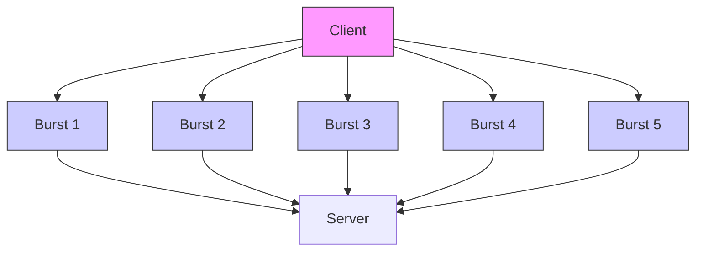
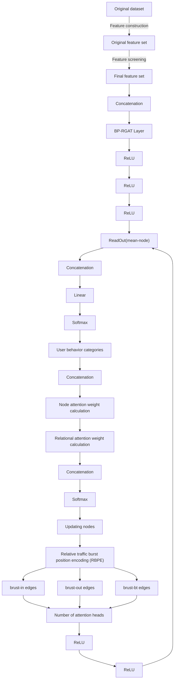
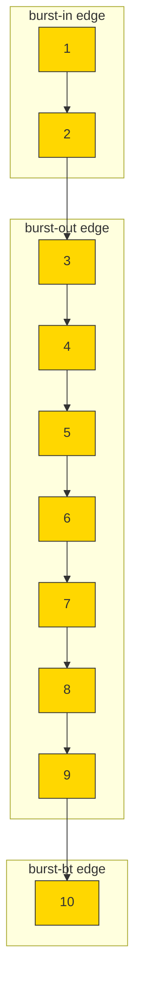

# Traffic burst relational graph attention network combined position encoding for traffic classification

Xi Xiao a,b,c,d, Zeming Wu a, Siji Chen a,b,c,d, Guangwu Hu e,∗, Le Yu f, Qing Li b, Hao Li d, Qingjun Yuan c

a Shenzhen International Graduate School, Tsinghua University, Shenzhen, 518055, China   
b Peng Cheng Laboratory, Shenzhen, 518055, China   
c State Key Laboratory of Internet Architecture, Tsinghua University, Beijing, 100084, China   
d National Key Laboratory of Advanced Communication Network, Shijiazhuang, 050000, China   
e School of Computer and Software, Shenzhen University of Information Technology, Shenzhen, 518172, China   
f School of Computer Science, Nanjing University of Posts and Telecommunications, Nanjing, 210003, China

# a r t i c l e i n f o

Keywords:

Traffic classification

Traffic burst graph

Relative traffic burst position encoding

Graph neural networks

# a b s t r a c t

Traffic classification has become an essential technology for information service providers. Existing methods use relational graph attention networks for traffic classification. However, they ignore the interaction information brought by traffic bursts in traffic sequences and the relational information between traffic bursts. As a result, these approaches often exhibit low precision and recall performance. To overcome the limitations of existing methods, we design a new burst position relational graph attention network (BP-RGAT) for traffic classification. We introduce the Heterogeneous Traffic Burst Graph (HTBG) to obtain more traffic interaction information. We also incorporate Relative Traffic Burst Position Encoding (RBPE) to capture sequence information between bursts. To evaluate the performance of BP-RGAT, we conduct experiments with four public datasets (i.e. ISCX-VPN2016, USTC-TFC2016, DADABox and CTU-13). The results show that BP-RGAT achieves the best accuracy across all datasets and strong overall performance across precision, recall, and F1 score compared to existing baseline methods.

# 1. Introduction

Traffic classification technology is a pivotal tool for information service providers, contributing to Quality of Service, network measurement, and network monitoring. Previous researchers (i.e. GDA[1], BehavSniffer[2]) have leveraged traffic isomorphic graphs for network traffic classification. Their research suggests that the use of graph structures can effectively extract structural information about the network flow transmission. However, approaches using isomorphic graphs face challenges in effectively learning weight information for distinct node or edge types. For example, some edges between traffic packets arise due to network protocols that require information to be transmitted in fragments, whereas some other edges reflect the communication between a user and a server.

To tackle the challenges mentioned above and detect user behavior from encrypted traffic, we design a novel traffic classification model, i.e., Burst Position Relational Graph Attention Network (BP-RGAT). To extract hidden bidirectional flow features in traffic sequences, we design a novel Heterogeneous Traffic Burst Graph (HTBG) that surpasses conventional isomorphic graphs and transfers personalized weights through its multiple edge types. In addition, we employ a Relational Graph Attention Network (RGAT [3]) to capture traditional traffic sequence information and also identify diverse relational attributes between traffic bursts depending on the types of edges in the graph. However, heterogeneous graph methods cannot effectively acquire the traffic sequence information, since they lack efficient means of capturing comprehensive position information for nodes and edges throughout the graph. Thus, we propose an innovative technique in the form of Relative Traffic Burst Position Encoding (RBPE) within HTBG to extract more accurate positional relation information between nodes in the graph.

To validate the performance of BP-RGAT, we conduct experiments based on three well-known public datasets for traffic classification (i.e., ISCX- VPN2016 [4], USTC-TFC2016 [5] and DADABox [6]) and a recent dataset (i.e., CTU-13 [7]). The results show that 1) BP-RGAT achieves the best performance in all scenarios; 2) RBPE can improve the position awareness of the nodes in the graph. In summary, the contributions of the paper can be concluded as follows.


<details>
<summary>flowchart</summary>


</details>

Fig. 1. Data interaction process of a user behavior flow. Same colors indicate packets within the same burst.

• To the best of our knowledge, we are the first to apply HTBG as a comprehensive framework for accurate traffic flow classification. HTBG can identify three types of burst edges that describe different information transmission behaviors, enhancing the ability of capturing complex burst relation information in traffic sequences.   
• Since isomorphic graph methods fail to capture temporal and sequential information in traffic burst graphs, we introduce two key innovations: (1) a novel Relative Traffic Burst Position Encoding (RBPE) method that extracts more precise burst position features for nodes based on different edge types; (2) the BP-RGAT model, which leverages HTBG, RBPE, and the Relational Graph Attention Network (RGAT) to capture complex relational features between traffic bursts.   
• We conduct extensive experiments to evaluate the performance of our BP-RGAT model. Experiments based on four public datasets show that BP-RGAT achieves the highest accuracy on all datasets and outperforms several strong baseline methods in F1 score with improvements up to 2.3%.

The rest of the paper is organized as follows: Section II provides background knowledge relevant to the study. Section III outlines the details of the proposed methodology. Section IV presents the experimental results, demonstrating the effectiveness of our approach. Section V reviews related work in the field. Finally, Sections VI and VII offer a discussion of the findings and a conclusion, respectively.

# 2. Background

To facilitate comprehension of our model, we introduce several key terminologies prior to delving into its intricacies. This paper is to classify traffic flows, and one flow corresponds to one user behavior. A traffic flow refers to a series of packets that share the same five-tuple (source and destination IP addresses, source and destination port numbers, and protocol type). Typically, traffic flows have two directions, one from the client to the server and the other from the server to the client, and we focus on unidirectional traffic flows.

A series of data packet sequences continuously sent in the same direction is referred to as a traffic burst. For example, the packet sequence in Fig. 1 could be divided into five bursts according to the direction of transmission of the data packet. In this paper, we use traffic flow and traffic burst information to generate an HTBG as the input of our model.

Different from an isomorphic graph with only one type of node or edge, a heterogeneous graph refers to a graph with multiple types of nodes or edges. The HTBG proposed in this paper is a heterogeneous graph constructed based on traffic bursts and three edge types.


<details>
<summary>flowchart</summary>

```mermaid
graph TD
    subgraph Client
        A1["Yellow Circle"] --> B1["Blue Circle"]
        A2["Yellow Circle"] --> B2["Blue Circle"]
        A3["Yellow Circle"] --> B3["Blue Circle"]
        A4["Yellow Circle"] --> B4["Blue Circle"]
        A5["Yellow Circle"] --> B5["Blue Circle"]
        A6["Yellow Circle"] --> B6["Blue Circle"]
    end
    subgraph Server
        C1["Blue Circle"] --> D1["Blue Circle"]
        C2["Blue Circle"] --> D2["Blue Circle"]
        C3["Blue Circle"] --> D3["Blue Circle"]
        C4["Blue Circle"] --> D4["Blue Circle"]
        C5["Blue Circle"] --> D5["Blue Circle"]
    end
    A1 --> B1
    A2 --> B2
    A3 --> B3
    A4 --> B4
    A5 --> B5
    A6 --> B6
    A7 --> B7
    A8 --> B8
    A9 --> B9
    A1 --> B1
    A2 --> B2
    A3 --> B3
    A4 --> B4
    A5 --> B5
    A6 --> B6
    A7 --> B7
    A8 --> B8
    A9 --> B9
    A1 --> B1
    A2 --> B2
    A3 --> B3
    A4 --> B4
    A5 --> B5
        B1 --> C1
        B2 --> C2
        B3 --> C3
        B4 --> C4
        B5 --> C5
        B6 --> C6
        B7 --> C7
        B8 --> C8
        B9 --> C9
    end
```
</details>

Fig. 2. The HTBG for the traffic flow sequence.

These edge types represent different information transmission behaviors. For instance, edges within a burst may reflect the protocol requirement that necessitates the fragmentation of data, while bidirectional burst edges could indicate communication between a user and a server. Similarly, unidirectional burst edges may represent relationships between information on the user side. Fig. 2 illustrates the corresponding HTBG construction for the same traffic flow shown in Fig. 1. As depicted in Fig. 2, there are three types of edges:

\- Burst-in (black): These edges are between every two consecutive data packets within the same burst. They can capture the sending order information of the original traffic sequence, and are key properties for constructing the traffic shape.

\- Burst-out (green): These edges are between the first (last) data packet in the current burst and the first (last) data packet in the adjacent burst in the opposite direction. They can connect the sending and responding process of the client and server into a closed loop so that RGAT can learn the hidden interaction features of both parties.

\- Burst-bt (red): These edges are between the last data packet in the current burst and the first data packet in the adjacent burst in the same direction. They can link the data packets belonging to the same data source and capture the sending habits of the data sender, which is an important property for determining traffic attribution.

# 3. Methodology

Existing studies have shown that graph structures can effectively capture the structural characteristics of network traffic information transmission. However, methods based on isomorphic graphs struggle to learn meaningful weight information for different types of nodes or edges. To address this issue, the BP-RGAT model takes Heterogeneous Traffic Burst Graphs (HTBG) as its input and incorporates Relational Traffic Burst Position Encoding (RBPE) during edge weight updating. The classification model is composed of two RGAT layers. In this section, we discuss the details of the innovative technique.

# 3.1. BP-RGAT overview

As Fig. 3 illustrates, BP-RGAT consists of two stages in total: the data preprocessing stage and the model classification stage. In the data preprocessing stage, the original traffic data is used to generate the original feature set and HTBG after feature engineering processing. In the model classification stage, HTBG is fed into the two-layer BP-RGAT, which ultimately outputs the result of the user behavior traffic classification. In this section, we will introduce the construction method of HTBG in BP-RGAT and the feature extraction of traffic sequences. Finally, the design of RBPE and the feature update process of graph nodes in the BP-RGAT layer are introduced.


<details>
<summary>flowchart</summary>


</details>

Fig. 3. The proposed BP-RGAT architecture.

# 3.2. HTBG construction

The HTBG is built through a systematic procedure, which involves the following steps:

Burst Division: In order to divide the traffic flow data generated by user behavior into traffic bursts, it is first necessary to divide the traffic sequences into flow forms according to the above definition of flow. Then, the direction of each data packet in a flow needs to be determined. We define the direction from the server to the client as the positive direction and the direction from the client to the server as the negative direction. According to the above definition of traffic burst, we can divide the traffic flow sequence into multiple traffic bursts.

As shown in Fig. 1, we observe the occurrence of five distinct bursts in a traffic flow. Then, we arrange the data packets according to the transmission order of the traffic data and place them in the upper and lower lines, respectively, according to the direction of data packets, so as to facilitate the subsequent description of the connection of different burst edge types. The construction of HTBG from the aforementioned burst set is depicted in Fig. 2, wherein diverse colors are employed to distinguish packets belonging to bursts of two different directions.

Create Vertices and Connect Edges: The vertices of HTBG are composed of individual packets in the sequence of user data flows. Node features represent the header and payload of a packet with packet length embedding. Specifically, the packet length is embedded into the same dimension as the concatenated header and payload features, and then the embedding is summed to form the final node representation. Meanwhile, source and destination information from the burst division define the types and numbers of edges. We use three types of edges based on the heterogeneous burst traffic graph to capture the sequence information among burst traffic between two data packet nodes.

# 3.3. Feature extraction

Since BP-RGAT classifies graphs rather than nodes, we employ the statistical features of the network flow to complement the user behavior identification task. Therefore, we use the most representative traffic classification features[8–13] as the original feature set, and after the feature screening, it is added to the graph representation in the graph prediction layer before the final linear layer to obtain the traffic side channel feature properties.

# 3.3.1. Original feature set

We adopt the following features to construct the original feature set:

• General statistical features of the flow, including cumulative length, minimum packet length, and number of packets.   
• Hop count.   
• Quartile value of the flow.   
• Forward-backward difference.   
• Length of the longest monotone continuous subsequences.   
• Percentage of packet lengths within the ?? same-size range.

In total, we obtain a 45-dimensional original feature set, which is list in Table 1. The selected features predominantly capture flow size distributions, bidirectional traffic patterns, and temporal characteristics that are critical for distinguishing network flows.

# 3.3.2. Feature screening

In this paper, the importance ranking of features is used for feature screening. To calculate the importance score for each feature in the feature matrix, we utilize Gini importance. Any features with an importance score below 0.010% are subsequently filtered out.

Table 1 Statistical features used in BP-RGAT. 

<table><tr><td>Feature Category</td><td>Feature Names</td></tr><tr><td>Flow Statistics</td><td>Packet count, cumulative size, minimum length, maximum length, mean length, standard deviation</td></tr><tr><td>Bidirectional Statistics</td><td>Forward: packet count, cumulative size, min/max/mean/std lengths; Backward: packet count, cumulative size, min/max/mean/std lengths</td></tr><tr><td>Distribution Features</td><td>25th/50th/75th percentiles, kurtosis, skewness, 10 distribution bins (B1-B10)</td></tr><tr><td>Variance Measures</td><td>Variance measures around 25th percentile (Var11, Var12), 50th percentile (Var21, Var22), 75th percentile (Var31, Var32)</td></tr><tr><td>Sequential Patterns</td><td>Longest monotonic increasing/decreasing subsequences, hopping counts, 5 most frequent fixed-size subsequences (Seq1-Seq5)</td></tr></table>


<details>
<summary>flowchart</summary>


</details>

Fig. 4. HTBG based on the arrangement of the original traffic flow sequence.

# 3.4. Relative traffic burst position encoding

To extract temporal and sequential information of traffic bursts, We propose Relational Traffic Burst Position Encoding (RBPE) and combine it within RGAT. RBPE is designed based on the relation types between traffic bursts. Traffic bursts can usually indicate sequential information, such as the sending sequence and frequency of the message source. Therefore, mining the position information between traffic bursts in the same direction and between traffic bursts in different directions can capture the sequential characteristics of the traffic sequence well.

We flatten the HTBG in Fig. 2 into the original one-dimensional traffic flow sequence shape, and mark their absolute positions in the original traffic flow sequence with serial numbers, as shown in Fig. 4. In order to obtain the unique position feature of the three edge types in HTBG, we need to associate traffic burst information and traffic sequence information with different edge types. By observing Fig. 4, we notice that the number of burst-in edges for a single node ranges from 0 to 2; the number of burst-out edges ranges from 0 to 4; and the number of burst-bt edges ranges from 0 to 2. Therefore, for burst-in and burst-bt edges, we simply assign position encoding values of +1 and -1 to represent the temporal sequence. Thus, the representation of RBPE for node ?? is defined as follows. For edges indicating burst-in or burst-bt from node ?? to node $j ,$ the formulation is

$$
P o s (j \mid i) = \left\{ \begin{array}{l l} 1 & \text {   if   } j <   i \\ - 1 & \text {   if   } j > i \end{array} \right. \tag {1}
$$

Whereas, the burst-out edges represent the connection between two bursts. In cases where multiple packets are present in both bursts, the number of burst-out edges for each packet node ranges from 0 to 2. For such cases, we also choose to assign position encoding values of +1 and -1 to represent the temporal sequence. However, when either burst contains only a single packet, the number of burst-out edges for a packet node ranges from 0 to 4. In this scenario, we assign position encoding values of $^ { - 1 , ~ - 2 , ~ + 1 }$ , and +2 based on the sequence within the bursts and the temporal order of the two bursts. In the end, for edges of the burst-out type from node ?? to node ??, the formulation is

$$
\operatorname{Pos} (j \mid i) = \left\{ \begin{array}{l l} 1 & i f \quad j = i + 1 \\ 2 & i f \quad j > i + 1 \\ - 2 & i f \quad j <   i - 1 \\ - 1 & i f \quad j = i - 1 \end{array} \right. \tag {2}
$$

Table 2 Example of RBPE burst-out edges calculations for Node 6. 

<table><tr><td>#Node</td><td>node 3</td><td>node 5</td><td>node 6</td><td>node 7</td><td>node 8</td></tr><tr><td>Absolute position</td><td>3</td><td>5</td><td>6</td><td>7</td><td>8</td></tr><tr><td>Relative position</td><td>-3</td><td>-1</td><td>0</td><td>1</td><td>2</td></tr><tr><td>Relative burst Position</td><td>-2</td><td>-1</td><td>0</td><td>1</td><td>2</td></tr></table>

where ?? ????(??|??) symbolizes the relative traffic burst position encoding of node ?? to node ??. Burst-out edges only occur between adjacent bursts in the heterogeneous traffic graph, we can encode four types of burst-out edges based on the relative positions of nodes ?? and ??. Each burst-out edge connects nodes from consecutive bursts, while the numbers represent relative positions and the signs indicate directional relationships. Specifically, for burst-out edges connecting adjacent bursts, we encode the relative positions through a two-step process: First, we calculate the position difference between connected nodes. Second, we map this difference to four discrete values based on proximity and direction: immediate forward neighbors $( j = i + 1 )$ receive +1, distant forward nodes $( j > i + 1 )$ receive +2, immediate backward neighbors $( j = i - 1 )$ receive −1, and distant backward nodes $( j < i - 1 )$ receive −2. This encoding scheme captures both the sequential order and the relative distance between connected nodes across burst boundaries.

Taking node 6 in Fig 4 as an example, an illustration of our encoding is shown in Table 2. It can be seen that both absolute and relative positional coding encode the order of the flow sequence. However, the proposed RBPE contains the positional and temporal characteristics of a packet related to the traffic burst. Such an encoding method can extract the relative location information of traffic sequences and traffic bursts.

Finally, the generated position encoding is concatenated with the edge weight, so the position information will be added to the edge weight. The fusion process will be described in detail in Section 3.5.

# 3.5. User behavior traffic classification

When calculating the relational features in RGAT, we concatenate the node embedding with the RBPE, then calculate the similarity between the neighbor and self embeddings:

$$
a _ {i j} ^ {l d} = \operatorname{att} \left(W ^ {l d} h _ {i} ^ {l} + \hat {W} ^ {l d} \operatorname{Pos} (j | i), W ^ {l d} h _ {j} ^ {l} + \hat {W} ^ {l d} \operatorname{Pos} (i | j)\right) \tag {3}
$$

Table 3 Hyper-parameter of BP-RGAT. 

<table><tr><td>Hyper-Parameter</td><td>Select And Use</td></tr><tr><td>Number of Network Layers</td><td>2</td></tr><tr><td>Hidden Units</td><td>128</td></tr><tr><td>Batch Size</td><td>32</td></tr><tr><td>Optimizer</td><td>Adam</td></tr><tr><td>Learning Rate</td><td>0.001</td></tr><tr><td>Epochs</td><td>50</td></tr><tr><td>Activation Function</td><td>LeakyReLU</td></tr><tr><td>Dropout</td><td>0.5</td></tr><tr><td>Number of Attention Heads</td><td>8</td></tr><tr><td>Graph Representation</td><td>mean_nodes</td></tr></table>

and obtain the attention coefficient for later node integration:

$$
\alpha_ {i j} ^ {l d} = \frac {\exp \left(\text {LeakyReLU} (a _ {i j} ^ {l d})\right)}{\sum_ {j = 1} ^ {\mathcal {N} (i)} \exp ((\text {LeakyReLU} (a _ {i j} ^ {l d})))} \tag {4}
$$

where $h _ { i } ^ { l }$ is the hidden feature of node ?? at layer $l , \mathcal { N } ( i )$ represents the neighboring nodes of node $i ,$ ?? represents the index of the attention head, $W ^ { l }$ and $\hat { W } ^ { l }$ are transformation matrices for node and edge embeddings, $\left\| { \boldsymbol { D } } _ { d = 1 } \right.$ denotes the concatenation operation and D is the number of attention heads, ?????? is a single-layer feedforward neural network, as used in GAT [14].

After obtaining the attention coefficient $\alpha _ { i j } ^ { l d }$ , a weighted sum operation is required to be performed on the features, including concatenation of features from different attention heads and summation of features from different edge types. Therefore, the given attention feature update formula is as shown below:

$$
h _ {i} ^ {l + 1} = \left\| _ {d = 1} ^ {D} \sum_ {j \in \mathcal {N} (i)} \alpha_ {i j} ^ {l d} W ^ {l d} h _ {j} ^ {l} \right. \tag {5}
$$

Finally, after the output node features go through a non-linear activation function, we use the ????????\_?????????? node aggregation strategy in the ?????????????? function, which takes the average of the node features across the entire graph as the feature for the current graph. After obtaining the graph feature representation, the feature set obtained in Section 3.3 is concatenated with the graph feature in the graph prediction layer to obtain the final feature tensor for classification. Then, this feature tensor is passed through a linear mapping and an activation function to complete the user behavior classification task. The final classification process can be expressed using the following formula:

$$
h _ {g} = H _ {\text { flow }} \| \operatorname{ReadOut} (h _ {i} ^ {\text { final }} | i \in G) \tag {6}
$$

where ${ H } _ { f l o w }$ represents the traffic flow feature set and ?? represents the set of nodes in a HTBG. So $\operatorname { f a r } ,$ the BP-RGAT model has completed the user behavior traffic classification task.

# 4. Experimental results

In this section, we conduct the experiments by using four public datasets to compare BP-RGAT with other baseline methods. Afterward, the ablation test of RBPE is also carried out to demonstrate its ability to perceive the position of nodes in the traffic burst graph

# 4.1. Experiment setup

We show the hyperparameters used in the experiments in Table 3. For the baseline models, we tune the parameters to achieve optimal performance. Our models are implemented using PyTorch and each experiment was run on a single NVIDIA RTX 3080 GPU. To ensure a fair comparison, we utilize four evaluation metrics: Overall Accuracy (Acc), Macro Precision (Pre), Macro Recall (Rec), and Macro F1-score (F1). Each result is based on experiments that were repeated ten times. Finally, for all datasets, we use random sampling to divide the data into training and testing sets at a ratio of 9:1.

Table 4 ISCX-VPN and ISCX-NonVPN dataset. 

<table><tr><td>Label</td><td>Application</td><td># Flows(VPN/NonVPN)</td><td>Total</td></tr><tr><td rowspan="6">Chat</td><td>Aimchat (both)</td><td>32/53</td><td>4029/2650</td></tr><tr><td>Facebook (both)</td><td>1159/96</td><td></td></tr><tr><td>Hangouts (both)</td><td>2751/83</td><td></td></tr><tr><td>ICQ (both)</td><td>31/49</td><td></td></tr><tr><td>Skype (both)</td><td>56/2264</td><td></td></tr><tr><td>Gmail (Non)</td><td>0/105</td><td></td></tr><tr><td>Email</td><td>Email (both)</td><td>298/1727</td><td>298/1727</td></tr><tr><td rowspan="4">File</td><td>FTPS (both)</td><td>125/746</td><td>1020/7046</td></tr><tr><td>SFTP (both)</td><td>28/110</td><td></td></tr><tr><td>Skype (both)</td><td>867/4415</td><td></td></tr><tr><td>SCP (Non)</td><td>0/1775</td><td></td></tr><tr><td rowspan="2">Streaming</td><td>Vimeo (both)</td><td>136/288</td><td>349/769</td></tr><tr><td>Youtube (both)</td><td>213/481</td><td></td></tr><tr><td>P2P</td><td>Torrent (Vpn)</td><td>477/0</td><td>477/0</td></tr><tr><td rowspan="3">VoIP</td><td>Facebook (both)</td><td>1335/6025</td><td>5419/15403</td></tr><tr><td>Hangouts (both)</td><td>3172/5501</td><td></td></tr><tr><td>Skype (both)</td><td>912/3877</td><td></td></tr><tr><td rowspan="3">Browsing</td><td>Netflix (both)</td><td>173/280</td><td>1928/1576</td></tr><tr><td>Spotify (both)</td><td>137/147</td><td></td></tr><tr><td>Voipbuster (both)</td><td>1618/1149</td><td></td></tr></table>

The following baseline methods are selected for comparison.

Deep learning methods and improved traditional machine learning methods: Multi-View Multi-Label (MVML)[10], Fast Application Activity Recognition (FAAR)[15], Fusion Feature Based (FFB) model[16], Extensive Digital Context (EDC) model[17], Granular multi-label encrypted traffic classification model using classifier chain (Grain)[18], AppScanner[19], ETC-PS[20], K fingerprinting (K-FP)[21], Conti[22], SBLT[23]. This kind of method adopts novel side channel information and suitable machine learning methods, which is the leading force in traffic classification research.

Pre-trained model methods: ET-BERT[24], is a pre-trained model that can pre-train contextual representations from large-scale unlabeled data. NetMamba[25], is also a pre-trained model which is based on a unidirectional Mamba architecture. TrafficFormer[26] shares similar training process and model architecture with ET-BERT and designs new pre-training tasks.

Graph network algorithm: GraphDApp (GDA)[1] proposed a traffic classification model that combines traffic interaction graphs with Graph Isomorphism Network. BehavSniffer[2] utilizes burst traffic graphs and side channel information to classify traffic. TFE-GNN[27] mines the byte-level information of encrypted traffic for traffic identification.

# 4.2. Performance

To evaluate the effectiveness of our proposed method, we conduct comprehensive experiments on four widely used datasets: ISCX-VPN201 $^ { 6 , }$ USTC-TFC201 $^ { 6 , }$ DADABox and CTU-13. These datasets represent different network traffic scenarios and provide diverse challenges for traffic classification. The following subsections present detailed results for each dataset.

# 4.2.1. Evaluation on ISCX-VPN2016 dataset

We choose the public dataset ISCX-VPN2016[4] to test the performance of BP-RGAT. This dataset is widely used in the field of traffic classification, and the experimental results have high reference value. The dataset is divided into two parts, ISCX-VPN and ISCX-NonVPN, which represent VPN traffic and non-VPN traffic, respectively. In this experiment, a subset of the dataset is extracted by removing files with a high frequency of abnormal packet lengths. On this subset, we conduct comparative experiments using BP-RGAT and other baseline methods. The basic data attributes of the ISCX-VPN2016 dataset are shown in Table 4, and the experimental results are shown in Table 5.

Table 5 Evaluation results on ISCX-VPN2016 dataset. 

<table><tr><td rowspan="2">DatasetMethod/Criteria</td><td colspan="4">ISCX-VPN (Service)</td><td colspan="4">ISCX-NonVPN (Service)</td></tr><tr><td>Acc.</td><td>Pre.</td><td>Rec.</td><td>F1</td><td>Acc.</td><td>Pre.</td><td>Rec.</td><td>F1</td></tr><tr><td>MVML[10]</td><td>0.670</td><td>0.743</td><td>0.633</td><td>0.652</td><td>0.587</td><td>0.496</td><td>0.485</td><td>0.480</td></tr><tr><td>FAAR[15]</td><td>0.866</td><td>0.894</td><td>0.859</td><td>0.871</td><td>0.709</td><td>0.754</td><td>0.698</td><td>0.720</td></tr><tr><td>EDC[17]</td><td>0.818</td><td>0.817</td><td>0.799</td><td>0.804</td><td>0.667</td><td>0.662</td><td>0.634</td><td>0.637</td></tr><tr><td>GRAIN[18]</td><td>0.796</td><td>0.816</td><td>0.792</td><td>0.799</td><td>0.511</td><td>0.545</td><td>0.568</td><td>0.534</td></tr><tr><td>AppScanner[19]</td><td>0.864</td><td>0.869</td><td>0.851</td><td>0.860</td><td>0.790</td><td>0.775</td><td>0.774</td><td>0.768</td></tr><tr><td>ETC-PS[20]</td><td>0.869</td><td>0.881</td><td>0.869</td><td>0.871</td><td>0.755</td><td>0.742</td><td>0.741</td><td>0.740</td></tr><tr><td>K-FP[21]</td><td>0.881</td><td>0.881</td><td>0.854</td><td>0.864</td><td>0.710</td><td>0.704</td><td>0.690</td><td>0.695</td></tr><tr><td>Conti[22]</td><td>0.727</td><td>0.816</td><td>0.727</td><td>0.732</td><td>0.636</td><td>0.623</td><td>0.636</td><td>0.618</td></tr><tr><td>SBLT[23]</td><td>0.868</td><td>0.844</td><td>0.806</td><td>0.819</td><td>0.799</td><td>0.828</td><td>0.814</td><td>0.820</td></tr><tr><td>FFB[16]</td><td>0.795</td><td>0.824</td><td>0.754</td><td>0.771</td><td>0.671</td><td>0.674</td><td>0.608</td><td>0.619</td></tr><tr><td>TrafficFormer[26]</td><td>0.957</td><td>0.962</td><td>0.945</td><td>0.958</td><td>0.793</td><td>0.754</td><td>0.704</td><td>0.712</td></tr><tr><td>ET-BERT[24]</td><td>0.981</td><td>0.982</td><td>0.969</td><td>0.974</td><td>0.882</td><td>0.876</td><td>0.887</td><td>0.881</td></tr><tr><td>NetMamba[25]</td><td>0.969</td><td>0.969</td><td>0.969</td><td>0.969</td><td>0.965</td><td>0.966</td><td>0.965</td><td>0.965</td></tr><tr><td>GDA[1]</td><td>0.778</td><td>0.816</td><td>0.755</td><td>0.767</td><td>0.699</td><td>0.698</td><td>0.681</td><td>0.683</td></tr><tr><td>BehavSniffer[2]</td><td>0.983</td><td>0.982</td><td>0.981</td><td>0.981</td><td>0.960</td><td>0.953</td><td>0.942</td><td>0.947</td></tr><tr><td>TFE-GNN[27]</td><td>0.962</td><td>0.957</td><td>0.962</td><td>0.958</td><td>0.923</td><td>0.940</td><td>0.919</td><td>0.931</td></tr><tr><td>BP-RGAT</td><td>0.994</td><td>0.993</td><td>0.992</td><td>0.992</td><td>0.991</td><td>0.988</td><td>0.989</td><td>0.988</td></tr></table>

The ISCX-VPN2016 dataset is extensively utilized, making evaluations conducted on this dataset the most equitable. It is evident that BP-RGAT has achieved the best scoring results. Despite BehavSniffer achieving an F1 score of 0.981 on the ISCX-VPN dataset and NetMamba achieving an F1 score of 0.965 on the ISCX-NonVPN dataset, BP-RGAT still outperforms them by 1.1% and 2.3%, respectively, reaching F1 scores of 0.992 and 0.988. It should be noted that BehavSniffer utilizes a similar burst traffic graph but ignores the relational information between bursts. However, our method brings burst relation and node attention into the model, leading to better performance. Traditional machine learning approaches, such as AppScanner, have also employed statistical information like flow counts, achieving peak accuracies of 0.881 and 0.790. However, these methods do not take into account the structural information within the flows. In contrast, our method leverages graph neural networks to capture the structural information of flows, thereby enhancing performance. Our graph structure utilizes payload, header, and packet length embedding for node feature representation. Compared to FFB, ET-BERT, TrafficFormer, NetMamba and TFE-GNN, some of which require pre-training, some use bytes for node feature representation, and others neglect the edge information between bursts in a heterogeneous graph, our approach provides more accurate identification of flows, with improved efficiency and enhanced performance(detailed in Section 4.5).

# 4.2.2. Evaluation on USTC-TFC2016 dataset

In order to test the generalization of BP-RGAT in different types of traffic classification tasks, we further use the USTC-TFC2016 dataset[5] to test the model performance of BP-RGAT and other benchmark methods in this subsection. The USTC-TFC2016 dataset is a well-known malware dataset released by the Cyberspace Security Laboratory of the University of Science and Technology of China. This dataset is also widely used in traffic classification research. It includes the normal traffic category and the malicious traffic category, and there are ten application types in each of the two categories. Table 6 describes the basic situation of the dataset, and the experimental results are shown in Table 7.

The USTC-TFC dataset encompasses a more extensive volume of data and a richer set of labels, rendering the performance on this dataset indicative of the model’s adaptability and robustness in handling multi-classification tasks. It can be seen that BP-RGAT outperforms all baselines on each criterion, especially the ET-BERT model based on the Bidirectional Transformer and the BehavSniffer model based on traffic burst graphs. ET-BERT considered the position information in the input sequence and could well understand the semantics and context information of the entire input sequence. It also used an attention mechanism to solve the problem of long dependencies in the sequence. BehavSniffer utilized traffic burst information to construct traffic flow graphs, but only considered isomorphic graph structure and ignored the positional and temporal information of packets in flows. BP-RGAT utilizes analogous techniques, delving deeply into the data. Consequently, the position encoding devised by BP-RGAT, coupled with its adept attention capture of heterogeneous traffic bursts, forms a superior feature combination. This illustrates that the graph attention structure and the relative position burst encoding we have introduced enhance the expressive power of the data, thereby enabling the model to adeptly handle multiclassification tasks.

Table 6 USTC-TFC2016 dataset. 

<table><tr><td colspan="5">Benign</td></tr><tr><td>#</td><td>Application</td><td>Size</td><td>#Flow</td><td>#Packet</td></tr><tr><td>1</td><td>Cridex</td><td>94.7MB</td><td>16,386</td><td>461548</td></tr><tr><td>2</td><td>Geodo</td><td>28.8MB</td><td>40,947</td><td>250,000</td></tr><tr><td>3</td><td>Htbot</td><td>83.6MB</td><td>6367</td><td>171,569</td></tr><tr><td>4</td><td>Miuref</td><td>16.3MB</td><td>13,481</td><td>88,560</td></tr><tr><td>5</td><td>Neirs</td><td>90.1MB</td><td>33,791</td><td>499,218</td></tr><tr><td>6</td><td>Nsisay</td><td>281MB</td><td>6069</td><td>352,266</td></tr><tr><td>7</td><td>Shifu</td><td>57.9MB</td><td>9364</td><td>500,000</td></tr><tr><td>8</td><td>Tinba</td><td>2.55MB</td><td>8504</td><td>22,000</td></tr><tr><td>9</td><td>Virut</td><td>109MB</td><td>33,103</td><td>440,625</td></tr><tr><td>10</td><td>Zeus</td><td>13.4MB</td><td>10,970</td><td>93,141</td></tr></table>

<table><tr><td colspan="5">Malware</td></tr><tr><td>#</td><td>Application</td><td>Size</td><td>#Flow</td><td>#Packet</td></tr><tr><td>11</td><td>BitTorrent</td><td>7.33MB</td><td>7517</td><td>15,000</td></tr><tr><td>12</td><td>Facetime</td><td>2.40MB</td><td>6000</td><td>6000</td></tr><tr><td>13</td><td>FTP</td><td>60.2MB</td><td>101,037</td><td>360,000</td></tr><tr><td>14</td><td>Gmail</td><td>9.05MB</td><td>8629</td><td>25,000</td></tr><tr><td>15</td><td>MySQL</td><td>22.3MB</td><td>86,089</td><td>200,000</td></tr><tr><td>16</td><td>Outlook</td><td>11.1MB</td><td>7524</td><td>15,000</td></tr><tr><td>17</td><td>Skype</td><td>4.22MB</td><td>6321</td><td>12,000</td></tr><tr><td>18</td><td>SMB</td><td>1.21GB</td><td>38,937</td><td>925,453</td></tr><tr><td>19</td><td>Weibo</td><td>1.61GB</td><td>39,950</td><td>1,210,060</td></tr><tr><td>20</td><td>WorldOfWarcraft</td><td>14.9MB</td><td>7883</td><td>140,000</td></tr></table>

Table 7 Evaluation results on USTC-TFC2016 dataset. 

<table><tr><td>Method/Criteria</td><td>Acc.</td><td>Pre.</td><td>Rec.</td><td>F1</td></tr><tr><td>MVML[10]</td><td>0.762</td><td>0.734</td><td>0.750</td><td>0.742</td></tr><tr><td>FAAR[15]</td><td>0.695</td><td>0.688</td><td>0.712</td><td>0.700</td></tr><tr><td>EDC[17]</td><td>0.829</td><td>0.831</td><td>0.842</td><td>0.836</td></tr><tr><td>GRAIN[18]</td><td>0.823</td><td>0.811</td><td>0.798</td><td>0.804</td></tr><tr><td>AppScanner[19]</td><td>0.699</td><td>0.681</td><td>0.697</td><td>0.689</td></tr><tr><td>ETC-PS[20]</td><td>0.675</td><td>0.674</td><td>0.677</td><td>0.675</td></tr><tr><td>K-FP[21]</td><td>0.717</td><td>0.708</td><td>0.733</td><td>0.720</td></tr><tr><td>Conti[22]</td><td>0.802</td><td>0.787</td><td>0.809</td><td>0.798</td></tr><tr><td>SBLT[23]</td><td>0.910</td><td>0.923</td><td>0.916</td><td>0.915</td></tr><tr><td>FFB[16]</td><td>0.604</td><td>0.582</td><td>0.609</td><td>0.595</td></tr><tr><td>TrafficFormer[26]</td><td>0.982</td><td>0.984</td><td>0.983</td><td>0.983</td></tr><tr><td>ET-BERT[24]</td><td>0.990</td><td>0.990</td><td>0.989</td><td>0.990</td></tr><tr><td>NetMamba[25]</td><td>0.987</td><td>0.987</td><td>0.987</td><td>0.987</td></tr><tr><td>GDA[1]</td><td>0.759</td><td>0.766</td><td>0.755</td><td>0.760</td></tr><tr><td>BehavSniffer[2]</td><td>0.957</td><td>0.950</td><td>0.952</td><td>0.956</td></tr><tr><td>TFE-GNN[27]</td><td>0.974</td><td>0.975</td><td>0.975</td><td>0.974</td></tr><tr><td>BP-RGAT</td><td>0.992</td><td>0.994</td><td>0.993</td><td>0.994</td></tr></table>

# 4.2.3. Evaluation on DADABox dataset

To evaluate real-world situations, we test our method of identifying the types of devices in the IoT network. The DADABox dataset[6] has 41 different IoT devices and was collected over a period of 27 weeks. During this period, the IoT devices were mostly idle, and only some had been occasionally activated. Those devices’ traffic is filtered by MAC address and belongs to 6 categories: Hub, Surveillance, Home Automation, Media, Audio, and Appliance. Details are shown in Table 8, and the experimental results can be found in Table 9.

Table 8 DADABox dataset. 

<table><tr><td>Label</td><td>Device</td><td># Flows</td><td>Total</td></tr><tr><td rowspan="7">Hub</td><td>Insteon hub</td><td>13,897</td><td>3633271</td></tr><tr><td>Lightify Hub</td><td>2249</td><td></td></tr><tr><td>Philips hub</td><td>2,822,660</td><td></td></tr><tr><td>Smartthings hub</td><td>692,186</td><td></td></tr><tr><td>Xiaomi hub</td><td>40,531</td><td></td></tr><tr><td>Switchbot hub</td><td>20,641</td><td></td></tr><tr><td>Blink security hub</td><td>41,107</td><td></td></tr><tr><td rowspan="10">Surveillance</td><td>Blink camera</td><td>3403</td><td>7038772</td></tr><tr><td>Bosiwo camera</td><td>123,409</td><td></td></tr><tr><td>D-link camera</td><td>1,668,605</td><td></td></tr><tr><td>Reolink camera</td><td>10,152</td><td></td></tr><tr><td>Ring doorbell</td><td>6923</td><td></td></tr><tr><td>UBell doorbell</td><td>82,273</td><td></td></tr><tr><td>Wansview camera</td><td>4,924,400</td><td></td></tr><tr><td>Yi camera</td><td>120,438</td><td></td></tr><tr><td>LeFun camera</td><td>682</td><td></td></tr><tr><td>ICSee doorbell</td><td>98,487</td><td></td></tr><tr><td rowspan="9">Home Automation</td><td>Honeywell thermostat</td><td>20,128</td><td>743857</td></tr><tr><td>Nest thermostat</td><td>142,375</td><td></td></tr><tr><td>Meross door opener</td><td>46,174</td><td></td></tr><tr><td>TP-link bulb</td><td>127,723</td><td></td></tr><tr><td>TP-link plug</td><td>89,799</td><td></td></tr><tr><td>Wemo plug</td><td>203,966</td><td></td></tr><tr><td>Xiaomi plug</td><td>110,256</td><td></td></tr><tr><td>Smartlife remote</td><td>1917</td><td></td></tr><tr><td>Smartlife bulb</td><td>1519</td><td></td></tr><tr><td rowspan="5">Media</td><td>Apple TV</td><td>117,159</td><td>2500310</td></tr><tr><td>Fire TV</td><td>355,276</td><td></td></tr><tr><td>Roku TV</td><td>258,860</td><td></td></tr><tr><td>LG TV</td><td>543</td><td></td></tr><tr><td>Samsung TV</td><td>1,768,472</td><td></td></tr><tr><td rowspan="5">Audio</td><td>Allure speaker</td><td>3,634,451</td><td>5789112</td></tr><tr><td>Echodot</td><td>218,193</td><td></td></tr><tr><td>Echospot</td><td>643,405</td><td></td></tr><tr><td>Echoplus</td><td>618,280</td><td></td></tr><tr><td>Google home</td><td>674,783</td><td></td></tr><tr><td rowspan="5">Appliance</td><td>Smart Kettle</td><td>30,394</td><td>66046</td></tr><tr><td>Smart coffee machine</td><td>1368</td><td></td></tr><tr><td>Sousvide cooker</td><td>5268</td><td></td></tr><tr><td>Xiaomi rice cooker</td><td>5858</td><td></td></tr><tr><td>Netatmo weather station</td><td>23,158</td><td></td></tr></table>

The data from DADABox originates from real-world IoT devices, characterized by network flows that typically consist of a few short packets. Experimental results on DADABox demonstrate that our model is also capable of identifying real-world network flows. Moreover, due to the brevity of the bitstreams, our model, which leverages the structural information of the flows, outperforms other graph-based methods. The results show that BP-RGAT can effectively classify the device types and outperform all baselines. The excellent performance of BP-RGAT on the ISCX-VPN2016, USTC-TFC2016, and DADABox datasets proves that the model has a strong generalization ability and can adapt to traffic classification tasks in different network environments.

Table 9 Evaluation results on DADABox dataset. 

<table><tr><td>Method/Criteria</td><td>Acc.</td><td>Pre.</td><td>Rec.</td><td>F1</td></tr><tr><td>MVML[10]</td><td>0.556</td><td>0.552</td><td>0.554</td><td>0.542</td></tr><tr><td>FAAR[15]</td><td>0.729</td><td>0.749</td><td>0.729</td><td>0.728</td></tr><tr><td>EDC[17]</td><td>0.859</td><td>0.859</td><td>0.855</td><td>0.856</td></tr><tr><td>GRAIN[18]</td><td>0.646</td><td>0.732</td><td>0.626</td><td>0.629</td></tr><tr><td>AppScanner[19]</td><td>0.920</td><td>0.921</td><td>0.921</td><td>0.921</td></tr><tr><td>ETC-PS[20]</td><td>0.909</td><td>0.911</td><td>0.908</td><td>0.908</td></tr><tr><td>K-FP[21]</td><td>0.792</td><td>0.804</td><td>0.788</td><td>0.788</td></tr><tr><td>Conti[22]</td><td>0.860</td><td>0.876</td><td>0.860</td><td>0.858</td></tr><tr><td>SBLT[23]</td><td>0.883</td><td>0.873</td><td>0.871</td><td>0.872</td></tr><tr><td>FFB[16]</td><td>0.819</td><td>0.833</td><td>0.833</td><td>0.826</td></tr><tr><td>TrafficFormer[26]</td><td>0.963</td><td>0.952</td><td>0.950</td><td>0.950</td></tr><tr><td>ET-BERT[24]</td><td>0.959</td><td>0.947</td><td>0.947</td><td>0.947</td></tr><tr><td>NetMamba[25]</td><td>0.977</td><td>0.977</td><td>0.978</td><td>0.978</td></tr><tr><td>GDA[1]</td><td>0.677</td><td>0.715</td><td>0.685</td><td>0.672</td></tr><tr><td>BehavSniffer[2]</td><td>0.963</td><td>0.965</td><td>0.965</td><td>0.965</td></tr><tr><td>TFE-GNN[27]</td><td> $\underline{0.980}$ </td><td> $\underline{0.989}$ </td><td> $\underline{0.991}$ </td><td> $\underline{0.984}$ </td></tr><tr><td>BP-RGAT</td><td>0.993</td><td>0.992</td><td> $\underline{0.989}$ </td><td>0.994</td></tr></table>

Table 10 CTU-13 dataset. 

<table><tr><td>Scen.</td><td>Size</td><td>#NetFlows</td><td>Bot Type</td><td>#Bots</td></tr><tr><td>1</td><td>52GB</td><td>2,824,637</td><td>Neris</td><td>1</td></tr><tr><td>2</td><td>60GB</td><td>1,808,123</td><td>Neris</td><td>1</td></tr><tr><td>3</td><td>121GB</td><td>4,710,639</td><td>Rbot</td><td>1</td></tr><tr><td>4</td><td>53GB</td><td>1,121,077</td><td>Rbot</td><td>1</td></tr><tr><td>5</td><td>37.6GB</td><td>129,833</td><td>Virut</td><td>1</td></tr><tr><td>6</td><td>30GB</td><td>558,920</td><td>Menti</td><td>1</td></tr><tr><td>7</td><td>5.8GB</td><td>114,078</td><td>Sogou</td><td>1</td></tr><tr><td>8</td><td>123GB</td><td>2,954,231</td><td>Murlo</td><td>1</td></tr><tr><td>9</td><td>94GB</td><td>2,753,885</td><td>Neris</td><td>10</td></tr><tr><td>10</td><td>73GB</td><td>1,309,792</td><td>Rbot</td><td>10</td></tr><tr><td>11</td><td>5.2GB</td><td>107,252</td><td>Rbot</td><td>3</td></tr><tr><td>12</td><td>8.3GB</td><td>325,472</td><td>NSIS.ay</td><td>3</td></tr><tr><td>13</td><td>34GB</td><td>1,925,150</td><td>Virut</td><td>1</td></tr></table>

# 4.2.4. Evaluation on CTU-13 dataset

A recent benchmark[28] shows some popular datasets such as ISCX-VPN2016[4] exhibiting redundancy that can distort results under conventional evaluation protocols. Hence, we conduct experiments on the CTU-13[7] dataset, a comprehensive botnet traffic dataset at large-scale. CTU-13 has scenarios ranging from 5.2GB to 123GB in size and contains up to 4.7 million NetFlows. Details are shown in Table 10. Unlike synthetic datasets, CTU-13 encompasses diverse botnet families and utilizes manually labeled bidirectional NetFlows, presenting a more challenging classification scenario due to its real-world botnet traffic mixed with normal and background traffic.

The experimental results in Table 11 demonstrate that BP-RGAT achieves a competitive F1-score of 0.888 and precision of 0.910 with SOTA accuracy of 0.951. While NetMamba achieves slightly higher precision and recall on this dataset, BP-RGAT still outperforms strong baselines like BehavSniffer and TFE-GNN by 18.2% and 4% respectively, maintaining strong generalization capability. The robust performance on CTU-13, combined with its superior results on the previous datasets, validates that BP-RGAT effectively captures traffic patterns across diverse network environments and malware families, while demonstrating the effectiveness of incorporating burst relation information and graph attention mechanisms for real-world botnet detection scenarios.

# 4.3. Ablation test

To more thoroughly validate the design of our model, we conducted ablation studies on the ISCX-VPN[4] and CTU-13[7] datasets. Initially, for the RGAT model, we compare the impact of different RGAT layers on the model’s expressive power. Fig. 5 shows that in the classification task of ISCX-VPN2016, a two-layer BP-RGAT model yields the best performance. Moreover, once the number of network layers reaches two, the classification accuracy curve monotonically declines. Therefore, it is not necessarily true that more layers are better; an excessive number of layers can lead to issues such as overfitting, which adversely affect classification accuracy.

Table 11 Evaluation results on CTU-13 dataset. 

<table><tr><td>Method/Criteria</td><td>Acc.</td><td>Pre.</td><td>Rec.</td><td>F1</td></tr><tr><td>MVML[10]</td><td>0.734</td><td>0.625</td><td>0.519</td><td>0.528</td></tr><tr><td>FAAR[15]</td><td>0.886</td><td>0.869</td><td>0.828</td><td>0.843</td></tr><tr><td>EDC[17]</td><td>0.810</td><td>0.905</td><td>0.660</td><td>0.704</td></tr><tr><td>GRAIN[18]</td><td>0.771</td><td>0.706</td><td>0.792</td><td>0.726</td></tr><tr><td>AppScanner[19]</td><td>0.876</td><td>0.854</td><td>0.811</td><td>0.826</td></tr><tr><td>ETC-PS[20]</td><td>0.890</td><td>0.879</td><td>0.829</td><td>0.847</td></tr><tr><td>K-FP[21]</td><td>0.900</td><td>0.907</td><td>0.787</td><td>0.834</td></tr><tr><td>GDA[1]</td><td>0.748</td><td>0.529</td><td>0.511</td><td>0.509</td></tr><tr><td>SBLT[23]</td><td>0.918</td><td>0.892</td><td>0.850</td><td>0.866</td></tr><tr><td>FFB[16]</td><td>0.862</td><td>0.808</td><td>0.672</td><td>0.716</td></tr><tr><td>TrafficFormer[26]</td><td>0.898</td><td>0.650</td><td>0.697</td><td>0.636</td></tr><tr><td>ET-BERT[24]</td><td>0.911</td><td>0.856</td><td>0.904</td><td>0.876</td></tr><tr><td>NetMamba[25]</td><td>0.926</td><td>0.921</td><td>0.926</td><td>0.923</td></tr><tr><td>BehavSniffer[2]</td><td>0.769</td><td>0.750</td><td>0.612</td><td>0.631</td></tr><tr><td>TFE-GNN[27]</td><td>0.911</td><td>0.873</td><td>0.821</td><td>0.828</td></tr><tr><td>BP-RGAT</td><td>0.951</td><td>0.910</td><td>0.872</td><td>0.888</td></tr></table>


<details>
<summary>line</summary>

| Number of BP-RGAT layers | ISCX-VPN | ISCX-NonVPN |
| ------------------------ | -------- | ----------- |
| 1                        | 0.850    | 0.830       |
| 2                        | 0.995    | 0.995       |
| 3                        | 0.975    | 0.930       |
| 4                        | 0.930    | 0.920       |
| 5                        | 0.880    | 0.890       |
| 6                        | 0.860    | 0.830       |
| 7                        | 0.850    | 0.820       |
| 8                        | 0.840    | 0.810       |
</details>

Fig. 5. The influence of the number of BP-RGAT layers.

Since RGAT is a model based on the multi-head attention mechanism, we investigate the impact of the number of attention heads on the model’s performance. As depicted in Fig. 6, the more attention heads there are, the higher the model’s generalizability tends to be. This is because different attention heads extract traffic features from various perspectives. However, experimental results indicate that an excessive number of attention heads may also lead to a decrease in model performance. This is due to the fact that too many attention heads can cause the model to focus excessively on certain local details, resulting in overfitting.

Finally, we conduct ablation experiments on BP-RGAT with three positional encodings (relational burst positional encoding, relational positional encoding, and absolute positional encoding), without positional encoding. We also conduct ablation experiments without using statistical features and without using packet length embedding. The purpose of the experiments is to verify the effectiveness of RBPE, concatenated statistical features, and packet length embedding. The experiments are performed on the CTU-13[7] dataset with the same parameter settings as shown in Table 3. The results of the ablation experiments are shown in Table 12. From the results, we can verify the necessity of these three components. The accuracy consistently improves with the incorporation of these three components, despite tiny perturbations in recall, and F1- score, confirming that the integration of these modules enhances overall model performance and validates their necessity for the proposed framework.


<details>
<summary>line</summary>

| Number of attention heads | ISCX-VPN | ISCX-NonVPN |
| ------------------------- | -------- | ----------- |
| 2                         | 0.945    | 0.932       |
| 4                         | 0.955    | 0.950       |
| 6                         | 0.970    | 0.975       |
| 8                         | 0.992    | 0.990       |
| 10                        | 0.960    | 0.955       |
| 12                        | 0.945    | 0.932       |
| 14                        | 0.935    | 0.928       |
| 16                        | 0.930    | 0.920       |
</details>

Fig. 6. The influence of the number of attention heads.

Table 12 Results of ablation experiments with RBPE. 

<table><tr><td>Dataset/Criteria</td><td>Acc.</td><td>Pre.</td><td>Rec.</td><td>F1</td></tr><tr><td>CTU-13 (without PE)</td><td>0.942</td><td>0.904</td><td>0.877</td><td>0.885</td></tr><tr><td>CTU-13 (with APE)</td><td>0.942</td><td>0.869</td><td>0.857</td><td>0.856</td></tr><tr><td>CTU-13 (without SF)</td><td>0.941</td><td>0.869</td><td>0.842</td><td>0.847</td></tr><tr><td>CTU-13 (without PLE)</td><td>0.942</td><td>0.893</td><td>0.892</td><td>0.891</td></tr><tr><td>CTU-13 (with RPE)</td><td>0.946</td><td>0.886</td><td>0.887</td><td>0.886</td></tr><tr><td>CTU-13 (with RBPE)</td><td>0.951</td><td>0.910</td><td>0.872</td><td>0.888</td></tr></table>

RBPE is designed based on the position information of traffic bursts. The experimental results confirm that the burst position attributes captured by RBPE can provide more effective traffic sequence information for HTBG.

# 4.4. Case study on imbalanced dataset

Some datasets, such as DADABox and USTC-TFC2016, exhibit both significant class imbalance problems and are large-scale. While sample balancing techniques are typically employed to mitigate this issue for improved robustness and stability, we argue that overall accuracy alone inadequately reflects performance on minority classes in such scenarios. Therefore, we conducted evaluations on the USTC-TFC2016 dataset without class-balancing sampling to assess real-world performance. The confusion matrix results in Fig. 7 demonstrate that while overall accuracy decreased modestly from 0.988 to 0.986, our method maintains robust performance on minority classes, validating its effectiveness in handling class-imbalanced datasets.

# 4.5. Model complexity analysis

To provide a comprehensive analysis of the trade-off between model complexity and inference time, Table 13 presents the computational cost in terms of floating point operations (FLOPs) and model parameters for all deep learning baselines, excluding traditional machine learning methods.

From Table 13 and experimental results in Section 4, we can conclude that BP-RGAT achieves significant improvement on public datasets without increased model complexity, compared to pre-trained model methods and graph network algorithms. Furthermore, we calculate the FLOPs under the same data sample size without the pretraining stage of pre-trained models. BP-RGAT achieves better performance while maintaining lower computational overhead and smaller model size. In comparison, BP-RGAT can achieve higher accuracy while reducing both training and inference costs.

  
Fig. 7. Confusion matrix for USTC-TFC2016.

Table 13 Model FLOPs and parameters. 

<table><tr><td>Model</td><td>FLOPs(M)</td><td>Parameters(M)</td></tr><tr><td>EDC[17]</td><td> $1.4e+3$ </td><td> $2.2e+1$ </td></tr><tr><td>MVML[10]</td><td> $2.5e-1$ </td><td> $5.0e-4$ </td></tr><tr><td>FFB[16]</td><td> $4.2e+2$ </td><td> $1.9e+0$ </td></tr><tr><td>TrafficFormer[26]</td><td> $1.8e+6$ </td><td> $1.3e+2$ </td></tr><tr><td>ET-BERT[24]</td><td> $7.0e+5$ </td><td> $1.3e+2$ </td></tr><tr><td>NetMamba[25]</td><td> $4.4e+4$ </td><td> $1.9e+0$ </td></tr><tr><td>GDA[1]</td><td> $6.2e+0$ </td><td> $1.0e-2$ </td></tr><tr><td>BehavSniffer[2]</td><td> $4.1e+1$ </td><td> $1.1e-1$ </td></tr><tr><td>TFE-GNN[27]</td><td> $1.8e+4$ </td><td> $4.4e+1$ </td></tr><tr><td>BP-RGAT</td><td> $3.1e+2$ </td><td> $7.7e-2$ </td></tr></table>

# 5. Related work

In this section, we introduce traffic classification work related to our work, which includes traditional machine learning methods and various deep learning methods such as graph neural networks. We also discuss research on position encoding.

# 5.1. Traffic classification

In the realm of traffic classification, conventional machine-learning methods and side-channel feature analysis have been extensively employed.

Fu et al.[10] proposed a method for multi-label multi-view classification to capture traffic features from various perspectives, such as packet length and temporal views. Liu et al.[15] presented the FAAR model, which utilized wavelet decomposition to get feature information such as traffic trends and enhanced the feature representation of sparse sequences through the application of linear interpolation. Zaki et al.[18] introduced a classifier chain that utilized statistical traffic features to accomplish the task of multi-label traffic identification. Hayes et al.[21] proposed a web page recognition technology based on random decision forests. Li et al.[17] proposed a digital behavior modeling method for Internet users and carried out behavior classification. Zhang et al.[16] used 1D-CNN and bidirectional LSTM to obtain timesequence fusion features based on packet length and direction and used them to perform traffic classification. Conti et al.[22] employed the mean distance between time series as a foundation for clustering to classify seven categories of mobile application traffic. Tropková et al.[23] applied Sequence of packet Burst Length and Time (SBLT) characteristics to HTTPS traffic classification problems. Xu et al.[20] utilized path changes to obtain diverse traffic structures and subsequently obtained multi-scale path signature features to classify traffic patterns. Taylor et al.[19] achieved high-precision traffic classification by utilizing highly scalable traffic features. Bahramali et al.[29] utilized the Markov chain to analyze the inter-message delay and message size of mobile traffic, which enabled accurate user and channel identification. Traditional machine learning methods aim to select and combine specific side-channel information features to complete traffic classification tasks. However, poor classification performance may occur as the amount of data increases. As a result, deep learning methods, including advanced methods such as graph neural networks, have been included in the research field. Li et al.[30] proposed ActiveTracker, which represented and classified traffic with a spatio-temporal traffic matrix and traffic spectrum vector. Ishiwatari et al.[31] used RGAT and word position encoding to capture speaker dependency and order information and also provided references for traffic classification tasks. Zhao et al.[32] used the regularization term of metric learning and the CNN model to extract more hidden features. Shen et al.[1] transformed the interaction process of data packets into a traffic isomorphic graph to perform traffic classification tasks. Lin et al.[24] proposed ET-BERT based on a bidirectional Transformer, which can adapt to various classification prediction tasks. Zhou et al.[26] also utilized a bidirectional Transformer and proposed TrafficFormer, in which they designed new pre-training tasks to learn the directional and order information. Jia et al.[33] introduces a protocolaware spatiotemporal decoupling framework that separates semantic content and temporal patterns through dual-channel Transformers to identify malicious encrypted traffic. Owing to the inefficiency of the Transformer architecture in the context of network traffic classification, Wang et al. [25] opted for a unidirectional Mamba architecture. This approach demonstrated superior inference efficiency and effectiveness in few-shot learning scenarios. Wu et al.[2] leveraged the traffic burst graph to classify network flows. Zhang et al.[27] utilized raw bytes for traffic analysis.

# 5.2. Position encoding

Currently, position encoding is generally divided into absolute and relative position encoding.

For absolute position encoding, Gehring et al. [34] proposed the initial absolute position encoding, which uses a learnable training embedding for position encoding. Later, Vaswani et al. [35] introduced sine and cosine functions to generate position encoding. Liu et al. [36] used a recursive method to learn differential equations in dynamic systems and solve to generate absolute position encoding.

Relative position encoding was initially introduced in parallel with the attention mechanism. Shaw et al. [37] first introduced relative position encoding in 2018 and combined it well with the self-attention mechanism. Dai et al. [38] improved the relative position vector proposed by Shaw, and they proposed a method of combining fragmentlevel recursion and position to help the model learn a wider range of feature information.

# 6. Discussion

Our work is inspired by BehavSniffer, yet it diverges from BehavSniffer’s approach of employing the same information propagation method for the graph structures within network flows. Instead, we utilize a heterogeneous graph to process different edges, and we introduce RBPE (Relative traffic Burst Position Encoding) for nodes to delineate their relative positional relationships within bursts. This approach allows for a more nuanced representation of network flow structures, capturing the intricate dynamics of traffic patterns.

The experimental results confirm the effectiveness of using the payload, header, and packet length embedding as the feature for the graph nodes along with RBPE, which is different from some transformer-based and graph-based models, while enhancing the model’s efficiency. This enhancement potentially leads to a more comprehensive understanding of network behaviors and improve the model’s predictive accuracy. On the other hand, models like TFE-GNN have adeptly applied graphs to the bit information of packets, but their graph construction method is simplistic, relying on the similarity between bytes to form edges, which leads to low efficiency in graph construction and neglects the relationships between packets. By introducing more domain knowledge during the graph construction based on bytes and establishing connections between packets, we can achieve richer graph structure information and improve efficiency. This could involve leveraging advanced similarity metrics or incorporating temporal dynamics to better capture the flow of information.

Currently, our work is only applicable to splittable network flows. However, the current trend in VPN traffic is characterized by single encrypted network flows, where multiple network flows are encrypted into one through VPN protocols. The effectiveness of our model for such traffic classification tasks remains to be validated. Future research could explore adapting our model to handle encrypted traffic by integrating decryption techniques or developing new methods to infer flow characteristics without direct access to the encrypted content. This would significantly broaden the applicability of our model in real-world scenarios where encryption is prevalent.

# 7. Conclusion

In this paper, we propose BP-RGAT, a comprehensive traffic classification framework based on HTBG. Our framework incorporates three distinct types of burst edges and integrates the advantages of RBPE and RGAT, which enhances the model’s ability to capture temporal dependencies and richer relational features between bursts within traffic sequences. The RBPE method addresses the issue of missing positional information in conventional traffic sequences by integrating positional encoding into the traffic burst graph during the edge weight updating process. Extensive experiments are conducted on four classic public datasets (ISCX-VPN2016, USTC-TFC, DADABox, CTU-13), and the results demonstrate that BP-RGAT consistently achieves the highest accuracy and strong overall performance across multiple evaluation metrics, validating the superiority of our approach. In the future, we will further optimize the model’s computational efficiency for large-scale real-time internet gateway traffic classification scenarios.

# CRediT authorship contribution statement

Xi Xiao: Supervision, Resources, Writing – review & editing; Zeming Wu: Writing – review & editing, Software, Methodology; Siji Chen: Writing – original draft, Software, Methodology; Guangwu Hu: Writing – review & editing, Conceptualization; Le Yu: Writing – review & editing, Conceptualization; Qing Li: Conceptualization; Hao Li: Conceptualization; Qingjun Yuan: Conceptualization.

# Data availability

Data will be made available on request.

# Declaration of competing interest

The authors declare that they have no known competing financial interests or personal relationships that could have appeared to influence the work reported in this paper.

# Acknowledgement

This work is supported by the Natural Science Foundation of Guangdong Province (2025A1515011946), and the Basic and Frontier Research Project of PCL ( 2025QYA001), the Open Research Fund of State Key Laboratory of Internet Architecture (HLW2025MS28), the National Key Laboratory of Advanced Communication Networks Project (FFX25641X001).

# References

[1] M. Shen, J. Zhang, L. Zhu, K. Xu, X. Du, Accurate decentralized application identification via encrypted traffic analysis using graph neural networks, IEEE Trans. Inf. Forensics Secur. 16 (2021) 2367–2380.   
[2] T. Wu, X. Xiao, Q. Li, Q. Liu, G. Hu, X. Luo, Y. Jiang, Behavsniffer: sniff user behaviors from the encrypted traffic by traffic burst graphs, in: 2023 20Th Annual IEEE International Conference on Sensing, Communication, and Networking (SECON), 2023, pp. 456–464. https://doi.org/10.1109/SECON58729.2023.10287511   
[3] D. Busbridge, D. Sherburn, P. Cavallo, N.Y. Hammerla, Relational graph attention networks (2019). https://openreview.net/forum?id=Bklzkh0qFm.   
[4] G. Draper-Gil, A.H. Lashkari, M.S.I. Mamun, A.A. Ghorbani, Characterization of encrypted and VPN traffic using time-related features, in: International Conference on Information Systems Security and Privacy, 2016.   
[5] W. Wei, Z. Ming, X. Zeng, X. Ye, Y. Sheng, Malware traffic classification using convolutional neural network for representation learning, in: 2017 International Conference on Information Networking (ICOIN), 2017.   
[6] R. Kolcun, D.A. Popescu, V. Safronov, P. Yadav, A.M. Mandalari, R. Mortier, H. Haddadi, Revisiting IoT device identification, CoRR abs/2107.07818 (2021). https: //arxiv.org/abs/2107.07818. 2107.07818   
[7] S. Garcia, M. Grill, J. Stiborek, A. Zunino, An empirical comparison of botnet detection methods, Comp. Secur. 45 (2014) 100–123.   
[8] Y. Fu, H. Xiong, X. Lu, J. Yang, C. Chen, Service usage classification with encrypted internet traffic in mobile messaging apps, IEEE Trans. Mob. Comput. 15 (11) (2016) 2851–2864.   
[9] J. Liu, Y. Fu, J. Ming, Y. Ren, L. Sun, H. Xiong, Effective and real-Time in-App activity analysis in encrypted internet traffic streams, in: Proc. of ACM SIGKDD, 2017.   
[10] Y. Fu, J. Liu, X. Li, H. Xiong, A multi-Label multi-View learning framework for in-App service usage analysis, ACM Trans. Intell. Syst. Technol. 9 (4) (2018).   
[11] M. Shafiq, X. Yu, A.A. Laghari, Wechat traffic classification using machine learning algorithms and comparative analysis of datasets, Int. J. Inf. Comput. Secur. 10 (2–3) (2018) 109–128.   
[12] C. Hou, J. Shi, C. Kang, Z. Cao, X. Gang, Classifying user activities in the encrypted wechat traffic, in: Proc. of IEEE IPCCC, 2018.   
[13] F. Yan, M. Xu, T. Qiao, T. Wu, X. Yang, N. Zheng, K.-K.R. Choo, Identifying wechat red packets and fund transfers via analyzing encrypted network traffic, in: Proc. of IEEE TrustCom/BigDataSE, 2018.   
[14] P. Veliçkovic,´ G. Cucurull, A. Casanova, A. Romero, P. Liò, Y. Bengio, Graph Attention Networks, arXiv preprint arXiv.1710.10903 (2018).   
[15] X. Liu, S. Zhang, H. Li, W. Wang, Fast application activity recognition with encrypted traffic, in: Z. Liu, F. Wu, S.K. Das (Eds.), Proc. of Wireless Algorithms, Systems, and Applications, 2021.   
[16] H. Zhang, G. Gou, G. Xiong, C. Liu, Y. Tan, K. Ye, Multi-granularity mobile encrypted traffic classification based on fusion features, in: W. Lu, K. Sun, M. Yung, F. Liu (Eds.), Proc. of Science of Cyber Security, 2021.   
[17] W. Li, G. Quenard, Towards a multi-Label dataset of internet traffic for digital behavior classification, in: 2021 3Rd International Conference on Computer Communication and the Internet (ICCCI), 2021, pp. 38–46.   
[18] F. Zaki, F. Afifi, S. Abd Razak, A. Gani, N.B. Anuar, GRAIN: Granular multi-label encrypted traffic classification using classifier chain, Comput. Networks (2022).   
[19] V.F. Taylor, R. Spolaor, M. Conti, I. Martinovic, Appscanner: automatic fingerprinting of smartphone apps from encrypted network traffic, in: 2016IEEE European Symposium on Security and Privacy (EuroS&P), 2016.   
[20] S.-J. Xu, G.-G. Geng, X.-B. Jin, D.-J. Liu, J. Weng, Seeing traffic paths: encrypted traffic classification with path signature features, IEEE Trans. Inf. Forensics Secur. (2022).   
[21] J. Hayes, G. Danezis, K-fingerprinting: a robust scalable website fingerprinting technique, in: 25Th USENIX Security Symposium (USENIX Security 16), 2016.   
[22] M. Conti, L.V. Mancini, R. Spolaor, N.V. Verde, Analyzing android encrypted network traffic to identify user actions, IEEE Trans. Inf. Forensics Secur. 11 (1) (2016) 114–125.   
[23] Z. Tropková, K. Hynek, T. Cejka,ˇ Novel HTTPS classifier driven by packet bursts, flows, and machine learning, in: 2021 17Th International Conference on Network and Service Management (CNSM), IEEE, 2021, pp. 345–349.   
[24] X. Lin, G. Xiong, G. Gou, Z. Li, J. Shi, J. Yu, ET-BERT: A contextualized datagram representation with pre-Training transformers for encrypted traffic classification, in: Proceedings of the ACM Web Conference 2022, 2022.   
[25] T. Wang, X. Xie, W. Wang, C. Wang, Y. Zhao, Y. Cui, NetMamba: Efficient Network Traffic Classification via Pre-training Unidirectional Mamba, 2024. https://arxiv. org/abs/2405.11449. 2405.11449   
[26] G. Zhou, X. Guo, Z. Liu, T. Li, Q. Li, K. Xu, Trafficformer: an efficient pre-trained model for traffic data, in: 2025IEEE Symposium on Security and Privacy (SP), IEEE, 2025, pp. 1844–1860.

[27] H. Zhang, L. Yu, X. Xiao, Q. Li, F. Mercaldo, X. Luo, Q. Liu, TFE-GNN: A temporal fusion encoder using graph neural networks for fine-grained encrypted traffic classification, in: Proceedings of the ACM Web Conference 2023, WWW ’23, Association for Computing Machinery, New York, NY, USA, 2023, p. 2066-2075. https://doi.org/10.1145/3543507.3583227   
[28] J. Pesek, J. Luxemburk, K. Hynek, Lightweight traffic classification: a simple baseline matching deep learning performance, in: 2025 9Th Network Traffic Measurement and Analysis Conference (TMA), IEEE, 2025, pp. 1–4.   
[29] A. Bahramali, A. Houmansadr, R. Soltani, D. Goeckel, D. Towsley, Practical Traffic Analysis Attacks on Secure Messaging Applications, arXiv preprint arXiv.2005.00508 (2020).   
[30] D. Li, W. Li, X. Wang, C.-T. Nguyen, S. Lu, Activetracker: uncovering the trajectory of app activities over encrypted internet traffic streams, in: Proc. of IEEE SECON, 2019.   
[31] T. Ishiwatari, Y. Yasuda, T. Miyazaki, J. Goto, Relation-aware graph attention networks with relational position encodings for emotion recognition in conversations, in: Proceedings of the 2020 Conference on Empirical Methods in Natural Language Processing (EMNLP), 2020.   
[32] L. Zhao, L. Cai, A. Yu, Z. Xu, D. Meng, A Novel Network Traffic Classification Approach via Discriminative Feature Learning, 2020.   
[33] J. Jia, H. Meng, Y. Hu, K. Liu, J. Guan, MENTOR: Malicious network traffic detection through optimized LLM-Based recognition, in: International Conference on Intelligent Computing, Springer, 2025, pp. 149–161.   
[34] J. Gehring, M. Auli, D. Grangier, D. Yarats, Y.N. Dauphin, Convolutional Sequence to Sequence Learning, arXiv preprint arXiv.1705.03122 (2017).   
[35] A. Vaswani, N. Shazeer, N. Parmar, J. Uszkoreit, L. Jones, A.N. Gomez, L. Kaiser, I. Polosukhin, Attention Is All You Need, arXiv preprint arXiv.1706.03762 (2017).   
[36] X. Liu, H.-F. Yu, I.S. Dhillon, C.-J. Hsieh, Learning to encode position for transformer with continuous dynamical model, in: Proceedings of the 37Th International Conference on Machine Learning, 2020.   
[37] P. Shaw, J. Uszkoreit, A. Vaswani, Self-Attention with Relative Position Representations, arXiv preprint arXiv.1803.02155 (2018).   
[38] Z. Dai, Z. Yang, Y. Yang, J. Carbonell, Q.V. Le, R. Salakhutdinov, Transformer-XL: Attentive Language Models Beyond a Fixed-Length Context, arXiv preprint arXiv.1901.02860 (2019).


<details>
<summary>natural_image</summary>

Portrait photo of a man in formal attire against a blue background (no text or symbols visible)
</details>

Xi Xiao is an associate professor in Shenzhen International Graduate School, Tsinghua University. He got his Ph.D. degree in 2011 in State Key Laboratory of Information Security, Graduate University of Chinese Academy of Sciences. His research interests focus on information security and the computer network.


<details>
<summary>natural_image</summary>

Portrait of a young man with short dark hair wearing a white shirt (no text or symbols visible)
</details>

Zeming Wu is a master student at Shenzhen International Graduate School, Tsinghua University. He has been taking the Computer Technology project at SIGS. His research interests include artificial intelligence and Cyber Security.


<details>
<summary>natural_image</summary>

Portrait of a young man wearing glasses and a white shirt against a blue background (no text or symbols visible)
</details>

Siji Chen is a third-year master’s student at Shenzhen International Graduate School, Tsinghua University, where he is supervised by Prof. Xi Xiao. He obtained his Bachelor’s degree from Beihang University. His research interests include AI Security and information security.


<details>
<summary>natural_image</summary>

Portrait photo of a man wearing a striped polo shirt against a blue background (no text or symbols visible)
</details>

Guangwu Hu, associate professor, vice dean of School of Computer, Shenzhen Institute of Information Technology. He received his Ph.D. degree in the department of computer science and technology from Tsinghua University, Beijing, China. His research interests include artificial intelligence, Cyber Security, and Blockchain Technology


<details>
<summary>natural_image</summary>

Portrait of a man wearing glasses and a suit against a blue background (no text or symbols visible)
</details>

Le Yu is a professor of Nanjing University of Posts and Telecommunications. In 2021, he received his Ph.D. degree from the Hong Kong Polytechnic University. After that, he became a Research Assistant Professor at the Department of Computing, Hong Kong Polytechnic University (Aug 2021- June 2023). His current research focuses on mobile security and IoT security.


<details>
<summary>natural_image</summary>

Portrait photo of a young man in a black polo shirt (no text or symbols visible)
</details>

Qing Li is an Associate Researcher with the Peng Cheng Laboratory, Shenzhen, China. He received the B.S. degree in computer science and technology from the Dalian University of Technology in 2008, and the Ph.D. degree in computer science and technology from Tsinghua University in 2013. His research interests include network function virtualization, in-network caching/computing, and intelligent self-running networks.


<details>
<summary>natural_image</summary>

Portrait of a man wearing glasses and a purple shirt (no text or symbols visible)
</details>

Hao Li received the M.S. and Ph.D. degrees in electronics and communication engineering from the Communication University of China, in 2015 and 2018, respectively. His current research interests include artificial intelligence and its security, digital right management, cloud computing security, and attribute-based encryption.


<details>
<summary>natural_image</summary>

Portrait photo of a man in a black shirt (no text or symbols visible)
</details>

Qingjun Yuan received the Ph.D. degree in cyber security from Information Engineering University in 2023. He is currently a postdoctoral researcher at MoE Key Lab for Intelligent Networks and Network Security, Xi’an Jiaotong University, and also a lecturer at the Henan Key Laboratory of Network Cryptography Technology, Information Engineering University. His research interests include side-channel analysis and encrypted traffic analytics.