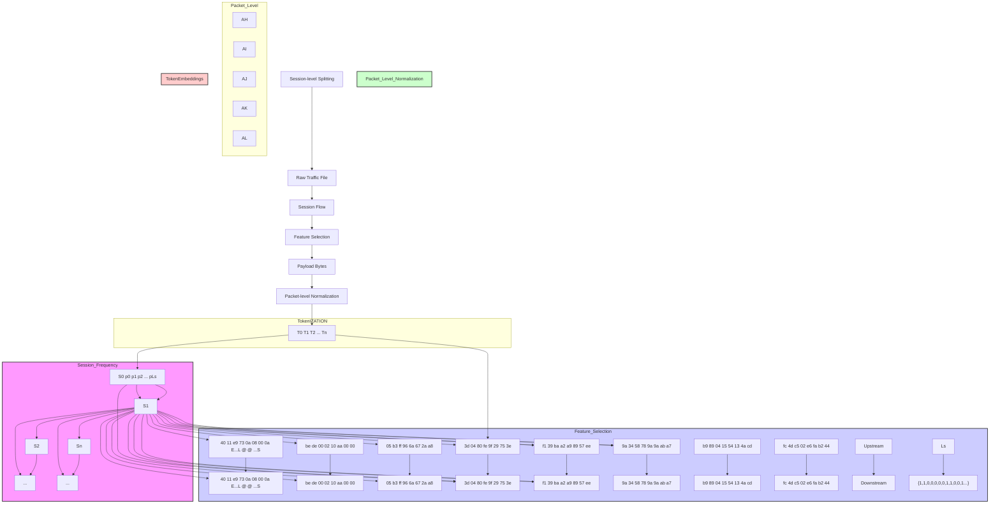

# NetTTT: Online Self-Adaptation Inference via Test-Time Training for Encrypted Traffic Classification

Ling Liu, Xiaowei Song, Ning Hu, Zhaoquan Gu, Zhihong Tian, Senior Member, IEEE, Yan Jia

Abstract—Encrypted traffic classification (ETC) serves as a pivotal research for network measurement and Quality of Service (Qos) management. However, most current approaches rely on statically frozen parameters after training, which remain vulnerable to performance degradation under real-world distribution shifts caused by dynamic network conditions, protocol evolution, and adversarial obfuscation techniques. To tackle this issue, we propose NetTTT, an online self-adaptation framework that, for the first time, performs continuous representation refinement directly at inference time without retraining. NetTTT leverages a hierarchical feature encoder that constructs structured dual-modal representations from raw traffic sessions, coupled with a pre-trained generic representation extractor to powerfully capture transferable contextual features, and incorporates a lightweight test-time adapter, which performs unsupervised, layer-wise parameter optimization during inference to dynamically align traffic representations with test-time traffic distributions, followed by a compact classifier that efficiently maps adapted representations to traffic categories. Experimental results reveal the superiority of NetTTT across diverse ETC tasks and few-shot scenarios with accuracy improvements ranging from 0.08% to 9.34% over state-of-the-art baselines. By enabling dynamic adaptation without labeled data or full model retraining, NetTTT bridges the gap between static pre-trained models and evolving encrypted traffic, highlighting its potential to provide a practical solution for real-world scenarios.

Index Terms—Encrypted traffic classification, pre-trained learning, test-time training.

# I. INTRODUCTION

WITH the widespread adoption of modern encryption technology such as TLS 1.3 and QUIC, network traffic

This work was supported in part by the Major Key Project of PCL under Grant PCL2024A05, in part by the Science and Technology Development Fund, Macao, SAR, under Grant 0007/2024/AKP, in part by the Shenzhen Science and Technology Program (No. KJZD20240903103811016), in part by the Guangdong S&T Program under Grant 2024B0101010002, in part by the National Natural Science Foundation of China under Grant U2436208 and Grant 62372129, in part by the Project of Guangdong Key Laboratory of Industrial Control System Security under Grant 2024B1212020010. (Corresponding author: Ning Hu and Zhaoquan Gu).

Ling Liu, Ning Hu, and Zhaoquan Gu are with the School of Computer Science and Technology, Harbin Institute of Technology (Shenzhen), Shenzhen 518055, China, and are also with the Department of New Networks, Pengcheng Laboratory, Shenzhen, China (email: 24B951079@stu.hit.edu.cn; hun@pcl.ac.cn; guzhaoquan@hit.edu.cn;).

Xiaowei Song is with the School of Computer Science and Engineering, Southern University of Science and Technology, Shenzhen 518055, China, and is also with the Department of New Networks, Pengcheng Laboratory, Shenzhen, China (email: 12547006@mail.sustech.edu.cn).

Zhihong Tian is with the Cyberspace Institute of Advanced Technology, Guangzhou University, Guangzhou 510006, China, and is also with the Guangdong Key Laboratory of Industrial Control System Security, China, and is also with Huangpu Research School of Guangzhou University, China (email: tianzhihong@gzhu.edu.cn).

Yan Jia is with the College of Computer Science and Technology, National University of Defense Technology, Changsha 410073, China (email: jiayanjy@vip.sina.com). is evolving towards an era of full encryption [1], [2]. For instance, according to Google’s Transparency Report [3], by 2025 more than 98% of global web traffic is loaded via HTTPS. Encrypted Traffic Classification (ETC) has progressively become a core research hotspot [4], [5], [6], [7]. It plays a critical role in malicious traffic detection [8], network measurement [9], and Quality of Service (QoS) management [10]. The goal of ETC is to achieve accurate identification of communication protocols, application types, and even malicious behaviors without decrypting them, by modeling the external statistical feature of encrypted traffic through machine learning or deep learning [11], [12], [13].

Traditional ETC methods rely on machine learning models based on handcrafted statistical features such as packet size, direction, and inter-arrival time [14], [15]. However, such feature engineering is highly dependent on domain expertise and fails to capture the complex spatiotemporal dependencies inherent in encrypted traffic, leading to limited classification accuracy and generalization capacity [16]. Recent research trends have shifted towards end-to-end deep learning classifier [17]. Representative architectures, such as ATVITSC [18], I2RNN [19], and DE-GNN [20], possess strong nonlinear feature extraction capabilities and can capture complex pattern dependencies within large-scale encrypted traffic [21]. More recently, with the successful application of pre-trained models in the field of natural language processing (NLP), such as Transformer [22], BERT [23], and Mamba [24]. Researchers have begun to introduce these techniques into encrypted traffic classification, such as ET-BERT [25], NetMamba [26], and YaTC [27]. By pretraining on large-scale traffic datasets, such models are able to learn more generalizable feature representations, which can then be fine-tuned for specific classification scenarios.

Even with their promising classification accuracy, pretrained models still exhibit notable limitations in dynamic networking environments. After the training phase, existing methods have fixed parameters [28]. When the feature distribution of traffic during testing shifts significantly, such as in cases of protocol upgrades or updates in traffic obfuscation strategies [29], [30], [31], [32], models can only be retrained offline and redeployed as a whole. The classification model cannot adjust well to the new distribution [33]. As a result, relying solely on static, offline-trained parameters can lead to a marked degradation in classification performance.

These challenges expose the inherent fragility of static models in dynamic network environments, highlighting the urgent need for online adaptive mechanisms.

Although incremental learning [34] and domain adaptation techniques [35] have been proposed to address this challenge, they typically require labeled data or full-model updates, which are impractical for real-time adaptation. Recently, Test-Time Training (TTT) [36] has emerged in computer vision and natural language processing as a transformative paradigm. By enabling label-free model adaptation during inference, TTT effectively alleviates distribution shifts.

In this work, we propose NetTTT, the first online selfadaptation inference approach designed for encrypted traffic classification based on test-time training. The core components include a Hierarchical Feature Encoder (HFE), a Generic Representation Extractor (GRE), and a Test-Time Adapter (TTA). Specifically, from a spatial-temporal modeling perspective, we propose a structured encoder HFE that transforms raw encrypted traffic into multi-level representations with dual modalities, preserving both payload semantics and directional context without losing structural information. Furthermore, the GRE is built upon a pre-trained architecture, serves as the backbone to capture deep and transferable contextual features from the encoded traffic sessions. To enable continuous selfadaptation to distribution shifts during inference, TTA is embedded into this backbone, which performs inner-loop updates during inference to refine representations for the current traffic distribution without requiring any labeled data. Finally, a Lightweight classifier completes the framework by leveraging these adapted representations to deliver efficient and accurate traffic classification.

The main contributions of our work are summarized as follows:

• We construct a hierarchical feature encoder that transforms raw encrypted packet streams into a structured, dual-modal representation. This encoder operates at the session, packet, and byte levels to comprehensively preserve both payload semantics and temporal behavior patterns, providing a more expressive foundation for downstream classification.   
• We design a generic representation extractor based on a pre-trained backbone. This component is responsible for learning deep, context-aware, and transferable feature representations from large-scale traffic data. It serves as a powerful and general-purpose feature extraction engine, forming the stable core of our adaptive framework.   
• We propose a lightweight test-time adapter that enables online self-supervised adaptation during inference. Embedded within the backbone, this adapter performs localized parameter updates using an unsupervised reconstruction loss, dynamically aligning the model’s representations with the test-time traffic distribution without requiring any labeled data or altering the frozen backbone. This mechanism effectively bridges the gap between static pretrained models and dynamic network environments.   
• We conduct comprehensive experiments across four representative encrypted traffic classification tasks: Anonymous Encrypted Traffic Classification, VPN Encrypted Traffic Classification, Encrypted Traffic Classification on New Protocols, and Malicious Encrypted Traffic Classification (AETC, VETC, ETCP, and METC). NetTTT outperforms state-of-the-art methods, increasing accuracy by 0.08%-9.34% over pre-training methods. The extensive evaluations demonstrate the superior effectiveness,

robustness, and generalization capability of the proposed approach, showing it consistently outperforms a range of state-of-the-art baselines.

# II. RELATED WORK

# A. Encrypted Traffic Classification

a) Deep Learning Based: Deep learning has overcome key limitations of traditional machine learning-based encrypted traffic classification, which relies heavily on expertcrafted features. In particular, CNNs, RNNs, and their hybrid models have been widely applied to traffic sequence modeling, significantly improving accuracy and efficiency.

Sirinam et al. first introduced a deep CNN-based approach, Deep Fingerprinting (DF) [38], which classifies encrypted traffic based on timing, direction, and packet size, effectively bypassing defenses like WTF-PAD [32]. They later proposed Triplet Fingerprinting (TF) [39], leveraging N-shot learning via a triplet network to reduce data requirements. Bhat et al. [40] introduced Var-CNN, a data-efficient website fingerprinting attack that combines direction, timing, and handcrafted statistical features using dilated causal convolutions and ResNet architecture to achieve high accuracy and low false positive rates, especially in low-data scenarios. Building on this direction, Rimmer et al. [41] proposed Automated Website Fingerprinting (AWF), combining stacked denoising autoencoders (SDAEs), CNNs, and long short-term memory (LSTM) networks for comprehensive feature learning. More recently, Meng et al. [42] developed Robust Fingerprinting (RF), introducing the Traffic Aggregation Matrix (TAM) to construct robust representations, achieving high accuracy even against advanced defenses like padding and obfuscation [43], [44], [45].

Despite these advances, deep models still face challenges in handling highly dynamic network traffic, where generalization can degrade and decision boundaries become less distinct.

b) Pre-training Based: Inspired by the success of pretrained language models such as BERT [23], GPT [46], LLaMA [37], and the recent Mamba architecture [24] in natural language processing, pre-training techniques have recently brought new perspectives to encrypted traffic classification. These models are typically pre-trained on large-scale network traffic and subsequently fine-tuned with limited labeled samples, achieving strong generalization with low deployment cost. The core idea lies in treating packet payloads as tokenized byte sequences and exploiting attention mechanisms to capture contextual dependencies.

Lin et al. [25] proposed ET-BERT, the first BERT-based pretrained model for encrypted traffic classification. By modeling encrypted flows as word-like sequences, ET-BERT introduced positional and contextual embeddings to better capture semantic structure within packet traces. Building upon this, Liu et al. [47] introduced LAMBERT, which combines BiGRU and attention-enhanced BERT to capture long-range byte dependencies, improving average classification accuracy by 3.2%–5.8% over ET-BERT on multiple real-world datasets. Zhao et al. [27] proposed YaTC, a self-supervised framework using masked autoencoders (MAE) to enhance both classification accuracy and cross-platform transferability. Ma et al. [48] further introduced NetKD, a knowledge distillation approach that compresses large models into lightweight versions, reducing parameters by over 80% while maintaining performance. Zhan et al. [49] developed EAPT, which incorporates adversarial pre-training to improve robustness against traffic perturbation and masking attacks in encrypted environments. Most recently, Wang et al. [26] proposed NetMamba, the first linear state space model for traffic classification based on the Mamba architecture. By replacing Transformers with more efficient unidirectional structures, NetMamba achieved superior accuracy and inference speed.

Despite their impressive representational power for longcontext modeling, these pre-trained models typically contain a large number of static parameters [4]. This immutability limits their adaptability to fast-evolving traffic patterns and emerging application behaviors [28]. Therefore, designing efficient model updating mechanisms and lightweight adaptation strategies has become a critical research direction in encrypted traffic classification.

# B. Test-Time Training

Test-Time Training (TTT) [36] is designed to address distribution shifts in dynamic environments. In contrast to conventional models that fix parameters after offline training, TTT introduces an inner-loop optimization during testing, enabling the model to continuously adapt its parameters based on test samples. The core idea is to treat hidden states as learnable submodules, updated via lightweight self-supervised losses at each timestep, thereby breaking the traditional separation between offline training and online inference. TTT has outperformed state-of-the-art(sota) models like Transformer [22] and Mamba [24] within the 32k token range.

In encrypted traffic classification, such adaptability is critical. Given frequent protocol upgrades, changing communication patterns, and evolving obfuscation strategies, traditional static models often fail to adapt during inference. In this study, we introduce TTT into our proposed model to enhance both representation learning and adaptability. Aimed to sustain high classification performance under shifting traffic distributions.

# III. PROBLEM DESCRIPTION AND FRAMEWORK OVERVIEW

# A. Problem Description

In this work, we consider traffic sessions as the basic classification unit, where each session represents a complete communication instance between two endpoints. The model takes as input the raw packet feature sequences, and learns a mapping function F to accurately predict the corresponding class label cˆ (e.g., application services, anonymous communications, or malicious behaviors), without decrypting the payload. The key challenge is to design a classification framework that maintains high accuracy across diverse and evolving network conditions, without requiring continuous retraining or access to labeled data during Inference.

Therefore, our goal is to create an adaptive mechanism that can dynamically adjust its parameters to align the feature representation with the test-time traffic distribution, while maintaining robust classification performance across different network environments and application scenarios, such as protocol updates, novel obfuscation techniques, or changes in dynamic network environment.

# B. Core idea

We propose NetTTT to achieve robust and adaptive encrypted traffic classification through a structured fourcomponent architecture, as formalized in Algorithm 1. These components work together to transform raw traffic into robust, discriminative representations suitable for downstream encrypted traffic classification tasks.

Firstly, we define a Hierarchical Feature Encoder that transforms raw encrypted traffic sessions into structured dual-modal representations, with details provided in Section IV-B. Traffic is aggregated into bidirectional sessions based on five-tuple flow identifiers. Each payload of packets is processed into bigram tokens, while packet direction is encoded separately as a binary sequence. The bigram sequences are tokenized using a Byte Pair Encoding (BPE) tokenizer [50] and embedded via GPT [51] embedding to obtain high-dimensional representations. This module preserves both semantic content through byte-level patterns and behavioral context through temporal packet sequences, forming a comprehensive foundation for downstream processing.

Generic Representation Extractor serves as the feature learning outer loop backbone built upon a pre-trained LLaMA architecture, as comprehensively described in Section IV-C. This component processes the embedded tokens to capture deep contextual relationships within traffic data, through multiple transformer blocks equipped with rotary positional encoding and multi-head attention mechanisms. This design enables the model to learn transferable contextual representations that remain robust to traffic sequence variations for classification.

Test-Time Adapter introduces adaptive capability to NetTTT. Embedded within each backbone block, this lightweight module performs T steps of self-supervised reconstruction learning during inference. The adapter parameters are updated by minimizing the MSE between the reconstructed values and the residual target. In our experiments, this inner-loop adaptation, typically running 3-5 steps per layer with a small learning rate, allows the model to dynamically adjust its feature representations to the test-time traffic distribution without modifying the frozen global backbone parameters, with the complete TTA mechanism detailed in Section IV-D.

The processed features then pass through a Lightweight Classifier that concatenates the final token representation with the original direction feature. This fused representation is processed through a two-layer MLP with softmax activation to produce the final classification output, with details provided in Section IV-E.

This coordinated architecture enables NetTTT to progressively transform raw traffic into adaptive representations, effectively handling distribution shifts caused by dynamic network environmental changes through its novel test-time training mechanism.

# IV. DETAILED DESIGN OF NETTTT

# A. Algorithm Overview

We design the NetTTT adaptive inference framework as illustrated in Algorithm 1. For each traffic session S in the test set, the packet is first tokenized into bigrams and direction information is encoded by HFE, yielding B and D, respectively. The token sequence B is embedded into a continuous space. The outer loop GRE iterates over L pretraining-based layers. At the ℓ-th layer, X undergoes RMS normalization, and multi-head attention produces queries $Q ,$ keys K, and values V . An Self-supervised inner loop TTA of T steps updates layer-specific parameters $\phi ^ { ( \ell ) }$ by minimizing the Mean Squared Error between (MSE) $V _ { \mathrm { p r e d } }$ (generated by $\operatorname { T T T } ( K ; \phi ^ { ( \ell ) } ) )$ and $V - K$ . The updated $\phi ^ { ( \ell ) }$ is applied to $Q$ to produce $Z ,$ which is combined with the residual path and passed through a feed-forward network to update X. After all layers, the final representation is formed by concatenating the last token of X with the directional feature $D ,$ followed by an MLP and softmax to yield class probabilities. The predicted class cˆ is taken as the index of the maximum probability.

Algorithm 1 Online Inference of NetTTT   
Require: Traffic session S, inner-loop steps T, learning rate $\eta$ Ensure: Predicted label $\hat{c}$

1: // Outer Loop Initialization
2: Offline Pre-training: Initialize backbone parameters $\theta$ from pre-trained model; then freeze $\theta$ after pre-training.
3: for each $S \in S$ do
4: Stage 1: Hierarchical Feature Encoder(HFE)
5: $B \leftarrow \text{BIGRAM}(PAYLOAD(S))$ 6: $D \leftarrow ENCODEDIRECTION(S)$ 7: $X \leftarrow TOKENIZE(B)$ 8: $X^{(0)} \leftarrow EMBEDDING(X)$ 9: // Outer Loop over Backbone Layers   
10: Stage 2: Generic Representation Extractor(GRE)

11: for $\ell=1$ to L do
12: $H^{(\ell)}\leftarrow\text{RMSNORM}(X^{(\ell-1)})$ 13: $[Q^{(\ell)},K^{(\ell)},V^{(\ell)}]\leftarrow\text{LINEARPROJ}(H^{(\ell)})$ 14: $[\tilde{Q}^{(\ell)},\tilde{K}^{(\ell)}]\leftarrow\text{APPLYROPE}(Q^{(\ell)},K^{(\ell)})$ 15: // Inner Loop over TTT Adaptation Steps
16: Stage 3: Test-Time Adapter (TTA)
17: for t=1 to T do
18: $\hat{V}^{(\ell)}\leftarrow\text{TTT}\big(\tilde{K}^{(\ell)};\phi_{t-1}^{(\ell)}\big)$ 19: $\mathcal{L}_{\text{TTT}}\leftarrow\text{MSE}\big(\hat{V}^{(\ell)},V^{(\ell)}-K^{(\ell)}\big)$ 20: $\phi_{t}^{(\ell)}\leftarrow\phi_{t-1}^{(\ell)}-\eta\nabla_{\phi}\mathcal{L}_{\text{TTT}}$ 21: end for
22: $Z^{(\ell)}\leftarrow\text{APPLYTTT}\big(\tilde{Q}^{(\ell)};\phi^{(\ell)}\big)$ 23: $X\leftarrow\text{FFN}\big(H^{(\ell)}+Z^{(\ell)}\big)$ 24: end for
25: Stage 4: Lightweight Classifier
26: // Spatiotemporal Feature Fusion
27: $z_{final}\leftarrow\text{CONCAT}\big(\text{LASTTOKEN}(X),D\big)$ 28: $y\leftarrow\text{SOFTMAX}\big(\text{MLP}(z_{\text{final}})\big)$ 29: $\hat{c}\leftarrow\arg\max_{k}y_{k}$ 30: end for

# B. Hierarchical Feature Encoder

a) Session-level Splitting: To capture richer contextual and behavioral semantics, traffic is splited to structured sessions, as illustrated in Figure 1. Starting from raw packets, bidirectional traffic sessions are constructed by aggregating packets that share a five-tuple $\scriptstyle R \quad =$ $\{ I P _ { \mathrm { s r c } } , I P _ { \mathrm { d s t } } , P o r t _ { \mathrm { s r c } } , P o r t _ { \mathrm { d s t } } , P r o t o c o l \}$ or its reverse, based on temporal proximity. This session-level abstraction preserves protocol boundaries and communication order. Further granularity is introduced by grouping payload and direction metadata at the byte and packet levels, enabling downstream models to capture hierarchical spatiotemporal dependencies. Where $I P _ { \mathrm { s r c } } , I P _ { \mathrm { d s t } } , P o r t _ { \mathrm { s r c } } , P o r t _ { \mathrm { d s t } }$ , and P rotocol represent the source IP address, destination IP address, source port, destination port, and transport-layer protocol.

b) Feature Selection: In our framework, the Feature Selection module consists of two complementary parts as illustrated in Figure 1: (i) the Direction Sequence, which encodes the directional information of packet flows (e.g., client-to-server or server-to-client), and (ii) the Payload Bytes, which preserve the semantic content of encrypted traffic. Both are jointly selected and passed into the hierarchical encoder to provide a comprehensive representation of traffic sessions.

The rationale for selecting packet direction and payload bytes as primary features was guided by their complementary roles in reflecting session behavioral cues and protocol semantics from encrypted traffic. Byte-level bigrams are adopted because encrypted payloads lack readable semantics but retain stable statistical structures across protocols. This representation captures co-occurrence patterns related to handshake behaviors, padding strategies, and application-level regularities. The packet direction sequence complements payload features by encoding flow dynamics such as request–response patterns and asymmetric bursts, which remain robust under strong encryption and obfuscation. Together, these features form a compact yet expressive representation for downstream adaptation.

c) Packet-Level Normalization: For each session, we excluded packets from non-IP protocols, such as Address Resolution Protocol (ARP) and Dynamic Host Configuration Protocol (DHCP). For each packet, the headers are removed to leave the payload. Since the payload carries behavior-relevant byte patterns that can be leveraged for feature extraction. Payload bytes are grouped into pairs (e.g., [0x16 0x03], ..., [0x03 0x01]). Each session is normalized to a fixed length $L _ { S }$ (the number of packets), and the payload of each packet is truncated or padded to $L _ { P }$ bigrams, ensuring uniform input dimensions across all samples. In parallel, packet direction is encoded as binary flags(1 and 0), 1 for upstream and 0 for downstream, thereby yielding a bigrams sequence(e.g., 5a7f,3c6b,...,4e2a) temporally aligned with the payload sequence (e.g., 1, 0, 1..., 0).

Let a session flow consist of $L _ { S }$ packets, denoted as $S = \{ P _ { j } \mid j \in [ 1 , L _ { S } ] \}$ . Each packet contains a payload byte sequence $P = \{ p _ { k } \ | \stackrel { \sim } { k } \in [ 1 , L _ { P } ] \}$ , where $L _ { P }$ is the fixed payload length (after truncation or padding), and must be an even size.


<details>
<summary>flowchart</summary>


</details>

Fig. 1. The structure of the Hierarchical Feature Encoder (HFE).

The payload is segmented into bigrams $b _ { k } .$ , where each bigram $b _ { k }$ consists of two consecutive payload bytes from $P .$ Given the temporal order of packets in the session, the complete bigram representation is defined as Equation (1):

$$
B = \{(b _ {2 k - 1} ^ {j}, b _ {2 k} ^ {j}) \mid j \in [ 1, L _ {S} ],   k \in [ 1, L _ {P} / 2 ] \} \tag {1}
$$

In parallel, each packet is assigned a binary direction flag $d _ { j } \in \{ 0 , 1 \}$ , where 1 denotes upstream and 0 denotes downstream. The direction sequence for the session is defined in Equation (2):

$$
D = \{d _ {j} \mid j \in [ 1, L _ {S} ] \}, \quad D \in \{0, 1 \} ^ {L _ {S}} \tag {2}
$$

d) Byte-Level Tokenization and Embedding: To capture the semantic relationships and structural features among payloads in a high-dimensional space, the normalized bigram sequences are transformed into dense vector representations. This transformation is performed in two stages. First, the bigram sequences B are tokenized using BPE tokenizer, which maps each bigram to a discrete token index according to a pretrained subword vocabulary.

$$
\mathcal {X} = \text { Tokenizer } (B) = \{x _ {1}, x _ {2}, \dots , x _ {L} \}, \quad x _ {i} \in \mathcal {V} \tag {3}
$$

The token sequence X is shown in Equation (3), where V denotes the vocabulary containing all possible bigram tokens, and each $x _ { i }$ corresponds to a token index. Subsequently, each token is mapped to a dense embedding vector by GPT2.

$$
\mathbf {X} ^ {(0)} = \text { Embedding } (\mathcal {X}) \in \mathbb {R} ^ {M \times L \times d} \tag {4}
$$

The discrete token sequence is then mapped to a continuous vector $\mathbf { X } ^ { ( 0 ) }$ by embedding as shown in Equation (4). Where M is the number of mini-batches, L is the maximum token sequence length, and d is the embedding dimension. The initialized embeddings $\mathbf { X } ^ { ( 0 ) }$ will be fed into the pretrained network. To learn the spatial patterns within the traffic, for each token. The position index position encoding is performed to generate a position index $\overline { { \boldsymbol X } } _ { p o s } ^ { ( 0 ) }$ is subsequently fed into the Rotary Positional Encoding (RoPE) module to further perceive traffic information.

# C. Generic Representation Extractor

The pre-trained network of NetTTT serves as the outer loop backbone of the architecture, and GRE is designed to extract generalizable features from network traffic, as illustrated in Figure 2. Given the inherently sequential and causally dependent nature of encrypted traffic, the LLaMa is adopted as the pertaining backbone, as it facilitates unidirectional contextual representation learning and autoregressive modeling. The backbone is composed of multiple stacked Blocks. Each Block is embedded with a TTA inner loop layer, and also contains the standard normalization, linear mapping, positional encoding, and residual concatenation, among others.

In the pre-training phase, the l-th layer block receives the output $\mathbf { X } ^ { ( l - 1 ) } \in \mathbb { R } ^ { M \times L \times d }$ from the previous layer. To mitigate traffic distribution fluctuations and improve feature stability, normalization is applied as the initial step, as shown in Equation (5):

$$
\mathbf {H} ^ {(l)} = \operatorname{RMSNorm} \left(\mathbf {X} ^ {(l - 1)}\right) = \gamma \frac {\mathbf {X} ^ {(l - 1)}}{\sqrt {\frac {1}{d} \sum_ {j} \mathbf {X} ^ {(l - 1) ^ {2}} + \varepsilon}} (5)
$$

After normalization, the representation $\mathbf { H } ^ { ( l ) }$ is linear projected and splitted into multiple attention heads, enabling the model to capture diverse feature relationships in parallel across different representation subspaces.


<details>
<summary>flowchart</summary>

```mermaid
graph TD
    subgraph_Test-Time_Adapter["Test-Time Adapter"]
        W0["W₀"] --> X0["X₀"]
        X0 --> W1["W₁"]
        W1 --> G1["G₁"]
        Z1["Z₁"] --> W2["W₂"]
        X2["Z₂"] --> W2
        X2 --> G2["G₂"]
        ZT["Zₜ"] --> WT["WT"]
        XT["..."]
        Wt["WT"]
        GT["GT"]
    end

    subgraph_GenericRepresentationEncoder["Generic Representation Encoder"]
        RMSNorm["RMSNorm"] --> Q["Q"]
        RMSNorm --> K["K"]
        RMSNorm --> V["V"]
        Q --> RotatryEmbedding["Rotatry Embedding"]
        K --> RotatryEmbedding
        V --> RotatryEmbedding
        RotatryEmbedding --> TTALayer["TTA Layer"]
        TTALayer --> Residual["Residual"]
        Residual --> FeedForwardNetwork["Feed Forward Network"]
    end

    subgraph_FFN["FFN"]
        RMSNorm_RMSNorm --> Linear1["Linear"]
        Linear2["GELU"] --> Linear3["Linear"]
        Linear4["Residual"] --> Residual4["Residual"]

        Lightweights["Lightweight Classifier"] --> Linear5["Linear"]
        Lightweights --> ReLU["ReLU"]
        Lightweights --> Dropout["Dropout"]
        Lightweights --> Concatenate["Concatenate"]
        Concatenate --> Linear6["Linear"]
        Concatenate --> logits["logits"]
        Concatenate --> Output["Output"]

    end

    subgraph_Fine-tuning["Fine-tuning"]
        direction_TB["Direction Sequence"] --> Concatenate
        Concatenate --> Linear7["Linear"]
        Linear7 --> Logits
        Logits --> Output
    end

    style Test-Time_Adapter fill:#f9f,stroke:#333
    style GenericRepresentationEncoder fill:#ccf,stroke:#333
    style FFN fill:#cfc,stroke:#333
    style Fine-tuning fill:#fcc,stroke:#333
```
</details>

Fig. 2. The structure of Generic Representation Encoder (GRE), Test-Time Adapter (TTA), and Lightweight Classifier.

$$
\mathbf {Q} ^ {(\ell)} = \mathbf {H} ^ {(\ell)} \cdot \mathbf {W} _ {Q} + \mathbf {b} _ {Q}
$$

$$
\mathbf {K} ^ {(\ell)} = \mathbf {H} ^ {(\ell)} \cdot \mathbf {W} _ {K} + \mathbf {b} _ {K} \tag {6}
$$

$$
\mathbf {V} ^ {(\ell)} = \mathbf {H} ^ {(\ell)} \cdot \mathbf {W} _ {V} + \mathbf {b} _ {V}
$$

$$
\mathbf {Q} ^ {(\ell)} \in \mathbb {R} ^ {M \times L \times d} \rightarrow \mathbf {Q} _ {h} ^ {(\ell)} \in \mathbb {R} ^ {M \times h \times L \times d _ {h}} \tag {7}
$$

In Equation (6) and (7), $\mathbf { W } _ { Q } , \mathbf { W } _ { K } , \mathbf { W } _ { V } \in \mathbb { R } ^ { d \times d }$ are learnable parameters of the linear projections, and ${ \bf b } _ { Q } , { \bf b } _ { K } , { \bf b } _ { V } \in$ $\mathbb { R } ^ { d }$ are the corresponding bias. H is the number of attention heads. The dimensionality of each head is given by $\begin{array} { r } { d _ { h } = \frac { d } { H } } \end{array}$

In order to model long-range dependencies in traffic bigrams, rotary position embedding (RoPE) is employed. RoPE enables the incorporation of relative positional information into the multi-head self-attention mechanism by embedding positional encodings into the query (Q) and key (K) vectors. It is typically defined as Equation (8).

$$
\begin{array}{l} \tilde {\mathbf {Q}} _ {h} ^ {(\ell)} = \mathbf {Q} _ {h} ^ {(\ell)} \odot \cos \boldsymbol {\Theta} + \mathcal {R} (\mathbf {Q} _ {h} ^ {(\ell)}) \odot \sin \boldsymbol {\Theta} \\ \tilde {\mathbf {z}} _ {h} ^ {(\ell)} = \mathbf {Q} _ {h} ^ {(\ell)} \odot \cos \boldsymbol {\Theta} + \mathcal {R} (\mathbf {Q} _ {h} ^ {(\ell)}) \odot \sin \boldsymbol {\Theta} \end{array} \tag {8}
$$

$$
\tilde {\mathbf {K}} _ {h} ^ {(\ell)} = \mathbf {K} _ {h} ^ {(\ell)} \odot \cos \Theta + \mathcal {R} (\mathbf {K} _ {h} ^ {(\ell)}) \odot \sin \Theta
$$

$\mathcal { R } ( \cdot )$ denotes a fixed 2D rotation applied to each adjacent dimension pair of the input vector. Θ denotes a fixed vector of base angular frequencies used to parameterize the rotary position encoding. Each element $\theta _ { i } \in \Theta$ corresponds to the frequency of the i-th rotation component. ⊙ is element-wise multiplication. RoPE can effectively solve the traffic segment misalignment and position ambiguity problem by applying a positive cosine rotation to each loaded bigram token.

Designed to characterize fine-grained features from the current traffic, the nested inner-loop mechanism of the TTA conducts further representation learning. A comprehensive description of the TTA architecture is provided in Section IV-D. Then, the TTA layer yields an enriched representation $\mathbf { Z } ^ { ( \ell ) } \in$ $\mathbb { R } ^ { M \times L \times d }$ , which is fused with the original backbone output $H ^ { ( \ell ) }$ by residual addition along the feature dimension, as shown in Equation (9). To maintain representation consistency and ensure stability during the optimization process, a residual connection is applied between the initial and refined features, enabling effective correction and fusion through selfsupervised learning.

$$
\mathbf {X} _ {\mathrm{ttt}} ^ {(\ell)} = \mathbf {H} ^ {(\ell)} + \mathbf {Z} ^ {(\ell)} \tag {9}
$$

To enhance the non-linear representation of encrypted traffic, the fused tensor X(ℓ)ttt $\mathbf { X } _ { \mathrm { t t t } } ^ { ( \ell ) }$ is passed through a feed-forward neural network (FFN) within the backbone. This network mainly comprises two fully connected layers with SiLU activation function in Equation (10), enabling non-linear expansion of the representation and extraction of higher-order composite features. The $l _ { t h }$ block outputs an enhanced traffic representation $\mathbf { F } ^ { ( \ell ) }$ , which is then forwarded to the next block for iterative processing.

$$
\mathbf {F} ^ {(\ell)} = \mathbf {W} _ {f 2} ^ {(\ell)} \cdot \text { SiLU } \left(\mathbf {W} _ {f 1} ^ {(\ell)} \cdot \mathbf {X} _ {\text { ttt }} ^ {(\ell)} + \mathbf {b} _ {f 1} ^ {(\ell)}\right) + \mathbf {b} _ {f 2} ^ {(\ell)} \tag {10}
$$

W(ℓ) $\mathbf { W } _ { f 1 } ^ { ( \ell ) } ~ \in ~ \mathbb { R } ^ { d \times d _ { \mathrm { f f } } }$ and W(ℓ) $\mathbf { W } _ { f 2 } ^ { ( \ell ) } ~ \in ~ \mathbb { R } ^ { d _ { \mathrm { f f } } \times d }$ are two-layer fully connected weights of the FFN. $\sigma ( \cdot )$ is SiLU activation function. After all blocks have been iteratively processed, GRE yields the final context-enriched representation ${ \mathbf { H } } _ { f i n a l } .$ , providing a dynamically adapted traffic representation foundation for downstream traffic classification.

# D. Test-Time Adapter

The TTA layer serves as the core component of NetTTT for enabling adaptive traffic representation and is designed as a lightweight, trainable sub-network embedded within each block of the backbone, as shown in Figure 2. During testing, it performs local self-supervised refinement on the current traffic representation. The core idea is to construct an unsupervised reconstruction task, where the residual discrepancy between the reconstruction V and its estimation from the K is leveraged to dynamically adjust the representation space, thereby improving adaptability under evolving or adversarial traffic conditions.

To support incremental traffic processing, the TTA layer adopts block-wise training, where each flow is divided into multiple mini-batches. Each mini-batch independently performs a self-supervised optimization task and updates internal parameters online. Gradients are restricted within each segment and do not propagate across batches.

The TTA is formulated as a parameterized mapping function $f _ { \phi } ( \cdot )$ , which can be instantiated using either a linear or a nonlinear structure. In Section VI-C, we perform a comparative analysis of both variants. Experimental results demonstrate that the linear design achieves better optimization performance with lower computational overhead. Therefore, we adopt the linear version, denoted as TTT-Linear, as the primary configuration of NetTTT.

$$
\phi_ {h, m} ^ {(\ell)} = \{\mathbf {W} _ {h, m} ^ {(\ell)}, \mathbf {b} _ {h, m} ^ {(\ell)} \} \tag {11}
$$

Where ϕ(ℓ)h,m $\phi _ { h , m } ^ { ( \ell ) }$ are the parameters of the TTA layer in Equation (11), which are the only components updated during the testtime training. These parameters are initialized at the model setup stage by sampling from a normal distribution and are registered as learnable variables. At the beginning of testing, the initialized parameters are encapsulated into a structure referred to as TTTCache, which facilitates subsequent updates during the $m _ { t h }$ mini-batch training.

$$
\hat {\mathbf {V}} _ {h, m} ^ {(\ell)} = f _ {\phi} (\bar {\mathbf {K}} _ {\mathbf {h}, \mathbf {m}} ^ {(\ell)}) = \bar {\mathbf {K}} _ {h, m} ^ {(\ell)} \mathbf {W} _ {h, m} ^ {(\ell)} + \mathbf {b} _ {h, m} ^ {(\ell)} \tag {12}
$$

The optimization objective of the TTA is to minimize the MSE between the predicted Vˆ (ℓ)h,m $\hat { \mathbf { V } } _ { h , m } ^ { ( \ell ) }$ in Equation (12) and target V(ℓ) $\mathbf { V } _ { h , m } ^ { ( \ell ) }$ The loss ${ \mathcal { L } } _ { \mathrm { T T A } }$ is used exclusively to update the parameters of the TTA layer and is not backpropagated through the backbone network. As a result, the backbone parameters remain frozen, enabling lightweight, non-destructive fine-tuning. NetTTT allows for localized adaptation without altering the original representation model architecture, as shown in Equation (13).

$$
\mathcal {L} _ {\mathrm{TTA}} = \frac {1}{M} \sum_ {m = 1} ^ {M} \left\| \hat {\mathbf {V}} _ {h, m} ^ {(\ell)} - \left(\mathbf {V} _ {h, m} ^ {(\ell)} - \mathbf {K} _ {h, m} ^ {(\ell)}\right) \right\| ^ {2} \tag {13}
$$

The intuition behind reconstructing the residual V − K is to create a self-supervised task that forces the adapter to learn the context-content discrepancy. By requiring the adapter to predict the residual of the content relative to its context, we encourage it to focus on learning test-time specific shifts in how context maps to content, which is precisely the information needed to adapt to distribution shifts without labeled data.

During the model training phase, an inner-loop optimization strategy is employed to perform multiple steps of gradient descent on the parameters ϕt. T represents the number of update steps and η the learning rate. The update rule is defined as Equation (14):

$$
\phi_ {t} \leftarrow \phi_ {t - 1} - \eta \cdot \nabla_ {\phi} \mathcal {L} _ {\mathrm{TTA} _ {t}}, \quad t \in [ 1, T ] \tag {14}
$$

The TTA inner loop updates the mapping parameters ϕ based on the current gradient $\nabla _ { \phi } \mathcal { L } _ { \mathrm { T T A } _ { t } }$ . In experiments, the number of inner-loop steps is typically set to three to five, enabling a flexible trade-off between computational cost and adaptation strength.

To accommodate the segmented nature of traffic during testing, NetTTT maintains a dedicated cache structure, TTTCache, for each individual flow sample. This structure is initialized when the instance is first fed into the model and continuously tracks the parameter states (ϕ, $\nabla _ { \phi } ,$ etc.) of each TTA layer and token offsets throughout subsequent mini-batch inference. This design ensures consistency and coherence in the contextual optimization process across segments.

In the testing phase, the model retrieves previously stored parameter states from TTTCache to ensure continuity in adaptation across mini-batches. At this stage, the prediction no longer relies on the K vector, instead, the Q vector is used as input to the TTA layer, as shown in Equation (15).

$$
\mathbf {Z} ^ {(\ell)} = f _ {\phi} (\tilde {\mathbf {Q}} ^ {(\ell)}) \tag {15}
$$

The final TTA output $\mathbf { Z } ^ { ( \ell ) }$ is an updated representation for the corresponding flow and is propagated through the subsequent module of the backbone network. During the training phase, K is utilized as input to the TTA due to its structurally stable representation, which effectively captures the evolving trends of the V across different traffic layers. In contrast, during the inference phase, Q is employed to generate the prediction to align with the context representation in the backbone.

Specifically, the adapter parameters $\phi$ are optimized by using K as input to predict the residual target $( \mathbf { V } \mathrm { ~ - ~ } \mathbf { K } )$ , whereas during inference, the optimized $f _ { \phi } ( \cdot )$ is applied to $\mathbf { Q }$ to produce the adapted representation Z. This asymmetric design leverages the distinct roles of K and Q in self-attention. K provides stable contextual cues, while $\mathbf { Q }$ actively modulates the attention output. By adapting only $\mathbf { Q } ,$ the model can most effectively adjust its focus to the test-time sample distribution, bending the decision boundary accordingly, while ensuring that the adjusted vector remains naturally integrated into the overall representation without interfering with the pretrained backbone.

NetTTT addresses the critical challenge of pre-trained model adaptability under distributional shifts during inference by employing a label-free, online self-supervised optimization mechanism that dynamically adjusts feature representations to align with the semantics of the current input traffic.

# E. Lightweight Traffic Classifier

Aimed at efficient and accurate classification of encrypted traffic, NetTTT incorporates a lightweight classification module that minimizes computational overhead while maintaining strong discriminative capability, as illustrated in Figure 2. This classifier operates on the adaptive representations generated by the representation model and incorporates auxiliary direction feature to improve robustness under bidirectional communication scenarios, as shown in Equation (16).

$$
\mathbf {z} _ {i} = \left[ \mathbf {h} _ {i}; s _ {i} \right] \in \mathbb {R} ^ {d + 1} \tag {16}
$$

Where $\mathbf { h } _ { i }$ represents the adaptive representation of the last token output from the backbone, and $\mathbf { s } _ { i }$ is packet direction flag associated with the traffic session. The final input $\mathbf { z } _ { i }$ to the classification head is constructed by concatenating the two components along the feature dimension using the notation [·; ·], which stacks the vectors vertically. This operation combines the d-dimensional token representation with the 1- dimensional direction flag, resulting in a (d + 1)-dimensional vector. This design ensures that directional information is explicitly preserved without increasing the parameter complexity of model.

The direction feature was not embedded, as it inherently provides semantic cues that assist the model in understanding the role and behavioral patterns of the traffic. For instance, a traffic pattern dominated by downstream packets is more indicative of response-driven scenarios involving high-volume data transmission, such as video streaming or web page loading. According to our experiment results, incorporating direction as an auxiliary feature can enhance the model’s ability to distinguish encrypted traffic.

The concatenated representation $\mathbf { z } _ { i }$ is then passed through a two-layer perceptron classifier with a non-linear activation function and dropout regularization. The output $\mathbf { z } _ { i }$ of the classifier is interpreted as the unnormalized logit vector over C traffic classes, as defined in Equation (17).

$$
\hat {c} _ {i} = \arg \max _ {k} \left(y _ {i, k} ^ {\hat {}}\right) \tag {17}
$$

$\mathbf { y } _ { i } \in \mathbb { R } ^ { C }$ is the unnormalized logit vector for the i-th sample in a batch. The softmax function computes the probability yi,kˆ of the i-th sample belonging to class k by normalizing over all class indices $j \in \{ 1 , \ldots , C \}$ . The final predicted label $\hat { c _ { i } }$ is then determined by selecting the index k with the highest softmax score.

During training, the classifier is optimized using the categorical cross-entropy loss shown in Equation (18), where $c _ { i } \in \{ 1 , \ldots , C \}$ is the ground-truth label of the i-th sample, and M is the mini-batch size.

$$
\mathcal {L} = - \frac {1}{M} \sum_ {i = 1} ^ {M} \log (\hat {y} _ {i, c _ {i}}) \tag {18}
$$

This lightweight classifier architecture effectively integrates direction feature and token-level adaptive representations into a compact, two-layer neural network. Its simplicity, low parameter count, and context awareness make it well-suited for deployment in latency-sensitive and resource-constrained encrypted traffic classification.

# V. EXPERIMENTAL SETTINGS

In this section, we present the classification tasks used to evaluate NetTTT, along with the corresponding datasets and evaluation metrics.

# A. Dataset and Classification Tasks

This study utilizes four classic encrypted traffic datasets from distinct classification tasks: ISCX-Tor [52], ISCX-VPN [53], CSTNET-TLS1.3 [25], USTC-TFC [54]. For each dataset, the NetTTT is independently trained and evaluated, with the aim of investigating its performance under various encrypted traffic distributions. The tasks and the corresponding datasets are shown in Table I.

TABLE I SUMMARY OF DATASETS FOR ENCRYPTED TRAFFIC CLASSIFICATION. 

<table><tr><td>Task</td><td>Dataset</td><td>Packets</td><td>Sessions</td><td>Classes</td></tr><tr><td>AETC</td><td>ISCX-Tor [52]</td><td>80,000</td><td>3,021</td><td>16</td></tr><tr><td>VETC</td><td>ISCX-VPN [53]</td><td>60,000</td><td>3,694</td><td>12</td></tr><tr><td>ETCP</td><td>CSTNET-TLS1.3 [25]</td><td>581,709</td><td>46,372</td><td>120</td></tr><tr><td>METC</td><td>USTC-TFC2016 [54]</td><td>97,115</td><td>9,853</td><td>20</td></tr></table>

AETC: Anonymous Encrypted Traffic Classification. The AETC task targets the classification of encrypted traffic within anonymous network environments, aiming to assess the robustness of the model in handling obfuscated and transformed traffic characteristics. Tor, as an anonymous communication system, utilizes multi-hop encryption and traffic obfuscation to evade surveillance, which significantly complicates feature extraction and pattern recognition. The ISCX-Tor [52] dataset is used for this task. It consists of network protocols such as P2P, FTP, and VoIP.

VETC: VPN Encrypted Traffic Classification. The VETC task focuses on the classification of encrypted traffic transmitted through Virtual Private Network (VPN) tunnels. The objective is to evaluate the capacity of the NetTTT model to identify traffic exhibiting high degrees of obfuscation and weakened feature distinguishability. VPN services are commonly deployed for privacy protection, secure communication, and firewall circumvention. These services frequently adopt encryption and traffic-masking techniques, resulting in more complex and ambiguous traffic patterns. The ISCX-VPN dataset [53] is selected for this experiment. It includes applications such as Skype, Facebook, and YouTube. It uses OpenVPN connections to commercial VPN providers.

ETCP: Encrypted Traffic Classification on New Protocols. The ETCP task is concerned with the classification of traffic generated by emerging encrypted communication protocols. It is designed to evaluate the generalization ability of the NetTTT model in environments involving modern encryption protocols. Compared to traditional encrypted protocols such as TLS 1.0 and TLS 1.2, newer protocols include TLS 1.3, QUIC, and SSH, exhibit significant changes in data encapsulation formats, temporal traffic patterns, and cryptographic handshake mechanisms. These changes pose substantial challenges for traffic classification models. The CSTNET-TLS 1.3 dataset [25] is used for this task. It contains encrypted traffic collected from the Alexa Top 5000 list, including protocol-specific features from TLS 1.3.

TABLE II KEY HYPERPARAMETER SETTINGS USED IN OUR EXPERIMENTS 

<table><tr><td>Hyperparameter</td><td>Setting</td></tr><tr><td>Batch size</td><td>64</td></tr><tr><td>Training epochs</td><td>20</td></tr><tr><td>Learning rate</td><td> $1 \times 10^{-4}$ </td></tr><tr><td>Weight decay</td><td>0.01</td></tr><tr><td>Gradient accumulation</td><td>4</td></tr><tr><td>Payload length ( $L_P$ )</td><td>64</td></tr><tr><td>Session length ( $L_S$ )</td><td>500</td></tr><tr><td>Hidden size</td><td>768</td></tr><tr><td>Attention heads</td><td>8</td></tr><tr><td>FFN dimension</td><td>2048</td></tr><tr><td>Dropout rate</td><td>0.5</td></tr></table>

METC: METC: Malicious Encrypted Traffic Classification. The METC task addresses the classification of encrypted traffic generated by malicious activities. It is intended to evaluate the effectiveness of the classification model in identifying covert communications used by malware and advanced persistent threats (APTs) that leverage encryption to conceal their operations. In this task, the USTC-TFC dataset [54], which comprises encrypted traffic samples from various malware and attack scenarios, is utilized. The dataset includes both benign and malicious traffic, with the latter originating from malware such as Gridex, Htbot, and Zeus.

# B. Implementation Details

We summarize the key hyperparameter configurations in Table II for clarity and reproducibility. All models were trained using the AdamW optimizer, and the implementation was based on PyTorch 1.8.0. The experiments were conducted on two NVIDIA RTX 4090 GPUs.

A stratified random sampling strategy is employed to partition the dataset into training, validation, and testing subsets with a ratio of 8:1:1, ensuring a balanced class distribution across all splits. During training, the model is iteratively optimized on the training set, while the validation set is utilized for hyperparameter tuning and model selection, such as determining the optimal number of epochs. Final evaluation is conducted on the held-out test set to provide an unbiased estimate of generalization performance.

# C. Evaluation Metrics

To comprehensively evaluate the classification performance, we adopt four standard metrics: Accuracy(AC), Precision(PR), Recall(RC), and F1-score(F1). All metrics are computed in a weighted manner to account for class imbalance, ensuring that the evaluation reflects the performance of the model across all categories proportionally.

# VI. EXPERIMENT EVALUATION

In this section, we evaluate the performance of NetTTT across multiple classification tasks and comparative experiments. We further conduct an ablation study to analyze the contributions of individual components within the framework, and finally assess the model’s training and inference efficiency.

# A. Classification Performance on Diverse Tasks

Encrypted traffic classification presents increasing challenges due to evolving encryption protocols, obfuscation techniques, and widespread use of anonymization and tunneling mechanisms. In this context, we assess the effectiveness of NetTTT models across four distinct benchmark tasks. The experimental results are summarized in Table III and Figure 3.

On the AETC benchmark, both NetTTT variants reach 99% on all reported metrics. This indicates that the proposed model can accurately classify traffic even under anonymization and multi-layered encryption as introduced by Tor. Furthermore, the training loss curves in Figure 3 (a, c) show rapid convergence within the first few epochs, while accuracy curves in Figure 3 (b, d) reach 98.68% by epoch 4. The results indicate that NetTTT’s hierarchical feature encoding and adaptive capabilities effectively overcome the privacy-preserving mechanisms implemented in anonymous networks.

On the VETC benchmark, which involves VPN-tunneled traffic characterized by flattened and homogeneous flow patterns, both NetTTT-Linear and NetTTT-MLP exhibit smooth and consistent training dynamics. As shown in Figures 3 (a, c), the training loss on VETC decreases steadily across epochs and converges earlier than in the METC task, indicating efficient optimization even under obfuscated input features. Correspondingly, the training accuracy curves in Figures 3 (b, d) show that both variants quickly reach above 99% accuracy within the first few epochs, highlighting NetTTT’s strong learning capability and convergence stability on VPN environments.

On the ETCP benchmark, NetTTT achieves perfect classification performance (100% across all metrics) for TLS 1.3 traffic, representing a breakthrough in handling modern encryption protocols. The accuracy plots in Figures 3 (b, d) show sharp increases, stabilizing above 99.74% in epoch 3. These patterns reflect the ability to effectively learn subtle behavioral patterns embedded in strongly encrypted flows, indicating that NetTTT can extract protocol-specific semantics despite minimal observable information.

The exceptional performance aligns with our initial hypothesis that the structured semantic patterns of TLS 1.3 traffic. The hierarchical feature encoder preserves the minimal yet consistent protocol-specific fingerprints of TLS 1.3 sessions, while the test-time adapter dynamically aligns these representations with the behavioral patterns of different applications within the encrypted flow. This enables the model to establish definitive decision boundaries when trained on the high-quality, protocol-homogeneous CSTNET-TLS1.3 dataset, where the primary variation stems from application behavior rather than adversarial obfuscation or protocol heterogeneity.


<details>
<summary>line</summary>

| Epoch | Loss (Blue) | Loss (Orange) | Loss (Green) | Loss (Red) |
|-------|-------------|---------------|--------------|------------|
| 2     | ~1.5        | ~1.8          | ~2.0         | ~1.7       |
| 4     | ~0.8        | ~1.2          | ~1.5         | ~1.3       |
| 6     | ~0.4        | ~0.7          | ~0.9         | ~0.8       |
| 8     | ~0.2        | ~0.4          | ~0.5         | ~0.4       |
| 10    | ~0.1        | ~0.2          | ~0.3         | ~0.2       |
| 12    | ~0.05       | ~0.1          | ~0.2         | ~0.1       |
| 14    | ~0.03       | ~0.08         | ~0.15        | ~0.08      |
| 16    | ~0.02       | ~0.06         | ~0.1         | ~0.06      |
| 18    | ~0.01       | ~0.05         | ~0.08        | ~0.05      |
| 20    | ~0.005      | ~0.04         | ~0.06        | ~0.04      |
</details>


<details>
<summary>line</summary>

| Epoch | Blue Line | Red Line | Green Line |
|-------|-----------|----------|------------|
| 2     | 0.1       | 0.3      | 0.0        |
| 4     | 1.0       | 0.9      | 0.1        |
| 6     | 1.0       | 1.0      | 1.0        |
| 8     | 1.0       | 1.0      | 1.0        |
| 10    | 1.0       | 1.0      | 1.0        |
| 12    | 1.0       | 1.0      | 1.0        |
| 14    | 1.0       | 1.0      | 1.0        |
| 16    | 1.0       | 1.0      | 1.0        |
| 18    | 1.0       | 1.0      | 1.0        |
| 20    | 1.0       | 1.0      | 1.0        |
</details>


<details>
<summary>line</summary>

| Epoch | Loss (Red) | Loss (Green) | Loss (Orange) | Loss (Blue) |
|-------|------------|--------------|---------------|-------------|
| 2     | 1.0        | 1.5          | 1.2           | 1.3         |
| 4     | 0.8        | 0.9          | 0.7           | 0.6         |
| 6     | 0.6        | 0.7          | 0.5           | 0.4         |
| 8     | 0.5        | 0.6          | 0.4           | 0.3         |
| 10    | 0.4        | 0.5          | 0.3           | 0.2         |
| 12    | 0.3        | 0.4          | 0.2           | 0.1         |
| 14    | 0.2        | 0.3          | 0.15          | 0.05        |
| 16    | 0.15       | 0.25         | 0.1           | 0.03        |
| 18    | 0.1        | 0.2          | 0.08          | 0.02        |
| 20    | 0.05       | 0.15         | 0.05          | 0.01        |
</details>


<details>
<summary>line</summary>

| Epoch | Accuracy (Red) | Accuracy (Orange) | Accuracy (Green) |
|-------|----------------|-------------------|------------------|
| 1     | 0.35           | 0.35              | 0.78             |
| 2     | 0.70           | 0.98              | 0.98             |
| 4     | 0.90           | 0.99              | 0.99             |
| 6     | 0.95           | 0.99              | 0.99             |
| 8     | 0.97           | 0.99              | 0.99             |
| 10    | 0.98           | 0.99              | 0.99             |
| 12    | 0.98           | 0.99              | 0.99             |
| 14    | 0.98           | 0.99              | 0.99             |
| 16    | 0.98           | 0.99              | 0.99             |
| 18    | 0.98           | 0.99              | 0.99             |
| 20    | 0.98           | 0.99              | 0.99             |
</details>

Fig. 3. Training loss and accuracy curves of NetTTT variants across four encrypted traffic classification tasks.

TABLE III PERFORMANCE COMPARISON OF NETTTT VARIANTS AND BASELINES ACROSS FOUR ENCRYPTED TRAFFIC CLASSIFICATION TASKS. 

<table><tr><td rowspan="2">Model</td><td colspan="4">AETC</td><td colspan="4">VETC</td><td colspan="4">ETCP</td><td colspan="4">METC</td></tr><tr><td>AC</td><td>PR</td><td>RC</td><td>F1</td><td>AC</td><td>PR</td><td>RC</td><td>F1</td><td>AC</td><td>PR</td><td>RC</td><td>F1</td><td>AC</td><td>PR</td><td>RC</td><td>F1</td></tr><tr><td>RF [43]</td><td>0.9429</td><td>0.6365</td><td>0.6675</td><td>0.6509</td><td>0.9768</td><td>0.8651</td><td>0.8453</td><td>0.8535</td><td>0.8783</td><td>0.8797</td><td>0.8786</td><td>0.8735</td><td>0.6528</td><td>0.6918</td><td>0.6438</td><td>0.6481</td></tr><tr><td>TF [40]</td><td>0.8969</td><td>0.5404</td><td>0.4923</td><td>0.5055</td><td>0.4692</td><td>0.4938</td><td>0.4200</td><td>0.4277</td><td>0.4582</td><td>0.4663</td><td>0.4483</td><td>0.4432</td><td>0.6166</td><td>0.5869</td><td>0.6438</td><td>0.6293</td></tr><tr><td>AWF [42]</td><td>0.8195</td><td>0.6763</td><td>0.5581</td><td>0.5511</td><td>0.3615</td><td>0.3723</td><td>0.3220</td><td>0.3162</td><td>0.5565</td><td>0.5342</td><td>0.5878</td><td>0.5812</td><td>0.6425</td><td>0.7038</td><td>0.6438</td><td>0.6598</td></tr><tr><td>Var-CNN [41]</td><td>0.9337</td><td>0.7589</td><td>0.7134</td><td>0.7029</td><td>0.4692</td><td>0.4938</td><td>0.4200</td><td>0.4277</td><td>0.6914</td><td>0.6569</td><td>0.6768</td><td>0.6725</td><td>0.6995</td><td>0.7363</td><td>0.6714</td><td>0.6796</td></tr><tr><td>DF [39]</td><td>0.8821</td><td>0.7418</td><td>0.6986</td><td>0.7018</td><td>0.9615</td><td>0.8981</td><td>0.8280</td><td>0.8490</td><td>0.7417</td><td>0.7538</td><td>0.6203</td><td>0.6151</td><td>0.6995</td><td>0.7363</td><td>0.6714</td><td>0.6796</td></tr><tr><td>ET-BERT [26]</td><td>0.9961</td><td>0.9963</td><td>0.9961</td><td>0.9961</td><td>0.9048</td><td>0.9456</td><td>0.9422</td><td>0.9410</td><td>0.9687</td><td>0.9687</td><td>0.9687</td><td>0.9687</td><td>0.9620</td><td>0.9670</td><td>0.9634</td><td>0.9639</td></tr><tr><td>LAMBERT [48]</td><td>0.9980</td><td>0.9976</td><td>0.9956</td><td>0.9980</td><td>0.9423</td><td>0.9666</td><td>0.9623</td><td>0.9620</td><td>0.9698</td><td>0.9751</td><td>0.9591</td><td>0.9712</td><td>0.9683</td><td>0.9712</td><td>0.9761</td><td>0.9686</td></tr><tr><td>YaTC [28]</td><td>0.9952</td><td>0.9952</td><td>0.9952</td><td>0.9952</td><td>0.9326</td><td>0.9327</td><td>0.9326</td><td>0.9326</td><td>0.9655</td><td>0.9659</td><td>0.9655</td><td>0.9623</td><td>0.9658</td><td>0.9662</td><td>0.9658</td><td>0.9636</td></tr><tr><td>NetMamba [27]</td><td>0.9972</td><td>0.9972</td><td>0.9972</td><td>0.9972</td><td>0.9789</td><td>0.9789</td><td>0.9789</td><td>0.9789</td><td>0.9831</td><td>0.9832</td><td>0.9831</td><td>0.9810</td><td>0.9715</td><td>0.9720</td><td>0.9715</td><td>0.9715</td></tr><tr><td>NetTTT-MLP</td><td>0.9988</td><td>0.9989</td><td>0.9988</td><td>0.9987</td><td>0.9982</td><td>0.9982</td><td>0.9982</td><td>0.9982</td><td>1.0000</td><td>1.0000</td><td>1.0000</td><td>1.0000</td><td>0.9878</td><td>0.9878</td><td>0.9878</td><td>0.9876</td></tr><tr><td>NetTTT-Linear</td><td>0.9938</td><td>0.9937</td><td>0.9938</td><td>0.9938</td><td>0.9943</td><td>0.9943</td><td>0.9944</td><td>0.9943</td><td>1.0000</td><td>1.0000</td><td>1.0000</td><td>1.0000</td><td>0.9849</td><td>0.9849</td><td>0.9845</td><td>0.9849</td></tr></table>

On the METC benchmark, which targets the detection of encrypted malicious communications, NetTTT-MLP achieves an F1-score of 98.78%, and NetTTT-Linear follows with 98.49%. Despite the inherent complexity of this task, stemming from the stochastic and evasive characteristics of malware traffic, both models demonstrate consistently high recall, indicating strong sensitivity to obfuscated behavioral patterns. The training loss curves in Figure 3 exhibit slight fluctuations, particularly in the early epochs. The balanced high performance indicates NetTTT’s effectiveness in minimizing both false alarms and missed detections, which is essential for practical security deployment.

Across all four tasks, NetTTT consistently exhibits strong classification performance, rapid convergence, and stable training behavior, demonstrating the effectiveness of combining hierarchical feature encoding with test-time adaptation for handling the dynamic nature of modern network traffic.

# B. Comparisons of NetTTT and Baselines

As demonstrated in Table II, NetTTT exhibits substantial performance advantages over both traditional deep learning methods and state-of-the-art pre-trained models across all four encrypted traffic classification tasks. The reference approaches include deep learning models(DF [38], TF [39], Var-CNN [40], AWF [41], RF [42] ) and sota pre-trained models (NetMamba [26], YaTC [27], LAMBERT [47], ET-BERT [25]). These baseline models have been introduced in Section II-A.

Based on the results summarized in Table III, NetTTT dramatically outperforms conventional deep learning approaches, particularly in challenging environments involving modern encryption or obfuscation techniques. On the ETCP task (TLS 1.3 traffic), NetTTT achieves perfect classification, while RF and Var-CNN show limited effectiveness with F1-scores of 87.35% and 67.25%, respectively. This performance gap highlights the fundamental limitation of static feature engineering in handling evolving encryption protocols. Similarly, for AETC, NetTTT’s near-perfect performance (99.88% F1- score) contrasts sharply with TF’s 50.55% score, demonstrating its robustness against advanced traffic obfuscation.

While pre-trained models show improved performance over traditional methods, NetTTT consistently achieves superior results. Notably, in the METC task, NetTTT-MLP achieves a 98.78% F1-score, outperforming NetMamba (97.15%) and YaTC (96.36%). This advantage is particularly significant given that these baselines share similar pre-training architectures but lack NetTTT’s test-time adaptation capability. The consistent performance gap across all tasks underscores the critical importance of dynamic adaptation during inference for maintaining classification accuracy under real-world distribution shifts.

TABLE IV ABLATION STUDY EVALUATING THE IMPACT OF KEY COMPONENTS IN NETTTT ACROSS FOUR CLASSIFICATION TASKS. 

<table><tr><td rowspan="2">Model</td><td colspan="4">AETC</td><td colspan="4">VETC</td><td colspan="4">ETCP</td><td colspan="4">METC</td></tr><tr><td>AC</td><td>PR</td><td>RC</td><td>F1</td><td>AC</td><td>PR</td><td>RC</td><td>F1</td><td>AC</td><td>PR</td><td>RC</td><td>F1</td><td>AC</td><td>PR</td><td>RC</td><td>F1</td></tr><tr><td>NetTTT-MLP</td><td>0.9988</td><td>0.9989</td><td>0.9988</td><td>0.9987</td><td>0.9982</td><td>0.9982</td><td>0.9982</td><td>0.9982</td><td>1.0000</td><td>1.0000</td><td>1.0000</td><td>1.0000</td><td>0.9878</td><td>0.9878</td><td>0.9878</td><td>0.9876</td></tr><tr><td>NetTTT-Linear</td><td>0.9938</td><td>0.9937</td><td>0.9938</td><td>0.9938</td><td>0.9943</td><td>0.9943</td><td>0.9943</td><td>0.9943</td><td>1.0000</td><td>1.0000</td><td>1.0000</td><td>1.0000</td><td>0.9849</td><td>0.9849</td><td>0.9845</td><td>0.9849</td></tr><tr><td>NetTTT w/o Payload</td><td>0.0788</td><td>0.0099</td><td>0.0788</td><td>0.0175</td><td>0.1643</td><td>0.0445</td><td>0.1543</td><td>0.0690</td><td>0.0164</td><td>0.0002</td><td>0.0121</td><td>0.0004</td><td>0.1910</td><td>0.0455</td><td>0.1910</td><td>0.0724</td></tr><tr><td>NetTTT w/o Direction</td><td>0.9962</td><td>0.9963</td><td>0.9962</td><td>0.9962</td><td>0.9943</td><td>0.9944</td><td>0.9943</td><td>0.9944</td><td>0.9655</td><td>0.9667</td><td>0.9655</td><td>0.9656</td><td>0.9461</td><td>0.9466</td><td>0.9461</td><td>0.9460</td></tr><tr><td>NetTTT w/o TTT</td><td>0.8028</td><td>0.8029</td><td>0.8028</td><td>0.8028</td><td>0.8012</td><td>0.8013</td><td>0.8012</td><td>0.8012</td><td>0.8000</td><td>0.8000</td><td>0.8000</td><td>0.8000</td><td>0.7996</td><td>0.7997</td><td>0.7996</td><td>0.7996</td></tr></table>

The consistent outperformance of NetTTT across diverse tasks and against strong baselines establishes it as a new state-of-the-art approach for encrypted traffic classification, particularly suitable for real-world environments characterized by continuous protocol updates and evolving traffic patterns.

# C. Ablation Experiments

To rigorously evaluate the contribution of each core component in the NetTTT framework, we conduct an ablation study by selectively removing key modules and evaluating the resulting performance across four encrypted traffic classification tasks. The evaluated model variants include:

• Net $\mathbf { \Gamma } \mathbf { T } \mathbf { T _ { w / o } } \mathbf { \Gamma } \mathbf { p } \mathbf { { a y l o a d } } \mathbf { : }$ removes the bigram payload embedding;   
• $\mathbf { N e t T T T _ { w / o \ D i r e c t i o n } } \colon$ excludes the direction sequence;   
• $\mathbf { N e t T T T _ { w / o } \ T T T } \mathrm { : }$ disables the test-time training mechanism, leaving the backbone network static.

As shown in Table IV, removal of the payload embedding results in a substantial performance degradation. For example, in AETC, the F1-score drops from 99.87% to 1.75%, and in ETCP from 100% to 0.04%. This catastrophic performance collapse confirms that byte-level semantic patterns extracted from payloads constitute the most discriminative features for encrypted traffic classification. The structured bigram representation effectively captures protocol semantics and application-specific patterns that are essential for accurate classification, particularly under strong encryption where other features become less informative. This observation indicates that payload bytes universally carry the most discriminative semantics for encrypted traffic classification, and removing them leaves insufficient information for accurate recognition across all scenarios.

Removing the directional sequence encoding leads to significant but less dramatic performance reductions. For ETCP, the F1-score decreases from 100 %(NetTTT-MLP) to 96.56%, while for METC, it drops by 5.18 percentage points. These results indicate that directional patterns, while not sufficient on their own, provide additional structural cues that help characterize flow-level behavior, particularly in asymmetric or interactive communication scenarios.

Disabling the layer also leads to a notable performance reduction. Across all tasks, the F1-score decreases uniformly to approximately 80%, suggesting the test-time adapter mechanism plays a notable role in enhancing model robustness to inference-time variability, such as protocol evolution or traffic obfuscation. Without this adaptive mechanism, the model appears less capable of handling shifts in traffic distributions.

It is worth noting that our framework currently relies on fixed input lengths. While this simplifies optimization and comparison across baselines, it may reduce flexibility when handling traces of highly variable lengths. Exploring adaptive or hierarchical sequence modeling strategies is an interesting direction for future work.

In summary, the ablation results confirm that all three components are essential for achieving high performance and robustness in encrypted traffic classification. Their integration enables NetTTT to generate fine-grained, context-aware, and dynamically adaptive representations, thereby sustaining effectiveness across a diverse range of encrypted traffic scenarios. Moreover, since NetTTT is designed in a modular fashion, it can in principle be adapted to other backbone architectures beyond LLaMA. For instance, recent state space models such as Mamba have demonstrated strong potential for efficient long-sequence modeling. Applying NetTTT to such models is feasible by integrating the test-time training mechanism into their state-update process, but this also introduces challenges, such as aligning with the recursive dynamics of Mamba and ensuring stability during test-time adaptation. We leave a detailed empirical study of this extension to future work.

# D. Few-shot Experiments

As shown in Figure 4, in the four encrypted traffic classification tasks, the proposed NetTTT consistently exhibits strong performance under few-shot regimes. With only 10% labeled data, NetTTT-MLP and NetTTT-Linear already achieve over 90% accuracy on AETC, surpassing all statistical-learning baselines, whose accuracies remain below 60%. On the more challenging ETCP, where traditional methods nearly collapse (15–30% accuracy), NetTTT attains 95%, approaching the performance of advanced pretrained models such as NetMamba and ET-BERT. Across tasks, NetTTT demonstrates a rapid improvement between 10% and 40% labels, and quickly saturates beyond 70%, indicating that (i) the LLaMA-based backbone already provides high-quality generic representations, and (ii) the lightweight test-time self-supervised adaptation efficiently aligns the decision boundary to the target-domain distribution with minimal supervision.


Fig. 4. The Performance Comparison on Few-Shot Settings.   
  
Fig. 5. Comparison of training time (a), GPU memory usage (b), and inference efficiency (c) across different tasks for NetTTT-MLP and NetTTT-Linear.

# E. Training and Inference Efficiency Analysis

In addition to classification performance, we comprehensively evaluate the efficiency of the NetTTT framework in terms of training time, memory consumption, and inference throughput. These aspects are crucial for deploying encrypted traffic classifiers in real-time or resource-constrained environments. The evaluation includes two model variants: NetTTT-MLP and NetTTT-Linear. Results are illustrated in Figures 5.

In terms of training time, NetTTT-MLP demonstrates a notably higher computational cost across all benchmark tasks compared to its linear counterpart. For instance, on the ETCP task, NetTTT-MLP requires approximately 55 minutes for training, whereas NetTTT-Linear completes training in under 20 minutes. This discrepancy is attributable to the increased model complexity and greater parameterization inherent to the MLP-based architecture, which enhances its expressive capacity but also results in longer training durations.

With respect to GPU memory consumption, NetTTT-MLP consistently demands a larger memory footprint, ranging from 12 to 13 GB depending on the task. In contrast, NetTTT-Linear maintains a stable and significantly lower requirement of 5 GB across all tasks. The disparity in memory usage reflects the architectural differences between the models, particularly the additional layers and embedding operations employed by the MLP variant, making NetTTT-Linear more favorable for deployment in memory-constrained environments.

Despite the increased resource utilization, NetTTT-MLP achieves superior performance in terms of inference efficiency, with throughput reaching nearly 480 sequences per second on the ETCP task. In comparison, NetTTT-Linear exhibits lower inference speed across all benchmarks. These results suggest that while NetTTT-MLP is more suitable for scenarios prioritizing high throughput and minimal inference latency, NetTTT-Linear offers a balanced trade-off between computational efficiency and classification performance, particularly in resource-limited settings.

NetTTT-MLP exhibits higher inference throughput than NetTTT-Linear is likely attributable to optimized GPU parallelization. The operations of MLP primarily consist of large, contiguous matrix multiplications, which are highly optimized in deep learning frameworks and can fully utilize GPU parallelism. In contrast, the Linear adapter exhibits simpler operations that may not saturate GPU computational units as efficiently, and could be more constrained by memory bandwidth due to the overhead of launching a larger number of smaller kernel operations.

# F. Efficiency Comparison

To further quantify computational overhead, we compare NetTTT with two state-of-the-art pre-trained encrypted-traffic classifiers, ET-BERT and NetMamba, on the ISCX-Tor dataset. To provide an intuitive comparison across key resource dimensions, we visualize the efficiency profiles of multiple classifiers using a normalized radar chart. The input metrics include training time, GPU memory usage, and inference efficiency, which are each scaled to the [0, 1] interval based on their respective ranges.


<details>
<summary>radar</summary>

| Model           | Training Time | GPU Memory Usage | Inference Efficiency |
| --------------- | ------------- | ---------------- | -------------------- |
| NetMamba        | 100           | 100              | 100                  |
| ET-BERT         | 80            | 90               | 70                   |
| NetTTT-linear   | 60            | 70               | 50                   |
| NetTTT-MLP      | 40            | 30               | 20                   |
</details>

Fig. 6. Comparison of cl overheads, including training time, GPU memory usage, and inference efficiency. All metrics are normalized and directionadjusted.

As shown in Figure 6, ET-BERT requires 22.46 minutes of training, achieves 429.12 sequences per second during inference, and occupies 3.96 GB of GPU memory, reflecting the cost of maintaining a large Transformer backbone, resulting in significantly higher resource consumption during training and inference. NetMamba is more efficient, with a training time of 2.99 minutes, 2032.05 sequences per second, and 2.77 GB memory usage, benefiting from its streamlined state-space architecture.

NetTTT introduces online test-time training into the inference pipeline, enabling dynamic adaptation to traffic variation without requiring labeled data. Although it incurs higher resource consumption than NetMamba, especially in the MLP variant, its overall efficiency remains within a practical range. Notably, the linear variant achieves favorable efficiency with moderate overhead. Compared to ET-BERT, NetTTT maintains similar or better inference efficiency while offering additional adaptability. This ability to balance lightweight inference with continuous self-adjustment makes NetTTT a more robust and sustainable choice for deployment in evolving encrypted traffic environments.

Building upon these observations, the overall architecture of NetTTT lends itself well to real-world deployment. Because adaptation is localized to lightweight adapter parameters, the model can operate on programmable data-plane accelerators such as SmartNICs/DPUs or on edge servers without interrupting traffic flows. Its ability to self-adapt without labeled data enables continual tracking of protocol evolution (e.g., TLS 1.3, QUIC) and obfuscation strategies without retraining. This property makes NetTTT a practical and maintainable solution for modern encrypted traffic analysis environments.

# VII. CONCLUSION

This paper presents NetTTT, a novel online self-adaptation framework for encrypted traffic classification that effectively addresses the challenge of distribution shifts in dynamic network environments. By integrating a hierarchical feature encoder, a pre-trained representation extractor, and a lightweight test-time adapter, NetTTT enables continuous, label-free adaptation during inference, significantly bridging the gap between static, pre-trained models and the evolving nature of encrypted communication, including scenarios involving protocol updates, traffic obfuscation, and adversarial perturbations. Extensive experiments across four diverse tasks demonstrate that NetTTT consistently outperforms state-of-the-art methods, achieving accuracy improvements of 0.08%–9.34% while maintaining high efficiency in both few-shot and full-data scenarios. These results highlight the practicality and scalability of NetTTT for real-world encrypted traffic analysis. Future work will explore extending this approach to broader network security applications and further optimizing the adaptation mechanism for resource-constrained environments.

# REFERENCES

[1] Sharma A, Lashkari A H. A survey on encrypted network traffic: A comprehensive survey of identification/classification techniques, challenges, and future directions[J]. Computer Networks, 2025, 257: 110984.   
[2] Luxemburk J, Hynek K, Cejka T. Encrypted traffic classification: the ˇ QUIC case[C]. 2023 7th Network Traffic Measurement and Analysis Conference (TMA). IEEE, 2023: 1-10.   
[3] “Transparency Report.” 2025. [Online]. Available: https://transparencyreport.google.com/https/overview   
[4] Dong W, Yu J, Lin X, et al. Deep learning and pre-training technology for encrypted traffic classification: A comprehensive review[J]. Neurocomputing, 2024: 128444.   
[5] Wang Z, Yang Y, Wang Y. A survey of encrypted traffic classification: datasets, representation, approaches and future thinking[C]//2024 IEEE/ACIS 24th International Conference on Computer and Information Science (ICIS). IEEE, 2024: 113-120.   
[6] Zhou Q, Wang L, Zhu H, et al. WF-transformer: Learning temporal features for accurate anonymous traffic identification by using transformer networks[J]. IEEE Transactions on Information Forensics and Security, 2023, 19: 30-43.   
[7] Zhang H, Yue H, Xiao X, et al. Revolutionizing Encrypted Traffic Classification with MH-Net: A Multi-View Heterogeneous Graph Model[C]//Proceedings of the AAAI Conference on Artificial Intelligence. 2025, 39(1): 1048-1056.   
[8] Wei L, Wang Y, Li X, et al. A Detection Method for Malware Communication Traffic via Encrypted Traffic Analysis[J]. IEEE Internet of Things Journal, 2025.   
[9] Chen X Y, Han L, Zhan D C, et al. MIETT: Multi-Instance Encrypted Traffic Transformer for Encrypted Traffic Classification[C]//Proceedings of the AAAI Conference on Artificial Intelligence. 2025, 39(15): 15922- 15929.   
[10] Mohammed A Q, Ghani R F. Network traffic classification to improve quality of service (QoS)[C]//AIP Conference Proceedings. AIP Publishing LLC, 2025, 3282(1): 020007.   
[11] Cui S, Han X, Han D, et al. FG-SAT: Efficient Flow Graph for Encrypted Traffic Classification under Environment Shifts[J]. IEEE Transactions on Information Forensics and Security, 2025.   
[12] Rezaei S, Liu X. Deep learning for encrypted traffic classification: An overview[J]. IEEE communications magazine, 2019, 57(5): 76-81.

[13] Xu H, Si C, Li S, et al. FlowMiner: A Powerful Model Based on Flow Correlation Mining for Encrypted Traffic Classification[C]//IEEE INFOCOM 2025-IEEE Conference on Computer Communications. IEEE, 2025: 1-10.   
[14] Pacheco F, Exposito E, Gineste M, et al. Towards the deployment of machine learning solutions in network traffic classification: A systematic survey[J]. IEEE Communications Surveys & Tutorials, 2018, 21(2): 1988- 2014.   
[15] Elmaghraby R T, Aziem N M A, Sobh M A, et al. Encrypted network traffic classification based on machine learning[J]. Ain Shams Engineering Journal, 2024, 15(2): 102361.   
[16] Alwhbi I A, Zou C C, Alharbi R N. Encrypted network traffic analysis and classification utilizing machine learning[J]. Sensors, 2024, 24(11): 3509.   
[17] Afuwape A A, Xu Y, Anajemba J H, et al. Performance evaluation of secured network traffic classification using a machine learning approach[J]. Computer Standards & Interfaces, 2021, 78: 103545.   
[18] Liu Y, Wang X, Qu B, et al. ATVITSC: A novel encrypted traffic classification method based on deep learning[J]. IEEE Transactions on Information Forensics and Security, 2024.   
[19] Song Z, Zhao Z, Zhang F, et al. I2RNN: An Incremental and Interpretable Recurrent Neural Network for Encrypted Traffic Classification[J]. IEEE Transactions on Dependable and Secure Computing, 2023.   
[20] Han X, Xu G, Zhang M, et al. DE-GNN: Dual embedding with graph neural network for fine-grained encrypted traffic classification[J]. Computer Networks, 2024, 245: 110372.   
[21] Shen M, Ji K, Gao Z, et al. Zhou G, Guo X, Liu Z, et al. Trafficformer: an efficient pre-trained model for traffic data[C]//2025 IEEE Symposium on Security and Privacy (SP). IEEE, 2025: 1844-1860.   
[22] Vaswani A, Shazeer N, Parmar N, et al. Attention is all you need[J]. Advances in neural information processing systems, 2017, 30.   
[23] Koroteev M V. BERT: a review of applications in natural language processing and understanding[J]. arXiv preprint arXiv:2103.11943, 2021.   
[24] Gu A, Dao T. Mamba: Linear-time sequence modeling with selective state spaces[J]. arXiv preprint arXiv:2312.00752, 2023.   
[25] Lin X, Xiong G, Gou G, et al. Et-bert: A contextualized datagram representation with pre-training transformers for encrypted traffic classification[C]. Proceedings of the ACM Web Conference 2022. 2022: 633- 642.   
[26] Wang T, Xie X, Wang W, et al. Netmamba: Efficient network traffic classification via pre-training unidirectional mamba[C]. 2024 IEEE 32nd International Conference on Network Protocols (ICNP). IEEE, 2024: 1- 11.   
[27] Zhao R, Zhan M, Deng X, et al. Yet another traffic classifier: A masked autoencoder based traffic transformer with multi-level flow representation[C]. Proceedings of the AAAI Conference on Artificial Intelligence. 2023, 37(4): 5420-5427.   
[28] Zhao J, Li Q, Hong Y, et al. MetaRockETC: Adaptive encrypted traffic classification in complex network environments via time series analysis and meta-learning[J]. IEEE Transactions on Network and Service Management, 2024, 21(2): 2460-2476.   
[29] Liu H, Dani J, Yu H, et al. Advtraffic: Obfuscating encrypted traffic with adversarial examples[C]//2022 IEEE/ACM 30th International Symposium on Quality of Service (IWQoS). IEEE, 2022: 1-10.   
[30] Xie R, Cao J, Zhu Y, et al. Cactus: Obfuscating bidirectional encrypted TCP traffic at client side[J]. IEEE Transactions on Information Forensics and Security, 2024.   
[31] Xue D, Kallitsis M, Houmansadr A, et al. Fingerprinting Obfuscated Proxy Traffic with Encapsulated TLS Handshakes[C]//33rd USENIX Security Symposium (USENIX Security 24). 2024: 2689-2706.   
[32] Juarez M, Imani M, Perry M, et al. WTF-PAD: toward an efficient ´ website fingerprinting defense for tor[J]. CoRR, abs/1512.00524, 2015.   
[33] Malekghaini N, Akbari E, Salahuddin M A, et al. Deep learning for encrypted traffic classification in the face of data drift: An empirical study[J]. Computer Networks, 2023, 225: 109648.   
[34] Van de Ven G M, Tuytelaars T, Tolias A S. Three types of incremental learning[J]. Nature Machine Intelligence, 2022, 4(12): 1185-1197.   
[35] Farahani A, Voghoei S, Rasheed K, et al. A brief review of domain adaptation[J]. Advances in data science and information engineering: proceedings from ICDATA 2020 and IKE 2020, 2021: 877-894.   
[36] Sun Y, Li X, Dalal K, et al. Learning to (learn at test time): Rnns with expressive hidden states[J]. arXiv preprint arXiv:2407.04620, 2024.   
[37] Touvron H, Martin L, Stone K, et al. Llama 2: Open foundation and fine-tuned chat models[J]. arXiv preprint arXiv:2307.09288, 2023.   
[38] Sirinam P, Imani M, Juarez M, et al. Deep fingerprinting: Undermining website fingerprinting defenses with deep learning[C]. Proceedings of

the 2018 ACM SIGSAC conference on computer and communications security. 2018: 1928-1943.   
[39] Sirinam P, Mathews N, Rahman M S, et al. Triplet fingerprinting: More practical and portable website fingerprinting with n-shot learning[C]. Proceedings of the 2019 ACM SIGSAC Conference on Computer and Communications Security. 2019: 1131-1148.   
[40] Bhat S, Lu D, Kwon A, et al. Var-CNN: A data-efficient website fingerprinting attack based on deep learning[J]. arXiv preprint arXiv:1802.10215, 2018.   
[41] Rimmer V, Preuveneers D, Juarez M, et al. Automated website fingerprinting through deep learning[J]. arXiv preprint arXiv:1708.06376, 2017.   
[42] Shen M, Ji K, Gao Z, et al. Subverting website fingerprinting defenses with robust traffic representation[C]. 32nd USENIX Security Symposium (USENIX Security 23). 2023: 607-624.   
[43] Ling Z, Xiao G, Luo L, et al. WFGuard: an Effective Fuzzing-testingbased Traffic Morphing Defense against Website Fingerprinting[C]. IEEE INFOCOM 2024-IEEE Conference on Computer Communications. IEEE, 2024: 441-450.   
[44] Gong J, Zhang W, Zhang C, et al. Surakav: Generating realistic traces for a strong website fingerprinting defense[C]. 2022 IEEE Symposium on Security and Privacy (SP). IEEE, 2022: 1558-1573.   
[45] Abusnaina A, Jang R, Khormali A, et al. Dfd: Adversarial learning-based approach to defend against website fingerprinting[C]. IEEE INFOCOM 2020-IEEE Conference on Computer Communications. IEEE, 2020: 2459-2468.   
[46] Chan V, Tang W K W. GPT for translation: A systematic literature review[J]. SN computer science, 2024, 5(8): 986.   
[47] Liu T, Ma X, Liu L, et al. LAMBERT: Leveraging Attention Mechanisms to Improve the BERT Fine-Tuning Model for Encrypted Traffic Classification[J]. Mathematics, 2024, 12(11): 1624.   
[48] Ma J, Li X, Luo H, et al. NetKD: Towards Resource-Efficient Encrypted Traffic Classification Using Knowledge Distillation for Language Models[C]. 2024 27th International Conference on Computer Supported Cooperative Work in Design (CSCWD). IEEE, 2024: 3011-3016.   
[49] Zhan M, Yang J, Jia D, et al. EAPT: An encrypted traffic classification model via adversarial pre-trained transformers[J]. Computer Networks, 2025, 257: 110973.   
[50] Bostrom K, Durrett G. Byte pair encoding is suboptimal for language model pretraining[J]. arXiv preprint arXiv:2004.03720, 2020.   
[51] Lagler K, Schindelegger M, Bohm J, et al. GPT2: Empirical slant ¨ delay model for radio space geodetic techniques[J]. Geophysical research letters, 2013, 40(6): 1069-1073.   
[52] Lashkari A H, Gil G D, Mamun M S I, et al. Characterization of tor traffic using time based features[C]. International Conference on Information Systems Security and Privacy. SciTePress, 2017, 2: 253-262.   
[53] Draper-Gil G, Lashkari A H, Mamun M S I, et al. Characterization of encrypted and vpn traffic using time-related[C]. Proceedings of the 2nd international conference on information systems security and privacy (ICISSP). 2016: 407-414.   
[54] Wang W, Zhu M, Zeng X, et al. Malware traffic classification using convolutional neural network for representation learning[C]. 2017 International conference on information networking (ICOIN). IEEE, 2017: 712-717.


<details>
<summary>natural_image</summary>

Portrait photo of a young woman with long dark hair against a blue background (no text or symbols visible)
</details>

Ling Liu received her M.S. degree in Cyberspace Security from Guangzhou University, Guangzhou, China in 2024. She is currently pursuing the Ph.D. degree in Cyberspace Security in a joint program between Harbin Institute of Technology, Shenzhen, China, and Peng Cheng Laboratory, Shenzhen, China. Her research interests include network security, encrypted traffic analysis, and covert communication network.


<details>
<summary>natural_image</summary>

Portrait photo of a young man with short dark hair against a blue background (no text or symbols visible)
</details>

Xiaowei Song received his M.S. degree in Cyberspace Security from Guangzhou University, Guangzhou, China in 2025. He is currently pursuing the Ph.D. degree in Cyberspace Security in a joint program between Southern University of Science and Technology, Shenzhen, China and Peng Cheng Laboratory, Shenzhen, China. His research interests include cybersecurity, covert communication, and traffic feature hiding.


<details>
<summary>natural_image</summary>

Portrait photo of a man wearing a checkered shirt (no text or symbols visible)
</details>

Ning Hu received his B.S., M.S. and Ph.D degree in computer science from National University of Defense Technology (NUDT), China. He is currently a full-time researcher at Peng Cheng Laboratory (PCL),China, and concurrently serves as an adjunct professor at Harbin Institute of Technology (Shenzhen). His current research interests include network and system security, network simulation, and intelligent network computing.


<details>
<summary>natural_image</summary>

Portrait of a smiling man wearing glasses and a suit (no text or symbols visible)
</details>

Zhaoquan Gu received his bachelor’s degree in Computer Science from Tsinghua University (2011) and his Ph.D. degree in Computer Science from Tsinghua University (2015). He is currently a professor at the School of Computer Science and Technology, Harbin Institute of Technology (Shenzhen), China. He is also a professor in the Department of New Networks, Peng Cheng Laboratory, Shenzhen, China. His research interests include cyberspace security, cyber range, big data analysis, and artificial intelligence security.


<details>
<summary>natural_image</summary>

Portrait of a man wearing glasses and a striped shirt against a blue background (no text or symbols visible)
</details>

Zhihong Tian (Senior Member, IEEE) received his B.S., M.S. and Ph.D. degree in Computer Science and Technology from Harbin Institute of Technology, Harbin, China. He is currently a Professor and the Dean of the Cyberspace Institute of Advanced Technology, Guangzhou University, Guangdong Province, China. He is honored as Pearl River Scholar in Guangdong Province. He is also a part-time Professor at Carlton University, Ottawa, Canada. Previously, he served in different academic and administrative positions at the Harbin Institute

of Technology. He has authored over 200 journal and conference papers. His research interests include computer networks and cyberspace security. His research has been supported in part by the National Natural Science Foundation of China, National Key research and Development Plan of China, National High-tech R&D Program of China(863 Program). He also served as a member, the chair and the general chair of a number of international conferences. He is a Distinguished Member of the China Computer Federation.


<details>
<summary>natural_image</summary>

Portrait of a woman wearing a dark blue top and patterned scarf (no visible text or symbols)
</details>

Dr. Yan Jia, Professor. She currently serves as the head of a major project at the National Laboratory and as the chief at the National Engineering Research Center for Industrial Control System Information Security Technology. She is also the vice president of the Chinese Information Processing Society. Her main research directions include the application of artificial intelligence and big data analysis technologies in the field of cybersecurity. As a project leader, she has undertaken and led over 20 national-level major and key projects. She has

received five Second-Class National Science and Technology Progress Awards (ranked 1, 1, 1, 2, 3) and has published more than 320 papers indexed by SCI and EI, authored eight monographs, and obtained over 100 invention patents. She is the principal initiator and committee chair of international forums such as FFD and international conferences including IEEE DSC and CSE.