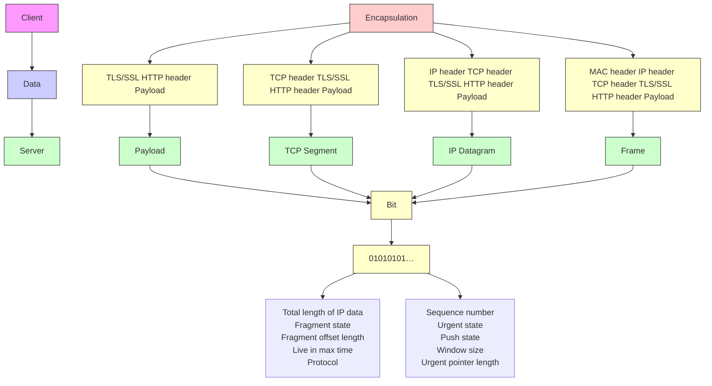

# Article in Press

# Bridging packet and session: Cross-level dual-attention networks for encrypted traffic classification

Received: 24 Nov 2025

Accepted: 03 Jan 2026

Published online: 20 January 2026

Cite this article as: Gu, J., Zhong, Y., Yu, X. et al.  Bridging packet and session: Cross-level dual-attention networks for encrypted traffic classification. J. King Saud Univ. Comput. Inf. Sci. (2026). https://doi.org/10.1007/s4444 3-026-00470-7

# Jieming Gu, Yue Zhong & Xiangzhan Yu

We are providing an unedited version of this manuscript to give early access to its findings. Before final publication, the manuscript will undergo further editing. Please note there may be errors present which affect the content, and all legal disclaimers apply.

If this paper is publishing under a Transparent Peer Review model then Peer Review reports will publish with the final article.

# Bridging Packet and Session: Cross-Level Dual-Attention Networks for Encrypted Traffic Classification

# Abstract

The widespread adoption of encryption technologies has greatly increased the complexity of network traffic classification, as plaintext features such as DNS are increasingly unavailable. Traditional payload-based approaches fail under strong encryption, while statistical and deep learning methods relying on single-level information often struggle to capture comprehensive traffic patterns. To address these challenges, we propose Cross-Level Encrypted Traffic (CLET), a novel classification model that integrates session-level and packet-level representations to capture comprehensive patterns in encrypted traffic. At the session level, CLET constructs an 87-dimensional attribute set encompassing certificate characteristics, temporal behaviors, and spatial distributions, providing a robust global view of each flow. At the packet level, CLET introduces a compact 13-dimensional attribute set processed by a hybrid CNN-Transformer network with dual attention mechanisms, learning fine-grained temporal and spatial dependencies while avoiding redundant information. By jointly leveraging global and local representations, CLET mitigates information loss and enhances feature discriminability. Experiments on the LFETT2021 and ISCX-VPN datasets show that CLET outperforms state-of-the-art baselines, demonstrating the effectiveness of cross-level learning for encrypted traffic classification.

Keywords: Encrypted traffic classification, Application identification, Cross-level feature learning, Deep learning

# 1 Introduction

With the rapid advancement of the Internet and the proliferation of smart devices, online services for communication, commerce, and entertainment have expanded dramatically. This evolution has led to an exponential growth in network traffic, while the widespread adoption of encryption technologies has significantly improved privacy protection (Sethi et al. (2024)). However, encryption also reduces protocol transparency, diminishes plaintext availability, and increases traffic randomness, which collectively complicate malicious behavior detection and quality of service (QoS) management for Internet service providers (ISPs) (Choorod et al. (2024)). Traditional payload-based inspection techniques, such as deep packet inspection (DPI) (Zhou et al. (2024)), are no longer applicable in encrypted environments (Sharma and Habibi Lashkari (2025)), creating an urgent demand for effective encrypted traffic classification (Li et al. (2025)).

Beyond the loss of payload information, encrypted traffic classification faces key challenges. Traffic exhibits both global session-level patterns and local packet-level behaviors, and flows can vary widely in duration and temporal dynamics. These factors make it difficult to model encrypted traffic effectively with a single representation.

Over the past decade, researchers have explored several directions to address this problem. Fingerprint-based methods (Korczy´nski and Duda (2014); Chen et al. (2019)) initially leveraged residual plaintext information in protocols, but as protocol fields became increasingly encrypted (Diao et al. (2023)), their effectiveness gradually declined. Statistical approaches (Taylor et al. (2016); Van Ede et al. (2020); Gu et al. (2021); Xie et al. (2021)) used session- or packet-level statistics (e.g., packet length, inter-arrival time) combined with classical machine learning algorithms. While efficient, these methods often overlook implicit temporal and spatial dependencies within traffic contexts, less sensitive to short-term or fine-grained behavioral differences, and may fail when flows are unreliable or incomplete (Zhang et al. (2024)). More recently, deep learning techniques (Liu et al. (2019); Shapira and Shavitt (2021); Huoh et al. (2021); Xiao et al. (2021)) have been applied directly to raw traffic data, with convolutional neural networks (CNNs) and recurrent neural networks (RNNs) automatically extracting deep representations. In practice, however, the high computational and latency constraints of real-time deployment often force truncation of packet lengths or the number of packets per flow, which can result in loss of global session-level information. Moreover, raw traffic contains redundant patterns that are unrelated to classification, adding computational burden while diluting useful information. In addition, many deep learning methods rely on plaintext Domain Name System (DNS) features to improve performance (Huoh et al. (2021); Xiao et al. (2021); Wang et al. (2017); Lin et al. (2022); Campo et al. (2024); Chen and Wang (2024)). Nonetheless, the DNS protocol lacks integrity protection and replay resistance, making responses vulnerable to attacks (Zhao (2025)). To mitigate these risks, encrypted DNS protocols such as DNS over HTTPS (DoH) and DNS over TLS (DoT) have been deployed (Sunahara et al. (2025)), which enhances privacy but simultaneously reduces the availability of highly discriminative plaintext features, thereby exacerbating classification challenges. Consequently, methods relying on auxiliary plaintext information, such as DNS features, become increasingly vulnerable in modern encrypted network environments.

These studies highlight a fundamental limitation: most existing methods rely on features from a single level of traffic representation. Statistical methods emphasize session-level attributes (Taylor et al. (2016); Gu et al. (2021); Conti et al. (2015)), while deep learning methods focus on flow- or packet-level patterns (Xiao et al. (2021); Wang et al. (2017); Lin et al. (2022); Zeng et al. (2019); Lu et al. (2021); Wang et al. (2020)). This separation restricts their ability to capture both global structures and local contextual dynamics, resulting in incomplete representations of encrypted traffic. As a result, single-level methods often struggle to distinguish applications or categories with similar session-level statistics, and may not perform consistently across both short- and long-duration flows. Therefore, identifying and exploiting latent relationships across different levels to form a more comprehensive understanding of encrypted traffic remains a significant challenge.

To address this gap, we propose CLET, a cross-level encrypted traffic classification model that fuses session-level and packet-level information. At the session level, we design an 87-dimensional attribute set capturing certificate properties, temporal patterns, and spatial distributions, which preserves global structural features and mitigates information loss caused by traffic truncation. At the packet level, we construct a hybrid neural network combining CNN and Transformer architectures with dual attention, using a compact 13-dimensional Temporal-Spatial-State-Related (TSSR) attribute set to extract fine-grained local dependencies while eliminating redundant raw traffic data. Specifically, the CNN first extracts local packet-level patterns, which are refined by a dual attention layer before being fed into the Transformer to model long-range dependencies within packet sequences. By integrating these complementary feature spaces, CLET achieves a holistic representation of encrypted traffic. Extensive experiments on the LFETT2021 and ISCX-VPN datasets show that CLET consistently outperforms state-of-the-art baselines.

In summary, the main contributions of this paper include:

(1) We propose CLET, a cross-level encrypted traffic classification framework that unifies session-level global features and packet-level local features, enabling effective classification without reliance on plaintext DNS information.   
(2) We introduce a novel 87-dimensional session-level attribute set that captures global structural information and mitigates information loss caused by traffic truncation.   
(3) We construct a 13-dimensional packet-level attribute set that serves as a compact and informative substitute for raw traffic data, and integrate it into a hybrid CNN-Transformer architecture with dual attention to exploit implicit temporal-spatial dependencies within traffic contexts.   
(4) We conduct comprehensive experiments on the LFETT2021 and ISCX-VPN datasets, demonstrating that CLET consistently outperforms state-of-the-art approaches.

# 2 Related Work

Encrypted traffic classification has emerged as a critical topic in cybersecurity. This study reviews existing research and categorizes it into three distinct types.

# 2.1 Fingerprint Constructing-based Methods

Some studies suggest using unencrypted protocol field information to construct fingerprint libraries (Chen et al. (2019); Van Ede et al. (2020)). These methods aim to address the limitations of packet inspection techniques, which often struggle to classify encrypted traffic effectively. FlowPrint (Van Ede et al. (2020)) is a semi-supervised learning method that extracts four types of features: temporal, device, destination, and size. It builds a correlation graph through clustering and cross-correlating these features, identifying the maximal clique in the correlation graph as the application fingerprint. Nevertheless, the increasing adoption of content delivery networks (CDNs) has introduced new challenges, as the IP addresses of backend services associated with applications frequently change. Moreover, these fingerprints are easily tampered with in virtual communication networks, which restricts the effectiveness of fingerprinting techniques.

# 2.2 Statistical Feature-based Methods

Statistical feature-based approaches utilize statistical features to represent network traffic and employ machine learning algorithms for classification (Conti et al. (2015); Taylor et al. (2016); Anderson and McGrew (2016); Muehlstein et al. (2017); Kostas et al. (2022); Zaki et al. (2022)). Conti et al. (2015) employed an unsupervised hierarchical clustering approach to group flows into distinct clusters, using the sizes of these clusters as features with a random forest (RF) (Breiman (2001)) classifier. AppScanner (Taylor et al. (2016)) utilizes the statistical properties of the traffic and raw packet lengths as features to categorize applications on Google Play. Muehlstein et al. (2017) used plaintext field information from the TLS handshake as features and applied the support vector machine (SVM) (Hearst et al. (1998)) with radial basis function (RBF) (Buhmann (2000)) to classify applications in HTTPS traffic. GRAIN (Zaki et al. (2022)) first extracts 52-dimensional features from the statistical results of payload lengths, then evaluates the correlation of each feature with traffic classes, and finally obtains 7 features (including the Layer 4 protocol). However, these methods typically focus on session-level global information while neglecting the contextual correlations within the traffic.

# 2.3 Deep Learning-based Methods

In contrast to statistical feature-based methods, deep learning models provide robust pattern recognition capabilities, eliminating the need for manual feature engineering. These models enable automatic feature extraction, facilitating the acquisition of abstract and high-dimensional features from network traffic (Shapira and Shavitt (2021); Shen et al. (2021); Dong et al. (2021); Lin et al. (2022); Zhang et al. (2023); Wang et al. (2024); Dong et al. (2024); Yuan et al. (2024); Wang et al. (2026)).

With the tremendous success of CNNs in image recognition and classification (Jia (2025)), researchers have transformed traffic classification into an image classification problem, intuitively displaying network traffic patterns and behaviors through images. FlowPic (Shapira and Shavitt (2021)) normalizes packet arrival times and packet lengths to construct two-dimensional histograms, which are then used as input to a CNN based on the LeNet-5 architecture (LeCun et al. (1998)). Additionally, graph neural networks (GNNs) are capable of recognizing patterns and relationships within graphs and are widely used for unstructured data. GraphDApp (Shen et al. (2021)) constructs a traffic interaction graph from bidirectional traffic bursts, incorporating multi-dimensional features to characterize client-server interactions. TFE-GNN (Zhang et al. (2023)) uses point-wise mutual information to generate traffic graphs and employs dual embedding layers to independently process packet headers and payloads, mining the latent correlation between bytes. MdDF (Wang et al. (2024)) represents one of the earliest approaches to jointly model intra-flow and inter-flow features for traffic classification. By modeling discriminative information in both Euclidean and non-Euclidean spaces, it facilitates complementary learning across modalities, thereby improving classification accuracy and robustness. The transformer-based method ET-BERT (Lin et al. (2022)) leverages the pre-training architecture of natural language processing. The model is pre-trained on a large-scale unlabelled encrypted traffic dataset to learn raw traffic representations and then fine-tuned with a limited number of labeled samples to adapt to specific classification tasks. Deep reinforcement learning allows models to learn adaptive strategies for anomaly detection. The A3CAD model (Dong et al. (2024)) incorporates the Henry Gas Solubility Optimization (HGSO) algorithm for feature selection and employs a multi-agent asynchronous Actor-Critic structure to optimize anomaly detection strategies, improving robustness and detection performance in complex network scenarios.

# 2.4 Differences From Existing Work

With the advancement of encryption technologies, network traffic has become increasingly complex, leading to a reduction in the availability of highly discriminative features. Existing classification approaches often rely on single-level representations and plaintext DNS information, which limits their ability to capture contextual patterns in traffic and diminishes their applicability in modern network environments. Statistical feature-based methods primarily leverage global statistical characteristics but overlook correlations within traffic sequences. Deep learning-based methods, which incorporate DNS information, are becoming less effective due to the widespread adoption of encrypted DNS protocols, such as DoH and DoT. Moreover, these models typically operate on truncated raw traffic, which not only leads to incomplete feature representation but also introduces redundant information that may reduce classification performance. To address these limitations, CLET removes the dependency on plaintext DNS data and combines session-level global features with packet-level temporal and spatial characteristics. This cross-level design allows CLET to capture both the overall statistical distribution and the fine-grained variations of traffic, leading to a more comprehensive and robust representation for encrypted traffic classification. To highlight the advantages of our work, Table 1 summarizes the key differences between CLET and existing methods.

# 3 Methodology

# 3.1 Framework Overview

We propose a novel cross-level encrypted traffic classification model based on a hybrid deep learning architecture, named CLET. This model effectively integrates session-level and packet-level features of encrypted traffic to enhance classification performance. As illustrated in Figure 1, CLET consists of three main stages: data preprocessing, dual-level feature learning, and cross-level classification.

Table 1 Summary of Encrypted Traffic Classification Methods. 

<table><tr><td>Category</td><td>Refs.</td><td>Feature Level</td><td>DNS Dependency</td><td>Application Scenario</td></tr><tr><td rowspan="2">Fingerprint Constructing</td><td>Chen et al. (2019)</td><td rowspan="2">Session-level</td><td>√</td><td>Application Classification</td></tr><tr><td>Van Ede et al. (2020)</td><td>×</td><td>Application Classification</td></tr><tr><td rowspan="3">Statistical Feature</td><td>Conti et al. (2015); Taylor et al. (2016); Muehlstein et al. (2017); Zaki et al. (2022)</td><td rowspan="3">Session-level</td><td>×</td><td>Application Classification</td></tr><tr><td>Anderson and McGrew (2016)</td><td>√</td><td>Threat Detection</td></tr><tr><td>Kostas et al. (2022)</td><td>√</td><td>Device Identification</td></tr><tr><td rowspan="8">Deep Learning</td><td>Shapira and Shavitt (2021); Shen et al. (2021)</td><td>Packet-level</td><td>×</td><td>Application Classification</td></tr><tr><td>Lin et al. (2022)</td><td>Packet-level</td><td>√</td><td>Generic</td></tr><tr><td>Zhang et al. (2023)</td><td>Packet-level</td><td>√</td><td>Application Classification</td></tr><tr><td>Dong et al. (2021, 2024)</td><td>Session-level</td><td>√</td><td>Threat Detection</td></tr><tr><td>Yuan et al. (2024)</td><td>Packet-level</td><td>√</td><td>Threat Detection</td></tr><tr><td>Wang et al. (2026)</td><td>Packet-level</td><td>×</td><td>Threat Detection</td></tr><tr><td>Wang et al. (2024)</td><td>Cross-level</td><td>×</td><td>Threat Detection</td></tr><tr><td>Ours</td><td>Cross-level</td><td>×</td><td>Application Classification</td></tr></table>

In the data preprocessing stage, two attribute sets are extracted from encrypted traffic: an 87-dimensional session-level holistic attribute set and a 13-dimensional packet-level Temporal-Spatial-State-Related (TSSR) attribute set. Detailed preprocessing procedures are described in Section 4.1.2. The dual-level feature learning stage includes two complementary modules for feature extraction. The session-level features learning module processes the 87-dimensional holistic attribute set using an autoencoder, generating 87-dimensional global representations for each session. The packet-level features learning module employs a hybrid CNN-Transformer architecture enhanced with a dual attention mechanism. It utilizes the 13-dimensional TSSR attribute set from each of the first N packets (N = 16) to produce 16-dimensional packet-level representations, effectively filtering redundant and irrelevant packet information. The choice of N = 16 is based on experimental results, as detailed in Section 4.5. In the cross-level classification stage, the session-level and packet-level representations are integrated to form a 103-dimensional joint feature vector. A three-layer multilayer perceptron (MLP) is employed to capture the interactions between global and local representations, yielding a comprehensive representation of encrypted traffic. The updated 103-dimensional features are subsequently fed into LightGBM (Ke et al. (2017)) for final classification.

# 3.2 Session-level Features Learning Module

During preprocessing, each PCAP file is divided into sessions based on five-tuples (source IP address, source port, destination IP address, destination port, and transport layer protocol). Metadata is then parsed and extracted from these sessions. From this metadata, we construct two types of attributes: statistical attributes (e.g., frequency, count, mean, extrema, variance, standard deviation) and combinatorial attributes generated by cross-field operations. These features form an 87-dimensional session-level attribute set across three types. The detailed structure of the attribute set is illustrated in Figure 2, where each attribute is labeled by its characteristics (e.g., handshake-related, temporal-related). Section 4.4 further analyzes the effect of different attribute subsets on classification performance and demonstrates the effectiveness of the complete 87-dimensional set.


<details>
<summary>flowchart</summary>

```mermaid
graph TD
    A["Encrypted Traffic"] --> B["Data Preprocessing"]
    B --> C["Session-level Features Learning Module"]
    C --> D["Cross-level Classification"]
    D --> E["Application"]

    subgraph Data Preprocessing
        F["PCAP file"] --> G["Packet-level Features Learning Module"]
        G --> H["Cross-level Classification"]
    end

    subgraph Session-level Features Learning Module
        I["Unsupervised Learning"] --> J["SSL/TLS version"]
        J --> K["Encoder"]
        K --> L["Decoder"]
        L --> M["SS/TLS cipher suite"]
        M --> N["Signature algorithm"]
    end

    subgraph Data Preprocessing
        O["Settings"] --> P["Packet 1"]
        P --> Q["Packet 2"]
        Q --> R["..."]
        R --> S["Packet N"]
        S --> T["Traffic split"]
        T --> U["Traffic filter"]
        U --> V["Session"]
        V --> W["#1 Header & Payload"]
        V --> X["#2 Header & Payload"]
        V --> Y["#N Header & Payload"]
    end

    subgraph Session-level Features Learning Module
        Z["SSL/TLS version"] --> AA["Encoder"]
        AB["SSL/TLS cipher suite"] --> AC["Decoder"]
        AD["SS/TLS version"] --> AE["Encoder"]
        AF["SSL/TLS cipher suite"] --> AG["Decoder"]
        AH["Signature algorithm"] --> AI["Encoder"]
        AJ["SSL/TLS cipher suite"] --> AK["Decoder"]
        AL["Signature algorithm"] --> AM["Encoder"]
    end

    subgraph Cross-level Classification
        AN["Multi-layer Perceptron"] --> AO["Classifiers"]
        AP["LightGBM"] --> AO
        AQ["CatBoost"] --> AO
        AR["AdaBoost"] --> AO
        AS["XGBoost"] --> AO
        AT["Random Forest"] --> AO
    end

    subgraph Application
        AU["..."] --> AV["Cross-level Classification"]
        AW["..."] --> AX["Cross-level Classification"]
        AY["..."] --> AZ["Cross-level Classification"]
    end

    subgraph PCAP file
        BA["Direction"] --> BB["Packet-level Features Learning Module"]
        BC["Protocol"] --> BD["Packet-level Features Learning Module"]
        BE["TCP push state"] --> BF["Packet-level Features Learning Module"]
    end

    subgraph Data Preprocessing
        BG["Pcap header 1"] --> BH["Pcap header 2"]
        BI["Pcap header 3"] --> BJ["Papier 1"]
        BK["Pcap header 4"] --> BL["Papier 2"]
        BM["Papier 5"] --> BN["Papier 3"]
    end

    subgraph Session processing
        BO["Packet header 1"] --> BP["Packet payload 1"]
        BP["Packet header 2"] --> BQ["Packet payload 2"]
        BR["Packet header N"] --> BS["Packet payload N"]
    end

    subgraph Data Preprocessing
        BT["Packet header 1"] --> BU["Packet payload 1"]
        BV["Packet header 2"] --> BW["Packet payload 2"]
        BX["Packet header N"] --> BY["Packet payload N"]
    end

    subgraph Session processing
        BZ["Packet header 1"] --> CA["Packet payload 1"]
        CB["Packet header 2"] --> CC["Packet payload 2"]
        DD["Packet header N"] --> DP["Packet payload N"]
    end

    subgraph Session classification
        QZ["Packet header 1"] --> AR["Packet payload 1"]
        AS["Packet header 2"] --> AT["Packet payload 2"]
    end

    subgraph Cross-level Classification
        AU["Cross-level Classification"] --> AV["Cross-level Classification"]
    end

    subgraph Application
    AW["Cross-level Classification"] --> AX["Cross-level Classification"]
    AY["Cross-level Classification"] --> AZ["Cross-level Classification"]
    ASX["Cross-level Classification"] --> AZ
    ATX["Cross-level Classification"] --> AZ
```
</details>

Fig. 1. Overview of CLET Framework. The proposed model consists of three stages: (1) data preprocessing, (2) dual-level feature learning, and (3) cross-level classification. In the data preprocessing stage, encrypted traffic is filtered to exclude DNS and other unreliable flows. Two attribute sets are then extracted: an 87-dimensional session-level holistic attribute set from each session and a 13-dimensional packet-level Temporal-Spatial-State-Related attribute set from each of the first N packets (N = 16) of each session. In the dual-level feature learning stage, the session-level features learning module employs an autoencoder to generate 87-dimensional global representations, while the packet-level features learning module utilizes a hybrid CNN-Transformer architecture to obtain 16-dimensional local representations. These features are fused into a 103-dimensional cross-level representation. Finally, in the cross-level classification stage, various classifiers are applied to identify traffic applications. This design enables CLET to overcome the limitations of single-level approaches and achieve a comprehensive understanding of encrypted traffic.

The session-level feature learning module employs an autoencoder to obtain refined global representations of encrypted traffic, as illustrated in Figure 1. Both the encoder and decoder consist of three fully connected layers. The 87-dimensional handcrafted attributes are used as input, and the latent representation z is designed to preserve the same dimensionality. The autoencoder is not intended for dimensionality reduction but for nonlinear transformation and semantic refinement, enhancing the compatibility between session-level statistical features and packet-level deep representations by mitigating scale and distribution mismatches for effective cross-level feature fusion. Since the handcrafted attributes are already compact and discriminative, further compression could lead to information loss with limited computational benefits. Therefore, the autoencoder serves as a semantic bridge that enhances representational consistency across levels. As detailed in Section 4.4, we further investigate the impact of the autoencoder’s inclusion and the effect of reducing the latent representation dimensionality.

```mermaid
graph TD
    A["Time-Related"] --> B["Session Attribute"]
    A --> C["Handshake-Related"]
    A --> D["Spatial-Related"]

    B --> B1["The duration of the session."]
    B --> B2["Bidirectional inter arrival time. (Avg, Min, Max, Var, Std)"]
    B --> B3["Forward inter arrival time. (Avg, Min, Max, Std)"]
    B --> B4["Backward inter arrival time. (Avg, Min, Max, Std)"]
    B --> B5["The amount of time a flow was activate before going idle. (Avg, Min, Max, Std)"]
    B --> B6["The amount of time a flow was idle before going activate. (Avg, Min, Max, Std)"]

    C --> C1["SSL/TLS version."]
    C --> C2["SSL/TLS cipher suite."]
    C --> C3["The length of certificate chain."]
    C --> C4["The average validity days of certificates."]
    C --> C5["The average length of certificates."]
    C --> C6["Signature algorithm."]

    D --> D1["Backward packets lengths. (Avg, Min, Max, Var, Std)"]
    D --> D2["Backward packets transportlayer payload lengths.(Avg, Min, Max, Var, Std)"]
    D --> D3["Backward reasssembled PDUs lengths. (Avg, Min, Max, Var, Std)"]
    D --> D4["Bidirectional flow bytes per second."]
    D --> D5["Bidirectional packet number per second."]
    D --> D6["Bidirectional packets lengths. (Avg, Min, Max, Std)"]
    D --> D7["Bidirectional reasssembled PDUs lengths.(Avg, Min, Max, Var, Std)"]
    D --> D8["Forward packets lengths. (Avg, Min, Max, Var, Std)"]
    D --> D9["Forward packets transport layer payload lengths.(Avg, Min, Max, Var, Std)"]
    D --> D10["Forward reasssembled PDUs lengths. (Avg, Min, Max, Var, Std)"]
    D --> D11["The number of packets of reassembled PDUs.(Avg, Max)"]
    D --> D12["The ratio of (Avg) forward packets lengths to (Avg) backward packets lengths."]
    D --> D13["The ratio of forward packet number to backward packet number."]
    D --> D14["The sum of bytes missed. (Forward, Backward)"]
    D --> D15["The sum of packets lengths. (Forward, Backward)"]
    D --> D16["The sum of packets transport layer payload lengths in fact.(Forward, Backward)"]
    D --> D17["The sum of packets transport layer payload lengths in theoretical.(Forward, Backward)"]
    D --> D18["Total number of packets. (Bidirectional, Forward, Backward)"]
    D --> D19["Total number of reassembled PDUs. (Bidirectional, Forward, Backward)"]
```


<details>
<summary>flowchart</summary>


</details>

Fig. 2. Session-level Attribute Set. The 87-dimensional session-level holistic attribute set can be categorized into three types according to their characteristics: temporal-related, spatial-related, and handshake-related attributes.

# 3.3 Packet-level Features Learning Module

# 3.3.1 Packet-level Features

Packet-level features capture fine-grained local patterns that complement session-level global features. Encrypted traffic can be implicitly characterized by the temporal and spatial states of individual packets, as distinct patterns in packet length sequences and relative time sequences are observed across encrypted traffic from different applications (Gu et al. (2021)). When employing raw traffic as input to deep models, the selection of packet count and packet length is particularly critical for effective feature extraction. Insufficient input may lead to an incomplete representation, while excessive input may introduce redundant information. To balance classification effectiveness and computational efficiency, we propose a 13-dimensional Temporal-Spatial-State-Related (TSSR) attribute set from each of the first N packets (N = 16) in a session, instead of using raw bytes. This representation captures essential local patterns in encrypted traffic across various applications without relying on Server Name Indication (SNI). Section 4.5 demonstrates that the 13-dimensional TSSR attributes and the selection of N packets provide a compact and effective representation for packet-level feature learning. The detailed definitions and characteristics of the TSSR attributes are summarized in Table 2.

Table 2 Packet-level TSSR attribute set. 

<table><tr><td>No.</td><td>TSSR Attributes</td><td>Temporal-Related</td><td>Spatial-Related</td><td>State-Related</td></tr><tr><td>1</td><td>Forward direction in a session</td><td></td><td>√</td><td></td></tr><tr><td>2</td><td>Backward direction in a session</td><td></td><td>√</td><td></td></tr><tr><td>3</td><td>Time relative to the first frame</td><td>√</td><td></td><td></td></tr><tr><td>4</td><td>Total length of IP data</td><td></td><td>√</td><td></td></tr><tr><td>5</td><td>Fragment state</td><td></td><td></td><td>√</td></tr><tr><td>6</td><td>Fragment offset length</td><td></td><td>√</td><td></td></tr><tr><td>7</td><td>Live in max time</td><td>√</td><td></td><td></td></tr><tr><td>8</td><td>Protocol</td><td></td><td>√</td><td></td></tr><tr><td>9</td><td>TCP sequence number</td><td></td><td>√</td><td></td></tr><tr><td>10</td><td>TCP urgent state</td><td></td><td></td><td>√</td></tr><tr><td>11</td><td>TCP push state</td><td></td><td></td><td>√</td></tr><tr><td>12</td><td>TCP window size</td><td></td><td>√</td><td></td></tr><tr><td>13</td><td>TCP urgent pointer length</td><td></td><td>√</td><td></td></tr></table>

In computer networks, a session encompasses all packets that constitute the bidirectional communication between two entities. The client is the entity that initiates the Transmission Control Protocol (TCP) connection, while the server responds to this request. Accordingly, the forward direction refers to data transmission from the client to the server, and the backward direction refers to the reverse flow. For the User Datagram Protocol (UDP), the sender of the initial transmission is designated as the client, and the receiver is designated as the server. These directional definitions form the basis for the TSSR attributes, ensuring consistent representation across sessions for packet-level learning.

To construct the TSSR attributes, we first identify the forward and backward directions of packets as attributes 1 and 2. The relative time of each packet within a session is then calculated as attribute 3, defined by the time interval between the current packet and the first packet in the session. Subsequently, additional temporal, spatial, and state-related features are extracted from the packet headers. Specifically, attributes 4-8 are derived from the IP header, while attributes 9-13 are obtained from the TCP header. When the transport layer protocol is TCP, attribute 8 is set to 1. For other protocols, attributes 8-13 are set to 0. The overall extraction process is illustrated in Figure 3, using HTTPS traffic as an example.


<details>
<summary>flowchart</summary>


</details>

Fig. 3. Packet-level TSSR Attribute Set Extraction. Taking HTTPS as an example, field information is extracted from both IP and TCP headers to construct the 13-dimensional TSSR attribute set.

# 3.3.2 Model Architecture

Figure 1 presents the architecture of the packet-level features learning module, which leverages the 13-dimensional TSSR attribute set from each of the first N packets (N = 16) in a session as a compact alternative for raw traffic, generating 16-dimensional local packet-level representations. Section 4.5 demonstrates that this choice of TSSR attributes and packet count N provides a concise and effective representation for packet-level feature learning. This module integrates CNN and Transformer architectures, further enhanced by dual attention layers to extract spatial and channel features from encrypted traffic, thereby significantly improving the classification performance.

Encrypted traffic inherently exhibits spatial dependencies both between packets within a session (inter-packet) and within individual packets (intra-packet). These patterns often correspond to specific traffic types or applications. To capture these high-order dependencies, it is essential to analyze both inter-packet and intra-packet spatial dependencies, enabling a comprehensive understanding of external and internal relationships. CNNs are effective at learning local spatial features, whereas Transformers capture long-range global dependencies. To leverage the complementary advantages of both architectures, we combine CNN and Transformer layers within the same framework. Furthermore, to optimize the input to the Transformer and enhance its representational capability, we introduce a dual attention layer (DA-layer) inspired by DANet (Fu et al. (2019)) and DA-TransUNet (Sun et al. (2024)). This layer incorporates spatial and channel attention mechanisms, allowing the model to refine and emphasize salient features. By enhancing feature selection and contextual alignment, the DA-layer enables more comprehensive and discriminative global feature extraction. Through the integration of CNN, transformer, and dual attention mechanism, the packet-level features learning module in CLET demonstrates superior capability in extracting complementary and high-quality features, leading to more effective encrypted traffic classification.

CNN. As shown in Figure 1, the packet-level features learning module adopts a CNN based on the ResNet50v2 (He et al. (2016)) architecture to extract discriminative packet-level representations from encrypted traffic. In this work, the packet-level input is organized as a structured tensor rather than a natural image. Specifically, the input to the CNN is constructed from the first N packets of each session, where each packet is represented by a 13-dimensional TSSR attribute vector. The resulting input is organized in an $H \times W \times C$ format, where H corresponds to the packet index (temporal order) and W denotes the attribute dimension at the input stage. For the input layer, C is set to 1, while deeper convolutional layers progressively expand the channel dimension to generate intermediate feature maps. Accordingly, the CNN is used to capture local correlations within this packet-attribute representation, rather than visual semantics. Similar residual CNN-based architectures have been employed in traffic analysis studies (Saheed et al. (2024); Farhan et al. (2025)) to model structured network traffic representations, demonstrating their effectiveness in capturing local dependencies among packet-level features. In Section 4.5, we further investigate the impact of the number of packets N and the length of payload per packet M on classification performance.

In contrast to the conventional post-activation method, the residual blocks employ a pre-activation approach, where the activation functions are placed before the weight layer. With each convolutional layer, the feature map size is halved while its channel dimensionality is doubled. This pre-activation structure has been empirically shown to enhance feature expressiveness while maintaining computational efficiency (He et al. (2016)).

DA-layer. As shown in Figure 4, the DA-layer integrates both positional and channel features of the input feature map, enhancing representational depth and highlighting discriminative features while preserving intrinsic properties. This integration refines the feature representations passed to the transformer, maintaining its ability to capture global dependencies while enriching local spatial awareness. By effectively combining global features with local spatial and channel information, the DA-layer improves the expressiveness of the extracted features.

The DA-layer consists of two key components inspired by DANet (Fu et al. (2019)): the positional attention layer $F _ { p } \ \mathrm { ( P A L ) }$ and the channel attention layer $F _ { c }$ (CAL), which capture semantic dependencies along the spatial and channel dimensions, respectively. In this module, the input to the DA-layer is not raw packets but feature representations generated from the 13-dimensional attribute set through CNN processing. The PAL models temporal-spatial dependencies among attributes by computing weighted correlations across all spatial locations, enabling the selective aggregation of features from different positions. This mechanism highlights informative patterns such as the interaction between packet length variations and inter-arrival times, which often reveal distinctive temporal-spatial characteristics in traffic flows. Meanwhile, the CAL models inter-channel relationships by dynamically adjusting the importance of different feature dimensions. Since each channel dimension captures distinct aspects of packet behavior (e.g., directionality, size statistics, or timing), CAL selectively emphasizes relevant features and suppresses less informative ones, thereby refining the overall representation. By jointly leveraging PAL and CAL, the DA-layer captures both temporal-spatial dependencies and inter-channel semantics, leading to more expressive and discriminative packet-level feature representations for encrypted traffic classification.


<details>
<summary>flowchart</summary>

```mermaid
graph TD
    subgraph_Position_Attention_Layer["Position Attention Layer"]
        X["Input (n,n,n)"] --> Y1["(n,n,n,8)"]
        X --> Y2["(n,n,n,8)"]
        Y1 --> U["(n,n,n,8)"]
        Y2 --> V["(n,n,n,8)"]
        U --> Y3["(n,n,n,8)"]
        V --> Y4["(n,n,n,8)"]
        Y3 --> Output["Output (n,n,n)"]
        Y4 --> Output
    end

    subgraph_Channel_Attention_Layer["Channel Attention Layer"]
        X1["H×W×C"] --> Y5["(n×W×C)"]
        Y5 --> Q["Q × C"]
        Q --> V2["(n×W×C)"]
        V2 --> Output2["Output (n×W×C)"]
    end

    X1 --> Y6["(n,n,n,8)"]
    X2["X̄"] --> Y6
    Y6 --> Fp["Fp"]
    Fp --> U["U"]
    U --> Y7["(n,n,n,8)"]
    U --> Y8["(n,n,n,8)"]
    Y7 --> Add1["⊕"]
    Y8 --> Add1
    Add1 --> Output3["Output (n×W×C)"]
    
    style Position_Attention_Layer fill:#f9f,stroke:#333
    style Channel_Attention_Layer fill:#bbf,stroke:#333
```
</details>

Fig. 4. Architecture of the DA-layer. The DA-layer in the packet-level features learning module contains two sub-layers: the position attention layer (PAL) and the channel attention layer (CAL).

To improve computational efficiency, we first apply a convolution operation to the input feature X, which corresponds to the output feature map produced by CNN, before feeding it into the attention layers. This operation reduces the number of channels to $\frac { 1 } { 8 }$ of the $X ,$ thereby simplifying feature extraction within the attention layer. The processed feature map X¯ is then passed through the $( F _ { p } )$ and $\left( F _ { c } \right)$ , each followed by an additional convolution to generate the intermediate outputs $Y _ { 1 }$ and $Y _ { 2 } { \mathrm { : } }$

$$
\bar {X} = \operatorname{conv} (X), \tag {1}
$$

$$
Y _ {1} = \operatorname{conv} (F _ {p} (\bar {X})), Y _ {2} = \operatorname{conv} (F _ {c} (\bar {X})). \tag {2}
$$

Subsequently, $Y _ { 1 }$ and $Y _ { 2 }$ are summed and passed through another convolutional layer to restore the original channel dimension, producing the final output of the DA-layer, denoted as $\bar { Y }$ :

$$
\bar {Y} = \operatorname{conv} (Y _ {1} + Y _ {2}). \tag {3}
$$

The position attention layer $F _ { p }$ captures spatial dependencies between any two positions in the feature map. Given an input feature $\bar { X } \in \overset { \cdot } { \mathbb { R } } ^ { H \times W \times C }$ (where H, W , and $C$ denote height, width, and channel, respectively), the PAL first applies a convolutional layer to obtain three feature maps A, B, and D, where A $, B , D \in \mathbb { R } ^ { H \times W \times C }$ . The vectorization operation is then performed for A, B, and $D ,$ , transforming $\mathbb { R } ^ { H \times W \times C }$ into $\mathbb { R } ^ { N _ { s } \times C }$ , where $N _ { s } = H \times W$ represents the number of spatial locations in the feature map. Next, the transpose of A is matrix-multiplied with B to compute a similarity matrix of pixels within $\bar { X }$ , which follows a softmax operation to compute the position attention map P ∈ RNs×Ns : $P \in \mathbb { R } ^ { N _ { s } \times N _ { s } }$

$$
P _ {j i} = \frac {\exp \left(A _ {i} \cdot B _ {j}\right)}{\sum_ {i = 1} ^ {N _ {s}} \exp (A _ {i} \cdot B _ {j})}, \tag {4}
$$

where $P _ { j i }$ denotes the influence of the $i ^ { t h }$ position on the $j ^ { t h }$ position. The attention map $P$ is then multiplied by the transpose of $D ,$ and the result is reshaped into $\mathbb { R } ^ { \hat { H } \times W \times C }$ . The attention map P is then multiplied by the transpose of $D ,$ , and the result is reshaped into $\mathbb { R } ^ { H \times \dot { W } \times C }$ . After weighting by a learnable parameter $\alpha ,$ , the result is added element-wise to $\bar { X }$ for the final output $U { \in } \mathbb { R } ^ { H \times W \times \dot { C } } ;$ :

$$
U _ {j} = \alpha \sum_ {i = 1} ^ {N _ {s}} (P _ {j i} \cdot D _ {i}) + \bar {X} _ {j}, \tag {5}
$$

where α is initialized to 0 and optimized during training. Given that U combines global contextual relationships from all positions with the original features $\bar { X }$ , the PAL effectively aggregates spatial dependencies and enhances the representation of contextual information in encrypted traffic features.

Similarly, the channel attention layer $F _ { c }$ captures correlations between any two channels. Given an input feature $\bar { X } \ \in \ \mathbb { R } ^ { H \times W \times C }$ , the CAL first reshapes it from $\mathbb { R } ^ { H \times W \times C } { \mathrm { ~ t o ~ } } \mathbb { R } ^ { N _ { s } \times C }$ , where $N _ { s } = H \times W$ . The transpose of X¯ is then matrix-multiplied with X¯ , which follows a softmax normalization to generate the channel attention map Q ∈ RC×C : $Q \in \mathbb { R } ^ { C \times C }$

$$
Q _ {j i} = \frac {\exp \left(\bar {X} _ {i} \cdot \bar {X} _ {j}\right)}{\sum_ {i = 1} ^ {C} \exp (\bar {X} _ {i} \cdot \bar {X} _ {j})}, \tag {6}
$$

where $Q _ { j i }$ represents the influence of the $i ^ { t h }$ channel on the $j ^ { t h }$ channel. The attention map $Q$ is then multiplied by the transpose of $\bar { X }$ , and the result is reshaped into $\mathbb { R } ^ { \tilde { H } \times \tilde { W } \times C }$ . After weighting by a learnable parameter $\beta _ { ; }$ the result is added element-wise to $\bar { X }$ for the final output $V \in \mathbb { R } ^ { H \times W \times C }$ :

$$
V _ {j} = \beta \sum_ {i = 1} ^ {N _ {s}} \left(Q _ {j i} \cdot \bar {X} _ {i}\right) + \bar {X} _ {j}, \tag {7}
$$

where $\beta$ is initialized to 0 and optimized during training. Given that V combines the aggregated channel-wise dependencies with the original features X¯ , the CAL enhances the representation by adaptively emphasizing inter-channel relationships, thereby providing complementary channel feature extraction.

Transformer. Communication patterns often differ significantly across applications (Luo et al. (2025)). For example, instant messaging services typically transmit small and sporadic data packets, while streaming platforms send larger and continuous packets. In this study, we adopt a Transformer architecture following Vaswani et al. (2017). To balance computational efficiency and model performance, only the first N $( N = 1 6 )$ packets from each session are selected as input. The transformer then captures long-range dependencies within these sequential packets, identifying semantic correlations that may be distant in position. This mechanism plays a crucial role in understanding the overall structural characteristics of the encrypted traffic.

As shown in Figure 1, an embedding layer serves as a key intermediary after the DA-layer, performing dimensional transformation and preparing the features for subsequent transformer layers. Multi-layer transformers are then applied to capture longerrange dependencies within the packet sequences, aggregating contextual information across packets while complementing the global session-level representations.

Transformers are particularly advantageous for capturing global context, as their self-attention mechanism enables dynamic learning of dependencies across varying ranges without being constrained by local receptive fields. In the context of encrypted traffic classification, this capability allows the model to capture positional dependencies across input sequences. Integrating Transformer layers into CLET enhances its ability to extract complementary packet-level features, enhancing the discriminative power of the overall cross-level representation.

Cross-level classification. In computer networks, a session encompasses all data exchanges that constitute bidirectional communication. Consequently, session- and packet-level representations are intrinsically correlated, and leveraging this cross-level relationship can significantly enhance model performance. In CLET, we combine the 87-dimensional global representations from the session-level features learning module with the 16-dimensional local representations from the packet-level features learning module, forming a unified 103-dimensional cross-level feature vector. This representation is then fed into a three-layer MLP classifier for joint training of the traffic classification task. The impact of varying packet-level representation dimensionalities on classification performance is further analyzed in Section 4.7.

The overall training process in CLET is organized into three stages. In the first stage, we train the session-level features learning module independently to obtain 87- dimensional global representations. In the second stage, we freeze the parameters of this module and concatenate the global representations obtained from the first stage with the 16-dimensional local representations from the packet-level features learning module. This combination forms 103-dimensional cross-level features, which are then jointly trained using the MLP. In the third stage, inspired by Bui et al. (2021), who demonstrated that replacing MLPs with gradient-boosting algorithms can improve classification accuracy, we extract and save the updated 103-dimensional cross-level features and employ LightGBM as the final classifier.

A detailed comparison of classification performance using alternative classifiers is provided in Section 4.8, offering a comprehensive analysis of the impact of different classifiers on the effectiveness of cross-level feature integration.

Training objective. In the first training stage, the session-level features learning module is trained independently using the mean squared error (MSE) (Guo et al. (2025)) loss:

$$
\mathcal {L} _ {1} = \frac {1}{n} \sum_ {i = 1} ^ {n} (\hat {l} _ {i} - l _ {i}) ^ {2}, \tag {8}
$$

where n denotes the number of samples in each batch, l denotes the actual value and ˆl denotes the reconstructed value. The MSE loss measures the discrepancy between the input and output of the autoencoder, guiding it to learn compact and effective latent representations. By minimizing L1, the autoencoder refines high-dimensional sessionlevel features, enabling precise global feature extraction for subsequent cross-level integration.

In the second stage, a three-layer MLP is employed to jointly train the sessionlevel and packet-level feature learning modules. The objective of this stage is to classify encrypted traffic samples into their corresponding categories. Accordingly, cross-entropy (CE) (Mao et al. (2023)) loss is adopted as the optimization criterion:

$$
\mathcal {L} _ {2} = - \sum_ {i = 1} ^ {m} l _ {i} \log (\hat {l}), \tag {9}
$$

where m denotes the number of classes, l is the true label distribution, and ˆl represents the predicted probability distribution. CE loss quantifies the divergence between predicted and true distributions, making it well-suited for multi-class traffic classification tasks.

In the final stage, the MLP classifier is replaced with LightGBM to further enhance classification accuracy. To optimize the hyperparameters of LightGBM, we employ the Tree-structured Parzen Estimator (TPE) (Bergstra et al. (2011)), which efficiently explores the search space to identify optimal parameter configurations. With the optimized LightGBM, CLET completes cross-level encrypted traffic classification by jointly leveraging session-level global and packet-level local representations within a unified framework. This integration enables the model to fully exploit intrinsic crosslevel dependencies, thereby achieving superior classification performance across diverse encrypted traffic applications.

# 4 Experiments

# 4.1 Experimental Settings

# 4.1.1 Dataset

Experiments are conducted on the ISCX-VPN dataset (Gil et al. (2016)) and the LFETT2021 dataset (Gu et al. (2021)) to evaluate the performance of CLET in encrypted traffic classification tasks.

The ISCX-VPN dataset, introduced by the Canadian Institute for Cybersecurity in 2015, is one of the most widely used public datasets for encrypted traffic classification. The latest version includes encrypted traffic from 14 applications, encompassing a total of 13,520 sessions. This dataset is collected through VPNs, which are commonly used to access restricted websites or services and are difficult to identify due to obfuscation technologies.

The LFETT2021 dataset, introduced by the Institute of Information Engineering, Chinese Academy of Sciences in 2020 for encrypted traffic classification tasks, consists of five sub-datasets including the ShadowsocksR dataset, VMess dataset, SSL dataset, etc. It contains encrypted traffic from 23 applications across 2 operating system platforms. At present, the ShadowsocksR dataset and the VMess dataset are publicly available. Additionally, Gu et al. (2021) only reported the experimental results on the ShadowsocksR dataset and SSL dataset, with ShadowsocksR presenting a greater challenge than SSL. Therefore, we focus our experiments on the ShadowsocksR dataset, which includes encrypted traffic from 19 applications across 2 operating system platforms, totaling 64,332 sessions. Compared to datasets such as ISCX-VPN (Gil et al. (2016)) and ISCX-Tor (Lashkari et al. (2017)), the LFETT2021 dataset offers the following advantages: (1) The dataset is developed more recently, providing both greater timeliness and applicability. (2) The data diversity is enhanced by the inclusion of 2 operating system platforms (Android 10 and Windows 10). (3) Various techniques are used during traffic collection to mitigate background noise and improve clarity.

# 4.1.2 Data Preprocessing

Preprocessing is a crucial step in transforming raw PCAP files into suitable experimental units for classification. In contrast to unidirectional flow, a session consists of bidirectional flows, capturing interactive behaviors between communicating parties. This bidirectional nature provides richer contextual information, including requestresponse patterns and timing relationships. As a result, sessions are a more appropriate representation of traffic for encrypted traffic classification tasks (Wang et al. (2017);

Zhao et al. (2024); Seydali et al. (2023)). In our experiments, we use sessions as the basic training units to leverage their comprehensive contextual insights. To segment raw PCAP files into sessions, we use five-tuples (source IP address, source port, destination IP address, destination port, and transport layer protocol) for traffic segmentation.

Following the approach in TFE-GNN (Zhang et al. (2023)), we first exclude sessions without payload and those containing more than 10,000 packets. The former are typically used to establish connections between clients and servers, while the latter are often the result of temporary network failures and provide minimal information for classification. Moreover, in recent years, encrypted DNS has been increasingly deployed to enhance communication security, leading to a steady decline in plaintext DNS traffic in everyday network communications. Therefore, we also exclude DNS sessions containing queries and responses for domain names from the traffic, which can be used for application identification (Campo et al. (2024)), to better align with realworld encrypted traffic scenarios. Additionally, the Simple Service Discovery Protocol (SSDP), primarily used for discovering network devices and services, lacks meaningful discriminative information. Therefore, we further exclude SSDP traffic to reduce irrelevant noise in the dataset.

These preprocessing procedures are applied consistently across all baseline and proposed methods, ensuring fair comparison. By refining the datasets, we create a more challenging and realistic evaluation environment, allowing for better adaptation to modern encrypted traffic classification tasks. For the preprocessed sessions, we employ random sampling to split the dataset into non-overlapping training and test sets at a 4:1 ratio.

# 4.1.3 Implementation Details

Our hybrid classification framework consists of two key components: a session-level feature learning module and a packet-level feature learning module. In the session-level module, both the encoder and decoder are implemented as three-layer fully connected networks with group normalization and ReLU activation functions. In the packet-level module, the CNN follows the ResNet50V2 architecture (He et al. (2016)), and the Transformer is implemented based on the encoder architecture proposed by Vaswani et al. (2017), comprising 3 layers, 6 attention heads, and a hidden size of 384. In the employs a 2D CNN with a 1 × 1 kernel to produce updated feature maps.

The training process consists of three sequential stages. In the first and second stages, a three-layer multilayer perceptron (MLP) followed by a softmax function is employed as the classifier. The model is trained with a batch size of 80 using stochastic gradient descent (SGD) (Sclocchi and Wyart (2024)) as the optimizer, an initial learning rate of 0.01, and a dropout rate of 0.1.

In the third stage, the MLP classifier is replaced with LightGBM (Ke et al. (2017)), and hyperparameter optimization is performed using the TPE algorithm (Bergstra et al. (2011)). Each optimization task consists of 1,000 hyperparameter configurations, with 3,000 iterations per configuration and an early stopping criterion of 200 iterations. All experiments are conducted on an NVIDIA Titan RTX 3090 GPU.

# 4.2 Comparison Experiments

# 4.2.1 Baselines and Evaluation Metrics

The comparison experiments are conducted between CLET with state-of-the-art baselines on the LFETT2021 dataset (Gu et al. (2021)) and ISCX-VPN dataset (Gil et al. (2016)), including traditional feature engineering-based methods LFETT (Gu et al. (2021)) (RF as the classifier) and deep learning-based methods in CNN architectures (CENTIME (Maonan et al. (2021)), FlowPic (Shapira and Shavitt (2021)), Session-Video (Wang et al. (2022))), Transformer architecture (ET-BERT (Lin et al. (2022)), PEAN (Lin et al. (2023))), and GNN architecture (TFE-GNN (Zhang et al. (2023)), MH-Net (Zhang et al. (2025))).

In all experiments, we maintain consistent data preprocessing steps across both datasets. Specifically, given that LFETT (Gu et al. (2021)) does not disclose the experimental parameters of the RF classifier, we employ the TPE (Bergstra et al. (2011)) for hyperparameter optimization. For CENTIME, FlowPic, SessionVideo, TFE-GNN, MH-Net, and PEAN, we follow the experimental settings and training procedures provided in their papers and train the models until convergence. For FlowPic and SessionVideo, we apply the data augmentation techniques as outlined in their papers. For ET-BERT, we load the pre-trained model according to its instructions and apply transfer learning using the entire training dataset.

Among baseline methods, CENTIME, FlowPic, SessionVideo, ET-BERT, TFE-GNN, PEAN, and MH-Net provide publicly available implementations. For LFETT, which does not provide open-source code, we strictly followed the feature extraction pipeline and classifier configurations described in the original paper, using the same preprocessing steps and hyperparameter optimization procedures as our proposed method.

For our proposed method, CLET, the session-level and packet-level attribute sets are shown in Figure 2 and Table 2. The models, including the session-level autoencoder, the CNN-Transformer architecture, and the DA-layer, are described in Section 3. Implementation details, such as training stages and hyperparameter optimization for LightGBM using TPE, are provided in Section 4.1.3.

All baseline methods and the proposed CLET are trained until convergence, with the best-performing model on the validation set selected for evaluation. For a fair comparison, we employ four evaluation metrics including accuracy (AC), precision (PR), recall (RC), and macro F1-score (F1).

# 4.2.2 Experiments on LFETT2021 Dataset

The comparison results on the LFETT2021 dataset are summarized in Table 3. Compared with the baseline methods, CLET achieves the best performance across all four metrics, demonstrating superiority and effectiveness.

Additionally, both CENTIME and CLET adopt a hybrid architecture that integrates deep learning and machine learning models. However, CLET achieves higher performance, primarily owing to the incorporation of packet-level features. In contrast, CENTIME relies solely on flow-level representations by extracting the first 784 bytes of each session and employing a ResNet for feature extraction. This design inevitably leads to significant information loss since all sessions in the dataset exceed 784 bytes. Consequently, the extracted representations fail to capture the complete session characteristics, thereby limiting classification accuracy. By contrast, CLET effectively learns the implicit temporal and spatial patterns within traffic and exhibits superior discriminability across different applications.

Table 3 Experimental results on LFETT2021 dataset. 

<table><tr><td>Methods</td><td>AC</td><td>PR</td><td>RC</td><td>F1</td></tr><tr><td>LFETT (Gu et al. (2021))</td><td>0.9028</td><td>0.8392</td><td>0.8623</td><td>0.8499</td></tr><tr><td>CENTIME (Maonan et al. (2021))</td><td>0.8887</td><td>0.8767</td><td>0.8520</td><td>0.8625</td></tr><tr><td>FlowPic (Shapira and Shavitt (2021))</td><td>0.8106</td><td>0.7772</td><td>0.8766</td><td>0.8171</td></tr><tr><td>SessionVideo (Wang et al. (2022))</td><td>0.7733</td><td>0.7363</td><td>0.7085</td><td>0.7287</td></tr><tr><td>ET-BERT (Lin et al. (2022))</td><td>0.8494</td><td>0.8608</td><td>0.8337</td><td>0.8415</td></tr><tr><td>TFE-GNN (Zhang et al. (2023))</td><td>0.8169</td><td>0.7682</td><td>0.7256</td><td>0.7323</td></tr><tr><td>PEAN (Lin et al. (2023))</td><td>0.7802</td><td>0.7623</td><td>0.8384</td><td>0.7909</td></tr><tr><td>MH-Net (Zhang et al. (2025))</td><td>0.7910</td><td>0.8006</td><td>0.8102</td><td>0.8047</td></tr><tr><td>Ours</td><td>0.9219</td><td>0.8995</td><td>0.8890</td><td>0.8937</td></tr></table>

The confusion matrix for CLET on the LFETT2021 dataset is shown in Figure 5. The results show that most applications achieve high classification accuracy, with only two exhibiting accuracy below 80%. Through analyzing the misclassifications, we identify two main factors impacting performance: (1) Applications with similar functionalities tend to generate similar traffic patterns, reducing discriminability. For instance, Gmail (ad) and Outlook are both email services, while Filezilla, an FTP client, shares primary file transfer functionality with Dropbox, ServU, and Foxmail. (2) Applications with similar network behaviors show similar traffic patterns. For example, the email refresh process in Gmail (ad) and the video search function in YouTube both involve client requests that trigger server-side data retrieval.

# 4.2.3 Experiments on ISCX-VPN Dataset

The comparison results on the ISCX-VPN dataset are summarized in Table 4. Most methods exhibit a decline in classification accuracy due to the increased complexity introduced by VPN tunneling, which obfuscates traffic patterns and complicates the identification of encrypted flows. Despite these challenges, CLET achieves the highest overall performance, demonstrating superior robustness and adaptability under complex and highly obfuscated network conditions.

In the ISCX-VPN dataset, DNS sessions are unencrypted and consist of domain name queries and responses. To better approximate real-world encrypted network conditions, these DNS sessions are excluded during preprocessing. After this exclusion, the dataset is reduced to 4,511 sessions. This limited sample size poses a challenge for training deep learning models, which generally require large-scale data to achieve stable convergence and optimal performance. Moreover, ET-BERT benefits from a large parameter count and extensive pre-training on large-scale datasets, which enhances its transfer learning capability under small labeled data scenarios. Nevertheless, ET-BERT underperforms compared to CLET, and its substantial computational overhead makes it less suitable for deployment in resource-constrained environments.

  
Fig. 5. Confusion Matrix on the LFETT2021 Dataset. The diagonal elements represent the classification accuracy for each class. Higher values indicate stronger model performance and greater discriminability for the corresponding classes.

Table 4 Experimental results on ISCX-VPN dataset. 

<table><tr><td>Methods</td><td>AC</td><td>PR</td><td>RC</td><td>F1</td></tr><tr><td>LFETT (Gu et al. (2021))</td><td>0.7595</td><td>0.7495</td><td>0.8440</td><td>0.7676</td></tr><tr><td>CENTIME (Maonan et al. (2021))</td><td>0.8423</td><td>0.6791</td><td>0.7461</td><td>0.7104</td></tr><tr><td>FlowPic (Shapira and Shavitt (2021))</td><td>0.7967</td><td>0.6446</td><td>0.6560</td><td>0.6450</td></tr><tr><td>SessionVideo (Wang et al. (2022))</td><td>0.8184</td><td>0.8067</td><td>0.8916</td><td>0.8084</td></tr><tr><td>ET-BERT (Lin et al. (2022))</td><td>0.8252</td><td>0.7821</td><td>0.8421</td><td>0.8179</td></tr><tr><td>TFE-GNN (Zhang et al. (2023))</td><td>0.8037</td><td>0.7537</td><td>0.8775</td><td>0.8027</td></tr><tr><td>PEAN (Lin et al. (2023))</td><td>0.7898</td><td>0.7670</td><td>0.7421</td><td>0.7411</td></tr><tr><td>MH-Net (Zhang et al. (2025))</td><td>0.8046</td><td>0.6914</td><td>0.7114</td><td>0.7009</td></tr><tr><td>Ours</td><td>0.8861</td><td>0.8581</td><td>0.8141</td><td>0.8280</td></tr></table>

The confusion matrix for CLET on the ISCX-VPN dataset is shown in Figure 6. The results indicate that most applications achieve high classification accuracy, with only three exhibiting accuracy below 80%. By analyzing the misclassification patterns, we identify the following factors impacting performance: (1) Skype and AIM both belong to the chat category, resulting in overlapping traffic patterns that reduce discriminability. (2) After preprocessing, the dataset contains only 20 SFTP sessions and 26 AIM sessions, which weakens model convergence and leads to suboptimal classification performance. In contrast, Skype achieves relatively high accuracy due to its substantially larger number of sessions (1,273), which facilitates more stable feature learning.

  
Fig. 6. Confusion Matrix on the ISCX-VPN Dataset. The diagonal elements represent the classification accuracy for each class. Higher values indicate stronger model performance and greater discriminability for the corresponding classes.

# 4.2.4 Scenario-Oriented Analysis of Single-Level Methods

To better interpret the experimental results and clarify the scenarios in which crosslevel modeling is beneficial, we conduct a scenario-oriented analysis of the limitations of representative single-level encrypted traffic classification methods.

First, some traffic flows exhibit similar session-level statistics but differ in early packet-level behaviors, such as packet length sequences or inter-arrival timing patterns. Session-level methods tend to overlook these fine-grained differences, leading to ambiguous representations. Second, other flows show clear differences in global session statistics but share similar initial packet-level behaviors, which limits the effectiveness of purely packet-level methods. Third, for short-lived or bursty connections, session-level statistics are often unstable due to the limited number of packets, while packet-level features are more discriminative. Finally, long-lived sessions may exhibit multiple phases with different traffic patterns, where packet-level modeling alone may fail to capture long-range dependencies across phases.

These scenarios directly motivate the cross-level design of CLET. By integrating packet-level modeling with session-level feature learning, CLET mitigates the inherent limitations of single-level methods, which is consistent with the observed performance gains.

# 4.3 Ablation Study

To evaluate the effectiveness of each component in the proposed CLET model, we conduct an ablation study on the LFETT2021 dataset (Gu et al. (2021)), as summarized in Table 5. For clarity, the session-level feature learning module, packet-level feature learning module, and gradient-boosting classifier are denoted as SFLM, PFLM, and GBC, respectively. In experiments without the gradient-boosting classifier, an MLP is used as an alternative to evaluate the impact of GBC on classification performance.

Table 5 Ablation study on LFETT2021 dataset. 

<table><tr><td>Methods</td><td>AC</td><td>PR</td><td>RC</td><td>F1</td></tr><tr><td>w/o PFLM</td><td>0.9124</td><td>0.8781</td><td>0.8796</td><td>0.8784</td></tr><tr><td>w/o SFLM</td><td>0.8939</td><td>0.8691</td><td>0.8628</td><td>0.8637</td></tr><tr><td>w/o GBC</td><td>0.9132</td><td>0.8686</td><td>0.8928</td><td>0.8800</td></tr><tr><td>CLET(default)</td><td>0.9219</td><td>0.8995</td><td>0.8890</td><td>0.8937</td></tr></table>

The results clearly demonstrate the distinct and complementary roles of each component in the CLET framework. Incorporating the packet-level feature learning module significantly enhances performance, indicating that PFLM effectively captures fine-grained temporal and spatial dependencies within encrypted traffic. This complementary effect can be further explained by the differing importance of session-level and packet-level features under various traffic patterns. Session-level features summarize global statistics over the entire session and thus provide a strong foundation for classifying long-lived and stable connections. In contrast, packet-level features model fine-grained per-packet behaviors and are more informative for short or bursty flows, as well as in distinguishing applications with similar session-level profiles. Consistent with this observation, removing the session-level feature learning module results in a larger performance degradation than removing the packet-level module, indicating the dominance of global session statistics in datasets mainly composed of mediumand long-duration sessions. Furthermore, replacing the MLP with GBC consistently improves all evaluation metrics, validating the advantage of the gradient-boosting classifier in refining feature representations and boosting classification accuracy. Overall, these results confirm that each component contributes uniquely to the robustness and effectiveness of CLET, and that cross-level feature fusion enables the model to adapt to diverse traffic patterns by jointly leveraging global session statistics and local packet-level dynamics.

# 4.4 Evaluation of the Session-level Features Learning Module

To validate the effectiveness of the proposed 87-dimensional attribute set in the sessionlevel features learning module, we compare its performance with the attribute sets introduced in LFETT (Gu et al. (2021)) and CENTIME (Maonan et al. (2021)), as well as intermediate versions of our own set with dimensions of 20, 64, and 80, respectively, on the LFETT2021 dataset (Gu et al. (2021)). To evaluate classification performance, we employ RF (Breiman (2001)) and four gradient-boosting classifiers: LightGBM (Ke et al. (2017)), CatBoost (Prokhorenkova et al. (2018)), AdaBoost (Freund and Schapire (1997)), and XGBoost (Chen and Guestrin (2016)). Hyperparameter optimization for all classifiers is conducted using the TPE (Bergstra et al. (2011)).

The comparative results are presented in Table 6, and the F1-score distribution is illustrated in Figure 7. Overall, the proposed 87-dimensional attribute set delivers more effective and stable performance across all five classifiers compared with LFETT, CENTIME, and the intermediate versions of our own attribute set, demonstrating clearly enhanced representational capability. In addition, the highest overall performance is obtained when the proposed 87-dimensional attribute set is integrated with LightGBM.

Table 6 Quantitative comparisons of various attribute sets in the session-level features learning module with five classifiers. 

<table><tr><td>Classifiers</td><td colspan="4">LightGBM</td><td colspan="4">CatBoost</td><td colspan="4">AdaBoost</td><td colspan="4">XGBoost</td><td colspan="4">RF</td></tr><tr><td>Methods</td><td>AC</td><td>PR</td><td>RC</td><td>F1</td><td>AC</td><td>PR</td><td>RC</td><td>F1</td><td>AC</td><td>PR</td><td>RC</td><td>F1</td><td>AC</td><td>PR</td><td>RC</td><td>F1</td><td>AC</td><td>PR</td><td>RC</td><td>F1</td></tr><tr><td>20-dimensions $^{\dagger}$ </td><td>0.8261</td><td>0.8041</td><td>0.8536</td><td>0.8253</td><td>0.8273</td><td>0.7899</td><td>0.8283</td><td>0.8077</td><td>0.8033</td><td>0.7644</td><td>0.8136</td><td>0.7866</td><td>0.8241</td><td>0.7996</td><td>0.8330</td><td>0.8151</td><td>0.7925</td><td>0.7628</td><td>0.8130</td><td>0.7850</td></tr><tr><td>CENTIME (Maonan et al. (2021))</td><td>0.8702</td><td>0.8339</td><td>0.8653</td><td>0.8486</td><td>0.8685</td><td>0.8323</td><td>0.8665</td><td>0.8479</td><td>0.8511</td><td>0.8003</td><td>0.8580</td><td>0.8260</td><td>0.8639</td><td>0.8244</td><td>0.8546</td><td>0.8385</td><td>0.8604</td><td>0.8227</td><td>0.8456</td><td>0.8335</td></tr><tr><td>LFETT (Gu et al. (2021))</td><td>0.9029</td><td>0.8589</td><td>0.8855</td><td>0.8716</td><td>0.9026</td><td>0.8539</td><td>0.8792</td><td>0.8659</td><td>0.8867</td><td>0.8428</td><td>0.8842</td><td>0.8616</td><td>0.8967</td><td>0.8639</td><td>0.8884</td><td>0.8754</td><td>0.8835</td><td>0.8405</td><td>0.8537</td><td>0.8469</td></tr><tr><td>64-dimensions $^{\dagger}$ </td><td>0.8913</td><td>0.8511</td><td>0.8777</td><td>0.8636</td><td>0.8938</td><td>0.8448</td><td>0.8695</td><td>0.8556</td><td>0.8626</td><td>0.8278</td><td>0.8892</td><td>0.8539</td><td>0.8864</td><td>0.8501</td><td>0.8738</td><td>0.8613</td><td>0.8749</td><td>0.8278</td><td>0.8511</td><td>0.8389</td></tr><tr><td>80-dimensions $^{\dagger}$ </td><td>0.8896</td><td>0.8515</td><td>0.8890</td><td>0.8687</td><td>0.8722</td><td>0.8404</td><td>0.8851</td><td>0.8606</td><td>0.8877</td><td>0.8125</td><td>0.8415</td><td>0.8078</td><td>0.8835</td><td>0.8449</td><td>0.8853</td><td>0.8634</td><td>0.8756</td><td>0.8304</td><td>0.8577</td><td>0.8432</td></tr><tr><td>Ours</td><td>0.9124</td><td>0.8781</td><td>0.8796</td><td>0.8784</td><td>0.9117</td><td>0.8650</td><td>0.8788</td><td>0.8756</td><td>0.8862</td><td>0.8454</td><td>0.8941</td><td>0.8665</td><td>0.9047</td><td>0.8744</td><td>0.8779</td><td>0.8763</td><td>0.8916</td><td>0.8501</td><td>0.8718</td><td>0.8602</td></tr></table>

† : Our Intermediate Version.

To further verify the role of the autoencoder in the session-level feature learning module, we conduct two controlled experiments on the LFETT2021 dataset. As described in Section 3.2, the autoencoder is designed not for dimensionality reduction but for nonlinear transformation and semantic refinement, which helps mitigate scale and distribution mismatches between handcrafted and deep packet-level features.

In the first experiment, the autoencoder is removed from the session-level module, and the 87-dimensional handcrafted attribute set is directly concatenated with the packet-level features before feeding them into the classifier. These session-level attributes are normalized as a standard preprocessing step to ensure stable training and convergence. In the second experiment, the latent representation z produced by the autoencoder was compressed from 87 to 64 dimensions. As shown in Figures 8 and 9, both configurations resulted in consistent declines across all four evaluation metrics. These results confirm that the autoencoder effectively refines and aligns session-level features with deep packet-level representations, and that its primary function lies in enhancing feature compatibility rather than reducing dimensionality.


<details>
<summary>line</summary>

| Methods       | LightGBM | CatBoost | AdaBoost | XGBoost | RF    |
| ------------- | -------- | -------- | -------- | ------- | ----- |
| 20-dimensions | 0.83     | 0.81     | 0.78     | 0.81    | 0.78  |
| CENTIME       | 0.84     | 0.84     | 0.83     | 0.84    | 0.84  |
| LFETT         | 0.87     | 0.87     | 0.87     | 0.87    | 0.84  |
| 64-dimensions | 0.87     | 0.86     | 0.86     | 0.87    | 0.84  |
| 80-dimensions | 0.87     | 0.86     | 0.81     | 0.87    | 0.84  |
| Ours          | 0.87     | 0.87     | 0.87     | 0.87    | 0.86  |
</details>

Fig. 7. Comparison of Various Attribute Sets in the Session-level Features Learning Module. The evaluation of six different attribute sets is conducted using five classifiers to assess their effectiveness.

Furthermore, to provide an intuitive analysis of the role of the autoencoder in semantic refinement, we visualize the distribution of session-level features using Kernel Density Estimation (KDE). As shown in Figure 10, the original handcrafted attribute set exhibits scale inconsistencies and long-tailed distributions, which may lead to suboptimal alignment with deep packet-level features. Although normalization is commonly applied to stabilize training, it primarily adjusts feature scales and does not explicitly address inherent distributional mismatches. In contrast, features refined by the autoencoder exhibit more consistent scales and smoother distributions, suggesting that the autoencoder helps suppress irrelevant variation while preserving discriminative information. This refinement leads to a more compatible feature space, which is beneficial for cross-level feature fusion with packet-level deep representations.

# 4.5 Evaluation of the Packet-level Features Learning Module

To evaluate the impact of the number of packets N and the payload length M on the classification performance of the packet-level feature learning module, we conduct comparative experiments using different configurations of N and M on the LFETT2021 dataset (Gu et al. (2021)). All experiments are performed using the CLET framework with an MLP classifier.


<details>
<summary>bar</summary>

| Evaluation Metric | w Autoencoder | w/o Autoencoder |
| :--- | :--- | :--- |
| AC | 0.912 | 0.909 |
| PR | 0.869 | 0.852 |
| RC | 0.891 | 0.873 |
| F1 | 0.885 | 0.867 |
</details>

Fig. 8. Ablation Results for the Autoencoder in the Session-level Feature Learning Module. Removing the autoencoder leads to noticeable performance degradation across all metrics, confirming its importance in cross-level feature refinement.


<details>
<summary>bar</summary>

| Evaluation Metric | w/o Compression | w Compression |
| :--- | :--- | :--- |
| AC | 0.912 | 0.909 |
| PR | 0.869 | 0.865 |
| RC | 0.891 | 0.872 |
| F1 | 0.885 | 0.868 |
</details>

Fig. 9. Comparison of Latent Representation Dimensionality (87 vs. 64). Excessive compression degrades classification performance, indicating that the autoencoder primarily serves as a feature refinement rather than a dimensionality reduction.

We first analyze the effect of varying the number of input packets N in the packetlevel features learning module. Statistical analysis reveals that approximately 76.77% of sessions in the dataset contain between 0 and 64 packets, making this range highly representative of typical encrypted traffic patterns. For reference, similar studies such as ET-BERT (Lin et al. (2022)), MH-Net (Zhang et al. (2025)), and TFE-GNN (Zhang et al. (2023)) use 5, 15, and 40 packets, respectively. To ensure robustness and comparability, we therefore select up to the first 64 packets from each session for our experiments.


<details>
<summary>histogram</summary>

| Original Feature Range | Density |
| ---------------------- | ------- |
| 0 - 1                  | 2.1     |
| 1 - 2                  | 0.0     |
| 2 - 3                  | 0.0     |
| 3 - 4                  | 0.0     |
| 4 - 5                  | 0.0     |
| 5 - 6                  | 0.0     |
| 6 - 7                  | 0.0     |
| 7 - 8                  | 0.0     |
| 8 - 9                  | 0.0     |
| 9 - 10                 | 0.0     |
| 10 - 11                | 0.0     |
| 11 - 12                | 0.0     |
| 12 - 13                | 0.0     |
| 13 - 14                | 0.0     |
| 14 - 15                | 0.0     |
| 15 - 16                | 0.0     |
| 16 - 17                | 0.0     |
| 17 - 18                | 0.0     |
| 18 - 19                | 0.0     |
| 19 - 20                | 0.0     |
| 20 - 21                | 0.0     |
| 21 - 22                | 0.0     |
| 22 - 23                | 0.0     |
| 23 - 24                | 0.0     |
| 24 - 25                | 0.0     |
| 25 - 26                | 0.0     |
| 26 - 27                | 0.0     |
| 27 - 28                | 0.0     |
| 28 - 29                | 0.0     |
| 29 - 30                | 0.0     |
| Note: The actual values may vary due to the random nature of the data generation. |        |
</details>


<details>
<summary>line</summary>

| Z-score Normalized Feature | Frequency |
| -------------------------- | --------- |
| 0                          | 100       |
| 1                          | 2         |
| 2                          | 1         |
| 3                          | 0         |
| 4                          | 0         |
| 5                          | 0         |
| 6                          | 0         |
| 7                          | 0         |
| 8                          | 0         |
| 9                          | 0         |
| 10                         | 0         |
| 11                         | 0         |
| 12                         | 0         |
| 13                         | 0         |
| 14                         | 0         |
| 15                         | 0         |
| 16                         | 0         |
| 17                         | 0         |
| 18                         | 0         |
| 19                         | 0         |
| 20                         | 0         |
| 21                         | 0         |
| 22                         | 0         |
| 23                         | 0         |
| 24                         | 0         |
| 25                         | 0         |
| 26                         | 0         |
| 27                         | 0         |
| 28                         | 0         |
| 29                         | 0         |
| 30                         | 0         |
| 31                         | 0         |
| 32                         | 0         |
| 33                         | 0         |
| 34                         | 0         |
| 35                         | 0         |
| 36                         | 0         |
| 37                         | 0         |
| 38                         | 0         |
| 39                         | 0         |
| 40                         | 0         |
| 41                         | 0         |
| 42                         | 0         |
| 43                         | 0         |
| 44                         | 0         |
| 45                         | 0         |
| 46                         | 0         |
| 47                         | 0         |
| 48                         | 0         |
| 49                         | 0         |
| Note: The actual data will vary due to the random nature of the data generation. The provided data is a sample output based on the code execution. |            |
</details>


<details>
<summary>area</summary>

| Autoencoder Feature | Density |
| ------------------- | ------- |
| -2.0                | 0.0     |
| -1.5                | 0.0     |
| -1.0                | 0.0     |
| -0.5                | 0.1     |
| 0.0                 | 1.0     |
| 0.5                 | 0.1     |
| 1.0                 | 0.0     |
</details>

(a) Total number of reassembled PDUs (Forward).   


<details>
<summary>line</summary>

| Original Feature                                                                                                              |   Density |
|:------------------------------------------------------------------------------------------------------------------------------|----------:|
| 0                                                                                                                             |         0 |
| 100                                                                                                                           |         0 |
| 200                                                                                                                           |         0 |
| 300                                                                                                                           |         0 |
| 400                                                                                                                           |         0 |
| 500                                                                                                                           |         0 |
| 600                                                                                                                           |         0 |
| 700                                                                                                                           |         0 |
| 800                                                                                                                           |         0 |
| 900                                                                                                                           |         0 |
| 1000                                                                                                                          |         1 |
| Note: The actual data points will vary due to the random nature of the data generation. The provided data is a sample representation. |       nan |
</details>


<details>
<summary>area</summary>

| Z-score Normalized Feature | Density |
| -------------------------- | ------- |
| -1.5                       | 0.0     |
| -1.0                       | 1.0     |
| -0.5                       | 0.8     |
| 0.0                        | 0.6     |
| 0.5                        | 0.4     |
| 1.0                        | 0.3     |
| 1.5                        | 0.2     |
| 2.0                        | 0.1     |
| 2.5                        | 0.05    |
| 3.0                        | 0.02    |
| 3.5                        | 0.01    |
| 4.0                        | 0.0     |
</details>


<details>
<summary>area</summary>

| Autoencoder Feature | Density |
| ------------------- | ------- |
| -2.0                | 0.0     |
| -1.5                | 0.1     |
| -1.0                | 0.3     |
| -0.5                | 0.8     |
| 0.0                 | 1.0     |
| 0.5                 | 0.7     |
| 1.0                 | 0.4     |
| 1.5                 | 0.1     |
| 2.0                 | 0.0     |
</details>

(b) Forward packets transport layer payload lengths (Min).   


<details>
<summary>other</summary>

| Original Feature | Density |
| ---------------- | ------- |
| 0                | 0.1     |
</details>


<details>
<summary>line</summary>

| Z-score Normalized Feature | Frequency |
| -------------------------- | --------- |
| 0                          | High      |
| 1                          | Low       |
| 2                          | Very Low  |
| 3                          | Very Low  |
| 4                          | Very Low  |
| 5                          | Very Low  |
| 6                          | Very Low  |
| 7                          | Very Low  |
| 8                          | Very Low  |
| 9                          | Very Low  |
| 10                         | Very Low  |
| 11                         | Very Low  |
| 12                         | Very Low  |
| 13                         | Very Low  |
| 14                         | Very Low  |
| 15                         | Very Low  |
| 16                         | Very Low  |
| 17                         | Very Low  |
| 18                         | Very Low  |
| 19                         | Very Low  |
| 20                         | Very Low  |
</details>


<details>
<summary>area</summary>

| Autoencoder Feature | Density |
| ------------------- | ------- |
| -2.0                | 0.0     |
| -1.5                | 0.1     |
| -1.0                | 0.3     |
| -0.5                | 0.6     |
| 0.0                 | 1.0     |
| 0.5                 | 0.7     |
| 1.0                 | 0.4     |
| 1.5                 | 0.2     |
| 2.0                 | 0.0     |
</details>

(c) Forward inter arrival time (Std).   
Fig. 10. KDE visualization of selected session-level features. Three representative dimensions are chosen from the 87-dimensional feature space for clarity. Distributions of the original attributes, normalized attributes, and autoencoder-refined features are shown.

For each session, we process the first N packets into 1×1500 vectors, corresponding to the standard maximum transmission unit (MTU) of 1500 bytes on the Internet (Ergun et al. (2025)). Specifically, we extract a 13-dimensional TSSR attribute set from each packet header and a payload segment of M = 1487 bytes (zero-padded if necessary). The payload is encoded into decimal format and concatenated with the TSSR attribute set, resulting in a 1×1500 vector. Consequently, each session generates $N \times 1 5 0 0$ vectors (where $N = 8 , 1 6 , 3 2 , 6 4 )$ as input to the packet-level feature learning module.

The experimental results are summarized in Table 7. As the number of packets N increases, the model performance improves notably, suggesting that a greater number of packets provides richer contextual information for classification. However, the best results across all four metrics in Table 7 remain lower than those in Table 6. Specifically, the F1-score decreases by up to 6.26%, with an average reduction of 5.22%. This indicates that excessive payload data contains information irrelevant to the classification task, which negatively impacts performance by diluting the valuable information within the packets.

Table 7 Impact of the number of packets N in the packet-level features learning module on classification performance. 

<table><tr><td>Packet Number N</td><td>AC</td><td>PR</td><td>RC</td><td>F1</td></tr><tr><td>8</td><td>0.7452</td><td>0.7163</td><td>0.7897</td><td>0.7480</td></tr><tr><td>16</td><td>0.7924</td><td>0.7645</td><td>0.8404</td><td>0.7947</td></tr><tr><td>32</td><td>0.8343</td><td>0.7892</td><td>0.8520</td><td>0.8158</td></tr><tr><td>64</td><td>0.8470</td><td>0.8018</td><td>0.8496</td><td>0.8247</td></tr></table>

Following the analysis of packet quantity, we further evaluate the impact of payload length M in the packet-level features learning module on classification performance. Statistical analysis of the first 64 packets across all sessions reveals that 56.22%, 70.29%, and 98.55% of packets have lengths within the ranges of (0, 128], (0, 750], and (0, 1500] bytes, respectively. In our experiments, we extract a 13-dimensional TSSR attribute set from each packet header and additional M bytes from the payload (where M = 0, 115, 737, 1487, zero-padded if necessary). We then encode the payload into the decimal format and concatenate it with the TSSR attribute set to form $N \times ( 1 3 + M )$ vectors (where $N = 1 6 , 3 2 , 6 4 )$ as input to the packet-level features learning module. In addition, inspired by the square-shaped input convention commonly used in image classification tasks (Zang et al. (2024)), we evaluate payload lengths of $M = 3 , 1 9$ , and 51, which correspond ${ \mathrm { t o ~ } } N \times ( 1 3 + M )$ ) square-shaped input tensors of size $1 6 \times 1 6$ , $3 2 \times 3 2$ , and $6 4 \times 6 4 ,$ respectively.

The experimental results are presented in Table 8. When the number of input packets N is fixed, shorter payload lengths M consistently lead to better classification performance. The classification performance decreases as M increases, indicating that a larger amount of payload data introduces noise and reduces the discriminative capacity. The best results are obtained when $N = 1 6$ and $M = 0$ , where only the 13-dimensional TSSR attribute set from the first 16 packets is utilized. This finding suggests that packet header information provides more stable and distinctive cues for encrypted traffic classification than payload data. In addition, this configuration minimizes redundant information, reduces computational complexity, and improves overall performance.

Table 8 Impact of the number of packets N and the length of payload M in the packet-level features learning module. 

<table><tr><td colspan="2">Packet Number N</td><td colspan="4">16</td><td colspan="4">32</td><td colspan="4">64</td></tr><tr><td>Payload Length M</td><td>Input Length</td><td>AC</td><td>PR</td><td>RC</td><td>F1</td><td>AC</td><td>PR</td><td>RC</td><td>F1</td><td>AC</td><td>PR</td><td>RC</td><td>F1</td></tr><tr><td>0</td><td>13 (TSSR attributes only)</td><td>0.9132</td><td>0.8686</td><td>0.8928</td><td>0.8800</td><td>0.9091</td><td>0.8678</td><td>0.8914</td><td>0.8731</td><td>0.9011</td><td>0.8580</td><td>0.8630</td><td>0.8605</td></tr><tr><td>3/19/51</td><td>16/32/64 (Square-shaped)</td><td>0.9039</td><td>0.8586</td><td>0.8863</td><td>0.8712</td><td>0.8908</td><td>0.8345</td><td>0.8885</td><td>0.8565</td><td>0.8942</td><td>0.8443</td><td>0.8625</td><td>0.8546</td></tr><tr><td>115</td><td>128</td><td>0.8574</td><td>0.8023</td><td>0.8451</td><td>0.8216</td><td>0.8817</td><td>0.8314</td><td>0.8683</td><td>0.8479</td><td>0.8850</td><td>0.8333</td><td>0.8707</td><td>0.8498</td></tr><tr><td>737</td><td>750</td><td>0.7626</td><td>0.7121</td><td>0.8101</td><td>0.7508</td><td>0.7945</td><td>0.7498</td><td>0.8241</td><td>0.7785</td><td>0.8214</td><td>0.7729</td><td>0.8386</td><td>0.8003</td></tr><tr><td>1487</td><td>1500</td><td>0.7924</td><td>0.7645</td><td>0.8404</td><td>0.7947</td><td>0.8343</td><td>0.7892</td><td>0.8520</td><td>0.8158</td><td>0.8470</td><td>0.8018</td><td>0.8496</td><td>0.8247</td></tr></table>

Furthermore, the results in Table 8 outperform the best-performing configuration in Table 6, which proves the effectiveness and necessity of the packet-level feature learning module in the CLET framework.

# 4.6 Model Complexity Analysis

To provide a comprehensive evaluation of the trade-off between performance and computational complexity, Table 9 summarizes the floating-point operations (FLOPs), number of parameters, and average per-sample inference time measured on the LFETT2021 test set. The reported inference time is calculated as the average forward pass time per sample, ensuring a fair and consistent comparison across different models.

Table 9 Comparison of Model FLOPs, Parameters, and Inference Time. 

<table><tr><td>Methods</td><td>FLOPs(M)</td><td>Parameters(M)</td><td>Inference Time(ms)</td></tr><tr><td>CENTIME</td><td>1.14e+2</td><td>2.79e+0</td><td>18</td></tr><tr><td>FlowPic</td><td>1.09e+2</td><td>3.00e-1</td><td>2</td></tr><tr><td>SessionVideo</td><td>1.29e+4</td><td>1.21e+1</td><td>2</td></tr><tr><td>ET-BERT</td><td>1.10e+4</td><td>8.60e+1</td><td>33</td></tr><tr><td>TFE-GNN</td><td>2.20e+3</td><td>4.40e+1</td><td>23</td></tr><tr><td>PEAN</td><td>3.10e+3</td><td>3.60e+1</td><td>35</td></tr><tr><td>MH-Net</td><td>6.83e+4</td><td>1.94e+2</td><td>80</td></tr><tr><td>SFLM*</td><td>1.29e+0</td><td>2.44e-1</td><td>&lt; 0.1</td></tr><tr><td>Ours</td><td>4.49e+3</td><td>2.29e+1</td><td>26</td></tr></table>

\* : Session-level Feature Learning Module.

By comparing Tables 9, 3, and 4, CLET consistently achieves superior classification performance on both datasets, outperforming all baseline methods. This demonstrates the effectiveness of the proposed cross-level learning strategy, with performance gains obtained at only a moderate increase in model complexity. Although

ET-BERT achieves comparable performance on the ISCX-VPN dataset (Gil et al. (2016)), it requires substantially higher computational resources and model size, specifically approximately 2.45× the FLOPs, nearly 4× the number of parameters, and about 27% longer inference time. Moreover, ET-BERT relies on large-scale pretraining, resulting in a substantially more time-consuming training process and higher computational cost. Overall, CLET achieves a well-balanced trade-off between classification performance and computational complexity. While maintaining competitive performance, CLET achieves superior efficiency in terms of model size and runtime overhead, demonstrating its practical applicability and suitability for deployment.

Furthermore, the modular design of CLET enables flexible deployment across different application scenarios. In latency-sensitive environments, the lightweight session-level feature learning module (SFLM) can be deployed independently to support low-latency online classification, while still achieving competitive accuracy, as shown in Table 6 and Figure 7. In contrast, the complete CLET framework fully exploits cross-level modeling to enhance classification performance and robustness, making it more suitable for offline analysis or high-security applications.

# 4.7 Model Sensitivity Analysis

To evaluate the impact of the output dimension of the packet-level features learning module, we conduct sensitivity experiments on the LFETT2021 dataset (Gu et al. (2021)). The output feature dimension d is set to 8, 16, 32, 64, 87, and 128, respectively. The resulting features are concatenated with the session-level feature vector z and then fed into a cross-level classifier implemented as a three-layer MLP.

The experimental results are illustrated in Figure 11, leading to the following observations. (1) The F1-score reaches its highest value when d = 16, outperforming other configurations across all evaluation metrics. This indicates that a compact feature representation provides a good balance between expressive power and model complexity. (2) As d increases beyond 16, the performance remains relatively stable, suggesting that the session-level features learning module contributes more significantly to the classification process. (3) The performance slightly declines when d = 87 (equal to z), which may be caused by the limitations of vanilla averaging in neural networks with imbalanced weight distributions (Chattha et al. (2025)).

The results demonstrate that the model achieves optimal performance at d = 16. This configuration effectively combines the complementary strengths of the sessionlevel and packet-level features learning modules, mitigating biases within individual modules and achieving superior overall performance.

# 4.8 Evaluation of the Classifier

Bui et al. (2021) reported that replacing an MLP with gradient-boosting algorithms can improve classification accuracy. To further evaluate the impact of different classifiers in the cross-level classification stage, we conduct comparative experiments on the LFETT2021 dataset (Gu et al. (2021)), using MLP classifier, RF (Breiman (2001)), and gradient-boosting classifiers: LightGBM (Ke et al. (2017)), CatBoost (Prokhorenkova et al. (2018)), AdaBoost (Freund and Schapire (1997)), and XGBoost (Chen and Guestrin (2016)). The experiment results are listed in Table 10, ’Backbone’ refers to the feature extraction component of CLET without any classifier, while ’Backbone+MLP’, ’Backbone+LightGBM’, etc., denote the same backbone combined with corresponding classifiers. For RF and gradient-boosting classifiers, hyperparameter optimization is performed using the TPE algorithm (Bergstra et al. (2011)).


<details>
<summary>line</summary>

| Feature Dimensions | AC    | PR    | RC    | F1    |
| ------------------ | ----- | ----- | ----- | ----- |
| 8                  | 0.91  | 0.86  | 0.89  | 0.87  |
| 16                 | 0.91  | 0.87  | 0.89  | 0.87  |
| 32                 | 0.91  | 0.85  | 0.87  | 0.86  |
| 64                 | 0.91  | 0.87  | 0.87  | 0.87  |
| 87                 | 0.91  | 0.86  | 0.88  | 0.87  |
| 128                | 0.91  | 0.85  | 0.88  | 0.87  |
</details>

Fig. 11. Model Sensitivity Analysis. Classification performance with different output dimensions of the packet-level feature learning module in the cross-level classification stage.

Table 10 Evaluation of different classifiers on the LFETT2021 dataset. 

<table><tr><td>Model Variant</td><td>AC</td><td>PR</td><td>RC</td><td>F1</td></tr><tr><td>Backbone+MLP</td><td>0.9132</td><td>0.8686</td><td>0.8928</td><td>0.8800</td></tr><tr><td>Backbone+RF</td><td>0.9191</td><td>0.8806</td><td>0.8902</td><td>0.8851</td></tr><tr><td>Backbone+CatBoost</td><td>0.9182</td><td>0.8811</td><td>0.8958</td><td>0.8926</td></tr><tr><td>Backbone+AdaBoost</td><td>0.9178</td><td>0.8730</td><td>0.8898</td><td>0.8809</td></tr><tr><td>Backbone+XGBoost</td><td>0.9192</td><td>0.8914</td><td>0.8920</td><td>0.8911</td></tr><tr><td>Backbone+LightGBM</td><td>0.9219</td><td>0.8995</td><td>0.8890</td><td>0.8937</td></tr></table>

The configuration labeled ’Backbone’ refers to the CLET framework without any classifier, while ’Backbone+MLP’ and ’Backbone+LightGBM’, etc., denote the same backbone combined with corresponding classifiers. The hyperparameters of all ensemble models are optimized using the TPE algorithm (Bergstra et al. (2011)).

As shown in Table 10, LightGBM achieves the highest overall performance, outperforming both the MLP and other ensemble methods. RF and gradient-boosting classifiers exhibit superior classification accuracy compared with MLP. This improvement can be attributed to the architecture of ensemble decision trees, which can effectively identify and prioritize the most informative features while mitigating the influence of irrelevant or noisy features. In contrast, MLP tends to be more sensitive to noisy data and exhibits weaker robustness when handling less discriminative features (Grinsztajn et al. (2022)). This improvement can be attributed to the architecture of ensemble decision trees, which can effectively identify and prioritize the most informative features while mitigating the influence of irrelevant or noisy features. In contrast, MLP tends to be more sensitive to noisy data and exhibits weaker robustness when handling less discriminative features (Grinsztajn et al. (2022)).

# 5 Conclusion

In this paper, we present CLET, a cross-level encrypted traffic classification model designed to address the inherent limitations of single-level approaches in modern network environments, where plaintext features are increasingly unavailable. Specifically, existing methods that rely solely on session-level or packet-level representations often struggle to simultaneously capture global traffic structures and fine-grained behavioral dynamics, which can lead to degraded performance under diverse traffic patterns. By integrating both session-level and packet-level information, CLET achieves a more comprehensive and discriminative representation of encrypted traffic. At the session level, an 87-dimensional attribute set encompassing certificate-related, temporal, and spatial characteristics provides a robust global context. At the packet level, a hybrid CNN-Transformer architecture enhanced with dual attention mechanisms captures fine-grained temporal-spatial dependencies within traffic sequences. This cross-level design is motivated by the complementary limitations of single-level feature representations. Extensive experiments conducted on the LFETT2021 and ISCX-VPN datasets demonstrate that CLET consistently outperforms state-of-the-art baselines, validating the effectiveness of cross-level feature learning for encrypted traffic classification.

In future work, we plan to further improve CLET by addressing its current limitations. First, the present cross-level fusion strategy is relatively straightforward and may not fully exploit deeper semantic correlations between session-level and packet-level representations. Exploring more advanced fusion strategies, such as attention-guided alignment or graph-based modeling, could enable richer and more adaptive cross-level representations. Second, the current 87-dimensional handcrafted session-level attribute set is predefined and lacks adaptability to evolving traffic behaviors and emerging protocols. Incorporating automated feature extraction or adaptive representation learning could enhance generalization and robustness in dynamic network environments. Third, the current model introduces additional computational overhead due to its multi-component design. More efficient CNN-Transformer architectures could be explored by adopting lightweight backbone networks or applying feature compression strategies to achieve a better balance between classification performance and computational efficiency. Fourth, packet-level modeling typically relies on a fixed input length, potentially limiting flexibility. Dynamic packet number selection and adaptive sequence length modeling could be investigated to improve generalization across diverse encrypted traffic scenarios. Finally, deep reinforcement learning offers a promising approach to enhance adaptive decision-making in encrypted traffic classification. By integrating cross-level feature fusion and selection into a reinforcement learning framework, the model can dynamically adjust strategies, improving robustness and generalization across diverse network conditions. Overall, these directions represent promising steps toward more robust and intelligent encrypted traffic classification models.

# Ethics Declarations

Not applicable

# References

Anderson B, McGrew D (2016) Identifying encrypted malware traffic with contextual flow data. In: ACM Workshop on Artificial Intelligence and Security, ACM, pp 35–46   
Bergstra J, Bardenet R, Bengio Y, et al (2011) Algorithms for hyper-parameter optimization. Advances in Neural Information Processing Systems 24   
Breiman L (2001) Random forests. Machine Learning 45:5–32   
Buhmann MD (2000) Radial basis functions. Acta Numerica 9:1–38   
Bui QT, Chou TY, Hoang TV, et al (2021) Gradient boosting machine and objectbased cnn for land cover classification. Remote Sensing 13(14):2709   
Campo C, Garcia-Rubio C, Jimenez-Berenguel A, et al (2024) Inferring mobile applications usage from dns traffic. Ad Hoc Networks 163:103601   
Chattha MA, Malik MI, Dengel A, et al (2025) Addressing data dependency in neural networks: Introducing the knowledge enhanced neural network (KENN) for time series forecasting+. Machine Learning 114(2):30   
Chen T, Guestrin C (2016) XGBoost: A scalable tree boosting system. In: ACM SIGKDD International Conference on Knowledge Discovery and Data Mining, ACM, pp 785–794   
Chen Y, Wang Y (2024) MPAF: Encrypted traffic classification with multi-phase attribute fingerprint. IEEE Transactions on Information Forensics and Security 19:7091–7105   
Chen Y, Zang T, Zhang Y, et al (2019) Rethinking encrypted traffic classification: A multi-attribute associated fingerprint approach. In: IEEE International Conference on Network Protocols, IEEE, pp 1–11

Choorod P, Weir G, Fernando A (2024) Classifying tor traffic encrypted payload using machine learning. IEEE Access 12:19418–19431   
Conti M, Mancini LV, Spolaor R, et al (2015) Analyzing android encrypted network traffic to identify user actions. IEEE Transactions on Information Forensics and Security 11(1):114–125   
Diao Z, Xie G, Wang X, et al (2023) EC-GCN: A encrypted traffic classification framework based on multi-scale graph convolution networks. Computer Networks 224:109614   
Dong S, Xia Y, Peng T (2021) Network abnormal traffic detection model based on semi-supervised deep reinforcement learning. IEEE Transactions on Network and Service Management 18(4):4197–4212   
Dong S, Xia Y, Wang T (2024) Network abnormal traffic detection framework based on deep reinforcement learning. IEEE Wireless Communications 31(3):185–193   
Ergun AE, Can O, Kantarcioglu M (2025) Enhancing privacy in iot networks: A comparative analysis of classification and defense methods. IEEE Access 13:71611– 71646   
Farhan S, Mubashir J, Haq YU, et al (2025) Enhancing network security: an intrusion detection system using residual network-based convolutional neural network. Cluster Computing 28(4):251   
Freund Y, Schapire RE (1997) A decision-theoretic generalization of on-line learning and an application to boosting. Journal of Computer and System Sciences 55(1):119–139   
Fu J, Liu J, Tian H, et al (2019) Dual attention network for scene segmentation. In: Proceedings of the IEEE/CVF Conference on Computer Vision and Pattern Recognition, IEEE, pp 3146–3154   
Gil GD, Lashkari AH, Mamun M, et al (2016) Characterization of encrypted and vpn traffic using time-related features. In: International Conference on Information Systems Security and Privacy, SciTePress, pp 407–414   
Grinsztajn L, Oyallon E, Varoquaux G (2022) Why do tree-based models still outperform deep learning on typical tabular data? Advances in Neural Information Processing Systems 35   
Gu Z, Gou G, Hou C, et al (2021) LFETT2021: A large-scale fine-grained encrypted tunnel traffic dataset. In: IEEE International Conference on Trust, Security and Privacy in Computing and Communications, IEEE, pp 240–249

Guo Y, Chen M, Geng Z, et al (2025) Improved filtered-s least mean square/fourth algorithm for nonlinear active noise control system. Applied Acoustics 227:110213   
He K, Zhang X, Ren S, et al (2016) Identity mappings in deep residual networks. In: European Conference on Computer Vision, Springer, pp 630–645   
Hearst MA, Dumais ST, Osuna E, et al (1998) Support vector machines. IEEE Intelligent Systems and Their Applications 13(4):18–28   
Huoh TL, Luo Y, Zhang T (2021) Encrypted network traffic classification using a geometric learning model. In: IFIP/IEEE International Symposium on Integrated Network Management, IEEE, pp 376–383   
Jia Z (2025) Research on image recognition and classification algorithms in cloud computing environment based on deep neural networks. IEEE Access 13:19728– 19754   
Ke G, Meng Q, Finley T, et al (2017) LightGBM: A highly efficient gradient boosting decision tree. Advances in Neural Information Processing Systems 30   
Korczy´nski M, Duda A (2014) Markov chain fingerprinting to classify encrypted traffic. In: IEEE International Conference on Computer Communications, IEEE, pp 781– 789   
Kostas K, Just M, Lones MA (2022) IoTDevID: A behavior-based device identification method for the IoT. IEEE Internet of Things Journal 9(23):23741–23749   
Lashkari AH, Gil GD, Mamun MSI, et al (2017) Characterization of tor traffic using time based features. In: International Conference on Information Systems Security and Privacy, SciTePress, pp 253–262   
LeCun Y, Bottou L, Bengio Y, et al (1998) Gradient-based learning applied to document recognition. Proceedings of the IEEE 86(11):2278–2324   
Li Z, Liu Y, Zhang C, et al (2025) Trustworthy deep learning for encrypted traffic classification. Soft Computing 29:645–662   
Lin P, Ye K, Hu Y, et al (2023) A novel multimodal deep learning framework for encrypted traffic classification. IEEE/ACM Transactions on Networking 31(3):1369– 1384   
Lin X, Xiong G, Gou G, et al (2022) ET-BERT: A contextualized datagram representation with pre-training transformers for encrypted traffic classification. In: Proceedings of the ACM Web Conference, ACM, pp 633–642   
Liu C, He L, Xiong G, et al (2019) FS-Net: A flow sequence network for encrypted traffic classification. In: IEEE International Conference on Computer Communications, IEEE, pp 1171–1179

Lu B, Luktarhan N, Ding C, et al (2021) ICLSTM: encrypted traffic service identification based on inception-lstm neural network. Symmetry 13(6):1080   
Luo J, Chen Z, Chen W, et al (2025) A study on the application of the T5 large language model in encrypted traffic classification. Peer-to-Peer Networking and Applications 18(1):1–13   
Mao A, Mohri M, Zhong Y (2023) Cross-entropy loss functions: Theoretical analysis and applications. In: International Conference on Machine Learning, PMLR, pp 23803–23828   
Maonan W, Kangfeng Z, Ning X, et al (2021) CENTIME: A direct comprehensive traffic features extraction for encrypted traffic classification. In: International Conference on Computer and Communication Systems, IEEE, pp 490–498   
Muehlstein J, Zion Y, Bahumi M, et al (2017) Analyzing https encrypted traffic to identify user’s operating system, browser and application. In: IEEE Consumer Communications and Networking Conference, IEEE, pp 1–6   
Prokhorenkova L, Gusev G, Vorobev A, et al (2018) CatBoost: Unbiased boosting with categorical features. Advances in Neural Information Processing Systems 31   
Saheed YK, Abdulganiyu OH, Majikumna KU, et al (2024) Resnet50-1d-cnn: A new lightweight resnet50-one-dimensional convolution neural network transfer learning-based approach for improved intrusion detection in cyber-physical systems. International Journal of Critical Infrastructure Protection 45:100674   
Sclocchi A, Wyart M (2024) On the different regimes of stochastic gradient descent. Proceedings of the National Academy of Sciences 121(9):e2316301121   
Sethi S, Patil R, Rani S, et al (2024) Decrypting secrets: Deep learning for unmasking malicious traffic. In: International Conference on Computing for Sustainable Global Development, IEEE, pp 1249–1254   
Seydali M, Khunjush F, Akbari B, et al (2023) CBS: A deep learning approach for encrypted traffic classification with mixed spatio-temporal and statistical features. IEEE Access 11:141674–141702   
Shapira T, Shavitt Y (2021) FlowPic: A generic representation for encrypted traffic classification and applications identification. IEEE Transactions on Network and Service Management 18(2):1218–1232   
Sharma A, Habibi Lashkari A (2025) Hybrid attention-enhanced explainable model for encrypted traffic detection and classification. International Journal of Information Security 24(3):1–29

Shen M, Zhang J, Zhu L, et al (2021) Accurate decentralized application identification via encrypted traffic analysis using graph neural networks. IEEE Transactions on Information Forensics and Security 16:2367–2380   
Sun G, Pan Y, Kong W, et al (2024) DA-TransUNet: Integrating spatial and channel dual attention with transformer U-Net for medical image segmentation. Frontiers in Bioengineering and Biotechnology 12:1398237   
Sunahara S, Jin Y, Iida K, et al (2025) A framework for institutional privacy considered full dns over https architecture. IEEE Access 13:36951–36964   
Taylor VF, Spolaor R, Conti M, et al (2016) AppScanner: Automatic fingerprinting of smartphone apps from encrypted network traffic. In: IEEE European Symposium on Security and Privacy, IEEE, pp 439–454   
Van Ede T, Bortolameotti R, Continella A, et al (2020) FlowPrint: Semi-supervised mobile-app fingerprinting on encrypted network traffic. In: Network and distributed system security symposium, Internet Society   
Vaswani A, Shazeer N, Parmar N, et al (2017) Attention is all you need   
Wang H, Xu T, Yang J, et al (2022) Sessionvideo: A novel approach for encrypted traffic classification via 3D-CNN model. In: Asia-Pacific Network Operations and Management Symposium, IEEE, pp 1–6   
Wang W, Zhu M, Wang J, et al (2017) End-to-end encrypted traffic classification with one-dimensional convolution neural networks. In: IEEE International Conference on Intelligence and Security Informatics, IEEE, pp 43–48   
Wang X, Chen S, Su J (2020) App-Net: A hybrid neural network for encrypted mobile traffic classification. In: IEEE Conference on Computer Communications Workshops, IEEE, pp 424–429   
Wang X, Yuan Q, Wang Y, et al (2024) Combine intra-and inter-flow: A multimodal encrypted traffic classification model driven by diverse features. Computer Networks 245:110403   
Wang X, Yuan Q, Yu W, et al (2026) Entropy-regulated cross-modal generative fusion for multimodal network intrusion detection. Information Fusion 126:103581   
Xiao X, Xiao W, Li R, et al (2021) EBSNN: Extended byte segment neural network for network traffic classification. IEEE Transactions on Dependable and Secure Computing 19(5):3521–3538   
Xie G, Li Q, Jiang Y (2021) Self-attentive deep learning method for online traffic classification and its interpretability. Computer Networks 196:108267

Yuan Q, Gou G, Zhu Y, et al (2024) MMCo: Using multimodal deep learning to detect malicious traffic with noisy labels. Frontiers of Computer Science 18(1):181809   
Zaki F, Afifi F, Abd Razak S, et al (2022) Grain: Granular multi-label encrypted traffic classification using classifier chain. Computer Networks 213:109084   
Zang X, Wang T, Zhang X, et al (2024) Encrypted malicious traffic detection based on natural language processing and deep learning. Computer Networks 250:110598   
Zeng Y, Qi Z, Chen W, et al (2019) TEST: an end-to-end network traffic classification system with spatio-temporal features extraction. In: IEEE International Conference on Smart Cloud, IEEE, pp 131–136   
Zhang H, Yu L, Xiao X, et al (2023) TFE-GNN: A temporal fusion encoder using graph neural networks for fine-grained encrypted traffic classification. In: Proceedings of the ACM Web Conference, ACM, pp 2066–2075   
Zhang H, Xiao X, Yu L, et al (2024) One train for two tasks: An encrypted traffic classification framework using supervised contrastive learning. arXiv preprint arXiv:240207501   
Zhang H, Yue H, Xiao X, et al (2025) Revolutionizing encrypted traffic classification with MH-Net: A multi-view heterogeneous graph model. In: Proceedings of the AAAI Conference on Artificial Intelligence, Association for the Advancement of Artificial Intelligence, pp 1048–1056   
Zhao J, Li Q, Hong Y, et al (2024) MetaRockETC: Adaptive encrypted traffic classification in complex network environments via time series analysis and meta-learning. IEEE Transactions on Network and Service Management 21(2):2460–2476   
Zhao X (2025) Dns security governance and application practices in higher education institutions. In: International Conference on Computer Network Security and Software Engineering, ACM, pp 115–120   
Zhou C, Xiang Q, Pu L, et al (2024) NetDPI: Efficient deep packet inspection via filtering-plus-verification in programmable 5G data plane for multi-access edge computing. IEEE Transactions on Mobile Computing 23(12):15031–15047