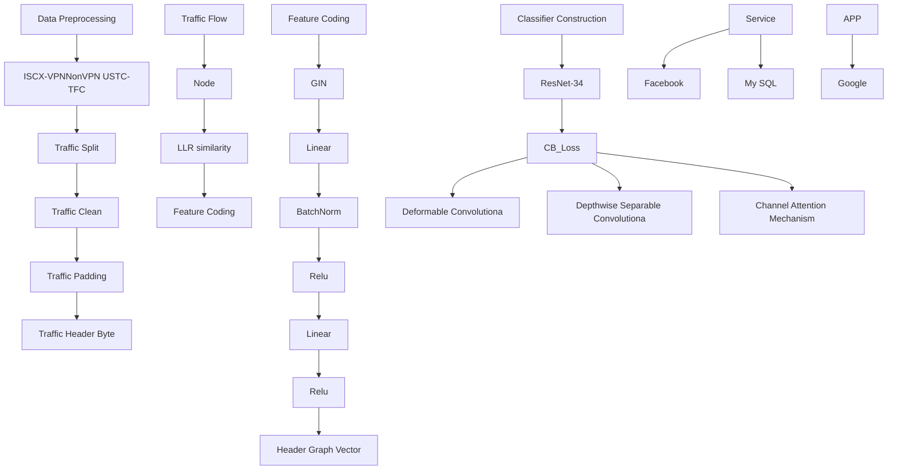
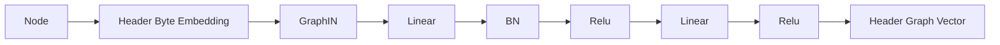
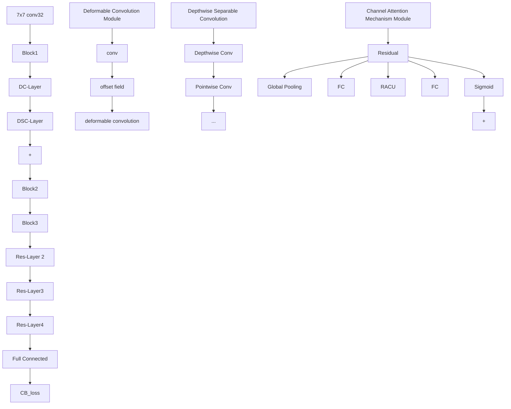
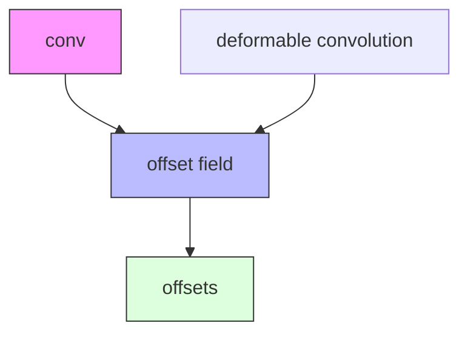
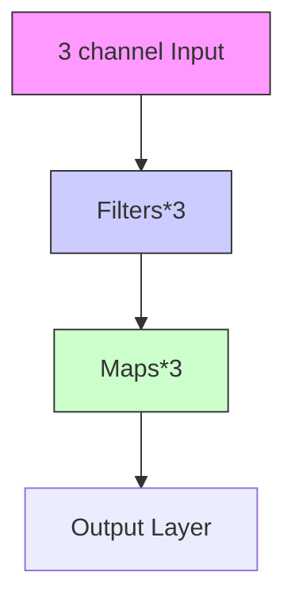
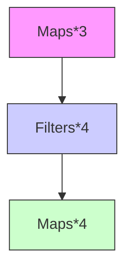

# FGFR-Net: An Improved Residual Network Encrypted Traffic Classification Model Based on Byte-Level Traffic Graphs

Yi Zhang1,2 · Shanshan Wang1,2 · Zhenxiang Chen1,2 · Bo Yang1,2

Received: 3 June 2025 / Revised: 1 November 2025 / Accepted: 23 December 2025

© The Author(s), under exclusive licence to Springer Science+Business Media, LLC, part of Springer Nature 2026

# Abstract

With the speedy advancement of encryption technology and the exponential increase in applications, network traffic classification has become an increasingly important research topic. Existing methods for classifying encrypted traffic have certain limitations. For example, they only extract session-level features and cannot mine the potential correlation between bytes, and traditional traffic classifiers lack attention to critical information, which makes it difficult to capture effective features between bytes and requires a large amount of resource consumption. Based on the above limitations, we propose a novel and effective classification model: fine-grained feature residual network (FGFR-Net). We constructed byte-level granularity graphs for the traffic data and used graph isomorphism network with stronger structural discrimination for graph encoding. Additionally, we design a classifier based on a residual network, incorporating deformable and depthwise separable convolutional layers. A channel attention mechanism is added between stages to capture key implicit features, improving classification performance with reduced complexity. We evaluated FGFR-Net on two public datasets, ISCX-VPNonVPN and USTC-TFC, achieving an F1-score of 99.08% and 99.21%. The results demonstrate that our method enhances encrypted traffic classification performance.

Keywords Encrypted traffic classification · Network management · Cyberspace security · Deep learning · Convolutional neural networks · Residual network

# 1 Introduction

Encrypted traffic classification(ETC) is a key technology in the field of network security and management. As the volume of Internet traffic data has risen dramatically in recent years [1], accurate ETC plays a considerable role in tasks such as intrusion detection, traffic trend analysis, quality of service (QoS), quality of experience (QoE), and network visibility [2] There are several classification methods in the current research area. Early work utilized the remaining plaintext of encrypted traffic to construct a fingerprint, which was then matched to the traffic [3], but this is no longer applicable to newer encryption techniques such as transport layer security (TLS) 1.3 and secure sockets layer (SSL) 3.0. Subsequent research has turned to the use of traditional machine learning (ML) to extract statistical features [4], based on deep learning (DL) methods such as convolutional neural networks (CNN) and recurrent neural networks (RNN) for improved classification of encrypted traffic [3, 5]. However, such models are susceptible to the amount and distribution of labeled training data, which in turn leads to biased results. To address these issues, graph neural network (GNN) dynamically models the interaction of traffic through graph structure, resulting in a significant improvement in classification [6, 7]. However, most GNN-based traffic classification methods focus on session-level nodes and fail to provide finergrained and richer traffic information, which is not conducive to improving detection accuracy and capturing subtle traffic behaviors. In addition, existing models fail to capture valid features between bytes and lack additional attention to critical features, leading to weak robustness when dealing with unbalanced datasets.

To address the above shortcomings, this paper proposes a new ETC model: fine-grained feature residual network (FGFR-Net). First, we construct a byte-level traffic graph by mining the correlation between bytes and use graph isomorphism network (GIN) [8] to complete the graph encoding, which realizes the effective distinction of subtle differences in the graph structure and captures the dependencies between nodes. When designing the classifier, we improve the residual network-34 (ResNet-34) structure based on the inherent characteristics of network traffic. Since subtle changes in the traffic may represent critical information, we use deformable convolution (DCN) [9] to capture the implicit relationships between bytes, while introducing depthwise separable convolution (DSC) [10] to reduce the parameters and computational complexity. Channel attention mechanism (CAM) [11] is used between residual blocks to enhance the model’s focus on critical information. Finally, we use the class-balanced loss (CB-Loss) [12] function to address overfitting due to multiple classifications and class imbalance. Our proposed method obtains an excellent F1-score of 99.08% and 99.21% on the ISCX-VPNnonVPN and USTC-TFC datasets, outperforming several state-of-the-art baseline models.

In summary, the contributions of our work are as follows:

1. We construct byte-level traffic graphs by converting packet byte sequences into graphs, and employ GIN for graph encoding to effectively capture subtle differences in the graph structure to obtain a more accurate representation of features.

2. We design an encrypted traffic classifier based on ResNet-34, which is the first time that the ResNet-34 structure is used for ETC, and introduce DSC, DCN, and CAM to improve the classification accuracy.   
3. The validity is verified using the ISCX-VPNnonVPN dataset and the USTC-TFC dataset. FGFR-Net achieves an F1-score of 99.08% and 99.21% on these two datasets, respectively, indicating that the results are significantly better than other baseline methods.

We have made our experimental methods available to the research community: https://github.com/AnaY1115/FGFR\_Net.

# 2 Related Work

In this section, we review the existing works in ETC and underline the motivation of our work.

# 2.1 Research on Encrypted Traffic Classification

Based on the techniques used, these methods can be categorized into three types: fingerprint-based methods, ML-based methods, and DL-based methods.

# 2.1.1 Methods Based on Fingerprint Construction

The main fingerprint-based methods include FlowPrint [13] and Deep Packet Inspection (DPI) [14]. These methods usually generate fingerprints via plaintext or TLS handshake and identify flow types based on predefined string pattern matching. FlowPrint uses unencrypted field information (e.g., size, certificates, device statistics, etc.) to represent and classify flows, but its performance relies on the plaintext information, and it is susceptible to tampering during transmission, which leads to loss of information. While DPI examines the entire packet, including the header and the payload. If a pattern matching a predefined signature is found, the flows are classified. However, it is difficult to extract predefined string patterns using fingerprint construction for encrypted traffic and use them for application classification. With the increasing popularity of encryption technologies such as TLS 1.3, plaintext information is decreasing, which makes it challenging to classify encrypted traffic using traditional fingerprint construction methods.

# 2.1.2 Methods Based on Machine Learning

ML-based traffic classification methods extract and analyze statistical characteristics of traffic without parsing packet contents byte by byte. Its core idea is to utilize differences in feature distribution of traffic and map them to ML models for classification. In early research, Taylor et al. [15] proposed AppScanner, which constructs fingerprints by clustering statistical features of packet sizes, and then combines support vector machine (SVM) and random forest (RF) for classification. Subsequently, Panchenko et al. [16] further improved on this idea by proposing CUMUL. It generates more distinctive fingerprint representations by cumulatively processing packet size sequences of traffic, and then uses SVM for identification. Unlike methods that rely on a single feature distribution, Hayes et al. [17] proposed K-fingerprinting(K-FP), which uses RF to construct traffic fingerprints and identify website traffic through fingerprint comparison. Building upon this, Al-Naami et al. [18] proposed BIND, which further considers the dynamic characteristics of traffic. By extracting bidirectional dependency features and combining them with an adaptive learning strategy, it can better capture changes in traffic patterns, thereby significantly improving the accuracy of website and application fingerprint recognition. Overall, these methods have advantages in reducing computational complexity. However, they rely on manually crafted features, which limits the feature dimension and leads to overfitting and insufficient generalization ability. At the same time, their dependence on specific protocols also limits classification accuracy to a certain extent.

# 2.1.3 Methods Based on Deep Learning

With the successful application of DL in natural language processing and image recognition, researchers have gradually introduced it into traffic classification. Unlike traditional ML methods that rely on artificial features, DL can directly learn complex patterns from raw traffic. Early explorations such as Wang et al. [19] first introduced end-to-end DL into ETC, converting traffic into grayscale images and using 1D-CNN for classification. Subsequently, Sirinam et al. [20] proposed Deep Fingerprinting (Deep-FP), which uses CNN to perform website fingerprinting attacks on encrypted Tor traffic, proving that CNN can also achieve efficient classification without manually crafted features. Furthermore, Lotfollahi et al. [14] proposed deep packet, which combines stacked autoencoders (SAE) with 1D-CNN, enabling simultaneous support for application identification and traffic classification tasks. Subsequently, research gradually expanded to more complex architectures. FS-Net [21], proposed by Liu et al., uses a multi-layer bidirectional gated recurrent unit (GRU) encoder to model the original traffic sequence, and enhances feature representation through a reconstruction mechanism. GraphDApp [22], proposed by Shen et al., breaks through the limitations of sequence representation. It converts traffic into graph structures and uses GNN to implement fingerprint recognition for decentralized applications. On this basis, pre-training and context modeling have become new research directions. He et al. [23] proposed PERT, which combines dynamic word embedding with transformer for the first time, improving traffic representation capabilities through pre-training strategies. Shi et al. [24] proposed BFCN, which uses BERT to capture global packet-level traffic features and combines CNN to capture byte-level local features, significantly improving classification accuracy. Lin et al.’s [5] ET-BERT captures traffic context relationships from large-scale unlabeled data through self-supervised pre-training tasks, achieving accurate classification results. In summary, DL methods show significant advantages in ETC, but their reliance on large-scale, high-quality labeled data remains a key bottleneck limiting their generalization ability.

# 2.2 Residual Network Model

He et al. [25] proposed the ResNet, which effectively alleviates the gradient vanishing and degradation problems in deep networks through residual blocks and skip connections. It has spawned numerous variants and become an important cornerstone of DL.

In traffic classification tasks, Lim et al. [26] combined CNN with ResNet to train many DL models, but their feature modeling was still limited to the packet level, resulting in limited classification capabilities. To overcome this shortcoming, Su et al. [27] proposed Improved ResNet, which converts traffic data into grayscale images and combines with ResNet-18 to achieve higher classification accuracy in fine-grained traffic identification, and effectively alleviates network degradation. Furthermore, CAD-Net [28] proposed by Zou et al. introduces deformable convolutions into ResNet-18 to enhance the model’s ability to capture critical features of traffic. However, the above methods generally focus on packet-level feature modeling, and all rely on the lower-performance ResNet-18. Therefore, there are still limitations when dealing with complex feature representations and high-performance tasks.

For a more intuitive presentation of the differences between FGFR-Net and existing representative methods, this paper systematically summarizes the 14 methods and their core features involved in the experiment, as shown in Table 1.

Table 1 Comparative analysis of network traffic classification methods 

<table><tr><td>Method</td><td>Feature processing</td><td>Model architecture</td><td>Class imbalance handling</td><td>Generalization ability</td></tr><tr><td>FlowPrint [13]</td><td>Fingerprint construction/clustering</td><td>Semi-supervised learning</td><td>×</td><td>√</td></tr><tr><td>AppScanner [15]</td><td>Fingerprint construction/clustering</td><td>SVM / RF</td><td>×</td><td>√</td></tr><tr><td>CUMUL [16]</td><td>Piecewise interpolation</td><td>SVM</td><td>×</td><td>√</td></tr><tr><td>BIND [18]</td><td>Bidirectional dependency enhancement</td><td>SVM / k-NN / RF</td><td>×</td><td>√</td></tr><tr><td>K-FP [17]</td><td>Fingerprint construction</td><td>RF</td><td>×</td><td>√</td></tr><tr><td>Deep-FP [20]</td><td>CNN feature extraction</td><td>CNN</td><td>×</td><td>×</td></tr><tr><td>FS-Net [21]</td><td>GRU encoding and reconstruction</td><td>GRU</td><td>×</td><td>×</td></tr><tr><td>Improved ResNet [27]</td><td>Normalization/Grayscale conversion</td><td>ResNet18</td><td>×</td><td>×</td></tr><tr><td>GraphDApp [22]</td><td>GNN graph construction</td><td>GNN / MLP</td><td>×</td><td>√</td></tr><tr><td>CAD-Net [28]</td><td>Normalization/Grayscale conversion</td><td>ResNet18</td><td>√</td><td>×</td></tr><tr><td>DeepPacket [14]</td><td>SAE/CNN feature extraction</td><td>SAE / CNN</td><td>√</td><td>×</td></tr><tr><td>PERT [23]</td><td>Dynamic word embedding</td><td>Transformer</td><td>×</td><td>√</td></tr><tr><td>BFCN [24]</td><td>BERT/CNN feature extraction</td><td>BERT/CNN</td><td>×</td><td>×</td></tr><tr><td>ET-BERT [5]</td><td>Transformer</td><td>Transformer</td><td>√</td><td>×</td></tr><tr><td>FGFR-Net</td><td>GIN graph construction</td><td>ResNet34</td><td>√</td><td>√</td></tr></table>

# 3 Method

In this section, we present the FGFR-Net implementation, an ETC model based on byte-level traffic graphs and improved ResNet. The model architecture is shown in Fig. 1.

# 3.1 Data Preprocessing

The raw data is stored in pcap format. Although this format can reflect rich traffic information in binary form, it cannot be directly used as input for downstream tasks of DL models, because of its inconsistent length and the inclusion of information that interferes with classification, such as a large number of gaps, duplicated content, and format mismatch problems. Therefore, we pre-processed the data, which mainly includes traffic segmentation, cleaning, and padding. Firstly, bi-directional traffic is obtained from the public dataset using SplitCap, and then using tshark to normalize the traffic file format. The pcap file header, which is only used to configure the parser state independent of classification, and irrelevant samples (e.g., empty files, duplicate files) in the dataset are removed. In addition, 5-tuple fields containing environmentor user-related information are removed to avoid the risk of data leakage. Finally, we refer to the experience of Sun et al. [29], too long a stream truncation length increases the model complexity, while too short affects the feature extraction. Therefore, we standardize it to 900 bytes, and streams longer than 900 bytes are truncated, and those less than that are padded with 0x00 at the end.

# 3.2 Traffic Graph Construction

After preprocessing, we build a byte-level traffic graph. We construct a graph $G = \{ V , E , X \}$ for each traffic segment by mining the correlation between bytes in the traffic segment. Where V denotes each byte in the traffic segment; E is an edge between nodes in the graph; X denotes the feature of a node, with the initial value of its byte value itself, with a dimension of 1 and a range of [0,255].

flowchart

Fig. 1 Overview of the FGFR-Net

# 3.2.1 Node Construction

In the network traffic representation designed in this work, we consider a single byte of a packet header in a data packet as a separate entity. Thus, each vertex in the graph represents a byte. Specifically, the packet $P _ { i } = [ b _ { i 1 } , b _ { i 2 } , \dots , b _ { i m } ]$ in the previously obtained traffic file $T S = [ P _ { 1 } , P _ { 2 } , \dots , P _ { n } ]$ is represented by m bytes, and we always use $b _ { i j }$ to denote a node, except that we set the same byte values to share a node, which ensures that the graph is not too large within a certain range.

# 3.2.2 Edge Construction

Traditional flow graphs connect vertices based on spatio-temporal features of bytes or Euclidean distances, but they focus too much on the external features, limiting the exploration of the internal structure of flow data. Therefore, we introduce the loglikelihood ratio (LLR) to represent the correlation between bytes. It captures flow variations by calculating byte occurrence probabilities and supports the accurate construction of traffic graphs in uncertain network environments.

We record byte occurrence and co-occurrence numbers and construct a columnassociative table with four entries. The table contains four basic entries: $O _ { 1 1 } \colon$ : the number of times that i and j occur simultaneously (the number of co-occurrences), $O _ { 1 2 }$ : the number of times that i occur but j do not, $O _ { 2 1 }$ : the number of times that j occur but i do not, $O _ { 2 2 }$ : the number of times that both occur i and j do not occur. Next, the observed and expected frequencies are calculated; the observed frequency is the actual frequency, and the expected frequency is. $E _ { i j }$ is the frequency when the two bytes are assumed to be independent, as in Eq. 1:

$$
E _ {i j} = \frac {(O _ {i .} \times O _ {. j})}{N} \tag {1}
$$

where $O _ { i }$ . and $O _ { \cdot j }$ are row totals and column totals respectively, and N is the total number of frequencies. After obtaining the desired number of frequencies, We calculate the LLR value as Eq. 2:

$$
L L R = 2 \sum_ {i, j} O _ {i j} \log \left(\frac {O _ {i j}}{E _ {i j}}\right) \tag {2}
$$

If $O _ { i j } > E _ { i j } , l o g > 0$ . The larger LLR and smaller p mean a more significant difference and a byte correlation. To ensure the validity of the LLR, we conducted a series of sensitivity experiments with varying LLR thresholds ranging from 75% to 95%. The results indicate that as the LLR threshold increases, the number of edges decreases and the structural redundancy of the graph diminishes. The F1-score initially rises, reaching a stable peak around 80–83 When the LLR threshold exceeds 83%, the number of edges becomes too small, causing a sharp decline in graph connectivity and a slight drop in classification accuracy. Therefore, we set 83% as the final LLR threshold. Specifically, if the LLR between two bytes is lower than 83% of all byte-pair LLRs, no edge is created; otherwise, an edge is established. This setting achieves an optimal balance between graph sparsity and correlation strength. It maintains sufficient byte-level associations while avoiding redundant edges, thereby improving the robustness of traffic graphs constructed across different datasets. We use the LLR value to represent the strength of association between two bytes, but do not consider the directionality, so the constructed byte-level traffic graph is undirected.

We build the graphs for the flow segments as Eq. 3, we give a description of the adjacency matrix A of nodes i and j in each graph:

$$
a _ {i j} = \left\{ \begin{array}{l l} 1 & L L R (i, j) > 83 \% (L L R (i, j)) \\ 0 & \text {otherwise} \end{array} \right. \tag{3}
$$

In terms of computational efficiency, the node construction stage performs feature extraction for each packet, yielding a linear time complexity with respect to the number of packets $N _ { p } , { \mathrm { i . e . , } } \ O ( N _ { p } )$ . Assuming that each packet contains an average of $L _ { b }$ bytes, the total number of byte-level nodes can be expressed as $n = N _ { p } \times L _ { b }$ . In the edge construction stage, theoretical computation involves pairwise correlations among all byte-level nodes, resulting in a time complexity of $\mathcal { O } ( n ^ { 2 } )$ . However, after applying the LLR-based thresholding and correlation filtering, the actual number of retained edges m is substantially smaller than $n ^ { 2 }$ . Therefore, the overall complexity of traffic graph construction can be approximated as $O ( n + m )$ , which ensures the efficiency and scalability of FGFR-Net in byte-level traffic graph generation.

# 3.3 Feature Coding

After processing in the previous step, we obtain the feature map of each traffic sample. The packet header of a data packet is usually unencrypted plaintext information containing specifics such as data length, timestamps, etc., which mainly play a role in controlling and describing the transmission process. To encode all the traffic maps within a traffic segment as an overall feature vector, we have elaborated a traffic map encoder using GIN [8] as shown in Fig. 2.

The core idea of GIN is to capture the architectural information of the graph by iteratively updating feature representations for nodes. It uses a simple multilayer perceptron (MLP) to renew the features of a node and incorporates information about the node’s neighbors during the update process. This updating approach allows GIN to handle graphs with different topologies and with sufficiently deep layers to theoretically distinguish all non-isomorphic graphs. Formally, the message computation of a flow graph encoder using GIN can be described as Eq. 4:

flowchart

Fig. 2 Construction process of byte-level traffic graph

$$
h _ {v} ^ {(l + 1)} = \phi \left(h _ {v} ^ {(l)} + \sum_ {u \in \mathcal {N} (v)} h _ {u} ^ {(l)}\right) \tag {4}
$$

Where $h _ { v } ^ { ( l ) }$ is the feature vector of node v in layer $l , \mathcal { N } ( v )$ is the set of neighbors of node v, and $\phi$ is a nonlinear function, usually an MLP. For each node v, we process it further through the linear layer and ReLU activation function and then through batch normalization, and then again through the activation and linear layer, as in Eqs. 5 and 6. We use $g _ { h }$ to denote the feature vectors of the graphs in that flow sample.

$$
z _ {v} = \operatorname{ReLU} \left(\operatorname{Linear} \left(h _ {v} ^ {(l + 1)}\right)\right) \tag {5}
$$

$$
g _ {h} = \text { ReLU } \left(\text { Linear } \left(\text { BatchNorm } \left(z _ {v}\right)\right)\right) \tag {6}
$$

# 3.4 Classifier Construction

The classifier of FGFR-Net introduces DCN and DSC on the basis of traditional residual networks, and adds CAM after each stage, as shown in Fig. 3.

# 3.4.1 Residual Network 34 Layers

ResNet-34 has 4 stages with 16 residual blocks. The depth of these blocks in each stage is 64, 128, 256, and 512, respectively. Each block has two 3x3 convolutional layers and an activation function, which helps with information and gradient flow, improving training and performance. Compared to ResNet-18, it has more parameters, better expressiveness for detailed feature learning, and high accuracy. Compared to ResNet-50, it has lower complexity and faster training, making it fit for limitedresource applications.

# 3.4.2 Deformable Convolutional Layer

Network traffic data has irregular or multi-scale characteristics. The convolutional layer of traditional network models samples at a fixed location and lacks flexibility for deformed objects. To address this issue, we use DCN [9] to capture details, avoiding information loss and improving the efficiency of ETC. Fig. 4a shows the sampling region of standard convolution with DCN. Green and blue dots mark the region boundaries, respectively, and arrows indicate the direction of offset vectors. DCN changes dynamically due to the offset effect. The receiving domain is extended by the offset, enabling non-uniform tuning of the convolution operation’s sampling region. Figure 4b illustrates the offset computation process. DCN for input feature map $g _ { h }$ at position $( x , y )$ is computed as Eq. 7:

flowchart

Fig. 3 Improved residual network classifier

$$
A _ {i j} = g _ {h} \left(x + i + p (x, y) _ {i}, y + j + p (x, y) _ {j}\right)
$$

$$
g _ {d c} (x, y) = \sum_ {i = - \frac {k - 1}{2}} ^ {\frac {k - 1}{2}} \sum_ {j = - \frac {k - 1}{2}} ^ {\frac {k - 1}{2}} A _ {i j} \times \omega (i, j) \tag {7}
$$

where k is the convolution kernel size, $p ( x , y )$ is the horizontal and vertical offsets of the standard convolution kernel at position $( x , y )$ , and w is the convolution kernel weight.

# 3.4.3 Depthwise Separable Convolutional Layers

DSC [10] reduces the complexity by reducing the computation and parameters of the standard convolution, thus reducing the model size and accelerating the inference. It is especially suitable for the case of a large number of input channels. It consists of two main steps: deep convolution and point-by-point convolution. Deep convolution performs the convolution process separately for each input channel. As shown in Fig. ${ 5 } \mathrm { a } .$ , for our input $g _ { d c } ,$ , a convolution kernel d of $k \times k$ is used for deep convolution, as in Eq. 8:

$$
A _ {i j c} = g _ {d c} (x + i, y + j, c)
$$

$$
g _ {d e e p} (x, y, c) = \sum_ {i = - \frac {k - 1}{2}} ^ {\frac {k - 1}{2}} \sum_ {j = - \frac {k - 1}{2}} ^ {\frac {k - 1}{2}} A _ {i j c} \times d (i, j, c) \tag {8}
$$

  
(a)

  
(b)

  
(d)

(a)Convolutional Kernel and Deformable Convolutional Kernel   

flowchart

(b) Offset Calculation Process   
Fig. 4 Deformable convolution concept map

flowchart

(a）Deep Convolution

flowchart

(b）Point wise convolution   
Fig. 5 Depthwise separable convolution concept map

where the input feature map $g _ { d c } \in \mathbb { R } ^ { H \times W \times C }$ , the convolution kernel $\ b { d } \in \mathbb { R } ^ { k \times k \times c }$ , there is a separate $l \times k$ convolution kernel for each channel, x and y are coordinates on the output feature map, c is the channel index, and is the value of the input feature map at position $g _ { d c } \left( x + i , y + j , c \right)$ and channel c.

Deep convolution may lead to a lack of channels for output feature mapping, affecting the effectiveness of the information. Thus, point-by-point convolution is required to mix the information of each channel and adjust the number of output channels as required, as shown in Fig. 5b. It uses a 1  1 convolution kernel to connect to all input channels and create a new output channel. The operation is done at each spatial location, using input feature tensor values at the same location to get the output via inner product with the 1 1 kernel. For the input tensor $g _ { d e e p } ( x , y , c )$ , the point-by-point convolution is denoted as Eq. 9:

$$
g _ {d s c} (x, y, m) = \sum_ {c = 1} ^ {C} g _ {\text { deep }} (x, y, c) \times p (c, m) \tag {9}
$$

Where m denotes the output channel index, the output feature map $g _ { d s c } \in \mathbb { R } ^ { H \times W \times M }$ , and M is the number of output channels.

# 3.4.4 Channel Attention Mechanism

CAM enhances attention to task-critical features by analyzing the global information of the feature channel. It consists of two steps: the first step is compression, where each feature mapping is compressed into a feature vector to extract the global information by means of a globally averaged pool $F _ { a v g }$ , as in Eq. 10:

$$
F _ {a v g} = \frac {1}{H \times W} \sum_ {i = 1} ^ {H} \sum_ {j = 1} ^ {W} g _ {d s c} (i, j, c) \tag {10}
$$

Here, H, W, and C denote the height, width, and number of feature maps. After average pooling, a vector of $1 \times 1 \times C$ is obtained, which characterizes the global information of each channel. The second step is the excitation operation. The channel importance weights are computed by a two-layer small fully connected network containing the ReLU activation function. The first layer reduces the feature dimension C to C/r, where r is the shrinkage ratio hyperparameter controlling the complexity of the network). The second layer restores to C. Finally, the weight values between 0 and 1 are output by the Sigmoid activation function, indicating the importance of each channel, as shown in Eq. 11:

$$
\begin{array}{l} \begin{array}{l} M = \operatorname{ReLU} \left(W _ {1} \times F _ {\text {avg}} + b _ {1}\right) \\ E _ {\text {avg}} \left(W _ {1} + N + b _ {1}\right) \end{array} \tag {11} \\ F _ {e x} = \sigma (W _ {2} \times N + b _ {2}) \\ \end{array}
$$

Finally, the original features and the features after the compression excitation operation are fused using element-by-element multiplication, and the final vector $F _ { o u t }$ is the output after applying the CAM, which is given by Eq. 12:

$$
F _ {o u t} = g _ {d s c} \bigodot F _ {e x} \tag {12}
$$

# 4 Experience

# 4.1 Datasets

We select the public datasets ISCX-VPNnonVPN [30] and USTC-TFC [31] for this study. The former is subdivided into 12 categories based on service types (including chat, email, file transfer (FT), P2P, VoIP, VPN chat, VPN email, VPN-FT, VPN-P2P, VPN streaming, and VPN VoIP); and the latter covers 10 categories of normal traffic and 10 categories of malicious traffic data in the campus and outreach networks, and our study uses 10 of its normal traffic categories (including BitTorrent, Facetime, FTP, Gmail, MySQL, Outlook, Skype, SMB, microblogging and WorldOfWarcraft). Both datasets are captured from real networks, which can capture the edge traffic characteristics under network delay, congestion, and VPN switching scenarios, and completely reflect the real-world scenario of encrypted traffic in daily networks.

# 4.2 Experimental Setup

The experimental environment setup is as follows: Hardware includes an AMD EPYC 7642 48-core processor and NVIDIA GeForce RTX 3090 (24GB) GPU, with a 64-bit Ubuntu 18.04 operating system. Software is based on Python 3.8 and PyTorch 1.10.1, and all dependent library versions are fixed to ensure reproducibility of results. During data preprocessing, this study first checked the raw traffic for integrity and reassembled complete sessions, removing any abnormal or incomplete samples. Next, we used tshark to convert the pcapng files into pcap format, and SplitCap was used to split the traffic into individual sessions. Then we anonymized the traffic with Scapy to protect user privacy. To ensure reproducibility and consistent data distribution, this study adopted a stratified sampling strategy to keep class proportions balanced. The dataset was randomly divided into training, validation, and test sets in a 70%, 15%, and 15% ratio. For traffic classes with insufficient samples, we applied oversampling to balance the data and reduce class bias during training. The main parameters are set as follows: during the traffic graph construction phase, the maximum header size is

40 bytes, the maximum payload size is 150 bytes, and the sliding window size is 5. The classifier training batch size is 256, and it is trained for 120 epochs. The initial learning rate is set to 1e-2, and the Adam optimizer and learning rate scheduler are used, with a 10-fold decay every 20 epochs. To ensure the robustness of the results, each group of experiments was repeated 30 times, and the mean and standard deviation (Std) were calculated as the final result.

# 4.3 Evaluation Metrics

In this study, we used four classic indicators in multiclassification tasks to verify and compare the effects of our proposed model: accuracy, precision, recall, and F1-score.

$$
A c c u r a c y = \frac {T P + T N}{T P + F P + T N + F N} \tag {13}
$$

$$
P r e c i s i o n = \frac {T P}{T P + F P} \tag {14}
$$

$$
\text { Recall } = \frac {T P}{T P + T N} \tag {15}
$$

where TP, FP, TN, and FN denote true positive, false positive, true negative, and false negative, respectively.

F1-score is the harmonic mean of precision and recall, used to comprehensively evaluate the model’s performance between precision and recall.

$$
F 1 - \text { score } = \frac {2 \times \text { Precision } \times \text { Recall }}{\text { Precision } + \text { Recall }} \tag {16}
$$

# 4.4 Classification Results

# 4.4.1 Introduction of Benchmark Methods

To evaluate the accuracy and stability of FGFR-Net in ETC tasks, this paper selects 14 representative traffic classification methods as baselines, including FlowPrint [13], AppScanner [15], CUMUL [16], BIND [18], K-FP [17], Deep-FP [20], FS-Net [21], Improved ResNet [27], GraphDApp [22], CAD-Net [28], DeepPacket [14], PERT [23], BFCN [24] and ET-BERT [5]. These methods differ significantly from FGFR-Net, as detailed in §2.

# 4.4.2 Comparison Experiments

To ensure the reliability of the results, this study conducted 30 independent experiments on each of the ISCX-VPNnonVPN and USTC-TFC datasets, and calculated the mean and Std. Tables 2 and 3 show the performance of FGFR-Net compared to other methods in terms of Accuracy, Precision, Recall, and F1-score. Table 2 shows the experimental results of each model on the ISCX-VPNnonVPN dataset. FGFR-Net shows significant advantages in all four evaluation metrics and has a small Std. Specifically, its accuracy, precision, recall, and F1-score are $9 9 . 0 7 \% \pm 0 . 0 4 \%$ $9 9 . 1 2 \% \pm 0 . 0 5 \% , 9 9 . 0 4 \% \pm 0 . 0 5 \%$ , and $9 9 . 0 8 \% \pm 0 . 0 4 \% ,$ respectively. These results demonstrate that FGFR-Net has powerful capabilities in feature extraction and classification, enabling accurate service identification tasks. This performance is mainly attributed to the introduction of DCN and CAM in the FGFR-Net classifier, which can capture critical features of the traffic and jointly enhance the classification results.

Table 2 Comparative experimental results of ISCX-VPNnonVPN 

<table><tr><td>Type</td><td>Method</td><td>Accuracy</td><td>Precision</td><td>Recall</td><td>F1-score</td></tr><tr><td>Fingerprints</td><td>FlowPrint [13]</td><td>76.37±0.42</td><td>77.19±0.50</td><td>75.84±0.48</td><td>76.51±0.35</td></tr><tr><td rowspan="4">Machine learning</td><td>AppScanner [15]</td><td>70.92±0.45</td><td>72.55±0.52</td><td>71.46±0.49</td><td>72.00±0.36</td></tr><tr><td>CUMUL [16]</td><td>54.78±0.55</td><td>56.11±0.60</td><td>55.06±0.58</td><td>55.85±0.42</td></tr><tr><td>BIND [18]</td><td>72.97±0.40</td><td>73.24±0.45</td><td>71.60±0.47</td><td>72.41±0.33</td></tr><tr><td>K-FP [17]</td><td>62.57±0.48</td><td>63.19±0.52</td><td>62.03±0.51</td><td>62.60±0.36</td></tr><tr><td rowspan="9">Deep learning</td><td>Deep-FP [20]</td><td>72.47±0.30</td><td>72.97±0.32</td><td>72.15±0.34</td><td>72.56±0.23</td></tr><tr><td>FS-Net [21]</td><td>73.08±0.28</td><td>76.11±0.31</td><td>73.19±0.33</td><td>74.62±0.23</td></tr><tr><td>Improved ResNet [27]</td><td>96.33±0.12</td><td>97.17±0.14</td><td>96.06±0.15</td><td>96.61±0.10</td></tr><tr><td>GraphDApp [22]</td><td>57.83±0.50</td><td>59.17±0.53</td><td>61.58±0.55</td><td>60.35±0.38</td></tr><tr><td>CAD-Net [28]</td><td>98.23±0.06</td><td>98.49±0.07</td><td>98.08±0.07</td><td>98.28±0.05</td></tr><tr><td>DeepPacket [14]</td><td>92.18±0.20</td><td>92.60±0.22</td><td>91.85±0.23</td><td>92.22±0.16</td></tr><tr><td>PERT [23]</td><td>92.97±0.18</td><td>93.43±0.20</td><td>92.70±0.21</td><td>93.06±0.15</td></tr><tr><td>BFCN [24]</td><td>98.20±0.07</td><td>98.65±0.08</td><td>98.14±0.08</td><td>98.39±0.06</td></tr><tr><td>ET-BERT [5]</td><td>97.41±0.08</td><td>97.49±0.09</td><td>97.40±0.09</td><td>97.44±0.06</td></tr><tr><td>Our method</td><td>FGFR-Net</td><td>99.07±0.04</td><td>99.12±0.05</td><td>99.04±0.05</td><td>99.08±0.04</td></tr></table>

Table 3 Comparative experimental results of USTC-TFC 

<table><tr><td>Type</td><td>Method</td><td>Accuracy</td><td>Precision</td><td>Recall</td><td>F1-score</td></tr><tr><td>Fingerprints</td><td>FlowPrint [13]</td><td>82.29±0.41</td><td>63.57±0.42</td><td>62.83±0.32</td><td>63.20±0.26</td></tr><tr><td rowspan="4">Machine learning</td><td>AppScanner [15]</td><td>61.92±0.56</td><td>52.33±0.58</td><td>54.97±0.51</td><td>53.62±0.39</td></tr><tr><td>CUMUL [16]</td><td>51.25±0.57</td><td>40.73±0.53</td><td>44.39±0.56</td><td>42.48±0.39</td></tr><tr><td>BIND [18]</td><td>66.59±0.43</td><td>50.78±0.52</td><td>51.16±0.42</td><td>50.97±0.33</td></tr><tr><td>K-FP [17]</td><td>59.77±0.41</td><td>53.94±0.43</td><td>53.24±0.41</td><td>53.59±0.30</td></tr><tr><td rowspan="9">Deep learning</td><td>Deep-FP [20]</td><td>60.29±0.28</td><td>56.05±0.36</td><td>46.33±0.30</td><td>50.73±0.23</td></tr><tr><td>FS-Net [21]</td><td>64.39±0.28</td><td>47.21±0.30</td><td>47.98±0.34</td><td>47.59±0.23</td></tr><tr><td>Improved ResNet [27]</td><td>96.25±0.04</td><td>95.11±0.09</td><td>95.87±0.02</td><td>95.49±0.05</td></tr><tr><td>GraphDApp [22]</td><td>62.97±0.40</td><td>58.13±0.42</td><td>53.23±0.41</td><td>55.57±0.29</td></tr><tr><td>CAD-Net [28]</td><td>98.24±0.06</td><td>98.07±0.07</td><td>98.10±0.07</td><td>98.08±0.05</td></tr><tr><td>DeepPacket [14]</td><td>95.64±0.12</td><td>96.07±0.20</td><td>95.35±0.20</td><td>95.71±0.14</td></tr><tr><td>PERT [23]</td><td>91.77±0.18</td><td>80.16±0.25</td><td>81.08±0.19</td><td>80.62±0.16</td></tr><tr><td>BFCN [24]</td><td>98.39±0.06</td><td>97.26±0.07</td><td>97.73±0.07</td><td>97.49±0.05</td></tr><tr><td>ET-BERT [5]</td><td>98.44±0.06</td><td>98.43±0.07</td><td>98.41±0.07</td><td>98.42±0.05</td></tr><tr><td>Our method</td><td>FGFR-Net</td><td>99.22±0.04</td><td>99.23±0.05</td><td>99.20±0.05</td><td>99.21±0.04</td></tr></table>

In addition, this paper also uses the USTC-TFC dataset for application classification tasks. Table 3 shows the classification results using different models. As shown in the figure, FGFR-Net achieved $9 9 . 2 2 \% \pm 0 . 0 4 \% , 9 9 . 2 3 \% \pm 0 . 0 5 \% , 9 9 . 2 0 \% \pm 0 . 0 5 \%$ and 99.21%±0.04% in terms of accuracy, precision, recall, and F1-score, respectively, and further verified its high performance in application classification. Compared to CAD-Net, FGFR-Net achieved a mean improvement of 1.13% in F1-score and a reduction of 0.01% in Std. Compared to ET-BERT, FGFR-Net achieved mean improvements of 0.78%, 0.80%, 0.79%, and 0.79% in accuracy, precision, recall, and F1-score, respectively, which further validates its stable and efficient classification capabilities.

In comparative experiments with lightweight models, improved ResNet and CAD-Net, FGFR-Net demonstrated a significant advantage in F1-score. Specifically, FGFR-Net achieved F1-scores that were 2.47% and 3.72% higher than improved ResNet on the two datasets, respectively, with Stds reduced by 0.06% and 0.01%, respectively. Compared to CAD-Net, FGFR-Net achieved improvements of 0.8% and 1.13% in the mean, and the Stds of both was reduced by 0.01%. This result indicates that although lightweight models reduce computational complexity by simplifying network structures, they have weak capabilities in capturing and classifying key traffic features, resulting in low accuracy and high Stds. In contrast, FGFR-Net effectively reduces model complexity through reasonable structural design while ensuring high accuracy. This ultimately achieves an excellent balance between performance and computational cost.

To further validate the statistical significance of the performance improvement of FGFR-Net, we performed an independent samples t-test on the difference in F1-scores between FGFR-Net and the optimal baseline model on two datasets. Experimental results are shown in Table 4. Comparisons between FGFR-Net and the optimal baseline model showed $p < 0 . 0 0 1$ in all 30 independent experiments, indicating extremely high statistical significance. This indicates that the improvement in F1-score achieved by FGFR-Net is not due to training variance, further confirming that its superior performance on the ETC task is attributed to the innovative architecture of the method.

In ML, confusion matrices are commonly used tools for evaluating classification results and understanding model behavior. The horizontal axis represents the predicted labels of the model, while the vertical axis represents the true labels, which visualizes the model’s classification performance on the validation set. Figure 6a shows the confusion matrix for service identification tasks in the ISCX-VPNnonVPN dataset. Despite a few misclassifications, FGFR-Net still maintained a high overall traffic classification accuracy rate. Figure 6b shows the confusion matrix for application classification in the USTC-TFC dataset. Similarly, FGFR-Net achieved high accuracy rates across all application categories.

Table 4 Statistical significance test results of FGFR-Net compared with baselines 

<table><tr><td>Dataset</td><td>Method</td><td>FGFR-Net (F1, mean±Std)</td><td>Base-line (F1, mean±Std)</td><td>t-value</td><td>p-value</td><td>Significance</td></tr><tr><td>ISCX-VPNnonVPN</td><td>BFCN [24]</td><td>99.08±0.04</td><td>98.39±0.06</td><td>52.43</td><td>&lt; 0.001</td><td>***</td></tr><tr><td>USTC-TFC</td><td>ET-BERT [5]</td><td>99.21±0.04</td><td>98.42±0.05</td><td>67.52</td><td>&lt; 0.001</td><td>***</td></tr></table>

  
(a) Confusion Matrix on ISCX-VPNnonVPN

heatmap

Confusion Matrix (USTC-TFC)
| True Labels | BiTencent | Xanone | FTP | Gmail | MySQL | Outlook | Skype | SMB | Weibo | WorldOWarmcraft |
|---|---|---|---|---|---|---|---|---|---|---|
| BitTorrent | 1.00 | 0.00 | 0.00 | 0.00 | 0.00 | 0.00 | 0.00 | 0.00 | 0.00 | 0.00 |
| Facetime | 0.00 | 0.57 | 0.00 | 0.00 | 0.00 | 0.03 | 0.00 | 0.00 | 0.00 | 0.00 |
| FTP | 0.00 | 0.08 | 0.01 | 0.00 | 0.00 | 0.01 | 0.00 | 0.01 | 0.00 | 0.00 |
| Gmail | 0.00 | 0.00 | 1.00 | 0.00 | 1.00 | 0.00 | 0.99 | 0.99 | 0.99 | 1.00 |
| MySQL | 0.00 | 0.00 | 1.00 | 1.00 | 1.00 | 1.00 | 1.99 | 1.99 | 1.99 | 1.99 |
| Outlook | 0.00 | 0.00 | 1.00 | 1.99 | 1.99 | 1.99 | 1.99 | 1.99 | 1.99 | 1.99 |
| Skype | 1.99 | 1.99 | 1.99 | 1.99 | 1.99 | 1.99 | 1.99 | 1.99 | 1.99 | 1.99 |
| SMB | 1.99 | 1.99 | 1.99 | 1.99 | 1.99 | 1.99 | 1.99 | 1.99 | 1.99 | 1.99 |
| Weibo | 1.99 | 1.99 | 1.99 | 1.99 | 1.99 | 1.99 | 1.99 | 1.99 | 1.99 | 1.99 |
| WorldOWarmcraft | 1.99 | 1.99 | 1.99 | 1.99 | 1.99 | 1.99 | 1.99 | 1.99 | 1.99 | 1.99 |
The chart is a heatmap using color intensity to represent confusion probabilities based on the predicted labels for each label.

(b) Confusion Matrix on USTC-TFC

Fig. 6 Confusion matrix on different datasets   
Table 5 Cross-dataset generalization results of different methods 

<table><tr><td>Training/testing setting</td><td>Method</td><td>Accuracy</td><td>Precision</td><td>Recall</td><td>F1-score</td></tr><tr><td rowspan="4">Train on ISCX-VPNnon-VPN Test on USTC-TFC</td><td>CAD-Net [28]</td><td>91.84±0.35</td><td>90.92±0.26</td><td>91.03±0.54</td><td>90.97±0.30</td></tr><tr><td>BFCN [24]</td><td>90.77±0.13</td><td>89.85±0.35</td><td>90.62±0.77</td><td>90.23±0.42</td></tr><tr><td>ET-BERT [5]</td><td>94.21±0.21</td><td>93.84±0.23</td><td>94.02±0.63</td><td>93.93±0.33</td></tr><tr><td>FGFR-Net</td><td>96.42±0.15</td><td>96.08±0.17</td><td>96.19±0.14</td><td>96.13±0.11</td></tr><tr><td rowspan="4">Train on USTC-TFC Test on ISCX-VPNnonVPN</td><td>CAD-Net [28]</td><td>90.35±0.65</td><td>89.84±0.51</td><td>90.01±0.07</td><td>89.92±0.26</td></tr><tr><td>BFCN [24]</td><td>89.42±0.05</td><td>88.76±0.77</td><td>88.88±0.82</td><td>88.82±0.58</td></tr><tr><td>ET-BERT [5]</td><td>92.67±0.02</td><td>92.21±0.73</td><td>92.38±0.12</td><td>92.29±0.34</td></tr><tr><td>FGFR-Net</td><td>94.78±0.20</td><td>94.43±0.21</td><td>94.55±0.20</td><td>94.49±0.21</td></tr></table>

# 4.4.3 Cross-Dataset Generalization Evaluation

To evaluate the model’s cross-dataset generalization ability, we designed two sets of experiments to validate FGFR-Net and representative baseline models: (i) ISCX-VPNnonVPN as the training set and USTC-TFC as the test set; (ii) USTC-TFC as the training set and ISCX-VPNnonVPN as the test set. The experimental parameters are consistent with those of the comparison experiments. The comparison models selected are those that perform best on a single dataset, including ET-BERT, the deep convolutional model BFCN, and the lightweight residual network CAD-Net. The results are shown in Table 5.

The results show that FGFR-Net maintains high performance in cross-dataset scenario. The F1-scores for the two sets of experiments were 96.13%±0.11% and 94.49%±0.21%, respectively, representing a decrease of only 2.5% 4.5% compared to the performance within a single dataset. Furthermore, the Stds were both below 0.3%, indicating small data fluctuation. This performance significantly outperforms the three baseline models, with F1-scores 2.0%–6.5% higher than CAD-Net, BFCN, and ET-BERT in the two sets of experiments. Furthermore, compared with the performance of the single-dataset experiment shown in Tables 2 and 3, although the performance of FGFR-Net decreased slightly, the Std was low, indicating strong distribution transfer adaptability. This indicates that it has robustness to cope with data differences in real-world environments. Although the validation is currently limited to two representative datasets, they differ substantially in traffic types, encryption protocols, and collection environments, providing an effective basis for assessing the model’s transferability across distributions. Overall, FGFR-Net maintains stable performance under distribution shifts and scenario transitions, demonstrating strong generalization capability and practical applicability.

# 4.4.4 Model Stability

In addition to classification accuracy, stability in actual deployment is also an important indicator of the superiority of ETC models. We collected data from 30 experimental runs to quantitatively assess the model’s stability across multiple executions. Figure 7 illustrates the stability of FGFR-Net and nine DL-based ETC models. The lines represent the mean F1-scores of each model over 30 repeated experiments. The shaded area corresponds to the 5–95% percentile range, reflecting the fluctuation and stability of the models. Stars denote the best-performing models on each dataset. As shown in the figure, FGFR-Net achieved high mean F1-scores on both datasets, 99.08% and 99.21% respectively, and became the best model for both. This indicates that it has superior classification capabilities across different datasets. In particular, on the ISCX-VPNnonVPN dataset, the F1-score is significantly better than other models. At the same time, the shadow area of FGFR-Net is narrow, indicating that it performs stably with small fluctuations in 30 repeated experiments. In contrast, although CAD-Net and ET-BERT have higher F1-scores, their shadow areas are wider, indicating that they fluctuate largely, and are less stable in repeated experiments.

In addition, FGFR-Net maintains excellent performance and stability on both datasets, demonstrating strong generalization ability, which also indicates that it can effectively adapt to different types of datasets. Other models show significant differences in performance across different datasets and have weak generalization abilities. The stability of FGFR-Net benefits from the application of the CB-Loss function, which suppresses overfitting while enhancing the model’s generalization ability. Experiments show that FGFR-Net exhibits stronger robustness on imbalanced datasets, which is crucial for real-world traffic classification tasks. The ETC system needs to run continuously in a dynamic network environment, and FGFR-Net’s high stability can effectively reduce performance fluctuations and misclassifications caused by class imbalance.

line

| Model        | ISCX VPN-nonVPN (Mean F1) | USTC-TFC (Mean F1) | ISCX SOTA | USTC SOTA |
| ------------ | -------------------------- | ------------------ | --------- | --------- |
| Deep-FP      | 73                         | 51                 | -         | -         |
| FS-Net       | 75                         | 48                 | -         | -         |
| Improved ResNet | 96                        | 95                 | -         | -         |
| GraphDApp    | 60                         | 55                 | -         | -         |
| CAD-Net      | 98                         | 98                 | -         | -         |
| DeepPacket   | 92                         | 95                 | -         | -         |
| PERT         | 93                         | 80                 | -         | -         |
| BFCN         | 98                         | 98                 | -         | -         |
| ET-BERT      | 97                         | 98                 | -         | -         |
| FGFR-Net     | 99                         | 99                 | -         | -         |

Fig. 7 Stability analysis of FGFR-Net model. Solid lines represent the mean F1-score, while the shaded areas indicate the 5–95% percentile range over 30 repeated experiments. Stars highlight the models that achieved the highest mean F1-score

# 4.4.5 Model Time Consumption Analysis

The time efficiency of the ETC model is a key consideration for actual deployment. This study focuses on the time required for model inference, ranging from receiving pre-processed traffic data to outputting predicted labels, excluding the time required for data cleaning, segmentation, and other pre-processing steps. Specifically, it is divided into three core steps: input representation generation, feature extraction and encoding, forward computation of the classification layer, and prediction output. Table 6 compares the average time spent by nine DL models in the three stages on the ISCX-VPNnonVPN and USTC-TFC datasets. The results are the mean of 30 independent runs. A breakdown of the time required for FGFR-Net shows that feature extraction and encoding account for about 80% of the total time. On the ISCX-VPNnonVPN, its average single-sample processing time was 4.11 ms, which was 2.09 ms and 1.45 ms faster than GraphDAPP and ET-BERT, respectively, demonstrating a significant advantage. On the USTC-TFC, the average processing time per sample was 3.89 ms, which was 2.48 ms and 2.24 ms faster than the two models mentioned above, respectively. Specifically, the improvement in time efficiency is due to the DSC component significantly reducing the computational overhead of the classifier by replacing part of the standard convolution, while the DCN component achieves robust implicit byte feature extraction without increasing inference time. High-performance computing is a core requirement for real-time traffic classification. FGFR-Net’s low single-sample processing time makes it suitable for high-concurrency network scenarios, reducing packet processing latency and queue backlogs, and enabling deployment on edge devices and large-scale network monitoring.

Table 6 Stage-wise average processing time of models 

<table><tr><td>Method</td><td>Input representation generation (ms)</td><td>Feature extraction and encoding (ms)</td><td>Forward computation of classification layer and prediction output (ms)</td><td>Total time (ms)</td><td>Total testing time (h)</td><td>Total training time (h)</td></tr><tr><td>Deep-FP [20]</td><td>0.35 | 0.28</td><td>2.19 | 1.63</td><td>0.34 | 0.28</td><td>2.88 | 2.19</td><td>0.012 | 0.007</td><td>20.16 | 12.26</td></tr><tr><td>FS-Net [21]</td><td>0.52 | 0.46</td><td>3.57 | 2.93</td><td>0.73 | 0.62</td><td>4.82 | 4.01</td><td>0.020 | 0.013</td><td>33.74 | 22.46</td></tr><tr><td>Improved ResNet [27]</td><td>0.46 | 0.41</td><td>2.96 | 3.20</td><td>0.61 | 0.52</td><td>4.03 | 4.13</td><td>0.017 | 0.014</td><td>28.21 | 23.13</td></tr><tr><td>GraphDApp [22]</td><td>0.78 | 0.73</td><td>4.80 | 4.84</td><td>0.62 | 0.80</td><td>6.20 | 6.37</td><td>0.026 | 0.021</td><td>43.40 | 35.67</td></tr><tr><td>CAD-Net [28]</td><td>0.49 | 0.39</td><td>3.15 | 2.96</td><td>0.66 | 0.57</td><td>4.30 | 3.92</td><td>0.018 | 0.013</td><td>30.10 | 21.95</td></tr><tr><td>DeepPacket [14]</td><td>0.43 | 0.34</td><td>3.18 | 2.64</td><td>0.40 | 0.48</td><td>4.01 | 3.46</td><td>0.017 | 0.012</td><td>28.07 | 19.38</td></tr><tr><td>PERT [23]</td><td>0.62 | 0.54</td><td>4.23 | 4.11</td><td>0.51 | 0.72</td><td>5.36 | 5.37</td><td>0.022 | 0.018</td><td>37.52 | 30.07</td></tr><tr><td>BFCN [24]</td><td>0.50 | 0.41</td><td>3.48 | 3.38</td><td>0.52 | 0.55</td><td>4.50 | 4.34</td><td>0.019 | 0.015</td><td>31.50 | 24.30</td></tr><tr><td>ET-BERT [5]</td><td>0.69 | 0.66</td><td>4.47 | 4.91</td><td>0.40 | 0.56</td><td>5.56 | 6.13</td><td>0.023 | 0.020</td><td>38.92 | 34.33</td></tr><tr><td>FGFR-Net</td><td>0.40 | 0.38</td><td>3.21 | 2.99</td><td>0.50 | 0.52</td><td>4.11 | 3.89</td><td>0.017 | 0.013</td><td>28.77 | 21.78</td></tr></table>

In addition to the inference time analysis, this study also compares the total training and testing time of FGFR-Net with those of other baseline models. The total training time refers to the cumulative duration required for model optimization across all epochs, while the total testing time represents the time needed for inference on the entire test set after convergence. To provide a more comprehensive assessment of computational efficiency, Table 6 reports the overall time consumption during both training and testing stages. The results show that FGFR-Net achieves shorter total training and testing times than most baseline models on both datasets. This finding demonstrates the model’s significant computational advantage. Furthermore, the time consumed in the experiment are consistent with the theoretical complexity analysis in Sect. 3.2, validating that the byte-level traffic graph construction of FGFR-Net exhibits near-linear scalability with increasing packet count.

# 4.5 Ablation Experiment

The ablation experiment for FGFR-Net used the same batch size and time parameters as described above. The results are shown in Table 7, where "✓" indicates that the corresponding component is retained, and " " indicates that the component is removed. The introduction of GIN improved the F1-scores by 1.38% and 1.27%, respectively, verifying the effectiveness of the graph encoding method. When only removing DSC, all four metrics decreased, with the F1-score decreasing by 0.23% and 1.16% compared to the original model. When only removing DCN, the F1-scores decreased by 2.18% and 2.11%, respectively. Furthermore, the F1-score of removing only DSC is higher than that of removing only DCN, indicating that DCN has a more significant effect on improving model performance. The results from both datasets show that the introduction of CAM significantly improves model precision, indicating that it improves overall classification performance by enhancing critical feature extraction. While after removing CB-Loss, recall decreases significantly, confirming its key role in alleviating class imbalance and improving the final accuracy of the model.

Table 7 Ablation study of different components 

<table><tr><td>GIN</td><td>DSC</td><td>DCN</td><td>CAM</td><td>CB-Loss</td><td>Accuracy</td><td>Precision</td><td>Recall</td><td>F1-score</td></tr><tr><td>×</td><td>√</td><td>√</td><td>√</td><td>√</td><td>97.72 | 97.94</td><td>97.80 | 97.96</td><td>97.61 | 97.91</td><td>97.70 | 97.94</td></tr><tr><td>√</td><td>×</td><td>√</td><td>√</td><td>√</td><td>98.22 | 98.05</td><td>98.88 | 98.08</td><td>98.81 | 98.02</td><td>98.85 | 98.05</td></tr><tr><td>√</td><td>√</td><td>×</td><td>√</td><td>√</td><td>96.90 | 97.10</td><td>96.93 | 97.12</td><td>96.86 | 97.08</td><td>96.90 | 97.10</td></tr><tr><td>√</td><td>√</td><td>√</td><td>×</td><td>√</td><td>96.62 | 97.11</td><td>96.27 | 97.97</td><td>96.48 | 97.09</td><td>96.37 | 97.53</td></tr><tr><td>√</td><td>√</td><td>√</td><td>√</td><td>×</td><td>97.80 | 97.99</td><td>97.90 | 97.32</td><td>96.65 | 96.94</td><td>97.27 | 97.13</td></tr><tr><td>√</td><td>√</td><td>√</td><td>√</td><td>√</td><td>99.07 | 99.22</td><td>99.12 | 99.23</td><td>99.04 | 99.20</td><td>99.08 | 99.21</td></tr></table>

line

| Batch Size | FC-3.5/4.0/6.0/7.0 | FC-3.5/4.0/6.0 | FC-3.5/4.0/6.0 |
| :--- | :--- | :--- | :--- |
| 16:12 | 50.5 | 51.0 | 50.8 |
| 64 | 90.0 | 90.5 | 90.2 |
| 128 | 94.0 | 94.5 | 94.2 |
| 256 | 97.0 | 97.5 | 97.2 |
| 512 | 96.0 | 96.5 | 96.2 |

(a）Batchsizes

line

| Dimension | SCAMware | ESCPC |
|---|---|---|
| 0 | 81.5 | 92.0 |
| 100 | 87.0 | 94.5 |
| 200 | 86.0 | 93.5 |
| 300 | 87.5 | 93.0 |
| 400 | 88.5 | 93.5 |
| 500 | 89.0 | 93.0 |
| 600 | 89.5 | 92.5 |
| 700 | 90.0 | 92.0 |
| 800 | 90.5 | 91.5 |
| 900 | 91.0 | 91.0 |
| 1000 | 91.5 | 90.5 |

(b）Dimension

line

| frames | BANETRAT | USTC |
| ------ | -------- | ---- |
| 20     | 80       | 80   |
| 40     | 90       | 92   |
| 60     | 95       | 97   |
| 80     | 98       | 99   |
| 100    | 99       | 100  |
| 120    | 99       | 100  |
| 140    | 99       | 100  |
| 160    | 99       | 100  |
| 180    | 99       | 100  |
| 200    | 99       | 100  |

(c）Epoch   
Fig. 8 Sensitivity analysis of models on different datasets

Further analysis shows that the overall F1-score improvement brought about by the combination of core components such as DSC and DCN is greater than the individual effects of each component. Among them, GIN is responsible for capturing fine-grained byte-level graph structure information, while DCN, DSC, and CAM focus on critical feature extraction and computational efficiency optimization, and CB-Loss enhances model robustness. The synergistic effect of each component effectively improves the accuracy of classification results. This shows that FGFR-Net is not simply a stack of existing components, but is optimized for the unique characteristics of encrypted traffic, especially true in cases where traffic data is unbalanced and traffic patterns are variable.

It is worth noting that although each component contributes to performance improvement, their cumulative effect increases network complexity to a certain extent. However, the results in Table 7 show that although removing some components can maintain high F1-score, the complete architecture performs best in terms of traffic recognition accuracy and generalization ability across datasets. This fully demonstrates the significant advantages of FGFR-Net in terms of overall performance.

# 4.6 Sensitivity Analysis

(1) The impact of batch size: To investigate the impact of batch size on model performance, we conducted sensitivity experiments, and the results are shown in Fig. 8a. When the batch size is less than 256, the F1-score increases rapidly with the increase in the batch size. After exceeding 256, the model performance stabilizes with changes in the batch size. Considering the overall computational cost, the batch size is set to 256 as the default value. (2) Impact of embedding dimension: Fig. 8b shows the impact of the hidden dimension of the graph embedding layer on the model’s F1-score. When the dimension is less than 50, the F1-score rises rapidly as it increases, and then levels off after reaching 50. Considering the computational cost, we set the embedding dimension to 50 to achieve the best computational performance and accuracy. (3) Impact of epochs: Fig. 8c shows that on both datasets, the F1-score of FGFR-Net reached a high level after 60 epochs and continued to improve steadily, reaching its optimal value at 120 epochs. After more than 150 epochs, the F1-score decreased slightly. Therefore, we chose 120 epochs as the final training parameter.

# 5 Conclusion

This paper proposes FGFR-Net, a model based on byte-level traffic graphs and improved residual networks, for fast and accurate classification of traffic in network environments. In the data processing stage, the model constructs a graph of traffic at the byte level to uncover correlations between raw bytes and uses GIN encoding to capture and distinguish differences in graph structure. The classifier is based on the ResNet-34 and introduces DCN and DSC components. The former captures implicit byte features, while the latter aims to improve computational efficiency. CAM is used at each stage to dynamically adjust feature weights for highlighting critical information. Meanwhile, CB-Loss enhances the robustness of the model for class-imbalanced datasets. The experimental results show that FGFR-Net achieved F1-scores of 99.08% and 99.21% on the two datasets, respectively, with detection accuracy superior to existing baseline models. Furthermore, cross-dataset validation results further confirm that FGFR-Net maintains stable performance when faced with traffic data from different scenes, demonstrating the generalization ability required for practical deployment. However, the current experiments have not yet covered a wider range of traffic types and collection scenarios. Future work will expand the experimental scope by incorporating more heterogeneous datasets to evaluate the model’s robustness across diverse scenarios systematically. In addition, we plan to introduce strategies such as structural compression and parameter sharing to achieve a better balance between performance and complexity while maintaining detection accuracy.

Author Contributions (1) Zhang is mainly responsible for the design of the method, all technical details, and manuscript writing. In addition, Zhang is also responsible for creating all the figures and tables in the paper. (2) Wang is mainly responsible for the planning of experiments and the review and revision of manuscripts. Wang also participated in the creation of Fig. 1. (3) Chen is mainly responsible for data management and software support. It is also suggested to add ablation experiments to the experimental section. (4) Yang is mainly responsible for modifying the charts in the experiment, organizing data, and writing standards.

Data Availability The detailed methods and core code supporting this research have been made publicly available on GitHub at the following link: https://github.com/AnaY1115/FGFR\_Net

# Declarations

Conflict of interest The authors declare no Conflict of interest.

# References

1. Rezaei, S., Liu, X.: Deep learning for encrypted traffic classification: an overview. IEEE Commun. Mag. 57(5), 76–81 (2019)   
2. Bader, O., et al.: MalDIST: From encrypted traffic classification to malware traffic detection and classification. In: 2022 IEEE 19th Annual Consumer Communications & Networking Conference (CCNC) (2022)   
3. Bujlow, T., Carela-Español, V., Barlet-Ros, P.: Independent comparison of popular DPI tools for traffic classification. Comput. Netw. 76, 75–89 (2015)

4. Elmaghraby, R.T., et al.: Encrypted network traffic classification based on machine learning. Ain Shams Eng. J 15(2), 102361 (2024)   
5. Lin, X., et al.: Et-bert: A contextualized datagram representation with pre-training transformers for encrypted traffic classification. In: Proceedings of the ACM Web Conference 2022 (2022)   
6. Ma, X., et al.: EETC: An extended encrypted traffic classification algorithm based on variant resnet network. Comput. Secur. 128, 103175 (2023)   
7. Zhu, W., et al.: ILETC: incremental learning for encrypted traffic classification using generative replay and exemplar. Comput. Netw. 224, 109602 (2023)   
8. Xu, K., et al.: How powerful are graph neural networks?. arXiv preprint arXiv:1810.00826 (2018)   
9. Dai, J., et al.: Deformable convolutional networks. In: Proceedings of the IEEE International Conference on Computer Vision (2017)   
10. Sifre, L., Stéphane, M.: Rigid-motion scattering for texture classification. arXiv preprint arXiv:1403.1687 (2014)   
11. Woo, S., Park, J., Lee, J.Y., et al.: CBAM: convolutional block attention module. In: Proceedings of the European Conference on Computer Vision (ECCV) 3-19 (2018)   
12. Cui, Y., Jia, M., Lin, T.Y., et al.: Class-balanced loss based on effective number of samples. In: Proceedings of the IEEE/CVF Conference on Computer Vision and Pattern Recognition, 9268–9277 (2019)   
13. Van Ede, T., et al.: Flowprint: semi-supervised mobile-app fingerprinting on encrypted network traffic. In: Network and Distributed System Security Symposium (NDSS), vol. 27 (2020)   
14. Lotfollahi, M., et al.: Deep packet: a novel approach for encrypted traffic classification using deep learning. Soft. Comput. 24(3), 1999–2012 (2020)   
15. Taylor, V.F., et al.: Robust smartphone app identification via encrypted network traffic analysis. IEEE Trans. Inf. Forensic. Secur. 13(1), 63–78 (2017)   
16. Panchenko, A., et al.: Website fingerprinting at internet scale. NDSS (2016)   
17. Hayes, J., Danezis, G.: k-fingerprinting: a robust scalable website fingerprinting technique. In: 25th USENIX security symposium (USENIX security 16) (2016)   
18. Al-Naami, K., et al.: Adaptive encrypted traffic fingerprinting with bi-directional dependence. In: Proceedings of the 32nd Annual Conference on Computer Security Applications (2016)   
19. Wang, W., et al.: End-to-end encrypted traffic classification with one-dimensional convolution neural networks. In: 2017 IEEE International Conference on Intelligence and Security Informatics (ISI) IEEE (2017)   
20. Sirinam, P., et al.: Deep fingerprinting: undermining website fingerprinting defenses with deep learning. In: Proceedings of the 2018 ACM SIGSAC Conference on Computer and Communications Security (2018)   
21. Liu, C., et al.: FS-Net : a flow sequence network for encrypted traffic classification. In: IEEE INFO-COM 2019-IEEE Conference On Computer Communications. IEEE (2019)   
22. Shen, M., et al.: Accurate decentralized application identification via encrypted traffic analysis using graph neural networks. IEEE Trans. Inf. Forensics Secur. 16, 2367–2380 (2021)   
23. He, H.Y., Zhi Guo Y., Xiang N.C.: PERT: payload encoding representation from transformer for encrypted traffic classification. In: 2020 ITU kaleidoscope: industry-driven digital transformation (ITU K). IEEE (2020)   
24. Shi, Z., et al.: BFCN: a novel classification method of encrypted traffic based on BERT and CNN. Electronics 12(3), 516 (2023)   
25. He, K., et al.: Deep residual learning for image recognition. In: Proceedings of the IEEE Conference on Computer Vision and Pattern Recognition (2016)   
26. Lim, H.-K., et al.: Packet-based network traffic classification using deep learning. In: 2019 International Conference on Artificial Intelligence in Information and Communication (ICAIIC)   
27. Su, C., Liu, Y., Xie, X.: Fine-grained traffic classification based on improved residual convolutional network in software defined networks. IEEE Lat. Am. Trans. 21(4), 565–572 (2023)   
28. Zou, A., et al.: A novel and effective encrypted traffic classification method based on channel attention and deformable convolution. Comput. Electr. Eng. 118, 109406 (2024)   
29. Sun, B., et al.: An encrypted traffic classification method combining graph convolutional network and autoencoder. In: 2020 IEEE 39th International Performance Computing and Communications Conference (IPCCC) (2020)   
30. Draper-Gil, G., et al.: Characterization of encrypted and VPN traffic using time-related. In: Proceedings of the 2nd International Conference on Information Systems Security and Privacy (ICISSP) (2016)

31. Wang, W., et al.: Malware traffic classification using convolutional neural network for representation learning. In: 2017 International Conference on Information Networking (ICOIN) (2017)

Publisher's Note Springer Nature remains neutral with regard to jurisdictional claims in published maps and institutional affiliations.

Springer Nature or its licensor (e.g. a society or other partner) holds exclusive rights to this article under a publishing agreement with the author(s) or other rightsholder(s); author self-archiving of the accepted manuscript version of this article is solely governed by the terms of such publishing agreement and applicable law.

Yi Zhang is currentlypursuing a master’s degree in the School of Information Science and Engineering at theUniversity of Jinan. Her research interests include cyberspace security, network traffic analysis,artificial intelligence, and mobile system security.

Shanshan Wang received the Ph.D. degree inComputer Science and Technology from Shandong University, China. She is currently a master’ssupervisor with the School of Information Science and Engineering, University of Jinan. She haspublished more than 20 papers as the first or corresponding author in leading journals andconferences, including IEEE Transactions on Information Forensics and Security (TIFS), SIGIR,and CIKM. She is a member of the Association for Computing Machinery (ACM) and the China-Computer Federation (CCF), and has served as an organizing committee member of SMP 2019,YSSNLP 2020, and YSSNLP 2021. Her research interests include artificial intelligence, cyberspacesecurity, and underground and gray-market cybercrime analysis.

Zhenxiang Chen received thePh.D. degree in Computer Science and Technology from Shandong University, China. He iscurrently a professor and Ph.D. supervisor with the School of Information Science andEngineering, University of Jinan. He has published 121 papers in prestigious journals andconferences, including IEEE Transactions on Information Forensics and Security (TIFS), IEEETransactions on Knowledge and Data Engineering (TKDE), and Journal of Software, and holds54 authorized invention patents. He has served as the Chairman of ACM Jinan Chapter, a councilmember of the China Computer Federation (CCF), and Vice President of the Shandong ComputerSociety. His research interests include network security, mobile security, and big data analytics incyberspace.

Bo Yang is currently a professor and Ph.D. supervisor at the University of Jinan. HeQ1Q2Q3serves as the Director of the Shandong Key Laboratory of Ubiquitous Intelligent Computing. Heis a recipient of the CCF Outstanding Education Award, the President of the Shandong ComputerSociety, and the China Chair of ACM SIGCSE. He has published more than 150 academic papers,over 80 of which are indexed by SCI and EI. He led the construction of a large-scale campusnetwork and was among the first to connect to CER-NET, and pioneered research directionsincluding intelligent networks, domestic database applications, network processors, and FPGAbasedhigh-speed networking technologies. His research interests include artificial intelligencetheory and applications, machine learning, intelligent computing, and data mining.