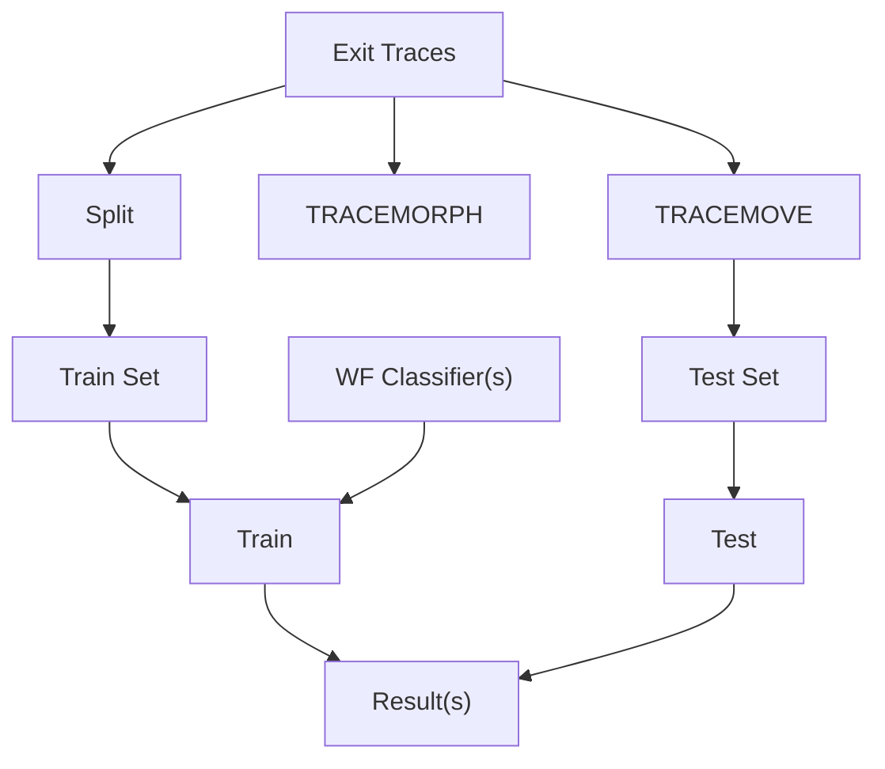
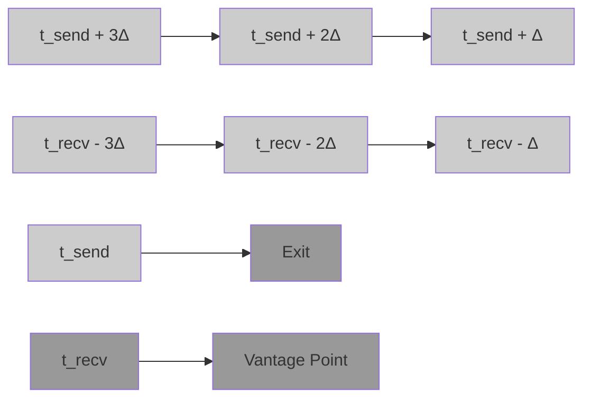

# CELLSHIFT: RTT-Aware Trace Transduction for Real-World Website Fingerprinting

Rob Jansen

U.S. Naval Research Laboratory

Abstract—Website fingerprinting is a privacy attack in which an adversary applies machine learning to predict the website a user visits through Tor. Recent work proposes evaluating WF attacks using the “genuine” patterns or traces of Tor users’ natural interactions that can be measured by Tor exit relays, but these traces do not accurately reflect the patterns that an entry-side WF attacker would observe. In this paper, we present new methods for transducing exit traces into entry traces that we can use to more accurately estimate the risk WF poses to real Tor users. Our methods leverage trace timestamps and metadata to extract multiple round-trip time estimates and use them to “shift” traces to the perspective of a target vantage point. We show through extensive evaluation that our methods outperform the state of the art across multiple synthetic and genuine datasets and are considerably more efficient; they enable researchers to more accurately represent the real-world challenge facing an entry-side WF adversary, and produce augmented datasets that allow an adversary to boost the performance of existing WF attacks.

## I. INTRODUCTION

Website fingerprinting (WF) is an attack against the Tor anonymous communication network [12] in which an adversary that can observe the traffic patterns on the entry side of the Tor network uses machine learning (ML) to predict the exitside destination website being accessed by the user [2, 4–8, 10, 15–18, 26, 30, 33, 37–40, 44–50, 52, 54, 55]. WF is a serious attack because an adversary can use it to passively deanonymize users without their knowledge, subverting Tor’s protections and greatly weakening user safety and privacy. We study WF to understand how practical the attack is under realworld conditions so that we can (1) better estimate the risk it poses to real Tor users, and thus (2) better understand how to prioritize the development and deployment of defenses against WF attacks in realistic scenarios.

Recent work has focused on more accurately modeling and evaluating WF considering real-world conditions. While the standard method of training ML website classifiers using synthetic datasets has been shown to greatly oversimplify the WF task [31], Cherubin et al. were the first to suggest that an adversary can instead train on the real traffic patterns that can be directly observed by Tor exit relays [7]. The authors argue that training on these so-called “genuine” traffic patterns or traces, which are created as a result of real Tor users’ natural interactions, is more realistic because the genuine traces better represent those that would be presented during a real WF attack. However, a major limitation of the approach is that the training position (exit) is misaligned with the attack position (entry); training on exit traces (while testing on entry) was estimated to reduce classifier accuracy, first by 5–18% [7, §6.4], and later by 17% in the median and 93% in the worst case [29, §5.3]. Understanding how an adversary might mitigate this performance degradation is an open research problem.

We seek to advance the study of real-world WF by examining the research question: can trace transduction efficiently improve classifier robustness to an out-of-distribution testing position? Previous work inadequately addresses this question. Although Cherubin et al. did acknowledge that training and testing in different positions would present a new problem for the adversary [7], they did not suggest any potential solutions. The only published method for position-based trace transduction, Retracer [29], requires replaying genuine exit traces in largescale Tor network simulations from which the simulated entry traces can be extracted and used for training. Thus, Retracer has high resource costs: replaying 115,000 exit traces with Retracer requires 495 GiB of RAM and 29.9 hours of run time when using 36 CPU cores [29, Fig. 11]. Further, we present evidence in § IV-B1 that real-world entry traces are better estimated by real-world exit traces than by simulated Retracer entry traces, justifying further examination of Retracer.

In this paper we explore new methods for trace transduction, that is, for transforming real-world traces that were observed in a specific position to traces that better represent those that would be observed during an entry-side WF attack. Our key insight is that traces already contain the metadata that is required to simulate a shift in the vantage point of trace observation. In particular, the directions, precise timestamps, and relay control commands of the Tor cells (i.e., protocol messages) in a cell trace enable us to estimate a Tor circuit’s round-trip time (RTT) and changes in the RTT throughout the life of the circuit. From this insight, we develop CELLSHIFT, a core set of functions to (1) extract multiple RTT measurements from a cell trace, (2) estimate the latency and congestion between the source position from which the trace was measured and a target position, and (3) rewrite cell timestamps to simulate a “shift” in the vantage point of trace observation to the target position. CELLSHIFT’s primary novelty is that it can perform RTT-aware trace transduction directly on a cell trace; while Retracer replays traces in resource-intensive, complex,

Network and Distributed System Security (NDSS) Symposium 2026 23 - 27 February 2026, San Diego, CA, USA ISBN 979-8-9919276-8-0 https://dx.doi.org/10.14722/ndss.2026.231004 www.ndss-symposium.org

large-scale network simulations, CELLSHIFT uses only simple mathematical operations that can be efficiently executed.

We organize our contribution into three conceptually distinct modules to promote reusability and future extension: CELLSHIFT, TRACEMOVE, and TRACEMORPH. CELLSHIFT contains the core functionality which is general enough to be able to shift traces between any two Tor circuit positions, e.g., from an exit relay to an entry relay or to a client’s internet service provider, and to support RTT-based augmentation by considering configurable target RTTs during the shift operation. TRACEMOVE and TRACEMORPH are concrete methods that use CELLSHIFT to transduce each exit trace to its entry vantage point and to many augmented entry traces, respectively.

TRACEMOVE uses CELLSHIFT to shift a single exit trace to simulate its observation from an entry position without modifying the original RTT of the trace. We envision that TRACEMOVE be used to produce realistic entry-side testing datasets that are sourced from genuine exit traces [27, 28]. Through extensive evaluation, we show that (1) TRACEMOVE produces traces that are closer to real entry traces than are exit traces and traces from the state-of-the-art Retracer method across 6 distance functions, and (2) classifiers trained with entry traces are 1–7 points more accurate when tested against TRACEMOVE traces than when tested against exit or Retracer traces across ten WF attacks.

TRACEMORPH uses CELLSHIFT to morph each cell trace in a dataset into a chosen number of RTT-augmented cell traces that better reflect the wide range of circuit latencies and congestion levels encoded in the dataset’s cell trace metadata. TRACEMORPH represents a likely strategy of a real-world adversary to produce augmented training datasets that improve WF classifier robustness to the dynamic network conditions which are uncorrelated with the websites being accessed [2, 26]. Through extensive evaluation across multiple datasets, we show that classifiers trained with augmented traces from TRACEMORPH (1) in a closed-world setting are 4–14 points more accurate than the state-of-the-art training strategies when considering a synthetic dataset, and 5–25 points more accurate when considering a genuine dataset, and (2) in an open, naturalworld setting are both more sensitive and more receptive to high-precision tuning [52] than the state-of-the-art methods: across 380 website classifiers, the median recall and optimized precision are 42 and 26 points greater, respectively.

TRACEMOVE and TRACEMORPH run in a pre-processing phase that occurs prior to any classifier training or testing process. As a result, they are completely orthogonal to and agnostic of the classification algorithm(s) that an adversary may choose to employ during a WF attack and they can be applied across many past and future WF classifiers. Additionally, our methods work in isolation on either a single cell trace or a set of cell traces; they are embarrassingly parallel and, unlike Retracer [29], require no external information about the state of the Tor network during trace measurement. Finally, our methods are highly efficient because our core functions rely only on simple mathematical operations: we show that our Rust implementation can process at least 2,875 traces/s with a single CPU core, which is five orders of magnitude greater than Retracer’s rate of 0.03 traces/s/core.

CELLSHIFT is important to the study of real-world WF because it enables us to capitalize on the more realistic traffic patterns embedded in genuine traces: TRACEMOVE enables us to more accurately represent the entry-side testing challenge that genuine traces present to WF classifiers, while TRACEMORPH enables us to better estimate the threat of a viable training strategy that an adversary could use to improve classifier performance in realistic scenarios. Together, our methods can help researchers more accurately estimate the risk that WF poses to real Tor users.

Contributions: The main contributions of this work include:

– CELLSHIFT for extracting trace RTTs, estimating latencies, and transducing cell traces to new circuit positions; TRACE-MOVE for producing transduced testing sets; and TRACE-MORPH for producing transduced+augmented training sets.  
– An evaluation that shows that TRACEMOVE better represents entry traces than existing methods across six distance functions and ten WF classifiers.  
– An evaluation that shows that TRACEMORPH outperforms alternative, state-of-the-art augmentation strategies across ten WF classifiers against both synthetic and genuine traces.  
– A real-world WF evaluation across 1,200 classifiers, demonstrating our methods’ utility in utilizing genuine exit traces.  
– Our efficient Rust implementation is released as open-source software to support future extension (see Appendix B).

## II. BACKGROUND AND MOTIVATION

## A. The Tor Network

Tor is a source-routed overlay network of application-layer proxy relays that employ a variation of onion routing to provide source-destination unlinkability [12, 51]. To use Tor, clients first build three-hop paths called circuits, each through an entry, a middle, and an exit relay. The circuit is made accessible on the client through a SOCKS API, which enables applications to (1) request that the exit establish a new connection to an internet service, and (2) anonymously communicate with the service through the circuit, using its relays as bi-directional forwarding proxies. Logical Tor connections between applications and internet services are called streams, many of which can be multiplexed over a circuit. Application data and Tor protocol control commands are forwarded on streams through the circuit in fixed-size, 514-byte messages called cells.

Tor supports configurable “stream isolation” rules for multiplexing many streams from an application onto the same circuit. Tor Browser sets custom rules such that (1) a stream to a new first-party domain is assigned to a fresh circuit, (2) subsequent streams created to load additional pages from the first-party domain or any associated third-party content are multiplexed over the circuit, and (3) other, unassociated streams are assigned to separate circuits. In this paper, we use website to refer to the first-party domain name, which is the name resolved by the exit relay when connecting the first stream on a fresh circuit to the requested destination. We use webpage to refer to the full URL of an individual page loaded from a website.


<details>
<summary>flowchart</summary>

Network traffic flow diagram showing client-server interaction with labeled tracers, classifier, and adversary behavior
</details>

Figure 1: Our real-world WF adversary model. In phase 1, the adversary runs an exit relay to collect labeled traces and trains a WF classifier. In phase 2, the classifier is deployed to predict a website from unlabeled entry-side traces.

## B. WF Adversary Model

We adopt the following adversary model, which is consistent with that from previous work on real-world WF [7, 29].

1) Objectives: We consider a WF adversary that controls a vantage point on the entry-side of the Tor network. The adversary’s primary objective is to detect visits to any of a select, monitored set of websites being accessed through the Tor network, thereby breaking Tor’s source-destination unlinkability and deanonymizing Tor users. The adversary may use detected website visits (1) for measurement, as in previous work [23], (2) for censorship, to block further data from being sent on a Tor connection or to block a user’s subsequent Tor connection attempts, and (3) to justify launching digital or physical harassment campaigns against Tor users.

We consider a non-targeting adversary that aims to conduct surveillance and deanonymization of Tor users en masse. Consequently, the adversary is interested in detecting as many visits to the monitored websites as possible and generally prefers not to target user-specific behavior or user-specific websites. Although a targeting adversary is also an important threat, we focus on a non-targeting adversary since it may potentially cause greater total user harm at lower cost.

2) Capabilities: We consider a passive adversary that is capable of launching a WF attack in two logical phases as shown in Fig. 1. In the first phase, the adversary runs one or more Tor exit relays and uses them to collect a dataset of labeled cell traces for each circuit. The adversary uses the labeled traces to train one or more WF classifiers (i.e., ML classification models) to be able to distinguish monitored from non-monitored, background websites based on the patterns associated with visits to those websites. In the second phase, the adversary deploys the trained classifier(s) to its entry-side vantage point(s), which might include entry relays and network nodes on one or more paths between clients and the Tor network. When an entry-side vantage point observes a trace (which is unlabeled due to Tor’s multi-layer encryption), the adversary queries the trained classifier(s) to predict the visited website.

We highlight an important distinction between three different variations of traces which warrants additional precision. In this paper, we define a cell trace of length ℓ as a time-ordered sequence of 3-tuples $\langle ( t _ { i } , d _ { i } , c _ { i } ) \rangle _ { i = 1 } ^ { \ell }$ , where each tuple denotes the time $t _ { i }$ that the circuit’s ith cell was observed, the direction $d _ { i }$ that it was forwarded, and the relay command $c _ { i }$ for the ith cell. A time t is typically a floating point value representing a number of seconds, a direction d is an integer value where d=1 indicates the client→server direction and $d { = } { - } 1$ indicates the client←server direction, and the relay command c is an integer value encoding one of 32 control instructions in the Tor protocol [11, §2.5.1]. However, WF classifiers are not directly trained and tested with cell traces. Instead, classifiers operate $\langle d _ { i } \rangle _ { i = 1 } ^ { N }$ $\langle t _ { i } \cdot d _ { i } \rangle _ { i = 1 } ^ { N } ;$ both types of traces (1) can trivially be extracted from cell traces, and (2) are zero-padded if $\ell < N$ such that ⟨0⟩i for $\ell < i \leq N$ . As in prior work, we consider $N { = } 5 { , } 0 0 0$ .

We consider an adversary that can collect labeled exit cell traces as shown in Fig. 1; while this work focuses on exit relays, we note that Tor clients and other Tor relays can also collect cell traces. However, critically, we do not require that an adversary be able to observe entry-side cell traces during an attack; unlabeled direction or directional-time traces are sufficient and both can be observed without participating in the Tor protocol, i.e., even by a network-level vantage point [55].

## C. Genuine Tor Traces

Recall that our focus in this paper is on estimating the risk that WF poses to real Tor users. Accurately estimating realworld WF performance requires two critical factors: (1) realistic testing datasets, and (2) realistic training scenarios.

1) Realistic Testing Datasets: It is critical to evaluate WF classifiers against test sets that accurately reflect the challenge of the classification task that the adversary will face during a real-world attack. We know from previous work that synthetic datasets, which are produced programmatically using automated tools [1], oversimplify the classification task and lead to performance overestimation [7, 27, 29, 31]. Thus, while synthetic datasets can be useful for understanding relative performance differences when comparing multiple classification strategies or targeted scenarios, we argue that they should not be relied upon for their absolute performance estimates. On the other hand, genuine traces, such as those that can be measured by an exit relay [27], provide a sort of ground truth: they contain the patterns that result from real Tor users’ natural behavior, incorporating the true complexity of the real-world traffic the adversary will encounter during an attack [7]. As a result, we believe that genuine traces inherently model the testing challenge of a real-world WF classification task.

2) Realistic Training Scenarios: While realistic testing requires realistic datasets, they are not a strict training requirement; any training data and strategy employed by the adversary is technically valid so long as we evaluate classifier efficacy against realistic test sets. A more important training consideration is the adversary model, and in particular, the capabilities and scenarios required to gather training data and perform classifier training. In this respect, we agree with prior work [7, 27, 29] that (1) running an exit relay to collect genuine cell traces is a viable strategy for the adversary because anyone is allowed to run a relay and trace collection is both passive and undetectable, and (2) incorporating genuine traces during classifier training is a preferable strategy for the adversary given that WF classifiers will ultimately be tested against such traces in a real-world attack. Thus, we believe that our adversary model, which considers genuine traces during both training and testing, is a realistic representation of real-world WF.


<details>
<summary>flowchart</summary>


</details>

Figure 2: Our transduction algorithms operate on exit cell traces in an isolated pre-processing phase, and are independent of the WF classifier(s) employed by the adversary.

While genuine traces help us more realistically represent real-world WF, they present two primary limitations. First, for the adversary, training classifiers on exit traces when they will be tested on entry traces causes “distortion” that has been shown to degrade classifier performance [7, 29]. The adversary would likely want to apply methods that can reverse or mitigate this “distortion” effect. Second, researchers require labeled entry traces in order to create realistic test sets and accurately estimate real-world classifier performance (true/false positives/negatives, accuracy, etc.) as described above. Although entry traces can be collected by entry relays, the website labels are encrypted by Tor and unavailable to an entry.1 Researchers would like a method to accurately transform genuine exit traces, which are labeled, into entry traces while retaining the labels and genuine traffic characteristics. Our cell trace transduction methods presented in the next section address both limitations.

## III. NEW METHODS FOR CELL TRACE TRANSDUCTION

In this section, we describe new methods of transducing cell traces observed in one position into traces that better represent observation from a target position, efficiently mitigating the “distortion” effect that occurs when visits to a website are observed from different circuit positions [7]. Our methods are designed to overcome the limitations of genuine exit traces [27, 28] so that we can leverage their genuine patterns and characteristics to improve the study of real-world WF.

## A. Overview

We present the design of three logically distinct modules. Conceptually, CELLSHIFT is a library of general, shared functionality, while TRACEMOVE and TRACEMORPH are concrete executables that link to the CELLSHIFT library.

1Entry traces could be labeled in cooperation with clients, but doing so using automated browsers [1] may produce synthetic traces [31] while using browsers driven by human volunteers may produce biased traces [20, 34].


<details>
<summary>flowchart</summary>


</details>

Figure 3: With an estimate of $\begin{array} { r } { \Delta = \frac { \mathrm { R T T } } { 6 } } \end{array}$ , from an exit vantage point can be shifted to a new perspective by adjusting each cell’s timestamp based on its direction.

CELLSHIFT is a core set of general functions that (1) extract multiple RTT measurements from a cell trace, (2) estimate the latency and congestion between the source position from which the trace was measured and a target position, and (3) rewrite cell timestamps to simulate a “shift” in the vantage point of trace observation to the target position.

TRACEMOVE is a concrete method that produces realistic testing datasets by using CELLSHIFT to individually transduce exit cell traces to simulate trace observation from an entry position without modifying the original RTT of the trace.

TRACEMORPH is a concrete strategy of a real-world adversary that produces RTT-augmented training datasets by using CELLSHIFT to morph each exit cell trace in a dataset into a chosen number of entry cell traces that better reflect the wide range of circuit latencies and congestion levels embedded in the dataset’s cell trace metadata.

TRACEMOVE and TRACEMORPH are designed to be run in a pre-processing phase that occurs prior to any classifier training or testing process and are completely orthogonal to the classification algorithm(s) that the adversary chooses to employ during a WF attack (see Fig. 2).

## B. Functionality in the CELLSHIFT Library

CELLSHIFT is designed to estimate a cell trace as it would have been observed in a target position given an input cell trace that was measured from the exit position. To understand the primary shift function at a high level, consider that a cell trace can be dissected into two separate uni-directional cell streams as shown in Fig. 3: in one direction the exit packages data from an internet server into cells which it sends toward the client at time $t _ { \mathrm { s e n d } }$ , and in the other direction the exit receives cells at time $t _ { \mathrm { r e c v } }$ that were previously packaged and sent by the client. Suppose that the latency between each pair of consecutive nodes in the circuit is $\Delta .$ To simulate the trace having been observed at the entry vantage point, CELLSHIFT will (1) shift the client←exit cells forward in time by setting their timestamps to $t _ { \mathrm { s e n d } } + 2 \Delta$ , and (2) shift the client→exit cells backward in time by setting their timestamps to $t _ { \mathrm { r e c v } } - 2 \Delta$ . As explained below, CELLSHIFT computes $\Delta$ adaptively using the most recently available circuit RTT, which can change throughout the lifetime of a circuit, and can also simulate unique, target RTTs in place of the measured RTTs to support

```txt
1 struct Cell {
2    time: float # num seconds since circuit creation
3    dir: int # direction is +1: cli->srv or -1: cli<-srv
4    cmd: int # relay control command; see Tor specification
5}
6 struct TimeEstimate {
7    time: float,    # number of seconds
8    cell_index: int, # cell at which time was calculated
9}
```

Pseudocode 1: RTTs can be estimated from the metadata available for all cells in an exit trace.

data augmentation. Following cell timestamp adjustments, the two uni-directional cell streams are merged back into a single cell trace which is then sorted by the new cell timestamps.

We show by example how CELLSHIFT changes the timestamps and can shift the ordering of cells in a trace. Suppose, for example, that we have estimated a circuit RTT of 120 units from exit→client→exit. Then each hop would contribute $\begin{array} { r } { \Delta = \frac { 1 2 0 } { 6 } = 2 0 } \end{array}$ units in expectation. Accounting for this latency would result in a completely different ordering of cells on the entry than the ordering originally observed on the exit. Suppose we have the following exit-observed directional-time trace.

$$
\text { observed} _ {\text { exit }} = \begin{array}{c} i n d e x \\ d i r \\ t i m e \end{array} \left[ \begin{array}{c c c c c c} 0 & 1 & 2 & 3 & 4 & 5 \\ - 1 & - 1 & - 1 & + 1 & + 1 & + 1 \\ 0 & 1 0 & 2 0 & 5 0 & 6 0 & 7 0 \end{array} \right]
$$

To estimate when the entry would have observed the cells, CELLSHIFT adds 2∆ = 40 units of time to the dir=−1 cell timestamps and subtracts 2∆ = 40 units of time from the dir=+1 cell timestamps (as in Fig. 3). The trace is then sorted according to the new timestamps, resulting in a trace that is shifted to the perspective of an entry vantage point.

$$
\mathrm{shifted} _ {\mathrm{entry}} = \begin{array}{c} i n d e x _ {\mathrm{old}} \\ i n d e x _ {\mathrm{new}} \\ d i r \\ t i m e \end{array} \left[ \begin{array}{c c c c c c} 3 & 4 & 5 & 0 & 1 & 2 \\ 0 & 1 & 2 & 3 & 4 & 5 \\ + 1 & + 1 & + 1 & - 1 & - 1 & - 1 \\ 1 0 & 2 0 & 3 0 & 4 0 & 5 0 & 6 0 \end{array} \right]
$$

Observe that the sequences of directions and times of the cells, which are used by WF classifiers, have changed.

Next, we more completely describe the primary functions that compose CELLSHIFT: estimating circuit RTTs, separating network propagation delay and congestion, and shifting cells.

1) Estimating Circuit RTTs: In order to simulate the observation of a trace from a new vantage point, CELLSHIFT estimates the circuit’s RTTs over the trace observation period. We observe that circuit RTTs can be estimated many times throughout the lifetime of a circuit by using the cell metadata that is already available for every cell in an exit cell trace. Pseudocode 1 shows the available cell time, direction, and relay command types that will be used to estimate RTT and changes in the RTT throughout the cell trace.

In order to estimate RTT, we require a Tor protocol dependency to exist such that the exit can send a “trigger” cell that it knows in advance will cause the client to respond with a cell. Moreover, the client’s response cell must be able to be uniquely identified by the exit. Fulfilling both requirements

```python
1# The first CONNECTED cell triggers a DATA cell reply.
2 fn connected_to_data(trace: [Cell]) -> TimeEstimate:
3    for (i, cell) in enumerate(trace):
4    if cell.dir == -1 and cell.cmd == CONNECTED:
5    if start == None:
6    start = cell.time
7    else if cell.dir == 1 and cell.cmd == DATA:
8    if start != None:
9    rtt = cell.time - start
10    return TimeEstimate{time: rtt, cell_index: i}
11    else:
12    return None
```

Pseudocode 2: RTT can be estimated when connecting to the first server: an exit relay will send a CONNECTED cell to the client, who replies with the circuit’s first DATA cell.

```python
1# Every 31st DATA cell triggers a SENDME cell reply.
2 fn data_to_sendme(trace: [Cell]) -> [TimeEstimate]:
3 rtts, triggers, n_data = [], [], 0
4 for (i, cell) in enumerate(trace):
5    if cell.dir == -1 and cell.cmd == DATA:
6    if n_data++ % 31 == 0:
7    triggers.push_back(cell.time)
8    else if cell.dir == 1 and cell.cmd == SENDME:
9    start = triggers.pop_front()
10    rtt = cell.time - start
11    est = TimeEstimate{time: rtt, cell_index: i}
12    rtts.push_back(est)
13 return rtts
```

Pseudocode 3: RTT can be estimated in Tor’s congestion control protocol: after every cc\_sendme\_inc=31 DATA cells sent by the exit relay, the client replies with a SENDME cell.

would enable the exit to start a timer when it sends the “trigger” cell and stop it when it receives the expected response; the stopped timer’s time value represents an RTT estimate.

The Tor protocol [11] presents two distinct instances in which RTT estimates can be measured. The first opportunity is during the process of connecting to the first server on a new circuit. During this process, the client sends a relay control cell named BEGIN to the exit, which includes the address and port information the exit needs to establish the connection. Once the connection succeeds, the exit sends a CONNECTED cell back to the client and records the current time as the start of an RTT estimate. When the client receives the exit’s CONNECTED cell, it learns that the exit connection is ready and starts sending server-bound application data toward the exit in relay DATA cells. When the exit receives the first such DATA cell, it records the RTT estimate by subtracting the previously recorded start time from the current time. Pseudocode 2 shows how we compute this initial RTT estimate on a given cell trace. This method is feasible for every circuit that makes at least one exit connection, independent of the type of traffic (e.g., web, bulk, interactive, etc.) that is carried over the circuit.

The second opportunity for estimating RTTs in the Tor protocol is due to its flow control algorithm in which a client will periodically send a relay SENDME cell to the exit to control the client←exit sending rate. Coincidentally, Tor’s congestion control algorithm also uses the same cell metadata to estimate circuit RTTs, which it uses as a primary congestion

```python
fn time_at(estimates: [TimeEstimate], cell_index: int) -> float:
    i = cell_index % estimates[-1].cell_index
    for est in estimates:
    if i <= est.cell_index:
    return est.time
```

Pseudocode 4: We can obtain the most recent time estimate (e.g., RTT) at the time that a given cell was observed.

signal [43]. The RTT calculation relies on the value of the cc\_sendme\_inc consensus parameter, which we believe has been set to a value of 31 since the RTT-based congestion control algorithm was deployed in 2022 [42]. Based on these flow and congestion control mechanisms, the client will send a relay SENDME cell to the exit after every cc\_sendme\_inc=31 relay DATA cells it receives. Thus, the exit can record the time that it sends every 31st DATA cell; when it receives the expected SENDME cell in response, it records a new RTT estimate by subtracting the previously recorded start time from the current time. Pseudocode 3 shows how we can compute many such RTT estimates for a given cell trace. This method is also feasible for every circuit independent of the carried traffic type, and we can use it to produce an RTT estimate for every 10 packets ≈ 31 cells ≈ 15KB of application data.

Each RTT estimate includes the index of the cell at which the RTT was recorded, allowing us to compute the most recent RTT estimate for any particular cell or range of cells in a cell trace (see Pseudocode 4). Although the time between RTT estimates would generally be lower for non-interactive traffic (e.g., web or bulk) and higher for interactive traffic (e.g., chat), CELLSHIFT iterates cells in a trace and adaptively applies timestamp adjustments based on the most recent, freshest RTT estimate available. CELLSHIFT further processes the RTT estimates as we explain next.

2) Separating Network Propagation Delay and Congestion: When loading a website through Tor, there are multiple networkrelated factors that can cause a different trace to be produced when loading an identical website multiple times [26]. The two primary factors we consider are network propagation delay and congestion. We consider that propagation delay is a function of the specific path of relays chosen for a Tor circuit: two circuits with different paths of relays may have very different propagation delays, depending on the relays’ locations. However, we consider that under ideal conditions propagation delay is stable for two identical paths of relays. On the other hand, congestion is highly dynamic and can fluctuate greatly even if the path of relays is held constant [53]. For example, the congestion experienced on a circuit can depend on the number of other circuits that are active on the relays and the load demanded on those circuits [21].

We have designed CELLSHIFT to be capable of producing augmented traces that can help classifiers learn to be robust against cell trace variation that is caused by (1) the propagation delay along the path of relays that happened to be chosen for a particular circuit, and (2) the rapid change in network

```python
fn round_trip_times(trace: [Cell]) -> [TimeEstimate]:
    return [connected_to_data(trace)] + data_to_sendme(trace)

fn prop_delay(rtts: [TimeEstimate]) -> float:
    return min([rtt.time for rtt in rtts])

fn congestion(rtts: [TimeEstimate]) -> [TimeEstimate]:
    cong = []
    for rtt in rtts:
    est = rtt.deepcopy()
    est.time -= prop_delay(rtts)
    cong.push_back(est)
    return cong

fn latency(rtt: float, nhops: float) -> float:
    # convert 6-hop rtt to n-hop latency
    return rtt / 6.0 * nhops
```

Pseudocode 5: CELLSHIFT separates a trace’s RTT estimates into propagation delay and congestion estimates, while the latency over n hops is a simple function of the RTT.

congestion that can occur during a website load. As shown in Pseudocode 5, we estimate the propagation delay for a cell trace as the minimum of its RTT estimates $( \mathrm { i . e . , \ R T T _ { \mathrm { m i n } } ) . }$ and we calculate the congestion for a cell trace over all of its RTT estimates by subtracting the propagation delay from each estimate $( \mathrm { i . e . , } \forall i : \mathrm { R T T } _ { i } \mathrm { - R T T _ { \operatorname* { m i n } } } )$ . Next we describe how CELLSHIFT uses these functions to adjusts cell timestamps.

3) Shifting Cells: CELLSHIFT shifts cells by adjusting cell timestamps and sorting the trace. To support data augmentation, we designed the core shift function to be able to simulate the observation of the trace (1) from a different vantage point, (2) with a different propagation delay (to simulate that it was loaded through a different path of relays), and (3) with a differently fluctuating circuit congestion. Thus, the arguments to the shift function include a target vantage point that is a chosen number of hops from the exit relay, a target propagation delay, and a target congestion “profile” (i.e., sequence of congestion time estimates) as shown on line 1 of Pseudocode 6.

CELLSHIFT applies two major types of timestamp adjustments. First, the cell timestamps in a trace are adjusted such that they will represent the time that the cell was created on the source edge (i.e., before being sent into the circuit). In the client←exit direction, the exit relay is the source edge and the timestamps are already recorded as they were observed on the exit; thus, no adjustment is needed. However, in the client→exit direction, the client is the source edge but the timestamps are recorded as they were observed on the exit. Thus, we shift client→exit cells to the client’s perspective by subtracting 3 hops worth of the round-trip latency observed on the circuit $( \mathrm { i . e . , ~ } \frac { \mathrm { R T T } } { 2 } )$ as shown on line 12 of Pseudocode 6. Second, the cell timestamps are further adjusted to apply a configured target propagation delay and congestion profile, and to simulate the observation of the trace from a new vantage point that is a configurable number of hops away from the exit relay (i.e., 1 hop for middle, 2 hops for entry, 2.5 hops for ISP, 3 hops for client). For each cell in the trace, the target RTT is computed as the sum of the target propagation delay and

```python
fn shift(trace: [Cell], nhops: float, new_prop: float, new_cong: [TimeEstimate]) -> [Cell]:
rtts = round_trip_times(trace)
prev_send, prev_recv = 0.0, 0.0
shifted = trace.deepcopy()

for (i, cell) in enumerate(shifted):
    rtt = time_at(rtts, i)
    new_rtt = new_prop + time_at(new_cong, i)

    if cell.dir == 1: # client->exit, exit is receiver
    # first remove observed rtt to client (3 hops)
    new_time = cell.time - latency(rtt, 3)
    # then add new latency from client to target
    new_time += latency(new_rtt, 3 - nhops)
    # keep client->exit cell stream in order
    cell.time = max(new_time, prev_recv)
    prev_recv = cell.time

    else: # client<-exit, exit is sender
    # just add new latency from exit to target
    new_time = cell.time + latency(new_rtt, nhops)
    # keep client<-exit cell stream in order
    cell.time = max(new_time, prev_send)
    prev_send = cell.time

shifted.sort(key=lambda cell: cell.time)
return shifted
```

Pseudocode 6: CELLSHIFT replaces a trace’s RTT with a new RTT composed of a configurable propagation delay and dynamic congestion profile. Cell timestamps are then shifted to simulate observation from a target vantage point.

the target congestion (i.e., the most recent congestion estimate at the cell’s index position in the trace) as shown on line 8 of Pseudocode 6. A latency value is computed by adjusting the target RTT by the number of hops from the sending edge to the target vantage point, and it is added to form the new cell timestamp as shown in lines 14 and 20 of Pseudocode 6. Note that lines 16–17 and 22–23 of Pseudocode 6 ensure that all cells within each of the two uni-directional cell streams remain in order. Finally, the shifted trace is sorted by the adjusted cell timestamps as shown in line 25 of Pseudocode 6.

CELLSHIFT is a general algorithm that can simulate the observation of an exit trace on a new target vantage point over a circuit with a new target propagation delay and congestion profile. Thus, it is well suited to implementing many cell trace transduction and augmentation strategies. Next, we explain two such concrete methods: TRACEMOVE and TRACEMORPH.

## C. TRACEMOVE: Transduce Cell Traces

The primary goal of TRACEMOVE is to transduce or “reposition” each of a set of exit cell traces to simulate trace observation from a new target vantage point. In particular, TRACEMOVE transduces cell traces from an exit to an entry position by adjusting cell timestamps but without modifying the observed RTTs, propagation delay, or congestion encoded in each trace. TRACEMOVE is designed to produce a testing set of entry-side traces that are suitable for evaluating WF classifiers in our real-world WF threat model (see § II-B).

TRACEMOVE uses CELLSHIFT to adjust cell timestamps; it operates similarly to the simple example previously described in Fig. 3. TRACEMOVE transduces each exit trace to an entry position using CELLSHIFT’s shift function while providing the

```python
fn transduce(traces: [[Cell]]) -> [[Cell]]:
    to_entry = 2 # 2 hops entry<->exit
    for (i, trace) in enumerate(traces):
    rtts = round_trip_times(trace)
    prop, cong = prop_delay(rtts), congestion(rtts)
    traces[i] = shift(trace, to_entry, prop, cong)
    return traces
```

Pseudocode 7: TRACEMOVE repositions exit to entry traces without modifying the embedded RTTs.

trace’s own propagation delay and congestion times as input (see Pseudocode 7). Thus, the source and target RTTs of a trace will be identical and unchanged in the shifted version. In this way, TRACEMOVE minimally modifies traces as required for repositioning but without modifying the embedded RTTs.

TRACEMOVE offers two primary benefits. First, TRACE-MOVE is simple and efficient, making its application on even large datasets straightforward and convenient. It operates on each trace in isolation without requiring any information external to the trace, making it embarrassingly parallel. Second, TRACEMOVE enables WF researchers to properly account for real Tor user behavior and traffic patterns when testing WF classifiers. These genuine traffic patterns are encoded in realworld exit trace datasets (e.g., GTT23 [28]), but TRACEMOVE allows us to leverage the realism of these traces while more accurately representing the (testing) challenge of WF in a realworld, entry-side attack. We believe TRACEMOVE offers the closest approximation of the entry traces that had occurred during exit measurement given the available information.

## D. TRACEMORPH: Transduce and Augment Cell Traces

The primary goal of TRACEMORPH is to produce a transduced training set of entry-side cell traces from which WF classifiers can learn a richer concept of each monitored website. Whereas TRACEMOVE transduces a trace to a single new trace exclusively using the trace’s own RTTs, TRACEMORPH transduces a trace into multiple new augmented traces considering the full range of Tor circuit RTTs as measured across all traces in the entire cell trace dataset.

The intuition behind TRACEMORPH is that the propagation delay and congestion of a trace (measured between the client and the exit relay) are attributable to the relays used to load the website rather than to the website itself (recall from § III-B2 that we attribute propagation delay to the relays’ location, and congestion to the relays’ traffic load). Because many different relays with different propagation delays and congestion profiles could be used to load the same website, we should teach the classifiers to treat propagation delay and congestion as “noise” that should be ignored in favor of focusing attention on the features of the trace that are more strongly correlated with the website. By transducing a trace with augmented RTTs multiple times, TRACEMORPH effectively “simulates” that the same website was loaded through many different paths of relays with distinct propagation delay and congestion properties, making the classifier more robust to such variation during testing.

```python
fn augment(traces: [[Cell]], n_aug: int) -> [[Cell]]:
    to_entry = 2 # 2 hops entry<->exit

# we'll want n_aug equally spaced prop delays
rtts = [round_trip_times(t) for t in traces]
prop_dist = sorted([prop_delay(r) for r in rtts])
step = len(prop_dist) / (n_aug+1)

# produce n_aug augmented traces for each trace
augmented = []

for trace in traces:
    for i in range(n_aug):
    new_prop = prop_dist[round(step * (i+1))]
    new_cong = congestion(random.choice(rtts))
    aug = shift(trace, to_entry, new_prop, new_cong)
    augmented.push_back(aug)

return augmented
```

Pseudocode 8: TRACEMORPH augments cell traces with new RTTs composed of equally distributed propagation delays and random congestion profiles.

TRACEMORPH expands an input dataset of exit cell traces by transducing each of its traces a configurable number n times. First, TRACEMORPH performs a straightforward transduction of an exit trace to the entry vantage point using the method outlined in Pseudocode 7 (without augmentation). Second, TRACEMORPH performs the remaining n − 1 transductions by augmenting the trace to simulate its measurement on a new path of relays, i.e., considering new propagation delays and new congestion profiles during the shift operation as outlined in Pseudocode 8 (with $n _ { \mathrm { a u g } } = n - 1 )$ .

TRACEMORPH produces each of the n − 1 augmented traces using CELLSHIFT’s shift function (i.e., Pseudocode 6), which requires as input a new propagation delay and a new congestion profile. These values are selected from the empirical RTT measurements already embedded in the input dataset’s traces to ensure that we accurately represent the latency characteristics of real-world relays and circuits as closely as possible.

Propagation Delay: TRACEMORPH precomputes the full distribution of propagation delays across all traces in the dataset (see lines 5–6 of Pseudocode 8). It selects n − 1 propagation delay values uniformly from this distribution at equally distributed quantiles (see lines 7 and 13 of Pseudocode 8). For example, for $n \mathrm { ~ - ~ } 1 \mathrm { ~ = ~ } n _ { \mathrm { a u g } } \mathrm { ~ = ~ } 3 .$ , TRACEMORPH selects the propagation delay values from the precomputed distribution at quantiles q = 0.25, q = 0.5, and q = 0.75.

Congestion: Each of the n − 1 propagation delays is then paired with the empirical congestion profile of a random trace in the dataset (see line 14 of Pseudocode 8).

Thus, for each exit trace in the dataset, TRACEMORPH produces n − 1 augmented entry traces that are shifted using the new propagation delay and congestion values (see line 15 of Pseudocode 8). By using RTTs from a real-world dataset, TRACEMORPH ensures that we represent the full range of possible relay locations while also considering the realistic dynamics of congestion as measured in the dataset. Additionally, using greater values of n will allow TRACEMORPH to better represent the full distribution of propagation delays while also incorporating more unique congestion scenarios.

TRACEMORPH offers similar benefits to TRACEMOVE. First, it is simple and efficient: it operates on an input dataset of traces in isolation and is embarrassingly parallel. Second, TRACEMORPH produces entry training data that enables an adversary to train WF classifiers to learn from the genuine traffic patterns encoded in real-world, exit-trace datasets. Since in a real-world WF attack the classifiers would be faced with real-world entry traces, we expect that training on augmented entry traces from TRACEMORPH would help the WF classifiers generalize better to real conditions.

## IV. EVALUATION

We evaluate the efficacy of TRACEMOVE and TRACE-MORPH in producing transduced and augmented datasets.

## A. Overview

Ideally, we would like to evaluate our methods using datasets that realistically represent our real-world threat model as explained in § II-C. Fortunately, a large dataset of more than 13 million “genuine Tor traces” (GTT23) has recently been made available for studying WF [27, 28]. But unfortunately, the dataset does not contain genuine entry traces because it is not possible to obtain genuine trace labels from a Tor entry relay (both technically, due to Tor’s multi-layer encryption, and ethically, due to user privacy considerations). While TRACEMOVE could be utilized to overcome precisely this limitation (i.e., to transduce labeled exit traces into labeled entry traces), we must first evaluate the efficacy of TRACEMOVE using datasets for which we are able to provide entry trace labels as ground truth (i.e., synthetic datasets).

Thus, considering dataset limitations, our overall evaluation plan is to first evaluate the efficacy of TRACEMOVE (in § IV-B) and TRACEMORPH (in § IV-C) using synthetic datasets for which we are able to obtain ground truth labels in both exit and entry positions. Although synthetic traces may be less representative of the traces that an adversary would face in a real-world attack, they are still suitable for relative performance comparisons with the state of the art and they do help us build evidence of real-world efficacy (see § II-C). Then, after establishing the efficacy of our methods on synthetic datasets, we conduct a real-world evaluation by applying TRACEMOVE to GTT23 to obtain labeled entry testing traces of genuine Tor traffic patterns while considering various methods of training on the genuine GTT23 traces (in § IV-D).

Throughout this section, we evaluate our methods as described in § III and compare them to the state-of-the-art transduction and augmentation methods described below.

TRACEMOVE and TRACEMORPH: We develop a prototype of CELLSHIFT in 1,500 lines of Rust code and use it to implement TRACEMOVE and TRACEMORPH following the API shown in Pseudocode 7 and Pseudocode 8, respectively. OnlineWF [7]: We generally refer to training directly on exit traces (without transduction) as OnlineWF, following the online WF exit relay training method of Cherubin et al.

Retracer [29]: Exit cell traces are replayed in high-fidelity network simulations of the Tor network using a trace replay

tool that we obtain from the authors. Entry cell traces from the circuits carrying the replayed traffic are extracted from the simulation and used for evaluation. We generally use private Tor networks that represents 15% of the size of the public network, that are created using standard Tor modeling tools [25], and that are simulated with Shadow [22, 24] following the method described by the authors [29, §4.3.1]. NetAugment [2]: NetAugment organizes traces into bursts of same-direction cells, and then randomly applies a number of burst manipulations to each trace to produce augmented datasets for evaluation. The manipulations [2, Alg. 1–4] include randomly increasing the burst size of short traces and decreasing the size of long traces, randomly inserting outgoing bursts into the middle of incoming bursts, and randomly dropping outgoing bursts and merging incoming bursts. NetAugment is designed to augment datasets by increasing trace variation, but was not directly designed to transduce traces to different positions and does not support cell timestamps. We use the authors’ implementation of NetAugment in our evaluation [3].

## B. Producing Entry Testing Traces with TRACEMOVE

Recall that we envision using TRACEMOVE to transform exit cell traces observed by Tor exit relays, which embed the genuine Tor traffic patterns of real Tor users, into entry cell traces that better represent the patterns that WF classifiers will face in a real-world attack. Thus, we first evaluate TRACEMOVE’s ability to transduce exit cell traces into entry cell traces.

1) Trace Distance Evaluation: For each cell trace that is observed on the exit, TRACEMOVE produces a transformed version of that trace to estimate the trace observation from the entry. In order to evaluate the efficacy of the transformation, we require a dataset of cell traces in which we have the real, ground truth exit-side and entry-side trace of the same Tor circuit flow (i.e., webpage load); with such correlated traces, we could apply TRACEMOVE to the real exit traces and compare the distance between the transduced (estimated) entry traces and the real entry traces. Although ground truth entry and exit trace datasets were collected in previous work [29], they are uncorrelated: the two vantage points were independently measured on different circuits (with different RTTs, etc.). Thus, a new measurement is needed to support our distance evaluation.

a) Methodology: We conduct a new measurement of a correlated entry-exit trace dataset: traces of the same circuit measured from both the entry and exit vantage points. We use the 494 URLs that were established by the authors of previous work in order to keep our comparisons consistent [29, §4.2]: Select: The authors fetched 1,000 random wikipedia pages, extracted 22,463 external (non-wikipedia) hyperlinks, and then randomly selected a URL for each of 1,000 websites. Filter Errors: The authors fetched the 1,000 random URLs with tor-browser-selenium, and removed 506 because they resulted in error pages or failed to load.

Measure: 494 URLs remain for further measurement.

According to the authors, the “URLs point to webpages of news, sports, and other typical internet sites,” but we note that they may not be strongly representative of likely Tor destinations due to the narrow selection scope and limited sample size.

To conduct our measurement, we configure a Tor client to pin the entry and exit relay on each circuit it builds to relays that we set up for the measurement. Our relays are configured to collect Tor traces on the circuits built by our client, using the measurement methodology of Cherubin et al. [7]. We use tor-browser-selenium [1] to load each of the 494 URLs 100 times through our relays. After the measurement, we clean and balance the dataset, again following the process established in previous work [29, §4.2]:

Filter Errors: Discard cell traces associated with errors/retries. Filter Short Outliers: Discard traces containing fewer cells than expected (fewer than 25 or Q1 − 1.5 · IQR) for a URL. Balance: Randomly select 80 traces per URL while discarding all traces of URLs with fewer than 80 valid traces.

The resulting cleaned and balanced dataset of cell traces from 31,680 valid webpage loads is shown in Dataset 1.

Dataset 1: Correlated Tor entry-exit cell traces

<table><tr><td>Cor(entry): 396×80 correlated cell traces from entry relay</td></tr><tr><td>Cor(exit): 396×80 correlated cell traces from exit relay</td></tr></table>

The entry and exit traces for each individual circuit are linked together with a unique ID for tracking purposes.

We use our entry-exit correlated datasets to evaluate the efficacy of TRACEMOVE and the state-of-the-art Retracer method [29]. For TRACEMOVE we apply the transduce method from Pseudocode 7 using our Rust implementation to transduce Cor(exit) into a set of TRACEMOVE entry traces. For Retracer, we replay the exit traces from Cor(exit) in Shadow and extract the simulated entry traces into a set of Retracer entry traces. We also evaluate the non-transduced traces in Cor(exit) as a point of comparison. We consider that the traces described above represent estimates of the traces in Cor(entry) that were actually observed during measurement. Thus, we evaluate the efficacy of each estimation strategy by calculating the distance or “closeness” of each trace in Cor(entry) with the corresponding trace produced by each estimation method.

The distance between each real and estimated trace is $\langle d _ { i } \rangle _ { i = 1 } ^ { N } ,$ in § II-B2. We evaluate six standard distance functions that support comparing numeric vectors. For example, the Canberra distance function is defined as $\begin{array} { r } { d ( u , v ) = \sum _ { i } ^ { } \frac { \left| u _ { i } - v _ { i } \right| } { \left| u _ { i } \right| + \left| v _ { i } \right| } } \end{array}$ and is particularly intuitive as it indicates the total number of positions in which the two cell vectors have unequal directions.

b) Results: The mean and standard deviation of the distances computed by each distance function over the 31,680 traces are shown in Table I. Overall, we find that TRACEMOVE has the lowest mean distance between each estimated entry trace and its linked real entry trace among the three methods we tested and across all distance functions we evaluated. Lower distance relative to exit traces indicates that TRACEMOVE’s entry traces are more representative of the real-world entryside observations than are the non-transduced exit traces from Cor(exit). In other words, TRACEMOVE has a positive effect on testing trace realism. Comparatively, the distance between Retracer entry and Cor(entry) traces is higher than the distance between Cor(exit) and Cor(entry) traces, which is the opposite of the intended effect. This result indicates that Retracer is ineffective at mapping a single exit trace to its entry variant as would typically be done to produce WF testing sets.

Table I: Distance between Real Tor Entry Traces from Cor(entry) and the Estimated Traces across 31,680 Circuits

<table><tr><td>Distance Func.</td><td colspan="2">Exit Traces</td><td colspan="2">Retracer [29]</td><td colspan="2">TRACEMOVE</td></tr><tr><td></td><td>mean</td><td>stdev</td><td>mean</td><td>stdev</td><td>mean</td><td>stdev</td></tr><tr><td>Manhattan</td><td>293</td><td>252</td><td>335</td><td>268</td><td>251</td><td>222</td></tr><tr><td>Canberra</td><td>147</td><td>126</td><td>175</td><td>138</td><td>126</td><td>112</td></tr><tr><td>Levenshtein</td><td>75.8</td><td>70.7</td><td>91.0</td><td>71.7</td><td>63.7</td><td>58.7</td></tr><tr><td>Euclidean</td><td>21.9</td><td>10.2</td><td>22.3</td><td>10.4</td><td>20.1</td><td>9.69</td></tr><tr><td>Cosine</td><td>0.250</td><td>0.141</td><td>0.292</td><td>0.160</td><td>0.210</td><td>0.125</td></tr><tr><td>Hamming</td><td>0.0295</td><td>0.0253</td><td>0.0350</td><td>0.0276</td><td>0.0252</td><td>0.0223</td></tr></table>

We also find that we achieve the lowest standard deviation of trace distances when using TRACEMOVE traces compared to Retracer and non-transduced exit traces. While this indicates that TRACEMOVE more consistently produces entry traces that are closer to those in Cor(entry), we note that the magnitudes of the standard deviations WRT the means indicate wide-ranging distributions of absolute distances. We find this result reasonable in our context; it is a first approximation of transduction efficacy that provides enough evidence of improvement to justify additional investigation. However, we ultimately consider WF classifier performance to be a much more meaningful measure of efficacy because the adversary directly uses WF classifiers to perform a WF attack while the trace distances are only tangentially related.

2) WF Classifier Evaluation: Although our distance evaluation above provides evidence of TRACEMOVE’s efficacy, ultimately the distance functions are not applied directly to traces in a real-world WF attack. Instead, distance functions are just one component of a classifier, typically used in gradient descent to find the model parameters that minimize the loss function. Therefore, we further evaluate TRACEMOVE as a method of producing testing traces considering a more traditional WF classifier evaluation to better understand efficacy.

a) Methodology: In order to evaluate the effectiveness of transduction methods in producing useful entry-side traces for testing WF classifiers, we again require entry and exit trace datasets for which we have ground truth labels. Unlike in our distance evaluation, here we want the datasets to be uncorrelated and collected independently to better model the real-world scenario in which an adversary must test its classifiers on unseen traces. Previous work has already measured such traces by fetching the same URLs as we did for Dataset 1 while pinning either the entry relay or the exit relay during each webpage load [29, Table 1]. The independently collected entry and exit traces were previously used to evaluate Retracer; we obtained the datasets from the authors and use them in our evaluation after discarding the traces of URLs that do not exist in both datasets. We form Dataset 2 from the traces of the 421 URLs that do intersect both their entry and their exit datasets.

Table II: Classifier Accuracy when Training on Tor(entry) in a Multi-Class Closed-World WF Experiment

<table><tr><td rowspan="2" colspan="2">WF Classifier</td><td colspan="3">Method of Producing Testing Set</td></tr><tr><td>Exit</td><td>Retracer [29]</td><td>TRACEMOVE</td></tr><tr><td>AWF</td><td>[46]</td><td>78%</td><td>59% (-19)</td><td>79% (+1)</td></tr><tr><td>Deep Fingerprinting (DF)</td><td>[48]</td><td>88%</td><td>81% (-7)</td><td>92% (+4)</td></tr><tr><td>Tik-Tok (TT)</td><td>[45]</td><td>87%</td><td>73% (-14)</td><td>91% (+4)</td></tr><tr><td>VarCNN</td><td>[4]</td><td>89%</td><td>83% (-6)</td><td>92% (+3)</td></tr><tr><td colspan="2">Triplet Fingerprinting (TF)[49]</td><td>90%</td><td>85% (-5)</td><td>93% (+3)</td></tr><tr><td>BAPM</td><td>[15]</td><td>86%</td><td>77% (-9)</td><td>89% (+3)</td></tr><tr><td>ARES</td><td>[10]</td><td>32%</td><td>25% (-7)</td><td>36% (+4)</td></tr><tr><td colspan="2">Robust Fingerprinting (RF)[47]</td><td>56%</td><td>52% (-4)</td><td>61% (+5)</td></tr><tr><td>NetCLR</td><td>[2]</td><td>90%</td><td>88% (-2)</td><td>94% (+4)</td></tr><tr><td>TMWF</td><td>[30]</td><td>83%</td><td>70% (-13)</td><td>90% (+7)</td></tr></table>

Dataset 2: Independent Tor entry and exit cell traces

<table><tr><td>Tor(entry): 421×40 Tor cell traces from entry relay</td></tr><tr><td>Tor(exit): 421×60 Tor cell traces from exit relay</td></tr></table>

We evaluate the suitability of transduction methods for producing accurate testing datasets. First, we use the Tor entry traces from Tor(entry) to train WF classifiers, then we apply the transduction methods to the Tor exit traces from Tor(exit), and finally we use the transduced output traces to test the trained classifiers. Since the Tor traces from Tor(entry) were used to train the WF classifiers, we expect that the transduced testing traces that better represent the traces from Tor(entry) would result in higher performance on the classification task.

We train ten WF classifiers from previous work on traces from Tor(entry) in a multi-class, closed-world classification setting in which the classifiers have full knowledge of all website labels and attempt to learn how to associate examples of each website with its label. We split the training set such that 80% of the traces are used to fit the classification models and 20% are used for model validation; the split is stratified by website label such that an equal number of website examples exists within each set. We train each WF classifier for 100 epochs using the recently released WFLib, which aims to provide a library for consistent WF evaluations [9], and we store the models that achieve the highest F1 score against the validation set for further testing.

We produce Retracer and TRACEMOVE test sets using the same processes described in § IV-B1a, and we compare to the method of skipping transduction and testing directly on the exit traces from Tor(exit). The trained classifiers are tested for their ability to predict the correct website label for each test trace in each test set. Because our test sets are balanced across labels, we use accuracy (the fraction of correct predictions made by the classifiers) as a performance metric.

b) Results: The accuracies of the ten WF classifiers trained on Tor(entry) in correctly predicting the website label for the test traces produced by the transduction methods are shown in Table II. Overall, our results are consistent with our findings from § IV-B1b. The testing traces produced by TRACEMOVE result in the highest classification accuracy across all WF classifiers we evaluated. For every classifier, testing on TRACEMOVE traces is more accurate than testing directly on exit traces: the typical accuracy improvement is 3–4 percentage points (pp) while the minimum and maximum improvement is 1 pp (for AWF) and 7 pp (for TMWF), respectively. Moreover, we again find that Retracer has the opposite of the intended effect: for all WF classifiers we evaluated, testing on traces from Retracer resulted in the lowest classifier accuracy compared to traces from TRACEMOVE and Tor(exit).

We investigated the surprising result that Retracer is not effective at producing accurate estimates of entry traces for testing since it is contradictory to previous work [29]. We found an artifact that skews Retracer traces to be too short: Retracer uses a single stream and only replays relay DATA cells. As a result, Retracer traces usually contain fewer control cells than the original traces (e.g., most stream BEGIN and END cells are missing). In previous work with GTT23, this artifact was present during both training and testing, which could have mitigated classifier confusion.

Recall from § II-C that researchers require labeled entry traces in order to create realistic test sets that accurately represent the WF classification challenge in our adversary model. Based on the results of our experiments and analysis in this section, we believe that TRACEMOVE is the most effective method available for transducing exit traces to entry traces for the purpose of testing WF classifiers. On the other hand, Retracer should be avoided for producing testing sets since Retracer traces are a worse estimate of entry traces than are non-transduced exit traces.

Next, we shift our focus from evaluating testing sets to evaluating strategies for producing effective training sets.

## C. Producing Training Traces with TRACEMORPH

Recall from § II-B that, in our adversary model, collecting genuine cell traces from Tor exit relays is a viable and preferable strategy for an adversary that will ultimately be faced with genuine entry traces in a real-world attack. However, it is likely that an adversary would want to mitigate the performance degradation caused by the “distortion” between the exit training traces and entry testing traces. In this section, we evaluate multiple trace augmentation methods that can potentially mitigate the distortion in order to better understand the adversary’s technical capabilities.

1) Methodology: As in § IV-B2, we again carry out this evaluation using Dataset 2 because it contains labeled cell traces that were independently collected from both the entry and the exit position. Here, we consider that the traces in Tor(entry) represent the unseen, entry-side traces against which the adversary’s classifiers will be tested. As is consistent with our adversary model, we consider that the adversary is capable of collecting the exit traces in Tor(exit) and wants to maximize WF classifier performance against Tor(entry). We evaluate the following training strategies of the adversary.

OnlineWF [7]: The adversary trains directly on Tor(exit). For a fair comparison, each trace is used 4× to match the size of the training sets produced by the other methods.

Retracer [29]: The adversary replays Tor(exit) traces in four Shadow simulations with increasing levels of traffic load and extracts the simulated entry traces following the Retracer training method described in previous work [29, §4.3.1].

TRACEMORPH: The adversary applies the TRACEMORPH method (§ III-D) to Tor(exit) using a factor of $n _ { \mathrm { a u g } } = 4 .$ .

NetAugment [2]: The adversary applies the NetAug method using $n _ { \mathrm { a u g } } = 4 $ . Note that NetAug was designed to augment against unseen network conditions but not specifically to account for variation in position, but we evaluate it anyway to understand its potential as a state-of-the-art augmenter.

TRACEMOVE→NetAugment: A fairer evaluation of NetAug in which the adversary first shifts the Tor(exit) traces into entry traces using TRACEMOVE, and then augments them by applying NetAug with $n _ { \mathrm { a u g } } = 4$ to build robustness.

These methods represent the state of the art in producing augmented and transduced datasets for WF classifier training.

For each of the five training sets produced by the training strategies described above, we train ten WF classifiers in a multiclass, closed-world classification setting following the same approach as described in § IV-B2a. The models that perform best on the validation set are tested against Tor(entry). As before, we use accuracy as a performance metric because our test set is balanced across website labels.

2) Results: The accuracies of the WF classifiers that are trained on training sets created by applying different augmentation methods to Tor(exit) and tested against Tor(entry) are shown in Table III. In total, we trained 42 distinct classifiers; four of the WF classification methods require timestamps, which NetAug does not support (marked with ⊥ in Table III).

We make several observations from these results. First, we find that classifiers trained on traces from TRACEMORPH perform best against Tor(entry) for nine of the ten attack methods: the accuracy improvement relative to the secondbest method ranges from 4 pp (NetCLR) to 14 pp (AWF). TRACEMORPH is only outperformed by Retracer in the ARES method (by 6 points of accuracy). Second, we find that Retracer works considerably better at producing training traces here than it did at producing testing traces in § IV-B2b; its traces produce the first or second most accurate classifier for eight of the ten attack methods. Third, training on traces from Tor(exit) as in the OnlineWF method generally results in less accurate classifiers as expected, indicating that the position transduction performed by TRACEMORPH and Retracer is effective. Finally, we find that training classifiers on traces that are transduced to an entry position with TRACEMOVE before being augmented with NetAug greatly improves accuracy for all attack methods: the range of improvement is 14 pp (TF) to 23 pp (BAPM). Thus, in addition to NetAug, other position-agnostic augmentation strategies could possibly leverage TRACEMOVE as well.

We extended our analysis to understand how the augmentation factor affects performance by considering values of $n _ { \mathrm { a u g } }$ ranging from 1 to 19. We follow the same methodology as previously described, except we focus on the DF classification method since it is the basis for many of the other attacks and it can be used with NetAug (it only requires direction traces). We train 95 classifier in total and test them against Tor(entry). Our results in Fig. 4 are generally consistent with our previous findings. Additionally, we observe that the additional trace variation introduced by the augmenters when $n _ { \mathrm { a u g } } > 4$ has a diminishing effect on classifier accuracy when using Dataset 2.

Table III: Classifier Accuracy when Testing on Tor(entry) in a Multi-Class Closed-World WF Experiment

<table><tr><td>Method of Producing Training Set</td><td>AWF[46]</td><td>DF[48]</td><td>TT[45]</td><td>VarCNN[4]</td><td>TF[49]</td><td>BAPM[15]</td><td>ARES[10]</td><td>RF[47]</td><td>NetCLR[2]</td><td>TMWF[30]</td></tr><tr><td>OnlineWF [7]: Tor(exit) ×4 (traces are repeated)</td><td>65%</td><td>79%</td><td>81%</td><td>78%</td><td>79%</td><td>70%</td><td>36%</td><td>37%</td><td>78%</td><td>77%</td></tr><tr><td>Retracer [29]: 4× Shadow replays of Tor(exit)</td><td>61%</td><td>83%</td><td>82%</td><td>86%</td><td>84%</td><td>80%</td><td>67%</td><td>73%</td><td>87%</td><td>79%</td></tr><tr><td>TRACEMORPH of Tor(exit),  $n_{aug} = 4$ </td><td>79%</td><td>90%</td><td>89%</td><td>91%</td><td>91%</td><td>87%</td><td>61%</td><td>73%</td><td>91%</td><td>89%</td></tr><tr><td>NetAug [2] of Tor(exit),  $n_{aug} = 4$ </td><td>47%</td><td>66%</td><td>⊥</td><td>⊥</td><td>69%</td><td>49%</td><td>⊥</td><td>⊥</td><td>68%</td><td>62%</td></tr><tr><td>NetAug [2] of TRACEMOVE(Tor(exit)),  $n_{aug} = 4$ </td><td>63%</td><td>83%</td><td>⊥</td><td>⊥</td><td>83%</td><td>72%</td><td>⊥</td><td>⊥</td><td>83%</td><td>81%</td></tr></table>


<details>
<summary>line chart</summary>

| Augmentation Factor (n_aug) | TRACEMORPH | OnlineWF | Retracer | NetAug | TRACEMOVE → NetAug |
| --------------------------- | ----------- | -------- | -------- | ------ | ------------------ |
| 1                           | 88.0        | 81.0     | 80.0     | 55.0   | 78.0               |
| 2                           | 90.0        | 82.0     | 81.0     | 60.0   | 80.0               |
| 3                           | 91.0        | 83.0     | 82.0     | 65.0   | 82.0               |
| 4                           | 91.5        | 84.0     | 83.0     | 68.0   | 84.0               |
| 5                           | 92.0        | 83.5     | 84.0     | 70.0   | 85.0               |
| 6                           | 92.0        | 83.0     | 84.5     | 71.0   | 85.5               |
| 7                           | 92.0        | 83.5     | 85.0     | 72.0   | 86.0               |
| 8                           | 92.0        | 83.5     | 85.5     | 72.5   | 86.5               |
| 9                           | 92.0        | 83.5     | 85.5     | 72.5   | 86.5               |
| 10                          | 92.0        | 83.5     | 85.5     | 72.5   | 86.5               |
| 11                          | 92.0        | 83.5     | 85.5     | 72.5   | 86.5               |
| 12                          | 92.0        | 83.5     | 85.5     | 72.5   | 86.5               |
| 13                          | 92.0        | 83.5     | 85.5     | 72.5   | 86.5               |
| 14                          | 92.0        | 83.5     | 85.5     | 72.5   | 86.5               |
| 15                          | 92.0        | 83.5     | 85.5     | 72.5   | 86.5               |
| 16                          | 92.0        | 83.5     | 85.5     | 72.5   | 86.5               |
| 17                          | 92.0        | 83.5     | 85.5     | 72.5   | 86.5               |
| 18                          | 92.0        | 83.5     | 85.5     | 72.5   | 86.5               |
| 19                          | 92.0        | 83.5     | 85.5     | 72.5   | 86.5               |
</details>

Figure 4: DF classifier accuracy when training on datasets created with augmentation factor $n _ { \mathrm { a u g } }$ and tested on Tor(entry).

In summary, our results provide strong evidence that TRACEMORPH is an effective strategy for producing positiontransduced training traces across all attack methods and that TRACEMOVE can improve the effectiveness of positionagnostic augmenters. Next, we further extend our evaluation to consider real-world datasets of genuine Tor traces.

## D. Real-World WF using GTT23

We evaluate WF using genuine Tor traces from the recently published GTT23 dataset [27, 28] to further understand the efficacy of TRACEMORPH in a real-world attack. GTT23 contains labeled exit traces that embed the natural behavior patterns of real Tor users, but it does not contain labeled entry traces which are required to compute classifier test performance. Thus, we apply TRACEMOVE to some of the exit traces as described below in order to represent the real-world entry-side testing challenge as accurately as possible (see § II-C).

1) Closed-World Evaluation: We first conduct a closedworld, multi-class WF evaluation to be consistent with § IV-C.

a) Methodology: Our evaluation uses cell traces that are sampled from GTT23 as follows. First, we select GTT23 cell traces that: (1) were measured during the “high-volume” weeks 1 and 7, (2) contain at least 1,000 cells, and (3) are associated with a website for which we have at least 1,000 example traces. From among these, we sample 1,000 traces from each of the top 100 most popular websites. The resulting 100,000 exit cell traces are split using stratified random sampling into subsets of 80%, 10%, and 10% of the traces as shown in Dataset 3.

Table IV: Classifier Accuracy when Testing on $\mathrm { G T T } _ { 1 0 0 } ^ { \mathrm { c w } } ( \mathrm { t e s t } )$ in a Multi-Class Closed-World WF Experiment

<table><tr><td rowspan="2" colspan="2">WF Classifier</td><td colspan="3">Method of Producing Training Set</td></tr><tr><td>OnlineWF [7]</td><td>Retracer [29]</td><td>TRACEMORPH</td></tr><tr><td>AWF</td><td>[46]</td><td>33%</td><td>31% (-2)</td><td>52% (+19)</td></tr><tr><td>DF</td><td>[48]</td><td>46%</td><td>46% (~)</td><td>70% (+24)</td></tr><tr><td>VarCNN</td><td>[4]</td><td>36%</td><td>34% (-2)</td><td>59% (+23)</td></tr><tr><td>TF</td><td>[49]</td><td>41%</td><td>41% (~)</td><td>60% (+19)</td></tr><tr><td>BAPM</td><td>[15]</td><td>40%</td><td>34% (-6)</td><td>60% (+20)</td></tr><tr><td>ARES</td><td>[10]</td><td>8%</td><td>7% (-1)</td><td>17% (+9)</td></tr><tr><td>RF</td><td>[47]</td><td>11%</td><td>10% (-1)</td><td>16% (+5)</td></tr><tr><td>NetCLR</td><td>[2]</td><td>42%</td><td>40% (-2)</td><td>67% (+25)</td></tr><tr><td>TMWF</td><td>[30]</td><td>42%</td><td>41% (-1)</td><td>67% (+25)</td></tr></table>

Dataset 3: Closed-World Top 100 Set of Genuine Tor Traces

<table><tr><td>GTT $_{100}^{\text{cw}}$ (train): 100×800 genuine exit cell traces</td></tr><tr><td>GTT $_{100}^{\text{cw}}$ (validate): 100×100 genuine exit cell traces</td></tr><tr><td>GTT $_{100}^{\text{cw}}$ (test): 100×100 genuine entry cell traces which have been transduced from exit traces using TRACEMOVE</td></tr></table>

Notice that the testing traces have been transduced by TRACE-MOVE, which we have established in § IV-B is the best known method of trace position transduction, to better represent a real-world entry-side WF task. To represent an adversary, the augmentation methods are applied to the training and validation exit traces as described in $\ S _ { \mathrm { { I V - C l } ; \mathrm { { } } } }$ for each method of OnlineWF, Retracer, and TRACEMORPH,2 ten WF classifiers are trained for 30 epochs, and the models that perform best on the validation set are then tested against $\mathrm { G T T } _ { 1 0 0 } ^ { \mathrm { c w } } ( \mathrm { t e s t } )$ .

b) Results: The accuracies of the WF classifiers trained on training sets created by applying different augmentation methods to $\mathrm { G T T } _ { 1 0 0 } ^ { \mathrm { c w } } ( \mathrm { t r a i n } )$ and tested on $\mathrm { G T T } _ { 1 0 0 } ^ { \mathrm { c w } } ( \mathrm { t e s t } )$ are shown in Table IV. We find that classifiers that are trained on traces produced by TRACEMORPH achieve much greater accuracy than those trained on OnlineWF or Retracer traces across all ten WF attack methods we tested; the accuracy improvement ranges from 5 pp (RF) to 25 pp (NetCLR and TMWF) and TRACEMORPH enables double-digit increase in WF classifier accuracy for all but two attack methods. Conversely, classifiers trained with Retracer traces perform similarly or slightly worse than classifiers trained directly with GTTcw100(train) exit traces as in the OnlineWF method.

When comparing to our evaluation in § IV-C, our results indicate that TRACEMORPH is particularly more effective when the augmenter can exploit the more complex and varied patterns of genuine traces in Dataset 3 than the simpler and more consistent synthetic patterns in Dataset 2. In this context, it seems that the genuine traces help TRACEMORPH produce classifiers that are more robust to testing-time trace variation. In comparison, Retracer seems to be less effective than TRACEMORPH at leveraging the dataset’s genuine patterns.

2) Natural-World Evaluation: Next we evaluate what we call “natural world” WF, which considers that (1) training traces are observed prior to testing traces [41], and (2) testing traces reflect natural Tor behavior and website prevalence (base rates).  
a) Methodology: Our evaluation uses GTT23 traces measured over a 13-week period. We select traces that contain at least 1,000 cells, which previous work found are more likely associated with non-erroneous website transfers [27], and split the selected traces into the four subsets shown in Dataset 4.

Dataset 4: Natural-World Set of Genuine Tor Traces

<table><tr><td>GTT $^{nw}$ (train $_1$ ): 509,672 exit cell traces from week 1</td></tr><tr><td>GTT $^{nw}$ (train $_2$ ): 676,587 exit cell traces from week 7</td></tr><tr><td>GTT $^{nw}$ (test $_1$ ): 919,831 entry cell traces from weeks 2–7, transduced from exit traces using TRACEMOVE</td></tr><tr><td>GTT $^{nw}$ (test $_2$ ): 868,440 entry cell traces from weeks 8–13, transduced from exit traces using TRACEMOVE</td></tr></table>

We call the top 200 most popular websites in $\mathrm { G T T ^ { n w } ( t r a i n _ { 1 } ) }$ the experiment set; we will conduct a WF training and testing experiment for each website in this set to understand the distribution of per-website performance metrics. We model a real-world, interactive adversary that is subject to time constraints and that periodically retrains classifiers by splitting each experiment into two phases; in phase 1 we use $\mathrm { G T T ^ { n w } ( t r a i n _ { 1 } ) }$ for training and $\mathrm { G T T } ^ { \mathrm { n w } } ( \mathrm { t e s t } _ { 1 } )$ for testing, and in phase 2 we use $\mathrm { G T T ^ { n w } ( t r a i n _ { 2 } ) }$ for training and $\mathrm { G T T ^ { n w } ( t e s t _ { 2 } ) }$ for testing. As before, augmentation methods $( n _ { \mathrm { a u g } } = 4 )$ are applied to training traces before fitting a classifier model, and the testing traces are transduced to the entry position with TRACEMOVE.

We evaluate a classifier for each phase of each websitespecific experiment. First, we train a DF classifier for a target website w in a binary classification setting in which the task is to predict whether or not a trace corresponds to a visit to w. When training a classifier for website w, we (1) randomly sample negative training traces from each background website $w ^ { \prime } \ne w$ such that w′ contributes at most 10 example traces, and (2) repeat the traces of w to balance the number of positive and negative training traces. We fit a DF model for 30 epochs using a batch size of 128, the authors’ optimized hyperparameters [48, Table 1], and store the final model for testing. Second, we test the final model on the testing set, where traces of visits to w and ̸w represent the positive and negative class, respectively. We measure test performance using precision- and recall-based metrics to account for the effects of low testing base rates, but to ensure statistical strength we do not report results from classifiers with fewer than 30 positive testing examples.

b) Results: We evaluated 1,200 classifiers in total: for each training method of OnlineWF, Retracer, and TRACE-MORPH we evaluate 200 classifiers in each of the two phases, but exclude 20 of the phase 2 classifiers from the results due to insufficient positive testing traces. The performance metrics across the remaining 380 classifiers per method are shown in Fig. 5. In the top-right subplot, we see that recall has greatly improved by training on traces from TRACEMORPH compared to the other methods: median recall is 0.66, 0.24, and 0.22 for TRACEMORPH, Retracer, and OnlineWF, respectively. However, the top-left subplot shows that OnlineWF generally achieves better precision than both TRACEMORPH and Retracer: median precision is 0.30, 0.21, and 0.19, respectively. Considering both metrics, we find that TRACEMORPH outperforms Retracer. Note that we consider additional performance metrics in Appendix A.


<details>
<summary>line chart</summary>

| Method | Precision CDF | Recall CDF |
| :--- | :--- | :--- |
| OnlineWF | 0.00 | 0.00 |
| Retracer | 0.25 | 0.25 |
| TraceMORPH | 0.50 | 0.50 |
| OnlineWF | 0.75 | 0.75 |
| Retracer | 0.90 | 0.90 |
| TraceMORPH | 1.00 | 1.00 |
</details>


<details>
<summary>line chart</summary>

| Method       | Average Precision (PR AUC) | Optimized Precision |
| ------------ | -------------------------- | ------------------- |
| OnlineWF     | 0.00                       | 0.00                |
| OnlineWF     | 0.25                       | 0.25                |
| OnlineWF     | 0.50                       | 0.50                |
| OnlineWF     | 0.75                       | 0.75                |
| OnlineWF     | 1.00                       | 1.00                |
| Retracer     | 0.00                       | 0.00                |
| Retracer     | 0.25                       | 0.25                |
| Retracer     | 0.50                       | 0.50                |
| Retracer     | 0.75                       | 0.75                |
| Retracer     | 1.00                       | 1.00                |
| TRACEMORPH   | 0.00                       | 0.00                |
| TRACEMORPH   | 0.25                       | 0.25                |
| TRACEMORPH   | 0.50                       | 0.50                |
| TRACEMORPH   | 0.75                       | 0.75                |
| TRACEMORPH   | 1.00                       | 1.00                |
</details>

Figure 5: Classifier performance across per-website classifiers trained and tested in our natural-world setting using Dataset 4.

The much greater recall but somewhat lower precision of classifiers trained on traces from TRACEMORPH indicates that they are more likely to “catch” true positive test examples but are also more likely to produce false positive errors. However, recent work suggests that high precision classifiers are more threatening to privacy than high recall, and argues that a WF adversary should trade higher precision for lower recall by tuning the classifiers’ class probability thresholds [52]. Thus, we explore this strategy. First, we compute the area under the precision-recall curve (average precision), where higher values indicate a greater tunability potential. The bottom-left subplot in Fig. 5 shows that TRACEMORPH classifiers offer more opportunity for tuning than the others: the median average precision is 0.30, 0.14, and 0.11 for TRACEMORPH, OnlineWF, and Retracer, respectively. Second, we compute the optimized precision for each classifier as the maximize precision that can be achieved while still maintaining a minimum recall of 0.2 as in previous work [52]. The bottom-right subplot of Fig. 5 shows that TRACEMORPH greatly benefits from this strategy: the median optimized precision is 0.49, 0.23, and 0.17 for TRACEMORPH, OnlineWF, and Retracer, respectively.

Table V: Trace Transduction Performance

<table><tr><td>Method</td><td>Traces</td><td>RAM</td><td>CPUs</td><td>Time</td><td>Traces/CPU</td></tr><tr><td>Retracer [29]</td><td>115,000</td><td>495 GiB</td><td>36</td><td>29.9 hr</td><td>0.03/s</td></tr><tr><td>TRACEMOVE</td><td>115,000</td><td>417 MiB</td><td>1</td><td>40 sec</td><td>2,875/s</td></tr><tr><td>TRACEMOVE</td><td>13,900,621</td><td>4.6 GiB</td><td>1</td><td>27 min</td><td>8,554/s</td></tr><tr><td>TRACEMORPH</td><td>139,006,210</td><td>5.2 GiB</td><td>1</td><td>2.1 hr</td><td>18,706/s</td></tr></table>

In summary, we find that TRACEMORPH is a superior method of producing training traces for a high-precision WF adversary that will face genuine traces during a real-world attack.

## E. Performance Evaluation

We evaluate the transduction performance of TRACEMOVE and TRACEMORPH, and compare it to that of Retracer [29].

Replaying traces in large-scale, high-fidelity network simulations as Retracer does leads to high transduction overhead, which is a critical limitation of Retracer. This is primarily caused by the significant resource cost of running private Tor networks with accurate background traffic loads. As shown in the top row of Table V, the Retracer authors report that replaying 115,000 traces in a baseline Tor simulation required at most 495 GiB of RAM and 29.9 hours while fully utilizing 36 CPU cores [29, Fig. 11], resulting in a trace transduction rate of 0.03 traces per second per core. Further, if $n _ { \mathrm { a u g } } > 1$ then each trace must be replayed in multiple simulations, each with differently configured background traffic load levels, resulting in even greater, multiplicative costs.

Our CELLSHIFT algorithms require only mathematical operations and are comparatively much more efficient. Transducing a similar number of traces as Retracer with our Rust implementation of TRACEMOVE required only 417 MiB of RAM and took only 40 seconds, improving the trace transduction rate by five orders of magnitude to 2,875/s/core (see row 2 in Table V). To further understand performance, we transduced the entire GTT23 dataset of more than 13 million traces in TRACEMOVE, and in TRACEMORPH with $n _ { \mathrm { a u g } } = 1 0 _ { \mathrm { : } }$ ; TRACEMOVE achieved a trace transduction rate of 8,554/s/core, while TRACEMORPH achieved a rate of 18,706/s/core using modest resources (see the bottom half of Table V). Based on our results, we believe that our methods can easily process the full set of traces handled daily by an exit relay (i.e., fewer than 10 million [27]) using a single CPU, and even more if we were to exploit the embarrassingly parallel nature of the CELLSHIFT algorithms.

## V. RELATED WORK

The study of WF began over 20 years ago with the application of simple statistical techniques to predict visited websites [5, 18, 50]. Later works advanced the viability of the attack by applying ML algorithms first to domain-specific feature sets [6, 16, 17, 39, 40, 54] and then to automatically extracted features through deep learning [2, 4, 7, 8, 10, 26, 30, 36–38, 44–49]. We use the state-of-the-art classifiers to evaluate the efficacy of our transduction methods, but our work is otherwise orthogonal to WF classifier development. Similarly, many techniques have been proposed to defend against WF attacks, including padding, delaying, or splitting traffic [14, 19, 32], with varying effectiveness and performance cost [13, 35]. WF defenders may simulate their defenses on genuine entry cell traces transformed by TRACEMOVE or TRACEMORPH to better understand how to strike a more meaningful balance between security and performance in the real world.

More recent work has focused on better modeling WF considering real-world conditions. Cherubin et al. suggested that WF evaluators move away from synthetic datasets and instead consider “genuine” traces from an exit relay [7], and the GTT23 dataset of over 13 million exit traces was later measured [27] and made available to researchers [28]. Although these traces embed the natural behavior of real Tor users, they are measured from an exit position which introduces a new exit→entry trace transduction problem that our methods solve to better reflect our real-world adversary model.

Most similar to our contribution are methods for data augmentation, and several have been proposed to improve classifier robustness against the high variation found in realworld traces. Trace augmentation methods include the use of Generative Adversarial Networks [37], TCP-based buffering and packet loss simulation [56], random perturbations applied directly to cell traces [2], and full Tor network simulation [26]. Although inspiring, these efforts do not directly address the exit→entry trace transduction problem as CELLSHIFT does. The only prior work that does focus on trace transduction for WF is Retracer, which replays exit cell traces inside of full Tor network simulations and then extracts the entry cell traces that were measured during the simulation [29]. Our evaluation in § IV has drawn numerous comparisons to Retracer and we have shown that TRACEMOVE and TRACEMORPH are more effective at producing testing and training traces, respectively, and are considerably more efficient.

## VI. CONCLUSION

This work presents novel methods for transducing cell traces so that we can more accurately represent and evaluate real-world WF. We conclude from our study that (1) RTTaware transduction with TRACEMOVE is more effective and efficient than the state-of-the-art methods of producing realistic testing sets, (2) an adversary can effectively exploit transduction and augmentation methods, such as TRACEMORPH, to produce training sets that boost WF classifier performance, and (3) applying both TRACEMOVE and TRACEMORPH enables us to better estimate the risk of real-world WF to real Tor users. Our Rust implementation of CELLSHIFT is released as open-source software to promote the future use of genuine traces that better represent real-world WF (see Appendix B).

Future work might consider applying CELLSHIFT during the development of WF defenses. First, TRACEMOVE and TRACEMORPH could be used to transduce genuine exit traces into a set of “undefended” entry traces. Second, “defended” entry traces could be produced by simulating WF defenses on the “undefended” entry traces. By using this strategy, defenses could be tuned on the real-world patterns of genuine traces and evaluated in a more realistic setting [27]. Further, CELLSHIFT remains a useful tool for an adversary even if a WF defense is eventually deployed. If a defense is applied from Tor client to middle relay, the genuine traces collected at an exit would accurately embed the genuine RTTs of defended circuits, but they would not contain the defense (i.e., padding) cells. To add them, the adversary could simulate the deployed defense on TRACEMORPH output (as described above) and train on the result. More work is needed to understand these strategies.

## ETHICS CONSIDERATIONS

We constructed Dataset 1 using a new measurement of Tor cell traces conducted in the live Tor network. Recall that in this measurement we fetched several websites over the Tor network while recording a correlated set of cell traces from the entry and exit relay on each circuit. Several aspects of this measurement help us reduce risk to external stakeholders. First, the measurement was conducted using our own Tor client, Tor entry relay, and Tor exit relay; the only external nodes were the middle relays (a different relay for every circuit) and the destination web servers. Second, we use a custom circuit command to guarantee that our relays record only circuits created by our client and no other. Third, we keep our website measurement rate low to limit traffic bursts. These elements are consistent with Tor Research Safety Board guidelines and qualify our measurement as safe, and at least as safe as other WF measurements, because we add zero risk to real Tor users. Additionally, our institution’s policy does not require approval to collect Dataset 1; the measurement qualifies as non-humansubject research because we are not directly interacting with human subjects nor will the network data we gather enable us to identify the people who may be using the network.

We use the pre-existing Dataset 2 with permission from its authors [29]. It is a synthetic dataset of the authors’ own traffic that is constructed similarly to Dataset 1. Thus, the ethical arguments for Dataset 1 and Dataset 2 are nearly identical.

Dataset 3 and Dataset 4 are constructed from the genuine GTT23 dataset [28], the measurement process and release plan for which was reviewed and approved by the Tor Research Safety Board (see [27, Appendix A]). We followed the dataset’s terms-of-use, keeping it private and using it for research only.

## ACKNOWLEDGMENTS

We thank Aaron Johnson and Ryan Wails for constructive discussions relevant to this work, and the anonymous reviewers and shepherd for their feedback and guidance. This work was supported by the Office of Naval Research (ONR).

## REFERENCES

[1] Gunes Acar, Marc Juarez, and individual contributors. Tor-browser-selenium: Tor browser automation with Selenium. 2023. URL: https://github.com/webfp/tor -browser-selenium.

[2] Alireza Bahramali, Ardavan Bozorgi, and Amir Houmansadr. Realistic website fingerprinting by augmenting network traces. In ACM CCS, 2023. DOI: 10.1 145/3576915.3616639.  
[3] Alireza Bahramali, Ardavan Bozorgi, and Amir Houmansadr. Realistic website fingerprinting by augmenting network traces. 2023. URL: https://github.com /SPIN-UMass/Realistic-Website-Fingerprinting-By-Au gmenting-Network-Traces.  
[4] Sanjit Bhat, David Lu, Albert Kwon, and Srinivas Devadas. Var-CNN: A data-efficient website fingerprinting attack based on deep learning. PoPETs, 2019(4), 2019. DOI: 10.2478/popets-2019-0070.  
[5] George Dean Bissias, Marc Liberatore, David D. Jensen, and Brian Neil Levine. Privacy vulnerabilities in encrypted HTTP streams. In PET, 2005. DOI: 10.1007/11 767831\_1.  
[6] Xiang Cai, Xin Cheng Zhang, Brijesh Joshi, and Rob Johnson. Touching from a distance: website fingerprinting attacks and defenses. In ACM CCS, 2012. DOI: 10 .1145/2382196.2382260.  
[7] Giovanni Cherubin, Rob Jansen, and Carmela Troncoso. Online website fingerprinting: evaluating website fingerprinting attacks on Tor in the real world. In USENIX Security, 2022. EPRINT: https://www.usenix.org/confere nce/usenixsecurity22/presentation/cherubin.  
[8] Xinhao Deng, Qi Li, and Ke Xu. Robust and reliable early-stage website fingerprinting attacks via spatialtemporal distribution analysis. In ACM CCS, 2024. DOI: 10.1145/3658644.3670272.  
[9] Xinhao Deng, Qi Li, and Ke Xu. Website fingerprinting library (wflib). 2024. URL: https://github.com/Xinhao-Deng/Website-Fingerprinting-Library.  
[10] Xinhao Deng, Qilei Yin, Zhuotao Liu, Xiyuan Zhao, Qi Li, Mingwei Xu, Ke Xu, and Jianping Wu. Robust multi-tab website fingerprinting attacks in the wild. In IEEE S&P, 2023. DOI: 10.1109/SP46215.2023.1017946 4.  
[11] Roger Dingledine and Nick Mathewson. The Tor protocol specification. 2003. URL: https://spec.torproject.org. Accessed: April 1, 2025.  
[12] Roger Dingledine, Nick Mathewson, and Paul F. Syverson. Tor: the second-generation onion router. In USENIX Security, 2004. EPRINT: https://www.usenix.org/confere nce/13th-usenix-security-symposium/tor-second-gener ation-onion-router.  
[13] Kevin P. Dyer, Scott E. Coull, Thomas Ristenpart, and Thomas Shrimpton. Peek-a-boo, I still see you: why efficient traffic analysis countermeasures fail. In IEEE S&P, 2012. DOI: 10.1109/SP.2012.28.  
[14] Jiajun Gong, Wuqi Zhang, Charles Zhang, and Tao Wang. Surakav: generating realistic traces for a strong website fingerprinting defense. In IEEE S&P, 2022. DOI: 10.11 09/SP46214.2022.9833722.  
[15] Zhong Guan, Gang Xiong, Gaopeng Gou, Zhen Li, Mingxin Cui, and Chang Liu. BAPM: block attention  
profiling model for multi-tab website fingerprinting attacks on Tor. In ACSAC, 2021. DOI: 10.1145/348 5832.3485891.  
[16] Jamie Hayes and George Danezis. k-fingerprinting: A robust scalable website fingerprinting technique. In USENIX Security, 2016. EPRINT: https://www.useni x.org/conference/usenixsecurity16/technical-sessions/pr esentation/hayes.  
[17] Dominik Herrmann, Rolf Wendolsky, and Hannes Federrath. Website fingerprinting: attacking popular privacy enhancing technologies with the multinomial naïve-bayes classifier. In CCSW, 2009. DOI: 10.1145/1655008.1655 013.  
[18] Andrew Hintz. Fingerprinting websites using traffic analysis. In PET, 2002. DOI: 10.1007/3- 540- 36467 -6\_13.  
[19] James K Holland, Jason Carpenter, Se Eun Oh, and Nick Hopper. DeTorrent: an adversarial padding-only traffic analysis defense. PoPETs, 2024(1), 2024. DOI: 10.56553/popets-2024-0007.  
[20] Jian Hu, Hua-Jun Zeng, Hua Li, Cheng Niu, and Zheng Chen. Demographic prediction based on user’s browsing behavior. In WWW, 2007. DOI: 10.1145/1242572.12425 94.  
[21] Rob Jansen, John Geddes, Chris Wacek, Micah Sherr, and Paul F. Syverson. Never been KIST: Tor’s congestion management blossoms with kernel-informed socket transport. In USENIX Security, 2014. EPRINT: https : //www.usenix.org/conference/usenixsecurity14/technica l-sessions/presentation/jansen.  
[22] Rob Jansen and Nicholas Hopper. Shadow: running Tor in a box for accurate and efficient experimentation. In NDSS, 2012. EPRINT: https://www.ndss-symposium.org /ndss2012/ndss-2012-programme/shadow-running-torbox-accurate-and-efficient-experimentation/.  
[23] Rob Jansen, Marc Juárez, Rafa Galvez, Tariq Elahi, and Claudia Díaz. Inside job: applying traffic analysis to measure Tor from within. In NDSS, 2018. DOI: 10.1472 2/ndss.2018.23261.  
[24] Rob Jansen, Jim Newsome, and Ryan Wails. Co-opting linux processes for High-Performance network simulation. In USENIX ATC, 2022. EPRINT: https://www.usen ix.org/conference/atc22/presentation/jansen.  
[25] Rob Jansen, Justin Tracey, and Ian Goldberg. Once is never enough: foundations for sound statistical inference in Tor network experimentation. In USENIX Security, 2021. EPRINT: https://www.usenix.org/conference/useni xsecurity21/presentation/jansen.  
[26] Rob Jansen and Ryan Wails. Data-explainable website fingerprinting with network simulation. PoPETs, 2023(4), 2023. DOI: 10.56553/popets-2023-0125.  
[27] Rob Jansen, Ryan Wails, and Aaron Johnson. A measurement of genuine Tor traces for realistic website fingerprinting. 2024. arXiv: 2404.07892 [cs.CR].  
[28] Rob Jansen, Ryan Wails, and Aaron Johnson. GTT23: A 2023 dataset of genuine Tor traces. 2024. DOI: 10.52 81/zenodo.10620519.  
[29] Rob Jansen, Ryan Wails, and Aaron Johnson. Repositioning real-world website fingerprinting on Tor. In WPES, 2024. DOI: 10.1145/3689943.3695047.  
[30] Zhaoxin Jin, Tianbo Lu, Shuang Luo, and Jiaze Shang. Transformer-based model for multi-tab website fingerprinting attack. In ACM CCS, 2023. DOI: 10.1145/3576 915.3623107.  
[31] Marc Juárez, Sadia Afroz, Gunes Acar, Claudia Díaz, and Rachel Greenstadt. A critical evaluation of website fingerprinting attacks. In ACM CCS, 2014. DOI: 10.114 5/2660267.2660368.  
[32] Wladimir De la Cadena, Asya Mitseva, Jens Hiller, Jan Pennekamp, Sebastian Reuter, Julian Filter, Thomas Engel, Klaus Wehrle, and Andriy Panchenko. Traffic-Sliver: fighting website fingerprinting attacks with traffic splitting. In ACM CCS, 2020. DOI: 10.1145/3372297.34 23351.  
[33] Marc Liberatore and Brian Neil Levine. Inferring the source of encrypted HTTP connections. In ACM CCS, 2006. DOI: 10.1145/1180405.1180437.  
[34] Yuliia Lut, Michael Wang, Elissa M. Redmiles, and Rachel Cummings. How we browse: measurement and analysis of browsing behavior. In IEEE CogMI, 2024. DOI: 10.1109/CogMI62246.2024.00041.  
[35] Nate Mathews, James K Holland, Se Eun Oh, Mohammad Saidur Rahman, Nicholas Hopper, and Matthew Wright. SoK: a critical evaluation of efficient website fingerprinting defenses. In IEEE S&P, 2023. DOI: 10.1 109/SP46215.2023.10179289.  
[36] Asya Mitseva and Andriy Panchenko. Stop, don’t click here anymore: boosting website fingerprinting by considering sets of subpages. In USENIX Security, 2024. EPRINT: https://www.usenix.org/conference/usenixsecur ity24/presentation/mitseva.  
[37] Se Eun Oh, Nate Mathews, Mohammad Saidur Rahman, Matthew Wright, and Nicholas Hopper. GANDaLF: GAN for data-limited fingerprinting. PoPETs, 2021(2), 2021. DOI: 10.2478/popets-2021-0029.  
[38] Se Eun Oh, Saikrishna Sunkam, and Nicholas Hopper. p-FP: extraction, classification, and prediction of website fingerprints with deep learning. PoPETs, 2019(3), 2019. DOI: 10.2478/popets-2019-0043.  
[39] Andriy Panchenko, Fabian Lanze, Jan Pennekamp, Thomas Engel, Andreas Zinnen, Martin Henze, and Klaus Wehrle. Website fingerprinting at internet scale. In NDSS, 2016. EPRINT: https://www.ndss-symposium .org/wp-content/uploads/2017/09/website-fingerprintin g-internet-scale.pdf.  
[40] Andriy Panchenko, Lukas Niessen, Andreas Zinnen, and Thomas Engel. Website fingerprinting in onion routing based anonymization networks. In WPES, 2011. DOI: 10.1145/2046556.2046570.  
[41] Feargus Pendlebury, Fabio Pierazzi, Roberto Jordaney, Johannes Kinder, and Lorenzo Cavallaro. TESSERACT: eliminating experimental bias in malware classification across space and time. In USENIX Security, 2019. EPRINT: https ://www.usenix.org/conference/usenix security19/presentation/pendlebury.  
[42] Mike Perry. Congestion control arrives in Tor 0.4.7- stable. 2022. URL: https://blog.torproject.org/congestioncontrl-047. Accessed: April 1, 2025.  
[43] Mike Perry. RTT-based congestion control for Tor. 2020. URL: https://spec.torproject.org/proposals/324-rtt-conges tion-control.html. Accessed: April 1, 2025.  
[44] Tobias Pulls and Rasmus Dahlberg. Website fingerprinting with website oracles. PoPETs, 2020(1), 2020. DOI: 10.2478/popets-2020-0013.  
[45] Mohammad Saidur Rahman, Payap Sirinam, Nate Mathews, Kantha Girish Gangadhara, and Matthew Wright. Tik-Tok: the utility of packet timing in website fingerprinting attacks. PoPETs, 2020(3), 2020. DOI: 10.2478 /popets-2020-0043.  
[46] Vera Rimmer, Davy Preuveneers, Marc Juárez, Tom van Goethem, and Wouter Joosen. Automated website fingerprinting through deep learning. In NDSS, 2018. EPRINT: https://www.ndss-symposium.org/wp-content/u ploads/2018/02/ndss2018\_03A-1\_Rimmer\_paper.pdf.  
[47] Meng Shen, Kexin Ji, Zhenbo Gao, Qi Li, Liehuang Zhu, and Ke Xu. Subverting website fingerprinting defenses with robust traffic representation. In USENIX Security, 2023. EPRINT: https://www.usenix.org/conference/useni xsecurity23/presentation/shen-meng.  
[48] Payap Sirinam, Mohsen Imani, Marc Juárez, and Matthew Wright. Deep fingerprinting: undermining website fingerprinting defenses with deep learning. In ACM CCS, 2018. DOI: 10.1145/3243734.3243768.  
[49] Payap Sirinam, Nate Mathews, Mohammad Saidur Rahman, and Matthew Wright. Triplet fingerprinting: more practical and portable website fingerprinting with N-shot learning. In ACM CCS, 2019. DOI: 10.1145/331 9535.3354217.  
[50] Qixiang Sun, Daniel R. Simon, Yi-Min Wang, Wilf Russell, Venkata N. Padmanabhan, and Lili Qiu. Statistical identification of encrypted web browsing traffic. In IEEE S&P, 2002. DOI: 10.1109/SECPRI.2002.1004359.  
[51] Paul F. Syverson, David M. Goldschlag, and Michael G. Reed. Anonymous connections and onion routing. In IEEE S&P, 1997. DOI: 10.1109/SECPRI.1997.601314.  
[52] Tao Wang. High precision open-world website fingerprinting. In IEEE S&P, 2020. DOI: 10.1109/SP40000.2 020.00015.  
[53] Tao Wang, Kevin Bauer, Clara Forero, and Ian Goldberg. Congestion-aware path selection for Tor. In Financial Cryptography and Data Security, 2012. DOI: 10.1007/9 78-3-642-32946-3\_9.  
[54] Tao Wang, Xiang Cai, Rishab Nithyanand, Rob Johnson, and Ian Goldberg. Effective attacks and provable defenses for website fingerprinting. In USENIX Security,  
2014. EPRINT: https://www.usenix.org/conference/useni xsecurity14/technical-sessions/presentation/wang\_tao.  
[55] Tao Wang and Ian Goldberg. On realistically attacking Tor with website fingerprinting. PoPETs, 2016(4), 2016. DOI: 10.1515/popets-2016-0027.  
[56] Renjie Xie, Yixiao Wang, Jiahao Cao, Enhuan Dong, Mingwei Xu, Kun Sun, Qi Li, Licheng Shen, and Menghao Zhang. Rosetta: enabling robust TLS encrypted traffic classification in diverse network environments with TCP-aware traffic augmentation. In USENIX Security, 2023. EPRINT: https://www.usenix.org/conference /usenixsecurity23/presentation/xie.

## APPENDIX A EXTENDED NATURAL-WORLD PERFORMANCE RESULTS

We provide extended results from our evaluation of naturalworld WF from § IV-D2. We show in Fig. 6 additional performance distributions computed over all 380 of our perwebsite classifiers for each training method of OnlineWF, Retracer, and TRACEMORPH. Here we extend our previous results with the addition of the $\mathrm { F _ { 1 } }$ score. Additionally, for each metric shown we include a per-website relative performance metric using OnlineWF as the baseline; the relative performance for a classifier $c _ { w } ^ { m }$ trained with method m on website w is its absolute performance score minus the performance score of the $c _ { w } ^ { m } ) - \mathrm { s c o r e } ( c _ { w } ^ { \mathrm { O n l i n e W F } } )$ relative performance means that, for website w, method m performed better, while negative relative performance means that the baseline OnlineWF method performs better for w.

## APPENDIX B ARTIFACT APPENDIX

## A. Description & Requirements

Our research contributes new methods for website fingerprinting analysis. Specifically, our methods work by transforming Tor cell traces collected at exit relays into entry traces that can be used for training and testing website fingerprinting attacks.

1) How to access: We have released an artifact containing Dataset 1 and our Rust implementation of the methods described in § III. A snapshot is available on Zenodo:

– https://doi.org/10.5281/zenodo.15863906

We have also made our Rust implementation available on GitHub to facilitate future development efforts and extensions:

– https://github.com/robgjansen/cellshift.git

2) Hardware dependencies: None.

3) Software dependencies: Our software requires the Rust compiler tools, the HDF5 library, and the ZSTD library. Additional information about how to install the dependencies is available in our artifact README.md file.

4) Benchmarks: We have released Dataset 1 from our paper alongside our artifact on Zenodo. We intend that the dataset may be used to verify that our software is functional.

## B. Artifact Installation & Configuration

We recommend that our artifact be installed using the Dockerfile which is distributed in our Zenodo artifact snapshot, following the instructions in our artifact README.md file. After first downloading the artifact files from Zenodo, you would then run the following command from within the artifact directory:

docker build -t cellshift .

If Docker is not preferred, we have also listed manual installation instructions in our artifact README.md file. We tested these on debian:12-slim in July 2025.

## C. Major Claims

– (C1): The software is AVAILABLE.  
– (C2): The software is FUNCTIONAL.

## D. Evaluation

To validate C1, download all files from the Zenodo record. You can untar the cellshift.tar and browse our Rust source code. Then build it:

docker build -t cellshift .

## Then run it:

docker run -it cellshift

Once inside the container, you should already be in the /opt directory, where the tbb\_exit.hdf5 file is located. If you are not located there, you can cd /opt. Inside the container, TRACEMORPH is executed like this:

cellshift morph --help

and TRACEMOVE is executed like this:

cellshift move --help

To validate C2, you can use TRACEMORPH and TRACE-MOVE to transduce exit traces into entry traces. Run TRACE-MORPH to create 4x augmented traces from Dataset 1:

```txt
cellshift morph \
tbb_exit.hdf5 \
cellshift_entry_tracemorph4.hdf5 \
4
```

Run TRACEMOVE to create testing entry traces from Dataset 1:

```txt
cellshift move \
tbb_exit.hdf5 \
cellshift_entry_tracemove.hdf5
```

In WF you would generally use a different set of traces as input to TRACEMORPH and TRACEMOVE; then you train on the TRACEMORPH output, and test on the TRACEMOVE output.

  
Figure 6: Extended results from § IV-D2b.