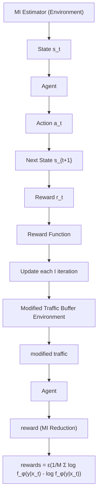
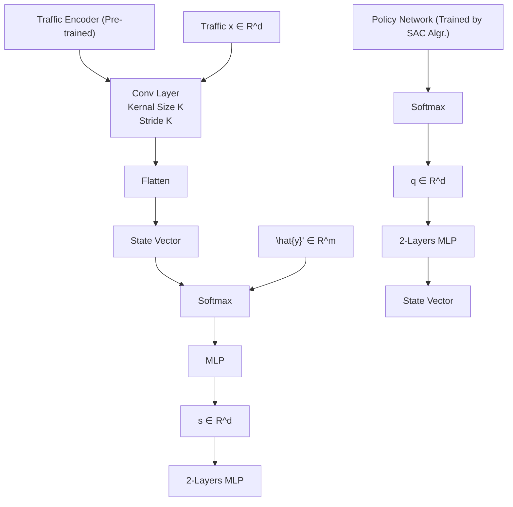
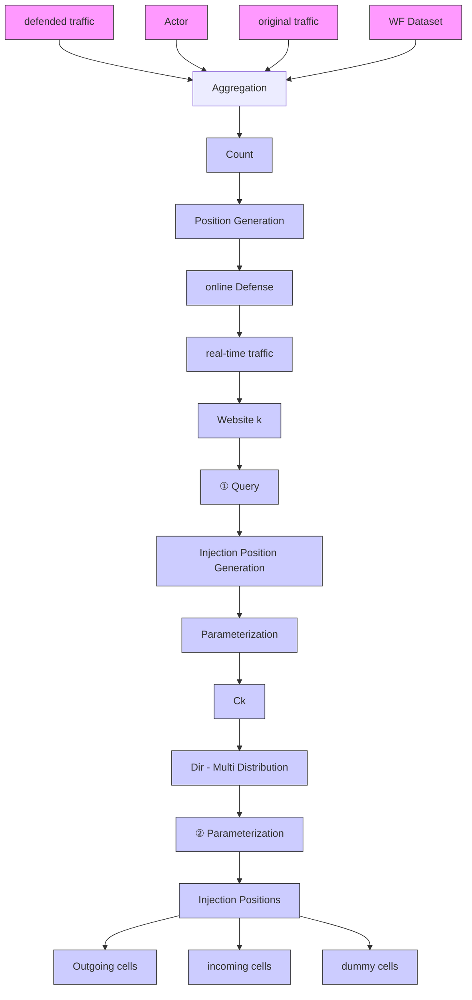

# Cease at the Ultimate Goodness: Towards Efficient Website Fingerprinting Defense via Iterative Mutual Information Minimization

Rong Wang†, Zhen Ling†∗ , Guangchi Liu†, Shaofeng Li†, Junzhou Luo†‡ and Xinwen Fu§

†Southeast University, Email: {junowang, zhenling, gc-liu, shaofengli, jluo}@seu.edu.cn

‡Fuyao University of Science and Technology

§University of Massachusetts Lowell, Email: xinwen fu@uml.edu

Abstract—In response to growing online privacy threats, the Tor network offers essential protection against surveillance by routing traffic through a decentralized, encrypted infrastructure. However, Website Fingerprinting Attacks (WFA) present a formidable challenge to Tor’s anonymity. This paper introduces FRUGAL, a traffic obfuscation method that leverages the mutual information (MI) reduction between website traffic and labels as an optimization goal, advancing a novel perspective for Website Fingerprinting Defense (WFD). By strategically injecting dummy packets at positions within website traffic that contribute most to cumulative MI reduction, FRUGAL achieves notable performance compared to state-of-the-art (SOTA) defense mechanisms. It effectively reduces attack success rates (ASR) across diverse attack models while maintaining minimal bandwidth overhead (BWO) and mitigating the impact of adversarial training. Extensive experiments validate the efficacy of FRUGAL across a comprehensive set of scenarios, including closed-world, open-world, and real-world simulation settings. For example, in the closed-world setting, FRUGAL reduces the ASR of the DF model to 2.68% with a 30% BWO, substantially outperforming previous SOTA defenses, such as Palette (11.54% with 87% BWO). When the BWO of FRUGAL is increased to a comparable level of 80%, the ASR further drops below 1%, demonstrating significant resilience by remaining low at 9.42% even after adversarial training, compared to 20.27% for Palette. This work not only introduces a fresh perspective on WFD research but also establishes FRUGAL as a robust and universal defense framework against WFA.

## I. INTRODUCTION

Tor is designed to protect the anonymity of user communications by routing their website traffic through globally distributed Tor nodes [10], [40], achieving decentralized and encrypted communication. This setup helps conceal users’ online activities, making it challenging for others to track or monitor users’ internet behavior. However, it is still vulnerable to local eavesdroppers through Website Fingerprinting Attacks (WFA) [37], [2], [1], [33]. By analyzing patterns in the size and direction of traffic packet traces—known as ‘website fingerprints’—attackers can infer which specific website the user is visiting. With recent advances in deep learning, these attacks have posed a serious challenge to Tor’s privacy protections.

To address this challenge, Website Fingerprinting Defense (WFD) techniques have been developed to counter WFA by disrupting an attacker’s ability to identify websites through traffic obfuscation methods. Existing website fingerprinting defenses can be broadly classified into two categories. The first category comprises feature-morphing-based defenses [31], [14], [25], [24], which aim to alter a website’s traffic profile to resemble a target website, thereby causing the classifier to misclassify the former as the latter. The second category includes feature-suppression-based defenses [36], [3], [4], [20], [13], which work by homogenizing the traffic features of all websites, rendering the classifier unable to differentiate between them. While both categories have made progress, challenges remain that limit their effectiveness and robustness in dynamic adversarial environments.

(C1) Attack Model Agnostic: Feature-morphing-based defense methods typically operate under the assumption that the target attack model remains static and accessible, allowing defensive strategies to adjust based on the attack model’s outputs. However, this reliance poses significant limitations when the attack model is either inaccessible or evolves continuously as adversaries adapt to countermeasures. Moreover, these defense methods often exhibit poor generalization across different attack models, further restricting their effectiveness in dynamic and diverse adversarial settings.

(C2) Efficiency of Bandwidth Overhead: While featuresuppression-based methods offer universal protection by reducing the Attack Success Rate (ASR) of various attack models through homogenizing website features, they inevitably lead to excessive and uncontrollable Bandwidth Overhead (BWO). A defense mechanism capable of maximizing ASR reduction while adhering to predefined bandwidth limits remains an unrealized goal. Such a solution is especially critical in environments with varying bandwidth constraints, where efficiency and adaptability are paramount.

(C3) Adversarial Training Resilience: Prior work [22] shows that despite reduced attack accuracy, defended traffic often retains high Mutual Information (MI) with original labels, aiding website identification by attackers. This phenomenon, known as information leakage [22], highlights why many defenses struggle to remain effective against adversarially trained attack models. Adversarial training retrains attack models on defended traffic, exploiting residual patterns that defenses cannot fully hide, thus weakening WFD effectiveness in post-adversarial settings.

To address the aforementioned challenges, we propose FRU-GAL, a defense framework that shifts the focus from deceiving specific attack models to fundamentally eliminating a website’s traffic fingerprint. Our approach centers on minimizing the MI between website traffic features and their corresponding labels, using MI reduction as the core optimization objective. From an information-theoretic perspective, reducing the MI between traffic features and labels is, by definition, equivalent to increasing the information entropy (uncertainty) of the labels conditioned on the traffic features. As a result, by maximizing MI reduction, our approach directly increases the label uncertainty with respect to the traffic features, thereby maximizing the attacker’s potential classification error. We model this process as a Markov Decision Process (MDP) and employ reinforcement learning (RL) to solve it. In WFD research, MI is frequently used to quantify the amount of information shared between website traffic and its original labels, making it a key metric for evaluating the effectiveness of WFD strategies. Most existing approaches focus on reducing the ASR as the primary objective, with MI treated only as a performance indicator. In contrast, FRUGAL is novel in directly optimizing for MI reduction, setting our approach apart from prior work.

FRUGAL addresses C1 by generating modified website traffic that minimizes MI with its original label, thereby hindering attack models from accurately inferring labels. For a given website traffic trace, FRUGAL leverages a reinforcement learning algorithm to determine an efficient policy for injecting dummy packets at key positions, maximizing MI reduction and achieving effective traffic obfuscation. Crucially, FRUGAL’s emphasis on minimizing MI without relying on knowledge of specific attack models ensures robust and adaptable protection against evolving threats.

To tackle C2, FRUGAL performs dummy packet injection iteratively. In each iteration, a small set of dummy packets is injected to maximize cumulative MI reduction. By configuring the iteration count as a hyperparameter, FRUGAL enables finegrained control over bandwidth overhead, ensuring efficiency across diverse network conditions.

Finally, to overcome C3, FRUGAL dynamically adjusts its dummy packet injection positions conditioned on the resulting traffic patterns from previous steps. This adaptive strategy ensures that the actor trained in FRUGAL consistently targets the most informative residual patterns within the traffic trace, effectively diminishing the ASR even for adversarially trained attack models.

We implemented FRUGAL and conducted extensive experiments using public WF datasets [37]. Our evaluation spans closed-world, open-world, one-page settings, and real-world simulations, including scenarios with adversarially trained attack models. We benchmark FRUGAL against state-of-the-art (SOTA) defenses, evaluating both its defensive effectiveness and bandwidth overhead (BWO). The results demonstrate that FRUGAL consistently outperforms existing SOTA methods by achieving stronger defense performance with significantly lower BWO, while also maintaining robustness against adversarial training. For instance, in the closed-world setting, FRUGAL reduces the ASR of DF [37] to 2.68% and RF [35] to 12.7% with just 30% BWO, substantially outperforming previous SOTA defenses, such as Palette[36], which yields 11.54% and 46.43% ASR for DF and RF, respectively, with 87.17% BWO. When the BWO of FRUGAL is increased to a comparable level of 80%, the ASR drops further (below 2% for DF and 8.12% for RF), and remains robustly low after adversarial training (9.42% for DF and 18.2% for RF), compared to 20.27% and 46.43% for Palette under the same conditions. In a more realistic real-world simulation, the effectiveness of FRUGAL is further confirmed, where its online implementation (FRUGAL-online) reduces the ASR of DF and RF to just 4.69% and 14.1%, respectively, with 30% BWO.

```mermaid
graph TD
  A["Universal Effectiveness"] --> B["MI Reduction"]
  C["Frugal (Ours)"] --> D["Controllable Bandwidth"]
  E["Adversarial Training Resilience"] --> F["retrain"]
  G["Feature-morphing"] --> H["Attack model specific"]
  I["Feature-suppression"] --> J["Universal but not efficient"]
  K["Other Defenses' Limitations"] --> L["Too Much Overhead"]
  M["Not Robust"] --> N["Original traffic"]
  O["Tor Client"] --> P["Attacker"]
  Q["WF Attacker"] --> R["Attacker"]
  S["Internet"] --> T["Tor"]
  U["Outgoing Cells"] --> V["Incoming Cells"]
  W["Dummy Cells"] --> X["Outgoing Cells"]
    style A fill:#f9f,stroke:#333
    style C fill:#f9f,stroke:#333
    style E fill:#f9f,stroke:#333
    style G fill:#f9f,stroke:#333
    style K fill:#f9f,stroke:#333
    style S fill:#f9f,stroke:#333
    style U fill:#f9f,stroke:#333
```


<details>
<summary>flowchart</summary>


</details>

Fig. 1. Threat Model of FRUGAL

In summary, with the introduction of FRUGAL, we aim to address the following research questions: RQ1: What does efficiently defended traffic that achieves (1) attack model agnosticism, (2) bandwidth overhead efficiency, and (3) resilience against adversarial training look like? RQ2: How does FRUGAL ensure that these characteristics are effectively met? Our contributions are outlined as follows.

• Novel WFD Research Perspective: To our knowledge, FRUGAL is the first WFD framework to leverage the MI reduction between website traffic and corresponding labels as an optimization target, providing a new direction for advancing WFD research.  
• Precise Bandwidth Overhead Control: FRUGAL is the first to introduce a method ensuring efficient WFD under precise bandwidth overhead limits, enabling flexible deployment across scenarios with diverse bandwidth constraints.  
• Mitigation of Adversarial Training: We theoretically demonstrate and implement an effective mechanism to counter adversarial training, significantly enhancing the robustness of FRUGAL.

• State-of-the-Art Performance: Extensive experimental results demonstrate that traffic defended by FRUGAL effectively counters website fingerprinting attacks, achieving state-of-the-art performance and establishing a new benchmark for WFD research.

## II. BACKGROUND

In this section, we provide the necessary background on website fingerprinting, deep reinforcement learning, and mutual information.

## A. Website Fingerprinting

To achieve online anonymity, the Tor network [10] randomly selects three volunteer nodes, designated as the guard node, middle node, and exit node, to establish a circuit. In a circuit, each node can only view the preceding and following nodes. Through this circuit, user web traffic is encapsulated into fixedsize encrypted packets known as Tor cells, which are then transmitted across the network.

The rise of Website Fingerprinting attacks [37], [2], [1], [33] has posed a significant challenge to the Tor network’s anonymity. Website fingerprinting is a traffic analysis technique that monitors data flow between users and their guard node. In WFA, Tor traffic is parsed as a sequence of $_ { + 1 } ,$ or $_ - 1 \overrightarrow { }$ values [43], where $+ 1 ^ { \cdot }$ represents upstream cells from the user to the server, and $_ - 1 \ '$ represents downstream cells from the server to the user. Based on this sequence, the attacker extracts distinct features such as the number of Tor cells, direction, timing and cumulative features, which form unique traffic fingerprints for different websites. These fingerprints can be utilized to identify specific websites.

Most current defenses [36], [18], [34] attempt to thwart WF attacks by inserting dummy packets and/or delaying data packets. The injection of numerous dummy packets results in considerable BWO, which in turn increases network load and potentially leads to congestion. On the other hand, delaying data packets effectively hides website packet timing information but prolongs page load times, harming the user experience. Striking a balance between overhead and performance remains an urgent challenge.

## B. Deep Reinforcement Learning

In RL, the agent iteratively interacts with the environment to generate the 5-tuple $( s , a , r , s _ { n e x t } , s _ { t e r m i n a l } )$ . Here, s is the current state in the entire state set S, a is the chosen action in the action set A, r is the reward received after taking action a from the environment, and $s _ { n e x t }$ is the next state after the action is executed, $s _ { t e r m i n a l }$ represents the terminal state indicating the termination of the iteration. The goal of agents is to maximize long-term cumulative rewards by learning an efficient policy. This is achieved by updating its Q-function, which represents the expected cumulative reward (also known as Q-value) for taking action a in state s. The $\mathrm { Q } \mathrm { - }$ function guides the agent toward maximizing its cumulative reward. In recent cutting-edge deep reinforcement learning (DRL), e.g., Deep Q Network (DQN) [27], Double Deep $\mathrm { Q }$

Network (DDQN) [39], and Soft Actor-Critic (SAC) [15], neural networks are used as policy networks to approximate the agent’s strategy. These approaches are highly efficient for decision-making in complex environments.

## C. Mutual Information

Mutual information (MI) between two random variables x and $\mathbf { y } ,$ denoted as $I ( x ; y )$ , quantifies the amount of information shared between them, effectively measuring how much knowledge one variable reveals about the other. Specifically, $I ( x ; y )$ can be expressed as:

$$
\begin{array}{r l} I (x; y) & = D _ {\mathrm{KL}} (p (x, y) \| p (x) p (y)) \\ & = H (y) - H (y \mid x). \end{array} \tag {1}
$$

In Equation (1), $I ( x ; y )$ is defined as the Kullback–Leibler (KL) divergence between the joint distribution $p ( x , y )$ and the product of their marginal distributions $p ( x ) p ( y )$ . However, directly computing KL-divergence is infeasible, as it requires closed-form expressions for $p ( x , y ) , p ( x )$ , and $p ( y )$ . Alternatively, as shown in Equation $( 1 ) , I ( x ; y )$ can be reformulated as the change in the entropy of y when x is introduced, i.e., $H ( y ) - H ( y \mid x )$ . In this way, $I ( x ; y )$ can be solved as $H ( y )$ and $H ( y \mid x )$ can be estimated using variational techniques.

Furthermore, when considering the effect of a third variable $z ,$ the concept extends to Conditional Mutual Information (CMI), which is defined as:

$$
\begin{array}{l} I (x; y \mid z) = D _ {\mathrm{KL}} \left(p (x, y \mid z) \| p (x \mid z) p (y \mid z)\right) \tag {2} \\ = H (y \mid z) - H (y \mid x, z). \\ \end{array}
$$

Here, $I ( x ; y \mid z )$ measures the mutual dependence between x and $y ,$ conditioned on z. Notably, in this paper, Equation (2) is further extended (details are presented in Appendix B) as

$$
H \left(y \mid \boldsymbol {x} \cup \boldsymbol {x} _ {i}\right) = H \left(y \mid \boldsymbol {x}\right) - I \left(\boldsymbol {x} \cup \boldsymbol {x} _ {i}; y \mid \boldsymbol {x}\right), \tag {3}
$$

where x denotes the website-traffic features and $\mathbf { \Delta } _ { \mathbf { \mathcal { X } } _ { i } }$ denotes a dummy packet injected at the i-th position. Equation (3) indicates that the information entropy (uncertainty) of $y$ conditioned on x , i.e., $H ( y \mid x )$ , can be further increased by injecting $\mathbf { \Delta } _ { \mathbf { \mathcal { X } } _ { i } }$ into x, where the increase is quantified by $I \left( \pmb { x } _ { i } \cup \pmb { x } ; y \mid \pmb { x } \right)$ . Therefore, by strategically disrupting the patterns in the traffic features x through injecting an $\mathbf { \Delta } _ { \mathbf { \mathcal { X } } _ { i } }$ that minimizes $I ( { \pmb x } _ { i } \cup { \pmb x } ; y | { \pmb x } )$ , the resulting entropy $H ( y \mid \pmb { x } \cup \pmb { x } _ { i } )$ (uncertainty of the label y given $\mathbf { \pmb { x } } \cup \mathbf { \pmb { x } } _ { i } )$ is maximized, thereby making it more difficult for a classifier to accurately predict y from $\pmb { x } \cup \pmb { x } _ { i }$ .

## III. WEBSITE FINGERPRINTING DEFENSE

## A. Basic Idea

The core idea of FRUGAL is to minimize the MI between website traffic and its labels. By injecting dummy packets into the original traffic to maximize MI reduction between the modified traffic and its corresponding labels, FRUGAL establishes a universal and robust defense mechanism that is independent of any specific attack model (C1). FRUGAL performs dummy packet injection iteratively based on a learned injection policy.

The injection policy, which determines the effective positions for packet insertion, is learned using the SAC algorithm. By pre-defining the number of iterations, FRUGAL ensures precise control over BWO (C2). Finally, FRUGAL counters attacks based on adversarial training by eliminating specific positions critical for distinguishing between different traffic patterns. As a result, FRUGAL demonstrates robustness against adversarial training (C3).

Technical Challenges: I. The first challenge lies in the computational complexity of employing MI as an optimization target. Existing MI estimation methods [22], [35], which primarily rely on hand-crafted features, demand significant domain expertise and high computational costs. Consequently, they are unsuitable for direct use as optimization objectives. II. The high dimensionality of network traffic traces introduces a significant challenge commonly referred to as the “curse of dimensionality”. More specifically, searching for the most effective positions to inject dummy packets through brute force in the entire action space is infeasible. In addition, such complexity substantially impedes the ability of reinforcement learning algorithms to learn an effective injection policy. III. The injection of dummy packets, while designed to obfuscate traffic patterns and reduce MI, inevitably causes a distribution shift from the original website traffic. This modification continuously perturbs the MI between the remaining traffic features and the corresponding labels, thus progressively degrading the accuracy of the neural network–based MI estimator, which is trained under the original traffic distribution.

Solution: I. To construct an efficient MI estimator for the optimization process conducted via reinforcement learning (as outlined in the first technical challenge), FRUGAL employs the Contrastive Log-ratio Upper Bound (CLUB) estimator [5], which uses a neural network to approximate the upper bound of MI. CLUB serves as the core component of FRUGAL’s reward function, guiding the learning of the efficient dummy packet injection policy (Equation (14)). II. To mitigate the curse of dimensionality (the second technical challenge), a Convolutional Neural Network (CNN)-based encoder is employed to learn compact representations of the packet position information in the high-dimensional traffic data, facilitating coarse-grained position selection for dummy packet injection. III. To address the distribution drift challenge of MI introduced by dummy packet injection (the third challenge), FRUGAL adopts Conditional Mutual Information (CMI) [7] as the core optimization objective to determine efficient injection positions. Specifically, positions are selected based on their potential to maximize CMI reduction, where CMI represents the MI between the traffic and its labels, conditioned on the traffic modified in previous iterations. The theoretical analysis (in Section B) demonstrates that, with a dynamically updated CMI estimator, a greedy position selection strategy ultimately achieves the global maximum MI reduction across the entire injection process.


<details>
<summary>flowchart</summary>


</details>

(a) Interaction between Agent and Environment.  
(b) Process of Reward Function Updating.  
Fig. 2. Overview of FRUGAL

## B. Threat Model

In this study, we adopt the standard assumption that an adversary is positioned between a user and their guard node, as shown in Figure 1. We assume that the adversary engages in passive monitoring, collecting and analyzing the traffic between the user and their guard node to construct a dataset for model training. The term ‘passive’ indicates that the adversary cannot alter the user’s traffic. Moreover, it is assumed that the user accesses only one website at a time, ensuring that the traffic captured by the adversary represents a complete session for a single website. The adversary then uses this dataset to train a deep learning model for a WFA, with the goal of identifying the websites visited by the user.

Website fingerprinting scenarios are typically classified into two categories: closed-world and open-world. In the closedworld scenario [6], it is assumed that users access only a limited set of websites, which are known as monitored sites. The adversary trains a model on the traffic from these monitored sites to identify which one the user is visiting. In the open-world scenario, users may visit both monitored sites and any number of unmonitored sites. The adversary collects traffic from a limited subset of unmonitored sites and combines it with the monitored dataset to train a model. This model is then used to determine whether the user is visiting a monitored site and, if so, which specific one.

## C. Training Framework

Leveraging the SAC-based RL technique [15], the training framework of FRUGAL comprises an agent and an environment, where the agent learns through iterative interaction with the environment.

Agent: The agent, named FRUGAL, contains a traffic encoder to transform traffic traces into compact state representations, and a policy network, which is responsible for identifying efficient positions in website traffic and injecting dummy packets to achieve MI reduction. FRUGAL takes a website traffic trace as input, performs an action by determining the efficient injection positions, and modifies the traffic accordingly before passing it to the environment.

Environment: The environment represents the external system with which the agent interacts and learns. It is implemented as an MI estimator, which functions as the reward mechanism. The estimator receives the modified traffic from the agent, evaluates the MI reduction, and provides a reward signal to the agent. It also monitors the packet injection process and terminates the interaction for a given traffic instance upon reaching the maximum iteration limit.

Interaction: During the t-th interaction between FRUGAL and the environment, FRUGAL receives an input traffic $x _ { t }$ and generates a state $s _ { t } ,$ a compact representation of the traffic. Using the policy network, FRUGAL selects an action $a _ { t }$ based on $s _ { t }$ , identifying efficient positions for dummy packet injection and executing the injection to produce the modified traffic $x _ { t + 1 } . x _ { t + 1 }$ is the input of the agent for the next iteration. Concurrently, the environment evaluates $x _ { t + 1 }$ using the MI estimator and computes the reward $r _ { t } .$ , which is fed back to FRUGAL. FRUGAL utilizes the reward to guide the refinement of the policy network using the SAC algorithm. More details are depicted in Figure 2(a).

## D. Online Defense

Although the agent (FRUGAL), trained via the framework described in Section III-C, can identify the globally effective dummy packet injection positions for a given website’s traffic, it cannot be directly deployed in an online defense setting because it requires access to the complete traffic trace in advance, which is unavailable during a live browsing session. To enable practical online deployment, we derive an online defense solution from FRUGAL, described in Section IV-C and referred to as FRUGAL-online. Given a partially observed packet sequence and the corresponding website label, FRU-GAL-online determines, in real time, whether to inject dummy packets and how many to insert immediately following the observed sequence.

## IV. DESIGN DETAILS OF FRUGAL

In this section, we first detail the design of FRUGAL and its training framework, which is composed of two main components: the agent and the environment. We then introduce the design of FRUGAL-online as the online defense solution.

## A. Agent

The agent, referred to as FRUGAL, is designed to iteratively inject dummy packets at effective positions to maximize MI reduction. As shown in Figure 3, the agent comprises two core components: (1) a Traffic Encoder and (2) a Policy Network. The Traffic Encoder is pre-trained using a supervised learning approach, while the Policy Network is trained using the RL algorithm, i.e., SAC. This section provides a detailed explanation of the architectures and respective training processes for both components.

1) Traffic Encoder: Given a website traffic trace as input, the agent (FRUGAL) identifies the effective positions to inject dummy packets based on a compact representation, rather than directly processing the original traffic. This compact representation, generated by an encoder pre-trained on the input traffic, mitigates the “curse of dimensionality” by greatly shrinking the search space while preserving the information needed to determine injection positions.


<details>
<summary>flowchart</summary>


</details>

Fig. 3. The Architecture of Agent. Our agent comprises two core components: a Traffic Encoder and a Policy Network.

As shown in the Figure 3, this traffic encoder, which is implemented as a single-layer convolutional neural network (CNN) following a softmax layer, can be expressed as

$$
s = \operatorname{CNN} (x),
$$

$$
\hat {y} ^ {\prime} = \text { Softmax } (\mathrm{MLP} (s)), \tag {4}
$$

where $\boldsymbol { x } \in \mathbb { R } ^ { d } , \boldsymbol { s } \in \mathbb { R } ^ { \tilde { d } } , \boldsymbol { \hat { y } } ^ { \prime } \in \mathbb { R } ^ { m }$ . As shown in Figure 3, the encoder applies a set of learnable filters that slide across x. By setting the convolution kernel size and stride to $K ,$ , each element at the i-th index of s corresponds to a continuous segment of K elements in x, spanning indices $x _ { ( i - 1 ) K }$ to $x _ { i K - 1 }$ . Notably, the dimension of s, i.e., ${ \tilde { d } } ,$ can hence be expressed as

$$
\tilde {d} = \frac {d - K}{K} + 1 = \frac {d}{K}, \tag {5}
$$

where d is the dimension of traffic x.

By setting the dimension of the output normalized logits $\hat { y } ^ { \prime }$ to match the number of classes $m ,$ , the encoder can be trained in a supervised manner using the cross-entropy loss [8] between the prediction $\hat { y } ^ { \prime }$ and its corresponding ground-truth label $y .$ Once trained, the encoder processes trace x to generate state s, which is $1 / K$ of the length of the original traffic x. The state representation s serves as input to the policy network responsible for determining the effective injection positions of dummy packets.

2) Policy Network: The policy network, also known as the actor network in the SAC algorithm, is designed to iteratively identify packet positions with the highest potential for information leakage. It then injects dummy packets into these positions to minimize the MI of the modified traffic. As shown in the bottom of Figure 3, the policy network $\pi _ { \theta }$ consists of a 2-layer MLP followed by a softmax layer, which can be expressed as

$$
q _ {t} = \text { Softmax } (\text { MLP } _ {2} (s _ {t})), \tag {6}
$$

where $q _ { t } , s _ { t } \in \mathbb { R } ^ { \tilde { d } } .$ , ML $\boldsymbol { { \mathrm { { R } } } } _ { 2 }$ denotes a 2-layer MLP. Equation (6) indicates that the policy network takes the state (denoted as $s _ { t } )$ generated by the traffic encoder as input and produces a logits vector (denoted as $q _ { t } )$ , also known as the Q-value vector in the context of RL. Each value in $q _ { t }$ represents the probability of selecting a corresponding position in the input traffic. FRUGAL takes an action (denoted as $a _ { t } )$ by injecting dummy packets into the positions corresponding to the top-n values in $q _ { t } .$ . The number of dummy packets injected at each selected position is sampled from a Poisson distribution. This approach intentionally preserves policy stochasticity, a common technique in reinforcement learning aimed at enhancing robustness and improving generalization [30], [32]. The detailed process of the action selection is outlined in Algorithm 1. The modified traffic $x _ { t + 1 }$ , containing these injected packets, becomes the agent’s output. This trace, $x _ { t + 1 }$ , is used to compute the next state (denoted as $s _ { t + 1 } )$ in the subsequent iteration. Simultaneously, the modified traffic is evaluated within the environment, producing a reward (denoted $\boldsymbol { r } _ { t } )$ that guides the training of the agent. At the end of each step, the episode is checked for termination (done, denoted as $d _ { t } )$ based on whether the bandwidth overhead—defined as the ratio of injected packets to the original traffic size—has reached a predefined threshold. This configurable BWO threshold enables FRUGAL to adapt to various deployment scenarios, accommodating diverse BWO constraints effectively.

```mermaid
graph TD
  A["ENCODER well-trained"] --> B["Encoder"]
  B --> C["①put into Encoder"]
  C --> D["(traffic x, label y)"]
  D --> E["WF Dataset"]
  E --> F["⑧ iterate if not done"]
  F --> G["⑦ feedback reward & done"]
  G --> H["⑥ check done"]
  H --> I["⑤ inject dummy packets"]
  I --> J["④select action"]
  J --> K["Action train"]
  K --> L["④state next_state"]
  L --> M["②pass into Actor"]
  M --> N["Experience Reply < state, action, next state, reward, done >"]
  N --> O["③ select action"]
  O --> P["action 3 14 178 314 323"]
  P --> Q["injection position index"]
  Q --> R["MI Estimator &get reward"]
  R --> S["⑥ review & done"]
  S --> T["⑦ feedback reward & done"]
  T --> U["⑧ update & done"]
  U --> V["⑨ update & done"]
  V --> W["⑪ update & done"]
  W --> X["⑫ update & done"]
  X --> Y["⑬ update & done"]
  Y --> Z["⑭ update & done"]
  Z --> AA["⑮ update & done"]
  AA --> AB["⑯ update & done"]
  AB --> AC["⑰ update & done"]
  AC --> AD["⑱ update & done"]
  AD --> AE["⑲ update & done"]
  AE --> AF["⑳ update & done"]
  AF --> AG["⑴ update & done"]
  AG --> AH["⑵ update & done"]
  AH --> AI["⑶ update & done"]
  AI --> AJ["⑷ update & done"]
  AJ --> AK["⑧ update & done"]
  AK --> AL["⑨ update & done"]
  AL --> AM["⑩ update & done"]
  AM --> AN["⑪ update & done"]
  AN --> AO["⑫ update & done"]
  AO --> AP["⑬ update & done"]
  AP --> AQ["⑭ update & done"]
  AQ --> AR["⑮ update & done"]
  AR --> AS["⑯ update & done"]
  AS --> AT["⑰ update & done"]
  AT --> AU["⑱ update & done"]
  AU --> AV["⑲ update & done"]
  AV --> AW["⑳ update & done"]
  AW --> AX["⑪ update & done"]
  AX --> AY["⑫ update & done"]
  AY --> AZ["⑬ update & done"]
  AZ --> BA["⑭ update & done"]
  BA --> BB["⑮ update & done"]
  BB --> BC["⑯ update & done"]
  BC --> BD["⑮ update & done"]
```


<details>
<summary>flowchart</summary>


</details>

Fig. 4. Training Process of FRUGAL. The grey arrows illustrate a full iteration of experience collection, while the red arrows denote procedures associated with the Experience Replay Buffer.

Unlike the traffic encoder, the policy network $\pi _ { \theta }$ within the agent is trained using the SAC algorithm, an RL approach. In this setup, the policy network $\pi _ { \theta }$ functions as the Actor module, where its parameters θ are updated by interacting with a Critics module, as illustrated in Figure 5. Specifically, a detailed training process is described in Algorithm 2. As shown in Algorithm 2, it begins by initializing an experience replay buffer to store experience tuples in the form $\langle s _ { t } , a _ { t } , s _ { t + 1 } , r _ { t } , d _ { t } \rangle$ collected across all iterations. Training starts when the number of experience tuples in the replay buffer surpasses a predefined threshold. Once training begins, a batch of experience tuples B is sampled from the replay buffer at the end of each iteration. For each tuple $\langle s _ { t } , a _ { t } , s _ { t + 1 } , r _ { t } , d _ { t } \rangle \in B _ { }$ , the policy network $\pi _ { \theta }$ (Actor) processes $s _ { t }$ to produce a logits vector $q _ { t }$ . Collectively, these logits form a set of Q-value vectors, denoted as $Q ,$ corresponding to the batch B.The batch B and its associated Q-value set Q are passed to the Critics module, which computes a Criticsbased Q-value vector ${ \hat { Q } } .$ A loss function $L _ { \pi } ( \theta )$ is then applied to measure the discrepancy between $Q$ and $\hat { Q } .$ The gradient of this loss function with respect to θ is used to update the parameters of the policy network $\pi _ { \theta }$ . Further details about the SAC algorithm can be found in Appendix A.


<details>
<summary>flowchart</summary>

```mermaid
graph TD
  A["Experience Reply"] -->|s_t, s_{t+1}| B["Actor (policy)"]
  B -->|π_θs_{t+1}| C["Critics"]
  C -->|τ_t, done_t| D["<state, action, next state, reward, done>"]
  D -->|π_θs_t| E["Update"]
  E --> F["Loss L_π(θ) Function"]
  F --> G["→"]
```
</details>

Fig. 5. Data Flow during Training. The red arrow represents the last step of the training process is to update the parameters of Actor.

Algorithm 1 Actor Network Function  
1: Initial: Actor network $\pi_{\theta}$ ;
2: Input: Website traces ( $x_{t}$ );
3: Well-trained state encoder $F_{e}(.)$ ;
4: Number of injected positions n
5: Output: Modified traffic $x_{t+1}$ ;
6: Action $a_{t}$ 7:
8: $s_{t} = F_{e}(x_{t})$ //Get state
9: probs = $\pi_{\theta}(s_{t})$ 10: $a_{t}$ = RandomSample(probs, n) //Sample n positions
11: $l_{t}$ = get_traffic_length( $x_{t}$ )
12: LOOP:
13: IF all indices in $a_{t}$ are less than $l_{t}$ THEN BREAK
14: ELSE
15: Set probs[index] = -infinity
16: Rechoose $a_{t}$ with updated probs
17: END IF
18: injection_counts = POISSON_SAMPLE(probs[ $a_{t}$ ])
19: $x_{t+1}$ = get_modified_traffic( $x_{t}, a_{t}$ )
20: return $x_{t+1}, a_{t}$

## B. Environment

1) Reward Function: In the FRUGAL training framework, the environment functions as an MI estimator, which we implement as the CLUB [5] estimator, denoted $\mathrm { I } _ { C L U B } ( x , y )$ . This estimator takes a website traffic trace x and its associated label y as input to compute an upper bound on the MI between them. The full derivation of CLUB is detailed in Appendix C.

Building upon CLUB, the reward function that drives the learning of the injection policy in FRUGAL is defined in Equation (7). In this equation, $x _ { t }$ indicates the traffic evaluated at the t-th iteration, ϵ represents a weight coefficient, and M denotes the number of monitored websites in the dataset. The function $f _ { \phi }$ is a neural network classifier pre-trained directly on raw website traffic and its corresponding labels.

Algorithm 2 Training Process of FRUGAL  
1: Initial: Initialize the critic networks $Q_{\omega_{1}}$ and $Q_{\omega_{2}}$ , and the actor network $\pi_{\theta}$ using random network parameters $\omega_{1}, \omega_{2}$ , and $\theta$ ;
2: Initialize Replay Buffer B;
3: Copy parameters $\omega_{1}^{-} \leftarrow \omega_{1}$ and $\omega_{2}^{-} \leftarrow \omega_{2}$ to initialize the target critic networks $Q_{\omega_{1}^{-}}, Q_{\omega_{2}^{-}}$ 4: Input: Website traffic and labels $x \in X, y \in Y$ ;
5: Well-trained state encoder $F_{e}(.)$ ;
6: Environment env, Batch size N;
7: Terminal timesteps T, Target update interval I;
8: Output: modified traces $x_{T}$ 9:
10: $t \leftarrow 0$ 11: LOOP:
12: IF $t \geq T$ THEN BREAK END IF
13: $s_{t} = F_{e}(x_{t})$ // Get current state
14: $a_{t} = \pi_{\theta}(s_{t})$ // Sample action from policy
15: $x_{t+1} = \text{get\_modified\_traffic}(x_{t}, a_{t})$ 16: $r_{t} = \text{env.get\_reward}(x_{t+1})$ 17: $done_{t} = \text{env.is\_terminal}(x_{t+1})$ 18: $s_{t+1} = F_{e}(x_{t+1})$ // Get next state
19: Store $\langle s_{t}, a_{t}, r_{t}, s_{t+1}, done_{t} \rangle$ in B
20: IF buffer size is larger than N THEN
21: Sample a minibatch from B
22: Update critic networks $Q_{\omega_{1}}, Q_{\omega_{2}}$ 23: Update actor network $\pi_{\theta}$ 24: Update entropy coefficient $\alpha$ 25: IF t mod I == 0 THEN
26: Update target weights $\omega^{-} \leftarrow \omega$ 27: END IF
28: END IF
29: $t \leftarrow t + 1$ 30: END LOOP
31: RETURN $x_{T}$

$$
R \left(x _ {t}\right) = - \log f _ {\phi} (y \mid x _ {t}) + \epsilon \cdot \frac {1}{M} \sum_ {j = 1} ^ {M} \log f _ {\phi} \left(y _ {j} \mid x _ {t}\right), (y _ {j} \neq y). \tag {7}
$$

Conceptually, Equation (7) consists of two components. The first component, − log $f _ { \phi } ( y \mid x _ { t } )$ , minimizes the log-likelihood that the traffic $x _ { t }$ aligns with its original label y, effectively obfuscating the label. The second component increases the likelihood that $x _ { t }$ is associated with labels from other monitored websites, introducing ambiguity.

This reward function offers two key advantages. First, by leveraging the neural network $f _ { \phi } ,$ it bypasses the need for hand-crafted feature engineering and domain expertise, making it both computationally efficient and easy to update. Second, it employs the CLUB estimator’s MI upper bound as a tractable objective, allowing us to directly optimize for MI minimization in a way that is fully aligned with our

framework’s goals.

2) Dynamic Feature Elimination: As illustrated in Equation $( 7 ) , f _ { \phi }$ is pre-trained on the original website traffic, under the assumption that the traffic distribution, $p ( x _ { t } )$ , remains static. However, this assumption is progressively violated as dummy packets are injected, inducing a significant distribution shift. As a consequence, the pre-trained MI estimator, $\operatorname { I } _ { C L U B } ( x , y )$ , becomes increasingly inaccurate. This “estimator drift” undermines the injection policy’s ability to effectively target the most informative residual patterns as the injection process continues. Ultimately, this vulnerability allows an attacker to exploit these residual patterns via adversarial training, thereby compromising the overall effectiveness of FRUGAL.

To counter the adversarial training issue, we integrate Dynamic Feature Elimination (DFE) into the training process of FRUGAL, drawing inspiration from advancements in Dynamic Feature Selection (DFS) [7]. DFE is implemented by periodically updating the classifier $f _ { \phi } ,$ as defined in Equation (7), every I iterations, where I is a hyperparameter controlling the update frequency. As depicted in Figure 2(b), during each update cycle, the modified traffic samples and their corresponding label from the most recent I iterations, $\mathrm { i . e . , }$ $\{ ( x _ { i } , y ) \in [ t - I , t ] \}$ , are collected to fine-tune $f _ { \phi } .$ Specifically, we calculate the cross-entropy loss between these modified traces and their label $y$ to update the classifier’s parameters $\phi .$ This process effectively transforms the environment from a static MI estimator into a CMI estimator. This allows the environment to accurately estimate the MI of the current traffic, conditioned on all modifications (dummy packet injections) made in previous iterations.

Through interaction with the CMI estimator, the policy network within FRUGAL is guided to iteratively identify and inject packets into positions that maximize CMI reduction during each iteration. A detailed derivation of how the CMI estimator facilitates this process is provided in Appendix B. Additionally, by greedily injecting dummy packets at positions estimated to yield the greatest CMI reduction (as guided by Equation (7)), the process is guaranteed to maximize the cumulative MI reduction over the entire injection process (see proof in Theorem 1 of Appendix B). This method lets FRU-GAL dynamically adapt its policy, identifying and eliminating residual patterns as more dummy packets are injected.

## C. Online Defense

FRUGAL learns an efficient offline policy but cannot be directly deployed in the real world, as it requires the complete traffic trace in advance. To enable practical online defense, we distill this policy into a set of pre-computed, websitespecific injection patterns, which we call FRUGAL-online. These patterns are indexed by website labels, facilitating rapid, on-the-fly lookup and deployment. An overview of FRUGALonline’s workflow is shown in Figure 6.

To develop FRUGAL-online, we first use FRUGAL to generate defended traffic by applying it to the original traces of each monitored website offline. For each original traffic instance x, we construct a corresponding injection pattern $\mathbf { x } \in \mathbb { R } ^ { 1 \times ( d + 1 ) }$ , where d denotes the maximum traffic length among all traces.The vector x records the number of injected packets at each position in x. Specifically, x[i] indicates the number of dummy packets inserted between the i-th and (i + 1)-th packets; $\mathbf { x } [ 0 ]$ records the number injected before the first packet; and $\mathbf { x } [ | x | ]$ records the number injected after the last packet. For all i such that $| x | < i \leq d ,$ we set x $[ i ] \equiv 0$ . Since FRUGAL injects only $^ { 6 6 } { + 1 } ^ { , 5 }$ packets at each position, each entry in x is a scalar value. A detailed justification of this injection strategy is provided in Section V-A3.

To build a lookup profile for each website, we aggregate all injection patterns into a matrix $\mathbf { X } \in \mathbb { R } ^ { M \times ( d + 1 ) }$ , where M is the number of monitored websites. The k-th row of X corresponds to website k and stores the cumulative injection counts across all its defended traces, which can be expressed as $\begin{array} { r } { \mathbf { X } [ k , : ] = \sum _ { \mathbf { x } \in C _ { k } } \mathbf { x } , } \end{array}$ where $C _ { k }$ is the set of all defended traces x belonging to website k. As shown in the heatmaps of X in Figure 12 (with a detailed analysis in Appendix D), the injection positions generated by FRUGAL for each website are highly sparse and concentrated. This observation motivates the design of FRUGAL-online, which leverages X to generate injection positions in an online manner.

Specifically, at runtime, given a website label k as a query, FRUGAL-online generates an injection pattern by sampling from a Dirichlet–Multinomial distribution:

$$
\boldsymbol {p} _ {k} \sim \operatorname{Dir} (\boldsymbol {c} _ {k}), \tag {8}
$$

$$
\hat {\mathbf {x}} \sim \operatorname{Multi} (\boldsymbol {p} _ {\boldsymbol {k}}, m _ {k}).
$$

Here, the Dirichlet parameter $\begin{array} { r } { { \bf c } _ { k } } & { { } = ~ { \bf X } [ k , : ] } \end{array}$ is the precomputed pattern vector for website k, retrieved from X. The multinomial parameter $p _ { k } \in \mathbb { R } ^ { 1 \times ( d + 1 ) }$ governs the sampling probability for each position. The sample size $m _ { k } = \lfloor \mathrm { B W O }$ · $\begin{array} { r } { \dot { \frac { 1 } { n \nu } } \sum i _ { k } \dot { = } 1 ^ { n _ { k } } | x i _ { k } | \big | } \end{array}$ nk is the total packet budget, derived from the predefined BWO and the average trace length for website $k .$ The resulting $\hat { \textbf { x } } \in \mathbb { R } ^ { 1 \times ( d + 1 ) }$ specifies the number of dummy packets to inject at each position for the current trace. This Dirichlet–Multinomial sampling introduces stochasticity, creating diversity across different visits to the same website and thereby improving robustness.

With FRUGAL-online’s lightweight implementation, $\hat { \bf x }$ can be generated in real time by querying with the website label k prior to packet transmission, allowing online defense.

## V. EVALUATION

We present a comprehensive evaluation of FRUGAL, detailing the experimental setup and baselines. We assess performance across Closed-World, Open-World, and One-Page scenarios, including resilience to Adversarial Training. Finally, we validate practical viability through real-world simulation, sensitivity analysis, and a temporal generalization study.

## A. Experimental Setup

1) Dataset: The experiments in this paper are based on the publicly available DF dataset collected by Sirinam et al. [37]. This dataset is specifically designed for evaluating


<details>
<summary>flowchart</summary>


</details>

Fig. 6. Overview of FRUGAL-online. $\mathrm { W e }$ use “website $k ^ { \prime \prime }$ as an example to illustrate how FRUGAL-online works, where the blue arrows labeled (1) Query, (2) Parameterization, and (3) Position Generation indicate the runtime workflow. TABLE I

DATASET IN THE FRUGAL EXPERIMENTS

<table><tr><td></td><td></td><td>Websites</td><td>Traces</td></tr><tr><td rowspan="2">Train set</td><td>Monitored</td><td>95</td><td>20</td></tr><tr><td>Unmonitored</td><td>20</td><td>1</td></tr><tr><td rowspan="2">Validation set</td><td>Monitored</td><td>95</td><td>100</td></tr><tr><td>Unmonitored</td><td>10000</td><td>1</td></tr><tr><td rowspan="2">Testing set</td><td>Monitored</td><td>95</td><td>100</td></tr><tr><td>Unmonitored</td><td>10000</td><td>1</td></tr></table>

WFD solutions in both closed-world and open-world scenarios. Its traffic traces were collected under realistic, dynamic conditions, inherently capturing real-world dynamics. It comprises traffic from monitored and unmonitored websites. The monitored websites consist of traffic from the top 95 Alexa websites, each represented by 1,000 sample traces. The unmonitored websites consist of traffic from 40,000 other websites, with each represented by a single trace. In the closedworld scenario, the adversary’s access is restricted to user traffic from the monitored websites. In contrast, the openworld scenario allows the adversary to access traffic from both monitored and unmonitored websites.

To expedite the training process, we pre-select a highconfidence training set called the Goodsample set from the monitored set. Specifically, for each website, we select 20 traffic traces that are correctly classified by a pre-trained attack model with a confidence score of at least 90%. It is noteworthy that, while the training set is carefully selected to accelerate training, the test set used in our experiments is comprehensive and uncurated, confirming FRUGAL’s generalization ability. To further address potential concerns regarding overfitting or bias introduced by this setup, we conducted a sensitivity analysis with respect to the training set, as discussed in Section V-G.

Throughout our experiments, we trained FRUGAL using the training set and evaluated its defensive effectiveness on the testing set. The number of traces is shown in Table I.

2) Metrics: The metrics used in this paper to evaluate the effectiveness and efficiency of WFD solutions are Attack Success Rate (ASR) and Bandwidth Overhead (BWO), respectively. Specifically, ASR is defined in CW as

TABLE II PARAMETER SETTINGS IN THE FRUGAL EXPERIMENTS

<table><tr><td>Parameter</td><td>Default value</td></tr><tr><td>Discount Factor  $\gamma$ </td><td>0.9</td></tr><tr><td>Sample Batch  $N$ </td><td>32</td></tr><tr><td>Regularization Coefficient  $\alpha$ </td><td>0.01</td></tr><tr><td>Weight Coefficient  $\epsilon$ </td><td>0.01</td></tr></table>

TABLE III CLASSIFIERS RESULTS ON THE DATASET IN CLOSED-WORLD AND OPEN-WORLD SCENARIOS

<table><tr><td rowspan="2"></td><td colspan="6">ASR</td></tr><tr><td>DF</td><td>Var-CNN</td><td>NetCLR</td><td>TF</td><td>AWF</td><td>RF</td></tr><tr><td>CW</td><td>98.27%</td><td>97.47%</td><td>97.73%</td><td>97.81%</td><td>95.41%</td><td>98.8%</td></tr><tr><td>OW</td><td>97.80%</td><td>97.23%</td><td>97.23%</td><td>97.21%</td><td>93.82%</td><td>98.1%</td></tr></table>

$$
\mathrm{ASR} = \frac {N _ {\mathrm{cor}}}{N _ {\mathrm{all}}}, \tag {9}
$$

where $N _ { \mathrm { c o r } }$ is the number of correctly classified traces, and $N _ { \mathrm { a l l } }$ is the total number of traffic traces evaluated by the attack model. In OW, ASR is defined as

$$
\mathrm{ASR} = \frac {\mathrm{TP}}{\mathrm{TP} + \mathrm{FP}}, \tag {10}
$$

where TP is the number of correctly classified traces in the monitored set, and FP is the number of wrongly classified traces in the unmonitored set. A lower ASR indicates a more effective WFD solution.

On the other hand, BWO is defined as:

$$
\mathrm{BWO} = \frac {l _ {\mathrm{def}} - l _ {\mathrm{ori}}}{l _ {\mathrm{ori}}}, \tag {11}
$$

where $l _ { \mathrm { d e f } }$ is the length of the defended traffic, and $l _ { \mathrm { o r i } }$ is the length of the original traffic. A lower BWO signifies fewer dummy packets injected in addition to the original traffic, highlighting greater efficiency.

Notably, the time overhead introduced by FRUGAL is negligible. This is because it injects dummy packets only into the client’s outgoing traffic without delaying existing packets, and it does not alter the incoming web response. This approach differs from other defenses evaluated in [44], which add packets to traffic in both directions and consequently incur greater delays.

3) Implementation: FRUGAL is implemented using the Py-Torch 2.0 framework1. Specifically, the traffic encoder, which processes traffic input x and outputs a state vector s to the policy network, is implemented as a one-layer CNN, where the kernel and stride sizes K are set to 5. The components of the actor network and critics module are both implemented as a two-layer MLP. The number of packet positions per injection is set to 5, with only $^ { \circ } + 1 ^ { \circ }$ used for dummy packets. Please refer to Appendix E for a comprehensive discussion of the hyperparameter configuration.

In FRUGAL, an arbitrary neural network is employed to construct the MI estimator. Since the classifier in the MI estimator is designed to efficiently classify traffic labels, this study adopts the architecture of the DF model. The classifier in MI estimator is initially trained using traffic from the DF dataset and is continuously updated with modified traffic, as detailed in Section IV-B. It is important to emphasize that while the classifier shares the same architecture as one of the attack models used during testing, it remains entirely distinct from the attack model, as their parameters are completely independent. Thus, the assumption that the defender has no access to the attack model remains valid in FRUGAL.

All neural networks involved in FRUGAL were trained on Nvidia RTX A6000 GPU. The remaining hyperparameters used in our experiments are determined empirically and are detailed in Table II. The complete implementation code will be made available shortly.

4) Baseline & Benchmark: The effectiveness of FRUGAL is evaluated against five SOTA attack models, including DF [37], Var-CNN [2], NetCLR [1], TF [38], AWF [33] and RF[35]. Initially, we assess the ASR of these models on the original traffic from the DF dataset, and the results are presented in Table III, which serve as the baseline. FRUGAL is applied to the traffic from the DF dataset, and the ASR of each attack model is re-evaluated on the defended traffic. To provide a comprehensive performance comparison, we also benchmark FRUGAL against five SOTA WFD methods from two different categories, evaluating their effectiveness in reducing the ASR across different attack models on the DF dataset. The selected defense methods include WTF-PAD [20], Surakav [14], Regulator [17], FRONT [13], Palette [36], Tamaraw[4] and RUDOLF [18]. And for all defense strategies, we opt for their top-performing setup.

## B. Closed-World Performance

In this section, we evaluate the efficacy of FRUGAL in the standard closed-world scenario. This evaluation involves testing against six benchmark WFA models and comparing the performance with random injection and seven other WFD methods. The results are presented in Table IV and Figure 7.

Table IV highlights FRUGAL’s high efficiency. At a 20% BWO, FRUGAL reduces the ASR of the DF model to just 6.87%. When FRUGAL’s BWO is increased to 30%, its ASR against DF drops further to 2.68%, substantially outperforming competing defenses that impose much higher BWOs. This strong performance-to-cost ratio holds true for the other WFA models shown in the table, with FRUGAL consistently achieving a superior ASR for its BWO level. The only exception is Tamaraw, which achieves a lower ASR of 1.05%. However, Tamaraw’s commendable performance comes at the cost of an impractically high BWO, rendering it unsuitable for deployment in performance-critical anonymous networks.

To comprehensively analyze its effectiveness, we evaluate FRUGAL under BWO constraints ranging from 10% to 100% in 10% intervals, a scope that encompasses the overheads of most prior WFD methods. The results are illustrated in Figure 7, which plots the ASR against BWO for all evaluated defenses. In this visualization, superior performance is indicated by data points closer to the bottom-left corner, representing a low ASR achieved with minimal BWO. The trend is clear: across the entire spectrum of BWO constraints, FRUGAL establishes a new SOTA, consistently achieving a lower ASR than competing WFD methods at any given level of overhead.

TABLE IV PERFORMANCE IN THE CLOSED-WORLD SCENARIO

<table><tr><td rowspan="2">Defenses</td><td rowspan="2">BWO</td><td colspan="6">ASR</td></tr><tr><td>DF</td><td>Var-CNN</td><td>NetCLR</td><td>TF</td><td>AWF</td><td>RF</td></tr><tr><td rowspan="2">Random Injection</td><td>20%</td><td>93.98%</td><td>91.98%</td><td>90.6%</td><td>94.3%</td><td>92.76%</td><td>96.58%</td></tr><tr><td>30%</td><td>76.59%</td><td>80.17%</td><td>76.59%</td><td>79.34%</td><td>75.19%</td><td>95.3%</td></tr><tr><td>WTF-PAD</td><td>60.7%</td><td>80.92%</td><td>78.14%</td><td>86.92%</td><td>88.65%</td><td>59.96%</td><td>96.58%</td></tr><tr><td>Tamaraw $^{1}$ </td><td>121%</td><td>1.05%</td><td>0.98%</td><td>1.01%</td><td>1.12%</td><td>1.05%</td><td>2.09%</td></tr><tr><td>FRONT</td><td>79.6%</td><td>73.62%</td><td>60.25%</td><td>73.62%</td><td>76.46%</td><td>60.44%</td><td>93.34%</td></tr><tr><td>Surakav</td><td>81%</td><td>64%</td><td>54.6%</td><td>56.69%</td><td>60.95%</td><td>67.65%</td><td>79.94%</td></tr><tr><td>Palette</td><td>87.17%</td><td>11.54%</td><td>10.99%</td><td>11.2%</td><td>12.91%</td><td>11.54%</td><td>46.43%</td></tr><tr><td>RegulaTor</td><td>68.3%</td><td>20.41%</td><td>40.52%</td><td>32.31%</td><td>35.52%</td><td>45.6%</td><td>53.11%</td></tr><tr><td>RUDOLF</td><td>27.46%</td><td>18.59%</td><td>-</td><td>-</td><td>23.71%</td><td>-</td><td>28%</td></tr><tr><td rowspan="2">FRUGAL</td><td>20%</td><td>6.87%</td><td>8.03%</td><td>12.73%</td><td>10.37%</td><td>10.12%</td><td>16.6%</td></tr><tr><td>30%</td><td>2.68%</td><td>2.61%</td><td>6.68%</td><td>5.67%</td><td>5.73%</td><td>12.7%</td></tr></table>

1. While Tamaraw achieves commendable performance on benchmark datasets, its excessive bandwidth overhead renders it impractical for deployment in anonymous network environments where performance and user experience are critical.


<details>
<summary>scatterplot</summary>

| Method           | Bandwidth Overhead(%) | ASR of Classifiers(%) |
| ---------------- | --------------------- | --------------------- |
| Ideal            | 0                     | 0                     |
| Random Policy    | ~20                   | ~95                   |
| RUDOLF           | ~30                   | ~20                   |
| WTF-PAD          | ~60                   | ~85                   |
| RegulaTor        | ~70                   | ~45                   |
| FRONT            | ~80                   | ~95                   |
| Surakav          | ~85                   | ~65                   |
| Palette          | ~90                   | ~50                   |
| Tamaraw          | ~120                  | ~0                    |
</details>

Fig. 7. Performance of FRUGAL in the Closed-World Scenario. The area within the red rectangle shows a performance comparison of different defense methods. Our method, FRUGAL, represented by the plotted lines, consistently occupies the bottom-left corner, which signifies the notable trade-off between security and overhead.

## C. Open-World Performance

In this section, we extend our evaluation to a more realistic open-world scenario. The baselines, metrics, and other evaluation configurations are held consistent with those used in the closed-world scenario for comparability.

We begin by evaluating FRUGAL under BWO constraints ranging from 10% to 100%, with the results presented in Figure 8. All WFD methods experience a slight degradation in defensive performance across all WFA models, reflecting the heightened challenge of defending against attacks in the open-world setting. As shown in Table V, at a 20% BWO level, FRUGAL lowers the ASR of DF to 6.2%, Var-CNN to 6.55%, NetCLR to 7.8%, TF to 5.7%, AWF to 4.5% and RF to 13.43%. When we increase the BWO to 30%, the ASRs drop further; for example, the ASR for DF decreases to 4.09% and for RF it drops to 10.85%. For a comprehensive comparison, in Table V we also present the performance of FRUGAL-online, evaluated on the same dataset but in a real-world simulation setting. A detailed discussion of FRUGAL-online is provided in Section V-F.


<details>
<summary>line chart</summary>

| Model | Bandwidth Overhead(%) | ASR of Classifiers (%) |
|-------|------------------------|------------------------|
| Ideal | 0 | 0 |
| Random Policy | ~10 | ~90 |
| WTF-PAD | ~20 | ~75 |
| RegulaTor | ~60 | ~85 |
| FRONT | ~80 | ~75 |
| Palette | ~90 | ~35 |
| Tamaraw | ~120 | ~5 |
</details>

Fig. 8. Performance of FRUGAL in the Open-World Scenario.

The plot in Figure 8 visualizes the trade-off between ASR and BWO. Specifically, FRUGAL’s performance curve consistently outperforms competing defenses, remaining closer to the bottom-left “Ideal” corner. While Tamaraw achieves a lower ASR, its associated BWO is impractically high. The plot thus makes it clear that FRUGAL provides the best performance trade-off against all tested attack models.

## D. One-Page Setting Performance

To further evaluate the robustness of FRUGAL, we conduct a more challenging setup known as the one-page setting[41]. Our evaluation focuses on the closed-world scenario because attackers’ performance is generally stronger in the closedworld than in the open-world scenario [4], [37], which makes it a tougher challenge for our defense.

TABLE V PERFORMANCE IN THE OPEN-WORLD SCENARIO

<table><tr><td rowspan="2">Defenses</td><td rowspan="2">BWO</td><td colspan="6">ASR</td></tr><tr><td>DF</td><td>Var-CNN</td><td>NetCLR</td><td>TF</td><td>AWF</td><td>RF</td></tr><tr><td rowspan="2">Random Injection</td><td>20%</td><td>90.12%</td><td>88.6%</td><td>91.43%</td><td>81.3%</td><td>89.3%</td><td>94.8%</td></tr><tr><td>30%</td><td>74.04%</td><td>78.25%</td><td>70.63%</td><td>73.75%</td><td>79.4%</td><td>90.3%</td></tr><tr><td>WTF-PAD</td><td>60.7%</td><td>80.92%</td><td>78.14%</td><td>86.92%</td><td>88.65%</td><td>59.96%</td><td>95.12%</td></tr><tr><td>Tamaraw</td><td>121%</td><td>1.02%</td><td>0.9%</td><td>1.0%</td><td>1.12%</td><td>0.95%</td><td>2.07%</td></tr><tr><td>FRONT</td><td>99%</td><td>57.23%</td><td>50.25%</td><td>54.62%</td><td>56.46%</td><td>57.44%</td><td>91.2%</td></tr><tr><td>RegulaTor</td><td>71.32%</td><td>30.41%</td><td>36.52%</td><td>33.5%</td><td>32.12%</td><td>41.6%</td><td>52.61%</td></tr><tr><td>Palette</td><td>90.2%</td><td>15.81%</td><td>9.89%</td><td>14.31%</td><td>13.41%</td><td>15.32%</td><td>35.42%</td></tr><tr><td rowspan="2">FRUGAL</td><td>20%</td><td>6.2%</td><td>6.55%</td><td>7.8%</td><td>5.7%</td><td>4.5%</td><td>13.43%</td></tr><tr><td>30%</td><td>4.09%</td><td>4.7%</td><td>3%</td><td>2.17%</td><td>2.58%</td><td>10.85%</td></tr><tr><td rowspan="2">FRUGAL-online</td><td>20%</td><td>8.4%</td><td>11.3%</td><td>10.1%</td><td>9.3%</td><td>8.8%</td><td>18.2%</td></tr><tr><td>30%</td><td>4.69%</td><td>4.8%</td><td>5.33%</td><td>2.86%</td><td>4.6%</td><td>14.1%</td></tr></table>

TABLE VI EVALUATION OF FRUGAL IN THE ONE-PAGE SETTING COMPARED TO OTHER DEFENSE METHODS

<table><tr><td rowspan="2"></td><td colspan="4">Defenses</td></tr><tr><td>FRUGAL</td><td>Palette</td><td>RUDOLF</td><td>RegulaTor</td></tr><tr><td>BWO</td><td>19.63%</td><td>109.17%</td><td>27.46%</td><td>48.3%</td></tr><tr><td>Average ASR</td><td>6.54%</td><td>36.85%</td><td>67.3%</td><td>55.71%</td></tr></table>

TABLE VII ADVERSARIAL TRAINING PERFORMANCE OF FRUGAL

<table><tr><td rowspan="2"></td><td rowspan="2">Attack Models</td><td colspan="4">Bandwidth Overhead Control (%)</td></tr><tr><td>20</td><td>30</td><td>60</td><td>80</td></tr><tr><td rowspan="6">CW</td><td>DF</td><td>56.85%</td><td>43.93%</td><td>18.68%</td><td>9.42%</td></tr><tr><td>Var-CNN</td><td>47.66%</td><td>25.48%</td><td>15.22%</td><td>8.56%</td></tr><tr><td>TF</td><td>61.21%</td><td>28.56%</td><td>15.6%</td><td>7.93%</td></tr><tr><td>NetCLR</td><td>61.87%</td><td>40.23%</td><td>16.4%</td><td>9.41%</td></tr><tr><td>AWF</td><td>35.35%</td><td>30.77%</td><td>6.73%</td><td>4.52%</td></tr><tr><td>RF</td><td>60.35%</td><td>49%</td><td>29.3%</td><td>18.2%</td></tr><tr><td rowspan="6">OW</td><td>DF</td><td>53.5%</td><td>40.02%</td><td>16.13%</td><td>8.2%</td></tr><tr><td>Var-CNN</td><td>45.1%</td><td>29.65%</td><td>17.22%</td><td>4.56%</td></tr><tr><td>TF</td><td>43.2%</td><td>35.14%</td><td>11.6%</td><td>3.3%</td></tr><tr><td>NetCLR</td><td>48.7%</td><td>38.23%</td><td>11.6%</td><td>6.54%</td></tr><tr><td>AWF</td><td>33.3%</td><td>27.92%</td><td>5.8%</td><td>4.2%</td></tr><tr><td>RF</td><td>60.2%</td><td>47%</td><td>27.3%</td><td>17.14%</td></tr></table>

In the one-page setting, the attacker is only trying to find out if a user visited one single, specific website. We apply the whole DF dataset in this experiment. In each test, we pick one website to be the monitored site, and the other 94 websites become the unmonitored set. We repeat this 95 times so that every website gets a turn to be the monitored one. The DF model is employed as the attack model to evaluate our performance within this setting, utilizing the ASR of the DF model as the benchmark. We execute the experiment with a 20% BWO, and the results are in Table VI. The average ASR was 6.54%, with an average bandwidth overhead of 19.63%. This result is much better than other defenses like Palette (36.85% ASR with 109.17% BWO), RUDOLF (67.3% ASR with 27.46% BWO), and RegulaTor (55.71% ASR with 48.3% BWO).

## E. Adversarial Training Performance

In this section, we evaluate FRUGAL’s resilience to adversarial training, which is the most challenging evaluation toward the efficacy and robustness of a WFD method. Adversarial training involves the process where an attacker retrains the WFA model with the protected traffic, such that the WFA model is able to recapture the indicative patterns in the protected traffic, hence mitigating the defense effectiveness of the WFD method.

We perform adversarial training experiments utilizing defended traffic under both CW and OW scenarios and employ the ASR of attack models utilized in our experiments. Our experiments assess defensive performance across various BWO ranging from 10% to 80% with intervals of 10%, where the results are delineated in Table VII.

When compared with other defenses in Figure 9, both FRUGAL and FRUGAL-online can achieve SOTA adversarial training performance under similar BWO. For RUDOLF, we select the performance corresponding to the BWO reported in the CW scenario. In comparison to Palette [36], which reduces the ASR of DF to 20.27% with 80% BWO, our FRUGAL is able to reduce the ASR of DF to less than half of Palette, i.e., 9.42% under 80% BWO. On the other hand, with 60% BWO, FRUGAL is able to achieve a similar ASR reduction as the result achieved by Palette under 80% BWO. Recall that FRUGAL aims at minimizing the MI between the traffic and its associated label, as a result, the traffic protected by FRUGAL presents more resilience to adversarial training.

## F. Online Defense in Real-World Simulation

To validate the practical effectiveness of FRUGAL, we evaluate FRUGAL-online in a real-world simulation and assess the performance of various attack models after adversarial training on our validation set.

We first examine FRUGAL-online’s performance, with results shown in Figure 10. The figure reports the ASR of various models against our defense with BWO values of 20% and 30%. Although FRUGAL-online experiences a minor performance drop compared to FRUGAL on the same OW dataset, which is caused by the information loss introduced by the distillation from FRUGAL, it still achieves competitive results and significantly outperforms the other benchmarks.


<details>
<summary>bar chart</summary>

| Model   | RUDOLF-27% | Random-20% | WTF-PAD-61% | FRONT-80% | Palette-87% | FRUGAL-20% | FRUGAL-30% | FRUGAL-online-20% | FRUGAL-online-30% | FRUGAL-online-80% |
|---------|------------|------------|-------------|-----------|-------------|------------|------------|---------------------|---------------------|---------------------|
| DF      | 93.5       | 96.5       | 89.5        | 72.5      | 20.0        | 56.5       | 49.5       | 44.0                | 59.5                | 40.3                |
| Var-CNN | 94.5       | 96.5       | 88.5        | 75.5      | 23.5        | 47.5       | 45.5       | 49.5                | 54.6                | 45.3                |
| TF      | 95.5       | 97.5       | 90.5        | 73.5      | 26.5        | 61.2       | 58.3       | 40.8                | 61.2                | 11.0                |
| NetCLR  | 96.5       | 98.5       | 93.5        | 72.5      | 20.0        | 61.9       | 60.4       | 48.4                | 61.9                | 14.2                |
| AWF     | 97.5       | 99.5       | 89.5        | 65.5      | 18.5        | 35.4       | 36.8       | 39.1                | 49.1                | 8.5                 |
| RF      | 98.5       | 100.5      | 96.5        | 80.5      | 38.5        | 60.4       | 58.3       | 49.0                | 73.1                | 20.6                |
</details>

Fig. 9. Adversarial Training Performance. In the figure legend, we adopt the format ‘defense-bwo’ as labels for each defense strategy.  


<details>
<summary>bar chart</summary>

| Model   | FRUGAL-BWO-20% | FRUGAL-online-BWO-20% | FRUGAL-BWO-30% | FRUGAL-online-BWO-30% |
|---------|----------------|------------------------|----------------|------------------------|
| DF      | 6.2            | 8.4                    | 4.1            | 4.7                    |
| Var-CNN | 6.5            | 11.3                   | 4.7            | 4.8                    |
| TF      | 7.8            | 9.3                    | 2.2            | 2.9                    |
| NetCLR  | 5.7            | 10.1                   | 3.0            | 5.3                    |
| AWF     | 4.5            | 8.8                    | 2.6            | 4.6                    |
| RF      | 13.4           | 18.2                   | 10.8           | 14.1                   |
</details>

Fig. 10. Performance in the Real-World Simulation.

As shown in Figure 8, when BWO is 20%, FRUGAL-online reduces the ASR of DF to 8.4%, Var-CNN to 11.3%, NetCLR to 10.1%, TF to 9.3%, AWF to 8.8%, and RF to 18.2%. When the BWO is increased to 30%, the ASR reduction approaches that of FRUGAL; for example, DF’s ASR drops to 4.69% and RF’s to 14.1%.

To assess the adversarial robustness of FRUGAL in a realworld simulation, we collected traffic defended by FRUGALonline and used it to retrain the attack models, following the procedure described in Section V-E. The results show that increasing the BWO substantially reduces the success rates of all retrained attack models. For instance, DF’s accuracy decreases from 59.45% to 10.3% at 80% BWO. As illustrated in Figure 9, FRUGAL-online continues to outperform other benchmarks and remains close in performance to FRUGAL. This trend underscores the practical effectiveness and resilience of FRUGAL-online.

## G. Sensitivity Analysis of Training Set

In our experiments, we used a high-confidence Goodsample subset (20 samples per site, with ≥ 90% confidence) to accelerate training. However, this choice may raise concerns about potential overfitting or bias, which could limit the model’s generalization performance.

To validate our choice and assess FRUGAL-online’s robustness with respect to the training set (TS), we conducted a sensitivity analysis. We compared FRUGAL-online trained under two settings: (1) Baseline (Goodsample) using the Goodsample subset, and (2) Full Dataset using the entire training set. Both models were evaluated on the complete test dataset under the CW scenario with a 30% BWO limit, aiming to match the ASR of different attack models. Training Time Consumption (TC) for both models were recorded. Table IX illustrates the trade-off: FRUGAL-online trained on the Full Dataset showed negligible improvement over the Goodsample baseline, indicating that Goodsample captures the essential features for training. This minimal performance gain is vastly outweighed by the substantial 32-fold increase in training time required by the Full Dataset.

TABLE VIII ADVERSARIAL PERFORMANCE OF REAL-WORLD SIMULATION

<table><tr><td rowspan="2"></td><td colspan="4">BWO</td></tr><tr><td>20%</td><td>30%</td><td>60%</td><td>80%</td></tr><tr><td>DF</td><td>59.45%</td><td>49.55%</td><td>22.71%</td><td>10.3%</td></tr><tr><td>Var-CNN</td><td>54.56%</td><td>45.34%</td><td>19.3%</td><td>9.5%</td></tr><tr><td>TF</td><td>58.32%</td><td>40.84%</td><td>15.6%</td><td>10.99%</td></tr><tr><td>NetCLR</td><td>60.39%</td><td>48.41%</td><td>26.8%</td><td>14.23%</td></tr><tr><td>AWF</td><td>49.14%</td><td>39.11%</td><td>25.7%</td><td>8.52%</td></tr><tr><td>RF</td><td>73.1%</td><td>58.3%</td><td>35.2%</td><td>20.62%</td></tr></table>

TABLE IX SENSITIVITY RESULTS OF TRAINING SET SCALE.

<table><tr><td rowspan="2">TS*</td><td rowspan="2">TC*</td><td colspan="6">ASR</td></tr><tr><td>DF</td><td>Var-CNN</td><td>NetCLR</td><td>TF</td><td>AWF</td><td>RF</td></tr><tr><td>GS</td><td>1.42h</td><td>2.8%</td><td>2.6%</td><td>5.4%</td><td>1.3%</td><td>5.8%</td><td>10.7%</td></tr><tr><td>FD</td><td>45.88h</td><td>2.8%</td><td>2.4%</td><td>5.5%</td><td>1.2%</td><td>5.7%</td><td>10.5%</td></tr></table>

\* Training Set (TS), Time Consumption (TC), Goodsample(GS), Full Dataset(FD).

This sensitivity analysis strongly supports our methodological choice of using the Goodsample subset, demonstrating that it achieves an excellent balance between training efficiency and model effectiveness.

## H. Temporal Generalization Evaluation

To assess FRUGAL-online’s generalizability against “concept drift”, i.e., the natural evolution of website traffic patterns over time, we performed a temporal evaluation. For this experiment, we collected a new, time-shifted dataset comprising two distinct sets: Base Dataset: Collected in February 2025, this set contains 1,000 traffic traces for each of 90 monitored websites. Drift Dataset: Collected in October 2025, this set contains 150 new traffic traces for the same 90 websites, representing an 8-month temporal gap. We split both the Base Dataset and Drift Dataset into training and testing sets.

We evaluate ASR in three scenarios: Base-Base (train/test on Base), Base-Drift (train on Base, test on Drift), and Drift-Drift (train/test on Drift). As shown in Table X, classifiers are highly accurate on temporally-aligned data (e.g., DF: 98.6% in Base-Base, 95.2% in Drift-Drift). However, in the Base-Drift scenario, which measures generalization across the 8- month gap, performance plummets: DF’s drops from 98.2% to 66.9%. This confirms that static classifiers fail to adapt to concept drift and generalize poorly over time.

TABLE X CLASSIFIERS RESULTS ON BASE DATASET AND DRIFT DATASET

<table><tr><td rowspan="2"></td><td colspan="6">ASR</td></tr><tr><td>DF</td><td>Var-CNN</td><td>NetCLR</td><td>TF</td><td>AWF</td><td>RF</td></tr><tr><td>Base-Base</td><td>98.2%</td><td>97.4%</td><td>97.1%</td><td>97.6%</td><td>93.1%</td><td>98.6%</td></tr><tr><td>Base-Drift</td><td>66.9%</td><td>63.6%</td><td>67.2%</td><td>65.7%</td><td>53.5%</td><td>76.4%</td></tr><tr><td>Drift-Drift</td><td>95.2%</td><td>91.4%</td><td>92.5%</td><td>93.5%</td><td>81.7%</td><td>95.6%</td></tr></table>


<details>
<summary>bar chart</summary>

| Model   | Base-Base | Base-Drift | Drift-Drift |
|---------|-----------|------------|-------------|
| DF      | 7.8       | 4.2        | 12.3        |
| Var-CNN | 10.1      | 6.1        | 15.4        |
| NetCLR  | 11.6      | 7.4        | 15.6        |
| TF      | 1.1       | 0.7        | 6.5         |
| AWF     | 4.5       | 3.3        | 10.8        |
| RF      | 13.1      | 8.7        | 18.7        |
</details>

Fig. 11. Sensitivity of Temproal Drift.

We trained a single static FRUGAL-online policy on the Base GoodSample (30% BWO) and evaluated it on Base and Drift sets. As shown in Figure 11, the defense effectively suppresses Base-trained models (e.g., DF ASR 7.8%), improving to 4.2% on the Drift set. Against Drift-trained models, ASR increases marginally to 12.3% but remains low. Furthermore, our efficient 1.4-hour training time enables practical regular retraining, demonstrating robustness to “concept drift”.

## VI. RELATED WORK

## A. The Evolution of Website Fingerprinting Attacks

Initial explorations into WFA have established its viability through the application of traditional machine learning models, which depended on handcrafted statistical features. Pioneers like [29], [28], [42], [16] established foundational methods using SVMs, Random Forests and k-NN respectively. While effective, these early approaches frequently demanded substantial manual effort and extensive domain-specific knowledge for the purpose of feature engineering.

The field entered a new era with the advent of deep learning. The pivotal work, DF by Sirinam et al. [37], marked a paradigm shift. By employing a Convolutional Neural Network, DF could directly process raw traffic data, eliminating the need for manual feature extraction and achieving an unprecedented ASR of over 98% in closed-world settings. This breakthrough spurred a wave of increasingly sophisticated DLbased attacks, each leveraging more advanced neural network architectures, from the ResNet in Var-CNN [2] and various deep neural networks in AWF [33] to the recent applications of Triplet Network [38] and contrastive learning in NetCLR [1]. Concurrently, a new focus on robust traffic representation emerged, exemplified by RF [35], which was explicitly designed to be resilient against defensive measures, further escalating the attacker’s capabilities. Today, these powerful and efficient DL-based models represent a formidable threat to user privacy in anonymous communication systems, necessitating the development of equally advanced defenses [26].

## B. The Development of Website Fingerprinting Defenses

In response to the growing threat of WFAs, a parallel field of WFD has emerged, largely following two distinct categories.

The first, feature suppression[12], [3], [4], [20], [45], [36], represents the most intuitive approach, which seeks to homogenize traffic traces to obscure identifying features. Foundational methods like Tamaraw [4] established this by padding traffic to a constant rate, but at the cost of prohibitive bandwidth and latency overhead. This fundamental trade-off persists even in contemporary, sophisticated suppression techniques like Palette [36], limiting their practical applicability.

The second and more recent methods, feature morphing[31], [34], [25], [14], [18], [24], [21], aim for a more targeted and efficient defense by actively altering traffic features to mislead and confuse WFA models. These defenses [31], [34], [21] often generate noise tailored to specific traffic characteristics. The most advanced in this category leverage adaptive learning. For instance, RUDOLF [18] uses Reinforcement Learning to receive feedback from specific classifiers for deterministic policy. The critical limitation of these advanced methods is model-dependency. Training on known attackers leads to poor generalization, leaving them vulnerable to unforeseen or adversarially retrained attacks.

Our work addresses the urgent need for a defense that effectively counters diverse, adaptive attacks, is efficient with low overhead, and remains robust in the evolving WFA landscape.

## VII. DISCUSSION

Outgoing-packets-only Perturbation: We adopt an outgoing-packet-only injection strategy for three reasons. (1) Information-theoretic analyses (e.g., [22]) show the low-volume client stream is disproportionately feature-rich. (2) Our experiments prove this approach can effectively defeat state-of-the-art attacks that use bidirectional traffic. (3) This client-side design adds negligible latency and requires no response modifications.

Real-world Integration: FRUGAL-online can be integrated as a Pluggable Transport (PT), aligning with our threat model by obfuscating the client-to-entry-node path. This approach uses two components: (1) a client-side proxy first obtains the ground-truth website label from the URL [36], samples a pre-computed defense pattern using that label, and then injects the dummy cells; (2) a server-side proxy on the entry node that removes these cells before forwarding the original traffic. This PT-based design is practical, as it requires no core Tor modifications and encapsulates the defense as an optional transport to protect against website fingerprinting.

Stronger Adversary: While focused on local adversaries, FRUGAL extends to stronger threats like colluding nodes by integrating with Tor’s circuit-level padding. An adversary controlling multiple relays could pose a significant risk by observing traffic at different points along a circuit. However, FRUGAL’s defense can extend beyond first-hop adversaries by integrating with Tor’s circuit-level padding mechanisms to counteract stronger attacks. By utilizing dummy packets as DROP relay cells, FRUGAL can effectively obfuscate traffic, hindering potential WF attacks from malicious relays. Although a compromised exit node can access unencrypted data, it cannot trace the user’s origin because of the design of Tor.

Multi-tab Scenario: Our evaluation, consistent with the prevalent assumption in WF studies, considers a single-tab browsing scenario. While this setting enables reproducible comparisons, we acknowledge that real-world browsing behavior is more complex and often involves multi-tab activity [19], [9]. FRUGAL is well-positioned to address this challenge. The FRUGAL framework can be expanded by distinguishing per-tab or per-domain traffic flows and applying the padding policy to each stream, making it compatible with protecting concurrent browsing sessions.

## VIII. CONCLUSION

This paper addresses the critical challenge of designing an effective defense against WFA. The core problem is to generate defended traffic that is simultaneously attack-modelagnostic, bandwidth-efficient, and resilient to adversariallytrained models—three properties that existing defenses often struggle to balance.

To tackle this challenge, we introduce FRUGAL, a novel defense framework. To the best of our knowledge, FRUGAL is the first work to leverage the reduction of MI between website traffic and its identity label as the primary optimization objective. This allows FRUGAL to fundamentally minimize the information leakage that attackers can exploit, rather than merely overfitting to a known set of attack models. Extensive evaluations conducted in closed-world, open-world, and the more challenging one-page scenario demonstrate the effectiveness of the defended traffic generated by FRUGAL over SOTA defenses. It consistently achieves a significant reduction in the ASR of various attack models, including those that have undergone adversarial training, while incurring minimal overhead. The evaluation also includes a real-world simulation of FRUGAL-online to validate its robustness, as well as a sensitivity analysis on the size of our training dataset. FRUGAL not only establishes a new benchmark for WFD research but also paves the way for future exploration of effective, efficient, and robust defenses against evolving WFA threats.

## ACKNOWLEDGMENT

We thank the anonymous reviewers for their constructive comments and suggestions. This work is supported in part by the National Natural Science Foundation of China (NSFC) under Grant Nos. 62232004, 92467205, and 62502086, the Natural Science Foundation of Jiangsu Province under Grant No. BK20251295, the Start-up Research Fund of Southeast University under Grant No. RF1028624178, the Jiangsu Provincial Key Laboratory of Network and Information Security under Grant No. BM2003201, the Key Laboratory of Computer Network and Information Integration of Ministry of

Education of China under Grant No. 93K-9, and the Collaborative Innovation Center of Novel Software Technology and Industrialization. We also acknowledge the support of the Big Data Computing Center of Southeast University. Any opinions, findings, conclusions, and recommendations in this paper are those of the authors and do not necessarily reflect the views of the funding agencies.

## REFERENCES

[1] Alireza Bahramali, Ardavan Bozorgi, and Amir Houmansadr. Realistic website fingerprinting by augmenting network traces. In Proceedings of the 2023 ACM SIGSAC Conference on Computer and Communications Security(CCS), 2023.  
[2] Sanjit Bhat, David Lu, Albert Kwon, and Srinivas Devadas. Var-cnn: A data-efficient website fingerprinting attack based on deep learning. Proceedings on Privacy Enhancing Technologies (PETS), 2018.  
[3] Xiang Cai, Rishab Nithyanand, and Rob Johnson. Cs-buflo: A congestion sensitive website fingerprinting defense. In Proceedings of the Workshop on Privacy in the Electronic Society (WPES), 2014.  
[4] Xiang Cai, Rishab Nithyanand, Tao Wang, Rob Johnson, and Ian Goldberg. A systematic approach to developing and evaluating website fingerprinting defenses. In Proceedings of the ACM SIGSAC Conference on Computer and Communications Security (CCS), 2014.  
[5] Pengyu Cheng, Weituo Hao, Shuyang Dai, Jiachang Liu, Zhe Gan, and Lawrence Carin. Club: A contrastive log-ratio upper bound of mutual information. In International conference on machine learning (ICML), 2020.  
[6] S. E. Coull, M. P. Collins, C. V. Wright, F. Monrose, and M. K. Reiter. On web browsing privacy in anonymized netflows. In Proceedings of the USENIX Security Symposium (USENIX Security), 2007.  
[7] Ian Connick Covert, Wei Qiu, Mingyu Lu, Na Yoon Kim, Nathan J White, and Su-In Lee. Learning to maximize mutual information for dynamic feature selection. In International Conference on Machine Learning(ICML). PMLR, 2023.  
[8] Pieter-Tjerk De Boer, Dirk P Kroese, Shie Mannor, and Reuven Y Rubinstein. A tutorial on the cross-entropy method. Annals of operations research, 2005.  
[9] Xinhao Deng, Qilei Yin, Zhuotao Liu, Xiyuan Zhao, Qi Li, Mingwei Xu, Ke Xu, and Jianping Wu. Robust multi-tab website fingerprinting attacks in the wild. In 2023 IEEE symposium on security and privacy (S&P), 2023.  
[10] Roger Dingledine, Nick Mathewson, Paul F Syverson, et al. Tor: The second-generation onion router. In Proceedings of the USENIX Security Symposium (USENIX Security), 2004.  
[11] Gabriel Dulac-Arnold, Ludovic Denoyer, Philippe Preux, and Patrick Gallinari. Datum-wise classification: a sequential approach to sparsity. In Machine Learning and Knowledge Discovery in Databases: European Conference, (ECML) PKDD 2011, Athens, Greece, September 5-9, 2011. Proceedings, Part I 11, 2011.  
[12] Kevin P. Dyer, Scott E. Coull, Thomas Ristenpart, and Thomas Shrimpton. Peek-a-Boo, I still see you: Why efficient traffic analysis countermeasures fail. In Proceedings of the IEEE Symposium on Security and Privacy (S&P), 2012.  
[13] Jiajun Gong and Tao Wang. Zero-delay lightweight defenses against website fingerprinting. In Proceedings of the USENIX Security Symposium (USENIX Security), 2020.  
[14] Jiajun Gong, Wuqi Zhang, Charles Zhang, and Tao Wang. Surakav: generating realistic traces for a strong website fingerprinting defense. In Proceedings of the IEEE Symposium on Security and Privacy (S&P), 2022.  
[15] Tuomas Haarnoja, Aurick Zhou, Pieter Abbeel, and Sergey Levine. Soft actor-critic: Off-policy maximum entropy deep reinforcement learning with a stochastic actor. In International conference on machine learning(ICML), 2018.  
[16] Jamie Hayes and George Danezis. k-fingerprinting: A robust scalable website fingerprinting technique. In Proceedings of the USENIX Security Symposium (USENIX Security), 2016.  
[17] James K Holland and Nicholas Hopper. Regulator: A straightforward website fingerprinting defense. Proceedings on Privacy Enhancing Technologies (PETS), 2020.  
[18] Meiyi Jiang, Baojiang Cui, Junsong Fu, Tao Wang, Lu Yao, and Bharat K Bhargava. Rudolf: An efficient and adaptive defense approach against website fingerprinting attacks based on soft actor-critic algorithm. IEEE Transactions on Information Forensics and Security(TIFS), 2024.  
[19] Zhaoxin Jin, Tianbo Lu, Shuang Luo, and Jiaze Shang. Transformerbased model for multi-tab website fingerprinting attack. In Proceedings of the 2023 ACM SIGSAC Conference on Computer and Communications Security (CCS), 2023.  
[20] Marc Juarez, Mohsen Imani, Mike Perry, Claudia Diaz, and Matthew Wright. Toward an Efficient Website Fingerprinting Defense. In Proceedings of the European Symposium on Research in Computer Security (ESORICS), 2016.  
[21] Ding Li, Yuefei Zhu, Minghao Chen, and Jue Wang. Minipatch: Undermining dnn-based website fingerprinting with adversarial patches. IEEE Transactions on Information Forensics and Security(TIFS), 2022.  
[22] Shuai Li, Huajun Guo, and Nicholas Hopper. Measuring information leakage in website fingerprinting attacks and defenses. In Proceedings of the ACM SIGSAC conference on computer and communications security (CCS), 2018.  
[23] Yang Li and Junier Oliva. Active feature acquisition with generative surrogate models. In International conference on machine learning (ICML), 2021.  
[24] Zhen Ling, Gui Xiao, Lan Luo, Rong Wang, Xiangyu Xu, and Guangchi Liu. Wfguard: an effective fuzzing-testing-based traffic morphing defense against website fingerprinting. In Proceedings of the IEEE International Conference on Computer Communications (INFOCOM), 2024.  
[25] Zhen Ling, Gui Xiao, Wenjia Wu, Xiaodan Gu, Ming Yang, and Xinwen Fu. Towards an efficient defense against deep learning based website fingerprinting. In Proceedings of the IEEE International Conference on Computer Communications (INFOCOM), 2022.  
[26] Nate Mathews, James K Holland, Se Eun Oh, Mohammad Saidur Rahman, Nicholas Hopper, and Matthew Wright. Sok: A critical evaluation of efficient website fingerprinting defenses. In 2023 IEEE Symposium on Security and Privacy (S&P), 2023.  
[27] Volodymyr Mnih, Koray Kavukcuoglu, David Silver, Andrei A Rusu, Joel Veness, Marc G Bellemare, Alex Graves, Martin Riedmiller, Andreas K Fidjeland, Georg Ostrovski, et al. Human-level control through deep reinforcement learning. Nature, 2015.  
[28] Andriy Panchenko, Fabian Lanze, Jan Pennekamp, Thomas Engel, Andreas Zinnen, Martin Henze, and Klaus Wehrle. Website fingerprinting at internet scale. In Proceedings of the Network Distributed System Security Symposium (NDSS), 2016.  
[29] Andriy Panchenko, Lukas Niessen, Andreas Zinnen, and Thomas Engel. Website fingerprinting in onion routing based anonymization networks. In Proceedings of the annual ACM workshop on Privacy in the Electronic Society (WPES), 2011.  
[30] Anay Pattanaik, Zhenyi Tang, Shuijing Liu, Gautham Bommannan, and Girish Chowdhary. Robust deep reinforcement learning with adversarial attacks. In Proceedings of the 17th International Conference on Autonomous Agents and MultiAgent Systems(ICAAMS), 2018.  
[31] Mohammad Saidur Rahman, Mohsen Imani, Nate Mathews, and Matthew Wright. Mockingbird: Defending Against Deep-LearningBased Website Fingerprinting Attacks With Adversarial Traces. IEEE Transactions on Information Forensics and Security (TIFS), 2020.  
[32] Aravind Rajeswaran, Sarvjeet Ghotra, Balaraman Ravindran, and Sergey Levine. Epopt: Learning robust neural network policies using model ensembles. International Conference on Learning Representations (ICLR), 2017.  
[33] Vera Rimmer, Davy Preuveneers, Marc Juarez, Tom Van Goethem, and Wouter Joosen. Automated Website Fingerprinting through Deep Learning. In Proceedings of the Network Distributed System Security Symposium (NDSS), 2018.  
[34] A M Sadeghzadeh, B Tajali, and R Jalili. Awa: Adversarial website adaptation. IEEE Transactions on Information Forensics and Security (TIFS), 2021.  
[35] Meng Shen, Kexin Ji, Zhenbo Gao, Qi Li, Liehuang Zhu, and Ke Xu. Subverting website fingerprinting defenses with robust traffic representation. In Proceedings of the USENIX Security Symposium (USENIX Security), 2023.  
[36] Meng Shen, Kexin Ji, Jinhe Wu, Qi Li, Xiangdong Kong, Ke $\mathrm { { X u , } }$ , and Liehuang Zhu. Real-time website fingerprinting defense via traffic cluster anonymization. In Proceedings of the IEEE Symposium on Security and Privacy (S&P), 2024.  
[37] Payap Sirinam, Mohsen Imani, Marc Juarez, and Matthew Wright. Deep fingerprinting: Undermining website fingerprinting defenses with deep learning. In Proceedings of the ACM SIGSAC conference on computer and communications security (CCS), 2018.  
[38] Payap Sirinam, Nate Mathews, Mohammad Saidur Rahman, and Matthew Wright. Triplet fingerprinting: More practical and portable website fingerprinting with n-shot learning. In Proceedings of the 2019 ACM SIGSAC Conference on Computer and Communications Security(CCS), 2019.  
[39] Hado Van Hasselt, Arthur Guez, and David Silver. Deep reinforcement learning with double q-learning. In Proceedings of the AAAI conference on artificial intelligence (AAAI), 2016.  
[40] Chunmian Wang, Junzhou Luo, Zhen Ling, Lan Luo, and Xinwen Fu. A comprehensive and long-term evaluation of tor v3 onion services. In IEEE INFOCOM 2023-IEEE Conference on Computer Communications (INFOCOM), 2023.  
[41] Tao Wang. The one-page setting: A higher standard for evaluating website fingerprinting defenses. In Proceedings of the 2021 ACM SIGSAC Conference on Computer and Communications Security(CCS), 2021.  
[42] Tao Wang, Xiang Cai, Rishab Nithyanand, Rob Johnson, and Ian Goldberg. Effective attacks and provable defenses for website fingerprinting. In Proceedings of the USENIX Security Symposium (USENIX Security), 2014.  
[43] Tao Wang and Ian Goldberg. Improved Website Fingerprinting on Tor. In Proceedings of the ACM Workshop on Privacy in the Electronic Society (WPES), 2013.  
[44] Ethan Witwer, James K Holland, and Nicholas Hopper. Padding-only defenses add delay in tor. In Proceedings of the 21st Workshop on Privacy in the Electronic Society (WPES), 2022.  
[45] Charles V Wright, Scott E Coull, and Fabian Monrose. Traffic morphing: An efficient defense against statistical traffic analysis. In Proceedings of the Network Distributed System Security Symposium (NDSS), 2009.

## APPENDIX A SOFT ACTOR-CRITIC ALGORITHM

The Soft Actor-Critic (SAC) algorithm [15] in DRL improves learning stability and efficiency by maximizing policy entropy, encouraging the agent to explore a broader range of actions instead of focusing solely on those with immediate high rewards. This strategy enables the algorithm to develop an efficient policy network that effectively balances exploration with the objective of maximizing cumulative rewards. The SAC algorithm employs a policy network $\pi _ { \theta } .$ , also called actor network, alongside two critic networks, denoted by $\mathcal Q _ { \omega _ { 1 } }$ and $\mathcal { Q } _ { \omega _ { 2 } } ,$ which evaluate the quality of actions by estimating the expected cumulative reward (i.e., the Q-value) for a given state-action pair. Each critic network has a corresponding target critic network, $\mathcal { Q } _ { \omega _ { 1 } ^ { - } }$ and $\mathcal { Q } _ { \omega _ { \mathrm { c } } ^ { - } }$ , which are used to stabilize training by providing more reliable target values. To mitigate the issue of overestimation of $\mathcal { Q } \cdot$ -values observed in other RL algorithms, SAC uses the minimum of the two $\mathcal { Q } .$ -values produced by the critic networks during each computation of the $\mathcal { Q } \cdot$ -value. The $\mathcal { Q }$ function facilitates the aggregation of expected rewards, as defined in Equation (12):

$$
Q _ {\omega} \left(s _ {t}, a _ {t}\right) = r \left(s _ {t}, a _ {t}\right) + \gamma \mathbb {E} _ {s _ {t + 1}} \left[ V _ {\omega^ {-}} \left(s _ {t + 1}\right) \right], \tag {12}
$$

where $r \left( s _ { t } , a _ { t } \right)$ denotes the immediate reward received for taking action $a _ { t }$ in state $s _ { t } , \mathbf { \Omega } \gamma$ is the discount factor, and $V _ { \omega ^ { - } } \left( s _ { t + 1 } \right)$ is the value function for the subsequent state $s _ { t + 1 }$ . The value function can be formulated as Equation (13):

$$
\begin{array}{l} V _ {\omega^ {-}} \left(s _ {t}\right) = \mathbb {E} _ {a _ {t} \sim \pi_ {\theta}} \left[ Q _ {\omega} \left(s _ {t}, a _ {t}\right) - \alpha \log \pi_ {\theta} \left(a _ {t} \mid s _ {t}\right) \right] \tag {13} \\ = \mathbb {E} _ {a _ {t} \sim \pi_ {\theta}} \left[ Q _ {\omega} \left(s _ {t}, a _ {t}\right) + \alpha \mathcal {H} \left(\pi_ {\theta} (\cdot | s _ {t})\right) \right], \\ \end{array}
$$

where H represents the entropy at state $s _ { t } ,$ and $\alpha$ is a regularization coefficient that controls the importance of entropy. Hence, the aim of the SAC algorithm is articulated as the development of an efficient policy network $\pi _ { \theta } ^ { * }$ , which seeks to both optimize the expected cumulative rewards and enhance the entropy of the policy, thereby promoting exploration. The objective can be formulated as:

$$
\pi_ {\theta} ^ {*} = \arg \max _ {\pi_ {\theta}} \mathbb {E} _ {\pi_ {\theta}} \left[ \sum_ {t} \left[ r \left(s _ {t}, a _ {t}\right) + \alpha \mathcal {H} \left(\pi_ {\theta} (\cdot | s _ {t})\right) \right] \right]. \tag {14}
$$

In SAC, entropy regularization enhances the exploratory behavior of policy. The larger the $\alpha ,$ the stronger the exploration, which can accelerate the learning of the policy and reduce the likelihood of the policy getting trapped in local optima. In SAC, α is updated automatically:

$$
L (\alpha) = \mathbb {E} _ {a _ {t} \sim \pi_ {\theta} (\cdot | s _ {t})} \left[ - \alpha \log \pi_ {\theta} (a _ {t} | s _ {t}) - \alpha \mathcal {H} _ {0} \right], \tag {15}
$$

where $\mathcal { H } _ { \mathrm { 0 } }$ is the target entropy. When the policy entropy is lower than the target entropy, $L ( \alpha )$ causes the value of α to increase. The target entropy is usually set to the negative of the action space size.

## APPENDIX B DYNAMIC FEATURE ELIMINATION

In this section, we provide a detailed introduction to the dynamic feature elimination (DFE) method.

Let x denote the input traffic and $y$ represent the corresponding label. The input x consists of $d$ distinct features, expressed as $\pmb { x } = ( \pmb { x } _ { 1 } , \dots , \pmb { x } _ { d } )$ , where $0 < i \leq d$ indicates a feature index. Bold symbols $\mathbf x , \mathbf y$ refer to random variables, while x, y represent their specific values. The data distribution is given by $p ( \mathbf { x } , \mathbf { y } )$ . Union operation $\mathbf x \cup \mathbf x _ { i }$ denotes the injection operation where a dummy packet is injected at index i of x.

Inspired by dynamic feature selection methods [23], [11], this work proposes Dynamic Feature Elimination (DFE), a technique that iteratively removes the feature with the greatest contribution to the mutual information (MI) between x and its label $y .$ The method is considered dynamic because these features shift as dummy packets are injected into x during each iteration.

To account for these evolving dynamics, conditional mutual information (CMI) is used in place of MI. Specifically, the CMI between the operation $\mathbf { \pmb { x } } \cup \mathbf { \pmb { x } } _ { i }$ and $y ,$ conditioned on the traffic from the current iteration (denoted as x), is expressed using KL divergence [7] as:

$$
\begin{array}{l} I \left(\boldsymbol {x} \cup \boldsymbol {x} _ {i}; \boldsymbol {y} \mid \boldsymbol {x}\right) \\ = D _ {\mathrm{KL}} \left(p \left(\boldsymbol {x} \cup \boldsymbol {x} _ {i}, y \mid \boldsymbol {x}\right) \| p \left(\boldsymbol {x} \cup \boldsymbol {x} _ {i} \mid \boldsymbol {x}\right) p (y \mid \boldsymbol {x})\right) \tag {16} \\ = H (\boldsymbol {y} \mid \boldsymbol {x}) - H (\boldsymbol {y} \mid \boldsymbol {x} \cup \boldsymbol {x} _ {i}). \\ \end{array}
$$

Equation (16) indicates that an efficient policy network for FRUGAL can be expressed as $\pi ^ { * } = \arg \operatorname* { m i n } _ { i } \mathrm { ~ I ~ } ( \pmb { x } \cup \pmb { x } _ { i } ; \boldsymbol { y } \mid \pmb { x } )$ . $\pi ^ { * }$ ensures that by injecting dummy packets at the index i conditioned upon x at each iteration, the increase of information entropy, i.e., $H \left( \pmb { y } \mid \pmb { x } \cup \pmb { x } _ { i } \right) - H \left( \pmb { y } \mid \pmb { x } \right)$ , can be maximized.

Directly incorporating the term $\operatorname { I } \left( { \pmb x } \cup { \pmb x } _ { i } ; { \pmb y } \mid { \pmb x } \right)$ into the end-to-end learning process of FRUGAL is not feasible, as it cannot be optimized directly in an end-to-end fashion. To overcome this limitation, and inspired by [7], we propose a variational approach for learning $\pi ^ { * }$ , which is formulated as:

$$
\mathcal {L} (\phi , \theta) = \mathbb {E} _ {p (\boldsymbol {x}, y)} \left[ \mathbb {E} _ {i \sim \pi_ {\theta} (\boldsymbol {x})} \left[ - \ell_ {C E} \left(f _ {\phi} (y \mid \boldsymbol {x} _ {i} \cup \boldsymbol {x}), y\right) \right] \right]. \tag {17}
$$

In this formulation, $- \ell _ { C E }$ is negative cross-entropy loss. $\pi _ { \theta }$ and $f _ { \phi }$ are neural networks with trainable parameters θ and $\phi ,$ respectively. Specifically, $\pi _ { \theta }$ serves as the policy network within FRUGAL, while $f _ { \phi }$ functions as the classifier in the mutual information (MI) estimator, as detailed in Section IV-B. The notation $\pmb { x } \cup \pmb { x } _ { i }$ denotes the dummy packet is injected at index i. Equation (17) demonstrates that minimizing $\mathcal { L } ( \phi , \theta )$ can be achieved by alternately performing two operations: (1) updating $\pi _ { \theta }$ and (2) maintaining $f _ { \phi }$ as the Bayesian classifier for the label $y .$ As described in Section IV-A2, operation (1) is carried out by training $\pi _ { \theta }$ using the SAC algorithm within a reinforcement learning framework, while operation (2) involves updating $f _ { \phi }$ every $\mathcal { T } _ { u p d a t e }$ iterations through the Dynamic Feature Elimination (DFE) mechanism. Consequently, the policy network $\pi _ { \theta } ^ { * }$ is equipped to effectively execute the highly efficient injection operation for the given traffic ${ \pmb x } .$ The validity of Equation (17) can be demonstrated through Theorem 1. Before introducing Theorem 1, we firstly present proposition 1.

Proposition 1. For a discrete label $y ,$ and when employing the cross-entropy loss function l , we can derive $f ^ { * } ( x _ { i } \cup x ) =$ $p ( y | \pmb { x } _ { i } \cup \pmb { x } )$ .

Proof. It is assumed that the classifier forecasts an output represented by $\hat { y } ,$ and the label set of monitored websites is indicated by $\mathcal { V } .$ .

$$
\begin{array}{l} f ^ {*} \left(x _ {i} \cup x\right) = \underset {\hat {y}} {\arg \min} \mathbb {E} _ {y | x _ {i} \cup x} [ \ell (\hat {y}, y) ] \\ = \arg \min _ {\hat {y}} \sum_ {j \in \mathcal {Y}} p (y = j \mid x _ {i} \cup x) \log \hat {y} _ {j} \\ = \arg \min _ {\hat {y}} \sum_ {j \in \mathcal {Y}} p (y = j \mid x _ {i} \cup x) \cdot \\ \log \left\{\frac {\hat {y} _ {j}}{p (y = j \mid x _ {i} \cup x)} p (y = j \mid x _ {i} \cup x) \right\}. \tag {18} \\ = \arg \min _ {\hat {y}} \sum_ {j \in \mathcal {Y}} p (y = j \mid x _ {i} \cup x) \log \frac {\hat {y} _ {j}}{p (y = j \mid x _ {i} \cup x)} \\ - \sum_ {j \in \mathcal {Y}} p (y = j \mid x _ {i} \cup x) \log p (y = j | x _ {i} \cup x) \\ = \underset {\hat {y}} {\arg \min} D _ {\mathrm{KL}} \left(p \left(y \mid x _ {i} \cup x\right) \| \hat {y}\right) + H \left(y \mid x _ {i} \cup x\right) \\ = p \left(y \mid x _ {i} \cup x\right) \\ \end{array}
$$

Theorem 1. For a discrete label y, and when employing the cross-entropy loss function l, the global optimum of Equation (17) comprises a Bayesian classifier $f _ { \phi } ^ { * } ( y \mid x _ { i } \cup x )$ and a policy network $\pi _ { \theta } ^ { * } ( x )$ . These two components collectively determine the position $i ^ { * } = \arg \operatorname* { m i n } _ { i } \mathrm { ~ I ~ } ( \pmb { x } \cup \pmb { x } _ { i } ; \boldsymbol { y } \mid \pmb { x } )$ .

Proof. Using Equation (18), we can define the highperformance classifier as $f ^ { * } ( x ^ { \prime } ) = p ( y | x ^ { \prime } )$ , and the optimal global optimum can be defined as minimizing the expected loss of input x with the given high-performance classifier:

$$
\begin{array}{l} \mathbb {E} _ {y, x _ {i} | x} \left[ - \ell_ {C E} \left(f ^ {*} \left(x _ {i} \cup x\right), y\right) \right] \\ = \mathbb {E} _ {y, x _ {i} | x} \left[ - \ell_ {C E} (p (y \mid x _ {i} \cup x), y) \right] \\ = \mathbb {E} _ {x _ {i} | x} \left[ \mathbb {E} _ {y | x _ {i} \cup x} \left[ - \ell_ {C E} (p (y \mid x _ {i} \cup x), y) \right] \right]. \tag {19} \\ = \mathbb {E} _ {x _ {i} | x} [ H (y \mid x _ {i} \cup x) ] \\ = H (y \mid x) - I (x _ {i} \cup x; y | x) \\ \end{array}
$$

Given that $H \left( y \mid x \right)$ represents a constant independent of $x _ { i } \cup x .$ upon identifying the target position i and producing a modified flow $x _ { i } \cup x$ that minimizes the expected loss, we obtain:

$$
\underset {i} {\arg \min} \mathbb {E} _ {y, x _ {i} | x} \left[ - \ell \left(f ^ {*} \left(x _ {i} \cup x\right), y\right) \right] = \underset {i} {\arg \max} I \left(x _ {i} \cup x; y | x\right). \tag {20}
$$

Considering a defined set of target positions, executing the packet injection operation at these specific positions yields the traffic $x _ { i ^ { * } } \cup x$ characterized by the minimal expected CMI:

$$
\mathbb {E} _ {x _ {i ^ {*}} \cup x | x} [ H (y \mid x _ {i ^ {*}}, x) ] <   \mathbb {E} _ {x _ {i} | x} [ H (y \mid x _ {i} \cup x, x) ] \quad \forall i \neq i ^ {*}. \tag {21}
$$

□

The corresponding injection positions are identified by determining the positions that exhibit the highest MI with y. This is because:

$$
I \left(x _ {i ^ {*}} \cup x; y \mid x\right) = H (y \mid x) - \mathbb {E} _ {x _ {i ^ {*}} \mid x} [ H (y \mid x _ {i ^ {*}} \cup x, x) ], \tag {22}
$$

$H \left( y \mid x \right)$ remains constant throughout the analysis. Consequently, utilizing the results from the high-performance classifier, the policy network is capable of identifying positions that most significantly contribute to the CMI during each iteration of FRUGAL.

## APPENDIX C

## CONTRASTIVE LOG-RATIO UPPER BOUND

CLUB estimator is used to estimate the upper bound of MI. For the website traffic $x ,$ the label y can be obtained from the distribution $p ( y | x )$ , then the MI upper bound can be defined as:

$$
\mathrm{I} _ {C L U B} (x, y) = \mathbb {E} _ {p (x, y)} [ \log p (y \mid x) ] - \mathbb {E} _ {p (x)} \mathbb {E} _ {p (y)} [ \log p (y \mid x) ]. \tag {23}
$$

When we use our classifier $f _ { \phi } ( y | x )$ to derive $p ( y | x )$ , and M represents the number of monitored websites:

$$
\begin{array}{l} \mathrm{I} _ {\mathrm{vCLUB}} = \frac {1}{M ^ {2}} \sum_ {i = 1} ^ {M} \sum_ {j = 1, j \neq i} ^ {M} \left[ \log f _ {\phi} \left(y _ {i} \mid x\right) - \log f _ {\phi} \left(y _ {j} \mid x\right) \right] \\ = \frac {1}{M} \sum_ {i = 1} ^ {M} \left[ \log f _ {\phi} \left(y _ {i} \mid x\right) - \frac {1}{M} \sum_ {j = 1, j \neq i} ^ {M} \log f _ {\phi} \left(y _ {j} \mid x\right) \right] \tag {24} \\ \end{array}
$$

In the application of CLUB to achieve minimum MI, which entails minimizing the correlation between website traffic x and its corresponding label y, our RL framework necessitates the reduction of MI for each traffic sample throughout the iterative procedure. To this end, we compute the MI between the website traffic $x$ and its label $y _ { i }$ , treating this as a positive sample. Conversely, the MI between the traffic and the remaining set of monitoring labels $y _ { j } ( j \neq i )$ is considered as the negative sample. The objective Equation (25) is to minimize the discrepancy between the positive and negative examples in order to attain minimal MI:

$$
L o s s = \log f _ {\phi} \left(y _ {i} \mid x\right) - \frac {1}{M} \sum_ {j = 1, j \neq i} ^ {M} \log f _ {\phi} \left(y _ {j} \mid x\right). \tag {25}
$$

## APPENDIX D INJECTION POSITIONS ANALYSIS

Figure 12 presents heatmaps of packet injection positions for BWO limits of 10%, 20%, and 80%. In these visualizations, the x-axis represents the packet index within a traffic sequence, while the y-axis corresponds to distinct website labels. The intensity of the color at any point indicates the frequency of dummy packet injections.

A primary observation is that FRUGAL consistently “frontloads” dummy packets, concentrating them at the very beginning of the traffic sequence (approx. the first 700 packets). This strategy, which holds true across all sites and BWO limits, aligns with findings from [13] that the most uniquely identifying patterns reside in the traffic’s “head.”

Beyond this initial burst, subsequent injections are highly sparse and selective. The heatmaps reveal these positions are not unique but are often shared among many different websites. As BWO increases, the initial curtain becomes denser, and more of these shared, sparse positions are added.

FRUGAL not only neutralizes the most indicative features at the start of the communication but also carefully chooses later injection points to create ambiguity, forcing the traffic of different websites to conform to a common mold. This approach cleverly avoids introducing new, unique patterns that could inadvertently provide an adaptive attacker with fresh signals to fingerprint a website.

## APPENDIX E HYPERPARAMETERS TUNING

To determine if FRUGAL’s performance is dependent on the architecture of the MI estimator, we conduct an evaluation using various attack models (e.g., DF, Var-CNN, NetCLR, TF, AWF, and RF) as the MI estimator. The experiments are performed under bandwidth overhead constraints of 20% and 30%. As shown in Table XI, the results demonstrate that FRUGAL maintains high performance irrespective of the estimator’s architecture, a finding that holds for both closedand open-world evaluations.

We investigate the impact of the kernel size and stride, denoted as $K ,$ , on the system’s performance by evaluating K values of 2, 5, 10 and 25. As presented in Table XII, a value of $K = 5$ yields the best results. This value is selected because it transforms the traffic sequence into a feature representation of appropriate dimensionality. This transformation helps mitigate the curse of dimensionality while enabling more precise dummy packet injection, thereby facilitating effective control over the final bandwidth overhead.

TABLE XI PERFORMANCE OF DIFFERENT STRUCTURES OF MI ESTIMATOR

<table><tr><td rowspan="2"></td><td rowspan="2">Structures</td><td rowspan="2">Bandwidth Overhead</td><td colspan="6">Attack Success Rate</td></tr><tr><td>DF</td><td>Var-CNN</td><td>NetCLR</td><td>TF</td><td>AWF</td><td>RF</td></tr><tr><td rowspan="12">CW</td><td rowspan="2">DF-based</td><td>20%</td><td>6.87%</td><td>8.03%</td><td>12.73%</td><td>10.37%</td><td>10.12%</td><td>16.6%</td></tr><tr><td>30%</td><td>2.61%</td><td>2.63%</td><td>6.39%</td><td>5.67%</td><td>5.67%</td><td>12.7%</td></tr><tr><td rowspan="2">Var-CNN-based</td><td>20%</td><td>28.76%</td><td>12.31%</td><td>25.82%</td><td>28.29%</td><td>21.34%</td><td>21.8%</td></tr><tr><td>30%</td><td>21.53%</td><td>5.16%</td><td>18.6%</td><td>20.55%</td><td>12.32%</td><td>11.39%</td></tr><tr><td rowspan="2">NetCLR-based</td><td>20%</td><td>8.03%</td><td>3.92%</td><td>15.34%</td><td>14.8%</td><td>10.8%</td><td>18.66%</td></tr><tr><td>30%</td><td>5.57%</td><td>2.16%</td><td>9.84%</td><td>10.2%</td><td>6.36%</td><td>12.04%</td></tr><tr><td rowspan="2">TF-based</td><td>20%</td><td>11.41%</td><td>10.98%</td><td>14.44%</td><td>15.34%</td><td>10.34%</td><td>15.85%</td></tr><tr><td>30%</td><td>5.35%</td><td>4.05%</td><td>10%</td><td>10.08%</td><td>5.52%</td><td>13.41%</td></tr><tr><td rowspan="2">AWF-based</td><td>20%</td><td>13.99%</td><td>16.68%</td><td>18.17%</td><td>18.78%</td><td>18.78%</td><td>22.17%</td></tr><tr><td>30%</td><td>7.32%</td><td>6.84%</td><td>10.29%</td><td>11.77%</td><td>8.54%</td><td>18.6%</td></tr><tr><td rowspan="2">RF-based</td><td>20%</td><td>10.52%</td><td>10.84%</td><td>14.84%</td><td>14.42%</td><td>8.83%</td><td>19.7%</td></tr><tr><td>30%</td><td>5.24%</td><td>3.93%</td><td>6.62%</td><td>6.10%</td><td>3.43%</td><td>17.12%</td></tr><tr><td rowspan="12">OW</td><td rowspan="2">DF-based</td><td>20%</td><td>7.2%</td><td>6.55%</td><td>7.8%</td><td>5.7%</td><td>4.5%</td><td>13.43%</td></tr><tr><td>30%</td><td>4.09%</td><td>4.7%</td><td>3%</td><td>2.17%</td><td>2.58%</td><td>10.85%</td></tr><tr><td rowspan="2">Var-CNN-based</td><td>20%</td><td>12.67%</td><td>10.14%</td><td>7.97%</td><td>7.97%</td><td>3.93%</td><td>20.86%</td></tr><tr><td>30%</td><td>5.59%</td><td>4.3%</td><td>3.16%</td><td>2.86%</td><td>2.75%</td><td>5.82%</td></tr><tr><td rowspan="2">NetCLR-based</td><td>20%</td><td>12.51%</td><td>8.2%</td><td>6.82%</td><td>5.73%</td><td>4.69%</td><td>9.55%</td></tr><tr><td>30%</td><td>6.99%</td><td>4.89%</td><td>3.82%</td><td>2.51%</td><td>2.16%</td><td>9.44%</td></tr><tr><td rowspan="2">TF-based</td><td>20%</td><td>17.3%</td><td>9.14%</td><td>8.75%</td><td>9.53%</td><td>4.92%</td><td>11.67%</td></tr><tr><td>30%</td><td>7.05%</td><td>3.68%</td><td>4.09%</td><td>2.52%</td><td>2.25%</td><td>4.5%</td></tr><tr><td rowspan="2">AWF-based</td><td>20%</td><td>15.09%</td><td>11.26%</td><td>8.52%</td><td>7.96%</td><td>4.24%</td><td>8.18%</td></tr><tr><td>30%</td><td>7.66%</td><td>3.67%</td><td>3.68%</td><td>2.84%</td><td>2.58%</td><td>3.68%</td></tr><tr><td rowspan="2">RF-based</td><td>20%</td><td>9.8%</td><td>10.2%</td><td>11.3%</td><td>11.02%</td><td>6.2%</td><td>10.67%</td></tr><tr><td>30%</td><td>4.24%</td><td>3.1%</td><td>5.79%</td><td>5.3%</td><td>3.03%</td><td>7.12%</td></tr></table>


<details>
<summary>heatmap</summary>

| Original Label | Insert Index | Value |
| :--- | :--- | :--- |
| 0 | 0 | 0 |
| 0 | 500 | 80 |
| 0 | 1000 | 100 |
| 0 | 1500 | 0 |
| 0 | 2000 | 0 |
| 0 | 2500 | 0 |
| 0 | 3000 | 0 |
| 0 | 3500 | 0 |
| 0 | 4000 | 0 |
| 0 | 4500 | 0 |
| 25 | 0 | 10 |
| 25 | 500 | 8 |
| 25 | 1000 | 10 |
| 25 | 1500 | 0 |
| 25 | 2000 | 0 |
| 25 | 2500 | 0 |
| 25 | 3000 | 0 |
| 25 | 3500 | 0 |
| 25 | 4000 | 0 |
| 25 | 4500 | 0 |
| 50 | 0 | 15 |
| 50 | 500 | 8 |
| 50 | 1000 | 10 |
| 50 | 1500 | 0 |
| 50 | 2000 | 0 |
| 50 | 2500 | 0 |
| 50 | 3000 | 0 |
| 50 | 3500 | 0 |
| 50 | 4000 | 0 |
| 50 | 4500 | 0 |
| 75 | 0 | 25 |
| 75 | 500 | 8 |
| 75 | 1000 | 10 |
| 75 | 1500 | 0 |
| 75 | 2000 | 0 |
| 75 | 2500 | 0 |
| 75 | 3000 | 0 |
| 75 | 3500 | 0 |
| 75 | 4000 | 0 |
| 75 | 4500 | 0 |
| ... (or not labeled) | ... (or not labeled) | ... (or not labeled) |
The heatmap displays the intensity of a single variable across the index range for each label. The color scale ranges from light yellow (low) to dark blue (high). The chart is a grid-based visualization with rows and columns labeled 'Insert Index' and 'Value'. The legend is embedded in the heatmap cells.
</details>

(a) BWO of 20%


<details>
<summary>heatmap</summary>

| Original Label | Insert Index | Value |
| --- | --- | --- |
| 0 | 0 | 100 |
| 0 | 500 | 80 |
| 0 | 1000 | 60 |
| 0 | 1500 | 40 |
| 0 | 2000 | 20 |
| 0 | 2500 | 10 |
| 0 | 3000 | 5 |
| 0 | 3500 | 2 |
| 0 | 4000 | 1 |
| 0 | 4500 | 0.5 |
| 25 | 0 | 100 |
| 25 | 500 | 80 |
| 25 | 1000 | 60 |
| 25 | 1500 | 40 |
| 25 | 2000 | 20 |
| 25 | 2500 | 10 |
| 25 | 3000 | 5 |
| 25 | 3500 | 2 |
| 25 | 4000 | 1 |
| 25 | 4500 | 0.5 |
| 50 | 0 | 100 |
| 50 | 500 | 80 |
| 50 | 1000 | 60 |
| 50 | 1500 | 40 |
| 50 | 2000 | 20 |
| 50 | 2500 | 10 |
| 50 | 3000 | 5 |
| 50 | 3500 | 2 |
| 50 | 4000 | 1 |
| 50 | 4500 | 0.5 |
| 75 | 0 | 100 |
| 75 | 500 | 80 |
| 75 | 1000 | 60 |
| 75 | 1500 | 40 |
| 75 | 2000 | 20 |
| 75 | 2500 | 10 |
| 75 | 3000 | 5 |
| 75 | 3500 | 2 |
| 75 | 4000 | 1 |
| 75 | 4500 | 0.5 |
</details>

(b) BWO of 30%


<details>
<summary>heatmap</summary>

| Original Label | Insert Index 0 | Insert Index 500 | Insert Index 1000 | Insert Index 1500 | Insert Index 2000 | Insert Index 2500 | Insert Index 3000 | Insert Index 3500 | Insert Index 4000 | Insert Index 4500 |
|---|---|---|---|---|---|---|---|---|---|---|
| 0 | 8 | 6 | 10 | 15 | 20 | 25 | 30 | 35 | 40 | 45 |
| 25 | 8 | 6 | 10 | 15 | 20 | 25 | 30 | 35 | 40 | 45 |
| 50 | 8 | 6 | 10 | 15 | 20 | 25 | 30 | 35 | 40 | 45 |
| 75 | 8 | 6 | 10 | 15 | 20 | 25 | 30 | 35 | 40 | 45 |
| 100 | 8 | 6 | 10 | 15 | 20 | 25 | 30 | 35 | 40 | 45 |
| 125 | 8 | 6 | 10 | 15 | 20 | 25 | 30 | 35 | 40 | 45 |
| 150 | 8 | 6 | 10 | 15 | 20 | 25 | 30 | 35 | 40 | 45 |
| 175 | 8 | 6 | 10 | 15 | 20 | 25 | 30 | 35 | 40 | 45 |
| 200 | 8 | 6 | 10 | 15 | 20 | 25 | 30 | 35 | 40 | 45 |
| 225 | 8 | 6 | 10 | 15 | 20 | 25 | 30 | 35 | 40 | 45 |
| 250 | 8 | 6 | 10 | 15 | 20 | 25 | 30 | 35 | 40 | 45 |
| ... (additional rows and columns) are not explicitly labeled in the image. The actual values may vary due to the random nature of the data generation. Values are estimated based on the provided code output.
</details>

(c) BWO of 80%  
Fig. 12. Injection Positions under BWO of 20%, 30%, 80%.Under the various website and BWO limitations, the initial segment of FRUGAL’s traffic accumulates a significant quantity of dummy packets.

To determine the number of injection positions, we perform an experiment varying the parameter n over values of 1, 2,

TABLE XIIDIFFERENT SELECTION OF K

<table><tr><td rowspan="2"></td><td rowspan="2">Attack Models</td><td colspan="4">K</td></tr><tr><td>2</td><td>5</td><td>10</td><td>25</td></tr><tr><td rowspan="6">CW</td><td>DF</td><td>19.78%</td><td>2.68%</td><td>8.23%</td><td>22.4%</td></tr><tr><td>Var-CNN</td><td>15.6%</td><td>2.61%</td><td>7.98%</td><td>30.17%</td></tr><tr><td>TF</td><td>18.7%</td><td>5.67%</td><td>8.67%</td><td>28.32%</td></tr><tr><td>NetCLR</td><td>10.04%</td><td>6.68%</td><td>14.32%</td><td>26.7%</td></tr><tr><td>AWF</td><td>13.56%</td><td>5.73%</td><td>9.78%</td><td>28.6%</td></tr><tr><td>RF</td><td>21.4%</td><td>12.7%</td><td>16.8%</td><td>45.1%</td></tr><tr><td rowspan="6">OW</td><td>DF</td><td>15.9%</td><td>4.09%</td><td>6.7%</td><td>19.42%</td></tr><tr><td>Var-CNN</td><td>15.7%</td><td>4.7%</td><td>7.1%</td><td>26.6%</td></tr><tr><td>TF</td><td>16.3%</td><td>2.17%</td><td>7.84%</td><td>25.2%</td></tr><tr><td>NetCLR</td><td>11.2%</td><td>3%</td><td>14.24%</td><td>24.8%</td></tr><tr><td>AWF</td><td>11.4%</td><td>2.58%</td><td>8.9%</td><td>26.71%</td></tr><tr><td>RF</td><td>20.2%</td><td>4.85%</td><td>18.2%</td><td>43.28%</td></tr></table>

TABLE XIIIDIFFERENT SELECTION OF n

<table><tr><td rowspan="2"></td><td rowspan="2">Attack Models</td><td colspan="4">n</td></tr><tr><td>1</td><td>2</td><td>5</td><td>10</td></tr><tr><td rowspan="6">CW</td><td>DF</td><td>23.36%</td><td>22.43%</td><td>2.68%</td><td>3.3%</td></tr><tr><td>Var-CNN</td><td>13.23%</td><td>10.34%</td><td>2.61%</td><td>3.5%</td></tr><tr><td>TF</td><td>28.4%</td><td>20.84%</td><td>5.67%</td><td>5.99%</td></tr><tr><td>NetCLR</td><td>24.39%</td><td>18.41%</td><td>6.68%</td><td>8%</td></tr><tr><td>AWF</td><td>13.04%</td><td>13.11%</td><td>5.72%</td><td>6.62%</td></tr><tr><td>RF</td><td>13.04%</td><td>13.11%</td><td>5.72%</td><td>6.62%</td></tr><tr><td rowspan="6">OW</td><td>DF</td><td>25.9%</td><td>20.73%</td><td>4.09%</td><td>5.93%</td></tr><tr><td>Var-CNN</td><td>17.1%</td><td>9.9%</td><td>4.7%</td><td>3.13%</td></tr><tr><td>TF</td><td>27.28%</td><td>18.62%</td><td>2.17%</td><td>5.12%</td></tr><tr><td>NetCLR</td><td>21.9%</td><td>17.67%</td><td>3%</td><td>7.8%</td></tr><tr><td>AWF</td><td>14.3%</td><td>14.28%</td><td>2.58%</td><td>6.2%</td></tr><tr><td>RF</td><td>19.2%</td><td>16.1%</td><td>4.85%</td><td>7.2%</td></tr></table>

5, and 10. These tests were conducted under a fixed 30% BWO constraint and with K fixed at 5. The empirical results, summarized in Table XIII, clearly identify $n = 5$ as the value that maximizes defensive efficacy under these conditions.

## APPENDIX F ARTIFACT APPENDIX

This appendix is intended as a self-contained document presenting a roadmap for setting up and evaluating our artifact, FRUGAL.

## A. Description & Requirements

This section lists all information necessary to recreate the experimental setup.

1) How to access: This artifact is publicly available and has been archived on Zenodo with the persistent identifier DOI: 10.5281/zenodo.17677723. The source code and latest updates are also accessible via GitHub at https://github.com/Junowww/FRUGAL-ndss.

2) Hardware dependencies:

• GPU: The training and evaluation presented in the paper were conducted on an Nvidia RTX A6000 GPU. A CUDA-enabled GPU is required to replicate the primary results (as specified by --device cuda:0).  
• CPU: The artifact can also be executed in a CPUonly mode (by specifying --device cpu), though this will result in significantly slower training and evaluation times.  
• RAM / Disk: A minimum of 32GB of RAM and 50GB of available disk space is recommended for storing the dataset and trained models.

3) Software dependencies:

• OS: Ubuntu 20.04 (or a compatible Linux distribution).  
• Framework: PyTorch 2.0.  
• Python: Python 3.9+  
• Dependencies: All requisite Python dependencies are enumerated in the mut info.yaml environment file. This environment can be recreated using Conda.

4) Benchmarks:

• Dataset: This artifact requires the publicly available DF dataset collected by Sirinam et al..  
• Data Format: The artifact expects this dataset to be pre-processed and organized according to the structure specified in the Instruction.pdf. The dataset/ directory must contain the following files:

– train\_data.pkl  
– train\_labels.pkl  
– test\_data.pkl  
– test\_labels.pkl

## B. Artifact Installation & Configuration

The following steps outline the installation and configuration process required to prepare the evaluation environment.

1) Clone the Repository:

```batch
git clone git@github.com:Junowww/FRUGAL-ndss.git
cd FRUGAL-ndss
```

2) Create Conda Environment: Use the provided mut\_info.yaml file to create and activate the

Conda environment. Alternatively, we provide a pre-built Docker image hosted on the Alibaba Cloud Registry; please refer to the README for usage instructions. conda env create -f mut\_info.yaml conda activate mut\_info

3) Prepare Data: Download and pre-process the DF dataset into the format described in section F-A4. Place the resulting .pkl files into the dataset/ directory. The Goodsample dataset has been prearranged for utilization in training and test set has also been prepared for testing phases.  
4) Configure Paths: Edit the utility.py file. Ensure the paths within the LoadGoodSampleCW and LoadDataNoDefCW functions correctly point to the .pkl files prepared in Step 3.

## C. Experiment Workflow

The experimental workflow is divided into two primary stages:

1) Training: The dqn\_train\_sac.py script is used to train the FRUGAL policy network (Actor). This script loads a pre-trained attack model, which serves as the MI estimator, and the ”Goodsample” training data. It trains the agent according to the specified bandwidth overhead (BWO) parameter. The trained Actor model is then saved to the saved\_trained\_models/sac\_models directory.  
2) Evaluation: The cw\_df\_test\_sac.py script is used to evaluate the trained FRUGAL model. This script loads the test dataset, the saved Actor model from Stage 1, applies the defense to the test traffic, and then measures the Attack Success Rate (ASR) against the SOTA attack models (DF, Var-CNN, TF, AWF, NetCLR) evaluated in the paper.

## D. Major Claims

The major claims for this artifact focus on its functionality. We claim that the artifact provides a functional, end-to-end workflow for training and evaluating the FRUGAL defense.

• (C1): The artifact provides functional scripts to train a FRUGAL defense policy (Actor network) using the provided dataset and hyperparameters.

– Evidence: Executing the dqn\_train\_sac.py script will successfully load the data, run the training loop, and generate a trained policy model (e.g., a .pth file) as output.

• (C2): The artifact provides functional scripts to evaluate a trained FRUGAL policy against a suite of Website Fingerprinting Attack (WFA) models.

– Evidence: Executing the cw\_df\_test\_sac.py script will successfully load a trained policy, apply the defense to test traffic, and produce quantitative metrics (ASR and BWO) as output.

• (C3): The artifact’s training and evaluation workflow supports configurable BWO levels.

– Evidence: By providing different values for the --bwo\_para argument (e.g., 0.3 vs. 0.2) to the scripts, the evaluator can observe that the workflow runs successfully under different configurations and produces different BWO metrics in the final output, demonstrating the control mechanism is functional.

## E. Evaluation

This section provides the operational steps and experiments which must be performed to evaluate if the artifact is functional and validates the claims presented in Section D.

## Experiment (E1):Verify Defensive Functionality at 30% BWO

• [Estimated Time: 6+ hours(Nvidia A6000)]  
• [Description] This experiment trains a FRUGAL model and runs an evaluation to demonstrate its core functionality: applying defense to traffic, controlling bandwidth overhead, and measuring the resulting ASR.  
• [Preparation] Execute the training script dqn\_train\_sac.py to train the model for 30% BWO.We assume --bwo\_para 0.3 corresponds to 30% BWO.

```shell
python dqn_train_sac.py \
--device cuda:0 \
--subdir frugal_cw_30bwo \
--attack_model DF \
--bwo_para 0.3 \
--nb_classes 95
```

Expected Output: The training process will print reward statistics. Upon completion, the trained model will be saved to ./saved\_trained\_models/.

• [Execution] Execute t evaluation script cw\_df\_test\_sac.py, loading the model trained in the previous step (--subdir frugal\_cw\_30bwo) and using the corresponding BWO parameter.

```shell
python cw_df_test_sac.py \
--device cuda:0 \
--subdir frugal_cw_30bwo \
--attack_model DF \
--bwo_para 0.3 \
--nb_classes 95
```

• [Results]  
• Expected Output: The script will print the final ASR for all evaluated attack models (DF, Var-CNN, TF, AWF, NetCLR) and the average BWO.  
• Functional Validation: To confirm functionality, the evaluator should verify that:

1) The script completes successfully without errors.  
2) It generates numerical ASR and BWO values for the different attack models.  
3) The resulting ASR values are significantly lower than the undefended baseline, and the BWO is reasonably close to the target parameter (0.3). This confirms the artifact successfully trained a policy and applied a functional defense.

## Experiment (E2): Verify BWO Controllability at 20% BWO

• [Estimated Time: 6+ hours (Nvidia A6000)]  
• [Description] This experiment demonstrates the BWO controllability aspect of claim (C3) by training and evaluating a model with a different BWO parameter (20%).  
• [Preparation] Execute the training script, adjusting the --bwo\_para to 0.2.

```shell
python dqn_train_sac.py \
--device cuda:0 \
--subdir frugal_cw_20bwo \
--attack_model DF \
--bwo_para 0.2 \
--nb_classes 95
```

• [Execution] Execute the evaluation script, loading the 20% BWO model and using the corresponding parameter.

```shell
python cw_df_test_sac.py \
--device cuda:0 \
--subdir frugal_cw_20bwo \
--attack_model DF \
--bwo_para 0.2 \
--nb_classes 95
```

• [Results]  
• Expected Output: The script will print ASR and BWO values.  
• Functional Validation: The evaluator should verify that:

1) The script completes successfully.  
2) It generates numerical ASR and BWO values.  
3) The reported BWO value is reasonably close to the target parameter (0.2). This confirms the functionality of the BWO control mechanism.