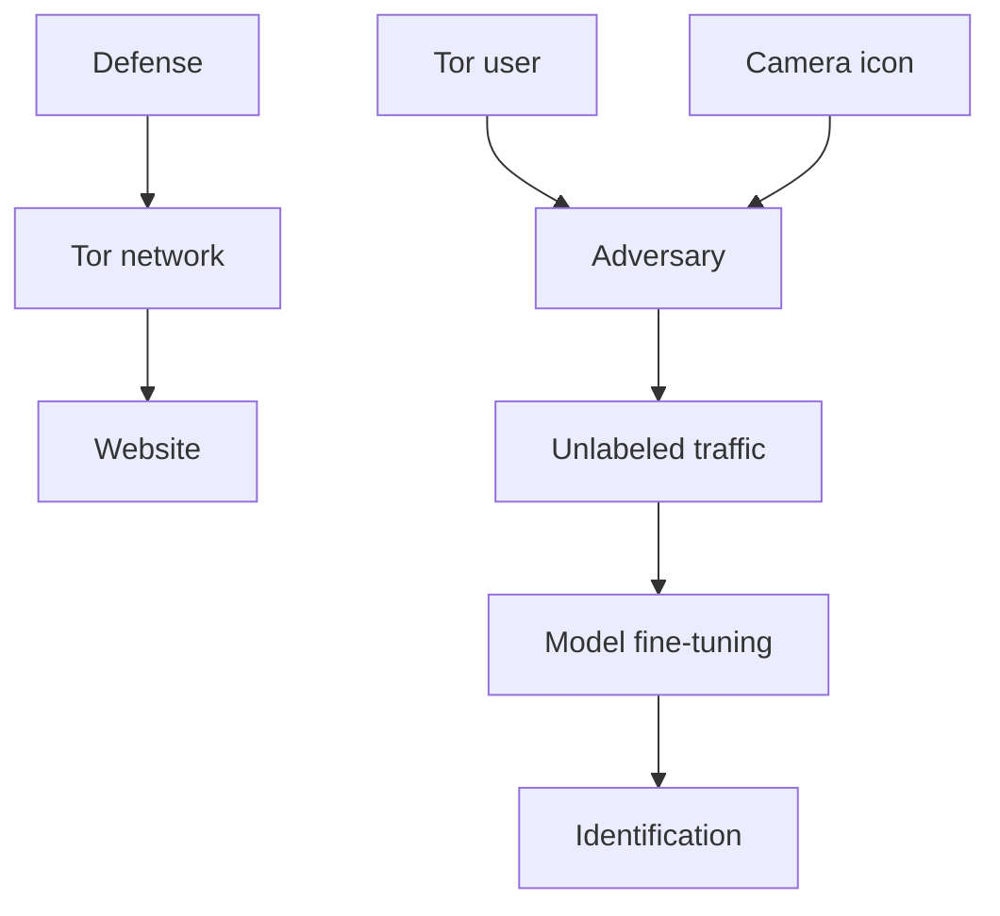
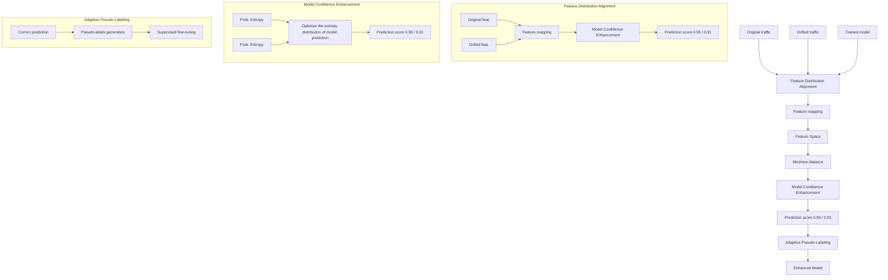

# Enhancing Website Fingerprinting Attacks against Traffic Drift

Xinhao Deng∗†, Yixiang Zhang∗, Qi Li∗§¶, Zhuotao Liu∗¶, Yabo Wang‡, Ke Xu‡§¶

∗INSC, Tsinghua University †Ant Group ‡DCST, Tsinghua University

§State Key Laboratory of Internet Architecture, Tsinghua University

¶Zhongguancun Laboratory

xinhaodeng.thu@gmail.com, {zhangyix24, yb-wang22}@mails.tsinghua.edu.cn,

{qli01, zhuotaoliu, xuke}@tsinghua.edu.cn,

Abstract—Anonymous communication systems, e.g., Tor, are vulnerable to various website fingerprinting (WF) attacks, which analyze network traffic p atterns t o c ompromise u ser privacy. In particular, sophisticated attacks employ deep learning (DL) models to identify distinctive traffic p atterns a ssociated with specific w ebsites, a llowing t he a dversary t o d etermine which websites users have visited. However, these attacks are not designed to handle traffic d rift, s uch a s c hanges i n website content and network conditions. Since traffic d rift i s common in real-world, the effectiveness of these attacks diminishes significantly i n r eal-world d eployment. To a ddress t his limitation, we develop Proteus, the first a daptive WF a ttack f ramework to effectively mitigate the impact of traffic d rift w hile maintaining robust performance in real-world scenarios. The key design rationale of Proteus is to continuously fine-tune t he W F model using only drifted traffic w ithout g round-truth l abels collected while deploying the model, enabling the model to adapt to complex traffic d rift i n n ear r eal t ime. S pecifically, Proteus aligns the feature distributions of original and drifted traffic by minimizing the maximum mean discrepancy and thus enhances model confidence b y o ptimizing t he e ntropy d istribution o f its predictions. Furthermore, it utilizes a Gaussian mixture model to obtain reliable pseudo labels, which are subsequently used in supervised fine-tuning t o f urther e nhance i ts r obustness against drifted traffic. N otably, P roteus c an b e s eamlessly integrated with existing DL-based WF attacks to enhance their resilience to traffic d rift. W e e valuate P roteus o n l arge-scale datasets containing over 350,000 real-world Tor browsing traces across six traffic d rift s cenarios. T he r esults d emonstrate t hat Proteus achieves an average 94.24% relative improvement in F1-score over eight state-of-the-art WF attacks for identifying drifted traffic.

## I. INTRODUCTION

Website Fingerprinting (WF) attacks pose a significant threat to anonymous communication systems such as Tor [1], [2]. By analyzing network traffic p atterns, W F a ttacks can infer which websites users visit, thereby compromising Tor’s privacy guarantees and exposing sensitive browsing activities [3], [4]. Recently, deep learning (DL) techniques have substantially improved the accuracy of these attacks [5]–[8].

Before launching a WF attack, the adversary needs to collect Tor traffic labeled with the corresponding websites to train the DL model. Through such training, the model captures correlations between traffic patterns and website labels. As a result, the trained DL model can effectively identify a user’s Tor traffic, undermining their anonymity.

DL-based WF attacks achieve significant success under controlled conditions. However, their performance degrades substantially when traffic experiences drift [4], [6], [9], [10]. Traffic drift refers to changes in network traffic characteristics over time, which can occur due to various factors such as website content updates [9], changes in user browsing behavior [11], Tor version updates [5], [12], or variations in network conditions [6]. Consequently, traffic drift introduces distributional discrepancies of traffic between the training and deployment phases, resulting in diminished model performance. Thus, traffic drift stands as a major barrier to the practical application of WF attacks.

Prior research typically addressed traffic drift by periodically collecting newly labeled traffic to retrain DL models [1], [3], [5], [7], [8], [11], [13]–[15]. Unfortunately, it is difficult to collect and constitute large-scale labeled data, and thus unable to timely adapt to traffic drift. To address this limitation, recent studies use data augmentation and contrastive learning to reduce dependence on large labeled datasets [4], [6]. Yet, they still depend on labeled traffic that precisely reflects the conditions of real-world deployment. As a result, when facing traffic drift caused by unknown and unpredictable factors (such as Tor version updates or user browsing behavior shifting), these approaches become less effective.

In this paper, we present Proteus, an adaptive and resilient framework that enhances existing DL-based WF attacks against traffic drift. Proteus continuously fine-tunes the DL models using only traffic without ground-truth labels collected between the client and the Tor entry node while deploying these attacks, enabling them to adapt to various types of traffic drift in near real time. It exploits relationships between feature distributions of original and drifted traffic generated from the same website so that it can align the drifted traffic with the original traffic and attenuate traffic drift. In particular, we design a three-step approach to achieve the goal. First, Proteus employs a Gaussian kernel function to map traffic features into a high-dimensional space where they are linearly separable. Then it aligns the feature distributions of original and drifted traffic by minimizing the Maximum Mean Discrepancy (MMD). Second, Proteus reduces the ambiguity of prediction by optimizing the entropy distribution of the model outputs, thereby ensuring consistent predictions for traffic exhibiting high feature similarity. Finally, Proteus utilizes a Gaussian Mixture Model (GMM) to identify reliable predictions and treat them as pseudo-labels. These pseudolabeled traces are subsequently used for supervised fine-tuning to further enhance the model’s adaptability to drifted traffic.

We prototype Proteus and evaluate its performance using large-scale datasets of over 300,000 real-world Tor traces collected between March and December 2024. Our datasets encompass traffic drift caused by various factors, including changes in website content over time, different Tor versions, shifts in client browsing behavior, dynamic network conditions, open-world scenarios, and the presence of the WF defense. Experimental results demonstrate that Proteus significantly improves the performance of existing WF attacks against drifted traffic. For instance, Proteus achieves the F1- score of 82.27% under 270 days of real-world traffic drift, whereas the F1-scores of eight baselines remain below 60%. Our primary contributions are as follows:

• We propose Proteus, an adaptive approach to enhance WF attacks against diverse traffic drifts by consistently fine-tuning the existing WF models during the deployment phase, allowing these models to adapt to various traffic drifts in near real time.  
• Proteus accomplishes this through two key mechanisms. First, it aligns feature distributions and enhances prediction confidence to maintain consistent classification across both original and drifted traffic patterns associated with the same website. Second, it employs the GMM to generate reliable pseudo-labels, enabling supervised finetuning to improve the model’s adaptability.  
• We implement a functional prototype of Proteus and conduct extensive evaluations across multiple drift scenarios to validate its effectiveness. We release the datasets and source code of our work1.

The rest of this paper is structured as follows. Section II provides the necessary background. Section III specifies the threat model for Proteus, and Section IV presents our design and its underlying principles. In Section V, we thoroughly evaluate Proteus in multiple drift scenarios. Section VI discusses the implications and countermeasures. Sections VII and VIII review related work and conclude this paper, respectively. Section IX discusses the ethical considerations.

## II. BACKGROUND

Website fingerprinting (WF) attacks compromise the anonymity of Tor users by analyzing website patterns in encrypted traffic. Traditional WF attacks rely on handcrafted features, which are vulnerable to specific obfuscation techniques [18]–[20]. To overcome this weakness, recent WF attacks employ deep learning (DL) models (e.g., CNNs and Transformers) to automatically extract features, enabling accurate and robust website identification [1], [3], [7], [8]. Advanced DL-based WF attacks perform well in several challenging scenarios, including bypassing WF defenses [1], [7], [8], [13], handling multi-tab obfuscated traffic [5], [14], [15], and identifying fine-grained webpages [11]. However, their performance degrades significantly when traffic drift occurs [3], [5], [9], [12]. Table I presents a comparison of WF attacks in handling traffic drift. Traffic drift can be categorized into three major types: (i) client-side drift, caused by changes in user browsing behavior or Tor versions [11], [12], (ii) server-side drift, due to website content updates [9], [10], and (iii) network-side drift, resulting from varying network conditions [6], [8].

TABLE I: Comparison of WF attacks on handling traffic drift. ✔, ✗, and ✔ denote full, no, and partial mitigation, respectively.

<table><tr><td rowspan="2">Attacks</td><td colspan="3">Traffic Drift Types</td></tr><tr><td> $Client-Side^1$ </td><td> $Server-Side^2$ </td><td> $Network-Side^3$ </td></tr><tr><td>AWF [3]</td><td>✕</td><td>✕</td><td>✕</td></tr><tr><td>DF [1]</td><td>✕</td><td>✕</td><td>✕</td></tr><tr><td>Tik-Tok [13]</td><td>✕</td><td>✕</td><td>✕</td></tr><tr><td>BAPM [14]</td><td>✕</td><td>✕</td><td>✕</td></tr><tr><td>ARES [5]</td><td>✕</td><td>✕</td><td>✕</td></tr><tr><td>RF [7]</td><td>✕</td><td>✕</td><td>✕</td></tr><tr><td>Var-CNN [16]</td><td>✕</td><td>✕</td><td>✕</td></tr><tr><td>TF [4]</td><td>✕</td><td>✕</td><td>✕</td></tr><tr><td>GANDALF [17]</td><td>✕</td><td>✕</td><td>✕</td></tr><tr><td>NetCLR [6]</td><td>✕</td><td>✕</td><td>✕</td></tr><tr><td>OnlineWF [9]</td><td>✕</td><td>✕</td><td>✕</td></tr><tr><td>Proteus</td><td>✕</td><td>✕</td><td>✕</td></tr></table>

1 Drift caused by user behavior or Tor version changes.  
2 Drift caused by changes in website content.  
3 Drift caused by varying network conditions.

To mitigate the effects of traffic drift, some studies periodically collect new data and retrain models to maintain performance [1], [3], [5]. However, retraining deep learning models is time-consuming due to the need for large-scale traffic collection. As traffic drift consistently evolves in real-time, periodic retraining is unable to address traffic drift promptly. Therefore, the community has explored few-shot fine-tuning methods, including enhancing model architecture [16], optimizing model training procedures [4], [6], and generating synthetic traffic using GANs [17]. NetCLR [6], the stateof-the-art attack in this category, utilizes data augmentation and contrastive learning for model pre-training. NetCLR then fine-tunes the model with only a small amount of labeled drifted traffic. While these approaches reduce the overall dependence of labeled data, they still require labeled traffic that precisely reflects the conditions of real-world deployment. Their effectiveness is further undermined when the drift is caused by unknown client-side factors, such as changes in Tor versions or variations in user browsing behavior.

flowchart

Fig. 1: The threat model of Proteus.

Furthermore, recent works collect labeled traffic from Tor exit nodes for model updates [9], [10]. For instance, OnlineWF [9] builds on the TF attack [4] and adapts to traffic drift in real time. It continuously updates website feature distributions using labeled traces from Tor exit nodes. However, WF attacks are usually performed at the entry side of the Tor network, whose traffic patterns significantly differ from those at the exit. Furthermore, Tor users can deploy WF defenses that obfuscate traffic at the entry node while leaving the exit node traffic unaffected [21]–[23]. This further increases the differences between entry and exit node traffic traces in realworld scenarios. As a result, WF models trained on exit-node data perform poorly when used to identify entry-node traffic.

Unlike prior works, Proteus aims to address the traffic drift issue by eliminating the dependence on labeled traffic. Traffic drift can occur due to various unpredictable factors, such as changes in Tor versions or shifts in users’ browsing behaviors. Therefore, it is difficult to obtain properly-labeled datasets that can capture all possible drift patterns for retraining or finetuning. To address this, Proteus fine-tunes WF models using traffic without ground-truth labels collected between the client and the Tor entry node. This traffic can match the drifted traffic that needs to be identified in the actual attack phase. Therefore, Proteus significantly enhances the robustness of WF attacks against traffic drift.

## III. THREAT MODEL

Figure 1 illustrates our threat model. We consider an adversary aiming to de-anonymize a client’s online activities. The adversary infers the websites visited by users through website fingerprinting. The adversary could deploy traffic mirroring points between the client and the Tor entry node to record the client’s encrypted traffic. Potential adversaries include local network administrators, Internet Service Providers (ISPs), and Autonomous Systems (ASes). Note that the adversary cannot directly decrypt the packets. Furthermore, we assume that the client is capable of deploying WF defenses. WF defenses disrupt the traffic patterns of various websites by padding dummy packets and delaying packets [21]–[25].

Following prior studies [1], [3], [5], [7], [8], [11], our threat model includes both closed-world and open-world scenarios. In the closed-world scenario, Tor users visit only a limited set of websites, enabling the adversary to pre-collect labeled traffic from these websites (i.e., monitored websites) to train models. In the open-world scenario, Tor users can browse arbitrary websites, including those unknown to the adversary. Therefore, the adversary can only collect traffic from a subset of websites to train the models.

Unlike previous works [4], [6], [9], [10] that focus on a single type of traffic drift, our threat model addresses multiple types of traffic drift happening in real-world deployment. Specifically, we consider traffic drift caused by changes on the client side, server side, and network side. To handle these traffic drifts, Proteus continuously fine-tunes the model using traffic without ground-truth labels collected in the attack phase. This mechanism enables Proteus to adapt to complex traffic drift during the attack.

Note that Proteus is compatible with existing WF attacks and can improve their robustness against traffic drift. For example, an adversary may first perform supervised finetuning on the WF model using labeled traffic exhibiting drift from synthetic sources [6], [17] or Tor exit nodes [9]. Proteus can then perform unsupervised fine-tuning using traffic without ground-truth labels, which closely reflects the drifted traffic patterns observed in practical deployment. This significantly enhances the resilience of WF attacks against traffic drift in real-world scenarios. In our study, combining supervised fine-tuning with Proteus yields even better performance, as detailed in Appendix V-G.

## IV. DESIGN OF PROTEUS

## A. Overview

In this paper, we propose Proteus, a novel WF attack framework that fine-tunes WF models using drifted traffic without ground-truth labels to achieve accurate WF performance during the attack phase. Proteus can be seamlessly integrated with existing DL-based WF attacks to effectively enhance their performance against drifted traffic. The key insight behind Proteus is that there are inherent relationships between the original and drifted traffic from the same website. By fine-tuning the WF model to capture these relationships, Proteus achieves more robust WF attacks against drifted traffic. Specifically, Proteus first analyzes the feature distributions of the original and drifted traffic, and then aligns the two distributions by minimizing the Maximum Mean Discrepancy (MMD). Next, Proteus calculates the entropy distribution of the model’s predictions to measure output uncertainty. Proteus optimizes the entropy distribution to facilitate consistent predictions for original and drifted traffic from the same website. Finally, Proteus utilizes a Gaussian Mixture Model (GMM) to estimate the probability of correct predictions for traces without ground-truth labels, selecting reliable predictions as pseudo-labels. These pseudo-labeled traces are used for supervised fine-tuning, further improving the WF model’s ability to identify drifted traffic.

flowchart

Fig. 2: The overview of Proteus. Proteus can be integrated with existing DL-based WF attacks to enhance WF attacks against traffic drift.

As shown in Figure 2, Proteus consists of three modules designed to construct robust WF attacks against traffic drift, including the feature distribution alignment module, the model confidence enhancement module, and the adaptive pseudolabeling module.

Feature Distribution Alignment. The feature distribution alignment module fine-tunes the model to minimize the distributional discrepancy between the original and drifted traffic features. Specifically, Proteus utilizes a Gaussian kernel function to map the traffic features into a high-dimensional space. This high-dimensional mapping enhances the separability of feature distributions, enabling more accurate analysis of distributional discrepancies. By minimizing the MMD between feature distributions, Proteus aligns the feature distributions of the original and drifted traffic features. Furthermore, we design a dynamic bandwidth Gaussian kernel that adaptively adjusts its bandwidth based on the traffic feature distribution. This design ensures effective feature distribution alignment across diverse traffic drift scenarios. Details of this module are described in Section IV-B.

Model Confidence Enhancement. This module mitigates traffic drift by enhancing the model’s prediction confidence on drifted traffic. Specifically, Proteus optimizes the entropy distribution of predictions to reduce output uncertainty, ensuring consistent predictions for traffic with similar features. Benefiting from the aligned feature distributions, the confidenceenhanced model accurately links original traffic and drifted traffic from the same website, enabling effective identification of drifted traffic. We will describe the details of this module in Section IV-C.

Adaptive Pseudo-Labeling. The adaptive pseudo-labeling module utilizes reliable predictions as pseudo-labels to facilitate the model learning drifted traffic patterns through supervised fine-tuning. Specifically, Proteus employs a GMM to estimate the probability of each traffic being correctly predicted. Predictions with high probabilities are assigned as pseudo-labels, which are then used to fine-tune the WF model. We will introduce the details of adaptive pseudo-labeling in

Section IV-D.

Note that Proteus introduces a novel end-to-end framework for WF attacks that dynamically adapts online to evolving traffic patterns while operating solely on traffic data without requiring ground-truth labels during the attack phase. While some components draw inspiration from computer vision and related fields [26]–[31], Proteus fundamentally diverges from prior works in its problem formulation and integration strategy. Unlike existing approaches that assume static or single-factor distribution shifts, Proteus is explicitly designed to handle complex, multi-source traffic drift in real-world network environments.

Furthermore, Proteus unifies these components into a taskoptimized pipeline that enables continuous online adaptation throughout the attack process. As shown in Appendix V-I, this integrated design significantly outperforms any standalone component.

## B. Feature Distribution Alignment

The feature distribution alignment module aims to minimize differences in feature distributions between original traffic and drifted traffic, thereby improving the performance of WF attacks in traffic drift scenarios. The key insight arises from the inherent relationship between original and drifted traffic from the same website, which results in smaller feature distances compared to traffic features from different websites. Thus, fine-tuning the model to align feature distributions helps capture the relationship between original and drifted traffic and enhances identifying drifted traffic.

However, directly aligning the feature distributions of original and drifted traffic poses significant challenges for two main reasons: (i) The relationships between feature distributions are complex, making it difficult to analyze and quantify their differences. (ii) The causes of traffic drift in real-world scenarios are highly diverse. As discussed in Section III, traffic drift can result from changes in client browsing behavior, Tor versions, website content, or network conditions. Different types of traffic drift induce distinct changes in feature distributions.

Therefore, our design must remain effective across various traffic drift scenarios.

To address these challenges, Proteus employs a Gaussian kernel function to map traffic features into a high-dimensional Reproducing Kernel Hilbert Space (RKHS) [32]. In this highdimensional space, traffic feature distributions that are originally complex or nonlinear become more linearly separable, enabling precise measurement of the differences between the feature distributions of original and drifted traffic. Based on this embedding, Proteus fine-tunes the model parameters by minimizing the Maximum Mean Discrepancy (MMD) [33]. MMD effectively computes the distance between different feature distributions by comparing their mean embeddings in the RKHS. By minimizing MMD, Proteus reduces the differences between the feature distributions of original and drifted traffic, thereby mitigating the impact of traffic drift on model performance. To enhance adaptability to diverse traffic drift scenarios, we design an adaptive bandwidth mechanism for the Gaussian kernel function. This mechanism dynamically adjusts the kernel bandwidth based on the observed traffic feature distributions, enabling Proteus to maintain robustness across various dynamic traffic drift scenarios. Proteus not only achieves effective alignment of traffic feature distributions but also maintains generalization across different traffic drift scenarios.

Next, we describe the details of the feature distribution alignment module. We input both the original traffic and drifted traffic into the model, using the output of the layer preceding the fully connected layer as the extracted traffic fea-$\boldsymbol { \mathcal { Z } } _ { o } = \{ \mathbf { z } _ { o } ^ { i } \} _ { i = 1 } ^ { N }$ $\mathcal { Z } _ { d } = \{ \mathbf { z } _ { d } ^ { j } \} _ { j = 1 } ^ { M }$ traffic, where N and M represent the respective numbers of traffic instances in these two domains. We map both feature distributions into the high-dimensional Reproducing Kernel Hilbert Space (RKHS) and compute the centroids of the two feature distributions in the RKHS. The centroid of a feature distribution is defined as the mean of features across all dimensions. The optimization goal of fine-tuning the model is to minimize the distance between these two centroids in the RKHS, formulated as follows:

$$
\mathcal {L} _ {1} = \sup _ {\phi \in \mathcal {H}} \left\| \frac {1}{N} \sum_ {i = 1} ^ {N} \phi (\mathbf {z} _ {o} ^ {i}) - \frac {1}{M} \sum_ {j = 1} ^ {M} \phi (\mathbf {z} _ {d} ^ {j}) \right\| ^ {2}, \tag {1}
$$

where ϕ denotes the feature mapping function, and H is the RKHS. We aim to find a mapping function ϕ that maximally amplifies the differences between two distributions in the original space when projected into the RKHS. This ensures that the distributions become as linearly separable as possible in the RKHS. To achieve this, we use a Gaussian kernel function for feature mapping. The Gaussian kernel function is defined as:

$$
k (\mathbf {z} ^ {i}, \mathbf {z} ^ {j}) = \exp \left(- \frac {\| \mathbf {z} ^ {i} - \mathbf {z} ^ {j} \| ^ {2}}{2 \sigma^ {2}}\right), \tag {2}
$$

where σ denotes the kernel bandwidth, which determines the sensitivity of the Gaussian kernel to the distances between features. The Gaussian kernel function maps features into a high-dimensional space and computes the distance between two features in that space. By leveraging the kernel trick [34], there is no need to explicitly construct the mapping function. We achieve feature distribution alignment by minimizing the average distance between the features of original traffic and drifted traffic computed using the Gaussian kernel function.

To prevent the model from converging to a trivial solution where it outputs the same feature representation for all traffic during fine-tuning, we simultaneously maximize the average distance between features within the original traffic and within the drifted traffic. This ensures that the intra-class variability of traffic features is preserved while aligning the inter-class distributions. Therefore, the loss in Equation 1 can be computed using the Gaussian kernel function as follows:

$$
\begin{array}{l} \mathcal {L} _ {1} = \frac {1}{N ^ {2}} \sum_ {i = 1} ^ {N} \sum_ {j = 1} ^ {N} k (\mathbf {z} _ {o} ^ {i}, \mathbf {z} _ {o} ^ {j}) + \frac {1}{M ^ {2}} \sum_ {i = 1} ^ {M} \sum_ {j = 1} ^ {M} k (\mathbf {z} _ {d} ^ {i}, \mathbf {z} _ {d} ^ {j}) \tag {3} \\ - \frac {2}{N M} \sum_ {i = 1} ^ {N} \sum_ {j = 1} ^ {M} k (\mathbf {z} _ {o} ^ {i}, \mathbf {z} _ {d} ^ {j}). \\ \end{array}
$$

Different types of traffic drift result in significant differences in the feature distribution of the drifted traffic. To enhance the adaptability of Proteus to various traffic drift scenarios, we design a dynamic bandwidth mechanism for the Gaussian kernel function. This mechanism dynamically adjusts the kernel bandwidth by analyzing the observed traffic feature distribution in real-time and enables flexibility in handling different types of traffic drift. The bandwidth is computed as follows:

$$
\sigma = \sqrt {\frac {1}{N M} \sum_ {i = 1} ^ {N} \sum_ {j = 1} ^ {M} \| \mathbf {z} _ {o} ^ {i} - \mathbf {z} _ {d} ^ {j} \| ^ {2}}. \tag {4}
$$

The WF model leverages feature distribution alignment to effectively learn the relationships between original and drifted traffic. However, this may lead to the WF model forgetting the knowledge necessary to distinguish traffic from different websites. To address this issue, we augment the feature distribution alignment process with supervised fine-tuning based on the original traffic. Proteus performs alignment at the level of global traffic distributions rather than individual samples, thereby maintaining site-level distinctions even under distributional drift. While many factors can substantially alter traffic patterns, such alterations typically occur in a consistent manner across different sites, enabling Proteus to achieve effective adaptation through global alignment.

## C. Model Confidence Enhancement

After feature distribution alignment, the original and drifted traffic features of the same website exhibit similarities. However, deep learning models often lack confidence when predicting the drifted traffic that was not seen during training, leading to misclassification. To address this, Proteus improves the model’s confidence in identifying unknown traffic, ensuring consistent predictions for traffic with similar features. Notably, the model confidence enhancement module does not require the collection of drifted traffic with website labels.

  
Fig. 3: The entropy distribution of prediction scores from the WF model on real-world drifted traffic from 102 monitored websites. As the degree of traffic drift increases over time, the entropy of the model’s prediction scores gradually increases, indicating a decrease in model confidence.

An intuitive approach to enhancing model confidence is to maximize the softmax probabilities of the model output, thereby increasing the probability of the predicted website category. However, this method may significantly decline model performance in practical applications, especially when the website class distribution in traffic is imbalanced. Specifically, maximizing the softmax probability leads the model to predict all traffic as belonging to the most prevalent website class in the traffic. This occurs because the method focuses solely on the class with the highest predicted probability while neglecting reasonable constraints on the probability distribution for other classes, ultimately impairing the model’s generalization capability and overall performance.

To address these challenges, we propose a model confidence enhancement technique based on optimizing the entropy distribution of model predictions. We leverage Shannon entropy [35], a commonly used metric for measuring uncertainty. Figure 3 illustrates the entropy distribution of WF model predictions under traffic drift across different days in the real world. We observe that as traffic drift increases, the entropy distribution of model predictions undergoes significant changes. This insight motivated us to fine-tune the model by optimizing the entropy distribution to enhance its confidence for drifted traffic, thereby mitigating the effects of traffic drift. To prevent the model from predicting all traffic as belonging to a single website, we design a batch-based diversity constraint mechanism. Specifically, Proteus minimizes the entropy of the predicted probabilities for all websites while maximizing the entropy across all prediction results within a batch to ensure diversity among the predicted websites.

Next, we introduce the design details of the model confidence enhancement module. Let $\mathbf { p } \mathbf { { i } } = \left\{ \mathbf { p } \mathbf { { i } } ^ { 1 } , \mathbf { p } \mathbf { { i } } ^ { 2 } , \ldots , \mathbf { p } \mathbf { { i } } ^ { K } \right\}$ represent the softmax values output by the final layer of the model, where $\mathbf { p _ { i } } ^ { k }$ is the probability that the model classifies the i-th unknown traffic as belonging to the k-th website. K is the total number of monitored websites. Proteus can calculate the entropy $H ( \bf { p } _ { i } )$ as follows:

$$
H (\mathbf {p _ {i}}) = - \sum_ {k = 1} ^ {K} \mathbf {p _ {i}} ^ {k} \log \mathbf {p _ {i}} ^ {k}. \tag {5}
$$

Proteus fine-tunes the model parameters by minimizing the average entropy of prediction probabilities across all instances in a batch, enabling Proteus to make more confident and accurate predictions for drifted traffic. Furthermore, Proteus also maximizes the entropy of the average prediction results across all instances in a batch, increasing the model’s diversity in identifying traffic from different websites.

$$
\mathcal {L} _ {2} = \frac {1}{B} \sum_ {i = 1} ^ {B} H (\mathbf {p _ {i}}) - H (\frac {1}{B} \sum_ {j = 1} ^ {B} \mathbf {p _ {j}}), \tag {6}
$$

where B is the number of instances in the batch.

Benefiting from the model confidence enhancement, Proteus achieves more consistent predictions for both original and drifted traffic of the same website, enabling more accurate identification of drifted traffic.

## D. Adaptive Pseudo-Labeling

The feature distribution alignment module and the model confidence enhancement module improve model consistency in identifying both original and drifted traffic from the same website. However, during unsupervised model fine-tuning, the model might lose critical knowledge essential for distinguishing traffic from different websites. This discriminative ability stems from the knowledge gained by optimizing the cross-entropy loss function using labeled traffic during model training [1], [3], [5], [7]. Based on this observation, we design the adaptive pseudo-labeling module to enhance the WF model’s ability to distinguish between drifted traffic from different websites by generating reliable pseudo-labels for traffic without ground-truth labels and incorporating supervised fine-tuning.

Pseudo-labeling is a technique where the model’s own predictions are used as pseudo-labels for unannotated samples to fine-tune the model. This approach is commonly applied in semi-supervised and self-supervised learning [36], [37]. However, the WF model may generate incorrect predictions for certain traffic, and the noise introduced by these pseudolabels could degrade performance. Therefore, ensuring the high quality of pseudo-labels is critical for maintaining model accuracy. Generating reliable pseudo-labels under Tor traffic drift is particularly challenging. The reason is that the Tor network experiences multiple types of traffic drift that evolve dynamically over time. Each type of drift affects the model’s predictions in different ways, and simply analyzing the prediction confidence of individual traffic samples is not sufficient to effectively filter out noise in the pseudo-labels.

To address these challenges, Proteus utilizes a Gaussian Mixture Model (GMM) [38] to estimate the probability that each traffic sample is correctly predicted, based on the entropy distribution of model predictions. Proteus then filters out pseudo-labels with low probabilities, ensuring the reliability of the pseudo-labels. Specifically, the GMM utilizes two Gaussian components to separately model the entropy distributions of correctly and incorrectly predicted traffic. A linear combination of these two components is then used to fit the overall entropy distribution of all traffic. The GMM accurately captures the model’s prediction entropy distribution across different types of traffic drift, adaptively computing the probability that each sample is correctly classified. This allows Proteus to generate reliable pseudo-labels, making it robust to the diverse and dynamic traffic drift scenarios.

Next, we describe the detailed design of the adaptive pseudo-labeling module. Recall from Equation 5 that $H ( \mathbf { p } _ { i } )$ represents the entropy of the model’s prediction for the ith traffic instance $\mathbf { x } _ { i }$ , quantifying the model’s uncertainty. To ensure consistency across instances, we normalize the entropy values for B unknown traffic instances in the batch, so that the normalized entropy values fall within the range of 0 to 1:

$$
\hat {H} (\mathbf {p _ {i}}) = \frac {H (\mathbf {p _ {i}}) - \min _ {1 \leq j \leq B} H (\mathbf {p _ {j}})}{\max _ {1 \leq j \leq B} H (\mathbf {p _ {j}}) - \min _ {1 \leq j \leq B} H (\mathbf {p _ {j}})}. \tag {7}
$$

We then use the GMM to fit the entropy distribution. The GMM is a probabilistic model that combines multiple Gaussian distributions. In this module, we use two Gaussian components to separately represent the entropy distribution of correctly predicted traffic and that of incorrectly predicted traffic. The GMM models the overall entropy distribution as a weighted mixture of these two Gaussian distributions as follows:

$$
P (\hat {H} | \theta) = \pi_ {1} \mathcal {N} (\hat {H} | \mu_ {1}, \Sigma_ {1}) + \pi_ {2} \mathcal {N} (\hat {H} | \mu_ {2}, \Sigma_ {2}), \tag {8}
$$

where $\mathcal { N } , \pi , \mu , \Sigma$ represent the probability density function, weight, mean, and covariance, respectively. We update these parameters using the Expectation-Maximization (EM) algorithm [39] to fit the entropy distribution of the model predictions. After fitting the entropy distribution, we identify the Gaussian component with the smaller mean, which corresponds to the entropy distribution of correctly predicted traffic. Let us assume that the Gaussian distribution with parameters $\mu _ { 1 }$ and $\Sigma _ { 1 }$ has the smaller mean. For a traffic instance $\mathbf { x } ,$ Proteus calculates the posterior probability that this traffic belongs to the Gaussian distribution representing correctly predicted traffic, i.e., the probability that this traffic is correctly predicted.

$$
P (\mathbf {x}) = \frac {\pi_ {1} \mathcal {N} (\hat {H} (\mathbf {x}) | \mu_ {1} , \Sigma_ {1})}{\sum_ {j = 1} ^ {2} \pi_ {j} \mathcal {N} (\hat {H} (\mathbf {x}) | \mu_ {j} , \Sigma_ {j})}. \tag {9}
$$

Finally, we consider all predictions with probabilities above a specified threshold as reliable pseudo-labels and use these pseudo-labeled traffic instances to fine-tune the model in a supervised manner. This process further improves the model’s performance in identifying drifted traffic.

In summary, Proteus leverages a GMM-based approach to adapt to different types of Tor traffic drift, generating reliable pseudo-labels for traffic without ground-truth labels. By effectively mitigating the impact of traffic drift, Proteus enhances the performance of WF attacks against drifted traffic.

## V. PERFORMANCE EVALUATION

In this section, we prototype Proteus and evaluate its performance under various types of traffic drift.

## A. Experimental Setup

Implementation. We prototype Proteus using PyTorch 2.0.1 and Python 3.8. The default WF model in Proteus is the SOTA attack RF. By replacing the fine-tuned model, Proteus can integrate with other DL-based WF attacks. All experiments are accelerated using the NVIDIA GeForce RTX 4090 GPU for model training and testing. Furthermore, we perform 5- fold cross-validation and report the average values as the experimental results.

Dataset. From March to December 2024 and from June to July 2025, we collected over 350,000 real-world Tor traffic traces under various traffic drift scenarios. We randomly selected 102 monitored websites and 20,000 non-monitored websites from the Tranco list [40]. Details of the dataset construction are provided in Appendix A. Our datasets encompass six categories of data.

• Dataset for Temporal Drift: To evaluate traffic drift caused by changes in website content over time, we periodically collected traffic from 102 monitored websites over 9 months. In total, we collected over 140,000 realworld traffic traces.  
• Dataset for Tor Version Drift: To evaluate traffic drift due to changes in the Tor client version, we used four major versions: 0.4.8, 0.4.7, 0.4.6, and 0.4.5. We focus on Tor versions rather than Tor Browser Bundle (TBB) versions because TBB updates are more frequent. A total of over 100,000 real-world traffic traces were collected from 102 monitored websites.  
• Dataset for Network Condition Drift: To evaluate traffic drift caused by changes in network conditions, we followed previous studies [12] and collected over 34,000 real-world traces for 102 monitored websites from Tor clients located in five countries with varying network conditions.  
• Dataset for Browsing Behavior Drift: To simulate scenarios where clients visit subpages unknown to the adversary, we evaluated traffic drift caused by changes in client browsing behaviors. We collected over 20,000 realworld traces for 17,739 subpages across 102 monitored websites.

TABLE II: Comparison of input features and model structures across various WF attacks.

<table><tr><td>Attack</td><td>Input feature</td><td>Model structure</td></tr><tr><td>AWF</td><td>Packet direction sequence</td><td>CNN</td></tr><tr><td>DF</td><td>Packet direction sequence</td><td>CNN</td></tr><tr><td>BAPM</td><td>Packet direction sequence</td><td>Transformer</td></tr><tr><td>ARES</td><td>Packet direction sequence</td><td>Transformer</td></tr><tr><td>RF</td><td>Traffic aggregated features</td><td>CNN</td></tr><tr><td>NetCLR</td><td>Packet direction sequence</td><td>CNN</td></tr><tr><td>Holmes</td><td>Traffic aggregated features</td><td>CNN</td></tr><tr><td>Tik-Tok</td><td>Packet direction and timestamp sequences</td><td>CNN</td></tr><tr><td>Var-CNN</td><td>Packet direction, timestamp, and size sequences</td><td>CNN</td></tr><tr><td>UAF</td><td>Packet direction and timestamp sequences</td><td>CNN</td></tr></table>

• Open-World Dataset: To evaluate traffic drift in the openworld setting, we considered both changes in website content and users browsing non-monitored websites unknown to the adversary. We collected over 160,000 real-world traffic traces from 102 monitored websites and 20,000 non-monitored websites.  
• Dataset with WF Defense: To evaluate the robustness of Proteus under defense mechanisms, we selected three obfuscation techniques: WTF-PAD [21], obfs4 [41], and Front [22]. We generated a simulated dataset for WTF-PAD and collected real-world datasets for obfs4 and Front deployments, comprising over 200,000 obfuscated traffic traces in total.

Baselines. For a thorough comparison, we use ten stateof-the-art WF attacks as baselines: AWF [3], DF [1], Tik-Tok [13], Var-CNN [16], BAPM [14], ARES [5], RF [7], NetCLR [6], Holmes [8] and UAF [42]. All baseline models, except UAF, rely on labeled data and cannot be fine-tuned using unlabeled drift traffic. We implemented all baseline models using the official source code. To ensure fairness, we tuned each model’s parameters to match or exceed the performance reported in their respective original papers. Table II summarizes the input features and model architectures of baselines. Among baselines with identical input features and architectures, models with larger parameter sizes tend to exhibit more substantial accuracy improvements when enhanced with Proteus. Moreover, baselines that incorporate traffic aggregation features (e.g., RF) benefit more significantly from Proteus integration. This effect can be attributed to the higher stability of aggregated traffic features under dynamic traffic variations [7], which allows Proteus to exploit these features more effectively and deliver stronger performance gains.

Metrics. We follow prior arts [1], [3], [5], [7], [8] and select 4 metrics that are widely used to evaluate the performance of WF attacks, i.e., Accuracy, Precision, Recall, and F1-score.

line chart

| Energy distance | Day 14 | Day 30 | Day 90 | Day 150 | Day 270 |
| --------------- | ------ | ------ | ------ | ------- | ------- |
| 0               | 0      | 0      | 0      | 0       | 0       |
| 5               | 95     | 90     | 85     | 80      | 75      |
| 10              | 98     | 95     | 92     | 90      | 85      |
| 15              | 100    | 98     | 96     | 95      | 92      |

(a) Temporal drift

line chart

| Energy distance | Browsing subpages |
| --------------- | ----------------- |
| 0               | 0                 |
| 5               | 60                |
| 10              | 80                |
| 15              | 100               |

(b) Behavior drift

heatmap

| | 0.45 | 0.46 | 0.47 | 0.48 |
|---|---|---|---|---|
| 0 | 0 | 5.6 | 0 | 8.8 |
| 1 | 5.6 | 0 | 2.5 | 6.5 |
| 2 | 7.6 | 2.5 | 0 | 4.7 |
| 3 | 8.8 | 6.5 | 4.7 | 0 |

(c) Tor version drift

heatmap

| | SG | JP | USA | DE | UK |
|---|---|---|---|---|---|
| SG | 0 | 0.4 | 0.6 | 2.5 | 2.4 |
| JP | 0.4 | 0 | 0.3 | 2.1 | 2.0 |
| USA | 0.6 | 0.3 | 0 | 1.3 | 1.2 |
| DE | 2.5 | 2.1 | 1.3 | 0 | 0.1 |
| UK | 2.4 | 2.0 | 1.2 | 0.1 | 0 |

(d) Network condition drift  
Fig. 4: Traffic drift quantification across different scenarios using energy distance.

## B. Drift Quantification Analysis

To quantitatively evaluate the extent of traffic drift in our experiments, we utilize the energy distance metric [43], a statistically rigorous measure widely used to assess similarity between probability distributions. This metric is particularly well-suited for detecting and quantifying concept drift [44] because of its high sensitivity to distributional changes and robustness in high-dimensional spaces.

Energy distance measures the discrepancy between two distributions by comparing the average pairwise distances both across and within distributions. Formally, given two probability distributions P and Q, with samples $\{ x _ { i } \} _ { i = 1 } ^ { m } \sim P$ and $\{ y _ { j } \} _ { j = 1 } ^ { n } \sim Q$ , the energy distance $D _ { E } ( P , Q )$ is defined as:

$$
D _ {E} (P, Q) = 2 \mathbb {E} [ \| x - y \| ] - \mathbb {E} [ \| x - x ^ {\prime} \| ] - \mathbb {E} [ \| y - y ^ {\prime} \| ], \tag {10}
$$

where ∥ · ∥ denotes the Euclidean distance. A larger energy distance indicates a greater divergence between the two distributions, making it a reliable metric for quantifying shifts in traffic patterns.

Figure 4 presents the quantified results of traffic drift under various scenarios. In the cases involving temporal page updates and subpage visits, the degree of drift varies significantly across websites. To capture this variation, we plot the cumulative distribution functions (CDFs) of energy distances for all monitored websites under both temporal and behavioral drift conditions. As shown in Figure 4(a), temporal drift increases progressively over time. Specifically, for the top 20% of websites most affected by drift, the minimum observed energy distances are 0.39 on Day 14, 0.91 on Day 30, 3.19 on Day 90, 4.69 on Day 150, and 5.68 on Day 270. Figure 4(b) demonstrates that user behaviors involving subpage visits lead to more pronounced drift compared to browsing limited to the homepage. In this behavioral drift scenario, over 40% of websites exhibit energy distances exceeding 5.4, indicating substantial deviations in traffic patterns.

  
Fig. 5: Evaluating the accuracy of robust WF attacks under temporal traffic drift.

TABLE III: Comparison with prior arts under temporal drift, where P, R, F1 represent Precision (%), Recall (%), and F1-score (%).

<table><tr><td rowspan="2"></td><td colspan="3">Day 14</td><td colspan="3">Day 30</td><td colspan="3">Day 90</td><td colspan="3">Day 150</td><td colspan="3">Day 270</td></tr><tr><td>P</td><td>R</td><td>F1</td><td>P</td><td>R</td><td>F1</td><td>P</td><td>R</td><td>F1</td><td>P</td><td>R</td><td>F1</td><td>P</td><td>R</td><td>F1</td></tr><tr><td>AWF</td><td>50.36</td><td>49.29</td><td>48.84</td><td>46.42</td><td>46.05</td><td>45.36</td><td>38.28</td><td>39.09</td><td>37.49</td><td>33.12</td><td>33.63</td><td>32.21</td><td>29.40</td><td>30.07</td><td>28.64</td></tr><tr><td>BAPM</td><td>64.62</td><td>62.83</td><td>62.08</td><td>58.89</td><td>57.33</td><td>56.28</td><td>48.48</td><td>48.78</td><td>46.75</td><td>44.28</td><td>43.92</td><td>41.89</td><td>38.38</td><td>38.30</td><td>35.98</td></tr><tr><td>ARES</td><td>71.36</td><td>69.07</td><td>68.82</td><td>66.74</td><td>64.72</td><td>64.17</td><td>56.53</td><td>55.96</td><td>54.05</td><td>49.06</td><td>49.21</td><td>47.43</td><td>46.04</td><td>45.51</td><td>43.48</td></tr><tr><td>DF</td><td>73.30</td><td>72.10</td><td>71.94</td><td>67.12</td><td>66.49</td><td>65.79</td><td>55.91</td><td>57.17</td><td>55.24</td><td>50.11</td><td>50.49</td><td>48.91</td><td>45.47</td><td>46.69</td><td>44.48</td></tr><tr><td>NetCLR</td><td>73.78</td><td>72.93</td><td>72.71</td><td>68.27</td><td>67.47</td><td>66.92</td><td>56.99</td><td>57.94</td><td>55.81</td><td>49.29</td><td>50.82</td><td>49.03</td><td>44.72</td><td>46.80</td><td>43.92</td></tr><tr><td>Tik-Tok</td><td>78.98</td><td>78.35</td><td>77.89</td><td>73.46</td><td>73.25</td><td>72.36</td><td>62.01</td><td>63.08</td><td>60.87</td><td>53.89</td><td>54.90</td><td>52.56</td><td>48.70</td><td>49.47</td><td>46.58</td></tr><tr><td>Var-CNN</td><td>81.23</td><td>79.93</td><td>79.77</td><td>76.20</td><td>74.76</td><td>74.30</td><td>65.03</td><td>65.43</td><td>63.14</td><td>57.43</td><td>58.14</td><td>55.68</td><td>52.79</td><td>53.49</td><td>50.84</td></tr><tr><td>RF</td><td>88.46</td><td>87.99</td><td>87.63</td><td>82.92</td><td>82.15</td><td>81.62</td><td>73.83</td><td>73.85</td><td>72.02</td><td>68.07</td><td>68.13</td><td>66.25</td><td>61.00</td><td>62.81</td><td>59.57</td></tr><tr><td>Proteus</td><td>92.53</td><td>92.59</td><td>92.53</td><td>91.21</td><td>91.23</td><td>91.18</td><td>90.67</td><td>90.77</td><td>90.65</td><td>86.15</td><td>86.82</td><td>86.32</td><td>81.90</td><td>83.21</td><td>82.27</td></tr></table>

For drift caused by Tor version changes and network condition variations, the impacts are relatively uniform across websites. Therefore, we calculate the average energy distance across all monitored websites. As shown in Figure 4(c), larger differences between Tor versions result in more severe traffic drift. For example, the distance between Tor 0.4.5 and 0.4.6 is 5.6, while it increases to 8.8 between Tor 0.4.5 and 0.4.8. Figure 4(d) presents the impact of network condition drift caused by clients located in different geographical regions. Although network variability also contributes to traffic drift, its overall magnitude is lower compared to the other scenarios.

In summary, the traffic patterns observed across all four scenarios demonstrate substantial drift, thereby providing a robust basis for comprehensively evaluating the effectiveness of Proteus.

## C. Performance under Traffic Drift

We evaluate the effectiveness of Proteus in enhancing WF attacks under four types of traffic drift: evolving website content, different Tor versions, varying network conditions, and changes in user browsing patterns.

Temporal Drift. One of the primary causes of temporal drift in Tor traffic is the continuous change in website content over time. Figure 5 illustrates the accuracy of four robust WF attacks (i.e., RF, ARES, Tik-Tok, and DF) against temporally drifting traffic. Existing robust WF attacks primarily target obfuscated traffic under WF defenses or multi-tab browsing. However, these attacks are not robust against drifted traffic. For example, after a temporal drift of 270 days, the accuracies of RF, ARES, Tik-Tok, and DF decrease by 28.45%, 35.41%, 37.36%, and 36.83%, respectively. Proteus integrates with these WF attacks and improves their performance by finetuning model parameters using traffic without ground-truth labels collected during the attack phase. As shown in Figure 5, Proteus improves the accuracies of RF, ARES, Tik-Tok, and DF on traffic with a 270-day temporal drift by 31.84%, 46.40%, 34.87%, and 28.74%, respectively.

We further compared Proteus with all baselines. Table III presents the Precision, Recall, and F1-score of WF attacks under temporal drift. We observe that Proteus achieves the best performance for drifted traffic. Compared to the baselines, Proteus increases the F1-score by an average of 33.65% at Day 14, 43.30% at Day 30, 70.09% at Day 90, 84.25% at Day 150, and 95.44% at Day 270, respectively. As drift time increases, the advantage of Proteus over the baselines gradually increases.

Tor Version Drift. Next, we evaluate the performance of WF attacks under Tor version drift. Following the setup in prior studies [1], [3], [5], WF models are trained on traffic collected using Tor version 0.4.8, the latest version at the time of data collection. The trained models are evaluated on traffic collected using Tor versions 0.4.5, 0.4.6, and 0.4.7. Figure 6 shows the F1-scores of eight deep learning-based WF attacks under Tor version drift, as well as their performance when combined with Proteus. We observe that a larger difference between the Tor versions used for training and evaluation leads to greater performance degradation in WF models. For example, when trained on traffic from Tor 0.4.8, the NetCLR model achieves accuracies of 40.85%, 55.86%, and 71.37% on traffic from Tor versions 0.4.5, 0.4.6, and 0.4.7, respectively. This performance degradation is mainly due to the data augmentation strategy of NetCLR, which is effective only for certain types of traffic drift. It does not sufficiently address differences caused by changes in the Tor version. Integrating Proteus with existing WF attacks results in significant performance improvements across all eight models. As shown in Figure 6(h), for drifted traffic from Tor versions 0.4.5, 0.4.6, and 0.4.7, Proteus improves the F1-score of the RF attack by 39.60%, 16.62%, and 9.85%, respectively.

  
Fig. 6: Evaluation of eight WF attacks in terms of F1-score under traffic drift caused by Tor version differences. The WF model is trained on traffic collected using Tor version 0.4.8 and evaluated on traffic from Tor versions 0.4.5, 0.4.6, and 0.4.7.

bar chart

| Model | wo/ Proteus (%) | w/ Proteus (%) |
| :--- | :--- | :--- |
| AWF | 56 | 69 |
| BAPM | 64 | 78 |
| ARES | 74 | 92 |
| DF | 71 | 89 |
| NetCLR | 70 | 87 |
| Tik-Tok | 73 | 88 |
| Var-CNN | 75 | 89 |
| RF | 80 | 94 |

Fig. 7: The F1-score of eight WF attacks under traffic drift caused by Tor version differences. The model is trained using traffic from Tor versions 0.4.8, 0.4.7, and 0.4.6, and tested on traffic from version 0.4.5.

Furthermore, we consider a potential mitigation strategy in which the adversary collects traffic from multiple Tor versions to train the model. Figure 7 shows the F1-score results when the model is trained on a mixture of traffic from Tor versions 0.4.8, 0.4.7, and 0.4.6, and evaluated on traffic from version 0.4.5. Proteus still significantly improves the performance of

TABLE IV: The F1-score of WF attacks under different network environments. We use traffic collected from clients in five countries with varying network environments, including Singapore (SG), Japan (JP), the United States (USA), Germany (DE), and the United Kingdom (UK).

<table><tr><td></td><td></td><td>SG</td><td>JP</td><td>USA</td><td>DE</td><td>UK</td></tr><tr><td rowspan="2">AWF</td><td>w/o Proteus</td><td>52.15</td><td>43.78</td><td>43.21</td><td>30.63</td><td>32.59</td></tr><tr><td>w/ Proteus</td><td>54.25</td><td>46.87</td><td>44.96</td><td>31.59</td><td>35.87</td></tr><tr><td rowspan="2">BAPM</td><td>w/o Proteus</td><td>66.01</td><td>57.10</td><td>53.23</td><td>38.26</td><td>39.61</td></tr><tr><td>w/ Proteus</td><td>68.64</td><td>58.48</td><td>56.29</td><td>44.98</td><td>48.82</td></tr><tr><td rowspan="2">ARES</td><td>w/o Proteus</td><td>72.96</td><td>66.48</td><td>62.87</td><td>43.75</td><td>46.19</td></tr><tr><td>w/ Proteus</td><td>80.27</td><td>74.25</td><td>70.95</td><td>58.83</td><td>65.35</td></tr><tr><td rowspan="2">DF</td><td>w/o Proteus</td><td>76.24</td><td>68.58</td><td>63.94</td><td>46.67</td><td>50.14</td></tr><tr><td>w/ Proteus</td><td>78.10</td><td>73.03</td><td>69.22</td><td>56.18</td><td>61.87</td></tr><tr><td rowspan="2">NetCLR</td><td>w/o Proteus</td><td>78.25</td><td>71.76</td><td>68.13</td><td>46.66</td><td>49.76</td></tr><tr><td>w/ Proteus</td><td>78.91</td><td>73.07</td><td>68.76</td><td>57.58</td><td>60.23</td></tr><tr><td rowspan="2">Tik-Tok</td><td>w/o Proteus</td><td>81.36</td><td>74.74</td><td>74.61</td><td>51.34</td><td>50.25</td></tr><tr><td>w/ Proteus</td><td>84.49</td><td>81.95</td><td>79.40</td><td>67.40</td><td>70.08</td></tr><tr><td rowspan="2">Var-CNN</td><td>w/o Proteus</td><td>78.59</td><td>74.42</td><td>73.00</td><td>45.80</td><td>47.11</td></tr><tr><td>w/ Proteus</td><td>84.38</td><td>81.57</td><td>81.69</td><td>66.10</td><td>69.89</td></tr><tr><td rowspan="2">RF</td><td>w/o Proteus</td><td>88.87</td><td>87.45</td><td>83.10</td><td>20.85</td><td>17.38</td></tr><tr><td>w/ Proteus</td><td>90.63</td><td>90.98</td><td>92.64</td><td>81.66</td><td>84.60</td></tr></table>

WF attacks on drifted traffic. For example, Proteus increases the F1-score of AWF, BAPM, ARES, DF, NetCLR, Tik-Tok, Var-CNN, and RF by 22.15%, 23.33%, 24.96%, 24.63%, 24.84%, 20.47%, 18.45%, and 16.77%, respectively. While increasing the diversity of training data helps mitigate traffic drift, the Tor version used by the client remains unknown to the attacker. Even when the client’s Tor version differs from the one used for training, Proteus continues to enhance the robustness of WF models against traffic drift.

Network Condition Drift. Existing WF attacks [1], [5], [7] train and evaluate models using traffic under identical network conditions, which is impractical. To evaluate the impact of network condition drift, we followed the setting of the previous work [12] and collected real-world Tor traffic for 102 monitored websites using clients deployed in various countries during the same period. Specifically, we collected Tor traffic from clients located in Singapore (SG), Japan (JP), the United States (USA), Germany (DE), and the United Kingdom (UK) to simulate Tor users in various geographical locations. Due to differences in the geographical distribution of Tor nodes, Tor clients in different regions typically experience significant variations in network conditions.

As shown in Table IV, we train models using traffic collected in SG and evaluate the F1-score of WF attacks using traffic collected in SG, JP, USA, DE, and UK, respectively. We observe that under network condition drift, the F1-scores of existing WF attacks significantly decreased, with RF experiencing the largest decline. For example, for drifted traffic collected in DE and UK, the F1-scores of RF decreased by 76.5% and 80.44%, respectively. The decline in performance is attributed to the dependence of RF on hyperparameter settings (e.g., the time slot used in feature extraction), which limit the effectiveness of RF to specific network conditions.

When Proteus is integrated with existing WF attacks, all attacks demonstrate significant improvements in the F1- score across various network conditions. For instance, for drifted traffic collected from the UK, Proteus improves the F1-score of AWF, BAPM, ARES, DF, NetCLR, Tik-Tok, Var-CNN, and RF by 10.06%, 23.25%, 41.48%, 23.39%, 21.04%, 39.46%, 48.35%, and 386.77%, respectively. Proteus provides greater performance enhancements for WF attacks with larger model parameters, as models with more parameters have stronger data fitting capabilities and can better adapt to complex traffic drift. The effectiveness of Proteus arises from its ability to adapt to drifted traffic under different network conditions without requiring website labels. Unlike existing attacks that maintain fixed model parameters during the attack phase, Proteus fine-tunes the model using traffic without ground-truth labels during the attack phase, thereby enhancing the performance of WF attacks on unknown drifted traffic.

Browsing Behavior Drift. We further evaluate the performance of WF attacks under client browsing behavior drift. Previous works [1], [3], [6], [7] assume that clients only visit the homepage of websites, which is unrealistic. This paper considers a more realistic browsing behavior drift scenario, where the adversary does not have prior knowledge of the client’s browsing behavior. As shown in Table V, existing WF attacks experience a significant decline in performance under client browsing behavior drift. For example, when the client visits subpages unknown to the adversary, the F1-score of baselines decreases by an average of 57.32%.

Even in realistic and challenging browsing behavior drift scenarios, Proteus can still enhance the performance of existing WF attacks on drifted traffic. We combine Proteus with the SOTA attack RF to achieve optimal performance under browsing behavior drift. Compared to the baselines, Proteus improves Precision, Recall, and F1-score by an average of 69.58%, 71.47%, and 78.35%, respectively. Proteus significantly enhances the consistency of WF models in identifying traffic from different subpages of the same website by aligning traffic feature distributions and boosting model confidence, thereby still enhancing existing WF attacks under client browsing behavior drift.

TABLE V: Comparison with prior arts in browsing behavior drift scenarios, where P, R, F1 represent Precision (%), Recall (%), and F1-score (%).

<table><tr><td rowspan="2"></td><td colspan="3">Homepage</td><td colspan="3">Subpages</td></tr><tr><td>P</td><td>R</td><td>F1</td><td>P</td><td>R</td><td>F1</td></tr><tr><td>AWF</td><td>54.74</td><td>53.74</td><td>53.04</td><td>22.18</td><td>22.87</td><td>21.68</td></tr><tr><td>BAPM</td><td>70.29</td><td>65.68</td><td>65.38</td><td>29.98</td><td>27.67</td><td>25.96</td></tr><tr><td>ARES</td><td>75.36</td><td>73.28</td><td>72.77</td><td>31.87</td><td>31.96</td><td>29.87</td></tr><tr><td>DF</td><td>77.73</td><td>77.11</td><td>76.72</td><td>32.12</td><td>33.56</td><td>31.36</td></tr><tr><td>NetCLR</td><td>78.66</td><td>77.58</td><td>77.27</td><td>34.10</td><td>35.50</td><td>33.58</td></tr><tr><td>Tik-Tok</td><td>83.48</td><td>82.00</td><td>81.82</td><td>36.07</td><td>36.66</td><td>34.56</td></tr><tr><td>Var-CNN</td><td>85.08</td><td>83.60</td><td>83.59</td><td>39.58</td><td>39.19</td><td>37.24</td></tr><tr><td>RF</td><td>89.85</td><td>89.21</td><td>89.00</td><td>48.79</td><td>46.74</td><td>44.76</td></tr><tr><td>Proteus</td><td>91.28</td><td>91.40</td><td>91.18</td><td>55.32</td><td>56.32</td><td>55.24</td></tr></table>

TABLE VI: F1-score comparison of Proteus with UAF and Holmes across various drift scenarios.

<table><tr><td></td><td>Day 0→270</td><td>Tor 0.4.8→0.4.5</td><td>SG→DE</td><td>Homepage→Subpage</td></tr><tr><td>UAF</td><td>50.31</td><td>51.15</td><td>57.33</td><td>36.50</td></tr><tr><td>Holmes</td><td>54.31</td><td>55.62</td><td>29.43</td><td>38.82</td></tr><tr><td>Proteus</td><td>82.27</td><td>88.28</td><td>81.66</td><td>55.24</td></tr></table>

Comparison with Drift Adaptation Baselines. We further compare Proteus with two representative drift adaptation baselines: Holmes [8] and UAF [42]. Holmes leverages supervised contrastive learning to capture the spatial distribution of website traffic, enhancing its adaptability to varying traffic patterns. In contrast, UAF employs an unsupervised approach that integrates multiple feature representations and combines models trained under diverse scenarios to address traffic drift during WF attacks.

Table VI shows the F1-score comparison of Proteus with Holmes and UAF. Based on the drift quantification analysis in Section V-B, we select four experimental settings with the most significant drift, including temporal drift from Day 0 to Day 270, version drift from Tor 0.4.8 to 0.4.5, network environment drift from clients located in Singapore (SG) to clients in Germany (DE), and behavioral drift from homepage browsing to subpage browsing. The experimental results demonstrate that Proteus consistently outperforms both baselines across all drift settings, achieving average F1- score improvements of 82.5% over Holmes and 57.45% over UAF. This significant performance gain can be attributed to the unified design of Proteus, which jointly incorporates feature alignment, confidence augmentation, and pseudo-labeling to enable robust adaptation to complex traffic drift. In contrast, both baselines show limited generalization capabilities, performing effectively only under conditions with relatively minor drift.

TABLE VII: Evaluating the F1-score of WF attacks under the temporal drift in the open world.

<table><tr><td></td><td></td><td>14</td><td>30</td><td>90</td><td>150</td><td>270</td></tr><tr><td rowspan="2">AWF</td><td>w/o Proteus</td><td>46.30</td><td>44.34</td><td>35.61</td><td>31.02</td><td>26.52</td></tr><tr><td>w/ Proteus</td><td>49.35</td><td>45.56</td><td>40.08</td><td>34.42</td><td>30.27</td></tr><tr><td rowspan="2">BAPM</td><td>w/o Proteus</td><td>59.74</td><td>54.70</td><td>44.91</td><td>40.00</td><td>33.63</td></tr><tr><td>w/ Proteus</td><td>64.72</td><td>61.00</td><td>55.91</td><td>45.70</td><td>45.16</td></tr><tr><td rowspan="2">ARES</td><td>w/o Proteus</td><td>67.88</td><td>63.73</td><td>50.96</td><td>40.95</td><td>26.42</td></tr><tr><td>w/ Proteus</td><td>76.97</td><td>75.31</td><td>68.85</td><td>62.59</td><td>54.99</td></tr><tr><td rowspan="2">DF</td><td>w/o Proteus</td><td>67.85</td><td>62.93</td><td>50.41</td><td>40.50</td><td>25.92</td></tr><tr><td>w/ Proteus</td><td>75.08</td><td>70.56</td><td>63.91</td><td>57.00</td><td>51.25</td></tr><tr><td rowspan="2">NetCLR</td><td>w/o Proteus</td><td>71.94</td><td>66.28</td><td>54.50</td><td>46.06</td><td>32.81</td></tr><tr><td>w/ Proteus</td><td>73.34</td><td>68.10</td><td>61.03</td><td>53.66</td><td>46.66</td></tr><tr><td rowspan="2">Tik-Tok</td><td>w/o Proteus</td><td>75.41</td><td>70.24</td><td>58.43</td><td>50.88</td><td>37.86</td></tr><tr><td>w/ Proteus</td><td>81.17</td><td>77.78</td><td>72.76</td><td>65.51</td><td>59.81</td></tr><tr><td rowspan="2">Var-CNN</td><td>w/o Proteus</td><td>78.53</td><td>73.16</td><td>60.45</td><td>47.33</td><td>26.49</td></tr><tr><td>w/ Proteus</td><td>83.04</td><td>79.79</td><td>72.84</td><td>65.82</td><td>56.83</td></tr><tr><td rowspan="2">RF</td><td>w/o Proteus</td><td>85.97</td><td>79.88</td><td>68.54</td><td>60.59</td><td>36.83</td></tr><tr><td>w/ Proteus</td><td>88.23</td><td>84.98</td><td>82.97</td><td>79.15</td><td>73.94</td></tr></table>

## D. Open-World Evaluations

Next, we evaluate the performance of Proteus in the openworld scenario. In the open-world scenario, Tor users can browse non-monitored websites unknown to the adversary. We randomly selected 20,000 non-monitored websites from the Tranco list, and collected Tor traffic from 102 monitored websites and 20,000 non-monitored websites from March to December 2024. Table VII shows the evaluation of the F1- score for WF attacks under temporal drift in the open-world scenario. To analyze the enhancement effect of Proteus on existing WF attacks in the open-world scenario, we evaluate the F1-score of WF attacks with and without Proteus integration on day 14, day 30, day 90, day 150, and day 270. We observe that Proteus enhances all baselines in identifying drifted traffic in the open-world scenario. For instance, for traffic with the 270-day drift, Proteus improves the F1-score of AWF, BAPM, ARES, DF, NetCLR, Tik-Tok, Var-CNN, and RF by 14.14%, 34.28%, 108.14%, 97.72%, 42.21%, 57.98%, 114.53%, and 100.76%, respectively. Compared to the closed-world scenario, Proteus exhibits a more significant enhancement of WF attacks in the open-world scenario. The reason is that Proteus can adapt to various traffic drifts in the open-world scenario, such as traffic drifts caused by changes in website content and the emergence of new non-monitored websites.

In summary, during the attack phase, Proteus fine-tunes the model parameters using traffic from non-monitored websites. This enables adaptation to traffic drift from websites unknown to the adversary, thereby significantly enhancing the performance of WF attacks in the open-world scenario.

TABLE VIII: F1-scores of WF attack performance on multitab browsing traffic under different traffic overlap ratios.

<table><tr><td></td><td>20%</td><td>40%</td><td>60%</td><td>80%</td></tr><tr><td>RF</td><td>51.29</td><td>50.81</td><td>49.54</td><td>48.52</td></tr><tr><td>RF w/ MMD</td><td>58.21</td><td>57.00</td><td>56.60</td><td>54.67</td></tr><tr><td>RF w/ Proteus</td><td>81.11</td><td>78.97</td><td>76.78</td><td>73.62</td></tr></table>

## E. Evaluating Proteus under Defenses

We further evaluate Proteus under several WF defenses, including WTF-PAD [21], obfs4 [41], and Front [22]. The WTF-PAD defense mitigates traffic analysis by inserting dummy packets to obfuscate burst patterns. The variant of WTF-PAD has been deployed in Tor based on circuit padding [45]. As shown in Figure 8, we evaluate the F1-score of four robust WF attacks in identifying temporal-drifted traffic under the WTF-PAD defense. We observe that Proteus still enhances WF attacks even under the WTF-PAD defense. For instance, for 270-day drifted traffic, Proteus improves the F1-score of RF, ARES, Tik-Tok, and DF by 56.29%, 39.90%, 30.59%, and 15.36%, respectively.

We next evaluate the performance of Proteus on obfuscated traffic without adversarial training. Obfs4, the default pluggable transport in the Tor network, is widely used to obfuscate traffic and enable users to circumvent traffic censorship imposed by ISPs or governmental entities. We use clean traffic as training data and evaluate WF attacks on the traffic obfuscated by obfs4. As shown in Figure 9(a), Proteus achieves an average improvement of 66.48% in F1-score over existing WF attacks under obfs4 obfuscation, demonstrating strong adaptability to unseen obfuscation strategies.

We further examine Front, a WF defense mechanism that introduces dummy packet padding during the initial phase of page loading. Compared to the WTF-PAD defense, Front provides stronger obfuscation while incurring lower bandwidth overhead. We implemented a real-world deployment of Front based on the WFDefProxy framework [46] to assess the performance of Proteus under realistic defense conditions. To emulate practical attack scenarios, we designed a challenging experimental setting where the adversary trains the WF model on simulated Front traffic but is tested on traffic collected from the real-world Front deployment. In this setting, the defense implementation details remain unknown to the adversary, causing a significant traffic distribution drift between training and testing data. As shown in Figure 9(b), Proteus outperforms four baseline methods, achieving an average F1- score improvement of 48.1%, indicating its robustness under real-world deployments of Front defense.

Note that the robustness of WF attacks against defenses in prior works has primarily stemmed from improvements in feature extraction [7], [8], [13] and model architectures [1], [5]. In contrast, Proteus does not modify these components in existing WF attacks. Instead, Proteus only fine-tunes the model parameters to enhance the identification of drifted traffic, remaining effective even under WF defenses.

  
Fig. 8: Evaluating the F1-score of robust WF attacks in identifying temporal-drifted traffic under the WTF-PAD defense.

  
Fig. 9: The F1-score of robust WF attacks under the obfs4 and Front defenses.

## F. Evaluating Proteus in Multi-Tab Browsing

We next evaluate the performance of Proteus in handling multi-tab traffic scenarios. Following prior studies [5], [14], [15], we simulate multi-tab browsing behavior to generate the required traffic data. Specifically, traffic traces are randomly sampled from both monitored and non-monitored websites and subsequently combined to produce streams that exhibit multitab characteristics. To capture varying levels of traffic overlap, we configure multiple overlap ratios and merge traffic traces based on packet timestamps. Two datasets are constructed to assess the impact of temporal drift and multi-tab browsing: one from Day 0, used for training the WF models, and another from Day 270, used for model testing. This setup allows us to comprehensively evaluate the robustness of Proteus against the dual challenges of long-term distribution drift and traffic heterogeneity.

As shown in Table VIII, Proteus consistently enhances the performance of the RF attack model, even under conditions of substantial heterogeneity and temporal drift. For example, with an 80% traffic overlap ratio, Proteus achieves a 51.73% relative improvement in F1-score compared to the baseline RF attack. Moreover, when compared to an RF model augmented solely with the MMD module, Proteus demonstrates superior overall performance. This improvement can be attributed to the synergistic interaction among its three modules: (i) MMD facilitates robust feature alignment; (ii) the aligned features enable the generation of reliable pseudo-labels; and (iii) these high-quality pseudo-labels further mitigate the risk of misalignment during feature alignment. Through iterative finetuning, Proteus empowers WF models to sustain strong attack efficacy, even in the presence of heterogeneous concept drift.

TABLE IX: Compared with the F1-score of NetCLR finetuned with labeled drifted traffic.

<table><tr><td></td><td>0</td><td>30</td><td>90</td><td>150</td><td>270</td></tr><tr><td>Base</td><td>75.77</td><td>66.92</td><td>55.81</td><td>49.03</td><td>43.92</td></tr><tr><td>Supervised fine-tuning</td><td>75.77</td><td>67.87</td><td>62.33</td><td>54.96</td><td>56.79</td></tr><tr><td>Proteus</td><td>75.77</td><td>70.58</td><td>63.05</td><td>56.16</td><td>52.71</td></tr><tr><td>Supervised fine-tuning combined with Proteus</td><td>75.77</td><td>74.02</td><td>71.71</td><td>61.07</td><td>63.40</td></tr></table>

## G. Comparison with Supervised Fine-tuning

In this section, we compare Proteus with supervised finetuning. Following the default settings of NetCLR, we sample drifted traffic with website labels to fine-tune the pre-trained NetCLR model. As shown in Table IX, NetCLR with supervised fine-tuning achieves a higher F1-score than the base model under temporal drift. We observe that for short-term drifted traffic, Proteus outperforms supervised fine-tuning. For example, on days 30, 90, and 150, Proteus achieves the 3.99%, 1.16%, and 2.18% improvement in F1-score over supervised fine-tuning, respectively. However, for longer-term drifted traffic, supervised fine-tuning has the advantage over Proteus. Despite this, collecting labeled drifted traffic for supervised fine-tuning is impractical, as certain forms of traffic drift remain unknown to the adversary. The adversary can only collect drifted traffic without ground-truth labels during the attack phase.

Proteus can be combined with supervised fine-tuning to further boost performance. Specifically, we first fine-tune the model with labeled drifted traffic and then fine-tune the model with traffic without ground-truth labels collected during the attack phase. When combined with supervised fine-tuning, Proteus improves the F1-score of the base model for drifted traffic on days 30, 90, 150, and 270 by 10.61%, 28.49%, 24.56%, and 44.35%, respectively.

## H. Impact of the Scale of Unannotated Traffic

In Figure 10, we evaluate the impact of the scale of unannotated traffic on Proteus. Specifically, we evaluate the accuracy of Proteus combined with RF using 270-day drifted traffic. As shown in Figure 10(a), we first analyze the impact of the number of websites in the unannotated traffic. In realworld scenarios, the adversary may only collect partial traffic from certain websites over a short period. Our findings indicate that as the number of websites included in the unannotated dataset increases, the enhancement effect of Proteus becomes more pronounced. For example, when the unannotated dataset contains traffic from 40 and 100 websites, Proteus boosts the accuracy of RF by 3.71% and 29.88%, respectively. Next, we analyze the impact of the number of traffic instances per website in Figure 10(b). Similarly, as the number of instances per website increases, Proteus shows a greater improvement. Specifically, when the number of instances per website rises from 5 to 80, Proteus ’s enhancement of the accuracy of RF grows from 11.72% to 28.81%.

line chart

| # of Websites | w/o/ Proteus Accuracy (%) | w/ Proteus Accuracy (%) | w/o/ Proteus # of Instances per Website | w/ Proteus # of Instances per Website |
| ------------- | ------------------------- | ----------------------- | ---------------------------------------- | -------------------------------------- |
| 40            | 63                        | 65                      | 5                                        | 70                                     |
| 50            | 63                        | 66                      | 10                                       | 72                                     |
| 60            | 61                        | 71                      | 20                                       | 73                                     |
| 70            | 63                        | 75                      | 30                                       | 75                                     |
| 80            | 63                        | 77                      | 40                                       | 79                                     |
| 90            | 63                        | 80                      | 60                                       | 81                                     |
| 100           | 63                        | 82                      | 80                                       | 81                                     |

Fig. 10: Evaluating the impact of unannotated traffic scale on Proteus.

TABLE X: Ablation analysis of Proteus.

<table><tr><td></td><td>Precision</td><td>Recall</td><td>F1-score</td></tr><tr><td>Base</td><td>61.00</td><td>62.81</td><td>59.57</td></tr><tr><td>Feature distribution alignment</td><td>65.16</td><td>68.12</td><td>65.51</td></tr><tr><td>Model confidence enhancement</td><td>77.11</td><td>77.02</td><td>76.74</td></tr><tr><td>Adaptive pseudo-labeling</td><td>76.86</td><td>79.97</td><td>76.01</td></tr><tr><td>Proteus</td><td>81.90</td><td>83.21</td><td>82.27</td></tr></table>

Overall, Proteus is able to enhance the performance of WF attacks even when the unannotated traffic contains limited websites or traffic traces. As the scale of the unannotated traffic increases, the effectiveness of Proteus in strengthening existing WF attacks also improves. In particular, attackers can further boost performance not only by continuously collecting more unannotated traffic during the attack phase, but also by leveraging control over Tor entry or relay nodes to gather additional unannotated traffic.

## I. Ablation Analysis

Next, we perform the ablation analysis of Proteus. Specifically, we evaluate the performance of Proteus on 270-day drifted traffic. Table X shows the ablation results for the three core modules of Proteus. We observe that the feature distribution alignment module, model confidence enhancement module, and adaptive pseudo-labeling module individually improve the F1-score of RF by 9.97%, 28.82%, and 27.60%, respectively. Thus, all three modules contribute to the performance of Proteus. When the three modules are combined, Proteus achieves the optimal F1 score of 82.27%, representing a 38.11% improvement over the base model.

bar chart

| Model | wo/ Proteus (ms) | w/ Proteus (ms) |
| :--- | :--- | :--- |
| AWF | 0.19 | 1.50 |
| BAPM | 0.23 | 1.59 |
| ARES | 0.36 | 2.61 |
| DF | 0.25 | 1.48 |
| NetCLR | 0.24 | 1.49 |
| Tik-Tok | 0.18 | 1.09 |
| Var-CNN | 0.41 | 2.77 |
| RF | 0.21 | 1.51 |

Fig. 11: Comparison of website identification latency with and without Proteus integration.

## J. Latency Analysis

In Figure 11, we illustrate the latency analysis of DLbased WF attacks with and without integration of Proteus. All experiments were conducted using an NVIDIA GeForce RTX 4090 GPU to accelerate the fine-tuning and inference of deep learning models. Initially, we measure the latency required to identify a single traffic trace for the existing WF attacks. Next, we integrate Proteus with these attacks, calculating the latency for model fine-tuning once, as well as website identification. The total latency is then divided by the number of traffic traces to determine the average latency. Our findings show that integrating Proteus increases the average latency by 1.5 milliseconds across the eight WF attacks. Furthermore, larger model parameter sizes correlate with higher fine-tuning latencies. For example, the latency increases by 2.25 milliseconds for ARES and 2.36 milliseconds for Var-CNN. In practice, the adversary could identify websites first, followed by fine-tuning the model with Proteus to improve the attack performance on future drifted traffic. In this scenario, Proteus would not affect the latency of website identification during WF attacks.

## VI. DISCUSSION

Implications of Proteus. Proteus introduces a continuously evolving framework for WF attacks that leverages traffic without ground-truth labels during the attack phase, significantly enhancing the effectiveness of WF attacks against real-world drifted traffic. The adversary can further strengthen Proteus by collecting additional unannotated real-world traffic traces, potentially by controlling middle nodes in the Tor network. Furthermore, experimental results in Section V-G demonstrate that the adversary can combine Proteus with supervised finetuning to improve its performance. For instance, the adversary can collect a small amount of labeled synthetic [6] or exit-node traces [9] to achieve supervised fine-tuning.

Limitations of Proteus. First, Proteus requires continuous fine-tuning of the model, which increases computational overhead. Second, we evaluated Proteus on multiple common scenarios of traffic drift observed in real-world scenarios. To the best of our knowledge, this paper represents the most comprehensive evaluation of Tor traffic drift types to date. However, the effectiveness of Proteus against more complex traffic drift (e.g., substantial updates to website templates and content) has not yet been validated. Finally, experimental results in Section V-H show that the scale of unannotated traffic impacts the enhancement effect of Proteus. The more unannotated traffic available, the stronger the enhancement effect of Proteus. In cases where unannotated traffic is limited, the adversary could collect additional traffic to enhance Proteus, such as unannotated traffic from controlled Tor entry nodes or middle nodes.

Countermeasure against Proteus. The effectiveness of Proteus depends on the inherent relationship between original traffic and drifted traffic from the same website, which is captured during the model fine-tuning process. A potential countermeasure is to apply adversarial machine learning techniques [47], specifically by generating adversarial samples that disrupt the model’s ability to learn this relationship. We will explore this design in future work.

## VII. RELATED WORK

WF Attacks against Traffic Drift. DL-based WF attacks have demonstrated exceptional performance under controlled conditions [1], [3], [5]–[8], [11], [13], [15], [16]. However, their effectiveness significantly declines in real-world scenarios due to traffic drift. Early studies periodically collected large-scale labeled traffic datasets for model retraining [1], [3], [5], which is impractical. Few-shot fine-tuning [4], [6], [17] eliminated the reliance on large labeled traffic but failed to address the diverse traffic drift encountered in real-world scenarios. Online adaptation methods [9], [10] using real-world traces are more practical. OnlineWF [9] collected labeled traffic from exit nodes of the Tor network to train and update the model. However, WF attacks typically target the entry side of the Tor network, where traffic patterns differ greatly from those at the exit. Furthermore, Tor users can use WF defenses that hide traffic patterns at the entry node but do not affect exit traffic. Different from previous works, Proteus leverages real-world traces without ground-truth labels collected during the attack phase to fine-tune the model, enabling it to adapt to diverse traffic drift in real-world scenarios.

Unsupervised Domain Adaptation. Unsupervised Domain Adaptation (UDA) techniques leverage unannotated samples to fine-tune models for adapting to drifted samples, which have been extensively studied in the field of computer vision [48], [49]. UDA improves the generalization of DL models to images from different domains by employing methods such as domain alignment [50] or self-training [51]. In the field of cybersecurity, Thirumuruganathan et al. [52] utilized selftraining techniques to fine-tune the model with unlabeled data, enhancing model performance across various drift scenarios. In contrast, Proteus fine-tunes the model using the continuously accumulating traffic without ground-truth labels collected during the attack phase. It utilizes various adaptive techniques to ensure effectiveness across multiple Tor traffic drift scenarios.

## VIII. CONCLUSION

In this paper, we propose Proteus, a WF attack framework that adapts to real-world traffic drift by fine-tuning models with traffic without ground-truth labels. Proteus improves the consistency of WF model predictions for both original and drifted traffic from the same website by aligning feature distributions and optimizing entropy distributions. Furthermore, Proteus uses a Gaussian mixture model to generate reliable pseudo-labels, further fine-tuning the model to enhance attack performance. We evaluate Proteus across various traffic drift scenarios, and the experimental results demonstrate significant improvements in WF attack performance against drifted traffic.

## IX. ETHICS CONSIDERATIONS

Similar to previous studies [1], [3], [5], our research fully adheres to the guidelines of the Tor Research Safety Board [53]. Regarding the data collection process, all traffic was collected exclusively from locally initiated browsing sessions and did not involve any real-world Tor user traffic. Furthermore, we continuously monitored bandwidth consumption during data collection, which averaged 3.52 Mbps. Given that the average bandwidth of the Tor network in 2024 exceeds 250 Gbps [54], our data collection did not interfere with the normal operation of the Tor network.

## ACKNOWLEDGEMENTS

We thank the anonymous reviewers for their valuable comments. This work is supported in part by the National Natural Science Foundation of China (NSFC) under Grant 62132011, 62472247, 62425201, and the Ant Group Postdoctoral Programme. Qi Li is the corresponding author of this paper.

## REFERENCES

[1] P. Sirinam, M. Imani, M. Juarez, and M. Wright, “Deep fingerprinting: Undermining website fingerprinting defenses with deep learning,” in Proceedings of the 2018 ACM SIGSAC Conference on Computer and Communications Security, 2018, pp. 1928–1943.  
[2] R. Dingledine, N. Mathewson, and P. Syverson, “Tor: The secondgeneration onion router,” Naval Research Lab Washington DC, Tech. Rep., 2004.  
[3] V. Rimmer, D. Preuveneers, M. Juarez, T. Van Goethem, and W. Joosen, “Automated website fingerprinting through deep learning,” in NDSS, 2018.  
[4] P. Sirinam, N. Mathews, M. S. Rahman, and M. Wright, “Triplet fingerprinting: More practical and portable website fingerprinting with n-shot learning,” in Proceedings of the 2019 ACM SIGSAC Conference on Computer and Communications Security, 2019, pp. 1131–1148.  
[5] X. Deng, Q. Yin, Z. Liu, X. Zhao, Q. Li, M. Xu, K. Xu, and J. Wu, “Robust multi-tab website fingerprinting attacks in the wild,” in 2023 IEEE Symposium on Security and Privacy (SP). IEEE Computer Society, 2023, pp. 1005–1022.  
[6] A. Bahramali, A. Bozorgi, and A. Houmansadr, “Realistic website fingerprinting by augmenting network traces,” in Proceedings of the 2023 ACM SIGSAC Conference on Computer and Communications Security, 2023, pp. 1035–1049.  
[7] M. Shen, K. Ji, Z. Gao, Q. Li, L. Zhu, and K. Xu, “Subverting website fingerprinting defenses with robust traffic representation,” in 32nd USENIX Security Symposium (USENIX Security 23), 2023, pp. 607–624.  
[8] X. Deng, Q. Li, and K. Xu, “Robust and reliable early-stage website fingerprinting attacks via spatial-temporal distribution analysis,” in Proceedings of the 2024 on ACM SIGSAC Conference on Computer and Communications Security, 2024, pp. 1997–2011.  
[9] G. Cherubin, R. Jansen, and C. Troncoso, “Online website fingerprinting: Evaluating website fingerprinting attacks on tor in the real world,” in 31st USENIX Security Symposium (USENIX Security 22), 2022, pp. 753–770.  
[10] R. Jansen, R. Wails, and A. Johnson, “Repositioning real-world website fingerprinting on tor,” in Proceedings of the 23rd Workshop on Privacy in the Electronic Society, 2023, pp. 124–140.  
[11] X. Zhao, X. Deng, Q. Li, Y. Liu, Z. Liu, K. Sun, and K. Xu, “Towards fine-grained webpage fingerprinting at scale,” in Proceedings of the 2024 on ACM SIGSAC Conference on Computer and Communications Security, 2024, pp. 423–436.  
[12] M. Juarez, S. Afroz, G. Acar, C. Diaz, and R. Greenstadt, “A critical evaluation of website fingerprinting attacks,” in Proceedings of the 2014 ACM SIGSAC Conference on Computer and Communications Security, 2014, pp. 263–274.  
[13] M. S. Rahman, P. Sirinam, N. Mathews, K. G. Gangadhara, and M. Wright, “Tik-tok: The utility of packet timing in website fingerprinting attacks,” Proceedings on Privacy Enhancing Technologies, vol. 3, pp. 5–24, 2020.  
[14] Z. Guan, G. Xiong, G. Gou, Z. Li, M. Cui, and C. Liu, “Bapm: Block attention profiling model for multi-tab website fingerprinting attacks on tor,” in Annual Computer Security Applications Conference, 2021, pp. 248–259.  
[15] Z. Jin, T. Lu, S. Luo, and J. Shang, “Transformer-based model for multitab website fingerprinting attack,” in Proceedings of the 2023 ACM SIGSAC Conference on Computer and Communications Security, 2023, pp. 1050–1064.  
[16] S. Bhat, D. Lu, A. Kwon, and S. Devadas, “Var-cnn: A data-efficient website fingerprinting attack based on deep learning,” Proceedings on Privacy Enhancing Technologies, vol. 4, pp. 292–310, 2019.  
[17] S. E. Oh, N. Mathews, M. S. Rahman, M. Wright, and N. Hopper, “Gandalf: Gan for data-limited fingerprinting,” Proceedings on Privacy Enhancing Technologies, vol. 2021, no. 2, 2021.  
[18] T. Wang, X. Cai, R. Nithyanand, R. Johnson, and I. Goldberg, “Effective attacks and provable defenses for website fingerprinting,” in 23rd USENIX Security Symposium, 2014, pp. 143–157.  
[19] A. Panchenko, F. Lanze, J. Pennekamp, T. Engel, A. Zinnen, M. Henze, and K. Wehrle, “Website fingerprinting at internet scale.” in NDSS, 2016.  
[20] J. Hayes and G. Danezis, “k-fingerprinting: A robust scalable website fingerprinting technique,” in 25th USENIX Security Symposium, 2016, pp. 1187–1203.  
[21] M. Juarez, M. Imani, M. Perry, C. Dıaz, and M. Wright, “Wtf- ´ pad: toward an efficient website fingerprinting defense for tor,” CoRR, abs/1512.00524, 2015.  
[22] J. Gong and T. Wang, “Zero-delay lightweight defenses against website fingerprinting,” in 29th USENIX Security Symposium, 2020, pp. 717– 734.  
[23] J. Gong, W. Zhang, C. Zhang, and T. Wang, “Surakav: generating realistic traces for a strong website fingerprinting defense,” in 2022 IEEE Symposium on Security and Privacy (SP). IEEE, 2022, pp. 1558–1573.  
[24] T. Wang and I. Goldberg, “Walkie-talkie: An efficient defense against passive website fingerprinting attacks,” in 26th USENIX Security Symposium, 2017, pp. 1375–1390.  
[25] J. K. Holland and N. Hopper, “Regulator: A straightforward website fingerprinting defense,” Proceedings on Privacy Enhancing Technologies, vol. 2022, no. 2, pp. 344–362, 2022.  
[26] S. J. Pan, I. W. Tsang, J. T. Kwok, and Q. Yang, “Domain adaptation via transfer component analysis,” IEEE transactions on neural networks, vol. 22, no. 2, pp. 199–210, 2010.  
[27] M. Long, Y. Cao, J. Wang, and M. Jordan, “Learning transferable features with deep adaptation networks,” in International conference on machine learning. PMLR, 2015, pp. 97–105.  
[28] Y. Grandvalet and Y. Bengio, “Semi-supervised learning by entropy minimization,” Advances in neural information processing systems, vol. 17, 2004.  
[29] X. Wu, Q. Zhou, Z. Yang, C. Zhao, L. J. Latecki et al., “Entropy minimization vs. diversity maximization for domain adaptation,” arXiv preprint arXiv:2002.01690, 2020.  
[30] Y. Li, L. Guo, and Y. Ge, “Pseudo labels for unsupervised domain adaptation: A review,” Electronics, vol. 12, no. 15, p. 3325, 2023.  
[31] S. Chhabra, H. Venkateswara, and B. Li, “Domain adaptation using pseudo labels,” arXiv preprint arXiv:2402.06809, 2024.  
[32] A. Berlinet and C. Thomas-Agnan, Reproducing kernel Hilbert spaces in probability and statistics. Springer Science & Business Media, 2011.  
[33] G. K. Dziugaite, D. M. Roy, and Z. Ghahramani, “Training generative neural networks via maximum mean discrepancy optimization,” arXiv preprint arXiv:1505.03906, 2015.  
[34] B. Scholkopf, “The kernel trick for distances,” ¨ Advances in neural information processing systems, vol. 13, 2000.  
[35] C. E. Shannon, “A mathematical theory of communication,” The Bell system technical journal, vol. 27, no. 3, pp. 379–423, 1948.  
[36] E. Arazo, D. Ortego, P. Albert, N. E. O’Connor, and K. McGuinness, “Pseudo-labeling and confirmation bias in deep semi-supervised learning,” in 2020 International joint conference on neural networks (IJCNN). IEEE, 2020, pp. 1–8.  
[37] D.-H. Lee et al., “Pseudo-label: The simple and efficient semi-supervised learning method for deep neural networks,” in Workshop on challenges in representation learning, ICML, vol. 3, no. 2. Atlanta, 2013, p. 896.  
[38] D. A. Reynolds et al., “Gaussian mixture models.” Encyclopedia of biometrics, vol. 741, no. 659-663, 2009.  
[39] T. K. Moon, “The expectation-maximization algorithm,” IEEE Signal processing magazine, vol. 13, no. 6, pp. 47–60, 1996.  
[40] V. Le Pochat, T. Van Goethem, S. Tajalizadehkhoob, M. Korczynski,´ and W. Joosen, “Tranco: A research-oriented top sites ranking hardened against manipulation,” in Proceedings of the 26th Annual Network and Distributed System Security Symposium, ser. NDSS 2019, Feb. 2019.  
[41] Y. Angel, “The obfs4 protocol: Specification and implementation,” https: //gitweb.torproject.org/pluggable-transports/obfs4.git, 2015, accessed: 2025-07-25.  
[42] G. Zhang, J. Cao, M. Xu, and X. Deng, “Unsupervised and adaptive tor website fingerprinting,” in International Conference on Security and Privacy in Communication Systems. Springer, 2023, pp. 209–229.  
[43] G. J. Szekely and M. L. Rizzo, “Energy statistics: A class of statistics ´ based on distances,” Journal of statistical planning and inference, vol. 143, no. 8, pp. 1249–1272, 2013.  
[44] A. S. Iwashita and J. P. Papa, “An overview on concept drift learning,” IEEE access, vol. 7, pp. 1532–1547, 2018.  
[45] (2023) Circuit-level padding. [Online]. Available: https://spec.torproject. org/padding-spec/circuit-level-padding.html  
[46] J. Gong, W. Zhang, C. Zhang, and T. Wang, “Wfdefproxy: Modularly implementing and empirically evaluating website fingerprinting defenses,” arXiv preprint arXiv:2111.12629, 2021.  
[47] B. Biggio and F. Roli, “Wild patterns: Ten years after the rise of adversarial machine learning,” in Proceedings of the 2018 ACM SIGSAC Conference on Computer and Communications Security, 2018, pp. 2154–2156.  
[48] X. Liu, C. Yoo, F. Xing, H. Oh, G. El Fakhri, J.-W. Kang, J. Woo et al., “Deep unsupervised domain adaptation: A review of recent advances and perspectives,” APSIPA Transactions on Signal and Information Processing, vol. 11, no. 1, 2022.  
[49] G. Kang, L. Jiang, Y. Yang, and A. G. Hauptmann, “Contrastive adaptation network for unsupervised domain adaptation,” in Proceedings of the IEEE/CVF conference on computer vision and pattern recognition, 2019, pp. 4893–4902.  
[50] G. Wei, C. Lan, W. Zeng, and Z. Chen, “Metaalign: Coordinating domain alignment and classification for unsupervised domain adaptation,” in Proceedings of the IEEE/CVF conference on computer vision and pattern recognition, 2021, pp. 16 643–16 653.  
[51] Y. Zou, Z. Yu, B. Kumar, and J. Wang, “Unsupervised domain adaptation for semantic segmentation via class-balanced self-training,” in Proceedings of the European conference on computer vision (ECCV), 2018, pp. 289–305.  
[52] S. Thirumuruganathan, F. Deniz, I. Khalil, T. Yu, M. Nabeel, and M. Ouzzani, “Detecting and mitigating sampling bias in cybersecurity with unlabeled data,” in 33rd USENIX Security Symposium (USENIX Security 24), 2024, pp. 1741–1758.  
[53] “Research safety board,” 2024, accessed: December 29, 2024. [Online]. Available: https://research.torproject.org/safetyboard/  
[54] K. Loesing, S. J. Murdoch, and R. Dingledine, “A case study on measuring statistical data in the Tor anonymity network,” in Proceedings of the Workshop on Ethics in Computer Security Research (WECSR 2010), ser. LNCS. Springer, January 2010.  
[55] G. Acar, M. Juarez, and individual contributors, “tor-browser-selenium - tor browser automation with selenium,” https://github.com/webfp/ tor-browser-selenium, 2023.  
[56] “Selenium: a browser automation framework and ecosystem.” 2021. [Online]. Available: https://github.com/SeleniumHQ/selenium  
[57] X. Cai, R. Nithyanand, T. Wang, R. Johnson, and I. Goldberg, “A systematic approach to developing and evaluating website fingerprinting defenses,” in Proceedings of the 2014 ACM SIGSAC Conference on Computer and Communications Security, 2014, pp. 227–238.  
[58] K. P. Dyer, S. E. Coull, T. Ristenpart, and T. Shrimpton, “Peek-a-boo, i still see you: Why efficient traffic analysis countermeasures fail,” in 2012 IEEE symposium on security and privacy. IEEE, 2012, pp. 332–346.  
[59] X. Cai, R. Nithyanand, and R. Johnson, “Cs-buflo: A congestion sensitive website fingerprinting defense,” in Proceedings of the 13th Workshop on Privacy in the Electronic Society, 2014, pp. 121–130.  
[60] W. De la Cadena, A. Mitseva, J. Hiller, J. Pennekamp, S. Reuter, J. Filter, T. Engel, K. Wehrle, and A. Panchenko, “Trafficsliver: Fighting website fingerprinting attacks with traffic splitting,” in Proceedings of the 2020 ACM SIGSAC Conference on Computer and Communications Security, 2020, pp. 1971–1985.  
[61] N. Mathews, J. K. Holland, S. E. Oh, M. S. Rahman, N. Hopper, and M. Wright, “Sok: A critical evaluation of efficient website fingerprinting defenses,” in 2023 IEEE Symposium on Security and Privacy (SP). IEEE, 2023, pp. 969–986.

## APPENDIX A DATA COLLECTION

Most prior WF studies focused solely on traffic drift caused by changes in website content over time [4], [6]. As discussed in Section II, Tor traffic drift encompasses client-side drift, server-side drift, and network-side drift. To comprehensively evaluate the effectiveness of Proteus, we collected realworld Tor traffic across various drift scenarios from March to December 2024 and from June to July 2025. Specifically, we extended the tor-browser-selenium tool [55] and implemented automated Tor traffic collection based on the Selenium framework [56]. We configured the default Tor Browser Bundle (TBB) version as 12.0.10 and the Tor version as 0.4.8.

Our data collection tool was deployed on 40 different cloud servers located in Singapore, Japan, the United States, Germany, and the United Kingdom. Following prior research [1], [5], we set the browsing time for each session to 200 seconds to ensure full page loads. To filter out traffic from pages that failed to load, we captured screenshots after the page load and utilized a CNN-based image classification model to identify failed page loads. In total, our dataset contains over 300,000 real-world Tor traces, encompassing six traffic drift scenarios. The details of each dataset are described below.

Dataset for Temporal Drift. To evaluate traffic drift caused by changes in website content over time, we continuously collected traffic from 102 monitored websites between March 2024 and December 2024. These monitored websites were selected from the top 120 websites of the Tranco list [40] generated on March 20242. We began collecting traffic to train the model on March 13 (i.e., day 0), and subsequently collected real-world drifted traffic on day 14, day 30, day

90, day 150, and day 270. After data cleaning, 102 websites remained consistently accessible over the 9 months. These websites were selected as monitored websites, resulting in 142,067 traces collected. Note that we collected this dataset using cloud servers deployed in Singapore, with the client’s Tor version set to 0.4.8.

Dataset for Tor Version Drift. Tor supports multiple versions simultaneously, and adversaries lack prior knowledge of the specific Tor version used by clients. Therefore, the Tor version used by clients may differ from the version used by adversaries to train the WF models. We selected four major stable Tor versions from the past three years: 0.4.8, 0.4.7, 0.4.6, and 0.4.5. Notably, our focus is on Tor versions rather than Tor browser bundle (TBB) versions. The reason is that TBB updates occur more frequently. In July 2024, we used 20 servers deployed in Singapore to collect traffic for the 102 monitored websites under these four Tor versions. In total, we collected 100,162 traces for the Tor version drift.

Dataset for Network Condition Drift. Previous research [6] has shown that changes in network conditions can degrade the performance of WF attacks. To evaluate traffic drift resulting from real-world variations in network conditions, we collected traffic from clients located in five different countries. Due to the varying density of Tor nodes across different regions, Tor clients in different countries encounter significantly different network conditions. Specifically, in December 2024, traffic was collected from clients in Singapore, Japan, the United States, Germany, and the United Kingdom during visits to 102 monitored websites. This collection yielded a dataset comprising 34,700 real-world traces.

Dataset for Browsing Behavior Drift. Most WF attacks assume that clients only visit website homepages, which is unrealistic. WF attacks trained solely on homepage traffic experience a significant performance drop when identifying subpage traffic [5], [11]. WF attacks targeting subpages assume that the adversary has prior knowledge of client browsing behavior [11]. However, most websites contain a large number of subpages, and clients may visit subpages unknown to the adversary. This dynamic browsing behavior results in traffic drift. To efficiently collect subpage traffic for monitored websites, we first crawl all subpage URLs for the 102 monitored websites. Irrelevant domains were filtered out based on the root domain. In November 2024, we randomly collected 200 real-world subpage traffic traces for each monitored website.

Open-World Dataset. We considered temporal drift in Tor traffic in the open-world scenario. Specifically, we randomly selected 20,000 websites from the Tranco list as nonmonitored websites. Note that non-monitored websites do not overlap with monitored websites. From March to December 2024, we collected traffic for these non-monitored websites and incorporated it into the original time-drift dataset, thereby building the open-world dataset.

Dataset with WF Defense. In recent years, WF defenses have been extensively studied [21]–[24], [57]–[60]. WF defenses disrupt the effectiveness of WF attacks by padding dummy packets or delaying packets. However, most defenses introduce significant overhead, which can cause Tor relay malfunctions, making them impractical for deployment [61]. Following prior arts [1], [5], [7], [8], [13], we evaluated the robustness of Proteus against obfuscated traffic using three representative defenses: WTF-PAD [21], obfs4 [41], and Front [22].

WTF-PAD leverages adaptive padding to obfuscate burst intervals in Tor traffic without introducing additional delays. Using the authors’ official scripts, we simulated WTF-PAD to generate a dataset for analyzing temporal drift under this defense. Obfs4, the default pluggable transport in Tor, is designed to help users bypass censorship imposed by ISPs or governments. To collect obfs4-obfuscated traffic, we selected nine globally distributed obfs4 bridges and configured 40 clients in Singapore to rotate bridges for each website visit. We collected 27,487 traces under obfs4 obfuscation. Front, another WF defense mechanism, injects dummy packets during the initial stage of page loading. Compared to WTF-PAD, Front achieves stronger obfuscation with lower communication overhead. We implemented Front using the WFDefProxy framework [40], deploying 40 cloud servers as Tor clients and 10 servers as Tor bridges. This deployment produced 29,776 obfuscated traces in July 2025.