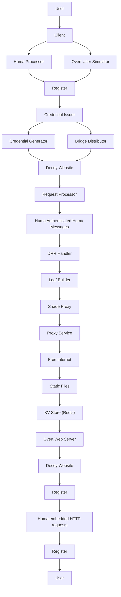
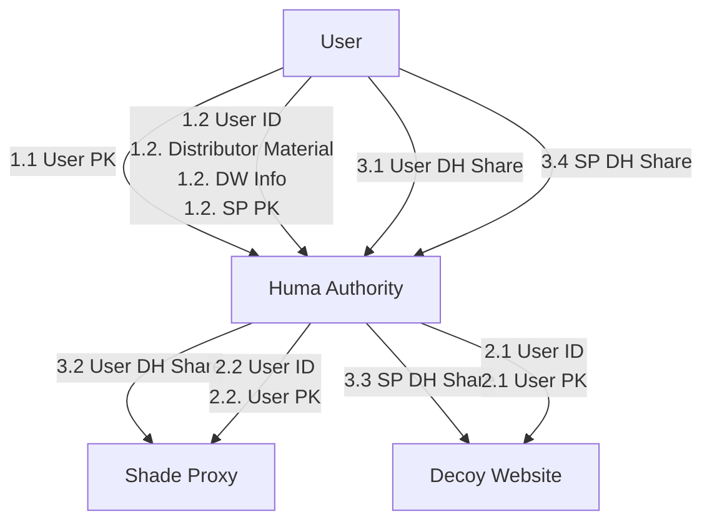
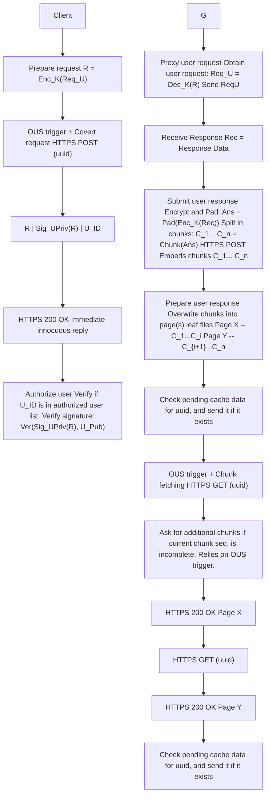

# Huma: Censorship Circumvention via Web Protocol Tunneling with Deferred Traffic Replacement

Sina Kamali

University of Waterloo

sinakamali@uwaterloo.ca

Diogo Barradas

University of Waterloo

diogo.barradas@uwaterloo.ca

Abstract—As Internet censorship grows pervasive, users often rely on covert channels to evade surveillance and access restricted content. Web protocol tunneling tools use websites as proxies, encapsulating covert data within web protocols to blend with legitimate traffic to avoid detection. However, existing tools are prone to detection via traffic analysis, enabling censors to identify the use of such tools via fingerprinting attacks or due to the generation of abnormal browsing patterns.

We present Huma, a new web protocol tunneling tool that addresses existing detection concerns. By deferring covert data transmissions, Huma allows a website participating in circumvention to first respond with unmodified content, while responses embedding covert data are prepared in the background and delivered during the client’s next request, thus avoiding timing anomalies that facilitate fingerprinting. By relying on an overt user simulator modeled after realistic browsing activity, Huma also follows users’ expected browsing behaviors. Lastly, Huma prevents adversary-controlled websites from tying communication endpoints together, enabling straightforward extensions to enable covert communications in Intranet censorship scenarios.

## I. INTRODUCTION

Driven by political and strategic interests, state-level actors are known to actively enforce Internet censorship, particularly during periods of instability, elections, or civil unrest [1]. To suppress dissent and control public discourse, governments deploy multiple technical measures such as social media content moderation [2], [3], keyword filtering [4], [5], DNS tampering [6], [7], IP-based blocking [8] and throttling [9], [10], or the blocking of selected protocols [11], [12].

To bypass censorship, users rely on circumvention tools designed to evade blocking mechanisms [13]–[15]. Most circumvention tools rely on intermediary infrastructure to conceal the destination of user traffic, allowing access to blocked content by disguising it as legitimate/innocuous communication [16].

Among these, protocol tunneling circumvention tools emerged as a compelling alternative. They encapsulate covert data within allowed protocols (e.g., VoIP [17], video [18], games [19], e-mail [20], web [21]), adhering to legitimate traffic patterns, making it hard for censors to identify circumvention activity among typical protocol usage. Recent research improved the resistance of such tunnels against detection [22]– [26], pushing the boundaries of unobservable communications.

Tunneling techniques based on web protocols have shown promise in resisting blocking attempts. Tools such as Balboa [23] and WebTunnel [27] (inspired by HTTPT [21]) encapsulate covert data within HTTPS and/or WebSockets, blending seamlessly with legitimate interactions towards overt and popular websites that deploy circumvention proxy backends via plug-in software modules. These tools rely on the assumption that censors risk substantial collateral damage [28] if they block/interfere with web traffic, as doing so may disrupt access to essential services or widely used platforms, raising the political and economic cost of censorship [21], [23].

Despite leveraging high-value collateral in the hopes of evading blocking, web protocol tunneling tools remain vulnerable to detection via network traffic analysis techniques. Since WebTunnel/HTTPT does not shape traffic patterns (e.g., modulation of flows’ characteristics such as inter-packet timing, burst patterns, or response sizes) [21], a censor can use traffic fingerprinting techniques to distinguish accesses to covert destinations from legitimate pages fetched from the overt website [29]. Balboa enhances protection against fingerprinting by directly replacing any legitimate HTTP content (e.g., HTML, CSS, images) found within TLS records exchanged with the website. However, this process adds non-negligible timing differences, enabling censors to identify Balboa’s activity with up to ∼90% accuracyover different network conditions [23].

Further, existing web protocol tunneling tools fail to provide behavioral realism [25], i.e., to generate user interaction patterns that are consistent with realistic browsing behaviors. Thus, while web protocol tunneling raises the cost of censorship by riding on top of critical web infrastructure, current solutions fall short of hiding both the network-level and behavioral signatures required for effective covert communication.

In this paper, we present Huma1, a new censorship circumvention tool that addresses the unobservability challenges of existing web protocol tunneling solutions by coalescing strong traffic fingerprinting resistance and behavioral realism. To resist traffic fingerprinting, Huma operates a traffic replacement scheme similar to that of Balboa [23], replacing websites’ leaf elements with covert data. However, Huma operates in a deferred fashion; instead of performing data replacement operations directly at each data exchange, websites immediately respond to Huma users’ requests with legitimate content, while covert data is prepared in the background. Covert data is then delivered in response to the same client’s next request, ensuring that no noticeable delays are introduced in the communication. To enforce behavioral realism, Huma relies on an overt user simulator (inspired by OUStral [30] and Raven [25]) that models users’ realistic web browsing activity.

Beyond enhancing the covertness of web protocol tunneling, Huma addresses two dimensions that are often overlooked in prior circumvention research. First, Huma provides native privacy safeguards against Sybil proxies, ensuring that the covert destination contacted by a user (as well as that communication’s contents) remain hidden, even when a Huma-enabled website is controlled by an adversary. Huma achieves this by having users encrypt their messages such that only a trusted intermediary node—located beyond the website itself—can decrypt them, ensuring that the website’s operator cannot access or infer meaningful information. This helps mitigate attacks where censors may compromise Huma-enabled websites or set up honeypot websites to log user activities for strengthening evidence which may lead to later prosecution [13].

Second, Huma is designed to operate as a fallback covert communication tool within rising national Intranet environments [31], [32], such as those tested in Russia [33], [34] and Iran [35]–[37]. Intranets isolate domestic users from the global Internet, allowing access only to a limited set of government-approved services [38]. In this scenario, Huma facilitates covert communications between users within the censored region, despite the censor’s full visibility over the national routing infrastructure. This functionality is enabled by Huma’s traffic replacement scheme, which lets users submit encrypted messages to be stored by the Huma-enabled website, and a private information retrieval (PIR) enabled key-value store [39], which allows users to retrieve messages addressed to them without revealing which messages they are accessing.

We implement a prototype of Huma and evaluate it across multiple dimensions. First, we assess Huma’s resistance to content fingerprinting, examining whether covert data relayed by Sybil nodes can leak information to an adversary. Then, we examine whether covert communications can be distinguished from legitimate web activity. Lastly, we assess Huma’s network performance, quantifying its latency and bandwidth overheads, as well as expected content download rates when enforcing behavioral realism through overt user simulators, which aim to replicate web browsing activity patterns.

## II. INTERMEDIARY-BASED CIRCUMVENTION TOOLS

We now examine the landscape of censorship circumvention tools that rely on intermediary nodes to fetch blocked content, such as proxies or specialized routers that inconspicuously redirect user traffic. We classify prominent tools based on three dimensions that reflect their security features and operational deployment needs (see Table I), aiming to showcase whether and how each tool: a) resists detection against traffic analysis; b) provides privacy safeguards against Sybil proxies, and c) enables for a straightforward deployment while providing reasonable collateral damage. Throughout our analysis, we establish a suite of design goals Huma is set to achieve.

## A. Traffic Analysis Resistance

Unobservability. Regarded as the ability for circumvention tools to resist traffic fingerprinting [59], unobservability is typically achieved by having circumvention tools generate traffic patterns that blend in with those of legitimate (and inconspicuous) applications. Though mostly passive, fingerprinting may also rely on the manipulation of network conditions [59] or interaction with suspected circumvention endpoints [60], [61] to elicit inconsistencies between the traffic generated by circumvention tools and that of legitimate applications [59].

Refraction networking systems rely on backbone routers provided by friendly Internet service providers (ISPs) to relay steganographically-marked packets aimed at covert destinations while seemingly connected to an unblocked overt destination [62]–[64]. Slitheen [40] resists traffic fingerprinting by hiding covert content within the leaf HTTP elements of an overt website’s response. Follow-up systems consider traffic fingerprinting attacks [41], allowing compatibility with existing defenses (e.g., as in the case of Conjure [42]).

CDN-assisted tools make use of content delivery networks (CDNs) to evade detection. CacheBrowser [43] enables access to censored content stored in CDN caches, but is susceptible to fingerprinting. CDN Reaper [44] added a scrambling unit that alters the volume of traffic exchanged between clients and endpoints. Domain fronting [45] hides covert traffic inside HTTPS connections seemingly targeted at allowed hosts on CDN domains, but is also fingerprintable [65]. Similar alternatives, e.g., domain shadowing [46], provide hypothetical solutions against these attacks by segmenting data requests.

Moving target defenses such as SpotProxy [49] and Net-Shuffle [48] aim to change proxy endpoints faster than the censor can block them. While compatible with traffic shaping [66], these tools do not inherently resist traffic fingerprinting. Snowflake’s WebRTC traffic patterns can be identified [67], [68], but considerations exist to obfuscate them [47].

Fully encrypted protocols (FEPs) shroud arbitrary data within a layer of encryption, making generated traffic look random. Modern FEPs shape these random bytes to look similar to usual traffic (e.g., HTTPS), aiming to resist traffic fingerprinting. Yet, widespread tools such as Shadowsocks [51] and Lyrebird can be detected via entropy tests [12], [65], [69].

Programmable frameworks disguise covert traffic as configurable protocols. Proteus [52] enables developers to define custom protocol behaviors to bypass blocking. WATER [53] packages evasion techniques as portable modules, allowing different tools to deploy new circumvention transports without changes to the underlying applications. UPGen [54] generates swaths of plausible encrypted protocols that resemble typical encrypted traffic but which are distinct from known protocols.

TABLE I CATEGORIZATION AND CLASSIFICATION OF CENSORSHIP CIRCUMVENTION TOOLS RELATED TO HUMA.

<table><tr><td rowspan="2">Category</td><td rowspan="2">Circumvention System</td><td colspan="2">Traffic Analysis Resistance</td><td colspan="2">Safeguards against Sybil Proxies</td><td colspan="4">Deployment Environment</td></tr><tr><td>Unobservability</td><td>Behav. Real.</td><td>Dest. Conceal.</td><td>Dest. Conceal. Inf.</td><td>IRI</td><td>CEI</td><td>WEB</td><td>SERV/END</td></tr><tr><td rowspan="3">Refraction Networking</td><td>Slitheen [40]</td><td>✓</td><td>✘</td><td>✓</td><td>✘</td><td> $\bullet$ </td><td></td><td></td><td></td></tr><tr><td>Waterfall of Liberty [41]</td><td>✓</td><td>✘</td><td>✓</td><td>✘</td><td> $\bullet$ </td><td></td><td></td><td></td></tr><tr><td>Conjure [42]</td><td>✓</td><td>✘</td><td>✓</td><td>✘</td><td> $\bullet$ </td><td></td><td></td><td></td></tr><tr><td rowspan="4">CDN-Assisted</td><td>Cache Browser [43]</td><td>✘</td><td>✘</td><td>✘</td><td>-</td><td></td><td> $\bullet$ </td><td></td><td></td></tr><tr><td>CDN Reaper [44]</td><td>✓</td><td>✘</td><td>✘</td><td>-</td><td></td><td> $\bullet$ </td><td></td><td></td></tr><tr><td>Domain Fronting / meek [45]</td><td>✘</td><td>✘</td><td>✓</td><td>✘</td><td></td><td> $\bullet$ </td><td></td><td></td></tr><tr><td>Domain Shadowing [46]</td><td>✓</td><td>✘</td><td>✓</td><td>✘</td><td></td><td> $\bullet$ </td><td></td><td></td></tr><tr><td rowspan="3">Moving Target Defenses</td><td>Snowflake [47]</td><td>✘</td><td>✘</td><td>✓</td><td>✘</td><td></td><td></td><td></td><td> $\bullet$ </td></tr><tr><td>NetShuffle [48]</td><td>✘</td><td>✘</td><td>✓</td><td>✘</td><td></td><td> $\bullet$ </td><td></td><td></td></tr><tr><td>SpotProxy [49]</td><td>✘</td><td>✘</td><td>✓</td><td>✘</td><td></td><td> $\bullet$ </td><td></td><td></td></tr><tr><td rowspan="2">Fully Encrypted Protocols</td><td>obfs4 / Lyrebird [50]</td><td>✘</td><td>✘</td><td>✓</td><td>✘</td><td></td><td></td><td></td><td> $\bullet$ </td></tr><tr><td>Shadowsocks [51]</td><td>✓</td><td>✘</td><td>✓</td><td>✘</td><td></td><td></td><td></td><td> $\bullet$ </td></tr><tr><td rowspan="3">Programmable Frameworks</td><td>Proteus [52]</td><td>✓</td><td>✘</td><td>✓</td><td>✘</td><td></td><td></td><td></td><td> $\bullet$ </td></tr><tr><td>WATER [53]</td><td>✓</td><td>✘</td><td>✓</td><td>✘</td><td></td><td></td><td></td><td> $\bullet$ </td></tr><tr><td>UpGen [54]</td><td>✓</td><td>✘</td><td>✓</td><td>✘</td><td></td><td></td><td></td><td> $\bullet$ </td></tr><tr><td rowspan="4">Protocol Mimicking</td><td>StegoTorus [55]</td><td>✘</td><td>✘</td><td>✓</td><td>✘</td><td></td><td></td><td></td><td> $\bullet$ </td></tr><tr><td>SkypeMorph [56]</td><td>✘</td><td>✘</td><td>✓</td><td>✘</td><td></td><td></td><td></td><td> $\bullet$ </td></tr><tr><td>FTE [57]</td><td>✘</td><td>✘</td><td>✓</td><td>✘</td><td></td><td></td><td></td><td> $\bullet$ </td></tr><tr><td>Marionette [58]</td><td>✓</td><td>✘</td><td>✓</td><td>✘</td><td></td><td></td><td></td><td> $\bullet$ </td></tr><tr><td rowspan="4">Protocol Tunneling</td><td>Protozoa [22]</td><td>✓</td><td>✘</td><td>✓</td><td>✘</td><td></td><td></td><td></td><td> $\bullet$ </td></tr><tr><td>Camoufler [26]</td><td>✓</td><td>✘</td><td>✓</td><td>✘</td><td></td><td></td><td></td><td> $\bullet$ </td></tr><tr><td>Telepath [24]</td><td>✓</td><td>✘</td><td>✘</td><td>-</td><td></td><td></td><td></td><td> $\bullet$ </td></tr><tr><td>Raven [25]</td><td>✓</td><td>✓</td><td>✘</td><td>-</td><td></td><td></td><td></td><td> $\bullet$ </td></tr><tr><td rowspan="4">Web Protocol Tunneling</td><td>WebTunnel [27]</td><td>✘</td><td>✘</td><td>✓</td><td>✘</td><td></td><td></td><td> $\bullet$ </td><td></td></tr><tr><td>HTTP [21]</td><td>✘</td><td>✘</td><td>✓</td><td>✘</td><td></td><td></td><td> $\bullet$ </td><td></td></tr><tr><td>Balboa [23]</td><td>✓</td><td>✘</td><td>✓</td><td>✘</td><td></td><td></td><td> $\bullet$ </td><td></td></tr><tr><td>Huma</td><td>✓</td><td>✓</td><td>✓</td><td>✓</td><td></td><td></td><td> $\bullet$ </td><td></td></tr></table>

Protocol mimicking tools imitate popular protocols. For instance, Skypemorph [56] mimics videoconferencing traffic, while StegoTorus [55] imitates HTTP traffic. However, they failed to account for implementation quirks that could be exploited to find inconsistencies in the mimicked traffic, rendering them observable [59]. FTE [57] generates ciphertexts that conform to the expected format of an allowed protocol, but is vulnerable to entropy tests [65]. In later efforts, Marionette [58] offers programmable mimicry of stateful protocols; however, imitation involves a labor-intensive effort [59].

Protocol tunneling tools directly embed data into the inputs of a cover protocol. For instance, FreeWave [17] modulated covert data into audio transmitted via VoIP calls. However, despite adhering to the cover protocol’s specification, mismatches between the characteristics of legitimate/covert inputs transmitted via the cover protocol could still reflect on abnormal traffic patterns, making this and other similar tunneling approaches vulnerable to detection [70], [71]. Recent tools enhanced tunneling mechanisms, ensuring that the injection of covert data will not lead to the cover protocol to produce abnormal traffic patterns. They rely on applications such as email (Raven [25]), videoconferencing (Protozoa [22]), games (Telepath [24]), or instant-messaging (Camoufler [26]).

Web protocol tunneling tools can be perceived as a subcategory of the aforementioned systems and aim to circumvent censorship by embedding data in overt web requests to websites that act as proxies to covert destinations. In HTTPT [21] and WebTunnel [27], the client initiates a standard TLS connection, then upgrades it to a WebSocket while embedding the covert destination’s address in the upgrade request. The overt website relays this to the covert destination and completes the WebSocket handshake, enabling the client to communicate with the covert server through the established WebSocket channel. Although these methods aim to blend with legitimate traffic, they modify the expected communication behavior with the overt website, failing to preserve expected traffic patterns [21], [72]. Similarly to Slitheen [40], Balboa [23] exchanges leaf content on TLS-protected elements to resist traffic fingerprinting. However, data replacement introduces timing variations which may allow censors to detect Balboa [23].

Behavioral realism. This property prescribes that the observable behavior of a cover application used for circumvention should be similar to its typical, genuine usage [25].

Few existing circumvention tools account for behavioral realism. Raven [25] operates via e-mail exchanges and targets a realistic e-mail usage inspired by users’ historical behavior; it accomplishes this by training a generative model based on existing datasets of e-mail exchanges (considering their frequency, length, and sending times), restricting covert data exchanges to follow these patterns. OUStral [30] is an add-on meant for web traffic replacement systems (e.g., Slitheen [40], Balboa [23]) which generates activity patterns by following probabilistic models designed after human browsing studies (e.g., [73]–[75]). OUStral can bypass bot detection filters, but does not adhere to users’ historical browsing profile.

Design goal 1. Protect against traffic fingerprinting attacks and provide behavioral realism guarantees.

## B. Safeguards against Sybil Proxies

The deployment of strong privacy safeguards against Sybil proxies is a desirable (but often overlooked) requirement in scenarios in which a censor may be willing to deploy its own proxies among the legitimate circumvention infrastructure. The lack of these safeguards allows censors to temporarily allow user connections to blocked destinations while silently observing user activities, thus potentially collecting incriminating evidence that could be used for prosecution [13].

Destination concealment. This property refers to a privacy protection offered to the users of circumvention tools, in which the identity of the intended destination of circumvention traffic is hidden from the proxy handling the user’s traffic. Most intermediary-based circumvention tools acknowledge this risk, treating proxies as untrusted, but relegate destination concealment to auxiliary schemes—typically onion routing via Tor [76]. In this deployment model, client traffic is encrypted and routed through Tor, preventing proxies from directly identifying a user’s final destination. Secure connections to the Tor network can be established twofold [77]: a) directly, having the proxy act as the first hop in a Tor circuit—such as in Conjure, meek, Lyrebird, or WebTunnel; or b) indirectly, first to the proxy server itself, and then through Tor for a total of four hops between client and destination—such as in Shadowsocks, Snowflake, or Camoufler. While this form of destination concealment is not intrinsic to the circumvention tools themselves, most tools mentioned in Table I support it.

Despite aiding in destination concealment, Umayya et al. [77]’s study reveals that pairing Tor with existing circumvention approaches is rather slow and unreliable. Moreover, given some tools’ (e.g., Telepath, Raven) focus on achieving strong traffic analysis resistance, they lack the throughput and latency requirements to establish connections via Tor, and thus to achieve destination concealment through it.

Destination concealment against inference. While destination concealment mechanisms ensure that the destination of circumvention traffic is not outright revealed to a proxy operator (e.g., should circumvention traffic be forwarded via Tor), a censor who controls a proxy may still deduce a circumvention tool user’s destination using techniques such as website fingerprinting [29]. This is similar in spirit to attacks that assume an adversary may become a guard node for a user’s Tor traffic, thus being in the position to launch this kind of traffic analysis attacks [78]. A tool offering destination concealment against inference would explicitly thwart such attacks. Yet, as we can observe in Table I, no existing circumvention tool provides these safeguards.

Design goal 2. Develop native privacy safeguards against Sybil proxies for censorship circumvention tools.

## C. Deployment and Collateral Damage

We define deployability as the extent to which a circumvention tool can be operated by entities involved in the anti-censorship enterprise, ranging from requiring significant industry support to being fully self-deployable by volunteers.

Internet routing infrastructure (IRI). Refraction networking tools depend on the cooperation of routing infrastructure operators, typically ISPs, who are willing to operate and support the service’s costs [79]–[81]. However, this dependence on broad ISP participation poses a significant deployment challenge, as the associated costs can be substantial [82], and ISPs may be hesitant to align themselves with circumvention initiatives [48]. Still, if successfully and widely deployed, refraction networking becomes difficult to disrupt; censors attempting to divert network traffic away from Internet routes that deploy refraction networking face high operational costs [81], [83].

Cloud- and edge-native infrastructure (CEI). Some circumvention tools exploit features provided by CDNs and cloud platforms in unintended ways, leading service providers to remove key features used for circumvention (e.g., the disabling of domain fronting by some CDN providers [84], [85]). While new tools adapt to such changes (e.g., domain shadowing [46] on CDNs, or high-rotation proxies [49] on transient cloud instances), their reliance on undocumented or prone-to-change platform behaviors places these tools near the end of the deployability spectrum. Tools like NetShuffle [48] rely on edge network operators, making them easier to deploy than industry-backed CEI infrastructure. Overall, CEI-based circumvention imposes a significant collateral, as censors often need to block CDNs or entire IP address blocks to deter it.

Websites (WEB). Other circumvention tools depend on the cooperation of website operators, but demand for specific functionalities as deployment prerequisites, potentially limiting the pool of websites suitable for supporting circumvention. For instance, HTTPT [21] and WebTunnel [27] require websites that support WebSocket to establish a covert channel (§II-A). Yet, WebSocket is mostly used for real-time communication workloads and its deployment has stagnated, with an adoption rate as low as 6.3% in 2021 [86]. Instead, tools such as Balboa [23] or cloak [87] are straightforward to deploy. Tools in this category pose a moderate risk of collateral damage for censors; the more popular the cooperating website is, the greater the collateral the censor may incur by blocking it [21].

Commodity servers and endpoints (SERV/END). The most basic requirement for a proxy-based circumvention tool is simply the availability of a server. As a result, most tools within traffic mimicking, traffic tunneling, and fully encrypted protocols belong to this category—requiring only a machine capable of running the proxy, whether it’s a dedicated server or a temporary, ad-hoc endpoint such as a laptop [47]. Thus, tools in this category are generally the most straightforward to deploy by volunteers, requiring no third-party support. However, ad-hoc proxy support—such as that provided by friends or family members operating protocol tunneling proxies [22], [26]—limits broader accessibility, leaving the majority of users in need of circumvention without viable options. Moreover, should a censor find reliable methods to identify these proxies, it can block them with little to no collateral damage [48].

Design goal 3. Enable reasonable collateral and low 3rdparty dependence circumvention via Web deployments.

## III. HUMA

We now introduce Huma, a new censorship-resistant communication tool based on website deployments. This section describes Huma’s threat model, architecture, and workflow.

## A. Threat Model

Adversary’s capabilities. We consider a state-level adversary whose main goal is to identify any Internet-based information flows it deems sensitive, and which traverse both within and across the country’s border. This adversary controls all ISPs within the censored region, enabling passive interception of all network traffic within and across national borders. In practice, real-world adversaries are known to deploy traffic analysis apparatuses at cross-border [88], regional [89], and AS-level [90] vantage points. The adversary can deploy deep packet inspection (DPI) filters to detect objectionable content and apply advanced traffic analysis techniques, e.g., based on machine learning, to identify the use of circumvention tools.

Instead of immediately blocking information flows deemed objectionable, we consider our adversary to be interested in learning about the Internet destinations and/or contents that circumvention tools’ users might access, to later prosecute them with aggravating legal grounds. Thus, the adversary may compromise existing proxy-based circumvention infrastructure and/or deploy Sybil circumvention proxies to tap on users’ connections and unveil the destination of circumvention traffic. This concern is supported by the study of Xue et al. [13], where participants expressed concerns that circumvention tools could be operated as honeypots designed to monitor user activities. Also, should the circumvention tools leveraged by users provide destination concealment (see §II-B), the adversary will attempt to fingerprint the encrypted connections established through proxies under its control to infer users’ destinations.

Lastly, we admit that the adversary will choose to block any information flows it deems objectionable should it be unable to inspect their contents or observe/infer their intended destination. This will be the case should: a) the adversary be able to compromise the proxy infrastructure, but users leverage circumvention tools that provide destination concealment against inference, or; b) in cases where the adversary has no control over proxies, and may only resort to traffic analysis to identify (and then block) circumvention tools.

Adversary’s limitations and out-of-scope attacks. We assume an adversary that seeks to minimize collateral damage from coarse-grained measures such as applying a blanket ban to HTTPS connections. The adversary is also computationally bounded and unable to break standard cryptographic primitives (e.g., allowing it to snoop into TLS-protected traffic). Like other web protocol tunneling tools (e.g., Balboa [23]), Huma also relies on the assumption that TLS connections are not intercepted by censors. In adversarial environments where the use of TLS is man-in-the-middled (e.g., by forcing users to install rogue root certificates) [91], the usage of Huma would become detectable. However, such scenarios remain relatively rare due to the high operational complexity involved and pressure from international peers. For instance, Kazakhstan’s earlier attempts at traffic interception led the local government to face lawsuits from ISPs, banks, and foreign entities, all concerned that intercepting TLS traffic would undermine the security of all Internet communications originating from the country and jeopardize related commercial interests [92].

flowchart

Fig. 1. Overview of Huma’s architecture and high-level workflow.

## B. Core Architectural Components

This section introduces Huma’s main architectural components, which are illustrated as purple boxes in Figure 1.

Huma authority. The Huma authority (HA) is located outside the censored region and free from adversarial influence. It embodies a trusted component of Huma, and is the initial point of contact for: a) new users interested in leveraging Huma to circumvent Internet censorship, and b) volunteer website operators hoping to contribute to Huma’s infrastructure (§IV-A).

While bootstrapping communications into central points-oftrust is a well-known challenge for circumvention [93], lowbandwidth channels such as e-mail and instant-messaging have succeeded in practice, e.g., Snowflake [47] bridge acquisition via Rdsys. Our design also assumes that the HA leverages a robust proxy distribution service (e.g., Lox [94]), precluding an adversary from registering as multiple users and successfully enumerating the entirety of the Huma proxy infrastructure.

Secure proxies. Huma relies on two interconnected components that provide a secure proxy abstraction: a) volunteeroperated Decoy Websites (DWs), and b) trusted Shade Proxies (SPs) maintained by Huma operators. Decoupling proxy functionality among these components allows Huma to achieve resistance against Sybil proxies (see §IV-C).

Similar to WebTunnel bridges [95], DWs appear as ordinary, benign websites, which serve as entry points into Huma. While providing legitimate content to typical web users, DWs inspect incoming traffic for steganographic tags embedded within HTTP payloads that signal that a message is intended for the Huma sub-system—in such cases, DWs explicitly interface with SPs for mediating users’ circumvention data. In practice, SPs are responsible for fetching the actual contents requested by Huma users (from their intended destinations), while shrouding this information from DWs, thus tackling content/destination fingerprinting concerns (§II-B).

Huma proxies are geared towards providing access to web content (mainly webpages and their associated assets). Streaming workloads are expected to reduce the interactivity of Huma’s covert channel, thus being more adequate for covert bulk downloads, whereas high-interaction tasks with short message exchanges and tight latency requirements may introduce constraints on the efficiency of traffic replacement operations, instigating an interesting direction for future work.

Huma client. Huma users run a client assigned with two main tasks: a) encrypting and embedding a user’s circumvention requests into benign-looking encapsulating HTTP requests sent to SPs via DWs (§IV-B1), and b) retrieving the requested data from the DW backend via a double-request receive protocol (§IV-B2). When Huma is run by a user, her browsing patterns—towards DWs and the web in general—are ruled by an overt user simulator (OUS) (§IV-B3), which ensures that the user’s browsing patterns are consistent with her typical behavior. This OUS is informed by historical browsing data, helping Huma achieve behavioral realism (§II-A).

## C. Overview of the Huma Workflow

This section outlines Huma’s operational workflow, whose individual steps (in yellow Y ) are also illustrated in Figure 1.

User registration and fetch of Huma credentials. To issue a registration request (§IV-A1), Alice first generates a key pair and queries the HA for obtaining a set of bootstrapping data for providing her access to the system (step 1 ). Once the HA has validated Alice’s request, it will reply with the requested bootstrapping data, which includes a user identifier for accessing Huma-enabled websites, cryptographic materials required to participate in the bridge distribution protocol (e.g., anonymous Lox credentials if using Lox [94]), together with a list of DW addresses and key-exchange material that enable Huma proxy-based circumvention. After responding to Alice, the HA distributes Alice’s public key and her identifier to her assigned DWs and SP, while also sending her key-exchange material to the SP (step 2 ). This ensures that DWs can validate Alice’s authorization to access the system, and that SPs can conceal the contents and destination of Alice’s covert communications from DWs themselves.

Placing requests towards Huma proxies. To issue a covert request for an otherwise blocked website’s content (e.g., cnn.com), Alice encrypts the request intended to be read by the SP using a symmetric key exchanged with the SP via the HA during registration (see §IV-A1). Alice then embeds this encrypted payload, along with her public key and the user identifier given by the HA, within the body of a benign-looking HTTPS request (see §IV-B1) directed to a DW (step 3 ).

To ensure that timing anomalies (which could reveal the covert channel [23]) are avoided when processing this special request, the DW immediately processes the encapsulating HTTP request, replying with a legitimate webpage to the client (see §IV-B2). However, after replying, the DW forwards the original HTTP payload to its local Huma backend, where the request is scanned for Huma-related content (step 4 ).

flowchart

Fig. 2. Bootstrapping data shared by the Huma authority during user registration. Each phase is color-coded: blue for issuing user credentials, red for provisioning servers with client information, and green for key agreement.

Once the Huma backend receives a request for analysis, it authenticates the user using her credentials (i.e., the public key and identifier facilitated by the user), terminating silently if authentication fails (§IV-A1). If the user’s credentials are correctly validated, the DW forwards the user’s request to the paired SP, where it is decrypted and processed (step 5 ). Throughout this process, a DW operator does not learn any details about the contents or destination of a user’s request— only whether a specific user can access Huma (§IV-C).

Once the SP processes the request and fetches the user’s desired content, it encrypts the response using the symmetric key shared between Alice and the SP, before padding and returning it to the DW (step 6 ). The DW must then allow the client to retrieve this response. To this end, the response is processed by a double-request receive (DRR) handler that prepares Alice’s data to be fetched (§IV-B2).

Retrieving responses from Huma proxies. The DRR handler embeds Alice’s encrypted response within a copy of a legitimate webpage served by the DW, following a data replacement scheme akin to that of Slitheen [40] or Balboa [23]. This modified page retains the size and format of the original page, appearing unchanged to an adversary observing the encrypted HTTPS traffic (§V-D. Once the modified page is prepared, the DRR handler signals Huma’s request processor to serve Alice’s upcoming request using the modified webpage. When Alice sends her next request, whether benign or Humaembedded, the DW immediately replies with the prepared response, thus fulfilling the original request and finishing DRR (step 7 ). This immediate response is made possible through a fast key-value store that the DW always checks before responding to any legitimate or Huma request (§IV-B2).

## IV. DETAILS ON HUMA’S OPERATIONS

## A. Managing Users and the Infrastructure

1) User Registration and Credential Distribution: Figure 2 illustrates the bootstrapping process followed by a new Huma user. This process includes three main phases, responsible for a) issuing credentials to users; b) provisioning DWs and SPs with necessary information to authenticate Huma users, and c) establishing a shared key among the user and the SP.

Credential issuance. To access Huma, a user must first generate a key pair $( U _ { P u b } , U _ { P r i v } )$ to enable her authentication before the system through the use of cryptographic signatures. The authentication scheme used in each region is selected by the Huma authority (HA) based on local network conditions.

In low-bandwidth regions, compact schemes like EdDSA [96] are preferable, while high-bandwidth regions can use faster RSA-based signatures [97] to reduce DW load.

After generating her key pair, Alice registers with the HA using her $U _ { P u b } .$ . The HA responds with a unique user ID $( U _ { I D } )$ , credentials for participating in the bridge distribution protocol, and a list of DW domain names—each corresponding to an entry point into the Huma that the user can now access.

Provisioning DWs and SPs with authentication material. To complete the registration workflow, the HA must ensure that both DWs and SPs are equipped to authenticate and authorize requests from the new user. For each DW in the user’s list, the HA shares the required data for validating the user’s credentials, which includes the user’s ID $( U _ { I D } )$ and her public key $( U _ { P u b } )$ . The HA also shares this info with the SPs.

Key agreement between users and SP. The HA will also act as a secure intermediary between the user and a given SP, allowing them to run a key agreement protocol (such as Diffie-Hellman) to produce a symmetric key for their future communications, without requiring the user and SP to directly contact each other. This allows DWs to act as blind relays, preventing them from observing or modifying the encrypted data flowing between the user and SP (§IV-C). The shared secret key can be ratcheted [98] to provide forward secrecy.

2) DW Registration and DW-to-SP Assignment: Operators who wish to volunteer and turn their websites into DWs must first register with the Huma authority (HA).

Website ownership verification. The registration process begins with the operator initiating contact and providing verifiable proof of domain ownership. To prevent malicious registration attempts, Huma requires that website operators provide evidence of control over the website they wish to enroll. A simple and effective mechanism is to request that the operator produce a signature over a challenge message using the private key associated with the website’s HTTPS certificate. This signature can then be verified by the HA using the public key embedded in the website’s certificate.

Centralized DW-to-SP assignment. Once ownership is verified, the HA assigns an $\mathrm { S P }$ to the newly registered DW. Important to Huma’s resilience against Sybil proxies, SPs are not chosen by operators. Instead, they are centrally managed by the HA, thus ensuring that each DW–SP pair operates independently. The aim is to prevent the possibility of collusion between DWs and SPs, which could lead to compromising confidentiality and destination concealment (§II-B).

Scalable SP deployment. The costs of deploying SPs can be amortized by hosting them as lightweight proxies atop existing cloud infrastructure or embedded within systems like SpotProxy [49], which substantially reduce the costs of operating cloud proxies via cloud spot instances. In addition, a single SP can support users connecting through multiple DWs. Because SPs operate from network locations outside the censor’s control, compromising one DW may allow the censor to block its connection to the SP, but it does not affect the ability of other DWs to reach the same SP.

## B. Achieving Resistance against Traffic Analysis

1) Huma Request Generation and Authentication: When placing an encrypted request R towards a SP (via a DW), Alice generates and includes a signature of this request $S i g _ { U _ { P r i v } } ( R )$ alongside her $U _ { I D }$ . This data is then embedded into a benignlooking request sent to a valid DW endpoint. Next, we detail how Huma users covertly embed encrypted request data and how DWs can authenticate the requests sent by users.

Request generation and embedding. Similar to Nasr et al. [41], Huma clients periodically send and collect benign requests to DWs when no Huma requests are pending to sent out, recording relevant metadata such as request size and format. This data later serves as a template for embedding Huma content to help maintain consistency in request size and structure. For instance, a DW may offer HTTP POST endpoints for actions such as commenting, posting reviews, or uploading files. A Huma client that has recorded past interactions with these endpoints can select the most appropriate one for embedding a covert request based on the content size, adhering to benign activity patterns before the DW.

Requests and credential verification. After preparing and embedding her covert request, Alice will send it to the DW. Upon responding to Alice with a benign response as per the deferred reply protocol (see §IV-B2), Alice’s request is forwarded to the Huma backend, where the encapsulated information is used to verify her authorization to access the DW. To this end, the DW checks if the $U _ { I D }$ included as part of the user’s request had been communicated to it by the HA, and then verifies whether $S i g _ { U _ { P r i v } } ( R )$ can be validated using the $U _ { P u b }$ matching that $U _ { I D }$ . If any of the above checks fail due to missing (as in the case of typical web users) or invalid $U _ { I D }$ and $S i g _ { U _ { P r i v } } ( R )$ information (as in the case of probing attempts by censors), the DW will simply silently fail. This prevents active probing attacks from Huma-aware censors who may send Huma-compatible requests to websites at large, hoping to elicit website behavior leading to the identification of DWs.

2) Secure Data Retrieval Via Deferred Replies: To resist timing-based fingerprinting, Huma adopts a deferred reply strategy where all DWs reply immediately to incoming requests, regardless of whether the request carries covert Huma traffic. Any additional processing—such as authenticating the user (§IV-B1) or querying the SP—is deferred to a backend that operates asynchronously. Unlike Balboa [23], this ensures that Huma-related requests are indistinguishable from legitimate traffic based on response timing alone, thus eliminating telltaling cues that a DW may be serving circumvention traffic.

Double-request receive. The deferred reply processing model lays the foundation for Huma’s double-request receive (DRR) protocol for data delivery, depicted in Figure 3. DRR starts when Alice requests a covert webpage through a DW (step 1 ). The DW will always immediately respond to the user, per the deferred response processing protocol. To respond to users, the DW always queries a local key-value (KV) cache to check if the requesting user has a modified page in-store for them. Since Alice is just issuing a request, we assume that she has no modified page in-store for her and her cache will miss, thus immediately receiving a benign page upon request (step 2 ).

```mermaid
graph TD
  A["Client"] --> B["Huma Processor"]
  B --> C["User"]
  C --> D["Overt User Simulator"]
  D --> E["User"]
  E --> F["Decoy Website"]
  F --> G["Request Processor"]
  G --> H["SHade Proxy"]
  H --> I["Proxy Service"]
  I --> J["Encrypted Response Chunked and padded"]
  F --> K["Set the next response"]
  K --> L["Overt Web Server"]
  L --> M["If miss"]
  M --> N["KV Store (Redis)"]
  N --> O["Static Files"]
  O --> P["User"]
  P --> Q["User"]
  Q --> R["User"]
  R --> S["User"]
  S --> T["User"]
  T --> U["User"]
  U --> V["User"]
  V --> W["User"]
  W --> X["User"]
  X --> Y["User"]
  Y --> Z["User"]
  Z --> AA["User"]
  AA --> AB["User"]
  AB --> AC["User"]
  AC --> AD["User"]
  AD --> AE["User"]
  AE --> AF["User"]
  AF --> AG["User"]
  AG --> AH["User"]
  AH --> AI["User"]
  AI --> AJ["User"]
  AJ --> AK["User"]
  AK --> AL["User"]
  AL --> AM["User"]
  AM --> AN["User"]
  AN --> AO["User"]
  AO --> AP["User"]
  AP --> AQ["User"]
  AQ --> AR["User"]
  AR --> AS["User"]
  AS --> AT["User"]
  AT --> AU["User"]
  AU --> AV["User"]
  AV --> AW["User"]
  AW --> AX["User"]
  AX --> AY["User"]
```

flowchart

Fig. 3. Deferred processing mechanism applied to double-request receive.

After responding to Alice, her request is forwarded to the Huma backend for authentication (§IV-B1). Upon successful verification, her request will be forwarded to the SP for fulfillment (step 3 ). Then, the SP attempts to decrypt Alice’s request using the agreed-upon symmetric key (§IV-A1), failing silently if decryption is unsuccessful or no key is found for the user. It then acts as a proxy, fetching the requested content, padding and encrypting the response, before splitting it into predetermined chunk sizes (§IV-C). Finally, the encrypted chunks of data are submitted back to the DRR handler at the DW, where they are prepared for retrieval by the user (step 4 ).

The DW’s DRR handler prepares the response using the following steps. First, it samples a copy of a legitimate webpage served by the DW along with all its leaf nodes (e.g., media content and scripts). This page will act as a cover for delivering the actual response. If the combined size of the leaf nodes on this page is insufficient to hold the full response, Huma falls back on one of its multi-page delivery mechanisms (§IV-B4). Otherwise, the DRR handler overwrites the encrypted response chunks into the leaf files, ensuring that the resulting objects preserve the original file sizes. Thus, from the perspective of a network eavesdropper, the TLS records generated by the website when conveying covert data remain indistinguishable from those of an ordinary webpage fetch. Each leaf node includes metadata tags indicating its order and content length, allowing the Huma client to reconstruct the response. Leaf nodes are written to disk on the DW, as if they were legitimate leaf contents. The HTML of the sampled page is then modified to reference the newly created leaf files, resulting in a complete response page. Finally, the path to this page is added to Alice’s queue in the KV store (step 5 ).

When Alice issues another request, either benign or Humaembedded (step 6 ), the DW immediately attempts to respond to her request as per the deferred reply strategy. As previously described, the DW will first query the KV cache using a uuid key included in all users’ cookies (Huma or otherwise). This time, the cache query results in a hit, as covert content is available for Alice. Ultimately, the DW responds using the cached webpage (step 7 ) and removes it from Alice’s queue by popping it from the key-value store. If Alice’s request is Huma-embedded, it is forwarded as usual to the Huma backend (step 3 ) and re-initiates the deferred reply cycle.

Appendix A takes a closer look at the DRR protocol, making exchanged message contents and entities’ roles explicit.

3) Behavioral Realism via Overt User Simulation: Huma ensures that all client-to-DW interactions resemble those of ordinary web users. This is achieved through an overt user simulator (OUS), which intercepts client-initiated communications and wraps them in realistic browsing activity. Without such a mechanism, clients could inadvertently issue an unusually high number of requests to a small set of DWs, representing anomalous behavior that censors can detect through statistical modeling. Huma’s OUS emulates human browsing by orchestrating benign-looking requests that blend Huma with legitimate HTTPS traffic. It draws inspiration from prior work on the synthetic generation of plausible user behavior [25].

Huma’s OUS training and deployment modes. Huma supports two deployment modes for its OUS: a) a personalized training mode, and b) a pretrained mode.

First, in the personalized mode, the user runs the OUS in a “learning phase” over several days, allowing it to record their natural browsing habits passively. This results in a customized behavior model that helps provide strong resistance against profiling-based attacks by reflecting characteristics such as realistic inter-request timing and website revisiting patterns. Notwithstanding, a user could avoid having sensitive destinations replayed by the OUS by selectively excluding them from the set of browsing sessions used as training input to the OUS.

Second, users may download a pretrained OUS instance during their registration process with the Huma authority. This model aims to reflect typical usage patterns of users within a given region or demographic, and could be used without a warm-up phase. While convenient and lowering the barrier of entry to new Huma users, it may present higher risks of steering away from a user’s typical browsing patterns. Huma delegates the choice of deployment mode to the user, allowing them to trade off between behavioral fidelity and ease of setup.

Huma OUS’ runtime behavior. The core of the OUS is a headless browser that simulates user behavior such as page visits, clicking internal and external links, and revisiting previously accessed content. The OUS schedules outgoing requests based on a behavior script derived from its model, issuing benign requests to DWs even when no covert data is pending.

When Huma users wish to place requests (or retrieve covert data from requests placed in the past), the OUS draws from a queue of pending Huma requests and embeds them into realistic browsing sessions. Requests are delayed and issued only when a behavior rule allows, thereby preventing anomalous browsing patterns that might reveal the presence of hidden communication. The integration of the OUS with Huma’s deferred content replacement and request scheduling ensures that operations tied to cross-site multi-page responses (§IV-B4) are hidden within a flow of plausible user behavior.

4) Multi-page Fallback Mechanisms: Ideally, a user’s covert response fits within a single webpage’s leaf objects. When it exceeds this capacity, Huma resorts to two fallbacks.

Same-site multi-page fallback. If the size of the leaf objects of the originally sampled page is insufficient to carry the entire SP response, Huma allows the DW to split the user’s response across multiple requests by selecting additional webpages from the same DW and performing the same substitution process. The Huma client software is aware of the mapping between requests and response fragments, allowing it to reassemble the complete response after fetching all necessary pages.

Cross-site multi-page fallback. To reflect plausible browsing behavior and avoid raising suspicion through repeated accesses to the same DW, Huma’s overt user simulator (§IV-B3) will direct users to visit other seemingly unrelated, legitimate websites. However, this would prevent a user relying on samesite multi-page fallback from gathering her intended response by repeatedly querying the DW she is currently connected to— at least, until the OUS instructs the user to revisit the website.

To tackle this issue, Huma allows users to retrieve different segments of a response by visiting multiple DWs, which are all linked to the same SP. This process calls for two requirements: a) the SP stores the entirety of the response to a user’s request locally for a predetermined period, and b) the client includes a progress counter that keeps track of how many data segments it has received in each DRR request placed towards a DW. If a user switches to a different DW before fetching the entirety of a response, the new DW can query the SP for only the remaining segments the user has yet to receive. The combination of these mechanisms allows clients to switch between DWs, possibly accessing them in any order, while still correctly reassembling the full response. Altogether, this cross-site fallback mechanism can improve both covertness and reliability: it is compatible with behavioral realism enforcement by distributing access patterns across different DWs while being robust against the potential temporary downtime (or even blocking) of any individual DW.

To avoid starving SPs’ storage resources, SPs keep responses to user requests for a short tunable period $( \mathrm { e . g . }$ , 30min), deleting them either when the user fetches the response completely or the above period elapses. In the former case, DWs are expected to cooperate with the SP, signaling whether a user has finished fetching a pending response.

## C. Achieving Resistance against Sybil Proxies

To protect user privacy, Huma separates duties between DWs and SPs. Untrusted DWs relay encrypted messages and serve data, while trusted SPs decrypt requests and contact covert destinations, preventing user-destination linkage.

Encrypted communication and write obfuscation. After an SP fetches a response for a user’s request (§IV-B2), it pads and splits the data into fixed-size data chunks before encrypting the result and submitting that back to the DW. This mechanism provides an important layer of protection against malicious DWs. Each data chunk is padded to a uniform size, complicating content-based fingerprinting. The chunk size is controlled by a configurable parameter that balances resistance to fingerprinting against network overhead; we evaluate various settings in §V-C. As a result, a DW only learns the number of padded chunks (and the sum of their size) retrieved by the user; our evaluation shows this knowledge can be made rather uninformative for a fingerprinting adversary.

Curtailing the attack surface with compromised DWs. We assume that a Huma user is identifiable by DWs through their IP address and public key used for authenticating requests. Nevertheless, even if a DW is compromised by a censor, the censor gains no visibility into what information is being exchanged or which covert destinations are being accessed by users. Although the $\mathrm { S P }$ can decrypt user requests, it possesses access only to a user’s randomly assigned $U _ { I D }$ , but no network-layer information about the user for whom it is resolving requests. Even if a rogue DW deliberately sends such information to the SP, SPs are considered trusted elements of the Huma infrastructure and are configured to simply ignore supplemental data conveyed to them, other than a user’s $U _ { I D }$ and the network destination to access and fetch content from.

## D. Deployment within Intranets

Re-purposing Huma for Intranet scenarios. Unlike traditional anonymous messengers (e.g., Riposte [99], Express [100]), Huma can help ensure user privacy and blocking resistance, protecting users not only from potentially malicious messaging servers but also from adversaries attempting to detect or disrupt covert communication altogether.

The main architectural change in Huma’s Intranet mode is the removal of SPs and the integration of private information retrieval (PIR) databases in DWs to serve as user mailboxes. This prevents DWs from learning communication patterns or metadata about conversation participants. We adopt Pung [39] as our PIR database due to its key-value store design.

Modified client exchanges in Intranets. In this setup, Huma users can write encrypted messages to the DW. In Pung, users are assumed to possess each other’s public keys, a requirement fulfilled in Huma via the HA. Following the Pung protocol, users can derive [101] shared secrets $K _ { L }$ and $K _ { E }$ used for mailbox label generation and message encryption, respectively.

In the Intranet scenario, each Huma user request includes the encrypted message $R = E n c _ { K _ { E } } ( M )$ , the sender’s $U _ { I D }$ , a label for sending the message $l a b e l _ { S } ( r )$ , a PIR query $Q = Q u e r y ( l a b e l _ { R } ( r ) )$ to retrieve incoming messages, and the signature $S i g _ { U _ { P r i v } } ( R | | Q | | U _ { I D } | | L a b e l _ { S } ( r ) )$ . Mailbox labels are deterministically generated using $K _ { L }$ and the current round number r [39]. Private query Q is generated as part of the PIR scheme, which enables private message retrieval without revealing what content was accessed. As a result, each Huma request performs both a write and a read simultaneously, in accordance with Huma’s deferred processing (§IV-B2).

After the DW immediately responds to Alice, it will send the Pung request to the Huma backend. There, Alice’s message R is written to Pung’s private key-value store, while her PIR query Q is executed in Pung to retrieve messages from her mailbox. The resulting response is then sent to the DRR handler to be prepared for retrieval. With each subsequent request, Alice receives the response to her previous query while simultaneously submitting new read and write operations. If a user’s OUS (§IV-B3) sends a request to a DW when their outgoing message queue is empty, the Huma client generates random messages addressed to random mailboxes as chaff.

## V. EVALUATION

We now detail our evaluation goals (§V-A) and experimental testbed (§V-B). Then, we assess Huma’s resistance against content (§V-C) and traffic (§V-D) fingerprinting, followed by an assessment of its throughput with and without a Ravenbased OUS that enforces behavioral realism (§V-E). Lastly, we study Huma’s scalability as users join the system (§V-F).

## A. Evaluation Goals

Resistance to content fingerprinting. We wish to assess whether the data chunks relayed by DWs convey useful information about the browsing habits of Huma users. To this end, we devise an experiment that exposes DWs to a pool of content of interest (e.g., payloads requested by Huma users) transmitted by SPs under different chunk sizes. A classifier trained to distinguish different webpages based on the number of received chunks should then be unable to correctly pinpoint the website fetched by a given Huma user. We leverage classification accuracy as the metric for this experiment.

Resistance to traffic fingerprinting. The network fingerprint generated when fetching Huma-relayed content from a DW should match the fingerprint generated by a benign TLS connection towards the same website. This includes both volumetric characteristics about the connection (e.g., number of transmitted packets, total bytes exchanged), but also timing characteristics (e.g., verifying the absence of noticeable delays introduced by Huma when serving content hosted by the DW). A traffic classifier trained to distinguish benign data fetches from Huma data fetches should achieve a low accuracy. For asserting behavioral realism, a classifier trained to identify Huma-generated browsing sessions among real ones should not be able to meaningfully separate between both classes.

Network performance. Lastly, we wish to assess the network bandwidth and latency overheads imposed by Huma when fetching webpages. Latency overhead is defined as the additional time required to load a page, while bandwidth overhead refers to the amount of extra bytes required to download a page via Huma. We also wish to assess the rate at which users can access content via Huma when deploying an OUS.

## B. Experimental Testbed

Huma prototype. We implement our prototype [102] for Huma clients, DWs, and SPs using 4 200 lines of Python code. We develop the Huma DW using the Django-Rest framework [103], which uses a local instance of Redis [104] as its KV store. We chose Redis due to its performance and support for atomic queue operations. We created the SP as a light Flask [105] web app. Lastly, we built the Huma client using Python code, coupled with an OUS which, similarly to Wails et al. [25], uses the SDV library [106] for synthetic user behavior generation. We also use PyCryptodome [107] to perform our cryptographic computations for all components.

Hardware and network deployment scenario. We deployed three clients, one DW, one SP, and one webserver hosting a static website using VMs on DigitalOcean, each provisioned with 4GB RAM and 2 vCPUs running Ubuntu 24.04. The DW and SP are co-located in San Francisco (U.S.), while the clients are geographically distributed across San Francisco (U.S), Frankfurt (Germany), and Bangalore (India). The webserver, which acts as the target of user’s Huma requests, is placed in Toronto (Canada). This setup allows for comparisons that take advantage of the clients’ locations to analyze the impact of WAN network conditions on Huma’s performance, while isolating them from DW-SP interactions. By co-locating the DW and SP, we focus on assessing the effects of client-toinfrastructure distance, rather than intra-infrastructure coordination, as Huma’s HA can assign users with DW-SP pairings that intentionally decrease the latency experienced by users.

line chart

| Chunk Size | Fingerprinting Accuracy |
| ---------- | ------------------------ |
| No Chunk   | 0.0%                     |
| 32KB       | 0.3%                     |
| 128KB      | 1.2%                     |
| 512KB      | 5.1%                     |
| 2MB        | 21.3%                    |
| 8MB        | 95.8%                    |
| 32MB       | 480.3%                   |

Fig. 4. Trade-off on content fingerprinting accuracy and bandwidth overhead (Tranco top-100) when storing responses in differently-sized data chunks.

DW and target destination page sizes. Evaluating Huma’s network performance entails understanding the trade-offs between the page sizes of DWs and those of the websites of interest to users (referred to as target websites), as well as the size of the data chunks exchanged between users and SPs (via a given DW). To reduce the computational overhead of evaluating all possible combinations of DW and target destinations’ content sizes within an arbitrary range, we grouped page sizes into three tiers. Specifically, we measured frontpage resource sizes for the top 100 Tranco websites [108] (which served a frontpage via HTTP, as of March 2025), and used the 25th, 50th, and 75th percentiles of the resulting distribution to define small, medium, and large page sizes, as 1.3MB, 3.2MB, and 9.2MB, respectively. We select DW and target page sizes from these tiers, allowing us to explore multiple combinations of parameters during our experiments. For instance, we evaluate the impacts involved in having a DW with a large frontpage while covertly downloading a small target website.

Web browsing behavior dataset. To drive our Raven-style OUS, we rely on the real-world dataset of web browsing behavior provided by Kulshrestha et al. [109], collected from 2 148 German users over the course of October 2018. The dataset captures 9.1 million URL visits across nearly 50 000 unique domains and includes, for each user, the anonymized URL and domain of each visited page. Using this dataset, Kulshrestha et al. [110] found that individuals’ Web routines are rather repetitive, with variation across users partly explained by their demographic and behavioral traits, supporting the dataset’s realism as a model of human browsing behavior.

## C. Resistance to Content Fingerprinting

In our first experiment, we aimed to understand the impact of our configuration of data chunk sizes (written by the SP on the DW, and then later fetched by Huma users) on the ability of an adversary controlling a malicious DW to fingerprint the contents retrieved by users. To this end, we trained an XGBoost [111] classifier for identifying the correct website fetched by a client, when having the SP split (and potentially pad) a target website’s data according to chunk sizes in the range of 64KB to 16MB. We conducted this experiment by having the adversary attempt to identify the original website pages contained in our Tranco top-100 list, by leveraging the total combined size of chunks used to transmit a page as the only feature discernible by an adversary (e.g., for a target website of size 1.5MB and a chunk size of 1MB, the SP would write two 1MB blocks for a total size of 2MB). Besides content fingerprinting protection, one must also consider the overhead involved in defining the chunk sizes; while larger chunk sizes may provide better protection, they are expected to increase the network bandwidth consumed by Huma clients.

The results of our experiment are illustrated in Figure 4. Without any chunking, the classifier can identify websites with 91% accuracy. However, with chunking, we observe the general trend that larger data chunks provide better protection against fingerprinting. For instance, larger blocks (e.g., 16MB) approximate the classifier’s accuracy to random guessing, while even relatively small blocks offered some degree of protection (e.g., small chunks of size 64 KB decrease the classifier’s accuracy to 64%). From the figure, we can gather a sweet spot between content fingerprinting protection and modest bandwidth overhead. For instance, chunks of size 2MB decrease the classifier’s accuracy to 12%, while adding a limited bandwidth overhead of 21.3%. For this reason, we use this chunk size (2MB) for the remainder of our experiments.

## D. Resistance to Traffic Fingerprinting

We now verify whether Huma can defend against traffic analysis attacks aimed at distinguishing Huma users from legitimate users visiting a DW website. Then, we assess Huma’s behavioral realism when using a Raven-inspired OUS. Unobservability. In this experiment, we configured our DW with a medium page size, and configured a target website of small size in our webserver, such that the entirety of the target website can fit within a single covert page fetched by the Huma user. This suffices for experimenting with the assessment of Huma’s unobservability since, when the target website page is larger than the DW one, the user will simply issue additional page fetches from the DW (which all undergo the same leaf content replacement for each individual page fetch).

We built three datasets of 200 TLS network traces each, referring to each of the three clients placed in different network locations. For each client, we collected 100 traces where it behaves as a legitimate user fetching the DW’s frontpage, and 100 traces where it runs Huma and fetches the same frontpage but with its leaf contents replaced by data from the target website. We evaluate traces’ similarity using two methods.

First, we leverage the machine learning-based covert channel detection classifier of Barradas et al. [71]. This classifier is fueled by XGBoost and contains over 150 manuallyengineered traffic features comprising summary statistics that characterize different dimensions of network traces, including fine-grained information about packet sizes and inter-arrival timings, as well as statistics about a trace’s communication volume. In addition, we extended the feature set of the classifier to consider the timing information of page loads (by adding features such as total page loading time and percentiles of page load time), which are required to evaluate Huma’s robustness to attacks based on page loading timing anomalies that afflicted previous web protocol tunneling systems.

TABLE II CLASSIFIER ACCURACY AND KS SIMILARITY ACROSS CLIENT LOCATIONS

<table><tr><td>Client Location</td><td>XGBoost Acc.</td><td>KS Statistic</td></tr><tr><td>San Francisco (U.S.)</td><td> $53 \pm 5\%$ </td><td>D=0.03, p-value=0.98</td></tr><tr><td>Frankfurt (Germany)</td><td> $52 \pm 1\%$ </td><td>D=0.06, p-value=0.47</td></tr><tr><td>Bangalore (India)</td><td> $54 \pm 4\%$ </td><td>D=0.05, p-value=0.76</td></tr></table>

Second, we use the two-sided Kolmogorov-Smirnov (KS) test [112] applied explicitly to absolute page load timing distributions, as used before by Nasr et al. [41] to screen for timing anomalies introduced by leaf content replacement primitives used in refraction networking systems.

The results of our experiments are showcased in Table II. We can observe that the XGBoost classifier can only distinguish between Huma flows and benign flows with an accuracy of at most 54%, approximating random guessing. The results of the KS test further suggest that an adversary cannot feasibly distinguish between the kinds of flows as their distributions are tightly overlapped. For instance, the KS test conducted over the TLS traces generated by the client located in San Francisco yielded a D-value of 0.03 with a P-value of 0.98; for reference, the indistinguishability results of Waterfall of Liberty [41] obtained only a D-value of 0.11 under a less strict P-value of 0.5. These results suggest that both the MLbased classifier and the KS test fail in distinguishing between regular and Huma connections with significant confidence.

Behavioral realism. This experiment gauges the ability for an adversary to identify Huma among real browsing sessions. We started by splitting the raw browsing activities of each user contained in the Kulshrestha et al. [109] dataset, represented as ⟨URL, access time, date⟩, into day-long browsing sessions. Then, we condense these browsing sessions into daily summaries with the help of 4 features: day-of-week, number of unique URLs visited, total number of URL visits, and average inter-website visit times. We use these features to train Huma’s behavioral model consisting of two tabular variational autoencoders (TVAE) [113] operating in sequence: one trained to generate synthetic daily summaries, and another to generate synthetic (i.e., Huma) browsing sessions based of the generated daily summaries. Appendix B provides additional details on our synthetic browsing data generation pipeline.

To build our classifier, we start by randomly sampling 100 users studied by Kulshrestha et al. [109] data, ensuring that each of these users had at least 18 days of browsing data – the median reported by Kulshrestha et al. [110]. For equalizing the data contributed by each user in our experiments, we sample 18 daily browsing sessions from each of the 100 users and include half of these in our dataset for training. These sessions are used both as genuine samples part of the classifier’s training set, and also used as input for the TVAE to generate an equal number of synthetic samples to be added to the classifier’s training set. The second half of the users’ browsing sessions are included in the classifier’s test set, together with an equal number of synthetic sessions generated from the same data. Thus, both the training and test sets are balanced, each containing equal proportions of genuine and synthetic samples. This represents the best case scenario for an adversary as it eschews base rate concerns tied to a realistic Huma deployment [25]. Lastly, we fit an XGBoost classifier to distinguish between genuine and synthetic sessions using an augmented set of features with respect to the one used to train Huma’s behavioral model–i.e., in addition to the day-ofweek, number of unique URLs visited, the total number of URL visits, and the average inter-website visit times, we add 3 percentiles (25th, 50th, 75th) of per-site visit counts, and the median of a user’s most active time of the day. We evaluate the classifier’s performance by averaging the results of 10 random splits of the users’ sessions used as basis for the train/test sets.

line chart

| False Positive Rate | True Positive Rate (Mean ROC) | True Positive Rate (Random Guessing) |
| ------------------- | ----------------------------- | ------------------------------------- |
| 0.0                 | 0.0                           | 0.0                                   |
| 0.2                 | ~0.6                          | ~0.2                                  |
| 0.4                 | ~0.8                          | ~0.4                                  |
| 0.6                 | ~0.9                          | ~0.6                                  |
| 0.8                 | ~0.95                         | ~0.8                                  |
| 1.0                 | 1.0                           | 1.0                                   |

Fig. 5. XGBoost classifier’s ROC curve when identifying Huma sessions.

Figure 5 presents the receiver operating characteristic (ROC) curve of the classifier. The x-axis shows the false positive rate (FPR)—fraction of genuine sessions misclassified as Huma’s—and the y-axis shows the true positive rate (TPR)— fraction of Huma sessions identified correctly. The classifier achieves a mean AUC of 0.87, suggesting that some Huma sessions can be identified correctly. Yet, achieving high TPR (e.g., ≥0.9) imposes a prohibitively high FPR (≥0.3), indicating that reliably detecting Huma remains difficult in practice.

Beyond our analysis, we argue that further work is required to apprehend whether supplemental information such as site-level navigation paths [114], cross-site navigation patterns [115], or user routines [116], may provide additional leverage for supporting more effective classification strategies. Relatably, advances in tabular data synthesis (e.g., Tab-Syn [117], TabEBM [118]) show that generators are improving at modeling complex patterns. Incorporating these techniques into OUSes could further increase the realism of synthetic browsing traces and provide a more challenging testbed for benchmarking web protocol tunneling detection methods.

## E. Network Performance

The following experiments gauge Huma’s network performance. First, we are interested in uncovering the raw bandwidth and latency overhead introduced by Huma when fetching a target webpage, assuming no OUS is deployed. Then, we assess the rate at which users can access content via Huma when deploying the Raven-based OUS (we report the performance of the OUStral-based OUS in Appendix C-B).

TABLE III HUMA’S LATENCY AND BANDWIDTH OVERHEADS FOR THE INDIA CLIENT WITH DIFFERENT DW AND TARGET WEBSITE PAGE SIZE COMBINATIONS.

<table><tr><td>DW Size</td><td>Target Size</td><td>Fetch Count</td><td>Latency OH</td><td>Fetch time (s)</td><td>BW OH Bytes</td></tr><tr><td>Small</td><td>Small</td><td>2</td><td> $214\%^{\pm 30}$ </td><td> $7.29^{\pm 0.71}$ </td><td>100%</td></tr><tr><td>Small</td><td>Medium</td><td>4</td><td> $385\%^{\pm 25}$ </td><td> $12.97^{\pm 0.68}$ </td><td>62%</td></tr><tr><td>Small</td><td>Large</td><td>8</td><td> $712\%^{\pm 46}$ </td><td> $24.95^{\pm 1.43}$ </td><td>13%</td></tr><tr><td>Medium</td><td>Small</td><td>1</td><td> $105\%^{\pm 37}$ </td><td> $4.77^{\pm 0.86}$ </td><td>146%</td></tr><tr><td>Medium</td><td>Medium</td><td>2</td><td> $198\%^{\pm 30}$ </td><td> $7.98^{\pm 0.82}$ </td><td>100%</td></tr><tr><td>Medium</td><td>Large</td><td>4</td><td> $396\%^{\pm 28}$ </td><td> $15.25^{\pm 0.86}$ </td><td>39%</td></tr><tr><td>Large</td><td>Small</td><td>1</td><td> $139\%^{\pm 30}$ </td><td> $5.55^{\pm 0.70}$ </td><td>607%</td></tr><tr><td>Large</td><td>Medium</td><td>1</td><td> $114\%^{\pm 33}$ </td><td> $5.74^{\pm 0.88}$ </td><td>187%</td></tr><tr><td>Large</td><td>Large</td><td>2</td><td> $248\%^{\pm 41}$ </td><td> $10.69^{\pm 1.27}$ </td><td>100%</td></tr></table>

We guide our exposition using results from the client in India, which is hosted on a different continent from where the Huma infrastructure is situated. Results from clients in other locations, showing similar trends, are shown in Appendix C-A.

Raw overheads (no OUS). Table III shows Huma’s latency and bandwidth overheads for the India client, when assessing combinations of DW and target website page sizes, covering the small, medium, and large size tiers (§V-B). Each number in the table is obtained as the avg. of 100 fetches of the webpage in each configuration. We include std. dev. for latency overheads, while bandwidth overheads are fixed since response sizes do not change for our statically-sized target pages.

In general, reducing the number of requests required to download a page also reduces the overhead introduced by Huma. For a small DW page and a small target, a Huma client must place two requests to fetch a complete response, resulting in a latency overhead of 214%. However, when the setting is changed to a medium sized DW, which can satisfy the request within a single fetch, the latency overhead substantially drops to 105%, while the bandwidth overhead increases from 100% to 146%. However, once the DW size is large enough to fulfill the request with a single fetch (e.g., large DW for small target page), further increasing the page size increases bandwidth overhead and provides no additional latency savings.

Daily page fetches w/ Raven-style OUS. For setting up this experiment, we sorted the users included in Kulshrestha et al. [110]’s dataset along three usage profiles, based on their average number of page visits per day. We selected the 25th, 50th, and 75th percentiles as representatives of lightly to very active users (see Appendix D for profiling details). Further, we assume that a) all Huma users’ visits to DWs are intended to fetch covert data, and b) that DWs’ frontpage sizes follow a distribution of 25% small, 50% medium, and 25% large DWs.

Figure 6 shows the number of pages of varying sizes that can be fully fetched (per day) as a function of available DWs when Huma is used with the Raven-based OUS relying on different user profiles. The figure reveals that the number of small pages that lightly active and medium active users can fetch eventually plateaus. This occurs when the number of available DWs exceeds the number of unique page visits they can make per day. Another notable observation is that the medium active user performs better than others when fewer DWs are available. This is due to their browsing pattern, visiting fewer websites but doing so with higher frequency. Given the overhead of accessing a new DW, caused by sending the first request of the DRR process (see §IV-B2), users with more visits per unique website can utilize each DW more efficiently to complete more page retrievals by using fewer requests. After issuing the first fetch request to a website, Huma clients can use the second request to ask for another endpoint, thereby chaining fetch requests. This technique allows users to maximize the utility of a single DW. However, users with lower average visits per day eventually reach their maximum throughput. In contrast, heavily active users, who visit enough unique websites per day that can match the number of available DWs, can use their heavy usage to their advantage to load higher volumes of content per day as more DWs become available.

line chart

| # of DWs | Lightly active | Medium active | Heavily active | Small target | Medium target | Large target |
| -------- | -------------- | ------------- | -------------- | ------------ | ------------- | ------------ |
| 4        | 0              | 0             | 0              | 0            | 0             | 0            |
| 16       | 5              | 10            | 5              | 5            | 5             | 5            |
| 28       | 10             | 20            | 10             | 10           | 10            | 10           |
| 40       | 15             | 30            | 15             | 15           | 15            | 15           |
| 52       | 20             | 40            | 20             | 20           | 20            | 20           |
| 64       | 25             | 50            | 25             | 25           | 25            | 25           |
| 76       | 30             | 60            | 30             | 30           | 30            | 30           |
| 88       | 35             | 65            | 35             | 35           | 35            | 35           |
| 100      | 40             | 70            | 40             | 40           | 40            | 40           |
| 112      | 45             | 75            | 45             | 45           | 45            | 45           |
| 124      | 50             | 80            | 50             | 50           | 50            | 50           |
| 136      | 55             | 85            | 55             | 55           | 55            | 55           |

Fig. 6. Pages fetched via the Raven-based OUS, with varying page sizes, as a function of available DWs across different user profiles.

## F. Scalability

We now assess the overheads inflicted upon Huma’s serverside components when supporting multiple users (we deploy up to 256 clients). In this experiment, we used the same DW, SP, and target website software/hardware settings mentioned in §V-A, noting that the Django-Rest-based DW prototype is built as a development server that runs on a single-process. Towards stress-testing our server components, we configure each of our clients to simultaneously place a covert data request for a small-sized target website via the same DW-SP pair. We measure the CPU and RAM consumption on these server-side components, together with the clients’ response preparation times; this involves measuring the time spent between receiving a client request at the DW and having the DRR handler successfully packaging the corresponding reply.

Figure 7 depicts the results of our measurements. Figures 7(a) and 7(b) suggest that both DWs and SPs can easily handle up to 32 simultaneous clients, with both median CPU and RAM usage sitting under 14% and 17%, respectively. For these many clients, Figure 7(c) reveals that all clients’ replies can be acquired and prepared by the DRR handler under 3.5s. (In our experiments, the time spent by the SP to request and fetch the target website page sits at an average 0.62s±0.11). For additional clients, the DW begins to queue requests; though the system can still handle between 64 and 256 simultaneous clients, this imposes an increased covert response preparation time (e.g., from a median of 6.3s when 64 clients connect, up to a median of 18.5s for 256 clients).

bar chart

| Number of simultaneous clients | CPU usage (%) |
|---|---|
| 1 | 5 |
| 2 | 3 |
| 4 | 8 |
| 8 | 15 |
| 16 | 20 |
| 32 | 30 |
| 64 | 55 |
| 12/8 | 60 |
| 256 | 40 |

(a) CPU consumption

bar chart

| Number of simultaneous clients | decoy website | shade proxy |
| ------------------------------- | ------------- | ----------- |
| 1                               | 15            | 15          |
| 2                               | 17            | 16          |
| 4                               | 16            | 17          |
| 8                               | 18            | 19          |
| 16                              | 20            | 21          |
| 32                              | 22            | 23          |
| 64                              | 25            | 26          |
| 128                             | 28            | 29          |
| 256                             | 30            | 31          |

(b) RAM consumption

box plot

| Number of simultaneous clients | Response preparation time (s) |
| ------------------------------- | ----------------------------- |
| 1                               | 0.5                           |
| 2                               | 0.5                           |
| 4                               | 0.5                           |
| 8                               | 0.5                           |
| 16                              | 1.0                           |
| 32                              | 3.0                           |
| 64                              | 8.0                           |
| 128                             | 15.0                          |
| 256                             | 28.0                          |

(c) Response prep. (s)  
Fig. 7. Overhead on a Huma DW and SP as the number of clients increase. Each boxplot combines the measurements obtained from 5 experimental runs.

In practice, two optimizations are expected to help reduce DWs/SPs’ load: a) DWs can rely on standard load-balancing infrastructure to route clients to multiple servers hosting the same site, thus scaling horizontally, and; b) the HA can aim for evenly distributing clients across available DW-SP pairs.

## VI. SECURITY ANALYSIS

Robustness against traffic fingerprinting. Huma’s deferred traffic replacement limits the effectiveness of classifiers that may be deployed for pinpointing TLS-based proxy traffic (§V-D-Unobservability). Regardless, though current censors may struggle to model the evolving TLS-based proxies’ landscape, Wails et al. [119] showed that behavioral cues such as repeated interactions with proxy endpoints enable censors to detect circumvention flows with high precision, even when covert transport protocols blend with the long tail of innocuous traffic. Huma addresses this concern since OUS-generated browsing traces can reproduce realistic user behavior towards web hosts, including DWs (§V-D-Behavioral realism).

Resistance against Sybil proxies. Huma achieves destination concealment (§IV-C) by decoupling proxy functionality into DW and SP components, preventing compromised DWs from observing users’ intended destinations. Further, by having SPs obfuscate retrieved content, Huma hinders fingerprinting attempts that could reveal users’ web activity (§V-C).

Resilience to active probing. To thwart censors’ active probing, Huma ensures that DWs fail silently and respond like any legitimate website (§IV-B1) whenever: a) a request carries a $U _ { I D }$ not included in the authorized user list distributed by the trusted HA, or; b) if a user’s signature over a request cannot be validated using the $U _ { P u b }$ matching the provided $U _ { I D }$ .

## VII. CONCLUSION

This paper introduces Huma, a censorship circumvention tool that addresses existing traffic fingerprinting issues afflicting web protocol tunneling tools through its novel deferred reply processing model. Huma-embedded TLS traffic is indistinguishable from legitimate web trafic, and Huma’s bandwidth and latency overheads sit within acceptable bounds, even when covert data transfers are guided by overt user simulators aimed to achieve behavioral realism. Lastly, we detail how Huma’s design can also be extended into a censorship-resistant anonymous messaging platform for Intranet scenarios.

## ACKNOWLEDGMENT

We thank our shepherd and the anonymous reviewers for their insightful feedback. This work was supported by NSERC under grant RGPIN-2023-03304, and benefited from the use of the CrySP RIPPLE facility at the University of Waterloo.

## REFERENCES

[1] A. Master and C. Garman, “A worldwide view of nation-state internet censorship,” Free and Open Communications on the Internet, 2023.  
[2] J. Knockel, M. Crete-Nishihata, J. Q. Ng, A. Senft, and J. R. Crandall, “Every rose has its thorn: Censorship and surveillance on social video platforms in China,” in Proceedings of the 5th USENIX Workshop on Free and Open Communications on the Internet, 2015.  
[3] W. Zhu, H. Gong, R. Bansal, Z. Weinberg, N. Christin, G. Fanti, and S. Bhat, “Self-supervised euphemism detection and identification for content moderation,” in Proceedings of the IEEE Symposium on Security and Privacy, 2021, pp. 229–246.  
[4] R. Xiong and J. Knockel, “An efficient method to determine which combination of keywords triggered automatic filtering of a message,” in Proceedings of the 9th USENIX Workshop on Free and Open Communications on the Internet, 2019.  
[5] R. Rambert, Z. Weinberg, D. Barradas, and N. Christin, “Chinese wall or Swiss cheese? keyword filtering in the Great Firewall of China,” in Proceedings of the WWW Conference. ACM, 2021.  
[6] E. Tsai, D. Kumar, R. Sundara Raman, G. Li, Y. Eiger, and R. Ensafi, “CERTainty: Detecting DNS manipulation using TLS certificates,” in Privacy Enhancing Technologies Symposium (PETS), 2023.  
[7] N. P. Hoang, A. A. Niaki, J. Dalek, J. Knockel, P. Lin, B. Marczak, M. Crete-Nishihata, P. Gill, and M. Polychronakis, “How great is the great firewall? Measuring China’s DNS censorship,” in Proceedings of the 30th USENIX Security Symposium, 2021, pp. 3381–3398.  
[8] A. A. Niaki, S. Cho, Z. Weinberg, N. P. Hoang, A. Razaghpanah, N. Christin, and P. Gill, “ICLab: A global, longitudinal internet censorship measurement platform,” in Proceedings of the 41st IEEE Symposium on Security and Privacy, 2020.  
[9] C. Anderson, “Dimming the internet: Detecting throttling as a mechanism of censorship in Iran,” 2013. [Online]. Available: https://arxiv.org/abs/1306.4361  
[10] D. Xue, R. Ramesh, ValdikSS, L. Evdokimov, A. Viktorov, A. Jain, E. Wustrow, S. Basso, and R. Ensafi, “Throttling Twitter: An emerging censorship technique in Russia,” in Proceedings of the ACM Internet Measurement Conference, 2021.  
[11] R. Ensafi, D. Fifield, P. Winter, N. Feamster, N. Weaver, and V. Paxson, “Examining how the Great Firewall discovers hidden circumvention servers,” in Proceedings of the 15th ACM Internet Measurement Conference, 2015, pp. 445–458.  
[12] M. Wu, J. Sippe, D. Sivakumar, J. Burg, P. Anderson, X. Wang, K. Bock, A. Houmansadr, D. Levin, and E. Wustrow, “How the Great Firewall of China detects and blocks fully encrypted traffic,” in Proceedings of the 32nd USENIX Security Symposium, 2023, pp. 2653–2670.  
[13] D. Xue, A. Ablove, R. Ramesh, G. K. Danciu, and R. Ensafi, “Bridging barriers: A survey of challenges and priorities in the censorship circumvention landscape,” in Proceedings of the 33rd USENIX Security Symposium, 2024, pp. 2671–2688.  
[14] M. C. Tschantz, S. Afroz, V. Paxson et al., “Sok: Towards grounding censorship circumvention in empiricism,” in Proceedings of the IEEE Symposium on Security and Privacy, 2016, pp. 914–933.  
[15] S. Khattak, T. Elahi, L. Simon, C. M. Swanson, S. J. Murdoch, and I. Goldberg, “Sok: Making sense of censorship resistance systems,” in Proceedings on Privacy Enhancing Technologies, vol. 2016, no. 4, 2016, pp. 37–61.  
[16] M. Nasr, S. Farhang, A. Houmansadr, and J. Grossklags, “Enemy at the gateways: Censorship-resilient proxy distribution using game theory,” in Proceedings of the Network and Distributed System Security Symposium, 2019.  
[17] A. Houmansadr, T. J. Riedl, N. Borisov, and A. C. Singer, “I want my voice to be heard: IP over voice-over-IP for unobservable censorship circumvention.” in Proceedings of the 20th Network and Distributed System Security Symposium, 2013.  
[18] S. Li, M. Schliep, and N. Hopper, “Facet: Streaming over videoconferencing for censorship circumvention,” in Proceedings of the 13th Workshop on Privacy in the Electronic Society, 2014, pp. 163–172.  
[19] B. Hahn, R. Nithyanand, P. Gill, and R. Johnson, “Games without frontiers: Investigating video games as a covert channel,” in Proceedings of the IEEE European Symposium on Security and Privacy, 2016, pp. 63–77.  
[20] W. Zhou, A. Houmansadr, M. Caesar, and N. Borisov, “Sweet: Serving the web by exploiting email tunnels,” in Proceedings of the 6th Workshop on Hot Topics in Privacy Enhancing Technologies, 2013.  
[21] S. Frolov and E. Wustrow, “HTTPT: A probe-resistant proxy,” in Proceedings of the 10th USENIX Workshop on Free and Open Communications on the Internet, 2020.  
[22] D. Barradas, N. Santos, L. Rodrigues, and V. Nunes, “Poking a hole in the wall: Efficient censorship-resistant internet communications by parasitizing on webrtc,” in Proceedings of the ACM SIGSAC conference on computer and communications security, 2020, pp. 35–48.  
[23] M. B. Rosen, J. Parker, and A. J. Malozemoff, “Balboa: Bobbing and weaving around network censorship,” in Proceedings of the 30th USENIX Security Symposium, 2021, pp. 3399–3413.  
[24] Z. Sun and V. Shmatikov, “Telepath: A minecraft-based covert communication system,” in Proceedings of the IEEE Symposium on Security and Privacy, 2023, pp. 2223–2237.  
[25] R. Wails, A. Stange, E. Troper, A. Caliskan, R. Dingledine, R. Jansen, and M. Sherr, “Learning to behave: Improving covert channel security with behavior-based designs,” Proceedings on Privacy Enhancing Technologies, 2022.  
[26] P. K. Sharma, D. Gosain, and S. Chakravarty, “Camoufler: Accessing the censored web by utilizing instant messaging channels,” in Proceedings of the ACM Asia Conference on Computer and Communications Security, 2021, pp. 147–161.  
[27] shelikhoo and ggus, “Hiding in plain sight: Introducing webtunnel,” https://blog.torproject.org/introducing-webtunnel-evading-censorshipby-hiding-in-plain-sight/, 2024.  
[28] D. Fifield, “Threat modeling and circumvention of internet censorship,” Ph.D. dissertation, EECS Department, UC Berkeley, 2017.  
[29] M. Shen, K. Ji, Z. Gao, Q. Li, L. Zhu, and K. Xu, “Subverting website fingerprinting defenses with robust traffic representation,” in Proceedings of the 32nd USENIX Security Symposium, 2023, pp. 607– 624.  
[30] A. H. Lorimer, L. Tulloch, C. Bocovich, and I. Goldberg, “Oustralopithecus: Overt user simulation for censorship circumvention,” in Proceedings of the 20th Workshop on Workshop on Privacy in the Electronic Society, 2021, pp. 137–150.  
[31] I. Stadnik, “Russia: An independent and sovereign internet?” in Power and authority in internet governance. Routledge, 2021, pp. 147–167.  
[32] A. Yalcintas and N. Alizadeh, “Digital protectionism and national planning in the age of the internet: the case of Iran,” Journal of Institutional Economics, vol. 16, no. 4, pp. 519–536, 2020.  
[33] J. Wakefield, “Russia “successfully tests” its unplugged internet,” https: //www.bbc.com/news/technology-50902496, 2019, BBC News, Dec. 24, 2019.  
[34] A. Litvinenko, “Re-defining borders online: Russia’s strategic narrative on internet sovereignty,” Media and Communication, vol. 9, pp. 5–15, 2021.  
[35] M. Grinko, S. Qalandar, D. Randall, and V. Wulf, “Nationalizing the internet to break a protest movement: Internet shutdown and counterappropriation in iran of late 2019,” Proc. ACM Hum.-Comput. Interact., vol. 6, no. CSCW2, 2022.  
[36] A. J. Staff, “After internet blackout, Iranians take stock,” https://www.aljazeera.com/economy/2019/11/27/after-internetblackout-iranians-take-stock, 2019, al Jazeera, Nov. 27, 2019.  
[37] C. Anderson, “The hidden internet of Iran: Private address allocations on a national network,” arXiv preprint arXiv:1209.6398, 2012.  
[38] M. Grinko, S. Qalandar, D. Randall, and V. Wulf, “Nationalizing the internet to break a protest movement: Internet shutdown and counterappropriation in Iran of late 2019,” Proceedings of the ACM on humancomputer interaction, vol. 6, no. CSCW2, pp. 1–21, 2022.  
[39] S. Angel and S. Setty, “Unobservable communication over fully untrusted infrastructure,” in Proceedings of the 12th USENIX Symposium on Operating Systems Design and Implementation, 2016, pp. 551–569.  
[40] C. Bocovich and I. Goldberg, “Slitheen: Perfectly imitated decoy routing through traffic replacement,” in Proceedings of the ACM  
SIGSAC Conference on Computer and Communications Security, 2016, pp. 1702–1714.  
[41] M. Nasr, H. Zolfaghari, and A. Houmansadr, “The waterfall of liberty: Decoy routing circumvention that resists routing attacks,” in Proceedings of the ACM SIGSAC Conference on Computer and Communications Security, 2017, pp. 2037–2052.  
[42] S. Frolov, J. Wampler, S. C. Tan, J. A. Halderman, N. Borisov, and E. Wustrow, “Conjure: Summoning proxies from unused address space,” in Proceedings of the ACM SIGSAC Conference on Computer and Communications Security, 2019, pp. 2215–2229.  
[43] J. Holowczak and A. Houmansadr, “Cachebrowser: Bypassing chinese censorship without proxies using cached content,” in Proceedings of the ACM SIGSAC Conference on Computer and Communications Security, 2015, pp. 70–83.  
[44] H. Zolfaghari and A. Houmansadr, “Practical censorship evasion leveraging content delivery networks,” in Proceedings of the ACM SIGSAC Conference on Computer and Communications Security, 2016, pp. 1715–1726.  
[45] D. Fifield, C. Lan, R. Hynes, P. Wegmann, and V. Paxson, “Blockingresistant communication through domain fronting,” Proceedings on Privacy Enhancing Technologies, 2015.  
[46] M. Wei, “Domain shadowing: Leveraging content delivery networks for robust blocking-resistant communications,” in Proceedings of the 30th USENIX Security Symposium, 2021, pp. 3327–3343.  
[47] C. Bocovich, A. Breault, D. Fifield, X. Wang et al., “Snowflake, a censorship circumvention system using temporary WebRTC proxies,” in Proceedings of the 33rd USENIX Security Symposium, 2024, pp. 2635–2652.  
[48] P. T. J. Kon, A. Gattani, D. Saharia, T. Cao, D. Barradas, A. Chen, M. Sherr, and B. E. Ujcich, “Netshuffle: Circumventing censorship with shuffle proxies at the edge,” in Proceedings of the IEEE Symposium on Security and Privacy, 2024, pp. 3497–3514.  
[49] P. T. J. Kon, S. Kamali, J. Pei, D. Barradas, A. Chen, M. Sherr, and M. Yung, “SpotProxy: Rediscovering the cloud for censorship circumvention,” in Proceedings of the 33rd USENIX Security Symposium, 2024, pp. 2653–2670.  
[50] Tor Project, “lyrebird - the obfourscator,” https://gitlab.torproject.org/ tpo/anti-censorship/pluggable-transports/lyrebird, 2012.  
[51] Shadowsocks org, “Shadowsocks,” https://shadowsocks.org, 2025.  
[52] R. Wails, R. Jansen, A. Johnson, and M. Sherr, “Proteus: Programmable protocols for censorship circumvention,” Free and Open Communications on the Internet, 2023.  
[53] E. Chi, G. Wang, J. A. Halderman, E. Wustrow, and J. Wampler, “Just add WATER: WebAssembly-based circumvention transports,” Free and Open Communications on the Internet, 2023.  
[54] R. Wails, R. Jansen, A. Johnson, and M. Sherr, “Censorship evasion with unidentified protocol generation,” in Proceedings of the USENIX Security Symposium, 2025.  
[55] Z. Weinberg, J. Wang, V. Yegneswaran, L. Briesemeister, S. Cheung, F. Wang, and D. Boneh, “Stegotorus: a camouflage proxy for the tor anonymity system,” in Proceedings of the ACM conference on Computer and communications security, 2012, pp. 109–120.  
[56] H. Mohajeri Moghaddam, B. Li, M. Derakhshani, and I. Goldberg, “Skypemorph: Protocol obfuscation for Tor bridges,” in Proceedings of the 2012 ACM conference on Computer and communications security, 2012, pp. 97–108.  
[57] K. P. Dyer, S. E. Coull, T. Ristenpart, and T. Shrimpton, “Protocol misidentification made easy with format-transforming encryption,” in Proceedings of the ACM SIGSAC conference on Computer and communications security, 2013, pp. 61–72.  
[58] K. P. Dyer, S. E. Coull, and T. Shrimpton, “Marionette: A programmable network traffic obfuscation system,” in Proceedings of the 24th USENIX Security Symposium, 2015, pp. 367–382.  
[59] A. Houmansadr, C. Brubaker, and V. Shmatikov, “The parrot is dead: Observing unobservable network communications,” in Proceedings of the IEEE Symposium on Security and Privacy, 2013, pp. 65–79.  
[60] R. Ensafi, D. Fifield, P. Winter, N. Feamster, N. Weaver, and V. Paxson, “Examining how the Great Firewall discovers hidden circumvention servers,” in Proceedings of the ACM Internet Measurement Conference, 2015.  
[61] S. Frolov, J. Wampler, and E. Wustrow, “Detecting probe-resistant proxies,” in Proceedings of the Network and Distributed System Security Symposium, 2020.  
[62] E. Wustrow, S. Wolchok, I. Goldberg, and J. Halderman, “Telex: Anticensorship in the network infrastructure,” in Proceedings of the 20th USENIX Security Symposium, 2011, pp. 459–474.  
[63] A. Houmansadr, G. T. Nguyen, M. Caesar, and N. Borisov, “Cirripede: Circumvention infrastructure using router redirection with plausible deniability,” in Proceedings of the ACM Conference on Computer and Communications Security, 2011, pp. 187–200.  
[64] J. Karlin, D. Ellard, A. Jackson, C. Jones, G. Lauer, D. Mankins, and T. Strayer, “Decoy routing: Toward unblockable Internet communication,” in Proceedings of the 1st USENIX Workshop on Free and Open Communications on the Internet, 2011.  
[65] L. Wang, K. Dyer, A. Akella, T. Ristenpart, and T. Shrimpton, “Seeing through network-protocol obfuscation,” in Proceedings of the ACM Conference on Computer and Communications Security, 2015, pp. 57– 69.  
[66] C. V. Wright, S. E. Coull, and F. Monrose, “Traffic morphing: An efficient defense against statistical traffic analysis.” in Proceedings of the Network and Distributed System Security Symposium, vol. 9, 2009.  
[67] D. Fifield and M. G. Epner, “Fingerprintability of WebRTC,” arXiv preprint arXiv:1605.08805, 2016.  
[68] K. MacMillan, J. Holland, and P. Mittal, “Evaluating Snowflake as an indistinguishable censorship circumvention tool,” arXiv preprint arXiv:2008.03254, 2020.  
[69] Alice, Bob, Carol, J. Beznazwy, and A. Houmansadr, “How China detects and blocks Shadowsocks,” in Proceedings of the ACM Internet Measurement Conference, 2020, pp. 111–124.  
[70] J. Geddes, M. Schuchard, and N. Hopper, “Cover your ACKs: Pitfalls of covert channel censorship circumvention,” in Proceedings of the ACM Conference on Computer and Communications Security, 2013, pp. 361–372.  
[71] D. Barradas, N. Santos, and L. Rodrigues, “Effective detection of multimedia protocol tunneling using machine learning,” in Proceedings of the 27th USENIX Security Symposium, 2018, pp. 169–185.  
[72] D. Xue, M. Kallitsis, A. Houmansadr, and R. Ensafi, “Fingerprinting obfuscated proxy traffic with encapsulated TLS handshakes,” in Proceedings of the 33rd USENIX Security Symposium, 2024, pp. 2689– 2706.  
[73] P. Dubroy and R. Balakrishnan, “A study of tabbed browsing among Mozilla Firefox users,” https://www.dgp.toronto.edu/∼ravin/papers/ chi2010 tabbedbrowsing.pdf, 2010.  
[74] C. von der Weth and M. Hauswirth, “DOBBS: Towards a comprehensive dataset to study the browsing behavior of online users,” in Proceedings of the 2013 IEEE/WIC/ACM International Joint Conferences on Web Intelligence (WI) and Intelligent Agent Technologies (IAT), 2013.  
[75] C. Liu, R. W. White, and S. Dumais, “Understanding web browsing behaviors through Weibull analysis of dwell time,” in Proceedings of the 33rd International ACM SIGIR Conference on Research and Development in Information Retrieval, 2010.  
[76] R. Dingledine, N. Mathewson, P. F. Syverson et al., “Tor: The secondgeneration onion router.” in USENIX security symposium, vol. 4, 2004, pp. 303–320.  
[77] Z. Umayya, D. Malik, D. Gosain, and P. Kumar Sharma, “PTPerf: On the performance evaluation of Tor pluggable transports,” in Proceedings of the ACM Internet Measurement Conference, 2023, p. 501–525.  
[78] M. Juarez, S. Afroz, G. Acar, C. Diaz, and R. Greenstadt, “A critical evaluation of website fingerprinting attacks,” in Proceedings of the ACM SIGSAC conference on computer and communications security, 2014, pp. 263–274.  
[79] S. Frolov, F. Douglas, W. Scott, A. McDonald, B. VanderSloot, R. Hynes, A. Kruger, M. Kallitsis, D. G. Robinson, S. Schultze, N. Borisov, A. Halderman, and E. Wustrow, “An ISP-scale deployment of TapDance,” in Proceedings of the 7th USENIX Workshop on Free and Open Communications on the Internet, 2017.  
[80] B. VanderSloot, S. Frolov, J. Wampler, S. C. Tan, I. Simpson, M. Kallitsis, J. A. Halderman, N. Borisov, and E. Wustrow, “Running refraction networking for real,” Proceedings on Privacy Enhancing Technologies, vol. 4, pp. 321–335, 2020.  
[81] C. Bocovich and I. Goldberg, “Secure asymmetry and deployability for decoy routing systems,” Proceedings on Privacy Enhancing Technologies, 2018.  
[82] D. Gosain, A. Agarwal, S. Chakravarty, and H. B. Acharya, “The devil’s in the details: Placing decoy routers in the internet,” in Proceedings of the 33rd Annual Computer Security Applications Conference, 2017, pp. 577–589.  
[83] M. Nasr and A. Houmansadr, “Game of decoys: Optimal decoy routing through game theory,” in Proceedings of the ACM SIGSAC Conference on Computer and Communications Security, 2016, pp. 1727–1738.  
[84] Amazon, “Enhanced domain protections for Amazon CloudFront requests,” https://aws.amazon.com/blogs/security/enhanced-domainprotections-for-amazon-cloudfront-requests/, 2020.  
[85] Ars Technica, “Google disables domain fronting capability used to evade censors,” https://arstechnica.com/information-technology/ 2018/04/google-disables-domain-fronting-capability-used-to-evadecensors/, 2020.  
[86] P. Murley, Z. Ma, J. Mason, M. Bailey, and A. Kharraz, “Websocket adoption and the landscape of the real-time web,” in Proceedings of the Web Conference, 2021, pp. 1192–1203.  
[87] A. Wang, “Cloak: An anti-censorship tool via pluggable transport,” https://github.com/cbeuw/Cloak, 2017.  
[88] N. P. Hoang, J. Dalek, M. Crete-Nishihata, N. Christin, V. Yegneswaran, M. Polychronakis, and N. Feamster, “GFWeb: Measuring the Great Firewall’s Web censorship at scale,” in Proceedings of the 33rd USENIX Security Symposium, 2024.  
[89] M. Wu, A. Zohaib, Z. Durumeric, A. Houmansadr, and E. Wustrow, “A Wall Behind A Wall: Emerging Regional Censorship in China,” in Proceedings of the 2025 IEEE Symposium on Security and Privacy, 2025, pp. 1363–1380.  
[90] D. Xue, B. Mixon-Baca, ValdikSS, A. Ablove, B. Kujath, J. R. Crandall, and R. Ensafi, “TSPU: Russia’s decentralized censorship system,” in Proceedings of the ACM Internet Measurement Conference, 2022, pp. 179–194.  
[91] R. S. Raman, L. Evdokimov, E. Wurstrow, J. A. Halderman, and R. Ensafi, “Investigating large scale HTTPS interception in Kazakhstan,” in Proceedings of the ACM Internet Measurement Conference, 2020, pp. 125–132.  
[92] C. Cimpanu, “Kazakhstan government is now intercepting all https traffic,” https://www.zdnet.com/article/kazakhstan-governmentis-now-intercepting-all-https-traffic/, 2019.  
[93] P. Lincoln, I. Mason, P. A. Porras, V. Yegneswaran, Z. Weinberg, J. Massar, W. A. Simpson, P. Vixie, and D. Boneh, “Bootstrapping communications into an anti-censorship system.” in Free and Open Communications on the Internet, 2012.  
[94] L. Tulloch and I. Goldberg, “Lox: Protecting the social graph in bridge distribution,” Proceedings on Privacy Enhancing Technologies, 2023.  
[95] Gus, “Tor in Russia: A call for more WebTunnel bridges,” https:// blog.torproject.org/call-for-webtunnel-bridges/, 2024, the Tor Project, November 28, 2024.  
[96] S. Josefsson and I. Liusvaara, “Edwards-curve digital signature algorithm (EdDSA),” Tech. Rep., 2017.  
[97] R. Cramer and V. Shoup, “Signature schemes based on the strong RSA assumption,” ACM Transactions on Information and System Security (TISSEC), vol. 3, no. 3, pp. 161–185, 2000.  
[98] T. Perrin, M. Marlinspike, and R. Schmidt, “The double ratchet algorithm (rev. 4),” https://signal.org/docs/specifications/doubleratchet/ doubleratchet.pdf, 2025.  
[99] H. Corrigan-Gibbs, D. Boneh, and D. Mazieres, “Riposte: An anony- \` mous messaging system handling millions of users,” in Proceedings of the IEEE Symposium on Security and Privacy, 2015, pp. 321–338.  
[100] S. Eskandarian, H. Corrigan-Gibbs, M. Zaharia, and D. Boneh, “Express: Lowering the cost of metadata-hiding communication with cryptographic privacy,” in Proceedings of the 30th USENIX Security Symposium, 2021, pp. 1775–1792.  
[101] H. Krawczyk, “Cryptographic extraction and key derivation: The HKDF scheme,” in Annual Cryptology Conference, 2010, pp. 631–648.  
[102] S. Kamali and D. Barradas, “Huma source code,” https://doi.org/ 10.5281/zenodo.17790334.  
[103] E. OSS, “Django rest framework,” https://www.django-restframework.org/, 2025.  
[104] Redis Ltd., “Redis,” https://redis.io/, 2025.  
[105] Pallet, “Flask framework,” https://flask.palletsprojects.com/en/stable/, 2025.  
[106] DataCebo Inc., “Synthetic data vault,” https://docs.sdv.dev/sdv, 2025.  
[107] PyCryptodome, “Pycryptodome,” https://www.pycryptodome.org/, 2025.  
[108] V. L. Pochat, T. Van Goethem, S. Tajalizadehkhoob, M. Korczynski, ´ and W. Joosen, “Tranco: A research-oriented top sites ranking hardened against manipulation,” in Proceedings of the 26th Network and Distributed Systems Security Symposium, 2019.  
[109] J. Kulshrestha, M. Eslami, J. Messias, M. B. Zafar, S. Ghosh, and K. P. Gummadi, “Dataset: Search and recommendation systems: A study of the impact of algorithm transparency on user behavior,” 2021. [Online]. Available: https://zenodo.org/record/4757574  
[110] J. Kulshrestha, M. Oliveira, O. Karac¸alık, D. Bonnay, and C. Wagner, “Web routineness and limits of predictability: Investigating demographic and behavioral differences using web tracking data,” Proceedings of the International AAAI Conference on Web and Social Media, vol. 15, no. 1, pp. 327–338, May 2021.  
[111] T. Chen and C. Guestrin, “Xgboost: A scalable tree boosting system,” in Proceedings of the 22nd Conference on Knowledge Discovery and Data Mining, 2016, pp. 785–794.  
[112] F. J. Massey Jr, “The Kolmogorov-Smirnov test for goodness of fit,” Journal of the American statistical Association, vol. 46, no. 253, pp. 68–78, 1951.  
[113] L. Xu, M. Skoularidou, A. Cuesta-Infante, and K. Veeramachaneni, “Modeling tabular data using conditional GAN,” Advances in neural information processing systems, vol. 32, 2019.  
[114] G. Wang, X. Zhang, S. Tang, C. Wilson, H. Zheng, and B. Y. Zhao, “Clickstream user behavior models,” ACM Trans. Web, vol. 11, no. 4, 2017.  
[115] P. Singer, D. Helic, A. Hotho, and M. Strohmaier, “Hyptrails: A bayesian approach for comparing hypotheses about human trails on the web,” in Proceedings of the 24th International Conference on World Wide Web, 2015, p. 1003–1013.  
[116] T. Piccardi, M. Gerlach, and R. West, “Curious rhythms: Temporal regularities of wikipedia consumption,” in Proceedings of the International AAAI Conference on Web and Social Media, vol. 18, 2024, pp. 1249–1261.  
[117] H. Zhang, J. Zhang, B. Srinivasan, Z. Shen, X. Qin, C. Faloutsos, H. Rangwala, and G. Karypis, “Mixed-type tabular data synthesis with score-based diffusion in latent space,” in The 12th International Conference on Learning Representations, 2024.  
[118] A. Margeloiu, X. Jiang, N. Simidjievski, and M. Jamnik, “TabEBM: A tabular data augmentation method with distinct class-specific energybased models,” Advances in Neural Information Processing Systems, vol. 37, pp. 72 094–72 144, 2024.  
[119] R. Wails, G. A. Sullivan, M. Sherr, and R. Jansen, “On precisely detecting censorship circumvention in real-world networks,” in Proceedings of the 2024 Network and Distributed System Security, 2024.

## APPENDIX A PROTOCOL DESCRIPTION

Figure 8 depicts a diagram of Huma’s double requestreceive protocol, highlighting what actions are taken by each entity and the content of the exchanged messages.

## APPENDIX B OUS TRAINING PIPELINE DETAILS

Figure 9 shows the training pipeline for Huma’s OUS, considering the OUS’ operation in personalized mode (§IV-B3) for a given user. Below, we describe this 5-staged process.

1. From raw browsing data to daily browsing sessions. We start by grouping a user’s browsing data into daily browsing sessions, using midnight (00:00) as the session boundary (step 1 ). The top left corner of Figure 9 shows three of such sessions in different colors. For simplicity, we abstract each unique URL visited by the user with a different alphabet letter.

2. Condensing daily browsing sessions into daily summaries. Each daily browsing session is condensed into a daily summary that describes it at a coarse granularity (step 2 ). These summaries, comprised of a ⟨day of week, number of unique URLs, total number of visits, avg. time between visits⟩ tuple, are used as blueprints for new synthetic browsing patterns.

3. Generating a synthetic daily summary. TVAE #1, trained on a user’s historical daily summaries, allows Huma to bootstrap its activity for the current day, by conditionally sampling a synthetic daily summary for the corresponding day of the week (step 3 ), capturing high-level behavior consistent with the user’s browsing history. Briefly, the number of unique URLs and total number of URLs in the synthetic daily summary should reasonably match the values of these fields in the user’s past daily summaries (for the same week day). We also ensure that the number of unique URLs sits within a reasonable boundary with respect to the total number of visits. We first compute the user’s average ratio of unique sites to total visits (mean ± std dev.). If a generated day exceeds this range, we clip the ratio to (mean + std. dev), with a small (5%) random perturbation to avoid deterministic behavior.

flowchart

Fig. 8. Huma DRR protocol message sequence chart.

4. Projecting the synthetic daily summary back into a synthetic daily browsing session. Once the synthetic daily summary is generated, TVAE #2—trained on the user’s historical daily browsing sessions—samples a fully synthetic daily browsing session containing the same number of rows as the total URL visits specified in the summary (step 4 ). This daily browsing session may however not correctly adhere to the number of unique URLs included in the synthetic daily summary.  
5. Enforcing URL constraints on the synthetic daily browsing session. We enforce consistency between the synthetic daily

text_image

User #1234 browsing data split into
daily browsing sessions
# URL Access Time Date
1 A 22:04:46 2025-10-22
2 B 22:04:57 2025-10-22
3 B 22:05:32 2025-10-22
...
224 C 07:02:21 2025-10-26
225 D 08:05:34 2025-10-26
226 E 08:32:19 2025-10-26
...
347 A 22:43:09 2025-10-29
348 A 22:43:13 2025-10-29
349 F 22:43:14 2025-10-29
...
Condense
Day Day of week # Unique URLs Total number of URLs visited Avg. time between visits
1 Wed 16 28 00:08:46
2 Sun 27 47 00:19:21
3 Wed 12 22 00:11:48
...
TVAE #1
Training input: Daily summaries (User #1234)
Conditional sampling: day of week (e.g., Wed.)
Ensure #Unique URLs is within boundary
User #1234 synthetic daily summary for day of week
Day of week # Unique URLs Total number of URLs visited Avg. time between visits
Wed 15 24 00:10:32
TVAE #2
Training input: Daily browsing sessions (User #1234)
Conditional sampling: 24 visited URLs
User #1234 synthetic daily browsing session with 24 visited URLs (15 of which are unique)
# URL Access Time
1 A 22:06:32
2 B 22:07:35
3 F 22:14:13
4 F 22:35:51
...
24 B 22:43:11
Constraint verification
Enforce # Unique URLs Enforce balanced URL spread
P → F
# URL Access Time
1 A 22:06:32
2 B 22:07:35
3 F 22:14:13
4 F 22:35:51
...
24 B 22:43:11

Fig. 9. Huma’ OUS (personalized mode) training pipeline.

browsing session and its initial summary (step 5 ) by matching the number of unique URLs and balancing their spread. If the session includes too many unique URLs, we merge visits to reduce them–e.g., as depicted in Figure 9, where we replace the URL abstracted as “P” (16th unique URL) with F (6th unique URL), to enforce a total of 15 unique URLs as prescribed by the synthetic daily summary; if too few, we add URLs from the user’s historical data for that day of the week. We balance URLs’ spread by reducing the number of visits to the mostly visited URLs, redirecting them to other URLs.

## APPENDIX C ADDITIONAL RESULTS

## A. Throughput and Overhead

How geographical proximity affects overhead. In the U.S. client, geographical proximity to the target and high bandwidth capacity enable a lower latency overhead compared to other clients, as shown in Table IV. For instance, in the setting involving a small DW page and a large target website, requiring multiple DW requests, Huma’s latency overhead is 174% in the U.S. client, compared to 712% in India and 1239% in Germany, while the bandwidth overhead is similar in all examples. This observation highlights how the latency overhead caused by performing several fetches can rise when clients are geographically distant from DWs.

The effect of rising latency overheads due to several fetches can also be seen in Table V, where the latency overhead of using a small DW to fetch a small target website is measured at 425% due to requiring two fetches to complete the request, while introducing a bandwidth overhead of only 100%. However, in the case of using a medium DW to fetch the same target website, even though the bandwidth overhead has increased to 146%, due to requiring only one request to be completely fetched, Huma introduces a latency overhead of only 247%, nearly half of the first scenario. In the Germany client, the latency overhead reduction achieved by increasing the DW size to reduce the number of requests (similar to the cases discussed above) remains significant, though smaller than that observed on the India client. For example, on the India client, the latency overhead drops from 214% down to

TABLE IV HUMA’S LATENCY AND BANDWIDTH OVERHEADS FOR THE US CLIENT WITH DIFFERENT DW/TARGET WEBSITE PAGE SIZE COMBINATIONS.

<table><tr><td>DW Size</td><td>Target Size</td><td>Fetch Count</td><td>Latency OH</td><td>BW OH Bytes</td></tr><tr><td>Small</td><td>Small</td><td>2</td><td> $66\%^{\pm 86}$ </td><td>100%</td></tr><tr><td>Small</td><td>Medium</td><td>4</td><td> $104\%^{\pm 66}$ </td><td>62%</td></tr><tr><td>Small</td><td>Large</td><td>8</td><td> $175\%^{\pm 69}$ </td><td>13%</td></tr><tr><td>Medium</td><td>Small</td><td>1</td><td> $59\%^{\pm 94}$ </td><td>146%</td></tr><tr><td>Medium</td><td>Medium</td><td>2</td><td> $95\%^{\pm 61}$ </td><td>100%</td></tr><tr><td>Medium</td><td>Large</td><td>4</td><td> $172\%^{\pm 60}$ </td><td>39%</td></tr><tr><td>Large</td><td>Small</td><td>1</td><td> $64\%^{\pm 53}$ </td><td>607%</td></tr><tr><td>Large</td><td>Medium</td><td>1</td><td> $98\%^{\pm 81}$ </td><td>187%</td></tr><tr><td>Large</td><td>Large</td><td>2</td><td> $155\%^{\pm 43}$ </td><td>100%</td></tr></table>

TABLE V HUMA’S LATENCY AND BANDWIDTH OVERHEADS FOR THE GERMAN CLIENT WITH DIFFERENT DW/TARGET WEBSITE SIZE COMBINATIONS.

<table><tr><td>DW Size</td><td>Target Size</td><td>Fetch Count</td><td>Latency OH</td><td>BW OH Bytes</td></tr><tr><td>Small</td><td>Small</td><td>2</td><td> $425\%^{\pm 74}$ </td><td>100%</td></tr><tr><td>Small</td><td>Medium</td><td>4</td><td> $670\%^{\pm 68}$ </td><td>62%</td></tr><tr><td>Small</td><td>Large</td><td>8</td><td> $1239\%^{\pm 92}$ </td><td>13%</td></tr><tr><td>Medium</td><td>Small</td><td>1</td><td> $247\%^{\pm 61}$ </td><td>146%</td></tr><tr><td>Medium</td><td>Medium</td><td>2</td><td> $394\%^{\pm 81}$ </td><td>100%</td></tr><tr><td>Medium</td><td>Large</td><td>4</td><td> $746\%^{\pm 72}$ </td><td>39%</td></tr><tr><td>Large</td><td>Small</td><td>1</td><td> $305\%^{\pm 88}$ </td><td>607%</td></tr><tr><td>Large</td><td>Medium</td><td>1</td><td> $264\%^{\pm 64}$ </td><td>187%</td></tr><tr><td>Large</td><td>Large</td><td>2</td><td> $494\%^{\pm 74}$ </td><td>100%</td></tr></table>

105% when changing the setting from a small DW page and a small target size, to the same target size and a medium DW page, a reduction of ∼ 51%. In contrast, the Germany client sees a drop from 425% to 247% under similar changes, which is still substantial but is a smaller reduction of ∼ 42%. This trend is further confirmed by the U.S. client, where the latency overhead decreases by only ∼ 10% under the same change.

Effects of bandwidth capacity on latency overhead. We generally observe a higher latency overhead in the Germany client compared to the India client. This counterintuitively stems from the German node’s higher bandwidth capacity. While increased bandwidth capacity improves direct page load times without Huma, the fixed request latency impacting every Huma request does not decrease with additional bandwidth capacity. As a result, the latency overhead percentage becomes larger in distant servers with good bandwidth capacity.

Providing better service to Huma users. The Huma authority can leverage the above observation by assigning users located farther from available DWs to DWs with larger page sizes, capable of satisfying their requests in fewer pages than smaller pages. Similarly, users residing closer to where DWs are hosted can be matched with DWs that have smaller page sizes.

## B. Content Access Rates with OUStral

To simulate OUStral [30] usage, we resorted to the same user profiles used in our Raven-style OUS test, and computed their average active browsing time (see Appendix D–Table VI). Then, we simulated 100 days of OUStral activity and recorded total page visits and unique page visits for each profile.

Daily page fetches w/ OUStral-style OUS. Figure 10 shows the number of pages of varying sizes fetched per day as a function of available DWs. Compared to the Raven-style OUS, OUStral yields a higher fetch count, primarily due to its more active browsing behavior (see Appendix D–Table VII). We can see that an OUStral-based OUS following a medium activity profile fetches 73 medium-sized targets when 100 DWs are available, while a Raven-based OUS is able to fetch only 47 in the same scenario. The range of tested DWs is also expanded, reflecting OUStral’s more active browsing, which allows it to access more DWs per day (and thus higher page fetch counts).

line chart

| # of DWs | Lightly active | Medium active | Heavily active | Small target | Medium target | Large target |
| -------- | -------------- | ------------- | -------------- | ------------ | ------------- | ------------ |
| 4        | 0              | 0             | 0              | 0            | 0             | 0            |
| 36       | 20             | 30            | 40             | 10           | 15            | 20           |
| 68       | 40             | 60            | 80             | 20           | 30            | 40           |
| 100      | 60             | 90            | 120            | 30           | 45            | 60           |
| 132      | 80             | 120           | 160            | 40           | 60            | 80           |
| 164      | 100            | 150           | 200            | 50           | 75            | 100          |
| 196      | 120            | 180           | 240            | 60           | 90            | 120          |
| 228      | 140            | 210           | 280            | 70           | 105           | 140          |
| 260      | 160            | 240           | 320            | 80           | 120           | 160          |
| 292      | 180            | 270           | 360            | 90           | 135           | 180          |
| 324      | 200            | 300           | 400            | 100          | 150           | 200          |
| 356      | 220            | 330           | 440            | 110          | 165           | 220          |
| 388      | 240            | 360           | 480            | 120          | 180           | 240          |

Fig. 10. Pages fetched via the OUStral-based OUS, with varying page sizes, as a function of available DWs across different user profiles.

## APPENDIX D OUS USER PROFILES

To test the practicality of our OUS, we chose the 25th, 50th, and 75th percentiles of the users based on the average number of pages they visited per day, derived from the data of Kulshrestha et al. [110]. Table VI shows that the medium active user, despite having fewer page visits per day, has a higher average visits per unique page per day (∼ 2.22) than the heavily active user (∼ 1.86), which allows them fetch more pages from each DW on average due to a better utilization of each DW. As a result, the medium active user has a higher fetch count when fewer DWs were available, as evident by Figure 6. However, this higher fetch count is short-lived, as increasing the number of DWs past a user’s unique visits per day begins to degrade their fetch count until it plateaus.

We then used the active time values from Table VI to simulate OUStral and calculate the number of page visits it does within the same amount of active time. We recorded this data over 100 tests, and reported the average in Table VII.

Comparing browsing behavior in OUStral and Raven. By comparing the values in Table VII with Table VI, we can observe that Raven’s OUS tries to mimic real browsing data and visits fewer pages per day, while OUStral is based on preset probabilities, which can lead to much more active browsing patterns. As a result, we believe the Raven-based OUS to be safer than OUStral in high-risk scenarios.

TABLE VI OUS USER PROFILES, AND THEIR AVERAGE STATISTICS PER DAY, EXTRACTED FROM THE DATA PROVIDED BY KULSHRESTHA ET AL. [110].

<table><tr><td>User Profile</td><td>ID</td><td>Visits</td><td>Unique Visits</td><td>Active Time</td></tr><tr><td>Lightly active</td><td>1194</td><td>58.12</td><td>30.50</td><td>1199.50s</td></tr><tr><td>Medium active</td><td>1392</td><td>118.60</td><td>53.50</td><td>2666.93s</td></tr><tr><td>Heavily active</td><td>1462</td><td>233.11</td><td>125.07</td><td>6029.61s</td></tr></table>

TABLE VII OUSTRAL USER PROFILES W/ AVERAGE STATS PER DAY, CREATED BY SIMULATING OUSTRAL USING THE ACTIVITY TIMES FROM TABLE VI.

<table><tr><td>User Profile</td><td>Visits</td><td>Unique Visits</td><td>Active Time</td></tr><tr><td>Lightly active</td><td>188.29</td><td>87.0</td><td>1199.50s</td></tr><tr><td>Medium active</td><td>407.33</td><td>176.0</td><td>2666.93s</td></tr><tr><td>Heavily active</td><td>919.23</td><td>373.0</td><td>6029.61s</td></tr></table>

## APPENDIX E ARTIFACT APPENDIX

This appendix contains information required to obtain the datasets and source code to execute and evaluate Huma, a censorship circumvention system that relies on web protocol tunneling. Huma’s source code includes code for the three main system components: a) client: code run by the users to access Huma, b) decoy website: the benign-looking website that doubles as a circumvention proxy entry-point, and c) shade proxy: the proxy that is in charge of fulfilling the user’s request. The repository also includes the source code and instructions on how to run experiments showcased in the main paper. These experiments result in the same evaluation data showcased in the paper, and can be used for validation.

## A. Description & Requirements

Our system is composed of source code for clients, decoy websites, and shade proxies. We have prepared Docker files for all of these components to ease the running and testing process. Moreover, Huma relies on an overt user simulator (OUS) that’s based on user data, which we source from a separate study that should be downloaded and used alongside the OUS evaluation code.

Due to the long duration of training OUS models based on user data, we have also included pre-trained models for the users used in our evaluation, that could be used to recreate the values found in our results section. Our code includes the logic for training these models, and can be explored.

1) How to access: Our main repository which includes all the source code and pre-trained models to run and evaluate Huma was uploaded to Zenodo under the following DOI: https://doi.org/10.5281/zenodo.17790334. We plan to keep updating this artifact and distribute it more widely via GitHub.  
2) Hardware dependencies: This artifact can be evaluated on a single machine to test functionality, and with reliance on provided trace data, test results. However, if the traces produced by clients is to be replicated, three machines capable of running Python programs are required to run the system.  
3) Software dependencies: The evaluation of this artifact relies on Docker and Python@3.11.8.  
4) Benchmarks: We use the user browsing data from Kulshrestha et al. to evaluate Huma’s OUS. This database should be downloaded to be used alongside the evaluation code, and is available at the persistent DOI: 10.5281/zenodo.4383163.

## B. Artifact Installation & Configuration

Our README.md provides details on the installation and configuration required. Below, we describe our main requirements.

Huma requires a computer device capable of running Docker and Python@3.11.8 to be run. Docker is required to run the system itself, and a local installation of Python will be used to run the code for the evaluation, to provide a more interactive approach to running the tests. Huma’s evaluation also depends on using tcpdump, which will be installed as a part of our setup script. After installing Python, the setup.sh file located in the root directory of the repository will handle the rest of the setup: a) installing required tools such as tcpdump, b) downloading and extracting required datasets, and c) creating a virtual environment venv and installing all the Python requirements in it. Then, run source venv/bin/activate to activate the virtual environment.

## C. Major Claims

• (C1): Huma resists content fingerprinting by chunking and padding user responses to appropriate sizes. This is showcased by experiment (E1) whose results are illustrated in §V.C and Figure. 4.  
• (C2): Huma offers protection against traffic fingerprinting when considering unobservability and behavioral realism. This is shown by experiments (E2) whose results are described in §V.D and Table II, and (E3) whose results are showcased in the same section under Fig 5.  
• (C3): Huma achieves an acceptable performance even when clients face poor network conditions. This is shown by the results of experiment (E4), whose results are reflected in §V.E under subsection Raw overheads.  
• (C4) Huma offers an acceptable amount of daily covert page fetches when paired with various OUSs. This is showcased by experiment (E5), whose results are reflected in §V.E under subsections Daily page fetches w/ Raven-style OUS and Daily page fetches w/ OUStral-style OUS, as well as Figure 6.  
• (C5) Huma can scale to multiple clients that simultaneously resort to the same DW and SP to request covert data. This is showcased through experiment (E6), whose results are available in §V.F and Fig 7.

## D. Evaluation

Experiment (E1) - Resistance to Content Fingerprinting, 10 human-minutes + 20 compute-minutes. The test for resistance to content fingerprinting (Section V.C in the paper) aims to choose an optimal chunk size for the chunking process at the shade proxy, to hide the contents of the website. To do so, we used the data from the top 100 Tranco websites, chunked them to various chunk sizes, and finally used a fingerprinting technique to see if a potentially malicious decoy website could infer the contents of the response. The output is a figure which highlights the tradeoff between chunk sizes and fingerprinting accuracy.

[Preparation] To prepare for this test, navigate to evaluation/contentFingerprinting/ in the repository using the following command:

\$ cd evaluation/contentFingerprinting/

[Execution] To run the test, you can either run the notebook file DW\_FP\_notebook.ipynb by hand, or use the all in file Python file provided using the following command:

\$ python3 DW\_FP\_onefile.py

[Results] Upon completion, Figure 4 from the paper should be generated and saved under filename DW\_content\_FP.pdf, which reflects how the size of the chunks (overhead) affects fingerprinting accuracy. We used this graph to decide on the chunk size of 2MB when performing our other tests.

Experiment (E2) - Unobservability, 10 human-minutes + 10 compute-minutes / 20 human-minutes + 1 compute-hour. This experiment aims to showcase Huma’s unobservability against a censor who is monitoring the link between the client and the decoy website. We connected a Huma client to a decoy website and requested an arbitrary target page from the Internet through it 100 times. Then, we used a benign client that requested a page from the decoy website (the same page that was being used to embed the responses to the Huma client’s requests) 100 times. Lastly, we tried to distinguish the two resulting sets of data using: a) a classifier that tries to tell the two cases apart, and; b) a statistical KS test.

Our unobservability tests were done resorting to network traffic collected from machines located around the world. For easing reproducibility of our results, we have included the same traces collected as part of our data collection process (in the form of .csv files) in this folder. The easy way to verify our system is to run the test using these values. However, in case one would like to re-run the whole raw data collection scripts from scratch using clients in various locations, we have rented VMs in the same provider/locations we used to run our experiments and will provide access to them.

[Preparation] First, navigate to the experiment folder in the repository using: \$ cd evaluation/unobservability

Note: Comprehensive information for this experiment’s data gathering process is available in our README.

[Execution] To run the test and verify our findings, run:

\$ python3 run\_all\_unobservability.py

[Results] Upon completion, all the values for the KS tests and XGBoost cross validation are printed to console. These numbers are the same values found in Table II.

Experiment (E3) - Behavior Realism, 10 human-minutes + 2 compute-hours. This experiment is for assessing Huma’s behavioral realism, which aims to examine the extent of Huma’s evasion when facing an adversary that can profile the user’s activity prior to and post-Huma usage. To perform this test, we first pick 100 random users who have more active days than the median (18 days in our dataset). Then, we created a personal profile for each of these 18 users, and then trained an OUS on the corresponding data. This OUS is then used to create synthetic browsing data, which will finally be used by a classifier to try to classify genuine vs. synthetic data. Our results reveal that the adversary is unable to do so without incurring a high rate of false positives.

[Preparation] First, navigate to the experiment folder in the repository using: \$ cd evaluation/OUS

[Execution] To run the test and verify our findings, run the following command: \$ python3 EvalOUSMulti\_onefile.py

[Results] Upon completion, Fig. 5 should be created under the name 100users\_WithMeanIntervisit\_final.pdf.

Experiment (E4) - Measuring Raw Overheads, 10 humanminutes + 0 compute-minutes/10 human-minutes + 4 compute-hours. This experiment consists of fetching target webpages of various sizes from a DW serving pages with various sizes. To be exact, both the target webpage and the DW page can be either small (1.3MB), medium (3.2MB), or large (9.2MB). The sizes were chosen based on the results of the top 100 Tranco websites. During this test, we fetched each ⟨target - DW size⟩ combination 100 times, from each of the servers (located in India, the US, and Germany). Our results allow for filling in Tables III, IV, and V of our paper, respectively, and we made the traces available (in .pkl format).

Our raw overhead tests were done resorting to network traffic collected from machines located in various parts of the world. For easing reproducibility of our results, we have included the same exact traces collected as part of our data collection process (in the form of .pkl files) in the evaluation/throughput/throughput\_results folder. The easy way to verify our system is to go through these values to check the values shown in: {india,us,germany}\_results\_throughput.txt.

Should one would like to run the raw performance scripts from scratch using clients in various locations, we provide instructions on the data gathering process in our README.

Experiment (E5) - Raven & OUStral Performance, 10 human-minutes + 10 compute-minutes. This experiment evaluates the potential throughput Huma can achieve using the two available OUS options. For this test, we chose three users and based our experiments on them: A user who has low daily activity, one with medium activity, and one with high activity. In practice, these users are the 25th, 50th, and the 75th percentile of users based on their daily activities. We then used these users to estimate the number of page fetches per day they have, and used those numbers to calculate how many pages of various sizes they can fetch per day, and plotted these values in two charts showcased in Fig. 6 and Fig. 10.

[Preparation] First, navigate to the experiment folder in the repository using: \$ cd evaluation/OUS

[Execution] To run the test, you can either run the notebook file OUS\_DE.ipynb by hand, or use the all-in-one Python file we provide: \$ python3 OUS\_DE\_onefile.py

[Results] Upon completion, the plots seen in Figs. 6 and 10 of our paper will be generated under the names: raven\_ous\_all\_in\_one\_pages\_fetched\_per\_day.pdf and oustral\_all\_in\_one\_pages\_fetched\_per\_day.pdf. OUStral is a probabilistic agent; thus, Fig. 10 might not exactly resemble the results of the experiment (although its trend should be followed closely).

Experiment (E6) - Scalability, 10 human-minutes + 20 compute-minutes. This experiment tests Huma’s performance and resource usage under client load. Similar to previous tests, we have also included the data from our own runs in the experiment folder under the name: scalabilityResults.zip. Steps to re-gather data are available in our README.

[Preparation] First, navigate to the experiment folder in the repository using: \$ cd evaluation/scalability

[Execution] Run the experiment (for a total of 5 individual runs) by executing: \$ python3 orchestrate.py

[Results] Upon completion, this experiment will generate the graphs seen in Fig. 7 under the names: all\_cpu\_usage\_box.pdf, all\_ram\_usage\_box.pdf, and dw\_page\_fetch\_time\_box\_plot.pdf.