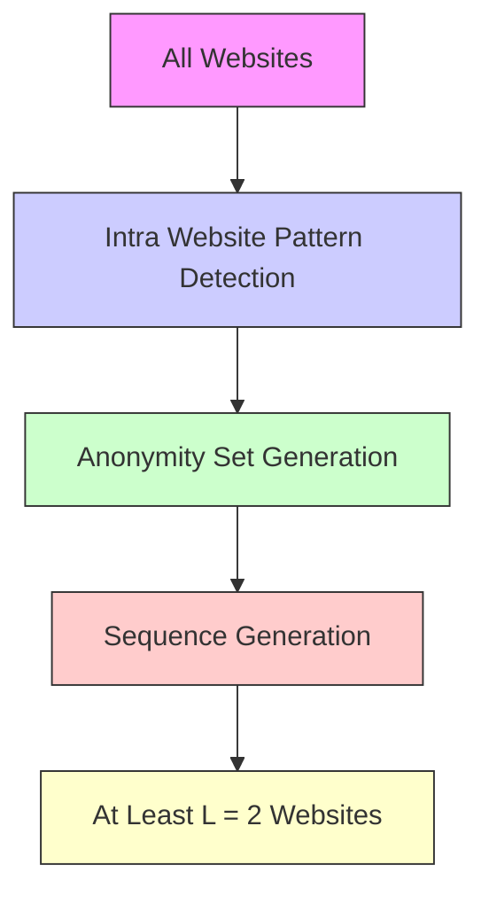
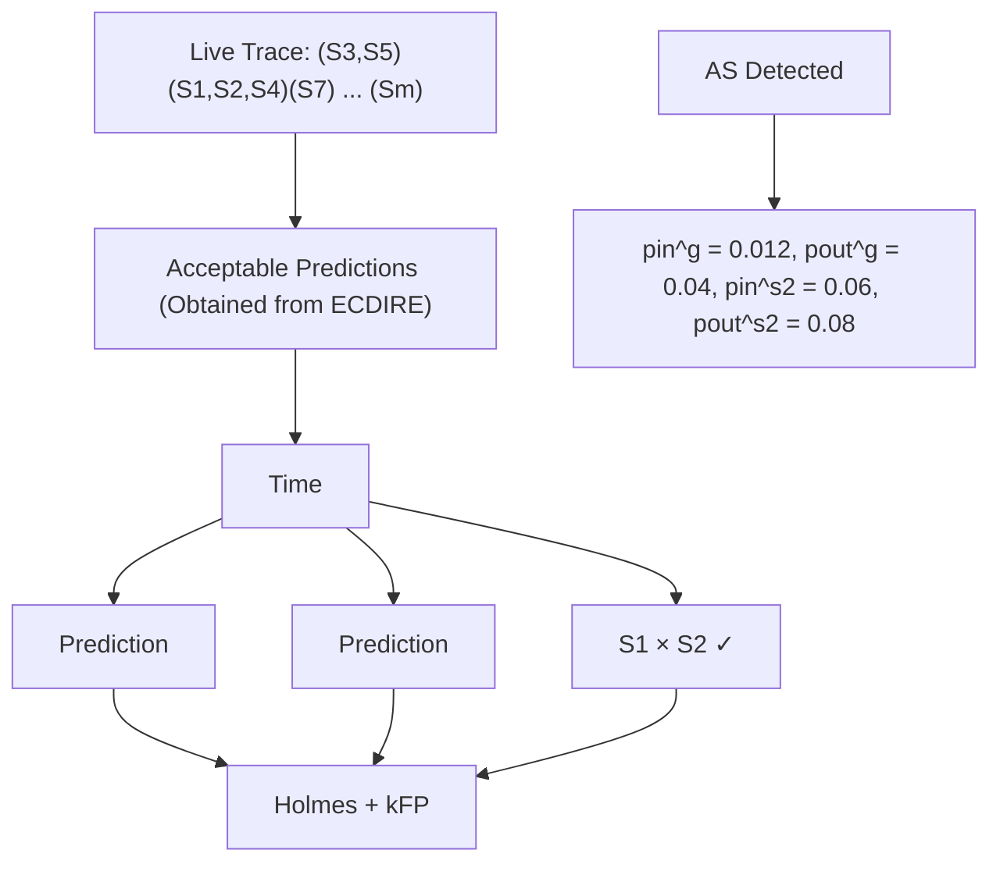

# Lightening the Load: A Cluster-Based Framework for A Lower-Overhead, Provable Website Fingerprinting Defense

Khashayar Khajavi Simon Fraser University kka151@sfu.ca

Tao Wang Simon Fraser University taowang@sfu.ca

Abstract—Website fingerprinting (WF) attacks remain a significant threat to encrypted traffic, prompting the development of a wide range of defenses. Among these, two prominent classes are regularization-based defenses, which shape traffic using fixed padding rules, and supersequence-based approaches, which conceal traces among predefined patterns. In this work, we present a unified framework for designing an adaptive WF defense that combines the effectiveness of regularization with the provable security of supersequence-style grouping. The scheme first extracts behavioural patterns from traces and clusters them into (k, l)-diverse anonymity sets; an early-timeseries classifier (adapted from ECDIRE) then switches from a conservative global set of regularization parameters to the lighter, set-specific parameters. We instantiate the design as Adaptive Tamaraw, a variant of Tamaraw that assigns padding parameters on a per-cluster basis while retaining its original informationtheoretic guarantee. Comprehensive experiments on public realworld datasets confirm the benefits. By tuning k, operators can trade privacy for efficiency: in its high-privacy mode, Adaptive Tamaraw pushes the bound on any attacker’s accuracy below 30%, whereas in efficiency-centred settings it cuts total overhead by 99 percentage points compared with classic Tamaraw.

## I. INTRODUCTION

Tor is the leading low-latency anonymity network, relied upon by millions worldwide to shield their online activities from surveillance and censorship [1]. Despite its robust encryption and onion routing design, Tor leaks metadata such as packet sizes, timing, and directional patterns that adversaries can exploit. Over the years, website fingerprinting (WF) attacks have demonstrated that by analyzing these residual traffic features, even passive attackers can infer with high accuracy which webpages users are visiting [2], [3], [4]. Modern deep learning techniques employing transformer models [5] and multi-channel representations can now extract fine-grained patterns from traffic data, achieving higher recall and precision [6], [7], [8], [9].

In response to these threats, a variety of defenses have emerged to mitigate WF attacks. One broad class of approaches is regularization-based defenses, which aim to conceal traffic patterns by enforcing packet transmission rules to reduce entropy. A common rule is a fixed, constant packet rate, achieved with delays and dummy packets [10], [11], [12]. These strategies often apply the same padding schedule to all sites, which leads to excessive overhead, particularly for bursty traffic. A notable example is Tamaraw [10], one of the few defenses to provide information-theoretic guarantees on attacker success. Tamaraw has not been broken; almost all defenses that lack such guarantees have been defeated by more powerful classifiers [13], [14], [15].

Another family of defenses aims to construct super-traces, forcing instances of similar webpages to produce the same pattern and thus hinder an attacker from inferring the correct webpage [2], [16], [17], [8]. However, these defenses are calibrated on a fixed set of sites. During an offline stage they partition that set into anonymity sets (clusters) with similar traffic characteristics and derive a canonical super-trace for each cluster. At run time every page load is forced to follow the super-trace assigned to its destination page. A page that does not exist in the offline stage produces undefined behavior, but in practice, ordinary browsing covers far more destinations than any feasible reference set can capture.

In this work, we propose a hybrid website fingerprinting defense with the strengths of both regularization and supersequence approaches. Traffic loading under our defense begins with regularization: a global rate that protects early traffic without requiring prior knowledge of the destination. As the trace evolves, we switch to supersequence: a streaming early time series classifier assigns the live trace to a preconstructed anonymity set, after which the defense transitions to a lightweight regularization rate specific to that set. These sets are generated offline through clustering, subject to kanonymity [18] and l-diversity [19]. Our construction satisfies an information theoretic upper bound on any adversary’s success.

Using this design framework, we create Adaptive Tamaraw, a novel extension of the original Tamaraw defense that retains its provable security while reducing overhead. We provide a rigorous analysis of Adaptive Tamaraw that bounds any attacking classifier’s maximum accuracy by the size and diversity of the anonymity set. We also evaluate our defense empirically:

Network and Distributed System Security (NDSS) Symposium 2026 23-27 February 2026, San Diego, CA, USA ISBN 979-8-9919276-8-0 https://dx.doi.org/10.14722/ndss.2026.241760 www.ndss-symposium.org

we test state-of-the-art website fingerprinting attacks to verify that the actual attack accuracy remains within our theoretical bounds while yielding lower overhead compared to the fixedrate Tamaraw.

We summarize the main contributions of our work as follows:

• We propose a general design framework for constructing provable website fingerprinting defenses that combines regularization defenses with dynamic clustering to adaptively adjust defense parameters in real time. As a concrete instantiation, we develop Adaptive Tamaraw, an extension of the original Tamaraw defense that preserves its information-theoretic guarantees while reducing bandwidth and latency overhead.  
• We provide a formal analysis that quantifies the privacy guarantees of Adaptive Tamaraw. Specifically, we derive upper bounds on the maximum achievable attack accuracy, independent of the underlying classifier, based on the size and diversity of each anonymity set.  
• Our experiments show that Adaptive Tamaraw offers flexible tunability, enabling practitioners to adjust the defense parameters to meet privacy and efficiency requirements. When configured for strong privacy, the defense reduces attack accuracy to below 30%. In efficiency-focused settings, it achieves substantial reductions in the total overhead, up to 99 percentage points relative to the original Tamaraw. The implementation is publicly available at https://github.com/khashayarkhaj/Adaptive-Tamaraw.

## II. BACKGROUND AND RELATED WORK

## A. Website Fingerprinting Attacks

Website fingerprinting attacks enable an on-path adversary to infer which website a user visits by analyzing observable traffic features such as packet sizes, timings, and ordering, even when the content is encrypted. Early methods relied on manually engineered features combined with classical classifiers like SVMs [20], k-Nearest Neighbors [2], and k-fingerprinting [4], the last of which uses random decision forests on manually extracted features.

The rise of deep learning has enabled WF attacks to automatically extract rich features from raw traffic. Deep Fingerprinting [6] uses a CNN to capture local and global patterns, while Tik-Tok [7] improves accuracy by incorporating timing and direction. Robust Fingerprinting (RF) [8] introduces the 2 × N Traffic Aggregation Matrix, which counts inbound/outbound packets in 44 ms slots and feeds it into a four-layer CNN, smoothing jitter while preserving bursts. RF surpasses 90% closed-world accuracy and performs well in open-world settings, even against defenses like FRONT [14]. LASERBEAK [9] adds multi-channel features (timing, direction, burst edges) and attention layers to exceed 95% accuracy. These attacks show that small architectural changes with strong features can defeat many prior padding defenses.

## B. Website Fingerprinting Defenses

When designing defenses against website fingerprinting attacks, the literature has broadly followed two lines of work. The first focuses on empirical defenses that are evaluated primarily through experiments and often rely on heuristics or traffic obfuscation strategies to reduce attack success. The second aims to provide formal, information-theoretic guarantees that rigorously bound the adversary’s ability to classify webpages. Table I offers a comprehensive summary of both approaches, highlighting their key properties along with their strongest known attack accuracies. We now examine these two categories in more detail, beginning with empirical defenses.

1) Empirical WF Defenses: Many website fingerprinting defenses rely on empirical evaluation to show effectiveness against specific attacks. They often reduce fingerprinting accuracy and can be tuned for lower overhead but lack formal guarantees and remain vulnerable to stronger or adaptive adversaries. Empirical defenses fall into two main categories:

Obfuscation-Based Defenses: These approaches inject randomness to obscure traffic patterns. WTF-PAD [13] adds dummy packets during idle periods, FRONT [14] perturbs early bursts with randomized padding, and Surakav [15] employs a GAN to simulate realistic timing. While effective against some attacks, they lack formal guarantees and are vulnerable to modern methods like Laserbeak [9] and RF [8]. As shown in Table I, these defenses still result in relatively high attack accuracies.

Regularization-Based Defenses: These defenses reduce leakage by shaping traffic into fixed or structured patterns. Bu-FLO [21] and CS-BuFLO [11] enforce constant rates, providing strong obfuscation but at high cost. RegulaTor [12] improves efficiency by reshaping only sensitive trace segments. However, most lack formal guarantees and thus can still leak expressive features.

While empirical defenses can reduce current attack success, their lack of formal guarantees limits robustness against future threats. In contrast, as we will discuss, Adaptive Tamaraw offers provable security (Section VI-D) and adaptively lowers overhead while preserving strong privacy guarantees.

2) WF Defenses With Formal Bounds: A number of defenses have sought not only to empirically reduce the success of website fingerprinting attacks but also to provide formal, provable bounds on security. Among these, Tamaraw [10] stands out as the first defense to derive an explicit upper bound on an adversary’s success probability. By construction, its uniform-rate padding guarantees that no attack, regardless of strategy, can exceed the bound as traces for different websites have the same rate and often have the same length. However, this theoretical rigor comes at a steep cost, and Tamaraw’s fixed-rate design introduces substantial overhead.

Other formal defenses attempt to balance rigor with efficiency. Walkie-Talkie [17], for example, reduces traffic uniqueness by pairing sites and enforcing collisions in their trace representations. While it provides a bounded adversarial success rate in closed-world settings, it assumes prior knowledge of

TABLE I

STRONGEST PUBLISHED ATTACKS AGAINST REPRESENTATIVE WF DEFENCES IN THE CLOSED-WORLD SETTING.

• DEFENCES WITHOUT A PROVABLE FORMAL BOUND ARE CONSISTENTLY BROKEN BY ADVERSARIAL TRAINING, WITH THE ATTACKER’S ACCURACY REMAINING WELL ABOVE THE 50 % THRESHOLD COMMONLY ASSOCIATED WITH ROBUST RESISTANCE [22].  
• SUPER-SEQUENCE DEFENCES ACHIEVE LOW ATTACK ACCURACY BUT PROTECT ONLY THOSE WEBSITES PRESENT IN THEIR TRAINING CORPUS, LIMITING THEIR APPLICABILITY IN OPEN-WORLD BROWSING.

<table><tr><td>Category</td><td>Defence</td><td>Strongest published attack‡</td><td>Accuracy (%)</td><td>Formal bound?</td><td>Limited to Dataset?</td></tr><tr><td rowspan="3">Obfuscation</td><td>WTF-PAD</td><td>RF [8]</td><td>96.6</td><td>No</td><td>No</td></tr><tr><td>FRONT</td><td>LASERBEAK [9]</td><td>95.9</td><td>No</td><td>No</td></tr><tr><td>Surakav</td><td>LASERBEAK [9]</td><td>81.5</td><td>No</td><td>No</td></tr><tr><td rowspan="3">Regularization</td><td>RegulaTor</td><td>RF [8]</td><td>67.4</td><td>No</td><td>No</td></tr><tr><td>Tamaraw</td><td>LASERBEAK [9]</td><td>25.3</td><td>Yes</td><td>No</td></tr><tr><td>Walkie-Talkie</td><td>RF [8]</td><td>93.9</td><td>Yes</td><td>Yes</td></tr><tr><td rowspan="2">Super-sequence</td><td>Super-Sequence</td><td>Tik-Tok [7], [8]</td><td>29.18</td><td>Yes</td><td>Yes</td></tr><tr><td>Palette</td><td>RF [8], [22]</td><td>36.43</td><td>Yes*</td><td>Yes</td></tr></table>

† “Formal bound” indicates that the defence supplies an explicit, theoretical upper bound on an attacker’s success for any strategy. “Limited to Dataset” means the defence only applies to the websites contained in its training set, which is impractical for real-world browsing.  
∗ Palette does not provide a closed-form mathematical bound; its “Yes∗” entry denotes that its cluster-anonymisation method yields structured leakage reductions that approach provable guarantees [22].  
‡ Where two references appear, the first paper introduces the attack and the second reports its performance against the listed defence.

the entire trace; an alternative randomized version avoids this assumption, but loses its adversarial bound.

Wang et al. introduced the Supersequence defense [2], which groups webpages into anonymity sets and pads each trace to match a common super-sequence, ensuring that all traces within a cluster are indistinguishable. Similarly, Palette [22] applies traffic cluster anonymization in real time by shaping traffic to match canonical burst patterns within each cluster, though it does not provide formal bounds. However, these supersequence-based methods are limited to the websites present in their training dataset.

As summarized in Table I, a clear dichotomy exists in the literature: while many low-overhead defenses have been proposed, those lacking formal guarantees have often been broken by subsequent attacks. In contrast, defenses with formal bounds, such as Tamaraw, have proven resilient over time but at the cost of high overhead. The core novelty of our paper lies in introducing a framework to bridge this gap between provable security and practical efficiency. In this work, we build upon Tamaraw specifically due to its unique and unbroken provably secure foundation, and demonstrate that its overhead can be reduced via dynamic clustering and switching mechanisms, all while preserving the original formal guarantees. Crucially, unlike supersequence methods, this approach remains applicable to websites beyond the training set, making it suitable for real-world, out-of-training scenarios.

## III. THREAT MODEL

Following prior work [15], [14], [22], we assume a local, passive adversary who observes all traffic between the client and the Tor guard node. The adversary cannot modify traffic but records packet size, timing, and direction to infer the visited webpage. They can segment traffic into individual page loads, assuming users visit one page at a time. To execute the attack, the adversary collects training data by visiting monitored webpages and recording their traffic under similar conditions to the target user. The goal is to identify which monitored site the client is loading.

In this work, we apply two evaluation scenarios for the proposed defense: one where the user’s traffic is limited to webpages seen during the defense’s training phase (intraining webpages), and another where the user can also visit webpages not included in the defense training set (out-oftraining webpages). In this latter case, we examine how the defense performs when users browse pages that were not part of the training data used to construct the anonymity sets or train the classifiers. This setting reflects real-world usage, where users may access arbitrary webpages beyond the training set, allowing us to assess the defense’s ability to protect previously unseen traffic patterns.

We also assume the defense operates without prior knowledge of the destination webpage. Our design goal is to develop an easy-to-implement defense that is generally suitable for browsing any site, including dynamic webpages generated on the fly. As such, we do not limit the defense’s applicability to a pre-configured set of static pages and we also avoid the privacy risk of disclosing the destination to a defending proxy. As we will elaborate upon in Section V-C, our approach is designed to operate on the more fundamental and recurring traffic patterns that emerge during a page load.

## IV. PROBLEM STATEMENT

When a client loads a webpage, it produces a sequence of encrypted packets called a traffic trace:

$$
f = \left[ (t _ {1}, d _ {1}), (t _ {2}, d _ {2}), \dots , (t _ {N}, d _ {N}) \right],
$$

where each packet $f _ { i }$ has a timestamp $t _ { i }$ and direction $d _ { i } \in$ {+1, −1} (outgoing/incoming). Since Tor pads packets to a fixed size, the adversary observes only timing and direction.

A defense modifies the trace $f$ to produce a defended trace $f ^ { \prime }$ by delaying real packets or adding dummies, obscuring patterns used by WF attacks. We evaluate the overhead of defenses by bandwidth overhead and time overhead. The bandwidth overhead is measured as the total number of dummy packets divided by the total number of real packets over the whole dataset. Similarly, the time overhead is measured as the total extra time divided by the total loading time in the undefended case over the whole dataset.

In this paper, we aim to address three limitations of existing WF defenses. First, static padding schedules that ignore realworld traffic diversity are inefficient. Second, supersequencebased defenses struggle in out-of-training settings with unseen websites. Third, defenses that lack provable security guarantees are frequently broken by later attacks. The following expands on each challenge.

1. Excessive Overhead from Static Regularization: Regularization defenses (such as Tamaraw) shape the traffic so that traces appear uniform, minimizing the features an attacker might exploit. However, these methods typically apply a fixed set of parameters statically across all traffic. This static configuration does not account for the inherent variability in traffic patterns across different webpages, which can result in either excessive overhead or insufficient obfuscation in certain cases.

2. Poor Generalization in Supersequence-Based Defenses: Supersequence-based approaches attempt to create anonymity sets by mapping each webpage to a common supertrace. While this strategy can provide strong theoretical guarantees, it is only effective on the set of in-training webpages used during defense construction. If a user’s traffic originates from an out-of-training webpage, there is no reliable mechanism to map the trace to a corresponding supersequence. This restriction greatly limits the applicability of such defenses in real-world deployments. We demonstrate that our method generalizes effectively to out-of-training webpages, making it more suitable for practical scenarios involving previously unseen inputs.

3. Lack of Provable Security Guarantees: Existing defenses have usually been defeated by later-published attacks. In particular, as it can be seen in Table I, state-of-the-art obfuscation defenses $( \mathrm { e . g . }$ , FRONT, Surakav) often achieve relatively low overhead but have been circumvented by advanced WF attacks. A key limitation of these defenses is the lack of provable security; they do not provide a theoretical upper bound on the adversary’s maximum success rate.

To provide an upper bound on attacker success, we start by analyzing the non-injectivity of a defense. Let D map an input trace f to an output trace $f ^ { \prime } = D ( f )$ . For every output, the pre-image is

$$
D ^ {- 1} (f ^ {\prime}) = \{f: D (f) = f ^ {\prime} \}.
$$

A defense is called δ-non-injective with respect to a given defended trace $f ^ { \prime } \mathrm { ~ i f ~ } \left| D ^ { - 1 } ( f ^ { \prime } ) \right| \ge \delta .$ . An attacker who sees $f ^ { \prime }$ must then guess among at least δ candidates to infer $f .$ However, multiplicity alone is not sufficient for website fingerprinting security: the attacker’s success also depends on how those inputs are distributed across webpages. If one webpage dominates the pre-image, the majority vote still yields a high success rate, even when $\left| D ^ { - 1 } ( f ^ { \prime } ) \right|$ itself is large. The relevant quantity is label diversity: the ratio between the total pre-image size and the largest webpage-specific share.

To capture both multiplicity and label diversity, we refine the measure. Let $D _ { w } ^ { - 1 } ( f ^ { \prime } ) = \{ f \in D ^ { - 1 } ( f ^ { \prime } ) : \operatorname { c l a s s } ( f ) = w \}$ be the pre-image subset that originates from webpage w. We define the weighted pre-image size

$$
\tilde {\delta} (f ^ {\prime}) = \frac {| D ^ {- 1} (f ^ {\prime}) |}{\max _ {w} | D _ {w} ^ {- 1} (f ^ {\prime}) |}. \tag {1}
$$

Intuitively, $\tilde { \delta } ( f ^ { \prime } )$ counts how many distinct inputs are merged per majority webpage. If every input in the bucket comes from the same site, the denominator equals the numerator and $\tilde { \delta } ( f ^ { \prime } ) = 1$ , so a perfect information attacker will always guess the class of $f ^ { \prime }$ correctly.

Weighted δ-non-injectivity. We call a defense weighted δ-non-injective with respect to a given defended trace $f ^ { \prime }$ if $\tilde { \delta } ( f ^ { \prime } ) \geq \delta$ . Since an optimal attacker chooses the majority webpage, its success rate is maxw $| D _ { w } ^ { - 1 } ( f ^ { \prime } ) | / | D ^ { - 1 } ( f ^ { \prime } ) | \ =$ $1 / \tilde { \delta } \bar { ( f ^ { \prime } ) }$ . Thus, a weighted δ-non-injective defense guarantees

$$
\operatorname * {P r} [ \text { attacker   succeeds } \mid f ^ {\prime} ] \leq \frac {1}{\delta}.
$$

Non-Uniformly Weighted δ-Non-Injectivity: While the above definition bounds the attacker’s success on an individual trace, prior works and subsequent WF studies [8], [9], [10] focus on the average success rate over the distribution of traces. To capture this, we define the non-uniformly weighted δ-non-injectivity property.

Let ${ \mathcal { F } } ^ { \prime }$ denote the support of defended outputs, and let $P ( f ^ { \prime } )$ be the probability of observing a defended trace $f ^ { \prime }$ with $f ^ { \prime } \in \mathcal { F } ^ { \prime }$ . We say the defense is non-uniformly weighted δ-noninjective if this inequality holds:

$$
\mathbb {E} _ {f ^ {\prime} \in \mathcal {F} ^ {\prime}} \left[ \operatorname * {P r} [ \text { attacker   succeeds } \mid f ^ {\prime} ] \right] = \mathbb {E} _ {f ^ {\prime} \in \mathcal {F} ^ {\prime}} \left[ \frac {1}{\tilde {\delta} (f ^ {\prime})} \right] \leq \frac {1}{\delta}.
$$

This definition implies that the attacker’s success rate, on average, remains below the inverse of δ. This choice aligns with previous work on website fingerprinting defenses, which report attacker performance in terms of average success rate over the trace distribution, i.e., they evaluate non-uniform security. Uniform security, while stricter, is rarely achieved in practice and not the focus of most deployed defenses. We therefore adopt the non-uniform formulation to remain consistent with established evaluation methodology [10].

## V. DESIGN DETAILS

## A. Overview

In this work, we introduce the first website fingerprinting defense that performs adaptive parameter selection while providing a formal upper bound on attacker success. Our design is motivated by three goals: (i) replacing static regularization configurations with traffic adaptation, (ii) generalizing to webpages not seen during training, and (iii) ensuring provable security guarantees.

We do so using a global-to-local defense strategy. Our defense assumes no knowledge of the page under load, so it always starts with a global strategy based on a regularization defense (such as BuFLO [21], Tamaraw [10], or Regula-Tor [12]). We begin each page load using a set of global parameters that apply conservative padding and scheduling to protect early traffic without knowing the destination. After enough of the trace has been observed to confidently identify an anonymity set, we switch to a more efficient set of padding parameters tailored to that set. This two stage strategy ensures strong privacy guarantees during the early ambiguous phase while reducing overhead in the remainder of the trace.

To concretely instantiate this global-to-local strategy, we build on the Tamaraw defense, leading to what we call Adaptive Tamaraw.

## B. Adaptive Tamaraw

To evaluate the general framework introduced in this paper, we use a concrete, well-studied regularization defense in our global-to-local strategy: Tamaraw [10]. Among existing regularization-based defenses, Tamaraw stands out as the only one that offers a formal, information-theoretic bound on an adversary’s success rate. As shown in Table I, it also yields the lowest attacker accuracy compared to other defenses.

Classic Tamaraw transmits fixed-size cells at two constant rates: $\rho _ { \mathrm { o u t } }$ seconds between successive upstream cells and $\rho _ { \mathrm { i n } }$ seconds between successive downstream cells. Padding continues in each direction until its cell count reaches the next multiple of a hyperparameter L. Since $( \rho _ { \mathrm { o u t } } , \rho _ { \mathrm { i n } } )$ are fixed and identical across all traces, the resulting shapes of the defended traces are uniform in timing and rate. The only distinguishing feature that may remain between traces is their total length: specifically, which multiple of L they are padded to.

Tamaraw requires a single pair of padding parameters $( \rho _ { \mathrm { o u t } } , \rho _ { \mathrm { i n } } )$ to be applied uniformly across all webpages. This global configuration leads to inefficiencies, as some webpages end up causing far more dummy traffic than necessary. As noted by [10], the standard method for configuring Tamaraw involves fixing the L and then performing a grid search over candidate $( \rho _ { \mathrm { o u t } } , \rho _ { \mathrm { i n } } )$ pairs. Each pair yields a specific tuple of bandwidth and time overhead, and the set of resulting points is filtered to retain only the Pareto-optimal ones (those that are not dominated in both overhead dimensions).

In Adaptive Tamaraw, we start each trace with these global parameters, and then switch to local padding parameters when possible. This strategy is governed by three processes that will be described in the subsequent subsections.

1) We analyze the webpages in the training set of the defense to identify representative traffic patterns, which we call Intra-Webpage Pattern Detection (Section V-C).  
2) These traffic patterns are grouped together in Anonymity Set Generation (Section V-D), wherein local parameters are identified for each anonymity set.  
3) Early Anonymity Set Detection (Section V-E) tells the defense when to switch from global to local parameters based on packets of the observed live trace.

## C. Intra-Webpage Pattern Detection

Webpages do not generate a single, uniform traffic pattern; rather, they produce a number of patterns. This can be due to: dynamically generated content such as personalized recommendations [23], advertisements that can differ significantly in size and frequency [24], and variations in localization tailored for different countries [25]. As an illustrative example, Figure 1 shows four traces from the same webpage in the Sirinam et al. dataset [6], visualized using the Traffic Aggregation Matrix (TAM) [8]. The two rows highlight two distinct recurring structures, highlighting that even a single page can yield multiple characteristic patterns.

line chart

| Time Slot | Outgoing Packets | Incoming Packets |
| --------- | ---------------- | ---------------- |
| 0         | 0                | 0                |
| 100       | -50              | -100             |
| 200       | -100             | -150             |
| 300       | -50              | -100             |
| 400       | 0                | 0                |
| 500       | 0                | 0                |
| 600       | 0                | 0                |
| 700       | 0                | 0                |
| 800       | 0                | 0                |
| 900       | 0                | 0                |
| 1000      | 0                | 0                |

(a) Pattern 1

line chart

| Time Slot | Pkt. Number (Incoming Packets) | Pkt. Number (Outgoing Packets) |
| --------- | ------------------------------ | ------------------------------- |
| 0         | 0                              | 0                               |
| 100       | -150                           | 0                               |
| 200       | -100                           | 0                               |
| 300       | -50                            | 0                               |
| 400       | -100                           | 0                               |
| 500       | -50                            | 0                               |
| 600       | -100                           | 0                               |
| 700       | -50                            | 0                               |
| 800       | -100                           | 0                               |
| 900       | -50                            | 0                               |
| 1000      | -100                           | 0                               |

(b) Pattern 2  
Fig. 1. Visualization of the TAMs of four traces from the same page, in the dataset obtained by [6]. Each TAM divides the first 1000 time-slots (80 ms per slot) into rows for outgoing packets (blue, positive values) and incoming packets (red, negative values); the height of each bar records the packet count in that slot. The first two traces (top row) exhibit a very similar pattern, while the next two traces (bottom row) share a distinct structure. This highlights the possibility of multiple recurring traffic patterns within a single page.

As a result of these observations, aggregating all traces from a single webpage into one homogeneous profile is inefficient and often leads to over-padding and degraded performance. However, many existing defenses construct anonymity sets at the webpage level, assuming that all traces from the same page behave similarly [2], [16], [22]. Instead, our approach aggregates traffic at the pattern level to form smaller, more homogeneous groups.

To obtain distinct traffic patterns within each webpage, we first represent each network trace as a time series using the TAM representation introduced in [8]. In our TAM representation, we divide the total page load time into a fixed number of time slots and record the number of incoming and outgoing packets in each slot. This results in a twodimensional time series, where each trace can be viewed as a bivariate sequence capturing the dynamics of incoming and outgoing traffic over time.

With traces represented as TAM time series, we cluster the traces of each webpage individually to isolate recurring traffic patterns. We refer to the resulting clusters as intrawebpage clusters (i.e., for the remainder of this section, when we refer to intra-webpage clusters, we mean clusters obtained by grouping traces originating from a single webpage).

To perform this clustering, we adopt the Cluster Affinity Search Technique (CAST) [26]. CAST is a similarity-based clustering algorithm that avoids pre-specifying the number of clusters. Instead, it incrementally builds clusters by comparing each trace’s affinity (its average similarity) to the current cluster. We define the affinity of a time series $F _ { x }$ to a cluster $S$ as:

$$
a _ {S} (F _ {x}) = \frac {1}{| S |} \sum_ {F _ {y} \in S} A (F _ {x}, F _ {y}), \tag {2}
$$

where $A ( F _ { x } , F _ { y } )$ is the similarity measure between two TAM series. Intuitively, $a _ { S } ( F _ { x } )$ captures how well $F _ { x } ~ \hbar t s$ with the existing members of S: high affinity indicates that $F _ { x }$ behaves similarly to most traces in S, while low affinity indicates that it is not consistent with the dominant traffic pattern in that cluster. CAST maintains a currently “open” cluster and evolves it using a fixed affinity threshold T . At each step, the unassigned trace with the highest affinity to the open cluster is examined:

• Addition: If its affinity is at least T , the trace is added to the cluster.  
• Removal: Otherwise, CAST checks if any current member of the cluster has affinity below T with the current cluster. Such traces are considered weakly related to the cluster and are removed.  
• Closure: If no addition or removal is possible, the cluster is considered stable and is closed; CAST then begins forming the next cluster from the remaining traces.

Our preliminary evaluations (discussed in Appendix C-B) revealed that for traces in a single webpage, CAST generated several large intra-webpage clusters, along with a long tail of smaller ones. Small intra-webpage clusters are not suitable, as our goal is to regularize all traces within an intra-webpage cluster to appear identical; if an intra-webpage cluster contains too few traces, the defense incurs the overhead of padding and shaping with minimal privacy benefit. To be more precise, the attacker’s uncertainty remains low despite the added cost, resulting in an inefficient overhead-to-privacy tradeoff. To produce better clusters, we introduced four modifications to the original CAST algorithm proposed in [26], which we will describe below.

Affinity Computation. As we mentioned, the affinity of a time series $F _ { x }$ with respect to a candidate cluster $s$ is computed as the average of the pairwise similarity scores between $F _ { x }$ and each member $F _ { y } \in S .$ . Following prior work [27], [28], the similarity score $A ( F _ { x } , F _ { y } )$ is computed using an exponential function of the squared Euclidean distance:

$$
A (F _ {x}, F _ {y}) = \exp \Bigl (- \frac {d ^ {2} (F _ {x} , F _ {y})}{\sigma^ {2}} \Bigr),
$$

where $\sigma$ is a bandwidth hyperparameter that governs the sensitivity of the similarity function. Previous studies [29] have shown that a global $\sigma$ can fail to capture variations in data density.

To address this, we adopt a local scaling approach inspired by self tuning spectral clustering [30], [31], in which each time series $F _ { x }$ is assigned its own scale parameter $\sigma _ { x }$ , typically set to the distance between $F _ { x }$ and its K-th nearest neighbor. The similarity is then computed as:

$$
A (F _ {x}, F _ {y}) = \exp \Bigl (- \frac {d ^ {2} (F _ {x} , F _ {y})}{\sigma_ {x} \sigma_ {y}} \Bigr).
$$

Cleaning Step. After forming the initial clusters, we perform a final pass. For each point c in each cluster $\mathcal { C } _ { i } ,$ , we compute its affinity to every other cluster $\mathcal { C } _ { j }$ . If we find a cluster $\mathcal { C } _ { j }$ in which the point c achieves a strictly higher affinity than in its current cluster $\mathcal { C } _ { i } ,$ we remove c from $\mathcal { C } _ { i }$ and reassign it to $\mathcal { C } _ { j }$ . This process is repeated until no point changes its cluster membership.

Post-Processing Step. To limit the number of clusters produced by our modified CAST algorithm, we adopt a postprocessing procedure inspired by [32]. Each cluster consists of a set of TAM-based trace representations. We measure its cut and volume using the similarity score A introduced earlier:

$$
\operatorname{cut} (\mathcal {C}) = \sum_ {f \in \mathcal {C}} \sum_ {f ^ {\prime} \notin \mathcal {C}} A (f, f ^ {\prime}), \quad \operatorname{vol} (\mathcal {C}) = \sum_ {f, f ^ {\prime} \in \mathcal {C}} A (f, f ^ {\prime}).
$$

The expansion ratio $\phi ( \mathcal { C } ) = \mathrm { c u t } ( \mathcal { C } ) / \mathrm { v o l } ( \mathcal { C } )$ is low when traces inside $\mathcal { C }$ are highly similar while remaining well separated from traces outside.

We then apply an iterative post-processing routine: as long as the number of clusters exceeds a predefined threshold, we sort the clusters by size, select the smallest cluster, and merge it with a neighboring cluster such that the resulting partition minimizes the largest expansion ratio among all clusters [33].

Dynamic Affinity Threshold. Finally, rather than using a fixed affinity threshold for all traces, we compute it in a datadriven manner. We first calculate the global mean similarity across all pairs of traces:

$$
T = \frac {1}{n ^ {2}} \sum_ {x <   y \leq n} A (F _ {x}, F _ {y}),
$$

where $A ( F _ { x } , F _ { y } )$ is the pairwise similarity between traces $x$ and $y ,$ and n is the total number of traces. This global average $T$ serves as a baseline for typical similarity values within the dataset. We then set the CAST affinity threshold to $T$ (i.e., the minimum similarity required to add a new trace to an intra-webpage cluster). This approach ensures that the threshold automatically adapts to the overall range of similarities in the dataset, rather than being a manually tuned constant hyperparameter, thereby improving the robustness of the resulting clusters.

We apply the modified CAST algorithm separately to each webpage in the dataset to extract a set of characteristic traffic patterns. These extracted patterns form the foundation for all subsequent phases.

## D. Anonymity Set Generation

Once we have extracted distinct traffic patterns from each webpage, as described in Section V-C, we proceed to cluster these patterns into anonymity sets. This phase organizes structurally similar patterns, regardless of their originating web pages, into groups that will later be reshaped using a shared regularization policy. In contrast to prior work that clusters at the webpage level [2], [16], [22], this fine-grained grouping reduces overhead and improves generalization.

Our anonymity sets are constructed to satisfy two key properties that underlie the provable security guarantee offered by our defense:

• k-anonymity: Each anonymity set must contain at least k distinct traffic patterns [34]. In this way, even if an adversary correctly identifies the anonymity set to which a trace belongs, they are left with at least k possibilities, bounding the probability of correctly inferring the true pattern to at most 1/k.  
• l-diversity: The patterns within each anonymity set must originate from at least l different webpages [19]. This criterion ensures that even if the anonymity set is exposed, the attacker cannot infer the correct webpage simply because all patterns come from a single source.

For this phase, we adopt the k-anonymity-based clustering algorithm introduced in Palette [22] as our base algorithm. In Palette, anonymity sets are generated at the webpage level. The algorithm first computes the Traffic Aggregation Matrix for each trace of a webpage and then aggregates these into a supermatrix by an element-wise maximum. These super-matrices are then used as the elements (i.e., the representatives of each webpage) for a k anonymity-based clustering algorithm [34], with the similarity between two webpages measured by computing the Euclidean distance between their corresponding super-matrices. The clustering itself follows a greedy strategy: it constructs one anonymity set at a time by first selecting an initial webpage and then repeatedly adding the webpage whose super-matrix is closest, based on Euclidean distance, to the current super-matrix of the partially constructed set. Once k webpages have been assigned, the process repeats to form the next set. The output is a list of anonymity sets, each containing at least k webpages. We adopt the same k anonymity-based clustering algorithm as used in Palette, but with two key modifications:

Pattern-level clustering. Our method operates at the pattern level rather than the webpage level. As explained in Section V-C, a single webpage can produce multiple distinct traffic patterns due to various reasons; clustering at this finer granularity yields more homogeneous groups. As an illustrative example, Figure 2 compares the impact of clustering at the webpage level versus the pattern level. For each fixed value of k, we conduct two separate experiments. In the first, we compute one supermatrix per webpage by taking the elementwise maximum over all TAMs from that webpage, and then apply the clustering algorithm from Palette to these webpagelevel supermatrices. In the second, we repeat the process at the pattern level by computing one supermatrix per extracted traffic pattern and clustering those instead, again using Palette. In both cases, after clustering, we treat each cluster’s supermatrix as the defended version of all traces in the cluster and compute the bandwidth overhead across all the traces. This provides a proxy for how well the clustering captures homogeneity. As shown in the figure, clustering at the pattern level consistently yields lower overhead.

line chart

| k (Cluster Size) | Website-level Clustering | Pattern-level Clustering |
| ---------------- | ------------------------ | ------------------------ |
| 0                | 35                       | 20                       |
| 5                | 45                       | 25                       |
| 10               | 60                       | 30                       |
| 15               | 75                       | 38                       |
| 20               | 85                       | 45                       |
| 25               | 92                       | 50                       |
| 30               | 98                       | 52                       |

Fig. 2. Comparison of website-level vs. pattern-level clustering. For each value of $k ,$ clustering is applied to supermatrices constructed at the website or pattern level, and the resulting average bandwidth overhead is measured. Pattern-level clustering consistently results in lower overhead, especially as k increases, indicating that clustering finer-grained traffic patterns captures homogeneity more effectively than aggregating at the website level.

Diversity-aware distance metric. Instead of computing the Euclidean distance between super-matrices, we define a distance function d that directly captures attacker success after regularization. Given an anonymity set C currently under construction and a candidate pattern p (i.e., an intra-webpage cluster), we evaluate the impact of merging them by computing the average-case attacker success rate over the combined set $C ^ { \prime } = C \cup p .$ .

For each pair of regularization parameters $( p _ { \mathrm { i n } } , p _ { \mathrm { o u t } } )$ in a predefined grid P, we apply Tamaraw to all traces in $C ^ { \prime }$ and compute the non-uniform attacker accuracy:

$$
\bar {A} \big (C ^ {\prime}; p _ {\mathrm{in}}, p _ {\mathrm{out}} \big) = \sum_ {\ell} \frac {| C _ {\ell} ^ {\prime} |}{| C ^ {\prime} |} \cdot \frac {\underset {w} {\max} \big | \{t \in C _ {\ell} ^ {\prime} : \mathrm{site} (t) = w \} \big |}{| C _ {\ell} ^ {\prime} |},
$$

where $C _ { \ell } ^ { \prime }$ denotes the subset of traces in $C ^ { \prime }$ whose regularized lengths equal $\ell .$ This measures the expected success rate of an optimal attacker who predicts the most frequent webpage label in each length bucket.

The distance $d ( C , p )$ is then defined as the average attacker accuracy over the entire grid:

$$
d (C, p) = \frac {1}{| \mathcal {P} |} \sum_ {(p _ {\text { in }}, p _ {\text { out }}) \in \mathcal {P}} \bar {A} \bigl (C ^ {\prime}; p _ {\text { in }}, p _ {\text { out }} \bigr).
$$

This formulation implicitly enhances l-diversity, since adding a pattern from a new webpage typically reduces the attacker’s success rate based on the webpage in the majority, thus lowering $d ( C , p )$ . We provide empirical validations for this attribute in Appendix C-A. During clustering, we therefore always merge the candidate p that minimizes $d ( C , p )$ , encouraging both homogeneity in regularized shape and diversity in origin. Algorithm 1 provides detailed pseudocode of our proposed anonymity set generation algorithm.

Algorithm 1 Pattern-Level Anonymity Set Generation  
Input:  
$P = \{p_{1},\dots ,p_{N}\}:$ all extracted patterns $k$ : anonymity parameter $d(S,p)$ : distance function between anonymity set $S$ and pattern $p$

Output:  
$\mathcal{S} = \{S_1, \ldots, S_m\}$ : final anonymity sets
1: $\mathcal{S} \leftarrow \emptyset$ ▷ Anonymity sets
2: $U \leftarrow P$ ▷ the set of unassigned patterns  
Step 1: Seed the first set

3: Choose any $p_{seed} \in U$ 4: $S_{1} \leftarrow \{p_{\text{seed}}\}; S \leftarrow \{S_{1}\}; U \leftarrow U \setminus \{p_{\text{seed}}\}$  
Step 2: Build additional sets

5: for i = 1 to $\left\lfloor\frac{|P|}{k}\right\rfloor$ do
6: if $|S_{i}| < k$ then
7: while $|S_{i}| < k$ and $U \neq \varnothing$ do
8: $p^{\star} \leftarrow \arg \min_{p \in U} d(S_{i}, p)$ 9: $S_{i} \leftarrow S_{i} \cup \{p^{\star}\}; U \leftarrow U \setminus \{p^{\star}\}$ 10: end while

11: end if  
12: if $U \neq \varnothing$ then
13: $p_{new} \leftarrow \arg\max_{p \in U} \sum_{S \in S} d(S, p)$ 14: Create $S_{i+1} \leftarrow \{p_{new}\}; S \leftarrow S \cup \{S_{i+1}\}; U \leftarrow U \setminus \{p_{new}\}$  
15: end if

16: end for  
Step 3: Assign remaining patterns  
17: for all $p \in U$ do
18: $j \leftarrow \arg \min_{S \in S} d(S, p)$ 19: $S_j \leftarrow S_j \cup \{p\}$ 20: end for
21: return S

The two previous phases (pattern extraction and anonymity set generation) comprise the offline training stage of our framework. A high-level illustration of this process is shown in Figure 3, which depicts how traffic traces from different webpages are transformed into anonymity sets based on structured patterns.

## E. Early Anonymity Set Detection

As we mentioned, our defense follows a global-to-local regularization strategy. Every new page load is protected by singular global regularization parameters until enough packets have arrived to identify the anonymity set that best matches the live prefix; once the set is known, we switch to lighter, local regularization parameters.

For the global-to-local switch, deciding which set to choose and when it is safe to switch is an instance of early timeseries classification, a task where the goal is to make accurate predictions based on incomplete sequences, as early as possible. Early classification has been studied extensively in latency-critical domains such as medical diagnosis [35], [36] and industrial process monitoring [37], [38]. In this work, we adopt the ECDIRE framework [39], which has been designed for reliable early classification of time series. ECDIRE learns, for every class (in our case anonymity set), the earliest safe timestamp at which the class can be predicted with at least a user-selected fraction α of the accuracy that would be achieved on complete traces. During deployment the classifier is queried only at those safe timestamps, which removes unnecessary tests on very short prefixes and guarantees that a decision is issued as soon as the chosen confidence threshold is met.

flowchart

Fig. 3. High–level workflow of the first two phases of our defense. 1. Pattern extraction. For each webpage in the training dataset, we group its traces into a small number of stable, recurring traffic patterns (dashed boxes), reflecting variability due to CDNs, localization, and user behavior. 2. Anonymity set construction. The extracted patterns are then clustered across different webpages to form anonymity sets. In this example, each set contains at least $k = 3$ distinct patterns originating from at least $l = 2$ different webpages, thereby satisfying k-anonymity and l-diversity. A lightweight, cluster-specific regularization schedule is precomputed for each set.

For every anonymity set S we compute a safe timestamp τS as the earliest prefix length (i.e., time) t at which a validator (described below) can distinguish S from all other sets with accuracy $\geq \alpha A _ { S } ^ { \mathrm { f u l l } }$ , where $A _ { S } ^ { \mathrm { f u l l } }$ is the accuracy of the validator on full traces of S. We never test S before $\tau _ { S } ;$ conversely, if the trace is not accepted at $\tau _ { S } , s$ is never considered again for that trace. This “single-shot” rule forces every trace that joins S to switch defenses at the same fixed time, closing a potential timing side channel.

In the original ECDIRE algorithm [39], the training process initially involves training a separate classifier at each timestep. Once training is complete, a post-processing step identifies the safe prediction timestamps, the points in time where early classification is both accurate and confident. The final model then retains only the classifiers corresponding to these selected timestamps, discarding the rest. In our case, WF classifiers are deep networks, so to train and retain a full model for each timestamp would be prohibitively expensive in time and memory. Instead we factor the prediction task into a single deep backbone plus a collection of lightweight per-site models as follows.

1) Stage A – webpage predictor (Holmes). We train one Holmes network [40], a spatial–temporal CNN encoder learned with supervised contrastive loss so that partial traces embed close to their full counterparts. At inference time Holmes outputs the most likely webpage w given an incomplete input trace.

2) Stage B – Pattern predictor (per-site k-fingerprinting).

flowchart

Fig. 4. Illustration of early anonymity set prediction and parameter switching. An incoming trace is initially regularized using the global parameters $( p _ { \mathrm { i n } } ^ { g } \bar { = }$ $0 . 0 1 2 , p _ { \mathrm { o u t } } ^ { g } \dot { = } 0 . 0 4 )$ classifier attempts to assign the trace to one of the candidate anonymity sets. In the first attempt, the classifier predicts $S _ { 1 }$ , but no switch occurs because $S _ { 1 }$ is not valid at that timestamp. At the second safe timestamp, the trace is matched with $S _ { 2 } .$ , which is an acceptable set at that point. This triggers a transition to $S _ { 2 } ' \mathrm { s }$ per-set lighter parameters $( p _ { \mathrm { i n } } ^ { S _ { 2 } } = \dot { 0 . } 0 6 , p _ { \mathrm { o u t } } ^ { S _ { 2 } } = \dot { 0 . } \dot { 0 } 8 )$ 2 = 0.06, pS2out , which are applied for the rest of the connection. Each anonymity set is tied to a unique safe timestamp, so switching can occur at most once.

For each webpage w and each time stamp t of interest, we train a small k fingerprinting (kFP) random forest classifier [4], denoted $\mathrm { k F P } _ { w } ^ { ( \star ) }$ , using the traces of the site truncated at time t and the labels of each trace being the number of the cluster intra-site (i.e. pattern) of that trace. kFP requires only a modest number of examples, making it well-suited for scenarios where per-site data is limited.

Given an incoming trace prefix of length t, the prediction process proceeds as follows:

1) Holmes predicts the most likely webpage w.  
2) The corresponding kFP model kF $\mathbf { \mathcal { \mathbf { P } } } _ { w } ^ { ( t ) }$ identifies the pattern $p .$ .  
3) By construction, the pair $( w , p )$ uniquely determines an anonymity set $S _ { w , p } . \mathrm { I f } t = \tau _ { S _ { w , p } } ( \mathrm { i } . \mathbf { e }$ ., the current timestamp is the safe prediction timestamp for that anonymity set), we immediately switch to that set’s lighter parameters; otherwise, we continue applying the global regularization schedule.

After training the single Holmes model and all $\mathrm { k F P } _ { w } ^ { ( t ) }$ classifiers across timestamps, we determine a safe timestamp $\tau _ { S }$ for each anonymity set S, indicating the earliest point at which a confident classification can be made. For each webpage w, we keep only the $\mathrm { k F P } _ { w } ^ { ( t ) }$ models corresponding to its safe timestamps. The Holmes model is site-agnostic and trained once, then reused across all traces and timesteps. This design preserves ECDIRE’s early-decision capability while reducing computational cost by avoiding deep model training at every time step. Figure 4 illustrates this switching process and its alignment with safe timestamps.

## F. Security Bound for Adaptive Tamaraw

Despite transitioning from a fixed global defense to lighter, AS-specific configurations after a safe prediction point, Adaptive Tamaraw retains a provable security guarantee. Specifically, we show that the defense remains non-uniformly weighted δ-non-injective, ensuring that the attacker’s average success probability is formally bounded. This bound reflects the attacker’s expected success probability across the entire distribution of defended traffic, aligned with standard metrics from prior work, including Tamaraw [10], which included non-uniform (i.e., average) security.

Theorem V.1 (Global Non-Uniformly Weighted δ–Non-Injectivity). Let S be the set of anonymity sets constructed in Section V-D. For a fixed global regularization parameter pair $( p _ { i n } , p _ { o u t } )$ , let $\bar { A } ( S _ { i } ; p _ { i n } , p _ { o u t } )$ denote the expected attacker success rate over anonymity set $S _ { i } \in S ,$ , as defined in Section VI-D (Eq. 5). Define the global injectivity parameter δ as:

$$
\frac {1}{\delta} = \mathbb {E} _ {S _ {i} \sim \mathcal {S}} \left[ \bar {A} (S _ {i}; p _ {i n}, p _ {o u t}) \right].
$$

Then Adaptive Tamaraw is non-uniformly weighted δ-noninjective, and the attacker’s average success probability is bounded by:

$$
\operatorname * {P r} [ \text { success } ] \leq \frac {1}{\delta}.
$$

The formal proof of this result is presented in Appendix E.

This result is intuitive: the attacker’s overall bounded success rate is the average across the bound for each combination of anonymity set and trace length. Any two traces from the same set and of the same length are made indistinguishable by the defense, a principle inherited from Tamaraw. Consequently, the attacker’s optimal strategy in an anonymity set reduces to guessing the most common webpage in each such length-matched group, which limits their average success rate captured by $\bar { A } ( S _ { i } )$ . Our novelty lies in deriving the overall security bound by averaging these individual success probabilities across all possible anonymity sets.

## VI. EXPERIMENTAL EVALUATION

This section empirically evaluates the effectiveness, efficiency, and generalizability of Adaptive Tamaraw. The goal is to show that the defense lowers bandwidth and latency overhead while maintaining provable bounds on attacker success, even under strong adversaries. Section VI-A outlines the experimental setup; Section VI-B tests performance on intraining webpages (defended sites seen during training); Section VI-C examines robustness on out-of-training webpages with unseen traffic; and Section VI-D checks the tightness of theoretical bounds from Section V-F against observed attack accuracies.

## A. Experimental Setup

Dataset: We conduct our experiments on two well-known public WF datasets. The first is collected by Sirinam et al. [6], and it has become a standard benchmark in recent WF research [8], [22], [41], [42]. For our experiments, we used its closed-world subset, which contains 1,000 traffic traces for each of the 95 monitored websites. The second is the largescale Automated Website Fingerprinting (AWF) dataset from Rimmer et al. [43]. From this collection, we use the subset corresponding to the top 100 most popular websites, which provides 2,500 traffic traces per website. Specifically, both data sets consist of traces collected over live Tor connections, reflecting authentic and variable network conditions, including congestion, jitter, and circuit diversity.

Parameter Grid for Adaptive Tamaraw: Tamaraw is parameterized by three key hyperparameters: the upstream and downstream padding intervals $( \rho _ { \mathrm { o u t } } , \rho _ { \mathrm { i n } } )$ , and the length bucket parameter L: all traces are padded to multiples of L. A higher L increases the likelihood that multiple defended traces will collapse to the same length, reducing fingerprintability. We consider three values for L: {100, 500, 1000}.

For each L, we explore a grid of candidate values for $\rho _ { \mathrm { i n } }$ and $\rho _ { \mathrm { o u t } }$ . Given that incoming traffic typically arrives more frequently than outgoing traffic during webpage loading [10], [12], we sweep $\rho _ { \mathrm { i n } }$ in the range [0.001, 0.006] and $\rho _ { \mathrm { o u t } }$ in the range [0.005, 0.21]. We retain only the Pareto-optimal configurations (those for which no other configuration achieves strictly lower bandwidth and time overhead simultaneously [10]). This selection yields 33 unique $( \rho _ { \mathrm { i n } } , \rho _ { \mathrm { o u t } } )$ pairs for the Sirinam et al. dataset and 40 for the AWF dataset, that span the optimal trade-off frontier between efficiency and security. A detailed report of these configurations is provided in Appendix B-A.

Model Setup: As discussed in Section V-E, our early anonymity set detection relies on a two-stage pipeline: a Holmes model for webpage-level prediction, followed by a lightweight k-fingerprinting (kFP) model for identifying finegrained traffic patterns. Full details on model architectures are provided in Appendix A.

Hyperparameter Configuration: For optimal performance and fair evaluation, we performed a grid search over each hyperparameter. Table II lists the key parameters of Adaptive Tamaraw. The first three (k, Max Intra-Webpage Patterns, and α) minimize overhead while maintaining security, and the others maximize prediction accuracy for early anonymity set detection.

TABLE II HYPERPARAMETERS FOR ADAPTIVE TAMARAW WITH GRID SEARCH SPACES.

<table><tr><td>Parameter</td><td>Value</td><td>Search Space</td></tr><tr><td>K (local scaling)</td><td>7</td><td>1–10</td></tr><tr><td>Max Intra Webpage Patterns</td><td>6</td><td>2–8</td></tr><tr><td>α (ECDIRE)</td><td>0.9</td><td>{0.6,0.7,0.8,0.9, 1}</td></tr><tr><td>Holmes lr</td><td>5e-4</td><td>{5e-6,5e-5,5e-4,5e-3}</td></tr><tr><td>TAM Time Slot</td><td>80ms</td><td>{40ms, 80ms, 120ms}</td></tr><tr><td>Holmes batch</td><td>256</td><td>{32,64,128,256}</td></tr><tr><td>Holmes epochs</td><td>80</td><td>fixed</td></tr></table>

## B. In-Training Evaluation

In the in-training setting, we evaluate the effectiveness of our defense in protecting webpages that were explicitly included in the defense’s training dataset. Specifically, we conduct our evaluation on the monitored websites from both the Sirinam et al. and AWF datasets. These sites serve as our set of protected targets. Following prior work [22], [8], we partition the dataset into training, validation, and testing sets using an 8:1:1 ratio. At a high level, our full defense pipeline proceeds as follows. We begin by applying the modified CAST algorithm V-C to the training traces of each webpage to extract recurring traffic patterns. These patterns are then clustered using the k-anonymity-based algorithm introduced in Section V-D to obtain our anonimity-sets (we perform the experiments by varying the minimum required anonymity set size k from 2 to 30). For each of the obtained anonymitysets, we identify a safe timestamp using early time-series classification as described in Section V-E, allowing us to switch from a global Tamaraw configuration to a clusterspecific configuration as early as possible. Finally, we compare the performance against applying the classical Tamaraw to the traces.

For a fixed global configuration $( \rho _ { \mathrm { i n } } ^ { g } , \rho _ { \mathrm { o u t } } ^ { g } )$ selected from the Pareto-optimal grid introduced in Section VI-A, we determine cluster-specific regularization parameters for each anonymity set. Specifically, we sweep over the full grid of $( \rho _ { \mathrm { i n } } , \rho _ { \mathrm { o u t } } )$ pairs and select the configuration that achieves lower bandwidth and time overheads on the traces within the anonymity set, compared to $( \rho _ { \mathrm { i n } } ^ { g } , \rho _ { \mathrm { o u t } } ^ { g } )$ . This ensures that the local configuration provides a clear improvement over the global baseline for the assigned subset of traces.

We also train the Holmes model on the same training traces to perform early webpage prediction, and independently train a set of kFP classifiers for each webpage to support fine-grained pattern prediction. Using the ECDIRE procedure (described in Section V-E), we derive a safe prediction time for each (webpage, pattern) pair. We set $\alpha = 0 . 9$ , meaning a prediction is considered safe once it reaches 90% of the classification accuracy achieved when the classifier is trained on complete traces. This value was selected empirically: we evaluated a range of α values from 0.5 to 1, and compared the resulting overhead improvements. The experiments showed that $\alpha =$ 0.9 yielded the best overhead improvements compared to the original tamaraw.

We proceed to evaluate the performance of Adaptive Tamaraw using the held-out test set. For each test trace i, and for each global Pareto regularization pair $( \rho _ { \mathrm { i n } } ^ { g } , \rho _ { \mathrm { o u t } } ^ { g } )$ , we first apply Tamaraw with the global parameters and record the resulting bandwidth and time overheads. Next, we evaluate the same trace under the complete adaptive Tamaraw strategy: we begin with $( \rho _ { \mathrm { i n } } ^ { g } , \rho _ { \mathrm { o u t } } ^ { g } )$ and switch to the specific configuration of the $( \rho _ { \mathrm { i n } } ^ { S _ { i } } , \rho _ { \mathrm { o u t } } ^ { S _ { i } } )$ once the predicted anonymity set becomes identifiable according to its safe prediction time. We then record the resulting overheads. We repeat this procedure for all the global Pareto regularization pairs $( \rho _ { \mathrm { i n } } ^ { g } , \rho _ { \mathrm { o u t } } ^ { g } )$ .

Table III presents the average overheads (time and bandwidth, each averaged over all global regularization pairs) for static Tamaraw versus Adaptive Tamaraw at various cluster sizes k, across three bucket lengths $L ~ \in ~ \{ 1 0 0 , 5 0 0 , 1 0 0 0 \}$ for both datasets.. On the Sirinam et al. dataset, the savings are substantial: when $L = 1 0 0 0$ , Adaptive Tamaraw reduces the average overheads from 258% bandwidth and 199% time overhead to 223% and 135% respectively at k = 2, a combined reduction of 99.0 percentage points. For the AWF dataset, we observe that while the baseline overhead for static Tamaraw is generally higher, the overhead reductions from our defense are still pronounced. For instance, at $L = 1 0 0 0$ and $k = 2$ on AWF, the average overheads drop from 182% and 207% to 145% and 154%, a reduction of 90.0 percentage points.

The choice of k controls the defense’s effectiveness: smaller values result in a looser bound on attacker accuracy (fully explored in Section VI-D) while producing the smallest overhead. Interestingly, Adaptive Tamaraw results in higher overhead savings with smaller k, i.e. when the anonymity sets cover fewer intra-webpage patterns. An intuitive explanation is that in high k settings, each anonymity set is large and therefore does not benefit as much from localized, set-specific adaptive parameters. More comprehensive results across a broader range of k values are provided in Appendix B-D.

Per-Trace Analysis. Beyond aggregate averages, we examine how Adaptive Tamaraw impacts overhead on a pertrace basis. To this end, we selected a representative global Pareto configuration, $( \rho _ { \mathrm { i n } } = 0 . 0 1 2 , \rho _ { \mathrm { o u t } } = 0 . 0 4 )$ , which was also reported in the original Tamaraw paper [10], and offers a balanced trade-off between bandwidth and time overhead. We applied both static Tamaraw and Adaptive Tamaraw (with $k = 7$ and $L \ = \ 1 0 0 )$ to each test trace in the Sirinam et al. dataset using this configuration as the global parameters. The resulting average bandwidth and time overheads for static Tamaraw were 106% and 53%, respectively. With Adaptive Tamaraw, these dropped to 95% and 47%, corresponding to an overall overhead reduction of approximately 17%. We measured the difference in total overhead between the two methods for each trace and plotted the distribution.

Figure 5 shows the resulting distribution of per-trace total overhead savings. Positive values indicate cases where Adaptive Tamaraw yielded lower overhead than static Tamaraw, while negative values represent regressions. Although some traces exhibit higher overhead under adaptation, the overall trend is clearly beneficial: the average saving is positive and approximately 10% of traces experience savings exceeding 100%, even reaching up to 500%. These results demonstrate Adaptive Tamaraw’s ability to reduce overhead, particularly significant for traces that would otherwise be heavily penalized by a one-size-fits-all padding strategy.

Furthermore, to assess how reliably Adaptive Tamaraw identifies the correct anonymity set at runtime, we evaluated the performance of the combined Holmes + kFP classifier used in the ECDIRE procedure. On average, the correct anonymity set was identified in 81% of test traces. In 10% of cases, no set was chosen, resulting in the defense completing using the original Tamaraw parameters. The remaining 9% of traces were assigned to an incorrect anonymity set.

This per-trace analysis underscores a key advantage of adaptation: by tailoring the padding schedule to individual traffic characteristics as soon as sufficient information becomes available, our approach delivers substantial efficiency gains in a fine-grained and targeted manner.

histogram

| Overhead Savings (%) | Frequency |
| --------------------- | --------- |
| -100 to -80           | 50        |
| -80 to -60            | 100       |
| -60 to -40            | 200       |
| -40 to -20            | 500       |
| -20 to 0              | 1100      |
| 0 to 20               | 4000      |
| 20 to 40              | 1200      |
| 40 to 60              | 750       |
| 60 to 80              | 350       |
| 80 to 100             | 200       |
| 100 to 120            | 150       |
| 120 to 140            | 100       |
| 140 to 160            | 80        |
| 160 to 180            | 60        |
| 180 to 200            | 50        |
| 200 to 220            | 40        |
| 220 to 240            | 30        |
| 240 to 260            | 25        |
| 260 to 280            | 20        |
| 280 to 300            | 15        |
| 300 to 320            | 10        |
| 320 to 340            | 5         |
| 340 to 360            | 5         |
| 360 to 380            | 5         |
| 380 to 400            | 5         |
| 400 to 420            | 5         |
| 420 to 440            | 5         |
| 440 to 460            | 5         |
| 460 to 480            | 5         |
| 480 to 500            | 5         |

Fig. 5. Distribution of per-trace overhead savings achieved by Adaptive Tamaraw over static Tamaraw for one representative global padding configuration: $( \rho _ { \mathrm { i n } } = 0 . 0 1 2 , \rho _ { \mathrm { o u t } } = 0 . 0 4 )$ , with k = 7 and L = 100.The red vertical line at 0% indicates the point where both methods incur equal overhead; values to the right indicate savings from adaptation, and those to the left indicate higher cost.

## C. Out-of-Training Evaluation

In the out-of-training setting, our goal is to assess how well Adaptive Tamaraw generalizes to website traffic that was not included during the training phase. This scenario is particularly important, as prior anonymity set–based defenses [16], [2], [22] are typically constrained to protect only in-training webpages, limiting their applicability in real-world browsing environments where users may visit previously unseen pages.

We split the Sirinam et al. closed-world dataset, which comprises 95 webpages, into two disjoint subsets of webpages. One subset (containing approximately half of the webpages) serves as the training set for the defense, while the other subset is reserved for the out-of-training evaluation, simulating previously unseen webpages.

For this experiment, we instantiate Adaptive Tamaraw with k = 7 and L = 100, a configuration that strikes a practical balance between efficiency and protection. The choice of $L = 1 0 0$ , inspired by prior work [10], provides reasonable security guarantees while avoiding the excessive overhead associated with larger values. Meanwhile, $k = 7$ offers an effective trade-off: it yields notable reductions in bandwidth and time overhead (Table III) and maintains low prediction accuracy within anonymity sets (Section VI-D) (i.e., under this setting, the maximum theoretical success rate of any attacker remains below 50%).

We follow the same training procedure as in the in-training setting, including pattern extraction, anonymity set generation, classifier training, and safe time on the first half of webpages. During evaluation of the testing traces, the defense initially applies the global Tamaraw parameters from Section VI-A and then attempts to assign the trace to one of the anonymity sets, constructed exclusively from the training webpages, at any of the precomputed safe times. If such an assignment is possible, the defense switches to the corresponding anonymity set–specific parameters for the remainder of the trace.

TABLE III AVERAGE OVERHEADS (TIME AND BANDWIDTH) COMPARISON BETWEEN STATIC TAMARAW AND ADAPTIVE TAMARAW ACROSS MULTIPLE CLUSTER SIZES k AND BUCKET LENGTHS L. EACH ENTRY SHOWS THE ABSOLUTE OVERHEAD PERCENTAGE, WITH THE DIFFERENCE FROM TAMARAW IN PARENTHESES. ADAPTIVE TAMARAW CONSISTENTLY REDUCES OVERHEAD, ESPECIALLY FOR SMALL VALUES OF k.

<table><tr><td rowspan="3">Dataset</td><td rowspan="3">L</td><td colspan="2">Tamaraw (Baseline)</td><td colspan="6">Adaptive Tamaraw</td></tr><tr><td colspan="2"></td><td colspan="2">k = 2</td><td colspan="2">k = 7</td><td colspan="2">k = 30</td></tr><tr><td>BW</td><td>Time</td><td>BW</td><td>Time</td><td>BW</td><td>Time</td><td>BW</td><td>Time</td></tr><tr><td rowspan="3">Sirinam et al.</td><td>100</td><td>158%</td><td>83%</td><td>136% (-22)</td><td>68% (-15)</td><td>144% (-14)</td><td>74% (-9)</td><td>157% (1)</td><td>77% (-6)</td></tr><tr><td>500</td><td>198%</td><td>98%</td><td>176% (-22)</td><td>86% (-12)</td><td>184% (-14)</td><td>86% (-11)</td><td>196% (-2)</td><td>87% (-11)</td></tr><tr><td>1000</td><td>258%</td><td>199%</td><td>223% (-35)</td><td>135% (-64)</td><td>235% (-23)</td><td>144% (-55)</td><td>248% (-10)</td><td>150% (-49)</td></tr><tr><td rowspan="3">AWF</td><td>100</td><td>151%</td><td>153%</td><td>100% (-51)</td><td>111% (-42)</td><td>109% (-42)</td><td>123% (-30)</td><td>125% (-26)</td><td>135% (-18)</td></tr><tr><td>500</td><td>157%</td><td>183%</td><td>122% (-35)</td><td>147% (-36)</td><td>132% (-25)</td><td>155% (-28)</td><td>141% (-16)</td><td>172% (-6)</td></tr><tr><td>1000</td><td>182%</td><td>207%</td><td>145% (-37)</td><td>154% (-53)</td><td>157% (-25)</td><td>162% (-45)</td><td>169% (-13)</td><td>182% (-25)</td></tr></table>

To compare the efficiency of different defense strategies under practical user experience constraints, we evaluate their performance across a series of fixed time overhead constraints. For each constraint (e.g., requiring time overhead to be less than 10%), we identify the defense configuration from our Pareto-optimal set that yields the lowest possible bandwidth overhead while respecting that time limit. This methodology allows us to answer a practical question: Given a maximum acceptable delay, what is the minimum bandwidth cost? We report these values for three scenarios: (i) the original Tamaraw defense, (ii) Adaptive Tamaraw on out-oftraining webpages, and (iii) Adaptive Tamaraw on in-training webpages.

Table IV presents the results of this analysis, where each column represents a different time overhead constraint. The values in the table show the minimum bandwidth overhead achieved by the best configuration that satisfies the given time constraint. Adaptive Tamaraw on in-training webpages shows substantial gains over the original Tamaraw, especially under tight time constraints. For instance, when the time overhead is limited to 10%, Adaptive Tamaraw (in-training) achieves a reduction of 52 percentage points in bandwidth overhead compared to the baseline. Notably, these improvements are more pronounced at lower time overhead thresholds, which is particularly practical: minimizing additional delay is often crucial for preserving user experience.

In the out-of-training setting, where all test traces are from previously unseen webpages, Adaptive Tamaraw still manages to slightly outperform the global Tamaraw strategy. The reductions are modest (e.g., 2–7 percentage points), but consistent across all thresholds. This suggests that even for webpages not present during training, partial trace similarity to known anonymity sets can still yield meaningful gains.

Along with minimum bandwidth values, we report the average bandwidth overhead, computed as the normalized area under the Pareto curve. Both in-training and out-oftraining versions of Adaptive Tamaraw show lower average overhead than the original Tamaraw. When Adaptive Tamaraw is trained on webpages the user would visit, it achieves its best performance, but it still outperforms Tamaraw even if it is not.

## D. Attacker Accuracy

1) Theoretical Bounds: In this section, we provide a numerical evaluation of the average success probability bound stated in Theorem E.2, which measures the level of security offered by Adaptive Tamaraw. We use the anonymity sets generated from the in-training evaluation (Section VI-B).

For each fixed combination of anonymity set size k and Tamaraw’s bucket length parameter L, we consider the corresponding anonymity sets and evaluate the success probability bound for all 33 Pareto-optimal $( \rho _ { \mathrm { i n } } , \rho _ { \mathrm { o u t } } )$ pairs identified in Section VI-A. For each pair, we compute the right-hand side of the inequality in Theorem V.1. We then average these bounds across all 33 configurations to obtain a success bound for each (k, L) pair.

Figure 6 presents the computed theoretical upper bounds on the attack success probability, as described in Theorem E.2, across varying anonymity set sizes k and for three different values of the bucket length parameter $L \in \{ 1 0 0 , 5 0 0 , 1 0 0 0 \}$ . As expected, the attacker’s success probability decreases with larger anonymity set sizes, confirming that increasing k heightens adversarial uncertainty and weakens passive WF attacks. Interestingly, the drop is not inversely proportional to k, indicating that larger k leads to sets containing many traces from the same site. Increasing L (padding length) also lowers maximum attacker accuracy, for example, at $k = 7 ,$ success falls from about 45% with $L = 1 0 0$ to 35% with $L = 1 0 0 0$ , though with substantial overhead, as shown in Table III.

We also evaluated the theoretical bound in the out-oftraining scenario with $k \ = \ 7$ and $L ~ = ~ 1 0 0$ . We assigned each trace to its predicted anonymity set, computed the corresponding bound, and averaged across all traces. This yielded a maximum attacker accuracy of 31%, confirming the theoretical framework remains valid for unseen webpages. This bound is lower than the in-training counterpart in Figure 6 (45%), possibly because the defense reverts toward original Tamaraw behavior out-of-training, as evidenced by modest bandwidth improvements in Table IV. This produces more uniform parameters and homogeneous traffic patterns, lowering attack success rates.

TABLE IV BANDWIDTH OVERHEAD FOR TAMARAW AND ADAPTIVE TAMARAW UNDER FIXED TIME OVERHEAD CONSTRAINTS IN BOTH IN-TRAINING AND OUT-OF-TRAINING SETTINGS. PARENTHESES SHOW PERCENTAGE REDUCTIONS RELATIVE TO TAMARAW. ADAPTIVE TAMARAW CONSISTENTLY REDUCES MINIMUM AND AVERAGE BANDWIDTH OVERHEAD, WITH LARGEST REDUCTIONS IN-TRAINING.

<table><tr><td rowspan="2">Fixed Time Overhead</td><td colspan="4">Minimum Bandwidth Overhead (%)</td><td rowspan="2">Average Bandwidth Overhead (AUC)</td></tr><tr><td>&lt; 10%</td><td>&lt; 45%</td><td>&lt; 125%</td><td>&lt; 250%</td></tr><tr><td>Tamaraw</td><td>279</td><td>124</td><td>83</td><td>66</td><td>82</td></tr><tr><td>Adaptive Tamaraw (out-of-training)</td><td>277 (-2)</td><td>119 (-5)</td><td>80 (-3)</td><td>64 (-2)</td><td>79 (-3)</td></tr><tr><td>Adaptive Tamaraw (in-training)</td><td>227 (-52)</td><td>110 (-14)</td><td>72 (-11)</td><td>61 (-5)</td><td>68 (-14)</td></tr></table>

line chart

| k   | L = 100 | L = 500 | L = 1000 |
| --- | ------- | ------- | -------- |
| 2   | 0.75    | 0.70    | 0.65     |
| 3   | 0.65    | 0.60    | 0.55     |
| 4   | 0.60    | 0.55    | 0.50     |
| 5   | 0.55    | 0.50    | 0.45     |
| 6   | 0.50    | 0.45    | 0.40     |
| 7   | 0.45    | 0.40    | 0.35     |
| 8   | 0.40    | 0.35    | 0.30     |
| 9   | 0.35    | 0.30    | 0.25     |
| 10  | 0.30    | 0.25    | 0.20     |
| 15  | 0.35    | 0.28    | 0.23     |
| 20  | 0.30    | 0.25    | 0.20     |
| 30  | 0.25    | 0.22    | 0.18     |

Fig. 6. Formal upper bound on attacker accuracy for different anonymity-set sizes k and bucket-length parameters L (Section V-F). Increasing k enlarges each trace’s pre-image, while larger L suppresses size-based leakage. Together they tighten the bound from ≈ 0.75 at $\dot { \left( k , L \right) } = \left( 2 , 1 0 0 \right)$ to below 0.17 at $( k , L ) \overset { \vartriangle } { = } ( 3 0 , 1 0 0 0 )$ ), illustrating the security-overhead trade-off.

2) Empirical Attacks: To validate the theoretical success probability bounds derived in the previous section, we evaluate the effectiveness of state-of-the-art WF attacks on traces defended by Adaptive Tamaraw, and compare against the corresponding theoretical upper bounds to assess the tightness of the bound presented in Theorem 6.2. We consider four widely-used and high-performing WF attack models: kFP [4], Tik-Tok [7], RF [8], and LASERBEAK [9].

In alignment with Section VI-C, we use the practical configuration of $k = 7$ and $L = 1 0 0$ . We randomly sample four $( \rho _ { \mathrm { i n } } , \rho _ { \mathrm { o u t } } )$ pairs from the 33 Pareto-optimal global configurations and apply Adaptive Tamaraw to the training traces using each selected pair. We then conduct adversarial training using the defended traces and evaluate the attack success rate of each WF model on the corresponding test set. The training protocols and hyperparameters for all four models are the same mentioned in their original paper.

Table V compares the empirical classification accuracy of the four WF attack models against the theoretical upper bounds. Across all evaluated cases, we observe that the empirical success rate of each model remains consistently below the theoretical bound, where RF is the model achieving the closest results to the bound. This shows that the bound provided in Theorem 6.2 is useful as a principled estimate of attack performance.

TABLE V THEORETICAL MAXIMUM ATTACKER ACCURACY BOUND VERSUS EMPIRICAL ACCURACY OF WEBSITE FINGERPRINTING ATTACKS FOR FOUR RANDOMLY SELECTED (ρOUT, ρIN) PADDING RATE PAIRS WITH $k = 7 \mathrm { \ A N D }$ $\dot { L } = 1 0 0 .$ .

<table><tr><td colspan="2">Padding rates</td><td colspan="5">Accuracy (%)</td></tr><tr><td> $\rho_{out}$ </td><td> $\rho_{in}$ </td><td>Bound</td><td>kFP</td><td>Tik-Tok</td><td>RF</td><td>LASERBEAK</td></tr><tr><td>0.012</td><td>0.030</td><td>41</td><td>31</td><td>20</td><td>39</td><td>31</td></tr><tr><td>0.009</td><td>0.010</td><td>43</td><td>33</td><td>21</td><td>38</td><td>32</td></tr><tr><td>0.010</td><td>0.020</td><td>42</td><td>31</td><td>22</td><td>40</td><td>30</td></tr><tr><td>0.030</td><td>0.120</td><td>35</td><td>20</td><td>15</td><td>33</td><td>23</td></tr></table>

## VII. DISCUSSION AND CONCLUSION

We proposed a defense framework combining regularization and supersequence methods with three components: patternlevel clustering, (k, l)-diverse anonymity sets, and early-time switching. Instantiated as Adaptive Tamaraw, it maintains provable guarantees while adapting to trace structure. Based on our experiments, adaptive Tamaraw offers meaningful gains when tested on webpages it was trained on, and performs similarly to the original Tamaraw on webpages it was not trained on. As k increases, the defense approaches classic Tamaraw, enabling control over the privacy–overhead tradeoff (Table III, Figure 6).

While we instantiate our approach using Tamaraw due to its formal security bound, our approach is general and can be extended to other defenses that support fixed regularization. Each stage of our approach presents opportunities for future research. For instance, more advanced representation learning could enhance pattern detection, while novel clustering algorithms could further optimize anonymity set generation. That said, the computational analysis in Appendix D shows that our current instantiation of Adaptive Tamaraw adds negligible latency and memory overhead on standard hardware. This makes it suitable for practical use in the Tor ecosystem, such as a Pluggable Transport in the WFDefProxy framework [44]. With inference latency under 2 ms, it can classify and adjust padding parameters in real time without computational bottlenecks, making it a viable option for Tor Browser integration.

## REFERENCES

[1] R. Dingledine, N. Mathewson, P. F. Syverson et al., “Tor: The secondgeneration onion router.” in USENIX security symposium, vol. 4, 2004, pp. 303–320.  
[2] T. Wang, X. Cai, R. Nithyanand, R. Johnson, and I. Goldberg, “Effective attacks and provable defenses for website fingerprinting,” in 23rd USENIX Security Symposium (USENIX Security 14), 2014, pp. 143– 157.  
[3] T. Wang and I. Goldberg, “On realistically attacking tor with website fingerprinting,” Proceedings on Privacy Enhancing Technologies, 2016.  
[4] J. Hayes and G. Danezis, “k-fingerprinting: A robust scalable website fingerprinting technique,” in 25th USENIX Security Symposium (USENIX Security 16), 2016, pp. 1187–1203.  
[5] A. Vaswani, N. Shazeer, N. Parmar, J. Uszkoreit, L. Jones, A. N. Gomez, Ł. Kaiser, and I. Polosukhin, “Attention is all you need,” Advances in neural information processing systems, vol. 30, 2017.  
[6] P. Sirinam, M. Imani, M. Juarez, and M. Wright, “Deep fingerprinting: Undermining website fingerprinting defenses with deep learning,” in Proceedings of the 2018 ACM SIGSAC conference on computer and communications security, 2018, pp. 1928–1943.  
[7] M. S. Rahman, P. Sirinam, N. Mathews, K. G. Gangadhara, and M. Wright, “Tik-tok: The utility of packet timing in website fingerprinting attacks,” arXiv preprint arXiv:1902.06421, 2019.  
[8] M. Shen, K. Ji, Z. Gao, Q. Li, L. Zhu, and K. Xu, “Subverting website fingerprinting defenses with robust traffic representation,” in 32nd USENIX Security Symposium (USENIX Security 23), 2023, pp. 607–624.  
[9] N. Mathews, J. K. Holland, N. Hopper, and M. Wright, “Laserbeak: Evolving website fingerprinting attacks with attention and multi-channel feature representation,” IEEE Transactions on Information Forensics and Security, 2024.  
[10] X. Cai, R. Nithyanand, T. Wang, R. Johnson, and I. Goldberg, “A systematic approach to developing and evaluating website fingerprinting defenses,” in Proceedings of the 2014 ACM SIGSAC conference on computer and communications security, 2014, pp. 227–238.  
[11] X. Cai, R. Nithyanand, and R. Johnson, “Cs-buflo: A congestion sensitive website fingerprinting defense,” in Proceedings of the 13th Workshop on Privacy in the Electronic Society, 2014, pp. 121–130.  
[12] J. K. Holland and N. Hopper, “Regulator: A straightforward website fingerprinting defense,” arXiv preprint arXiv:2012.06609, 2020.  
[13] M. Juarez, M. Imani, M. Perry, C. Dıaz, and M. Wright, “Wtf- ´ pad: toward an efficient website fingerprinting defense for tor,” CoRR, abs/1512.00524, 2015.  
[14] J. Gong and T. Wang, “Zero-delay lightweight defenses against website fingerprinting,” in 29th USENIX security symposium (USENIX security 20), 2020, pp. 717–734.  
[15] J. Gong, W. Zhang, C. Zhang, and T. Wang, “Surakav: Generating realistic traces for a strong website fingerprinting defense,” in 2022 IEEE Symposium on Security and Privacy (SP). IEEE, 2022, pp. 1558–1573.  
[16] R. Nithyanand, X. Cai, and R. Johnson, “Glove: A bespoke website fingerprinting defense,” in Proceedings of the 13th Workshop on Privacy in the Electronic Society, 2014, pp. 131–134.  
[17] T. Wang and I. Goldberg, “{Walkie-Talkie}: An efficient defense against passive website fingerprinting attacks,” in 26th USENIX Security Symposium (USENIX Security 17), 2017, pp. 1375–1390.  
[18] L. Sweeney, “k-anonymity: A model for protecting privacy,” International journal of uncertainty, fuzziness and knowledge-based systems, vol. 10, no. 05, pp. 557–570, 2002.  
[19] A. Machanavajjhala, D. Kifer, J. Gehrke, and M. Venkitasubramaniam, “l-diversity: Privacy beyond k-anonymity,” Acm transactions on knowledge discovery from data (tkdd), vol. 1, no. 1, pp. 3–es, 2007.  
[20] A. Panchenko, F. Lanze, J. Pennekamp, T. Engel, A. Zinnen, M. Henze, and K. Wehrle, “Website fingerprinting at internet scale.” in NDSS, vol. 1, 2016, p. 23477.  
[21] K. P. Dyer, S. E. Coull, T. Ristenpart, and T. Shrimpton, “Peek-a-boo, i still see you: Why efficient traffic analysis countermeasures fail,” in 2012 IEEE symposium on security and privacy. IEEE, 2012, pp. 332–346.  
[22] M. Shen, K. Ji, J. Wu, Q. Li, X. Kong, K. Xu, and L. Zhu, “Realtime website fingerprinting defense via traffic cluster anonymization,” in 2024 IEEE Symposium on Security and Privacy (SP). IEEE, 2024, pp. 3238–3256.  
[23] J. Ravi, Z. Yu, and W. Shi, “A survey on dynamic web content generation and delivery techniques,” Journal of Network and Computer Applications, vol. 32, no. 5, pp. 943–960, 2009.  
[24] L. Veverka and V. Holy, “The impact of tv advertising on website traffic,”\` Applied Stochastic Models in Business and Industry, 2024.  
[25] I. Okonkwo, J. Mujinga, E. Namkoisse, and A. Francisco, “Localization and global marketing: Adapting digital strategies for diverse audiences,” Journal of Digital Marketing and Communication, vol. 3, no. 2, pp. 66–80, 2023.  
[26] S. Aghabozorgi, T. Ying Wah, T. Herawan, H. A. Jalab, M. A. Shaygan, and A. Jalali, “A hybrid algorithm for clustering of time series data based on affinity search technique,” The Scientific World Journal, vol. 2014, no. 1, p. 562194, 2014.  
[27] L. Wu, I. E.-H. Yen, J. Yi, F. Xu, Q. Lei, and M. Witbrock, “Random warping series: A random features method for time-series embedding,” in International Conference on Artificial Intelligence and Statistics. PMLR, 2018, pp. 793–802.  
[28] M. Badiane and P. Cunningham, “An empirical evaluation of kernels for time series,” Artificial Intelligence Review, vol. 55, no. 3, pp. 1803–1820, 2022.  
[29] C. D. Correa and P. Lindstrom, “Locally-scaled spectral clustering using empty region graphs,” in Proceedings of the 18th ACM SIGKDD international conference on Knowledge discovery and data mining, 2012, pp. 1330–1338.  
[30] A. Ng, M. Jordan, and Y. Weiss, “On spectral clustering: Analysis and an algorithm,” Advances in neural information processing systems, vol. 14, 2001.  
[31] L. Zelnik-Manor and P. Perona, “Self-tuning spectral clustering,” Advances in neural information processing systems, vol. 17, 2004.  
[32] I. Tyuryukanov, J. Quiros-Tort ´ os, M. Nagli ´ c, M. Popov, M. A. van der ˇ Meijden, and V. Terzija, “A post-processing methodology for robust spectral embedded clustering of power networks,” in IEEE EUROCON 2017-17th International Conference on Smart Technologies. IEEE, 2017, pp. 805–809.  
[33] R. J. Sanchez-Garc ´ ´ıa, M. Fennelly, S. Norris, N. Wright, G. Niblo, J. Brodzki, and J. W. Bialek, “Hierarchical spectral clustering of power grids,” IEEE Transactions on Power Systems, vol. 29, no. 5, pp. 2229– 2237, 2014.  
[34] J.-W. Byun, A. Kamra, E. Bertino, and N. Li, “Efficient k-anonymization using clustering techniques,” in International conference on database systems for advanced applications. Springer, 2007, pp. 188–200.  
[35] G. He, Y. Duan, G. Zhou, and L. Wang, “Early classification on multivariate time series with core features,” in Database and Expert Systems Applications: 25th International Conference, DEXA 2014, Munich, Germany, September 1-4, 2014. Proceedings, Part I 25. Springer, 2014, pp. 410–422.  
[36] A. Dachraoui, A. Bondu, and A. Cornuejols, “Early classification of ´ time series as a non myopic sequential decision making problem,” in Machine Learning and Knowledge Discovery in Databases: European Conference, ECML PKDD 2015, Porto, Portugal, September 7-11, 2015, Proceedings, Part I 15. Springer, 2015, pp. 433–447.  
[37] J. Lv, X. Hu, L. Li, and P. Li, “An effective confidence-based early classification of time series,” IEEE Access, vol. 7, pp. 96 113–96 124, 2019.  
[38] G. Ahn, H. Lee, J. Park, and S. Hur, “Development of indicator of data sufficiency for feature-based early time series classification with applications of bearing fault diagnosis,” Processes, vol. 8, no. 7, p. 790, 2020.  
[39] U. Mori, A. Mendiburu, E. Keogh, and J. A. Lozano, “Reliable early classification of time series based on discriminating the classes over time,” Data mining and knowledge discovery, vol. 31, pp. 233–263, 2017.  
[40] X. Deng, Q. Li, and K. Xu, “Robust and reliable early-stage website fingerprinting attacks via spatial-temporal distribution analysis,” in Proceedings of the 2024 on ACM SIGSAC Conference on Computer and Communications Security, 2024, pp. 1997–2011.  
[41] Q. Zhou, L. Wang, H. Zhu, T. Lu, and V. S. Sheng, “Wf-transformer: Learning temporal features for accurate anonymous traffic identification by using transformer networks,” IEEE Transactions on Information Forensics and Security, vol. 19, pp. 30–43, 2023.  
[42] W. De la Cadena, A. Mitseva, J. Hiller, J. Pennekamp, S. Reuter, J. Filter, T. Engel, K. Wehrle, and A. Panchenko, “Trafficsliver: Fighting website fingerprinting attacks with traffic splitting,” in Proceedings of the 2020 ACM SIGSAC Conference on Computer and Communications Security, 2020, pp. 1971–1985.  
[43] V. Rimmer, D. Preuveneers, M. Juarez, T. Van Goethem, and W. Joosen, “Automated website fingerprinting through deep learning,” arXiv preprint arXiv:1708.06376, 2017.  
[44] J. Gong, W. Zhang, C. Zhang, and T. Wang, “Wfdefproxy: Real world implementation and evaluation of website fingerprinting defenses,” IEEE Transactions on Information Forensics and Security, vol. 19, pp. 1357– 1371, 2023.  
[45] R. Overdorf, M. Juarez, G. Acar, R. Greenstadt, and C. Diaz, “How unique is your. onion? an analysis of the fingerprintability of tor onion services,” in Proceedings of the 2017 ACM SIGSAC Conference on Computer and Communications Security, 2017, pp. 2021–2036.  
[46] A. Singhal and D. E. Seborg, “Clustering multivariate time-series data,” Journal of Chemometrics: A Journal of the Chemometrics Society, vol. 19, no. 8, pp. 427–438, 2005.

## APPENDIX A MODEL ARCHITECTURES

Holmes. We use the Holmes architecture from Deng et al. [40], a hybrid convolutional encoder with 2 blocks of Conv2D layers, followed by 4 blocks of Conv1D layers, trained with supervised contrastive learning to align partial traffic traces with full-trace embeddings for early-stage website fingerprinting.

k-Fingerprinting (kFP). We use kFP [4], a random forest with 100 trees per (website, safe time) pair, based on packet and timing statistics; fingerprints are leaf ID sequences classified by k-NN.

## APPENDIX B ADDITIONAL EXPERIMENTAL RESULTS

## A. Tamaraw Parameter Grid and Pareto Frontier

To characterize the trade-off between bandwidth and time overhead in the Tamaraw defense, we constructed a grid of $( \rho _ { \mathrm { i n } } , \rho _ { \mathrm { o u t } } )$ pairs following the method recommended in the original Tamaraw paper [11]. Specifically, we started with $\rho _ { \mathrm { i n } } ^ { \mathrm { i n i t } } ~ = ~ 0 . 0 1 2$ and $\rho _ { \mathrm { o u t } } ^ { \mathrm { i n i t } } = 0 . 0 4$ 14 values, ranging from 7 times smaller to 7 times larger on a logarithmic scale. That is, each consecutive value differs from the previous by a multiplicative factor of $e ^ { \ln ( 7 ) / 7 } \approx 1 . 3 1 6$ . This results in a total of $1 4 \times 1 4 = 1 9 6$ combinations of $( \rho _ { \mathrm { i n } } , \rho _ { \mathrm { o u t } } )$ pairs.

For each configuration, we applied Tamaraw and measured the overheads on the traces. We kept only Pareto-optimal pairs, those where no other configuration achieves lower overhead in both metrics. Figure 7 shows the 33 points fpr Sirinam et al. frontiers for $L = 1 0 0$ . Each red dot marks a Pareto-optimal $( \rho _ { \mathrm { i n } } , \rho _ { \mathrm { o u t } } )$ with its (bandwidth, time) overhead.

## B. Security Bound Analysis

Our security bound in Section V-F is designed to bound the attacker’s average success rate, assuming the attacker fully knows the trace and the underlying trace information, including the switching time $\tau _ { s }$ , the chosen anonymity set and the sequence length. Here we evaluate how much information is individually leaked by a τs-aware adversary who, based on the observed switching time and post-switch rate pair, can infer the corresponding anonymity set. We performed this evaluation across all 33 Pareto-optimal global configurations (with $L = 1 0 0$ and $k = 7 )$ , comparing the empirical success rate of this adversary against the theoretical security bound derived in Section V-F. All defense parameters, including anonymity sets and safe timestamps, are derived from the training set, and the adversary’s performance is measured on the held-out test set.

line chart

| Bandwidth Overhead (%) | Time Overhead (%) |
| ---------------------- | ----------------- |
| 0                      | 520               |
| 50                     | 480               |
| 100                    | 380               |
| 150                    | 250               |
| 200                    | 150               |
| 250                    | 100               |
| 300                    | 50                |
| 350                    | 30                |
| 400                    | 20                |
| 450                    | 15                |
| 500                    | 10                |
| 550                    | 5                 |
| 600                    | 2                 |
| 650                    | 1                 |
| 700                    | 0.5               |
| 750                    | 0.2               |
| 800                    | 0.1               |
| 850                    | 0.05              |

Fig. 7. Pareto frontier for Tamaraw overheads computed from 196 parameter pairs for $L = 1 0 0 .$ . Each point corresponds to a $( \rho _ { \mathrm { i n } } , \rho _ { \mathrm { o u t } } )$ configuration that is Pareto-optimal with respect to bandwidth and time overhead.

Our analysis reveals that the switching mechanism does indeed leak the anonymity set identity with high probability: on average, the correct anonymity set accounts for 95.64% of the traces sharing a specific $\left( \tau _ { s } , \mathrm { r a t e s } \right)$ tuple. Our theoretical security bound has already assumed such leakage. As shown in Figure 8, the τ -aware attacker’s empirical accuracy consistently remains below the theoretical security bound across all configurations. This confirms that even when the adversary successfully identifies the anonymity set via the switching signal, the k-anonymity and l-diversity properties within that set remain sufficient to cap their success rate. Furthermore, a gap exists between the theoretical bound and the attacker’s actual performance, which might also suggest that the presence of misclassified and non-switching traces introduces additional ambiguity, further confusing the adversary.

## C. Generalization to Onion Service Traffic

To further evaluate the robustness of our method in outof-training conditions, we conduct an experiment using traces from onion services, which can exhibit different traffic characteristics than standard websites. We use the onion service dataset collected by Overdorf et al. [45], which contains traffic from distinct services, from which we use 100 sites. The experimental setup is the same as our primary out-oftraining evaluation: we construct anonymity sets using only the Sirinam et al. dataset, and then apply both the static and adaptive defenses to the unseen onion traces to assess our method’s ability to generalize to this entirely different domain. Table VI compares the minimum bandwidth overhead between Adaptive Tamaraw and static Tamaraw under fixed time overhead constraints. For ease of comparison, we have also included the results for normal out-of-training websites from Section VI.C. The data shows that Adaptive Tamaraw provides improvements in both scenarios. For normal outof-training websites, the adaptive approach yields modest but consistent reductions in bandwidth overhead of up to 5 percentage points. Similarly, Adaptive Tamaraw reduces bandwidth overhead across all constraints on the onion service traffic. Under a 20% time overhead limit, our approach reduces bandwidth overhead by 8 percentage points for onion websites, demonstrating that even with fundamentally different website traffic, our adaptive mechanism identifies structural similarities to provide improvements.

line chart

| Config Number | Theoretical Security Bound | τ-Aware Attacker Accuracy |
| -------------- | -------------------------- | ------------------------- |
| 0              | 0.415                      | 0.375                     |
| 5              | 0.420                      | 0.395                     |
| 10             | 0.425                      | 0.390                     |
| 15             | 0.430                      | 0.410                     |
| 20             | 0.440                      | 0.420                     |
| 25             | 0.450                      | 0.425                     |
| 30             | 0.460                      | 0.430                     |
| 32             | 0.480                      | 0.435                     |

Fig. 8. Comparison of the theoretical security bound and the empirical accuracy of a τ -aware attacker across 33 global configurations $( L = \bar { 1 } 0 0 , k = 7 )$ . The attacker consistently performs below the bound, demonstrating that the defense remains robust even when the switching signal reveals the anonymity set.

TABLE VI COMPARISON OF MINIMUM BANDWIDTH OVERHEAD FOR TAMARAW AND ADAPTIVE TAMARAW UNDER VARIOUS FIXED TIME OVERHEAD CONSTRAINTS WHEN APPLIED ON OUT-OF-TRAINING WEBSITES (BOTH NORMAL AND ONION WEBSITES). VALUES IN PARENTHESES REPRESENT PERCENTAGE POINT REDUCTIONS RELATIVE TO TAMARAW.

<table><tr><td rowspan="2">Website</td><td rowspan="2">Method</td><td colspan="4">Minimum Bandwidth Overhead (%)</td></tr><tr><td>&lt;20%</td><td>&lt;45%</td><td>&lt;125%</td><td>&lt;200%</td></tr><tr><td rowspan="2">Normal</td><td>Tamaraw</td><td>168</td><td>124</td><td>83</td><td>67</td></tr><tr><td>Adaptive</td><td>166 (-2)</td><td>119 (-5)</td><td>80 (-3)</td><td>67 (0)</td></tr><tr><td rowspan="2">Onion</td><td>Tamaraw</td><td>195</td><td>120</td><td>78</td><td>66</td></tr><tr><td>Adaptive</td><td>187 (-8)</td><td>116 (-4)</td><td>77 (-1)</td><td>65 (-1)</td></tr></table>

## D. Overhead Improvement Across Cluster Sizes

We present the overhead reduction achieved by Adaptive Tamaraw compared to Tamaraw depending on cluster sizes. For each test trace in the Sirinam et al. dataset, we compute the average improvement for bandwidth and time overhead individually and average the results. Figure 9 illustrates the average overhead improvement achieved by Adaptive Tamaraw over static global Tamaraw configurations, plotted as a function of the cluster size k. Across all values of $L ,$ , we observe that Adaptive Tamaraw consistently reduces overhead compared to the baseline. The largest reductions (observed for $L = 1 0 0 0 )$ are seen in the time overhead, which is cut by over 50 percentage points for small k. For smaller bucket lengths $( L = 1 0 0$ and $L = 5 0 0 )$ , the savings are more modest but are more evenly distributed between both bandwidth and time improvements. In all scenarios, smaller anonymity sets (i.e., decreasing k) generally lead to greater improvements, and furthermore when L is large.

line chart

| Time Overhead Improvement | Improvement (%) - Blue Line | Improvement (%) - Orange Line | Improvement (%) - Green Line |
| ------------------------- | ---------------------------- | ------------------------------ | ----------------------------- |
| 5                         | -18                          | -20                            | -30                           |
| 10                        | -10                          | -15                            | -25                           |
| 15                        | -5                           | -10                            | -15                           |
| 20                        | 0                            | -5                             | -10                           |
| 30                        | 5                            | 0                              | -5                            |

line chart

| Cluster Size (k) | L=100  | L=500  | L=1000 |
| ---------------- | ------ | ------ | ------ |
| 5                | -12.0  | -18.0  | -60.0  |
| 10               | -10.0  | -16.0  | -55.0  |
| 15               | -8.0   | -14.0  | -48.0  |
| 20               | -6.0   | -12.0  | -45.0  |
| 30               | -4.0   | -10.0  | -50.0  |

Fig. 9. Average total overhead improvement of Adaptive Tamaraw compared to global Tamaraw, plotted across different anonymity set sizes k for three values of L.

## APPENDIX C ABLATION STUDIES

## A. Cluster Diversity Evaluation

As discussed in Section V-D, our k-anonymity clustering algorithm uses a Tamaraw-specific distance function that encourages low intra-cluster diversity. To validate this, we evaluate the purity of generated anonymity sets.

Following [46], we compute cluster i’s purity $p _ { i }$ as $\frac { \operatorname* { m a x } _ { j } N _ { i , j } } { N _ { p _ { i } } }$ $N _ { i , j }$ Npi $j$ in cluster $i ,$ and $N _ { p _ { i } }$ is the total traces in cluster i. Lower purity indicates greater diversity. We compute average purity across all clusters for each k with fixed $L = 1 0 0$ . Figure 10 shows these values alongside the theoretical lower bound $f ( k ) \ = \ 1 / k .$ , representing optimal diversity for a perfectly balanced cluster. As shown in the figure, the empirical purity values closely track the $1 / k$ curve, indicating that our clustering procedure approaches the theoretical optimum in terms of diversity.

## B. CAST Modifications

To assess the effect of our CAST algorithm changes, we performed an ablation study measuring each modification’s impact on clustering metrics using the Sirinam et al. dataset (Table VII). The baseline CAST creates highly fragmented clusters, with over 81% containing fewer than 20 traces.

line chart

| k   | Average Purities | f(k) = 1/k |
| --- | ---------------- | ---------- |
| 2   | 0.5              | 0.5        |
| 3   | 0.35             | 0.35       |
| 4   | 0.25             | 0.25       |
| 5   | 0.2              | 0.2        |
| 6   | 0.18             | 0.18       |
| 7   | 0.15             | 0.15       |
| 8   | 0.13             | 0.13       |
| 9   | 0.12             | 0.12       |
| 10  | 0.11             | 0.11       |
| 15  | 0.1              | 0.1        |
| 20  | 0.08             | 0.08       |
| 30  | 0.06             | 0.06       |

Fig. 10. Average cluster purities vs. anonymity set size k, for $L = 1 0 0$ . The dashed line shows the theoretical lower bound $1 / k$ .

Adding a dynamic threshold increases average cluster size, while cleaning and post-processing improve size balance. Cleaning reduces small clusters from 64.3% to 13.6%, and post-processing merges remaining ones to 0.2%, yielding a final size ratio of 3.83 and an average cluster size of 200. Together, these updates produce stable, well-balanced traffic pattern clusters vital to our defense framework.

TABLE VII EFFECTS OF CAST MODIFICATIONS ON CLUSTERING QUALITY.

<table><tr><td>Variant</td><td>Average Cluster Size</td><td>Small Cluster %</td><td>Largest/ Smallest</td></tr><tr><td>Baseline (Raw)</td><td>13</td><td>81.9</td><td>200</td></tr><tr><td>+ Dynamic Threshold</td><td>70</td><td>64.3</td><td>633</td></tr><tr><td>+ Cleaning Step</td><td>74</td><td>13.6</td><td>27.7</td></tr><tr><td>+ Post Processing</td><td>200</td><td>0.2</td><td>3.83</td></tr></table>

## C. Sensitivity Analysis on α

The early-switching confidence threshold α controls the balance between efficiency and security in our adaptive defense by defining the safe timestamp τs where the system switches from global to local configuration. We derived anonymity sets from the training set and ran a sensitivity study on validation data. Lower α values trigger earlier, less confident switching, extending the use of efficient local parameters but increasing vulnerability, as predictions align less with true anomaly structures. As Table VIII shows, reducing α from 1.0 to 0.6 boosts overhead savings from ∼15% to ∼34%, while the $t a u _ { s }$ attacker accuracy (introduced in Appendix B-B) rises from 34% to 41%. We chose $\alpha = 0 . 9$ for its balanced tradeoff.

## D. Webpage vs Pattern Analysis

To quantify the end-to-end advantage of clustering finegrained traffic patterns rather than the conventional approach of clustering at the website level, we conducted an ablation study comparing the performance of Adaptive Tamaraw under both configurations, using a bucket length of $L = 1 0 0$ on the Sirinam et al. dataset. Table IX presents the resulting average total overhead (bandwidth + time), confirming that operating at the pattern level consistently yields lower overhead across all tested values of k. For instance, at k = 2, our fine-grained approach reduces overhead by 11 percentage points compared to the website-level baseline. This performance gain stems from the increased homogeneity of pattern-level anonymity sets.

TABLE VIII PERFORMANCE METRICS ACROSS DIFFERENT ALPHA VALUES FOR ADAPTIVE DEFENSE MECHANISM.

<table><tr><td>Metrics\α</td><td>0.6</td><td>0.7</td><td>0.8</td><td>0.9</td><td>1.0</td></tr><tr><td>Overhead Improvement</td><td>-34%</td><td>-32%</td><td>-27%</td><td>-25%</td><td>-15%</td></tr><tr><td> $\tau_s$  Aware Attacker Acc.</td><td>41%</td><td>39%</td><td>38%</td><td>36%</td><td>34%</td></tr></table>

TABLE IX COMBINED OVERHEADS ACROSS DIFFERENT GRANULARITY LEVELS.

<table><tr><td>Granularity</td><td>k=2</td><td>k=7</td><td>k=30</td></tr><tr><td>Website Level</td><td>219%</td><td>229%</td><td>243%</td></tr><tr><td>Pattern Level</td><td>205%</td><td>217%</td><td>235%</td></tr></table>

## APPENDIX D COMPUTATIONAL AND MEMORY OVERHEAD

We report the computational and memory costs of Adaptive Tamaraw, measured on a system with an AMD EPYC 9454 CPU and an NVIDIA H100 GPU (20 GB MIG). The main Holmes model is 8.21 MB, and each lightweight kFP model is 0.41 MB. Inference latency per decision point is 1.84 ms: 0.15 ms for site prediction and 1.69 ms for traffic pattern identification. Our ECDIRE procedure retains 4.09 safe timestamps per site, requiring about 160 MB total storage for 95 sites. As summarized in Table X, the defense is lightweight and suitable for real-time deployment.

TABLE X SUMMARY OF COMPUTATIONAL AND RESOURCE COSTS.

<table><tr><td>Metric</td><td>Value</td></tr><tr><td>Holmes Model Size</td><td>8.21 MB</td></tr><tr><td>kFP Model Size (per instance)</td><td>0.41 MB</td></tr><tr><td>Total Inference Latency (per decision)</td><td>1.84 ms</td></tr><tr><td>Avg. Safe Timestamps per Site</td><td>4.09</td></tr></table>

## APPENDIX E PROOF OF SECURITY BOUND FOR ADAPTIVE TAMARAW

Notation. Let $\boldsymbol { S } = \{ S _ { 1 } , \ldots , S _ { m } \}$ be the anonymity sets of traffic patterns (produced in Section V-D). For every set $S _ { i }$ we fix a safe time $t _ { S _ { i } }$ ; this value is the same for all traces in $S _ { i }$ but may differ across sets.

Because $t _ { S _ { i } }$ is fixed inside the set, an observer who notices the switch time learns only that the trace belongs to an anonymity set whose safe time equals $t _ { S _ { i } }$ .

AS-specific tail. Inside an anonymity set $S _ { i }$ , let

$$
S _ {i, \ell} = \{t \in S _ {i}: \mathrm{len} (t) = \ell \}
$$

denote the subset of defended traces whose total length is $\ell .$ Each $S _ { i , \ell }$ corresponds to a bucket of traces that become indistinguishable after regularization. For each such bucket, an optimal attacker performs a majority vote, achieving success rate

$$
\frac {\max _ {w} | \{t \in S _ {i , \ell} : \operatorname{site} (t) = w \} |}{| S _ {i , \ell} |}.
$$

To model the average-case attacker success over $S _ { i } ,$ , we define the non-uniform attacker accuracy as the expected success rate across all observed length buckets. Let $\mathcal { L }$ denote the set of all distinct length buckets observed in $S _ { i }$ . Then:

$$
\begin{array}{l} \bar {A} (S _ {i}) = \sum_ {\ell \in \mathcal {L}} \frac {| S _ {i , \ell} |}{| S _ {i} |} \cdot \frac {\max _ {w} | \{t \in S _ {i , \ell} : \mathrm{site} (t) = w \} |}{| S _ {i , \ell} |} (3) \\ = \mathbb {E} _ {\ell \sim \mathcal {L}} \left[ \frac {\max _ {w} | \{t \in S _ {i , \ell} : \operatorname{site} (t) = w \} |}{| S _ {i , \ell} |} \right] (4) \\ \end{array}
$$

Lemma E.1 (Post-switch non-uniform weighted $\delta )$ . For every anonymity set $S _ { i } ,$ the AS-specific mapping $D _ { S _ { i } }$ is nonuniformly $\delta _ { i }$ -weighted-non-injective, where $\delta _ { i } = 1 / \bar { A } ( S _ { i } )$ ) and $\bar { A } ( S _ { i } )$ is the average attacker success rate defined in (3).

Proof. After the switch, all traces in $S _ { i }$ are padded using $( p _ { \mathrm { i n } } ^ { ( S _ { i } ) } , p _ { \mathrm { o u t } } ^ { ( S _ { i } ) } , L )$ feature is the total defended length ℓ. This partitions $S _ { i }$ into buckets

$$
S _ {i, \ell} = \left\{t \in S _ {i}: \operatorname{len} (t) = \ell \right\}.
$$

Weighted pre-image size. Each bucket length $\ell \ ( \mathrm { i . e . }$ , each trace $t \in S _ { i , \ell } )$ corresponds to a single defended trace $f _ { i , \ell } ^ { \prime }$ . The weighted pre-image size of $f _ { i , \ell } ^ { \prime } , \mathrm { \ b y \ ( 1 ) }$ , is

$$
\tilde {\delta} \left(f _ {i, \ell} ^ {\prime}\right) = \frac {| S _ {i , \ell} |}{\max _ {w} | \{t \in S _ {i , \ell} : \operatorname{site} (t) = w \} |}.
$$

Attacker success. The optimal attacker outputs the majority website in each bucket, achieving success $1 / \tilde { \delta } ( f _ { i , \ell } ^ { \prime } )$ .

Average-case accuracy. The attacker’s expected success rate over $S _ { i }$ is given by the non-uniform accuracy

$$
\bar {A} (S _ {i}) = \sum_ {\ell} \frac {| S _ {i , \ell} |}{| S _ {i} |} \cdot \frac {1}{\tilde {\delta} (f _ {i , \ell} ^ {\prime})} = \mathbb {E} _ {f ^ {\prime} \sim S _ {i}} \left[ \frac {1}{\tilde {\delta} (f ^ {\prime})} \right],
$$

Therefore, by the definition in Section ${ \mathrm { I V } } ,$ , the mapping $D _ { S _ { i } }$ is non-uniformly δi-weighted-non-injective with $\delta _ { i } = 1 / \bar { A } ( S _ { i } )$ . It follows that the attacker’s overall success rate for any trace in $S _ { i }$ is bounded by

$$
\operatorname * {P r} [ \text { success } \mid S _ {i} ] \leq \bar {A} (S _ {i}).
$$

Theorem E.2 (Global non-uniformly weighted δ–non-injectivity). Let S be the set of all anonymity sets obtained, and for each anonymity set $S _ { i } \in S ,$ , let

$$
\delta_ {i} = \frac {1}{\bar {A} (S _ {i})}.
$$

Define the global non-uniform weighted injectivity parameter $\delta$ as

$$
\frac {1}{\delta} = \mathbb {E} _ {S _ {i} \sim \mathcal {S}} \left[ \frac {1}{\delta_ {i}} \right] = \mathbb {E} _ {S _ {i}} [ \bar {A} (S _ {i}) ].
$$

Then, Adaptive Tamaraw is non-uniformly weighted δ-noninjective, and the attacker’s average success probability is bounded by

$$
\boxed {\operatorname * {P r} [ s u c c e s s ] \leq \frac {1}{\delta}.}
$$

Proof. Recall from Lemma E.1 that for each anonymity set $S _ { i }$ , the attacker’s success rate over its defended outputs is bounded by A¯(Si) = Ef′∼Si $\begin{array} { r } { \bar { A } ( S _ { i } ) = \mathbb { E } _ { f ^ { \prime } \sim S _ { i } } \left[ \frac { 1 } { \tilde { \delta } ( f ^ { \prime } ) } \right] } \end{array}$ 1 , and thus the mapping $D _ { S _ { i } }$ is nonuniformly $\delta _ { i }$ -weighted-non-injective, where $\delta _ { i } = 1 / \bar { A } ( S _ { i } )$ .

Now consider the overall defended distribution $\mathcal { F } ^ { \prime } .$ , which consists of all post-regularization traces $f _ { i , \ell } ^ { \prime }$ produced from inputs in various anonymity sets $S _ { i }$ . Each defended trace $f ^ { \prime }$ must originate from some $S _ { i }$ with probability $P ( S _ { i } )$ , and within $S _ { i }$ , from a bucket of length ℓ with probability $| S _ { i , \ell } | / | S _ { i } |$ |.

We begin with the average inverse diversity over anonymity sets:

$$
\begin{array}{l} \mathbb {E} _ {S _ {i}} \left[ \frac {1}{\delta_ {i}} \right] = \mathbb {E} _ {S _ {i}} \left[ \bar {A} (S _ {i}) \right] \\ = \sum_ {i} P (S _ {i}) \cdot \bar {A} (S _ {i}) \\ = \sum_ {i} P (S _ {i}) \cdot \sum_ {\ell} \frac {| S _ {i , \ell} |}{| S _ {i} |} \cdot \frac {1}{\tilde {\delta} (f _ {i , \ell} ^ {\prime})}. \\ \end{array}
$$

Note that $\textstyle P ( S _ { i } ) \ . \ { \frac { | S _ { i , \ell } | } { | S _ { i } | } }$ is precisely the probability of observing the defended trace $f _ { i , \ell } ^ { \prime }$ in the output space ${ \mathcal { F } } ^ { \prime }$ , since:

$$
P (f _ {i, \ell} ^ {\prime}) = P (S _ {i}) \cdot \frac {| S _ {i , \ell} |}{| S _ {i} |}.
$$

Also, $\tilde { \delta } ( f _ { i , \ell } ^ { \prime } )$ is the weighted pre-image size of $f _ { i , \ell } ^ { \prime }$ as defined in Section IV.

We can therefore rewrite the sum as:

$$
\begin{array}{l} \sum_ {i} \sum_ {\ell} P (S _ {i}) \cdot \frac {| S _ {i , \ell} |}{| S _ {i} |} \cdot \frac {1}{\tilde {\delta} (f _ {i , \ell} ^ {\prime})} = \sum_ {f ^ {\prime} \in \mathcal {F} ^ {\prime}} P (f ^ {\prime}) \cdot \frac {1}{\tilde {\delta} (f ^ {\prime})} \\ = \mathbb {E} _ {f ^ {\prime} \sim \mathcal {F} ^ {\prime}} \left[ \frac {1}{\tilde {\delta} (f ^ {\prime})} \right]. \\ \end{array}
$$

Thus, we have:

$$
\mathbb {E} _ {S _ {i}} \left[ \frac {1}{\delta_ {i}} \right] = \mathbb {E} _ {f ^ {\prime} \sim \mathcal {F} ^ {\prime}} \left[ \frac {1}{\tilde {\delta} (f ^ {\prime})} \right],
$$

which confirms that the expected attacker success over anonymity sets equals the expected attacker success over the defended output distribution.

Therefore, Adaptive Tamaraw as a whole satisfies the nonuniform δ-non-injectivity condition with

$$
\delta = \left(\mathbb {E} _ {f ^ {\prime} \sim \mathcal {F} ^ {\prime}} \left[ \frac {1}{\tilde {\delta} (f ^ {\prime})} \right]\right) ^ {- 1},
$$

completing the proof.

□