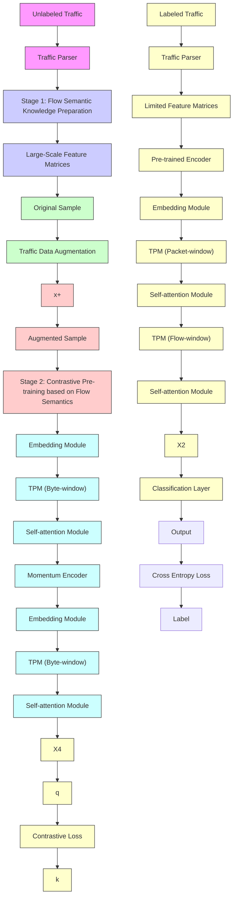
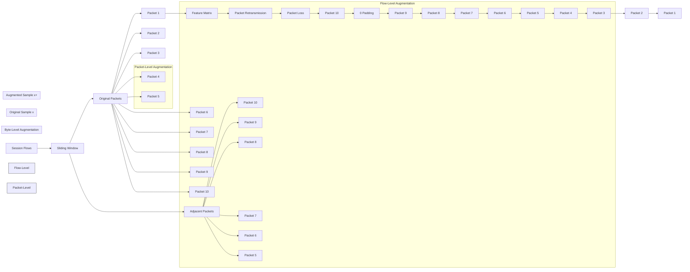
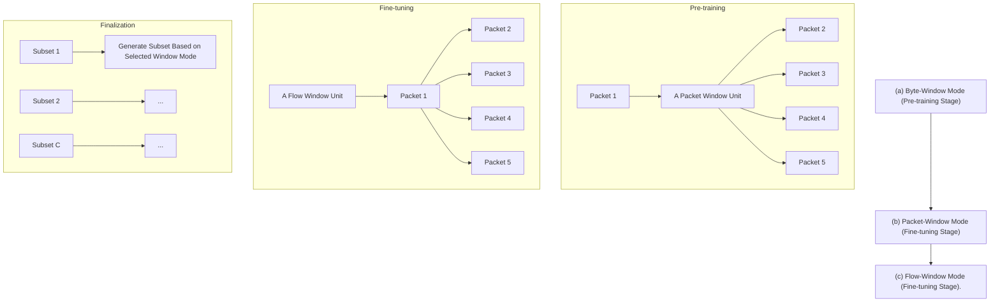

# Learning Flow Semantics for Encrypted Traffic Analysis: A Contrastive Pre-training Approach

Ruijie Zhao, Mingwei Zhan, Qi Li, Senior Member, IEEE, Zhuotao Liu, Xianwen Deng, Yanhao Wang, Guang Cheng, Zhi Xue, Ke Xu, Fellow, IEEE

Abstract—Encrypted traffic analysis is crucial for cyberspace security. Self-supervised learning shows great promise to enhance traffic analysis with the pre-trained traffic encoder, which is constructed using large-scale, readily available unlabeled traffic data. However, existing approaches struggle to handle the increasingly prevalent encrypted traffic, as their generative reconstruction tasks cannot process encrypted content. To this end, we propose TACO, a robust and flexible encrypted traffic analysis system based on flow semantics learning. Specifically, we first design several feasible traffic data augmentation strategies to prepare flow semantics knowledge from the unlabeled traffic. Then, our traffic encoder with a traffic partition module learns the semantics knowledge based on the contrastive pre-training paradigm. It serves as a traffic foundation encoder that can comprehend flow semantics and extract effective semantic representations. Finally, we fine-tune the traffic encoder to leverage flow semantics for various downstream encrypted traffic analysis tasks. The experimental results illustrate that TACO outperforms the optimal baseline by 7.5% in average F1 score on four traffic classification datasets and achieves an improvement of at least 11.62% in average F1 score on the three transfer tasks, while indicating superior efficiency. We will release the source code as well as the experiment data upon publication to foster future research.

Index Terms—Traffic analysis, contrastive pre-training, traffic data augmentation, flow semantics learning.

## 1 INTRODUCTION

Network traffic serves as one of the most critical data sources for analyzing network activities and detecting cyberspace attacks. Numerous security tasks are based on traffic analysis, such as application identification [1], [2], [3], malware detection [4], [5], [6], and attack detection [7], [8], [9]. With the development of the Internet and increasing focus on user privacy, Internet traffic is rapidly evolving and predominantly encrypted, posing significant challenges for traffic analysis [10], [11], [12], [13].

In recent years, deep learning (DL)-based traffic analysis methods have surpassed traditional rule-based methods, leveraging their powerful learning capabilities to automatically extract traffic features for effective analysis [14]. These

This work was supported in part by China National Funds for Distinguished Young Scientists under Grant 62425201; in part by the National Natural Science Foundation of China under Grant 62502089, Grant 62132011, and Grant 61932016; in part by Basic Research Program of Jiangsu under Grant BK20251353; and in part by SJTU-QI’ANXIN Joint Lab of Information System Security. (Corresponding authors: Ke Xu and Zhi Xue.)  
Ruijie Zhao and Guang Cheng are with the School of Cyber Science and Engineering, Southeast University, Nanjing, Jiangsu, China (e-mails: {ruijiezhao, chengguang}@seu.edu.cn)  
Mingwei Zhan, Xianwen Deng, and Zhi Xue are with the School of Computer Science, Shanghai Jiao Tong University, Shanghai, China (emails: {mw.zhan, 2594306528, zxue}@sjtu.edu.cn).  
Qi Li and Zhuotao Liu are with the Institute for Network Sciences and Cyberspace, Tsinghua University, Beijing 100084, China (e-mails: {qli01, zhuotaoliu}@tsinghua.edu.cn).  
Yanhao Wang is an Independent Researcher (e-mail: wangyanhao136@gmail.com).  
Ke Xu is with the Department of Computer Science and Technology, Tsinghua University, Beijing 100190, China, and also with the Zhongguancun Laboratory, Beijing 100086, China (e-mail: xuke@tsinghua.edu.cn).

approaches use traditional supervised training paradigms, which heavily rely on a large amount of labeled traffic data. However, traffic data labeling imposes significant overhead and cost [15]. Furthermore, it is difficult for classifiers trained on a certain dataset to adapt to the constantly evolving traffic protocols and applications. Recent arts [16], [17], [18], [19], [20] leverage self-supervised learning to construct pre-trained traffic encoders, alleviating the aforementioned issues. Specifically, they first learn knowledge from largescale unlabeled traffic data through pre-training to construct a generic traffic foundation encoder that extracts latent representations. Subsequently, this pre-trained encoder is finetuned with limited labeled traffic data to perform various traffic analysis tasks. It is noteworthy that their pre-training directly borrows the generative tasks from the fields of natural language processing (NLP) and computer vision (CV), by reconstructing masked bytes to match the raw bytes in the traffic data. However, adopting such tasks encounters significant challenges when applied to process encrypted traffic data. Given that encryption obfuscates the network payload into random bytes, reconstructing raw bytes from these parts is infeasible for pre-training encoders. Consequently, these traffic foundation encoders, based on the generative pre-training paradigm, struggle to learn effective traffic representations for encrypted traffic data, severely limiting their efficacy.

In this paper, we propose to leverage the holistic information of flow in encrypted traffic (defined as the flow semantics) rather than the fine-grained information obfuscated by encryption, to construct an effective traffic foundation encoder. Contrastive learning, another form of self-supervised learning, could serve this purpose by comparing the semantic similarities and differences between flows, enabling the encoder to comprehend flow semantics. Yet, empirical studies show that semantic knowledge preparation with data augmentation is critical to contrastive learning [21], [22], [23]. Unlike pixels and words, the meaning of traffic bytes is position-dependent. Traditional data augmentation strategies used in the NLP and CV fields, such as rotation and cropping, can disrupt this positional information and seriously damage the flow semantics (detailed in Appendix A). So far, existing literature lacks well-designed data augmentation strategies for traffic bytes, further hindering the development of encrypted traffic analysis systems based on contrastive learning.

To this end, we propose TACO, a robust and flexible encrypted traffic analysis system based on based on contrastive pre-training. The deployment of TACO includes three core stages: flow semantic knowledge preparation, flow semantics-aware encoder pre-training, and traffic classifier fine-tuning. First, we design several feasible traffic data augmentation strategies to prepare flow semantics knowledge from the unlabeled traffic data. Our key insight is to define semantic similarities at different levels of encrypted traffic data (i.e., byte-level, packet-level, and flowlevel) in a way that preserves the structural integrity and positional information, thus generating high-quality positive samples as flow semantics knowledge. Then, we design a novel flow semantics-aware traffic encoder with bytewindow partition mode to learn and utilize the prepared knowledge via the contrastive pre-training paradigm. The obtained pre-trained encoder can be regarded as a foundation encoder, capable of comprehending flow semantics. Finally, we switch the pre-trained traffic encoder to packetwindow and flow-window modes to make it easier for finetuning with limited labeled traffic data.

We evaluate the performance of TACO on four realworld traffic datasets collected from 2016 to 2024 across various traffic classification tasks, including service type identification, application fingerprinting, malicious traffic detection, etc. Results show that TACO achieves 86.61% to 96.46% classification accuracies on these classification tasks and surpasses the optimal baseline by by 7.43% in average accuracy and 7.49% in average F1 score. Notably, our flow semantics learning in the pre-training stage effectively contributes to an average performance gain of 23.1% in F1 score. Besides, we introduce three transfer tasks that are distinct from traditional traffic classification tasks: flow consistency judgment, unseen protocol adaptation, and openworld evaluation. Our method achieves an improvement of at least 11.62% in average F1 score on these transfer tasks. Additionally, benefiting from our efficient traffic partition module, TACO demonstrates superior efficiency compared to the Transformer-based baselines.

In summary, our contributions are as follows:

• We propose TACO, a flow semantics-aware traffic analysis system based on contrastive pre-training, to perform robust and flexible encrypted traffic analysis.  
• We perform effective traffic data augmentation with three well-designed augmentation strategies. It can prepare reasonable and pattern-rich flow semantic knowledge from the unlabeled traffic data.  
• We design a flow semantics-aware traffic encoder with the byte-window partition mode to learn the flow semantic

knowledge by contrastive learning. The pre-trained encoder is able to effectively extract semantic representations of various flows.

• We switch the pre-trained traffic encoder to packetwindow and flow-window modes to conduct more efficient fine-tuning with limited labeled traffic data for various encrypted traffic analysis tasks.  
• We comprehensively evaluate TACO’s classification performance, transfer performance, and efficiency on various real-world encrypted traffic datasets. Results demonstrate that TACO outperforms the state-of-the-art methods by a large margin.

## 2 RELATED WORK

Traditional Traffic Analysis Systems. The traditional methods mainly include rule-based methods and ML-based methods. The early studies of traffic analysis rely on rules designed by experts in network security. However, with the development of network environments, these methods are no longer sufficient to analyze more complex traffic [10], [12]. To solve this problem, ML-based methods [5], [24], [25], [26] apply machine learning algorithms to analyze selected statistical features of traffic. However, the humandesigned features are limited to specific scenarios and lack generalizability. In recent years, DL-based methods using raw traffic as input are emerging, which exploit advanced DL algorithms (e.g., CNN) for feature extraction without manually designed features [3], [6], [27], [28], [29]. However, CNN-based models exhibit inductive bias towards local feature extraction, which is more suitable for images rather than highly structured traffic data. More seriously, most of the previous DL-based works utilize the supervised training paradigms, requiring large amounts of labeled data to construct traffic classifiers. They not only highly rely on traffic labeling, which is overhead and expensive, but also have difficulty adapting to different traffic analysis scenarios.

Self-Supervised Traffic Analysis Systems. Recently, selfsupervised learning methods [30], [31], [32] have revolutionized the fields of computer vision and natural language processing, which utilize the unlabeled data to build a foundation encoder, thereby reducing the dependence on labeled data and benefiting various downstream tasks. In the field of traffic analysis, recent works Rosetta [33] and NetCLR [34] leverage self-supervised learning methods to learn variants of packet sequences rather than raw bytes in different network environments (e.g., high throughput and low throughput), reducing the impact of network environments on traffic analysis performance. However, these methods focus on their defined specific scenario and fail to serve as traffic foundation encoders to enhance various analysis tasks. For instance, Rosetta designs several data augmentations for the traffic sequence, e.g., subsequence shift and size variation, to simulate the variants when the network environment changes. However, these sequencebased augmentations cannot be applied in raw traffic bytes to generate meaningful positive flow samples as required by the general traffic analysis. To this end, several works have widely applied raw bytes to pre-train a general encoder. SAE [35] uses the stacked autoencoder paradigm for unlabeled feature extraction on raw bytes, and CL-ETC [36] randomly sets 14 consecutive bytes of the 784 raw bytes to generate augmented samples and perform contrastive learning with CNN. Both of them have limited performance due to their simple backbones and pre-train task designs. Several recent studies employ Transformer [37], a powerful backbone suitable for traffic bytes, and introduce generative tasks for self-supervised pre-training. For instance, PERT [16] migrates ALBERT [38] on bi-gramed sentence-like traffic bytes for mask modeling; ET-BERT [17] utilizes BERT and the bi-gram tokenizer on the designed BURST [39] for better traffic classification performance; PEAN [18] also adopts BERT to pre-train the packet encoder and combines transformer and long short-term memory networks for traffic analysis; YaTC [19] treats traffic data as images instead of sentences, and applies the masked autoencoder (MAE) paradigm to reconstruct the input traffic data for more efficient pre-training. However, they learn latent representations by reconstructing masked raw bytes of traffic, which is difficult to achieve with the prevalence of encryption.

To solve the above problems, we first prepare flow semantic knowledge of encrypted traffic data by augmentation. Then we apply contrastive learning that can focus more on overall semantic information rather than detailed information for pre-training. Finally, the pre-trained encoder is fine-tuned on various downstream traffic classification tasks for high-performance analysis.

## 3 PROBLEM STATEMENT

## 3.1 Flow Semantics

Flow semantics is defined as the intrinsic intent and behavioral patterns of network flows (cohesive sequences of packets) designed to perform specific functions, which remain invariant across network condition changes (e.g., packet loss, retransmission) and observation windows. They encompass two primary elements: content and structure. Content comprises the header and payload data within the packet sequence, capturing attributes such as packet length, protocol, and transmission details. Structure refers to specific data blocks located at different positions, which are defined by protocols to fulfill particular functions. Moreover, flow semantics provide extensive contextual information about sessions, protocols, applications, and events, delivering a holistic view of network behavior. We prepare flow semantics knowledge through traffic data augmentation tailored to the content and structural characteristics. Building on this foundation, flow semantics learning can be effectively implemented using a contrastive pre-training paradigm, enabling robust analysis and deeper insights into network behavior.

## 3.2 Threat Model

We aim to develop a robust and flexible traffic system that can analyze complex traffic behaviors under the encrypted network through flow semantics learning. It is noteworthy that flow semantics learning can utilize largescale unlabeled traffic data to construct a foundation model for encrypted traffic analysis, analogous to ChatGPT [32] for natural language processing. Unlike the pathway of finetuning publicly available large foundation models (e.g., GPT [40] and Llama [41]) or following the generative training paradigm, both of which cannot directly interpret encrypted traffic, we build the contrastive-based traffic foundation encoder using flow semantic knowledge in the pre-training stage. The model input is the raw bytes in the flow, regarded as a promising data source for encrypted traffic analysis, and has been widely applied in several works [6], [16], [17], [18], [19], [20], [27], [35].

The developed system should be able to classify specific categories of traffic (i.e., multi-classification). We emphasize that traffic classification is fully different from anomaly detection [7], [11], [42], which aims to detect traffic that deviates from the threshold. It is also worth noting that this work is different from the supervised learning-based methods. We implement the pipeline of the proposed method through three stages: (1) flow semantic knowledge preparation based on large-scale unlabeled traffic data via traffic data augmentation; (2) flow semantics learning, where the encoder learns to comprehend flow semantics and extract effective semantic representations by pre-training; and (3) classifier fine-tuning (i.e., leveraging flow semantics), which utilizes the learned representations to drive the classifier with limited labeled data. Furthermore, to rigorously evaluate the effectiveness and generalizability of flow semantics learning, we construct a diverse evaluation benchmark. Specifically, we utilize two fine-tuning datasets [2], [43] that are included in the pre-training data to verify the encoder’s ability to capture effective flow semantics from seen distributions. Meanwhile, two newer transfer datasets [44], [45], which are strictly excluded from the pretraining data, are employed to assess the method’s flexibility in handling unseen protocols and applications. Crucially, for all datasets, the test samples are rigorously isolated from the pre-training data to prevent any potential information leakage.

## 3.3 Design Goals

TACO is designed to prepare, learn, and leverage the flow semantics, thus developing a robust and flexible encrypted traffic analysis system for various downstream security tasks, such as application identification, malware detection, attack detection, etc. In particular, the system should achieve the following two goals, which have not been addressed well in existing studies.

Robust. The system should be able to accurately classify specific traffic categories, especially in encrypted networks. Notably, we do not advocate relying on a massive amount of labeled traffic data for training to enhance robustness.

Flexible. Equally important, the system is designed for agile deployment across new traffic analysis task scenarios, demonstrating a strong transfer capability. It is capable of adapting to the ever-changing landscape of task requirements, traffic protocols, and applications.

We deploy our pipeline around flow semantics learning to achieve the aforementioned goals. First, we address the challenge of traffic data augmentation for high-quality flow semantics knowledge preparation. Subsequently, through our flow semantics-oriented training paradigm and encoder structure, TACO learns and leverages flow semantics to construct a robust and flexible encrypted traffic analysis system.

flowchart

Fig. 1. The overview of TACO.

## 4 OVERVIEW OF TACO

TACO is a systematic approach centered around flow semantics learning, aimed at developing a robust and flexible encrypted traffic analysis system. Our insight is to leverage a flow semantics-aware traffic foundation encoder to extract effective flow semantic representations, thereby enhancing the performance in various encrypted traffic analysis tasks. Specifically, the traffic is preprocessed into the feature matrix that generates a 2D matrix with stacked packet matrixes for a flow. Next, we adopt the Transformer-based backbone network for feature extraction and design three partition modes to promote the performance of pre-training and finetuning. Then, we construct TACO through three key stages: flow semantic knowledge preparation, flow semantics learning, and traffic classifier fine-tuning. Figure 1 shows the overview of TACO.

Flow Semantic Knowledge Preparation. In this stage, we aim to prepare flow semantic knowledge from unlabeled traffic data. Our traffic data augmentation, implemented at the flow-level, packet-level, and byte-level, generates the augmented flow with the similar semantics as the original flow. These augmentation strategies are designed based on traffic data characteristics and provide high-quality data preparation for flow semantics learning. We will detail our traffic data augmentation in §5.1.

Contrastive Pre-training. In this stage, the flow semanticsaware traffic encoder learns flow semantics based on contrastive pre-training, which can prompt the traffic encoder with an embedding space where embeddings of similar flow semantics are closer than embeddings of different flow semantics. Specifically, there are three types of flow involved in training: (1) the original flow (i.e., as an anchor), (2) various augmented flows with consistent semantics of the original flow, and (3) other flows with different semantics from the original flow. The traffic encoder trains an effective embedding space by discriminating the semantic relationship of the above three types of flows, i.e., the augmented flows are close to the anchor, while the other flows are far away from the anchor. In addition, we apply byte-window mode for the traffic encoder to obtain cross-level sensing fields within traffic data, so that the encoder can take into account global dependencies for feature extraction. Notably, our pre-trained encoder, serving as a traffic foundation encoder, can effectively extract semantic representations of various flows. We will detail the flow semantics learning in §5.2.

Traffic Classifier Fine-Tuning. In this stage, we aim to finetune the classifier with limited labeled data. Although the pre-trained encoder can extract the semantic representation of the flow, it cannot classify the specific class of each flow. Thus, we load our pre-trained encoder and add a linear classification layer to it for fine-tuning training. Besides, we switch the partition module of the traffic encoder to packet-window mode and flow-window mode. It enables the encoder to perform feature extraction within the packetlevel partition and flow-level partition separately. Hence, we can well drive our classifier with limited labeled traffic data for various downstream traffic analysis tasks. We will describe the details of the fine-tuning in §5.3.

## 5 DESIGN DETAILS OF TACO

In this section, we first perform traffic data augmentation, which is designed to prepare flow semantic knowledge from unlabeled traffic data. Then, we detail the pre-training stage where our traffic encoder learns flow semantic. Finally, we fine-tune the pre-trained encoder for various downstream traffic classification tasks.

## 5.1 Flow Semantic Knowledge Preparation

As previously mentioned, contrastive training is highly applicable for constructing our traffic encoder with flow semantics learning. In the contrastive learning paradigm, data augmentation is crucial as it determines the quality of positive samples.

flowchart

Fig. 2. The schematic illustration of traffic data augmentation.

To this end, we implement traffic data augmentation with three well-designed augmentation strategies. As shown in Figure 2, the augmentation is performed at the byte-level, packet-level, and flow-level to preserve structural integrity and positional information of the traffic data. Moreover, the combination of intuitive and rational augmentation strategies enriches the pattern of augmented samples. Our traffic data augmentation strategies are specified as follows:

Flow-Level Augmentation. The flow-level augmentation is implemented via a sliding window. From the perspective of application-layer protocol state machines, a network session typically consists of a continuous sequence of interactions serving a unified purpose (e.g., a file download or video stream). Since the application state (e.g., ’transferring data’) remains consistent within a localized timeframe, adjacent windows sample sub-sequences of this continuous interaction and thus share the same flow semantics. In practice, the input size of the DL encoder is finite and fixed, meaning it can only process a limited segment of a flow at a time. Therefore, following the idea of sliding windows in network transmission control, we continue to slide the fixed window along the timestamp to sample subsequent parts. The augmented and original samples, adjacent within the same flow, exhibit similar functionality and semantics but differ in content.

Packet-Level Augmentation. The packet-level augmentation, which encompasses packet retransmission and loss operations, addresses the common variations prevalent in realworld network traffic. From the perspective of transportlayer reliability, mechanisms like TCP retransmission are designed to handle network instability without altering the application-layer function. Therefore, artificially simulating packet loss or duplication mimics network jitter, while the underlying semantics of the flow remain unchanged. To ensure robustness in learned flow semantics, it is essential that the model can adapt to such variability. To this end, we implement packet retransmission and loss on the augmented flow as positive samples. Specifically, the retransmission operation involves randomly selecting a packet and duplicating its content. Conversely, the packet loss operation removes a packet, subsequently padding the end of the feature matrix with zero bytes.

Byte-Level Augmentation. The byte-level augmentation is achieved by byte dropout operation. The raw bytes of traffic contain highly position-dependent flow semantic knowledge with a large amount of redundancy information (especially encrypted payloads). Thus, we apply the byte dropout operation to randomly drop a certain percentage of byte patches of both original and augmented samples during training. This augmentation brings different variants to input flow in each epoch, thereby enhancing the diversity of input information as well as forcing the encoder to focus on the robust flow semantic among encrypted bytes.

Our traffic data augmentation combines the above three strategies to generate high-quality and diverse augmented samples for effective self-supervised learning during pretraining. Flow-level augmentation samples different windows, packet-level augmentation introduces dynamics of loss and retransmission, and byte-level augmentation ensures fine-grained diversity by randomly masking payload bytes, guaranteeing distinct input variations for contrastive learning.

## 5.2 Contrastive Pre-training Based on Flow Semantics

In this stage (i.e., pre-training), we leverage the prepared flow semantic knowledge to construct our flow semanticsaware traffic encoder, which serves as a traffic foundation encoder that can comprehend flow semantics and extract effective semantic representations.

## 5.2.1 Encoder Structure

To extract features from structured traffic data more effectively, we adopt Transformer with positional embedding and multi-head attention mechanism as the backbone of the model. The following are the details of the three core modules of the traffic encoder, i.e., the embedding module, the traffic partition module, and the self-attention module.

Embedding Module. The embedding module, the initial component of the encoder, is responsible for splitting the formatted input feature matrix into a series of nonoverlapping byte patches. Each byte patch consists of bytes of size 2 ∗ 2 in the matrix, which is mapped to a 192- dimensional feature space. The positional embedding is added to mark their positional information in the traffic, then we have the initial features of all patches, denoted as the set $P = \{ x _ { p } ^ { 1 } ; x _ { p } ^ { 2 } ; . . . ; x _ { p } ^ { N } \}$ .

Traffic Partition Module. We develop a traffic partition module to better perform flow semantic learning in the pretraining stage and traffic classification in the subsequent fine-tuning stage. We detail its design motivation in $\mathsf { A p - }$ pendix E. The function of the traffic partition module is to generate a partition in terms of a specific window for $P 3$

flowchart

Fig. 3. The schematic illustration of the traffic partition module. We first select a unique window mode as the smallest unit of partition. Then, we generate each subset based on the selected mode. The blue patches indicate how a subset is partitioned under each mode.

$$
T P M (P) = \{P _ {1}; P _ {2};...; P _ {C} \}, P = \bigcup_ {i = 1} ^ {C} P _ {i}, \tag {1}
$$

$$
P _ {i} = \{W _ {1} \cup W _ {2} \cup ... \} = \{x _ {p} ^ {i 1}; x _ {p} ^ {i 2}; x _ {p} ^ {i 3};... \}, \tag {2}
$$

$$
\forall i, j, i \neq j \Rightarrow P _ {i} \cap P _ {j} = \emptyset . \tag {3}
$$

In the sets theory of mathematics, a partition of the set P refers to dividing its elements into non-empty subsets $P _ { i } ( i = 1 , 2 , . . . , C )$ by our defined window units $W _ { 1 , 2 \dots } ,$ in a manner such that each element $x _ { p } ^ { n } ( n = 1 , 2 , . . . , N )$ is precisely included in one and only one subset. Each subset has the same number of elements (also known as cardinality in the set theory). Therefore, we can easily parallelize the input of these subsets into the self-attention module.

The design of the traffic partition module is explicitly motivated by the hierarchical structural characteristics of network traffic: the byte is the basis content of a packet, and sequences of packets form a flow and reflect semantics. As the smallest unit of partition, the delineation of the window can be combined with the existing hierarchical information inside traffic data. By designing three window modes, i.e., byte-window, packet-window, and flow-window, the feature extraction of each layer could be focused on one specific granularity of the traffic hierarchical structure, enhancing the effectiveness and efficiency of flow semantics learning and leveraging. As shown in Figure 3, the three window modes are defined as follows:

• Byte-window consists of byte patches in the feature matix. The byte-window mode uses it as the basic unit of partition without limitation of high-level structure, i.e. packet and flow.

• Packet-window contains all patches of a packet in the feature matrix. In the packet-window mode, patches within the same packet are partitioned into the same subset. • Flow-window is defined as the patches at the same position of different packets in the feature matrix. The flowwindow mode ensures that patches within the same flow window will not be partitioned into different subsets.

Because these modes with different levels of information granularity define the scope of feature extraction, the encoder has the ability to more effectively learn and utilize the flow semantics. Additionally, each scope contains only one subset with $N / C$ patches after partition. Thus, the $O ( N ^ { 2 } )$ complexity of the self-attention module is significantly reduced to $O ( N ^ { 2 } / C ^ { 2 } )$ . In the deployment, we stack multiple traffic partition modules for feature extraction. Consequently, information from different scopes can interact with each other through the redistribution of subsets in the subsequent traffic partition module, gaining complete dependency extraction.

In this stage, we adopt the byte-window mode and set C to 2 to form a subset of bytes at different global positions for feature extraction. It can discover clues in global information to promote information interaction between related content. In the subsequent fine-tuning stage (§5.3), we will switch the pre-trained encoder to packet-window and flow-window modes for feature extraction, where the information interaction is limited to the bytes at the packet-level and the flowlevel respectively. It can facilitate the pre-trained encoder to more efficiently leverage related content in packet-level and flow-level for classification.

Self-Attention Module. Through the traffic partition module, traffic patches are divided into C subsets based on specific windows. To focus on more important features in the patches and capture long-distance dependencies, we introduce the self-attention module with the multi-head selfattention mechanism [37]. The output of the self-attention module is patch features containing dependencies within their subset. As detailed in Figure 1, our encoder includes 4 stacked traffic partition modules and self-attention modules in both pre-training and fine-tuning. After the final self-attention module, we form the union set of all patch features, and apply mean-pooling to them to obtain a 192- dimensional flow feature vector.

## 5.2.2 Flow Semantics-Oriented Training

Inspired by MoCo v3 [22], we abstract contrastive learning on flows as a dictionary query problem. Considering an encoded flow q as a query and a set of encoded flows $\{ k _ { 0 } , k _ { 1 } , k _ { 2 } , \ldots \}$ as keys of a dictionary, which contains a single key k as the encoded positive sample of the query flow. We aim to discriminate the k from $\{ \stackrel { \cdot } { k } _ { 0 } , k _ { 1 } , k _ { 2 } , \stackrel { \cdot } { \dots } \}$ in the feature space for each q. To obtain the encoded queries and keys, our model contains a query encoder $f _ { q u e r y }$ for queries and a momentum encoder $f _ { k e y }$ for keys. Both of them take our flow semantics-aware traffic encoder for feature extraction, and contain alternately stacked 4 traffic partition modules and 4 self-attention modules.

First, the original traffic sample x is fed to our traffic data augmentation to obtain the corresponding augmented positive sample $x ^ { + }$ . Then, we input x and $x ^ { + }$ into the encoder and momentum encoder respectively to obtain their feature representations $q = f _ { q u e r y } ( x )$ and $k = f _ { k e y } ( x ^ { + } )$ . Next, we get the encoded flow sample q as a query and the whole batch of encoded augmented samples $\left\{ k _ { 0 } , k _ { 1 } , k _ { 2 } , \dots k _ { B } \right\}$ as keys of the dictionary. Note that only one key matches q in these keys. The remaining keys and other flows’ positive samples within this batch are considered negative samples of $q .$ The model realizes the dictionary query by calculating the InfoNCE Loss [46] for each query:

$$
L o s s = - \log \frac {\exp (s i m (q , k) / t)}{\sum_ {i = 1} ^ {B} \exp (s i m (q , k _ {i}) / t)}, \tag {4}
$$

where the t is a temperature hyper-parameter that controls the sharpness of the probability distribution, regulating the penalty strength for negative samples in contrastive pre-training, the k is the only key that q matches, and $\bar { k } _ { i } ( i = 1 , 2 , \dots , B )$ are the whole batch encoded augmented samples. The function sim means the similarity, which we measure by the dot product.

While the query encoder $f _ { q u e r y }$ updated its parameters by back-propagation, the key encoder $f _ { k e y }$ performs momentum updates by introducing a momentum coefficient m instead of simply copying the parameters of $f _ { q u e r y } .$ $\theta _ { k e y } ^ { \mathrm { n e w } } = m \cdot \theta _ { k e y } ^ { \mathrm { o l d } } + \bar { ( 1 - m ) } \cdot \bar { \theta } _ { q u e r y }$ = m · θ old , where $m \in [ 0 , 1 )$ , the parameters of $\bar { f } _ { k e y }$ denoted as $\theta _ { k e y } ,$ and those of $f _ { q u e r y }$ as $\theta _ { q u e r y } .$ . Momentum updating is vital for traffic data, which carries distinct functional behaviors across different applications. It maintains the consistency of the key encoder, preventing drastic parameter fluctuations driven by functional discrepancies between batches. By smoothing updates with a coefficient $m ,$ , it ensures the negative sample queue remains a stable reference, allowing the model to capture robust flow semantics rather than fitting specific batch noise.

In addition, the byte dropout strategy used in the pretraining stage not only involves byte-level data augmentation but also significantly reduces the number of input patches, achieving a significant reduction in memory usage and computation. Furthermore, our insight into pre-training is that the more difficult training task can push our encoder to learn more effective representations. Thus, the traffic partition module in the flow semantics-aware traffic encoder is set as byte window mode in this stage. It excludes additional structural knowledge in the pre-training encoder and prevents the encoder from taking shortcuts during learning.

## 5.3 Traffic Classifier Fine-tuning

In the fine-tuning stage, we leverage supervised learning to fine-tune our encoder for diverse downstream traffic analysis tasks.

## 5.3.1 Classifier Structure

To perform classifier fine-tuning more efficiently, we consider providing facilitation to the classifier for achieving better classification performance. Thus, we load the pretrained encoder and switch the traffic partition module.

Specifically, we load the parameters of the pre-trained flow semantics-aware traffic encoder including 4 selfattention modules with the ability to extract generic representations of traffic data. Then, the traffic partition module is switched to packet-window and flow-window partition alternately, which can cyclically realize intra-packet and inter-flow information interaction. As shown in Figure 3, the packet-window mode divides patches into subsets according to the packet they belong to, which means the number of subsets C is the packet count of the flow feature matrix, i.e. 5 in our implementation. In flow-window mode, each window unit contains patches of the same position from different packets in the flow since they usually indicate the same function and reflect the fine-grained flow dynamics. These flow window units are partitioned into $C \stackrel { \cdot } { = } 4$ subsets, where a higher partition count C will result in more information loss of each subset and a lower C will introduce more flow-independent patches within a single subset. The packet window mode and flow window mode respectively impose attention on the traffic of a specific granularity to avoid irrelevant fine-grained dependencies, thereby achieving effective utilization of the pre-trained encoder. Besides, our encoder has learned knowledge from all information granularity $( \mathrm { i . e . , }$ byte-level, packet-level, and flow-level) in the previous pre-training stage with byte-window mode, enabling efficient information interaction within the flow window and packet window. Finally, a linear classification layer is added after the encoder to classify the traffic type.

TABLE 1 Summary of Datasets and Baselines. (Cls: class count, Gen: generative pre-training, Con: contrastive pre-training).

<table><tr><td colspan="3">Datasets</td><td colspan="3">Baselines</td></tr><tr><td>Name</td><td>Size</td><td>Cls.</td><td>Method</td><td>Backbone</td><td>Type</td></tr><tr><td>ISCXVPN2016 [43]</td><td>1.7k</td><td>7</td><td>SAE [35]</td><td>AE</td><td>Gen.</td></tr><tr><td>CrossPlat2020 [2]</td><td>1.9k</td><td>30</td><td>CL-ETC [36]</td><td>CNN</td><td>Con.</td></tr><tr><td>CrossNet2022 [44]</td><td>1.6k</td><td>20</td><td>PEAN [18]</td><td>BERT+LSTM</td><td>Gen.</td></tr><tr><td>CICEVSE2024 [45]</td><td>10.2k</td><td>51</td><td>PERT [16]</td><td>ALBERT</td><td>Gen.</td></tr><tr><td>VPN2023 [47]</td><td>7.5k</td><td>150</td><td>ET-BERT [17]</td><td>BERT</td><td>Gen.</td></tr><tr><td>QUIC2022</td><td>2.2k</td><td>8</td><td>YaTC [20]</td><td>MAE</td><td>Gen.</td></tr></table>

## 5.3.2 Classifier Training

We use the pre-trained query encoder that updates the parameters normally, and load it to the flow semanticsaware traffic encoder. Then, the partition mode of the traffic partition module is switched as mentioned above. Next, a linear layer is added behind the encoder for classification. It receives the output features from the encoder to make predictions of the labels and use the cross entropy as a loss function: $\begin{array} { r } { L o s s \ = \ - \sum _ { i = 1 } ^ { N _ { l } } y _ { i } \log ( p _ { i } ) } \end{array}$ , where the $y _ { i }$ is the one-hot encoding of the true label, $p _ { i }$ means the output prediction of the model, and $N _ { l }$ is the number of labels.

Moreover, during the fine-tuning stage, the flowwindow partition is a randomized partition with the flowwindow as the smallest unit. The randomness is intended to enrich the pattern of features seen by the self-attention module, bringing a kind of hidden data augmentation in the training phase that can improve the generalization ability of the model. In the test stage, to obtain fixed inputs of test samples, we apply a certain strategy similar to the shuffle Transformer to partition the subsets, so as to obtain stable inference results. Specifically, flow windows are rotated into C subsets by their sequential order, which could easily be realized by matrix transposition.

## 6 EXPERIMENTAL RESULTS

In this section, we evaluate the performance of TACO. In particular, we answer the following four research questions:

TABLE 2 The Performance of TACO and Baselines on Four Real-World Traffic Datasets.

<table><tr><td rowspan="2">Methods</td><td colspan="2">ISCXVPN2016</td><td colspan="2">CrossPlat2020</td><td colspan="2">CrossNet2022</td><td colspan="2">CICEVSE2024</td></tr><tr><td>Acc. (%)</td><td>F1 (%)</td><td>Acc. (%)</td><td>F1 (%)</td><td>Acc. (%)</td><td>F1 (%)</td><td>Acc. (%)</td><td>F1 (%)</td></tr><tr><td>SAE</td><td>57.91 ± 0.46</td><td>55.60 ± 0.26</td><td>36.67 ± 1.87</td><td>33.97 ± 1.95</td><td>30.94 ± 0.67</td><td>29.01 ± 0.68</td><td>35.48 ± 0.17</td><td>30.25 ± 0.91</td></tr><tr><td>CL-ETC</td><td>82.99 ± 0.70</td><td>83.34 ± 0.73</td><td>40.45 ± 1.59</td><td>41.69 ± 1.35</td><td>55.72 ± 1.52</td><td>55.12 ± 1.53</td><td>52.17 ± 2.00</td><td>49.44 ± 2.22</td></tr><tr><td>PERT</td><td>86.89 ± 1.53</td><td>86.75 ± 1.50</td><td>94.03 ± 2.75</td><td>93.68 ± 3.04</td><td>74.31 ± 2.07</td><td>73.77 ± 2.19</td><td>72.33 ± 0.71</td><td>71.93 ± 0.74</td></tr><tr><td>ET-BERT</td><td>86.19 ± 0.94</td><td>86.84 ± 0.73</td><td>91.66 ± 3.98</td><td>90.94 ± 4.47</td><td>65.08 ± 3.29</td><td>64.63 ± 3.20</td><td>72.19 ± 0.24</td><td>72.06 ± 0.24</td></tr><tr><td>PEAN</td><td>83.22 ± 1.70</td><td>83.03 ± 1.92</td><td>40.62 ± 1.83</td><td>36.11 ± 2.69</td><td>49.11 ± 4.40</td><td>46.26 ± 6.28</td><td>5.08 ± 0.53</td><td>0.94 ± 0.50</td></tr><tr><td>YaTC</td><td>90.83 ± 0.34</td><td>90.65 ± 0.37</td><td>88.97 ± 1.15</td><td>88.47 ± 1.18</td><td>80.49 ± 1.17</td><td>80.34 ± 1.31</td><td>76.03 ± 1.76</td><td>75.82 ± 1.71</td></tr><tr><td>TACO</td><td>94.52 ± 0.69</td><td>94.46 ± 0.70</td><td>96.46 ± 0.43</td><td>96.24 ± 0.43</td><td>86.61 ± 1.68</td><td>86.41 ± 1.71</td><td>88.45 ± 0.37</td><td>88.13 ± 0.40</td></tr></table>

1) How well does TACO perform compared to the state-ofthe-art methods? (§6.2)  
2) How effective is the flow semantics learning in the pretraining stage? (§6.3)  
3) If TACO has transfer capability for rapid application in new downstream traffic tasks? (§6.4)  
4) How efficient is TACO in training and analysis? (§6.5)  
5) How does each component of TACO contribute? (§6.6)

## 6.1 Experiment Settings

We design several experiments to evaluate the efficacy and efficiency of TACO and advanced baselines on various datasets. We repeated the experiments with different random seeds and reported them as the mean and standard deviation. The details of implementation and model architecture are presented in Appendix B and C.

Datasets. In pre-training, we aggregate 1,074,861 unlabeled traffic flows from public datasets [2], [6], [43], [48] for TACO and the fair replication of all methods. As summarized in the left part of Table 1, four datasets [2], [43], [44], [45] collected from different years with various traffic analysis tasks are used for fine-tuning evaluation. The VPN2023 [47] dataset with the new protocol is introduced for unseen protocol adaptation and open-world evaluation. Furthermore, we collect a QUIC traffic dataset for unseen protocol adaptation. In the implementation, we strictly removed the IP, port, and timestamp of all traffic to avoid potential bias. We describe the details of the datasets in Appendix D.

Baselines. As shown in the right part of of Table 1, we use six advanced self-supervised traffic analysis methods [16], [17], [18], [20], [35], [36] that have the ability to leverage unlabeled traffic data as baselines with their optimal settings, which are detailed in Appendix E. Additionally, we also compare with the other six supervised learning-based baselines in Appendix F.

## 6.2 Classification Performance (RQ1)

Table 2 shows the results of the classification performance of TACO and baselines on the four real-world traffic datasets. We can observe that TACO achieves superior classification performance on all metrics. Both SAE and CL-ETC are unable to perform ideal classification performance with the backbones of linear layer networks and CNN, which are not suitable to serve as robust traffic encoders. TACO and other baseline methods adopt Transformer, which shows potential to handle the position-dependent bytes of encrypted traffic with self-attention mechanism and position embedding, as the backbone to conduct self-supervised traffic analysis. Except for PEAN, which does not show a significant gap due to its heavy reliance on LSTM, the generative Transformer approaches (i.e., PERT, ET-BERT, YaTC) demonstrate a performance advantage. However, their representations learned by the reconstruction task are harmed by the encrypted part of traffic. Thus, none of them achieve consistently high performance and stability on all four datasets. Differently, TACO learns the flow semantics by the relationships between flows instead of the internal information with encryption and significantly outperforms them in performance, stability, and universality. In addition, Appendix F shows that our method can still achieve significant advantages over the baselines in few-shot learning. Note that, TACO is also significantly ahead in terms of transfer capability (Sec. 6.4) and efficiency (Sec. 6.5), both of which are critical to the availability of traffic classifiers. We specifically analyze the performance of our method and baselines on various traffic datasets as follows.

The results of different methods on the ISCXVPN2016 dataset are shown in the leftmost section of Table 2. This service type identification task includes 7 different service types over VPN. Among the baselines, SAE exhibits the poorest performance, primarily because its backbone, composed of linear layers, struggles to extract features from complex VPN traffic effectively. TACO achieves improvements of 3.7% in accuracy and 3.8% in F1 score compared to the suboptimal baseline, YaTC. In addition, Table VII presents the performance of supervised learning-based baselines. FS-Net, designed for encrypted traffic analysis, is the best among them, achieving an accuracy of 87.56% and an F1 score of 87.50%, respectively. However, since FS-Net cannot leverage unlabeled data to extract effective latent representations, its performance remains significantly lower than ours. Thus, TACO achieves significant improvements over all baselines, demonstrating its effectiveness in the service type identification task.

The second section of Table 2 illustrates the performance of various methods for application fingerprinting on the CrossPlat2020 dataset. It can be observed that many baselines present a significant performance drop, including the supervised baselines in Appendix F. This is because this task includes a large number of application categories in the relatively closed IOS system, resulting in more complex and unified traffic patterns. Pre-training methods generally achieve superior performance as they effectively learn to extract features of these patterns from unlabeled data. PERT, with a larger number of parameters, achieves sub-optimal performance. However, its performance exhibits noticeable fluctuations (around 3%) and remains lower than that of TACO by 2.4% and 2.6% in accuracy and F1 score, respectively. These results highlight that our flow semantics learning serves as a more effective pre-training strategy, enabling TACO with fewer parameters to achieve superior performance in application fingerprinting.

  
Fig. 4. Comparison of pre-training effects on the four traffic datasets.

The third section of Table 2 presents the results of different methods on the CrossNet2022 dataset. This task evaluates the performance of traffic classifiers under abnormal network conditions, where the bandwidth is limited to 10 Mbps, the packet loss rate ranges from 2.5% to 5%, and the latency is 200 ms. Due to the challenging network conditions, none of the methods achieved classification performance above 90%, with PERT and ET-BERT even falling below 75%. TACO achieves the best performance in this task, with improvements of 6.1% in accuracy and 6.0% in F1 score compared to YaTC.

The results of different methods on the CICEVSE2024 dataset are presented in the rightmost section of Table 2. This task includes 51 traffic categories with various malicious traffic (e.g., cryptojacking, backdoor, and denial of service attacks) collected in electric vehicle charging stations. The large number of similar attacks (e.g., up to 5 types of scan attacks and 6 types of flood attacks) on charging stations makes the traffic difficult to distinguish, significantly affecting the classification performance of the baselines. In this malicious traffic classification task, TACO achieves an accuracy of 88.45% and an F1 score of 88.13%, outperforming the optimal baseline by 12.4% and 12.3%, respectively.

## 6.3 Effect of Flow Semantics Learning (RQ2)

In this section, we present the effect of our flow semantics learning implemented in the pre-training stage. To comprehensively evaluate the effectiveness of flow semantics learning as a novel pre-training strategy for traffic analysis tasks, we conduct experiments focusing on the following two aspects: (1) the performance improvements in traffic analysis contributed by pre-training and (2) the results using traditional augmentation on traffic data.

Improvement of Pre-training. Figure 4 illustrates the results of pre-training improvements across different methods. It is evident that TACO’s flow semantics learning consistently achieves stable and significant improvements across various traffic classification tasks. However, the performance improvements of SAE, CL-ETC, and PEAN are minimal and sometimes even negative. This is because SAE and CL-ETC apply the unsuitable backbone and overly simplistic selfsupervised tasks, where SAE conducts data compression and CL-ETC replaces the consecutive bytes with 0 as augmentation for contrast, resulting in their failed pre-training. In addition, PEAN only pre-trains the packet encoder to learn the packet representation, while the other components (flow encoder and LSTM) are absent from pre-training. As a result, it fails to benefit from unlabeled traffic data. The other three baselines employ generative pre-training, which, though not feasible for encrypted content, can learn from partially unencrypted flows and unencrypted segments of the flow (e.g., header content), achieving some pre-training improvements. Notably, since limited labeled data cannot drive PERT and ET-BERT with large parameter amounts (see §6.6), they can’t work well without pre-training on the Cross-Platform dataset. Benefiting from the well-designed traffic data augmentation that can prepare rich flow semantic knowledge for pre-training, the pre-training improvements of TACO are very significant and stable on the four datasets.

TABLE 3 F1 Performance (%) of Using Traditional Augmentation for Pre-training.

<table><tr><td>Methods</td><td>ISCXVPN2016</td><td>CrossPlat2020</td><td>CrossNet2022</td><td>CICEVSE2024</td></tr><tr><td>w/o PT</td><td>81.5</td><td>70.8</td><td>52.2</td><td>68.4</td></tr><tr><td>w/ Trad. Aug.</td><td>81.4 ↓0.1</td><td>57.1 ↓13.7</td><td>54.2 ↑2.0</td><td>58.7 ↓9.7</td></tr><tr><td>w/ Our Aug.</td><td>94.5 ↑13.0</td><td>96.2 ↑25.4</td><td>86.4 ↑34.2</td><td>88.1 ↑19.7</td></tr></table>

Comparison with Traditional Augmentation. It is noteworthy that traditional data augmentation strategies, such as rotation, cropping, and zooming, can seriously damage the content of traffic data. The results of pre-training the traffic classifier using traditional augmentation are presented in Table 3. It can be observed that traditional augmentation strategies yield almost no improvement in classifier performance on the four traffic datasets, with only a slight increase of 2.8% in accuracy and 2% in F1 score on the Cross-Net2022 dataset. On the CrossPlat2020 and CICEVSE2024 datasets, which represent challenging tasks with a larger number of traffic categories, the F1 scores from pre-training with traditional data augmentation even decrease by 9.7% and 13.7%, respectively. In contrast, pre-training with our flow semantics-based data augmentation achieves consistent and significant improvements, with an average increase of 22.1% in accuracy and 23.1% in F1 score. In summary, traditional data augmentation strategies are unsuitable for traffic data, whereas TACO with three well-designed augmentation strategies effectively addresses this challenge and achieves robust performance.

TABLE 4 Performance of TACO and Baselines on Flow Consistency Judgment and Unseen Protocol Adaptation (WireGuard and QUIC).

<table><tr><td rowspan="2">Methods</td><td colspan="2">Flow Consistency Judgment</td><td colspan="2">WireGuard</td><td colspan="2">QUIC</td></tr><tr><td>Acc. (%)</td><td>F1 (%)</td><td>Acc. (%)</td><td>F1 (%)</td><td>Acc. (%)</td><td>F1 (%)</td></tr><tr><td>PERT</td><td>50.37 ± 0.27</td><td>46.97 ± 2.53</td><td>73.27 ± 4.18</td><td>73.23 ± 4.14</td><td>54.67 ± 2.84</td><td>51.86 ± 2.79</td></tr><tr><td>ET-BERT</td><td>50.33 ± 0.10</td><td>41.13 ± 3.14</td><td>72.24 ± 3.14</td><td>71.79 ± 3.21</td><td>44.27 ± 0.80</td><td>44.25 ± 0.60</td></tr><tr><td>YaTC</td><td>87.77 ± 2.46</td><td>87.36 ± 2.63</td><td>81.33 ± 2.37</td><td>81.18 ± 2.42</td><td>87.98 ± 0.43</td><td>87.97 ± 0.44</td></tr><tr><td>TACo</td><td>93.15 ± 1.40</td><td>93.05 ± 1.44</td><td>92.21 ± 0.37</td><td>92.12 ± 0.38</td><td>91.51 ± 0.39</td><td>91.53 ± 0.41</td></tr></table>

TABLE 5 Performance of TACO and Baselines on Open-World Evaluation.

<table><tr><td rowspan="2">Methods</td><td colspan="4">Open-World Evaluation</td></tr><tr><td>Acc. (%)</td><td>F1 (%)</td><td>MTA (%)</td><td>UTA (%)</td></tr><tr><td>PERT</td><td>87.84 ± 3.50</td><td>87.46 ± 2.32</td><td>64.22 ± 5.55</td><td>96.80 ± 4.75</td></tr><tr><td>ET-BERT</td><td>78.09 ± 10.33</td><td>79.19 ± 7.62</td><td>50.72 ± 8.53</td><td>88.47 ± 14.77</td></tr><tr><td>YaTC</td><td>72.27 ± 11.61</td><td>76.17 ± 9.56</td><td>90.07 ± 0.96</td><td>65.51 ± 15.85</td></tr><tr><td>TACO</td><td>93.84 ± 2.06</td><td>94.40 ± 1.53</td><td>91.32 ± 1.57</td><td>94.80 ± 2.43</td></tr></table>

## 6.4 Transfer Capability of TACO (RQ3)

In this section, we implement three new traffic tasks, distinct from the classification tasks in the original dataset, that require a more fundamental understanding of traffic semantics by the pre-trained encoder. The flexible transfer capability on new traffic analysis tasks is critical to a foundation traffic encoder. The three new transfer tasks are (1) flow consistency judgment, (2) unseen protocol adaptation, and (3) open-world evaluation.

Flow Consistency Judgment. We construct a binary classification task to determine whether the input flow samples exhibit consistent flow semantics. Specifically, each flow sample consists of five packets, which either originate from the same flow (classified as class 0) or from different flows (classified as class 1). Since all packets are stripped of IP addresses, port numbers, and timestamps, the model must rely solely on the remaining bytes to determine whether the packets in the input flow sample belong to the same flow. We use the four traffic datasets in Sec. 6.2 to conduct this assessment.

The left part of Table 4 presents the results of the flow consistency judgment task. It can be seen that PERT and ET-BERT achieved F1 scores of 46.97% and 41.13%, respectively, indicating that they are unable to correctly judge the consistency of the flow. Moreover, this task involves traffic data from four different traffic datasets, which requires the pre-trained encoder to handle traffic with diverse protocols for feature extraction, thereby increasing the task’s difficulty. PERT and ET-BERT use bi-gram strings to represent traffic bytes, making them excessively focus on the detailed patterns rather than the semantics of the entire flow, resulting in their poor performances in this task. Thanks to TACO’s pre-training paradigm, which is designed to comprehend the holistic semantics of flows and learn the semantic differences between different flows, our method can more effectively judge flow consistency. TACO achieves an accuracy of 93.15% and an F1 score of 93.05%, surpassing the optimal baseline by 5.38% and 5.69%, respectively.

line chart

| Batch Size (2^x) | PERT   | ET-BERT | PEAN   | YaTC   | TACO   |
| ---------------- | ------ | ------- | ------ | ------ | ------ |
| 2^5              | 20000  | 30000   | 10000  | 10000  | 10000  |
| 2^6              | 25000  | 35000   | 12000  | 12000  | 12000  |
| 2^7              | 35000  | 45000   | 15000  | 15000  | 15000  |
| 2^8              | 65000  | 80000   | 20000  | 25000  | 15000  |
| 2^9              | -      | -       | 35000  | 45000  | 15000  |
| 2^10             | -      | -       | 60000  | 85000  | 15000  |
| 2^11             | -      | -       | -      | -      | 20000  |
| 2^12             | -      | -       | -      | -      | 35000  |
| 2^13             | -      | -       | -      | -      | -      |
| 2^14             | -      | -       | -      | -      | 60000  |

Fig. 5. The GPU memory usage of Transformer-based methods.

Unseen Protocol Adaptation. During the pre-training stage, all methods are only exposed to VPN traffic using the TLS 1.2 protocol. The unseen protocol adaptation task aims to assess whether the learned representations extracted by the pre-trained traffic encoder can adapt to previously unseen protocols. To this end, we introduce the WireGuard dataset [47] and the widely deployed QUIC protocol for evaluation.

As shown in the right part of Table 4, generative baselines (PERT, ET-BERT) suffer a catastrophic performance drop on QUIC. These baselines adopt the generative pretraining paradigm, which overly focuses on detailed information (e.g., protocol-specific byte patterns), making them less flexible in adapting to fundamental protocol changes. In contrast, TACO implements traffic augmentation to prepare rich flow semantic knowledge, enabling the learning of holistic flow semantics that reflect network behavior in the pre-training stage. Consequently, our method achieves robust F1 scores of 92.12% on WireGuard and 91.53% on QUIC, significantly outperforming the optimal baseline by 10.94% and 3.56%, respectively.

Open-World Evaluation. In the open-world scenario, traffic analysis methods not only need to classify the monitored traffic categories, but also face the open-world unmonitored traffic. We model the open-world evaluation as a multiclassification task with the original monitored categories and an additional unmonitored open-set category. In detail, we introduce original 7 classes and traffic from the ISCXVPN2016 dataset as the monitored categories, while the ISCX-NonVPN dataset serves as another category to represent unmonitored traffic in the train set. In contrast, the unmonitored category in the test set consists of all test traffic samples with 150 new classes from the VPN2023 dataset [47], which is not included in the training data for the open-world setting. We define two metrics in this evaluation: monitored traffic accuracy (MTA) and unmonitored traffic accuracy (UTA). MTA measures the proportion of correctly classified monitored traffic, while UTA measures the proportion of open-world traffic correctly classified as unmonitored : $\begin{array} { r } { \mathbf { M T A } ^ { \bullet } = \frac { \sum _ { k \in \mathcal { M } } \mathrm { T P } _ { k } } { \sum _ { k \in \mathcal { M } } N _ { k } } , \mathbf { U T A } = \frac { \mathrm { T P } _ { u } } { N _ { u } } } \end{array}$ Nu , where M is the set of monitored categories, $\mathrm { T P } _ { k }$ and $N _ { k }$ are the correctly classified and total samples in category $k ,$ respectively, and $\mathrm { T P } _ { u }$ and $N _ { u }$ are the correctly classified and total unmonitored samples.

Table 5 shows the results of the open-world evaluation.

TABLE 6 Ablation Study on Key Modules and Traffic Data Augmentation. The abbreviations are explained as follows: TPM: traffic partition module, PE: pre-trained encoder; FLA: flow-level augmentation, PLA: packet-level augmentation, BLA: byte-level augmentation, All: all augmentation.

<table><tr><td rowspan="2">Methods</td><td colspan="2">ISCXVPN2016</td><td colspan="2">CrossPlat2020</td><td colspan="2">CrossNet2022</td><td colspan="2">CICEVSE2024</td></tr><tr><td>Acc. (%)</td><td>F1 (%)</td><td>Acc. (%)</td><td>F1 (%)</td><td>Acc. (%)</td><td>F1 (%)</td><td>Acc. (%)</td><td>F1 (%)</td></tr><tr><td>TACO</td><td> $94.52 \pm 0.69$ </td><td> $94.46 \pm 0.70$ </td><td> $96.46 \pm 0.43$ </td><td> $96.24 \pm 0.43$ </td><td> $86.61 \pm 1.68$ </td><td> $86.41 \pm 1.71$ </td><td> $88.45 \pm 0.37$ </td><td> $88.13 \pm 0.40$ </td></tr><tr><td>w/o TPM</td><td> $90.47 \pm 0.95$ </td><td> $90.30 \pm 0.98$ </td><td> $88.13 \pm 0.69$ </td><td> $87.19 \pm 0.81$ </td><td> $74.50 \pm 1.23$ </td><td> $74.17 \pm 1.30$ </td><td> $72.97 \pm 0.43$ </td><td> $72.76 \pm 0.48$ </td></tr><tr><td>w/o PE</td><td> $82.36 \pm 3.72$ </td><td> $81.52 \pm 3.87$ </td><td> $72.00 \pm 1.20$ </td><td> $70.75 \pm 1.34$ </td><td> $53.58 \pm 4.96$ </td><td> $52.21 \pm 4.90$ </td><td> $69.67 \pm 6.28$ </td><td> $68.37 \pm 6.66$ </td></tr><tr><td>w/o FLA</td><td> $92.65 \pm 0.52$ </td><td> $92.50 \pm 0.54$ </td><td> $93.99 \pm 0.44$ </td><td> $93.48 \pm 0.56$ </td><td> $78.17 \pm 2.31$ </td><td> $77.92 \pm 2.50$ </td><td> $86.50 \pm 3.40$ </td><td> $86.30 \pm 3.39$ </td></tr><tr><td>w/o PLA</td><td> $93.43 \pm 1.00$ </td><td> $93.30 \pm 1.06$ </td><td> $94.78 \pm 0.75$ </td><td> $94.51 \pm 0.75$ </td><td> $83.24 \pm 2.44$ </td><td> $83.02 \pm 2.50$ </td><td> $84.66 \pm 5.89$ </td><td> $84.41 \pm 5.89$ </td></tr><tr><td>w/o BLA</td><td> $82.78 \pm 2.15$ </td><td> $82.03 \pm 2.31$ </td><td> $71.40 \pm 2.16$ </td><td> $62.96 \pm 3.19$ </td><td> $60.49 \pm 6.33$ </td><td> $58.44 \pm 7.66$ </td><td> $78.72 \pm 5.19$ </td><td> $78.24 \pm 5.09$ </td></tr><tr><td>w/o All</td><td> $79.09 \pm 2.32$ </td><td> $78.32 \pm 2.45$ </td><td> $30.03 \pm 2.05$ </td><td> $17.07 \pm 2.25$ </td><td> $63.12 \pm 0.60$ </td><td> $62.76 \pm 0.67$ </td><td> $71.19 \pm 2.46$ </td><td> $69.97 \pm 2.43$ </td></tr></table>

bar chart

| Model   | Throughput (sample/s) | Parameters (10^4) |
|---------|------------------------|-------------------|
| PERT    | 700                    | 5500              |
| ET-BERT | 700                    | 13500             |
| PEAN    | 600                    | 200               |
| YaTC    | 2900                   | 200               |
| TACO    | 3800                   | 200               |

Fig. 6. The throughput and parameters of Transformer-based methods.

Except for ${ \mathrm { T A C O } } ,$ all baselines show wider fluctuations in performance with different random seeds in the open-world setting. In terms of accuracy and F1 score, each method achieves performance higher than 70%. However, MTA and UTA reveal their inherent issues. Although ET-BERT and PERT demonstrate superior performance in unmonitored open-world traffic detection, they perform poorly on the classification task for monitored traffic categories, with MTA scores of only 50.72% and 64.22%, respectively. On the other hand, YaTC achieves a high MTA of 90.07%, but its UTA of 65.51% indicates a lack of ability to distinguish monitored and unmonitored traffic, resulting in over one-third of unmonitored traffic being misclassified into monitored categories. Thanks to our pre-trained traffic encoder that captures the distinct semantics of each flow, TACO achieves performance exceeding 90% across all metrics, demonstrating its superiority in the open-world evaluation.

## 6.5 Efficiency of TACO (to RQ4)

To evaluate the efficiency of our method, we compare the memory usage, throughput, and parameters with four transformer-based methods in this section.

GPU Memory Usage. GPU memory usage is crucial for training, especially for the pre-training stage, because it determines the size of unlabeled data that can be processed under the same GPU resources. Figure 5 illustrates the GPU memory consumption of the Transformer-based methods under different batch sizes. It is evident that, due to the $O ( N ^ { 2 } )$ space complexity inherent to the Transformer architecture, the memory usage of each method escalates rapidly with the exponential increase of batch size. TACO benefits from the byte dropout strategy and traffic partition module, which substantially mitigate space complexity. Consequently, our method can handle at least 16 times more data under the same memory constraints compared to other methods. In contrast, both ET-BERT and PERT have extremely high memory usage due to the use of the BERTstyle setup designed for NLP tasks with extremely high parameter counts. YaTC and PEAN with specific settings for traffic analysis tasks have lower memory usage, but the lack of optimized encoder design in the pre-training stage results in significantly higher memory consumption than our method.

Throughput and Parameters. Throughput and parameter count are vital in traffic analysis systems, as throughput determines processing speed while parameter count impacts model complexity and resource demands. Figure 6 shows that the processing and deployment efficiency of PERT and ET-BERT is significantly lower than others. Because they direct reuse of the large models and parameter settings in the NLP field, and neither of them has taken measures to optimize the highly complex global self-attention in the Transformer model structure for traffic analysis. In contrast, PEAN, YaTC, and TACO conduct special model design according to flow structure thus decomposing the complexity of self-attention, resulting in their lightweight parameters. However, the irrational input settings and staged twoencoder design of PEAN result in the lowest throughput. YaTC utilizes parameter sharing to mitigate this problem, but still with inefficient staged model design. Thanks to the well-designed traffic partition module, TACO achieves an integrated single encoder without staged modeling, while generating subsets to reduce global complexity in selfattention calculations. Thus, TACO achieves the highest throughput of 3824.95 samples/s among all methods with lightweight parameters of $\mathrm { { 1 . 8 6 \times 1 0 ^ { 6 } } }$ .

## 6.6 Ablation Study (RQ5)

To examine the contribution of each component in ${ \mathrm { T A C O } } ,$ we conduct a series of ablation studies. Table 6 illustrates the results.

Ablation on Key Modules. It can be observed that the traffic partition module (TPM) can contribute to learning flow semantic knowledge in the pre-training stage and boost the classification performance. It is worth noting that the performance drop is most significant when we ablate the pre-trained encoder (PE). The significant performance gains demonstrates that our flow semantics-based traffic encoder successfully leverages unlabeled traffic data to reduce the dependence on labeled data and improve the performance for various traffic analysis tasks.

line chart

| Byte Dropout Ratio (%) | ISCX. | CrosP. | CrosN. | CIC. |
| ---------------------- | ----- | ------ | ------ | ---- |
| 25                     | 88    | 87     | 86     | 87   |
| 50                     | 93    | 95     | 81     | 87   |
| 75                     | 94    | 96     | 87     | 87   |
| 9095                   | 95    | 95     | 80     | 87   |

line chart

| Batch Size | ISCX. | CrosP. | CrosN. | CIC. |
| ---------- | ----- | ------ | ------ | ---- |
| 2^10       | 90    | 84     | 75     | 81   |
| 2^11       | 92    | 91     | 83     | 86   |
| 2^12       | 93    | 93     | 84     | 88   |
| 2^13       | 96    | 96     | 87     | 88   |
| 2^14       | 88    | 83     | 77     | 80   |

Fig. 7. The impact of (a) byte dropout ratio and (b) batch size.

Ablation on Augmentation Strategies. We evaluate our augmentation strategies, which are fundamental for defining semantic similarities in contrastive learning. The flowlevel augmentation (FLA) effectively captures temporal consistency via sliding windows, validating that adjacent consecutive packets within the same flow share consistent semantics. The packet-level augmentation (PLA) enhances generalization by applying packet retransmission and loss operations, which emulates traffic variations encountered in real-world network environments. Most critically, removing byte-level augmentation (BLA) causes a performance drop of over 9% across all datasets. Randomly masking a significant ratio of bytes not only diminishes redundant information, compelling the model to focus on intrinsic flow patterns, but also generates diverse views from unlabeled traffic. Furthermore, it significantly reduces the computational complexity of self-attention, allowing TACO to utilize a larger batch size with richer negative samples. Finally, we remove all augmentation strategies (w/o All). Unlike the ablation of the pre-trained encoder (w/o PE), ’w/o All’ still performs pre-training but utilizes the original flow as the positive sample. The resulting failure of contrastive learning proves that our augmentation is essential for preventing model collapse. Note that our traffic data augmentation is also effective in semi-supervised learning, which is detailed in Appendix F.

## 7 DISCUSSIONS

Parameters Analysis. Byte dropout allows the encoder to learn key semantics of remaining bytes. The higher byte dropout ratio enhances the difficulty of this task, requiring deeper semantic extraction. Figure 7 (a) shows that the classification performance improves as the byte dropout ratio increases. However, when the byte dropout ratio reaches 95%, the F1 score decreases due to extreme information loss. The optimal byte dropout ratio is 75% on the CrossNet2022 dataset and 90% on the other three datasets. Our method with byte dropout strategy can benefit more from large-scale unlabeled traffic data than generative methods that focus on patterns within individual traffic samples.

In contrastive pre-training, each sample treats other samples within the same batch as negative samples, making the batch size a critical factor. As shown in Figure 7 (b), we compare the classification performance under different pretraining batch size settings. Thanks to the high dropout ratio and traffic partition module, TACO has extremely low space complexity and supports training with large batch sizes. It can be seen that performance improves as the batch size increases up to 8,192. Regarding potential false negatives where flows from the same application appear in the batch, we argue that treating them as negatives is theoretically justified by the original flow discrimination objective. Even if two flows belong to the same application, they represent distinct network sessions with unique flow semantics. Contrasting these same-application but distinct-flow samples encourages the encoder to capture fine-grained intra-class variations rather than collapsing into coarse class labels, which is also unavailable in pre-training. This strictly flow-level separation prevents feature collapse and learns robust representations that generalize better during finetuning. However, when the batch size reaches 16,384, the performance degrades because the huge number of negative samples creates a difficult surrogate task that exceeds the model’s capabilities. Thus, we set the batch size to 8,192. More experimental results and analysis are detailed in Appendix F.

Deployment Feasibility. TACO supports both real-time online traffic analysis (via time window) and large-scale offline traffic analysis. To evaluate practical applicability, we analyze deployment across diverse scenarios. Benefiting from the traffic partition module that reduces complexity, TACO achieves 3,824.95 samples/s on an RTX 3090. On an Intel Xeon Platinum 8373C CPU, the throughput remains robust at 182.05 samples/s. Even in a simulated resourceconstrained edge environment (single-core CPU with 50% quota, 1GB memory, AVX2 instruction set), TACO remains functional at 7.04 samples/s. These results confirm TACO is adaptable from cloud clusters to low-power edge endpoints.

## 8 CONCLUSION

In this paper, we propose TACO, a robust and flexible encrypted traffic analysis system based on contrastive pretraining. We first prepare rich flow semantic knowledge through traffic data augmentation from a large amount of unlabeled traffic data. Then, we apply the contrastive learning paradigm to obtain a well-trained flow semanticsaware traffic encoder with the flow semantic knowledge. In the pre-training stage, we deploy the byte-window mode to enhance the interaction of global information, which significantly improves the encoder’s ability to learn flow semantics for semantic representation extraction. It should be noted that our pre-trained encoder, capable of comprehending flow semantics, can serve as a traffic foundation encoder. Finally, in order to more efficiently drive our classifier with limited labeled traffic data, the pre-trained traffic encoder is switched to packet-window and flow-window modes for fine-tuning. The experimental results illustrate that TACO outperforms the state-of-the-art methods by a large margin on four fine-tuning traffic datasets. Besides, our method shows excellent transfer performance (flexibility) on three new traffic analysis tasks. We believe that the future trend in encrypted traffic analysis will involve leveraging unlabeled traffic data to learn flow semantics, thereby boosting analysis performance.

## REFERENCES

[1] V. F. Taylor, R. Spolaor, M. Conti, and I. Martinovic, “Robust smartphone app identification via encrypted network traffic analysis,” IEEE Trans. Inf. Forensics Secur., vol. 13, no. 1, pp. 63–78, 2018.  
[2] V. Ede et al., “Flowprint: Semi-supervised mobile-app fingerprinting on encrypted network traffic,” in Network and Distributed System Security Symposium (NDSS), vol. 27, 2020.  
[3] C. Liu, L. He, G. Xiong, Z. Cao, and Z. Li, “Fs-net: A flow sequence network for encrypted traffic classification,” in IEEE Conference on Computer Communications (INFOCOM), 2019, pp. 1171–1179.  
[4] X. Zhang, Q. Wang, M. Qin, Y. Wang, T. Ohtsuki, B. Adebisi, H. Sari, and G. Gui, “Enhanced few-shot malware traffic classification via integrating knowledge transfer with neural architecture search,” IEEE Trans. Inf. Forensics Secur., vol. 19, pp. 5245–5256, 2024.  
[5] B. Anderson and D. McGrew, “Machine learning for encrypted malware traffic classification: accounting for noisy labels and nonstationarity,” in ACM SIGKDD International Conference on knowledge discovery and data mining (KDD), 2017, pp. 1723–1732.  
[6] W. Wang, M. Zhu, X. Zeng, X. Ye, and Y. Sheng, “Malware traffic classification using convolutional neural network for representation learning,” in 2017 International conference on information networking (ICOIN), 2017, pp. 712–717.  
[7] Y. Mirsky, T. Doitshman, Y. Elovici, and A. Shabtai, “Kitsune: An ensemble of autoencoders for online network intrusion detection,” in Network and Distributed System Security Symposium (NDSS), 2018.  
[8] C. Fu, Q. Li, M. Shen, and K. Xu, “Frequency domain feature based robust malicious traffic detection,” IEEE/ACM Transactions on Networking, vol. 31, no. 1, pp. 452–467, 2023.  
[9] K. Sood, M. R. Nosouhi, D. D. N. Nguyen, F. Jiang, M. Chowdhury, and R. Doss, “Intrusion detection scheme with dimensionality reduction in next generation networks,” IEEE Trans. Inf. Forensics Secur., vol. 18, pp. 965–979, 2023.  
[10] P. Velan, M. Cerm ˇ ak, P. ´ Celeda, and M. Dra ˇ sar, “A survey of meth- ˇ ods for encrypted traffic classification and analysis,” International Journal of Network Management, vol. 25, no. 5, pp. 355–374, 2015.  
[11] C. Fu, Q. Li, and K. Xu, “Detecting unknown encrypted malicious traffic in real time via flow interaction graph analysis,” in Network and Distributed System Security Symposium (NDSS), 2023.  
[12] M. Shen, K. Ye, X. Liu, L. Zhu, J. Kang, S. Yu, Q. Li, and K. Xu, “Machine learning-powered encrypted network traffic analysis: A comprehensive survey,” IEEE Commun. Surv. Tutorials, vol. 25, no. 1, pp. 791–824, 2023.  
[13] M. Shen, Y. Liu, L. Zhu, K. Xu, X. Du, and N. Guizani, “Optimizing feature selection for efficient encrypted traffic classification: A systematic approach,” IEEE Network, vol. 34, no. 4, pp. 20–27, 2020.  
[14] E. Papadogiannaki and S. Ioannidis, “A survey on encrypted network traffic analysis applications, techniques, and countermeasures,” ACM Computing Surveys, vol. 54, no. 6, 2021.  
[15] Y. Qing, Q. Yin, X. Deng, Y. Chen, Z. Liu, K. Sun, K. Xu, J. Zhang, and Q. Li, “Low-quality training data only? A robust framework for detecting encrypted malicious network traffic,” in Network and Distributed System Security Symposium (NDSS), 2024.  
[16] H. He, Z. Yang, and X. Chen, “Pert: Payload encoding representation from transformer for encrypted traffic classification,” in 2020 ITU Kaleidoscope: Industry-Driven Digital Transformation, 2020, pp. 1–8.  
[17] X. Lin, G. Xiong, G. Gou, Z. Li, J. Shi, and J. Yu, “Et-bert: A contextualized datagram representation with pre-training transformers for encrypted traffic classification,” in ACM Web Conference (WWW), 2022, pp. 633–642.  
[18] P. Lin, K. Ye, Y. Hu, Y. Lin, and C.-Z. Xu, “A novel multimodal deep learning framework for encrypted traffic classification,” IEEE/ACM Transactions on Networking, 2022.  
[19] R. Zhao, M. Zhan, X. Deng, Y. Wang, Y. Wang, G. Gui, and Z. Xue, “Yet another traffic classifier: A masked autoencoder based traffic transformer with multi-level flow representation,” in Thirty-Seventh AAAI Conference on Artificial Intelligence (AAAI), 2023, pp. 5420–5427.  
[20] R. Zhao, M. Zhan, X. Deng, F. Li, Y. Wang, Y. Wang, G. Gui, and Z. Xue, “A novel self-supervised framework based on masked autoencoder for traffic classification,” IEEE/ACM Transactions on Networking, vol. 32, no. 3, pp. 2012–2025, 2024.  
[21] K. He, H. Fan, Y. Wu, S. Xie, and R. B. Girshick, “Momentum contrast for unsupervised visual representation learning,” in IEEE/CVF Conference on Computer Vision and Pattern Recognition (CVPR), 2020, pp. 9726–9735.  
[22] X. Chen, S. Xie, and K. He, “An empirical study of training selfsupervised vision transformers,” in 2021 IEEE/CVF International Conference on Computer Vision (ICCV), 2021, pp. 9620–9629.  
[23] T. Chen, S. Kornblith, M. Norouzi, and G. Hinton, “A simple framework for contrastive learning of visual representations,” in International conference on machine learning, 2020, pp. 1597–1607.  
[24] F. Li, R. Zhao, S. Wang, L. Chen, A. W.-C. Liew, and W. Ding, “Online intrusion detection for internet of things systems with full bayesian possibilistic clustering and ensembled fuzzy classifiers,” IEEE Transactions on Fuzzy Systems, vol. 30, no. 11, pp. 4605–4617, 2022.  
[25] N. Jing et al., “An efficient svm-based method for multi-class network traffic classification,” in 30th IEEE International Performance Computing and Communications Conference, 2011, pp. 1–8.  
[26] V. F. Taylor, R. Spolaor, M. Conti, and I. Martinovic, “Appscanner: Automatic fingerprinting of smartphone apps from encrypted network traffic,” in IEEE European Symposium on Security and Privacy (EuroS&P), 2016, pp. 439–454.  
[27] Y. Zeng, H. Gu, W. Wei, and Y. Guo, “Deep-full-range: a deep learning based network encrypted traffic classification and intrusion detection framework,” IEEE Access, vol. 7, pp. 45 182–45 190, 2019.  
[28] J. Zhang et al., “Autonomous unknown-application filtering and labeling for dl-based traffic classifier update,” in IEEE Conference on Computer Communications (INFOCOM), 2020, pp. 397–405.  
[29] K. Lin, X. Xu, and H. Gao, “Tscrnn: A novel classification scheme of encrypted traffic based on flow spatiotemporal features for efficient management of iiot,” Computer Networks, vol. 190, p. 107974, 2021.  
[30] J. Devlin, M. Chang, K. Lee, and K. Toutanova, “Bert: Pre-training of deep bidirectional transformers for language understanding,” in North American Chapter of the Association for Computational Linguistics: Human Language Technologies (NAACL-HLT), 2019, pp. 4171–4186.  
[31] K. He, X. Chen, S. Xie, Y. Li, P. Dollar, and R. Girshick, “Masked ´ autoencoders are scalable vision learners,” in IEEE/CVF conference on computer vision and pattern recognition, 2022, pp. 16 000–16 009.  
[32] OpenAI, “Chatgpt,” https://openai.com/chatgpt/, accessed 2022.  
[33] R. Xie, J. Cao, E. Dong, M. Xu, K. Sun, Q. Li, L. Shen, and M. Zhang, “Rosetta: Enabling robust TLS encrypted traffic classification in diverse network environments with tcp-aware traffic augmentation,” in 32nd USENIX Security Symposium (USENIX Security), 2023, pp. 625–642.  
[34] A. Bahramali, A. Bozorgi, and A. Houmansadr, “Realistic website fingerprinting by augmenting network traces,” in 2023 ACM SIGSAC Conference on Computer and Communications Security (CCS), 2023, pp. 1035–1049.  
[35] M. Lotfollahi, M. Jafari Siavoshani, R. Shirali Hossein Zade, and M. Saberian, “Deep packet: A novel approach for encrypted traffic classification using deep learning,” Soft Computing, vol. 24, no. 3, pp. 1999–2012, 2020.  
[36] Z. Zhao, Y. Guo, J. H. Wang, H. Wang, C. Zhang, and C. An, “Cletc: A contrastive learning method for encrypted traffic classification,” in 2022 IFIP Networking Conference (IFIP Networking), 2022, pp. 1–9.  
[37] A. Vaswani, N. Shazeer, N. Parmar, J. Uszkoreit, L. Jones, A. N. Gomez, Ł. Kaiser, and I. Polosukhin, “Attention is all you need,” Advances in neural information processing systems, vol. 30, 2017.  
[38] Z. Lan, M. Chen, S. Goodman, K. Gimpel, P. Sharma, and R. Soricut, “Albert: A lite bert for self-supervised learning of language representations,” in International Conference on Learning Representations (ICLR), 2020.  
[39] A. Panchenko, L. Niessen, A. Zinnen, and T. Engel, “Website fingerprinting in onion routing based anonymization networks,” in 10th annual ACM Workshop on Privacy in the Electronic Society, 2011, pp. 103–114.  
[40] T. B. Brown, “Language models are few-shot learners,” arXiv preprint arXiv:2005.14165, 2020.  
[41] Meta, “Llama2,” https://llama.meta.com/llama2/, accessed 2023.  
[42] Z. Liu, H. Namkung, G. Nikolaidis, J. Lee, C. Kim, X. Jin, V. Braverman, M. Yu, and V. Sekar, “Jaqen: A high-performance switchnative approach for detecting and mitigating volumetric ddos attacks with programmable switches,” in 30th USENIX Security Symposium (USENIX Security), 2021, pp. 3829–3846.  
[43] G. Draper-Gil, A. H. Lashkari, M. S. I. Mamun, and A. A. Ghorbani, “Characterization of encrypted and vpn traffic using  
time-related,” in Proceedings of the 2nd international conference on information systems security and privacy (ICISSP), 2016, pp. 407–414.  
[44] W. Li, X.-Y. Zhang, H. Bao, H. Shi, and Q. Wang, “Prograph: Robust network traffic identification with graph propagation,” IEEE/ACM Transactions on Networking, 2022.  
[45] CICEVSE2024 Dataset, “Multi-dimensional dataset for electric vehicle charging station security,” https://www.unb.ca/cic/datasets/evse-dataset-2024.html, accessed 2024.  
[46] A. v. d. Oord, Y. Li, and O. Vinyals, “Representation learning with contrastive predictive coding,” arXiv preprint arXiv:1807.03748, 2018.  
[47] S. Oh, M. Lee, H. Lee, E. Bertino, and H. Kim, “Appsniffer: Towards robust mobile app fingerprinting against vpn,” in ACM Web Conference (WWW), 2023, pp. 2318–2328.  
[48] S. Dadkhah, H. Mahdikhani, P. K. Danso, A. Zohourian, K. A. Truong, and A. A. Ghorbani, “Towards the development of a realistic multidimensional iot profiling dataset,” in 19th Annual International Conference on Privacy, Security & Trust, 2022, pp. 1–11.