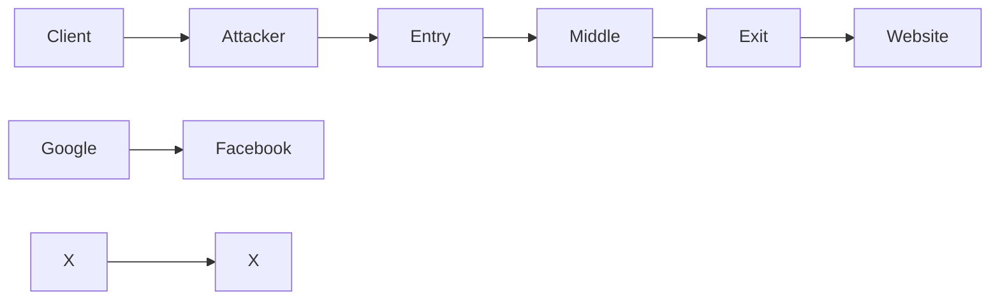
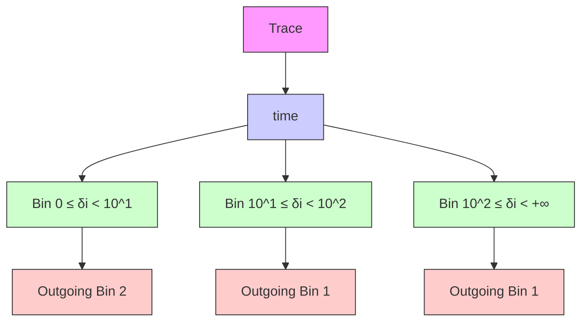
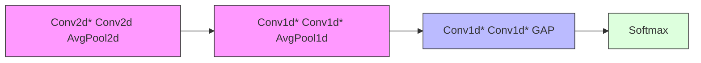
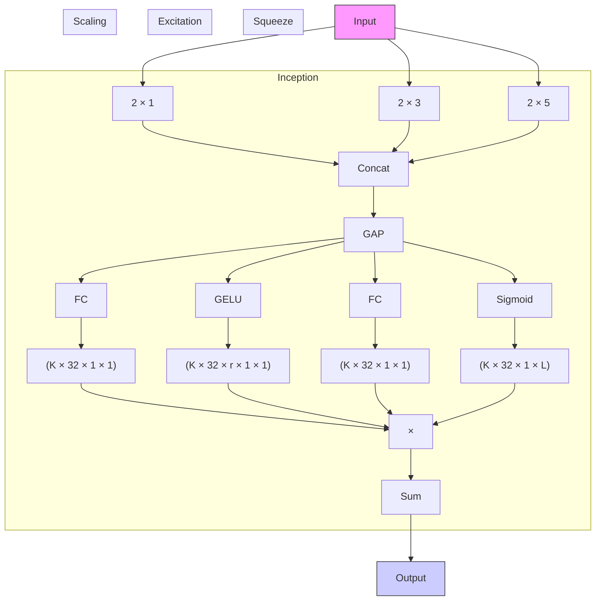

# WFCAT: Augmenting Website Fingerprinting With Channel-Wise Attention on Timing Features

Jiajun Gong , Wei Cai , Siyuan Liang , Zhong Guan , Tao Wang , and Ee-Chien Chang

Abstract—Website Fingerprinting (WF) aims to deanonymize users on the Tor network by analyzing encrypted network traffic. Recent deep-learning-based attacks show high accuracy on undefended traces. However, they struggle against modern defenses that use tactics like injecting dummy packets and delaying real packets, which significantly degrade classification performance. Our analysis reveals that current attacks inadequately leverage the timing information inherent in traffic traces, which persists as a source of leakage even under robust defenses. Addressing this shortfall, we introduce a novel feature representation named the Inter-Arrival Time (IAT) histogram, which quantifies the frequencies of packet inter-arrival times across predetermined time slots. Complementing this feature, we propose a new CNN-based attack, WFCAT, enhanced with two architectural blocks designed to effectively extract and utilize timing information. The model employs convolutional kernels of varying sizes to capture multi-scale temporal features, which are then integrated through a weighted combination across feature channels. This channel-wise attention mechanism enables the model to adaptively emphasize informative patterns while suppressing noise, thereby improving its robustness against timing obfuscation. Our experiments validate that WFCAT substantially outperforms existing methods on defended traces in both closed- and open-world scenarios. Notably, WFCAT achieves over 59% accuracy against Surakav, a recently developed robust defense, marking an improvement of over 28% and 48% against the state-of-the-art attacks RF and Tik-Tok, respectively, in the closed-world scenario.

Index Terms—Tor, website fingerprinting, traffic analysis.

## I. INTRODUCTION

W ITH millions of daily users, Tor [12] stands as one ofthe most widely adopted technologies for safeguarding the most widely adopted technologies for safeguarding

Received 20 February 2025; revised 4 July 2025; accepted 27 August 2025. Date of publication 2 September 2025; date of current version 14 January 2026. This work was supported in part by the Major Key Project of Peng Cheng Laboratory (PCL) under Grant PCL2024A05, and in part by the National Research Foundation, Singapore, through the National Cybersecurity Research and Development Laboratory at the National University of Singapore under its National Cybersecurity Research and Development Programme under Grant NCR25-NCL P3-0001. (Corresponding authors: Wei Cai; Ee-Chien Chang.)

Jiajun Gong is with the Department of New Networks, Peng Cheng Laboratory, Shenzhen 518066, China, and also with the School of Computing, National University of Singapore, Singapore 119077 (e-mail: jgongac@connect.ust.hk).

Wei Cai is with Network Connection Security Department, Zhongguancun Lab, Beijing 100094, China (e-mail: caiwei@zgclab.edu.cn).

Siyuan Liang and Ee-Chien Chang are with the School of Computing, National University of Singapore, Singapore 119077 (e-mail: pandaliang521@gmail.com; changec@comp.nus.edu.sg).

Zhong Guan is with the Institute of Information Engineering, Chinese Academy of Sciences, Beijing 100094, China (e-mail: guanzhong@iie.ac.cn).

Tao Wang is with the School of Computing Science, Simon Fraser University, Burnaby, BC V5A 1S6, Canada (e-mail: taowang@sfu.ca).

Digital Object Identifier 10.1109/TDSC.2025.3605197 online privacy. Tor achieves this by establishing an encrypted circuit that routes network traffic through three nodes worldwide, effectively anonymizing the user’s identity and location from the web pages they visit and any on-path eavesdroppers. Despite its robust design, Tor remains vulnerable to a class of traffic analysis attacks known as Website Fingerprinting (WF) [5], [18], [39], [45], [46], [49], [51], [55]. In these attacks, a local eavesdropper passively gathers side-channel information (e.g., packet sizes and inter-packet timings) from the network traffic between the victim and the entry node (i.e., the first node of a Tor circuit). Their goal is to figure out the destination of the victim, thus breaking Tor’s anonymity guarantee.

Modern WF attacks utilize deep learning models to automatically extract useful features from the raw traffic sequence, which consists of either raw packet directions [11], [25], [46], [51] or packet timestamps [5], [45]. A recent attack, RF [49], proposes a new 2-dimensional input feature called TAM, which aggregates the number of packets in fixed-sized time windows for incoming and outgoing packets. TAM focuses on capturing coarse-grained packet statistics over time, making local perturbations of a defense less effective. They show that such an input representation helps the model learn more robust features, thereby enhancing performance against a variety of existing defenses. However, we observe that RF can still be weakened by stronger regularized defenses, which involve padding and globally delaying real packets.

We identify two design weaknesses in the existing works. First, existing attacks do not fully exploit the use of timing information. For example, raw timestamps used by Tik-Tok [45] and VarCNN [5] can be easily perturbed under regularized defenses. The TAM representation used by RF [11] does not use the timing information of all packets within a single time window, causing information loss. Second, existing attacks apply conventional CNN architectures to extract features, which are not tailored for attacking defenses. They use single small kernel sizes, which may not capture global information effectively. Additionally, these attacks treat features from different channels as equally important, which may hinder the model’s learning process for noisy traces.

In this paper, we propose a new attack called WFCAT, which can significantly undermine all existing defenses. The core idea is to enhance model learning with both better input representation and better model architecture. We first develop an effective trace representation, involving both volume and timing information, to better capture the distinctive features of the trace. Then, we develop a new CNN-based backbone to learn invariant features against noise to facilitate the final prediction.

flowchart

Fig. 1. WF attack model.

Our contribution can be summarized as follows.

- We propose a multi-dimensional trace representation focusing on the timing characteristics of the packets. In general, we divide the loading timeline into fixed time windows and compute a histogram for the packets within each window. Specifically, we bin the packets according to their inter-arrival times and record the counts in each bin. This representation preserves the timing information carried by different types of packets while being more robust against perturbations compared to raw timestamps.  
- Alongside our proposed trace representation, we introduce a novel CNN block. We employ multiple kernels of different sizes to capture features at various scales and then fuse all the features using different weights learned during the training process. This approach ensures that highly informative features contribute more to the final prediction, making our attack robust even against defenses.  
- We conduct extensive experiments on our new datasets collected on the live Tor network. Experiments show that our attack achieves over 59% accuracy against Surakav [15], the state-of-the-art defense, elevating the accuracy by 28% and 44% compared with RF [11] and Tik-Tok [45], respectively.

Roadmap: The rest of the paper is organized as follows. In Section II, we define the threat model, outlining the capabilities and goals of both attackers and defenders in the context of website fingerprinting. Section III reviews state-of-the-art attacks and defenses, highlighting the gaps that our work addresses. Section IV presents the architecture and mechanisms of WFCAT, including its novel trace representation and feature extraction modules. Section V provides a comprehensive evaluation of WFCAT’s performance against multiple defenses, demonstrating its robustness and effectiveness. Finally, Sections VI and VII discuss relevant issues, conclude the paper, and outline future directions for advancing website fingerprinting attacks and defenses.

## II. THREAT MODEL

Attack model: The Website Fingerprinting (WF) attack model is shown in Fig. 1. In this scenario, we assume the victim uses Tor to browse web pages, aiming to protect her privacy. Within the Tor network, each packet traverses three different nodes (entry, middle, and exit) before reaching its final destination. The WF attacker is considered a local eavesdropper positioned between the victim and the entry node. The attacker knows the victim’s IP address and seeks to identify the destination page being loaded. We assume the attacker is passive, merely observing network patterns without altering them. Specifically, the attacker does not drop, modify, or delay any packets, nor does he attempt to break the encryption. Potential WF attackers include the administrator of the local network, the Internet Service Provider, or the entry node itself.

Attack scenarios: Website Fingerprinting can be regarded as a classification problem where a network trace is mapped to a website label. To launch a WF attack, the attacker will train a classifier using pre-collected training data, then use this trained model to predict on a given trace.

Same as prior work [5], [11], [45], [46], [51], we consider both closed- and open-world scenarios for WF attacks. In the closed-world scenario, the attacker monitors a set of N web pages. The victim is assumed to only visit these monitored sites. The attacker can retrieve a few network traces for each of the monitored sites (by loading these pages himself) as training samples to train the model and classify the victim’s traces. In the open-world scenario, the victim may visit not only these N monitored web pages but also other non-monitored web pages. The attacker aims to predict whether a given trace belongs to a specific monitored or non-monitored website. In this scenario, the attacker can collect a few non-monitored training samples to include in the training source. Note that the non-monitored samples may only be collected from web pages that the victim never visits.

Defense model: To defend against potential WF attackers, the victim may apply an existing defense mechanism (e.g., FRONT [14], RegulaTor [21], and Surakav [15]) to protect herself. A cooperating node, optimally the middle node in the Tor network, will help obfuscate the bi-directional traffic with the client by delaying real packets or injecting dummy packets in real time. Consequently, the attacker can only observe the modified traffic, and due to encryption, cannot differentiate between real and dummy packets. We assume that the attacker is aware of the defense (including the hyperparameters) the victim uses. This is a common assumption used in the literature [11], [35], [51]. The attacker is able to train using defended traces collected beforehand and tests on traces from the actual victim; this is known as adversarial training which we consider to be a realistic capability.

## III. RELATED WORK

## A. Website Fingerprinting Attacks

In general, a WF attack consists of three core parts: a meaningful trace representation of raw network traces, an effective model that takes the feature as input, and a training recipe that defines the training process and the loss function for model training. Existing WF attacks can be roughly classified into machinelearning-based (ML-based) attacks and deep-learning-based (DL-based) attacks, according to the models used in these attacks.

ML-based attacks: ML-based attacks generally involve extensive feature engineering to transform raw traces into meaningful feature vectors. These vectors are then utilized by specialized machine learning models for classification purposes. Representative techniques include SVMs [8], [39], [40], [56], kNN-based methods [55], and Random Forests [4], [18], [28]. The performance of ML-based attacks depends heavily on the quality of selected features. They are shown to be ineffective against recent defenses [15], [50].

DL-based attacks: DL-based attacks automate the feature engineering process by using deep learning models to learn latent features. With packet sequences as input, these methods utilize various backbone architectures and train deep learning models in a supervised or semi-supervised manner. These attacks are based on Stacked Denoising Autoencoder [1], Generative Adversarial Networks (GAN) [38], Convolutional Neural Networks (CNN) [3], [5], [10], [45], [46], [49], [51], [52], and transformers [11], [17], [25]. As DL-based attacks show superior performance over ML-based ones on defended traces, we select the six most related and representative attacks to compare with our attack in this work.

DF [51]: DF attack designs a deep CNN model that takes the raw packet-direction sequence as input. The packetdirection sequence is a sequence of +1 and -1’s to represent outgoing and incoming Tor cells. (In Tor, each packet is a fixed-size cell of 514 bytes.)  
Tik-Tok [45]: Tik-Tok uses the same model as DF, except that the input feature is the timing-with-direction sequence (cell timestamps multiplied by +1 or -1 indicating their directions).  
Var-CNN [5]: Var-CNN applies a CNN model to predict both the direction sequence and the timing sequence and ensembles the results to get the final prediction.  
- RF [49]: RF is a new CNN-based attack using a new trace representation called TAM which aggregates the number of incoming and outgoing packets within fixed time windows of  . It is robust against various defenses.  
- ARES [11]: ARES first uses a convolutional block to extract features on the packet ordering sequence, and then feeds the extract feature vector into a transformer for classification. It is intended to attack multi-tab traces. We adapt it to attack single-tab traces.  
TMWF [25]: TMWF is another transformer-based attack for attacking multi-tab traces. We adapt it to attack singletab traces.

## B. Website Fingerprinting Defenses

As existing attacks are already highly accurate in fingerprinting undefended traces, we focus on developing a novel attack that breaks defended traces. Existing defenses rely on adding extra non-informative (dummy) packets and delaying real packets to obscure the pattern of real traffic. The core strategies of these defenses can be summarized as noise injection [2], [9], [14], [26], [34], [43], traffic reshaping [6], [7], [13], [15], [21], [33], pattern clustering [37], [50], [55], [57], adversarial perturbation [24], [29], [31], [32], [36], [44], [47], [48], and traffic splitting [20], [27].

Noise injection: These defenses inject dummy data to obfuscate traffic. WTF-PAD [26] injects noise during long cell intervals, while FRONT [14] adds more cells at the beginning of the trace. HTTPOS [34] and ALPaCA [9] modify message sizes in the application layer by inserting dummy bytes. DFD [2] randomly injects dummy cells within each data burst.

Traffic reshaping: Defenses in this category alter traffic patterns by controlling the packet sending rate. BuFLO Family members [6], [7], [13], [33] standardize packet rates and pad the trace length. Tamaraw [7] fixes sending rates and extends traces to multiples of 100 cells. Dynaflow [33] is a variant of Tamaraw which optimizes overhead by dynamically adjust the packet sending rates. RegulaTor [21] uses a decreasing cell sending rate over time, mimicking loading processes. Surakav [15] generates traffic patterns with a trained generator, adjusting in real-time.

Pattern clustering: Defenses cluster web pages into groups to produce uniform network patterns. Supersequence [55] and Glove [37] calculate a super-trace for each cluster, ensuring identical traces within a group. Palette [50] organizes pages into anonymization sets and dynamically refines the traffic pattern during loading.

Adversarial perturbation: These defenses mislead deep learning models by adding precisely crafted noise to the input data. Studies devise specialized loss functions that minimize or maximize distances within the feature space [24], [29], [31], [32], [36], [44], [47], [48]. However, these defenses have been criticized for requiring access to the entire trace to compute the noise, as well as for their ineffectiveness against models that have undergone adversarial training [35].

Traffic splitting: Defenses in this category aim to enhance security by routing traffic through multiple network paths, thereby preventing attackers on any single path from capturing enough packets to make accurate predictions. HyWF [20] and TrafficSliver [27] use multihoming and multiple Tor circuits to distribute Tor cells.

## IV. ATTACK DESIGN

In this section, we introduce our new attack WFCAT that can effectively undermine existing defenses. WFCAT is short for Website Fingerprinting with Channel-wise Attention on Timing features which exploits timing features with an enhanced CNNbased backbone. We will first explain our intuition and then detail our design.

## A. Observation and Intuition

A robust trace representation is crucial for the effectiveness of a WF attack. We explore the differences in trace representation among various attacks in Table I and present the following observations:

Statistical features are susceptible to manipulation by defenses: Most machine learning-based attacks rely on statistical features that are inadequate for comprehensive trace representation. These features can be deliberately manipulated to undermine the effectiveness of an attack, as demonstrated by the defense FRONT [14]. Given their susceptibility to defense strategies, we have opted not to utilize statistical features in our trace representation methodology.

TABLE I COMPARISON BETWEEN TRACE REPRESENTATIONS USED BY DIFFERENT ATTACKS

<table><tr><td>Trace representation</td><td>Description</td><td>Granularity*</td><td>Representative Attacks</td></tr><tr><td>Statistical features</td><td>e.g., number of cells, average loading times</td><td>○</td><td>kNN [55], kFP [18]</td></tr><tr><td>Inter-packet frequency distributions</td><td>e.g., global distribution of inter-arrival times</td><td>○</td><td>FlowLens [4]</td></tr><tr><td>packet-direction sequence</td><td>a sequence of +1&#x27;s and -1&#x27;s</td><td>●</td><td>AWF [46], DF [51]</td></tr><tr><td>timing-with-direction sequence</td><td>a sequence of timestamps multiplied by directions</td><td>●</td><td>TikTok [45]</td></tr><tr><td>TAM</td><td>packet counts per time slot</td><td>○</td><td>RF [49]</td></tr><tr><td>TAF</td><td>packet and burst size counts per time slot</td><td>○</td><td>Holmes [10]</td></tr><tr><td>IAT histogram (ours)</td><td>inter-arrival-timing counts per time slot</td><td>○</td><td>WFCAT</td></tr></table>

\*O: coarse-grained granularity, O: intermediate-grained granularityO: fine-grained granularity

Timing features are useful in attacking defenses: Although Tik-Tok and DF share the same underlying architecture, Tik-Tok has been shown to surpass DF in overcoming certain defenses [45], using a sequence of timing-with-direction as its input. This suggests that timing features are essential and should not be overlooked. Furthermore, many defenses incorporate time-sensitive mechanisms that activate at specific moments. For instance, RegulaTor dispatches all packets once the wait time for buffered data exceeds a set threshold [21], and WTF-PAD adjusts its operational states based on the statistics of packet inter-arrival times [26]. The activation timing of these mechanisms often correlates directly with the characteristics of the accessed web page. By leveraging timing information, these defenses’ vulnerabilities can be exploited. We incorporate inter-arrival times into our trace representation to undermine defenses.

Intermediate-grained features enhance robustness against defenses: Recent research indicates that using features with reduced granularity can significantly bolster the robustness of trace representations. A key example is TAM, a 2D matrix that logs the count of outgoing and incoming cells per time slot, as introduced by Shen et al. [49]. Their findings reveal that two padding-based defenses, WTF-PAD and FRONT, disclose nearly as much information as in the undefended scenario when analyzed under TAM representation. This intermediate-grained approach mitigates the effects of localized perturbations, enabling the model to more accurately capture the overarching trends of a trace’s loading process. TAF, a variant of TAM, further incorporates two additional aggregated features related to burst sizes per time slot [10]. However, both TAM and TAF do not fully harness the timing details of individual packets within each time slot. In contrast, our trace representation, which also adopts an intermediate granularity, enriches this aspect by incorporating timing data, thereby enhancing the performance of our attack (See Section IV-B).

## B. A New Trace Representation

Based on our observations, we propose a novel trace representation, the Inter-Arrival Time (IAT) histogram, which enhances the learning capacity of deep learning models for web page analysis. The key idea is to capture the distribution of IAT values across fixed-length time windows, yielding a temporally structured and noise-resilient feature representation.

Comparison with prior uses of IAT: Several previous attacks have explored global IAT statistics [4], [18], [28]. FlowLens [4], for instance, constructs a global histogram of IAT values using logarithmic binning (base 2), with the aim of enabling memoryefficient flow classification on programmable switches. While effective in low-overhead scenarios, such global representations discard temporal dynamics and are designed to work with machine learning classifiers (e.g., decision trees and random forests).

In contrast, our method segments each trace into multiple fixed-duration time windows and computes a histogram of IATs within each window. This windowed representation captures temporal evolution and local IAT patterns that are critical for distinguishing page load behaviors—especially under timing obfuscation defenses. Our representation is explicitly designed to support deep learning models such as CNNs, which benefit from structured, sequential inputs and can exploit local temporal correlations.

Trace definition: Before detailing our algorithm for computing IAT histograms, we first formally define traces in the Tor network. A trace is an ordered sequence of N Tor cells, sorted by their timestamps:

$$
X = (p _ {0}, p _ {1}, \dots , p _ {N - 1}). \tag {1}
$$

Each Tor cell is represented by a timestamp and a direction:

$$
p _ {i} = (t _ {i}, d _ {i}), \tag {2}
$$

where $t _ { i } \geq 0$ denotes the timestamp, and $d _ { i } \in \{ + 1 , - 1 \}$ reprei 0 i +1 1sents the direction of the cell. Since each Tor cell is encrypted and has a fixed size, we do not record the bytes. By convention, $d _ { i } = 1$ indicates an outgoing cell. The inter-arrival time of the i = 1i-th cell $p _ { i }$ is defined as

$$
\delta_ {i} = \left\{ \begin{array}{l l} 0, & \text { if   } i = 0, \\ t _ {i} - t _ {i - 1}, & \text { if   } 0 <   i \leq N. \end{array} \right. \tag {3}
$$

IAT histogram computation: Given a trace X, we calculate the trace representation $\tilde { X }$ as shown in Fig. 2. We first divide the trace into fixed time slots of duration s. (s is a hyperparameter.) For each time slot, we compute a distribution of IAT values for both incoming and outgoing cells within it. For convention, we define the set of all cells within the k-th time slot as $S _ { k } = \{ p _ { i } \mid k \cdot s \leq t _ { i } < ( k + 1 ) \cdot s , 0 \leq i < N \}$ for $0 \le k < L$ k = i i ( + 1) 0. Furthermore, we denote the set of all outgoing cells 0in $\boldsymbol { S _ { k } }$ as $S _ { k } ^ { + }$ and the set of all incoming cells as $S _ { k } ^ { - }$ . We compute k k ktwo histograms that represent the distributions of IAT values for the outgoing and incoming cells in $S _ { k }$ , respectively. Specifically, kwe count the number of cells that fall into each IAT bin:

flowchart

Fig. 2. Visualization of IAT histogram computation. In this example, we bin all the cells according to their IAT values (in milliseconds) into $G \overset { \vartriangle } { = } 3$ distinct bins.

$$
\tilde {X} [ r, 0, k ] = | \{p _ {i} \mid b _ {r} \leq \delta_ {i} \leq b _ {r + 1} \} \cap \mathcal {S} _ {k} ^ {+} |, \tag {4}
$$

$$
\tilde {X} [ r, 1, k ] = | \{p _ {i} \mid b _ {r} \leq \delta_ {i} \leq b _ {r + 1} \} \cap \mathcal {S} _ {k} ^ {-} |, \tag {5}
$$

where | · | returns the cardinality of the set (i.e., the number of cells), and $\boldsymbol { B } = \{ b _ { r } \in \mathbb { R } \ | \ r = 0 , 1 , \ldots , G \}$ represents the = r = 0 1boundary values that evenly divide all IAT values on a logarithmic scale (G bins in total). We set $b _ { 0 } = 0$ and $b _ { G } = + \infty .$ . After the computation for $L$ = 0 G = +time slots, we get a matrix of shape $G \times 2 \times L$ as our feature representation. The hyperparameter L 2is the total number of time slots considered for a trace, while the hyperparameter G is the number of bins to gather the IAT values in each time slot.

Rationale for using logarithmic bins: We choose logarithmic bins for constructing the inter-arrival time (IAT) histogram due to the inherently skewed nature of IAT distributions in network traffic: most packets arrive within very short intervals, while longer delays are rare but still informative. Logarithmic binning captures this variability effectively by allocating finer granularity to smaller IAT values—where most data points are concentrated—and coarser granularity to larger values, thereby maintaining coverage across scales. This skewness becomes even more pronounced under defenses, which introduce dummy packets and artificial delays.

To validate this, we compute the average normalized distribution of cell counts across IAT bins on the dataset defended by FRONT (detailed in Section V-A). As shown in Fig. 3, linear binning results in over 96% of the cells from both directions falling into the first bin, leaving the remaining bins underutilized. In contrast, logarithmic binning distributes the cells more evenly across bins, preserving more temporal resolution and structural information. We further support this observation with an ablation study in Section V-I, where the logarithmic binning scheme consistently outperforms its linear counterpart, particularly under timing-sensitive defenses Surakav.

Robustness analysis of IAT histogram: Following the methodology of Shen et al. [49], we evaluate the robustness of different feature representations by measuring their distributional shift under increasing defense strength. Specifically, we apply the FRONT defense with varying levels of data overhead on our undefended dataset (see Section V-A).

bar chart

| Bin Index | Outgoing Cells - Linear Bin | Outgoing Cells - Logarithmic Bin | Incoming Cells - Linear Bin | Incoming Cells - Logarithmic Bin |
|-----------|-----------------------------|-----------------------------------|-----------------------------|-----------------------------------|
| 0         | 0.25                        | 0.03                              | 0.72                        | 0.43                              |
| 1         | 0.01                        | 0.00                              | 0.01                        | 0.00                              |
| 2         | 0.00                        | 0.00                              | 0.00                        | 0.00                              |
| 3         | 0.00                        | 0.03                              | 0.08                        | 0.09                              |
| 4         | 0.00                        | 0.08                              | 0.09                        | 0.11                              |
| 5         | 0.00                        | 0.11                              | 0.11                        | 0.12                              |
| 6         | 0.00                        | 0.05                              | 0.05                        | 0.06                              |
| 7         | 0.00                        | 0.01                              | 0.01                        | 0.01                              |
| 8         | 0.00                        | 0.00                              | 0.00                        | 0.00                              |

Fig. 3. Normalized distribution of cell counts per IAT bin under linear and logarithmic binning $( G = 9 )$ , computed on the FRONT dataset. Logarithmic bins spread information more evenly, while linear bins concentrate most data in the first bin.

line chart

| FRONT Overhead (%) | IAT (Ours) | TAM   | Direction | Directional Timing |
| ------------------ | ---------- | ----- | --------- | ------------------ |
| 10                 | 0.0        | 0.0   | 0.45      | 0.3                |
| 20                 | 0.0        | 0.05  | 0.7       | 0.5                |
| 30                 | 0.05       | 0.1   | 0.9       | 0.6                |
| 40                 | 0.1        | 0.15  | 1.0       | 0.7                |
| 50                 | 0.1        | 0.2   | 1.1       | 0.8                |
| 60                 | 0.1        | 0.25  | 1.2       | 0.85               |
| 70                 | 0.1        | 0.3   | 1.25      | 0.9                |
| 80                 | 0.1        | 0.3   | 1.3       | 0.9                |

Fig. 4. MMD under increasing FRONT defense overhead. Lower is better. IAT histogram exhibits the highest robustness.

To quantify the shift, we compute the Maximum Mean Discrepancy (MMD) between the feature distributions of the undefended and defended datasets:

$$
\mathrm{MMD} (\mathcal {D} ^ {s}, \mathcal {D} ^ {t}) = \left\| \frac {1}{n} \sum_ {i = 1} ^ {n} \phi (F _ {i} ^ {s}) - \frac {1}{m} \sum_ {j = 1} ^ {m} \phi (F _ {j} ^ {t}) \right\| _ {\mathcal {H}}, \tag {6}
$$

$\mathcal { D } ^ { s } = \{ F _ { i } ^ { s } \} _ { i = 1 } ^ { n }$ $\mathcal { D } ^ { t } = \{ F _ { j } ^ { t } \} _ { j = 1 } ^ { m }$ denote the feature = i i = j jrepresentations of the undefended and defended traces, respectively. Each F is a feature vector (e.g., IAT histogram, TAM, or directional features) extracted from a raw trace. The function $\phi ( \cdot )$ maps the features into a Reproducing Kernel Hilbert ( )Space (RKHS), and $\| \cdot \| _ { \mathcal { H } }$ denotes the Hilbert space norm. A lower MMD value indicates greater robustness, as the feature distribution is less perturbed by the defense.

As shown in Fig. 4, our IAT histogram consistently yields the lowest MMD scores across all levels of defense overhead, indicating superior robustness. In contrast, the Direction feature (used in DF [51]) and Directional Timing feature (used in Tik-Tok [45]) exhibit significantly higher and rapidly growing distributional shifts. TAM performs moderately better but still degrades more than our method as the defense strength increases.

flowchart

Fig. 5. WFCAT model’s architecture. \*The first Conv2d and all Conv1d blocks are our proposed new blocks.

These results suggest that our intermediate-grained IAT histogram strikes a more effective balance between fine-grained timing sensitivity and robustness to noise.

Overall, the proposed IAT histogram not only captures the volume of data but also the timing information; it reflects changes in the density of cells over time. IAT values can reveal dependency relationships between different cells. Given that different web pages typically have varying layouts and resource counts, web servers may respond at different rates, resulting in distinctive IAT values. Instead of using precise IAT values, we opt to bin them into a few intervals to achieve a more robust feature representation. Tor circuit latency applies an inherently random multiplicative effect on packet timing, so we use logarithmic bins. However, not all IAT intervals prove informative; thus, we introduce a new CNN block designed to automatically learn the significance of different IAT intervals, enhancing our utilization of the trace representation (detailed in Section IV-C).

## C. Model Architecture

We design a new CNN-based model for our proposed attack WFCAT that can effectively handle our trace representation. In general, the IAT histogram first passes through a 2D convolutional module, followed by a 1D convolutional module, and finally a global average pooling (GAP) module, as shown in Fig. 5.

The 2D convolutional module is responsible for extracting local features from the IAT histogram $\tilde { X } .$ . The input is processed through two Conv2d blocks and an average pooling layer. This sequence is repeated twice before being passed into the 1D convolutional module. A dropout layer is added after the average pooling layer to mitigate overfitting. Except for the first Conv2d block, each Conv2d block consists of a 2D convolutional layer, a batch normalization layer [23], and a GELU activation layer [19].

The 1D convolutional module is tasked with extracting higherlevel features after all local features have been gathered. Following the RF design [49], we utilize global average pooling (GAP) to convert the hidden features into C logits for final prediction. Here, C denotes the number of classes. It has shown that GAP is more effective at preventing overfitting compared to using fully connected layers to produce logits [49].

The key components of our model that are different from other attacks are detailed as follows.

Inception2d with SEBlock: We introduce this innovative block as the first component of our model to enhance feature capture within X. As depicted in Fig. 6, we initially apply an Inception block [53] that utilizes K kernels to extract features from $\tilde { X }$ . The kernel width is consistently set to 2 to capture the spatial correlation between incoming and outgoing cells. The kernel height is defined as $2 k + 1 ( k = 0 , 1 , \ldots , K - 1 )$ , which improves the 2 + 1 ( = 0 1 1)model’s ability to discern features at varying scales.

flowchart

Fig. 6. Illustration of the first Conv2d block: utilizing multiple kernels for feature extraction at various scales via an Inception block, followed by fusion of features across different channels with learned weights in the SEBlock.

Subsequently, we apply a Squeeze-and-Excitation Block (SE-Block) [22] to adaptively recalibrate the importance of each feature channel. This mechanism, referred to here as “channel-wise attention”, assigns different weights to each channel based on its learned significance, allowing the model to emphasize informative temporal patterns while suppressing less relevant ones. Concretely, the SEBlock first performs a Squeeze operation by applying global average pooling across each channel to obtain a compact descriptor. This is followed by an Excitation step, where the descriptors pass through a two-layer fully connected network (with a reduction ratio r  ) and a sigmoid activation, = 16producing channel-wise weights in the range [0, 1]. These weights are then used to rescale the original feature channels before being passed to the next layer.

This block significantly improves our model’s ability to interpret trace representations from multiple scales and accentuate the salient features across different channels. To minimize computational demands, this block is only applied at the input stage of the model.

Inception1d Block: The output from the 2D convolutional module is reshaped into a 1D feature map before being introduced to the 1D convolutional module. Each Conv1d block illustrated in Fig. 5 constitutes an Inception1d Block, which is followed by a batch normalization layer and a GELU activation layer. Similar to the Inception2d Block, we deploy several kernels of size $2 k + 1 ( k = 0 , 1 , \ldots , K - 1 )$ to extract and fuse features together. At this stage, we do not apply the SEBlock as it offers marginal benefits while significantly increasing computational costs.

## V. ATTACK EVALUATION

In this section, we evaluate the performance of WFCAT. We begin by describing the experimental setup and datasets used in our study. Next, we present the hyperparameter tuning process for our attack. Following this, we conduct extensive experiments in both closed-world and open-world scenarios to compare WFCAT with state-of-the-art (SOTA) attacks. Finally, we perform an ablation study to analyze the impact of each component of WFCAT.

## A. Experiment Setup

We make use of the WFDefProxy framework [16], which is specifically designed for collecting live Tor traces. We have rent two servers from Google Cloud, designating one as our Tor client and the other as the Tor entry node. The client, located in Singapore, operates on Ubuntu 20.04 LTS and is equipped with 4 CPU cores and 16 GB of memory. The Tor entry node is strategically placed in America to ensure a physical distance from the client, running Debian 10.6 with the Tor binary version 0.4.4.5. To optimize the collection process, we dockerize the Tor client, enabling the parallel operation of multiple clients to reduce the collection time. The version of the Tor browser used is 12.0.

Datasets: To evaluate the attacks, we initially collected a new undefended dataset using WFDefProxy. This dataset comprises Tor traces from 100 monitored pages and 10,000 non-monitored pages. Each monitored page was loaded 100 times, while each non-monitored page was loaded once. We discarded instances from inaccessible pages or unsuccessful loadings, specifically those where the cell count was less than 50, during our collection process. The monitored pages were selected from the top 100 sites on the Tranco list [41], while the non-monitored pages were taken from those ranked 200th and beyond in the same list. The Tranco list is a ranking of websites based on their popularity, designed specifically for research purposes. It aggregates data from multiple sources over a period of time, making it more stable and less prone to manipulation.

Due to the absence of accurate simulation code for Surakav [15], we collected another dataset defended by Surakav using Gong’s implementation on WFDefProxy. We adhered to the same methodology employed in the collection of the undefended dataset. The total data collection spanned one month.

Evaluated attacks and defenses: We compare our attack with four CNN-based attacks: DF [51], Tik-Tok [45], Var-CNN [5], and RF [49]; and two Transformer-based attacks, ARES [11] and TMWF [25]. Following the recommended hyperparameters, we tune these attacks on our datasets to achieve their optimal performance. All the attacks are trained using an H100 card with 47 GB of memory.

We evaluate our attack against a variety of defenses, including two noise-injection-based defenses, WTF-PAD [26] and FRONT [14]; four traffic-reshaping-based defenses, RegulaTor [21], Tamaraw [7], Dynaflow [33] and Surakav [15]; one traffic-splitting-based defense, TrafficSliver [27]; and one pattern-clustering-based defense, Palette [50]. We use simulation code provided by the authors to generate defended datasets based on our undefended dataset. Since Surakav does not have accurate simulation, we directly collect a Surakav dataset in the real Tor network.

Evaluation methodology: Following the evaluation methodology of prior work [14], [15], we divide the dataset into training, validation, and test sets using an 8:1:1 ratio. We fine-tune the attack model using the validation set. To ensure robustness and mitigate bias, we conduct 10-fold cross-validation for each experiment and report the combined results.

We use classification accuracy to assess the attack’s performance in a closed-world scenario. Accuracy is calculated as the ratio of correctly predicted instances to the total number of test instances. In the open-world scenario, we evaluate performance using the Precision-Recall Curve to explore the precision-recall trade-off across various confidence thresholds of the model.

Following prior work [54], we compute precision and recall as follows. We denote a trace X where its ground truth label is $y ^ { t r u e } \in \{ 0 , 1 , \ldots , C - 1 , C \}$ , with $y ^ { t r u e } = C$ indicating a 0 1 1 =non-monitored trace. The output of an attack model is denoted as y, a C -dimensional vector where each element re-( + 1)flects the confidence value of being predicted as that class. The index with the highest confidence value is denoted as $j ^ { * } = \arg \operatorname* { m a x } _ { 0 \leq j \leq C } y _ { j }$ , and the maximum confidence value is $y _ { j ^ { * } }$ = arg max j C j. Given a confidence threshold τ , a trace is predicted as monitored if and only if $j ^ { * } < C$ and $y _ { j ^ { * } } > \tau . \mathrm { A }$ True Positive j(TP) occurs when a monitored trace is correctly predicted in its class. A Wrong Positive (WP) occurs when a monitored trace is predicted in another incorrect monitored class. A False Negative (FN) happens when a monitored trace is predicted to be non-monitored. A False Positive (FP) occurs when a nonmonitored trace is predicted to be a monitored class. Precision is computed as TP/(TP+WP+FP), and recall is computed as TP/(TP+WP+FN). By varying the confidence threshold τ from 0 to 1, we derive multiple tuples of (precision, recall) values and plot the Precision-Recall Curve. We also use F1-score to comprehensively evaluate an attack’s performance, calculated as $2 \times P r e c i s i o n \times R e c a l l / ( P r e c i s i o n + R e c a l l )$ .

2 ( + )Ethical consideration: We adhered to prior work to carefully mitigate ethical concerns in our data collection process. First, we utilized Python scripts to automate the Tor browser, ensuring that none of the collected traffic originated from actual users. Second, we retained only the essential information for each trace (i.e., cell directions and timestamps). Lastly, we limited the number of parallel clients to five during the crawling process, thereby minimizing the potential impact on the Tor network.

## B. Hyperparameter Tuning of WFCAT

We prototype our attack using Pytorch 2.3.1 with 2,000 lines of code. We use the undefended dataset to tune our attack, observing the closed-world accuracy on the validation set. The hyperparameter search space and the optimal values are summarized in Table II. We used the ASHA scheduler [30], a state-of-the-art hyperparameter tuning algorithm, and sampled 2,000 points within the search space.

TABLE II HYPERPARAMETER TUNING FOR WFCAT MODEL

<table><tr><td>Hyperparameter</td><td>Search Space</td><td>Final</td></tr><tr><td>Trace Length L</td><td>[500, ..., 3000]</td><td>1800</td></tr><tr><td>Time Slot s (ms)</td><td>[22, ..., 330]</td><td>44</td></tr><tr><td>Bin Number G</td><td>[2, ..., 10]</td><td>9</td></tr><tr><td>Inception Kernel Number K</td><td>[2, ..., 9]</td><td>4</td></tr><tr><td>Optimizer</td><td>[Adam, Adamax, SGD]</td><td>Adam</td></tr><tr><td>Learning rate</td><td>[1e-5, ..., 5e-3]</td><td>1e-3</td></tr><tr><td>Weight Decay</td><td>[1e-5, ..., 1e-3]</td><td>5e-4</td></tr><tr><td>Batch Size</td><td>[64, 128, 256]</td><td>64</td></tr><tr><td>Epoch Number</td><td>[20, ..., 80]</td><td>50</td></tr></table>

The trace length L and the time slot s determine which cells are considered in a trace. We have determined that setting L =, and s (i.e., considering cells in the first ) 1 800 = 44 ms 80 syields the best performance. The parameter G is the number of bins used to group all IAT values. Increasing the number of bins enhances granularity but also adds computational overhead. We have found that G  provides optimal performance. The = 4number of inception kernels is crucial for extracting features from various scales. Using more kernels allows for the fusion of richer feature information, although it increases computational costs. We have found that K in both the 1D and 2D CNN = 4modules yields the best performance.

## C. Closed-World Evaluation

In this section, we evaluate the performance of WFCAT against the SOTA defenses in the closed-world scenario where the attacker tries to distinguish 100 monitored classes between each other. We compare our attack with the other six attacks as described in Section V-A.

As shown in Table III, we evaluate our approach against seven distinct defenses, categorized by their types of mechanisms. In the table, we also report the overheads associated with each defense. The data overhead is measured as the ratio of the number of dummy cells to the number of real cells across the entire dataset; data overhead burdens the network. Similarly, the time overhead is calculated as the ratio of the additional time required to load a page to the original loading time, measured across the entire dataset; time overhead affects user experience. Overall, WFCAT demonstrates superior attack performance, outperforming existing methods on both the undefended dataset and six out of the seven defended datasets.

Noise-injection-based defenses are significantly undermined by WFCAT: For instance, WTF-PAD proves ineffective against most attacks. Similarly, although FRONT incurs a substantial 76% data overhead on our dataset, it remains largely ineffective; our attack results in only a 1% drop in accuracy ( → ). 94% 93%In contrast, the second-best attack, RF, achieves 85% accuracy against FRONT. Comparatively, other attacks that utilize fine-grained features suffer approximately a 50% accuracy loss when tested against FRONT. These results demonstrate the robustness of semi-grained features against noise-injection-based defenses.

Timing-sensitive defenses can be greatly exploited by WF-CAT: Strong defenses typically employ mechanisms designed to strategically delay cells at specific times, which are triggered by the characteristics inherent to the page. Such mechanisms often inadvertently leak information, a vulnerability confirmed by our experiments. For example, in our tests, TikTok and DF, which differ mainly in their use of timing information at the input stage, show distinct performance outcomes. TikTok achieves a 12% higher accuracy against RegulaTor (25% vs. 13%) and a 3% higher accuracy against Surakav (15% vs. 12%) compared to DF. Additionally, WFCAT capitalizes on this timing information to achieve an accuracy of 48% against RegulaTor. Surakav, once considered the SOTA defense for this category, is compromised by WFCAT, which achieves a notably high accuracy of 59%. In contrast, the previously best-performing attack, RF, manages only a 31% accuracy against Surakav. The effectiveness of WFCAT stems from its adept utilization of timing information in both our trace representation and the model’s backbone.

However, our defense and other attacks have not compromised Tamaraw, which is provably secure. Tamaraw sends cells at constant rates, irrespective of the page being loaded, thereby leaking minimal timing information. Despite its effectiveness, the high overhead incurred by Tamaraw hinders its practical deployment.

Splitting-based defenses are not as secure as expected: Splitting-based defenses, proposed as a novel solution against website fingerprinting, are touted for their minimal overhead and robust security level. The Tor project has officially proposed the implementation of traffic splitting [42]. Despite these advantages, our results indicate that these defenses remain vulnerable under WFCAT. WFCAT achieves an accuracy of over 50% against TrafficSliver, significantly outperforming other methods like RF (40%) and VarCNN (15%). All other attacks tested register accuracies below 15%.

In summary, our experiments demonstrate that WFCAT significantly outperforms all other attacks in the closed-world scenario. Particularly effective against timing-sensitive defenses, WFCAT leverages timing information within its design to achieve superior results.

## D. Open-World Evaluation

Next, we evaluate the performance of WFCAT in the more realistic open-world scenario where the attacker tries to figure out whether or not the victim is visiting a specific monitored or a non-monitored page.

Performance on the undefended dataset: Most attacks exceed 0.90 in both precision and recall; our attack leads with a 0.93 F1-score. On the Tamaraw dataset, despite all defenses showing low precision and recall, the highest performance (0.04 F1-score) is seen in DF and TikTok, with our attack at 0.02 F1-score. Tamaraw, despite its effectiveness against all attacks due to uniform traffic formatting, proves too costly for practical use.

TABLE III ATTACK ACCURACY (%) AGAINST DIFFERENT DEFENSES IN THE CLOSED-WORLD SCENARIO. WFCAT DEMONSTRATES THE HIGHEST PERFORMANCE AGAINST 7 OUT OF 8 DEFENSES (BOLDED). THE ACCURACY DIFFERENCES BETWEEN WFCAT AND THE SECOND-BEST ATTACK ARE HIGHLIGHTED, WITH RED INDICATING HIGHER RESULTS

<table><tr><td rowspan="2">Type</td><td rowspan="2">Defense</td><td colspan="2">Overhead</td><td rowspan="2">TMWF</td><td rowspan="2">ARES</td><td rowspan="2">VarCNN</td><td rowspan="2">DF</td><td rowspan="2">TikTok</td><td rowspan="2">RF</td><td rowspan="2">WFCAT (ours)</td></tr><tr><td>DO</td><td>TO</td></tr><tr><td rowspan="4">Noise Injection</td><td>Undefended</td><td>0</td><td>0</td><td>75.96</td><td>91.14</td><td>91.35</td><td>93.44</td><td>93.41</td><td>92.39</td><td> $94.47^{▲1.03}$ </td></tr><tr><td>WTF-PAD</td><td>23</td><td>0</td><td>73.58</td><td>84.26</td><td>78.49</td><td>86.28</td><td>86.57</td><td>87.88</td><td> $93.50^{▲5.62}$ </td></tr><tr><td>FRONT</td><td>76</td><td>0</td><td>25.93</td><td>55.42</td><td>45.07</td><td>48.64</td><td>49.26</td><td>85.24</td><td> $93.18^{▲7.94}$ </td></tr><tr><td>RegulaTor</td><td>45</td><td>23</td><td>9.64</td><td>13.67</td><td>11.52</td><td>12.98</td><td>24.70</td><td>38.48</td><td> $47.78^{▲9.30}$ </td></tr><tr><td rowspan="3">Traffic Reshaping</td><td>Surakav</td><td>103</td><td>23</td><td>13.33</td><td>11.15</td><td>7.79</td><td>12.26</td><td>15.04</td><td>30.92</td><td> $59.12^{▲28.20}$ </td></tr><tr><td>Dynaflow</td><td>113</td><td>12</td><td>8.94</td><td>4.73</td><td>11.35</td><td>5.50</td><td>13.87</td><td>19.73</td><td> $19.77^{▲0.04}$ </td></tr><tr><td>Tamaraw</td><td>173</td><td>34</td><td>8.88</td><td>10.38</td><td>10.85</td><td>11.07</td><td>11.07</td><td>8.87</td><td> $8.04^{▼3.03}$ </td></tr><tr><td rowspan="2">Clustering Splitting</td><td>Palette</td><td>131</td><td>6</td><td>10.39</td><td>6.63</td><td>5.42</td><td>5.17</td><td>6.24</td><td>15.51</td><td> $16.48^{▲0.97}$ </td></tr><tr><td>TrafficSliver</td><td>0</td><td>0</td><td>5.78</td><td>7.74</td><td>15.12</td><td>5.64</td><td>14.67</td><td>39.88</td><td> $50.12^{▲10.24}$ </td></tr></table>

Performance on the defended datasets: Fig. 7 compares the performance of our attack with other attacks on different defended datasets. In general, WFCAT outperforms all the other six attacks against all the defenses in the open-world scenario. The second best attack is RF. Compared to the other two timing-based attacks, TikTok and VarCNN, we find that WFCAT achieves significantly better results. Both WFCAT and RF use intermediate-grained feature as input, which indicates that such a feature representation form is more robust against noise.

Similar to the closed-world scenario, the noise-injectionbased defenses, WTF-PAD and FRONT, show little impact on WFCAT’s performance in the open-world scenario. It achieves a 0.92 F1-score against both FRONT and WTF-PAD (0.01 drop compared to the undefended case). This confirms that simply injecting random noise into the trace is not effective against our attack.

The most surprising result is on Surakav, which was considered to be the best defense using traffic reshaping techniques. WFCAT has partially broken it, achieving 0.56 precision and 0.44 recall. It outperforms other attacks by a large margin. For example, RF only achieves 0.20 precision and 0.25 recall. The other attacks fail to attack Surakav (F1-score below 0.10). The key reason why Surakav is vulnerable to WFCAT is that Surakav’s padding mechanism is time-sensitive, which can be captured and learnt by WFCAT. This is also true for RegulaTor.

TrafficSliver was previously a highly effective defense with nearly zero overhead. It was weakened by RF, achieving a recall of 0.37 and a precision of 0.40. WFCAT successfully improves the recall to over 0.59 while maintaining a similar precision of 0.39.

## E. Evaluation Against Combined Defenses

While most prior works evaluate attacks against individual defenses, real-world Tor deployments may combine multiple defense mechanisms, which makes website fingerprinting more challenging. To assess the robustness of WFCAT in such settings, we evaluate its performance under combined defenses. Specifically, we test three defense combinations: ❶ FRONT + Surakav, ❷ FRONT + TrafficSliver, and ❸ Surakav + Traffic-Sliver.

TABLE IV CLOSED-WORLD ACCURACY (%) AGAINST COMBINED DEFENSES. SINGLE-DEFENSE RESULTS ARE INCLUDED FOR REFERENCE. WHILE COMBINATIONS OF DEFENSES REDUCE OVERALL ACCURACY, WFCAT CONSISTENTLY OUTPERFORMS PRIOR ATTACKS ACROSS ALL SETTINGS

<table><tr><td rowspan="2">Defense Combination</td><td colspan="4">Attack</td></tr><tr><td>ARES</td><td>TikTok</td><td>RF</td><td>WFCAT</td></tr><tr><td>FRONT</td><td>55.42</td><td>49.26</td><td>85.24</td><td>93.18</td></tr><tr><td>Surakav</td><td>11.15</td><td>15.04</td><td>30.92</td><td>59.12</td></tr><tr><td>TrafficSliver</td><td>7.74</td><td>14.67</td><td>39.88</td><td>50.12</td></tr><tr><td>FRONT + Surakav</td><td>2.68</td><td>4.42</td><td>22.69</td><td>45.90</td></tr><tr><td>FRONT + TrafficSliver</td><td>4.45</td><td>10.54</td><td>28.42</td><td>42.77</td></tr><tr><td>Surakav + TrafficSliver</td><td>2.85</td><td>5.83</td><td>7.44</td><td>15.59</td></tr></table>

Table IV summarizes the closed-world accuracy of WFCAT, RF, TikTok, and ARES under both single and combined defenses. We include the single-defense results for reference.

Across all settings, WFCAT consistently achieves the highest accuracy, significantly outperforming prior attacks. For example, under the combination of FRONT and Surakav, WFCAT achieves 46% accuracy, compared to 23% for RF, 4% for TikTok, and only 3% for ARES. Even in more obfuscated cases involving TrafficSliver—known for splitting traffic across circuits—WFCAT maintains a strong advantage. For instance, under Surakav + TrafficSliver, WFCAT achieves 16% accuracy, while RF drops to 7%, TikTok to 6%, and ARES to 3%.

These results demonstrate that WFCAT is not only robust against individual defenses but also resilient when facing multiple concurrent defense strategies, consistently achieving the highest accuracy with a substantial margin over all competing attacks.

## F. Impact of Circuit Bandwidth

In practice, victims traverse circuits with varying latency and bandwidth, which results in differing page load times. Prior research has demonstrated that discrepancies in network conditions between training and testing traces can significantly degrade attack performance [3]. To explore this issue, we split a defended dataset based on trace load times. Each attack is trained on the 80% fastest (resp. slowest) traces per page and tested on the 10% slowest (resp. fastest) traces, with the remaining 10% reserved for validation. We present the closed-world accuracy for each attack in Table V. The findings are as follows.

TABLE V ATTACK ACCURACY (%) WITH TRAINING TRACES FROM FAST (RESP. SLOW) CIRCUITS AND TESTING TRACES FROM SLOW (RESP. FAST) CIRCUITS. THE BEST PERFORMANCE ON EACH DATASET IS MARKED IN BOLD FONT. WFCAT SIGNIFICANTLY OUTPERFORMS THE OTHER ATTACKS IN MOST CASES

<table><tr><td rowspan="2"></td><td colspan="6">Train on slowest traces, test on fastest traces</td><td colspan="6">Train on fastest traces, test on slowest traces</td></tr><tr><td>WTF-PAD</td><td>FRONT</td><td>RegulaTor</td><td>Surakav</td><td>Palette</td><td>TrafficSliver</td><td>WTF-PAD</td><td>FRONT</td><td>RegulaTor</td><td>Surakav</td><td>Palette</td><td>TrafficSliver</td></tr><tr><td>TMWF</td><td>80.4</td><td>21.8</td><td>6.8</td><td>7.8</td><td>7.3</td><td>5.1</td><td>47.8</td><td>11.5</td><td>4.2</td><td>10.3</td><td>6.0</td><td>5.5</td></tr><tr><td>ARES</td><td>83.7</td><td>42.7</td><td>10.5</td><td>5.8</td><td>4.9</td><td>7.4</td><td>49.3</td><td>40.1</td><td>11.3</td><td>7.5</td><td>5.0</td><td>7.6</td></tr><tr><td>VarCNN</td><td>79.1</td><td>39.0</td><td>9.8</td><td>3.6</td><td>3.6</td><td>7.5</td><td>46.2</td><td>28.7</td><td>5.1</td><td>5.9</td><td>5.6</td><td>3.5</td></tr><tr><td>DF</td><td>86.7</td><td>38.2</td><td>10.7</td><td>7.1</td><td>3.2</td><td>7.0</td><td>59.4</td><td>30.7</td><td>11.9</td><td>8.6</td><td>4.2</td><td>5.7</td></tr><tr><td>TikTok</td><td>87.0</td><td>34.5</td><td>13.7</td><td>7.9</td><td>3.2</td><td>7.0</td><td>58.9</td><td>30.4</td><td>14.1</td><td>9.5</td><td>6.4</td><td>6.7</td></tr><tr><td>RF</td><td>90.9</td><td>91.7</td><td>22.7</td><td>32.1</td><td>8.1</td><td>42.4</td><td>46.1</td><td>48.2</td><td>19.7</td><td>15.8</td><td>9.2</td><td>14.3</td></tr><tr><td>WFCAT</td><td>93.4</td><td>95.6</td><td>20.9</td><td>48.0</td><td>8.5</td><td>48.8</td><td>56.8</td><td>59.4</td><td>27.3</td><td>32.1</td><td>9.5</td><td>20.1</td></tr></table>

text_image

WFCAT
DF
VarCNN
ARES
RF
TikTok
TMWF

line chart

| Recall | Precision |
| ------ | --------- |
| 0.00   | 1.00      |
| 0.50   | 0.80      |
| 1.00   | 0.70      |

line chart

| Recall | Precision (Line 1) | Precision (Line 2) | Precision (Line 3) | Precision (Line 4) | Precision (Line 5) |
| ------ | ------------------ | ------------------ | ------------------ | ------------------ | ------------------ |
| 0.00   | 1.00               | 1.00               | 1.00               | 1.00               | 1.00               |
| 0.25   | 0.85               | 0.90               | 0.95               | 0.98               | 0.97               |
| 0.50   | 0.60               | 0.75               | 0.85               | 0.92               | 0.90               |
| 0.75   | 0.40               | 0.55               | 0.70               | 0.85               | 0.82               |
| 1.00   | 0.20               | 0.40               | 0.55               | 0.75               | 0.70               |

line chart

| Recall | Precision (Blue) | Precision (Orange) | Precision (Green) |
| ------ | ---------------- | ------------------ | ----------------- |
| 0.00   | 1.00             | 0.60               | 0.40              |
| 0.10   | 0.95             | 0.45               | 0.25              |
| 0.20   | 0.85             | 0.30               | 0.15              |
| 0.30   | 0.75             | 0.20               | 0.10              |
| 0.40   | 0.65             | 0.15               | 0.05              |
| 0.50   | 0.55             | 0.10               | 0.02              |

line chart

| Recall | Precision (Blue) | Precision (Orange) | Precision (Red) | Precision (Green) | Precision (Purple) |
| ------ | ---------------- | ------------------ | --------------- | ----------------- | ------------------ |
| 0.00   | 1.00             | 1.00               | 1.00            | 1.00              | 1.00               |
| 0.05   | 0.98             | 0.97               | 0.95            | 0.92              | 0.90               |
| 0.10   | 0.95             | 0.93               | 0.85            | 0.80              | 0.75               |
| 0.15   | 0.92             | 0.88               | 0.75            | 0.65              | 0.60               |
| 0.20   | 0.88             | 0.82               | 0.65            | 0.55              | 0.50               |
| 0.25   | 0.85             | 0.78               | 0.55            | 0.45              | 0.40               |
| 0.30   | 0.82             | 0.75               | 0.45            | 0.35              | 0.30               |
| 0.35   | 0.78             | 0.72               | 0.35            | 0.25              | 0.20               |
| 0.40   | 0.75             | 0.68               | 0.25            | 0.15              | 0.10               |

line chart

| Recall | Precision (Blue) | Precision (Orange) | Precision (Red) | Precision (Green) | Precision (Purple) |
| ------ | ---------------- | ------------------ | --------------- | ----------------- | ------------------ |
| 0.00   | 1.00             | 1.00               | 0.80            | 0.60              | 0.40               |
| 0.10   | 0.95             | 0.95               | 0.75            | 0.55              | 0.35               |
| 0.20   | 0.90             | 0.85               | 0.70            | 0.50              | 0.30               |
| 0.30   | 0.85             | 0.75               | 0.65            | 0.45              | 0.25               |
| 0.40   | 0.80             | 0.65               | 0.60            | 0.40              | 0.20               |

line chart

| Recall | Precision (Blue) | Precision (Orange) | Precision (Red) | Precision (Green) |
| ------ | ---------------- | ------------------ | --------------- | ----------------- |
| 0.00   | 1.00             | 0.40               | 0.35            | 0.25              |
| 0.01   | 0.75             | 0.30               | 0.25            | 0.15              |
| 0.02   | 0.60             | 0.25               | 0.20            | 0.10              |
| 0.03   | 0.50             | 0.20               | 0.15            | 0.08              |
| 0.04   | 0.45             | 0.18               | 0.12            | 0.06              |
| 0.05   | 0.40             | 0.15               | 0.10            | 0.05              |
| 0.06   | 0.35             | 0.13               | 0.08            | 0.04              |
| 0.07   | 0.30             | 0.12               | 0.07            | 0.03              |
| 0.08   | 0.25             | 0.11               | 0.06            | 0.02              |
| 0.09   | 0.20             | 0.10               | 0.05            | 0.01              |
| 0.10   | 0.15             | 0.09               | 0.04            | 0.01              |
| 0.11   | 0.12             | 0.08               | 0.03            | 0.01              |
| 0.12   | 0.10             | 0.07               | 0.02            | 0.01              |
| 0.13   | 0.08             | 0.06               | 0.01            | 0.01              |
| 0.14   | 0.06             | 0.05               | 0.01            | 0.01              |
| 0.15   | 0.04             | 0.04               | 0.01            | 0.01              |

Fig. 7. Attack performance against various defenses in the open-world scenario. The WFCAT method significantly outperforms the other attacks against all defenses. Note that the x-axis scale may vary across subfigures.

Poor network conditions adversely affect WF attacks: We observed that traces from the fastest circuits are significantly easier to fingerprint by all attacks. This is primarily because poor network conditions can lead to partial page loads, packet drops, or retransmissions, thereby making the traces noisier for the attacker. While a few studies explore enhancing attack performance through data augmentation and contrastive learning [3], [52], [59], these approaches are orthogonal to our work. Our focus is on comparing the raw performance of these attacks without any additional training techniques.

WFCAT shows more robust performance than other attacks: Across all tests, WFCAT achieves the highest accuracy in attacking five out of six defenses for both the fastest and slowest traces. While testing on the fastest traces, WFCAT exhibits minimal accuracy loss in attacks against defenses like WTF-PAD, FRONT, and TrafficSliver, compared to the results in Table III. However, time-sensitive defenses such as RegulaTor and Surakav see some impact on performance due to bandwidth mismatches. Despite the challenges posed by testing on the slowest traces, WFCAT remains the strongest performer among all considered attacks. Notably, WFCAT outperforms the second-best attack by margins of 16% on Surakav (32% vs. 16%), 11% on FRONT (59% vs. 48%), and 7% on RegulaTor (27% vs. 20%).

## G. Impact of Training Sample Number

As the data collection process is inherently time-consuming, we are particularly interested in how many training samples each attack requires to achieve satisfactory performance. Moreover, given that most web pages are constantly evolving, an attack’s ability to rapidly adapt with fewer training samples is crucial for maintaining robust performance. We assessed the performance of our attack across four datasets: the undefended dataset, which serves as the baseline, and three datasets with defenses – FRONT, Surakav, and RegulaTor. We vary the number of training samples per class from 20 to 90 and observe the attack accuracy in a closed-world scenario. Fig. 8 shows the results.

We discovered that WFCAT requires fewer samples than other attacks to converge to optimal performance. For instance, on the undefended dataset, with only 30 samples per class, our attack achieves a remarkable 92% accuracy. In contrast, RF and TikTok require 60 samples, and ARES needs 80 samples to reach similar outcomes. Notably, VarCNN and TMWF do not reach a plateau even with 90 samples. The superiority of WFCAT is further underscored in defended datasets. For the FRONT dataset, with merely 30 samples per class, WFCAT surpasses all other six attacks that train with 90 samples per class (i.e., the full training set). For Surakav, WFCAT trained on 20 samples per class achieves 6% higher accuracy than the next best attack, RF, trained on the full set. For RegulaTor, WFCAT consistently maintains around 10% higher accuracy than RF with different number of training samples.

  
Fig. 8. Attack performance with different number of training samples in the closed-world scenario. WFCAT requires fewer samples to achieve an even better performance on four datasets.

To conclude, our attack requires fewer training samples to effectively compromise the state-of-the-art defenses compared to other attacks.

## H. Comparison of Training Time

Apart from the number of training samples, training time is another significant cost that attackers must consider. In this section, we compare the training time of our attack with that of other attacks using the undefended dataset we collected. We calculated the average training time across 10 cross-validation folds, and the results are presented in Fig. 9.

Among all seven attacks, our attack ranks as the second fastest. It requires only 7 minutes to complete training, slightly longer than the fastest attack, DF, which completes in 4 minutes. This minor increase in time is inevitable due to the additional blocks introduced into the network to enhance performance. However, we have minimized overhead by eliminating unnecessary complexity in our design. Notably, the previously best-performing attack in terms of accuracy, RF, requires nearly 15 minutes for training, which is more than double the time required by WFCAT. TikTok, ARES, and TMWF all require slightly more training time than WFCAT, while VarCNN takes the longest at nearly 42 minutes. This extended duration is due to its ensemble mechanism, where timing and directional sequences are processed through two sub-networks. Despite this, it does not yield effective performance, as discussed in Sections V-C and V-D, highlighting its inefficient use of time information.

bar chart

| Attack Model | Training Time (in minutes) |
| :--- | :--- |
| VarCNN | 41 |
| RF | 15 |
| TMWF | 11 |
| TikTok | 8 |
| ARES | 8 |
| WFCAT | 7 |
| DF | 5 |

Fig. 9. Training time of attacks on the open-world undefended dataset. WF-CAT has the second shortest training time.

TABLE VI CLOSED-WORLD ACCURACY (%) UNDER DIFFERENT FEATURE REPRESENTATIONS AND BACKBONE ARCHITECTURES. LOGARITHMIC IAT HISTOGRAMS COMBINED WITH OUR PROPOSED WFCAT BACKBONE ACHIEVE THE HIGHEST ACCURACY ACROSS ALL SETTINGS

<table><tr><td colspan="2">Setting</td><td colspan="4">Dataset</td></tr><tr><td>Feature</td><td>Backbone</td><td>Undefended</td><td>FRONT</td><td>RegulaTor</td><td>Surakav</td></tr><tr><td> $IAT_{log}$ </td><td>RF</td><td>88.62</td><td>87.60</td><td>40.81</td><td>36.31</td></tr><tr><td>TAM</td><td>WFCAT</td><td>94.13</td><td>88.40</td><td>47.61</td><td>49.83</td></tr><tr><td> $IAT_{linear}$ </td><td>WFCAT</td><td>94.33</td><td>88.07</td><td>47.21</td><td>50.18</td></tr><tr><td> $IAT_{log}$ </td><td>WFCAT</td><td>94.47</td><td>93.18</td><td>47.78</td><td>59.12</td></tr></table>

## I. Ablation Study

To better understand the contribution of individual components in our proposed attack, we perform an extensive ablation study. This analysis systematically isolates and evaluates the impact of key design choices, including the trace representation, model architecture, and various hyperparameter settings. By examining the performance variations with and without specific features or configurations, we aim to provide a comprehensive understanding of their roles in achieving the overall effectiveness and robustness of WFCAT.

Feature and backbone: We first validate the effectiveness of our proposed feature representation and backbone by considering the following four settings: ❶ RF’s original backbone combined with our proposed IAT histogram using logarithmic binning $( \mathrm { I A T } _ { l o g } + \mathrm { R F } )$ ; ❷ our proposed CNN backbone comlogbined with the TAM representation $( \mathrm { T A M } + \mathrm { W F C A T } ) ;$ ❸ our proposed CNN backbone with the IAT histogram using linear binning $( \mathrm { I A T } _ { l i n e a r } + \mathrm { W F C A T } )$ ; ❹ our full design: IAT histogram linearwith logarithmic binning combined with our CNN backbone $( \mathrm { I A T } _ { l o g } + \mathrm { W F C A T } )$ . We verify the components on four different logdatasets: undefended, FRONT, RegulaTor, and Surakav, which represent three different levels of noise magnitude. The results are presented in Table VI.

From Table VI, we observe that each individual component contributes meaningfully to the overall performance improvement. First, replacing $\mathrm { R F } ^ { * } \mathrm { s }$ backbone with our proposed WFCAT architecture $( \pmb { \mathbb { 0 } }  \pmb { \mathbb { 0 } } )$ leads to substantial accuracy gains across all datasets, including a 6% increase on FRONT and a 23% increase on Surakav. This confirms that our backbone design more effectively extracts temporal features from defended traces. Second, switching from TAM to our IAT-based representation (❷ $ \pmb { \otimes } )$ also improves accuracy, with gains ranging from 0.3% on the undefended dataset to 9.3% on Surakav. This demonstrates the advantage of using inter-arrival timing information over volume-based statistics. Third, we compare two variants of IAT histogram: linear binning versus logarithmic binning (❸ vs. ❹). The log-scale version yields higher accuracy on all datasets, with especially notable improvements on defended settings—5% on FRONT and 9% on Surakav. This supports our intuition that log-scale bins better preserve meaningful timing variations, particularly under obfuscation. Finally, we note that the benefits of both the proposed feature representation and backbone become more pronounced as the defenses grow stronger.

Our full design (WFCAT) consistently outperforms all baselines, confirming the effectiveness of integrating these design choices to achieve state-of-the-art robustness in website fingerprinting attacks.

Impact of G and K: We next investigate the impact of the bin number G and the kernel number K on both the classification performance and model complexity of WFCAT. The experiments are conducted on the Surakav dataset, as Surakav represents one of the strongest defenses among all evaluated methods.

The parameter G determines the number of bins used in the IAT histogram (see Section IV-B). First, we fix $K = 4$ (our = 4default setting) and vary G from 2 to 10. As shown in the top-left subfigure of Fig. 10, the accuracy of WFCAT increases significantly from 49% to 58% as G increases from 2 to 4. Beyond this point, the accuracy fluctuates slightly around 58%, peaking at 59% when $G = 9$ . Importantly, as the bottom-left = 9subfigure shows, this accuracy gain comes with only a marginal increase in model complexity, with the number of parameters growing from 4.94 M to 4.95 M. Based on these results, we set $G = 9$ as the default value.

= 9Next, we fix $G = 9$ and vary K, which controls the number of = 9convolutional kernels in the Inception2d and Inception1d blocks (refer to Section IV-C). As shown in the top-right subfigure of Fig. 10, the accuracy increases from 56% to 59% as $K$ grows from 2 to 4, but begins to decline when $K > 4 .$ , suggesting diminishing returns from higher kernel diversity. This observation is further supported by the bottom-right subfigure, where the parameter count grows nonlinearly from 1.27 M $( K = 2 )$ ) to over 19.66 M $( K = 8 )$ = 2. This steep increase in model complexity, coupled with decreasing accuracy, highlights the importance of balancing architectural richness with overfitting and efficiency concerns. Therefore, we choose $K = 4$ as the default kernel = 4number to strike a good balance between model efficacy and complexity.

Impact of time slot size: We further examine how the time slot size s—used to segment traces into fixed-length windows— affects the overall performance of WFCAT. This hyperparameter directly controls the temporal resolution of the IAT histogram (see Section IV-B).

line chart

| Vary G (with K=4) | Accuracy (%) |
| ------------------ | ------------ |
| 2                  | 50.0         |
| 3                  | 56.0         |
| 4                  | 58.0         |
| 5                  | 57.0         |
| 6                  | 57.5         |
| 7                  | 58.0         |
| 8                  | 58.5         |
| 9                  | 59.0         |
| 10                 | 58.0         |

line chart

| Vary K (with G=9) | Accuracy (%) |
| ----------------- | ------------ |
| 2                 | 56.0         |
| 3                 | 58.0         |
| 4                 | 59.0         |
| 5                 | 58.5         |
| 6                 | 58.0         |
| 7                 | 57.5         |
| 8                 | 57.0         |

line chart

| Vary G | #Params (M) |
| ------ | ----------- |
| 2      | 5           |
| 4      | 5           |
| 6      | 5           |
| 8      | 5           |
| 10     | 5           |

line chart

| Vary K | #Params (M) |
| ------ | ------------ |
| 2      | 1            |
| 3      | 3            |
| 4      | 5            |
| 5      | 8            |
| 6      | 11           |
| 7      | 15           |
| 8      | 20           |

Fig. 10. Top: closed-world accuracy of WFCAT against Surakav with varying G (left) and K (right). Bottom: the corresponding model complexity in terms of parameter count.

line chart

| Time Slot (ms) | Accuracy (%) |
| -------------- | ------------ |
| 22             | 93.0         |
| 44             | 94.5         |
| 66             | 94.4         |
| 88             | 93.9         |
| 110            | 93.6         |

line chart

| Time Slot (ms) | Value |
| -------------- | ----- |
| 22             | 48.0  |
| 44             | 57.0  |
| 66             | 56.5  |
| 88             | 56.0  |
| 110            | 55.5  |

Fig. 11. Impact of time slot size s on closed-world accuracy for WFCAT on the undefended and Surakav datasets. Accuracy peaks at s = 44 ms.

We vary s from 22 ms to 110 ms and evaluate WFCAT on both the undefended and Surakav datasets. As shown in Fig. 11, the best performance on both datasets is achieved when s  ms, = 44which is the default value adopted in our design. Specifically, the accuracy on the Surakav dataset improves from 48% at $s = 2 2$ ms to a peak of 58% at s  ms, and then gradually = 22 = 44declines as the slot size increases. This trend highlights the trade-off between temporal granularity and stability: smaller slots may lead to over-fragmentation and sparse bins, while larger slots may over-smooth important temporal patterns. On the undefended dataset, the accuracy remains more stable but still peaks at s ms. These results confirm the robustness of = 44our choice and indicate that the model is moderately sensitive to time slot boundaries.

## VI. DISCUSSION

Our proposed attack, WFCAT, addresses the inherent limitations of existing WF attacks by introducing a novel feature representation, the Inter-Arrival Time (IAT) histogram, and a customized CNN-based architecture. This section discusses the implications of our findings, the broader impact of this work, and potential defense strategies.

Implications of WFCAT’s performance: WFCAT’s robustness against modern defenses, including Surakav [15] and Regula-Tor [21], demonstrates the enduring vulnerability of timingbased patterns in network traffic. Our results suggest that even sophisticated defense mechanisms inadvertently leak information that can be exploited through innovative feature engineering and advanced model design. Notably, the attack’s performance is significantly enhanced by its ability to capture intermediategrained timing correlations, highlighting the critical role of timing information in WF attacks.

Challenges and limitations: Despite its robustness, WFCAT exhibits sensitivity to network conditions, as demonstrated in our experiments with traces from varying circuit bandwidths. This limitation underscores the importance of comprehensive training datasets that capture diverse network environments. Moreover, a few works have explored how to strengthen WF attacks under such conditions using data augmentation [3], [58]. To explore this direction, we implemented a prototype augmentation pipeline inspired by techniques like timing jitter and random insertion/removal of packets. Preliminary experiments show modest improvements on certain defenses (e.g., +4.1% accuracy on FRONT, and +4.0% on WTF-PAD), while other cases show marginal or negative impact, especially on defenses like RegulaTor (+0.3%) or Surakav (-4.4%). This suggests that not all augmentations generalize across defenses, and highlights the need for adaptive augmentation policies, which we leave for future work.

Potential mitigation strategies: Our work also underscores the necessity of advancing defense mechanisms to counter timing-based attacks effectively. Potential strategies include: ❶ Combination of Defenses: Utilizing TrafficSliver to split traffic and applying additional obfuscation methods (e.g., FRONT [14] or Surakav [15]) to each sub-trace could amplify the defense’s resilience, as demonstrated in Section V-E. ❷ Adversarial Perturbations: Introducing noise specifically designed to mislead deep learning models could be an avenue, though practical challenges like real-time implementation must be addressed. ❸ Dynamic Traffic Shaping: Designing defenses that dynamically alter traffic patterns in unpredictable ways may thwart timing-sensitive attacks like WFCAT.

## VII. CONCLUSION

In this work, we introduced WFCAT, a novel WF attack leveraging the IAT histogram and an advanced CNN-based architecture. Through extensive experiments, WFCAT demonstrated its ability to exploit timing correlations in network traffic, outperforming state-of-the-art attacks against both undefended and defended scenarios. Notably, our attack achieved 59% accuracy against Surakav and consistently outperformed other methods across closed- and open-world scenarios. However, our findings also highlight critical challenges, such as the attack’s sensitivity to network conditions and its limited success against deterministic defenses like Tamaraw. Addressing these challenges requires both enhancing the robustness of WF attacks and developing more sophisticated defense mechanisms. By advancing the understanding of WF vulnerabilities, this work aims to contribute to the development of more resilient anonymitypreserving technologies. Future research will explore combining multiple defenses, leveraging adversarial perturbations, and expanding the scope of WF attacks to include evolving network conditions and application scenarios.

## ACKNOWLEDGMENT

Any opinions, findings, conclusions, or recommendations expressed in this material are those of the authors and do not reflect the views of the National Research Foundation, Singapore, or the National Cybersecurity R&D Laboratory at the National University of Singapore.

## REFERENCES

[1] K. Abe and S. Goto, “Fingerprinting attack on tor anonymity using deep learning,” in Proc. 10th Asia-Pacific Adv. Netw., 2016, pp. 15–20.  
[2] A. Abusnaina, R. Jang, A. Khormali, D. Nyang, and D. Mohaisen, “DFD: Adversarial learning-based approach to defend against website fingerprinting,” in Proc. 39th IEEE Conf. Comput. Commun., 2020, pp. 2459–2468.  
[3] A. Bahramali, A. Bozorgi, and A. Houmansadr, “Realistic website fingerprinting by augmenting network traces,” in Proc. 30th ACM SIGSAC Conf. Comput. Commun. Secur., 2023, pp. 1035–1049.  
[4] D. Barradas, N. Santos, L. Rodrigues, S. Signorello, F.M. V. Ramos, and A. Madeira, “FlowLens: Enabling efficient flow classification for ML-based network security applications,” in Proc. 28th Netw. Distrib. Syst. Secur. Symp., 2021.  
[5] S. Bhat, D. Lu, A. Kwon, and S. Devadas, “Var-CNN: A data-efficient website fingerprinting attack based on deep learning,” in Proc. Privacy Enhancing Technol., 2019, pp. 292–310.  
[6] X. Cai, R. Nithyanand, and R. Johnson, “CS-BuFLO: A congestion sensitive website fingerprinting defense,” in Proc. 13th Workshop Privacy Electron. Soc., 2014, pp. 121–130.  
[7] X. Cai, R. Nithyanand, T. Wang, R. Johnson, and I. Goldberg, “A systematic approach to developing and evaluating website fingerprinting defenses,” in Proc. 21st ACM SIGSAC Conf. Comput. Commun. Secur., 2014, pp. 227–238.  
[8] X. Cai, X. C. Zhang, B. Joshi, and R. Johnson, “Touching from a distance: Website fingerprinting attacks and defenses,” in Proc. 19th ACM SIGSAC Conf. Comput. Commun. Secur., 2012, pp. 605–616.  
[9] G. Cherubin, J. Hayes, and M. Juárez, “Website fingerprinting defenses at the application layer,” in Proc. Privacy Enhancing Technol., 2017, pp. 186– 203.  
[10] X. Deng, Q. Li, and K. Xu, “Robust and reliable early-stage website fingerprinting attacks via spatial-temporal distribution analysis,” in Proc. 31st ACM SIGSAC Conf. Comput. Commun. Secur., 2024, pp. 1997–2011.  
[11] X. Deng et al., “Robust multi-tab website fingerprinting attacks in the wild,” in Proc. IEEE Symp. Secur. Privacy, 2023, pp. 1005–1022.  
[12] R. Dingledine, N. Mathewson, and P. F. Syverson, “Tor: The secondgeneration onion router,” in Proc. 13th USENIX Secur. Symp., 2004, pp. 303–320.  
[13] K. P. Dyer, S. E. Coull, T. Ristenpart, and T. Shrimpton, “Peek-a-Boo, I still see you: Why efficient traffic analysis countermeasures fail,” in Proc. IEEE Symp. Secur. Privacy, 2012, pp. 332–346.  
[14] J. Gong and T. Wang, “Zero-delay lightweight defenses against website fingerprinting,” in Proc. 29th USENIX Secur. Symp., 2020, pp. 717–734.  
[15] J. Gong, W. Zhang, C. Zhang, and T. Wang, “Surakav: Generating realistic traces for a strong website fingerprinting defense,” in Proc. IEEE Symp. Secur. Privacy, 2022, pp. 1525–1525.  
[16] J. Gong, W. Zhang, C. Zhang, and T. Wang, “WFDefProxy: Real world implementation and evaluation of website fingerprinting defenses,” IEEE Trans. Inf. Forensics Secur., vol. 19, pp. 1357–1371, 2024.  
[17] Z. Guan, G.G. Xiong, Z. Gou, M. LiCui, and C. Liu, “BAPM: Block attention profiling model for multi-tab website fingerprinting attacks on tor,” in Proc. 37th Annu. Comput. Secur. Appl. Conf., 2021, pp. 248–259.  
[18] J. Hayes and G. Danezis, “k-fingerprinting: A robust scalable website fingerprinting technique,” in Proc. 25th USENIX Secur. Symp., 2016, pp. 1187–1203.  
[19] D. Hendrycks and K. Gimpel, “Gaussian error linear units (GELUs),” 2016, arXiv:1606.08415.  
[20] S. Henri, G. Garcia-Aviles, P. Serrano, A. Banchs, and P. Thiran, “Protecting against website fingerprinting with multihoming,” in Proc. Privacy Enhancing Technol., 2020, pp. 89–110.  
[21] J. K. Holland and N. Hopper, “RegulaTor: A straightforward website fingerprinting defense,” in Proc. Privacy Enhancing Technol., 2022, pp. 344– 362.  
[22] J. Hu, L. Shen, and G. Sun, “Squeeze-and-excitation networks,” in Proc. IEEE Conf. Comput. Vis. Pattern Recognit., 2018, pp. 7132–7141.  
[23] S. Ioffe and C. Szegedy, “Batch normalization: Accelerating deep network training by reducing internal covariate shift,” in Proc. 32nd Int. Conf. Int. Conf. Mach. Learn., 2015, pp. 448–456.  
[24] M. Jiang, B. Cui, J. Fu, T. Wang, L. Yao, and B. K. Bhargava, “RUDOLF: An efficient and adaptive defense approach against website fingerprinting attacks based on soft actor-critic algorithm,” IEEE Trans. Inf. Forensics Secur., vol. 19, pp. 7794–7809, 2024.  
[25] Z. Jin, T. Lu, S. Luo, and J. Shang, “Transformer-based model for multi-tab website fingerprinting attack,” in Proc. 30th ACM SIGSAC Conf. Comput. Commun. Secur., 2023, pp. 1050–1064.  
[26] M. Juárez, M. Imani, M. Perry, C. Dıáz, and M. Wright, “Toward an efficient website fingerprinting defense,” in Proc. Eur. Symp. Res. Comput. Secur., 2016, pp. 27–46.  
[27] W. D. L. Cadena et al., “TrafficSliver: Fighting website fingerprinting attacks with traffic splitting,” in Proc. 27th ACM SIGSAC Conf. Comput. Commun. Secur., 2020, pp. 1971–1985.  
[28] A. H. Lashkari, G. D. Gil, M. S. I. Mamun, and A. A. Ghorbani, “Characterization of tor traffic using time based features,” in Proc. Int. Conf. Inf. Syst. Secur. Privacy, 2017, pp. 253–262.  
[29] D. Li, Y. Zhu, M. Chen, and J. Wang, “Minipatch: Undermining DNNbased website fingerprinting with adversarial patches,” IEEE Trans. Inf. Forensics Secur., vol. 17, pp. 2437–2451, 2022.  
[30] L. Li et al., “A system for massively parallel hyperparameter tuning,” in Proc. Mach. Learn. Syst., 2020, pp. 230–246.  
[31] Z. Ling, G. Xiao, W. Wu, X. Gu, M. Yang, and X. Fu, “Towards an efficient defense against deep learning based website fingerprinting,” in Proc. 41st IEEE Conf. Comput. Commun., 2022, pp. 310–319.  
[32] H. Liu, J. Dani, H. Yu, W. Sun, and B. Wang, “AdvTraffic: Obfuscating encrypted traffic with adversarial examples,” in Proc. 30th IEEE/ACM Int. Symp. Qual. Serv., 2022, pp. 1–10.  
[33] D. Lu, S. Bhat, A. Kwon, and S. Devadas, “DynaFlow: An efficient website fingerprinting defense based on dynamically-adjusting flows,” in Proc. 17th Workshop Privacy Electron. Soc., 2018, pp. 109–113.  
[34] X. Luo, P. Zhou, E. W. W. Chan, W. Lee, R. K. C. Chang, and R. Perdisci, “HTTPOS: Sealing information leaks with browser-side obfuscation of encrypted flows,” in Proc. 18th Netw. Distrib. Syst. Secur. Symp., 2011.  
[35] N. Mathews et al., “SoK: A critical evaluation of efficient website fingerprinting defenses,” in Proc. IEEE Symp. Secur. Privacy, 2022, pp. 344–361.  
[36] M. Nasr, A. Bahramali, and A. Houmansadr, “Defeating DNN-Based traffic analysis systems in real-time with blind adversarial perturbations,” in Proc. 30th USENIX Secur. Symp., 2021, pp. 2705–2722.  
[37] R. Nithyanand, X. Cai, and R. Johnson, “Glove: A bespoke website fingerprinting defense,” in Proc. 13th Workshop Privacy Electron. Soc., 2014, pp. 131–134.  
[38] E. Se, N. Oh, M. Mathews, S. Rahman, M. Wright, and N. Hopper, “GAN-DaLF: GAN for data-limited fingerprinting,” in Proc. Privacy Enhancing Technol., 2021, pp. 305–322.  
[39] A. Panchenko et al., “Website fingerprinting at Internet scale,” in Proc. 23 rd Netw. Distrib. Syst. Secur. Symp., 2016, Art. no. 23477.  
[40] A. Panchenko, L. Niessen, A. Zinnen, and T. Engel, “Website fingerprinting in onion routing based anonymization networks,” in Proc. 10th Workshop Privacy Electron. Soc., 2011, pp. 103–114.  
[41] L. Victor, T. Pochatvan Goethem, S. M. T. Korczynski, and W. Joosen, “Tranco: A research-oriented top sites ranking hardened against manipulation,” in Proc. 26th Annu. Netw. Distrib. Syst. Secur. Symp., 2019.  
[42] D. Goulet and M. Perry, “Proposal 329: Traffic splitting,” Tor Project, 2023. Accessed: Sep. 11, 2025. [Online]. Available: https://spec. torproject.org/proposals/329-traffic-splitting.html  
[43] T. Pulls, “Towards effective and efficient padding machines for tor,” 2020, arXiv: 2011.13471.  
[44] M. S. Rahman, M. Imani, N. Mathews, and M. Wright, “Mockingbird: Defending against deep-learning-based website fingerprinting attacks with adversarial traces,” IEEE Trans. Inf. Forensics Secur., vol. 16, pp. 1594– 1609, 2020.  
[45] M. S. Rahman, P. Sirinam, N. Mathews, K. G. Gangadhara, and M. Wright, “Tik-Tok: The utility of packet timing in website fingerprinting attacks,” in Proc. Privacy Enhancing Technol., 2020, pp. 5–24.  
[46] V. Rimmer, D. Preuveneers, M. Juárez, T. van Goethem, and W. Joosen, “Automated website fingerprinting through deep learning,” in Proc. 25th Netw. Distrib. Syst. Secur. Symp., 2018.  
[47] A.M. Sadeghzadeh, B. Tajali, and R. Jalili, “AWA: Adversarial website adaptation,” IEEE Trans. Inf. Forensics Secur., vol. 16, pp. 3109–3122, 2021.  
[48] S. Shan, A. N. Bhagoji, H. Zheng, and B. Y. Zhao, “Patch-based defenses against web fingerprinting attacks,” in Proc. 14th ACM Workshop Artif. Intell. Secur., 2021, pp. 97–109.  
[49] M. Shen, K. Ji, Z. Gao, Q. Li, L. Zhu, and K. Xu, “Subverting website fingerprinting defenses with robust traffic representation,” in Proc. 32nd USENIX Secur. Symp., 2023, pp. 607–624.  
[50] M. Shen et al., “Real-time website fingerprinting defense via traffic cluster anonymization,” in Proc. IEEE Symp. Secur. Privacy, 2024, pp. 263–263.  
[51] P. Sirinam, M. Imani, M. Juárez, and M. Wright, “Deep fingerprinting: Undermining website fingerprinting defenses with deep learning,” in Proc. 25th ACM SIGSAC Conf. Comput. Commun. Secur., 2018, pp. 1928–1943.  
[52] P. Sirinam, N. Mathews, M. S. Rahman, and M. Wright, “Triplet fingerprinting: More practical and portable website fingerprinting with N-shot learning,” in Proc. 26th ACM SIGSAC Conf. Comput. Commun. Secur., 2019, pp. 1131–1148.  
[53] C. Szegedy et al., “Going deeper with convolutions,” in Proc. IEEE Conf. Comput. Vis. Pattern Recognit., 2015, pp. 1–9.  
[54] T. Wang, “High precision open-world website fingerprinting,” in Proc. IEEE Symp. Secur. Privacy, 2020, pp. 152–167.  
[55] T. Wang, X. Cai, R. Nithyanand, R. Johnson, and I. Goldberg, “Effective attacks and provable defenses for website fingerprinting,” in Proc. 23 rd USENIX Secur. Symp., 2014, pp. 143–157.  
[56] T. Wang and I. Goldberg, “Improved website fingerprinting on Tor,” in Proc. 12th Workshop Privacy Electron. Soc., 2013, pp. 201–212.  
[57] T. Wang and I. Goldberg, “Walkie-Talkie: An efficient defense against passive website fingerprinting attacks,” in Proc. 26th USENIX Secur. Symp., 2017, pp. 1375–1390.  
[58] R. Xie et al., “Enabling robust TLS encrypted traffic classification in diverse network environments with TCP-Aware traffic augmentation,” in Proc. 32nd USENIX Secur. Symp., 2023, pp. 625–642.  
[59] Y. Xie et al., “Contrastive fingerprinting: A novel website fingerprinting attack over few-shot traces,” in Proc. 36th ACM Web Conf., 2024, pp. 1203–1214.

natural_image

Portrait photo of a young man with short dark hair wearing a black shirt (no text or symbols visible)

Jiajun Gong received the PhD degree in computer science and engineering from the Hong Kong University of Science and Technology. He is currently an assistant researcher with the Department of New Networks with Peng Cheng Laboratory. He was previously a Research Fellow at the Security Research Lab, National University of Singapore. His research interests include website fingerprinting, traffic obfuscation, and adversarial machine learning.

natural_image

Portrait of a young man in formal attire (suit and tie), no visible text or symbols

Wei Cai received the PhD degree from the Institute of Information Engineering, Chinese Academy of Sciences. He is currently an assistant research scientist with the Network Connection Security Department with Zhongguancun Laboratory. His research interests include mobile encrypted traffic analysis and adversarial machine learning.

natural_image

Portrait photo of a woman with shoulder-length brown hair wearing a collared shirt and necklace (no text or symbols visible)

Siyuan Liang received the PhD degree in cyberspace security from the University of the Chinese Academy of Sciences, and the bachelor’s degree in software engineering from Sichuan University. She is currently a research fellow with the School of Computing, National University of Singapore. Her research interests include adversarial machine learning and computer vision, with a focus on developing robust AI models for secure visual perception.

natural_image

Portrait photo of a young man in a blue shirt against a blue background (no text or symbols visible)

Tao Wang received the bachelor’s degree from the Hong Kong University of Science and Technology, in 2010 and the MMath and PhD degrees from the University of Waterloo, in 2012 and 2016, respectively. He is currently an assistant professor with the School of Computer Science, Simon Fraser University. His research focuses on privacy and security, with a special focus on anonymity networks.

natural_image

Portrait of a young man wearing a red hoodie (no text or symbols visible)

Zhong Guan received the BEng from the College of Computer Science and Technology, Jilin University, China, in 2018, and the PhD degree in cyberspace security from the University of Chinese Academy of Sciences in 2023. He is currently a research assistant with the Institute of Information Engineering, CAS. His research interests include network security and privacy.

natural_image

Portrait of a man wearing glasses, a light-colored shirt, and a patterned tie (no text or symbols visible)

Ee-Chien Chang received the PhD degree in computer science from New York University. He is currently an associate professor in the School of Computing with the National University of Singapore. He was previously a postdoctoral fellow with DIMACS with Rutgers University and NEC Labs America. His research interests include multimedia security, image forensics, and the intersection of applied cryptography and machine learning. Recently, he has focused on secure machine learning and adversarial robustness across domains. He also serves as a lead Principal

Investigator of the National Cybersecurity R&D Laboratory (NCL), Singapore.