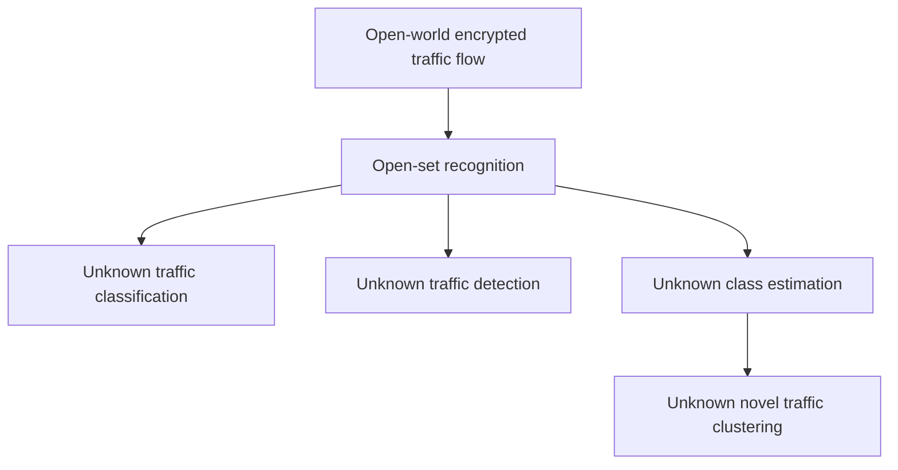
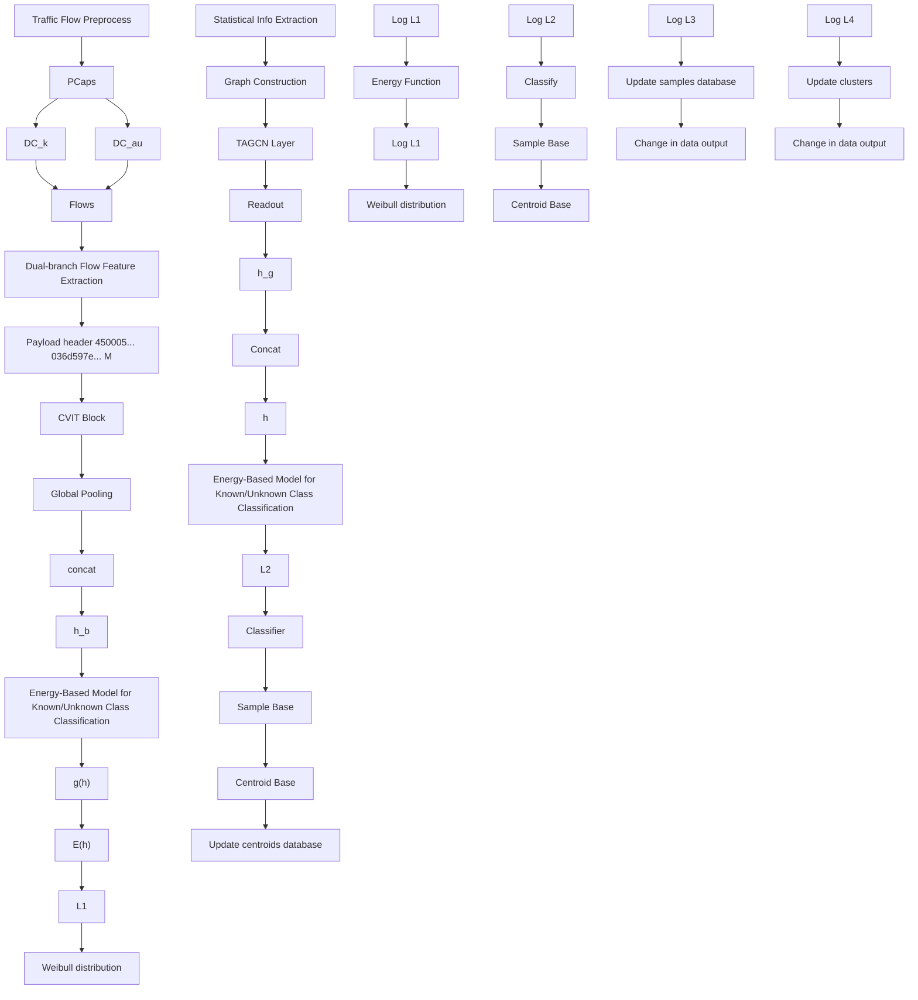

# End-to-End Open-Set Semi-Supervised Learning for Fine-Grained Encrypted Traffic Classification

Qian Yang, Wenxuan He, Minghao Chen, Hongyu Du, Sisi Shao, Fei Wu , Shangdong Liu , Yimu Ji , and Kui Ren , Fellow, IEEE

Abstract—Encrypted traffic classification is crucial for enhancing network management, service quality, and security. However, real-world network environments are inherently open-world scenarios in which traffic not only consists of known classes but also includes the continuous emergence of unknown classes. Existing deep learning methods typically rely on the closed-world assumption, which significantly limits their classification performance when dealing with unknown traffic types. This limitation makes it challenging to accurately classify known traffic classes and effectively identify unknown ones. Although few studies have focused on open-world scenarios, these methods often use staged strategies and struggle to reliably detect unknown traffic or to estimate novel classes. To address these challenges, we propose an end-to-end Fine-grained Encrypted traffic Classification method based on Open-set Semi-supervised Learning, called FEC-OSL. This method comprises three mutually reinforcing core components. First, we design a dual-branch flow feature extraction module to capture detailed and discriminative flow features. Second, we introduce a novel energy-based perspective that leverages energy-boundary learning to distinguish known traffic from unknown traffic, enabling precise detection of known classes. Finally, an adaptive deep clustering approach integrates feature learning with clustering to achieve fine-grained classification of unknown flows. We conduct extensive experiments on three realworld datasets, and the results validate that our proposed method exhibits outstanding performance in handling both known and unknown encrypted traffic in open-world scenarios.

Index Terms—Encrypted traffic classification, open-set semisupervised learning, end-to-end, energy-based model, network security.

Received 13 January 2025; revised 8 August 2025, 14 October 2025, and 18 November 2025; accepted 8 January 2026. Date of publication 12 January 2026; date of current version 29 January 2026. This work was supported in part by the National Key R&D Program of China under Grant 2023YFB2904000 and Grant 2023YFB2904004, in part by Jiangsu Key Development Planning Project under Grant BE2023004-2, and in part by the Future Network Scientific Research Fund Project under Grant FNSRFP-2021-YB-15. The associate editor coordinating the review of this article and approving it for publication was Dr. Prosanta Gope. (Corresponding author: Yimu Ji.)

Qian Yang, Wenxuan He, Minghao Chen, Hongyu Du, Shangdong Liu, and Yimu Ji are with the School of Computer Science, Nanjing University of Posts and Telecommunications, Nanjing 210023, China (e-mail: yq112641@163.com; 1223045429@njupt.edu.cn; 1224045412@njupt.edu.cn; 2024040408@njupt.edu.cn; lsd@njupt.edu.cn; jiym@njupt.edu.cn).

Sisi Shao is with the School of Internet of Things, Nanjing University of Posts and Telecommunications, Nanjing 210023, China (e-mail: 2021070701@njupt.edu.cn).

Fei Wu is with the School of Automation, Nanjing University of Posts and Telecommunications, Nanjing 210023, China (e-mail: wufei 8888@126.com).

Kui Ren is with the State Key Laboratory of Blockchain and Data Security, Zhejiang University, Hangzhou, Zhejiang 310027, China (e-mail: kuiren@zju.edu.cn).

Digital Object Identifier 10.1109/TIFS.2026.3653575

# I. INTRODUCTION

W ITH the rapid advancement of network technologies,traffic classification has become a core technology traffic classification has become a core technology for enhancing network management efficiency, optimizing the quality of service (QoS), and ensuring network security (e.g., malware identification and intrusion detection) [1]. However, the proportion of encrypted traffic has increased dramatically along with increasing awareness of user privacy protection and the continuous advancement of encryption technology [2], [3], [4]. Although encryption effectively safeguards user privacy, it simultaneously introduces unprecedented challenges to network security monitoring. Traditional plaintext-based traffic analysis and detection methods [5], [6] are gradually becoming ineffective, as they cannot directly access packet payloads. Moreover, an increasing number of malware and cyber attacks leverage encrypted channels, such as SSL/TLS, to evade detection, making it more difficult for intrusion detection systems (IDSs) and firewalls to identify threats promptly. According to the latest report from Zscaler, approximately 85.9% of network threats are now transmitted through encrypted channels [7], highlighting the urgent need for encrypted traffic analysis and management.

In recent years, encrypted traffic classification has made significant progress with the use of deep learning techniques. However, most existing methods are based on the closedworld assumption [8], [9], [10], [11], [12], which assumes that the classes of test samples are already known during the training phase. As a result, these methods can only classify test samples into a predefined and limited set of classes. However, in real-world network environments, traffic classes are highly dynamic, with new applications and attack methods emerging constantly. As a result, the testing phase often encounters unknown classes that were never seen during training. We define this as an open-world scenario, where the model needs to handle entirely novel and unseen classes that were not defined or labeled during the training phase. Traditional closed-world classification models perform poorly in such scenarios and struggle to effectively identify unknown traffic. As shown in Figure 1, compared with closed-world settings, open-world scenarios are more complex [13], as they require addressing both the detection of unknown traffic and the accurate classification of known classes.

(i) The first challenge is that traffic classification models must support open-set recognition (OSR) [14], [15], [16], enabling fine-grained classification of known traffic classes while identifying novel and unknown classes. One of the key factors in addressing this challenge is the ability to learn high-quality traffic representations. Existing OSR methods often rely on features from a single perspective, such as packet-level statistical features [17], [18], which fail to capture subtle variations among complex traffic. This leads to limited class separability in the feature space and compromises the performance of downstream classifiers. In addition, the classifier’s ability to distinguish unknown classes plays a critical role in overall OSR effectiveness, as it directly influences the model’s ability to generalize in open-world scenarios. Some studies [19], [20], [21] use classifier confidence scores to detect unknowns, but these methods are often unreliable since high-confidence unknown samples may still be misclassified. Yang et al. [22] proposed a multistage detection framework using classconditioned autoencoders and extreme value theory to identify unknown attacks. However, this method requires separate training for each stage, which increases overall complexity and introduces potential error propagation between stages.

(ii) Another challenge is enabling the model to efficiently estimate unknown traffic classes. The goal is to allow the model to autonomously learn novel classes, supporting threat analysis and expanding the attack knowledge base for security management [16]. Research on this issue remains limited in the field of traffic classification. Existing methods rely primarily on manual analysis or offline clustering [23], [24]. Zhao et al. [17] proposed a method that integrates multiple clustering algorithms through adjacency matrices. The clustering results were evaluated using cut-off point filtering and silhouette coefficients. However, this approach is heavily reliant on expert knowledge, as each clustering algorithm requires manual parameter tuning.

In this study, we propose FEC-OSL, an end-to-end finegrained encrypted traffic classification method based on open-set semi-supervised learning. This method is designed to address three challenges: distinguishing between known and unknown traffic flows, classifying known flow classes, and clustering unknown flows. FEC-OSL is composed of three key modules: a dual-branch flow feature extraction module for capturing fine-grained flow features, an energy-based classification module for distinguishing between known and unknown flows, and an adaptive deep clustering module for unknown flow classes. First, flow byte sequences are reshaped into matrices and processed through a convolution-enhanced vision transformer network to extract byte-level features. Additionally, we construct a flow interaction graph and apply a topology-adaptive graph convolutional network to extract interaction features. The dual-branch module extracts features from complementary views of low-level byte patterns and high-level interaction behaviors, reducing information loss and enhancing the discriminative power of the feature space. The fused features yield a comprehensive flow representation. Second, an energy-based model converts flow features into energy values, where low-energy samples are classified as known flows and high-energy samples are identified as unknown flows. Finally, feature learning is integrated with clustering algorithms to iteratively refine the clustering of unknown flow classes by updating sample feature representations. Through an end-to-end collaborative optimization strategy, the three modules are jointly trained with a unified loss function, iteratively refining the feature space and improving both classification and clustering performance. Overall, FEC-OSL achieves endto-end open-set multitask learning, providing a novel and effective solution for encrypted traffic detection in open-world scenarios.

In summary, the main contributions of this paper include the following:

• We propose FEC-OSL, an end-to-end fine-grained traffic classification framework. It effectively addresses key challenges in open-world scenarios, including distinguishing flows from known and unknown traffic classes, classifying known classes, and clustering unknown classes.

• We design a dual-branch flow feature extraction module to capture fine-grained discriminative information from flows. Additionally, we introduce an energy-based constraint that effectively distinguishes between known and unknown flows while ensuring reliable classification of known flows. Furthermore, we propose an adaptive deep clustering method that uses feature learning to refine pseudo labels generated during clustering. By iteratively optimizing the clustering process, the model progressively adapts to unknown flow classes and achieves more accurate clustering results.

• We conduct extensive experiments on three real-world datasets to evaluate the performance of FEC-OSL. The results show that FEC-OSL outperforms existing methods. In addition, a series of supplementary experiments are performed to verify its superior generalization ability and robustness.

# II. RELATED WORK

# A. Deep Learning for Encrypted Traffic Classification

In recent years, deep learning has shown significant advantages in feature extraction and has become a key research focus in encrypted traffic classification. These methods are generally categorized into supervised, unsupervised, and semisupervised learning approaches. Supervised learning relies on fully labeled datasets and uses models such as convolutional neural networks (CNNs), transformers, and graph neural networks (GNNs) to automatically extract latent traffic features, greatly increasing classification accuracy. For instance, Lotfollahi et al. [11] employed 1D-CNNs to capture the spatial dependencies of bytes within packets, extracting key discriminative patterns. Zhou et al. [25] applied transformers to extract temporal features from traffic traces, improving the classification of Tor-encrypted traffic. Hu et al. [10] constructed flow graphs from interactive packets in bidirectional flows (biflows) and used graph2vec embeddings to represent these graphs as vectors. Unsupervised methods focus on normal traffic patterns to detect anomalies by identifying deviations from typical behaviour. For example, Kitsune, proposed by Mirsky et al. [26], employs autoencoders to dynamically reconstruct features of normal traffic, enabling anomaly detection. semi-supervised learning methods address the challenge of obtaining large-scale labeled data by combining small amounts of labeled traffic with large volumes of unlabeled traffic. The study in [9] demonstrates that application fingerprints in encrypted traffic can be effectively extracted using semi-supervised learning, which improves the classification performance while reducing the labelling dependency. While these methods have achieved promising results in detecting known traffic within closed sets, their performance in identifying unknown attacks in open sets remains limited. In contrast, our proposed method combines the adaptability of openset learning with the low labelling cost of semi-supervised learning. Additionally, end-to-end joint training further reduces silent misclassification in fine-grained encrypted traffic classification.

# B. Open-Set Recognition for Encrypted Traffic Classification

In open-world scenarios, encrypted traffic classification must address two key tasks: fine-grained classification of known traffic classes and detection of unknown traffic classes, which falls under the framework of open-set recognition (OSR). OSR has received increasing attention, with methods broadly categorized as confidence-based, reconstruction error-based, and generative model-based approaches. Confidence-based methods assess whether a sample belongs to an unknown class through the classifier’s confidence. Hendrycks et al. [20] analyzed softmax output distributions to detect unknown samples based on prediction confidence. Reconstruction error-based methods leverage autoencoders to model known traffic and identify unknown traffic through reconstruction errors. Yang et al. [27] improved the sample distance metric in the latent space using a contrastive learningbased autoencoder. They applied a dynamic threshold based on the median absolute deviation to identify out-of-distribution drifting samples. Zhao et al. [17] developed a one-class learner for each class. The traffic for each class was reconstructed, and an outlier threshold was applied to detect unknown traffic. However, these methods suffer from confidence misjudgement and sensitivity to reconstruction errors, which reduces the overall effectiveness of OSR. Generative model-based methods identify unknown traffic by generating samples or learning data distributions. Yang et al. [22] trained generative models to learn feature distributions of known classes and identified unknown classes using reconstruction errors. In contrast, our method involves the construction of an efficient feature representation mechanism and introduces a classification method using an energy-based model. This model achieves robust performance in distinguishing between known and unknown flows, enhancing the detection of unknown classes while maintaining high accuracy for known classes.

# III. METHODOLOGY

# A. Problem Statement

In the open-world traffic classification task, we are given a training dataset $\mathcal { D } ^ { t r a i n }$ consisting of a labeled known class traffic set $\mathcal { D } _ { k }$ and an auxiliary unknown class traffic set $\mathcal { D } _ { a u } .$ . The known class set $\mathcal { D } _ { k }$ contains traffic flows annotated with explicit class labels drawn from the known label set $\mathcal { V } _ { k }$ and is formally defined as $\mathcal { D } _ { k } = \{ ( x _ { i } , y _ { i } ) | y _ { i } \in \mathcal { V } _ { k } \} _ { i = 1 } ^ { N _ { k } }$ , where $x _ { i }$ is a network flow instance, yi is its corresponding label, and $N _ { k }$ is the total number of known class flows. The label set $\mathcal { N } _ { k } =$ $\{ B \} \bigcup \{ A _ { i } \} _ { i = 1 } ^ { C _ { k - 1 } }$ comprises $C _ { k }$ distinct classes, where B represents benign traffic and each $A _ { i }$ denotes a specific known attack type. The set $\mathcal { D } _ { a u } = \{ x _ { i } \} _ { i = 1 } ^ { N _ { a u } }$ consists of unlabeled flows that are treated as belonging to an auxiliary unknown class $U _ { a u } ,$ which is associated with a latent label set $\mathcal { \textrm { y } } _ { a u }$ strictly disjointed from the known classes, i.e., $\mathcal { V } _ { k } \bigcap \mathcal { V } _ { a u } = \emptyset$ . During testing, the model must handle a more complex open-world scenario. The test set $\mathcal { D } ^ { t e s t }$ includes traffic flows from known classes ${ \mathcal { V } } _ { k } ,$ from the auxiliary unknown class $\mathcal { \textrm { y } } _ { a u }$ , and from entirely novel unknown classes not seen during training, denoted as $\mathcal { D } _ { n u }$ with a label set ${ \mathcal { D } } _ { n u }$ . The novel unknown classes are also disjointed from all previously observed classes: $\mathcal { V } _ { n u } \bigcap \mathcal { V } _ { a u } = \emptyset$ and $\mathcal { V } _ { n u } \cap \mathcal { V } _ { k } = \emptyset$ .

flowchart

Fig. 1. Schematic of an open-world fine-grained classification task for known and unknown encrypted traffic, including the distinction between known and unknown traffic, classification of known classes, and clustering of unknown classes.

The goal is to train an end-to-end classification model M that, at test time, (1) accurately classifies flows belonging to known classes $y _ { k } ; ~ ( 2 )$ effectively detects and distinguishes flows from novel unknown classes ${ \mathcal { N } } _ { n u } ;$ and (3) performs fine-grained classification of flows in the auxiliary unknown set $\mathcal { D } _ { a u }$ using pseudo labels. Reliably identified unknown traffic flows are progressively accumulated and integrated with the auxiliary set $\mathcal { D } _ { a u }$ to form an updated set $\mathcal { D } _ { a u } ^ { \prime } .$ , which is periodically used for retraining to improve the model’s adaptability against evolving unknown traffic.

# B. Method Overview

The overall framework of our proposed FEC-OSL is shown in Figure 2. It consists of three modules: i) Dual-branch flow feature extraction module: This module preprocesses raw traffic pcap data and splits it into independent biflows. Byte-level features and flow interaction features are extracted separately. These features are fused and concatenated to form a comprehensive representation. ii) Energy-based model for known/unknown class classification module: The energy function maps flow samples to energy values, with the Weibull distribution modeling known and unknown sample boundaries. Energy values are compared to a threshold to classify samples as known or unknown. iii) Unknown class adaptive deep clustering module: This module iteratively optimizes the clustering of unknown flows by jointly updating flow sample feature representations through clustering and feature learning.

flowchart

Fig. 2. Overall structure of FEC-OSL. The model is trained in an end-to-end manner using a combination of cross-entropy loss, energy-based boundary regularization loss and clustering loss.

# C. Dual-Branch Flow Feature Extraction

To improve the accuracy of encrypted traffic classification, we propose a dual-branch flow feature extraction module that integrates byte-level and flow interaction features.

1) Byte-Level Flow Feature Extraction: In encrypted traffic classification, the raw byte information of network flows is critically important. Compared with statistical features [12], [28], raw byte data retain fine-grained content and better reflect the inherent characteristics of flows [29]. To preserve the interaction patterns between endpoints, the raw pcap data are segmented into independent biflows using the Splitcap tool. For each packet, Ethernet headers are removed, and IP addresses and port numbers are anonymized.

Byte Matrix Reshaping: For each input flow sample x, we select the first M consecutive packets to ensure traffic data consistency. Each packet is divided into two parts, the header and the payload, which differ in semantics and length [11], [30]. These parts are processed separately and reshaped into fixed-size matrices for model input. The byte sequence of each packet header is reshaped into a matrix of size $m _ { h } ^ { r } \times m _ { h } ^ { c }$ , with zero-padding applied for uniformity. The header matrices of M packets are concatenated along the packet sequence dimension to form a fixed-size flow header matrix $x _ { h } ~ \in ~ \mathbb { R } ^ { ( M \times m _ { h } ^ { r } ) \times m _ { h } ^ { c } }$ , where $M \times m _ { h } ^ { r } = m _ { h } ^ { c }$ . Similarly, the payloads are processed into a flow payload matrix $x _ { p } \in \bar { \mathbb { R } ^ { ( M \times m _ { p } ^ { r } ) \times m _ { p } ^ { c } } }$ , where $\begin{array} { r } { M \times m _ { p } ^ { r } = m _ { p } ^ { c } . } \end{array}$ . Given that prior studies have shown that selecting the first few packets of a flow is generally sufficient to capture its fundamental characteristics [31], we uniformly set $M \ = \ 5$ packets per flow in this study to strike a reasonable balance between performance and efficiency.

Convolution-Enhanced ViT Feature Extraction: The vision transformer (ViT) [32] applies the transformer [33] to computer vision. However, ViT lacks locality and translation invariance, limiting its performance on small-scale datasets [34]. To address this, we propose a convolution-enhanced ViT (CViT), which combines convolutional local feature extraction with ViT’s global modeling to efficiently extract multilevel features from raw byte matrices.

For both the flow header matrix $x _ { h }$ and payload matrix $x _ { p } ,$ the same feature extraction process is applied. Taking $x _ { h }$ as an example, it is divided into $P \times P$ patches that do not cross packet boundaries. The total number of patches is $N _ { p } ,$ and the patches are represented as $\tilde { x } _ { h } \ \in \ \mathbb { R } ^ { N _ { p } \times P ^ { 2 } }$ . Convolutional operations are then applied to each patch to extract local features:

$$
c _ {h, i} = \operatorname{Conv} \left(\tilde {x} _ {h, i}; \theta\right) \tag {1}
$$

where  is the convolution kernel. The features are flattened θand embedded into high-dimensional space and augmented with positional embeddings to retain spatial information:

$$
z _ {h} ^ {(0)} = \left[ c _ {h, 1} E _ {\text { emb }}; c _ {h, 2} E _ {\text { emb }}; \dots ; c _ {h, N _ {p}} E _ {\text { emb }} \right] + E _ {\text { pos }} \tag {2}
$$

where $E _ { e m b }$ denotes the embedding matrix and $E _ { p o s }$ denotes the positional embedding.

The embedded features are fed into a transformer encoder with L layers. For the l-th layer:

$$
\bar {z} _ {h} ^ {(l)} = M H A (L N (z _ {h} ^ {(l - 1)})) + z _ {h} ^ {(l - 1)} \tag {3}
$$

$$
z _ {h} ^ {(l)} = F F N (L N (\bar {z} _ {h} ^ {(l)})) + \bar {z} _ {h} ^ {(l)} \tag {4}
$$

where MHA(·) denotes the multi-head attention mechanism, FFN(·) denotes the feed-forwards network, and LN(·) denotes the layer normalization.

After processing, global pooling is applied to the flow header matrix and payload matrix, resulting in flow-level feature representations $z _ { h }$ and $z _ { p }$ . These features are then combined to form the final flow-level byte feature representation, $h _ { b } = [ z _ { h } , z _ { p } ]$ .

2) Flow Interaction Feature Extraction: In encrypted flows, attributes such as packet time intervals and transmission directions (e.g., upstream or downstream) reflect the interaction patterns between hosts. These features are crucial for distinguishing between normal and malicious behaviors [28], [35].

Flow Interaction Graph Construction: To capture such features, we construct a flow interaction graph (FIG), where each biflow is represented as a graph, providing an intuitive representation of the communication patterns between endpoints. Specifically, we follow the graph construction procedure proposed in the seminal work [35], where each packet within a flow is regarded as a node in the graph. The concept of a burst, which refers to a sequence of consecutive packets transmitted in the same direction within a short time interval, is introduced to define the connections between nodes. This forms a graph $\mathcal { G } = ( \nu , \mathcal { E } )$ , where nodes V and edges E are defined as follows:

Nodes: Node features are crucial for accurate classification. On the basis of the approach in [35], we expand it by extracting key attributes from packets across multiple dimensions as node embeddings. These features include packet direction, length, timestamp, total number of packets in a burst, total number of bytes in a burst, the ratio of packet counts between consecutive bursts, and the ratio of total bytes between consecutive bursts. These seven types of features provide strong discriminative power for encrypted traffic classification: packet direction captures host interaction patterns, length is a critical attribute for identifying encrypted fingerprints [36], timestamp reflects temporal dynamics, and burst-related features reveal communication density and stage-wise behaviors. All the features are concatenated into a vector to serve as the initial representation of each node.

Edges: The packet sequence within a biflow is divided into multiple bursts based on a predefined burst threshold. In FIG, nodes are connected through intra-burst and inter-burst edges. Within the same burst, intra-burst edges are constructed sequentially according to timestamps, connecting each pair of adjacent nodes. This captures the temporal sequence of packets while reducing the computational complexity of fully connecting all nodes. For nodes across adjacent bursts, interburst edges are added: the first node of each burst is connected to the first node of the previous burst, and the last node is connected to the last node of the previous burst. This preserves the relationships between bursts and the temporal continuity of the flows. Additionally, undirected edges are used in the graph to flexibly represent the relationships between packets.

Graph Representation Learning: We construct a FIG G for each flow x and input the graph into a GNN consisting of topology-adaptive graph convolutional network (TAGCN) [37] layers and a readout layer.

TAGCN Layer: Given the complex behavioural patterns in flows, such as packet bursts and frequent interactions, we employ TAGCN to aggregate multi-hop neighbourhood information for feature extraction and iteratively update node representations. In the FIG G, the initial feature of node i is denoted as $h _ { i } ^ { ( 0 ) }$ , where $i ~ = ~ 1 , 2 , \cdots , N _ { \nu }$ and $N _ { \nu }$ is the , , ,number of nodes. All node features form a feature matrix $\hat { H } = [ \hat { a } _ { 1 } , \hat { a } _ { 2 } , \cdots , \hat { a } _ { D } ] \in \mathbb { R } ^ { N _ { \nu } \times D } .$ , where the d-th feature dimen-, , ,sion is given by vector $\hat { \boldsymbol a } _ { d } \in \mathbb { R } ^ { N _ { v } }$ . The TAGCN network consists of $L ^ { \prime }$ layers. The input, including $\hat { H }$ and the adjacency matrix ${ \mathcal { A } } ,$ , is passed into a set of graph filters to perform convolution operations acrosf -th graph filter $G _ { d , f } ^ { ( l ^ { \prime } ) } \in \mathbb { R } ^ { N _ { \nu } \times N _ { \nu } }$ ensions of node features. The in the l0-th layer is defined as ,a polynomial of A:

$$
G _ {d, f} ^ {(l ^ {\prime})} = \sum_ {k = 1} ^ {K} w _ {d, f, k} ^ {(l ^ {\prime})} \mathcal {A} ^ {k} \tag {5}
$$

where w  d f k $w _ { d , f , k } ^ { ( l ^ { \prime } ) }$ are learnable coefficients that determine the , ,contribution of k-hop neighbourhood information. The term $\mathcal { A } ^ { k }$ denotes the k-th power of the adjacency matrix, where $\mathcal { A } _ { i , j } ^ { k }$ is the number of paths of length k from node j to node i.

,The f -th output feature mapping of node i is calculated as follows:

$$
h _ {i, f} ^ {(l ^ {\prime})} = \sum_ {d = 1} ^ {D} G _ {d, f} ^ {(l ^ {\prime})} \hat {a} _ {d} + b _ {f} = \sum_ {k = 1} ^ {K} \sum_ {d = 1} ^ {D} w _ {d, f, k} ^ {(l ^ {\prime})} \mathcal {A} ^ {k} \hat {a} _ {d} + b _ {f} \tag {6}
$$

where $b _ { f }$ is a learnable bias term. After filtering, the output feature maps are concatenated to update the node representation h(l0 )i . $h _ { i } ^ { ( l ^ { \prime } ) }$

Readout Layer: After the node features are obtained, the readout layer generates the graph-level representation of the flow. This is defined as follows:

$$
h _ {g} = \text { Readout } (h _ {1} ^ {(l ^ {\prime})}, h _ {2} ^ {(l ^ {\prime})}, \dots , h _ {N _ {v}} ^ {(l ^ {\prime})}) \tag {7}
$$

3) Feature Fusion: We concatenate the byte-level flow features $h _ { b }$ and flow interaction features $h _ { g }$ obtained from the dual-branch feature extraction process to form a more comprehensive flow representation $h = [ h _ { b } , h _ { g } ]$ .

,From the traffic feature perspective, the byte-level branch focuses on fine-grained packet composition that encodes structural patterns, whereas the interaction branch captures flow characteristics such as temporal dependencies, burst behaviour, and direction correlation between hosts. These complementary representations jointly reflect both intrinsic packet characteristics and extrinsic communication behaviors, leading to more discriminative feature embeddings for clustering and classification.

# D. Energy-Based Model for Known/Unknown Class Classification

In open-world detection, the presence of unknown class traffic is inevitable. Softmax-based methods perform well for known classes but often produce high-confidence predictions for unknown classes, leading to misclassification [19], [20]. To address this, we design a module for distinguishing known and unknown classes based on an energy-based model (EBM) [38], [39]. This module identifies known and unknown traffic by evaluating the compatibility between the input features and class labels.

Given a flow sample x, its feature representation $h \in \mathcal H$ in the latent space, and its label, we aim to learn an energy function E(h) that assigns lower energy values to known classes and higher energy values to unknown classes. $E ( h )$ is defined as the Helmholtz free energy of h, computed by marginalizing over the energy values $E ( h , y ^ { \prime } )$ corresponding to individual classes $y ^ { \prime }$ ,. This is expressed as follows:

$$
E (h) = - T \log \int_ {y ^ {\prime}} \exp (- E (h, y ^ {\prime}) / T) \tag {8}
$$

where T is a temperature parameter that regulates the energy scale. $E ( h , y ^ { \prime } )$ quantifies the compatibility between h and class $y ^ { \prime } ,$ while $E ( h )$ aggregates these values into a holistic energy representation.

EBMs are naturally related to traditional discriminative models [39]. We employ a discriminative classifier $g ( h )$ with $C _ { k } + 1$ classes, where the first $C _ { k }$ represents known classes and the additional class represents all unknown classes. The classifier maps h to $C _ { k } + 1$ logits. The energy values are then converted into a class probability distribution using the Gibbs distribution, similar to the output of a softmax layer:

$$
\begin{array}{l} \mathcal {P} (y | h) = \frac {\exp (- E (h , y) / T)}{\int_ {y ^ {\prime}} \exp (- E (h , y ^ {\prime}) / T)} = \frac {\exp (- E (h , y) / T)}{\exp (- E (h) / T)} \\ = \frac {\exp (g _ {y} (h) / T)}{\sum_ {j = 1} ^ {C _ {k} + 1} \exp (g _ {y _ {j}} (h) / T)} \tag {9} \\ \end{array}
$$

where $g _ { y } ( h )$ is the logit value for class y and $E ( h , y )$ is its corresponding energy value, where $E ( h , y ) \ : = \ : - g _ { y } ( h )$ . Using ,Equation (9), the free energy function can be expressed as follows:

$$
E (h; g) = - T \log \left(\sum_ {j = 1} ^ {C _ {k} + 1} \exp \left(g _ {y _ {j}} (h) / T\right)\right) \tag {10}
$$

The energy function $E ( h ; g )$ provides a global representation of h by considering all classes. Unlike softmax, which relies only on the relative magnitudes of logits, the energy-based model effectively avoids false high-confidence predictions through global modeling.

During training, we design a total loss function that combines cross-entropy loss and energy-based boundary regularization loss. This function improves the classification accuracy for known classes and enhances the ability to distinguish between known and unknown classes. The total loss function is given as follows:

$$
\mathcal {L} _ {1} = \mathbb {E} _ {(h, y) \sim \mathcal {H} ^ {\text {train}}} [ - \log \mathcal {P} (y | h) ] + \lambda \mathcal {L} _ {\text {energy}} \tag {11}
$$

where $\mathcal { H } ^ { t r a i n }$ denotes training flow samples in the latent space and  denotes the weight factor that balances the two loss λterms. The energy-based boundary regularization loss $\mathcal { L } _ { e n e r g y }$ is defined as follows:

$$
\begin{array}{l} \mathcal {L} _ {\text { energy }} = \mathbb {E} _ {(h, y) \sim \mathcal {H} _ {k}} (\max (0, E (h) - m _ {k})) ^ {2} \\ + \mathbb {E} _ {(h, y) \sim \mathcal {H} _ {a u}} (\max (0, m _ {a u} - E (h))) ^ {2} \tag {12} \\ \end{array}
$$

where $\mathcal { H } _ { k }$ and ${ \mathcal { H } } _ { a u }$ denote the training distributions of known class flows and auxiliary unknown class flows, respectively. $m _ { k }$ and $m _ { a u }$ are energy-boundary parameters for known and auxiliary unknown classes, respectively. Specifically, the first term drives the energy of known class flows below the upper

histogram

| Negative Energy Range | Known Classes Density | Unknown Classes Density |
| --------------------- | --------------------- | ----------------------- |
| 0-2                   | 0.00                  | 0.00                    |
| 2-4                   | 0.00                  | 0.00                    |
| 4-6                   | 0.00                  | 0.60                    |
| 6-8                   | 0.25                  | 0.30                    |
| 8-10                  | 0.28                  | 0.25                    |
| 10-12                 | 0.15                  | 0.10                    |
| 12-14                 | 0.05                  | 0.02                    |

Fig. 3. Comparison of the negative energy Weibull distributions for known and unknown flows. The histogram shows the density distributions of known classes (blue) and unknown classes (red) across different energy ranges. The dashed line indicates the threshold used to distinguish between known and unknown classes.

bound $m _ { k } .$ , whereas the second term treats auxiliary unknown class flows (without labels) as negative examples, encouraging their energy to exceed the lower bound $m _ { a u }$ . The regularization mechanism enables the model to form a distinct and generalizable boundary between known and unknown classes in the energy space. Consequently, it can effectively separate the two classes and better generalize them to identify novel unknown classes during testing.

In the inference phase, the learned energy function $E ( h ; g )$ computes the energy values of flows. To distinguish between known and unknown flows, the negated energy values −E(h; g) of known class samples are modeled using the Weibull distribution [40], as illustrated in Figure 3. By comparing the energy value with a threshold , flows are classified as either known or unknown:

$$
r = \left\{ \begin{array}{l l} \underset {y \in \mathcal {Y} _ {k}} {\arg \min} E (h, y), & \text { if } - E (h; g) \geq \tau , \\ U, & \text { otherwise. } \end{array} \right. \tag {13}
$$

$\operatorname { I f } { } - E ( h ; g )$ exceeds , the flow is assigned to the known τclass with the minimum energy value. Otherwise, it is classified as unknown. The term $- E ( h ; g )$ is used to ensure that higher scores correspond to positive samples, following conventional definitions.

# E. Unknown Class Adaptive Deep Clustering

In an open-world scenario, novel classes constantly emerge, making it crucial to generate effective pseudo labels for unknown class samples. To address this challenge, we design an adaptive deep clustering module that integrates deep feature extraction with clustering techniques to adaptively cluster unknown flows.

For unknown flow $x ,$ the dual-branch feature extraction module first generates its feature representation. To mitigate the feature bias caused by the EBM, which might incorrectly map unknown flows to an auxiliary $( C _ { k } + 1 ) – \mathrm { t F }$ class, we apply a CNN to refine the feature representations. The overall feature extraction network is denoted as (·). A classifier $g ^ { \prime } ( \cdot )$ is then ψθapplied, where the initial number of classes is set to a value larger than the potential true number of unknown classes. In the initialization phase, we employ a clustering algorithm to assign initial pseudo labels ˜y to x. A sample base is constructed to store flow features and their pseudo labels, while a centroid base maintains the current feature representation of the cluster centroid. We obtain the corresponding pseudo labels of $x _ { a u }$ from the sample base and update the parameters of $\psi _ { \boldsymbol \theta } ( \cdot )$ by minimizing the following loss function:

$$
\mathcal {L} _ {2} = \mathbb {E} _ {(x, \tilde {y}) \sim \mathcal {D} _ {a u}} [ C E (g ^ {\prime} (\psi_ {\theta} (x), \tilde {y})) ] \tag {14}
$$

where CE(·) denotes the cross-entropy loss function. After updating the feature representations, to ensure a smoother transition of the features in the sample base, we adopt the following momentum update formula to update the features stored in the sample base:

$$
F _ {\beta} (x) \leftarrow \beta \cdot \frac {\psi_ {\theta} (x _ {u})}{\| \psi_ {\theta} (x) \| _ {2}} + (1 - \beta) \cdot F _ {\beta} (x) \tag {15}
$$

where $\beta \in ( 0 ,$ 1] is the momentum coefficient, balancing the β ,contributions between the new and old features. Moreover, the pseudo labels of the flow samples are reassigned based on their current features by finding the nearest cluster center as follows:

$$
\tilde {y} ^ {\prime} = \arg \min _ {\tilde {y} \in \{1, \dots , C _ {a u} \}} \| F _ {\beta} (x) - c _ {\tilde {y}} \| _ {2} ^ {2} \tag {16}
$$

where $c _ { \tilde { y } }$ denotes the cluster center feature of class ˜y. As the network iteratively updates, the feature representations of the flow samples and their pseudo label assignments are progressively refined. Erroneous features and labels are gradually corrected, uncovering the fine-grained classes within the unknown flows.

# F. End-to-End Training

During training, the FEC-OSL model is trained using an end-to-end joint training strategy, where the known/unknown class classification module and the unknown class adaptive deep clustering module are alternately optimized in an iterative manner. The dual-branch flow feature extraction module is shared by both modules and provides consistent and informative flow features. The joint loss function for the model is defined as follows:

$$
\mathcal {L} _ {\text { total }} = \mathcal {L} _ {1} + \mathcal {L} _ {2} \tag {17}
$$

where $\mathcal { L } _ { 1 }$ is the loss for the known/unknown classification task. It includes cross-entropy loss and energy-based boundary regularization loss. $\mathcal { L } _ { 2 }$ denotes the clustering loss for unknown classes.

The alternating optimization strategy guides known class features towards low-energy regions and auxiliary unknown features towards high-energy regions, thereby reducing intraclass variance for known classes and enlarging the feature margin between known and unknown classes. Moreover, the clustering module refines pseudo labels and aggregates features to increase the intraclass compactness of auxiliary unknown flows, reinforcing separability in the energy space. This synergy improves classification accuracy for known classes, generalization to novel unknowns, and fine-grained clustering of auxiliary unknown flows, fulfilling the multi-task objective of open-world traffic classification.

During testing, we incrementally identify credible novel unknown flows, denoted as $\mathcal { D } _ { n u } .$ , with energy values in the tail (p 0.01) of the Weibull distribution of known classes <and with feature distances lying in the top 5% tail region and forming high-density clusters. These samples are merged with the original auxiliary unknown set $\mathcal { D } _ { a u }$ to form an updated set $\mathcal { D } _ { a u } ^ { \prime } ,$ which is periodically used to refine model parameters and enhance adaptability to emerging unknown traffic.

# IV. EVALUATION

# A. Experimental Overview

In this section, the performance of FEC-OSL is thoroughly evaluated through comparisons with baseline methods in closed-set and open-set scenarios, an analysis of adaptability to concept drift, ablation studies of key components, and a sensitivity analysis of hyperparameter effects.

# B. Experimental Setup

1) Datasets: The proposed method is extensively evaluated on three real-world benchmark datasets: USTC-TFC-2016 [41], CIC-IDS-2018 [42], and ISCX-Tor-2016 [43]. The details of the datasets are as follows:

• USTC-TFC-2016: Released by researchers from the University of Science and Technology of China (USTC), this dataset contains encrypted traffic from 10 types of malware and 10 types of benign applications.   
CIC-IDS-2018: Collected by the Canadian Institute for Cybersecurity, this dataset serves as a benchmark for intrusion detection systems. It includes normal traffic as well as six types of malicious traffic, such as brute force attacks, botnets, and denial-of-service (DoS) attacks.   
• ISCX-Tor-2016: This dataset contains encrypted traffic from 16 types of applications that use the Onion Router (Tor) for communication, such as e-mail, Chat, and FTP.

Owing to the considerable disparity in the number of samples across different classes in the employed datasets, a class-balanced sampling strategy is adopted to alleviate the impact of class imbalance on model training and evaluation.

2) Baselines: To comprehensively evaluate the performance of FEC-OSL, we conduct experimental comparisons with nine baseline methods under both closed-set and open-set scenarios: i) For the traditional closed-set scenario, we include supervised methods (GraphDApp [35], Deeppacket [11], PERT [44], and ET-BERT [45]), unsupervised methods (Kitsune [26]), and semi-supervised methods (FlowPrint [9]). ii) For the openset scenario, we compare it with open-set learning methods specifically designed for this setting (CVAE-EVT [22], ECNet [31], and Trident [17]).

3) Evaluation Metrics: We evaluate our method and baselines using accuracy (AC), precision (PR), recall (RC), and F1 score (F1) for known class classification; AUC of the ROC curve for distinguishing between known and unknown classes; and adjusted mutual information (AMI) for clustering unknown classes.

TABLE I COMPARISON OF CLASSIFICATION RESULTS IN THE CLOSED-SET SCENARIO (%) 

<table><tr><td rowspan="2" colspan="2">Methods</td><td colspan="4">USTC-TFC-2016</td><td colspan="4">CIC-IDS-2018</td><td colspan="4">ISCX-Tor-2016</td></tr><tr><td>AC</td><td>PR</td><td>RC</td><td>F1</td><td>AC</td><td>PR</td><td>RC</td><td>F1</td><td>AC</td><td>PR</td><td>RC</td><td>F1</td></tr><tr><td rowspan="4">SUM</td><td>GraphDApp</td><td>87.89</td><td>82.26</td><td>82.60</td><td>82.43</td><td>86.67</td><td>84.41</td><td>84.39</td><td>84.41</td><td>68.36</td><td>48.64</td><td>48.23</td><td>48.42</td></tr><tr><td>Deeppacket</td><td>91.38</td><td>91.62</td><td>90.77</td><td>91.20</td><td>90.41</td><td>91.02</td><td>89.21</td><td>90.11</td><td>74.49</td><td>75.49</td><td>73.99</td><td>74.73</td></tr><tr><td>PERT</td><td>95.90</td><td>96.41</td><td>97.10</td><td>96.74</td><td>93.02</td><td>94.79</td><td>93.67</td><td>94.22</td><td>78.79</td><td>63.24</td><td>65.64</td><td>64.43</td></tr><tr><td>ET-BERT</td><td>98.04</td><td>98.20</td><td>98.69</td><td>98.43</td><td>99.43</td><td>99.44</td><td>99.42</td><td>99.43</td><td>98.35</td><td>98.26</td><td>99.01</td><td>98.64</td></tr><tr><td>USM</td><td>Kitsune</td><td>86.75</td><td>81.26</td><td>85.61</td><td>83.43</td><td>92.62</td><td>77.46</td><td>90.89</td><td>83.66</td><td>-</td><td>-</td><td>-</td><td>-</td></tr><tr><td>SSM</td><td>FlowPrint</td><td>81.46</td><td>64.34</td><td>70.02</td><td>65.73</td><td>78.41</td><td>71.02</td><td>69.21</td><td>70.07</td><td>89.83</td><td>87.44</td><td>82.58</td><td>84.99</td></tr><tr><td rowspan="6">OSM</td><td>CVAE-EVT</td><td>97.32</td><td>96.95</td><td>97.20</td><td>97.06</td><td>97.94</td><td>97.41</td><td>96.63</td><td>97.01</td><td>98.06</td><td>97.85</td><td>97.33</td><td>97.60</td></tr><tr><td>ECNet</td><td>98.21</td><td>97.96</td><td>96.38</td><td>97.18</td><td>98.12</td><td>98.35</td><td>98.58</td><td>98.45</td><td>98.10</td><td>98.28</td><td>97.91</td><td>98.09</td></tr><tr><td>Trident (AE)</td><td>95.65</td><td>-</td><td>-</td><td>91.20</td><td>99.07</td><td>-</td><td>-</td><td>99.29</td><td>94.13</td><td>-</td><td>-</td><td>89.01</td></tr><tr><td>Trident (RNN)</td><td>92.38</td><td>-</td><td>-</td><td>89.64</td><td>99.93</td><td>-</td><td>-</td><td>99.57</td><td>99.38</td><td>-</td><td>-</td><td>97.02</td></tr><tr><td>Trident (GNN)</td><td>94.32</td><td>-</td><td>-</td><td>90.07</td><td>99.62</td><td>-</td><td>-</td><td>99.34</td><td>97.30</td><td>-</td><td>-</td><td>94.51</td></tr><tr><td>Ours</td><td>99.60</td><td>99.61</td><td>99.59</td><td>99.59</td><td>99.86</td><td>99.85</td><td>99.85</td><td>99.85</td><td>99.75</td><td>99.73</td><td>99.75</td><td>99.74</td></tr></table>

4) Implementation Details: Our proposed method is implemented using Python 3.8.19, PyTorch 1.8.1, and trained on a server equipped with NVIDIA GeForce RTX 3090 GPUs. We train the model using the SGD optimizer. The learning rate is set to 0.0001 for the dual-branch flow feature extraction module and the known/unknown classification module and 0.001 for the unknown class clustering module. The flow header matrix dimensions $m _ { h } ^ { c }$ and payload matrix dimensions $m _ { p } ^ { c }$ are set to 20 and 40, respectively. The number of nodes in the flow interaction graph $N _ { \nu }$ is set to 30. Energy thresholds τare determined separately for each dataset by fitting a Weibull distribution to the negated energy values of known samples. The threshold for each dataset is then set to the value at a specified quantile of the fitted distribution, with quantile levels of 0.05 for USTC-TFC-2016, 0.05 for CIC-IDS-2018, and 0.1 for ISCX-Tor-2016. The weight  is set to 0.1. The temperature parameter $T$ λis set to 10, determined via grid search in the range from 0.01 to 100 in steps of the base-10 scale. The energy-boundary parameters $m _ { k }$ and $m _ { u }$ are set to −10 and −5, respectively, and are selected by performing a grid search over candidate sets constructed based on the statistics of the energy distribution. The training process uses 50 epochs with a batch size of 64.

# C. Closed-Set Classification Evaluation

To evaluate the classification performance of FEC-OSL on known traffic classes in a closed-set scenario, we conduct experiments with all classes known. Table I compares the performance of FEC-OSL with eight other closed-set classification methods, including supervised (SUM), unsupervised (USM), semi-supervised (SSM), and open-set learning (OSM) approaches. The results indicate that FEC-OSL achieves the best overall classification performance across the three datasets.

Among the supervised methods, ET-BERT is the most stable and has the best performance. However, it relies mainly on packet payload information, which limits its ability to utilize useful information from packet headers. In contrast, FEC-OSL integrates information from packet headers, payloads, and interpacket interactions, allowing it to extract more comprehensive feature representations. As a result, FEC-OSL achieves superior performance, with AC improvements of 1.56%, 0.43%, and 1.4% and F1 score increases of 1.16%, 0.42%, and 1.1% on the three datasets, respectively. The unsupervised method Kitsune, which focuses only on individual packets and ignores correlations between packets, performs significantly worse than FEC-OSL on the two malicious traffic datasets. Similarly, the semi-supervised method FlowPrint, which considers only interaction-related information, also shows weaker performance than FEC-OSL does.

With respect to the open-set learning methods, CVAE-EVT and ECNet achieve relatively good results but still fall slightly behind FEC-OSL. The Trident series (AE, RNN, and GNN) performs well on the CIC-IDS-2018 dataset, with Trident (RNN) achieving the highest accuracy, ranking FEC-OSL second. Trident (RNN) has lower F1 scores and significantly decreases in performance on the USTC-TFC-2016 and ISCX-Tor-2016 datasets. This indicates a lack of stability and generalizability when diverse traffic environments are considered. In contrast, FEC-OSL integrates features from packet headers, payloads, and interpacket interactions, enabling it to capture fine-grained discriminative details of network traffic. As a result, FEC-OSL consistently delivers outstanding performance across varying network scenarios and complex traffic characteristics.

# D. Open-Set Classification Evaluation

1) Open-Set Traffic Classification: In this section, we evaluate the performance of the FEC-OSL model in openset traffic classification, aiming to simulate and assess its applicability in real-world open environments. Experiments are conducted on the USTC-TFC-2016, CIC-IDS-2018, and ISCX-Tor-2016 datasets. To simulate open-set conditions, we divide the selected classes into three parts: labeled known classes, unlabeled auxiliary unknown classes, and novel unknown classes that only appear during testing. The auxiliary unknown classes constitute half (rounded down) of the total unknown classes and participate in training without labels to support energy-boundary learning and deep clustering. The remaining unknown classes are held out for testing to evaluate generalizability. Specifically, for the USTC-TFC-2016 dataset, we set multiple known/unknown class ratios as $N _ { k } \ : \ N _ { u } \ = \ \{ 1 6 \ : \ 4 , 1 2 \ : \ 8 , 8 \ : \ 1 2 , 4 \ : \ 1 6 \}$ . In each case, half of the $N _ { u }$ , , ,classes (rounded down if $N _ { u }$ is odd) are selected as auxiliary unknown classes and included in training without labels, while the other half are used as novel unknown classes during testing. Similarly, for CIC-IDS-2018, the class ratio is $N _ { k } : N _ { u } = \{ 5 : 2 , 4 : 3 , 3 : 4 , 2 : 5 \}$ , and for ISCX-Tor-2016, it is $N _ { k } ~ : ~ N _ { u } = \{ 6 ~ : ~ 2 , 4 ~ : ~ 4 , 2 ~ : ~ 6 \}$ , , ,following the same auxiliary/novel split policy. Under these ratio settings, we conduct comparative experiments with various open-set learning methods. The evaluation focuses on key metrics for the three tasks (AUC, F1, and AMI) and examines how these metrics vary under different known/unknown class ratios. This comprehensive analysis provides insight into the open-set classification capabilities of the FEC-OSL model.

line

| Known vs. Unknown Ratio | FEC-OSL | CVAE-EVT | ECNet | Trident(AE) | Trident(RNN) | Trident(GNN) |
| ----------------------- | ------- | -------- | ----- | ----------- | ------------ | ------------ |
| 16:4                    | 99.0    | 91.0     | 97.0  | 93.5        | 92.5         | 92.0         |
| 12:8                    | 98.5    | 89.0     | 95.0  | 91.5        | 90.5         | 90.0         |
| 8:12                    | 98.0    | 84.0     | 92.5  | 89.5        | 88.0         | 87.5         |
| 4:16                    | 97.5    | 79.5     | 85.5  | 80.0        | 79.0         | 78.5         |

(a)AUC

line

| Known vs. Unknown Ratio | FEC-OSL | CVAE-EVT | ECNet | Trident(AE) | Trident(RNN) | Trident(GNN) |
| ----------------------- | ------- | -------- | ----- | ----------- | ------------ | ------------ |
| 16:4                    | 99.0    | 93.5     | 97.0  | 92.0        | 90.5         | 90.0         |
| 12:8                    | 98.5    | 91.0     | 94.5  | 90.5        | 89.5         | 89.0         |
| 8:12                    | 98.0    | 88.5     | 92.5  | 89.0        | 87.5         | 87.0         |
| 4:16                    | 97.5    | 83.0     | 87.5  | 82.5        | 80.5         | 82.0         |

(b)F1-score

line

| Known vs. Unknown Ratio | FEC-OSL | Trident(AE) | Trident(RNN) | Trident(GNN) |
| ----------------------- | ------- | ----------- | ------------ | ------------ |
| 16:4                    | 83.5    | 78.5        | 78.0         | 76.0         |
| 12:8                    | 80.0    | 73.5        | 72.5         | 70.5         |
| 8:12                    | 76.5    | 70.5        | 70.5         | 69.5         |
| 4:16                    | 70.0    | 66.0        | 65.0         | 66.0         |

(c) AMI

Fig. 4. Evaluation of the AUC, F1 score, and AMI metrics under different known/unknown class ratios on the USTC-TFC-2016 dataset.   

line

| Known vs. Unknown Ratio | FEC-OSL | CVAE-EVT | ECNet | Trident(AE) | Trident(RNN) | Trident(GNN) |
| ----------------------- | ------- | -------- | ----- | ----------- | ------------ | ------------ |
| 5:2                     | 98.0    | 91.0     | 95.0  | 96.0        | 95.0         | 95.0         |
| 4:3                     | 97.0    | 87.0     | 92.0  | 94.0        | 94.0         | 94.0         |
| 3:4                     | 95.0    | 84.0     | 91.0  | 92.0        | 92.0         | 92.0         |
| 2:5                     | 94.0    | 83.0     | 90.0  | 90.0        | 90.0         | 90.0         |

(a)AUC

line

| Known vs. Unknown Ratio | FEC-OSL | CVAE-EVT | ECNet | Trident(AE) | Trident(RNN) | Trident(GNN) |
| ----------------------- | ------- | -------- | ----- | ----------- | ------------ | ------------ |
| 5:2                     | 97      | 92       | 96    | 95          | 95           | 95           |
| 4:3                     | 95      | 90       | 95    | 94          | 94           | 93           |
| 3:4                     | 94      | 88       | 93    | 92          | 92           | 91           |
| 2:5                     | 93      | 86       | 91    | 90          | 91           | 89           |

(b)F1-score

line

| Known vs. Unknown Ratio | FEC-OSL | Trident(AE) | Trident(RNN) | Trident(GNN) |
| ----------------------- | ------- | ----------- | ------------ | ------------ |
| 5:2                     | 89      | 81          | 81           | 79           |
| 4:3                     | 82      | 75          | 75           | 75           |
| 3:4                     | 80      | 76          | 76           | 76           |
| 2:5                     | 72      | 64          | 68           | 64           |

(c)AMI

Fig. 5. Evaluation of the AUC, F1 score, and AMI metrics under different known/unknown class ratios on the CIC-IDS-2018 dataset.   

line

| Known vs. Unknown Ratio | FEC-OSL | CVAE-EVT | ECNet | Trident(AE) | Trident(RNN) | Trident(GNN) |
| ----------------------- | ------- | -------- | ----- | ----------- | ------------ | ------------ |
| 6:2                     | 98.0    | 92.0     | 95.0  | 90.0        | 95.0         | 95.0         |
| 4:4                     | 95.0    | 89.0     | 92.0  | 89.0        | 92.0         | 92.0         |
| 2:6                     | 95.0    | 87.0     | 88.0  | 87.0        | 90.0         | 88.0         |

(a) AUC

line

| Known vs. Unknown Ratio | FEC-OSL | CVAE-EVT | ECNet | Trident(AE) | Trident(RNN) | Trident(GNN) |
| ----------------------- | ------- | -------- | ----- | ----------- | ------------ | ------------ |
| 6:2                     | 98.0    | 92.5     | 94.0  | 88.5        | 94.5         | 94.0         |
| 4:4                     | 96.0    | 89.0     | 91.0  | 87.0        | 91.5         | 91.0         |
| 2:6                     | 95.5    | 87.5     | 86.5  | 85.0        | 87.0         | 87.5         |

(b)Fl score

line

| Known vs. Unknown Ratio | FEC-OSL | Trident(AE) | Trident(RNN) | Trident(GNN) |
| ----------------------- | ------- | ----------- | ------------ | ------------ |
| 6:2                     | 87      | 82          | 83           | 80           |
| 4:4                     | 77      | 75          | 74           | 73           |
| 2:6                     | 71      | 69          | 71           | 69           |

(c) AMI   
Fig. 6. Evaluation of the AUC, F1 score, and AMI metrics under different known/unknown class ratios on the ISCX-Tor-2016 dataset.

Figures 4-6 compare the performance of FEC-OSL with that of various baseline methods (e.g., CVAE-EVT, ECNet, and the Trident series) across the three datasets. Notably, the baseline methods CVAE-EVT and ECNet are not capable of clustering unknown classes.

For the task of distinguishing between known and unknown classes, as shown by the AUC results in Figure 4(a), Figure 5(a), and Figure 6(a), FEC-OSL consistently maintains a high level of AUC across all ratio settings. Notably, when the degree of openness is low (i.e., a higher proportion of known classes), the corresponding AUC values approach 1, demonstrating the excellent ability of FEC-OSL to distinguish between known and unknown classes. Moreover, as the proportion of unknown classes increases, the decline in the AUC for FEC-OSL is significantly smaller than that for the other baseline methods. In contrast, the performance of the other models appears to be less robust across the various ratio settings. For instance, on the USTC-TFC-2016 dataset, when the ratio of known to unknown classes is 4:16, FEC-OSL still maintains a high AUC value, while the AUC values for the CVAE-EVT and the Trident series (AE, RNN, and GNN) decrease sharply to approximately 80%. These results highlight that FEC-OSL effectively distinguishes between known and unknown classes under varying known/unknown class ratios. Even in highly open environments, it demonstrates superior differentiation ability and robustness. This strong performance lays a solid foundation for the subsequent tasks of classifying known classes and clustering unknown classes.

scatter

| Cluster | Count |
|---------|-------|
| Red     | 120   |
| Green   | 85    |
| Purple  | 60    |
| Pink    | 45    |
| Grey    | 30    |
| Black   | 150   |
| Brown   | 90    |
| Cyan    | 70    |
| Teal    | 55    |
| Beige   | 40    |
| Lavender| 25    |

scatter

| Cluster | Count |
|---------|-------|
| Green   | 1200  |
| Purple  | 850   |
| Gray    | 700   |
| Brown   | 600   |
| Pink    | 550   |
| Yellow  | 400   |
| Teal    | 350   |
| Beige   | 300   |
| Grey    | 250   |
| Brown   | 200   |
| Teal    | 150   |
| Beige   | 100   |
| Grey    | 50    |
| Brown   | 25    |
| Teal    | 20    |
| Beige   | 15    |
| Grey    | 10    |
| Brown   | 5     |
| Teal    | 2     |
| Beige   | 1     |
| Grey    | 0.5   |
| Brown   | 0.2   |
| Teal    | 0.1   |
| Beige   | 0.05  |
| Grey    | 0.02  |
| Brown   | 0.01  |
| Teal    | 0.005 |
| Beige   | 0.002 |
| Grey    | 0.001 |
| Brown   | 0.0005|
| Teal    | 0.0002|
| Beige   | 0.0001|
| Grey    | 0.00005|
| Brown   | 0.00002|
| Teal    | 0.00001|
| Beige   | 0.000005|
| Grey    | 0.000002|
| Brown   | 0.000001|
| Teal    | 0.0000005|
| Beige   | 0.0000002|
| Grey    | 0.0000001|
| Brown   | 0.00000005|
| Teal    | 0.00000002|
| Beige   | 0.00000001|
| Grey    | 0.000000005|
| Brown   | 0.000000002|
| Teal    | 0.000000001|
| Beige   | 0.0000000005|
| Grey    | 99.9999999999999999999999999999999999999999999999999999999999999999999999999999999999999999999999999999

(c）

text_image

Cridex
Geodo
Nsis-ay
Shifu
Htbot
Tinba
Outlook
Skype
BitTorrent
Facetime
FTP
SMB
Auxiliary unknown
Novel unknown

Fig. 7. Visualization of feature space at different stages. (a) Before training: known (colored) and auxiliary unknown (grey) flows are mixed. (b) After training: known flows form compact clusters, and unknown flows are well separated. (c) Testing: novel unknown flows (purple) remain clearly separated from known clusters.

For the task of classifying known classes, we use the F1 score as a comprehensive metric to evaluate the classification performance. From the results in Figure 4(b), Figure 5(b), and Figure 6(b), it can be observed that FEC-OSL achieves significantly higher F1 scores across all the ratio settings on the three datasets, demonstrating its strong classification capability for known classes. This is primarily due to the strong correlation between the AUC and F1 metrics: an increase in the AUC indicates that the model is more effective at avoiding misclassifying unknown class flows as known classes, which directly enhances the classification performance of known classes and leads to an improvement in the F1 score, and vice versa. This correlation is also reflected in the stability of the F1 score. Although the F1 score for the known class classification task gradually decreases as the proportion of unknown classes increases, the decrease is relatively small and less pronounced than that of the baseline methods. This finding indicates that FEC-OSL can still classify known classes accurately and reliably in scenarios with high openness. These experimental results further validate that the advantage of FEC-OSL in terms of the AUC directly contributes to the stability of the F1 score, enabling effective recognition of known traffic in open-set scenarios.

For the task of clustering unknown classes, we use the AMI metric to evaluate clustering performance. As shown in Figure 4(c), Figure 5(c), and Figure 6(c), although the AMI values for all the methods inevitably decrease as openness increases (i.e., as the proportion of unknown classes increases), FEC-OSL consistently outperforms the baseline methods. This finding indicates that FEC-OSL can more effectively capture the differences between unknown classes to achieve effective clustering. In summary, the experimental results demonstrate that FEC-OSL exhibits exceptional effectiveness and robustness in open-set traffic classification tasks. Across various known/unknown class ratios, FEC-OSL consistently outperforms the other methods in terms of the AUC, F1, and AMI metrics while maintaining high stability. These findings strongly validate the efficiency of the proposed method in addressing the challenges of encrypted malicious traffic detection in open-world scenarios.

2) Feature Space Visualization and Feature-Level Interpretation: To verify the discriminative ability of the dual-branch design in FEC-OSL, we visualize feature distributions on the USTC-TFC2016 dataset with a known/unknown class ratio of 12:8. As shown in Figure 7, before training, the features of different classes are highly mixed without clear boundaries. After training, the known class flows form compact, lowvariance clusters, whereas the auxiliary unknown flows are distributed in separate and concentrated regions that are clearly separated from the known clusters. This finding demonstrates that the model effectively learns a discriminative feature space during training. During testing, most novel unknown flows (purple) fall within the regions previously occupied by auxiliary unknown classes and remain clearly separated from the known class clusters. These results confirm that the feature space learned through the joint optimization of classification and clustering has a strong discriminative ability for openworld traffic recognition.

To further explain this from the feature perspective, Weibo traffic (known) and Zeus traffic (auxiliary unknown) are selected, with two random flow samples from each class. The attention heatmaps of the byte branch, generated via attention rollout by aggregating multilayer attention weights and mapping them back to the original packet header-byte matrices, are shown in Figure 8. The model focuses mainly on stable fields such as the TCP window size in Weibo traffic while emphasizing variable fields such as TCP flags and SYN-related options in Zeus traffic. This finding indicates that FEC-OSL distinguishes traffic by learning structural discrepancies at the byte level.

TABLE II DETAILS OF TRAINING AND TESTING SET ALLOCATIONS FOR THE CIC-IDS-2018 DATASET AND THE RESTRUCTURED CIC-IDS-2018-NEW DATASET 

<table><tr><td>Dataset</td><td>Train</td><td>Test</td></tr><tr><td>CIC-IDS-2018</td><td colspan="2">Benign, Botnet, Infiltration, Web Attack, DoS, DDoS, Brute Force</td></tr><tr><td>CIC-IDS-2018-new</td><td>Benign (friday02032018), Botnet, Infiltration, Web Attack (Web, SQL Injection), DoS (GoldenEye, Hulk), DDoS (LOIC for HTTP), Brute Force (FTP)</td><td>Benign (friday23022018), Web Attack (XSS), DoS (Slowloris, Slowhttptest), DDoS (LOIC for UDP), Brute Force (SSH)</td></tr></table>

heatmap

| | 0 | 4 | 8 | 12 | 16 |
|---|---|---|---|---|---|
| Weibo | 0 | 4 | 8 | 12 | 16 |

heatmap

| | 0 | 4 | 8 | 12 | 16 |
|---|---|---|---|---|---|
| 0 | Light Blue | Light Blue | Light Blue | Light Blue | Light Blue |
| 1 | Light Blue | Light Blue | Light Blue | Light Blue | Light Blue |
| 2 | Light Blue | Light Blue | Light Blue | Light Blue | Light Blue |
| 3 | Light Blue | Light Blue | Light Blue | Light Blue | Light Blue |
| 4 | Light Blue | Medium Blue | Dark Blue | Dark Blue | Dark Blue |
| 5 | Light Blue | Dark Blue | Dark Blue | Dark Blue | Dark Blue |
| 6 | Light Blue | Dark Blue | Dark Blue | Dark Blue | Dark Blue |
| 7 | Light Blue | Dark Blue | Dark Blue | Dark Blue | Dark Blue |
| 8 | Light Blue | Dark Blue | Dark Blue | Dark Blue | Dark Blue |
| 9 | Light Blue | Dark Blue | Dark Blue | Dark Blue | Dark Blue |
| 10 | Light Blue | Dark Blue | Dark Blue | Dark Blue | Dark Blue |
| 11 | Light Blue | Dark Blue | Dark Blue | Dark Blue | Dark Blue |
| 12 | Light Blue | Dark Blue | Dark Blue | Dark Blue | Dark Blue |
| 13 | Light Blue | Dark Blue | Dark Blue | Dark Blue | Dark Blue |
| 14 | Light Blue | Dark Blue | Dark Blue | Dark Blue | Dark Blue |
| 15 | Light Blue | Dark Blue | Dark Blue | Dark Blue | Dark Blue |
| 16 | Light Blue | Dark Blue | Dark Blue | Dark Blue | Dark Blue |
The chart displays a heatmap with no explicit title or axis labels, but the color intensity indicates the value of each cell in the heatmap. The color values are estimated based on the numerical labels inside the cells. There is only one data series in this image.

heatmap

| Zeus | 0 | 4 | 8 | 12 | 16 |
|---|---|---|---|---|---|
| 0 | Light Blue | Light Blue | Light Blue | Dark Blue | Dark Blue |
| 4 | Light Blue | Light Blue | Light Blue | Dark Blue | Dark Blue |
| 8 | Light Blue | Light Blue | Dark Blue | Dark Blue | Dark Blue |
| 12 | Dark Blue | Dark Blue | Dark Blue | Dark Blue | Dark Blue |
| 16 | Dark Blue | Dark Blue | Dark Blue | Dark Blue | Dark Blue |

heatmap

| Zeus | 0    | 4    | 8    | 12   | 16   |
|------|------|------|------|------|------|
| 0    |      |      |      |      |      |
| 4    |      |      |      |      |      |
| 8    |      |      |      | 8    |      |
| 12   |      |      |      |      |      |
| 16   |      |      |      |      |      |

Fig. 8. Header-byte attention heatmaps for Weibo and Zeus flows. Darker colors indicate higher model attention to the corresponding byte regions during inference.

bar

| Metric               | Weibo (left) | Zeus (right) |
| -------------------- | ------------ | ------------ |
| Byte-ratio           | 0.18         | 0.15         |
| Packet-count ratio   | 0.19         | 0.17         |
| Bytes in burst       | 0.20         | 0.18         |
| Packets in burst     | 0.21         | 0.19         |
| Timestamp (IAT)      | 0.22         | 0.20         |
| Direction-Length     | 0.23         | 0.21         |

Fig. 9. Feature importance for Weibo and Zeus flows. The violins depict the per-sample |shape| distributions of each interaction feature. The vertical bars indicate the median SHAP values, reflecting the central contribution of each feature for Weibo (left, blue) and Zeus (right, red) flows.

Similarly, we take Weibo and Zeus traffic as examples and compute the importance of their interaction features using the SHapley Additive exPlanations (SHAP) method. The top six key features identified are direction-length, timestamp, packets in a burst, bytes in a burst, packet-count ratio, and byte ratio. Since direction is encoded as ±1, it is combined with length to capture directional correlations. The distributions of feature importance for Weibo and Zeus traffic are shown in Figure 9. We observe that Weibo traffic relies primarily on directionlength and bytes in a burst, whereas Zeus traffic relies mainly on the timestamp and direction-length. This finding indicates that interaction features differ across traffic types.

bar

| Metrics | CIC-IDS-2018 (%) | CIC-IDS-2018-new (%) |
| :--- | :--- | :--- |
| AC | 99.86 | 91.00 |
| PR | 99.85 | 93.27 |
| RC | 99.86 | 90.74 |
| F1 | 99.85 | 89.96 |

Fig. 10. Results of concept drift evaluation.

Overall, the byte branch captures fine-grained structural patterns, whereas the interaction branch models communication behaviors. Their complementarity enables FEC-OSL to learn interpretable and discriminative representations, effectively separating known and unknown traffic in open-world scenarios.

# E. Concept Drift Evaluation

In traffic classification tasks, concept drift often manifests as changes in attack strategies, tools, or characteristics, causing discrepancies between training and testing feature distributions. To evaluate the FEC-OSL model under concept drift, experiments are conducted using the CIC-IDS-2018 dataset. A new dataset, CIC-IDS-2018-new, is created by restructuring the training and testing sets to simulate real-world drift, with benign traffic from different dates and similar attacks executed with different tools assigned to separate sets. For instance, the DDoS traffic in the training set originates from the LOIC for HTTP attacks, whereas the DDoS traffic in the testing set originates from the LOIC for UDP attacks. The detailed dataset allocation is shown in Table II.

We conduct experiments under both the closed-set scenario (CIC-IDS-2018 dataset) and the concept drift scenario (CIC-IDS-2018-new dataset), with the results shown in Figure 10. While the performance of the FEC-OSL model decreases under concept drift, it still achieves high classification metrics, with F1 scores close to 90% and accuracy, precision, and recall values all exceeding 90%. Despite the introduction of new attack tools and traffic patterns, the model leverages finegrained features of known classes to extract transferable and generalized feature representations. This allows FEC-OSL to associate concept drift samples with the most similar known classes, effectively minimizing significant classification errors.

TABLE III ABLATION STUDY OF KEY COMPONENTS IN THE CLOSED-SET SCENARIO (%) 

<table><tr><td rowspan="2">Methods</td><td colspan="4">USTC-TFC-2016</td></tr><tr><td>AC</td><td>PR</td><td>RC</td><td>F1</td></tr><tr><td>FEC-OSL</td><td>99.60</td><td>99.61</td><td>99.59</td><td>99.59</td></tr><tr><td>w/o BFE</td><td>97.71</td><td>97.9</td><td>97.84</td><td>97.79</td></tr><tr><td>w/o header</td><td>97.69</td><td>97.16</td><td>96.87</td><td>96.98</td></tr><tr><td>w/o payload</td><td>98.12</td><td>98.13</td><td>98.08</td><td>98.07</td></tr><tr><td>w/o FIE</td><td>97.14</td><td>97.42</td><td>97.33</td><td>97.30</td></tr></table>

# F. Ablation Study

To evaluate the impact of key components on the overall performance of the model, we design and conduct ablation experiments on the USTC-TFC-2016 dataset. The experiments are carried out in both closed-set and open-set scenarios, with the open-set scenario using a known/unknown class ratio of 16:4. The specific test configurations are as follows:

• w/o BFE: FEC-OSL without the byte-level flow feature extraction branch. To further analyze the contribution of specific components within the BFE module, we conduct additional fine-grained ablation experiments.

• w/o header: FEC-OSL relies solely on packet payload features, with the header features removed.

• w/o payload: FEC-OSL relies solely on packet header features, with the payload features removed.

• w/o FIE: FEC-OSL without the flow interaction feature extraction branch.   
• w/ Softmax: FEC-OSL with the energy-based classifier replaced by a conventional softmax classifier.

In the closed-set scenario, several ablation configurations are analyzed to assess the contributions of different feature extraction components, including “w/o BFE”, “w/o header”, “w/o payload”, and “w/o FIE”, as shown in Table III. The complete FEC-OSL model achieves optimal performance, demonstrating the effectiveness of combining all the components. Removing the byte-level flow feature extraction branch reduces the F1 score by 1.80%, highlighting its role in capturing fine-grained patterns in encrypted traffic. Removing header features results in the largest performance decrease (2.61%), highlighting the critical role of structured header information. In contrast, removing payload features causes a smaller decrease (1.52%), as payload features alone are less useful and may introduce noise when combined with flow interaction features. Removing flow interaction features reduces the F1 score by 2.29%, further confirming their significance. Overall, the results show that byte-level and flow interaction features are complementary, and their integration improves classification accuracy.

In the open-set scenario, we additionally evaluate the performance under the “w/Softmax” setting to analyze the impact of the EBM classifier. The results are shown in Table IV, where Kn/Unk, Kn, and Unk represent the tasks of known/unknown class distinction, known class classification, and unknown class clustering, respectively. Removing the BFE and FIE significantly reduces the AUC for known/unknown class distinction from 99.13% to 86.42% and 80.35%, respectively, highlighting the critical role of byte-level flow and flow interaction features in capturing fine-grained details for distinguishing traffic. Similarly, removing header and payload features causes performance declines, with header features contributing more substantially. To further investigate the effectiveness of the EBM classifier, we replace the EBM classification head with a conventional softmax confidence-based classifier and extend the classification task to a $C _ { k } + 1$ setting to simulate open-set scenarios. In this setting, the softmax approach achieves an AUC of only 89.65%. Furthermore, we visualize the distribution of softmax confidence scores and EBM energy values for known and unknown class flows under both methods, as depicted in Figure 11. The results indicate that under the conventional softmax approach, the confidence scores for known flows cluster tightly within a high confidence range (0.8 1.0), whereas those for unknown flows are mainly at lower confidence levels. However, there is significant overlap between these distributions, highlighting that the softmax method is prone to misclassifying unknown flows with high confidence in open-set tasks. In contrast, the EBM method clearly separates known and unknown distributions with distinctly defined energy boundaries and minimal overlap. These findings demonstrate the inherent limitation of softmax normalization in reliably rejecting unseen classes, whereas the EBM approach explicitly captures global distribution differences between known and unknown flows, significantly enhancing robustness and generalization in openset recognition.

area

| Confidence | Known Classes Density | Unknown Classes Density |
| ---------- | --------------------- | ----------------------- |
| 0.6        | 0                     | 0                       |
| 0.7        | 2                     | 4                       |
| 0.8        | 5                     | 6                       |
| 0.9        | 16                    | 14                      |
| 1.0        | 0                     | 0                       |

(a)

area

| Negative Energy | Known Classes Density | Energy Values of Known Flow Density |
| --------------- | --------------------- | ------------------------------------ |
| 0               | 0.00                  | 0.00                                 |
| 2               | 0.25                  | 0.00                                 |
| 4               | 0.35                  | 0.00                                 |
| 6               | 0.20                  | 0.00                                 |
| 8               | 0.05                  | 0.25                                 |
| 10              | 0.00                  | 0.40                                 |
| 12              | 0.00                  | 0.25                                 |

Fig. 11. Comparison between the distributions of (a) Softmax confidence scores and (b) energy values from the EBM.

TABLE IV ABLATION STUDY OF KEY COMPONENTS IN THE OPEN-SET SCENARIO (%) 

<table><tr><td rowspan="2">Methods</td><td colspan="3">USTC-TFC-2016 (16:4)</td></tr><tr><td>Kn/UnkAUC</td><td>KnF1</td><td>UnkAMI</td></tr><tr><td>FEC-OSL</td><td>99.13</td><td>99.00</td><td>83.43</td></tr><tr><td>w/o BFE</td><td>86.42</td><td>91.11</td><td>73.39</td></tr><tr><td>w/o header</td><td>85.59</td><td>91.96</td><td>72.74</td></tr><tr><td>w/o payload</td><td>92.78</td><td>96.58</td><td>76.63</td></tr><tr><td>w/o FIE</td><td>80.35</td><td>90.72</td><td>71.59</td></tr><tr><td>w/ Softmax</td><td>89.65</td><td>96.48</td><td>77.82</td></tr></table>

# G. Sensitivity Analysis

To investigate the impact of hyperparameters on the performance of the FEC-OSL model, we conduct an in-depth sensitivity analysis on the USTC-TFC-2016 dataset. The analyzed parameters include the dimensions of the flow header matrix $m _ { h } ^ { c }$ and payload matrix $m _ { p } ^ { c } .$ , the number of nodes in the flow interaction graph $N _ { \nu } .$ , and the energy threshold  used to distinguish between known and unknown classes.

line

| m_h^c | AC    | PR    | RC    | F1    |
|-------|-------|-------|-------|-------|
| 10    | 97.00 | 97.20 | 97.30 | 97.30 |
| 20    | 99.50 | 99.50 | 99.50 | 99.50 |
| 30    | 99.00 | 99.00 | 99.00 | 99.00 |
| 40    | 99.00 | 99.00 | 99.00 | 99.00 |

(a)

line

| m_b^c | AC    | PR    | RC    | F1    |
|-------|-------|-------|-------|-------|
| 20    | 99.05 | 99.05 | 99.05 | 99.05 |
| 30    | 99.05 | 99.05 | 99.05 | 99.05 |
| 40    | 99.60 | 99.60 | 99.60 | 99.60 |
| 50    | 99.40 | 99.40 | 99.40 | 99.40 |

（(b)

line

| Nv | AC    | PR    | RC    | F1    |
|----|-------|-------|-------|-------|
| 10 | 99.40 | 99.40 | 99.40 | 99.40 |
| 20 | 99.40 | 99.40 | 99.40 | 99.40 |
| 30 | 99.60 | 99.60 | 99.60 | 99.60 |
| 40 | 99.50 | 99.50 | 99.50 | 99.50 |

（c）

line

| Quantile level for τ | F1    | AUC   |
| --------------------- | ----- | ----- |
| 0.1                   | 100.00| 100.00|
| 0.3                   | 100.00| 100.00|
| 0.5                   | 100.00| 100.00|
| 0.7                   | 95.00 | 98.00 |
| 0.9                   | 42.00 | 65.00 |

(d）

line

| T   | AUC(%) |
| --- | ------ |
| 0.01 | 99.00  |
| 0.1 | 99.20  |
| 1   | 99.30  |
| 10  | 99.50  |
| 100 | 86.50  |

(e)   
Fig. 12. Impact of various hyperparameters on FEC-OSL performance.

1) Flow Header/Payload Matrix Dimension: In the dualbranch flow feature extraction module, we evaluate the model’s performance under different matrix dimensions. As illustrated in Figure 12(a), smaller flow header matrix dimensions $( \mathrm { e . g . , 1 0 \times 1 0 } )$ lead to slightly lower performance because of insufficient information representation, resulting in information loss. Increasing the size to $2 0 \times 2 0$ significantly enhances the performance, achieving an F1 score of 99.59%. Beyond this point, performance stabilizes with minimal fluctuations, indicating that $m _ { h } ^ { c } = 2 0$ is sufficient to represent traffic packet headers, whereas larger sizes introduce redundancy without notable gains. Similarly, Figure 12(b) shows the performance of FEC-OSL with different flow payload matrix dimensions. As the matrix size increases from $2 0 \times 2 0$ to $5 0 \times 5 0$ , the performance generally tends to improve, especially reaching the best performance at $4 0 \times 4 0$ . Therefore, $m _ { p } ^ { c } = 4 0$ is selected because it provides a good trade-off between performance and computational cost.

2) Number of Nodes in the Flow Interaction Graph: In the flow interaction feature extraction branch, the number of nodes $N _ { \nu }$ in the flow interaction graph $N _ { \nu }$ corresponds to the number

of consecutive packets selected from a flow. We evaluate the impact of different numbers of nodes on the performance of FEC-OSL, and the results are shown in Figure 12(c). The results indicate that the overall impact of the number of nodes on performance is relatively small. When the number of nodes is low (e.g., 10 or 20), the performance is slightly reduced because of insufficient feature capture. The model achieves the best performance when the number of nodes is set to 30. However, when the number of nodes increases to 40, the performance decreases. Therefore, setting $N _ { \nu } = 3 0$ is an optimal configuration.

3) Energy Threshold: We evaluate the impact of different quantile levels used to determine the energy threshold  on the τperformance of FEC-OSL using the USTC-TFC-2016 dataset with a known/unknown class ratio of 16:4. The experimental results are shown in Figure 12(d). Varying the quantile level significantly affects the model’s F1 score and AUC. When the quantile is low (e.g., between 0.1 and 0.5), the corresponding thresholds yield stable and near-optimal performance. However, as the quantile increases further (e.g., above 0.5), the performance gradually decreases. These results suggest that lower quantile levels lead to more effective separation between known and unknown flows. Therefore, selecting a quantile level of 0.1 to derive the energy threshold  is a reasonable choice.

4) Temperature Parameter: The temperature parameter T serves to smooth the model’s output logits and to regulate the sensitivity of the energy function. We evaluate its impact on FEC-OSL through a grid search to determine the optimal value of T . We perform a grid search over the range from $1 0 ^ { - 2 }$ to $1 0 ^ { 2 }$ with logarithmic step sizes, resulting in the candidate set {0 01 0 1 1 0 10 100}. Each candidate is experimentally . , . , . , ,evaluated, and the optimal value is selected based on the AUC performance in distinguishing between known and unknown classes. As shown in Figure 12(e), the model achieves the best separation performance when $T = 1 0$ . Therefore, $T = 1 0$ i s adopted as the optimal temperature parameter.

5) Energy-Boundary Parameters: The parameters mk and $m _ { a u }$ are used to explicitly define the upper and lower bounds of energy values for known and unknown classes, respectively. We construct the candidate set for $m _ { k }$ based on the mean energy of known class flows in the training set and apply empirically determined downwards offsets in steps of 2 to generate values $\{ - 8 , \ - 1 0 , \ - 1 2 , \ - 1 4 , \ - 1 6 \}$ . Similarly, we build ,the candidate set for $m _ { a u }$ , ,from the mean energy of auxiliary unknown class flows and apply an upwards offset in steps of 1 to produce values $\{ - 7 , \ : - 6 , \ : - 5 , \ : - 4 , \ : - 3 \}$ . We then evaluate all ,the valid combinations $( m _ { k } , ~ m _ { a u } )$ , formed from these sets. To ,maintain a clear margin between known and unknown energy distributions, we impose a constraint such that $m _ { a u } > m _ { k }$ . The experimental results are shown in Figure 13, where parameter combinations with a margin $| m _ { a u } - m _ { k } | \in [ 5 .$ 7] consistently lead to higher AUC values. Among these, the combination of $m _ { k } = - 1 0$ and $m _ { a u } = - 5$ results in the best performance, with the most distinct separation between known and unknown energy distributions. We therefore select this setting as the final configuration for energy-boundary regularization.

  
Fig. 13. Impact of energy-boundary parameter combinations $( m _ { k } , m _ { u } )$ o n ,open-set recognition performance. The x-axis represents the absolute margin $| m _ { a u } - m _ { k } | ,$ while the y-axis shows the AUC values for each parameter pair. The color of each point represents the corresponding performance, with darker shades indicating a higher AUC.

# V. DISCUSSION

In this section, we analyze and discuss the FEC-OSL framework in terms of feature separability, model scalability and robustness, and methodological limitations.

# A. Feature Representation and Class Separability

Effective open-world encrypted traffic classification relies on constructing a feature space where known and unknown classes are clearly distinguishable. FEC-OSL employs a dualbranch feature extractor that captures both byte-level and interaction-level features. The convolution-enhanced transformer models fine-grained structural patterns, while the flow interaction graph captures temporal and directional dependencies via graph convolution. These features are complementary and, under the joint supervision of classification and clustering losses, promote tighter intraclass cohesion and clearer interclass boundaries. This representation improves both known class classification and unknown class clustering.

# B. Scalability and Robustness

The byte matrix and interaction graph, used in the dualbranch feature extraction module, are constructed with fixed dimensions, ensuring consistent per-flow computation. The overall cost scales linearly with the number of flows, supporting the scalability of the framework to large traffic volumes. In concept drift evaluations, FEC-OSL maintains stable performance, demonstrating adaptability to shifting traffic patterns and robustness in real-world environments.

# C. Limitations and Future Work

FEC-OSL currently depends on the first 30 packets for byte-level features, which may fail to capture late-stage attack behaviors. Future work may explore variable-length or context-aware flow modeling. Moreover, the dual-branch feature extraction and clustering processes may introduce additional computational overhead, which could limit the applicability of the method in low-latency or resourceconstrained environments. Exploring lightweight alternatives or approximation strategies could help reduce the overall computational burden.

# VI. CONCLUSION

In this study, we propose a novel end-to-end multitask encrypted traffic classification method, FEC-OSL, designed for open-set scenarios, to achieve fine-grained classification of both known and unknown traffic. The method begins with a dual-branch flow feature extraction module, which extracts both byte-level and interaction-level features to capture finegrained discriminative information within traffic flows. Next, we introduce an energy-based model that maps traffic features to energy values, enabling precise classification of known traffic and effective identification of unknown traffic through energy-boundary learning. Finally, we integrate feature learning with clustering techniques to achieve further fine-grained classification of unknown traffic.

Extensive experiments on widely used benchmark datasets demonstrate the significant performance advantages of the proposed method in both known traffic classification and unknown traffic identification. In future work, we plan to further explore test-time training/adaptation approaches to enable the model to dynamically adjust its parameters through adaptive learning during the testing phase. This will enhance the model’s ability to address entirely new and unknown traffic patterns, improving its robustness and effectiveness in recognizing evolving attack strategies. Ultimately, this research aims to provide more reliable and flexible solutions for network security.

# REFERENCES

[1] F. Santoso and A. Finn, “An in-depth examination of artificial intelligence-enhanced cybersecurity in robotics, autonomous systems, and critical infrastructures,” IEEE Trans. Services Comput., vol. 17, no. 3, pp. 1293–1310, May 2024.   
[2] E. Papadogiannaki and S. Ioannidis, “A survey on encrypted network traffic analysis applications, techniques, and countermeasures,” ACM Comput. Surv., vol. 54, no. 6, pp. 1–35, Jul. 2022.   
[3] S. Rezaei and X. Liu, “Deep learning for encrypted traffic classification: An overview,” IEEE Commun. Mag., vol. 57, no. 5, pp. 76–81, May 2019.   
[4] M. Shen, M. Wei, L. Zhu, and M. Wang, “Classification of encrypted traffic with second-order Markov chains and application attribute bigrams,” IEEE Trans. Inf. Forensics Security, vol. 12, no. 8, pp. 1830–1843, Aug. 2017.   
[5] Z. Ling, J. Luo, K. Wu, W. Yu, and X. Fu, “TorWard: Discovery of malicious traffic over tor,” in Proc. IEEE Conf. Comput. Commun. (INFOCOM), Apr. 2014, pp. 1402–1410.   
[6] N. Hua, H. Song, and T. V. Lakshman, “Variable-stride multi-pattern matching for scalable deep packet inspection,” in Proc. IEEE Conf. Comput. Commun. (INFOCOM), Apr. 2009, pp. 415–423.   
[7] Zscaler ThreatLabz. (Dec. 2023). 2023 State of Encrypted Attacks Report. Zscaler. [Online]. Available: https://www.zscaler.com/resources/ industry-reports/threatlabz-2023-state-of-encrypted-attacks-report.pdf   
[8] R. R. Jagat, D. S. Sisodia, and P. Singh, “Detecting web attacks from HTTP weblogs using variational LSTM autoencoder deviation network,” IEEE Trans. Services Comput., vol. 17, no. 5, pp. 2210–2222, Sep. 2024.   
[9] T. van Ede et al., “FlowPrint: Semi-supervised mobile-app fingerprinting on encrypted network traffic,” in Proc. Netw. Distrib. Syst. Secur. Symp. (NDSS), Feb. 2020, pp. 1–18.   
[10] X. Hu, W. Gao, G. Cheng, R. Li, Y. Zhou, and H. Wu, “Toward early and accurate network intrusion detection using graph embedding,” IEEE Trans. Inf. Forensics Security, vol. 18, pp. 5817–5831, 2023.   
[11] M. Lotfollahi, M. J. Siavoshani, R. S. H. Zade, and M. Saberian, “Deep packet: A novel approach for encrypted traffic classification using deep learning,” Soft Comput., vol. 24, no. 3, pp. 1999–2012, Feb. 2020.   
[12] Y. Yue, X. Chen, Z. Han, X. Zeng, and Y. Zhu, “Contrastive learning enhanced intrusion detection,” IEEE Trans. Netw. Service Manage., vol. 19, no. 4, pp. 4232–4247, Dec. 2022.

[13] E. M. Rudd, A. Rozsa, M. Gunther, and T. E. Boult, “A survey of stealth ¨ malware attacks, mitigation measures, and steps toward autonomous open world solutions,” IEEE Commun. Surveys Tuts., vol. 19, no. 2, pp. 1145–1172, 2017.   
[14] W. J. Scheirer, A. de Rezende Rocha, A. Sapkota, and T. E. Boult, “Toward open set recognition,” IEEE Trans. Pattern Anal. Mach. Intell., vol. 35, no. 7, pp. 1757–1772, Jul. 2013.   
[15] J. Jia and P. K. Chan, “Representation learning with function call graph transformations for malware open set recognition,” in Proc. Int. Joint Conf. Neural Netw. (IJCNN), Jul. 2022, pp. 1–8.   
[16] S. Dang, Z. Cao, Z. Cui, Y. Pi, and N. Liu, “Open set incremental learning for automatic target recognition,” IEEE Trans. Geosci. Remote Sens., vol. 57, no. 7, pp. 4445–4456, Jul. 2019.   
[17] Z. Zhao, Z. Li, Z. Song, W. Li, and F. Zhang, “Trident: A universal framework for fine-grained and class-incremental unknown traffic detection,” in Proc. ACM Web Conf., May 2024, pp. 1608–1619.   
[18] S.-J. Xu, G.-G. Geng, X.-B. Jin, D.-J. Liu, and J. Weng, “Seeing traffic paths: Encrypted traffic classification with path signature features,” IEEE Trans. Inf. Forensics Security, vol. 17, pp. 2166–2181, 2022.   
[19] H. Jiang, B. Kim, M. Y. Guan, and M. R. Gupta, “To trust or not to trust a classifier,” in Proc. Adv. Neural Inf. Process. Syst. (NeurIPS), 2018, pp. 5546–5557.   
[20] D. Hendrycks, “A baseline for detecting misclassified and outofdistribution examples in neural networks,” in Proc. Int. Conf. Learn. Represent. (ICLR), Apr. 2017, pp. 1–12.   
[21] J. Zhang, F. Li, F. Ye, and H. Wu, “Autonomous unknown-application filtering and labeling for DL-based traffic classifier update,” in Proc. IEEE Conf. Comput. Commun. (INFOCOM), Jul. 2020, pp. 397–405.   
[22] J. Yang, X. Chen, S. Chen, X. Jiang, and X. Tan, “Conditional variational auto-encoder and extreme value theory aided two-stage learning approach for intelligent fine-grained known/unknown intrusion detection,” IEEE Trans. Inf. Forensics Security, vol. 16, pp. 3538–3553, 2021.   
[23] M. Ester, H. Kriegel, J. Sander, and X. Xu, “A density-based algorithm for discovering clusters in large spatial databases with noise,” in Proc. 2nd Int. Conf. Knowl. Discovery Data Mining (KDD), 1996, pp. 226–231.   
[24] A. M. Ikotun, A. E. Ezugwu, L. Abualigah, B. Abuhaija, and J. Heming, “K-means clustering algorithms: A comprehensive review, variants analysis, and advances in the era of big data,” Inf. Sci., vol. 622, pp. 178–210, Apr. 2023.   
[25] Q. Zhou, L. Wang, H. Zhu, T. Lu, and V. S. Sheng, “WF-transformer: Learning temporal features for accurate anonymous traffic identification by using transformer networks,” IEEE Trans. Inf. Forensics Security, vol. 19, pp. 30–43, 2024.   
[26] Y. Mirsky, T. Doitshman, Y. Elovici, and A. Shabtai, “Kitsune: An ensemble of autoencoders for online network intrusion detection,” in Proc. Netw. Distrib. Syst. Secur. Symp. (NDSS), Feb. 2018, pp. 1–15.   
[27] L. Yang et al., “CADE: Detecting and explaining concept drift samples for security applications,” in Proc. 30th USENIX Secur. Symp. (USENIX Secur.), Aug. 2021, pp. 2327–2344.   
[28] X. Han et al., “ContraMTD: An unsupervised malicious network traffic detection method based on contrastive learning,” in Proc. ACM Web Conf., May 2024, pp. 1680–1689.   
[29] X. Han et al., “DE-GNN: Dual embedding with graph neural network for fine-grained encrypted traffic classification,” Comput. Netw., vol. 245, May 2024, Art. no. 110372.   
[30] H. Zhang et al., “TFE-GNN: A temporal fusion encoder using graph neural networks for fine-grained encrypted traffic classification,” in Proc. ACM Web Conf., Apr. 2023, pp. 2066–2075.   
[31] X. Han, S. Liu, J. Liu, B. Jiang, Z. Lu, and B. Liu, “ECNet: Robust malicious network traffic detection with multi-view feature and confidence mechanism,” IEEE Trans. Inf. Forensics Security, vol. 19, pp. 6871–6885, 2024.   
[32] A. Dosovitskiy et al., “An image is worth 16x16 words: Transformers for image recognition at scale,” in Proc. Int. Conf. Learn. Represent. (ICLR), May 2021, pp. 1–22.   
[33] A. Vaswani et al., “Attention is all you need,” in Proc. Adv. Neural Inf. Process. Syst. (NeurIPS), vol. 30, 2025, pp. 5998–6008.   
[34] Y.-H. Cao, H. Yu, and J. Wu, “Training vision transformers with only 2040 images,” in Proc. Eur. Conf. Comput. Vis. (ECCV), 2022, pp. 220–237.   
[35] M. Shen, J. Zhang, L. Zhu, K. Xu, and X. Du, “Accurate decentralized application identification via encrypted traffic analysis using graph neural networks,” IEEE Trans. Inf. Forensics Security, vol. 16, pp. 2367–2380, 2021.

[36] M. Shen, Y. Liu, L. Zhu, X. Du, and J. Hu, “Fine-grained webpage fingerprinting using only packet length information of encrypted traffic,” IEEE Trans. Inf. Forensics Security, vol. 16, pp. 2046–2059, 2021.   
[37] J. Du, S. Zhang, G. Wu, J. M. F. Moura, and S. Kar, “Topology adaptive graph convolutional networks,” in Proc. Int. Conf. Learn. Represent. (ICLR), 2017, pp. 1–13.   
[38] W. Grathwohl et al., “Your classifier is secretly an energy-based model and you should treat it like one,” in Proc. Int. Conf. Learn. Represent. (ICLR), Apr. 2020, pp. 1–23.   
[39] R. Peng, H. Zou, H. Wang, Z. YaWen, Z. Huang, and J. Zhao, “Energybased automated model evaluation,” in Proc. Int. Conf. Learn. Represent. (ICLR), May 2024, pp. 1–39.   
[40] C. Lai, D. N. P. Murthy, and M. Xie, “Weibull distributions and their applications,” in Springer Handbooks. Cham, Switzerland: Springer, 2006, pp. 63–78.   
[41] W. Wang, M. Zhu, X. Zeng, X. Ye, and Y. Sheng, “Malware traffic classification using convolutional neural network for representation learning,” in Proc. Int. Conf. Inf. Netw. (ICOIN), Jan. 2017, pp. 712–717.   
[42] Canadian Institute for Cybersecurity. (2018). CSE-CIC-IDS2018 on AWS. Canadian Institute for Cybersecurity. [Online]. Available: https:// www.unb.ca/cic/datasets/ids-2018.html   
[43] A. H. Lashkari, G. D. Gil, M. S. I. Mamun, and A. A. Ghorbani, “Characterization of Tor traffic using time based features,” in Proc. 3rd Int. Conf. Inf. Syst. Secur. Privacy (ICISSP), Feb. 2017, pp. 253–262.   
[44] H. Y. He, Z. Guo Yang, and X. N. Chen, “PERT: Payload encoding representation from transformer for encrypted traffic classification,” in Proc. ITU Kaleidoscope, Ind.-Driven Digit. Transformation (ITU K), Dec. 2020, pp. 1–8.   
[45] X. Lin, G. Xiong, G. Gou, Z. Li, J. Shi, and J. Yu, “ET-BERT: A contextualized datagram representation with pre-training transformers for encrypted traffic classification,” in Proc. ACM Web Conf., Apr. 2022, pp. 633–642.

natural_image

Portrait photo of a woman in a black collared shirt (no text or symbols visible)

Qian Yang received the M.S. degree from Nanjing University of Posts and Telecommunications (NJUPT) in 2021, where she is currently pursuing the Ph.D. degree with the School of Computer Science. Her main research interests include network security and encrypted traffic classification.

natural_image

Portrait of a woman wearing glasses and a white collared shirt against a blue background (no text or symbols visible)

Wenxuan He received the B.S. degree from Nanjing University of Information Science and Technology, Nanjing, China, in 2023. She is currently pursuing the M.S. degree with the School of Computer Science, Nanjing University of Posts and Telecommunications. Her research interests include artificial intelligence and encrypted traffic classification.

natural_image

Portrait of a young man wearing a gray sweater (no text or symbols visible)

Minghao Chen received the B.S. degree from the Southwest University of Science and Technology, Sichuan, China, in 2024. He is currently pursuing the M.S. degree with the School of Computer Science, Nanjing University of Posts and Telecommunications. His research interests include deep learning and network intrusion detection.

natural_image

Portrait photo of a young man in a light blue shirt (no text or symbols visible)

Hongyu Du received the B.S. degree from Nanjing University of Posts and Telecommunications (NJUPT) in 2023, where he is currently pursuing the Ph.D. degree with the School of Computer Science. His research interests include vulnerability detection and cyberspace threat sensing.

natural_image

Portrait of a man in formal suit and tie against blue background (no text or symbols visible)

Shangdong Liu received the Ph.D. degree from Southeast University in 2019. He is currently a Lecturer with the School of Computer Science, Nanjing University of Posts and Telecommunications. His main research interests include network behavior analysis, big data, and AI. He has published more than 20 high-level papers. His research interests include cyberspace security, big data, and artificial intelligence.

natural_image

Portrait photo of a woman with long dark hair wearing a white collared shirt against a blue background (no text or symbols visible)

Sisi Shao received the master’s degree from Nanjing University of Posts and Telecommunications (NJUPT) in 2021, where she is currently pursuing the Ph.D. degree with the School of Internet of Things. Her main research interests include cyberspace security and endogenous safety.

natural_image

Portrait photo of a man in formal attire (no text or symbols visible)

Yimu Ji received the Ph.D. degree from Nanjing University of Posts and Telecommunications (NJUPT) in 2007. He is currently a Professor with the School of Computer Science, NJUPT. His main research interests include security and applications in cloud computing, big data, the IoT, and AI. He has presided over and participated in many national, provincial, and ministerial projects; obtained seven provincial and municipal science and technology progress awards; published and employed more than 30 SCI papers;   
and obtained 15 authorized invention patents.

natural_image

Portrait photo of a man in a white shirt (no text or symbols visible)

Fei Wu received the Ph.D. degree in information and communication engineering from Nanjing University of Posts and Telecommunications (NJUPT), China, in 2016. Currently, he is a Professor with the College of Automation and the College of Artificial Intelligence, NJUPT. He has authored more than 40 scientific papers. His research interests include artificial intelligence and cyber science and technology.

natural_image

Portrait of a man wearing glasses and a suit (no text or symbols visible)

Kui Ren (Fellow, IEEE) is currently a Qiushi Chair Professor with Zhejiang University, AAAS, ACM, and CCF. He is also the Dean of the College of Computer Science and Technology, Zhejiang University, and the Executive Deputy Director of the State Key Laboratory of Blockchain and Data Security. His main research interests include data security and privacy protection, AI security, and security in intelligent devices and vehicular networks. He has presided over major domestic and foreign scientific research projects, such as the Ministry of Science   
and Technology, the National Natural Science Foundation of China, and the National Science Foundation, USA. He was a recipient of the First Prize of Zhejiang Provincial Natural Science Award, the First Prize in Natural Science of the Chinese Institute of Electronics Science and Technology Award, and the CISTC Technology Achievement Award of the IEEE Communications Society. He has published more than 400 peer-reviewed journals and conference articles, with an H-Index of 94 and more than 48 000 citations.