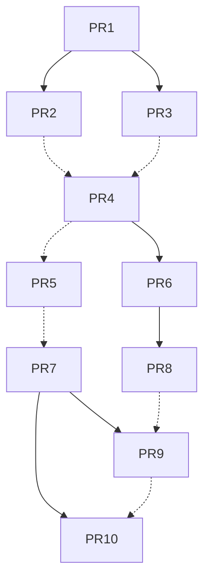
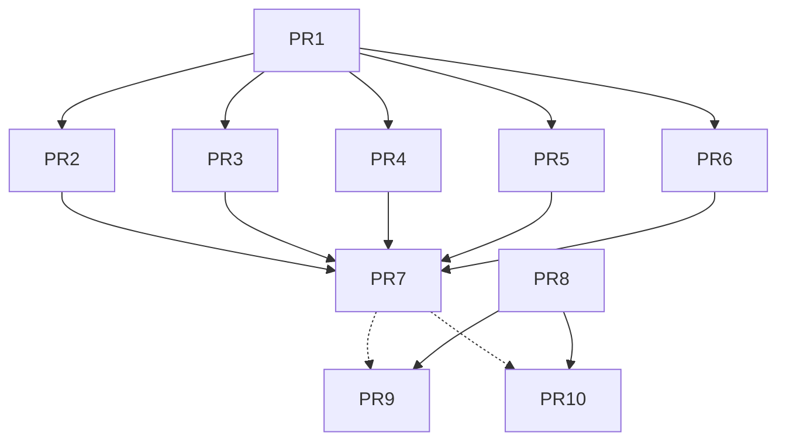

# MT-DEGCL: Multi-Task Encrypted Traffic Classification With Dual Embedding and Graph Contrastive Learning

Xiaolan Zhu , Junfeng Wang , Member, IEEE, Wenhan Ge , and Xinbo Han

Abstract—Although encryption offers strong anonymity, it also facilitates the concealment of malicious activities, allowing adversaries to evade detection, and posing a great challenge to cybersecurity surveillance. Many existing encrypted traffic classification methods struggle to integrate flow- and packetlevel tasks effectively, as they are trained independently, which is redundancy. Additionally, packet header and payload are treated equally, leading to the rich information in raw bytes remains fully unexplored, particularly in the abundant payload data. Moreover, they neglect the semantic invariance and common features between data samples, which ultimately results in suboptimal performance. To address these challenges, we propose an effective Multi-Task model using Dual Embedding and Graph Contrastive Learning (MT-DEGCL). Based on the byte-packet-flow structure of network traffic, a parallel dual embedding embeds the header and payload separately, followed by a cross-gated feature fusion strategy to capture the strong local packet-level representation. Then, we construct the traffic interaction graph and further utilize graph contrastive learning to extract the robust global flow-level representation. Finally, a multi-task model is trained for joint flow- and packet-level classification, leveraging the complementary learning between tasks to enhance overall performance. The experimental results on four real datasets highlight the effectiveness of MT-DEGCL, demonstrating superior performance in both tasks. Specifically, on the ISCX-Tor dataset, MT-DEGCL achieves F1 scores of 98.63% for flow-level classification and 98.10% at the packet level, surpassing the state-of-the-art (i.e., DE-GNN) by 2.03% and 83.21%, respectively. Furthermore, MT-DEGCL maximizes the rich information in raw payload bytes, significantly reducing or even nearly eliminating classification loss when using only payload data.

Index Terms—Encrypted traffic classification, multi-task model, dual embedding, graph contrastive learning.

# I. INTRODUCTION

O PROTECT user privacy, privacy-enhancing tools such as Virtual Private Networks (VPNs) and Tor are

Received 21 April 2025; revised 15 December 2025; accepted 3 February 2026. Date of publication 12 February 2026; date of current version 20 February 2026. This work was supported in part by the National Natural Science Foundation of China under Grant U24B20147; and in part by the Major Science and Technology Special Project of Sichuan Province under Grant 2025ZDZX0059, Grant 2026YFHZ0121, Grant 2024ZDZX0044, and Grant 2024ZHCG0195. The associate editor coordinating the review of this article and approving it for publication was Prof. Kun Sun. (Corresponding author: Junfeng Wang.)

Xiaolan Zhu is with the National Key Laboratory of Fundamental Science on Synthetic Vision, Sichuan University, Chengdu 610065, China.

Junfeng Wang and Wenhan Ge are with the College of Computer Science, Sichuan University, Chengdu 610065, China (e-mail: wangjf@scu.edu.cn).

Xinbo Han is with the Institute of Information Engineering, Chinese Academy of Sciences, Beijing 100085, China.

Digital Object Identifier 10.1109/TIFS.2026.3664007

employed to secure and anonymize network traffic [1]. While providing strong anonymity, they also enable malicious actors to hide their identities and engage in illicit activities, complicating traffic classification and source tracing. According to Zscaler, threat actors are increasingly exploiting encrypted channels to deliver malware and conceal malicious activities, with 32.1 billion threats hidden in encrypted traffic, accounting for 87.2% of total threats in 2024 [2]. How to effectively represent encrypted traffic for accurate identification of potential security threats, while preserving privacy protection principles, has become a significant challenge.

Many approaches have been put forward to enhance the performance of encrypted traffic classification. Earlier methods, such as port-based classification and Deep Packet Inspection (DPI) [3], [4], [5], have become less effective due to the increasing use of dynamic ports and the substantial computational overhead [6]. Subsequently, statistical feature-based methods extract traffic features, such as packet lengths and inter-arrival times, to enhance classification performance [7], [8], [9], [10], [11]. However, they face challenges from advanced traffic obfuscation mechanisms, and the limitations of hand-crafted features may lead to failure due to unreliable flow statistical information in some cases [12]. Additionally, these methods usually rely on observing the entire flow, which makes it difficult to perform accurate classification in the early stages of the flow.

The widespread use of deep learning has greatly improved the performance of encrypted traffic classification [13], [14], [15], [16], [17]. By using raw packet bytes, these methods can automatically learn and uncover hidden traffic patterns. Recently, several methods based on Graph Neural Networks have been proposed [18], [20], [21], [22], [23], which can uncover underlying relationships and dependencies within the traffic, enabling more accurate modeling of complex behaviors. While effective, most of them directly use raw bytes, resulting in the underutilization of the rich information in raw bytes, especially for the abundant payload data. The meaning of two bytes with identical values in the header and payload of a packet may be completely different [21]. Besides, they often neglect the semantic invariance and common features across data samples. By effectively mining these invariant common characteristics, the model can become more resilient to variations in network conditions, ensuring consistent and accurate classification even under unstable or fluctuating network environments. Moreover, they train packet-level and flow-level classification tasks independently, leading to redundancy and inadequate exploration of their interrelationships. Therefore, how to effectively integrate the complementary strengths of flow- and packet-level tasks into a single model for robust classification at both levels remains a key challenge.

In this paper, we propose an effective Multi-Task model using Dual Embedding and Graph Contrastive Learning (MT-DEGCL) for encrypted traffic classification. From the perspective of the byte-packet-flow structure of network traffic, MT-DEGCL is composed of four modules: packet-level representation, traffic interaction graph construction, flow-level representation and multi-task classification. Specifically, the packet-level representation module extracts local contextual semantic features using a parallel dual embedding sub-module, followed by cross-gated feature fusion strategy to form strong packet-level representation. The traffic interaction graph construction module is designed to uncover global traffic patterns and dependencies from an unstructured graph, which is constructed using the learned packet representations along with their directions. The flow-level representation module employs graph contrastive learning [24] to identify the invariant common features across data samples and capture the global interaction patterns between packets. In the multi-task classification module, we train a joint flow- and packet-level multi-task model to fully leverage the complementary advantages of both tasks. This unified model not only effectively captures fine-grained packet-level details but also broader flow-level patterns, thereby enhancing overall classification performance. Consequently, a series of experiments validate the effectiveness and superiority of MT-DEGCL, demonstrating its robust classification performance across different scenarios.

To sum up, the main contributions of this paper include:

1) We propose MT-DEGCL, a multi-task model that can simultaneously perform flow- and packet-level classification tasks with almost no additional parameters. By optimizing both tasks collaboratively, the model’s generalization capability is enhanced.   
2) We utilize a parallel dual embedding module with CNN-LSTM and attention mechanisms to independently encode packet header and payload, capturing key spatiotemporal features, which are then fused using a cross-gated strategy to generate a strong local packetlevel representation.   
3) We construct a traffic interaction graph based on packet representations and directions to better uncover hidden relationships and interaction patterns within the dynamic network traffic. Further, graph augmentation and contrastive learning techniques are employed to capture the robust global interaction patterns at the flow level.

The rest of the paper is organized as follows: Section II introduces the background, Section III reviews related work, and Section IV details the MT-DEGCL method. Section V presents the experimental setup and results, and we provide the discussion and conclusion in Sections VI and VII.

# II. BACKGROUND

In this section, we provide a brief introduction to graph neural networks and Contrastive Learning.

# A. Graph Neural Networks

Graph Neural Networks (GNNs) are a series of neural networks designed to process graph-structured data by propagating and aggregating information between nodes for tasks like node and graph classification. The core process consists of two steps: message passing and aggregation. During the message passing phase, nodes exchange information with their neighbors to gather features, and the formula is given by:

$$
m _ {v} ^ {(k)} = \sum_ {u \in \mathcal {N} (v)} M P ^ {(k)} (h _ {u} ^ {(k - 1)}, e _ {u v}) \tag {1}
$$

where $\mathrm { m } _ { \nu } ^ { ( k ) }$ is the message received by node v at layer k, $h _ { u } ^ { ( k - 1 ) }$ denotes the feature of neighboring node u at the previous layer, $\mathcal { N } ( \nu )$ is the set of neighbors of node v, $e _ { u \nu }$ represents the edge feature between nodes u and $\nu ,$ and $\mathrm { M P } ^ { ( k ) } ( \cdot )$ refers to the message passing function at layer k.

In the aggregation phase, nodes combine the collected features using aggregation operations to update their representations, as depicted by:

$$
h _ {v} ^ {(k)} = \sigma \left(W ^ {(k)} \cdot A G G \left(\{m _ {u} ^ {(k)}: u \in \mathcal {N} (v) \}\right) + b ^ {(k)}\right) \tag {2}
$$

where AGG(·) is the aggregation function, $W ^ { ( k ) }$ and $b ^ { ( k ) }$ refer to the weight matrix and bias term at layer k.

# B. Contrastive Learning

Contrastive Learning is a self-supervised learning approach designed to learn effective feature representations by comparing the similarities between samples. Its objective is to bring positive samples closer together in the embedding space while pushing negative samples farther apart. To achieve this, various data augmentation techniques are applied to each data sample, generating distinct views for comparison. The model is trained to maximize the similarity between positive samples while minimizing the similarity between negative samples through the contrastive loss function, which is formulated as:

$$
\mathcal {L} = - \log \frac {\exp (\text { sim } (z _ {i} , z _ {j}) / \tau)}{\sum_ {k = 1} ^ {N} \exp (\text { sim } (z _ {i} , z _ {k}) / \tau)} \tag {3}
$$

where zi and $z _ { j }$ are the embeddings of augmented views of the same instance, which form a positive sample pair, and sim(zi z j) quantifies their similarity. The temperature parame-,ter  controls the sharpness of the similarity distribution, and τN is the total number of samples in the batch.

# III. RELATED WORK

Research on encrypted traffic classification mainly includes statistical feature-based, deep learning-based, and graph neural network-based approaches.

# A. Statistical Features-Based Methods

Statistical feature-based methods usually use features like packet sizes, inter-arrival times, and flow durations, under the assumption that different applications exhibit distinct traffic patterns. These features are then utilized to train machine learning classifiers to learn the underlying patterns from different traffic. Moore and Zuev [8] extract 248 statistical features and use a Bayesian classifier to uncover the probabilistic relationships between these features and traffic categories. Taylor et al. [9] propose AppScanner, which uses bidirectional flow packet lengths and the Random Forest algorithm to classify the 110 most popular Android apps generated by bots. Draper-Gil et al. [25] use time-related features along with the K-Nearest Neighbors (KNN) and C4.5 algorithms to classify the application categories of VPN traffic. Baris et al. [26] manually select 111 features that are extracted in [8] and apply KNN for classification. Ede et al. [11] propose FlowPRINT, a semi-supervised fingerprinting method that clusters mobile device traffic and classifies unseen TCP and UDP traffic. Panchenko et al. [27] introduce CUMUL, an SVM-based method that uses 104 features, including 4 statistical and 100 interpolation features, to identify website traffic. Shen et al. [28] use packet length sequences and apply Random Forest, Decision Tree, and KNN for webpage identification. Al-Fayoumi et al. [29] utilize 8 time-related features from the side-channel traffic to identify Tor traffic. Lashkari et al. [10] further analyze Tor traffic to identify specific application categories and release a large labeled dataset. These methods rely on manually extracted statistical features and long flow observation, thus limiting their ability to accurately classify specific traffic, particularly at the packet level.

# B. Deep Learning-Based Methods

Deep learning-based encrypted traffic classification methods greatly improve the classification performance by leveraging the powerful representational capabilities of deep neural networks. Wang et al. [15] first propose an end-to-end traffic classification method with a One-Dimensional Convolutional Neural Network (1D-CNN), achieving excellent performance on the public VPN dataset by converting traffic into images. Lotfollahi et al. [30] design a framework for automatic feature extraction from network traffic using Stacked Autoencoders (SAE) and 1D-CNN. Through analyzing the first 1480 bytes of each IP packet, it achieves high accuracy and supports packetlevel classification. Shapira and Shavitt [31] propose FlowPic, which converts raw traffic byte sequences into 2D grayscale images using a spatiotemporal coordinate system based on packet arrival times and payload lengths, and then uses CNN for classification. Lim et al. [32] preprocess packet payloads as image data, using residual networks to leverage their spatial features for packet identification. Aceto et al. [33] propose MIMETIC, a multi-modal deep learning framework for classifying mobile encrypted traffic using both payload data and protocol fields. Iliyasu and Deng [34] address the challenge of labeling large encrypted traffic datasets with a semi-supervised approach, achieving high accuracy with few labeled samples. Liu et al. [35] introduce FS-Net, a bidirectional Gated Recurrent Unit (Bi-GRU)-based Autoencoder (AE) that learns features from raw flow sequences and enhances extraction with a reconstruction mechanism. Mao et al. [36] propose the Byte-Label Joint Attention Network, which embeds both the packet’s bytes and labels into a joint embedding space to capture their implicit correlations. Xiao et al. [37] further propose a robust byte-label joint attention network that includes a classifier using header-payload parallel processing and byte-label joint attention to capture byte-label correlations, and an adversarial traffic generator that enhances robustness by producing adversarial examples. Yao et al. [38] integrate the attention mechanism into Recurrent Neural Network (RNN) with attention-aided bidirectional LSTM and a hierarchical attention network, demonstrating improved key feature learning and significance analysis. Xiao et al. [39] propose EBSNN, which splits a packet into header and payload segments, processes them with attention-based RNN encoders, and learns the packet’s high-level representation through another encoder.

There are a range of models that integrate CNN and RNN to capture both spatial and temporal information for enhanced classification. In [40], CNN is used to extract spatial features from the first 784 bytes of each packet, and Bi-LSTM is then applied to capture temporal features. Rezaei et al. [41] further learn the headers and payloads of the first six packets for classification. Wang et al. [42] propose App-Net, a hybrid neural network for mobile app identification that combines Bi-LSTM and 1D-CNN in parallel, using the payload of the initial packet and packet length for mobile traffic classification. Lin et al. [43] introduce TSCRNN, which combines CNN and Bi-LSTM to extract features from both spatial and temporal domains. Lin et al. [17] propose PEAN, a multi-modal method that uses raw byte and packet length sequences, leveraging self-attention to model bi-flow relationships, followed by a parallel LSTM model for classification. Lin et al. [44] propose TraGe, which employs differentiated pre-training for headers and payloads, along with a dynamic masking strategy for genetic packet representation, enabling robust classification even with limited samples. These methods directly utilize statistical features or raw bytes for classification and often treat header and payload bytes equally, leading to the underutilization of the rich information in raw bytes, especially for the abundant payload data.

# C. Graph Neural Network-Based Methods

Deep learning methods achieve advanced classification performance but rely on classical signal processing models that process raw bytes in Euclidean domains, limiting their applicability to grid-like data structures [45]. GNNs, with their strong capability to process non-Euclidean data and capture complex graph relationships, have been widely applied in various fields [46], [47]. Shen et al. [19] propose GraphDApp for decentralized application identification, transforming traffic classification into a graph problem by constructing a traffic interaction graph based on packet length and direction in bidirectional flows. Huoh et al. [48] use a GNN architecture to classify encrypted network traffic, modeling raw packet bytes and metadata as node features to capture temporal relationships among packets. Hu et al. [20] introduce TCGNN, which models packets as undirected graphs and uses a two-layer graph convolutional network with three aggregation strategies for packet identification. Zhang et al. [21] argue that bytes in packet header and payload have distinct semantics and propose TFE-GNN, which separately processes the header and payload, and constructs a byte-level traffic graph using point-wise mutual information. It then extracts packet features with two GNNs and employs Bi-LSTM for classification.

Han et al. [22] propose DE-GNN, which employs a dual embedding layer to encode packet headers and payloads using one-hot encoding, followed by CNN for separate packet feature extraction. Two traffic interaction graphs are then constructed from the header and payload features, respectively, with two GNNs applied to learn flow representations from each graph, and an adaptive deep feature fusion strategy used for flow-level classification. Although effective, most of them directly utilize raw bytes or manually crafted features as graph nodes and ignore invariant features across samples, resulting in suboptimal performance. Additionally, they train flow- and packet-level classification tasks independently, which is redundant since the packet-level information is already encompassed in flow-level features.

We summarize recent related works in Table I and list the main novelties of MT-DEGCL compared with them as follows:

(1) Hierarchical learning on raw bytes. Previous studies often use statistical features or raw bytes directly for classification. Based on the byte–packet–flow structure, MT-DEGCL first dual-encodes header and payload bytes via a parallel embedding, and further fused for strong packet-level representation. It then constructs a traffic interaction graph and applies graph contrastive learning to extract invariant features within the same category, yielding robust global flow-level representation.   
(2) Traffic interaction graph construction. Instead of using raw bytes or handcrafted features as graph nodes, MT-DEGCL focuses on client–server packet interactions by encoding packet representation and their direction as node features for graph learning.   
(3) Multi-task classification. The existing methods train flow- and packet-level classification tasks independently. In contrast, MT-DEGCL leverages the complementary advantages of these two tasks through multi-task learning, enabling joint classification and improved performance within a single unified model.

# IV. METHODOLOGY

# A. Problem Formulation

Encrypted traffic classification aims to identify and classify network traffic associated with various service types and specific applications without decrypting the transmitted content. This is accomplished by analyzing metadata such as packet size, transmission time, traffic patterns, and other characteristics of the network flow. In this paper, we leverage raw bytes and focus on fine-grained classification of in-app traffic behavior at both the flow and packet levels, distinguishing specific applications from other app-related functions.

Given a dataset with $N _ { f }$ traffic flows and C categories, where each flow is uniquely identified by the five-tuple (source IP, destination IP, source port, destination port, and protocol), representing a unidirectional session between two endpoints. Each flow consists of a sequence of packets $F _ { i } =$ $\{ p _ { 1 } , p _ { 2 } , . . . , p _ { N _ { p } } \}$ , where $p _ { j }$ is the j-th packet within the flow. $N _ { p }$ , , . . .,denotes the number of packets in a flow, which varies depending on the communication session. Each packet $p _ { j }$ contains a sequence of bytes $p _ { j } = \{ b _ { 1 } , b _ { 2 } , . . . , b _ { N _ { b } } \}$ , where $b _ { k }$ denotes the k-th byte and $N _ { b }$ is the number of bytes in the packet. The total number of bytes in a flow is given by:

$$
B _ {i} = \sum_ {j = 1} ^ {N _ {p}} N _ {b} ^ {(j)} \tag {4}
$$

where $B _ { i }$ is the total number of bytes in flow $F _ { i } ,$ and $N _ { b } ^ { ( j ) }$ denotes the byte length of packet $p _ { j }$ .

For a test traffic flow $f _ { t e s t } .$ , the flow-level classification task aims to identify its category from C predefined classes using a well-trained flow-level classification model. The classification function is mathematically represented as:

$$
\hat {y} _ {f} = \mathcal {F} \left(f _ {\text { test }}; \Theta\right) \tag {5}
$$

where $\hat { y } _ { f } \in \{ 0 , 1 , . . . , C - 1 \}$ , representing the predicted category, $\mathcal { F } ( \cdot )$ , , . . ., is the classification model, and Θ denotes the model parameters learned during training.

Similarly, the packet-level classification task involves classifying each individual packet within a flow into one of the same C categories using another well-trained packet-level classification model. Given a packet $p _ { t e s t }$ from flow $f _ { t e s t }$ , the classification function is:

$$
\hat {y} _ {p} = \mathcal {P} (p _ {\text { test }}; \Phi) \tag {6}
$$

Here, $\hat { y } _ { p } \in \{ 0 , 1 , . . . , C - 1 \}$ is the predicted category of $p _ { t e s t } ,$ $\mathcal { P } \left( \cdot \right)$ , , . . .,represents the packet-level classification model, and Φ is the parameter of the model.

# B. Framework Overview

The overall framework is shown in Figure 1, which mainly consists of four modules: packet-level representation, traffic interaction graph construction, flow-level representation and multi-task classification. The packet-level representation module uses a parallel CNN-LSTM with attention mechanism to embed the header and payload separately, capturing key spatiotemporal features. These features are then fused via cross-gated strategy to extract strong local contextual semantic features within the packet. The traffic interaction graph module captures the intricate interactions between client and server packets, enabling deeper insights into network dynamics and traffic behavior. The flow-level representation module uses graph contrastive learning with data augmentation to enhance feature learning, identify invariant common features across data samples, and capture robust global interaction patterns between packets. The multi-task classification module simultaneously performs both flow- and packet-level classification tasks in one training, leveraging shared representations and complementary advantages to enhance overall performance.

# C. Packet-Level Representation

1) Dual Embedding: In this paper, we utilize the raw bytes within network packets for traffic classification, focusing on both the header and payload. The header contains crucial metadata that directs routing and processing, while the payload carries the actual transmitted data, which consists of ciphertext generated by various encryption mechanisms. By effectively analyzing both the header and payload, we obtain a comprehensive understanding of network behavior. The header aids in classifying traffic based on network characteristics, while the payload provides deeper insights into applicationlevel interactions and protocol-specific patterns. Though part of the same packet, they serve distinct roles, with the meaning of each byte varying depending on its position. If both the header and payload bytes are treated equally during training, the model may struggle to converge to an optimal solution.


<details>
<summary>flowchart</summary>

```mermaid
graph TD
    A["For each Packet in Flow do:"] --> B["Conv1D"]
    B --> C["Maxpool"]
    C --> D["BiLSTM"]
    D --> E["Attention"]
    E --> F["Feature Fusion"]
    F --> G["Concat"]
    G --> H["Linear PReLU"]
    G --> I["Linear Sigmoid Header Gate"]
    H --> J["Linear PReLU"]
    H --> K["Linear Sigmoid Payload Gate"]
    L["For whole Flow do:"] --> M["Endpoint - Burst Sequence"]
    M --> N["A Burst"]
    N --> O["Intra-Burst Inter-Burst (Start-to-Start) (End-to-End)"]
    O --> P["Original Graph"]
    P --> Q["Augmented Graphs"]
    Q --> R["Flow (Graph) Representation (FR)"]
    R --> S["Average pooling"]
    R --> T["Enhanced PR"]
    T --> U["Linear σ"]
    U --> V["Flow Classes"]
    V --> W["Packet Classes"]
    W --> X["Multi-task Classification"]
    
    subgraph **Packet (Node) Representation (PR)**
        B
        C
        D
        E
        F
        G
        H
        I
        J
        K
        L
        M
        N
        O
        P
        Q
        R
    end
    
    subgraph **Flow (Graph) Representation (FR)**
        S
        T
        U
        V
        W
        X
    end
```
</details>

Fig. 1. MT-DEGCL model architecture.

Therefore, we treat the packet header and payload separately, employing a parallel dual embedding approach with CNN-LSTM and an attention mechanism to embed the raw bytes into independent vectors without parameter sharing. Specifically, we first use a 1D-CNN with two layers to extract useful spatial features from the header and payload bytes, respectively. These features are then processed by a Bi-LSTM to capture temporal dependencies, followed by an attention mechanism to highlight key features. This approach allows the model to capture the unique and meaningful traffic characteristics from both the header and payload, further enhancing the packet representation.

Given the first $K _ { h }$ and $K _ { p }$ bytes selected from the header and payload, d represents the embedding dimension. Two independent embedding matrices, denoted as $E _ { h } \in \mathbb { R } ^ { K _ { h } \times d }$ and $E _ { p } \in \mathbb { R } ^ { K _ { p } \times d }$ , are obtained, with each row representing a highdimensional embedding vector corresponding to the respective bytes from the header and payload.

2) Cross-Gated Feature Fusion: After extracting the separate features from both the header and payload, the next step is to combine them to obtain a comprehensive representation of the entire packet. To achieve a robust packet representation, we employ the cross-gated feature fusion strategy [21], which can effectively integrate the features from $E _ { h }$ and $E _ { p }$ by leveraging dynamic gating mechanisms. Unlike simple feature concatenation or weighted summation, cross-gated feature fusion models feature relationships using gating mechanisms to control their interaction. This mechanism dynamically adjusts each feature’s contribution, highlighting relevant features while suppressing irrelevant ones and reducing noise.

As is shown in Figure 1, we use two gates for fusion: the header gate and the payload gate, with inputs $E _ { h }$ and $E _ { p } .$ , respectively. Each gate consists of two linear layers, separated by an activation function of PReLU [49], followed by the application of an element-wise sigmoid function for scaling. It is notable that the two gates operate independently, without weights sharing. Assume that $E _ { h } ^ { \prime }$ and $E _ { p } ^ { \prime }$ are the scaled characteristic vectors of $E _ { h }$ and $E _ { p } ,$ and this process can be described as follows:

$$
E _ {h} ^ {\prime} = \text { Sigmoid } \left(W _ {h} ^ {(2)} \cdot P R e L U \left(W _ {h} ^ {(1)} \cdot E _ {h} + b _ {h} ^ {(1)}\right) + b _ {h} ^ {(2)}\right) \tag {7}
$$

$$
E _ {p} ^ {\prime} = \text { Sigmoid } \left(W _ {p} ^ {(2)} \cdot P R e L U \left(W _ {p} ^ {(1)} \cdot E _ {p} + b _ {p} ^ {(1)}\right) + b _ {p} ^ {(2)}\right) \tag {8}
$$

where $W _ { h } ^ { ( 1 ) } , \ W _ { h } ^ { ( 2 ) } , \ b _ { h } ^ { ( 1 ) }$ and $b _ { h } ^ { ( 2 ) }$ are the weight matrices and biases for the header, while $\hat { W } _ { p } ^ { ( 1 ) } , W _ { p } ^ { ( 2 ) } , b _ { p } ^ { ( 1 ) }$ and $b _ { p } ^ { ( 2 ) }$ are those for the payload. The activation functions PReLU and Sigmoid are applied sequentially after each linear transformation.

Then, $E _ { h } ^ { \prime }$ is utilized to filter $E _ { p }$ , while $E _ { p } ^ { \prime }$ is employed to enhance $E _ { h }$ in a crosswise manner, and the key features are extracted from both the packet header and payload. Ultimately, a robust packet-level representation, PR is derived, as demonstrated in the following equation:

$$
P R = \mathrm{CONCAT} (E _ {h} ^ {\prime} \odot E _ {p}, E _ {p} ^ {\prime} \odot E _ {h}) \tag {9}
$$

Here, the symbol  denotes element-wise multiplication, and CONCAT(·) denotes vector concatenation.

# D. Traffic Interaction Graph Construction

Algorithm 1 Traffic Interaction Graph Construction   
Input: A packet-level representation sequence $PR = (PR_{1}, PR_{2}, \ldots, PR_{N})$ ; A packet direction sequence $D = (d_{1}, d_{2}, \ldots, d_{N})$ Output: The traffic interaction graph $G = (V, E)$ Step 1: Initialize V and E as empty sets;

Step 2: Construct vertices based on packet-level representations and directions;

for $PR_{i}$ in PR do $V \leftarrow V \cup \{v_{i} \mid Features(v_{i}) = PR_{i} \times d_{i}\}$ ;

end

Step 3: Separate V into burst sequence $B = (b_{1}, b_{2}, \ldots, b_{k})$ by packet direction;

Step 4: Intra-burst edges construction;

for $b_{i}$ in B do

    for j = 1 to $|b_{i}| - 1$ do $E \leftarrow E \cup \{(v_{j}^{(i)}, v_{j+1}^{(i)})\}$ // Connect consecutive vertices within $b_{i}$ end

end

Step 5: Inter-burst edges construction;

for i = 1 to $|B| - 1$ do $E \leftarrow E \cup \{(v_{\text{first}}^{b_{i}}, v_{\text{first}}^{b_{i+1}}), (v_{\text{last}}^{b_{i}}, v_{\text{last}}^{b_{i+1}})\}$ // Connect first and last vertices of $b_{i}$ and $b_{i+1}$ end $G \leftarrow (V, E)$ ;

return G;

In network communication, an encrypted bidirectional flow involves multiple data exchanges between a client and a server, comprising numerous packets. To effectively model dynamic interactions within the traffic, each flow can be depicted as an information-rich structure named traffic interaction graph [19]. In this paper, we construct the traffic interaction graph based on Algorithm 1 to capture the inherent traffic interaction patterns of each application, where each vertex represents a packet, characterized by its learned representation and direction. Meanwhile, edges represent packet-level interactions, defined by the burst sequence exchanged between a client and its associated server. Consequently, it preserves the structural and sequential integrity of network traffic while uncovering intricate packet dependencies, providing a comprehensive and intuitive framework for modeling network behavior.

The constructed traffic graph is denoted as $G r a p h = \left( V , E \right)$ where V and E are defined as follows:

V: A set of vertices, representing the first N packets selected from the bidirectional flow, where each vertex is treated an individual packet. Each packet is defined by its representation obtained from Section IV-C, along with its direction.

E: A set of edges, where each edge denotes either an intraburst or inter-burst connection, capturing relationships between packets within the same burst or across different bursts.

To better understand the traffic interaction graph and illustrate interactions across applications, we randomly select three Tor traffic types: Chat, Audio and P2P. Then, one flow is randomly selected from each, and the interaction graphs of the first 10 packets are visualized in Figure 2.

As is shown, the three applications exhibit distinct packet interaction patterns. Specifically, Chat traffic consists of short bursts of exchanges followed by idle periods, resulting in intermittent and irregular flows (Fig. 2(a)). Audio traffic follows a more continuous and asymmetric pattern, with a steady, predominantly download-driven stream of packets (Fig. 2(b)). In contrast, P2P traffic exhibits a more complex and distributed structure, marked by frequent bidirectional exchanges between multiple peers, reflecting its decentralized nature (Fig. 2(c)).

# E. Flow-Level Representation

1) Traffic Interaction Graph Encoding: Since the traffic interaction graph of each flow has been constructed. Next, we leverage the powerful unstructured representation capability of GNNs to capture and learn complex interaction patterns within the graph. Specifically, a four-layer stacked GraphSAGE [51] is employed to encode each graph into a high-dimensional vector.

Specifically, for each node $\nu \in V ,$ we iteratively sample its k-hop neighbors, denoted as $\mathcal { N } _ { S } ^ { ( k ) } ( \nu )$ . To ensure computational efficiency, a fixed number of neighbors are sampled for each node at each hop.

Next, we aggregate the messages from the sampled neighbors using a mean aggregation function. The aggregated message for node v at the k-th layer is computed as:

$$
m _ {v} ^ {(k)} = \frac {1}{\left| \mathcal {N} _ {S} ^ {(k)} (v) \right|} \sum_ {u \in \mathcal {N} _ {S} ^ {(k)} (v)} h _ {u} ^ {(k - 1)} \tag {10}
$$

where $h _ { u } ^ { ( k - 1 ) }$ denotes the representation of neighbor node u at the (k−1)-th layer.

Then, the representation of node v at the k-th layer is updated by combining its own previous representation with the aggregated message from its sampled neighbors, which is formulated as:

$$
h _ {v} ^ {(k)} = \sigma \left(W ^ {(k)} \cdot \text { CONCAT } \left(h _ {v} ^ {(k - 1)}, m _ {v} ^ {(k)}\right) + b ^ {(k)}\right) \tag {11}
$$

where $h _ { \nu } ^ { ( k - 1 ) }$ is the representation of node v at the (k−1)-th layer, $m _ { \nu } ^ { ( k ) }$ denotes the aggregated message from the k-hop neighbors of node $\nu , ~ W ^ { ( \bar { k } ) }$ is a trainable weight matrix, $b ^ { ( \bar { k } ) }$ is a bias vector, and $\sigma ( \cdot )$ represents a non-linear activation σfunction that enables the model to capture more complex and expressive features.

Therefore, for each node v, four feature vectors $h _ { \nu } ^ { ( 1 ) } , h _ { \nu } ^ { ( 2 ) }$ , $h _ { \nu } ^ { ( 3 ) }$ , and $h _ { \nu } ^ { ( 4 ) }$ are generated from the four stacked layers, and its final representation $h _ { \nu }$ is obtained by concatenating these feature vectors.

$$
h _ {v} = \text { CONCAT } \left(h _ {v} ^ {(1)}, h _ {v} ^ {(2)}, h _ {v} ^ {(3)}, h _ {v} ^ {(4)}\right) \tag {12}
$$

Finally, average pooling is applied over the node representations in V to generate a global feature vector for the entire graph, also referred to as the flow-level representation $F R ,$ as follows:

  
(a)A random Chat flow


<details>
<summary>flowchart</summary>


</details>

(b)A random Audio flow


<details>
<summary>flowchart</summary>


</details>

(c)A random P2P flow   
Fig. 2. Visualization of traffic interaction graph across different applications.

$$
F R = \frac {1}{| V |} \sum_ {v \in V} h _ {v} \tag {13}
$$

2) Graph Contrastive Learning: In general, traffic behaviors from the same application tend to exhibit similarities, with invariant common features shared across data samples. However, in real-world network conditions, data packets may be lost due to factors such as network instability, insufficient bandwidth, or router failures, leading to incomplete or corrupted information. To simulate these behaviors and uncover implicit patterns across samples while enhancing model’s robustness, we introduce contrastive learning on the traffic interaction graph. By effectively preserving semantic invariance amidst real-world noise, the model becomes more robust to network fluctuations and achieves better generalization in dynamic environments. Specifically, we apply graph data augmentation to generate augmented views of the traffic interaction graph through transformations such as node and edge dropping.

a) Node dropping: Given the original traffic interaction graph $G = ( V , E )$ , we perform random node dropping on each node $\nu \in V .$ ,. The graph after node dropping can be expressed as:

$$
G ^ {\prime} = (V ^ {\prime}, E ^ {\prime}) \tag {14}
$$

$$
V ^ {\prime} = \{v _ {i} \mid \rho_ {i} = 0 \}, E ^ {\prime} = \{e _ {i j} \mid v _ {i}, v _ {j} \in V ^ {\prime} \} \tag {15}
$$

The probability of dropping each node is determined by a Bernoulli distribution, $\rho _ { i } ~ \sim$ Bernoull $( P _ { n d } )$ , where $\rho _ { i } = 0$ ρindicates that the node is retained, and $\rho _ { i } = 1$ ρ means that the node is dropped. $P _ { n d }$ ρis a hyperparameter that controls the proportion of nodes to be dropped. When a node is dropped, the edges $e _ { i j }$ connected to that node are also removed.

b) Edge dropping: After node dropping, edge dropping is further applied to the graph $G ^ { \prime }$ . For each edge $e _ { i j } \in E ^ { \prime }$ , we randomly decide whether to drop the edge with a probability of $\rho _ { i j }$ . The graph after edge dropping, denoted as $G _ { a u g } .$ , it can ρbe described as:

$$
G _ {a u g} = (V ^ {\prime}, E ^ {\prime \prime}) \tag {16}
$$

$$
E ^ {\prime \prime} = \{e _ {i j} \mid \rho_ {i j} = 0, e _ {i j} \in E ^ {\prime} \} \tag {17}
$$

The probability of dropping each edge is determined by a Bernoulli distribution $\rho _ { i j } \sim$ Bernoulli $( P _ { e d } )$ , which specifies the ρfraction of edges removed from the graph.

After dropping nodes and edges, we generate an augmented view for each original traffic interaction graph. Supervised contrastive learning is then applied to train the classification model, aiming to maximize similarity between the original graph and its augmented view within the same class, while minimizing similarity to graphs from different classes. This encourages similar samples to be closer in the embedding space and dissimilar ones to be farther apart. Hence, the graph contrastive loss can be formulated as follows:

$$
\mathcal {L} _ {g c l} = - \sum_ {i \in \mathcal {I}} \frac {1}{| N (i) |} \sum_ {n \in N (i)} \log \frac {\exp (g _ {i} \cdot g _ {n} / \tau)}{\sum_ {m \in M (i)} \exp (g _ {i} \cdot g _ {m} / \tau)} \tag {18}
$$

where I represents the mini-batch set of all graphs, g denotes the embedding vector of a graph, which can be the original graph $G ,$ its augmented view $G _ { a u g } ,$ or a negative sample. $N ( i )$ is the set of augmented views that belong to the same class as $G _ { i }$ (positive samples), while M(i) refers to graphs or their views derived from different graphs (negative samples). The temperature parameter  controls the similarity between positive and negative samples, balancing their influence on contrastive learning. By optimizing this loss, the classification model becomes better at inferring the complete graph structure from partial information, improving its ability to generalize to unseen traffic.

# F. Multi-Task Classification

Since we have flow-level representations of network traffic, and each network flow is composed of a series of individual packets. Intuitively, the packet-level information contained in the flow-level representation can be further leveraged to enhance flow-level classification performance. Conversely, flow-level features can also be utilized for more fine-grained classification at the packet level. Multi-task learning bridges the gap between flow- and packet-level classification by performing both tasks within a single model. The key advantage of multi-task learning in this paper lies in the complementary advantages between the two tasks. Packetlevel classification offers fine-grained insights into packet structures, helps the flow-level task better capture internal hierarchical relationships. At the same time, the flow-level task provides higher-level context, guiding packet-level learning for enhanced performance. Moreover, the shared feature space and joint optimization of both tasks improve the model’s generalization and mitigate overfitting, ultimately leading to superior classification performance compared to single-task learning.

Next, we give the formal description of the flow- and packet-level classification tasks. For flow-level task, a fully connected layer with two linear transformations is utilized, and the process can be expressed as follows:

$$
\hat {y} _ {f, i} = W _ {f} ^ {(2)} \cdot \mathrm{PReLU} (W _ {f} ^ {(1)} \cdot F R _ {i} + b _ {f} ^ {(1)}) + b _ {f} ^ {(2)} \tag {19}
$$

$$
\mathcal {L} _ {f} = - \sum_ {i = 1} ^ {N _ {f}} y _ {f, i} \log (\hat {y} _ {f, i}) + (1 - y _ {f, i}) \log (1 - \hat {y} _ {f, i}) \tag {20}
$$

where $\hat { y } _ { f , i }$ denotes the predicted output of the i-th flow, and W (1), $W _ { f } ^ { ( 1 ) } , \ \tilde { W } _ { f } ^ { ( \tilde { 2 } ) }$ are the weight matrices for the first and second layers, with corresponding biases $b _ { f } ^ { ( 1 ) }$ and $b _ { f } ^ { ( 2 ) } . ~ \mathcal { L } _ { f }$ is the classification loss measuring the discrepancy between predicted outputs and true labels, with $y _ { f , i }$ as the true label of the i-th sample and $N _ { f }$ ,as the total number of flows.

Similarly, the packet-level classification process can be defined as:

$$
\hat {y} _ {p, i} = W _ {p} ^ {(2)} \cdot \mathrm{PReLU} (W _ {p} ^ {(1)} \cdot P R _ {i} + b _ {p} ^ {(1)}) + b _ {p} ^ {(2)} \tag {21}
$$

$$
\mathcal {L} _ {p} = - \sum_ {i = 1} ^ {N _ {p}} y _ {p, i} \log (\hat {y} _ {p, i}) + (1 - y _ {p, i}) \log (1 - \hat {y} _ {p, i}) \tag {22}
$$

Here, $\hat { y } _ { p , i }$ represents the predicted label for the i-th packet, whereas $\mathbf { \Delta } _ { W _ { p } ^ { ( 1 ) } } ^ { ( 1 ) } , \mathbf { \Delta } _ { W _ { p } ^ { ( 2 ) } } ^ { ( 2 ) } , b _ { p } ^ { ( 1 ) } , b _ { p } ^ { ( 2 ) }$ b are the weights and bias terms for the first and second layers of the model. ${ \mathcal { L } } _ { p }$ is the classification loss at the packet level, and $N _ { p }$ refers to the total number of packets.

Hence, the overall loss of MT-DEGCL can be calculated as:

$$
\mathcal {L} = \mathcal {L} _ {f} + \mathcal {L} _ {p} + \lambda \cdot \mathcal {L} _ {g c l} \tag {23}
$$

where $\mathcal { L } _ { g c l }$ is the contrastive loss at the flow level, and $\lambda \ \in \ [ 0 , 1 ]$ controls the strength of the contrastive learning λ ,component.

Thus, we can extract the invariant common features across data samples and train a unified classification model for both flow- and packet-level tasks in one training, enhancing overall performance.

# V. EXPERIMENTS

In this section, we introduce the experimental settings, including the datasets, pre-processing, implementation details, and evaluation metrics. We then conduct a series of experiments and present the results along with a detailed analysis. These experiments consist of comparison experiments, sensitivity analysis, ablation study, and model complexity analysis, are designed to answer the following questions:

RQ1: How does MT-DEGCL perform compared to other methods?

RQ2: To what extent do changes in key hyperparameters impact the effectiveness of MT-DEGCL?

RQ3: How does each module in MT-DEGCL contribute to its overall classification performance?

RQ4: What is the complexity of MT-DEGCL?

# A. Experiment Setup

1) Dataset: To validate the effectiveness of MT-DEGCL, we conduct experiments on three benchmark datasets commonly used in encrypted traffic classification. These datasets, including ISCX-Tor [10], ISCX-VPN [25], USTC-TFC2016 [52] and TLS1.3 [53], cover a range of scenarios such as Tor, VPNs, and malware traffic, offering valuable insights into various types of encrypted traffic and enabling comprehensive evaluation under diverse conditions.

The ISCX-Tor dataset contains network traffic over the Tor network, where the traffic is encrypted with multiple layers, making it challenging to identify and trace. Similarly, the ISCX-VPN dataset consists of network traffic transmitted through VPNs, commonly used to access the blocked websites or servers. It is also difficult to identify specific application traffic due to the obfuscation techniques employed. The USTC-TFC2016 dataset includes both malicious and normal traffic, and we focus on malicious traffic, aiming to accurately identify specific malware. The TLS1.3 dataset contains encrypted traffic generated under the TLS1.3 protocol with different cipher suites, and we select the traffic from the top 10 domains listed on Cloudflare Radar [55] for classification. Note that all of these datasets are in their original Pcap format, and the ISCX datasets lack specific labels.

2) Pre-Processing: For each dataset, we first use SplitCap [54] to perform bidirectional flow segmentation, separating the traffic into distinct flows based on the five-tuple. Then, empty flows without payload are removed, as they are primarily involved in connection setup and do not contribute meaningful data for analysis. In addition, the Ethernet header is removed because it contains link-layer information that is irrelevant to traffic classification purposes. To minimize the risk of sensitive information leakage, the source IP, destination IP, source port, and destination port are also removed. Furthermore, padding and truncation techniques are applied to standardize the length of the traffic data, ensuring consistency across data samples.

# 3) Implementation Details:

a) Data partitioning: We adopt an 8:1:1 split ratio for each category to divide the dataset into training, validation, and test sets. The datasets are randomly shuffled to ensure variability, minimize bias, and enhance the robustness and generalizability of our findings. We conduct five random tests, reporting the mean and standard deviation (%) for each, with the best result highlighted in bold and the second-best result underlined.   
b) Model hyperparameters: The hyperparameters are listed in Table II. Each is selected from a range of candidates, with the final choices reflecting the best relative performance.   
c) Model training: During training, samples are randomly loaded within each batch, with no constraints on batch composition, resulting in a random distribution of positive and negative classes. No special treatment for class imbalance is applied, and the standard cross-entropy loss function is used. Meanwhile, each positive sample is augmented once.   
d) Experimental environment: All experiments are conducted on a multi-core server with a 20-core 2.20 GHz Intel Xeon CPU and an NVIDIA Tesla V100 GPU, providing the computational power necessary for efficient training and evaluation of MT-DEGCL.   
e) Evaluation metrics: During evaluation, accuracy (ACC), precision (PR), recall (RC), and the weighted macro F1 score (F1) are used as key metrics to assess the effectiveness

TABLE I COMPARISION WITH RECENT RELATED WORKS 

<table><tr><td>Method</td><td>Network Input</td><td>Model Structure</td><td>Dual-embedding</td><td>Node Features</td><td>Unified GNN for Header &amp; Payload</td><td>Graph Contrastive Learning</td><td>Multi-task Flow-level</td><td>Classification Packet-level</td></tr><tr><td>AppScanner [9]</td><td>Statistical features</td><td>Random forest</td><td>-</td><td>-</td><td>-</td><td>-</td><td>√</td><td>✕</td></tr><tr><td>FlowPrint [11]</td><td>Statistical features</td><td>Clustering</td><td>-</td><td>-</td><td>-</td><td>-</td><td>√</td><td>✕</td></tr><tr><td>CUMUL [27]</td><td>Statistical features</td><td>SVM</td><td>-</td><td>-</td><td>-</td><td>-</td><td>√</td><td>✕</td></tr><tr><td>DeepPacket [30]</td><td>Packet bytes</td><td>SAE + CNN</td><td>✕</td><td>-</td><td>-</td><td>-</td><td>✕</td><td>√</td></tr><tr><td>FlowPic [31]</td><td>Packet length + Packet arrival time</td><td>CNN</td><td>✕</td><td>-</td><td>-</td><td>-</td><td>√</td><td>✕</td></tr><tr><td>FS-net [35]</td><td>Packet length</td><td>AE + GRU</td><td>✕</td><td>-</td><td>-</td><td>-</td><td>√</td><td>✕</td></tr><tr><td>Attn-LSTM [38]</td><td>Packet bytes</td><td>Bi-LSTM</td><td>✕</td><td>-</td><td>-</td><td>-</td><td>√</td><td>✕</td></tr><tr><td>App-net [42]</td><td>Packet length + Payload of initial packet</td><td>CNN + Bi-LSTM</td><td>✕</td><td>-</td><td>-</td><td>-</td><td>√</td><td>✕</td></tr><tr><td>PEAN [17]</td><td>Packet bytes + Packet length</td><td>Transformer</td><td>✕</td><td>-</td><td>-</td><td>-</td><td>√</td><td>✕</td></tr><tr><td>TraGe [44]</td><td>Header bytes + Payload bytes</td><td>Transformer</td><td>✕</td><td>-</td><td>-</td><td>-</td><td>√</td><td>✕</td></tr><tr><td>TCGNN [20]</td><td>Packet bytes</td><td>GNN</td><td>✕</td><td>Raw bytes</td><td>-</td><td>✕</td><td>✕</td><td>√</td></tr><tr><td>GraphDAPP [19]</td><td>Packet length + Packet direction</td><td>GNN</td><td>✕</td><td>Packet length + Packet direction</td><td>-</td><td>✕</td><td>√</td><td>✕</td></tr><tr><td>FB-GNN [48]</td><td>Packet bytes + Statistical features</td><td>GNN</td><td>✕</td><td>Raw bytes</td><td>-</td><td>✕</td><td>√</td><td>✕</td></tr><tr><td>TFE-GNN [21]</td><td>Header bytes + Payload bytes</td><td>GNN</td><td>√</td><td>Raw bytes</td><td>✕</td><td>✕</td><td>√</td><td>✕</td></tr><tr><td>DE-GNN [22]</td><td>Header bytes + Payload bytes</td><td>CNN + GNN</td><td>√</td><td>Packet representation</td><td>✕</td><td>✕</td><td>√</td><td>✕</td></tr><tr><td>MT-DEGCL</td><td>Header bytes + Payload bytes + Packet direction</td><td>CNN + Bi-LSTM + GNN</td><td>√</td><td>Packet representation + Packet direction</td><td>√</td><td>√</td><td>√</td><td>√</td></tr></table>

TABLE II HYPERPARAMETERS OF MT-DEGCL 

<table><tr><td>Hyperparameters</td><td>Value</td></tr><tr><td>Learning rate</td><td>0.001</td></tr><tr><td>Batch size</td><td>32</td></tr><tr><td>Optimizer</td><td>Adam with Cosine Scheduler</td></tr><tr><td>The first number of packets</td><td>20</td></tr><tr><td>The first number bytes of payload</td><td>100</td></tr><tr><td>The kernel sizes in the convolutional layers</td><td>(16,32)</td></tr><tr><td>The number of units in Bi-LSTM layer</td><td>32</td></tr><tr><td>The number of attention heads</td><td>4</td></tr><tr><td> $\lambda$ </td><td>0.5</td></tr><tr><td> $p_{nd}$ </td><td>0.1</td></tr><tr><td> $p_{ed}$ </td><td>0.2</td></tr></table>

of MT-DEGCL. Accuracy reflects the model’s overall ability to distinguish and classify traffic across multiple classes. Precision measures the proportion of correct predictions for a category, while recall assesses the model’s ability to identify all instances of that category. Due to the class imbalance in the dataset, the weighted Macro F1 score is employed as a more robust evaluation metric, balancing precision and recall. Together, these metrics offer a comprehensive assessment of the model’s performance.

# B. Comparison Experiments (RQ1)

Below is a summary of the encrypted traffic classification methods used to benchmark MT-DEGCL, including five deep learning and three GNN-based models, with brief descriptions of each. For some, we use publicly available code to ensure accuracy, while others are re-implemented based on the original papers. All methods are evaluated under the same datasets and experimental conditions for a fair comparison.

(1) FS-Net [35]: Uses packet length sequences as input and employs a multi-layer Bi-GRU encoder with a reconstruction mechanism to enhance feature representation.   
(2) APP-Net [42]: A multi-modal method that combines CNN and Bi-LSTM to simultaneously learn from packet length sequences and the payload bytes of the initial packet.   
(3) TSCRNN [43]: Combines CNN and Bi-LSTM to extract features from both spatial and temporal domains for fine-grained traffic classification.

(4) Attn-LSTM [38]: Treats network traffic as time-series data and utilizes an attention-aided Bi-LSTM along with a hierarchical attention network for accurate classification.   
(5) PEAN [17]: A multi-modal method using raw bytes and packet length sequences, where a pre-trained model encodes raw bytes, followed by a Transformer for flow-level representation and a parallel Bi-LSTM for temporal feature extraction.   
(6) GrapDAPP [19]: Constructs a traffic interaction graph with packet length and direction as node features, then uses GNNs for decentralized application identification.   
(7) TFE-GNN [21]: Constructs byte-level traffic graphs using point-wise mutual information from the packet header and payload independently, with GNNs learning packet representations and Bi-LSTM applied for flow classification.   
(8) DE-GNN [22]: Designs PacketCNN to extract packet features from the header and payload separately, with two GNNs capturing flow-level features from each, and an adaptive fusion mechanism for flow classification.

The comparison results at the flow and packet levels across the four datasets are presented in Tables III, IV, V and VI, from which the following conclusions can be drawn: (1) Whether for flow- or packet-level classification tasks, MT-DEGCL achieves the overall best performance across all datasets, particularly at the packet level, except for flow-level classification on the TLS1.3 dataset. (2) Almost all the baseline models perform poorly at the packet level across all datasets, as they fail to fully leverage the fine-grained information in packet classification. This limitation restricts their ability to capture intricate patterns and dependencies, further resulting in suboptimal flow-level performance in turn. (3) Compared to traditional deep learning-based methods, GNN-based models (i.e., TFE-GNN and DE-GNN) achieve superior performance at the flow level, with results close to those of MT-DEGCL. GNNs are highly effective at capturing packet interactions in network traffic, enabling precise modeling of relationships and providing deeper insights into the traffic. However, MT-DEGCL still surpasses their best flow-level classification result by 1.14% to 5.08% in F1 score across all datasets, with a larger margin at the packet level. (4) GraphDAPP also utilizes the traffic interaction graph from bidirectional flows and GNNs for classification, but fails to achieve satisfactory results. The main issue lies in its reliance on packet length and direction as node features. However, the presence of privacy-enhancing techniques applied in Tor, VPNs, and malware, such as packet splitting and obfuscation, significantly perturbs packet length sequence, ultimately leading to performance degradation. (5) As for the TLS1.3 dataset, FS-net, APP-net, and PEAN methods that incorporate packet length sequences achieve performance comparable to GNN-based models, primarily due to their ability to capture the distinctive packet length patterns influenced by TLS1.3’s encryption and handshake processes. Among them, APP-net achieves the best flow-level classification, with all metrics exceeding MT-DEGCL by less than 1 percentage point, but still struggles with fine-grained packet classification.

TABLE III COMPARISON OF CLASSIFICATION PERFORMANCE AT BOTH LEVELS ON ISCX-TOR 

<table><tr><td rowspan="2">Methods</td><td colspan="4">Flow-level</td><td colspan="4">Packet-level</td></tr><tr><td>ACC</td><td>PR</td><td>RC</td><td>F1</td><td>ACC</td><td>PR</td><td>RC</td><td>F1</td></tr><tr><td>FS-Net</td><td>77.95 ±3.27</td><td>77.28 ±4.31</td><td>77.95 ±3.27</td><td>76.88 ±3.34</td><td>7.50 ±3.28</td><td>10.27 ±6.55</td><td>7.50 ±3.28</td><td>5.94 ±2.39</td></tr><tr><td>APP-Net</td><td>93.04 ±1.88</td><td>93.66 ±2.17</td><td>93.04 ±1.88</td><td>92.91 ±1.97</td><td>7.48 ±4.96</td><td>25.50 ±14.74</td><td>7.48 ±4.96</td><td>6.90 ±4.21</td></tr><tr><td>TSCRNN</td><td>81.61 ±3.77</td><td>82.58 ±3.37</td><td>81.61 ±3.77</td><td>81.22 ±3.78</td><td>11.86 ±1.85</td><td>10.67 ±4.36</td><td>11.86 ±1.85</td><td>8.33 ±2.65</td></tr><tr><td>Attn-LSTM</td><td>82.61 ±1.58</td><td>80.85 ±3.42</td><td>82.61 ±1.58</td><td>80.40 ±1.99</td><td>8.95 ±3.46</td><td>13.12 ±4.88</td><td>8.95 ±3.46</td><td>8.79 ±2.82</td></tr><tr><td>PEAN</td><td>76.15 ±3.99</td><td>75.04 ±5.21</td><td>76.15 ±3.99</td><td>74.70 ±4.37</td><td>9.22 ±1.75</td><td>10.13 ±2.39</td><td>9.22 ±1.75</td><td>7.35 ±2.11</td></tr><tr><td>GraphDAPP</td><td>16.77 ±1.58</td><td>14.01 ±3.02</td><td>16.77 ±1.58</td><td>13.27 ±1.74</td><td>13.07 ±0.73</td><td>7.33 ±0.63</td><td>13.07 ±0.73</td><td>8.10 ±0.63</td></tr><tr><td>TFE-GNN</td><td>95.90 ±1.13</td><td>96.04 ±1.30</td><td>95.90 ±1.13</td><td>95.75 ±1.19</td><td>19.90 ±2.04</td><td>20.92 ±5.42</td><td>19.90 ±2.04</td><td>12.91 ±1.12</td></tr><tr><td>DE-GNN</td><td>96.65 ±2.58</td><td>97.13 ±1.90</td><td>96.65 ±2.58</td><td>96.60 ±2.67</td><td>21.98 ±8.71</td><td>17.50 ±16.65</td><td>21.98 ±8.71</td><td>14.89 ±10.75</td></tr><tr><td>MT-DEGCL</td><td>98.64 ±0.28</td><td>98.73 ±0.31</td><td>98.64 ±0.28</td><td>98.63 ±0.28</td><td>98.11 ±0.63</td><td>98.19 ±0.62</td><td>98.11 ±0.63</td><td>98.10 ±0.64</td></tr></table>

TABLE IV COMPARISON OF CLASSIFICATION PERFORMANCE AT BOTH LEVELS ON ISCX-VPN 

<table><tr><td rowspan="2">Methods</td><td colspan="4">Flow-level</td><td colspan="4">Packet-level</td></tr><tr><td>ACC</td><td>PR</td><td>RC</td><td>F1</td><td>ACC</td><td>PR</td><td>RC</td><td>F1</td></tr><tr><td>FS-Net</td><td> $93.89 \pm 0.72$ </td><td> $94.03 \pm 0.55$ </td><td> $93.89 \pm 0.72$ </td><td> $93.84 \pm 0.74$ </td><td> $16.90 \pm 7.16$ </td><td> $14.62 \pm 5.71$ </td><td> $16.90 \pm 7.16$ </td><td> $13.25 \pm 5.31$ </td></tr><tr><td>APP-Net</td><td> $93.53 \pm 1.49$ </td><td> $93.73 \pm 1.57$ </td><td> $93.53 \pm 1.49$ </td><td> $93.48 \pm 1.55$ </td><td> $12.07 \pm 1.31$ </td><td> $39.16 \pm 6.82$ </td><td> $12.07 \pm 1.31$ </td><td> $6.21 \pm 0.88$ </td></tr><tr><td>TSCRNN</td><td> $75.54 \pm 1.35$ </td><td> $76.13 \pm 2.30$ </td><td> $75.54 \pm 1.35$ </td><td> $75.16 \pm 1.62$ </td><td> $5.90 \pm 1.63$ </td><td> $14.28 \pm 8.93$ </td><td> $5.90 \pm 1.63$ </td><td> $5.51 \pm 2.00$ </td></tr><tr><td>Attn-LSTM</td><td> $81.44 \pm 2.71$ </td><td> $81.56 \pm 3.49$ </td><td> $81.44 \pm 2.71$ </td><td> $80.72 \pm 2.94$ </td><td> $18.41 \pm 9.66$ </td><td> $21.91 \pm 11.71$ </td><td> $18.41 \pm 9.66$ </td><td> $16.21 \pm 8.87$ </td></tr><tr><td>PEAN</td><td> $93.52 \pm 1.94$ </td><td> $93.70 \pm 1.81$ </td><td> $93.52 \pm 1.94$ </td><td> $93.54 \pm 1.92$ </td><td> $13.24 \pm 2.61$ </td><td> $11.96 \pm 1.42$ </td><td> $13.24 \pm 2.61$ </td><td> $12.03 \pm 1.96$ </td></tr><tr><td>GraphDAPP</td><td> $16.41 \pm 1.29$ </td><td> $24.43 \pm 1.46$ </td><td> $16.41 \pm 1.29$ </td><td> $13.97 \pm 1.23$ </td><td> $9.75 \pm 0.94$ </td><td> $18.95 \pm 2.33$ </td><td> $9.75 \pm 0.94$ </td><td> $8.93 \pm 0.86$ </td></tr><tr><td>TFE-GNN</td><td> $88.92 \pm 1.88$ </td><td> $89.64 \pm 1.29$ </td><td> $88.92 \pm 1.88$ </td><td> $88.98 \pm 1.71$ </td><td> $17.26 \pm 1.97$ </td><td> $26.34 \pm 4.86$ </td><td> $17.26 \pm 1.97$ </td><td> $14.38 \pm 2.24$ </td></tr><tr><td>DE-GNN</td><td> $83.60 \pm 4.36$ </td><td> $85.66 \pm 2.58$ </td><td> $83.60 \pm 4.36$ </td><td> $83.05 \pm 5.45$ </td><td> $11.37 \pm 3.21$ </td><td> $12.52 \pm 13.24$ </td><td> $11.37 \pm 3.21$ </td><td> $6.87 \pm 6.26$ </td></tr><tr><td>MT-DEGCL</td><td> $94.00 \pm 1.10$ </td><td> $94.25 \pm 1.08$ </td><td> $94.00 \pm 1.10$ </td><td> $94.02 \pm 1.13$ </td><td> $92.42 \pm 1.14$ </td><td> $92.74 \pm 1.19$ </td><td> $92.42 \pm 1.14$ </td><td> $92.46 \pm 1.12$ </td></tr></table>

TABLE V COMPARISON OF CLASSIFICATION PERFORMANCE AT BOTH LEVELS ON USTC-TFC2016 

<table><tr><td rowspan="2">Methods</td><td colspan="4">Flow-level</td><td colspan="4">Packet-level</td></tr><tr><td>ACC</td><td>PR</td><td>RC</td><td>F1</td><td>ACC</td><td>PR</td><td>RC</td><td>F1</td></tr><tr><td>FS-Net</td><td>87.76 ±2.22</td><td>88.23 ±2.06</td><td>87.76 ±2.22</td><td>87.69 ±2.02</td><td>10.23 ±2.31</td><td>9.51 ±3.28</td><td>10.23 ±2.31</td><td>8.96 ±2.29</td></tr><tr><td>APP-Net</td><td>90.72 ±2.40</td><td>91.15 ±2.13</td><td>90.72 ±2.40</td><td>90.69 ±2.33</td><td>11.26 ±0.85</td><td>16.77 ±2.88</td><td>11.26 ±0.85</td><td>8.39 ±1.14</td></tr><tr><td>TSCRNN</td><td>87.76 ±3.71</td><td>88.23 ±3.29</td><td>87.76 ±3.71</td><td>87.77 ±3.69</td><td>5.76 ±7.18</td><td>3.71 ±5.10</td><td>5.76 ±7.18</td><td>4.09 ±5.83</td></tr><tr><td>Attn-LSTM</td><td>82.07 ±7.81</td><td>84.06 ±6.77</td><td>82.07 ±7.81</td><td>81.65 ±7.48</td><td>10.42 ±2.75</td><td>8.95 ±3.22</td><td>10.42 ±2.75</td><td>7.42 ±2.03</td></tr><tr><td>PEAN</td><td>87.98 ±2.76</td><td>88.18 ±2.75</td><td>87.98 ±2.76</td><td>87.63 ±2.76</td><td>5.80 ±0.74</td><td>9.24 ±2.88</td><td>5.80 ±0.74</td><td>6.33 ±0.89</td></tr><tr><td>GraphDAPP</td><td>6.71 ±2.39</td><td>8.93 ±6.79</td><td>6.71 ±2.39</td><td>6.00 ±2.20</td><td>8.49 ±0.74</td><td>9.18 ±5.59</td><td>8.49 ±0.74</td><td>4.07 ±1.09</td></tr><tr><td>TFE-GNN</td><td>92.83 ±2.99</td><td>93.05 ±2.80</td><td>92.83 ±2.99</td><td>92.74 ±3.06</td><td>11.28 ±0.62</td><td>11.46 ±4.16</td><td>11.28 ±0.62</td><td>7.02 ±1.15</td></tr><tr><td>DE-GNN</td><td>91.98 ±2.40</td><td>93.32 ±2.02</td><td>91.98 ±2.40</td><td>91.24 ±2.88</td><td>15.24 ±8.52</td><td>14.43 ±14.59</td><td>15.24 ±8.52</td><td>9.70 ±6.59</td></tr><tr><td>MT-DEGCL</td><td>94.30 ±0.64</td><td>94.67 ±0.91</td><td>94.30 ±0.64</td><td>94.25 ±0.60</td><td>92.33 ±1.15</td><td>92.68 ±0.62</td><td>92.33 ±1.15</td><td>92.19 ±1.20</td></tr></table>

To further validate the robustness of MT-DEGCL, we test its performance under intentional obfuscation and noisy conditions by randomly reordering or dropping packets with a ratio between 0.1 and 0.2, and compared it with other methods. As an example, the flow-level performance on the ISCX-Tor dataset is shown in Table VII. The results indicate that all models experience a decline in performance on both the reordered and dropped datasets, with FS-net and TRSCRNN showing a more significant drop. However, MT-DEGCL remains the most robust, surpassing the SOTA (i.e., DE-GNN) by 1.99% in accuracy and 1.51% in F1 score.

Furthermore, we integrate the multi-task classification algorithm into all baselines and compare their performance with MT-DEGCL to demonstrate the complementary advantages of multi-task learning at both the flow and packet levels. The results on the ISCX-Tor dataset are shown in Table VIII. As expected, the packet-level classification performance of all baselines shows significant improvement after incorporating multi-task learning. Specifically, the lowest F1 score of FS-Net increased from 5.94% to 78.56%, while the highest F1 score of DE-GNN improved from 14.89% to 96.40%. Meanwhile, the performance of almost all baselines also improves at the flow level. For instance, the multi-modal PEAN model achieves a 5.03% improvement in F1 score, highlighting the effectiveness of multi-task learning in capturing finer-grained patterns and dependencies, which ultimately benefits overall classification performance. Despite these improvements, MT-DEGCL still maintains the best classification performance at both the flow and packet levels.

TABLE VI COMPARISON OF CLASSIFICATION PERFORMANCE AT BOTH LEVELS ON TLS1.3 

<table><tr><td rowspan="2">Methods</td><td colspan="4">Flow-level</td><td colspan="4">Packet-level</td></tr><tr><td>ACC</td><td>PR</td><td>RC</td><td>F1</td><td>ACC</td><td>PR</td><td>RC</td><td>F1</td></tr><tr><td>FS-net</td><td>94.95 ±0.55</td><td>95.51 ±0.52</td><td>94.95 ±0.55</td><td>95.01 ±0.49</td><td>7.29 ±0.19</td><td>8.65 ±0.30</td><td>7.29 ±0.19</td><td>5.49 ±0.25</td></tr><tr><td>APP-net</td><td>98.02 ±0.95</td><td>98.05 ±0.94</td><td>98.02 ±0.95</td><td>97.99 ±0.97</td><td>9.05 ±1.60</td><td>4.66 ±3.31</td><td>9.05 ±1.60</td><td>2.37 ±0.29</td></tr><tr><td>TSCRNN</td><td>74.79 ±3.00</td><td>77.09 ±1.22</td><td>74.79 ±3.00</td><td>74.70 ±3.37</td><td>8.56 ±2.09</td><td>10.65 ±2.02</td><td>8.56 ±2.09</td><td>7.14 ±1.42</td></tr><tr><td>Attn-LSTM</td><td>89.85 ±1.73</td><td>90.68 ±1.96</td><td>89.85 ±1.73</td><td>89.79 ±1.72</td><td>12.15 ±0.52</td><td>11.33 ±3.51</td><td>12.15 ±0.52</td><td>10.05 ±1.96</td></tr><tr><td>PEAN</td><td>96.13 ±1.35</td><td>96.32 ±1.33</td><td>96.13 ±1.35</td><td>96.14 ±1.36</td><td>6.85 ±0.97</td><td>7.92 ±3.00</td><td>6.85 ±0.97</td><td>4.50 ±0.89</td></tr><tr><td>GraphDAPP</td><td>9.92 ±0.54</td><td>20.27 ±6.68</td><td>9.92 ±0.54</td><td>6.65 ±0.29</td><td>9.17 ±0.29</td><td>8.55 ±2.97</td><td>9.17 ±0.29</td><td>3.14 ±0.17</td></tr><tr><td>TFE-GNN</td><td>95.35 ±1.68</td><td>95.63 ±1.52</td><td>95.35 ±1.68</td><td>95.38 ±1.63</td><td>9.63 ±0.59</td><td>9.63 ±1.73</td><td>9.63 ±0.59</td><td>4.79 ±0.85</td></tr><tr><td>DE-GNN</td><td>95.99 ±0.87</td><td>96.24 ±0.81</td><td>95.99 ±0.87</td><td>95.98 ±0.89</td><td>7.84 ±2.83</td><td>4.03 ±2.12</td><td>7.84 ±2.83</td><td>4.08 ±1.62</td></tr><tr><td>MT-DEGCL</td><td>97.13 ±0.65</td><td>97.18 ±0.65</td><td>97.13 ±0.65</td><td>97.12 ±0.66</td><td>97.10 ±0.34</td><td>97.14 ±0.33</td><td>97.10 ±0.34</td><td>97.10 ±0.34</td></tr></table>

TABLE VII COMPARISON OF ROBUSTNESS ON DATASET WITH DROPPED AND REORDERED PACKETS 

<table><tr><td rowspan="2">Methods</td><td colspan="4">Dropped</td><td colspan="4">Reordered</td></tr><tr><td>ACC</td><td>PR</td><td>RC</td><td>F1</td><td>ACC</td><td>PR</td><td>RC</td><td>F1</td></tr><tr><td>FS-net</td><td>70.68 ±3.21</td><td>70.72 ±3.46</td><td>70.68 ±3.21</td><td>70.29 ±3.30</td><td>70.93 ±3.18</td><td>70.17 ±3.08</td><td>70.93 ±3.18</td><td>69.98 ±3.29</td></tr><tr><td>APP-net</td><td>91.09 ±0.36</td><td>90.43 ±2.09</td><td>91.09 ±0.36</td><td>90.40 ±1.02</td><td>90.06 ±0.88</td><td>89.77 ±1.60</td><td>90.06 ±0.88</td><td>89.44 ±0.90</td></tr><tr><td>TSCRNN</td><td>75.62 ±6.26</td><td>77.22 ±4.00</td><td>75.62 ±6.26</td><td>75.81 ±5.57</td><td>77.64 ±6.92</td><td>80.19 ±3.19</td><td>77.64 ±6.92</td><td>77.87 ±6.13</td></tr><tr><td>Attn-LSTM</td><td>80.62 ±2.08</td><td>76.71 ±2.09</td><td>80.62 ±2.08</td><td>78.06 ±2.16</td><td>77.89 ±2.13</td><td>74.71 ±2.28</td><td>77.89 ±2.13</td><td>75.57 ±1.94</td></tr><tr><td>PEAN</td><td>74.85 ±3.53</td><td>74.63 ±3.52</td><td>74.85 ±3.53</td><td>73.71 ±3.47</td><td>71.68 ±2.80</td><td>72.78 ±3.39</td><td>71.68 ±2.80</td><td>71.23 ±3.38</td></tr><tr><td>GraphDAPP</td><td>11.93 ±2.12</td><td>10.11 ±4.18</td><td>11.93 ±2.12</td><td>9.35 ±3.12</td><td>11.68 ±1.78</td><td>11.38 ±1.64</td><td>11.68 ±1.78</td><td>9.60 ±1.21</td></tr><tr><td>TFE-GNN</td><td>93.58 ±0.72</td><td>92.83 ±2.29</td><td>93.58 ±0.72</td><td>92.86 ±1.42</td><td>93.79 ±1.86</td><td>93.84 ±1.70</td><td>93.79 ±1.86</td><td>93.32 ±2.13</td></tr><tr><td>DE-GNN</td><td>94.10 ±1.32</td><td>95.64 ±0.05</td><td>94.10 ±1.32</td><td>94.43 ±0.59</td><td>93.79 ±1.75</td><td>95.02 ±0.09</td><td>93.79 ±1.75</td><td>94.10 ±1.09</td></tr><tr><td>MT-DEGCL</td><td>95.96 ±1.32</td><td>96.07 ±1.30</td><td>95.96 ±1.32</td><td>95.94 ±1.34</td><td>95.24 ±1.68</td><td>95.61 ±1.55</td><td>95.24 ±1.68</td><td>95.26 ±1.65</td></tr></table>

TABLE VIII COMPARISON OF CLASSIFICATION PERFORMANCE AT BOTH LEVELS USING MULTI-TASK LEARNING 

<table><tr><td rowspan="2">Methods</td><td colspan="4">Flow-level</td><td colspan="4">Packet-level</td></tr><tr><td>ACC</td><td>PR</td><td>RC</td><td>F1</td><td>ACC</td><td>PR</td><td>RC</td><td>F1</td></tr><tr><td>FS-Net</td><td>79.04 ±2.75</td><td>78.79 ±2.72</td><td>79.04 ±2.75</td><td>78.23 ±2.89</td><td>79.20 ±2.28</td><td>79.20 ±1.72</td><td>79.20 ±2.28</td><td>78.56 ±2.35</td></tr><tr><td>APP-Net</td><td>93.79 ±1.92</td><td>93.95 ±1.93</td><td>93.79 ±1.92</td><td>93.55 ±1.95</td><td>80.46 ±2.60</td><td>80.67 ±2.07</td><td>80.46 ±2.60</td><td>79.96 ±2.20</td></tr><tr><td>TSCRNN</td><td>86.09 ±4.90</td><td>86.45 ±5.96</td><td>86.09 ±4.90</td><td>85.62 ±5.61</td><td>86.63 ±4.81</td><td>86.96 ±5.03</td><td>86.63 ±4.81</td><td>86.11 ±5.44</td></tr><tr><td>Attn-LSTM</td><td>86.58 ±3.06</td><td>86.85 ±3.98</td><td>86.58 ±3.06</td><td>85.49 ±3.64</td><td>85.99 ±2.38</td><td>86.69 ±2.63</td><td>85.99 ±2.38</td><td>84.94 ±2.96</td></tr><tr><td>PEAN</td><td>80.62 ±3.18</td><td>80.27 ±3.41</td><td>80.62 ±3.18</td><td>79.73 ±3.00</td><td>76.74 ±2.38</td><td>76.38 ±2.86</td><td>76.74 ±2.38</td><td>76.01 ±2.38</td></tr><tr><td>GraphDAPP</td><td>17.24 ±1.37</td><td>13.43 ±3.14</td><td>17.24 ±1.37</td><td>13.13 ±1.98</td><td>24.93 ±1.77</td><td>14.95 ±3.27</td><td>24.93 ±1.77</td><td>16.20 ±2.22</td></tr><tr><td>TFE-GNN</td><td>97.52 ±1.59</td><td>97.75 ±1.37</td><td>97.52 ±1.59</td><td>97.55 ±1.49</td><td>91.94 ±1.06</td><td>91.68 ±1.69</td><td>90.69 ±3.33</td><td>90.93 ±2.53</td></tr><tr><td>DE-GNN</td><td>96.77 ±1.94</td><td>97.25 ±1.33</td><td>96.77 ±1.94</td><td>96.88 ±1.72</td><td>96.48 ±1.42</td><td>96.57 ±1.43</td><td>96.48 ±1.42</td><td>96.40 ±1.50</td></tr><tr><td>MT-DEGCL</td><td>98.64 ±0.28</td><td>98.73 ±0.31</td><td>98.64 ±0.28</td><td>98.63 ±0.28</td><td>98.11 ±0.63</td><td>98.19 ±0.62</td><td>98.11 ±0.63</td><td>98.10 ±0.64</td></tr></table>

# C. Model Sensitivity Analysis (RQ2)

The number of packets in a network flow plays an important role for model classification, as it directly impacts the richness of information for learning traffic characteristics. A small number of packets may lack sufficient data for meaningful patterns, while too many packets might overwhelm the model or introduce noise. Similarly, the number of payload bytes, representing the transmitted data in each packet, is also crucial for classification. Larger payloads contain more valuable information but also increase computational complexity. To investigate the impact of these two key hyperparameters on model performance, we conduct a sensitivity analysis at both the flow and packet levels, examining how the number of packets and payload bytes affect the model. By varying these parameters across different datasets, we use F1 score to better understand their impact on the model’s effectiveness, as shown in Figure 3. Additionally, we examine the effect of packet truncation under adversarial or noisy conditions on the ISCX-Tor dataset, where packets are randomly reordered or dropped, and the results are shown in Figure 4.

1) The Impact of the Number of Packets (N): In terms of the number of packets, a smaller number typically yield a better F1 score, at both the flow and packet levels. As the number of packets increases, performance reaches an optimal point, then declines and fluctuates due to the growing complexity of the traffic interaction graph, which introduces more noise and uncertainty, making it harder for the model to distinguish patterns. Notably, the ISCX-Tor dataset exhibits more stable performance with less fluctuation compared to the other datasets. The optimal number of packets varies slightly across datasets: 25 for ISCX-Tor, and 20 for both ISCX-VPN and USTC-TFC2016. Therefore, we select the first 20 packets as the optimal value across all datasets, as it achieves nearly optimal classification results while maintaining a balance between accuracy and efficiency. For the dataset where packets are randomly reordered or dropped, the F1 score remains relatively stable at both the flow and packet levels, particularly under packet dropping conditions. When the number of packets is very small (e.g., N = 5), performance drops significantly, with the F1 score falling below 60%, compared to that over 90% under normal conditions without noisy interference. This indicates that the limited number of packets weakens the model’s ability to capture key dependencies, making it more vulnerable to disruptions like reordering or packet loss. Overall, considering performance and time-space overhead, the optimal N is 20 for dropped packets and 25 for reordered packets.


<details>
<summary>line</summary>

| Number of packets | ISCXTor | ISCXVPN | USTC-FTC2016 |
| ----------------- | ------- | ------- | ------------ |
| 5                 | 92.5    | 86.5    | 94.0         |
| 10                | 90.0    | 93.5    | 93.5         |
| 15                | 96.0    | 93.0    | 95.0         |
| 20                | 98.5    | 93.5    | 95.0         |
| 25                | 99.5    | 90.0    | 92.0         |
| 30                | 97.0    | 86.5    | 90.0         |
| 35                | 98.0    | 88.5    | 94.5         |
| 40                | 98.0    | 87.0    | 93.0         |
| 45                | 98.5    | 88.5    | 92.5         |
| 50                | 98.0    | 92.5    | 95.0         |
</details>

(a) Impact of N at the flow level


<details>
<summary>line</summary>

| Number of packets | ISCX-Tor | ISCK-VPN | USTC-TFC2016 |
| ----------------- | -------- | -------- | ------------ |
| 5                 | 91.0     | 87.0     | 92.0         |
| 10                | 90.0     | 91.5     | 89.0         |
| 15                | 95.5     | 93.0     | 92.5         |
| 20                | 98.5     | 93.5     | 93.5         |
| 25                | 98.0     | 87.5     | 91.0         |
| 30                | 97.5     | 86.5     | 89.0         |
| 35                | 98.0     | 89.0     | 93.0         |
| 40                | 97.5     | 88.5     | 88.5         |
| 45                | 98.5     | 90.5     | 88.5         |
| 50                | 98.0     | 90.5     | 92.0         |
</details>

(b) Impact of N at the packet level


<details>
<summary>line</summary>

| Number of payload bytes | ISCX-Tor | ISCX-VPN | USTC-TFC2016 |
| ----------------------- | -------- | -------- | ------------ |
| 50                      | 96.5     | 86.0     | 92.0         |
| 100                     | 99.0     | 93.5     | 94.5         |
| 150                     | 98.5     | 87.5     | 95.0         |
| 200                     | 99.0     | 88.5     | 92.5         |
| 250                     | 97.0     | 86.0     | 93.0         |
| 300                     | 97.0     | 92.5     | 94.5         |
| 350                     | 96.0     | 89.5     | 93.5         |
| 400                     | 96.5     | 89.0     | 92.5         |
| 450                     | 97.0     | 88.0     | 95.0         |
| 500                     | 96.0     | 87.5     | 94.5         |
</details>

(c) Impact of M at the flow level


<details>
<summary>line</summary>

| Number of payload bytes | ISCX-Tor | ISCK-VPN | USTC-TFC2016 |
| ------------------------ | -------- | -------- | ------------ |
| 50                       | 97.5     | 83.5     | 90.5         |
| 100                      | 98.5     | 93.5     | 93.5         |
| 150                      | 97.0     | 86.5     | 96.0         |
| 200                      | 98.5     | 90.0     | 89.5         |
| 250                      | 98.0     | 88.5     | 91.5         |
| 300                      | 96.0     | 92.5     | 92.5         |
| 350                      | 96.5     | 90.5     | 92.0         |
| 400                      | 96.5     | 90.0     | 87.5         |
| 450                      | 96.0     | 85.5     | 94.0         |
| 500                      | 95.5     | 86.5     | 93.5         |
</details>

(d) Impact of M at the packet level

Fig. 3. Model sensitivity analysis across different datasets.   


<details>
<summary>line</summary>

| N  | Flow-level | Packet-level |
|----|------------|--------------|
| 5  | 57         | 57           |
| 10 | 92         | 91           |
| 15 | 86         | 88           |
| 20 | 97         | 97           |
| 25 | 98         | 98           |
| 30 | 97         | 97           |
| 35 | 96         | 96           |
| 40 | 98         | 98           |
| 45 | 98         | 98           |
| 50 | 98         | 98           |
</details>

(a) Impact of N with packet reordering


<details>
<summary>line</summary>

| N  | Flow-level | Packet-level |
|----|------------|--------------|
| 5  | 60         | 57           |
| 10 | 95         | 95           |
| 15 | 94         | 96           |
| 20 | 97         | 96           |
| 25 | 96         | 96           |
| 30 | 95         | 95           |
| 35 | 96         | 96           |
| 40 | 95         | 97           |
| 45 | 94         | 98           |
| 50 | 97         | 98           |
</details>

(b)Impact of N with packet dropping   
Fig. 4. Sensitivity analysis of N under packet reordering and dropping conditions.

2) The Impact of the Number of Payload Bytes (M): A similar trend is observed with the number of payload bytes, where the model’s performance first improves, peaks, fluctuates, and eventually declines. This suggests that a smaller number of bytes is sufficient for classification, while excessive data introduces noise and redundancy, complicating accurate pattern extraction and increasing computational complexity. When the first 100 bytes are used, the model achieves optimal performance on the ISCX dataset at both the flow and packet levels. For the USTC-TFC2016 dataset, the optimal number of payload bytes is 150. However, larger values will increase model’s complexity and introduce potential noise. Therefore, we select the first 100 bytes of the payload as the optimal value to balance the performance and complexity.


<details>
<summary>line</summary>

| λ    | Flow-level | Packet-level |
| ---- | ---------- | ------------ |
| 0.1  | 94.0       | 92.0         |
| 0.2  | 97.5       | 97.8         |
| 0.3  | 96.0       | 93.5         |
| 0.4  | 97.5       | 97.0         |
| 0.5  | 98.5       | 98.0         |
| 0.6  | 93.0       | 96.5         |
| 0.7  | 96.5       | 94.5         |
| 0.8  | 95.0       | 96.0         |
| 0.9  | 95.0       | 93.0         |
</details>

(a)入


<details>
<summary>line</summary>

| Pnd | Flow-level | Packet-level |
| --- | ---------- | ------------ |
| 0.1 | 98.5       | 98.2         |
| 0.2 | 97.0       | 96.5         |
| 0.3 | 92.5       | 93.0         |
| 0.4 | 92.0       | 93.5         |
| 0.5 | 97.0       | 97.5         |
| 0.6 | 97.0       | 97.8         |
| 0.7 | 96.5       | 95.5         |
| 0.8 | 96.0       | 96.0         |
| 0.9 | 97.5       | 97.8         |
</details>

(b) $p _ { n d }$


<details>
<summary>line</summary>

| P_ed | Flow-level | Packet-level |
|------|------------|--------------|
| 0.1  | 96.2       | 97.0         |
| 0.2  | 98.5       | 98.2         |
| 0.3  | 97.0       | 96.8         |
| 0.4  | 96.0       | 94.8         |
| 0.5  | 96.8       | 96.5         |
| 0.6  | 96.5       | 96.3         |
| 0.7  | 97.5       | 96.5         |
| 0.8  | 93.8       | 95.0         |
| 0.9  | 94.0       | 93.5         |
</details>

(c） $p _ { e d }$   
Fig. 5. Impact of , $p _ { n d } ,$ $p _ { e d }$ at flow and packet levels.

To provide a more comprehensive evaluation, we further perform a sensitivity analysis of the key parameters , $p _ { n d }$ and $p _ { e d }$ λwithin the graph contrastive learning module at both the flow and packet levels. Through variation of these parameters on the ISCX-Tor dataset, we assess their impact on the model’s performance, as shown in Figure 5.

As is observed, the overall classification performance at both flow and packet levels exhibits generally consistent trends under different parameter settings. The impact of each parameter is summarized below: (1) The F1 score improves with increasing , reaching best when is 0.5, and then declines λ λas too small or too large values distort the contribution of the contrastive loss, resulting in suboptimal performance. (2) For $p _ { n d }$ , the F1 score initially reaches its maximum at 0.1, then drops sharply at intermediate values, and subsequently rises and fluctuates. This suggests that a minimal node drop ratio preserves most structural information, enabling the model to maintain key relationships within the graph. (3) Regarding $p _ { e d } .$ , the F1 score initially increases as it grows, peaks at 0.2, and then declines with some fluctuations. Small edge drop ratio promotes robust graph embedding learning, whereas high values disrupt the graph structure and degrade performance.

# D. Ablation Study (RQ3)

To better understand the contribution of each module in the MT-DEGCL architecture, we perform a comprehensive ablation study on the ISCX-Tor dataset, focusing on the following aspects:

(1) W/o Header: Evaluating classification performance without utilizing header information.   
(2) W/o Payload: Assessing the impact of excluding payload data on classification performance.   
(3) W/o Dual Embedding: Learning the raw bytes of the header and payload together, without using parallel dual embedding.   
(4) W/o Cross-gated Fusion: Connecting the packet header and payload features directly after dual embedding.   
(5) W/o Packet Learning: Using raw packet bytes as the features of nodes to construct the traffic interaction graph.   
(6) W/o Graph Contrastive Learning: Evaluating the effect of removing the graph contrastive learning component.   
(7) W/o Flow-level Task: Excluding flow-level task and focusing only on packet-level classification.   
(8) W/o Packet-level Task: Omitting the packet-level task and considering only flow-level classification.

(9) W/Max: Aggregating features using the max method. (10) W/Min: Aggregating features using the min method.

According to the results presented in Table IX, we can summarize the following key findings: (1) The removal of the packet payload results in a significant performance degradation compared to removing the packet header. Specifically, the F1 score drops by 25.91% and 30.37% for flow- and packetlevel classification, respectively. When the packet header is excluded, the performance is closest to that of MT-DEGCL, achieving second-best results across nearly all metrics. This suggests that the rich information in the payload is effectively utilized and plays a crucial role in enhancing the model’s overall performance. In other words, we can perform classification at both the flow and packet levels without considering the packet header, relying only on the encrypted payload. (2) The use of dual embedding also significantly enhances model performance, increasing the F1 score by 26.39% at the flow level and 27.48% at the packet level. This highlights the distinct roles of the packet header and payload, as well as the advantage of learning their features independently. (3) Without packet learning, packet-level classification performance drops by 32.63%, indicating that raw bytes may contain noise and redundancy, limiting the model’s ability to perform finergrained packet identification. (4) Graph contrastive learning helps capture the invariant common features within the same application and differences across applications, improving the model’s performance by 5.09% at the flow level and 5.29% at the packet level. (5) The incorporation of the cross-gated fusion mechanism further enhances classification performance by effectively integrating informative features from the packet header and payload. (6) Joint multi-task learning of flowand packet-level classification significantly enhances overall performance, while excluding either task leads to a substantial decline in the other, highlighting their complementary nature. (7) The flow-level task contributes more to the packet-level task by offering broader contextual information, enabling more precise packet representations.

Furthermore, to intuitively assess the effectiveness of MT-DEGCL in leveraging the packet header and payload information, we visualize the learned embeddings separately for each, as well as the combined embeddings, to better understand their contributions to the model’s performance. The model is tested by randomly selecting 10 samples from different classes in the test set, and the learned embeddings of these samples are visualized using t-SNE [56], as shown in Figure 6.

TABLE IX ABLATION STUDY RESULTS OF MT-DEGCL ON ISCX-TOR DATASET 

<table><tr><td rowspan="2">Module</td><td colspan="4">Flow-level</td><td colspan="4">Packet-level</td></tr><tr><td>ACC</td><td>PR</td><td>RC</td><td>F1</td><td>ACC</td><td>PR</td><td>RC</td><td>F1</td></tr><tr><td>W/o Header</td><td>98.14</td><td>98.22</td><td>98.14</td><td>98.11</td><td>98.19</td><td>98.23</td><td>98.19</td><td>98.15</td></tr><tr><td>W/o Payload</td><td>73.29</td><td>73.01</td><td>73.29</td><td>72.82</td><td>67.25</td><td>70.76</td><td>67.25</td><td>68.02</td></tr><tr><td>W/o Dual Embedding</td><td>72.67</td><td>72.37</td><td>72.67</td><td>72.34</td><td>71.88</td><td>70.67</td><td>71.88</td><td>70.91</td></tr><tr><td>W/o Cross-gated Fusion</td><td>97.52</td><td>97.70</td><td>97.52</td><td>97.53</td><td>97.35</td><td>97.52</td><td>97.35</td><td>97.36</td></tr><tr><td>W/o Packet Learning</td><td>98.14</td><td>98.24</td><td>98.14</td><td>98.14</td><td>65.40</td><td>67.36</td><td>65.40</td><td>62.16</td></tr><tr><td>W/o Graph Contrastive Learning</td><td>93.79</td><td>94.10</td><td>93.79</td><td>93.64</td><td>93.14</td><td>94.04</td><td>93.14</td><td>93.10</td></tr><tr><td>W/o Flow-level Task</td><td>6.21</td><td>2.41</td><td>6.21</td><td>3.38</td><td>82.49</td><td>77.09</td><td>82.49</td><td>79.18</td></tr><tr><td>W/o Packet-level Task</td><td>96.27</td><td>96.57</td><td>96.27</td><td>96.33</td><td>7.83</td><td>0.61</td><td>7.83</td><td>1.14</td></tr><tr><td>W Max</td><td>98.14</td><td>98.35</td><td>98.14</td><td>98.17</td><td>96.18</td><td>96.23</td><td>96.18</td><td>96.07</td></tr><tr><td>W Min</td><td>97.52</td><td>97.57</td><td>97.52</td><td>97.51</td><td>94.69</td><td>94.82</td><td>94.69</td><td>94.69</td></tr><tr><td>MT-DEGCL</td><td>98.76</td><td>98.82</td><td>98.76</td><td>98.73</td><td>98.41</td><td>98.53</td><td>98.41</td><td>98.39</td></tr></table>


<details>
<summary>scatter</summary>

| Dimension 1 | Dimension 2 | Class   |
|-------------|-------------|---------|
| -1.5        | -24.5       | Class 0 |
| -1.2        | -24.8       | Class 0 |
| -0.8        | -24.2       | Class 0 |
| -0.5        | -23.8       | Class 0 |
| -0.3        | -23.5       | Class 0 |
| 0.0         | -23.2       | Class 0 |
| 0.3         | -22.8       | Class 0 |
| 0.5         | -22.5       | Class 0 |
| 0.8         | -22.2       | Class 0 |
| 1.0         | -21.8       | Class 0 |
| 1.2         | -21.5       | Class 0 |
| 1.5         | -21.2       | Class 0 |
| 1.8         | -20.8       | Class 0 |
| 2.0         | -20.5       | Class 0 |
| 2.2         | -20.2       | Class 0 |
| 2.5         | -19.8       | Class 0 |
| 2.8         | -19.5       | Class 0 |
| 3.0         | -19.2       | Class 0 |
| 3.2         | -18.8       | Class 0 |
| 3.5         | -18.5       | Class 0 |
| 3.8         | -18.2       | Class 0 |
| 4.0         | -17.8       | Class 0 |
| 4.2         | -17.5       | Class 0 |
| 4.5         | -17.2       | Class 0 |
| 4.8         | -16.8       | Class 0 |
| 5.0         | -16.5       | Class 0 |
| 5.2         | -16.2       | Class 0 |
| 5.5         | -15.8       | Class 0 |
| 5.8         | -15.5       | Class 0 |
| 6.0         | -15.2       | Class 0 |
| 6.2         | -14.8       | Class 0 |
| 6.5         | -14.5       | Class 0 |
| 6.8         | -14.2       | Class 0 |
| 7.0         | -13.8       | Class 0 |
| -1.5        | -24.5       | Class 1 |
| -1.2        | -24.8       | Class 1 |
| -0.8        | -24.2       | Class 1 |
| -0.5        | -23.8       | Class 1 |
| -0.3        | -23.5       | Class 1 |
| 0.0         | -23.2       | Class 1 |
| 0.3         | -22.8       | Class 1 |
| 0.5         | -22.5       | Class 1 |
| 0.8         | -22.2       | Class 1 |
| 1.0         | -21.8       | Class 1 |
| 1.2         | -21.5       | Class 1 |
| 1.5         | -21.2       | Class 1 |
| 1.8         | -20.8       | Class 1 |
| 2.0         | -20.5       | Class 1 |
| 2.2         | -20.2       | Class 1 |
| 2.5         | -19.8       | Class 1 |
| 2.8         | -19.5       | Class 1 |
| 3.0         | -19.2       | Class 1 |
| 3.2         | -18.8       | Class 1 |
| 3.5         | -18.5       | Class 1 |
| 3.8         | -18.2       | Class 1 |
| 4.0         | -17.8       | Class 1 |
| 4.2         | -17.5       | Class 1 |
| 4.5         | -17.2       | Class 1 |
| 4.8         | -16.8       | Class 1 |
| 5.0         | -16.5       | Class 1 |
| 5.2         | -16.2       | Class 1 |
| 5.5         | -15.8       | Class 1 |
| 5.8         | -15.5       | Class 1 |
| 6.0         | -15.2       | Class 1 |
| 6.2         | -14.8       | Class 1 |
| 6.5         | -14.5       | Class 1 |
| 6.8         | -14.2       | Class 1 |
| 7.0         | -13.8       | Class 1 |
| -1.5        | -24.5       | Class 2 |
| -1.2        | -24.8       | Class 2 |
| -0.8        | -24.2       | Class 2 |
| -0.5        | -23.8       | Class 2 |
| -0.3        | -23.5       | Class 2 |
| 0.0         | -23.2       | Class 2 |
| 0.3         | -22.8       | Class 2 |
| 0.5         | -22.5       | Class 2 |
| 0.8         | -22.2       | Class 2 |
| 1.0         | -21.8       | Class 2 |
| 1.2         | -21.5       | Class 2 |
| 1.5         | -21.2       | Class 2 |
| 1.8         | -20.8       | Class 2 |
| 2.0         | -20.5       | Class 2 |
| 2.2         | -20.2       | Class 2 |
| 2.5         | -19.8       | Class 2 |
| 2.8         | -19.5       | Class 2 |
| 3.0         | -19.2       | Class 2 |
| 3.2         | -18.8       | Class 2 |
| 3.5         | -18.5       | Class 2 |
| 3.8         | -18.2       | Class 2 |
| 4.0         | -17.8       | Class 2 |
| 4.2         | -17.5       | Class 2 |
| 4.5         | -17.2       | Class 2 |
| 4.8         | -16.8       | Class 2 |
| 5.0         | -16.5       | Class 2 |
| 5.2         | -16.2       | Class 2 |
| 5.5         | -15.8       | Class 2 |
| 5.8         | -15.5       | Class 2 |
| 6.0         | -15.2       | Class 2 |
| 6.2         | -14.8       | Class 2 |
| 6.5         | -14.5       | Class 2 |
| 6.8         | -14.2       | Class 2 |
| 7.0         | -13.8       | Class 2 |
| -1.5        | -24.5       | Class 3 |
| -1.2        | -24.8       | Class 3 |
| -0.8        | -24.2       | Class 3 |
| -0.5        | -23.8       | Class 3 |
| -0.3        | -23.5       | Class 3 |
| 0.0         | -23.2       | Class 3 |
| 0.3         | -22.8       | Class 3 |
| 0.5         | -22.5       | Class 3 |
| 0.8         | -22.2       | Class 3 |
| 1.0         | -21.8       | Class 3 |
| 1.2         | -21.5       | Class 3 |
| 1.5         | -21.2       | Class 3 |
| 1.8         | -20.8       | Class 3 |
| 2.0         | -20.5       | Class 3 |
| 2.2         | -20.2       | Class 3 |
| 2.5         | -19.8       | Class 3 |
| 2.8         | -19.5       | Class 3 |
| 3.0         | -19.2       | Class 3 |
| 3.2         | -18.8       | Class 3 |
| 3.5         | -18.5       | Class 3 |
| 3.8         | -18.2       | Class 3 |
|<fcel>-6          |\( \text{Dimension} \)    |\( \text{Dimension} \)|
The values in the table represent the dimension values for each class in the chart.
</details>

(a) Flow embedding (default)

  
(b) Flow embedding (W/o Header)


<details>
<summary>scatter</summary>

| Dimension 1 | Dimension 2 | Class   |
|-------------|-------------|---------|
| 2.0         | -1.0        | Class 0 |
| 2.5         | -0.5        | Class 0 |
| 3.0         | 0.0         | Class 0 |
| 3.5         | 0.5         | Class 0 |
| 4.0         | 1.0         | Class 0 |
| 4.5         | 1.5         | Class 0 |
| 5.0         | 2.0         | Class 0 |
| 5.5         | 1.5         | Class 0 |
| 6.0         | 1.0         | Class 0 |
| 6.5         | 0.5         | Class 0 |
| 7.0         | 0.0         | Class 0 |
| 7.5         | -0.5        | Class 0 |
| 8.0         | -1.0        | Class 0 |
| 8.5         | -1.5        | Class 0 |
| 9.0         | -2.0        | Class 0 |
| 9.5         | -2.5        | Class 0 |
| 10.0        | -3.0        | Class 0 |
| 2.0         | -1.5        | Class 1 |
| 2.5         | -1.0        | Class 1 |
| 3.0         | -0.5        | Class 1 |
| 3.5         | 0.0         | Class 1 |
| 4.0         | 0.5         | Class 1 |
| 4.5         | 1.0         | Class 1 |
| 5.0         | 1.5         | Class 1 |
| 5.5         | 2.0         | Class 1 |
| 6.0         | 1.5         | Class 1 |
| 6.5         | 1.0         | Class 1 |
| 7.0         | 0.5         | Class 1 |
| 7.5         | 0.0         | Class 1 |
| 8.0         | -0.5        | Class 1 |
| 8.5         | -1.0        | Class 1 |
| 9.0         | -1.5        | Class 1 |
| 9.5         | -2.0        | Class 1 |
| 10.0        | -2.5        | Class 1 |
| 2.0         | -2.0        | Class 2 |
| 2.5         | -1.5        | Class 2 |
| 3.0         | -1.0        | Class 2 |
| 3.5         | -0.5        | Class 2 |
| 4.0         | 0.0         | Class 2 |
| 4.5         | 0.5         | Class 2 |
| 5.0         | 1.0         | Class 2 |
| 5.5         | 1.5         | Class 2 |
| 6.0         | 2.0         | Class 2 |
| 6.5         | 1.5         | Class 2 |
| 7.0         | 1.0         | Class 2 |
| 7.5         | 0.5         | Class 2 |
| 8.0         | 0.0         | Class 2 |
| 8.5         | -0.5        | Class 2 |
| 9.0         | -1.0        | Class 2 |
| 9.5         | -1.5        | Class 2 |
| 10.0        | -2.0        | Class 2 |
| 2.0         | -3.0        | Class 3 |
| 2.5         | -2.5        | Class 3 |
| 3.0         | -2.0        | Class 3 |
| 3.5         | -1.5        | Class 3 |
| 4.0         | -1.0        | Class 3 |
| 4.5         | -0.5        | Class 3 |
| 5.0         | 0.0         | Class 3 |
| 5.5         | 0.5         | Class 3 |
| 6.0         | 1.0         | Class 3 |
| 6.5         | 1.5         | Class 3 |
| 7.0         | 2.0         | Class 3 |
| 7.5         | 1.5         | Class 3 |
| 8.0         | 1.0         | Class 3 |
| 8.5         | 0.5         | Class 3 |
| 9.0         | 0.0         | Class 3 |
| 9.5         | -0.5        | Class 3 |
| 10.0        | -1.0        | Class 3 |
| ...         | ...         | ...     |
| ...         | ...         | ...     |
| ...         | ...         | ...     |
| ...         | ...         | ...     |
| ...         | ...         | ...     |
| ...         | ...         | ...     |
| ...         | ...         | ...     |
| ...         | ...         | ...     |
| ...         | ...         | ...     |
| ...         | ...         | ...     |
| ...         | ...         | ...      |
| ...         | ...         | ...     |
| ...         | ...         | ...     |
| ...         | ...         | ...     |
| ...         | ...         | ...     |
| ...         | ...         | ...     |
| ...         | ...         | ...     |
| ...         | ...         | ...     |
| ...         | ...         | ...     |
| ...         | ...         | ...     |
| ...         | ...         | ...    |
| ...         | ...         | ...     |
| ...         | ...         | ...     |
| ...         | ...         | ...     |
| ...         | ...         | ...     |
| ...         | ...         | ...     |
| ...         | ...         | ...     |
| ...         | ...         | ...     |
| ...         | ...         | ...     |
| ...         | ...         | ...     |
| ...         | ...         | ...:    |
| ...         | ...         | ...:    |
| ...         | ...         | ...:    |
| ...         | ...         | ...:    |
| ...         | ...         | ...:    |
| ...         | ...         | ...:    |
| ...         | ...         | ...:    |
| ...         | ...         | ...:    |
| ...         | ...         | ...:    |
| ...         | ...         | ...:    :...|
| ...          | ...          | ..      |
| ..          ..      ..   ..      ..      ..      ..      ..      ..      ..      ..      ..      ..      ..      ..      ..      ..      ..      ..      ..      ..      ..      ..      ..      ..      ..      ..      ..      ..      ..      ..      ..      ..      ..      ..      ..      ..      ..      ..      ..      ..      ..      ..      ..      ..      ..      ..      ..      ..      ..      ..      ..      ..      ..
</details>

(c)Flow embedding (W/o Payload)


<details>
<summary>scatter</summary>

| Class   | Dimension 1 | Dimension 2 |
|---------|-------------|-------------|
| Class 0 | -45         | -40         |
| Class 0 | -35         | -45         |
| Class 0 | -25         | -50         |
| Class 0 | -15         | -55         |
| Class 0 | -5          | -60         |
| Class 1 | 10          | 15          |
| Class 1 | 20          | 25          |
| Class 1 | 30          | 30          |
| Class 1 | 40          | 35          |
| Class 1 | 50          | 40          |
| Class 2 | -30         | -10         |
| Class 2 | -20         | -5          |
| Class 2 | -10         | 5           |
| Class 2 | 0           | 10          |
| Class 2 | 10          | 15          |
| Class 3 | -25         | -15         |
| Class 3 | -15         | -20         |
| Class 3 | -5          | -25         |
| Class 3 | 5           | -30         |
| Class 3 | 15          | -35         |
| Class 4 | -20         | -20         |
| Class 4 | -10         | -25         |
| Class 4 | 0           | -30         |
| Class 4 | 10          | -35         |
| Class 4 | 20          | -40         |
| Class 5 | -15         | -25         |
| Class 5 | -5          | -30         |
| Class 5 | 5           | -35         |
| Class 5 | 15          | -40         |
| Class 5 | 30          | -45         |
| Class 6 | -10         | -30         |
| Class 6 | 5           | -35         |
| Class 6 | 15          | -40         |
| Class 6 | 30          | -45         |
| Class 6 | 45          | -50         |
| Class 7 | -5          | -25         |
| Class 7 | 5           | -30         |
| Class 7 | 15          | -35         |
| Class 7 | 30          | -40         |
| Class 7 | 45          | -45         |
</details>

(d) Packet embedding (default)

  
(e) Packet embedding (W/o Header)


<details>
<summary>scatter</summary>

| Dimension 1 | Dimension 2 | Class   |
|-------------|-------------|---------|
| -60         | 0           | Class 0 |
| -40         | 20          | Class 1 |
| -20         | 40          | Class 2 |
| 0           | 60          | Class 3 |
| 20          | 40          | Class 4 |
| 40          | 20          | Class 5 |
| 60          | 0           | Class 6 |
| -60         | -20         | Class 7 |
| -40         | -40         | Class 7 |
| -20         | -60         | Class 7 |
| 0           | -80         | Class 7 |
| 20          | -100        | Class 7 |
| 40          | -120        | Class 7 |
| 60          | -140        | Class 7 |
| -60         | 10          | Class 3 |
| -40         | 30          | Class 3 |
| -20         | 50          | Class 3 |
| 0           | 70          | Class 3 |
| 20          | 90          | Class 3 |
| 40          | 110         | Class 3 |
| 60          | 130         | Class 3 |
| -60         | -10         | Class 4 |
| -40         | 15          | Class 4 |
| -20         | 35          | Class 4 |
| 0           | 55          | Class 4 |
| 20          | 75          | Class 4 |
| 40          | 95          | Class 4 |
| 60          | 115         | Class 4 |
| -60         | -15         | Class 5 |
| -40         | -35         | Class 5 |
| -20         | -55         | Class 5 |
| 0           | -75         | Class 5 |
| 20          | -95         | Class 5 |
| 40          | -115        | Class 5 |
| 60          | -135        | Class 5 |
| -60         | -25         | Class 6 |
| -40         | -45         | Class 6 |
| -20         | -65         | Class 6 |
| 0           | -85         | Class 6 |
| 20          | -105        | Class 6 |
| 40          | -125        | Class 6 |
| 60          | -145        | Class 6 |
| -60         | -35         | Class 7 |
| -40         | -55         | Class 7 |
| -20         | -75         | Class 7 |
| 0           | -95         | Class 7 |
| 20          | -115        | Class 7 |
| 40          | -135        | Class 7 |
| 60          | -155        | Class 7 |
| -60         | -45         | Class 7 |
| -40         | -65         | Class 7 |
| -20         | -85         | Class 7 |
| 0           | -105        | Class 7 |
| 20          | -125        | Class 7 |
| 40          | -145        | Class 7 |
| 60          | -165        | Class 7 |
| -60         | -55         | Class 7 |
| -40         | -75         | Class 7 |
| -20         | -95         | Class 7 |
| 0           | -115        | Class 7 |
| 20          | -135        | Class 7 |
| 40          | -155        | Class 7 |
| 60          | -175        | Class 7 |
| -60         | -65         | Class 7 |
| -40         | -85         | Class 7 |
| -20         | -105        | Class 7 |
| 0           | -125        | Class 7 |
| 20          | -145        | Class 7 |
| 40          | -165        | Class 7 |
| 60          | -185        | Class 7 |
| -60         | -75         | Class 7 |
| -40         | -95         | Class 7 |
| -20         | -115        | Class 7 |
| 0           | -135        | Class 7 |
| 20          | -155        | Class 7 |
| 40          | -175        | Class 7 |
| 60          | -195        | Class 7 |
| -60         | -85         | Class 7 |
| -40         | -115        | Class 7 |
| -20         | -135        | Class 7 |
| 0           | -155        | Class 7 |
| 20          | -175        | Class 7 |
| 40          | -195        | Class 7 |
| 60          | -215        | Class 7 |
| -60         | -95         | Class 7 |
| -40         | -125        | Class 7 |
| -20         | -145        | Class 7 |
| 0           | -165        | Class 7 |
| 20          | -185        | Class 7 |
| 40          | -205        | Class 7 |
| 60          | -225        | Class 7 |
| -60         | -125        | Class 7 |
| -40         | -245        | Class 7 |
| -20         | -365        | Class 7 |
| 0           | -485        | Class 7 |
| 20          | -615        | Class 7 |
| 40          | -745        | Class 7 |
| 60          | -875        | Class 7 |
| -60         | -145        | Class 7 |
| -40         | -275        | Class 7 |
| -20         | -415        | Class 7 |
| 0           | -545        | Class 7 |
| 20          | -685        | Class 7 |
| 40          | -825        | Class 7 |
| 60          | -965        | Class 7 |
| -60         | -185        | Class 7 |
| -40         | -315        | Class 7 |
| -20         | -445        | Class 7 |
| 0           | -585        | Class 7 |
| 20          | -825        | Class 7 |
| 40          | -985        | Class 7 |
| 60          | -113        | Class 7 |
| -60         | -215        | Class 7 |
| -40         | -345        | Class 7 |
| -20         | -485        | Class 7 |
| 0           | -625        | Class 7 |
| 20          | -885        | Class 7 |
| 40          | -113        | Class 7 |
| 60          | -138        | Class 7 |
| -60         | -335        | Class 7 |
| -40         | -475        | Class 7 |
| -20         | -615        | Class 7 |
| 0           | -765        | Class 7 |
| 20          | -995        | Class 7 |
| 40          | -123        | Class 7 |
| 60          | -148        | Class 7 |
</details>

(f) Packet embedding (W/o Payload)   
Fig. 6. Visualizing of embedding using t-SNE.

It is evident that the separate payload achieves effective clustering at both levels, bringing samples from the same classes closer together, while the separate header shows less distinct clustering and has limited discriminative capability for certain classes. Incorporating header information further amplifies this effect, enhancing cohesion among samples from the same class while increasing separation from those of different classes. This demonstrates the effectiveness of MT-DEGCL in utilizing packet information, especially the abundant payload, thereby enhancing classification performance.

# E. Model Complexity Analysis (RQ4)

To comprehensively evaluate the trade-off between classification performance and model complexity, we compute the floating point operations (FLOPs), model parameters (MP), inference time (IT), GNN graph construction time (GCT), and memory consumption (MC) of MT-DEGCL, and compare

TABLE X MODEL COMPLEXITY ANALYSIS 

<table><tr><td>Methods</td><td>FLOPs (M)</td><td>MP (M)</td><td>GCT (ms)</td><td>IT (ms)</td><td>MC (M)</td></tr><tr><td>APP-net</td><td>2.6e+1</td><td>1.3e+0</td><td>-</td><td>0.33</td><td>83.62</td></tr><tr><td>FS-Net</td><td>6.9e+1</td><td>2.0e+0</td><td>-</td><td>0.28</td><td>58.44</td></tr><tr><td>TSCRNN</td><td>4.6e+1</td><td>2.3e+0</td><td>-</td><td>0.20</td><td>93.16</td></tr><tr><td>Attn-LSTM</td><td>2.2e+2</td><td>4.2e-1</td><td>-</td><td>0.42</td><td>2043.27</td></tr><tr><td>PEAN</td><td>2.5e+1</td><td>1.3e+0</td><td>-</td><td>0.33</td><td>78.42</td></tr><tr><td>GraphDAPP</td><td>1.3e-2</td><td>3.9e-3</td><td>2.89</td><td>3.04</td><td>10.43</td></tr><tr><td>TFE-GNN</td><td>1.1e+3</td><td>4.5e+1</td><td>135.86</td><td>139.71</td><td>906.86</td></tr><tr><td>DE-GNN</td><td>4.8e+2</td><td>4.8e-1</td><td>6.09</td><td>6.32</td><td>415.72</td></tr><tr><td>MT-DEGCL</td><td>5.9e+0</td><td>1.3e-1</td><td>5.78</td><td>9.10</td><td>50.57</td></tr></table>

them with baseline models, as shown in Table X, with the minimum value in bold and the second smallest cost underlined.

From Table X, we can find that GNN-based models obtain higher classification accuracy compared to other deep learningbased methods across different datasets, but at the cost of increased graph construction time and inference time. Among them, MT-DEGCL achieves the best overall classification performance, while maintaining the second-lowest FLOPs, model parameters, graph construction time, and memory usage. TFE-GNN and DE-GNN exhibit higher FLOPs, model parameters, graph construction and memory consumption, With TFE-GNN being the most computationally and resource-intensive. In TFE-GNN, each byte and its point-wise mutual information are used to construct the packet graph, resulting in a larger graph scale and longer graph construction time. Moreover, the packet header and payload are modeled as separate graphs, further increasing the model’s complexity. For DE-GNN, the nodes represent learned packet header or payload embeddings, reducing inference time. However, the separate construction and classification of header and payload graphs result in an increase in FLOPs, model size, and memory usage. Whereas GraphDAPP directly uses only packet length and direction as node features, achieving the smallest model parameters and computation overhead, but yielding the poorest classification performance across all datasets. It is also observed that deep learning-based models have lower inference times but incur higher FLOPs, model parameters, and memory usage. FS-Net achieves the fastest inference time, but it requires 4.41 times the FLOPs, 10 times the model parameters, and approximately twice the memory usage compared to MT-DEGCL. Notably, Attn-LSTM exhibits the highest memory consumption, at 40 times that of MT-DEGCL, primarily due to its hierarchical Bi-LSTM architecture and attention mechanism.

# VI. DISCUSSION

This paper presents MT-DEGCL, which effectively integrates the complementary strengths of flow- and packet-level tasks into a unified model based on the byte-packet-flow structure of network traffic, achieving superior classification performance across multiple datasets at both levels. The ablation study shows that MT-DEGCL significantly improves packet-level tasks but offers limited gains for flow-level classification. This is likely due to packet-level tasks capturing more granular traffic details, which come with increased complexity and noise. By integrating complementary flow-level features, the model gains additional context, boosting packet-level performance. For flow-level tasks, which focus on global traffic patterns, improvements are more limited due to their lower complexity. Packet-level classification captures fine-grained micro-level features, enabling the early identification of potential malicious behavior through individual packet analysis. It is suitable for scenarios requiring detailed traffic analysis, such as intrusion detection, anomaly detection, and network performance monitoring. Flow-level classification analyzes entire sessions or connections, emphasizing macro-level flow features, and supports global network behavior modeling. Despite their different focuses, they are often strongly correlated. By jointly training both tasks enables the model to leverage complementary advantages, share useful features, and better capture intrinsic connections, improving overall performance and generalization. In terms of model complexity, MT-DEGCL achieves the second-smallest FLOPs, model parameters, graph construction time, and memory usage. It also exhibits higher inference times compared to other deep learning-based models, but with lower memory overhead, especially when compared to recent GNN-based models. However, both the inference time and memory usage may limit its suitability for realtime detection in large-scale backbone networks, and we will explore optimization techniques to address this challenge, aiming for a lightweight solution that enables efficient deployment for real-time detection.

# VII. CONCLUSION

In this paper, we introduce MT-DEGCL, an effective multitask model that use dual embedding and graph contrastive learning for encrypted traffic classification. Building on the bytes-packet-flow structure, a parallel dual embedding first encodes header and payload separately. Then, they are fused via a cross-gated strategy to form a strong packet-level representation, capturing the fine-grained byte-level semantics within each individual packet. Subsequently, each packet representation along with its direction is used as node features to construct the traffic interaction graph, offering a clear and intuitive view on traffic interactions. This graph is further embedded using GNNs and contrastive learning to generate a robust global flow-level representation, capturing the flowlevel interaction patterns between packets at a global level. Finally, we perform joint flow- and packet-level classification with a single model in a unified training process, effectively leveraging shared knowledge between tasks to enhance the model’s overall performance. Experimental results show that MT-DEGCL achieves the overall best classification performance with relatively small computational and memory overhead. Furthermore, the rich information in the payload is fully exploited, allowing us to perform classification at both the flow and packet levels without considering the packet header, relying only on the encrypted payload.

# REFERENCES

[1] E. Ramadhani, “Anonymity communication VPN and tor: A comparative study,” J. Phys., Conf. Ser., vol. 983, Mar. 2018, Art. no. 012060.   
[2] Zscaler.(2024). ThreatLabz 2024 Encrypted Attacks Report. [Online]. Available: https://www.zscaler.com/campaign/threatlabz-encryptedattacks-report   
[3] P. Zejdl, S. Ubik, V. Macek, and A. Oslebo, “Traffic classification for portable applications with hardware support,” in Proc. Int. Workshop Intell. Solutions Embedded Syst., Jul. 2008, pp. 1–9.   
[4] W. Melo, P. Lopes, R. Antonello, S. Fernandes, and D. Sadok, “On the performance of DPI signature matching with dynamic priority,” in Proc. IEEE Symp. Comput. Commun. (ISCC), Jun. 2014, pp. 1–6.   
[5] P. Khandait, N. Hubballi, and B. Mazumdar, “Efficient keyword matching for deep packet inspection based network traffic classification,” in Proc. Int. Conf. COMmun. Syst. NETw. (COMSNETS), 2020, pp. 567–570.   
[6] T.-D. Pham, T.-L. Ho, T. Truong-Huu, T.-D. Cao, and H.-L. Truong, “MAppGraph: Mobile-app classification on encrypted network traffic using deep graph convolution neural networks,” in Proc. Annu. Comput. Secur. Appl. Conf., Dec. 2021, pp. 1025–1038.   
[7] O. Salman, I. H. Elhajj, A. Kayssi, and A. Chehab, “A review on machine learning–based approaches for internet traffic classification,” Ann. Telecommun., vol. 75, nos. 11–12, pp. 673–710, Dec. 2020.   
[8] A. W. Moore and D. Zuev, “Internet traffic classification using Bayesian analysis techniques,” Meas. Model. Comput. Syst., vol. 33, pp. 50–60, Jun. 2005.   
[9] V. F. Taylor, R. Spolaor, M. Conti, and I. Martinovic, “AppScanner: Automatic fingerprinting of smartphone apps from encrypted network traffic,” in Proc. IEEE Eur. Symp. Secur. Privacy (EuroS&P), Mar. 2016, pp. 439–454.

[10] A. Habibi Lashkari, G. Draper Gil, M. S. I. Mamun, and A. A. Ghorbani, “Characterization of tor traffic using time based features,” in Proc. 3rd Int. Conf. Inf. Syst. Secur. Privacy, 2017, pp. 253–262.   
[11] T. van Ede et al., “FlowPrint: Semi-supervised mobile-app fingerprinting on encrypted network traffic,” in Proc. Netw. Distrib. Syst. Secur. Symp., 2020.   
[12] H. Wu, Q. Wu, G. Cheng, S. Guo, X. Hu, and S. Yan, “SFIM: Identify user behavior based on stable features,” Peer-Peer Netw. Appl., vol. 14, no. 6, pp. 3674–3687, Nov. 2021.   
[13] S. Rezaei and X. Liu, “Deep learning for encrypted traffic classification: An overview,” IEEE Commun. Mag., vol. 57, no. 5, pp. 76–81, May 2019.   
[14] G. Aceto, D. Ciuonzo, A. Montieri, and A. Pescape, “Toward e ´ ffective mobile encrypted traffic classification through deep learning,” Neurocomputing, vol. 409, pp. 306–315, Oct. 2020.   
[15] W. Wang, M. Zhu, J. Wang, X. Zeng, and Z. Yang, “End-to-end encrypted traffic classification with one-dimensional convolution neural networks,” in Proc. IEEE Int. Conf. Intell. Secur. Informat. (ISI), Jul. 2017, pp. 43–48.   
[16] Y. Xu, J. Cao, K. Song, Q. Xiang, and G. Cheng, “FastTraffic: A lightweight method for encrypted traffic fast classification,” Comput. Netw., vol. 235, Nov. 2023, Art. no. 109965.   
[17] P. Lin, K. Ye, Y. Hu, Y. Lin, and C.-Z. Xu, “A novel multimodal deep learning framework for encrypted traffic classification,” IEEE/ACM Trans. Netw., vol. 31, no. 3, pp. 1369–1384, Jun. 2023.   
[18] L. Xu, D. Dou, and H. J. Chao, “ETCNet: Encrypted traffic classification using Siamese convolutional networks,” in Proc. Workshop Netw. Appl. Integration/CoDesign, Aug. 2020, pp. 51–53.   
[19] M. Shen, J. Zhang, L. Zhu, K. Xu, and X. Du, “Accurate decentralized application identification via encrypted traffic analysis using graph neural networks,” IEEE Trans. Inf. Forensics Security, vol. 16, pp. 2367–2380, 2021.   
[20] G. Hu, X. Xiao, M. Shen, B. Zhang, X. Yan, and Y. Liu, “TCGNN: Packet-grained network traffic classification via graph neural networks,” Eng. Appl. Artif. Intell., vol. 123, Aug. 2023, Art. no. 106531.   
[21] H. Zhang et al., “TFE-GNN: A temporal fusion encoder using graph neural networks for fine-grained encrypted traffic classification,” in Proc. ACM Web Conf., Apr. 2023, pp. 2066–2075.   
[22] X. Han et al., “DE-GNN: Dual embedding with graph neural network for fine-grained encrypted traffic classification,” Comput. Netw., vol. 245, May 2024, Art. no. 110372.   
[23] H. Zhang et al., “Revolutionizing encrypted traffic classification with MH-Net: A multi-view heterogeneous graph model,” in Proc. AAAI Conf. Artif. Intell., vol. 39, 2025, pp. 1048–1056.   
[24] Y. You, T. Chen, Y. Sui, T. Chen, Z. Wang, and Y. Shen, “Graph contrastive learning with augmentations,” 2020, arXiv:2010.13902.   
[25] G. Draper-Gil, A. H. Lashkari, M. S. I. Mamun, and A. A. Ghorbani, “Characterization of encrypted and VPN traffic using time-related features,” in Proc. 2nd Int. Conf. Inf. Syst. Secur. Privacy, 2016, pp. 407–414.   
[26] B. Yamansavascilar, M. A. Guvensan, A. G. Yavuz, and M. E. Karsligil, “Application identification via network traffic classification,” in Proc. Int. Conf. Comput., Netw. Commun. (ICNC), Jan. 2017, pp. 843–848.   
[27] A. Panchenko et al., “Website fingerprinting at internet scale,” in Proc. Netw. Distrib. Syst. Secur. Symp., 2016.   
[28] M. Shen, Y. Liu, L. Zhu, X. Du, and J. Hu, “Fine-grained webpage fingerprinting using only packet length information of encrypted traffic,” IEEE Trans. Inf. Forensics Security, vol. 16, pp. 2046–2059, 2021.   
[29] M. Al-Fayoumi, A. Elayyan, A. Odeh, and Q. A. Al-Haija, “Tor network traffic classification using machine learning based on timerelated feature,” in Proc. 6th Smart Cities Symp. (SCS), vol. 2022, 2023, pp. 92–97.   
[30] M. Lotfollahi, M. Jafari Siavoshani, R. Shirali Hossein Zade, and M. Saberian, “Deep packet: A novel approach for encrypted traffic classification using deep learning,” Soft Comput., vol. 24, no. 3, pp. 1999–2012, Feb. 2020.   
[31] T. Shapira and Y. Shavitt, “FlowPic: A generic representation for encrypted traffic classification and applications identification,” IEEE Trans. Netw. Service Manage., vol. 18, no. 2, pp. 1218–1232, Jun. 2021.   
[32] H.-K. Lim, J.-B. Kim, J.-S. Heo, K. Kim, Y.-G. Hong, and Y.-H. Han, “Packet-based network traffic classification using deep learning,” in Proc. Int. Conf. Artif. Intell. Inf. Commun. (ICAIIC), Feb. 2019, pp. 046–051.

[33] G. Aceto, D. Ciuonzo, A. Montieri, and A. Pescape, “MIMETIC: Mobile \` encrypted traffic classification using multimodal deep learning,” Comput. Netw., vol. 165, Dec. 2019, Art. no. 106944.   
[34] A. S. Iliyasu and H. Deng, “Semi-supervised encrypted traffic classification with deep convolutional generative adversarial networks,” IEEE Access, vol. 8, pp. 118–126, 2020.   
[35] C. Liu, L. He, G. Xiong, Z. Cao, and Z. Li, “FS-net: A flow sequence network for encrypted traffic classification,” in Proc. IEEE Conf. Comput. Commun., Apr. 2019, pp. 1171–1179.   
[36] K. Mao, X. Xiao, G. Hu, X. Luo, B. Zhang, and S. Xia, “Byte-label joint attention learning for packet-grained network traffic classification,” in Proc. IEEE/ACM 29th Int. Symp. Quality Service (IWQOS), Jun. 2021, pp. 1–10.   
[37] X. Xiao et al., “RBLJAN: Robust byte-label joint attention network for network traffic classification,” IEEE Trans. Dependable Secure Comput., vol. 22, no. 3, pp. 2161–2178, May 2025.   
[38] H. Yao, C. Liu, P. Zhang, S. Wu, C. Jiang, and S. Yu, “Identification of encrypted traffic through attention mechanism based long short term memory,” IEEE Trans. Big Data, vol. 8, no. 1, pp. 241–252, Feb. 2022.   
[39] X. Xiao, W. Xiao, R. Li, X. Luo, H. Zheng, and S. Xia, “EBSNN: Extended byte segment neural network for network traffic classification,” IEEE Trans. Dependable Secure Comput., vol. 19, no. 5, pp. 3521–3538, Sep. 2022.   
[40] W. Wang et al., “HAST-IDS: Learning hierarchical spatial–temporal features using deep neural networks to improve intrusion detection,” IEEE Access, vol. 6, pp. 1792–1806, 2018.   
[41] S. Rezaei, B. Kroencke, and X. Liu, “Large-scale mobile app identification using deep learning,” IEEE Access, vol. 8, pp. 348–362, 2020.   
[42] X. Wang, S. Chen, and J. Su, “App-Net: A hybrid neural network for encrypted mobile traffic classification,” in Proc. IEEE Conf. Comput. Commun. Workshops (INFOCOM WKSHPS), Jul. 2020, pp. 424–429.   
[43] K. Lin, X. Xu, and H. Gao, “TSCRNN: A novel classification scheme of encrypted traffic based on flow spatiotemporal features for efficient management of IIoT,” Comput. Netw., vol. 190, May 2021, Art. no. 107974.   
[44] C. Lin, Y. Jiang, W. Zhang, X. Meng, T. Zuo, and Y. Zhang, “TraGe: A generic packet representation for traffic classification based on headerpayload differences,” in Proc. IEEE/ACM 33rd Int. Symp. Quality Service (IWQoS), Jul. 2025, pp. 1–6.   
[45] S. Zafeiriou et al., “Guest editorial: Non-Euclidean machine learning,” IEEE Trans. Pattern Anal. Mach. Intell., vol. 44, no. 2, pp. 723–726, Feb. 2022.   
[46] W. Fan et al., “Graph neural networks for social recommendation,” in Proc. World Wide Web Conf., 2019, pp. 417–426.   
[47] S. Rahmani, A. Baghbani, N. Bouguila, and Z. Patterson, “Graph neural networks for intelligent transportation systems: A survey,” IEEE Trans. Intell. Transp. Syst., vol. 24, pp. 8846–8885, 2023.   
[48] T.-L. Huoh, Y. Luo, P. Li, and T. Zhang, “Flow-based encrypted network traffic classification with graph neural networks,” IEEE Trans. Netw. Service Manage., vol. 20, no. 2, pp. 1224–1237, Jun. 2023.   
[49] K. He, X. Zhang, S. Ren, and J. Sun, “Delving deep into rectifiers: Surpassing human-level performance on ImageNet classification,” in Proc. IEEE Int. Conf. Comput. Vis. (ICCV), Dec. 2015, pp. 1026–1034.   
[50] K. Al-Naami et al., “Adaptive encrypted traffic fingerprinting with bidirectional dependence,” in Proc. 32nd Annu. Conf. Comput. Secur. Appl., Dec. 2016, pp. 177–188.   
[51] W. L. Hamilton, R. Ying, and J. Leskovec, “Inductive representation learning on large graphs,” in Proc. Neural Inf. Process. Syst., vol. 30, 2017, pp. 1024–1034.   
[52] W. Wang, M. Zhu, X. Zeng, X. Ye, and Y. Sheng, “Malware traffic classification using convolutional neural network for representation learning,” in Proc. Int. Conf. Inf. Netw. (ICOIN), Jan. 2017, pp. 712–717.   
[53] N. Wickramasinghe, A. Shaghaghi, G. Tsudik, and S. Jha, “SoK: Decoding the enigma of encrypted network traffic classifiers,” in Proc. IEEE Symp. Secur. Privacy (SP), May 2025, pp. 1825–1843.   
[54] NETRESEC. SplitCap. Accessed: Oct. 9, 2024. [Online]. Available: https://www.netresec.com/?   
[55] Cloudflare Radar Domain Rankings, Cloudflare Radar, San Francisco, CA, USA. Accessed: Nov. 18, 2025. [Online]. Available: https:// radar.cloudflare.com/domains   
[56] L. V. D. Maaten and G. E. Hinton, “Visualizing data using t-SNE,” J. Mach. Learn. Res., vol. 9, no. 86, pp. 2579–2605, 2008. [Online]. Available: https://api.semanticscholar.org/CorpusID:5855042