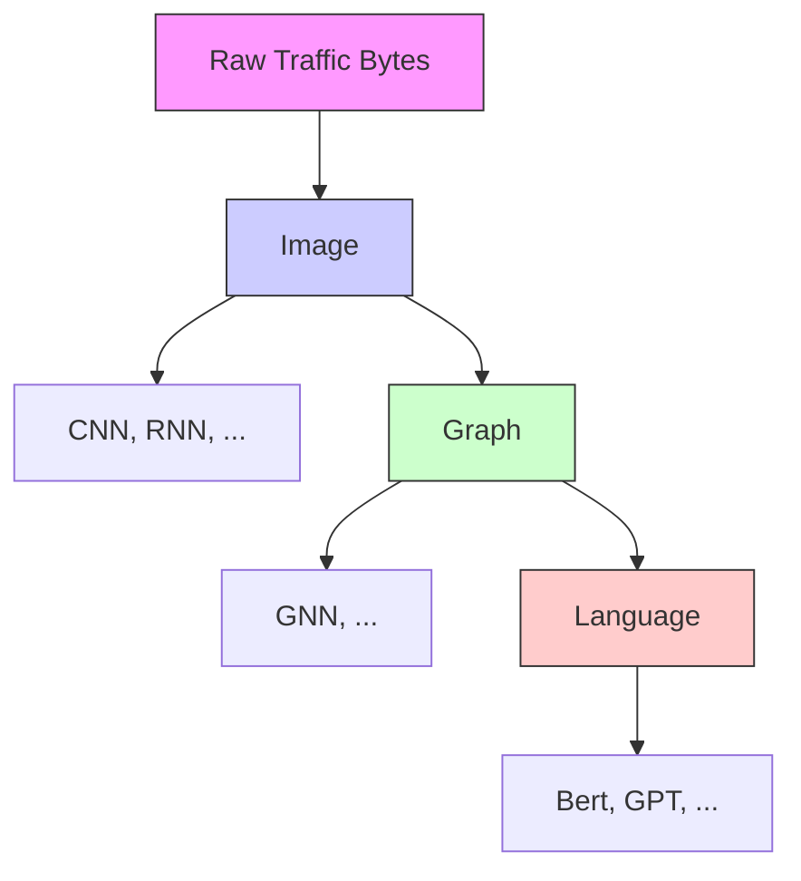
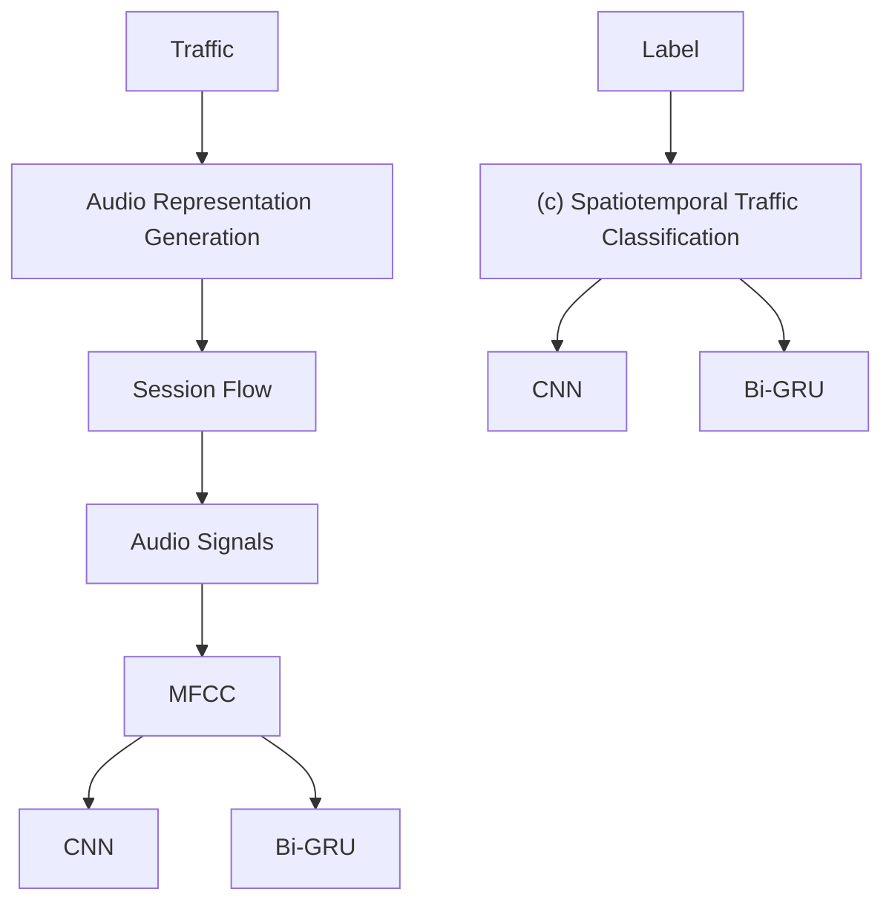
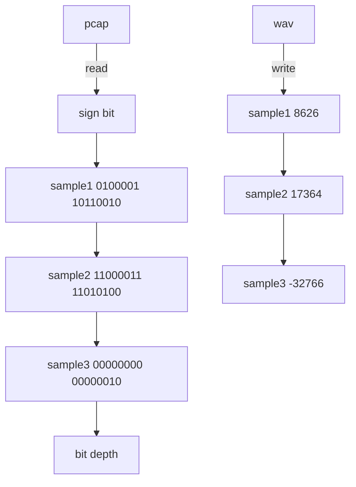
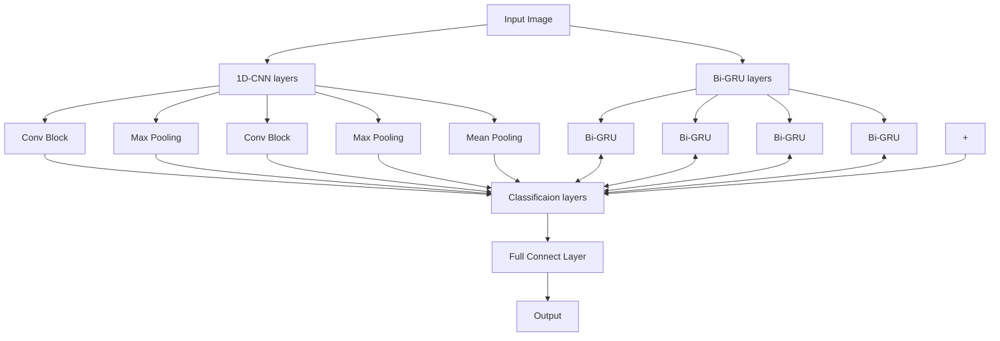

# TrafficAudio: Audio Representation for Lightweight Encrypted Traffic Classification in IoT

Yilu Chen , Ye Wang, Ruonan Li, Member, IEEE, Yujia Xiao , Lichen Liu, Member, IEEE, Jinlong Li, Yan Jia, and Zhaoquan Gu , Member, IEEE

Abstract—Encrypted traffic classification has become a crucial task for network management and security with the widespread adoption of encrypted protocols across the Internet and the Internet of Things. However, existing methods often rely on discrete representations and complex models, which leads to incomplete feature extraction, limited fine-grained classification accuracy, and high computational costs. To this end, we propose TrafficAudio, a novel encrypted traffic classification method based on audio representation. TrafficAudio comprises three modules: audio representation generation (ARG), audio feature extraction (AFE), and spatiotemporal traffic classification (STC). Specifically, the ARG module first represents raw network traffic as audio to preserve temporal continuity of traffic. Then, the audio is processed by the AFE module to compute low-dimensional Mel-frequency cepstral coefficients (MFCC), encoding both temporal and spectral characteristics. Finally, spatiotemporal features are extracted from MFCC through a parallel architecture of one-dimensional convolutional neural network and bidirectional gated recurrent unit layers, enabling finegrained traffic classification. Experiments on five public datasets across six classification tasks demonstrate that TrafficAudio consistently outperforms ten state-of-the-art baselines, achieving accuracies of 99.74%, 98.40%, 99.76%, 99.25%, 99.77%, and 99.74%. Furthermore, TrafficAudio significantly reduces computational complexity, achieving reductions of 86.88% in floating-point operations and 43.15% of model parameters over the best-performing baseline.

Index Terms—Encrypted traffic classification, malicious traffic detection, Mel-frequency cepstral coefficients, traffic representation.

Received 29 April 2025; revised 24 October 2025; accepted 28 December 2025. Date of publication 6 January 2026; date of current version 26 January 2026. This work was supported in part by the Shenzhen Science and Technology Program under Grant KJZD20240903103811016; in part by the Major Key Project of PCL under Grant PCL2024A05; and in part by the Science and Technology Development Fund, Macao SAR under Grant 0007/2024/AKP. The associate editor coordinating the review of this article and approving it for publication was Y.-D. Lin. (Corresponding author: Ye Wang.)

Yilu Chen, Ye Wang, and Yujia Xiao are with the Department of Computer Science and Technology, Harbin Institute of Technology (Shenzhen), Shenzhen 518055, China (e-mail: 23B951004@stu.hit.edu.cn; wangye2020@hit.edu.cn; 24B951013@stu.hit.edu.cn).

Ruonan Li and Lichen Liu are with the Department of New Networks, Peng Cheng Laboratory, Shenzhen 518100, China (e-mail: lirn@pcl.ac.cn; liulch@pcl.ac.cn).

Jinlong Li is with the Cyberspace Institute of Advanced Technology, Guangzhou University, Guangzhou 510006, China (e-mail: jinlongli@ gzhu.edu.cn).

Yan Jia is with the College of Computer Science and Technology, National University of Defense Technology, Changsha 410073, China (e-mail: jiayanjy@vip.sina.com).

Zhaoquan Gu is with the Department of Computer Science and Technology, Harbin Institute of Technology (Shenzhen), Shenzhen 518055, China, and also with the Department of New Networks, Peng Cheng Laboratory, Shenzhen 518100, China (e-mail: guzhaoquan@hit.edu.cn).

Digital Object Identifier 10.1109/TNSM.2026.3651599

# I. INTRODUCTION

services, applications, or malware in network traffic, is a fundamental capability for network management and security [1]. It enables quality of service control, quality of experience optimization, malware detection, and intrusion detection. In recent years, various encryption technologies have been widely adopted in network transmissions to enhance data security. However, these technologies provide opportunities for attackers to conceal malicious activities, thereby posing significant challenges to traffic classification [2]. Traditional traffic classification methods primarily rely on analyzing packet payloads and ports, known as deep packet inspection (DPI) and port-based methods, respectively. Nevertheless, DPI cannot directly analyze encrypted traffic because the payload content is inaccessible due to encryption [3]. Moreover, with the widespread adoption of non-standard interfaces and dynamic port allocation, port-based methods have also become ineffective [4]. Therefore, capturing implicit and robust representations in encrypted traffic is essential for accurate classification.

To address the above challenges, existing methods utilize various representations for encrypted traffic classification. Early feature-based methods [5], [6], [7], [8] represent network traffic as feature vectors or sequences derived from plaintext and statistical features, such as certificate version and packet lengths, as shown in Figure 1(a). Although these methods are more robust than DPI and port-based methods, they depend on selected features and lack rich information in encrypted payloads. To overcome these limitations, more recent studies have proposed byte-based representations that transform raw traffic bytes into images [9], [10], [11], graphs [12], [13], [14] or natural language [15], [16], [17], as illustrated in Figure 1(b). These methods enable automatic feature extraction and endto-end traffic classification through deep learning techniques. Temporal continuity refers to the ordered and sequential arrival of bytes or packets along the time dimension, preserving the inherent temporal structure of network traffic. In contrast, bytebased representations, such as images, graphs, and sentences, do not have an intrinsic time dimension. Instead, temporal characteristics may be implicitly encoded in positions of pixels [18], connections or attributes of nodes [19], [20], or sequences of tokens [21]. Therefore, these representations disrupt the temporal continuity of network traffic, leading to insufficient feature extraction. In addition to this, these methods also tend to capture fine-grained spatial and temporal characteristics at the expense of increased computational costs.


<details>
<summary>flowchart</summary>

```mermaid
graph LR
    A["Feature Vector<br>[certificate, version, duration,..."]] --> B["RF SVM ..."]
    C["Statement Features"] --> D["Sequence<br>length₁ length₂ length₃ ..."]
    D --> E["CNN RNN ..."]
```
</details>


<details>
<summary>flowchart</summary>


</details>

(b)   
Fig. 1. Different representations for encrypted traffic classification methods. (a) Feature vectors and sequences in feature-based methods. (b) Images, graphs, and natural language in byte-based methods.

On the other hand, audio exhibits temporal continuity through its waveform over time, making it a promising representation for traffic analysis. The continuous audio representation encodes both temporal and spectral patterns, capturing subtle deviations or anomalies of network traffic. Audio-based methods [22], [23] map packet parameters to audio signals and then pre-train security practitioners by auditory cues for unencrypted traffic intrusion detection. These methods enhance the functionality of security operations centers [24]. Moreover, audio features expand detection views and improve Android malware detection [25]. However, these methods rely on manually defined mapping rules and are not applicable to encrypted traffic. This motivates us to explore the automatic audio representation of raw encrypted traffic content for accurate and lightweight traffic classification.

In this paper, we propose TrafficAudio, a fine-grained encrypted traffic classification model based on audio representation of network traffic. It aims to preserve the temporal continuity inherent in raw traffic, thereby enabling the encoding of both temporal and spectral characteristics for accurate yet computationally efficient classification. Specifically, TrafficAudio is composed of three key modules: audio representation generation (ARG), audio feature extraction (AFE), and spatiotemporal traffic classification (STC). The main contributions of our paper are summarized as follows:

1) We propose TrafficAudio, a novel encrypted traffic classification method based on audio representation. It preserves the inherent continuity of network traffic and captures discriminative characteristics of diverse traffic.   
2) We convert traffic bitmap data into audio samples to avoid manually defined rules and extract Mel-frequency cepstral coefficients (MFCC) to encode temporal

and spectral characteristics in a low-dimensional space.

3) We evaluate TrafficAudio on five public datasets. Experimental results demonstrate that TrafficAudio consistently outperforms ten state-of-the-art (SOTA) methods in terms of both accuracy and computational efficiency.

The remainder of this paper is organized as follows. Section II reviews existing traffic classification and audiobased methods. Section III presents our proposed TrafficAudio method. Section IV provides the theoretical analysis of TrafficAudio. Section V introduces experiment details and result analysis. Section VI analyzes the strengths and limitations of TrafficAudio. Finally, we conclude the paper in Section VII.

# II. RELATED WORKS

In this section, we review existing traffic classification and audio-based methods. Current classification studies can be categorized into feature-based methods and byte-based methods. Audio-based methods are applied to non-encrypted traffic intrusion detection and Android malware analysis. Table I compares our method with existing methods.

# A. Feature-Based Methods

Feature-based methods rely on plaintext and statistical features for encrypted traffic classification, typically representing traffic by feature vectors or sequences based on domain knowledge. Feature vector representations are formed by plaintext fields and packet-related statistics extracted from encrypted traffic via feature engineering. Van Ede et al. [26] proposed FlowPrint for fingerprinting mobile apps from encrypted network traffic. FlowPrint extracted the destination IP and port number, timestamp, length, and direction of all packets in the flow and created a fingerprint library by cross-correlating. By using only packet length information, Shen et al. [5] extracted block, sequence, and statistical features to construct webpage fingerprints and employed k-nearest neighbor, random forest (RF), and decision tree to analyze encrypted traffic. Zaki et al. [6] used a RF classifier on protocol as well as payload length statistics, and achieved a 94% average F1 score in the ISCX-VPN2016 dataset. In contrast, deep learning models automatically learn sequential features from raw traffic sequences. Sequence representations encode important information about traffic services or applications, such as packet length and arrival time sequences. Liu et al. [7] introduced a flow sequence network, called FS-Net, to classify encrypted traffic. FS-Net employed gated recurrent units (GRU) to learn sequential characteristics from packet length sequences without lots of human effort. Wang et al. [27] also proposed an end-to-end hybrid neural network, called APP-Net. APP-Net combined recurrent neural networks (RNN) and convolutional neural networks (CNN) in a parallel way to capture traffic patterns from flow sequences and demonstrated a better performance than FS-Net. Additionally, Shapira and Shavitt [28] designed FlowPic to classify network services and applications. FlowPic converted packet size and arrival time sequences into histograms and utilized CNN to classify. Although these methods have shown good performance, the features tend to become ineffective as encryption techniques evolve. Additionally, these methods only analyze high-level features and fail to automatically extract meaningful features from specific traffic content.

TABLE I COMPARISON WITH RELATED TRAFFIC CLASSIFICATION METHODS 

<table><tr><td>Category</td><td>Representation</td><td>Reference</td><td>Raw Bytes</td><td>Auto Generation</td><td>Spatiality</td><td>Temporality</td><td>Continuity</td><td>Scenario</td></tr><tr><td rowspan="6">Feature-based</td><td rowspan="3">Feature Vector</td><td>FlowPrint [26]</td><td></td><td></td><td></td><td></td><td></td><td></td></tr><tr><td>FineWP [5]</td><td>×</td><td>×</td><td>×</td><td>√</td><td>×</td><td></td></tr><tr><td>GRAIN [6]</td><td></td><td></td><td></td><td></td><td></td><td></td></tr><tr><td rowspan="3">Sequence</td><td>FS-Net [7]</td><td>×</td><td>√</td><td>×</td><td>√</td><td>×</td><td></td></tr><tr><td>APP-Net [27]</td><td>×</td><td>√</td><td>√</td><td>√</td><td>×</td><td></td></tr><tr><td>FlowPic [28]</td><td></td><td></td><td></td><td></td><td></td><td></td></tr><tr><td rowspan="12">Byte-based</td><td rowspan="6">Image</td><td>End2End [9]</td><td></td><td></td><td></td><td></td><td></td><td></td></tr><tr><td>Deep Packet [29]</td><td>√</td><td>√</td><td>√</td><td>×</td><td>×</td><td></td></tr><tr><td>FasterTrafficNet [30]</td><td></td><td></td><td></td><td></td><td></td><td></td></tr><tr><td>TSCRNN [31]</td><td></td><td></td><td></td><td></td><td></td><td></td></tr><tr><td>CMTSNN [18]</td><td>√</td><td>√</td><td>√</td><td>√</td><td>×</td><td>Encrypted Traffic</td></tr><tr><td>ATVITSC [11]</td><td></td><td></td><td></td><td></td><td></td><td></td></tr><tr><td rowspan="3">Graph</td><td>TFE-GNN [19]</td><td></td><td></td><td></td><td></td><td></td><td></td></tr><tr><td>DE-GNN [32]</td><td>√</td><td>√</td><td>√</td><td>√</td><td>×</td><td></td></tr><tr><td>SemanticTopo [33]</td><td></td><td></td><td></td><td></td><td></td><td></td></tr><tr><td rowspan="3">Language</td><td>ET-bert [16]</td><td></td><td></td><td></td><td></td><td></td><td></td></tr><tr><td>NetGPT [21]</td><td>√</td><td>√</td><td>×</td><td>√</td><td>×</td><td></td></tr><tr><td>TrafficGPT [34]</td><td></td><td></td><td></td><td></td><td></td><td></td></tr><tr><td rowspan="3">Audio-based</td><td rowspan="3">Audio</td><td>S-SIEM [23]</td><td>×</td><td>×</td><td>√</td><td>√</td><td>√</td><td>Non-Encrypted Traffic</td></tr><tr><td>AndMal [25]</td><td>√</td><td>√</td><td>×</td><td>√</td><td>√</td><td>Android Malware</td></tr><tr><td>TrafficAudio(Ours)</td><td>√</td><td>√</td><td>√</td><td>√</td><td>√</td><td>Encrypted Traffic</td></tr></table>

# B. Byte-Based Methods

Byte-based methods directly capture traffic patterns from raw traffic bytes by using deep learning models. These methods can be categorized as image-based, graph-based, and natural language-based methods according to representations of the input traffic. Image-based methods transform raw traffic content into grayscale images, thereby classifying traffic using image recognition techniques. Wang et al. [9] firstly utilized CNN to learn traffic patterns from image representations of traffic. Lotfollahi et al. [29] proposed Deep Packet for traffic classification. Deep Packet extracted packet-level images and then utilized CNN to classify traffic. Yu et al. [30] introduced lightweight CNN on packet-level images, improving computational efficiency and performance. Lin et al. [31] presented a novel identification scheme of encrypted traffic, called TSCRNN. Zhu et al. [18] proposed the cost matrix time–space neural network (CMTSNN) for abnormal and encrypted IoT traffic. Both TSCRNN and CMTSNN integrated CNN and bidirectional long short-term memory (Bi-LSTM) layers based on session-level images to extract spatiotemporal features. Liu et al. [11] proposed an attention-based vision transformer and spatiotemporal scheme for traffic classification (ATVITSC). ATVITSC extracted global and spatiotemporal features from images and achieved 97.89% accuracy on the ISCX-VPN2016 dataset. Graph-based methods represent packet interactions or byte relationships through nodes and edges, which allows graph neural networks (GNN) to capture traffic patterns. Zhang et al. [19] designed TFE-GNN, a temporal fusion encoder using GNN. TFE-GNN extracted features from byte-level traffic graphs for fine-grained encrypted traffic classification. Han et al. [32] took packet-level and flowlevel features into account and employed dual embedding with GNN for classification. Luo et al. [33] utilized the semantic association of pcap headers, packet headers and payloads to construct topologies, and achieved an accuracy of 95.76% on the USTC-TFC2016 dataset. The large language model (LLM) demonstrates promising performance in many fields. Given that network traffic can also be viewed as natural language, LLM can be utilized to achieve classification through pretraining and fine-tuning stages. During the pre-training stage, generic semantic representations are learned from large-scale unlabeled data, while specific downstream tasks are performed using a limited amount of labeled data during the finetuning stage [35]. Lin et al. [16] proposed ET-bert to learn contextual relationships between bytes via a transformerbased architecture after representing traffic as language-like tokens. Meng et al. [21] provided a generative model based on GPT-2, called NetGPT, for both traffic understanding and generation tasks. To overcome the limitation of token length, Qu et al. [34] employed a generative model with a linear attention mechanism, expanding the capacity from the previous limit of only 512 tokens to 12,032 tokens. However, these methods require a large number of byte values and complex model architectures for high accuracy classification. They thus have not achieved a trade-off between performance and complexity.

# C. Audio-Based methods

The aforementioned representations often fail to explicitly reflect the temporal continuity of traffic bytes. In contrast, audio inherently preserves the continuity through its waveform over time. The audio representation has been primarily applied to intrusion detection for non-encrypted network traffic and Android malware. For non-encrypted traffic intrusion detection, existing methods typically generate audio using parameter-mapping algorithms and identify malicious traffic by pre-training security practitioners through auditory cues. Axon et al. [23] explored the performance of a security information and event management tool with sonification (S-SIEM). S-SIEM designed parameter-mapping algorithms to map packet information into acoustic dimensions and trained security practitioners by these audios for attack detection. However, these methods rely on manual design and human interpretation. For Android malware detection, Tarwireyi et al. [25] unpacked raw Android application package (APK) files into one-dimensional binary arrays, which were then converted into audio signals for feature extraction. Ismail et al. [36] proposed MIDALF, a novel multimodal image and audio late fusion method. MIDALF transformed malware binaries into image and audio representations to improve detection accuracy. These studies motivate us to explore automatic audio representation of encrypted traffic through binary conversion. However, network traffic exhibits different structural and semantic characteristics from Android APK files. To this end, we design a novel audio representation that automatically generates audio from raw encrypted traffic, achieving more generalizable and scalable analysis.


<details>
<summary>flowchart</summary>


</details>

Fig. 2. Overview of our encrypted traffic classification method, TrafficAudio. TrafficAudio takes raw traffic as input and outputs fine-grained classification results. It consists of audio representation generation, audio feature extraction, and encrypted traffic classification.

# III. METHODOLOGY

In this section, we provide a detailed description of TrafficAudio. An overview of the TrafficAudio architecture is illustrated in Figure 2. TrafficAudio consists of three main modules: ARG, AFE, and STC. First, audio representation is automatically generated for each session partitioned from raw traffic in the ARG module. Next, these audio representations are passed to the AFE module for MFCC extraction. Finally, the STC module leverages one-dimensional convolutional neural networks (1D-CNN) and bidirectional gated recurrent unit (Bi-GRU) layers to capture spatiotemporal features for encrypted traffic classification.

# A. Audio Representation Generation

The ARG module automatically transforms network traffic into audio through a two-stage process: session segmentation and audio conversion. This conversion establishes a conceptual correspondence between encrypted network traffic and audio signals. Both can be treated as one-dimensional temporal sequences of values for traffic bytes and amplitude for audio samples. In the first stage, raw traffic is divided into sessions by grouping packets into flows from the same source and destination. In the second stage, each session is converted into an audio representation.

First, the raw traffic is partitioned into sessions. Since the raw traffic contains packets from various sources, it is divided into flows produced by a single source. A flow represents a sequence of packets with the same source IP, destination IP, source port, destination port and communication protocol. A session consists of a pair of bidirectional flows, denoted as Session = Flowup ∪ $\operatorname { F l o w } _ { d o w n }$ , where $\mathrm { F l o w } _ { u p }$ refers to the packets from the source IP to the destination IP, and Flowdown represents those in the reverse direction. Each session is then interpreted as a binary stream, defined as Session = $\{ b i t _ { 1 } , b i t _ { 2 } , \ldots , b i t _ { n } \}$ , where each bit stores a single binary value, either 0 or 1. The session length L is defined as the total number of bits.

Next, each binary session is converted into audio by mapping the binary data to audio samples and calculating amplitude values. The resulting audio, denoted as A, consists of a series of samples and their corresponding amplitude values:

$$
\mathcal {A} = \{A m p (s m p) \mid s m p \in \mathcal {N} \} \tag {1}
$$

where Amp(smp) denotes the amplitude value of the sample smp, and N represents the set of samples.

The number of samples and the range of amplitude values are determined by the bit depth B. Specifically, setting the bit depth to B means each audio sample contains B bits.


<details>
<summary>flowchart</summary>


</details>

Fig. 3. Process of audio conversion from network traffic. By reading the traffic PCAP file in binary format, bits are converted into audio samples and amplitude values based on the bit depth, thus generating the audio WAV file.

Accordingly, the total number of samples S is calculated as $\lfloor L / B \rfloor$ . Each sample smp is defined as:

$$
s m p _ {i} = \left(b i t _ {(i - 1) B + 1}, \dots , b i t _ {i B}\right) \in \{0, 1 \} ^ {B} \tag {2}
$$

Each sample smp is then interpreted as a signed binary integer, with the most significant bit serves as the sign bit. Its amplitude value Amp(smp) is computed by:

$$
A m p (s m p) = (- 1) ^ {b i t _ {1}} \sum_ {k = 2} ^ {B} b i t _ {k} 2 ^ {B - k} \tag {3}
$$

The audio conversion of each session is illustrated in Figure 3. Given a session, the first L bits are extracted. If the session length exceeds $L ,$ it is truncated; otherwise, it is padded with $0 \times 0 0$ . Then the session is read in binary format. For a given bit depth of $B = 1 6 ,$ , every 16 bits form one audio sample whose amplitude corresponds to a signed integer. The duration of the audio is determined by the sampling rate and the total number of audio samples. The sampling rate refers to the number of samples collected per second. For example, at a sampling rate of 16kHz, 16,000 samples are captured each second.

# B. Audio Feature Extraction

The audio feature MFCC is extracted from the generated audio, which represents compact and discriminative characteristics of encrypted traffic. The process of extracting MFCC involves pre-emphasis filtering, magnitude spectrum generation, Mel filter bank application, and coefficient selection.

We firstly perform pre-emphasis filtering to compensate for the high-frequency attenuation and balance the spectral energy. Pre-emphasis enhances the high-frequency components of the audio, making short-term fluctuations more distinguishable. This is implemented through a high-pass filter:

$$
x ^ {\prime} (t _ {d}) = x (t _ {d}) - \alpha x (t _ {d} - 1), \quad 0. 9 5 <   \alpha <   0. 9 9 \tag {4}
$$

where $x ( t _ { d } )$ represents the original signal at time step $t _ { d } ,$ $x ^ { \prime } ( t _ { d } )$ is the pre-emphasized signal, and α is the pre-emphasis coefficient controlling the level of enhancement.

Next, we transform the pre-emphasized audio signal into a magnitude spectrum signal, as shown in Figure 4. At the beginning, the audio signal is divided into overlapping frames, in order to capture its short-time stable and smooth variations. Each frame contains $F _ { l }$ chronological samples and overlaps with adjacent frames by $F _ { s }$ samples. The total number of frames in each audio is:


<details>
<summary>text_image</summary>

Audio signal
Magnitude spectrum of signal
FFT
Frame shift
Frame length
Frame
+ Hamming window
</details>

Fig. 4. Transformation of audio signal into spectrum signal. The audio signal is first divided into frames, a Hamming window is applied to each frame, and FFT is performed to generate the spectrum.

$$
F = \left\lfloor \frac {S - F _ {l}}{F _ {s}} \right\rfloor + 1 \tag {5}
$$

Then, each frame is multiplied by a Hamming window [37] to taper the edges and reduce spectral leakage. Subsequently, a fast Fourier transform (FFT) is applied to each windowed frame to obtain its frequency-domain representation. The FFT for a frame $x ( n )$ is defined as:

$$
X (k) = \sum_ {n = 0} ^ {F _ {l} - 1} x (n) e ^ {- \frac {2 \pi j k n}{F _ {l}}}, \quad 0 \leq k \leq F _ {l} - 1 \tag {6}
$$

where $X ( k )$ represents the $k ^ { t h }$ frequency component and j is the imaginary unit.

A set of Mel filter banks is applied to the magnitude spectrum, producing a Mel-frequency representation. The Mel filter effectively emphasizes lower frequencies while suppressing high-frequency noise. The energy in each Mel filter band is computed as:

$$
E (m) = \ln \left(\sum_ {n = 0} ^ {F _ {l} - 1} H _ {m} (k) \cdot | X (k) | ^ {2}\right), \quad 1 \leq m \leq M \tag {7}
$$

where M is the total number of Mel filters, and $| X ( k ) | ^ { 2 }$ is the power at $k ^ { t h }$ frequency bin. $H _ { m } ( k )$ denotes the frequency response of the $m ^ { t h }$ Mel filter, computed as:

$$
H _ {m} (k) = \left\{ \begin{array}{l l} 0, & k <   f (m - 1) \\ \frac {k - f (m - 1)}{f (m) - f (m - 1)}, & f (m - 1) \leq k \leq f (m) \\ \frac {f (m + 1) - k}{f (m + 1) - f (m)}, & f (m) \leq k \leq f (m + 1) \\ 0, & k > f (m + 1) \end{array} \right. \tag {8}
$$

where $f ( m )$ denotes center frequencies of the $m ^ { t h }$ Mel filter.

Finally, we select the first C coefficients as our MFCC after applying the discrete cosine transform (DCT) to the Melfrequency spectrum. The application of DCT further reduces redundancy and compresses the feature space, making the representation compact and computationally efficient. The coefficient is computed as follows:


<details>
<summary>flowchart</summary>


</details>

Fig. 5. Workflow of classification model in TrafficAudio. The model mainly consists of CNN, Bi-GRU and classification layers.

$$
c (n) = \sum_ {m = 0} ^ {M - 1} E (m) \cdot \cos \left(\frac {n \pi (m - 0 . 5)}{M}\right) \tag {9}
$$

where c(n) denotes the $n ^ { t h }$ coefficient. Therefore, the dimensionality of MFCC is $C \ \times \ F .$ . MFCC captures different frequency-domain characteristics of encrypted traffic from the temporal dimension in a compact representation.

# C. Spatiotemporal Traffic Classification

Our classification model comprises three main layers: 1D-CNN, Bi-GRU, and classification layers. The 1D-CNN extracts high-level spatial features from the spectral dimension of the MFCC, while Bi-GRU captures temporal features along the time dimension. Finally, the classification layers fuse spatial and temporal features to perform traffic classification. The workflow of our classification model is shown in Figure 5.

1) 1D-CNN Layers: We employ two 1D-CNN blocks to extract spatial information. Each block consists of a 1D convolutional layer (Conv1D), followed by batch normalization (BatchNorm1D) and a ReLU activation function to stabilize training and introduce non-linearity:

$$
X _ {\text { conv }} = \text { ReLU } (\text { BatchNorm1D } (\text { Conv1D } (X))) \tag {10}
$$

Then, a max pooling operation is applied to downsample and reduce the dimensionality of the feature maps:

$$
X _ {\text { pool }} = \text { MaxPool1D } (X _ {\text { conv }}) \tag {11}
$$

After the second 1D-CNN block and max pooling, we apply mean pooling along the time dimension to compress the features into a fixed-size representation:

$$
F _ {\mathrm{cnn}} = \text { MeanPool1D } (X _ {\mathrm{pool}}) \tag {12}
$$

2) Bi-GRU Layers: To capture temporal dependencies in both forward and backward directions, we utilize a two-layer Bi-GRU with a hidden size of 256 and a dropout rate of 0.3. Given an input sequence $\boldsymbol { X } \in \mathbb { R } ^ { F \times C }$ , the Bi-GRU processes the sequence in both forward and backward directions:

$$
\overrightarrow {h} _ {t} = \mathrm{GRU} _ {\text {forward}} \left(x _ {t}, \overrightarrow {h} _ {t - 1}\right) \tag {13a}
$$

$$
\overleftarrow {h} _ {t} = \mathrm{GRU} _ {\text {backward}} \left(x _ {t}, \overleftarrow {h} _ {t + 1}\right) \tag {13b}
$$

At each time step, the hidden states from both directions are concatenated as $h _ { t } = [ \overrightarrow { h } _ { t } ; \overleftarrow { h } _ { t } ]$ . We use the concatenated hidden state at the final step F as the temporal representation:

$$
F _ {\mathrm{GRU}} = h _ {F} \in \mathbb {R} ^ {5 1 2} \tag {14}
$$

3) Classification Layers: The spatial features $F _ { \mathrm { c n n } }$ and temporal features $F _ { \mathrm { G R U } }$ are fused along the feature dimension to perform traffic classification.

$$
F _ {\text { fused }} = \left[ F _ {\text { cnn }}; F _ {\text { GRU }} \right] \tag {15}
$$

Then, we apply a dropout layer with a dropout rate of 0.5 to avoid overfitting. Subsequently, a fully connected layer (Linear) followed by a Softmax function is used to predict the class probabilities:

$$
\hat {Y} = \operatorname{Softmax} (\text { Linear } (F _ {\text { fused }}, D)) \tag {16}
$$

where D denotes the output dimension.

# IV. THEORETICAL ANALYSIS

This section presents a theoretical analysis of TrafficAudio. We analyze the scalability of the audio feature MFCC and the time and space complexity of the ARG and AFE modules.

# A. Audio Feature Scale Analysis

The proposed TrafficAudio employs MFCC to capture both temporal and spectral characteristics of network traffic. By adjusting the parameters for extracting MFCC, the feature space of the audio can be flexibly controlled relative to the length of the raw traffic session. The scale ratio ρ between the dimensionality of the MFCC $( C \times F )$ and the length of the traffic session L is calculated by:

$$
\begin{array}{l} \rho = \frac {C \times F}{L} = \frac {\left\lfloor \frac {S - F _ {l}}{F _ {s}} \right\rfloor + 1}{S \times B} \times C \\ <   \frac {\frac {S}{F _ {s}} \times C}{S \times B} = \frac {C}{F _ {s} \times B} \tag {17} \\ \end{array}
$$

When $C < F _ { s } \times B$ , the dimensionality of MFCC becomes smaller than the raw session length. It demonstrates that MFCC provides effective compression in terms of storage space. Transformer-based models typically represent each session word with a high-dimensional vector (e.g., 768 dimensions). In contrast, the MFCC of audio provides a lower-dimensional and adjustable feature space, achieving effective information compression. Therefore, this compactness in audio representation allows TrafficAudio to efficiently handle encrypted traffic, offering a balance between feature richness and computational efficiency.

# B. Complexity of Feature Extraction

The proposed TrafficAudio maintains low computational overhead by avoiding high-complexity operations during audio generation in the ARG module and MFCC extraction in the AFE module. The time and space complexity analyses of the ARG and AFE modules are summarized in Table II. In particular, the AFE module consists of four sequential steps:

TABLE II COMPLEXITY ANALYSIS OF ARG AND AFE MODULES IN TRAFFICAUDIO 

<table><tr><td>Step</td><td>Time Complexity</td><td>Space Complexity</td></tr><tr><td>ARG</td><td> $O(S)$ </td><td> $O(S)$ </td></tr><tr><td>AFE Step1</td><td> $O(S)$ </td><td> $O(1)$ </td></tr><tr><td>AFE Step2</td><td> $O(F \times F_l \log F_l)$ </td><td> $O(F \times F_l)$ </td></tr><tr><td>AFE Step3</td><td> $O(F \times F_l \times M)$ </td><td> $O(F \times M)$ </td></tr><tr><td>AFE Step4</td><td> $O(F \times M \log M)$ </td><td> $O(F \times C)$ </td></tr><tr><td>Total</td><td> $O(F \times F_l \times M)$ </td><td> $O(F \times (F + F_l + M))$ </td></tr></table>

pre-emphasis filtering, magnitude spectrum generation, Mel filter bank application, and coefficient selection, corresponding to AFE Steps 1 to 4 in Table II, respectively.

In the ARG and AFE modules of TrafficAudio, the overall time and space complexities are $O ( F \times F _ { l } \times M )$ and $O ( F \times ( F + F _ { l } + M ) )$ ), respectively. Both time and space complexities exhibit linear or linear multiplicative scaling. The primary computational cost is incurred by the Mel filter bank application, whose complexity scales with the total number of Mel filters. Consequently, TrafficAudio achieves efficient and scalable computation in the ARG and AFE modules, making it practical for encrypted traffic classification tasks.

# V. EXPERIMENTS

In this section, we evaluate the effectiveness of TrafficAudio on six encrypted traffic classification tasks covering various encryption scenarios. First, we compare the classification performance of our method with ten SOTA baselines. We then analyze model complexity using floating-point operations (FLOPs) and the number of model parameters (Params). Finally, ablation studies validate the contribution of audio features to classification performance.

# A. Experiment Setup

1) Implementation Details: TrafficAudio is implemented in Python 3.10, utilizing soundfile 0.12.1 for audio generation, torchaudio 2.4.0 for feature extraction, and PyTorch 2.4.0 for model classification. All experiments are conducted on Ubuntu 18.04 system equipped with an NVIDIA A100 GPU.

We first use SplitCap to obtain sessions from public datasets. Each dataset is then divided into training and testing sets with a ratio of 9:1. For classes with limited data, a data augmentation strategy is then applied by splitting long sessions into sub-sessions, each containing 15 non-overlapping packets. To further prevent overfitting and reduce training time, we randomly select up to 6000 sessions per class.

Table III presents the hyper-parameters used in our experiments. In the ARG module, we set L = 1568 bytes, bitdepth = 8 bits, and samplingrate = 16kHz . In the AFE module, the pre-emphasis coefficient is set to $\alpha ~ = ~ 0 . 9 7$ , frame length $F _ { l } = 2 5 \mathrm { . }$ , frame shift $F _ { s } = 1 0 \mathrm { . }$ , number of Mel filters $M = 1 2 8$ , and number of MFCC coefficients C = 28. For 1D-CNN layers in the STC module, Conv1D filters have a kernel size of 3, with both stride and padding set to 1. The MaxPool1D layer uses a kernel size and stride of 2. During model training, we apply early stopping to select the best-performing model and to avoid overfitting. The Adam optimizer is employed to minimize the loss with an initial learning rate of 0.001, default betas of (0.9, 0.999), and epsilon of 1e-8.

TABLE III HYPER-PARAMETERS CONFIGURATIONS OF TRAFFICAUDIO 

<table><tr><td>Hyper-Parameter</td><td>Value</td></tr><tr><td> $L$ </td><td>1568 bytes</td></tr><tr><td>Bit depth</td><td>8 bits</td></tr><tr><td>Sampling rate</td><td>16 kHz</td></tr><tr><td>Pre-emphasis coefficient  $\alpha$ </td><td>0.97</td></tr><tr><td> $F_l$ </td><td>25</td></tr><tr><td> $F_s$ </td><td>10</td></tr><tr><td>Number of Mel filters  $M$ </td><td>128</td></tr><tr><td>Number of MFCC coefficients  $C$ </td><td>28</td></tr><tr><td>Kernel, stride and padding of Conv1d</td><td>3, 1, 1</td></tr><tr><td>Kernel and stride of MaxPool</td><td>2, 2</td></tr><tr><td>Batch size</td><td>128</td></tr><tr><td>Number of epoch</td><td>100</td></tr><tr><td>Optimizer</td><td>Adam</td></tr><tr><td>Learning rate</td><td>0.001</td></tr><tr><td>betas</td><td>(0.9, 0.999)</td></tr><tr><td>eps</td><td>1e-8</td></tr><tr><td>Loss function</td><td>Cross Entropy</td></tr></table>

TABLE IV DATASETS INFORMATION FOR CLASSIFICATION TASKS 

<table><tr><td>Dataset</td><td>Task</td><td>Flow</td><td>Label</td></tr><tr><td>CIC-IoT2023 [38]</td><td>ETCI</td><td>609761</td><td>8</td></tr><tr><td>CipherSpectrum [39]</td><td>ETCW</td><td>20100</td><td>20</td></tr><tr><td>USTC-TFC2016 [40]</td><td>EMC</td><td>489139</td><td>20</td></tr><tr><td>ISCX-VPN Service [41]</td><td>ETCV</td><td>182832</td><td>12</td></tr><tr><td>ISCX-VPN APP [41]</td><td>EACV</td><td>291896</td><td>17</td></tr><tr><td>ISCX-Tor2016 [42]</td><td>EACT</td><td>57546</td><td>16</td></tr></table>

2) Datasets: To evaluate the effectiveness and generalization ability of TrafficAudio, we construct six encrypted traffic classification tasks across five public datasets. Table IV summarizes the datasets and their corresponding tasks.

CIC-IoT2023 [38]: The dataset collects benign traffic and 33 attacks within an IoT topology. The attacks are classified into seven categories. We select one representative attack from each class, including SlowLoris, dictionary brute force, ARP spoofing, TCP flooding, port scanning, browser hijacking, and Mirai’s GREETH flood. The selected attacks all include encrypted traffic using TLS v1.2 or TLS v1.3. These seven attacks along with benign traffic construct the encrypted traffic classification in IoT (ETCI) task.

CipherSpectrum [39]: The dataset collects encrypted TCP/ UDP sessions from 40 distinct domains. Traffic from each Web is encrypted using three major TLS 1.3 cipher suites, including AES-128-GCM, AES256-GCM, and CHACHA20- POLY1305. From a mixture of traffic across all three cipher suites, we select 20 distinct domains to construct the encrypted traffic classification on Web (ETCW) task.

USTC-TFC2016 [40]: The dataset contains 10 types of benign traffic generated by the IXIA BPS network traffic simulator and 10 types of malicious traffic collected from a real-world network environment. The encrypted malware classification (EMC) task aims to classify encrypted traffic containing both benign and malicious traffic.

ISCX-VPN Service [41]: The ISCX-VPN2016 dataset [41] is captured through the Canadian Institute for Cybersecurity in both Virtual Private Network (VPN) and non-VPN. It can be categorized by services to form the ISCX-VPN Service dataset, which comprises 12 services and supports the encrypted traffic classification on VPN (ETCV) task.

ISCX-VPN APP [41]: The ISCX-VPN2016 dataset is also categorized by application types, thereby resulting in the ISCX-VPN APP dataset. The ISCX-VPN APP dataset contains traffic from 17 distinct applications, and supports the encrypted application classification on VPN (EACV) task.

ISCX-Tor2016 [42]: The onion router (Tor), as a privacy-enhancing technology, poses challenges for traffic classification. The ISCX-Tor2016 dataset includes 16 different applications over Tor and non-Tor traffic. The dataset is utilized for encrypted application classification on Tor (EACT) task.

3) Performance Metrics: We evaluate and compare classification performance using four metrics: accuracy (AC), macro-precision $\left( \mathrm { P R } _ { m } \right)$ , macro-recall $\left( \mathrm { R C } _ { m } \right)$ , and macro-F1 $\left( \mathrm { F } 1 _ { m } \right)$ . AC measures the overall proportion of correctly classified data samples out of the total samples, serving as a standard metric in classification tasks. In multi-classification tasks, macro average metrics [43] independently compute precision, recall, and F1 for each class, and average them across all classes. They avoid biased results caused by imbalanced data distributions. The metrics are calculated as follows:

$$
A C = \frac {T P + T N}{T P + T N + F P + F N} \tag {18}
$$

$$
P r e c i s i o n = \frac {T P}{T P + F P} \tag {19}
$$

$$
\text { Recall } = \frac {T P}{T P + F N} \tag {20}
$$

$$
F 1 = 2 \times \frac {\text { Precision } \times \text { Recall }}{\text { Precision } + \text { Recall }} \tag {21}
$$

where TP, FP, TN, and FN denote true positive, false positive, true negative, and false negative, respectively. Subsequently, $\mathrm { P R } _ { m } , \mathrm { R C } _ { m }$ , and $\mathrm { F } 1 _ { m }$ are obtained by averaging these metrics across all classes.

$$
\mathrm{PR} _ {m} = \frac {1}{N} \sum_ {i = 1} ^ {N} P r e c i s i o n _ {i} \tag {22}
$$

$$
\mathrm{RC} _ {m} = \frac {1}{N} \sum_ {i = 1} ^ {N} \text {Recall} _ {i} \tag {23}
$$

$$
\mathrm{F} 1 _ {m} = \frac {1}{N} \sum_ {i = 1} ^ {N} F 1 _ {i} \tag {24}
$$

where N is the number of classes and i means the $i ^ { t h }$ class.

4) Benchmark Methods: We compare TrafficAudio with ten SOTA baselines on the six classification tasks, including:

• 1D-CNN: It uses the raw network bytes prior to audio conversion as input and employs two 1D-CNN layers and two fully connected layers for classification.   
FlowPrint [26]: It extracts fingerprints and identifies applications through a fingerprint matching algorithm.   
FlowPic [28]: It extracts packet arrival time and packet size sequences from traffic sessions and employs a CNN model for traffic classification.

• DeepPacket [29]: It converts the first 1500 bytes of each packet into an image and leverages a CNN model for feature extraction and traffic classification.   
• TSCRNN [31]: It transforms the first 1500 bytes of 15 packets into an image, and combines CNN and Bi-LSTM layers for spatiotemporal feature extraction.   
CMTSNN [18]: It transforms the first 1000 bytes of 10 packets into an image, and integrates Bi-LSTM, CNN, and cost penalty layers to learn IoT traffic patterns.   
ATVITSC [11]: It transforms the first 256 bytes of 16 packets into an image, utilizes packet vision transformer to capture global features, and combines convolution and Bi-LSTM to learn spatiotemporal features.   
TFE-GNN [19]: It constructs byte-level traffic header and payload graphs based on bytes and their correlations, and employs stacked GraphSAGE networks for embedding.   
ET-bert [16]: It tokenizes raw network traffic into language-like sequences and performs encrypted traffic classification through pre-training transformer models.   
• AndMal [25]: It transforms one-dimensional binary arrays of unpacked Android APK files into audio, extracts bark frequency cepstral coefficients (BFCC), and uses a RF classifier for malware detection.

# B. Comparison of Classification Results

Tables V and VI present the experimental results of TrafficAudio on the six classification tasks. It can be observed that TrafficAudio consistently outperforms most SOTA methods in terms of AC, $\mathrm { P R } _ { m } , \mathrm { R C } _ { m }$ , and $\mathrm { F } 1 _ { m }$ .

1) CIC-IoT2023: As shown in Table V, TrafficAudio significantly outperforms all SOTA methods in the ETCI task. Specifically, our model achieves improvements of 10.17%, 10.70%, and 15.62% in $\mathrm { F } 1 _ { m }$ over TSCRNN, 1D-CNN, and ET-bert, respectively. The 1D-CNN baseline directly takes raw traffic bytes prior to audio conversion, TSCRNN transforms traffic bytes into grayscale image pixels, and ETbert represents traffic as language-like tokens. In contrast, TrafficAudio preserves temporal continuity through audio conversion and extracts discriminative frequency-domain features, enabling more effective capture of traffic patterns. Therefore, TrafficAudio achieves significant improvements for the ETCI task due to its audio representation.   
2) CipherSpectrum: Table V demonstrates that TrafficAudio achieves competitive performance on the CipherSpectrum dataset, reaching an accuracy of 0.9840. In comparison with SOTA baselines, it achieves marginal improvements over TSCRNN and TFE-GNN, and markedly surpasses recent approaches including ATVITSC and ETbert. Since the traffic in this dataset is encrypted using three modern cipher suites, this performance indicates that TrafficAudio effectively captures discriminative patterns from modern encrypted traffic, achieving an accurate classification of Web traffic.   
3) USTC-TFC2016: From the results of the EMC task presented in Table V, TrafficAudio achieves the highest performance across all evaluation metrics, including an AC of 99.76% and an $\mathrm { F } 1 _ { m }$ of 99.77%. The USTC-TFC2016

TABLE V COMPARISON RESULTS OF CLASSIFICATION PERFORMANCE ON THE CIC-IOT2023, CIPHERSPECTRUM, AND USTC-TFC2016 DATASETS 

<table><tr><td rowspan="2">Method</td><td colspan="4">CIC-IoT2023</td><td colspan="4">CipherSpectrum</td><td colspan="4">USTC-TFC2016</td></tr><tr><td>AC</td><td> $PR_m$ </td><td> $RC_m$ </td><td> $F1_m$ </td><td>AC</td><td> $PR_m$ </td><td> $RC_m$ </td><td> $F1_m$ </td><td>AC</td><td> $PR_m$ </td><td> $RC_m$ </td><td> $F1_m$ </td></tr><tr><td>1D-CNN</td><td>0.8904</td><td>0.8898</td><td>0.8918</td><td>0.8905</td><td>0.7785</td><td>0.7785</td><td>0.7841</td><td>0.7802</td><td>0.9920</td><td>0.9920</td><td>0.9920</td><td>0.9920</td></tr><tr><td>FlowPrint [26]</td><td>0.5050</td><td>0.5566</td><td>0.5678</td><td>0.4288</td><td>0.4228</td><td>0.3963</td><td>0.4226</td><td>0.3795</td><td>0.7841</td><td>0.5783</td><td>0.5573</td><td>0.5572</td></tr><tr><td>Flowpic [28]</td><td>0.4144</td><td>0.4130</td><td>0.4228</td><td>0.4037</td><td>0.7825</td><td>0.7806</td><td>0.7658</td><td>0.7661</td><td>0.6954</td><td>0.6514</td><td>0.7442</td><td>0.6661</td></tr><tr><td>Deep Packet [29]</td><td>0.5010</td><td>0.5010</td><td>0.5241</td><td>0.5030</td><td>0.4628</td><td>0.4670</td><td>0.4858</td><td>0.4530</td><td>0.9184</td><td>0.8715</td><td>0.8760</td><td>0.8692</td></tr><tr><td>TSCRNN [31]</td><td>0.8958</td><td>0.8959</td><td>0.8962</td><td>0.8958</td><td>0.9835</td><td>0.9835</td><td>0.9836</td><td>0.9835</td><td>0.9929</td><td>0.9929</td><td>0.9930</td><td>0.9929</td></tr><tr><td>CMTSNN [18]</td><td>0.6951</td><td>0.6938</td><td>0.7185</td><td>0.6983</td><td>0.8220</td><td>0.8220</td><td>0.8495</td><td>0.8250</td><td>0.8234</td><td>0.8234</td><td>0.8575</td><td>0.8206</td></tr><tr><td>ATVITSC [11]</td><td>0.8247</td><td>0.8234</td><td>0.8277</td><td>0.8240</td><td>0.7960</td><td>0.7960</td><td>0.8060</td><td>0.7978</td><td>0.9966</td><td>0.9966</td><td>0.9967</td><td>0.9967</td></tr><tr><td>TFE-GNN [19]</td><td>0.8182</td><td>0.7440</td><td>0.6755</td><td>0.6965</td><td>0.9780</td><td>0.9784</td><td>0.9780</td><td>0.9781</td><td>0.9876</td><td>0.9857</td><td>0.9870</td><td>0.9853</td></tr><tr><td>ET-bert [16]</td><td>0.8400</td><td>0.8400</td><td>0.8506</td><td>0.8413</td><td>0.5229</td><td>0.5227</td><td>0.5255</td><td>0.4791</td><td>0.9929</td><td>0.9930</td><td>0.9930</td><td>0.9930</td></tr><tr><td>AndMal [25]</td><td>0.7539</td><td>0.7963</td><td>0.7527</td><td>0.7607</td><td>0.2210</td><td>0.2003</td><td>0.2210</td><td>0.1852</td><td>0.8843</td><td>0.8935</td><td>0.8843</td><td>0.8758</td></tr><tr><td>TrafficAudio (Ours)</td><td>0.9974</td><td>0.9975</td><td>0.9975</td><td>0.9975</td><td>0.9840</td><td>0.9840</td><td>0.9864</td><td>0.9843</td><td>0.9976</td><td>0.9977</td><td>0.9977</td><td>0.9977</td></tr></table>

TABLE VI COMPARISON RESULTS OF CLASSIFICATION PERFORMANCE ON THE ISCX-VPN SERVICE, ISCX-VPN APP, AND ISCX-TOR 2016 DATASETS 

<table><tr><td rowspan="2">Method</td><td colspan="4">ISCX-VPN Service</td><td colspan="4">ISCX-VPN APP</td><td colspan="4">ISCX-Tor 2016</td></tr><tr><td>AC</td><td> $PR_m$ </td><td> $RC_m$ </td><td> $F1_m$ </td><td>AC</td><td> $PR_m$ </td><td> $RC_m$ </td><td> $F1_m$ </td><td>AC</td><td> $PR_m$ </td><td> $RC_m$ </td><td> $F1_m$ </td></tr><tr><td>1D-CNN</td><td>0.8579</td><td>0.8924</td><td>0.8940</td><td>0.8919</td><td>0.7793</td><td>0.7262</td><td>0.7361</td><td>0.7291</td><td>0.9576</td><td>0.9449</td><td>0.9520</td><td>0.9475</td></tr><tr><td>FlowPrint [26]</td><td>0.5549</td><td>0.6542</td><td>0.5992</td><td>0.5859</td><td>0.5710</td><td>0.6106</td><td>0.4700</td><td>0.5070</td><td>0.8720</td><td>0.5068</td><td>0.4795</td><td>0.4893</td></tr><tr><td>Flowpic [28]</td><td>0.4040</td><td>0.4925</td><td>0.5423</td><td>0.4879</td><td>0.3340</td><td>0.3722</td><td>0.4525</td><td>0.3614</td><td>0.5784</td><td>0.4082</td><td>0.3205</td><td>0.3015</td></tr><tr><td>Deep Packet [29]</td><td>0.7622</td><td>0.7622</td><td>0.7370</td><td>0.7461</td><td>0.7051</td><td>0.7032</td><td>0.7243</td><td>0.6731</td><td>0.5551</td><td>0.4198</td><td>0.5008</td><td>0.4117</td></tr><tr><td>TSCRNN [31]</td><td>0.9170</td><td>0.9270</td><td>0.9260</td><td>0.9260</td><td>0.8034</td><td>0.8034</td><td>0.8172</td><td>0.8051</td><td>0.9500</td><td>0.9490</td><td>0.9480</td><td>0.9480</td></tr><tr><td>CMTSNN [18]</td><td>0.9330</td><td>0.9410</td><td>0.9160</td><td>0.9280</td><td>0.4912</td><td>0.3375</td><td>0.4389</td><td>0.3406</td><td>0.6622</td><td>0.2723</td><td>0.2712</td><td>0.2437</td></tr><tr><td>ATVITSC [11]</td><td>0.9789</td><td>0.9789</td><td>0.9789</td><td>0.9788</td><td>0.9678</td><td>0.7816</td><td>0.8419</td><td>0.8010</td><td>0.9879</td><td>0.9880</td><td>0.9879</td><td>0.9879</td></tr><tr><td>TFE-GNN [19]</td><td>0.8934</td><td>0.9066</td><td>0.9047</td><td>0.9054</td><td>0.7949</td><td>0.5770</td><td>0.5701</td><td>0.5719</td><td>0.9263</td><td>0.8329</td><td>0.7737</td><td>0.7986</td></tr><tr><td>ET-bert [16]</td><td>0.9729</td><td>0.9756</td><td>0.9731</td><td>0.9733</td><td>0.8519</td><td>0.7508</td><td>0.7294</td><td>0.7306</td><td>0.8311</td><td>0.5564</td><td>0.6448</td><td>0.5886</td></tr><tr><td>AndMal [25]</td><td>0.6889</td><td>0.7754</td><td>0.6015</td><td>0.6432</td><td>0.6401</td><td>0.5695</td><td>0.3610</td><td>0.4020</td><td>0.8449</td><td>0.3292</td><td>0.2823</td><td>0.2951</td></tr><tr><td>TrafficAudio(Ours)</td><td>0.9925</td><td>0.9929</td><td>0.9926</td><td>0.9927</td><td>0.9977</td><td>0.9883</td><td>0.9868</td><td>0.9873</td><td>0.9974</td><td>0.9973</td><td>0.9976</td><td>0.9974</td></tr></table>

dataset contains unencrypted application data within malicious traffic, which reduces the difficulty for models to learn discriminative traffic patterns, thereby enabling more accurate classification. As a result, other methods such as ET-bert, ATVITSC, TSCRNN, and TFE-GNN also perform well. Nevertheless, TrafficAudio achieves the best results, highlighting its strong capability in identifying multiclass traffic.

4) ISCX-VPN Service: As shown in Table VI, TrafficAudio outperforms the suboptimal method ET-bert by 1.94%, and exceeds ATVITSC by 1.39% in $\mathrm { F } 1 _ { m }$ for the ETCV Task. Notably, ET-bert leverages a pre-trained transformer based on language-like token sequences, and ATVITSC employs a packet vision transformer based on images, both of which require substantial computational resources. In contrast, TrafficAudio utilizes lightweight 1D-CNN and Bi-GRU layers to learn spatiotemporal characteristics of the audio feature. By preserving the temporal continuity of network traffic, TrafficAudio based on the audio representation more effectively captures subtle traffic patterns and improves the classification accuracy. As a result, TrafficAudio can achieve high-precision VPN traffic classification with lower computational overhead.

5) ISCX-VPN APP: In the EACV task, although the classification metrics of several methods decline, our proposed TrafficAudio still achieves the best performance, as presented in Table VI. Specifically, the $\mathrm { F } 1 _ { m }$ of TrafficAudio surpasses those of TSCRNN, ATVITSC and Deep Packet by 18.22%, 18.63%, and 31.42%, respectively. All these comparative methods adopt image representations. Deep Packet lacks the ability to capture temporal features, while

TSCRNN and ATVITSC attempt to extract spatiotemporal features. However, such image representations fail to preserve the inherent temporal continuity of network traffic. In contrast, TrafficAudio maintains the continuity through audio representation and effectively captures spatiotemporal characteristics. Consequently, TrafficAudio effectively overcomes the limitations of image-based methods and achieves superior performance in VPN application classification.

6) ISCX-Tor2016: Table VI demonstrates the consistent superiority of TrafficAudio across all evaluation metrics for the EACT task. In fact, Tor traffic poses greater challenges for application classification due to its anonymity. Nonetheless, TrafficAudio achieves an AC of approximately 99.74%, outperforming ATVITSC, 1D-CNN, TSCRNN, and TFE-GNN by 0.95%, 3.98%, 4.74%, and 7.11%, respectively. While ATVITSC relies on fixed-step sampling, TSCRNN employs random sampling for augmentation, and TFE-GNN partitions sessions into multiple blocks before graph conversion. Both TrafficAudio and 1D-CNN sequentially sample 15 packets from long sessions to form sub-sessions for data augmentation. Furthermore, TrafficAudio further converts these traffic bytes into audio representations. This effectively preserves explicit temporal relationships and captures subtle time-frequency patterns that 1D-CNN cannot. These results validate the capability of TrafficAudio in identifying applications even in challenging Tor environments. Overall, TrafficAudio achieves outstanding performance across six different classification tasks, which confirms its effectiveness and generalization ability for encrypted traffic classification.


<details>
<summary>scatter</summary>

| Model       | FLOPs (M, log scale) | F1m   |
|-------------|----------------------|-------|
| TrafficAudio(Ours) | ~10^1              | 1.0   |
| 1D-CNN      | ~10^1              | 0.9   |
| TSCRNN      | ~10^1              | 0.9   |
| CMTSNN      | ~10^1              | 0.7   |
| Deep Packet  | ~10^2              | 0.5   |
| Flowpic     | ~10^2              | 0.4   |
| ATVITSC     | ~10^3              | 0.8   |
| TFE-GNN     | ~10^3              | 0.7   |
| ET-bert     | ~10^4              | 0.85  |
</details>

(a)


<details>
<summary>scatter</summary>

| Model        | Params (M, log scale) | F1m   |
| ------------ | --------------------- | ----- |
| Flowpic      | 0.1                   | 0.4   |
| Deep Packet  | 3.0                   | 0.5   |
| CMTSNN       | 4.0                   | 0.7   |
| ATVITSC      | 3.0                   | 0.8   |
| TFE-GNN      | 40.0                  | 0.7   |
| 1D-CNN       | 2.0                   | 0.9   |
| TSCRNN       | 2.0                   | 0.9   |
| ET-bert      | 80.0                  | 0.85  |
</details>

(b)   
Fig. 6. FLOPs and Params of our method TrafficAudio and other methods. (a) FLOPs vs. $\mathrm { F } 1 _ { m }$ . (b) Params vs. $\mathrm { F } 1 _ { m }$ .

# C. Analysis of FLOPs and Params

To evaluate model complexity, we measure the FLOPs and Params of TrafficAudio and other deep learning methods on the CIC-IoT2023 dataset, excluding traditional machine learning methods, such as FlowPrint and AndMal. Specifically, we input randomized data samples into these models trained on the CIC-IoT2023 dataset and then measure FLOPs and Params. In addition, FLOPs and Params are intrinsic properties of a fixed model architecture and thus remain constant regardless of the dataset used. Therefore, the results are directly comparable across all datasets.

As illustrated in Figure 6, TrafficAudio outperforms most state-of-the-art (SOTA) methods by achieving the highest $\mathrm { F } 1 _ { m }$ on the CIC-IoT2023 dataset while maintaining competitive FLOPs and Params. The numerical results of FLOPs and Params are provided in Table VII, which further highlights TrafficAudio’s favorable trade-offs between classification performance and complexity. In contrast, although several SOTA methods exhibit strong classification capabilities, they often incur substantially higher computational overhead. For instance, the second-best method TSCRNN achieves an $\mathrm { F } 1 _ { m }$ of 89.58% but requires 13.8M FLOPs and 2.893M Params. In comparison, TrafficAudio achieves a higher $\mathrm { F } 1 _ { m }$ of 99.75% with 1.86M FLOPs and 1.64M Params, reducing FLOPs and Params by 86.88% and 43.15%, respectively. Compared to ET-bert and ATVITSC, TrafficAudio achieves better classification performance with FLOPs and Params that are orders of magnitude lower. TrafficAudio benefits from its audio feature MFCC that encodes rich traffic characteristics in a lower-dimensional space. Furthermore, its classification model primarily comprises 1D-CNN, Bi-GRU, and fully connected layers. This architecture results in relatively low computational complexity. However, ET-bert relies on transformer architecture, while TSCRNN processes high-dimensional traffic features using 1D-CNN and Bi-LSTM layers, leading to increased model complexity. Although FlowPic uses fewer Params than TrafficAudio, its representation of each traffic session as a $1 5 0 0 ~ \times ~ 1 5 0 0$ histogram leads to significantly higher FLOPs and the lowest classification performance among all methods. In particular, compared to 1D-CNN layers in TrafficAudio, 1D-CNN lacks mean pooling for dimensionality reduction and processes high-dimensional features directly through a large fully connected layer, resulting in a less favorable performance-complexity trade-off. This validates the effectiveness of our audio representation in creating a compact encoding of traffic data and supporting highperformance classification. Therefore, TrafficAudio achieves superior performance with significantly lower feature dimensionality and computational cost, making it well-suited for deployment in resource-constrained IoT environments.

TABLE VII COMPARISON RESULTS OF FLOPS AND PARAMS OF DIFFERENT METHODS 

<table><tr><td>Method</td><td>FLOPs (M)</td><td>Params (M)</td></tr><tr><td>1D-CNN</td><td>1.18E+01</td><td>3.24E+00</td></tr><tr><td>Flowpic [28]</td><td>1.10E+02</td><td>3.10E-01</td></tr><tr><td>Deep Packet [29]</td><td>3.04E+01</td><td>3.51E+00</td></tr><tr><td>TSCRNN [31]</td><td>1.38E+01</td><td>2.89E+00</td></tr><tr><td>CMTSNN [18]</td><td>3.62E+00</td><td>4.81E+00</td></tr><tr><td>ATVITSC [11]</td><td>3.10E+02</td><td>3.48E+00</td></tr><tr><td>TFE-GNN [19]</td><td>2.73E+03</td><td>4.43E+01</td></tr><tr><td>ET-bert [16]</td><td>4.35E+04</td><td>8.56E+01</td></tr><tr><td>TrafficAudio (Ours)</td><td>1.86E+00</td><td>1.64E+00</td></tr><tr><td>Δ TSCRNN (%)</td><td>↓86.88%</td><td>↓43.15%</td></tr></table>

# D. Ablation Studies of Audio Feature

To select appropriate audio features and validate their effectiveness, we conduct two sets of experiments using the CIC-IoT2023 and ISCX-VPN APP datasets. First, we compare the classification performance of four widely used audio features, including filter bank (Fbank), gammatone frequency cepstral coefficients (GFCC), BFCC, and MFCC. We then use MFCC features as input to several high-performing classification models to evaluate the representation’s effectiveness.

1) Audio Features: As shown in Table VIII, MFCC consistently achieves the highest classification AC, $\mathrm { P R } _ { m } .$ , $\mathrm { R C } _ { m } ,$ and $\mathrm { F } 1 _ { m }$ across both datasets, demonstrating its superior capability in capturing discriminative characteristics of different encrypted traffic. Among the compared features, Fbank preserves raw filter bank energies without applying a DCT, resulting in the lowest performance on both datasets. BFCC and GFCC employ bark and gammatone perceptual scales, respectively. Although BFCC achieves a high $\mathrm { F } 1 _ { m }$ of 99.47% on the CIC-IoT2023 dataset, its performance drops by 3.10% on the ISCX-VPN APP dataset. Similarly, GFCC also shows inconsistent performance. In contrast, the Mel filter bank used in MFCC better matches the feature distribution of encrypted traffic. Consequently, MFCC demonstrates both discriminative capability and stability for different traffic classification tasks.

TABLE VIII COMPARISON RESULTS OF DIFFERENT AUDIO FEATURES 

<table><tr><td>Dataset</td><td>Feature</td><td>AC</td><td> $PR_m$ </td><td> $RC_m$ </td><td> $F1_m$ </td></tr><tr><td rowspan="4">CIC-IoT2023</td><td>Fbank</td><td>0.9647</td><td>0.9658</td><td>0.9696</td><td>0.9651</td></tr><tr><td>BFCC</td><td>0.9946</td><td>0.9947</td><td>0.9949</td><td>0.9947</td></tr><tr><td>GFCC</td><td>0.9905</td><td>0.9908</td><td>0.9909</td><td>0.9908</td></tr><tr><td>MFCC</td><td>0.9974</td><td>0.9975</td><td>0.9975</td><td>0.9975</td></tr><tr><td rowspan="4">ISCX-VPN APP</td><td>Fbank</td><td>0.7934</td><td>0.7034</td><td>0.7028</td><td>0.6511</td></tr><tr><td>BFCC</td><td>0.9951</td><td>0.9645</td><td>0.9639</td><td>0.9637</td></tr><tr><td>GFCC</td><td>0.9935</td><td>0.9615</td><td>0.9606</td><td>0.9594</td></tr><tr><td>MFCC</td><td>0.9977</td><td>0.9883</td><td>0.9868</td><td>0.9873</td></tr></table>

2) MFCC-Based Models: To further validate the effectiveness of the audio representation in TrafficAudio, we evaluate four image-based classification methods, such as Deep Packet, TSCRNN, CMTSNN, and ATVITSC, by replacing their original input features with MFCC extracted from audio representation of traffic. These image-based methods have previously demonstrated competitive performance across various encrypted traffic classification tasks. The classification results are listed in Table IX. All four methods show significant performance improvements when taking MFCC as input. In particular, MFCC-based ATVITSC achieves an improvement of 1.13% in AC on the ISCX-VPN APP dataset, and an improvement of up to 11.78% on the CIC-IoT2023 dataset. These results further highlight the superior generalization and representation capacity of the proposed audio representation. In summary, the proposed audio representation and the MFCC feature are highly effective in capturing essential characteristics of encrypted traffic, leading to significant gains across diverse models and classification tasks.

# VI. DISCUSSION

The experimental results demonstrate that TrafficAudio performs encrypted traffic classification effectively and efficiently. In this section, we provide a comprehensive analysis of its performance in IoT environments, including scalability, robustness, and sensitivity. Finally, we discuss its limitations and suggest potential directions for future research.

# A. Scalability

To investigate the impact of traffic scale on classification performance, we construct three subsets from the CIC-IoT2023 dataset with varying sizes. Specifically, after partitioning each dataset into training and testing sets, we sample sub-sessions from long sessions for data augmentation, with each sub-session containing 15 packets. Finally, the number of samples per class is capped at 6,000, 24,000, and 50,000 for the small, medium, and large dataset settings, which we refer to as CIC-IoT 6,000, CIC-IoT 24,000, and CIC-IoT 50,000, respectively. The scalability results of TrafficAudio and other SOTA methods are shown in Figure 7.


<details>
<summary>bar</summary>

| Model | CIC-IoT 6000 | CIC-IoT 24000 | CIC-IoT 50000 |
|---|---|---|---|
| 1D-CNN | 0.89 | 0.92 | 0.92 |
| FlowPrint | 0.43 | 0.57 | 0.59 |
| Flowpic | 0.41 | 0.38 | 0.37 |
| Deep Packet | 0.51 | 0.64 | 0.65 |
| TSCRNN | 0.90 | 0.93 | 0.93 |
| CMTSNN | 0.70 | 0.73 | 0.70 |
| ATVTSC | 0.83 | 0.88 | 0.89 |
| TFE-GNN | 0.70 | 0.68 | 0.73 |
| ET-bert | 0.84 | 0.85 | 0.86 |
| AndMal | 0.77 | 0.69 | 0.56 |
| TrafficAudio(Ours) | 1.00 | 1.00 | 1.00 |
</details>

Fig. 7. Classification performance of our proposed TrafficAudio and SOTA methods on small (CIC-IoT 6,000), medium (CIC-IoT 24,000), and large (CIC-IoT 50,000) datasets.

The results indicate that TrafficAudio maintains stable and superior performance across datasets of varying sizes. Specifically, TrafficAudio achieves an $\mathrm { F } 1 _ { m }$ of 99.75% on the small dataset, improves to 99.87% on the medium dataset, and maintains a strong performance of 99.01% on the large dataset. As the dataset size increases, models have the potential to learn more generalizable features. Consequently, the performance of FlowPrint, Deep Packet, and ATVITSC also improves with increasing data scale. However, more complex or ambiguous samples may be introduced, which negatively affect performance. As a result, the performance of FlowPic and AndMal continues to decline due to changes in data distribution. In addition, 1D-CNN, TSCRNN, and TrafficAudio that have relatively small FLOPs and Params exhibit slight performance fluctuations on the large-scale dataset. It suggests a trade-off between model capacity and data complexity. However, TrafficAudio still achieves an 8% higher $\mathrm { F } 1 _ { m }$ compared to the best-performing baseline TSCRNN on the large dataset. In IoT environments, variations in the number of devices and network activities often lead to changes in traffic scale. These results demonstrate that TrafficAudio can effectively adapt to these scale changes by capturing temporal and frequency-domain features, thereby maintaining robust classification performance across different traffic scales.

# B. Robustness

To evaluate the robustness of TrafficAudio under realistic audio degradation scenarios, we simulate three common distortion conditions: additive Gaussian noise, and partial data loss through time masking and frequency masking. Specifically, we randomly select 5%, 10%, 15%, and 20% from the generated audio data to add Gaussian noise and apply time masking as well as frequency masking. Experiments are conducted on the CIC-IoT2023 dataset. As illustrated in Figure 8, TrafficAudio remains resilient under various audio distortions, demonstrating stability in noisy or lossy IoT environments.

1) Gaussian Noise: As shown in Figure 8(a), the performance of TrafficAudio remains stable despite increasing noise levels. The $\mathrm { F } 1 _ { m }$ ranges from 0.9978 to 0.9972 as the noise ratio increases from 0% to 20%. The model peaks at a 15% noise level with an $\mathrm { F } 1 _ { m }$ of 0.9978, and the $\mathrm { F } 1 _ { m }$ drops marginally to 0.9972 at 20% noise. The overall variation is merely 0.0006, indicating effective noise processing inherent in the audio feature extraction. In the MFCC extraction, preemphasis filtering, Mel-frequency representation, and DCT suppress high-frequency noise components. Additionally, adding moderate noise during model training may enhance the generalization capability of TrafficAudio. Therefore, TrafficAudio exhibits reliable performance in the presence of Gaussian noise, supporting its deployment in noisy IoT environments.

TABLE IX CLASSIFICATION PERFORMANCE OF MFCC-BASED METHODS ON CIC-IOT2023 AND ISCX-VPN APP DATASETS 

<table><tr><td>Dataset</td><td>Model</td><td>AC</td><td> $PR_m$ </td><td> $RC_m$ </td><td> $F1_m$ </td></tr><tr><td rowspan="5">CIC-IoT2023</td><td>Deep Packet [29]</td><td>0.9412 (↑ 0.4402)</td><td>0.9422 (↑ 0.4412)</td><td>0.9438 (↑ 0.4197)</td><td>0.9425 (↑ 0.4395)</td></tr><tr><td>TSCRNN [31]</td><td>0.9907 (↑ 0.0949)</td><td>0.9910 (↑ 0.0951)</td><td>0.9910 (↑ 0.0948)</td><td>0.9910 (↑ 0.0952)</td></tr><tr><td>CMTSNN [18]</td><td>0.9496 (↑ 0.2545)</td><td>0.9508 (↑ 0.2570)</td><td>0.9515 (↑ 0.2330)</td><td>0.9510 (↑ 0.2527)</td></tr><tr><td>ATVITSC [11]</td><td>0.9425 (↑ 0.1178)</td><td>0.9439 (↑ 0.1205)</td><td>0.9438 (↑ 0.1160)</td><td>0.9438 (↑ 0.1198)</td></tr><tr><td>TrafficAudio(Ours)</td><td>0.9974</td><td>0.9975</td><td>0.9975</td><td>0.9975</td></tr><tr><td rowspan="5">ISCX-VPN APP</td><td>Deep Packet [29]</td><td>0.8986 (↑ 0.1935)</td><td>0.8293 (↑ 0.1261)</td><td>0.8399 (↑ 0.1156)</td><td>0.8315 (↑ 0.1583)</td></tr><tr><td>TSCRNN [31]</td><td>0.9948 (↑ 0.1914)</td><td>0.9757 (↑ 0.1722)</td><td>0.9796 (↑ 0.1625)</td><td>0.9770 (↑ 0.1719)</td></tr><tr><td>CMTSNN [18]</td><td>0.9894 (↑ 0.4982)</td><td>0.9552 (↑ 0.6177)</td><td>0.9606 (↑ 0.5217)</td><td>0.9555 (↑ 0.6148)</td></tr><tr><td>ATVITSC [11]</td><td>0.9792 (↑ 0.0113)</td><td>0.9212 (↑ 0.1396)</td><td>0.9289 (↑ 0.0870)</td><td>0.9248 (↑ 0.1238)</td></tr><tr><td>TrafficAudio(Ours)</td><td>0.9977</td><td>0.9883</td><td>0.9868</td><td>0.9873</td></tr></table>

  
(a)

  
(b)

  
（c）  
Fig. 8. Impact of Gaussian noise and masking effects on classification. (a) Gaussian noise. (b) Time mask. (c) Frequency mask.

2) Time Masking: Figure 8(b) reveals the resistance of TrafficAudio to time information loss. As the time masking ratio increases, the $\mathrm { F } 1 _ { m }$ gradually declines from 0.9975 without masking to 0.9934 at the maximum 20% masking level. The total reduction of only 0.0041 across all time masking conditions demonstrates that TrafficAudio effectively handles time information loss through its classification model. This resilience can be primarily attributed to the bidirectional dependency modeling and temporal segment inference of the Bi-GRU layer. Furthermore, network traffic inherently exhibits temporal redundancy in packets, which allows the model to predict temporal patterns. Thus, TrafficAudio is capable of maintaining accurate classification under conditions of packet loss and temporal information degradation that are caused by the dynamic and unstable IoT communications.   
3) Frequency Masking: As shown in Figure 8(c), TrafficAudio maintains effective classification even with incomplete frequency information. The $\mathrm { F } 1 _ { m }$ of TrafficAudio still remains above 95%, though it decreases by 0.0448 at a 20% frequency masking rate. It indicates that frequency information plays a more significant role in the classification. Notably, the most gradual $\mathrm { F } 1 _ { m }$ reduction of 0.0054 occurs


<details>
<summary>heatmap</summary>

| bit depth | L=256 | L=768 | L=1568 |
|---|---|---|---|
| 8 | 0.9940 | 0.9981 | 0.9974 |
| 16 | 0.9337 | 0.9479 | 0.9513 |
| 32 | 0.8745 | 0.8656 | 0.8568 |
</details>

(a)


<details>
<summary>heatmap</summary>

| bit depth | L=256 | L=768 | L=1568 |
|---|---|---|---|
| 8 | 0.9942 | 0.9981 | 0.9975 |
| 16 | 0.9349 | 0.9481 | 0.9521 |
| 32 | 0.8733 | 0.8645 | 0.8557 |
</details>

(b)


<details>
<summary>heatmap</summary>

| bit depth | L=256 | L=768 | L=1568 |
|---|---|---|---|
| 8 | 0.9943 | 0.9981 | 0.9975 |
| 16 | 0.9359 | 0.9492 | 0.9523 |
| 32 | 0.8750 | 0.8672 | 0.8598 |
</details>

（c）


<details>
<summary>heatmap</summary>

| bit depth | L=256 | L=768 | L=1568 |
|---|---|---|---|
| 8 | 0.9942 | 0.9981 | 0.9975 |
| 16 | 0.9348 | 0.9485 | 0.9521 |
| 32 | 0.8737 | 0.8654 | 0.8567 |
</details>

(d)   
Fig. 9. Classification performance under different session length L and bit depth settings. (a) AC. (b) $\mathrm { P R } _ { m } .$ (c) $\operatorname { R C } _ { m } .$ (d) $\mathrm { F } 1 _ { m }$ .

between 15% and 20% frequency masking. This suggests that TrafficAudio effectively learns the critical frequency components even with more frequency information loss, thereby maintaining classification performance. Furthermore, 1D-CNN layers capture robust and discriminative spatial representations even under partial frequency masking. Overall, these findings demonstrate that TrafficAudio maintains robust classification under various audio distortions. Its resilience to noise, temporal masking, and frequency masking confirms its robustness for dynamic and unstable IoT environments.

# C. Sensitivity

To analyze the impact of audio hyper-parameters on classification, we conduct sensitivity experiments on the CIC-IoT2023 dataset by exploring various combinations of session length L and bit depth in the ARG module, as well as frame length $F _ { l }$ and frame shift $F _ { s }$ in the AFE module.

1) Session Length and Bit Depth: In the ARG module, session length L and bit depth determine the total number of audio samples and their amplitude values. We choose L to be 256, 768, 1568 and bit depth to be 8, 16, 32. Note that $L = 2 5 6$ means the session consists of 256 bytes, each byte containing 8 bits. The results across different hyperparameter settings are presented in Figure 9. The optimal classification AC of 99.81% is achieved with a bit depth of 8 and $L \ = \ 7 6 8$ . Overall, the performance of TrafficAudio declines as bit depth increases, while it improves with larger $L ,$ except when the bit depth is 32. This is because longer traffic sessions contain more key and redundant information, whereas higher bit depths expand the amplitude range, potentially obscuring discriminative patterns. Notably, even at a bit depth of 32, TrafficAudio maintains an $\mathrm { F } 1 _ { m }$ between 85.67% and 87.37% across different L values. From a practical standpoint, longer sessions may lead to higher-dimensional audio features, slower audio processing, and increased model complexity. However, TrafficAudio can achieve strong performance even with relatively short traffic, which reduces memory usage and computational overhead. This capability to maintain accurate classification with compact audio representations makes it well-suited for IoT deployment.


<details>
<summary>heatmap</summary>

| | 25 | 30 | 35 |
|---|---|---|---|
| 10 | 0.9974 | 0.9998 | 0.9989 |
| Fs 15 | 0.9897 | 0.9976 | 0.9890 |
| 20 | 0.9683 | 0.9991 | 0.9916 |
</details>

(a)


<details>
<summary>heatmap</summary>

| F_s | 25 | 30 | 35 |
|---|---|---|---|
| 10 | 0.9975 | 0.9998 | 0.9990 |
| Fs 15 | 0.9899 | 0.9977 | 0.9893 |
| 20 | 0.9691 | 0.9992 | 0.9918 |
</details>

(b)


<details>
<summary>heatmap</summary>

| | 25 | 30 | 35 |
|---|---|---|---|
| 10 | 0.9975 | 0.9998 | 0.9990 |
| Fs 15 | 0.9901 | 0.9973 | 0.9896 |
| 20 | 0.9691 | 0.9992 | 0.9920 |
</details>


<details>
<summary>heatmap</summary>

| F_s | 25 | 30 | 35 |
|---|---|---|---|
| 10 | 0.9975 | 0.9998 | 0.9990 |
| Fs 15 | 0.9899 | 0.9975 | 0.9893 |
| 20 | 0.9690 | 0.9992 | 0.9918 |
</details>

(d)   
Fig. 10. Classification performance under different frame length $F _ { l }$ and frame shift $F _ { s }$ settings. (a) AC. (b) $\mathrm { P R } _ { m }$ . (c) $\mathrm { R C } _ { m } .$ . (d) $\mathrm { F } 1 _ { m }$ .

2) Frame Length and Frame Shift: In the AFE module, frame length $F _ { l }$ and frame shift $F _ { s }$ divide the entire audio signal into frames, which directly affects the time dimension of the MFCC, see (5). The typical value for $F _ { s }$ ranges between one third and one half of $F _ { l }$ . We select $F _ { s }$ values of 10, 15, and 20, and $F _ { l }$ values of 25, 30, and 35. It is important to note that these parameters are specified as sample counts, in contrast to the millisecond units typically employed in conventional audio processing. For instance, $F _ { s } ~ = ~ 1 0 $ denotes a shift of 10 samples. Figure 10 reveals that the classification performance of TrafficAudio stabilizes across various settings of $F _ { l }$ and $F _ { s }$ . Specifically, setting $F _ { l } =$ 30 and $F _ { s } ~ = ~ 1 0 $ achieves the highest AC of 99.98%. The classification performance tends to degrade as $F _ { s }$ increases because the number of MFCC frames decreases, which reduces temporal encoding capability. Even under the worst setting, $F _ { l } ~ = ~ 2 5$ and $F _ { s } ~ = ~ 2 0 $ , TrafficAudio still achieves a high AC of 96.83%. These results indicate that TrafficAudio remains robust and reliable under varying $F _ { l }$ and $F _ { s }$ . The insensitivity of TrafficAudio to audio framing configurations offers operational flexibility for diverse and evolving IoT environments.

# D. Limitation

Despite its outstanding performance in encrypted traffic classification accuracy, TrafficAudio still faces a few limitations that deserve attention in future work. Firstly, TrafficAudio currently applies the same audio representation to both packet headers and payloads. Given the distinct semantics of these fields, using identical acoustic mappings may introduce semantic confusion. To address this, we plan to design differentiated sonification representations that are tailored to the specific semantics of headers and payloads. In addition, our experiments are conducted under a closed-set setting. However, as new protocols, applications, and attack behaviors continue to emerge, network traffic patterns and distributions evolve over time. To adapt to such dynamic IoT environments, we aim to extend TrafficAudio toward openset and real-time recognition, enabling the model to detect previously unseen traffic patterns and make timely responses under continuously arriving encrypted traffic.

# VII. CONCLUSION

In this paper, we propose TrafficAudio, a novel encrypted traffic classification method based on audio representation. TrafficAudio consists of ARG, AFE, and STC modules. The ARG module first generates the audio representation of raw traffic by conceptualizing traffic bytes as audio samples, preserving the temporal continuity of traffic. Next, the AFE module extracts MFCC from the generated audio to encode temporal and spectral characteristics, which captures subtle differences of various traffic patterns. Then, the STC module integrates 1D-CNN and Bi-GRU layers to model spatiotemporal patterns for fine-grained classification. Comprehensive experiments demonstrate that TrafficAudio outperforms ten SOTA methods, achieving accuracies of 99.74%, 98.40%, 99.76%, 99.25%, 99.77%, and 99.74% across six classification tasks, while reducing FLOPs by 86.88% and Params by 43.15% compared to the best-performing baseline. Future work will focus on mitigating semantic confusion and extending TrafficAudio for open-set and real-time recognition in dynamic IoT environments.

# REFERENCES

[1] V. Tong et al., “Encrypted traffic classification through deep domain adaptation network with smooth characteristic function,” IEEE Trans. Netw. Service Manag., vol. 22, no. 1, pp. 331–343, Feb. 2025.   
[2] N. Malekghaini et al., “AutoML4ETC: Automated neural architecture search for real-world encrypted traffic classification,” IEEE Trans. Netw. Service Manag., vol. 21, no. 3, pp. 2715–2730, Jun. 2024.   
[3] Z. Chen, G. Cheng, Z. Wei, D. Niu, and N. Fu, “Classify traffic rather than flow: Versatile multi-flow encrypted traffic classification with flow clustering,” IEEE Trans. Netw. Service Manag., vol. 21, no. 2, pp. 1446–1466, Apr. 2024.   
[4] E. Papadogiannaki and S. Ioannidis, “A survey on encrypted network traffic analysis applications, techniques, and countermeasures,” ACM Comput. Surv., vol. 54, no. 6, pp. 1–35, Jul. 2021.   
[5] M. Shen, Y. Liu, L. Zhu, X. Du, and J. Hu, “Fine-grained Webpage fingerprinting using only packet length information of encrypted traffic,” IEEE Trans. Inf. Forensics Security, vol. 16, pp. 2046–2059, 2021.   
[6] F. Zaki, F. Afifi, S. Abd Razak, A. Gani, and N. B. Anuar, “GRAIN: Granular multi-label encrypted traffic classification using classifier chain,” Comput. Netw., vol. 213, Aug. 2022, Art. no. 109084. [Online]. Available: https://www.sciencedirect.com/science/article/pii/ S1389128622002213

[7] C. Liu, L. He, G. Xiong, Z. Cao, and Z. Li, “FS-Net: A flow sequence network for encrypted traffic classification,” in Proc. IEEE Conf. Comput. Commun., 2019, pp. 1171–1179.   
[8] M. Shen, Z. Gao, L. Zhu, and K. Xu, “Efficient fine-grained Website fingerprinting via encrypted traffic analysis with deep learning,” in Proc. IEEE/ACM 29th Int. Symp. Qual. Service (IWQOS), 2021, pp. 1–10.   
[9] W. Wang, M. Zhu, J. Wang, X. Zeng, and Z. Yang, “End-to-end encrypted traffic classification with one-dimensional convolution neural networks,” in Proc. IEEE Int. Conf. Intell. Security Inf. (ISI), 2017, pp. 43–48.   
[10] R. Zhao et al., “Yet another traffic classifier: A masked autoencoder based traffic transformer with multi-level flow representation,” in Proc. AAAI Conf. Artif. Intell., vol. 37, 2023, pp. 5420–5427.   
[11] Y. Liu, X. Wang, B. Qu, and F. Zhao, “ATVITSC: A novel encrypted traffic classification method based on deep learning,” IEEE Trans. Inf. Forensics Security, vol. 19, pp. 9374–9389, 2024.   
[12] M. Shen, J. Zhang, L. Zhu, K. Xu, and X. Du, “Accurate decentralized application identification via encrypted traffic analysis using graph neural networks,” IEEE Trans. Inf. Forensics Security, vol. 16, pp. 2367–2380, 2021.   
[13] J. Li, R. Li, and L. Xu, “Multi-stage deep residual collaboration learning framework for complex spatial–temporal traffic data imputation,” Appl. Soft Comput., vol. 147, Nov. 2023, Art. no. 110814.   
[14] T.-L. Huoh, Y. Luo, P. Li, and T. Zhang, “Flow-based encrypted network traffic classification with graph neural networks,” IEEE Trans. Netw. Service Manag., vol. 20, no. 2, pp. 1224–1237, Jun. 2023.   
[15] Y. Chen et al., “A survey of large language models for cyber threat detection,” Comput. Secur., vol. 145, Oct. 2024, Art. no. 104016.   
[16] X. Lin, G. Xiong, G. Gou, Z. Li, J. Shi, and J. Yu, “ET-BERT: A contextualized datagram representation with pre-training transformers for encrypted traffic classification,” in Proc. ACM Web Conf., 2022, pp. 633–642.   
[17] H. Y. He, Z. G. Yang, and X. N. Chen, “PERT: Payload encoding representation from transformer for encrypted traffic classification,” in Proc. ITU Kaleidosc. Ind.-Driven Digit. Transf. (ITU K), 2020, pp. 1–8.   
[18] S. Zhu, X. Xu, H. Gao, and F. Xiao, “CMTSNN: A deep learning model for multiclassification of abnormal and encrypted traffic of Internet of Things,” IEEE Internet Things J., vol. 10, no. 13, pp. 11773–11791, Jul. 2023.   
[19] H. Zhang et al., “TFE-GNN: A temporal fusion encoder using graph neural networks for fine-grained encrypted traffic classification,” in Proc. ACM Web Conf., 2023, pp. 2066–2075.   
[20] Y. Hong, Q. Li, Y. Yang, and M. Shen, “Graph based encrypted malicious traffic detection with hybrid analysis of multi-view features,” Inf. Sci., vol. 644, Oct. 2023, Art. no. 119229. [Online]. Available: https:// www.sciencedirect.com/science/article/pii/S0020025523008149   
[21] X. Meng, C. Lin, Y. Wang, and Y. Zhang, “NetGPT: Generative pretrained transformer for network traffic,” 2023, arXiv:2304.09513.   
[22] L. Axon, J. Happa, M. Goldsmith, and S. Creese, “Hearing attacks in network data: An effectiveness study,” Comput. Secur., vol. 83, pp. 367–388, Jun. 2019.   
[23] L. Axon, J. Happa, A. J. van Rensburg, M. Goldsmith, and S. Creese, “Sonification to support the monitoring tasks of security operations centres,” IEEE Trans. Dependable Secure Comput., vol. 18, no. 3, pp. 1227–1244, May/Jun. 2021.   
[24] P. Badva, K. M. Ramokapane, E. Pantano, and A. Rashid, “Unveiling the hunter-gatherers: Exploring threat hunting practices and challenges in Cyber defense,” in Proc. 33rd USENIX Secur. Symp., 2024, pp. 3313–3330.   
[25] P. Tarwireyi, A. Terzoli, and M. O. Adigun, “Using multi-audio feature fusion for android malware detection,” Comput. Secur., vol. 131, Aug. 2023, Art. no. 103282.   
[26] T. Van Ede et al., “FlowPrint: Semi-supervised mobile-app fingerprinting on encrypted network traffic,” in Proc. Netw. Distrib. Syst. Secur. Symp. (NDSS), vol. 27, 2020, pp. 1–18.   
[27] X. Wang, S. Chen, and J. Su, “App-Net: A hybrid neural network for encrypted mobile traffic classification,” in Proc. IEEE Conf. Comput. Commun. Workshops (INFOCOM WKSHPS), 2020, pp. 424–429.   
[28] T. Shapira and Y. Shavitt, “FlowPic: A generic representation for encrypted traffic classification and applications identification,” IEEE Trans. Netw. Service Manag., vol. 18, no. 2, pp. 1218–1232, Jun. 2021.   
[29] M. Lotfollahi, M. Jafari Siavoshani, R. Shirali Hossein Zade, and M. Saberian, “Deep packet: A novel approach for encrypted traffic classification using deep learning,” Soft Comput., vol. 24, no. 3, pp. 1999–2012, 2020.

[30] L. Yu, J. Yuan, J. Zheng, and N. Yang, “A model of encrypted network traffic classification that trades off accuracy and efficiency,” J. Netw. Syst. Manage., vol. 33, no. 11, pp. 1–32, 2025.   
[31] K. Lin, X. Xu, and H. Gao, “TSCRNN: A novel classification scheme of encrypted traffic based on flow spatiotemporal features for efficient management of IIoT,” Comput. Netw., vol. 190, May 2021, Art. no. 107974.   
[32] X. Han et al., “DE-GNN: Dual embedding with graph neural network for fine-grained encrypted traffic classification,” Comput. Netw., vol. 245, May 2024, Art. no. 110372.   
[33] Y. Luo, M. He, and X. Wang, “Analyzing the semantic structure of network flow: A threat detection method with independent generalization capabilities,” IEEE Trans. Netw. Sci. Eng., vol. 12, no. 1, pp. 28–43, Jan./Feb. 2025.   
[34] J. Qu, X. Ma, and J. Li, “TrafficGPT: Breaking the token barrier for efficient long traffic analysis and generation,” 2024, arXiv:2403.05822.   
[35] W. Dong, J. Yu, X. Lin, G. Gou, and G. Xiong, “Deep learning and pretraining technology for encrypted traffic classification: A comprehensive review,” Neurocomputing, vol. 617, Feb. 2025, Art. no. 128444.   
[36] S. J. I. Ismail, Hendrawan, B. Rahardjo, T. Juhana, and Y. Musashi, “MIDALF—Multimodal image and audio late fusion for malware detection,” EURASIP J. Inf. Secur., vol. 2025, no. 1, p. 5, 2025.   
[37] A. Roy and U. Satija, “A novel multi-head self-Organized operational neural network architecture for chronic obstructive pulmonary disease detection using lung sounds,” IEEE/ACM Trans. Audio, Speech, Lang. Process., vol. 32, pp. 2566–2575, 2024.   
[38] E. C. P. Neto, S. Dadkhah, R. Ferreira, A. Zohourian, R. Lu, and A. A. Ghorbani, “CICIoT2023: A real-time dataset and benchmark for large-scale attacks in IoT environment,” Sensors, vol. 23, no. 13, p. 5941, 2023.   
[39] N. Wickramasinghe, A. Shaghaghi, G. Tsudik, and S. Jha, “ SoK: Decoding the enigma of encrypted network traffic classifiers,” in Proc. IEEE Symp. Security Privacy (SP), May 2025, pp. 1825–1843. [Online]. Available: https://doi.ieeecomputersociety.org/ 10.1109/SP61157.2025.00165   
[40] W. Wang, M. Zhu, X. Zeng, X. Ye, and Y. Sheng, “Malware traffic classification using convolutional neural network for representation learning,” in Proc. Int. Conf. Inf. Netw. (ICOIN), 2017, pp. 712–717.   
[41] G. Draper-Gil, A. H. Lashkari, M. S. I. Mamun, and A. A. Ghorbani, “Characterization of encrypted and vpn traffic using timerelated,” in Proc. 2nd Int. Conf. Inf. Syst. Security Privacy (ICISSP), 2016, pp. 407–414.   
[42] A. H. Lashkari, G. D. Gil, M. S. I. Mamun, and A. A. Ghorbani, “Characterization of tor traffic using time based features,” in Proc. Int. Conf. Inf. Syst. Security Privacy, vol. 2, 2017, pp. 253–262.   
[43] C. Liu, W. Wang, M. Wang, F. Lv, and M. Konan, “An efficient instance selection algorithm to reconstruct training set for support vector machine,” Knowl.-Based Syst., vol. 116, pp. 58–73, Jan. 2017.


<details>
<summary>natural_image</summary>

Portrait photo of a woman in formal attire against a blue background (no text or symbols visible)
</details>

Yilu Chen received the B.E. and M.S. degrees from the Department of Computer Science and Technology, Harbin Institute of Technology in 2021 and 2023, respectively. She is currently pursuing the Ph.D. degree with the Department of Computer Science and Technology, Harbin Institute of Technology (Shenzhen), Shenzhen. Her research interests include encrypted network traffic analysis and anomaly detection.


<details>
<summary>natural_image</summary>

Portrait photo of a woman with short dark hair wearing a black top (no text or symbols visible)
</details>

Ye Wang received the Ph.D. degree in applied informatics from Victoria University, Australia, in 2019. She is currently a Research Fellow with the Harbin University of Technology (Shenzhen). She worked as an Assistant Professor with the National University of Defense Technology from 2019 to 2025. Her research interests include social network analysis, information security, and knowledge graph reasoning.


<details>
<summary>natural_image</summary>

Portrait photo of a man in formal attire against a blue background (no text or symbols visible)
</details>

Jinlong Li received the Ph.D. degree from the South China University of Technology, Guangzhou, China, in 2024. He is currently a Lecturer with the Cyberspace Institute of Advanced Technology, Guangzhou University, Guangzhou. His research centers on spatiotemporal data mining, generative AI, data security, and hybrid intelligent information systems modeling.


<details>
<summary>natural_image</summary>

Portrait photo of a woman with long dark hair wearing a collared shirt against a blue background (no text or symbols visible)
</details>

Ruonan Li (Member, IEEE) received the Ph.D. degree from the Department of Computer Science and Technology, Harbin Institute of Technology in 2024. She is currently a Postdoctoral Fellow with Peng Cheng Laboratory. Her research interest include AI empowered Internet of Things and deep reinforcement learning for networking.


<details>
<summary>natural_image</summary>

Portrait of a woman with dark hair and blue top against a light blue background (no text or symbols visible)
</details>

Yan Jia currently serves as the Head of a Major Project with the National Laboratory and as the Chief with the National Engineering Research Center for Industrial Control System Information Security Technology, National University of Defense Technology. She has published more than 320 papers indexed by SCI and EI, authored eight monographs, and obtained over 100 invention patents. Her main research directions include the application of artificial intelligence and big data analysis technologies in cybersecurity. She is also the Vice President of


<details>
<summary>natural_image</summary>

Portrait photo of a woman with long dark hair (no text or symbols visible)
</details>

Yujia Xiao is currently pursuing the Ph.D. degree with the Department of Computer Science and Technology, Harbin Institute of Technology (Shenzhen), Shenzhen, China. Her research interests include encrypted network traffic analysis and AI security.

the Chinese Information Processing Society. She is the Principal Initiator and a Committee Chair of international forums, such as FFD and international conferences, including IEEE DSC and CSE.


<details>
<summary>natural_image</summary>

Portrait photo of a man in formal attire (no text or symbols visible)
</details>

Lichen Liu (Member, IEEE) received the Ph.D. degree in transportation information engineering and control from Chang’an University in 2024. He is currently a Postdoctoral Fellow with Peng Cheng Laboratory. His research interests include artificial intelligence, cybersecurity, computer vision, and multimodal fusion tasks.


<details>
<summary>natural_image</summary>

Portrait of a man wearing glasses and a suit (no text or symbols visible)
</details>

Zhaoquan Gu (Member, IEEE) received the bachelor’s and Ph.D. degrees in computer science from Tsinghua University, Beijing, China, in 2011 and 2015, respectively. He is currently a Professor with the Department of Computer Science and Technology, Harbin Institute of Technology (Shenzhen), Shenzhen, China, and a Researcher with the Department of New Networks, Peng Cheng Laboratory, Shenzhen. His research interests include wireless networks, distributed computing, big data analysis, and artificial intelligence security.